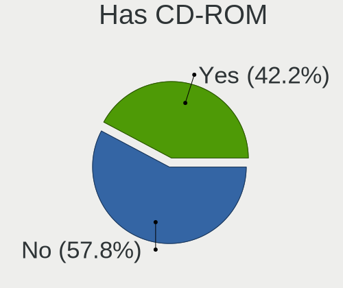

Ubuntu 22.04 - Tested Hardware & Statistics (Desktops)
------------------------------------------------------

A project to collect tested hardware configurations for Ubuntu 22.04.

Anyone can contribute to this report by the [hw-probe](https://github.com/linuxhw/hw-probe) tool:

    sudo -E hw-probe -all -upload

Please contribute! Especially if your hardware is rare.

Contents
--------

* [ Test Cases ](#test-cases)

* [ System ](#system)
  - [ Kernel                   ](#kernel)
  - [ Kernel Family            ](#kernel-family)
  - [ Kernel Major Ver.        ](#kernel-major-ver)
  - [ Arch                     ](#arch)
  - [ DE                       ](#de)
  - [ Display Server           ](#display-server)
  - [ Display Manager          ](#display-manager)
  - [ OS Lang                  ](#os-lang)
  - [ Boot Mode                ](#boot-mode)
  - [ Filesystem               ](#filesystem)
  - [ Part. scheme             ](#part-scheme)
  - [ Dual Boot with Linux/BSD ](#dual-boot-with-linuxbsd)
  - [ Dual Boot (Win)          ](#dual-boot-win)

* [ Board ](#board)
  - [ Vendor                   ](#vendor)
  - [ Model                    ](#model)
  - [ Model Family             ](#model-family)
  - [ MFG Year                 ](#mfg-year)
  - [ Form Factor              ](#form-factor)
  - [ Secure Boot              ](#secure-boot)
  - [ Coreboot                 ](#coreboot)
  - [ RAM Size                 ](#ram-size)
  - [ RAM Used                 ](#ram-used)
  - [ Total Drives             ](#total-drives)
  - [ Has CD-ROM               ](#has-cd-rom)
  - [ Has Ethernet             ](#has-ethernet)
  - [ Has WiFi                 ](#has-wifi)
  - [ Has Bluetooth            ](#has-bluetooth)

* [ Location ](#location)
  - [ Country                  ](#country)
  - [ City                     ](#city)

* [ Drives ](#drives)
  - [ Drive Vendor             ](#drive-vendor)
  - [ Drive Model              ](#drive-model)
  - [ HDD Vendor               ](#hdd-vendor)
  - [ SSD Vendor               ](#ssd-vendor)
  - [ Drive Kind               ](#drive-kind)
  - [ Drive Connector          ](#drive-connector)
  - [ Drive Size               ](#drive-size)
  - [ Space Total              ](#space-total)
  - [ Space Used               ](#space-used)
  - [ Malfunc. Drives          ](#malfunc-drives)
  - [ Malfunc. Drive Vendor    ](#malfunc-drive-vendor)
  - [ Malfunc. HDD Vendor      ](#malfunc-hdd-vendor)
  - [ Malfunc. Drive Kind      ](#malfunc-drive-kind)
  - [ Failed Drives            ](#failed-drives)
  - [ Failed Drive Vendor      ](#failed-drive-vendor)
  - [ Drive Status             ](#drive-status)

* [ Storage controller ](#storage-controller)
  - [ Storage Vendor           ](#storage-vendor)
  - [ Storage Model            ](#storage-model)
  - [ Storage Kind             ](#storage-kind)

* [ Processor ](#processor)
  - [ CPU Vendor               ](#cpu-vendor)
  - [ CPU Model                ](#cpu-model)
  - [ CPU Model Family         ](#cpu-model-family)
  - [ CPU Cores                ](#cpu-cores)
  - [ CPU Sockets              ](#cpu-sockets)
  - [ CPU Threads              ](#cpu-threads)
  - [ CPU Op-Modes             ](#cpu-op-modes)
  - [ CPU Microcode            ](#cpu-microcode)
  - [ CPU Microarch            ](#cpu-microarch)

* [ Graphics ](#graphics)
  - [ GPU Vendor               ](#gpu-vendor)
  - [ GPU Model                ](#gpu-model)
  - [ GPU Combo                ](#gpu-combo)
  - [ GPU Driver               ](#gpu-driver)
  - [ GPU Memory               ](#gpu-memory)

* [ Monitor ](#monitor)
  - [ Monitor Vendor           ](#monitor-vendor)
  - [ Monitor Model            ](#monitor-model)
  - [ Monitor Resolution       ](#monitor-resolution)
  - [ Monitor Diagonal         ](#monitor-diagonal)
  - [ Monitor Width            ](#monitor-width)
  - [ Aspect Ratio             ](#aspect-ratio)
  - [ Monitor Area             ](#monitor-area)
  - [ Pixel Density            ](#pixel-density)
  - [ Multiple Monitors        ](#multiple-monitors)

* [ Network ](#network)
  - [ Net Controller Vendor    ](#net-controller-vendor)
  - [ Net Controller Model     ](#net-controller-model)
  - [ Wireless Vendor          ](#wireless-vendor)
  - [ Wireless Model           ](#wireless-model)
  - [ Ethernet Vendor          ](#ethernet-vendor)
  - [ Ethernet Model           ](#ethernet-model)
  - [ Net Controller Kind      ](#net-controller-kind)
  - [ Used Controller          ](#used-controller)
  - [ NICs                     ](#nics)
  - [ IPv6                     ](#ipv6)

* [ Bluetooth ](#bluetooth)
  - [ Bluetooth Vendor         ](#bluetooth-vendor)
  - [ Bluetooth Model          ](#bluetooth-model)

* [ Sound ](#sound)
  - [ Sound Vendor             ](#sound-vendor)
  - [ Sound Model              ](#sound-model)

* [ Memory ](#memory)
  - [ Memory Vendor            ](#memory-vendor)
  - [ Memory Model             ](#memory-model)
  - [ Memory Kind              ](#memory-kind)
  - [ Memory Form Factor       ](#memory-form-factor)
  - [ Memory Size              ](#memory-size)
  - [ Memory Speed             ](#memory-speed)

* [ Printers & scanners ](#printers--scanners)
  - [ Printer Vendor           ](#printer-vendor)
  - [ Printer Model            ](#printer-model)
  - [ Scanner Vendor           ](#scanner-vendor)
  - [ Scanner Model            ](#scanner-model)

* [ Camera ](#camera)
  - [ Camera Vendor            ](#camera-vendor)
  - [ Camera Model             ](#camera-model)

* [ Security ](#security)
  - [ Fingerprint Vendor       ](#fingerprint-vendor)
  - [ Fingerprint Model        ](#fingerprint-model)
  - [ Chipcard Vendor          ](#chipcard-vendor)
  - [ Chipcard Model           ](#chipcard-model)

* [ Unsupported ](#unsupported)
  - [ Unsupported Devices      ](#unsupported-devices)
  - [ Unsupported Device Types ](#unsupported-device-types)

Test Cases
----------

Total: 7125

| Vendor        | Model                       | Probe                                                      | Date         |
|---------------|-----------------------------|------------------------------------------------------------|--------------|
| Acer          | Veriton X2631G V:1.0        | [c9555a34f2](https://linux-hardware.org/?probe=c9555a34f2) | Dec 23, 2023 |
| ASUSTek       | TUF B360-PLUS GAMING        | [b1c3408d24](https://linux-hardware.org/?probe=b1c3408d24) | Dec 23, 2023 |
| ASRock        | H310CM-HDV/M.2              | [76d95ab75c](https://linux-hardware.org/?probe=76d95ab75c) | Dec 23, 2023 |
| Gigabyte      | GA-78LMT-S2P                | [6f36390142](https://linux-hardware.org/?probe=6f36390142) | Dec 23, 2023 |
| ASRock        | AMCP7A-ION                  | [fb0acc2d50](https://linux-hardware.org/?probe=fb0acc2d50) | Dec 23, 2023 |
| HP            | 1497                        | [9d5244b557](https://linux-hardware.org/?probe=9d5244b557) | Dec 23, 2023 |
| Lenovo        | ThinkCentre M58 7373AJ5     | [201981bc3f](https://linux-hardware.org/?probe=201981bc3f) | Dec 23, 2023 |
| Foxconn       | 2ADA                        | [f30aec24c2](https://linux-hardware.org/?probe=f30aec24c2) | Dec 23, 2023 |
| ASRock        | AMCP7A-ION                  | [7d19dec574](https://linux-hardware.org/?probe=7d19dec574) | Dec 23, 2023 |
| MSI           | PRO Z790-A WIFI             | [9b8ad6a3f1](https://linux-hardware.org/?probe=9b8ad6a3f1) | Dec 23, 2023 |
| eMachines     | EL1360                      | [af31609559](https://linux-hardware.org/?probe=af31609559) | Dec 23, 2023 |
| ASUSTek       | P6T                         | [d90adb3a12](https://linux-hardware.org/?probe=d90adb3a12) | Dec 23, 2023 |
| Gigabyte      | Z97M-DS3H                   | [da051b693c](https://linux-hardware.org/?probe=da051b693c) | Dec 23, 2023 |
| Dell          | 0FDY5C A00                  | [a3fc39604c](https://linux-hardware.org/?probe=a3fc39604c) | Dec 22, 2023 |
| HP            | 8643 SMVB                   | [bbdb2204d8](https://linux-hardware.org/?probe=bbdb2204d8) | Dec 22, 2023 |
| Dell          | 0D6H9T A00                  | [84275b737e](https://linux-hardware.org/?probe=84275b737e) | Dec 22, 2023 |
| ASUSTek       | PRIME B450-PLUS             | [c9bee45423](https://linux-hardware.org/?probe=c9bee45423) | Dec 22, 2023 |
| Intel         | H61                         | [72c7724ef0](https://linux-hardware.org/?probe=72c7724ef0) | Dec 22, 2023 |
| MSI           | X570-A PRO                  | [27a132c185](https://linux-hardware.org/?probe=27a132c185) | Dec 22, 2023 |
| HP            | 8643 SMVB                   | [03ddd69e34](https://linux-hardware.org/?probe=03ddd69e34) | Dec 22, 2023 |
| MSI           | PRO Z790-A WIFI             | [8e38fb94ba](https://linux-hardware.org/?probe=8e38fb94ba) | Dec 22, 2023 |
| Dell          | 0WR7PY A03                  | [9ff527cfd0](https://linux-hardware.org/?probe=9ff527cfd0) | Dec 22, 2023 |
| HP            | 8626                        | [b04d9fcad9](https://linux-hardware.org/?probe=b04d9fcad9) | Dec 22, 2023 |
| Dell          | 0HY9JP A02                  | [6f47019169](https://linux-hardware.org/?probe=6f47019169) | Dec 22, 2023 |
| Gigabyte      | Z390 AORUS PRO WIFI-CF      | [8a2d46dced](https://linux-hardware.org/?probe=8a2d46dced) | Dec 22, 2023 |
| LattePanda    | Sigma                       | [09cb864933](https://linux-hardware.org/?probe=09cb864933) | Dec 22, 2023 |
| ASUSTek       | STRIX X99 GAMING            | [2af66f541d](https://linux-hardware.org/?probe=2af66f541d) | Dec 22, 2023 |
| ASUSTek       | M5A97 R2.0                  | [3ff2f289b9](https://linux-hardware.org/?probe=3ff2f289b9) | Dec 22, 2023 |
| Gigabyte      | GA-78LMT-S2P                | [dbc2e93666](https://linux-hardware.org/?probe=dbc2e93666) | Dec 21, 2023 |
| MSI           | MPG X570 GAMING EDGE WIF... | [628ca02992](https://linux-hardware.org/?probe=628ca02992) | Dec 21, 2023 |
| Gigabyte      | Z87-HD3                     | [49e514e9c4](https://linux-hardware.org/?probe=49e514e9c4) | Dec 21, 2023 |
| Acer          | Aspire XC-1760              | [ac3910a453](https://linux-hardware.org/?probe=ac3910a453) | Dec 21, 2023 |
| Supermicro    | H13DSG-O-CPU                | [1ba9d3bc0c](https://linux-hardware.org/?probe=1ba9d3bc0c) | Dec 21, 2023 |
| Supermicro    | H13DSG-O-CPU                | [066ebdde5b](https://linux-hardware.org/?probe=066ebdde5b) | Dec 21, 2023 |
| Lenovo        | 318E SDK0J40697 WIN 3305... | [191d4913cd](https://linux-hardware.org/?probe=191d4913cd) | Dec 21, 2023 |
| Foxconn       | 2ADA                        | [735572694e](https://linux-hardware.org/?probe=735572694e) | Dec 21, 2023 |
| HP            | 18E7                        | [ad6cf02d18](https://linux-hardware.org/?probe=ad6cf02d18) | Dec 21, 2023 |
| HP            | 18E7                        | [fdb8b2d229](https://linux-hardware.org/?probe=fdb8b2d229) | Dec 21, 2023 |
| Gigabyte      | Z390 AORUS PRO WIFI-CF      | [8eca3c15e7](https://linux-hardware.org/?probe=8eca3c15e7) | Dec 21, 2023 |
| ASUSTek       | Z10PG-D16 Series            | [6b3c6c4099](https://linux-hardware.org/?probe=6b3c6c4099) | Dec 21, 2023 |
| MSI           | NF725M-P43                  | [43756d6fad](https://linux-hardware.org/?probe=43756d6fad) | Dec 21, 2023 |
| ASUSTek       | M5A97 R2.0                  | [93a7029d22](https://linux-hardware.org/?probe=93a7029d22) | Dec 21, 2023 |
| Acer          | Veriton X2631G V:1.0        | [7597019eca](https://linux-hardware.org/?probe=7597019eca) | Dec 21, 2023 |
| ASUSTek       | VM40B                       | [8deb79e86e](https://linux-hardware.org/?probe=8deb79e86e) | Dec 20, 2023 |
| Gigabyte      | B560M H                     | [6e7f8b2300](https://linux-hardware.org/?probe=6e7f8b2300) | Dec 20, 2023 |
| Gigabyte      | H81M-DS2                    | [1da522781e](https://linux-hardware.org/?probe=1da522781e) | Dec 20, 2023 |
| Gigabyte      | B550M DS3H                  | [35547b20b3](https://linux-hardware.org/?probe=35547b20b3) | Dec 20, 2023 |
| MSI           | B450-A PRO MAX              | [f46e034f2c](https://linux-hardware.org/?probe=f46e034f2c) | Dec 20, 2023 |
| Dell          | 09KPNV A00                  | [e696fd9ae0](https://linux-hardware.org/?probe=e696fd9ae0) | Dec 20, 2023 |
| Dell          | 0C522T A03                  | [7cd9f2379e](https://linux-hardware.org/?probe=7cd9f2379e) | Dec 20, 2023 |
| ASUSTek       | P8Z77-M PRO                 | [58517da295](https://linux-hardware.org/?probe=58517da295) | Dec 20, 2023 |
| ASRock        | FM2A58M-HD+                 | [09ab03cdcd](https://linux-hardware.org/?probe=09ab03cdcd) | Dec 19, 2023 |
| ANGXUN        | X79-VG2 V1.3                | [532c5b5ddc](https://linux-hardware.org/?probe=532c5b5ddc) | Dec 19, 2023 |
| MSI           | B85-G43                     | [2c855d2376](https://linux-hardware.org/?probe=2c855d2376) | Dec 19, 2023 |
| Dell          | 042P49 A02                  | [11f6da5848](https://linux-hardware.org/?probe=11f6da5848) | Dec 19, 2023 |
| Fujitsu       | D3221-A1 S26361-D3221-A1    | [843515c201](https://linux-hardware.org/?probe=843515c201) | Dec 19, 2023 |
| Dell          | 0C522T A03                  | [35b8611349](https://linux-hardware.org/?probe=35b8611349) | Dec 19, 2023 |
| ASUSTek       | H81-PLUS                    | [359af07cb2](https://linux-hardware.org/?probe=359af07cb2) | Dec 19, 2023 |
| ASUSTek       | H81-PLUS                    | [b4b91802b5](https://linux-hardware.org/?probe=b4b91802b5) | Dec 19, 2023 |
| MSI           | X570-A PRO                  | [3cf8d970f8](https://linux-hardware.org/?probe=3cf8d970f8) | Dec 19, 2023 |
| MSI           | A520M-A PRO                 | [5781ca34c8](https://linux-hardware.org/?probe=5781ca34c8) | Dec 19, 2023 |
| Dell          | 0Y7WYT A00                  | [705321d0b6](https://linux-hardware.org/?probe=705321d0b6) | Dec 19, 2023 |
| HP            | 3647h                       | [0e741d6d7c](https://linux-hardware.org/?probe=0e741d6d7c) | Dec 18, 2023 |
| Supermicro    | X7DWA                       | [2ea00dfda4](https://linux-hardware.org/?probe=2ea00dfda4) | Dec 18, 2023 |
| Supermicro    | X7DWA                       | [6357637f80](https://linux-hardware.org/?probe=6357637f80) | Dec 18, 2023 |
| Fujitsu       | D3233-A1 S26361-D3233-A1    | [f93e198dd4](https://linux-hardware.org/?probe=f93e198dd4) | Dec 18, 2023 |
| Gigabyte      | H410M S2H V3                | [498141a78c](https://linux-hardware.org/?probe=498141a78c) | Dec 18, 2023 |
| HC Technol... | HCAR5000-MI                 | [0cf5577833](https://linux-hardware.org/?probe=0cf5577833) | Dec 18, 2023 |
| Dell          | 06FW8P A02                  | [7b66e504eb](https://linux-hardware.org/?probe=7b66e504eb) | Dec 18, 2023 |
| HC Technol... | HCAR5000-MI                 | [2bee7533b2](https://linux-hardware.org/?probe=2bee7533b2) | Dec 18, 2023 |
| Gigabyte      | B550 GAMING X               | [6ecd3ce2c3](https://linux-hardware.org/?probe=6ecd3ce2c3) | Dec 18, 2023 |
| ASRock        | Z370M-ITX/ac                | [0f7c6a7383](https://linux-hardware.org/?probe=0f7c6a7383) | Dec 17, 2023 |
| ASUSTek       | PRIME B450M-K II            | [8425b10899](https://linux-hardware.org/?probe=8425b10899) | Dec 17, 2023 |
| Dell          | 07N90W A02                  | [0c471e8b44](https://linux-hardware.org/?probe=0c471e8b44) | Dec 17, 2023 |
| ASRock        | Z77 Extreme4                | [ead1dfb3ae](https://linux-hardware.org/?probe=ead1dfb3ae) | Dec 17, 2023 |
| ASRock        | H61M-VG4                    | [a845742a42](https://linux-hardware.org/?probe=a845742a42) | Dec 17, 2023 |
| MSI           | 2A9C                        | [342d099a7f](https://linux-hardware.org/?probe=342d099a7f) | Dec 17, 2023 |
| ASUSTek       | PRIME A320M-K               | [1f0e0f04f8](https://linux-hardware.org/?probe=1f0e0f04f8) | Dec 17, 2023 |
| HP            | 1790                        | [2d8c859110](https://linux-hardware.org/?probe=2d8c859110) | Dec 17, 2023 |
| ASUSTek       | M4A89GTD-PRO/USB3           | [8adfc82dc5](https://linux-hardware.org/?probe=8adfc82dc5) | Dec 17, 2023 |
| Dell          | 0KWVT8 A03                  | [d5632292b6](https://linux-hardware.org/?probe=d5632292b6) | Dec 17, 2023 |
| Dell          | 0KWVT8 A03                  | [6745d8d399](https://linux-hardware.org/?probe=6745d8d399) | Dec 17, 2023 |
| Gigabyte      | H77M-D3H                    | [de9dcb40ba](https://linux-hardware.org/?probe=de9dcb40ba) | Dec 17, 2023 |
| Dell          | 0PC5F7 A03                  | [b280c267db](https://linux-hardware.org/?probe=b280c267db) | Dec 17, 2023 |
| Shenzhen M... | TH80                        | [1ad9ee524d](https://linux-hardware.org/?probe=1ad9ee524d) | Dec 16, 2023 |
| Inventec      | DQ Class A02                | [73df6dfb3b](https://linux-hardware.org/?probe=73df6dfb3b) | Dec 16, 2023 |
| Gigabyte      | B85-HD3-A                   | [e3d139cdb3](https://linux-hardware.org/?probe=e3d139cdb3) | Dec 16, 2023 |
| ASUSTek       | PRIME B760-PLUS             | [a7dd86011c](https://linux-hardware.org/?probe=a7dd86011c) | Dec 16, 2023 |
| Intel         | SHARKBAY                    | [efe58ba5df](https://linux-hardware.org/?probe=efe58ba5df) | Dec 16, 2023 |
| Gigabyte      | 970A-DS3P                   | [e6019b847e](https://linux-hardware.org/?probe=e6019b847e) | Dec 16, 2023 |
| HP            | 2B05                        | [81e68a1fb8](https://linux-hardware.org/?probe=81e68a1fb8) | Dec 16, 2023 |
| HP            | 2B05                        | [2063743d90](https://linux-hardware.org/?probe=2063743d90) | Dec 16, 2023 |
| Acer          | EG43M                       | [62c8e8acf8](https://linux-hardware.org/?probe=62c8e8acf8) | Dec 16, 2023 |
| HP            | 1790                        | [9bb2d6fcb4](https://linux-hardware.org/?probe=9bb2d6fcb4) | Dec 16, 2023 |
| ASUSTek       | PRIME A320M-A               | [862ce85408](https://linux-hardware.org/?probe=862ce85408) | Dec 16, 2023 |
| Dell          | 0RT6HT A01                  | [3509be8560](https://linux-hardware.org/?probe=3509be8560) | Dec 16, 2023 |
| ASRock        | X570 Taichi                 | [6458d64d28](https://linux-hardware.org/?probe=6458d64d28) | Dec 16, 2023 |
| Gigabyte      | B85-HD3-A                   | [b60d191f59](https://linux-hardware.org/?probe=b60d191f59) | Dec 15, 2023 |
| Shenzhen M... | AHBNB OEM                   | [1fae1d3423](https://linux-hardware.org/?probe=1fae1d3423) | Dec 15, 2023 |
| Shenzhen M... | AHBNB OEM                   | [1a70a13ff4](https://linux-hardware.org/?probe=1a70a13ff4) | Dec 15, 2023 |
| Shenzhen M... | AHBNB OEM                   | [8be30808ec](https://linux-hardware.org/?probe=8be30808ec) | Dec 15, 2023 |
| Shenzhen M... | AHBNB OEM                   | [1e0ba866f7](https://linux-hardware.org/?probe=1e0ba866f7) | Dec 15, 2023 |
| Google        | Guado                       | [e981ac3399](https://linux-hardware.org/?probe=e981ac3399) | Dec 15, 2023 |
| XDO.AI        | Pantera Pico PC             | [6358b586ac](https://linux-hardware.org/?probe=6358b586ac) | Dec 15, 2023 |
| Gigabyte      | Z790 AORUS MASTER           | [6af7c135e1](https://linux-hardware.org/?probe=6af7c135e1) | Dec 15, 2023 |
| Dell          | 0NW6H5 A00                  | [eb487bbab2](https://linux-hardware.org/?probe=eb487bbab2) | Dec 14, 2023 |
| Unknown       | Unknown                     | [9fb745d9fe](https://linux-hardware.org/?probe=9fb745d9fe) | Dec 14, 2023 |
| Lenovo        | SDK0J40700 WIN              | [48c963a11d](https://linux-hardware.org/?probe=48c963a11d) | Dec 14, 2023 |
| Google        | Guado                       | [50ceaa2515](https://linux-hardware.org/?probe=50ceaa2515) | Dec 14, 2023 |
| Fujitsu       | D3432-A1 S26361-D3432-A1    | [742681b576](https://linux-hardware.org/?probe=742681b576) | Dec 14, 2023 |
| Fujitsu       | D3432-A1 S26361-D3432-A1    | [72cd581273](https://linux-hardware.org/?probe=72cd581273) | Dec 14, 2023 |
| XDO.AI        | Pantera Pico PC             | [fabfe15230](https://linux-hardware.org/?probe=fabfe15230) | Dec 14, 2023 |
| HC Technol... | HCAR5000-MI                 | [d4d42016ea](https://linux-hardware.org/?probe=d4d42016ea) | Dec 14, 2023 |
| Gigabyte      | H410M S2H V3                | [101f8237e0](https://linux-hardware.org/?probe=101f8237e0) | Dec 14, 2023 |
| Dell          | 0TDG4V A01                  | [6da01d5871](https://linux-hardware.org/?probe=6da01d5871) | Dec 14, 2023 |
| ASRock        | B550M Pro4                  | [9d0aff4b01](https://linux-hardware.org/?probe=9d0aff4b01) | Dec 13, 2023 |
| HP            | 83EF                        | [e2a7a03e4c](https://linux-hardware.org/?probe=e2a7a03e4c) | Dec 13, 2023 |
| HP            | 83EF                        | [d5d568c47c](https://linux-hardware.org/?probe=d5d568c47c) | Dec 13, 2023 |
| ASUSTek       | TUF Gaming Z690-PLUS WIF... | [ab0ac93be6](https://linux-hardware.org/?probe=ab0ac93be6) | Dec 13, 2023 |
| HP            | 18E9                        | [ab47a5d40b](https://linux-hardware.org/?probe=ab47a5d40b) | Dec 13, 2023 |
| ASRock        | B550M Pro4                  | [e196db2480](https://linux-hardware.org/?probe=e196db2480) | Dec 13, 2023 |
| Gigabyte      | H410M S2H V3                | [e198c73fa2](https://linux-hardware.org/?probe=e198c73fa2) | Dec 13, 2023 |
| Dell          | 0K240Y A01                  | [227af40d05](https://linux-hardware.org/?probe=227af40d05) | Dec 13, 2023 |
| ASUSTek       | Basswood3G                  | [f686ec5ba9](https://linux-hardware.org/?probe=f686ec5ba9) | Dec 13, 2023 |
| Unknown       | Unknown                     | [fd405f79f2](https://linux-hardware.org/?probe=fd405f79f2) | Dec 13, 2023 |
| ASRock        | 970 Extreme4                | [ce858f7f7c](https://linux-hardware.org/?probe=ce858f7f7c) | Dec 13, 2023 |
| Gigabyte      | GA-990X-Gaming SLI-CF       | [01f7be08ae](https://linux-hardware.org/?probe=01f7be08ae) | Dec 13, 2023 |
| ASUSTek       | TUF Gaming Z690-PLUS WIF... | [4f1419b521](https://linux-hardware.org/?probe=4f1419b521) | Dec 12, 2023 |
| HP            | 3048h                       | [bb95017425](https://linux-hardware.org/?probe=bb95017425) | Dec 12, 2023 |
| ASUSTek       | PRIME Z790M-PLUS D4         | [eadc049e56](https://linux-hardware.org/?probe=eadc049e56) | Dec 12, 2023 |
| Gigabyte      | H310M H x.x                 | [bcf9fba46f](https://linux-hardware.org/?probe=bcf9fba46f) | Dec 12, 2023 |
| ASRock        | X470 Master SLI             | [2f96568c78](https://linux-hardware.org/?probe=2f96568c78) | Dec 12, 2023 |
| ASRock        | X470 Master SLI             | [68fe94d3be](https://linux-hardware.org/?probe=68fe94d3be) | Dec 12, 2023 |
| Dell          | 0M5DCD A00                  | [98f2d76ef0](https://linux-hardware.org/?probe=98f2d76ef0) | Dec 12, 2023 |
| Gigabyte      | B85M-DS3H-A                 | [c4de324273](https://linux-hardware.org/?probe=c4de324273) | Dec 12, 2023 |
| MSI           | A320M PRO-VD/S              | [c2a6947086](https://linux-hardware.org/?probe=c2a6947086) | Dec 12, 2023 |
| HC Technol... | HCAR5000-MI                 | [d5cb60727d](https://linux-hardware.org/?probe=d5cb60727d) | Dec 12, 2023 |
| MSI           | B450 TOMAHAWK               | [8e66dfbc28](https://linux-hardware.org/?probe=8e66dfbc28) | Dec 12, 2023 |
| HP            | 0AECh D                     | [b1856b493c](https://linux-hardware.org/?probe=b1856b493c) | Dec 12, 2023 |
| ASUSTek       | PRIME H570M-PLUS            | [06f64404ec](https://linux-hardware.org/?probe=06f64404ec) | Dec 12, 2023 |
| Gigabyte      | A520M H                     | [e72a787933](https://linux-hardware.org/?probe=e72a787933) | Dec 12, 2023 |
| ASRock        | B450M-HDV R4.0              | [ee39e0724c](https://linux-hardware.org/?probe=ee39e0724c) | Dec 11, 2023 |
| Gigabyte      | 990FXA-UD3                  | [0d3866e04a](https://linux-hardware.org/?probe=0d3866e04a) | Dec 11, 2023 |
| Dell          | 0Y2YM6 A01                  | [c3fee04c74](https://linux-hardware.org/?probe=c3fee04c74) | Dec 11, 2023 |
| Dell          | 07VWPG A01                  | [a9ad39cd38](https://linux-hardware.org/?probe=a9ad39cd38) | Dec 11, 2023 |
| Lenovo        | 3102 SDK0J40705 WIN 3425... | [e3afd2e002](https://linux-hardware.org/?probe=e3afd2e002) | Dec 11, 2023 |
| Lenovo        | 3102 SDK0J40705 WIN 3425... | [656bfe20f4](https://linux-hardware.org/?probe=656bfe20f4) | Dec 11, 2023 |
| Lenovo        | 3102 SDK0J40705 WIN 3425... | [b1c994920c](https://linux-hardware.org/?probe=b1c994920c) | Dec 11, 2023 |
| Lenovo        | 312A SDK0J40697 WIN 3305... | [cc7c14dd72](https://linux-hardware.org/?probe=cc7c14dd72) | Dec 11, 2023 |
| MSI           | Z490-A PRO                  | [bd1772e0a0](https://linux-hardware.org/?probe=bd1772e0a0) | Dec 11, 2023 |
| Lenovo        | 312A SDK0J40697 WIN 3305... | [b7c06bf365](https://linux-hardware.org/?probe=b7c06bf365) | Dec 11, 2023 |
| Lenovo        | 3102 SDK0J40705 WIN 3425... | [8badd81a74](https://linux-hardware.org/?probe=8badd81a74) | Dec 11, 2023 |
| ASRock        | B85M Pro4                   | [8a11fe8107](https://linux-hardware.org/?probe=8a11fe8107) | Dec 11, 2023 |
| Lenovo        | 312A SDK0J40697 WIN 3305... | [448dc8ed72](https://linux-hardware.org/?probe=448dc8ed72) | Dec 11, 2023 |
| Lenovo        | 312A SDK0J40697 WIN 3305... | [472c013f53](https://linux-hardware.org/?probe=472c013f53) | Dec 11, 2023 |
| Lenovo        | 3102 SDK0J40705 WIN 3425... | [8cb24408c9](https://linux-hardware.org/?probe=8cb24408c9) | Dec 11, 2023 |
| Lenovo        | 3102 SDK0J40705 WIN 3425... | [df2e9cf858](https://linux-hardware.org/?probe=df2e9cf858) | Dec 11, 2023 |
| Lenovo        | 3102 SDK0J40705 WIN 3425... | [c8d223020d](https://linux-hardware.org/?probe=c8d223020d) | Dec 11, 2023 |
| Lenovo        | 3102 SDK0J40705 WIN 3425... | [70364f28ab](https://linux-hardware.org/?probe=70364f28ab) | Dec 11, 2023 |
| Gigabyte      | D-700                       | [18e3ee84cc](https://linux-hardware.org/?probe=18e3ee84cc) | Dec 11, 2023 |
| Intel         | H61                         | [611b51b6c1](https://linux-hardware.org/?probe=611b51b6c1) | Dec 11, 2023 |
| Gigabyte      | Z390 AORUS ULTRA-CF         | [32d436e221](https://linux-hardware.org/?probe=32d436e221) | Dec 11, 2023 |
| Gigabyte      | EP41-UD3L                   | [9b40e5889d](https://linux-hardware.org/?probe=9b40e5889d) | Dec 10, 2023 |
| Dell          | 0C522T A03                  | [11f857231b](https://linux-hardware.org/?probe=11f857231b) | Dec 10, 2023 |
| Gigabyte      | F2A68HM-HD2                 | [237db70b40](https://linux-hardware.org/?probe=237db70b40) | Dec 10, 2023 |
| ASRock        | A520M-HVS                   | [5d07d03602](https://linux-hardware.org/?probe=5d07d03602) | Dec 10, 2023 |
| Pegatron      | IPMH61P1                    | [0d0474a798](https://linux-hardware.org/?probe=0d0474a798) | Dec 10, 2023 |
| ASUSTek       | PRIME B250M-A               | [1eaf3dd454](https://linux-hardware.org/?probe=1eaf3dd454) | Dec 10, 2023 |
| Dell          | 0TP406                      | [1b81a10a36](https://linux-hardware.org/?probe=1b81a10a36) | Dec 10, 2023 |
| Gigabyte      | Z390 AORUS PRO WIFI-CF      | [aa1aa7d695](https://linux-hardware.org/?probe=aa1aa7d695) | Dec 10, 2023 |
| Pegatron      | 2AC3                        | [3831586b47](https://linux-hardware.org/?probe=3831586b47) | Dec 10, 2023 |
| Lenovo        | SKYBAY SDK0J40705 WIN 34... | [e87dcf9ee2](https://linux-hardware.org/?probe=e87dcf9ee2) | Dec 10, 2023 |
| ASRock        | H61M-DGS                    | [d49b26fe0c](https://linux-hardware.org/?probe=d49b26fe0c) | Dec 10, 2023 |
| Inventec      | DQ Class A02                | [8e1c466924](https://linux-hardware.org/?probe=8e1c466924) | Dec 09, 2023 |
| ASRock        | H61M-DGS                    | [f8bd255155](https://linux-hardware.org/?probe=f8bd255155) | Dec 09, 2023 |
| Acer          | Veriton X2631G V:1.0        | [1465cf0eac](https://linux-hardware.org/?probe=1465cf0eac) | Dec 09, 2023 |
| Lenovo        | 36C7 SDK0J40697 WIN 3305... | [af3f6d16ac](https://linux-hardware.org/?probe=af3f6d16ac) | Dec 09, 2023 |
| ASUSTek       | ROG STRIX B560-A GAMING ... | [5121b6a20c](https://linux-hardware.org/?probe=5121b6a20c) | Dec 09, 2023 |
| MSI           | B150M PRO-VDH               | [e35af0e70a](https://linux-hardware.org/?probe=e35af0e70a) | Dec 09, 2023 |
| ASUSTek       | PRIME A320M-K               | [237110c8c0](https://linux-hardware.org/?probe=237110c8c0) | Dec 09, 2023 |
| Biostar       | A10N-8800E                  | [283ae39c42](https://linux-hardware.org/?probe=283ae39c42) | Dec 09, 2023 |
| Gigabyte      | B550M K                     | [bbf66f105d](https://linux-hardware.org/?probe=bbf66f105d) | Dec 09, 2023 |
| Gigabyte      | B550M K                     | [e44ea6cf67](https://linux-hardware.org/?probe=e44ea6cf67) | Dec 09, 2023 |
| Gigabyte      | Z87-HD3                     | [9f3fb37b64](https://linux-hardware.org/?probe=9f3fb37b64) | Dec 09, 2023 |
| Lenovo        | ThinkCentre M58p 6234AE5    | [4cf3efef96](https://linux-hardware.org/?probe=4cf3efef96) | Dec 09, 2023 |
| Gigabyte      | Z87-HD3                     | [26c99ed573](https://linux-hardware.org/?probe=26c99ed573) | Dec 09, 2023 |
| ASUSTek       | CROSSHAIR VI HERO           | [22d34b64f2](https://linux-hardware.org/?probe=22d34b64f2) | Dec 09, 2023 |
| MSI           | B150M PRO-VDH               | [634d1d56b8](https://linux-hardware.org/?probe=634d1d56b8) | Dec 09, 2023 |
| Dell          | 0C522T A03                  | [3c06d9b7a8](https://linux-hardware.org/?probe=3c06d9b7a8) | Dec 09, 2023 |
| Intel         | DH67CL AAG10212-206         | [957289310d](https://linux-hardware.org/?probe=957289310d) | Dec 08, 2023 |
| ASRock        | H510M-ITX/ac                | [4850c05764](https://linux-hardware.org/?probe=4850c05764) | Dec 08, 2023 |
| ASUSTek       | Pro WS WRX80E-SAGE SE WI... | [69df0251d9](https://linux-hardware.org/?probe=69df0251d9) | Dec 08, 2023 |
| Lenovo        | SHARKBAY 0B98401 WIN        | [56eae53402](https://linux-hardware.org/?probe=56eae53402) | Dec 08, 2023 |
| MSI           | B450 TOMAHAWK               | [254b936002](https://linux-hardware.org/?probe=254b936002) | Dec 08, 2023 |
| ASUSTek       | ROG STRIX B560-A GAMING ... | [8198e47786](https://linux-hardware.org/?probe=8198e47786) | Dec 08, 2023 |
| Gigabyte      | B85M-HD3                    | [b4da4c1d8a](https://linux-hardware.org/?probe=b4da4c1d8a) | Dec 07, 2023 |
| Biostar       | A10N-8800E                  | [b56d3e163b](https://linux-hardware.org/?probe=b56d3e163b) | Dec 07, 2023 |
| HP            | 8184 X4                     | [bad08bc9a0](https://linux-hardware.org/?probe=bad08bc9a0) | Dec 07, 2023 |
| Lenovo        | SHARKBAY 0B98401 WIN        | [16b14ad0a7](https://linux-hardware.org/?probe=16b14ad0a7) | Dec 07, 2023 |
| HP            | 18E9                        | [80f4acdcfd](https://linux-hardware.org/?probe=80f4acdcfd) | Dec 07, 2023 |
| ASUSTek       | TUF Gaming B650-PLUS WIF... | [04dd7cde77](https://linux-hardware.org/?probe=04dd7cde77) | Dec 07, 2023 |
| Dell          | 0NK5PH A00                  | [d96cb11edc](https://linux-hardware.org/?probe=d96cb11edc) | Dec 07, 2023 |
| Pegatron      | IPMH61P1                    | [264229998e](https://linux-hardware.org/?probe=264229998e) | Dec 07, 2023 |
| Gigabyte      | GA-MA770-DS3                | [66917779ad](https://linux-hardware.org/?probe=66917779ad) | Dec 07, 2023 |
| HP            | 09F8h                       | [c988ff1e96](https://linux-hardware.org/?probe=c988ff1e96) | Dec 07, 2023 |
| ASUSTek       | CROSSHAIR V FORMULA-Z       | [5f96473345](https://linux-hardware.org/?probe=5f96473345) | Dec 07, 2023 |
| Dell          | 0GWHMW A00                  | [7843d89bd3](https://linux-hardware.org/?probe=7843d89bd3) | Dec 07, 2023 |
| ASUSTek       | PRIME B650M-A AX II         | [68ae754b57](https://linux-hardware.org/?probe=68ae754b57) | Dec 07, 2023 |
| Gigabyte      | G1.Sniper M3                | [d81e8e0452](https://linux-hardware.org/?probe=d81e8e0452) | Dec 07, 2023 |
| Gigabyte      | G1.Sniper M3                | [ac25bf99a5](https://linux-hardware.org/?probe=ac25bf99a5) | Dec 07, 2023 |
| Dell          | 0DFRFW A01                  | [766521b0e1](https://linux-hardware.org/?probe=766521b0e1) | Dec 06, 2023 |
| HP            | 0AECh D                     | [d58cc2f609](https://linux-hardware.org/?probe=d58cc2f609) | Dec 06, 2023 |
| ASUSTek       | ROG STRIX B650-A GAMING ... | [2d3f4ca82c](https://linux-hardware.org/?probe=2d3f4ca82c) | Dec 06, 2023 |
| Gigabyte      | B450M DS3H V2               | [d1337f45be](https://linux-hardware.org/?probe=d1337f45be) | Dec 06, 2023 |
| Gigabyte      | B450M DS3H V2               | [f2a72d7b29](https://linux-hardware.org/?probe=f2a72d7b29) | Dec 06, 2023 |
| ALDO          | C2016-BSWI-D2               | [4dec414c2e](https://linux-hardware.org/?probe=4dec414c2e) | Dec 06, 2023 |
| Dell          | 0RY007                      | [2c93573995](https://linux-hardware.org/?probe=2c93573995) | Dec 06, 2023 |
| Supermicro    | X10DDW-i                    | [30c6080de4](https://linux-hardware.org/?probe=30c6080de4) | Dec 06, 2023 |
| Supermicro    | X10DDW-i                    | [0226f5545c](https://linux-hardware.org/?probe=0226f5545c) | Dec 06, 2023 |
| Supermicro    | X10DDW-i                    | [cf63284103](https://linux-hardware.org/?probe=cf63284103) | Dec 06, 2023 |
| Supermicro    | X10DDW-i                    | [6d0a010766](https://linux-hardware.org/?probe=6d0a010766) | Dec 06, 2023 |
| Supermicro    | X9DRW                       | [485f869e9b](https://linux-hardware.org/?probe=485f869e9b) | Dec 06, 2023 |
| HP            | 82F1                        | [3a292e8aaa](https://linux-hardware.org/?probe=3a292e8aaa) | Dec 06, 2023 |
| Dell          | 0P42M6 A01                  | [2deb37f773](https://linux-hardware.org/?probe=2deb37f773) | Dec 06, 2023 |
| Supermicro    | X10DRL-i                    | [f30d1a0a40](https://linux-hardware.org/?probe=f30d1a0a40) | Dec 06, 2023 |
| Supermicro    | X10DRL-i                    | [7f6c70bab0](https://linux-hardware.org/?probe=7f6c70bab0) | Dec 06, 2023 |
| Supermicro    | X9SCL/X9SCMA                | [c7a3277bfa](https://linux-hardware.org/?probe=c7a3277bfa) | Dec 06, 2023 |
| Gigabyte      | Z370 HD3-CF                 | [1b3a42caac](https://linux-hardware.org/?probe=1b3a42caac) | Dec 06, 2023 |
| ASUSTek       | M5A97 R2.0                  | [9b6cdd96f4](https://linux-hardware.org/?probe=9b6cdd96f4) | Dec 06, 2023 |
| Supermicro    | X9SCL/X9SCMA                | [3176cf1b45](https://linux-hardware.org/?probe=3176cf1b45) | Dec 06, 2023 |
| HP            | 2AF7                        | [4d98ac755f](https://linux-hardware.org/?probe=4d98ac755f) | Dec 06, 2023 |
| Unknown       | G-GLK01                     | [5c5efbafff](https://linux-hardware.org/?probe=5c5efbafff) | Dec 06, 2023 |
| Dell          | 0Y7WYT A00                  | [a59c9d08c1](https://linux-hardware.org/?probe=a59c9d08c1) | Dec 06, 2023 |
| NEC Infron... | MS-9888 10h                 | [8a1a2b9976](https://linux-hardware.org/?probe=8a1a2b9976) | Dec 05, 2023 |
| HC Technol... | HCAR5000-MI                 | [3f2a30851e](https://linux-hardware.org/?probe=3f2a30851e) | Dec 05, 2023 |
| ASUSTek       | ROG STRIX X370-F GAMING     | [5e59f15fed](https://linux-hardware.org/?probe=5e59f15fed) | Dec 05, 2023 |
| HP            | 3646h                       | [df62144cda](https://linux-hardware.org/?probe=df62144cda) | Dec 05, 2023 |
| HP            | 339A                        | [53b6aa6808](https://linux-hardware.org/?probe=53b6aa6808) | Dec 05, 2023 |
| Gigabyte      | Z97M-DS3H                   | [6d790b9d8c](https://linux-hardware.org/?probe=6d790b9d8c) | Dec 05, 2023 |
| ASUSTek       | ROG STRIX B550-A GAMING     | [fa61806ea8](https://linux-hardware.org/?probe=fa61806ea8) | Dec 05, 2023 |
| Apple         | Mac-F4208DC8 PVT            | [ee36539c94](https://linux-hardware.org/?probe=ee36539c94) | Dec 05, 2023 |
| Lenovo        | 312A SDK0J40697 WIN 3305... | [599d20e4ef](https://linux-hardware.org/?probe=599d20e4ef) | Dec 04, 2023 |
| MSI           | MPG X670E CARBON WIFI       | [bab7262ca5](https://linux-hardware.org/?probe=bab7262ca5) | Dec 04, 2023 |
| Supermicro    | X10DRG-Q                    | [5844ee0f43](https://linux-hardware.org/?probe=5844ee0f43) | Dec 04, 2023 |
| ASUSTek       | M4A78LT-M                   | [9edd2d878e](https://linux-hardware.org/?probe=9edd2d878e) | Dec 04, 2023 |
| Supermicro    | X10DRG-Q                    | [175bbb55cb](https://linux-hardware.org/?probe=175bbb55cb) | Dec 04, 2023 |
| Foxconn       | 2AB1                        | [93bbf17266](https://linux-hardware.org/?probe=93bbf17266) | Dec 04, 2023 |
| MSI           | Z97 GAMING 7                | [887cbb52f3](https://linux-hardware.org/?probe=887cbb52f3) | Dec 04, 2023 |
| ASUSTek       | PRIME X370-PRO              | [cea029e467](https://linux-hardware.org/?probe=cea029e467) | Dec 04, 2023 |
| ZOTAC         | NM10                        | [a567bbf0a7](https://linux-hardware.org/?probe=a567bbf0a7) | Dec 04, 2023 |
| ASRock        | H97 Performance             | [dc36b5ee77](https://linux-hardware.org/?probe=dc36b5ee77) | Dec 04, 2023 |
| Unknown       | Unknown                     | [18e4bdaa86](https://linux-hardware.org/?probe=18e4bdaa86) | Dec 04, 2023 |
| ASUSTek       | ROG STRIX B550-F GAMING     | [6c24e26ef9](https://linux-hardware.org/?probe=6c24e26ef9) | Dec 03, 2023 |
| Huanan        | X99-F8 GAMING V5.0          | [6e9e9a487a](https://linux-hardware.org/?probe=6e9e9a487a) | Dec 03, 2023 |
| MSI           | A75MA-G55                   | [02a8179117](https://linux-hardware.org/?probe=02a8179117) | Dec 03, 2023 |
| HP            | 2B46                        | [5bfce44b96](https://linux-hardware.org/?probe=5bfce44b96) | Dec 03, 2023 |
| Google        | Wukong                      | [e665343907](https://linux-hardware.org/?probe=e665343907) | Dec 03, 2023 |
| Gigabyte      | Z77X-UD5H                   | [4cb46d807d](https://linux-hardware.org/?probe=4cb46d807d) | Dec 03, 2023 |
| Gigabyte      | Z77X-UD5H                   | [0c74d4b343](https://linux-hardware.org/?probe=0c74d4b343) | Dec 03, 2023 |
| HP            | ProLiant ML110 Gen9         | [c5f6a282c6](https://linux-hardware.org/?probe=c5f6a282c6) | Dec 03, 2023 |
| MSI           | MPG X570 GAMING EDGE WIF... | [1d3323974f](https://linux-hardware.org/?probe=1d3323974f) | Dec 03, 2023 |
| Shuttle       | DS10U                       | [4e3fa0f845](https://linux-hardware.org/?probe=4e3fa0f845) | Dec 02, 2023 |
| ASUSTek       | P9X79                       | [9cdf3ecc77](https://linux-hardware.org/?probe=9cdf3ecc77) | Dec 02, 2023 |
| ASUSTek       | P8H67-M PRO                 | [5923988290](https://linux-hardware.org/?probe=5923988290) | Dec 02, 2023 |
| ASRock        | AB350 Pro4                  | [61e9871a33](https://linux-hardware.org/?probe=61e9871a33) | Dec 02, 2023 |
| HP            | 3398                        | [26c9b1fa25](https://linux-hardware.org/?probe=26c9b1fa25) | Dec 01, 2023 |
| ASRock        | 970 Extreme4                | [4cbc340e7c](https://linux-hardware.org/?probe=4cbc340e7c) | Dec 01, 2023 |
| Gigabyte      | B150M-DS3H-CF               | [50332d509a](https://linux-hardware.org/?probe=50332d509a) | Dec 01, 2023 |
| Gigabyte      | B550M DS3H AC               | [bc4ff37548](https://linux-hardware.org/?probe=bc4ff37548) | Dec 01, 2023 |
| Dell          | 09KPNV A01                  | [e7cb2d834a](https://linux-hardware.org/?probe=e7cb2d834a) | Dec 01, 2023 |
| ASUSTek       | TUF Gaming X570-PLUS        | [89ec59d64e](https://linux-hardware.org/?probe=89ec59d64e) | Dec 01, 2023 |
| HP            | 2B0B 100                    | [48cb125554](https://linux-hardware.org/?probe=48cb125554) | Dec 01, 2023 |
| ASRock        | B450M-HDV                   | [d59279f095](https://linux-hardware.org/?probe=d59279f095) | Dec 01, 2023 |
| ASUSTek       | M5A78L-M LX3                | [41ae74c0ef](https://linux-hardware.org/?probe=41ae74c0ef) | Dec 01, 2023 |
| ASUSTek       | M5A97 R2.0                  | [dd82ddf299](https://linux-hardware.org/?probe=dd82ddf299) | Dec 01, 2023 |
| Dell          | 0C522T A03                  | [988e96f53c](https://linux-hardware.org/?probe=988e96f53c) | Nov 30, 2023 |
| ASUSTek       | TUF Gaming X570-PRO         | [96a30d5a91](https://linux-hardware.org/?probe=96a30d5a91) | Nov 30, 2023 |
| Kllisre       | X79 V2.72S                  | [cd66ba8786](https://linux-hardware.org/?probe=cd66ba8786) | Nov 30, 2023 |
| ASUSTek       | CG5275                      | [13c8d80b5d](https://linux-hardware.org/?probe=13c8d80b5d) | Nov 29, 2023 |
| MSI           | B550-A PRO                  | [3bbd848840](https://linux-hardware.org/?probe=3bbd848840) | Nov 29, 2023 |
| Shenzhen M... | F6BFC                       | [1074904ba9](https://linux-hardware.org/?probe=1074904ba9) | Nov 29, 2023 |
| Foxconn       | nT-330i                     | [e20a015b3a](https://linux-hardware.org/?probe=e20a015b3a) | Nov 29, 2023 |
| HP            | 1905                        | [8d1dfc94c1](https://linux-hardware.org/?probe=8d1dfc94c1) | Nov 29, 2023 |
| Gigabyte      | F2A88X-D3H                  | [15c78cff63](https://linux-hardware.org/?probe=15c78cff63) | Nov 29, 2023 |
| ASUSTek       | ROG Maximus XII EXTREME     | [e6c589b9b0](https://linux-hardware.org/?probe=e6c589b9b0) | Nov 29, 2023 |
| ASUSTek       | ROG Maximus XII EXTREME     | [62cb0079ed](https://linux-hardware.org/?probe=62cb0079ed) | Nov 29, 2023 |
| IceWhale T... | ZimaBoard 432 ZMB           | [da395dd09e](https://linux-hardware.org/?probe=da395dd09e) | Nov 28, 2023 |
| Pegatron      | EVANS                       | [0d15cfcfb2](https://linux-hardware.org/?probe=0d15cfcfb2) | Nov 28, 2023 |
| Gigabyte      | B660M DS3H DDR4             | [ee5fe89209](https://linux-hardware.org/?probe=ee5fe89209) | Nov 28, 2023 |
| HP            | 18E5                        | [a078eaa1d4](https://linux-hardware.org/?probe=a078eaa1d4) | Nov 28, 2023 |
| ASRock        | H310CM-HDV/M.2              | [72f7a18db5](https://linux-hardware.org/?probe=72f7a18db5) | Nov 28, 2023 |
| HP            | 8055                        | [a35b553ba1](https://linux-hardware.org/?probe=a35b553ba1) | Nov 28, 2023 |
| ASUSTek       | TUF Gaming B550M-PLUS       | [33388f794b](https://linux-hardware.org/?probe=33388f794b) | Nov 28, 2023 |
| Unknown       | Unknown                     | [34cbcf6478](https://linux-hardware.org/?probe=34cbcf6478) | Nov 28, 2023 |
| Dell          | 06X1TJ A00                  | [4819314a84](https://linux-hardware.org/?probe=4819314a84) | Nov 27, 2023 |
| Intel         | JSL MRD                     | [6c635f4665](https://linux-hardware.org/?probe=6c635f4665) | Nov 27, 2023 |
| ASUSTek       | TUF Gaming B550M-PLUS       | [330921f980](https://linux-hardware.org/?probe=330921f980) | Nov 27, 2023 |
| Gigabyte      | X570 I AORUS PRO WIFI       | [85217c44b9](https://linux-hardware.org/?probe=85217c44b9) | Nov 27, 2023 |
| Intel         | HM570                       | [69eb6aa616](https://linux-hardware.org/?probe=69eb6aa616) | Nov 27, 2023 |
| Supermicro    | X10DRL-i                    | [5ef70291dd](https://linux-hardware.org/?probe=5ef70291dd) | Nov 27, 2023 |
| Supermicro    | X10DRU-i+A                  | [1dc89f1473](https://linux-hardware.org/?probe=1dc89f1473) | Nov 27, 2023 |
| Supermicro    | X9DRW                       | [86356d229c](https://linux-hardware.org/?probe=86356d229c) | Nov 27, 2023 |
| Supermicro    | X10DRL-i                    | [258e338541](https://linux-hardware.org/?probe=258e338541) | Nov 27, 2023 |
| Supermicro    | X10DDW-i                    | [dd750184ff](https://linux-hardware.org/?probe=dd750184ff) | Nov 27, 2023 |
| Supermicro    | X10DDW-i                    | [275dfaabe4](https://linux-hardware.org/?probe=275dfaabe4) | Nov 27, 2023 |
| Supermicro    | X10DDW-i                    | [7a9789da62](https://linux-hardware.org/?probe=7a9789da62) | Nov 27, 2023 |
| Supermicro    | X10DDW-i                    | [792780c033](https://linux-hardware.org/?probe=792780c033) | Nov 27, 2023 |
| Supermicro    | X9DRW                       | [c764c8a98e](https://linux-hardware.org/?probe=c764c8a98e) | Nov 27, 2023 |
| ASUSTek       | PRIME Z790-P WIFI           | [7d36a1431f](https://linux-hardware.org/?probe=7d36a1431f) | Nov 27, 2023 |
| ASUSTek       | PRIME Z790-P WIFI           | [c594f5ae7a](https://linux-hardware.org/?probe=c594f5ae7a) | Nov 27, 2023 |
| Gigabyte      | Z490 UD                     | [38d2e85b40](https://linux-hardware.org/?probe=38d2e85b40) | Nov 27, 2023 |
| ASUSTek       | P6T SE                      | [caddbf7d43](https://linux-hardware.org/?probe=caddbf7d43) | Nov 27, 2023 |
| Dell          | 0VNM11 A01                  | [63c8ac9339](https://linux-hardware.org/?probe=63c8ac9339) | Nov 27, 2023 |
| MSI           | MPG B560I GAMING EDGE WI... | [59d1928371](https://linux-hardware.org/?probe=59d1928371) | Nov 27, 2023 |
| Gigabyte      | Z370N WIFI-CF               | [9704afc74e](https://linux-hardware.org/?probe=9704afc74e) | Nov 27, 2023 |
| ASRock        | A320M-HD                    | [1138c4c71b](https://linux-hardware.org/?probe=1138c4c71b) | Nov 27, 2023 |
| Intel         | HM570                       | [1cb9f8c891](https://linux-hardware.org/?probe=1cb9f8c891) | Nov 27, 2023 |
| Intel         | H61                         | [5146767aa6](https://linux-hardware.org/?probe=5146767aa6) | Nov 26, 2023 |
| ASUSTek       | ROG CROSSHAIR VI HERO       | [c090300c01](https://linux-hardware.org/?probe=c090300c01) | Nov 26, 2023 |
| Gigabyte      | GA-970A-UD3                 | [203375fd6b](https://linux-hardware.org/?probe=203375fd6b) | Nov 26, 2023 |
| Intel         | B75                         | [fab278b6c3](https://linux-hardware.org/?probe=fab278b6c3) | Nov 26, 2023 |
| ASUSTek       | PRIME X470-PRO              | [47ec694370](https://linux-hardware.org/?probe=47ec694370) | Nov 26, 2023 |
| Dell          | 0NK5PH A00                  | [ed6b4827c0](https://linux-hardware.org/?probe=ed6b4827c0) | Nov 26, 2023 |
| BCM           | RX67Q                       | [59c8825b99](https://linux-hardware.org/?probe=59c8825b99) | Nov 26, 2023 |
| ASUSTek       | ROG CROSSHAIR VIII FORMU... | [d3e69f25a6](https://linux-hardware.org/?probe=d3e69f25a6) | Nov 26, 2023 |
| Gigabyte      | Z390 AORUS PRO WIFI-CF      | [06a2e5b5a8](https://linux-hardware.org/?probe=06a2e5b5a8) | Nov 26, 2023 |
| Dell          | 0K240Y A01                  | [ac50bb87af](https://linux-hardware.org/?probe=ac50bb87af) | Nov 26, 2023 |
| Dell          | 0GYT9V A00                  | [a0fe7b3987](https://linux-hardware.org/?probe=a0fe7b3987) | Nov 26, 2023 |
| AZW           | MINI S 10                   | [32c65d600d](https://linux-hardware.org/?probe=32c65d600d) | Nov 26, 2023 |
| ASUSTek       | M5A97 R2.0                  | [a41a3d9679](https://linux-hardware.org/?probe=a41a3d9679) | Nov 26, 2023 |
| Gigabyte      | GA-970A-UD3                 | [6505e0c278](https://linux-hardware.org/?probe=6505e0c278) | Nov 26, 2023 |
| Gigabyte      | Z170X-Gaming 5              | [555e8e34b6](https://linux-hardware.org/?probe=555e8e34b6) | Nov 26, 2023 |
| Gigabyte      | Z170X-Gaming 5              | [b153aa9661](https://linux-hardware.org/?probe=b153aa9661) | Nov 26, 2023 |
| Foxconn       | H61MXT1/F2/-S/-V            | [0529750c82](https://linux-hardware.org/?probe=0529750c82) | Nov 25, 2023 |
| ASUSTek       | PRIME A320M-K               | [3ff2b07867](https://linux-hardware.org/?probe=3ff2b07867) | Nov 25, 2023 |
| Dell          | 0RT6HT A01                  | [aedd0fa212](https://linux-hardware.org/?probe=aedd0fa212) | Nov 25, 2023 |
| MSI           | Z87-G41 PC Mate             | [cff699d67d](https://linux-hardware.org/?probe=cff699d67d) | Nov 25, 2023 |
| Dell          | 0TDG4V A01                  | [f8200e619a](https://linux-hardware.org/?probe=f8200e619a) | Nov 25, 2023 |
| ASUSTek       | ROG Maximus XI HERO         | [e7d72eaf1d](https://linux-hardware.org/?probe=e7d72eaf1d) | Nov 25, 2023 |
| ASUSTek       | TUF Gaming X570-PLUS        | [a727d2b744](https://linux-hardware.org/?probe=a727d2b744) | Nov 25, 2023 |
| ASRock        | AB350 Pro4                  | [0a3b2f3f70](https://linux-hardware.org/?probe=0a3b2f3f70) | Nov 25, 2023 |
| Gigabyte      | B450M DS3H-CF               | [436499a8a7](https://linux-hardware.org/?probe=436499a8a7) | Nov 25, 2023 |
| ASRock        | Z370 Killer SLI/ac          | [c2d9f4aefb](https://linux-hardware.org/?probe=c2d9f4aefb) | Nov 24, 2023 |
| Gigabyte      | Z97M-DS3H                   | [fb9766adc5](https://linux-hardware.org/?probe=fb9766adc5) | Nov 24, 2023 |
| ASUSTek       | Z170 PRO GAMING             | [dcc7dca975](https://linux-hardware.org/?probe=dcc7dca975) | Nov 24, 2023 |
| ASUSTek       | P8Z77-V LX                  | [f4a77c64b0](https://linux-hardware.org/?probe=f4a77c64b0) | Nov 24, 2023 |
| HP            | 2B0B 100                    | [908fb46664](https://linux-hardware.org/?probe=908fb46664) | Nov 24, 2023 |
| HP            | 339A                        | [3168ba2168](https://linux-hardware.org/?probe=3168ba2168) | Nov 24, 2023 |
| Dell          | 0TP406                      | [cc0c592ca4](https://linux-hardware.org/?probe=cc0c592ca4) | Nov 24, 2023 |
| Gigabyte      | X570 AORUS ELITE            | [5417165a43](https://linux-hardware.org/?probe=5417165a43) | Nov 24, 2023 |
| Supermicro    | X10DAI                      | [00b8c3c935](https://linux-hardware.org/?probe=00b8c3c935) | Nov 23, 2023 |
| AZW           | SEi V1.0                    | [d18296a25c](https://linux-hardware.org/?probe=d18296a25c) | Nov 23, 2023 |
| MSI           | MAG B550 TOMAHAWK           | [b98f204f02](https://linux-hardware.org/?probe=b98f204f02) | Nov 23, 2023 |
| MSI           | Z87-G41 PC Mate             | [ae2a4ee822](https://linux-hardware.org/?probe=ae2a4ee822) | Nov 23, 2023 |
| ASUSTek       | ROG STRIX Z390-E GAMING     | [d4a222fa3e](https://linux-hardware.org/?probe=d4a222fa3e) | Nov 23, 2023 |
| ASUSTek       | P6T SE                      | [60e24166f1](https://linux-hardware.org/?probe=60e24166f1) | Nov 23, 2023 |
| Gigabyte      | H310M H x.x                 | [b1d5cf3254](https://linux-hardware.org/?probe=b1d5cf3254) | Nov 23, 2023 |
| Gigabyte      | X99-UD4-CF                  | [d71110004d](https://linux-hardware.org/?probe=d71110004d) | Nov 23, 2023 |
| AZW           | Green G4 10                 | [e41477f9c4](https://linux-hardware.org/?probe=e41477f9c4) | Nov 23, 2023 |
| ASUSTek       | Q87T                        | [9f4fa65adc](https://linux-hardware.org/?probe=9f4fa65adc) | Nov 23, 2023 |
| ASUSTek       | Q87T                        | [2b57cf5c8e](https://linux-hardware.org/?probe=2b57cf5c8e) | Nov 23, 2023 |
| ASUSTek       | TUF Gaming X570-PLUS        | [70c262ab30](https://linux-hardware.org/?probe=70c262ab30) | Nov 23, 2023 |
| Gigabyte      | Z68AP-D3                    | [38521acb5a](https://linux-hardware.org/?probe=38521acb5a) | Nov 23, 2023 |
| ASRock        | Z690M-ITX/ax                | [94ad5ba24d](https://linux-hardware.org/?probe=94ad5ba24d) | Nov 23, 2023 |
| ASRock        | B450M Pro4                  | [e9faa52e9c](https://linux-hardware.org/?probe=e9faa52e9c) | Nov 23, 2023 |
| MSI           | H81M-E33                    | [590f44bb87](https://linux-hardware.org/?probe=590f44bb87) | Nov 22, 2023 |
| ASRock        | J4105-ITX                   | [d5a155c906](https://linux-hardware.org/?probe=d5a155c906) | Nov 22, 2023 |
| Fujitsu       | D2990-A2 S26361-D2990-A2    | [67293d8013](https://linux-hardware.org/?probe=67293d8013) | Nov 22, 2023 |
| Gigabyte      | 970A-DS3P                   | [5546fbf0d2](https://linux-hardware.org/?probe=5546fbf0d2) | Nov 22, 2023 |
| ASUSTek       | ROG STRIX X370-F GAMING     | [60b99664ff](https://linux-hardware.org/?probe=60b99664ff) | Nov 22, 2023 |
| ASRock        | FM2A58M-VG3+                | [df8c7b0bdb](https://linux-hardware.org/?probe=df8c7b0bdb) | Nov 22, 2023 |
| Biostar       | H81MHV3 5.0                 | [3643a6597c](https://linux-hardware.org/?probe=3643a6597c) | Nov 22, 2023 |
| ASRock        | A320M-HDV R4.0              | [794cc91e17](https://linux-hardware.org/?probe=794cc91e17) | Nov 22, 2023 |
| HP            | 1998                        | [260f73efb3](https://linux-hardware.org/?probe=260f73efb3) | Nov 22, 2023 |
| Gigabyte      | GB-BRR3H-4300               | [5850b8f7b8](https://linux-hardware.org/?probe=5850b8f7b8) | Nov 22, 2023 |
| MSI           | PRO Z790-A WIFI             | [4949a4bc03](https://linux-hardware.org/?probe=4949a4bc03) | Nov 22, 2023 |
| MSI           | PRO Z790-A WIFI             | [e5b0fd761f](https://linux-hardware.org/?probe=e5b0fd761f) | Nov 22, 2023 |
| HP            | 1998                        | [cc59ee230b](https://linux-hardware.org/?probe=cc59ee230b) | Nov 22, 2023 |
| ASUSTek       | ROG STRIX X570-F GAMING     | [205b0b2438](https://linux-hardware.org/?probe=205b0b2438) | Nov 22, 2023 |
| AZW           | Green G5                    | [ad48753316](https://linux-hardware.org/?probe=ad48753316) | Nov 22, 2023 |
| Supermicro    | X10DRU-i+A                  | [bcefaeb3bc](https://linux-hardware.org/?probe=bcefaeb3bc) | Nov 21, 2023 |
| Foxconn       | 2ABF                        | [c05c0dccd3](https://linux-hardware.org/?probe=c05c0dccd3) | Nov 21, 2023 |
| Foxconn       | 2ABF                        | [043a7040bc](https://linux-hardware.org/?probe=043a7040bc) | Nov 21, 2023 |
| Gigabyte      | B550M DS3H                  | [c1f0bdaf54](https://linux-hardware.org/?probe=c1f0bdaf54) | Nov 21, 2023 |
| Dell          | 062TCH A00                  | [6df960f264](https://linux-hardware.org/?probe=6df960f264) | Nov 21, 2023 |
| ASUSTek       | B150M-ET M2 SERIES          | [a999563329](https://linux-hardware.org/?probe=a999563329) | Nov 21, 2023 |
| ASUSTek       | PRIME A320M-K               | [b29d72095f](https://linux-hardware.org/?probe=b29d72095f) | Nov 20, 2023 |
| HP            | 1905                        | [7f22b93c4b](https://linux-hardware.org/?probe=7f22b93c4b) | Nov 20, 2023 |
| Medion        | H81H3-EM2 H81EM2W08.309     | [5372788890](https://linux-hardware.org/?probe=5372788890) | Nov 20, 2023 |
| Dell          | 062TCH A00                  | [895c93e639](https://linux-hardware.org/?probe=895c93e639) | Nov 20, 2023 |
| Biostar       | Z790 VALKYRIE               | [b052717bb5](https://linux-hardware.org/?probe=b052717bb5) | Nov 20, 2023 |
| ASRock        | H81M-ITX/WiFi               | [e4b1bf4519](https://linux-hardware.org/?probe=e4b1bf4519) | Nov 20, 2023 |
| MSI           | PRO B550M-VC WIFI           | [6d0e282cad](https://linux-hardware.org/?probe=6d0e282cad) | Nov 20, 2023 |
| MSI           | PRO B550M-VC WIFI           | [5df0fefadc](https://linux-hardware.org/?probe=5df0fefadc) | Nov 20, 2023 |
| Gigabyte      | H81M-HD2                    | [a89f5cdc65](https://linux-hardware.org/?probe=a89f5cdc65) | Nov 20, 2023 |
| Gigabyte      | F2A88XM-HD3                 | [d5a1fce5c0](https://linux-hardware.org/?probe=d5a1fce5c0) | Nov 19, 2023 |
| Gigabyte      | GA-790XTA-UD4               | [142c93b927](https://linux-hardware.org/?probe=142c93b927) | Nov 19, 2023 |
| HP            | 0AECh D                     | [208a7b27ab](https://linux-hardware.org/?probe=208a7b27ab) | Nov 19, 2023 |
| ASUSTek       | M4A87TD/USB3                | [1c63aea539](https://linux-hardware.org/?probe=1c63aea539) | Nov 19, 2023 |
| Lenovo        | 30C7 SDK0K13468 WIN 3273... | [27b54b9945](https://linux-hardware.org/?probe=27b54b9945) | Nov 19, 2023 |
| Gigabyte      | B450 AORUS PRO-CF           | [8f389f95a6](https://linux-hardware.org/?probe=8f389f95a6) | Nov 19, 2023 |
| Gigabyte      | B450 AORUS PRO-CF           | [8f99d241f8](https://linux-hardware.org/?probe=8f99d241f8) | Nov 19, 2023 |
| ASUSTek       | TUF Gaming Z790-PLUS WIF... | [e5d2cc7fcd](https://linux-hardware.org/?probe=e5d2cc7fcd) | Nov 19, 2023 |
| Dell          | 0TDG4V A01                  | [737ddab002](https://linux-hardware.org/?probe=737ddab002) | Nov 19, 2023 |
| ASUSTek       | TUF Gaming B550M-E          | [ab7e55f5b9](https://linux-hardware.org/?probe=ab7e55f5b9) | Nov 19, 2023 |
| HP            | 1905                        | [19cc0187db](https://linux-hardware.org/?probe=19cc0187db) | Nov 19, 2023 |
| ASUSTek       | P7H55                       | [cd5e7b0924](https://linux-hardware.org/?probe=cd5e7b0924) | Nov 18, 2023 |
| Gigabyte      | B360HD3                     | [281c4b4ac5](https://linux-hardware.org/?probe=281c4b4ac5) | Nov 18, 2023 |
| ASUSTek       | A88X-PRO                    | [3fb9313a57](https://linux-hardware.org/?probe=3fb9313a57) | Nov 18, 2023 |
| AZW           | EQ                          | [19fa22ee5a](https://linux-hardware.org/?probe=19fa22ee5a) | Nov 18, 2023 |
| Inventec      | D CLASS A02                 | [ac41b7769d](https://linux-hardware.org/?probe=ac41b7769d) | Nov 18, 2023 |
| ASUSTek       | M2N68 Plus                  | [881ae0051a](https://linux-hardware.org/?probe=881ae0051a) | Nov 18, 2023 |
| MSI           | MAG B550 TOMAHAWK           | [37139a6fd4](https://linux-hardware.org/?probe=37139a6fd4) | Nov 18, 2023 |
| ASRock        | AB350 Gaming K4             | [281925660d](https://linux-hardware.org/?probe=281925660d) | Nov 18, 2023 |
| ASUSTek       | P5G41T-M LX2/GB             | [bfbed17470](https://linux-hardware.org/?probe=bfbed17470) | Nov 18, 2023 |
| Dell          | 0VRWRC A00                  | [b43ea86bfc](https://linux-hardware.org/?probe=b43ea86bfc) | Nov 18, 2023 |
| MSI           | B75MA-E33                   | [87132187f5](https://linux-hardware.org/?probe=87132187f5) | Nov 18, 2023 |
| MSI           | B75MA-E33                   | [ed47d2c01d](https://linux-hardware.org/?probe=ed47d2c01d) | Nov 18, 2023 |
| AZW           | EQ                          | [a5a8046409](https://linux-hardware.org/?probe=a5a8046409) | Nov 18, 2023 |
| HP            | 83E1                        | [8c2a7b3183](https://linux-hardware.org/?probe=8c2a7b3183) | Nov 18, 2023 |
| HP            | 83E1                        | [8b8d3394a8](https://linux-hardware.org/?probe=8b8d3394a8) | Nov 18, 2023 |
| ASRock        | B360M IB-R1                 | [fce9bc6ebe](https://linux-hardware.org/?probe=fce9bc6ebe) | Nov 18, 2023 |
| Gigabyte      | Z790 GAMING X AX            | [0ebd3e6dd0](https://linux-hardware.org/?probe=0ebd3e6dd0) | Nov 17, 2023 |
| MSI           | A320M PRO-VD/S              | [2b5bf0b25f](https://linux-hardware.org/?probe=2b5bf0b25f) | Nov 17, 2023 |
| Gigabyte      | H61M-D2-B3                  | [358c0e28e9](https://linux-hardware.org/?probe=358c0e28e9) | Nov 17, 2023 |
| Dell          | 0NV0M7 A01                  | [f5ced375d8](https://linux-hardware.org/?probe=f5ced375d8) | Nov 17, 2023 |
| MSI           | MAG B550 TOMAHAWK           | [57d850fe75](https://linux-hardware.org/?probe=57d850fe75) | Nov 17, 2023 |
| MSI           | B450 TOMAHAWK MAX           | [6b4903cbb7](https://linux-hardware.org/?probe=6b4903cbb7) | Nov 17, 2023 |
| Medion        | H110H4-EM                   | [e6ca6d6e19](https://linux-hardware.org/?probe=e6ca6d6e19) | Nov 17, 2023 |
| HP            | 83E2                        | [89267eedbb](https://linux-hardware.org/?probe=89267eedbb) | Nov 17, 2023 |
| ASUSTek       | PRIME A320M-K               | [7adb8abf2c](https://linux-hardware.org/?probe=7adb8abf2c) | Nov 17, 2023 |
| Gigabyte      | Z390 AORUS PRO WIFI-CF      | [a1a2303573](https://linux-hardware.org/?probe=a1a2303573) | Nov 17, 2023 |
| Huanan        | X99-8M-F V1.3               | [58b38ab609](https://linux-hardware.org/?probe=58b38ab609) | Nov 17, 2023 |
| Huanan        | X99-8M-F V1.3               | [db7291c1da](https://linux-hardware.org/?probe=db7291c1da) | Nov 17, 2023 |
| ASUSTek       | P8H67-M                     | [5a6066ab8c](https://linux-hardware.org/?probe=5a6066ab8c) | Nov 17, 2023 |
| Dell          | 0F428D A00                  | [7111aa0bdb](https://linux-hardware.org/?probe=7111aa0bdb) | Nov 17, 2023 |
| AMI           | Intel                       | [36c0765b5c](https://linux-hardware.org/?probe=36c0765b5c) | Nov 17, 2023 |
| Dell          | 0GXM1W A00                  | [da8f5fa2e5](https://linux-hardware.org/?probe=da8f5fa2e5) | Nov 17, 2023 |
| ASUSTek       | Z170-K                      | [8d6d23926d](https://linux-hardware.org/?probe=8d6d23926d) | Nov 17, 2023 |
| Dell          | 0HHV7N A00                  | [9bb04e6b68](https://linux-hardware.org/?probe=9bb04e6b68) | Nov 17, 2023 |
| ASUSTek       | P8H67-M                     | [663c18d823](https://linux-hardware.org/?probe=663c18d823) | Nov 16, 2023 |
| Gigabyte      | P85-D3                      | [a6742c43a4](https://linux-hardware.org/?probe=a6742c43a4) | Nov 16, 2023 |
| Unknown       | Unknown                     | [f5e4b8400a](https://linux-hardware.org/?probe=f5e4b8400a) | Nov 16, 2023 |
| Supermicro    | X10DRU-i+A                  | [507da23117](https://linux-hardware.org/?probe=507da23117) | Nov 16, 2023 |
| Gigabyte      | H310M H x.x                 | [a95e23a38b](https://linux-hardware.org/?probe=a95e23a38b) | Nov 16, 2023 |
| Lenovo        | NOK                         | [1126fee720](https://linux-hardware.org/?probe=1126fee720) | Nov 16, 2023 |
| Gigabyte      | Z68AP-D3                    | [e1f0981231](https://linux-hardware.org/?probe=e1f0981231) | Nov 16, 2023 |
| Gigabyte      | F2A68HM-HD2                 | [389f2adb17](https://linux-hardware.org/?probe=389f2adb17) | Nov 16, 2023 |
| HP            | 895C                        | [cbc2a3c2ae](https://linux-hardware.org/?probe=cbc2a3c2ae) | Nov 16, 2023 |
| Dell          | 062TCH A00                  | [5e674f81ca](https://linux-hardware.org/?probe=5e674f81ca) | Nov 15, 2023 |
| Lenovo        | MAHOBAY NO DPK              | [fe31319dba](https://linux-hardware.org/?probe=fe31319dba) | Nov 15, 2023 |
| Gigabyte      | B550M K                     | [7415f68bac](https://linux-hardware.org/?probe=7415f68bac) | Nov 15, 2023 |
| MACHINIST     | E5-RS9 V1.11                | [13df1b5b7e](https://linux-hardware.org/?probe=13df1b5b7e) | Nov 15, 2023 |
| HP            | 3031h                       | [41814a3ce4](https://linux-hardware.org/?probe=41814a3ce4) | Nov 15, 2023 |
| ASUSTek       | H81-GAMER                   | [c5a2208642](https://linux-hardware.org/?probe=c5a2208642) | Nov 15, 2023 |
| ASUSTek       | H81-GAMER                   | [8891aedb5d](https://linux-hardware.org/?probe=8891aedb5d) | Nov 15, 2023 |
| Dell          | 0DFRFW A01                  | [dc42526823](https://linux-hardware.org/?probe=dc42526823) | Nov 15, 2023 |
| Gigabyte      | Z390 AORUS PRO WIFI-CF      | [27fcb76b4a](https://linux-hardware.org/?probe=27fcb76b4a) | Nov 15, 2023 |
| Dell          | 0D6H9T A02                  | [943ffbe22c](https://linux-hardware.org/?probe=943ffbe22c) | Nov 15, 2023 |
| Fujitsu       | D3162-A1 S26361-D3162-A1    | [193b97cc55](https://linux-hardware.org/?probe=193b97cc55) | Nov 15, 2023 |
| ASUSTek       | M5A97 R2.0                  | [1200e8253b](https://linux-hardware.org/?probe=1200e8253b) | Nov 14, 2023 |
| HP            | 0A64h                       | [db072ebaed](https://linux-hardware.org/?probe=db072ebaed) | Nov 14, 2023 |
| Dell          | 0YNVJG A02                  | [7c23854d23](https://linux-hardware.org/?probe=7c23854d23) | Nov 14, 2023 |
| Dell          | 0PGKWF A02                  | [3025cd2250](https://linux-hardware.org/?probe=3025cd2250) | Nov 14, 2023 |
| Dell          | 0YNVJG A02                  | [a641eb99bf](https://linux-hardware.org/?probe=a641eb99bf) | Nov 14, 2023 |
| Dell          | 05WXFV A03                  | [ecab18e943](https://linux-hardware.org/?probe=ecab18e943) | Nov 14, 2023 |
| Gigabyte      | B85M-HD3                    | [6cd89560fd](https://linux-hardware.org/?probe=6cd89560fd) | Nov 14, 2023 |
| ASUSTek       | Crosshair V Formula         | [81264f0e4e](https://linux-hardware.org/?probe=81264f0e4e) | Nov 14, 2023 |
| Intel         | AlderLake-S ADP-S DDR5 U... | [b3e7f8ab5c](https://linux-hardware.org/?probe=b3e7f8ab5c) | Nov 14, 2023 |
| ASUSTek       | P8B75-M LE                  | [d4baa90ad5](https://linux-hardware.org/?probe=d4baa90ad5) | Nov 14, 2023 |
| ASUSTek       | H110M-A                     | [d2b8ae9725](https://linux-hardware.org/?probe=d2b8ae9725) | Nov 13, 2023 |
| ASUSTek       | P8B75-M LE                  | [5dd5ed8025](https://linux-hardware.org/?probe=5dd5ed8025) | Nov 13, 2023 |
| ASUSTek       | M5A97 R2.0                  | [05e0b7749a](https://linux-hardware.org/?probe=05e0b7749a) | Nov 13, 2023 |
| ASRock        | X570 Phantom Gaming 4       | [6f0d8ee5da](https://linux-hardware.org/?probe=6f0d8ee5da) | Nov 13, 2023 |
| ASUSTek       | P8Z77-I DELUXE              | [3c2d452ee0](https://linux-hardware.org/?probe=3c2d452ee0) | Nov 13, 2023 |
| HP            | 2215                        | [452b632947](https://linux-hardware.org/?probe=452b632947) | Nov 13, 2023 |
| Lenovo        | 310B SDK0J40705 WIN 3425... | [15f3bc5d7e](https://linux-hardware.org/?probe=15f3bc5d7e) | Nov 13, 2023 |
| HP            | 0AA0h                       | [6d11e8b4d5](https://linux-hardware.org/?probe=6d11e8b4d5) | Nov 13, 2023 |
| ASUSTek       | H81M-C                      | [b3c22e6ea8](https://linux-hardware.org/?probe=b3c22e6ea8) | Nov 13, 2023 |
| Dell          | 0TDG4V A01                  | [f886eb50fa](https://linux-hardware.org/?probe=f886eb50fa) | Nov 13, 2023 |
| ASUSTek       | M5A97 R2.0                  | [0020161387](https://linux-hardware.org/?probe=0020161387) | Nov 13, 2023 |
| ASUSTek       | PRIME Z390-A                | [597d1856ab](https://linux-hardware.org/?probe=597d1856ab) | Nov 12, 2023 |
| Medion        | MS-7707                     | [a6971454a0](https://linux-hardware.org/?probe=a6971454a0) | Nov 12, 2023 |
| OEM           | B75 Ver:1.41                | [a706806180](https://linux-hardware.org/?probe=a706806180) | Nov 12, 2023 |
| Lenovo        | SHARKBAY SDK0E50510 PRO     | [cd6a15e082](https://linux-hardware.org/?probe=cd6a15e082) | Nov 12, 2023 |
| Acer          | Aspire X3950                | [b5f08e00c9](https://linux-hardware.org/?probe=b5f08e00c9) | Nov 12, 2023 |
| Fujitsu       | D2990-A1 S26361-D2990-A1    | [82ac0e505a](https://linux-hardware.org/?probe=82ac0e505a) | Nov 12, 2023 |
| Fujitsu       | D3603-A1 S26361-D3603-A1    | [8f08acd434](https://linux-hardware.org/?probe=8f08acd434) | Nov 12, 2023 |
| HP            | 845A                        | [95fbc211ec](https://linux-hardware.org/?probe=95fbc211ec) | Nov 11, 2023 |
| ASRock        | X570 Phantom Gaming 4       | [bedc6fd7f0](https://linux-hardware.org/?probe=bedc6fd7f0) | Nov 11, 2023 |
| HP            | 339A                        | [b72bafad26](https://linux-hardware.org/?probe=b72bafad26) | Nov 11, 2023 |
| ASUSTek       | TUF Gaming Z790-PLUS WIF... | [c0932e879f](https://linux-hardware.org/?probe=c0932e879f) | Nov 11, 2023 |
| MSI           | MS-B0A21                    | [c9d19c0810](https://linux-hardware.org/?probe=c9d19c0810) | Nov 11, 2023 |
| ASUSTek       | SABERTOOTH Z97 MARK 1       | [e82ee1d840](https://linux-hardware.org/?probe=e82ee1d840) | Nov 11, 2023 |
| ASUSTek       | Z170-A                      | [332413e83b](https://linux-hardware.org/?probe=332413e83b) | Nov 11, 2023 |
| ASUSTek       | PRIME B550M-A AC            | [f709168fa7](https://linux-hardware.org/?probe=f709168fa7) | Nov 11, 2023 |
| HP            | 8054                        | [66fa2fd8c5](https://linux-hardware.org/?probe=66fa2fd8c5) | Nov 11, 2023 |
| MSI           | MAG B550 TOMAHAWK           | [145330a105](https://linux-hardware.org/?probe=145330a105) | Nov 11, 2023 |
| HP            | 8054                        | [91d4d659b4](https://linux-hardware.org/?probe=91d4d659b4) | Nov 11, 2023 |
| MSI           | MAG B550 TOMAHAWK           | [cf0d635016](https://linux-hardware.org/?probe=cf0d635016) | Nov 11, 2023 |
| ASUSTek       | P8H67-I DELUXE              | [2e8ed5d14f](https://linux-hardware.org/?probe=2e8ed5d14f) | Nov 11, 2023 |
| HP            | 339A                        | [a89c7d0d5f](https://linux-hardware.org/?probe=a89c7d0d5f) | Nov 10, 2023 |
| HP            | 1998                        | [3843c1d8d9](https://linux-hardware.org/?probe=3843c1d8d9) | Nov 10, 2023 |
| ASUSTek       | H110M-D                     | [6e0b13392e](https://linux-hardware.org/?probe=6e0b13392e) | Nov 10, 2023 |
| Lenovo        | 318E SDK0J40697 WIN 3305... | [947bd85c63](https://linux-hardware.org/?probe=947bd85c63) | Nov 10, 2023 |
| Gigabyte      | H61M-D2-B3                  | [f63e590b7d](https://linux-hardware.org/?probe=f63e590b7d) | Nov 10, 2023 |
| ASUSTek       | P7H55-M                     | [cee33b1be4](https://linux-hardware.org/?probe=cee33b1be4) | Nov 10, 2023 |
| TYAN Compu... | S8030GM2NE 5411T6180004     | [8d9e3d8367](https://linux-hardware.org/?probe=8d9e3d8367) | Nov 10, 2023 |
| Unknown       | Unknown                     | [2a03c8f49d](https://linux-hardware.org/?probe=2a03c8f49d) | Nov 10, 2023 |
| ASUSTek       | ROG STRIX B550-E GAMING     | [8db3107f3f](https://linux-hardware.org/?probe=8db3107f3f) | Nov 10, 2023 |
| MouseCompu... | H61MU-S01                   | [f887cc4eb6](https://linux-hardware.org/?probe=f887cc4eb6) | Nov 10, 2023 |
| Gigabyte      | GA-970A-UD3                 | [338ee14ca9](https://linux-hardware.org/?probe=338ee14ca9) | Nov 10, 2023 |
| Gigabyte      | GA-970A-UD3                 | [cb0c56c416](https://linux-hardware.org/?probe=cb0c56c416) | Nov 10, 2023 |
| Pegatron      | 2AD5                        | [d30af2f74e](https://linux-hardware.org/?probe=d30af2f74e) | Nov 09, 2023 |
| ASRock        | N68C-GS FX                  | [fae6b5df26](https://linux-hardware.org/?probe=fae6b5df26) | Nov 09, 2023 |
| Dell          | 08NPPY A00                  | [921976d885](https://linux-hardware.org/?probe=921976d885) | Nov 09, 2023 |
| ASUSTek       | Maximus VI HERO             | [5d5c032d3a](https://linux-hardware.org/?probe=5d5c032d3a) | Nov 09, 2023 |
| Dell          | 0TY565                      | [9bf6328f12](https://linux-hardware.org/?probe=9bf6328f12) | Nov 09, 2023 |
| ASUSTek       | TUF Gaming B550-PLUS WIF... | [c8cbd7f579](https://linux-hardware.org/?probe=c8cbd7f579) | Nov 09, 2023 |
| ASUSTek       | A78M-E                      | [cc1b2dd9fd](https://linux-hardware.org/?probe=cc1b2dd9fd) | Nov 09, 2023 |
| MSI           | X299 RAIDER                 | [3f714787ff](https://linux-hardware.org/?probe=3f714787ff) | Nov 09, 2023 |
| ASUSTek       | Z170-K                      | [8bdabebc5b](https://linux-hardware.org/?probe=8bdabebc5b) | Nov 09, 2023 |
| Dell          | OptiPlex 5050               | [60a7067b29](https://linux-hardware.org/?probe=60a7067b29) | Nov 09, 2023 |
| Lenovo        | ThinkCentre M71e 5033A21    | [61d14476fe](https://linux-hardware.org/?probe=61d14476fe) | Nov 09, 2023 |
| ASUSTek       | Z170 PRO GAMING             | [27571092d5](https://linux-hardware.org/?probe=27571092d5) | Nov 09, 2023 |
| Dell          | 0YJPT1 A00                  | [8c4ff2532c](https://linux-hardware.org/?probe=8c4ff2532c) | Nov 09, 2023 |
| MSI           | 2AE0                        | [9186439c3f](https://linux-hardware.org/?probe=9186439c3f) | Nov 09, 2023 |
| MSI           | 2AE0                        | [0f52bd5340](https://linux-hardware.org/?probe=0f52bd5340) | Nov 09, 2023 |
| ASUSTek       | Pro A520M-C II              | [79bcc584f6](https://linux-hardware.org/?probe=79bcc584f6) | Nov 09, 2023 |
| ASUSTek       | Z87-A                       | [669cb641ab](https://linux-hardware.org/?probe=669cb641ab) | Nov 09, 2023 |
| Gigabyte      | Z690 UD DDR4                | [ed2a5b5b45](https://linux-hardware.org/?probe=ed2a5b5b45) | Nov 09, 2023 |
| Supermicro    | X10DDW-i                    | [0e4c00f6cc](https://linux-hardware.org/?probe=0e4c00f6cc) | Nov 08, 2023 |
| Supermicro    | X10DDW-i                    | [a9857525ee](https://linux-hardware.org/?probe=a9857525ee) | Nov 08, 2023 |
| Supermicro    | X10DDW-i                    | [675f3cc7a6](https://linux-hardware.org/?probe=675f3cc7a6) | Nov 08, 2023 |
| Supermicro    | X10DDW-i                    | [5458cc44c1](https://linux-hardware.org/?probe=5458cc44c1) | Nov 08, 2023 |
| Supermicro    | X10DDW-i                    | [d303acb833](https://linux-hardware.org/?probe=d303acb833) | Nov 08, 2023 |
| Gigabyte      | H61M-D2-B3                  | [ddf4e5c8ba](https://linux-hardware.org/?probe=ddf4e5c8ba) | Nov 08, 2023 |
| ASUSTek       | Z170 PRO GAMING             | [47bd2b5230](https://linux-hardware.org/?probe=47bd2b5230) | Nov 08, 2023 |
| Supermicro    | X10DDW-i                    | [9e7421405d](https://linux-hardware.org/?probe=9e7421405d) | Nov 08, 2023 |
| Supermicro    | X10DDW-i                    | [2dbce05146](https://linux-hardware.org/?probe=2dbce05146) | Nov 08, 2023 |
| Supermicro    | X10DDW-i                    | [72b1e3ca13](https://linux-hardware.org/?probe=72b1e3ca13) | Nov 08, 2023 |
| Supermicro    | X10DDW-i                    | [c0c649585d](https://linux-hardware.org/?probe=c0c649585d) | Nov 08, 2023 |
| Supermicro    | X10DDW-i                    | [9cdae7f88f](https://linux-hardware.org/?probe=9cdae7f88f) | Nov 08, 2023 |
| Dell          | 0C96W1 A03                  | [e33b75f1f2](https://linux-hardware.org/?probe=e33b75f1f2) | Nov 08, 2023 |
| ASRock        | X570 Phantom Gaming 4       | [741dbb7024](https://linux-hardware.org/?probe=741dbb7024) | Nov 08, 2023 |
| Gigabyte      | H310M H x.x                 | [5c1aced8cf](https://linux-hardware.org/?probe=5c1aced8cf) | Nov 08, 2023 |
| Gigabyte      | B85M-D3H                    | [c035e0367f](https://linux-hardware.org/?probe=c035e0367f) | Nov 08, 2023 |
| ASRock        | 970 Extreme3                | [a3c812c28b](https://linux-hardware.org/?probe=a3c812c28b) | Nov 08, 2023 |
| ASRock        | 970 Extreme3                | [1795f98739](https://linux-hardware.org/?probe=1795f98739) | Nov 08, 2023 |
| Gigabyte      | 970A-DS3P                   | [c81bc71fdb](https://linux-hardware.org/?probe=c81bc71fdb) | Nov 08, 2023 |
| MSI           | H81M-E34                    | [f4fc84f8f0](https://linux-hardware.org/?probe=f4fc84f8f0) | Nov 07, 2023 |
| Dell          | 0HHV7N A00                  | [2be7c3b6d6](https://linux-hardware.org/?probe=2be7c3b6d6) | Nov 07, 2023 |
| HP            | 82B4                        | [495ab5bbad](https://linux-hardware.org/?probe=495ab5bbad) | Nov 07, 2023 |
| ASUSTek       | ROG STRIX Z790-F GAMING ... | [479317e80f](https://linux-hardware.org/?probe=479317e80f) | Nov 07, 2023 |
| Dell          | 0TY565                      | [1597a5eaf7](https://linux-hardware.org/?probe=1597a5eaf7) | Nov 07, 2023 |
| HP            | 8437                        | [818f52c6f0](https://linux-hardware.org/?probe=818f52c6f0) | Nov 07, 2023 |
| Dell          | 062TCH A00                  | [ac7ca2b01b](https://linux-hardware.org/?probe=ac7ca2b01b) | Nov 07, 2023 |
| Lenovo        | SHARKBAY NOK                | [8ab4453aad](https://linux-hardware.org/?probe=8ab4453aad) | Nov 07, 2023 |
| Dell          | 0JCTF8 A00                  | [1f3f493cb1](https://linux-hardware.org/?probe=1f3f493cb1) | Nov 07, 2023 |
| Supermicro    | X10DRU-i+B                  | [5e4205720d](https://linux-hardware.org/?probe=5e4205720d) | Nov 07, 2023 |
| ASUSTek       | PRIME X470-PRO              | [9a4e137e6c](https://linux-hardware.org/?probe=9a4e137e6c) | Nov 07, 2023 |
| ASRock        | Z77 Pro4                    | [275fbaee75](https://linux-hardware.org/?probe=275fbaee75) | Nov 07, 2023 |
| ASUSTek       | A88X-PRO                    | [174012b81c](https://linux-hardware.org/?probe=174012b81c) | Nov 07, 2023 |
| ASUSTek       | CG8350                      | [af4ec07f3b](https://linux-hardware.org/?probe=af4ec07f3b) | Nov 06, 2023 |
| AZW           | EQ                          | [50c0310d2e](https://linux-hardware.org/?probe=50c0310d2e) | Nov 06, 2023 |
| ASUSTek       | P8Z68-V PRO GEN3            | [50747bc510](https://linux-hardware.org/?probe=50747bc510) | Nov 06, 2023 |
| HP            | 0A64h                       | [ad021b1397](https://linux-hardware.org/?probe=ad021b1397) | Nov 06, 2023 |
| AZW           | EQ                          | [161d2abf24](https://linux-hardware.org/?probe=161d2abf24) | Nov 06, 2023 |
| BESSTAR Te... | HM90                        | [5ce37cedf9](https://linux-hardware.org/?probe=5ce37cedf9) | Nov 06, 2023 |
| GMKtec        | NucBox K2                   | [a88d491579](https://linux-hardware.org/?probe=a88d491579) | Nov 06, 2023 |
| Gigabyte      | Z390 AORUS PRO WIFI-CF      | [cee650aa5a](https://linux-hardware.org/?probe=cee650aa5a) | Nov 06, 2023 |
| Dell          | OptiPlex 5050               | [6c4a08354b](https://linux-hardware.org/?probe=6c4a08354b) | Nov 06, 2023 |
| MSI           | B560M PRO-E                 | [89a24ae9fa](https://linux-hardware.org/?probe=89a24ae9fa) | Nov 06, 2023 |
| ASUSTek       | SABERTOOTH X79              | [c46040087a](https://linux-hardware.org/?probe=c46040087a) | Nov 06, 2023 |
| Shuttle       | XS35V3                      | [0c51d541de](https://linux-hardware.org/?probe=0c51d541de) | Nov 06, 2023 |
| ASUSTek       | P30AD                       | [63322c386f](https://linux-hardware.org/?probe=63322c386f) | Nov 05, 2023 |
| HP            | 2B05                        | [eb343bd373](https://linux-hardware.org/?probe=eb343bd373) | Nov 05, 2023 |
| Gigabyte      | B250M-DS3H-CF               | [25b39b698c](https://linux-hardware.org/?probe=25b39b698c) | Nov 05, 2023 |
| Dell          | 0JCTF8 A00                  | [b3669f73a8](https://linux-hardware.org/?probe=b3669f73a8) | Nov 05, 2023 |
| MSI           | MAG X670E TOMAHAWK WIFI     | [d95f04dd2c](https://linux-hardware.org/?probe=d95f04dd2c) | Nov 05, 2023 |
| HP            | 1495                        | [fe18b89530](https://linux-hardware.org/?probe=fe18b89530) | Nov 05, 2023 |
| ASUSTek       | PRIME X470-PRO              | [692601dd3b](https://linux-hardware.org/?probe=692601dd3b) | Nov 05, 2023 |
| MSI           | MEG Z590 UNIFY              | [1f84fe45f8](https://linux-hardware.org/?probe=1f84fe45f8) | Nov 05, 2023 |
| Dell          | 0WMJ54 A01                  | [5cff6ffdfc](https://linux-hardware.org/?probe=5cff6ffdfc) | Nov 05, 2023 |
| MSI           | NIGHTBLADE Z97              | [3da62b47b3](https://linux-hardware.org/?probe=3da62b47b3) | Nov 05, 2023 |
| Gigabyte      | B450M GAMING-CF             | [247cc16161](https://linux-hardware.org/?probe=247cc16161) | Nov 05, 2023 |
| ASUSTek       | P5G41T-M LX2/GB             | [5196f9303d](https://linux-hardware.org/?probe=5196f9303d) | Nov 05, 2023 |
| ASUSTek       | P5Q-PRO                     | [a1500e2e9c](https://linux-hardware.org/?probe=a1500e2e9c) | Nov 05, 2023 |
| Dell          | 062TCH A00                  | [b82fbd03d5](https://linux-hardware.org/?probe=b82fbd03d5) | Nov 05, 2023 |
| Gigabyte      | Z97M-DS3H                   | [2cbd472a6e](https://linux-hardware.org/?probe=2cbd472a6e) | Nov 05, 2023 |
| Medion        | H110H4-EM                   | [9fe03aa296](https://linux-hardware.org/?probe=9fe03aa296) | Nov 04, 2023 |
| ASUSTek       | PRIME X470-PRO              | [c1523fb6a1](https://linux-hardware.org/?probe=c1523fb6a1) | Nov 04, 2023 |
| ASRock        | H470M-STX                   | [5a50d371b8](https://linux-hardware.org/?probe=5a50d371b8) | Nov 04, 2023 |
| Gigabyte      | GA-MA78LMT-S2               | [1636a231b2](https://linux-hardware.org/?probe=1636a231b2) | Nov 04, 2023 |
| HP            | 0A9Ch                       | [95415dec13](https://linux-hardware.org/?probe=95415dec13) | Nov 04, 2023 |
| ASUSTek       | M5A97 R2.0                  | [905d699d4d](https://linux-hardware.org/?probe=905d699d4d) | Nov 04, 2023 |
| Dell          | 062TCH A00                  | [b964b2c6be](https://linux-hardware.org/?probe=b964b2c6be) | Nov 04, 2023 |
| ASUSTek       | PRIME H510M-E               | [cd2b005e61](https://linux-hardware.org/?probe=cd2b005e61) | Nov 04, 2023 |
| Dell          | 018D1Y A00                  | [2135015e09](https://linux-hardware.org/?probe=2135015e09) | Nov 04, 2023 |
| Intel         | DG41RQ AAE54511-203         | [dff06d88c5](https://linux-hardware.org/?probe=dff06d88c5) | Nov 03, 2023 |
| Supermicro    | X9DRW                       | [d9bb198389](https://linux-hardware.org/?probe=d9bb198389) | Nov 03, 2023 |
| Supermicro    | X10DRL-i                    | [cada5224ab](https://linux-hardware.org/?probe=cada5224ab) | Nov 03, 2023 |
| Colorful T... | CVN X570M GAMING PRO V14    | [65b9bad459](https://linux-hardware.org/?probe=65b9bad459) | Nov 03, 2023 |
| Intel         | X99                         | [cb3515efba](https://linux-hardware.org/?probe=cb3515efba) | Nov 03, 2023 |
| Dell          | 0TDG4V A01                  | [9d9b09db51](https://linux-hardware.org/?probe=9d9b09db51) | Nov 03, 2023 |
| MSI           | B350 PC MATE                | [9c089ed10c](https://linux-hardware.org/?probe=9c089ed10c) | Nov 03, 2023 |
| Supermicro    | X10DRU-i+B                  | [305ce5bbcc](https://linux-hardware.org/?probe=305ce5bbcc) | Nov 03, 2023 |
| Supermicro    | X10DDW-i                    | [8a0ff875f1](https://linux-hardware.org/?probe=8a0ff875f1) | Nov 03, 2023 |
| Supermicro    | X10DDW-i                    | [3138fbde8e](https://linux-hardware.org/?probe=3138fbde8e) | Nov 03, 2023 |
| Supermicro    | X10DDW-i                    | [f3023a2a6f](https://linux-hardware.org/?probe=f3023a2a6f) | Nov 03, 2023 |
| Supermicro    | X10DDW-i                    | [d9dcb6003e](https://linux-hardware.org/?probe=d9dcb6003e) | Nov 03, 2023 |
| NEC Comput... | MS-7770MH                   | [9d2ab645d4](https://linux-hardware.org/?probe=9d2ab645d4) | Nov 03, 2023 |
| Fujitsu Si... | G31T-M2 V3.02               | [d069c6012d](https://linux-hardware.org/?probe=d069c6012d) | Nov 03, 2023 |
| ASUSTek       | Z97M-PLUS                   | [b0d77e36b1](https://linux-hardware.org/?probe=b0d77e36b1) | Nov 03, 2023 |
| ASRock        | B450M Steel Legend          | [dafce26ef5](https://linux-hardware.org/?probe=dafce26ef5) | Nov 02, 2023 |
| Dell          | 0VHWTR A01                  | [7d589af687](https://linux-hardware.org/?probe=7d589af687) | Nov 02, 2023 |
| Dell          | 0VHWTR A01                  | [b5c8e35523](https://linux-hardware.org/?probe=b5c8e35523) | Nov 02, 2023 |
| ASUSTek       | P5KPL-AM SE                 | [ea92d94742](https://linux-hardware.org/?probe=ea92d94742) | Nov 02, 2023 |
| ASUSTek       | TUF Gaming Z690-PLUS        | [99b1ce4372](https://linux-hardware.org/?probe=99b1ce4372) | Nov 02, 2023 |
| Acer          | Nitro N50-600 V:1.1         | [b2c5bb3ed9](https://linux-hardware.org/?probe=b2c5bb3ed9) | Nov 02, 2023 |
| Gigabyte      | X570 AORUS PRO WIFI         | [bf075c47d2](https://linux-hardware.org/?probe=bf075c47d2) | Nov 02, 2023 |
| Intel         | X99                         | [b740510fc0](https://linux-hardware.org/?probe=b740510fc0) | Nov 02, 2023 |
| Supermicro    | X10DRU-i+A                  | [2eee634512](https://linux-hardware.org/?probe=2eee634512) | Nov 02, 2023 |
| Supermicro    | X9DRW                       | [406a1425ae](https://linux-hardware.org/?probe=406a1425ae) | Nov 02, 2023 |
| Supermicro    | X10DRL-i                    | [7d77c86bc5](https://linux-hardware.org/?probe=7d77c86bc5) | Nov 02, 2023 |
| Dell          | 0FXD80 A00                  | [d9b51a3a36](https://linux-hardware.org/?probe=d9b51a3a36) | Nov 02, 2023 |
| AOpen         | D2644 S26361-D2644          | [db682d636c](https://linux-hardware.org/?probe=db682d636c) | Nov 02, 2023 |
| BESSTAR Te... | TH50                        | [fc3a35871e](https://linux-hardware.org/?probe=fc3a35871e) | Nov 02, 2023 |
| MSI           | Z170A GAMING M7             | [9ba4f50201](https://linux-hardware.org/?probe=9ba4f50201) | Nov 02, 2023 |
| ASUSTek       | PRIME A320M-K               | [1b1df273f9](https://linux-hardware.org/?probe=1b1df273f9) | Nov 01, 2023 |
| MSI           | A320M-A PRO MAX             | [f1e35faa1a](https://linux-hardware.org/?probe=f1e35faa1a) | Nov 01, 2023 |
| MSI           | Z170A GAMING M7             | [a613aa5a0f](https://linux-hardware.org/?probe=a613aa5a0f) | Nov 01, 2023 |
| ASRock        | Z690 Taichi                 | [b736058f88](https://linux-hardware.org/?probe=b736058f88) | Nov 01, 2023 |
| HP            | 0A58h                       | [9dd3c3fdfb](https://linux-hardware.org/?probe=9dd3c3fdfb) | Nov 01, 2023 |
| ASUSTek       | TUF Z370-PLUS GAMING        | [70365949d8](https://linux-hardware.org/?probe=70365949d8) | Nov 01, 2023 |
| Gigabyte      | Z370N WIFI-CF               | [1ab426a7ed](https://linux-hardware.org/?probe=1ab426a7ed) | Nov 01, 2023 |
| Lenovo        | 3704 SDK0J40700 WIN 3258... | [3987d09af3](https://linux-hardware.org/?probe=3987d09af3) | Nov 01, 2023 |
| ASUSTek       | Z97-AR                      | [39741158bc](https://linux-hardware.org/?probe=39741158bc) | Nov 01, 2023 |
| Gateway       | FX6840                      | [3c391c7868](https://linux-hardware.org/?probe=3c391c7868) | Nov 01, 2023 |
| ASUSTek       | PRIME A320M-K               | [4881df8aec](https://linux-hardware.org/?probe=4881df8aec) | Nov 01, 2023 |
| ASUSTek       | Z170M-PLUS                  | [92b5f4172e](https://linux-hardware.org/?probe=92b5f4172e) | Nov 01, 2023 |
| Gigabyte      | AX370M-Gaming 3-CF          | [3e5415671f](https://linux-hardware.org/?probe=3e5415671f) | Nov 01, 2023 |
| Gigabyte      | A520M K V2                  | [10670f1068](https://linux-hardware.org/?probe=10670f1068) | Nov 01, 2023 |
| Dell          | 09KPNV A01                  | [2477bc3b6a](https://linux-hardware.org/?probe=2477bc3b6a) | Nov 01, 2023 |
| ASUSTek       | PRIME B450M-A               | [8f885b5a65](https://linux-hardware.org/?probe=8f885b5a65) | Nov 01, 2023 |
| ASUSTek       | P8Z77-I DELUXE              | [ea285340e0](https://linux-hardware.org/?probe=ea285340e0) | Nov 01, 2023 |
| Gigabyte      | GA-MA770-DS3                | [968cf90d9a](https://linux-hardware.org/?probe=968cf90d9a) | Nov 01, 2023 |
| ASUSTek       | M5A97 R2.0                  | [8c9a8c3bcc](https://linux-hardware.org/?probe=8c9a8c3bcc) | Oct 31, 2023 |
| ASRock        | H310CM-HDV                  | [b24b974555](https://linux-hardware.org/?probe=b24b974555) | Oct 31, 2023 |
| HP            | 0A58h                       | [f7c62b9410](https://linux-hardware.org/?probe=f7c62b9410) | Oct 31, 2023 |
| MSI           | H81M-E34                    | [0babe23a9d](https://linux-hardware.org/?probe=0babe23a9d) | Oct 31, 2023 |
| ASUSTek       | ROG STRIX B660-I GAMING ... | [5787618dae](https://linux-hardware.org/?probe=5787618dae) | Oct 31, 2023 |
| MSI           | B85-G43 GAMING              | [5d218dd764](https://linux-hardware.org/?probe=5d218dd764) | Oct 31, 2023 |
| Unknown       | Unknown                     | [4e9f4aa1ab](https://linux-hardware.org/?probe=4e9f4aa1ab) | Oct 31, 2023 |
| MSI           | MPG B650 CARBON WIFI        | [fdc23b8b95](https://linux-hardware.org/?probe=fdc23b8b95) | Oct 31, 2023 |
| ASUSTek       | ROG CROSSHAIR VI HERO       | [dd9715f35d](https://linux-hardware.org/?probe=dd9715f35d) | Oct 31, 2023 |
| Dell          | 0P01GV A03                  | [c77bed1e18](https://linux-hardware.org/?probe=c77bed1e18) | Oct 31, 2023 |
| ASUSTek       | PRIME B360M-C               | [874efda598](https://linux-hardware.org/?probe=874efda598) | Oct 31, 2023 |
| ASUSTek       | PRIME B360M-C               | [16da68741a](https://linux-hardware.org/?probe=16da68741a) | Oct 31, 2023 |
| Gigabyte      | GA-970A-UD3                 | [98b1bd5970](https://linux-hardware.org/?probe=98b1bd5970) | Oct 31, 2023 |
| Win elemen... | M600                        | [205389ccc2](https://linux-hardware.org/?probe=205389ccc2) | Oct 31, 2023 |
| Win elemen... | M600                        | [f1a08307c8](https://linux-hardware.org/?probe=f1a08307c8) | Oct 31, 2023 |
| HP            | 1589                        | [2161dc3754](https://linux-hardware.org/?probe=2161dc3754) | Oct 31, 2023 |
| ASUSTek       | PRIME X399-A                | [69f596f456](https://linux-hardware.org/?probe=69f596f456) | Oct 30, 2023 |
| ASUSTek       | TUF Gaming B550M-PLUS       | [daffd3cd06](https://linux-hardware.org/?probe=daffd3cd06) | Oct 30, 2023 |
| AZW           | MINI S 10                   | [9695f9bec4](https://linux-hardware.org/?probe=9695f9bec4) | Oct 30, 2023 |
| Pegatron      | 2AB6                        | [7bcf41bb9f](https://linux-hardware.org/?probe=7bcf41bb9f) | Oct 30, 2023 |
| Gigabyte      | GA-970A-D3                  | [38ae588910](https://linux-hardware.org/?probe=38ae588910) | Oct 30, 2023 |
| MSI           | MAG Z490 TOMAHAWK           | [771ada77a7](https://linux-hardware.org/?probe=771ada77a7) | Oct 30, 2023 |
| ASUSTek       | STRIX H270F GAMING          | [b4f34c54ae](https://linux-hardware.org/?probe=b4f34c54ae) | Oct 30, 2023 |
| ASUSTek       | GA35DX                      | [c1e204e6b1](https://linux-hardware.org/?probe=c1e204e6b1) | Oct 30, 2023 |
| ASUSTek       | STRIX H270F GAMING          | [1c1290e065](https://linux-hardware.org/?probe=1c1290e065) | Oct 30, 2023 |
| MSI           | B85-G43 GAMING              | [fa91d8044f](https://linux-hardware.org/?probe=fa91d8044f) | Oct 30, 2023 |
| HP            | 8436                        | [4fe5c2e03c](https://linux-hardware.org/?probe=4fe5c2e03c) | Oct 30, 2023 |
| Supermicro    | X10DRU-i+B                  | [516d10eb4d](https://linux-hardware.org/?probe=516d10eb4d) | Oct 30, 2023 |
| Supermicro    | X10DRU-i+A                  | [87881094e7](https://linux-hardware.org/?probe=87881094e7) | Oct 30, 2023 |
| Supermicro    | X10DDW-i                    | [175f00718f](https://linux-hardware.org/?probe=175f00718f) | Oct 30, 2023 |
| Supermicro    | X10DDW-i                    | [a3b51e3697](https://linux-hardware.org/?probe=a3b51e3697) | Oct 30, 2023 |
| Dell          | 018D1Y A00                  | [ce361a7112](https://linux-hardware.org/?probe=ce361a7112) | Oct 30, 2023 |
| ASRock        | Z690 Taichi                 | [a9e193be90](https://linux-hardware.org/?probe=a9e193be90) | Oct 30, 2023 |
| ASUSTek       | PRIME X370-PRO              | [394ab5dbff](https://linux-hardware.org/?probe=394ab5dbff) | Oct 30, 2023 |
| ASUSTek       | ROG STRIX Z390-E GAMING     | [102224106e](https://linux-hardware.org/?probe=102224106e) | Oct 30, 2023 |
| AZW           | SEi                         | [aa8ba45b77](https://linux-hardware.org/?probe=aa8ba45b77) | Oct 30, 2023 |
| ASUSTek       | TUF Gaming Z490-PLUS        | [186a763d8a](https://linux-hardware.org/?probe=186a763d8a) | Oct 29, 2023 |
| Gigabyte      | GA-770TA-UD3                | [f1a5d466cd](https://linux-hardware.org/?probe=f1a5d466cd) | Oct 29, 2023 |
| Medion        | H110H4-EM                   | [1a2d0e5ed4](https://linux-hardware.org/?probe=1a2d0e5ed4) | Oct 29, 2023 |
| MSI           | X299 TOMAHAWK AC            | [b878ce40e7](https://linux-hardware.org/?probe=b878ce40e7) | Oct 29, 2023 |
| ASUSTek       | TUF Gaming Z790-PLUS WIF... | [4e093f6544](https://linux-hardware.org/?probe=4e093f6544) | Oct 29, 2023 |
| Biostar       | G31D-M7                     | [192416033b](https://linux-hardware.org/?probe=192416033b) | Oct 28, 2023 |
| MSI           | B360 GAMING PLUS            | [bb17f05c7f](https://linux-hardware.org/?probe=bb17f05c7f) | Oct 28, 2023 |
| ASUSTek       | P5Q-PRO                     | [2722dd43f2](https://linux-hardware.org/?probe=2722dd43f2) | Oct 28, 2023 |
| MSI           | B450M-A PRO MAX             | [84c2a8040c](https://linux-hardware.org/?probe=84c2a8040c) | Oct 28, 2023 |
| HP            | 1589                        | [fe31fa1d5e](https://linux-hardware.org/?probe=fe31fa1d5e) | Oct 28, 2023 |
| HP            | 1589                        | [5d14d38ded](https://linux-hardware.org/?probe=5d14d38ded) | Oct 28, 2023 |
| ASUSTek       | TUF Gaming Z790-PLUS WIF... | [8157e9bd12](https://linux-hardware.org/?probe=8157e9bd12) | Oct 28, 2023 |
| Gateway       | WG43M                       | [8f0cb70746](https://linux-hardware.org/?probe=8f0cb70746) | Oct 28, 2023 |
| Gigabyte      | B75M-D3H                    | [97d8cfe6f0](https://linux-hardware.org/?probe=97d8cfe6f0) | Oct 28, 2023 |
| HP            | 2B05                        | [a32b598fb9](https://linux-hardware.org/?probe=a32b598fb9) | Oct 28, 2023 |
| HP            | 158A                        | [f8fe5be681](https://linux-hardware.org/?probe=f8fe5be681) | Oct 28, 2023 |
| HP            | 2AF3                        | [f7c7d92cea](https://linux-hardware.org/?probe=f7c7d92cea) | Oct 28, 2023 |
| Intel         | H61                         | [1496665abb](https://linux-hardware.org/?probe=1496665abb) | Oct 27, 2023 |
| Lenovo        | SDK0J40700 WIN              | [09f4736f4f](https://linux-hardware.org/?probe=09f4736f4f) | Oct 27, 2023 |
| Supermicro    | X10DDW-i                    | [4ae7cd098c](https://linux-hardware.org/?probe=4ae7cd098c) | Oct 27, 2023 |
| Supermicro    | X10DDW-i                    | [27eeb454c8](https://linux-hardware.org/?probe=27eeb454c8) | Oct 27, 2023 |
| Supermicro    | X10DDW-i                    | [a822fb4575](https://linux-hardware.org/?probe=a822fb4575) | Oct 27, 2023 |
| Fujitsu       | D3233-A1 S26361-D3233-A1    | [05961f3f8d](https://linux-hardware.org/?probe=05961f3f8d) | Oct 27, 2023 |
| Supermicro    | X10DDW-i                    | [7b1a0dde51](https://linux-hardware.org/?probe=7b1a0dde51) | Oct 27, 2023 |
| Dell          | 0JCTF8 A00                  | [3cc39678ff](https://linux-hardware.org/?probe=3cc39678ff) | Oct 27, 2023 |
| Gateway       | FX6840                      | [7acd4709ef](https://linux-hardware.org/?probe=7acd4709ef) | Oct 27, 2023 |
| Gigabyte      | Z790 GAMING X AX            | [8555f763b4](https://linux-hardware.org/?probe=8555f763b4) | Oct 27, 2023 |
| MSI           | 2A9Ch                       | [3e7da65a41](https://linux-hardware.org/?probe=3e7da65a41) | Oct 27, 2023 |
| MSI           | 2A9Ch                       | [6b9e5b921c](https://linux-hardware.org/?probe=6b9e5b921c) | Oct 27, 2023 |
| ASUSTek       | Pro WS X570-ACE             | [2021aa6173](https://linux-hardware.org/?probe=2021aa6173) | Oct 27, 2023 |
| Supermicro    | X10DDW-i                    | [6afb6d264d](https://linux-hardware.org/?probe=6afb6d264d) | Oct 27, 2023 |
| Supermicro    | X10DDW-i                    | [36fadbfb7a](https://linux-hardware.org/?probe=36fadbfb7a) | Oct 27, 2023 |
| HP            | 8433 11                     | [f4b0e9190f](https://linux-hardware.org/?probe=f4b0e9190f) | Oct 27, 2023 |
| HP            | 2AF7                        | [3143f79dcd](https://linux-hardware.org/?probe=3143f79dcd) | Oct 27, 2023 |
| HP            | 0A9Ch                       | [f24350a95c](https://linux-hardware.org/?probe=f24350a95c) | Oct 27, 2023 |
| HP            | 1998                        | [4701148920](https://linux-hardware.org/?probe=4701148920) | Oct 26, 2023 |
| Gigabyte      | 965P-S3                     | [ae3a4e206c](https://linux-hardware.org/?probe=ae3a4e206c) | Oct 26, 2023 |
| ASUSTek       | PRIME Z370-A                | [75fcf950c2](https://linux-hardware.org/?probe=75fcf950c2) | Oct 26, 2023 |
| Lenovo        | SHARKBAY SDK0E50510 WIN     | [bcbce33659](https://linux-hardware.org/?probe=bcbce33659) | Oct 26, 2023 |
| Gigabyte      | H110M-H-CF                  | [b64c6bb72a](https://linux-hardware.org/?probe=b64c6bb72a) | Oct 26, 2023 |
| Gigabyte      | GA-MA78GM-S2H               | [6c7a32d339](https://linux-hardware.org/?probe=6c7a32d339) | Oct 26, 2023 |
| MSI           | MAG Z490 TOMAHAWK           | [f3802ecf63](https://linux-hardware.org/?probe=f3802ecf63) | Oct 26, 2023 |
| ASUSTek       | ROG STRIX B650E-E GAMING... | [f43adee740](https://linux-hardware.org/?probe=f43adee740) | Oct 26, 2023 |
| Gigabyte      | GA-770TA-UD3                | [6944656466](https://linux-hardware.org/?probe=6944656466) | Oct 26, 2023 |
| ASUSTek       | Z170-A                      | [7d69a76c23](https://linux-hardware.org/?probe=7d69a76c23) | Oct 26, 2023 |
| Foxconn       | 2AA9h                       | [dade54701d](https://linux-hardware.org/?probe=dade54701d) | Oct 26, 2023 |
| ASUSTek       | ROG STRIX Z790-A GAMING ... | [534c2c528c](https://linux-hardware.org/?probe=534c2c528c) | Oct 26, 2023 |
| ASUSTek       | Maximus VII HERO            | [87c313ac06](https://linux-hardware.org/?probe=87c313ac06) | Oct 26, 2023 |
| MSI           | MAG Z490 TOMAHAWK           | [1ad6c144a3](https://linux-hardware.org/?probe=1ad6c144a3) | Oct 26, 2023 |
| ASUSTek       | Maximus VII HERO            | [a0e6502d94](https://linux-hardware.org/?probe=a0e6502d94) | Oct 26, 2023 |
| HP            | 158A                        | [86f988197b](https://linux-hardware.org/?probe=86f988197b) | Oct 26, 2023 |
| ASUSTek       | TUF Gaming X670E-PLUS WI... | [6709fab81c](https://linux-hardware.org/?probe=6709fab81c) | Oct 26, 2023 |
| ASUSTek       | TUF Gaming X670E-PLUS WI... | [c041582324](https://linux-hardware.org/?probe=c041582324) | Oct 26, 2023 |
| HP            | 8265                        | [25dfe4d311](https://linux-hardware.org/?probe=25dfe4d311) | Oct 26, 2023 |
| ASUSTek       | P6X58-E-WS                  | [abb9f306b8](https://linux-hardware.org/?probe=abb9f306b8) | Oct 25, 2023 |
| HP            | 822A                        | [4d1e3ee1f2](https://linux-hardware.org/?probe=4d1e3ee1f2) | Oct 25, 2023 |
| ASRock        | A520M-ITX/ac                | [8a5e0bd9d6](https://linux-hardware.org/?probe=8a5e0bd9d6) | Oct 25, 2023 |
| Acer          | Aspire GX-281               | [63c928a75f](https://linux-hardware.org/?probe=63c928a75f) | Oct 25, 2023 |
| ASRock        | X570 Phantom Gaming 4       | [25c0172035](https://linux-hardware.org/?probe=25c0172035) | Oct 25, 2023 |
| Lenovo        | SHARKBAY 0B98401 WIN        | [b38766677c](https://linux-hardware.org/?probe=b38766677c) | Oct 25, 2023 |
| ASUSTek       | ROG STRIX B550-F GAMING     | [e090fa6279](https://linux-hardware.org/?probe=e090fa6279) | Oct 25, 2023 |
| Acer          | Veriton S2680G              | [da9a811b04](https://linux-hardware.org/?probe=da9a811b04) | Oct 25, 2023 |
| ASUSTek       | PRIME B450M-A               | [deac292d7d](https://linux-hardware.org/?probe=deac292d7d) | Oct 25, 2023 |
| ASUSTek       | Q87M-E                      | [69e78c6a85](https://linux-hardware.org/?probe=69e78c6a85) | Oct 25, 2023 |
| System76      | Thelio Mira                 | [3bb1924402](https://linux-hardware.org/?probe=3bb1924402) | Oct 25, 2023 |
| MSI           | 2A9C                        | [d87ee22b95](https://linux-hardware.org/?probe=d87ee22b95) | Oct 24, 2023 |
| Lenovo        | SHARKBAY 31900058 STD       | [b8ac729343](https://linux-hardware.org/?probe=b8ac729343) | Oct 24, 2023 |
| Dell          | 06FW8P A02                  | [4efc493619](https://linux-hardware.org/?probe=4efc493619) | Oct 24, 2023 |
| ASUSTek       | P8P67 EVO                   | [3baa020480](https://linux-hardware.org/?probe=3baa020480) | Oct 24, 2023 |
| Acer          | Aspire XC-1760              | [8a5c420847](https://linux-hardware.org/?probe=8a5c420847) | Oct 24, 2023 |
| Lenovo        | SHARKBAY 0B98401 PRO        | [54a6d9d5d0](https://linux-hardware.org/?probe=54a6d9d5d0) | Oct 24, 2023 |
| Unknown       | 1.1                         | [c006e77646](https://linux-hardware.org/?probe=c006e77646) | Oct 24, 2023 |
| HP            | 1589                        | [1a61614ad2](https://linux-hardware.org/?probe=1a61614ad2) | Oct 24, 2023 |
| ASUSTek       | PRIME A320M-K               | [d09253d43a](https://linux-hardware.org/?probe=d09253d43a) | Oct 24, 2023 |
| Gigabyte      | B450M DS3H-CF               | [9b0be83ecc](https://linux-hardware.org/?probe=9b0be83ecc) | Oct 24, 2023 |
| MSI           | MAG B550 TOMAHAWK           | [2d6bcd74d8](https://linux-hardware.org/?probe=2d6bcd74d8) | Oct 24, 2023 |
| Google        | Teemo                       | [ae5140ac26](https://linux-hardware.org/?probe=ae5140ac26) | Oct 24, 2023 |
| Lenovo        | 0B98409 STD                 | [b89f42b23f](https://linux-hardware.org/?probe=b89f42b23f) | Oct 24, 2023 |
| Dell          | 097YXY A00                  | [31dc22d5af](https://linux-hardware.org/?probe=31dc22d5af) | Oct 24, 2023 |
| ASUSTek       | TUF Z370-PLUS GAMING        | [6c35175e9c](https://linux-hardware.org/?probe=6c35175e9c) | Oct 24, 2023 |
| ASRock        | 880GMH/USB3                 | [4d3fcc56ec](https://linux-hardware.org/?probe=4d3fcc56ec) | Oct 24, 2023 |
| Inventec      | D CLASS A02                 | [41bf70ff0b](https://linux-hardware.org/?probe=41bf70ff0b) | Oct 23, 2023 |
| HP            | 83EF                        | [9a8026df67](https://linux-hardware.org/?probe=9a8026df67) | Oct 23, 2023 |
| Acer          | Aspire GX-281               | [0d96eb845d](https://linux-hardware.org/?probe=0d96eb845d) | Oct 23, 2023 |
| ASUSTek       | Z97-A                       | [c715f1ecb0](https://linux-hardware.org/?probe=c715f1ecb0) | Oct 23, 2023 |
| ASUSTek       | H110M-A                     | [a721fea460](https://linux-hardware.org/?probe=a721fea460) | Oct 23, 2023 |
| Gigabyte      | H310M H x.x                 | [d8c12e782e](https://linux-hardware.org/?probe=d8c12e782e) | Oct 23, 2023 |
| Dell          | 0TDG4V A01                  | [932adc1d60](https://linux-hardware.org/?probe=932adc1d60) | Oct 23, 2023 |
| Acer          | WG43M                       | [0580e7ab1b](https://linux-hardware.org/?probe=0580e7ab1b) | Oct 23, 2023 |
| Gigabyte      | Z390 AORUS PRO WIFI-CF      | [9ab95fedc6](https://linux-hardware.org/?probe=9ab95fedc6) | Oct 23, 2023 |
| Intel         | DB65AL AAG12530-307         | [09cf560035](https://linux-hardware.org/?probe=09cf560035) | Oct 23, 2023 |
| MSI           | 970 GAMING                  | [dfcfacf8d5](https://linux-hardware.org/?probe=dfcfacf8d5) | Oct 23, 2023 |
| ASRock        | Z490M-ITX/ac                | [98a9374798](https://linux-hardware.org/?probe=98a9374798) | Oct 22, 2023 |
| HP            | 3399                        | [3dca1c2950](https://linux-hardware.org/?probe=3dca1c2950) | Oct 22, 2023 |
| Fujitsu       | D3313-B1 S26361-D3313-B1    | [fb66b6579d](https://linux-hardware.org/?probe=fb66b6579d) | Oct 22, 2023 |
| Fujitsu       | D3601-A1 S26361-D3601-A1    | [dba9cc7689](https://linux-hardware.org/?probe=dba9cc7689) | Oct 22, 2023 |
| Trigkey       | Green G5                    | [a0cb634fc5](https://linux-hardware.org/?probe=a0cb634fc5) | Oct 22, 2023 |
| Packard Be... | FIH57                       | [322f0cceaa](https://linux-hardware.org/?probe=322f0cceaa) | Oct 22, 2023 |
| Gigabyte      | B450M DS3H-CF               | [b6df3ae720](https://linux-hardware.org/?probe=b6df3ae720) | Oct 22, 2023 |
| ASUSTek       | ROG STRIX Z790-A GAMING ... | [b3397c9aa2](https://linux-hardware.org/?probe=b3397c9aa2) | Oct 22, 2023 |
| ASUSTek       | P8H67                       | [5e8558b08d](https://linux-hardware.org/?probe=5e8558b08d) | Oct 22, 2023 |
| Gigabyte      | GA-78LMT-USB3 SEx           | [d38a6fb326](https://linux-hardware.org/?probe=d38a6fb326) | Oct 22, 2023 |
| MSI           | MS-7309                     | [b747d8e3a3](https://linux-hardware.org/?probe=b747d8e3a3) | Oct 22, 2023 |
| Dell          | 0YXT71 A00                  | [5f04088965](https://linux-hardware.org/?probe=5f04088965) | Oct 22, 2023 |
| HP            | 18E5                        | [95cc2c3a9c](https://linux-hardware.org/?probe=95cc2c3a9c) | Oct 22, 2023 |
| Gigabyte      | GA-MA790XT-UD4P             | [ad17620d9f](https://linux-hardware.org/?probe=ad17620d9f) | Oct 21, 2023 |
| ASRock        | H61M-HVS                    | [cd365d2e35](https://linux-hardware.org/?probe=cd365d2e35) | Oct 21, 2023 |
| Lenovo        | ThinkServer TS140           | [b52eba9a1b](https://linux-hardware.org/?probe=b52eba9a1b) | Oct 21, 2023 |
| Gigabyte      | B450M DS3H-CF               | [30d9002099](https://linux-hardware.org/?probe=30d9002099) | Oct 21, 2023 |
| HP            | ML150 G3                    | [eb5a4bfed8](https://linux-hardware.org/?probe=eb5a4bfed8) | Oct 21, 2023 |
| ASUSTek       | Rampage III Extreme         | [36827ef46c](https://linux-hardware.org/?probe=36827ef46c) | Oct 21, 2023 |
| ASUSTek       | P9X79                       | [3df64c6ee4](https://linux-hardware.org/?probe=3df64c6ee4) | Oct 21, 2023 |
| ASRock        | 870 Extreme3 R2.0           | [a625868a25](https://linux-hardware.org/?probe=a625868a25) | Oct 21, 2023 |
| Gigabyte      | Z77M-D3H                    | [0dcc624a0d](https://linux-hardware.org/?probe=0dcc624a0d) | Oct 21, 2023 |
| Packard Be... | FIH57                       | [b16d87199a](https://linux-hardware.org/?probe=b16d87199a) | Oct 21, 2023 |
| Gigabyte      | GA-MA790XT-UD4P             | [9286fa6477](https://linux-hardware.org/?probe=9286fa6477) | Oct 21, 2023 |
| Intel         | X79G V2.x                   | [49d37b87cf](https://linux-hardware.org/?probe=49d37b87cf) | Oct 21, 2023 |
| ASUSTek       | PRIME H310M-E R2.0          | [673aa81f04](https://linux-hardware.org/?probe=673aa81f04) | Oct 21, 2023 |
| ASRock        | Z690 Taichi                 | [b249afcf52](https://linux-hardware.org/?probe=b249afcf52) | Oct 21, 2023 |
| ASUSTek       | H110M-A                     | [2ad6656255](https://linux-hardware.org/?probe=2ad6656255) | Oct 21, 2023 |
| Fujitsu       | D3233-A1 S26361-D3233-A1    | [a3af824c75](https://linux-hardware.org/?probe=a3af824c75) | Oct 20, 2023 |
| HP            | 83E9                        | [20501a2966](https://linux-hardware.org/?probe=20501a2966) | Oct 20, 2023 |
| ASUSTek       | H110M-A                     | [4aaa66c7bc](https://linux-hardware.org/?probe=4aaa66c7bc) | Oct 20, 2023 |
| Intel         | D53427RKE G87971-406        | [01b0785dea](https://linux-hardware.org/?probe=01b0785dea) | Oct 20, 2023 |
| ASRock        | Z690 Taichi                 | [a49686cc23](https://linux-hardware.org/?probe=a49686cc23) | Oct 20, 2023 |
| Intel         | D33217CK G76541-300         | [967b9f4bbe](https://linux-hardware.org/?probe=967b9f4bbe) | Oct 20, 2023 |
| Gigabyte      | B450 I AORUS PRO WIFI-CF    | [bae930bd47](https://linux-hardware.org/?probe=bae930bd47) | Oct 20, 2023 |
| Gigabyte      | Z97M-DS3H                   | [2ca3451a04](https://linux-hardware.org/?probe=2ca3451a04) | Oct 20, 2023 |
| MSI           | PRO B760M-P DDR4            | [87f50ecd22](https://linux-hardware.org/?probe=87f50ecd22) | Oct 20, 2023 |
| MSI           | PRO B760M-P DDR4            | [23f0d88b97](https://linux-hardware.org/?probe=23f0d88b97) | Oct 20, 2023 |
| ASRock        | B660-ITX                    | [b3a7dac908](https://linux-hardware.org/?probe=b3a7dac908) | Oct 20, 2023 |
| HP            | 0AA0h                       | [4175b0f530](https://linux-hardware.org/?probe=4175b0f530) | Oct 20, 2023 |
| Gigabyte      | Z390 AORUS PRO WIFI-CF      | [c123099547](https://linux-hardware.org/?probe=c123099547) | Oct 20, 2023 |
| MSI           | B85M-E45                    | [faedd980e0](https://linux-hardware.org/?probe=faedd980e0) | Oct 20, 2023 |
| ASUSTek       | UN62                        | [a1cb1227bf](https://linux-hardware.org/?probe=a1cb1227bf) | Oct 20, 2023 |
| ASUSTek       | UN62                        | [48e1c6f6e2](https://linux-hardware.org/?probe=48e1c6f6e2) | Oct 20, 2023 |
| HP            | 3397                        | [7622910000](https://linux-hardware.org/?probe=7622910000) | Oct 20, 2023 |
| HP            | 2B4B                        | [d23d9f0e33](https://linux-hardware.org/?probe=d23d9f0e33) | Oct 20, 2023 |
| Gigabyte      | B660M DS3H DDR4             | [82633fd1ef](https://linux-hardware.org/?probe=82633fd1ef) | Oct 19, 2023 |
| ASUSTek       | ROG STRIX X570-I GAMING     | [0fa5f53ce0](https://linux-hardware.org/?probe=0fa5f53ce0) | Oct 19, 2023 |
| Supermicro    | X10DDW-i                    | [7f765cc00f](https://linux-hardware.org/?probe=7f765cc00f) | Oct 19, 2023 |
| Supermicro    | X10DDW-i                    | [fbe57c97ea](https://linux-hardware.org/?probe=fbe57c97ea) | Oct 19, 2023 |
| Supermicro    | X10DRL-i                    | [3ff4f4f39b](https://linux-hardware.org/?probe=3ff4f4f39b) | Oct 19, 2023 |
| Supermicro    | X10DDW-i                    | [bc6515ee92](https://linux-hardware.org/?probe=bc6515ee92) | Oct 19, 2023 |
| Supermicro    | X10DDW-i                    | [2d8d01b0df](https://linux-hardware.org/?probe=2d8d01b0df) | Oct 19, 2023 |
| Supermicro    | X10DDW-i                    | [494b45d07d](https://linux-hardware.org/?probe=494b45d07d) | Oct 19, 2023 |
| Supermicro    | X10DRL-i                    | [f25155c26d](https://linux-hardware.org/?probe=f25155c26d) | Oct 19, 2023 |
| Supermicro    | X10DRL-i                    | [78fdf3830c](https://linux-hardware.org/?probe=78fdf3830c) | Oct 19, 2023 |
| Acer          | Aspire TC-330               | [99424bb03e](https://linux-hardware.org/?probe=99424bb03e) | Oct 19, 2023 |
| MSI           | H81M-E34                    | [18c6eb940d](https://linux-hardware.org/?probe=18c6eb940d) | Oct 19, 2023 |
| HP            | 1496                        | [c0c1d4b920](https://linux-hardware.org/?probe=c0c1d4b920) | Oct 19, 2023 |
| HP            | 3397                        | [555ad3c716](https://linux-hardware.org/?probe=555ad3c716) | Oct 19, 2023 |
| Acer          | Aspire TC-330               | [ddabdcc2b7](https://linux-hardware.org/?probe=ddabdcc2b7) | Oct 19, 2023 |
| Foxconn       | 2AB1                        | [ce52d37a5f](https://linux-hardware.org/?probe=ce52d37a5f) | Oct 19, 2023 |
| MSI           | FM2-A75MA-E35               | [868a2c328d](https://linux-hardware.org/?probe=868a2c328d) | Oct 19, 2023 |
| ASUSTek       | PRIME B650M-A WIFI          | [0c6accd4fc](https://linux-hardware.org/?probe=0c6accd4fc) | Oct 19, 2023 |
| ASUSTek       | PRIME B650M-A WIFI          | [c05a67e739](https://linux-hardware.org/?probe=c05a67e739) | Oct 19, 2023 |
| Dell          | 0T10XW A02                  | [359e8bb86f](https://linux-hardware.org/?probe=359e8bb86f) | Oct 18, 2023 |
| Gigabyte      | M52L-S3P                    | [6c4a10bf6e](https://linux-hardware.org/?probe=6c4a10bf6e) | Oct 18, 2023 |
| Gigabyte      | A320M-S2H-CF                | [3745e48bdc](https://linux-hardware.org/?probe=3745e48bdc) | Oct 18, 2023 |
| Gigabyte      | Z370N WIFI-CF               | [df8d309418](https://linux-hardware.org/?probe=df8d309418) | Oct 18, 2023 |
| Supermicro    | X10DDW-i                    | [b3685de812](https://linux-hardware.org/?probe=b3685de812) | Oct 18, 2023 |
| Supermicro    | X10DDW-i                    | [a84fa735c7](https://linux-hardware.org/?probe=a84fa735c7) | Oct 18, 2023 |
| HP            | 18E7                        | [3beee97f8b](https://linux-hardware.org/?probe=3beee97f8b) | Oct 18, 2023 |
| Gigabyte      | G1.Sniper A88X-CF           | [534b565ca1](https://linux-hardware.org/?probe=534b565ca1) | Oct 18, 2023 |
| Supermicro    | X10DRU-i+B                  | [f2e360b8e4](https://linux-hardware.org/?probe=f2e360b8e4) | Oct 18, 2023 |
| Supermicro    | X10DRU-i+A                  | [1245e9bcc8](https://linux-hardware.org/?probe=1245e9bcc8) | Oct 18, 2023 |
| Supermicro    | X9DRW                       | [c57bad94cc](https://linux-hardware.org/?probe=c57bad94cc) | Oct 18, 2023 |
| ASRock        | 970 Pro3 R2.0               | [dbb30ccac0](https://linux-hardware.org/?probe=dbb30ccac0) | Oct 18, 2023 |
| Supermicro    | X10DRU-i+A                  | [8f574baa5b](https://linux-hardware.org/?probe=8f574baa5b) | Oct 18, 2023 |
| HP            | 2B29                        | [70d4194832](https://linux-hardware.org/?probe=70d4194832) | Oct 18, 2023 |
| HP            | 2B29                        | [b4da4bf11d](https://linux-hardware.org/?probe=b4da4bf11d) | Oct 18, 2023 |
| Dell          | 0DR845                      | [4363cfd864](https://linux-hardware.org/?probe=4363cfd864) | Oct 17, 2023 |
| Lenovo        | SHARKBAY NOK                | [15064c45a9](https://linux-hardware.org/?probe=15064c45a9) | Oct 17, 2023 |
| ASUSTek       | TUF Gaming B450M-PLUS II    | [200b756e67](https://linux-hardware.org/?probe=200b756e67) | Oct 17, 2023 |
| ASUSTek       | UN42                        | [53267f9960](https://linux-hardware.org/?probe=53267f9960) | Oct 17, 2023 |
| AMI           | IB70 V202                   | [712b29d6db](https://linux-hardware.org/?probe=712b29d6db) | Oct 17, 2023 |
| Gigabyte      | H310M H x.x                 | [98b06c3d78](https://linux-hardware.org/?probe=98b06c3d78) | Oct 17, 2023 |
| ASUSTek       | P8H67-M PRO                 | [7ebf44d28b](https://linux-hardware.org/?probe=7ebf44d28b) | Oct 17, 2023 |
| Unknown       | Unknown                     | [4e34e33eee](https://linux-hardware.org/?probe=4e34e33eee) | Oct 17, 2023 |
| Unknown       | Unknown                     | [fc0368a716](https://linux-hardware.org/?probe=fc0368a716) | Oct 17, 2023 |
| ASUSTek       | H81M-K                      | [0875e69e22](https://linux-hardware.org/?probe=0875e69e22) | Oct 17, 2023 |
| Intel         | DP35DP AAD81073-208         | [f7059ece0c](https://linux-hardware.org/?probe=f7059ece0c) | Oct 17, 2023 |
| Unknown       | Intel X79                   | [d2553e6cbd](https://linux-hardware.org/?probe=d2553e6cbd) | Oct 17, 2023 |
| HP            | 843B                        | [4f8aa79674](https://linux-hardware.org/?probe=4f8aa79674) | Oct 17, 2023 |
| Gigabyte      | MFLP3CP-00                  | [e2ddb858a9](https://linux-hardware.org/?probe=e2ddb858a9) | Oct 16, 2023 |
| ASRock        | A320M-HDV R3.0              | [95642179a1](https://linux-hardware.org/?probe=95642179a1) | Oct 16, 2023 |
| Dell          | 051FJ8 A00                  | [60bea2da11](https://linux-hardware.org/?probe=60bea2da11) | Oct 16, 2023 |
| Dell          | 0CRH6C A00                  | [861e34ac85](https://linux-hardware.org/?probe=861e34ac85) | Oct 16, 2023 |
| MSI           | 2A9Ch                       | [81c485dfbe](https://linux-hardware.org/?probe=81c485dfbe) | Oct 16, 2023 |
| Unknown       | Unknown                     | [90af9ca939](https://linux-hardware.org/?probe=90af9ca939) | Oct 16, 2023 |
| Gigabyte      | B450M DS3H-CF               | [f12bcba44c](https://linux-hardware.org/?probe=f12bcba44c) | Oct 16, 2023 |
| ASUSTek       | Z170-A                      | [9671bbc29b](https://linux-hardware.org/?probe=9671bbc29b) | Oct 16, 2023 |
| HP            | 0AE4h                       | [a31dd4463f](https://linux-hardware.org/?probe=a31dd4463f) | Oct 16, 2023 |
| HP            | 0AE4h                       | [4ebaa677df](https://linux-hardware.org/?probe=4ebaa677df) | Oct 16, 2023 |
| ASUSTek       | ROG STRIX Z790-A GAMING ... | [e83fde9360](https://linux-hardware.org/?probe=e83fde9360) | Oct 16, 2023 |
| MSI           | B85M-E45                    | [acc8588daa](https://linux-hardware.org/?probe=acc8588daa) | Oct 16, 2023 |
| AZW           | GTR V21                     | [e90b0c01be](https://linux-hardware.org/?probe=e90b0c01be) | Oct 16, 2023 |
| MSI           | 2A9Ch                       | [6b86dab25f](https://linux-hardware.org/?probe=6b86dab25f) | Oct 16, 2023 |
| HP            | 8433 11                     | [24fdb6f03a](https://linux-hardware.org/?probe=24fdb6f03a) | Oct 16, 2023 |
| HP            | ProLiant ML350 Gen9         | [468a686a40](https://linux-hardware.org/?probe=468a686a40) | Oct 15, 2023 |
| Dell          | 0D28YY A01                  | [a69ebf1645](https://linux-hardware.org/?probe=a69ebf1645) | Oct 15, 2023 |
| MSI           | A320M-A PRO MAX             | [3c6ab62b00](https://linux-hardware.org/?probe=3c6ab62b00) | Oct 15, 2023 |
| Gigabyte      | GA-78LMT-USB3 SEx           | [c0446b13ce](https://linux-hardware.org/?probe=c0446b13ce) | Oct 15, 2023 |
| Lenovo        | SHARKBAY 0B98401 PRO        | [c84dd6e4ea](https://linux-hardware.org/?probe=c84dd6e4ea) | Oct 15, 2023 |
| Dell          | 0HN7XN A01                  | [6ca94363be](https://linux-hardware.org/?probe=6ca94363be) | Oct 15, 2023 |
| Dell          | 0HN7XN A01                  | [de23701ea4](https://linux-hardware.org/?probe=de23701ea4) | Oct 15, 2023 |
| MSI           | MAG B460M MORTAR WIFI       | [dd3eca03df](https://linux-hardware.org/?probe=dd3eca03df) | Oct 15, 2023 |
| Intel         | X79 V3.0                    | [525be51dcd](https://linux-hardware.org/?probe=525be51dcd) | Oct 15, 2023 |
| ASUSTek       | H81-GAMER                   | [4db3cdfdca](https://linux-hardware.org/?probe=4db3cdfdca) | Oct 15, 2023 |
| ASUSTek       | PRIME B450-PLUS             | [4b5e14f452](https://linux-hardware.org/?probe=4b5e14f452) | Oct 15, 2023 |
| Dell          | 0WR7PY A01                  | [9dbe237209](https://linux-hardware.org/?probe=9dbe237209) | Oct 15, 2023 |
| ASUSTek       | H61M-K                      | [dfee331121](https://linux-hardware.org/?probe=dfee331121) | Oct 15, 2023 |
| ASRock        | B85M                        | [1712e16d1c](https://linux-hardware.org/?probe=1712e16d1c) | Oct 15, 2023 |
| SZMZ          | X99M-G2                     | [1b0f7ae9a7](https://linux-hardware.org/?probe=1b0f7ae9a7) | Oct 15, 2023 |
| MSI           | FM2-A75MA-E35               | [445403f24d](https://linux-hardware.org/?probe=445403f24d) | Oct 15, 2023 |
| Intel         | DN2820FYK H24582-204        | [721e07849a](https://linux-hardware.org/?probe=721e07849a) | Oct 14, 2023 |
| Gigabyte      | AB350-Gaming 3-CF           | [3d6223857b](https://linux-hardware.org/?probe=3d6223857b) | Oct 14, 2023 |
| Dell          | 0D28YY A01                  | [39ea3f0798](https://linux-hardware.org/?probe=39ea3f0798) | Oct 14, 2023 |
| Gigabyte      | Z390 AORUS ELITE-CF         | [8ee594360c](https://linux-hardware.org/?probe=8ee594360c) | Oct 14, 2023 |
| ASUSTek       | ROG STRIX X670E-E GAMING... | [4de3d352fb](https://linux-hardware.org/?probe=4de3d352fb) | Oct 14, 2023 |
| Gigabyte      | X58A-UD7                    | [1a722caeea](https://linux-hardware.org/?probe=1a722caeea) | Oct 14, 2023 |
| ASUSTek       | ROG STRIX B350-F GAMING     | [1853003ff7](https://linux-hardware.org/?probe=1853003ff7) | Oct 14, 2023 |
| HP            | 3031h                       | [7c4f54cef2](https://linux-hardware.org/?probe=7c4f54cef2) | Oct 14, 2023 |
| HP            | 3031h                       | [d8968fefa9](https://linux-hardware.org/?probe=d8968fefa9) | Oct 14, 2023 |
| Dell          | 0T7D40 A01                  | [e412659bb3](https://linux-hardware.org/?probe=e412659bb3) | Oct 14, 2023 |
| ASUSTek       | P6X58D-E                    | [7ea9a3052d](https://linux-hardware.org/?probe=7ea9a3052d) | Oct 13, 2023 |
| ASUSTek       | P9X79                       | [93898c0a2b](https://linux-hardware.org/?probe=93898c0a2b) | Oct 13, 2023 |
| ASUSTek       | P6X58D-E                    | [15804b8850](https://linux-hardware.org/?probe=15804b8850) | Oct 13, 2023 |
| Lenovo        | ThinkCentre M58p 6234AE5    | [67c11d3d06](https://linux-hardware.org/?probe=67c11d3d06) | Oct 13, 2023 |
| MSI           | MPG X570S CARBON MAX WIF... | [84680f44cd](https://linux-hardware.org/?probe=84680f44cd) | Oct 13, 2023 |
| MSI           | H110M PRO-VH PLUS           | [7d186ff304](https://linux-hardware.org/?probe=7d186ff304) | Oct 13, 2023 |
| Dell          | 0C96W1 A03                  | [27c8806b89](https://linux-hardware.org/?probe=27c8806b89) | Oct 13, 2023 |
| Dell          | 0T7D40 A01                  | [cc370e5d02](https://linux-hardware.org/?probe=cc370e5d02) | Oct 13, 2023 |
| Inventec      | D CLASS A02                 | [4a80e43244](https://linux-hardware.org/?probe=4a80e43244) | Oct 13, 2023 |
| Dell          | 0HN7XN A00                  | [d4a17eb118](https://linux-hardware.org/?probe=d4a17eb118) | Oct 13, 2023 |
| ASRock        | 990FX Extreme3              | [662b1d3228](https://linux-hardware.org/?probe=662b1d3228) | Oct 13, 2023 |
| MSI           | B450 GAMING PLUS MAX        | [805de64f39](https://linux-hardware.org/?probe=805de64f39) | Oct 13, 2023 |
| MSI           | B450 GAMING PLUS MAX        | [7287dcbe60](https://linux-hardware.org/?probe=7287dcbe60) | Oct 13, 2023 |
| HP            | 83EC                        | [5a68f90404](https://linux-hardware.org/?probe=5a68f90404) | Oct 13, 2023 |
| ASUSTek       | P8B75-M                     | [7fba4999fa](https://linux-hardware.org/?probe=7fba4999fa) | Oct 12, 2023 |
| Gigabyte      | B360HD3                     | [df89a7b20b](https://linux-hardware.org/?probe=df89a7b20b) | Oct 12, 2023 |
| Gigabyte      | X570 I AORUS PRO WIFI       | [1cf16b0a10](https://linux-hardware.org/?probe=1cf16b0a10) | Oct 12, 2023 |
| Inventec      | DQ Class A02                | [675695eef9](https://linux-hardware.org/?probe=675695eef9) | Oct 12, 2023 |
| HP            | 1998                        | [e8d3c2b8ef](https://linux-hardware.org/?probe=e8d3c2b8ef) | Oct 12, 2023 |
| Intel         | X99-P4 V1.0                 | [afe1fd91c2](https://linux-hardware.org/?probe=afe1fd91c2) | Oct 12, 2023 |
| MSI           | MAG Z690 TOMAHAWK WIFI D... | [8845aff9cd](https://linux-hardware.org/?probe=8845aff9cd) | Oct 12, 2023 |
| Gigabyte      | H81M-HD3                    | [32ffcc827b](https://linux-hardware.org/?probe=32ffcc827b) | Oct 12, 2023 |
| Acer          | Aspire XC-780               | [b92c12a77d](https://linux-hardware.org/?probe=b92c12a77d) | Oct 12, 2023 |
| Gigabyte      | H81M-HD3                    | [c3992a85f0](https://linux-hardware.org/?probe=c3992a85f0) | Oct 12, 2023 |
| ASUSTek       | Q170M-C                     | [07a8a2d89f](https://linux-hardware.org/?probe=07a8a2d89f) | Oct 12, 2023 |
| HP            | 0AA0h                       | [090c8b2beb](https://linux-hardware.org/?probe=090c8b2beb) | Oct 12, 2023 |
| MSI           | MAG Z690 TOMAHAWK WIFI D... | [ee17b03d04](https://linux-hardware.org/?probe=ee17b03d04) | Oct 12, 2023 |
| MSI           | PRO H610M-G DDR4            | [c698bae21a](https://linux-hardware.org/?probe=c698bae21a) | Oct 12, 2023 |
| MSI           | PRO H610M-G DDR4            | [167f75f814](https://linux-hardware.org/?probe=167f75f814) | Oct 12, 2023 |
| Samsung       | DT1234567890 SAMSUNG_SW_... | [bf515bb1b4](https://linux-hardware.org/?probe=bf515bb1b4) | Oct 12, 2023 |
| Fujitsu       | D3062-A1 S26361-D3062-A1    | [93499e6693](https://linux-hardware.org/?probe=93499e6693) | Oct 12, 2023 |
| HP            | 2AF7                        | [662f056de9](https://linux-hardware.org/?probe=662f056de9) | Oct 12, 2023 |
| AZW           | SEi                         | [9190ba6157](https://linux-hardware.org/?probe=9190ba6157) | Oct 11, 2023 |
| ASRock        | Z370 SLI Xtreme             | [1e0b981aae](https://linux-hardware.org/?probe=1e0b981aae) | Oct 11, 2023 |
| Gigabyte      | Z790 AORUS ELITE AX         | [632725bc85](https://linux-hardware.org/?probe=632725bc85) | Oct 11, 2023 |
| HP            | 1850                        | [668a4e16d7](https://linux-hardware.org/?probe=668a4e16d7) | Oct 11, 2023 |
| ASUSTek       | P9X79 PRO                   | [27ada8bd88](https://linux-hardware.org/?probe=27ada8bd88) | Oct 11, 2023 |
| ASUSTek       | H81-GAMER                   | [d0271d3735](https://linux-hardware.org/?probe=d0271d3735) | Oct 11, 2023 |
| Fujitsu       | D3233-A1 S26361-D3233-A1    | [b3fedf98f7](https://linux-hardware.org/?probe=b3fedf98f7) | Oct 11, 2023 |
| Gigabyte      | B360HD3                     | [8ad88c7253](https://linux-hardware.org/?probe=8ad88c7253) | Oct 11, 2023 |
| Gigabyte      | M52L-S3P                    | [a3b9e5b40c](https://linux-hardware.org/?probe=a3b9e5b40c) | Oct 11, 2023 |
| ASUSTek       | ROG Maximus XII APEX        | [87e8226d3a](https://linux-hardware.org/?probe=87e8226d3a) | Oct 10, 2023 |
| Gigabyte      | Z68X-UD3H-B3                | [3ede3525c2](https://linux-hardware.org/?probe=3ede3525c2) | Oct 10, 2023 |
| Lenovo        | 3106 SDK0J40709 WIN 3259... | [22d9a872fe](https://linux-hardware.org/?probe=22d9a872fe) | Oct 10, 2023 |
| TYAN Compu... | S8030GM2NE 5411T6180004     | [b0ed209424](https://linux-hardware.org/?probe=b0ed209424) | Oct 10, 2023 |
| ASRock        | J5040-ITX                   | [8ed86b8780](https://linux-hardware.org/?probe=8ed86b8780) | Oct 10, 2023 |
| Lenovo        | SHARKBAY NOK                | [b14d9fc84b](https://linux-hardware.org/?probe=b14d9fc84b) | Oct 10, 2023 |
| ASUSTek       | PRIME B450M-K               | [89b9e4e457](https://linux-hardware.org/?probe=89b9e4e457) | Oct 10, 2023 |
| ASUSTek       | K30AD_M31AD_M51AD_M32AD     | [333535db5f](https://linux-hardware.org/?probe=333535db5f) | Oct 10, 2023 |
| MSI           | A320M-A PRO MAX             | [21bc791bbd](https://linux-hardware.org/?probe=21bc791bbd) | Oct 10, 2023 |
| HP            | 0B4Ch D                     | [463f078fb3](https://linux-hardware.org/?probe=463f078fb3) | Oct 10, 2023 |
| Gigabyte      | Z790 AORUS ELITE AX         | [cffe6a5c47](https://linux-hardware.org/?probe=cffe6a5c47) | Oct 09, 2023 |
| Gigabyte      | H81M-S1                     | [3dc549dba2](https://linux-hardware.org/?probe=3dc549dba2) | Oct 09, 2023 |
| HP            | 2187 A01                    | [8d63ab7986](https://linux-hardware.org/?probe=8d63ab7986) | Oct 09, 2023 |
| HP            | 82A2                        | [91032b3166](https://linux-hardware.org/?probe=91032b3166) | Oct 09, 2023 |
| MSI           | Boston                      | [9558e2f4d6](https://linux-hardware.org/?probe=9558e2f4d6) | Oct 09, 2023 |
| ASRock        | H81M-DGS R2.0               | [4bb18fddab](https://linux-hardware.org/?probe=4bb18fddab) | Oct 09, 2023 |
| MSI           | MAG B550 TOMAHAWK           | [165a7d4ae1](https://linux-hardware.org/?probe=165a7d4ae1) | Oct 09, 2023 |
| HP            | 81BB                        | [7679aff629](https://linux-hardware.org/?probe=7679aff629) | Oct 08, 2023 |
| Acer          | RL100                       | [7b56b1bc11](https://linux-hardware.org/?probe=7b56b1bc11) | Oct 08, 2023 |
| Acer          | Aspire TC-1760              | [c9e56d83be](https://linux-hardware.org/?probe=c9e56d83be) | Oct 08, 2023 |
| ASUSTek       | ROG STRIX B760-G GAMING ... | [21c1a0fa63](https://linux-hardware.org/?probe=21c1a0fa63) | Oct 08, 2023 |
| Gigabyte      | Z87MX-D3H-CF                | [e95641d18d](https://linux-hardware.org/?probe=e95641d18d) | Oct 08, 2023 |
| Gigabyte      | EP43T-UD3L                  | [335b7035bc](https://linux-hardware.org/?probe=335b7035bc) | Oct 08, 2023 |
| ASRock        | A320M-HD                    | [c59dc86e48](https://linux-hardware.org/?probe=c59dc86e48) | Oct 08, 2023 |
| HP            | 0B4Ch D                     | [b3ff1abfc0](https://linux-hardware.org/?probe=b3ff1abfc0) | Oct 07, 2023 |
| Lenovo        | SHARKBAY NOK                | [71ab2a6c8b](https://linux-hardware.org/?probe=71ab2a6c8b) | Oct 07, 2023 |
| Samsung       | DT1234567890 SAMSUNG_SW_... | [38e3f527a6](https://linux-hardware.org/?probe=38e3f527a6) | Oct 07, 2023 |
| Lenovo        | 361A SDK0J40700 WIN 3258... | [9dcc3f1734](https://linux-hardware.org/?probe=9dcc3f1734) | Oct 07, 2023 |
| Gigabyte      | B75M-D3H                    | [5181895f59](https://linux-hardware.org/?probe=5181895f59) | Oct 06, 2023 |
| Gigabyte      | H61M-S2PV                   | [8437cd6631](https://linux-hardware.org/?probe=8437cd6631) | Oct 06, 2023 |
| Dell          | 0XJ5V0 A01                  | [db35d96d14](https://linux-hardware.org/?probe=db35d96d14) | Oct 06, 2023 |
| ASRock        | B550 Phantom Gaming-ITX/... | [423d2de75a](https://linux-hardware.org/?probe=423d2de75a) | Oct 06, 2023 |
| Supermicro    | X9DRW                       | [e593458a23](https://linux-hardware.org/?probe=e593458a23) | Oct 06, 2023 |
| Supermicro    | X10DRL-i                    | [ef056af977](https://linux-hardware.org/?probe=ef056af977) | Oct 06, 2023 |
| Unknown       | Unknown                     | [efca13a476](https://linux-hardware.org/?probe=efca13a476) | Oct 06, 2023 |
| ASRock        | B550M Steel Legend          | [507ea98953](https://linux-hardware.org/?probe=507ea98953) | Oct 06, 2023 |
| ASUSTek       | PRIME B650M-A AX II         | [09dad77f31](https://linux-hardware.org/?probe=09dad77f31) | Oct 06, 2023 |
| ASUSTek       | PRIME B450M-A               | [4b7adf3cf6](https://linux-hardware.org/?probe=4b7adf3cf6) | Oct 06, 2023 |
| Dell          | 0DR845                      | [d8acff336a](https://linux-hardware.org/?probe=d8acff336a) | Oct 05, 2023 |
| Gigabyte      | Z97M-DS3H                   | [f496e4dfff](https://linux-hardware.org/?probe=f496e4dfff) | Oct 05, 2023 |
| HP            | 198E                        | [a586865b3d](https://linux-hardware.org/?probe=a586865b3d) | Oct 05, 2023 |
| Lenovo        | 1057 SDK0T76530 WIN 3556... | [07ca15b6ab](https://linux-hardware.org/?probe=07ca15b6ab) | Oct 05, 2023 |
| Apple         | Mac-F42C88C8 Proto1         | [b00d1d81e3](https://linux-hardware.org/?probe=b00d1d81e3) | Oct 05, 2023 |
| HP            | 18E7                        | [4b6af4b657](https://linux-hardware.org/?probe=4b6af4b657) | Oct 05, 2023 |
| Gigabyte      | H81M-H                      | [a775bc4b08](https://linux-hardware.org/?probe=a775bc4b08) | Oct 05, 2023 |
| Gigabyte      | A520 AORUS ELITE            | [60c7927b3f](https://linux-hardware.org/?probe=60c7927b3f) | Oct 05, 2023 |
| Biostar       | H510MHP                     | [f562c8f7d7](https://linux-hardware.org/?probe=f562c8f7d7) | Oct 05, 2023 |
| AZW           | SEi                         | [011c26cb33](https://linux-hardware.org/?probe=011c26cb33) | Oct 05, 2023 |
| Gigabyte      | B550M DS3H                  | [ccd7cf5f34](https://linux-hardware.org/?probe=ccd7cf5f34) | Oct 05, 2023 |
| Gigabyte      | H61M-D2H-USB3               | [7849b5efb5](https://linux-hardware.org/?probe=7849b5efb5) | Oct 05, 2023 |
| Dell          | 0R790T A00                  | [06e6c33346](https://linux-hardware.org/?probe=06e6c33346) | Oct 05, 2023 |

...

See full list of test cases in the file [Test_Cases.md](</Dist/Ubuntu_22.04/Desktop/Test_Cases.md>).

System
------

Kernel
------

Version of the Linux kernel

| Version           | Desktops | Percent |
|-------------------|----------|---------|
| 5.15.0-56-generic | 291      | 5.38%   |
| 5.15.0-52-generic | 250      | 4.62%   |
| 5.15.0-58-generic | 246      | 4.55%   |
| 5.19.0-35-generic | 212      | 3.92%   |
| 5.15.0-48-generic | 202      | 3.73%   |
| 5.15.0-43-generic | 199      | 3.68%   |
| 5.15.0-47-generic | 196      | 3.62%   |
| 5.19.0-32-generic | 194      | 3.58%   |
| 6.2.0-26-generic  | 187      | 3.46%   |
| 5.19.0-38-generic | 175      | 3.23%   |
| 5.19.0-41-generic | 166      | 3.07%   |
| 6.2.0-36-generic  | 158      | 2.92%   |
| 5.19.0-46-generic | 156      | 2.88%   |
| 5.15.0-53-generic | 151      | 2.79%   |
| 5.15.0-46-generic | 137      | 2.53%   |
| 6.2.0-37-generic  | 128      | 2.37%   |
| 5.15.0-25-generic | 116      | 2.14%   |
| 6.2.0-34-generic  | 106      | 1.96%   |
| 5.19.0-43-generic | 105      | 1.94%   |
| 5.15.0-27-generic | 102      | 1.88%   |
| 5.15.0-60-generic | 98       | 1.81%   |
| 5.15.0-41-generic | 93       | 1.72%   |
| 5.15.0-40-generic | 92       | 1.7%    |
| 6.2.0-33-generic  | 90       | 1.66%   |
| 6.2.0-32-generic  | 90       | 1.66%   |
| 6.2.0-35-generic  | 86       | 1.59%   |
| 5.15.0-57-generic | 83       | 1.53%   |
| 5.15.0-50-generic | 80       | 1.48%   |
| 5.19.0-45-generic | 74       | 1.37%   |
| 5.19.0-40-generic | 70       | 1.29%   |
| 5.15.0-67-generic | 63       | 1.16%   |
| 5.15.0-33-generic | 60       | 1.11%   |
| 6.2.0-39-generic  | 59       | 1.09%   |
| 5.19.0-50-generic | 54       | 1%      |
| 5.15.0-30-generic | 53       | 0.98%   |
| 5.15.0-69-generic | 49       | 0.91%   |
| 5.19.0-42-generic | 48       | 0.89%   |
| 5.15.0-39-generic | 46       | 0.85%   |
| 5.15.0-35-generic | 44       | 0.81%   |
| 5.15.0-37-generic | 41       | 0.76%   |

Kernel Family
-------------

Linux kernel without a distro release

| Version | Desktops | Percent |
|---------|----------|---------|
| 5.15.0  | 2724     | 55.59%  |
| 5.19.0  | 1150     | 23.47%  |
| 6.2.0   | 885      | 18.06%  |
| 5.17.0  | 19       | 0.39%   |
| 5.13.0  | 15       | 0.31%   |
| 6.1.0   | 9        | 0.18%   |
| 6.0.0   | 6        | 0.12%   |
| 5.18.0  | 5        | 0.1%    |
| 6.5.0   | 4        | 0.08%   |
| 6.0.1   | 3        | 0.06%   |
| 5.19.5  | 3        | 0.06%   |
| 5.18.10 | 3        | 0.06%   |
| 5.10.60 | 3        | 0.06%   |
| 6.4.3   | 2        | 0.04%   |
| 6.4.12  | 2        | 0.04%   |
| 6.4.0   | 2        | 0.04%   |
| 6.2.16  | 2        | 0.04%   |
| 6.2.11  | 2        | 0.04%   |
| 6.1.11  | 2        | 0.04%   |
| 6.0.9   | 2        | 0.04%   |
| 5.8.0   | 2        | 0.04%   |
| 5.19.17 | 2        | 0.04%   |
| 5.17.9  | 2        | 0.04%   |
| 5.17.7  | 2        | 0.04%   |
| 5.17.15 | 2        | 0.04%   |
| 5.15.13 | 2        | 0.04%   |
| 5.14.0  | 2        | 0.04%   |
| 6.7.0   | 1        | 0.02%   |
| 6.6.5   | 1        | 0.02%   |
| 6.6.2   | 1        | 0.02%   |
| 6.5.1   | 1        | 0.02%   |
| 6.4.9   | 1        | 0.02%   |
| 6.4.14  | 1        | 0.02%   |
| 6.4.11  | 1        | 0.02%   |
| 6.3.9   | 1        | 0.02%   |
| 6.3.7   | 1        | 0.02%   |
| 6.3.4   | 1        | 0.02%   |
| 6.3.2   | 1        | 0.02%   |
| 6.3.0   | 1        | 0.02%   |
| 6.2.9   | 1        | 0.02%   |

Kernel Major Ver.
-----------------

Linux kernel major version

| Version | Desktops | Percent |
|---------|----------|---------|
| 5.15    | 2727     | 55.68%  |
| 5.19    | 1156     | 23.6%   |
| 6.2     | 895      | 18.27%  |
| 5.17    | 29       | 0.59%   |
| 6.1     | 17       | 0.35%   |
| 5.13    | 15       | 0.31%   |
| 6.0     | 13       | 0.27%   |
| 5.18    | 13       | 0.27%   |
| 6.4     | 9        | 0.18%   |
| 6.5     | 5        | 0.1%    |
| 6.3     | 5        | 0.1%    |
| 5.10    | 3        | 0.06%   |
| 6.6     | 2        | 0.04%   |
| 5.8     | 2        | 0.04%   |
| 5.14    | 2        | 0.04%   |
| 5.11    | 2        | 0.04%   |
| 6.7     | 1        | 0.02%   |
| 5.4     | 1        | 0.02%   |
| 5.16    | 1        | 0.02%   |

Arch
----

OS architecture (x86_64, i586, etc.)

| Name   | Desktops | Percent |
|--------|----------|---------|
| x86_64 | 4663     | 100%    |

DE
--

Desktop Environment

| Name            | Desktops | Percent |
|-----------------|----------|---------|
| GNOME           | 4231     | 90.6%   |
| Unknown         | 278      | 5.95%   |
| GNUstep         | 66       | 1.41%   |
| X-Cinnamon      | 50       | 1.07%   |
| GNOME Flashback | 19       | 0.41%   |
| GNOME Classic   | 10       | 0.21%   |
| i3              | 6        | 0.13%   |
| Enlightenment   | 4        | 0.09%   |
| ubuntu=GNOME    | 1        | 0.02%   |
| ubuntu          | 1        | 0.02%   |
| INPT            | 1        | 0.02%   |
| i3-with-shmlog  | 1        | 0.02%   |
| Cinnamon        | 1        | 0.02%   |
| awesome         | 1        | 0.02%   |

Display Server
--------------

X11 or Wayland

| Name    | Desktops | Percent |
|---------|----------|---------|
| Wayland | 2520     | 52.94%  |
| X11     | 1834     | 38.53%  |
| Tty     | 262      | 5.5%    |
| Unknown | 143      | 3%      |
| Web     | 1        | 0.02%   |

Display Manager
---------------

SDDM, LightDM, etc.

| Name    | Desktops | Percent |
|---------|----------|---------|
| GDM3    | 4049     | 86.46%  |
| Unknown | 448      | 9.57%   |
| LightDM | 144      | 3.07%   |
| SDDM    | 18       | 0.38%   |
| GDM     | 17       | 0.36%   |
| SLiM    | 5        | 0.11%   |
| XDM     | 1        | 0.02%   |
| LXDM    | 1        | 0.02%   |

OS Lang
-------

Language

| Lang    | Desktops | Percent |
|---------|----------|---------|
| en_US   | 2049     | 43.79%  |
| de_DE   | 451      | 9.64%   |
| fr_FR   | 322      | 6.88%   |
| en_GB   | 224      | 4.79%   |
| pt_BR   | 178      | 3.8%    |
| it_IT   | 152      | 3.25%   |
| en_CA   | 131      | 2.8%    |
| ru_RU   | 109      | 2.33%   |
| es_ES   | 99       | 2.12%   |
| en_AU   | 84       | 1.8%    |
| C       | 84       | 1.8%    |
| en_IN   | 69       | 1.47%   |
| pl_PL   | 63       | 1.35%   |
| Unknown | 49       | 1.05%   |
| nl_NL   | 46       | 0.98%   |
| ja_JP   | 40       | 0.85%   |
| cs_CZ   | 36       | 0.77%   |
| es_MX   | 33       | 0.71%   |
| de_AT   | 33       | 0.71%   |
| zh_CN   | 31       | 0.66%   |
| es_AR   | 30       | 0.64%   |
| sv_SE   | 24       | 0.51%   |
| hu_HU   | 22       | 0.47%   |
| en_ZA   | 21       | 0.45%   |
| fi_FI   | 18       | 0.38%   |
| pt_PT   | 16       | 0.34%   |
| tr_TR   | 15       | 0.32%   |
| en_NZ   | 15       | 0.32%   |
| fr_BE   | 14       | 0.3%    |
| el_GR   | 13       | 0.28%   |
| en_PH   | 12       | 0.26%   |
| de_CH   | 12       | 0.26%   |
| zh_TW   | 11       | 0.24%   |
| ko_KR   | 11       | 0.24%   |
| fr_CA   | 11       | 0.24%   |
| nl_BE   | 10       | 0.21%   |
| es_CO   | 10       | 0.21%   |
| sk_SK   | 9        | 0.19%   |
| en_HK   | 7        | 0.15%   |
| ro_RO   | 6        | 0.13%   |

Boot Mode
---------

EFI or BIOS

| Mode | Desktops | Percent |
|------|----------|---------|
| BIOS | 3260     | 69.07%  |
| EFI  | 1460     | 30.93%  |

Filesystem
----------

Type of filesystem

| Type          | Desktops | Percent |
|---------------|----------|---------|
| Ext4          | 3436     | 71.36%  |
| Tmpfs         | 1061     | 22.04%  |
| Overlay       | 149      | 3.09%   |
| Zfs           | 86       | 1.79%   |
| Btrfs         | 42       | 0.87%   |
| Xfs           | 23       | 0.48%   |
| Ext2          | 9        | 0.19%   |
| Unknown       | 4        | 0.08%   |
| Ext3          | 2        | 0.04%   |
| XXXX          | 1        | 0.02%   |
| Jfs           | 1        | 0.02%   |
| Fuse.snapfuse | 1        | 0.02%   |

Part. scheme
------------

Scheme of partitioning

| Type    | Desktops | Percent |
|---------|----------|---------|
| GPT     | 3320     | 68.99%  |
| Unknown | 990      | 20.57%  |
| MBR     | 502      | 10.43%  |

Dual Boot with Linux/BSD
------------------------

Hosting more than one Linux/BSD

| Dual boot | Desktops | Percent |
|-----------|----------|---------|
| No        | 3902     | 82.41%  |
| Yes       | 833      | 17.59%  |

Dual Boot (Win)
---------------

Hosting Linux and Windows

| Dual boot | Desktops | Percent |
|-----------|----------|---------|
| No        | 2725     | 57.77%  |
| Yes       | 1992     | 42.23%  |

Board
-----

Vendor
------

Motherboard manufacturer

| Name                                 | Desktops | Percent |
|--------------------------------------|----------|---------|
| ASUSTek Computer                     | 1146     | 24.58%  |
| Gigabyte Technology                  | 680      | 14.58%  |
| MSI                                  | 518      | 11.11%  |
| Dell                                 | 488      | 10.47%  |
| Hewlett-Packard                      | 373      | 8%      |
| ASRock                               | 366      | 7.85%   |
| Lenovo                               | 197      | 4.22%   |
| Intel                                | 138      | 2.96%   |
| Acer                                 | 91       | 1.95%   |
| Fujitsu                              | 75       | 1.61%   |
| Unknown                              | 66       | 1.42%   |
| Supermicro                           | 47       | 1.01%   |
| Pegatron                             | 42       | 0.9%    |
| Foxconn                              | 38       | 0.81%   |
| Medion                               | 36       | 0.77%   |
| Biostar                              | 32       | 0.69%   |
| AZW                                  | 27       | 0.58%   |
| Apple                                | 24       | 0.51%   |
| ECS                                  | 22       | 0.47%   |
| Shuttle                              | 19       | 0.41%   |
| Alienware                            | 18       | 0.39%   |
| Huanan                               | 15       | 0.32%   |
| Gateway                              | 13       | 0.28%   |
| BESSTAR Tech                         | 10       | 0.21%   |
| Positivo                             | 9        | 0.19%   |
| Packard Bell                         | 9        | 0.19%   |
| Shenzhen Meigao Electronic Equipment | 7        | 0.15%   |
| OEM                                  | 6        | 0.13%   |
| Google                               | 6        | 0.13%   |
| ASRockRack                           | 6        | 0.13%   |
| AMI                                  | 6        | 0.13%   |
| Inventec                             | 5        | 0.11%   |
| eMachines                            | 5        | 0.11%   |
| Wistron                              | 4        | 0.09%   |
| MACHINIST                            | 4        | 0.09%   |
| HC Technology.                       | 4        | 0.09%   |
| Fujitsu Siemens                      | 4        | 0.09%   |
| ZOTAC                                | 3        | 0.06%   |
| YANYU                                | 3        | 0.06%   |
| System76                             | 3        | 0.06%   |

Model
-----

Motherboard model

| Name                         | Desktops | Percent |
|------------------------------|----------|---------|
| ASUS All Series              | 111      | 2.38%   |
| Unknown                      | 72       | 1.54%   |
| Dell OptiPlex 7010           | 35       | 0.75%   |
| Dell OptiPlex 9020           | 31       | 0.66%   |
| ASUS PRIME A320M-K           | 28       | 0.6%    |
| ASUS TUF Gaming X570-PLUS    | 24       | 0.51%   |
| MSI MS-7C37                  | 21       | 0.45%   |
| Dell OptiPlex 3020           | 21       | 0.45%   |
| Dell OptiPlex 790            | 20       | 0.43%   |
| MSI MS-7C91                  | 19       | 0.41%   |
| MSI MS-7721                  | 19       | 0.41%   |
| ASUS PRIME Z590-P            | 18       | 0.39%   |
| Dell OptiPlex 3050           | 17       | 0.36%   |
| ASUS ROG STRIX B550-F GAMING | 17       | 0.36%   |
| Intel H61                    | 16       | 0.34%   |
| Dell OptiPlex 990            | 15       | 0.32%   |
| Dell OptiPlex 7050           | 15       | 0.32%   |
| ASUS PRIME B550M-A           | 15       | 0.32%   |
| MSI MS-7C52                  | 14       | 0.3%    |
| HP Compaq 8200 Elite SFF PC  | 14       | 0.3%    |
| Dell OptiPlex 780            | 14       | 0.3%    |
| Dell OptiPlex 7040           | 14       | 0.3%    |
| ASUS PRIME X570-PRO          | 14       | 0.3%    |
| ASRock B450M Pro4            | 14       | 0.3%    |
| Gigabyte B450M DS3H          | 13       | 0.28%   |
| MSI MS-7817                  | 12       | 0.26%   |
| HP EliteDesk 800 G1 SFF      | 12       | 0.26%   |
| ASUS M5A78L-M/USB3           | 12       | 0.26%   |
| ASUS H110M-A                 | 12       | 0.26%   |
| Supermicro SYS-6018R-TDW     | 11       | 0.24%   |
| MSI MS-7C56                  | 11       | 0.24%   |
| MSI MS-7C02                  | 11       | 0.24%   |
| MSI MS-7B86                  | 11       | 0.24%   |
| HP ProDesk 600 G1 SFF        | 11       | 0.24%   |
| Gigabyte A320M-S2H           | 11       | 0.24%   |
| ASRock A320M-HDV R4.0        | 11       | 0.24%   |
| MSI MS-7B79                  | 10       | 0.21%   |
| MSI MS-7693                  | 10       | 0.21%   |
| HP Compaq Pro 6300 SFF       | 10       | 0.21%   |
| Gigabyte B75M-D3H            | 10       | 0.21%   |

Model Family
------------

Motherboard model prefix

| Name                | Desktops | Percent |
|---------------------|----------|---------|
| Dell OptiPlex       | 311      | 6.67%   |
| ASUS PRIME          | 254      | 5.45%   |
| ASUS ROG            | 157      | 3.37%   |
| Lenovo ThinkCentre  | 115      | 2.47%   |
| HP Compaq           | 115      | 2.47%   |
| ASUS TUF            | 112      | 2.4%    |
| ASUS All            | 111      | 2.38%   |
| Dell Precision      | 72       | 1.54%   |
| Unknown             | 72       | 1.54%   |
| HP EliteDesk        | 60       | 1.29%   |
| Acer Aspire         | 56       | 1.2%    |
| Fujitsu ESPRIMO     | 48       | 1.03%   |
| Dell Inspiron       | 46       | 0.99%   |
| HP ProDesk          | 44       | 0.94%   |
| Gigabyte B450M      | 29       | 0.62%   |
| Lenovo ThinkStation | 28       | 0.6%    |
| ASUS M5A78L-M       | 26       | 0.56%   |
| Gigabyte X570       | 25       | 0.54%   |
| Gigabyte B550M      | 25       | 0.54%   |
| Gigabyte Z390       | 23       | 0.49%   |
| Lenovo IdeaCentre   | 22       | 0.47%   |
| ASUS M5A97          | 22       | 0.47%   |
| MSI MS-7C37         | 21       | 0.45%   |
| Dell XPS            | 21       | 0.45%   |
| ASRock B450M        | 21       | 0.45%   |
| Fujitsu CELSIUS     | 20       | 0.43%   |
| ASUS Pro            | 20       | 0.43%   |
| MSI MS-7C91         | 19       | 0.41%   |
| MSI MS-7721         | 19       | 0.41%   |
| Dell Vostro         | 18       | 0.39%   |
| ASUS P8H61-M        | 18       | 0.39%   |
| Gigabyte B550       | 17       | 0.36%   |
| Gigabyte B450       | 17       | 0.36%   |
| Acer Veriton        | 17       | 0.36%   |
| Intel H61           | 16       | 0.34%   |
| HP Pavilion         | 16       | 0.34%   |
| ASRock X570         | 16       | 0.34%   |
| ASUS CROSSHAIR      | 15       | 0.32%   |
| MSI MS-7C52         | 14       | 0.3%    |
| ASUS H110M-A        | 14       | 0.3%    |

MFG Year
--------

Motherboard manufacture year

| Year    | Desktops | Percent |
|---------|----------|---------|
| 2018    | 417      | 8.94%   |
| 2013    | 412      | 8.84%   |
| 2012    | 400      | 8.58%   |
| 2020    | 363      | 7.78%   |
| 2021    | 335      | 7.18%   |
| 2019    | 328      | 7.03%   |
| 2011    | 319      | 6.84%   |
| 2014    | 318      | 6.82%   |
| 2017    | 304      | 6.52%   |
| 2015    | 262      | 5.62%   |
| 2022    | 260      | 5.58%   |
| 2010    | 223      | 4.78%   |
| 2009    | 191      | 4.1%    |
| 2016    | 176      | 3.77%   |
| 2008    | 134      | 2.87%   |
| 2023    | 97       | 2.08%   |
| 2007    | 87       | 1.87%   |
| 2006    | 24       | 0.51%   |
| 2005    | 7        | 0.15%   |
| Unknown | 5        | 0.11%   |
| 2004    | 1        | 0.02%   |

Form Factor
-----------

Physical design of the computer

| Name    | Desktops | Percent |
|---------|----------|---------|
| Desktop | 4663     | 100%    |

Secure Boot
-----------

Enabled or disabled

| State    | Desktops | Percent |
|----------|----------|---------|
| Disabled | 4499     | 96.3%   |
| Enabled  | 173      | 3.7%    |

Coreboot
--------

Have coreboot on board

| Used | Desktops | Percent |
|------|----------|---------|
| No   | 4654     | 99.81%  |
| Yes  | 9        | 0.19%   |

RAM Size
--------

Total RAM memory

| Size in GB      | Desktops | Percent |
|-----------------|----------|---------|
| 16.01-24.0      | 1227     | 26%     |
| 32.01-64.0      | 792      | 16.78%  |
| 4.01-8.0        | 779      | 16.5%   |
| 8.01-16.0       | 773      | 16.38%  |
| 3.01-4.0        | 523      | 11.08%  |
| 64.01-256.0     | 363      | 7.69%   |
| 24.01-32.0      | 154      | 3.26%   |
| 1.01-2.0        | 52       | 1.1%    |
| More than 256.0 | 29       | 0.61%   |
| 2.01-3.0        | 25       | 0.53%   |
| 0.51-1.0        | 2        | 0.04%   |
| 0.01-0.5        | 1        | 0.02%   |

RAM Used
--------

Used RAM memory

| Used GB     | Desktops | Percent |
|-------------|----------|---------|
| 1.01-2.0    | 1530     | 30.41%  |
| 2.01-3.0    | 1504     | 29.89%  |
| 4.01-8.0    | 790      | 15.7%   |
| 3.01-4.0    | 746      | 14.83%  |
| 8.01-16.0   | 264      | 5.25%   |
| 0.51-1.0    | 96       | 1.91%   |
| 16.01-24.0  | 42       | 0.83%   |
| 0.01-0.5    | 22       | 0.44%   |
| 24.01-32.0  | 20       | 0.4%    |
| 32.01-64.0  | 13       | 0.26%   |
| 64.01-256.0 | 4        | 0.08%   |

Total Drives
------------

Number of drives on board

| Drives | Desktops | Percent |
|--------|----------|---------|
| 1      | 1954     | 40.66%  |
| 2      | 1402     | 29.17%  |
| 3      | 694      | 14.44%  |
| 4      | 342      | 7.12%   |
| 5      | 168      | 3.5%    |
| 6      | 80       | 1.66%   |
| 0      | 56       | 1.17%   |
| 7      | 47       | 0.98%   |
| 8      | 18       | 0.37%   |
| 9      | 17       | 0.35%   |
| 11     | 8        | 0.17%   |
| 10     | 8        | 0.17%   |
| 13     | 3        | 0.06%   |
| 12     | 3        | 0.06%   |
| 25     | 2        | 0.04%   |
| 38     | 1        | 0.02%   |
| 20     | 1        | 0.02%   |
| 17     | 1        | 0.02%   |
| 14     | 1        | 0.02%   |

Has CD-ROM
----------

Has CD-ROM on board

| Presented | Desktops | Percent |
|-----------|----------|---------|
| No        | 2658     | 56.49%  |
| Yes       | 2047     | 43.51%  |

Has Ethernet
------------

Has Ethernet on board

| Presented | Desktops | Percent |
|-----------|----------|---------|
| Yes       | 4626     | 99.19%  |
| No        | 38       | 0.81%   |

Has WiFi
--------

Has WiFi module

| Presented | Desktops | Percent |
|-----------|----------|---------|
| No        | 2573     | 54.72%  |
| Yes       | 2129     | 45.28%  |

Has Bluetooth
-------------

Has Bluetooth module

| Presented | Desktops | Percent |
|-----------|----------|---------|
| No        | 3159     | 67.14%  |
| Yes       | 1546     | 32.86%  |

Location
--------

Country
-------

Geographic location (country)

| Country      | Desktops | Percent |
|--------------|----------|---------|
| USA          | 1029     | 22.02%  |
| Germany      | 529      | 11.32%  |
| France       | 342      | 7.32%   |
| Brazil       | 250      | 5.35%   |
| UK           | 217      | 4.64%   |
| Russia       | 200      | 4.28%   |
| Italy        | 182      | 3.89%   |
| Canada       | 173      | 3.7%    |
| Switzerland  | 146      | 3.12%   |
| Spain        | 119      | 2.55%   |
| Australia    | 94       | 2.01%   |
| Netherlands  | 87       | 1.86%   |
| Poland       | 81       | 1.73%   |
| India        | 77       | 1.65%   |
| Austria      | 60       | 1.28%   |
| Mexico       | 58       | 1.24%   |
| Sweden       | 53       | 1.13%   |
| Japan        | 52       | 1.11%   |
| Argentina    | 49       | 1.05%   |
| Belgium      | 48       | 1.03%   |
| Czechia      | 46       | 0.98%   |
| Finland      | 43       | 0.92%   |
| Turkey       | 38       | 0.81%   |
| Hungary      | 36       | 0.77%   |
| China        | 34       | 0.73%   |
| Greece       | 33       | 0.71%   |
| Romania      | 29       | 0.62%   |
| Slovakia     | 26       | 0.56%   |
| South Africa | 24       | 0.51%   |
| Bulgaria     | 23       | 0.49%   |
| South Korea  | 22       | 0.47%   |
| Portugal     | 22       | 0.47%   |
| Norway       | 18       | 0.39%   |
| Hong Kong    | 18       | 0.39%   |
| Thailand     | 17       | 0.36%   |
| Serbia       | 17       | 0.36%   |
| New Zealand  | 17       | 0.36%   |
| Taiwan       | 16       | 0.34%   |
| Colombia     | 16       | 0.34%   |
| Denmark      | 15       | 0.32%   |

City
----

Geographic location (city)

| City           | Desktops | Percent |
|----------------|----------|---------|
| Zurich         | 83       | 1.7%    |
| Moscow         | 60       | 1.23%   |
| Berlin         | 47       | 0.96%   |
| Paris          | 37       | 0.76%   |
| Vienna         | 36       | 0.74%   |
| Sydney         | 34       | 0.7%    |
| Madrid         | 27       | 0.55%   |
| Sao Paulo      | 26       | 0.53%   |
| Milan          | 26       | 0.53%   |
| St Petersburg  | 24       | 0.49%   |
| Hamburg        | 24       | 0.49%   |
| Cheboksary     | 24       | 0.49%   |
| Rio de Janeiro | 23       | 0.47%   |
| New York       | 23       | 0.47%   |
| Helsinki       | 21       | 0.43%   |
| Munich         | 20       | 0.41%   |
| Rome           | 19       | 0.39%   |
| Prague         | 19       | 0.39%   |
| Athens         | 19       | 0.39%   |
| Warsaw         | 18       | 0.37%   |
| Toronto        | 18       | 0.37%   |
| Seattle        | 18       | 0.37%   |
| Lucerne        | 18       | 0.37%   |
| Istanbul       | 18       | 0.37%   |
| San Jose       | 17       | 0.35%   |
| Roubaix        | 16       | 0.33%   |
| Melbourne      | 16       | 0.33%   |
| Los Angeles    | 16       | 0.33%   |
| London         | 16       | 0.33%   |
| Budapest       | 15       | 0.31%   |
| Stockholm      | 14       | 0.29%   |
| Manchester     | 14       | 0.29%   |
| Vancouver      | 13       | 0.27%   |
| Dallas         | 13       | 0.27%   |
| Brisbane       | 13       | 0.27%   |
| Barcelona      | 13       | 0.27%   |
| Amsterdam      | 13       | 0.27%   |
| Sofia          | 12       | 0.25%   |
| Singapore      | 12       | 0.25%   |
| Miami          | 12       | 0.25%   |

Drives
------

Drive Vendor
------------

Hard drive vendors

| Vendor                      | Desktops | Drives | Percent |
|-----------------------------|----------|--------|---------|
| Seagate                     | 1483     | 2393   | 18.15%  |
| WDC                         | 1428     | 2367   | 17.47%  |
| Samsung Electronics         | 1238     | 1946   | 15.15%  |
| Kingston                    | 497      | 625    | 6.08%   |
| Sandisk                     | 403      | 565    | 4.93%   |
| Toshiba                     | 396      | 517    | 4.85%   |
| Crucial                     | 363      | 546    | 4.44%   |
| Hitachi                     | 245      | 321    | 3%      |
| A-DATA Technology           | 125      | 156    | 1.53%   |
| Intel                       | 123      | 203    | 1.5%    |
| China                       | 105      | 124    | 1.28%   |
| Unknown                     | 103      | 169    | 1.26%   |
| HGST                        | 89       | 151    | 1.09%   |
| Phison Electronics          | 85       | 112    | 1.04%   |
| SK hynix                    | 80       | 103    | 0.98%   |
| Micron/Crucial Technology   | 76       | 102    | 0.93%   |
| Intenso                     | 63       | 83     | 0.77%   |
| Silicon Motion              | 62       | 81     | 0.76%   |
| PNY                         | 62       | 73     | 0.76%   |
| Kingston Technology Company | 59       | 73     | 0.72%   |
| SPCC                        | 50       | 86     | 0.61%   |
| Micron Technology           | 45       | 59     | 0.55%   |
| Phison                      | 43       | 58     | 0.53%   |
| OCZ                         | 39       | 57     | 0.48%   |
| Patriot                     | 33       | 42     | 0.4%    |
| Maxtor                      | 32       | 44     | 0.39%   |
| Corsair                     | 32       | 36     | 0.39%   |
| Lexar                       | 31       | 35     | 0.38%   |
| Gigabyte Technology         | 30       | 39     | 0.37%   |
| Team                        | 29       | 42     | 0.35%   |
| Unknown                     | 29       | 32     | 0.35%   |
| Transcend                   | 27       | 27     | 0.33%   |
| ADATA Technology            | 25       | 33     | 0.31%   |
| Hewlett-Packard             | 24       | 57     | 0.29%   |
| ASMT                        | 20       | 33     | 0.24%   |
| JMicron Technology          | 19       | 20     | 0.23%   |
| Realtek Semiconductor       | 18       | 20     | 0.22%   |
| KingSpec                    | 18       | 20     | 0.22%   |
| Fujitsu                     | 18       | 25     | 0.22%   |
| MAXIO Technology (Hangzhou) | 17       | 21     | 0.21%   |

Drive Model
-----------

Hard drive models

| Model                                                 | Desktops | Percent |
|-------------------------------------------------------|----------|---------|
| Samsung NVMe SSD Controller SM981/PM981/PM983 250GB   | 124      | 1.31%   |
| Seagate ST1000DM010-2EP102 1TB                        | 113      | 1.2%    |
| Seagate ST500DM002-1BD142 500GB                       | 112      | 1.19%   |
| Kingston SA400S37240G 240GB SSD                       | 109      | 1.15%   |
| Seagate ST2000DM008-2FR102 2TB                        | 103      | 1.09%   |
| Kingston SA400S37480G 480GB SSD                       | 82       | 0.87%   |
| Samsung SSD 850 EVO 250GB                             | 76       | 0.8%    |
| Samsung SSD 850 EVO 500GB                             | 70       | 0.74%   |
| Toshiba DT01ACA100 1TB                                | 68       | 0.72%   |
| Samsung SSD 860 EVO 500GB                             | 68       | 0.72%   |
| Samsung SSD 980 PRO 1TB                               | 62       | 0.66%   |
| Seagate ST4000DM004-2CV104 4TB                        | 59       | 0.62%   |
| Seagate ST1000DM003-1CH162 1TB                        | 59       | 0.62%   |
| WDC WD10EZEX-08WN4A0 1TB                              | 58       | 0.61%   |
| Crucial CT500MX500SSD1 500GB                          | 52       | 0.55%   |
| Samsung NVMe SSD Controller PM9A1/PM9A3/980PRO 2TB    | 50       | 0.53%   |
| Crucial CT1000MX500SSD1 1TB                           | 50       | 0.53%   |
| Kingston SA400S37120G 120GB SSD                       | 49       | 0.52%   |
| Toshiba DT01ACA050 500GB                              | 48       | 0.51%   |
| Micron/Crucial P2 NVMe PCIe SSD 1TB                   | 48       | 0.51%   |
| Seagate ST1000DM003-1ER162 1TB                        | 45       | 0.48%   |
| Crucial CT240BX500SSD1 240GB                          | 43       | 0.46%   |
| Seagate ST1000DM003-1SB102 1TB                        | 41       | 0.43%   |
| SanDisk NVMe SSD Drive 1TB                            | 41       | 0.43%   |
| Unknown SD/MMC/MS PRO 128GB                           | 40       | 0.42%   |
| Silicon Motion SM2263EN/SM2263XT SSD Controller 256GB | 38       | 0.4%    |
| Samsung SSD 980 1TB                                   | 37       | 0.39%   |
| Toshiba HDWD110 1TB                                   | 36       | 0.38%   |
| Samsung SSD 870 EVO 500GB                             | 35       | 0.37%   |
| Seagate ST2000DM006-2DM164 2TB                        | 33       | 0.35%   |
| Seagate ST2000DM001-1ER164 2TB                        | 33       | 0.35%   |
| Toshiba DT01ACA200 2TB                                | 32       | 0.34%   |
| Seagate ST2000DM001-1CH164 2TB                        | 32       | 0.34%   |
| Crucial CT480BX500SSD1 480GB                          | 32       | 0.34%   |
| Samsung SSD 860 EVO 1TB                               | 31       | 0.33%   |
| Samsung NVMe SSD Drive 1TB                            | 31       | 0.33%   |
| Seagate ST3500418AS 500GB                             | 30       | 0.32%   |
| Seagate ST31000528AS 1TB                              | 30       | 0.32%   |
| Samsung SSD 860 EVO 250GB                             | 30       | 0.32%   |
| Samsung SSD 870 EVO 1TB                               | 29       | 0.31%   |

HDD Vendor
----------

Hard disk drive vendors

| Vendor              | Desktops | Drives | Percent |
|---------------------|----------|--------|---------|
| Seagate             | 1452     | 2331   | 38.69%  |
| WDC                 | 1267     | 2081   | 33.76%  |
| Toshiba             | 339      | 438    | 9.03%   |
| Hitachi             | 243      | 319    | 6.47%   |
| Samsung Electronics | 189      | 273    | 5.04%   |
| HGST                | 89       | 147    | 2.37%   |
| Unknown             | 46       | 61     | 1.23%   |
| Maxtor              | 30       | 39     | 0.8%    |
| Fujitsu             | 18       | 25     | 0.48%   |
| Intenso             | 17       | 19     | 0.45%   |
| ASMT                | 9        | 11     | 0.24%   |
| Apple               | 8        | 9      | 0.21%   |
| Hewlett-Packard     | 6        | 16     | 0.16%   |
| WD MediaMax         | 4        | 4      | 0.11%   |
| SABRENT             | 4        | 6      | 0.11%   |
| ExcelStor           | 4        | 4      | 0.11%   |
| USB3.0              | 3        | 4      | 0.08%   |
| HPE                 | 3        | 5      | 0.08%   |
| External            | 3        | 3      | 0.08%   |
| USB                 | 2        | 2      | 0.05%   |
| TDAS                | 2        | 11     | 0.05%   |
| LaCie               | 2        | 3      | 0.05%   |
| Inateck             | 2        | 2      | 0.05%   |
| ASMedia             | 2        | 2      | 0.05%   |
| StoreJet            | 1        | 1      | 0.03%   |
| SSK                 | 1        | 1      | 0.03%   |
| RSH-339             | 1        | 1      | 0.03%   |
| QUANTUM             | 1        | 1      | 0.03%   |
| Min Yi U            | 1        | 2      | 0.03%   |
| MARVELL             | 1        | 1      | 0.03%   |
| HGST HTS            | 1        | 1      | 0.03%   |
| DAS                 | 1        | 3      | 0.03%   |
| Unknown             | 1        | 1      | 0.03%   |

SSD Vendor
----------

Solid state drive vendors

| Vendor              | Desktops | Drives | Percent |
|---------------------|----------|--------|---------|
| Samsung Electronics | 626      | 853    | 22.1%   |
| Kingston            | 417      | 525    | 14.72%  |
| Crucial             | 322      | 486    | 11.37%  |
| SanDisk             | 208      | 291    | 7.34%   |
| WDC                 | 166      | 210    | 5.86%   |
| A-DATA Technology   | 107      | 137    | 3.78%   |
| China               | 104      | 122    | 3.67%   |
| Intel               | 76       | 144    | 2.68%   |
| Toshiba             | 58       | 65     | 2.05%   |
| PNY                 | 57       | 68     | 2.01%   |
| SPCC                | 47       | 82     | 1.66%   |
| OCZ                 | 37       | 43     | 1.31%   |
| Intenso             | 35       | 52     | 1.24%   |
| Patriot             | 32       | 41     | 1.13%   |
| Micron Technology   | 30       | 43     | 1.06%   |
| Team                | 27       | 40     | 0.95%   |
| SK hynix            | 26       | 36     | 0.92%   |
| Transcend           | 25       | 25     | 0.88%   |
| Lexar               | 21       | 24     | 0.74%   |
| Gigabyte Technology | 21       | 30     | 0.74%   |
| Corsair             | 19       | 22     | 0.67%   |
| KingSpec            | 18       | 20     | 0.64%   |
| JMicron Technology  | 16       | 17     | 0.56%   |
| GOODRAM             | 16       | 25     | 0.56%   |
| Hewlett-Packard     | 15       | 15     | 0.53%   |
| Unknown             | 15       | 16     | 0.53%   |
| Apacer              | 14       | 14     | 0.49%   |
| LITEON              | 13       | 16     | 0.46%   |
| ASMT                | 12       | 22     | 0.42%   |
| Fanxiang            | 10       | 14     | 0.35%   |
| Emtec               | 9        | 9      | 0.32%   |
| Dogfish             | 9        | 13     | 0.32%   |
| LITEONIT            | 8        | 9      | 0.28%   |
| Seagate             | 7        | 9      | 0.25%   |
| FORESEE             | 7        | 7      | 0.25%   |
| Netac               | 6        | 8      | 0.21%   |
| Mushkin             | 6        | 6      | 0.21%   |
| Leven               | 6        | 14     | 0.21%   |
| Plextor             | 5        | 5      | 0.18%   |
| LDLC                | 5        | 5      | 0.18%   |

Drive Kind
----------

HDD or SSD

| Kind    | Desktops | Drives | Percent |
|---------|----------|--------|---------|
| HDD     | 2932     | 5827   | 42.2%   |
| SSD     | 2393     | 3785   | 34.44%  |
| NVMe    | 1431     | 2214   | 20.6%   |
| Unknown | 166      | 267    | 2.39%   |
| MMC     | 26       | 36     | 0.37%   |

Drive Connector
---------------

SATA, SAS, NVMe, etc.

| Type | Desktops | Drives | Percent |
|------|----------|--------|---------|
| SATA | 4016     | 9244   | 68.73%  |
| NVMe | 1419     | 2193   | 24.29%  |
| SAS  | 382      | 656    | 6.54%   |
| MMC  | 26       | 36     | 0.44%   |

Drive Size
----------

Size of hard drive

| Size in TB | Desktops | Drives | Percent |
|------------|----------|--------|---------|
| 0.01-0.5   | 2759     | 4582   | 47.46%  |
| 0.51-1.0   | 1689     | 2680   | 29.06%  |
| 1.01-2.0   | 693      | 1084   | 11.92%  |
| 3.01-4.0   | 280      | 452    | 4.82%   |
| 4.01-10.0  | 186      | 436    | 3.2%    |
| 2.01-3.0   | 147      | 220    | 2.53%   |
| 10.01-20.0 | 58       | 157    | 1%      |
| 0          | 1        | 1      | 0.02%   |

Space Total
-----------

Amount of disk space available on the file system

| Size in GB     | Desktops | Percent |
|----------------|----------|---------|
| 101-250        | 1162     | 23.89%  |
| 251-500        | 921      | 18.94%  |
| 501-1000       | 883      | 18.15%  |
| 1001-2000      | 561      | 11.53%  |
| More than 3000 | 469      | 9.64%   |
| 2001-3000      | 242      | 4.98%   |
| 51-100         | 230      | 4.73%   |
| 1-20           | 189      | 3.89%   |
| Unknown        | 114      | 2.34%   |
| 21-50          | 93       | 1.91%   |

Space Used
----------

Amount of used disk space

| Used GB        | Desktops | Percent |
|----------------|----------|---------|
| 1-20           | 1530     | 30.59%  |
| 21-50          | 913      | 18.26%  |
| 101-250        | 605      | 12.1%   |
| 51-100         | 604      | 12.08%  |
| 251-500        | 401      | 8.02%   |
| 501-1000       | 340      | 6.8%    |
| 1001-2000      | 212      | 4.24%   |
| More than 3000 | 194      | 3.88%   |
| Unknown        | 114      | 2.28%   |
| 2001-3000      | 87       | 1.74%   |
| 0              | 1        | 0.02%   |

Malfunc. Drives
---------------

Drive models with a malfunction

| Model                                 | Desktops | Drives | Percent |
|---------------------------------------|----------|--------|---------|
| WDC WD40EFRX-68WT0N0 4TB              | 8        | 10     | 1.94%   |
| Seagate ST500DM002-1BD142 500GB       | 8        | 8      | 1.94%   |
| Seagate ST1000DM010-2EP102 1TB        | 5        | 5      | 1.21%   |
| WDC WD10EARS-00Y5B1 1TB               | 4        | 5      | 0.97%   |
| Seagate ST3500418AS 500GB             | 4        | 6      | 0.97%   |
| Seagate ST31000528AS 1TB              | 4        | 4      | 0.97%   |
| Seagate ST1000DM003-1CH162 1TB        | 4        | 5      | 0.97%   |
| SanDisk SSD PLUS 480GB                | 4        | 4      | 0.97%   |
| Kingston SA400S37240G 240GB SSD       | 4        | 4      | 0.97%   |
| WDC WDS240G2G0A-00JH30 240GB SSD      | 3        | 3      | 0.73%   |
| WDC WD5000AAKX-08ERMA0 500GB          | 3        | 3      | 0.73%   |
| WDC WD5000AAKX-00ERMA0 500GB          | 3        | 4      | 0.73%   |
| WDC WD10EZEX-21WN4A0 1TB              | 3        | 3      | 0.73%   |
| WDC WD10EZEX-21M2NA0 1TB              | 3        | 3      | 0.73%   |
| Toshiba DT01ACA050 500GB              | 3        | 3      | 0.73%   |
| Seagate ST500LM021-1KJ152 500GB       | 3        | 5      | 0.73%   |
| Seagate ST3250310AS 250GB             | 3        | 3      | 0.73%   |
| Seagate ST2000DM008-2FR102 2TB        | 3        | 4      | 0.73%   |
| Seagate ST2000DM001-1CH164 2TB        | 3        | 3      | 0.73%   |
| Samsung Electronics SSD 870 EVO 500GB | 3        | 3      | 0.73%   |
| Samsung Electronics SSD 870 EVO 1TB   | 3        | 3      | 0.73%   |
| Kingston SV300S37A120G 120GB SSD      | 3        | 3      | 0.73%   |
| Intel SSDSC2CW120A3 120GB             | 3        | 3      | 0.73%   |
| Intel SSDSC2BB800G7 800GB             | 3        | 9      | 0.73%   |
| A-DATA Technology SX8100NP 512GB      | 3        | 3      | 0.73%   |
| WDC WDS240G2G0B-00EPW0 240GB SSD      | 2        | 2      | 0.49%   |
| WDC WD5000AAKX-22ERMA0 500GB          | 2        | 2      | 0.49%   |
| WDC WD5000AADS-00S9B0 500GB           | 2        | 2      | 0.49%   |
| WDC WD40EZRX-00SPEB0 4TB              | 2        | 2      | 0.49%   |
| WDC WD4003FZEX-00Z4SA0 4TB            | 2        | 4      | 0.49%   |
| WDC WD30EZRX-00MMMB0 3TB              | 2        | 6      | 0.49%   |
| WDC WD2002FAEX-007BA0 2TB             | 2        | 2      | 0.49%   |
| WDC WD10JPVX-22JC3T0 1TB              | 2        | 2      | 0.49%   |
| WDC WD10EZRZ-00HTKB0 1TB              | 2        | 4      | 0.49%   |
| WDC WD10EZEX-60ZF5A0 1TB              | 2        | 2      | 0.49%   |
| WDC WD10EZEX-22MFCA0 1TB              | 2        | 2      | 0.49%   |
| WDC WD10EADS-65L5B1 1TB               | 2        | 2      | 0.49%   |
| WDC WD10EADS-00M2B0 1TB               | 2        | 2      | 0.49%   |
| Toshiba DT01ACA100 1TB                | 2        | 2      | 0.49%   |
| Seagate ST500LM000-SSHD-8GB           | 2        | 3      | 0.49%   |

Malfunc. Drive Vendor
---------------------

Vendors of faulty drives

| Vendor              | Desktops | Drives | Percent |
|---------------------|----------|--------|---------|
| WDC                 | 120      | 150    | 29.78%  |
| Seagate             | 103      | 135    | 25.56%  |
| Samsung Electronics | 47       | 52     | 11.66%  |
| Hitachi             | 23       | 27     | 5.71%   |
| Intel               | 17       | 31     | 4.22%   |
| Toshiba             | 15       | 15     | 3.72%   |
| Kingston            | 13       | 13     | 3.23%   |
| Crucial             | 9        | 11     | 2.23%   |
| SanDisk             | 7        | 9      | 1.74%   |
| A-DATA Technology   | 7        | 7      | 1.74%   |
| Maxtor              | 5        | 6      | 1.24%   |
| HGST                | 4        | 5      | 0.99%   |
| China               | 4        | 4      | 0.99%   |
| SK hynix            | 3        | 3      | 0.74%   |
| Micron Technology   | 3        | 9      | 0.74%   |
| LITEONIT            | 3        | 3      | 0.74%   |
| LDLC                | 3        | 3      | 0.74%   |
| Intenso             | 2        | 2      | 0.5%    |
| YS                  | 1        | 1      | 0.25%   |
| XPG                 | 1        | 1      | 0.25%   |
| WD MediaMax         | 1        | 1      | 0.25%   |
| Unknown             | 1        | 1      | 0.25%   |
| Silicon Motion      | 1        | 1      | 0.25%   |
| PNY                 | 1        | 1      | 0.25%   |
| Patriot             | 1        | 1      | 0.25%   |
| OCZ                 | 1        | 1      | 0.25%   |
| Netac               | 1        | 2      | 0.25%   |
| Mushkin             | 1        | 1      | 0.25%   |
| KingSpec            | 1        | 1      | 0.25%   |
| Gigabyte Technology | 1        | 1      | 0.25%   |
| Corsair             | 1        | 1      | 0.25%   |
| ASMedia             | 1        | 1      | 0.25%   |
| Unknown             | 1        | 1      | 0.25%   |

Malfunc. HDD Vendor
-------------------

Vendors of faulty HDD drives

| Vendor              | Desktops | Drives | Percent |
|---------------------|----------|--------|---------|
| WDC                 | 113      | 143    | 39.79%  |
| Seagate             | 103      | 135    | 36.27%  |
| Hitachi             | 23       | 27     | 8.1%    |
| Samsung Electronics | 21       | 23     | 7.39%   |
| Toshiba             | 13       | 13     | 4.58%   |
| Maxtor              | 5        | 6      | 1.76%   |
| HGST                | 4        | 5      | 1.41%   |
| WD MediaMax         | 1        | 1      | 0.35%   |
| Unknown             | 1        | 1      | 0.35%   |

Malfunc. Drive Kind
-------------------

Kinds of faulty drives

| Kind | Desktops | Drives | Percent |
|------|----------|--------|---------|
| HDD  | 265      | 354    | 69.01%  |
| SSD  | 97       | 123    | 25.26%  |
| NVMe | 22       | 24     | 5.73%   |

Failed Drives
-------------

Failed drive models

| Model                                 | Desktops | Drives | Percent |
|---------------------------------------|----------|--------|---------|
| Samsung Electronics SSD 980 500GB     | 2        | 2      | 22.22%  |
| WDC WD800BB-00FJA0 80GB               | 1        | 1      | 11.11%  |
| WDC WD3200AAJS-22VWA0 320GB           | 1        | 1      | 11.11%  |
| Seagate ST3500630AS 500GB             | 1        | 1      | 11.11%  |
| Samsung Electronics SSD 960 EVO 250GB | 1        | 1      | 11.11%  |
| Intel SSDSC2BB480G7 480GB             | 1        | 4      | 11.11%  |
| Intel SSDPEKKW256G7 256GB             | 1        | 1      | 11.11%  |
| Hewlett-Packard EF0450FARMV 450GB     | 1        | 4      | 11.11%  |

Failed Drive Vendor
-------------------

Failed drive vendors

| Vendor              | Desktops | Drives | Percent |
|---------------------|----------|--------|---------|
| Samsung Electronics | 3        | 3      | 33.33%  |
| WDC                 | 2        | 2      | 22.22%  |
| Intel               | 2        | 5      | 22.22%  |
| Seagate             | 1        | 1      | 11.11%  |
| Hewlett-Packard     | 1        | 4      | 11.11%  |

Drive Status
------------

Number of failed and malfunc. drives

| Status   | Desktops | Drives | Percent |
|----------|----------|--------|---------|
| Detected | 3161     | 8292   | 62.27%  |
| Works    | 1546     | 3321   | 30.46%  |
| Malfunc  | 360      | 501    | 7.09%   |
| Failed   | 9        | 15     | 0.18%   |

Storage controller
------------------

Storage Vendor
--------------

Storage controller vendors

| Vendor                         | Desktops | Percent |
|--------------------------------|----------|---------|
| Intel                          | 3140     | 46.01%  |
| AMD                            | 1376     | 20.16%  |
| Samsung Electronics            | 548      | 8.03%   |
| SanDisk                        | 264      | 3.87%   |
| ASMedia Technology             | 251      | 3.68%   |
| Phison Electronics             | 146      | 2.14%   |
| Kingston Technology Company    | 145      | 2.12%   |
| Marvell Technology Group       | 139      | 2.04%   |
| Micron/Crucial Technology      | 120      | 1.76%   |
| JMicron Technology             | 119      | 1.74%   |
| Nvidia                         | 98       | 1.44%   |
| Silicon Motion                 | 77       | 1.13%   |
| SK hynix                       | 56       | 0.82%   |
| ADATA Technology               | 45       | 0.66%   |
| Broadcom / LSI                 | 30       | 0.44%   |
| MAXIO Technology (Hangzhou)    | 29       | 0.42%   |
| Realtek Semiconductor          | 28       | 0.41%   |
| LSI Logic / Symbios Logic      | 28       | 0.41%   |
| VIA Technologies               | 22       | 0.32%   |
| KIOXIA                         | 21       | 0.31%   |
| Silicon Image                  | 20       | 0.29%   |
| Adaptec                        | 19       | 0.28%   |
| Seagate Technology             | 17       | 0.25%   |
| Micron Technology              | 16       | 0.23%   |
| Shenzhen Longsys Electronics   | 12       | 0.18%   |
| Toshiba America Info Systems   | 10       | 0.15%   |
| INNOGRIT                       | 6        | 0.09%   |
| Apple                          | 4        | 0.06%   |
| Union Memory (Shenzhen)        | 3        | 0.04%   |
| Solidigm                       | 3        | 0.04%   |
| Lite-On Technology             | 3        | 0.04%   |
| Hewlett-Packard                | 3        | 0.04%   |
| Transcend                      | 2        | 0.03%   |
| Solid State Storage Technology | 2        | 0.03%   |
| OCZ Technology Group           | 2        | 0.03%   |
| Netac Technology               | 2        | 0.03%   |
| Integrated Technology Express  | 2        | 0.03%   |
| Chelsio Communications         | 2        | 0.03%   |
| Biwin Storage Technology       | 2        | 0.03%   |
| 3ware                          | 2        | 0.03%   |

Storage Model
-------------

Storage controller models

| Model                                                                                   | Desktops | Percent |
|-----------------------------------------------------------------------------------------|----------|---------|
| AMD FCH SATA Controller [AHCI mode]                                                     | 760      | 9.21%   |
| Intel 8 Series/C220 Series Chipset Family 6-port SATA Controller 1 [AHCI mode]          | 398      | 4.82%   |
| Samsung NVMe SSD Controller SM981/PM981/PM983                                           | 257      | 3.11%   |
| Intel Q170/Q150/B150/H170/H110/Z170/CM236 Chipset SATA Controller [AHCI Mode]           | 248      | 3.01%   |
| Intel 6 Series/C200 Series Chipset Family 6 port Desktop SATA AHCI Controller           | 246      | 2.98%   |
| Intel SATA Controller [RAID mode]                                                       | 243      | 2.95%   |
| AMD 400 Series Chipset SATA Controller                                                  | 233      | 2.82%   |
| ASMedia ASM1062 Serial ATA Controller                                                   | 228      | 2.76%   |
| AMD 500 Series Chipset SATA Controller                                                  | 223      | 2.7%    |
| Intel 200 Series PCH SATA controller [AHCI mode]                                        | 206      | 2.5%    |
| Intel 7 Series/C210 Series Chipset Family 6-port SATA Controller [AHCI mode]            | 203      | 2.46%   |
| AMD SB7x0/SB8x0/SB9x0 IDE Controller                                                    | 175      | 2.12%   |
| Samsung NVMe SSD Controller PM9A1/PM9A3/980PRO                                          | 165      | 2%      |
| AMD SB7x0/SB8x0/SB9x0 SATA Controller [AHCI mode]                                       | 154      | 1.87%   |
| Intel Cannon Lake PCH SATA AHCI Controller                                              | 146      | 1.77%   |
| Intel Alder Lake-S PCH SATA Controller [AHCI Mode]                                      | 128      | 1.55%   |
| Intel 500 Series Chipset Family SATA AHCI Controller                                    | 127      | 1.54%   |
| AMD SB7x0/SB8x0/SB9x0 SATA Controller [IDE mode]                                        | 117      | 1.42%   |
| Intel NM10/ICH7 Family SATA Controller [IDE mode]                                       | 104      | 1.26%   |
| Intel 6 Series/C200 Series Chipset Family Desktop SATA Controller (IDE mode, ports 4-5) | 95       | 1.15%   |
| Intel 6 Series/C200 Series Chipset Family Desktop SATA Controller (IDE mode, ports 0-3) | 94       | 1.14%   |
| AMD FCH SATA Controller D                                                               | 94       | 1.14%   |
| Samsung NVMe SSD Controller 980 (DRAM-less)                                             | 83       | 1.01%   |
| Micron/Crucial P2 [Nick P2] / P3 / P3 Plus NVMe PCIe SSD (DRAM-less)                    | 80       | 0.97%   |
| Intel C610/X99 series chipset 6-Port SATA Controller [AHCI mode]                        | 79       | 0.96%   |
| Intel 9 Series Chipset Family SATA Controller [AHCI Mode]                               | 79       | 0.96%   |
| Intel 82801G (ICH7 Family) IDE Controller                                               | 75       | 0.91%   |
| Intel C610/X99 series chipset sSATA Controller [AHCI mode]                              | 74       | 0.9%    |
| JMicron JMB363 SATA/IDE Controller                                                      | 68       | 0.82%   |
| Silicon Motion SM2263EN/SM2263XT (DRAM-less) NVMe SSD Controllers                       | 66       | 0.8%    |
| Intel Comet Lake SATA AHCI Controller                                                   | 58       | 0.7%    |
| Intel 82801JI (ICH10 Family) SATA AHCI Controller                                       | 57       | 0.69%   |
| Intel Volume Management Device NVMe RAID Controller                                     | 55       | 0.67%   |
| AMD 300 Series Chipset SATA Controller                                                  | 51       | 0.62%   |
| Intel 5 Series/3400 Series Chipset 6 port SATA AHCI Controller                          | 50       | 0.61%   |
| Samsung NVMe SSD Controller SM961/PM961/SM963                                           | 49       | 0.59%   |
| Intel 82801JI (ICH10 Family) 4 port SATA IDE Controller #1                              | 49       | 0.59%   |
| Nvidia MCP61 SATA Controller                                                            | 48       | 0.58%   |
| Intel C600/X79 series chipset 6-Port SATA AHCI Controller                               | 48       | 0.58%   |
| Phison E12 NVMe Controller                                                              | 44       | 0.53%   |

Storage Kind
------------

Kind of storage controller (IDE, SATA, NVMe, SAS, ...)

| Kind | Desktops | Percent |
|------|----------|---------|
| SATA | 3841     | 57.83%  |
| NVMe | 1422     | 21.41%  |
| IDE  | 853      | 12.84%  |
| RAID | 446      | 6.71%   |
| SAS  | 57       | 0.86%   |
| SCSI | 23       | 0.35%   |

Processor
---------

CPU Vendor
----------

Processor vendors

| Vendor | Desktops | Percent |
|--------|----------|---------|
| Intel  | 3199     | 68.6%   |
| AMD    | 1464     | 31.4%   |

CPU Model
---------

Processor models

| Model                                       | Desktops | Percent |
|---------------------------------------------|----------|---------|
| AMD Ryzen 5 3600 6-Core Processor           | 71       | 1.52%   |
| Intel Core i5-3470 CPU @ 3.20GHz            | 67       | 1.43%   |
| AMD Ryzen 5 5600X 6-Core Processor          | 57       | 1.22%   |
| Intel Core i7-3770 CPU @ 3.40GHz            | 56       | 1.2%    |
| Intel Core i7-4790 CPU @ 3.60GHz            | 54       | 1.15%   |
| Intel Core i5-2400 CPU @ 3.10GHz            | 54       | 1.15%   |
| AMD Ryzen 5 5600G with Radeon Graphics      | 54       | 1.15%   |
| Intel Core i7-2600 CPU @ 3.40GHz            | 51       | 1.09%   |
| AMD Ryzen 9 5900X 12-Core Processor         | 47       | 1%      |
| AMD Ryzen 7 5800X 8-Core Processor          | 47       | 1%      |
| Intel Core i7-6700 CPU @ 3.40GHz            | 45       | 0.96%   |
| AMD Ryzen 7 3700X 8-Core Processor          | 45       | 0.96%   |
| Intel Core i7-4770 CPU @ 3.40GHz            | 44       | 0.94%   |
| Intel Core i5-4590 CPU @ 3.30GHz            | 44       | 0.94%   |
| Intel Core i5-4460 CPU @ 3.20GHz            | 43       | 0.92%   |
| Intel Core i5-4570 CPU @ 3.20GHz            | 42       | 0.9%    |
| AMD FX-8350 Eight-Core Processor            | 39       | 0.83%   |
| Intel Core i5-6500 CPU @ 3.20GHz            | 38       | 0.81%   |
| Intel Core i7-6700K CPU @ 4.00GHz           | 37       | 0.79%   |
| AMD Ryzen 5 2600 Six-Core Processor         | 37       | 0.79%   |
| AMD Ryzen 9 3900X 12-Core Processor         | 36       | 0.77%   |
| AMD Ryzen 9 5950X 16-Core Processor         | 34       | 0.73%   |
| Intel Core 2 Duo CPU E8400 @ 3.00GHz        | 33       | 0.71%   |
| Intel Core i7-9700K CPU @ 3.60GHz           | 31       | 0.66%   |
| Intel Core i3-6100 CPU @ 3.70GHz            | 31       | 0.66%   |
| Intel Core i3-3220 CPU @ 3.30GHz            | 30       | 0.64%   |
| Intel Core i7-4790K CPU @ 4.00GHz           | 29       | 0.62%   |
| Intel Core i3-2120 CPU @ 3.30GHz            | 29       | 0.62%   |
| AMD Ryzen 3 3200G with Radeon Vega Graphics | 27       | 0.58%   |
| Intel Core 2 Quad CPU Q6600 @ 2.40GHz       | 26       | 0.56%   |
| AMD FX-6300 Six-Core Processor              | 26       | 0.56%   |
| Intel Core i7-9700 CPU @ 3.00GHz            | 25       | 0.53%   |
| Intel Core i7-8700 CPU @ 3.20GHz            | 25       | 0.53%   |
| Intel Core i7-7700 CPU @ 3.60GHz            | 25       | 0.53%   |
| Intel Core i5-2500 CPU @ 3.30GHz            | 25       | 0.53%   |
| AMD Ryzen 7 5700G with Radeon Graphics      | 25       | 0.53%   |
| Intel Core i5 CPU 650 @ 3.20GHz             | 24       | 0.51%   |
| Intel Core i5-10400 CPU @ 2.90GHz           | 23       | 0.49%   |
| Intel Core i3-2100 CPU @ 3.10GHz            | 23       | 0.49%   |
| AMD Ryzen 7 2700X Eight-Core Processor      | 23       | 0.49%   |

CPU Model Family
----------------

Processor model prefix

| Model                   | Desktops | Percent |
|-------------------------|----------|---------|
| Intel Core i5           | 896      | 19.19%  |
| Intel Core i7           | 695      | 14.88%  |
| Intel Core i3           | 376      | 8.05%   |
| AMD Ryzen 5             | 369      | 7.9%    |
| Intel Xeon              | 328      | 7.02%   |
| Other                   | 307      | 6.57%   |
| AMD Ryzen 7             | 238      | 5.1%    |
| AMD Ryzen 9             | 175      | 3.75%   |
| AMD FX                  | 149      | 3.19%   |
| Intel Celeron           | 143      | 3.06%   |
| Intel Core 2 Duo        | 105      | 2.25%   |
| Intel Core 2 Quad       | 97       | 2.08%   |
| Intel Pentium           | 94       | 2.01%   |
| AMD Ryzen 3             | 71       | 1.52%   |
| AMD A10                 | 54       | 1.16%   |
| Intel Core i9           | 46       | 0.99%   |
| Intel Pentium Dual-Core | 44       | 0.94%   |
| AMD Phenom II X4        | 43       | 0.92%   |
| AMD Ryzen Threadripper  | 36       | 0.77%   |
| AMD Athlon II X2        | 36       | 0.77%   |
| AMD A8                  | 35       | 0.75%   |
| AMD A6                  | 30       | 0.64%   |
| AMD Athlon 64 X2        | 21       | 0.45%   |
| AMD A4                  | 21       | 0.45%   |
| Intel Core 2            | 20       | 0.43%   |
| Intel Atom              | 20       | 0.43%   |
| AMD Athlon II X4        | 20       | 0.43%   |
| AMD Phenom II X6        | 19       | 0.41%   |
| AMD Athlon              | 18       | 0.39%   |
| AMD Ryzen 5 PRO         | 13       | 0.28%   |
| AMD Phenom II X2        | 13       | 0.28%   |
| Intel Pentium Dual      | 12       | 0.26%   |
| AMD Athlon II X3        | 11       | 0.24%   |
| Intel Pentium Gold      | 10       | 0.21%   |
| Intel Pentium 4         | 8        | 0.17%   |
| AMD Sempron             | 8        | 0.17%   |
| AMD Athlon X4           | 8        | 0.17%   |
| AMD GX                  | 7        | 0.15%   |
| AMD Ryzen 3 PRO         | 6        | 0.13%   |
| AMD Phenom              | 6        | 0.13%   |

CPU Cores
---------

Number of processor cores

| Number | Desktops | Percent |
|--------|----------|---------|
| 4      | 1884     | 40.31%  |
| 2      | 988      | 21.14%  |
| 6      | 702      | 15.02%  |
| 8      | 493      | 10.55%  |
| 12     | 194      | 4.15%   |
| 16     | 144      | 3.08%   |
| 1      | 63       | 1.35%   |
| 3      | 61       | 1.31%   |
| 10     | 46       | 0.98%   |
| 24     | 40       | 0.86%   |
| 28     | 13       | 0.28%   |
| 14     | 12       | 0.26%   |
| 32     | 11       | 0.24%   |
| 20     | 8        | 0.17%   |
| 18     | 5        | 0.11%   |
| 64     | 3        | 0.06%   |
| 36     | 3        | 0.06%   |
| 128    | 1        | 0.02%   |
| 44     | 1        | 0.02%   |
| 40     | 1        | 0.02%   |
| 22     | 1        | 0.02%   |

CPU Sockets
-----------

Number of sockets

| Number | Desktops | Percent |
|--------|----------|---------|
| 1      | 4540     | 97.36%  |
| 2      | 123      | 2.64%   |

CPU Threads
-----------

Threads per core (Hyper-Threading)

| Number | Desktops | Percent |
|--------|----------|---------|
| 2      | 2759     | 59.09%  |
| 1      | 1908     | 40.87%  |
| 6      | 1        | 0.02%   |
| 4      | 1        | 0.02%   |

CPU Op-Modes
------------

CPU Operation Modes (32-bit, 64-bit)

| Op mode        | Desktops | Percent |
|----------------|----------|---------|
| 32-bit, 64-bit | 4661     | 99.94%  |
| Unknown        | 3        | 0.06%   |

CPU Microcode
-------------

Microcode number

| Number     | Desktops | Percent |
|------------|----------|---------|
| Unknown    | 3032     | 63.44%  |
| 0x306c3    | 174      | 3.64%   |
| 0x306a9    | 110      | 2.3%    |
| 0x506e3    | 94       | 1.97%   |
| 0x206a7    | 90       | 1.88%   |
| 0x08701021 | 72       | 1.51%   |
| 0x906ea    | 64       | 1.34%   |
| 0x906e9    | 59       | 1.23%   |
| 0x306f2    | 45       | 0.94%   |
| 0x0a20120a | 45       | 0.94%   |
| 0x90672    | 43       | 0.9%    |
| 0x06000852 | 42       | 0.88%   |
| 0x0800820d | 41       | 0.86%   |
| 0x0a201016 | 38       | 0.8%    |
| 0xa0671    | 36       | 0.75%   |
| 0xa0653    | 35       | 0.73%   |
| 0x1067a    | 33       | 0.69%   |
| 0x0a601203 | 32       | 0.67%   |
| 0x08108109 | 31       | 0.65%   |
| 0x010000c8 | 30       | 0.63%   |
| 0xa0655    | 29       | 0.61%   |
| 0x906ed    | 29       | 0.61%   |
| 0xb0671    | 24       | 0.5%    |
| 0x08701013 | 23       | 0.48%   |
| 0x406f1    | 22       | 0.46%   |
| 0x0a50000d | 20       | 0.42%   |
| 0x0a50000c | 17       | 0.36%   |
| 0x06003106 | 16       | 0.33%   |
| 0x06001119 | 15       | 0.31%   |
| 0x906ec    | 14       | 0.29%   |
| 0x106e5    | 14       | 0.29%   |
| 0x906eb    | 13       | 0.27%   |
| 0x0a201205 | 13       | 0.27%   |
| 0x0a201009 | 13       | 0.27%   |
| 0x08001138 | 13       | 0.27%   |
| 0x20655    | 11       | 0.23%   |
| 0x106a5    | 11       | 0.23%   |
| 0x0810100b | 11       | 0.23%   |
| 0x90675    | 10       | 0.21%   |
| 0x206d7    | 10       | 0.21%   |

CPU Microarch
-------------

Microarchitecture

| Name             | Desktops | Percent |
|------------------|----------|---------|
| Haswell          | 624      | 13.36%  |
| KabyLake         | 435      | 9.31%   |
| IvyBridge        | 362      | 7.75%   |
| SandyBridge      | 331      | 7.09%   |
| Zen 3            | 314      | 6.72%   |
| Skylake          | 292      | 6.25%   |
| Zen 2            | 256      | 5.48%   |
| Unknown          | 227      | 4.86%   |
| Penryn           | 216      | 4.63%   |
| Piledriver       | 185      | 3.96%   |
| Zen+             | 165      | 3.53%   |
| K10              | 165      | 3.53%   |
| CometLake        | 141      | 3.02%   |
| Westmere         | 127      | 2.72%   |
| Zen              | 117      | 2.51%   |
| Core             | 103      | 2.21%   |
| Alderlake Hybrid | 97       | 2.08%   |
| Nehalem          | 81       | 1.73%   |
| Broadwell        | 53       | 1.13%   |
| Icelake          | 49       | 1.05%   |
| Steamroller      | 46       | 0.99%   |
| Silvermont       | 45       | 0.96%   |
| K8 Hammer        | 33       | 0.71%   |
| Excavator        | 32       | 0.69%   |
| Bulldozer        | 30       | 0.64%   |
| Goldmont plus    | 29       | 0.62%   |
| Goldmont         | 18       | 0.39%   |
| Jaguar           | 15       | 0.32%   |
| TigerLake        | 14       | 0.3%    |
| NetBurst         | 13       | 0.28%   |
| K10 Llano        | 13       | 0.28%   |
| Tremont          | 11       | 0.24%   |
| Bonnell          | 10       | 0.21%   |
| Bobcat           | 9        | 0.19%   |
| Puma             | 8        | 0.17%   |
| Gracemont        | 4        | 0.09%   |

Graphics
--------

GPU Vendor
----------

Vendors of graphics cards

| Vendor                                       | Desktops | Percent |
|----------------------------------------------|----------|---------|
| Nvidia                                       | 1997     | 39.51%  |
| Intel                                        | 1679     | 33.21%  |
| AMD                                          | 1306     | 25.84%  |
| ASPEED Technology                            | 44       | 0.87%   |
| Matrox Electronics Systems                   | 25       | 0.49%   |
| ATI Technologies                             | 2        | 0.04%   |
| XGI Technology (eXtreme Graphics Innovation) | 1        | 0.02%   |
| VIA Technologies                             | 1        | 0.02%   |

GPU Model
---------

Graphics card models

| Model                                                                       | Desktops | Percent |
|-----------------------------------------------------------------------------|----------|---------|
| Intel Xeon E3-1200 v3/4th Gen Core Processor Integrated Graphics Controller | 289      | 5.59%   |
| Intel HD Graphics 530                                                       | 163      | 3.16%   |
| Intel 2nd Generation Core Processor Family Integrated Graphics Controller   | 160      | 3.1%    |
| Intel Xeon E3-1200 v2/3rd Gen Core processor Graphics Controller            | 142      | 2.75%   |
| AMD Ellesmere [Radeon RX 470/480/570/570X/580/580X/590]                     | 137      | 2.65%   |
| Intel CoffeeLake-S GT2 [UHD Graphics 630]                                   | 134      | 2.59%   |
| Nvidia GK208B [GeForce GT 710]                                              | 100      | 1.94%   |
| Intel 4 Series Chipset Integrated Graphics Controller                       | 81       | 1.57%   |
| Nvidia GP107 [GeForce GTX 1050 Ti]                                          | 77       | 1.49%   |
| AMD Cezanne [Radeon Vega Series / Radeon Vega Mobile Series]                | 74       | 1.43%   |
| Intel HD Graphics 630                                                       | 73       | 1.41%   |
| Nvidia GT218 [GeForce 210]                                                  | 69       | 1.34%   |
| Intel CometLake-S GT2 [UHD Graphics 630]                                    | 68       | 1.32%   |
| Intel 4th Generation Core Processor Family Integrated Graphics Controller   | 61       | 1.18%   |
| Nvidia GP108 [GeForce GT 1030]                                              | 60       | 1.16%   |
| Nvidia GK208B [GeForce GT 730]                                              | 58       | 1.12%   |
| AMD Picasso/Raven 2 [Radeon Vega Series / Radeon Vega Mobile Series]        | 56       | 1.08%   |
| Nvidia GP106 [GeForce GTX 1060 6GB]                                         | 52       | 1.01%   |
| AMD Cedar [Radeon HD 5000/6000/7350/8350 Series]                            | 51       | 0.99%   |
| Intel IvyBridge GT2 [HD Graphics 4000]                                      | 50       | 0.97%   |
| AMD Raphael                                                                 | 50       | 0.97%   |
| Nvidia GA106 [GeForce RTX 3060 Lite Hash Rate]                              | 49       | 0.95%   |
| Intel AlderLake-S GT1                                                       | 46       | 0.89%   |
| ASPEED Technology ASPEED Graphics Family                                    | 44       | 0.85%   |
| Nvidia GP104 [GeForce GTX 1070]                                             | 40       | 0.77%   |
| Nvidia GF119 [GeForce GT 610]                                               | 38       | 0.74%   |
| AMD Raven Ridge [Radeon Vega Series / Radeon Vega Mobile Series]            | 38       | 0.74%   |
| Nvidia GM107 [GeForce GTX 750 Ti]                                           | 37       | 0.72%   |
| AMD Navi 21 [Radeon RX 6800/6800 XT / 6900 XT]                              | 37       | 0.72%   |
| AMD Caicos [Radeon HD 6450/7450/8450 / R5 230 OEM]                          | 37       | 0.72%   |
| Nvidia TU117 [GeForce GTX 1650]                                             | 36       | 0.7%    |
| AMD Kaveri [Radeon R7 Graphics]                                             | 36       | 0.7%    |
| Nvidia GA102 [GeForce RTX 3090]                                             | 33       | 0.64%   |
| Nvidia AD102 [GeForce RTX 4090]                                             | 33       | 0.64%   |
| AMD Navi 23 [Radeon RX 6600/6600 XT/6600M]                                  | 33       | 0.64%   |
| Nvidia GM206 [GeForce GTX 960]                                              | 32       | 0.62%   |
| Nvidia TU116 [GeForce GTX 1660 SUPER]                                       | 31       | 0.6%    |
| Nvidia GP104 [GeForce GTX 1080]                                             | 31       | 0.6%    |
| Intel Core Processor Integrated Graphics Controller                         | 31       | 0.6%    |
| AMD Lexa PRO [Radeon 540/540X/550/550X / RX 540X/550/550X]                  | 31       | 0.6%    |

GPU Combo
---------

Combinations of graphics cards

| Name                     | Desktops | Percent |
|--------------------------|----------|---------|
| 1 x Nvidia               | 1792     | 38.05%  |
| 1 x Intel                | 1421     | 30.17%  |
| 1 x AMD                  | 1151     | 24.44%  |
| Intel + Nvidia           | 87       | 1.85%   |
| AMD + Nvidia             | 71       | 1.51%   |
| 2 x AMD                  | 47       | 1%      |
| 1 x ASPEED               | 32       | 0.68%   |
| Intel + AMD              | 31       | 0.66%   |
| 2 x Nvidia               | 27       | 0.57%   |
| 1 x Matrox               | 18       | 0.38%   |
| Nvidia + ASPEED          | 9        | 0.19%   |
| Nvidia + Matrox          | 4        | 0.08%   |
| Other                    | 3        | 0.06%   |
| AMD + Matrox             | 3        | 0.06%   |
| 1 x Intel + 3 x Nvidia   | 2        | 0.04%   |
| Intel + AMD + 1 x Nvidia | 2        | 0.04%   |
| AMD + ASPEED             | 2        | 0.04%   |
| 3 x Nvidia + 1 x ASPEED  | 1        | 0.02%   |
| 3 x AMD                  | 1        | 0.02%   |
| 1 x XGI                  | 1        | 0.02%   |
| 1 x VIA                  | 1        | 0.02%   |
| Intel + 2 x Nvidia       | 1        | 0.02%   |
| Intel + 2 x AMD          | 1        | 0.02%   |
| Intel + AMD + 3 x Nvidia | 1        | 0.02%   |
| AMD + 2 x Nvidia         | 1        | 0.02%   |

GPU Driver
----------

Free vs proprietary

| Driver      | Desktops | Percent |
|-------------|----------|---------|
| Free        | 3247     | 68.56%  |
| Proprietary | 1235     | 26.08%  |
| Unknown     | 254      | 5.36%   |

GPU Memory
----------

Total video memory

| Size in GB | Desktops | Percent |
|------------|----------|---------|
| Unknown    | 3440     | 72.59%  |
| 1.01-2.0   | 287      | 6.06%   |
| 7.01-8.0   | 210      | 4.43%   |
| 0.51-1.0   | 210      | 4.43%   |
| 3.01-4.0   | 179      | 3.78%   |
| 0.01-0.5   | 159      | 3.36%   |
| 8.01-16.0  | 113      | 2.38%   |
| 5.01-6.0   | 71       | 1.5%    |
| 16.01-24.0 | 34       | 0.72%   |
| 2.01-3.0   | 29       | 0.61%   |
| 4.01-5.0   | 6        | 0.13%   |
| 32.01-64.0 | 1        | 0.02%   |

Monitor
-------

Monitor Vendor
--------------

Monitor vendors

| Vendor               | Desktops | Percent |
|----------------------|----------|---------|
| Samsung Electronics  | 782      | 16.63%  |
| Dell                 | 573      | 12.19%  |
| Goldstar             | 451      | 9.59%   |
| Hewlett-Packard      | 332      | 7.06%   |
| Acer                 | 314      | 6.68%   |
| AOC                  | 222      | 4.72%   |
| Philips              | 216      | 4.59%   |
| BenQ                 | 210      | 4.47%   |
| Ancor Communications | 189      | 4.02%   |
| Iiyama               | 113      | 2.4%    |
| Lenovo               | 100      | 2.13%   |
| ViewSonic            | 93       | 1.98%   |
| ASUSTek Computer     | 85       | 1.81%   |
| Sony                 | 64       | 1.36%   |
| Vizio                | 41       | 0.87%   |
| Fujitsu Siemens      | 39       | 0.83%   |
| LG Electronics       | 38       | 0.81%   |
| Panasonic            | 36       | 0.77%   |
| MSI                  | 36       | 0.77%   |
| Eizo                 | 33       | 0.7%    |
| Unknown              | 32       | 0.68%   |
| Sceptre Tech         | 31       | 0.66%   |
| NEC Computers        | 31       | 0.66%   |
| HannStar             | 25       | 0.53%   |
| Unknown              | 22       | 0.47%   |
| Medion               | 20       | 0.43%   |
| Toshiba              | 18       | 0.38%   |
| Gigabyte Technology  | 16       | 0.34%   |
| Apple                | 16       | 0.34%   |
| HKC                  | 15       | 0.32%   |
| Sharp                | 13       | 0.28%   |
| RTK                  | 13       | 0.28%   |
| Vestel Elektronik    | 11       | 0.23%   |
| Unknown (XXX)        | 11       | 0.23%   |
| Hitachi              | 11       | 0.23%   |
| Gericom              | 11       | 0.23%   |
| Mi                   | 10       | 0.21%   |
| HUAWEI               | 10       | 0.21%   |
| Plain Tree Systems   | 9        | 0.19%   |
| MStar                | 9        | 0.19%   |

Monitor Model
-------------

Monitor models

| Model                                                                   | Desktops | Percent |
|-------------------------------------------------------------------------|----------|---------|
| Goldstar FULL HD GSM5B55 1920x1080 480x270mm 21.7-inch                  | 26       | 0.52%   |
| BenQ GL2460 BNQ78CE 1920x1080 531x299mm 24.0-inch                       | 23       | 0.46%   |
| Unknown                                                                 | 22       | 0.44%   |
| Samsung Electronics C24F390 SAM0D2C 1920x1080 521x293mm 23.5-inch       | 20       | 0.4%    |
| Samsung Electronics S24F350 SAM0D20 1920x1080 521x293mm 23.5-inch       | 19       | 0.38%   |
| Dell U2412M DELA07A 1920x1200 518x324mm 24.1-inch                       | 19       | 0.38%   |
| AOC 24G2W1G4 AOC2402 1920x1080 527x296mm 23.8-inch                      | 18       | 0.36%   |
| Samsung Electronics LCD Monitor LF24T450F 1920x1080                     | 15       | 0.3%    |
| Goldstar LG Ultra HD GSM5B09 3840x2160 600x340mm 27.2-inch              | 15       | 0.3%    |
| Goldstar LG IPS FULLHD GSM5AB8 1920x1080 480x270mm 21.7-inch            | 15       | 0.3%    |
| Samsung Electronics C27F390 SAM0D32 1920x1080 598x336mm 27.0-inch       | 14       | 0.28%   |
| Samsung Electronics LCD Monitor SAM7016 3840x2160 1872x1053mm 84.6-inch | 13       | 0.26%   |
| Sony TV SNY3102 1920x1080 708x398mm 32.0-inch                           | 12       | 0.24%   |
| Philips 197EL PHLC08B 1366x768 410x230mm 18.5-inch                      | 12       | 0.24%   |
| AOC 27V2G5 AOC2702 1920x1080 598x336mm 27.0-inch                        | 12       | 0.24%   |
| AOC 24B1W AOC2401 1920x1080 521x293mm 23.5-inch                         | 12       | 0.24%   |
| Ancor Communications ASUS VS247 ACI249A 1920x1080 521x293mm 23.5-inch   | 12       | 0.24%   |
| Vestel Elektronik 32W_LCD_TV VES3700 1920x1080 706x398mm 31.9-inch      | 11       | 0.22%   |
| Philips PHL 223V5 PHLC0CF 1920x1080 477x268mm 21.5-inch                 | 11       | 0.22%   |
| Panasonic TV MEIA296 1920x1080 698x392mm 31.5-inch                      | 11       | 0.22%   |
| Goldstar HDR 4K GSM7706 3840x2160 600x340mm 27.2-inch                   | 11       | 0.22%   |
| Samsung Electronics C32F391 SAM0D34 1920x1080 698x393mm 31.5-inch       | 10       | 0.2%    |
| Goldstar ULTRAWIDE GSM76F9 2560x1080 531x298mm 24.0-inch                | 10       | 0.2%    |
| Goldstar Ultra HD GSM5B08 3840x2160 600x340mm 27.2-inch                 | 10       | 0.2%    |
| Gericom Q26 QMX2426 1920x1080 550x344mm 25.5-inch                       | 10       | 0.2%    |
| Dell U2412M DELA07B 1920x1200 518x324mm 24.1-inch                       | 10       | 0.2%    |
| Ancor Communications ASUS VS228 ACI22FD 1920x1080 480x270mm 21.7-inch   | 10       | 0.2%    |
| Philips 247EL PHLC084 1920x1080 521x293mm 23.5-inch                     | 9        | 0.18%   |
| Goldstar ULTRAWIDE GSM59F1 2560x1080 798x334mm 34.1-inch                | 9        | 0.18%   |
| AOC U2790B AOC2790 3840x2160 597x336mm 27.0-inch                        | 9        | 0.18%   |
| Philips PHL 273V7 PHLC156 1920x1080 598x336mm 27.0-inch                 | 8        | 0.16%   |
| Philips PHL 243V7 PHLC155 1920x1080 527x296mm 23.8-inch                 | 8        | 0.16%   |
| Philips PHL 243V5 PHLC0D1 1920x1080 521x293mm 23.5-inch                 | 8        | 0.16%   |
| BenQ GL2450H BNQ78A7 1920x1080 530x300mm 24.0-inch                      | 8        | 0.16%   |
| Unknown LCD Monitor FFFF 2288x1287 2550x2550mm 142.0-inch               | 7        | 0.14%   |
| Sceptre Tech E24 SPT099D 1920x1080 521x293mm 23.5-inch                  | 7        | 0.14%   |
| Samsung Electronics U28E590 SAM0C4D 3840x2160 610x350mm 27.7-inch       | 7        | 0.14%   |
| Samsung Electronics S24D330 SAM0D92 1920x1080 531x299mm 24.0-inch       | 7        | 0.14%   |
| Samsung Electronics LCD Monitor SAM0C39 1920x1080 885x498mm 40.0-inch   | 7        | 0.14%   |
| OEM 32W_LCD_TV OEM3700 1920x540                                         | 7        | 0.14%   |

Monitor Resolution
------------------

Monitor screen resolution

| Resolution         | Desktops | Percent |
|--------------------|----------|---------|
| 1920x1080 (FHD)    | 2167     | 47.16%  |
| 3840x2160 (4K)     | 525      | 11.43%  |
| 2560x1440 (QHD)    | 319      | 6.94%   |
| 1280x1024 (SXGA)   | 253      | 5.51%   |
| 1680x1050 (WSXGA+) | 225      | 4.9%    |
| 1366x768 (WXGA)    | 170      | 3.7%    |
| 1920x1200 (WUXGA)  | 150      | 3.26%   |
| 1440x900 (WXGA+)   | 143      | 3.11%   |
| 1600x900 (HD+)     | 136      | 2.96%   |
| 3440x1440          | 71       | 1.55%   |
| 2560x1080          | 61       | 1.33%   |
| Unknown            | 60       | 1.31%   |
| 1360x768           | 58       | 1.26%   |
| 1920x540           | 42       | 0.91%   |
| 3840x1080          | 34       | 0.74%   |
| 1024x768 (XGA)     | 30       | 0.65%   |
| 1280x720 (HD)      | 23       | 0.5%    |
| 1600x1200          | 19       | 0.41%   |
| 2560x1600          | 14       | 0.3%    |
| 2288x1287          | 13       | 0.28%   |
| 3840x1600          | 12       | 0.26%   |
| 2048x1152          | 7        | 0.15%   |
| 1400x1050          | 6        | 0.13%   |
| 3840x1200          | 5        | 0.11%   |
| 1280x960           | 5        | 0.11%   |
| 4480x1440          | 4        | 0.09%   |
| 5120x1440          | 3        | 0.07%   |
| 3600x1080          | 3        | 0.07%   |
| 3360x1080          | 3        | 0.07%   |
| 3200x1080          | 3        | 0.07%   |
| 5760x1080          | 2        | 0.04%   |
| 1280x768           | 2        | 0.04%   |
| 7680x2160          | 1        | 0.02%   |
| 720x480            | 1        | 0.02%   |
| 6400x2160          | 1        | 0.02%   |
| 5760x2160          | 1        | 0.02%   |
| 5520x1080          | 1        | 0.02%   |
| 5120x1080          | 1        | 0.02%   |
| 4480x1080          | 1        | 0.02%   |
| 4240x1440          | 1        | 0.02%   |

Monitor Diagonal
----------------

Diagonal size in inches

| Inches  | Desktops | Percent |
|---------|----------|---------|
| 24      | 682      | 14.5%   |
| 27      | 673      | 14.31%  |
| 23      | 589      | 12.52%  |
| 21      | 513      | 10.91%  |
| Unknown | 319      | 6.78%   |
| 19      | 289      | 6.15%   |
| 31      | 241      | 5.12%   |
| 18      | 158      | 3.36%   |
| 22      | 151      | 3.21%   |
| 20      | 149      | 3.17%   |
| 17      | 128      | 2.72%   |
| 34      | 107      | 2.28%   |
| 84      | 85       | 1.81%   |
| 32      | 65       | 1.38%   |
| 15      | 58       | 1.23%   |
| 72      | 53       | 1.13%   |
| 54      | 50       | 1.06%   |
| 40      | 49       | 1.04%   |
| 25      | 38       | 0.81%   |
| 28      | 24       | 0.51%   |
| 46      | 20       | 0.43%   |
| 26      | 20       | 0.43%   |
| 42      | 18       | 0.38%   |
| 37      | 18       | 0.38%   |
| 52      | 17       | 0.36%   |
| 65      | 15       | 0.32%   |
| 43      | 15       | 0.32%   |
| 29      | 15       | 0.32%   |
| 49      | 13       | 0.28%   |
| 36      | 13       | 0.28%   |
| 48      | 12       | 0.26%   |
| 142     | 7        | 0.15%   |
| 14      | 7        | 0.15%   |
| 12      | 7        | 0.15%   |
| 64      | 6        | 0.13%   |
| 35      | 6        | 0.13%   |
| 33      | 6        | 0.13%   |
| 16      | 6        | 0.13%   |
| 74      | 5        | 0.11%   |
| 69      | 5        | 0.11%   |

Monitor Width
-------------

Physical width

| Width in mm    | Desktops | Percent |
|----------------|----------|---------|
| 501-600        | 1809     | 39.64%  |
| 401-500        | 1103     | 24.17%  |
| 601-700        | 357      | 7.82%   |
| Unknown        | 319      | 6.99%   |
| 701-800        | 192      | 4.21%   |
| 301-350        | 179      | 3.92%   |
| 1001-1500      | 158      | 3.46%   |
| 351-400        | 156      | 3.42%   |
| 1501-2000      | 153      | 3.35%   |
| 801-900        | 81       | 1.77%   |
| 901-1000       | 34       | 0.74%   |
| 201-300        | 15       | 0.33%   |
| More than 2000 | 8        | 0.18%   |

Aspect Ratio
------------

Proportional relationship between the width and the height

| Ratio   | Desktops | Percent |
|---------|----------|---------|
| 16/9    | 3008     | 68.96%  |
| 16/10   | 566      | 12.98%  |
| Unknown | 255      | 5.85%   |
| 5/4     | 251      | 5.75%   |
| 21/9    | 139      | 3.19%   |
| 4/3     | 64       | 1.47%   |
| 32/9    | 29       | 0.66%   |
| 3/2     | 19       | 0.44%   |
| 6/5     | 11       | 0.25%   |
| 1.00    | 9        | 0.21%   |
| 0.56    | 3        | 0.07%   |
| 2.12    | 2        | 0.05%   |
| 2.00    | 2        | 0.05%   |
| 1.96    | 2        | 0.05%   |
| 3.20    | 1        | 0.02%   |
| 0.89    | 1        | 0.02%   |

Monitor Area
------------

Area in inch

| Area in inch | Desktops | Percent |
|----------------|----------|---------|
| 201-250        | 1504     | 32.63%  |
| 301-350        | 686      | 14.88%  |
| 151-200        | 592      | 12.84%  |
| 351-500        | 447      | 9.7%    |
| Unknown        | 319      | 6.92%   |
| 251-300        | 279      | 6.05%   |
| More than 1000 | 278      | 6.03%   |
| 141-150        | 248      | 5.38%   |
| 501-1000       | 167      | 3.62%   |
| 101-110        | 50       | 1.08%   |
| 71-80          | 10       | 0.22%   |
| 111-120        | 10       | 0.22%   |
| 131-140        | 9        | 0.2%    |
| 81-90          | 4        | 0.09%   |
| 91-100         | 3        | 0.07%   |
| 121-130        | 2        | 0.04%   |
| 41-50          | 1        | 0.02%   |

Pixel Density
-------------

Pixels per inch

| Density       | Desktops | Percent |
|---------------|----------|---------|
| 51-100        | 2772     | 62.66%  |
| 101-120       | 775      | 17.52%  |
| Unknown       | 319      | 7.21%   |
| 1-50          | 233      | 5.27%   |
| 121-160       | 220      | 4.97%   |
| 161-240       | 104      | 2.35%   |
| More than 240 | 1        | 0.02%   |

Multiple Monitors
-----------------

Total monitors connected

| Total | Desktops | Percent |
|-------|----------|---------|
| 1     | 3495     | 73.44%  |
| 2     | 748      | 15.72%  |
| 0     | 423      | 8.89%   |
| 3     | 80       | 1.68%   |
| 4     | 11       | 0.23%   |
| 6     | 1        | 0.02%   |
| 5     | 1        | 0.02%   |

Network
-------

Net Controller Vendor
---------------------

Controller vendors

| Vendor                          | Desktops | Percent |
|---------------------------------|----------|---------|
| Realtek Semiconductor           | 2752     | 41.65%  |
| Intel                           | 2199     | 33.28%  |
| Qualcomm Atheros                | 330      | 4.99%   |
| Broadcom                        | 195      | 2.95%   |
| TP-Link                         | 136      | 2.06%   |
| Ralink Technology               | 121      | 1.83%   |
| MediaTek                        | 98       | 1.48%   |
| Nvidia                          | 81       | 1.23%   |
| Ralink                          | 69       | 1.04%   |
| Aquantia                        | 48       | 0.73%   |
| NetGear                         | 43       | 0.65%   |
| Broadcom Limited                | 41       | 0.62%   |
| Marvell Technology Group        | 33       | 0.5%    |
| Microsoft                       | 32       | 0.48%   |
| ASIX Electronics                | 32       | 0.48%   |
| Qualcomm Atheros Communications | 30       | 0.45%   |
| Samsung Electronics             | 29       | 0.44%   |
| D-Link System                   | 29       | 0.44%   |
| Xiaomi                          | 22       | 0.33%   |
| D-Link                          | 22       | 0.33%   |
| ASUSTek Computer                | 20       | 0.3%    |
| Edimax Technology               | 16       | 0.24%   |
| Linksys                         | 14       | 0.21%   |
| IMC Networks                    | 13       | 0.2%    |
| DisplayLink                     | 12       | 0.18%   |
| AVM                             | 9        | 0.14%   |
| Qualcomm                        | 8        | 0.12%   |
| Sitecom Europe                  | 7        | 0.11%   |
| Mercucys                        | 7        | 0.11%   |
| Huawei Technologies             | 6        | 0.09%   |
| BUFFALO                         | 6        | 0.09%   |
| Belkin Components               | 6        | 0.09%   |
| ZyDAS                           | 5        | 0.08%   |
| VIA Technologies                | 5        | 0.08%   |
| OPPO Electronics                | 5        | 0.08%   |
| Mellanox Technologies           | 5        | 0.08%   |
| ICS Advent                      | 5        | 0.08%   |
| Google                          | 5        | 0.08%   |
| Arduino SA                      | 5        | 0.08%   |
| ZTE WCDMA Technologies MSM      | 4        | 0.06%   |

Net Controller Model
--------------------

Controller models

| Model                                                             | Desktops | Percent |
|-------------------------------------------------------------------|----------|---------|
| Realtek RTL8111/8168/8411 PCI Express Gigabit Ethernet Controller | 2141     | 28.21%  |
| Realtek RTL8125 2.5GbE Controller                                 | 306      | 4.03%   |
| Intel I211 Gigabit Network Connection                             | 224      | 2.95%   |
| Intel 82579LM Gigabit Network Connection (Lewisville)             | 216      | 2.85%   |
| Intel Wi-Fi 6 AX200                                               | 194      | 2.56%   |
| Intel Ethernet Controller I225-V                                  | 169      | 2.23%   |
| Intel Ethernet Connection I217-LM                                 | 160      | 2.11%   |
| Intel Ethernet Connection (2) I219-V                              | 160      | 2.11%   |
| Intel Wi-Fi 6 AX210/AX211/AX411 160MHz                            | 95       | 1.25%   |
| Intel 82579V Gigabit Network Connection                           | 92       | 1.21%   |
| Intel Ethernet Connection (7) I219-V                              | 91       | 1.2%    |
| Realtek RTL810xE PCI Express Fast Ethernet controller             | 82       | 1.08%   |
| Intel Dual Band Wireless-AC 3168NGW [Stone Peak]                  | 78       | 1.03%   |
| Realtek RTL88x2bu [AC1200 Techkey]                                | 74       | 0.98%   |
| Realtek 802.11ac NIC                                              | 74       | 0.98%   |
| Intel Ethernet Connection (2) I219-LM                             | 73       | 0.96%   |
| Realtek RTL8188EUS 802.11n Wireless Network Adapter               | 66       | 0.87%   |
| Intel Ethernet Connection I217-V                                  | 61       | 0.8%    |
| Intel Ethernet Connection (2) I218-V                              | 58       | 0.76%   |
| Intel Alder Lake-S PCH CNVi WiFi                                  | 52       | 0.69%   |
| Intel 82574L Gigabit Network Connection                           | 49       | 0.65%   |
| Intel Cannon Lake PCH CNVi WiFi                                   | 48       | 0.63%   |
| Ralink MT7601U Wireless Adapter                                   | 46       | 0.61%   |
| Intel 82567LM-3 Gigabit Network Connection                        | 45       | 0.59%   |
| Realtek RTL8821CE 802.11ac PCIe Wireless Network Adapter          | 43       | 0.57%   |
| Nvidia MCP61 Ethernet                                             | 43       | 0.57%   |
| Realtek RTL8153 Gigabit Ethernet Adapter                          | 42       | 0.55%   |
| Intel I210 Gigabit Network Connection                             | 42       | 0.55%   |
| Intel Wireless 7265                                               | 41       | 0.54%   |
| Qualcomm Atheros Killer E220x Gigabit Ethernet Controller         | 40       | 0.53%   |
| MediaTek MT7921K (RZ608) Wi-Fi 6E 80MHz                           | 40       | 0.53%   |
| Intel Wireless-AC 9260                                            | 40       | 0.53%   |
| Intel Wireless 7260                                               | 40       | 0.53%   |
| Intel Ethernet Connection (7) I219-LM                             | 39       | 0.51%   |
| Realtek RTL8192EE PCIe Wireless Network Adapter                   | 31       | 0.41%   |
| Broadcom BCM4360 802.11ac Dual Band Wireless Network Adapter      | 31       | 0.41%   |
| Aquantia AQC107 NBase-T/IEEE 802.3bz Ethernet Controller [AQtion] | 31       | 0.41%   |
| Qualcomm Atheros AR9485 Wireless Network Adapter                  | 30       | 0.4%    |
| MediaTek MT7922 802.11ax PCI Express Wireless Network Adapter     | 30       | 0.4%    |
| Intel I350 Gigabit Network Connection                             | 30       | 0.4%    |

Wireless Vendor
---------------

Wireless vendors

| Vendor                                | Desktops | Percent |
|---------------------------------------|----------|---------|
| Intel                                 | 787      | 34.49%  |
| Realtek Semiconductor                 | 535      | 23.44%  |
| Qualcomm Atheros                      | 187      | 8.19%   |
| TP-Link                               | 133      | 5.83%   |
| Ralink Technology                     | 121      | 5.3%    |
| MediaTek                              | 91       | 3.99%   |
| Broadcom                              | 72       | 3.16%   |
| Ralink                                | 69       | 3.02%   |
| NetGear                               | 43       | 1.88%   |
| Microsoft                             | 32       | 1.4%    |
| Qualcomm Atheros Communications       | 30       | 1.31%   |
| D-Link                                | 22       | 0.96%   |
| D-Link System                         | 21       | 0.92%   |
| ASUSTek Computer                      | 19       | 0.83%   |
| Broadcom Limited                      | 18       | 0.79%   |
| Edimax Technology                     | 16       | 0.7%    |
| IMC Networks                          | 13       | 0.57%   |
| Linksys                               | 12       | 0.53%   |
| AVM                                   | 9        | 0.39%   |
| Sitecom Europe                        | 7        | 0.31%   |
| Mercucys                              | 7        | 0.31%   |
| BUFFALO                               | 6        | 0.26%   |
| Belkin Components                     | 6        | 0.26%   |
| ZyDAS                                 | 5        | 0.22%   |
| Wilocity                              | 4        | 0.18%   |
| Micro Star International              | 3        | 0.13%   |
| Gemtek                                | 2        | 0.09%   |
| Encore Electronics                    | 2        | 0.09%   |
| 802.11g Adapter [Linksys WUSB54GC v3] | 2        | 0.09%   |
| ZyXEL Communications                  | 1        | 0.04%   |
| TRENDnet                              | 1        | 0.04%   |
| Sierra Wireless                       | 1        | 0.04%   |
| Sagem                                 | 1        | 0.04%   |
| Philips (or NXP)                      | 1        | 0.04%   |
| LSI                                   | 1        | 0.04%   |
| Guillemot                             | 1        | 0.04%   |
| Dell                                  | 1        | 0.04%   |

Wireless Model
--------------

Wireless models

| Model                                                         | Desktops | Percent |
|---------------------------------------------------------------|----------|---------|
| Intel Wi-Fi 6 AX200                                           | 194      | 8.37%   |
| Intel Wi-Fi 6 AX210/AX211/AX411 160MHz                        | 95       | 4.1%    |
| Intel Dual Band Wireless-AC 3168NGW [Stone Peak]              | 78       | 3.36%   |
| Realtek RTL88x2bu [AC1200 Techkey]                            | 74       | 3.19%   |
| Realtek 802.11ac NIC                                          | 74       | 3.19%   |
| Realtek RTL8188EUS 802.11n Wireless Network Adapter           | 66       | 2.85%   |
| Intel Alder Lake-S PCH CNVi WiFi                              | 52       | 2.24%   |
| Intel Cannon Lake PCH CNVi WiFi                               | 48       | 2.07%   |
| Ralink MT7601U Wireless Adapter                               | 46       | 1.98%   |
| Realtek RTL8821CE 802.11ac PCIe Wireless Network Adapter      | 43       | 1.86%   |
| Intel Wireless 7265                                           | 41       | 1.77%   |
| MediaTek MT7921K (RZ608) Wi-Fi 6E 80MHz                       | 40       | 1.73%   |
| Intel Wireless-AC 9260                                        | 40       | 1.73%   |
| Intel Wireless 7260                                           | 40       | 1.73%   |
| Realtek RTL8192EE PCIe Wireless Network Adapter               | 31       | 1.34%   |
| Broadcom BCM4360 802.11ac Dual Band Wireless Network Adapter  | 31       | 1.34%   |
| Qualcomm Atheros AR9485 Wireless Network Adapter              | 30       | 1.29%   |
| MediaTek MT7922 802.11ax PCI Express Wireless Network Adapter | 30       | 1.29%   |
| Intel Wireless 3165                                           | 29       | 1.25%   |
| Intel Comet Lake PCH CNVi WiFi                                | 28       | 1.21%   |
| Intel 700 Series Chipset Family Wi-Fi                         | 26       | 1.12%   |
| Realtek RTL8188FTV 802.11b/g/n 1T1R 2.4G WLAN Adapter         | 25       | 1.08%   |
| Ralink RT5370 Wireless Adapter                                | 25       | 1.08%   |
| Qualcomm Atheros AR9271 802.11n                               | 25       | 1.08%   |
| TP-Link TL-WN823N v2/v3 [Realtek RTL8192EU]                   | 23       | 0.99%   |
| Qualcomm Atheros QCA6174 802.11ac Wireless Network Adapter    | 23       | 0.99%   |
| TP-Link TL-WN722N v2/v3 [Realtek RTL8188EUS]                  | 22       | 0.95%   |
| Realtek RTL8821AE 802.11ac PCIe Wireless Network Adapter      | 22       | 0.95%   |
| Realtek RTL8192EU 802.11b/g/n WLAN Adapter                    | 22       | 0.95%   |
| Qualcomm Atheros QCA9565 / AR9565 Wireless Network Adapter    | 22       | 0.95%   |
| Qualcomm Atheros AR93xx Wireless Network Adapter              | 22       | 0.95%   |
| Realtek RTL8192CE PCIe Wireless Network Adapter               | 20       | 0.86%   |
| Intel Wireless 8260                                           | 20       | 0.86%   |
| TP-Link Archer T2U PLUS [RTL8821AU]                           | 19       | 0.82%   |
| Intel Tiger Lake PCH CNVi WiFi                                | 19       | 0.82%   |
| Realtek RTL8192CU 802.11n WLAN Adapter                        | 18       | 0.78%   |
| Ralink RT2870/RT3070 Wireless Adapter                         | 17       | 0.73%   |
| Qualcomm Atheros QCA9377 802.11ac Wireless Network Adapter    | 17       | 0.73%   |
| Microsoft XBOX ACC                                            | 17       | 0.73%   |
| Realtek RTL8188CUS 802.11n WLAN Adapter                       | 15       | 0.65%   |

Ethernet Vendor
---------------

Ethernet vendors

| Vendor                                 | Desktops | Percent |
|----------------------------------------|----------|---------|
| Realtek Semiconductor                  | 2569     | 51.17%  |
| Intel                                  | 1800     | 35.85%  |
| Qualcomm Atheros                       | 161      | 3.21%   |
| Broadcom                               | 126      | 2.51%   |
| Nvidia                                 | 81       | 1.61%   |
| Aquantia                               | 48       | 0.96%   |
| Marvell Technology Group               | 33       | 0.66%   |
| ASIX Electronics                       | 32       | 0.64%   |
| Broadcom Limited                       | 23       | 0.46%   |
| Xiaomi                                 | 22       | 0.44%   |
| Samsung Electronics                    | 20       | 0.4%    |
| DisplayLink                            | 12       | 0.24%   |
| Qualcomm                               | 8        | 0.16%   |
| D-Link System                          | 8        | 0.16%   |
| MediaTek                               | 6        | 0.12%   |
| VIA Technologies                       | 5        | 0.1%    |
| OPPO Electronics                       | 5        | 0.1%    |
| ICS Advent                             | 5        | 0.1%    |
| Huawei Technologies                    | 5        | 0.1%    |
| Google                                 | 5        | 0.1%    |
| ZTE WCDMA Technologies MSM             | 4        | 0.08%   |
| JMicron Technology                     | 4        | 0.08%   |
| TP-Link                                | 3        | 0.06%   |
| Mellanox Technologies                  | 3        | 0.06%   |
| Chelsio Communications                 | 3        | 0.06%   |
| American Megatrends                    | 3        | 0.06%   |
| Tehuti Networks                        | 2        | 0.04%   |
| Sundance Technology Inc / IC Plus      | 2        | 0.04%   |
| Sony Ericsson Mobile Communications AB | 2        | 0.04%   |
| Linksys                                | 2        | 0.04%   |
| Apple                                  | 2        | 0.04%   |
| 3Com                                   | 2        | 0.04%   |
| Vimtron Electronics                    | 1        | 0.02%   |
| Spreadtrum Communications              | 1        | 0.02%   |
| QNAP System                            | 1        | 0.02%   |
| QinHeng Electronics                    | 1        | 0.02%   |
| Prolific Technology                    | 1        | 0.02%   |
| Novatel Wireless                       | 1        | 0.02%   |
| Netchip Technology                     | 1        | 0.02%   |
| MUCSE                                  | 1        | 0.02%   |

Ethernet Model
--------------

Ethernet models

| Model                                                             | Desktops | Percent |
|-------------------------------------------------------------------|----------|---------|
| Realtek RTL8111/8168/8411 PCI Express Gigabit Ethernet Controller | 2141     | 41.13%  |
| Realtek RTL8125 2.5GbE Controller                                 | 306      | 5.88%   |
| Intel I211 Gigabit Network Connection                             | 224      | 4.3%    |
| Intel 82579LM Gigabit Network Connection (Lewisville)             | 216      | 4.15%   |
| Intel Ethernet Controller I225-V                                  | 169      | 3.25%   |
| Intel Ethernet Connection I217-LM                                 | 160      | 3.07%   |
| Intel Ethernet Connection (2) I219-V                              | 160      | 3.07%   |
| Intel 82579V Gigabit Network Connection                           | 92       | 1.77%   |
| Intel Ethernet Connection (7) I219-V                              | 91       | 1.75%   |
| Realtek RTL810xE PCI Express Fast Ethernet controller             | 82       | 1.58%   |
| Intel Ethernet Connection (2) I219-LM                             | 73       | 1.4%    |
| Intel Ethernet Connection I217-V                                  | 61       | 1.17%   |
| Intel Ethernet Connection (2) I218-V                              | 58       | 1.11%   |
| Intel 82574L Gigabit Network Connection                           | 49       | 0.94%   |
| Intel 82567LM-3 Gigabit Network Connection                        | 45       | 0.86%   |
| Nvidia MCP61 Ethernet                                             | 43       | 0.83%   |
| Realtek RTL8153 Gigabit Ethernet Adapter                          | 42       | 0.81%   |
| Intel I210 Gigabit Network Connection                             | 42       | 0.81%   |
| Qualcomm Atheros Killer E220x Gigabit Ethernet Controller         | 40       | 0.77%   |
| Intel Ethernet Connection (7) I219-LM                             | 39       | 0.75%   |
| Aquantia AQC107 NBase-T/IEEE 802.3bz Ethernet Controller [AQtion] | 31       | 0.6%    |
| Intel I350 Gigabit Network Connection                             | 30       | 0.58%   |
| Intel Ethernet Connection (5) I219-LM                             | 29       | 0.56%   |
| Broadcom NetXtreme BCM5761 Gigabit Ethernet PCIe                  | 29       | 0.56%   |
| Intel Ethernet Controller I226-V                                  | 27       | 0.52%   |
| ASIX AX88179 Gigabit Ethernet                                     | 25       | 0.48%   |
| Intel Ethernet Connection (14) I219-V                             | 23       | 0.44%   |
| Qualcomm Atheros AR8161 Gigabit Ethernet                          | 21       | 0.4%    |
| Qualcomm Atheros AR8151 v2.0 Gigabit Ethernet                     | 21       | 0.4%    |
| Intel Ethernet Connection (17) I219-V                             | 21       | 0.4%    |
| Intel 82578DC Gigabit Network Connection                          | 21       | 0.4%    |
| Samsung Galaxy series, misc. (tethering mode)                     | 20       | 0.38%   |
| Realtek RTL8169 PCI Gigabit Ethernet Controller                   | 19       | 0.37%   |
| Qualcomm Atheros Killer E2400 Gigabit Ethernet Controller         | 19       | 0.37%   |
| Marvell Group 88E8056 PCI-E Gigabit Ethernet Controller           | 19       | 0.37%   |
| Intel Ethernet Controller X550                                    | 19       | 0.37%   |
| Intel Ethernet Connection (2) I218-LM                             | 19       | 0.37%   |
| Broadcom NetXtreme BCM5764M Gigabit Ethernet PCIe                 | 19       | 0.37%   |
| Intel 82578DM Gigabit Network Connection                          | 18       | 0.35%   |
| Xiaomi Mi/Redmi series (RNDIS)                                    | 17       | 0.33%   |

Net Controller Kind
-------------------

Ethernet, WiFi or modem

| Kind     | Desktops | Percent |
|----------|----------|---------|
| Ethernet | 4626     | 67.79%  |
| WiFi     | 2133     | 31.26%  |
| Modem    | 57       | 0.84%   |
| Unknown  | 8        | 0.12%   |

Used Controller
---------------

Currently used network controller

| Kind     | Desktops | Percent |
|----------|----------|---------|
| Ethernet | 3694     | 75.63%  |
| WiFi     | 1189     | 24.34%  |
| Modem    | 1        | 0.02%   |

NICs
----

Total network controllers on board

| Total | Desktops | Percent |
|-------|----------|---------|
| 1     | 2865     | 61.13%  |
| 2     | 1511     | 32.24%  |
| 3     | 219      | 4.67%   |
| 4     | 42       | 0.9%    |
| 0     | 28       | 0.6%    |
| 5     | 14       | 0.3%    |
| 7     | 4        | 0.09%   |
| 8     | 2        | 0.04%   |
| 9     | 1        | 0.02%   |
| 6     | 1        | 0.02%   |

IPv6
----

IPv6 vs IPv4

| Used | Desktops | Percent |
|------|----------|---------|
| No   | 3142     | 66.85%  |
| Yes  | 1558     | 33.15%  |

Bluetooth
---------

Bluetooth Vendor
----------------

Controller vendors

| Vendor                          | Desktops | Percent |
|---------------------------------|----------|---------|
| Intel                           | 726      | 45.49%  |
| Cambridge Silicon Radio         | 294      | 18.42%  |
| Realtek Semiconductor           | 114      | 7.14%   |
| ASUSTek Computer                | 95       | 5.95%   |
| Qualcomm Atheros Communications | 64       | 4.01%   |
| Broadcom                        | 64       | 4.01%   |
| MediaTek                        | 51       | 3.2%    |
| IMC Networks                    | 38       | 2.38%   |
| TP-Link                         | 31       | 1.94%   |
| Apple                           | 24       | 1.5%    |
| Lite-On Technology              | 19       | 1.19%   |
| Foxconn / Hon Hai               | 14       | 0.88%   |
| Belkin Components               | 8        | 0.5%    |
| Edimax Technology               | 6        | 0.38%   |
| Realtek                         | 5        | 0.31%   |
| Dell                            | 5        | 0.31%   |
| Micro Star International        | 4        | 0.25%   |
| Logitech                        | 4        | 0.25%   |
| Integrated System Solution      | 4        | 0.25%   |
| Unknown                         | 4        | 0.25%   |
| Dynex                           | 3        | 0.19%   |
| Actions                         | 3        | 0.19%   |
| Toshiba                         | 2        | 0.13%   |
| Ralink                          | 2        | 0.13%   |
| HTC (High Tech Computer)        | 2        | 0.13%   |
| Hewlett-Packard                 | 2        | 0.13%   |
| D-Link System                   | 2        | 0.13%   |
| Conwise Technology              | 2        | 0.13%   |
| TRENDnet                        | 1        | 0.06%   |
| Primax Electronics              | 1        | 0.06%   |
| Mobile Action Technology        | 1        | 0.06%   |
| D-Link                          | 1        | 0.06%   |

Bluetooth Model
---------------

Controller models

| Model                                                 | Desktops | Percent |
|-------------------------------------------------------|----------|---------|
| Cambridge Silicon Radio Bluetooth Dongle (HCI mode)   | 294      | 18.4%   |
| Intel AX200 Bluetooth                                 | 167      | 10.45%  |
| Intel Bluetooth wireless interface                    | 141      | 8.82%   |
| Intel AX201 Bluetooth                                 | 95       | 5.94%   |
| Intel AX210 Bluetooth                                 | 93       | 5.82%   |
| Realtek Bluetooth Radio                               | 87       | 5.44%   |
| Intel Wireless-AC 3168 Bluetooth                      | 76       | 4.76%   |
| Intel Bluetooth 9460/9560 Jefferson Peak (JfP)        | 56       | 3.5%    |
| MediaTek Wireless_Device                              | 51       | 3.19%   |
| Intel Bluetooth Device                                | 46       | 2.88%   |
| Intel Wireless-AC 9260 Bluetooth Adapter              | 40       | 2.5%    |
| Broadcom BCM20702A0 Bluetooth 4.0                     | 34       | 2.13%   |
| TP-Link TP-Cdj+ UB5A Adapter                          | 31       | 1.94%   |
| ASUS ASUS USB-BT500                                   | 27       | 1.69%   |
| Qualcomm Atheros  Bluetooth Device                    | 24       | 1.5%    |
| IMC Networks Bluetooth Radio                          | 22       | 1.38%   |
| ASUS Broadcom BCM20702A0 Bluetooth                    | 22       | 1.38%   |
| Realtek  Bluetooth 4.2 Adapter                        | 20       | 1.25%   |
| ASUS Bluetooth Radio                                  | 18       | 1.13%   |
| Qualcomm Atheros AR3011 Bluetooth                     | 17       | 1.06%   |
| Intel Centrino Bluetooth Wireless Transceiver         | 14       | 0.88%   |
| IMC Networks Wireless_Device                          | 11       | 0.69%   |
| Foxconn / Hon Hai Wireless_Device                     | 11       | 0.69%   |
| Qualcomm Atheros AR9462 Bluetooth                     | 10       | 0.63%   |
| Lite-On Bluetooth Device                              | 9        | 0.56%   |
| Apple Built-in Bluetooth 2.0+EDR HCI                  | 9        | 0.56%   |
| ASUS Qualcomm Bluetooth 4.1                           | 8        | 0.5%    |
| Apple Bluetooth Host Controller                       | 8        | 0.5%    |
| ASUS Broadcom BCM20702 Single-Chip Bluetooth 4.0 + LE | 7        | 0.44%   |
| Lite-On Qualcomm Atheros QCA9377 Bluetooth            | 6        | 0.38%   |
| ASUS BCM20702A0                                       | 6        | 0.38%   |
| Realtek Bluetooth Radio                               | 5        | 0.31%   |
| Qualcomm Atheros QCA61x4 Bluetooth 4.0                | 5        | 0.31%   |
| Qualcomm Atheros Bluetooth USB Host Controller        | 5        | 0.31%   |
| Edimax Bluetooth Adapter                              | 5        | 0.31%   |
| Broadcom BCM2045 Bluetooth                            | 5        | 0.31%   |
| ASUS Bluetooth Device                                 | 5        | 0.31%   |
| Apple Bluetooth HCI                                   | 5        | 0.31%   |
| Micro Star International Bluetooth Device             | 4        | 0.25%   |
| Logitech BT Mini-Receiver (HCI mode)                  | 4        | 0.25%   |

Sound
-----

Sound Vendor
------------

Sound card vendors

| Vendor                                       | Desktops | Percent |
|----------------------------------------------|----------|---------|
| Intel                                        | 3042     | 39.59%  |
| Nvidia                                       | 1895     | 24.66%  |
| AMD                                          | 1813     | 23.6%   |
| C-Media Electronics                          | 148      | 1.93%   |
| Logitech                                     | 81       | 1.05%   |
| Creative Labs                                | 72       | 0.94%   |
| ASUSTek Computer                             | 59       | 0.77%   |
| GN Netcom                                    | 39       | 0.51%   |
| Micro Star International                     | 37       | 0.48%   |
| Texas Instruments                            | 30       | 0.39%   |
| Kingston Technology                          | 28       | 0.36%   |
| JMTek                                        | 24       | 0.31%   |
| Razer USA                                    | 22       | 0.29%   |
| Corsair                                      | 22       | 0.29%   |
| SteelSeries ApS                              | 21       | 0.27%   |
| Generalplus Technology                       | 20       | 0.26%   |
| Focusrite-Novation                           | 20       | 0.26%   |
| Creative Technology                          | 19       | 0.25%   |
| Plantronics                                  | 15       | 0.2%    |
| Zoran Co. Personal Media Division (Nogatech) | 11       | 0.14%   |
| VIA Technologies                             | 8        | 0.1%    |
| Tenx Technology                              | 8        | 0.1%    |
| Realtek Semiconductor                        | 8        | 0.1%    |
| KTMicro                                      | 8        | 0.1%    |
| Hewlett-Packard                              | 8        | 0.1%    |
| Giga-Byte Technology                         | 8        | 0.1%    |
| Dell                                         | 8        | 0.1%    |
| Blue Microphones                             | 8        | 0.1%    |
| M-Audio                                      | 7        | 0.09%   |
| DSEA A/S                                     | 7        | 0.09%   |
| Apple                                        | 7        | 0.09%   |
| Sony                                         | 6        | 0.08%   |
| BR25                                         | 6        | 0.08%   |
| Astro Gaming                                 | 6        | 0.08%   |
| Samson Technologies                          | 5        | 0.07%   |
| Yamaha                                       | 4        | 0.05%   |
| Syntek                                       | 4        | 0.05%   |
| Sennheiser Communications                    | 4        | 0.05%   |
| Microsoft                                    | 4        | 0.05%   |
| XMOS                                         | 3        | 0.04%   |

Sound Model
-----------

Sound card models

| Model                                                                      | Desktops | Percent |
|----------------------------------------------------------------------------|----------|---------|
| Intel 8 Series/C220 Series Chipset High Definition Audio Controller        | 448      | 5.04%   |
| AMD Starship/Matisse HD Audio Controller                                   | 443      | 4.98%   |
| Intel 6 Series/C200 Series Chipset Family High Definition Audio Controller | 349      | 3.92%   |
| Intel Xeon E3-1200 v3/4th Gen Core Processor HD Audio Controller           | 320      | 3.6%    |
| AMD Family 17h/19h HD Audio Controller                                     | 278      | 3.13%   |
| AMD SBx00 Azalia (Intel HDA)                                               | 273      | 3.07%   |
| Intel 100 Series/C230 Series Chipset Family HD Audio Controller            | 264      | 2.97%   |
| Intel 7 Series/C216 Chipset Family High Definition Audio Controller        | 263      | 2.96%   |
| Intel 200 Series PCH HD Audio                                              | 243      | 2.73%   |
| Intel Cannon Lake PCH cAVS                                                 | 180      | 2.02%   |
| AMD Family 17h (Models 00h-0fh) HD Audio Controller                        | 171      | 1.92%   |
| Nvidia GK208 HDMI/DP Audio Controller                                      | 165      | 1.86%   |
| AMD Ellesmere HDMI Audio [Radeon RX 470/480 / 570/580/590]                 | 151      | 1.7%    |
| AMD FCH Azalia Controller                                                  | 149      | 1.68%   |
| Nvidia GP107GL High Definition Audio Controller                            | 132      | 1.48%   |
| Intel Alder Lake-S HD Audio Controller                                     | 128      | 1.44%   |
| AMD Oland/Hainan/Cape Verde/Pitcairn HDMI Audio [Radeon HD 7000 Series]    | 126      | 1.42%   |
| AMD Renoir Radeon High Definition Audio Controller                         | 124      | 1.39%   |
| Intel 82801JI (ICH10 Family) HD Audio Controller                           | 120      | 1.35%   |
| AMD Navi 21/23 HDMI/DP Audio Controller                                    | 117      | 1.32%   |
| Intel 5 Series/3400 Series Chipset High Definition Audio                   | 110      | 1.24%   |
| Nvidia GA104 High Definition Audio Controller                              | 104      | 1.17%   |
| Intel NM10/ICH7 Family High Definition Audio Controller                    | 104      | 1.17%   |
| Nvidia High Definition Audio Controller                                    | 103      | 1.16%   |
| Nvidia GA102 High Definition Audio Controller                              | 96       | 1.08%   |
| Nvidia GP104 High Definition Audio Controller                              | 94       | 1.06%   |
| AMD Raven/Raven2/Fenghuang HDMI/DP Audio Controller                        | 94       | 1.06%   |
| Intel C610/X99 series chipset HD Audio Controller                          | 90       | 1.01%   |
| Nvidia TU116 High Definition Audio Controller                              | 88       | 0.99%   |
| Nvidia GP106 High Definition Audio Controller                              | 87       | 0.98%   |
| Intel 9 Series Chipset Family HD Audio Controller                          | 81       | 0.91%   |
| Nvidia GM107 High Definition Audio Controller [GeForce 940MX]              | 80       | 0.9%    |
| Intel Tiger Lake-H HD Audio Controller                                     | 76       | 0.85%   |
| Nvidia GA106 High Definition Audio Controller                              | 73       | 0.82%   |
| Nvidia GK107 HDMI Audio Controller                                         | 71       | 0.8%    |
| Nvidia GF119 HDMI Audio Controller                                         | 69       | 0.78%   |
| AMD Baffin HDMI/DP Audio [Radeon RX 550 640SP / RX 560/560X]               | 69       | 0.78%   |
| Nvidia TU106 High Definition Audio Controller                              | 61       | 0.69%   |
| Nvidia GF108 High Definition Audio Controller                              | 61       | 0.69%   |
| Nvidia GP108 High Definition Audio Controller                              | 59       | 0.66%   |

Memory
------

Memory Vendor
-------------

Memory module vendors

| Vendor                       | Desktops | Percent |
|------------------------------|----------|---------|
| Kingston                     | 444      | 18.03%  |
| Corsair                      | 353      | 14.33%  |
| Samsung Electronics          | 285      | 11.57%  |
| SK hynix                     | 235      | 9.54%   |
| G.Skill                      | 197      | 8%      |
| Crucial                      | 197      | 8%      |
| Unknown                      | 190      | 7.71%   |
| Micron Technology            | 141      | 5.72%   |
| A-DATA Technology            | 67       | 2.72%   |
| Team                         | 45       | 1.83%   |
| Unknown                      | 45       | 1.83%   |
| Patriot                      | 25       | 1.02%   |
| Ramaxel Technology           | 23       | 0.93%   |
| Nanya Technology             | 20       | 0.81%   |
| Unknown (ABCD)               | 13       | 0.53%   |
| Transcend                    | 11       | 0.45%   |
| Elpida                       | 11       | 0.45%   |
| Smart                        | 10       | 0.41%   |
| Apacer                       | 8        | 0.32%   |
| AMD                          | 8        | 0.32%   |
| PNY                          | 7        | 0.28%   |
| Hewlett-Packard              | 6        | 0.24%   |
| GOODRAM                      | 6        | 0.24%   |
| ASint Technology             | 6        | 0.24%   |
| Timetec                      | 5        | 0.2%    |
| Silicon Power                | 5        | 0.2%    |
| Avant                        | 5        | 0.2%    |
| Patriot Memory (PDP Systems) | 4        | 0.16%   |
| Lexar                        | 4        | 0.16%   |
| KETECH                       | 4        | 0.16%   |
| Innodisk                     | 4        | 0.16%   |
| GeIL                         | 4        | 0.16%   |
| Atermiter                    | 4        | 0.16%   |
| Asgard                       | 4        | 0.16%   |
| Unknown (0x1636)             | 3        | 0.12%   |
| Unifosa                      | 3        | 0.12%   |
| Neo Forza                    | 3        | 0.12%   |
| KLEVV                        | 3        | 0.12%   |
| Kingmax                      | 3        | 0.12%   |
| Hikvision                    | 3        | 0.12%   |

Memory Model
------------

Memory module models

| Model                                                             | Desktops | Percent |
|-------------------------------------------------------------------|----------|---------|
| Unknown                                                           | 45       | 1.69%   |
| Corsair RAM CMK16GX4M2B3000C15 8GB DIMM DDR4 3533MT/s             | 25       | 0.94%   |
| Corsair RAM CMK16GX4M2B3200C16 8GB DIMM DDR4 3600MT/s             | 22       | 0.83%   |
| G.Skill RAM F4-3200C16-16GVK 16GB DIMM DDR4 3600MT/s              | 17       | 0.64%   |
| A-DATA RAM DDR4 3200 8GB DIMM DDR4 3600MT/s                       | 17       | 0.64%   |
| Micron RAM 8JTF51264AZ-1G6E1 4GB DIMM DDR3 1600MT/s               | 16       | 0.6%    |
| Corsair RAM CMK32GX4M2E3200C16 16GB DIMM DDR4 3534MT/s            | 16       | 0.6%    |
| Samsung RAM M378B5173DB0-CK0 4GB DIMM DDR3 1600MT/s               | 15       | 0.56%   |
| Kingston RAM KHX1600C10D3/8G 4GB DIMM DDR3 1648MT/s               | 15       | 0.56%   |
| Unknown RAM Module 8GB DIMM DDR3 1600MT/s                         | 14       | 0.53%   |
| Unknown (ABCD) RAM 123456789012345678 1536MB DIMM LPDDR4 2400MT/s | 13       | 0.49%   |
| Team RAM TEAMGROUP-UD4-3200 16GB DIMM DDR4 3800MT/s               | 13       | 0.49%   |
| G.Skill RAM F4-3000C16-8GISB 8192MB DIMM DDR4 3200MT/s            | 13       | 0.49%   |
| Unknown RAM Module 2GB DIMM DDR2 800MT/s                          | 12       | 0.45%   |
| Kingston RAM KF3200C16D4/16GX 16GB DIMM DDR4 3200MT/s             | 12       | 0.45%   |
| Kingston RAM 9905734-415.A00G 16GB DIMM DDR4 3200MT/s             | 12       | 0.45%   |
| Unknown RAM Module 4GB DIMM 1333MT/s                              | 11       | 0.41%   |
| SK hynix RAM HMT451U6AFR8C-PB 4GB DIMM DDR3 1600MT/s              | 11       | 0.41%   |
| Samsung RAM M378A5244CB0-CRC 4GB DIMM DDR4 3066MT/s               | 11       | 0.41%   |
| Kingston RAM KHX3200C16D4/8GX 8GB DIMM DDR4 3733MT/s              | 11       | 0.41%   |
| Samsung RAM M471B5173DB0-YK0 4GB SODIMM DDR3 1600MT/s             | 10       | 0.38%   |
| Kingston RAM KHX2666C16/8G 8GB DIMM DDR4 3466MT/s                 | 10       | 0.38%   |
| Unknown RAM Module 4GB DIMM 1600MT/s                              | 9        | 0.34%   |
| SK hynix RAM HMA81GU6AFR8N-UH 8192MB DIMM DDR4 2400MT/s           | 9        | 0.34%   |
| Samsung RAM M378A1K43CB2-CRC 8GB DIMM DDR4 3500MT/s               | 9        | 0.34%   |
| Kingston RAM KF3200C16D4/32GX 32GB DIMM DDR4 3933MT/s             | 9        | 0.34%   |
| Kingston RAM 9905734-016.A00G 16GB DIMM DDR4 3200MT/s             | 9        | 0.34%   |
| Corsair RAM CMK32GX4M2D3600C18 16GB DIMM DDR4 3800MT/s            | 9        | 0.34%   |
| Corsair RAM CMK16GX4M2E3200C16 8GB DIMM DDR4 3200MT/s             | 9        | 0.34%   |
| SK hynix RAM HMT451U6BFR8A-PB 4GB DIMM DDR3 1600MT/s              | 8        | 0.3%    |
| SK hynix RAM HMT351U6CFR8C-PB 4GB DIMM DDR3 1800MT/s              | 8        | 0.3%    |
| Kingston RAM KHX2666C16/16G 16GB DIMM DDR4 3200MT/s               | 8        | 0.3%    |
| Kingston RAM KHX2400C15/8G 8GB DIMM DDR4 3400MT/s                 | 8        | 0.3%    |
| Kingston RAM KHX1866C10D3/8G 8GB DIMM DDR3 2133MT/s               | 8        | 0.3%    |
| Kingston RAM KF556C40-32 32GB DIMM DDR5 5808MT/s                  | 8        | 0.3%    |
| Kingston RAM KF3200C16D4/8GX 8GB DIMM DDR4 3600MT/s               | 8        | 0.3%    |
| Corsair RAM CMK64GX5M2B5600C40 32GB DIMM DDR5 5600MT/s            | 8        | 0.3%    |
| Corsair RAM CM4X16GC3000C16K4D 16GB DIMM DDR4 3000MT/s            | 8        | 0.3%    |
| Unknown RAM Module 4GB DIMM DDR3 1333MT/s                         | 7        | 0.26%   |
| Unknown RAM Module 2GB DIMM SDRAM                                 | 7        | 0.26%   |

Memory Kind
-----------

Memory module kinds

| Kind         | Desktops | Percent |
|--------------|----------|---------|
| DDR4         | 1154     | 52.69%  |
| DDR3         | 681      | 31.1%   |
| DDR5         | 107      | 4.89%   |
| Unknown      | 84       | 3.84%   |
| SDRAM        | 60       | 2.74%   |
| DDR2         | 55       | 2.51%   |
| LPDDR4       | 24       | 1.1%    |
| DDR          | 14       | 0.64%   |
| DRAM         | 5        | 0.23%   |
| LPDDR3       | 4        | 0.18%   |
| LPDDR5       | 1        | 0.05%   |
| DDR2 FB-DIMM | 1        | 0.05%   |

Memory Form Factor
------------------

Physical design of the memory module

| Name         | Desktops | Percent |
|--------------|----------|---------|
| DIMM         | 1933     | 89.7%   |
| SODIMM       | 197      | 9.14%   |
| Row Of Chips | 10       | 0.46%   |
| RIMM         | 10       | 0.46%   |
| FB-DIMM      | 4        | 0.19%   |
| Unknown      | 1        | 0.05%   |

Memory Size
-----------

Memory module size

| Size   | Desktops | Percent |
|--------|----------|---------|
| 8192   | 834      | 35.73%  |
| 4096   | 515      | 22.07%  |
| 16384  | 511      | 21.89%  |
| 2048   | 214      | 9.17%   |
| 32768  | 213      | 9.13%   |
| 1024   | 37       | 1.59%   |
| 65536  | 5        | 0.21%   |
| 49152  | 2        | 0.09%   |
| 512    | 2        | 0.09%   |
| 131072 | 1        | 0.04%   |

Memory Speed
------------

Memory module speed

| Speed   | Desktops | Percent |
|---------|----------|---------|
| 1600    | 417      | 17.29%  |
| 3200    | 310      | 12.85%  |
| 1333    | 217      | 9%      |
| 2400    | 180      | 7.46%   |
| 3600    | 158      | 6.55%   |
| 2667    | 155      | 6.43%   |
| 2133    | 112      | 4.64%   |
| 1867    | 58       | 2.4%    |
| 800     | 52       | 2.16%   |
| 3000    | 50       | 2.07%   |
| 2666    | 46       | 1.91%   |
| 4800    | 42       | 1.74%   |
| 3733    | 38       | 1.58%   |
| 2933    | 36       | 1.49%   |
| 1800    | 34       | 1.41%   |
| 3400    | 33       | 1.37%   |
| 3800    | 31       | 1.29%   |
| 667     | 30       | 1.24%   |
| 3533    | 26       | 1.08%   |
| 1866    | 24       | 1%      |
| 1066    | 24       | 1%      |
| 5600    | 20       | 0.83%   |
| 3534    | 16       | 0.66%   |
| Unknown | 16       | 0.66%   |
| 3466    | 14       | 0.58%   |
| 3066    | 13       | 0.54%   |
| 1067    | 13       | 0.54%   |
| 6000    | 12       | 0.5%    |
| 3666    | 12       | 0.5%    |
| 3266    | 12       | 0.5%    |
| 5200    | 11       | 0.46%   |
| 2800    | 10       | 0.41%   |
| 2000    | 10       | 0.41%   |
| 3933    | 9        | 0.37%   |
| 3866    | 9        | 0.37%   |
| 3500    | 9        | 0.37%   |
| 1648    | 9        | 0.37%   |
| 1334    | 9        | 0.37%   |
| 400     | 9        | 0.37%   |
| 5808    | 8        | 0.33%   |

Printers & scanners
-------------------

Printer Vendor
--------------

Printer device vendors

| Vendor                 | Desktops | Percent |
|------------------------|----------|---------|
| Hewlett-Packard        | 74       | 33.48%  |
| Brother Industries     | 52       | 23.53%  |
| Canon                  | 27       | 12.22%  |
| Seiko Epson            | 22       | 9.95%   |
| Samsung Electronics    | 20       | 9.05%   |
| Dymo-CoStar            | 5        | 2.26%   |
| Lexmark International  | 4        | 1.81%   |
| Prolific Technology    | 3        | 1.36%   |
| STMicroelectronics     | 2        | 0.9%    |
| QinHeng Electronics    | 2        | 0.9%    |
| Kyocera                | 2        | 0.9%    |
| Zebra                  | 1        | 0.45%   |
| Xerox                  | 1        | 0.45%   |
| Pantum                 | 1        | 0.45%   |
| Oki Data               | 1        | 0.45%   |
| Fuji Xerox             | 1        | 0.45%   |
| Custom Engineering SPA | 1        | 0.45%   |
| BESTEASY               | 1        | 0.45%   |
| Apple                  | 1        | 0.45%   |

Printer Model
-------------

Printer device models

| Model                                                     | Desktops | Percent |
|-----------------------------------------------------------|----------|---------|
| HP DeskJet 2130 series                                    | 5        | 2.22%   |
| Dymo-CoStar LabelWriter 400                               | 4        | 1.78%   |
| Seiko Epson L360 Series                                   | 3        | 1.33%   |
| Seiko Epson ET-2720 Series                                | 3        | 1.33%   |
| Samsung Composite Device                                  | 3        | 1.33%   |
| Prolific PL2305 Parallel Port                             | 3        | 1.33%   |
| HP OfficeJet 3830 series                                  | 3        | 1.33%   |
| Canon TS3100 series                                       | 3        | 1.33%   |
| Brother Printer                                           | 3        | 1.33%   |
| Brother MFC-L2700DW                                       | 3        | 1.33%   |
| Brother HL-L2350DW series                                 | 3        | 1.33%   |
| Brother HL-1440 Laser Printer                             | 3        | 1.33%   |
| STMicroelectronics LED badge -- mini LED display -- 11x44 | 2        | 0.89%   |
| Seiko Epson XP-2100 Series                                | 2        | 0.89%   |
| Seiko Epson L3150 Series                                  | 2        | 0.89%   |
| Seiko Epson ET-4800 Series                                | 2        | 0.89%   |
| Seiko Epson ET-2810 Series                                | 2        | 0.89%   |
| Samsung ML-216x Series Laser Printer                      | 2        | 0.89%   |
| Samsung M2070 Series                                      | 2        | 0.89%   |
| Samsung C460 Series                                       | 2        | 0.89%   |
| QinHeng CH340S                                            | 2        | 0.89%   |
| HP OfficeJet 5600 (USBHUB)                                | 2        | 0.89%   |
| HP Officejet 4500 G510n-z                                 | 2        | 0.89%   |
| HP LaserJet P1005                                         | 2        | 0.89%   |
| HP LaserJet M203-M206                                     | 2        | 0.89%   |
| HP LaserJet M14-M17                                       | 2        | 0.89%   |
| HP LaserJet 4250                                          | 2        | 0.89%   |
| HP LaserJet 3015                                          | 2        | 0.89%   |
| HP HP OfficeJet Pro 8020 series                           | 2        | 0.89%   |
| HP ENVY 5540 series                                       | 2        | 0.89%   |
| HP ENVY 4520 series                                       | 2        | 0.89%   |
| HP DeskJet 4100 series                                    | 2        | 0.89%   |
| HP DeskJet 3700 series                                    | 2        | 0.89%   |
| HP DeskJet 3630 series                                    | 2        | 0.89%   |
| HP Deskjet 3050A                                          | 2        | 0.89%   |
| HP DeskJet 2620 All-in-One Printer                        | 2        | 0.89%   |
| HP Deskjet 2510 series                                    | 2        | 0.89%   |
| HP DeskJet 2300 series                                    | 2        | 0.89%   |
| HP DeskJet 1110 series                                    | 2        | 0.89%   |
| Canon PIXMA MG2500 Series                                 | 2        | 0.89%   |

Scanner Vendor
--------------

Scanner device vendors

| Vendor                      | Desktops | Percent |
|-----------------------------|----------|---------|
| Canon                       | 23       | 57.5%   |
| Seiko Epson                 | 9        | 22.5%   |
| Hewlett-Packard             | 6        | 15%     |
| UMAX                        | 1        | 2.5%    |
| Acer Peripherals (now BenQ) | 1        | 2.5%    |

Scanner Model
-------------

Scanner device models

| Model                                                    | Desktops | Percent |
|----------------------------------------------------------|----------|---------|
| Canon CanoScan LiDE 120                                  | 6        | 15%     |
| Canon CanoScan LiDE 220                                  | 3        | 7.5%    |
| Canon CanoScan LiDE 100                                  | 3        | 7.5%    |
| Seiko Epson GT-F700 [Perfection V350]                    | 2        | 5%      |
| Seiko Epson GT-F520/GT-F570 [Perfection 3590 PHOTO]      | 2        | 5%      |
| Canon CanoScan LiDE 110                                  | 2        | 5%      |
| UMAX Astra 2200/2200SU                                   | 1        | 2.5%    |
| Seiko Epson GT-X770 [Perfection V500]                    | 1        | 2.5%    |
| Seiko Epson GT-F500/GT-F550 [Perfection 2480/2580 PHOTO] | 1        | 2.5%    |
| Seiko Epson GT-9300UF [Perfection 2400 PHOTO]            | 1        | 2.5%    |
| Seiko Epson GT-8400UF [Perfection 1670/1670 PHOTO]       | 1        | 2.5%    |
| Seiko Epson GT-7700U [Perfection 1240U]                  | 1        | 2.5%    |
| HP Scanjet N6010                                         | 1        | 2.5%    |
| HP ScanJet G4010                                         | 1        | 2.5%    |
| HP Scanjet G2710                                         | 1        | 2.5%    |
| HP ScanJet 4850C/4890C                                   | 1        | 2.5%    |
| HP ScanJet 3970c                                         | 1        | 2.5%    |
| HP ScanJet 3400cse                                       | 1        | 2.5%    |
| Canon CanoScan N670U/N676U/LiDE 20                       | 1        | 2.5%    |
| Canon CanoScan N1240U/LiDE 30                            | 1        | 2.5%    |
| Canon CanoScan LiDE 70                                   | 1        | 2.5%    |
| Canon CanoScan LiDE 50/LiDE 35/LiDE 40                   | 1        | 2.5%    |
| Canon CanoScan LIDE 25                                   | 1        | 2.5%    |
| Canon CanoScan LiDE 210                                  | 1        | 2.5%    |
| Canon CanoScan LiDE 200                                  | 1        | 2.5%    |
| Canon CanoScan 9000F Mark II                             | 1        | 2.5%    |
| Canon CanoScan 4200F                                     | 1        | 2.5%    |
| Acer Peripherals (now BenQ) Benq 5000                    | 1        | 2.5%    |

Camera
------

Camera Vendor
-------------

Camera device vendors

| Vendor                                 | Desktops | Percent |
|----------------------------------------|----------|---------|
| Logitech                               | 308      | 35.86%  |
| Microdia                               | 76       | 8.85%   |
| Microsoft                              | 54       | 6.29%   |
| Sunplus Innovation Technology          | 41       | 4.77%   |
| Apple                                  | 32       | 3.73%   |
| Samsung Electronics                    | 28       | 3.26%   |
| Generalplus Technology                 | 27       | 3.14%   |
| ARC International                      | 22       | 2.56%   |
| Chicony Electronics                    | 20       | 2.33%   |
| Z-Star Microelectronics                | 19       | 2.21%   |
| Realtek Semiconductor                  | 19       | 2.21%   |
| HDR webcam                             | 11       | 1.28%   |
| Creative Technology                    | 10       | 1.16%   |
| Trust                                  | 9        | 1.05%   |
| KYE Systems (Mouse Systems)            | 9        | 1.05%   |
| Hewlett-Packard                        | 8        | 0.93%   |
| Cubeternet                             | 8        | 0.93%   |
| MacroSilicon                           | 7        | 0.81%   |
| Razer USA                              | 6        | 0.7%    |
| Jieli Technology                       | 6        | 0.7%    |
| GEMBIRD                                | 6        | 0.7%    |
| WaveRider Communications               | 5        | 0.58%   |
| Sonix Technology                       | 5        | 0.58%   |
| AVerMedia Technologies                 | 5        | 0.58%   |
| Aveo Technology                        | 5        | 0.58%   |
| Philips (or NXP)                       | 4        | 0.47%   |
| Linux Foundation                       | 4        | 0.47%   |
| Genesys Logic                          | 4        | 0.47%   |
| Asuscom Network                        | 4        | 0.47%   |
| YGTek                                  | 3        | 0.35%   |
| OPPO Electronics                       | 3        | 0.35%   |
| IMC Networks                           | 3        | 0.35%   |
| Huawei Technologies                    | 3        | 0.35%   |
| GenesysLogic Technology                | 3        | 0.35%   |
| Cheng Uei Precision Industry (Foxlink) | 3        | 0.35%   |
| Bison Electronics                      | 3        | 0.35%   |
| Arkmicro Technologies                  | 3        | 0.35%   |
| Alcor Micro                            | 3        | 0.35%   |
| YT-221117-J                            | 2        | 0.23%   |
| webcamvendor                           | 2        | 0.23%   |

Camera Model
------------

Camera device models

| Model                                    | Desktops | Percent |
|------------------------------------------|----------|---------|
| Logitech Webcam C270                     | 75       | 8.7%    |
| Logitech HD Pro Webcam C920              | 44       | 5.1%    |
| Logitech C922 Pro Stream Webcam          | 32       | 3.71%   |
| Apple iPhone 5/5C/5S/6/SE/7/8/X/XR       | 29       | 3.36%   |
| Samsung Galaxy series, misc. (MTP mode)  | 27       | 3.13%   |
| ARC International Camera                 | 22       | 2.55%   |
| Microdia Webcam Vitade AF                | 21       | 2.44%   |
| Logitech C920 PRO HD Webcam              | 18       | 2.09%   |
| Microsoft LifeCam HD-3000                | 15       | 1.74%   |
| Microdia USB Camera                      | 15       | 1.74%   |
| Logitech HD Webcam C615                  | 14       | 1.62%   |
| Generalplus GENERAL WEBCAM               | 14       | 1.62%   |
| Sunplus FHD Camera Microphone            | 13       | 1.51%   |
| Logitech Webcam C170                     | 12       | 1.39%   |
| Logitech BRIO Ultra HD Webcam            | 12       | 1.39%   |
| HDR webcam HDR webcam                    | 11       | 1.28%   |
| Microsoft LifeCam Cinema                 | 10       | 1.16%   |
| Microdia Sonix USB 2.0 Camera            | 10       | 1.16%   |
| Microdia Camera                          | 10       | 1.16%   |
| Logitech Webcam C310                     | 9        | 1.04%   |
| Logitech HD Webcam C525                  | 8        | 0.93%   |
| Microdia USB 2.0 Camera                  | 7        | 0.81%   |
| Microdia Integrated Camera               | 7        | 0.81%   |
| Logitech Webcam C930e                    | 7        | 0.81%   |
| Logitech StreamCam                       | 7        | 0.81%   |
| Logitech HD Webcam C910                  | 7        | 0.81%   |
| Generalplus 808 Camera #9 (web-cam mode) | 7        | 0.81%   |
| Chicony HP High Definition 1MP Webcam    | 7        | 0.81%   |
| Z-Star Venus USB2.0 Camera               | 6        | 0.7%    |
| Sunplus WEBCAM ESSENTIELB W1             | 6        | 0.7%    |
| MacroSilicon USB Video                   | 6        | 0.7%    |
| Jieli USB PHY 2.0                        | 6        | 0.7%    |
| Generalplus WEB CAM                      | 6        | 0.7%    |
| Sunplus HD 720P webcam                   | 5        | 0.58%   |
| Realtek USB Camera                       | 5        | 0.58%   |
| Realtek FULL HD 1080P Webcam             | 5        | 0.58%   |
| Logitech QuickCam Pro 9000               | 5        | 0.58%   |
| Logitech Logitech Webcam C925e           | 5        | 0.58%   |
| Chicony Integrated Camera                | 5        | 0.58%   |
| Razer USA Gaming Webcam [Kiyo]           | 4        | 0.46%   |

Security
--------

Fingerprint Vendor
------------------

Fingerprint sensor vendors

| Vendor                | Desktops | Percent |
|-----------------------|----------|---------|
| Dell                  | 2        | 33.33%  |
| Microsoft             | 1        | 16.67%  |
| LighTuning Technology | 1        | 16.67%  |
| Elan Microelectronics | 1        | 16.67%  |
| DigitalPersona        | 1        | 16.67%  |

Fingerprint Model
-----------------

Fingerprint sensor models

| Model                                          | Desktops | Percent |
|------------------------------------------------|----------|---------|
| Dell MS819 Wired Mouse With Fingerprint Reader | 2        | 33.33%  |
| Microsoft Fingerprint Reader                   | 1        | 16.67%  |
| LighTuning Fingerprint Sensor                  | 1        | 16.67%  |
| Elan fingerprint sensor [FeinTech FPS00200]    | 1        | 16.67%  |
| DigitalPersona Fingerprint Reader              | 1        | 16.67%  |

Chipcard Vendor
---------------

Chipcard module vendors

| Vendor                    | Desktops | Percent |
|---------------------------|----------|---------|
| Advanced Card Systems     | 9        | 24.32%  |
| Realtek Semiconductor     | 5        | 13.51%  |
| Alcor Micro               | 5        | 13.51%  |
| Gemalto (was Gemplus)     | 4        | 10.81%  |
| SCM Microsystems          | 3        | 8.11%   |
| Chicony Electronics       | 3        | 8.11%   |
| Bit4id                    | 2        | 5.41%   |
| Reiner SCT Kartensysteme  | 1        | 2.7%    |
| Lenovo                    | 1        | 2.7%    |
| Giesecke & Devrient       | 1        | 2.7%    |
| Fujitsu Siemens Computers | 1        | 2.7%    |
| Cherry                    | 1        | 2.7%    |
| Aladdin Knowledge Systems | 1        | 2.7%    |

Chipcard Model
--------------

Chipcard module models

| Model                                                                      | Desktops | Percent |
|----------------------------------------------------------------------------|----------|---------|
| Realtek Semiconductor Smart Card Reader Interface                          | 5        | 13.51%  |
| Advanced Card Systems ACR38 SmartCard Reader                               | 5        | 13.51%  |
| Gemalto (was Gemplus) GemPC Twin SmartCard Reader                          | 4        | 10.81%  |
| Alcor Micro AU9540 Smartcard Reader                                        | 4        | 10.81%  |
| SCM Microsystems SCR331-LC1 / SCR3310 SmartCard Reader                     | 3        | 8.11%   |
| Chicony Electronics HP Skylab USB Smartcard Keyboard                       | 3        | 8.11%   |
| Advanced Card Systems ACR122U                                              | 2        | 5.41%   |
| Reiner SCT Kartensysteme cyberJack RFID basis contactless smartcard reader | 1        | 2.7%    |
| Lenovo Smartcard Keyboard                                                  | 1        | 2.7%    |
| Giesecke & Devrient StarSign CUT S                                         | 1        | 2.7%    |
| Fujitsu Siemens Computers SmartCard Reader 2A                              | 1        | 2.7%    |
| Cherry SmartCard Reader Keyboard KC 1000 SC                                | 1        | 2.7%    |
| Bit4id miniLector-s                                                        | 1        | 2.7%    |
| Bit4id miniLector EVO                                                      | 1        | 2.7%    |
| Alcor Micro Watchdata W 1981                                               | 1        | 2.7%    |
| Aladdin Knowledge Systems Token JC                                         | 1        | 2.7%    |
| Advanced Card Systems ACR39U                                               | 1        | 2.7%    |
| Advanced Card Systems ACR1281 1S Dual Reader                               | 1        | 2.7%    |

Unsupported
-----------

Unsupported Devices
-------------------

Total unsupported devices on board

| Total | Desktops | Percent |
|-------|----------|---------|
| 0     | 3883     | 81.94%  |
| 1     | 686      | 14.48%  |
| 2     | 87       | 1.84%   |
| 4     | 32       | 0.68%   |
| 3     | 31       | 0.65%   |
| 5     | 11       | 0.23%   |
| 6     | 5        | 0.11%   |
| 8     | 2        | 0.04%   |
| 10    | 1        | 0.02%   |
| 7     | 1        | 0.02%   |

Unsupported Device Types
------------------------

Types of unsupported devices

| Type                     | Desktops | Percent |
|--------------------------|----------|---------|
| Graphics card            | 398      | 37.06%  |
| Net/wireless             | 210      | 19.55%  |
| Unassigned class         | 127      | 11.82%  |
| Communication controller | 98       | 9.12%   |
| Sound                    | 65       | 6.05%   |
| Chipcard                 | 25       | 2.33%   |
| Multimedia controller    | 24       | 2.23%   |
| Camera                   | 24       | 2.23%   |
| Bluetooth                | 22       | 2.05%   |
| Storage/raid             | 20       | 1.86%   |
| Net/ethernet             | 18       | 1.68%   |
| Network                  | 12       | 1.12%   |
| Card reader              | 7        | 0.65%   |
| Dvb card                 | 5        | 0.47%   |
| Fingerprint reader       | 4        | 0.37%   |
| Storage/nvme             | 3        | 0.28%   |
| Storage/ata              | 3        | 0.28%   |
| Modem                    | 3        | 0.28%   |
| Tv card                  | 2        | 0.19%   |
| Firewire controller      | 2        | 0.19%   |
| Wireless                 | 1        | 0.09%   |
| Storage/ide              | 1        | 0.09%   |

