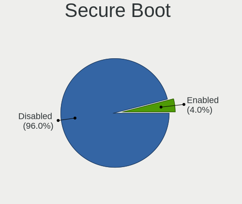
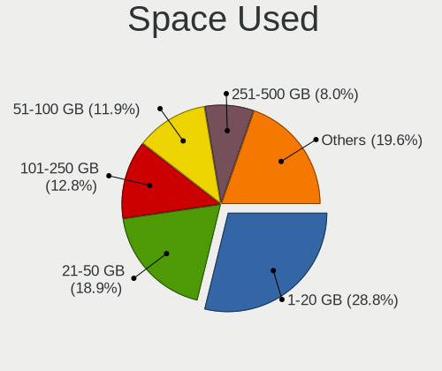
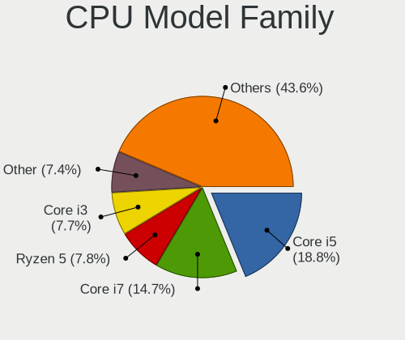
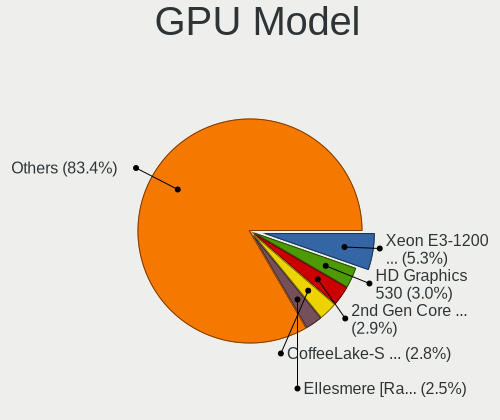
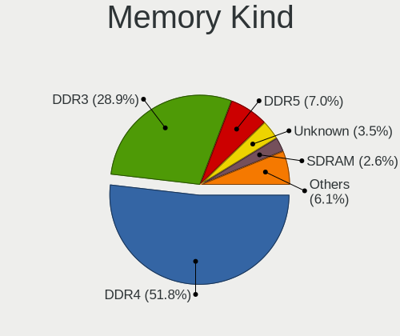

Ubuntu 22.04 - Tested Hardware & Statistics (Desktops)
------------------------------------------------------

A project to collect tested hardware configurations for Ubuntu 22.04.

Anyone can contribute to this report by the [hw-probe](https://github.com/linuxhw/hw-probe) tool:

    sudo -E hw-probe -all -upload

Please contribute! Especially if your hardware is rare.

Contents
--------

* [ Test Cases ](#test-cases)

* [ System ](#system)
  - [ Kernel                   ](#kernel)
  - [ Kernel Family            ](#kernel-family)
  - [ Kernel Major Ver.        ](#kernel-major-ver)
  - [ Arch                     ](#arch)
  - [ DE                       ](#de)
  - [ Display Server           ](#display-server)
  - [ Display Manager          ](#display-manager)
  - [ OS Lang                  ](#os-lang)
  - [ Boot Mode                ](#boot-mode)
  - [ Filesystem               ](#filesystem)
  - [ Part. scheme             ](#part-scheme)
  - [ Dual Boot with Linux/BSD ](#dual-boot-with-linuxbsd)
  - [ Dual Boot (Win)          ](#dual-boot-win)

* [ Board ](#board)
  - [ Vendor                   ](#vendor)
  - [ Model                    ](#model)
  - [ Model Family             ](#model-family)
  - [ MFG Year                 ](#mfg-year)
  - [ Form Factor              ](#form-factor)
  - [ Secure Boot              ](#secure-boot)
  - [ Coreboot                 ](#coreboot)
  - [ RAM Size                 ](#ram-size)
  - [ RAM Used                 ](#ram-used)
  - [ Total Drives             ](#total-drives)
  - [ Has CD-ROM               ](#has-cd-rom)
  - [ Has Ethernet             ](#has-ethernet)
  - [ Has WiFi                 ](#has-wifi)
  - [ Has Bluetooth            ](#has-bluetooth)

* [ Location ](#location)
  - [ Country                  ](#country)
  - [ City                     ](#city)

* [ Drives ](#drives)
  - [ Drive Vendor             ](#drive-vendor)
  - [ Drive Model              ](#drive-model)
  - [ HDD Vendor               ](#hdd-vendor)
  - [ SSD Vendor               ](#ssd-vendor)
  - [ Drive Kind               ](#drive-kind)
  - [ Drive Connector          ](#drive-connector)
  - [ Drive Size               ](#drive-size)
  - [ Space Total              ](#space-total)
  - [ Space Used               ](#space-used)
  - [ Malfunc. Drives          ](#malfunc-drives)
  - [ Malfunc. Drive Vendor    ](#malfunc-drive-vendor)
  - [ Malfunc. HDD Vendor      ](#malfunc-hdd-vendor)
  - [ Malfunc. Drive Kind      ](#malfunc-drive-kind)
  - [ Failed Drives            ](#failed-drives)
  - [ Failed Drive Vendor      ](#failed-drive-vendor)
  - [ Drive Status             ](#drive-status)

* [ Storage controller ](#storage-controller)
  - [ Storage Vendor           ](#storage-vendor)
  - [ Storage Model            ](#storage-model)
  - [ Storage Kind             ](#storage-kind)

* [ Processor ](#processor)
  - [ CPU Vendor               ](#cpu-vendor)
  - [ CPU Model                ](#cpu-model)
  - [ CPU Model Family         ](#cpu-model-family)
  - [ CPU Cores                ](#cpu-cores)
  - [ CPU Sockets              ](#cpu-sockets)
  - [ CPU Threads              ](#cpu-threads)
  - [ CPU Op-Modes             ](#cpu-op-modes)
  - [ CPU Microcode            ](#cpu-microcode)
  - [ CPU Microarch            ](#cpu-microarch)

* [ Graphics ](#graphics)
  - [ GPU Vendor               ](#gpu-vendor)
  - [ GPU Model                ](#gpu-model)
  - [ GPU Combo                ](#gpu-combo)
  - [ GPU Driver               ](#gpu-driver)
  - [ GPU Memory               ](#gpu-memory)

* [ Monitor ](#monitor)
  - [ Monitor Vendor           ](#monitor-vendor)
  - [ Monitor Model            ](#monitor-model)
  - [ Monitor Resolution       ](#monitor-resolution)
  - [ Monitor Diagonal         ](#monitor-diagonal)
  - [ Monitor Width            ](#monitor-width)
  - [ Aspect Ratio             ](#aspect-ratio)
  - [ Monitor Area             ](#monitor-area)
  - [ Pixel Density            ](#pixel-density)
  - [ Multiple Monitors        ](#multiple-monitors)

* [ Network ](#network)
  - [ Net Controller Vendor    ](#net-controller-vendor)
  - [ Net Controller Model     ](#net-controller-model)
  - [ Wireless Vendor          ](#wireless-vendor)
  - [ Wireless Model           ](#wireless-model)
  - [ Ethernet Vendor          ](#ethernet-vendor)
  - [ Ethernet Model           ](#ethernet-model)
  - [ Net Controller Kind      ](#net-controller-kind)
  - [ Used Controller          ](#used-controller)
  - [ NICs                     ](#nics)
  - [ IPv6                     ](#ipv6)

* [ Bluetooth ](#bluetooth)
  - [ Bluetooth Vendor         ](#bluetooth-vendor)
  - [ Bluetooth Model          ](#bluetooth-model)

* [ Sound ](#sound)
  - [ Sound Vendor             ](#sound-vendor)
  - [ Sound Model              ](#sound-model)

* [ Memory ](#memory)
  - [ Memory Vendor            ](#memory-vendor)
  - [ Memory Model             ](#memory-model)
  - [ Memory Kind              ](#memory-kind)
  - [ Memory Form Factor       ](#memory-form-factor)
  - [ Memory Size              ](#memory-size)
  - [ Memory Speed             ](#memory-speed)

* [ Printers & scanners ](#printers--scanners)
  - [ Printer Vendor           ](#printer-vendor)
  - [ Printer Model            ](#printer-model)
  - [ Scanner Vendor           ](#scanner-vendor)
  - [ Scanner Model            ](#scanner-model)

* [ Camera ](#camera)
  - [ Camera Vendor            ](#camera-vendor)
  - [ Camera Model             ](#camera-model)

* [ Security ](#security)
  - [ Fingerprint Vendor       ](#fingerprint-vendor)
  - [ Fingerprint Model        ](#fingerprint-model)
  - [ Chipcard Vendor          ](#chipcard-vendor)
  - [ Chipcard Model           ](#chipcard-model)

* [ Unsupported ](#unsupported)
  - [ Unsupported Devices      ](#unsupported-devices)
  - [ Unsupported Device Types ](#unsupported-device-types)

Test Cases
----------

Total: 5819

| Vendor        | Model                       | Probe                                                      | Date         |
|---------------|-----------------------------|------------------------------------------------------------|--------------|
| MSI           | MAG B550 TOMAHAWK           | [f8453df937](https://linux-hardware.org/?probe=f8453df937) | Sep 07, 2023 |
| Unknown       | Unknown                     | [59544c398a](https://linux-hardware.org/?probe=59544c398a) | Sep 07, 2023 |
| HP            | 0B4Ch D                     | [1a2a0eef04](https://linux-hardware.org/?probe=1a2a0eef04) | Sep 06, 2023 |
| HP            | 0B4Ch D                     | [e6c990ad64](https://linux-hardware.org/?probe=e6c990ad64) | Sep 06, 2023 |
| ASUSTek       | ROG STRIX B550-A GAMING     | [9d45d79cb0](https://linux-hardware.org/?probe=9d45d79cb0) | Sep 06, 2023 |
| Gigabyte      | B650 AORUS ELITE AX         | [97bacd8975](https://linux-hardware.org/?probe=97bacd8975) | Sep 06, 2023 |
| ASUSTek       | P8H77-M                     | [ebc8d3e851](https://linux-hardware.org/?probe=ebc8d3e851) | Sep 06, 2023 |
| Unknown       | Unknown                     | [c4829899c3](https://linux-hardware.org/?probe=c4829899c3) | Sep 06, 2023 |
| Intel         | H81                         | [5a16cea30a](https://linux-hardware.org/?probe=5a16cea30a) | Sep 06, 2023 |
| DFI           | CH960                       | [f0caeeeae0](https://linux-hardware.org/?probe=f0caeeeae0) | Sep 06, 2023 |
| ASUSTek       | B150M-PLUS                  | [a5a6f0acfb](https://linux-hardware.org/?probe=a5a6f0acfb) | Sep 06, 2023 |
| Supermicro    | X9DRW                       | [01d640708d](https://linux-hardware.org/?probe=01d640708d) | Sep 06, 2023 |
| ASUSTek       | ROG STRIX B550-F GAMING ... | [586f1d2fa7](https://linux-hardware.org/?probe=586f1d2fa7) | Sep 06, 2023 |
| Dell          | 0VNP2H A00                  | [04e5805a67](https://linux-hardware.org/?probe=04e5805a67) | Sep 06, 2023 |
| MSI           | MPG X570 GAMING PLUS        | [f04f6fc2a6](https://linux-hardware.org/?probe=f04f6fc2a6) | Sep 06, 2023 |
| ASUSTek       | X99-DELUXE                  | [0035cdf446](https://linux-hardware.org/?probe=0035cdf446) | Sep 05, 2023 |
| ASRock        | N68C-S UCC                  | [c2e1fe7134](https://linux-hardware.org/?probe=c2e1fe7134) | Sep 05, 2023 |
| DFI           | CH960                       | [29c9bcf1ed](https://linux-hardware.org/?probe=29c9bcf1ed) | Sep 05, 2023 |
| ASUSTek       | SABERTOOTH X58              | [9139773ff9](https://linux-hardware.org/?probe=9139773ff9) | Sep 05, 2023 |
| ASUSTek       | PRIME B450M-GAMING/BR       | [190675e9f1](https://linux-hardware.org/?probe=190675e9f1) | Sep 05, 2023 |
| Dell          | 0PTTT9 A01                  | [2c7accd18e](https://linux-hardware.org/?probe=2c7accd18e) | Sep 05, 2023 |
| Dell          | 073MMW A02                  | [5b5728ae8d](https://linux-hardware.org/?probe=5b5728ae8d) | Sep 05, 2023 |
| AZW           | MINI S                      | [a2a1414ea6](https://linux-hardware.org/?probe=a2a1414ea6) | Sep 05, 2023 |
| ASUSTek       | M4A785-M                    | [0e073fb229](https://linux-hardware.org/?probe=0e073fb229) | Sep 05, 2023 |
| MSI           | B350 GAMING PRO CARBON      | [c2257ed5b8](https://linux-hardware.org/?probe=c2257ed5b8) | Sep 04, 2023 |
| ASUSTek       | PRIME B450M-GAMING/BR       | [bcd06888e4](https://linux-hardware.org/?probe=bcd06888e4) | Sep 04, 2023 |
| MSI           | Boston                      | [5e1b8aa70b](https://linux-hardware.org/?probe=5e1b8aa70b) | Sep 04, 2023 |
| Gigabyte      | Z390 AORUS PRO-CF           | [a9321ea88e](https://linux-hardware.org/?probe=a9321ea88e) | Sep 04, 2023 |
| ASUSTek       | ProArt X670E-CREATOR WIF... | [cda189c68a](https://linux-hardware.org/?probe=cda189c68a) | Sep 04, 2023 |
| MSI           | Boston                      | [5ad763345c](https://linux-hardware.org/?probe=5ad763345c) | Sep 04, 2023 |
| Medion        | H110H4-EM                   | [e4752c330e](https://linux-hardware.org/?probe=e4752c330e) | Sep 04, 2023 |
| Dell          | 06X1TJ A00                  | [f24368d776](https://linux-hardware.org/?probe=f24368d776) | Sep 04, 2023 |
| Dell          | 06X1TJ A00                  | [f4fbaa8dd1](https://linux-hardware.org/?probe=f4fbaa8dd1) | Sep 04, 2023 |
| Gigabyte      | B360HD3                     | [1242798344](https://linux-hardware.org/?probe=1242798344) | Sep 04, 2023 |
| ASUSTek       | VM42                        | [2869496e53](https://linux-hardware.org/?probe=2869496e53) | Sep 04, 2023 |
| Acer          | Veriton S2680G              | [e1fdce5232](https://linux-hardware.org/?probe=e1fdce5232) | Sep 04, 2023 |
| ECS           | Nettle2                     | [8492f01e46](https://linux-hardware.org/?probe=8492f01e46) | Sep 04, 2023 |
| ASUSTek       | SABERTOOTH X58              | [edc8896f06](https://linux-hardware.org/?probe=edc8896f06) | Sep 04, 2023 |
| ASRock        | A520M-HDV                   | [8da6b89260](https://linux-hardware.org/?probe=8da6b89260) | Sep 04, 2023 |
| ASUSTek       | M5A78L-M/USB3               | [15826e3d9e](https://linux-hardware.org/?probe=15826e3d9e) | Sep 04, 2023 |
| ASUSTek       | TUF Gaming X670E-PLUS       | [0eff1074a1](https://linux-hardware.org/?probe=0eff1074a1) | Sep 03, 2023 |
| Gigabyte      | B550M DS3H                  | [b8a2b22a6c](https://linux-hardware.org/?probe=b8a2b22a6c) | Sep 03, 2023 |
| ASUSTek       | M5A97 EVO R2.0              | [493d16ff67](https://linux-hardware.org/?probe=493d16ff67) | Sep 03, 2023 |
| ASUSTek       | PRIME X470-PRO              | [35e2cffa7f](https://linux-hardware.org/?probe=35e2cffa7f) | Sep 03, 2023 |
| AZW           | U59                         | [98e1e109a5](https://linux-hardware.org/?probe=98e1e109a5) | Sep 03, 2023 |
| Intel         | DG31PR AAD97573-301         | [359e7817c3](https://linux-hardware.org/?probe=359e7817c3) | Sep 03, 2023 |
| Gigabyte      | Z690 AORUS ELITE DDR4       | [7e7d27d9f2](https://linux-hardware.org/?probe=7e7d27d9f2) | Sep 03, 2023 |
| ASRock        | Z77 Extreme4                | [1115c7ff24](https://linux-hardware.org/?probe=1115c7ff24) | Sep 03, 2023 |
| Gigabyte      | P67A-UD3P-B3                | [cf62b3f40c](https://linux-hardware.org/?probe=cf62b3f40c) | Sep 02, 2023 |
| ASUSTek       | PRIME B760M-A WIFI D4       | [f2eccf0aa8](https://linux-hardware.org/?probe=f2eccf0aa8) | Sep 02, 2023 |
| MSI           | MAG B650M MORTAR WIFI       | [1b5109eb83](https://linux-hardware.org/?probe=1b5109eb83) | Sep 02, 2023 |
| ASUSTek       | Acacia                      | [78b7252269](https://linux-hardware.org/?probe=78b7252269) | Sep 02, 2023 |
| Lenovo        | SDK0E50510 WIN              | [84cd7c1a93](https://linux-hardware.org/?probe=84cd7c1a93) | Sep 02, 2023 |
| ASUSTek       | ROG Maximus XII EXTREME     | [7cfd1c36d1](https://linux-hardware.org/?probe=7cfd1c36d1) | Sep 02, 2023 |
| ASRock        | Z370M Pro4                  | [b50da6446a](https://linux-hardware.org/?probe=b50da6446a) | Sep 02, 2023 |
| ASUSTek       | SABERTOOTH X58              | [0c99b66fde](https://linux-hardware.org/?probe=0c99b66fde) | Sep 02, 2023 |
| ASUSTek       | H110M-R                     | [ab9746582a](https://linux-hardware.org/?probe=ab9746582a) | Sep 02, 2023 |
| ASUSTek       | H110M-R                     | [091c787432](https://linux-hardware.org/?probe=091c787432) | Sep 02, 2023 |
| Lenovo        | SHARKBAY NOK                | [6fb1aaaab8](https://linux-hardware.org/?probe=6fb1aaaab8) | Sep 02, 2023 |
| Dell          | 06X1TJ A00                  | [ef4c22cc94](https://linux-hardware.org/?probe=ef4c22cc94) | Sep 01, 2023 |
| Pegatron      | 2AD5                        | [644b70347e](https://linux-hardware.org/?probe=644b70347e) | Sep 01, 2023 |
| MSI           | MPG Z390 GAMING PLUS        | [2c9f663c14](https://linux-hardware.org/?probe=2c9f663c14) | Sep 01, 2023 |
| MSI           | MAG Z790 TOMAHAWK WIFI      | [da16406c15](https://linux-hardware.org/?probe=da16406c15) | Sep 01, 2023 |
| MSI           | A320M PRO-M2 V2             | [35a0110255](https://linux-hardware.org/?probe=35a0110255) | Sep 01, 2023 |
| HP            | 82F1                        | [2b601bfc6a](https://linux-hardware.org/?probe=2b601bfc6a) | Sep 01, 2023 |
| HP            | 82F1                        | [fe3e193418](https://linux-hardware.org/?probe=fe3e193418) | Sep 01, 2023 |
| ASRock        | B450M-HDV                   | [3b02e0db71](https://linux-hardware.org/?probe=3b02e0db71) | Sep 01, 2023 |
| ASUSTek       | P5Q SE                      | [288078e39e](https://linux-hardware.org/?probe=288078e39e) | Sep 01, 2023 |
| Acer          | Veriton S2680G              | [17206d19f9](https://linux-hardware.org/?probe=17206d19f9) | Sep 01, 2023 |
| Dell          | 00V62H A01                  | [f3c99a0cc5](https://linux-hardware.org/?probe=f3c99a0cc5) | Sep 01, 2023 |
| Dell          | 09KPNV A01                  | [2d7e76e864](https://linux-hardware.org/?probe=2d7e76e864) | Sep 01, 2023 |
| ASUSTek       | PRIME B550M-A AC            | [da19202792](https://linux-hardware.org/?probe=da19202792) | Sep 01, 2023 |
| ASUSTek       | PRIME B550M-A AC            | [e65f42e0d6](https://linux-hardware.org/?probe=e65f42e0d6) | Sep 01, 2023 |
| Maxtang       | BYT30                       | [6f7fa1fde6](https://linux-hardware.org/?probe=6f7fa1fde6) | Aug 31, 2023 |
| Lenovo        | NOK                         | [3b2d750004](https://linux-hardware.org/?probe=3b2d750004) | Aug 31, 2023 |
| Lenovo        | NOK                         | [0e10fff36a](https://linux-hardware.org/?probe=0e10fff36a) | Aug 31, 2023 |
| MACHINIST     | E5-D8-MAX V1.0              | [339734178a](https://linux-hardware.org/?probe=339734178a) | Aug 31, 2023 |
| Dell          | 0M5DCD A00                  | [dbc3edd473](https://linux-hardware.org/?probe=dbc3edd473) | Aug 31, 2023 |
| Dell          | 0D6H9T A00                  | [9830dce088](https://linux-hardware.org/?probe=9830dce088) | Aug 31, 2023 |
| ASUSTek       | P5N-E SLI                   | [04688c03ea](https://linux-hardware.org/?probe=04688c03ea) | Aug 31, 2023 |
| ASUSTek       | P8B75-M                     | [4f8c86072b](https://linux-hardware.org/?probe=4f8c86072b) | Aug 31, 2023 |
| HP            | 89B5 A                      | [1364f50166](https://linux-hardware.org/?probe=1364f50166) | Aug 31, 2023 |
| HP            | 82B4                        | [28155e6336](https://linux-hardware.org/?probe=28155e6336) | Aug 30, 2023 |
| Supermicro    | X9DRW                       | [a71700e059](https://linux-hardware.org/?probe=a71700e059) | Aug 30, 2023 |
| Alienware     | 0PGRP5 A02                  | [9a95d4ab16](https://linux-hardware.org/?probe=9a95d4ab16) | Aug 30, 2023 |
| ASUSTek       | TUF Z270 MARK 2             | [2d74d46701](https://linux-hardware.org/?probe=2d74d46701) | Aug 30, 2023 |
| Supermicro    | X9DRW                       | [1ff3234fa5](https://linux-hardware.org/?probe=1ff3234fa5) | Aug 30, 2023 |
| ASUSTek       | P8P67 PRO                   | [3740c90267](https://linux-hardware.org/?probe=3740c90267) | Aug 30, 2023 |
| ASRock        | B450M-HDV                   | [047f752404](https://linux-hardware.org/?probe=047f752404) | Aug 30, 2023 |
| Gigabyte      | EP35-DS3                    | [c317e9aa3a](https://linux-hardware.org/?probe=c317e9aa3a) | Aug 30, 2023 |
| ASUSTek       | M5A97 R2.0                  | [c1514e209a](https://linux-hardware.org/?probe=c1514e209a) | Aug 30, 2023 |
| Intel         | DH67CL AAG10212-206         | [e3f4b109ff](https://linux-hardware.org/?probe=e3f4b109ff) | Aug 30, 2023 |
| Pegatron      | 2AB6                        | [ed71da8f69](https://linux-hardware.org/?probe=ed71da8f69) | Aug 29, 2023 |
| Dell          | 0XHGV1 A01                  | [a5f30ecf01](https://linux-hardware.org/?probe=a5f30ecf01) | Aug 29, 2023 |
| HP            | 83EE                        | [d558afff67](https://linux-hardware.org/?probe=d558afff67) | Aug 29, 2023 |
| Huanan        | X99-4MT V1.0                | [b1ebbd0661](https://linux-hardware.org/?probe=b1ebbd0661) | Aug 29, 2023 |
| Colorful T... | CVN X570M GAMING PRO V14    | [187d930341](https://linux-hardware.org/?probe=187d930341) | Aug 29, 2023 |
| Gigabyte      | Z390 AORUS PRO WIFI-CF      | [2b9741ce87](https://linux-hardware.org/?probe=2b9741ce87) | Aug 29, 2023 |
| Dell          | 0KWVT8 A03                  | [04ee67e1ad](https://linux-hardware.org/?probe=04ee67e1ad) | Aug 29, 2023 |
| Dell          | 0GXM1W A01                  | [00207aee12](https://linux-hardware.org/?probe=00207aee12) | Aug 29, 2023 |
| MSI           | MAG B460M BAZOOKA           | [dcd9ab0f79](https://linux-hardware.org/?probe=dcd9ab0f79) | Aug 29, 2023 |
| Gigabyte      | X470 AORUS ULTRA GAMING-... | [d97cedcf3c](https://linux-hardware.org/?probe=d97cedcf3c) | Aug 28, 2023 |
| Gigabyte      | B550 AORUS ELITE AX V2      | [fe9f235c26](https://linux-hardware.org/?probe=fe9f235c26) | Aug 28, 2023 |
| Intel         | DX79SR AAG57199-200         | [418a709636](https://linux-hardware.org/?probe=418a709636) | Aug 28, 2023 |
| Acer          | Aspire TC-330               | [d8182593c2](https://linux-hardware.org/?probe=d8182593c2) | Aug 28, 2023 |
| ASUSTek       | PRIME B360-PLUS             | [f54073855c](https://linux-hardware.org/?probe=f54073855c) | Aug 28, 2023 |
| ASUSTek       | PRIME B360-PLUS             | [4bcfe8de49](https://linux-hardware.org/?probe=4bcfe8de49) | Aug 28, 2023 |
| HP            | 83EF                        | [05c3bcb04f](https://linux-hardware.org/?probe=05c3bcb04f) | Aug 28, 2023 |
| ASUSTek       | Maximus VII RANGER          | [79803f8898](https://linux-hardware.org/?probe=79803f8898) | Aug 28, 2023 |
| ASRock        | AM1B-M                      | [d35e6acf9a](https://linux-hardware.org/?probe=d35e6acf9a) | Aug 28, 2023 |
| Gigabyte      | B560 DS3H AC-Y1             | [1838cb8b9f](https://linux-hardware.org/?probe=1838cb8b9f) | Aug 28, 2023 |
| Dell          | 00V62H A01                  | [714c46e2fd](https://linux-hardware.org/?probe=714c46e2fd) | Aug 28, 2023 |
| Intel         | X79 (INTEL Xeon E5/Corei... | [c9935dab6b](https://linux-hardware.org/?probe=c9935dab6b) | Aug 27, 2023 |
| Dell          | 0XHGV1 A01                  | [d03180d370](https://linux-hardware.org/?probe=d03180d370) | Aug 27, 2023 |
| Packard Be... | IMEDIA S3730                | [88e192b5f0](https://linux-hardware.org/?probe=88e192b5f0) | Aug 27, 2023 |
| Gigabyte      | H110M-S2-CF                 | [08f577f854](https://linux-hardware.org/?probe=08f577f854) | Aug 27, 2023 |
| ASRock        | X399 Taichi                 | [3d8f7e9e00](https://linux-hardware.org/?probe=3d8f7e9e00) | Aug 27, 2023 |
| MSI           | MPG Z490 GAMING EDGE WIF... | [d03d50ea3c](https://linux-hardware.org/?probe=d03d50ea3c) | Aug 27, 2023 |
| ASUSTek       | PRIME A320M-K               | [9a571d0670](https://linux-hardware.org/?probe=9a571d0670) | Aug 27, 2023 |
| MSI           | H110I PRO                   | [49da08efbd](https://linux-hardware.org/?probe=49da08efbd) | Aug 26, 2023 |
| Packard Be... | IMEDIA S3730                | [fc3a889045](https://linux-hardware.org/?probe=fc3a889045) | Aug 26, 2023 |
| Dell          | 088DT1 A01                  | [b69a80ea82](https://linux-hardware.org/?probe=b69a80ea82) | Aug 26, 2023 |
| HP            | 1905                        | [c1758c3a05](https://linux-hardware.org/?probe=c1758c3a05) | Aug 26, 2023 |
| ASUSTek       | PRIME B650M-A WIFI          | [6a55471f69](https://linux-hardware.org/?probe=6a55471f69) | Aug 26, 2023 |
| Lenovo        | SHARKBAY SDK0E50510 PRO     | [6a38c0266f](https://linux-hardware.org/?probe=6a38c0266f) | Aug 26, 2023 |
| Acer          | Aspire TC-780               | [70d914b85a](https://linux-hardware.org/?probe=70d914b85a) | Aug 26, 2023 |
| Unknown       | Unknown                     | [e78b6b1077](https://linux-hardware.org/?probe=e78b6b1077) | Aug 26, 2023 |
| Dell          | 03NVJ6 A01                  | [6bbb1d2e62](https://linux-hardware.org/?probe=6bbb1d2e62) | Aug 26, 2023 |
| Dell          | 03NVJ6 A01                  | [ccfb67648a](https://linux-hardware.org/?probe=ccfb67648a) | Aug 26, 2023 |
| ASUSTek       | PRIME B450M-A II            | [607925cb89](https://linux-hardware.org/?probe=607925cb89) | Aug 25, 2023 |
| MSI           | B150 GAMING M3              | [5a1ef4b710](https://linux-hardware.org/?probe=5a1ef4b710) | Aug 25, 2023 |
| ASUSTek       | PRIME X370-PRO              | [fd03f60906](https://linux-hardware.org/?probe=fd03f60906) | Aug 25, 2023 |
| ASUSTek       | X99-DELUXE                  | [d4d9345d6f](https://linux-hardware.org/?probe=d4d9345d6f) | Aug 25, 2023 |
| ASUSTek       | H97I-PLUS                   | [2c9e75e34a](https://linux-hardware.org/?probe=2c9e75e34a) | Aug 25, 2023 |
| Gigabyte      | GA-770TA-UD3                | [6bd78c519f](https://linux-hardware.org/?probe=6bd78c519f) | Aug 25, 2023 |
| Gigabyte      | Z170X-Gaming 7              | [3ddae42f27](https://linux-hardware.org/?probe=3ddae42f27) | Aug 25, 2023 |
| Unknown       | Unknown                     | [1ebb1de535](https://linux-hardware.org/?probe=1ebb1de535) | Aug 25, 2023 |
| ASRock        | A320M-HDV R4.0              | [ccc34d5a51](https://linux-hardware.org/?probe=ccc34d5a51) | Aug 25, 2023 |
| ASUSTek       | P5G41T-M LX                 | [a45010b5bb](https://linux-hardware.org/?probe=a45010b5bb) | Aug 25, 2023 |
| ASRock        | AM1B-M                      | [fe8df93529](https://linux-hardware.org/?probe=fe8df93529) | Aug 25, 2023 |
| Dell          | 0P096C A01                  | [3efa99668a](https://linux-hardware.org/?probe=3efa99668a) | Aug 24, 2023 |
| Dell          | 0P096C A01                  | [1f67d435b7](https://linux-hardware.org/?probe=1f67d435b7) | Aug 24, 2023 |
| Gigabyte      | H61M-S1                     | [09db81cde4](https://linux-hardware.org/?probe=09db81cde4) | Aug 24, 2023 |
| Gigabyte      | P35-DS3R                    | [798717deb6](https://linux-hardware.org/?probe=798717deb6) | Aug 24, 2023 |
| Acer          | Aspire XC-705               | [abb2a529c7](https://linux-hardware.org/?probe=abb2a529c7) | Aug 24, 2023 |
| ASRock        | B550M Pro4                  | [6554eecc36](https://linux-hardware.org/?probe=6554eecc36) | Aug 24, 2023 |
| Acer          | Aspire XC-705               | [1e42c10a2f](https://linux-hardware.org/?probe=1e42c10a2f) | Aug 24, 2023 |
| HP            | 0A9Ch                       | [f5d07e235d](https://linux-hardware.org/?probe=f5d07e235d) | Aug 24, 2023 |
| HP            | 1497                        | [8bb03862e2](https://linux-hardware.org/?probe=8bb03862e2) | Aug 24, 2023 |
| HP            | 1589                        | [cd1492c33d](https://linux-hardware.org/?probe=cd1492c33d) | Aug 24, 2023 |
| Gigabyte      | Z390 AORUS PRO WIFI-CF      | [8b76616574](https://linux-hardware.org/?probe=8b76616574) | Aug 24, 2023 |
| Lenovo        | 103D SDK0J40697 WIN 3305... | [18fdc0c2a2](https://linux-hardware.org/?probe=18fdc0c2a2) | Aug 24, 2023 |
| ASUSTek       | M5A78L-M LX3                | [b96cc7270e](https://linux-hardware.org/?probe=b96cc7270e) | Aug 24, 2023 |
| ASUSTek       | ROG STRIX B550-F GAMING ... | [c63d6cfab0](https://linux-hardware.org/?probe=c63d6cfab0) | Aug 24, 2023 |
| ASUSTek       | ROG Maximus XII FORMULA     | [69df93b6b4](https://linux-hardware.org/?probe=69df93b6b4) | Aug 24, 2023 |
| ASUSTek       | ROG Maximus XII FORMULA     | [8cd328af00](https://linux-hardware.org/?probe=8cd328af00) | Aug 24, 2023 |
| MSI           | H110I PRO                   | [12891f2138](https://linux-hardware.org/?probe=12891f2138) | Aug 24, 2023 |
| Gigabyte      | AB350M-DS3H V2-CF           | [083700ba74](https://linux-hardware.org/?probe=083700ba74) | Aug 23, 2023 |
| ASUSTek       | P7H55-USB3                  | [86ca529583](https://linux-hardware.org/?probe=86ca529583) | Aug 23, 2023 |
| Gigabyte      | A520M DS3H                  | [f8990a10d8](https://linux-hardware.org/?probe=f8990a10d8) | Aug 23, 2023 |
| Gigabyte      | A520M DS3H                  | [a09e28d1d6](https://linux-hardware.org/?probe=a09e28d1d6) | Aug 23, 2023 |
| Pegatron      | 2AC2                        | [7b0af9060e](https://linux-hardware.org/?probe=7b0af9060e) | Aug 23, 2023 |
| ASUSTek       | EX-A320M-GAMING             | [a28ee4ea6b](https://linux-hardware.org/?probe=a28ee4ea6b) | Aug 23, 2023 |
| MiTAC         | PD10EHI                     | [972fe64be0](https://linux-hardware.org/?probe=972fe64be0) | Aug 23, 2023 |
| ASRock        | 990FX Killer                | [20a65c4f0d](https://linux-hardware.org/?probe=20a65c4f0d) | Aug 23, 2023 |
| ASUSTek       | PRIME A320M-K               | [824c7b257e](https://linux-hardware.org/?probe=824c7b257e) | Aug 23, 2023 |
| ASRock        | TRX40 Creator               | [6c3b3d9727](https://linux-hardware.org/?probe=6c3b3d9727) | Aug 23, 2023 |
| MSI           | PRO Z690-A WIFI DDR4        | [3a0ddb0171](https://linux-hardware.org/?probe=3a0ddb0171) | Aug 23, 2023 |
| Dell          | 0M858N A01                  | [f8f62c1afb](https://linux-hardware.org/?probe=f8f62c1afb) | Aug 23, 2023 |
| ASUSTek       | Pro WS WRX80E-SAGE SE WI... | [2bb217b4df](https://linux-hardware.org/?probe=2bb217b4df) | Aug 23, 2023 |
| Supermicro    | X10DRG-Q                    | [45ef204e3e](https://linux-hardware.org/?probe=45ef204e3e) | Aug 23, 2023 |
| ASRock        | H310CM-ITX/ac               | [5725adebf5](https://linux-hardware.org/?probe=5725adebf5) | Aug 22, 2023 |
| Gigabyte      | 990FXA-UD5                  | [5e141011cd](https://linux-hardware.org/?probe=5e141011cd) | Aug 22, 2023 |
| ASUSTek       | ROG STRIX X670E-E GAMING... | [80c67a4432](https://linux-hardware.org/?probe=80c67a4432) | Aug 22, 2023 |
| Fujitsu       | D3162-A1 S26361-D3162-A1    | [888f62077c](https://linux-hardware.org/?probe=888f62077c) | Aug 22, 2023 |
| Dell          | 06D7TR A00                  | [6e44011ff7](https://linux-hardware.org/?probe=6e44011ff7) | Aug 22, 2023 |
| Dell          | 06D7TR A00                  | [f80faa8301](https://linux-hardware.org/?probe=f80faa8301) | Aug 22, 2023 |
| ASUSTek       | Pro WS X570-ACE             | [236b200fd8](https://linux-hardware.org/?probe=236b200fd8) | Aug 22, 2023 |
| ASUSTek       | Pro WS X570-ACE             | [16d770ddb1](https://linux-hardware.org/?probe=16d770ddb1) | Aug 22, 2023 |
| Supermicro    | X10DRG-Q                    | [ea3995e7d5](https://linux-hardware.org/?probe=ea3995e7d5) | Aug 22, 2023 |
| GMKtec        | NucBox K2                   | [3cc85b0145](https://linux-hardware.org/?probe=3cc85b0145) | Aug 22, 2023 |
| Intel         | X79G V2.x                   | [658431c5b8](https://linux-hardware.org/?probe=658431c5b8) | Aug 22, 2023 |
| HP            | 845A                        | [4a8699daad](https://linux-hardware.org/?probe=4a8699daad) | Aug 22, 2023 |
| Dell          | 088DT1 A01                  | [15020bffbb](https://linux-hardware.org/?probe=15020bffbb) | Aug 22, 2023 |
| HP            | 18E5                        | [c17629e422](https://linux-hardware.org/?probe=c17629e422) | Aug 22, 2023 |
| Apple         | Mac-F221BEC8                | [907a1d574b](https://linux-hardware.org/?probe=907a1d574b) | Aug 21, 2023 |
| ASUSTek       | P8H61-I R2.0                | [510cd25b0e](https://linux-hardware.org/?probe=510cd25b0e) | Aug 21, 2023 |
| HP            | 18E7                        | [49957c261d](https://linux-hardware.org/?probe=49957c261d) | Aug 21, 2023 |
| Intel         | X99                         | [785fcd2a1d](https://linux-hardware.org/?probe=785fcd2a1d) | Aug 21, 2023 |
| Intel         | X99                         | [b54ecfbbc3](https://linux-hardware.org/?probe=b54ecfbbc3) | Aug 21, 2023 |
| Shuttle       | FH170                       | [f96106ab4c](https://linux-hardware.org/?probe=f96106ab4c) | Aug 21, 2023 |
| HP            | 212B                        | [ee20bd40d8](https://linux-hardware.org/?probe=ee20bd40d8) | Aug 21, 2023 |
| Dell          | 0VNM11 A00                  | [e448e177d3](https://linux-hardware.org/?probe=e448e177d3) | Aug 21, 2023 |
| Dell          | 088DT1 A01                  | [762f9cfed0](https://linux-hardware.org/?probe=762f9cfed0) | Aug 21, 2023 |
| ASUSTek       | ROG STRIX B650E-I GAMING... | [f19c5a2bde](https://linux-hardware.org/?probe=f19c5a2bde) | Aug 21, 2023 |
| ASUSTek       | Benicia                     | [29f90f4d18](https://linux-hardware.org/?probe=29f90f4d18) | Aug 20, 2023 |
| MSI           | MAG B550M MORTAR            | [1c177ea7e4](https://linux-hardware.org/?probe=1c177ea7e4) | Aug 20, 2023 |
| Intel         | D915GAV AAC64134-400        | [c7cad9e093](https://linux-hardware.org/?probe=c7cad9e093) | Aug 20, 2023 |
| ASUSTek       | ROG CROSSHAIR VIII HERO     | [f8f877ce04](https://linux-hardware.org/?probe=f8f877ce04) | Aug 20, 2023 |
| Fujitsu       | D3430-A1 S26361-D3430-A1    | [9f7605c000](https://linux-hardware.org/?probe=9f7605c000) | Aug 20, 2023 |
| ASUSTek       | P8H61-M LE/USB3             | [49289df595](https://linux-hardware.org/?probe=49289df595) | Aug 20, 2023 |
| Gigabyte      | B550M DS3H                  | [b50e7eb542](https://linux-hardware.org/?probe=b50e7eb542) | Aug 20, 2023 |
| HP            | 339A                        | [fe5a02e559](https://linux-hardware.org/?probe=fe5a02e559) | Aug 20, 2023 |
| ASUSTek       | PRIME H370M-PLUS            | [73ae467f5d](https://linux-hardware.org/?probe=73ae467f5d) | Aug 20, 2023 |
| HP            | 158A                        | [ba0211611f](https://linux-hardware.org/?probe=ba0211611f) | Aug 19, 2023 |
| HP            | 158A                        | [25e8725a35](https://linux-hardware.org/?probe=25e8725a35) | Aug 19, 2023 |
| Unknown       | Unknown                     | [c642878288](https://linux-hardware.org/?probe=c642878288) | Aug 19, 2023 |
| ASRock        | B450M Pro4                  | [12ec49f019](https://linux-hardware.org/?probe=12ec49f019) | Aug 19, 2023 |
| ASRock        | B550M-ITX/ac                | [53a81617e7](https://linux-hardware.org/?probe=53a81617e7) | Aug 19, 2023 |
| HPE           | ProLiant MicroServer Gen... | [467b1475ec](https://linux-hardware.org/?probe=467b1475ec) | Aug 19, 2023 |
| Dell          | 0CT017                      | [3bb33d455c](https://linux-hardware.org/?probe=3bb33d455c) | Aug 18, 2023 |
| Dell          | 06X1TJ A00                  | [e0a9b4c86f](https://linux-hardware.org/?probe=e0a9b4c86f) | Aug 18, 2023 |
| Gigabyte      | H77N-WIFI                   | [687a84cc8b](https://linux-hardware.org/?probe=687a84cc8b) | Aug 18, 2023 |
| Gigabyte      | Z77-D3H                     | [49d0f197aa](https://linux-hardware.org/?probe=49d0f197aa) | Aug 18, 2023 |
| Supermicro    | X10DRi-T4+                  | [2d10353983](https://linux-hardware.org/?probe=2d10353983) | Aug 18, 2023 |
| ASUSTek       | M5A78L-M PLUS/USB3          | [024d9028bb](https://linux-hardware.org/?probe=024d9028bb) | Aug 18, 2023 |
| ASUSTek       | ROG STRIX Z390-E GAMING     | [92ae579bec](https://linux-hardware.org/?probe=92ae579bec) | Aug 18, 2023 |
| Supermicro    | X9DRW                       | [eb0dd75419](https://linux-hardware.org/?probe=eb0dd75419) | Aug 17, 2023 |
| Gateway       | FX6840                      | [b0b3962785](https://linux-hardware.org/?probe=b0b3962785) | Aug 17, 2023 |
| Dell          | 0CT017                      | [5f628eeffa](https://linux-hardware.org/?probe=5f628eeffa) | Aug 17, 2023 |
| ASUSTek       | F2A55-M LK                  | [c2acb99219](https://linux-hardware.org/?probe=c2acb99219) | Aug 17, 2023 |
| Dell          | 0HN7XN A01                  | [6376619639](https://linux-hardware.org/?probe=6376619639) | Aug 17, 2023 |
| Apple         | Mac-27AD2F918AE68F61 Mac... | [2dcf46780c](https://linux-hardware.org/?probe=2dcf46780c) | Aug 17, 2023 |
| Fujitsu       | D2828-A2 S26361-D2828-A2    | [bfc46e751d](https://linux-hardware.org/?probe=bfc46e751d) | Aug 17, 2023 |
| MSI           | H310M PRO-M2 PLUS           | [e4fe24b00a](https://linux-hardware.org/?probe=e4fe24b00a) | Aug 16, 2023 |
| Gigabyte      | X570S AERO G                | [e5618417ed](https://linux-hardware.org/?probe=e5618417ed) | Aug 16, 2023 |
| ASUSTek       | M3A76-CM                    | [031a6edf78](https://linux-hardware.org/?probe=031a6edf78) | Aug 16, 2023 |
| ASUSTek       | PRIME X670-P WIFI           | [12f64c8222](https://linux-hardware.org/?probe=12f64c8222) | Aug 16, 2023 |
| ASUSTek       | F2A55-M LK                  | [e14c769e1b](https://linux-hardware.org/?probe=e14c769e1b) | Aug 16, 2023 |
| ASRock        | Z270 Killer SLI             | [10d0229ef0](https://linux-hardware.org/?probe=10d0229ef0) | Aug 16, 2023 |
| Huanan        | X99-F8 GAMING V5.0          | [25279b238a](https://linux-hardware.org/?probe=25279b238a) | Aug 16, 2023 |
| Dell          | 0WR7PY A03                  | [91509a6450](https://linux-hardware.org/?probe=91509a6450) | Aug 15, 2023 |
| ASRock        | EP2C602                     | [26c37b5dfa](https://linux-hardware.org/?probe=26c37b5dfa) | Aug 15, 2023 |
| ASUSTek       | ROG STRIX B660-F GAMING ... | [2412623eac](https://linux-hardware.org/?probe=2412623eac) | Aug 15, 2023 |
| Supermicro    | X9DRW                       | [0fdb533afb](https://linux-hardware.org/?probe=0fdb533afb) | Aug 15, 2023 |
| Alienware     | 0XJKKD A01                  | [1b0f880002](https://linux-hardware.org/?probe=1b0f880002) | Aug 15, 2023 |
| ASUSTek       | PRIME H510M-K               | [b0c33014c5](https://linux-hardware.org/?probe=b0c33014c5) | Aug 15, 2023 |
| Gigabyte      | Z270M-D3H-CF                | [74d96ec17a](https://linux-hardware.org/?probe=74d96ec17a) | Aug 15, 2023 |
| Gigabyte      | Z270M-D3H-CF                | [8e4f3bf14e](https://linux-hardware.org/?probe=8e4f3bf14e) | Aug 15, 2023 |
| ASUSTek       | PRIME H510M-K               | [4b88db67fc](https://linux-hardware.org/?probe=4b88db67fc) | Aug 15, 2023 |
| Apple         | Mac-27AD2F918AE68F61 Mac... | [5002915fe5](https://linux-hardware.org/?probe=5002915fe5) | Aug 15, 2023 |
| Alienware     | 0CPDXD A00                  | [d732dfbf3b](https://linux-hardware.org/?probe=d732dfbf3b) | Aug 15, 2023 |
| HP            | 3047h                       | [4c2aba9453](https://linux-hardware.org/?probe=4c2aba9453) | Aug 14, 2023 |
| Gigabyte      | Z97M-DS3H                   | [69deac32bd](https://linux-hardware.org/?probe=69deac32bd) | Aug 14, 2023 |
| ASUSTek       | P8B75-M                     | [aa3414ebdc](https://linux-hardware.org/?probe=aa3414ebdc) | Aug 14, 2023 |
| MSI           | MS-7380                     | [519b55fb5d](https://linux-hardware.org/?probe=519b55fb5d) | Aug 14, 2023 |
| Gigabyte      | P35-DS3R                    | [4bb45d75da](https://linux-hardware.org/?probe=4bb45d75da) | Aug 14, 2023 |
| ASRock        | EP2C602                     | [c152c5a2f9](https://linux-hardware.org/?probe=c152c5a2f9) | Aug 14, 2023 |
| Gigabyte      | Z390 AORUS PRO WIFI-CF      | [9dcf480eb8](https://linux-hardware.org/?probe=9dcf480eb8) | Aug 14, 2023 |
| ASUSTek       | X99-A II                    | [4587b7ff26](https://linux-hardware.org/?probe=4587b7ff26) | Aug 14, 2023 |
| HP            | 0AACh                       | [f65fb50f69](https://linux-hardware.org/?probe=f65fb50f69) | Aug 14, 2023 |
| Dell          | 0D24M8 A01                  | [042b081b3c](https://linux-hardware.org/?probe=042b081b3c) | Aug 14, 2023 |
| Gigabyte      | Z77-D3H                     | [94fe342785](https://linux-hardware.org/?probe=94fe342785) | Aug 14, 2023 |
| Gigabyte      | B450M GAMING                | [495c01f301](https://linux-hardware.org/?probe=495c01f301) | Aug 14, 2023 |
| ASRock        | H71M-DGS                    | [c200c4f848](https://linux-hardware.org/?probe=c200c4f848) | Aug 14, 2023 |
| ASUSTek       | PRIME X670-P WIFI           | [1de4045fb5](https://linux-hardware.org/?probe=1de4045fb5) | Aug 13, 2023 |
| Intel         | Alder Lake-H PCH E1.0G      | [ffc38858d0](https://linux-hardware.org/?probe=ffc38858d0) | Aug 13, 2023 |
| Intel         | Alder Lake-H PCH E1.0G      | [4737e7eee7](https://linux-hardware.org/?probe=4737e7eee7) | Aug 13, 2023 |
| ASUSTek       | TUF Gaming B550-PLUS        | [8a4aefedae](https://linux-hardware.org/?probe=8a4aefedae) | Aug 13, 2023 |
| Dell          | 0VNM11 A00                  | [71cd1ddbf5](https://linux-hardware.org/?probe=71cd1ddbf5) | Aug 13, 2023 |
| ASRock        | 970 Extreme3 R2.0           | [cf233e5568](https://linux-hardware.org/?probe=cf233e5568) | Aug 13, 2023 |
| ASRock        | X300M-STX                   | [dc72ce1b47](https://linux-hardware.org/?probe=dc72ce1b47) | Aug 13, 2023 |
| MSI           | A78M-E45                    | [2affb76a98](https://linux-hardware.org/?probe=2affb76a98) | Aug 13, 2023 |
| Intel         | H55                         | [9eb68ebabb](https://linux-hardware.org/?probe=9eb68ebabb) | Aug 13, 2023 |
| Gigabyte      | 990FXA-UD5                  | [e4f4812b8c](https://linux-hardware.org/?probe=e4f4812b8c) | Aug 13, 2023 |
| ASRock        | B550M-C                     | [69cda8cb24](https://linux-hardware.org/?probe=69cda8cb24) | Aug 12, 2023 |
| Dell          | 08NPPY A00                  | [e15632468b](https://linux-hardware.org/?probe=e15632468b) | Aug 12, 2023 |
| ASUSTek       | Z170-K                      | [689401dab4](https://linux-hardware.org/?probe=689401dab4) | Aug 12, 2023 |
| MSI           | B450M PRO-VDH MAX           | [151c51f46f](https://linux-hardware.org/?probe=151c51f46f) | Aug 12, 2023 |
| ASUSTek       | PRIME B550-PLUS             | [a4f97e45f1](https://linux-hardware.org/?probe=a4f97e45f1) | Aug 12, 2023 |
| ECS           | H61H2-M6                    | [b9b9ef9f84](https://linux-hardware.org/?probe=b9b9ef9f84) | Aug 12, 2023 |
| MSI           | P67A-GD65                   | [1024e95ca9](https://linux-hardware.org/?probe=1024e95ca9) | Aug 12, 2023 |
| Fujitsu       | D2990-A1 S26361-D2990-A1    | [ae7ae594f1](https://linux-hardware.org/?probe=ae7ae594f1) | Aug 12, 2023 |
| Gigabyte      | Z390 AORUS PRO WIFI-CF      | [7298d533c9](https://linux-hardware.org/?probe=7298d533c9) | Aug 12, 2023 |
| Gigabyte      | Z390 AORUS PRO WIFI-CF      | [13e0e622f3](https://linux-hardware.org/?probe=13e0e622f3) | Aug 12, 2023 |
| HP            | 0A04h                       | [61b0d9bc15](https://linux-hardware.org/?probe=61b0d9bc15) | Aug 12, 2023 |
| Fujitsu       | JIQ87Y                      | [b11d99014e](https://linux-hardware.org/?probe=b11d99014e) | Aug 12, 2023 |
| ASUSTek       | H81M-PLUS                   | [af419fe003](https://linux-hardware.org/?probe=af419fe003) | Aug 12, 2023 |
| ASUSTek       | H81M-PLUS                   | [16cd37e4fe](https://linux-hardware.org/?probe=16cd37e4fe) | Aug 12, 2023 |
| Dell          | 0Y2MRG A00                  | [04ce264a3e](https://linux-hardware.org/?probe=04ce264a3e) | Aug 12, 2023 |
| Intel         | DG31PR AAE58249-301         | [28bc891b6d](https://linux-hardware.org/?probe=28bc891b6d) | Aug 12, 2023 |
| Intel         | DG31PR AAE58249-301         | [3050db3fbf](https://linux-hardware.org/?probe=3050db3fbf) | Aug 12, 2023 |
| MSI           | Boston                      | [62ad275a7d](https://linux-hardware.org/?probe=62ad275a7d) | Aug 11, 2023 |
| MSI           | Boston                      | [a34a89c083](https://linux-hardware.org/?probe=a34a89c083) | Aug 11, 2023 |
| Intel         | B75                         | [17641de345](https://linux-hardware.org/?probe=17641de345) | Aug 11, 2023 |
| ASUSTek       | ROG STRIX X570-E GAMING     | [483fc71762](https://linux-hardware.org/?probe=483fc71762) | Aug 11, 2023 |
| Unknown       | Unknown                     | [62ef56dbab](https://linux-hardware.org/?probe=62ef56dbab) | Aug 11, 2023 |
| ASRock        | B450M Pro4                  | [65d55091fa](https://linux-hardware.org/?probe=65d55091fa) | Aug 11, 2023 |
| Intel         | D915GEV AAC63667-501        | [4d65f6d8fa](https://linux-hardware.org/?probe=4d65f6d8fa) | Aug 11, 2023 |
| Gigabyte      | B85M-D2V                    | [d8d7d7bad7](https://linux-hardware.org/?probe=d8d7d7bad7) | Aug 11, 2023 |
| ASRock        | B550M-ITX/ac                | [e6624cc619](https://linux-hardware.org/?probe=e6624cc619) | Aug 11, 2023 |
| ASUSTek       | PRIME X670-P WIFI           | [7d31344218](https://linux-hardware.org/?probe=7d31344218) | Aug 11, 2023 |
| Dell          | 0HY9JP A01                  | [48d92d85c7](https://linux-hardware.org/?probe=48d92d85c7) | Aug 11, 2023 |
| Acer          | Aspire G7713                | [cb79bdce06](https://linux-hardware.org/?probe=cb79bdce06) | Aug 11, 2023 |
| Gigabyte      | Z77-D3H                     | [e71fc09944](https://linux-hardware.org/?probe=e71fc09944) | Aug 11, 2023 |
| ASUSTek       | PRIME H510M-K               | [3c239efc46](https://linux-hardware.org/?probe=3c239efc46) | Aug 11, 2023 |
| AZW           | Green G4 10                 | [a574280172](https://linux-hardware.org/?probe=a574280172) | Aug 11, 2023 |
| MSI           | MS-7380                     | [584074ca03](https://linux-hardware.org/?probe=584074ca03) | Aug 11, 2023 |
| Alienware     | Area-51 R2                  | [07a6f57292](https://linux-hardware.org/?probe=07a6f57292) | Aug 11, 2023 |
| Gigabyte      | GA-78LMT-USB3               | [6a1d87f2aa](https://linux-hardware.org/?probe=6a1d87f2aa) | Aug 10, 2023 |
| ASUSTek       | P8P67 PRO                   | [c0d6900ba3](https://linux-hardware.org/?probe=c0d6900ba3) | Aug 10, 2023 |
| Fujitsu Si... | G31T-M2 V3.02               | [1c32da7aed](https://linux-hardware.org/?probe=1c32da7aed) | Aug 10, 2023 |
| Lenovo        | ThinkStation S30 056848U    | [e6bc23d815](https://linux-hardware.org/?probe=e6bc23d815) | Aug 10, 2023 |
| ASUSTek       | ROG STRIX B650-A GAMING ... | [6bf6a38fba](https://linux-hardware.org/?probe=6bf6a38fba) | Aug 10, 2023 |
| Gigabyte      | H270N-WIFI-CF               | [bd9c532bbc](https://linux-hardware.org/?probe=bd9c532bbc) | Aug 10, 2023 |
| Dell          | 04YP6J A02                  | [5d5ce952b3](https://linux-hardware.org/?probe=5d5ce952b3) | Aug 10, 2023 |
| Gigabyte      | B560M DS3H                  | [96d3419a5f](https://linux-hardware.org/?probe=96d3419a5f) | Aug 10, 2023 |
| Gigabyte      | Z390 AORUS ULTRA-CF         | [5264c46571](https://linux-hardware.org/?probe=5264c46571) | Aug 10, 2023 |
| YANYU         | EPIC-C57                    | [6d42c0f9af](https://linux-hardware.org/?probe=6d42c0f9af) | Aug 10, 2023 |
| MSI           | A320M PRO-VD/S              | [7f7c988470](https://linux-hardware.org/?probe=7f7c988470) | Aug 10, 2023 |
| Gigabyte      | Z390 AORUS PRO WIFI-CF      | [307c7bbe9c](https://linux-hardware.org/?probe=307c7bbe9c) | Aug 10, 2023 |
| Dell          | 0JP3NX A01                  | [a9c4812d66](https://linux-hardware.org/?probe=a9c4812d66) | Aug 09, 2023 |
| ASUSTek       | PRIME Z270-A                | [a6eabbbfef](https://linux-hardware.org/?probe=a6eabbbfef) | Aug 09, 2023 |
| MSI           | 970 GAMING                  | [a499728742](https://linux-hardware.org/?probe=a499728742) | Aug 09, 2023 |
| Dell          | 0WR7PY A03                  | [b97d54f6d8](https://linux-hardware.org/?probe=b97d54f6d8) | Aug 09, 2023 |
| Gigabyte      | B150M-D3H DDR3-CF           | [5df6fee2f9](https://linux-hardware.org/?probe=5df6fee2f9) | Aug 09, 2023 |
| ASRock        | H77M-ITX                    | [01dc3bfc4b](https://linux-hardware.org/?probe=01dc3bfc4b) | Aug 09, 2023 |
| HP            | 894D                        | [e1c397df93](https://linux-hardware.org/?probe=e1c397df93) | Aug 09, 2023 |
| MSI           | A78M-E45                    | [d39f224497](https://linux-hardware.org/?probe=d39f224497) | Aug 09, 2023 |
| MSI           | 970 GAMING                  | [4751920c96](https://linux-hardware.org/?probe=4751920c96) | Aug 09, 2023 |
| Lenovo        | 30C1                        | [dda7ed4e8b](https://linux-hardware.org/?probe=dda7ed4e8b) | Aug 09, 2023 |
| Dell          | 02YYK5 A00                  | [14382141e9](https://linux-hardware.org/?probe=14382141e9) | Aug 09, 2023 |
| MSI           | MAG B760 TOMAHAWK WIFI      | [64fbeeca5e](https://linux-hardware.org/?probe=64fbeeca5e) | Aug 08, 2023 |
| Fujitsu       | D2990-A1 S26361-D2990-A1    | [c48e0220d8](https://linux-hardware.org/?probe=c48e0220d8) | Aug 08, 2023 |
| Intel         | D33217GKE G76540-203        | [fa0fbda262](https://linux-hardware.org/?probe=fa0fbda262) | Aug 08, 2023 |
| Intel         | D33217GKE G76540-203        | [f75916b7c7](https://linux-hardware.org/?probe=f75916b7c7) | Aug 08, 2023 |
| Lenovo        | Bantry CRB SDK0E50510 WI... | [6ffda81a5e](https://linux-hardware.org/?probe=6ffda81a5e) | Aug 08, 2023 |
| HP            | 2129                        | [f005bdb494](https://linux-hardware.org/?probe=f005bdb494) | Aug 08, 2023 |
| Gigabyte      | Z97M-DS3H                   | [f2547c0339](https://linux-hardware.org/?probe=f2547c0339) | Aug 08, 2023 |
| ASUSTek       | PRIME X670-P WIFI           | [2335e10b59](https://linux-hardware.org/?probe=2335e10b59) | Aug 08, 2023 |
| Pegatron      | 2AB5                        | [9579022e6f](https://linux-hardware.org/?probe=9579022e6f) | Aug 07, 2023 |
| ASRock        | H610M-ITX/ac                | [205fab2707](https://linux-hardware.org/?probe=205fab2707) | Aug 07, 2023 |
| Gigabyte      | B450M DS3H-CF               | [40b0ea74b1](https://linux-hardware.org/?probe=40b0ea74b1) | Aug 07, 2023 |
| Fujitsu       | D3062-A1 S26361-D3062-A1    | [873825c261](https://linux-hardware.org/?probe=873825c261) | Aug 07, 2023 |
| HP            | 8055                        | [5124119ce1](https://linux-hardware.org/?probe=5124119ce1) | Aug 07, 2023 |
| Gigabyte      | Z97M-DS3H                   | [beecacb434](https://linux-hardware.org/?probe=beecacb434) | Aug 07, 2023 |
| Gigabyte      | Z390 AORUS PRO WIFI-CF      | [002014034b](https://linux-hardware.org/?probe=002014034b) | Aug 07, 2023 |
| ASUSTek       | P5N-E SLI                   | [d552e347f5](https://linux-hardware.org/?probe=d552e347f5) | Aug 07, 2023 |
| AZW           | SEi                         | [b38e4eec2e](https://linux-hardware.org/?probe=b38e4eec2e) | Aug 07, 2023 |
| Gigabyte      | Z390 AORUS PRO WIFI-CF      | [fbfc0c60bd](https://linux-hardware.org/?probe=fbfc0c60bd) | Aug 07, 2023 |
| MSI           | Z97 GAMING 5                | [d076b394d9](https://linux-hardware.org/?probe=d076b394d9) | Aug 06, 2023 |
| Dell          | 0WMJ54 A01                  | [7f6aa0ed0c](https://linux-hardware.org/?probe=7f6aa0ed0c) | Aug 06, 2023 |
| ASUSTek       | M5A97 EVO R2.0              | [80c705f1a7](https://linux-hardware.org/?probe=80c705f1a7) | Aug 06, 2023 |
| Fujitsu       | D3062-A1 S26361-D3062-A1    | [28ee020bed](https://linux-hardware.org/?probe=28ee020bed) | Aug 06, 2023 |
| HP            | 805D                        | [672e431e69](https://linux-hardware.org/?probe=672e431e69) | Aug 06, 2023 |
| ASUSTek       | PRIME H410M-E               | [8618a7051f](https://linux-hardware.org/?probe=8618a7051f) | Aug 06, 2023 |
| Lenovo        | 110536U ThinkServer TS13... | [5084897812](https://linux-hardware.org/?probe=5084897812) | Aug 05, 2023 |
| HP            | 1791                        | [4a89aab3d6](https://linux-hardware.org/?probe=4a89aab3d6) | Aug 05, 2023 |
| HP            | 198E                        | [34023c0d62](https://linux-hardware.org/?probe=34023c0d62) | Aug 05, 2023 |
| MSI           | B450 GAMING PLUS MAX        | [8cc106746a](https://linux-hardware.org/?probe=8cc106746a) | Aug 05, 2023 |
| MSI           | A78M-E45                    | [988c1f5878](https://linux-hardware.org/?probe=988c1f5878) | Aug 05, 2023 |
| MSI           | B450 GAMING PLUS MAX        | [4f2449c578](https://linux-hardware.org/?probe=4f2449c578) | Aug 05, 2023 |
| Gigabyte      | G31M-S2C                    | [9cda5ca576](https://linux-hardware.org/?probe=9cda5ca576) | Aug 05, 2023 |
| ASUSTek       | P5QD TURBO                  | [50be5e5725](https://linux-hardware.org/?probe=50be5e5725) | Aug 05, 2023 |
| ASUSTek       | ROG Maximus XII EXTREME     | [f5ebaad3b1](https://linux-hardware.org/?probe=f5ebaad3b1) | Aug 05, 2023 |
| Gigabyte      | H110M-H-CF                  | [17ea53b0c6](https://linux-hardware.org/?probe=17ea53b0c6) | Aug 05, 2023 |
| ASUSTek       | TUF Z390-PLUS GAMING        | [cc0ea700cc](https://linux-hardware.org/?probe=cc0ea700cc) | Aug 04, 2023 |
| ASRock        | B450 Gaming-ITX/ac          | [af4ef366cf](https://linux-hardware.org/?probe=af4ef366cf) | Aug 04, 2023 |
| Gigabyte      | GA-MA69VM-S2                | [197a9b0139](https://linux-hardware.org/?probe=197a9b0139) | Aug 03, 2023 |
| MSI           | MS-7380                     | [98aa00b9e1](https://linux-hardware.org/?probe=98aa00b9e1) | Aug 03, 2023 |
| Medion        | MS-7616                     | [7b9dae91ad](https://linux-hardware.org/?probe=7b9dae91ad) | Aug 03, 2023 |
| Dell          | 0CRH6C A02                  | [79d26043a0](https://linux-hardware.org/?probe=79d26043a0) | Aug 03, 2023 |
| Supermicro    | X7DWU                       | [beddea6e34](https://linux-hardware.org/?probe=beddea6e34) | Aug 03, 2023 |
| Supermicro    | X7DWN+                      | [92bf3762f2](https://linux-hardware.org/?probe=92bf3762f2) | Aug 03, 2023 |
| Supermicro    | X7DWU                       | [37ebe498c2](https://linux-hardware.org/?probe=37ebe498c2) | Aug 03, 2023 |
| Supermicro    | X7DWN+                      | [53edc778db](https://linux-hardware.org/?probe=53edc778db) | Aug 03, 2023 |
| Supermicro    | X7DWU                       | [dc1c75a471](https://linux-hardware.org/?probe=dc1c75a471) | Aug 03, 2023 |
| MSI           | PRO Z790-P WIFI             | [8f3eaca764](https://linux-hardware.org/?probe=8f3eaca764) | Aug 03, 2023 |
| Dell          | 0GTK4K A10                  | [b6586709f2](https://linux-hardware.org/?probe=b6586709f2) | Aug 03, 2023 |
| HP            | 843E                        | [dbbfb83ae4](https://linux-hardware.org/?probe=dbbfb83ae4) | Aug 03, 2023 |
| HP            | 843E                        | [952db006c3](https://linux-hardware.org/?probe=952db006c3) | Aug 03, 2023 |
| Gigabyte      | Z390 AORUS PRO WIFI-CF      | [6b22568f3f](https://linux-hardware.org/?probe=6b22568f3f) | Aug 03, 2023 |
| Lenovo        | 3102 SDK0J40697 WIN 3305... | [9dcbf7b10c](https://linux-hardware.org/?probe=9dcbf7b10c) | Aug 03, 2023 |
| ASUSTek       | ROG STRIX B760-A GAMING ... | [f629b6e16e](https://linux-hardware.org/?probe=f629b6e16e) | Aug 03, 2023 |
| Win elemen... | M600                        | [b9537c621c](https://linux-hardware.org/?probe=b9537c621c) | Aug 02, 2023 |
| Gigabyte      | Z690 AORUS ELITE AX         | [0e28c2aae2](https://linux-hardware.org/?probe=0e28c2aae2) | Aug 02, 2023 |
| Intel         | DH67BL AAG10189-211         | [db043e1572](https://linux-hardware.org/?probe=db043e1572) | Aug 02, 2023 |
| ECS           | H61H2-M6                    | [12990c5c80](https://linux-hardware.org/?probe=12990c5c80) | Aug 02, 2023 |
| Supermicro    | X9DAi                       | [d7390704d8](https://linux-hardware.org/?probe=d7390704d8) | Aug 02, 2023 |
| Dell          | 0FR6WH A01                  | [38feb4d1f7](https://linux-hardware.org/?probe=38feb4d1f7) | Aug 02, 2023 |
| Gigabyte      | Z97M-DS3H                   | [8bc1531bf6](https://linux-hardware.org/?probe=8bc1531bf6) | Aug 02, 2023 |
| Lenovo        | Bantry CRB SDK0E50510 WI... | [69cd0aae71](https://linux-hardware.org/?probe=69cd0aae71) | Aug 02, 2023 |
| Dell          | 0GRJJ9 A01                  | [dca7ee3fdc](https://linux-hardware.org/?probe=dca7ee3fdc) | Aug 02, 2023 |
| Pegatron      | Benicia                     | [5db4c563c6](https://linux-hardware.org/?probe=5db4c563c6) | Aug 01, 2023 |
| MSI           | MS-7380                     | [6f3e83e5a2](https://linux-hardware.org/?probe=6f3e83e5a2) | Aug 01, 2023 |
| ASUSTek       | ROG STRIX Z690-E GAMING ... | [9b314ec48b](https://linux-hardware.org/?probe=9b314ec48b) | Aug 01, 2023 |
| Gigabyte      | P35-DS4                     | [9116e4042c](https://linux-hardware.org/?probe=9116e4042c) | Aug 01, 2023 |
| HP            | 18E4                        | [20ebffd9a8](https://linux-hardware.org/?probe=20ebffd9a8) | Aug 01, 2023 |
| ECS           | H61H2-M6                    | [836267e5f7](https://linux-hardware.org/?probe=836267e5f7) | Aug 01, 2023 |
| HP            | 2B2C                        | [3f0b3f8811](https://linux-hardware.org/?probe=3f0b3f8811) | Aug 01, 2023 |
| Dell          | 06NWYK A00                  | [1c3a3db0ec](https://linux-hardware.org/?probe=1c3a3db0ec) | Aug 01, 2023 |
| ASUSTek       | M5A78L-M PLUS/USB3          | [668eb36a4a](https://linux-hardware.org/?probe=668eb36a4a) | Aug 01, 2023 |
| Dell          | 09KPNV A01                  | [1768a6834a](https://linux-hardware.org/?probe=1768a6834a) | Aug 01, 2023 |
| Dell          | OptiPlex 980                | [7ec85c3865](https://linux-hardware.org/?probe=7ec85c3865) | Aug 01, 2023 |
| HP            | 3048h                       | [02df08e8ab](https://linux-hardware.org/?probe=02df08e8ab) | Jul 31, 2023 |
| HP            | 3398                        | [c271d5d40e](https://linux-hardware.org/?probe=c271d5d40e) | Jul 31, 2023 |
| Gigabyte      | B85M-D3H                    | [9ddb5c2ea3](https://linux-hardware.org/?probe=9ddb5c2ea3) | Jul 31, 2023 |
| ASUSTek       | TUF Gaming X570-PLUS        | [4e4e6cd3eb](https://linux-hardware.org/?probe=4e4e6cd3eb) | Jul 31, 2023 |
| Dell          | 08NPPY A00                  | [26acefc1b8](https://linux-hardware.org/?probe=26acefc1b8) | Jul 31, 2023 |
| ASUSTek       | P6T SE                      | [aead9f82b2](https://linux-hardware.org/?probe=aead9f82b2) | Jul 31, 2023 |
| ASUSTek       | P6T SE                      | [9e8f131101](https://linux-hardware.org/?probe=9e8f131101) | Jul 31, 2023 |
| HP            | 212A                        | [4f81f09718](https://linux-hardware.org/?probe=4f81f09718) | Jul 30, 2023 |
| HP            | 3398                        | [444f9d27d5](https://linux-hardware.org/?probe=444f9d27d5) | Jul 30, 2023 |
| Intel         | DH67BL AAG10189-211         | [33ac97b0c6](https://linux-hardware.org/?probe=33ac97b0c6) | Jul 30, 2023 |
| Gigabyte      | X58A-UD7                    | [98759e7a12](https://linux-hardware.org/?probe=98759e7a12) | Jul 30, 2023 |
| Acer          | Aspire G7713                | [e0624d410e](https://linux-hardware.org/?probe=e0624d410e) | Jul 30, 2023 |
| ASUSTek       | PRIME A320M-K               | [de6e904009](https://linux-hardware.org/?probe=de6e904009) | Jul 30, 2023 |
| ASUSTek       | PRIME A320M-K               | [6928788f05](https://linux-hardware.org/?probe=6928788f05) | Jul 30, 2023 |
| Lenovo        | SHARKBAY 31900058 STD       | [4ff0e84129](https://linux-hardware.org/?probe=4ff0e84129) | Jul 30, 2023 |
| ASUSTek       | M5A78L-M PLUS/USB3          | [fe48f2b4d4](https://linux-hardware.org/?probe=fe48f2b4d4) | Jul 30, 2023 |
| ASUSTek       | PRIME Z270-A                | [eb13fb97fb](https://linux-hardware.org/?probe=eb13fb97fb) | Jul 30, 2023 |
| Dell          | 0RF705                      | [9370437c75](https://linux-hardware.org/?probe=9370437c75) | Jul 30, 2023 |
| ASUSTek       | TUF Gaming B550-PLUS        | [d788283742](https://linux-hardware.org/?probe=d788283742) | Jul 30, 2023 |
| Lenovo        | 0C48431 WIN                 | [4e0d5538b2](https://linux-hardware.org/?probe=4e0d5538b2) | Jul 30, 2023 |
| Gigabyte      | B460M DS3H V2               | [42b35cd473](https://linux-hardware.org/?probe=42b35cd473) | Jul 30, 2023 |
| Dell          | 0RF705                      | [fe3118bd3c](https://linux-hardware.org/?probe=fe3118bd3c) | Jul 30, 2023 |
| ASUSTek       | PRIME A320M-K               | [a4d7919584](https://linux-hardware.org/?probe=a4d7919584) | Jul 29, 2023 |
| MSI           | Z270 TOMAHAWK OPT BOOST     | [9cc0db1a3d](https://linux-hardware.org/?probe=9cc0db1a3d) | Jul 29, 2023 |
| Intel         | D33217GKE G76540-203        | [d551e6904d](https://linux-hardware.org/?probe=d551e6904d) | Jul 29, 2023 |
| Medion        | H110H4-EM                   | [7c2b005f92](https://linux-hardware.org/?probe=7c2b005f92) | Jul 29, 2023 |
| Lenovo        | SHARKBAY NOK                | [6e89d2949a](https://linux-hardware.org/?probe=6e89d2949a) | Jul 29, 2023 |
| Positivo      | POS-EINM70CS POSITIVO       | [bee5e6175b](https://linux-hardware.org/?probe=bee5e6175b) | Jul 29, 2023 |
| Apple         | Mac-F60DEB81FF30ACF6 Mac... | [a69e475106](https://linux-hardware.org/?probe=a69e475106) | Jul 29, 2023 |
| HP            | 2B1B                        | [8454c98fbb](https://linux-hardware.org/?probe=8454c98fbb) | Jul 29, 2023 |
| Gigabyte      | X570S AERO G                | [d500093891](https://linux-hardware.org/?probe=d500093891) | Jul 28, 2023 |
| ASUSTek       | PRIME H370M-PLUS            | [099c883745](https://linux-hardware.org/?probe=099c883745) | Jul 28, 2023 |
| Lenovo        | NO DPK                      | [15d3803dcc](https://linux-hardware.org/?probe=15d3803dcc) | Jul 28, 2023 |
| ASRock        | H81 Pro BTC R2.0            | [b322ef8e74](https://linux-hardware.org/?probe=b322ef8e74) | Jul 28, 2023 |
| MSI           | X370 GAMING PRO CARBON      | [d4774401e3](https://linux-hardware.org/?probe=d4774401e3) | Jul 28, 2023 |
| MSI           | X370 GAMING PRO CARBON      | [45c79840cc](https://linux-hardware.org/?probe=45c79840cc) | Jul 28, 2023 |
| ASUSTek       | TUF Gaming B550-PLUS        | [735d4f8f84](https://linux-hardware.org/?probe=735d4f8f84) | Jul 28, 2023 |
| Dell          | 0FR6WH A01                  | [d20434fd50](https://linux-hardware.org/?probe=d20434fd50) | Jul 28, 2023 |
| HP            | 2B0B 100                    | [586d94bacc](https://linux-hardware.org/?probe=586d94bacc) | Jul 28, 2023 |
| HP            | 2B0B 100                    | [da33776470](https://linux-hardware.org/?probe=da33776470) | Jul 28, 2023 |
| HP            | 0A04h                       | [aaf7bb9453](https://linux-hardware.org/?probe=aaf7bb9453) | Jul 28, 2023 |
| ASUSTek       | PRIME X470-PRO              | [f689c31a17](https://linux-hardware.org/?probe=f689c31a17) | Jul 28, 2023 |
| ASUSTek       | PRIME B450-PLUS             | [ccfe4b2234](https://linux-hardware.org/?probe=ccfe4b2234) | Jul 27, 2023 |
| ASRock        | X670E Pro RS                | [27a13f80b2](https://linux-hardware.org/?probe=27a13f80b2) | Jul 27, 2023 |
| Medion        | MS-7616                     | [349360bcba](https://linux-hardware.org/?probe=349360bcba) | Jul 27, 2023 |
| MSI           | MS-B1831                    | [35f0e625f1](https://linux-hardware.org/?probe=35f0e625f1) | Jul 27, 2023 |
| Pegatron      | 2A99                        | [068f8c77fd](https://linux-hardware.org/?probe=068f8c77fd) | Jul 27, 2023 |
| Medion        | H110H4-EM                   | [080a30ad72](https://linux-hardware.org/?probe=080a30ad72) | Jul 27, 2023 |
| Gigabyte      | Z97M-DS3H                   | [f0bd5c3409](https://linux-hardware.org/?probe=f0bd5c3409) | Jul 27, 2023 |
| ASUSTek       | P6X58D PREMIUM              | [0a84eeb8e2](https://linux-hardware.org/?probe=0a84eeb8e2) | Jul 26, 2023 |
| ASUSTek       | ROG STRIX Z690-E GAMING ... | [d54ad601d0](https://linux-hardware.org/?probe=d54ad601d0) | Jul 26, 2023 |
| Alienware     | 04VWF2 A02                  | [e6c2096ce5](https://linux-hardware.org/?probe=e6c2096ce5) | Jul 26, 2023 |
| Intel         | D33217GKE G76540-203        | [b4089ed499](https://linux-hardware.org/?probe=b4089ed499) | Jul 26, 2023 |
| Cincoze       | DS-1300.00.001              | [e359107d20](https://linux-hardware.org/?probe=e359107d20) | Jul 26, 2023 |
| Gigabyte      | Z490 UD                     | [29aa67256f](https://linux-hardware.org/?probe=29aa67256f) | Jul 26, 2023 |
| Cincoze       | DS-1300.00.001              | [01309bf370](https://linux-hardware.org/?probe=01309bf370) | Jul 26, 2023 |
| AZW           | SEi                         | [115142c288](https://linux-hardware.org/?probe=115142c288) | Jul 26, 2023 |
| ASUSTek       | PRIME X370-PRO              | [45e8471971](https://linux-hardware.org/?probe=45e8471971) | Jul 26, 2023 |
| Gigabyte      | B650 AORUS ELITE AX         | [88dd1326f2](https://linux-hardware.org/?probe=88dd1326f2) | Jul 26, 2023 |
| HP            | 8169                        | [f2885ba2de](https://linux-hardware.org/?probe=f2885ba2de) | Jul 26, 2023 |
| Intel         | X79                         | [46434d0a2c](https://linux-hardware.org/?probe=46434d0a2c) | Jul 26, 2023 |
| Gigabyte      | Z390 AORUS PRO WIFI-CF      | [ded7cda68f](https://linux-hardware.org/?probe=ded7cda68f) | Jul 26, 2023 |
| Gigabyte      | B550M DS3H                  | [94a5fdec96](https://linux-hardware.org/?probe=94a5fdec96) | Jul 26, 2023 |
| ASUSTek       | Rampage II GENE             | [c3df12e6ea](https://linux-hardware.org/?probe=c3df12e6ea) | Jul 25, 2023 |
| MSI           | A68HM-E33 V2                | [858b41037e](https://linux-hardware.org/?probe=858b41037e) | Jul 25, 2023 |
| ASUSTek       | ROG STRIX B550-F GAMING ... | [5e77384bb8](https://linux-hardware.org/?probe=5e77384bb8) | Jul 25, 2023 |
| Lenovo        | MAHOBAY Win8 Pro DPK TPG    | [a08da8df65](https://linux-hardware.org/?probe=a08da8df65) | Jul 25, 2023 |
| Intel         | X79                         | [520788cdc8](https://linux-hardware.org/?probe=520788cdc8) | Jul 25, 2023 |
| Intel         | DQ965GF AAD41676-601        | [384577dee3](https://linux-hardware.org/?probe=384577dee3) | Jul 25, 2023 |
| Dell          | 0M5DCD A00                  | [f03fba3891](https://linux-hardware.org/?probe=f03fba3891) | Jul 25, 2023 |
| Gigabyte      | Z390 AORUS PRO WIFI-CF      | [b5380c8836](https://linux-hardware.org/?probe=b5380c8836) | Jul 25, 2023 |
| ASRock        | B450M Pro4                  | [ab5995e72d](https://linux-hardware.org/?probe=ab5995e72d) | Jul 25, 2023 |
| Gigabyte      | X570 AORUS XTREME           | [9b3ed16747](https://linux-hardware.org/?probe=9b3ed16747) | Jul 25, 2023 |
| ASUSTek       | UN45                        | [ea2bebc887](https://linux-hardware.org/?probe=ea2bebc887) | Jul 25, 2023 |
| MSI           | Z270 TOMAHAWK OPT BOOST     | [6417b2e0e3](https://linux-hardware.org/?probe=6417b2e0e3) | Jul 24, 2023 |
| Dell          | 0U880P A01                  | [91d0931125](https://linux-hardware.org/?probe=91d0931125) | Jul 24, 2023 |
| Pegatron      | Benicia                     | [ad8b67f72e](https://linux-hardware.org/?probe=ad8b67f72e) | Jul 24, 2023 |
| ASRock        | Z690 Phantom Gaming 4       | [0a334297a5](https://linux-hardware.org/?probe=0a334297a5) | Jul 24, 2023 |
| ASUSTek       | ROG CROSSHAIR VIII DARK ... | [ce1c4f4026](https://linux-hardware.org/?probe=ce1c4f4026) | Jul 24, 2023 |
| Dell          | 088DT1 A01                  | [f796a78d27](https://linux-hardware.org/?probe=f796a78d27) | Jul 24, 2023 |
| Dell          | 088DT1 A01                  | [e130e8c0f2](https://linux-hardware.org/?probe=e130e8c0f2) | Jul 24, 2023 |
| Gigabyte      | Z97M-DS3H                   | [816a8d70bb](https://linux-hardware.org/?probe=816a8d70bb) | Jul 24, 2023 |
| Intel         | X79                         | [c0c619638e](https://linux-hardware.org/?probe=c0c619638e) | Jul 24, 2023 |
| Lenovo        | MAHOBAY NOK                 | [e391e5bca6](https://linux-hardware.org/?probe=e391e5bca6) | Jul 24, 2023 |
| Gigabyte      | X570 AORUS XTREME           | [955c69d2b2](https://linux-hardware.org/?probe=955c69d2b2) | Jul 24, 2023 |
| Fujitsu       | FujitsuTP7000 -1            | [96e8002856](https://linux-hardware.org/?probe=96e8002856) | Jul 24, 2023 |
| MSI           | X370 GAMING PRO CARBON      | [f6c6668305](https://linux-hardware.org/?probe=f6c6668305) | Jul 23, 2023 |
| ASUSTek       | TUF Gaming Z790-PLUS D4     | [4c4109b8f3](https://linux-hardware.org/?probe=4c4109b8f3) | Jul 23, 2023 |
| Gigabyte      | Z370P D3-CF                 | [5b4c2db6cf](https://linux-hardware.org/?probe=5b4c2db6cf) | Jul 23, 2023 |
| HP            | 81BB                        | [75973dea3f](https://linux-hardware.org/?probe=75973dea3f) | Jul 23, 2023 |
| ASUSTek       | TUF Gaming Z790-PLUS D4     | [d89bdeec87](https://linux-hardware.org/?probe=d89bdeec87) | Jul 23, 2023 |
| Gigabyte      | X570S AERO G                | [8e3dbf7ff9](https://linux-hardware.org/?probe=8e3dbf7ff9) | Jul 23, 2023 |
| ASRock        | 960GM-GS3 FX                | [3ddda4afa3](https://linux-hardware.org/?probe=3ddda4afa3) | Jul 23, 2023 |
| ASRock        | 4X4-4000 Series             | [d95040e760](https://linux-hardware.org/?probe=d95040e760) | Jul 23, 2023 |
| CWWK          | CW-AD4L-N V1                | [8d9ea8214d](https://linux-hardware.org/?probe=8d9ea8214d) | Jul 23, 2023 |
| Dell          | 02YYK5 A01                  | [13da37735a](https://linux-hardware.org/?probe=13da37735a) | Jul 23, 2023 |
| BESSTAR Te... | JB9                         | [ea014bad4f](https://linux-hardware.org/?probe=ea014bad4f) | Jul 22, 2023 |
| MSI           | MEG Z490I UNIFY             | [9a414330bf](https://linux-hardware.org/?probe=9a414330bf) | Jul 22, 2023 |
| Fujitsu       | D3403-A1 S26361-D3403-A1    | [9f52ae219f](https://linux-hardware.org/?probe=9f52ae219f) | Jul 22, 2023 |
| Shenzhen M... | F7BFC                       | [a9639fb963](https://linux-hardware.org/?probe=a9639fb963) | Jul 22, 2023 |
| ASUSTek       | SABERTOOTH X58              | [8841163f3b](https://linux-hardware.org/?probe=8841163f3b) | Jul 22, 2023 |
| ASRock        | J3355B-ITX                  | [3edbf4710e](https://linux-hardware.org/?probe=3edbf4710e) | Jul 22, 2023 |
| ASUSTek       | ROG STRIX B450-F GAMING ... | [50641feb57](https://linux-hardware.org/?probe=50641feb57) | Jul 22, 2023 |
| Intel         | DH61WW AAG23116-206         | [9ab47777ca](https://linux-hardware.org/?probe=9ab47777ca) | Jul 21, 2023 |
| HP            | 2B0B 100                    | [42df5ab3e8](https://linux-hardware.org/?probe=42df5ab3e8) | Jul 21, 2023 |
| Gigabyte      | H270-HD3-CF                 | [73a56d2df7](https://linux-hardware.org/?probe=73a56d2df7) | Jul 21, 2023 |
| Dell          | 00010C A00                  | [40543af7a5](https://linux-hardware.org/?probe=40543af7a5) | Jul 21, 2023 |
| Intel         | DP67BG AAG10491-400         | [084b222fa7](https://linux-hardware.org/?probe=084b222fa7) | Jul 21, 2023 |
| MSI           | Z170A GAMING M7             | [0e79ff628d](https://linux-hardware.org/?probe=0e79ff628d) | Jul 21, 2023 |
| MW            | NAS-N5105                   | [1a5c7ab436](https://linux-hardware.org/?probe=1a5c7ab436) | Jul 20, 2023 |
| Intel         | DP67BG AAG10491-400         | [e0ff2f40fa](https://linux-hardware.org/?probe=e0ff2f40fa) | Jul 20, 2023 |
| ECS           | H61H2-MV                    | [69a0cd41e0](https://linux-hardware.org/?probe=69a0cd41e0) | Jul 20, 2023 |
| ASUSTek       | ROG Maximus XII FORMULA     | [a77eda6cc3](https://linux-hardware.org/?probe=a77eda6cc3) | Jul 20, 2023 |
| ASUSTek       | ROG Maximus XII FORMULA     | [ad0df808cb](https://linux-hardware.org/?probe=ad0df808cb) | Jul 20, 2023 |
| Dell          | 0D28YY A01                  | [6b01835487](https://linux-hardware.org/?probe=6b01835487) | Jul 20, 2023 |
| Gigabyte      | Z77MX-D3H                   | [044cf93e31](https://linux-hardware.org/?probe=044cf93e31) | Jul 20, 2023 |
| ASRock        | X99M Extreme4               | [caf88d9f9d](https://linux-hardware.org/?probe=caf88d9f9d) | Jul 20, 2023 |
| Dell          | 0HN7XN A01                  | [567369da67](https://linux-hardware.org/?probe=567369da67) | Jul 20, 2023 |
| Gigabyte      | 990FXA-UD3                  | [8be5de827d](https://linux-hardware.org/?probe=8be5de827d) | Jul 20, 2023 |
| Dell          | 0HD5W2 A01                  | [26c19ee81f](https://linux-hardware.org/?probe=26c19ee81f) | Jul 19, 2023 |
| ASUSTek       | H97I-PLUS                   | [d244fb3ef9](https://linux-hardware.org/?probe=d244fb3ef9) | Jul 19, 2023 |
| Unknown       | Unknown                     | [39d3820e1a](https://linux-hardware.org/?probe=39d3820e1a) | Jul 19, 2023 |
| Lenovo        | 310B SDK0J40705 WIN 3425... | [ececa8856a](https://linux-hardware.org/?probe=ececa8856a) | Jul 19, 2023 |
| Dell          | 0XC7MM A00                  | [8d7dd80fa4](https://linux-hardware.org/?probe=8d7dd80fa4) | Jul 19, 2023 |
| ASUSTek       | ROG Maximus XII EXTREME     | [0f7fea54eb](https://linux-hardware.org/?probe=0f7fea54eb) | Jul 19, 2023 |
| MSI           | PRO B660M-E DDR4            | [62aa29ec8e](https://linux-hardware.org/?probe=62aa29ec8e) | Jul 19, 2023 |
| Lenovo        | 36C5 SDK0K17763 WIN 1801... | [290f64f841](https://linux-hardware.org/?probe=290f64f841) | Jul 19, 2023 |
| Dell          | 0HN7XN A01                  | [a7c167f16f](https://linux-hardware.org/?probe=a7c167f16f) | Jul 19, 2023 |
| MSI           | H81M-E33                    | [dc821e7080](https://linux-hardware.org/?probe=dc821e7080) | Jul 19, 2023 |
| Gigabyte      | H61M-DS2                    | [06e511f834](https://linux-hardware.org/?probe=06e511f834) | Jul 19, 2023 |
| ASUSTek       | H97M-E                      | [7171de16ea](https://linux-hardware.org/?probe=7171de16ea) | Jul 19, 2023 |
| Gigabyte      | H61M-DS2                    | [0c537839b2](https://linux-hardware.org/?probe=0c537839b2) | Jul 19, 2023 |
| ASUSTek       | PRIME Z390-A                | [94856d413f](https://linux-hardware.org/?probe=94856d413f) | Jul 19, 2023 |
| Gigabyte      | B450M DS3H V2               | [67db76ffed](https://linux-hardware.org/?probe=67db76ffed) | Jul 19, 2023 |
| Alienware     | 0VDT73 A00                  | [dfdf19c0f1](https://linux-hardware.org/?probe=dfdf19c0f1) | Jul 19, 2023 |
| ASUSTek       | ROG STRIX Z690-E GAMING ... | [140d426127](https://linux-hardware.org/?probe=140d426127) | Jul 18, 2023 |
| Dell          | 02YRK5 A02                  | [a09aa96e91](https://linux-hardware.org/?probe=a09aa96e91) | Jul 18, 2023 |
| HP            | 18E7                        | [bddd22fb18](https://linux-hardware.org/?probe=bddd22fb18) | Jul 18, 2023 |
| ASUSTek       | PRIME Z370-A II             | [6ca4720242](https://linux-hardware.org/?probe=6ca4720242) | Jul 18, 2023 |
| HP            | 889C                        | [3124074b5a](https://linux-hardware.org/?probe=3124074b5a) | Jul 18, 2023 |
| AMI           | Intel                       | [fb562a8b94](https://linux-hardware.org/?probe=fb562a8b94) | Jul 18, 2023 |
| AMI           | Intel                       | [52cb51f3c6](https://linux-hardware.org/?probe=52cb51f3c6) | Jul 18, 2023 |
| HP            | 304Ah                       | [649b673c7e](https://linux-hardware.org/?probe=649b673c7e) | Jul 18, 2023 |
| HP            | 304Ah                       | [8cd2a48010](https://linux-hardware.org/?probe=8cd2a48010) | Jul 18, 2023 |
| ASUSTek       | P8H61-M LE/BR               | [0d9c612141](https://linux-hardware.org/?probe=0d9c612141) | Jul 17, 2023 |
| Gigabyte      | GA-78LMT-S2                 | [a58b13cf37](https://linux-hardware.org/?probe=a58b13cf37) | Jul 17, 2023 |
| MSI           | MAG B650 TOMAHAWK WIFI      | [0f497ef7f8](https://linux-hardware.org/?probe=0f497ef7f8) | Jul 17, 2023 |
| Dell          | 0GXM1W A00                  | [692ba8a4af](https://linux-hardware.org/?probe=692ba8a4af) | Jul 17, 2023 |
| MSI           | MAG B760 TOMAHAWK WIFI      | [e7e1588ebf](https://linux-hardware.org/?probe=e7e1588ebf) | Jul 17, 2023 |
| ASRock Ind... | NUC-1220P                   | [3b1cedb39d](https://linux-hardware.org/?probe=3b1cedb39d) | Jul 17, 2023 |
| MSI           | MAG B760 TOMAHAWK WIFI      | [b729a884f0](https://linux-hardware.org/?probe=b729a884f0) | Jul 17, 2023 |
| Lenovo        | 36C5 SDK0K17763 WIN 1801... | [d4b5c25500](https://linux-hardware.org/?probe=d4b5c25500) | Jul 17, 2023 |
| ASUSTek       | SABERTOOTH X58              | [d206dfdfed](https://linux-hardware.org/?probe=d206dfdfed) | Jul 17, 2023 |
| Dell          | 0PC5F7 A02                  | [b6fe9245e4](https://linux-hardware.org/?probe=b6fe9245e4) | Jul 17, 2023 |
| ASRock Ind... | NUC-1220P                   | [8094cfcbe6](https://linux-hardware.org/?probe=8094cfcbe6) | Jul 16, 2023 |
| HP            | 82F2 A01                    | [d4033cf114](https://linux-hardware.org/?probe=d4033cf114) | Jul 16, 2023 |
| MSI           | Z97 GAMING 7                | [28c6cd48b8](https://linux-hardware.org/?probe=28c6cd48b8) | Jul 16, 2023 |
| MSI           | Z97 GAMING 7                | [9ef499d31f](https://linux-hardware.org/?probe=9ef499d31f) | Jul 16, 2023 |
| MSI           | MAG Z690 TORPEDO            | [8f4a9f7202](https://linux-hardware.org/?probe=8f4a9f7202) | Jul 16, 2023 |
| Dell          | 0CRH6C A02                  | [abf1be3307](https://linux-hardware.org/?probe=abf1be3307) | Jul 16, 2023 |
| Acidanther... | Mac-27AD2F918AE68F61 Mac... | [20ee7f8016](https://linux-hardware.org/?probe=20ee7f8016) | Jul 16, 2023 |
| MSI           | PRESTIGE X570 CREATION      | [08d99231a6](https://linux-hardware.org/?probe=08d99231a6) | Jul 16, 2023 |
| Gigabyte      | Z690 GAMING X DDR4          | [7fe3a6b5b2](https://linux-hardware.org/?probe=7fe3a6b5b2) | Jul 16, 2023 |
| HP            | ProLiant MicroServer Gen... | [ec8fee15ed](https://linux-hardware.org/?probe=ec8fee15ed) | Jul 16, 2023 |
| Shenzhen M... | F7BFC                       | [a6bcd9758f](https://linux-hardware.org/?probe=a6bcd9758f) | Jul 15, 2023 |
| Shenzhen M... | F7BFC                       | [c7eadb3912](https://linux-hardware.org/?probe=c7eadb3912) | Jul 15, 2023 |
| MSI           | MS-7369                     | [7cd5c6d6f0](https://linux-hardware.org/?probe=7cd5c6d6f0) | Jul 15, 2023 |
| ASUSTek       | PRIME B450M-A               | [8296b2914a](https://linux-hardware.org/?probe=8296b2914a) | Jul 15, 2023 |
| Pegatron      | 2AB5                        | [f625288322](https://linux-hardware.org/?probe=f625288322) | Jul 15, 2023 |
| Dell          | 0D24M8 A01                  | [9e82c71281](https://linux-hardware.org/?probe=9e82c71281) | Jul 15, 2023 |
| MSI           | Z590-A PRO                  | [8c4fe85b51](https://linux-hardware.org/?probe=8c4fe85b51) | Jul 15, 2023 |
| ASUSTek       | PRIME B450M-A               | [7d3eea9c76](https://linux-hardware.org/?probe=7d3eea9c76) | Jul 15, 2023 |
| HP            | 212A                        | [5ed0059210](https://linux-hardware.org/?probe=5ed0059210) | Jul 15, 2023 |
| ASUSTek       | H81M-V3                     | [017671472c](https://linux-hardware.org/?probe=017671472c) | Jul 15, 2023 |
| ASUSTek       | AT3IONT-I                   | [f1a7e1dbb3](https://linux-hardware.org/?probe=f1a7e1dbb3) | Jul 15, 2023 |
| ASUSTek       | PRIME Z490-P                | [9eff556aca](https://linux-hardware.org/?probe=9eff556aca) | Jul 15, 2023 |
| ASRock        | G41M-VS3                    | [f472934f38](https://linux-hardware.org/?probe=f472934f38) | Jul 15, 2023 |
| Intel         | DH67BL AAG10189-211         | [3ac8b2e91d](https://linux-hardware.org/?probe=3ac8b2e91d) | Jul 14, 2023 |
| Gigabyte      | H510M H                     | [8771f0ddd0](https://linux-hardware.org/?probe=8771f0ddd0) | Jul 14, 2023 |
| Gigabyte      | Z97M-DS3H                   | [9e829a5538](https://linux-hardware.org/?probe=9e829a5538) | Jul 14, 2023 |
| Dell          | 0GXM1W A00                  | [cbdd93f7d6](https://linux-hardware.org/?probe=cbdd93f7d6) | Jul 14, 2023 |
| ASRock        | B650M PG Riptide WiFi       | [62890116b3](https://linux-hardware.org/?probe=62890116b3) | Jul 14, 2023 |
| ASRock        | B650M PG Riptide WiFi       | [476c241a58](https://linux-hardware.org/?probe=476c241a58) | Jul 14, 2023 |
| Huanan        | X99-F8 V5.0 JX              | [a45c6e5f27](https://linux-hardware.org/?probe=a45c6e5f27) | Jul 14, 2023 |
| ASUSTek       | PRIME A320M-K               | [6776e11ac9](https://linux-hardware.org/?probe=6776e11ac9) | Jul 14, 2023 |
| Unknown       | Unknown                     | [cdf60a9582](https://linux-hardware.org/?probe=cdf60a9582) | Jul 14, 2023 |
| ASUSTek       | J1800I-A                    | [ce7f031b0a](https://linux-hardware.org/?probe=ce7f031b0a) | Jul 14, 2023 |
| ASUSTek       | P5E-V HDMI                  | [460e520a69](https://linux-hardware.org/?probe=460e520a69) | Jul 13, 2023 |
| Shenzhen M... | F7BFC                       | [a0c045bcd6](https://linux-hardware.org/?probe=a0c045bcd6) | Jul 13, 2023 |
| Shenzhen M... | F7BFC                       | [c0c4f2abb6](https://linux-hardware.org/?probe=c0c4f2abb6) | Jul 13, 2023 |
| Acer          | Aspire TC-895 V:1.0         | [bc805d82a7](https://linux-hardware.org/?probe=bc805d82a7) | Jul 13, 2023 |
| ASUSTek       | PRIME H410M-K               | [0dbf02ef16](https://linux-hardware.org/?probe=0dbf02ef16) | Jul 13, 2023 |
| ASUSTek       | P8Z68-V LX                  | [7c9bb65c6a](https://linux-hardware.org/?probe=7c9bb65c6a) | Jul 13, 2023 |
| ASUSTek       | P8Z68-V LX                  | [3795772e96](https://linux-hardware.org/?probe=3795772e96) | Jul 13, 2023 |
| Unknown       | Unknown                     | [beea313884](https://linux-hardware.org/?probe=beea313884) | Jul 13, 2023 |
| ASUSTek       | AT3IONT-I                   | [773d5ee9aa](https://linux-hardware.org/?probe=773d5ee9aa) | Jul 13, 2023 |
| ASUSTek       | PRIME X370-PRO              | [3428c47b0c](https://linux-hardware.org/?probe=3428c47b0c) | Jul 13, 2023 |
| Dell          | 00V62H A01                  | [7462f134fc](https://linux-hardware.org/?probe=7462f134fc) | Jul 13, 2023 |
| HP            | 1495                        | [fdbc0b7f33](https://linux-hardware.org/?probe=fdbc0b7f33) | Jul 13, 2023 |
| Dell          | 00V62H A01                  | [f2878312b2](https://linux-hardware.org/?probe=f2878312b2) | Jul 12, 2023 |
| Biostar       | H61MGV                      | [4fadeeb5bd](https://linux-hardware.org/?probe=4fadeeb5bd) | Jul 12, 2023 |
| Gigabyte      | Z97MX-Gaming 5              | [f8ffcb4828](https://linux-hardware.org/?probe=f8ffcb4828) | Jul 12, 2023 |
| HP            | 1495                        | [8fa2ff9487](https://linux-hardware.org/?probe=8fa2ff9487) | Jul 12, 2023 |
| Gigabyte      | Z270X-Gaming 5              | [949ca22bb2](https://linux-hardware.org/?probe=949ca22bb2) | Jul 12, 2023 |
| Fujitsu       | D3061-A1 S26361-D3061-A1    | [40281279ab](https://linux-hardware.org/?probe=40281279ab) | Jul 12, 2023 |
| HP            | 81BB                        | [ae0ad9c6fb](https://linux-hardware.org/?probe=ae0ad9c6fb) | Jul 12, 2023 |
| ASUSTek       | P8Z68-V PRO                 | [077367f0bd](https://linux-hardware.org/?probe=077367f0bd) | Jul 12, 2023 |
| Gigabyte      | GA-78LMT-USB3 x.x           | [58c9a4c19c](https://linux-hardware.org/?probe=58c9a4c19c) | Jul 12, 2023 |
| Dell          | 0CRH6C A02                  | [333813fa10](https://linux-hardware.org/?probe=333813fa10) | Jul 11, 2023 |
| Dell          | 0CRH6C A02                  | [66fb93438f](https://linux-hardware.org/?probe=66fb93438f) | Jul 11, 2023 |
| Gigabyte      | B450 AORUS M                | [500fee1ce5](https://linux-hardware.org/?probe=500fee1ce5) | Jul 11, 2023 |
| ASUSTek       | PRIME B450M-A               | [6c541c67b9](https://linux-hardware.org/?probe=6c541c67b9) | Jul 11, 2023 |
| Dell          | 09M8Y8 A01                  | [7a6bfcf1a9](https://linux-hardware.org/?probe=7a6bfcf1a9) | Jul 11, 2023 |
| Dell          | 09M8Y8 A01                  | [2397913be3](https://linux-hardware.org/?probe=2397913be3) | Jul 11, 2023 |
| ASUSTek       | ROG STRIX B650E-E GAMING... | [6481c63fee](https://linux-hardware.org/?probe=6481c63fee) | Jul 11, 2023 |
| Gigabyte      | B650 AORUS ELITE AX         | [9b3b477b44](https://linux-hardware.org/?probe=9b3b477b44) | Jul 11, 2023 |
| Positivo      | POS-PIQ77CL POSITIVO        | [bad8c925e6](https://linux-hardware.org/?probe=bad8c925e6) | Jul 11, 2023 |
| Positivo      | POS-PIQ77CL POSITIVO        | [f754f1e59b](https://linux-hardware.org/?probe=f754f1e59b) | Jul 11, 2023 |
| ASRock        | H81M                        | [042e2e3b56](https://linux-hardware.org/?probe=042e2e3b56) | Jul 11, 2023 |
| ASRock        | H81M                        | [c4b398d08c](https://linux-hardware.org/?probe=c4b398d08c) | Jul 11, 2023 |
| Gigabyte      | B650I AORUS ULTRA           | [7dc652ae30](https://linux-hardware.org/?probe=7dc652ae30) | Jul 11, 2023 |
| MSI           | MAG Z690 TOMAHAWK WIFI      | [8131ccf070](https://linux-hardware.org/?probe=8131ccf070) | Jul 11, 2023 |
| HP            | 212A                        | [65b433407e](https://linux-hardware.org/?probe=65b433407e) | Jul 11, 2023 |
| HP            | 3047h                       | [1a4c2d4702](https://linux-hardware.org/?probe=1a4c2d4702) | Jul 11, 2023 |
| ASUSTek       | H110M-A                     | [b2de29a3db](https://linux-hardware.org/?probe=b2de29a3db) | Jul 10, 2023 |
| Gigabyte      | B550I AORUS PRO AX          | [00e22b8fa7](https://linux-hardware.org/?probe=00e22b8fa7) | Jul 10, 2023 |
| ASRock        | Z390 Phantom Gaming-ITX/... | [3aae868be2](https://linux-hardware.org/?probe=3aae868be2) | Jul 10, 2023 |
| ASRock        | Z390 Phantom Gaming-ITX/... | [08c3b18c08](https://linux-hardware.org/?probe=08c3b18c08) | Jul 10, 2023 |
| WeiBu         | ADL-N Prod                  | [23746411d7](https://linux-hardware.org/?probe=23746411d7) | Jul 10, 2023 |
| Avalue        | NUC-APL E9697JAI006R        | [8e289dc3f9](https://linux-hardware.org/?probe=8e289dc3f9) | Jul 10, 2023 |
| Avalue        | NUC-APL E9697JAI006R        | [8f7a02d8b5](https://linux-hardware.org/?probe=8f7a02d8b5) | Jul 10, 2023 |
| MSI           | MPG X570 GAMING PLUS        | [7c9b47b69f](https://linux-hardware.org/?probe=7c9b47b69f) | Jul 10, 2023 |
| Dell          | 02YRK5 A02                  | [113d7e1853](https://linux-hardware.org/?probe=113d7e1853) | Jul 10, 2023 |
| Dell          | 0JP3NX A01                  | [fb5723d423](https://linux-hardware.org/?probe=fb5723d423) | Jul 10, 2023 |
| ASUSTek       | M5A78L-M/USB3               | [7c3e56e08a](https://linux-hardware.org/?probe=7c3e56e08a) | Jul 10, 2023 |
| MSI           | B550-A PRO                  | [483109bdd9](https://linux-hardware.org/?probe=483109bdd9) | Jul 09, 2023 |
| Lenovo        | 30D2 SDK0J40697 WIN 3305... | [08ae4ea22e](https://linux-hardware.org/?probe=08ae4ea22e) | Jul 09, 2023 |
| ASUSTek       | P8Z77-V                     | [13ece994a6](https://linux-hardware.org/?probe=13ece994a6) | Jul 09, 2023 |
| Gigabyte      | P55-USB3L                   | [b225c530bd](https://linux-hardware.org/?probe=b225c530bd) | Jul 09, 2023 |
| Unknown       | CoffeeLake                  | [b3f96a87d5](https://linux-hardware.org/?probe=b3f96a87d5) | Jul 09, 2023 |
| ASRock        | E3C224D4I-14S               | [bd2d074d07](https://linux-hardware.org/?probe=bd2d074d07) | Jul 09, 2023 |
| Gigabyte      | Z390 AORUS PRO WIFI-CF      | [549875a866](https://linux-hardware.org/?probe=549875a866) | Jul 09, 2023 |
| MSI           | MS-B9181                    | [4702ba374d](https://linux-hardware.org/?probe=4702ba374d) | Jul 09, 2023 |
| ECS           | A790GXM-AD3                 | [d88aa3d8d1](https://linux-hardware.org/?probe=d88aa3d8d1) | Jul 09, 2023 |
| Unknown       | X99-GT                      | [34c4fadab5](https://linux-hardware.org/?probe=34c4fadab5) | Jul 08, 2023 |
| Lenovo        | 30D0 SDK0J40697 WIN 3305... | [8590628d0a](https://linux-hardware.org/?probe=8590628d0a) | Jul 08, 2023 |
| ASUSTek       | P5KC                        | [952e97925b](https://linux-hardware.org/?probe=952e97925b) | Jul 08, 2023 |
| HP            | 3399                        | [432d638098](https://linux-hardware.org/?probe=432d638098) | Jul 08, 2023 |
| Unknown       | X99-GT                      | [de745928b7](https://linux-hardware.org/?probe=de745928b7) | Jul 08, 2023 |
| Lenovo        | 3730 SDK0T76463 WIN 3422... | [2ef97a52b8](https://linux-hardware.org/?probe=2ef97a52b8) | Jul 08, 2023 |
| Gigabyte      | Z390 AORUS PRO WIFI-CF      | [391ec4c6a8](https://linux-hardware.org/?probe=391ec4c6a8) | Jul 08, 2023 |
| ASUSTek       | TUF B360-PLUS GAMING        | [e07a2eb978](https://linux-hardware.org/?probe=e07a2eb978) | Jul 08, 2023 |
| Gigabyte      | A320M-S2H-CF                | [703f0e9012](https://linux-hardware.org/?probe=703f0e9012) | Jul 08, 2023 |
| MSI           | B550-A PRO                  | [9c6ce21357](https://linux-hardware.org/?probe=9c6ce21357) | Jul 07, 2023 |
| Gigabyte      | H61M-S2V-B3                 | [4b952291ac](https://linux-hardware.org/?probe=4b952291ac) | Jul 07, 2023 |
| ASUSTek       | PRIME B450M-GAMING/BR       | [901c7b45c2](https://linux-hardware.org/?probe=901c7b45c2) | Jul 07, 2023 |
| Unknown       | Unknown                     | [690678e4bd](https://linux-hardware.org/?probe=690678e4bd) | Jul 07, 2023 |
| Gigabyte      | H61M-S2PV                   | [8c816d8f1b](https://linux-hardware.org/?probe=8c816d8f1b) | Jul 07, 2023 |
| Lenovo        | SHARKBAY NOK                | [ab73e6cc7f](https://linux-hardware.org/?probe=ab73e6cc7f) | Jul 07, 2023 |
| ASUSTek       | ROG Maximus Z790 HERO       | [e0e1896cc3](https://linux-hardware.org/?probe=e0e1896cc3) | Jul 07, 2023 |
| ASUSTek       | ROG Maximus Z790 HERO       | [3908772779](https://linux-hardware.org/?probe=3908772779) | Jul 07, 2023 |
| Gigabyte      | A320M-S2H-CF                | [3401b425ae](https://linux-hardware.org/?probe=3401b425ae) | Jul 07, 2023 |
| HP            | 2129                        | [12a66801ad](https://linux-hardware.org/?probe=12a66801ad) | Jul 07, 2023 |
| ASUSTek       | PRIME X370-PRO              | [23c5c27995](https://linux-hardware.org/?probe=23c5c27995) | Jul 07, 2023 |
| Gigabyte      | Z97M-DS3H                   | [9ecae424ad](https://linux-hardware.org/?probe=9ecae424ad) | Jul 07, 2023 |
| ASRock        | A320M-HD                    | [7eb9d089cf](https://linux-hardware.org/?probe=7eb9d089cf) | Jul 06, 2023 |
| ASRock        | A320M-HD                    | [2d20ffc659](https://linux-hardware.org/?probe=2d20ffc659) | Jul 06, 2023 |
| HP            | 2B2C                        | [3989b4f642](https://linux-hardware.org/?probe=3989b4f642) | Jul 06, 2023 |
| ASUSTek       | Z170-A                      | [87a26e01e6](https://linux-hardware.org/?probe=87a26e01e6) | Jul 06, 2023 |
| HP            | 3398                        | [3124ceac21](https://linux-hardware.org/?probe=3124ceac21) | Jul 06, 2023 |
| Gigabyte      | Z68MA-D2H-B3                | [04d7534d9e](https://linux-hardware.org/?probe=04d7534d9e) | Jul 06, 2023 |
| Gigabyte      | F2A68HM-H                   | [e9b7499b4d](https://linux-hardware.org/?probe=e9b7499b4d) | Jul 06, 2023 |
| Dell          | 0N4YC8 A00                  | [b6c778034c](https://linux-hardware.org/?probe=b6c778034c) | Jul 06, 2023 |
| ASUSTek       | A88X-PRO                    | [6a20985072](https://linux-hardware.org/?probe=6a20985072) | Jul 05, 2023 |
| ASRock        | H81M-HDS                    | [80074bc9c4](https://linux-hardware.org/?probe=80074bc9c4) | Jul 05, 2023 |
| MSI           | MAG B460 TOMAHAWK           | [a9f169ce16](https://linux-hardware.org/?probe=a9f169ce16) | Jul 05, 2023 |
| ASUSTek       | WS X299 SAGE                | [f97dafae6f](https://linux-hardware.org/?probe=f97dafae6f) | Jul 05, 2023 |
| Gateway       | SX2110GA                    | [1698b8292d](https://linux-hardware.org/?probe=1698b8292d) | Jul 05, 2023 |
| ASUSTek       | PRIME B450M-GAMING/BR       | [3ec7b573fc](https://linux-hardware.org/?probe=3ec7b573fc) | Jul 05, 2023 |
| HP            | 18E4                        | [6d3964fd1b](https://linux-hardware.org/?probe=6d3964fd1b) | Jul 05, 2023 |
| HP            | 18E4                        | [8a382f8911](https://linux-hardware.org/?probe=8a382f8911) | Jul 05, 2023 |
| MSI           | PRO X670-P WIFI             | [497e454852](https://linux-hardware.org/?probe=497e454852) | Jul 05, 2023 |
| MSI           | MAG B650 TOMAHAWK WIFI      | [44140c28bb](https://linux-hardware.org/?probe=44140c28bb) | Jul 05, 2023 |
| Lenovo        | SHARKBAY NOK                | [a89cd340ff](https://linux-hardware.org/?probe=a89cd340ff) | Jul 05, 2023 |
| MSI           | Indio                       | [b61c090b7e](https://linux-hardware.org/?probe=b61c090b7e) | Jul 05, 2023 |
| ASUSTek       | H81M-PLUS                   | [80ed1496a1](https://linux-hardware.org/?probe=80ed1496a1) | Jul 05, 2023 |
| Gigabyte      | B760M AORUS ELITE AX        | [8a5ddbbafc](https://linux-hardware.org/?probe=8a5ddbbafc) | Jul 05, 2023 |
| Gigabyte      | H110-D3A-CF                 | [bd9c7a22d6](https://linux-hardware.org/?probe=bd9c7a22d6) | Jul 05, 2023 |
| Dell          | 0MWYPT A02                  | [bbfc788fae](https://linux-hardware.org/?probe=bbfc788fae) | Jul 05, 2023 |
| ASUSTek       | SABERTOOTH Z77              | [607d40a328](https://linux-hardware.org/?probe=607d40a328) | Jul 04, 2023 |
| Intel         | B85 V5.56                   | [f9688a073f](https://linux-hardware.org/?probe=f9688a073f) | Jul 04, 2023 |
| Intel         | DH61WW AAG23116-206         | [fceaf9bea9](https://linux-hardware.org/?probe=fceaf9bea9) | Jul 04, 2023 |
| Apple         | Mac-F4208DA9 PVT            | [6c2cdc1c76](https://linux-hardware.org/?probe=6c2cdc1c76) | Jul 04, 2023 |
| HP            | 83EF                        | [5f850e2bc1](https://linux-hardware.org/?probe=5f850e2bc1) | Jul 04, 2023 |
| HP            | 212A                        | [f936acf506](https://linux-hardware.org/?probe=f936acf506) | Jul 04, 2023 |
| ADLINK Tec... | ABX-5600 A1                 | [db376a9857](https://linux-hardware.org/?probe=db376a9857) | Jul 04, 2023 |
| Gigabyte      | B550M AORUS PRO-P           | [5f1c0efa6b](https://linux-hardware.org/?probe=5f1c0efa6b) | Jul 04, 2023 |
| MSI           | PRO X670-P WIFI             | [a6658d55ff](https://linux-hardware.org/?probe=a6658d55ff) | Jul 04, 2023 |
| Dell          | 0TNDVR A00                  | [050573aef7](https://linux-hardware.org/?probe=050573aef7) | Jul 04, 2023 |
| Intel         | B85 V5.56                   | [ed7caf91c0](https://linux-hardware.org/?probe=ed7caf91c0) | Jul 03, 2023 |
| Gigabyte      | B450M DS3H V2               | [7002d2d6a8](https://linux-hardware.org/?probe=7002d2d6a8) | Jul 03, 2023 |
| ASUSTek       | Pro WS WRX80E-SAGE SE WI... | [4b9e57acb0](https://linux-hardware.org/?probe=4b9e57acb0) | Jul 03, 2023 |
| HP            | 1791                        | [64fdea845b](https://linux-hardware.org/?probe=64fdea845b) | Jul 03, 2023 |
| ASUSTek       | H170M-PLUS                  | [530d25db12](https://linux-hardware.org/?probe=530d25db12) | Jul 03, 2023 |
| ADLINK Tec... | ABX-5600 A1                 | [46dbe425b5](https://linux-hardware.org/?probe=46dbe425b5) | Jul 03, 2023 |
| Medion        | BTDD-LT                     | [6c22cd4728](https://linux-hardware.org/?probe=6c22cd4728) | Jul 03, 2023 |
| Gigabyte      | Z390 AORUS PRO WIFI-CF      | [231af0c684](https://linux-hardware.org/?probe=231af0c684) | Jul 03, 2023 |
| Gigabyte      | X670E AORUS MASTER          | [5509c9dd07](https://linux-hardware.org/?probe=5509c9dd07) | Jul 03, 2023 |
| ASUSTek       | WS X299 PRO_SE              | [d31cedc2ad](https://linux-hardware.org/?probe=d31cedc2ad) | Jul 03, 2023 |
| HP            | 2129                        | [cc9462c976](https://linux-hardware.org/?probe=cc9462c976) | Jul 02, 2023 |
| Gigabyte      | B460M DS3H AC               | [71aa2fd160](https://linux-hardware.org/?probe=71aa2fd160) | Jul 02, 2023 |
| Medion        | BTDD-LT                     | [fb1c5c941c](https://linux-hardware.org/?probe=fb1c5c941c) | Jul 02, 2023 |
| MSI           | MPG B550 GAMING PLUS        | [8712050b69](https://linux-hardware.org/?probe=8712050b69) | Jul 02, 2023 |
| Lenovo        | ThinkStation E30 782497U    | [f9376fd059](https://linux-hardware.org/?probe=f9376fd059) | Jul 02, 2023 |
| Lenovo        | ThinkStation E30 782497U    | [6dcf0eeb55](https://linux-hardware.org/?probe=6dcf0eeb55) | Jul 02, 2023 |
| ASUSTek       | PRIME B450M-A II            | [24b39db7e7](https://linux-hardware.org/?probe=24b39db7e7) | Jul 02, 2023 |
| MSI           | B450M PRO-VDH MAX           | [b010348549](https://linux-hardware.org/?probe=b010348549) | Jul 02, 2023 |
| MSI           | Boston                      | [39a458d562](https://linux-hardware.org/?probe=39a458d562) | Jul 01, 2023 |
| Unknown       | Unknown                     | [1b8105097a](https://linux-hardware.org/?probe=1b8105097a) | Jul 01, 2023 |
| ASUSTek       | ROG STRIX B650E-E GAMING... | [46c52eedc1](https://linux-hardware.org/?probe=46c52eedc1) | Jul 01, 2023 |
| Intel         | X99                         | [81dbd5c4f0](https://linux-hardware.org/?probe=81dbd5c4f0) | Jul 01, 2023 |
| Acer          | TDPS05                      | [71cf03e3a2](https://linux-hardware.org/?probe=71cf03e3a2) | Jul 01, 2023 |
| ASUSTek       | ROG STRIX Z390-F GAMING     | [dea1298c2e](https://linux-hardware.org/?probe=dea1298c2e) | Jul 01, 2023 |
| Gigabyte      | H61M-USB3V                  | [cebfe5c301](https://linux-hardware.org/?probe=cebfe5c301) | Jul 01, 2023 |
| Gigabyte      | H61M-USB3V                  | [715907e0c3](https://linux-hardware.org/?probe=715907e0c3) | Jul 01, 2023 |
| Unknown       | Unknown                     | [53eedfaac9](https://linux-hardware.org/?probe=53eedfaac9) | Jul 01, 2023 |
| Dell          | 09KPNV A01                  | [ca6243303f](https://linux-hardware.org/?probe=ca6243303f) | Jul 01, 2023 |
| ASUSTek       | M4A78LT-M-LE                | [9564e74fb6](https://linux-hardware.org/?probe=9564e74fb6) | Jul 01, 2023 |
| ASRock        | H510M-HDV/M.2               | [ec9ab3662c](https://linux-hardware.org/?probe=ec9ab3662c) | Jul 01, 2023 |
| ZR            | A320M-F 1005                | [c32d8de777](https://linux-hardware.org/?probe=c32d8de777) | Jun 30, 2023 |
| Supermicro    | X10DDW-i                    | [c43e65f1ae](https://linux-hardware.org/?probe=c43e65f1ae) | Jun 30, 2023 |
| Intel         | B85 V5.56                   | [a582972a5e](https://linux-hardware.org/?probe=a582972a5e) | Jun 30, 2023 |
| Gigabyte      | B760M DS3H AX DDR4          | [0d3ecc7c44](https://linux-hardware.org/?probe=0d3ecc7c44) | Jun 30, 2023 |
| Pegatron      | 2AB5                        | [f23fa01e43](https://linux-hardware.org/?probe=f23fa01e43) | Jun 30, 2023 |
| AZW           | SEi                         | [37527da518](https://linux-hardware.org/?probe=37527da518) | Jun 30, 2023 |
| Intel         | X99H                        | [8e8c7e8b20](https://linux-hardware.org/?probe=8e8c7e8b20) | Jun 30, 2023 |
| Supermicro    | X9DRW                       | [cb955d7a58](https://linux-hardware.org/?probe=cb955d7a58) | Jun 30, 2023 |
| HP            | 1497                        | [4dd582d288](https://linux-hardware.org/?probe=4dd582d288) | Jun 30, 2023 |
| Dell          | 0KYJ8C A02                  | [f4fff60df3](https://linux-hardware.org/?probe=f4fff60df3) | Jun 30, 2023 |
| ASUSTek       | M51AC                       | [d32d060e9c](https://linux-hardware.org/?probe=d32d060e9c) | Jun 30, 2023 |
| Dell          | 0KYJ8C A02                  | [c860545122](https://linux-hardware.org/?probe=c860545122) | Jun 30, 2023 |
| Medion        | Z370H4-EM                   | [b8327a4d00](https://linux-hardware.org/?probe=b8327a4d00) | Jun 30, 2023 |
| Intel         | B85 V5.56                   | [e8b15eb823](https://linux-hardware.org/?probe=e8b15eb823) | Jun 29, 2023 |
| MSI           | MPG Z390 GAMING EDGE AC     | [5a6b149eb4](https://linux-hardware.org/?probe=5a6b149eb4) | Jun 29, 2023 |
| Dell          | 0T568R A00                  | [cf98a8a69b](https://linux-hardware.org/?probe=cf98a8a69b) | Jun 29, 2023 |
| ASUSTek       | TUF Gaming X570-PLUS        | [d6cb722f64](https://linux-hardware.org/?probe=d6cb722f64) | Jun 29, 2023 |
| ASRock        | Z690 Steel Legend WiFi 6... | [d09ee66df1](https://linux-hardware.org/?probe=d09ee66df1) | Jun 29, 2023 |
| Gigabyte      | Z390 AORUS PRO WIFI-CF      | [304ff06fc0](https://linux-hardware.org/?probe=304ff06fc0) | Jun 29, 2023 |
| MSI           | Z87 MPOWER                  | [e34420b76e](https://linux-hardware.org/?probe=e34420b76e) | Jun 29, 2023 |
| ASUSTek       | F2A85-M PRO                 | [a7617c12c5](https://linux-hardware.org/?probe=a7617c12c5) | Jun 28, 2023 |
| ZR            | A320M-F 1005                | [f70bb41b80](https://linux-hardware.org/?probe=f70bb41b80) | Jun 28, 2023 |
| Gigabyte      | B550M AORUS PRO-P           | [e29021ab76](https://linux-hardware.org/?probe=e29021ab76) | Jun 28, 2023 |
| ASRock        | X570 Taichi                 | [75cb221d91](https://linux-hardware.org/?probe=75cb221d91) | Jun 28, 2023 |
| ASUSTek       | PRIME B350M-A               | [1f5a11092b](https://linux-hardware.org/?probe=1f5a11092b) | Jun 28, 2023 |
| MSI           | MAG B550 TOMAHAWK           | [607da926f3](https://linux-hardware.org/?probe=607da926f3) | Jun 28, 2023 |
| ASUSTek       | F2A55-M LK                  | [0fcac8a0af](https://linux-hardware.org/?probe=0fcac8a0af) | Jun 28, 2023 |
| MSI           | Z390-A PRO                  | [638d6b4ef3](https://linux-hardware.org/?probe=638d6b4ef3) | Jun 27, 2023 |
| ASRock        | AB350M-HDV                  | [a055db3af3](https://linux-hardware.org/?probe=a055db3af3) | Jun 27, 2023 |
| Dell          | 0KWVT8 A03                  | [8dcd3c3200](https://linux-hardware.org/?probe=8dcd3c3200) | Jun 27, 2023 |
| Gigabyte      | H310M M.2 x.x               | [6f9c836bb4](https://linux-hardware.org/?probe=6f9c836bb4) | Jun 27, 2023 |
| Lenovo        | 36C5 SDK0K17763 WIN 1801... | [708131b231](https://linux-hardware.org/?probe=708131b231) | Jun 27, 2023 |
| Lenovo        | 36C5 SDK0K17763 WIN 1801... | [ef8f76e9e1](https://linux-hardware.org/?probe=ef8f76e9e1) | Jun 27, 2023 |
| Dell          | 0FXD80 A00                  | [4427c2159c](https://linux-hardware.org/?probe=4427c2159c) | Jun 27, 2023 |
| MSI           | MAG Z790 TOMAHAWK WIFI      | [9450fc030e](https://linux-hardware.org/?probe=9450fc030e) | Jun 27, 2023 |
| Dell          | 00010C A00                  | [f965b0f028](https://linux-hardware.org/?probe=f965b0f028) | Jun 27, 2023 |
| HP            | 0A9Ch                       | [08eccac462](https://linux-hardware.org/?probe=08eccac462) | Jun 27, 2023 |
| ASRock        | 960GM-VGS3 FX               | [2cd4ef0e5d](https://linux-hardware.org/?probe=2cd4ef0e5d) | Jun 27, 2023 |
| ASUSTek       | ROG STRIX Z590-E GAMING ... | [962cd7b905](https://linux-hardware.org/?probe=962cd7b905) | Jun 27, 2023 |
| Gigabyte      | AB350M-D3H-CF               | [c73458700f](https://linux-hardware.org/?probe=c73458700f) | Jun 27, 2023 |
| ASUSTek       | ROG ZENITH II EXTREME       | [51f9f56f44](https://linux-hardware.org/?probe=51f9f56f44) | Jun 26, 2023 |
| Gigabyte      | B550M AORUS PRO-P           | [91b5e02477](https://linux-hardware.org/?probe=91b5e02477) | Jun 26, 2023 |
| Biostar       | B550T-SILVER                | [bae0c9a5b0](https://linux-hardware.org/?probe=bae0c9a5b0) | Jun 26, 2023 |
| ASRock        | X570 Phantom Gaming 4       | [309cb87000](https://linux-hardware.org/?probe=309cb87000) | Jun 26, 2023 |
| Intel         | DH55TC AAE70932-206         | [9ff872e2a3](https://linux-hardware.org/?probe=9ff872e2a3) | Jun 26, 2023 |
| HP            | 21F5 0A                     | [dd990a6e99](https://linux-hardware.org/?probe=dd990a6e99) | Jun 26, 2023 |
| ASUSTek       | B85M-G                      | [5a9f85740e](https://linux-hardware.org/?probe=5a9f85740e) | Jun 26, 2023 |
| Unknown       | Unknown                     | [7c0c11558d](https://linux-hardware.org/?probe=7c0c11558d) | Jun 26, 2023 |
| Gigabyte      | Z390 AORUS PRO WIFI-CF      | [baeab145a2](https://linux-hardware.org/?probe=baeab145a2) | Jun 26, 2023 |
| Lenovo        | 3102 NOK                    | [6277771b08](https://linux-hardware.org/?probe=6277771b08) | Jun 26, 2023 |
| Lenovo        | ThinkCentre M91p 7033A1G    | [a3ca410b6a](https://linux-hardware.org/?probe=a3ca410b6a) | Jun 26, 2023 |
| ASRock        | H61M-VG4                    | [7fbf9c4e53](https://linux-hardware.org/?probe=7fbf9c4e53) | Jun 25, 2023 |
| Intel         | B75                         | [2456289bbd](https://linux-hardware.org/?probe=2456289bbd) | Jun 25, 2023 |
| ASUSTek       | PRIME B650-PLUS             | [9f89885724](https://linux-hardware.org/?probe=9f89885724) | Jun 25, 2023 |
| Gigabyte      | Z390 AORUS PRO WIFI-CF      | [9aa214f70a](https://linux-hardware.org/?probe=9aa214f70a) | Jun 25, 2023 |
| Foxconn       | 945 7MC Series              | [dc2911bfae](https://linux-hardware.org/?probe=dc2911bfae) | Jun 25, 2023 |
| Foxconn       | 945 7MC Series              | [273bec93a4](https://linux-hardware.org/?probe=273bec93a4) | Jun 25, 2023 |
| Gigabyte      | Z77MX-D3H                   | [ac084eba06](https://linux-hardware.org/?probe=ac084eba06) | Jun 24, 2023 |
| Intel         | DH55HC AAE70933-503         | [8dab0b7f0d](https://linux-hardware.org/?probe=8dab0b7f0d) | Jun 24, 2023 |
| ASUSTek       | P5K                         | [c33ff02489](https://linux-hardware.org/?probe=c33ff02489) | Jun 24, 2023 |
| ASUSTek       | P5K                         | [c87e87b883](https://linux-hardware.org/?probe=c87e87b883) | Jun 24, 2023 |
| Gigabyte      | Z390 AORUS PRO WIFI-CF      | [a19fc9dde8](https://linux-hardware.org/?probe=a19fc9dde8) | Jun 24, 2023 |
| HP            | 0A9Ch                       | [4bd59bd633](https://linux-hardware.org/?probe=4bd59bd633) | Jun 24, 2023 |
| Seeed Stud... | ODYSSEY-X86J41X5 CJ41GV2... | [79a2c321e8](https://linux-hardware.org/?probe=79a2c321e8) | Jun 24, 2023 |
| Gigabyte      | Z590 AORUS ELITE AX         | [0f64e88f33](https://linux-hardware.org/?probe=0f64e88f33) | Jun 23, 2023 |
| HP            | 304Bh                       | [234bedfab1](https://linux-hardware.org/?probe=234bedfab1) | Jun 23, 2023 |
| ASUSTek       | Q87M-E                      | [f0ab10725e](https://linux-hardware.org/?probe=f0ab10725e) | Jun 23, 2023 |
| Dell          | 0CRH6C A02                  | [7ce8bcbc26](https://linux-hardware.org/?probe=7ce8bcbc26) | Jun 23, 2023 |
| ASRock        | B365M Pro4-F                | [16a5102512](https://linux-hardware.org/?probe=16a5102512) | Jun 23, 2023 |
| HP            | 3047h                       | [e60df0b6d1](https://linux-hardware.org/?probe=e60df0b6d1) | Jun 23, 2023 |
| ASUSTek       | PRIME B550M-A               | [3789bc7deb](https://linux-hardware.org/?probe=3789bc7deb) | Jun 23, 2023 |
| ASRock        | B550 Phantom Gaming-ITX/... | [c202144225](https://linux-hardware.org/?probe=c202144225) | Jun 23, 2023 |
| ASRock        | X570 Phantom Gaming 4       | [83eb8cda4a](https://linux-hardware.org/?probe=83eb8cda4a) | Jun 23, 2023 |
| HP            | 0A9Ch                       | [2f48843246](https://linux-hardware.org/?probe=2f48843246) | Jun 23, 2023 |
| Foxconn       | ALOE X3                     | [ec9afb2155](https://linux-hardware.org/?probe=ec9afb2155) | Jun 23, 2023 |
| MSI           | 760GM-E51                   | [078c1805bd](https://linux-hardware.org/?probe=078c1805bd) | Jun 22, 2023 |
| Supermicro    | X9DRW                       | [3b2f007f67](https://linux-hardware.org/?probe=3b2f007f67) | Jun 22, 2023 |
| Unknown       | Unknown                     | [3e25fc74a7](https://linux-hardware.org/?probe=3e25fc74a7) | Jun 22, 2023 |
| Unknown       | Unknown                     | [c2e0154437](https://linux-hardware.org/?probe=c2e0154437) | Jun 22, 2023 |
| ASRock        | X399 Taichi                 | [d9ca7c4369](https://linux-hardware.org/?probe=d9ca7c4369) | Jun 22, 2023 |
| ASRock        | H61M-VG3                    | [955228e9e5](https://linux-hardware.org/?probe=955228e9e5) | Jun 22, 2023 |
| ASUSTek       | PRIME X670-P WIFI           | [d3a63bb6aa](https://linux-hardware.org/?probe=d3a63bb6aa) | Jun 22, 2023 |
| Gigabyte      | F2A88XM-D3H                 | [6c43b99ec8](https://linux-hardware.org/?probe=6c43b99ec8) | Jun 22, 2023 |
| ASRock        | B365 Pro4                   | [46dc8e10a8](https://linux-hardware.org/?probe=46dc8e10a8) | Jun 21, 2023 |
| Dell          | 0NKW6Y A01                  | [def5a35ba4](https://linux-hardware.org/?probe=def5a35ba4) | Jun 21, 2023 |
| Biostar       | H61MGV3                     | [109f8064f6](https://linux-hardware.org/?probe=109f8064f6) | Jun 21, 2023 |
| Dell          | 00V62H A01                  | [2e654ead73](https://linux-hardware.org/?probe=2e654ead73) | Jun 21, 2023 |
| Dell          | 00V62H A01                  | [2ebfd9c347](https://linux-hardware.org/?probe=2ebfd9c347) | Jun 21, 2023 |
| MSI           | B450-A PRO MAX              | [589e702758](https://linux-hardware.org/?probe=589e702758) | Jun 21, 2023 |
| ASUSTek       | PRIME Z270-K                | [c3961b2aa5](https://linux-hardware.org/?probe=c3961b2aa5) | Jun 21, 2023 |
| Lenovo        | 30C0 SDK0J40697 WIN 3305... | [8c4bd347a7](https://linux-hardware.org/?probe=8c4bd347a7) | Jun 21, 2023 |
| Gigabyte      | Z97M-D3H                    | [66e2a42098](https://linux-hardware.org/?probe=66e2a42098) | Jun 21, 2023 |
| Dell          | 09KPNV A01                  | [ff224b2f9d](https://linux-hardware.org/?probe=ff224b2f9d) | Jun 21, 2023 |
| Dell          | 09KPNV A01                  | [acbd33c5c8](https://linux-hardware.org/?probe=acbd33c5c8) | Jun 21, 2023 |
| Shenzhen M... | F7BFC                       | [f76394a58a](https://linux-hardware.org/?probe=f76394a58a) | Jun 21, 2023 |
| HP            | 339A                        | [960fd64baa](https://linux-hardware.org/?probe=960fd64baa) | Jun 21, 2023 |
| Gigabyte      | B550M AORUS PRO-P           | [9bcbbbd906](https://linux-hardware.org/?probe=9bcbbbd906) | Jun 21, 2023 |
| ASRock        | B550 Phantom Gaming-ITX/... | [63f5506bc3](https://linux-hardware.org/?probe=63f5506bc3) | Jun 21, 2023 |
| HP            | 339A                        | [60b0bff872](https://linux-hardware.org/?probe=60b0bff872) | Jun 21, 2023 |
| Dell          | 0GM819                      | [5823b51b38](https://linux-hardware.org/?probe=5823b51b38) | Jun 20, 2023 |
| Gigabyte      | GA-78LMT-USB3               | [6f0b6969bf](https://linux-hardware.org/?probe=6f0b6969bf) | Jun 20, 2023 |
| Lenovo        | 36C5 SDK0K17763 WIN 1801... | [92f6324f8a](https://linux-hardware.org/?probe=92f6324f8a) | Jun 20, 2023 |
| ASUSTek       | PRIME X470-PRO              | [f1acdd3081](https://linux-hardware.org/?probe=f1acdd3081) | Jun 20, 2023 |
| MSI           | A68HM-E33 V2                | [8260bcf9b3](https://linux-hardware.org/?probe=8260bcf9b3) | Jun 20, 2023 |
| MSI           | MAG B550 TOMAHAWK           | [bbfb6ff07f](https://linux-hardware.org/?probe=bbfb6ff07f) | Jun 20, 2023 |
| HP            | 18E4                        | [9e2ad40fc3](https://linux-hardware.org/?probe=9e2ad40fc3) | Jun 20, 2023 |
| Lenovo        | MAHOBAY Win8 STD MM DPK ... | [19c5a44099](https://linux-hardware.org/?probe=19c5a44099) | Jun 20, 2023 |
| ASRock        | X370 Killer SLI             | [10939cb152](https://linux-hardware.org/?probe=10939cb152) | Jun 20, 2023 |
| ASRock        | H270 Pro4                   | [e3b13a5c7f](https://linux-hardware.org/?probe=e3b13a5c7f) | Jun 20, 2023 |
| AMI           | Intel                       | [94c1b63cc6](https://linux-hardware.org/?probe=94c1b63cc6) | Jun 20, 2023 |
| Acer          | Veriton X490G               | [a181339180](https://linux-hardware.org/?probe=a181339180) | Jun 20, 2023 |
| Gigabyte      | Z790 AORUS ELITE AX         | [d9d8f74eca](https://linux-hardware.org/?probe=d9d8f74eca) | Jun 19, 2023 |
| Lenovo        | ThinkServer TS140           | [9210e713ff](https://linux-hardware.org/?probe=9210e713ff) | Jun 19, 2023 |
| Gigabyte      | B150M-D3H DDR3-CF           | [3e5a0aac78](https://linux-hardware.org/?probe=3e5a0aac78) | Jun 19, 2023 |
| Dell          | 0CRH6C A02                  | [6ae5e917b4](https://linux-hardware.org/?probe=6ae5e917b4) | Jun 19, 2023 |
| Dell          | 0DF42J A00                  | [c1db29329c](https://linux-hardware.org/?probe=c1db29329c) | Jun 19, 2023 |
| Shuttle       | SA76 V10                    | [fbcf156e7e](https://linux-hardware.org/?probe=fbcf156e7e) | Jun 19, 2023 |
| Gigabyte      | Z77MX-D3H                   | [c1aac2f0a4](https://linux-hardware.org/?probe=c1aac2f0a4) | Jun 19, 2023 |
| Gigabyte      | Z690 GAMING X DDR4          | [257c60290f](https://linux-hardware.org/?probe=257c60290f) | Jun 19, 2023 |
| ASUSTek       | ROG STRIX Z690-A GAMING ... | [8a9a60ca4d](https://linux-hardware.org/?probe=8a9a60ca4d) | Jun 19, 2023 |
| Alienware     | 0CPDXD A00                  | [3e1923b97a](https://linux-hardware.org/?probe=3e1923b97a) | Jun 19, 2023 |
| ASUSTek       | ROG STRIX Z690-A GAMING ... | [eaca61c801](https://linux-hardware.org/?probe=eaca61c801) | Jun 19, 2023 |
| Gigabyte      | Z690 GAMING X DDR4          | [fcec0ed2a4](https://linux-hardware.org/?probe=fcec0ed2a4) | Jun 19, 2023 |
| ASUSTek       | H110M-A                     | [22fc172f71](https://linux-hardware.org/?probe=22fc172f71) | Jun 18, 2023 |
| Dell          | 0CRH6C A02                  | [3dc796f9d3](https://linux-hardware.org/?probe=3dc796f9d3) | Jun 18, 2023 |
| Lenovo        | MAHOBAY Win8 STD MM DPK ... | [68e00c1869](https://linux-hardware.org/?probe=68e00c1869) | Jun 18, 2023 |
| ZR            | A320M-F 1005                | [e3c749da2a](https://linux-hardware.org/?probe=e3c749da2a) | Jun 18, 2023 |
| ASUSTek       | PRIME H510M-K               | [6ce49c3f6f](https://linux-hardware.org/?probe=6ce49c3f6f) | Jun 18, 2023 |
| Lenovo        | 30D9 SDK0J40697 WIN 3305... | [02de076b1c](https://linux-hardware.org/?probe=02de076b1c) | Jun 18, 2023 |
| Lenovo        | 0x36A017AA SDK0J40709 WI... | [c409de5ebd](https://linux-hardware.org/?probe=c409de5ebd) | Jun 18, 2023 |
| Dell          | 06NWYK A00                  | [5e065b17cf](https://linux-hardware.org/?probe=5e065b17cf) | Jun 18, 2023 |
| ASUSTek       | ROG STRIX B450-F GAMING     | [176bffae78](https://linux-hardware.org/?probe=176bffae78) | Jun 18, 2023 |
| ASUSTek       | F2A55-M LK                  | [961b50409f](https://linux-hardware.org/?probe=961b50409f) | Jun 18, 2023 |
| Gigabyte      | A320M-S2H-CF                | [7cefb01373](https://linux-hardware.org/?probe=7cefb01373) | Jun 18, 2023 |
| PCWare        | IPX1800E1                   | [59b9fa6ff9](https://linux-hardware.org/?probe=59b9fa6ff9) | Jun 17, 2023 |
| Gigabyte      | B450M DS3H V2               | [434d06d1ea](https://linux-hardware.org/?probe=434d06d1ea) | Jun 17, 2023 |
| AZW           | GTi                         | [0aaf2297b4](https://linux-hardware.org/?probe=0aaf2297b4) | Jun 17, 2023 |
| MSI           | B660M BOMBER DDR4           | [bebc7de8d4](https://linux-hardware.org/?probe=bebc7de8d4) | Jun 17, 2023 |
| ASUSTek       | A55BM-E                     | [98b3d14b06](https://linux-hardware.org/?probe=98b3d14b06) | Jun 17, 2023 |
| MSI           | B660M BOMBER DDR4           | [0a02c36bd6](https://linux-hardware.org/?probe=0a02c36bd6) | Jun 17, 2023 |
| Medion        | H110H4-EM                   | [d1cae28722](https://linux-hardware.org/?probe=d1cae28722) | Jun 17, 2023 |
| ZR            | A320M-F 1005                | [c190f4fcff](https://linux-hardware.org/?probe=c190f4fcff) | Jun 17, 2023 |
| HP            | 3397                        | [b9fa9f9e43](https://linux-hardware.org/?probe=b9fa9f9e43) | Jun 17, 2023 |
| Dell          | 0PU052                      | [93bd9e7b0b](https://linux-hardware.org/?probe=93bd9e7b0b) | Jun 17, 2023 |
| ASUSTek       | ROG STRIX Z690-A GAMING ... | [a585caa218](https://linux-hardware.org/?probe=a585caa218) | Jun 17, 2023 |
| MSI           | Boston                      | [8bc41737a5](https://linux-hardware.org/?probe=8bc41737a5) | Jun 17, 2023 |
| Dell          | 0PU052                      | [36b0b1204f](https://linux-hardware.org/?probe=36b0b1204f) | Jun 17, 2023 |
| MSI           | B360M PRO-VH                | [e628906fc2](https://linux-hardware.org/?probe=e628906fc2) | Jun 16, 2023 |
| Dell          | 0PU052                      | [d5d7c6ec90](https://linux-hardware.org/?probe=d5d7c6ec90) | Jun 16, 2023 |
| MSI           | X58 Pro-E                   | [abd2765191](https://linux-hardware.org/?probe=abd2765191) | Jun 16, 2023 |
| Gigabyte      | Z490I AORUS ULTRA           | [c5cea5f197](https://linux-hardware.org/?probe=c5cea5f197) | Jun 16, 2023 |
| Gigabyte      | Z97M-DS3H                   | [dc48180bc7](https://linux-hardware.org/?probe=dc48180bc7) | Jun 16, 2023 |
| ASUSTek       | TUF Gaming B550-PRO         | [2543c7b4c9](https://linux-hardware.org/?probe=2543c7b4c9) | Jun 16, 2023 |
| ASUSTek       | PRIME B550M-A WIFI II       | [c47a9a7bb8](https://linux-hardware.org/?probe=c47a9a7bb8) | Jun 16, 2023 |
| Gigabyte      | B760M DS3H DDR4             | [6a93f8d5d8](https://linux-hardware.org/?probe=6a93f8d5d8) | Jun 16, 2023 |
| ASUSTek       | ROG CROSSHAIR VIII HERO     | [5844f8b39b](https://linux-hardware.org/?probe=5844f8b39b) | Jun 16, 2023 |
| OEM           | ALDER LAKE JHS64S           | [0eb1dc0b8e](https://linux-hardware.org/?probe=0eb1dc0b8e) | Jun 16, 2023 |
| Biostar       | A880GZ                      | [0ab2ec8924](https://linux-hardware.org/?probe=0ab2ec8924) | Jun 16, 2023 |
| ASUSTek       | ROG STRIX B650E-I GAMING... | [2a3068b835](https://linux-hardware.org/?probe=2a3068b835) | Jun 16, 2023 |
| ASUSTek       | ROG STRIX B450-F GAMING     | [96be22e98f](https://linux-hardware.org/?probe=96be22e98f) | Jun 15, 2023 |
| Unknown       | Unknown                     | [f94cf27a96](https://linux-hardware.org/?probe=f94cf27a96) | Jun 15, 2023 |
| Gateway       | SX2110GA                    | [e47130d966](https://linux-hardware.org/?probe=e47130d966) | Jun 15, 2023 |
| ASUSTek       | F2A55-M LK                  | [68965d8ed9](https://linux-hardware.org/?probe=68965d8ed9) | Jun 15, 2023 |
| ASUSTek       | TUF Gaming Z690-PLUS        | [05923edc6b](https://linux-hardware.org/?probe=05923edc6b) | Jun 15, 2023 |
| ASUSTek       | ROG STRIX Z490-F GAMING     | [95a5739eda](https://linux-hardware.org/?probe=95a5739eda) | Jun 14, 2023 |
| ASUSTek       | TUF Gaming X670E-PLUS       | [7ee7ee0f67](https://linux-hardware.org/?probe=7ee7ee0f67) | Jun 14, 2023 |
| Unknown       | Unknown                     | [e6ac28ac73](https://linux-hardware.org/?probe=e6ac28ac73) | Jun 14, 2023 |
| Unknown       | Unknown                     | [ca27fe4c19](https://linux-hardware.org/?probe=ca27fe4c19) | Jun 14, 2023 |
| ASUSTek       | M5A99X EVO                  | [5732495ae1](https://linux-hardware.org/?probe=5732495ae1) | Jun 14, 2023 |
| Unknown       | Unknown                     | [613aa12940](https://linux-hardware.org/?probe=613aa12940) | Jun 14, 2023 |
| Shenzhen M... | F7BFC                       | [7ae905703c](https://linux-hardware.org/?probe=7ae905703c) | Jun 14, 2023 |
| ASUSTek       | P8B75-M LE                  | [2bc004d4b4](https://linux-hardware.org/?probe=2bc004d4b4) | Jun 14, 2023 |
| Lenovo        | SHARKBAY 0B98401 WIN        | [c536181b6a](https://linux-hardware.org/?probe=c536181b6a) | Jun 14, 2023 |
| ASUSTek       | PRIME X670-P WIFI           | [993f00eca6](https://linux-hardware.org/?probe=993f00eca6) | Jun 14, 2023 |
| Dell          | 0WMJ54 A01                  | [3bf8d20351](https://linux-hardware.org/?probe=3bf8d20351) | Jun 14, 2023 |
| Lenovo        | MAHOBAY Win8 Pro DPK TPG    | [bc10401eda](https://linux-hardware.org/?probe=bc10401eda) | Jun 14, 2023 |
| ASUSTek       | P9X79 PRO                   | [4bab6db53f](https://linux-hardware.org/?probe=4bab6db53f) | Jun 14, 2023 |
| Lenovo        | MAHOBAY NOK                 | [39e2711f1f](https://linux-hardware.org/?probe=39e2711f1f) | Jun 13, 2023 |
| Chuwi         | RZBOX                       | [11bb40ef32](https://linux-hardware.org/?probe=11bb40ef32) | Jun 13, 2023 |
| Foxconn       | 2ABF                        | [61a0229bdd](https://linux-hardware.org/?probe=61a0229bdd) | Jun 13, 2023 |
| Gigabyte      | B450 AORUS M                | [aaef0bda82](https://linux-hardware.org/?probe=aaef0bda82) | Jun 13, 2023 |
| ASRock        | X570 Phantom Gaming 4       | [0f19266aaf](https://linux-hardware.org/?probe=0f19266aaf) | Jun 13, 2023 |
| HP            | 18E7                        | [1be1b42bb4](https://linux-hardware.org/?probe=1be1b42bb4) | Jun 13, 2023 |
| HP            | 18E7                        | [cbf4019da2](https://linux-hardware.org/?probe=cbf4019da2) | Jun 13, 2023 |
| ASRock        | X570 Phantom Gaming-ITX/... | [7689518326](https://linux-hardware.org/?probe=7689518326) | Jun 13, 2023 |
| ASUSTek       | P9X79 PRO                   | [9e6d8db2d3](https://linux-hardware.org/?probe=9e6d8db2d3) | Jun 13, 2023 |
| ASUSTek       | P7P55D LE                   | [285303d1a0](https://linux-hardware.org/?probe=285303d1a0) | Jun 13, 2023 |
| Seco          | C40 C                       | [37b8e950d0](https://linux-hardware.org/?probe=37b8e950d0) | Jun 12, 2023 |
| ASRockRack    | B565D4-V1L                  | [34df85cbb3](https://linux-hardware.org/?probe=34df85cbb3) | Jun 12, 2023 |
| MSI           | X470 GAMING PRO             | [5f60b4bbac](https://linux-hardware.org/?probe=5f60b4bbac) | Jun 12, 2023 |
| ASRock        | X570 Phantom Gaming-ITX/... | [e68b78c037](https://linux-hardware.org/?probe=e68b78c037) | Jun 12, 2023 |
| MSI           | 760GM-P23                   | [9abb16943e](https://linux-hardware.org/?probe=9abb16943e) | Jun 12, 2023 |
| Gigabyte      | GA-A75M-D2H                 | [b870560cb8](https://linux-hardware.org/?probe=b870560cb8) | Jun 12, 2023 |
| Dell          | 0YF8P5 A00                  | [5ac4a46c16](https://linux-hardware.org/?probe=5ac4a46c16) | Jun 12, 2023 |
| Dell          | 0XCR8D A02                  | [d567ae409c](https://linux-hardware.org/?probe=d567ae409c) | Jun 12, 2023 |
| Dell          | 0M5DCD A00                  | [ae7b392070](https://linux-hardware.org/?probe=ae7b392070) | Jun 12, 2023 |
| ASUSTek       | K30AD_M31AD_M51AD_M32AD     | [1364983b69](https://linux-hardware.org/?probe=1364983b69) | Jun 12, 2023 |
| ASUSTek       | ROG STRIX B550-F GAMING ... | [7480d3ed9c](https://linux-hardware.org/?probe=7480d3ed9c) | Jun 11, 2023 |
| Gigabyte      | P55-USB3                    | [33915148d2](https://linux-hardware.org/?probe=33915148d2) | Jun 11, 2023 |
| ASUSTek       | M4A89GTD-PRO/USB3           | [8363538b57](https://linux-hardware.org/?probe=8363538b57) | Jun 11, 2023 |
| ASUSTek       | H110M-PLUS                  | [c544318b46](https://linux-hardware.org/?probe=c544318b46) | Jun 11, 2023 |
| Dell          | 0FDY5C A00                  | [21ad2d85dc](https://linux-hardware.org/?probe=21ad2d85dc) | Jun 11, 2023 |
| HP            | 3398                        | [7523eb041f](https://linux-hardware.org/?probe=7523eb041f) | Jun 11, 2023 |
| ASUSTek       | V-P5G43 R1.04G              | [e2400bfebe](https://linux-hardware.org/?probe=e2400bfebe) | Jun 11, 2023 |
| Lenovo        | 36C5 SDK0K17763 WIN 1801... | [e2673cf04e](https://linux-hardware.org/?probe=e2673cf04e) | Jun 11, 2023 |
| Unknown       | Unknown                     | [fae1758e76](https://linux-hardware.org/?probe=fae1758e76) | Jun 11, 2023 |
| Gigabyte      | B450 AORUS ELITE            | [baf1f44dc8](https://linux-hardware.org/?probe=baf1f44dc8) | Jun 11, 2023 |
| ASRock        | B650M PG Riptide            | [0f8fc0513f](https://linux-hardware.org/?probe=0f8fc0513f) | Jun 11, 2023 |
| Dell          | 0WMJ54 A01                  | [a6fb35a2d8](https://linux-hardware.org/?probe=a6fb35a2d8) | Jun 11, 2023 |
| Gigabyte      | Z97M-DS3H                   | [d6681f05ec](https://linux-hardware.org/?probe=d6681f05ec) | Jun 11, 2023 |
| Chuwi         | RZBOX                       | [e31b33ae5e](https://linux-hardware.org/?probe=e31b33ae5e) | Jun 11, 2023 |
| ASUSTek       | M5A99FX PRO R2.0            | [2cd4d2c377](https://linux-hardware.org/?probe=2cd4d2c377) | Jun 11, 2023 |
| ASUSTek       | M5A99FX PRO R2.0            | [3544b34815](https://linux-hardware.org/?probe=3544b34815) | Jun 11, 2023 |
| Dell          | 0FDY5C A00                  | [100d556664](https://linux-hardware.org/?probe=100d556664) | Jun 11, 2023 |
| Gigabyte      | GA-990XA-UD3                | [82e1661a51](https://linux-hardware.org/?probe=82e1661a51) | Jun 11, 2023 |
| ASUSTek       | M5A78L/USB3                 | [81e4b3fe5c](https://linux-hardware.org/?probe=81e4b3fe5c) | Jun 10, 2023 |
| ASUSTek       | M5A78L/USB3                 | [b5aee5a0a1](https://linux-hardware.org/?probe=b5aee5a0a1) | Jun 10, 2023 |
| ASUSTek       | CROSSHAIR V FORMULA-Z       | [b6a626c812](https://linux-hardware.org/?probe=b6a626c812) | Jun 10, 2023 |
| ASUSTek       | F2A85-V PRO                 | [43991c533e](https://linux-hardware.org/?probe=43991c533e) | Jun 10, 2023 |
| Intel         | DH55TC AAE70932-302         | [6090a53f8a](https://linux-hardware.org/?probe=6090a53f8a) | Jun 10, 2023 |
| Gigabyte      | B650M GAMING X AX           | [5affc12294](https://linux-hardware.org/?probe=5affc12294) | Jun 10, 2023 |
| ASRock        | B450M Pro4                  | [c23450b0df](https://linux-hardware.org/?probe=c23450b0df) | Jun 10, 2023 |
| ASUSTek       | TUF B450M-PLUS GAMING       | [1f8c419c47](https://linux-hardware.org/?probe=1f8c419c47) | Jun 10, 2023 |
| ASUSTek       | PRIME B460M-K               | [873975925d](https://linux-hardware.org/?probe=873975925d) | Jun 10, 2023 |
| Pegatron      | Benicia                     | [c57fee6ea0](https://linux-hardware.org/?probe=c57fee6ea0) | Jun 10, 2023 |
| ASRock        | X570 Phantom Gaming X       | [0c4db9b922](https://linux-hardware.org/?probe=0c4db9b922) | Jun 10, 2023 |
| Gigabyte      | H81M-H                      | [fc025a599d](https://linux-hardware.org/?probe=fc025a599d) | Jun 10, 2023 |
| Gigabyte      | H81M-H                      | [f32fbdf6ea](https://linux-hardware.org/?probe=f32fbdf6ea) | Jun 10, 2023 |
| Dell          | 0PU052                      | [84db4b658c](https://linux-hardware.org/?probe=84db4b658c) | Jun 09, 2023 |
| Dell          | 0PU052                      | [145d296b59](https://linux-hardware.org/?probe=145d296b59) | Jun 09, 2023 |
| Dell          | 0WMJ54 A01                  | [a4d08407bb](https://linux-hardware.org/?probe=a4d08407bb) | Jun 09, 2023 |
| ASUSTek       | M5A97 LE R2.0               | [a1877cb5b3](https://linux-hardware.org/?probe=a1877cb5b3) | Jun 09, 2023 |
| ASUSTek       | ROG STRIX B650E-I GAMING... | [92fd36b27a](https://linux-hardware.org/?probe=92fd36b27a) | Jun 09, 2023 |
| MSI           | H81I                        | [c7c19346a2](https://linux-hardware.org/?probe=c7c19346a2) | Jun 09, 2023 |
| MSI           | MPG X570S CARBON MAX WIF... | [5833483fe2](https://linux-hardware.org/?probe=5833483fe2) | Jun 09, 2023 |
| MSI           | MAG Z490 TOMAHAWK           | [40f18ae1f4](https://linux-hardware.org/?probe=40f18ae1f4) | Jun 09, 2023 |
| ECS           | H81H3-M4                    | [b457e63434](https://linux-hardware.org/?probe=b457e63434) | Jun 09, 2023 |
| Unknown       | GSUO H61V10C                | [0daf816953](https://linux-hardware.org/?probe=0daf816953) | Jun 09, 2023 |
| HP            | 2B35                        | [5921b94b60](https://linux-hardware.org/?probe=5921b94b60) | Jun 09, 2023 |
| Dell          | 0KRC95 A02                  | [585c31e8d3](https://linux-hardware.org/?probe=585c31e8d3) | Jun 08, 2023 |
| Dell          | 0K83V0 A00                  | [fc7fa0850a](https://linux-hardware.org/?probe=fc7fa0850a) | Jun 08, 2023 |
| Gigabyte      | B75M-D3H                    | [8c84a543bf](https://linux-hardware.org/?probe=8c84a543bf) | Jun 08, 2023 |
| Gigabyte      | Z97M-DS3H                   | [5d8df77ade](https://linux-hardware.org/?probe=5d8df77ade) | Jun 08, 2023 |
| Dell          | 0GY6Y8 A02                  | [65f988a0c3](https://linux-hardware.org/?probe=65f988a0c3) | Jun 08, 2023 |
| HJS           | OPSH110D4                   | [bfb0ead991](https://linux-hardware.org/?probe=bfb0ead991) | Jun 08, 2023 |
| AZW           | SEi                         | [399b4a7add](https://linux-hardware.org/?probe=399b4a7add) | Jun 08, 2023 |
| Gigabyte      | H61M-DS2                    | [829912d683](https://linux-hardware.org/?probe=829912d683) | Jun 08, 2023 |
| Dell          | 0GDG8Y A00                  | [4789561d79](https://linux-hardware.org/?probe=4789561d79) | Jun 08, 2023 |
| Dell          | 088DT1 A01                  | [173e9a0e0c](https://linux-hardware.org/?probe=173e9a0e0c) | Jun 08, 2023 |
| Gigabyte      | H61M-DS2                    | [f995c68d61](https://linux-hardware.org/?probe=f995c68d61) | Jun 08, 2023 |
| MSI           | MAG B650 TOMAHAWK WIFI      | [f4e1a7a712](https://linux-hardware.org/?probe=f4e1a7a712) | Jun 08, 2023 |
| Gigabyte      | GA-A75M-D2H                 | [f78a07f792](https://linux-hardware.org/?probe=f78a07f792) | Jun 08, 2023 |
| ASUSTek       | PRIME X570-P                | [a91f24af7a](https://linux-hardware.org/?probe=a91f24af7a) | Jun 08, 2023 |
| ASUSTek       | PRIME X570-P                | [96e1e7ea7e](https://linux-hardware.org/?probe=96e1e7ea7e) | Jun 08, 2023 |
| ASRock        | B85M-HDS                    | [e563fa3fe2](https://linux-hardware.org/?probe=e563fa3fe2) | Jun 07, 2023 |
| ASUSTek       | PRIME B360-PLUS             | [8b82994313](https://linux-hardware.org/?probe=8b82994313) | Jun 07, 2023 |
| ECS           | GF8100VM-M5                 | [6aa065057f](https://linux-hardware.org/?probe=6aa065057f) | Jun 07, 2023 |
| Lenovo        | 3704 SDK0J40700 WIN 3258... | [b18ffc5311](https://linux-hardware.org/?probe=b18ffc5311) | Jun 07, 2023 |
| Foxconn       | H55M-S                      | [83b86844c0](https://linux-hardware.org/?probe=83b86844c0) | Jun 06, 2023 |
| Lenovo        | Kabini CRB 31900058 STD     | [8f3282c700](https://linux-hardware.org/?probe=8f3282c700) | Jun 06, 2023 |
| MSI           | B85-G43 GAMING              | [326a620bbd](https://linux-hardware.org/?probe=326a620bbd) | Jun 06, 2023 |
| ASRock        | H310M-HG4                   | [47b2817d31](https://linux-hardware.org/?probe=47b2817d31) | Jun 06, 2023 |
| MSI           | B85-G43 GAMING              | [9cfd61dae7](https://linux-hardware.org/?probe=9cfd61dae7) | Jun 06, 2023 |
| ASRock        | G41C-GS R2.0                | [6e4835c7bc](https://linux-hardware.org/?probe=6e4835c7bc) | Jun 06, 2023 |
| HP            | 2820h                       | [eb7322ad95](https://linux-hardware.org/?probe=eb7322ad95) | Jun 06, 2023 |
| Chuwi         | RZBOX                       | [f395c0f429](https://linux-hardware.org/?probe=f395c0f429) | Jun 06, 2023 |
| HP            | 3397                        | [f85e642ee3](https://linux-hardware.org/?probe=f85e642ee3) | Jun 06, 2023 |
| Gigabyte      | H310M M.2 x.x               | [602e1c8875](https://linux-hardware.org/?probe=602e1c8875) | Jun 06, 2023 |
| Intel         | DP55WB AAE64798-204         | [fe09edbecc](https://linux-hardware.org/?probe=fe09edbecc) | Jun 06, 2023 |
| Gigabyte      | Z590 VISION G               | [ee1abb360e](https://linux-hardware.org/?probe=ee1abb360e) | Jun 06, 2023 |
| ASUSTek       | PRIME B550M-A AC            | [de614b2bc7](https://linux-hardware.org/?probe=de614b2bc7) | Jun 05, 2023 |
| HP            | 3397                        | [ea59ba572e](https://linux-hardware.org/?probe=ea59ba572e) | Jun 05, 2023 |
| Fujitsu       | D3061-A1 S26361-D3061-A1    | [cc575f0073](https://linux-hardware.org/?probe=cc575f0073) | Jun 05, 2023 |
| ASRock        | G41M-GS3                    | [f8789775fe](https://linux-hardware.org/?probe=f8789775fe) | Jun 05, 2023 |
| Dell          | 0DF42J A00                  | [c68dff0dd7](https://linux-hardware.org/?probe=c68dff0dd7) | Jun 05, 2023 |
| HP            | 83E2                        | [522273fe60](https://linux-hardware.org/?probe=522273fe60) | Jun 05, 2023 |
| ASUSTek       | PRIME B550M-A AC            | [0cf4dfc5e4](https://linux-hardware.org/?probe=0cf4dfc5e4) | Jun 05, 2023 |
| HP            | 3397                        | [e9dd850e23](https://linux-hardware.org/?probe=e9dd850e23) | Jun 05, 2023 |

...

See full list of test cases in the file [Test_Cases.md](</Dist/Ubuntu_22.04/Desktop/Test_Cases.md>).

System
------

Kernel
------

Version of the Linux kernel

| Version           | Desktops | Percent |
|-------------------|----------|---------|
| 5.15.0-56-generic | 290      | 6.53%   |
| 5.15.0-52-generic | 250      | 5.63%   |
| 5.15.0-58-generic | 244      | 5.49%   |
| 5.19.0-35-generic | 211      | 4.75%   |
| 5.15.0-48-generic | 202      | 4.55%   |
| 5.15.0-47-generic | 196      | 4.41%   |
| 5.15.0-43-generic | 194      | 4.37%   |
| 5.19.0-32-generic | 184      | 4.14%   |
| 5.19.0-41-generic | 166      | 3.74%   |
| 5.19.0-46-generic | 153      | 3.44%   |
| 5.15.0-53-generic | 150      | 3.38%   |
| 5.19.0-38-generic | 148      | 3.33%   |
| 6.2.0-26-generic  | 142      | 3.2%    |
| 5.15.0-46-generic | 137      | 3.08%   |
| 5.15.0-25-generic | 111      | 2.5%    |
| 5.19.0-43-generic | 105      | 2.36%   |
| 5.15.0-27-generic | 102      | 2.3%    |
| 5.15.0-60-generic | 95       | 2.14%   |
| 5.15.0-41-generic | 93       | 2.09%   |
| 5.15.0-40-generic | 91       | 2.05%   |
| 5.15.0-57-generic | 83       | 1.87%   |
| 5.15.0-50-generic | 80       | 1.8%    |
| 5.19.0-45-generic | 74       | 1.67%   |
| 5.19.0-40-generic | 68       | 1.53%   |
| 5.15.0-67-generic | 63       | 1.42%   |
| 5.15.0-33-generic | 60       | 1.35%   |
| 5.15.0-30-generic | 53       | 1.19%   |
| 5.19.0-50-generic | 49       | 1.1%    |
| 5.19.0-42-generic | 48       | 1.08%   |
| 5.15.0-69-generic | 46       | 1.04%   |
| 5.15.0-39-generic | 46       | 1.04%   |
| 5.15.0-35-generic | 44       | 0.99%   |
| 5.15.0-37-generic | 41       | 0.92%   |
| 6.2.0-31-generic  | 38       | 0.86%   |
| 5.15.0-76-generic | 28       | 0.63%   |
| 5.15.0-71-generic | 26       | 0.59%   |
| 5.15.0-78-generic | 20       | 0.45%   |
| 6.2.0-32-generic  | 17       | 0.38%   |
| 5.15.0-73-generic | 17       | 0.38%   |
| 5.15.0-72-generic | 15       | 0.34%   |

Kernel Family
-------------

Linux kernel without a distro release

| Version | Desktops | Percent |
|---------|----------|---------|
| 5.15.0  | 2596     | 64.58%  |
| 5.19.0  | 1102     | 27.41%  |
| 6.2.0   | 197      | 4.9%    |
| 5.17.0  | 19       | 0.47%   |
| 5.13.0  | 15       | 0.37%   |
| 6.1.0   | 7        | 0.17%   |
| 6.0.0   | 5        | 0.12%   |
| 5.18.0  | 5        | 0.12%   |
| 6.0.1   | 3        | 0.07%   |
| 5.19.5  | 3        | 0.07%   |
| 5.18.10 | 3        | 0.07%   |
| 5.10.60 | 3        | 0.07%   |
| 6.4.3   | 2        | 0.05%   |
| 6.4.12  | 2        | 0.05%   |
| 6.4.0   | 2        | 0.05%   |
| 6.2.16  | 2        | 0.05%   |
| 6.2.11  | 2        | 0.05%   |
| 6.1.11  | 2        | 0.05%   |
| 6.0.9   | 2        | 0.05%   |
| 5.8.0   | 2        | 0.05%   |
| 5.19.17 | 2        | 0.05%   |
| 5.17.9  | 2        | 0.05%   |
| 5.17.15 | 2        | 0.05%   |
| 5.15.13 | 2        | 0.05%   |
| 5.14.0  | 2        | 0.05%   |
| 6.5.1   | 1        | 0.02%   |
| 6.4.9   | 1        | 0.02%   |
| 6.4.14  | 1        | 0.02%   |
| 6.4.11  | 1        | 0.02%   |
| 6.3.7   | 1        | 0.02%   |
| 6.3.4   | 1        | 0.02%   |
| 6.3.2   | 1        | 0.02%   |
| 6.3.0   | 1        | 0.02%   |
| 6.2.9   | 1        | 0.02%   |
| 6.2.6   | 1        | 0.02%   |
| 6.2.3   | 1        | 0.02%   |
| 6.2.10  | 1        | 0.02%   |
| 6.2.1   | 1        | 0.02%   |
| 6.1.8   | 1        | 0.02%   |
| 6.1.6   | 1        | 0.02%   |

Kernel Major Ver.
-----------------

Linux kernel major version

| Version | Desktops | Percent |
|---------|----------|---------|
| 5.15    | 2598     | 64.66%  |
| 5.19    | 1108     | 27.58%  |
| 6.2     | 206      | 5.13%   |
| 5.17    | 28       | 0.7%    |
| 5.13    | 15       | 0.37%   |
| 6.1     | 14       | 0.35%   |
| 5.18    | 13       | 0.32%   |
| 6.0     | 12       | 0.3%    |
| 6.4     | 9        | 0.22%   |
| 6.3     | 4        | 0.1%    |
| 5.10    | 3        | 0.07%   |
| 5.8     | 2        | 0.05%   |
| 5.14    | 2        | 0.05%   |
| 6.5     | 1        | 0.02%   |
| 5.4     | 1        | 0.02%   |
| 5.16    | 1        | 0.02%   |
| 5.11    | 1        | 0.02%   |

Arch
----

OS architecture (x86_64, i586, etc.)

| Name   | Desktops | Percent |
|--------|----------|---------|
| x86_64 | 3865     | 100%    |

DE
--

Desktop Environment

| Name            | Desktops | Percent |
|-----------------|----------|---------|
| GNOME           | 3521     | 91.01%  |
| Unknown         | 208      | 5.38%   |
| GNUstep         | 66       | 1.71%   |
| X-Cinnamon      | 40       | 1.03%   |
| GNOME Flashback | 15       | 0.39%   |
| GNOME Classic   | 9        | 0.23%   |
| i3              | 5        | 0.13%   |
| ubuntu=GNOME    | 1        | 0.03%   |
| ubuntu          | 1        | 0.03%   |
| INPT            | 1        | 0.03%   |
| i3-with-shmlog  | 1        | 0.03%   |
| awesome         | 1        | 0.03%   |

Display Server
--------------

X11 or Wayland

| Name    | Desktops | Percent |
|---------|----------|---------|
| Wayland | 2103     | 53.29%  |
| X11     | 1522     | 38.57%  |
| Tty     | 222      | 5.63%   |
| Unknown | 98       | 2.48%   |
| Web     | 1        | 0.03%   |

Display Manager
---------------

SDDM, LightDM, etc.

| Name    | Desktops | Percent |
|---------|----------|---------|
| GDM3    | 3370     | 86.95%  |
| Unknown | 350      | 9.03%   |
| LightDM | 121      | 3.12%   |
| GDM     | 16       | 0.41%   |
| SDDM    | 14       | 0.36%   |
| SLiM    | 4        | 0.1%    |
| LXDM    | 1        | 0.03%   |

OS Lang
-------

Language

| Lang    | Desktops | Percent |
|---------|----------|---------|
| en_US   | 1713     | 44.18%  |
| de_DE   | 375      | 9.67%   |
| fr_FR   | 256      | 6.6%    |
| en_GB   | 189      | 4.87%   |
| pt_BR   | 149      | 3.84%   |
| it_IT   | 123      | 3.17%   |
| en_CA   | 111      | 2.86%   |
| ru_RU   | 96       | 2.48%   |
| es_ES   | 80       | 2.06%   |
| en_AU   | 72       | 1.86%   |
| en_IN   | 59       | 1.52%   |
| C       | 55       | 1.42%   |
| pl_PL   | 50       | 1.29%   |
| nl_NL   | 39       | 1.01%   |
| Unknown | 35       | 0.9%    |
| cs_CZ   | 33       | 0.85%   |
| ja_JP   | 31       | 0.8%    |
| de_AT   | 29       | 0.75%   |
| es_MX   | 28       | 0.72%   |
| es_AR   | 26       | 0.67%   |
| zh_CN   | 23       | 0.59%   |
| sv_SE   | 23       | 0.59%   |
| hu_HU   | 19       | 0.49%   |
| en_ZA   | 18       | 0.46%   |
| fi_FI   | 17       | 0.44%   |
| pt_PT   | 14       | 0.36%   |
| fr_BE   | 14       | 0.36%   |
| en_NZ   | 13       | 0.34%   |
| el_GR   | 13       | 0.34%   |
| tr_TR   | 11       | 0.28%   |
| nl_BE   | 10       | 0.26%   |
| en_PH   | 10       | 0.26%   |
| de_CH   | 10       | 0.26%   |
| fr_CA   | 9        | 0.23%   |
| sk_SK   | 8        | 0.21%   |
| ko_KR   | 8        | 0.21%   |
| es_CO   | 8        | 0.21%   |
| en_HK   | 6        | 0.15%   |
| zh_TW   | 5        | 0.13%   |
| nb_NO   | 5        | 0.13%   |

Boot Mode
---------

EFI or BIOS

| Mode | Desktops | Percent |
|------|----------|---------|
| BIOS | 2697     | 69.03%  |
| EFI  | 1210     | 30.97%  |

Filesystem
----------

Type of filesystem

| Type          | Desktops | Percent |
|---------------|----------|---------|
| Ext4          | 3138     | 78.94%  |
| Tmpfs         | 558      | 14.04%  |
| Overlay       | 117      | 2.94%   |
| Zfs           | 84       | 2.11%   |
| Btrfs         | 41       | 1.03%   |
| Xfs           | 22       | 0.55%   |
| Ext2          | 7        | 0.18%   |
| Unknown       | 4        | 0.1%    |
| XXXX          | 1        | 0.03%   |
| Jfs           | 1        | 0.03%   |
| Fuse.snapfuse | 1        | 0.03%   |
| Ext3          | 1        | 0.03%   |

Part. scheme
------------

Scheme of partitioning

| Type    | Desktops | Percent |
|---------|----------|---------|
| GPT     | 2648     | 66.23%  |
| Unknown | 931      | 23.29%  |
| MBR     | 419      | 10.48%  |

Dual Boot with Linux/BSD
------------------------

Hosting more than one Linux/BSD

| Dual boot | Desktops | Percent |
|-----------|----------|---------|
| No        | 3227     | 82.24%  |
| Yes       | 697      | 17.76%  |

Dual Boot (Win)
---------------

Hosting Linux and Windows

| Dual boot | Desktops | Percent |
|-----------|----------|---------|
| No        | 2248     | 57.49%  |
| Yes       | 1662     | 42.51%  |

Board
-----

Vendor
------

Motherboard manufacturer

| Name                                 | Desktops | Percent |
|--------------------------------------|----------|---------|
| ASUSTek Computer                     | 975      | 25.23%  |
| Gigabyte Technology                  | 568      | 14.7%   |
| MSI                                  | 454      | 11.75%  |
| Dell                                 | 414      | 10.71%  |
| ASRock                               | 299      | 7.74%   |
| Hewlett-Packard                      | 298      | 7.71%   |
| Lenovo                               | 157      | 4.06%   |
| Intel                                | 113      | 2.92%   |
| Acer                                 | 72       | 1.86%   |
| Fujitsu                              | 64       | 1.66%   |
| Unknown                              | 53       | 1.37%   |
| Pegatron                             | 36       | 0.93%   |
| Medion                               | 31       | 0.8%    |
| Foxconn                              | 28       | 0.72%   |
| Biostar                              | 27       | 0.7%    |
| Supermicro                           | 21       | 0.54%   |
| ECS                                  | 21       | 0.54%   |
| Apple                                | 21       | 0.54%   |
| Shuttle                              | 18       | 0.47%   |
| Alienware                            | 18       | 0.47%   |
| AZW                                  | 14       | 0.36%   |
| Huanan                               | 13       | 0.34%   |
| Gateway                              | 10       | 0.26%   |
| Packard Bell                         | 9        | 0.23%   |
| Positivo                             | 8        | 0.21%   |
| BESSTAR Tech                         | 8        | 0.21%   |
| ASRockRack                           | 6        | 0.16%   |
| OEM                                  | 5        | 0.13%   |
| eMachines                            | 5        | 0.13%   |
| AMI                                  | 4        | 0.1%    |
| YANYU                                | 3        | 0.08%   |
| Wistron                              | 3        | 0.08%   |
| Shenzhen Meigao Electronic Equipment | 3        | 0.08%   |
| PCWare                               | 3        | 0.08%   |
| Maxtang                              | 3        | 0.08%   |
| MACHINIST                            | 3        | 0.08%   |
| Google                               | 3        | 0.08%   |
| Fujitsu Siemens                      | 3        | 0.08%   |
| ZOTAC                                | 2        | 0.05%   |
| System76                             | 2        | 0.05%   |

Model
-----

Motherboard model

| Name                            | Desktops | Percent |
|---------------------------------|----------|---------|
| ASUS All Series                 | 94       | 2.43%   |
| Unknown                         | 59       | 1.53%   |
| Dell OptiPlex 7010              | 32       | 0.83%   |
| Dell OptiPlex 9020              | 29       | 0.75%   |
| ASUS PRIME A320M-K              | 26       | 0.67%   |
| ASUS TUF Gaming X570-PLUS       | 23       | 0.6%    |
| MSI MS-7C37                     | 19       | 0.49%   |
| MSI MS-7721                     | 19       | 0.49%   |
| Dell OptiPlex 3020              | 19       | 0.49%   |
| ASUS PRIME Z590-P               | 18       | 0.47%   |
| MSI MS-7C91                     | 16       | 0.41%   |
| Dell OptiPlex 790               | 16       | 0.41%   |
| ASUS ROG STRIX B550-F GAMING    | 15       | 0.39%   |
| Dell OptiPlex 7050              | 14       | 0.36%   |
| Dell OptiPlex 3050              | 14       | 0.36%   |
| ASUS PRIME X570-PRO             | 14       | 0.36%   |
| ASUS PRIME B550M-A              | 14       | 0.36%   |
| HP Compaq 8200 Elite SFF PC     | 13       | 0.34%   |
| Dell OptiPlex 990               | 13       | 0.34%   |
| ASRock B450M Pro4               | 13       | 0.34%   |
| ASUS M5A78L-M/USB3              | 12       | 0.31%   |
| MSI MS-7C52                     | 11       | 0.28%   |
| HP ProDesk 600 G1 SFF           | 11       | 0.28%   |
| Dell OptiPlex 780               | 11       | 0.28%   |
| MSI MS-7C56                     | 10       | 0.26%   |
| MSI MS-7C02                     | 10       | 0.26%   |
| MSI MS-7B79                     | 10       | 0.26%   |
| Intel H61                       | 10       | 0.26%   |
| Gigabyte B450M DS3H             | 10       | 0.26%   |
| Dell OptiPlex 7040              | 10       | 0.26%   |
| ASUS Pro WS WRX80E-SAGE SE WIFI | 10       | 0.26%   |
| MSI MS-7B86                     | 9        | 0.23%   |
| MSI MS-7817                     | 9        | 0.23%   |
| MSI MS-7693                     | 9        | 0.23%   |
| Gigabyte A320M-S2H              | 9        | 0.23%   |
| ASUS TUF Gaming B550-PLUS       | 9        | 0.23%   |
| ASUS ROG STRIX B450-F GAMING    | 9        | 0.23%   |
| ASUS H110M-A                    | 9        | 0.23%   |
| ASRock A320M-HDV R4.0           | 9        | 0.23%   |
| Apple MacPro5,1                 | 9        | 0.23%   |

Model Family
------------

Motherboard model prefix

| Name                | Desktops | Percent |
|---------------------|----------|---------|
| Dell OptiPlex       | 259      | 6.7%    |
| ASUS PRIME          | 220      | 5.69%   |
| ASUS ROG            | 130      | 3.36%   |
| ASUS TUF            | 94       | 2.43%   |
| ASUS All            | 94       | 2.43%   |
| HP Compaq           | 93       | 2.41%   |
| Lenovo ThinkCentre  | 83       | 2.15%   |
| Dell Precision      | 62       | 1.6%    |
| Unknown             | 59       | 1.53%   |
| HP EliteDesk        | 46       | 1.19%   |
| Acer Aspire         | 45       | 1.16%   |
| Dell Inspiron       | 42       | 1.09%   |
| Fujitsu ESPRIMO     | 38       | 0.98%   |
| HP ProDesk          | 37       | 0.96%   |
| Lenovo ThinkStation | 25       | 0.65%   |
| Gigabyte B450M      | 24       | 0.62%   |
| ASUS M5A78L-M       | 24       | 0.62%   |
| Gigabyte Z390       | 21       | 0.54%   |
| Gigabyte X570       | 21       | 0.54%   |
| MSI MS-7C37         | 19       | 0.49%   |
| MSI MS-7721         | 19       | 0.49%   |
| Lenovo IdeaCentre   | 19       | 0.49%   |
| Fujitsu CELSIUS     | 19       | 0.49%   |
| Dell XPS            | 19       | 0.49%   |
| ASUS M5A97          | 19       | 0.49%   |
| ASRock B450M        | 19       | 0.49%   |
| Gigabyte B550M      | 18       | 0.47%   |
| ASUS Pro            | 17       | 0.44%   |
| ASUS P8H61-M        | 17       | 0.44%   |
| MSI MS-7C91         | 16       | 0.41%   |
| Gigabyte B550       | 16       | 0.41%   |
| Gigabyte B450       | 16       | 0.41%   |
| Dell Vostro         | 14       | 0.36%   |
| ASUS CROSSHAIR      | 14       | 0.36%   |
| Acer Veriton        | 13       | 0.34%   |
| HP Pavilion         | 12       | 0.31%   |
| ASRock X570         | 12       | 0.31%   |
| MSI MS-7C52         | 11       | 0.28%   |
| HP ProLiant         | 11       | 0.28%   |
| Gigabyte Z690       | 11       | 0.28%   |

MFG Year
--------

Motherboard manufacture year

| Year    | Desktops | Percent |
|---------|----------|---------|
| 2018    | 354      | 9.16%   |
| 2013    | 339      | 8.77%   |
| 2012    | 334      | 8.64%   |
| 2020    | 309      | 7.99%   |
| 2021    | 303      | 7.84%   |
| 2011    | 279      | 7.22%   |
| 2019    | 277      | 7.17%   |
| 2014    | 269      | 6.96%   |
| 2017    | 239      | 6.18%   |
| 2015    | 214      | 5.54%   |
| 2022    | 198      | 5.12%   |
| 2010    | 187      | 4.84%   |
| 2009    | 158      | 4.09%   |
| 2016    | 150      | 3.88%   |
| 2008    | 109      | 2.82%   |
| 2007    | 73       | 1.89%   |
| 2023    | 40       | 1.03%   |
| 2006    | 21       | 0.54%   |
| 2005    | 6        | 0.16%   |
| Unknown | 5        | 0.13%   |
| 2004    | 1        | 0.03%   |

Form Factor
-----------

Physical design of the computer

| Name    | Desktops | Percent |
|---------|----------|---------|
| Desktop | 3865     | 100%    |

Secure Boot
-----------

Enabled or disabled

| State    | Desktops | Percent |
|----------|----------|---------|
| Disabled | 3734     | 96.41%  |
| Enabled  | 139      | 3.59%   |

Coreboot
--------

Have coreboot on board

| Used | Desktops | Percent |
|------|----------|---------|
| No   | 3859     | 99.84%  |
| Yes  | 6        | 0.16%   |

RAM Size
--------

Total RAM memory

| Size in GB      | Desktops | Percent |
|-----------------|----------|---------|
| 16.01-24.0      | 1010     | 25.84%  |
| 32.01-64.0      | 666      | 17.04%  |
| 8.01-16.0       | 661      | 16.91%  |
| 4.01-8.0        | 638      | 16.33%  |
| 3.01-4.0        | 438      | 11.21%  |
| 64.01-256.0     | 294      | 7.52%   |
| 24.01-32.0      | 111      | 2.84%   |
| 1.01-2.0        | 46       | 1.18%   |
| 2.01-3.0        | 22       | 0.56%   |
| More than 256.0 | 19       | 0.49%   |
| 0.51-1.0        | 2        | 0.05%   |
| 0.01-0.5        | 1        | 0.03%   |

RAM Used
--------

Used RAM memory

| Used GB     | Desktops | Percent |
|-------------|----------|---------|
| 1.01-2.0    | 1281     | 30.91%  |
| 2.01-3.0    | 1255     | 30.28%  |
| 4.01-8.0    | 643      | 15.52%  |
| 3.01-4.0    | 587      | 14.17%  |
| 8.01-16.0   | 213      | 5.14%   |
| 0.51-1.0    | 83       | 2%      |
| 16.01-24.0  | 33       | 0.8%    |
| 0.01-0.5    | 18       | 0.43%   |
| 24.01-32.0  | 17       | 0.41%   |
| 32.01-64.0  | 13       | 0.31%   |
| 64.01-256.0 | 1        | 0.02%   |

Total Drives
------------

Number of drives on board

| Drives | Desktops | Percent |
|--------|----------|---------|
| 1      | 1579     | 39.76%  |
| 2      | 1177     | 29.64%  |
| 3      | 580      | 14.61%  |
| 4      | 292      | 7.35%   |
| 5      | 139      | 3.5%    |
| 6      | 66       | 1.66%   |
| 0      | 47       | 1.18%   |
| 7      | 39       | 0.98%   |
| 8      | 15       | 0.38%   |
| 9      | 13       | 0.33%   |
| 11     | 6        | 0.15%   |
| 10     | 6        | 0.15%   |
| 13     | 3        | 0.08%   |
| 12     | 3        | 0.08%   |
| 25     | 2        | 0.05%   |
| 38     | 1        | 0.03%   |
| 20     | 1        | 0.03%   |
| 17     | 1        | 0.03%   |
| 14     | 1        | 0.03%   |

Has CD-ROM
----------

Has CD-ROM on board

| Presented | Desktops | Percent |
|-----------|----------|---------|
| No        | 2185     | 56.13%  |
| Yes       | 1708     | 43.87%  |

Has Ethernet
------------

Has Ethernet on board

| Presented | Desktops | Percent |
|-----------|----------|---------|
| Yes       | 3833     | 99.15%  |
| No        | 33       | 0.85%   |

Has WiFi
--------

Has WiFi module

| Presented | Desktops | Percent |
|-----------|----------|---------|
| No        | 2133     | 54.78%  |
| Yes       | 1761     | 45.22%  |

Has Bluetooth
-------------

Has Bluetooth module

| Presented | Desktops | Percent |
|-----------|----------|---------|
| No        | 2625     | 67.36%  |
| Yes       | 1272     | 32.64%  |

Location
--------

Country
-------

Geographic location (country)

| Country      | Desktops | Percent |
|--------------|----------|---------|
| USA          | 850      | 21.95%  |
| Germany      | 442      | 11.42%  |
| France       | 274      | 7.08%   |
| Brazil       | 210      | 5.42%   |
| UK           | 182      | 4.7%    |
| Russia       | 150      | 3.87%   |
| Italy        | 145      | 3.74%   |
| Canada       | 145      | 3.74%   |
| Switzerland  | 136      | 3.51%   |
| Spain        | 90       | 2.32%   |
| Australia    | 81       | 2.09%   |
| Netherlands  | 74       | 1.91%   |
| Poland       | 65       | 1.68%   |
| India        | 64       | 1.65%   |
| Austria      | 53       | 1.37%   |
| Sweden       | 48       | 1.24%   |
| Mexico       | 46       | 1.19%   |
| Belgium      | 44       | 1.14%   |
| Argentina    | 42       | 1.08%   |
| Japan        | 40       | 1.03%   |
| Czechia      | 40       | 1.03%   |
| Finland      | 38       | 0.98%   |
| Greece       | 32       | 0.83%   |
| Hungary      | 28       | 0.72%   |
| Turkey       | 25       | 0.65%   |
| China        | 25       | 0.65%   |
| Romania      | 22       | 0.57%   |
| South Africa | 21       | 0.54%   |
| Slovakia     | 21       | 0.54%   |
| Bulgaria     | 20       | 0.52%   |
| Portugal     | 19       | 0.49%   |
| South Korea  | 17       | 0.44%   |
| Norway       | 16       | 0.41%   |
| New Zealand  | 15       | 0.39%   |
| Denmark      | 14       | 0.36%   |
| Colombia     | 14       | 0.36%   |
| Hong Kong    | 13       | 0.34%   |
| Thailand     | 12       | 0.31%   |
| Taiwan       | 12       | 0.31%   |
| Serbia       | 12       | 0.31%   |

City
----

Geographic location (city)

| City              | Desktops | Percent |
|-------------------|----------|---------|
| Zurich            | 82       | 2.03%   |
| Berlin            | 38       | 0.94%   |
| Vienna            | 34       | 0.84%   |
| Paris             | 31       | 0.77%   |
| Sydney            | 30       | 0.74%   |
| Moscow            | 30       | 0.74%   |
| Milan             | 24       | 0.59%   |
| Cheboksary        | 24       | 0.59%   |
| Sao Paulo         | 22       | 0.55%   |
| Madrid            | 21       | 0.52%   |
| Rio de Janeiro    | 20       | 0.5%    |
| New York          | 20       | 0.5%    |
| Helsinki          | 20       | 0.5%    |
| St Petersburg     | 19       | 0.47%   |
| Hamburg           | 19       | 0.47%   |
| Lucerne           | 18       | 0.45%   |
| Athens            | 18       | 0.45%   |
| Seattle           | 17       | 0.42%   |
| Prague            | 17       | 0.42%   |
| Munich            | 16       | 0.4%    |
| San Jose          | 15       | 0.37%   |
| Toronto           | 14       | 0.35%   |
| Istanbul          | 14       | 0.35%   |
| Budapest          | 14       | 0.35%   |
| Warsaw            | 13       | 0.32%   |
| Melbourne         | 13       | 0.32%   |
| Los Angeles       | 13       | 0.32%   |
| London            | 13       | 0.32%   |
| Stockholm         | 12       | 0.3%    |
| Rome              | 12       | 0.3%    |
| Manchester        | 12       | 0.3%    |
| Dallas            | 12       | 0.3%    |
| Brisbane          | 12       | 0.3%    |
| Amsterdam         | 12       | 0.3%    |
| Sofia             | 11       | 0.27%   |
| Frankfurt am Main | 11       | 0.27%   |
| Vancouver         | 10       | 0.25%   |
| Singapore         | 10       | 0.25%   |
| Buenos Aires      | 10       | 0.25%   |
| Bucharest         | 10       | 0.25%   |

Drives
------

Drive Vendor
------------

Hard drive vendors

| Vendor                      | Desktops | Drives | Percent |
|-----------------------------|----------|--------|---------|
| Seagate                     | 1260     | 2001   | 18.48%  |
| WDC                         | 1210     | 2011   | 17.74%  |
| Samsung Electronics         | 1032     | 1609   | 15.13%  |
| Kingston                    | 435      | 543    | 6.38%   |
| SanDisk                     | 332      | 468    | 4.87%   |
| Toshiba                     | 327      | 429    | 4.8%    |
| Crucial                     | 300      | 453    | 4.4%    |
| Hitachi                     | 214      | 272    | 3.14%   |
| A-DATA Technology           | 107      | 130    | 1.57%   |
| Intel                       | 101      | 119    | 1.48%   |
| China                       | 87       | 98     | 1.28%   |
| Unknown                     | 82       | 134    | 1.2%    |
| HGST                        | 73       | 112    | 1.07%   |
| SK hynix                    | 65       | 83     | 0.95%   |
| Phison Electronics          | 61       | 84     | 0.89%   |
| PNY                         | 56       | 63     | 0.82%   |
| Micron/Crucial Technology   | 56       | 75     | 0.82%   |
| Intenso                     | 55       | 70     | 0.81%   |
| Silicon Motion              | 50       | 66     | 0.73%   |
| Kingston Technology Company | 47       | 57     | 0.69%   |
| SPCC                        | 42       | 70     | 0.62%   |
| Phison                      | 37       | 51     | 0.54%   |
| Micron Technology           | 34       | 47     | 0.5%    |
| OCZ                         | 32       | 50     | 0.47%   |
| Patriot                     | 28       | 33     | 0.41%   |
| Maxtor                      | 28       | 39     | 0.41%   |
| Gigabyte Technology         | 26       | 35     | 0.38%   |
| Corsair                     | 25       | 28     | 0.37%   |
| Lexar                       | 24       | 26     | 0.35%   |
| Transcend                   | 23       | 23     | 0.34%   |
| Team                        | 23       | 34     | 0.34%   |
| Unknown                     | 23       | 26     | 0.34%   |
| JMicron Technology          | 18       | 19     | 0.26%   |
| Hewlett-Packard             | 18       | 50     | 0.26%   |
| ADATA Technology            | 18       | 25     | 0.26%   |
| ASMT                        | 16       | 28     | 0.23%   |
| KingSpec                    | 15       | 16     | 0.22%   |
| Realtek Semiconductor       | 14       | 16     | 0.21%   |
| KIOXIA                      | 14       | 27     | 0.21%   |
| Apacer                      | 14       | 14     | 0.21%   |

Drive Model
-----------

Hard drive models

| Model                                                 | Desktops | Percent |
|-------------------------------------------------------|----------|---------|
| Seagate ST1000DM010-2EP102 1TB                        | 102      | 1.29%   |
| Samsung NVMe SSD Controller SM981/PM981/PM983 500GB   | 101      | 1.28%   |
| Seagate ST500DM002-1BD142 500GB                       | 98       | 1.24%   |
| Kingston SA400S37240G 240GB SSD                       | 93       | 1.17%   |
| Seagate ST2000DM008-2FR102 2TB                        | 89       | 1.12%   |
| Kingston SA400S37480G 480GB SSD                       | 67       | 0.85%   |
| Samsung SSD 850 EVO 250GB                             | 66       | 0.83%   |
| Samsung SSD 850 EVO 500GB                             | 63       | 0.8%    |
| Samsung SSD 980 PRO 1TB                               | 57       | 0.72%   |
| Samsung SSD 860 EVO 500GB                             | 57       | 0.72%   |
| Seagate ST1000DM003-1CH162 1TB                        | 53       | 0.67%   |
| Seagate ST4000DM004-2CV104 4TB                        | 52       | 0.66%   |
| Toshiba DT01ACA100 1TB                                | 49       | 0.62%   |
| WDC WD10EZEX-08WN4A0 1TB                              | 46       | 0.58%   |
| Toshiba DT01ACA050 500GB                              | 44       | 0.56%   |
| Crucial CT500MX500SSD1 500GB                          | 43       | 0.54%   |
| Kingston SA400S37120G 120GB SSD                       | 42       | 0.53%   |
| Seagate ST1000DM003-1ER162 1TB                        | 40       | 0.51%   |
| Crucial CT240BX500SSD1 240GB                          | 40       | 0.51%   |
| Samsung NVMe SSD Controller PM9A1/PM9A3/980PRO 1024GB | 37       | 0.47%   |
| Micron/Crucial P2 NVMe PCIe SSD 1TB                   | 36       | 0.45%   |
| Crucial CT1000MX500SSD1 1TB                           | 36       | 0.45%   |
| SanDisk NVMe SSD Drive 1TB                            | 35       | 0.44%   |
| Unknown SD/MMC/MS PRO 1GB                             | 33       | 0.42%   |
| Toshiba HDWD110 1TB                                   | 33       | 0.42%   |
| Samsung SSD 980 1TB                                   | 31       | 0.39%   |
| Samsung NVMe SSD Drive 1TB                            | 31       | 0.39%   |
| Seagate ST2000DM001-1ER164 2TB                        | 30       | 0.38%   |
| Seagate ST1000DM003-1SB102 1TB                        | 30       | 0.38%   |
| Toshiba DT01ACA200 2TB                                | 29       | 0.37%   |
| Silicon Motion SM2263EN/SM2263XT SSD Controller 256GB | 29       | 0.37%   |
| Seagate ST2000DM006-2DM164 2TB                        | 29       | 0.37%   |
| Seagate ST2000DM001-1CH164 2TB                        | 29       | 0.37%   |
| Samsung SSD 870 EVO 500GB                             | 27       | 0.34%   |
| Samsung SSD 860 EVO 1TB                               | 27       | 0.34%   |
| Seagate ST3500418AS 500GB                             | 26       | 0.33%   |
| Crucial CT480BX500SSD1 480GB                          | 26       | 0.33%   |
| Crucial CT1000BX500SSD1 1TB                           | 25       | 0.32%   |
| Kingston SV300S37A120G 120GB SSD                      | 24       | 0.3%    |
| Toshiba VT180 240GB SSD                               | 23       | 0.29%   |

HDD Vendor
----------

Hard disk drive vendors

| Vendor              | Desktops | Drives | Percent |
|---------------------|----------|--------|---------|
| Seagate             | 1232     | 1945   | 38.79%  |
| WDC                 | 1071     | 1771   | 33.72%  |
| Toshiba             | 280      | 360    | 8.82%   |
| Hitachi             | 212      | 270    | 6.68%   |
| Samsung Electronics | 166      | 238    | 5.23%   |
| HGST                | 73       | 108    | 2.3%    |
| Unknown             | 37       | 49     | 1.16%   |
| Maxtor              | 26       | 34     | 0.82%   |
| Intenso             | 16       | 18     | 0.5%    |
| SABRENT             | 12       | 16     | 0.38%   |
| Fujitsu             | 8        | 9      | 0.25%   |
| Apple               | 8        | 9      | 0.25%   |
| WD MediaMax         | 4        | 4      | 0.13%   |
| Hewlett-Packard     | 4        | 13     | 0.13%   |
| ASMT                | 4        | 5      | 0.13%   |
| USB3.0              | 2        | 3      | 0.06%   |
| USB                 | 2        | 2      | 0.06%   |
| LaCie               | 2        | 3      | 0.06%   |
| Inateck             | 2        | 2      | 0.06%   |
| HPE                 | 2        | 3      | 0.06%   |
| External            | 2        | 2      | 0.06%   |
| ExcelStor           | 2        | 2      | 0.06%   |
| ASMedia             | 2        | 2      | 0.06%   |
| RSH-339             | 1        | 1      | 0.03%   |
| QUANTUM             | 1        | 1      | 0.03%   |
| Min Yi U            | 1        | 2      | 0.03%   |
| MARVELL             | 1        | 1      | 0.03%   |
| HGST HTS            | 1        | 1      | 0.03%   |
| DAS                 | 1        | 3      | 0.03%   |
| Unknown             | 1        | 1      | 0.03%   |

SSD Vendor
----------

Solid state drive vendors

| Vendor              | Desktops | Drives | Percent |
|---------------------|----------|--------|---------|
| Samsung Electronics | 522      | 707    | 21.99%  |
| Kingston            | 361      | 450    | 15.21%  |
| Crucial             | 271      | 410    | 11.42%  |
| SanDisk             | 176      | 251    | 7.41%   |
| WDC                 | 136      | 173    | 5.73%   |
| A-DATA Technology   | 92       | 114    | 3.88%   |
| China               | 86       | 96     | 3.62%   |
| Intel               | 59       | 66     | 2.49%   |
| Toshiba             | 51       | 58     | 2.15%   |
| PNY                 | 51       | 58     | 2.15%   |
| SPCC                | 39       | 66     | 1.64%   |
| Intenso             | 31       | 43     | 1.31%   |
| OCZ                 | 30       | 36     | 1.26%   |
| Patriot             | 27       | 32     | 1.14%   |
| Transcend           | 22       | 22     | 0.93%   |
| Team                | 22       | 33     | 0.93%   |
| SK hynix            | 21       | 29     | 0.88%   |
| Micron Technology   | 21       | 33     | 0.88%   |
| Gigabyte Technology | 18       | 27     | 0.76%   |
| Lexar               | 17       | 19     | 0.72%   |
| KingSpec            | 15       | 16     | 0.63%   |
| JMicron Technology  | 15       | 16     | 0.63%   |
| Corsair             | 14       | 16     | 0.59%   |
| Unknown             | 13       | 14     | 0.55%   |
| Hewlett-Packard     | 12       | 12     | 0.51%   |
| ASMT                | 12       | 23     | 0.51%   |
| Apacer              | 12       | 12     | 0.51%   |
| GOODRAM             | 11       | 17     | 0.46%   |
| LITEON              | 9        | 11     | 0.38%   |
| LITEONIT            | 8        | 8      | 0.34%   |
| Seagate             | 7        | 9      | 0.29%   |
| Fanxiang            | 7        | 10     | 0.29%   |
| Emtec               | 7        | 7      | 0.29%   |
| Netac               | 6        | 8      | 0.25%   |
| FORESEE             | 6        | 6      | 0.25%   |
| Dogfish             | 6        | 10     | 0.25%   |
| Plextor             | 5        | 5      | 0.21%   |
| Mushkin             | 5        | 5      | 0.21%   |
| Leven               | 5        | 8      | 0.21%   |
| Verbatim            | 4        | 5      | 0.17%   |

Drive Kind
----------

HDD or SSD

| Kind    | Desktops | Drives | Percent |
|---------|----------|--------|---------|
| HDD     | 2474     | 4878   | 42.71%  |
| SSD     | 2005     | 3101   | 34.62%  |
| NVMe    | 1156     | 1773   | 19.96%  |
| Unknown | 134      | 232    | 2.31%   |
| MMC     | 23       | 32     | 0.4%    |

Drive Connector
---------------

SATA, SAS, NVMe, etc.

| Type | Desktops | Drives | Percent |
|------|----------|--------|---------|
| SATA | 3356     | 7675   | 69.17%  |
| NVMe | 1156     | 1766   | 23.83%  |
| SAS  | 317      | 543    | 6.53%   |
| MMC  | 23       | 32     | 0.47%   |

Drive Size
----------

Size of hard drive

| Size in TB | Desktops | Drives | Percent |
|------------|----------|--------|---------|
| 0.01-0.5   | 2341     | 3800   | 47.65%  |
| 0.51-1.0   | 1399     | 2173   | 28.48%  |
| 1.01-2.0   | 625      | 969    | 12.72%  |
| 3.01-4.0   | 238      | 375    | 4.84%   |
| 4.01-10.0  | 141      | 352    | 2.87%   |
| 2.01-3.0   | 122      | 179    | 2.48%   |
| 10.01-20.0 | 46       | 130    | 0.94%   |
| 0          | 1        | 1      | 0.02%   |

Space Total
-----------

Amount of disk space available on the file system

| Size in GB     | Desktops | Percent |
|----------------|----------|---------|
| 101-250        | 967      | 24.05%  |
| 251-500        | 756      | 18.81%  |
| 501-1000       | 729      | 18.13%  |
| 1001-2000      | 468      | 11.64%  |
| More than 3000 | 396      | 9.85%   |
| 2001-3000      | 202      | 5.02%   |
| 51-100         | 188      | 4.68%   |
| 1-20           | 159      | 3.96%   |
| Unknown        | 78       | 1.94%   |
| 21-50          | 77       | 1.92%   |

Space Used
----------

Amount of used disk space

| Used GB        | Desktops | Percent |
|----------------|----------|---------|
| 1-20           | 1288     | 31.23%  |
| 21-50          | 744      | 18.04%  |
| 101-250        | 491      | 11.91%  |
| 51-100         | 487      | 11.81%  |
| 251-500        | 343      | 8.32%   |
| 501-1000       | 279      | 6.77%   |
| 1001-2000      | 176      | 4.27%   |
| More than 3000 | 166      | 4.03%   |
| Unknown        | 78       | 1.89%   |
| 2001-3000      | 71       | 1.72%   |
| 0              | 1        | 0.02%   |

Malfunc. Drives
---------------

Drive models with a malfunction

| Model                                 | Desktops | Drives | Percent |
|---------------------------------------|----------|--------|---------|
| WDC WD40EFRX-68WT0N0 4TB              | 8        | 10     | 2.31%   |
| Seagate ST500DM002-1BD142 500GB       | 7        | 7      | 2.02%   |
| WDC WD10EARS-00Y5B1 1TB               | 4        | 5      | 1.16%   |
| Seagate ST1000DM003-1CH162 1TB        | 4        | 5      | 1.16%   |
| SanDisk SSD PLUS 480GB                | 4        | 4      | 1.16%   |
| Kingston SA400S37240G 240GB SSD       | 4        | 4      | 1.16%   |
| WDC WD5000AAKX-08ERMA0 500GB          | 3        | 3      | 0.87%   |
| WDC WD5000AAKX-00ERMA0 500GB          | 3        | 4      | 0.87%   |
| WDC WD10EZEX-21M2NA0 1TB              | 3        | 3      | 0.87%   |
| Toshiba DT01ACA050 500GB              | 3        | 3      | 0.87%   |
| Seagate ST3500418AS 500GB             | 3        | 4      | 0.87%   |
| Seagate ST3250310AS 250GB             | 3        | 3      | 0.87%   |
| Seagate ST2000DM001-1CH164 2TB        | 3        | 3      | 0.87%   |
| Samsung Electronics SSD 870 EVO 1TB   | 3        | 3      | 0.87%   |
| Kingston SV300S37A120G 120GB SSD      | 3        | 3      | 0.87%   |
| Intel SSDSC2CW120A3 120GB             | 3        | 3      | 0.87%   |
| WDC WD4003FZEX-00Z4SA0 4TB            | 2        | 4      | 0.58%   |
| WDC WD30EZRX-00MMMB0 3TB              | 2        | 6      | 0.58%   |
| WDC WD10EZEX-60ZF5A0 1TB              | 2        | 2      | 0.58%   |
| WDC WD10EZEX-22MFCA0 1TB              | 2        | 2      | 0.58%   |
| WDC WD10EZEX-21WN4A0 1TB              | 2        | 2      | 0.58%   |
| WDC WD10EADS-00M2B0 1TB               | 2        | 2      | 0.58%   |
| Toshiba DT01ACA100 1TB                | 2        | 2      | 0.58%   |
| Seagate ST3750528AS 752GB             | 2        | 2      | 0.58%   |
| Seagate ST3320620AS 320GB             | 2        | 2      | 0.58%   |
| Seagate ST31000528AS 1TB              | 2        | 2      | 0.58%   |
| Seagate ST2000DM008-2FR102 2TB        | 2        | 2      | 0.58%   |
| Seagate ST1000DX001-1CM162 1TB        | 2        | 2      | 0.58%   |
| Seagate ST1000DM010-2EP102 1TB        | 2        | 2      | 0.58%   |
| Seagate ST1000DM003-9YN162 1TB        | 2        | 2      | 0.58%   |
| SanDisk SSD PLUS 1000GB               | 2        | 2      | 0.58%   |
| Samsung Electronics SSD 980 PRO 1TB   | 2        | 3      | 0.58%   |
| Samsung Electronics SSD 970 EVO 500GB | 2        | 2      | 0.58%   |
| Samsung Electronics SSD 970 EVO 1TB   | 2        | 2      | 0.58%   |
| Samsung Electronics SSD 870 EVO 500GB | 2        | 2      | 0.58%   |
| Samsung Electronics SSD 850 EVO 1TB   | 2        | 2      | 0.58%   |
| Samsung Electronics HD322GJ 320GB     | 2        | 2      | 0.58%   |
| Samsung Electronics HD103UJ 1TB       | 2        | 2      | 0.58%   |
| LITEONIT LCT-128M3S 128GB SSD         | 2        | 2      | 0.58%   |
| Hitachi HUA722010CLA330 1TB           | 2        | 2      | 0.58%   |

Malfunc. Drive Vendor
---------------------

Vendors of faulty drives

| Vendor              | Desktops | Drives | Percent |
|---------------------|----------|--------|---------|
| WDC                 | 102      | 126    | 30.18%  |
| Seagate             | 84       | 103    | 24.85%  |
| Samsung Electronics | 40       | 45     | 11.83%  |
| Hitachi             | 21       | 21     | 6.21%   |
| Toshiba             | 14       | 14     | 4.14%   |
| Kingston            | 12       | 12     | 3.55%   |
| Intel               | 11       | 12     | 3.25%   |
| SanDisk             | 7        | 9      | 2.07%   |
| Crucial             | 7        | 9      | 2.07%   |
| Maxtor              | 5        | 6      | 1.48%   |
| A-DATA Technology   | 5        | 5      | 1.48%   |
| China               | 4        | 4      | 1.18%   |
| LITEONIT            | 3        | 3      | 0.89%   |
| HGST                | 3        | 4      | 0.89%   |
| Micron Technology   | 2        | 8      | 0.59%   |
| LDLC                | 2        | 2      | 0.59%   |
| Intenso             | 2        | 2      | 0.59%   |
| YS                  | 1        | 1      | 0.3%    |
| XPG                 | 1        | 1      | 0.3%    |
| WD MediaMax         | 1        | 1      | 0.3%    |
| SK hynix            | 1        | 1      | 0.3%    |
| Silicon Motion      | 1        | 1      | 0.3%    |
| PNY                 | 1        | 1      | 0.3%    |
| Patriot             | 1        | 1      | 0.3%    |
| OCZ                 | 1        | 1      | 0.3%    |
| Netac               | 1        | 2      | 0.3%    |
| Mushkin             | 1        | 1      | 0.3%    |
| KingSpec            | 1        | 1      | 0.3%    |
| Gigabyte Technology | 1        | 1      | 0.3%    |
| ASMedia             | 1        | 1      | 0.3%    |
| Unknown             | 1        | 1      | 0.3%    |

Malfunc. HDD Vendor
-------------------

Vendors of faulty HDD drives

| Vendor              | Desktops | Drives | Percent |
|---------------------|----------|--------|---------|
| WDC                 | 99       | 123    | 40.41%  |
| Seagate             | 84       | 103    | 34.29%  |
| Hitachi             | 21       | 21     | 8.57%   |
| Samsung Electronics | 19       | 21     | 7.76%   |
| Toshiba             | 13       | 13     | 5.31%   |
| Maxtor              | 5        | 6      | 2.04%   |
| HGST                | 3        | 4      | 1.22%   |
| WD MediaMax         | 1        | 1      | 0.41%   |

Malfunc. Drive Kind
-------------------

Kinds of faulty drives

| Kind | Desktops | Drives | Percent |
|------|----------|--------|---------|
| HDD  | 227      | 292    | 70.94%  |
| SSD  | 75       | 88     | 23.44%  |
| NVMe | 18       | 20     | 5.63%   |

Failed Drives
-------------

Failed drive models

| Model                                 | Desktops | Drives | Percent |
|---------------------------------------|----------|--------|---------|
| Samsung Electronics SSD 980 500GB     | 2        | 2      | 25%     |
| WDC WD800BB-00FJA0 80GB               | 1        | 1      | 12.5%   |
| WDC WD3200AAJS-22VWA0 320GB           | 1        | 1      | 12.5%   |
| Seagate ST3500630AS 500GB             | 1        | 1      | 12.5%   |
| Samsung Electronics SSD 960 EVO 250GB | 1        | 1      | 12.5%   |
| Intel SSDPEKKW256G7 256GB             | 1        | 1      | 12.5%   |
| Hewlett-Packard EF0450FARMV 450GB     | 1        | 4      | 12.5%   |

Failed Drive Vendor
-------------------

Failed drive vendors

| Vendor              | Desktops | Drives | Percent |
|---------------------|----------|--------|---------|
| Samsung Electronics | 3        | 3      | 37.5%   |
| WDC                 | 2        | 2      | 25%     |
| Seagate             | 1        | 1      | 12.5%   |
| Intel               | 1        | 1      | 12.5%   |
| Hewlett-Packard     | 1        | 4      | 12.5%   |

Drive Status
------------

Number of failed and malfunc. drives

| Status   | Desktops | Drives | Percent |
|----------|----------|--------|---------|
| Detected | 2617     | 6864   | 62.22%  |
| Works    | 1283     | 2741   | 30.5%   |
| Malfunc  | 298      | 400    | 7.09%   |
| Failed   | 8        | 11     | 0.19%   |

Storage controller
------------------

Storage Vendor
--------------

Storage controller vendors

| Vendor                        | Desktops | Percent |
|-------------------------------|----------|---------|
| Intel                         | 2583     | 45.77%  |
| AMD                           | 1161     | 20.57%  |
| Samsung Electronics           | 449      | 7.96%   |
| SanDisk                       | 219      | 3.88%   |
| ASMedia Technology            | 217      | 3.84%   |
| Kingston Technology Company   | 127      | 2.25%   |
| Marvell Technology Group      | 119      | 2.11%   |
| Phison Electronics            | 115      | 2.04%   |
| JMicron Technology            | 105      | 1.86%   |
| Micron/Crucial Technology     | 88       | 1.56%   |
| Nvidia                        | 85       | 1.51%   |
| Silicon Motion                | 60       | 1.06%   |
| SK hynix                      | 46       | 0.82%   |
| ADATA Technology              | 36       | 0.64%   |
| LSI Logic / Symbios Logic     | 24       | 0.43%   |
| Broadcom / LSI                | 24       | 0.43%   |
| Realtek Semiconductor         | 22       | 0.39%   |
| KIOXIA                        | 19       | 0.34%   |
| Silicon Image                 | 18       | 0.32%   |
| MAXIO Technology (Hangzhou)   | 18       | 0.32%   |
| VIA Technologies              | 15       | 0.27%   |
| Seagate Technology            | 14       | 0.25%   |
| Micron Technology             | 14       | 0.25%   |
| Adaptec                       | 13       | 0.23%   |
| Toshiba America Info Systems  | 7        | 0.12%   |
| Shenzhen Longsys Electronics  | 7        | 0.12%   |
| INNOGRIT                      | 5        | 0.09%   |
| Solidigm                      | 3        | 0.05%   |
| Lite-On Technology            | 3        | 0.05%   |
| Hewlett-Packard               | 3        | 0.05%   |
| Apple                         | 3        | 0.05%   |
| Union Memory (Shenzhen)       | 2        | 0.04%   |
| OCZ Technology Group          | 2        | 0.04%   |
| Integrated Technology Express | 2        | 0.04%   |
| Chelsio Communications        | 2        | 0.04%   |
| 3ware                         | 2        | 0.04%   |
| Western Digital               | 1        | 0.02%   |
| Transcend                     | 1        | 0.02%   |
| Toshiba                       | 1        | 0.02%   |
| TenaFe                        | 1        | 0.02%   |

Storage Model
-------------

Storage controller models

| Model                                                                                   | Desktops | Percent |
|-----------------------------------------------------------------------------------------|----------|---------|
| AMD FCH SATA Controller [AHCI mode]                                                     | 638      | 9.32%   |
| Intel 8 Series/C220 Series Chipset Family 6-port SATA Controller 1 [AHCI mode]          | 323      | 4.72%   |
| Samsung NVMe SSD Controller SM981/PM981/PM983                                           | 224      | 3.27%   |
| Intel SATA Controller [RAID mode]                                                       | 211      | 3.08%   |
| Intel Q170/Q150/B150/H170/H110/Z170/CM236 Chipset SATA Controller [AHCI Mode]           | 209      | 3.05%   |
| AMD 400 Series Chipset SATA Controller                                                  | 206      | 3.01%   |
| ASMedia ASM1062 Serial ATA Controller                                                   | 198      | 2.89%   |
| Intel 6 Series/C200 Series Chipset Family 6 port Desktop SATA AHCI Controller           | 195      | 2.85%   |
| AMD 500 Series Chipset SATA Controller                                                  | 183      | 2.67%   |
| Intel 7 Series/C210 Series Chipset Family 6-port SATA Controller [AHCI mode]            | 172      | 2.51%   |
| Intel 200 Series PCH SATA controller [AHCI mode]                                        | 166      | 2.43%   |
| AMD SB7x0/SB8x0/SB9x0 IDE Controller                                                    | 152      | 2.22%   |
| Samsung NVMe SSD Controller PM9A1/PM9A3/980PRO                                          | 133      | 1.94%   |
| AMD SB7x0/SB8x0/SB9x0 SATA Controller [AHCI mode]                                       | 128      | 1.87%   |
| Intel Cannon Lake PCH SATA AHCI Controller                                              | 115      | 1.68%   |
| Intel 500 Series Chipset Family SATA AHCI Controller                                    | 115      | 1.68%   |
| Intel Alder Lake-S PCH SATA Controller [AHCI Mode]                                      | 106      | 1.55%   |
| AMD SB7x0/SB8x0/SB9x0 SATA Controller [IDE mode]                                        | 103      | 1.5%    |
| Intel NM10/ICH7 Family SATA Controller [IDE mode]                                       | 91       | 1.33%   |
| Intel 6 Series/C200 Series Chipset Family Desktop SATA Controller (IDE mode, ports 4-5) | 83       | 1.21%   |
| Intel 6 Series/C200 Series Chipset Family Desktop SATA Controller (IDE mode, ports 0-3) | 82       | 1.2%    |
| AMD FCH SATA Controller D                                                               | 82       | 1.2%    |
| Intel 9 Series Chipset Family SATA Controller [AHCI Mode]                               | 71       | 1.04%   |
| Intel 82801G (ICH7 Family) IDE Controller                                               | 65       | 0.95%   |
| Samsung NVMe SSD Controller 980                                                         | 63       | 0.92%   |
| Micron/Crucial P2 [Nick P2] / P3 / P3 Plus NVMe PCIe SSD (DRAM-less)                    | 60       | 0.88%   |
| JMicron JMB363 SATA/IDE Controller                                                      | 58       | 0.85%   |
| Intel C610/X99 series chipset 6-Port SATA Controller [AHCI mode]                        | 53       | 0.77%   |
| Intel C610/X99 series chipset sSATA Controller [AHCI mode]                              | 52       | 0.76%   |
| Silicon Motion SM2263EN/SM2263XT (DRAM-less) NVMe SSD Controllers                       | 51       | 0.75%   |
| Intel Comet Lake SATA AHCI Controller                                                   | 50       | 0.73%   |
| Intel Volume Management Device NVMe RAID Controller                                     | 48       | 0.7%    |
| Intel 82801JI (ICH10 Family) SATA AHCI Controller                                       | 45       | 0.66%   |
| Intel 5 Series/3400 Series Chipset 6 port SATA AHCI Controller                          | 43       | 0.63%   |
| Intel C600/X79 series chipset 6-Port SATA AHCI Controller                               | 42       | 0.61%   |
| Samsung NVMe SSD Controller SM961/PM961/SM963                                           | 41       | 0.6%    |
| Nvidia MCP61 SATA Controller                                                            | 40       | 0.58%   |
| Intel 82801JI (ICH10 Family) 4 port SATA IDE Controller #1                              | 40       | 0.58%   |
| Phison E16 PCIe4 NVMe Controller                                                        | 39       | 0.57%   |
| AMD 300 Series Chipset SATA Controller                                                  | 39       | 0.57%   |

Storage Kind
------------

Kind of storage controller (IDE, SATA, NVMe, SAS, ...)

| Kind | Desktops | Percent |
|------|----------|---------|
| SATA | 3163     | 57.52%  |
| NVMe | 1159     | 21.08%  |
| IDE  | 729      | 13.26%  |
| RAID | 381      | 6.93%   |
| SAS  | 50       | 0.91%   |
| SCSI | 17       | 0.31%   |

Processor
---------

CPU Vendor
----------

Processor vendors

| Vendor | Desktops | Percent |
|--------|----------|---------|
| Intel  | 2632     | 68.1%   |
| AMD    | 1233     | 31.9%   |

CPU Model
---------

Processor models

| Model                                       | Desktops | Percent |
|---------------------------------------------|----------|---------|
| AMD Ryzen 5 3600 6-Core Processor           | 67       | 1.73%   |
| Intel Core i5-3470 CPU @ 3.20GHz            | 57       | 1.47%   |
| AMD Ryzen 5 5600X 6-Core Processor          | 49       | 1.26%   |
| Intel Core i7-3770 CPU @ 3.40GHz            | 45       | 1.16%   |
| Intel Core i5-2400 CPU @ 3.10GHz            | 44       | 1.13%   |
| AMD Ryzen 7 5800X 8-Core Processor          | 44       | 1.13%   |
| Intel Core i7-4790 CPU @ 3.60GHz            | 43       | 1.11%   |
| AMD Ryzen 5 5600G with Radeon Graphics      | 42       | 1.08%   |
| Intel Core i7-2600 CPU @ 3.40GHz            | 41       | 1.06%   |
| AMD Ryzen 7 3700X 8-Core Processor          | 40       | 1.03%   |
| AMD Ryzen 9 5900X 12-Core Processor         | 38       | 0.98%   |
| Intel Core i7-4770 CPU @ 3.40GHz            | 37       | 0.95%   |
| Intel Core i5-4590 CPU @ 3.30GHz            | 37       | 0.95%   |
| Intel Core i5-4460 CPU @ 3.20GHz            | 37       | 0.95%   |
| Intel Core i5-4570 CPU @ 3.20GHz            | 35       | 0.9%    |
| Intel Core i7-6700 CPU @ 3.40GHz            | 34       | 0.88%   |
| Intel Core i7-6700K CPU @ 4.00GHz           | 32       | 0.83%   |
| AMD FX-8350 Eight-Core Processor            | 32       | 0.83%   |
| AMD Ryzen 5 2600 Six-Core Processor         | 31       | 0.8%    |
| AMD Ryzen 9 5950X 16-Core Processor         | 30       | 0.77%   |
| AMD Ryzen 9 3900X 12-Core Processor         | 30       | 0.77%   |
| Intel Core i5-6500 CPU @ 3.20GHz            | 29       | 0.75%   |
| Intel Core i7-9700K CPU @ 3.60GHz           | 27       | 0.7%    |
| Intel Core i7-4790K CPU @ 4.00GHz           | 27       | 0.7%    |
| Intel Core i3-3220 CPU @ 3.30GHz            | 26       | 0.67%   |
| Intel Core i3-2120 CPU @ 3.30GHz            | 26       | 0.67%   |
| Intel Core 2 Duo CPU E8400 @ 3.00GHz        | 24       | 0.62%   |
| Intel Core i7-7700 CPU @ 3.60GHz            | 23       | 0.59%   |
| Intel Core i5 CPU 650 @ 3.20GHz             | 22       | 0.57%   |
| AMD Ryzen 3 3200G with Radeon Vega Graphics | 22       | 0.57%   |
| Intel Core 2 Quad CPU Q6600 @ 2.40GHz       | 21       | 0.54%   |
| Intel Core 2 Duo CPU E7500 @ 2.93GHz        | 21       | 0.54%   |
| AMD Ryzen 7 2700X Eight-Core Processor      | 21       | 0.54%   |
| Intel Core i5-2500 CPU @ 3.30GHz            | 20       | 0.52%   |
| Intel Core i5-10400 CPU @ 2.90GHz           | 20       | 0.52%   |
| Intel Core i3-6100 CPU @ 3.70GHz            | 20       | 0.52%   |
| Intel 12th Gen Core i9-12900K               | 20       | 0.52%   |
| AMD Ryzen 3 2200G with Radeon Vega Graphics | 20       | 0.52%   |
| AMD FX-6300 Six-Core Processor              | 20       | 0.52%   |
| Intel Core i7-9700 CPU @ 3.00GHz            | 19       | 0.49%   |

CPU Model Family
----------------

Processor model prefix

| Model                   | Desktops | Percent |
|-------------------------|----------|---------|
| Intel Core i5           | 761      | 19.65%  |
| Intel Core i7           | 564      | 14.57%  |
| Intel Core i3           | 308      | 7.95%   |
| AMD Ryzen 5             | 304      | 7.85%   |
| Intel Xeon              | 258      | 6.66%   |
| Other                   | 240      | 6.2%    |
| AMD Ryzen 7             | 205      | 5.29%   |
| AMD Ryzen 9             | 143      | 3.69%   |
| AMD FX                  | 126      | 3.25%   |
| Intel Celeron           | 118      | 3.05%   |
| Intel Core 2 Duo        | 88       | 2.27%   |
| Intel Core 2 Quad       | 85       | 2.2%    |
| Intel Pentium           | 82       | 2.12%   |
| AMD Ryzen 3             | 60       | 1.55%   |
| AMD A10                 | 46       | 1.19%   |
| Intel Core i9           | 39       | 1.01%   |
| AMD Phenom II X4        | 37       | 0.96%   |
| Intel Pentium Dual-Core | 36       | 0.93%   |
| AMD Ryzen Threadripper  | 33       | 0.85%   |
| AMD A8                  | 32       | 0.83%   |
| AMD Athlon II X2        | 31       | 0.8%    |
| AMD A6                  | 25       | 0.65%   |
| AMD Athlon 64 X2        | 19       | 0.49%   |
| AMD A4                  | 19       | 0.49%   |
| Intel Core 2            | 17       | 0.44%   |
| AMD Phenom II X6        | 17       | 0.44%   |
| AMD Athlon II X4        | 17       | 0.44%   |
| AMD Athlon              | 15       | 0.39%   |
| Intel Atom              | 14       | 0.36%   |
| AMD Ryzen 5 PRO         | 11       | 0.28%   |
| AMD Phenom II X2        | 11       | 0.28%   |
| Intel Pentium Dual      | 10       | 0.26%   |
| AMD Athlon II X3        | 10       | 0.26%   |
| AMD Sempron             | 8        | 0.21%   |
| Intel Pentium Gold      | 7        | 0.18%   |
| Intel Pentium 4         | 7        | 0.18%   |
| AMD Athlon X4           | 7        | 0.18%   |
| AMD Ryzen 3 PRO         | 6        | 0.15%   |
| AMD Phenom              | 5        | 0.13%   |
| AMD E1                  | 5        | 0.13%   |

CPU Cores
---------

Number of processor cores

| Number | Desktops | Percent |
|--------|----------|---------|
| 4      | 1569     | 40.52%  |
| 2      | 820      | 21.18%  |
| 6      | 588      | 15.19%  |
| 8      | 422      | 10.9%   |
| 12     | 151      | 3.9%    |
| 16     | 113      | 2.92%   |
| 1      | 58       | 1.5%    |
| 3      | 51       | 1.32%   |
| 10     | 35       | 0.9%    |
| 24     | 20       | 0.52%   |
| 14     | 11       | 0.28%   |
| 32     | 10       | 0.26%   |
| 28     | 8        | 0.21%   |
| 20     | 5        | 0.13%   |
| 18     | 5        | 0.13%   |
| 64     | 2        | 0.05%   |
| 128    | 1        | 0.03%   |
| 44     | 1        | 0.03%   |
| 40     | 1        | 0.03%   |
| 36     | 1        | 0.03%   |

CPU Sockets
-----------

Number of sockets

| Number | Desktops | Percent |
|--------|----------|---------|
| 1      | 3783     | 97.88%  |
| 2      | 82       | 2.12%   |

CPU Threads
-----------

Threads per core (Hyper-Threading)

| Number | Desktops | Percent |
|--------|----------|---------|
| 2      | 2275     | 58.77%  |
| 1      | 1594     | 41.18%  |
| 6      | 1        | 0.03%   |
| 4      | 1        | 0.03%   |

CPU Op-Modes
------------

CPU Operation Modes (32-bit, 64-bit)

| Op mode        | Desktops | Percent |
|----------------|----------|---------|
| 32-bit, 64-bit | 3863     | 99.92%  |
| Unknown        | 3        | 0.08%   |

CPU Microcode
-------------

Microcode number

| Number     | Desktops | Percent |
|------------|----------|---------|
| Unknown    | 2393     | 60.37%  |
| 0x306c3    | 161      | 4.06%   |
| 0x306a9    | 106      | 2.67%   |
| 0x506e3    | 92       | 2.32%   |
| 0x206a7    | 86       | 2.17%   |
| 0x08701021 | 67       | 1.69%   |
| 0x906ea    | 61       | 1.54%   |
| 0x906e9    | 57       | 1.44%   |
| 0x90672    | 42       | 1.06%   |
| 0x0a201016 | 37       | 0.93%   |
| 0xa0671    | 35       | 0.88%   |
| 0xa0653    | 35       | 0.88%   |
| 0x0a20120a | 35       | 0.88%   |
| 0x0800820d | 35       | 0.88%   |
| 0x306f2    | 34       | 0.86%   |
| 0x06000852 | 34       | 0.86%   |
| 0x1067a    | 31       | 0.78%   |
| 0xa0655    | 29       | 0.73%   |
| 0x906ed    | 28       | 0.71%   |
| 0x010000c8 | 28       | 0.71%   |
| 0x0a601203 | 26       | 0.66%   |
| 0x08108109 | 23       | 0.58%   |
| 0xb0671    | 20       | 0.5%    |
| 0x08701013 | 20       | 0.5%    |
| 0x06003106 | 16       | 0.4%    |
| 0x0a50000c | 15       | 0.38%   |
| 0x906ec    | 14       | 0.35%   |
| 0x06001119 | 14       | 0.35%   |
| 0x0a50000d | 13       | 0.33%   |
| 0x0a201205 | 13       | 0.33%   |
| 0x906eb    | 12       | 0.3%    |
| 0x106e5    | 12       | 0.3%    |
| 0x406f1    | 11       | 0.28%   |
| 0x106a5    | 11       | 0.28%   |
| 0x0a201009 | 11       | 0.28%   |
| 0x08001138 | 11       | 0.28%   |
| 0x20655    | 10       | 0.25%   |
| 0x0810100b | 10       | 0.25%   |
| 0x906c0    | 9        | 0.23%   |
| 0x90675    | 9        | 0.23%   |

CPU Microarch
-------------

Microarchitecture

| Name             | Desktops | Percent |
|------------------|----------|---------|
| Haswell          | 514      | 13.28%  |
| KabyLake         | 359      | 9.27%   |
| IvyBridge        | 311      | 8.03%   |
| SandyBridge      | 268      | 6.92%   |
| Zen 3            | 259      | 6.69%   |
| Skylake          | 237      | 6.12%   |
| Zen 2            | 228      | 5.89%   |
| Penryn           | 184      | 4.75%   |
| Unknown          | 173      | 4.47%   |
| Piledriver       | 161      | 4.16%   |
| K10              | 141      | 3.64%   |
| Zen+             | 137      | 3.54%   |
| CometLake        | 121      | 3.13%   |
| Westmere         | 110      | 2.84%   |
| Zen              | 102      | 2.63%   |
| Core             | 86       | 2.22%   |
| Alderlake Hybrid | 72       | 1.86%   |
| Nehalem          | 67       | 1.73%   |
| Icelake          | 42       | 1.08%   |
| Steamroller      | 41       | 1.06%   |
| Silvermont       | 37       | 0.96%   |
| Broadwell        | 34       | 0.88%   |
| K8 Hammer        | 29       | 0.75%   |
| Excavator        | 25       | 0.65%   |
| Bulldozer        | 25       | 0.65%   |
| Goldmont plus    | 23       | 0.59%   |
| Goldmont         | 16       | 0.41%   |
| NetBurst         | 12       | 0.31%   |
| Tremont          | 11       | 0.28%   |
| K10 Llano        | 11       | 0.28%   |
| Jaguar           | 8        | 0.21%   |
| TigerLake        | 7        | 0.18%   |
| Bobcat           | 7        | 0.18%   |
| Puma             | 6        | 0.15%   |
| Bonnell          | 6        | 0.15%   |
| Gracemont        | 1        | 0.03%   |

Graphics
--------

GPU Vendor
----------

Vendors of graphics cards

| Vendor                                       | Desktops | Percent |
|----------------------------------------------|----------|---------|
| Nvidia                                       | 1706     | 40.89%  |
| Intel                                        | 1346     | 32.26%  |
| AMD                                          | 1077     | 25.81%  |
| ASPEED Technology                            | 20       | 0.48%   |
| Matrox Electronics Systems                   | 19       | 0.46%   |
| ATI Technologies                             | 2        | 0.05%   |
| XGI Technology (eXtreme Graphics Innovation) | 1        | 0.02%   |
| VIA Technologies                             | 1        | 0.02%   |

GPU Model
---------

Graphics card models

| Model                                                                       | Desktops | Percent |
|-----------------------------------------------------------------------------|----------|---------|
| Intel Xeon E3-1200 v3/4th Gen Core Processor Integrated Graphics Controller | 234      | 5.49%   |
| Intel 2nd Generation Core Processor Family Integrated Graphics Controller   | 131      | 3.08%   |
| Intel HD Graphics 530                                                       | 128      | 3%      |
| Intel Xeon E3-1200 v2/3rd Gen Core processor Graphics Controller            | 122      | 2.86%   |
| AMD Ellesmere [Radeon RX 470/480/570/570X/580/580X/590]                     | 116      | 2.72%   |
| Intel CoffeeLake-S GT2 [UHD Graphics 630]                                   | 101      | 2.37%   |
| Nvidia GK208B [GeForce GT 710]                                              | 83       | 1.95%   |
| Intel 4 Series Chipset Integrated Graphics Controller                       | 66       | 1.55%   |
| Intel HD Graphics 630                                                       | 65       | 1.53%   |
| Nvidia GP107 [GeForce GTX 1050 Ti]                                          | 64       | 1.5%    |
| Nvidia GT218 [GeForce 210]                                                  | 61       | 1.43%   |
| Nvidia GP108 [GeForce GT 1030]                                              | 55       | 1.29%   |
| Intel CometLake-S GT2 [UHD Graphics 630]                                    | 55       | 1.29%   |
| AMD Cezanne [Radeon Vega Series / Radeon Vega Mobile Series]                | 55       | 1.29%   |
| Intel 4th Generation Core Processor Family Integrated Graphics Controller   | 52       | 1.22%   |
| Nvidia GK208B [GeForce GT 730]                                              | 49       | 1.15%   |
| Nvidia GP106 [GeForce GTX 1060 6GB]                                         | 46       | 1.08%   |
| AMD Picasso/Raven 2 [Radeon Vega Series / Radeon Vega Mobile Series]        | 46       | 1.08%   |
| AMD Cedar [Radeon HD 5000/6000/7350/8350 Series]                            | 44       | 1.03%   |
| Nvidia GA106 [GeForce RTX 3060 Lite Hash Rate]                              | 42       | 0.99%   |
| Intel IvyBridge GT2 [HD Graphics 4000]                                      | 41       | 0.96%   |
| Intel AlderLake-S GT1                                                       | 40       | 0.94%   |
| AMD Raphael                                                                 | 35       | 0.82%   |
| Nvidia GP104 [GeForce GTX 1070]                                             | 34       | 0.8%    |
| AMD Caicos [Radeon HD 6450/7450/8450 / R5 230 OEM]                          | 33       | 0.77%   |
| Nvidia TU117 [GeForce GTX 1650]                                             | 32       | 0.75%   |
| Nvidia GF119 [GeForce GT 610]                                               | 32       | 0.75%   |
| AMD Kaveri [Radeon R7 Graphics]                                             | 32       | 0.75%   |
| Nvidia GM107 [GeForce GTX 750 Ti]                                           | 31       | 0.73%   |
| AMD Raven Ridge [Radeon Vega Series / Radeon Vega Mobile Series]            | 31       | 0.73%   |
| AMD Navi 21 [Radeon RX 6800/6800 XT / 6900 XT]                              | 31       | 0.73%   |
| Nvidia GP104 [GeForce GTX 1080]                                             | 29       | 0.68%   |
| Nvidia GM206 [GeForce GTX 960]                                              | 29       | 0.68%   |
| Nvidia GA102 [GeForce RTX 3090]                                             | 27       | 0.63%   |
| Intel Core Processor Integrated Graphics Controller                         | 27       | 0.63%   |
| Nvidia TU116 [GeForce GTX 1660 SUPER]                                       | 26       | 0.61%   |
| AMD Navi 23 [Radeon RX 6600/6600 XT/6600M]                                  | 26       | 0.61%   |
| AMD Lexa PRO [Radeon 540/540X/550/550X / RX 540X/550/550X]                  | 26       | 0.61%   |
| Nvidia GM204 [GeForce GTX 970]                                              | 25       | 0.59%   |
| Nvidia GA104 [GeForce RTX 3070 Lite Hash Rate]                              | 25       | 0.59%   |

GPU Combo
---------

Combinations of graphics cards

| Name                     | Desktops | Percent |
|--------------------------|----------|---------|
| 1 x Nvidia               | 1544     | 39.61%  |
| 1 x Intel                | 1142     | 29.3%   |
| 1 x AMD                  | 956      | 24.53%  |
| Intel + Nvidia           | 67       | 1.72%   |
| AMD + Nvidia             | 53       | 1.36%   |
| 2 x AMD                  | 38       | 0.97%   |
| 2 x Nvidia               | 24       | 0.62%   |
| Intel + AMD              | 23       | 0.59%   |
| 1 x Matrox               | 14       | 0.36%   |
| 1 x ASPEED               | 12       | 0.31%   |
| Nvidia + ASPEED          | 7        | 0.18%   |
| Nvidia + Matrox          | 3        | 0.08%   |
| Other                    | 2        | 0.05%   |
| Intel + AMD + 1 x Nvidia | 2        | 0.05%   |
| AMD + Matrox             | 2        | 0.05%   |
| 3 x AMD                  | 1        | 0.03%   |
| 1 x XGI                  | 1        | 0.03%   |
| 1 x VIA                  | 1        | 0.03%   |
| 1 x Intel + 3 x Nvidia   | 1        | 0.03%   |
| Intel + 2 x Nvidia       | 1        | 0.03%   |
| Intel + 2 x AMD          | 1        | 0.03%   |
| Intel + AMD + 3 x Nvidia | 1        | 0.03%   |
| AMD + 2 x Nvidia         | 1        | 0.03%   |
| AMD + ASPEED             | 1        | 0.03%   |

GPU Driver
----------

Free vs proprietary

| Driver      | Desktops | Percent |
|-------------|----------|---------|
| Free        | 2687     | 68.41%  |
| Proprietary | 1042     | 26.53%  |
| Unknown     | 199      | 5.07%   |

GPU Memory
----------

Total video memory

| Size in GB | Desktops | Percent |
|------------|----------|---------|
| Unknown    | 2836     | 72.18%  |
| 1.01-2.0   | 237      | 6.03%   |
| 7.01-8.0   | 186      | 4.73%   |
| 0.51-1.0   | 177      | 4.5%    |
| 3.01-4.0   | 154      | 3.92%   |
| 0.01-0.5   | 125      | 3.18%   |
| 8.01-16.0  | 94       | 2.39%   |
| 5.01-6.0   | 60       | 1.53%   |
| 16.01-24.0 | 28       | 0.71%   |
| 2.01-3.0   | 27       | 0.69%   |
| 4.01-5.0   | 5        | 0.13%   |

Monitor
-------

Monitor Vendor
--------------

Monitor vendors

| Vendor               | Desktops | Percent |
|----------------------|----------|---------|
| Samsung Electronics  | 667      | 17.15%  |
| Dell                 | 460      | 11.83%  |
| Goldstar             | 363      | 9.33%   |
| Hewlett-Packard      | 274      | 7.05%   |
| Acer                 | 263      | 6.76%   |
| BenQ                 | 189      | 4.86%   |
| AOC                  | 185      | 4.76%   |
| Philips              | 174      | 4.47%   |
| Ancor Communications | 150      | 3.86%   |
| Iiyama               | 87       | 2.24%   |
| Lenovo               | 81       | 2.08%   |
| ASUSTek Computer     | 74       | 1.9%    |
| ViewSonic            | 73       | 1.88%   |
| Sony                 | 52       | 1.34%   |
| Vizio                | 36       | 0.93%   |
| Fujitsu Siemens      | 32       | 0.82%   |
| LG Electronics       | 31       | 0.8%    |
| Panasonic            | 29       | 0.75%   |
| Sceptre Tech         | 28       | 0.72%   |
| MSI                  | 28       | 0.72%   |
| Unknown              | 27       | 0.69%   |
| NEC Computers        | 27       | 0.69%   |
| Eizo                 | 26       | 0.67%   |
| Medion               | 19       | 0.49%   |
| HannStar             | 19       | 0.49%   |
| Unknown              | 19       | 0.49%   |
| Toshiba              | 15       | 0.39%   |
| Apple                | 13       | 0.33%   |
| HKC                  | 12       | 0.31%   |
| Gigabyte Technology  | 12       | 0.31%   |
| Vestel Elektronik    | 11       | 0.28%   |
| Sharp                | 11       | 0.28%   |
| Mi                   | 10       | 0.26%   |
| Hitachi              | 10       | 0.26%   |
| Gericom              | 10       | 0.26%   |
| Unknown (XXX)        | 9        | 0.23%   |
| RTK                  | 9        | 0.23%   |
| HUAWEI               | 9        | 0.23%   |
| Plain Tree Systems   | 8        | 0.21%   |
| MStar                | 8        | 0.21%   |

Monitor Model
-------------

Monitor models

| Model                                                                 | Desktops | Percent |
|-----------------------------------------------------------------------|----------|---------|
| BenQ GL2460 BNQ78CE 1920x1080 531x299mm 24.0-inch                     | 21       | 0.51%   |
| Unknown                                                               | 19       | 0.46%   |
| Samsung Electronics S24F350 SAM0D20 1920x1080 521x293mm 23.5-inch     | 18       | 0.44%   |
| Goldstar FULL HD GSM5B55 1920x1080 480x270mm 21.7-inch                | 18       | 0.44%   |
| Samsung Electronics C24F390 SAM0D2C 1920x1080 521x293mm 23.5-inch     | 16       | 0.39%   |
| Dell U2412M DELA07A 1920x1200 518x324mm 24.1-inch                     | 16       | 0.39%   |
| Samsung Electronics LCD Monitor LF24T450F 1920x1080                   | 15       | 0.36%   |
| AOC 24G2W1G4 AOC2402 1920x1080 527x296mm 23.8-inch                    | 15       | 0.36%   |
| Goldstar Ultra HD GSM5B09 3840x2160 600x340mm 27.2-inch               | 14       | 0.34%   |
| Samsung Electronics C27F390 SAM0D32 1920x1080 598x336mm 27.0-inch     | 13       | 0.32%   |
| Vestel Elektronik 40W_LCD_TV VES3700 1920x540                         | 11       | 0.27%   |
| Philips PHL 223V5 PHLC0CF 1920x1080 477x268mm 21.5-inch               | 11       | 0.27%   |
| Sony TV SNY3102 1920x1080 708x398mm 32.0-inch                         | 10       | 0.24%   |
| Goldstar IPS FULLHD GSM5AB8 1920x1080 480x270mm 21.7-inch             | 10       | 0.24%   |
| Goldstar HDR 4K GSM7706 3840x2160 600x340mm 27.2-inch                 | 10       | 0.24%   |
| AOC 27G2WG3 AOC2702 1920x1080 598x336mm 27.0-inch                     | 10       | 0.24%   |
| Ancor Communications ASUS VS247 ACI249A 1920x1080 521x293mm 23.5-inch | 10       | 0.24%   |
| Samsung Electronics LCD Monitor SAM7016 3840x2160 950x540mm 43.0-inch | 9        | 0.22%   |
| Samsung Electronics C32F391 SAM0D34 1920x1080 698x393mm 31.5-inch     | 9        | 0.22%   |
| Philips 247EL PHLC084 1920x1080 521x293mm 23.5-inch                   | 9        | 0.22%   |
| Panasonic TV MEIA296 3840x2160 1280x720mm 57.8-inch                   | 9        | 0.22%   |
| Gericom Q26 QMX2426 1920x1080 550x344mm 25.5-inch                     | 9        | 0.22%   |
| Philips PHL 243V7 PHLC155 1920x1080 527x296mm 23.8-inch               | 8        | 0.19%   |
| Philips PHL 243V5 PHLC0D1 1920x1080 520x290mm 23.4-inch               | 8        | 0.19%   |
| Goldstar ULTRAWIDE GSM76F9 2560x1080 798x334mm 34.1-inch              | 8        | 0.19%   |
| Samsung Electronics LCD Monitor SAM0C39 1920x1080 885x498mm 40.0-inch | 7        | 0.17%   |
| Philips PHL 273V7 PHLC156 1920x1080 598x336mm 27.0-inch               | 7        | 0.17%   |
| Goldstar ULTRAWIDE GSM59F1 2560x1080 673x284mm 28.8-inch              | 7        | 0.17%   |
| BenQ GW2480 BNQ78E7 1920x1080 530x300mm 24.0-inch                     | 7        | 0.17%   |
| AOC Q2790 AOC2790 2560x1440 597x336mm 27.0-inch                       | 7        | 0.17%   |
| Ancor Communications VS248 ACI2498 1920x1080 531x299mm 24.0-inch      | 7        | 0.17%   |
| Unknown LCD Monitor FFFF 2288x1287 2550x2550mm 142.0-inch             | 6        | 0.15%   |
| Sceptre Tech E24 SPT099D 1920x1080 521x293mm 23.5-inch                | 6        | 0.15%   |
| Samsung Electronics S24F350 SAM0D21 1920x1080 521x293mm 23.5-inch     | 6        | 0.15%   |
| Samsung Electronics S24D330 SAM0D92 1920x1080 531x299mm 24.0-inch     | 6        | 0.15%   |
| Samsung Electronics LCD Monitor SyncMaster 1920x1200                  | 6        | 0.15%   |
| Philips PHL 276E8V PHLC18F 3840x2160 600x340mm 27.2-inch              | 6        | 0.15%   |
| Philips FTV PHL01EA 1920x1080 1440x810mm 65.0-inch                    | 6        | 0.15%   |
| MStar Demo MST0030 2288x1430 708x398mm 32.0-inch                      | 6        | 0.15%   |
| Iiyama PLE2483H IVM6113 1920x1080 531x299mm 24.0-inch                 | 6        | 0.15%   |

Monitor Resolution
------------------

Monitor screen resolution

| Resolution         | Desktops | Percent |
|--------------------|----------|---------|
| 1920x1080 (FHD)    | 1783     | 46.8%   |
| 3840x2160 (4K)     | 434      | 11.39%  |
| 2560x1440 (QHD)    | 267      | 7.01%   |
| 1280x1024 (SXGA)   | 215      | 5.64%   |
| 1680x1050 (WSXGA+) | 185      | 4.86%   |
| 1366x768 (WXGA)    | 134      | 3.52%   |
| 1920x1200 (WUXGA)  | 126      | 3.31%   |
| 1600x900 (HD+)     | 117      | 3.07%   |
| 1440x900 (WXGA+)   | 116      | 3.04%   |
| 3440x1440          | 61       | 1.6%    |
| 2560x1080          | 53       | 1.39%   |
| Unknown            | 49       | 1.29%   |
| 1360x768           | 48       | 1.26%   |
| 1920x540           | 38       | 1%      |
| 3840x1080          | 29       | 0.76%   |
| 1024x768 (XGA)     | 26       | 0.68%   |
| 1280x720 (HD)      | 20       | 0.52%   |
| 1600x1200          | 18       | 0.47%   |
| 2560x1600          | 12       | 0.31%   |
| 3840x1600          | 11       | 0.29%   |
| 2288x1287          | 11       | 0.29%   |
| 2048x1152          | 6        | 0.16%   |
| 3840x1200          | 5        | 0.13%   |
| 1400x1050          | 5        | 0.13%   |
| 1280x960           | 5        | 0.13%   |
| 4480x1440          | 3        | 0.08%   |
| 3600x1080          | 3        | 0.08%   |
| 5760x1080          | 2        | 0.05%   |
| 5120x1440          | 2        | 0.05%   |
| 3360x1080          | 2        | 0.05%   |
| 1280x768           | 2        | 0.05%   |
| 7680x2160          | 1        | 0.03%   |
| 720x480            | 1        | 0.03%   |
| 6400x2160          | 1        | 0.03%   |
| 5760x2160          | 1        | 0.03%   |
| 5520x1080          | 1        | 0.03%   |
| 4480x1080          | 1        | 0.03%   |
| 4093x4093          | 1        | 0.03%   |
| 4080x2058          | 1        | 0.03%   |
| 3840x2560          | 1        | 0.03%   |

Monitor Diagonal
----------------

Diagonal size in inches

| Inches  | Desktops | Percent |
|---------|----------|---------|
| 27      | 543      | 13.97%  |
| 24      | 543      | 13.97%  |
| 23      | 491      | 12.63%  |
| 21      | 417      | 10.73%  |
| Unknown | 265      | 6.82%   |
| 19      | 242      | 6.22%   |
| 31      | 210      | 5.4%    |
| 20      | 127      | 3.27%   |
| 22      | 126      | 3.24%   |
| 18      | 121      | 3.11%   |
| 17      | 112      | 2.88%   |
| 34      | 91       | 2.34%   |
| 84      | 75       | 1.93%   |
| 32      | 57       | 1.47%   |
| 15      | 52       | 1.34%   |
| 72      | 42       | 1.08%   |
| 40      | 41       | 1.05%   |
| 54      | 36       | 0.93%   |
| 25      | 36       | 0.93%   |
| 28      | 20       | 0.51%   |
| 46      | 17       | 0.44%   |
| 42      | 17       | 0.44%   |
| 37      | 16       | 0.41%   |
| 65      | 15       | 0.39%   |
| 29      | 14       | 0.36%   |
| 26      | 14       | 0.36%   |
| 52      | 12       | 0.31%   |
| 43      | 12       | 0.31%   |
| 36      | 12       | 0.31%   |
| 48      | 10       | 0.26%   |
| 49      | 8        | 0.21%   |
| 35      | 7        | 0.18%   |
| 14      | 7        | 0.18%   |
| 142     | 6        | 0.15%   |
| 64      | 6        | 0.15%   |
| 12      | 6        | 0.15%   |
| 60      | 5        | 0.13%   |
| 57      | 5        | 0.13%   |
| 50      | 5        | 0.13%   |
| 39      | 5        | 0.13%   |

Monitor Width
-------------

Physical width

| Width in mm    | Desktops | Percent |
|----------------|----------|---------|
| 501-600        | 1477     | 39.06%  |
| 401-500        | 904      | 23.91%  |
| 601-700        | 305      | 8.07%   |
| Unknown        | 265      | 7.01%   |
| 701-800        | 166      | 4.39%   |
| 301-350        | 157      | 4.15%   |
| 351-400        | 132      | 3.49%   |
| 1001-1500      | 127      | 3.36%   |
| 1501-2000      | 126      | 3.33%   |
| 801-900        | 72       | 1.9%    |
| 901-1000       | 29       | 0.77%   |
| 201-300        | 14       | 0.37%   |
| More than 2000 | 7        | 0.19%   |

Aspect Ratio
------------

Proportional relationship between the width and the height

| Ratio   | Desktops | Percent |
|---------|----------|---------|
| 16/9    | 2486     | 68.71%  |
| 16/10   | 460      | 12.71%  |
| Unknown | 215      | 5.94%   |
| 5/4     | 213      | 5.89%   |
| 21/9    | 121      | 3.34%   |
| 4/3     | 57       | 1.58%   |
| 32/9    | 21       | 0.58%   |
| 3/2     | 18       | 0.5%    |
| 6/5     | 9        | 0.25%   |
| 1.00    | 8        | 0.22%   |
| 2.12    | 2        | 0.06%   |
| 2.00    | 2        | 0.06%   |
| 1.96    | 2        | 0.06%   |
| 0.56    | 2        | 0.06%   |
| 3.20    | 1        | 0.03%   |
| 0.89    | 1        | 0.03%   |

Monitor Area
------------

Area in inch

| Area in inch | Desktops | Percent |
|----------------|----------|---------|
| 201-250        | 1243     | 32.52%  |
| 301-350        | 554      | 14.5%   |
| 151-200        | 495      | 12.95%  |
| 351-500        | 391      | 10.23%  |
| Unknown        | 265      | 6.93%   |
| More than 1000 | 230      | 6.02%   |
| 251-300        | 224      | 5.86%   |
| 141-150        | 201      | 5.26%   |
| 501-1000       | 138      | 3.61%   |
| 101-110        | 45       | 1.18%   |
| 71-80          | 9        | 0.24%   |
| 131-140        | 9        | 0.24%   |
| 111-120        | 9        | 0.24%   |
| 81-90          | 4        | 0.1%    |
| 121-130        | 2        | 0.05%   |
| 91-100         | 2        | 0.05%   |
| 41-50          | 1        | 0.03%   |

Pixel Density
-------------

Pixels per inch

| Density       | Desktops | Percent |
|---------------|----------|---------|
| 51-100        | 2294     | 62.68%  |
| 101-120       | 640      | 17.49%  |
| Unknown       | 265      | 7.24%   |
| 1-50          | 195      | 5.33%   |
| 121-160       | 179      | 4.89%   |
| 161-240       | 86       | 2.35%   |
| More than 240 | 1        | 0.03%   |

Multiple Monitors
-----------------

Total monitors connected

| Total | Desktops | Percent |
|-------|----------|---------|
| 1     | 2905     | 73.77%  |
| 2     | 627      | 15.92%  |
| 0     | 329      | 8.35%   |
| 3     | 66       | 1.68%   |
| 4     | 9        | 0.23%   |
| 6     | 1        | 0.03%   |
| 5     | 1        | 0.03%   |

Network
-------

Net Controller Vendor
---------------------

Controller vendors

| Vendor                          | Desktops | Percent |
|---------------------------------|----------|---------|
| Realtek Semiconductor           | 2286     | 41.8%   |
| Intel                           | 1813     | 33.15%  |
| Qualcomm Atheros                | 279      | 5.1%    |
| Broadcom                        | 161      | 2.94%   |
| TP-Link                         | 114      | 2.08%   |
| Ralink Technology               | 107      | 1.96%   |
| Nvidia                          | 71       | 1.3%    |
| MediaTek                        | 71       | 1.3%    |
| Ralink                          | 61       | 1.12%   |
| Aquantia                        | 41       | 0.75%   |
| NetGear                         | 36       | 0.66%   |
| Broadcom Limited                | 32       | 0.59%   |
| Marvell Technology Group        | 31       | 0.57%   |
| Microsoft                       | 27       | 0.49%   |
| ASIX Electronics                | 26       | 0.48%   |
| Samsung Electronics             | 25       | 0.46%   |
| Qualcomm Atheros Communications | 24       | 0.44%   |
| D-Link System                   | 23       | 0.42%   |
| D-Link                          | 18       | 0.33%   |
| Xiaomi                          | 17       | 0.31%   |
| ASUSTek Computer                | 16       | 0.29%   |
| Edimax Technology               | 13       | 0.24%   |
| Linksys                         | 12       | 0.22%   |
| IMC Networks                    | 10       | 0.18%   |
| DisplayLink                     | 10       | 0.18%   |
| Qualcomm                        | 7        | 0.13%   |
| Sitecom Europe                  | 6        | 0.11%   |
| Belkin Components               | 6        | 0.11%   |
| VIA Technologies                | 5        | 0.09%   |
| Huawei Technologies             | 5        | 0.09%   |
| AVM                             | 5        | 0.09%   |
| ZyDAS                           | 4        | 0.07%   |
| Wilocity                        | 4        | 0.07%   |
| Sigma Designs                   | 4        | 0.07%   |
| OPPO Electronics                | 4        | 0.07%   |
| JMicron Technology              | 4        | 0.07%   |
| ICS Advent                      | 4        | 0.07%   |
| ZTE WCDMA Technologies MSM      | 3        | 0.05%   |
| Texas Instruments               | 3        | 0.05%   |
| Micro Star International        | 3        | 0.05%   |

Net Controller Model
--------------------

Controller models

| Model                                                             | Desktops | Percent |
|-------------------------------------------------------------------|----------|---------|
| Realtek RTL8111/8168/8411 PCI Express Gigabit Ethernet Controller | 1770     | 28.27%  |
| Realtek RTL8125 2.5GbE Controller                                 | 260      | 4.15%   |
| Intel I211 Gigabit Network Connection                             | 195      | 3.11%   |
| Intel 82579LM Gigabit Network Connection (Lewisville)             | 186      | 2.97%   |
| Intel Wi-Fi 6 AX200                                               | 170      | 2.71%   |
| Intel Ethernet Controller I225-V                                  | 138      | 2.2%    |
| Intel Ethernet Connection I217-LM                                 | 138      | 2.2%    |
| Intel Ethernet Connection (2) I219-V                              | 137      | 2.19%   |
| Intel Wi-Fi 6 AX210/AX211/AX411 160MHz                            | 77       | 1.23%   |
| Intel 82579V Gigabit Network Connection                           | 76       | 1.21%   |
| Intel Ethernet Connection (7) I219-V                              | 71       | 1.13%   |
| Intel Dual Band Wireless-AC 3168NGW [Stone Peak]                  | 67       | 1.07%   |
| Realtek RTL88x2bu [AC1200 Techkey]                                | 64       | 1.02%   |
| Realtek RTL810xE PCI Express Fast Ethernet controller             | 62       | 0.99%   |
| Realtek 802.11ac NIC                                              | 61       | 0.97%   |
| Intel Ethernet Connection (2) I219-LM                             | 60       | 0.96%   |
| Realtek RTL8188EUS 802.11n Wireless Network Adapter               | 53       | 0.85%   |
| Intel Ethernet Connection I217-V                                  | 49       | 0.78%   |
| Intel Ethernet Connection (2) I218-V                              | 48       | 0.77%   |
| Intel Alder Lake-S PCH CNVi WiFi                                  | 44       | 0.7%    |
| Intel 82574L Gigabit Network Connection                           | 43       | 0.69%   |
| Ralink MT7601U Wireless Adapter                                   | 41       | 0.65%   |
| Intel Cannon Lake PCH CNVi WiFi                                   | 38       | 0.61%   |
| Qualcomm Atheros Killer E220x Gigabit Ethernet Controller         | 37       | 0.59%   |
| Nvidia MCP61 Ethernet                                             | 36       | 0.57%   |
| Intel Wireless-AC 9260                                            | 36       | 0.57%   |
| Intel 82567LM-3 Gigabit Network Connection                        | 36       | 0.57%   |
| Realtek RTL8153 Gigabit Ethernet Adapter                          | 32       | 0.51%   |
| Realtek RTL8821CE 802.11ac PCIe Wireless Network Adapter          | 31       | 0.5%    |
| Intel Wireless 7265                                               | 30       | 0.48%   |
| Intel Wireless 7260                                               | 30       | 0.48%   |
| Intel I210 Gigabit Network Connection                             | 30       | 0.48%   |
| Intel Ethernet Connection (7) I219-LM                             | 29       | 0.46%   |
| Intel Ethernet Connection (5) I219-LM                             | 27       | 0.43%   |
| Broadcom BCM4360 802.11ac Wireless Network Adapter                | 27       | 0.43%   |
| Aquantia AQC107 NBase-T/IEEE 802.3bz Ethernet Controller [AQtion] | 27       | 0.43%   |
| MediaTek MT7921K (RZ608) Wi-Fi 6E 80MHz                           | 26       | 0.42%   |
| Intel Wireless 3165                                               | 26       | 0.42%   |
| Intel Comet Lake PCH CNVi WiFi                                    | 26       | 0.42%   |
| Broadcom NetXtreme BCM5761 Gigabit Ethernet PCIe                  | 26       | 0.42%   |

Wireless Vendor
---------------

Wireless vendors

| Vendor                                | Desktops | Percent |
|---------------------------------------|----------|---------|
| Intel                                 | 652      | 34.5%   |
| Realtek Semiconductor                 | 442      | 23.39%  |
| Qualcomm Atheros                      | 157      | 8.31%   |
| TP-Link                               | 112      | 5.93%   |
| Ralink Technology                     | 107      | 5.66%   |
| MediaTek                              | 65       | 3.44%   |
| Broadcom                              | 63       | 3.33%   |
| Ralink                                | 61       | 3.23%   |
| NetGear                               | 36       | 1.9%    |
| Microsoft                             | 27       | 1.43%   |
| Qualcomm Atheros Communications       | 24       | 1.27%   |
| D-Link System                         | 18       | 0.95%   |
| D-Link                                | 18       | 0.95%   |
| Broadcom Limited                      | 15       | 0.79%   |
| ASUSTek Computer                      | 15       | 0.79%   |
| Edimax Technology                     | 13       | 0.69%   |
| Linksys                               | 10       | 0.53%   |
| IMC Networks                          | 10       | 0.53%   |
| Sitecom Europe                        | 6        | 0.32%   |
| Belkin Components                     | 6        | 0.32%   |
| AVM                                   | 5        | 0.26%   |
| ZyDAS                                 | 4        | 0.21%   |
| Wilocity                              | 4        | 0.21%   |
| Micro Star International              | 3        | 0.16%   |
| Mercucys                              | 3        | 0.16%   |
| Gemtek                                | 2        | 0.11%   |
| Encore Electronics                    | 2        | 0.11%   |
| BUFFALO                               | 2        | 0.11%   |
| TRENDnet                              | 1        | 0.05%   |
| Sierra Wireless                       | 1        | 0.05%   |
| Sagem                                 | 1        | 0.05%   |
| Philips (or NXP)                      | 1        | 0.05%   |
| LSI                                   | 1        | 0.05%   |
| Guillemot                             | 1        | 0.05%   |
| Dell                                  | 1        | 0.05%   |
| 802.11g Adapter [Linksys WUSB54GC v3] | 1        | 0.05%   |

Wireless Model
--------------

Wireless models

| Model                                                         | Desktops | Percent |
|---------------------------------------------------------------|----------|---------|
| Intel Wi-Fi 6 AX200                                           | 170      | 8.88%   |
| Intel Wi-Fi 6 AX210/AX211/AX411 160MHz                        | 77       | 4.02%   |
| Intel Dual Band Wireless-AC 3168NGW [Stone Peak]              | 67       | 3.5%    |
| Realtek RTL88x2bu [AC1200 Techkey]                            | 64       | 3.34%   |
| Realtek 802.11ac NIC                                          | 61       | 3.19%   |
| Realtek RTL8188EUS 802.11n Wireless Network Adapter           | 53       | 2.77%   |
| Intel Alder Lake-S PCH CNVi WiFi                              | 44       | 2.3%    |
| Ralink MT7601U Wireless Adapter                               | 41       | 2.14%   |
| Intel Cannon Lake PCH CNVi WiFi                               | 38       | 1.99%   |
| Intel Wireless-AC 9260                                        | 36       | 1.88%   |
| Realtek RTL8821CE 802.11ac PCIe Wireless Network Adapter      | 31       | 1.62%   |
| Intel Wireless 7265                                           | 30       | 1.57%   |
| Intel Wireless 7260                                           | 30       | 1.57%   |
| Broadcom BCM4360 802.11ac Wireless Network Adapter            | 27       | 1.41%   |
| MediaTek MT7921K (RZ608) Wi-Fi 6E 80MHz                       | 26       | 1.36%   |
| Intel Wireless 3165                                           | 26       | 1.36%   |
| Intel Comet Lake PCH CNVi WiFi                                | 26       | 1.36%   |
| Realtek RTL8192EE PCIe Wireless Network Adapter               | 24       | 1.25%   |
| Qualcomm Atheros AR9485 Wireless Network Adapter              | 23       | 1.2%    |
| Ralink RT5370 Wireless Adapter                                | 22       | 1.15%   |
| Qualcomm Atheros AR93xx Wireless Network Adapter              | 22       | 1.15%   |
| Realtek RTL8192EU 802.11b/g/n WLAN Adapter                    | 21       | 1.1%    |
| MediaTek MT7922 802.11ax PCI Express Wireless Network Adapter | 21       | 1.1%    |
| Qualcomm Atheros AR9271 802.11n                               | 20       | 1.04%   |
| TP-Link TL-WN722N v2/v3 [Realtek RTL8188EUS]                  | 19       | 0.99%   |
| Realtek RTL8192CE PCIe Wireless Network Adapter               | 19       | 0.99%   |
| Realtek RTL8188FTV 802.11b/g/n 1T1R 2.4G WLAN Adapter         | 19       | 0.99%   |
| Qualcomm Atheros QCA9565 / AR9565 Wireless Network Adapter    | 19       | 0.99%   |
| Qualcomm Atheros QCA6174 802.11ac Wireless Network Adapter    | 19       | 0.99%   |
| Intel Wireless 8260                                           | 19       | 0.99%   |
| Realtek RTL8821AE 802.11ac PCIe Wireless Network Adapter      | 18       | 0.94%   |
| Intel Tiger Lake PCH CNVi WiFi                                | 18       | 0.94%   |
| TP-Link TL-WN823N v2/v3 [Realtek RTL8192EU]                   | 17       | 0.89%   |
| TP-Link Archer T2U PLUS [RTL8821AU]                           | 16       | 0.84%   |
| Realtek RTL8192CU 802.11n WLAN Adapter                        | 14       | 0.73%   |
| Ralink RT2870/RT3070 Wireless Adapter                         | 14       | 0.73%   |
| Qualcomm Atheros QCA9377 802.11ac Wireless Network Adapter    | 14       | 0.73%   |
| Qualcomm Atheros AR9462 Wireless Network Adapter              | 14       | 0.73%   |
| Microsoft Xbox Wireless Adapter for Windows                   | 14       | 0.73%   |
| Intel 700 Series Chipset Family Wi-Fi                         | 14       | 0.73%   |

Ethernet Vendor
---------------

Ethernet vendors

| Vendor                                 | Desktops | Percent |
|----------------------------------------|----------|---------|
| Realtek Semiconductor                  | 2129     | 51.21%  |
| Intel                                  | 1479     | 35.58%  |
| Qualcomm Atheros                       | 138      | 3.32%   |
| Broadcom                               | 101      | 2.43%   |
| Nvidia                                 | 71       | 1.71%   |
| Aquantia                               | 41       | 0.99%   |
| Marvell Technology Group               | 31       | 0.75%   |
| ASIX Electronics                       | 26       | 0.63%   |
| Samsung Electronics                    | 25       | 0.6%    |
| Xiaomi                                 | 17       | 0.41%   |
| Broadcom Limited                       | 17       | 0.41%   |
| DisplayLink                            | 10       | 0.24%   |
| Qualcomm                               | 7        | 0.17%   |
| VIA Technologies                       | 5        | 0.12%   |
| MediaTek                               | 5        | 0.12%   |
| D-Link System                          | 5        | 0.12%   |
| OPPO Electronics                       | 4        | 0.1%    |
| JMicron Technology                     | 4        | 0.1%    |
| ICS Advent                             | 4        | 0.1%    |
| Huawei Technologies                    | 4        | 0.1%    |
| ZTE WCDMA Technologies MSM             | 3        | 0.07%   |
| Chelsio Communications                 | 3        | 0.07%   |
| TP-Link                                | 2        | 0.05%   |
| Tehuti Networks                        | 2        | 0.05%   |
| Sundance Technology Inc / IC Plus      | 2        | 0.05%   |
| Sony Ericsson Mobile Communications AB | 2        | 0.05%   |
| Mellanox Technologies                  | 2        | 0.05%   |
| Linksys                                | 2        | 0.05%   |
| Google                                 | 2        | 0.05%   |
| Apple                                  | 2        | 0.05%   |
| American Megatrends                    | 2        | 0.05%   |
| 3Com                                   | 2        | 0.05%   |
| Vimtron Electronics                    | 1        | 0.02%   |
| Spreadtrum Communications              | 1        | 0.02%   |
| Prolific Technology                    | 1        | 0.02%   |
| Motorola PCS                           | 1        | 0.02%   |
| MosChip Semiconductor                  | 1        | 0.02%   |
| LG Electronics                         | 1        | 0.02%   |
| Compal Electronics                     | 1        | 0.02%   |
| ASUSTek Computer                       | 1        | 0.02%   |

Ethernet Model
--------------

Ethernet models

| Model                                                             | Desktops | Percent |
|-------------------------------------------------------------------|----------|---------|
| Realtek RTL8111/8168/8411 PCI Express Gigabit Ethernet Controller | 1770     | 41.12%  |
| Realtek RTL8125 2.5GbE Controller                                 | 260      | 6.04%   |
| Intel I211 Gigabit Network Connection                             | 195      | 4.53%   |
| Intel 82579LM Gigabit Network Connection (Lewisville)             | 186      | 4.32%   |
| Intel Ethernet Controller I225-V                                  | 138      | 3.21%   |
| Intel Ethernet Connection I217-LM                                 | 138      | 3.21%   |
| Intel Ethernet Connection (2) I219-V                              | 137      | 3.18%   |
| Intel 82579V Gigabit Network Connection                           | 76       | 1.77%   |
| Intel Ethernet Connection (7) I219-V                              | 71       | 1.65%   |
| Realtek RTL810xE PCI Express Fast Ethernet controller             | 62       | 1.44%   |
| Intel Ethernet Connection (2) I219-LM                             | 60       | 1.39%   |
| Intel Ethernet Connection I217-V                                  | 49       | 1.14%   |
| Intel Ethernet Connection (2) I218-V                              | 48       | 1.12%   |
| Intel 82574L Gigabit Network Connection                           | 43       | 1%      |
| Qualcomm Atheros Killer E220x Gigabit Ethernet Controller         | 37       | 0.86%   |
| Nvidia MCP61 Ethernet                                             | 36       | 0.84%   |
| Intel 82567LM-3 Gigabit Network Connection                        | 36       | 0.84%   |
| Realtek RTL8153 Gigabit Ethernet Adapter                          | 32       | 0.74%   |
| Intel I210 Gigabit Network Connection                             | 30       | 0.7%    |
| Intel Ethernet Connection (7) I219-LM                             | 29       | 0.67%   |
| Intel Ethernet Connection (5) I219-LM                             | 27       | 0.63%   |
| Aquantia AQC107 NBase-T/IEEE 802.3bz Ethernet Controller [AQtion] | 27       | 0.63%   |
| Broadcom NetXtreme BCM5761 Gigabit Ethernet PCIe                  | 26       | 0.6%    |
| ASIX AX88179 Gigabit Ethernet                                     | 21       | 0.49%   |
| Intel Ethernet Connection (14) I219-V                             | 20       | 0.46%   |
| Intel 82578DC Gigabit Network Connection                          | 20       | 0.46%   |
| Intel Ethernet Connection (2) I218-LM                             | 19       | 0.44%   |
| Realtek RTL8169 PCI Gigabit Ethernet Controller                   | 18       | 0.42%   |
| Samsung Galaxy series, misc. (tethering mode)                     | 17       | 0.39%   |
| Qualcomm Atheros Killer E2400 Gigabit Ethernet Controller         | 17       | 0.39%   |
| Qualcomm Atheros AR8151 v2.0 Gigabit Ethernet                     | 17       | 0.39%   |
| Marvell Group 88E8056 PCI-E Gigabit Ethernet Controller           | 17       | 0.39%   |
| Intel Ethernet Controller X550                                    | 16       | 0.37%   |
| Intel 82578DM Gigabit Network Connection                          | 16       | 0.37%   |
| Qualcomm Atheros AR8161 Gigabit Ethernet                          | 15       | 0.35%   |
| Intel Ethernet Connection (17) I219-V                             | 15       | 0.35%   |
| Intel Ethernet Connection (11) I219-V                             | 14       | 0.33%   |
| Broadcom NetXtreme BCM5764M Gigabit Ethernet PCIe                 | 14       | 0.33%   |
| Xiaomi Mi/Redmi series (RNDIS)                                    | 12       | 0.28%   |
| Realtek RTL-8100/8101L/8139 PCI Fast Ethernet Adapter             | 12       | 0.28%   |

Net Controller Kind
-------------------

Ethernet, WiFi or modem

| Kind     | Desktops | Percent |
|----------|----------|---------|
| Ethernet | 3833     | 67.96%  |
| WiFi     | 1764     | 31.28%  |
| Modem    | 38       | 0.67%   |
| Unknown  | 5        | 0.09%   |

Used Controller
---------------

Currently used network controller

| Kind     | Desktops | Percent |
|----------|----------|---------|
| Ethernet | 3074     | 75.94%  |
| WiFi     | 974      | 24.06%  |

NICs
----

Total network controllers on board

| Total | Desktops | Percent |
|-------|----------|---------|
| 1     | 2398     | 61.71%  |
| 2     | 1239     | 31.88%  |
| 3     | 179      | 4.61%   |
| 4     | 32       | 0.82%   |
| 0     | 23       | 0.59%   |
| 5     | 9        | 0.23%   |
| 8     | 2        | 0.05%   |
| 7     | 2        | 0.05%   |
| 9     | 1        | 0.03%   |
| 6     | 1        | 0.03%   |

IPv6
----

IPv6 vs IPv4

| Used | Desktops | Percent |
|------|----------|---------|
| No   | 2616     | 67.21%  |
| Yes  | 1276     | 32.79%  |

Bluetooth
---------

Bluetooth Vendor
----------------

Controller vendors

| Vendor                          | Desktops | Percent |
|---------------------------------|----------|---------|
| Intel                           | 599      | 45.59%  |
| Cambridge Silicon Radio         | 251      | 19.1%   |
| Realtek Semiconductor           | 91       | 6.93%   |
| ASUSTek Computer                | 80       | 6.09%   |
| Qualcomm Atheros Communications | 56       | 4.26%   |
| Broadcom                        | 53       | 4.03%   |
| MediaTek                        | 34       | 2.59%   |
| IMC Networks                    | 30       | 2.28%   |
| Apple                           | 23       | 1.75%   |
| TP-Link                         | 21       | 1.6%    |
| Lite-On Technology              | 16       | 1.22%   |
| Foxconn / Hon Hai               | 11       | 0.84%   |
| Belkin Components               | 7        | 0.53%   |
| Micro Star International        | 4        | 0.3%    |
| Logitech                        | 4        | 0.3%    |
| Edimax Technology               | 4        | 0.3%    |
| Dell                            | 4        | 0.3%    |
| Realtek                         | 3        | 0.23%   |
| Unknown                         | 3        | 0.23%   |
| Toshiba                         | 2        | 0.15%   |
| Ralink                          | 2        | 0.15%   |
| Integrated System Solution      | 2        | 0.15%   |
| Hewlett-Packard                 | 2        | 0.15%   |
| D-Link System                   | 2        | 0.15%   |
| Conwise Technology              | 2        | 0.15%   |
| TRENDnet                        | 1        | 0.08%   |
| Primax Electronics              | 1        | 0.08%   |
| Mobile Action Technology        | 1        | 0.08%   |
| ISSC                            | 1        | 0.08%   |
| HTC (High Tech Computer)        | 1        | 0.08%   |
| Dynex                           | 1        | 0.08%   |
| D-Link                          | 1        | 0.08%   |
| Actions                         | 1        | 0.08%   |

Bluetooth Model
---------------

Controller models

| Model                                                 | Desktops | Percent |
|-------------------------------------------------------|----------|---------|
| Cambridge Silicon Radio Bluetooth Dongle (HCI mode)   | 251      | 19.07%  |
| Intel AX200 Bluetooth                                 | 144      | 10.94%  |
| Intel Bluetooth wireless interface                    | 116      | 8.81%   |
| Intel Bluetooth Device                                | 96       | 7.29%   |
| Intel AX201 Bluetooth                                 | 77       | 5.85%   |
| Intel AX210 Bluetooth                                 | 76       | 5.78%   |
| Realtek Bluetooth Radio                               | 69       | 5.24%   |
| Intel Bluetooth 9460/9560 Jefferson Peak (JfP)        | 44       | 3.34%   |
| Intel Wireless-AC 9260 Bluetooth Adapter              | 36       | 2.74%   |
| MediaTek Wireless_Device                              | 34       | 2.58%   |
| Broadcom BCM20702A0 Bluetooth 4.0                     | 29       | 2.2%    |
| ASUS ASUS USB-BT500                                   | 26       | 1.98%   |
| TP-Link UB5A Adapter                                  | 21       | 1.6%    |
| Qualcomm Atheros  Bluetooth Device                    | 21       | 1.6%    |
| ASUS Broadcom BCM20702A0 Bluetooth                    | 18       | 1.37%   |
| IMC Networks Bluetooth Radio                          | 17       | 1.29%   |
| Qualcomm Atheros AR3011 Bluetooth                     | 14       | 1.06%   |
| Realtek  Bluetooth 4.2 Adapter                        | 13       | 0.99%   |
| ASUS Bluetooth Radio                                  | 13       | 0.99%   |
| Intel Centrino Bluetooth Wireless Transceiver         | 12       | 0.91%   |
| Qualcomm Atheros AR9462 Bluetooth                     | 10       | 0.76%   |
| Lite-On Bluetooth Device                              | 9        | 0.68%   |
| Foxconn / Hon Hai Wireless_Device                     | 9        | 0.68%   |
| Apple Built-in Bluetooth 2.0+EDR HCI                  | 9        | 0.68%   |
| IMC Networks Wireless_Device                          | 8        | 0.61%   |
| Apple Bluetooth Host Controller                       | 8        | 0.61%   |
| Realtek RTL8821A Bluetooth                            | 7        | 0.53%   |
| ASUS Broadcom BCM20702 Single-Chip Bluetooth 4.0 + LE | 7        | 0.53%   |
| Qualcomm Atheros QCA61x4 Bluetooth 4.0                | 5        | 0.38%   |
| Broadcom BCM2045 Bluetooth                            | 5        | 0.38%   |
| ASUS Qualcomm Bluetooth 4.1                           | 5        | 0.38%   |
| ASUS Bluetooth Device                                 | 5        | 0.38%   |
| ASUS BCM20702A0                                       | 5        | 0.38%   |
| Qualcomm Atheros Bluetooth USB Host Controller        | 4        | 0.3%    |
| Micro Star International Bluetooth Device             | 4        | 0.3%    |
| Logitech BT Mini-Receiver (HCI mode)                  | 4        | 0.3%    |
| Lite-On Qualcomm Atheros QCA9377 Bluetooth            | 4        | 0.3%    |
| Broadcom BCM2035 Bluetooth dongle                     | 4        | 0.3%    |
| Apple Bluetooth HCI                                   | 4        | 0.3%    |
| Realtek Bluetooth Radio                               | 3        | 0.23%   |

Sound
-----

Sound Vendor
------------

Sound card vendors

| Vendor                                       | Desktops | Percent |
|----------------------------------------------|----------|---------|
| Intel                                        | 2513     | 39.04%  |
| Nvidia                                       | 1618     | 25.14%  |
| AMD                                          | 1528     | 23.74%  |
| C-Media Electronics                          | 129      | 2%      |
| Logitech                                     | 68       | 1.06%   |
| Creative Labs                                | 61       | 0.95%   |
| ASUSTek Computer                             | 48       | 0.75%   |
| GN Netcom                                    | 33       | 0.51%   |
| Micro Star International                     | 31       | 0.48%   |
| Texas Instruments                            | 25       | 0.39%   |
| Kingston Technology                          | 24       | 0.37%   |
| JMTek                                        | 22       | 0.34%   |
| Razer USA                                    | 18       | 0.28%   |
| SteelSeries ApS                              | 17       | 0.26%   |
| Focusrite-Novation                           | 17       | 0.26%   |
| Creative Technology                          | 16       | 0.25%   |
| Generalplus Technology                       | 15       | 0.23%   |
| Corsair                                      | 15       | 0.23%   |
| Zoran Co. Personal Media Division (Nogatech) | 9        | 0.14%   |
| Plantronics                                  | 9        | 0.14%   |
| Tenx Technology                              | 8        | 0.12%   |
| Giga-Byte Technology                         | 8        | 0.12%   |
| Blue Microphones                             | 8        | 0.12%   |
| VIA Technologies                             | 7        | 0.11%   |
| Realtek Semiconductor                        | 6        | 0.09%   |
| M-Audio                                      | 6        | 0.09%   |
| KTMicro                                      | 6        | 0.09%   |
| Hewlett-Packard                              | 6        | 0.09%   |
| Dell                                         | 6        | 0.09%   |
| Apple                                        | 6        | 0.09%   |
| Sony                                         | 5        | 0.08%   |
| Sennheiser Communications                    | 5        | 0.08%   |
| Jieli Technology                             | 5        | 0.08%   |
| Astro Gaming                                 | 5        | 0.08%   |
| Samson Technologies                          | 4        | 0.06%   |
| Yamaha                                       | 3        | 0.05%   |
| Xilinx                                       | 3        | 0.05%   |
| SAVITECH                                     | 3        | 0.05%   |
| RODE Microphones                             | 3        | 0.05%   |
| Microsoft                                    | 3        | 0.05%   |

Sound Model
-----------

Sound card models

| Model                                                                      | Desktops | Percent |
|----------------------------------------------------------------------------|----------|---------|
| AMD Starship/Matisse HD Audio Controller                                   | 392      | 5.29%   |
| Intel 8 Series/C220 Series Chipset High Definition Audio Controller        | 368      | 4.96%   |
| Intel 6 Series/C200 Series Chipset Family High Definition Audio Controller | 286      | 3.86%   |
| Intel Xeon E3-1200 v3/4th Gen Core Processor HD Audio Controller           | 263      | 3.55%   |
| AMD SBx00 Azalia (Intel HDA)                                               | 234      | 3.16%   |
| Intel 7 Series/C216 Chipset Family High Definition Audio Controller        | 222      | 2.99%   |
| Intel 100 Series/C230 Series Chipset Family HD Audio Controller            | 221      | 2.98%   |
| AMD Family 17h/19h HD Audio Controller                                     | 213      | 2.87%   |
| Intel 200 Series PCH HD Audio                                              | 199      | 2.68%   |
| AMD Family 17h (Models 00h-0fh) HD Audio Controller                        | 146      | 1.97%   |
| Intel Cannon Lake PCH cAVS                                                 | 141      | 1.9%    |
| Nvidia GK208 HDMI/DP Audio Controller                                      | 136      | 1.83%   |
| AMD FCH Azalia Controller                                                  | 126      | 1.7%    |
| AMD Ellesmere HDMI Audio [Radeon RX 470/480 / 570/580/590]                 | 125      | 1.69%   |
| Nvidia GP107GL High Definition Audio Controller                            | 111      | 1.5%    |
| Intel Alder Lake-S HD Audio Controller                                     | 104      | 1.4%    |
| AMD Oland/Hainan/Cape Verde/Pitcairn HDMI Audio [Radeon HD 7000 Series]    | 101      | 1.36%   |
| Intel 5 Series/3400 Series Chipset High Definition Audio                   | 98       | 1.32%   |
| Intel 82801JI (ICH10 Family) HD Audio Controller                           | 96       | 1.29%   |
| Nvidia GA104 High Definition Audio Controller                              | 92       | 1.24%   |
| AMD Renoir Radeon High Definition Audio Controller                         | 92       | 1.24%   |
| AMD Navi 21/23 HDMI/DP Audio Controller                                    | 92       | 1.24%   |
| Nvidia High Definition Audio Controller                                    | 90       | 1.21%   |
| Intel NM10/ICH7 Family High Definition Audio Controller                    | 90       | 1.21%   |
| Nvidia GP104 High Definition Audio Controller                              | 83       | 1.12%   |
| Nvidia GA102 High Definition Audio Controller                              | 79       | 1.07%   |
| Intel C610/X99 series chipset HD Audio Controller                          | 79       | 1.07%   |
| AMD Raven/Raven2/Fenghuang HDMI/DP Audio Controller                        | 77       | 1.04%   |
| Nvidia TU116 High Definition Audio Controller                              | 76       | 1.02%   |
| Nvidia GP106 High Definition Audio Controller                              | 75       | 1.01%   |
| Intel 9 Series Chipset Family HD Audio Controller                          | 72       | 0.97%   |
| Intel Tiger Lake-H HD Audio Controller                                     | 71       | 0.96%   |
| Nvidia GM107 High Definition Audio Controller [GeForce 940MX]              | 66       | 0.89%   |
| Nvidia GK107 HDMI Audio Controller                                         | 64       | 0.86%   |
| Nvidia GA106 High Definition Audio Controller                              | 64       | 0.86%   |
| AMD Baffin HDMI/DP Audio [Radeon RX 550 640SP / RX 560/560X]               | 61       | 0.82%   |
| Nvidia GF119 HDMI Audio Controller                                         | 58       | 0.78%   |
| Nvidia TU106 High Definition Audio Controller                              | 57       | 0.77%   |
| Nvidia GP108 High Definition Audio Controller                              | 54       | 0.73%   |
| Nvidia GF108 High Definition Audio Controller                              | 50       | 0.67%   |

Memory
------

Memory Vendor
-------------

Memory module vendors

| Vendor                       | Desktops | Percent |
|------------------------------|----------|---------|
| Kingston                     | 369      | 18.05%  |
| Corsair                      | 307      | 15.02%  |
| Samsung Electronics          | 220      | 10.76%  |
| SK hynix                     | 206      | 10.08%  |
| G.Skill                      | 165      | 8.07%   |
| Crucial                      | 165      | 8.07%   |
| Unknown                      | 162      | 7.93%   |
| Micron Technology            | 105      | 5.14%   |
| A-DATA Technology            | 55       | 2.69%   |
| Team                         | 37       | 1.81%   |
| Unknown                      | 32       | 1.57%   |
| Patriot                      | 23       | 1.13%   |
| Ramaxel Technology           | 18       | 0.88%   |
| Nanya Technology             | 16       | 0.78%   |
| Unknown (ABCD)               | 12       | 0.59%   |
| Elpida                       | 9        | 0.44%   |
| Apacer                       | 9        | 0.44%   |
| Transcend                    | 8        | 0.39%   |
| Smart                        | 8        | 0.39%   |
| AMD                          | 8        | 0.39%   |
| PNY                          | 7        | 0.34%   |
| GOODRAM                      | 6        | 0.29%   |
| Silicon Power                | 5        | 0.24%   |
| Hewlett-Packard              | 5        | 0.24%   |
| Timetec                      | 4        | 0.2%    |
| KETECH                       | 4        | 0.2%    |
| GeIL                         | 4        | 0.2%    |
| Avant                        | 4        | 0.2%    |
| ASint Technology             | 4        | 0.2%    |
| Asgard                       | 4        | 0.2%    |
| Patriot Memory (PDP Systems) | 3        | 0.15%   |
| KLEVV                        | 3        | 0.15%   |
| Kingmax                      | 3        | 0.15%   |
| Innodisk                     | 3        | 0.15%   |
| Atermiter                    | 3        | 0.15%   |
| Unknown (0x0C97)             | 2        | 0.1%    |
| Super Talent                 | 2        | 0.1%    |
| Qumo                         | 2        | 0.1%    |
| Netac                        | 2        | 0.1%    |
| Neo Forza                    | 2        | 0.1%    |

Memory Model
------------

Memory module models

| Model                                                          | Desktops | Percent |
|----------------------------------------------------------------|----------|---------|
| Unknown                                                        | 32       | 1.45%   |
| Corsair RAM CMK16GX4M2B3000C15 8GB DIMM DDR4 3533MT/s          | 22       | 1%      |
| Corsair RAM CMK16GX4M2B3200C16 8GB DIMM DDR4 3600MT/s          | 20       | 0.91%   |
| Samsung RAM M378B5173DB0-CK0 4GB DIMM DDR3 1600MT/s            | 15       | 0.68%   |
| A-DATA RAM DDR4 3200 8GB DIMM DDR4 3600MT/s                    | 15       | 0.68%   |
| Kingston RAM KHX1600C10D3/8G 4GB DIMM DDR3 1600MT/s            | 13       | 0.59%   |
| G.Skill RAM F4-3200C16-16GVK 16384MB DIMM DDR4 3600MT/s        | 13       | 0.59%   |
| Corsair RAM CMK32GX4M2E3200C16 16GB DIMM DDR4 3534MT/s         | 13       | 0.59%   |
| Unknown (ABCD) RAM 123456789012345678 2GB DIMM LPDDR4 2400MT/s | 12       | 0.54%   |
| Team RAM TEAMGROUP-UD4-3200 8GB DIMM DDR4 3800MT/s             | 12       | 0.54%   |
| Micron RAM 8JTF51264AZ-1G6E1 4GB DIMM DDR3 1600MT/s            | 12       | 0.54%   |
| Kingston RAM 9905734-415.A00G 16GB DIMM DDR4 3200MT/s          | 12       | 0.54%   |
| G.Skill RAM F4-3000C16-8GISB 8GB DIMM DDR4 3200MT/s            | 12       | 0.54%   |
| Unknown RAM Module 8GB DIMM DDR3 1600MT/s                      | 11       | 0.5%    |
| SK hynix RAM HMT451U6AFR8C-PB 4GB DIMM DDR3 1600MT/s           | 11       | 0.5%    |
| Kingston RAM KHX3200C16D4/8GX 8192MB DIMM DDR4 3600MT/s        | 11       | 0.5%    |
| Unknown RAM Module 2GB DIMM DDR2 800MT/s                       | 10       | 0.45%   |
| Kingston RAM KF3200C16D4/16GX 16GB DIMM DDR4 3200MT/s          | 10       | 0.45%   |
| Unknown RAM Module 4GB DIMM 1333MT/s                           | 9        | 0.41%   |
| SK hynix RAM HMA81GU6AFR8N-UH 8192MB DIMM DDR4 2400MT/s        | 9        | 0.41%   |
| Samsung RAM M378A1K43CB2-CRC 8GB DIMM DDR4 3500MT/s            | 9        | 0.41%   |
| Kingston RAM KHX2666C16/8G 8GB DIMM DDR4 3466MT/s              | 9        | 0.41%   |
| Kingston RAM 9905734-016.A00G 16GB DIMM DDR4 3200MT/s          | 9        | 0.41%   |
| Unknown RAM Module 4GB DIMM 1600MT/s                           | 8        | 0.36%   |
| Kingston RAM KF3200C16D4/8GX 8192MB DIMM DDR4 3600MT/s         | 8        | 0.36%   |
| Corsair RAM CMK32GX4M2D3600C18 16GB DIMM DDR4 3800MT/s         | 8        | 0.36%   |
| Corsair RAM CM4X16GC3000C16K4D 16GB DIMM DDR4 3000MT/s         | 8        | 0.36%   |
| Unknown RAM Module 2GB DIMM SDRAM                              | 7        | 0.32%   |
| Samsung RAM M471B5173DB0-YK0 4GB SODIMM DDR3 1600MT/s          | 7        | 0.32%   |
| Kingston RAM KHX1866C10D3/8G 8GB DIMM DDR3 2133MT/s            | 7        | 0.32%   |
| Kingston RAM KHX1600C9D3/4GX 4GB DIMM DDR3 1600MT/s            | 7        | 0.32%   |
| Corsair RAM CMK32GX4M2B3200C16 16GB DIMM DDR4 3400MT/s         | 7        | 0.32%   |
| A-DATA RAM DDR4 3000 8GB DIMM DDR4 3600MT/s                    | 7        | 0.32%   |
| Unknown RAM Module 8GB DIMM 1333MT/s                           | 6        | 0.27%   |
| Unknown RAM Module 4GB DIMM DDR3 1333MT/s                      | 6        | 0.27%   |
| Team RAM TEAMGROUP-UD4-3600 16GB DIMM DDR4 3733MT/s            | 6        | 0.27%   |
| SK hynix RAM HMT451U6BFR8C-PB 4GB DIMM DDR3 1600MT/s           | 6        | 0.27%   |
| SK hynix RAM HMT451U6BFR8A-PB 4GB DIMM DDR3 1648MT/s           | 6        | 0.27%   |
| SK hynix RAM HMT351U6CFR8C-PB 4GB DIMM DDR3 1800MT/s           | 6        | 0.27%   |
| SK hynix RAM HMA81GS6AFR8N-UH 8GB SODIMM DDR4 2667MT/s         | 6        | 0.27%   |

Memory Kind
-----------

Memory module kinds

| Kind         | Desktops | Percent |
|--------------|----------|---------|
| DDR4         | 969      | 53.36%  |
| DDR3         | 564      | 31.06%  |
| DDR5         | 75       | 4.13%   |
| Unknown      | 66       | 3.63%   |
| SDRAM        | 55       | 3.03%   |
| DDR2         | 43       | 2.37%   |
| LPDDR4       | 22       | 1.21%   |
| DDR          | 13       | 0.72%   |
| LPDDR3       | 4        | 0.22%   |
| DRAM         | 3        | 0.17%   |
| LPDDR5       | 1        | 0.06%   |
| DDR2 FB-DIMM | 1        | 0.06%   |

Memory Form Factor
------------------

Physical design of the memory module

| Name         | Desktops | Percent |
|--------------|----------|---------|
| DIMM         | 1620     | 90.81%  |
| SODIMM       | 142      | 7.96%   |
| Row Of Chips | 9        | 0.5%    |
| RIMM         | 9        | 0.5%    |
| FB-DIMM      | 3        | 0.17%   |
| Unknown      | 1        | 0.06%   |

Memory Size
-----------

Memory module size

| Size   | Desktops | Percent |
|--------|----------|---------|
| 8192   | 708      | 36.78%  |
| 16384  | 418      | 21.71%  |
| 4096   | 409      | 21.25%  |
| 2048   | 185      | 9.61%   |
| 32768  | 169      | 8.78%   |
| 1024   | 29       | 1.51%   |
| 65536  | 4        | 0.21%   |
| 512    | 2        | 0.1%    |
| 131072 | 1        | 0.05%   |

Memory Speed
------------

Memory module speed

| Speed   | Desktops | Percent |
|---------|----------|---------|
| 1600    | 339      | 16.97%  |
| 3200    | 255      | 12.76%  |
| 1333    | 183      | 9.16%   |
| 2400    | 152      | 7.61%   |
| 3600    | 145      | 7.26%   |
| 2667    | 135      | 6.76%   |
| 2133    | 85       | 4.25%   |
| 3000    | 50       | 2.5%    |
| 1867    | 49       | 2.45%   |
| 800     | 43       | 2.15%   |
| 2666    | 38       | 1.9%    |
| 4800    | 33       | 1.65%   |
| 1800    | 30       | 1.5%    |
| 2933    | 29       | 1.45%   |
| 3800    | 28       | 1.4%    |
| 667     | 28       | 1.4%    |
| 3400    | 25       | 1.25%   |
| 3533    | 23       | 1.15%   |
| 3733    | 22       | 1.1%    |
| 1866    | 19       | 0.95%   |
| 1066    | 18       | 0.9%    |
| Unknown | 16       | 0.8%    |
| 3534    | 13       | 0.65%   |
| 3266    | 13       | 0.65%   |
| 1067    | 12       | 0.6%    |
| 3666    | 11       | 0.55%   |
| 3466    | 11       | 0.55%   |
| 5200    | 10       | 0.5%    |
| 2800    | 10       | 0.5%    |
| 5600    | 9        | 0.45%   |
| 3500    | 9        | 0.45%   |
| 3866    | 8        | 0.4%    |
| 2000    | 8        | 0.4%    |
| 1334    | 8        | 0.4%    |
| 400     | 8        | 0.4%    |
| 6400    | 7        | 0.35%   |
| 1648    | 7        | 0.35%   |
| 5808    | 6        | 0.3%    |
| 3933    | 6        | 0.3%    |
| 2465    | 6        | 0.3%    |

Printers & scanners
-------------------

Printer Vendor
--------------

Printer device vendors

| Vendor                 | Desktops | Percent |
|------------------------|----------|---------|
| Hewlett-Packard        | 63       | 33.16%  |
| Brother Industries     | 44       | 23.16%  |
| Canon                  | 23       | 12.11%  |
| Samsung Electronics    | 20       | 10.53%  |
| Seiko Epson            | 19       | 10%     |
| Prolific Technology    | 3        | 1.58%   |
| Lexmark International  | 3        | 1.58%   |
| Dymo-CoStar            | 3        | 1.58%   |
| STMicroelectronics     | 2        | 1.05%   |
| QinHeng Electronics    | 2        | 1.05%   |
| Zebra                  | 1        | 0.53%   |
| Pantum                 | 1        | 0.53%   |
| Oki Data               | 1        | 0.53%   |
| Kyocera                | 1        | 0.53%   |
| Fuji Xerox             | 1        | 0.53%   |
| Custom Engineering SPA | 1        | 0.53%   |
| BESTEASY               | 1        | 0.53%   |
| Apple                  | 1        | 0.53%   |

Printer Model
-------------

Printer device models

| Model                                                     | Desktops | Percent |
|-----------------------------------------------------------|----------|---------|
| HP DeskJet 2130 series                                    | 5        | 2.58%   |
| Seiko Epson L360 Series                                   | 3        | 1.55%   |
| Seiko Epson ET-2720 Series                                | 3        | 1.55%   |
| Samsung Composite Device                                  | 3        | 1.55%   |
| Prolific PL2305 Parallel Port                             | 3        | 1.55%   |
| HP OfficeJet 3830 series                                  | 3        | 1.55%   |
| Brother Printer                                           | 3        | 1.55%   |
| Brother HL-1440 Laser Printer                             | 3        | 1.55%   |
| STMicroelectronics LED badge -- mini LED display -- 11x44 | 2        | 1.03%   |
| Seiko Epson XP-2100 Series                                | 2        | 1.03%   |
| Seiko Epson ET-2810 Series                                | 2        | 1.03%   |
| Samsung ML-216x Series Laser Printer                      | 2        | 1.03%   |
| Samsung M2070 Series                                      | 2        | 1.03%   |
| Samsung C460 Series                                       | 2        | 1.03%   |
| QinHeng CH340S                                            | 2        | 1.03%   |
| HP OfficeJet Pro 8020 series                              | 2        | 1.03%   |
| HP OfficeJet 5600 (USBHUB)                                | 2        | 1.03%   |
| HP Officejet 4500 G510n-z                                 | 2        | 1.03%   |
| HP LaserJet P1005                                         | 2        | 1.03%   |
| HP LaserJet M203-M206                                     | 2        | 1.03%   |
| HP LaserJet M14-M17                                       | 2        | 1.03%   |
| HP LaserJet 4250                                          | 2        | 1.03%   |
| HP LaserJet 3015                                          | 2        | 1.03%   |
| HP DeskJet 4100 series                                    | 2        | 1.03%   |
| HP DeskJet 3700 series                                    | 2        | 1.03%   |
| HP DeskJet 3630 series                                    | 2        | 1.03%   |
| HP DeskJet 2600 series                                    | 2        | 1.03%   |
| HP DeskJet 2300 series                                    | 2        | 1.03%   |
| HP DeskJet 1110 series                                    | 2        | 1.03%   |
| Dymo-CoStar LabelWriter 400                               | 2        | 1.03%   |
| Canon TS3100 series                                       | 2        | 1.03%   |
| Canon PIXMA MG2500 Series                                 | 2        | 1.03%   |
| Canon LBP2900                                             | 2        | 1.03%   |
| Brother HL-L2375DW series                                 | 2        | 1.03%   |
| Brother HL-L2350DW series                                 | 2        | 1.03%   |
| Brother HL-2270DW Laser Printer                           | 2        | 1.03%   |
| Brother DCP-J105                                          | 2        | 1.03%   |
| Brother DCP-7055 scanner/printer                          | 2        | 1.03%   |
| Brother DCP-1610W                                         | 2        | 1.03%   |
| Zebra ZP 450 Printer                                      | 1        | 0.52%   |

Scanner Vendor
--------------

Scanner device vendors

| Vendor                      | Desktops | Percent |
|-----------------------------|----------|---------|
| Canon                       | 19       | 57.58%  |
| Seiko Epson                 | 7        | 21.21%  |
| Hewlett-Packard             | 6        | 18.18%  |
| Acer Peripherals (now BenQ) | 1        | 3.03%   |

Scanner Model
-------------

Scanner device models

| Model                                                    | Desktops | Percent |
|----------------------------------------------------------|----------|---------|
| Canon CanoScan LiDE 120                                  | 5        | 15.15%  |
| Canon CanoScan LiDE 100                                  | 3        | 9.09%   |
| Seiko Epson GT-F520/GT-F570 [Perfection 3590 PHOTO]      | 2        | 6.06%   |
| Canon CanoScan LiDE 220                                  | 2        | 6.06%   |
| Canon CanoScan LiDE 110                                  | 2        | 6.06%   |
| Seiko Epson GT-X770 [Perfection V500]                    | 1        | 3.03%   |
| Seiko Epson GT-F700 [Perfection V350]                    | 1        | 3.03%   |
| Seiko Epson GT-F500/GT-F550 [Perfection 2480/2580 PHOTO] | 1        | 3.03%   |
| Seiko Epson GT-8400UF [Perfection 1670/1670 PHOTO]       | 1        | 3.03%   |
| Seiko Epson GT-7700U [Perfection 1240U]                  | 1        | 3.03%   |
| HP Scanjet N6010                                         | 1        | 3.03%   |
| HP ScanJet G4010                                         | 1        | 3.03%   |
| HP Scanjet G2710                                         | 1        | 3.03%   |
| HP ScanJet 4850C/4890C                                   | 1        | 3.03%   |
| HP ScanJet 3970c                                         | 1        | 3.03%   |
| HP ScanJet 3400cse                                       | 1        | 3.03%   |
| Canon CanoScan N670U/N676U/LiDE 20                       | 1        | 3.03%   |
| Canon CanoScan N1240U/LiDE 30                            | 1        | 3.03%   |
| Canon CanoScan LiDE 50/LiDE 35/LiDE 40                   | 1        | 3.03%   |
| Canon CanoScan LIDE 25                                   | 1        | 3.03%   |
| Canon CanoScan LiDE 200                                  | 1        | 3.03%   |
| Canon CanoScan 9000F Mark II                             | 1        | 3.03%   |
| Canon CanoScan 4200F                                     | 1        | 3.03%   |
| Acer Peripherals (now BenQ) Benq 5000                    | 1        | 3.03%   |

Camera
------

Camera Vendor
-------------

Camera device vendors

| Vendor                        | Desktops | Percent |
|-------------------------------|----------|---------|
| Logitech                      | 256      | 35.26%  |
| Microdia                      | 64       | 8.82%   |
| Microsoft                     | 50       | 6.89%   |
| Sunplus Innovation Technology | 30       | 4.13%   |
| Apple                         | 28       | 3.86%   |
| Samsung Electronics           | 24       | 3.31%   |
| Generalplus Technology        | 22       | 3.03%   |
| ARC International             | 20       | 2.75%   |
| Realtek Semiconductor         | 18       | 2.48%   |
| Z-Star Microelectronics       | 17       | 2.34%   |
| Chicony Electronics           | 17       | 2.34%   |
| Creative Technology           | 9        | 1.24%   |
| 2M UVC CAMERA                 | 9        | 1.24%   |
| Trust                         | 8        | 1.1%    |
| MacroSilicon                  | 7        | 0.96%   |
| Razer USA                     | 6        | 0.83%   |
| KYE Systems (Mouse Systems)   | 6        | 0.83%   |
| GEMBIRD                       | 6        | 0.83%   |
| Cubeternet                    | 6        | 0.83%   |
| Sonix Technology              | 5        | 0.69%   |
| Jieli Technology              | 5        | 0.69%   |
| Hewlett-Packard               | 5        | 0.69%   |
| AVerMedia Technologies        | 5        | 0.69%   |
| WaveRider Communications      | 4        | 0.55%   |
| Philips (or NXP)              | 4        | 0.55%   |
| Linux Foundation              | 4        | 0.55%   |
| Aveo Technology               | 4        | 0.55%   |
| OPPO Electronics              | 3        | 0.41%   |
| IMC Networks                  | 3        | 0.41%   |
| Genesys Logic                 | 3        | 0.41%   |
| Fifine K420                   | 3        | 0.41%   |
| Asuscom Network               | 3        | 0.41%   |
| Arkmicro Technologies         | 3        | 0.41%   |
| Alcor Micro                   | 3        | 0.41%   |
| Sunplus IT                    | 2        | 0.28%   |
| Silicon Motion                | 2        | 0.28%   |
| Quanta                        | 2        | 0.28%   |
| Pixart Imaging                | 2        | 0.28%   |
| OmniVision Technologies       | 2        | 0.28%   |
| Magic Control Technology      | 2        | 0.28%   |

Camera Model
------------

Camera device models

| Model                                   | Desktops | Percent |
|-----------------------------------------|----------|---------|
| Logitech Webcam C270                    | 62       | 8.52%   |
| Logitech HD Pro Webcam C920             | 50       | 6.87%   |
| Apple iPhone 5/5C/5S/6/SE/7/8/X         | 25       | 3.43%   |
| Logitech C922 Pro Stream Webcam         | 24       | 3.3%    |
| Samsung Galaxy series, misc. (MTP mode) | 23       | 3.16%   |
| ARC International Camera                | 20       | 2.75%   |
| Microdia Webcam Vitade AF               | 19       | 2.61%   |
| Microsoft LifeCam HD-3000               | 13       | 1.79%   |
| Logitech HD Webcam C615                 | 13       | 1.79%   |
| Generalplus CAMERA - UVC                | 13       | 1.79%   |
| Logitech BRIO Ultra HD Webcam           | 10       | 1.37%   |
| Microsoft LifeCam Cinema                | 9        | 1.24%   |
| Microdia GC02M2                         | 9        | 1.24%   |
| Logitech Webcam C310                    | 9        | 1.24%   |
| Logitech Webcam C170                    | 9        | 1.24%   |
| Logitech HD Webcam C525                 | 9        | 1.24%   |
| 2M UVC CAMERA Web Camera                | 9        | 1.24%   |
| Sunplus FHD Camera Microphone           | 8        | 1.1%    |
| Microdia Sonix USB 2.0 Camera           | 8        | 1.1%    |
| Microdia Camera                         | 8        | 1.1%    |
| Sunplus papalook AF 925                 | 6        | 0.82%   |
| Microdia Integrated Camera              | 6        | 0.82%   |
| MacroSilicon USB Video                  | 6        | 0.82%   |
| Logitech StreamCam                      | 6        | 0.82%   |
| Chicony HP High Definition 1MP Webcam   | 6        | 0.82%   |
| Z-Star Venus USB2.0 Camera              | 5        | 0.69%   |
| Realtek USB Camera                      | 5        | 0.69%   |
| Realtek FULL HD 1080P Webcam            | 5        | 0.69%   |
| Logitech Webcam C925e                   | 5        | 0.69%   |
| Logitech HD Webcam C910                 | 5        | 0.69%   |
| Jieli USB PHY 2.0                       | 5        | 0.69%   |
| Generalplus 808 Camera                  | 5        | 0.69%   |
| Razer USA Gaming Webcam [Kiyo]          | 4        | 0.55%   |
| Microsoft LifeCam VX-500 [1357]         | 4        | 0.55%   |
| Microsoft LifeCam Studio                | 4        | 0.55%   |
| Microdia USB Live camera                | 4        | 0.55%   |
| Microdia USB 2.0 Camera                 | 4        | 0.55%   |
| Logitech Webcam C930e                   | 4        | 0.55%   |
| Logitech Webcam C250                    | 4        | 0.55%   |
| Logitech QuickCam Pro 9000              | 4        | 0.55%   |

Security
--------

Fingerprint Vendor
------------------

Fingerprint sensor vendors

| Vendor                | Desktops | Percent |
|-----------------------|----------|---------|
| Dell                  | 2        | 40%     |
| Microsoft             | 1        | 20%     |
| Elan Microelectronics | 1        | 20%     |
| DigitalPersona        | 1        | 20%     |

Fingerprint Model
-----------------

Fingerprint sensor models

| Model                                          | Desktops | Percent |
|------------------------------------------------|----------|---------|
| Dell MS819 Wired Mouse With Fingerprint Reader | 2        | 40%     |
| Microsoft Fingerprint Reader                   | 1        | 20%     |
| Elan fingerprint sensor [FeinTech FPS00200]    | 1        | 20%     |
| DigitalPersona Fingerprint Reader              | 1        | 20%     |

Chipcard Vendor
---------------

Chipcard module vendors

| Vendor                    | Desktops | Percent |
|---------------------------|----------|---------|
| Advanced Card Systems     | 8        | 24.24%  |
| Realtek Semiconductor     | 4        | 12.12%  |
| Gemalto (was Gemplus)     | 4        | 12.12%  |
| Alcor Micro               | 4        | 12.12%  |
| SCM Microsystems          | 3        | 9.09%   |
| Chicony Electronics       | 3        | 9.09%   |
| Reiner SCT Kartensysteme  | 1        | 3.03%   |
| Lenovo                    | 1        | 3.03%   |
| Giesecke & Devrient       | 1        | 3.03%   |
| Fujitsu Siemens Computers | 1        | 3.03%   |
| Cherry                    | 1        | 3.03%   |
| BIT4ID                    | 1        | 3.03%   |
| Aladdin Knowledge Systems | 1        | 3.03%   |

Chipcard Model
--------------

Chipcard module models

| Model                                                                      | Desktops | Percent |
|----------------------------------------------------------------------------|----------|---------|
| Realtek Semiconductor Smart Card Reader Interface                          | 4        | 12.12%  |
| Gemalto (was Gemplus) GemPC Twin SmartCard Reader                          | 4        | 12.12%  |
| Advanced Card Systems ACR38 SmartCard Reader                               | 4        | 12.12%  |
| SCM Microsystems SCR331-LC1 / SCR3310 SmartCard Reader                     | 3        | 9.09%   |
| Chicony Electronics HP Skylab USB Smartcard Keyboard                       | 3        | 9.09%   |
| Alcor Micro AU9540 Smartcard Reader                                        | 3        | 9.09%   |
| Advanced Card Systems ACR122U                                              | 2        | 6.06%   |
| Reiner SCT Kartensysteme cyberJack RFID basis contactless smartcard reader | 1        | 3.03%   |
| Lenovo Smartcard Keyboard                                                  | 1        | 3.03%   |
| Giesecke & Devrient StarSign CUT S                                         | 1        | 3.03%   |
| Fujitsu Siemens Computers SmartCard Reader 2A                              | 1        | 3.03%   |
| Cherry SmartCard Reader Keyboard KC 1000 SC                                | 1        | 3.03%   |
| BIT4ID miniLector EVO                                                      | 1        | 3.03%   |
| Alcor Micro Watchdata W 1981                                               | 1        | 3.03%   |
| Aladdin Knowledge Systems Token JC                                         | 1        | 3.03%   |
| Advanced Card Systems ACR39U                                               | 1        | 3.03%   |
| Advanced Card Systems ACR1281 1S Dual Reader                               | 1        | 3.03%   |

Unsupported
-----------

Unsupported Devices
-------------------

Total unsupported devices on board

| Total | Desktops | Percent |
|-------|----------|---------|
| 0     | 3234     | 82.29%  |
| 1     | 575      | 14.63%  |
| 2     | 68       | 1.73%   |
| 3     | 27       | 0.69%   |
| 4     | 11       | 0.28%   |
| 5     | 10       | 0.25%   |
| 8     | 2        | 0.05%   |
| 6     | 2        | 0.05%   |
| 7     | 1        | 0.03%   |

Unsupported Device Types
------------------------

Types of unsupported devices

| Type                     | Desktops | Percent |
|--------------------------|----------|---------|
| Graphics card            | 301      | 35.66%  |
| Net/wireless             | 187      | 22.16%  |
| Unassigned class         | 92       | 10.9%   |
| Communication controller | 66       | 7.82%   |
| Sound                    | 53       | 6.28%   |
| Chipcard                 | 21       | 2.49%   |
| Camera                   | 21       | 2.49%   |
| Bluetooth                | 18       | 2.13%   |
| Multimedia controller    | 17       | 2.01%   |
| Storage/raid             | 16       | 1.9%    |
| Net/ethernet             | 15       | 1.78%   |
| Network                  | 10       | 1.18%   |
| Card reader              | 6        | 0.71%   |
| Dvb card                 | 4        | 0.47%   |
| Storage/nvme             | 3        | 0.36%   |
| Storage/ata              | 3        | 0.36%   |
| Modem                    | 3        | 0.36%   |
| Fingerprint reader       | 3        | 0.36%   |
| Tv card                  | 2        | 0.24%   |
| Firewire controller      | 2        | 0.24%   |
| Wireless                 | 1        | 0.12%   |

