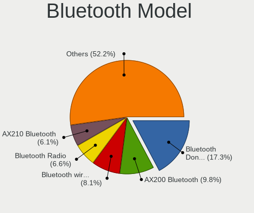

Ubuntu 22.04 - Tested Hardware & Statistics (Desktops)
------------------------------------------------------

A project to collect tested hardware configurations for Ubuntu 22.04.

Anyone can contribute to this report by the [hw-probe](https://github.com/linuxhw/hw-probe) tool:

    sudo -E hw-probe -all -upload

Please contribute! Especially if your hardware is rare.

Contents
--------

* [ Test Cases ](#test-cases)

* [ System ](#system)
  - [ Kernel                   ](#kernel)
  - [ Kernel Family            ](#kernel-family)
  - [ Kernel Major Ver.        ](#kernel-major-ver)
  - [ Arch                     ](#arch)
  - [ DE                       ](#de)
  - [ Display Server           ](#display-server)
  - [ Display Manager          ](#display-manager)
  - [ OS Lang                  ](#os-lang)
  - [ Boot Mode                ](#boot-mode)
  - [ Filesystem               ](#filesystem)
  - [ Part. scheme             ](#part-scheme)
  - [ Dual Boot with Linux/BSD ](#dual-boot-with-linuxbsd)
  - [ Dual Boot (Win)          ](#dual-boot-win)

* [ Board ](#board)
  - [ Vendor                   ](#vendor)
  - [ Model                    ](#model)
  - [ Model Family             ](#model-family)
  - [ MFG Year                 ](#mfg-year)
  - [ Form Factor              ](#form-factor)
  - [ Secure Boot              ](#secure-boot)
  - [ Coreboot                 ](#coreboot)
  - [ RAM Size                 ](#ram-size)
  - [ RAM Used                 ](#ram-used)
  - [ Total Drives             ](#total-drives)
  - [ Has CD-ROM               ](#has-cd-rom)
  - [ Has Ethernet             ](#has-ethernet)
  - [ Has WiFi                 ](#has-wifi)
  - [ Has Bluetooth            ](#has-bluetooth)

* [ Location ](#location)
  - [ Country                  ](#country)
  - [ City                     ](#city)

* [ Drives ](#drives)
  - [ Drive Vendor             ](#drive-vendor)
  - [ Drive Model              ](#drive-model)
  - [ HDD Vendor               ](#hdd-vendor)
  - [ SSD Vendor               ](#ssd-vendor)
  - [ Drive Kind               ](#drive-kind)
  - [ Drive Connector          ](#drive-connector)
  - [ Drive Size               ](#drive-size)
  - [ Space Total              ](#space-total)
  - [ Space Used               ](#space-used)
  - [ Malfunc. Drives          ](#malfunc-drives)
  - [ Malfunc. Drive Vendor    ](#malfunc-drive-vendor)
  - [ Malfunc. HDD Vendor      ](#malfunc-hdd-vendor)
  - [ Malfunc. Drive Kind      ](#malfunc-drive-kind)
  - [ Failed Drives            ](#failed-drives)
  - [ Failed Drive Vendor      ](#failed-drive-vendor)
  - [ Drive Status             ](#drive-status)

* [ Storage controller ](#storage-controller)
  - [ Storage Vendor           ](#storage-vendor)
  - [ Storage Model            ](#storage-model)
  - [ Storage Kind             ](#storage-kind)

* [ Processor ](#processor)
  - [ CPU Vendor               ](#cpu-vendor)
  - [ CPU Model                ](#cpu-model)
  - [ CPU Model Family         ](#cpu-model-family)
  - [ CPU Cores                ](#cpu-cores)
  - [ CPU Sockets              ](#cpu-sockets)
  - [ CPU Threads              ](#cpu-threads)
  - [ CPU Op-Modes             ](#cpu-op-modes)
  - [ CPU Microcode            ](#cpu-microcode)
  - [ CPU Microarch            ](#cpu-microarch)

* [ Graphics ](#graphics)
  - [ GPU Vendor               ](#gpu-vendor)
  - [ GPU Model                ](#gpu-model)
  - [ GPU Combo                ](#gpu-combo)
  - [ GPU Driver               ](#gpu-driver)
  - [ GPU Memory               ](#gpu-memory)

* [ Monitor ](#monitor)
  - [ Monitor Vendor           ](#monitor-vendor)
  - [ Monitor Model            ](#monitor-model)
  - [ Monitor Resolution       ](#monitor-resolution)
  - [ Monitor Diagonal         ](#monitor-diagonal)
  - [ Monitor Width            ](#monitor-width)
  - [ Aspect Ratio             ](#aspect-ratio)
  - [ Monitor Area             ](#monitor-area)
  - [ Pixel Density            ](#pixel-density)
  - [ Multiple Monitors        ](#multiple-monitors)

* [ Network ](#network)
  - [ Net Controller Vendor    ](#net-controller-vendor)
  - [ Net Controller Model     ](#net-controller-model)
  - [ Wireless Vendor          ](#wireless-vendor)
  - [ Wireless Model           ](#wireless-model)
  - [ Ethernet Vendor          ](#ethernet-vendor)
  - [ Ethernet Model           ](#ethernet-model)
  - [ Net Controller Kind      ](#net-controller-kind)
  - [ Used Controller          ](#used-controller)
  - [ NICs                     ](#nics)
  - [ IPv6                     ](#ipv6)

* [ Bluetooth ](#bluetooth)
  - [ Bluetooth Vendor         ](#bluetooth-vendor)
  - [ Bluetooth Model          ](#bluetooth-model)

* [ Sound ](#sound)
  - [ Sound Vendor             ](#sound-vendor)
  - [ Sound Model              ](#sound-model)

* [ Memory ](#memory)
  - [ Memory Vendor            ](#memory-vendor)
  - [ Memory Model             ](#memory-model)
  - [ Memory Kind              ](#memory-kind)
  - [ Memory Form Factor       ](#memory-form-factor)
  - [ Memory Size              ](#memory-size)
  - [ Memory Speed             ](#memory-speed)

* [ Printers & scanners ](#printers--scanners)
  - [ Printer Vendor           ](#printer-vendor)
  - [ Printer Model            ](#printer-model)
  - [ Scanner Vendor           ](#scanner-vendor)
  - [ Scanner Model            ](#scanner-model)

* [ Camera ](#camera)
  - [ Camera Vendor            ](#camera-vendor)
  - [ Camera Model             ](#camera-model)

* [ Security ](#security)
  - [ Fingerprint Vendor       ](#fingerprint-vendor)
  - [ Fingerprint Model        ](#fingerprint-model)
  - [ Chipcard Vendor          ](#chipcard-vendor)
  - [ Chipcard Model           ](#chipcard-model)

* [ Unsupported ](#unsupported)
  - [ Unsupported Devices      ](#unsupported-devices)
  - [ Unsupported Device Types ](#unsupported-device-types)

Test Cases
----------

Total: 6550

| Vendor        | Model                       | Probe                                                      | Date         |
|---------------|-----------------------------|------------------------------------------------------------|--------------|
| GMKtec        | NucBox K2                   | [a88d491579](https://linux-hardware.org/?probe=a88d491579) | Nov 06, 2023 |
| Gigabyte      | Z390 AORUS PRO WIFI-CF      | [cee650aa5a](https://linux-hardware.org/?probe=cee650aa5a) | Nov 06, 2023 |
| Dell          | OptiPlex 5050               | [6c4a08354b](https://linux-hardware.org/?probe=6c4a08354b) | Nov 06, 2023 |
| MSI           | B560M PRO-E                 | [89a24ae9fa](https://linux-hardware.org/?probe=89a24ae9fa) | Nov 06, 2023 |
| ASUSTek       | SABERTOOTH X79              | [c46040087a](https://linux-hardware.org/?probe=c46040087a) | Nov 06, 2023 |
| Shuttle       | XS35V3                      | [0c51d541de](https://linux-hardware.org/?probe=0c51d541de) | Nov 06, 2023 |
| ASUSTek       | P30AD                       | [63322c386f](https://linux-hardware.org/?probe=63322c386f) | Nov 05, 2023 |
| HP            | 2B05                        | [eb343bd373](https://linux-hardware.org/?probe=eb343bd373) | Nov 05, 2023 |
| Gigabyte      | B250M-DS3H-CF               | [25b39b698c](https://linux-hardware.org/?probe=25b39b698c) | Nov 05, 2023 |
| Dell          | 0JCTF8 A00                  | [b3669f73a8](https://linux-hardware.org/?probe=b3669f73a8) | Nov 05, 2023 |
| MSI           | MAG X670E TOMAHAWK WIFI     | [d95f04dd2c](https://linux-hardware.org/?probe=d95f04dd2c) | Nov 05, 2023 |
| HP            | 1495                        | [fe18b89530](https://linux-hardware.org/?probe=fe18b89530) | Nov 05, 2023 |
| ASUSTek       | PRIME X470-PRO              | [692601dd3b](https://linux-hardware.org/?probe=692601dd3b) | Nov 05, 2023 |
| MSI           | MEG Z590 UNIFY              | [1f84fe45f8](https://linux-hardware.org/?probe=1f84fe45f8) | Nov 05, 2023 |
| Dell          | 0WMJ54 A01                  | [5cff6ffdfc](https://linux-hardware.org/?probe=5cff6ffdfc) | Nov 05, 2023 |
| MSI           | NIGHTBLADE Z97              | [3da62b47b3](https://linux-hardware.org/?probe=3da62b47b3) | Nov 05, 2023 |
| Gigabyte      | B450M GAMING-CF             | [247cc16161](https://linux-hardware.org/?probe=247cc16161) | Nov 05, 2023 |
| ASUSTek       | P5G41T-M LX2/GB             | [5196f9303d](https://linux-hardware.org/?probe=5196f9303d) | Nov 05, 2023 |
| ASUSTek       | P5Q-PRO                     | [a1500e2e9c](https://linux-hardware.org/?probe=a1500e2e9c) | Nov 05, 2023 |
| Dell          | 062TCH A00                  | [b82fbd03d5](https://linux-hardware.org/?probe=b82fbd03d5) | Nov 05, 2023 |
| Gigabyte      | Z97M-DS3H                   | [2cbd472a6e](https://linux-hardware.org/?probe=2cbd472a6e) | Nov 05, 2023 |
| Medion        | H110H4-EM                   | [9fe03aa296](https://linux-hardware.org/?probe=9fe03aa296) | Nov 04, 2023 |
| ASUSTek       | PRIME X470-PRO              | [c1523fb6a1](https://linux-hardware.org/?probe=c1523fb6a1) | Nov 04, 2023 |
| ASRock        | H470M-STX                   | [5a50d371b8](https://linux-hardware.org/?probe=5a50d371b8) | Nov 04, 2023 |
| Gigabyte      | GA-MA78LMT-S2               | [1636a231b2](https://linux-hardware.org/?probe=1636a231b2) | Nov 04, 2023 |
| HP            | 0A9Ch                       | [95415dec13](https://linux-hardware.org/?probe=95415dec13) | Nov 04, 2023 |
| ASUSTek       | M5A97 R2.0                  | [905d699d4d](https://linux-hardware.org/?probe=905d699d4d) | Nov 04, 2023 |
| Dell          | 062TCH A00                  | [b964b2c6be](https://linux-hardware.org/?probe=b964b2c6be) | Nov 04, 2023 |
| ASUSTek       | PRIME H510M-E               | [cd2b005e61](https://linux-hardware.org/?probe=cd2b005e61) | Nov 04, 2023 |
| Dell          | 018D1Y A00                  | [2135015e09](https://linux-hardware.org/?probe=2135015e09) | Nov 04, 2023 |
| Intel         | DG41RQ AAE54511-203         | [dff06d88c5](https://linux-hardware.org/?probe=dff06d88c5) | Nov 03, 2023 |
| Supermicro    | X9DRW                       | [d9bb198389](https://linux-hardware.org/?probe=d9bb198389) | Nov 03, 2023 |
| Supermicro    | X10DRL-i                    | [cada5224ab](https://linux-hardware.org/?probe=cada5224ab) | Nov 03, 2023 |
| Colorful T... | CVN X570M GAMING PRO V14    | [65b9bad459](https://linux-hardware.org/?probe=65b9bad459) | Nov 03, 2023 |
| Intel         | X99                         | [cb3515efba](https://linux-hardware.org/?probe=cb3515efba) | Nov 03, 2023 |
| Dell          | 0TDG4V A01                  | [9d9b09db51](https://linux-hardware.org/?probe=9d9b09db51) | Nov 03, 2023 |
| MSI           | B350 PC MATE                | [9c089ed10c](https://linux-hardware.org/?probe=9c089ed10c) | Nov 03, 2023 |
| Supermicro    | X10DRU-i+B                  | [305ce5bbcc](https://linux-hardware.org/?probe=305ce5bbcc) | Nov 03, 2023 |
| Supermicro    | X10DDW-i                    | [8a0ff875f1](https://linux-hardware.org/?probe=8a0ff875f1) | Nov 03, 2023 |
| Supermicro    | X10DDW-i                    | [3138fbde8e](https://linux-hardware.org/?probe=3138fbde8e) | Nov 03, 2023 |
| Supermicro    | X10DDW-i                    | [f3023a2a6f](https://linux-hardware.org/?probe=f3023a2a6f) | Nov 03, 2023 |
| Supermicro    | X10DDW-i                    | [d9dcb6003e](https://linux-hardware.org/?probe=d9dcb6003e) | Nov 03, 2023 |
| NEC Comput... | MS-7770MH                   | [9d2ab645d4](https://linux-hardware.org/?probe=9d2ab645d4) | Nov 03, 2023 |
| Fujitsu Si... | G31T-M2 V3.02               | [d069c6012d](https://linux-hardware.org/?probe=d069c6012d) | Nov 03, 2023 |
| ASUSTek       | Z97M-PLUS                   | [b0d77e36b1](https://linux-hardware.org/?probe=b0d77e36b1) | Nov 03, 2023 |
| ASRock        | B450M Steel Legend          | [dafce26ef5](https://linux-hardware.org/?probe=dafce26ef5) | Nov 02, 2023 |
| Dell          | 0VHWTR A01                  | [7d589af687](https://linux-hardware.org/?probe=7d589af687) | Nov 02, 2023 |
| Dell          | 0VHWTR A01                  | [b5c8e35523](https://linux-hardware.org/?probe=b5c8e35523) | Nov 02, 2023 |
| ASUSTek       | P5KPL-AM SE                 | [ea92d94742](https://linux-hardware.org/?probe=ea92d94742) | Nov 02, 2023 |
| ASUSTek       | TUF Gaming Z690-PLUS        | [99b1ce4372](https://linux-hardware.org/?probe=99b1ce4372) | Nov 02, 2023 |
| Acer          | Nitro N50-600 V:1.1         | [b2c5bb3ed9](https://linux-hardware.org/?probe=b2c5bb3ed9) | Nov 02, 2023 |
| Gigabyte      | X570 AORUS PRO WIFI         | [bf075c47d2](https://linux-hardware.org/?probe=bf075c47d2) | Nov 02, 2023 |
| Intel         | X99                         | [b740510fc0](https://linux-hardware.org/?probe=b740510fc0) | Nov 02, 2023 |
| Supermicro    | X10DRU-i+A                  | [2eee634512](https://linux-hardware.org/?probe=2eee634512) | Nov 02, 2023 |
| Supermicro    | X9DRW                       | [406a1425ae](https://linux-hardware.org/?probe=406a1425ae) | Nov 02, 2023 |
| Supermicro    | X10DRL-i                    | [7d77c86bc5](https://linux-hardware.org/?probe=7d77c86bc5) | Nov 02, 2023 |
| Dell          | 0FXD80 A00                  | [d9b51a3a36](https://linux-hardware.org/?probe=d9b51a3a36) | Nov 02, 2023 |
| AOpen         | D2644 S26361-D2644          | [db682d636c](https://linux-hardware.org/?probe=db682d636c) | Nov 02, 2023 |
| BESSTAR Te... | TH50                        | [fc3a35871e](https://linux-hardware.org/?probe=fc3a35871e) | Nov 02, 2023 |
| MSI           | Z170A GAMING M7             | [9ba4f50201](https://linux-hardware.org/?probe=9ba4f50201) | Nov 02, 2023 |
| ASUSTek       | PRIME A320M-K               | [1b1df273f9](https://linux-hardware.org/?probe=1b1df273f9) | Nov 01, 2023 |
| MSI           | A320M-A PRO MAX             | [f1e35faa1a](https://linux-hardware.org/?probe=f1e35faa1a) | Nov 01, 2023 |
| MSI           | Z170A GAMING M7             | [a613aa5a0f](https://linux-hardware.org/?probe=a613aa5a0f) | Nov 01, 2023 |
| ASRock        | Z690 Taichi                 | [b736058f88](https://linux-hardware.org/?probe=b736058f88) | Nov 01, 2023 |
| HP            | 0A58h                       | [9dd3c3fdfb](https://linux-hardware.org/?probe=9dd3c3fdfb) | Nov 01, 2023 |
| ASUSTek       | TUF Z370-PLUS GAMING        | [70365949d8](https://linux-hardware.org/?probe=70365949d8) | Nov 01, 2023 |
| Gigabyte      | Z370N WIFI-CF               | [1ab426a7ed](https://linux-hardware.org/?probe=1ab426a7ed) | Nov 01, 2023 |
| Lenovo        | 3704 SDK0J40700 WIN 3258... | [3987d09af3](https://linux-hardware.org/?probe=3987d09af3) | Nov 01, 2023 |
| ASUSTek       | Z97-AR                      | [39741158bc](https://linux-hardware.org/?probe=39741158bc) | Nov 01, 2023 |
| Gateway       | FX6840                      | [3c391c7868](https://linux-hardware.org/?probe=3c391c7868) | Nov 01, 2023 |
| ASUSTek       | PRIME A320M-K               | [4881df8aec](https://linux-hardware.org/?probe=4881df8aec) | Nov 01, 2023 |
| ASUSTek       | Z170M-PLUS                  | [92b5f4172e](https://linux-hardware.org/?probe=92b5f4172e) | Nov 01, 2023 |
| Gigabyte      | AX370M-Gaming 3-CF          | [3e5415671f](https://linux-hardware.org/?probe=3e5415671f) | Nov 01, 2023 |
| Gigabyte      | A520M K V2                  | [10670f1068](https://linux-hardware.org/?probe=10670f1068) | Nov 01, 2023 |
| Dell          | 09KPNV A01                  | [2477bc3b6a](https://linux-hardware.org/?probe=2477bc3b6a) | Nov 01, 2023 |
| ASUSTek       | PRIME B450M-A               | [8f885b5a65](https://linux-hardware.org/?probe=8f885b5a65) | Nov 01, 2023 |
| ASUSTek       | P8Z77-I DELUXE              | [ea285340e0](https://linux-hardware.org/?probe=ea285340e0) | Nov 01, 2023 |
| Gigabyte      | GA-MA770-DS3                | [968cf90d9a](https://linux-hardware.org/?probe=968cf90d9a) | Nov 01, 2023 |
| ASUSTek       | M5A97 R2.0                  | [8c9a8c3bcc](https://linux-hardware.org/?probe=8c9a8c3bcc) | Oct 31, 2023 |
| ASRock        | H310CM-HDV                  | [b24b974555](https://linux-hardware.org/?probe=b24b974555) | Oct 31, 2023 |
| HP            | 0A58h                       | [f7c62b9410](https://linux-hardware.org/?probe=f7c62b9410) | Oct 31, 2023 |
| MSI           | H81M-E34                    | [0babe23a9d](https://linux-hardware.org/?probe=0babe23a9d) | Oct 31, 2023 |
| ASUSTek       | ROG STRIX B660-I GAMING ... | [5787618dae](https://linux-hardware.org/?probe=5787618dae) | Oct 31, 2023 |
| MSI           | B85-G43 GAMING              | [5d218dd764](https://linux-hardware.org/?probe=5d218dd764) | Oct 31, 2023 |
| Unknown       | Unknown                     | [4e9f4aa1ab](https://linux-hardware.org/?probe=4e9f4aa1ab) | Oct 31, 2023 |
| MSI           | MPG B650 CARBON WIFI        | [fdc23b8b95](https://linux-hardware.org/?probe=fdc23b8b95) | Oct 31, 2023 |
| ASUSTek       | ROG CROSSHAIR VI HERO       | [dd9715f35d](https://linux-hardware.org/?probe=dd9715f35d) | Oct 31, 2023 |
| Dell          | 0P01GV A03                  | [c77bed1e18](https://linux-hardware.org/?probe=c77bed1e18) | Oct 31, 2023 |
| ASUSTek       | PRIME B360M-C               | [874efda598](https://linux-hardware.org/?probe=874efda598) | Oct 31, 2023 |
| ASUSTek       | PRIME B360M-C               | [16da68741a](https://linux-hardware.org/?probe=16da68741a) | Oct 31, 2023 |
| Gigabyte      | GA-970A-UD3                 | [98b1bd5970](https://linux-hardware.org/?probe=98b1bd5970) | Oct 31, 2023 |
| Win elemen... | M600                        | [205389ccc2](https://linux-hardware.org/?probe=205389ccc2) | Oct 31, 2023 |
| Win elemen... | M600                        | [f1a08307c8](https://linux-hardware.org/?probe=f1a08307c8) | Oct 31, 2023 |
| HP            | 1589                        | [2161dc3754](https://linux-hardware.org/?probe=2161dc3754) | Oct 31, 2023 |
| ASUSTek       | PRIME X399-A                | [69f596f456](https://linux-hardware.org/?probe=69f596f456) | Oct 30, 2023 |
| ASUSTek       | TUF Gaming B550M-PLUS       | [daffd3cd06](https://linux-hardware.org/?probe=daffd3cd06) | Oct 30, 2023 |
| AZW           | MINI S 10                   | [9695f9bec4](https://linux-hardware.org/?probe=9695f9bec4) | Oct 30, 2023 |
| Pegatron      | 2AB6                        | [7bcf41bb9f](https://linux-hardware.org/?probe=7bcf41bb9f) | Oct 30, 2023 |
| Gigabyte      | GA-970A-D3                  | [38ae588910](https://linux-hardware.org/?probe=38ae588910) | Oct 30, 2023 |
| MSI           | MAG Z490 TOMAHAWK           | [771ada77a7](https://linux-hardware.org/?probe=771ada77a7) | Oct 30, 2023 |
| ASUSTek       | STRIX H270F GAMING          | [b4f34c54ae](https://linux-hardware.org/?probe=b4f34c54ae) | Oct 30, 2023 |
| ASUSTek       | GA35DX                      | [c1e204e6b1](https://linux-hardware.org/?probe=c1e204e6b1) | Oct 30, 2023 |
| ASUSTek       | STRIX H270F GAMING          | [1c1290e065](https://linux-hardware.org/?probe=1c1290e065) | Oct 30, 2023 |
| MSI           | B85-G43 GAMING              | [fa91d8044f](https://linux-hardware.org/?probe=fa91d8044f) | Oct 30, 2023 |
| HP            | 8436                        | [4fe5c2e03c](https://linux-hardware.org/?probe=4fe5c2e03c) | Oct 30, 2023 |
| Supermicro    | X10DRU-i+B                  | [516d10eb4d](https://linux-hardware.org/?probe=516d10eb4d) | Oct 30, 2023 |
| Supermicro    | X10DRU-i+A                  | [87881094e7](https://linux-hardware.org/?probe=87881094e7) | Oct 30, 2023 |
| Supermicro    | X10DDW-i                    | [175f00718f](https://linux-hardware.org/?probe=175f00718f) | Oct 30, 2023 |
| Supermicro    | X10DDW-i                    | [a3b51e3697](https://linux-hardware.org/?probe=a3b51e3697) | Oct 30, 2023 |
| Dell          | 018D1Y A00                  | [ce361a7112](https://linux-hardware.org/?probe=ce361a7112) | Oct 30, 2023 |
| ASRock        | Z690 Taichi                 | [a9e193be90](https://linux-hardware.org/?probe=a9e193be90) | Oct 30, 2023 |
| ASUSTek       | PRIME X370-PRO              | [394ab5dbff](https://linux-hardware.org/?probe=394ab5dbff) | Oct 30, 2023 |
| ASUSTek       | ROG STRIX Z390-E GAMING     | [102224106e](https://linux-hardware.org/?probe=102224106e) | Oct 30, 2023 |
| AZW           | SEi                         | [aa8ba45b77](https://linux-hardware.org/?probe=aa8ba45b77) | Oct 30, 2023 |
| ASUSTek       | TUF Gaming Z490-PLUS        | [186a763d8a](https://linux-hardware.org/?probe=186a763d8a) | Oct 29, 2023 |
| Gigabyte      | GA-770TA-UD3                | [f1a5d466cd](https://linux-hardware.org/?probe=f1a5d466cd) | Oct 29, 2023 |
| Medion        | H110H4-EM                   | [1a2d0e5ed4](https://linux-hardware.org/?probe=1a2d0e5ed4) | Oct 29, 2023 |
| MSI           | X299 TOMAHAWK AC            | [b878ce40e7](https://linux-hardware.org/?probe=b878ce40e7) | Oct 29, 2023 |
| ASUSTek       | TUF Gaming Z790-PLUS WIF... | [4e093f6544](https://linux-hardware.org/?probe=4e093f6544) | Oct 29, 2023 |
| Biostar       | G31D-M7                     | [192416033b](https://linux-hardware.org/?probe=192416033b) | Oct 28, 2023 |
| MSI           | B360 GAMING PLUS            | [bb17f05c7f](https://linux-hardware.org/?probe=bb17f05c7f) | Oct 28, 2023 |
| ASUSTek       | P5Q-PRO                     | [2722dd43f2](https://linux-hardware.org/?probe=2722dd43f2) | Oct 28, 2023 |
| MSI           | B450M-A PRO MAX             | [84c2a8040c](https://linux-hardware.org/?probe=84c2a8040c) | Oct 28, 2023 |
| HP            | 1589                        | [fe31fa1d5e](https://linux-hardware.org/?probe=fe31fa1d5e) | Oct 28, 2023 |
| HP            | 1589                        | [5d14d38ded](https://linux-hardware.org/?probe=5d14d38ded) | Oct 28, 2023 |
| ASUSTek       | TUF Gaming Z790-PLUS WIF... | [8157e9bd12](https://linux-hardware.org/?probe=8157e9bd12) | Oct 28, 2023 |
| Gateway       | WG43M                       | [8f0cb70746](https://linux-hardware.org/?probe=8f0cb70746) | Oct 28, 2023 |
| Gigabyte      | B75M-D3H                    | [97d8cfe6f0](https://linux-hardware.org/?probe=97d8cfe6f0) | Oct 28, 2023 |
| HP            | 2B05                        | [a32b598fb9](https://linux-hardware.org/?probe=a32b598fb9) | Oct 28, 2023 |
| HP            | 158A                        | [f8fe5be681](https://linux-hardware.org/?probe=f8fe5be681) | Oct 28, 2023 |
| HP            | 2AF3                        | [f7c7d92cea](https://linux-hardware.org/?probe=f7c7d92cea) | Oct 28, 2023 |
| Intel         | H61                         | [1496665abb](https://linux-hardware.org/?probe=1496665abb) | Oct 27, 2023 |
| Lenovo        | SDK0J40700 WIN              | [09f4736f4f](https://linux-hardware.org/?probe=09f4736f4f) | Oct 27, 2023 |
| Supermicro    | X10DDW-i                    | [4ae7cd098c](https://linux-hardware.org/?probe=4ae7cd098c) | Oct 27, 2023 |
| Supermicro    | X10DDW-i                    | [27eeb454c8](https://linux-hardware.org/?probe=27eeb454c8) | Oct 27, 2023 |
| Supermicro    | X10DDW-i                    | [a822fb4575](https://linux-hardware.org/?probe=a822fb4575) | Oct 27, 2023 |
| Fujitsu       | D3233-A1 S26361-D3233-A1    | [05961f3f8d](https://linux-hardware.org/?probe=05961f3f8d) | Oct 27, 2023 |
| Supermicro    | X10DDW-i                    | [7b1a0dde51](https://linux-hardware.org/?probe=7b1a0dde51) | Oct 27, 2023 |
| Dell          | 0JCTF8 A00                  | [3cc39678ff](https://linux-hardware.org/?probe=3cc39678ff) | Oct 27, 2023 |
| Gateway       | FX6840                      | [7acd4709ef](https://linux-hardware.org/?probe=7acd4709ef) | Oct 27, 2023 |
| Gigabyte      | Z790 GAMING X AX            | [8555f763b4](https://linux-hardware.org/?probe=8555f763b4) | Oct 27, 2023 |
| MSI           | 2A9Ch                       | [3e7da65a41](https://linux-hardware.org/?probe=3e7da65a41) | Oct 27, 2023 |
| MSI           | 2A9Ch                       | [6b9e5b921c](https://linux-hardware.org/?probe=6b9e5b921c) | Oct 27, 2023 |
| ASUSTek       | Pro WS X570-ACE             | [2021aa6173](https://linux-hardware.org/?probe=2021aa6173) | Oct 27, 2023 |
| Supermicro    | X10DDW-i                    | [6afb6d264d](https://linux-hardware.org/?probe=6afb6d264d) | Oct 27, 2023 |
| Supermicro    | X10DDW-i                    | [36fadbfb7a](https://linux-hardware.org/?probe=36fadbfb7a) | Oct 27, 2023 |
| HP            | 8433 11                     | [f4b0e9190f](https://linux-hardware.org/?probe=f4b0e9190f) | Oct 27, 2023 |
| HP            | 2AF7                        | [3143f79dcd](https://linux-hardware.org/?probe=3143f79dcd) | Oct 27, 2023 |
| HP            | 0A9Ch                       | [f24350a95c](https://linux-hardware.org/?probe=f24350a95c) | Oct 27, 2023 |
| HP            | 1998                        | [4701148920](https://linux-hardware.org/?probe=4701148920) | Oct 26, 2023 |
| Gigabyte      | 965P-S3                     | [ae3a4e206c](https://linux-hardware.org/?probe=ae3a4e206c) | Oct 26, 2023 |
| ASUSTek       | PRIME Z370-A                | [75fcf950c2](https://linux-hardware.org/?probe=75fcf950c2) | Oct 26, 2023 |
| Lenovo        | SHARKBAY SDK0E50510 WIN     | [bcbce33659](https://linux-hardware.org/?probe=bcbce33659) | Oct 26, 2023 |
| Gigabyte      | H110M-H-CF                  | [b64c6bb72a](https://linux-hardware.org/?probe=b64c6bb72a) | Oct 26, 2023 |
| Gigabyte      | GA-MA78GM-S2H               | [6c7a32d339](https://linux-hardware.org/?probe=6c7a32d339) | Oct 26, 2023 |
| MSI           | MAG Z490 TOMAHAWK           | [f3802ecf63](https://linux-hardware.org/?probe=f3802ecf63) | Oct 26, 2023 |
| ASUSTek       | ROG STRIX B650E-E GAMING... | [f43adee740](https://linux-hardware.org/?probe=f43adee740) | Oct 26, 2023 |
| Gigabyte      | GA-770TA-UD3                | [6944656466](https://linux-hardware.org/?probe=6944656466) | Oct 26, 2023 |
| ASUSTek       | Z170-A                      | [7d69a76c23](https://linux-hardware.org/?probe=7d69a76c23) | Oct 26, 2023 |
| Foxconn       | 2AA9h                       | [dade54701d](https://linux-hardware.org/?probe=dade54701d) | Oct 26, 2023 |
| ASUSTek       | ROG STRIX Z790-A GAMING ... | [534c2c528c](https://linux-hardware.org/?probe=534c2c528c) | Oct 26, 2023 |
| ASUSTek       | Maximus VII HERO            | [87c313ac06](https://linux-hardware.org/?probe=87c313ac06) | Oct 26, 2023 |
| MSI           | MAG Z490 TOMAHAWK           | [1ad6c144a3](https://linux-hardware.org/?probe=1ad6c144a3) | Oct 26, 2023 |
| ASUSTek       | Maximus VII HERO            | [a0e6502d94](https://linux-hardware.org/?probe=a0e6502d94) | Oct 26, 2023 |
| HP            | 158A                        | [86f988197b](https://linux-hardware.org/?probe=86f988197b) | Oct 26, 2023 |
| ASUSTek       | TUF Gaming X670E-PLUS WI... | [6709fab81c](https://linux-hardware.org/?probe=6709fab81c) | Oct 26, 2023 |
| ASUSTek       | TUF Gaming X670E-PLUS WI... | [c041582324](https://linux-hardware.org/?probe=c041582324) | Oct 26, 2023 |
| HP            | 8265                        | [25dfe4d311](https://linux-hardware.org/?probe=25dfe4d311) | Oct 26, 2023 |
| ASUSTek       | P6X58-E-WS                  | [abb9f306b8](https://linux-hardware.org/?probe=abb9f306b8) | Oct 25, 2023 |
| HP            | 822A                        | [4d1e3ee1f2](https://linux-hardware.org/?probe=4d1e3ee1f2) | Oct 25, 2023 |
| ASRock        | A520M-ITX/ac                | [8a5e0bd9d6](https://linux-hardware.org/?probe=8a5e0bd9d6) | Oct 25, 2023 |
| Acer          | Aspire GX-281               | [63c928a75f](https://linux-hardware.org/?probe=63c928a75f) | Oct 25, 2023 |
| ASRock        | X570 Phantom Gaming 4       | [25c0172035](https://linux-hardware.org/?probe=25c0172035) | Oct 25, 2023 |
| Lenovo        | SHARKBAY 0B98401 WIN        | [b38766677c](https://linux-hardware.org/?probe=b38766677c) | Oct 25, 2023 |
| ASUSTek       | ROG STRIX B550-F GAMING     | [e090fa6279](https://linux-hardware.org/?probe=e090fa6279) | Oct 25, 2023 |
| Acer          | Veriton S2680G              | [da9a811b04](https://linux-hardware.org/?probe=da9a811b04) | Oct 25, 2023 |
| ASUSTek       | PRIME B450M-A               | [deac292d7d](https://linux-hardware.org/?probe=deac292d7d) | Oct 25, 2023 |
| ASUSTek       | Q87M-E                      | [69e78c6a85](https://linux-hardware.org/?probe=69e78c6a85) | Oct 25, 2023 |
| System76      | Thelio Mira                 | [3bb1924402](https://linux-hardware.org/?probe=3bb1924402) | Oct 25, 2023 |
| MSI           | 2A9C                        | [d87ee22b95](https://linux-hardware.org/?probe=d87ee22b95) | Oct 24, 2023 |
| Lenovo        | SHARKBAY 31900058 STD       | [b8ac729343](https://linux-hardware.org/?probe=b8ac729343) | Oct 24, 2023 |
| Dell          | 06FW8P A02                  | [4efc493619](https://linux-hardware.org/?probe=4efc493619) | Oct 24, 2023 |
| ASUSTek       | P8P67 EVO                   | [3baa020480](https://linux-hardware.org/?probe=3baa020480) | Oct 24, 2023 |
| Acer          | Aspire XC-1760              | [8a5c420847](https://linux-hardware.org/?probe=8a5c420847) | Oct 24, 2023 |
| Lenovo        | SHARKBAY 0B98401 PRO        | [54a6d9d5d0](https://linux-hardware.org/?probe=54a6d9d5d0) | Oct 24, 2023 |
| Unknown       | 1.1                         | [c006e77646](https://linux-hardware.org/?probe=c006e77646) | Oct 24, 2023 |
| HP            | 1589                        | [1a61614ad2](https://linux-hardware.org/?probe=1a61614ad2) | Oct 24, 2023 |
| ASUSTek       | PRIME A320M-K               | [d09253d43a](https://linux-hardware.org/?probe=d09253d43a) | Oct 24, 2023 |
| Gigabyte      | B450M DS3H-CF               | [9b0be83ecc](https://linux-hardware.org/?probe=9b0be83ecc) | Oct 24, 2023 |
| MSI           | MAG B550 TOMAHAWK           | [2d6bcd74d8](https://linux-hardware.org/?probe=2d6bcd74d8) | Oct 24, 2023 |
| Google        | Teemo                       | [ae5140ac26](https://linux-hardware.org/?probe=ae5140ac26) | Oct 24, 2023 |
| Lenovo        | 0B98409 STD                 | [b89f42b23f](https://linux-hardware.org/?probe=b89f42b23f) | Oct 24, 2023 |
| Dell          | 097YXY A00                  | [31dc22d5af](https://linux-hardware.org/?probe=31dc22d5af) | Oct 24, 2023 |
| ASUSTek       | TUF Z370-PLUS GAMING        | [6c35175e9c](https://linux-hardware.org/?probe=6c35175e9c) | Oct 24, 2023 |
| ASRock        | 880GMH/USB3                 | [4d3fcc56ec](https://linux-hardware.org/?probe=4d3fcc56ec) | Oct 24, 2023 |
| Inventec      | D CLASS A02                 | [41bf70ff0b](https://linux-hardware.org/?probe=41bf70ff0b) | Oct 23, 2023 |
| HP            | 83EF                        | [9a8026df67](https://linux-hardware.org/?probe=9a8026df67) | Oct 23, 2023 |
| Acer          | Aspire GX-281               | [0d96eb845d](https://linux-hardware.org/?probe=0d96eb845d) | Oct 23, 2023 |
| ASUSTek       | Z97-A                       | [c715f1ecb0](https://linux-hardware.org/?probe=c715f1ecb0) | Oct 23, 2023 |
| ASUSTek       | H110M-A                     | [a721fea460](https://linux-hardware.org/?probe=a721fea460) | Oct 23, 2023 |
| Gigabyte      | H310M H x.x                 | [d8c12e782e](https://linux-hardware.org/?probe=d8c12e782e) | Oct 23, 2023 |
| Dell          | 0TDG4V A01                  | [932adc1d60](https://linux-hardware.org/?probe=932adc1d60) | Oct 23, 2023 |
| Acer          | WG43M                       | [0580e7ab1b](https://linux-hardware.org/?probe=0580e7ab1b) | Oct 23, 2023 |
| Gigabyte      | Z390 AORUS PRO WIFI-CF      | [9ab95fedc6](https://linux-hardware.org/?probe=9ab95fedc6) | Oct 23, 2023 |
| Intel         | DB65AL AAG12530-307         | [09cf560035](https://linux-hardware.org/?probe=09cf560035) | Oct 23, 2023 |
| MSI           | 970 GAMING                  | [dfcfacf8d5](https://linux-hardware.org/?probe=dfcfacf8d5) | Oct 23, 2023 |
| ASRock        | Z490M-ITX/ac                | [98a9374798](https://linux-hardware.org/?probe=98a9374798) | Oct 22, 2023 |
| HP            | 3399                        | [3dca1c2950](https://linux-hardware.org/?probe=3dca1c2950) | Oct 22, 2023 |
| Fujitsu       | D3313-B1 S26361-D3313-B1    | [fb66b6579d](https://linux-hardware.org/?probe=fb66b6579d) | Oct 22, 2023 |
| Fujitsu       | D3601-A1 S26361-D3601-A1    | [dba9cc7689](https://linux-hardware.org/?probe=dba9cc7689) | Oct 22, 2023 |
| Trigkey       | Green G5                    | [a0cb634fc5](https://linux-hardware.org/?probe=a0cb634fc5) | Oct 22, 2023 |
| Packard Be... | FIH57                       | [322f0cceaa](https://linux-hardware.org/?probe=322f0cceaa) | Oct 22, 2023 |
| Gigabyte      | B450M DS3H-CF               | [b6df3ae720](https://linux-hardware.org/?probe=b6df3ae720) | Oct 22, 2023 |
| ASUSTek       | ROG STRIX Z790-A GAMING ... | [b3397c9aa2](https://linux-hardware.org/?probe=b3397c9aa2) | Oct 22, 2023 |
| ASUSTek       | P8H67                       | [5e8558b08d](https://linux-hardware.org/?probe=5e8558b08d) | Oct 22, 2023 |
| Gigabyte      | GA-78LMT-USB3 SEx           | [d38a6fb326](https://linux-hardware.org/?probe=d38a6fb326) | Oct 22, 2023 |
| MSI           | MS-7309                     | [b747d8e3a3](https://linux-hardware.org/?probe=b747d8e3a3) | Oct 22, 2023 |
| Dell          | 0YXT71 A00                  | [5f04088965](https://linux-hardware.org/?probe=5f04088965) | Oct 22, 2023 |
| HP            | 18E5                        | [95cc2c3a9c](https://linux-hardware.org/?probe=95cc2c3a9c) | Oct 22, 2023 |
| Gigabyte      | GA-MA790XT-UD4P             | [ad17620d9f](https://linux-hardware.org/?probe=ad17620d9f) | Oct 21, 2023 |
| ASRock        | H61M-HVS                    | [cd365d2e35](https://linux-hardware.org/?probe=cd365d2e35) | Oct 21, 2023 |
| Lenovo        | ThinkServer TS140           | [b52eba9a1b](https://linux-hardware.org/?probe=b52eba9a1b) | Oct 21, 2023 |
| Gigabyte      | B450M DS3H-CF               | [30d9002099](https://linux-hardware.org/?probe=30d9002099) | Oct 21, 2023 |
| HP            | ML150 G3                    | [eb5a4bfed8](https://linux-hardware.org/?probe=eb5a4bfed8) | Oct 21, 2023 |
| ASUSTek       | Rampage III Extreme         | [36827ef46c](https://linux-hardware.org/?probe=36827ef46c) | Oct 21, 2023 |
| ASUSTek       | P9X79                       | [3df64c6ee4](https://linux-hardware.org/?probe=3df64c6ee4) | Oct 21, 2023 |
| ASRock        | 870 Extreme3 R2.0           | [a625868a25](https://linux-hardware.org/?probe=a625868a25) | Oct 21, 2023 |
| Gigabyte      | Z77M-D3H                    | [0dcc624a0d](https://linux-hardware.org/?probe=0dcc624a0d) | Oct 21, 2023 |
| Packard Be... | FIH57                       | [b16d87199a](https://linux-hardware.org/?probe=b16d87199a) | Oct 21, 2023 |
| Gigabyte      | GA-MA790XT-UD4P             | [9286fa6477](https://linux-hardware.org/?probe=9286fa6477) | Oct 21, 2023 |
| Intel         | X79G V2.x                   | [49d37b87cf](https://linux-hardware.org/?probe=49d37b87cf) | Oct 21, 2023 |
| ASUSTek       | PRIME H310M-E R2.0          | [673aa81f04](https://linux-hardware.org/?probe=673aa81f04) | Oct 21, 2023 |
| ASRock        | Z690 Taichi                 | [b249afcf52](https://linux-hardware.org/?probe=b249afcf52) | Oct 21, 2023 |
| ASUSTek       | H110M-A                     | [2ad6656255](https://linux-hardware.org/?probe=2ad6656255) | Oct 21, 2023 |
| Fujitsu       | D3233-A1 S26361-D3233-A1    | [a3af824c75](https://linux-hardware.org/?probe=a3af824c75) | Oct 20, 2023 |
| HP            | 83E9                        | [20501a2966](https://linux-hardware.org/?probe=20501a2966) | Oct 20, 2023 |
| ASUSTek       | H110M-A                     | [4aaa66c7bc](https://linux-hardware.org/?probe=4aaa66c7bc) | Oct 20, 2023 |
| Intel         | D53427RKE G87971-406        | [01b0785dea](https://linux-hardware.org/?probe=01b0785dea) | Oct 20, 2023 |
| ASRock        | Z690 Taichi                 | [a49686cc23](https://linux-hardware.org/?probe=a49686cc23) | Oct 20, 2023 |
| Intel         | D33217CK G76541-300         | [967b9f4bbe](https://linux-hardware.org/?probe=967b9f4bbe) | Oct 20, 2023 |
| Gigabyte      | B450 I AORUS PRO WIFI-CF    | [bae930bd47](https://linux-hardware.org/?probe=bae930bd47) | Oct 20, 2023 |
| Gigabyte      | Z97M-DS3H                   | [2ca3451a04](https://linux-hardware.org/?probe=2ca3451a04) | Oct 20, 2023 |
| MSI           | PRO B760M-P DDR4            | [87f50ecd22](https://linux-hardware.org/?probe=87f50ecd22) | Oct 20, 2023 |
| MSI           | PRO B760M-P DDR4            | [23f0d88b97](https://linux-hardware.org/?probe=23f0d88b97) | Oct 20, 2023 |
| ASRock        | B660-ITX                    | [b3a7dac908](https://linux-hardware.org/?probe=b3a7dac908) | Oct 20, 2023 |
| HP            | 0AA0h                       | [4175b0f530](https://linux-hardware.org/?probe=4175b0f530) | Oct 20, 2023 |
| Gigabyte      | Z390 AORUS PRO WIFI-CF      | [c123099547](https://linux-hardware.org/?probe=c123099547) | Oct 20, 2023 |
| MSI           | B85M-E45                    | [faedd980e0](https://linux-hardware.org/?probe=faedd980e0) | Oct 20, 2023 |
| ASUSTek       | UN62                        | [a1cb1227bf](https://linux-hardware.org/?probe=a1cb1227bf) | Oct 20, 2023 |
| ASUSTek       | UN62                        | [48e1c6f6e2](https://linux-hardware.org/?probe=48e1c6f6e2) | Oct 20, 2023 |
| HP            | 3397                        | [7622910000](https://linux-hardware.org/?probe=7622910000) | Oct 20, 2023 |
| HP            | 2B4B                        | [d23d9f0e33](https://linux-hardware.org/?probe=d23d9f0e33) | Oct 20, 2023 |
| Gigabyte      | B660M DS3H DDR4             | [82633fd1ef](https://linux-hardware.org/?probe=82633fd1ef) | Oct 19, 2023 |
| ASUSTek       | ROG STRIX X570-I GAMING     | [0fa5f53ce0](https://linux-hardware.org/?probe=0fa5f53ce0) | Oct 19, 2023 |
| Supermicro    | X10DDW-i                    | [7f765cc00f](https://linux-hardware.org/?probe=7f765cc00f) | Oct 19, 2023 |
| Supermicro    | X10DDW-i                    | [fbe57c97ea](https://linux-hardware.org/?probe=fbe57c97ea) | Oct 19, 2023 |
| Supermicro    | X10DRL-i                    | [3ff4f4f39b](https://linux-hardware.org/?probe=3ff4f4f39b) | Oct 19, 2023 |
| Supermicro    | X10DDW-i                    | [bc6515ee92](https://linux-hardware.org/?probe=bc6515ee92) | Oct 19, 2023 |
| Supermicro    | X10DDW-i                    | [2d8d01b0df](https://linux-hardware.org/?probe=2d8d01b0df) | Oct 19, 2023 |
| Supermicro    | X10DDW-i                    | [494b45d07d](https://linux-hardware.org/?probe=494b45d07d) | Oct 19, 2023 |
| Supermicro    | X10DRL-i                    | [f25155c26d](https://linux-hardware.org/?probe=f25155c26d) | Oct 19, 2023 |
| Supermicro    | X10DRL-i                    | [78fdf3830c](https://linux-hardware.org/?probe=78fdf3830c) | Oct 19, 2023 |
| Acer          | Aspire TC-330               | [99424bb03e](https://linux-hardware.org/?probe=99424bb03e) | Oct 19, 2023 |
| MSI           | H81M-E34                    | [18c6eb940d](https://linux-hardware.org/?probe=18c6eb940d) | Oct 19, 2023 |
| HP            | 1496                        | [c0c1d4b920](https://linux-hardware.org/?probe=c0c1d4b920) | Oct 19, 2023 |
| HP            | 3397                        | [555ad3c716](https://linux-hardware.org/?probe=555ad3c716) | Oct 19, 2023 |
| Acer          | Aspire TC-330               | [ddabdcc2b7](https://linux-hardware.org/?probe=ddabdcc2b7) | Oct 19, 2023 |
| Foxconn       | 2AB1                        | [ce52d37a5f](https://linux-hardware.org/?probe=ce52d37a5f) | Oct 19, 2023 |
| MSI           | FM2-A75MA-E35               | [868a2c328d](https://linux-hardware.org/?probe=868a2c328d) | Oct 19, 2023 |
| ASUSTek       | PRIME B650M-A WIFI          | [0c6accd4fc](https://linux-hardware.org/?probe=0c6accd4fc) | Oct 19, 2023 |
| ASUSTek       | PRIME B650M-A WIFI          | [c05a67e739](https://linux-hardware.org/?probe=c05a67e739) | Oct 19, 2023 |
| Dell          | 0T10XW A02                  | [359e8bb86f](https://linux-hardware.org/?probe=359e8bb86f) | Oct 18, 2023 |
| Gigabyte      | M52L-S3P                    | [6c4a10bf6e](https://linux-hardware.org/?probe=6c4a10bf6e) | Oct 18, 2023 |
| Gigabyte      | A320M-S2H-CF                | [3745e48bdc](https://linux-hardware.org/?probe=3745e48bdc) | Oct 18, 2023 |
| Gigabyte      | Z370N WIFI-CF               | [df8d309418](https://linux-hardware.org/?probe=df8d309418) | Oct 18, 2023 |
| Supermicro    | X10DDW-i                    | [b3685de812](https://linux-hardware.org/?probe=b3685de812) | Oct 18, 2023 |
| Supermicro    | X10DDW-i                    | [a84fa735c7](https://linux-hardware.org/?probe=a84fa735c7) | Oct 18, 2023 |
| HP            | 18E7                        | [3beee97f8b](https://linux-hardware.org/?probe=3beee97f8b) | Oct 18, 2023 |
| Gigabyte      | G1.Sniper A88X-CF           | [534b565ca1](https://linux-hardware.org/?probe=534b565ca1) | Oct 18, 2023 |
| Supermicro    | X10DRU-i+B                  | [f2e360b8e4](https://linux-hardware.org/?probe=f2e360b8e4) | Oct 18, 2023 |
| Supermicro    | X10DRU-i+A                  | [1245e9bcc8](https://linux-hardware.org/?probe=1245e9bcc8) | Oct 18, 2023 |
| Supermicro    | X9DRW                       | [c57bad94cc](https://linux-hardware.org/?probe=c57bad94cc) | Oct 18, 2023 |
| ASRock        | 970 Pro3 R2.0               | [dbb30ccac0](https://linux-hardware.org/?probe=dbb30ccac0) | Oct 18, 2023 |
| Supermicro    | X10DRU-i+A                  | [8f574baa5b](https://linux-hardware.org/?probe=8f574baa5b) | Oct 18, 2023 |
| HP            | 2B29                        | [70d4194832](https://linux-hardware.org/?probe=70d4194832) | Oct 18, 2023 |
| HP            | 2B29                        | [b4da4bf11d](https://linux-hardware.org/?probe=b4da4bf11d) | Oct 18, 2023 |
| Dell          | 0DR845                      | [4363cfd864](https://linux-hardware.org/?probe=4363cfd864) | Oct 17, 2023 |
| Lenovo        | SHARKBAY NOK                | [15064c45a9](https://linux-hardware.org/?probe=15064c45a9) | Oct 17, 2023 |
| ASUSTek       | TUF Gaming B450M-PLUS II    | [200b756e67](https://linux-hardware.org/?probe=200b756e67) | Oct 17, 2023 |
| ASUSTek       | UN42                        | [53267f9960](https://linux-hardware.org/?probe=53267f9960) | Oct 17, 2023 |
| AMI           | IB70 V202                   | [712b29d6db](https://linux-hardware.org/?probe=712b29d6db) | Oct 17, 2023 |
| Gigabyte      | H310M H x.x                 | [98b06c3d78](https://linux-hardware.org/?probe=98b06c3d78) | Oct 17, 2023 |
| ASUSTek       | P8H67-M PRO                 | [7ebf44d28b](https://linux-hardware.org/?probe=7ebf44d28b) | Oct 17, 2023 |
| Unknown       | Unknown                     | [4e34e33eee](https://linux-hardware.org/?probe=4e34e33eee) | Oct 17, 2023 |
| Unknown       | Unknown                     | [fc0368a716](https://linux-hardware.org/?probe=fc0368a716) | Oct 17, 2023 |
| ASUSTek       | H81M-K                      | [0875e69e22](https://linux-hardware.org/?probe=0875e69e22) | Oct 17, 2023 |
| Intel         | DP35DP AAD81073-208         | [f7059ece0c](https://linux-hardware.org/?probe=f7059ece0c) | Oct 17, 2023 |
| Unknown       | Intel X79                   | [d2553e6cbd](https://linux-hardware.org/?probe=d2553e6cbd) | Oct 17, 2023 |
| HP            | 843B                        | [4f8aa79674](https://linux-hardware.org/?probe=4f8aa79674) | Oct 17, 2023 |
| Gigabyte      | MFLP3CP-00                  | [e2ddb858a9](https://linux-hardware.org/?probe=e2ddb858a9) | Oct 16, 2023 |
| ASRock        | A320M-HDV R3.0              | [95642179a1](https://linux-hardware.org/?probe=95642179a1) | Oct 16, 2023 |
| Dell          | 051FJ8 A00                  | [60bea2da11](https://linux-hardware.org/?probe=60bea2da11) | Oct 16, 2023 |
| Dell          | 0CRH6C A00                  | [861e34ac85](https://linux-hardware.org/?probe=861e34ac85) | Oct 16, 2023 |
| MSI           | 2A9Ch                       | [81c485dfbe](https://linux-hardware.org/?probe=81c485dfbe) | Oct 16, 2023 |
| Unknown       | Unknown                     | [90af9ca939](https://linux-hardware.org/?probe=90af9ca939) | Oct 16, 2023 |
| Gigabyte      | B450M DS3H-CF               | [f12bcba44c](https://linux-hardware.org/?probe=f12bcba44c) | Oct 16, 2023 |
| ASUSTek       | Z170-A                      | [9671bbc29b](https://linux-hardware.org/?probe=9671bbc29b) | Oct 16, 2023 |
| HP            | 0AE4h                       | [a31dd4463f](https://linux-hardware.org/?probe=a31dd4463f) | Oct 16, 2023 |
| HP            | 0AE4h                       | [4ebaa677df](https://linux-hardware.org/?probe=4ebaa677df) | Oct 16, 2023 |
| ASUSTek       | ROG STRIX Z790-A GAMING ... | [e83fde9360](https://linux-hardware.org/?probe=e83fde9360) | Oct 16, 2023 |
| MSI           | B85M-E45                    | [acc8588daa](https://linux-hardware.org/?probe=acc8588daa) | Oct 16, 2023 |
| AZW           | GTR V21                     | [e90b0c01be](https://linux-hardware.org/?probe=e90b0c01be) | Oct 16, 2023 |
| MSI           | 2A9Ch                       | [6b86dab25f](https://linux-hardware.org/?probe=6b86dab25f) | Oct 16, 2023 |
| HP            | 8433 11                     | [24fdb6f03a](https://linux-hardware.org/?probe=24fdb6f03a) | Oct 16, 2023 |
| HP            | ProLiant ML350 Gen9         | [468a686a40](https://linux-hardware.org/?probe=468a686a40) | Oct 15, 2023 |
| Dell          | 0D28YY A01                  | [a69ebf1645](https://linux-hardware.org/?probe=a69ebf1645) | Oct 15, 2023 |
| MSI           | A320M-A PRO MAX             | [3c6ab62b00](https://linux-hardware.org/?probe=3c6ab62b00) | Oct 15, 2023 |
| Gigabyte      | GA-78LMT-USB3 SEx           | [c0446b13ce](https://linux-hardware.org/?probe=c0446b13ce) | Oct 15, 2023 |
| Lenovo        | SHARKBAY 0B98401 PRO        | [c84dd6e4ea](https://linux-hardware.org/?probe=c84dd6e4ea) | Oct 15, 2023 |
| Dell          | 0HN7XN A01                  | [6ca94363be](https://linux-hardware.org/?probe=6ca94363be) | Oct 15, 2023 |
| Dell          | 0HN7XN A01                  | [de23701ea4](https://linux-hardware.org/?probe=de23701ea4) | Oct 15, 2023 |
| MSI           | MAG B460M MORTAR WIFI       | [dd3eca03df](https://linux-hardware.org/?probe=dd3eca03df) | Oct 15, 2023 |
| Intel         | X79 V3.0                    | [525be51dcd](https://linux-hardware.org/?probe=525be51dcd) | Oct 15, 2023 |
| ASUSTek       | H81-GAMER                   | [4db3cdfdca](https://linux-hardware.org/?probe=4db3cdfdca) | Oct 15, 2023 |
| ASUSTek       | PRIME B450-PLUS             | [4b5e14f452](https://linux-hardware.org/?probe=4b5e14f452) | Oct 15, 2023 |
| Dell          | 0WR7PY A01                  | [9dbe237209](https://linux-hardware.org/?probe=9dbe237209) | Oct 15, 2023 |
| ASUSTek       | H61M-K                      | [dfee331121](https://linux-hardware.org/?probe=dfee331121) | Oct 15, 2023 |
| ASRock        | B85M                        | [1712e16d1c](https://linux-hardware.org/?probe=1712e16d1c) | Oct 15, 2023 |
| SZMZ          | X99M-G2                     | [1b0f7ae9a7](https://linux-hardware.org/?probe=1b0f7ae9a7) | Oct 15, 2023 |
| MSI           | FM2-A75MA-E35               | [445403f24d](https://linux-hardware.org/?probe=445403f24d) | Oct 15, 2023 |
| Intel         | DN2820FYK H24582-204        | [721e07849a](https://linux-hardware.org/?probe=721e07849a) | Oct 14, 2023 |
| Gigabyte      | AB350-Gaming 3-CF           | [3d6223857b](https://linux-hardware.org/?probe=3d6223857b) | Oct 14, 2023 |
| Dell          | 0D28YY A01                  | [39ea3f0798](https://linux-hardware.org/?probe=39ea3f0798) | Oct 14, 2023 |
| Gigabyte      | Z390 AORUS ELITE-CF         | [8ee594360c](https://linux-hardware.org/?probe=8ee594360c) | Oct 14, 2023 |
| ASUSTek       | ROG STRIX X670E-E GAMING... | [4de3d352fb](https://linux-hardware.org/?probe=4de3d352fb) | Oct 14, 2023 |
| Gigabyte      | X58A-UD7                    | [1a722caeea](https://linux-hardware.org/?probe=1a722caeea) | Oct 14, 2023 |
| ASUSTek       | ROG STRIX B350-F GAMING     | [1853003ff7](https://linux-hardware.org/?probe=1853003ff7) | Oct 14, 2023 |
| HP            | 3031h                       | [7c4f54cef2](https://linux-hardware.org/?probe=7c4f54cef2) | Oct 14, 2023 |
| HP            | 3031h                       | [d8968fefa9](https://linux-hardware.org/?probe=d8968fefa9) | Oct 14, 2023 |
| Dell          | 0T7D40 A01                  | [e412659bb3](https://linux-hardware.org/?probe=e412659bb3) | Oct 14, 2023 |
| ASUSTek       | P6X58D-E                    | [7ea9a3052d](https://linux-hardware.org/?probe=7ea9a3052d) | Oct 13, 2023 |
| ASUSTek       | P9X79                       | [93898c0a2b](https://linux-hardware.org/?probe=93898c0a2b) | Oct 13, 2023 |
| ASUSTek       | P6X58D-E                    | [15804b8850](https://linux-hardware.org/?probe=15804b8850) | Oct 13, 2023 |
| Lenovo        | ThinkCentre M58p 6234AE5    | [67c11d3d06](https://linux-hardware.org/?probe=67c11d3d06) | Oct 13, 2023 |
| MSI           | MPG X570S CARBON MAX WIF... | [84680f44cd](https://linux-hardware.org/?probe=84680f44cd) | Oct 13, 2023 |
| MSI           | H110M PRO-VH PLUS           | [7d186ff304](https://linux-hardware.org/?probe=7d186ff304) | Oct 13, 2023 |
| Dell          | 0C96W1 A03                  | [27c8806b89](https://linux-hardware.org/?probe=27c8806b89) | Oct 13, 2023 |
| Dell          | 0T7D40 A01                  | [cc370e5d02](https://linux-hardware.org/?probe=cc370e5d02) | Oct 13, 2023 |
| Inventec      | D CLASS A02                 | [4a80e43244](https://linux-hardware.org/?probe=4a80e43244) | Oct 13, 2023 |
| Dell          | 0HN7XN A00                  | [d4a17eb118](https://linux-hardware.org/?probe=d4a17eb118) | Oct 13, 2023 |
| ASRock        | 990FX Extreme3              | [662b1d3228](https://linux-hardware.org/?probe=662b1d3228) | Oct 13, 2023 |
| MSI           | B450 GAMING PLUS MAX        | [805de64f39](https://linux-hardware.org/?probe=805de64f39) | Oct 13, 2023 |
| MSI           | B450 GAMING PLUS MAX        | [7287dcbe60](https://linux-hardware.org/?probe=7287dcbe60) | Oct 13, 2023 |
| HP            | 83EC                        | [5a68f90404](https://linux-hardware.org/?probe=5a68f90404) | Oct 13, 2023 |
| ASUSTek       | P8B75-M                     | [7fba4999fa](https://linux-hardware.org/?probe=7fba4999fa) | Oct 12, 2023 |
| Gigabyte      | B360HD3                     | [df89a7b20b](https://linux-hardware.org/?probe=df89a7b20b) | Oct 12, 2023 |
| Gigabyte      | X570 I AORUS PRO WIFI       | [1cf16b0a10](https://linux-hardware.org/?probe=1cf16b0a10) | Oct 12, 2023 |
| Inventec      | DQ Class A02                | [675695eef9](https://linux-hardware.org/?probe=675695eef9) | Oct 12, 2023 |
| HP            | 1998                        | [e8d3c2b8ef](https://linux-hardware.org/?probe=e8d3c2b8ef) | Oct 12, 2023 |
| Intel         | X99-P4 V1.0                 | [afe1fd91c2](https://linux-hardware.org/?probe=afe1fd91c2) | Oct 12, 2023 |
| MSI           | MAG Z690 TOMAHAWK WIFI D... | [8845aff9cd](https://linux-hardware.org/?probe=8845aff9cd) | Oct 12, 2023 |
| Gigabyte      | H81M-HD3                    | [32ffcc827b](https://linux-hardware.org/?probe=32ffcc827b) | Oct 12, 2023 |
| Acer          | Aspire XC-780               | [b92c12a77d](https://linux-hardware.org/?probe=b92c12a77d) | Oct 12, 2023 |
| Gigabyte      | H81M-HD3                    | [c3992a85f0](https://linux-hardware.org/?probe=c3992a85f0) | Oct 12, 2023 |
| ASUSTek       | Q170M-C                     | [07a8a2d89f](https://linux-hardware.org/?probe=07a8a2d89f) | Oct 12, 2023 |
| HP            | 0AA0h                       | [090c8b2beb](https://linux-hardware.org/?probe=090c8b2beb) | Oct 12, 2023 |
| MSI           | MAG Z690 TOMAHAWK WIFI D... | [ee17b03d04](https://linux-hardware.org/?probe=ee17b03d04) | Oct 12, 2023 |
| MSI           | PRO H610M-G DDR4            | [c698bae21a](https://linux-hardware.org/?probe=c698bae21a) | Oct 12, 2023 |
| MSI           | PRO H610M-G DDR4            | [167f75f814](https://linux-hardware.org/?probe=167f75f814) | Oct 12, 2023 |
| Samsung       | DT1234567890 SAMSUNG_SW_... | [bf515bb1b4](https://linux-hardware.org/?probe=bf515bb1b4) | Oct 12, 2023 |
| Fujitsu       | D3062-A1 S26361-D3062-A1    | [93499e6693](https://linux-hardware.org/?probe=93499e6693) | Oct 12, 2023 |
| HP            | 2AF7                        | [662f056de9](https://linux-hardware.org/?probe=662f056de9) | Oct 12, 2023 |
| AZW           | SEi                         | [9190ba6157](https://linux-hardware.org/?probe=9190ba6157) | Oct 11, 2023 |
| ASRock        | Z370 SLI Xtreme             | [1e0b981aae](https://linux-hardware.org/?probe=1e0b981aae) | Oct 11, 2023 |
| Gigabyte      | Z790 AORUS ELITE AX         | [632725bc85](https://linux-hardware.org/?probe=632725bc85) | Oct 11, 2023 |
| HP            | 1850                        | [668a4e16d7](https://linux-hardware.org/?probe=668a4e16d7) | Oct 11, 2023 |
| ASUSTek       | P9X79 PRO                   | [27ada8bd88](https://linux-hardware.org/?probe=27ada8bd88) | Oct 11, 2023 |
| ASUSTek       | H81-GAMER                   | [d0271d3735](https://linux-hardware.org/?probe=d0271d3735) | Oct 11, 2023 |
| Fujitsu       | D3233-A1 S26361-D3233-A1    | [b3fedf98f7](https://linux-hardware.org/?probe=b3fedf98f7) | Oct 11, 2023 |
| Gigabyte      | B360HD3                     | [8ad88c7253](https://linux-hardware.org/?probe=8ad88c7253) | Oct 11, 2023 |
| Gigabyte      | M52L-S3P                    | [a3b9e5b40c](https://linux-hardware.org/?probe=a3b9e5b40c) | Oct 11, 2023 |
| ASUSTek       | ROG Maximus XII APEX        | [87e8226d3a](https://linux-hardware.org/?probe=87e8226d3a) | Oct 10, 2023 |
| Gigabyte      | Z68X-UD3H-B3                | [3ede3525c2](https://linux-hardware.org/?probe=3ede3525c2) | Oct 10, 2023 |
| Lenovo        | 3106 SDK0J40709 WIN 3259... | [22d9a872fe](https://linux-hardware.org/?probe=22d9a872fe) | Oct 10, 2023 |
| ASRock        | J5040-ITX                   | [8ed86b8780](https://linux-hardware.org/?probe=8ed86b8780) | Oct 10, 2023 |
| Lenovo        | SHARKBAY NOK                | [b14d9fc84b](https://linux-hardware.org/?probe=b14d9fc84b) | Oct 10, 2023 |
| ASUSTek       | PRIME B450M-K               | [89b9e4e457](https://linux-hardware.org/?probe=89b9e4e457) | Oct 10, 2023 |
| ASUSTek       | K30AD_M31AD_M51AD_M32AD     | [333535db5f](https://linux-hardware.org/?probe=333535db5f) | Oct 10, 2023 |
| MSI           | A320M-A PRO MAX             | [21bc791bbd](https://linux-hardware.org/?probe=21bc791bbd) | Oct 10, 2023 |
| HP            | 0B4Ch D                     | [463f078fb3](https://linux-hardware.org/?probe=463f078fb3) | Oct 10, 2023 |
| Gigabyte      | Z790 AORUS ELITE AX         | [cffe6a5c47](https://linux-hardware.org/?probe=cffe6a5c47) | Oct 09, 2023 |
| Gigabyte      | H81M-S1                     | [3dc549dba2](https://linux-hardware.org/?probe=3dc549dba2) | Oct 09, 2023 |
| HP            | 2187 A01                    | [8d63ab7986](https://linux-hardware.org/?probe=8d63ab7986) | Oct 09, 2023 |
| HP            | 82A2                        | [91032b3166](https://linux-hardware.org/?probe=91032b3166) | Oct 09, 2023 |
| MSI           | Boston                      | [9558e2f4d6](https://linux-hardware.org/?probe=9558e2f4d6) | Oct 09, 2023 |
| ASRock        | H81M-DGS R2.0               | [4bb18fddab](https://linux-hardware.org/?probe=4bb18fddab) | Oct 09, 2023 |
| MSI           | MAG B550 TOMAHAWK           | [165a7d4ae1](https://linux-hardware.org/?probe=165a7d4ae1) | Oct 09, 2023 |
| HP            | 81BB                        | [7679aff629](https://linux-hardware.org/?probe=7679aff629) | Oct 08, 2023 |
| Acer          | RL100                       | [7b56b1bc11](https://linux-hardware.org/?probe=7b56b1bc11) | Oct 08, 2023 |
| Acer          | Aspire TC-1760              | [c9e56d83be](https://linux-hardware.org/?probe=c9e56d83be) | Oct 08, 2023 |
| ASUSTek       | ROG STRIX B760-G GAMING ... | [21c1a0fa63](https://linux-hardware.org/?probe=21c1a0fa63) | Oct 08, 2023 |
| Gigabyte      | Z87MX-D3H-CF                | [e95641d18d](https://linux-hardware.org/?probe=e95641d18d) | Oct 08, 2023 |
| Gigabyte      | EP43T-UD3L                  | [335b7035bc](https://linux-hardware.org/?probe=335b7035bc) | Oct 08, 2023 |
| ASRock        | A320M-HD                    | [c59dc86e48](https://linux-hardware.org/?probe=c59dc86e48) | Oct 08, 2023 |
| HP            | 0B4Ch D                     | [b3ff1abfc0](https://linux-hardware.org/?probe=b3ff1abfc0) | Oct 07, 2023 |
| Lenovo        | SHARKBAY NOK                | [71ab2a6c8b](https://linux-hardware.org/?probe=71ab2a6c8b) | Oct 07, 2023 |
| Samsung       | DT1234567890 SAMSUNG_SW_... | [38e3f527a6](https://linux-hardware.org/?probe=38e3f527a6) | Oct 07, 2023 |
| Lenovo        | 361A SDK0J40700 WIN 3258... | [9dcc3f1734](https://linux-hardware.org/?probe=9dcc3f1734) | Oct 07, 2023 |
| Gigabyte      | B75M-D3H                    | [5181895f59](https://linux-hardware.org/?probe=5181895f59) | Oct 06, 2023 |
| Gigabyte      | H61M-S2PV                   | [8437cd6631](https://linux-hardware.org/?probe=8437cd6631) | Oct 06, 2023 |
| Dell          | 0XJ5V0 A01                  | [db35d96d14](https://linux-hardware.org/?probe=db35d96d14) | Oct 06, 2023 |
| ASRock        | B550 Phantom Gaming-ITX/... | [423d2de75a](https://linux-hardware.org/?probe=423d2de75a) | Oct 06, 2023 |
| Supermicro    | X9DRW                       | [e593458a23](https://linux-hardware.org/?probe=e593458a23) | Oct 06, 2023 |
| Supermicro    | X10DRL-i                    | [ef056af977](https://linux-hardware.org/?probe=ef056af977) | Oct 06, 2023 |
| Unknown       | Unknown                     | [efca13a476](https://linux-hardware.org/?probe=efca13a476) | Oct 06, 2023 |
| ASRock        | B550M Steel Legend          | [507ea98953](https://linux-hardware.org/?probe=507ea98953) | Oct 06, 2023 |
| ASUSTek       | PRIME B650M-A AX II         | [09dad77f31](https://linux-hardware.org/?probe=09dad77f31) | Oct 06, 2023 |
| ASUSTek       | PRIME B450M-A               | [4b7adf3cf6](https://linux-hardware.org/?probe=4b7adf3cf6) | Oct 06, 2023 |
| Dell          | 0DR845                      | [d8acff336a](https://linux-hardware.org/?probe=d8acff336a) | Oct 05, 2023 |
| Gigabyte      | Z97M-DS3H                   | [f496e4dfff](https://linux-hardware.org/?probe=f496e4dfff) | Oct 05, 2023 |
| HP            | 198E                        | [a586865b3d](https://linux-hardware.org/?probe=a586865b3d) | Oct 05, 2023 |
| Lenovo        | 1057 SDK0T76530 WIN 3556... | [07ca15b6ab](https://linux-hardware.org/?probe=07ca15b6ab) | Oct 05, 2023 |
| Apple         | Mac-F42C88C8 Proto1         | [b00d1d81e3](https://linux-hardware.org/?probe=b00d1d81e3) | Oct 05, 2023 |
| HP            | 18E7                        | [4b6af4b657](https://linux-hardware.org/?probe=4b6af4b657) | Oct 05, 2023 |
| Gigabyte      | H81M-H                      | [a775bc4b08](https://linux-hardware.org/?probe=a775bc4b08) | Oct 05, 2023 |
| Gigabyte      | A520 AORUS ELITE            | [60c7927b3f](https://linux-hardware.org/?probe=60c7927b3f) | Oct 05, 2023 |
| Biostar       | H510MHP                     | [f562c8f7d7](https://linux-hardware.org/?probe=f562c8f7d7) | Oct 05, 2023 |
| AZW           | SEi                         | [011c26cb33](https://linux-hardware.org/?probe=011c26cb33) | Oct 05, 2023 |
| Gigabyte      | B550M DS3H                  | [ccd7cf5f34](https://linux-hardware.org/?probe=ccd7cf5f34) | Oct 05, 2023 |
| Gigabyte      | H61M-D2H-USB3               | [7849b5efb5](https://linux-hardware.org/?probe=7849b5efb5) | Oct 05, 2023 |
| Dell          | 0R790T A00                  | [06e6c33346](https://linux-hardware.org/?probe=06e6c33346) | Oct 05, 2023 |
| Gigabyte      | GA-78LMT-USB3 x.x           | [75ab3aaf01](https://linux-hardware.org/?probe=75ab3aaf01) | Oct 04, 2023 |
| HP            | 8350                        | [28bfb834e4](https://linux-hardware.org/?probe=28bfb834e4) | Oct 04, 2023 |
| AZW           | MINI S 10                   | [258d450bc9](https://linux-hardware.org/?probe=258d450bc9) | Oct 04, 2023 |
| ASRock        | B550AM Gaming               | [3ca07820c5](https://linux-hardware.org/?probe=3ca07820c5) | Oct 04, 2023 |
| ASUSTek       | H170-PRO                    | [fd43a8ef45](https://linux-hardware.org/?probe=fd43a8ef45) | Oct 04, 2023 |
| Dell          | 0VNM11 A00                  | [127d9678c2](https://linux-hardware.org/?probe=127d9678c2) | Oct 04, 2023 |
| ASUSTek       | H87I-PLUS                   | [34c7858d89](https://linux-hardware.org/?probe=34c7858d89) | Oct 04, 2023 |
| Dell          | 0HY9JP A02                  | [e7b2bada83](https://linux-hardware.org/?probe=e7b2bada83) | Oct 04, 2023 |
| Dell          | 0HY9JP A02                  | [57b66fc6eb](https://linux-hardware.org/?probe=57b66fc6eb) | Oct 04, 2023 |
| Gigabyte      | Z390 AORUS PRO WIFI-CF      | [672cd8ce20](https://linux-hardware.org/?probe=672cd8ce20) | Oct 04, 2023 |
| ASRock        | 4X4-4000 Series             | [bc62bcfec1](https://linux-hardware.org/?probe=bc62bcfec1) | Oct 04, 2023 |
| Lenovo        | 3708 SDK0T76465 WIN 3422... | [d1efe97f1a](https://linux-hardware.org/?probe=d1efe97f1a) | Oct 04, 2023 |
| PCChips       | A51G                        | [307e9880cb](https://linux-hardware.org/?probe=307e9880cb) | Oct 03, 2023 |
| Lenovo        | 30D2 SDK0J40697 WIN 3305... | [74c8e5eadf](https://linux-hardware.org/?probe=74c8e5eadf) | Oct 03, 2023 |
| Unknown       | T3 MRD                      | [88040b34ef](https://linux-hardware.org/?probe=88040b34ef) | Oct 03, 2023 |
| Gigabyte      | GA-MA780G-UD3H              | [f4f3555c2b](https://linux-hardware.org/?probe=f4f3555c2b) | Oct 03, 2023 |
| PCChips       | A51G                        | [da68aae4b8](https://linux-hardware.org/?probe=da68aae4b8) | Oct 03, 2023 |
| HP            | 0A80h                       | [61205eb89a](https://linux-hardware.org/?probe=61205eb89a) | Oct 03, 2023 |
| MSI           | PRO B650-P WIFI             | [b4c43b115b](https://linux-hardware.org/?probe=b4c43b115b) | Oct 03, 2023 |
| ECS           | GF8100VM-M5                 | [4534c53242](https://linux-hardware.org/?probe=4534c53242) | Oct 03, 2023 |
| Dell          | 096JG8 A01                  | [8076ad493d](https://linux-hardware.org/?probe=8076ad493d) | Oct 03, 2023 |
| HP            | 83EF                        | [fc4526b206](https://linux-hardware.org/?probe=fc4526b206) | Oct 03, 2023 |
| Gigabyte      | A520M DS3H                  | [fa2c7e0da1](https://linux-hardware.org/?probe=fa2c7e0da1) | Oct 03, 2023 |
| ASUSTek       | PRIME H610M-K D4            | [5ff17db8f9](https://linux-hardware.org/?probe=5ff17db8f9) | Oct 03, 2023 |
| Fujitsu Si... | G31T-M2 V3.02               | [8a0f0948e0](https://linux-hardware.org/?probe=8a0f0948e0) | Oct 03, 2023 |
| MSI           | H110M PRO-VH PLUS           | [669ef91cce](https://linux-hardware.org/?probe=669ef91cce) | Oct 03, 2023 |
| ECS           | H67H2-EM                    | [15b851571b](https://linux-hardware.org/?probe=15b851571b) | Oct 02, 2023 |
| MSI           | Boston                      | [bcd0c19145](https://linux-hardware.org/?probe=bcd0c19145) | Oct 02, 2023 |
| ASUSTek       | PRIME B550M-A AC            | [46af7f9ad3](https://linux-hardware.org/?probe=46af7f9ad3) | Oct 02, 2023 |
| MSI           | B450M GAMING PLUS           | [8a780dd81c](https://linux-hardware.org/?probe=8a780dd81c) | Oct 02, 2023 |
| ASUSTek       | PRIME H610M-K D4            | [ea8a9b855a](https://linux-hardware.org/?probe=ea8a9b855a) | Oct 02, 2023 |
| ASUSTek       | A88X-PLUS                   | [8c7e1a3205](https://linux-hardware.org/?probe=8c7e1a3205) | Oct 02, 2023 |
| Dell          | 018D1Y A00                  | [e012a21ee4](https://linux-hardware.org/?probe=e012a21ee4) | Oct 02, 2023 |
| Lenovo        | ThinkStation S20 4157E87    | [ef8fcbec51](https://linux-hardware.org/?probe=ef8fcbec51) | Oct 02, 2023 |
| Gigabyte      | X570 I AORUS PRO WIFI       | [33ee93b524](https://linux-hardware.org/?probe=33ee93b524) | Oct 02, 2023 |
| AZW           | SEi                         | [5237eb8692](https://linux-hardware.org/?probe=5237eb8692) | Oct 02, 2023 |
| ASUSTek       | M5A97 R2.0                  | [93dfd6b0c3](https://linux-hardware.org/?probe=93dfd6b0c3) | Oct 02, 2023 |
| ASUSTek       | M5A97 R2.0                  | [282519a418](https://linux-hardware.org/?probe=282519a418) | Oct 02, 2023 |
| Dell          | 0C27VV A02                  | [d9036379e7](https://linux-hardware.org/?probe=d9036379e7) | Oct 01, 2023 |
| HP            | 3397                        | [fac50277cc](https://linux-hardware.org/?probe=fac50277cc) | Oct 01, 2023 |
| Dell          | 0JP3NX A00                  | [4a6751299d](https://linux-hardware.org/?probe=4a6751299d) | Oct 01, 2023 |
| Gigabyte      | H310M H x.x                 | [3c76ca2934](https://linux-hardware.org/?probe=3c76ca2934) | Oct 01, 2023 |
| Acer          | Aspire X3400                | [9bdfd8cfd2](https://linux-hardware.org/?probe=9bdfd8cfd2) | Oct 01, 2023 |
| Pegatron      | SM3330 0112                 | [290983ac13](https://linux-hardware.org/?probe=290983ac13) | Oct 01, 2023 |
| Colorful T... | BATTLE-AX B365M-D V20       | [0beb9e9e28](https://linux-hardware.org/?probe=0beb9e9e28) | Oct 01, 2023 |
| Colorful T... | BATTLE-AX B365M-D V20       | [f8c7c20100](https://linux-hardware.org/?probe=f8c7c20100) | Oct 01, 2023 |
| Colorful T... | BATTLE-AX B365M-D V20       | [c118982282](https://linux-hardware.org/?probe=c118982282) | Oct 01, 2023 |
| Dell          | 09KPNV A01                  | [38dba6ab76](https://linux-hardware.org/?probe=38dba6ab76) | Oct 01, 2023 |
| ASRock        | FM2A55M-VG3+                | [6faa4fd636](https://linux-hardware.org/?probe=6faa4fd636) | Oct 01, 2023 |
| Acer          | H57M01                      | [77fd0bf30a](https://linux-hardware.org/?probe=77fd0bf30a) | Sep 30, 2023 |
| Colorful T... | BATTLE-AX B365M-D V20       | [e212af9208](https://linux-hardware.org/?probe=e212af9208) | Sep 30, 2023 |
| MSI           | MPG Z390M GAMING EDGE AC    | [04432690a4](https://linux-hardware.org/?probe=04432690a4) | Sep 30, 2023 |
| Gigabyte      | X99-UD3-CF                  | [f1cc7e5a93](https://linux-hardware.org/?probe=f1cc7e5a93) | Sep 30, 2023 |
| Gigabyte      | X99-UD3-CF                  | [51d10770c6](https://linux-hardware.org/?probe=51d10770c6) | Sep 30, 2023 |
| ASRock        | A300M-STX                   | [d8c97108ad](https://linux-hardware.org/?probe=d8c97108ad) | Sep 30, 2023 |
| Acer          | H57M01                      | [d506730eed](https://linux-hardware.org/?probe=d506730eed) | Sep 30, 2023 |
| ASRock        | A300M-STX                   | [bcbf0e5bfd](https://linux-hardware.org/?probe=bcbf0e5bfd) | Sep 30, 2023 |
| Foxconn       | 2AB1                        | [28ef0f3fbc](https://linux-hardware.org/?probe=28ef0f3fbc) | Sep 29, 2023 |
| Acer          | H57M01                      | [ad7b1bf379](https://linux-hardware.org/?probe=ad7b1bf379) | Sep 29, 2023 |
| Acer          | Nitro N50-610               | [a91f602e4a](https://linux-hardware.org/?probe=a91f602e4a) | Sep 29, 2023 |
| Dell          | 0PRR48 A00                  | [52fd06666a](https://linux-hardware.org/?probe=52fd06666a) | Sep 29, 2023 |
| Intel         | B75                         | [a30fa8031b](https://linux-hardware.org/?probe=a30fa8031b) | Sep 29, 2023 |
| ASUSTek       | ROG STRIX B550-F GAMING ... | [6177caee37](https://linux-hardware.org/?probe=6177caee37) | Sep 29, 2023 |
| Gigabyte      | Z390 AORUS PRO WIFI-CF      | [8724efb686](https://linux-hardware.org/?probe=8724efb686) | Sep 29, 2023 |
| Gigabyte      | Z390 AORUS PRO WIFI-CF      | [76fc0d8239](https://linux-hardware.org/?probe=76fc0d8239) | Sep 29, 2023 |
| ASUSTek       | M5A97 R2.0                  | [2c2f49b6bf](https://linux-hardware.org/?probe=2c2f49b6bf) | Sep 29, 2023 |
| Gigabyte      | GA-MA780G-UD3H              | [9b86a89bf4](https://linux-hardware.org/?probe=9b86a89bf4) | Sep 29, 2023 |
| ASUSTek       | ROG STRIX B550-A GAMING     | [cce7c03059](https://linux-hardware.org/?probe=cce7c03059) | Sep 29, 2023 |
| ASUSTek       | H81M-E                      | [0137140cae](https://linux-hardware.org/?probe=0137140cae) | Sep 28, 2023 |
| Gigabyte      | B150M-D3V-CF                | [75b228c5fb](https://linux-hardware.org/?probe=75b228c5fb) | Sep 28, 2023 |
| Gigabyte      | B360M DS3H                  | [1308430981](https://linux-hardware.org/?probe=1308430981) | Sep 28, 2023 |
| MSI           | B550M PRO-VDH WIFI          | [ce357bee14](https://linux-hardware.org/?probe=ce357bee14) | Sep 28, 2023 |
| Gigabyte      | EX58-EXTREME                | [4a1a75d0e3](https://linux-hardware.org/?probe=4a1a75d0e3) | Sep 28, 2023 |
| GMKtec        | NucBox3                     | [c99750febd](https://linux-hardware.org/?probe=c99750febd) | Sep 28, 2023 |
| Gigabyte      | EX58-EXTREME                | [bc2a9ecc6a](https://linux-hardware.org/?probe=bc2a9ecc6a) | Sep 28, 2023 |
| HP            | 1496                        | [3867e7af58](https://linux-hardware.org/?probe=3867e7af58) | Sep 28, 2023 |
| Wistron       | ProLiant ML110 G6           | [4284ef7737](https://linux-hardware.org/?probe=4284ef7737) | Sep 28, 2023 |
| Acer          | Aspire TC-885 V:1.1         | [7aef46e946](https://linux-hardware.org/?probe=7aef46e946) | Sep 28, 2023 |
| Wistron       | ProLiant ML110 G6           | [6282804553](https://linux-hardware.org/?probe=6282804553) | Sep 28, 2023 |
| Lenovo        | ThinkServer TS140           | [0e08685628](https://linux-hardware.org/?probe=0e08685628) | Sep 28, 2023 |
| Gigabyte      | 970A-DS3P FX                | [627751c21a](https://linux-hardware.org/?probe=627751c21a) | Sep 28, 2023 |
| Lenovo        | ThinkCentre M57 6075Y3W     | [8e39080ed3](https://linux-hardware.org/?probe=8e39080ed3) | Sep 28, 2023 |
| MiTAC         | PD10EHI                     | [29716ecb18](https://linux-hardware.org/?probe=29716ecb18) | Sep 27, 2023 |
| Gigabyte      | X570 AORUS PRO WIFI         | [e15856c8f1](https://linux-hardware.org/?probe=e15856c8f1) | Sep 27, 2023 |
| ASUSTek       | M5A78L-M PLUS/USB3          | [f47347fb9b](https://linux-hardware.org/?probe=f47347fb9b) | Sep 27, 2023 |
| ASUSTek       | PRO H410M-C                 | [6554d255c3](https://linux-hardware.org/?probe=6554d255c3) | Sep 27, 2023 |
| AAEON         | MIX-H310D1 V1.0             | [7a3b3d3b2d](https://linux-hardware.org/?probe=7a3b3d3b2d) | Sep 27, 2023 |
| ASUSTek       | M5A99FX PRO R2.0            | [500909194e](https://linux-hardware.org/?probe=500909194e) | Sep 27, 2023 |
| ASRock        | Z790 Taichi                 | [949be6194e](https://linux-hardware.org/?probe=949be6194e) | Sep 27, 2023 |
| ASRock        | Z790 Taichi                 | [50ff8d28e4](https://linux-hardware.org/?probe=50ff8d28e4) | Sep 26, 2023 |
| MSI           | MAG B550M MORTAR            | [5a2571575f](https://linux-hardware.org/?probe=5a2571575f) | Sep 26, 2023 |
| ASUSTek       | ProArt X670E-CREATOR WIF... | [9fcff9b281](https://linux-hardware.org/?probe=9fcff9b281) | Sep 26, 2023 |
| Supermicro    | X9DRL-3F/iF                 | [07543468b6](https://linux-hardware.org/?probe=07543468b6) | Sep 26, 2023 |
| Supermicro    | X10DRL-i                    | [4215bb2639](https://linux-hardware.org/?probe=4215bb2639) | Sep 26, 2023 |
| ASUSTek       | ROG CROSSHAIR VIII HERO     | [ac6d6574e9](https://linux-hardware.org/?probe=ac6d6574e9) | Sep 26, 2023 |
| Medion        | D3F3-EM                     | [82989a21af](https://linux-hardware.org/?probe=82989a21af) | Sep 26, 2023 |
| MSI           | MAG B550M MORTAR            | [efee605c17](https://linux-hardware.org/?probe=efee605c17) | Sep 26, 2023 |
| Colorful T... | BATTLE-AX B365M-D V20       | [dfdb4a33bd](https://linux-hardware.org/?probe=dfdb4a33bd) | Sep 26, 2023 |
| Gateway       | FX6840                      | [613810c0ed](https://linux-hardware.org/?probe=613810c0ed) | Sep 26, 2023 |
| MSI           | X299 RAIDER 2018-10-08      | [8bccf1be8d](https://linux-hardware.org/?probe=8bccf1be8d) | Sep 26, 2023 |
| ASUSTek       | M2N-VM DVI                  | [7b8649cccc](https://linux-hardware.org/?probe=7b8649cccc) | Sep 26, 2023 |
| HP            | 3397                        | [e0396e65c6](https://linux-hardware.org/?probe=e0396e65c6) | Sep 26, 2023 |
| Lenovo        | ThinkServer TS140           | [461eeadd52](https://linux-hardware.org/?probe=461eeadd52) | Sep 26, 2023 |
| Supermicro    | X9DRL-3F/iF                 | [cac5990658](https://linux-hardware.org/?probe=cac5990658) | Sep 25, 2023 |
| Dell          | 0KRC95 A02                  | [c0f2f5244b](https://linux-hardware.org/?probe=c0f2f5244b) | Sep 25, 2023 |
| ASUSTek       | G10DK                       | [882b029219](https://linux-hardware.org/?probe=882b029219) | Sep 25, 2023 |
| Dell          | 05GD68 A00                  | [7112169fc8](https://linux-hardware.org/?probe=7112169fc8) | Sep 25, 2023 |
| ASRock        | H81M-DG6                    | [ac6944c3df](https://linux-hardware.org/?probe=ac6944c3df) | Sep 25, 2023 |
| MSI           | Z490-A PRO                  | [7ff4162cbb](https://linux-hardware.org/?probe=7ff4162cbb) | Sep 25, 2023 |
| MSI           | Z490-A PRO                  | [55f54a0aeb](https://linux-hardware.org/?probe=55f54a0aeb) | Sep 25, 2023 |
| Gigabyte      | Z97M-DS3H                   | [2881d9e4ec](https://linux-hardware.org/?probe=2881d9e4ec) | Sep 25, 2023 |
| HP            | 1589                        | [3d151e09bb](https://linux-hardware.org/?probe=3d151e09bb) | Sep 25, 2023 |
| Dell          | 0JP3NX A01                  | [d42f0f6791](https://linux-hardware.org/?probe=d42f0f6791) | Sep 25, 2023 |
| ASRock        | 970 Extreme4                | [4b78e93dff](https://linux-hardware.org/?probe=4b78e93dff) | Sep 25, 2023 |
| ASRock        | 970 Extreme4                | [e05aa71be7](https://linux-hardware.org/?probe=e05aa71be7) | Sep 25, 2023 |
| MSI           | B250M BAZOOKA               | [425bd32230](https://linux-hardware.org/?probe=425bd32230) | Sep 25, 2023 |
| Acer          | RL100                       | [13755a17ee](https://linux-hardware.org/?probe=13755a17ee) | Sep 25, 2023 |
| Gigabyte      | P55-UD4                     | [45d1ad03f8](https://linux-hardware.org/?probe=45d1ad03f8) | Sep 25, 2023 |
| ASUSTek       | PRIME B450-PLUS             | [739be981d6](https://linux-hardware.org/?probe=739be981d6) | Sep 24, 2023 |
| Supermicro    | X9DRL-3F/iF                 | [e9f47778b4](https://linux-hardware.org/?probe=e9f47778b4) | Sep 24, 2023 |
| ASUSTek       | ROG STRIX X670E-F GAMING... | [7a121f2a9e](https://linux-hardware.org/?probe=7a121f2a9e) | Sep 24, 2023 |
| Gigabyte      | H77-D3H                     | [3d7d389342](https://linux-hardware.org/?probe=3d7d389342) | Sep 24, 2023 |
| MSI           | A78M-E35                    | [894b759057](https://linux-hardware.org/?probe=894b759057) | Sep 24, 2023 |
| HOUTER        | OROPC                       | [96625070be](https://linux-hardware.org/?probe=96625070be) | Sep 24, 2023 |
| Positivo      | POS-EIBTPDC                 | [3c2427ba03](https://linux-hardware.org/?probe=3c2427ba03) | Sep 23, 2023 |
| MSI           | MAG B550 TOMAHAWK           | [54ed40361d](https://linux-hardware.org/?probe=54ed40361d) | Sep 23, 2023 |
| Positivo      | POS-EIBTPDC                 | [586c05976a](https://linux-hardware.org/?probe=586c05976a) | Sep 23, 2023 |
| Fujitsu       | D2990-A1 S26361-D2990-A1    | [19757abbb8](https://linux-hardware.org/?probe=19757abbb8) | Sep 23, 2023 |
| HOUTER        | OROPC                       | [3f78fb9290](https://linux-hardware.org/?probe=3f78fb9290) | Sep 23, 2023 |
| Gigabyte      | H110N-CF                    | [7655a31997](https://linux-hardware.org/?probe=7655a31997) | Sep 23, 2023 |
| Gigabyte      | F2A88XM-D3H                 | [f597ec9360](https://linux-hardware.org/?probe=f597ec9360) | Sep 23, 2023 |
| Dell          | 0C2KJT A00                  | [a6fcc5eb53](https://linux-hardware.org/?probe=a6fcc5eb53) | Sep 23, 2023 |
| Acer          | Aspire TC-895 V:1.0         | [6f3c1fed91](https://linux-hardware.org/?probe=6f3c1fed91) | Sep 23, 2023 |
| ASUSTek       | H81M-K                      | [30a324bad7](https://linux-hardware.org/?probe=30a324bad7) | Sep 23, 2023 |
| MSI           | PRO H410M-B                 | [dd6815e149](https://linux-hardware.org/?probe=dd6815e149) | Sep 23, 2023 |
| Foxconn       | 2ABF                        | [b566fc3ff3](https://linux-hardware.org/?probe=b566fc3ff3) | Sep 23, 2023 |
| Centerm       | C92                         | [022344ea10](https://linux-hardware.org/?probe=022344ea10) | Sep 22, 2023 |
| MSI           | MPG Z390 GAMING PRO CARB... | [312172129f](https://linux-hardware.org/?probe=312172129f) | Sep 22, 2023 |
| ASUSTek       | P5G41T-M LX                 | [988711772b](https://linux-hardware.org/?probe=988711772b) | Sep 22, 2023 |
| ASUSTek       | PRIME Z370-P                | [fb3ade25c0](https://linux-hardware.org/?probe=fb3ade25c0) | Sep 22, 2023 |
| ASUSTek       | A88X-PLUS                   | [4e3033c305](https://linux-hardware.org/?probe=4e3033c305) | Sep 22, 2023 |
| ASRock        | Z790 Taichi                 | [d1a889a811](https://linux-hardware.org/?probe=d1a889a811) | Sep 21, 2023 |
| ASRock        | AM1B-ITX                    | [95b1c6332b](https://linux-hardware.org/?probe=95b1c6332b) | Sep 21, 2023 |
| MSI           | Boston                      | [a9fe9241ec](https://linux-hardware.org/?probe=a9fe9241ec) | Sep 21, 2023 |
| ASUSTek       | Z87-A                       | [97747fb973](https://linux-hardware.org/?probe=97747fb973) | Sep 21, 2023 |
| Acer          | Nitro N50-600 V:1.1         | [34d899f825](https://linux-hardware.org/?probe=34d899f825) | Sep 21, 2023 |
| Dell          | 0XHGV1 A01                  | [eeae4a837e](https://linux-hardware.org/?probe=eeae4a837e) | Sep 21, 2023 |
| MSI           | PRO B650M-A WIFI            | [8e60d0df9c](https://linux-hardware.org/?probe=8e60d0df9c) | Sep 21, 2023 |
| ASUSTek       | ROG STRIX X670E-E GAMING... | [08989d4bba](https://linux-hardware.org/?probe=08989d4bba) | Sep 21, 2023 |
| Acer          | Nitro N50-600 V:1.1         | [b1fd4a61ae](https://linux-hardware.org/?probe=b1fd4a61ae) | Sep 21, 2023 |
| DFI           | CH960                       | [a6514c3301](https://linux-hardware.org/?probe=a6514c3301) | Sep 21, 2023 |
| Gigabyte      | B85M-DS3H-A                 | [6d0e6a863d](https://linux-hardware.org/?probe=6d0e6a863d) | Sep 21, 2023 |
| ASUSTek       | PRIME Z370-A II             | [d348acd6c8](https://linux-hardware.org/?probe=d348acd6c8) | Sep 21, 2023 |
| ASUSTek       | P9X79 PRO                   | [b58de0bed0](https://linux-hardware.org/?probe=b58de0bed0) | Sep 21, 2023 |
| AZW           | MINI S 10                   | [4e2cc1421f](https://linux-hardware.org/?probe=4e2cc1421f) | Sep 21, 2023 |
| ASUSTek       | B150M-A                     | [d2e741051e](https://linux-hardware.org/?probe=d2e741051e) | Sep 21, 2023 |
| HP            | 8027                        | [e8568c8f9b](https://linux-hardware.org/?probe=e8568c8f9b) | Sep 20, 2023 |
| Gigabyte      | X570 I AORUS PRO WIFI       | [0f28c5cddd](https://linux-hardware.org/?probe=0f28c5cddd) | Sep 20, 2023 |
| Acer          | Veriton S2680G              | [76f872c7bb](https://linux-hardware.org/?probe=76f872c7bb) | Sep 20, 2023 |
| Dell          | 03NVJ6 A00                  | [af48b03e82](https://linux-hardware.org/?probe=af48b03e82) | Sep 20, 2023 |
| ASUSTek       | M5A78L-M PLUS/USB3          | [f7629203e7](https://linux-hardware.org/?probe=f7629203e7) | Sep 20, 2023 |
| HP            | 1998                        | [27c06c8617](https://linux-hardware.org/?probe=27c06c8617) | Sep 20, 2023 |
| Intel         | H61                         | [82a94f86d2](https://linux-hardware.org/?probe=82a94f86d2) | Sep 20, 2023 |
| Gigabyte      | B250M-HD3-CF                | [f7280def0d](https://linux-hardware.org/?probe=f7280def0d) | Sep 20, 2023 |
| MSI           | X399 GAMING PRO CARBON A... | [040189d6dc](https://linux-hardware.org/?probe=040189d6dc) | Sep 20, 2023 |
| HP            | 1497                        | [8ea04759fc](https://linux-hardware.org/?probe=8ea04759fc) | Sep 20, 2023 |
| Dell          | 09KPNV A01                  | [4ce81f3886](https://linux-hardware.org/?probe=4ce81f3886) | Sep 20, 2023 |
| Gateway       | DX4850                      | [ebd6fd7a33](https://linux-hardware.org/?probe=ebd6fd7a33) | Sep 19, 2023 |
| Supermicro    | X9DRL-3F/iF                 | [419c68293c](https://linux-hardware.org/?probe=419c68293c) | Sep 19, 2023 |
| Gigabyte      | B75M-HD3                    | [fe4ef48e82](https://linux-hardware.org/?probe=fe4ef48e82) | Sep 19, 2023 |
| Medion        | D3F3-EM                     | [6fe93a02c7](https://linux-hardware.org/?probe=6fe93a02c7) | Sep 19, 2023 |
| Supermicro    | X9DRW                       | [6f4a97a40b](https://linux-hardware.org/?probe=6f4a97a40b) | Sep 19, 2023 |
| Medion        | MS-7848                     | [acbe0e1821](https://linux-hardware.org/?probe=acbe0e1821) | Sep 19, 2023 |
| HP            | 1998                        | [d65f099f06](https://linux-hardware.org/?probe=d65f099f06) | Sep 19, 2023 |
| Apple         | Mac-7BA5B2D9E42DDD94 iMa... | [7c74dca781](https://linux-hardware.org/?probe=7c74dca781) | Sep 19, 2023 |
| ASUSTek       | P8H61-M LE/USB3             | [8ea05ba99b](https://linux-hardware.org/?probe=8ea05ba99b) | Sep 18, 2023 |
| Gateway       | SX2865 V1.0                 | [5966c7d7e3](https://linux-hardware.org/?probe=5966c7d7e3) | Sep 18, 2023 |
| HP            | 339A                        | [bb4819d02f](https://linux-hardware.org/?probe=bb4819d02f) | Sep 18, 2023 |
| ASUSTek       | PRIME X670-P                | [766c0407a2](https://linux-hardware.org/?probe=766c0407a2) | Sep 18, 2023 |
| ASUSTek       | PRIME B550M-A               | [c6abc7bdf4](https://linux-hardware.org/?probe=c6abc7bdf4) | Sep 18, 2023 |
| MSI           | H61M-P22                    | [4c32887473](https://linux-hardware.org/?probe=4c32887473) | Sep 18, 2023 |
| ASRock        | X570 Extreme4               | [18bc19acdf](https://linux-hardware.org/?probe=18bc19acdf) | Sep 18, 2023 |
| Dell          | 0PTTT9 A01                  | [35248efbaf](https://linux-hardware.org/?probe=35248efbaf) | Sep 18, 2023 |
| HP            | 8767 A                      | [7698226e84](https://linux-hardware.org/?probe=7698226e84) | Sep 18, 2023 |
| Dell          | 0GM819                      | [48495ce23e](https://linux-hardware.org/?probe=48495ce23e) | Sep 18, 2023 |
| ASRock        | B650M PG Riptide            | [8dd27c1671](https://linux-hardware.org/?probe=8dd27c1671) | Sep 18, 2023 |
| ASRock        | B650M PG Riptide            | [06b00c7739](https://linux-hardware.org/?probe=06b00c7739) | Sep 18, 2023 |
| Gigabyte      | B450M DS3H V2               | [45c70e0bf9](https://linux-hardware.org/?probe=45c70e0bf9) | Sep 17, 2023 |
| Shenzhen M... | F6BFC                       | [b45825033c](https://linux-hardware.org/?probe=b45825033c) | Sep 17, 2023 |
| Shenzhen M... | F6BFC                       | [3dae667762](https://linux-hardware.org/?probe=3dae667762) | Sep 17, 2023 |
| Acer          | RL100                       | [803bd98e9f](https://linux-hardware.org/?probe=803bd98e9f) | Sep 17, 2023 |
| ASRock        | A320M-HDV R4.0              | [4cd954351c](https://linux-hardware.org/?probe=4cd954351c) | Sep 17, 2023 |
| Acer          | Veriton L4630G V:1.0        | [4ee96f70b9](https://linux-hardware.org/?probe=4ee96f70b9) | Sep 17, 2023 |
| Acer          | Veriton L4630G V:1.0        | [1a0448ff84](https://linux-hardware.org/?probe=1a0448ff84) | Sep 17, 2023 |
| ASUSTek       | Z87-PLUS                    | [ae6215005e](https://linux-hardware.org/?probe=ae6215005e) | Sep 17, 2023 |
| HC Technol... | HCAR5000-MI                 | [eb9e6551ac](https://linux-hardware.org/?probe=eb9e6551ac) | Sep 17, 2023 |
| HC Technol... | HCAR5000-MI                 | [f3a4ce70fb](https://linux-hardware.org/?probe=f3a4ce70fb) | Sep 17, 2023 |
| ASUSTek       | Z87-PLUS                    | [613d6735a3](https://linux-hardware.org/?probe=613d6735a3) | Sep 17, 2023 |
| Unknown       | Unknown                     | [bd72d25583](https://linux-hardware.org/?probe=bd72d25583) | Sep 17, 2023 |
| ASUSTek       | P8Z68-V LX                  | [bc7f403188](https://linux-hardware.org/?probe=bc7f403188) | Sep 16, 2023 |
| Gigabyte      | B650 AORUS ELITE AX         | [bc002722a7](https://linux-hardware.org/?probe=bc002722a7) | Sep 16, 2023 |
| Gigabyte      | B650 AORUS ELITE AX         | [45cfc84d3e](https://linux-hardware.org/?probe=45cfc84d3e) | Sep 16, 2023 |
| Dell          | 0VHWTR A02                  | [c34520d1c2](https://linux-hardware.org/?probe=c34520d1c2) | Sep 16, 2023 |
| MSI           | H510I PRO WIFI              | [e8f9c86131](https://linux-hardware.org/?probe=e8f9c86131) | Sep 16, 2023 |
| Acer          | Veriton N4640G              | [73af90ca23](https://linux-hardware.org/?probe=73af90ca23) | Sep 16, 2023 |
| HC Technol... | HCAR5000-MI                 | [14ec27ff9d](https://linux-hardware.org/?probe=14ec27ff9d) | Sep 16, 2023 |
| ASUSTek       | CM1740                      | [96b9168216](https://linux-hardware.org/?probe=96b9168216) | Sep 16, 2023 |
| Gigabyte      | Z390 AORUS PRO WIFI-CF      | [87e9bbfef5](https://linux-hardware.org/?probe=87e9bbfef5) | Sep 16, 2023 |
| Gigabyte      | B250M-HD3-CF                | [8bc40fd9f1](https://linux-hardware.org/?probe=8bc40fd9f1) | Sep 16, 2023 |
| Gigabyte      | B450M DS3H V2               | [91ab2c03a2](https://linux-hardware.org/?probe=91ab2c03a2) | Sep 15, 2023 |
| Lenovo        | SHARKBAY SDK0E50510 PRO     | [02bd43e898](https://linux-hardware.org/?probe=02bd43e898) | Sep 15, 2023 |
| ASRock        | B650E Steel Legend WiFi     | [0f87ffad72](https://linux-hardware.org/?probe=0f87ffad72) | Sep 15, 2023 |
| ASUSTek       | ROG STRIX X370-F GAMING     | [c8c55eb300](https://linux-hardware.org/?probe=c8c55eb300) | Sep 15, 2023 |
| Gigabyte      | 970A-DS3P                   | [708a3e1ceb](https://linux-hardware.org/?probe=708a3e1ceb) | Sep 15, 2023 |
| Acer          | Aspire XC-780               | [1019ced6e5](https://linux-hardware.org/?probe=1019ced6e5) | Sep 15, 2023 |
| Dell          | 0YXT71 A00                  | [49f912aad2](https://linux-hardware.org/?probe=49f912aad2) | Sep 15, 2023 |
| Supermicro    | X10DRU-i+A                  | [d0cee7fa36](https://linux-hardware.org/?probe=d0cee7fa36) | Sep 15, 2023 |
| ASUSTek       | PRIME B660-PLUS D4          | [b6a802c0ac](https://linux-hardware.org/?probe=b6a802c0ac) | Sep 15, 2023 |
| Dell          | 0TDG4V A01                  | [7c2d7aeafa](https://linux-hardware.org/?probe=7c2d7aeafa) | Sep 15, 2023 |
| Gigabyte      | B450M DS3H-CF               | [f48f6375b2](https://linux-hardware.org/?probe=f48f6375b2) | Sep 15, 2023 |
| ASUSTek       | P8B75-M LX                  | [cdbfe7dc54](https://linux-hardware.org/?probe=cdbfe7dc54) | Sep 15, 2023 |
| Dell          | 0YXT71 A00                  | [e857239d67](https://linux-hardware.org/?probe=e857239d67) | Sep 15, 2023 |
| Lenovo        | SHARKBAY 0B98401 PRO        | [c424e240c8](https://linux-hardware.org/?probe=c424e240c8) | Sep 15, 2023 |
| ASUSTek       | PRIME B660M-A D4            | [a44de9f197](https://linux-hardware.org/?probe=a44de9f197) | Sep 15, 2023 |
| AZW           | N4                          | [4237228bca](https://linux-hardware.org/?probe=4237228bca) | Sep 15, 2023 |
| MSI           | B450 GAMING PLUS MAX        | [5fae508d12](https://linux-hardware.org/?probe=5fae508d12) | Sep 14, 2023 |
| Gigabyte      | A320M-S2H-CF                | [e484eea129](https://linux-hardware.org/?probe=e484eea129) | Sep 14, 2023 |
| Dell          | 09WH54 A00                  | [128763445e](https://linux-hardware.org/?probe=128763445e) | Sep 14, 2023 |
| Gigabyte      | 970A-DS3P                   | [3958b55e0e](https://linux-hardware.org/?probe=3958b55e0e) | Sep 14, 2023 |
| ASRock        | N68-S3 UCC                  | [4164e2d7c7](https://linux-hardware.org/?probe=4164e2d7c7) | Sep 14, 2023 |
| MSI           | B85-G43 GAMING              | [44d14cb672](https://linux-hardware.org/?probe=44d14cb672) | Sep 14, 2023 |
| ASUSTek       | PRIME H310M-E R2.0          | [160685ce41](https://linux-hardware.org/?probe=160685ce41) | Sep 14, 2023 |
| Supermicro    | X10DRU-i+B                  | [3650d44342](https://linux-hardware.org/?probe=3650d44342) | Sep 13, 2023 |
| Fujitsu       | D3400-A1 S26361-D3400-A1    | [d405b46cb7](https://linux-hardware.org/?probe=d405b46cb7) | Sep 13, 2023 |
| Unknown       | Unknown                     | [2035ddd158](https://linux-hardware.org/?probe=2035ddd158) | Sep 13, 2023 |
| Fujitsu       | FujitsuTP7000 -1            | [e4a4c070c5](https://linux-hardware.org/?probe=e4a4c070c5) | Sep 13, 2023 |
| HP            | 0A9Ch                       | [f18d5b9584](https://linux-hardware.org/?probe=f18d5b9584) | Sep 13, 2023 |
| Dell          | 0TDG4V A01                  | [7d79af3d22](https://linux-hardware.org/?probe=7d79af3d22) | Sep 13, 2023 |
| ASRock        | B660-ITX                    | [9d3d4b479e](https://linux-hardware.org/?probe=9d3d4b479e) | Sep 13, 2023 |
| HOUTER        | OROPC                       | [711d8f8d80](https://linux-hardware.org/?probe=711d8f8d80) | Sep 13, 2023 |
| AZW           | MINI S                      | [b29be994f6](https://linux-hardware.org/?probe=b29be994f6) | Sep 13, 2023 |
| Gateway       | SX2865 V1.0                 | [6a3aadc121](https://linux-hardware.org/?probe=6a3aadc121) | Sep 13, 2023 |
| ASUSTek       | P5K                         | [e27562d8d0](https://linux-hardware.org/?probe=e27562d8d0) | Sep 12, 2023 |
| Intel         | H61                         | [513ebd18a2](https://linux-hardware.org/?probe=513ebd18a2) | Sep 12, 2023 |
| Lenovo        | 310B SDK0J40705 WIN 3425... | [863317803b](https://linux-hardware.org/?probe=863317803b) | Sep 12, 2023 |
| Gigabyte      | B365M H                     | [b57846d1cb](https://linux-hardware.org/?probe=b57846d1cb) | Sep 12, 2023 |
| ASUSTek       | PRIME X570-P                | [efc20753cd](https://linux-hardware.org/?probe=efc20753cd) | Sep 12, 2023 |
| Google        | Tricky                      | [369d9cc69f](https://linux-hardware.org/?probe=369d9cc69f) | Sep 12, 2023 |
| ASUSTek       | M3N78-VM                    | [79e5a35fa4](https://linux-hardware.org/?probe=79e5a35fa4) | Sep 12, 2023 |
| Dell          | 0GM819                      | [10c8f8313f](https://linux-hardware.org/?probe=10c8f8313f) | Sep 12, 2023 |
| ASRock        | J5005-ITX                   | [1ef1e0a2cb](https://linux-hardware.org/?probe=1ef1e0a2cb) | Sep 12, 2023 |
| Lenovo        | 3102 SDK0J40697 WIN 3305... | [40df085797](https://linux-hardware.org/?probe=40df085797) | Sep 12, 2023 |
| Lenovo        | 3102 SDK0J40697 WIN 3305... | [78f326afa5](https://linux-hardware.org/?probe=78f326afa5) | Sep 12, 2023 |
| HP            | 18E5                        | [0706e3225c](https://linux-hardware.org/?probe=0706e3225c) | Sep 12, 2023 |
| Dell          | 0N185P A02                  | [36318c6f09](https://linux-hardware.org/?probe=36318c6f09) | Sep 11, 2023 |
| Gigabyte      | B250M-DS3H-CF               | [951faca7d0](https://linux-hardware.org/?probe=951faca7d0) | Sep 11, 2023 |
| Dell          | 0N185P A02                  | [2a5e66fcbe](https://linux-hardware.org/?probe=2a5e66fcbe) | Sep 11, 2023 |
| Pegatron      | 2AB6                        | [752a87de3b](https://linux-hardware.org/?probe=752a87de3b) | Sep 11, 2023 |
| Gigabyte      | GA-MA78LMT-S2               | [fc808572da](https://linux-hardware.org/?probe=fc808572da) | Sep 11, 2023 |
| ASUSTek       | P8H77-M                     | [61dc55f063](https://linux-hardware.org/?probe=61dc55f063) | Sep 11, 2023 |
| Intel         | X79 (INTEL Xeon E5/Corei... | [c780b34220](https://linux-hardware.org/?probe=c780b34220) | Sep 11, 2023 |
| Gigabyte      | Z390 AORUS PRO WIFI-CF      | [510f627c91](https://linux-hardware.org/?probe=510f627c91) | Sep 11, 2023 |
| Intel         | DH67BL AAG10189-213         | [305dbf2be1](https://linux-hardware.org/?probe=305dbf2be1) | Sep 11, 2023 |
| Lenovo        | SHARKBAY NOK                | [dc3c32cc6a](https://linux-hardware.org/?probe=dc3c32cc6a) | Sep 11, 2023 |
| Acer          | Veriton N4640G              | [4ad00f4c17](https://linux-hardware.org/?probe=4ad00f4c17) | Sep 10, 2023 |
| MSI           | B450M PRO-M2 V2             | [7340842ec5](https://linux-hardware.org/?probe=7340842ec5) | Sep 10, 2023 |
| MSI           | MAG B550M MORTAR MAX WIF... | [5cb0ed682a](https://linux-hardware.org/?probe=5cb0ed682a) | Sep 10, 2023 |
| ASRock        | B450M Pro4                  | [c8e3010177](https://linux-hardware.org/?probe=c8e3010177) | Sep 10, 2023 |
| ASUSTek       | M51AC                       | [3408573237](https://linux-hardware.org/?probe=3408573237) | Sep 09, 2023 |
| Intel         | H61                         | [f8eaac6637](https://linux-hardware.org/?probe=f8eaac6637) | Sep 09, 2023 |
| ASUSTek       | P8H77-M                     | [0916725ace](https://linux-hardware.org/?probe=0916725ace) | Sep 09, 2023 |
| ASUSTek       | ROG STRIX B550-E GAMING     | [3e5c4db7aa](https://linux-hardware.org/?probe=3e5c4db7aa) | Sep 09, 2023 |
| Dell          | 0J3C2F A00                  | [8027340ed2](https://linux-hardware.org/?probe=8027340ed2) | Sep 09, 2023 |
| MSI           | B450M MORTAR MAX            | [6526a9d926](https://linux-hardware.org/?probe=6526a9d926) | Sep 09, 2023 |
| ASRock        | X399 Taichi                 | [0c2dda2476](https://linux-hardware.org/?probe=0c2dda2476) | Sep 09, 2023 |
| Lenovo        | SHARKBAY SDK0E50510 PRO     | [72bc6278d3](https://linux-hardware.org/?probe=72bc6278d3) | Sep 09, 2023 |
| Dell          | 0GX297                      | [c7619d7897](https://linux-hardware.org/?probe=c7619d7897) | Sep 09, 2023 |
| Dell          | 00V62H A01                  | [7b02c70750](https://linux-hardware.org/?probe=7b02c70750) | Sep 09, 2023 |
| ASUSTek       | M5A78L-M PLUS/USB3          | [2b74633199](https://linux-hardware.org/?probe=2b74633199) | Sep 09, 2023 |
| ASUSTek       | P8B75-M                     | [d64063efa5](https://linux-hardware.org/?probe=d64063efa5) | Sep 09, 2023 |
| ASUSTek       | M5A78L-M PLUS/USB3          | [3bb12f9fa5](https://linux-hardware.org/?probe=3bb12f9fa5) | Sep 09, 2023 |
| MSI           | Z170A PC MATE               | [8ef6db8e31](https://linux-hardware.org/?probe=8ef6db8e31) | Sep 09, 2023 |
| MSI           | Boston                      | [865959d898](https://linux-hardware.org/?probe=865959d898) | Sep 08, 2023 |
| ASRock        | A520M-ITX/ac                | [0429117716](https://linux-hardware.org/?probe=0429117716) | Sep 08, 2023 |
| Fujitsu       | D3427-A1 S26361-D3427-A1    | [cd4215585d](https://linux-hardware.org/?probe=cd4215585d) | Sep 08, 2023 |
| Gigabyte      | B550M AORUS ELITE           | [0c30921512](https://linux-hardware.org/?probe=0c30921512) | Sep 08, 2023 |
| ASUSTek       | P6T                         | [50079d9e1d](https://linux-hardware.org/?probe=50079d9e1d) | Sep 08, 2023 |
| Dell          | 06X1TJ A00                  | [2c4e147992](https://linux-hardware.org/?probe=2c4e147992) | Sep 08, 2023 |
| Gateway       | DX4850                      | [6f2e112b3f](https://linux-hardware.org/?probe=6f2e112b3f) | Sep 08, 2023 |
| ASRock        | B550M Steel Legend          | [ecd59bd254](https://linux-hardware.org/?probe=ecd59bd254) | Sep 08, 2023 |
| ASUSTek       | P8H61-I R2.0                | [16e39e16a0](https://linux-hardware.org/?probe=16e39e16a0) | Sep 08, 2023 |
| ASUSTek       | TUF Gaming X570-PLUS_BR     | [edf1e3f8c4](https://linux-hardware.org/?probe=edf1e3f8c4) | Sep 08, 2023 |
| Gigabyte      | 970A-DS3P FX                | [c0785a953a](https://linux-hardware.org/?probe=c0785a953a) | Sep 08, 2023 |
| EVGA          | Z690 CLASSIFIED.0           | [573a3152c0](https://linux-hardware.org/?probe=573a3152c0) | Sep 08, 2023 |
| EVGA          | Z690 CLASSIFIED.0           | [b5d0d5fcf1](https://linux-hardware.org/?probe=b5d0d5fcf1) | Sep 08, 2023 |
| Dell          | 077RRV A00                  | [5ebc4171ff](https://linux-hardware.org/?probe=5ebc4171ff) | Sep 08, 2023 |
| ASUSTek       | P5K-VM                      | [9b8cb6e3f6](https://linux-hardware.org/?probe=9b8cb6e3f6) | Sep 07, 2023 |
| Dell          | 00V62H A01                  | [88eba1ea14](https://linux-hardware.org/?probe=88eba1ea14) | Sep 07, 2023 |
| Supermicro    | X10DRU-i+A                  | [abdec86bab](https://linux-hardware.org/?probe=abdec86bab) | Sep 07, 2023 |
| ASUSTek       | TUF Gaming X570-PLUS_BR     | [2b734c4a23](https://linux-hardware.org/?probe=2b734c4a23) | Sep 07, 2023 |
| MSI           | MAG B550 TOMAHAWK           | [f8453df937](https://linux-hardware.org/?probe=f8453df937) | Sep 07, 2023 |
| Unknown       | Unknown                     | [59544c398a](https://linux-hardware.org/?probe=59544c398a) | Sep 07, 2023 |
| HP            | 0B4Ch D                     | [1a2a0eef04](https://linux-hardware.org/?probe=1a2a0eef04) | Sep 06, 2023 |
| HP            | 0B4Ch D                     | [e6c990ad64](https://linux-hardware.org/?probe=e6c990ad64) | Sep 06, 2023 |
| ASUSTek       | ROG STRIX B550-A GAMING     | [9d45d79cb0](https://linux-hardware.org/?probe=9d45d79cb0) | Sep 06, 2023 |
| Gigabyte      | B650 AORUS ELITE AX         | [97bacd8975](https://linux-hardware.org/?probe=97bacd8975) | Sep 06, 2023 |
| ASUSTek       | P8H77-M                     | [ebc8d3e851](https://linux-hardware.org/?probe=ebc8d3e851) | Sep 06, 2023 |
| Unknown       | Unknown                     | [c4829899c3](https://linux-hardware.org/?probe=c4829899c3) | Sep 06, 2023 |
| Intel         | H81                         | [5a16cea30a](https://linux-hardware.org/?probe=5a16cea30a) | Sep 06, 2023 |
| DFI           | CH960                       | [f0caeeeae0](https://linux-hardware.org/?probe=f0caeeeae0) | Sep 06, 2023 |
| ASUSTek       | B150M-PLUS                  | [a5a6f0acfb](https://linux-hardware.org/?probe=a5a6f0acfb) | Sep 06, 2023 |
| Supermicro    | X9DRW                       | [01d640708d](https://linux-hardware.org/?probe=01d640708d) | Sep 06, 2023 |
| ASUSTek       | ROG STRIX B550-F GAMING ... | [586f1d2fa7](https://linux-hardware.org/?probe=586f1d2fa7) | Sep 06, 2023 |
| Dell          | 0VNP2H A00                  | [04e5805a67](https://linux-hardware.org/?probe=04e5805a67) | Sep 06, 2023 |
| MSI           | MPG X570 GAMING PLUS        | [f04f6fc2a6](https://linux-hardware.org/?probe=f04f6fc2a6) | Sep 06, 2023 |
| ASUSTek       | X99-DELUXE                  | [0035cdf446](https://linux-hardware.org/?probe=0035cdf446) | Sep 05, 2023 |
| ASRock        | N68C-S UCC                  | [c2e1fe7134](https://linux-hardware.org/?probe=c2e1fe7134) | Sep 05, 2023 |
| DFI           | CH960                       | [29c9bcf1ed](https://linux-hardware.org/?probe=29c9bcf1ed) | Sep 05, 2023 |
| ASUSTek       | SABERTOOTH X58              | [9139773ff9](https://linux-hardware.org/?probe=9139773ff9) | Sep 05, 2023 |
| ASUSTek       | PRIME B450M-GAMING/BR       | [190675e9f1](https://linux-hardware.org/?probe=190675e9f1) | Sep 05, 2023 |
| Dell          | 0PTTT9 A01                  | [2c7accd18e](https://linux-hardware.org/?probe=2c7accd18e) | Sep 05, 2023 |
| Dell          | 073MMW A02                  | [5b5728ae8d](https://linux-hardware.org/?probe=5b5728ae8d) | Sep 05, 2023 |
| AZW           | MINI S                      | [a2a1414ea6](https://linux-hardware.org/?probe=a2a1414ea6) | Sep 05, 2023 |
| ASUSTek       | M4A785-M                    | [0e073fb229](https://linux-hardware.org/?probe=0e073fb229) | Sep 05, 2023 |
| MSI           | B350 GAMING PRO CARBON      | [c2257ed5b8](https://linux-hardware.org/?probe=c2257ed5b8) | Sep 04, 2023 |
| ASUSTek       | PRIME B450M-GAMING/BR       | [bcd06888e4](https://linux-hardware.org/?probe=bcd06888e4) | Sep 04, 2023 |
| MSI           | Boston                      | [5e1b8aa70b](https://linux-hardware.org/?probe=5e1b8aa70b) | Sep 04, 2023 |
| Gigabyte      | Z390 AORUS PRO-CF           | [a9321ea88e](https://linux-hardware.org/?probe=a9321ea88e) | Sep 04, 2023 |
| ASUSTek       | ProArt X670E-CREATOR WIF... | [cda189c68a](https://linux-hardware.org/?probe=cda189c68a) | Sep 04, 2023 |
| MSI           | Boston                      | [5ad763345c](https://linux-hardware.org/?probe=5ad763345c) | Sep 04, 2023 |
| Medion        | H110H4-EM                   | [e4752c330e](https://linux-hardware.org/?probe=e4752c330e) | Sep 04, 2023 |
| Dell          | 06X1TJ A00                  | [f24368d776](https://linux-hardware.org/?probe=f24368d776) | Sep 04, 2023 |
| Dell          | 06X1TJ A00                  | [f4fbaa8dd1](https://linux-hardware.org/?probe=f4fbaa8dd1) | Sep 04, 2023 |
| Gigabyte      | B360HD3                     | [1242798344](https://linux-hardware.org/?probe=1242798344) | Sep 04, 2023 |
| ASUSTek       | VM42                        | [2869496e53](https://linux-hardware.org/?probe=2869496e53) | Sep 04, 2023 |
| Acer          | Veriton S2680G              | [e1fdce5232](https://linux-hardware.org/?probe=e1fdce5232) | Sep 04, 2023 |
| ECS           | Nettle2                     | [8492f01e46](https://linux-hardware.org/?probe=8492f01e46) | Sep 04, 2023 |
| ASUSTek       | SABERTOOTH X58              | [edc8896f06](https://linux-hardware.org/?probe=edc8896f06) | Sep 04, 2023 |
| ASRock        | A520M-HDV                   | [8da6b89260](https://linux-hardware.org/?probe=8da6b89260) | Sep 04, 2023 |
| ASUSTek       | M5A78L-M/USB3               | [15826e3d9e](https://linux-hardware.org/?probe=15826e3d9e) | Sep 04, 2023 |
| ASUSTek       | TUF Gaming X670E-PLUS       | [0eff1074a1](https://linux-hardware.org/?probe=0eff1074a1) | Sep 03, 2023 |
| Gigabyte      | B550M DS3H                  | [b8a2b22a6c](https://linux-hardware.org/?probe=b8a2b22a6c) | Sep 03, 2023 |
| ASUSTek       | M5A97 EVO R2.0              | [493d16ff67](https://linux-hardware.org/?probe=493d16ff67) | Sep 03, 2023 |
| ASUSTek       | PRIME X470-PRO              | [35e2cffa7f](https://linux-hardware.org/?probe=35e2cffa7f) | Sep 03, 2023 |
| AZW           | U59                         | [98e1e109a5](https://linux-hardware.org/?probe=98e1e109a5) | Sep 03, 2023 |
| Intel         | DG31PR AAD97573-301         | [359e7817c3](https://linux-hardware.org/?probe=359e7817c3) | Sep 03, 2023 |
| Gigabyte      | Z690 AORUS ELITE DDR4       | [7e7d27d9f2](https://linux-hardware.org/?probe=7e7d27d9f2) | Sep 03, 2023 |
| ASRock        | Z77 Extreme4                | [1115c7ff24](https://linux-hardware.org/?probe=1115c7ff24) | Sep 03, 2023 |
| Gigabyte      | P67A-UD3P-B3                | [cf62b3f40c](https://linux-hardware.org/?probe=cf62b3f40c) | Sep 02, 2023 |
| ASUSTek       | PRIME B760M-A WIFI D4       | [f2eccf0aa8](https://linux-hardware.org/?probe=f2eccf0aa8) | Sep 02, 2023 |
| MSI           | MAG B650M MORTAR WIFI       | [1b5109eb83](https://linux-hardware.org/?probe=1b5109eb83) | Sep 02, 2023 |
| ASUSTek       | Acacia                      | [78b7252269](https://linux-hardware.org/?probe=78b7252269) | Sep 02, 2023 |
| Lenovo        | SDK0E50510 WIN              | [84cd7c1a93](https://linux-hardware.org/?probe=84cd7c1a93) | Sep 02, 2023 |
| ASUSTek       | ROG Maximus XII EXTREME     | [7cfd1c36d1](https://linux-hardware.org/?probe=7cfd1c36d1) | Sep 02, 2023 |
| ASRock        | Z370M Pro4                  | [b50da6446a](https://linux-hardware.org/?probe=b50da6446a) | Sep 02, 2023 |
| ASUSTek       | SABERTOOTH X58              | [0c99b66fde](https://linux-hardware.org/?probe=0c99b66fde) | Sep 02, 2023 |
| ASUSTek       | H110M-R                     | [ab9746582a](https://linux-hardware.org/?probe=ab9746582a) | Sep 02, 2023 |
| ASUSTek       | H110M-R                     | [091c787432](https://linux-hardware.org/?probe=091c787432) | Sep 02, 2023 |
| Lenovo        | SHARKBAY NOK                | [6fb1aaaab8](https://linux-hardware.org/?probe=6fb1aaaab8) | Sep 02, 2023 |
| Dell          | 06X1TJ A00                  | [ef4c22cc94](https://linux-hardware.org/?probe=ef4c22cc94) | Sep 01, 2023 |
| Pegatron      | 2AD5                        | [644b70347e](https://linux-hardware.org/?probe=644b70347e) | Sep 01, 2023 |
| MSI           | MPG Z390 GAMING PLUS        | [2c9f663c14](https://linux-hardware.org/?probe=2c9f663c14) | Sep 01, 2023 |
| MSI           | MAG Z790 TOMAHAWK WIFI      | [da16406c15](https://linux-hardware.org/?probe=da16406c15) | Sep 01, 2023 |
| MSI           | A320M PRO-M2 V2             | [35a0110255](https://linux-hardware.org/?probe=35a0110255) | Sep 01, 2023 |
| HP            | 82F1                        | [2b601bfc6a](https://linux-hardware.org/?probe=2b601bfc6a) | Sep 01, 2023 |
| HP            | 82F1                        | [fe3e193418](https://linux-hardware.org/?probe=fe3e193418) | Sep 01, 2023 |
| ASRock        | B450M-HDV                   | [3b02e0db71](https://linux-hardware.org/?probe=3b02e0db71) | Sep 01, 2023 |
| ASUSTek       | P5Q SE                      | [288078e39e](https://linux-hardware.org/?probe=288078e39e) | Sep 01, 2023 |
| Acer          | Veriton S2680G              | [17206d19f9](https://linux-hardware.org/?probe=17206d19f9) | Sep 01, 2023 |
| Dell          | 00V62H A01                  | [f3c99a0cc5](https://linux-hardware.org/?probe=f3c99a0cc5) | Sep 01, 2023 |
| Dell          | 09KPNV A01                  | [2d7e76e864](https://linux-hardware.org/?probe=2d7e76e864) | Sep 01, 2023 |
| ASUSTek       | PRIME B550M-A AC            | [da19202792](https://linux-hardware.org/?probe=da19202792) | Sep 01, 2023 |
| ASUSTek       | PRIME B550M-A AC            | [e65f42e0d6](https://linux-hardware.org/?probe=e65f42e0d6) | Sep 01, 2023 |
| Maxtang       | BYT30                       | [6f7fa1fde6](https://linux-hardware.org/?probe=6f7fa1fde6) | Aug 31, 2023 |
| Lenovo        | NOK                         | [3b2d750004](https://linux-hardware.org/?probe=3b2d750004) | Aug 31, 2023 |
| Lenovo        | NOK                         | [0e10fff36a](https://linux-hardware.org/?probe=0e10fff36a) | Aug 31, 2023 |
| MACHINIST     | E5-D8-MAX V1.0              | [339734178a](https://linux-hardware.org/?probe=339734178a) | Aug 31, 2023 |
| Dell          | 0M5DCD A00                  | [dbc3edd473](https://linux-hardware.org/?probe=dbc3edd473) | Aug 31, 2023 |
| Dell          | 0D6H9T A00                  | [9830dce088](https://linux-hardware.org/?probe=9830dce088) | Aug 31, 2023 |
| ASUSTek       | P5N-E SLI                   | [04688c03ea](https://linux-hardware.org/?probe=04688c03ea) | Aug 31, 2023 |
| ASUSTek       | P8B75-M                     | [4f8c86072b](https://linux-hardware.org/?probe=4f8c86072b) | Aug 31, 2023 |
| HP            | 89B5 A                      | [1364f50166](https://linux-hardware.org/?probe=1364f50166) | Aug 31, 2023 |
| HP            | 82B4                        | [28155e6336](https://linux-hardware.org/?probe=28155e6336) | Aug 30, 2023 |
| Supermicro    | X9DRW                       | [a71700e059](https://linux-hardware.org/?probe=a71700e059) | Aug 30, 2023 |
| Alienware     | 0PGRP5 A02                  | [9a95d4ab16](https://linux-hardware.org/?probe=9a95d4ab16) | Aug 30, 2023 |
| ASUSTek       | TUF Z270 MARK 2             | [2d74d46701](https://linux-hardware.org/?probe=2d74d46701) | Aug 30, 2023 |
| Supermicro    | X9DRW                       | [1ff3234fa5](https://linux-hardware.org/?probe=1ff3234fa5) | Aug 30, 2023 |
| ASUSTek       | P8P67 PRO                   | [3740c90267](https://linux-hardware.org/?probe=3740c90267) | Aug 30, 2023 |
| ASRock        | B450M-HDV                   | [047f752404](https://linux-hardware.org/?probe=047f752404) | Aug 30, 2023 |
| Gigabyte      | EP35-DS3                    | [c317e9aa3a](https://linux-hardware.org/?probe=c317e9aa3a) | Aug 30, 2023 |
| ASUSTek       | M5A97 R2.0                  | [c1514e209a](https://linux-hardware.org/?probe=c1514e209a) | Aug 30, 2023 |
| Intel         | DH67CL AAG10212-206         | [e3f4b109ff](https://linux-hardware.org/?probe=e3f4b109ff) | Aug 30, 2023 |
| Pegatron      | 2AB6                        | [ed71da8f69](https://linux-hardware.org/?probe=ed71da8f69) | Aug 29, 2023 |
| Dell          | 0XHGV1 A01                  | [a5f30ecf01](https://linux-hardware.org/?probe=a5f30ecf01) | Aug 29, 2023 |
| HP            | 83EE                        | [d558afff67](https://linux-hardware.org/?probe=d558afff67) | Aug 29, 2023 |
| Huanan        | X99-4MT V1.0                | [b1ebbd0661](https://linux-hardware.org/?probe=b1ebbd0661) | Aug 29, 2023 |
| Colorful T... | CVN X570M GAMING PRO V14    | [187d930341](https://linux-hardware.org/?probe=187d930341) | Aug 29, 2023 |
| Gigabyte      | Z390 AORUS PRO WIFI-CF      | [2b9741ce87](https://linux-hardware.org/?probe=2b9741ce87) | Aug 29, 2023 |
| Dell          | 0KWVT8 A03                  | [04ee67e1ad](https://linux-hardware.org/?probe=04ee67e1ad) | Aug 29, 2023 |
| Dell          | 0GXM1W A01                  | [00207aee12](https://linux-hardware.org/?probe=00207aee12) | Aug 29, 2023 |
| MSI           | MAG B460M BAZOOKA           | [dcd9ab0f79](https://linux-hardware.org/?probe=dcd9ab0f79) | Aug 29, 2023 |
| Gigabyte      | X470 AORUS ULTRA GAMING-... | [d97cedcf3c](https://linux-hardware.org/?probe=d97cedcf3c) | Aug 28, 2023 |
| Gigabyte      | B550 AORUS ELITE AX V2      | [fe9f235c26](https://linux-hardware.org/?probe=fe9f235c26) | Aug 28, 2023 |
| Intel         | DX79SR AAG57199-200         | [418a709636](https://linux-hardware.org/?probe=418a709636) | Aug 28, 2023 |
| Acer          | Aspire TC-330               | [d8182593c2](https://linux-hardware.org/?probe=d8182593c2) | Aug 28, 2023 |
| ASUSTek       | PRIME B360-PLUS             | [f54073855c](https://linux-hardware.org/?probe=f54073855c) | Aug 28, 2023 |
| ASUSTek       | PRIME B360-PLUS             | [4bcfe8de49](https://linux-hardware.org/?probe=4bcfe8de49) | Aug 28, 2023 |
| HP            | 83EF                        | [05c3bcb04f](https://linux-hardware.org/?probe=05c3bcb04f) | Aug 28, 2023 |
| ASUSTek       | Maximus VII RANGER          | [79803f8898](https://linux-hardware.org/?probe=79803f8898) | Aug 28, 2023 |
| ASRock        | AM1B-M                      | [d35e6acf9a](https://linux-hardware.org/?probe=d35e6acf9a) | Aug 28, 2023 |
| Gigabyte      | B560 DS3H AC-Y1             | [1838cb8b9f](https://linux-hardware.org/?probe=1838cb8b9f) | Aug 28, 2023 |
| Dell          | 00V62H A01                  | [714c46e2fd](https://linux-hardware.org/?probe=714c46e2fd) | Aug 28, 2023 |
| Intel         | X79 (INTEL Xeon E5/Corei... | [c9935dab6b](https://linux-hardware.org/?probe=c9935dab6b) | Aug 27, 2023 |
| Dell          | 0XHGV1 A01                  | [d03180d370](https://linux-hardware.org/?probe=d03180d370) | Aug 27, 2023 |
| Packard Be... | IMEDIA S3730                | [88e192b5f0](https://linux-hardware.org/?probe=88e192b5f0) | Aug 27, 2023 |
| Gigabyte      | H110M-S2-CF                 | [08f577f854](https://linux-hardware.org/?probe=08f577f854) | Aug 27, 2023 |
| ASRock        | X399 Taichi                 | [3d8f7e9e00](https://linux-hardware.org/?probe=3d8f7e9e00) | Aug 27, 2023 |
| MSI           | MPG Z490 GAMING EDGE WIF... | [d03d50ea3c](https://linux-hardware.org/?probe=d03d50ea3c) | Aug 27, 2023 |
| ASUSTek       | PRIME A320M-K               | [9a571d0670](https://linux-hardware.org/?probe=9a571d0670) | Aug 27, 2023 |
| MSI           | H110I PRO                   | [49da08efbd](https://linux-hardware.org/?probe=49da08efbd) | Aug 26, 2023 |
| Packard Be... | IMEDIA S3730                | [fc3a889045](https://linux-hardware.org/?probe=fc3a889045) | Aug 26, 2023 |
| Dell          | 088DT1 A01                  | [b69a80ea82](https://linux-hardware.org/?probe=b69a80ea82) | Aug 26, 2023 |
| HP            | 1905                        | [c1758c3a05](https://linux-hardware.org/?probe=c1758c3a05) | Aug 26, 2023 |
| ASUSTek       | PRIME B650M-A WIFI          | [6a55471f69](https://linux-hardware.org/?probe=6a55471f69) | Aug 26, 2023 |
| Lenovo        | SHARKBAY SDK0E50510 PRO     | [6a38c0266f](https://linux-hardware.org/?probe=6a38c0266f) | Aug 26, 2023 |
| Acer          | Aspire TC-780               | [70d914b85a](https://linux-hardware.org/?probe=70d914b85a) | Aug 26, 2023 |
| Unknown       | Unknown                     | [e78b6b1077](https://linux-hardware.org/?probe=e78b6b1077) | Aug 26, 2023 |
| Dell          | 03NVJ6 A01                  | [6bbb1d2e62](https://linux-hardware.org/?probe=6bbb1d2e62) | Aug 26, 2023 |
| Dell          | 03NVJ6 A01                  | [ccfb67648a](https://linux-hardware.org/?probe=ccfb67648a) | Aug 26, 2023 |
| ASUSTek       | PRIME B450M-A II            | [607925cb89](https://linux-hardware.org/?probe=607925cb89) | Aug 25, 2023 |
| MSI           | B150 GAMING M3              | [5a1ef4b710](https://linux-hardware.org/?probe=5a1ef4b710) | Aug 25, 2023 |
| ASUSTek       | PRIME X370-PRO              | [fd03f60906](https://linux-hardware.org/?probe=fd03f60906) | Aug 25, 2023 |
| ASUSTek       | X99-DELUXE                  | [d4d9345d6f](https://linux-hardware.org/?probe=d4d9345d6f) | Aug 25, 2023 |
| ASUSTek       | H97I-PLUS                   | [2c9e75e34a](https://linux-hardware.org/?probe=2c9e75e34a) | Aug 25, 2023 |
| Gigabyte      | GA-770TA-UD3                | [6bd78c519f](https://linux-hardware.org/?probe=6bd78c519f) | Aug 25, 2023 |
| Gigabyte      | Z170X-Gaming 7              | [3ddae42f27](https://linux-hardware.org/?probe=3ddae42f27) | Aug 25, 2023 |
| Unknown       | Unknown                     | [1ebb1de535](https://linux-hardware.org/?probe=1ebb1de535) | Aug 25, 2023 |
| ASRock        | A320M-HDV R4.0              | [ccc34d5a51](https://linux-hardware.org/?probe=ccc34d5a51) | Aug 25, 2023 |
| ASUSTek       | P5G41T-M LX                 | [a45010b5bb](https://linux-hardware.org/?probe=a45010b5bb) | Aug 25, 2023 |
| ASRock        | AM1B-M                      | [fe8df93529](https://linux-hardware.org/?probe=fe8df93529) | Aug 25, 2023 |
| Dell          | 0P096C A01                  | [3efa99668a](https://linux-hardware.org/?probe=3efa99668a) | Aug 24, 2023 |
| Dell          | 0P096C A01                  | [1f67d435b7](https://linux-hardware.org/?probe=1f67d435b7) | Aug 24, 2023 |
| Gigabyte      | H61M-S1                     | [09db81cde4](https://linux-hardware.org/?probe=09db81cde4) | Aug 24, 2023 |
| Gigabyte      | P35-DS3R                    | [798717deb6](https://linux-hardware.org/?probe=798717deb6) | Aug 24, 2023 |
| Acer          | Aspire XC-705               | [abb2a529c7](https://linux-hardware.org/?probe=abb2a529c7) | Aug 24, 2023 |
| ASRock        | B550M Pro4                  | [6554eecc36](https://linux-hardware.org/?probe=6554eecc36) | Aug 24, 2023 |
| Acer          | Aspire XC-705               | [1e42c10a2f](https://linux-hardware.org/?probe=1e42c10a2f) | Aug 24, 2023 |
| HP            | 0A9Ch                       | [f5d07e235d](https://linux-hardware.org/?probe=f5d07e235d) | Aug 24, 2023 |
| HP            | 1497                        | [8bb03862e2](https://linux-hardware.org/?probe=8bb03862e2) | Aug 24, 2023 |
| HP            | 1589                        | [cd1492c33d](https://linux-hardware.org/?probe=cd1492c33d) | Aug 24, 2023 |
| Gigabyte      | Z390 AORUS PRO WIFI-CF      | [8b76616574](https://linux-hardware.org/?probe=8b76616574) | Aug 24, 2023 |
| Lenovo        | 103D SDK0J40697 WIN 3305... | [18fdc0c2a2](https://linux-hardware.org/?probe=18fdc0c2a2) | Aug 24, 2023 |
| ASUSTek       | M5A78L-M LX3                | [b96cc7270e](https://linux-hardware.org/?probe=b96cc7270e) | Aug 24, 2023 |
| ASUSTek       | ROG STRIX B550-F GAMING ... | [c63d6cfab0](https://linux-hardware.org/?probe=c63d6cfab0) | Aug 24, 2023 |
| ASUSTek       | ROG Maximus XII FORMULA     | [69df93b6b4](https://linux-hardware.org/?probe=69df93b6b4) | Aug 24, 2023 |
| ASUSTek       | ROG Maximus XII FORMULA     | [8cd328af00](https://linux-hardware.org/?probe=8cd328af00) | Aug 24, 2023 |
| MSI           | H110I PRO                   | [12891f2138](https://linux-hardware.org/?probe=12891f2138) | Aug 24, 2023 |
| Gigabyte      | AB350M-DS3H V2-CF           | [083700ba74](https://linux-hardware.org/?probe=083700ba74) | Aug 23, 2023 |
| ASUSTek       | P7H55-USB3                  | [86ca529583](https://linux-hardware.org/?probe=86ca529583) | Aug 23, 2023 |
| Gigabyte      | A520M DS3H                  | [f8990a10d8](https://linux-hardware.org/?probe=f8990a10d8) | Aug 23, 2023 |
| Gigabyte      | A520M DS3H                  | [a09e28d1d6](https://linux-hardware.org/?probe=a09e28d1d6) | Aug 23, 2023 |
| Pegatron      | 2AC2                        | [7b0af9060e](https://linux-hardware.org/?probe=7b0af9060e) | Aug 23, 2023 |
| ASUSTek       | EX-A320M-GAMING             | [a28ee4ea6b](https://linux-hardware.org/?probe=a28ee4ea6b) | Aug 23, 2023 |
| MiTAC         | PD10EHI                     | [972fe64be0](https://linux-hardware.org/?probe=972fe64be0) | Aug 23, 2023 |
| ASRock        | 990FX Killer                | [20a65c4f0d](https://linux-hardware.org/?probe=20a65c4f0d) | Aug 23, 2023 |
| ASUSTek       | PRIME A320M-K               | [824c7b257e](https://linux-hardware.org/?probe=824c7b257e) | Aug 23, 2023 |
| ASRock        | TRX40 Creator               | [6c3b3d9727](https://linux-hardware.org/?probe=6c3b3d9727) | Aug 23, 2023 |
| MSI           | PRO Z690-A WIFI DDR4        | [3a0ddb0171](https://linux-hardware.org/?probe=3a0ddb0171) | Aug 23, 2023 |
| Dell          | 0M858N A01                  | [f8f62c1afb](https://linux-hardware.org/?probe=f8f62c1afb) | Aug 23, 2023 |
| ASUSTek       | Pro WS WRX80E-SAGE SE WI... | [2bb217b4df](https://linux-hardware.org/?probe=2bb217b4df) | Aug 23, 2023 |
| Supermicro    | X10DRG-Q                    | [45ef204e3e](https://linux-hardware.org/?probe=45ef204e3e) | Aug 23, 2023 |
| ASRock        | H310CM-ITX/ac               | [5725adebf5](https://linux-hardware.org/?probe=5725adebf5) | Aug 22, 2023 |
| Gigabyte      | 990FXA-UD5                  | [5e141011cd](https://linux-hardware.org/?probe=5e141011cd) | Aug 22, 2023 |
| ASUSTek       | ROG STRIX X670E-E GAMING... | [80c67a4432](https://linux-hardware.org/?probe=80c67a4432) | Aug 22, 2023 |
| Fujitsu       | D3162-A1 S26361-D3162-A1    | [888f62077c](https://linux-hardware.org/?probe=888f62077c) | Aug 22, 2023 |
| Dell          | 06D7TR A00                  | [6e44011ff7](https://linux-hardware.org/?probe=6e44011ff7) | Aug 22, 2023 |
| Dell          | 06D7TR A00                  | [f80faa8301](https://linux-hardware.org/?probe=f80faa8301) | Aug 22, 2023 |
| ASUSTek       | Pro WS X570-ACE             | [236b200fd8](https://linux-hardware.org/?probe=236b200fd8) | Aug 22, 2023 |
| ASUSTek       | Pro WS X570-ACE             | [16d770ddb1](https://linux-hardware.org/?probe=16d770ddb1) | Aug 22, 2023 |
| Supermicro    | X10DRG-Q                    | [ea3995e7d5](https://linux-hardware.org/?probe=ea3995e7d5) | Aug 22, 2023 |
| GMKtec        | NucBox K2                   | [3cc85b0145](https://linux-hardware.org/?probe=3cc85b0145) | Aug 22, 2023 |
| Intel         | X79G V2.x                   | [658431c5b8](https://linux-hardware.org/?probe=658431c5b8) | Aug 22, 2023 |
| HP            | 845A                        | [4a8699daad](https://linux-hardware.org/?probe=4a8699daad) | Aug 22, 2023 |
| Dell          | 088DT1 A01                  | [15020bffbb](https://linux-hardware.org/?probe=15020bffbb) | Aug 22, 2023 |
| HP            | 18E5                        | [c17629e422](https://linux-hardware.org/?probe=c17629e422) | Aug 22, 2023 |
| Apple         | Mac-F221BEC8                | [907a1d574b](https://linux-hardware.org/?probe=907a1d574b) | Aug 21, 2023 |
| ASUSTek       | P8H61-I R2.0                | [510cd25b0e](https://linux-hardware.org/?probe=510cd25b0e) | Aug 21, 2023 |
| HP            | 18E7                        | [49957c261d](https://linux-hardware.org/?probe=49957c261d) | Aug 21, 2023 |
| Intel         | X99                         | [785fcd2a1d](https://linux-hardware.org/?probe=785fcd2a1d) | Aug 21, 2023 |
| Intel         | X99                         | [b54ecfbbc3](https://linux-hardware.org/?probe=b54ecfbbc3) | Aug 21, 2023 |
| Shuttle       | FH170                       | [f96106ab4c](https://linux-hardware.org/?probe=f96106ab4c) | Aug 21, 2023 |
| HP            | 212B                        | [ee20bd40d8](https://linux-hardware.org/?probe=ee20bd40d8) | Aug 21, 2023 |
| Dell          | 0VNM11 A00                  | [e448e177d3](https://linux-hardware.org/?probe=e448e177d3) | Aug 21, 2023 |
| Dell          | 088DT1 A01                  | [762f9cfed0](https://linux-hardware.org/?probe=762f9cfed0) | Aug 21, 2023 |
| ASUSTek       | ROG STRIX B650E-I GAMING... | [f19c5a2bde](https://linux-hardware.org/?probe=f19c5a2bde) | Aug 21, 2023 |
| ASUSTek       | Benicia                     | [29f90f4d18](https://linux-hardware.org/?probe=29f90f4d18) | Aug 20, 2023 |
| MSI           | MAG B550M MORTAR            | [1c177ea7e4](https://linux-hardware.org/?probe=1c177ea7e4) | Aug 20, 2023 |
| Intel         | D915GAV AAC64134-400        | [c7cad9e093](https://linux-hardware.org/?probe=c7cad9e093) | Aug 20, 2023 |
| ASUSTek       | ROG CROSSHAIR VIII HERO     | [f8f877ce04](https://linux-hardware.org/?probe=f8f877ce04) | Aug 20, 2023 |
| Fujitsu       | D3430-A1 S26361-D3430-A1    | [9f7605c000](https://linux-hardware.org/?probe=9f7605c000) | Aug 20, 2023 |
| ASUSTek       | P8H61-M LE/USB3             | [49289df595](https://linux-hardware.org/?probe=49289df595) | Aug 20, 2023 |
| Gigabyte      | B550M DS3H                  | [b50e7eb542](https://linux-hardware.org/?probe=b50e7eb542) | Aug 20, 2023 |
| HP            | 339A                        | [fe5a02e559](https://linux-hardware.org/?probe=fe5a02e559) | Aug 20, 2023 |
| ASUSTek       | PRIME H370M-PLUS            | [73ae467f5d](https://linux-hardware.org/?probe=73ae467f5d) | Aug 20, 2023 |
| HP            | 158A                        | [ba0211611f](https://linux-hardware.org/?probe=ba0211611f) | Aug 19, 2023 |
| HP            | 158A                        | [25e8725a35](https://linux-hardware.org/?probe=25e8725a35) | Aug 19, 2023 |
| Unknown       | Unknown                     | [c642878288](https://linux-hardware.org/?probe=c642878288) | Aug 19, 2023 |
| ASRock        | B450M Pro4                  | [12ec49f019](https://linux-hardware.org/?probe=12ec49f019) | Aug 19, 2023 |
| ASRock        | B550M-ITX/ac                | [53a81617e7](https://linux-hardware.org/?probe=53a81617e7) | Aug 19, 2023 |
| HPE           | ProLiant MicroServer Gen... | [467b1475ec](https://linux-hardware.org/?probe=467b1475ec) | Aug 19, 2023 |
| Dell          | 0CT017                      | [3bb33d455c](https://linux-hardware.org/?probe=3bb33d455c) | Aug 18, 2023 |
| Dell          | 06X1TJ A00                  | [e0a9b4c86f](https://linux-hardware.org/?probe=e0a9b4c86f) | Aug 18, 2023 |
| Gigabyte      | H77N-WIFI                   | [687a84cc8b](https://linux-hardware.org/?probe=687a84cc8b) | Aug 18, 2023 |
| Gigabyte      | Z77-D3H                     | [49d0f197aa](https://linux-hardware.org/?probe=49d0f197aa) | Aug 18, 2023 |
| Supermicro    | X10DRi-T4+                  | [2d10353983](https://linux-hardware.org/?probe=2d10353983) | Aug 18, 2023 |
| ASUSTek       | M5A78L-M PLUS/USB3          | [024d9028bb](https://linux-hardware.org/?probe=024d9028bb) | Aug 18, 2023 |
| ASUSTek       | ROG STRIX Z390-E GAMING     | [92ae579bec](https://linux-hardware.org/?probe=92ae579bec) | Aug 18, 2023 |
| Supermicro    | X9DRW                       | [eb0dd75419](https://linux-hardware.org/?probe=eb0dd75419) | Aug 17, 2023 |
| Gateway       | FX6840                      | [b0b3962785](https://linux-hardware.org/?probe=b0b3962785) | Aug 17, 2023 |
| Dell          | 0CT017                      | [5f628eeffa](https://linux-hardware.org/?probe=5f628eeffa) | Aug 17, 2023 |
| ASUSTek       | F2A55-M LK                  | [c2acb99219](https://linux-hardware.org/?probe=c2acb99219) | Aug 17, 2023 |
| Dell          | 0HN7XN A01                  | [6376619639](https://linux-hardware.org/?probe=6376619639) | Aug 17, 2023 |
| Apple         | Mac-27AD2F918AE68F61 Mac... | [2dcf46780c](https://linux-hardware.org/?probe=2dcf46780c) | Aug 17, 2023 |
| Fujitsu       | D2828-A2 S26361-D2828-A2    | [bfc46e751d](https://linux-hardware.org/?probe=bfc46e751d) | Aug 17, 2023 |
| MSI           | H310M PRO-M2 PLUS           | [e4fe24b00a](https://linux-hardware.org/?probe=e4fe24b00a) | Aug 16, 2023 |
| Gigabyte      | X570S AERO G                | [e5618417ed](https://linux-hardware.org/?probe=e5618417ed) | Aug 16, 2023 |
| ASUSTek       | M3A76-CM                    | [031a6edf78](https://linux-hardware.org/?probe=031a6edf78) | Aug 16, 2023 |
| ASUSTek       | PRIME X670-P WIFI           | [12f64c8222](https://linux-hardware.org/?probe=12f64c8222) | Aug 16, 2023 |
| ASUSTek       | F2A55-M LK                  | [e14c769e1b](https://linux-hardware.org/?probe=e14c769e1b) | Aug 16, 2023 |
| ASRock        | Z270 Killer SLI             | [10d0229ef0](https://linux-hardware.org/?probe=10d0229ef0) | Aug 16, 2023 |
| Huanan        | X99-F8 GAMING V5.0          | [25279b238a](https://linux-hardware.org/?probe=25279b238a) | Aug 16, 2023 |
| Dell          | 0WR7PY A03                  | [91509a6450](https://linux-hardware.org/?probe=91509a6450) | Aug 15, 2023 |
| ASRock        | EP2C602                     | [26c37b5dfa](https://linux-hardware.org/?probe=26c37b5dfa) | Aug 15, 2023 |
| ASUSTek       | ROG STRIX B660-F GAMING ... | [2412623eac](https://linux-hardware.org/?probe=2412623eac) | Aug 15, 2023 |
| Supermicro    | X9DRW                       | [0fdb533afb](https://linux-hardware.org/?probe=0fdb533afb) | Aug 15, 2023 |
| Alienware     | 0XJKKD A01                  | [1b0f880002](https://linux-hardware.org/?probe=1b0f880002) | Aug 15, 2023 |
| ASUSTek       | PRIME H510M-K               | [b0c33014c5](https://linux-hardware.org/?probe=b0c33014c5) | Aug 15, 2023 |
| Gigabyte      | Z270M-D3H-CF                | [74d96ec17a](https://linux-hardware.org/?probe=74d96ec17a) | Aug 15, 2023 |
| Gigabyte      | Z270M-D3H-CF                | [8e4f3bf14e](https://linux-hardware.org/?probe=8e4f3bf14e) | Aug 15, 2023 |
| ASUSTek       | PRIME H510M-K               | [4b88db67fc](https://linux-hardware.org/?probe=4b88db67fc) | Aug 15, 2023 |
| Apple         | Mac-27AD2F918AE68F61 Mac... | [5002915fe5](https://linux-hardware.org/?probe=5002915fe5) | Aug 15, 2023 |
| Alienware     | 0CPDXD A00                  | [d732dfbf3b](https://linux-hardware.org/?probe=d732dfbf3b) | Aug 15, 2023 |
| HP            | 3047h                       | [4c2aba9453](https://linux-hardware.org/?probe=4c2aba9453) | Aug 14, 2023 |
| Gigabyte      | Z97M-DS3H                   | [69deac32bd](https://linux-hardware.org/?probe=69deac32bd) | Aug 14, 2023 |
| ASUSTek       | P8B75-M                     | [aa3414ebdc](https://linux-hardware.org/?probe=aa3414ebdc) | Aug 14, 2023 |
| MSI           | MS-7380                     | [519b55fb5d](https://linux-hardware.org/?probe=519b55fb5d) | Aug 14, 2023 |
| Gigabyte      | P35-DS3R                    | [4bb45d75da](https://linux-hardware.org/?probe=4bb45d75da) | Aug 14, 2023 |
| ASRock        | EP2C602                     | [c152c5a2f9](https://linux-hardware.org/?probe=c152c5a2f9) | Aug 14, 2023 |
| Gigabyte      | Z390 AORUS PRO WIFI-CF      | [9dcf480eb8](https://linux-hardware.org/?probe=9dcf480eb8) | Aug 14, 2023 |
| ASUSTek       | X99-A II                    | [4587b7ff26](https://linux-hardware.org/?probe=4587b7ff26) | Aug 14, 2023 |
| HP            | 0AACh                       | [f65fb50f69](https://linux-hardware.org/?probe=f65fb50f69) | Aug 14, 2023 |
| Dell          | 0D24M8 A01                  | [042b081b3c](https://linux-hardware.org/?probe=042b081b3c) | Aug 14, 2023 |
| Gigabyte      | Z77-D3H                     | [94fe342785](https://linux-hardware.org/?probe=94fe342785) | Aug 14, 2023 |
| Gigabyte      | B450M GAMING                | [495c01f301](https://linux-hardware.org/?probe=495c01f301) | Aug 14, 2023 |
| ASRock        | H71M-DGS                    | [c200c4f848](https://linux-hardware.org/?probe=c200c4f848) | Aug 14, 2023 |
| ASUSTek       | PRIME X670-P WIFI           | [1de4045fb5](https://linux-hardware.org/?probe=1de4045fb5) | Aug 13, 2023 |
| Intel         | Alder Lake-H PCH E1.0G      | [ffc38858d0](https://linux-hardware.org/?probe=ffc38858d0) | Aug 13, 2023 |
| Intel         | Alder Lake-H PCH E1.0G      | [4737e7eee7](https://linux-hardware.org/?probe=4737e7eee7) | Aug 13, 2023 |
| ASUSTek       | TUF Gaming B550-PLUS        | [8a4aefedae](https://linux-hardware.org/?probe=8a4aefedae) | Aug 13, 2023 |
| Dell          | 0VNM11 A00                  | [71cd1ddbf5](https://linux-hardware.org/?probe=71cd1ddbf5) | Aug 13, 2023 |
| ASRock        | 970 Extreme3 R2.0           | [cf233e5568](https://linux-hardware.org/?probe=cf233e5568) | Aug 13, 2023 |
| ASRock        | X300M-STX                   | [dc72ce1b47](https://linux-hardware.org/?probe=dc72ce1b47) | Aug 13, 2023 |
| MSI           | A78M-E45                    | [2affb76a98](https://linux-hardware.org/?probe=2affb76a98) | Aug 13, 2023 |
| Intel         | H55                         | [9eb68ebabb](https://linux-hardware.org/?probe=9eb68ebabb) | Aug 13, 2023 |
| Gigabyte      | 990FXA-UD5                  | [e4f4812b8c](https://linux-hardware.org/?probe=e4f4812b8c) | Aug 13, 2023 |
| ASRock        | B550M-C                     | [69cda8cb24](https://linux-hardware.org/?probe=69cda8cb24) | Aug 12, 2023 |
| Dell          | 08NPPY A00                  | [e15632468b](https://linux-hardware.org/?probe=e15632468b) | Aug 12, 2023 |
| ASUSTek       | Z170-K                      | [689401dab4](https://linux-hardware.org/?probe=689401dab4) | Aug 12, 2023 |
| MSI           | B450M PRO-VDH MAX           | [151c51f46f](https://linux-hardware.org/?probe=151c51f46f) | Aug 12, 2023 |
| ASUSTek       | PRIME B550-PLUS             | [a4f97e45f1](https://linux-hardware.org/?probe=a4f97e45f1) | Aug 12, 2023 |

...

See full list of test cases in the file [Test_Cases.md](</Dist/Ubuntu_22.04/Desktop/Test_Cases.md>).

System
------

Kernel
------

Version of the Linux kernel

| Version           | Desktops | Percent |
|-------------------|----------|---------|
| 5.15.0-56-generic | 291      | 5.82%   |
| 5.15.0-52-generic | 250      | 5%      |
| 5.15.0-58-generic | 246      | 4.92%   |
| 5.19.0-35-generic | 211      | 4.22%   |
| 5.15.0-48-generic | 202      | 4.04%   |
| 5.15.0-47-generic | 196      | 3.92%   |
| 5.15.0-43-generic | 196      | 3.92%   |
| 5.19.0-32-generic | 186      | 3.72%   |
| 6.2.0-26-generic  | 167      | 3.34%   |
| 5.19.0-38-generic | 167      | 3.34%   |
| 5.19.0-41-generic | 166      | 3.32%   |
| 5.19.0-46-generic | 156      | 3.12%   |
| 5.15.0-53-generic | 150      | 3%      |
| 5.15.0-46-generic | 137      | 2.74%   |
| 5.15.0-25-generic | 114      | 2.28%   |
| 5.19.0-43-generic | 105      | 2.1%    |
| 6.2.0-34-generic  | 102      | 2.04%   |
| 5.15.0-27-generic | 102      | 2.04%   |
| 5.15.0-60-generic | 97       | 1.94%   |
| 5.15.0-41-generic | 93       | 1.86%   |
| 5.15.0-40-generic | 91       | 1.82%   |
| 6.2.0-32-generic  | 90       | 1.8%    |
| 6.2.0-33-generic  | 88       | 1.76%   |
| 5.15.0-57-generic | 83       | 1.66%   |
| 6.2.0-35-generic  | 82       | 1.64%   |
| 5.15.0-50-generic | 80       | 1.6%    |
| 5.19.0-45-generic | 74       | 1.48%   |
| 5.19.0-40-generic | 68       | 1.36%   |
| 5.15.0-67-generic | 63       | 1.26%   |
| 6.2.0-36-generic  | 60       | 1.2%    |
| 5.15.0-33-generic | 60       | 1.2%    |
| 5.19.0-50-generic | 53       | 1.06%   |
| 5.15.0-30-generic | 53       | 1.06%   |
| 5.15.0-69-generic | 49       | 0.98%   |
| 5.19.0-42-generic | 48       | 0.96%   |
| 5.15.0-39-generic | 46       | 0.92%   |
| 5.15.0-35-generic | 44       | 0.88%   |
| 5.15.0-37-generic | 41       | 0.82%   |
| 6.2.0-31-generic  | 39       | 0.78%   |
| 5.15.0-76-generic | 29       | 0.58%   |

Kernel Family
-------------

Linux kernel without a distro release

| Version | Desktops | Percent |
|---------|----------|---------|
| 5.15.0  | 2666     | 58.93%  |
| 5.19.0  | 1130     | 24.98%  |
| 6.2.0   | 598      | 13.22%  |
| 5.17.0  | 19       | 0.42%   |
| 5.13.0  | 15       | 0.33%   |
| 6.1.0   | 8        | 0.18%   |
| 6.0.0   | 5        | 0.11%   |
| 5.18.0  | 5        | 0.11%   |
| 6.0.1   | 3        | 0.07%   |
| 5.19.5  | 3        | 0.07%   |
| 5.18.10 | 3        | 0.07%   |
| 5.10.60 | 3        | 0.07%   |
| 6.4.3   | 2        | 0.04%   |
| 6.4.12  | 2        | 0.04%   |
| 6.4.0   | 2        | 0.04%   |
| 6.2.16  | 2        | 0.04%   |
| 6.2.11  | 2        | 0.04%   |
| 6.1.11  | 2        | 0.04%   |
| 6.0.9   | 2        | 0.04%   |
| 5.8.0   | 2        | 0.04%   |
| 5.19.17 | 2        | 0.04%   |
| 5.17.9  | 2        | 0.04%   |
| 5.17.15 | 2        | 0.04%   |
| 5.15.13 | 2        | 0.04%   |
| 5.14.0  | 2        | 0.04%   |
| 6.5.1   | 1        | 0.02%   |
| 6.5.0   | 1        | 0.02%   |
| 6.4.9   | 1        | 0.02%   |
| 6.4.14  | 1        | 0.02%   |
| 6.4.11  | 1        | 0.02%   |
| 6.3.9   | 1        | 0.02%   |
| 6.3.7   | 1        | 0.02%   |
| 6.3.4   | 1        | 0.02%   |
| 6.3.2   | 1        | 0.02%   |
| 6.3.0   | 1        | 0.02%   |
| 6.2.9   | 1        | 0.02%   |
| 6.2.6   | 1        | 0.02%   |
| 6.2.3   | 1        | 0.02%   |
| 6.2.2   | 1        | 0.02%   |
| 6.2.10  | 1        | 0.02%   |

Kernel Major Ver.
-----------------

Linux kernel major version

| Version | Desktops | Percent |
|---------|----------|---------|
| 5.15    | 2668     | 59%     |
| 5.19    | 1136     | 25.12%  |
| 6.2     | 608      | 13.45%  |
| 5.17    | 28       | 0.62%   |
| 6.1     | 16       | 0.35%   |
| 5.13    | 15       | 0.33%   |
| 5.18    | 13       | 0.29%   |
| 6.0     | 12       | 0.27%   |
| 6.4     | 9        | 0.2%    |
| 6.3     | 5        | 0.11%   |
| 5.10    | 3        | 0.07%   |
| 6.5     | 2        | 0.04%   |
| 5.8     | 2        | 0.04%   |
| 5.14    | 2        | 0.04%   |
| 5.4     | 1        | 0.02%   |
| 5.16    | 1        | 0.02%   |
| 5.11    | 1        | 0.02%   |

Arch
----

OS architecture (x86_64, i586, etc.)

| Name   | Desktops | Percent |
|--------|----------|---------|
| x86_64 | 4324     | 100%    |

DE
--

Desktop Environment

| Name            | Desktops | Percent |
|-----------------|----------|---------|
| GNOME           | 3923     | 90.62%  |
| Unknown         | 251      | 5.8%    |
| GNUstep         | 66       | 1.52%   |
| X-Cinnamon      | 48       | 1.11%   |
| GNOME Flashback | 16       | 0.37%   |
| GNOME Classic   | 10       | 0.23%   |
| i3              | 5        | 0.12%   |
| Enlightenment   | 4        | 0.09%   |
| ubuntu=GNOME    | 1        | 0.02%   |
| ubuntu          | 1        | 0.02%   |
| INPT            | 1        | 0.02%   |
| i3-with-shmlog  | 1        | 0.02%   |
| Cinnamon        | 1        | 0.02%   |
| awesome         | 1        | 0.02%   |

Display Server
--------------

X11 or Wayland

| Name    | Desktops | Percent |
|---------|----------|---------|
| Wayland | 2347     | 53.23%  |
| X11     | 1685     | 38.22%  |
| Tty     | 249      | 5.65%   |
| Unknown | 127      | 2.88%   |
| Web     | 1        | 0.02%   |

Display Manager
---------------

SDDM, LightDM, etc.

| Name    | Desktops | Percent |
|---------|----------|---------|
| GDM3    | 3758     | 86.61%  |
| Unknown | 406      | 9.36%   |
| LightDM | 134      | 3.09%   |
| SDDM    | 18       | 0.41%   |
| GDM     | 17       | 0.39%   |
| SLiM    | 4        | 0.09%   |
| XDM     | 1        | 0.02%   |
| LXDM    | 1        | 0.02%   |

OS Lang
-------

Language

| Lang    | Desktops | Percent |
|---------|----------|---------|
| en_US   | 1900     | 43.79%  |
| de_DE   | 420      | 9.68%   |
| fr_FR   | 288      | 6.64%   |
| en_GB   | 210      | 4.84%   |
| pt_BR   | 160      | 3.69%   |
| it_IT   | 142      | 3.27%   |
| en_CA   | 123      | 2.83%   |
| ru_RU   | 100      | 2.3%    |
| es_ES   | 92       | 2.12%   |
| en_AU   | 78       | 1.8%    |
| C       | 76       | 1.75%   |
| en_IN   | 67       | 1.54%   |
| pl_PL   | 58       | 1.34%   |
| nl_NL   | 42       | 0.97%   |
| Unknown | 40       | 0.92%   |
| ja_JP   | 38       | 0.88%   |
| cs_CZ   | 35       | 0.81%   |
| es_MX   | 32       | 0.74%   |
| de_AT   | 31       | 0.71%   |
| zh_CN   | 30       | 0.69%   |
| es_AR   | 29       | 0.67%   |
| sv_SE   | 23       | 0.53%   |
| hu_HU   | 21       | 0.48%   |
| en_ZA   | 20       | 0.46%   |
| fi_FI   | 17       | 0.39%   |
| pt_PT   | 15       | 0.35%   |
| en_NZ   | 15       | 0.35%   |
| tr_TR   | 14       | 0.32%   |
| fr_BE   | 14       | 0.32%   |
| el_GR   | 13       | 0.3%    |
| zh_TW   | 11       | 0.25%   |
| ko_KR   | 11       | 0.25%   |
| de_CH   | 11       | 0.25%   |
| nl_BE   | 10       | 0.23%   |
| fr_CA   | 10       | 0.23%   |
| en_PH   | 10       | 0.23%   |
| es_CO   | 9        | 0.21%   |
| sk_SK   | 8        | 0.18%   |
| en_HK   | 7        | 0.16%   |
| nb_NO   | 6        | 0.14%   |

Boot Mode
---------

EFI or BIOS

| Mode | Desktops | Percent |
|------|----------|---------|
| BIOS | 3024     | 69.14%  |
| EFI  | 1350     | 30.86%  |

Filesystem
----------

Type of filesystem

| Type          | Desktops | Percent |
|---------------|----------|---------|
| Ext4          | 3299     | 73.95%  |
| Tmpfs         | 857      | 19.21%  |
| Overlay       | 137      | 3.07%   |
| Zfs           | 86       | 1.93%   |
| Btrfs         | 42       | 0.94%   |
| Xfs           | 23       | 0.52%   |
| Ext2          | 8        | 0.18%   |
| Unknown       | 4        | 0.09%   |
| Ext3          | 2        | 0.04%   |
| XXXX          | 1        | 0.02%   |
| Jfs           | 1        | 0.02%   |
| Fuse.snapfuse | 1        | 0.02%   |

Part. scheme
------------

Scheme of partitioning

| Type    | Desktops | Percent |
|---------|----------|---------|
| GPT     | 3032     | 67.89%  |
| Unknown | 968      | 21.67%  |
| MBR     | 466      | 10.43%  |

Dual Boot with Linux/BSD
------------------------

Hosting more than one Linux/BSD

| Dual boot | Desktops | Percent |
|-----------|----------|---------|
| No        | 3607     | 82.11%  |
| Yes       | 786      | 17.89%  |

Dual Boot (Win)
---------------

Hosting Linux and Windows

| Dual boot | Desktops | Percent |
|-----------|----------|---------|
| No        | 2517     | 57.57%  |
| Yes       | 1855     | 42.43%  |

Board
-----

Vendor
------

Motherboard manufacturer

| Name                                 | Desktops | Percent |
|--------------------------------------|----------|---------|
| ASUSTek Computer                     | 1080     | 24.98%  |
| Gigabyte Technology                  | 631      | 14.59%  |
| MSI                                  | 495      | 11.45%  |
| Dell                                 | 451      | 10.43%  |
| Hewlett-Packard                      | 341      | 7.89%   |
| ASRock                               | 337      | 7.79%   |
| Lenovo                               | 176      | 4.07%   |
| Intel                                | 130      | 3.01%   |
| Acer                                 | 86       | 1.99%   |
| Fujitsu                              | 68       | 1.57%   |
| Unknown                              | 60       | 1.39%   |
| Supermicro                           | 38       | 0.88%   |
| Pegatron                             | 38       | 0.88%   |
| Medion                               | 34       | 0.79%   |
| Foxconn                              | 32       | 0.74%   |
| Biostar                              | 29       | 0.67%   |
| Apple                                | 23       | 0.53%   |
| ECS                                  | 22       | 0.51%   |
| AZW                                  | 22       | 0.51%   |
| Shuttle                              | 19       | 0.44%   |
| Alienware                            | 18       | 0.42%   |
| Huanan                               | 13       | 0.3%    |
| Gateway                              | 13       | 0.3%    |
| Positivo                             | 9        | 0.21%   |
| Packard Bell                         | 9        | 0.21%   |
| BESSTAR Tech                         | 9        | 0.21%   |
| ASRockRack                           | 6        | 0.14%   |
| OEM                                  | 5        | 0.12%   |
| eMachines                            | 5        | 0.12%   |
| AMI                                  | 5        | 0.12%   |
| Wistron                              | 4        | 0.09%   |
| Shenzhen Meigao Electronic Equipment | 4        | 0.09%   |
| Google                               | 4        | 0.09%   |
| Fujitsu Siemens                      | 4        | 0.09%   |
| YANYU                                | 3        | 0.07%   |
| System76                             | 3        | 0.07%   |
| PCWare                               | 3        | 0.07%   |
| Maxtang                              | 3        | 0.07%   |
| MACHINIST                            | 3        | 0.07%   |
| Inventec                             | 3        | 0.07%   |

Model
-----

Motherboard model

| Name                            | Desktops | Percent |
|---------------------------------|----------|---------|
| ASUS All Series                 | 104      | 2.41%   |
| Unknown                         | 66       | 1.53%   |
| Dell OptiPlex 7010              | 34       | 0.79%   |
| Dell OptiPlex 9020              | 30       | 0.69%   |
| ASUS PRIME A320M-K              | 28       | 0.65%   |
| ASUS TUF Gaming X570-PLUS       | 23       | 0.53%   |
| Dell OptiPlex 3020              | 21       | 0.49%   |
| MSI MS-7C37                     | 19       | 0.44%   |
| MSI MS-7721                     | 19       | 0.44%   |
| Dell OptiPlex 790               | 19       | 0.44%   |
| MSI MS-7C91                     | 18       | 0.42%   |
| ASUS PRIME Z590-P               | 18       | 0.42%   |
| Dell OptiPlex 3050              | 16       | 0.37%   |
| ASUS ROG STRIX B550-F GAMING    | 16       | 0.37%   |
| ASUS PRIME B550M-A              | 15       | 0.35%   |
| MSI MS-7C52                     | 14       | 0.32%   |
| Intel H61                       | 14       | 0.32%   |
| HP Compaq 8200 Elite SFF PC     | 14       | 0.32%   |
| Dell OptiPlex 7050              | 14       | 0.32%   |
| ASUS PRIME X570-PRO             | 14       | 0.32%   |
| ASRock B450M Pro4               | 14       | 0.32%   |
| Dell OptiPlex 990               | 13       | 0.3%    |
| Gigabyte B450M DS3H             | 12       | 0.28%   |
| Dell OptiPlex 780               | 12       | 0.28%   |
| Dell OptiPlex 7040              | 12       | 0.28%   |
| ASUS M5A78L-M/USB3              | 12       | 0.28%   |
| MSI MS-7817                     | 11       | 0.25%   |
| HP ProDesk 600 G1 SFF           | 11       | 0.25%   |
| Gigabyte A320M-S2H              | 11       | 0.25%   |
| ASUS H110M-A                    | 11       | 0.25%   |
| MSI MS-7C56                     | 10       | 0.23%   |
| MSI MS-7C02                     | 10       | 0.23%   |
| MSI MS-7B86                     | 10       | 0.23%   |
| MSI MS-7B79                     | 10       | 0.23%   |
| MSI MS-7693                     | 10       | 0.23%   |
| HP EliteDesk 800 G1 SFF         | 10       | 0.23%   |
| Gigabyte B75M-D3H               | 10       | 0.23%   |
| ASUS Pro WS WRX80E-SAGE SE WIFI | 10       | 0.23%   |
| ASRock A320M-HDV R4.0           | 10       | 0.23%   |
| HP Compaq Pro 6300 SFF          | 9        | 0.21%   |

Model Family
------------

Motherboard model prefix

| Name                | Desktops | Percent |
|---------------------|----------|---------|
| Dell OptiPlex       | 286      | 6.61%   |
| ASUS PRIME          | 246      | 5.69%   |
| ASUS ROG            | 148      | 3.42%   |
| HP Compaq           | 105      | 2.43%   |
| ASUS All            | 104      | 2.41%   |
| ASUS TUF            | 103      | 2.38%   |
| Lenovo ThinkCentre  | 96       | 2.22%   |
| Dell Precision      | 67       | 1.55%   |
| Unknown             | 66       | 1.53%   |
| Acer Aspire         | 53       | 1.23%   |
| HP EliteDesk        | 52       | 1.2%    |
| Dell Inspiron       | 46       | 1.06%   |
| HP ProDesk          | 41       | 0.95%   |
| Fujitsu ESPRIMO     | 41       | 0.95%   |
| Lenovo ThinkStation | 27       | 0.62%   |
| Gigabyte B450M      | 27       | 0.62%   |
| ASUS M5A78L-M       | 25       | 0.58%   |
| Gigabyte X570       | 24       | 0.56%   |
| Gigabyte Z390       | 22       | 0.51%   |
| Lenovo IdeaCentre   | 21       | 0.49%   |
| ASUS M5A97          | 21       | 0.49%   |
| ASRock B450M        | 21       | 0.49%   |
| Gigabyte B550M      | 20       | 0.46%   |
| Fujitsu CELSIUS     | 20       | 0.46%   |
| MSI MS-7C37         | 19       | 0.44%   |
| MSI MS-7721         | 19       | 0.44%   |
| Dell XPS            | 19       | 0.44%   |
| MSI MS-7C91         | 18       | 0.42%   |
| ASUS Pro            | 18       | 0.42%   |
| ASUS P8H61-M        | 18       | 0.42%   |
| Gigabyte B450       | 17       | 0.39%   |
| Gigabyte B550       | 16       | 0.37%   |
| HP Pavilion         | 15       | 0.35%   |
| Dell Vostro         | 15       | 0.35%   |
| Acer Veriton        | 15       | 0.35%   |
| MSI MS-7C52         | 14       | 0.32%   |
| Intel H61           | 14       | 0.32%   |
| ASUS CROSSHAIR      | 14       | 0.32%   |
| ASRock X570         | 14       | 0.32%   |
| HP ProLiant         | 13       | 0.3%    |

MFG Year
--------

Motherboard manufacture year

| Year    | Desktops | Percent |
|---------|----------|---------|
| 2018    | 398      | 9.2%    |
| 2013    | 378      | 8.74%   |
| 2012    | 364      | 8.42%   |
| 2020    | 343      | 7.93%   |
| 2021    | 318      | 7.35%   |
| 2019    | 306      | 7.08%   |
| 2014    | 299      | 6.91%   |
| 2011    | 299      | 6.91%   |
| 2017    | 272      | 6.29%   |
| 2015    | 244      | 5.64%   |
| 2022    | 235      | 5.43%   |
| 2010    | 206      | 4.76%   |
| 2009    | 177      | 4.09%   |
| 2016    | 168      | 3.89%   |
| 2008    | 132      | 3.05%   |
| 2007    | 82       | 1.9%    |
| 2023    | 68       | 1.57%   |
| 2006    | 23       | 0.53%   |
| 2005    | 6        | 0.14%   |
| Unknown | 5        | 0.12%   |
| 2004    | 1        | 0.02%   |

Form Factor
-----------

Physical design of the computer

| Name    | Desktops | Percent |
|---------|----------|---------|
| Desktop | 4324     | 100%    |

Secure Boot
-----------

Enabled or disabled

| State    | Desktops | Percent |
|----------|----------|---------|
| Disabled | 4179     | 96.47%  |
| Enabled  | 153      | 3.53%   |

Coreboot
--------

Have coreboot on board

| Used | Desktops | Percent |
|------|----------|---------|
| No   | 4317     | 99.84%  |
| Yes  | 7        | 0.16%   |

RAM Size
--------

Total RAM memory

| Size in GB      | Desktops | Percent |
|-----------------|----------|---------|
| 16.01-24.0      | 1148     | 26.24%  |
| 32.01-64.0      | 734      | 16.78%  |
| 8.01-16.0       | 723      | 16.53%  |
| 4.01-8.0        | 709      | 16.21%  |
| 3.01-4.0        | 488      | 11.15%  |
| 64.01-256.0     | 329      | 7.52%   |
| 24.01-32.0      | 142      | 3.25%   |
| 1.01-2.0        | 50       | 1.14%   |
| More than 256.0 | 25       | 0.57%   |
| 2.01-3.0        | 24       | 0.55%   |
| 0.51-1.0        | 2        | 0.05%   |
| 0.01-0.5        | 1        | 0.02%   |

RAM Used
--------

Used RAM memory

| Used GB     | Desktops | Percent |
|-------------|----------|---------|
| 1.01-2.0    | 1415     | 30.44%  |
| 2.01-3.0    | 1404     | 30.2%   |
| 4.01-8.0    | 730      | 15.7%   |
| 3.01-4.0    | 673      | 14.48%  |
| 8.01-16.0   | 244      | 5.25%   |
| 0.51-1.0    | 91       | 1.96%   |
| 16.01-24.0  | 39       | 0.84%   |
| 0.01-0.5    | 21       | 0.45%   |
| 24.01-32.0  | 18       | 0.39%   |
| 32.01-64.0  | 13       | 0.28%   |
| 64.01-256.0 | 1        | 0.02%   |

Total Drives
------------

Number of drives on board

| Drives | Desktops | Percent |
|--------|----------|---------|
| 1      | 1782     | 40.04%  |
| 2      | 1316     | 29.57%  |
| 3      | 652      | 14.65%  |
| 4      | 321      | 7.21%   |
| 5      | 155      | 3.48%   |
| 6      | 73       | 1.64%   |
| 0      | 50       | 1.12%   |
| 7      | 43       | 0.97%   |
| 8      | 17       | 0.38%   |
| 9      | 15       | 0.34%   |
| 11     | 7        | 0.16%   |
| 10     | 7        | 0.16%   |
| 13     | 3        | 0.07%   |
| 12     | 3        | 0.07%   |
| 25     | 2        | 0.04%   |
| 38     | 1        | 0.02%   |
| 20     | 1        | 0.02%   |
| 17     | 1        | 0.02%   |
| 14     | 1        | 0.02%   |

Has CD-ROM
----------

Has CD-ROM on board

| Presented | Desktops | Percent |
|-----------|----------|---------|
| No        | 2480     | 56.96%  |
| Yes       | 1874     | 43.04%  |

Has Ethernet
------------

Has Ethernet on board

| Presented | Desktops | Percent |
|-----------|----------|---------|
| Yes       | 4291     | 99.21%  |
| No        | 34       | 0.79%   |

Has WiFi
--------

Has WiFi module

| Presented | Desktops | Percent |
|-----------|----------|---------|
| No        | 2381     | 54.64%  |
| Yes       | 1977     | 45.36%  |

Has Bluetooth
-------------

Has Bluetooth module

| Presented | Desktops | Percent |
|-----------|----------|---------|
| No        | 2935     | 67.33%  |
| Yes       | 1424     | 32.67%  |

Location
--------

Country
-------

Geographic location (country)

| Country      | Desktops | Percent |
|--------------|----------|---------|
| USA          | 951      | 21.95%  |
| Germany      | 494      | 11.4%   |
| France       | 305      | 7.04%   |
| Brazil       | 227      | 5.24%   |
| UK           | 204      | 4.71%   |
| Russia       | 176      | 4.06%   |
| Italy        | 167      | 3.86%   |
| Canada       | 161      | 3.72%   |
| Switzerland  | 141      | 3.25%   |
| Spain        | 107      | 2.47%   |
| Australia    | 87       | 2.01%   |
| Netherlands  | 80       | 1.85%   |
| Poland       | 75       | 1.73%   |
| India        | 74       | 1.71%   |
| Austria      | 57       | 1.32%   |
| Mexico       | 52       | 1.2%    |
| Sweden       | 50       | 1.15%   |
| Japan        | 49       | 1.13%   |
| Argentina    | 48       | 1.11%   |
| Belgium      | 46       | 1.06%   |
| Czechia      | 45       | 1.04%   |
| Finland      | 41       | 0.95%   |
| Turkey       | 36       | 0.83%   |
| Hungary      | 32       | 0.74%   |
| Greece       | 32       | 0.74%   |
| China        | 30       | 0.69%   |
| Romania      | 25       | 0.58%   |
| South Africa | 23       | 0.53%   |
| Slovakia     | 23       | 0.53%   |
| South Korea  | 21       | 0.48%   |
| Portugal     | 21       | 0.48%   |
| Bulgaria     | 21       | 0.48%   |
| Norway       | 18       | 0.42%   |
| Hong Kong    | 18       | 0.42%   |
| New Zealand  | 17       | 0.39%   |
| Taiwan       | 16       | 0.37%   |
| Thailand     | 15       | 0.35%   |
| Serbia       | 15       | 0.35%   |
| Denmark      | 15       | 0.35%   |
| Colombia     | 15       | 0.35%   |

City
----

Geographic location (city)

| City           | Desktops | Percent |
|----------------|----------|---------|
| Zurich         | 83       | 1.84%   |
| Moscow         | 48       | 1.06%   |
| Berlin         | 46       | 1.02%   |
| Vienna         | 35       | 0.77%   |
| Paris          | 34       | 0.75%   |
| Sydney         | 33       | 0.73%   |
| Milan          | 25       | 0.55%   |
| Madrid         | 25       | 0.55%   |
| Sao Paulo      | 24       | 0.53%   |
| Cheboksary     | 24       | 0.53%   |
| Hamburg        | 23       | 0.51%   |
| New York       | 22       | 0.49%   |
| Rio de Janeiro | 20       | 0.44%   |
| Helsinki       | 20       | 0.44%   |
| St Petersburg  | 19       | 0.42%   |
| Prague         | 19       | 0.42%   |
| Munich         | 19       | 0.42%   |
| Seattle        | 18       | 0.4%    |
| Lucerne        | 18       | 0.4%    |
| Istanbul       | 18       | 0.4%    |
| Athens         | 18       | 0.4%    |
| Warsaw         | 17       | 0.38%   |
| Toronto        | 17       | 0.38%   |
| Rome           | 16       | 0.35%   |
| Los Angeles    | 16       | 0.35%   |
| London         | 16       | 0.35%   |
| San Jos      | 15       | 0.33%   |
| Budapest       | 15       | 0.33%   |
| Melbourne      | 14       | 0.31%   |
| Vancouver      | 13       | 0.29%   |
| Stockholm      | 13       | 0.29%   |
| Manchester     | 13       | 0.29%   |
| Dallas         | 13       | 0.29%   |
| Amsterdam      | 13       | 0.29%   |
| Singapore      | 12       | 0.27%   |
| Houston        | 12       | 0.27%   |
| Brisbane       | 12       | 0.27%   |
| Beverly Hills  | 12       | 0.27%   |
| Bengaluru      | 12       | 0.27%   |
| Turin          | 11       | 0.24%   |

Drives
------

Drive Vendor
------------

Hard drive vendors

| Vendor                      | Desktops | Drives | Percent |
|-----------------------------|----------|--------|---------|
| Seagate                     | 1390     | 2216   | 18.25%  |
| WDC                         | 1335     | 2220   | 17.53%  |
| Samsung Electronics         | 1150     | 1806   | 15.1%   |
| Kingston                    | 472      | 591    | 6.2%    |
| SanDisk                     | 380      | 533    | 4.99%   |
| Toshiba                     | 374      | 487    | 4.91%   |
| Crucial                     | 339      | 501    | 4.45%   |
| Hitachi                     | 235      | 302    | 3.09%   |
| A-DATA Technology           | 116      | 143    | 1.52%   |
| Intel                       | 113      | 169    | 1.48%   |
| China                       | 97       | 109    | 1.27%   |
| Unknown                     | 93       | 150    | 1.22%   |
| HGST                        | 83       | 136    | 1.09%   |
| SK hynix                    | 76       | 98     | 1%      |
| Micron/Crucial Technology   | 71       | 95     | 0.93%   |
| Phison Electronics          | 69       | 94     | 0.91%   |
| PNY                         | 61       | 71     | 0.8%    |
| Intenso                     | 60       | 75     | 0.79%   |
| Kingston Technology Company | 54       | 65     | 0.71%   |
| Silicon Motion              | 52       | 71     | 0.68%   |
| SPCC                        | 47       | 81     | 0.62%   |
| Phison                      | 42       | 56     | 0.55%   |
| Micron Technology           | 39       | 53     | 0.51%   |
| OCZ                         | 35       | 53     | 0.46%   |
| Maxtor                      | 31       | 42     | 0.41%   |
| Patriot                     | 30       | 39     | 0.39%   |
| Gigabyte Technology         | 30       | 39     | 0.39%   |
| Lexar                       | 28       | 32     | 0.37%   |
| Corsair                     | 28       | 32     | 0.37%   |
| Transcend                   | 27       | 27     | 0.35%   |
| Unknown                     | 27       | 30     | 0.35%   |
| Team                        | 26       | 38     | 0.34%   |
| Hewlett-Packard             | 22       | 55     | 0.29%   |
| ADATA Technology            | 20       | 28     | 0.26%   |
| JMicron Technology          | 19       | 20     | 0.25%   |
| KingSpec                    | 18       | 20     | 0.24%   |
| ASMT                        | 17       | 30     | 0.22%   |
| SABRENT                     | 16       | 21     | 0.21%   |
| Realtek Semiconductor       | 15       | 17     | 0.2%    |
| KIOXIA                      | 15       | 28     | 0.2%    |

Drive Model
-----------

Hard drive models

| Model                                                 | Desktops | Percent |
|-------------------------------------------------------|----------|---------|
| Samsung NVMe SSD Controller SM981/PM981/PM983 1TB     | 113      | 1.28%   |
| Seagate ST1000DM010-2EP102 1TB                        | 107      | 1.21%   |
| Seagate ST500DM002-1BD142 500GB                       | 106      | 1.2%    |
| Kingston SA400S37240G 240GB SSD                       | 99       | 1.12%   |
| Seagate ST2000DM008-2FR102 2TB                        | 97       | 1.1%    |
| Kingston SA400S37480G 480GB SSD                       | 77       | 0.87%   |
| Samsung SSD 850 EVO 250GB                             | 73       | 0.83%   |
| Samsung SSD 850 EVO 500GB                             | 65       | 0.74%   |
| Samsung SSD 860 EVO 500GB                             | 64       | 0.73%   |
| Toshiba DT01ACA100 1TB                                | 61       | 0.69%   |
| Samsung SSD 980 PRO 1TB                               | 61       | 0.69%   |
| Seagate ST1000DM003-1CH162 1TB                        | 57       | 0.65%   |
| Seagate ST4000DM004-2CV104 4TB                        | 56       | 0.64%   |
| WDC WD10EZEX-08WN4A0 1TB                              | 53       | 0.6%    |
| Toshiba DT01ACA050 500GB                              | 47       | 0.53%   |
| Crucial CT500MX500SSD1 500GB                          | 47       | 0.53%   |
| Kingston SA400S37120G 120GB SSD                       | 46       | 0.52%   |
| Crucial CT1000MX500SSD1 1TB                           | 46       | 0.52%   |
| Samsung NVMe SSD Controller PM9A1/PM9A3/980PRO 1TB    | 45       | 0.51%   |
| Micron/Crucial P2 NVMe PCIe SSD 500GB                 | 45       | 0.51%   |
| Seagate ST1000DM003-1ER162 1TB                        | 43       | 0.49%   |
| Crucial CT240BX500SSD1 240GB                          | 42       | 0.48%   |
| SanDisk NVMe SSD Drive 1TB                            | 40       | 0.45%   |
| Unknown SD/MMC/MS PRO 16GB                            | 39       | 0.44%   |
| Toshiba HDWD110 1TB                                   | 36       | 0.41%   |
| Samsung SSD 980 1TB                                   | 34       | 0.39%   |
| Seagate ST2000DM001-1ER164 2TB                        | 33       | 0.37%   |
| Samsung SSD 870 EVO 500GB                             | 33       | 0.37%   |
| Toshiba DT01ACA200 2TB                                | 32       | 0.36%   |
| Silicon Motion SM2263EN/SM2263XT SSD Controller 256GB | 31       | 0.35%   |
| Seagate ST2000DM001-1CH164 2TB                        | 31       | 0.35%   |
| Seagate ST1000DM003-1SB102 1TB                        | 31       | 0.35%   |
| Samsung NVMe SSD Drive 1TB                            | 31       | 0.35%   |
| Seagate ST2000DM006-2DM164 2TB                        | 30       | 0.34%   |
| Samsung SSD 860 EVO 1TB                               | 29       | 0.33%   |
| Seagate ST3500418AS 500GB                             | 28       | 0.32%   |
| Seagate ST31000528AS 1TB                              | 27       | 0.31%   |
| Samsung SSD 860 EVO 250GB                             | 27       | 0.31%   |
| Kingston SV300S37A120G 120GB SSD                      | 27       | 0.31%   |
| Crucial CT1000BX500SSD1 1TB                           | 27       | 0.31%   |

HDD Vendor
----------

Hard disk drive vendors

| Vendor              | Desktops | Drives | Percent |
|---------------------|----------|--------|---------|
| Seagate             | 1359     | 2156   | 38.7%   |
| WDC                 | 1182     | 1950   | 33.66%  |
| Toshiba             | 319      | 410    | 9.08%   |
| Hitachi             | 233      | 300    | 6.63%   |
| Samsung Electronics | 184      | 264    | 5.24%   |
| HGST                | 83       | 132    | 2.36%   |
| Unknown             | 43       | 58     | 1.22%   |
| Maxtor              | 29       | 37     | 0.83%   |
| Intenso             | 16       | 18     | 0.46%   |
| Fujitsu             | 13       | 19     | 0.37%   |
| Apple               | 8        | 9      | 0.23%   |
| Hewlett-Packard     | 6        | 16     | 0.17%   |
| WD MediaMax         | 4        | 4      | 0.11%   |
| SABRENT             | 4        | 6      | 0.11%   |
| USB3.0              | 3        | 4      | 0.09%   |
| HPE                 | 3        | 5      | 0.09%   |
| ASMT                | 3        | 4      | 0.09%   |
| USB                 | 2        | 2      | 0.06%   |
| TDAS                | 2        | 11     | 0.06%   |
| LaCie               | 2        | 3      | 0.06%   |
| External            | 2        | 2      | 0.06%   |
| ExcelStor           | 2        | 2      | 0.06%   |
| ASMedia             | 2        | 2      | 0.06%   |
| SSK                 | 1        | 1      | 0.03%   |
| RSH-339             | 1        | 1      | 0.03%   |
| QUANTUM             | 1        | 1      | 0.03%   |
| Min Yi U            | 1        | 2      | 0.03%   |
| MARVELL             | 1        | 1      | 0.03%   |
| HGST HTS            | 1        | 1      | 0.03%   |
| DAS                 | 1        | 3      | 0.03%   |
| Unknown             | 1        | 1      | 0.03%   |

SSD Vendor
----------

Solid state drive vendors

| Vendor              | Desktops | Drives | Percent |
|---------------------|----------|--------|---------|
| Samsung Electronics | 584      | 794    | 22.07%  |
| Kingston            | 393      | 492    | 14.85%  |
| Crucial             | 299      | 445    | 11.3%   |
| SanDisk             | 194      | 274    | 7.33%   |
| WDC                 | 156      | 198    | 5.9%    |
| A-DATA Technology   | 100      | 126    | 3.78%   |
| China               | 96       | 107    | 3.63%   |
| Intel               | 67       | 111    | 2.53%   |
| Toshiba             | 57       | 64     | 2.15%   |
| PNY                 | 56       | 66     | 2.12%   |
| SPCC                | 44       | 77     | 1.66%   |
| Intenso             | 34       | 46     | 1.28%   |
| OCZ                 | 33       | 39     | 1.25%   |
| Patriot             | 29       | 38     | 1.1%    |
| Transcend           | 25       | 25     | 0.94%   |
| Team                | 25       | 37     | 0.94%   |
| Micron Technology   | 25       | 38     | 0.94%   |
| SK hynix            | 24       | 34     | 0.91%   |
| Gigabyte Technology | 21       | 30     | 0.79%   |
| Lexar               | 18       | 21     | 0.68%   |
| KingSpec            | 18       | 20     | 0.68%   |
| Corsair             | 16       | 19     | 0.6%    |
| ASMT                | 14       | 26     | 0.53%   |
| Unknown             | 14       | 15     | 0.53%   |
| Hewlett-Packard     | 13       | 13     | 0.49%   |
| GOODRAM             | 13       | 21     | 0.49%   |
| Apacer              | 13       | 13     | 0.49%   |
| SABRENT             | 12       | 15     | 0.45%   |
| LITEON              | 11       | 14     | 0.42%   |
| Fanxiang            | 9        | 12     | 0.34%   |
| Emtec               | 9        | 9      | 0.34%   |
| LITEONIT            | 8        | 9      | 0.3%    |
| Dogfish             | 8        | 12     | 0.3%    |
| Seagate             | 7        | 9      | 0.26%   |
| FORESEE             | 7        | 7      | 0.26%   |
| Netac               | 6        | 8      | 0.23%   |
| Plextor             | 5        | 5      | 0.19%   |
| Mushkin             | 5        | 5      | 0.19%   |
| Leven               | 5        | 8      | 0.19%   |
| KIOXIA-EXCERIA      | 5        | 8      | 0.19%   |

Drive Kind
----------

HDD or SSD

| Kind    | Desktops | Drives | Percent |
|---------|----------|--------|---------|
| HDD     | 2730     | 5425   | 42.27%  |
| SSD     | 2235     | 3500   | 34.6%   |
| NVMe    | 1316     | 2031   | 20.37%  |
| Unknown | 153      | 247    | 2.37%   |
| MMC     | 25       | 35     | 0.39%   |

Drive Connector
---------------

SATA, SAS, NVMe, etc.

| Type | Desktops | Drives | Percent |
|------|----------|--------|---------|
| SATA | 3742     | 8576   | 68.89%  |
| NVMe | 1305     | 2009   | 24.02%  |
| SAS  | 360      | 618    | 6.63%   |
| MMC  | 25       | 35     | 0.46%   |

Drive Size
----------

Size of hard drive

| Size in TB | Desktops | Drives | Percent |
|------------|----------|--------|---------|
| 0.01-0.5   | 2598     | 4254   | 47.61%  |
| 0.51-1.0   | 1558     | 2461   | 28.55%  |
| 1.01-2.0   | 661      | 1013   | 12.11%  |
| 3.01-4.0   | 265      | 427    | 4.86%   |
| 2.01-3.0   | 162      | 253    | 2.97%   |
| 4.01-10.0  | 159      | 366    | 2.91%   |
| 10.01-20.0 | 53       | 150    | 0.97%   |
| 0          | 1        | 1      | 0.02%   |

Space Total
-----------

Amount of disk space available on the file system

| Size in GB     | Desktops | Percent |
|----------------|----------|---------|
| 101-250        | 1082     | 24.03%  |
| 251-500        | 849      | 18.85%  |
| 501-1000       | 816      | 18.12%  |
| 1001-2000      | 521      | 11.57%  |
| More than 3000 | 440      | 9.77%   |
| 2001-3000      | 221      | 4.91%   |
| 51-100         | 213      | 4.73%   |
| 1-20           | 174      | 3.86%   |
| Unknown        | 99       | 2.2%    |
| 21-50          | 88       | 1.95%   |

Space Used
----------

Amount of used disk space

| Used GB        | Desktops | Percent |
|----------------|----------|---------|
| 1-20           | 1427     | 30.9%   |
| 21-50          | 833      | 18.04%  |
| 101-250        | 559      | 12.1%   |
| 51-100         | 559      | 12.1%   |
| 251-500        | 373      | 8.08%   |
| 501-1000       | 311      | 6.73%   |
| 1001-2000      | 194      | 4.2%    |
| More than 3000 | 184      | 3.98%   |
| Unknown        | 99       | 2.14%   |
| 2001-3000      | 78       | 1.69%   |
| 0              | 1        | 0.02%   |

Malfunc. Drives
---------------

Drive models with a malfunction

| Model                                 | Desktops | Drives | Percent |
|---------------------------------------|----------|--------|---------|
| WDC WD40EFRX-68WT0N0 4TB              | 8        | 10     | 2.09%   |
| Seagate ST500DM002-1BD142 500GB       | 8        | 8      | 2.09%   |
| WDC WD10EARS-00Y5B1 1TB               | 4        | 5      | 1.05%   |
| Seagate ST31000528AS 1TB              | 4        | 4      | 1.05%   |
| Seagate ST1000DM003-1CH162 1TB        | 4        | 5      | 1.05%   |
| SanDisk SSD PLUS 480GB                | 4        | 4      | 1.05%   |
| Kingston SA400S37240G 240GB SSD       | 4        | 4      | 1.05%   |
| WDC WDS240G2G0A-00JH30 240GB SSD      | 3        | 3      | 0.79%   |
| WDC WD5000AAKX-08ERMA0 500GB          | 3        | 3      | 0.79%   |
| WDC WD5000AAKX-00ERMA0 500GB          | 3        | 4      | 0.79%   |
| WDC WD10EZEX-21WN4A0 1TB              | 3        | 3      | 0.79%   |
| WDC WD10EZEX-21M2NA0 1TB              | 3        | 3      | 0.79%   |
| Toshiba DT01ACA050 500GB              | 3        | 3      | 0.79%   |
| Seagate ST3500418AS 500GB             | 3        | 4      | 0.79%   |
| Seagate ST3250310AS 250GB             | 3        | 3      | 0.79%   |
| Seagate ST2000DM008-2FR102 2TB        | 3        | 4      | 0.79%   |
| Seagate ST2000DM001-1CH164 2TB        | 3        | 3      | 0.79%   |
| Seagate ST1000DM010-2EP102 1TB        | 3        | 3      | 0.79%   |
| Samsung Electronics SSD 870 EVO 500GB | 3        | 3      | 0.79%   |
| Samsung Electronics SSD 870 EVO 1TB   | 3        | 3      | 0.79%   |
| Kingston SV300S37A120G 120GB SSD      | 3        | 3      | 0.79%   |
| Intel SSDSC2CW120A3 120GB             | 3        | 3      | 0.79%   |
| Intel SSDSC2BB800G7 800GB             | 3        | 6      | 0.79%   |
| WDC WDS240G2G0B-00EPW0 240GB SSD      | 2        | 2      | 0.52%   |
| WDC WD40EZRX-00SPEB0 4TB              | 2        | 2      | 0.52%   |
| WDC WD4003FZEX-00Z4SA0 4TB            | 2        | 4      | 0.52%   |
| WDC WD30EZRX-00MMMB0 3TB              | 2        | 6      | 0.52%   |
| WDC WD2002FAEX-007BA0 2TB             | 2        | 2      | 0.52%   |
| WDC WD10EZEX-60ZF5A0 1TB              | 2        | 2      | 0.52%   |
| WDC WD10EZEX-22MFCA0 1TB              | 2        | 2      | 0.52%   |
| WDC WD10EADS-00M2B0 1TB               | 2        | 2      | 0.52%   |
| Toshiba DT01ACA100 1TB                | 2        | 2      | 0.52%   |
| Seagate ST500LM021-1KJ152 500GB       | 2        | 2      | 0.52%   |
| Seagate ST500LM000-SSHD-8GB           | 2        | 2      | 0.52%   |
| Seagate ST3750528AS 752GB             | 2        | 2      | 0.52%   |
| Seagate ST3320620AS 320GB             | 2        | 2      | 0.52%   |
| Seagate ST1000DX001-1CM162 1TB        | 2        | 2      | 0.52%   |
| Seagate ST1000DM003-9YN162 1TB        | 2        | 2      | 0.52%   |
| SanDisk SSD PLUS 1000GB               | 2        | 2      | 0.52%   |
| Samsung Electronics SSD 980 PRO 1TB   | 2        | 3      | 0.52%   |

Malfunc. Drive Vendor
---------------------

Vendors of faulty drives

| Vendor              | Desktops | Drives | Percent |
|---------------------|----------|--------|---------|
| WDC                 | 110      | 137    | 29.49%  |
| Seagate             | 97       | 120    | 26.01%  |
| Samsung Electronics | 45       | 50     | 12.06%  |
| Hitachi             | 22       | 23     | 5.9%    |
| Toshiba             | 15       | 15     | 4.02%   |
| Intel               | 14       | 21     | 3.75%   |
| Kingston            | 12       | 12     | 3.22%   |
| Crucial             | 8        | 10     | 2.14%   |
| SanDisk             | 7        | 9      | 1.88%   |
| Maxtor              | 5        | 6      | 1.34%   |
| A-DATA Technology   | 5        | 5      | 1.34%   |
| HGST                | 4        | 5      | 1.07%   |
| China               | 4        | 4      | 1.07%   |
| Micron Technology   | 3        | 9      | 0.8%    |
| LITEONIT            | 3        | 3      | 0.8%    |
| LDLC                | 2        | 2      | 0.54%   |
| Intenso             | 2        | 2      | 0.54%   |
| YS                  | 1        | 1      | 0.27%   |
| XPG                 | 1        | 1      | 0.27%   |
| WD MediaMax         | 1        | 1      | 0.27%   |
| SK hynix            | 1        | 1      | 0.27%   |
| Silicon Motion      | 1        | 1      | 0.27%   |
| PNY                 | 1        | 1      | 0.27%   |
| Patriot             | 1        | 1      | 0.27%   |
| OCZ                 | 1        | 1      | 0.27%   |
| Netac               | 1        | 2      | 0.27%   |
| Mushkin             | 1        | 1      | 0.27%   |
| KingSpec            | 1        | 1      | 0.27%   |
| Gigabyte Technology | 1        | 1      | 0.27%   |
| Corsair             | 1        | 1      | 0.27%   |
| ASMedia             | 1        | 1      | 0.27%   |
| Unknown             | 1        | 1      | 0.27%   |

Malfunc. HDD Vendor
-------------------

Vendors of faulty HDD drives

| Vendor              | Desktops | Drives | Percent |
|---------------------|----------|--------|---------|
| WDC                 | 103      | 130    | 38.72%  |
| Seagate             | 97       | 120    | 36.47%  |
| Hitachi             | 22       | 23     | 8.27%   |
| Samsung Electronics | 21       | 23     | 7.89%   |
| Toshiba             | 13       | 13     | 4.89%   |
| Maxtor              | 5        | 6      | 1.88%   |
| HGST                | 4        | 5      | 1.5%    |
| WD MediaMax         | 1        | 1      | 0.38%   |

Malfunc. Drive Kind
-------------------

Kinds of faulty drives

| Kind | Desktops | Drives | Percent |
|------|----------|--------|---------|
| HDD  | 247      | 321    | 69.77%  |
| SSD  | 88       | 107    | 24.86%  |
| NVMe | 19       | 21     | 5.37%   |

Failed Drives
-------------

Failed drive models

| Model                                 | Desktops | Drives | Percent |
|---------------------------------------|----------|--------|---------|
| Samsung Electronics SSD 980 500GB     | 2        | 2      | 22.22%  |
| WDC WD800BB-00FJA0 80GB               | 1        | 1      | 11.11%  |
| WDC WD3200AAJS-22VWA0 320GB           | 1        | 1      | 11.11%  |
| Seagate ST3500630AS 500GB             | 1        | 1      | 11.11%  |
| Samsung Electronics SSD 960 EVO 250GB | 1        | 1      | 11.11%  |
| Intel SSDSC2BB480G7 480GB             | 1        | 4      | 11.11%  |
| Intel SSDPEKKW256G7 256GB             | 1        | 1      | 11.11%  |
| Hewlett-Packard EF0450FARMV 450GB     | 1        | 4      | 11.11%  |

Failed Drive Vendor
-------------------

Failed drive vendors

| Vendor              | Desktops | Drives | Percent |
|---------------------|----------|--------|---------|
| Samsung Electronics | 3        | 3      | 33.33%  |
| WDC                 | 2        | 2      | 22.22%  |
| Intel               | 2        | 5      | 22.22%  |
| Seagate             | 1        | 1      | 11.11%  |
| Hewlett-Packard     | 1        | 4      | 11.11%  |

Drive Status
------------

Number of failed and malfunc. drives

| Status   | Desktops | Drives | Percent |
|----------|----------|--------|---------|
| Detected | 2937     | 7705   | 62.34%  |
| Works    | 1435     | 3069   | 30.46%  |
| Malfunc  | 330      | 449    | 7%      |
| Failed   | 9        | 15     | 0.19%   |

Storage controller
------------------

Storage Vendor
--------------

Storage controller vendors

| Vendor                         | Desktops | Percent |
|--------------------------------|----------|---------|
| Intel                          | 2893     | 45.85%  |
| AMD                            | 1296     | 20.54%  |
| Samsung Electronics            | 497      | 7.88%   |
| SanDisk                        | 253      | 4.01%   |
| ASMedia Technology             | 231      | 3.66%   |
| Kingston Technology Company    | 139      | 2.2%    |
| Marvell Technology Group       | 132      | 2.09%   |
| Phison Electronics             | 128      | 2.03%   |
| JMicron Technology             | 115      | 1.82%   |
| Micron/Crucial Technology      | 113      | 1.79%   |
| Nvidia                         | 93       | 1.47%   |
| Silicon Motion                 | 64       | 1.01%   |
| SK hynix                       | 54       | 0.86%   |
| ADATA Technology               | 39       | 0.62%   |
| Broadcom / LSI                 | 27       | 0.43%   |
| LSI Logic / Symbios Logic      | 26       | 0.41%   |
| MAXIO Technology (Hangzhou)    | 24       | 0.38%   |
| Realtek Semiconductor          | 23       | 0.36%   |
| KIOXIA                         | 20       | 0.32%   |
| Silicon Image                  | 19       | 0.3%    |
| VIA Technologies               | 17       | 0.27%   |
| Seagate Technology             | 16       | 0.25%   |
| Micron Technology              | 15       | 0.24%   |
| Adaptec                        | 13       | 0.21%   |
| Shenzhen Longsys Electronics   | 10       | 0.16%   |
| Toshiba America Info Systems   | 9        | 0.14%   |
| INNOGRIT                       | 6        | 0.1%    |
| Apple                          | 4        | 0.06%   |
| Union Memory (Shenzhen)        | 3        | 0.05%   |
| Solidigm                       | 3        | 0.05%   |
| Lite-On Technology             | 3        | 0.05%   |
| Hewlett-Packard                | 3        | 0.05%   |
| Transcend                      | 2        | 0.03%   |
| Solid State Storage Technology | 2        | 0.03%   |
| OCZ Technology Group           | 2        | 0.03%   |
| Integrated Technology Express  | 2        | 0.03%   |
| Chelsio Communications         | 2        | 0.03%   |
| 3ware                          | 2        | 0.03%   |
| Western Digital                | 1        | 0.02%   |
| Toshiba                        | 1        | 0.02%   |

Storage Model
-------------

Storage controller models

| Model                                                                                   | Desktops | Percent |
|-----------------------------------------------------------------------------------------|----------|---------|
| AMD FCH SATA Controller [AHCI mode]                                                     | 714      | 9.33%   |
| Intel 8 Series/C220 Series Chipset Family 6-port SATA Controller 1 [AHCI mode]          | 365      | 4.77%   |
| Samsung NVMe SSD Controller SM981/PM981/PM983                                           | 237      | 3.1%    |
| Intel SATA Controller [RAID mode]                                                       | 229      | 2.99%   |
| Intel Q170/Q150/B150/H170/H110/Z170/CM236 Chipset SATA Controller [AHCI Mode]           | 229      | 2.99%   |
| AMD 400 Series Chipset SATA Controller                                                  | 224      | 2.93%   |
| Intel 6 Series/C200 Series Chipset Family 6 port Desktop SATA AHCI Controller           | 219      | 2.86%   |
| ASMedia ASM1062 Serial ATA Controller                                                   | 211      | 2.76%   |
| AMD 500 Series Chipset SATA Controller                                                  | 202      | 2.64%   |
| Intel 200 Series PCH SATA controller [AHCI mode]                                        | 187      | 2.44%   |
| Intel 7 Series/C210 Series Chipset Family 6-port SATA Controller [AHCI mode]            | 184      | 2.4%    |
| AMD SB7x0/SB8x0/SB9x0 IDE Controller                                                    | 169      | 2.21%   |
| Samsung NVMe SSD Controller PM9A1/PM9A3/980PRO                                          | 155      | 2.03%   |
| AMD SB7x0/SB8x0/SB9x0 SATA Controller [AHCI mode]                                       | 146      | 1.91%   |
| Intel Cannon Lake PCH SATA AHCI Controller                                              | 129      | 1.69%   |
| Intel 500 Series Chipset Family SATA AHCI Controller                                    | 121      | 1.58%   |
| Intel Alder Lake-S PCH SATA Controller [AHCI Mode]                                      | 119      | 1.55%   |
| AMD SB7x0/SB8x0/SB9x0 SATA Controller [IDE mode]                                        | 113      | 1.48%   |
| Intel NM10/ICH7 Family SATA Controller [IDE mode]                                       | 99       | 1.29%   |
| AMD FCH SATA Controller D                                                               | 91       | 1.19%   |
| Intel 6 Series/C200 Series Chipset Family Desktop SATA Controller (IDE mode, ports 4-5) | 89       | 1.16%   |
| Intel 6 Series/C200 Series Chipset Family Desktop SATA Controller (IDE mode, ports 0-3) | 88       | 1.15%   |
| Micron/Crucial P2 [Nick P2] / P3 / P3 Plus NVMe PCIe SSD (DRAM-less)                    | 75       | 0.98%   |
| Intel 9 Series Chipset Family SATA Controller [AHCI Mode]                               | 75       | 0.98%   |
| Intel 82801G (ICH7 Family) IDE Controller                                               | 73       | 0.95%   |
| Samsung NVMe SSD Controller 980 (DRAM-less)                                             | 71       | 0.93%   |
| Intel C610/X99 series chipset 6-Port SATA Controller [AHCI mode]                        | 71       | 0.93%   |
| Intel C610/X99 series chipset sSATA Controller [AHCI mode]                              | 66       | 0.86%   |
| JMicron JMB363 SATA/IDE Controller                                                      | 65       | 0.85%   |
| Intel 82801JI (ICH10 Family) SATA AHCI Controller                                       | 57       | 0.74%   |
| Intel Comet Lake SATA AHCI Controller                                                   | 56       | 0.73%   |
| Silicon Motion SM2263EN/SM2263XT (DRAM-less) NVMe SSD Controllers                       | 54       | 0.71%   |
| Intel Volume Management Device NVMe RAID Controller                                     | 52       | 0.68%   |
| Intel 5 Series/3400 Series Chipset 6 port SATA AHCI Controller                          | 48       | 0.63%   |
| Intel 82801JI (ICH10 Family) 4 port SATA IDE Controller #1                              | 47       | 0.61%   |
| AMD 300 Series Chipset SATA Controller                                                  | 47       | 0.61%   |
| Intel C600/X79 series chipset 6-Port SATA AHCI Controller                               | 46       | 0.6%    |
| Samsung NVMe SSD Controller SM961/PM961/SM963                                           | 45       | 0.59%   |
| Nvidia MCP61 SATA Controller                                                            | 45       | 0.59%   |
| SanDisk Ultra 3D / WD Blue SN550 NVMe SSD                                               | 42       | 0.55%   |

Storage Kind
------------

Kind of storage controller (IDE, SATA, NVMe, SAS, ...)

| Kind | Desktops | Percent |
|------|----------|---------|
| SATA | 3546     | 57.69%  |
| NVMe | 1303     | 21.2%   |
| IDE  | 808      | 13.14%  |
| RAID | 416      | 6.77%   |
| SAS  | 55       | 0.89%   |
| SCSI | 19       | 0.31%   |

Processor
---------

CPU Vendor
----------

Processor vendors

| Vendor | Desktops | Percent |
|--------|----------|---------|
| Intel  | 2944     | 68.09%  |
| AMD    | 1380     | 31.91%  |

CPU Model
---------

Processor models

| Model                                       | Desktops | Percent |
|---------------------------------------------|----------|---------|
| AMD Ryzen 5 3600 6-Core Processor           | 69       | 1.59%   |
| Intel Core i5-3470 CPU @ 3.20GHz            | 60       | 1.38%   |
| AMD Ryzen 5 5600X 6-Core Processor          | 52       | 1.2%    |
| Intel Core i7-3770 CPU @ 3.40GHz            | 51       | 1.18%   |
| Intel Core i7-4790 CPU @ 3.60GHz            | 50       | 1.15%   |
| Intel Core i5-2400 CPU @ 3.10GHz            | 49       | 1.13%   |
| Intel Core i7-2600 CPU @ 3.40GHz            | 47       | 1.08%   |
| AMD Ryzen 7 5800X 8-Core Processor          | 47       | 1.08%   |
| AMD Ryzen 5 5600G with Radeon Graphics      | 46       | 1.06%   |
| AMD Ryzen 7 3700X 8-Core Processor          | 44       | 1.01%   |
| Intel Core i5-4590 CPU @ 3.30GHz            | 43       | 0.99%   |
| AMD Ryzen 9 5900X 12-Core Processor         | 42       | 0.97%   |
| Intel Core i7-4770 CPU @ 3.40GHz            | 41       | 0.95%   |
| Intel Core i7-6700 CPU @ 3.40GHz            | 40       | 0.92%   |
| Intel Core i5-4460 CPU @ 3.20GHz            | 40       | 0.92%   |
| Intel Core i5-4570 CPU @ 3.20GHz            | 38       | 0.88%   |
| AMD FX-8350 Eight-Core Processor            | 38       | 0.88%   |
| Intel Core i5-6500 CPU @ 3.20GHz            | 36       | 0.83%   |
| AMD Ryzen 5 2600 Six-Core Processor         | 36       | 0.83%   |
| Intel Core i7-6700K CPU @ 4.00GHz           | 34       | 0.78%   |
| AMD Ryzen 9 3900X 12-Core Processor         | 34       | 0.78%   |
| AMD Ryzen 9 5950X 16-Core Processor         | 32       | 0.74%   |
| Intel Core i7-9700K CPU @ 3.60GHz           | 30       | 0.69%   |
| Intel Core 2 Duo CPU E8400 @ 3.00GHz        | 29       | 0.67%   |
| Intel Core i7-4790K CPU @ 4.00GHz           | 28       | 0.65%   |
| Intel Core i3-3220 CPU @ 3.30GHz            | 28       | 0.65%   |
| Intel Core i3-2120 CPU @ 3.30GHz            | 28       | 0.65%   |
| AMD Ryzen 3 3200G with Radeon Vega Graphics | 27       | 0.62%   |
| Intel Core i7-7700 CPU @ 3.60GHz            | 24       | 0.55%   |
| Intel Core 2 Quad CPU Q6600 @ 2.40GHz       | 24       | 0.55%   |
| Intel Core i7-8700 CPU @ 3.20GHz            | 23       | 0.53%   |
| Intel Core i5-2500 CPU @ 3.30GHz            | 23       | 0.53%   |
| Intel Core i5-10400 CPU @ 2.90GHz           | 23       | 0.53%   |
| Intel Core i5 CPU 650 @ 3.20GHz             | 23       | 0.53%   |
| Intel Core i3-6100 CPU @ 3.70GHz            | 23       | 0.53%   |
| AMD Ryzen 7 2700X Eight-Core Processor      | 23       | 0.53%   |
| Intel Core i7-9700 CPU @ 3.00GHz            | 22       | 0.51%   |
| AMD Ryzen 7 5700G with Radeon Graphics      | 22       | 0.51%   |
| AMD Ryzen 3 2200G with Radeon Vega Graphics | 22       | 0.51%   |
| AMD FX-6300 Six-Core Processor              | 22       | 0.51%   |

CPU Model Family
----------------

Processor model prefix

| Model                   | Desktops | Percent |
|-------------------------|----------|---------|
| Intel Core i5           | 832      | 19.21%  |
| Intel Core i7           | 643      | 14.85%  |
| Intel Core i3           | 342      | 7.9%    |
| AMD Ryzen 5             | 341      | 7.87%   |
| Intel Xeon              | 299      | 6.9%    |
| Other                   | 275      | 6.35%   |
| AMD Ryzen 7             | 228      | 5.26%   |
| AMD Ryzen 9             | 163      | 3.76%   |
| AMD FX                  | 139      | 3.21%   |
| Intel Celeron           | 129      | 2.98%   |
| Intel Core 2 Duo        | 101      | 2.33%   |
| Intel Core 2 Quad       | 92       | 2.12%   |
| Intel Pentium           | 87       | 2.01%   |
| AMD Ryzen 3             | 69       | 1.59%   |
| AMD A10                 | 51       | 1.18%   |
| Intel Core i9           | 43       | 0.99%   |
| Intel Pentium Dual-Core | 41       | 0.95%   |
| AMD Phenom II X4        | 39       | 0.9%    |
| AMD Ryzen Threadripper  | 35       | 0.81%   |
| AMD Athlon II X2        | 35       | 0.81%   |
| AMD A8                  | 33       | 0.76%   |
| AMD A6                  | 28       | 0.65%   |
| AMD A4                  | 21       | 0.48%   |
| AMD Athlon II X4        | 20       | 0.46%   |
| AMD Athlon 64 X2        | 20       | 0.46%   |
| Intel Core 2            | 19       | 0.44%   |
| AMD Phenom II X6        | 19       | 0.44%   |
| AMD Athlon              | 18       | 0.42%   |
| Intel Atom              | 17       | 0.39%   |
| AMD Phenom II X2        | 13       | 0.3%    |
| Intel Pentium Dual      | 12       | 0.28%   |
| AMD Ryzen 5 PRO         | 12       | 0.28%   |
| AMD Athlon II X3        | 11       | 0.25%   |
| AMD Sempron             | 8        | 0.18%   |
| AMD Athlon X4           | 8        | 0.18%   |
| Intel Pentium Gold      | 7        | 0.16%   |
| Intel Pentium 4         | 7        | 0.16%   |
| AMD Ryzen 3 PRO         | 6        | 0.14%   |
| AMD Phenom              | 6        | 0.14%   |
| AMD GX                  | 5        | 0.12%   |

CPU Cores
---------

Number of processor cores

| Number | Desktops | Percent |
|--------|----------|---------|
| 4      | 1743     | 40.24%  |
| 2      | 916      | 21.15%  |
| 6      | 656      | 15.15%  |
| 8      | 466      | 10.76%  |
| 12     | 176      | 4.06%   |
| 16     | 133      | 3.07%   |
| 1      | 61       | 1.41%   |
| 3      | 56       | 1.29%   |
| 10     | 41       | 0.95%   |
| 24     | 32       | 0.74%   |
| 14     | 12       | 0.28%   |
| 28     | 11       | 0.25%   |
| 32     | 10       | 0.23%   |
| 20     | 5        | 0.12%   |
| 18     | 5        | 0.12%   |
| 36     | 3        | 0.07%   |
| 64     | 2        | 0.05%   |
| 128    | 1        | 0.02%   |
| 44     | 1        | 0.02%   |
| 40     | 1        | 0.02%   |

CPU Sockets
-----------

Number of sockets

| Number | Desktops | Percent |
|--------|----------|---------|
| 1      | 4216     | 97.5%   |
| 2      | 108      | 2.5%    |

CPU Threads
-----------

Threads per core (Hyper-Threading)

| Number | Desktops | Percent |
|--------|----------|---------|
| 2      | 2552     | 58.94%  |
| 1      | 1776     | 41.02%  |
| 6      | 1        | 0.02%   |
| 4      | 1        | 0.02%   |

CPU Op-Modes
------------

CPU Operation Modes (32-bit, 64-bit)

| Op mode        | Desktops | Percent |
|----------------|----------|---------|
| 32-bit, 64-bit | 4322     | 99.93%  |
| Unknown        | 3        | 0.07%   |

CPU Microcode
-------------

Microcode number

| Number     | Desktops | Percent |
|------------|----------|---------|
| Unknown    | 2756     | 62.2%   |
| 0x306c3    | 168      | 3.79%   |
| 0x306a9    | 107      | 2.41%   |
| 0x506e3    | 92       | 2.08%   |
| 0x206a7    | 88       | 1.99%   |
| 0x08701021 | 71       | 1.6%    |
| 0x906ea    | 64       | 1.44%   |
| 0x906e9    | 58       | 1.31%   |
| 0x90672    | 42       | 0.95%   |
| 0x0a20120a | 42       | 0.95%   |
| 0x306f2    | 40       | 0.9%    |
| 0x0a201016 | 38       | 0.86%   |
| 0x0800820d | 38       | 0.86%   |
| 0x06000852 | 38       | 0.86%   |
| 0xa0671    | 36       | 0.81%   |
| 0xa0653    | 35       | 0.79%   |
| 0x1067a    | 32       | 0.72%   |
| 0x0a601203 | 32       | 0.72%   |
| 0x010000c8 | 30       | 0.68%   |
| 0xa0655    | 29       | 0.65%   |
| 0x906ed    | 29       | 0.65%   |
| 0x08108109 | 29       | 0.65%   |
| 0xb0671    | 21       | 0.47%   |
| 0x406f1    | 21       | 0.47%   |
| 0x08701013 | 21       | 0.47%   |
| 0x0a50000d | 18       | 0.41%   |
| 0x0a50000c | 16       | 0.36%   |
| 0x06003106 | 16       | 0.36%   |
| 0x906ec    | 14       | 0.32%   |
| 0x106e5    | 14       | 0.32%   |
| 0x06001119 | 14       | 0.32%   |
| 0x906eb    | 13       | 0.29%   |
| 0x0a201205 | 13       | 0.29%   |
| 0x08001138 | 13       | 0.29%   |
| 0x20655    | 11       | 0.25%   |
| 0x106a5    | 11       | 0.25%   |
| 0x0a201009 | 11       | 0.25%   |
| 0x0810100b | 11       | 0.25%   |
| 0x206d7    | 10       | 0.23%   |
| 0x206c2    | 10       | 0.23%   |

CPU Microarch
-------------

Microarchitecture

| Name             | Desktops | Percent |
|------------------|----------|---------|
| Haswell          | 574      | 13.25%  |
| KabyLake         | 402      | 9.28%   |
| IvyBridge        | 335      | 7.73%   |
| SandyBridge      | 300      | 6.93%   |
| Zen 3            | 287      | 6.63%   |
| Skylake          | 264      | 6.1%    |
| Zen 2            | 244      | 5.63%   |
| Unknown          | 205      | 4.73%   |
| Penryn           | 204      | 4.71%   |
| Piledriver       | 175      | 4.04%   |
| Zen+             | 159      | 3.67%   |
| K10              | 159      | 3.67%   |
| CometLake        | 135      | 3.12%   |
| Westmere         | 118      | 2.72%   |
| Zen              | 112      | 2.59%   |
| Core             | 98       | 2.26%   |
| Alderlake Hybrid | 85       | 1.96%   |
| Nehalem          | 77       | 1.78%   |
| Icelake          | 47       | 1.09%   |
| Broadwell        | 47       | 1.09%   |
| Steamroller      | 43       | 0.99%   |
| Silvermont       | 43       | 0.99%   |
| K8 Hammer        | 32       | 0.74%   |
| Excavator        | 30       | 0.69%   |
| Bulldozer        | 28       | 0.65%   |
| Goldmont plus    | 26       | 0.6%    |
| Goldmont         | 17       | 0.39%   |
| Jaguar           | 13       | 0.3%    |
| NetBurst         | 12       | 0.28%   |
| K10 Llano        | 12       | 0.28%   |
| Tremont          | 11       | 0.25%   |
| TigerLake        | 11       | 0.25%   |
| Bobcat           | 9        | 0.21%   |
| Puma             | 8        | 0.18%   |
| Bonnell          | 7        | 0.16%   |
| Gracemont        | 2        | 0.05%   |

Graphics
--------

GPU Vendor
----------

Vendors of graphics cards

| Vendor                                       | Desktops | Percent |
|----------------------------------------------|----------|---------|
| Nvidia                                       | 1871     | 39.96%  |
| Intel                                        | 1527     | 32.61%  |
| AMD                                          | 1220     | 26.06%  |
| ASPEED Technology                            | 36       | 0.77%   |
| Matrox Electronics Systems                   | 24       | 0.51%   |
| ATI Technologies                             | 2        | 0.04%   |
| XGI Technology (eXtreme Graphics Innovation) | 1        | 0.02%   |
| VIA Technologies                             | 1        | 0.02%   |

GPU Model
---------

Graphics card models

| Model                                                                       | Desktops | Percent |
|-----------------------------------------------------------------------------|----------|---------|
| Intel Xeon E3-1200 v3/4th Gen Core Processor Integrated Graphics Controller | 262      | 5.48%   |
| Intel HD Graphics 530                                                       | 145      | 3.03%   |
| Intel 2nd Generation Core Processor Family Integrated Graphics Controller   | 144      | 3.01%   |
| Intel Xeon E3-1200 v2/3rd Gen Core processor Graphics Controller            | 132      | 2.76%   |
| AMD Ellesmere [Radeon RX 470/480/570/570X/580/580X/590]                     | 131      | 2.74%   |
| Intel CoffeeLake-S GT2 [UHD Graphics 630]                                   | 121      | 2.53%   |
| Nvidia GK208B [GeForce GT 710]                                              | 94       | 1.97%   |
| Intel 4 Series Chipset Integrated Graphics Controller                       | 75       | 1.57%   |
| Nvidia GP107 [GeForce GTX 1050 Ti]                                          | 69       | 1.44%   |
| Intel HD Graphics 630                                                       | 69       | 1.44%   |
| Nvidia GT218 [GeForce 210]                                                  | 65       | 1.36%   |
| Intel CometLake-S GT2 [UHD Graphics 630]                                    | 62       | 1.3%    |
| AMD Cezanne [Radeon Vega Series / Radeon Vega Mobile Series]                | 62       | 1.3%    |
| Nvidia GP108 [GeForce GT 1030]                                              | 59       | 1.23%   |
| Intel 4th Generation Core Processor Family Integrated Graphics Controller   | 58       | 1.21%   |
| Nvidia GK208B [GeForce GT 730]                                              | 55       | 1.15%   |
| AMD Picasso/Raven 2 [Radeon Vega Series / Radeon Vega Mobile Series]        | 54       | 1.13%   |
| Nvidia GP106 [GeForce GTX 1060 6GB]                                         | 49       | 1.02%   |
| Intel IvyBridge GT2 [HD Graphics 4000]                                      | 48       | 1%      |
| AMD Cedar [Radeon HD 5000/6000/7350/8350 Series]                            | 48       | 1%      |
| AMD Raphael                                                                 | 47       | 0.98%   |
| Nvidia GA106 [GeForce RTX 3060 Lite Hash Rate]                              | 46       | 0.96%   |
| Intel AlderLake-S GT1                                                       | 41       | 0.86%   |
| Nvidia GP104 [GeForce GTX 1070]                                             | 37       | 0.77%   |
| Nvidia GF119 [GeForce GT 610]                                               | 36       | 0.75%   |
| ASPEED Technology ASPEED Graphics Family                                    | 36       | 0.75%   |
| AMD Navi 21 [Radeon RX 6800/6800 XT / 6900 XT]                              | 36       | 0.75%   |
| AMD Caicos [Radeon HD 6450/7450/8450 / R5 230 OEM]                          | 36       | 0.75%   |
| Nvidia TU117 [GeForce GTX 1650]                                             | 35       | 0.73%   |
| Nvidia GM107 [GeForce GTX 750 Ti]                                           | 34       | 0.71%   |
| AMD Raven Ridge [Radeon Vega Series / Radeon Vega Mobile Series]            | 34       | 0.71%   |
| AMD Kaveri [Radeon R7 Graphics]                                             | 33       | 0.69%   |
| Nvidia GP104 [GeForce GTX 1080]                                             | 31       | 0.65%   |
| Nvidia GA102 [GeForce RTX 3090]                                             | 31       | 0.65%   |
| Nvidia TU116 [GeForce GTX 1660 SUPER]                                       | 30       | 0.63%   |
| Nvidia GM206 [GeForce GTX 960]                                              | 30       | 0.63%   |
| AMD Navi 23 [Radeon RX 6600/6600 XT/6600M]                                  | 30       | 0.63%   |
| Nvidia GM204 [GeForce GTX 970]                                              | 29       | 0.61%   |
| Intel Core Processor Integrated Graphics Controller                         | 29       | 0.61%   |
| AMD RS780L [Radeon 3000]                                                    | 29       | 0.61%   |

GPU Combo
---------

Combinations of graphics cards

| Name                     | Desktops | Percent |
|--------------------------|----------|---------|
| 1 x Nvidia               | 1684     | 38.58%  |
| 1 x Intel                | 1295     | 29.67%  |
| 1 x AMD                  | 1077     | 24.67%  |
| Intel + Nvidia           | 78       | 1.79%   |
| AMD + Nvidia             | 66       | 1.51%   |
| 2 x AMD                  | 43       | 0.99%   |
| 1 x ASPEED               | 28       | 0.64%   |
| 2 x Nvidia               | 25       | 0.57%   |
| Intel + AMD              | 25       | 0.57%   |
| 1 x Matrox               | 17       | 0.39%   |
| Nvidia + ASPEED          | 7        | 0.16%   |
| Nvidia + Matrox          | 4        | 0.09%   |
| AMD + Matrox             | 3        | 0.07%   |
| Other                    | 2        | 0.05%   |
| Intel + AMD + 1 x Nvidia | 2        | 0.05%   |
| 3 x AMD                  | 1        | 0.02%   |
| 1 x XGI                  | 1        | 0.02%   |
| 1 x VIA                  | 1        | 0.02%   |
| 1 x Intel + 3 x Nvidia   | 1        | 0.02%   |
| Intel + 2 x Nvidia       | 1        | 0.02%   |
| Intel + 2 x AMD          | 1        | 0.02%   |
| Intel + AMD + 3 x Nvidia | 1        | 0.02%   |
| AMD + 2 x Nvidia         | 1        | 0.02%   |
| AMD + ASPEED             | 1        | 0.02%   |

GPU Driver
----------

Free vs proprietary

| Driver      | Desktops | Percent |
|-------------|----------|---------|
| Free        | 3006     | 68.44%  |
| Proprietary | 1152     | 26.23%  |
| Unknown     | 234      | 5.33%   |

GPU Memory
----------

Total video memory

| Size in GB | Desktops | Percent |
|------------|----------|---------|
| Unknown    | 3178     | 72.36%  |
| 1.01-2.0   | 263      | 5.99%   |
| 7.01-8.0   | 202      | 4.6%    |
| 0.51-1.0   | 201      | 4.58%   |
| 3.01-4.0   | 169      | 3.85%   |
| 0.01-0.5   | 143      | 3.26%   |
| 8.01-16.0  | 102      | 2.32%   |
| 5.01-6.0   | 69       | 1.57%   |
| 16.01-24.0 | 30       | 0.68%   |
| 2.01-3.0   | 29       | 0.66%   |
| 4.01-5.0   | 5        | 0.11%   |
| 32.01-64.0 | 1        | 0.02%   |

Monitor
-------

Monitor Vendor
--------------

Monitor vendors

| Vendor               | Desktops | Percent |
|----------------------|----------|---------|
| Samsung Electronics  | 735      | 16.9%   |
| Dell                 | 524      | 12.05%  |
| Goldstar             | 418      | 9.61%   |
| Hewlett-Packard      | 307      | 7.06%   |
| Acer                 | 293      | 6.74%   |
| AOC                  | 207      | 4.76%   |
| BenQ                 | 203      | 4.67%   |
| Philips              | 189      | 4.34%   |
| Ancor Communications | 171      | 3.93%   |
| Iiyama               | 100      | 2.3%    |
| Lenovo               | 90       | 2.07%   |
| ViewSonic            | 89       | 2.05%   |
| ASUSTek Computer     | 80       | 1.84%   |
| Sony                 | 60       | 1.38%   |
| Vizio                | 37       | 0.85%   |
| Fujitsu Siemens      | 36       | 0.83%   |
| MSI                  | 34       | 0.78%   |
| LG Electronics       | 33       | 0.76%   |
| Panasonic            | 32       | 0.74%   |
| Sceptre Tech         | 31       | 0.71%   |
| NEC Computers        | 31       | 0.71%   |
| Eizo                 | 31       | 0.71%   |
| Unknown              | 29       | 0.67%   |
| HannStar             | 23       | 0.53%   |
| Medion               | 20       | 0.46%   |
| Unknown              | 20       | 0.46%   |
| Toshiba              | 16       | 0.37%   |
| Gigabyte Technology  | 15       | 0.34%   |
| Apple                | 15       | 0.34%   |
| RTK                  | 13       | 0.3%    |
| HKC                  | 13       | 0.3%    |
| Vestel Elektronik    | 11       | 0.25%   |
| Sharp                | 11       | 0.25%   |
| Hitachi              | 11       | 0.25%   |
| Unknown (XXX)        | 10       | 0.23%   |
| Mi                   | 10       | 0.23%   |
| HUAWEI               | 10       | 0.23%   |
| Gericom              | 10       | 0.23%   |
| Plain Tree Systems   | 9        | 0.21%   |
| MStar                | 9        | 0.21%   |

Monitor Model
-------------

Monitor models

| Model                                                                 | Desktops | Percent |
|-----------------------------------------------------------------------|----------|---------|
| Goldstar FULL HD GSM5B55 1920x1080 480x270mm 21.7-inch                | 23       | 0.5%    |
| BenQ GL2460 BNQ78CE 1920x1080 531x299mm 24.0-inch                     | 21       | 0.45%   |
| Unknown                                                               | 20       | 0.43%   |
| Samsung Electronics S24F350 SAM0D20 1920x1080 521x293mm 23.5-inch     | 19       | 0.41%   |
| Samsung Electronics C24F390 SAM0D2C 1920x1080 521x293mm 23.5-inch     | 19       | 0.41%   |
| Dell U2412M DELA07A 1920x1200 518x324mm 24.1-inch                     | 19       | 0.41%   |
| AOC 24B2W1G5 AOC2402 1920x1080 527x296mm 23.8-inch                    | 17       | 0.37%   |
| Samsung Electronics LCD Monitor LF24T450F 1920x1080                   | 15       | 0.32%   |
| Samsung Electronics C27F390 SAM0D32 1920x1080 598x336mm 27.0-inch     | 14       | 0.3%    |
| Goldstar Ultra HD GSM5B09 3840x2160 600x340mm 27.2-inch               | 14       | 0.3%    |
| Sony TV SNY3102 1920x1080 708x398mm 32.0-inch                         | 12       | 0.26%   |
| Samsung Electronics LCD Monitor SAM7016 3840x2160 950x540mm 43.0-inch | 12       | 0.26%   |
| Goldstar LG IPS FULLHD GSM5AB8 1920x1080 480x270mm 21.7-inch          | 12       | 0.26%   |
| Vestel Elektronik 42 FHD_LCD-TV VES3700 1920x540                      | 11       | 0.24%   |
| Philips PHL 223V5 PHLC0CF 1920x1080 477x268mm 21.5-inch               | 11       | 0.24%   |
| AOC Q27P2W AOC2702 2560x1440 597x336mm 27.0-inch                      | 11       | 0.24%   |
| Panasonic TV MEIA296 1920x1080 698x392mm 31.5-inch                    | 10       | 0.22%   |
| Goldstar HDR 4K GSM7706 3840x2160 600x340mm 27.2-inch                 | 10       | 0.22%   |
| Ancor Communications ASUS VS247 ACI249A 1920x1080 521x293mm 23.5-inch | 10       | 0.22%   |
| Samsung Electronics C32F391 SAM0D34 1920x1080 698x393mm 31.5-inch     | 9        | 0.19%   |
| Philips 247EL PHLC084 1920x1080 520x290mm 23.4-inch                   | 9        | 0.19%   |
| Goldstar ULTRAWIDE GSM76F9 2560x1080 531x298mm 24.0-inch              | 9        | 0.19%   |
| Goldstar Ultra HD GSM5B08 3840x2160 600x340mm 27.2-inch               | 9        | 0.19%   |
| Goldstar LG ULTRAWIDE GSM59F1 2560x1080 800x340mm 34.2-inch           | 9        | 0.19%   |
| Gericom Q26 QMX2426 1920x1080 550x344mm 25.5-inch                     | 9        | 0.19%   |
| Dell U2412M DELA07B 1920x1200 518x324mm 24.1-inch                     | 9        | 0.19%   |
| AOC U2790B AOC2790 3840x2160 597x336mm 27.0-inch                      | 9        | 0.19%   |
| Philips PHL 243V7 PHLC155 1920x1080 530x300mm 24.0-inch               | 8        | 0.17%   |
| Philips PHL 243V5 PHLC0D1 1920x1080 521x293mm 23.5-inch               | 8        | 0.17%   |
| AOC 24B1W1 AOC2401 1920x1080 527x296mm 23.8-inch                      | 8        | 0.17%   |
| Samsung Electronics S24D330 SAM0D92 1920x1080 530x300mm 24.0-inch     | 7        | 0.15%   |
| Samsung Electronics LCD Monitor SAM0C39 1920x1080 885x498mm 40.0-inch | 7        | 0.15%   |
| Philips PHL 273V7 PHLC156 1920x1080 598x336mm 27.0-inch               | 7        | 0.15%   |
| MStar Demo MST0030 1920x1080 708x398mm 32.0-inch                      | 7        | 0.15%   |
| Iiyama PLE2483H IVM6113 1920x1080 531x299mm 24.0-inch                 | 7        | 0.15%   |
| Goldstar FULL HD GSM5B54 1920x1080 480x270mm 21.7-inch                | 7        | 0.15%   |
| BenQ GW2480 BNQ78E7 1920x1080 527x296mm 23.8-inch                     | 7        | 0.15%   |
| BenQ GL2450H BNQ78A7 1920x1080 531x298mm 24.0-inch                    | 7        | 0.15%   |
| Ancor Communications VS278 ACI27A1 1920x1080 598x336mm 27.0-inch      | 7        | 0.15%   |
| Ancor Communications VS248 ACI2498 1920x1080 531x299mm 24.0-inch      | 7        | 0.15%   |

Monitor Resolution
------------------

Monitor screen resolution

| Resolution         | Desktops | Percent |
|--------------------|----------|---------|
| 1920x1080 (FHD)    | 2009     | 47.23%  |
| 3840x2160 (4K)     | 486      | 11.42%  |
| 2560x1440 (QHD)    | 299      | 7.03%   |
| 1280x1024 (SXGA)   | 239      | 5.62%   |
| 1680x1050 (WSXGA+) | 209      | 4.91%   |
| 1366x768 (WXGA)    | 147      | 3.46%   |
| 1920x1200 (WUXGA)  | 140      | 3.29%   |
| 1440x900 (WXGA+)   | 127      | 2.99%   |
| 1600x900 (HD+)     | 126      | 2.96%   |
| 3440x1440          | 68       | 1.6%    |
| 2560x1080          | 59       | 1.39%   |
| Unknown            | 54       | 1.27%   |
| 1360x768           | 51       | 1.2%    |
| 1920x540           | 40       | 0.94%   |
| 3840x1080          | 32       | 0.75%   |
| 1024x768 (XGA)     | 27       | 0.63%   |
| 1280x720 (HD)      | 21       | 0.49%   |
| 1600x1200          | 18       | 0.42%   |
| 2560x1600          | 14       | 0.33%   |
| 3840x1600          | 12       | 0.28%   |
| 2288x1287          | 12       | 0.28%   |
| 2048x1152          | 7        | 0.16%   |
| 1400x1050          | 6        | 0.14%   |
| 3840x1200          | 5        | 0.12%   |
| 1280x960           | 5        | 0.12%   |
| 4480x1440          | 4        | 0.09%   |
| 3600x1080          | 3        | 0.07%   |
| 3360x1080          | 3        | 0.07%   |
| 5760x1080          | 2        | 0.05%   |
| 5120x1440          | 2        | 0.05%   |
| 1280x768           | 2        | 0.05%   |
| 7680x2160          | 1        | 0.02%   |
| 720x480            | 1        | 0.02%   |
| 6400x2160          | 1        | 0.02%   |
| 5760x2160          | 1        | 0.02%   |
| 5520x1080          | 1        | 0.02%   |
| 4480x1080          | 1        | 0.02%   |
| 4240x1440          | 1        | 0.02%   |
| 4093x4093          | 1        | 0.02%   |
| 4080x2058          | 1        | 0.02%   |

Monitor Diagonal
----------------

Diagonal size in inches

| Inches  | Desktops | Percent |
|---------|----------|---------|
| 27      | 624      | 14.33%  |
| 24      | 615      | 14.13%  |
| 23      | 559      | 12.84%  |
| 21      | 472      | 10.84%  |
| Unknown | 290      | 6.66%   |
| 19      | 268      | 6.16%   |
| 31      | 231      | 5.31%   |
| 22      | 140      | 3.22%   |
| 20      | 138      | 3.17%   |
| 18      | 137      | 3.15%   |
| 17      | 122      | 2.8%    |
| 34      | 103      | 2.37%   |
| 84      | 81       | 1.86%   |
| 32      | 60       | 1.38%   |
| 15      | 53       | 1.22%   |
| 72      | 47       | 1.08%   |
| 40      | 47       | 1.08%   |
| 54      | 42       | 0.96%   |
| 25      | 36       | 0.83%   |
| 28      | 22       | 0.51%   |
| 46      | 20       | 0.46%   |
| 26      | 19       | 0.44%   |
| 52      | 17       | 0.39%   |
| 42      | 17       | 0.39%   |
| 37      | 17       | 0.39%   |
| 65      | 15       | 0.34%   |
| 29      | 15       | 0.34%   |
| 36      | 13       | 0.3%    |
| 43      | 12       | 0.28%   |
| 49      | 11       | 0.25%   |
| 48      | 11       | 0.25%   |
| 14      | 7        | 0.16%   |
| 142     | 6        | 0.14%   |
| 64      | 6        | 0.14%   |
| 35      | 6        | 0.14%   |
| 33      | 6        | 0.14%   |
| 16      | 6        | 0.14%   |
| 12      | 6        | 0.14%   |
| 60      | 5        | 0.11%   |
| 57      | 5        | 0.11%   |

Monitor Width
-------------

Physical width

| Width in mm    | Desktops | Percent |
|----------------|----------|---------|
| 501-600        | 1675     | 39.63%  |
| 401-500        | 1008     | 23.85%  |
| 601-700        | 340      | 8.04%   |
| Unknown        | 290      | 6.86%   |
| 701-800        | 183      | 4.33%   |
| 301-350        | 168      | 3.97%   |
| 351-400        | 149      | 3.52%   |
| 1001-1500      | 147      | 3.48%   |
| 1501-2000      | 139      | 3.29%   |
| 801-900        | 78       | 1.85%   |
| 901-1000       | 29       | 0.69%   |
| 201-300        | 14       | 0.33%   |
| More than 2000 | 7        | 0.17%   |

Aspect Ratio
------------

Proportional relationship between the width and the height

| Ratio   | Desktops | Percent |
|---------|----------|---------|
| 16/9    | 2789     | 69%     |
| 16/10   | 517      | 12.79%  |
| 5/4     | 238      | 5.89%   |
| Unknown | 233      | 5.76%   |
| 21/9    | 134      | 3.32%   |
| 4/3     | 57       | 1.41%   |
| 32/9    | 26       | 0.64%   |
| 3/2     | 19       | 0.47%   |
| 6/5     | 10       | 0.25%   |
| 1.00    | 8        | 0.2%    |
| 0.56    | 3        | 0.07%   |
| 2.12    | 2        | 0.05%   |
| 2.00    | 2        | 0.05%   |
| 1.96    | 2        | 0.05%   |
| 3.20    | 1        | 0.02%   |
| 0.89    | 1        | 0.02%   |

Monitor Area
------------

Area in inch

| Area in inch | Desktops | Percent |
|----------------|----------|---------|
| 201-250        | 1395     | 32.69%  |
| 301-350        | 635      | 14.88%  |
| 151-200        | 551      | 12.91%  |
| 351-500        | 429      | 10.05%  |
| Unknown        | 290      | 6.8%    |
| More than 1000 | 255      | 5.98%   |
| 251-300        | 251      | 5.88%   |
| 141-150        | 224      | 5.25%   |
| 501-1000       | 154      | 3.61%   |
| 101-110        | 46       | 1.08%   |
| 111-120        | 10       | 0.23%   |
| 71-80          | 9        | 0.21%   |
| 131-140        | 9        | 0.21%   |
| 81-90          | 4        | 0.09%   |
| 121-130        | 2        | 0.05%   |
| 91-100         | 2        | 0.05%   |
| 41-50          | 1        | 0.02%   |

Pixel Density
-------------

Pixels per inch

| Density       | Desktops | Percent |
|---------------|----------|---------|
| 51-100        | 2570     | 62.74%  |
| 101-120       | 717      | 17.5%   |
| Unknown       | 290      | 7.08%   |
| 1-50          | 216      | 5.27%   |
| 121-160       | 205      | 5%      |
| 161-240       | 97       | 2.37%   |
| More than 240 | 1        | 0.02%   |

Multiple Monitors
-----------------

Total monitors connected

| Total | Desktops | Percent |
|-------|----------|---------|
| 1     | 3236     | 73.38%  |
| 2     | 706      | 16.01%  |
| 0     | 384      | 8.71%   |
| 3     | 72       | 1.63%   |
| 4     | 10       | 0.23%   |
| 6     | 1        | 0.02%   |
| 5     | 1        | 0.02%   |

Network
-------

Net Controller Vendor
---------------------

Controller vendors

| Vendor                          | Desktops | Percent |
|---------------------------------|----------|---------|
| Realtek Semiconductor           | 2546     | 41.65%  |
| Intel                           | 2034     | 33.27%  |
| Qualcomm Atheros                | 304      | 4.97%   |
| Broadcom                        | 183      | 2.99%   |
| TP-Link                         | 128      | 2.09%   |
| Ralink Technology               | 114      | 1.86%   |
| MediaTek                        | 90       | 1.47%   |
| Nvidia                          | 78       | 1.28%   |
| Ralink                          | 65       | 1.06%   |
| Aquantia                        | 47       | 0.77%   |
| NetGear                         | 41       | 0.67%   |
| Broadcom Limited                | 37       | 0.61%   |
| Marvell Technology Group        | 33       | 0.54%   |
| ASIX Electronics                | 30       | 0.49%   |
| Qualcomm Atheros Communications | 28       | 0.46%   |
| Microsoft                       | 28       | 0.46%   |
| Samsung Electronics             | 27       | 0.44%   |
| D-Link System                   | 26       | 0.43%   |
| Xiaomi                          | 22       | 0.36%   |
| D-Link                          | 20       | 0.33%   |
| ASUSTek Computer                | 18       | 0.29%   |
| Edimax Technology               | 14       | 0.23%   |
| Linksys                         | 13       | 0.21%   |
| IMC Networks                    | 12       | 0.2%    |
| DisplayLink                     | 10       | 0.16%   |
| Sitecom Europe                  | 7        | 0.11%   |
| Qualcomm                        | 7        | 0.11%   |
| AVM                             | 7        | 0.11%   |
| Belkin Components               | 6        | 0.1%    |
| ZyDAS                           | 5        | 0.08%   |
| VIA Technologies                | 5        | 0.08%   |
| Huawei Technologies             | 5        | 0.08%   |
| BUFFALO                         | 5        | 0.08%   |
| ZTE WCDMA Technologies MSM      | 4        | 0.07%   |
| Wilocity                        | 4        | 0.07%   |
| Sigma Designs                   | 4        | 0.07%   |
| OPPO Electronics                | 4        | 0.07%   |
| JMicron Technology              | 4        | 0.07%   |
| ICS Advent                      | 4        | 0.07%   |
| Google                          | 4        | 0.07%   |

Net Controller Model
--------------------

Controller models

| Model                                                             | Desktops | Percent |
|-------------------------------------------------------------------|----------|---------|
| Realtek RTL8111/8168/8411 PCI Express Gigabit Ethernet Controller | 1969     | 28.05%  |
| Realtek RTL8125 2.5GbE Controller                                 | 289      | 4.12%   |
| Intel I211 Gigabit Network Connection                             | 216      | 3.08%   |
| Intel 82579LM Gigabit Network Connection (Lewisville)             | 204      | 2.91%   |
| Intel Wi-Fi 6 AX200                                               | 183      | 2.61%   |
| Intel Ethernet Controller I225-V                                  | 155      | 2.21%   |
| Intel Ethernet Connection (2) I219-V                              | 150      | 2.14%   |
| Intel Ethernet Connection I217-LM                                 | 149      | 2.12%   |
| Intel Wi-Fi 6 AX210/AX211/AX411 160MHz                            | 89       | 1.27%   |
| Intel 82579V Gigabit Network Connection                           | 86       | 1.23%   |
| Intel Ethernet Connection (7) I219-V                              | 81       | 1.15%   |
| Realtek RTL810xE PCI Express Fast Ethernet controller             | 77       | 1.1%    |
| Intel Dual Band Wireless-AC 3168NGW [Stone Peak]                  | 74       | 1.05%   |
| Realtek RTL88x2bu [AC1200 Techkey]                                | 71       | 1.01%   |
| Realtek 802.11ac NIC                                              | 68       | 0.97%   |
| Intel Ethernet Connection (2) I219-LM                             | 66       | 0.94%   |
| Realtek RTL8188EUS 802.11n Wireless Network Adapter               | 62       | 0.88%   |
| Intel Ethernet Connection I217-V                                  | 58       | 0.83%   |
| Intel Ethernet Connection (2) I218-V                              | 54       | 0.77%   |
| Intel Alder Lake-S PCH CNVi WiFi                                  | 49       | 0.7%    |
| Intel 82574L Gigabit Network Connection                           | 46       | 0.66%   |
| Ralink MT7601U Wireless Adapter                                   | 45       | 0.64%   |
| Intel Cannon Lake PCH CNVi WiFi                                   | 44       | 0.63%   |
| Nvidia MCP61 Ethernet                                             | 41       | 0.58%   |
| Qualcomm Atheros Killer E220x Gigabit Ethernet Controller         | 39       | 0.56%   |
| Intel 82567LM-3 Gigabit Network Connection                        | 39       | 0.56%   |
| Realtek RTL8821CE 802.11ac PCIe Wireless Network Adapter          | 38       | 0.54%   |
| Realtek RTL8153 Gigabit Ethernet Adapter                          | 38       | 0.54%   |
| Intel Wireless 7265                                               | 38       | 0.54%   |
| Intel Wireless 7260                                               | 38       | 0.54%   |
| Intel Wireless-AC 9260                                            | 37       | 0.53%   |
| Intel I210 Gigabit Network Connection                             | 37       | 0.53%   |
| MediaTek MT7921K (RZ608) Wi-Fi 6E 80MHz                           | 36       | 0.51%   |
| Intel Ethernet Connection (7) I219-LM                             | 33       | 0.47%   |
| Aquantia AQC107 NBase-T/IEEE 802.3bz Ethernet Controller [AQtion] | 31       | 0.44%   |
| Realtek RTL8192EE PCIe Wireless Network Adapter                   | 29       | 0.41%   |
| Intel Wireless 3165                                               | 29       | 0.41%   |
| Broadcom BCM4360 802.11ac Dual Band Wireless Network Adapter      | 29       | 0.41%   |
| Qualcomm Atheros AR9485 Wireless Network Adapter                  | 28       | 0.4%    |
| Intel Comet Lake PCH CNVi WiFi                                    | 28       | 0.4%    |

Wireless Vendor
---------------

Wireless vendors

| Vendor                                | Desktops | Percent |
|---------------------------------------|----------|---------|
| Intel                                 | 733      | 34.56%  |
| Realtek Semiconductor                 | 502      | 23.67%  |
| Qualcomm Atheros                      | 169      | 7.97%   |
| TP-Link                               | 125      | 5.89%   |
| Ralink Technology                     | 114      | 5.37%   |
| MediaTek                              | 83       | 3.91%   |
| Broadcom                              | 68       | 3.21%   |
| Ralink                                | 65       | 3.06%   |
| NetGear                               | 41       | 1.93%   |
| Qualcomm Atheros Communications       | 28       | 1.32%   |
| Microsoft                             | 28       | 1.32%   |
| D-Link System                         | 20       | 0.94%   |
| D-Link                                | 20       | 0.94%   |
| Broadcom Limited                      | 17       | 0.8%    |
| ASUSTek Computer                      | 17       | 0.8%    |
| Edimax Technology                     | 14       | 0.66%   |
| IMC Networks                          | 12       | 0.57%   |
| Linksys                               | 11       | 0.52%   |
| Sitecom Europe                        | 7        | 0.33%   |
| AVM                                   | 7        | 0.33%   |
| Belkin Components                     | 6        | 0.28%   |
| ZyDAS                                 | 5        | 0.24%   |
| BUFFALO                               | 5        | 0.24%   |
| Wilocity                              | 4        | 0.19%   |
| Micro Star International              | 3        | 0.14%   |
| Mercucys                              | 3        | 0.14%   |
| Gemtek                                | 2        | 0.09%   |
| Encore Electronics                    | 2        | 0.09%   |
| 802.11g Adapter [Linksys WUSB54GC v3] | 2        | 0.09%   |
| ZyXEL Communications                  | 1        | 0.05%   |
| TRENDnet                              | 1        | 0.05%   |
| Sierra Wireless                       | 1        | 0.05%   |
| Sagem                                 | 1        | 0.05%   |
| Philips (or NXP)                      | 1        | 0.05%   |
| LSI                                   | 1        | 0.05%   |
| Guillemot                             | 1        | 0.05%   |
| Dell                                  | 1        | 0.05%   |

Wireless Model
--------------

Wireless models

| Model                                                         | Desktops | Percent |
|---------------------------------------------------------------|----------|---------|
| Intel Wi-Fi 6 AX200                                           | 183      | 8.5%    |
| Intel Wi-Fi 6 AX210/AX211/AX411 160MHz                        | 89       | 4.14%   |
| Intel Dual Band Wireless-AC 3168NGW [Stone Peak]              | 74       | 3.44%   |
| Realtek RTL88x2bu [AC1200 Techkey]                            | 71       | 3.3%    |
| Realtek 802.11ac NIC                                          | 68       | 3.16%   |
| Realtek RTL8188EUS 802.11n Wireless Network Adapter           | 62       | 2.88%   |
| Intel Alder Lake-S PCH CNVi WiFi                              | 49       | 2.28%   |
| Ralink MT7601U Wireless Adapter                               | 45       | 2.09%   |
| Intel Cannon Lake PCH CNVi WiFi                               | 44       | 2.04%   |
| Realtek RTL8821CE 802.11ac PCIe Wireless Network Adapter      | 38       | 1.77%   |
| Intel Wireless 7265                                           | 38       | 1.77%   |
| Intel Wireless 7260                                           | 38       | 1.77%   |
| Intel Wireless-AC 9260                                        | 37       | 1.72%   |
| MediaTek MT7921K (RZ608) Wi-Fi 6E 80MHz                       | 36       | 1.67%   |
| Realtek RTL8192EE PCIe Wireless Network Adapter               | 29       | 1.35%   |
| Intel Wireless 3165                                           | 29       | 1.35%   |
| Broadcom BCM4360 802.11ac Dual Band Wireless Network Adapter  | 29       | 1.35%   |
| Qualcomm Atheros AR9485 Wireless Network Adapter              | 28       | 1.3%    |
| Intel Comet Lake PCH CNVi WiFi                                | 28       | 1.3%    |
| MediaTek MT7922 802.11ax PCI Express Wireless Network Adapter | 27       | 1.25%   |
| Realtek RTL8188FTV 802.11b/g/n 1T1R 2.4G WLAN Adapter         | 24       | 1.12%   |
| Ralink RT5370 Wireless Adapter                                | 24       | 1.12%   |
| Qualcomm Atheros AR9271 802.11n                               | 24       | 1.12%   |
| Qualcomm Atheros AR93xx Wireless Network Adapter              | 22       | 1.02%   |
| TP-Link TL-WN823N v2/v3 [Realtek RTL8192EU]                   | 21       | 0.98%   |
| TP-Link TL-WN722N v2/v3 [Realtek RTL8188EUS]                  | 21       | 0.98%   |
| Realtek RTL8192EU 802.11b/g/n WLAN Adapter                    | 21       | 0.98%   |
| Realtek RTL8821AE 802.11ac PCIe Wireless Network Adapter      | 20       | 0.93%   |
| Qualcomm Atheros QCA9565 / AR9565 Wireless Network Adapter    | 20       | 0.93%   |
| Qualcomm Atheros QCA6174 802.11ac Wireless Network Adapter    | 20       | 0.93%   |
| Intel Wireless 8260                                           | 20       | 0.93%   |
| Realtek RTL8192CE PCIe Wireless Network Adapter               | 19       | 0.88%   |
| Intel 700 Series Chipset Family Wi-Fi                         | 19       | 0.88%   |
| Intel Tiger Lake PCH CNVi WiFi                                | 18       | 0.84%   |
| Realtek RTL8192CU 802.11n WLAN Adapter                        | 17       | 0.79%   |
| TP-Link Archer T2U PLUS [RTL8821AU]                           | 16       | 0.74%   |
| Ralink RT2870/RT3070 Wireless Adapter                         | 16       | 0.74%   |
| Qualcomm Atheros QCA9377 802.11ac Wireless Network Adapter    | 15       | 0.7%    |
| Microsoft Xbox Wireless Adapter for Windows                   | 15       | 0.7%    |
| TP-Link 802.11ac WLAN Adapter                                 | 14       | 0.65%   |

Ethernet Vendor
---------------

Ethernet vendors

| Vendor                                 | Desktops | Percent |
|----------------------------------------|----------|---------|
| Realtek Semiconductor                  | 2374     | 51.01%  |
| Intel                                  | 1662     | 35.71%  |
| Qualcomm Atheros                       | 152      | 3.27%   |
| Broadcom                               | 118      | 2.54%   |
| Nvidia                                 | 78       | 1.68%   |
| Aquantia                               | 47       | 1.01%   |
| Marvell Technology Group               | 33       | 0.71%   |
| ASIX Electronics                       | 30       | 0.64%   |
| Samsung Electronics                    | 27       | 0.58%   |
| Xiaomi                                 | 22       | 0.47%   |
| Broadcom Limited                       | 20       | 0.43%   |
| DisplayLink                            | 10       | 0.21%   |
| Qualcomm                               | 7        | 0.15%   |
| MediaTek                               | 6        | 0.13%   |
| D-Link System                          | 6        | 0.13%   |
| VIA Technologies                       | 5        | 0.11%   |
| ZTE WCDMA Technologies MSM             | 4        | 0.09%   |
| OPPO Electronics                       | 4        | 0.09%   |
| JMicron Technology                     | 4        | 0.09%   |
| ICS Advent                             | 4        | 0.09%   |
| Huawei Technologies                    | 4        | 0.09%   |
| Google                                 | 4        | 0.09%   |
| TP-Link                                | 3        | 0.06%   |
| Chelsio Communications                 | 3        | 0.06%   |
| Tehuti Networks                        | 2        | 0.04%   |
| Sundance Technology Inc / IC Plus      | 2        | 0.04%   |
| Sony Ericsson Mobile Communications AB | 2        | 0.04%   |
| Mellanox Technologies                  | 2        | 0.04%   |
| Linksys                                | 2        | 0.04%   |
| Apple                                  | 2        | 0.04%   |
| American Megatrends                    | 2        | 0.04%   |
| 3Com                                   | 2        | 0.04%   |
| Vimtron Electronics                    | 1        | 0.02%   |
| Spreadtrum Communications              | 1        | 0.02%   |
| Prolific Technology                    | 1        | 0.02%   |
| Novatel Wireless                       | 1        | 0.02%   |
| MUCSE                                  | 1        | 0.02%   |
| Motorola PCS                           | 1        | 0.02%   |
| MosChip Semiconductor                  | 1        | 0.02%   |
| LG Electronics                         | 1        | 0.02%   |

Ethernet Model
--------------

Ethernet models

| Model                                                             | Desktops | Percent |
|-------------------------------------------------------------------|----------|---------|
| Realtek RTL8111/8168/8411 PCI Express Gigabit Ethernet Controller | 1969     | 40.87%  |
| Realtek RTL8125 2.5GbE Controller                                 | 289      | 6%      |
| Intel I211 Gigabit Network Connection                             | 216      | 4.48%   |
| Intel 82579LM Gigabit Network Connection (Lewisville)             | 204      | 4.23%   |
| Intel Ethernet Controller I225-V                                  | 155      | 3.22%   |
| Intel Ethernet Connection (2) I219-V                              | 150      | 3.11%   |
| Intel Ethernet Connection I217-LM                                 | 149      | 3.09%   |
| Intel 82579V Gigabit Network Connection                           | 86       | 1.78%   |
| Intel Ethernet Connection (7) I219-V                              | 81       | 1.68%   |
| Realtek RTL810xE PCI Express Fast Ethernet controller             | 77       | 1.6%    |
| Intel Ethernet Connection (2) I219-LM                             | 66       | 1.37%   |
| Intel Ethernet Connection I217-V                                  | 58       | 1.2%    |
| Intel Ethernet Connection (2) I218-V                              | 54       | 1.12%   |
| Intel 82574L Gigabit Network Connection                           | 46       | 0.95%   |
| Nvidia MCP61 Ethernet                                             | 41       | 0.85%   |
| Qualcomm Atheros Killer E220x Gigabit Ethernet Controller         | 39       | 0.81%   |
| Intel 82567LM-3 Gigabit Network Connection                        | 39       | 0.81%   |
| Realtek RTL8153 Gigabit Ethernet Adapter                          | 38       | 0.79%   |
| Intel I210 Gigabit Network Connection                             | 37       | 0.77%   |
| Intel Ethernet Connection (7) I219-LM                             | 33       | 0.68%   |
| Aquantia AQC107 NBase-T/IEEE 802.3bz Ethernet Controller [AQtion] | 31       | 0.64%   |
| Broadcom NetXtreme BCM5761 Gigabit Ethernet PCIe                  | 28       | 0.58%   |
| Intel Ethernet Connection (5) I219-LM                             | 27       | 0.56%   |
| ASIX AX88179 Gigabit Ethernet                                     | 24       | 0.5%    |
| Intel I350 Gigabit Network Connection                             | 22       | 0.46%   |
| Intel Ethernet Connection (14) I219-V                             | 22       | 0.46%   |
| Qualcomm Atheros AR8151 v2.0 Gigabit Ethernet                     | 21       | 0.44%   |
| Intel 82578DC Gigabit Network Connection                          | 21       | 0.44%   |
| Intel Ethernet Controller I226-V                                  | 20       | 0.42%   |
| Samsung Galaxy series, misc. (tethering mode)                     | 19       | 0.39%   |
| Marvell Group 88E8056 PCI-E Gigabit Ethernet Controller           | 19       | 0.39%   |
| Intel Ethernet Connection (2) I218-LM                             | 19       | 0.39%   |
| Intel Ethernet Connection (17) I219-V                             | 19       | 0.39%   |
| Realtek RTL8169 PCI Gigabit Ethernet Controller                   | 18       | 0.37%   |
| Qualcomm Atheros Killer E2400 Gigabit Ethernet Controller         | 18       | 0.37%   |
| Xiaomi Mi/Redmi series (RNDIS)                                    | 17       | 0.35%   |
| Intel Ethernet Controller X550                                    | 17       | 0.35%   |
| Intel Ethernet Connection (11) I219-V                             | 17       | 0.35%   |
| Qualcomm Atheros AR8161 Gigabit Ethernet                          | 16       | 0.33%   |
| Intel 82578DM Gigabit Network Connection                          | 16       | 0.33%   |

Net Controller Kind
-------------------

Ethernet, WiFi or modem

| Kind     | Desktops | Percent |
|----------|----------|---------|
| Ethernet | 4291     | 67.88%  |
| WiFi     | 1981     | 31.34%  |
| Modem    | 44       | 0.7%    |
| Unknown  | 5        | 0.08%   |

Used Controller
---------------

Currently used network controller

| Kind     | Desktops | Percent |
|----------|----------|---------|
| Ethernet | 3424     | 75.74%  |
| WiFi     | 1097     | 24.26%  |

NICs
----

Total network controllers on board

| Total | Desktops | Percent |
|-------|----------|---------|
| 1     | 2671     | 61.46%  |
| 2     | 1394     | 32.08%  |
| 3     | 201      | 4.62%   |
| 4     | 38       | 0.87%   |
| 0     | 25       | 0.58%   |
| 5     | 11       | 0.25%   |
| 8     | 2        | 0.05%   |
| 7     | 2        | 0.05%   |
| 9     | 1        | 0.02%   |
| 6     | 1        | 0.02%   |

IPv6
----

IPv6 vs IPv4

| Used | Desktops | Percent |
|------|----------|---------|
| No   | 2915     | 66.9%   |
| Yes  | 1442     | 33.1%   |

Bluetooth
---------

Bluetooth Vendor
----------------

Controller vendors

| Vendor                          | Desktops | Percent |
|---------------------------------|----------|---------|
| Intel                           | 674      | 45.88%  |
| Cambridge Silicon Radio         | 273      | 18.58%  |
| Realtek Semiconductor           | 101      | 6.88%   |
| ASUSTek Computer                | 91       | 6.19%   |
| Qualcomm Atheros Communications | 58       | 3.95%   |
| Broadcom                        | 58       | 3.95%   |
| MediaTek                        | 46       | 3.13%   |
| IMC Networks                    | 35       | 2.38%   |
| TP-Link                         | 25       | 1.7%    |
| Apple                           | 24       | 1.63%   |
| Lite-On Technology              | 18       | 1.23%   |
| Foxconn / Hon Hai               | 12       | 0.82%   |
| Belkin Components               | 8        | 0.54%   |
| Edimax Technology               | 6        | 0.41%   |
| Micro Star International        | 4        | 0.27%   |
| Logitech                        | 4        | 0.27%   |
| Dell                            | 4        | 0.27%   |
| Unknown                         | 4        | 0.27%   |
| Realtek                         | 3        | 0.2%    |
| Toshiba                         | 2        | 0.14%   |
| Ralink                          | 2        | 0.14%   |
| Integrated System Solution      | 2        | 0.14%   |
| Hewlett-Packard                 | 2        | 0.14%   |
| Dynex                           | 2        | 0.14%   |
| D-Link System                   | 2        | 0.14%   |
| Conwise Technology              | 2        | 0.14%   |
| TRENDnet                        | 1        | 0.07%   |
| Primax Electronics              | 1        | 0.07%   |
| Mobile Action Technology        | 1        | 0.07%   |
| ISSC                            | 1        | 0.07%   |
| HTC (High Tech Computer)        | 1        | 0.07%   |
| D-Link                          | 1        | 0.07%   |
| Actions                         | 1        | 0.07%   |

Bluetooth Model
---------------

Controller models

| Model                                                 | Desktops | Percent |
|-------------------------------------------------------|----------|---------|
| Cambridge Silicon Radio Bluetooth Dongle (HCI mode)   | 273      | 18.56%  |
| Intel AX200 Bluetooth                                 | 157      | 10.67%  |
| Intel Bluetooth wireless interface                    | 134      | 9.11%   |
| Intel AX210 Bluetooth                                 | 87       | 5.91%   |
| Intel AX201 Bluetooth                                 | 87       | 5.91%   |
| Realtek Bluetooth Radio                               | 74       | 5.03%   |
| Intel Wireless-AC 3168 Bluetooth                      | 72       | 4.89%   |
| Intel Bluetooth 9460/9560 Jefferson Peak (JfP)        | 51       | 3.47%   |
| MediaTek Wireless_Device                              | 46       | 3.13%   |
| Intel Wireless-AC 9260 Bluetooth Adapter              | 37       | 2.52%   |
| Intel Bluetooth Device                                | 37       | 2.52%   |
| Broadcom BCM20702A0 Bluetooth 4.0                     | 32       | 2.18%   |
| ASUS ASUS USB-BT500                                   | 27       | 1.84%   |
| TP-Link UB500 Adapter                                 | 25       | 1.7%    |
| ASUS Broadcom BCM20702A0 Bluetooth                    | 22       | 1.5%    |
| Qualcomm Atheros  Bluetooth Device                    | 21       | 1.43%   |
| IMC Networks Bluetooth Radio                          | 21       | 1.43%   |
| Realtek  Bluetooth 4.2 Adapter                        | 17       | 1.16%   |
| ASUS Bluetooth Radio                                  | 16       | 1.09%   |
| Qualcomm Atheros AR3011 Bluetooth                     | 15       | 1.02%   |
| Intel Centrino Bluetooth Wireless Transceiver         | 14       | 0.95%   |
| Foxconn / Hon Hai Wireless_Device                     | 11       | 0.75%   |
| Qualcomm Atheros AR9462 Bluetooth                     | 10       | 0.68%   |
| Lite-On Bluetooth Device                              | 9        | 0.61%   |
| IMC Networks Wireless_Device                          | 9        | 0.61%   |
| Apple Built-in Bluetooth 2.0+EDR HCI                  | 9        | 0.61%   |
| Apple Bluetooth Host Controller                       | 8        | 0.54%   |
| Realtek RTL8821A Bluetooth                            | 7        | 0.48%   |
| ASUS Broadcom BCM20702 Single-Chip Bluetooth 4.0 + LE | 7        | 0.48%   |
| ASUS Qualcomm Bluetooth 4.1                           | 6        | 0.41%   |
| ASUS BCM20702A0                                       | 6        | 0.41%   |
| Qualcomm Atheros QCA61x4 Bluetooth 4.0                | 5        | 0.34%   |
| Lite-On Qualcomm Atheros QCA9377 Bluetooth            | 5        | 0.34%   |
| Edimax Bluetooth Adapter                              | 5        | 0.34%   |
| Broadcom BCM2045 Bluetooth                            | 5        | 0.34%   |
| ASUS Bluetooth Device                                 | 5        | 0.34%   |
| Apple Bluetooth HCI                                   | 5        | 0.34%   |
| Qualcomm Atheros Bluetooth USB Host Controller        | 4        | 0.27%   |
| Micro Star International Bluetooth Device             | 4        | 0.27%   |
| Logitech BT Mini-Receiver (HCI mode)                  | 4        | 0.27%   |

Sound
-----

Sound Vendor
------------

Sound card vendors

| Vendor                                       | Desktops | Percent |
|----------------------------------------------|----------|---------|
| Intel                                        | 2798     | 39.12%  |
| Nvidia                                       | 1778     | 24.86%  |
| AMD                                          | 1705     | 23.84%  |
| C-Media Electronics                          | 140      | 1.96%   |
| Logitech                                     | 75       | 1.05%   |
| Creative Labs                                | 65       | 0.91%   |
| ASUSTek Computer                             | 54       | 0.76%   |
| GN Netcom                                    | 38       | 0.53%   |
| Micro Star International                     | 34       | 0.48%   |
| Texas Instruments                            | 28       | 0.39%   |
| Kingston Technology                          | 27       | 0.38%   |
| JMTek                                        | 24       | 0.34%   |
| Razer USA                                    | 22       | 0.31%   |
| SteelSeries ApS                              | 20       | 0.28%   |
| Focusrite-Novation                           | 20       | 0.28%   |
| Corsair                                      | 19       | 0.27%   |
| Generalplus Technology                       | 18       | 0.25%   |
| Creative Technology                          | 17       | 0.24%   |
| Plantronics                                  | 12       | 0.17%   |
| Zoran Co. Personal Media Division (Nogatech) | 9        | 0.13%   |
| VIA Technologies                             | 8        | 0.11%   |
| Tenx Technology                              | 8        | 0.11%   |
| Hewlett-Packard                              | 8        | 0.11%   |
| Giga-Byte Technology                         | 8        | 0.11%   |
| Blue Microphones                             | 8        | 0.11%   |
| Sennheiser Communications                    | 7        | 0.1%    |
| Realtek Semiconductor                        | 7        | 0.1%    |
| M-Audio                                      | 7        | 0.1%    |
| KTMicro                                      | 7        | 0.1%    |
| Dell                                         | 7        | 0.1%    |
| Apple                                        | 7        | 0.1%    |
| Sony                                         | 6        | 0.08%   |
| Jieli Technology                             | 6        | 0.08%   |
| Astro Gaming                                 | 6        | 0.08%   |
| Samson Technologies                          | 5        | 0.07%   |
| Yamaha                                       | 4        | 0.06%   |
| Microsoft                                    | 4        | 0.06%   |
| XMOS                                         | 3        | 0.04%   |
| Xilinx                                       | 3        | 0.04%   |
| Syntek                                       | 3        | 0.04%   |

Sound Model
-----------

Sound card models

| Model                                                                      | Desktops | Percent |
|----------------------------------------------------------------------------|----------|---------|
| AMD Starship/Matisse HD Audio Controller                                   | 423      | 5.12%   |
| Intel 8 Series/C220 Series Chipset High Definition Audio Controller        | 412      | 4.98%   |
| Intel 6 Series/C200 Series Chipset Family High Definition Audio Controller | 316      | 3.82%   |
| Intel Xeon E3-1200 v3/4th Gen Core Processor HD Audio Controller           | 292      | 3.53%   |
| AMD SBx00 Azalia (Intel HDA)                                               | 260      | 3.14%   |
| AMD Family 17h/19h HD Audio Controller                                     | 252      | 3.05%   |
| Intel 100 Series/C230 Series Chipset Family HD Audio Controller            | 245      | 2.96%   |
| Intel 7 Series/C216 Chipset Family High Definition Audio Controller        | 242      | 2.93%   |
| Intel 200 Series PCH HD Audio                                              | 223      | 2.7%    |
| AMD Family 17h (Models 00h-0fh) HD Audio Controller                        | 165      | 2%      |
| Intel Cannon Lake PCH cAVS                                                 | 160      | 1.93%   |
| Nvidia GK208 HDMI/DP Audio Controller                                      | 155      | 1.87%   |
| AMD Ellesmere HDMI Audio [Radeon RX 470/480 / 570/580/590]                 | 143      | 1.73%   |
| AMD FCH Azalia Controller                                                  | 140      | 1.69%   |
| AMD Oland/Hainan/Cape Verde/Pitcairn HDMI Audio [Radeon HD 7000 Series]    | 122      | 1.48%   |
| Nvidia GP107GL High Definition Audio Controller                            | 121      | 1.46%   |
| Intel Alder Lake-S HD Audio Controller                                     | 119      | 1.44%   |
| Intel 82801JI (ICH10 Family) HD Audio Controller                           | 113      | 1.37%   |
| AMD Navi 21/23 HDMI/DP Audio Controller                                    | 108      | 1.31%   |
| AMD Renoir Radeon High Definition Audio Controller                         | 105      | 1.27%   |
| Intel 5 Series/3400 Series Chipset High Definition Audio                   | 103      | 1.25%   |
| Nvidia GA104 High Definition Audio Controller                              | 101      | 1.22%   |
| Intel NM10/ICH7 Family High Definition Audio Controller                    | 98       | 1.19%   |
| Nvidia High Definition Audio Controller                                    | 97       | 1.17%   |
| Nvidia GA102 High Definition Audio Controller                              | 89       | 1.08%   |
| Nvidia GP104 High Definition Audio Controller                              | 88       | 1.06%   |
| AMD Raven/Raven2/Fenghuang HDMI/DP Audio Controller                        | 88       | 1.06%   |
| Nvidia TU116 High Definition Audio Controller                              | 86       | 1.04%   |
| Nvidia GP106 High Definition Audio Controller                              | 82       | 0.99%   |
| Intel C610/X99 series chipset HD Audio Controller                          | 82       | 0.99%   |
| Intel 9 Series Chipset Family HD Audio Controller                          | 77       | 0.93%   |
| Nvidia GM107 High Definition Audio Controller [GeForce 940MX]              | 73       | 0.88%   |
| Intel Tiger Lake-H HD Audio Controller                                     | 72       | 0.87%   |
| Nvidia GK107 HDMI Audio Controller                                         | 70       | 0.85%   |
| Nvidia GA106 High Definition Audio Controller                              | 69       | 0.83%   |
| AMD Baffin HDMI/DP Audio [Radeon RX 550 640SP / RX 560/560X]               | 65       | 0.79%   |
| Nvidia GF119 HDMI Audio Controller                                         | 62       | 0.75%   |
| Nvidia GP108 High Definition Audio Controller                              | 58       | 0.7%    |
| Nvidia TU106 High Definition Audio Controller                              | 57       | 0.69%   |
| Intel 82801I (ICH9 Family) HD Audio Controller                             | 57       | 0.69%   |

Memory
------

Memory Vendor
-------------

Memory module vendors

| Vendor                       | Desktops | Percent |
|------------------------------|----------|---------|
| Kingston                     | 414      | 18.16%  |
| Corsair                      | 332      | 14.56%  |
| Samsung Electronics          | 257      | 11.27%  |
| SK hynix                     | 219      | 9.61%   |
| G.Skill                      | 182      | 7.98%   |
| Crucial                      | 181      | 7.94%   |
| Unknown                      | 178      | 7.81%   |
| Micron Technology            | 131      | 5.75%   |
| A-DATA Technology            | 59       | 2.59%   |
| Team                         | 42       | 1.84%   |
| Unknown                      | 40       | 1.75%   |
| Patriot                      | 24       | 1.05%   |
| Ramaxel Technology           | 20       | 0.88%   |
| Nanya Technology             | 20       | 0.88%   |
| Unknown (ABCD)               | 12       | 0.53%   |
| Elpida                       | 11       | 0.48%   |
| Transcend                    | 10       | 0.44%   |
| Smart                        | 8        | 0.35%   |
| Apacer                       | 8        | 0.35%   |
| AMD                          | 8        | 0.35%   |
| PNY                          | 7        | 0.31%   |
| Hewlett-Packard              | 6        | 0.26%   |
| GOODRAM                      | 6        | 0.26%   |
| ASint Technology             | 6        | 0.26%   |
| Silicon Power                | 5        | 0.22%   |
| Timetec                      | 4        | 0.18%   |
| KETECH                       | 4        | 0.18%   |
| Innodisk                     | 4        | 0.18%   |
| GeIL                         | 4        | 0.18%   |
| Avant                        | 4        | 0.18%   |
| Asgard                       | 4        | 0.18%   |
| Unknown (0x1636)             | 3        | 0.13%   |
| Patriot Memory (PDP Systems) | 3        | 0.13%   |
| Neo Forza                    | 3        | 0.13%   |
| Lexar                        | 3        | 0.13%   |
| KLEVV                        | 3        | 0.13%   |
| Kingmax                      | 3        | 0.13%   |
| Hikvision                    | 3        | 0.13%   |
| Atermiter                    | 3        | 0.13%   |
| Unknown (0x0C97)             | 2        | 0.09%   |

Memory Model
------------

Memory module models

| Model                                                          | Desktops | Percent |
|----------------------------------------------------------------|----------|---------|
| Unknown                                                        | 40       | 1.63%   |
| Corsair RAM CMK16GX4M2B3000C15 8GB DIMM DDR4 3533MT/s          | 23       | 0.93%   |
| Corsair RAM CMK16GX4M2B3200C16 8GB DIMM DDR4 3600MT/s          | 21       | 0.85%   |
| Samsung RAM M378B5173DB0-CK0 4GB DIMM DDR3 1600MT/s            | 15       | 0.61%   |
| Kingston RAM KHX1600C10D3/8G 8GB DIMM DDR3 1648MT/s            | 15       | 0.61%   |
| G.Skill RAM F4-3200C16-16GVK 16GB DIMM DDR4 3600MT/s           | 15       | 0.61%   |
| Corsair RAM CMK32GX4M2E3200C16 16GB DIMM DDR4 3534MT/s         | 15       | 0.61%   |
| A-DATA RAM DDR4 3200 8GB DIMM DDR4 3600MT/s                    | 15       | 0.61%   |
| Unknown RAM Module 8GB DIMM DDR3 1600MT/s                      | 13       | 0.53%   |
| G.Skill RAM F4-3000C16-8GISB 8GB DIMM DDR4 3200MT/s            | 13       | 0.53%   |
| Unknown (ABCD) RAM 123456789012345678 2GB DIMM LPDDR4 2400MT/s | 12       | 0.49%   |
| Team RAM TEAMGROUP-UD4-3200 16GB DIMM DDR4 3800MT/s            | 12       | 0.49%   |
| Micron RAM 8JTF51264AZ-1G6E1 4GB DIMM DDR3 1600MT/s            | 12       | 0.49%   |
| Kingston RAM 9905734-415.A00G 16GB DIMM DDR4 3200MT/s          | 12       | 0.49%   |
| Unknown RAM Module 2GB DIMM DDR2 800MT/s                       | 11       | 0.45%   |
| SK hynix RAM HMT451U6AFR8C-PB 4GB DIMM DDR3 1600MT/s           | 11       | 0.45%   |
| Kingston RAM KHX3200C16D4/8GX 8GB DIMM DDR4 3733MT/s           | 11       | 0.45%   |
| Unknown RAM Module 4GB DIMM 1333MT/s                           | 10       | 0.41%   |
| Samsung RAM M471B5173DB0-YK0 4GB SODIMM DDR3 1600MT/s          | 10       | 0.41%   |
| Kingston RAM KHX2666C16/8G 8GB DIMM DDR4 3466MT/s              | 10       | 0.41%   |
| Kingston RAM KF3200C16D4/16GX 16GB DIMM DDR4 3200MT/s          | 10       | 0.41%   |
| SK hynix RAM HMA81GU6AFR8N-UH 8GB DIMM DDR4 2400MT/s           | 9        | 0.37%   |
| Samsung RAM M378A1K43CB2-CRC 8GB DIMM DDR4 3500MT/s            | 9        | 0.37%   |
| Kingston RAM 9905734-016.A00G 16GB DIMM DDR4 3200MT/s          | 9        | 0.37%   |
| Corsair RAM CMK32GX4M2D3600C18 16GB DIMM DDR4 3800MT/s         | 9        | 0.37%   |
| Corsair RAM CMK16GX4M2E3200C16 8GB DIMM DDR4 3200MT/s          | 9        | 0.37%   |
| Unknown RAM Module 4GB DIMM 1600MT/s                           | 8        | 0.33%   |
| Kingston RAM KHX2666C16/16G 16GB DIMM DDR4 3200MT/s            | 8        | 0.33%   |
| Kingston RAM KHX1866C10D3/8G 8GB DIMM DDR3 2133MT/s            | 8        | 0.33%   |
| Kingston RAM KF3200C16D4/8GX 8GB DIMM DDR4 3600MT/s            | 8        | 0.33%   |
| Corsair RAM CMK64GX5M2B5600C40 32GB DIMM DDR5 5600MT/s         | 8        | 0.33%   |
| Corsair RAM CM4X16GC3000C16K4D 16GB DIMM DDR4 3000MT/s         | 8        | 0.33%   |
| Unknown RAM Module 2GB DIMM SDRAM                              | 7        | 0.28%   |
| Team RAM TEAMGROUP-UD4-3600 8GB DIMM DDR4 3733MT/s             | 7        | 0.28%   |
| SK hynix RAM HMT451U6BFR8A-PB 4GB DIMM DDR3 1600MT/s           | 7        | 0.28%   |
| Samsung RAM M471B1G73QH0-YK0 8GB SODIMM DDR3 1867MT/s          | 7        | 0.28%   |
| Kingston RAM KHX2400C15/8G 8GB DIMM DDR4 3400MT/s              | 7        | 0.28%   |
| Kingston RAM KHX1600C9D3/4GX 4GB DIMM DDR3 1600MT/s            | 7        | 0.28%   |
| Kingston RAM KF556C40-32 32GB DIMM DDR5 5808MT/s               | 7        | 0.28%   |
| Kingston RAM KF3200C16D4/32GX 32GB DIMM DDR4 3933MT/s          | 7        | 0.28%   |

Memory Kind
-----------

Memory module kinds

| Kind         | Desktops | Percent |
|--------------|----------|---------|
| DDR4         | 1074     | 52.93%  |
| DDR3         | 630      | 31.05%  |
| DDR5         | 96       | 4.73%   |
| Unknown      | 75       | 3.7%    |
| SDRAM        | 58       | 2.86%   |
| DDR2         | 49       | 2.41%   |
| LPDDR4       | 23       | 1.13%   |
| DDR          | 14       | 0.69%   |
| LPDDR3       | 4        | 0.2%    |
| DRAM         | 4        | 0.2%    |
| LPDDR5       | 1        | 0.05%   |
| DDR2 FB-DIMM | 1        | 0.05%   |

Memory Form Factor
------------------

Physical design of the memory module

| Name         | Desktops | Percent |
|--------------|----------|---------|
| DIMM         | 1795     | 89.88%  |
| SODIMM       | 178      | 8.91%   |
| Row Of Chips | 10       | 0.5%    |
| RIMM         | 9        | 0.45%   |
| FB-DIMM      | 4        | 0.2%    |
| Unknown      | 1        | 0.05%   |

Memory Size
-----------

Memory module size

| Size   | Desktops | Percent |
|--------|----------|---------|
| 8192   | 785      | 36.38%  |
| 16384  | 470      | 21.78%  |
| 4096   | 462      | 21.41%  |
| 2048   | 204      | 9.45%   |
| 32768  | 195      | 9.04%   |
| 1024   | 34       | 1.58%   |
| 65536  | 4        | 0.19%   |
| 512    | 2        | 0.09%   |
| 131072 | 1        | 0.05%   |
| 49152  | 1        | 0.05%   |

Memory Speed
------------

Memory module speed

| Speed   | Desktops | Percent |
|---------|----------|---------|
| 1600    | 387      | 17.32%  |
| 3200    | 290      | 12.98%  |
| 1333    | 201      | 9%      |
| 2400    | 170      | 7.61%   |
| 2667    | 149      | 6.67%   |
| 3600    | 146      | 6.54%   |
| 2133    | 97       | 4.34%   |
| 1867    | 55       | 2.46%   |
| 3000    | 51       | 2.28%   |
| 800     | 48       | 2.15%   |
| 2666    | 46       | 2.06%   |
| 4800    | 37       | 1.66%   |
| 2933    | 34       | 1.52%   |
| 3733    | 33       | 1.48%   |
| 1800    | 31       | 1.39%   |
| 3800    | 29       | 1.3%    |
| 667     | 29       | 1.3%    |
| 3400    | 27       | 1.21%   |
| 3533    | 24       | 1.07%   |
| 1066    | 22       | 0.98%   |
| 1866    | 21       | 0.94%   |
| 5600    | 18       | 0.81%   |
| Unknown | 16       | 0.72%   |
| 3534    | 15       | 0.67%   |
| 3466    | 14       | 0.63%   |
| 3266    | 14       | 0.63%   |
| 3666    | 12       | 0.54%   |
| 1067    | 12       | 0.54%   |
| 5200    | 11       | 0.49%   |
| 2800    | 10       | 0.45%   |
| 3500    | 9        | 0.4%    |
| 1334    | 9        | 0.4%    |
| 400     | 9        | 0.4%    |
| 6000    | 8        | 0.36%   |
| 3866    | 8        | 0.36%   |
| 2000    | 8        | 0.36%   |
| 1648    | 8        | 0.36%   |
| 6400    | 7        | 0.31%   |
| 5808    | 7        | 0.31%   |
| 3933    | 7        | 0.31%   |

Printers & scanners
-------------------

Printer Vendor
--------------

Printer device vendors

| Vendor                 | Desktops | Percent |
|------------------------|----------|---------|
| Hewlett-Packard        | 68       | 32.38%  |
| Brother Industries     | 49       | 23.33%  |
| Canon                  | 27       | 12.86%  |
| Seiko Epson            | 20       | 9.52%   |
| Samsung Electronics    | 20       | 9.52%   |
| Dymo-CoStar            | 5        | 2.38%   |
| Lexmark International  | 4        | 1.9%    |
| Prolific Technology    | 3        | 1.43%   |
| STMicroelectronics     | 2        | 0.95%   |
| QinHeng Electronics    | 2        | 0.95%   |
| Kyocera                | 2        | 0.95%   |
| Zebra                  | 1        | 0.48%   |
| Xerox                  | 1        | 0.48%   |
| Pantum                 | 1        | 0.48%   |
| Oki Data               | 1        | 0.48%   |
| Fuji Xerox             | 1        | 0.48%   |
| Custom Engineering SPA | 1        | 0.48%   |
| BESTEASY               | 1        | 0.48%   |
| Apple                  | 1        | 0.48%   |

Printer Model
-------------

Printer device models

| Model                                                     | Desktops | Percent |
|-----------------------------------------------------------|----------|---------|
| HP DeskJet 2130 series                                    | 5        | 2.34%   |
| Dymo-CoStar LabelWriter 400                               | 4        | 1.87%   |
| Seiko Epson L360 Series                                   | 3        | 1.4%    |
| Seiko Epson ET-2720 Series                                | 3        | 1.4%    |
| Samsung Composite Device                                  | 3        | 1.4%    |
| Prolific PL2305 Parallel Port                             | 3        | 1.4%    |
| HP OfficeJet 3830 series                                  | 3        | 1.4%    |
| Canon TS3100 series                                       | 3        | 1.4%    |
| Brother Printer                                           | 3        | 1.4%    |
| Brother HL-L2350DW series                                 | 3        | 1.4%    |
| Brother HL-1440 Laser Printer                             | 3        | 1.4%    |
| STMicroelectronics LED badge -- mini LED display -- 11x44 | 2        | 0.93%   |
| Seiko Epson XP-2100 Series                                | 2        | 0.93%   |
| Seiko Epson ET-2810 Series                                | 2        | 0.93%   |
| Seiko Epson ET-2710 Series                                | 2        | 0.93%   |
| Samsung ML-216x Series Laser Printer                      | 2        | 0.93%   |
| Samsung M2070 Series                                      | 2        | 0.93%   |
| Samsung C460 Series                                       | 2        | 0.93%   |
| QinHeng CH340S                                            | 2        | 0.93%   |
| HP OfficeJet Pro 8020 series                              | 2        | 0.93%   |
| HP OfficeJet 5600 (USBHUB)                                | 2        | 0.93%   |
| HP Officejet 4500 G510n-z                                 | 2        | 0.93%   |
| HP LaserJet P1005                                         | 2        | 0.93%   |
| HP LaserJet M203-M206                                     | 2        | 0.93%   |
| HP LaserJet M14-M17                                       | 2        | 0.93%   |
| HP LaserJet 4250                                          | 2        | 0.93%   |
| HP LaserJet 3015                                          | 2        | 0.93%   |
| HP ENVY 4520 series                                       | 2        | 0.93%   |
| HP DeskJet 4100 series                                    | 2        | 0.93%   |
| HP DeskJet 3700 series                                    | 2        | 0.93%   |
| HP DeskJet 3630 series                                    | 2        | 0.93%   |
| HP Deskjet 3050A                                          | 2        | 0.93%   |
| HP DeskJet 2600 series                                    | 2        | 0.93%   |
| HP DeskJet 2300 series                                    | 2        | 0.93%   |
| HP DeskJet 1110 series                                    | 2        | 0.93%   |
| Canon PIXMA MG2500 Series                                 | 2        | 0.93%   |
| Canon LBP2900                                             | 2        | 0.93%   |
| Brother MFC-J475DW                                        | 2        | 0.93%   |
| Brother HL-L2375DW series                                 | 2        | 0.93%   |
| Brother HL-2270DW Laser Printer                           | 2        | 0.93%   |

Scanner Vendor
--------------

Scanner device vendors

| Vendor                      | Desktops | Percent |
|-----------------------------|----------|---------|
| Canon                       | 22       | 59.46%  |
| Seiko Epson                 | 8        | 21.62%  |
| Hewlett-Packard             | 6        | 16.22%  |
| Acer Peripherals (now BenQ) | 1        | 2.7%    |

Scanner Model
-------------

Scanner device models

| Model                                                    | Desktops | Percent |
|----------------------------------------------------------|----------|---------|
| Canon CanoScan LiDE 120                                  | 5        | 13.51%  |
| Canon CanoScan LiDE 220                                  | 3        | 8.11%   |
| Canon CanoScan LiDE 100                                  | 3        | 8.11%   |
| Seiko Epson GT-F700 [Perfection V350]                    | 2        | 5.41%   |
| Seiko Epson GT-F520/GT-F570 [Perfection 3590 PHOTO]      | 2        | 5.41%   |
| Canon CanoScan LiDE 110                                  | 2        | 5.41%   |
| Seiko Epson GT-X770 [Perfection V500]                    | 1        | 2.7%    |
| Seiko Epson GT-F500/GT-F550 [Perfection 2480/2580 PHOTO] | 1        | 2.7%    |
| Seiko Epson GT-8400UF [Perfection 1670/1670 PHOTO]       | 1        | 2.7%    |
| Seiko Epson GT-7700U [Perfection 1240U]                  | 1        | 2.7%    |
| HP Scanjet N6010                                         | 1        | 2.7%    |
| HP ScanJet G4010                                         | 1        | 2.7%    |
| HP Scanjet G2710                                         | 1        | 2.7%    |
| HP ScanJet 4850C/4890C                                   | 1        | 2.7%    |
| HP ScanJet 3970c                                         | 1        | 2.7%    |
| HP ScanJet 3400cse                                       | 1        | 2.7%    |
| Canon CanoScan N670U/N676U/LiDE 20                       | 1        | 2.7%    |
| Canon CanoScan N1240U/LiDE 30                            | 1        | 2.7%    |
| Canon CanoScan LiDE 70                                   | 1        | 2.7%    |
| Canon CanoScan LiDE 50/LiDE 35/LiDE 40                   | 1        | 2.7%    |
| Canon CanoScan LIDE 25                                   | 1        | 2.7%    |
| Canon CanoScan LiDE 210                                  | 1        | 2.7%    |
| Canon CanoScan LiDE 200                                  | 1        | 2.7%    |
| Canon CanoScan 9000F Mark II                             | 1        | 2.7%    |
| Canon CanoScan 4200F                                     | 1        | 2.7%    |
| Acer Peripherals (now BenQ) Benq 5000                    | 1        | 2.7%    |

Camera
------

Camera Vendor
-------------

Camera device vendors

| Vendor                                 | Desktops | Percent |
|----------------------------------------|----------|---------|
| Logitech                               | 289      | 35.64%  |
| Microdia                               | 71       | 8.75%   |
| Microsoft                              | 52       | 6.41%   |
| Sunplus Innovation Technology          | 39       | 4.81%   |
| Apple                                  | 31       | 3.82%   |
| Samsung Electronics                    | 26       | 3.21%   |
| Generalplus Technology                 | 26       | 3.21%   |
| ARC International                      | 22       | 2.71%   |
| Realtek Semiconductor                  | 19       | 2.34%   |
| Z-Star Microelectronics                | 18       | 2.22%   |
| Chicony Electronics                    | 18       | 2.22%   |
| HD 2MP WEBCAM                          | 11       | 1.36%   |
| Creative Technology                    | 10       | 1.23%   |
| Trust                                  | 9        | 1.11%   |
| Cubeternet                             | 8        | 0.99%   |
| MacroSilicon                           | 7        | 0.86%   |
| KYE Systems (Mouse Systems)            | 7        | 0.86%   |
| Razer USA                              | 6        | 0.74%   |
| Jieli Technology                       | 6        | 0.74%   |
| Hewlett-Packard                        | 6        | 0.74%   |
| GEMBIRD                                | 6        | 0.74%   |
| WaveRider Communications               | 5        | 0.62%   |
| Sonix Technology                       | 5        | 0.62%   |
| AVerMedia Technologies                 | 5        | 0.62%   |
| Philips (or NXP)                       | 4        | 0.49%   |
| Linux Foundation                       | 4        | 0.49%   |
| Genesys Logic                          | 4        | 0.49%   |
| Aveo Technology                        | 4        | 0.49%   |
| YGTek                                  | 3        | 0.37%   |
| OPPO Electronics                       | 3        | 0.37%   |
| IMC Networks                           | 3        | 0.37%   |
| Huawei Technologies                    | 3        | 0.37%   |
| GenesysLogic Technology                | 3        | 0.37%   |
| Cheng Uei Precision Industry (Foxlink) | 3        | 0.37%   |
| Bison Electronics                      | 3        | 0.37%   |
| Asuscom Network                        | 3        | 0.37%   |
| Arkmicro Technologies                  | 3        | 0.37%   |
| Alcor Micro                            | 3        | 0.37%   |
| Sunplus IT                             | 2        | 0.25%   |
| Silicon Motion                         | 2        | 0.25%   |

Camera Model
------------

Camera device models

| Model                                    | Desktops | Percent |
|------------------------------------------|----------|---------|
| Logitech Webcam C270                     | 69       | 8.48%   |
| Logitech HD Pro Webcam C920              | 40       | 4.91%   |
| Logitech C922 Pro Stream Webcam          | 31       | 3.81%   |
| Apple iPhone 5/5C/5S/6/SE/7/8/X          | 28       | 3.44%   |
| Samsung Galaxy series, misc. (MTP mode)  | 25       | 3.07%   |
| ARC International Camera                 | 22       | 2.7%    |
| Microdia Webcam Vitade AF                | 21       | 2.58%   |
| Logitech C920 PRO HD Webcam              | 17       | 2.09%   |
| Logitech HD Webcam C615                  | 15       | 1.84%   |
| Sunplus Full HD webcam                   | 14       | 1.72%   |
| Microsoft LifeCam HD-3000                | 14       | 1.72%   |
| Microdia USB 2.0 Camera                  | 14       | 1.72%   |
| Generalplus GENERAL WEBCAM               | 14       | 1.72%   |
| Sunplus MTD Camera                       | 12       | 1.47%   |
| Logitech Webcam C170                     | 11       | 1.35%   |
| Logitech BRIO Ultra HD Webcam            | 11       | 1.35%   |
| HD 2MP WEBCAM HD 2MP WEBCAM              | 11       | 1.35%   |
| Microsoft LifeCam Cinema                 | 9        | 1.11%   |
| Microdia Sonix USB 2.0 Camera            | 9        | 1.11%   |
| Microdia Camera                          | 9        | 1.11%   |
| Logitech Webcam C310                     | 9        | 1.11%   |
| Logitech HD Webcam C525                  | 8        | 0.98%   |
| Logitech HD Webcam C910                  | 7        | 0.86%   |
| Z-Star Venus USB2.0 Camera               | 6        | 0.74%   |
| Microdia Integrated Camera               | 6        | 0.74%   |
| MacroSilicon USB Video                   | 6        | 0.74%   |
| Logitech Webcam C930e                    | 6        | 0.74%   |
| Logitech StreamCam                       | 6        | 0.74%   |
| Jieli USB PHY 2.0                        | 6        | 0.74%   |
| Generalplus WEB CAM                      | 6        | 0.74%   |
| Generalplus 808 Camera #9 (web-cam mode) | 6        | 0.74%   |
| Chicony HP High Definition 1MP Webcam    | 6        | 0.74%   |
| Realtek USB Camera                       | 5        | 0.61%   |
| Realtek Full HD webcam                   | 5        | 0.61%   |
| Logitech Webcam C925e                    | 5        | 0.61%   |
| Chicony Integrated Camera                | 5        | 0.61%   |
| Razer USA Gaming Webcam [Kiyo]           | 4        | 0.49%   |
| Microsoft LifeCam VX-500 [1357]          | 4        | 0.49%   |
| Microsoft LifeCam Studio                 | 4        | 0.49%   |
| Logitech Webcam C250                     | 4        | 0.49%   |

Security
--------

Fingerprint Vendor
------------------

Fingerprint sensor vendors

| Vendor                | Desktops | Percent |
|-----------------------|----------|---------|
| Dell                  | 2        | 33.33%  |
| Microsoft             | 1        | 16.67%  |
| LighTuning Technology | 1        | 16.67%  |
| Elan Microelectronics | 1        | 16.67%  |
| DigitalPersona        | 1        | 16.67%  |

Fingerprint Model
-----------------

Fingerprint sensor models

| Model                                          | Desktops | Percent |
|------------------------------------------------|----------|---------|
| Dell MS819 Wired Mouse With Fingerprint Reader | 2        | 33.33%  |
| Microsoft Fingerprint Reader                   | 1        | 16.67%  |
| LighTuning Fingerprint Sensor                  | 1        | 16.67%  |
| Elan fingerprint sensor [FeinTech FPS00200]    | 1        | 16.67%  |
| DigitalPersona Fingerprint Reader              | 1        | 16.67%  |

Chipcard Vendor
---------------

Chipcard module vendors

| Vendor                    | Desktops | Percent |
|---------------------------|----------|---------|
| Advanced Card Systems     | 8        | 22.22%  |
| Realtek Semiconductor     | 5        | 13.89%  |
| Alcor Micro               | 5        | 13.89%  |
| Gemalto (was Gemplus)     | 4        | 11.11%  |
| SCM Microsystems          | 3        | 8.33%   |
| Chicony Electronics       | 3        | 8.33%   |
| Bit4id                    | 2        | 5.56%   |
| Reiner SCT Kartensysteme  | 1        | 2.78%   |
| Lenovo                    | 1        | 2.78%   |
| Giesecke & Devrient       | 1        | 2.78%   |
| Fujitsu Siemens Computers | 1        | 2.78%   |
| Cherry                    | 1        | 2.78%   |
| Aladdin Knowledge Systems | 1        | 2.78%   |

Chipcard Model
--------------

Chipcard module models

| Model                                                                      | Desktops | Percent |
|----------------------------------------------------------------------------|----------|---------|
| Realtek Semiconductor Smart Card Reader Interface                          | 5        | 13.89%  |
| Gemalto (was Gemplus) GemPC Twin SmartCard Reader                          | 4        | 11.11%  |
| Alcor Micro AU9540 Smartcard Reader                                        | 4        | 11.11%  |
| Advanced Card Systems ACR38 SmartCard Reader                               | 4        | 11.11%  |
| SCM Microsystems SCR331-LC1 / SCR3310 SmartCard Reader                     | 3        | 8.33%   |
| Chicony Electronics HP Skylab USB Smartcard Keyboard                       | 3        | 8.33%   |
| Advanced Card Systems ACR122U                                              | 2        | 5.56%   |
| Reiner SCT Kartensysteme cyberJack RFID basis contactless smartcard reader | 1        | 2.78%   |
| Lenovo Smartcard Keyboard                                                  | 1        | 2.78%   |
| Giesecke & Devrient StarSign CUT S                                         | 1        | 2.78%   |
| Fujitsu Siemens Computers SmartCard Reader 2A                              | 1        | 2.78%   |
| Cherry SmartCard Reader Keyboard KC 1000 SC                                | 1        | 2.78%   |
| Bit4id miniLector-s                                                        | 1        | 2.78%   |
| Bit4id miniLector EVO                                                      | 1        | 2.78%   |
| Alcor Micro Watchdata W 1981                                               | 1        | 2.78%   |
| Aladdin Knowledge Systems Token JC                                         | 1        | 2.78%   |
| Advanced Card Systems ACR39U                                               | 1        | 2.78%   |
| Advanced Card Systems ACR1281 1S Dual Reader                               | 1        | 2.78%   |

Unsupported
-----------

Unsupported Devices
-------------------

Total unsupported devices on board

| Total | Desktops | Percent |
|-------|----------|---------|
| 0     | 3606     | 82.05%  |
| 1     | 637      | 14.49%  |
| 2     | 79       | 1.8%    |
| 4     | 28       | 0.64%   |
| 3     | 28       | 0.64%   |
| 5     | 10       | 0.23%   |
| 6     | 4        | 0.09%   |
| 8     | 2        | 0.05%   |
| 7     | 1        | 0.02%   |

Unsupported Device Types
------------------------

Types of unsupported devices

| Type                     | Desktops | Percent |
|--------------------------|----------|---------|
| Graphics card            | 357      | 36.28%  |
| Net/wireless             | 197      | 20.02%  |
| Unassigned class         | 113      | 11.48%  |
| Communication controller | 89       | 9.04%   |
| Sound                    | 62       | 6.3%    |
| Chipcard                 | 24       | 2.44%   |
| Camera                   | 23       | 2.34%   |
| Bluetooth                | 21       | 2.13%   |
| Multimedia controller    | 20       | 2.03%   |
| Storage/raid             | 18       | 1.83%   |
| Net/ethernet             | 18       | 1.83%   |
| Network                  | 11       | 1.12%   |
| Card reader              | 7        | 0.71%   |
| Dvb card                 | 5        | 0.51%   |
| Fingerprint reader       | 4        | 0.41%   |
| Storage/nvme             | 3        | 0.3%    |
| Storage/ata              | 3        | 0.3%    |
| Modem                    | 3        | 0.3%    |
| Tv card                  | 2        | 0.2%    |
| Firewire controller      | 2        | 0.2%    |
| Wireless                 | 1        | 0.1%    |
| Storage/ide              | 1        | 0.1%    |

