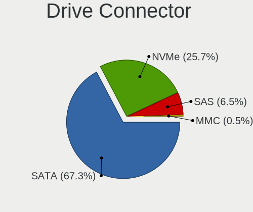
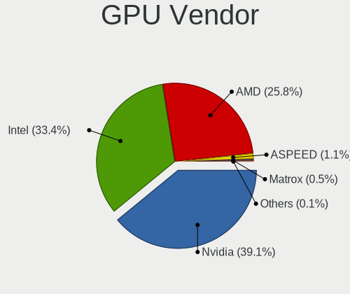

Ubuntu 22.04 - Tested Hardware & Statistics (Desktops)
------------------------------------------------------

A project to collect tested hardware configurations for Ubuntu 22.04.

Anyone can contribute to this report by the [hw-probe](https://github.com/linuxhw/hw-probe) tool:

    sudo -E hw-probe -all -upload

Please submit a probe of your configuration if it's not presented on the page or is rare.

Full-feature report is available here: https://linux-hardware.org/?view=trends

Contents
--------

* [ Test Cases ](#test-cases)

* [ System ](#system)
  - [ Kernel                   ](#kernel)
  - [ Kernel Family            ](#kernel-family)
  - [ Kernel Major Ver.        ](#kernel-major-ver)
  - [ Arch                     ](#arch)
  - [ DE                       ](#de)
  - [ Display Server           ](#display-server)
  - [ Display Manager          ](#display-manager)
  - [ OS Lang                  ](#os-lang)
  - [ Boot Mode                ](#boot-mode)
  - [ Filesystem               ](#filesystem)
  - [ Part. scheme             ](#part-scheme)
  - [ Dual Boot with Linux/BSD ](#dual-boot-with-linuxbsd)
  - [ Dual Boot (Win)          ](#dual-boot-win)

* [ Board ](#board)
  - [ Vendor                   ](#vendor)
  - [ Model                    ](#model)
  - [ Model Family             ](#model-family)
  - [ MFG Year                 ](#mfg-year)
  - [ Form Factor              ](#form-factor)
  - [ Secure Boot              ](#secure-boot)
  - [ Coreboot                 ](#coreboot)
  - [ RAM Size                 ](#ram-size)
  - [ RAM Used                 ](#ram-used)
  - [ Total Drives             ](#total-drives)
  - [ Has CD-ROM               ](#has-cd-rom)
  - [ Has Ethernet             ](#has-ethernet)
  - [ Has WiFi                 ](#has-wifi)
  - [ Has Bluetooth            ](#has-bluetooth)

* [ Location ](#location)
  - [ Country                  ](#country)
  - [ City                     ](#city)

* [ Drives ](#drives)
  - [ Drive Vendor             ](#drive-vendor)
  - [ Drive Model              ](#drive-model)
  - [ HDD Vendor               ](#hdd-vendor)
  - [ SSD Vendor               ](#ssd-vendor)
  - [ Drive Kind               ](#drive-kind)
  - [ Drive Connector          ](#drive-connector)
  - [ Drive Size               ](#drive-size)
  - [ Space Total              ](#space-total)
  - [ Space Used               ](#space-used)
  - [ Malfunc. Drives          ](#malfunc-drives)
  - [ Malfunc. Drive Vendor    ](#malfunc-drive-vendor)
  - [ Malfunc. HDD Vendor      ](#malfunc-hdd-vendor)
  - [ Malfunc. Drive Kind      ](#malfunc-drive-kind)
  - [ Failed Drives            ](#failed-drives)
  - [ Failed Drive Vendor      ](#failed-drive-vendor)
  - [ Drive Status             ](#drive-status)

* [ Storage controller ](#storage-controller)
  - [ Storage Vendor           ](#storage-vendor)
  - [ Storage Model            ](#storage-model)
  - [ Storage Kind             ](#storage-kind)

* [ Processor ](#processor)
  - [ CPU Vendor               ](#cpu-vendor)
  - [ CPU Model                ](#cpu-model)
  - [ CPU Model Family         ](#cpu-model-family)
  - [ CPU Cores                ](#cpu-cores)
  - [ CPU Sockets              ](#cpu-sockets)
  - [ CPU Threads              ](#cpu-threads)
  - [ CPU Op-Modes             ](#cpu-op-modes)
  - [ CPU Microcode            ](#cpu-microcode)
  - [ CPU Microarch            ](#cpu-microarch)

* [ Graphics ](#graphics)
  - [ GPU Vendor               ](#gpu-vendor)
  - [ GPU Model                ](#gpu-model)
  - [ GPU Combo                ](#gpu-combo)
  - [ GPU Driver               ](#gpu-driver)
  - [ GPU Memory               ](#gpu-memory)

* [ Monitor ](#monitor)
  - [ Monitor Vendor           ](#monitor-vendor)
  - [ Monitor Model            ](#monitor-model)
  - [ Monitor Resolution       ](#monitor-resolution)
  - [ Monitor Diagonal         ](#monitor-diagonal)
  - [ Monitor Width            ](#monitor-width)
  - [ Aspect Ratio             ](#aspect-ratio)
  - [ Monitor Area             ](#monitor-area)
  - [ Pixel Density            ](#pixel-density)
  - [ Multiple Monitors        ](#multiple-monitors)

* [ Network ](#network)
  - [ Net Controller Vendor    ](#net-controller-vendor)
  - [ Net Controller Model     ](#net-controller-model)
  - [ Wireless Vendor          ](#wireless-vendor)
  - [ Wireless Model           ](#wireless-model)
  - [ Ethernet Vendor          ](#ethernet-vendor)
  - [ Ethernet Model           ](#ethernet-model)
  - [ Net Controller Kind      ](#net-controller-kind)
  - [ Used Controller          ](#used-controller)
  - [ NICs                     ](#nics)
  - [ IPv6                     ](#ipv6)

* [ Bluetooth ](#bluetooth)
  - [ Bluetooth Vendor         ](#bluetooth-vendor)
  - [ Bluetooth Model          ](#bluetooth-model)

* [ Sound ](#sound)
  - [ Sound Vendor             ](#sound-vendor)
  - [ Sound Model              ](#sound-model)

* [ Memory ](#memory)
  - [ Memory Vendor            ](#memory-vendor)
  - [ Memory Model             ](#memory-model)
  - [ Memory Kind              ](#memory-kind)
  - [ Memory Form Factor       ](#memory-form-factor)
  - [ Memory Size              ](#memory-size)
  - [ Memory Speed             ](#memory-speed)

* [ Printers & scanners ](#printers--scanners)
  - [ Printer Vendor           ](#printer-vendor)
  - [ Printer Model            ](#printer-model)
  - [ Scanner Vendor           ](#scanner-vendor)
  - [ Scanner Model            ](#scanner-model)

* [ Camera ](#camera)
  - [ Camera Vendor            ](#camera-vendor)
  - [ Camera Model             ](#camera-model)

* [ Security ](#security)
  - [ Fingerprint Vendor       ](#fingerprint-vendor)
  - [ Fingerprint Model        ](#fingerprint-model)
  - [ Chipcard Vendor          ](#chipcard-vendor)
  - [ Chipcard Model           ](#chipcard-model)

* [ Unsupported ](#unsupported)
  - [ Unsupported Devices      ](#unsupported-devices)
  - [ Unsupported Device Types ](#unsupported-device-types)

Test Cases
----------

Total: 38

| Vendor     | Model                       | Probe                                                      | Date         |
|------------|-----------------------------|------------------------------------------------------------|--------------|
| Fujitsu    | D3223-C1 S26361-D3223-C1    | [f0fdc95810](https://linux-hardware.org/?probe=f0fdc95810) | Apr 01, 2022 |
| HP         | ProLiant ML110 G7           | [9e1e2b2ae7](https://linux-hardware.org/?probe=9e1e2b2ae7) | Apr 01, 2022 |
| MSI        | X370 GAMING PRO CARBON A... | [ce2e9f743d](https://linux-hardware.org/?probe=ce2e9f743d) | Mar 31, 2022 |
| Dell       | 0YNVJG A01                  | [4ccce61117](https://linux-hardware.org/?probe=4ccce61117) | Mar 30, 2022 |
| MSI        | B450M PRO-M2 MAX            | [f21ef43d0f](https://linux-hardware.org/?probe=f21ef43d0f) | Mar 30, 2022 |
| Le Cube 1  | Unknown                     | [a881cc0397](https://linux-hardware.org/?probe=a881cc0397) | Mar 26, 2022 |
| HP         | 1589                        | [8c1f30bb6f](https://linux-hardware.org/?probe=8c1f30bb6f) | Mar 23, 2022 |
| ASRock     | 970 Extreme3 R2.0           | [f417e6a6ef](https://linux-hardware.org/?probe=f417e6a6ef) | Mar 11, 2022 |
| Unknown    | T3 MRD                      | [256dc440ec](https://linux-hardware.org/?probe=256dc440ec) | Mar 09, 2022 |
| MSI        | X370 GAMING PRO CARBON A... | [1fb25ad2c3](https://linux-hardware.org/?probe=1fb25ad2c3) | Mar 05, 2022 |
| ASUSTek    | M4A87TD/USB3                | [aa80ded615](https://linux-hardware.org/?probe=aa80ded615) | Mar 04, 2022 |
| ASUSTek    | M4A87TD/USB3                | [3e997c5618](https://linux-hardware.org/?probe=3e997c5618) | Mar 03, 2022 |
| Unknown    | T3 MRD                      | [35ab38818d](https://linux-hardware.org/?probe=35ab38818d) | Feb 28, 2022 |
| Unknown    | T3 MRD                      | [01dd9cefa7](https://linux-hardware.org/?probe=01dd9cefa7) | Feb 28, 2022 |
| Gigabyte   | X570 I AORUS PRO WIFI       | [18d37562a8](https://linux-hardware.org/?probe=18d37562a8) | Feb 26, 2022 |
| Gigabyte   | X570 I AORUS PRO WIFI       | [d8af57f59a](https://linux-hardware.org/?probe=d8af57f59a) | Feb 26, 2022 |
| Gigabyte   | H61M-DS2 DVI                | [90c43679f7](https://linux-hardware.org/?probe=90c43679f7) | Feb 23, 2022 |
| MSI        | X370 GAMING PRO CARBON A... | [fa5ed1f68b](https://linux-hardware.org/?probe=fa5ed1f68b) | Feb 13, 2022 |
| Gigabyte   | X570S AORUS PRO AX          | [e329340668](https://linux-hardware.org/?probe=e329340668) | Feb 11, 2022 |
| Dell       | 0YXT71 A03                  | [19227aa57d](https://linux-hardware.org/?probe=19227aa57d) | Feb 11, 2022 |
| HP         | 212B                        | [fab24340a5](https://linux-hardware.org/?probe=fab24340a5) | Feb 10, 2022 |
| ASRockRack | X470D4U2/1N1                | [735bc0f806](https://linux-hardware.org/?probe=735bc0f806) | Feb 04, 2022 |
| ASUSTek    | P5P41T/USB3                 | [f45dc3454a](https://linux-hardware.org/?probe=f45dc3454a) | Jan 25, 2022 |
| ASUSTek    | P5P41T/USB3                 | [b69dafbb2b](https://linux-hardware.org/?probe=b69dafbb2b) | Jan 25, 2022 |
| ASUSTek    | P5P41T/USB3                 | [105593cece](https://linux-hardware.org/?probe=105593cece) | Jan 23, 2022 |
| Gigabyte   | GB-BSi7-1165G7              | [ab94ff1199](https://linux-hardware.org/?probe=ab94ff1199) | Jan 20, 2022 |
| MSI        | Z490-A PRO                  | [b2655bbd43](https://linux-hardware.org/?probe=b2655bbd43) | Jan 15, 2022 |
| MSI        | C236A WORKSTATION           | [97795d3ebc](https://linux-hardware.org/?probe=97795d3ebc) | Jan 07, 2022 |
| Intel      | H61                         | [e2b49aa759](https://linux-hardware.org/?probe=e2b49aa759) | Dec 30, 2021 |
| Lenovo     | 3141 NOK                    | [cc90d7c889](https://linux-hardware.org/?probe=cc90d7c889) | Dec 13, 2021 |
| ASUSTek    | ROG STRIX B350-F GAMING     | [0db33a5b23](https://linux-hardware.org/?probe=0db33a5b23) | Dec 10, 2021 |
| Huanan     | X99 F8D V2.2                | [dcd5217827](https://linux-hardware.org/?probe=dcd5217827) | Nov 29, 2021 |
| Gigabyte   | M52L-S3                     | [16854f2502](https://linux-hardware.org/?probe=16854f2502) | Nov 29, 2021 |
| Gigabyte   | M52L-S3                     | [e6f3417028](https://linux-hardware.org/?probe=e6f3417028) | Nov 27, 2021 |
| Gigabyte   | EP31-DS3L                   | [c0134f6231](https://linux-hardware.org/?probe=c0134f6231) | Nov 11, 2021 |
| Gigabyte   | EP31-DS3L                   | [4d659bf7e4](https://linux-hardware.org/?probe=4d659bf7e4) | Nov 11, 2021 |
| ASUSTek    | K30AD_M31AD_M51AD_M32AD     | [36e64b8256](https://linux-hardware.org/?probe=36e64b8256) | Nov 10, 2021 |
| MSI        | MS-7235                     | [bbfa7fb897](https://linux-hardware.org/?probe=bbfa7fb897) | Oct 24, 2021 |

System
------

Kernel
------

Version of the Linux kernel

| Version                  | Desktops | Percent |
|--------------------------|----------|---------|
| 5.15.0-18-generic        | 9        | 31.03%  |
| 5.13.0-19-generic        | 7        | 24.14%  |
| 5.15.0-23-generic        | 4        | 13.79%  |
| 5.15.0-22-generic        | 3        | 10.34%  |
| 5.17.1-051701-generic    | 1        | 3.45%   |
| 5.16.0-051600-generic    | 1        | 3.45%   |
| 5.15.13-051513-generic   | 1        | 3.45%   |
| 5.15.0-17-generic        | 1        | 3.45%   |
| 5.15.0-051500rc7-generic | 1        | 3.45%   |
| 5.13.0-20-generic        | 1        | 3.45%   |

Kernel Family
-------------

Linux kernel without a distro release

| Version | Desktops | Percent |
|---------|----------|---------|
| 5.15.0  | 17       | 60.71%  |
| 5.13.0  | 8        | 28.57%  |
| 5.17.1  | 1        | 3.57%   |
| 5.16.0  | 1        | 3.57%   |
| 5.15.13 | 1        | 3.57%   |

Kernel Major Ver.
-----------------

Linux kernel major version

| Version | Desktops | Percent |
|---------|----------|---------|
| 5.15    | 18       | 64.29%  |
| 5.13    | 8        | 28.57%  |
| 5.17    | 1        | 3.57%   |
| 5.16    | 1        | 3.57%   |

Arch
----

OS architecture (x86_64, i586, etc.)

| Name   | Desktops | Percent |
|--------|----------|---------|
| x86_64 | 28       | 100%    |

DE
--

Desktop Environment

| Name            | Desktops | Percent |
|-----------------|----------|---------|
| GNOME           | 24       | 85.71%  |
| Unknown         | 2        | 7.14%   |
| X-Cinnamon      | 1        | 3.57%   |
| GNOME Flashback | 1        | 3.57%   |

Display Server
--------------

X11 or Wayland

| Name    | Desktops | Percent |
|---------|----------|---------|
| X11     | 14       | 50%     |
| Wayland | 12       | 42.86%  |
| Tty     | 1        | 3.57%   |
| Unknown | 1        | 3.57%   |

Display Manager
---------------

SDDM, LightDM, etc.

| Name    | Desktops | Percent |
|---------|----------|---------|
| GDM3    | 23       | 82.14%  |
| LightDM | 2        | 7.14%   |
| GDM     | 2        | 7.14%   |
| Unknown | 1        | 3.57%   |

OS Lang
-------

Language

| Lang  | Desktops | Percent |
|-------|----------|---------|
| en_US | 11       | 39.29%  |
| de_DE | 5        | 17.86%  |
| pt_BR | 2        | 7.14%   |
| cs_CZ | 2        | 7.14%   |
| zh_TW | 1        | 3.57%   |
| zh_CN | 1        | 3.57%   |
| th_TH | 1        | 3.57%   |
| ru_RU | 1        | 3.57%   |
| pl_PL | 1        | 3.57%   |
| fr_FR | 1        | 3.57%   |
| es_ES | 1        | 3.57%   |
| en_IN | 1        | 3.57%   |

Boot Mode
---------

EFI or BIOS

| Mode | Desktops | Percent |
|------|----------|---------|
| BIOS | 15       | 53.57%  |
| EFI  | 13       | 46.43%  |

Filesystem
----------

Type of filesystem

| Type  | Desktops | Percent |
|-------|----------|---------|
| Ext4  | 25       | 86.21%  |
| Xfs   | 2        | 6.9%    |
| Zfs   | 1        | 3.45%   |
| Btrfs | 1        | 3.45%   |

Part. scheme
------------

Scheme of partitioning

| Type    | Desktops | Percent |
|---------|----------|---------|
| Unknown | 18       | 64.29%  |
| GPT     | 10       | 35.71%  |

Dual Boot with Linux/BSD
------------------------

Hosting more than one Linux/BSD

| Dual boot | Desktops | Percent |
|-----------|----------|---------|
| No        | 17       | 60.71%  |
| Yes       | 11       | 39.29%  |

Dual Boot (Win)
---------------

Hosting Linux and Windows

| Dual boot | Desktops | Percent |
|-----------|----------|---------|
| Yes       | 14       | 50%     |
| No        | 14       | 50%     |

Board
-----

Vendor
------

Motherboard manufacturer

| Name                | Desktops | Percent |
|---------------------|----------|---------|
| Gigabyte Technology | 6        | 21.43%  |
| MSI                 | 5        | 17.86%  |
| ASUSTek Computer    | 4        | 14.29%  |
| Hewlett-Packard     | 3        | 10.71%  |
| Dell                | 2        | 7.14%   |
| Lenovo              | 1        | 3.57%   |
| Le Cube 1           | 1        | 3.57%   |
| Intel               | 1        | 3.57%   |
| Huanan              | 1        | 3.57%   |
| Fujitsu             | 1        | 3.57%   |
| ASRockRack          | 1        | 3.57%   |
| ASRock              | 1        | 3.57%   |
| Unknown             | 1        | 3.57%   |

Model
-----

Motherboard model

| Name                              | Desktops | Percent |
|-----------------------------------|----------|---------|
| Unknown                           | 2        | 7.14%   |
| MSI MS-7C75                       | 1        | 3.57%   |
| MSI MS-7B84                       | 1        | 3.57%   |
| MSI MS-7A32                       | 1        | 3.57%   |
| MSI MS-7998                       | 1        | 3.57%   |
| MSI MS-7235                       | 1        | 3.57%   |
| Lenovo QiTianM520-D164 90K7S03T00 | 1        | 3.57%   |
| Intel H61                         | 1        | 3.57%   |
| Huanan X99 F8D V2.2               | 1        | 3.57%   |
| HP Z440 Workstation               | 1        | 3.57%   |
| HP Z420 Workstation               | 1        | 3.57%   |
| HP ProLiant ML110 G7              | 1        | 3.57%   |
| Gigabyte X570S AORUS PRO AX       | 1        | 3.57%   |
| Gigabyte X570 I AORUS PRO WIFI    | 1        | 3.57%   |
| Gigabyte M52L-S3                  | 1        | 3.57%   |
| Gigabyte H61M-DS2 DVI             | 1        | 3.57%   |
| Gigabyte GB-BSi7-1165G7           | 1        | 3.57%   |
| Gigabyte EP31-DS3L                | 1        | 3.57%   |
| Fujitsu ESPRIMO Q520              | 1        | 3.57%   |
| Dell OptiPlex 7070                | 1        | 3.57%   |
| Dell OptiPlex 7010                | 1        | 3.57%   |
| ASUS ROG STRIX B350-F GAMING      | 1        | 3.57%   |
| ASUS P5P41T/USB3                  | 1        | 3.57%   |
| ASUS M4A87TD/USB3                 | 1        | 3.57%   |
| ASUS K30AD_M31AD_M51AD            | 1        | 3.57%   |
| ASRockRack 520004                 | 1        | 3.57%   |
| ASRock 970 Extreme3 R2.0          | 1        | 3.57%   |

Model Family
------------

Motherboard model prefix

| Name                    | Desktops | Percent |
|-------------------------|----------|---------|
| Dell OptiPlex           | 2        | 7.14%   |
| Unknown                 | 2        | 7.14%   |
| MSI MS-7C75             | 1        | 3.57%   |
| MSI MS-7B84             | 1        | 3.57%   |
| MSI MS-7A32             | 1        | 3.57%   |
| MSI MS-7998             | 1        | 3.57%   |
| MSI MS-7235             | 1        | 3.57%   |
| Lenovo QiTianM520-D164  | 1        | 3.57%   |
| Intel H61               | 1        | 3.57%   |
| Huanan X99              | 1        | 3.57%   |
| HP Z440                 | 1        | 3.57%   |
| HP Z420                 | 1        | 3.57%   |
| HP ProLiant             | 1        | 3.57%   |
| Gigabyte X570S          | 1        | 3.57%   |
| Gigabyte X570           | 1        | 3.57%   |
| Gigabyte M52L-S3        | 1        | 3.57%   |
| Gigabyte H61M-DS2       | 1        | 3.57%   |
| Gigabyte GB-BSi7-1165G7 | 1        | 3.57%   |
| Gigabyte EP31-DS3L      | 1        | 3.57%   |
| Fujitsu ESPRIMO         | 1        | 3.57%   |
| ASUS ROG                | 1        | 3.57%   |
| ASUS P5P41T             | 1        | 3.57%   |
| ASUS M4A87TD            | 1        | 3.57%   |
| ASUS K30AD              | 1        | 3.57%   |
| ASRockRack 520004       | 1        | 3.57%   |
| ASRock 970              | 1        | 3.57%   |

MFG Year
--------

Motherboard manufacture year

| Year | Desktops | Percent |
|------|----------|---------|
| 2019 | 5        | 17.86%  |
| 2021 | 4        | 14.29%  |
| 2012 | 4        | 14.29%  |
| 2020 | 3        | 10.71%  |
| 2017 | 3        | 10.71%  |
| 2010 | 2        | 7.14%   |
| 2016 | 1        | 3.57%   |
| 2015 | 1        | 3.57%   |
| 2014 | 1        | 3.57%   |
| 2013 | 1        | 3.57%   |
| 2008 | 1        | 3.57%   |
| 2007 | 1        | 3.57%   |
| 2006 | 1        | 3.57%   |

Form Factor
-----------

Physical design of the computer

| Name    | Desktops | Percent |
|---------|----------|---------|
| Desktop | 28       | 100%    |

Secure Boot
-----------

Enabled or disabled

| State    | Desktops | Percent |
|----------|----------|---------|
| Disabled | 27       | 96.43%  |
| Enabled  | 1        | 3.57%   |

Coreboot
--------

Have coreboot on board

| Used | Desktops | Percent |
|------|----------|---------|
| No   | 28       | 100%    |

RAM Size
--------

Total RAM memory

| Size in GB  | Desktops | Percent |
|-------------|----------|---------|
| 64.01-256.0 | 6        | 21.43%  |
| 16.01-24.0  | 6        | 21.43%  |
| 8.01-16.0   | 5        | 17.86%  |
| 32.01-64.0  | 4        | 14.29%  |
| 3.01-4.0    | 4        | 14.29%  |
| 4.01-8.0    | 3        | 10.71%  |

RAM Used
--------

Used RAM memory

| Used GB   | Desktops | Percent |
|-----------|----------|---------|
| 1.01-2.0  | 10       | 35.71%  |
| 2.01-3.0  | 8        | 28.57%  |
| 4.01-8.0  | 3        | 10.71%  |
| 3.01-4.0  | 3        | 10.71%  |
| 8.01-16.0 | 3        | 10.71%  |
| 0.51-1.0  | 1        | 3.57%   |

Total Drives
------------

Number of drives on board

| Drives | Desktops | Percent |
|--------|----------|---------|
| 2      | 10       | 34.48%  |
| 1      | 9        | 31.03%  |
| 3      | 4        | 13.79%  |
| 4      | 3        | 10.34%  |
| 20     | 1        | 3.45%   |
| 8      | 1        | 3.45%   |
| 5      | 1        | 3.45%   |

Has CD-ROM
----------

Has CD-ROM on board

| Presented | Desktops | Percent |
|-----------|----------|---------|
| No        | 16       | 57.14%  |
| Yes       | 12       | 42.86%  |

Has Ethernet
------------

Has Ethernet on board

| Presented | Desktops | Percent |
|-----------|----------|---------|
| Yes       | 28       | 100%    |

Has WiFi
--------

Has WiFi module

| Presented | Desktops | Percent |
|-----------|----------|---------|
| Yes       | 14       | 50%     |
| No        | 14       | 50%     |

Has Bluetooth
-------------

Has Bluetooth module

| Presented | Desktops | Percent |
|-----------|----------|---------|
| No        | 17       | 60.71%  |
| Yes       | 11       | 39.29%  |

Location
--------

Country
-------

Geographic location (country)

| Country  | Desktops | Percent |
|----------|----------|---------|
| USA      | 7        | 25%     |
| Germany  | 6        | 21.43%  |
| Spain    | 2        | 7.14%   |
| Russia   | 2        | 7.14%   |
| Czechia  | 2        | 7.14%   |
| Brazil   | 2        | 7.14%   |
| Thailand | 1        | 3.57%   |
| Taiwan   | 1        | 3.57%   |
| Poland   | 1        | 3.57%   |
| Japan    | 1        | 3.57%   |
| India    | 1        | 3.57%   |
| France   | 1        | 3.57%   |
| China    | 1        | 3.57%   |

City
----

Geographic location (city)

| City              | Desktops | Percent |
|-------------------|----------|---------|
| Madrid            | 2        | 7.14%   |
| Warsaw            | 1        | 3.57%   |
| Suffolk           | 1        | 3.57%   |
| St Petersburg     | 1        | 3.57%   |
| Springdale        | 1        | 3.57%   |
| Soest             | 1        | 3.57%   |
| Senonches         | 1        | 3.57%   |
| Recife            | 1        | 3.57%   |
| Prague            | 1        | 3.57%   |
| Phuket            | 1        | 3.57%   |
| Ostrava           | 1        | 3.57%   |
| Osasco            | 1        | 3.57%   |
| Oakland           | 1        | 3.57%   |
| Novosibirsk       | 1        | 3.57%   |
| Newark            | 1        | 3.57%   |
| New Taipei        | 1        | 3.57%   |
| Moses Lake        | 1        | 3.57%   |
| Millville         | 1        | 3.57%   |
| Krefeld           | 1        | 3.57%   |
| Hyattsville       | 1        | 3.57%   |
| Hamburg           | 1        | 3.57%   |
| Gudensberg        | 1        | 3.57%   |
| Frankfurt am Main | 1        | 3.57%   |
| Bengaluru         | 1        | 3.57%   |
| Beijing           | 1        | 3.57%   |
| Aspisheim         | 1        | 3.57%   |
| Aichi             | 1        | 3.57%   |

Drives
------

Drive Vendor
------------

Hard drive vendors

| Vendor              | Desktops | Drives | Percent |
|---------------------|----------|--------|---------|
| Seagate             | 11       | 15     | 20.75%  |
| WDC                 | 9        | 31     | 16.98%  |
| Samsung Electronics | 8        | 14     | 15.09%  |
| Toshiba             | 4        | 4      | 7.55%   |
| SanDisk             | 2        | 2      | 3.77%   |
| Kingston            | 2        | 3      | 3.77%   |
| Intenso             | 2        | 2      | 3.77%   |
| Hitachi             | 2        | 2      | 3.77%   |
| Unknown             | 1        | 4      | 1.89%   |
| UMAX                | 1        | 1      | 1.89%   |
| SPCC                | 1        | 1      | 1.89%   |
| SK Hynix            | 1        | 1      | 1.89%   |
| Silicon Motion      | 1        | 1      | 1.89%   |
| Phison              | 1        | 1      | 1.89%   |
| OCZ                 | 1        | 4      | 1.89%   |
| Micron Technology   | 1        | 1      | 1.89%   |
| KIOXIA              | 1        | 2      | 1.89%   |
| JMicron             | 1        | 1      | 1.89%   |
| Intel               | 1        | 1      | 1.89%   |
| HGST                | 1        | 2      | 1.89%   |
| Crucial             | 1        | 1      | 1.89%   |

Drive Model
-----------

Hard drive models

| Model                                    | Desktops | Percent |
|------------------------------------------|----------|---------|
| Seagate ST2000DM008-2FR102 2TB           | 2        | 2.86%   |
| Seagate ST1000DM010-2EP102 1TB           | 2        | 2.86%   |
| Samsung SSD 850 EVO 500GB                | 2        | 2.86%   |
| WDC WDS500G3X0C-00SJG0 500GB             | 1        | 1.43%   |
| WDC WDS100T3X0C-00SJG0 1TB               | 1        | 1.43%   |
| WDC WD80EMAZ-00WJTA0 8TB                 | 1        | 1.43%   |
| WDC WD80EFZX-68UW8N0 8TB                 | 1        | 1.43%   |
| WDC WD80EFAX-68LHPN0 8TB                 | 1        | 1.43%   |
| WDC WD80 EMAZ-00WJTA0 8TB                | 1        | 1.43%   |
| WDC WD60 EFRX-68L0BN1 6TB                | 1        | 1.43%   |
| WDC WD40EFRX-68N32N0 4TB                 | 1        | 1.43%   |
| WDC WD3200AAKS-00L9A0 320GB              | 1        | 1.43%   |
| WDC WD3200AAKS-00B3A0 320GB              | 1        | 1.43%   |
| WDC WD3200AAJS-00VWA0 320GB              | 1        | 1.43%   |
| WDC WD20SPZX-75UA7T1 2TB                 | 1        | 1.43%   |
| WDC WD20EARX-00PASB0 2TB                 | 1        | 1.43%   |
| WDC WD20EARS-00MVWB0 2TB                 | 1        | 1.43%   |
| WDC WD140EDFZ-11A0VA0 14TB               | 1        | 1.43%   |
| WDC WD12 0EMAZ-11BLFA 12TB               | 1        | 1.43%   |
| WDC WD10SPSX-60A6WT0 1TB                 | 1        | 1.43%   |
| WDC WD10EZRX-00A8LB0 1TB                 | 1        | 1.43%   |
| WDC WD100EMAZ-00WJTA0 10TB               | 1        | 1.43%   |
| WDC WD10 0EMAZ-00WJTA 10TB               | 1        | 1.43%   |
| WDC PC SN520 SDAPMUW-128G-1001 128GB     | 1        | 1.43%   |
| Unknown MMC Card  64GB                   | 1        | 1.43%   |
| UMAX 2280 64G SSD                        | 1        | 1.43%   |
| Toshiba HDWL120 2TB                      | 1        | 1.43%   |
| Toshiba HDWE140 4TB                      | 1        | 1.43%   |
| Toshiba DT01ACA100 1TB                   | 1        | 1.43%   |
| Toshiba DT01ACA050 500GB                 | 1        | 1.43%   |
| SPCC Solid State Disk 256GB              | 1        | 1.43%   |
| SK Hynix BC511 NVMe 256GB                | 1        | 1.43%   |
| Silicon Motion NVMe SSD Drive 256GB      | 1        | 1.43%   |
| Seagate ST8000AS 0002-1NA17Z 8TB         | 1        | 1.43%   |
| Seagate ST3750640NS 752GB                | 1        | 1.43%   |
| Seagate ST3500410SV 500GB                | 1        | 1.43%   |
| Seagate ST3250312AS 250GB                | 1        | 1.43%   |
| Seagate ST2000VX005-1TD164 2TB           | 1        | 1.43%   |
| Seagate ST2000DM001-9YN164 2TB           | 1        | 1.43%   |
| Seagate Expansion 320GB                  | 1        | 1.43%   |
| SanDisk SSD PLUS 2000GB                  | 1        | 1.43%   |
| SanDisk SDSSDP128G 128GB                 | 1        | 1.43%   |
| Samsung SSD 980 PRO 1TB                  | 1        | 1.43%   |
| Samsung SSD 980 1TB                      | 1        | 1.43%   |
| Samsung SSD 970 EVO Plus 1TB             | 1        | 1.43%   |
| Samsung SSD 870 QVO 1TB                  | 1        | 1.43%   |
| Samsung SSD 860 PRO 256GB                | 1        | 1.43%   |
| Samsung SSD 860 EVO M.2 1TB              | 1        | 1.43%   |
| Samsung SSD 850 PRO 128GB                | 1        | 1.43%   |
| Samsung SSD 750 EVO 250GB                | 1        | 1.43%   |
| Samsung NVMe SSD Drive 512GB             | 1        | 1.43%   |
| Samsung NVMe SSD Drive 500GB             | 1        | 1.43%   |
| Samsung NVMe SSD Drive 1TB               | 1        | 1.43%   |
| Phison NVMe SSD Drive 1TB                | 1        | 1.43%   |
| OCZ NVMe SSD Drive 256GB                 | 1        | 1.43%   |
| Micron MTFDDAK512MAY-1AE1ZABHA 512GB SSD | 1        | 1.43%   |
| KIOXIA NVMe SSD Drive 960GB              | 1        | 1.43%   |
| Kingston SKC600512G 512GB SSD            | 1        | 1.43%   |
| Kingston SHFS37A120G 120GB SSD           | 1        | 1.43%   |
| JMicron Generic 2TB                      | 1        | 1.43%   |

HDD Vendor
----------

Hard disk drive vendors

| Vendor  | Desktops | Drives | Percent |
|---------|----------|--------|---------|
| Seagate | 11       | 15     | 44%     |
| WDC     | 7        | 28     | 28%     |
| Toshiba | 4        | 4      | 16%     |
| Hitachi | 2        | 2      | 8%      |
| HGST    | 1        | 2      | 4%      |

SSD Vendor
----------

Solid state drive vendors

| Vendor              | Desktops | Drives | Percent |
|---------------------|----------|--------|---------|
| Samsung Electronics | 5        | 7      | 29.41%  |
| SanDisk             | 2        | 2      | 11.76%  |
| Kingston            | 2        | 3      | 11.76%  |
| Intenso             | 2        | 2      | 11.76%  |
| UMAX                | 1        | 1      | 5.88%   |
| SPCC                | 1        | 1      | 5.88%   |
| Micron Technology   | 1        | 1      | 5.88%   |
| JMicron             | 1        | 1      | 5.88%   |
| Intel               | 1        | 1      | 5.88%   |
| Crucial             | 1        | 1      | 5.88%   |

Drive Kind
----------

HDD or SSD

| Kind | Desktops | Drives | Percent |
|------|----------|--------|---------|
| HDD  | 17       | 51     | 37.78%  |
| SSD  | 14       | 20     | 31.11%  |
| NVMe | 13       | 19     | 28.89%  |
| MMC  | 1        | 4      | 2.22%   |

Drive Connector
---------------

SATA, SAS, NVMe, etc.

| Type | Desktops | Drives | Percent |
|------|----------|--------|---------|
| SATA | 22       | 60     | 55%     |
| NVMe | 13       | 18     | 32.5%   |
| SAS  | 4        | 12     | 10%     |
| MMC  | 1        | 4      | 2.5%    |

Drive Size
----------

Size of hard drive

| Size in TB | Desktops | Drives | Percent |
|------------|----------|--------|---------|
| 0.01-0.5   | 14       | 19     | 38.89%  |
| 0.51-1.0   | 10       | 15     | 27.78%  |
| 1.01-2.0   | 8        | 17     | 22.22%  |
| 10.01-20.0 | 2        | 6      | 5.56%   |
| 3.01-4.0   | 1        | 2      | 2.78%   |
| 4.01-10.0  | 1        | 12     | 2.78%   |

Space Total
-----------

Amount of disk space available on the file system

| Size in GB     | Desktops | Percent |
|----------------|----------|---------|
| 101-250        | 10       | 34.48%  |
| 501-1000       | 6        | 20.69%  |
| 251-500        | 3        | 10.34%  |
| 1001-2000      | 3        | 10.34%  |
| More than 3000 | 2        | 6.9%    |
| 2001-3000      | 2        | 6.9%    |
| 1-20           | 1        | 3.45%   |
| 51-100         | 1        | 3.45%   |
| Unknown        | 1        | 3.45%   |

Space Used
----------

Amount of used disk space

| Used GB        | Desktops | Percent |
|----------------|----------|---------|
| 1-20           | 8        | 27.59%  |
| 21-50          | 5        | 17.24%  |
| 101-250        | 4        | 13.79%  |
| 51-100         | 4        | 13.79%  |
| 251-500        | 3        | 10.34%  |
| More than 3000 | 2        | 6.9%    |
| 501-1000       | 1        | 3.45%   |
| 0              | 1        | 3.45%   |
| Unknown        | 1        | 3.45%   |

Malfunc. Drives
---------------

Drive models with a malfunction

| Model                     | Desktops | Drives | Percent |
|---------------------------|----------|--------|---------|
| Seagate ST3750640NS 752GB | 1        | 2      | 50%     |
| Intenso SSD 120GB         | 1        | 1      | 50%     |

Malfunc. Drive Vendor
---------------------

Vendors of faulty drives

| Vendor  | Desktops | Drives | Percent |
|---------|----------|--------|---------|
| Seagate | 1        | 2      | 50%     |
| Intenso | 1        | 1      | 50%     |

Malfunc. HDD Vendor
-------------------

Vendors of faulty HDD drives

| Vendor  | Desktops | Drives | Percent |
|---------|----------|--------|---------|
| Seagate | 1        | 2      | 100%    |

Malfunc. Drive Kind
-------------------

Kinds of faulty drives

| Kind | Desktops | Drives | Percent |
|------|----------|--------|---------|
| SSD  | 1        | 1      | 50%     |
| HDD  | 1        | 2      | 50%     |

Failed Drives
-------------

Failed drive models

Zero info for selected period =(

Failed Drive Vendor
-------------------

Failed drive vendors

Zero info for selected period =(

Drive Status
------------

Number of failed and malfunc. drives

| Status   | Desktops | Drives | Percent |
|----------|----------|--------|---------|
| Detected | 20       | 66     | 62.5%   |
| Works    | 10       | 25     | 31.25%  |
| Malfunc  | 2        | 3      | 6.25%   |

Storage controller
------------------

Storage Vendor
--------------

Storage controller vendors

| Vendor                    | Desktops | Percent |
|---------------------------|----------|---------|
| Intel                     | 17       | 38.64%  |
| AMD                       | 9        | 20.45%  |
| Samsung Electronics       | 5        | 11.36%  |
| Sandisk                   | 3        | 6.82%   |
| SK Hynix                  | 1        | 2.27%   |
| Silicon Motion            | 1        | 2.27%   |
| Phison Electronics        | 1        | 2.27%   |
| OCZ Technology Group      | 1        | 2.27%   |
| Nvidia                    | 1        | 2.27%   |
| Marvell Technology Group  | 1        | 2.27%   |
| LSI Logic / Symbios Logic | 1        | 2.27%   |
| KIOXIA                    | 1        | 2.27%   |
| JMicron Technology        | 1        | 2.27%   |
| ASMedia Technology        | 1        | 2.27%   |

Storage Model
-------------

Storage controller models

| Model                                                                                   | Desktops | Percent |
|-----------------------------------------------------------------------------------------|----------|---------|
| AMD FCH SATA Controller [AHCI mode]                                                     | 6        | 10.53%  |
| Samsung NVMe SSD Controller SM981/PM981/PM983                                           | 3        | 5.26%   |
| AMD 400 Series Chipset SATA Controller                                                  | 3        | 5.26%   |
| Sandisk WD Black SN750 / PC SN730 NVMe SSD                                              | 2        | 3.51%   |
| Intel NM10/ICH7 Family SATA Controller [IDE mode]                                       | 2        | 3.51%   |
| Intel C600/X79 series chipset SATA RAID Controller                                      | 2        | 3.51%   |
| Intel 8 Series/C220 Series Chipset Family 6-port SATA Controller 1 [AHCI mode]          | 2        | 3.51%   |
| Intel 6 Series/C200 Series Chipset Family Desktop SATA Controller (IDE mode, ports 4-5) | 2        | 3.51%   |
| Intel 6 Series/C200 Series Chipset Family Desktop SATA Controller (IDE mode, ports 0-3) | 2        | 3.51%   |
| AMD SB7x0/SB8x0/SB9x0 SATA Controller [IDE mode]                                        | 2        | 3.51%   |
| AMD SB7x0/SB8x0/SB9x0 IDE Controller                                                    | 2        | 3.51%   |
| SK Hynix BC511                                                                          | 1        | 1.75%   |
| Silicon Motion SM2263EN/SM2263XT SSD Controller                                         | 1        | 1.75%   |
| Sandisk PC SN520 NVMe SSD                                                               | 1        | 1.75%   |
| Samsung NVMe SSD Controller SM961/PM961/SM963                                           | 1        | 1.75%   |
| Samsung NVMe SSD Controller PM9A1/PM9A3/980PRO                                          | 1        | 1.75%   |
| Phison E16 PCIe4 NVMe Controller                                                        | 1        | 1.75%   |
| OCZ Group RD400/400A SSD                                                                | 1        | 1.75%   |
| Nvidia MCP61 SATA Controller                                                            | 1        | 1.75%   |
| Nvidia MCP61 IDE                                                                        | 1        | 1.75%   |
| Marvell Group 88SE6111/6121 SATA II / PATA Controller                                   | 1        | 1.75%   |
| LSI Logic / Symbios Logic SAS2008 PCI-Express Fusion-MPT SAS-2 [Falcon]                 | 1        | 1.75%   |
| KIOXIA NVMe SSD Controller Cx6                                                          | 1        | 1.75%   |
| JMicron JMB368 IDE controller                                                           | 1        | 1.75%   |
| Intel Volume Management Device NVMe RAID Controller                                     | 1        | 1.75%   |
| Intel Q170/Q150/B150/H170/H110/Z170/CM236 Chipset SATA Controller [AHCI Mode]           | 1        | 1.75%   |
| Intel Comet Lake SATA AHCI Controller                                                   | 1        | 1.75%   |
| Intel Celeron/Pentium Silver Processor SATA Controller                                  | 1        | 1.75%   |
| Intel Cannon Lake PCH SATA AHCI Controller                                              | 1        | 1.75%   |
| Intel C610/X99 series chipset sSATA Controller [RAID mode]                              | 1        | 1.75%   |
| Intel C610/X99 series chipset 6-Port SATA Controller [AHCI mode]                        | 1        | 1.75%   |
| Intel C602 chipset 4-Port SATA Storage Control Unit                                     | 1        | 1.75%   |
| Intel 82801HR/HO/HH (ICH8R/DO/DH) 2 port SATA Controller [IDE mode]                     | 1        | 1.75%   |
| Intel 82801H (ICH8 Family) 4 port SATA Controller [IDE mode]                            | 1        | 1.75%   |
| Intel 82801G (ICH7 Family) IDE Controller                                               | 1        | 1.75%   |
| Intel 7 Series/C210 Series Chipset Family 6-port SATA Controller [AHCI mode]            | 1        | 1.75%   |
| Intel 6 Series/C200 Series Chipset Family 6 port Desktop SATA AHCI Controller           | 1        | 1.75%   |
| ASMedia ASM1062 Serial ATA Controller                                                   | 1        | 1.75%   |
| AMD X370 Series Chipset SATA Controller                                                 | 1        | 1.75%   |
| AMD 300 Series Chipset SATA Controller                                                  | 1        | 1.75%   |

Storage Kind
------------

Kind of storage controller (IDE, SATA, NVMe, SAS, ...)

| Kind | Desktops | Percent |
|------|----------|---------|
| SATA | 18       | 40.91%  |
| NVMe | 13       | 29.55%  |
| IDE  | 8        | 18.18%  |
| RAID | 3        | 6.82%   |
| SAS  | 2        | 4.55%   |

Processor
---------

CPU Vendor
----------

Processor vendors

| Vendor | Desktops | Percent |
|--------|----------|---------|
| Intel  | 18       | 64.29%  |
| AMD    | 10       | 35.71%  |

CPU Model
---------

Processor models

| Model                                       | Desktops | Percent |
|---------------------------------------------|----------|---------|
| AMD Ryzen 5 5600X 6-Core Processor          | 2        | 7.14%   |
| Intel Xeon CPU E5-2696 v2 @ 2.50GHz         | 1        | 3.57%   |
| Intel Xeon CPU E5-2690 v4 @ 2.60GHz         | 1        | 3.57%   |
| Intel Xeon CPU E5-1650 v4 @ 3.60GHz         | 1        | 3.57%   |
| Intel Xeon CPU E31220 @ 3.10GHz             | 1        | 3.57%   |
| Intel Pentium CPU G3260T @ 2.90GHz          | 1        | 3.57%   |
| Intel Pentium 4 CPU 3.00GHz                 | 1        | 3.57%   |
| Intel Core i5-9500 CPU @ 3.00GHz            | 1        | 3.57%   |
| Intel Core i5-4460S CPU @ 2.90GHz           | 1        | 3.57%   |
| Intel Core i5-3570 CPU @ 3.40GHz            | 1        | 3.57%   |
| Intel Core i5-3450 CPU @ 3.10GHz            | 1        | 3.57%   |
| Intel Core i3-6300T CPU @ 3.30GHz           | 1        | 3.57%   |
| Intel Core 2 Duo CPU E8400 @ 3.00GHz        | 1        | 3.57%   |
| Intel Core 2 Duo CPU E4500 @ 2.20GHz        | 1        | 3.57%   |
| Intel Celeron J4105 CPU @ 1.50GHz           | 1        | 3.57%   |
| Intel Celeron CPU G1620 @ 2.70GHz           | 1        | 3.57%   |
| Intel Atom x5-Z8350 CPU @ 1.44GHz           | 1        | 3.57%   |
| Intel 11th Gen Core i7-11700K @ 3.60GHz     | 1        | 3.57%   |
| Intel 11th Gen Core i7-1165G7 @ 2.80GHz     | 1        | 3.57%   |
| AMD Ryzen 9 3900X 12-Core Processor         | 1        | 3.57%   |
| AMD Ryzen 7 PRO 3700 8-Core Processor       | 1        | 3.57%   |
| AMD Ryzen 7 1700 Eight-Core Processor       | 1        | 3.57%   |
| AMD Ryzen 5 3600 6-Core Processor           | 1        | 3.57%   |
| AMD PRO A12-8870 R7, 12 COMPUTE CORES 4C+8G | 1        | 3.57%   |
| AMD Phenom II X6 1090T Processor            | 1        | 3.57%   |
| AMD Phenom II X4 965 Processor              | 1        | 3.57%   |
| AMD Athlon 64 X2 Dual Core Processor 5200+  | 1        | 3.57%   |

CPU Model Family
----------------

Processor model prefix

| Model            | Desktops | Percent |
|------------------|----------|---------|
| Intel Xeon       | 4        | 14.29%  |
| Intel Core i5    | 4        | 14.29%  |
| Other            | 3        | 10.71%  |
| AMD Ryzen 5      | 3        | 10.71%  |
| Intel Core 2 Duo | 2        | 7.14%   |
| Intel Celeron    | 2        | 7.14%   |
| Intel Pentium 4  | 1        | 3.57%   |
| Intel Pentium    | 1        | 3.57%   |
| Intel Core i3    | 1        | 3.57%   |
| Intel Atom       | 1        | 3.57%   |
| AMD Ryzen 9      | 1        | 3.57%   |
| AMD Ryzen 7 PRO  | 1        | 3.57%   |
| AMD Ryzen 7      | 1        | 3.57%   |
| AMD Phenom II X6 | 1        | 3.57%   |
| AMD Phenom II X4 | 1        | 3.57%   |
| AMD Athlon 64 X2 | 1        | 3.57%   |

CPU Cores
---------

Number of processor cores

| Number | Desktops | Percent |
|--------|----------|---------|
| 4      | 8        | 28.57%  |
| 6      | 6        | 21.43%  |
| 2      | 6        | 21.43%  |
| 8      | 3        | 10.71%  |
| 12     | 2        | 7.14%   |
| 1      | 2        | 7.14%   |
| 28     | 1        | 3.57%   |

CPU Sockets
-----------

Number of sockets

| Number | Desktops | Percent |
|--------|----------|---------|
| 1      | 27       | 96.43%  |
| 2      | 1        | 3.57%   |

CPU Threads
-----------

Threads per core (Hyper-Threading)

| Number | Desktops | Percent |
|--------|----------|---------|
| 2      | 14       | 50%     |
| 1      | 14       | 50%     |

CPU Op-Modes
------------

CPU Operation Modes (32-bit, 64-bit)

| Op mode        | Desktops | Percent |
|----------------|----------|---------|
| 32-bit, 64-bit | 28       | 100%    |

CPU Microcode
-------------

Microcode number

| Number     | Desktops | Percent |
|------------|----------|---------|
| Unknown    | 13       | 46.43%  |
| 0xa0671    | 1        | 3.57%   |
| 0x906ea    | 1        | 3.57%   |
| 0x806c1    | 1        | 3.57%   |
| 0x706a1    | 1        | 3.57%   |
| 0x506e3    | 1        | 3.57%   |
| 0x306e4    | 1        | 3.57%   |
| 0x306c3    | 1        | 3.57%   |
| 0x306a9    | 1        | 3.57%   |
| 0x10677    | 1        | 3.57%   |
| 0x0a201016 | 1        | 3.57%   |
| 0x0a201009 | 1        | 3.57%   |
| 0x08701021 | 1        | 3.57%   |
| 0x08001137 | 1        | 3.57%   |
| 0x0600611a | 1        | 3.57%   |
| 0x010000c8 | 1        | 3.57%   |

CPU Microarch
-------------

Microarchitecture

| Name          | Desktops | Percent |
|---------------|----------|---------|
| IvyBridge     | 4        | 14.29%  |
| Zen 2         | 3        | 10.71%  |
| Zen 3         | 2        | 7.14%   |
| K10           | 2        | 7.14%   |
| Haswell       | 2        | 7.14%   |
| Broadwell     | 2        | 7.14%   |
| Zen           | 1        | 3.57%   |
| TigerLake     | 1        | 3.57%   |
| Skylake       | 1        | 3.57%   |
| Silvermont    | 1        | 3.57%   |
| SandyBridge   | 1        | 3.57%   |
| Penryn        | 1        | 3.57%   |
| NetBurst      | 1        | 3.57%   |
| KabyLake      | 1        | 3.57%   |
| K8 Hammer     | 1        | 3.57%   |
| Icelake       | 1        | 3.57%   |
| Goldmont plus | 1        | 3.57%   |
| Excavator     | 1        | 3.57%   |
| Core          | 1        | 3.57%   |

Graphics
--------

GPU Vendor
----------

Vendors of graphics cards

| Vendor                     | Desktops | Percent |
|----------------------------|----------|---------|
| Nvidia                     | 14       | 48.28%  |
| Intel                      | 7        | 24.14%  |
| AMD                        | 6        | 20.69%  |
| Matrox Electronics Systems | 1        | 3.45%   |
| ASPEED Technology          | 1        | 3.45%   |

GPU Model
---------

Graphics card models

| Model                                                                                    | Desktops | Percent |
|------------------------------------------------------------------------------------------|----------|---------|
| Intel Xeon E3-1200 v2/3rd Gen Core processor Graphics Controller                         | 2        | 6.9%    |
| Nvidia GP107 [GeForce GTX 1050 Ti]                                                       | 1        | 3.45%   |
| Nvidia GM206 [GeForce GTX 960]                                                           | 1        | 3.45%   |
| Nvidia GM204GL [Quadro M4000]                                                            | 1        | 3.45%   |
| Nvidia GM107 [GeForce GTX 750 Ti]                                                        | 1        | 3.45%   |
| Nvidia GM107 [GeForce GTX 745]                                                           | 1        | 3.45%   |
| Nvidia GK208B [GeForce GT 730]                                                           | 1        | 3.45%   |
| Nvidia GK208B [GeForce GT 710]                                                           | 1        | 3.45%   |
| Nvidia GK104 [GeForce GTX 680]                                                           | 1        | 3.45%   |
| Nvidia GF116 [GeForce GTX 550 Ti]                                                        | 1        | 3.45%   |
| Nvidia GA106 [GeForce RTX 3060 Lite Hash Rate]                                           | 1        | 3.45%   |
| Nvidia GA104GL [RTX A4000]                                                               | 1        | 3.45%   |
| Nvidia GA104 [GeForce RTX 3060 Ti Lite Hash Rate]                                        | 1        | 3.45%   |
| Nvidia G96C [GeForce 9500 GT]                                                            | 1        | 3.45%   |
| Nvidia G92 [GeForce 9800 GT]                                                             | 1        | 3.45%   |
| Matrox Electronics Systems MGA G200EH                                                    | 1        | 3.45%   |
| Intel Xeon E3-1200 v3/4th Gen Core Processor Integrated Graphics Controller              | 1        | 3.45%   |
| Intel TigerLake-LP GT2 [Iris Xe Graphics]                                                | 1        | 3.45%   |
| Intel GeminiLake [UHD Graphics 600]                                                      | 1        | 3.45%   |
| Intel CoffeeLake-S GT2 [UHD Graphics 630]                                                | 1        | 3.45%   |
| Intel Atom/Celeron/Pentium Processor x5-E8000/J3xxx/N3xxx Integrated Graphics Controller | 1        | 3.45%   |
| ASPEED Technology ASPEED Graphics Family                                                 | 1        | 3.45%   |
| AMD Tahiti PRO [Radeon HD 7950/8950 OEM / R9 280]                                        | 1        | 3.45%   |
| AMD Oland [Radeon HD 8570 / R5 430 OEM / R7 240/340 / Radeon 520 OEM]                    | 1        | 3.45%   |
| AMD Navi 14 [Radeon RX 5500/5500M / Pro 5500M]                                           | 1        | 3.45%   |
| AMD Navi 10 [Radeon RX 5600 OEM/5600 XT / 5700/5700 XT]                                  | 1        | 3.45%   |
| AMD Lexa PRO [Radeon 540/540X/550/550X / RX 540X/550/550X]                               | 1        | 3.45%   |
| AMD Cedar [Radeon HD 5000/6000/7350/8350 Series]                                         | 1        | 3.45%   |

GPU Combo
---------

Combinations of graphics cards

| Name            | Desktops | Percent |
|-----------------|----------|---------|
| 1 x Nvidia      | 13       | 46.43%  |
| 1 x Intel       | 7        | 25%     |
| 1 x AMD         | 6        | 21.43%  |
| Nvidia + Matrox | 1        | 3.57%   |
| 1 x ASPEED      | 1        | 3.57%   |

GPU Driver
----------

Free vs proprietary

| Driver      | Desktops | Percent |
|-------------|----------|---------|
| Free        | 17       | 60.71%  |
| Proprietary | 9        | 32.14%  |
| Unknown     | 2        | 7.14%   |

GPU Memory
----------

Total video memory

| Size in GB | Desktops | Percent |
|------------|----------|---------|
| Unknown    | 16       | 57.14%  |
| 1.01-2.0   | 5        | 17.86%  |
| 7.01-8.0   | 3        | 10.71%  |
| 3.01-4.0   | 1        | 3.57%   |
| 2.01-3.0   | 1        | 3.57%   |
| 8.01-16.0  | 1        | 3.57%   |
| 0.51-1.0   | 1        | 3.57%   |

Monitor
-------

Monitor Vendor
--------------

Monitor vendors

| Vendor               | Desktops | Percent |
|----------------------|----------|---------|
| Samsung Electronics  | 5        | 17.24%  |
| Dell                 | 5        | 17.24%  |
| LG Electronics       | 3        | 10.34%  |
| Philips              | 2        | 6.9%    |
| Hewlett-Packard      | 2        | 6.9%    |
| ViewSonic            | 1        | 3.45%   |
| Skyworth             | 1        | 3.45%   |
| Sceptre Tech         | 1        | 3.45%   |
| Panasonic            | 1        | 3.45%   |
| Onkyo                | 1        | 3.45%   |
| Lenovo               | 1        | 3.45%   |
| KTC                  | 1        | 3.45%   |
| Goldstar             | 1        | 3.45%   |
| Gigabyte Technology  | 1        | 3.45%   |
| Compal               | 1        | 3.45%   |
| Ancor Communications | 1        | 3.45%   |
| Acer                 | 1        | 3.45%   |

Monitor Model
-------------

Monitor models

| Model                                                                  | Desktops | Percent |
|------------------------------------------------------------------------|----------|---------|
| ViewSonic VX2457 VSCB931 1920x1080 521x293mm 23.5-inch                 | 1        | 3.45%   |
| Skyworth SII REPEATER SII214F 1920x1080 476x268mm 21.5-inch            | 1        | 3.45%   |
| Sceptre Tech F27 SPT0ABF 1920x1080 409x230mm 18.5-inch                 | 1        | 3.45%   |
| Samsung Electronics T24D391 SAM0B73 1920x1080 521x293mm 23.5-inch      | 1        | 3.45%   |
| Samsung Electronics SyncMaster SAM036F 1440x900 428x255mm 19.6-inch    | 1        | 3.45%   |
| Samsung Electronics S24F350 SAM0D20 1920x1080 521x293mm 23.5-inch      | 1        | 3.45%   |
| Samsung Electronics LCD Monitor SAM0C3C 1366x768 609x347mm 27.6-inch   | 1        | 3.45%   |
| Samsung Electronics LCD Monitor SAM08FC 1366x768                       | 1        | 3.45%   |
| Philips PHL 273V7 PHLC156 1920x1080 598x336mm 27.0-inch                | 1        | 3.45%   |
| Philips 224CL PHLC075 1920x1080 492x278mm 22.2-inch                    | 1        | 3.45%   |
| Panasonic 10SP_AMP MEI4012 1920x540                                    | 1        | 3.45%   |
| Onkyo TX-NR747 ONK0F71 1920x1200 550x309mm 24.8-inch                   | 1        | 3.45%   |
| LG Electronics LCD Monitor LG ULTRAWIDE                                | 1        | 3.45%   |
| LG Electronics LCD Monitor LG ULTRAGEAR 2560x1440                      | 1        | 3.45%   |
| LG Electronics LCD Monitor LG HDR WFHD 2560x1080                       | 1        | 3.45%   |
| Lenovo X24q-10 LEN61A4 2560x1440 527x296mm 23.8-inch                   | 1        | 3.45%   |
| KTC 43 TV KTC4300 1920x1080 953x543mm 43.2-inch                        | 1        | 3.45%   |
| Hewlett-Packard L1710 HWP26EB 1280x1024 340x270mm 17.1-inch            | 1        | 3.45%   |
| Hewlett-Packard 2710 HWP2893 1920x1080 600x340mm 27.2-inch             | 1        | 3.45%   |
| Goldstar W2252 GSM567E 1680x1050 474x296mm 22.0-inch                   | 1        | 3.45%   |
| Gigabyte Technology AORUS AD27QD GBT2701 2560x1440 609x355mm 27.8-inch | 1        | 3.45%   |
| Dell U2713H DELA091 2560x1440 597x336mm 27.0-inch                      | 1        | 3.45%   |
| Dell S2421HS DEL41F4 1920x1080 530x300mm 24.0-inch                     | 1        | 3.45%   |
| Dell LCD Monitor P2419H 4480x1080                                      | 1        | 3.45%   |
| Dell 1909W DELA03D 1440x900 408x255mm 18.9-inch                        | 1        | 3.45%   |
| Dell 1704FPV DEL3016 1280x1024 338x270mm 17.0-inch                     | 1        | 3.45%   |
| Compal TERRA 1940HA WOR1940 1280x1024 376x301mm 19.0-inch              | 1        | 3.45%   |
| Ancor Communications ASUS VP247 ACI24C7 1920x1080 521x293mm 23.5-inch  | 1        | 3.45%   |
| Acer KG271 A ACR0596 1920x1080 598x336mm 27.0-inch                     | 1        | 3.45%   |

Monitor Resolution
------------------

Monitor screen resolution

| Resolution         | Desktops | Percent |
|--------------------|----------|---------|
| 1920x1080 (FHD)    | 10       | 35.71%  |
| 2560x1440 (QHD)    | 4        | 14.29%  |
| 1280x1024 (SXGA)   | 3        | 10.71%  |
| 1440x900 (WXGA+)   | 2        | 7.14%   |
| 1366x768 (WXGA)    | 2        | 7.14%   |
| 4480x1080          | 1        | 3.57%   |
| 3840x2160 (4K)     | 1        | 3.57%   |
| 2560x1080          | 1        | 3.57%   |
| 1920x540           | 1        | 3.57%   |
| 1920x1200 (WUXGA)  | 1        | 3.57%   |
| 1680x1050 (WSXGA+) | 1        | 3.57%   |
| Unknown            | 1        | 3.57%   |

Monitor Diagonal
----------------

Diagonal size in inches

| Inches  | Desktops | Percent |
|---------|----------|---------|
| 23      | 6        | 21.43%  |
| 27      | 5        | 17.86%  |
| Unknown | 5        | 17.86%  |
| 19      | 3        | 10.71%  |
| 17      | 2        | 7.14%   |
| 43      | 1        | 3.57%   |
| 32      | 1        | 3.57%   |
| 31      | 1        | 3.57%   |
| 25      | 1        | 3.57%   |
| 24      | 1        | 3.57%   |
| 22      | 1        | 3.57%   |
| 21      | 1        | 3.57%   |

Monitor Width
-------------

Physical width

| Width in mm | Desktops | Percent |
|-------------|----------|---------|
| 501-600     | 10       | 37.04%  |
| 401-500     | 5        | 18.52%  |
| Unknown     | 5        | 18.52%  |
| 601-700     | 2        | 7.41%   |
| 301-350     | 2        | 7.41%   |
| 701-800     | 1        | 3.7%    |
| 351-400     | 1        | 3.7%    |
| 901-1000    | 1        | 3.7%    |

Aspect Ratio
------------

Proportional relationship between the width and the height

| Ratio   | Desktops | Percent |
|---------|----------|---------|
| 16/9    | 17       | 62.96%  |
| 5/4     | 3        | 11.11%  |
| Unknown | 3        | 11.11%  |
| 16/10   | 2        | 7.41%   |
| 32/9    | 1        | 3.7%    |
| 3/2     | 1        | 3.7%    |

Monitor Area
------------

Area in inch

| Area in inch | Desktops | Percent |
|----------------|----------|---------|
| 201-250        | 8        | 28.57%  |
| 301-350        | 5        | 17.86%  |
| Unknown        | 5        | 17.86%  |
| 151-200        | 4        | 14.29%  |
| 351-500        | 2        | 7.14%   |
| 141-150        | 2        | 7.14%   |
| 251-300        | 1        | 3.57%   |
| 501-1000       | 1        | 3.57%   |

Pixel Density
-------------

Pixels per inch

| Density | Desktops | Percent |
|---------|----------|---------|
| 51-100  | 15       | 57.69%  |
| Unknown | 5        | 19.23%  |
| 101-120 | 3        | 11.54%  |
| 121-160 | 2        | 7.69%   |
| 1-50    | 1        | 3.85%   |

Multiple Monitors
-----------------

Total monitors connected

| Total | Desktops | Percent |
|-------|----------|---------|
| 1     | 23       | 82.14%  |
| 2     | 4        | 14.29%  |
| 0     | 1        | 3.57%   |

Network
-------

Net Controller Vendor
---------------------

Controller vendors

| Vendor                | Desktops | Percent |
|-----------------------|----------|---------|
| Realtek Semiconductor | 17       | 43.59%  |
| Intel                 | 15       | 38.46%  |
| Xiaomi                | 1        | 2.56%   |
| Qualcomm Atheros      | 1        | 2.56%   |
| Pulse-Eight           | 1        | 2.56%   |
| Nvidia                | 1        | 2.56%   |
| Mellanox Technologies | 1        | 2.56%   |
| Linksys               | 1        | 2.56%   |
| American Megatrends   | 1        | 2.56%   |

Net Controller Model
--------------------

Controller models

| Model                                                             | Desktops | Percent |
|-------------------------------------------------------------------|----------|---------|
| Realtek RTL8111/8168/8411 PCI Express Gigabit Ethernet Controller | 10       | 20%     |
| Realtek RTL88x2bu [AC1200 Techkey]                                | 3        | 6%      |
| Intel I211 Gigabit Network Connection                             | 3        | 6%      |
| Realtek 802.11ac NIC                                              | 2        | 4%      |
| Intel Wi-Fi 6 AX200                                               | 2        | 4%      |
| Intel Ethernet Controller I225-V                                  | 2        | 4%      |
| Intel Ethernet Connection I217-V                                  | 2        | 4%      |
| Intel 82579LM Gigabit Network Connection (Lewisville)             | 2        | 4%      |
| Xiaomi Mi/Redmi series (RNDIS)                                    | 1        | 2%      |
| Realtek RTL8821AE 802.11ac PCIe Wireless Network Adapter          | 1        | 2%      |
| Realtek RTL8188EUS 802.11n Wireless Network Adapter               | 1        | 2%      |
| Realtek RTL8153 Gigabit Ethernet Adapter                          | 1        | 2%      |
| Realtek RTL8125 2.5GbE Controller                                 | 1        | 2%      |
| Realtek RTL810xE PCI Express Fast Ethernet controller             | 1        | 2%      |
| Realtek RTL-8110SC/8169SC Gigabit Ethernet                        | 1        | 2%      |
| Qualcomm Atheros AR9285 Wireless Network Adapter (PCI-Express)    | 1        | 2%      |
| Pulse-Eight CEC Adapter                                           | 1        | 2%      |
| Nvidia MCP61 Ethernet                                             | 1        | 2%      |
| Mellanox MT27500 Family [ConnectX-3]                              | 1        | 2%      |
| Linksys AE3000 802.11abgn (3x3) Wireless Adapter [Ralink RT3573]  | 1        | 2%      |
| Intel Wireless 8265 / 8275                                        | 1        | 2%      |
| Intel Wireless 7265                                               | 1        | 2%      |
| Intel Wi-Fi 6 AX210/AX211/AX411 160MHz                            | 1        | 2%      |
| Intel I210 Gigabit Network Connection                             | 1        | 2%      |
| Intel Ethernet Controller 10-Gigabit X540-AT2                     | 1        | 2%      |
| Intel Ethernet Connection (7) I219-LM                             | 1        | 2%      |
| Intel Ethernet Connection (2) I219-V                              | 1        | 2%      |
| Intel Ethernet Connection (2) I218-LM                             | 1        | 2%      |
| Intel Ethernet Connection (13) I219-V                             | 1        | 2%      |
| Intel Dual Band Wireless-AC 3168NGW [Stone Peak]                  | 1        | 2%      |
| Intel 82574L Gigabit Network Connection                           | 1        | 2%      |
| American Megatrends Virtual Ethernet                              | 1        | 2%      |

Wireless Vendor
---------------

Wireless vendors

| Vendor                | Desktops | Percent |
|-----------------------|----------|---------|
| Realtek Semiconductor | 7        | 46.67%  |
| Intel                 | 6        | 40%     |
| Qualcomm Atheros      | 1        | 6.67%   |
| Linksys               | 1        | 6.67%   |

Wireless Model
--------------

Wireless models

| Model                                                            | Desktops | Percent |
|------------------------------------------------------------------|----------|---------|
| Realtek RTL88x2bu [AC1200 Techkey]                               | 3        | 20%     |
| Realtek 802.11ac NIC                                             | 2        | 13.33%  |
| Intel Wi-Fi 6 AX200                                              | 2        | 13.33%  |
| Realtek RTL8821AE 802.11ac PCIe Wireless Network Adapter         | 1        | 6.67%   |
| Realtek RTL8188EUS 802.11n Wireless Network Adapter              | 1        | 6.67%   |
| Qualcomm Atheros AR9285 Wireless Network Adapter (PCI-Express)   | 1        | 6.67%   |
| Linksys AE3000 802.11abgn (3x3) Wireless Adapter [Ralink RT3573] | 1        | 6.67%   |
| Intel Wireless 8265 / 8275                                       | 1        | 6.67%   |
| Intel Wireless 7265                                              | 1        | 6.67%   |
| Intel Wi-Fi 6 AX210/AX211/AX411 160MHz                           | 1        | 6.67%   |
| Intel Dual Band Wireless-AC 3168NGW [Stone Peak]                 | 1        | 6.67%   |

Ethernet Vendor
---------------

Ethernet vendors

| Vendor                | Desktops | Percent |
|-----------------------|----------|---------|
| Intel                 | 14       | 45.16%  |
| Realtek Semiconductor | 13       | 41.94%  |
| Xiaomi                | 1        | 3.23%   |
| Nvidia                | 1        | 3.23%   |
| Mellanox Technologies | 1        | 3.23%   |
| American Megatrends   | 1        | 3.23%   |

Ethernet Model
--------------

Ethernet models

| Model                                                             | Desktops | Percent |
|-------------------------------------------------------------------|----------|---------|
| Realtek RTL8111/8168/8411 PCI Express Gigabit Ethernet Controller | 10       | 29.41%  |
| Intel I211 Gigabit Network Connection                             | 3        | 8.82%   |
| Intel Ethernet Controller I225-V                                  | 2        | 5.88%   |
| Intel Ethernet Connection I217-V                                  | 2        | 5.88%   |
| Intel 82579LM Gigabit Network Connection (Lewisville)             | 2        | 5.88%   |
| Xiaomi Mi/Redmi series (RNDIS)                                    | 1        | 2.94%   |
| Realtek RTL8153 Gigabit Ethernet Adapter                          | 1        | 2.94%   |
| Realtek RTL8125 2.5GbE Controller                                 | 1        | 2.94%   |
| Realtek RTL810xE PCI Express Fast Ethernet controller             | 1        | 2.94%   |
| Realtek RTL-8110SC/8169SC Gigabit Ethernet                        | 1        | 2.94%   |
| Nvidia MCP61 Ethernet                                             | 1        | 2.94%   |
| Mellanox MT27500 Family [ConnectX-3]                              | 1        | 2.94%   |
| Intel I210 Gigabit Network Connection                             | 1        | 2.94%   |
| Intel Ethernet Controller 10-Gigabit X540-AT2                     | 1        | 2.94%   |
| Intel Ethernet Connection (7) I219-LM                             | 1        | 2.94%   |
| Intel Ethernet Connection (2) I219-V                              | 1        | 2.94%   |
| Intel Ethernet Connection (2) I218-LM                             | 1        | 2.94%   |
| Intel Ethernet Connection (13) I219-V                             | 1        | 2.94%   |
| Intel 82574L Gigabit Network Connection                           | 1        | 2.94%   |
| American Megatrends Virtual Ethernet                              | 1        | 2.94%   |

Net Controller Kind
-------------------

Ethernet, WiFi or modem

| Kind     | Desktops | Percent |
|----------|----------|---------|
| Ethernet | 28       | 65.12%  |
| WiFi     | 14       | 32.56%  |
| Modem    | 1        | 2.33%   |

Used Controller
---------------

Currently used network controller

| Kind     | Desktops | Percent |
|----------|----------|---------|
| Ethernet | 23       | 67.65%  |
| WiFi     | 11       | 32.35%  |

NICs
----

Total network controllers on board

| Total | Desktops | Percent |
|-------|----------|---------|
| 1     | 17       | 60.71%  |
| 2     | 9        | 32.14%  |
| 3     | 2        | 7.14%   |

IPv6
----

IPv6 vs IPv4

| Used | Desktops | Percent |
|------|----------|---------|
| No   | 18       | 64.29%  |
| Yes  | 10       | 35.71%  |

Bluetooth
---------

Bluetooth Vendor
----------------

Controller vendors

| Vendor                  | Desktops | Percent |
|-------------------------|----------|---------|
| Intel                   | 5        | 45.45%  |
| Realtek Semiconductor   | 2        | 18.18%  |
| Cambridge Silicon Radio | 2        | 18.18%  |
| IMC Networks            | 1        | 9.09%   |
| Broadcom                | 1        | 9.09%   |

Bluetooth Model
---------------

Controller models

| Model                                               | Desktops | Percent |
|-----------------------------------------------------|----------|---------|
| Realtek Bluetooth Radio                             | 2        | 18.18%  |
| Intel AX200 Bluetooth                               | 2        | 18.18%  |
| Cambridge Silicon Radio Bluetooth Dongle (HCI mode) | 2        | 18.18%  |
| Intel Wireless-AC 3168 Bluetooth                    | 1        | 9.09%   |
| Intel Bluetooth wireless interface                  | 1        | 9.09%   |
| Intel AX210 Bluetooth                               | 1        | 9.09%   |
| IMC Networks Bluetooth Radio                        | 1        | 9.09%   |
| Broadcom BCM20702A0 Bluetooth 4.0                   | 1        | 9.09%   |

Sound
-----

Sound Vendor
------------

Sound card vendors

| Vendor              | Desktops | Percent |
|---------------------|----------|---------|
| Intel               | 16       | 35.56%  |
| Nvidia              | 13       | 28.89%  |
| AMD                 | 11       | 24.44%  |
| C-Media Electronics | 3        | 6.67%   |
| DigiTech            | 1        | 2.22%   |
| Corsair             | 1        | 2.22%   |

Sound Model
-----------

Sound card models

| Model                                                                      | Desktops | Percent |
|----------------------------------------------------------------------------|----------|---------|
| AMD Starship/Matisse HD Audio Controller                                   | 5        | 10%     |
| Nvidia GM107 High Definition Audio Controller [GeForce 940MX]              | 2        | 4%      |
| Nvidia GK208 HDMI/DP Audio Controller                                      | 2        | 4%      |
| Nvidia GA104 High Definition Audio Controller                              | 2        | 4%      |
| Intel NM10/ICH7 Family High Definition Audio Controller                    | 2        | 4%      |
| Intel C610/X99 series chipset HD Audio Controller                          | 2        | 4%      |
| Intel 8 Series/C220 Series Chipset High Definition Audio Controller        | 2        | 4%      |
| Intel 6 Series/C200 Series Chipset Family High Definition Audio Controller | 2        | 4%      |
| AMD SBx00 Azalia (Intel HDA)                                               | 2        | 4%      |
| AMD Navi 10 HDMI Audio                                                     | 2        | 4%      |
| Nvidia MCP61 High Definition Audio                                         | 1        | 2%      |
| Nvidia GP107GL High Definition Audio Controller                            | 1        | 2%      |
| Nvidia GM206 High Definition Audio Controller                              | 1        | 2%      |
| Nvidia GM204 High Definition Audio Controller                              | 1        | 2%      |
| Nvidia GK104 HDMI Audio Controller                                         | 1        | 2%      |
| Nvidia GF116 High Definition Audio Controller                              | 1        | 2%      |
| Nvidia Audio device                                                        | 1        | 2%      |
| Intel Xeon E3-1200 v3/4th Gen Core Processor HD Audio Controller           | 1        | 2%      |
| Intel Tiger Lake-LP Smart Sound Technology Audio Controller                | 1        | 2%      |
| Intel Celeron/Pentium Silver Processor High Definition Audio               | 1        | 2%      |
| Intel Cannon Lake PCH cAVS                                                 | 1        | 2%      |
| Intel C600/X79 series chipset High Definition Audio Controller             | 1        | 2%      |
| Intel Audio device                                                         | 1        | 2%      |
| Intel 82801H (ICH8 Family) HD Audio Controller                             | 1        | 2%      |
| Intel 7 Series/C216 Chipset Family High Definition Audio Controller        | 1        | 2%      |
| Intel 100 Series/C230 Series Chipset Family HD Audio Controller            | 1        | 2%      |
| DigiTech Lexicon Alpha                                                     | 1        | 2%      |
| Corsair Slipstream Multi-Device Receiver                                   | 1        | 2%      |
| C-Media Electronics USB Advanced Audio Device                              | 1        | 2%      |
| C-Media Electronics CMI8788 [Oxygen HD Audio]                              | 1        | 2%      |
| C-Media Electronics Audio Adapter (Unitek Y-247A)                          | 1        | 2%      |
| AMD Tahiti HDMI Audio [Radeon HD 7870 XT / 7950/7970]                      | 1        | 2%      |
| AMD Oland/Hainan/Cape Verde/Pitcairn HDMI Audio [Radeon HD 7000 Series]    | 1        | 2%      |
| AMD Family 17h (Models 00h-0fh) HD Audio Controller                        | 1        | 2%      |
| AMD Family 15h (Models 60h-6fh) Audio Controller                           | 1        | 2%      |
| AMD Cedar HDMI Audio [Radeon HD 5400/6300/7300 Series]                     | 1        | 2%      |
| AMD Baffin HDMI/DP Audio [Radeon RX 550 640SP / RX 560/560X]               | 1        | 2%      |

Memory
------

Memory Vendor
-------------

Memory module vendors

| Vendor              | Desktops | Percent |
|---------------------|----------|---------|
| Micron Technology   | 3        | 17.65%  |
| Kingston            | 3        | 17.65%  |
| SK Hynix            | 2        | 11.76%  |
| Samsung Electronics | 2        | 11.76%  |
| G.Skill             | 2        | 11.76%  |
| Unknown (ABCD)      | 1        | 5.88%   |
| Unknown             | 1        | 5.88%   |
| Patriot             | 1        | 5.88%   |
| Kllisre             | 1        | 5.88%   |
| Corsair             | 1        | 5.88%   |

Memory Model
------------

Memory module models

| Model                                                          | Desktops | Percent |
|----------------------------------------------------------------|----------|---------|
| Unknown RAM Module 2GB DIMM 1066MT/s                           | 1        | 5%      |
| Unknown (ABCD) RAM 123456789012345678 2GB DIMM LPDDR4 2400MT/s | 1        | 5%      |
| SK Hynix RAM HMA81GU6JJR8N-VK 8GB DIMM DDR4 2666MT/s           | 1        | 5%      |
| SK Hynix RAM HMA81GU6CJR8N-VK 8GB DIMM DDR4 2666MT/s           | 1        | 5%      |
| Samsung RAM M471B1G73QH0-YK0 8GB SODIMM DDR3 1600MT/s          | 1        | 5%      |
| Samsung RAM M391A2K43BB1-CTD 16GB DIMM DDR4 2667MT/s           | 1        | 5%      |
| Patriot RAM PSD38G16002 8GB DIMM DDR3 1600MT/s                 | 1        | 5%      |
| Micron RAM 8ATF2G64AZ-3G2E1 16GB DIMM DDR4 3200MT/s            | 1        | 5%      |
| Micron RAM 38ADF2G72AZ-2G6E1 16GB DIMM DDR4 2133MT/s           | 1        | 5%      |
| Micron RAM 36JSF2G72PZ-1G9E1 16GB DIMM DDR3 1866MT/s           | 1        | 5%      |
| Micron RAM 18ASF2G72AZ-2G1A1 16GB DIMM DDR4 2133MT/s           | 1        | 5%      |
| Micron RAM 18ADF2G72AZ-2G6E1 16GB DIMM DDR4 2667MT/s           | 1        | 5%      |
| Kllisre RAM KRE-D3U1600M/8G 8GB DIMM DDR3 1600MT/s             | 1        | 5%      |
| Kingston RAM KHX3200C16D4/32GX 32GB DIMM DDR4 3200MT/s         | 1        | 5%      |
| Kingston RAM CL7-7-7 DDR3-1333 2GB DIMM DDR3 1333MT/s          | 1        | 5%      |
| Kingston RAM 99U5474-015.A00LF 2048MB DIMM 1600MT/s            | 1        | 5%      |
| Kingston RAM 9905428-123.A00LF 8GB SODIMM DDR3 1600MT/s        | 1        | 5%      |
| G.Skill RAM F4-3600C18-16GTZN 16GB DIMM DDR4 3666MT/s          | 1        | 5%      |
| G.Skill RAM F4-3200C22-16GRS 16GB SODIMM DDR4 3200MT/s         | 1        | 5%      |
| Corsair RAM CMK16GX4M2B3000C15 8GB DIMM DDR4 3000MT/s          | 1        | 5%      |

Memory Kind
-----------

Memory module kinds

| Kind    | Desktops | Percent |
|---------|----------|---------|
| DDR4    | 9        | 60%     |
| DDR3    | 4        | 26.67%  |
| LPDDR4  | 1        | 6.67%   |
| Unknown | 1        | 6.67%   |

Memory Form Factor
------------------

Physical design of the memory module

| Name   | Desktops | Percent |
|--------|----------|---------|
| DIMM   | 13       | 86.67%  |
| SODIMM | 2        | 13.33%  |

Memory Size
-----------

Memory module size

| Size  | Desktops | Percent |
|-------|----------|---------|
| 16384 | 7        | 46.67%  |
| 8192  | 5        | 33.33%  |
| 32768 | 1        | 6.67%   |
| 4096  | 1        | 6.67%   |
| 2048  | 1        | 6.67%   |

Memory Speed
------------

Memory module speed

| Speed | Desktops | Percent |
|-------|----------|---------|
| 3200  | 3        | 16.67%  |
| 2667  | 3        | 16.67%  |
| 1600  | 3        | 16.67%  |
| 2666  | 2        | 11.11%  |
| 3666  | 1        | 5.56%   |
| 3466  | 1        | 5.56%   |
| 2400  | 1        | 5.56%   |
| 2133  | 1        | 5.56%   |
| 1866  | 1        | 5.56%   |
| 1333  | 1        | 5.56%   |
| 1066  | 1        | 5.56%   |

Printers & scanners
-------------------

Printer Vendor
--------------

Printer device vendors

Zero info for selected period =(

Printer Model
-------------

Printer device models

Zero info for selected period =(

Scanner Vendor
--------------

Scanner device vendors

Zero info for selected period =(

Scanner Model
-------------

Scanner device models

Zero info for selected period =(

Camera
------

Camera Vendor
-------------

Camera device vendors

| Vendor                        | Desktops | Percent |
|-------------------------------|----------|---------|
| Sunplus Innovation Technology | 2        | 28.57%  |
| Sony                          | 1        | 14.29%  |
| Samsung Electronics           | 1        | 14.29%  |
| Razer USA                     | 1        | 14.29%  |
| Hewlett-Packard               | 1        | 14.29%  |
| HD 2MP WEBCAM                 | 1        | 14.29%  |

Camera Model
------------

Camera device models

| Model                                   | Desktops | Percent |
|-----------------------------------------|----------|---------|
| Sunplus USB camera                      | 1        | 14.29%  |
| Sunplus Full HD webcam                  | 1        | 14.29%  |
| Sony CEVCECM                            | 1        | 14.29%  |
| Samsung Galaxy series, misc. (MTP mode) | 1        | 14.29%  |
| Razer USA Gaming Webcam [Kiyo]          | 1        | 14.29%  |
| HP Webcam                               | 1        | 14.29%  |
| HD 2MP WEBCAM HD 2MP WEBCAM             | 1        | 14.29%  |

Security
--------

Fingerprint Vendor
------------------

Fingerprint sensor vendors

Zero info for selected period =(

Fingerprint Model
-----------------

Fingerprint sensor models

Zero info for selected period =(

Chipcard Vendor
---------------

Chipcard module vendors

Zero info for selected period =(

Chipcard Model
--------------

Chipcard module models

Zero info for selected period =(

Unsupported
-----------

Unsupported Devices
-------------------

Total unsupported devices on board

| Total | Desktops | Percent |
|-------|----------|---------|
| 0     | 22       | 78.57%  |
| 1     | 5        | 17.86%  |
| 2     | 1        | 3.57%   |

Unsupported Device Types
------------------------

Types of unsupported devices

| Type                     | Desktops | Percent |
|--------------------------|----------|---------|
| Graphics card            | 3        | 42.86%  |
| Unassigned class         | 2        | 28.57%  |
| Net/wireless             | 1        | 14.29%  |
| Communication controller | 1        | 14.29%  |

