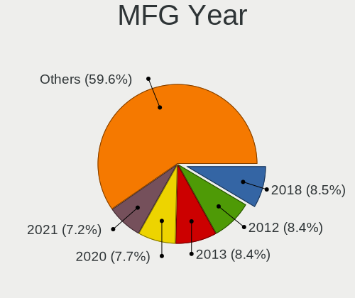

Ubuntu 22.04 - Tested Hardware & Statistics (Desktops)
------------------------------------------------------

A project to collect tested hardware configurations for Ubuntu 22.04.

Anyone can contribute to this report by the [hw-probe](https://github.com/linuxhw/hw-probe) tool:

    sudo -E hw-probe -all -upload

Please contribute! Especially if your hardware is rare.

Contents
--------

* [ Test Cases ](#test-cases)

* [ System ](#system)
  - [ Kernel                   ](#kernel)
  - [ Kernel Family            ](#kernel-family)
  - [ Kernel Major Ver.        ](#kernel-major-ver)
  - [ Arch                     ](#arch)
  - [ DE                       ](#de)
  - [ Display Server           ](#display-server)
  - [ Display Manager          ](#display-manager)
  - [ OS Lang                  ](#os-lang)
  - [ Boot Mode                ](#boot-mode)
  - [ Filesystem               ](#filesystem)
  - [ Part. scheme             ](#part-scheme)
  - [ Dual Boot with Linux/BSD ](#dual-boot-with-linuxbsd)
  - [ Dual Boot (Win)          ](#dual-boot-win)

* [ Board ](#board)
  - [ Vendor                   ](#vendor)
  - [ Model                    ](#model)
  - [ Model Family             ](#model-family)
  - [ MFG Year                 ](#mfg-year)
  - [ Form Factor              ](#form-factor)
  - [ Secure Boot              ](#secure-boot)
  - [ Coreboot                 ](#coreboot)
  - [ RAM Size                 ](#ram-size)
  - [ RAM Used                 ](#ram-used)
  - [ Total Drives             ](#total-drives)
  - [ Has CD-ROM               ](#has-cd-rom)
  - [ Has Ethernet             ](#has-ethernet)
  - [ Has WiFi                 ](#has-wifi)
  - [ Has Bluetooth            ](#has-bluetooth)

* [ Location ](#location)
  - [ Country                  ](#country)
  - [ City                     ](#city)

* [ Drives ](#drives)
  - [ Drive Vendor             ](#drive-vendor)
  - [ Drive Model              ](#drive-model)
  - [ HDD Vendor               ](#hdd-vendor)
  - [ SSD Vendor               ](#ssd-vendor)
  - [ Drive Kind               ](#drive-kind)
  - [ Drive Connector          ](#drive-connector)
  - [ Drive Size               ](#drive-size)
  - [ Space Total              ](#space-total)
  - [ Space Used               ](#space-used)
  - [ Malfunc. Drives          ](#malfunc-drives)
  - [ Malfunc. Drive Vendor    ](#malfunc-drive-vendor)
  - [ Malfunc. HDD Vendor      ](#malfunc-hdd-vendor)
  - [ Malfunc. Drive Kind      ](#malfunc-drive-kind)
  - [ Failed Drives            ](#failed-drives)
  - [ Failed Drive Vendor      ](#failed-drive-vendor)
  - [ Drive Status             ](#drive-status)

* [ Storage controller ](#storage-controller)
  - [ Storage Vendor           ](#storage-vendor)
  - [ Storage Model            ](#storage-model)
  - [ Storage Kind             ](#storage-kind)

* [ Processor ](#processor)
  - [ CPU Vendor               ](#cpu-vendor)
  - [ CPU Model                ](#cpu-model)
  - [ CPU Model Family         ](#cpu-model-family)
  - [ CPU Cores                ](#cpu-cores)
  - [ CPU Sockets              ](#cpu-sockets)
  - [ CPU Threads              ](#cpu-threads)
  - [ CPU Op-Modes             ](#cpu-op-modes)
  - [ CPU Microcode            ](#cpu-microcode)
  - [ CPU Microarch            ](#cpu-microarch)

* [ Graphics ](#graphics)
  - [ GPU Vendor               ](#gpu-vendor)
  - [ GPU Model                ](#gpu-model)
  - [ GPU Combo                ](#gpu-combo)
  - [ GPU Driver               ](#gpu-driver)
  - [ GPU Memory               ](#gpu-memory)

* [ Monitor ](#monitor)
  - [ Monitor Vendor           ](#monitor-vendor)
  - [ Monitor Model            ](#monitor-model)
  - [ Monitor Resolution       ](#monitor-resolution)
  - [ Monitor Diagonal         ](#monitor-diagonal)
  - [ Monitor Width            ](#monitor-width)
  - [ Aspect Ratio             ](#aspect-ratio)
  - [ Monitor Area             ](#monitor-area)
  - [ Pixel Density            ](#pixel-density)
  - [ Multiple Monitors        ](#multiple-monitors)

* [ Network ](#network)
  - [ Net Controller Vendor    ](#net-controller-vendor)
  - [ Net Controller Model     ](#net-controller-model)
  - [ Wireless Vendor          ](#wireless-vendor)
  - [ Wireless Model           ](#wireless-model)
  - [ Ethernet Vendor          ](#ethernet-vendor)
  - [ Ethernet Model           ](#ethernet-model)
  - [ Net Controller Kind      ](#net-controller-kind)
  - [ Used Controller          ](#used-controller)
  - [ NICs                     ](#nics)
  - [ IPv6                     ](#ipv6)

* [ Bluetooth ](#bluetooth)
  - [ Bluetooth Vendor         ](#bluetooth-vendor)
  - [ Bluetooth Model          ](#bluetooth-model)

* [ Sound ](#sound)
  - [ Sound Vendor             ](#sound-vendor)
  - [ Sound Model              ](#sound-model)

* [ Memory ](#memory)
  - [ Memory Vendor            ](#memory-vendor)
  - [ Memory Model             ](#memory-model)
  - [ Memory Kind              ](#memory-kind)
  - [ Memory Form Factor       ](#memory-form-factor)
  - [ Memory Size              ](#memory-size)
  - [ Memory Speed             ](#memory-speed)

* [ Printers & scanners ](#printers--scanners)
  - [ Printer Vendor           ](#printer-vendor)
  - [ Printer Model            ](#printer-model)
  - [ Scanner Vendor           ](#scanner-vendor)
  - [ Scanner Model            ](#scanner-model)

* [ Camera ](#camera)
  - [ Camera Vendor            ](#camera-vendor)
  - [ Camera Model             ](#camera-model)

* [ Security ](#security)
  - [ Fingerprint Vendor       ](#fingerprint-vendor)
  - [ Fingerprint Model        ](#fingerprint-model)
  - [ Chipcard Vendor          ](#chipcard-vendor)
  - [ Chipcard Model           ](#chipcard-model)

* [ Unsupported ](#unsupported)
  - [ Unsupported Devices      ](#unsupported-devices)
  - [ Unsupported Device Types ](#unsupported-device-types)

Test Cases
----------

Total: 2037

| Vendor        | Model                       | Probe                                                      | Date         |
|---------------|-----------------------------|------------------------------------------------------------|--------------|
| MSI           | H81M-E35 V2                 | [db83c146a6](https://linux-hardware.org/?probe=db83c146a6) | Nov 02, 2022 |
| ASUSTek       | PRIME H410M-A               | [b3cac9f8b8](https://linux-hardware.org/?probe=b3cac9f8b8) | Nov 02, 2022 |
| HP            | 18E7                        | [c0d5c58895](https://linux-hardware.org/?probe=c0d5c58895) | Nov 02, 2022 |
| ASUSTek       | M5A78L-M LX3 PLUS           | [23a62c3509](https://linux-hardware.org/?probe=23a62c3509) | Nov 02, 2022 |
| Gigabyte      | B450 I AORUS PRO WIFI-CF    | [895a345eb9](https://linux-hardware.org/?probe=895a345eb9) | Nov 02, 2022 |
| Gigabyte      | B450 I AORUS PRO WIFI-CF    | [9d9d3a4967](https://linux-hardware.org/?probe=9d9d3a4967) | Nov 02, 2022 |
| Fujitsu       | D2628-C1 S26361-D2628-C1    | [a2af2980ad](https://linux-hardware.org/?probe=a2af2980ad) | Nov 02, 2022 |
| ASUSTek       | M5A78L-M LX3 PLUS           | [d34ccf5e7a](https://linux-hardware.org/?probe=d34ccf5e7a) | Nov 02, 2022 |
| ASUSTek       | M5A78L-M LX3 PLUS           | [eb06593b9e](https://linux-hardware.org/?probe=eb06593b9e) | Nov 02, 2022 |
| ASUSTek       | B85-PLUS                    | [dd24c26ffa](https://linux-hardware.org/?probe=dd24c26ffa) | Nov 02, 2022 |
| HP            | 18E5                        | [3df38ade7e](https://linux-hardware.org/?probe=3df38ade7e) | Nov 02, 2022 |
| Gigabyte      | B450M GAMING-CF             | [95e2a1e7d9](https://linux-hardware.org/?probe=95e2a1e7d9) | Nov 02, 2022 |
| HP            | 18E5                        | [8204df7795](https://linux-hardware.org/?probe=8204df7795) | Nov 02, 2022 |
| Gigabyte      | Q270M-D3H                   | [46874cc0a1](https://linux-hardware.org/?probe=46874cc0a1) | Nov 02, 2022 |
| Lenovo        | 312A SDK0J40697 WIN 3305... | [fe91c11062](https://linux-hardware.org/?probe=fe91c11062) | Nov 02, 2022 |
| ASRock        | AB350 Gaming K4             | [36387e4f11](https://linux-hardware.org/?probe=36387e4f11) | Nov 01, 2022 |
| ASUSTek       | H97I-PLUS                   | [13bf376807](https://linux-hardware.org/?probe=13bf376807) | Nov 01, 2022 |
| HP            | 3646h                       | [f88c9632b4](https://linux-hardware.org/?probe=f88c9632b4) | Nov 01, 2022 |
| Dell          | 06D7TR A02                  | [a27d97c026](https://linux-hardware.org/?probe=a27d97c026) | Nov 01, 2022 |
| Dell          | 06D7TR A02                  | [f8a4053db1](https://linux-hardware.org/?probe=f8a4053db1) | Nov 01, 2022 |
| ASUSTek       | Z97-PRO GAMER               | [4b9071c932](https://linux-hardware.org/?probe=4b9071c932) | Nov 01, 2022 |
| ASUSTek       | BM2AD_D510MT_D310MT         | [8f2b0bc926](https://linux-hardware.org/?probe=8f2b0bc926) | Nov 01, 2022 |
| ASUSTek       | Z170 PRO GAMING/AURA        | [f0db98f6bb](https://linux-hardware.org/?probe=f0db98f6bb) | Nov 01, 2022 |
| ASUSTek       | CROSSBLADE RANGER           | [5f92247b16](https://linux-hardware.org/?probe=5f92247b16) | Nov 01, 2022 |
| ASUSTek       | Z170 PRO GAMING/AURA        | [fc832e8881](https://linux-hardware.org/?probe=fc832e8881) | Nov 01, 2022 |
| Gigabyte      | H310M H                     | [115025ee59](https://linux-hardware.org/?probe=115025ee59) | Nov 01, 2022 |
| Gigabyte      | H310M H                     | [74af46599e](https://linux-hardware.org/?probe=74af46599e) | Nov 01, 2022 |
| Dell          | 07C0H8 A00                  | [1b2cb018d0](https://linux-hardware.org/?probe=1b2cb018d0) | Nov 01, 2022 |
| Fujitsu       | D2628-C1 S26361-D2628-C1    | [245ec71478](https://linux-hardware.org/?probe=245ec71478) | Nov 01, 2022 |
| Gigabyte      | Z170-HD3P-CF                | [5fd845ca54](https://linux-hardware.org/?probe=5fd845ca54) | Nov 01, 2022 |
| ASUSTek       | H61M-K                      | [ca5a47c66a](https://linux-hardware.org/?probe=ca5a47c66a) | Nov 01, 2022 |
| ASRock        | AB350 Gaming K4             | [560d84828c](https://linux-hardware.org/?probe=560d84828c) | Nov 01, 2022 |
| ASUSTek       | PRIME B360M-A               | [c46dd8d9b6](https://linux-hardware.org/?probe=c46dd8d9b6) | Nov 01, 2022 |
| ASUSTek       | SABERTOOTH Z87              | [d39c952932](https://linux-hardware.org/?probe=d39c952932) | Nov 01, 2022 |
| Dell          | 082WXT A03                  | [ab3dad5a31](https://linux-hardware.org/?probe=ab3dad5a31) | Nov 01, 2022 |
| AOpen         | aVKx-DE R1.03 55DEL10001... | [b487a7aee3](https://linux-hardware.org/?probe=b487a7aee3) | Oct 31, 2022 |
| HP            | 1850                        | [b39eac8f74](https://linux-hardware.org/?probe=b39eac8f74) | Oct 31, 2022 |
| Acer          | Aspire TC-280               | [68679c6495](https://linux-hardware.org/?probe=68679c6495) | Oct 31, 2022 |
| MSI           | B450 TOMAHAWK MAX           | [183545ed4e](https://linux-hardware.org/?probe=183545ed4e) | Oct 31, 2022 |
| ASUSTek       | Z97-P                       | [72467c5d61](https://linux-hardware.org/?probe=72467c5d61) | Oct 31, 2022 |
| MSI           | A320M-A PRO                 | [8769289ea5](https://linux-hardware.org/?probe=8769289ea5) | Oct 31, 2022 |
| Dell          | 03NVJ6 A03                  | [adebd09dc4](https://linux-hardware.org/?probe=adebd09dc4) | Oct 31, 2022 |
| ASUSTek       | VM60                        | [2cb5cc2932](https://linux-hardware.org/?probe=2cb5cc2932) | Oct 31, 2022 |
| ASUSTek       | M4A78                       | [8eb1316a14](https://linux-hardware.org/?probe=8eb1316a14) | Oct 31, 2022 |
| Unknown       | Unknown                     | [7cce0a2867](https://linux-hardware.org/?probe=7cce0a2867) | Oct 31, 2022 |
| ASUSTek       | M4A78                       | [81374a561c](https://linux-hardware.org/?probe=81374a561c) | Oct 31, 2022 |
| HP            | Compaq 8000 Elite CMT PC    | [fbe835b8ef](https://linux-hardware.org/?probe=fbe835b8ef) | Oct 31, 2022 |
| MSI           | 990FXA-GD80                 | [baaa1111ec](https://linux-hardware.org/?probe=baaa1111ec) | Oct 31, 2022 |
| MSI           | AM1I                        | [30014de18a](https://linux-hardware.org/?probe=30014de18a) | Oct 31, 2022 |
| WTM           | W-N95 B0                    | [56611d3c8f](https://linux-hardware.org/?probe=56611d3c8f) | Oct 31, 2022 |
| Intel         | D33217GKE G76540-201        | [b3403874f4](https://linux-hardware.org/?probe=b3403874f4) | Oct 31, 2022 |
| ASUSTek       | P5Q-E                       | [0ef6be44d0](https://linux-hardware.org/?probe=0ef6be44d0) | Oct 31, 2022 |
| MSI           | MS-7309                     | [a6b1a7d329](https://linux-hardware.org/?probe=a6b1a7d329) | Oct 31, 2022 |
| MSI           | MS-7309                     | [3c519589ad](https://linux-hardware.org/?probe=3c519589ad) | Oct 30, 2022 |
| ASUSTek       | PHOENIX                     | [d4f8ae717d](https://linux-hardware.org/?probe=d4f8ae717d) | Oct 30, 2022 |
| ASUSTek       | A8N32-SLI-Deluxe            | [85389b6454](https://linux-hardware.org/?probe=85389b6454) | Oct 30, 2022 |
| ASRock        | FM2A88X-ITX+                | [08cf9e2ccd](https://linux-hardware.org/?probe=08cf9e2ccd) | Oct 30, 2022 |
| Gigabyte      | B550 AORUS ELITE V2         | [738569f811](https://linux-hardware.org/?probe=738569f811) | Oct 30, 2022 |
| ASRock        | B550M Pro4                  | [078fd46e0a](https://linux-hardware.org/?probe=078fd46e0a) | Oct 30, 2022 |
| Lenovo        | 0B98401 WIN                 | [25805a13b0](https://linux-hardware.org/?probe=25805a13b0) | Oct 30, 2022 |
| ASRock        | FM2A88X-ITX+                | [e28a25b18a](https://linux-hardware.org/?probe=e28a25b18a) | Oct 30, 2022 |
| ASRock        | 960GM-VGS3 FX               | [ac82c6bda9](https://linux-hardware.org/?probe=ac82c6bda9) | Oct 30, 2022 |
| ASUSTek       | PRIME X470-PRO              | [a8b08a47aa](https://linux-hardware.org/?probe=a8b08a47aa) | Oct 30, 2022 |
| ASUSTek       | A8N32-SLI-Deluxe            | [55be6f23ce](https://linux-hardware.org/?probe=55be6f23ce) | Oct 30, 2022 |
| Huanan        | H510-D4 V4.0                | [89b298973c](https://linux-hardware.org/?probe=89b298973c) | Oct 30, 2022 |
| Gigabyte      | X570S AORUS PRO AX          | [03d14141e4](https://linux-hardware.org/?probe=03d14141e4) | Oct 30, 2022 |
| Medion        | MS-7707                     | [4f018e8577](https://linux-hardware.org/?probe=4f018e8577) | Oct 30, 2022 |
| Dell          | 0WMJ54 A01                  | [3760efa49c](https://linux-hardware.org/?probe=3760efa49c) | Oct 30, 2022 |
| Dell          | 0WMJ54 A01                  | [1b614b2744](https://linux-hardware.org/?probe=1b614b2744) | Oct 30, 2022 |
| Dell          | 0G214D A00                  | [2ee26099ae](https://linux-hardware.org/?probe=2ee26099ae) | Oct 30, 2022 |
| ASUSTek       | H97-PLUS                    | [f22f67754e](https://linux-hardware.org/?probe=f22f67754e) | Oct 29, 2022 |
| ASRock        | 960GM-VGS3 FX               | [5769997d2a](https://linux-hardware.org/?probe=5769997d2a) | Oct 29, 2022 |
| MSI           | A320M-A PRO                 | [23ad30db1a](https://linux-hardware.org/?probe=23ad30db1a) | Oct 29, 2022 |
| ASUSTek       | M4A78                       | [d88d101a3c](https://linux-hardware.org/?probe=d88d101a3c) | Oct 29, 2022 |
| HP            | ProLiant ML310e Gen8 v2     | [768d0e85c9](https://linux-hardware.org/?probe=768d0e85c9) | Oct 29, 2022 |
| Gigabyte      | Z390 AORUS PRO-CF           | [05b5af2e63](https://linux-hardware.org/?probe=05b5af2e63) | Oct 29, 2022 |
| ASRock        | 890GX Extreme3              | [ff1af2eaf0](https://linux-hardware.org/?probe=ff1af2eaf0) | Oct 29, 2022 |
| HP            | 8653 A                      | [9c19089f51](https://linux-hardware.org/?probe=9c19089f51) | Oct 29, 2022 |
| ASUSTek       | P5KPL-AM SE                 | [95af9b0439](https://linux-hardware.org/?probe=95af9b0439) | Oct 29, 2022 |
| ASUSTek       | PRIME Q270M-C               | [4440c6ed51](https://linux-hardware.org/?probe=4440c6ed51) | Oct 29, 2022 |
| Gigabyte      | B550M DS3H                  | [8a918b4739](https://linux-hardware.org/?probe=8a918b4739) | Oct 28, 2022 |
| ASUSTek       | CM1730,CM1830               | [0915c0bf5a](https://linux-hardware.org/?probe=0915c0bf5a) | Oct 28, 2022 |
| MSI           | MAG B550 TOMAHAWK           | [f45ab957da](https://linux-hardware.org/?probe=f45ab957da) | Oct 28, 2022 |
| Dell          | 02M8NY A01                  | [47c0e65f02](https://linux-hardware.org/?probe=47c0e65f02) | Oct 28, 2022 |
| MSI           | Z370 KRAIT GAMING           | [cbf597cec1](https://linux-hardware.org/?probe=cbf597cec1) | Oct 28, 2022 |
| ASUSTek       | P8B75-V                     | [4783ed1083](https://linux-hardware.org/?probe=4783ed1083) | Oct 28, 2022 |
| ASUSTek       | ET2700I                     | [ce0d0e61eb](https://linux-hardware.org/?probe=ce0d0e61eb) | Oct 28, 2022 |
| MSI           | X470 GAMING PLUS            | [f296db20db](https://linux-hardware.org/?probe=f296db20db) | Oct 28, 2022 |
| ASUSTek       | X99-A/USB                   | [ca0810aab5](https://linux-hardware.org/?probe=ca0810aab5) | Oct 28, 2022 |
| Acer          | Aspire TC-710 V:1.1         | [b9c0f59afa](https://linux-hardware.org/?probe=b9c0f59afa) | Oct 28, 2022 |
| Dell          | 06D7TR A02                  | [42e2c69893](https://linux-hardware.org/?probe=42e2c69893) | Oct 28, 2022 |
| MSI           | Z97 GAMING 3                | [4488ff5b26](https://linux-hardware.org/?probe=4488ff5b26) | Oct 28, 2022 |
| ASUSTek       | ROG CROSSHAIR VII HERO      | [1759cbebe1](https://linux-hardware.org/?probe=1759cbebe1) | Oct 28, 2022 |
| Alienware     | 07W25T A01                  | [107ec47dd5](https://linux-hardware.org/?probe=107ec47dd5) | Oct 28, 2022 |
| Alienware     | 07W25T A01                  | [0338285f54](https://linux-hardware.org/?probe=0338285f54) | Oct 28, 2022 |
| ASUSTek       | PHOENIX                     | [827dd1396b](https://linux-hardware.org/?probe=827dd1396b) | Oct 28, 2022 |
| Alienware     | 07W25T A01                  | [e320ad09bc](https://linux-hardware.org/?probe=e320ad09bc) | Oct 28, 2022 |
| Lenovo        | ThinkCentre M71e 3134C2U    | [a1cec3edba](https://linux-hardware.org/?probe=a1cec3edba) | Oct 28, 2022 |
| HP            | ProLiant MicroServer Gen... | [6cfd4bdb14](https://linux-hardware.org/?probe=6cfd4bdb14) | Oct 28, 2022 |
| Gigabyte      | X58A-UD3R                   | [560f96a33a](https://linux-hardware.org/?probe=560f96a33a) | Oct 28, 2022 |
| Alienware     | 046MHW A00                  | [5a5511a68b](https://linux-hardware.org/?probe=5a5511a68b) | Oct 27, 2022 |
| Packard Be... | IMEDIA S3810                | [f492fb9369](https://linux-hardware.org/?probe=f492fb9369) | Oct 27, 2022 |
| MSI           | B450M GAMING PLUS           | [b31400d1d1](https://linux-hardware.org/?probe=b31400d1d1) | Oct 27, 2022 |
| Lenovo        | 3102 NOK                    | [973ebfcf3e](https://linux-hardware.org/?probe=973ebfcf3e) | Oct 27, 2022 |
| Gigabyte      | H61N-USB3                   | [ff94581714](https://linux-hardware.org/?probe=ff94581714) | Oct 27, 2022 |
| ASUSTek       | TUF Gaming B550-PLUS        | [8948294711](https://linux-hardware.org/?probe=8948294711) | Oct 27, 2022 |
| HP            | 894B 10                     | [56afe0f581](https://linux-hardware.org/?probe=56afe0f581) | Oct 27, 2022 |
| Intel         | H410M-E                     | [854c3ec5b1](https://linux-hardware.org/?probe=854c3ec5b1) | Oct 27, 2022 |
| HP            | 8653 A                      | [92b68870ca](https://linux-hardware.org/?probe=92b68870ca) | Oct 27, 2022 |
| HP            | 8425                        | [6d26af6597](https://linux-hardware.org/?probe=6d26af6597) | Oct 27, 2022 |
| Intel         | H55                         | [fb3cf518ac](https://linux-hardware.org/?probe=fb3cf518ac) | Oct 27, 2022 |
| Dell          | 0KWVT8 A02                  | [01613e9e80](https://linux-hardware.org/?probe=01613e9e80) | Oct 27, 2022 |
| Gigabyte      | GA-990FXA-UD5               | [6faf6b40b1](https://linux-hardware.org/?probe=6faf6b40b1) | Oct 26, 2022 |
| Gigabyte      | B450M DS3H V2               | [c2c9c1bb9b](https://linux-hardware.org/?probe=c2c9c1bb9b) | Oct 26, 2022 |
| ASRock        | H470M-STX                   | [02f3177542](https://linux-hardware.org/?probe=02f3177542) | Oct 26, 2022 |
| Fujitsu       | D3161-A1 S26361-D3161-A1    | [06f33f301b](https://linux-hardware.org/?probe=06f33f301b) | Oct 26, 2022 |
| Gigabyte      | EP43-DS3L                   | [f9e114a7e9](https://linux-hardware.org/?probe=f9e114a7e9) | Oct 26, 2022 |
| HP            | 3029h                       | [46c9e39101](https://linux-hardware.org/?probe=46c9e39101) | Oct 26, 2022 |
| ASRock        | B450 Pro4                   | [666aba57b3](https://linux-hardware.org/?probe=666aba57b3) | Oct 26, 2022 |
| ASRock        | FM2A78M-HD+                 | [2d0d5ac22b](https://linux-hardware.org/?probe=2d0d5ac22b) | Oct 26, 2022 |
| Intel         | H410M-E                     | [69d7d07e13](https://linux-hardware.org/?probe=69d7d07e13) | Oct 26, 2022 |
| HP            | 8509                        | [81bfb5a782](https://linux-hardware.org/?probe=81bfb5a782) | Oct 26, 2022 |
| MSI           | MEG X570 GODLIKE            | [6659cbf83d](https://linux-hardware.org/?probe=6659cbf83d) | Oct 26, 2022 |
| HP            | 1495                        | [64e8d1cff2](https://linux-hardware.org/?probe=64e8d1cff2) | Oct 26, 2022 |
| Alienware     | 0PGRP5 A02                  | [126f440ca7](https://linux-hardware.org/?probe=126f440ca7) | Oct 26, 2022 |
| MSI           | MS-7309                     | [fe0fae3528](https://linux-hardware.org/?probe=fe0fae3528) | Oct 26, 2022 |
| ASUSTek       | M4A87TD EVO                 | [c304ae4e48](https://linux-hardware.org/?probe=c304ae4e48) | Oct 25, 2022 |
| ASUSTek       | M4A87TD EVO                 | [1f62025135](https://linux-hardware.org/?probe=1f62025135) | Oct 25, 2022 |
| MSI           | MS-7309                     | [2db582d6dd](https://linux-hardware.org/?probe=2db582d6dd) | Oct 25, 2022 |
| Gigabyte      | GA-MA770-UD3                | [ef555f6161](https://linux-hardware.org/?probe=ef555f6161) | Oct 25, 2022 |
| Gigabyte      | P35-DS3L                    | [2f5cb804c0](https://linux-hardware.org/?probe=2f5cb804c0) | Oct 25, 2022 |
| ASUSTek       | H110M-K                     | [06c00dc8d5](https://linux-hardware.org/?probe=06c00dc8d5) | Oct 25, 2022 |
| Techvision    | TVI7309X B0                 | [cf2d75ffa9](https://linux-hardware.org/?probe=cf2d75ffa9) | Oct 25, 2022 |
| Gigabyte      | X58A-UD7                    | [6d3bf37ff3](https://linux-hardware.org/?probe=6d3bf37ff3) | Oct 25, 2022 |
| ASUSTek       | PRO H410M-C                 | [00e64f6075](https://linux-hardware.org/?probe=00e64f6075) | Oct 25, 2022 |
| ASUSTek       | PRIME B450-PLUS             | [3a10949e83](https://linux-hardware.org/?probe=3a10949e83) | Oct 25, 2022 |
| MSI           | Z97-G55 SLI                 | [25ddd5274f](https://linux-hardware.org/?probe=25ddd5274f) | Oct 25, 2022 |
| ASUSTek       | TUF Gaming B550-PLUS        | [74ca211759](https://linux-hardware.org/?probe=74ca211759) | Oct 25, 2022 |
| Dell          | 0MWYPT A02                  | [cf186994cc](https://linux-hardware.org/?probe=cf186994cc) | Oct 25, 2022 |
| MSI           | MAG X570S TOMAHAWK MAX W... | [c05a08e1af](https://linux-hardware.org/?probe=c05a08e1af) | Oct 25, 2022 |
| ASUSTek       | ROG ZENITH EXTREME          | [13830bd661](https://linux-hardware.org/?probe=13830bd661) | Oct 25, 2022 |
| ASUSTek       | ROG ZENITH EXTREME          | [6c8e8f4707](https://linux-hardware.org/?probe=6c8e8f4707) | Oct 25, 2022 |
| ASUSTek       | ROG ZENITH EXTREME          | [5fa6c73455](https://linux-hardware.org/?probe=5fa6c73455) | Oct 25, 2022 |
| ASRock        | B450 Gaming K4              | [122a54b0c2](https://linux-hardware.org/?probe=122a54b0c2) | Oct 25, 2022 |
| ASRock        | N68-S                       | [f1f502f834](https://linux-hardware.org/?probe=f1f502f834) | Oct 25, 2022 |
| Dell          | 0HY9JP A00                  | [ecbfb1ca5c](https://linux-hardware.org/?probe=ecbfb1ca5c) | Oct 25, 2022 |
| ASUSTek       | PRIME B350-PLUS             | [544988df6e](https://linux-hardware.org/?probe=544988df6e) | Oct 24, 2022 |
| MSI           | MAG X570S TOMAHAWK MAX W... | [936e43f0bc](https://linux-hardware.org/?probe=936e43f0bc) | Oct 24, 2022 |
| ASUSTek       | Maximus VI EXTREME          | [e5264df501](https://linux-hardware.org/?probe=e5264df501) | Oct 24, 2022 |
| ASUSTek       | H170 PRO GAMING             | [905f41afd6](https://linux-hardware.org/?probe=905f41afd6) | Oct 24, 2022 |
| ASUSTek       | TUF B450-PLUS GAMING        | [1dea808353](https://linux-hardware.org/?probe=1dea808353) | Oct 24, 2022 |
| Gigabyte      | B85M-D3H                    | [f4182ec2e9](https://linux-hardware.org/?probe=f4182ec2e9) | Oct 24, 2022 |
| ASUSTek       | H170M-PLUS/BR               | [31cae2266e](https://linux-hardware.org/?probe=31cae2266e) | Oct 24, 2022 |
| ASUSTek       | M5A97 LE R2.0               | [93fdeacbba](https://linux-hardware.org/?probe=93fdeacbba) | Oct 24, 2022 |
| Acer          | Aspire XC-830               | [2692d8c0cd](https://linux-hardware.org/?probe=2692d8c0cd) | Oct 24, 2022 |
| ASUSTek       | PRIME H510M-K               | [af2163c4dd](https://linux-hardware.org/?probe=af2163c4dd) | Oct 24, 2022 |
| HP            | 8055                        | [624dddbaec](https://linux-hardware.org/?probe=624dddbaec) | Oct 24, 2022 |
| Acer          | Aspire XC-830               | [8b6263dc68](https://linux-hardware.org/?probe=8b6263dc68) | Oct 24, 2022 |
| Gigabyte      | Z690 UD DDR4                | [8cc3ca1253](https://linux-hardware.org/?probe=8cc3ca1253) | Oct 24, 2022 |
| Soyo          | SY-B250 BTC                 | [2be8fe0c55](https://linux-hardware.org/?probe=2be8fe0c55) | Oct 23, 2022 |
| Medion        | MS-7707                     | [e6d2f4c633](https://linux-hardware.org/?probe=e6d2f4c633) | Oct 23, 2022 |
| HP            | 3648h                       | [ca842c5896](https://linux-hardware.org/?probe=ca842c5896) | Oct 23, 2022 |
| Gigabyte      | G31M-S2L                    | [0c7ba9c00c](https://linux-hardware.org/?probe=0c7ba9c00c) | Oct 23, 2022 |
| HP            | 8055                        | [27793140bf](https://linux-hardware.org/?probe=27793140bf) | Oct 23, 2022 |
| ASUSTek       | P9X79 WS                    | [86f91e4898](https://linux-hardware.org/?probe=86f91e4898) | Oct 23, 2022 |
| HP            | 0B40h                       | [981b4e9553](https://linux-hardware.org/?probe=981b4e9553) | Oct 23, 2022 |
| HP            | 3647h                       | [b65d5d4bff](https://linux-hardware.org/?probe=b65d5d4bff) | Oct 23, 2022 |
| Dell          | 0JP3NX A00                  | [8b457c11e8](https://linux-hardware.org/?probe=8b457c11e8) | Oct 23, 2022 |
| Dell          | 08HPGT A01                  | [6f5cd6be2e](https://linux-hardware.org/?probe=6f5cd6be2e) | Oct 23, 2022 |
| ASUSTek       | PRIME B450M-A               | [19c3c8e1f6](https://linux-hardware.org/?probe=19c3c8e1f6) | Oct 23, 2022 |
| Unknown       | Unknown                     | [cd2e9dd7af](https://linux-hardware.org/?probe=cd2e9dd7af) | Oct 23, 2022 |
| Unknown       | Unknown                     | [5962a98f24](https://linux-hardware.org/?probe=5962a98f24) | Oct 23, 2022 |
| ASUSTek       | TUF Gaming B550M-PLUS       | [4adb8fc7ec](https://linux-hardware.org/?probe=4adb8fc7ec) | Oct 23, 2022 |
| LattePanda    | 3 Delta LP-BS-7-S70JR120... | [7b9901d0d3](https://linux-hardware.org/?probe=7b9901d0d3) | Oct 23, 2022 |
| ASUSTek       | TUF Gaming B550M-PLUS       | [9be4a6cba7](https://linux-hardware.org/?probe=9be4a6cba7) | Oct 23, 2022 |
| Gigabyte      | B560M H                     | [cce3979970](https://linux-hardware.org/?probe=cce3979970) | Oct 22, 2022 |
| Dell          | 0WR7PY A02                  | [07fb028e18](https://linux-hardware.org/?probe=07fb028e18) | Oct 22, 2022 |
| Gigabyte      | G31M-S2L                    | [8a9c9435e3](https://linux-hardware.org/?probe=8a9c9435e3) | Oct 22, 2022 |
| Dell          | 0773VG A01                  | [32d7c24c6d](https://linux-hardware.org/?probe=32d7c24c6d) | Oct 22, 2022 |
| ASRock        | B450M Pro4-F                | [eb651764eb](https://linux-hardware.org/?probe=eb651764eb) | Oct 22, 2022 |
| Gigabyte      | X470 AORUS ULTRA GAMING-... | [9042357a86](https://linux-hardware.org/?probe=9042357a86) | Oct 22, 2022 |
| Dell          | 06D7TR A02                  | [cc9f0fae0e](https://linux-hardware.org/?probe=cc9f0fae0e) | Oct 22, 2022 |
| Dell          | 06D7TR A02                  | [8c5b1117a9](https://linux-hardware.org/?probe=8c5b1117a9) | Oct 22, 2022 |
| HP            | 304Bh                       | [c73d7e712d](https://linux-hardware.org/?probe=c73d7e712d) | Oct 22, 2022 |
| MSI           | PRO Z690-A                  | [9ea661d3b9](https://linux-hardware.org/?probe=9ea661d3b9) | Oct 22, 2022 |
| ASUSTek       | PRIME X470-PRO              | [c830caee45](https://linux-hardware.org/?probe=c830caee45) | Oct 21, 2022 |
| ASUSTek       | ROG STRIX B450-F GAMING     | [77463ad1d7](https://linux-hardware.org/?probe=77463ad1d7) | Oct 21, 2022 |
| ASUSTek       | P8Z68-V GEN3                | [24a7381e8b](https://linux-hardware.org/?probe=24a7381e8b) | Oct 21, 2022 |
| Gigabyte      | B150M-D3H-CF                | [3d5bfd2ba5](https://linux-hardware.org/?probe=3d5bfd2ba5) | Oct 21, 2022 |
| Lenovo        | 310B SDK0J40705 WIN 3425... | [8a5ccf8170](https://linux-hardware.org/?probe=8a5ccf8170) | Oct 21, 2022 |
| ASUSTek       | H97I-PLUS                   | [b403dcc362](https://linux-hardware.org/?probe=b403dcc362) | Oct 21, 2022 |
| Gigabyte      | X570S AORUS ELITE           | [bc75d3cc30](https://linux-hardware.org/?probe=bc75d3cc30) | Oct 21, 2022 |
| Gigabyte      | Z370 HD3-CF                 | [a8b8079081](https://linux-hardware.org/?probe=a8b8079081) | Oct 21, 2022 |
| HP            | 304Bh                       | [b8b2e16db8](https://linux-hardware.org/?probe=b8b2e16db8) | Oct 20, 2022 |
| Fujitsu       | D3062-A1 S26361-D3062-A1    | [59f7d0820f](https://linux-hardware.org/?probe=59f7d0820f) | Oct 20, 2022 |
| Gigabyte      | H170N-WIFI-CF               | [b864fd7ffa](https://linux-hardware.org/?probe=b864fd7ffa) | Oct 20, 2022 |
| MSI           | MPG Z390 GAMING PLUS        | [d2fa2b9b63](https://linux-hardware.org/?probe=d2fa2b9b63) | Oct 20, 2022 |
| Acer          | Aspire XC-705               | [535cc5230e](https://linux-hardware.org/?probe=535cc5230e) | Oct 20, 2022 |
| HP            | 1850                        | [786fd367d5](https://linux-hardware.org/?probe=786fd367d5) | Oct 20, 2022 |
| Dell          | 0JP3NX A01                  | [db876946e0](https://linux-hardware.org/?probe=db876946e0) | Oct 20, 2022 |
| Apple         | Mac-F42C88C8 Proto1         | [7cd35141b3](https://linux-hardware.org/?probe=7cd35141b3) | Oct 20, 2022 |
| HP            | 2B1E                        | [1a79dbe66a](https://linux-hardware.org/?probe=1a79dbe66a) | Oct 20, 2022 |
| Dell          | 0K83V0 A00                  | [dde4cfd592](https://linux-hardware.org/?probe=dde4cfd592) | Oct 20, 2022 |
| Gigabyte      | X570 I AORUS PRO WIFI       | [e455bef105](https://linux-hardware.org/?probe=e455bef105) | Oct 20, 2022 |
| Lenovo        | MAHOBAY 0B98401 PRO         | [a753c7bd58](https://linux-hardware.org/?probe=a753c7bd58) | Oct 20, 2022 |
| ASUSTek       | V-P7H55E                    | [51f4793383](https://linux-hardware.org/?probe=51f4793383) | Oct 20, 2022 |
| Dell          | 0YXT71 A03                  | [c37d6f2369](https://linux-hardware.org/?probe=c37d6f2369) | Oct 20, 2022 |
| ASUSTek       | PRIME Z390-P                | [f3ac5bf3df](https://linux-hardware.org/?probe=f3ac5bf3df) | Oct 20, 2022 |
| Gigabyte      | 970A-UD3P                   | [9dffa26de0](https://linux-hardware.org/?probe=9dffa26de0) | Oct 20, 2022 |
| Lenovo        | ThinkCentre M71e 3134C2U    | [e7fa8a9822](https://linux-hardware.org/?probe=e7fa8a9822) | Oct 19, 2022 |
| MSI           | MPG Z390 GAMING PLUS        | [18c1a4a04d](https://linux-hardware.org/?probe=18c1a4a04d) | Oct 19, 2022 |
| ASRock        | H110M-DVS R3.0              | [86b7c01699](https://linux-hardware.org/?probe=86b7c01699) | Oct 19, 2022 |
| MSI           | H81M-E33                    | [ff6334ee8f](https://linux-hardware.org/?probe=ff6334ee8f) | Oct 19, 2022 |
| Dell          | 0YXT71 A02                  | [137e154b2d](https://linux-hardware.org/?probe=137e154b2d) | Oct 19, 2022 |
| Lenovo        | 3102 NOK                    | [d46ae4e597](https://linux-hardware.org/?probe=d46ae4e597) | Oct 19, 2022 |
| Acer          | Veriton X2631G V:1.0        | [4becf50dac](https://linux-hardware.org/?probe=4becf50dac) | Oct 19, 2022 |
| Lenovo        | 3102 NOK                    | [e57ed46372](https://linux-hardware.org/?probe=e57ed46372) | Oct 19, 2022 |
| ASUSTek       | PRIME B360-PLUS             | [cd36bb86da](https://linux-hardware.org/?probe=cd36bb86da) | Oct 19, 2022 |
| Dell          | 0XJ8C4 A00                  | [83da6e6509](https://linux-hardware.org/?probe=83da6e6509) | Oct 19, 2022 |
| ASUSTek       | H81I-PLUS                   | [c30eaa0009](https://linux-hardware.org/?probe=c30eaa0009) | Oct 19, 2022 |
| ASUSTek       | P8B75-M LX                  | [b97b4b3d9a](https://linux-hardware.org/?probe=b97b4b3d9a) | Oct 19, 2022 |
| ASUSTek       | P8B75-M LX                  | [827927ddce](https://linux-hardware.org/?probe=827927ddce) | Oct 19, 2022 |
| HP            | 339A                        | [bea86a9671](https://linux-hardware.org/?probe=bea86a9671) | Oct 19, 2022 |
| Fujitsu       | D3062-A1 S26361-D3062-A1    | [48d48d4c8e](https://linux-hardware.org/?probe=48d48d4c8e) | Oct 19, 2022 |
| Lenovo        | MAHOBAY 0B98401 PRO         | [f275b2167f](https://linux-hardware.org/?probe=f275b2167f) | Oct 19, 2022 |
| Gigabyte      | A320M-S2H-CF                | [a52d0f3c58](https://linux-hardware.org/?probe=a52d0f3c58) | Oct 19, 2022 |
| Gigabyte      | A320M-S2H-CF                | [62b055a110](https://linux-hardware.org/?probe=62b055a110) | Oct 18, 2022 |
| ASRock        | 980DE3/U3S3                 | [d86abdf5b9](https://linux-hardware.org/?probe=d86abdf5b9) | Oct 18, 2022 |
| MSI           | H61M-E33                    | [7591f8fa5f](https://linux-hardware.org/?probe=7591f8fa5f) | Oct 18, 2022 |
| Dell          | 0C522T A03                  | [20703ba8b3](https://linux-hardware.org/?probe=20703ba8b3) | Oct 18, 2022 |
| ASRock        | B450M Steel Legend          | [6718ea22a9](https://linux-hardware.org/?probe=6718ea22a9) | Oct 18, 2022 |
| Dell          | 0T7D40 A01                  | [ce6f6580be](https://linux-hardware.org/?probe=ce6f6580be) | Oct 17, 2022 |
| Dell          | 0T7D40 A01                  | [6fb3c4740d](https://linux-hardware.org/?probe=6fb3c4740d) | Oct 17, 2022 |
| HP            | 3048h                       | [624ad8a33c](https://linux-hardware.org/?probe=624ad8a33c) | Oct 17, 2022 |
| HP            | 3048h                       | [1b3d31f720](https://linux-hardware.org/?probe=1b3d31f720) | Oct 17, 2022 |
| MSI           | H310M PRO-VD PLUS           | [359822ae5f](https://linux-hardware.org/?probe=359822ae5f) | Oct 17, 2022 |
| Dell          | 0T7D40 A01                  | [38888585db](https://linux-hardware.org/?probe=38888585db) | Oct 17, 2022 |
| Gigabyte      | M68MT-S2                    | [282e240d2b](https://linux-hardware.org/?probe=282e240d2b) | Oct 17, 2022 |
| Lenovo        | 310B SDK0J40705 WIN 3425... | [ca239da906](https://linux-hardware.org/?probe=ca239da906) | Oct 17, 2022 |
| ASUSTek       | TUF Gaming B550M-PLUS       | [7afa527ad7](https://linux-hardware.org/?probe=7afa527ad7) | Oct 17, 2022 |
| ASUSTek       | TUF Gaming B550M-PLUS       | [547c973486](https://linux-hardware.org/?probe=547c973486) | Oct 17, 2022 |
| MSI           | IONA                        | [7c164d5733](https://linux-hardware.org/?probe=7c164d5733) | Oct 17, 2022 |
| ASUSTek       | PRIME B360M-A               | [4138cb5064](https://linux-hardware.org/?probe=4138cb5064) | Oct 17, 2022 |
| HP            | 3648h                       | [8249e3db9e](https://linux-hardware.org/?probe=8249e3db9e) | Oct 17, 2022 |
| ASRock        | Z87M Pro4                   | [cf5be4f1e6](https://linux-hardware.org/?probe=cf5be4f1e6) | Oct 17, 2022 |
| Gigabyte      | 970A-UD3P                   | [210d7fdd5d](https://linux-hardware.org/?probe=210d7fdd5d) | Oct 17, 2022 |
| Dell          | 0KJCC5 A00                  | [d6a23d7f6d](https://linux-hardware.org/?probe=d6a23d7f6d) | Oct 17, 2022 |
| Dell          | 0HY9JP A01                  | [3d94d514d2](https://linux-hardware.org/?probe=3d94d514d2) | Oct 16, 2022 |
| Gigabyte      | X570S AORUS PRO AX          | [61aeb93e12](https://linux-hardware.org/?probe=61aeb93e12) | Oct 16, 2022 |
| ASRock        | N68-S                       | [356bdaf8d8](https://linux-hardware.org/?probe=356bdaf8d8) | Oct 16, 2022 |
| ASUSTek       | GD30CI                      | [e002a9ef5c](https://linux-hardware.org/?probe=e002a9ef5c) | Oct 16, 2022 |
| Gigabyte      | X570 AORUS PRO              | [a7941186ab](https://linux-hardware.org/?probe=a7941186ab) | Oct 16, 2022 |
| HP            | 3646h                       | [c7436e0f9e](https://linux-hardware.org/?probe=c7436e0f9e) | Oct 16, 2022 |
| HP            | 1495                        | [109913631a](https://linux-hardware.org/?probe=109913631a) | Oct 16, 2022 |
| ASUSTek       | M5A97 R2.0                  | [10a3014c1a](https://linux-hardware.org/?probe=10a3014c1a) | Oct 16, 2022 |
| MSI           | 2A9C                        | [74482fb396](https://linux-hardware.org/?probe=74482fb396) | Oct 16, 2022 |
| ASUSTek       | V-P7H55E                    | [289b913df1](https://linux-hardware.org/?probe=289b913df1) | Oct 16, 2022 |
| Lenovo        | SHARKBAY SDK0E50510 WIN     | [a897ba9d5d](https://linux-hardware.org/?probe=a897ba9d5d) | Oct 16, 2022 |
| MSI           | MPG Z690 FORCE WIFI         | [1627dd0745](https://linux-hardware.org/?probe=1627dd0745) | Oct 16, 2022 |
| Dell          | 0XCR8D A03                  | [f28c1f59df](https://linux-hardware.org/?probe=f28c1f59df) | Oct 16, 2022 |
| MSI           | A320M-A PRO MAX             | [176bc5b449](https://linux-hardware.org/?probe=176bc5b449) | Oct 16, 2022 |
| Gigabyte      | B450M DS3H-CF               | [1be458024b](https://linux-hardware.org/?probe=1be458024b) | Oct 15, 2022 |
| ASUSTek       | H87M-PRO                    | [4f1304fbdd](https://linux-hardware.org/?probe=4f1304fbdd) | Oct 15, 2022 |
| Foxconn       | H61MXT1/F2/-S/-V            | [a5a47837e5](https://linux-hardware.org/?probe=a5a47837e5) | Oct 15, 2022 |
| MSI           | 970 GAMING                  | [a6e072bc6b](https://linux-hardware.org/?probe=a6e072bc6b) | Oct 15, 2022 |
| MSI           | 970 GAMING                  | [6bc730181f](https://linux-hardware.org/?probe=6bc730181f) | Oct 15, 2022 |
| Lenovo        | SHARKBAY SDK0E50510 PRO     | [5038f48b66](https://linux-hardware.org/?probe=5038f48b66) | Oct 15, 2022 |
| Lenovo        | SDK0E50510 WIN              | [3f3d531577](https://linux-hardware.org/?probe=3f3d531577) | Oct 15, 2022 |
| Gigabyte      | X570 I AORUS PRO WIFI       | [b1eab51bd7](https://linux-hardware.org/?probe=b1eab51bd7) | Oct 15, 2022 |
| MSI           | MAG B560 TORPEDO            | [e4522a15ff](https://linux-hardware.org/?probe=e4522a15ff) | Oct 15, 2022 |
| Dell          | 0VD92X A00                  | [7f90427c64](https://linux-hardware.org/?probe=7f90427c64) | Oct 15, 2022 |
| MSI           | A320M-A PRO MAX             | [5f85879cf4](https://linux-hardware.org/?probe=5f85879cf4) | Oct 15, 2022 |
| Foxconn       | H61MXT1/F2/-S/-V            | [614d4b0dc3](https://linux-hardware.org/?probe=614d4b0dc3) | Oct 15, 2022 |
| HP            | 2AF7                        | [e5cd1d0cce](https://linux-hardware.org/?probe=e5cd1d0cce) | Oct 15, 2022 |
| Gigabyte      | Z77X-UP5 TH-CF              | [74da27df2d](https://linux-hardware.org/?probe=74da27df2d) | Oct 14, 2022 |
| Gigabyte      | Z77X-UP5 TH-CF              | [696a7e9848](https://linux-hardware.org/?probe=696a7e9848) | Oct 14, 2022 |
| Gigabyte      | B75M-D3H                    | [7ead04b896](https://linux-hardware.org/?probe=7ead04b896) | Oct 14, 2022 |
| HP            | 805D                        | [ece9f05ea6](https://linux-hardware.org/?probe=ece9f05ea6) | Oct 14, 2022 |
| HP            | 805D                        | [f10271c447](https://linux-hardware.org/?probe=f10271c447) | Oct 14, 2022 |
| Medion        | MS-7797                     | [c6174b67dd](https://linux-hardware.org/?probe=c6174b67dd) | Oct 14, 2022 |
| Dell          | 0VG93V A00                  | [e0c7462fba](https://linux-hardware.org/?probe=e0c7462fba) | Oct 14, 2022 |
| Lenovo        | SHARKBAY 0B98401 PRO        | [b8ba7e41c8](https://linux-hardware.org/?probe=b8ba7e41c8) | Oct 14, 2022 |
| HP            | 339A                        | [f7dd678058](https://linux-hardware.org/?probe=f7dd678058) | Oct 14, 2022 |
| Dell          | 0HHV7N A00                  | [e907fa03b0](https://linux-hardware.org/?probe=e907fa03b0) | Oct 14, 2022 |
| Dell          | 0HHV7N A00                  | [bfd7e8bd60](https://linux-hardware.org/?probe=bfd7e8bd60) | Oct 14, 2022 |
| Intel         | STK2MV64CC H89290-502       | [85670dc1fe](https://linux-hardware.org/?probe=85670dc1fe) | Oct 14, 2022 |
| ASUSTek       | PRIME B365M-A               | [e025a87662](https://linux-hardware.org/?probe=e025a87662) | Oct 13, 2022 |
| ASUSTek       | PRIME B365M-A               | [df44c77cfa](https://linux-hardware.org/?probe=df44c77cfa) | Oct 13, 2022 |
| Fujitsu       | D3062-A1 S26361-D3062-A1    | [14891d8a26](https://linux-hardware.org/?probe=14891d8a26) | Oct 13, 2022 |
| ASUSTek       | PRO H410M-C                 | [13581dc0a2](https://linux-hardware.org/?probe=13581dc0a2) | Oct 13, 2022 |
| MSI           | B450 GAMING PLUS MAX        | [ce9dd32238](https://linux-hardware.org/?probe=ce9dd32238) | Oct 13, 2022 |
| Gigabyte      | B550M DS3H AC               | [9ec02e49a3](https://linux-hardware.org/?probe=9ec02e49a3) | Oct 13, 2022 |
| ASUSTek       | PRIME Q270M-C               | [d6dc826a2b](https://linux-hardware.org/?probe=d6dc826a2b) | Oct 13, 2022 |
| ASUSTek       | PRIME Q270M-C               | [b9c83e4aa7](https://linux-hardware.org/?probe=b9c83e4aa7) | Oct 13, 2022 |
| Pegatron      | 2AD2A                       | [01827879c5](https://linux-hardware.org/?probe=01827879c5) | Oct 13, 2022 |
| Fujitsu       | D3161-A1 S26361-D3161-A1    | [c39709c3b2](https://linux-hardware.org/?probe=c39709c3b2) | Oct 12, 2022 |
| ASUSTek       | P8Z68-V PRO                 | [977ba540ba](https://linux-hardware.org/?probe=977ba540ba) | Oct 12, 2022 |
| ASUSTek       | P8H61-M LE/USB3             | [7706fb5578](https://linux-hardware.org/?probe=7706fb5578) | Oct 12, 2022 |
| Supermicro    | C7P67                       | [70613229ac](https://linux-hardware.org/?probe=70613229ac) | Oct 12, 2022 |
| Gigabyte      | EP43-DS3L                   | [5b1999a241](https://linux-hardware.org/?probe=5b1999a241) | Oct 12, 2022 |
| Gigabyte      | H81M-H                      | [0dd7c3989e](https://linux-hardware.org/?probe=0dd7c3989e) | Oct 12, 2022 |
| Gigabyte      | AB350-Gaming-CF             | [0bc0b385c3](https://linux-hardware.org/?probe=0bc0b385c3) | Oct 12, 2022 |
| ASRock        | N68-VS3 FX                  | [b271788734](https://linux-hardware.org/?probe=b271788734) | Oct 12, 2022 |
| MSI           | B450 GAMING PLUS MAX        | [eef59463ed](https://linux-hardware.org/?probe=eef59463ed) | Oct 12, 2022 |
| Dell          | 0Y2MRG A00                  | [2e8206e823](https://linux-hardware.org/?probe=2e8206e823) | Oct 12, 2022 |
| Dell          | 0Y2MRG A00                  | [5eab8a8351](https://linux-hardware.org/?probe=5eab8a8351) | Oct 12, 2022 |
| Gigabyte      | 945GCM-S2C                  | [d0fe56248f](https://linux-hardware.org/?probe=d0fe56248f) | Oct 12, 2022 |
| ASUSTek       | H81I-PLUS                   | [1c508c2425](https://linux-hardware.org/?probe=1c508c2425) | Oct 12, 2022 |
| HP            | 3397                        | [c374208e14](https://linux-hardware.org/?probe=c374208e14) | Oct 11, 2022 |
| eMachines     | EL1352                      | [ff2899db03](https://linux-hardware.org/?probe=ff2899db03) | Oct 11, 2022 |
| Gigabyte      | TRX40 AORUS XTREME          | [7d4396e38e](https://linux-hardware.org/?probe=7d4396e38e) | Oct 11, 2022 |
| ASUSTek       | P7P55-M                     | [5f84ed0900](https://linux-hardware.org/?probe=5f84ed0900) | Oct 11, 2022 |
| ASUSTek       | PRIME X370-PRO              | [89070a8e96](https://linux-hardware.org/?probe=89070a8e96) | Oct 11, 2022 |
| Intel         | D54250WYK H13922-303        | [79236a7a89](https://linux-hardware.org/?probe=79236a7a89) | Oct 11, 2022 |
| HP            | 1495                        | [7125a7b95b](https://linux-hardware.org/?probe=7125a7b95b) | Oct 11, 2022 |
| ASUSTek       | P5B-Deluxe                  | [e3dcca8113](https://linux-hardware.org/?probe=e3dcca8113) | Oct 11, 2022 |
| Lenovo        | SHARKBAY SDK0E50510 PRO     | [cbadb49ecd](https://linux-hardware.org/?probe=cbadb49ecd) | Oct 11, 2022 |
| eMachines     | EL1352                      | [805958ae53](https://linux-hardware.org/?probe=805958ae53) | Oct 11, 2022 |
| Gigabyte      | X570 AORUS PRO              | [6e83c73646](https://linux-hardware.org/?probe=6e83c73646) | Oct 11, 2022 |
| Gigabyte      | Z690 AORUS ELITE AX DDR4... | [080242408d](https://linux-hardware.org/?probe=080242408d) | Oct 11, 2022 |
| Gigabyte      | B550 AORUS PRO AC           | [9f52e46640](https://linux-hardware.org/?probe=9f52e46640) | Oct 11, 2022 |
| Gigabyte      | AB350-Gaming-CF             | [c213445487](https://linux-hardware.org/?probe=c213445487) | Oct 11, 2022 |
| Dell          | 0PC5F7 A01                  | [3e46f9b035](https://linux-hardware.org/?probe=3e46f9b035) | Oct 11, 2022 |
| Dell          | 0D441T A01                  | [f74cee10ac](https://linux-hardware.org/?probe=f74cee10ac) | Oct 11, 2022 |
| Intel         | DX79SI AAG28808-600         | [6e3b794116](https://linux-hardware.org/?probe=6e3b794116) | Oct 11, 2022 |
| Intel         | D34010WYK H14771-304        | [b8c2a39217](https://linux-hardware.org/?probe=b8c2a39217) | Oct 10, 2022 |
| Intel         | D34010WYK H14771-304        | [c3a4a7983b](https://linux-hardware.org/?probe=c3a4a7983b) | Oct 10, 2022 |
| Unknown       | Unknown                     | [3414f3f4c0](https://linux-hardware.org/?probe=3414f3f4c0) | Oct 10, 2022 |
| Unknown       | Unknown                     | [a2979dfe6d](https://linux-hardware.org/?probe=a2979dfe6d) | Oct 10, 2022 |
| ASUSTek       | ROG STRIX B550-F GAMING     | [0872fdc0fe](https://linux-hardware.org/?probe=0872fdc0fe) | Oct 10, 2022 |
| Intel         | D54250WYK H13922-303        | [abc991002e](https://linux-hardware.org/?probe=abc991002e) | Oct 10, 2022 |
| ASUSTek       | ROG STRIX B450-F GAMING     | [e9928bbd81](https://linux-hardware.org/?probe=e9928bbd81) | Oct 10, 2022 |
| ASUSTek       | X99-A/USB                   | [11fc608e0a](https://linux-hardware.org/?probe=11fc608e0a) | Oct 10, 2022 |
| Intel         | DH67CL AAG10212-206         | [01ebc77ef1](https://linux-hardware.org/?probe=01ebc77ef1) | Oct 10, 2022 |
| ECS           | G31T-M9                     | [6f9e74945f](https://linux-hardware.org/?probe=6f9e74945f) | Oct 10, 2022 |
| Gigabyte      | X58A-UD3R                   | [22b023a49f](https://linux-hardware.org/?probe=22b023a49f) | Oct 10, 2022 |
| MSI           | MPG Z690 FORCE WIFI         | [9349b16bc5](https://linux-hardware.org/?probe=9349b16bc5) | Oct 10, 2022 |
| HP            | 1998                        | [da0833234b](https://linux-hardware.org/?probe=da0833234b) | Oct 09, 2022 |
| ASUSTek       | P5K-V                       | [62de8ffd0e](https://linux-hardware.org/?probe=62de8ffd0e) | Oct 09, 2022 |
| HP            | 1998                        | [29a4863889](https://linux-hardware.org/?probe=29a4863889) | Oct 09, 2022 |
| Gigabyte      | Z87X-UD4H-CF                | [f6ac0e9983](https://linux-hardware.org/?probe=f6ac0e9983) | Oct 09, 2022 |
| ASRock        | Z68 Pro3-M                  | [45f8ee4bf6](https://linux-hardware.org/?probe=45f8ee4bf6) | Oct 09, 2022 |
| Dell          | 0HHV7N A00                  | [8f5981c0a5](https://linux-hardware.org/?probe=8f5981c0a5) | Oct 09, 2022 |
| ASUSTek       | Maximus VIII HERO ALPHA     | [c8ee640a4d](https://linux-hardware.org/?probe=c8ee640a4d) | Oct 09, 2022 |
| Gigabyte      | M68MT-S2                    | [9122f26c80](https://linux-hardware.org/?probe=9122f26c80) | Oct 09, 2022 |
| HP            | Compaq 8000 Elite CMT PC    | [5dd9f2cda4](https://linux-hardware.org/?probe=5dd9f2cda4) | Oct 09, 2022 |
| MSI           | 2A9C                        | [1c1d20a1ac](https://linux-hardware.org/?probe=1c1d20a1ac) | Oct 09, 2022 |
| MSI           | 2A9C                        | [98ff35e2a7](https://linux-hardware.org/?probe=98ff35e2a7) | Oct 09, 2022 |
| ASRock        | H61M-HVS                    | [5348794267](https://linux-hardware.org/?probe=5348794267) | Oct 09, 2022 |
| ASUSTek       | SABERTOOTH 990FX R2.0       | [7eccab2253](https://linux-hardware.org/?probe=7eccab2253) | Oct 09, 2022 |
| Gigabyte      | X570 AORUS ULTRA            | [7bed9aed61](https://linux-hardware.org/?probe=7bed9aed61) | Oct 09, 2022 |
| Lenovo        | SHARKBAY SDK0E50510 WIN     | [4965ccfef4](https://linux-hardware.org/?probe=4965ccfef4) | Oct 09, 2022 |
| MSI           | A68HM-E33 V2                | [6ea2c2d73b](https://linux-hardware.org/?probe=6ea2c2d73b) | Oct 08, 2022 |
| MSI           | MAG B550M MORTAR WIFI       | [c21c4e0c90](https://linux-hardware.org/?probe=c21c4e0c90) | Oct 08, 2022 |
| ASUSTek       | M5A78L-M/USB3               | [a206b14914](https://linux-hardware.org/?probe=a206b14914) | Oct 08, 2022 |
| HP            | 1495                        | [bf20b30af3](https://linux-hardware.org/?probe=bf20b30af3) | Oct 08, 2022 |
| MSI           | MPG X570 GAMING EDGE WIF... | [1335441845](https://linux-hardware.org/?probe=1335441845) | Oct 08, 2022 |
| MSI           | MPG Z590M GAMING EDGE WI... | [b9c9bb7f82](https://linux-hardware.org/?probe=b9c9bb7f82) | Oct 08, 2022 |
| ASRock        | N68-S                       | [6483604e68](https://linux-hardware.org/?probe=6483604e68) | Oct 08, 2022 |
| ASRock        | N68-S                       | [49c45b72cf](https://linux-hardware.org/?probe=49c45b72cf) | Oct 08, 2022 |
| HP            | 0AE8h C                     | [f0b3766b7e](https://linux-hardware.org/?probe=f0b3766b7e) | Oct 08, 2022 |
| Lenovo        | SHARKBAY SDK0E50510 PRO     | [72f51c852d](https://linux-hardware.org/?probe=72f51c852d) | Oct 08, 2022 |
| Lenovo        | SDK0E50510 WIN              | [8f1aa49dc2](https://linux-hardware.org/?probe=8f1aa49dc2) | Oct 08, 2022 |
| HP            | 0AE8h C                     | [4a7d6ce6df](https://linux-hardware.org/?probe=4a7d6ce6df) | Oct 08, 2022 |
| ASUSTek       | PRIME Z690-P WIFI           | [5e33c2b674](https://linux-hardware.org/?probe=5e33c2b674) | Oct 08, 2022 |
| ASUSTek       | M5A99X EVO                  | [baed8b1258](https://linux-hardware.org/?probe=baed8b1258) | Oct 08, 2022 |
| Lenovo        | SHARKBAY SDK0E50510 PRO     | [ac8df9496c](https://linux-hardware.org/?probe=ac8df9496c) | Oct 08, 2022 |
| HP            | 3396                        | [c5924b78db](https://linux-hardware.org/?probe=c5924b78db) | Oct 08, 2022 |
| MSI           | X399 SLI PLUS               | [027504f861](https://linux-hardware.org/?probe=027504f861) | Oct 08, 2022 |
| HP            | 2129                        | [8471744447](https://linux-hardware.org/?probe=8471744447) | Oct 08, 2022 |
| Foxconn       | H61MXT1/F2/-S/-V            | [be016db304](https://linux-hardware.org/?probe=be016db304) | Oct 08, 2022 |
| HP            | 304Ah                       | [59cf790d20](https://linux-hardware.org/?probe=59cf790d20) | Oct 08, 2022 |
| ASRock        | H87 Pro4                    | [d61835444b](https://linux-hardware.org/?probe=d61835444b) | Oct 08, 2022 |
| Gigabyte      | X570 AORUS MASTER           | [937941b02e](https://linux-hardware.org/?probe=937941b02e) | Oct 08, 2022 |
| ASRock        | H77M                        | [4ce05e4d0a](https://linux-hardware.org/?probe=4ce05e4d0a) | Oct 07, 2022 |
| Gigabyte      | GA-MA790XT-UD4P             | [5b30b0591e](https://linux-hardware.org/?probe=5b30b0591e) | Oct 07, 2022 |
| ASRockRack    | EPC612D4U-8R                | [3a790ce67a](https://linux-hardware.org/?probe=3a790ce67a) | Oct 07, 2022 |
| ASUSTek       | Z170-K                      | [69c51c7d03](https://linux-hardware.org/?probe=69c51c7d03) | Oct 07, 2022 |
| Dell          | 02YRK5 A02                  | [c30537a1c7](https://linux-hardware.org/?probe=c30537a1c7) | Oct 07, 2022 |
| ASUSTek       | M5A78L-M PLUS/USB3          | [0085d792fd](https://linux-hardware.org/?probe=0085d792fd) | Oct 07, 2022 |
| HP            | 339A                        | [0cdc6fdbc0](https://linux-hardware.org/?probe=0cdc6fdbc0) | Oct 07, 2022 |
| HP            | 339A                        | [2e2105c60b](https://linux-hardware.org/?probe=2e2105c60b) | Oct 07, 2022 |
| Dell          | 0D24M8 A02                  | [dd94c2e1cd](https://linux-hardware.org/?probe=dd94c2e1cd) | Oct 07, 2022 |
| ASUSTek       | M5A99FX PRO R2.0            | [3361d9ed86](https://linux-hardware.org/?probe=3361d9ed86) | Oct 07, 2022 |
| Lenovo        | 1031 SBB0J05441 WIN 3305... | [dfeb0c2791](https://linux-hardware.org/?probe=dfeb0c2791) | Oct 07, 2022 |
| ASUSTek       | PRIME B365M-K               | [b419239d57](https://linux-hardware.org/?probe=b419239d57) | Oct 06, 2022 |
| ASUSTek       | TUF Gaming B450M-PRO S      | [6f0af51d33](https://linux-hardware.org/?probe=6f0af51d33) | Oct 06, 2022 |
| Gigabyte      | B360HD3PLM-CF               | [fc706adba7](https://linux-hardware.org/?probe=fc706adba7) | Oct 06, 2022 |
| Google        | Panther                     | [4040ad4267](https://linux-hardware.org/?probe=4040ad4267) | Oct 06, 2022 |
| ASUSTek       | TUF Gaming B450M-PRO S      | [843cabf6e6](https://linux-hardware.org/?probe=843cabf6e6) | Oct 06, 2022 |
| HP            | 339A                        | [75c1b37385](https://linux-hardware.org/?probe=75c1b37385) | Oct 06, 2022 |
| ASRock        | N68-VS3 UCC                 | [e4d5236ae6](https://linux-hardware.org/?probe=e4d5236ae6) | Oct 06, 2022 |
| ASUSTek       | PRIME X299-DELUXE II        | [4f3856c8f0](https://linux-hardware.org/?probe=4f3856c8f0) | Oct 06, 2022 |
| Gigabyte      | Z390 AORUS MASTER-CF        | [2bca21f942](https://linux-hardware.org/?probe=2bca21f942) | Oct 06, 2022 |
| Gigabyte      | Z390 AORUS MASTER-CF        | [4cde00347f](https://linux-hardware.org/?probe=4cde00347f) | Oct 06, 2022 |
| Gigabyte      | B550 AORUS ELITE V2         | [03dc83a686](https://linux-hardware.org/?probe=03dc83a686) | Oct 05, 2022 |
| Gigabyte      | X570 AORUS ULTRA            | [56cf39c1dd](https://linux-hardware.org/?probe=56cf39c1dd) | Oct 05, 2022 |
| MSI           | MS-B0A41                    | [a0d7f23a22](https://linux-hardware.org/?probe=a0d7f23a22) | Oct 05, 2022 |
| ASRock        | 970M Pro3                   | [0983bf28b6](https://linux-hardware.org/?probe=0983bf28b6) | Oct 05, 2022 |
| Intel         | B75                         | [a15b4ede9b](https://linux-hardware.org/?probe=a15b4ede9b) | Oct 05, 2022 |
| ASUSTek       | TUF Gaming Z590-PLUS WIF... | [a3e1169060](https://linux-hardware.org/?probe=a3e1169060) | Oct 05, 2022 |
| Gigabyte      | X570 AORUS ULTRA            | [8bef2621c5](https://linux-hardware.org/?probe=8bef2621c5) | Oct 05, 2022 |
| Fujitsu       | D3224-A1 S26361-D3224-A1    | [d69f58e683](https://linux-hardware.org/?probe=d69f58e683) | Oct 05, 2022 |
| Gigabyte      | H170M-D3H-CF                | [1bff176b39](https://linux-hardware.org/?probe=1bff176b39) | Oct 05, 2022 |
| Gigabyte      | B550 AORUS PRO AC           | [700c5cc2bc](https://linux-hardware.org/?probe=700c5cc2bc) | Oct 05, 2022 |
| Biostar       | B550T-SILVER                | [8e11b54005](https://linux-hardware.org/?probe=8e11b54005) | Oct 04, 2022 |
| ASUSTek       | Rampage V EXTREME           | [b63bfc9b4c](https://linux-hardware.org/?probe=b63bfc9b4c) | Oct 04, 2022 |
| Intel         | X99 V1.0                    | [d96984ac77](https://linux-hardware.org/?probe=d96984ac77) | Oct 04, 2022 |
| ASUSTek       | ROG Maximus Z690 HERO       | [4129c34f15](https://linux-hardware.org/?probe=4129c34f15) | Oct 04, 2022 |
| MSI           | Z87 MPOWER                  | [75177d19fc](https://linux-hardware.org/?probe=75177d19fc) | Oct 04, 2022 |
| ASRock        | N68C-S UCC                  | [734baf54fa](https://linux-hardware.org/?probe=734baf54fa) | Oct 04, 2022 |
| Dell          | 0T656F A01                  | [24da875cf7](https://linux-hardware.org/?probe=24da875cf7) | Oct 04, 2022 |
| Dell          | 0YC03K A04                  | [c38ec49238](https://linux-hardware.org/?probe=c38ec49238) | Oct 04, 2022 |
| ASRock        | J4005M                      | [0216eb9ea3](https://linux-hardware.org/?probe=0216eb9ea3) | Oct 04, 2022 |
| Dell          | 0D28YY A01                  | [5c85c7623a](https://linux-hardware.org/?probe=5c85c7623a) | Oct 04, 2022 |
| Unknown       | Intel X79                   | [3f0526bc2e](https://linux-hardware.org/?probe=3f0526bc2e) | Oct 04, 2022 |
| ASUSTek       | SABERTOOTH Z77              | [8f41682975](https://linux-hardware.org/?probe=8f41682975) | Oct 03, 2022 |
| Dell          | 0NDYHG A01                  | [a43be6f15b](https://linux-hardware.org/?probe=a43be6f15b) | Oct 03, 2022 |
| MSI           | B450M PRO-M2                | [4af26bb39b](https://linux-hardware.org/?probe=4af26bb39b) | Oct 03, 2022 |
| Lenovo        | MAHOBAY Win8 Pro DPK TPG    | [08ff84f83f](https://linux-hardware.org/?probe=08ff84f83f) | Oct 03, 2022 |
| HP            | 8105                        | [50aaff9f71](https://linux-hardware.org/?probe=50aaff9f71) | Oct 03, 2022 |
| Gigabyte      | EP45-UD3P                   | [52244c21f3](https://linux-hardware.org/?probe=52244c21f3) | Oct 03, 2022 |
| Acer          | Predator G3-605             | [19cb18a1b3](https://linux-hardware.org/?probe=19cb18a1b3) | Oct 03, 2022 |
| Shuttle       | DH470                       | [408e44b18b](https://linux-hardware.org/?probe=408e44b18b) | Oct 03, 2022 |
| ASUSTek       | P5E WS Pro                  | [241e42fa0a](https://linux-hardware.org/?probe=241e42fa0a) | Oct 03, 2022 |
| Lenovo        | 1031 SBB0J05441 WIN 3305... | [56fbace4f2](https://linux-hardware.org/?probe=56fbace4f2) | Oct 03, 2022 |
| ASUSTek       | CM6330_CM6630_CM6730_CM6... | [0d7188c951](https://linux-hardware.org/?probe=0d7188c951) | Oct 03, 2022 |
| ASUSTek       | P8P67 LE                    | [08a298f14e](https://linux-hardware.org/?probe=08a298f14e) | Oct 03, 2022 |
| ASUSTek       | P8P67 LE                    | [33cb2c0dce](https://linux-hardware.org/?probe=33cb2c0dce) | Oct 03, 2022 |
| ASUSTek       | P8P67 LE                    | [12486e4114](https://linux-hardware.org/?probe=12486e4114) | Oct 03, 2022 |
| OEM           | Unknown                     | [306d50f7e3](https://linux-hardware.org/?probe=306d50f7e3) | Oct 03, 2022 |
| ASRock        | Z370M Pro4                  | [b1c6e6b46f](https://linux-hardware.org/?probe=b1c6e6b46f) | Oct 02, 2022 |
| ASUSTek       | M4A78LT-LE                  | [3ff1278fbe](https://linux-hardware.org/?probe=3ff1278fbe) | Oct 02, 2022 |
| MSI           | Z87 MPOWER                  | [092a0bd2e3](https://linux-hardware.org/?probe=092a0bd2e3) | Oct 02, 2022 |
| MSI           | B450 TOMAHAWK               | [6a5067b548](https://linux-hardware.org/?probe=6a5067b548) | Oct 02, 2022 |
| MSI           | B450 TOMAHAWK               | [2044c11c98](https://linux-hardware.org/?probe=2044c11c98) | Oct 02, 2022 |
| MSI           | B450-A PRO MAX              | [ac5770ebff](https://linux-hardware.org/?probe=ac5770ebff) | Oct 02, 2022 |
| ASUSTek       | A55BM-K                     | [7cb1df8ece](https://linux-hardware.org/?probe=7cb1df8ece) | Oct 02, 2022 |
| Acer          | Aspire XC-705               | [73aab58eda](https://linux-hardware.org/?probe=73aab58eda) | Oct 02, 2022 |
| Dell          | 0WMJ54 A01                  | [16a6152e10](https://linux-hardware.org/?probe=16a6152e10) | Oct 02, 2022 |
| ASUSTek       | TUF Gaming B550M-PLUS       | [b0cc9bee74](https://linux-hardware.org/?probe=b0cc9bee74) | Oct 02, 2022 |
| ASUSTek       | TUF Gaming B550M-PLUS       | [45d676584c](https://linux-hardware.org/?probe=45d676584c) | Oct 02, 2022 |
| ASUSTek       | A78M-A                      | [91434dfd86](https://linux-hardware.org/?probe=91434dfd86) | Oct 02, 2022 |
| ASUSTek       | P8Z77-V LX2                 | [e513ef6b84](https://linux-hardware.org/?probe=e513ef6b84) | Oct 02, 2022 |
| Gigabyte      | Z490 AORUS ELITE AC         | [391941d8b5](https://linux-hardware.org/?probe=391941d8b5) | Oct 02, 2022 |
| HP            | 18E7                        | [797aa81ce0](https://linux-hardware.org/?probe=797aa81ce0) | Oct 02, 2022 |
| HP            | 18E7                        | [69e4bb94f3](https://linux-hardware.org/?probe=69e4bb94f3) | Oct 02, 2022 |
| ASRock        | B550 Pro4                   | [6b42ddfd47](https://linux-hardware.org/?probe=6b42ddfd47) | Oct 02, 2022 |
| Dell          | 0XCR8D A00                  | [82e52ab722](https://linux-hardware.org/?probe=82e52ab722) | Oct 02, 2022 |
| Dell          | 0XCR8D A00                  | [a6db1f5075](https://linux-hardware.org/?probe=a6db1f5075) | Oct 02, 2022 |
| Intel         | D34010WYK H14771-304        | [fc1fb9966e](https://linux-hardware.org/?probe=fc1fb9966e) | Oct 02, 2022 |
| ASRock        | Z97 Anniversary             | [558ca4b56e](https://linux-hardware.org/?probe=558ca4b56e) | Oct 01, 2022 |
| ASUSTek       | A78M-A                      | [5ad2e5f2a6](https://linux-hardware.org/?probe=5ad2e5f2a6) | Oct 01, 2022 |
| ASUSTek       | ROG STRIX B550-E GAMING     | [8a75a2c50b](https://linux-hardware.org/?probe=8a75a2c50b) | Oct 01, 2022 |
| MSI           | MAG B550 TOMAHAWK           | [a7268f8fba](https://linux-hardware.org/?probe=a7268f8fba) | Oct 01, 2022 |
| Medion        | MS-7366                     | [c8138f4ffe](https://linux-hardware.org/?probe=c8138f4ffe) | Oct 01, 2022 |
| Medion        | MS-7366                     | [c25c10b259](https://linux-hardware.org/?probe=c25c10b259) | Oct 01, 2022 |
| MSI           | MAG B550 TOMAHAWK           | [151510a184](https://linux-hardware.org/?probe=151510a184) | Oct 01, 2022 |
| MSI           | X370 GAMING PLUS            | [2aa92cb043](https://linux-hardware.org/?probe=2aa92cb043) | Oct 01, 2022 |
| ASUSTek       | M5A99X EVO                  | [4c5134b8fc](https://linux-hardware.org/?probe=4c5134b8fc) | Oct 01, 2022 |
| ASUSTek       | M4N72-E                     | [c1c308be2a](https://linux-hardware.org/?probe=c1c308be2a) | Oct 01, 2022 |
| ASUSTek       | P8Z68-V                     | [c6e67f7643](https://linux-hardware.org/?probe=c6e67f7643) | Oct 01, 2022 |
| ASRock        | Z77 Extreme3                | [c92633e1ee](https://linux-hardware.org/?probe=c92633e1ee) | Oct 01, 2022 |
| MSI           | A55M-E33                    | [13bd049f55](https://linux-hardware.org/?probe=13bd049f55) | Sep 30, 2022 |
| ASUSTek       | M5A78L LE                   | [1b2683c634](https://linux-hardware.org/?probe=1b2683c634) | Sep 30, 2022 |
| ASUSTek       | PHOENIX                     | [55d76f8846](https://linux-hardware.org/?probe=55d76f8846) | Sep 30, 2022 |
| ASUSTek       | M5A78L LE                   | [8762386a2b](https://linux-hardware.org/?probe=8762386a2b) | Sep 30, 2022 |
| Gigabyte      | G41M-Combo                  | [aa49a31777](https://linux-hardware.org/?probe=aa49a31777) | Sep 30, 2022 |
| HP            | 83EF                        | [f508131396](https://linux-hardware.org/?probe=f508131396) | Sep 30, 2022 |
| ASUSTek       | Z170-P                      | [996d72bd1e](https://linux-hardware.org/?probe=996d72bd1e) | Sep 30, 2022 |
| ASUSTek       | Z170-P                      | [8394fca38a](https://linux-hardware.org/?probe=8394fca38a) | Sep 30, 2022 |
| ASUSTek       | EX-A320M-GAMING             | [33d5d34654](https://linux-hardware.org/?probe=33d5d34654) | Sep 30, 2022 |
| Pegatron      | IPMSB-GS                    | [5e38213b3b](https://linux-hardware.org/?probe=5e38213b3b) | Sep 30, 2022 |
| ECS           | A320AM4-M3D/3.x/5.x         | [570ff509ac](https://linux-hardware.org/?probe=570ff509ac) | Sep 30, 2022 |
| ASUSTek       | TUF Gaming Z490-PLUS        | [2c08befa41](https://linux-hardware.org/?probe=2c08befa41) | Sep 30, 2022 |
| Positivo      | POS-PIQ67CG POSITIVO        | [5cdce489b9](https://linux-hardware.org/?probe=5cdce489b9) | Sep 30, 2022 |
| Positivo      | POS-PIQ67CG POSITIVO        | [3bfbb3744e](https://linux-hardware.org/?probe=3bfbb3744e) | Sep 30, 2022 |
| HP            | 3398                        | [2f7b1d28b4](https://linux-hardware.org/?probe=2f7b1d28b4) | Sep 30, 2022 |
| HP            | 1496                        | [e89f06542b](https://linux-hardware.org/?probe=e89f06542b) | Sep 30, 2022 |
| Unknown       | 775VM8                      | [114c84d76c](https://linux-hardware.org/?probe=114c84d76c) | Sep 30, 2022 |
| Unknown       | 775VM8                      | [903649eae9](https://linux-hardware.org/?probe=903649eae9) | Sep 30, 2022 |
| MSI           | H110 PC MATE                | [ac97c636a5](https://linux-hardware.org/?probe=ac97c636a5) | Sep 30, 2022 |
| Gigabyte      | H61M-S2PV                   | [cd06f54882](https://linux-hardware.org/?probe=cd06f54882) | Sep 30, 2022 |
| Gigabyte      | H510M H                     | [51a7f36a69](https://linux-hardware.org/?probe=51a7f36a69) | Sep 29, 2022 |
| ASRock        | Q1900M                      | [e6804dc6b7](https://linux-hardware.org/?probe=e6804dc6b7) | Sep 29, 2022 |
| ASUSTek       | M5A97 LE R2.0               | [e35b86c3b7](https://linux-hardware.org/?probe=e35b86c3b7) | Sep 29, 2022 |
| Gigabyte      | B75M-D3H                    | [a7d5bbb754](https://linux-hardware.org/?probe=a7d5bbb754) | Sep 29, 2022 |
| Gigabyte      | B75M-D3H                    | [5f261094bf](https://linux-hardware.org/?probe=5f261094bf) | Sep 29, 2022 |
| OEM           | Unknown                     | [68b7e03b06](https://linux-hardware.org/?probe=68b7e03b06) | Sep 29, 2022 |
| ASUSTek       | P8Z68-V                     | [f0d1b90e89](https://linux-hardware.org/?probe=f0d1b90e89) | Sep 29, 2022 |
| ASUSTek       | TUF Gaming B560M-PLUS WI... | [a686f595ee](https://linux-hardware.org/?probe=a686f595ee) | Sep 29, 2022 |
| Dell          | 0G3HR7 A00                  | [547cffd8dd](https://linux-hardware.org/?probe=547cffd8dd) | Sep 29, 2022 |
| Acer          | Predator G6-710             | [12fd4575f7](https://linux-hardware.org/?probe=12fd4575f7) | Sep 29, 2022 |
| Dell          | 06D7TR A02                  | [7ad0e3e5f4](https://linux-hardware.org/?probe=7ad0e3e5f4) | Sep 29, 2022 |
| Lenovo        | 1031 SBB0J05441 WIN 3305... | [75c8af47c2](https://linux-hardware.org/?probe=75c8af47c2) | Sep 29, 2022 |
| Gigabyte      | Z370 HD3-CF                 | [715a83eaa1](https://linux-hardware.org/?probe=715a83eaa1) | Sep 29, 2022 |
| Biostar       | H410MH S2                   | [b03e32f37d](https://linux-hardware.org/?probe=b03e32f37d) | Sep 29, 2022 |
| ASUSTek       | P8Z68-V                     | [36ff9b8bcb](https://linux-hardware.org/?probe=36ff9b8bcb) | Sep 29, 2022 |
| Gigabyte      | F2A55M-DS2                  | [c17c689217](https://linux-hardware.org/?probe=c17c689217) | Sep 28, 2022 |
| ASRock        | Z68 Pro3-M                  | [7ba6677453](https://linux-hardware.org/?probe=7ba6677453) | Sep 28, 2022 |
| Medion        | MS-7707                     | [240ac993dc](https://linux-hardware.org/?probe=240ac993dc) | Sep 28, 2022 |
| MSI           | Z87-GD65 GAMING             | [fe6539c021](https://linux-hardware.org/?probe=fe6539c021) | Sep 28, 2022 |
| Gigabyte      | B450 I AORUS PRO WIFI-CF    | [d5185ee60b](https://linux-hardware.org/?probe=d5185ee60b) | Sep 28, 2022 |
| ASUSTek       | M5A97 LE R2.0               | [f9e71e7e05](https://linux-hardware.org/?probe=f9e71e7e05) | Sep 28, 2022 |
| HP            | 18E5                        | [bcc9927d20](https://linux-hardware.org/?probe=bcc9927d20) | Sep 28, 2022 |
| MSI           | 2A9Ch                       | [16d3df803b](https://linux-hardware.org/?probe=16d3df803b) | Sep 28, 2022 |
| MSI           | X570-A PRO                  | [345959e0ed](https://linux-hardware.org/?probe=345959e0ed) | Sep 28, 2022 |
| HP            | 212B                        | [38aa6e5478](https://linux-hardware.org/?probe=38aa6e5478) | Sep 28, 2022 |
| ASRock        | H61M-HVS                    | [660419ed49](https://linux-hardware.org/?probe=660419ed49) | Sep 27, 2022 |
| HP            | 2AF7                        | [d6889fef8d](https://linux-hardware.org/?probe=d6889fef8d) | Sep 27, 2022 |
| ASUSTek       | PRIME X470-PRO              | [1bdf72d415](https://linux-hardware.org/?probe=1bdf72d415) | Sep 27, 2022 |
| ASRock        | B450 Pro4                   | [9053250a2c](https://linux-hardware.org/?probe=9053250a2c) | Sep 27, 2022 |
| ASUSTek       | PHOENIX                     | [3c5f24bbb1](https://linux-hardware.org/?probe=3c5f24bbb1) | Sep 27, 2022 |
| MSI           | B450M GAMING PLUS           | [265d059992](https://linux-hardware.org/?probe=265d059992) | Sep 27, 2022 |
| ASRock        | Z97 Anniversary             | [6132513116](https://linux-hardware.org/?probe=6132513116) | Sep 27, 2022 |
| ASRock        | X470 Gaming-ITX/ac          | [fdafecf7b0](https://linux-hardware.org/?probe=fdafecf7b0) | Sep 27, 2022 |
| Packard Be... | IMEDIA L4875 v1.0           | [bb57b80866](https://linux-hardware.org/?probe=bb57b80866) | Sep 27, 2022 |
| ASUSTek       | P5B-Deluxe                  | [cf179c716e](https://linux-hardware.org/?probe=cf179c716e) | Sep 27, 2022 |
| Medion        | MS-7707                     | [a88f6ba4da](https://linux-hardware.org/?probe=a88f6ba4da) | Sep 27, 2022 |
| Medion        | MS-7713                     | [36ca6b7f38](https://linux-hardware.org/?probe=36ca6b7f38) | Sep 27, 2022 |
| Gigabyte      | B450 I AORUS PRO WIFI-CF    | [9f85096ed9](https://linux-hardware.org/?probe=9f85096ed9) | Sep 27, 2022 |
| ASUSTek       | M5A97 PRO                   | [255a0a928a](https://linux-hardware.org/?probe=255a0a928a) | Sep 27, 2022 |
| Acer          | Aspire XC-830               | [c8ff01ad2e](https://linux-hardware.org/?probe=c8ff01ad2e) | Sep 27, 2022 |
| Dell          | 03NVJ6 A03                  | [2241dbc067](https://linux-hardware.org/?probe=2241dbc067) | Sep 26, 2022 |
| Dell          | 03NVJ6 A03                  | [2deb1ce174](https://linux-hardware.org/?probe=2deb1ce174) | Sep 26, 2022 |
| HP            | 0A9Ch                       | [2bf0c02966](https://linux-hardware.org/?probe=2bf0c02966) | Sep 26, 2022 |
| Foxconn       | Napa HP P/N                 | [15d8037255](https://linux-hardware.org/?probe=15d8037255) | Sep 26, 2022 |
| Foxconn       | Napa HP P/N                 | [ca0edb7c6a](https://linux-hardware.org/?probe=ca0edb7c6a) | Sep 26, 2022 |
| ASUSTek       | Z87-A                       | [3cdcc8b18d](https://linux-hardware.org/?probe=3cdcc8b18d) | Sep 26, 2022 |
| ASUSTek       | M5A78L-M/USB3               | [d166d32749](https://linux-hardware.org/?probe=d166d32749) | Sep 26, 2022 |
| ASRock        | Z68 Pro3-M                  | [48400b0487](https://linux-hardware.org/?probe=48400b0487) | Sep 26, 2022 |
| Gigabyte      | B75M-D3V                    | [291b07ce5f](https://linux-hardware.org/?probe=291b07ce5f) | Sep 26, 2022 |
| ASUSTek       | M5A78L-M/USB3               | [bce9addcca](https://linux-hardware.org/?probe=bce9addcca) | Sep 26, 2022 |
| MSI           | B560M PRO                   | [5949440926](https://linux-hardware.org/?probe=5949440926) | Sep 26, 2022 |
| Acer          | Aspire XC-603               | [efa89b9ac1](https://linux-hardware.org/?probe=efa89b9ac1) | Sep 26, 2022 |
| Gigabyte      | Z370 HD3-CF                 | [2a86fee784](https://linux-hardware.org/?probe=2a86fee784) | Sep 26, 2022 |
| Dell          | 00V62H A01                  | [43a06cb552](https://linux-hardware.org/?probe=43a06cb552) | Sep 26, 2022 |
| Protectli     | FW2B                        | [55ead162b2](https://linux-hardware.org/?probe=55ead162b2) | Sep 25, 2022 |
| ASUSTek       | PRIME B350-PLUS             | [53c469011c](https://linux-hardware.org/?probe=53c469011c) | Sep 25, 2022 |
| ASRock        | B550 Pro4                   | [d17f3c7447](https://linux-hardware.org/?probe=d17f3c7447) | Sep 25, 2022 |
| Packard Be... | IMEDIA L4875 v1.0           | [4ed673ff1a](https://linux-hardware.org/?probe=4ed673ff1a) | Sep 25, 2022 |
| HP            | 2B35                        | [724e0d61e3](https://linux-hardware.org/?probe=724e0d61e3) | Sep 25, 2022 |
| ASUSTek       | PRIME A320M-K               | [bc6b161dc9](https://linux-hardware.org/?probe=bc6b161dc9) | Sep 25, 2022 |
| ASRock        | B450M-HDV                   | [a1639d1654](https://linux-hardware.org/?probe=a1639d1654) | Sep 25, 2022 |
| ASUSTek       | Pro WS WRX80E-SAGE SE WI... | [72e3bbaa93](https://linux-hardware.org/?probe=72e3bbaa93) | Sep 25, 2022 |
| Gigabyte      | A520M H                     | [acf2f9d381](https://linux-hardware.org/?probe=acf2f9d381) | Sep 25, 2022 |
| ASUSTek       | P8H61-M LX                  | [164f5bfea2](https://linux-hardware.org/?probe=164f5bfea2) | Sep 25, 2022 |
| HP            | 843B                        | [b811caca3b](https://linux-hardware.org/?probe=b811caca3b) | Sep 24, 2022 |
| HP            | 843B                        | [85d2c6fe18](https://linux-hardware.org/?probe=85d2c6fe18) | Sep 24, 2022 |
| Dell          | 0PC5F7 A01                  | [d3735721af](https://linux-hardware.org/?probe=d3735721af) | Sep 24, 2022 |
| Medion        | MS-7616                     | [72af7b904f](https://linux-hardware.org/?probe=72af7b904f) | Sep 24, 2022 |
| ASUSTek       | TUF Gaming B550-PLUS WIF... | [0daf5c5df5](https://linux-hardware.org/?probe=0daf5c5df5) | Sep 24, 2022 |
| MiTAC         | UltraPoint                  | [d7a35bf89c](https://linux-hardware.org/?probe=d7a35bf89c) | Sep 24, 2022 |
| HP            | 843B                        | [c1530c1c99](https://linux-hardware.org/?probe=c1530c1c99) | Sep 24, 2022 |
| Gigabyte      | Z270X-Ultra Gaming-CF       | [e0eae2efbd](https://linux-hardware.org/?probe=e0eae2efbd) | Sep 24, 2022 |
| ASUSTek       | P7H55D-M PRO                | [9ff56b2438](https://linux-hardware.org/?probe=9ff56b2438) | Sep 24, 2022 |
| ASUSTek       | TUF B450-PLUS GAMING        | [d603e07087](https://linux-hardware.org/?probe=d603e07087) | Sep 24, 2022 |
| ASUSTek       | P7H55D-M PRO                | [3ba342d57a](https://linux-hardware.org/?probe=3ba342d57a) | Sep 24, 2022 |
| HP            | ProLiant ML110 G7           | [716b4feed2](https://linux-hardware.org/?probe=716b4feed2) | Sep 24, 2022 |
| Gigabyte      | Z270P-D3-CF                 | [bdf21fb597](https://linux-hardware.org/?probe=bdf21fb597) | Sep 24, 2022 |
| Dell          | 0JP3NX A01                  | [03e5ac4a78](https://linux-hardware.org/?probe=03e5ac4a78) | Sep 24, 2022 |
| ASUSTek       | TUF B450-PLUS GAMING        | [a2ebf20cd0](https://linux-hardware.org/?probe=a2ebf20cd0) | Sep 24, 2022 |
| Gigabyte      | H81M-H                      | [68c4f74a37](https://linux-hardware.org/?probe=68c4f74a37) | Sep 24, 2022 |
| Gigabyte      | Z270X-Ultra Gaming-CF       | [165b95bd2c](https://linux-hardware.org/?probe=165b95bd2c) | Sep 24, 2022 |
| Gigabyte      | 970A-DS3P                   | [1e9a7dd793](https://linux-hardware.org/?probe=1e9a7dd793) | Sep 24, 2022 |
| MSI           | MPG X570 GAMING PLUS        | [fd43d92335](https://linux-hardware.org/?probe=fd43d92335) | Sep 23, 2022 |
| Dell          | 0KWVT8 A02                  | [2e6e30cd8b](https://linux-hardware.org/?probe=2e6e30cd8b) | Sep 23, 2022 |
| ASRock        | G31M-S                      | [76d9b33c76](https://linux-hardware.org/?probe=76d9b33c76) | Sep 23, 2022 |
| Gigabyte      | X570S AORUS ELITE AX        | [1553f6266c](https://linux-hardware.org/?probe=1553f6266c) | Sep 23, 2022 |
| ASRock        | Z490 PG Velocita            | [eac045585b](https://linux-hardware.org/?probe=eac045585b) | Sep 23, 2022 |
| Acer          | Veriton N4680G              | [a68d3f20eb](https://linux-hardware.org/?probe=a68d3f20eb) | Sep 23, 2022 |
| ASUSTek       | Pro WS WRX80E-SAGE SE WI... | [45a8669840](https://linux-hardware.org/?probe=45a8669840) | Sep 23, 2022 |
| Dell          | 0KV62T A01                  | [d8d21241de](https://linux-hardware.org/?probe=d8d21241de) | Sep 23, 2022 |
| Gigabyte      | EX58-UD3R                   | [9b5329758f](https://linux-hardware.org/?probe=9b5329758f) | Sep 23, 2022 |
| HP            | 339A                        | [884e94fb23](https://linux-hardware.org/?probe=884e94fb23) | Sep 23, 2022 |
| HP            | 339A                        | [cd68752844](https://linux-hardware.org/?probe=cd68752844) | Sep 23, 2022 |
| Gigabyte      | B75M-D3H                    | [e7b218bc37](https://linux-hardware.org/?probe=e7b218bc37) | Sep 23, 2022 |
| MSI           | H110 PC MATE                | [006830e521](https://linux-hardware.org/?probe=006830e521) | Sep 23, 2022 |
| Lenovo        | 3098 SDK0E50510 WIN 2625... | [6458e6c55f](https://linux-hardware.org/?probe=6458e6c55f) | Sep 22, 2022 |
| HP            | 8309                        | [118f235878](https://linux-hardware.org/?probe=118f235878) | Sep 22, 2022 |
| ASRock        | A320M-DVS R4.0              | [0dca3e500c](https://linux-hardware.org/?probe=0dca3e500c) | Sep 22, 2022 |
| MSI           | X570-A PRO                  | [0306edc8ba](https://linux-hardware.org/?probe=0306edc8ba) | Sep 22, 2022 |
| Fujitsu Si... | P5LD2-FM-DH-VP              | [0c6cbcc99d](https://linux-hardware.org/?probe=0c6cbcc99d) | Sep 22, 2022 |
| MSI           | X570-A PRO                  | [56d6df17b5](https://linux-hardware.org/?probe=56d6df17b5) | Sep 22, 2022 |
| Gigabyte      | H110M-S2H DDR3-CF           | [fef79bcff4](https://linux-hardware.org/?probe=fef79bcff4) | Sep 22, 2022 |
| ASUSTek       | VM40B                       | [67cc53f766](https://linux-hardware.org/?probe=67cc53f766) | Sep 22, 2022 |
| ASUSTek       | VM40B                       | [229a66ae16](https://linux-hardware.org/?probe=229a66ae16) | Sep 22, 2022 |
| Dell          | 0478VN A00                  | [6a3572966a](https://linux-hardware.org/?probe=6a3572966a) | Sep 22, 2022 |
| Dell          | 0478VN A00                  | [fe270718e7](https://linux-hardware.org/?probe=fe270718e7) | Sep 22, 2022 |
| HP            | 8053                        | [d46ac6d7db](https://linux-hardware.org/?probe=d46ac6d7db) | Sep 22, 2022 |
| Dell          | 0YU822 A00                  | [034dbdc359](https://linux-hardware.org/?probe=034dbdc359) | Sep 22, 2022 |
| ASUSTek       | M5A99X EVO                  | [48f4738047](https://linux-hardware.org/?probe=48f4738047) | Sep 22, 2022 |
| ASUSTek       | M5A99X EVO                  | [a484071017](https://linux-hardware.org/?probe=a484071017) | Sep 22, 2022 |
| Gigabyte      | 990FXA-UD3                  | [5c2eac6d83](https://linux-hardware.org/?probe=5c2eac6d83) | Sep 22, 2022 |
| Lenovo        | SHARKBAY SDK0J40700 WIN     | [a4ab03ccc4](https://linux-hardware.org/?probe=a4ab03ccc4) | Sep 22, 2022 |
| Acer          | Veriton N4680G              | [5ed0ffde54](https://linux-hardware.org/?probe=5ed0ffde54) | Sep 22, 2022 |
| Gigabyte      | EP45-UD3R                   | [920bf9a750](https://linux-hardware.org/?probe=920bf9a750) | Sep 22, 2022 |
| HP            | 3647h                       | [7c54133b32](https://linux-hardware.org/?probe=7c54133b32) | Sep 22, 2022 |
| ASUSTek       | TUF Gaming X570-PLUS        | [581e08e365](https://linux-hardware.org/?probe=581e08e365) | Sep 22, 2022 |
| MSI           | H81M-P33                    | [05d5a24774](https://linux-hardware.org/?probe=05d5a24774) | Sep 22, 2022 |
| MSI           | MAG B550 TOMAHAWK           | [3fd067abd9](https://linux-hardware.org/?probe=3fd067abd9) | Sep 21, 2022 |
| MSI           | 970A-G46                    | [e7f3600d16](https://linux-hardware.org/?probe=e7f3600d16) | Sep 21, 2022 |
| Dell          | 0D28YY A03                  | [24230f3e30](https://linux-hardware.org/?probe=24230f3e30) | Sep 21, 2022 |
| MSI           | 970A-G46                    | [425eb466e5](https://linux-hardware.org/?probe=425eb466e5) | Sep 21, 2022 |
| Gigabyte      | H310M H                     | [1ec0fcefa2](https://linux-hardware.org/?probe=1ec0fcefa2) | Sep 21, 2022 |
| ASUSTek       | M3N78-VM                    | [edaab96cde](https://linux-hardware.org/?probe=edaab96cde) | Sep 21, 2022 |
| Acer          | Aspire XC-830               | [6fc7e7025c](https://linux-hardware.org/?probe=6fc7e7025c) | Sep 21, 2022 |
| Gigabyte      | A520M H                     | [21407ce4a8](https://linux-hardware.org/?probe=21407ce4a8) | Sep 21, 2022 |
| ASUSTek       | A8N-SLI                     | [95d20defd7](https://linux-hardware.org/?probe=95d20defd7) | Sep 21, 2022 |
| ASUSTek       | M5A97 R2.0                  | [b35ec1a833](https://linux-hardware.org/?probe=b35ec1a833) | Sep 21, 2022 |
| ASUSTek       | PRIME B360-PLUS             | [49b3253936](https://linux-hardware.org/?probe=49b3253936) | Sep 21, 2022 |
| Huanan        | X99-TF                      | [657d78e891](https://linux-hardware.org/?probe=657d78e891) | Sep 21, 2022 |
| ASRock        | H81M-GL                     | [fe7e5bbc9c](https://linux-hardware.org/?probe=fe7e5bbc9c) | Sep 21, 2022 |
| NU591         | 1.0                         | [6e29ae977f](https://linux-hardware.org/?probe=6e29ae977f) | Sep 21, 2022 |
| Gigabyte      | Z77-DS3H                    | [ea8ea96269](https://linux-hardware.org/?probe=ea8ea96269) | Sep 21, 2022 |
| ASRock        | Z77 Extreme3                | [deb21d492d](https://linux-hardware.org/?probe=deb21d492d) | Sep 21, 2022 |
| HP            | 339A                        | [bc2a08f514](https://linux-hardware.org/?probe=bc2a08f514) | Sep 21, 2022 |
| Gigabyte      | GA-78LMT-S2                 | [5175ba7e7c](https://linux-hardware.org/?probe=5175ba7e7c) | Sep 20, 2022 |
| ASUSTek       | M5A99X EVO                  | [c59de2d375](https://linux-hardware.org/?probe=c59de2d375) | Sep 20, 2022 |
| Lenovo        | SHARKBAY SDK0E50510 WIN     | [88b0561dbc](https://linux-hardware.org/?probe=88b0561dbc) | Sep 20, 2022 |
| MSI           | H410M-A PRO                 | [76c03610be](https://linux-hardware.org/?probe=76c03610be) | Sep 20, 2022 |
| ASUSTek       | PRIME B350-PLUS             | [0c7b33b15f](https://linux-hardware.org/?probe=0c7b33b15f) | Sep 20, 2022 |
| Dell          | 0D883F A06                  | [55f97310c8](https://linux-hardware.org/?probe=55f97310c8) | Sep 20, 2022 |
| ASUSTek       | ROG CROSSHAIR VIII HERO     | [14fe25593d](https://linux-hardware.org/?probe=14fe25593d) | Sep 19, 2022 |
| ASUSTek       | ROG CROSSHAIR VIII HERO     | [952190141c](https://linux-hardware.org/?probe=952190141c) | Sep 19, 2022 |
| ASUSTek       | TUF Gaming X570-PLUS        | [92d0d41e58](https://linux-hardware.org/?probe=92d0d41e58) | Sep 19, 2022 |
| Dell          | 0GX297                      | [57e334a0c2](https://linux-hardware.org/?probe=57e334a0c2) | Sep 19, 2022 |
| HP            | 82B4                        | [f4b85399b3](https://linux-hardware.org/?probe=f4b85399b3) | Sep 19, 2022 |
| Supermicro    | C7P67                       | [16bff71d62](https://linux-hardware.org/?probe=16bff71d62) | Sep 19, 2022 |
| ASUSTek       | Z97-A                       | [d984474cba](https://linux-hardware.org/?probe=d984474cba) | Sep 19, 2022 |
| Lenovo        | SHARKBAY SDK0J40700 WIN     | [1abf3ddee3](https://linux-hardware.org/?probe=1abf3ddee3) | Sep 19, 2022 |
| Foxconn       | 2ADA                        | [736a1c0eec](https://linux-hardware.org/?probe=736a1c0eec) | Sep 19, 2022 |
| ASRock        | AB350M-HDV                  | [22b753798c](https://linux-hardware.org/?probe=22b753798c) | Sep 19, 2022 |
| ASRock        | Z97 Anniversary             | [8c308a3e22](https://linux-hardware.org/?probe=8c308a3e22) | Sep 19, 2022 |
| MSI           | Z370-A PRO                  | [43fbf9fec9](https://linux-hardware.org/?probe=43fbf9fec9) | Sep 19, 2022 |
| Gigabyte      | G41MT-S2P                   | [d8be5e602a](https://linux-hardware.org/?probe=d8be5e602a) | Sep 19, 2022 |
| MSI           | Z370-A PRO                  | [850e17ede5](https://linux-hardware.org/?probe=850e17ede5) | Sep 19, 2022 |
| ASUSTek       | TUF Gaming B550-PLUS        | [ca1b76cefe](https://linux-hardware.org/?probe=ca1b76cefe) | Sep 19, 2022 |
| ASUSTek       | F2A85-V PRO                 | [943bb9e023](https://linux-hardware.org/?probe=943bb9e023) | Sep 19, 2022 |
| Gigabyte      | H97M-D3H                    | [a63fe17f47](https://linux-hardware.org/?probe=a63fe17f47) | Sep 19, 2022 |
| ASUSTek       | Rampage II Extreme          | [c996a3c4dd](https://linux-hardware.org/?probe=c996a3c4dd) | Sep 19, 2022 |
| MSI           | H61M-P23                    | [8719bdc05a](https://linux-hardware.org/?probe=8719bdc05a) | Sep 18, 2022 |
| MSI           | A68HM-E33                   | [2905913e7e](https://linux-hardware.org/?probe=2905913e7e) | Sep 18, 2022 |
| ASUSTek       | P7H55-M LX/USB3             | [76eedbf647](https://linux-hardware.org/?probe=76eedbf647) | Sep 18, 2022 |
| Gigabyte      | 990FXA-UD3                  | [c9e0203e64](https://linux-hardware.org/?probe=c9e0203e64) | Sep 18, 2022 |
| ASUSTek       | P7H55-M LX/USB3             | [95015c9edb](https://linux-hardware.org/?probe=95015c9edb) | Sep 18, 2022 |
| Acer          | Aspire M3970                | [e366f1be3b](https://linux-hardware.org/?probe=e366f1be3b) | Sep 18, 2022 |
| Medion        | MS-7707                     | [df4472374c](https://linux-hardware.org/?probe=df4472374c) | Sep 18, 2022 |
| Medion        | MS-7707                     | [248b893ed4](https://linux-hardware.org/?probe=248b893ed4) | Sep 18, 2022 |
| ASUSTek       | M4A785-M                    | [411449bc6d](https://linux-hardware.org/?probe=411449bc6d) | Sep 18, 2022 |
| Gigabyte      | 990FXA-UD3                  | [ea7d5b0424](https://linux-hardware.org/?probe=ea7d5b0424) | Sep 18, 2022 |
| Lenovo        | ThinkStation D20 4158F76    | [d6b369855e](https://linux-hardware.org/?probe=d6b369855e) | Sep 18, 2022 |
| Gigabyte      | G31M-ES2L                   | [e074efb108](https://linux-hardware.org/?probe=e074efb108) | Sep 18, 2022 |
| ASRock        | 960GC-GS FX                 | [2432fca2f8](https://linux-hardware.org/?probe=2432fca2f8) | Sep 18, 2022 |
| ASUSTek       | PRIME B550M-K               | [b3cb8fc82e](https://linux-hardware.org/?probe=b3cb8fc82e) | Sep 18, 2022 |
| Gigabyte      | G31M-ES2L                   | [4b8841b706](https://linux-hardware.org/?probe=4b8841b706) | Sep 18, 2022 |
| ASUSTek       | M5A99X EVO                  | [5653a39e40](https://linux-hardware.org/?probe=5653a39e40) | Sep 17, 2022 |
| ASUSTek       | GA35DX                      | [c123fdbb81](https://linux-hardware.org/?probe=c123fdbb81) | Sep 17, 2022 |
| HP            | 0AECh D                     | [23adee752f](https://linux-hardware.org/?probe=23adee752f) | Sep 17, 2022 |
| ASUSTek       | K30AM-J                     | [c583746579](https://linux-hardware.org/?probe=c583746579) | Sep 17, 2022 |
| Gigabyte      | A320M-S2H-CF                | [90871c217b](https://linux-hardware.org/?probe=90871c217b) | Sep 17, 2022 |
| ASUSTek       | P5B-Deluxe                  | [0b32a9e842](https://linux-hardware.org/?probe=0b32a9e842) | Sep 17, 2022 |
| MSI           | Boston                      | [b884bd8c03](https://linux-hardware.org/?probe=b884bd8c03) | Sep 17, 2022 |
| Gigabyte      | Z77-DS3H                    | [b5a0c6309d](https://linux-hardware.org/?probe=b5a0c6309d) | Sep 17, 2022 |
| Gigabyte      | H97M-D3H                    | [aca70e9485](https://linux-hardware.org/?probe=aca70e9485) | Sep 17, 2022 |
| ASUSTek       | H110M-K                     | [a15d189c98](https://linux-hardware.org/?probe=a15d189c98) | Sep 17, 2022 |
| Gigabyte      | H270M-DS3H-CF               | [0f8111d187](https://linux-hardware.org/?probe=0f8111d187) | Sep 16, 2022 |
| HP            | 8768 A                      | [dd63bfb225](https://linux-hardware.org/?probe=dd63bfb225) | Sep 16, 2022 |
| Gigabyte      | Z97-D3H-CF                  | [4d7948b375](https://linux-hardware.org/?probe=4d7948b375) | Sep 16, 2022 |
| ASUSTek       | PRIME B560M-A               | [fab04fe2c7](https://linux-hardware.org/?probe=fab04fe2c7) | Sep 16, 2022 |
| Gigabyte      | 970A-DS3P                   | [c362a2f06e](https://linux-hardware.org/?probe=c362a2f06e) | Sep 16, 2022 |
| Lenovo        | MAHOBAY Win8 Pro DPK TPG    | [07d731bb3e](https://linux-hardware.org/?probe=07d731bb3e) | Sep 16, 2022 |
| Dell          | 0X8582                      | [3498499960](https://linux-hardware.org/?probe=3498499960) | Sep 16, 2022 |
| Dell          | 0NC2VH A01                  | [cba8ef504c](https://linux-hardware.org/?probe=cba8ef504c) | Sep 16, 2022 |
| Biostar       | A10N-8800E                  | [4a06fb8bfa](https://linux-hardware.org/?probe=4a06fb8bfa) | Sep 16, 2022 |
| MSI           | MPG Z690 FORCE WIFI         | [8eab5a5824](https://linux-hardware.org/?probe=8eab5a5824) | Sep 16, 2022 |
| ASUSTek       | CM6330_CM6630_CM6730_CM6... | [dbe024bea9](https://linux-hardware.org/?probe=dbe024bea9) | Sep 16, 2022 |
| Lenovo        | ThinkStation D20 4158F76    | [45a3f96ced](https://linux-hardware.org/?probe=45a3f96ced) | Sep 16, 2022 |
| ASUSTek       | ROG STRIX B450-I GAMING     | [31f9854044](https://linux-hardware.org/?probe=31f9854044) | Sep 16, 2022 |
| ASUSTek       | Z170-E                      | [80deeff510](https://linux-hardware.org/?probe=80deeff510) | Sep 16, 2022 |
| MSI           | A320M-A PRO MAX             | [eed790913e](https://linux-hardware.org/?probe=eed790913e) | Sep 16, 2022 |
| Lenovo        | 30D2 SDK0J40705 WIN 3425... | [4d4809282a](https://linux-hardware.org/?probe=4d4809282a) | Sep 16, 2022 |
| Lenovo        | 30D2 SDK0J40705 WIN 3425... | [54588ca345](https://linux-hardware.org/?probe=54588ca345) | Sep 16, 2022 |
| Gigabyte      | Z97-D3H-CF                  | [1e4d0a6189](https://linux-hardware.org/?probe=1e4d0a6189) | Sep 15, 2022 |
| ASUSTek       | CROSSHAIR V FORMULA-Z       | [68749016d1](https://linux-hardware.org/?probe=68749016d1) | Sep 15, 2022 |
| MSI           | Z370-A PRO                  | [d923c9e35f](https://linux-hardware.org/?probe=d923c9e35f) | Sep 15, 2022 |
| Foxconn       | 2ADA                        | [812586d5e3](https://linux-hardware.org/?probe=812586d5e3) | Sep 15, 2022 |
| ASUSTek       | ROG CROSSHAIR VIII FORMU... | [805d4161a8](https://linux-hardware.org/?probe=805d4161a8) | Sep 15, 2022 |
| ASUSTek       | TUF Gaming B550M-E          | [600ef31484](https://linux-hardware.org/?probe=600ef31484) | Sep 15, 2022 |
| AMI           | Cherry Trail CR             | [3519121da4](https://linux-hardware.org/?probe=3519121da4) | Sep 15, 2022 |
| ASUSTek       | Benicia                     | [f5f4102401](https://linux-hardware.org/?probe=f5f4102401) | Sep 15, 2022 |
| ASUSTek       | H97I-PLUS                   | [5269bfb990](https://linux-hardware.org/?probe=5269bfb990) | Sep 14, 2022 |
| MSI           | B450-A PRO MAX              | [f1c8ae3891](https://linux-hardware.org/?probe=f1c8ae3891) | Sep 14, 2022 |
| Dell          | 0WR7PY A02                  | [0a587d6fee](https://linux-hardware.org/?probe=0a587d6fee) | Sep 14, 2022 |
| ASRock        | X470 Gaming-ITX/ac          | [f0a87cc2ef](https://linux-hardware.org/?probe=f0a87cc2ef) | Sep 14, 2022 |
| Gigabyte      | Z590 VISION G               | [ec15390099](https://linux-hardware.org/?probe=ec15390099) | Sep 14, 2022 |
| Fujitsu       | D3162-A1 S26361-D3162-A1    | [e620df9580](https://linux-hardware.org/?probe=e620df9580) | Sep 14, 2022 |
| BESSTAR Te... | T3 MRD                      | [0b03396c93](https://linux-hardware.org/?probe=0b03396c93) | Sep 14, 2022 |
| Medion        | MS-7857                     | [98a978898c](https://linux-hardware.org/?probe=98a978898c) | Sep 14, 2022 |
| Medion        | MS-7857                     | [54237e3276](https://linux-hardware.org/?probe=54237e3276) | Sep 14, 2022 |
| ASUSTek       | PRIME B250-PRO              | [98422dda65](https://linux-hardware.org/?probe=98422dda65) | Sep 14, 2022 |
| ASRock        | B450M Pro4-F                | [af402f9448](https://linux-hardware.org/?probe=af402f9448) | Sep 14, 2022 |
| ASUSTek       | TUF Gaming X570-PLUS        | [039ae21470](https://linux-hardware.org/?probe=039ae21470) | Sep 14, 2022 |
| Lenovo        | 1031 SBB0J05441 WIN 3305... | [f614aa6ae7](https://linux-hardware.org/?probe=f614aa6ae7) | Sep 14, 2022 |
| Lenovo        | 1031 SBB0J05441 WIN 3305... | [fc1d1cb3bc](https://linux-hardware.org/?probe=fc1d1cb3bc) | Sep 14, 2022 |
| Dell          | 0PC5F7 A03                  | [161958a208](https://linux-hardware.org/?probe=161958a208) | Sep 14, 2022 |
| Dell          | 0HN7XN A01                  | [1bf2e6de0e](https://linux-hardware.org/?probe=1bf2e6de0e) | Sep 14, 2022 |
| ASUSTek       | ROG STRIX B450-F GAMING     | [4155fc10fa](https://linux-hardware.org/?probe=4155fc10fa) | Sep 14, 2022 |
| ASUSTek       | TUF Gaming Z590-PLUS WIF... | [848861f263](https://linux-hardware.org/?probe=848861f263) | Sep 13, 2022 |
| ASUSTek       | P5K-E                       | [ddac4b0175](https://linux-hardware.org/?probe=ddac4b0175) | Sep 13, 2022 |
| ASUSTek       | ROG STRIX X570-E GAMING ... | [72655619f3](https://linux-hardware.org/?probe=72655619f3) | Sep 13, 2022 |
| ASRock        | B450M Pro4                  | [9ad0fabe3d](https://linux-hardware.org/?probe=9ad0fabe3d) | Sep 13, 2022 |
| HP            | 3031h                       | [9312c20d49](https://linux-hardware.org/?probe=9312c20d49) | Sep 13, 2022 |
| ASUSTek       | Z97-A                       | [9de0254ab0](https://linux-hardware.org/?probe=9de0254ab0) | Sep 13, 2022 |
| Positivo      | POS-PQ45AU                  | [0879f8d9ce](https://linux-hardware.org/?probe=0879f8d9ce) | Sep 13, 2022 |
| ASRock        | Z170 Gaming K6+             | [39027cdb44](https://linux-hardware.org/?probe=39027cdb44) | Sep 13, 2022 |
| HP            | 3048h                       | [e25d0d8a10](https://linux-hardware.org/?probe=e25d0d8a10) | Sep 13, 2022 |
| ASUSTek       | ROG STRIX B660-A GAMING ... | [34c1beb103](https://linux-hardware.org/?probe=34c1beb103) | Sep 13, 2022 |
| MSI           | H110M PRO-VD PLUS           | [e61fe6932b](https://linux-hardware.org/?probe=e61fe6932b) | Sep 13, 2022 |
| ASUSTek       | Z170-P                      | [bec58f880f](https://linux-hardware.org/?probe=bec58f880f) | Sep 13, 2022 |
| ASUSTek       | Z170-P                      | [182bb36928](https://linux-hardware.org/?probe=182bb36928) | Sep 13, 2022 |
| ASRock        | A320M-HDV R4.0              | [dc2c5a0bfb](https://linux-hardware.org/?probe=dc2c5a0bfb) | Sep 13, 2022 |
| HP            | 3647h                       | [c40ded9736](https://linux-hardware.org/?probe=c40ded9736) | Sep 13, 2022 |
| HP            | 3031h                       | [1bbfd867b0](https://linux-hardware.org/?probe=1bbfd867b0) | Sep 13, 2022 |
| ASRock        | B75M R2.0                   | [d1e62450d4](https://linux-hardware.org/?probe=d1e62450d4) | Sep 13, 2022 |
| MSI           | Z97M-G43                    | [706804a4e2](https://linux-hardware.org/?probe=706804a4e2) | Sep 12, 2022 |
| DFI           | HD631-Q87CRM                | [b7ed9b1d64](https://linux-hardware.org/?probe=b7ed9b1d64) | Sep 12, 2022 |
| ASUSTek       | TUF Gaming X570-PLUS        | [864a5abac7](https://linux-hardware.org/?probe=864a5abac7) | Sep 12, 2022 |
| ASUSTek       | CROSSHAIR V FORMULA-Z       | [717942ca91](https://linux-hardware.org/?probe=717942ca91) | Sep 12, 2022 |
| Intel         | H61                         | [d805e24841](https://linux-hardware.org/?probe=d805e24841) | Sep 12, 2022 |
| ASUSTek       | TUF B450M-PLUS GAMING       | [743af62b4c](https://linux-hardware.org/?probe=743af62b4c) | Sep 12, 2022 |
| ASUSTek       | ROG STRIX Z690-F GAMING ... | [d2ed0e3000](https://linux-hardware.org/?probe=d2ed0e3000) | Sep 12, 2022 |
| Gigabyte      | X570 UD                     | [7e840fc9d0](https://linux-hardware.org/?probe=7e840fc9d0) | Sep 12, 2022 |
| MSI           | AM1I                        | [3278b971fd](https://linux-hardware.org/?probe=3278b971fd) | Sep 12, 2022 |
| Acer          | E415SM                      | [bc9ef15cab](https://linux-hardware.org/?probe=bc9ef15cab) | Sep 11, 2022 |
| ASUSTek       | Maximus VII GENE            | [3ae7faf18d](https://linux-hardware.org/?probe=3ae7faf18d) | Sep 11, 2022 |
| Apple         | Mac-F221BEC8                | [f42abdfa94](https://linux-hardware.org/?probe=f42abdfa94) | Sep 11, 2022 |
| Acer          | E415SM                      | [4f8a53c667](https://linux-hardware.org/?probe=4f8a53c667) | Sep 11, 2022 |
| Dell          | 0KV62T A02                  | [129a142c44](https://linux-hardware.org/?probe=129a142c44) | Sep 11, 2022 |
| Apple         | Mac-F221BEC8                | [b719798d79](https://linux-hardware.org/?probe=b719798d79) | Sep 11, 2022 |
| Dell          | 0KV62T A02                  | [f509669af7](https://linux-hardware.org/?probe=f509669af7) | Sep 11, 2022 |
| Dell          | 0VD92X A00                  | [2b699a677b](https://linux-hardware.org/?probe=2b699a677b) | Sep 11, 2022 |
| ASUSTek       | PRIME Z390-P                | [80a20ec3fe](https://linux-hardware.org/?probe=80a20ec3fe) | Sep 11, 2022 |
| Dell          | 0HD5W2 A01                  | [1bb8ad599d](https://linux-hardware.org/?probe=1bb8ad599d) | Sep 11, 2022 |
| Pegatron      | Narra6                      | [a0793488f1](https://linux-hardware.org/?probe=a0793488f1) | Sep 11, 2022 |
| Gigabyte      | 970A-DS3P                   | [581cd5c8f3](https://linux-hardware.org/?probe=581cd5c8f3) | Sep 11, 2022 |
| HP            | 82B4                        | [855d078f26](https://linux-hardware.org/?probe=855d078f26) | Sep 11, 2022 |
| HP            | 82B4                        | [e39fbcb897](https://linux-hardware.org/?probe=e39fbcb897) | Sep 11, 2022 |
| Fujitsu Si... | P5LD2-FM-DH-VP              | [ad6a16f658](https://linux-hardware.org/?probe=ad6a16f658) | Sep 11, 2022 |
| Dell          | 0GY6Y8 A03                  | [675c43f981](https://linux-hardware.org/?probe=675c43f981) | Sep 11, 2022 |
| Gigabyte      | G41MT-ES2L                  | [74ee0e38a3](https://linux-hardware.org/?probe=74ee0e38a3) | Sep 11, 2022 |
| Gigabyte      | Z77X-UP7                    | [3bdc70035e](https://linux-hardware.org/?probe=3bdc70035e) | Sep 11, 2022 |
| ASUSTek       | M5A78L-M PLUS/USB3          | [aa4d90c7e7](https://linux-hardware.org/?probe=aa4d90c7e7) | Sep 11, 2022 |
| ASUSTek       | PHOENIX                     | [c8bccb82ad](https://linux-hardware.org/?probe=c8bccb82ad) | Sep 10, 2022 |
| ASRock        | B75M R2.0                   | [a2c7fda288](https://linux-hardware.org/?probe=a2c7fda288) | Sep 10, 2022 |
| Dell          | 09M8Y8 A02                  | [216f2bf110](https://linux-hardware.org/?probe=216f2bf110) | Sep 10, 2022 |
| Lenovo        | 314F SDK0J40697 WIN 3305... | [0caf1e7324](https://linux-hardware.org/?probe=0caf1e7324) | Sep 10, 2022 |
| ASRock        | J3455B-ITX                  | [41d44c11cc](https://linux-hardware.org/?probe=41d44c11cc) | Sep 10, 2022 |
| ASUSTek       | Maximus VII GENE            | [2097faef20](https://linux-hardware.org/?probe=2097faef20) | Sep 10, 2022 |
| HP            | 3647h                       | [a6a28c7e12](https://linux-hardware.org/?probe=a6a28c7e12) | Sep 10, 2022 |
| ASUSTek       | PRIME H270-PRO              | [4ad8216bf8](https://linux-hardware.org/?probe=4ad8216bf8) | Sep 10, 2022 |
| ASUSTek       | PRIME H270-PRO              | [bfaebac5d4](https://linux-hardware.org/?probe=bfaebac5d4) | Sep 10, 2022 |
| ASRock        | H370 Pro4                   | [f6b34cb2b6](https://linux-hardware.org/?probe=f6b34cb2b6) | Sep 10, 2022 |
| ASUSTek       | Maximus VII GENE            | [4799406c7d](https://linux-hardware.org/?probe=4799406c7d) | Sep 10, 2022 |
| Intel         | Unknown                     | [74059aa424](https://linux-hardware.org/?probe=74059aa424) | Sep 10, 2022 |
| ASRock        | B450M Pro4                  | [9ce6958b9c](https://linux-hardware.org/?probe=9ce6958b9c) | Sep 09, 2022 |
| Dell          | 00V62H A01                  | [b0d7a2a7af](https://linux-hardware.org/?probe=b0d7a2a7af) | Sep 09, 2022 |
| Apple         | Mac-F42C88C8 Proto1         | [7c5a6e51dc](https://linux-hardware.org/?probe=7c5a6e51dc) | Sep 09, 2022 |
| Gigabyte      | H110M-S2V-CF                | [944fa39fb6](https://linux-hardware.org/?probe=944fa39fb6) | Sep 09, 2022 |
| Intel         | X79G V2.x                   | [8efdbea978](https://linux-hardware.org/?probe=8efdbea978) | Sep 09, 2022 |
| Gigabyte      | H110M-S2V-CF                | [c716a6bba5](https://linux-hardware.org/?probe=c716a6bba5) | Sep 09, 2022 |
| Lenovo        | 361A SDK0K17763 WIN         | [6d476dcc8c](https://linux-hardware.org/?probe=6d476dcc8c) | Sep 09, 2022 |
| MSI           | Z77A-G45                    | [e26581d20e](https://linux-hardware.org/?probe=e26581d20e) | Sep 09, 2022 |
| Lenovo        | 314F SDK0J40697 WIN 3305... | [06d3f051d1](https://linux-hardware.org/?probe=06d3f051d1) | Sep 09, 2022 |
| ASRock        | H77M                        | [354323cb34](https://linux-hardware.org/?probe=354323cb34) | Sep 09, 2022 |
| ASUSTek       | Z87-K                       | [8051a7c1dc](https://linux-hardware.org/?probe=8051a7c1dc) | Sep 09, 2022 |
| ASRock        | B450M Pro4                  | [90b89510ba](https://linux-hardware.org/?probe=90b89510ba) | Sep 09, 2022 |
| Medion        | MS-7707                     | [b8489db42b](https://linux-hardware.org/?probe=b8489db42b) | Sep 08, 2022 |
| Dell          | 00V62H A01                  | [ae1a9f37a7](https://linux-hardware.org/?probe=ae1a9f37a7) | Sep 08, 2022 |
| ASRock        | B560 Steel Legend           | [1e26c1ce80](https://linux-hardware.org/?probe=1e26c1ce80) | Sep 08, 2022 |
| ASRock        | X570 Phantom Gaming 4       | [248f47cae7](https://linux-hardware.org/?probe=248f47cae7) | Sep 08, 2022 |
| Lenovo        | 361A SDK0K17763 WIN         | [aa113eb71b](https://linux-hardware.org/?probe=aa113eb71b) | Sep 08, 2022 |
| Gigabyte      | H110M-S2H DDR3-CF           | [4942b09228](https://linux-hardware.org/?probe=4942b09228) | Sep 08, 2022 |
| ASUSTek       | P8Z68-V GEN3                | [677554ca4b](https://linux-hardware.org/?probe=677554ca4b) | Sep 08, 2022 |
| ASUSTek       | PRIME A320M-K               | [c750440eb3](https://linux-hardware.org/?probe=c750440eb3) | Sep 07, 2022 |
| MSI           | B250M PRO-VDH               | [6c5483e3f5](https://linux-hardware.org/?probe=6c5483e3f5) | Sep 07, 2022 |
| MSI           | Z77IA-E53                   | [b906901dd1](https://linux-hardware.org/?probe=b906901dd1) | Sep 07, 2022 |
| MSI           | Z77IA-E53                   | [3f33f46a9f](https://linux-hardware.org/?probe=3f33f46a9f) | Sep 07, 2022 |
| ASUSTek       | P8Z68-V LX                  | [d5f8ee494a](https://linux-hardware.org/?probe=d5f8ee494a) | Sep 07, 2022 |
| ASUSTek       | PRIME H370-PLUS             | [14a3a316d5](https://linux-hardware.org/?probe=14a3a316d5) | Sep 07, 2022 |
| Gigabyte      | Z390 AORUS PRO WIFI-CF      | [f547e07cca](https://linux-hardware.org/?probe=f547e07cca) | Sep 07, 2022 |
| MSI           | A78M-E35                    | [d3b27051d5](https://linux-hardware.org/?probe=d3b27051d5) | Sep 07, 2022 |
| Gigabyte      | H310M S2H                   | [9a5564db94](https://linux-hardware.org/?probe=9a5564db94) | Sep 06, 2022 |
| Dell          | 0GY6Y8 A02                  | [10ac4ee2cb](https://linux-hardware.org/?probe=10ac4ee2cb) | Sep 06, 2022 |
| Gigabyte      | G41MT-S2                    | [1441e1783d](https://linux-hardware.org/?probe=1441e1783d) | Sep 06, 2022 |
| Gigabyte      | H110M-DS2-CF                | [ecc2f4c975](https://linux-hardware.org/?probe=ecc2f4c975) | Sep 06, 2022 |
| ASRock        | Q1900M                      | [05cf506f57](https://linux-hardware.org/?probe=05cf506f57) | Sep 06, 2022 |
| ASUSTek       | STRIKER II EXTREME          | [42e666abe1](https://linux-hardware.org/?probe=42e666abe1) | Sep 06, 2022 |
| MSI           | MAG B460 TOMAHAWK           | [29eaefa02d](https://linux-hardware.org/?probe=29eaefa02d) | Sep 06, 2022 |
| HP            | 3047h                       | [006da2a93b](https://linux-hardware.org/?probe=006da2a93b) | Sep 06, 2022 |
| HP            | 843B                        | [55206c17b9](https://linux-hardware.org/?probe=55206c17b9) | Sep 06, 2022 |
| ASUSTek       | P9X79 PRO                   | [7e53f87cc4](https://linux-hardware.org/?probe=7e53f87cc4) | Sep 06, 2022 |
| ASUSTek       | TUF Gaming B450M-PRO II     | [b1bdd1703e](https://linux-hardware.org/?probe=b1bdd1703e) | Sep 06, 2022 |
| Unknown       | Unknown                     | [b88c3e55b5](https://linux-hardware.org/?probe=b88c3e55b5) | Sep 06, 2022 |
| Unknown       | Unknown                     | [cc2c8ef4c8](https://linux-hardware.org/?probe=cc2c8ef4c8) | Sep 06, 2022 |
| Dell          | 048DY8 A01                  | [5e49734852](https://linux-hardware.org/?probe=5e49734852) | Sep 06, 2022 |
| Gigabyte      | B560M DS3H V2               | [0612f13b64](https://linux-hardware.org/?probe=0612f13b64) | Sep 06, 2022 |
| HP            | 0B4Ch D                     | [87c4023810](https://linux-hardware.org/?probe=87c4023810) | Sep 05, 2022 |
| ASUSTek       | KGPE-D16                    | [75e6c71399](https://linux-hardware.org/?probe=75e6c71399) | Sep 05, 2022 |
| Gigabyte      | H510M S2H V2                | [16567e6e92](https://linux-hardware.org/?probe=16567e6e92) | Sep 05, 2022 |
| Gigabyte      | Z690 UD DDR4                | [322fd169c2](https://linux-hardware.org/?probe=322fd169c2) | Sep 05, 2022 |
| ASRock        | Q1900M                      | [6b53538e90](https://linux-hardware.org/?probe=6b53538e90) | Sep 05, 2022 |
| ASUSTek       | STRIKER II EXTREME          | [502995e6f3](https://linux-hardware.org/?probe=502995e6f3) | Sep 05, 2022 |
| MSI           | MAG B460 TOMAHAWK           | [4ca1a490f8](https://linux-hardware.org/?probe=4ca1a490f8) | Sep 05, 2022 |
| Dell          | 0GN6JF A01                  | [390fbaaca7](https://linux-hardware.org/?probe=390fbaaca7) | Sep 05, 2022 |
| Gigabyte      | Z690 UD DDR4                | [8ff56070e0](https://linux-hardware.org/?probe=8ff56070e0) | Sep 05, 2022 |
| ASUSTek       | PRIME X570-P                | [6810a0954f](https://linux-hardware.org/?probe=6810a0954f) | Sep 05, 2022 |
| ASUSTek       | CROSSHAIR V FORMULA-Z       | [fb0488a00a](https://linux-hardware.org/?probe=fb0488a00a) | Sep 05, 2022 |
| HP            | 805A                        | [78b10fb63d](https://linux-hardware.org/?probe=78b10fb63d) | Sep 04, 2022 |
| Gigabyte      | G31M-S2C                    | [91001df765](https://linux-hardware.org/?probe=91001df765) | Sep 04, 2022 |
| Gigabyte      | G31M-S2C                    | [9281a357e0](https://linux-hardware.org/?probe=9281a357e0) | Sep 04, 2022 |
| Gigabyte      | G31M-S2C                    | [ac5ecfc107](https://linux-hardware.org/?probe=ac5ecfc107) | Sep 04, 2022 |
| Gigabyte      | B450M DS3H-CF               | [008133bf59](https://linux-hardware.org/?probe=008133bf59) | Sep 04, 2022 |
| Gigabyte      | B560M AORUS ELITE           | [078680a25d](https://linux-hardware.org/?probe=078680a25d) | Sep 04, 2022 |
| Fujitsu       | D3061-A1 S26361-D3061-A1    | [889306ad51](https://linux-hardware.org/?probe=889306ad51) | Sep 04, 2022 |
| ASUSTek       | P5P43TD                     | [cca9e79d90](https://linux-hardware.org/?probe=cca9e79d90) | Sep 04, 2022 |
| Fujitsu       | D3061-A1 S26361-D3061-A1    | [319c882b9f](https://linux-hardware.org/?probe=319c882b9f) | Sep 04, 2022 |
| Gigabyte      | GA-970A-UD3                 | [670953f8b3](https://linux-hardware.org/?probe=670953f8b3) | Sep 04, 2022 |
| ASUSTek       | PRIME X570-P                | [57e1ced53d](https://linux-hardware.org/?probe=57e1ced53d) | Sep 04, 2022 |
| ASUSTek       | PRIME X570-P                | [b704a0ae67](https://linux-hardware.org/?probe=b704a0ae67) | Sep 04, 2022 |
| ASUSTek       | PRIME X570-P                | [5065144435](https://linux-hardware.org/?probe=5065144435) | Sep 04, 2022 |
| ASUSTek       | PRIME H610M-E D4            | [a8d726946f](https://linux-hardware.org/?probe=a8d726946f) | Sep 04, 2022 |
| HP            | 3397                        | [c66c292876](https://linux-hardware.org/?probe=c66c292876) | Sep 04, 2022 |
| ASUSTek       | H81M-E                      | [ebceb9b949](https://linux-hardware.org/?probe=ebceb9b949) | Sep 04, 2022 |
| ASUSTek       | H81M-E                      | [d7c48b7007](https://linux-hardware.org/?probe=d7c48b7007) | Sep 04, 2022 |
| Gigabyte      | M68MT-S2                    | [b3b173a476](https://linux-hardware.org/?probe=b3b173a476) | Sep 04, 2022 |
| ASUSTek       | PRIME H470-PLUS             | [e80ac4d271](https://linux-hardware.org/?probe=e80ac4d271) | Sep 03, 2022 |
| MSI           | B450-A PRO MAX              | [2be7ac6aad](https://linux-hardware.org/?probe=2be7ac6aad) | Sep 03, 2022 |
| ASRock        | X399 Taichi                 | [4080f853b6](https://linux-hardware.org/?probe=4080f853b6) | Sep 03, 2022 |
| ASUSTek       | M4A785TD-V EVO              | [ba1027940d](https://linux-hardware.org/?probe=ba1027940d) | Sep 03, 2022 |
| Gigabyte      | GA-970A-UD3                 | [f4c465d47c](https://linux-hardware.org/?probe=f4c465d47c) | Sep 03, 2022 |
| ASUSTek       | H61M-A/USB3                 | [7801ef775b](https://linux-hardware.org/?probe=7801ef775b) | Sep 03, 2022 |
| BESSTAR Te... | TH50                        | [8ae8ae6929](https://linux-hardware.org/?probe=8ae8ae6929) | Sep 03, 2022 |
| ASUSTek       | P7P55D                      | [ad2b0a0a89](https://linux-hardware.org/?probe=ad2b0a0a89) | Sep 03, 2022 |
| Gigabyte      | Z97X-UD5H-BK                | [97a21d48e0](https://linux-hardware.org/?probe=97a21d48e0) | Sep 03, 2022 |
| Intel         | H61                         | [af78b53f51](https://linux-hardware.org/?probe=af78b53f51) | Sep 03, 2022 |
| Gigabyte      | H77-D3H                     | [2d14cae483](https://linux-hardware.org/?probe=2d14cae483) | Sep 03, 2022 |
| Gigabyte      | H77-D3H                     | [b0b601dba0](https://linux-hardware.org/?probe=b0b601dba0) | Sep 03, 2022 |
| Gigabyte      | B450 AORUS PRO-CF           | [982df83fdf](https://linux-hardware.org/?probe=982df83fdf) | Sep 03, 2022 |
| MSI           | MPG B550 GAMING PLUS        | [32d39c8b65](https://linux-hardware.org/?probe=32d39c8b65) | Sep 03, 2022 |
| Fujitsu       | D3162-A1 S26361-D3162-A1    | [a591a1fecf](https://linux-hardware.org/?probe=a591a1fecf) | Sep 03, 2022 |
| MSI           | H81M-E34                    | [0fa7f79fdc](https://linux-hardware.org/?probe=0fa7f79fdc) | Sep 03, 2022 |
| Gigabyte      | X570 I AORUS PRO WIFI       | [8ad79e614e](https://linux-hardware.org/?probe=8ad79e614e) | Sep 03, 2022 |
| Gigabyte      | X570 I AORUS PRO WIFI       | [0d25d0b504](https://linux-hardware.org/?probe=0d25d0b504) | Sep 03, 2022 |
| ASUSTek       | PRIME A320M-K               | [acfa42b951](https://linux-hardware.org/?probe=acfa42b951) | Sep 03, 2022 |
| ASUSTek       | PRIME H310M-E R2.0          | [a138be9eb6](https://linux-hardware.org/?probe=a138be9eb6) | Sep 03, 2022 |
| Gigabyte      | 970A-DS3P                   | [47a080e25c](https://linux-hardware.org/?probe=47a080e25c) | Sep 03, 2022 |
| Dell          | 0F5C5X A00                  | [7ace6808a8](https://linux-hardware.org/?probe=7ace6808a8) | Sep 02, 2022 |
| ASUSTek       | H110M-A/M.2                 | [6ae0da8d36](https://linux-hardware.org/?probe=6ae0da8d36) | Sep 02, 2022 |
| AMI           | T3 MRD                      | [d0a254e1b7](https://linux-hardware.org/?probe=d0a254e1b7) | Sep 02, 2022 |
| Gigabyte      | F2A68HM-HD2                 | [d798ebf303](https://linux-hardware.org/?probe=d798ebf303) | Sep 02, 2022 |
| Gigabyte      | GA-970A-D3                  | [5ee4e3aec0](https://linux-hardware.org/?probe=5ee4e3aec0) | Sep 02, 2022 |
| ASUSTek       | STRIKER II EXTREME          | [5485918ea2](https://linux-hardware.org/?probe=5485918ea2) | Sep 02, 2022 |
| Gigabyte      | Z590 AORUS ELITE AX         | [e03d937610](https://linux-hardware.org/?probe=e03d937610) | Sep 02, 2022 |
| MSI           | MPG B550 GAMING EDGE WIF... | [4c7f501c2b](https://linux-hardware.org/?probe=4c7f501c2b) | Sep 02, 2022 |
| Gigabyte      | H110M-S2H DDR3-CF           | [9525064f53](https://linux-hardware.org/?probe=9525064f53) | Sep 02, 2022 |
| ASUSTek       | PRIME B250M-PLUS            | [888ed47bbe](https://linux-hardware.org/?probe=888ed47bbe) | Sep 02, 2022 |
| Acer          | Aspire TC-605               | [fa13174432](https://linux-hardware.org/?probe=fa13174432) | Sep 02, 2022 |
| Dell          | 0R6PCT A01                  | [02af50752e](https://linux-hardware.org/?probe=02af50752e) | Sep 01, 2022 |
| Lenovo        | SHARKBAY 31900058 STD       | [f113f959b7](https://linux-hardware.org/?probe=f113f959b7) | Sep 01, 2022 |
| Acer          | Aspire TC-605               | [fdc6b95d8b](https://linux-hardware.org/?probe=fdc6b95d8b) | Sep 01, 2022 |
| Dell          | 042P49 A02                  | [3b1c07d561](https://linux-hardware.org/?probe=3b1c07d561) | Sep 01, 2022 |
| Intel         | D34010WYB H14771-304        | [47d9609ba8](https://linux-hardware.org/?probe=47d9609ba8) | Sep 01, 2022 |
| Intel         | D34010WYB H14771-304        | [fd34481bf8](https://linux-hardware.org/?probe=fd34481bf8) | Sep 01, 2022 |
| Gigabyte      | H81M-WW                     | [2a56f256a3](https://linux-hardware.org/?probe=2a56f256a3) | Sep 01, 2022 |
| Gigabyte      | X150M-PRO ECC-CF            | [6db003ed3a](https://linux-hardware.org/?probe=6db003ed3a) | Sep 01, 2022 |
| Gigabyte      | X150M-PRO ECC-CF            | [2f21cd30ff](https://linux-hardware.org/?probe=2f21cd30ff) | Sep 01, 2022 |
| Lenovo        | 36D5 SDK0J40700 WIN 3258... | [87dfd12899](https://linux-hardware.org/?probe=87dfd12899) | Sep 01, 2022 |
| MSI           | B450M-A PRO MAX             | [6462d2370f](https://linux-hardware.org/?probe=6462d2370f) | Aug 31, 2022 |
| ASUSTek       | PRIME H510T2/CSM            | [12033c4a8b](https://linux-hardware.org/?probe=12033c4a8b) | Aug 31, 2022 |
| HP            | 1906                        | [a23cef9946](https://linux-hardware.org/?probe=a23cef9946) | Aug 31, 2022 |
| HP            | 81B4                        | [b81985e04e](https://linux-hardware.org/?probe=b81985e04e) | Aug 31, 2022 |
| Pegatron      | 2AB6                        | [c4ca3989e0](https://linux-hardware.org/?probe=c4ca3989e0) | Aug 31, 2022 |
| Gigabyte      | P85-D3                      | [71ce0b707c](https://linux-hardware.org/?probe=71ce0b707c) | Aug 31, 2022 |
| OEM           | Intel H81                   | [4b45e6dc61](https://linux-hardware.org/?probe=4b45e6dc61) | Aug 31, 2022 |
| MSI           | Z390-A PRO                  | [368eff381c](https://linux-hardware.org/?probe=368eff381c) | Aug 31, 2022 |
| ASRock        | Z77 Pro4-M                  | [d7c9a106e7](https://linux-hardware.org/?probe=d7c9a106e7) | Aug 31, 2022 |
| ASRock        | B550M-ITX/ac                | [685e484cbd](https://linux-hardware.org/?probe=685e484cbd) | Aug 31, 2022 |
| ASUSTek       | PRIME X299-DELUXE           | [a76390d5fc](https://linux-hardware.org/?probe=a76390d5fc) | Aug 31, 2022 |
| Foxconn       | 2AAF                        | [a23b1b0822](https://linux-hardware.org/?probe=a23b1b0822) | Aug 30, 2022 |
| Gigabyte      | B550 AORUS ELITE AX V2      | [98e0a08e65](https://linux-hardware.org/?probe=98e0a08e65) | Aug 30, 2022 |
| ASUSTek       | ROG STRIX B550-I GAMING     | [2fd4ef02b3](https://linux-hardware.org/?probe=2fd4ef02b3) | Aug 30, 2022 |
| ASRockRack    | ROMED8-2T                   | [a034a83f72](https://linux-hardware.org/?probe=a034a83f72) | Aug 30, 2022 |
| Dell          | 0J3C2F A00                  | [276ac60713](https://linux-hardware.org/?probe=276ac60713) | Aug 30, 2022 |
| HP            | 2B38                        | [40428ed239](https://linux-hardware.org/?probe=40428ed239) | Aug 30, 2022 |
| ASUSTek       | PRIME B450-PLUS             | [a01239fd83](https://linux-hardware.org/?probe=a01239fd83) | Aug 29, 2022 |
| Lenovo        | Bantry CRB SDK0J40709 WI... | [4ba4105869](https://linux-hardware.org/?probe=4ba4105869) | Aug 29, 2022 |
| HP            | 304Ah                       | [3f370524f3](https://linux-hardware.org/?probe=3f370524f3) | Aug 29, 2022 |
| HP            | 18E5                        | [c40ab0e3e3](https://linux-hardware.org/?probe=c40ab0e3e3) | Aug 29, 2022 |
| HP            | ProLiant MicroServer Gen... | [b613af8e42](https://linux-hardware.org/?probe=b613af8e42) | Aug 29, 2022 |
| Lenovo        | MAHOBAY NO DPK              | [2d013c60ed](https://linux-hardware.org/?probe=2d013c60ed) | Aug 29, 2022 |
| MSI           | MAG B550 TORPEDO            | [58f0ba95c3](https://linux-hardware.org/?probe=58f0ba95c3) | Aug 29, 2022 |
| ASRock        | A320M-DVS R4.0              | [5140e742a9](https://linux-hardware.org/?probe=5140e742a9) | Aug 29, 2022 |
| Gigabyte      | B550 AORUS ELITE AX V2      | [81bc767d5b](https://linux-hardware.org/?probe=81bc767d5b) | Aug 29, 2022 |
| Dell          | 0HY9JP A01                  | [b87b0407d9](https://linux-hardware.org/?probe=b87b0407d9) | Aug 29, 2022 |
| Dell          | 05XGC8 A01                  | [73ac4cc88d](https://linux-hardware.org/?probe=73ac4cc88d) | Aug 29, 2022 |
| Dell          | 0HY9JP A01                  | [fbb579a5d6](https://linux-hardware.org/?probe=fbb579a5d6) | Aug 29, 2022 |
| Dell          | 0HY9JP A00                  | [811e87f60b](https://linux-hardware.org/?probe=811e87f60b) | Aug 28, 2022 |
| Dell          | 0NW6H5 A00                  | [40a706292c](https://linux-hardware.org/?probe=40a706292c) | Aug 28, 2022 |
| ASRock        | B450M Pro4                  | [8f0f345242](https://linux-hardware.org/?probe=8f0f345242) | Aug 28, 2022 |
| MSI           | B450M PRO-M2 MAX            | [5e6e789346](https://linux-hardware.org/?probe=5e6e789346) | Aug 28, 2022 |
| Pegatron      | IPMSB-GS                    | [9edb57e041](https://linux-hardware.org/?probe=9edb57e041) | Aug 28, 2022 |
| ASUSTek       | B85M-E                      | [a0f47aaaa7](https://linux-hardware.org/?probe=a0f47aaaa7) | Aug 28, 2022 |
| Gigabyte      | F2A68HM-S1                  | [420036f4d6](https://linux-hardware.org/?probe=420036f4d6) | Aug 28, 2022 |
| Dell          | 020M3P A00                  | [424ea42e17](https://linux-hardware.org/?probe=424ea42e17) | Aug 28, 2022 |
| Dell          | OptiPlex 3020M              | [84f424cfb7](https://linux-hardware.org/?probe=84f424cfb7) | Aug 28, 2022 |
| Lenovo        | SHARKBAY NOK                | [8571fd0486](https://linux-hardware.org/?probe=8571fd0486) | Aug 27, 2022 |
| HP            | 3647h                       | [c83122d4d4](https://linux-hardware.org/?probe=c83122d4d4) | Aug 27, 2022 |
| Dell          | 0G3HR7 A00                  | [500cf5a2b4](https://linux-hardware.org/?probe=500cf5a2b4) | Aug 27, 2022 |
| Dell          | 0G3HR7 A00                  | [f9671d44ad](https://linux-hardware.org/?probe=f9671d44ad) | Aug 27, 2022 |
| HP            | 18E7                        | [613d55d0e9](https://linux-hardware.org/?probe=613d55d0e9) | Aug 27, 2022 |
| Intel         | DH87RL AAG74240-401         | [814718547c](https://linux-hardware.org/?probe=814718547c) | Aug 27, 2022 |
| Dell          | 020M3P A00                  | [fea059fea0](https://linux-hardware.org/?probe=fea059fea0) | Aug 27, 2022 |
| ASUSTek       | PRIME H310M-E R2.0          | [a1f434a97c](https://linux-hardware.org/?probe=a1f434a97c) | Aug 27, 2022 |
| Gigabyte      | GA-78LMT-USB3               | [04474401fc](https://linux-hardware.org/?probe=04474401fc) | Aug 26, 2022 |
| ASRock        | B450M-HDV R4.0              | [a180ab604a](https://linux-hardware.org/?probe=a180ab604a) | Aug 26, 2022 |
| Foxconn       | A6VMX 0A                    | [f31fcbf60d](https://linux-hardware.org/?probe=f31fcbf60d) | Aug 26, 2022 |
| Gigabyte      | Z390 AORUS PRO WIFI-CF      | [d0e8962ad5](https://linux-hardware.org/?probe=d0e8962ad5) | Aug 26, 2022 |
| HP            | 8299                        | [37b30a10c2](https://linux-hardware.org/?probe=37b30a10c2) | Aug 26, 2022 |
| Intel         | D2550MUD2 AAG81497-700      | [a181512016](https://linux-hardware.org/?probe=a181512016) | Aug 26, 2022 |
| Biostar       | B660MX-E                    | [4fa9d132c2](https://linux-hardware.org/?probe=4fa9d132c2) | Aug 26, 2022 |
| ASUSTek       | P8Z68-V LE                  | [9839e8eeff](https://linux-hardware.org/?probe=9839e8eeff) | Aug 26, 2022 |
| ASUSTek       | P8H77-V LE                  | [4bd2fabdc7](https://linux-hardware.org/?probe=4bd2fabdc7) | Aug 26, 2022 |
| Intel         | DQ965GF AAD41676-601        | [a163a7fc6d](https://linux-hardware.org/?probe=a163a7fc6d) | Aug 25, 2022 |
| Foxconn       | P35A01                      | [fa220f1ce6](https://linux-hardware.org/?probe=fa220f1ce6) | Aug 25, 2022 |
| Dell          | 0YXT71 A03                  | [176c458f3a](https://linux-hardware.org/?probe=176c458f3a) | Aug 25, 2022 |
| Gigabyte      | X58A-UD3R                   | [3ab6c59d4f](https://linux-hardware.org/?probe=3ab6c59d4f) | Aug 25, 2022 |
| Foxconn       | 2ABF                        | [b19844ee21](https://linux-hardware.org/?probe=b19844ee21) | Aug 25, 2022 |
| MSI           | MAG B550 TOMAHAWK           | [a380176da4](https://linux-hardware.org/?probe=a380176da4) | Aug 25, 2022 |
| ECS           | Asterope3                   | [624bd10b6f](https://linux-hardware.org/?probe=624bd10b6f) | Aug 24, 2022 |
| Dell          | 073MMW A03                  | [b41e0fcad5](https://linux-hardware.org/?probe=b41e0fcad5) | Aug 24, 2022 |
| ASUSTek       | PRIME A320M-K               | [a096217ea3](https://linux-hardware.org/?probe=a096217ea3) | Aug 24, 2022 |
| ASUSTek       | H61M-K                      | [26c9be116e](https://linux-hardware.org/?probe=26c9be116e) | Aug 24, 2022 |
| HP            | 1905                        | [6693a2b3c7](https://linux-hardware.org/?probe=6693a2b3c7) | Aug 24, 2022 |
| Dell          | 0F5C5X A00                  | [5e62f9adde](https://linux-hardware.org/?probe=5e62f9adde) | Aug 24, 2022 |
| Dell          | 0200DY A03                  | [9da770b898](https://linux-hardware.org/?probe=9da770b898) | Aug 24, 2022 |
| Gigabyte      | GA-MA770T-UD3               | [4ed5107048](https://linux-hardware.org/?probe=4ed5107048) | Aug 24, 2022 |
| Acer          | Predator G3620              | [b79ed7b47b](https://linux-hardware.org/?probe=b79ed7b47b) | Aug 23, 2022 |
| ASUSTek       | M5A97 R2.0                  | [fdc1bb0c75](https://linux-hardware.org/?probe=fdc1bb0c75) | Aug 23, 2022 |
| ASUSTek       | PRIME B450-PLUS             | [6e5a434d0d](https://linux-hardware.org/?probe=6e5a434d0d) | Aug 23, 2022 |
| Dell          | 0WR7PY A03                  | [1dd7e73006](https://linux-hardware.org/?probe=1dd7e73006) | Aug 23, 2022 |
| Dell          | 0WR7PY A03                  | [071889c1b4](https://linux-hardware.org/?probe=071889c1b4) | Aug 23, 2022 |
| MSI           | B450-A PRO MAX              | [47257deb9b](https://linux-hardware.org/?probe=47257deb9b) | Aug 23, 2022 |
| ASRock        | G41M-VS3                    | [97772a7cb6](https://linux-hardware.org/?probe=97772a7cb6) | Aug 23, 2022 |
| ASRock        | B450 Gaming-ITX/ac          | [fca17b512f](https://linux-hardware.org/?probe=fca17b512f) | Aug 23, 2022 |
| Pegatron      | E60                         | [c1aba90f51](https://linux-hardware.org/?probe=c1aba90f51) | Aug 23, 2022 |
| Gigabyte      | 970A-DS3P                   | [79bc344d85](https://linux-hardware.org/?probe=79bc344d85) | Aug 23, 2022 |
| ASUSTek       | P5Q-PRO                     | [622dac7a01](https://linux-hardware.org/?probe=622dac7a01) | Aug 22, 2022 |
| ASUSTek       | PRIME H410M-E               | [5270930555](https://linux-hardware.org/?probe=5270930555) | Aug 22, 2022 |
| ASRock        | A320M-HDV R4.0              | [3cca56dc74](https://linux-hardware.org/?probe=3cca56dc74) | Aug 22, 2022 |
| Dell          | 0J3C2F A00                  | [0ff24f8d0a](https://linux-hardware.org/?probe=0ff24f8d0a) | Aug 22, 2022 |
| Intel         | H61                         | [f2a42b45ca](https://linux-hardware.org/?probe=f2a42b45ca) | Aug 22, 2022 |
| ASUSTek       | A78M-E                      | [594e3ae5f4](https://linux-hardware.org/?probe=594e3ae5f4) | Aug 22, 2022 |
| MSI           | 2A9C                        | [4f15bcded6](https://linux-hardware.org/?probe=4f15bcded6) | Aug 22, 2022 |
| ASUSTek       | P5B SE                      | [f8291aad0a](https://linux-hardware.org/?probe=f8291aad0a) | Aug 22, 2022 |
| ASUSTek       | Pro WS WRX80E-SAGE SE WI... | [a332f284ab](https://linux-hardware.org/?probe=a332f284ab) | Aug 22, 2022 |
| Dell          | 0427JK A00                  | [8f6a2c8d0b](https://linux-hardware.org/?probe=8f6a2c8d0b) | Aug 22, 2022 |
| Dell          | 0PC5F7 A01                  | [141b155ee9](https://linux-hardware.org/?probe=141b155ee9) | Aug 22, 2022 |
| Dell          | 0T1D10 A01                  | [8c4bf9344a](https://linux-hardware.org/?probe=8c4bf9344a) | Aug 21, 2022 |
| Shuttle       | FS81                        | [4c3be1b1a6](https://linux-hardware.org/?probe=4c3be1b1a6) | Aug 21, 2022 |
| HP            | 3047h                       | [4b36895c4f](https://linux-hardware.org/?probe=4b36895c4f) | Aug 21, 2022 |
| Unknown       | X79A                        | [5c545069e2](https://linux-hardware.org/?probe=5c545069e2) | Aug 21, 2022 |
| ASUSTek       | B150M-A                     | [0dac247b92](https://linux-hardware.org/?probe=0dac247b92) | Aug 21, 2022 |
| Biostar       | G31-M7 TE                   | [aaacebef4a](https://linux-hardware.org/?probe=aaacebef4a) | Aug 21, 2022 |
| OEM           | G41 775 ICH7 8712           | [71bfa72a22](https://linux-hardware.org/?probe=71bfa72a22) | Aug 21, 2022 |
| Dell          | 09M8Y8 A02                  | [0fbe4d3ee0](https://linux-hardware.org/?probe=0fbe4d3ee0) | Aug 21, 2022 |
| Gigabyte      | Z370 AORUS Gaming K3-CF     | [8047eeecb4](https://linux-hardware.org/?probe=8047eeecb4) | Aug 20, 2022 |
| ASRock        | H310CM-DVS                  | [17f6682bf3](https://linux-hardware.org/?probe=17f6682bf3) | Aug 20, 2022 |
| MSI           | A55M-E33                    | [80d29c4f23](https://linux-hardware.org/?probe=80d29c4f23) | Aug 20, 2022 |
| ASUSTek       | Maximus III GENE            | [9cbc8d9f88](https://linux-hardware.org/?probe=9cbc8d9f88) | Aug 20, 2022 |
| Supermicro    | X10DRT-PT                   | [748c44c44c](https://linux-hardware.org/?probe=748c44c44c) | Aug 20, 2022 |
| ASUSTek       | A88X-PRO                    | [f3eacd2075](https://linux-hardware.org/?probe=f3eacd2075) | Aug 20, 2022 |
| ASUSTek       | ROG STRIX B450-F GAMING     | [1f85d6a1b9](https://linux-hardware.org/?probe=1f85d6a1b9) | Aug 20, 2022 |
| MSI           | Boston                      | [4a10f122a2](https://linux-hardware.org/?probe=4a10f122a2) | Aug 19, 2022 |
| Dell          | 0RY206                      | [faf3aaf7b6](https://linux-hardware.org/?probe=faf3aaf7b6) | Aug 19, 2022 |
| HP            | 8184 X4                     | [2dcf653d17](https://linux-hardware.org/?probe=2dcf653d17) | Aug 19, 2022 |
| ASUSTek       | F2A55                       | [fbeb34e877](https://linux-hardware.org/?probe=fbeb34e877) | Aug 19, 2022 |
| Dell          | 0WR7PY A03                  | [81f6e6a93d](https://linux-hardware.org/?probe=81f6e6a93d) | Aug 19, 2022 |
| HP            | 1497                        | [580e1a6efe](https://linux-hardware.org/?probe=580e1a6efe) | Aug 19, 2022 |
| MSI           | Z77A-G45                    | [ff3c734303](https://linux-hardware.org/?probe=ff3c734303) | Aug 19, 2022 |
| Lenovo        | 3100 SDK0J40700 WIN 3258... | [d39161dc13](https://linux-hardware.org/?probe=d39161dc13) | Aug 19, 2022 |
| ASUSTek       | A88XM-E                     | [04d716a25d](https://linux-hardware.org/?probe=04d716a25d) | Aug 19, 2022 |
| Gigabyte      | B450 GAMING X               | [699e2fb2ee](https://linux-hardware.org/?probe=699e2fb2ee) | Aug 19, 2022 |
| LattePanda    | Delta CDJQ-BI-7-S70GR200... | [78e2d2b06a](https://linux-hardware.org/?probe=78e2d2b06a) | Aug 19, 2022 |
| LattePanda    | Delta CDJQ-BI-7-S70GR200... | [8720690695](https://linux-hardware.org/?probe=8720690695) | Aug 19, 2022 |
| ASUSTek       | ROG STRIX B450-F GAMING     | [ccea67d380](https://linux-hardware.org/?probe=ccea67d380) | Aug 19, 2022 |
| ASUSTek       | X99-A/USB                   | [4bfbe43f55](https://linux-hardware.org/?probe=4bfbe43f55) | Aug 19, 2022 |
| Intel         | X79M-S                      | [b6746f7b8d](https://linux-hardware.org/?probe=b6746f7b8d) | Aug 18, 2022 |
| Acer          | Veriton X2631G V:1.0        | [de98920808](https://linux-hardware.org/?probe=de98920808) | Aug 18, 2022 |
| ASUSTek       | ROG STRIX B550-F GAMING     | [6d2502dc07](https://linux-hardware.org/?probe=6d2502dc07) | Aug 18, 2022 |
| Intel         | D54250WYK H13922-302        | [ba78bd360c](https://linux-hardware.org/?probe=ba78bd360c) | Aug 18, 2022 |

...

See full list of test cases in the file [Test_Cases.md](</Dist/Ubuntu_22.04/Desktop/Test_Cases.md>).

System
------

Kernel
------

Version of the Linux kernel

| Version                    | Desktops | Percent |
|----------------------------|----------|---------|
| 5.15.0-48-generic          | 196      | 12.51%  |
| 5.15.0-47-generic          | 195      | 12.44%  |
| 5.15.0-52-generic          | 132      | 8.42%   |
| 5.15.0-46-generic          | 129      | 8.23%   |
| 5.15.0-43-generic          | 103      | 6.57%   |
| 5.15.0-27-generic          | 102      | 6.51%   |
| 5.15.0-25-generic          | 95       | 6.06%   |
| 5.15.0-41-generic          | 92       | 5.87%   |
| 5.15.0-40-generic          | 90       | 5.74%   |
| 5.15.0-50-generic          | 78       | 4.98%   |
| 5.15.0-33-generic          | 60       | 3.83%   |
| 5.15.0-30-generic          | 53       | 3.38%   |
| 5.15.0-39-generic          | 46       | 2.94%   |
| 5.15.0-35-generic          | 44       | 2.81%   |
| 5.15.0-37-generic          | 41       | 2.62%   |
| 5.15.0-23-generic          | 12       | 0.77%   |
| 5.15.0-18-generic          | 9        | 0.57%   |
| 5.15.0-53-generic          | 7        | 0.45%   |
| 5.15.0-32-generic          | 7        | 0.45%   |
| 5.13.0-19-generic          | 7        | 0.45%   |
| 5.15.0-28-generic          | 4        | 0.26%   |
| 5.18.0-051800-generic      | 3        | 0.19%   |
| 5.15.0-45-generic          | 3        | 0.19%   |
| 5.15.0-22-generic          | 3        | 0.19%   |
| 5.19.0-051900-generic      | 2        | 0.13%   |
| 5.18.10-051810-generic     | 2        | 0.13%   |
| 5.17.0-1013-oem            | 2        | 0.13%   |
| 5.17.0-051700-generic      | 2        | 0.13%   |
| 5.15.13-051513-generic     | 2        | 0.13%   |
| 5.15.0-48-lowlatency       | 2        | 0.13%   |
| 5.15.0-051500rc7-generic   | 2        | 0.13%   |
| 6.0.0-rc5                  | 1        | 0.06%   |
| 5.8.0-53-generic           | 1        | 0.06%   |
| 5.19.5-051905-generic      | 1        | 0.06%   |
| 5.19.3-051903-generic      | 1        | 0.06%   |
| 5.18.8-051808-generic      | 1        | 0.06%   |
| 5.18.3-051803-generic      | 1        | 0.06%   |
| 5.18.13-051813-generic     | 1        | 0.06%   |
| 5.18.1-tkg-pds             | 1        | 0.06%   |
| 5.18.0-14.2-liquorix-amd64 | 1        | 0.06%   |

Kernel Family
-------------

Linux kernel without a distro release

| Version | Desktops | Percent |
|---------|----------|---------|
| 5.15.0  | 1404     | 96.23%  |
| 5.17.0  | 13       | 0.89%   |
| 5.13.0  | 13       | 0.89%   |
| 5.18.0  | 4        | 0.27%   |
| 5.19.0  | 2        | 0.14%   |
| 5.18.10 | 2        | 0.14%   |
| 5.17.9  | 2        | 0.14%   |
| 5.15.13 | 2        | 0.14%   |
| 6.0.0   | 1        | 0.07%   |
| 5.8.0   | 1        | 0.07%   |
| 5.19.5  | 1        | 0.07%   |
| 5.19.3  | 1        | 0.07%   |
| 5.18.8  | 1        | 0.07%   |
| 5.18.3  | 1        | 0.07%   |
| 5.18.13 | 1        | 0.07%   |
| 5.18.1  | 1        | 0.07%   |
| 5.17.7  | 1        | 0.07%   |
| 5.17.5  | 1        | 0.07%   |
| 5.17.4  | 1        | 0.07%   |
| 5.17.2  | 1        | 0.07%   |
| 5.17.15 | 1        | 0.07%   |
| 5.17.14 | 1        | 0.07%   |
| 5.17.1  | 1        | 0.07%   |
| 5.16.0  | 1        | 0.07%   |
| 5.10.60 | 1        | 0.07%   |

Kernel Major Ver.
-----------------

Linux kernel major version

| Version | Desktops | Percent |
|---------|----------|---------|
| 5.15    | 1406     | 96.43%  |
| 5.17    | 21       | 1.44%   |
| 5.13    | 13       | 0.89%   |
| 5.18    | 10       | 0.69%   |
| 5.19    | 4        | 0.27%   |
| 6.0     | 1        | 0.07%   |
| 5.8     | 1        | 0.07%   |
| 5.16    | 1        | 0.07%   |
| 5.10    | 1        | 0.07%   |

Arch
----

OS architecture (x86_64, i586, etc.)

| Name   | Desktops | Percent |
|--------|----------|---------|
| x86_64 | 1454     | 100%    |

DE
--

Desktop Environment

| Name            | Desktops | Percent |
|-----------------|----------|---------|
| GNOME           | 1356     | 93.2%   |
| Unknown         | 69       | 4.74%   |
| X-Cinnamon      | 18       | 1.24%   |
| GNOME Flashback | 5        | 0.34%   |
| GNOME Classic   | 5        | 0.34%   |
| ubuntu          | 1        | 0.07%   |
| i3              | 1        | 0.07%   |

Display Server
--------------

X11 or Wayland

| Name    | Desktops | Percent |
|---------|----------|---------|
| Wayland | 807      | 54.6%   |
| X11     | 600      | 40.6%   |
| Tty     | 45       | 3.04%   |
| Unknown | 26       | 1.76%   |

Display Manager
---------------

SDDM, LightDM, etc.

| Name    | Desktops | Percent |
|---------|----------|---------|
| GDM3    | 1282     | 87.99%  |
| Unknown | 133      | 9.13%   |
| LightDM | 24       | 1.65%   |
| GDM     | 8        | 0.55%   |
| SDDM    | 7        | 0.48%   |
| SLiM    | 2        | 0.14%   |
| LXDM    | 1        | 0.07%   |

OS Lang
-------

Language

| Lang    | Desktops | Percent |
|---------|----------|---------|
| en_US   | 595      | 40.75%  |
| de_DE   | 151      | 10.34%  |
| fr_FR   | 93       | 6.37%   |
| en_GB   | 81       | 5.55%   |
| it_IT   | 62       | 4.25%   |
| pt_BR   | 58       | 3.97%   |
| en_CA   | 46       | 3.15%   |
| ru_RU   | 43       | 2.95%   |
| es_ES   | 41       | 2.81%   |
| en_AU   | 29       | 1.99%   |
| en_IN   | 22       | 1.51%   |
| pl_PL   | 21       | 1.44%   |
| cs_CZ   | 18       | 1.23%   |
| ja_JP   | 13       | 0.89%   |
| sv_SE   | 12       | 0.82%   |
| C       | 12       | 0.82%   |
| nl_NL   | 11       | 0.75%   |
| es_AR   | 11       | 0.75%   |
| en_ZA   | 9        | 0.62%   |
| zh_CN   | 8        | 0.55%   |
| es_MX   | 8        | 0.55%   |
| de_AT   | 8        | 0.55%   |
| pt_PT   | 7        | 0.48%   |
| en_PH   | 7        | 0.48%   |
| tr_TR   | 6        | 0.41%   |
| nl_BE   | 6        | 0.41%   |
| hu_HU   | 6        | 0.41%   |
| el_GR   | 6        | 0.41%   |
| sk_SK   | 5        | 0.34%   |
| fr_BE   | 5        | 0.34%   |
| fi_FI   | 5        | 0.34%   |
| de_CH   | 5        | 0.34%   |
| ko_KR   | 4        | 0.27%   |
| fr_CA   | 4        | 0.27%   |
| en_NZ   | 4        | 0.27%   |
| Unknown | 4        | 0.27%   |
| zh_TW   | 3        | 0.21%   |
| es_CL   | 3        | 0.21%   |
| es_VE   | 2        | 0.14%   |
| es_PE   | 2        | 0.14%   |

Boot Mode
---------

EFI or BIOS

| Mode | Desktops | Percent |
|------|----------|---------|
| BIOS | 1069     | 73.07%  |
| EFI  | 394      | 26.93%  |

Filesystem
----------

Type of filesystem

| Type          | Desktops | Percent |
|---------------|----------|---------|
| Ext4          | 1336     | 91.76%  |
| Overlay       | 42       | 2.88%   |
| Zfs           | 38       | 2.61%   |
| Btrfs         | 22       | 1.51%   |
| Xfs           | 12       | 0.82%   |
| Ext2          | 3        | 0.21%   |
| XXXX          | 1        | 0.07%   |
| Fuse.snapfuse | 1        | 0.07%   |
| Unknown       | 1        | 0.07%   |

Part. scheme
------------

Scheme of partitioning

| Type    | Desktops | Percent |
|---------|----------|---------|
| Unknown | 826      | 54.99%  |
| GPT     | 588      | 39.15%  |
| MBR     | 88       | 5.86%   |

Dual Boot with Linux/BSD
------------------------

Hosting more than one Linux/BSD

| Dual boot | Desktops | Percent |
|-----------|----------|---------|
| No        | 1181     | 80.61%  |
| Yes       | 284      | 19.39%  |

Dual Boot (Win)
---------------

Hosting Linux and Windows

| Dual boot | Desktops | Percent |
|-----------|----------|---------|
| No        | 844      | 57.53%  |
| Yes       | 623      | 42.47%  |

Board
-----

Vendor
------

Motherboard manufacturer

| Name                | Desktops | Percent |
|---------------------|----------|---------|
| ASUSTek Computer    | 368      | 25.31%  |
| Gigabyte Technology | 231      | 15.89%  |
| MSI                 | 188      | 12.93%  |
| Dell                | 146      | 10.04%  |
| Hewlett-Packard     | 119      | 8.18%   |
| ASRock              | 104      | 7.15%   |
| Lenovo              | 53       | 3.65%   |
| Intel               | 39       | 2.68%   |
| Acer                | 34       | 2.34%   |
| Unknown             | 20       | 1.38%   |
| Foxconn             | 15       | 1.03%   |
| Medion              | 13       | 0.89%   |
| Fujitsu             | 13       | 0.89%   |
| Pegatron            | 12       | 0.83%   |
| Shuttle             | 10       | 0.69%   |
| Alienware           | 9        | 0.62%   |
| ECS                 | 8        | 0.55%   |
| Biostar             | 8        | 0.55%   |
| Apple               | 8        | 0.55%   |
| Supermicro          | 6        | 0.41%   |
| Huanan              | 6        | 0.41%   |
| Positivo            | 3        | 0.21%   |
| Packard Bell        | 3        | 0.21%   |
| OEM                 | 3        | 0.21%   |
| BESSTAR Tech        | 3        | 0.21%   |
| ASRockRack          | 3        | 0.21%   |
| LattePanda          | 2        | 0.14%   |
| Google              | 2        | 0.14%   |
| Fujitsu Siemens     | 2        | 0.14%   |
| AMI                 | 2        | 0.14%   |
| YANYU               | 1        | 0.07%   |
| XDO.AI              | 1        | 0.07%   |
| WTM                 | 1        | 0.07%   |
| Techvision          | 1        | 0.07%   |
| Soyo                | 1        | 0.07%   |
| SHARKBAY            | 1        | 0.07%   |
| QIYIDA              | 1        | 0.07%   |
| Protectli           | 1        | 0.07%   |
| Pepper Jobs         | 1        | 0.07%   |
| PCWare              | 1        | 0.07%   |

Model
-----

Motherboard model

| Name                            | Desktops | Percent |
|---------------------------------|----------|---------|
| ASUS All Series                 | 41       | 2.82%   |
| Unknown                         | 24       | 1.65%   |
| MSI MS-7721                     | 15       | 1.03%   |
| Dell OptiPlex 7010              | 14       | 0.96%   |
| Dell OptiPlex 9020              | 10       | 0.69%   |
| MSI MS-7C52                     | 9        | 0.62%   |
| Dell OptiPlex 790               | 9        | 0.62%   |
| ASUS TUF Gaming X570-PLUS       | 9        | 0.62%   |
| ASUS PRIME A320M-K              | 9        | 0.62%   |
| MSI MS-7C91                     | 7        | 0.48%   |
| MSI MS-7C37                     | 7        | 0.48%   |
| MSI MS-7817                     | 7        | 0.48%   |
| MSI MS-7C02                     | 6        | 0.41%   |
| Intel H61                       | 6        | 0.41%   |
| HP Compaq 8200 Elite SFF PC     | 6        | 0.41%   |
| Dell OptiPlex 3020              | 6        | 0.41%   |
| ASRock B450M Pro4               | 6        | 0.41%   |
| HP ProDesk 600 G1 SFF           | 5        | 0.34%   |
| Dell OptiPlex 780               | 5        | 0.34%   |
| ASUS ROG STRIX B550-F GAMING    | 5        | 0.34%   |
| ASUS Pro WS WRX80E-SAGE SE WIFI | 5        | 0.34%   |
| ASUS CROSSHAIR V FORMULA-Z      | 5        | 0.34%   |
| MSI MS-7D54                     | 4        | 0.28%   |
| MSI MS-7B84                     | 4        | 0.28%   |
| MSI MS-7B79                     | 4        | 0.28%   |
| MSI MS-7693                     | 4        | 0.28%   |
| HP Z400 Workstation             | 4        | 0.28%   |
| HP EliteDesk 800 G1 SFF         | 4        | 0.28%   |
| HP Compaq 8000 Elite CMT PC     | 4        | 0.28%   |
| Gigabyte X570 I AORUS PRO WIFI  | 4        | 0.28%   |
| Dell OptiPlex 9010              | 4        | 0.28%   |
| Dell OptiPlex 7050              | 4        | 0.28%   |
| Dell OptiPlex 7040              | 4        | 0.28%   |
| Dell OptiPlex 3010              | 4        | 0.28%   |
| ASUS ROG STRIX B450-F GAMING    | 4        | 0.28%   |
| ASUS PRIME X470-PRO             | 4        | 0.28%   |
| ASUS PRIME B450M-A              | 4        | 0.28%   |
| ASUS M5A99X EVO                 | 4        | 0.28%   |
| ASUS M5A97 LE R2.0              | 4        | 0.28%   |
| ASUS M5A78L-M/USB3              | 4        | 0.28%   |

Model Family
------------

Motherboard model prefix

| Name                | Desktops | Percent |
|---------------------|----------|---------|
| Dell OptiPlex       | 89       | 6.12%   |
| ASUS PRIME          | 63       | 4.33%   |
| HP Compaq           | 43       | 2.96%   |
| ASUS All            | 41       | 2.82%   |
| ASUS ROG            | 39       | 2.68%   |
| ASUS TUF            | 38       | 2.61%   |
| Lenovo ThinkCentre  | 32       | 2.2%    |
| Unknown             | 24       | 1.65%   |
| Acer Aspire         | 22       | 1.51%   |
| Dell Precision      | 21       | 1.44%   |
| HP EliteDesk        | 17       | 1.17%   |
| MSI MS-7721         | 15       | 1.03%   |
| Gigabyte X570       | 15       | 1.03%   |
| Dell Inspiron       | 14       | 0.96%   |
| HP ProDesk          | 12       | 0.83%   |
| Fujitsu ESPRIMO     | 10       | 0.69%   |
| MSI MS-7C52         | 9        | 0.62%   |
| ASUS Pro            | 9        | 0.62%   |
| ASUS M5A97          | 9        | 0.62%   |
| ASUS CROSSHAIR      | 9        | 0.62%   |
| ASRock B450M        | 9        | 0.62%   |
| Lenovo ThinkStation | 8        | 0.55%   |
| Gigabyte Z390       | 8        | 0.55%   |
| Dell XPS            | 8        | 0.55%   |
| MSI MS-7C91         | 7        | 0.48%   |
| MSI MS-7C37         | 7        | 0.48%   |
| MSI MS-7817         | 7        | 0.48%   |
| Gigabyte B450M      | 7        | 0.48%   |
| Gigabyte B450       | 7        | 0.48%   |
| ASUS M5A78L-M       | 7        | 0.48%   |
| MSI MS-7C02         | 6        | 0.41%   |
| Intel H61           | 6        | 0.41%   |
| Gigabyte Z690       | 6        | 0.41%   |
| Gigabyte X570S      | 6        | 0.41%   |
| Gigabyte B550       | 6        | 0.41%   |
| ASUS P8Z68-V        | 6        | 0.41%   |
| Lenovo IdeaCentre   | 5        | 0.34%   |
| HP ProLiant         | 5        | 0.34%   |
| HP Pavilion         | 5        | 0.34%   |
| ASUS P8H61-M        | 5        | 0.34%   |

MFG Year
--------

Motherboard manufacture year

| Year    | Desktops | Percent |
|---------|----------|---------|
| 2013    | 134      | 9.22%   |
| 2018    | 133      | 9.15%   |
| 2012    | 131      | 9.01%   |
| 2021    | 120      | 8.25%   |
| 2014    | 112      | 7.7%    |
| 2019    | 108      | 7.43%   |
| 2011    | 108      | 7.43%   |
| 2020    | 107      | 7.36%   |
| 2010    | 90       | 6.19%   |
| 2017    | 81       | 5.57%   |
| 2015    | 80       | 5.5%    |
| 2016    | 61       | 4.2%    |
| 2009    | 57       | 3.92%   |
| 2008    | 48       | 3.3%    |
| 2022    | 41       | 2.82%   |
| 2007    | 25       | 1.72%   |
| 2006    | 11       | 0.76%   |
| 2005    | 5        | 0.34%   |
| Unknown | 2        | 0.14%   |

Form Factor
-----------

Physical design of the computer

| Name    | Desktops | Percent |
|---------|----------|---------|
| Desktop | 1454     | 100%    |

Secure Boot
-----------

Enabled or disabled

| State    | Desktops | Percent |
|----------|----------|---------|
| Disabled | 1407     | 96.63%  |
| Enabled  | 49       | 3.37%   |

Coreboot
--------

Have coreboot on board

| Used | Desktops | Percent |
|------|----------|---------|
| No   | 1450     | 99.72%  |
| Yes  | 4        | 0.28%   |

RAM Size
--------

Total RAM memory

| Size in GB      | Desktops | Percent |
|-----------------|----------|---------|
| 16.01-24.0      | 422      | 28.84%  |
| 8.01-16.0       | 253      | 17.29%  |
| 4.01-8.0        | 228      | 15.58%  |
| 32.01-64.0      | 215      | 14.7%   |
| 3.01-4.0        | 187      | 12.78%  |
| 64.01-256.0     | 78       | 5.33%   |
| 24.01-32.0      | 42       | 2.87%   |
| 1.01-2.0        | 20       | 1.37%   |
| 2.01-3.0        | 10       | 0.68%   |
| More than 256.0 | 7        | 0.48%   |
| 0.51-1.0        | 1        | 0.07%   |

RAM Used
--------

Used RAM memory

| Used GB    | Desktops | Percent |
|------------|----------|---------|
| 1.01-2.0   | 527      | 34.67%  |
| 2.01-3.0   | 457      | 30.07%  |
| 3.01-4.0   | 221      | 14.54%  |
| 4.01-8.0   | 208      | 13.68%  |
| 8.01-16.0  | 62       | 4.08%   |
| 0.51-1.0   | 24       | 1.58%   |
| 16.01-24.0 | 11       | 0.72%   |
| 0.01-0.5   | 5        | 0.33%   |
| 24.01-32.0 | 3        | 0.2%    |
| 32.01-64.0 | 2        | 0.13%   |

Total Drives
------------

Number of drives on board

| Drives | Desktops | Percent |
|--------|----------|---------|
| 1      | 558      | 37.73%  |
| 2      | 440      | 29.75%  |
| 3      | 229      | 15.48%  |
| 4      | 103      | 6.96%   |
| 5      | 64       | 4.33%   |
| 6      | 29       | 1.96%   |
| 0      | 20       | 1.35%   |
| 7      | 12       | 0.81%   |
| 8      | 10       | 0.68%   |
| 9      | 5        | 0.34%   |
| 11     | 3        | 0.2%    |
| 13     | 2        | 0.14%   |
| 20     | 1        | 0.07%   |
| 17     | 1        | 0.07%   |
| 12     | 1        | 0.07%   |
| 10     | 1        | 0.07%   |

Has CD-ROM
----------

Has CD-ROM on board

| Presented | Desktops | Percent |
|-----------|----------|---------|
| No        | 778      | 53.4%   |
| Yes       | 679      | 46.6%   |

Has Ethernet
------------

Has Ethernet on board

| Presented | Desktops | Percent |
|-----------|----------|---------|
| Yes       | 1442     | 99.11%  |
| No        | 13       | 0.89%   |

Has WiFi
--------

Has WiFi module

| Presented | Desktops | Percent |
|-----------|----------|---------|
| No        | 791      | 54.07%  |
| Yes       | 672      | 45.93%  |

Has Bluetooth
-------------

Has Bluetooth module

| Presented | Desktops | Percent |
|-----------|----------|---------|
| No        | 978      | 66.89%  |
| Yes       | 484      | 33.11%  |

Location
--------

Country
-------

Geographic location (country)

| Country      | Desktops | Percent |
|--------------|----------|---------|
| USA          | 288      | 19.78%  |
| Germany      | 164      | 11.26%  |
| France       | 92       | 6.32%   |
| Brazil       | 80       | 5.49%   |
| UK           | 79       | 5.43%   |
| Italy        | 76       | 5.22%   |
| Russia       | 72       | 4.95%   |
| Canada       | 55       | 3.78%   |
| Spain        | 45       | 3.09%   |
| Australia    | 31       | 2.13%   |
| Poland       | 27       | 1.85%   |
| Netherlands  | 24       | 1.65%   |
| India        | 24       | 1.65%   |
| Czechia      | 21       | 1.44%   |
| Belgium      | 21       | 1.44%   |
| Argentina    | 20       | 1.37%   |
| Switzerland  | 19       | 1.3%    |
| Sweden       | 19       | 1.3%    |
| Finland      | 19       | 1.3%    |
| Japan        | 18       | 1.24%   |
| Austria      | 17       | 1.17%   |
| Greece       | 13       | 0.89%   |
| Turkey       | 12       | 0.82%   |
| South Africa | 12       | 0.82%   |
| Slovakia     | 12       | 0.82%   |
| Mexico       | 11       | 0.76%   |
| Hungary      | 11       | 0.76%   |
| Portugal     | 8        | 0.55%   |
| China        | 8        | 0.55%   |
| Bulgaria     | 8        | 0.55%   |
| South Korea  | 7        | 0.48%   |
| Peru         | 7        | 0.48%   |
| Hong Kong    | 7        | 0.48%   |
| Slovenia     | 6        | 0.41%   |
| Romania      | 6        | 0.41%   |
| Philippines  | 6        | 0.41%   |
| Norway       | 6        | 0.41%   |
| Taiwan       | 5        | 0.34%   |
| New Zealand  | 5        | 0.34%   |
| Algeria      | 5        | 0.34%   |

City
----

Geographic location (city)

| City           | Desktops | Percent |
|----------------|----------|---------|
| Cheboksary     | 23       | 1.55%   |
| Berlin         | 15       | 1.01%   |
| Sydney         | 14       | 0.95%   |
| Sao Paulo      | 11       | 0.74%   |
| Moscow         | 11       | 0.74%   |
| Madrid         | 11       | 0.74%   |
| Helsinki       | 11       | 0.74%   |
| Prague         | 10       | 0.68%   |
| Paris          | 9        | 0.61%   |
| Athens         | 9        | 0.61%   |
| Vienna         | 8        | 0.54%   |
| Milan          | 8        | 0.54%   |
| Koice        | 8        | 0.54%   |
| Istanbul       | 8        | 0.54%   |
| Hamburg        | 8        | 0.54%   |
| Dallas         | 8        | 0.54%   |
| St Petersburg  | 7        | 0.47%   |
| Zurich         | 6        | 0.41%   |
| Seattle        | 6        | 0.41%   |
| Portland       | 6        | 0.41%   |
| Ottawa         | 6        | 0.41%   |
| Manchester     | 6        | 0.41%   |
| London         | 6        | 0.41%   |
| Lima           | 6        | 0.41%   |
| Jacksonville   | 6        | 0.41%   |
| San Jose       | 5        | 0.34%   |
| Rome           | 5        | 0.34%   |
| Rio de Janeiro | 5        | 0.34%   |
| Munich         | 5        | 0.34%   |
| Debica         | 5        | 0.34%   |
| Cagliari       | 5        | 0.34%   |
| Budapest       | 5        | 0.34%   |
| Brisbane       | 5        | 0.34%   |
| Arlington      | 5        | 0.34%   |
| Warsaw         | 4        | 0.27%   |
| Turin          | 4        | 0.27%   |
| Toronto        | 4        | 0.27%   |
| Sofia          | 4        | 0.27%   |
| Melbourne      | 4        | 0.27%   |
| Managua        | 4        | 0.27%   |

Drives
------

Drive Vendor
------------

Hard drive vendors

| Vendor                      | Desktops | Drives | Percent |
|-----------------------------|----------|--------|---------|
| Seagate                     | 502      | 755    | 19.32%  |
| WDC                         | 486      | 800    | 18.71%  |
| Samsung Electronics         | 370      | 556    | 14.24%  |
| Kingston                    | 159      | 192    | 6.12%   |
| Toshiba                     | 155      | 202    | 5.97%   |
| SanDisk                     | 120      | 160    | 4.62%   |
| Crucial                     | 120      | 151    | 4.62%   |
| Hitachi                     | 81       | 95     | 3.12%   |
| A-DATA Technology           | 36       | 44     | 1.39%   |
| HGST                        | 31       | 41     | 1.19%   |
| Unknown                     | 30       | 47     | 1.15%   |
| SK hynix                    | 28       | 31     | 1.08%   |
| Intel                       | 28       | 31     | 1.08%   |
| China                       | 27       | 30     | 1.04%   |
| PNY                         | 24       | 29     | 0.92%   |
| Phison                      | 23       | 36     | 0.89%   |
| Intenso                     | 20       | 23     | 0.77%   |
| Silicon Motion              | 19       | 20     | 0.73%   |
| OCZ                         | 18       | 31     | 0.69%   |
| Micron Technology           | 17       | 19     | 0.65%   |
| Maxtor                      | 15       | 19     | 0.58%   |
| SPCC                        | 14       | 17     | 0.54%   |
| Corsair                     | 12       | 13     | 0.46%   |
| Phison Electronics          | 11       | 16     | 0.42%   |
| Patriot                     | 11       | 11     | 0.42%   |
| Gigabyte Technology         | 11       | 12     | 0.42%   |
| Micron/Crucial Technology   | 10       | 16     | 0.38%   |
| Lexar                       | 10       | 10     | 0.38%   |
| Transcend                   | 9        | 9      | 0.35%   |
| Unknown                     | 8        | 9      | 0.31%   |
| Realtek Semiconductor       | 7        | 8      | 0.27%   |
| Netac                       | 7        | 7      | 0.27%   |
| Kingston Technology Company | 7        | 7      | 0.27%   |
| JMicron Technology          | 7        | 7      | 0.27%   |
| Team                        | 6        | 12     | 0.23%   |
| XPG                         | 5        | 6      | 0.19%   |
| SABRENT                     | 5        | 7      | 0.19%   |
| KIOXIA                      | 5        | 9      | 0.19%   |
| KingFast                    | 5        | 8      | 0.19%   |
| GOODRAM                     | 5        | 6      | 0.19%   |

Drive Model
-----------

Hard drive models

| Model                                               | Desktops | Percent |
|-----------------------------------------------------|----------|---------|
| Seagate ST500DM002-1BD142 500GB                     | 45       | 1.46%   |
| Seagate ST1000DM010-2EP102 1TB                      | 37       | 1.2%    |
| Seagate ST2000DM008-2FR102 2TB                      | 30       | 0.98%   |
| Samsung SSD 850 EVO 250GB                           | 30       | 0.98%   |
| Kingston SA400S37240G 240GB SSD                     | 30       | 0.98%   |
| Samsung SSD 860 EVO 500GB                           | 28       | 0.91%   |
| Samsung SSD 850 EVO 500GB                           | 25       | 0.81%   |
| Toshiba DT01ACA050 500GB                            | 24       | 0.78%   |
| Toshiba VT180 240GB SSD                             | 23       | 0.75%   |
| Seagate ST1000DM003-1CH162 1TB                      | 23       | 0.75%   |
| Crucial CT500MX500SSD1 500GB                        | 21       | 0.68%   |
| Toshiba DT01ACA100 1TB                              | 20       | 0.65%   |
| Kingston SA400S37480G 480GB SSD                     | 20       | 0.65%   |
| SanDisk NVMe SSD Drive 1TB                          | 19       | 0.62%   |
| Samsung NVMe SSD Drive 1TB                          | 19       | 0.62%   |
| Samsung NVMe SSD Controller SM981/PM981/PM983 500GB | 19       | 0.62%   |
| Toshiba HDWD110 1TB                                 | 18       | 0.59%   |
| Samsung SSD 980 PRO 1TB                             | 18       | 0.59%   |
| Kingston SA400S37120G 120GB SSD                     | 18       | 0.59%   |
| Crucial CT1000MX500SSD1 1TB                         | 17       | 0.55%   |
| Seagate ST4000DM004-2CV104 4TB                      | 15       | 0.49%   |
| Seagate ST1000DM003-1SB102 1TB                      | 15       | 0.49%   |
| Seagate ST1000DM003-1ER162 1TB                      | 15       | 0.49%   |
| WDC WD10EZEX-08WN4A0 1TB                            | 14       | 0.46%   |
| Seagate ST31000528AS 1TB                            | 14       | 0.46%   |
| Crucial CT240BX500SSD1 240GB                        | 14       | 0.46%   |
| Unknown SD/MMC/MS PRO 1TB                           | 13       | 0.42%   |
| Samsung SSD 980 1TB                                 | 13       | 0.42%   |
| Samsung SSD 860 EVO 1TB                             | 13       | 0.42%   |
| Seagate ST3500418AS 500GB                           | 12       | 0.39%   |
| Seagate ST2000DM001-1ER164 2TB                      | 12       | 0.39%   |
| Seagate ST2000DM001-1CH164 2TB                      | 12       | 0.39%   |
| SanDisk NVMe SSD Drive 500GB                        | 12       | 0.39%   |
| Samsung NVMe SSD Drive 500GB                        | 12       | 0.39%   |
| WDC WD10EZEX-00BN5A0 1TB                            | 11       | 0.36%   |
| Seagate ST1000LM024 HN-M101MBB 1TB                  | 11       | 0.36%   |
| Samsung SSD 870 QVO 1TB                             | 11       | 0.36%   |
| Crucial CT480BX500SSD1 480GB                        | 11       | 0.36%   |
| Toshiba DT01ACA200 2TB                              | 10       | 0.33%   |
| Seagate ST31000524AS 1TB                            | 10       | 0.33%   |

HDD Vendor
----------

Hard disk drive vendors

| Vendor              | Desktops | Drives | Percent |
|---------------------|----------|--------|---------|
| Seagate             | 488      | 731    | 38.15%  |
| WDC                 | 428      | 702    | 33.46%  |
| Toshiba             | 130      | 160    | 10.16%  |
| Hitachi             | 81       | 95     | 6.33%   |
| Samsung Electronics | 68       | 92     | 5.32%   |
| HGST                | 31       | 41     | 2.42%   |
| Unknown             | 15       | 19     | 1.17%   |
| Maxtor              | 13       | 16     | 1.02%   |
| SABRENT             | 5        | 7      | 0.39%   |
| Intenso             | 5        | 6      | 0.39%   |
| Fujitsu             | 3        | 3      | 0.23%   |
| WD MediaMax         | 2        | 2      | 0.16%   |
| USB3.0              | 2        | 3      | 0.16%   |
| Apple               | 2        | 2      | 0.16%   |
| QUANTUM             | 1        | 1      | 0.08%   |
| HPE                 | 1        | 1      | 0.08%   |
| Hewlett-Packard     | 1        | 8      | 0.08%   |
| ExcelStor           | 1        | 1      | 0.08%   |
| DAS                 | 1        | 3      | 0.08%   |
| ASMT                | 1        | 2      | 0.08%   |

SSD Vendor
----------

Solid state drive vendors

| Vendor              | Desktops | Drives | Percent |
|---------------------|----------|--------|---------|
| Samsung Electronics | 199      | 255    | 22.01%  |
| Kingston            | 133      | 160    | 14.71%  |
| Crucial             | 110      | 140    | 12.17%  |
| SanDisk             | 66       | 91     | 7.3%    |
| WDC                 | 52       | 65     | 5.75%   |
| Toshiba             | 37       | 40     | 4.09%   |
| A-DATA Technology   | 31       | 39     | 3.43%   |
| China               | 27       | 30     | 2.99%   |
| PNY                 | 21       | 26     | 2.32%   |
| OCZ                 | 16       | 17     | 1.77%   |
| Intel               | 16       | 17     | 1.77%   |
| SPCC                | 13       | 15     | 1.44%   |
| Intenso             | 13       | 14     | 1.44%   |
| Patriot             | 11       | 11     | 1.22%   |
| Micron Technology   | 11       | 13     | 1.22%   |
| Transcend           | 9        | 9      | 1%      |
| SK hynix            | 9        | 9      | 1%      |
| Lexar               | 9        | 9      | 1%      |
| Gigabyte Technology | 8        | 9      | 0.88%   |
| Corsair             | 8        | 9      | 0.88%   |
| Team                | 6        | 12     | 0.66%   |
| Netac               | 5        | 5      | 0.55%   |
| GOODRAM             | 5        | 6      | 0.55%   |
| Emtec               | 4        | 4      | 0.44%   |
| Dogfish             | 4        | 6      | 0.44%   |
| Apacer              | 4        | 4      | 0.44%   |
| Unknown             | 4        | 5      | 0.44%   |
| Seagate             | 3        | 3      | 0.33%   |
| ASMT                | 3        | 4      | 0.33%   |
| AMD                 | 3        | 4      | 0.33%   |
| Verbatim            | 2        | 2      | 0.22%   |
| Plextor             | 2        | 2      | 0.22%   |
| Phison              | 2        | 2      | 0.22%   |
| OWC                 | 2        | 2      | 0.22%   |
| Mushkin             | 2        | 2      | 0.22%   |
| Maxtor              | 2        | 3      | 0.22%   |
| LITEONIT            | 2        | 2      | 0.22%   |
| LITEON              | 2        | 2      | 0.22%   |
| Leven               | 2        | 3      | 0.22%   |
| KIOXIA-EXCERIA      | 2        | 2      | 0.22%   |

Drive Kind
----------

HDD or SSD

| Kind    | Desktops | Drives | Percent |
|---------|----------|--------|---------|
| HDD     | 982      | 1895   | 44.62%  |
| SSD     | 760      | 1101   | 34.53%  |
| NVMe    | 389      | 576    | 17.67%  |
| Unknown | 59       | 74     | 2.68%   |
| MMC     | 11       | 16     | 0.5%    |

Drive Connector
---------------

SATA, SAS, NVMe, etc.

| Type | Desktops | Drives | Percent |
|------|----------|--------|---------|
| SATA | 1295     | 2917   | 71.94%  |
| NVMe | 385      | 569    | 21.39%  |
| SAS  | 109      | 160    | 6.06%   |
| MMC  | 11       | 16     | 0.61%   |

Drive Size
----------

Size of hard drive

| Size in TB | Desktops | Drives | Percent |
|------------|----------|--------|---------|
| 0.01-0.5   | 929      | 1428   | 48.16%  |
| 0.51-1.0   | 567      | 826    | 29.39%  |
| 1.01-2.0   | 229      | 355    | 11.87%  |
| 3.01-4.0   | 81       | 115    | 4.2%    |
| 4.01-10.0  | 57       | 141    | 2.95%   |
| 2.01-3.0   | 46       | 67     | 2.38%   |
| 10.01-20.0 | 20       | 64     | 1.04%   |

Space Total
-----------

Amount of disk space available on the file system

| Size in GB     | Desktops | Percent |
|----------------|----------|---------|
| 101-250        | 359      | 24.08%  |
| 501-1000       | 294      | 19.72%  |
| 251-500        | 290      | 19.45%  |
| 1001-2000      | 158      | 10.6%   |
| More than 3000 | 137      | 9.19%   |
| 2001-3000      | 80       | 5.37%   |
| 51-100         | 71       | 4.76%   |
| 1-20           | 68       | 4.56%   |
| 21-50          | 25       | 1.68%   |
| Unknown        | 9        | 0.6%    |

Space Used
----------

Amount of used disk space

| Used GB        | Desktops | Percent |
|----------------|----------|---------|
| 1-20           | 528      | 34.97%  |
| 21-50          | 271      | 17.95%  |
| 101-250        | 169      | 11.19%  |
| 51-100         | 159      | 10.53%  |
| 251-500        | 131      | 8.68%   |
| 501-1000       | 96       | 6.36%   |
| 1001-2000      | 62       | 4.11%   |
| More than 3000 | 58       | 3.84%   |
| 2001-3000      | 26       | 1.72%   |
| Unknown        | 9        | 0.6%    |
| 0              | 1        | 0.07%   |

Malfunc. Drives
---------------

Drive models with a malfunction

| Model                               | Desktops | Drives | Percent |
|-------------------------------------|----------|--------|---------|
| Seagate ST500DM002-1BD142 500GB     | 4        | 4      | 3.17%   |
| WDC WD40EFRX-68WT0N0 4TB            | 3        | 4      | 2.38%   |
| Kingston SA400S37240G 240GB SSD     | 3        | 3      | 2.38%   |
| WDC WD5000AAKX-08ERMA0 500GB        | 2        | 2      | 1.59%   |
| WDC WD5000AAKX-00ERMA0 500GB        | 2        | 2      | 1.59%   |
| WDC WD10EZEX-22MFCA0 1TB            | 2        | 2      | 1.59%   |
| Seagate ST3320620AS 320GB           | 2        | 2      | 1.59%   |
| Seagate ST31000528AS 1TB            | 2        | 2      | 1.59%   |
| Seagate ST2000DM001-1CH164 2TB      | 2        | 2      | 1.59%   |
| Seagate ST1000DX001-1CM162 1TB      | 2        | 2      | 1.59%   |
| Seagate ST1000DM003-1CH162 1TB      | 2        | 2      | 1.59%   |
| Samsung Electronics SSD 870 EVO 1TB | 2        | 2      | 1.59%   |
| Hitachi HUA722010CLA330 1TB         | 2        | 2      | 1.59%   |
| Hitachi HDS721010CLA332 1TB         | 2        | 2      | 1.59%   |
| YS SSD 128GB                        | 1        | 1      | 0.79%   |
| WDC WD75 00BPVT-16HXZ 752GB         | 1        | 1      | 0.79%   |
| WDC WD6400BEVT-60A0RT0 640GB        | 1        | 1      | 0.79%   |
| WDC WD6400AAKS-00A7B2 640GB         | 1        | 1      | 0.79%   |
| WDC WD6002FZWX-00GBGB0 6TB          | 1        | 1      | 0.79%   |
| WDC WD5000AZLX-60K2TA0 500GB        | 1        | 1      | 0.79%   |
| WDC WD5000AAKX-603CA0 500GB         | 1        | 1      | 0.79%   |
| WDC WD5000AAKX-003CA0 500GB         | 1        | 1      | 0.79%   |
| WDC WD5000AAKS-65V0A0 500GB         | 1        | 1      | 0.79%   |
| WDC WD40PURZ-85TTDY0 4TB            | 1        | 1      | 0.79%   |
| WDC WD40EFRX-68N32N0 4TB            | 1        | 1      | 0.79%   |
| WDC WD4003FZEX-00Z4SA0 4TB          | 1        | 2      | 0.79%   |
| WDC WD3200AAKS-00L9A0 320GB         | 1        | 1      | 0.79%   |
| WDC WD30EZRX-00MMMB0 3TB            | 1        | 2      | 0.79%   |
| WDC WD20EARX-008FB0 2TB             | 1        | 2      | 0.79%   |
| WDC WD2003FYYS-02W0B0 2TB           | 1        | 2      | 0.79%   |
| WDC WD10PURX-64D85Y0 1TB            | 1        | 1      | 0.79%   |
| WDC WD10JPVX-22JC3T0 1TB            | 1        | 1      | 0.79%   |
| WDC WD10EZEX-21WN4A0 1TB            | 1        | 1      | 0.79%   |
| WDC WD10EZEX-21M2NA0 1TB            | 1        | 1      | 0.79%   |
| WDC WD10EZEX-07M2NA1 1TB            | 1        | 1      | 0.79%   |
| WDC WD10EFRX-68FYTN0 1TB            | 1        | 1      | 0.79%   |
| WDC WD10EARX-00N0YB0 1TB            | 1        | 1      | 0.79%   |
| WDC WD10EARS-00Y5B1 1TB             | 1        | 1      | 0.79%   |
| WDC WD10EADS-00M2B0 1TB             | 1        | 1      | 0.79%   |
| WDC WD1003FBYX-01Y7B1 1TB           | 1        | 1      | 0.79%   |

Malfunc. Drive Vendor
---------------------

Vendors of faulty drives

| Vendor              | Desktops | Drives | Percent |
|---------------------|----------|--------|---------|
| WDC                 | 33       | 39     | 26.61%  |
| Seagate             | 33       | 36     | 26.61%  |
| Samsung Electronics | 15       | 16     | 12.1%   |
| Hitachi             | 10       | 10     | 8.06%   |
| Kingston            | 6        | 6      | 4.84%   |
| Toshiba             | 4        | 4      | 3.23%   |
| SanDisk             | 3        | 3      | 2.42%   |
| Maxtor              | 3        | 4      | 2.42%   |
| Crucial             | 3        | 4      | 2.42%   |
| LITEONIT            | 2        | 2      | 1.61%   |
| Intel               | 2        | 2      | 1.61%   |
| A-DATA Technology   | 2        | 2      | 1.61%   |
| YS                  | 1        | 1      | 0.81%   |
| WD MediaMax         | 1        | 1      | 0.81%   |
| SPCC                | 1        | 1      | 0.81%   |
| PNY                 | 1        | 1      | 0.81%   |
| OCZ                 | 1        | 1      | 0.81%   |
| Netac               | 1        | 1      | 0.81%   |
| Intenso             | 1        | 1      | 0.81%   |
| HGST                | 1        | 2      | 0.81%   |

Malfunc. HDD Vendor
-------------------

Vendors of faulty HDD drives

| Vendor              | Desktops | Drives | Percent |
|---------------------|----------|--------|---------|
| WDC                 | 33       | 39     | 35.87%  |
| Seagate             | 33       | 36     | 35.87%  |
| Hitachi             | 10       | 10     | 10.87%  |
| Samsung Electronics | 7        | 7      | 7.61%   |
| Toshiba             | 4        | 4      | 4.35%   |
| Maxtor              | 3        | 4      | 3.26%   |
| WD MediaMax         | 1        | 1      | 1.09%   |
| HGST                | 1        | 2      | 1.09%   |

Malfunc. Drive Kind
-------------------

Kinds of faulty drives

| Kind | Desktops | Drives | Percent |
|------|----------|--------|---------|
| HDD  | 85       | 103    | 72.65%  |
| SSD  | 27       | 28     | 23.08%  |
| NVMe | 5        | 6      | 4.27%   |

Failed Drives
-------------

Failed drive models

| Model                             | Desktops | Drives | Percent |
|-----------------------------------|----------|--------|---------|
| Samsung Electronics SSD 980 500GB | 1        | 1      | 50%     |
| Hewlett-Packard EF0450FARMV 450GB | 1        | 4      | 50%     |

Failed Drive Vendor
-------------------

Failed drive vendors

| Vendor              | Desktops | Drives | Percent |
|---------------------|----------|--------|---------|
| Samsung Electronics | 1        | 1      | 50%     |
| Hewlett-Packard     | 1        | 4      | 50%     |

Drive Status
------------

Number of failed and malfunc. drives

| Status   | Desktops | Drives | Percent |
|----------|----------|--------|---------|
| Detected | 1025     | 2577   | 65.54%  |
| Works    | 429      | 943    | 27.43%  |
| Malfunc  | 108      | 137    | 6.91%   |
| Failed   | 2        | 5      | 0.13%   |

Storage controller
------------------

Storage Vendor
--------------

Storage controller vendors

| Vendor                        | Desktops | Percent |
|-------------------------------|----------|---------|
| Intel                         | 965      | 46.46%  |
| AMD                           | 435      | 20.94%  |
| Samsung Electronics           | 150      | 7.22%   |
| SanDisk                       | 85       | 4.09%   |
| ASMedia Technology            | 77       | 3.71%   |
| JMicron Technology            | 50       | 2.41%   |
| Marvell Technology Group      | 49       | 2.36%   |
| Phison Electronics            | 41       | 1.97%   |
| Nvidia                        | 40       | 1.93%   |
| Kingston Technology Company   | 36       | 1.73%   |
| SK hynix                      | 21       | 1.01%   |
| Silicon Motion                | 20       | 0.96%   |
| Micron/Crucial Technology     | 19       | 0.91%   |
| LSI Logic / Symbios Logic     | 10       | 0.48%   |
| Silicon Image                 | 9        | 0.43%   |
| Realtek Semiconductor         | 9        | 0.43%   |
| Seagate Technology            | 8        | 0.39%   |
| VIA Technologies              | 7        | 0.34%   |
| Micron Technology             | 7        | 0.34%   |
| KIOXIA                        | 7        | 0.34%   |
| ADATA Technology              | 6        | 0.29%   |
| Broadcom / LSI                | 4        | 0.19%   |
| Shenzhen Longsys Electronics  | 3        | 0.14%   |
| OCZ Technology Group          | 2        | 0.1%    |
| MAXIO Technology (Hangzhou)   | 2        | 0.1%    |
| Adaptec                       | 2        | 0.1%    |
| Union Memory (Shenzhen)       | 1        | 0.05%   |
| Toshiba America Info Systems  | 1        | 0.05%   |
| Tekram Technology             | 1        | 0.05%   |
| Lite-On Technology            | 1        | 0.05%   |
| Lite-On IT Corp. / Plextor    | 1        | 0.05%   |
| Integrated Technology Express | 1        | 0.05%   |
| HighPoint Technologies        | 1        | 0.05%   |
| Hewlett-Packard               | 1        | 0.05%   |
| Chelsio Communications        | 1        | 0.05%   |
| Biwin Storage Technology      | 1        | 0.05%   |
| Beijing Starblaze Technology  | 1        | 0.05%   |
| Areca Technology              | 1        | 0.05%   |
| 3ware                         | 1        | 0.05%   |

Storage Model
-------------

Storage controller models

| Model                                                                                   | Desktops | Percent |
|-----------------------------------------------------------------------------------------|----------|---------|
| AMD FCH SATA Controller [AHCI mode]                                                     | 239      | 9.41%   |
| Intel 8 Series/C220 Series Chipset Family 6-port SATA Controller 1 [AHCI mode]          | 129      | 5.08%   |
| AMD 400 Series Chipset SATA Controller                                                  | 87       | 3.43%   |
| Intel 6 Series/C200 Series Chipset Family 6 port Desktop SATA AHCI Controller           | 85       | 3.35%   |
| Samsung NVMe SSD Controller SM981/PM981/PM983                                           | 81       | 3.19%   |
| Intel Q170/Q150/B150/H170/H110/Z170/CM236 Chipset SATA Controller [AHCI Mode]           | 75       | 2.95%   |
| Intel SATA Controller [RAID mode]                                                       | 74       | 2.91%   |
| Intel 7 Series/C210 Series Chipset Family 6-port SATA Controller [AHCI mode]            | 73       | 2.88%   |
| ASMedia ASM1062 Serial ATA Controller                                                   | 72       | 2.84%   |
| AMD SB7x0/SB8x0/SB9x0 SATA Controller [AHCI mode]                                       | 64       | 2.52%   |
| AMD SB7x0/SB8x0/SB9x0 IDE Controller                                                    | 58       | 2.28%   |
| Intel 200 Series PCH SATA controller [AHCI mode]                                        | 52       | 2.05%   |
| AMD 500 Series Chipset SATA Controller                                                  | 51       | 2.01%   |
| Intel 500 Series Chipset Family SATA AHCI Controller                                    | 42       | 1.65%   |
| Intel NM10/ICH7 Family SATA Controller [IDE mode]                                       | 40       | 1.58%   |
| AMD SB7x0/SB8x0/SB9x0 SATA Controller [IDE mode]                                        | 37       | 1.46%   |
| Intel Cannon Lake PCH SATA AHCI Controller                                              | 35       | 1.38%   |
| Samsung NVMe SSD Controller PM9A1/PM9A3/980PRO                                          | 34       | 1.34%   |
| AMD FCH SATA Controller D                                                               | 32       | 1.26%   |
| Intel Alder Lake-S PCH SATA Controller [AHCI Mode]                                      | 31       | 1.22%   |
| Intel 6 Series/C200 Series Chipset Family Desktop SATA Controller (IDE mode, ports 4-5) | 31       | 1.22%   |
| Intel 6 Series/C200 Series Chipset Family Desktop SATA Controller (IDE mode, ports 0-3) | 31       | 1.22%   |
| Intel 9 Series Chipset Family SATA Controller [AHCI Mode]                               | 30       | 1.18%   |
| Samsung NVMe SSD Controller 980                                                         | 28       | 1.1%    |
| Intel 82801G (ICH7 Family) IDE Controller                                               | 28       | 1.1%    |
| JMicron JMB363 SATA/IDE Controller                                                      | 26       | 1.02%   |
| Intel 82801JI (ICH10 Family) SATA AHCI Controller                                       | 23       | 0.91%   |
| SanDisk WD PC SN810 / Black SN850 NVMe SSD                                              | 19       | 0.75%   |
| SanDisk WD Black SN750 / PC SN730 NVMe SSD                                              | 19       | 0.75%   |
| Nvidia MCP61 SATA Controller                                                            | 19       | 0.75%   |
| Intel Comet Lake SATA AHCI Controller                                                   | 19       | 0.75%   |
| Intel C610/X99 series chipset 6-Port SATA Controller [AHCI mode]                        | 19       | 0.75%   |
| Intel C610/X99 series chipset sSATA Controller [AHCI mode]                              | 18       | 0.71%   |
| Marvell Group 88SE9172 SATA 6Gb/s Controller                                            | 17       | 0.67%   |
| SanDisk WD Blue SN550 NVMe SSD                                                          | 16       | 0.63%   |
| Intel Volume Management Device NVMe RAID Controller                                     | 16       | 0.63%   |
| Intel 82801JI (ICH10 Family) 4 port SATA IDE Controller #1                              | 16       | 0.63%   |
| Intel 5 Series/3400 Series Chipset 6 port SATA AHCI Controller                          | 16       | 0.63%   |
| AMD 300 Series Chipset SATA Controller                                                  | 16       | 0.63%   |
| Silicon Motion SM2263EN/SM2263XT SSD Controller                                         | 15       | 0.59%   |

Storage Kind
------------

Kind of storage controller (IDE, SATA, NVMe, SAS, ...)

| Kind | Desktops | Percent |
|------|----------|---------|
| SATA | 1177     | 58.67%  |
| NVMe | 388      | 19.34%  |
| IDE  | 293      | 14.61%  |
| RAID | 127      | 6.33%   |
| SAS  | 14       | 0.7%    |
| SCSI | 7        | 0.35%   |

Processor
---------

CPU Vendor
----------

Processor vendors

| Vendor | Desktops | Percent |
|--------|----------|---------|
| Intel  | 990      | 68.09%  |
| AMD    | 464      | 31.91%  |

CPU Model
---------

Processor models

| Model                                       | Desktops | Percent |
|---------------------------------------------|----------|---------|
| AMD Ryzen 5 3600 6-Core Processor           | 28       | 1.92%   |
| Intel Core i5-3470 CPU @ 3.20GHz            | 25       | 1.72%   |
| Intel Core i7-2600 CPU @ 3.40GHz            | 23       | 1.58%   |
| AMD Ryzen 5 5600X 6-Core Processor          | 22       | 1.51%   |
| Intel Core i7-4770 CPU @ 3.40GHz            | 19       | 1.31%   |
| Intel Core i5-4460 CPU @ 3.20GHz            | 18       | 1.24%   |
| AMD Ryzen 7 3700X 8-Core Processor          | 17       | 1.17%   |
| AMD Ryzen 5 2600 Six-Core Processor         | 17       | 1.17%   |
| AMD Ryzen 9 5900X 12-Core Processor         | 16       | 1.1%    |
| AMD FX-8350 Eight-Core Processor            | 16       | 1.1%    |
| Intel Core i7-4790 CPU @ 3.60GHz            | 15       | 1.03%   |
| Intel Core 2 Duo CPU E8400 @ 3.00GHz        | 14       | 0.96%   |
| Intel Core 2 Duo CPU E7500 @ 2.93GHz        | 14       | 0.96%   |
| Intel Core i7-6700K CPU @ 4.00GHz           | 13       | 0.89%   |
| Intel Core i7-4790K CPU @ 4.00GHz           | 13       | 0.89%   |
| Intel Core i7-3770 CPU @ 3.40GHz            | 13       | 0.89%   |
| Intel Core i5-4570 CPU @ 3.20GHz            | 13       | 0.89%   |
| Intel Core i5-2400 CPU @ 3.10GHz            | 13       | 0.89%   |
| Intel Core i3-2120 CPU @ 3.30GHz            | 12       | 0.82%   |
| Intel Core i7-6700 CPU @ 3.40GHz            | 11       | 0.76%   |
| Intel Core i5-4590 CPU @ 3.30GHz            | 11       | 0.76%   |
| Intel Core i3-6100 CPU @ 3.70GHz            | 11       | 0.76%   |
| AMD Ryzen 7 5800X 8-Core Processor          | 11       | 0.76%   |
| AMD Ryzen 3 2200G with Radeon Vega Graphics | 11       | 0.76%   |
| Intel Core i3-3220 CPU @ 3.30GHz            | 10       | 0.69%   |
| AMD Ryzen 5 5600G with Radeon Graphics      | 10       | 0.69%   |
| Intel Core i9-9900K CPU @ 3.60GHz           | 9        | 0.62%   |
| Intel Core i7-7700 CPU @ 3.60GHz            | 9        | 0.62%   |
| Intel Core i5-3570K CPU @ 3.40GHz           | 9        | 0.62%   |
| Intel Core i3 CPU 540 @ 3.07GHz             | 9        | 0.62%   |
| Intel 12th Gen Core i9-12900K               | 9        | 0.62%   |
| AMD Ryzen 9 5950X 16-Core Processor         | 9        | 0.62%   |
| AMD Ryzen 7 2700X Eight-Core Processor      | 9        | 0.62%   |
| Intel Core i7-3770K CPU @ 3.50GHz           | 8        | 0.55%   |
| Intel Core i5-6500 CPU @ 3.20GHz            | 8        | 0.55%   |
| Intel Core i5-6400 CPU @ 2.70GHz            | 8        | 0.55%   |
| Intel Core i5-3570 CPU @ 3.40GHz            | 8        | 0.55%   |
| Intel Core i3-4150 CPU @ 3.50GHz            | 8        | 0.55%   |
| Intel Core i3-4130 CPU @ 3.40GHz            | 8        | 0.55%   |
| Intel Core i3 CPU 550 @ 3.20GHz             | 8        | 0.55%   |

CPU Model Family
----------------

Processor model prefix

| Model                   | Desktops | Percent |
|-------------------------|----------|---------|
| Intel Core i5           | 275      | 18.91%  |
| Intel Core i7           | 209      | 14.37%  |
| Intel Core i3           | 137      | 9.42%   |
| AMD Ryzen 5             | 112      | 7.7%    |
| Intel Xeon              | 84       | 5.78%   |
| AMD Ryzen 7             | 71       | 4.88%   |
| Other                   | 68       | 4.68%   |
| AMD FX                  | 58       | 3.99%   |
| Intel Core 2 Duo        | 43       | 2.96%   |
| Intel Celeron           | 41       | 2.82%   |
| Intel Pentium           | 37       | 2.54%   |
| AMD Ryzen 9             | 37       | 2.54%   |
| Intel Core 2 Quad       | 29       | 1.99%   |
| AMD Phenom II X4        | 23       | 1.58%   |
| AMD Ryzen 3             | 22       | 1.51%   |
| AMD A10                 | 20       | 1.38%   |
| Intel Core i9           | 18       | 1.24%   |
| Intel Pentium Dual-Core | 17       | 1.17%   |
| AMD A8                  | 16       | 1.1%    |
| AMD Athlon II X2        | 11       | 0.76%   |
| AMD Ryzen Threadripper  | 10       | 0.69%   |
| AMD A4                  | 10       | 0.69%   |
| AMD Phenom II X6        | 9        | 0.62%   |
| Intel Core 2            | 8        | 0.55%   |
| AMD Athlon II X4        | 7        | 0.48%   |
| AMD A6                  | 7        | 0.48%   |
| Intel Atom              | 6        | 0.41%   |
| AMD Ryzen 5 PRO         | 6        | 0.41%   |
| Intel Pentium Dual      | 5        | 0.34%   |
| Intel Pentium 4         | 5        | 0.34%   |
| AMD Athlon II X3        | 5        | 0.34%   |
| AMD Athlon 64 X2        | 5        | 0.34%   |
| AMD Athlon              | 4        | 0.28%   |
| AMD Sempron             | 3        | 0.21%   |
| AMD Ryzen 7 PRO         | 3        | 0.21%   |
| AMD Ryzen 3 PRO         | 3        | 0.21%   |
| AMD Phenom II X2        | 3        | 0.21%   |
| Intel Pentium Gold      | 2        | 0.14%   |
| Intel Genuine           | 2        | 0.14%   |
| Intel Celeron D         | 2        | 0.14%   |

CPU Cores
---------

Number of processor cores

| Number | Desktops | Percent |
|--------|----------|---------|
| 4      | 600      | 41.27%  |
| 2      | 351      | 24.14%  |
| 6      | 207      | 14.24%  |
| 8      | 145      | 9.97%   |
| 12     | 45       | 3.09%   |
| 16     | 33       | 2.27%   |
| 1      | 30       | 2.06%   |
| 3      | 19       | 1.31%   |
| 10     | 11       | 0.76%   |
| 32     | 4        | 0.28%   |
| 20     | 3        | 0.21%   |
| 28     | 2        | 0.14%   |
| 24     | 2        | 0.14%   |
| 64     | 1        | 0.07%   |
| 14     | 1        | 0.07%   |

CPU Sockets
-----------

Number of sockets

| Number | Desktops | Percent |
|--------|----------|---------|
| 1      | 1424     | 97.94%  |
| 2      | 30       | 2.06%   |

CPU Threads
-----------

Threads per core (Hyper-Threading)

| Number | Desktops | Percent |
|--------|----------|---------|
| 2      | 855      | 58.76%  |
| 1      | 600      | 41.24%  |

CPU Op-Modes
------------

CPU Operation Modes (32-bit, 64-bit)

| Op mode        | Desktops | Percent |
|----------------|----------|---------|
| 32-bit, 64-bit | 1452     | 99.86%  |
| Unknown        | 2        | 0.14%   |

CPU Microcode
-------------

Microcode number

| Number     | Desktops | Percent |
|------------|----------|---------|
| Unknown    | 936      | 63.24%  |
| 0x306c3    | 59       | 3.99%   |
| 0x306a9    | 46       | 3.11%   |
| 0x206a7    | 33       | 2.23%   |
| 0x506e3    | 31       | 2.09%   |
| 0x08701021 | 26       | 1.76%   |
| 0x906e9    | 20       | 1.35%   |
| 0xa0653    | 17       | 1.15%   |
| 0x906ea    | 16       | 1.08%   |
| 0x1067a    | 16       | 1.08%   |
| 0x0a201016 | 15       | 1.01%   |
| 0x06000852 | 15       | 1.01%   |
| 0x0800820d | 14       | 0.95%   |
| 0x90672    | 13       | 0.88%   |
| 0x010000c8 | 13       | 0.88%   |
| 0xa0671    | 12       | 0.81%   |
| 0x06003106 | 11       | 0.74%   |
| 0x306f2    | 10       | 0.68%   |
| 0xa0655    | 8        | 0.54%   |
| 0x06001119 | 8        | 0.54%   |
| 0x906ed    | 7        | 0.47%   |
| 0x08108109 | 7        | 0.47%   |
| 0x906ec    | 6        | 0.41%   |
| 0x0a50000c | 6        | 0.41%   |
| 0x0a20120a | 6        | 0.41%   |
| 0x0a201009 | 6        | 0.41%   |
| 0x08701013 | 6        | 0.41%   |
| 0x20655    | 5        | 0.34%   |
| 0x106a5    | 5        | 0.34%   |
| 0x906eb    | 4        | 0.27%   |
| 0x706a8    | 4        | 0.27%   |
| 0x0810100b | 4        | 0.27%   |
| 0x010000db | 4        | 0.27%   |
| 0x90675    | 3        | 0.2%    |
| 0x6fb      | 3        | 0.2%    |
| 0x0a201204 | 3        | 0.2%    |
| 0x0830104d | 3        | 0.2%    |
| 0x08001138 | 3        | 0.2%    |
| 0x08001126 | 3        | 0.2%    |
| 0x0600063e | 3        | 0.2%    |

CPU Microarch
-------------

Microarchitecture

| Name             | Desktops | Percent |
|------------------|----------|---------|
| Haswell          | 204      | 14.03%  |
| IvyBridge        | 125      | 8.6%    |
| SandyBridge      | 110      | 7.57%   |
| KabyLake         | 110      | 7.57%   |
| Zen 2            | 89       | 6.12%   |
| Skylake          | 88       | 6.05%   |
| Zen 3            | 85       | 5.85%   |
| Penryn           | 85       | 5.85%   |
| Piledriver       | 72       | 4.95%   |
| K10              | 63       | 4.33%   |
| Zen+             | 54       | 3.71%   |
| Westmere         | 45       | 3.09%   |
| CometLake        | 45       | 3.09%   |
| Zen              | 40       | 2.75%   |
| Unknown          | 40       | 2.75%   |
| Core             | 32       | 2.2%    |
| Nehalem          | 25       | 1.72%   |
| Steamroller      | 22       | 1.51%   |
| Silvermont       | 16       | 1.1%    |
| Alderlake Hybrid | 15       | 1.03%   |
| Icelake          | 12       | 0.83%   |
| Goldmont plus    | 12       | 0.83%   |
| K8 Hammer        | 11       | 0.76%   |
| Bulldozer        | 11       | 0.76%   |
| Broadwell        | 11       | 0.76%   |
| Excavator        | 9        | 0.62%   |
| NetBurst         | 8        | 0.55%   |
| TigerLake        | 4        | 0.28%   |
| Tremont          | 2        | 0.14%   |
| K10 Llano        | 2        | 0.14%   |
| Goldmont         | 2        | 0.14%   |
| Bobcat           | 2        | 0.14%   |
| Puma             | 1        | 0.07%   |
| Jaguar           | 1        | 0.07%   |
| Bonnell          | 1        | 0.07%   |

Graphics
--------

GPU Vendor
----------

Vendors of graphics cards

| Vendor                                       | Desktops | Percent |
|----------------------------------------------|----------|---------|
| Nvidia                                       | 643      | 41.3%   |
| Intel                                        | 508      | 32.63%  |
| AMD                                          | 391      | 25.11%  |
| ASPEED Technology                            | 8        | 0.51%   |
| Matrox Electronics Systems                   | 6        | 0.39%   |
| XGI Technology (eXtreme Graphics Innovation) | 1        | 0.06%   |

GPU Model
---------

Graphics card models

| Model                                                                       | Desktops | Percent |
|-----------------------------------------------------------------------------|----------|---------|
| Intel Xeon E3-1200 v3/4th Gen Core Processor Integrated Graphics Controller | 97       | 6.12%   |
| Intel 2nd Generation Core Processor Family Integrated Graphics Controller   | 50       | 3.16%   |
| AMD Ellesmere [Radeon RX 470/480/570/570X/580/580X/590]                     | 50       | 3.16%   |
| Intel Xeon E3-1200 v2/3rd Gen Core processor Graphics Controller            | 43       | 2.71%   |
| Intel HD Graphics 530                                                       | 43       | 2.71%   |
| Intel 4 Series Chipset Integrated Graphics Controller                       | 34       | 2.15%   |
| Nvidia GK208B [GeForce GT 710]                                              | 28       | 1.77%   |
| Nvidia GP107 [GeForce GTX 1050 Ti]                                          | 25       | 1.58%   |
| Intel CoffeeLake-S GT2 [UHD Graphics 630]                                   | 25       | 1.58%   |
| Nvidia GT218 [GeForce 210]                                                  | 24       | 1.52%   |
| Nvidia GK208B [GeForce GT 730]                                              | 24       | 1.52%   |
| Intel CometLake-S GT2 [UHD Graphics 630]                                    | 24       | 1.52%   |
| Intel 4th Generation Core Processor Family Integrated Graphics Controller   | 24       | 1.52%   |
| Intel HD Graphics 630                                                       | 22       | 1.39%   |
| Nvidia GP108 [GeForce GT 1030]                                              | 20       | 1.26%   |
| Nvidia GP106 [GeForce GTX 1060 6GB]                                         | 18       | 1.14%   |
| Intel AlderLake-S GT1                                                       | 17       | 1.07%   |
| AMD Kaveri [Radeon R7 Graphics]                                             | 17       | 1.07%   |
| AMD Cezanne                                                                 | 17       | 1.07%   |
| Nvidia GA106 [GeForce RTX 3060 Lite Hash Rate]                              | 16       | 1.01%   |
| Intel IvyBridge GT2 [HD Graphics 4000]                                      | 16       | 1.01%   |
| AMD Cedar [Radeon HD 5000/6000/7350/8350 Series]                            | 16       | 1.01%   |
| AMD Picasso/Raven 2 [Radeon Vega Series / Radeon Vega Mobile Series]        | 15       | 0.95%   |
| Nvidia GP104 [GeForce GTX 1070]                                             | 14       | 0.88%   |
| Nvidia GM107 [GeForce GTX 750 Ti]                                           | 13       | 0.82%   |
| Intel Core Processor Integrated Graphics Controller                         | 13       | 0.82%   |
| Nvidia TU117 [GeForce GTX 1650]                                             | 12       | 0.76%   |
| Nvidia GF119 [GeForce GT 610]                                               | 12       | 0.76%   |
| Nvidia GF108 [GeForce GT 730]                                               | 12       | 0.76%   |
| AMD Raven Ridge [Radeon Vega Series / Radeon Vega Mobile Series]            | 12       | 0.76%   |
| AMD Navi 21 [Radeon RX 6800/6800 XT / 6900 XT]                              | 12       | 0.76%   |
| AMD Caicos [Radeon HD 6450/7450/8450 / R5 230 OEM]                          | 12       | 0.76%   |
| Nvidia GP104 [GeForce GTX 1080]                                             | 11       | 0.69%   |
| Nvidia GK106 [GeForce GTX 660]                                              | 11       | 0.69%   |
| Nvidia G96C [GeForce 9500 GT]                                               | 11       | 0.69%   |
| AMD RS780L [Radeon 3000]                                                    | 11       | 0.69%   |
| Intel GeminiLake [UHD Graphics 600]                                         | 10       | 0.63%   |
| AMD Lexa PRO [Radeon 540/540X/550/550X / RX 540X/550/550X]                  | 10       | 0.63%   |
| Nvidia GP102 [GeForce GTX 1080 Ti]                                          | 9        | 0.57%   |
| Intel RocketLake-S GT1 [UHD Graphics 750]                                   | 9        | 0.57%   |

GPU Combo
---------

Combinations of graphics cards

| Name                     | Desktops | Percent |
|--------------------------|----------|---------|
| 1 x Nvidia               | 587      | 40.1%   |
| 1 x Intel                | 434      | 29.64%  |
| 1 x AMD                  | 354      | 24.18%  |
| Intel + Nvidia           | 26       | 1.78%   |
| AMD + Nvidia             | 15       | 1.02%   |
| 2 x AMD                  | 11       | 0.75%   |
| 2 x Nvidia               | 9        | 0.61%   |
| Intel + AMD              | 9        | 0.61%   |
| 1 x Matrox               | 5        | 0.34%   |
| 1 x ASPEED               | 4        | 0.27%   |
| Nvidia + ASPEED          | 3        | 0.2%    |
| Other                    | 2        | 0.14%   |
| 3 x AMD                  | 1        | 0.07%   |
| 1 x XGI                  | 1        | 0.07%   |
| Nvidia + Matrox          | 1        | 0.07%   |
| Intel + AMD + 1 x Nvidia | 1        | 0.07%   |
| AMD + ASPEED             | 1        | 0.07%   |

GPU Driver
----------

Free vs proprietary

| Driver      | Desktops | Percent |
|-------------|----------|---------|
| Free        | 1005     | 68.27%  |
| Proprietary | 389      | 26.43%  |
| Unknown     | 78       | 5.3%    |

GPU Memory
----------

Total video memory

| Size in GB | Desktops | Percent |
|------------|----------|---------|
| Unknown    | 1095     | 74.34%  |
| 1.01-2.0   | 94       | 6.38%   |
| 0.51-1.0   | 70       | 4.75%   |
| 7.01-8.0   | 62       | 4.21%   |
| 3.01-4.0   | 58       | 3.94%   |
| 0.01-0.5   | 36       | 2.44%   |
| 5.01-6.0   | 22       | 1.49%   |
| 8.01-16.0  | 22       | 1.49%   |
| 2.01-3.0   | 9        | 0.61%   |
| 4.01-5.0   | 4        | 0.27%   |
| 16.01-24.0 | 1        | 0.07%   |

Monitor
-------

Monitor Vendor
--------------

Monitor vendors

| Vendor               | Desktops | Percent |
|----------------------|----------|---------|
| Samsung Electronics  | 245      | 16.31%  |
| Dell                 | 178      | 11.85%  |
| Goldstar             | 146      | 9.72%   |
| Hewlett-Packard      | 99       | 6.59%   |
| Acer                 | 90       | 5.99%   |
| BenQ                 | 85       | 5.66%   |
| Ancor Communications | 78       | 5.19%   |
| Philips              | 68       | 4.53%   |
| AOC                  | 64       | 4.26%   |
| Lenovo               | 34       | 2.26%   |
| ASUSTek Computer     | 34       | 2.26%   |
| ViewSonic            | 32       | 2.13%   |
| Iiyama               | 22       | 1.46%   |
| Sony                 | 17       | 1.13%   |
| Fujitsu Siemens      | 16       | 1.07%   |
| LG Electronics       | 15       | 1%      |
| Vizio                | 13       | 0.87%   |
| Unknown              | 12       | 0.8%    |
| Panasonic            | 11       | 0.73%   |
| Unknown              | 10       | 0.67%   |
| Sceptre Tech         | 8        | 0.53%   |
| NEC Computers        | 8        | 0.53%   |
| Eizo                 | 8        | 0.53%   |
| Medion               | 7        | 0.47%   |
| HannStar             | 7        | 0.47%   |
| Gigabyte Technology  | 7        | 0.47%   |
| Sharp                | 6        | 0.4%    |
| Onkyo                | 6        | 0.4%    |
| MStar                | 6        | 0.4%    |
| MSI                  | 6        | 0.4%    |
| Hitachi              | 6        | 0.4%    |
| Vestel Elektronik    | 5        | 0.33%   |
| HKC                  | 5        | 0.33%   |
| Apple                | 5        | 0.33%   |
| Unknown (XXX)        | 4        | 0.27%   |
| Toshiba              | 4        | 0.27%   |
| RTK                  | 4        | 0.27%   |
| Seiki                | 3        | 0.2%    |
| Plain Tree Systems   | 3        | 0.2%    |
| OEM                  | 3        | 0.2%    |

Monitor Model
-------------

Monitor models

| Model                                                                  | Desktops | Percent |
|------------------------------------------------------------------------|----------|---------|
| BenQ GL2460 BNQ78CE 1920x1080 531x299mm 24.0-inch                      | 17       | 1.07%   |
| Unknown                                                                | 10       | 0.63%   |
| Samsung Electronics C24F390 SAM0D2C 1920x1080 520x290mm 23.4-inch      | 9        | 0.57%   |
| Philips 247EL PHLC084 1920x1080 521x293mm 23.5-inch                    | 8        | 0.5%    |
| Goldstar FULL HD GSM5B55 1920x1080 480x270mm 21.7-inch                 | 8        | 0.5%    |
| Dell U2412M DELA07A 1920x1200 518x324mm 24.1-inch                      | 8        | 0.5%    |
| Samsung Electronics C27F390 SAM0D32 1920x1080 598x336mm 27.0-inch      | 6        | 0.38%   |
| Philips PHL 273V7 PHLC156 1920x1080 598x336mm 27.0-inch                | 6        | 0.38%   |
| Goldstar Ultra HD GSM5B09 3840x2160 600x340mm 27.2-inch                | 6        | 0.38%   |
| Ancor Communications ASUS VS247 ACI249A 1920x1080 521x293mm 23.5-inch  | 6        | 0.38%   |
| Vestel Elektronik 50UHD_LCD_TV VES3700 3840x2160 1872x1053mm 84.6-inch | 5        | 0.32%   |
| Samsung Electronics S24F350 SAM0D20 1920x1080 521x293mm 23.5-inch      | 5        | 0.32%   |
| Philips PHL 243V5 PHLC0D1 1920x1080 520x290mm 23.4-inch                | 5        | 0.32%   |
| Philips PHL 223V5 PHLC0CF 1920x1080 477x268mm 21.5-inch                | 5        | 0.32%   |
| Goldstar IPS FULLHD GSM5AB8 1920x1080 480x270mm 21.7-inch              | 5        | 0.32%   |
| Dell U2412M DELA07B 1920x1200 518x324mm 24.1-inch                      | 5        | 0.32%   |
| BenQ GL2760 BNQ78D5 1920x1080 598x336mm 27.0-inch                      | 5        | 0.32%   |
| ViewSonic VA2246 SERIES VSC6F2E 1920x1080 477x268mm 21.5-inch          | 4        | 0.25%   |
| Unknown LCD Monitor FFFF 2288x1287 2550x2550mm 142.0-inch              | 4        | 0.25%   |
| Samsung Electronics LCD Monitor SAM0C3C 1360x768 609x347mm 27.6-inch   | 4        | 0.25%   |
| Philips PHL 243V7 PHLC155 1920x1080 530x300mm 24.0-inch                | 4        | 0.25%   |
| Philips FTV PHL01EA 1920x1080 640x360mm 28.9-inch                      | 4        | 0.25%   |
| MStar Demo MST0030 1920x1080 708x398mm 32.0-inch                       | 4        | 0.25%   |
| Goldstar IPS FULLHD GSM5AB7 1920x1080 480x270mm 21.7-inch              | 4        | 0.25%   |
| Goldstar FULL HD GSM5AB9 1920x1080 480x270mm 21.7-inch                 | 4        | 0.25%   |
| Ancor Communications VS278 ACI27A1 1920x1080 598x336mm 27.0-inch       | 4        | 0.25%   |
| Ancor Communications VS248 ACI2498 1920x1080 531x299mm 24.0-inch       | 4        | 0.25%   |
| Unknown (XXX) Union TV XXX2841 1920x1080 1209x680mm 54.6-inch          | 3        | 0.19%   |
| Samsung Electronics S24D300 SAM0B43 1920x1080 531x299mm 24.0-inch      | 3        | 0.19%   |
| Samsung Electronics S22B300 SAM08AC 1920x1080 477x268mm 21.5-inch      | 3        | 0.19%   |
| Samsung Electronics LCD Monitor SyncMaster 1920x1080                   | 3        | 0.19%   |
| Samsung Electronics LCD Monitor SAM7103 3840x2160 700x390mm 31.5-inch  | 3        | 0.19%   |
| Samsung Electronics LC24RG50 SAM0F90 1920x1080 532x304mm 24.1-inch     | 3        | 0.19%   |
| Samsung Electronics C32F391 SAM0D34 1920x1080 698x393mm 31.5-inch      | 3        | 0.19%   |
| OEM 19W_LCD_TV OEM3700 1920x540                                        | 3        | 0.19%   |
| HKC LCD Monitor HKC2160 1920x1080 304x228mm 15.0-inch                  | 3        | 0.19%   |
| Hewlett-Packard 24f HPN3545 1920x1080 527x296mm 23.8-inch              | 3        | 0.19%   |
| Goldstar W2243 GSM56FE 1920x1080 477x268mm 21.5-inch                   | 3        | 0.19%   |
| Goldstar ULTRAWIDE GSM59F1 2560x1080 798x334mm 34.1-inch               | 3        | 0.19%   |
| Goldstar Ultra HD GSM5B08 3840x2160 600x340mm 27.2-inch                | 3        | 0.19%   |

Monitor Resolution
------------------

Monitor screen resolution

| Resolution         | Desktops | Percent |
|--------------------|----------|---------|
| 1920x1080 (FHD)    | 716      | 48.97%  |
| 3840x2160 (4K)     | 157      | 10.74%  |
| 2560x1440 (QHD)    | 102      | 6.98%   |
| 1280x1024 (SXGA)   | 91       | 6.22%   |
| 1680x1050 (WSXGA+) | 73       | 4.99%   |
| 1920x1200 (WUXGA)  | 49       | 3.35%   |
| 1366x768 (WXGA)    | 47       | 3.21%   |
| 1440x900 (WXGA+)   | 42       | 2.87%   |
| 1600x900 (HD+)     | 36       | 2.46%   |
| 3440x1440          | 18       | 1.23%   |
| 2560x1080          | 18       | 1.23%   |
| 1360x768           | 18       | 1.23%   |
| 1920x540           | 16       | 1.09%   |
| Unknown            | 13       | 0.89%   |
| 3840x1080          | 9        | 0.62%   |
| 1280x720 (HD)      | 9        | 0.62%   |
| 2288x1287          | 7        | 0.48%   |
| 1024x768 (XGA)     | 6        | 0.41%   |
| 2560x1600          | 5        | 0.34%   |
| 2048x1152          | 5        | 0.34%   |
| 1600x1200          | 3        | 0.21%   |
| 1280x960           | 3        | 0.21%   |
| 3840x1600          | 2        | 0.14%   |
| 3600x1080          | 2        | 0.14%   |
| 1400x1050          | 2        | 0.14%   |
| 720x480            | 1        | 0.07%   |
| 5760x2160          | 1        | 0.07%   |
| 4480x1440          | 1        | 0.07%   |
| 4480x1080          | 1        | 0.07%   |
| 4080x2058          | 1        | 0.07%   |
| 3840x2560          | 1        | 0.07%   |
| 3360x1080          | 1        | 0.07%   |
| 2464x900           | 1        | 0.07%   |
| 2048x1536          | 1        | 0.07%   |
| 1920x800           | 1        | 0.07%   |
| 1920x2160          | 1        | 0.07%   |
| 1280x800 (WXGA)    | 1        | 0.07%   |
| 1280x768           | 1        | 0.07%   |

Monitor Diagonal
----------------

Diagonal size in inches

| Inches  | Desktops | Percent |
|---------|----------|---------|
| 24      | 226      | 15.04%  |
| 27      | 217      | 14.44%  |
| 23      | 200      | 13.31%  |
| 21      | 162      | 10.78%  |
| 19      | 96       | 6.39%   |
| Unknown | 91       | 6.05%   |
| 31      | 76       | 5.06%   |
| 22      | 54       | 3.59%   |
| 17      | 49       | 3.26%   |
| 18      | 41       | 2.73%   |
| 20      | 36       | 2.4%    |
| 34      | 28       | 1.86%   |
| 32      | 25       | 1.66%   |
| 84      | 24       | 1.6%    |
| 15      | 18       | 1.2%    |
| 54      | 15       | 1%      |
| 72      | 13       | 0.86%   |
| 25      | 13       | 0.86%   |
| 40      | 12       | 0.8%    |
| 28      | 8        | 0.53%   |
| 43      | 7        | 0.47%   |
| 42      | 7        | 0.47%   |
| 29      | 7        | 0.47%   |
| 65      | 6        | 0.4%    |
| 52      | 6        | 0.4%    |
| 48      | 6        | 0.4%    |
| 37      | 6        | 0.4%    |
| 26      | 6        | 0.4%    |
| 142     | 4        | 0.27%   |
| 46      | 4        | 0.27%   |
| 64      | 3        | 0.2%    |
| 55      | 3        | 0.2%    |
| 36      | 3        | 0.2%    |
| 33      | 3        | 0.2%    |
| 14      | 3        | 0.2%    |
| 13      | 3        | 0.2%    |
| 12      | 3        | 0.2%    |
| 69      | 2        | 0.13%   |
| 63      | 2        | 0.13%   |
| 57      | 2        | 0.13%   |

Monitor Width
-------------

Physical width

| Width in mm    | Desktops | Percent |
|----------------|----------|---------|
| 501-600        | 597      | 41.12%  |
| 401-500        | 329      | 22.66%  |
| 601-700        | 115      | 7.92%   |
| Unknown        | 91       | 6.27%   |
| 301-350        | 62       | 4.27%   |
| 351-400        | 60       | 4.13%   |
| 701-800        | 58       | 3.99%   |
| 1001-1500      | 52       | 3.58%   |
| 1501-2000      | 40       | 2.75%   |
| 801-900        | 20       | 1.38%   |
| 901-1000       | 15       | 1.03%   |
| 201-300        | 7        | 0.48%   |
| More than 2000 | 5        | 0.34%   |
| 101-200        | 1        | 0.07%   |

Aspect Ratio
------------

Proportional relationship between the width and the height

| Ratio   | Desktops | Percent |
|---------|----------|---------|
| 16/9    | 967      | 69.37%  |
| 16/10   | 180      | 12.91%  |
| 5/4     | 92       | 6.6%    |
| Unknown | 75       | 5.38%   |
| 21/9    | 37       | 2.65%   |
| 4/3     | 19       | 1.36%   |
| 32/9    | 8        | 0.57%   |
| 3/2     | 7        | 0.5%    |
| 6/5     | 4        | 0.29%   |
| 1.00    | 4        | 0.29%   |
| 1.96    | 1        | 0.07%   |

Monitor Area
------------

Area in inch

| Area in inch | Desktops | Percent |
|----------------|----------|---------|
| 201-250        | 493      | 33.56%  |
| 301-350        | 225      | 15.32%  |
| 151-200        | 189      | 12.87%  |
| 351-500        | 140      | 9.53%   |
| Unknown        | 91       | 6.19%   |
| 251-300        | 89       | 6.06%   |
| More than 1000 | 86       | 5.85%   |
| 141-150        | 74       | 5.04%   |
| 501-1000       | 49       | 3.34%   |
| 101-110        | 15       | 1.02%   |
| 71-80          | 5        | 0.34%   |
| 131-140        | 5        | 0.34%   |
| 81-90          | 3        | 0.2%    |
| 111-120        | 2        | 0.14%   |
| 1-40           | 1        | 0.07%   |
| 121-130        | 1        | 0.07%   |
| 91-100         | 1        | 0.07%   |

Pixel Density
-------------

Pixels per inch

| Density       | Desktops | Percent |
|---------------|----------|---------|
| 51-100        | 893      | 63.02%  |
| 101-120       | 247      | 17.43%  |
| Unknown       | 91       | 6.42%   |
| 1-50          | 78       | 5.5%    |
| 121-160       | 77       | 5.43%   |
| 161-240       | 30       | 2.12%   |
| More than 240 | 1        | 0.07%   |

Multiple Monitors
-----------------

Total monitors connected

| Total | Desktops | Percent |
|-------|----------|---------|
| 1     | 1108     | 75.17%  |
| 2     | 229      | 15.54%  |
| 0     | 113      | 7.67%   |
| 3     | 20       | 1.36%   |
| 4     | 3        | 0.2%    |
| 6     | 1        | 0.07%   |

Network
-------

Net Controller Vendor
---------------------

Controller vendors

| Vendor                                 | Desktops | Percent |
|----------------------------------------|----------|---------|
| Realtek Semiconductor                  | 898      | 43.3%   |
| Intel                                  | 644      | 31.05%  |
| Qualcomm Atheros                       | 110      | 5.3%    |
| Broadcom                               | 61       | 2.94%   |
| Ralink Technology                      | 48       | 2.31%   |
| TP-Link                                | 40       | 1.93%   |
| Nvidia                                 | 37       | 1.78%   |
| Ralink                                 | 25       | 1.21%   |
| Marvell Technology Group               | 19       | 0.92%   |
| MediaTek                               | 16       | 0.77%   |
| Broadcom Limited                       | 15       | 0.72%   |
| NetGear                                | 14       | 0.68%   |
| Microsoft                              | 14       | 0.68%   |
| Aquantia                               | 12       | 0.58%   |
| Samsung Electronics                    | 10       | 0.48%   |
| D-Link System                          | 10       | 0.48%   |
| ASUSTek Computer                       | 10       | 0.48%   |
| D-Link                                 | 8        | 0.39%   |
| ASIX Electronics                       | 8        | 0.39%   |
| Xiaomi                                 | 6        | 0.29%   |
| Qualcomm Atheros Communications        | 6        | 0.29%   |
| IMC Networks                           | 6        | 0.29%   |
| Sitecom Europe                         | 3        | 0.14%   |
| Qualcomm                               | 3        | 0.14%   |
| Mellanox Technologies                  | 3        | 0.14%   |
| Linksys                                | 3        | 0.14%   |
| DisplayLink                            | 3        | 0.14%   |
| Wilocity                               | 2        | 0.1%    |
| VIA Technologies                       | 2        | 0.1%    |
| Sony Ericsson Mobile Communications AB | 2        | 0.1%    |
| ICS Advent                             | 2        | 0.1%    |
| Huawei Technologies                    | 2        | 0.1%    |
| Encore Electronics                     | 2        | 0.1%    |
| Edimax Technology                      | 2        | 0.1%    |
| Dresden Elektronik                     | 2        | 0.1%    |
| Unknown                                | 2        | 0.1%    |
| ZyDAS                                  | 1        | 0.05%   |
| Tehuti Networks                        | 1        | 0.05%   |
| Systec                                 | 1        | 0.05%   |
| Sundance Technology Inc / IC Plus      | 1        | 0.05%   |

Net Controller Model
--------------------

Controller models

| Model                                                             | Desktops | Percent |
|-------------------------------------------------------------------|----------|---------|
| Realtek RTL8111/8168/8411 PCI Express Gigabit Ethernet Controller | 695      | 29.56%  |
| Realtek RTL8125 2.5GbE Controller                                 | 89       | 3.79%   |
| Intel Wi-Fi 6 AX200                                               | 76       | 3.23%   |
| Intel I211 Gigabit Network Connection                             | 74       | 3.15%   |
| Intel 82579LM Gigabit Network Connection (Lewisville)             | 74       | 3.15%   |
| Intel Ethernet Connection (2) I219-V                              | 51       | 2.17%   |
| Intel Ethernet Connection I217-LM                                 | 42       | 1.79%   |
| Intel Ethernet Controller I225-V                                  | 39       | 1.66%   |
| Intel Wi-Fi 6 AX210/AX211/AX411 160MHz                            | 31       | 1.32%   |
| Realtek RTL810xE PCI Express Fast Ethernet controller             | 30       | 1.28%   |
| Realtek RTL88x2bu [AC1200 Techkey]                                | 29       | 1.23%   |
| Intel 82579V Gigabit Network Connection                           | 27       | 1.15%   |
| Intel Ethernet Connection I217-V                                  | 25       | 1.06%   |
| Realtek RTL8188EUS 802.11n Wireless Network Adapter               | 23       | 0.98%   |
| Intel Ethernet Connection (7) I219-V                              | 21       | 0.89%   |
| Intel 82567LM-3 Gigabit Network Connection                        | 21       | 0.89%   |
| Ralink MT7601U Wireless Adapter                                   | 20       | 0.85%   |
| Intel Ethernet Connection (2) I218-V                              | 20       | 0.85%   |
| Nvidia MCP61 Ethernet                                             | 19       | 0.81%   |
| Realtek 802.11ac NIC                                              | 18       | 0.77%   |
| Intel Ethernet Connection (2) I219-LM                             | 18       | 0.77%   |
| Intel Dual Band Wireless-AC 3168NGW [Stone Peak]                  | 17       | 0.72%   |
| Intel 82574L Gigabit Network Connection                           | 17       | 0.72%   |
| Intel Wireless-AC 9260                                            | 14       | 0.6%    |
| Intel Tiger Lake PCH CNVi WiFi                                    | 13       | 0.55%   |
| Intel Alder Lake-S PCH CNVi WiFi                                  | 13       | 0.55%   |
| Broadcom BCM4360 802.11ac Wireless Network Adapter                | 13       | 0.55%   |
| Realtek RTL8153 Gigabit Ethernet Adapter                          | 12       | 0.51%   |
| Qualcomm Atheros Killer E220x Gigabit Ethernet Controller         | 12       | 0.51%   |
| Marvell Group 88E8056 PCI-E Gigabit Ethernet Controller           | 12       | 0.51%   |
| Intel I210 Gigabit Network Connection                             | 12       | 0.51%   |
| Intel Cannon Lake PCH CNVi WiFi                                   | 11       | 0.47%   |
| Intel Ethernet Connection (14) I219-V                             | 10       | 0.43%   |
| Realtek RTL8821CE 802.11ac PCIe Wireless Network Adapter          | 9        | 0.38%   |
| Realtek RTL8188FTV 802.11b/g/n 1T1R 2.4G WLAN Adapter             | 9        | 0.38%   |
| Qualcomm Atheros QCA6174 802.11ac Wireless Network Adapter        | 9        | 0.38%   |
| Qualcomm Atheros AR9485 Wireless Network Adapter                  | 9        | 0.38%   |
| Qualcomm Atheros AR93xx Wireless Network Adapter                  | 9        | 0.38%   |
| Microsoft XBOX ACC                                                | 9        | 0.38%   |
| MediaTek MT7921K (RZ608) Wi-Fi 6E 80MHz                           | 9        | 0.38%   |

Wireless Vendor
---------------

Wireless vendors

| Vendor                          | Desktops | Percent |
|---------------------------------|----------|---------|
| Intel                           | 236      | 32.91%  |
| Realtek Semiconductor           | 167      | 23.29%  |
| Qualcomm Atheros                | 67       | 9.34%   |
| Ralink Technology               | 48       | 6.69%   |
| TP-Link                         | 40       | 5.58%   |
| Broadcom                        | 27       | 3.77%   |
| Ralink                          | 25       | 3.49%   |
| NetGear                         | 14       | 1.95%   |
| Microsoft                       | 14       | 1.95%   |
| MediaTek                        | 14       | 1.95%   |
| ASUSTek Computer                | 10       | 1.39%   |
| D-Link System                   | 8        | 1.12%   |
| D-Link                          | 8        | 1.12%   |
| Broadcom Limited                | 8        | 1.12%   |
| Qualcomm Atheros Communications | 6        | 0.84%   |
| IMC Networks                    | 6        | 0.84%   |
| Sitecom Europe                  | 3        | 0.42%   |
| Linksys                         | 3        | 0.42%   |
| Wilocity                        | 2        | 0.28%   |
| Encore Electronics              | 2        | 0.28%   |
| Edimax Technology               | 2        | 0.28%   |
| ZyDAS                           | 1        | 0.14%   |
| Sagem                           | 1        | 0.14%   |
| Philips (or NXP)                | 1        | 0.14%   |
| Micro Star International        | 1        | 0.14%   |
| BUFFALO                         | 1        | 0.14%   |
| Belkin Components               | 1        | 0.14%   |
| AVM                             | 1        | 0.14%   |

Wireless Model
--------------

Wireless models

| Model                                                      | Desktops | Percent |
|------------------------------------------------------------|----------|---------|
| Intel Wi-Fi 6 AX200                                        | 76       | 10.51%  |
| Intel Wi-Fi 6 AX210/AX211/AX411 160MHz                     | 31       | 4.29%   |
| Realtek RTL88x2bu [AC1200 Techkey]                         | 29       | 4.01%   |
| Realtek RTL8188EUS 802.11n Wireless Network Adapter        | 23       | 3.18%   |
| Ralink MT7601U Wireless Adapter                            | 20       | 2.77%   |
| Realtek 802.11ac NIC                                       | 18       | 2.49%   |
| Intel Dual Band Wireless-AC 3168NGW [Stone Peak]           | 17       | 2.35%   |
| Intel Wireless-AC 9260                                     | 14       | 1.94%   |
| Intel Tiger Lake PCH CNVi WiFi                             | 13       | 1.8%    |
| Intel Alder Lake-S PCH CNVi WiFi                           | 13       | 1.8%    |
| Broadcom BCM4360 802.11ac Wireless Network Adapter         | 13       | 1.8%    |
| Intel Cannon Lake PCH CNVi WiFi                            | 11       | 1.52%   |
| Realtek RTL8821CE 802.11ac PCIe Wireless Network Adapter   | 9        | 1.24%   |
| Realtek RTL8188FTV 802.11b/g/n 1T1R 2.4G WLAN Adapter      | 9        | 1.24%   |
| Qualcomm Atheros QCA6174 802.11ac Wireless Network Adapter | 9        | 1.24%   |
| Qualcomm Atheros AR9485 Wireless Network Adapter           | 9        | 1.24%   |
| Qualcomm Atheros AR93xx Wireless Network Adapter           | 9        | 1.24%   |
| Microsoft XBOX ACC                                         | 9        | 1.24%   |
| MediaTek MT7921K (RZ608) Wi-Fi 6E 80MHz                    | 9        | 1.24%   |
| Intel Wireless 7265                                        | 9        | 1.24%   |
| Intel Wireless 7260                                        | 9        | 1.24%   |
| Intel Comet Lake PCH CNVi WiFi                             | 9        | 1.24%   |
| TP-Link Archer T2U PLUS [RTL8821AU]                        | 8        | 1.11%   |
| Realtek RTL8192EU 802.11b/g/n WLAN Adapter                 | 8        | 1.11%   |
| Realtek RTL8188CUS 802.11n WLAN Adapter                    | 8        | 1.11%   |
| Ralink RT5370 Wireless Adapter                             | 8        | 1.11%   |
| Intel Wireless 8260                                        | 8        | 1.11%   |
| Realtek RTL8822BE 802.11a/b/g/n/ac WiFi adapter            | 7        | 0.97%   |
| Ralink RT5390 Wireless 802.11n 1T/1R PCIe                  | 7        | 0.97%   |
| Qualcomm Atheros QCA9565 / AR9565 Wireless Network Adapter | 7        | 0.97%   |
| Qualcomm Atheros AR9462 Wireless Network Adapter           | 7        | 0.97%   |
| TP-Link TL-WN823N v2/v3 [Realtek RTL8192EU]                | 6        | 0.83%   |
| TP-Link TL-WN722N v2/v3 [Realtek RTL8188EUS]               | 6        | 0.83%   |
| TP-Link 802.11ac WLAN Adapter                              | 6        | 0.83%   |
| Realtek RTL8821AE 802.11ac PCIe Wireless Network Adapter   | 6        | 0.83%   |
| Qualcomm Atheros AR9271 802.11n                            | 6        | 0.83%   |
| Intel Wireless 3165                                        | 6        | 0.83%   |
| TP-Link AC600 wireless Realtek RTL8811AU [Archer T2U Nano] | 5        | 0.69%   |
| Ralink RT2870/RT3070 Wireless Adapter                      | 5        | 0.69%   |
| Qualcomm Atheros QCA9377 802.11ac Wireless Network Adapter | 5        | 0.69%   |

Ethernet Vendor
---------------

Ethernet vendors

| Vendor                                 | Desktops | Percent |
|----------------------------------------|----------|---------|
| Realtek Semiconductor                  | 832      | 53.44%  |
| Intel                                  | 518      | 33.27%  |
| Qualcomm Atheros                       | 47       | 3.02%   |
| Nvidia                                 | 37       | 2.38%   |
| Broadcom                               | 34       | 2.18%   |
| Marvell Technology Group               | 19       | 1.22%   |
| Aquantia                               | 12       | 0.77%   |
| Samsung Electronics                    | 10       | 0.64%   |
| ASIX Electronics                       | 8        | 0.51%   |
| Broadcom Limited                       | 7        | 0.45%   |
| Xiaomi                                 | 6        | 0.39%   |
| Qualcomm                               | 3        | 0.19%   |
| DisplayLink                            | 3        | 0.19%   |
| VIA Technologies                       | 2        | 0.13%   |
| Sony Ericsson Mobile Communications AB | 2        | 0.13%   |
| Mellanox Technologies                  | 2        | 0.13%   |
| ICS Advent                             | 2        | 0.13%   |
| Huawei Technologies                    | 2        | 0.13%   |
| D-Link System                          | 2        | 0.13%   |
| Tehuti Networks                        | 1        | 0.06%   |
| Sundance Technology Inc / IC Plus      | 1        | 0.06%   |
| OPPO Electronics                       | 1        | 0.06%   |
| MediaTek                               | 1        | 0.06%   |
| LG Electronics                         | 1        | 0.06%   |
| JMicron Technology                     | 1        | 0.06%   |
| Chelsio Communications                 | 1        | 0.06%   |
| Apple                                  | 1        | 0.06%   |
| American Megatrends                    | 1        | 0.06%   |

Ethernet Model
--------------

Ethernet models

| Model                                                             | Desktops | Percent |
|-------------------------------------------------------------------|----------|---------|
| Realtek RTL8111/8168/8411 PCI Express Gigabit Ethernet Controller | 695      | 43.09%  |
| Realtek RTL8125 2.5GbE Controller                                 | 89       | 5.52%   |
| Intel I211 Gigabit Network Connection                             | 74       | 4.59%   |
| Intel 82579LM Gigabit Network Connection (Lewisville)             | 74       | 4.59%   |
| Intel Ethernet Connection (2) I219-V                              | 51       | 3.16%   |
| Intel Ethernet Connection I217-LM                                 | 42       | 2.6%    |
| Intel Ethernet Controller I225-V                                  | 39       | 2.42%   |
| Realtek RTL810xE PCI Express Fast Ethernet controller             | 30       | 1.86%   |
| Intel 82579V Gigabit Network Connection                           | 27       | 1.67%   |
| Intel Ethernet Connection I217-V                                  | 25       | 1.55%   |
| Intel Ethernet Connection (7) I219-V                              | 21       | 1.3%    |
| Intel 82567LM-3 Gigabit Network Connection                        | 21       | 1.3%    |
| Intel Ethernet Connection (2) I218-V                              | 20       | 1.24%   |
| Nvidia MCP61 Ethernet                                             | 19       | 1.18%   |
| Intel Ethernet Connection (2) I219-LM                             | 18       | 1.12%   |
| Intel 82574L Gigabit Network Connection                           | 17       | 1.05%   |
| Realtek RTL8153 Gigabit Ethernet Adapter                          | 12       | 0.74%   |
| Qualcomm Atheros Killer E220x Gigabit Ethernet Controller         | 12       | 0.74%   |
| Marvell Group 88E8056 PCI-E Gigabit Ethernet Controller           | 12       | 0.74%   |
| Intel I210 Gigabit Network Connection                             | 12       | 0.74%   |
| Intel Ethernet Connection (14) I219-V                             | 10       | 0.62%   |
| Intel Ethernet Controller X550                                    | 9        | 0.56%   |
| Realtek RTL8169 PCI Gigabit Ethernet Controller                   | 8        | 0.5%    |
| Intel Ethernet Connection (5) I219-LM                             | 8        | 0.5%    |
| Samsung Galaxy series, misc. (tethering mode)                     | 7        | 0.43%   |
| Realtek Killer E2600 Gigabit Ethernet Controller                  | 7        | 0.43%   |
| Intel Ethernet Connection (2) I218-LM                             | 7        | 0.43%   |
| Broadcom NetXtreme BCM5764M Gigabit Ethernet PCIe                 | 7        | 0.43%   |
| Aquantia AQC107 NBase-T/IEEE 802.3bz Ethernet Controller [AQtion] | 7        | 0.43%   |
| Qualcomm Atheros AR8161 Gigabit Ethernet                          | 6        | 0.37%   |
| Qualcomm Atheros AR8151 v2.0 Gigabit Ethernet                     | 6        | 0.37%   |
| Intel Ethernet Connection (7) I219-LM                             | 6        | 0.37%   |
| Intel 82578DM Gigabit Network Connection                          | 6        | 0.37%   |
| Broadcom NetXtreme BCM5761 Gigabit Ethernet PCIe                  | 6        | 0.37%   |
| Xiaomi Mi/Redmi series (RNDIS)                                    | 5        | 0.31%   |
| Realtek RTL-8100/8101L/8139 PCI Fast Ethernet Adapter             | 5        | 0.31%   |
| Qualcomm Atheros Killer E2400 Gigabit Ethernet Controller         | 5        | 0.31%   |
| Qualcomm Atheros AR8121/AR8113/AR8114 Gigabit or Fast Ethernet    | 5        | 0.31%   |
| Nvidia MCP77 Ethernet                                             | 5        | 0.31%   |
| Nvidia MCP73 Ethernet                                             | 5        | 0.31%   |

Net Controller Kind
-------------------

Ethernet, WiFi or modem

| Kind     | Desktops | Percent |
|----------|----------|---------|
| Ethernet | 1441     | 67.75%  |
| WiFi     | 672      | 31.59%  |
| Modem    | 10       | 0.47%   |
| Unknown  | 4        | 0.19%   |

Used Controller
---------------

Currently used network controller

| Kind     | Desktops | Percent |
|----------|----------|---------|
| Ethernet | 1140     | 75.9%   |
| WiFi     | 361      | 24.03%  |
| Unknown  | 1        | 0.07%   |

NICs
----

Total network controllers on board

| Total | Desktops | Percent |
|-------|----------|---------|
| 1     | 913      | 62.53%  |
| 2     | 451      | 30.89%  |
| 3     | 73       | 5%      |
| 0     | 11       | 0.75%   |
| 4     | 9        | 0.62%   |
| 8     | 1        | 0.07%   |
| 6     | 1        | 0.07%   |
| 5     | 1        | 0.07%   |

IPv6
----

IPv6 vs IPv4

| Used | Desktops | Percent |
|------|----------|---------|
| No   | 1003     | 68.7%   |
| Yes  | 457      | 31.3%   |

Bluetooth
---------

Bluetooth Vendor
----------------

Controller vendors

| Vendor                          | Desktops | Percent |
|---------------------------------|----------|---------|
| Intel                           | 210      | 42.34%  |
| Cambridge Silicon Radio         | 105      | 21.17%  |
| Realtek Semiconductor           | 33       | 6.65%   |
| ASUSTek Computer                | 33       | 6.65%   |
| Broadcom                        | 25       | 5.04%   |
| Qualcomm Atheros Communications | 22       | 4.44%   |
| IMC Networks                    | 11       | 2.22%   |
| Apple                           | 10       | 2.02%   |
| MediaTek                        | 9        | 1.81%   |
| Lite-On Technology              | 8        | 1.61%   |
| TP-Link                         | 6        | 1.21%   |
| Dell                            | 4        | 0.81%   |
| Logitech                        | 3        | 0.6%    |
| Edimax Technology               | 3        | 0.6%    |
| Belkin Components               | 3        | 0.6%    |
| Micro Star International        | 2        | 0.4%    |
| Integrated System Solution      | 2        | 0.4%    |
| D-Link System                   | 2        | 0.4%    |
| TRENDnet                        | 1        | 0.2%    |
| Realtek                         | 1        | 0.2%    |
| Mobile Action Technology        | 1        | 0.2%    |
| Hewlett-Packard                 | 1        | 0.2%    |
| Unknown                         | 1        | 0.2%    |

Bluetooth Model
---------------

Controller models

| Model                                                 | Desktops | Percent |
|-------------------------------------------------------|----------|---------|
| Cambridge Silicon Radio Bluetooth Dongle (HCI mode)   | 105      | 21.17%  |
| Intel AX200 Bluetooth                                 | 62       | 12.5%   |
| Intel Bluetooth wireless interface                    | 36       | 7.26%   |
| Intel AX210 Bluetooth                                 | 30       | 6.05%   |
| Intel AX201 Bluetooth                                 | 30       | 6.05%   |
| Realtek Bluetooth Radio                               | 23       | 4.64%   |
| Intel Wireless-AC 3168 Bluetooth                      | 15       | 3.02%   |
| Intel Bluetooth 9460/9560 Jefferson Peak (JfP)        | 15       | 3.02%   |
| Broadcom BCM20702A0 Bluetooth 4.0                     | 14       | 2.82%   |
| Intel Wireless-AC 9260 Bluetooth Adapter              | 13       | 2.62%   |
| ASUS Broadcom BCM20702A0 Bluetooth                    | 11       | 2.22%   |
| MediaTek Wireless_Device                              | 9        | 1.81%   |
| Realtek  Bluetooth 4.2 Adapter                        | 8        | 1.61%   |
| ASUS ASUS USB-BT500                                   | 8        | 1.61%   |
| Qualcomm Atheros  Bluetooth Device                    | 7        | 1.41%   |
| TP-Link TPuLink UB500 Adapter                         | 6        | 1.21%   |
| Qualcomm Atheros AR3011 Bluetooth                     | 6        | 1.21%   |
| IMC Networks Bluetooth Radio                          | 6        | 1.21%   |
| Lite-On Bluetooth Device                              | 5        | 1.01%   |
| Intel Centrino Bluetooth Wireless Transceiver         | 5        | 1.01%   |
| ASUS Bluetooth Radio                                  | 5        | 1.01%   |
| Apple Built-in Bluetooth 2.0+EDR HCI                  | 5        | 1.01%   |
| Intel Bluetooth Device                                | 4        | 0.81%   |
| Qualcomm Atheros QCA61x4 Bluetooth 4.0                | 3        | 0.6%    |
| Qualcomm Atheros Bluetooth USB Host Controller        | 3        | 0.6%    |
| Qualcomm Atheros AR9462 Bluetooth                     | 3        | 0.6%    |
| Logitech BT Mini-Receiver (HCI mode)                  | 3        | 0.6%    |
| IMC Networks Bluetooth Device                         | 3        | 0.6%    |
| ASUS Broadcom BCM20702 Single-Chip Bluetooth 4.0 + LE | 3        | 0.6%    |
| Apple Bluetooth USB Host Controller                   | 3        | 0.6%    |
| Micro Star International Bluetooth Device             | 2        | 0.4%    |
| Lite-On Qualcomm Atheros QCA9377 Bluetooth            | 2        | 0.4%    |
| Integrated System Solution Bluetooth Device           | 2        | 0.4%    |
| IMC Networks Wireless_Device                          | 2        | 0.4%    |
| Edimax Bluetooth Adapter                              | 2        | 0.4%    |
| Dell Broadcom BCM20702A0 Bluetooth                    | 2        | 0.4%    |
| D-Link System DBT-122 Bluetooth                       | 2        | 0.4%    |
| Broadcom HP Bluethunder                               | 2        | 0.4%    |
| Broadcom BCM2045 Bluetooth                            | 2        | 0.4%    |
| Broadcom BCM2035 Bluetooth dongle                     | 2        | 0.4%    |

Sound
-----

Sound Vendor
------------

Sound card vendors

| Vendor                                       | Desktops | Percent |
|----------------------------------------------|----------|---------|
| Intel                                        | 940      | 39.73%  |
| Nvidia                                       | 597      | 25.23%  |
| AMD                                          | 572      | 24.18%  |
| C-Media Electronics                          | 47       | 1.99%   |
| Logitech                                     | 24       | 1.01%   |
| Creative Labs                                | 23       | 0.97%   |
| SteelSeries ApS                              | 10       | 0.42%   |
| Texas Instruments                            | 9        | 0.38%   |
| GN Netcom                                    | 9        | 0.38%   |
| ASUSTek Computer                             | 9        | 0.38%   |
| Razer USA                                    | 8        | 0.34%   |
| Kingston Technology                          | 8        | 0.34%   |
| Micro Star International                     | 7        | 0.3%    |
| Creative Technology                          | 7        | 0.3%    |
| VIA Technologies                             | 5        | 0.21%   |
| Focusrite-Novation                           | 5        | 0.21%   |
| Corsair                                      | 5        | 0.21%   |
| Zoran Co. Personal Media Division (Nogatech) | 4        | 0.17%   |
| JMTek                                        | 4        | 0.17%   |
| Generalplus Technology                       | 4        | 0.17%   |
| Giga-Byte Technology                         | 3        | 0.13%   |
| Blue Microphones                             | 3        | 0.13%   |
| Astro Gaming                                 | 3        | 0.13%   |
| Tenx Technology                              | 2        | 0.08%   |
| Syntek                                       | 2        | 0.08%   |
| Sennheiser Communications                    | 2        | 0.08%   |
| RODE Microphones                             | 2        | 0.08%   |
| Realtek Semiconductor                        | 2        | 0.08%   |
| Plantronics                                  | 2        | 0.08%   |
| Medeli Electronics                           | 2        | 0.08%   |
| Elite Silicon                                | 2        | 0.08%   |
| Dell                                         | 2        | 0.08%   |
| Cooler Master                                | 2        | 0.08%   |
| Cambridge Silicon Radio                      | 2        | 0.08%   |
| Bose                                         | 2        | 0.08%   |
| YZ Technology                                | 1        | 0.04%   |
| Yamaha                                       | 1        | 0.04%   |
| XMOS                                         | 1        | 0.04%   |
| Xilinx                                       | 1        | 0.04%   |
| Turtle Beach                                 | 1        | 0.04%   |

Sound Model
-----------

Sound card models

| Model                                                                      | Desktops | Percent |
|----------------------------------------------------------------------------|----------|---------|
| AMD Starship/Matisse HD Audio Controller                                   | 146      | 5.37%   |
| Intel 8 Series/C220 Series Chipset High Definition Audio Controller        | 145      | 5.33%   |
| Intel 6 Series/C200 Series Chipset Family High Definition Audio Controller | 116      | 4.26%   |
| Intel Xeon E3-1200 v3/4th Gen Core Processor HD Audio Controller           | 108      | 3.97%   |
| AMD SBx00 Azalia (Intel HDA)                                               | 101      | 3.71%   |
| Intel 7 Series/C216 Chipset Family High Definition Audio Controller        | 96       | 3.53%   |
| Intel 100 Series/C230 Series Chipset Family HD Audio Controller            | 80       | 2.94%   |
| Intel 200 Series PCH HD Audio                                              | 63       | 2.32%   |
| AMD Family 17h/19h HD Audio Controller                                     | 59       | 2.17%   |
| AMD Family 17h (Models 00h-0fh) HD Audio Controller                        | 58       | 2.13%   |
| Nvidia GK208 HDMI/DP Audio Controller                                      | 52       | 1.91%   |
| AMD FCH Azalia Controller                                                  | 52       | 1.91%   |
| AMD Ellesmere HDMI Audio [Radeon RX 470/480 / 570/580/590]                 | 50       | 1.84%   |
| Intel Cannon Lake PCH cAVS                                                 | 43       | 1.58%   |
| Intel 82801JI (ICH10 Family) HD Audio Controller                           | 43       | 1.58%   |
| Intel NM10/ICH7 Family High Definition Audio Controller                    | 38       | 1.4%    |
| Intel 5 Series/3400 Series Chipset High Definition Audio                   | 38       | 1.4%    |
| Nvidia GP107GL High Definition Audio Controller                            | 37       | 1.36%   |
| Nvidia High Definition Audio Controller                                    | 35       | 1.29%   |
| AMD Oland/Hainan/Cape Verde/Pitcairn HDMI Audio [Radeon HD 7000 Series]    | 33       | 1.21%   |
| Nvidia GP104 High Definition Audio Controller                              | 32       | 1.18%   |
| Nvidia GF108 High Definition Audio Controller                              | 32       | 1.18%   |
| Intel Alder Lake-S HD Audio Controller                                     | 30       | 1.1%    |
| Intel 9 Series Chipset Family HD Audio Controller                          | 30       | 1.1%    |
| Nvidia GP106 High Definition Audio Controller                              | 28       | 1.03%   |
| AMD Renoir Radeon High Definition Audio Controller                         | 27       | 0.99%   |
| AMD Raven/Raven2/Fenghuang HDMI/DP Audio Controller                        | 27       | 0.99%   |
| Nvidia GA104 High Definition Audio Controller                              | 26       | 0.96%   |
| Intel Tiger Lake-H HD Audio Controller                                     | 26       | 0.96%   |
| Intel C610/X99 series chipset HD Audio Controller                          | 25       | 0.92%   |
| AMD Baffin HDMI/DP Audio [Radeon RX 550 640SP / RX 560/560X]               | 25       | 0.92%   |
| Nvidia TU116 High Definition Audio Controller                              | 24       | 0.88%   |
| AMD Navi 21/23 HDMI/DP Audio Controller                                    | 24       | 0.88%   |
| Nvidia GM107 High Definition Audio Controller [GeForce 940MX]              | 23       | 0.85%   |
| Nvidia GK107 HDMI Audio Controller                                         | 23       | 0.85%   |
| Nvidia GA102 High Definition Audio Controller                              | 23       | 0.85%   |
| Intel Audio device                                                         | 23       | 0.85%   |
| Nvidia GK104 HDMI Audio Controller                                         | 21       | 0.77%   |
| Nvidia GA106 High Definition Audio Controller                              | 21       | 0.77%   |
| Intel 82801JD/DO (ICH10 Family) HD Audio Controller                        | 21       | 0.77%   |

Memory
------

Memory Vendor
-------------

Memory module vendors

| Vendor                                  | Desktops | Percent |
|-----------------------------------------|----------|---------|
| Kingston                                | 119      | 16.93%  |
| Corsair                                 | 98       | 13.94%  |
| Unknown                                 | 76       | 10.81%  |
| Samsung Electronics                     | 75       | 10.67%  |
| SK hynix                                | 65       | 9.25%   |
| G.Skill                                 | 63       | 8.96%   |
| Crucial                                 | 53       | 7.54%   |
| Micron Technology                       | 37       | 5.26%   |
| Team                                    | 14       | 1.99%   |
| Unknown                                 | 14       | 1.99%   |
| A-DATA Technology                       | 13       | 1.85%   |
| Patriot                                 | 8        | 1.14%   |
| Ramaxel Technology                      | 7        | 1%      |
| Nanya Technology                        | 6        | 0.85%   |
| PNY                                     | 5        | 0.71%   |
| KETECH                                  | 4        | 0.57%   |
| GOODRAM                                 | 4        | 0.57%   |
| Transcend                               | 3        | 0.43%   |
| Hewlett-Packard                         | 3        | 0.43%   |
| GeIL                                    | 3        | 0.43%   |
| Unknown (ABCD)                          | 2        | 0.28%   |
| Timetec                                 | 2        | 0.28%   |
| Smart                                   | 2        | 0.28%   |
| Qumo                                    | 2        | 0.28%   |
| Kingmax                                 | 2        | 0.28%   |
| Elpida                                  | 2        | 0.28%   |
| Avant                                   | 2        | 0.28%   |
| ASint Technology                        | 2        | 0.28%   |
| AMD                                     | 2        | 0.28%   |
| ZION                                    | 1        | 0.14%   |
| V-Color                                 | 1        | 0.14%   |
| Unknown (0A23)                          | 1        | 0.14%   |
| Unifosa                                 | 1        | 0.14%   |
| Super Talent                            | 1        | 0.14%   |
| Silicon Power Computer & Communications | 1        | 0.14%   |
| Netac                                   | 1        | 0.14%   |
| Neo Forza                               | 1        | 0.14%   |
| Lexar                                   | 1        | 0.14%   |
| Kllisre                                 | 1        | 0.14%   |
| KLEVV                                   | 1        | 0.14%   |

Memory Model
------------

Memory module models

| Model                                                    | Desktops | Percent |
|----------------------------------------------------------|----------|---------|
| Unknown                                                  | 14       | 1.86%   |
| Corsair RAM CMK16GX4M2B3200C16 8192MB DIMM DDR4 3600MT/s | 11       | 1.46%   |
| Corsair RAM CMK16GX4M2B3000C15 8GB DIMM DDR4 3200MT/s    | 8        | 1.06%   |
| Unknown RAM Module 8GB DIMM DDR3 1600MT/s                | 7        | 0.93%   |
| Samsung RAM M378B5173DB0-CK0 4GB DIMM DDR3 1600MT/s      | 7        | 0.93%   |
| G.Skill RAM F4-3000C16-8GISB 8GB DIMM DDR4 3200MT/s      | 7        | 0.93%   |
| Unknown RAM Module 4GB DIMM 1333MT/s                     | 6        | 0.8%    |
| Unknown RAM Module 2GB DIMM DDR2 800MT/s                 | 6        | 0.8%    |
| G.Skill RAM F4-3200C16-16GVK 16GB DIMM DDR4 3600MT/s     | 6        | 0.8%    |
| Kingston RAM KHX1600C10D3/8G 8GB DIMM DDR3 1600MT/s      | 5        | 0.66%   |
| Corsair RAM CMK32GX4M2E3200C16 16GB DIMM DDR4 3200MT/s   | 5        | 0.66%   |
| Unknown RAM Module 4GB DIMM 1600MT/s                     | 4        | 0.53%   |
| Unknown RAM Module 2GB DIMM DDR 1333MT/s                 | 4        | 0.53%   |
| Kingston RAM KHX3200C16D4/8GX 8GB DIMM DDR4 3600MT/s     | 4        | 0.53%   |
| Kingston RAM KHX2666C16/8G 8GB DIMM DDR4 3466MT/s        | 4        | 0.53%   |
| Kingston RAM KHX1866C10D3/8G 8GB DIMM DDR3 2133MT/s      | 4        | 0.53%   |
| Unknown RAM Module 2GB DIMM 1333MT/s                     | 3        | 0.4%    |
| Team RAM TEAMGROUP-UD4-3600 16GB DIMM DDR4 3600MT/s      | 3        | 0.4%    |
| Team RAM TEAMGROUP-UD4-3200 8GB DIMM DDR4 3800MT/s       | 3        | 0.4%    |
| Team RAM TEAMGROUP-UD3-1600 4GB DIMM DDR3 1600MT/s       | 3        | 0.4%    |
| SK hynix RAM Module 4GB DIMM DDR3 1066MT/s               | 3        | 0.4%    |
| SK hynix RAM HMT451U6AFR8C-PB 4GB DIMM DDR3 1600MT/s     | 3        | 0.4%    |
| Samsung RAM M378B5273CH0-CK0 4096MB DIMM DDR3 2000MT/s   | 3        | 0.4%    |
| Micron RAM 8JTF51264AZ-1G6E1 4GB DIMM DDR3 1600MT/s      | 3        | 0.4%    |
| Micron RAM 8JTF25664AZ-1G6M1 2GB DIMM DDR3 1600MT/s      | 3        | 0.4%    |
| Kingston RAM KHX3200C16D4/16GX 16GB DIMM DDR4 3600MT/s   | 3        | 0.4%    |
| Kingston RAM KHX2400C15/8G 8GB DIMM DDR4 3400MT/s        | 3        | 0.4%    |
| Kingston RAM KHX1600C9D3/4GX 4GB DIMM DDR3 2400MT/s      | 3        | 0.4%    |
| Kingston RAM 99U5584-005.A00LF 4096MB DIMM DDR3 1600MT/s | 3        | 0.4%    |
| KETECH RAM Module 8GB DIMM DDR3 1600MT/s                 | 3        | 0.4%    |
| G.Skill RAM F3-12800CL9-4GBXL 4GB DIMM DDR3 1867MT/s     | 3        | 0.4%    |
| Crucial RAM CT102464BD160B.M16 8192MB DIMM DDR3 1600MT/s | 3        | 0.4%    |
| Corsair RAM CMZ8GX3M2A1600C9 4GB DIMM DDR3 1600MT/s      | 3        | 0.4%    |
| Corsair RAM CMX8GX3M2A1600C9 4GB DIMM DDR3 1800MT/s      | 3        | 0.4%    |
| Corsair RAM CMK32GX4M2D3600C18 16GB DIMM DDR4 3600MT/s   | 3        | 0.4%    |
| Corsair RAM CMK16GX4M2D3600C18 8GB DIMM DDR4 3600MT/s    | 3        | 0.4%    |
| Corsair RAM CMK16GX4M2A2133C13 8GB DIMM DDR4 3000MT/s    | 3        | 0.4%    |
| Unknown RAM Module 8GB DIMM DDR3 800MT/s                 | 2        | 0.27%   |
| Unknown RAM Module 8GB DIMM DDR3 1333MT/s                | 2        | 0.27%   |
| Unknown RAM Module 8GB DIMM 1333MT/s                     | 2        | 0.27%   |

Memory Kind
-----------

Memory module kinds

| Kind    | Desktops | Percent |
|---------|----------|---------|
| DDR4    | 302      | 48.95%  |
| DDR3    | 217      | 35.17%  |
| Unknown | 35       | 5.67%   |
| SDRAM   | 23       | 3.73%   |
| DDR2    | 18       | 2.92%   |
| LPDDR4  | 8        | 1.3%    |
| DDR     | 8        | 1.3%    |
| DDR5    | 3        | 0.49%   |
| DRAM    | 2        | 0.32%   |
| LPDDR3  | 1        | 0.16%   |

Memory Form Factor
------------------

Physical design of the memory module

| Name         | Desktops | Percent |
|--------------|----------|---------|
| DIMM         | 557      | 92.52%  |
| SODIMM       | 39       | 6.48%   |
| Row Of Chips | 3        | 0.5%    |
| RIMM         | 1        | 0.17%   |
| FB-DIMM      | 1        | 0.17%   |
| Unknown      | 1        | 0.17%   |

Memory Size
-----------

Memory module size

| Size   | Desktops | Percent |
|--------|----------|---------|
| 8192   | 254      | 38.6%   |
| 4096   | 165      | 25.08%  |
| 16384  | 114      | 17.33%  |
| 2048   | 70       | 10.64%  |
| 32768  | 34       | 5.17%   |
| 1024   | 17       | 2.58%   |
| 65536  | 2        | 0.3%    |
| 131072 | 1        | 0.15%   |
| 512    | 1        | 0.15%   |

Memory Speed
------------

Memory module speed

| Speed   | Desktops | Percent |
|---------|----------|---------|
| 1600    | 140      | 20.65%  |
| 3200    | 81       | 11.95%  |
| 1333    | 71       | 10.47%  |
| 3600    | 55       | 8.11%   |
| 2400    | 47       | 6.93%   |
| 2667    | 35       | 5.16%   |
| 2133    | 35       | 5.16%   |
| 2666    | 20       | 2.95%   |
| 1867    | 19       | 2.8%    |
| 800     | 18       | 2.65%   |
| 3000    | 16       | 2.36%   |
| 3466    | 13       | 1.92%   |
| 2933    | 12       | 1.77%   |
| 667     | 12       | 1.77%   |
| 1800    | 10       | 1.47%   |
| 3400    | 8        | 1.18%   |
| 1066    | 8        | 1.18%   |
| Unknown | 7        | 1.03%   |
| 1866    | 5        | 0.74%   |
| 1067    | 5        | 0.74%   |
| 4800    | 4        | 0.59%   |
| 4000    | 4        | 0.59%   |
| 3733    | 4        | 0.59%   |
| 400     | 4        | 0.59%   |
| 5600    | 3        | 0.44%   |
| 3800    | 3        | 0.44%   |
| 3266    | 3        | 0.44%   |
| 2800    | 3        | 0.44%   |
| 2000    | 3        | 0.44%   |
| 533     | 3        | 0.44%   |
| 3866    | 2        | 0.29%   |
| 3666    | 2        | 0.29%   |
| 3467    | 2        | 0.29%   |
| 2733    | 2        | 0.29%   |
| 2472    | 2        | 0.29%   |
| 1334    | 2        | 0.29%   |
| 333     | 2        | 0.29%   |
| 4600    | 1        | 0.15%   |
| 4400    | 1        | 0.15%   |
| 4333    | 1        | 0.15%   |

Printers & scanners
-------------------

Printer Vendor
--------------

Printer device vendors

| Vendor                | Desktops | Percent |
|-----------------------|----------|---------|
| Hewlett-Packard       | 24       | 34.29%  |
| Brother Industries    | 16       | 22.86%  |
| Canon                 | 11       | 15.71%  |
| Samsung Electronics   | 9        | 12.86%  |
| Seiko Epson           | 5        | 7.14%   |
| Prolific Technology   | 2        | 2.86%   |
| QinHeng Electronics   | 1        | 1.43%   |
| Lexmark International | 1        | 1.43%   |
| Dymo-CoStar           | 1        | 1.43%   |

Printer Model
-------------

Printer device models

| Model                                | Desktops | Percent |
|--------------------------------------|----------|---------|
| Samsung Composite Device             | 3        | 4.11%   |
| Seiko Epson L3250 Series             | 2        | 2.74%   |
| Seiko Epson L3160 Series             | 2        | 2.74%   |
| Prolific PL2305 Parallel Port        | 2        | 2.74%   |
| HP LaserJet M14-M17                  | 2        | 2.74%   |
| HP LaserJet 4250                     | 2        | 2.74%   |
| HP DeskJet 4100 series               | 2        | 2.74%   |
| HP DeskJet 2130 series               | 2        | 2.74%   |
| HP DeskJet 1110 series               | 2        | 2.74%   |
| Brother HL-L2350DW series            | 2        | 2.74%   |
| Brother HL-1440 Laser Printer        | 2        | 2.74%   |
| Seiko Epson L3110 Series             | 1        | 1.37%   |
| Seiko Epson L222 Series              | 1        | 1.37%   |
| Samsung SCX-4600 Series              | 1        | 1.37%   |
| Samsung ML-216x Series Laser Printer | 1        | 1.37%   |
| Samsung ML-1740 Printer              | 1        | 1.37%   |
| Samsung M267x 287x Series            | 1        | 1.37%   |
| Samsung M2070 Series                 | 1        | 1.37%   |
| Samsung C43x Series                  | 1        | 1.37%   |
| QinHeng CH340S                       | 1        | 1.37%   |
| Lexmark International B2442dw        | 1        | 1.37%   |
| HP Smart Tank 7000 series            | 1        | 1.37%   |
| HP Smart Install                     | 1        | 1.37%   |
| HP Officejet Pro 8630                | 1        | 1.37%   |
| HP Officejet Pro 8100                | 1        | 1.37%   |
| HP OfficeJet 8700                    | 1        | 1.37%   |
| HP OfficeJet 5600 (USBHUB)           | 1        | 1.37%   |
| HP OfficeJet 5500 series             | 1        | 1.37%   |
| HP Officejet 4500 G510n-z            | 1        | 1.37%   |
| HP OfficeJet 3830 series             | 1        | 1.37%   |
| HP LaserJet Professional P1102w      | 1        | 1.37%   |
| HP LaserJet P1005                    | 1        | 1.37%   |
| HP LaserJet 1320                     | 1        | 1.37%   |
| HP ENVY 4500 series                  | 1        | 1.37%   |
| HP DeskJet 3630 series               | 1        | 1.37%   |
| HP DeskJet 2300 series               | 1        | 1.37%   |
| Dymo-CoStar LabelWriter 450          | 1        | 1.37%   |
| Canon TS700 series                   | 1        | 1.37%   |
| Canon TS5100 series                  | 1        | 1.37%   |
| Canon TS3100 series                  | 1        | 1.37%   |

Scanner Vendor
--------------

Scanner device vendors

| Vendor                      | Desktops | Percent |
|-----------------------------|----------|---------|
| Canon                       | 11       | 68.75%  |
| Seiko Epson                 | 3        | 18.75%  |
| Hewlett-Packard             | 1        | 6.25%   |
| Acer Peripherals (now BenQ) | 1        | 6.25%   |

Scanner Model
-------------

Scanner device models

| Model                                               | Desktops | Percent |
|-----------------------------------------------------|----------|---------|
| Canon CanoScan LiDE 120                             | 3        | 18.75%  |
| Canon CanoScan LiDE 110                             | 2        | 12.5%   |
| Canon CanoScan LiDE 100                             | 2        | 12.5%   |
| Seiko Epson GT-X770 [Perfection V500]               | 1        | 6.25%   |
| Seiko Epson GT-F520/GT-F570 [Perfection 3590 PHOTO] | 1        | 6.25%   |
| Seiko Epson GT-8400UF [Perfection 1670/1670 PHOTO]  | 1        | 6.25%   |
| HP ScanJet 4850C/4890C                              | 1        | 6.25%   |
| Canon CanoScan N1240U/LiDE 30                       | 1        | 6.25%   |
| Canon CanoScan LIDE 25                              | 1        | 6.25%   |
| Canon CanoScan LiDE 220                             | 1        | 6.25%   |
| Canon CanoScan LiDE 200                             | 1        | 6.25%   |
| Acer Peripherals (now BenQ) Benq 5000               | 1        | 6.25%   |

Camera
------

Camera Vendor
-------------

Camera device vendors

| Vendor                        | Desktops | Percent |
|-------------------------------|----------|---------|
| Logitech                      | 111      | 38.14%  |
| Microsoft                     | 25       | 8.59%   |
| Microdia                      | 21       | 7.22%   |
| Sunplus Innovation Technology | 17       | 5.84%   |
| Generalplus Technology        | 10       | 3.44%   |
| Apple                         | 9        | 3.09%   |
| Z-Star Microelectronics       | 7        | 2.41%   |
| Samsung Electronics           | 6        | 2.06%   |
| Realtek Semiconductor         | 6        | 2.06%   |
| Chicony Electronics           | 6        | 2.06%   |
| GEMBIRD                       | 5        | 1.72%   |
| Creative Technology           | 5        | 1.72%   |
| 2M UVC CAMERA                 | 5        | 1.72%   |
| Trust                         | 4        | 1.37%   |
| Razer USA                     | 4        | 1.37%   |
| ARC International             | 4        | 1.37%   |
| MacroSilicon                  | 3        | 1.03%   |
| Sonix Technology              | 2        | 0.69%   |
| Quanta                        | 2        | 0.69%   |
| Pixart Imaging                | 2        | 0.69%   |
| Philips (or NXP)              | 2        | 0.69%   |
| KYE Systems (Mouse Systems)   | 2        | 0.69%   |
| Hewlett-Packard               | 2        | 0.69%   |
| Cubeternet                    | 2        | 0.69%   |
| AVerMedia Technologies        | 2        | 0.69%   |
| Arkmicro Technologies         | 2        | 0.69%   |
| Alcor Micro                   | 2        | 0.69%   |
| Acer                          | 2        | 0.69%   |
| YGTek                         | 1        | 0.34%   |
| Xiongmai                      | 1        | 0.34%   |
| WaveRider Communications      | 1        | 0.34%   |
| Tobii Technology AB           | 1        | 0.34%   |
| Syntek                        | 1        | 0.34%   |
| Sony                          | 1        | 0.34%   |
| Panasonic (Matsushita)        | 1        | 0.34%   |
| Magic Control Technology      | 1        | 0.34%   |
| LG Electronics                | 1        | 0.34%   |
| Jieli Technology              | 1        | 0.34%   |
| IMC Networks                  | 1        | 0.34%   |
| Huawei Technologies           | 1        | 0.34%   |

Camera Model
------------

Camera device models

| Model                                             | Desktops | Percent |
|---------------------------------------------------|----------|---------|
| Logitech HD Pro Webcam C920                       | 23       | 7.9%    |
| Logitech Webcam C270                              | 19       | 6.53%   |
| Logitech C922 Pro Stream Webcam                   | 14       | 4.81%   |
| Microsoft LifeCam HD-3000                         | 9        | 3.09%   |
| Generalplus GENERAL WEBCAM                        | 9        | 3.09%   |
| Apple iPhone 5/5C/5S/6/SE                         | 8        | 2.75%   |
| Samsung Galaxy series, misc. (MTP mode)           | 6        | 2.06%   |
| Microdia Webcam Vitade AF                         | 6        | 2.06%   |
| Sunplus Full HD webcam                            | 5        | 1.72%   |
| Sunplus FHD Camera Microphone                     | 5        | 1.72%   |
| Microsoft LifeCam Cinema                          | 5        | 1.72%   |
| Microdia Sonix USB 2.0 Camera                     | 5        | 1.72%   |
| Logitech Webcam C170                              | 5        | 1.72%   |
| Logitech HD Webcam C615                           | 5        | 1.72%   |
| Logitech HD Webcam C525                           | 5        | 1.72%   |
| Logitech C920 PRO HD Webcam                       | 5        | 1.72%   |
| 2M UVC CAMERA NexiGo N60 FHD Webcam               | 5        | 1.72%   |
| ARC International Camera                          | 4        | 1.37%   |
| Z-Star Lenovo USB 2.0 UVC Camera                  | 3        | 1.03%   |
| Razer USA Gaming Webcam [Kiyo]                    | 3        | 1.03%   |
| Microsoft LifeCam VX-500 [1357]                   | 3        | 1.03%   |
| Microsoft LifeCam Studio                          | 3        | 1.03%   |
| Microdia USB 2.0 Camera                           | 3        | 1.03%   |
| Logitech Webcam C925e                             | 3        | 1.03%   |
| Logitech Webcam C310                              | 3        | 1.03%   |
| Logitech QuickCam Pro 9000                        | 3        | 1.03%   |
| Logitech BRIO Ultra HD Webcam                     | 3        | 1.03%   |
| GEMBIRD Generic UVC 1.00 camera [AppoTech AX2311] | 3        | 1.03%   |
| Chicony Integrated Camera                         | 3        | 1.03%   |
| Z-Star Venus USB2.0 Camera                        | 2        | 0.69%   |
| Sunplus HD 720P webcam                            | 2        | 0.69%   |
| Sunplus EKACOM-K30                                | 2        | 0.69%   |
| Sunplus Aukey-PC-LM1E Camera                      | 2        | 0.69%   |
| Realtek USB Camera                                | 2        | 0.69%   |
| Pixart Imaging GE 1.3 MP MiniCam Pro              | 2        | 0.69%   |
| Microdia JOYACCESS JA-Webcam                      | 2        | 0.69%   |
| Microdia Integrated Camera                        | 2        | 0.69%   |
| Microdia Camera                                   | 2        | 0.69%   |
| MacroSilicon USB Video                            | 2        | 0.69%   |
| Logitech Webcam C210                              | 2        | 0.69%   |

Security
--------

Fingerprint Vendor
------------------

Fingerprint sensor vendors

| Vendor                | Desktops | Percent |
|-----------------------|----------|---------|
| Dell                  | 2        | 66.67%  |
| Elan Microelectronics | 1        | 33.33%  |

Fingerprint Model
-----------------

Fingerprint sensor models

| Model                                          | Desktops | Percent |
|------------------------------------------------|----------|---------|
| Dell MS819 Wired Mouse With Fingerprint Reader | 2        | 66.67%  |
| Elan fingerprint sensor [FeinTech FPS00200]    | 1        | 33.33%  |

Chipcard Vendor
---------------

Chipcard module vendors

| Vendor                    | Desktops | Percent |
|---------------------------|----------|---------|
| Advanced Card Systems     | 3        | 30%     |
| SCM Microsystems          | 2        | 20%     |
| Realtek Semiconductor     | 2        | 20%     |
| Lenovo                    | 1        | 10%     |
| Gemalto (was Gemplus)     | 1        | 10%     |
| Fujitsu Siemens Computers | 1        | 10%     |

Chipcard Model
--------------

Chipcard module models

| Model                                                  | Desktops | Percent |
|--------------------------------------------------------|----------|---------|
| SCM Microsystems SCR331-LC1 / SCR3310 SmartCard Reader | 2        | 20%     |
| Realtek Semiconductor Smart Card Reader Interface      | 2        | 20%     |
| Lenovo Smartcard Keyboard                              | 1        | 10%     |
| Gemalto (was Gemplus) GemPC Twin SmartCard Reader      | 1        | 10%     |
| Fujitsu Siemens Computers SmartCard Reader 2A          | 1        | 10%     |
| Advanced Card Systems ACR39U                           | 1        | 10%     |
| Advanced Card Systems ACR1281 1S Dual Reader           | 1        | 10%     |
| Advanced Card Systems ACR122U                          | 1        | 10%     |

Unsupported
-----------

Unsupported Devices
-------------------

Total unsupported devices on board

| Total | Desktops | Percent |
|-------|----------|---------|
| 0     | 1215     | 82.71%  |
| 1     | 224      | 15.25%  |
| 2     | 18       | 1.23%   |
| 3     | 8        | 0.54%   |
| 7     | 1        | 0.07%   |
| 6     | 1        | 0.07%   |
| 5     | 1        | 0.07%   |
| 4     | 1        | 0.07%   |

Unsupported Device Types
------------------------

Types of unsupported devices

| Type                     | Desktops | Percent |
|--------------------------|----------|---------|
| Graphics card            | 110      | 37.93%  |
| Net/wireless             | 71       | 24.48%  |
| Unassigned class         | 29       | 10%     |
| Communication controller | 20       | 6.9%    |
| Sound                    | 17       | 5.86%   |
| Chipcard                 | 8        | 2.76%   |
| Net/ethernet             | 6        | 2.07%   |
| Bluetooth                | 6        | 2.07%   |
| Camera                   | 5        | 1.72%   |
| Storage/raid             | 4        | 1.38%   |
| Multimedia controller    | 4        | 1.38%   |
| Card reader              | 4        | 1.38%   |
| Dvb card                 | 2        | 0.69%   |
| Storage/nvme             | 1        | 0.34%   |
| Storage/ata              | 1        | 0.34%   |
| Network                  | 1        | 0.34%   |
| Fingerprint reader       | 1        | 0.34%   |

