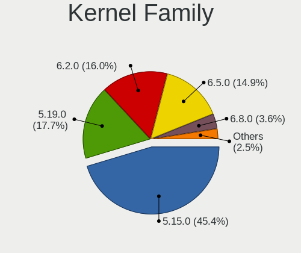
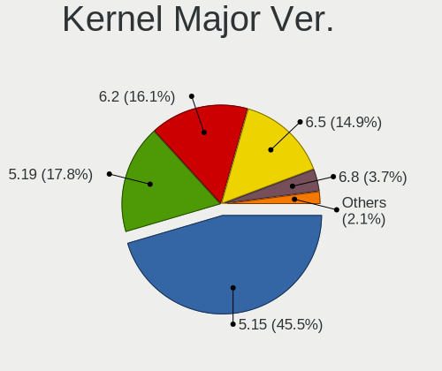
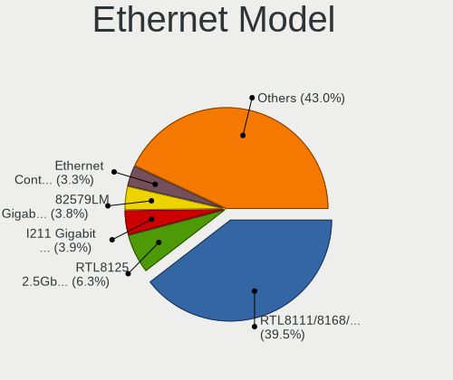
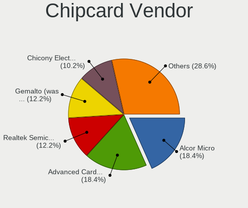

Ubuntu 22.04 - Tested Hardware & Statistics (Desktops)
------------------------------------------------------

A project to collect tested hardware configurations for Ubuntu 22.04.

Anyone can contribute to this report by the [hw-probe](https://github.com/linuxhw/hw-probe) tool:

    sudo -E hw-probe -all -upload

Please contribute! Especially if your hardware is rare.

Contents
--------

* [ Test Cases ](#test-cases)

* [ System ](#system)
  - [ Kernel                   ](#kernel)
  - [ Kernel Family            ](#kernel-family)
  - [ Kernel Major Ver.        ](#kernel-major-ver)
  - [ Arch                     ](#arch)
  - [ DE                       ](#de)
  - [ Display Server           ](#display-server)
  - [ Display Manager          ](#display-manager)
  - [ OS Lang                  ](#os-lang)
  - [ Boot Mode                ](#boot-mode)
  - [ Filesystem               ](#filesystem)
  - [ Part. scheme             ](#part-scheme)
  - [ Dual Boot with Linux/BSD ](#dual-boot-with-linuxbsd)
  - [ Dual Boot (Win)          ](#dual-boot-win)

* [ Board ](#board)
  - [ Vendor                   ](#vendor)
  - [ Model                    ](#model)
  - [ Model Family             ](#model-family)
  - [ MFG Year                 ](#mfg-year)
  - [ Form Factor              ](#form-factor)
  - [ Secure Boot              ](#secure-boot)
  - [ Coreboot                 ](#coreboot)
  - [ RAM Size                 ](#ram-size)
  - [ RAM Used                 ](#ram-used)
  - [ Total Drives             ](#total-drives)
  - [ Has CD-ROM               ](#has-cd-rom)
  - [ Has Ethernet             ](#has-ethernet)
  - [ Has WiFi                 ](#has-wifi)
  - [ Has Bluetooth            ](#has-bluetooth)

* [ Location ](#location)
  - [ Country                  ](#country)
  - [ City                     ](#city)

* [ Drives ](#drives)
  - [ Drive Vendor             ](#drive-vendor)
  - [ Drive Model              ](#drive-model)
  - [ HDD Vendor               ](#hdd-vendor)
  - [ SSD Vendor               ](#ssd-vendor)
  - [ Drive Kind               ](#drive-kind)
  - [ Drive Connector          ](#drive-connector)
  - [ Drive Size               ](#drive-size)
  - [ Space Total              ](#space-total)
  - [ Space Used               ](#space-used)
  - [ Malfunc. Drives          ](#malfunc-drives)
  - [ Malfunc. Drive Vendor    ](#malfunc-drive-vendor)
  - [ Malfunc. HDD Vendor      ](#malfunc-hdd-vendor)
  - [ Malfunc. Drive Kind      ](#malfunc-drive-kind)
  - [ Failed Drives            ](#failed-drives)
  - [ Failed Drive Vendor      ](#failed-drive-vendor)
  - [ Drive Status             ](#drive-status)

* [ Storage controller ](#storage-controller)
  - [ Storage Vendor           ](#storage-vendor)
  - [ Storage Model            ](#storage-model)
  - [ Storage Kind             ](#storage-kind)

* [ Processor ](#processor)
  - [ CPU Vendor               ](#cpu-vendor)
  - [ CPU Model                ](#cpu-model)
  - [ CPU Model Family         ](#cpu-model-family)
  - [ CPU Cores                ](#cpu-cores)
  - [ CPU Sockets              ](#cpu-sockets)
  - [ CPU Threads              ](#cpu-threads)
  - [ CPU Op-Modes             ](#cpu-op-modes)
  - [ CPU Microcode            ](#cpu-microcode)
  - [ CPU Microarch            ](#cpu-microarch)

* [ Graphics ](#graphics)
  - [ GPU Vendor               ](#gpu-vendor)
  - [ GPU Model                ](#gpu-model)
  - [ GPU Combo                ](#gpu-combo)
  - [ GPU Driver               ](#gpu-driver)
  - [ GPU Memory               ](#gpu-memory)

* [ Monitor ](#monitor)
  - [ Monitor Vendor           ](#monitor-vendor)
  - [ Monitor Model            ](#monitor-model)
  - [ Monitor Resolution       ](#monitor-resolution)
  - [ Monitor Diagonal         ](#monitor-diagonal)
  - [ Monitor Width            ](#monitor-width)
  - [ Aspect Ratio             ](#aspect-ratio)
  - [ Monitor Area             ](#monitor-area)
  - [ Pixel Density            ](#pixel-density)
  - [ Multiple Monitors        ](#multiple-monitors)

* [ Network ](#network)
  - [ Net Controller Vendor    ](#net-controller-vendor)
  - [ Net Controller Model     ](#net-controller-model)
  - [ Wireless Vendor          ](#wireless-vendor)
  - [ Wireless Model           ](#wireless-model)
  - [ Ethernet Vendor          ](#ethernet-vendor)
  - [ Ethernet Model           ](#ethernet-model)
  - [ Net Controller Kind      ](#net-controller-kind)
  - [ Used Controller          ](#used-controller)
  - [ NICs                     ](#nics)
  - [ IPv6                     ](#ipv6)

* [ Bluetooth ](#bluetooth)
  - [ Bluetooth Vendor         ](#bluetooth-vendor)
  - [ Bluetooth Model          ](#bluetooth-model)

* [ Sound ](#sound)
  - [ Sound Vendor             ](#sound-vendor)
  - [ Sound Model              ](#sound-model)

* [ Memory ](#memory)
  - [ Memory Vendor            ](#memory-vendor)
  - [ Memory Model             ](#memory-model)
  - [ Memory Kind              ](#memory-kind)
  - [ Memory Form Factor       ](#memory-form-factor)
  - [ Memory Size              ](#memory-size)
  - [ Memory Speed             ](#memory-speed)

* [ Printers & scanners ](#printers--scanners)
  - [ Printer Vendor           ](#printer-vendor)
  - [ Printer Model            ](#printer-model)
  - [ Scanner Vendor           ](#scanner-vendor)
  - [ Scanner Model            ](#scanner-model)

* [ Camera ](#camera)
  - [ Camera Vendor            ](#camera-vendor)
  - [ Camera Model             ](#camera-model)

* [ Security ](#security)
  - [ Fingerprint Vendor       ](#fingerprint-vendor)
  - [ Fingerprint Model        ](#fingerprint-model)
  - [ Chipcard Vendor          ](#chipcard-vendor)
  - [ Chipcard Model           ](#chipcard-model)

* [ Unsupported ](#unsupported)
  - [ Unsupported Devices      ](#unsupported-devices)
  - [ Unsupported Device Types ](#unsupported-device-types)

Test Cases
----------

Total: 675

| Vendor        | Model                       | Probe                                                      | Date         |
|---------------|-----------------------------|------------------------------------------------------------|--------------|
| Fujitsu       | D3162-A1 S26361-D3162-A1    | [060a34b3a1](https://linux-hardware.org/?probe=060a34b3a1) | Jul 01, 2022 |
| Fujitsu       | D3162-A1 S26361-D3162-A1    | [630bb92cd8](https://linux-hardware.org/?probe=630bb92cd8) | Jul 01, 2022 |
| MSI           | Z390 GAM PRO CARB AC        | [a55ab11db7](https://linux-hardware.org/?probe=a55ab11db7) | Jul 01, 2022 |
| Dell          | 042P49 A02                  | [110e5da723](https://linux-hardware.org/?probe=110e5da723) | Jul 01, 2022 |
| Intel         | DX58SO AAE29331-703         | [3b22974574](https://linux-hardware.org/?probe=3b22974574) | Jul 01, 2022 |
| Medion        | MS-7797                     | [01ff2f8272](https://linux-hardware.org/?probe=01ff2f8272) | Jul 01, 2022 |
| ASUSTek       | M5A78L LE                   | [19dbe00e60](https://linux-hardware.org/?probe=19dbe00e60) | Jul 01, 2022 |
| HP            | 805D                        | [3610332b9c](https://linux-hardware.org/?probe=3610332b9c) | Jul 01, 2022 |
| Dell          | 042P49 A02                  | [169b7b8c30](https://linux-hardware.org/?probe=169b7b8c30) | Jul 01, 2022 |
| Gigabyte      | H81M-S2PH                   | [cc62a478ac](https://linux-hardware.org/?probe=cc62a478ac) | Jul 01, 2022 |
| Gigabyte      | Z97X-Gaming 3               | [9b8bb163d3](https://linux-hardware.org/?probe=9b8bb163d3) | Jul 01, 2022 |
| ECS           | A780GM-A                    | [2cea4325e9](https://linux-hardware.org/?probe=2cea4325e9) | Jul 01, 2022 |
| Unknown       | Unknown                     | [1de34d9bf9](https://linux-hardware.org/?probe=1de34d9bf9) | Jun 30, 2022 |
| ASUSTek       | ROG STRIX Z370-E GAMING     | [349dc94a13](https://linux-hardware.org/?probe=349dc94a13) | Jun 29, 2022 |
| MSI           | MEG Z490 UNIFY              | [2c7a50869d](https://linux-hardware.org/?probe=2c7a50869d) | Jun 29, 2022 |
| Dell          | 0M5DCD A00                  | [7ff0a3f172](https://linux-hardware.org/?probe=7ff0a3f172) | Jun 29, 2022 |
| Dell          | 0M5DCD A00                  | [483d6a9299](https://linux-hardware.org/?probe=483d6a9299) | Jun 29, 2022 |
| Lenovo        | MAHOBAY NOK                 | [20a14662e8](https://linux-hardware.org/?probe=20a14662e8) | Jun 29, 2022 |
| MSI           | MPG Z390I GAMING EDGE AC    | [389293962a](https://linux-hardware.org/?probe=389293962a) | Jun 29, 2022 |
| ASUSTek       | B85M-E                      | [2423d184c0](https://linux-hardware.org/?probe=2423d184c0) | Jun 29, 2022 |
| ASUSTek       | P5LD2                       | [4fdebc2b9c](https://linux-hardware.org/?probe=4fdebc2b9c) | Jun 29, 2022 |
| ASRock        | B550M-ITX/ac                | [01614433d5](https://linux-hardware.org/?probe=01614433d5) | Jun 29, 2022 |
| ASUSTek       | P5LD2                       | [c7f67d9347](https://linux-hardware.org/?probe=c7f67d9347) | Jun 29, 2022 |
| ASUSTek       | PRO H410M-C                 | [9f705aea75](https://linux-hardware.org/?probe=9f705aea75) | Jun 29, 2022 |
| Dell          | 0D24M8 A00                  | [1588270a58](https://linux-hardware.org/?probe=1588270a58) | Jun 29, 2022 |
| ASUSTek       | CROSSHAIR V FORMULA-Z       | [d59692d648](https://linux-hardware.org/?probe=d59692d648) | Jun 29, 2022 |
| ASUSTek       | ROG STRIX X570-E GAMING     | [5873a7a8dd](https://linux-hardware.org/?probe=5873a7a8dd) | Jun 29, 2022 |
| MSI           | H110M GAMING                | [e33051cbd0](https://linux-hardware.org/?probe=e33051cbd0) | Jun 28, 2022 |
| Dell          | 0TP406                      | [4f0f2b2e05](https://linux-hardware.org/?probe=4f0f2b2e05) | Jun 28, 2022 |
| Acer          | H81-M1                      | [9ddfb2ec8d](https://linux-hardware.org/?probe=9ddfb2ec8d) | Jun 28, 2022 |
| HP            | 0B4Ch D                     | [6e28eeb447](https://linux-hardware.org/?probe=6e28eeb447) | Jun 27, 2022 |
| Dell          | 0RF703                      | [7b1a5ddcb6](https://linux-hardware.org/?probe=7b1a5ddcb6) | Jun 27, 2022 |
| ASRock        | 970 Pro3 R2.0               | [ba2f829e73](https://linux-hardware.org/?probe=ba2f829e73) | Jun 27, 2022 |
| Dell          | 051FJ8 A02                  | [5b997790f1](https://linux-hardware.org/?probe=5b997790f1) | Jun 27, 2022 |
| MSI           | MPG Z390 GAMING PLUS        | [3d575e19b6](https://linux-hardware.org/?probe=3d575e19b6) | Jun 27, 2022 |
| MSI           | B450M-A PRO MAX             | [666f9678a5](https://linux-hardware.org/?probe=666f9678a5) | Jun 27, 2022 |
| ASUSTek       | P8B75-M LE                  | [48cbc869da](https://linux-hardware.org/?probe=48cbc869da) | Jun 27, 2022 |
| ASUSTek       | P8B75-M LE                  | [ea31080862](https://linux-hardware.org/?probe=ea31080862) | Jun 27, 2022 |
| MSI           | Z590-A PRO                  | [1adcde94c5](https://linux-hardware.org/?probe=1adcde94c5) | Jun 26, 2022 |
| MSI           | Z590-A PRO                  | [18d6fda695](https://linux-hardware.org/?probe=18d6fda695) | Jun 26, 2022 |
| MSI           | H55M-E33                    | [035cfe1a5b](https://linux-hardware.org/?probe=035cfe1a5b) | Jun 26, 2022 |
| MSI           | B450M PRO-M2                | [516abfbea1](https://linux-hardware.org/?probe=516abfbea1) | Jun 26, 2022 |
| MSI           | B450M-A PRO MAX             | [aa9757e958](https://linux-hardware.org/?probe=aa9757e958) | Jun 26, 2022 |
| ASUSTek       | P8Z68-V LX                  | [5935ab812a](https://linux-hardware.org/?probe=5935ab812a) | Jun 26, 2022 |
| MSI           | PRO Z690-A                  | [34a2f4f726](https://linux-hardware.org/?probe=34a2f4f726) | Jun 26, 2022 |
| ASUSTek       | P8H61-I                     | [15b8beca14](https://linux-hardware.org/?probe=15b8beca14) | Jun 26, 2022 |
| Dell          | 0HD5W2 A01                  | [9f87421952](https://linux-hardware.org/?probe=9f87421952) | Jun 26, 2022 |
| Dell          | 0VD92X A00                  | [5082bf92e9](https://linux-hardware.org/?probe=5082bf92e9) | Jun 26, 2022 |
| MSI           | A78M-E45 V2                 | [e4cd6586b4](https://linux-hardware.org/?probe=e4cd6586b4) | Jun 26, 2022 |
| Gigabyte      | X570 GAMING X               | [b66ac35391](https://linux-hardware.org/?probe=b66ac35391) | Jun 26, 2022 |
| ASUSTek       | Pro WS WRX80E-SAGE SE WI... | [f440505698](https://linux-hardware.org/?probe=f440505698) | Jun 25, 2022 |
| MSI           | H81M-P33                    | [9ba6c64800](https://linux-hardware.org/?probe=9ba6c64800) | Jun 25, 2022 |
| ASUSTek       | TUF Gaming X570-PLUS_BR     | [8f2b511688](https://linux-hardware.org/?probe=8f2b511688) | Jun 25, 2022 |
| ASUSTek       | TUF Gaming X570-PLUS_BR     | [ace55b44d7](https://linux-hardware.org/?probe=ace55b44d7) | Jun 25, 2022 |
| Lenovo        | 3714 SDK0J40700 WIN 3258... | [1be22bc8af](https://linux-hardware.org/?probe=1be22bc8af) | Jun 24, 2022 |
| MSI           | Z370 GAMING PRO CARBON      | [57660d8f0f](https://linux-hardware.org/?probe=57660d8f0f) | Jun 24, 2022 |
| ASUSTek       | PRIME X570-P                | [fc1716de1f](https://linux-hardware.org/?probe=fc1716de1f) | Jun 24, 2022 |
| ASUSTek       | PRIME X570-P                | [785ec99ee8](https://linux-hardware.org/?probe=785ec99ee8) | Jun 24, 2022 |
| Gigabyte      | A520M S2H                   | [094c3f1e98](https://linux-hardware.org/?probe=094c3f1e98) | Jun 24, 2022 |
| Dell          | 0KW626                      | [ceb37aeba1](https://linux-hardware.org/?probe=ceb37aeba1) | Jun 24, 2022 |
| Intel         | X79G V2.x                   | [67b2e27895](https://linux-hardware.org/?probe=67b2e27895) | Jun 24, 2022 |
| ASUSTek       | X99-DELUXE                  | [34e3aad338](https://linux-hardware.org/?probe=34e3aad338) | Jun 24, 2022 |
| HP            | 2AF7                        | [86ecfeb9e2](https://linux-hardware.org/?probe=86ecfeb9e2) | Jun 24, 2022 |
| Dell          | 018D1Y A00                  | [8344a8b783](https://linux-hardware.org/?probe=8344a8b783) | Jun 24, 2022 |
| Foxconn       | 2AB1                        | [389a1d6185](https://linux-hardware.org/?probe=389a1d6185) | Jun 23, 2022 |
| Dell          | 0MGK50 A02                  | [eca7a31c46](https://linux-hardware.org/?probe=eca7a31c46) | Jun 23, 2022 |
| Dell          | 0MGK50 A02                  | [134bf128f7](https://linux-hardware.org/?probe=134bf128f7) | Jun 23, 2022 |
| ASRock        | Z590M-ITX/ax                | [263e8a50af](https://linux-hardware.org/?probe=263e8a50af) | Jun 23, 2022 |
| Gigabyte      | X570S AORUS MASTER          | [95d5b870bb](https://linux-hardware.org/?probe=95d5b870bb) | Jun 23, 2022 |
| ASUSTek       | ROG STRIX Z590-E GAMING ... | [3cfb6f7ee5](https://linux-hardware.org/?probe=3cfb6f7ee5) | Jun 23, 2022 |
| Lenovo        | MAHOBAY                     | [8f7a233327](https://linux-hardware.org/?probe=8f7a233327) | Jun 22, 2022 |
| Dell          | 0W2F8G A01                  | [447653d4f2](https://linux-hardware.org/?probe=447653d4f2) | Jun 22, 2022 |
| Dell          | 0W2F8G A01                  | [4610c38358](https://linux-hardware.org/?probe=4610c38358) | Jun 22, 2022 |
| ASUSTek       | P6T WS PRO                  | [9899337065](https://linux-hardware.org/?probe=9899337065) | Jun 22, 2022 |
| Gigabyte      | GA-MA790FXT-UD5P            | [e4116b95a2](https://linux-hardware.org/?probe=e4116b95a2) | Jun 22, 2022 |
| Dell          | 042P49 A01                  | [836efa773c](https://linux-hardware.org/?probe=836efa773c) | Jun 22, 2022 |
| Dell          | 042P49 A01                  | [380b66353e](https://linux-hardware.org/?probe=380b66353e) | Jun 21, 2022 |
| MSI           | A320M-A PRO                 | [1f3b17165b](https://linux-hardware.org/?probe=1f3b17165b) | Jun 21, 2022 |
| ASRock        | H81M-VG4                    | [f9f9db00a7](https://linux-hardware.org/?probe=f9f9db00a7) | Jun 21, 2022 |
| Acer          | Aspire X1700                | [6a67f8cba0](https://linux-hardware.org/?probe=6a67f8cba0) | Jun 21, 2022 |
| HP            | 0AA0h                       | [ccc94e1725](https://linux-hardware.org/?probe=ccc94e1725) | Jun 21, 2022 |
| Gigabyte      | M68MT-S2                    | [c52b07844d](https://linux-hardware.org/?probe=c52b07844d) | Jun 21, 2022 |
| Gigabyte      | M68MT-S2                    | [31f786c1ff](https://linux-hardware.org/?probe=31f786c1ff) | Jun 21, 2022 |
| MSI           | B250I GAMING PRO AC         | [280d4af2d2](https://linux-hardware.org/?probe=280d4af2d2) | Jun 21, 2022 |
| MSI           | B250I GAMING PRO AC         | [c90adf6d43](https://linux-hardware.org/?probe=c90adf6d43) | Jun 21, 2022 |
| Gigabyte      | B660M GAMING DDR4           | [80ecbe8684](https://linux-hardware.org/?probe=80ecbe8684) | Jun 21, 2022 |
| Gigabyte      | B450M DS3H WIFI V2-CF       | [37f7936cd9](https://linux-hardware.org/?probe=37f7936cd9) | Jun 21, 2022 |
| Dell          | 0VD92X A00                  | [d0edbadf25](https://linux-hardware.org/?probe=d0edbadf25) | Jun 21, 2022 |
| ASUSTek       | Q87M-E                      | [9f37139898](https://linux-hardware.org/?probe=9f37139898) | Jun 21, 2022 |
| Dell          | 0TP406                      | [3798b45f67](https://linux-hardware.org/?probe=3798b45f67) | Jun 20, 2022 |
| MSI           | A78M-E45 V2                 | [97b9d51036](https://linux-hardware.org/?probe=97b9d51036) | Jun 20, 2022 |
| MSI           | Creator X299                | [279caedd2f](https://linux-hardware.org/?probe=279caedd2f) | Jun 20, 2022 |
| MSI           | A320M-A PRO                 | [8cecec73c6](https://linux-hardware.org/?probe=8cecec73c6) | Jun 19, 2022 |
| ASUSTek       | CROSSHAIR VI HERO           | [2a4d1c8a0b](https://linux-hardware.org/?probe=2a4d1c8a0b) | Jun 19, 2022 |
| Gigabyte      | 965P-S3                     | [0beb9ce480](https://linux-hardware.org/?probe=0beb9ce480) | Jun 19, 2022 |
| Gigabyte      | Z87X-UD3H-CF                | [4c91d4b394](https://linux-hardware.org/?probe=4c91d4b394) | Jun 19, 2022 |
| Gigabyte      | Z87X-UD3H-CF                | [571829be67](https://linux-hardware.org/?probe=571829be67) | Jun 19, 2022 |
| ASUSTek       | X99-A/USB                   | [d9808cc5aa](https://linux-hardware.org/?probe=d9808cc5aa) | Jun 19, 2022 |
| Dell          | 09M8Y8 A02                  | [a029173d31](https://linux-hardware.org/?probe=a029173d31) | Jun 18, 2022 |
| Acer          | Aspire X3950                | [7a70838628](https://linux-hardware.org/?probe=7a70838628) | Jun 18, 2022 |
| Dell          | 0XHGV1 A00                  | [aeb1a92366](https://linux-hardware.org/?probe=aeb1a92366) | Jun 18, 2022 |
| MSI           | A320M-A PRO MAX             | [50149d3df0](https://linux-hardware.org/?probe=50149d3df0) | Jun 18, 2022 |
| ASUSTek       | CROSSHAIR VI HERO           | [3e7ce078c6](https://linux-hardware.org/?probe=3e7ce078c6) | Jun 18, 2022 |
| Gigabyte      | H61M-DS2                    | [866ee7a33b](https://linux-hardware.org/?probe=866ee7a33b) | Jun 18, 2022 |
| Gigabyte      | F2A68HM-H                   | [3adcbf0255](https://linux-hardware.org/?probe=3adcbf0255) | Jun 18, 2022 |
| ASRock        | G41M-GS                     | [9167934132](https://linux-hardware.org/?probe=9167934132) | Jun 18, 2022 |
| ASUSTek       | H110M-CS/BR                 | [35cfc3daf7](https://linux-hardware.org/?probe=35cfc3daf7) | Jun 18, 2022 |
| MSI           | Z270 GAMING PRO CARBON      | [63e3deaaf4](https://linux-hardware.org/?probe=63e3deaaf4) | Jun 17, 2022 |
| Gigabyte      | M68MT-S2                    | [570c3b2345](https://linux-hardware.org/?probe=570c3b2345) | Jun 17, 2022 |
| ASUSTek       | H110M-CS/BR                 | [47e88dae48](https://linux-hardware.org/?probe=47e88dae48) | Jun 17, 2022 |
| MSI           | MPG X570S EDGE MAX WIFI     | [f5d7a0bba4](https://linux-hardware.org/?probe=f5d7a0bba4) | Jun 17, 2022 |
| HP            | 1998                        | [86d621451f](https://linux-hardware.org/?probe=86d621451f) | Jun 17, 2022 |
| ASUSTek       | P8H67-M LE                  | [d52a1b8eea](https://linux-hardware.org/?probe=d52a1b8eea) | Jun 17, 2022 |
| HP            | 8184 X4                     | [e2f24b580b](https://linux-hardware.org/?probe=e2f24b580b) | Jun 17, 2022 |
| Dell          | 0KRC95 A00                  | [c47403b875](https://linux-hardware.org/?probe=c47403b875) | Jun 17, 2022 |
| HP            | 8184 X4                     | [668438d39e](https://linux-hardware.org/?probe=668438d39e) | Jun 17, 2022 |
| MSI           | B450-A PRO MAX              | [24ecffb555](https://linux-hardware.org/?probe=24ecffb555) | Jun 16, 2022 |
| Lenovo        | 3148 SDK0J40709 WIN 3259... | [475e980cb3](https://linux-hardware.org/?probe=475e980cb3) | Jun 16, 2022 |
| Lenovo        | 30D9 SDK0J40705 WIN 3425... | [63ba339f77](https://linux-hardware.org/?probe=63ba339f77) | Jun 16, 2022 |
| MSI           | B450M PRO-M2 MAX            | [f005c585bd](https://linux-hardware.org/?probe=f005c585bd) | Jun 16, 2022 |
| Gigabyte      | B560M DS3H AC               | [f0b95571fd](https://linux-hardware.org/?probe=f0b95571fd) | Jun 16, 2022 |
| ITI LIMITE... | SMAASH XU3i                 | [549a55efdf](https://linux-hardware.org/?probe=549a55efdf) | Jun 16, 2022 |
| ITI LIMITE... | SMAASH XU3i                 | [693d81e1a3](https://linux-hardware.org/?probe=693d81e1a3) | Jun 16, 2022 |
| HP            | 3031h                       | [00080c0264](https://linux-hardware.org/?probe=00080c0264) | Jun 16, 2022 |
| ASUSTek       | PRIME X570-P                | [4dc736e2b5](https://linux-hardware.org/?probe=4dc736e2b5) | Jun 16, 2022 |
| Lenovo        | 102F SDK0E50510 WIN 2625... | [35c05116d1](https://linux-hardware.org/?probe=35c05116d1) | Jun 16, 2022 |
| ASUSTek       | ROG CROSSHAIR VIII DARK ... | [e8f85ab771](https://linux-hardware.org/?probe=e8f85ab771) | Jun 16, 2022 |
| MSI           | A78M-E45 V2                 | [86394fa5df](https://linux-hardware.org/?probe=86394fa5df) | Jun 16, 2022 |
| MSI           | MPG B550I GAMING EDGE MA... | [69b95cc638](https://linux-hardware.org/?probe=69b95cc638) | Jun 16, 2022 |
| Nvidia        | MCP73                       | [4af86ef214](https://linux-hardware.org/?probe=4af86ef214) | Jun 15, 2022 |
| Nvidia        | MCP73                       | [bc4b2de5bc](https://linux-hardware.org/?probe=bc4b2de5bc) | Jun 15, 2022 |
| Gigabyte      | M68MT-S2                    | [ded75509fb](https://linux-hardware.org/?probe=ded75509fb) | Jun 15, 2022 |
| Lenovo        | 3148 SDK0J40709 WIN 3259... | [8d5ba3c58c](https://linux-hardware.org/?probe=8d5ba3c58c) | Jun 15, 2022 |
| ASUSTek       | CROSSHAIR VI HERO           | [8bf8ec8bd0](https://linux-hardware.org/?probe=8bf8ec8bd0) | Jun 15, 2022 |
| Acer          | Aspire X1400                | [a90701fd86](https://linux-hardware.org/?probe=a90701fd86) | Jun 15, 2022 |
| MSI           | B550M PRO-VDH               | [9916ed24a9](https://linux-hardware.org/?probe=9916ed24a9) | Jun 15, 2022 |
| ASUSTek       | PRIME A320M-K               | [c8dfb12509](https://linux-hardware.org/?probe=c8dfb12509) | Jun 14, 2022 |
| Medion        | B460H6-EM                   | [b2d8ad91a9](https://linux-hardware.org/?probe=b2d8ad91a9) | Jun 14, 2022 |
| Dell          | 0VD92X A00                  | [4f3e4e102f](https://linux-hardware.org/?probe=4f3e4e102f) | Jun 14, 2022 |
| Dell          | 0VD92X A00                  | [550ed4b1c0](https://linux-hardware.org/?probe=550ed4b1c0) | Jun 14, 2022 |
| Dell          | 0VD92X A00                  | [e6e0165682](https://linux-hardware.org/?probe=e6e0165682) | Jun 14, 2022 |
| ASUSTek       | F2A55-M                     | [845c94e939](https://linux-hardware.org/?probe=845c94e939) | Jun 14, 2022 |
| MSI           | A78M-E45 V2                 | [a2d26ab800](https://linux-hardware.org/?probe=a2d26ab800) | Jun 14, 2022 |
| ASUSTek       | P9X79 PRO                   | [6643e636b5](https://linux-hardware.org/?probe=6643e636b5) | Jun 14, 2022 |
| MSI           | H81M-E33                    | [d6180859a8](https://linux-hardware.org/?probe=d6180859a8) | Jun 14, 2022 |
| Gigabyte      | Z87X-UD3H-CF                | [aeb975478b](https://linux-hardware.org/?probe=aeb975478b) | Jun 14, 2022 |
| ASUSTek       | F2A55-M                     | [3cf5e25cca](https://linux-hardware.org/?probe=3cf5e25cca) | Jun 14, 2022 |
| Intel         | DH67BL AAG10189-211         | [15cb74d079](https://linux-hardware.org/?probe=15cb74d079) | Jun 13, 2022 |
| ASUSTek       | PRIME H310M-E               | [f0e0fc8360](https://linux-hardware.org/?probe=f0e0fc8360) | Jun 13, 2022 |
| ASUSTek       | TUF Gaming X570-PLUS        | [36bf4dc378](https://linux-hardware.org/?probe=36bf4dc378) | Jun 13, 2022 |
| ASRock        | B75M-DGS R2.0               | [457047ad06](https://linux-hardware.org/?probe=457047ad06) | Jun 13, 2022 |
| Acer          | Veriton X2631G V:1.0        | [8f7cca461c](https://linux-hardware.org/?probe=8f7cca461c) | Jun 13, 2022 |
| ASUSTek       | F2A55-M                     | [e6a15fe5a4](https://linux-hardware.org/?probe=e6a15fe5a4) | Jun 13, 2022 |
| ASUSTek       | PRO H410M-C                 | [055ed7de1b](https://linux-hardware.org/?probe=055ed7de1b) | Jun 13, 2022 |
| ASUSTek       | P5KPL/1600                  | [0c6a9f5dff](https://linux-hardware.org/?probe=0c6a9f5dff) | Jun 13, 2022 |
| ASUSTek       | P5KPL/1600                  | [aeec9e715d](https://linux-hardware.org/?probe=aeec9e715d) | Jun 13, 2022 |
| ASRock        | B460M Pro4                  | [603eff18a0](https://linux-hardware.org/?probe=603eff18a0) | Jun 12, 2022 |
| Intel         | DH61CR AAG14064-207         | [a840bbb5a3](https://linux-hardware.org/?probe=a840bbb5a3) | Jun 12, 2022 |
| Dell          | 0XHGV1 A00                  | [6eec9d17a5](https://linux-hardware.org/?probe=6eec9d17a5) | Jun 12, 2022 |
| Gigabyte      | 970A-DS3P                   | [d22ca1b39a](https://linux-hardware.org/?probe=d22ca1b39a) | Jun 12, 2022 |
| ASUSTek       | ROG STRIX X570-E GAMING ... | [38bf9d2a7b](https://linux-hardware.org/?probe=38bf9d2a7b) | Jun 12, 2022 |
| ASUSTek       | F2A55-M                     | [8f99758eb8](https://linux-hardware.org/?probe=8f99758eb8) | Jun 12, 2022 |
| Intel         | DB75EN AAG39650-400         | [5fa7614020](https://linux-hardware.org/?probe=5fa7614020) | Jun 12, 2022 |
| HP            | 3396                        | [4c0f1563a7](https://linux-hardware.org/?probe=4c0f1563a7) | Jun 12, 2022 |
| MSI           | A68HM-E33 V2                | [b473ea12dc](https://linux-hardware.org/?probe=b473ea12dc) | Jun 12, 2022 |
| Gigabyte      | 970A-DS3P                   | [a3ca1ea153](https://linux-hardware.org/?probe=a3ca1ea153) | Jun 12, 2022 |
| Unknown       | X99-GT                      | [6a36412f6d](https://linux-hardware.org/?probe=6a36412f6d) | Jun 12, 2022 |
| ASUSTek       | H170M-PLUS                  | [416fd6d121](https://linux-hardware.org/?probe=416fd6d121) | Jun 11, 2022 |
| Biostar       | B450MX-S                    | [be9e9c5a99](https://linux-hardware.org/?probe=be9e9c5a99) | Jun 11, 2022 |
| Gigabyte      | B450M DS3H-CF               | [d07617dd7a](https://linux-hardware.org/?probe=d07617dd7a) | Jun 11, 2022 |
| Pegatron      | 2AC3                        | [a93743e1a0](https://linux-hardware.org/?probe=a93743e1a0) | Jun 11, 2022 |
| ASUSTek       | CROSSHAIR VI HERO           | [a3dcf1b0d6](https://linux-hardware.org/?probe=a3dcf1b0d6) | Jun 11, 2022 |
| Acer          | Veriton X2631G V:1.0        | [943f097be0](https://linux-hardware.org/?probe=943f097be0) | Jun 11, 2022 |
| Unknown       | G41                         | [04e03cb3d5](https://linux-hardware.org/?probe=04e03cb3d5) | Jun 10, 2022 |
| Lenovo        | ThinkServer TS140           | [23515284b5](https://linux-hardware.org/?probe=23515284b5) | Jun 10, 2022 |
| ASUSTek       | P5B-Deluxe                  | [eb7ee3a693](https://linux-hardware.org/?probe=eb7ee3a693) | Jun 10, 2022 |
| ASUSTek       | M5A99X EVO                  | [e54c226fed](https://linux-hardware.org/?probe=e54c226fed) | Jun 10, 2022 |
| ASUSTek       | CROSSHAIR VI HERO           | [f00af11f1c](https://linux-hardware.org/?probe=f00af11f1c) | Jun 10, 2022 |
| ASUSTek       | PRIME X570-P                | [1e73a95e9e](https://linux-hardware.org/?probe=1e73a95e9e) | Jun 10, 2022 |
| ASUSTek       | P5Q                         | [df07364c28](https://linux-hardware.org/?probe=df07364c28) | Jun 10, 2022 |
| Dell          | 0XHGV1 A00                  | [0de2a3f1a0](https://linux-hardware.org/?probe=0de2a3f1a0) | Jun 10, 2022 |
| ASUSTek       | SABERTOOTH 990FX R2.0       | [238e30f096](https://linux-hardware.org/?probe=238e30f096) | Jun 10, 2022 |
| Foxconn       | 2AB7                        | [339721d187](https://linux-hardware.org/?probe=339721d187) | Jun 10, 2022 |
| ASUSTek       | CROSSHAIR V FORMULA-Z       | [9deff6136b](https://linux-hardware.org/?probe=9deff6136b) | Jun 10, 2022 |
| Gigabyte      | H61M-DS2                    | [e202a8662f](https://linux-hardware.org/?probe=e202a8662f) | Jun 10, 2022 |
| Gigabyte      | GA-990FXA-UD5               | [b33d07af6c](https://linux-hardware.org/?probe=b33d07af6c) | Jun 09, 2022 |
| Dell          | 0XCR8D A03                  | [7b5fb1809b](https://linux-hardware.org/?probe=7b5fb1809b) | Jun 09, 2022 |
| Dell          | 06JWJY A01                  | [d4675eb5c0](https://linux-hardware.org/?probe=d4675eb5c0) | Jun 09, 2022 |
| Dell          | 0XCR8D A03                  | [08cc695028](https://linux-hardware.org/?probe=08cc695028) | Jun 09, 2022 |
| Gigabyte      | AB350-Gaming-CF             | [bda08758b5](https://linux-hardware.org/?probe=bda08758b5) | Jun 09, 2022 |
| MSI           | A55M-E33                    | [388ba5e3dd](https://linux-hardware.org/?probe=388ba5e3dd) | Jun 09, 2022 |
| ASUSTek       | ROG CROSSHAIR VIII DARK ... | [6d195af721](https://linux-hardware.org/?probe=6d195af721) | Jun 09, 2022 |
| Gigabyte      | 970A-UD3P                   | [7e45eef7ba](https://linux-hardware.org/?probe=7e45eef7ba) | Jun 09, 2022 |
| MSI           | MAG B550M MORTAR            | [40c1095611](https://linux-hardware.org/?probe=40c1095611) | Jun 08, 2022 |
| ASUSTek       | PRIME B350M-A               | [d5f5af27dc](https://linux-hardware.org/?probe=d5f5af27dc) | Jun 08, 2022 |
| Fujitsu       | D2990-A1 S26361-D2990-A1    | [36d73de92c](https://linux-hardware.org/?probe=36d73de92c) | Jun 08, 2022 |
| Gigabyte      | F2A55M-HD2                  | [19e1ff0736](https://linux-hardware.org/?probe=19e1ff0736) | Jun 08, 2022 |
| HP            | 1998                        | [362416dfc1](https://linux-hardware.org/?probe=362416dfc1) | Jun 08, 2022 |
| Acer          | Veriton X2631G V:1.0        | [0c5963ea95](https://linux-hardware.org/?probe=0c5963ea95) | Jun 07, 2022 |
| HP            | 8433 11                     | [fa4c4f5c0e](https://linux-hardware.org/?probe=fa4c4f5c0e) | Jun 07, 2022 |
| MSI           | B550-A PRO                  | [13c7b714dc](https://linux-hardware.org/?probe=13c7b714dc) | Jun 07, 2022 |
| Gigabyte      | F2A68HM-S1                  | [017e41e32c](https://linux-hardware.org/?probe=017e41e32c) | Jun 07, 2022 |
| Gigabyte      | Z390 M GAMING-CF            | [c443fc775b](https://linux-hardware.org/?probe=c443fc775b) | Jun 07, 2022 |
| Gigabyte      | Z690 AORUS MASTER           | [9ab2042d74](https://linux-hardware.org/?probe=9ab2042d74) | Jun 07, 2022 |
| ASRock        | H55M                        | [058eceb951](https://linux-hardware.org/?probe=058eceb951) | Jun 07, 2022 |
| ASUSTek       | PRO H410M-C                 | [fa1a1d1431](https://linux-hardware.org/?probe=fa1a1d1431) | Jun 07, 2022 |
| Gigabyte      | B85M-D2V                    | [fabaa25753](https://linux-hardware.org/?probe=fabaa25753) | Jun 07, 2022 |
| MSI           | H510I PRO WIFI              | [7cb5b3fd8a](https://linux-hardware.org/?probe=7cb5b3fd8a) | Jun 06, 2022 |
| Shuttle       | FS61                        | [4f4bd19a2d](https://linux-hardware.org/?probe=4f4bd19a2d) | Jun 06, 2022 |
| ASUSTek       | PRIME B365M-K               | [0cf459f0db](https://linux-hardware.org/?probe=0cf459f0db) | Jun 06, 2022 |
| Intel         | H61                         | [8178c4da07](https://linux-hardware.org/?probe=8178c4da07) | Jun 06, 2022 |
| MSI           | A68HM-E33                   | [0c4686ca42](https://linux-hardware.org/?probe=0c4686ca42) | Jun 06, 2022 |
| Dell          | 0C2XKD A01                  | [e82c37f339](https://linux-hardware.org/?probe=e82c37f339) | Jun 06, 2022 |
| ASUSTek       | Q87M-E                      | [3c8c0d1998](https://linux-hardware.org/?probe=3c8c0d1998) | Jun 06, 2022 |
| MSI           | A320M-A PRO                 | [488a6e3259](https://linux-hardware.org/?probe=488a6e3259) | Jun 05, 2022 |
| Gigabyte      | GA-E7AUM-DS2H               | [0dd5791ff8](https://linux-hardware.org/?probe=0dd5791ff8) | Jun 05, 2022 |
| Dell          | 0200DY A01                  | [00f49d760b](https://linux-hardware.org/?probe=00f49d760b) | Jun 05, 2022 |
| Gigabyte      | GA-E7AUM-DS2H               | [1b7a237b9b](https://linux-hardware.org/?probe=1b7a237b9b) | Jun 05, 2022 |
| Dell          | 0HHV7N A00                  | [45bdcd9b5c](https://linux-hardware.org/?probe=45bdcd9b5c) | Jun 05, 2022 |
| Dell          | 0C3YXR A00                  | [5c72365ea3](https://linux-hardware.org/?probe=5c72365ea3) | Jun 05, 2022 |
| Gigabyte      | Z690 AORUS ELITE AX         | [4760e98a1c](https://linux-hardware.org/?probe=4760e98a1c) | Jun 05, 2022 |
| Dell          | 0K3CM7 A00                  | [d90f0bb618](https://linux-hardware.org/?probe=d90f0bb618) | Jun 05, 2022 |
| MSI           | B460M-A PRO                 | [c858bede94](https://linux-hardware.org/?probe=c858bede94) | Jun 05, 2022 |
| Gigabyte      | GA-990FXA-UD3               | [e636b14f58](https://linux-hardware.org/?probe=e636b14f58) | Jun 05, 2022 |
| ASUSTek       | M5A97 R2.0                  | [07468743a9](https://linux-hardware.org/?probe=07468743a9) | Jun 04, 2022 |
| MSI           | B85M-E45                    | [4446978a6f](https://linux-hardware.org/?probe=4446978a6f) | Jun 04, 2022 |
| MSI           | H510I PRO WIFI              | [39d9bd396f](https://linux-hardware.org/?probe=39d9bd396f) | Jun 04, 2022 |
| Shuttle       | DS10U                       | [f2d2634abd](https://linux-hardware.org/?probe=f2d2634abd) | Jun 04, 2022 |
| ASRock        | 870 Extreme3                | [e93db26e8c](https://linux-hardware.org/?probe=e93db26e8c) | Jun 04, 2022 |
| Gigabyte      | Z590 VISION G               | [c91b17ed23](https://linux-hardware.org/?probe=c91b17ed23) | Jun 04, 2022 |
| Biostar       | G41U3G                      | [40d72e8d4a](https://linux-hardware.org/?probe=40d72e8d4a) | Jun 04, 2022 |
| ASUSTek       | PRIME A320M-K               | [5d311a66dc](https://linux-hardware.org/?probe=5d311a66dc) | Jun 04, 2022 |
| Biostar       | G41U3G                      | [d3eb0d0a63](https://linux-hardware.org/?probe=d3eb0d0a63) | Jun 03, 2022 |
| Supermicro    | X10SBA-LA                   | [4b46c69e08](https://linux-hardware.org/?probe=4b46c69e08) | Jun 03, 2022 |
| MSI           | MPG Z390I GAMING EDGE AC    | [a31e1dac27](https://linux-hardware.org/?probe=a31e1dac27) | Jun 03, 2022 |
| ASUSTek       | P8B75-M LE                  | [72008ba457](https://linux-hardware.org/?probe=72008ba457) | Jun 03, 2022 |
| MSI           | A68HM-P33                   | [9dbbf2c6ec](https://linux-hardware.org/?probe=9dbbf2c6ec) | Jun 03, 2022 |
| MSI           | B75MA-E33                   | [cba34d6021](https://linux-hardware.org/?probe=cba34d6021) | Jun 03, 2022 |
| MSI           | A68HM-P33                   | [0590463974](https://linux-hardware.org/?probe=0590463974) | Jun 03, 2022 |
| MSI           | A68HM-P33 V2                | [ff55b171ff](https://linux-hardware.org/?probe=ff55b171ff) | Jun 03, 2022 |
| ASUSTek       | B85M-G                      | [68e585cb49](https://linux-hardware.org/?probe=68e585cb49) | Jun 03, 2022 |
| ASUSTek       | TUF Gaming Z590-PLUS WIF... | [eccf357f9f](https://linux-hardware.org/?probe=eccf357f9f) | Jun 03, 2022 |
| Gigabyte      | Z590 VISION G               | [a2a510d9dd](https://linux-hardware.org/?probe=a2a510d9dd) | Jun 03, 2022 |
| ASUSTek       | ROG STRIX X570-E GAMING     | [051dd28c75](https://linux-hardware.org/?probe=051dd28c75) | Jun 03, 2022 |
| Gigabyte      | H81M-S1                     | [3210714de1](https://linux-hardware.org/?probe=3210714de1) | Jun 03, 2022 |
| Gigabyte      | H81M-S1                     | [9b01043ab8](https://linux-hardware.org/?probe=9b01043ab8) | Jun 03, 2022 |
| ASRock        | 760GM-HDV                   | [b72f6362e5](https://linux-hardware.org/?probe=b72f6362e5) | Jun 02, 2022 |
| MSI           | B450M-A PRO MAX             | [86be2de304](https://linux-hardware.org/?probe=86be2de304) | Jun 02, 2022 |
| ASUSTek       | B85M-G                      | [c0273d93b6](https://linux-hardware.org/?probe=c0273d93b6) | Jun 02, 2022 |
| MSI           | B450M-A PRO MAX             | [979e6b0d13](https://linux-hardware.org/?probe=979e6b0d13) | Jun 02, 2022 |
| ASUSTek       | H110M-K                     | [e85b6e752d](https://linux-hardware.org/?probe=e85b6e752d) | Jun 02, 2022 |
| ASUSTek       | H81M-K                      | [3fc80d0ef1](https://linux-hardware.org/?probe=3fc80d0ef1) | Jun 02, 2022 |
| MSI           | A68HM-P33                   | [a47c89c432](https://linux-hardware.org/?probe=a47c89c432) | Jun 02, 2022 |
| MSI           | A68HM-P33                   | [6cb525598b](https://linux-hardware.org/?probe=6cb525598b) | Jun 02, 2022 |
| Gigabyte      | Z87X-UD3H-CF                | [238f6ecead](https://linux-hardware.org/?probe=238f6ecead) | Jun 02, 2022 |
| ASUSTek       | TUF Z270 MARK 2             | [c8c6c6ca29](https://linux-hardware.org/?probe=c8c6c6ca29) | Jun 02, 2022 |
| ASUSTek       | PRIME A320M-K               | [2a7bfa492d](https://linux-hardware.org/?probe=2a7bfa492d) | Jun 02, 2022 |
| Gigabyte      | Z690 UD DDR4                | [17a0805ec2](https://linux-hardware.org/?probe=17a0805ec2) | Jun 02, 2022 |
| ASUSTek       | PRIME Z690-P WIFI           | [bfd781966f](https://linux-hardware.org/?probe=bfd781966f) | Jun 02, 2022 |
| ASRock        | 760GM-HDV                   | [e116b2ed29](https://linux-hardware.org/?probe=e116b2ed29) | Jun 01, 2022 |
| MSI           | MPG Z390I GAMING EDGE AC    | [db32f9ad3e](https://linux-hardware.org/?probe=db32f9ad3e) | Jun 01, 2022 |
| MSI           | Z77A-G41                    | [8a43bd2e75](https://linux-hardware.org/?probe=8a43bd2e75) | Jun 01, 2022 |
| Gigabyte      | F2A55M-HD2                  | [cb731e1ef2](https://linux-hardware.org/?probe=cb731e1ef2) | Jun 01, 2022 |
| MSI           | A68HM-E33                   | [c784c88156](https://linux-hardware.org/?probe=c784c88156) | Jun 01, 2022 |
| MSI           | A68HM-P33                   | [cf1188fed4](https://linux-hardware.org/?probe=cf1188fed4) | Jun 01, 2022 |
| Gigabyte      | B150M-D2V DDR3-CF           | [915fbaa0ea](https://linux-hardware.org/?probe=915fbaa0ea) | Jun 01, 2022 |
| ASUSTek       | Z170-P                      | [4684599a3a](https://linux-hardware.org/?probe=4684599a3a) | Jun 01, 2022 |
| ASRock        | H81M-DG4                    | [45dbfa155f](https://linux-hardware.org/?probe=45dbfa155f) | Jun 01, 2022 |
| ASUSTek       | STRIX B250H GAMING          | [9f28088790](https://linux-hardware.org/?probe=9f28088790) | Jun 01, 2022 |
| Alienware     | 0XJKKD A00                  | [ae3a750f2e](https://linux-hardware.org/?probe=ae3a750f2e) | Jun 01, 2022 |
| Intel         | DP67BG AAG10491-305         | [714722d24b](https://linux-hardware.org/?probe=714722d24b) | Jun 01, 2022 |
| MSI           | B250M BAZOOKA               | [45d3300158](https://linux-hardware.org/?probe=45d3300158) | Jun 01, 2022 |
| Dell          | 0NK5PH A00                  | [960e8817bf](https://linux-hardware.org/?probe=960e8817bf) | Jun 01, 2022 |
| Unknown       | SKYBAY                      | [88ef811c4d](https://linux-hardware.org/?probe=88ef811c4d) | May 31, 2022 |
| Pegatron      | 2AED                        | [67df0b1c08](https://linux-hardware.org/?probe=67df0b1c08) | May 31, 2022 |
| Dell          | 07WP95 A02                  | [65ae31976a](https://linux-hardware.org/?probe=65ae31976a) | May 31, 2022 |
| Dell          | 0200DY A01                  | [0d7be8de90](https://linux-hardware.org/?probe=0d7be8de90) | May 31, 2022 |
| MSI           | B450-A PRO MAX              | [72484e859d](https://linux-hardware.org/?probe=72484e859d) | May 31, 2022 |
| Dell          | 0200DY A01                  | [c3c585ba02](https://linux-hardware.org/?probe=c3c585ba02) | May 31, 2022 |
| Unknown       | Unknown                     | [c2d6d647d8](https://linux-hardware.org/?probe=c2d6d647d8) | May 31, 2022 |
| MSI           | B450-A PRO MAX              | [9f7d224ed7](https://linux-hardware.org/?probe=9f7d224ed7) | May 31, 2022 |
| ASUSTek       | Rampage V EDITION 10        | [ab6fb60b96](https://linux-hardware.org/?probe=ab6fb60b96) | May 31, 2022 |
| ASUSTek       | H81M-A                      | [d24672a3cd](https://linux-hardware.org/?probe=d24672a3cd) | May 31, 2022 |
| Intel         | DP67BG AAG10491-305         | [966ab11802](https://linux-hardware.org/?probe=966ab11802) | May 31, 2022 |
| Gigabyte      | Q35M-S2                     | [7ef3498226](https://linux-hardware.org/?probe=7ef3498226) | May 30, 2022 |
| ASRock        | 870 Extreme3                | [7e2000d3a1](https://linux-hardware.org/?probe=7e2000d3a1) | May 30, 2022 |
| Gigabyte      | Z87X-UD3H-CF                | [b0e96de917](https://linux-hardware.org/?probe=b0e96de917) | May 30, 2022 |
| ASUSTek       | PRO H410M-C                 | [c40635b66e](https://linux-hardware.org/?probe=c40635b66e) | May 30, 2022 |
| Unknown       | Unknown                     | [59d0634230](https://linux-hardware.org/?probe=59d0634230) | May 30, 2022 |
| Gigabyte      | Z87X-UD3H-CF                | [b4f73129a2](https://linux-hardware.org/?probe=b4f73129a2) | May 30, 2022 |
| ASUSTek       | M5A78L LE                   | [44e2ec7714](https://linux-hardware.org/?probe=44e2ec7714) | May 30, 2022 |
| ASUSTek       | X99-E-10G WS                | [83e525ca4e](https://linux-hardware.org/?probe=83e525ca4e) | May 30, 2022 |
| ECS           | MCP61M-M3                   | [b785b68657](https://linux-hardware.org/?probe=b785b68657) | May 29, 2022 |
| ASUSTek       | ROG CROSSHAIR VIII HERO     | [0b83e8fa79](https://linux-hardware.org/?probe=0b83e8fa79) | May 29, 2022 |
| Intel         | DQ35JO AAD82085-803         | [40429e6d9a](https://linux-hardware.org/?probe=40429e6d9a) | May 29, 2022 |
| Biostar       | G41U3G                      | [1c6caef665](https://linux-hardware.org/?probe=1c6caef665) | May 29, 2022 |
| MSI           | H510I PRO WIFI              | [b4b8c3db64](https://linux-hardware.org/?probe=b4b8c3db64) | May 29, 2022 |
| ASUSTek       | PRO H410M-C                 | [bcca466c5e](https://linux-hardware.org/?probe=bcca466c5e) | May 29, 2022 |
| ASUSTek       | ROG STRIX B450-F GAMING ... | [c11ae8de66](https://linux-hardware.org/?probe=c11ae8de66) | May 29, 2022 |
| Gigabyte      | Z87X-UD3H-CF                | [c1dd2cf1be](https://linux-hardware.org/?probe=c1dd2cf1be) | May 29, 2022 |
| Gigabyte      | Z87X-UD3H-CF                | [0df520da7e](https://linux-hardware.org/?probe=0df520da7e) | May 29, 2022 |
| ASUSTek       | PRO H410M-C                 | [b83d80f5d2](https://linux-hardware.org/?probe=b83d80f5d2) | May 29, 2022 |
| ASUSTek       | 970 PRO GAMING/AURA         | [7fd1e065eb](https://linux-hardware.org/?probe=7fd1e065eb) | May 29, 2022 |
| Shuttle       | FS81                        | [756f86d9fc](https://linux-hardware.org/?probe=756f86d9fc) | May 28, 2022 |
| Acer          | Veriton X2631G V:1.0        | [3c144d36f0](https://linux-hardware.org/?probe=3c144d36f0) | May 28, 2022 |
| Pegatron      | 2ACF                        | [bd97a6b3dd](https://linux-hardware.org/?probe=bd97a6b3dd) | May 28, 2022 |
| ASUSTek       | H110M-K                     | [9ff7306bbd](https://linux-hardware.org/?probe=9ff7306bbd) | May 28, 2022 |
| Gigabyte      | B150M-D3H-CF                | [e5fdf1083f](https://linux-hardware.org/?probe=e5fdf1083f) | May 28, 2022 |
| ASUSTek       | TUF Gaming X570-PLUS        | [c0399b42b7](https://linux-hardware.org/?probe=c0399b42b7) | May 28, 2022 |
| Lenovo        | SHARKBAY SDK0E50510 PRO     | [1094233e96](https://linux-hardware.org/?probe=1094233e96) | May 28, 2022 |
| Dell          | 0C2XKD A01                  | [2aaa53dd85](https://linux-hardware.org/?probe=2aaa53dd85) | May 28, 2022 |
| Gigabyte      | AB350-Gaming-CF             | [5458522367](https://linux-hardware.org/?probe=5458522367) | May 28, 2022 |
| MSI           | MPG X570 GAMING EDGE WIF... | [ce112fb9d2](https://linux-hardware.org/?probe=ce112fb9d2) | May 28, 2022 |
| Gigabyte      | X570 AORUS MASTER           | [bd7aea9bfd](https://linux-hardware.org/?probe=bd7aea9bfd) | May 28, 2022 |
| Acer          | Veriton X2631G V:1.0        | [26e26a3995](https://linux-hardware.org/?probe=26e26a3995) | May 28, 2022 |
| MSI           | B450 TOMAHAWK               | [2651c1881a](https://linux-hardware.org/?probe=2651c1881a) | May 27, 2022 |
| Dell          | 0GXM1W A02                  | [8e0891e3c7](https://linux-hardware.org/?probe=8e0891e3c7) | May 27, 2022 |
| Dell          | 09KPNV A01                  | [b98a471ead](https://linux-hardware.org/?probe=b98a471ead) | May 27, 2022 |
| Dell          | 09KPNV A01                  | [44162ea497](https://linux-hardware.org/?probe=44162ea497) | May 27, 2022 |
| ASUSTek       | P5G41T-M LX                 | [5dbf3199e0](https://linux-hardware.org/?probe=5dbf3199e0) | May 27, 2022 |
| ASUSTek       | CROSSHAIR VI HERO           | [f5beaba229](https://linux-hardware.org/?probe=f5beaba229) | May 27, 2022 |
| ASUSTek       | CROSSHAIR VI HERO           | [2624ebd3a1](https://linux-hardware.org/?probe=2624ebd3a1) | May 27, 2022 |
| ASUSTek       | B150-PLUS                   | [bdcda1dabc](https://linux-hardware.org/?probe=bdcda1dabc) | May 27, 2022 |
| Gigabyte      | Z590 VISION G               | [586d86827b](https://linux-hardware.org/?probe=586d86827b) | May 27, 2022 |
| Dell          | 0YJPT1 A00                  | [b122151e55](https://linux-hardware.org/?probe=b122151e55) | May 27, 2022 |
| Gigabyte      | Z77X-UD3H                   | [0cf6ee749e](https://linux-hardware.org/?probe=0cf6ee749e) | May 27, 2022 |
| ASUSTek       | STRIKER II FORMULA          | [f10aecd449](https://linux-hardware.org/?probe=f10aecd449) | May 27, 2022 |
| ASUSTek       | STRIKER II FORMULA          | [df37e5c694](https://linux-hardware.org/?probe=df37e5c694) | May 27, 2022 |
| Dell          | 0MY171 A01                  | [9500786a21](https://linux-hardware.org/?probe=9500786a21) | May 26, 2022 |
| ASUSTek       | PRIME X570-P                | [3774c9e6e6](https://linux-hardware.org/?probe=3774c9e6e6) | May 26, 2022 |
| MSI           | A320M-A PRO MAX             | [f1ccdbbba4](https://linux-hardware.org/?probe=f1ccdbbba4) | May 26, 2022 |
| ASUSTek       | PRIME X570-P                | [f52de609a0](https://linux-hardware.org/?probe=f52de609a0) | May 26, 2022 |
| ASUSTek       | PRO H410M-C                 | [e38c676047](https://linux-hardware.org/?probe=e38c676047) | May 26, 2022 |
| Gigabyte      | GA-E7AUM-DS2H               | [9f18dbe621](https://linux-hardware.org/?probe=9f18dbe621) | May 26, 2022 |
| ASRock        | Z270 Gaming K6              | [fbf8e08024](https://linux-hardware.org/?probe=fbf8e08024) | May 25, 2022 |
| Lenovo        | 30D9 SDK0J40705 WIN 3425... | [9d9a7dc189](https://linux-hardware.org/?probe=9d9a7dc189) | May 25, 2022 |
| ASRock        | AB350M Pro4                 | [dd39f18241](https://linux-hardware.org/?probe=dd39f18241) | May 25, 2022 |
| Fujitsu       | D2628-C1 S26361-D2628-C1    | [200070a992](https://linux-hardware.org/?probe=200070a992) | May 25, 2022 |
| Gigabyte      | G31M-S2C                    | [5251ce0950](https://linux-hardware.org/?probe=5251ce0950) | May 25, 2022 |
| Gigabyte      | Z77X-UD3H                   | [0d439f9812](https://linux-hardware.org/?probe=0d439f9812) | May 25, 2022 |
| Dell          | 0DT029 A00                  | [17b19530f5](https://linux-hardware.org/?probe=17b19530f5) | May 25, 2022 |
| ASUSTek       | TUF Gaming X570-PLUS        | [a649429f59](https://linux-hardware.org/?probe=a649429f59) | May 25, 2022 |
| Dell          | 096JG8 A01                  | [51aaf4adcd](https://linux-hardware.org/?probe=51aaf4adcd) | May 24, 2022 |
| Dell          | 0WG864                      | [5bda6fbb3a](https://linux-hardware.org/?probe=5bda6fbb3a) | May 24, 2022 |
| Gigabyte      | P55-UD3L                    | [256b5355c3](https://linux-hardware.org/?probe=256b5355c3) | May 24, 2022 |
| Dell          | 0HY9JP A01                  | [4107e267d7](https://linux-hardware.org/?probe=4107e267d7) | May 24, 2022 |
| Gigabyte      | Z590 VISION G               | [1158b31567](https://linux-hardware.org/?probe=1158b31567) | May 24, 2022 |
| MSI           | H97M-G43                    | [4c1e9752b6](https://linux-hardware.org/?probe=4c1e9752b6) | May 23, 2022 |
| ASUSTek       | PRIME B660M-A AC D4         | [286688e46b](https://linux-hardware.org/?probe=286688e46b) | May 23, 2022 |
| ASRock        | 970 Pro3 R2.0               | [afeae78ecd](https://linux-hardware.org/?probe=afeae78ecd) | May 23, 2022 |
| Shuttle       | FS110                       | [d1147263be](https://linux-hardware.org/?probe=d1147263be) | May 23, 2022 |
| Intel         | H55                         | [8dd80b1c9d](https://linux-hardware.org/?probe=8dd80b1c9d) | May 23, 2022 |
| ASUSTek       | PRIME A320M-K               | [be78ab6334](https://linux-hardware.org/?probe=be78ab6334) | May 23, 2022 |
| ASUSTek       | PRIME A320M-K               | [c21c66647d](https://linux-hardware.org/?probe=c21c66647d) | May 23, 2022 |
| ASUSTek       | PRO H410M-C                 | [a700df310a](https://linux-hardware.org/?probe=a700df310a) | May 23, 2022 |
| Intel         | H55                         | [c383403505](https://linux-hardware.org/?probe=c383403505) | May 23, 2022 |
| Gigabyte      | X99-UD4-CF                  | [f5ff0b74e4](https://linux-hardware.org/?probe=f5ff0b74e4) | May 23, 2022 |
| Gigabyte      | X99-UD4-CF                  | [9678842f4f](https://linux-hardware.org/?probe=9678842f4f) | May 23, 2022 |
| Gigabyte      | Z390 UD                     | [d49bf6427c](https://linux-hardware.org/?probe=d49bf6427c) | May 23, 2022 |
| MSI           | 2AE0                        | [ea14a764bb](https://linux-hardware.org/?probe=ea14a764bb) | May 22, 2022 |
| Gigabyte      | AB350M-DS3H-CF              | [ee04d8165a](https://linux-hardware.org/?probe=ee04d8165a) | May 22, 2022 |
| Gigabyte      | Z690 UD DDR4                | [85ec601970](https://linux-hardware.org/?probe=85ec601970) | May 22, 2022 |
| ASRock        | 760GM-HDV                   | [a7c99d7f14](https://linux-hardware.org/?probe=a7c99d7f14) | May 22, 2022 |
| Fujitsu       | D2628-C1 S26361-D2628-C1    | [70c677bafe](https://linux-hardware.org/?probe=70c677bafe) | May 22, 2022 |
| ASRock        | 760GM-HDV                   | [a37dd040cc](https://linux-hardware.org/?probe=a37dd040cc) | May 22, 2022 |
| Gigabyte      | Z690 UD DDR4                | [1ceb70430f](https://linux-hardware.org/?probe=1ceb70430f) | May 22, 2022 |
| MSI           | Z97 GAMING 3                | [495bcbd710](https://linux-hardware.org/?probe=495bcbd710) | May 22, 2022 |
| Shuttle       | FS110                       | [4845946b59](https://linux-hardware.org/?probe=4845946b59) | May 22, 2022 |
| HP            | 18E4                        | [e8bc371de1](https://linux-hardware.org/?probe=e8bc371de1) | May 22, 2022 |
| MSI           | MAG X570S TOMAHAWK MAX W... | [5f03a4b52d](https://linux-hardware.org/?probe=5f03a4b52d) | May 21, 2022 |
| Gigabyte      | G41MT-D3                    | [aac14b5554](https://linux-hardware.org/?probe=aac14b5554) | May 21, 2022 |
| ASRock        | AB350M-HDV R3.0             | [01fcce62c6](https://linux-hardware.org/?probe=01fcce62c6) | May 21, 2022 |
| Gigabyte      | G41MT-D3                    | [6763ad45ce](https://linux-hardware.org/?probe=6763ad45ce) | May 21, 2022 |
| ASUSTek       | Crosshair IV Formula        | [d6c9df82c6](https://linux-hardware.org/?probe=d6c9df82c6) | May 21, 2022 |
| ASUSTek       | M5A99X EVO R2.0             | [cedcf3fa98](https://linux-hardware.org/?probe=cedcf3fa98) | May 21, 2022 |
| ASUSTek       | M5A99X EVO R2.0             | [72560a6e0c](https://linux-hardware.org/?probe=72560a6e0c) | May 21, 2022 |
| HP            | 18E4                        | [e567895819](https://linux-hardware.org/?probe=e567895819) | May 21, 2022 |
| ASUSTek       | P7H55-M LX                  | [72a96fc8a3](https://linux-hardware.org/?probe=72a96fc8a3) | May 20, 2022 |
| Fujitsu       | D2628-C1 S26361-D2628-C1    | [73c9c54bb6](https://linux-hardware.org/?probe=73c9c54bb6) | May 20, 2022 |
| Medion        | H81H3-EM2                   | [ba616a92bf](https://linux-hardware.org/?probe=ba616a92bf) | May 20, 2022 |
| Fujitsu       | D2628-C1 S26361-D2628-C1    | [7dcdef576a](https://linux-hardware.org/?probe=7dcdef576a) | May 20, 2022 |
| ASUSTek       | ROG STRIX X299-E GAMING     | [162c85f06d](https://linux-hardware.org/?probe=162c85f06d) | May 20, 2022 |
| Gigabyte      | Z590 VISION G               | [6e7143bfd4](https://linux-hardware.org/?probe=6e7143bfd4) | May 20, 2022 |
| Gigabyte      | Z77X-UP7                    | [8b4b27f72d](https://linux-hardware.org/?probe=8b4b27f72d) | May 20, 2022 |
| Dell          | 09M8Y8 A01                  | [f4894739f4](https://linux-hardware.org/?probe=f4894739f4) | May 20, 2022 |
| HP            | 8767 A                      | [a1b50431fa](https://linux-hardware.org/?probe=a1b50431fa) | May 19, 2022 |
| MSI           | MPG B550I GAMING EDGE MA... | [407d3e4f43](https://linux-hardware.org/?probe=407d3e4f43) | May 19, 2022 |
| Intel         | ChiefRiver                  | [8e4aca2b1f](https://linux-hardware.org/?probe=8e4aca2b1f) | May 19, 2022 |
| Intel         | ChiefRiver                  | [4d38806404](https://linux-hardware.org/?probe=4d38806404) | May 19, 2022 |
| ASUSTek       | TUF Gaming B450-PLUS II     | [6a9166ca20](https://linux-hardware.org/?probe=6a9166ca20) | May 19, 2022 |
| Dell          | 0HY9JP A01                  | [d845952849](https://linux-hardware.org/?probe=d845952849) | May 19, 2022 |
| Gigabyte      | AX370M-DS3H-CF              | [39fb6cd4e3](https://linux-hardware.org/?probe=39fb6cd4e3) | May 19, 2022 |
| MSI           | B450M PRO-VDH MAX           | [b2eceeef6d](https://linux-hardware.org/?probe=b2eceeef6d) | May 19, 2022 |
| ASUSTek       | PRIME B360M-D               | [6a00f5f597](https://linux-hardware.org/?probe=6a00f5f597) | May 18, 2022 |
| ECS           | GF7050VT-M5                 | [485f780320](https://linux-hardware.org/?probe=485f780320) | May 18, 2022 |
| ASUSTek       | M5A88-V EVO                 | [ab5a307891](https://linux-hardware.org/?probe=ab5a307891) | May 18, 2022 |
| ASUSTek       | PRIME B450M-K               | [54f3323bd2](https://linux-hardware.org/?probe=54f3323bd2) | May 18, 2022 |
| MSI           | MPG B550 GAMING EDGE WIF... | [eaea352b1a](https://linux-hardware.org/?probe=eaea352b1a) | May 18, 2022 |
| Foxconn       | 2ADA                        | [60579b7d68](https://linux-hardware.org/?probe=60579b7d68) | May 18, 2022 |
| Gigabyte      | Z370 AORUS ULTRA GAMING-... | [ea23b1fec2](https://linux-hardware.org/?probe=ea23b1fec2) | May 18, 2022 |
| MSI           | A320M-A PRO MAX             | [13bacdb7b6](https://linux-hardware.org/?probe=13bacdb7b6) | May 18, 2022 |
| ASRock        | FM2A68M-DG3+                | [a1b9d7e608](https://linux-hardware.org/?probe=a1b9d7e608) | May 18, 2022 |
| ASUSTek       | PRIME B450M-K               | [1dba88e243](https://linux-hardware.org/?probe=1dba88e243) | May 18, 2022 |
| ASUSTek       | F2A85-M PRO                 | [99e949c3e8](https://linux-hardware.org/?probe=99e949c3e8) | May 18, 2022 |
| Dell          | 0HN7XN A00                  | [6fba9a10da](https://linux-hardware.org/?probe=6fba9a10da) | May 18, 2022 |
| ASUSTek       | P8H61 PRO                   | [87a148ac90](https://linux-hardware.org/?probe=87a148ac90) | May 18, 2022 |
| ASUSTek       | PRIME A320M-K               | [cb6038cd9b](https://linux-hardware.org/?probe=cb6038cd9b) | May 18, 2022 |
| ASUSTek       | A8N32-SLI-Deluxe            | [78a9ab4d15](https://linux-hardware.org/?probe=78a9ab4d15) | May 17, 2022 |
| ASRock        | 970M Pro3                   | [f08826b5b4](https://linux-hardware.org/?probe=f08826b5b4) | May 17, 2022 |
| HP            | 22F8                        | [70f6561c5c](https://linux-hardware.org/?probe=70f6561c5c) | May 16, 2022 |
| ASUSTek       | PRO H410M-C                 | [1b0cb5afca](https://linux-hardware.org/?probe=1b0cb5afca) | May 16, 2022 |
| Gigabyte      | G1.Sniper B5-CF             | [3bf7390ce3](https://linux-hardware.org/?probe=3bf7390ce3) | May 16, 2022 |
| ASUSTek       | M3N78 PRO                   | [246f442b9b](https://linux-hardware.org/?probe=246f442b9b) | May 15, 2022 |
| Gigabyte      | Z690 UD DDR4                | [e2ed8b47c2](https://linux-hardware.org/?probe=e2ed8b47c2) | May 15, 2022 |
| ASRock        | 970 Pro3 R2.0               | [5ad0b4a6c6](https://linux-hardware.org/?probe=5ad0b4a6c6) | May 15, 2022 |
| Acer          | H57M01                      | [9116ecebcb](https://linux-hardware.org/?probe=9116ecebcb) | May 15, 2022 |
| MSI           | MAG X570S TOMAHAWK MAX W... | [d4e303b92c](https://linux-hardware.org/?probe=d4e303b92c) | May 15, 2022 |
| Gigabyte      | H110M-S2-CF                 | [a2fa413622](https://linux-hardware.org/?probe=a2fa413622) | May 15, 2022 |
| ASUSTek       | M3N78 PRO                   | [af5eec886b](https://linux-hardware.org/?probe=af5eec886b) | May 15, 2022 |
| ASUSTek       | TUF Gaming X570-PLUS        | [021f95ce24](https://linux-hardware.org/?probe=021f95ce24) | May 15, 2022 |
| ASUSTek       | TUF Gaming X570-PLUS        | [9ce2f8b28b](https://linux-hardware.org/?probe=9ce2f8b28b) | May 15, 2022 |
| Gigabyte      | PH67A-D3-B3                 | [e819cbe6f7](https://linux-hardware.org/?probe=e819cbe6f7) | May 15, 2022 |
| ASRock        | 970M Pro3                   | [5f67a595f4](https://linux-hardware.org/?probe=5f67a595f4) | May 15, 2022 |
| ASUSTek       | Z170I PRO GAMING            | [a58685906f](https://linux-hardware.org/?probe=a58685906f) | May 15, 2022 |
| MSI           | PRO Z690-A DDR4             | [5ce4d54b58](https://linux-hardware.org/?probe=5ce4d54b58) | May 14, 2022 |
| MSI           | MPG X570 GAMING PLUS        | [d7f98d5384](https://linux-hardware.org/?probe=d7f98d5384) | May 14, 2022 |
| Gigabyte      | X570S AORUS MASTER          | [b061586ff0](https://linux-hardware.org/?probe=b061586ff0) | May 14, 2022 |
| Gigabyte      | PH67A-D3-B3                 | [a292b16ff7](https://linux-hardware.org/?probe=a292b16ff7) | May 14, 2022 |
| ASUSTek       | Z97-P                       | [3fc95850aa](https://linux-hardware.org/?probe=3fc95850aa) | May 14, 2022 |
| ASUSTek       | ROG STRIX Z690-E GAMING ... | [975e7a6b47](https://linux-hardware.org/?probe=975e7a6b47) | May 14, 2022 |
| Acer          | H57M01                      | [42100344af](https://linux-hardware.org/?probe=42100344af) | May 14, 2022 |
| Intel         | X99 V1.0                    | [554b088978](https://linux-hardware.org/?probe=554b088978) | May 14, 2022 |
| Acer          | Veriton M670G               | [a583d3a342](https://linux-hardware.org/?probe=a583d3a342) | May 13, 2022 |
| Gigabyte      | X58A-UD3R                   | [0e9a009c11](https://linux-hardware.org/?probe=0e9a009c11) | May 13, 2022 |
| MSI           | B550M PRO-VDH               | [fd15b34806](https://linux-hardware.org/?probe=fd15b34806) | May 13, 2022 |
| Shuttle       | DS10U                       | [2f2acb55e9](https://linux-hardware.org/?probe=2f2acb55e9) | May 13, 2022 |
| Intel         | DH67BL AAG10189-210         | [2340d530cd](https://linux-hardware.org/?probe=2340d530cd) | May 13, 2022 |
| Gigabyte      | X58A-UD3R                   | [ed659a9633](https://linux-hardware.org/?probe=ed659a9633) | May 13, 2022 |
| ASUSTek       | ROG STRIX X570-F GAMING     | [3fe223176c](https://linux-hardware.org/?probe=3fe223176c) | May 13, 2022 |
| Acer          | Aspire X3400                | [9dd76b4599](https://linux-hardware.org/?probe=9dd76b4599) | May 13, 2022 |
| Acer          | Aspire X3400                | [b590b149fc](https://linux-hardware.org/?probe=b590b149fc) | May 13, 2022 |
| ASUSTek       | ROG STRIX B550-F GAMING     | [a2e10758ca](https://linux-hardware.org/?probe=a2e10758ca) | May 13, 2022 |
| Dell          | 0773VG A02                  | [0743f4573d](https://linux-hardware.org/?probe=0743f4573d) | May 12, 2022 |
| Dell          | 0HY9JP A01                  | [0026740e3f](https://linux-hardware.org/?probe=0026740e3f) | May 12, 2022 |
| Shuttle       | FH87                        | [42cb5c0ef7](https://linux-hardware.org/?probe=42cb5c0ef7) | May 12, 2022 |
| MSI           | MPG B550 GAMING EDGE WIF... | [91404c39c7](https://linux-hardware.org/?probe=91404c39c7) | May 12, 2022 |
| ASUSTek       | P8H61                       | [d2b843c446](https://linux-hardware.org/?probe=d2b843c446) | May 12, 2022 |
| HP            | 0AECh D                     | [68adfe0740](https://linux-hardware.org/?probe=68adfe0740) | May 12, 2022 |
| Gigabyte      | B450 AORUS PRO-CF           | [578328d0b5](https://linux-hardware.org/?probe=578328d0b5) | May 12, 2022 |
| Unknown       | Unknown                     | [7931f8191f](https://linux-hardware.org/?probe=7931f8191f) | May 11, 2022 |
| Unknown       | Unknown                     | [271a8ba23e](https://linux-hardware.org/?probe=271a8ba23e) | May 11, 2022 |
| MSI           | Z97S SLI Krait Edition      | [861cbb7b6e](https://linux-hardware.org/?probe=861cbb7b6e) | May 11, 2022 |
| MSI           | B450 TOMAHAWK MAX II        | [14f5c24c81](https://linux-hardware.org/?probe=14f5c24c81) | May 11, 2022 |
| Dell          | 0WMJ54 A00                  | [393406b0e8](https://linux-hardware.org/?probe=393406b0e8) | May 11, 2022 |
| Gigabyte      | Z590 VISION G               | [0e12a4aa26](https://linux-hardware.org/?probe=0e12a4aa26) | May 11, 2022 |
| Intel         | B75                         | [d2a9132d48](https://linux-hardware.org/?probe=d2a9132d48) | May 11, 2022 |
| ASUSTek       | H61M-K                      | [64f2ed4df2](https://linux-hardware.org/?probe=64f2ed4df2) | May 11, 2022 |
| ASRock        | B550 Steel Legend           | [a940d31b37](https://linux-hardware.org/?probe=a940d31b37) | May 10, 2022 |
| ASUSTek       | PRIME Z690M-HZ              | [74862d462d](https://linux-hardware.org/?probe=74862d462d) | May 10, 2022 |
| Gigabyte      | H97N                        | [21f1bf0f0c](https://linux-hardware.org/?probe=21f1bf0f0c) | May 10, 2022 |
| ASRock        | J4105B-ITX                  | [6e507d9a68](https://linux-hardware.org/?probe=6e507d9a68) | May 09, 2022 |
| ECS           | A68M-C4DL                   | [b8c60cf7a0](https://linux-hardware.org/?probe=b8c60cf7a0) | May 09, 2022 |
| Gigabyte      | X570 AORUS MASTER           | [05b7c2c72c](https://linux-hardware.org/?probe=05b7c2c72c) | May 09, 2022 |
| Gigabyte      | X570 AORUS MASTER           | [a9e6ecf483](https://linux-hardware.org/?probe=a9e6ecf483) | May 09, 2022 |
| ASUSTek       | PRIME Z690M-HZ              | [7987b700d5](https://linux-hardware.org/?probe=7987b700d5) | May 09, 2022 |
| MSI           | B450M PRO-VDH PLUS          | [b57ce8e7e1](https://linux-hardware.org/?probe=b57ce8e7e1) | May 09, 2022 |
| MSI           | B450M PRO-VDH PLUS          | [b3cac7c464](https://linux-hardware.org/?probe=b3cac7c464) | May 09, 2022 |
| ASUSTek       | M4A89GTD-PRO/USB3           | [38e20673c2](https://linux-hardware.org/?probe=38e20673c2) | May 09, 2022 |
| ASRock        | J4105B-ITX                  | [c4eea9f630](https://linux-hardware.org/?probe=c4eea9f630) | May 09, 2022 |
| Intel         | H61                         | [3f5d8ae941](https://linux-hardware.org/?probe=3f5d8ae941) | May 09, 2022 |
| MSI           | MPG B550I GAMING EDGE WI... | [89f0b017b1](https://linux-hardware.org/?probe=89f0b017b1) | May 09, 2022 |
| MSI           | MPG B550I GAMING EDGE WI... | [bd7335e1cd](https://linux-hardware.org/?probe=bd7335e1cd) | May 09, 2022 |
| ASUSTek       | Pro WS C621-64L SAGE-10G... | [4ebf4d9cc8](https://linux-hardware.org/?probe=4ebf4d9cc8) | May 09, 2022 |
| Gigabyte      | Z97X-Gaming 5               | [77145b587d](https://linux-hardware.org/?probe=77145b587d) | May 09, 2022 |
| Gigabyte      | Z97X-Gaming 5               | [e3f65dec10](https://linux-hardware.org/?probe=e3f65dec10) | May 09, 2022 |
| ASUSTek       | 970 PRO GAMING/AURA         | [422c9f9cae](https://linux-hardware.org/?probe=422c9f9cae) | May 09, 2022 |
| ASUSTek       | P8H61-M LX2 R2.0            | [344bc071a2](https://linux-hardware.org/?probe=344bc071a2) | May 09, 2022 |
| HP            | 1998                        | [bb8d501109](https://linux-hardware.org/?probe=bb8d501109) | May 09, 2022 |
| ASUSTek       | P5Q SE/R                    | [c99b0a0683](https://linux-hardware.org/?probe=c99b0a0683) | May 08, 2022 |
| Acer          | Revo RL80                   | [c48857049a](https://linux-hardware.org/?probe=c48857049a) | May 08, 2022 |
| Pegatron      | Eureka3                     | [e383533179](https://linux-hardware.org/?probe=e383533179) | May 08, 2022 |
| Gigabyte      | Z170X-GamingG1              | [28fc5f92bc](https://linux-hardware.org/?probe=28fc5f92bc) | May 08, 2022 |
| HP            | 870C                        | [adb470192a](https://linux-hardware.org/?probe=adb470192a) | May 08, 2022 |
| ASUSTek       | Z170-A                      | [abccbed349](https://linux-hardware.org/?probe=abccbed349) | May 08, 2022 |
| ASUSTek       | P8H77-V LE                  | [acf562b58b](https://linux-hardware.org/?probe=acf562b58b) | May 08, 2022 |
| ASUSTek       | P8H77-V LE                  | [1a3e2da376](https://linux-hardware.org/?probe=1a3e2da376) | May 08, 2022 |
| ASUSTek       | Z170-A                      | [97e2613936](https://linux-hardware.org/?probe=97e2613936) | May 08, 2022 |
| ASUSTek       | PRIME B360M-A               | [c589ad9143](https://linux-hardware.org/?probe=c589ad9143) | May 07, 2022 |
| ASUSTek       | P8B75-M                     | [6371d77b5d](https://linux-hardware.org/?probe=6371d77b5d) | May 07, 2022 |
| Pegatron      | 2AC3                        | [d2932b8b78](https://linux-hardware.org/?probe=d2932b8b78) | May 07, 2022 |
| Dell          | 0WMJ54 A01                  | [58b3a1b83d](https://linux-hardware.org/?probe=58b3a1b83d) | May 07, 2022 |
| Dell          | 00V62H A00                  | [5c5f2f2b5c](https://linux-hardware.org/?probe=5c5f2f2b5c) | May 07, 2022 |
| Medion        | B460H6-EM                   | [e2abcd94ce](https://linux-hardware.org/?probe=e2abcd94ce) | May 06, 2022 |
| Lenovo        | 0B98401 WIN                 | [b080a2bae5](https://linux-hardware.org/?probe=b080a2bae5) | May 06, 2022 |
| HP            | 1495                        | [4b63b733be](https://linux-hardware.org/?probe=4b63b733be) | May 06, 2022 |
| Lenovo        | NO DPK                      | [24340ea9a8](https://linux-hardware.org/?probe=24340ea9a8) | May 06, 2022 |
| Google        | Panther                     | [4b7366ed94](https://linux-hardware.org/?probe=4b7366ed94) | May 06, 2022 |
| ASRock        | B85M DASH/OL R2.0           | [61c86467ba](https://linux-hardware.org/?probe=61c86467ba) | May 06, 2022 |
| MSI           | B550M PRO-VDH               | [40f4bf344a](https://linux-hardware.org/?probe=40f4bf344a) | May 05, 2022 |
| Supermicro    | X8ST3                       | [3cab505f0a](https://linux-hardware.org/?probe=3cab505f0a) | May 05, 2022 |
| Gigabyte      | G1.Sniper B5-CF             | [7b488333bb](https://linux-hardware.org/?probe=7b488333bb) | May 05, 2022 |
| ASUSTek       | Z97-K                       | [f03b0f28ef](https://linux-hardware.org/?probe=f03b0f28ef) | May 05, 2022 |
| MSI           | 770-C45                     | [0e9179888b](https://linux-hardware.org/?probe=0e9179888b) | May 05, 2022 |
| Lenovo        | NO DPK                      | [dc8d8b070e](https://linux-hardware.org/?probe=dc8d8b070e) | May 05, 2022 |
| MSI           | Z390-A PRO                  | [145317db95](https://linux-hardware.org/?probe=145317db95) | May 05, 2022 |
| MSI           | H55M-E23                    | [d42084b294](https://linux-hardware.org/?probe=d42084b294) | May 04, 2022 |
| ASUSTek       | Maximus VI HERO             | [540a55671c](https://linux-hardware.org/?probe=540a55671c) | May 04, 2022 |
| Gigabyte      | X99-UD4-CF                  | [d5cd65ba5b](https://linux-hardware.org/?probe=d5cd65ba5b) | May 04, 2022 |
| Lenovo        | 0B98401 WIN                 | [180a5d086f](https://linux-hardware.org/?probe=180a5d086f) | May 04, 2022 |
| Lenovo        | 0B98401 WIN                 | [f47683cd76](https://linux-hardware.org/?probe=f47683cd76) | May 04, 2022 |
| ASUSTek       | PRIME B360-PLUS             | [4ce66ff579](https://linux-hardware.org/?probe=4ce66ff579) | May 04, 2022 |
| Gigabyte      | H110M-S2-CF                 | [156de9d4de](https://linux-hardware.org/?probe=156de9d4de) | May 04, 2022 |
| ASUSTek       | Z97M-PLUS                   | [c2ab1a3ec2](https://linux-hardware.org/?probe=c2ab1a3ec2) | May 04, 2022 |
| Gigabyte      | B75M-HD3                    | [7dc76bf420](https://linux-hardware.org/?probe=7dc76bf420) | May 04, 2022 |
| ASUSTek       | B150M PRO GAMING            | [a31ab08668](https://linux-hardware.org/?probe=a31ab08668) | May 04, 2022 |
| Dell          | 0Y56T3 A00                  | [3bdd958639](https://linux-hardware.org/?probe=3bdd958639) | May 04, 2022 |
| Dell          | 0P301D A02                  | [ab9edfbc39](https://linux-hardware.org/?probe=ab9edfbc39) | May 03, 2022 |
| Acer          | FX58M                       | [0a6673afb9](https://linux-hardware.org/?probe=0a6673afb9) | May 03, 2022 |
| Gigabyte      | H110-D3A-CF                 | [74e69f5610](https://linux-hardware.org/?probe=74e69f5610) | May 03, 2022 |
| Shuttle       | FG41 V20                    | [fd07bdf7b5](https://linux-hardware.org/?probe=fd07bdf7b5) | May 02, 2022 |
| Dell          | 0M017G A00                  | [93884340db](https://linux-hardware.org/?probe=93884340db) | May 02, 2022 |
| Alienware     | 07JNH0 A02                  | [d39a57aed6](https://linux-hardware.org/?probe=d39a57aed6) | May 02, 2022 |
| ASUSTek       | PRIME B450M-A               | [bbbfaa9157](https://linux-hardware.org/?probe=bbbfaa9157) | May 02, 2022 |
| Dell          | 09M8Y8 A01                  | [301694185a](https://linux-hardware.org/?probe=301694185a) | May 02, 2022 |
| Dell          | 0HHV7N A00                  | [7636489d8e](https://linux-hardware.org/?probe=7636489d8e) | May 01, 2022 |
| ASUSTek       | M5A97 LE R2.0               | [965ebad5cb](https://linux-hardware.org/?probe=965ebad5cb) | May 01, 2022 |
| MSI           | A320M-A PRO MAX             | [c396021a33](https://linux-hardware.org/?probe=c396021a33) | May 01, 2022 |
| Gigabyte      | B365M DS3H                  | [cc016ce0c5](https://linux-hardware.org/?probe=cc016ce0c5) | May 01, 2022 |
| ASUSTek       | H61M-K                      | [fbbae98a18](https://linux-hardware.org/?probe=fbbae98a18) | May 01, 2022 |
| Gigabyte      | Z77X-UD3H                   | [f30bbca593](https://linux-hardware.org/?probe=f30bbca593) | May 01, 2022 |
| ASUSTek       | P5B                         | [39c9900546](https://linux-hardware.org/?probe=39c9900546) | May 01, 2022 |
| Positivo      | POS-ECIG41BSA               | [b622f7f43f](https://linux-hardware.org/?probe=b622f7f43f) | Apr 30, 2022 |
| Medion        | MS-7616                     | [f3572ea9a5](https://linux-hardware.org/?probe=f3572ea9a5) | Apr 30, 2022 |
| Gigabyte      | H61M-DS2 x.x                | [463e99eb8c](https://linux-hardware.org/?probe=463e99eb8c) | Apr 30, 2022 |
| MSI           | X570-A PRO                  | [ff568c874c](https://linux-hardware.org/?probe=ff568c874c) | Apr 30, 2022 |
| Gigabyte      | B365M DS3H                  | [f140b54261](https://linux-hardware.org/?probe=f140b54261) | Apr 30, 2022 |
| Gigabyte      | B550M DS3H                  | [f62d8963d7](https://linux-hardware.org/?probe=f62d8963d7) | Apr 30, 2022 |
| ASRock        | B75M-ITX                    | [dbc851e0d3](https://linux-hardware.org/?probe=dbc851e0d3) | Apr 30, 2022 |
| HP            | 3396                        | [468c2975ee](https://linux-hardware.org/?probe=468c2975ee) | Apr 30, 2022 |
| Huanan        | X99-BD4 V/OPCZAO            | [2f215a330a](https://linux-hardware.org/?probe=2f215a330a) | Apr 30, 2022 |
| MSI           | B550-A PRO                  | [0b23621ed1](https://linux-hardware.org/?probe=0b23621ed1) | Apr 30, 2022 |
| MSI           | A88XM-E45 V2                | [a50ad068b1](https://linux-hardware.org/?probe=a50ad068b1) | Apr 30, 2022 |
| Gigabyte      | B550M DS3H                  | [7797c23169](https://linux-hardware.org/?probe=7797c23169) | Apr 30, 2022 |
| MSI           | A320M PRO-E                 | [655905bb3b](https://linux-hardware.org/?probe=655905bb3b) | Apr 29, 2022 |
| Fujitsu       | D3222-A1 S26361-D3222-A1    | [fe522bdf2e](https://linux-hardware.org/?probe=fe522bdf2e) | Apr 29, 2022 |
| ASUSTek       | M5A97 LE R2.0               | [686f4acac4](https://linux-hardware.org/?probe=686f4acac4) | Apr 29, 2022 |
| ASUSTek       | Rampage IV EXTREME          | [111d072676](https://linux-hardware.org/?probe=111d072676) | Apr 29, 2022 |
| Dell          | 07WP95 A02                  | [8dd4d42608](https://linux-hardware.org/?probe=8dd4d42608) | Apr 29, 2022 |
| Huanan        | X99-BD4 V/OPCZAO            | [a5743a1922](https://linux-hardware.org/?probe=a5743a1922) | Apr 29, 2022 |
| Pepper Job... | GLK-UC2X                    | [28495f32bd](https://linux-hardware.org/?probe=28495f32bd) | Apr 29, 2022 |
| Alienware     | 07W25T A00                  | [b989838f70](https://linux-hardware.org/?probe=b989838f70) | Apr 29, 2022 |
| MSI           | MAG Z490 TOMAHAWK           | [27df4d83ea](https://linux-hardware.org/?probe=27df4d83ea) | Apr 29, 2022 |
| ASUSTek       | PRIME B360M-A               | [519ed87066](https://linux-hardware.org/?probe=519ed87066) | Apr 29, 2022 |
| ASUSTek       | PRIME B360M-A               | [c46a1d595b](https://linux-hardware.org/?probe=c46a1d595b) | Apr 29, 2022 |
| MSI           | A78M-E35                    | [8f9bf75a08](https://linux-hardware.org/?probe=8f9bf75a08) | Apr 29, 2022 |
| ASUSTek       | Z87-WS                      | [1c67952875](https://linux-hardware.org/?probe=1c67952875) | Apr 29, 2022 |
| MSI           | X470 GAMING PLUS MAX        | [d291472a69](https://linux-hardware.org/?probe=d291472a69) | Apr 28, 2022 |
| ASRock        | H61M-VG4                    | [92f92ef4ee](https://linux-hardware.org/?probe=92f92ef4ee) | Apr 28, 2022 |
| ASRock        | B450M Pro4                  | [773f69d63b](https://linux-hardware.org/?probe=773f69d63b) | Apr 28, 2022 |
| ASUSTek       | M5A78L LE                   | [96739891ab](https://linux-hardware.org/?probe=96739891ab) | Apr 28, 2022 |
| ASUSTek       | TUF Z390-PLUS GAMING        | [919872f97b](https://linux-hardware.org/?probe=919872f97b) | Apr 28, 2022 |
| ASRock        | B450M Pro4                  | [2943b21899](https://linux-hardware.org/?probe=2943b21899) | Apr 28, 2022 |
| MSI           | B450M PRO-VDH PLUS          | [c4f91167bb](https://linux-hardware.org/?probe=c4f91167bb) | Apr 27, 2022 |
| MSI           | B550M PRO-VDH WIFI          | [b923126955](https://linux-hardware.org/?probe=b923126955) | Apr 27, 2022 |
| ASUSTek       | H110M-A/M.2                 | [4c6852d631](https://linux-hardware.org/?probe=4c6852d631) | Apr 27, 2022 |
| ASUSTek       | TUF Gaming B450-PLUS II     | [f06ce3d416](https://linux-hardware.org/?probe=f06ce3d416) | Apr 27, 2022 |
| ASUSTek       | Pro WS WRX80E-SAGE SE WI... | [a3f49d1a04](https://linux-hardware.org/?probe=a3f49d1a04) | Apr 27, 2022 |
| ASUSTek       | Pro WS WRX80E-SAGE SE WI... | [b47f678ce9](https://linux-hardware.org/?probe=b47f678ce9) | Apr 27, 2022 |
| ASRock        | H61M-VG4                    | [fff58f97e8](https://linux-hardware.org/?probe=fff58f97e8) | Apr 27, 2022 |
| Gigabyte      | GA-880GM-UD2H               | [3c53a0e59d](https://linux-hardware.org/?probe=3c53a0e59d) | Apr 27, 2022 |
| Gigabyte      | H61M-S2PV                   | [f09766a481](https://linux-hardware.org/?probe=f09766a481) | Apr 27, 2022 |
| HP            | 22F8                        | [eb4d49a17b](https://linux-hardware.org/?probe=eb4d49a17b) | Apr 27, 2022 |
| Apple         | Mac-F42C88C8 Proto1         | [56da721176](https://linux-hardware.org/?probe=56da721176) | Apr 27, 2022 |
| Apple         | Mac-F42C88C8 Proto1         | [1619af58d4](https://linux-hardware.org/?probe=1619af58d4) | Apr 27, 2022 |
| Gigabyte      | B550I AORUS PRO AX          | [3c6aace75c](https://linux-hardware.org/?probe=3c6aace75c) | Apr 27, 2022 |
| MSI           | 880GMA-E35                  | [6ff68166f7](https://linux-hardware.org/?probe=6ff68166f7) | Apr 26, 2022 |
| Dell          | 0WR7PY A03                  | [4ac0a4dff1](https://linux-hardware.org/?probe=4ac0a4dff1) | Apr 26, 2022 |
| Dell          | 0VNM11 A00                  | [6aae7c23ad](https://linux-hardware.org/?probe=6aae7c23ad) | Apr 26, 2022 |
| MSI           | A320M-A PRO MAX             | [e06fd46729](https://linux-hardware.org/?probe=e06fd46729) | Apr 26, 2022 |
| Biostar       | J3160NH                     | [8ffd3a1aa4](https://linux-hardware.org/?probe=8ffd3a1aa4) | Apr 26, 2022 |
| MSI           | Z68A-GD80                   | [fedca9082a](https://linux-hardware.org/?probe=fedca9082a) | Apr 25, 2022 |
| ASUSTek       | H81M-V3                     | [4d87f6f113](https://linux-hardware.org/?probe=4d87f6f113) | Apr 25, 2022 |
| Gigabyte      | P55M-UD2                    | [5f9ffc8d46](https://linux-hardware.org/?probe=5f9ffc8d46) | Apr 24, 2022 |
| Dell          | 0GXM1W A02                  | [6564561a75](https://linux-hardware.org/?probe=6564561a75) | Apr 24, 2022 |
| ASRock        | Z170 Gaming K4              | [96b772b4e6](https://linux-hardware.org/?probe=96b772b4e6) | Apr 24, 2022 |
| Acer          | FX58M                       | [3074ddb372](https://linux-hardware.org/?probe=3074ddb372) | Apr 24, 2022 |
| Dell          | 0GXM1W A02                  | [af6b49b2a5](https://linux-hardware.org/?probe=af6b49b2a5) | Apr 24, 2022 |
| Gigabyte      | G1.Sniper B5-CF             | [e0e448efcb](https://linux-hardware.org/?probe=e0e448efcb) | Apr 24, 2022 |
| ASUSTek       | F2A85-M PRO                 | [e0298dd8f0](https://linux-hardware.org/?probe=e0298dd8f0) | Apr 24, 2022 |
| HP            | 21EF                        | [9e37979ea3](https://linux-hardware.org/?probe=9e37979ea3) | Apr 23, 2022 |
| Gigabyte      | Z390 M GAMING-CF            | [929f99800a](https://linux-hardware.org/?probe=929f99800a) | Apr 23, 2022 |
| Dell          | 00V62H A00                  | [2da43c32a4](https://linux-hardware.org/?probe=2da43c32a4) | Apr 23, 2022 |
| Dell          | 0HD5W2 A00                  | [3b01c4a4a5](https://linux-hardware.org/?probe=3b01c4a4a5) | Apr 23, 2022 |
| MSI           | MS-1T11                     | [9c16a631ef](https://linux-hardware.org/?probe=9c16a631ef) | Apr 23, 2022 |
| MSI           | MS-1T11                     | [e263cd80f5](https://linux-hardware.org/?probe=e263cd80f5) | Apr 23, 2022 |
| HP            | 22F8                        | [67dc13d1ad](https://linux-hardware.org/?probe=67dc13d1ad) | Apr 23, 2022 |
| ASUSTek       | PRIME B560-PLUS             | [8e31efa5fa](https://linux-hardware.org/?probe=8e31efa5fa) | Apr 23, 2022 |
| Dell          | 088DT1 A01                  | [9e72ff0940](https://linux-hardware.org/?probe=9e72ff0940) | Apr 22, 2022 |
| ASUSTek       | CROSSHAIR II FORMULA        | [d35c4838f2](https://linux-hardware.org/?probe=d35c4838f2) | Apr 22, 2022 |
| ASUSTek       | CROSSHAIR II FORMULA        | [61e0546ed7](https://linux-hardware.org/?probe=61e0546ed7) | Apr 22, 2022 |
| ASRock        | Z370 Pro4-IB                | [c0c51e4d53](https://linux-hardware.org/?probe=c0c51e4d53) | Apr 22, 2022 |
| Dell          | 0HD5W2 A00                  | [ddfd89e9dc](https://linux-hardware.org/?probe=ddfd89e9dc) | Apr 22, 2022 |
| MSI           | MPG B550 GAMING EDGE WIF... | [a76e953825](https://linux-hardware.org/?probe=a76e953825) | Apr 22, 2022 |
| MSI           | MAG B460 TOMAHAWK           | [8ef18c7ea4](https://linux-hardware.org/?probe=8ef18c7ea4) | Apr 21, 2022 |
| HP            | 8054                        | [f9ec7b0896](https://linux-hardware.org/?probe=f9ec7b0896) | Apr 21, 2022 |
| Lenovo        | ThinkCentre M58 6258D3G     | [b84eab559e](https://linux-hardware.org/?probe=b84eab559e) | Apr 21, 2022 |
| Gigabyte      | B450M GAMING                | [bf31ebdabe](https://linux-hardware.org/?probe=bf31ebdabe) | Apr 21, 2022 |
| MSI           | Z97 GAMING 5                | [a6bd59cad3](https://linux-hardware.org/?probe=a6bd59cad3) | Apr 20, 2022 |
| ASRock        | X470 Taichi Ultimate        | [d10be6941f](https://linux-hardware.org/?probe=d10be6941f) | Apr 20, 2022 |
| ASRock        | X470 Taichi Ultimate        | [a92dda8ded](https://linux-hardware.org/?probe=a92dda8ded) | Apr 20, 2022 |
| MSI           | Z97 GAMING 5                | [350979cb0a](https://linux-hardware.org/?probe=350979cb0a) | Apr 19, 2022 |
| Gigabyte      | H310M S2H x.x               | [a0325fabb2](https://linux-hardware.org/?probe=a0325fabb2) | Apr 17, 2022 |
| Gigabyte      | H310M S2H x.x               | [d775ab24fe](https://linux-hardware.org/?probe=d775ab24fe) | Apr 17, 2022 |
| MSI           | 970 GAMING                  | [1ed579d3d1](https://linux-hardware.org/?probe=1ed579d3d1) | Apr 16, 2022 |
| MSI           | 970 GAMING                  | [dae8a4db62](https://linux-hardware.org/?probe=dae8a4db62) | Apr 16, 2022 |
| Unknown       | Unknown                     | [3e2989ae49](https://linux-hardware.org/?probe=3e2989ae49) | Apr 15, 2022 |
| MSI           | MAG X570S TOMAHAWK MAX W... | [cf9feaf8ec](https://linux-hardware.org/?probe=cf9feaf8ec) | Apr 15, 2022 |
| Gigabyte      | B75M-D3P                    | [cfb6502298](https://linux-hardware.org/?probe=cfb6502298) | Apr 14, 2022 |
| MSI           | MEG X570 UNIFY              | [bacc580e7a](https://linux-hardware.org/?probe=bacc580e7a) | Apr 13, 2022 |
| MSI           | X370 GAMING PRO CARBON A... | [e4ea2782f9](https://linux-hardware.org/?probe=e4ea2782f9) | Apr 10, 2022 |
| Gigabyte      | H55M-S2HP                   | [f394924315](https://linux-hardware.org/?probe=f394924315) | Apr 10, 2022 |
| Gigabyte      | H55M-S2HP                   | [9edb3bbc43](https://linux-hardware.org/?probe=9edb3bbc43) | Apr 10, 2022 |
| ASUSTek       | ROG STRIX B350-F GAMING     | [1009093226](https://linux-hardware.org/?probe=1009093226) | Apr 10, 2022 |
| Lenovo        | 3098 SDK0E50510 WIN 2625... | [62c84ef4b4](https://linux-hardware.org/?probe=62c84ef4b4) | Apr 09, 2022 |
| Lenovo        | 3098 SDK0E50510 WIN 2625... | [07bde861ad](https://linux-hardware.org/?probe=07bde861ad) | Apr 09, 2022 |
| ASUSTek       | P8H61-M LX3 R2.0            | [8a07adc0f8](https://linux-hardware.org/?probe=8a07adc0f8) | Apr 09, 2022 |
| Unknown       | HX90                        | [913b92a244](https://linux-hardware.org/?probe=913b92a244) | Apr 08, 2022 |
| HP            | 1495                        | [36ea4763de](https://linux-hardware.org/?probe=36ea4763de) | Apr 08, 2022 |
| Maxtang       | FP30 V1.0                   | [2062d8578e](https://linux-hardware.org/?probe=2062d8578e) | Apr 08, 2022 |
| Gigabyte      | X570 AORUS ELITE            | [fa9314716d](https://linux-hardware.org/?probe=fa9314716d) | Apr 07, 2022 |
| ASUSTek       | ROG STRIX B550-I GAMING     | [d2f9498bd2](https://linux-hardware.org/?probe=d2f9498bd2) | Apr 05, 2022 |
| Acer          | Aspire XC-603               | [ef344607ad](https://linux-hardware.org/?probe=ef344607ad) | Apr 04, 2022 |
| Packard Be... | IMEDIA S2110A               | [b8bf871708](https://linux-hardware.org/?probe=b8bf871708) | Apr 04, 2022 |
| Gigabyte      | B365 M AORUS ELITE-CF       | [7da8a936ea](https://linux-hardware.org/?probe=7da8a936ea) | Apr 04, 2022 |
| Gigabyte      | Z690 UD AX                  | [a052a5e936](https://linux-hardware.org/?probe=a052a5e936) | Apr 03, 2022 |
| Unknown       | Unknown                     | [ec51dcaf0a](https://linux-hardware.org/?probe=ec51dcaf0a) | Apr 03, 2022 |
| MSI           | MAG B660M MORTAR DDR4       | [a9f2820894](https://linux-hardware.org/?probe=a9f2820894) | Apr 02, 2022 |
| Dell          | 07PR60 A00                  | [40f34fbc8f](https://linux-hardware.org/?probe=40f34fbc8f) | Apr 01, 2022 |
| Fujitsu       | D3223-C1 S26361-D3223-C1    | [f0fdc95810](https://linux-hardware.org/?probe=f0fdc95810) | Apr 01, 2022 |
| HP            | ProLiant ML110 G7           | [9e1e2b2ae7](https://linux-hardware.org/?probe=9e1e2b2ae7) | Apr 01, 2022 |
| MSI           | X370 GAMING PRO CARBON A... | [ce2e9f743d](https://linux-hardware.org/?probe=ce2e9f743d) | Mar 31, 2022 |
| Dell          | 0YNVJG A01                  | [4ccce61117](https://linux-hardware.org/?probe=4ccce61117) | Mar 30, 2022 |
| MSI           | B450M PRO-M2 MAX            | [f21ef43d0f](https://linux-hardware.org/?probe=f21ef43d0f) | Mar 30, 2022 |
| Le Cube 1     | Unknown                     | [a881cc0397](https://linux-hardware.org/?probe=a881cc0397) | Mar 26, 2022 |
| HP            | 1589                        | [8c1f30bb6f](https://linux-hardware.org/?probe=8c1f30bb6f) | Mar 23, 2022 |
| ASRock        | 970 Extreme3 R2.0           | [f417e6a6ef](https://linux-hardware.org/?probe=f417e6a6ef) | Mar 11, 2022 |
| Unknown       | T3 MRD                      | [256dc440ec](https://linux-hardware.org/?probe=256dc440ec) | Mar 09, 2022 |
| MSI           | X370 GAMING PRO CARBON A... | [1fb25ad2c3](https://linux-hardware.org/?probe=1fb25ad2c3) | Mar 05, 2022 |
| ASUSTek       | M4A87TD/USB3                | [aa80ded615](https://linux-hardware.org/?probe=aa80ded615) | Mar 04, 2022 |
| ASUSTek       | M4A87TD/USB3                | [3e997c5618](https://linux-hardware.org/?probe=3e997c5618) | Mar 03, 2022 |
| Unknown       | T3 MRD                      | [35ab38818d](https://linux-hardware.org/?probe=35ab38818d) | Feb 28, 2022 |
| Unknown       | T3 MRD                      | [01dd9cefa7](https://linux-hardware.org/?probe=01dd9cefa7) | Feb 28, 2022 |
| Gigabyte      | X570 I AORUS PRO WIFI       | [18d37562a8](https://linux-hardware.org/?probe=18d37562a8) | Feb 26, 2022 |
| Gigabyte      | X570 I AORUS PRO WIFI       | [d8af57f59a](https://linux-hardware.org/?probe=d8af57f59a) | Feb 26, 2022 |
| Gigabyte      | H61M-DS2 DVI                | [90c43679f7](https://linux-hardware.org/?probe=90c43679f7) | Feb 23, 2022 |
| MSI           | X370 GAMING PRO CARBON A... | [fa5ed1f68b](https://linux-hardware.org/?probe=fa5ed1f68b) | Feb 13, 2022 |
| Gigabyte      | X570S AORUS PRO AX          | [e329340668](https://linux-hardware.org/?probe=e329340668) | Feb 11, 2022 |
| Dell          | 0YXT71 A03                  | [19227aa57d](https://linux-hardware.org/?probe=19227aa57d) | Feb 11, 2022 |
| HP            | 212B                        | [fab24340a5](https://linux-hardware.org/?probe=fab24340a5) | Feb 10, 2022 |
| ASRockRack    | X470D4U2/1N1                | [735bc0f806](https://linux-hardware.org/?probe=735bc0f806) | Feb 04, 2022 |
| ASUSTek       | P5P41T/USB3                 | [f45dc3454a](https://linux-hardware.org/?probe=f45dc3454a) | Jan 25, 2022 |
| ASUSTek       | P5P41T/USB3                 | [105593cece](https://linux-hardware.org/?probe=105593cece) | Jan 23, 2022 |
| Gigabyte      | GB-BSi7-1165G7              | [ab94ff1199](https://linux-hardware.org/?probe=ab94ff1199) | Jan 20, 2022 |
| MSI           | Z490-A PRO                  | [b2655bbd43](https://linux-hardware.org/?probe=b2655bbd43) | Jan 15, 2022 |
| MSI           | C236A WORKSTATION           | [97795d3ebc](https://linux-hardware.org/?probe=97795d3ebc) | Jan 07, 2022 |
| Intel         | H61                         | [e2b49aa759](https://linux-hardware.org/?probe=e2b49aa759) | Dec 30, 2021 |
| Lenovo        | 3141 NOK                    | [cc90d7c889](https://linux-hardware.org/?probe=cc90d7c889) | Dec 13, 2021 |
| ASUSTek       | ROG STRIX B350-F GAMING     | [0db33a5b23](https://linux-hardware.org/?probe=0db33a5b23) | Dec 10, 2021 |
| Huanan        | X99 F8D V2.2                | [dcd5217827](https://linux-hardware.org/?probe=dcd5217827) | Nov 29, 2021 |
| Gigabyte      | M52L-S3                     | [16854f2502](https://linux-hardware.org/?probe=16854f2502) | Nov 29, 2021 |
| Gigabyte      | M52L-S3                     | [e6f3417028](https://linux-hardware.org/?probe=e6f3417028) | Nov 27, 2021 |
| Gigabyte      | EP31-DS3L                   | [c0134f6231](https://linux-hardware.org/?probe=c0134f6231) | Nov 11, 2021 |
| Gigabyte      | EP31-DS3L                   | [4d659bf7e4](https://linux-hardware.org/?probe=4d659bf7e4) | Nov 11, 2021 |
| ASUSTek       | K30AD_M31AD_M51AD_M32AD     | [36e64b8256](https://linux-hardware.org/?probe=36e64b8256) | Nov 10, 2021 |
| MSI           | MS-7235                     | [bbfa7fb897](https://linux-hardware.org/?probe=bbfa7fb897) | Oct 24, 2021 |

System
------

Kernel
------

Version of the Linux kernel

| Version                     | Desktops | Percent |
|-----------------------------|----------|---------|
| 5.15.0-27-generic           | 101      | 19.69%  |
| 5.15.0-25-generic           | 67       | 13.06%  |
| 5.15.0-33-generic           | 61       | 11.89%  |
| 5.15.0-30-generic           | 51       | 9.94%   |
| 5.15.0-35-generic           | 44       | 8.58%   |
| 5.15.0-37-generic           | 41       | 7.99%   |
| 5.15.0-39-generic           | 39       | 7.6%    |
| 5.15.0-40-generic           | 34       | 6.63%   |
| 5.15.0-23-generic           | 12       | 2.34%   |
| 5.15.0-18-generic           | 9        | 1.75%   |
| 5.13.0-19-generic           | 7        | 1.36%   |
| 5.15.0-32-generic           | 6        | 1.17%   |
| 5.15.0-28-generic           | 4        | 0.78%   |
| 5.15.0-22-generic           | 3        | 0.58%   |
| 5.18.0-051800-generic       | 2        | 0.39%   |
| 5.17.0-051700-generic       | 2        | 0.39%   |
| 5.15.13-051513-generic      | 2        | 0.39%   |
| 5.18.3-051803-generic       | 1        | 0.19%   |
| 5.18.1-tkg-pds              | 1        | 0.19%   |
| 5.17.9-xanmod1-x64v2        | 1        | 0.19%   |
| 5.17.9-051709-generic       | 1        | 0.19%   |
| 5.17.7-051707-generic       | 1        | 0.19%   |
| 5.17.6-051706-generic       | 1        | 0.19%   |
| 5.17.5-051705-generic       | 1        | 0.19%   |
| 5.17.4-051704-generic       | 1        | 0.19%   |
| 5.17.2-051702-generic       | 1        | 0.19%   |
| 5.17.14-void31-nomac-znver3 | 1        | 0.19%   |
| 5.17.1-051701-generic       | 1        | 0.19%   |
| 5.17.0-void25-nomac-znver3  | 1        | 0.19%   |
| 5.17.0-tkg-cacule           | 1        | 0.19%   |
| 5.17.0-4.1-liquorix-amd64   | 1        | 0.19%   |
| 5.17.0-1006-oem             | 1        | 0.19%   |
| 5.17.0-1003-oem             | 1        | 0.19%   |
| 5.16.0-051600-generic       | 1        | 0.19%   |
| 5.15.0-41-generic           | 1        | 0.19%   |
| 5.15.0-37-lowlatency        | 1        | 0.19%   |
| 5.15.0-30-lowlatency        | 1        | 0.19%   |
| 5.15.0-27-lowlatency        | 1        | 0.19%   |
| 5.15.0-17-generic           | 1        | 0.19%   |
| 5.15.0-10037-tuxedo         | 1        | 0.19%   |
| 5.15.0-051500rc7-generic    | 1        | 0.19%   |
| 5.13.0-40-generic           | 1        | 0.19%   |
| 5.13.0-28-generic           | 1        | 0.19%   |
| 5.13.0-21-generic           | 1        | 0.19%   |
| 5.13.0-20-generic           | 1        | 0.19%   |

Kernel Family
-------------

Linux kernel without a distro release

| Version | Desktops | Percent |
|---------|----------|---------|
| 5.15.0  | 460      | 93.12%  |
| 5.13.0  | 11       | 2.23%   |
| 5.17.0  | 7        | 1.42%   |
| 5.18.0  | 2        | 0.4%    |
| 5.17.9  | 2        | 0.4%    |
| 5.15.13 | 2        | 0.4%    |
| 5.18.3  | 1        | 0.2%    |
| 5.18.1  | 1        | 0.2%    |
| 5.17.7  | 1        | 0.2%    |
| 5.17.6  | 1        | 0.2%    |
| 5.17.5  | 1        | 0.2%    |
| 5.17.4  | 1        | 0.2%    |
| 5.17.2  | 1        | 0.2%    |
| 5.17.14 | 1        | 0.2%    |
| 5.17.1  | 1        | 0.2%    |
| 5.16.0  | 1        | 0.2%    |

Kernel Major Ver.
-----------------

Linux kernel major version

| Version | Desktops | Percent |
|---------|----------|---------|
| 5.15    | 462      | 93.71%  |
| 5.17    | 15       | 3.04%   |
| 5.13    | 11       | 2.23%   |
| 5.18    | 4        | 0.81%   |
| 5.16    | 1        | 0.2%    |

Arch
----

OS architecture (x86_64, i586, etc.)

| Name   | Desktops | Percent |
|--------|----------|---------|
| x86_64 | 491      | 100%    |

DE
--

Desktop Environment

| Name            | Desktops | Percent |
|-----------------|----------|---------|
| GNOME           | 457      | 93.08%  |
| Unknown         | 20       | 4.07%   |
| X-Cinnamon      | 7        | 1.43%   |
| Unity           | 4        | 0.81%   |
| GNOME Classic   | 2        | 0.41%   |
| GNOME Flashback | 1        | 0.2%    |

Display Server
--------------

X11 or Wayland

| Name    | Desktops | Percent |
|---------|----------|---------|
| Wayland | 265      | 53.43%  |
| X11     | 212      | 42.74%  |
| Tty     | 11       | 2.22%   |
| Unknown | 8        | 1.61%   |

Display Manager
---------------

SDDM, LightDM, etc.

| Name    | Desktops | Percent |
|---------|----------|---------|
| GDM3    | 436      | 88.44%  |
| Unknown | 44       | 8.92%   |
| LightDM | 6        | 1.22%   |
| GDM     | 4        | 0.81%   |
| SDDM    | 2        | 0.41%   |
| SLiM    | 1        | 0.2%    |

OS Lang
-------

Language

| Lang  | Desktops | Percent |
|-------|----------|---------|
| en_US | 206      | 41.96%  |
| de_DE | 50       | 10.18%  |
| fr_FR | 33       | 6.72%   |
| en_GB | 31       | 6.31%   |
| ru_RU | 20       | 4.07%   |
| pt_BR | 19       | 3.87%   |
| es_ES | 16       | 3.26%   |
| en_CA | 12       | 2.44%   |
| en_AU | 12       | 2.44%   |
| cs_CZ | 9        | 1.83%   |
| pl_PL | 8        | 1.63%   |
| it_IT | 8        | 1.63%   |
| en_IN | 7        | 1.43%   |
| ja_JP | 5        | 1.02%   |
| zh_CN | 4        | 0.81%   |
| pt_PT | 4        | 0.81%   |
| tr_TR | 3        | 0.61%   |
| es_MX | 3        | 0.61%   |
| es_AR | 3        | 0.61%   |
| en_ZA | 3        | 0.61%   |
| el_GR | 3        | 0.61%   |
| C     | 3        | 0.61%   |
| zh_TW | 2        | 0.41%   |
| sv_SE | 2        | 0.41%   |
| sk_SK | 2        | 0.41%   |
| nl_NL | 2        | 0.41%   |
| nl_BE | 2        | 0.41%   |
| fi_FI | 2        | 0.41%   |
| es_CL | 2        | 0.41%   |
| en_PH | 2        | 0.41%   |
| en_NZ | 2        | 0.41%   |
| th_TH | 1        | 0.2%    |
| ro_RO | 1        | 0.2%    |
| hu_HU | 1        | 0.2%    |
| es_PE | 1        | 0.2%    |
| es_NI | 1        | 0.2%    |
| es_EC | 1        | 0.2%    |
| es_CR | 1        | 0.2%    |
| en_ZW | 1        | 0.2%    |
| de_CH | 1        | 0.2%    |
| de_BE | 1        | 0.2%    |
| de_AT | 1        | 0.2%    |

Boot Mode
---------

EFI or BIOS

| Mode | Desktops | Percent |
|------|----------|---------|
| BIOS | 350      | 70.56%  |
| EFI  | 146      | 29.44%  |

Filesystem
----------

Type of filesystem

| Type    | Desktops | Percent |
|---------|----------|---------|
| Ext4    | 441      | 89.63%  |
| Overlay | 17       | 3.46%   |
| Zfs     | 15       | 3.05%   |
| Btrfs   | 12       | 2.44%   |
| Xfs     | 6        | 1.22%   |
| Ext2    | 1        | 0.2%    |

Part. scheme
------------

Scheme of partitioning

| Type    | Desktops | Percent |
|---------|----------|---------|
| Unknown | 338      | 68.7%   |
| GPT     | 145      | 29.47%  |
| MBR     | 9        | 1.83%   |

Dual Boot with Linux/BSD
------------------------

Hosting more than one Linux/BSD

| Dual boot | Desktops | Percent |
|-----------|----------|---------|
| No        | 404      | 81.45%  |
| Yes       | 92       | 18.55%  |

Dual Boot (Win)
---------------

Hosting Linux and Windows

| Dual boot | Desktops | Percent |
|-----------|----------|---------|
| No        | 265      | 53.75%  |
| Yes       | 228      | 46.25%  |

Board
-----

Vendor
------

Motherboard manufacturer

| Name                | Desktops | Percent |
|---------------------|----------|---------|
| ASUSTek Computer    | 122      | 24.85%  |
| MSI                 | 87       | 17.72%  |
| Gigabyte Technology | 81       | 16.5%   |
| Dell                | 51       | 10.39%  |
| ASRock              | 29       | 5.91%   |
| Hewlett-Packard     | 24       | 4.89%   |
| Intel               | 15       | 3.05%   |
| Lenovo              | 13       | 2.65%   |
| Acer                | 11       | 2.24%   |
| Unknown             | 9        | 1.83%   |
| Shuttle             | 7        | 1.43%   |
| Fujitsu             | 6        | 1.22%   |
| Medion              | 5        | 1.02%   |
| Pegatron            | 4        | 0.81%   |
| ECS                 | 4        | 0.81%   |
| Foxconn             | 3        | 0.61%   |
| Biostar             | 3        | 0.61%   |
| Alienware           | 3        | 0.61%   |
| Supermicro          | 2        | 0.41%   |
| Huanan              | 2        | 0.41%   |
| Positivo            | 1        | 0.2%    |
| Pepper Jobs         | 1        | 0.2%    |
| Packard Bell        | 1        | 0.2%    |
| Nvidia              | 1        | 0.2%    |
| Maxtang             | 1        | 0.2%    |
| Le Cube 1           | 1        | 0.2%    |
| ITI LIMITED         | 1        | 0.2%    |
| Google              | 1        | 0.2%    |
| ASRockRack          | 1        | 0.2%    |
| Apple               | 1        | 0.2%    |

Model
-----

Motherboard model

| Name                            | Desktops | Percent |
|---------------------------------|----------|---------|
| ASUS All Series                 | 16       | 3.26%   |
| MSI MS-7721                     | 12       | 2.44%   |
| Unknown                         | 10       | 2.04%   |
| MSI MS-7C52                     | 5        | 1.02%   |
| Dell OptiPlex 7010              | 5        | 1.02%   |
| ASUS PRIME A320M-K              | 5        | 1.02%   |
| MSI MS-7C92                     | 3        | 0.61%   |
| MSI MS-7C37                     | 3        | 0.61%   |
| MSI MS-7B84                     | 3        | 0.61%   |
| MSI MS-7817                     | 3        | 0.61%   |
| Intel H61                       | 3        | 0.61%   |
| HP EliteDesk 800 G1 SFF         | 3        | 0.61%   |
| Dell OptiPlex 9020              | 3        | 0.61%   |
| Dell OptiPlex 7040              | 3        | 0.61%   |
| ASUS TUF Gaming X570-PLUS       | 3        | 0.61%   |
| Shuttle DS10U                   | 2        | 0.41%   |
| MSI MS-7D54                     | 2        | 0.41%   |
| MSI MS-7D25                     | 2        | 0.41%   |
| MSI MS-7D16                     | 2        | 0.41%   |
| MSI MS-7C95                     | 2        | 0.41%   |
| MSI MS-7C91                     | 2        | 0.41%   |
| MSI MS-7C51                     | 2        | 0.41%   |
| MSI MS-7C02                     | 2        | 0.41%   |
| MSI MS-7A38                     | 2        | 0.41%   |
| MSI MS-7636                     | 2        | 0.41%   |
| HP Compaq Elite 8300 CMT        | 2        | 0.41%   |
| HP Compaq 8200 Elite SFF PC     | 2        | 0.41%   |
| Gigabyte Z87X-UD3H              | 2        | 0.41%   |
| Gigabyte Z77X-UD3H              | 2        | 0.41%   |
| Gigabyte Z390 M GAMING          | 2        | 0.41%   |
| Gigabyte X99-UD4-CF             | 2        | 0.41%   |
| Gigabyte X570S AORUS MASTER     | 2        | 0.41%   |
| Gigabyte X570 AORUS MASTER      | 2        | 0.41%   |
| Gigabyte F2A55M-HD2             | 2        | 0.41%   |
| Fujitsu CELSIUS R570-2          | 2        | 0.41%   |
| Dell Precision WorkStation 690  | 2        | 0.41%   |
| Dell Precision T3610            | 2        | 0.41%   |
| Dell OptiPlex 9010              | 2        | 0.41%   |
| Dell OptiPlex 790               | 2        | 0.41%   |
| Dell OptiPlex 745               | 2        | 0.41%   |
| Dell OptiPlex 7050              | 2        | 0.41%   |
| Dell OptiPlex 3020              | 2        | 0.41%   |
| Dell OptiPlex 3010              | 2        | 0.41%   |
| ASUS Z170-A                     | 2        | 0.41%   |
| ASUS ROG STRIX X570-E GAMING    | 2        | 0.41%   |
| ASUS ROG STRIX B350-F GAMING    | 2        | 0.41%   |
| ASUS Pro WS WRX80E-SAGE SE WIFI | 2        | 0.41%   |
| ASUS PRIME X570-P               | 2        | 0.41%   |
| ASUS P8B75-M LE                 | 2        | 0.41%   |
| ASUS M5A97 LE R2.0              | 2        | 0.41%   |
| ASUS H110M-K                    | 2        | 0.41%   |
| ASUS CROSSHAIR VI HERO          | 2        | 0.41%   |
| ASUS CROSSHAIR V FORMULA-Z      | 2        | 0.41%   |
| ASRock X470 Taichi Ultimate     | 2        | 0.41%   |
| ASRock 970 Pro3 R2.0            | 2        | 0.41%   |
| ASRock 870 Extreme3             | 2        | 0.41%   |
| Supermicro X8ST3                | 1        | 0.2%    |
| Supermicro X10SBA-L             | 1        | 0.2%    |
| Shuttle SH87R                   | 1        | 0.2%    |
| Shuttle SG41                    | 1        | 0.2%    |

Model Family
------------

Motherboard model prefix

| Name                 | Desktops | Percent |
|----------------------|----------|---------|
| Dell OptiPlex        | 30       | 6.11%   |
| ASUS PRIME           | 19       | 3.87%   |
| ASUS All             | 16       | 3.26%   |
| ASUS ROG             | 15       | 3.05%   |
| MSI MS-7721          | 12       | 2.44%   |
| Dell Precision       | 10       | 2.04%   |
| Unknown              | 10       | 2.04%   |
| ASUS TUF             | 8        | 1.63%   |
| Lenovo ThinkCentre   | 7        | 1.43%   |
| Acer Aspire          | 7        | 1.43%   |
| HP EliteDesk         | 6        | 1.22%   |
| ASUS CROSSHAIR       | 6        | 1.22%   |
| MSI MS-7C52          | 5        | 1.02%   |
| HP Compaq            | 5        | 1.02%   |
| Gigabyte X570        | 5        | 1.02%   |
| Gigabyte Z690        | 4        | 0.81%   |
| Dell Inspiron        | 4        | 0.81%   |
| ASUS PRO             | 4        | 0.81%   |
| MSI MS-7C92          | 3        | 0.61%   |
| MSI MS-7C37          | 3        | 0.61%   |
| MSI MS-7B84          | 3        | 0.61%   |
| MSI MS-7817          | 3        | 0.61%   |
| Intel H61            | 3        | 0.61%   |
| Gigabyte Z390        | 3        | 0.61%   |
| Gigabyte X570S       | 3        | 0.61%   |
| Gigabyte H61M-DS2    | 3        | 0.61%   |
| Gigabyte B450M       | 3        | 0.61%   |
| Fujitsu ESPRIMO      | 3        | 0.61%   |
| ASUS P8B75-M         | 3        | 0.61%   |
| ASUS M5A97           | 3        | 0.61%   |
| ASRock 970           | 3        | 0.61%   |
| Acer Veriton         | 3        | 0.61%   |
| Shuttle DS10U        | 2        | 0.41%   |
| MSI MS-7D54          | 2        | 0.41%   |
| MSI MS-7D25          | 2        | 0.41%   |
| MSI MS-7D16          | 2        | 0.41%   |
| MSI MS-7C95          | 2        | 0.41%   |
| MSI MS-7C91          | 2        | 0.41%   |
| MSI MS-7C51          | 2        | 0.41%   |
| MSI MS-7C02          | 2        | 0.41%   |
| MSI MS-7A38          | 2        | 0.41%   |
| MSI MS-7636          | 2        | 0.41%   |
| Lenovo ThinkStation  | 2        | 0.41%   |
| Intel DH67BL         | 2        | 0.41%   |
| Gigabyte Z97X-Gaming | 2        | 0.41%   |
| Gigabyte Z87X-UD3H   | 2        | 0.41%   |
| Gigabyte Z77X-UD3H   | 2        | 0.41%   |
| Gigabyte X99-UD4-CF  | 2        | 0.41%   |
| Gigabyte F2A55M-HD2  | 2        | 0.41%   |
| Fujitsu CELSIUS      | 2        | 0.41%   |
| Dell XPS             | 2        | 0.41%   |
| Dell Vostro          | 2        | 0.41%   |
| ASUS Z170-A          | 2        | 0.41%   |
| ASUS P8H61-M         | 2        | 0.41%   |
| ASUS P8H61           | 2        | 0.41%   |
| ASUS P5Q             | 2        | 0.41%   |
| ASUS M5A99X          | 2        | 0.41%   |
| ASUS H110M-K         | 2        | 0.41%   |
| ASRock X470          | 2        | 0.41%   |
| ASRock 870           | 2        | 0.41%   |

MFG Year
--------

Motherboard manufacture year

| Year | Desktops | Percent |
|------|----------|---------|
| 2012 | 52       | 10.59%  |
| 2021 | 47       | 9.57%   |
| 2019 | 43       | 8.76%   |
| 2013 | 43       | 8.76%   |
| 2020 | 41       | 8.35%   |
| 2014 | 41       | 8.35%   |
| 2018 | 36       | 7.33%   |
| 2010 | 31       | 6.31%   |
| 2017 | 27       | 5.5%    |
| 2011 | 26       | 5.3%    |
| 2016 | 25       | 5.09%   |
| 2015 | 24       | 4.89%   |
| 2008 | 17       | 3.46%   |
| 2009 | 15       | 3.05%   |
| 2022 | 10       | 2.04%   |
| 2007 | 6        | 1.22%   |
| 2006 | 5        | 1.02%   |
| 2005 | 2        | 0.41%   |

Form Factor
-----------

Physical design of the computer

| Name    | Desktops | Percent |
|---------|----------|---------|
| Desktop | 491      | 100%    |

Secure Boot
-----------

Enabled or disabled

| State    | Desktops | Percent |
|----------|----------|---------|
| Disabled | 479      | 97.36%  |
| Enabled  | 13       | 2.64%   |

Coreboot
--------

Have coreboot on board

| Used | Desktops | Percent |
|------|----------|---------|
| No   | 490      | 99.8%   |
| Yes  | 1        | 0.2%    |

RAM Size
--------

Total RAM memory

| Size in GB      | Desktops | Percent |
|-----------------|----------|---------|
| 16.01-24.0      | 122      | 24.75%  |
| 32.01-64.0      | 93       | 18.86%  |
| 4.01-8.0        | 83       | 16.84%  |
| 8.01-16.0       | 82       | 16.63%  |
| 3.01-4.0        | 56       | 11.36%  |
| 64.01-256.0     | 33       | 6.69%   |
| 24.01-32.0      | 14       | 2.84%   |
| 1.01-2.0        | 4        | 0.81%   |
| More than 256.0 | 3        | 0.61%   |
| 2.01-3.0        | 3        | 0.61%   |

RAM Used
--------

Used RAM memory

| Used GB    | Desktops | Percent |
|------------|----------|---------|
| 1.01-2.0   | 176      | 34.78%  |
| 2.01-3.0   | 143      | 28.26%  |
| 4.01-8.0   | 74       | 14.62%  |
| 3.01-4.0   | 73       | 14.43%  |
| 8.01-16.0  | 26       | 5.14%   |
| 0.51-1.0   | 5        | 0.99%   |
| 16.01-24.0 | 3        | 0.59%   |
| 32.01-64.0 | 2        | 0.4%    |
| 24.01-32.0 | 2        | 0.4%    |
| 0.01-0.5   | 2        | 0.4%    |

Total Drives
------------

Number of drives on board

| Drives | Desktops | Percent |
|--------|----------|---------|
| 1      | 157      | 31.46%  |
| 2      | 153      | 30.66%  |
| 3      | 86       | 17.23%  |
| 4      | 43       | 8.62%   |
| 5      | 24       | 4.81%   |
| 6      | 11       | 2.2%    |
| 8      | 7        | 1.4%    |
| 0      | 7        | 1.4%    |
| 7      | 6        | 1.2%    |
| 9      | 2        | 0.4%    |
| 20     | 1        | 0.2%    |
| 13     | 1        | 0.2%    |
| 10     | 1        | 0.2%    |

Has CD-ROM
----------

Has CD-ROM on board

| Presented | Desktops | Percent |
|-----------|----------|---------|
| No        | 290      | 59.06%  |
| Yes       | 201      | 40.94%  |

Has Ethernet
------------

Has Ethernet on board

| Presented | Desktops | Percent |
|-----------|----------|---------|
| Yes       | 489      | 99.39%  |
| No        | 3        | 0.61%   |

Has WiFi
--------

Has WiFi module

| Presented | Desktops | Percent |
|-----------|----------|---------|
| No        | 275      | 55.89%  |
| Yes       | 217      | 44.11%  |

Has Bluetooth
-------------

Has Bluetooth module

| Presented | Desktops | Percent |
|-----------|----------|---------|
| No        | 318      | 64.37%  |
| Yes       | 176      | 35.63%  |

Location
--------

Country
-------

Geographic location (country)

| Country             | Desktops | Percent |
|---------------------|----------|---------|
| USA                 | 87       | 17.72%  |
| Germany             | 54       | 11%     |
| Russia              | 43       | 8.76%   |
| France              | 36       | 7.33%   |
| UK                  | 29       | 5.91%   |
| Brazil              | 27       | 5.5%    |
| Spain               | 16       | 3.26%   |
| Canada              | 14       | 2.85%   |
| Australia           | 14       | 2.85%   |
| Poland              | 13       | 2.65%   |
| Czechia             | 10       | 2.04%   |
| Argentina           | 10       | 2.04%   |
| Italy               | 9        | 1.83%   |
| Finland             | 9        | 1.83%   |
| Netherlands         | 8        | 1.63%   |
| Japan               | 8        | 1.63%   |
| India               | 7        | 1.43%   |
| Turkey              | 6        | 1.22%   |
| Switzerland         | 6        | 1.22%   |
| Belgium             | 6        | 1.22%   |
| Sweden              | 4        | 0.81%   |
| South Africa        | 4        | 0.81%   |
| Romania             | 4        | 0.81%   |
| Portugal            | 4        | 0.81%   |
| Mexico              | 4        | 0.81%   |
| Austria             | 4        | 0.81%   |
| Saudi Arabia        | 3        | 0.61%   |
| Peru                | 3        | 0.61%   |
| Norway              | 3        | 0.61%   |
| New Zealand         | 3        | 0.61%   |
| Greece              | 3        | 0.61%   |
| China               | 3        | 0.61%   |
| Taiwan              | 2        | 0.41%   |
| Slovakia            | 2        | 0.41%   |
| Serbia              | 2        | 0.41%   |
| Philippines         | 2        | 0.41%   |
| Pakistan            | 2        | 0.41%   |
| Malaysia            | 2        | 0.41%   |
| Denmark             | 2        | 0.41%   |
| Chile               | 2        | 0.41%   |
| Bulgaria            | 2        | 0.41%   |
| Ukraine             | 1        | 0.2%    |
| UAE                 | 1        | 0.2%    |
| Trinidad and Tobago | 1        | 0.2%    |
| Thailand            | 1        | 0.2%    |
| South Korea         | 1        | 0.2%    |
| Slovenia            | 1        | 0.2%    |
| Runion            | 1        | 0.2%    |
| Nicaragua           | 1        | 0.2%    |
| Lithuania           | 1        | 0.2%    |
| Latvia              | 1        | 0.2%    |
| Iran                | 1        | 0.2%    |
| Indonesia           | 1        | 0.2%    |
| Hungary             | 1        | 0.2%    |
| Estonia             | 1        | 0.2%    |
| Egypt               | 1        | 0.2%    |
| Ecuador             | 1        | 0.2%    |
| Curaao            | 1        | 0.2%    |
| Costa Rica          | 1        | 0.2%    |
| Algeria             | 1        | 0.2%    |

City
----

Geographic location (city)

| City              | Desktops | Percent |
|-------------------|----------|---------|
| Cheboksary        | 23       | 4.67%   |
| Sydney            | 6        | 1.22%   |
| Helsinki          | 5        | 1.02%   |
| Debica            | 5        | 1.02%   |
| St Petersburg     | 4        | 0.81%   |
| Sao Paulo         | 4        | 0.81%   |
| Prague            | 4        | 0.81%   |
| Paris             | 4        | 0.81%   |
| Manchester        | 4        | 0.81%   |
| Madrid            | 4        | 0.81%   |
| Istanbul          | 4        | 0.81%   |
| Brisbane          | 4        | 0.81%   |
| San Jose          | 3        | 0.61%   |
| Osaka             | 3        | 0.61%   |
| Novosibirsk       | 3        | 0.61%   |
| London            | 3        | 0.61%   |
| Jacksonville      | 3        | 0.61%   |
| Houston           | 3        | 0.61%   |
| Guarulhos         | 3        | 0.61%   |
| Dallas            | 3        | 0.61%   |
| Buenos Aires      | 3        | 0.61%   |
| Zurich            | 2        | 0.41%   |
| Wiesbaden         | 2        | 0.41%   |
| Warsaw            | 2        | 0.41%   |
| Vienna            | 2        | 0.41%   |
| Stuttgart         | 2        | 0.41%   |
| Seattle           | 2        | 0.41%   |
| Santiago          | 2        | 0.41%   |
| Saarlouis         | 2        | 0.41%   |
| Rosario           | 2        | 0.41%   |
| Pretoria          | 2        | 0.41%   |
| Ottawa            | 2        | 0.41%   |
| Ostrava           | 2        | 0.41%   |
| Orlando           | 2        | 0.41%   |
| Niederhaslach     | 2        | 0.41%   |
| Moscow            | 2        | 0.41%   |
| Melbourne         | 2        | 0.41%   |
| Los Angeles       | 2        | 0.41%   |
| Lima              | 2        | 0.41%   |
| Hamburg           | 2        | 0.41%   |
| Gul'kevichi       | 2        | 0.41%   |
| Frankfurt am Main | 2        | 0.41%   |
| Edinburgh         | 2        | 0.41%   |
| Dublin            | 2        | 0.41%   |
| Curitiba          | 2        | 0.41%   |
| Burgstetten       | 2        | 0.41%   |
| Buda              | 2        | 0.41%   |
| Bucharest         | 2        | 0.41%   |
| Berlin            | 2        | 0.41%   |
| Bakersfield       | 2        | 0.41%   |
| Auckland          | 2        | 0.41%   |
| Atlanta           | 2        | 0.41%   |
| Athens            | 2        | 0.41%   |
| Amsterdam         | 2        | 0.41%   |
| Zoersel           | 1        | 0.2%    |
| Ziar nad Hronom   | 1        | 0.2%    |
| Zdanice           | 1        | 0.2%    |
| Ypsilanti         | 1        | 0.2%    |
| Ypres             | 1        | 0.2%    |
| Yokohama          | 1        | 0.2%    |

Drives
------

Drive Vendor
------------

Hard drive vendors

| Vendor                       | Desktops | Drives | Percent |
|------------------------------|----------|--------|---------|
| Seagate                      | 173      | 253    | 18.74%  |
| WDC                          | 171      | 310    | 18.53%  |
| Samsung Electronics          | 132      | 198    | 14.3%   |
| Toshiba                      | 68       | 98     | 7.37%   |
| Kingston                     | 64       | 81     | 6.93%   |
| Crucial                      | 40       | 51     | 4.33%   |
| SanDisk                      | 36       | 44     | 3.9%    |
| Hitachi                      | 28       | 32     | 3.03%   |
| Phison                       | 14       | 16     | 1.52%   |
| A-DATA Technology            | 11       | 13     | 1.19%   |
| SK hynix                     | 9        | 11     | 0.98%   |
| OCZ                          | 9        | 17     | 0.98%   |
| Intel                        | 9        | 10     | 0.98%   |
| HGST                         | 9        | 12     | 0.98%   |
| Unknown                      | 8        | 14     | 0.87%   |
| Intenso                      | 8        | 8      | 0.87%   |
| PNY                          | 7        | 10     | 0.76%   |
| Silicon Motion               | 6        | 7      | 0.65%   |
| Micron Technology            | 6        | 7      | 0.65%   |
| Gigabyte Technology          | 6        | 6      | 0.65%   |
| China                        | 6        | 7      | 0.65%   |
| Transcend                    | 5        | 5      | 0.54%   |
| SPCC                         | 5        | 5      | 0.54%   |
| Micron/Crucial Technology    | 5        | 9      | 0.54%   |
| Corsair                      | 5        | 5      | 0.54%   |
| Unknown                      | 5        | 5      | 0.54%   |
| XPG                          | 4        | 5      | 0.43%   |
| Realtek Semiconductor        | 4        | 4      | 0.43%   |
| Lexar                        | 4        | 4      | 0.43%   |
| Netac                        | 3        | 3      | 0.33%   |
| Maxtor                       | 3        | 4      | 0.33%   |
| JMicron Technology           | 3        | 3      | 0.33%   |
| Dogfish                      | 3        | 4      | 0.33%   |
| WALRAM                       | 2        | 2      | 0.22%   |
| Team                         | 2        | 5      | 0.22%   |
| KIOXIA                       | 2        | 3      | 0.22%   |
| KingFast                     | 2        | 2      | 0.22%   |
| KingDian                     | 2        | 2      | 0.22%   |
| Goodram                      | 2        | 2      | 0.22%   |
| ASMT                         | 2        | 2      | 0.22%   |
| Apacer                       | 2        | 2      | 0.22%   |
| ViperTeq                     | 1        | 1      | 0.11%   |
| USB3.0                       | 1        | 1      | 0.11%   |
| UMAX                         | 1        | 1      | 0.11%   |
| TCSUNBOW-X5                  | 1        | 1      | 0.11%   |
| TCSUNBOW                     | 1        | 2      | 0.11%   |
| StoreJet                     | 1        | 1      | 0.11%   |
| SMI                          | 1        | 1      | 0.11%   |
| Smartbuy                     | 1        | 2      | 0.11%   |
| Shenzhen Longsys Electronics | 1        | 1      | 0.11%   |
| Sagemcom                     | 1        | 1      | 0.11%   |
| S3+                          | 1        | 1      | 0.11%   |
| RIM                          | 1        | 1      | 0.11%   |
| Plextor                      | 1        | 1      | 0.11%   |
| Patriot                      | 1        | 1      | 0.11%   |
| Neo                          | 1        | 1      | 0.11%   |
| MidasForce                   | 1        | 1      | 0.11%   |
| MAXIO Technology (Hangzhou)  | 1        | 1      | 0.11%   |
| Londisk                      | 1        | 2      | 0.11%   |
| LITEONIT                     | 1        | 1      | 0.11%   |

Drive Model
-----------

Hard drive models

| Model                                  | Desktops | Percent |
|----------------------------------------|----------|---------|
| Toshiba VT180 240GB SSD                | 23       | 2.05%   |
| Toshiba DT01ACA050 500GB               | 17       | 1.51%   |
| Seagate ST500DM002-1BD142 500GB        | 16       | 1.42%   |
| Seagate ST2000DM008-2FR102 2TB         | 13       | 1.16%   |
| Samsung SSD 850 EVO 250GB              | 13       | 1.16%   |
| Kingston SA400S37240G 240GB SSD        | 13       | 1.16%   |
| Samsung SSD 850 EVO 500GB              | 12       | 1.07%   |
| Samsung NVMe SSD Drive 1TB             | 11       | 0.98%   |
| SanDisk NVMe SSD Drive 1TB             | 10       | 0.89%   |
| Toshiba HDWD110 1TB                    | 9        | 0.8%    |
| Seagate ST1000DM010-2EP102 1TB         | 9        | 0.8%    |
| WDC WD10EZEX-08WN4A0 1TB               | 8        | 0.71%   |
| Samsung SSD 980 PRO 1TB                | 8        | 0.71%   |
| Samsung SSD 860 EVO 500GB              | 8        | 0.71%   |
| Crucial CT500MX500SSD1 500GB           | 8        | 0.71%   |
| Toshiba MQ01ABD100 1TB                 | 7        | 0.62%   |
| Seagate ST1000DM003-1ER162 1TB         | 7        | 0.62%   |
| Samsung SSD 980 1TB                    | 7        | 0.62%   |
| Kingston SA400S37480G 480GB SSD        | 7        | 0.62%   |
| Toshiba DT01ACA100 1TB                 | 6        | 0.53%   |
| Seagate ST4000DM004-2CV104 4TB         | 6        | 0.53%   |
| Seagate ST31000528AS 1TB               | 6        | 0.53%   |
| Seagate ST1000DM003-1CH162 1TB         | 6        | 0.53%   |
| SanDisk NVMe SSD Drive 500GB           | 6        | 0.53%   |
| Samsung SSD 970 EVO Plus 500GB         | 6        | 0.53%   |
| Samsung SM963 2.5" NVMe PCIe SSD 500GB | 6        | 0.53%   |
| Kingston SV300S37A240G 240GB SSD       | 6        | 0.53%   |
| Crucial CT1000MX500SSD1 1TB            | 6        | 0.53%   |
| Toshiba DT01ACA200 2TB                 | 5        | 0.44%   |
| Seagate ST3500418AS 500GB              | 5        | 0.44%   |
| Seagate Expansion+ Desk 4TB            | 5        | 0.44%   |
| Kingston SA400S37120G 120GB SSD        | 5        | 0.44%   |
| Unknown                                | 5        | 0.44%   |
| WDC WD20EARX-00PASB0 2TB               | 4        | 0.36%   |
| WDC WD1003FZEX-00MK2A0 1TB             | 4        | 0.36%   |
| Seagate ST2000DM001-1ER164 2TB         | 4        | 0.36%   |
| Seagate ST1000LM024 HN-M101MBB 1TB     | 4        | 0.36%   |
| Seagate ST1000DM003-1SB102 1TB         | 4        | 0.36%   |
| Seagate Expansion 1TB                  | 4        | 0.36%   |
| SanDisk SDSSDA240G 240GB               | 4        | 0.36%   |
| Samsung SSD 970 EVO Plus 1TB           | 4        | 0.36%   |
| Samsung SSD 870 QVO 1TB                | 4        | 0.36%   |
| Samsung SSD 860 EVO 250GB              | 4        | 0.36%   |
| WDC WDS500G2B0A-00SM50 500GB SSD       | 3        | 0.27%   |
| WDC WDS240G2G0A-00JH30 240GB SSD       | 3        | 0.27%   |
| WDC WDS100T1X0E-00AFY0 1TB             | 3        | 0.27%   |
| WDC WD80EFAX-68LHPN0 8TB               | 3        | 0.27%   |
| WDC WD6003FZBX-00K5WB0 6TB             | 3        | 0.27%   |
| WDC WD40EZRZ-00GXCB0 4TB               | 3        | 0.27%   |
| WDC WD20EZRX-00D8PB0 2TB               | 3        | 0.27%   |
| WDC WD20EARS-00MVWB0 2TB               | 3        | 0.27%   |
| WDC WD2003FZEX-00Z4SA0 2TB             | 3        | 0.27%   |
| WDC WD10EZRX-00A8LB0 1TB               | 3        | 0.27%   |
| WDC WD10EZEX-00BN5A0 1TB               | 3        | 0.27%   |
| WDC WD1003FZEX-00K3CA0 1TB             | 3        | 0.27%   |
| WDC WD1002FAEX-00Z3A0 1TB              | 3        | 0.27%   |
| Unknown SD/MMC/MS PRO 128GB            | 3        | 0.27%   |
| Toshiba DT01ACA300 3TB                 | 3        | 0.27%   |
| Seagate ST2000LM010-1RA174 2TB         | 3        | 0.27%   |
| Seagate ST2000DM006-2DM164 2TB         | 3        | 0.27%   |

HDD Vendor
----------

Hard disk drive vendors

| Vendor              | Desktops | Drives | Percent |
|---------------------|----------|--------|---------|
| Seagate             | 167      | 246    | 38.57%  |
| WDC                 | 145      | 261    | 33.49%  |
| Toshiba             | 54       | 68     | 12.47%  |
| Hitachi             | 28       | 32     | 6.47%   |
| Samsung Electronics | 15       | 22     | 3.46%   |
| HGST                | 9        | 12     | 2.08%   |
| Unknown             | 4        | 4      | 0.92%   |
| JMicron Technology  | 3        | 3      | 0.69%   |
| Maxtor              | 2        | 3      | 0.46%   |
| Intenso             | 2        | 2      | 0.46%   |
| ASMT                | 2        | 2      | 0.46%   |
| Fujitsu             | 1        | 1      | 0.23%   |
| DAS                 | 1        | 3      | 0.23%   |

SSD Vendor
----------

Solid state drive vendors

| Vendor              | Desktops | Drives | Percent |
|---------------------|----------|--------|---------|
| Samsung Electronics | 74       | 96     | 20.96%  |
| Kingston            | 58       | 70     | 16.43%  |
| Crucial             | 40       | 51     | 11.33%  |
| Toshiba             | 26       | 28     | 7.37%   |
| WDC                 | 24       | 29     | 6.8%    |
| SanDisk             | 21       | 23     | 5.95%   |
| A-DATA Technology   | 9        | 11     | 2.55%   |
| OCZ                 | 7        | 7      | 1.98%   |
| PNY                 | 6        | 9      | 1.7%    |
| China               | 6        | 7      | 1.7%    |
| Transcend           | 5        | 5      | 1.42%   |
| SPCC                | 5        | 5      | 1.42%   |
| Intel               | 5        | 5      | 1.42%   |
| SK hynix            | 4        | 4      | 1.13%   |
| Micron Technology   | 4        | 5      | 1.13%   |
| Lexar               | 4        | 4      | 1.13%   |
| Intenso             | 4        | 4      | 1.13%   |
| Gigabyte Technology | 4        | 4      | 1.13%   |
| Corsair             | 4        | 4      | 1.13%   |
| Dogfish             | 3        | 4      | 0.85%   |
| Unknown             | 3        | 3      | 0.85%   |
| Team                | 2        | 5      | 0.57%   |
| Phison              | 2        | 2      | 0.57%   |
| Netac               | 2        | 2      | 0.57%   |
| KingDian            | 2        | 2      | 0.57%   |
| Goodram             | 2        | 2      | 0.57%   |
| Apacer              | 2        | 2      | 0.57%   |
| ViperTeq            | 1        | 1      | 0.28%   |
| USB3.0              | 1        | 1      | 0.28%   |
| UMAX                | 1        | 1      | 0.28%   |
| TCSUNBOW-X5         | 1        | 1      | 0.28%   |
| StoreJet            | 1        | 1      | 0.28%   |
| Smartbuy            | 1        | 2      | 0.28%   |
| Seagate             | 1        | 1      | 0.28%   |
| S3+                 | 1        | 1      | 0.28%   |
| Plextor             | 1        | 1      | 0.28%   |
| Patriot             | 1        | 1      | 0.28%   |
| Neo                 | 1        | 1      | 0.28%   |
| MidasForce          | 1        | 1      | 0.28%   |
| Maxtor              | 1        | 1      | 0.28%   |
| Londisk             | 1        | 2      | 0.28%   |
| LITEONIT            | 1        | 1      | 0.28%   |
| Leven               | 1        | 1      | 0.28%   |
| LDLC                | 1        | 1      | 0.28%   |
| KLEVV               | 1        | 2      | 0.28%   |
| KIOXIA-EXCERIA      | 1        | 1      | 0.28%   |
| KingSpec            | 1        | 1      | 0.28%   |
| Hewlett-Packard     | 1        | 1      | 0.28%   |
| FORESEE             | 1        | 1      | 0.28%   |
| EMTEC               | 1        | 1      | 0.28%   |
| BAITITON            | 1        | 1      | 0.28%   |
| AMD                 | 1        | 1      | 0.28%   |

Drive Kind
----------

HDD or SSD

| Kind    | Desktops | Drives | Percent |
|---------|----------|--------|---------|
| HDD     | 332      | 659    | 42.35%  |
| SSD     | 285      | 421    | 36.35%  |
| NVMe    | 142      | 212    | 18.11%  |
| Unknown | 23       | 30     | 2.93%   |
| MMC     | 2        | 5      | 0.26%   |

Drive Connector
---------------

SATA, SAS, NVMe, etc.

| Type | Desktops | Drives | Percent |
|------|----------|--------|---------|
| SATA | 438      | 1043   | 69.97%  |
| NVMe | 142      | 212    | 22.68%  |
| SAS  | 44       | 67     | 7.03%   |
| MMC  | 2        | 5      | 0.32%   |

Drive Size
----------

Size of hard drive

| Size in TB | Desktops | Drives | Percent |
|------------|----------|--------|---------|
| 0.01-0.5   | 320      | 499    | 47.62%  |
| 0.51-1.0   | 186      | 279    | 27.68%  |
| 1.01-2.0   | 91       | 152    | 13.54%  |
| 3.01-4.0   | 29       | 41     | 4.32%   |
| 4.01-10.0  | 26       | 78     | 3.87%   |
| 2.01-3.0   | 14       | 17     | 2.08%   |
| 10.01-20.0 | 6        | 14     | 0.89%   |

Space Total
-----------

Amount of disk space available on the file system

| Size in GB     | Desktops | Percent |
|----------------|----------|---------|
| 101-250        | 124      | 24.7%   |
| 251-500        | 92       | 18.33%  |
| 501-1000       | 88       | 17.53%  |
| More than 3000 | 63       | 12.55%  |
| 1001-2000      | 60       | 11.95%  |
| 1-20           | 28       | 5.58%   |
| 2001-3000      | 25       | 4.98%   |
| 51-100         | 18       | 3.59%   |
| 21-50          | 3        | 0.6%    |
| Unknown        | 1        | 0.2%    |

Space Used
----------

Amount of used disk space

| Used GB        | Desktops | Percent |
|----------------|----------|---------|
| 1-20           | 194      | 38.19%  |
| 21-50          | 65       | 12.8%   |
| 101-250        | 64       | 12.6%   |
| 251-500        | 49       | 9.65%   |
| 51-100         | 44       | 8.66%   |
| 1001-2000      | 26       | 5.12%   |
| 501-1000       | 26       | 5.12%   |
| More than 3000 | 23       | 4.53%   |
| 2001-3000      | 15       | 2.95%   |
| 0              | 1        | 0.2%    |
| Unknown        | 1        | 0.2%    |

Malfunc. Drives
---------------

Drive models with a malfunction

| Model                                            | Desktops | Drives | Percent |
|--------------------------------------------------|----------|--------|---------|
| Seagate ST500DM002-1BD142 500GB                  | 2        | 2      | 4.88%   |
| Hitachi HDS721010CLA332 1TB                      | 2        | 2      | 4.88%   |
| WDC WD6002FZWX-00GBGB0 6TB                       | 1        | 1      | 2.44%   |
| WDC WD5000AAKX-08ERMA0 500GB                     | 1        | 1      | 2.44%   |
| WDC WD5000AAKS-65V0A0 500GB                      | 1        | 1      | 2.44%   |
| WDC WD40EFRX-68WT0N0 4TB                         | 1        | 2      | 2.44%   |
| WDC WD20EARX-008FB0 2TB                          | 1        | 2      | 2.44%   |
| WDC WD10PURX-64D85Y0 1TB                         | 1        | 1      | 2.44%   |
| WDC WD10EZEX-22MFCA0 1TB                         | 1        | 2      | 2.44%   |
| WDC WD10EFRX-68FYTN0 1TB                         | 1        | 1      | 2.44%   |
| WDC WD10EARS-00Y5B1 1TB                          | 1        | 1      | 2.44%   |
| WDC WD1003FBYX-01Y7B1 1TB                        | 1        | 1      | 2.44%   |
| Toshiba MQ01ABD100 1TB                           | 1        | 1      | 2.44%   |
| Toshiba MK6465GSX 640GB                          | 1        | 1      | 2.44%   |
| Toshiba DT01ACA100 1TB                           | 1        | 1      | 2.44%   |
| Seagate ST3750640NS 752GB                        | 1        | 2      | 2.44%   |
| Seagate ST3250410AS 250GB                        | 1        | 1      | 2.44%   |
| Seagate ST3160815AS 160GB                        | 1        | 1      | 2.44%   |
| Seagate ST2000DX002-2DV164 2TB                   | 1        | 1      | 2.44%   |
| SanDisk SD9SB8W-128G-1006 128GB SSD              | 1        | 1      | 2.44%   |
| Samsung Electronics SSD 980 PRO 2TB              | 1        | 2      | 2.44%   |
| Samsung Electronics SSD 870 EVO 1TB              | 1        | 1      | 2.44%   |
| Samsung Electronics MZ7TE128HMGR-000H1 128GB SSD | 1        | 1      | 2.44%   |
| Samsung Electronics HD322GJ 320GB                | 1        | 1      | 2.44%   |
| OCZ VERTEX4 256GB SSD                            | 1        | 1      | 2.44%   |
| Neo Forza NFS121SA312-6007000 120GB SSD          | 1        | 1      | 2.44%   |
| Maxtor STM3160211AS 160GB                        | 1        | 1      | 2.44%   |
| LITEONIT LCT-128M3S 128GB SSD                    | 1        | 1      | 2.44%   |
| Kingston SV300S37A60G 64GB SSD                   | 1        | 1      | 2.44%   |
| Kingston SV300S37A120G 120GB SSD                 | 1        | 1      | 2.44%   |
| Kingston SH103S3240G 240GB SSD                   | 1        | 1      | 2.44%   |
| Kingston SA400S37240G 240GB SSD                  | 1        | 1      | 2.44%   |
| Intenso SSD 120GB                                | 1        | 1      | 2.44%   |
| Hitachi HTS727575A9E364 752GB                    | 1        | 1      | 2.44%   |
| Hitachi HDT725032VLA360 320GB                    | 1        | 1      | 2.44%   |
| Hitachi HDT721032SLA380 320GB                    | 1        | 1      | 2.44%   |
| Hitachi HDS725050KLA360 500GB                    | 1        | 1      | 2.44%   |
| HGST HTS721010A9E630 1TB                         | 1        | 2      | 2.44%   |
| Crucial CT480M500SSD1 480GB                      | 1        | 1      | 2.44%   |

Malfunc. Drive Vendor
---------------------

Vendors of faulty drives

| Vendor              | Desktops | Drives | Percent |
|---------------------|----------|--------|---------|
| WDC                 | 10       | 13     | 24.39%  |
| Seagate             | 6        | 7      | 14.63%  |
| Hitachi             | 6        | 6      | 14.63%  |
| Samsung Electronics | 4        | 5      | 9.76%   |
| Kingston            | 4        | 4      | 9.76%   |
| Toshiba             | 3        | 3      | 7.32%   |
| SanDisk             | 1        | 1      | 2.44%   |
| OCZ                 | 1        | 1      | 2.44%   |
| Neo                 | 1        | 1      | 2.44%   |
| Maxtor              | 1        | 1      | 2.44%   |
| LITEONIT            | 1        | 1      | 2.44%   |
| Intenso             | 1        | 1      | 2.44%   |
| HGST                | 1        | 2      | 2.44%   |
| Crucial             | 1        | 1      | 2.44%   |

Malfunc. HDD Vendor
-------------------

Vendors of faulty HDD drives

| Vendor              | Desktops | Drives | Percent |
|---------------------|----------|--------|---------|
| WDC                 | 10       | 13     | 35.71%  |
| Seagate             | 6        | 7      | 21.43%  |
| Hitachi             | 6        | 6      | 21.43%  |
| Toshiba             | 3        | 3      | 10.71%  |
| Samsung Electronics | 1        | 1      | 3.57%   |
| Maxtor              | 1        | 1      | 3.57%   |
| HGST                | 1        | 2      | 3.57%   |

Malfunc. Drive Kind
-------------------

Kinds of faulty drives

| Kind | Desktops | Drives | Percent |
|------|----------|--------|---------|
| HDD  | 26       | 33     | 66.67%  |
| SSD  | 12       | 12     | 30.77%  |
| NVMe | 1        | 2      | 2.56%   |

Failed Drives
-------------

Failed drive models

Zero info for selected period =(

Failed Drive Vendor
-------------------

Failed drive vendors

Zero info for selected period =(

Drive Status
------------

Number of failed and malfunc. drives

| Status   | Desktops | Drives | Percent |
|----------|----------|--------|---------|
| Detected | 343      | 938    | 64.6%   |
| Works    | 154      | 342    | 29%     |
| Malfunc  | 34       | 47     | 6.4%    |

Storage controller
------------------

Storage Vendor
--------------

Storage controller vendors

| Vendor                       | Desktops | Percent |
|------------------------------|----------|---------|
| Intel                        | 319      | 43.94%  |
| AMD                          | 157      | 21.63%  |
| Samsung Electronics          | 62       | 8.54%   |
| SanDisk                      | 33       | 4.55%   |
| ASMedia Technology           | 26       | 3.58%   |
| Marvell Technology Group     | 23       | 3.17%   |
| JMicron Technology           | 17       | 2.34%   |
| Phison Electronics           | 14       | 1.93%   |
| Nvidia                       | 13       | 1.79%   |
| SK hynix                     | 7        | 0.96%   |
| Kingston Technology Company  | 7        | 0.96%   |
| Silicon Motion               | 6        | 0.83%   |
| Realtek Semiconductor        | 5        | 0.69%   |
| Micron/Crucial Technology    | 5        | 0.69%   |
| LSI Logic / Symbios Logic    | 5        | 0.69%   |
| ADATA Technology             | 4        | 0.55%   |
| VIA Technologies             | 3        | 0.41%   |
| Seagate Technology           | 3        | 0.41%   |
| KIOXIA                       | 3        | 0.41%   |
| Silicon Image                | 2        | 0.28%   |
| OCZ Technology Group         | 2        | 0.28%   |
| Micron Technology            | 2        | 0.28%   |
| Toshiba America Info Systems | 1        | 0.14%   |
| Shenzhen Longsys Electronics | 1        | 0.14%   |
| MAXIO Technology (Hangzhou)  | 1        | 0.14%   |
| Lite-On IT Corp. / Plextor   | 1        | 0.14%   |
| HighPoint Technologies       | 1        | 0.14%   |
| Chelsio Communications       | 1        | 0.14%   |
| Broadcom / LSI               | 1        | 0.14%   |
| Biwin Storage Technology     | 1        | 0.14%   |

Storage Model
-------------

Storage controller models

| Model                                                                                   | Desktops | Percent |
|-----------------------------------------------------------------------------------------|----------|---------|
| AMD FCH SATA Controller [AHCI mode]                                                     | 100      | 11.24%  |
| Intel 8 Series/C220 Series Chipset Family 6-port SATA Controller 1 [AHCI mode]          | 43       | 4.83%   |
| Samsung NVMe SSD Controller SM981/PM981/PM983                                           | 32       | 3.6%    |
| Intel Q170/Q150/B150/H170/H110/Z170/CM236 Chipset SATA Controller [AHCI Mode]           | 28       | 3.15%   |
| Intel 6 Series/C200 Series Chipset Family 6 port Desktop SATA AHCI Controller           | 27       | 3.03%   |
| ASMedia ASM1062 Serial ATA Controller                                                   | 25       | 2.81%   |
| AMD 400 Series Chipset SATA Controller                                                  | 25       | 2.81%   |
| AMD SB7x0/SB8x0/SB9x0 SATA Controller [AHCI mode]                                       | 24       | 2.7%    |
| Intel 7 Series/C210 Series Chipset Family 6-port SATA Controller [AHCI mode]            | 22       | 2.47%   |
| AMD SB7x0/SB8x0/SB9x0 IDE Controller                                                    | 19       | 2.13%   |
| Intel SATA Controller [RAID mode]                                                       | 17       | 1.91%   |
| Intel 200 Series PCH SATA controller [AHCI mode]                                        | 16       | 1.8%    |
| AMD 500 Series Chipset SATA Controller                                                  | 16       | 1.8%    |
| Samsung NVMe SSD Controller PM9A1/PM9A3/980PRO                                          | 13       | 1.46%   |
| Intel NM10/ICH7 Family SATA Controller [IDE mode]                                       | 13       | 1.46%   |
| Intel Alder Lake-S PCH SATA Controller [AHCI Mode]                                      | 13       | 1.46%   |
| Samsung NVMe SSD Controller 980                                                         | 12       | 1.35%   |
| AMD FCH SATA Controller D                                                               | 12       | 1.35%   |
| Intel Cannon Lake PCH SATA AHCI Controller                                              | 11       | 1.24%   |
| Intel 82801G (ICH7 Family) IDE Controller                                               | 11       | 1.24%   |
| Intel 6 Series/C200 Series Chipset Family Desktop SATA Controller (IDE mode, ports 4-5) | 11       | 1.24%   |
| Intel 6 Series/C200 Series Chipset Family Desktop SATA Controller (IDE mode, ports 0-3) | 11       | 1.24%   |
| SanDisk WD PC SN810 / Black SN850 NVMe SSD                                              | 10       | 1.12%   |
| JMicron JMB363 SATA/IDE Controller                                                      | 10       | 1.12%   |
| Intel 9 Series Chipset Family SATA Controller [AHCI Mode]                               | 10       | 1.12%   |
| AMD SB7x0/SB8x0/SB9x0 SATA Controller [IDE mode]                                        | 10       | 1.12%   |
| Intel 82801JI (ICH10 Family) SATA AHCI Controller                                       | 9        | 1.01%   |
| Intel 500 Series Chipset Family SATA AHCI Controller                                    | 9        | 1.01%   |
| SanDisk Non-Volatile memory controller                                                  | 8        | 0.9%    |
| Marvell Group 88SE9172 SATA 6Gb/s Controller                                            | 8        | 0.9%    |
| Intel C610/X99 series chipset 6-Port SATA Controller [AHCI mode]                        | 8        | 0.9%    |
| Intel Comet Lake SATA AHCI Controller                                                   | 7        | 0.79%   |
| Intel 82801HR/HO/HH (ICH8R/DO/DH) 2 port SATA Controller [IDE mode]                     | 7        | 0.79%   |
| Intel 82801H (ICH8 Family) 4 port SATA Controller [IDE mode]                            | 7        | 0.79%   |
| AMD 300 Series Chipset SATA Controller                                                  | 7        | 0.79%   |
| Silicon Motion SM2263EN/SM2263XT SSD Controller                                         | 6        | 0.67%   |
| SanDisk WD Black SN750 / PC SN730 NVMe SSD                                              | 6        | 0.67%   |
| Phison E16 PCIe4 NVMe Controller                                                        | 6        | 0.67%   |
| JMicron JMB368 IDE controller                                                           | 6        | 0.67%   |
| Intel Volume Management Device NVMe RAID Controller                                     | 6        | 0.67%   |
| Intel C600/X79 series chipset 6-Port SATA AHCI Controller                               | 6        | 0.67%   |
| Intel 5 Series/3400 Series Chipset 4 port SATA IDE Controller                           | 6        | 0.67%   |
| Intel 5 Series/3400 Series Chipset 2 port SATA IDE Controller                           | 6        | 0.67%   |
| AMD X370 Series Chipset SATA Controller                                                 | 6        | 0.67%   |
| Samsung NVMe SSD Controller SM961/PM961/SM963                                           | 5        | 0.56%   |
| Phison E12 NVMe Controller                                                              | 5        | 0.56%   |
| Intel Celeron/Pentium Silver Processor SATA Controller                                  | 5        | 0.56%   |
| Intel C610/X99 series chipset sSATA Controller [AHCI mode]                              | 5        | 0.56%   |
| Intel C600/X79 series chipset SATA RAID Controller                                      | 5        | 0.56%   |
| Intel 82801JI (ICH10 Family) 4 port SATA IDE Controller #1                              | 5        | 0.56%   |
| Intel 5 Series/3400 Series Chipset 6 port SATA AHCI Controller                          | 5        | 0.56%   |
| Intel 400 Series Chipset Family SATA AHCI Controller                                    | 5        | 0.56%   |
| AMD FCH IDE Controller                                                                  | 5        | 0.56%   |
| SanDisk WD Blue SN570 NVMe SSD                                                          | 4        | 0.45%   |
| SanDisk WD Blue SN550 NVMe SSD                                                          | 4        | 0.45%   |
| Realtek Realtek Non-Volatile memory controller                                          | 4        | 0.45%   |
| Nvidia MCP61 SATA Controller                                                            | 4        | 0.45%   |
| Kingston Company A2000 NVMe SSD                                                         | 4        | 0.45%   |
| Intel 82801JI (ICH10 Family) 2 port SATA IDE Controller #2                              | 4        | 0.45%   |
| Intel 7 Series/C210 Series Chipset Family 4-port SATA Controller [IDE mode]             | 4        | 0.45%   |

Storage Kind
------------

Kind of storage controller (IDE, SATA, NVMe, SAS, ...)

| Kind | Desktops | Percent |
|------|----------|---------|
| SATA | 407      | 58.39%  |
| NVMe | 143      | 20.52%  |
| IDE  | 101      | 14.49%  |
| RAID | 35       | 5.02%   |
| SAS  | 6        | 0.86%   |
| SCSI | 5        | 0.72%   |

Processor
---------

CPU Vendor
----------

Processor vendors

| Vendor | Desktops | Percent |
|--------|----------|---------|
| Intel  | 326      | 66.4%   |
| AMD    | 165      | 33.6%   |

CPU Model
---------

Processor models

| Model                                           | Desktops | Percent |
|-------------------------------------------------|----------|---------|
| AMD Ryzen 5 3600 6-Core Processor               | 13       | 2.65%   |
| Intel Core i5-4460 CPU @ 3.20GHz                | 8        | 1.63%   |
| Intel Core i5-4590 CPU @ 3.30GHz                | 7        | 1.43%   |
| Intel Core i5-3470 CPU @ 3.20GHz                | 6        | 1.22%   |
| Intel Core i3-2120 CPU @ 3.30GHz                | 6        | 1.22%   |
| Intel Core i7-7700 CPU @ 3.60GHz                | 5        | 1.02%   |
| Intel Core i7-4790K CPU @ 4.00GHz               | 5        | 1.02%   |
| Intel Core i7-3770 CPU @ 3.40GHz                | 5        | 1.02%   |
| Intel Core i7-2600 CPU @ 3.40GHz                | 5        | 1.02%   |
| Intel Core i3-6100 CPU @ 3.70GHz                | 5        | 1.02%   |
| Intel Core i3-3220 CPU @ 3.30GHz                | 5        | 1.02%   |
| Intel Core 2 Duo CPU E7500 @ 2.93GHz            | 5        | 1.02%   |
| AMD Ryzen 9 5950X 16-Core Processor             | 5        | 1.02%   |
| AMD Ryzen 9 5900X 12-Core Processor             | 5        | 1.02%   |
| AMD Ryzen 7 3700X 8-Core Processor              | 5        | 1.02%   |
| AMD Ryzen 5 5600X 6-Core Processor              | 5        | 1.02%   |
| AMD Ryzen 5 5600G with Radeon Graphics          | 5        | 1.02%   |
| AMD Ryzen 5 2600 Six-Core Processor             | 5        | 1.02%   |
| AMD Phenom II X4 965 Processor                  | 5        | 1.02%   |
| AMD FX-8350 Eight-Core Processor                | 5        | 1.02%   |
| AMD A10-7700K Radeon R7, 10 Compute Cores 4C+6G | 5        | 1.02%   |
| Intel Core i7-6700 CPU @ 3.40GHz                | 4        | 0.81%   |
| Intel Core i7-4790 CPU @ 3.60GHz                | 4        | 0.81%   |
| Intel Core i5-4570 CPU @ 3.20GHz                | 4        | 0.81%   |
| Intel Core i5-3570 CPU @ 3.40GHz                | 4        | 0.81%   |
| Intel Core i3-10100 CPU @ 3.60GHz               | 4        | 0.81%   |
| Intel Core 2 Duo CPU E8400 @ 3.00GHz            | 4        | 0.81%   |
| AMD Ryzen 9 3900X 12-Core Processor             | 4        | 0.81%   |
| AMD Ryzen 7 5800X 8-Core Processor              | 4        | 0.81%   |
| AMD Ryzen 7 5700G with Radeon Graphics          | 4        | 0.81%   |
| AMD Ryzen 3 2200G with Radeon Vega Graphics     | 4        | 0.81%   |
| AMD A4-5300 APU with Radeon HD Graphics         | 4        | 0.81%   |
| Intel Pentium CPU G3220 @ 3.00GHz               | 3        | 0.61%   |
| Intel Core i7-8700K CPU @ 3.70GHz               | 3        | 0.61%   |
| Intel Core i7-6700K CPU @ 4.00GHz               | 3        | 0.61%   |
| Intel Core i5-9500 CPU @ 3.00GHz                | 3        | 0.61%   |
| Intel Core i5-6600K CPU @ 3.50GHz               | 3        | 0.61%   |
| Intel Core i5-6500 CPU @ 3.20GHz                | 3        | 0.61%   |
| Intel Core i5-6400 CPU @ 2.70GHz                | 3        | 0.61%   |
| Intel Core i5-3330 CPU @ 3.00GHz                | 3        | 0.61%   |
| Intel Core i5-2500 CPU @ 3.30GHz                | 3        | 0.61%   |
| Intel Core i3-4160 CPU @ 3.60GHz                | 3        | 0.61%   |
| Intel Core i3-4150 CPU @ 3.50GHz                | 3        | 0.61%   |
| Intel Core i3 CPU 540 @ 3.07GHz                 | 3        | 0.61%   |
| Intel Core 2 Quad CPU Q8300 @ 2.50GHz           | 3        | 0.61%   |
| Intel Core 2 Quad CPU Q6600 @ 2.40GHz           | 3        | 0.61%   |
| Intel 12th Gen Core i9-12900K                   | 3        | 0.61%   |
| Intel 11th Gen Core i7-11700K @ 3.60GHz         | 3        | 0.61%   |
| AMD Ryzen 7 2700X Eight-Core Processor          | 3        | 0.61%   |
| AMD Ryzen 7 1800X Eight-Core Processor          | 3        | 0.61%   |
| AMD Ryzen 7 1700 Eight-Core Processor           | 3        | 0.61%   |
| AMD FX-6300 Six-Core Processor                  | 3        | 0.61%   |
| AMD A8-7600 Radeon R7, 10 Compute Cores 4C+6G   | 3        | 0.61%   |
| Intel Xeon CPU E5640 @ 2.67GHz                  | 2        | 0.41%   |
| Intel Xeon CPU E5-1607 v2 @ 3.00GHz             | 2        | 0.41%   |
| Intel Pentium CPU G3240 @ 3.10GHz               | 2        | 0.41%   |
| Intel Core i9-9900K CPU @ 3.60GHz               | 2        | 0.41%   |
| Intel Core i7-7700K CPU @ 4.20GHz               | 2        | 0.41%   |
| Intel Core i7-5930K CPU @ 3.50GHz               | 2        | 0.41%   |
| Intel Core i7-5820K CPU @ 3.30GHz               | 2        | 0.41%   |

CPU Model Family
----------------

Processor model prefix

| Model                   | Desktops | Percent |
|-------------------------|----------|---------|
| Intel Core i5           | 87       | 17.72%  |
| Intel Core i7           | 64       | 13.03%  |
| Intel Core i3           | 51       | 10.39%  |
| AMD Ryzen 5             | 37       | 7.54%   |
| Intel Xeon              | 29       | 5.91%   |
| AMD Ryzen 7             | 29       | 5.91%   |
| Other                   | 25       | 5.09%   |
| AMD FX                  | 18       | 3.67%   |
| Intel Celeron           | 17       | 3.46%   |
| AMD Ryzen 9             | 15       | 3.05%   |
| Intel Core 2 Quad       | 13       | 2.65%   |
| Intel Core 2 Duo        | 12       | 2.44%   |
| Intel Pentium           | 11       | 2.24%   |
| AMD A10                 | 9        | 1.83%   |
| AMD Phenom II X4        | 8        | 1.63%   |
| AMD A8                  | 7        | 1.43%   |
| Intel Core i9           | 6        | 1.22%   |
| AMD Ryzen 3             | 5        | 1.02%   |
| AMD A4                  | 5        | 1.02%   |
| Intel Core 2            | 4        | 0.81%   |
| AMD Phenom II X6        | 4        | 0.81%   |
| AMD A6                  | 4        | 0.81%   |
| Intel Pentium Dual-Core | 3        | 0.61%   |
| AMD Athlon II X4        | 3        | 0.61%   |
| Intel Pentium 4         | 2        | 0.41%   |
| AMD Ryzen Threadripper  | 2        | 0.41%   |
| AMD Ryzen 7 PRO         | 2        | 0.41%   |
| AMD Ryzen 5 PRO         | 2        | 0.41%   |
| AMD Athlon II X3        | 2        | 0.41%   |
| AMD Athlon II X2        | 2        | 0.41%   |
| AMD Athlon              | 2        | 0.41%   |
| Intel Pentium Dual      | 1        | 0.2%    |
| Intel Core 2 Extreme    | 1        | 0.2%    |
| Intel Atom              | 1        | 0.2%    |
| AMD Ryzen Embedded      | 1        | 0.2%    |
| AMD Phenom II X2        | 1        | 0.2%    |
| AMD Phenom              | 1        | 0.2%    |
| AMD GX                  | 1        | 0.2%    |
| AMD E1                  | 1        | 0.2%    |
| AMD Athlon X4           | 1        | 0.2%    |
| AMD Athlon 64 X2        | 1        | 0.2%    |
| AMD Athlon 64           | 1        | 0.2%    |

CPU Cores
---------

Number of processor cores

| Number | Desktops | Percent |
|--------|----------|---------|
| 4      | 190      | 38.7%   |
| 2      | 118      | 24.03%  |
| 6      | 75       | 15.27%  |
| 8      | 50       | 10.18%  |
| 12     | 16       | 3.26%   |
| 16     | 12       | 2.44%   |
| 1      | 11       | 2.24%   |
| 10     | 8        | 1.63%   |
| 3      | 7        | 1.43%   |
| 28     | 2        | 0.41%   |
| 64     | 1        | 0.2%    |
| 14     | 1        | 0.2%    |

CPU Sockets
-----------

Number of sockets

| Number | Desktops | Percent |
|--------|----------|---------|
| 1      | 482      | 98.17%  |
| 2      | 9        | 1.83%   |

CPU Threads
-----------

Threads per core (Hyper-Threading)

| Number | Desktops | Percent |
|--------|----------|---------|
| 2      | 293      | 59.67%  |
| 1      | 198      | 40.33%  |

CPU Op-Modes
------------

CPU Operation Modes (32-bit, 64-bit)

| Op mode        | Desktops | Percent |
|----------------|----------|---------|
| 32-bit, 64-bit | 491      | 100%    |

CPU Microcode
-------------

Microcode number

| Number     | Desktops | Percent |
|------------|----------|---------|
| Unknown    | 304      | 60.68%  |
| 0x306c3    | 24       | 4.79%   |
| 0x306a9    | 14       | 2.79%   |
| 0x506e3    | 10       | 2%      |
| 0x08701021 | 10       | 2%      |
| 0x06003106 | 10       | 2%      |
| 0x906e9    | 9        | 1.8%    |
| 0x206a7    | 9        | 1.8%    |
| 0x0a201016 | 9        | 1.8%    |
| 0x1067a    | 8        | 1.6%    |
| 0x906ea    | 7        | 1.4%    |
| 0x06000852 | 6        | 1.2%    |
| 0x90672    | 5        | 1%      |
| 0x0a50000c | 5        | 1%      |
| 0xa0653    | 4        | 0.8%    |
| 0x306f2    | 4        | 0.8%    |
| 0x06001119 | 4        | 0.8%    |
| 0x010000c8 | 4        | 0.8%    |
| 0xa0671    | 3        | 0.6%    |
| 0x08701013 | 3        | 0.6%    |
| 0xa0655    | 2        | 0.4%    |
| 0x906eb    | 2        | 0.4%    |
| 0x90675    | 2        | 0.4%    |
| 0x806ec    | 2        | 0.4%    |
| 0x706a1    | 2        | 0.4%    |
| 0x106a5    | 2        | 0.4%    |
| 0x0a201009 | 2        | 0.4%    |
| 0x0830104d | 2        | 0.4%    |
| 0x08108109 | 2        | 0.4%    |
| 0x0810100b | 2        | 0.4%    |
| 0x0800820d | 2        | 0.4%    |
| 0x906ed    | 1        | 0.2%    |
| 0x906ec    | 1        | 0.2%    |
| 0x806e9    | 1        | 0.2%    |
| 0x806c1    | 1        | 0.2%    |
| 0x706a8    | 1        | 0.2%    |
| 0x6fd      | 1        | 0.2%    |
| 0x6f6      | 1        | 0.2%    |
| 0x50654    | 1        | 0.2%    |
| 0x406f1    | 1        | 0.2%    |
| 0x406e3    | 1        | 0.2%    |
| 0x306e4    | 1        | 0.2%    |
| 0x206d7    | 1        | 0.2%    |
| 0x20655    | 1        | 0.2%    |
| 0x10677    | 1        | 0.2%    |
| 0x10676    | 1        | 0.2%    |
| 0x0a20120a | 1        | 0.2%    |
| 0x0a201205 | 1        | 0.2%    |
| 0x0a201204 | 1        | 0.2%    |
| 0x08101016 | 1        | 0.2%    |
| 0x08001138 | 1        | 0.2%    |
| 0x08001137 | 1        | 0.2%    |
| 0x08001126 | 1        | 0.2%    |
| 0x0800111c | 1        | 0.2%    |
| 0x0600611a | 1        | 0.2%    |
| 0x06003104 | 1        | 0.2%    |
| 0x0600063e | 1        | 0.2%    |
| 0x05000119 | 1        | 0.2%    |

CPU Microarch
-------------

Microarchitecture

| Name             | Desktops | Percent |
|------------------|----------|---------|
| Haswell          | 64       | 13.03%  |
| IvyBridge        | 48       | 9.78%   |
| KabyLake         | 38       | 7.74%   |
| Zen 2            | 35       | 7.13%   |
| Zen 3            | 32       | 6.52%   |
| SandyBridge      | 31       | 6.31%   |
| Skylake          | 30       | 6.11%   |
| Penryn           | 26       | 5.3%    |
| Piledriver       | 25       | 5.09%   |
| K10              | 21       | 4.28%   |
| Zen+             | 14       | 2.85%   |
| Zen              | 14       | 2.85%   |
| Core             | 14       | 2.85%   |
| CometLake        | 14       | 2.85%   |
| Unknown          | 13       | 2.65%   |
| Westmere         | 12       | 2.44%   |
| Steamroller      | 12       | 2.44%   |
| Nehalem          | 9        | 1.83%   |
| Alderlake Hybrid | 6        | 1.22%   |
| Goldmont plus    | 5        | 1.02%   |
| Excavator        | 5        | 1.02%   |
| Broadwell        | 5        | 1.02%   |
| Silvermont       | 4        | 0.81%   |
| Icelake          | 3        | 0.61%   |
| TigerLake        | 2        | 0.41%   |
| NetBurst         | 2        | 0.41%   |
| K8 Hammer        | 2        | 0.41%   |
| Bulldozer        | 2        | 0.41%   |
| Puma             | 1        | 0.2%    |
| K10 Llano        | 1        | 0.2%    |
| Bobcat           | 1        | 0.2%    |

Graphics
--------

GPU Vendor
----------

Vendors of graphics cards

| Vendor                     | Desktops | Percent |
|----------------------------|----------|---------|
| Nvidia                     | 220      | 42.31%  |
| Intel                      | 150      | 28.85%  |
| AMD                        | 145      | 27.88%  |
| ASPEED Technology          | 3        | 0.58%   |
| Matrox Electronics Systems | 2        | 0.38%   |

GPU Model
---------

Graphics card models

| Model                                                                       | Desktops | Percent |
|-----------------------------------------------------------------------------|----------|---------|
| Intel Xeon E3-1200 v3/4th Gen Core Processor Integrated Graphics Controller | 30       | 5.68%   |
| Intel Xeon E3-1200 v2/3rd Gen Core processor Graphics Controller            | 16       | 3.03%   |
| Intel 2nd Generation Core Processor Family Integrated Graphics Controller   | 15       | 2.84%   |
| Intel HD Graphics 530                                                       | 14       | 2.65%   |
| AMD Ellesmere [Radeon RX 470/480/570/570X/580/580X/590]                     | 14       | 2.65%   |
| Intel 4 Series Chipset Integrated Graphics Controller                       | 10       | 1.89%   |
| AMD Kaveri [Radeon R7 Graphics]                                             | 10       | 1.89%   |
| Intel AlderLake-S GT1                                                       | 9        | 1.7%    |
| AMD Cezanne                                                                 | 9        | 1.7%    |
| Nvidia GK208B [GeForce GT 710]                                              | 8        | 1.52%   |
| AMD Navi 10 [Radeon RX 5600 OEM/5600 XT / 5700/5700 XT]                     | 8        | 1.52%   |
| AMD Cedar [Radeon HD 5000/6000/7350/8350 Series]                            | 8        | 1.52%   |
| Nvidia GT218 [GeForce 210]                                                  | 7        | 1.33%   |
| Nvidia GP107 [GeForce GTX 1050 Ti]                                          | 7        | 1.33%   |
| Nvidia GK208B [GeForce GT 730]                                              | 7        | 1.33%   |
| Intel CometLake-S GT2 [UHD Graphics 630]                                    | 7        | 1.33%   |
| Nvidia GP108 [GeForce GT 1030]                                              | 6        | 1.14%   |
| Nvidia GP106 [GeForce GTX 1060 6GB]                                         | 6        | 1.14%   |
| Nvidia GP104 [GeForce GTX 1080]                                             | 6        | 1.14%   |
| Nvidia GP104 [GeForce GTX 1070]                                             | 6        | 1.14%   |
| Nvidia G96C [GeForce 9500 GT]                                               | 6        | 1.14%   |
| Intel 4th Generation Core Processor Family Integrated Graphics Controller   | 6        | 1.14%   |
| AMD Navi 21 [Radeon RX 6800/6800 XT / 6900 XT]                              | 6        | 1.14%   |
| Nvidia GP102 [GeForce GTX 1080 Ti]                                          | 5        | 0.95%   |
| Nvidia GM206 [GeForce GTX 960]                                              | 5        | 0.95%   |
| Nvidia GM204 [GeForce GTX 970]                                              | 5        | 0.95%   |
| Nvidia GM107 [GeForce GTX 750 Ti]                                           | 5        | 0.95%   |
| Nvidia GA106 [GeForce RTX 3060 Lite Hash Rate]                              | 5        | 0.95%   |
| Intel HD Graphics 630                                                       | 5        | 0.95%   |
| Intel GeminiLake [UHD Graphics 600]                                         | 5        | 0.95%   |
| AMD Navi 14 [Radeon RX 5500/5500M / Pro 5500M]                              | 5        | 0.95%   |
| AMD Lexa PRO [Radeon 540/540X/550/550X / RX 540X/550/550X]                  | 5        | 0.95%   |
| Nvidia TU117 [GeForce GTX 1650]                                             | 4        | 0.76%   |
| Nvidia GF108 [GeForce GT 730]                                               | 4        | 0.76%   |
| Nvidia GA102 [GeForce RTX 3080 Ti]                                          | 4        | 0.76%   |
| Intel Core Processor Integrated Graphics Controller                         | 4        | 0.76%   |
| Intel CoffeeLake-S GT2 [UHD Graphics 630]                                   | 4        | 0.76%   |
| AMD Trinity 2 [Radeon HD 7480D]                                             | 4        | 0.76%   |
| AMD Picasso/Raven 2 [Radeon Vega Series / Radeon Vega Mobile Series]        | 4        | 0.76%   |
| Nvidia TU116 [GeForce GTX 1660 SUPER]                                       | 3        | 0.57%   |
| Nvidia GT216 [GeForce GT 220]                                               | 3        | 0.57%   |
| Nvidia GK107 [GeForce GTX 650]                                              | 3        | 0.57%   |
| Nvidia GF116 [GeForce GTX 550 Ti]                                           | 3        | 0.57%   |
| Nvidia GF108 [GeForce GT 440]                                               | 3        | 0.57%   |
| Nvidia GF108 [GeForce GT 430]                                               | 3        | 0.57%   |
| Nvidia G92 [GeForce GTS 250]                                                | 3        | 0.57%   |
| Intel RocketLake-S GT1 [UHD Graphics 750]                                   | 3        | 0.57%   |
| Intel IvyBridge GT2 [HD Graphics 4000]                                      | 3        | 0.57%   |
| ASPEED Technology ASPEED Graphics Family                                    | 3        | 0.57%   |
| AMD Wani [Radeon R5/R6/R7 Graphics]                                         | 3        | 0.57%   |
| AMD Renoir                                                                  | 3        | 0.57%   |
| AMD Raven Ridge [Radeon Vega Series / Radeon Vega Mobile Series]            | 3        | 0.57%   |
| AMD Oland [Radeon HD 8570 / R5 430 OEM / R7 240/340 / Radeon 520 OEM]       | 3        | 0.57%   |
| AMD Navi 23 [Radeon RX 6600/6600 XT/6600M]                                  | 3        | 0.57%   |
| AMD Caicos XT [Radeon HD 7470/8470 / R5 235/310 OEM]                        | 3        | 0.57%   |
| AMD Bonaire [FirePro W5100]                                                 | 3        | 0.57%   |
| AMD Baffin [Radeon RX 460/560D / Pro 450/455/460/555/555X/560/560X]         | 3        | 0.57%   |
| Nvidia TU116 [GeForce GTX 1660]                                             | 2        | 0.38%   |
| Nvidia TU116 [GeForce GTX 1650]                                             | 2        | 0.38%   |
| Nvidia TU106 [GeForce RTX 2060 Rev. A]                                      | 2        | 0.38%   |

GPU Combo
---------

Combinations of graphics cards

| Name            | Desktops | Percent |
|-----------------|----------|---------|
| 1 x Nvidia      | 202      | 40.81%  |
| 1 x AMD         | 133      | 26.87%  |
| 1 x Intel       | 132      | 26.67%  |
| AMD + Nvidia    | 7        | 1.41%   |
| Intel + Nvidia  | 6        | 1.21%   |
| 2 x Nvidia      | 4        | 0.81%   |
| 2 x AMD         | 4        | 0.81%   |
| Intel + AMD     | 2        | 0.4%    |
| 1 x ASPEED      | 2        | 0.4%    |
| Nvidia + Matrox | 1        | 0.2%    |
| Nvidia + ASPEED | 1        | 0.2%    |
| 1 x Matrox      | 1        | 0.2%    |

GPU Driver
----------

Free vs proprietary

| Driver      | Desktops | Percent |
|-------------|----------|---------|
| Free        | 337      | 68.36%  |
| Proprietary | 124      | 25.15%  |
| Unknown     | 32       | 6.49%   |

GPU Memory
----------

Total video memory

| Size in GB | Desktops | Percent |
|------------|----------|---------|
| Unknown    | 346      | 69.9%   |
| 0.51-1.0   | 32       | 6.46%   |
| 7.01-8.0   | 27       | 5.45%   |
| 1.01-2.0   | 26       | 5.25%   |
| 3.01-4.0   | 21       | 4.24%   |
| 0.01-0.5   | 14       | 2.83%   |
| 5.01-6.0   | 12       | 2.42%   |
| 8.01-16.0  | 11       | 2.22%   |
| 4.01-5.0   | 4        | 0.81%   |
| 2.01-3.0   | 2        | 0.4%    |

Monitor
-------

Monitor Vendor
--------------

Monitor vendors

| Vendor               | Desktops | Percent |
|----------------------|----------|---------|
| Samsung Electronics  | 85       | 17.03%  |
| Dell                 | 54       | 10.82%  |
| Goldstar             | 47       | 9.42%   |
| BenQ                 | 37       | 7.41%   |
| Philips              | 28       | 5.61%   |
| Ancor Communications | 28       | 5.61%   |
| Acer                 | 27       | 5.41%   |
| Hewlett-Packard      | 21       | 4.21%   |
| AOC                  | 17       | 3.41%   |
| Lenovo               | 16       | 3.21%   |
| ViewSonic            | 13       | 2.61%   |
| ASUSTek Computer     | 12       | 2.4%    |
| LG Electronics       | 9        | 1.8%    |
| Iiyama               | 8        | 1.6%    |
| Sony                 | 7        | 1.4%    |
| Unknown              | 5        | 1%      |
| Gigabyte Technology  | 5        | 1%      |
| Sceptre Tech         | 4        | 0.8%    |
| Panasonic            | 4        | 0.8%    |
| Onkyo                | 4        | 0.8%    |
| Unknown              | 4        | 0.8%    |
| Vizio                | 3        | 0.6%    |
| NEC Computers        | 3        | 0.6%    |
| Eizo                 | 3        | 0.6%    |
| Unknown (XXX)        | 2        | 0.4%    |
| STA                  | 2        | 0.4%    |
| Sharp                | 2        | 0.4%    |
| Medion               | 2        | 0.4%    |
| HKC                  | 2        | 0.4%    |
| Hitachi              | 2        | 0.4%    |
| HannStar             | 2        | 0.4%    |
| Fujitsu Siemens      | 2        | 0.4%    |
| CTV                  | 2        | 0.4%    |
| ___                  | 1        | 0.2%    |
| Xiaomi               | 1        | 0.2%    |
| Westinghouse         | 1        | 0.2%    |
| Viotek               | 1        | 0.2%    |
| Vestel Elektronik    | 1        | 0.2%    |
| Unknown (AAA)        | 1        | 0.2%    |
| Toshiba              | 1        | 0.2%    |
| TCT                  | 1        | 0.2%    |
| Sunplus              | 1        | 0.2%    |
| SPU                  | 1        | 0.2%    |
| Skyworth             | 1        | 0.2%    |
| SHC                  | 1        | 0.2%    |
| Seiki                | 1        | 0.2%    |
| SAC                  | 1        | 0.2%    |
| RTK                  | 1        | 0.2%    |
| RS                   | 1        | 0.2%    |
| RCA                  | 1        | 0.2%    |
| Planar               | 1        | 0.2%    |
| Plain Tree Systems   | 1        | 0.2%    |
| OEM                  | 1        | 0.2%    |
| MStar                | 1        | 0.2%    |
| MSI                  | 1        | 0.2%    |
| Mitsubishi           | 1        | 0.2%    |
| KTC                  | 1        | 0.2%    |
| Insignia             | 1        | 0.2%    |
| INS                  | 1        | 0.2%    |
| Idek Iiyama          | 1        | 0.2%    |

Monitor Model
-------------

Monitor models

| Model                                                                 | Desktops | Percent |
|-----------------------------------------------------------------------|----------|---------|
| BenQ GL2460 BNQ78CE 1920x1080 531x299mm 24.0-inch                     | 16       | 3.05%   |
| Philips 247EL PHLC084 1920x1080 521x293mm 23.5-inch                   | 8        | 1.53%   |
| Samsung Electronics C24F390 SAM0D2C 1920x1080 521x293mm 23.5-inch     | 4        | 0.76%   |
| BenQ GL2760 BNQ78D5 1920x1080 598x336mm 27.0-inch                     | 4        | 0.76%   |
| Ancor Communications ASUS VS247 ACI249A 1920x1080 521x293mm 23.5-inch | 4        | 0.76%   |
| Unknown                                                               | 4        | 0.76%   |
| Samsung Electronics LCD Monitor SAM7103 3840x2160 700x390mm 31.5-inch | 3        | 0.57%   |
| Philips PHL 223V5 PHLC0CF 1920x1080 477x268mm 21.5-inch               | 3        | 0.57%   |
| Goldstar Ultra HD GSM5B09 3840x2160 600x340mm 27.2-inch               | 3        | 0.57%   |
| AOC Q27P1B AOC2701 2560x1440 597x336mm 27.0-inch                      | 3        | 0.57%   |
| Ancor Communications VE248 ACI2494 1920x1080 530x300mm 24.0-inch      | 3        | 0.57%   |
| STA SEMP LEDTV STA0030 1920x540 708x398mm 32.0-inch                   | 2        | 0.38%   |
| Sceptre Tech Sceptre C27 SPT0AD7 1920x1080 598x336mm 27.0-inch        | 2        | 0.38%   |
| Samsung Electronics U28E590 SAM0C4D 3840x2160 607x345mm 27.5-inch     | 2        | 0.38%   |
| Samsung Electronics S24F350 SAM0D20 1920x1080 521x293mm 23.5-inch     | 2        | 0.38%   |
| Samsung Electronics LS28AG700N SAM7177 3840x2160 632x360mm 28.6-inch  | 2        | 0.38%   |
| Samsung Electronics LCD Monitor SyncMaster 1280x1024                  | 2        | 0.38%   |
| Samsung Electronics LC24RG50 SAM0F90 1920x1080 532x304mm 24.1-inch    | 2        | 0.38%   |
| Philips PHL 273V7 PHLC156 1920x1080 598x336mm 27.0-inch               | 2        | 0.38%   |
| Philips PHL 243V5 PHLC0D1 1920x1080 521x293mm 23.5-inch               | 2        | 0.38%   |
| Onkyo TX-NR747 ONK0F71 1920x1200 550x309mm 24.8-inch                  | 2        | 0.38%   |
| HKC 24N1 HKC2413 1920x1080 527x296mm 23.8-inch                        | 2        | 0.38%   |
| Goldstar ULTRAWIDE GSM59F1 2560x1080 673x284mm 28.8-inch              | 2        | 0.38%   |
| Goldstar ULTRAGEAR GSM5B7F 2560x1440 597x336mm 27.0-inch              | 2        | 0.38%   |
| Goldstar IPS FULLHD GSM5AB8 1920x1080 480x270mm 21.7-inch             | 2        | 0.38%   |
| Goldstar HDR WFHD GSM7714 2560x1080 798x334mm 34.1-inch               | 2        | 0.38%   |
| Goldstar FULL HD GSM5B55 1920x1080 480x270mm 21.7-inch                | 2        | 0.38%   |
| Goldstar E2251 GSM586D 1920x1080 477x268mm 21.5-inch                  | 2        | 0.38%   |
| Gigabyte Technology AORUS FV43U GBT4300 3840x2160 697x392mm 31.5-inch | 2        | 0.38%   |
| Dell U2410 DELF016 1920x1200 518x324mm 24.1-inch                      | 2        | 0.38%   |
| Dell P2418D DELD0C1 2560x1440 526x296mm 23.8-inch                     | 2        | 0.38%   |
| Dell P2415Q DELA0BE 3840x2160 530x300mm 24.0-inch                     | 2        | 0.38%   |
| Dell P2012H DEL4079 1600x900 443x249mm 20.0-inch                      | 2        | 0.38%   |
| CTV CTV CTV0030 1920x1080 708x398mm 32.0-inch                         | 2        | 0.38%   |
| BenQ XL2411Z BNQ7F31 1920x1080 531x298mm 24.0-inch                    | 2        | 0.38%   |
| BenQ LCD BNQ8020 3840x2160 708x399mm 32.0-inch                        | 2        | 0.38%   |
| AOC 2490W1 AOC2490 1920x1080 527x296mm 23.8-inch                      | 2        | 0.38%   |
| Ancor Communications PA248 ACI24B1 1920x1200 546x352mm 25.6-inch      | 2        | 0.38%   |
| Ancor Communications ASUS VX279 ACI27E4 1920x1080 621x341mm 27.9-inch | 2        | 0.38%   |
| Acer SB220Q ACR06AB 1920x1080 476x268mm 21.5-inch                     | 2        | 0.38%   |
| Acer G245HQ ACR012B 1920x1080 521x293mm 23.5-inch                     | 2        | 0.38%   |
| ___ LCDTV16 ___3393 1366x768                                          | 1        | 0.19%   |
| Xiaomi Mi TV XMD00E1 3840x2160 708x398mm 32.0-inch                    | 1        | 0.19%   |
| Westinghouse WD43UB4530 WET6488 1920x1080 940x530mm 42.5-inch         | 1        | 0.19%   |
| Vizio E40-D0 VIZ2001 1920x1080 885x498mm 40.0-inch                    | 1        | 0.19%   |
| Vizio E220VA VIZ0070 1920x1080 476x268mm 21.5-inch                    | 1        | 0.19%   |
| Vizio D50u-D1 VIZ1011 3840x2160 941x529mm 42.5-inch                   | 1        | 0.19%   |
| Viotek VIOTEKNB24CB VTK0024 1920x1080 530x300mm 24.0-inch             | 1        | 0.19%   |
| Viotek GNV29CB VTK2900 2560x1080 680x288mm 29.1-inch                  | 1        | 0.19%   |
| ViewSonic VX3276-QHD VSCE635 2560x1440 698x393mm 31.5-inch            | 1        | 0.19%   |
| ViewSonic VX3276-FHD VSCE735 1920x1080 698x393mm 31.5-inch            | 1        | 0.19%   |
| ViewSonic VX2457 VSCB931 1920x1080 521x293mm 23.5-inch                | 1        | 0.19%   |
| ViewSonic VX2235wm-EU VSC591E 1680x1050 474x296mm 22.0-inch           | 1        | 0.19%   |
| ViewSonic VG2719-2K VSC1935 2560x1440 597x336mm 27.0-inch             | 1        | 0.19%   |
| ViewSonic VA902b VSC211C 1280x1024 376x301mm 19.0-inch                | 1        | 0.19%   |
| ViewSonic VA2855 SERIES VSCD62F 1920x1080 621x341mm 27.9-inch         | 1        | 0.19%   |
| ViewSonic VA2719 Series VSCC132 1920x1080 598x336mm 27.0-inch         | 1        | 0.19%   |
| ViewSonic VA2452 Series VSC7931 1920x1080 521x293mm 23.5-inch         | 1        | 0.19%   |
| ViewSonic VA2246 SERIES VSC6F2E 1920x1080 477x268mm 21.5-inch         | 1        | 0.19%   |
| ViewSonic VA1948 SERIES VSCE827 1440x900 408x255mm 18.9-inch          | 1        | 0.19%   |

Monitor Resolution
------------------

Monitor screen resolution

| Resolution         | Desktops | Percent |
|--------------------|----------|---------|
| 1920x1080 (FHD)    | 237      | 48.77%  |
| 3840x2160 (4K)     | 62       | 12.76%  |
| 2560x1440 (QHD)    | 42       | 8.64%   |
| 1280x1024 (SXGA)   | 25       | 5.14%   |
| 1680x1050 (WSXGA+) | 23       | 4.73%   |
| 1920x1200 (WUXGA)  | 16       | 3.29%   |
| 1440x900 (WXGA+)   | 12       | 2.47%   |
| 1600x900 (HD+)     | 11       | 2.26%   |
| 1366x768 (WXGA)    | 11       | 2.26%   |
| 3440x1440          | 7        | 1.44%   |
| 2560x1080          | 6        | 1.23%   |
| 1920x540           | 6        | 1.23%   |
| Unknown            | 6        | 1.23%   |
| 3840x1080          | 4        | 0.82%   |
| 1360x768           | 3        | 0.62%   |
| 1024x768 (XGA)     | 2        | 0.41%   |
| 720x480            | 1        | 0.21%   |
| 5760x2160          | 1        | 0.21%   |
| 4480x1440          | 1        | 0.21%   |
| 4480x1080          | 1        | 0.21%   |
| 3840x1600          | 1        | 0.21%   |
| 2560x1600          | 1        | 0.21%   |
| 2464x900           | 1        | 0.21%   |
| 2288x1287          | 1        | 0.21%   |
| 2048x1536          | 1        | 0.21%   |
| 2048x1152          | 1        | 0.21%   |
| 1600x1200          | 1        | 0.21%   |
| 1280x768           | 1        | 0.21%   |
| 1280x720 (HD)      | 1        | 0.21%   |

Monitor Diagonal
----------------

Diagonal size in inches

| Inches  | Desktops | Percent |
|---------|----------|---------|
| 24      | 74       | 14.92%  |
| 27      | 73       | 14.72%  |
| 23      | 69       | 13.91%  |
| 21      | 54       | 10.89%  |
| Unknown | 33       | 6.65%   |
| 19      | 24       | 4.84%   |
| 31      | 22       | 4.44%   |
| 22      | 19       | 3.83%   |
| 17      | 14       | 2.82%   |
| 32      | 12       | 2.42%   |
| 34      | 11       | 2.22%   |
| 18      | 10       | 2.02%   |
| 20      | 9        | 1.81%   |
| 84      | 8        | 1.61%   |
| 40      | 7        | 1.41%   |
| 43      | 6        | 1.21%   |
| 54      | 5        | 1.01%   |
| 72      | 4        | 0.81%   |
| 42      | 4        | 0.81%   |
| 25      | 4        | 0.81%   |
| 52      | 3        | 0.6%    |
| 46      | 3        | 0.6%    |
| 37      | 3        | 0.6%    |
| 28      | 3        | 0.6%    |
| 15      | 3        | 0.6%    |
| 65      | 2        | 0.4%    |
| 48      | 2        | 0.4%    |
| 29      | 2        | 0.4%    |
| 26      | 2        | 0.4%    |
| 142     | 1        | 0.2%    |
| 100     | 1        | 0.2%    |
| 64      | 1        | 0.2%    |
| 63      | 1        | 0.2%    |
| 61      | 1        | 0.2%    |
| 57      | 1        | 0.2%    |
| 55      | 1        | 0.2%    |
| 49      | 1        | 0.2%    |
| 36      | 1        | 0.2%    |
| 33      | 1        | 0.2%    |
| 13      | 1        | 0.2%    |

Monitor Width
-------------

Physical width

| Width in mm    | Desktops | Percent |
|----------------|----------|---------|
| 501-600        | 201      | 41.7%   |
| 401-500        | 102      | 21.16%  |
| 601-700        | 38       | 7.88%   |
| Unknown        | 33       | 6.85%   |
| 701-800        | 24       | 4.98%   |
| 1001-1500      | 21       | 4.36%   |
| 301-350        | 15       | 3.11%   |
| 351-400        | 12       | 2.49%   |
| 1501-2000      | 12       | 2.49%   |
| 801-900        | 10       | 2.07%   |
| 901-1000       | 10       | 2.07%   |
| More than 2000 | 2        | 0.41%   |
| 201-300        | 2        | 0.41%   |

Aspect Ratio
------------

Proportional relationship between the width and the height

| Ratio   | Desktops | Percent |
|---------|----------|---------|
| 16/9    | 333      | 72.39%  |
| 16/10   | 53       | 11.52%  |
| Unknown | 28       | 6.09%   |
| 5/4     | 23       | 5%      |
| 21/9    | 12       | 2.61%   |
| 4/3     | 4        | 0.87%   |
| 32/9    | 4        | 0.87%   |
| 6/5     | 1        | 0.22%   |
| 3/2     | 1        | 0.22%   |
| 1.00    | 1        | 0.22%   |

Monitor Area
------------

Area in inch

| Area in inch | Desktops | Percent |
|----------------|----------|---------|
| 201-250        | 181      | 37.17%  |
| 301-350        | 76       | 15.61%  |
| 351-500        | 48       | 9.86%   |
| 151-200        | 46       | 9.45%   |
| Unknown        | 33       | 6.78%   |
| More than 1000 | 30       | 6.16%   |
| 501-1000       | 27       | 5.54%   |
| 141-150        | 21       | 4.31%   |
| 251-300        | 20       | 4.11%   |
| 101-110        | 2        | 0.41%   |
| 71-80          | 1        | 0.21%   |
| 131-140        | 1        | 0.21%   |
| 121-130        | 1        | 0.21%   |

Pixel Density
-------------

Pixels per inch

| Density       | Desktops | Percent |
|---------------|----------|---------|
| 51-100        | 288      | 60.5%   |
| 101-120       | 84       | 17.65%  |
| Unknown       | 33       | 6.93%   |
| 121-160       | 30       | 6.3%    |
| 1-50          | 28       | 5.88%   |
| 161-240       | 12       | 2.52%   |
| More than 240 | 1        | 0.21%   |

Multiple Monitors
-----------------

Total monitors connected

| Total | Desktops | Percent |
|-------|----------|---------|
| 1     | 373      | 75.35%  |
| 2     | 80       | 16.16%  |
| 0     | 36       | 7.27%   |
| 3     | 5        | 1.01%   |
| 4     | 1        | 0.2%    |

Network
-------

Net Controller Vendor
---------------------

Controller vendors

| Vendor                   | Desktops | Percent |
|--------------------------|----------|---------|
| Realtek Semiconductor    | 322      | 46.73%  |
| Intel                    | 213      | 30.91%  |
| Qualcomm Atheros         | 35       | 5.08%   |
| Broadcom                 | 18       | 2.61%   |
| Nvidia                   | 12       | 1.74%   |
| Ralink                   | 11       | 1.6%    |
| TP-Link                  | 9        | 1.31%   |
| Ralink Technology        | 8        | 1.16%   |
| Marvell Technology Group | 7        | 1.02%   |
| Microsoft                | 5        | 0.73%   |
| Xiaomi                   | 4        | 0.58%   |
| Broadcom Limited         | 4        | 0.58%   |
| ASUSTek Computer         | 4        | 0.58%   |
| Samsung Electronics      | 3        | 0.44%   |
| Mellanox Technologies    | 3        | 0.44%   |
| MediaTek                 | 3        | 0.44%   |
| Aquantia                 | 3        | 0.44%   |
| NetGear                  | 2        | 0.29%   |
| Encore Electronics       | 2        | 0.29%   |
| D-Link                   | 2        | 0.29%   |
| ASIX Electronics         | 2        | 0.29%   |
| VIA Technologies         | 1        | 0.15%   |
| Sagem                    | 1        | 0.15%   |
| Pulse-Eight              | 1        | 0.15%   |
| Philips (or NXP)         | 1        | 0.15%   |
| Motorola PCS             | 1        | 0.15%   |
| Microchip Technology     | 1        | 0.15%   |
| Micro Star International | 1        | 0.15%   |
| Linksys                  | 1        | 0.15%   |
| JMicron Technology       | 1        | 0.15%   |
| IMC Networks             | 1        | 0.15%   |
| Huawei Technologies      | 1        | 0.15%   |
| DisplayLink              | 1        | 0.15%   |
| D-Link System            | 1        | 0.15%   |
| Chelsio Communications   | 1        | 0.15%   |
| AVM                      | 1        | 0.15%   |
| Apple                    | 1        | 0.15%   |
| American Megatrends      | 1        | 0.15%   |

Net Controller Model
--------------------

Controller models

| Model                                                             | Desktops | Percent |
|-------------------------------------------------------------------|----------|---------|
| Realtek RTL8111/8168/8411 PCI Express Gigabit Ethernet Controller | 248      | 31.55%  |
| Realtek RTL8125 2.5GbE Controller                                 | 35       | 4.45%   |
| Intel Wi-Fi 6 AX200                                               | 26       | 3.31%   |
| Intel I211 Gigabit Network Connection                             | 26       | 3.31%   |
| Intel Ethernet Connection (2) I219-V                              | 21       | 2.67%   |
| Intel 82579LM Gigabit Network Connection (Lewisville)             | 21       | 2.67%   |
| Intel Wi-Fi 6 AX210/AX211/AX411 160MHz                            | 14       | 1.78%   |
| Intel Ethernet Controller I225-V                                  | 14       | 1.78%   |
| Intel Ethernet Connection I217-LM                                 | 12       | 1.53%   |
| Realtek RTL88x2bu [AC1200 Techkey]                                | 10       | 1.27%   |
| Realtek RTL8188EUS 802.11n Wireless Network Adapter               | 10       | 1.27%   |
| Realtek RTL810xE PCI Express Fast Ethernet controller             | 10       | 1.27%   |
| Intel 82579V Gigabit Network Connection                           | 9        | 1.15%   |
| Realtek RTL8153 Gigabit Ethernet Adapter                          | 8        | 1.02%   |
| Intel Ethernet Connection I217-V                                  | 8        | 1.02%   |
| Broadcom BCM4360 802.11ac Wireless Network Adapter                | 7        | 0.89%   |
| Ralink RT5390 Wireless 802.11n 1T/1R PCIe                         | 6        | 0.76%   |
| Qualcomm Atheros Killer E220x Gigabit Ethernet Controller         | 6        | 0.76%   |
| Intel Ethernet Connection (7) I219-V                              | 6        | 0.76%   |
| Intel Ethernet Connection (2) I219-LM                             | 6        | 0.76%   |
| Intel Ethernet Connection (2) I218-V                              | 6        | 0.76%   |
| Intel Alder Lake-S PCH CNVi WiFi                                  | 6        | 0.76%   |
| Realtek 802.11ac NIC                                              | 5        | 0.64%   |
| Ralink MT7601U Wireless Adapter                                   | 5        | 0.64%   |
| Intel Dual Band Wireless-AC 3168NGW [Stone Peak]                  | 5        | 0.64%   |
| Qualcomm Atheros QCA6174 802.11ac Wireless Network Adapter        | 4        | 0.51%   |
| Nvidia MCP61 Ethernet                                             | 4        | 0.51%   |
| Microsoft XBOX ACC                                                | 4        | 0.51%   |
| Intel Wireless 7260                                               | 4        | 0.51%   |
| Intel Wireless 3165                                               | 4        | 0.51%   |
| Intel I210 Gigabit Network Connection                             | 4        | 0.51%   |
| Intel Ethernet Controller X550                                    | 4        | 0.51%   |
| Intel 82574L Gigabit Network Connection                           | 4        | 0.51%   |
| Intel 82567LM-3 Gigabit Network Connection                        | 4        | 0.51%   |
| Xiaomi Mi/Redmi series (RNDIS)                                    | 3        | 0.38%   |
| TP-Link 802.11ac WLAN Adapter                                     | 3        | 0.38%   |
| Realtek RTL8822CE 802.11ac PCIe Wireless Network Adapter          | 3        | 0.38%   |
| Realtek RTL8822BE 802.11a/b/g/n/ac WiFi adapter                   | 3        | 0.38%   |
| Realtek RTL8821CE 802.11ac PCIe Wireless Network Adapter          | 3        | 0.38%   |
| Realtek RTL8192EE PCIe Wireless Network Adapter                   | 3        | 0.38%   |
| Realtek RTL8188FTV 802.11b/g/n 1T1R 2.4G WLAN Adapter             | 3        | 0.38%   |
| Realtek RTL8188CUS 802.11n WLAN Adapter                           | 3        | 0.38%   |
| Qualcomm Atheros AR9462 Wireless Network Adapter                  | 3        | 0.38%   |
| Qualcomm Atheros AR8161 Gigabit Ethernet                          | 3        | 0.38%   |
| Nvidia MCP77 Ethernet                                             | 3        | 0.38%   |
| MediaTek MT7921K (RZ608) Wi-Fi 6E 80MHz                           | 3        | 0.38%   |
| Marvell Group 88E8056 PCI-E Gigabit Ethernet Controller           | 3        | 0.38%   |
| Intel Wireless 8260                                               | 3        | 0.38%   |
| Intel Wireless 7265                                               | 3        | 0.38%   |
| Intel Tiger Lake PCH CNVi WiFi                                    | 3        | 0.38%   |
| Intel Ethernet Connection (5) I219-LM                             | 3        | 0.38%   |
| Intel Comet Lake PCH CNVi WiFi                                    | 3        | 0.38%   |
| Aquantia AQC107 NBase-T/IEEE 802.3bz Ethernet Controller [AQtion] | 3        | 0.38%   |
| TP-Link AC600 wireless Realtek RTL8811AU [Archer T2U Nano]        | 2        | 0.25%   |
| Samsung Galaxy series, misc. (tethering mode)                     | 2        | 0.25%   |
| Realtek RTL8821AE 802.11ac PCIe Wireless Network Adapter          | 2        | 0.25%   |
| Realtek RTL8814AU 802.11a/b/g/n/ac Wireless Adapter               | 2        | 0.25%   |
| Realtek RTL8812AE 802.11ac PCIe Wireless Network Adapter          | 2        | 0.25%   |
| Realtek RTL8192EU 802.11b/g/n WLAN Adapter                        | 2        | 0.25%   |
| Realtek RTL8191SU 802.11n WLAN Adapter                            | 2        | 0.25%   |

Wireless Vendor
---------------

Wireless vendors

| Vendor                   | Desktops | Percent |
|--------------------------|----------|---------|
| Intel                    | 81       | 35.53%  |
| Realtek Semiconductor    | 61       | 26.75%  |
| Qualcomm Atheros         | 20       | 8.77%   |
| Ralink                   | 11       | 4.82%   |
| Broadcom                 | 10       | 4.39%   |
| TP-Link                  | 9        | 3.95%   |
| Ralink Technology        | 8        | 3.51%   |
| Microsoft                | 5        | 2.19%   |
| ASUSTek Computer         | 4        | 1.75%   |
| MediaTek                 | 3        | 1.32%   |
| Broadcom Limited         | 3        | 1.32%   |
| NetGear                  | 2        | 0.88%   |
| Encore Electronics       | 2        | 0.88%   |
| D-Link                   | 2        | 0.88%   |
| Sagem                    | 1        | 0.44%   |
| Philips (or NXP)         | 1        | 0.44%   |
| Micro Star International | 1        | 0.44%   |
| Linksys                  | 1        | 0.44%   |
| IMC Networks             | 1        | 0.44%   |
| D-Link System            | 1        | 0.44%   |
| AVM                      | 1        | 0.44%   |

Wireless Model
--------------

Wireless models

| Model                                                      | Desktops | Percent |
|------------------------------------------------------------|----------|---------|
| Intel Wi-Fi 6 AX200                                        | 26       | 11.35%  |
| Intel Wi-Fi 6 AX210/AX211/AX411 160MHz                     | 14       | 6.11%   |
| Realtek RTL88x2bu [AC1200 Techkey]                         | 10       | 4.37%   |
| Realtek RTL8188EUS 802.11n Wireless Network Adapter        | 10       | 4.37%   |
| Broadcom BCM4360 802.11ac Wireless Network Adapter         | 7        | 3.06%   |
| Ralink RT5390 Wireless 802.11n 1T/1R PCIe                  | 6        | 2.62%   |
| Intel Alder Lake-S PCH CNVi WiFi                           | 6        | 2.62%   |
| Realtek 802.11ac NIC                                       | 5        | 2.18%   |
| Ralink MT7601U Wireless Adapter                            | 5        | 2.18%   |
| Intel Dual Band Wireless-AC 3168NGW [Stone Peak]           | 5        | 2.18%   |
| Qualcomm Atheros QCA6174 802.11ac Wireless Network Adapter | 4        | 1.75%   |
| Microsoft XBOX ACC                                         | 4        | 1.75%   |
| Intel Wireless 7260                                        | 4        | 1.75%   |
| Intel Wireless 3165                                        | 4        | 1.75%   |
| TP-Link 802.11ac WLAN Adapter                              | 3        | 1.31%   |
| Realtek RTL8822CE 802.11ac PCIe Wireless Network Adapter   | 3        | 1.31%   |
| Realtek RTL8822BE 802.11a/b/g/n/ac WiFi adapter            | 3        | 1.31%   |
| Realtek RTL8821CE 802.11ac PCIe Wireless Network Adapter   | 3        | 1.31%   |
| Realtek RTL8192EE PCIe Wireless Network Adapter            | 3        | 1.31%   |
| Realtek RTL8188FTV 802.11b/g/n 1T1R 2.4G WLAN Adapter      | 3        | 1.31%   |
| Realtek RTL8188CUS 802.11n WLAN Adapter                    | 3        | 1.31%   |
| Qualcomm Atheros AR9462 Wireless Network Adapter           | 3        | 1.31%   |
| MediaTek MT7921K (RZ608) Wi-Fi 6E 80MHz                    | 3        | 1.31%   |
| Intel Wireless 8260                                        | 3        | 1.31%   |
| Intel Wireless 7265                                        | 3        | 1.31%   |
| Intel Tiger Lake PCH CNVi WiFi                             | 3        | 1.31%   |
| Intel Comet Lake PCH CNVi WiFi                             | 3        | 1.31%   |
| TP-Link AC600 wireless Realtek RTL8811AU [Archer T2U Nano] | 2        | 0.87%   |
| Realtek RTL8821AE 802.11ac PCIe Wireless Network Adapter   | 2        | 0.87%   |
| Realtek RTL8814AU 802.11a/b/g/n/ac Wireless Adapter        | 2        | 0.87%   |
| Realtek RTL8812AE 802.11ac PCIe Wireless Network Adapter   | 2        | 0.87%   |
| Realtek RTL8192EU 802.11b/g/n WLAN Adapter                 | 2        | 0.87%   |
| Realtek RTL8191SU 802.11n WLAN Adapter                     | 2        | 0.87%   |
| Qualcomm Atheros QCA9565 / AR9565 Wireless Network Adapter | 2        | 0.87%   |
| Qualcomm Atheros AR93xx Wireless Network Adapter           | 2        | 0.87%   |
| Qualcomm Atheros AR9227 Wireless Network Adapter           | 2        | 0.87%   |
| Qualcomm Atheros AR5212/5213/2414 Wireless Network Adapter | 2        | 0.87%   |
| Intel Wireless-AC 9260                                     | 2        | 0.87%   |
| Intel Wireless 8265 / 8275                                 | 2        | 0.87%   |
| Intel Centrino Advanced-N 6235                             | 2        | 0.87%   |
| Broadcom Limited BCM4321 802.11a/b/g/n                     | 2        | 0.87%   |
| TP-Link TL-WN823N v2/v3 [Realtek RTL8192EU]                | 1        | 0.44%   |
| TP-Link TL-WN822N Version 4 RTL8192EU                      | 1        | 0.44%   |
| TP-Link TL-WN722N v2/v3 [Realtek RTL8188EUS]               | 1        | 0.44%   |
| TP-Link Archer T2U PLUS [RTL8821AU]                        | 1        | 0.44%   |
| Sagem XG-76NA 802.11bg                                     | 1        | 0.44%   |
| Realtek RTL8813AE 802.11ac PCIe Wireless Network Adapter   | 1        | 0.44%   |
| Realtek RTL8811AU 802.11a/b/g/n/ac WLAN Adapter            | 1        | 0.44%   |
| Realtek RTL8192CE PCIe Wireless Network Adapter            | 1        | 0.44%   |
| Realtek RTL8188EE Wireless Network Adapter                 | 1        | 0.44%   |
| Realtek RTL8188CE 802.11b/g/n WiFi Adapter                 | 1        | 0.44%   |
| Realtek RTL8187B Wireless 802.11g 54Mbps Network Adapter   | 1        | 0.44%   |
| Realtek RTL8187 Wireless Adapter                           | 1        | 0.44%   |
| Realtek RTL-8185 IEEE 802.11a/b/g Wireless LAN Controller  | 1        | 0.44%   |
| Realtek 802.11n WLAN Adapter                               | 1        | 0.44%   |
| Ralink RT5572 Wireless Adapter                             | 1        | 0.44%   |
| Ralink RT3573 Wireless Adapter                             | 1        | 0.44%   |
| Ralink RT2870/RT3070 Wireless Adapter                      | 1        | 0.44%   |
| Ralink RT5390R 802.11bgn PCIe Wireless Network Adapter     | 1        | 0.44%   |
| Ralink RT5360 Wireless 802.11n 1T/1R                       | 1        | 0.44%   |

Ethernet Vendor
---------------

Ethernet vendors

| Vendor                   | Desktops | Percent |
|--------------------------|----------|---------|
| Realtek Semiconductor    | 302      | 56.66%  |
| Intel                    | 166      | 31.14%  |
| Qualcomm Atheros         | 16       | 3%      |
| Nvidia                   | 12       | 2.25%   |
| Broadcom                 | 8        | 1.5%    |
| Marvell Technology Group | 7        | 1.31%   |
| Xiaomi                   | 4        | 0.75%   |
| Samsung Electronics      | 3        | 0.56%   |
| Aquantia                 | 3        | 0.56%   |
| Mellanox Technologies    | 2        | 0.38%   |
| ASIX Electronics         | 2        | 0.38%   |
| VIA Technologies         | 1        | 0.19%   |
| JMicron Technology       | 1        | 0.19%   |
| Huawei Technologies      | 1        | 0.19%   |
| DisplayLink              | 1        | 0.19%   |
| Chelsio Communications   | 1        | 0.19%   |
| Broadcom Limited         | 1        | 0.19%   |
| Apple                    | 1        | 0.19%   |
| American Megatrends      | 1        | 0.19%   |

Ethernet Model
--------------

Ethernet models

| Model                                                                          | Desktops | Percent |
|--------------------------------------------------------------------------------|----------|---------|
| Realtek RTL8111/8168/8411 PCI Express Gigabit Ethernet Controller              | 248      | 44.85%  |
| Realtek RTL8125 2.5GbE Controller                                              | 35       | 6.33%   |
| Intel I211 Gigabit Network Connection                                          | 26       | 4.7%    |
| Intel Ethernet Connection (2) I219-V                                           | 21       | 3.8%    |
| Intel 82579LM Gigabit Network Connection (Lewisville)                          | 21       | 3.8%    |
| Intel Ethernet Controller I225-V                                               | 14       | 2.53%   |
| Intel Ethernet Connection I217-LM                                              | 12       | 2.17%   |
| Realtek RTL810xE PCI Express Fast Ethernet controller                          | 10       | 1.81%   |
| Intel 82579V Gigabit Network Connection                                        | 9        | 1.63%   |
| Realtek RTL8153 Gigabit Ethernet Adapter                                       | 8        | 1.45%   |
| Intel Ethernet Connection I217-V                                               | 8        | 1.45%   |
| Qualcomm Atheros Killer E220x Gigabit Ethernet Controller                      | 6        | 1.08%   |
| Intel Ethernet Connection (7) I219-V                                           | 6        | 1.08%   |
| Intel Ethernet Connection (2) I219-LM                                          | 6        | 1.08%   |
| Intel Ethernet Connection (2) I218-V                                           | 6        | 1.08%   |
| Nvidia MCP61 Ethernet                                                          | 4        | 0.72%   |
| Intel I210 Gigabit Network Connection                                          | 4        | 0.72%   |
| Intel Ethernet Controller X550                                                 | 4        | 0.72%   |
| Intel 82574L Gigabit Network Connection                                        | 4        | 0.72%   |
| Intel 82567LM-3 Gigabit Network Connection                                     | 4        | 0.72%   |
| Xiaomi Mi/Redmi series (RNDIS)                                                 | 3        | 0.54%   |
| Qualcomm Atheros AR8161 Gigabit Ethernet                                       | 3        | 0.54%   |
| Nvidia MCP77 Ethernet                                                          | 3        | 0.54%   |
| Marvell Group 88E8056 PCI-E Gigabit Ethernet Controller                        | 3        | 0.54%   |
| Intel Ethernet Connection (5) I219-LM                                          | 3        | 0.54%   |
| Aquantia AQC107 NBase-T/IEEE 802.3bz Ethernet Controller [AQtion]              | 3        | 0.54%   |
| Samsung Galaxy series, misc. (tethering mode)                                  | 2        | 0.36%   |
| Realtek RTL8169 PCI Gigabit Ethernet Controller                                | 2        | 0.36%   |
| Realtek RTL-8110SC/8169SC Gigabit Ethernet                                     | 2        | 0.36%   |
| Realtek RTL-8100/8101L/8139 PCI Fast Ethernet Adapter                          | 2        | 0.36%   |
| Qualcomm Atheros Killer E2400 Gigabit Ethernet Controller                      | 2        | 0.36%   |
| Qualcomm Atheros AR8151 v2.0 Gigabit Ethernet                                  | 2        | 0.36%   |
| Qualcomm Atheros AR8121/AR8113/AR8114 Gigabit or Fast Ethernet                 | 2        | 0.36%   |
| Nvidia MCP73 Ethernet                                                          | 2        | 0.36%   |
| Marvell Group 88E8053 PCI-E Gigabit Ethernet Controller                        | 2        | 0.36%   |
| Intel Ethernet Connection (6) I219-LM                                          | 2        | 0.36%   |
| Intel Ethernet Connection (2) I218-LM                                          | 2        | 0.36%   |
| Intel Ethernet Connection (17) I219-V                                          | 2        | 0.36%   |
| Intel Ethernet Connection (14) I219-V                                          | 2        | 0.36%   |
| Intel Ethernet Connection (13) I219-V                                          | 2        | 0.36%   |
| Intel Ethernet Connection (12) I219-V                                          | 2        | 0.36%   |
| Intel 82583V Gigabit Network Connection                                        | 2        | 0.36%   |
| Intel 82566DM-2 Gigabit Network Connection                                     | 2        | 0.36%   |
| Broadcom NetXtreme BCM5764M Gigabit Ethernet PCIe                              | 2        | 0.36%   |
| Broadcom NetXtreme BCM5754 Gigabit Ethernet PCI Express                        | 2        | 0.36%   |
| Broadcom NetXtreme BCM5752 Gigabit Ethernet PCI Express                        | 2        | 0.36%   |
| Xiaomi Mi/Redmi series (RNDIS + ADB)                                           | 1        | 0.18%   |
| VIA VT6105/VT6106S [Rhine-III]                                                 | 1        | 0.18%   |
| Samsung GT-I9070 (network tethering, USB debugging enabled)                    | 1        | 0.18%   |
| Realtek Killer E3000 2.5GbE Controller                                         | 1        | 0.18%   |
| Realtek Killer E2600 Gigabit Ethernet Controller                               | 1        | 0.18%   |
| Qualcomm Atheros AR8131 Gigabit Ethernet                                       | 1        | 0.18%   |
| Nvidia MCP79 Ethernet                                                          | 1        | 0.18%   |
| Nvidia MCP55 Ethernet                                                          | 1        | 0.18%   |
| Nvidia CK804 Ethernet Controller                                               | 1        | 0.18%   |
| Mellanox MT27500 Family [ConnectX-3]                                           | 1        | 0.18%   |
| Mellanox MT26448 [ConnectX EN 10GigE, PCIe 2.0 5GT/s]                          | 1        | 0.18%   |
| Marvell Group Yukon Optima 88E8059 [PCIe Gigabit Ethernet Controller with AVB] | 1        | 0.18%   |
| Marvell Group 88E8057 PCI-E Gigabit Ethernet Controller                        | 1        | 0.18%   |
| Marvell Group 88E8001 Gigabit Ethernet Controller                              | 1        | 0.18%   |

Net Controller Kind
-------------------

Ethernet, WiFi or modem

| Kind     | Desktops | Percent |
|----------|----------|---------|
| Ethernet | 488      | 68.83%  |
| WiFi     | 217      | 30.61%  |
| Modem    | 2        | 0.28%   |
| Unknown  | 2        | 0.28%   |

Used Controller
---------------

Currently used network controller

| Kind     | Desktops | Percent |
|----------|----------|---------|
| Ethernet | 400      | 79.21%  |
| WiFi     | 105      | 20.79%  |

NICs
----

Total network controllers on board

| Total | Desktops | Percent |
|-------|----------|---------|
| 1     | 297      | 60.49%  |
| 2     | 158      | 32.18%  |
| 3     | 31       | 6.31%   |
| 0     | 3        | 0.61%   |
| 8     | 1        | 0.2%    |
| 4     | 1        | 0.2%    |

IPv6
----

IPv6 vs IPv4

| Used | Desktops | Percent |
|------|----------|---------|
| No   | 338      | 68.84%  |
| Yes  | 153      | 31.16%  |

Bluetooth
---------

Bluetooth Vendor
----------------

Controller vendors

| Vendor                          | Desktops | Percent |
|---------------------------------|----------|---------|
| Intel                           | 72       | 40.22%  |
| Cambridge Silicon Radio         | 40       | 22.35%  |
| Realtek Semiconductor           | 15       | 8.38%   |
| ASUSTek Computer                | 11       | 6.15%   |
| Qualcomm Atheros Communications | 9        | 5.03%   |
| Broadcom                        | 7        | 3.91%   |
| IMC Networks                    | 6        | 3.35%   |
| MediaTek                        | 3        | 1.68%   |
| TP-Link                         | 2        | 1.12%   |
| Logitech                        | 2        | 1.12%   |
| Lite-On Technology              | 2        | 1.12%   |
| Edimax Technology               | 2        | 1.12%   |
| Apple                           | 2        | 1.12%   |
| TRENDnet                        | 1        | 0.56%   |
| Mobile Action Technology        | 1        | 0.56%   |
| Micro Star International        | 1        | 0.56%   |
| Dell                            | 1        | 0.56%   |
| Belkin Components               | 1        | 0.56%   |
| Unknown                         | 1        | 0.56%   |

Bluetooth Model
---------------

Controller models

| Model                                                 | Desktops | Percent |
|-------------------------------------------------------|----------|---------|
| Cambridge Silicon Radio Bluetooth Dongle (HCI mode)   | 40       | 22.35%  |
| Intel AX200 Bluetooth                                 | 22       | 12.29%  |
| Intel Bluetooth wireless interface                    | 15       | 8.38%   |
| Realtek Bluetooth Radio                               | 14       | 7.82%   |
| Intel AX210 Bluetooth                                 | 13       | 7.26%   |
| Intel Bluetooth Device                                | 11       | 6.15%   |
| Intel Wireless-AC 3168 Bluetooth                      | 5        | 2.79%   |
| IMC Networks Bluetooth Radio                          | 5        | 2.79%   |
| Broadcom BCM20702A0 Bluetooth 4.0                     | 5        | 2.79%   |
| ASUS Broadcom BCM20702A0 Bluetooth                    | 4        | 2.23%   |
| Qualcomm Atheros  Bluetooth Device                    | 3        | 1.68%   |
| MediaTek Wireless_Device                              | 3        | 1.68%   |
| Intel Centrino Bluetooth Wireless Transceiver         | 3        | 1.68%   |
| TP-Link UB500 Adapter                                 | 2        | 1.12%   |
| Qualcomm Atheros QCA61x4 Bluetooth 4.0                | 2        | 1.12%   |
| Qualcomm Atheros AR3011 Bluetooth                     | 2        | 1.12%   |
| Logitech BT Mini-Receiver (HCI mode)                  | 2        | 1.12%   |
| Lite-On Bluetooth Device                              | 2        | 1.12%   |
| Intel Bluetooth 9460/9560 Jefferson Peak (JfP)        | 2        | 1.12%   |
| Edimax Bluetooth Device                               | 2        | 1.12%   |
| ASUS Broadcom BCM20702 Single-Chip Bluetooth 4.0 + LE | 2        | 1.12%   |
| ASUS Bluetooth Radio                                  | 2        | 1.12%   |
| ASUS ASUS USB-BT500                                   | 2        | 1.12%   |
| Apple Bluetooth USB Host Controller                   | 2        | 1.12%   |
| TRENDnet TBW-108UB USB Adapter                        | 1        | 0.56%   |
| Realtek  Bluetooth 4.2 Adapter                        | 1        | 0.56%   |
| Qualcomm Atheros Bluetooth USB Host Controller        | 1        | 0.56%   |
| Qualcomm Atheros AR9462 Bluetooth                     | 1        | 0.56%   |
| Mobile Action MA-700 Bluetooth Adapter                | 1        | 0.56%   |
| Micro Star International Bluetooth Device             | 1        | 0.56%   |
| Intel Wireless-AC 9260 Bluetooth Adapter              | 1        | 0.56%   |
| IMC Networks Bluetooth Device                         | 1        | 0.56%   |
| Dell BCM20702A0 Bluetooth Module                      | 1        | 0.56%   |
| Broadcom HP Bluethunder                               | 1        | 0.56%   |
| Broadcom BCM2035 Bluetooth dongle                     | 1        | 0.56%   |
| Belkin Components F8T065BF Mini Bluetooth 4.0 Adapter | 1        | 0.56%   |
| ASUS Qualcomm Bluetooth 4.1                           | 1        | 0.56%   |
| Unknown                                               | 1        | 0.56%   |

Sound
-----

Sound Vendor
------------

Sound card vendors

| Vendor                                       | Desktops | Percent |
|----------------------------------------------|----------|---------|
| Intel                                        | 313      | 38.69%  |
| AMD                                          | 205      | 25.34%  |
| Nvidia                                       | 196      | 24.23%  |
| C-Media Electronics                          | 21       | 2.6%    |
| Logitech                                     | 10       | 1.24%   |
| Creative Labs                                | 8        | 0.99%   |
| GN Netcom                                    | 4        | 0.49%   |
| Creative Technology                          | 4        | 0.49%   |
| ASUSTek Computer                             | 4        | 0.49%   |
| Zoran Co. Personal Media Division (Nogatech) | 3        | 0.37%   |
| Texas Instruments                            | 3        | 0.37%   |
| SteelSeries ApS                              | 3        | 0.37%   |
| Micro Star International                     | 3        | 0.37%   |
| Kingston Technology                          | 3        | 0.37%   |
| Generalplus Technology                       | 3        | 0.37%   |
| Razer USA                                    | 2        | 0.25%   |
| Corsair                                      | 2        | 0.25%   |
| XMOS                                         | 1        | 0.12%   |
| Xilinx                                       | 1        | 0.12%   |
| Syntek                                       | 1        | 0.12%   |
| PreSonus Audio Electronics                   | 1        | 0.12%   |
| Nam Tai E&E Products                         | 1        | 0.12%   |
| Medeli Electronics                           | 1        | 0.12%   |
| KORG                                         | 1        | 0.12%   |
| Huawei Technologies                          | 1        | 0.12%   |
| Giga-Byte Technology                         | 1        | 0.12%   |
| Focusrite-Novation                           | 1        | 0.12%   |
| Ensoniq                                      | 1        | 0.12%   |
| Elgato Systems                               | 1        | 0.12%   |
| DigiTech                                     | 1        | 0.12%   |
| Dell                                         | 1        | 0.12%   |
| Cooler Master                                | 1        | 0.12%   |
| Bose                                         | 1        | 0.12%   |
| Blue Microphones                             | 1        | 0.12%   |
| AVer Information                             | 1        | 0.12%   |
| Audient                                      | 1        | 0.12%   |
| Astro Gaming                                 | 1        | 0.12%   |
| Arturia                                      | 1        | 0.12%   |
| Apple                                        | 1        | 0.12%   |

Sound Model
-----------

Sound card models

| Model                                                                             | Desktops | Percent |
|-----------------------------------------------------------------------------------|----------|---------|
| AMD Starship/Matisse HD Audio Controller                                          | 53       | 5.67%   |
| Intel 8 Series/C220 Series Chipset High Definition Audio Controller               | 46       | 4.92%   |
| Intel 6 Series/C200 Series Chipset Family High Definition Audio Controller        | 37       | 3.96%   |
| AMD SBx00 Azalia (Intel HDA)                                                      | 33       | 3.53%   |
| Intel Xeon E3-1200 v3/4th Gen Core Processor HD Audio Controller                  | 31       | 3.32%   |
| Intel 7 Series/C216 Chipset Family High Definition Audio Controller               | 31       | 3.32%   |
| Intel 100 Series/C230 Series Chipset Family HD Audio Controller                   | 29       | 3.1%    |
| AMD FCH Azalia Controller                                                         | 24       | 2.57%   |
| AMD Family 17h/19h HD Audio Controller                                            | 21       | 2.25%   |
| Intel 200 Series PCH HD Audio                                                     | 20       | 2.14%   |
| AMD Family 17h (Models 00h-0fh) HD Audio Controller                               | 18       | 1.93%   |
| Nvidia GP104 High Definition Audio Controller                                     | 16       | 1.71%   |
| Nvidia GK208 HDMI/DP Audio Controller                                             | 15       | 1.6%    |
| Intel 82801JI (ICH10 Family) HD Audio Controller                                  | 15       | 1.6%    |
| AMD Ellesmere HDMI Audio [Radeon RX 470/480 / 570/580/590]                        | 14       | 1.5%    |
| AMD Renoir Radeon High Definition Audio Controller                                | 13       | 1.39%   |
| AMD Oland/Hainan/Cape Verde/Pitcairn HDMI Audio [Radeon HD 7000 Series]           | 13       | 1.39%   |
| AMD Navi 10 HDMI Audio                                                            | 13       | 1.39%   |
| Intel NM10/ICH7 Family High Definition Audio Controller                           | 12       | 1.28%   |
| Intel Cannon Lake PCH cAVS                                                        | 12       | 1.28%   |
| Intel C610/X99 series chipset HD Audio Controller                                 | 12       | 1.28%   |
| Intel Alder Lake-S HD Audio Controller                                            | 12       | 1.28%   |
| AMD Kaveri HDMI/DP Audio Controller                                               | 12       | 1.28%   |
| Nvidia GF108 High Definition Audio Controller                                     | 11       | 1.18%   |
| Intel 5 Series/3400 Series Chipset High Definition Audio                          | 11       | 1.18%   |
| Nvidia High Definition Audio Controller                                           | 10       | 1.07%   |
| Intel 9 Series Chipset Family HD Audio Controller                                 | 10       | 1.07%   |
| AMD Navi 21/23 HDMI/DP Audio Controller                                           | 10       | 1.07%   |
| Nvidia TU116 High Definition Audio Controller                                     | 9        | 0.96%   |
| Nvidia GP107GL High Definition Audio Controller                                   | 9        | 0.96%   |
| Nvidia GP106 High Definition Audio Controller                                     | 9        | 0.96%   |
| Nvidia GM206 High Definition Audio Controller                                     | 9        | 0.96%   |
| Intel C600/X79 series chipset High Definition Audio Controller                    | 9        | 0.96%   |
| AMD Cedar HDMI Audio [Radeon HD 5400/6300/7300 Series]                            | 9        | 0.96%   |
| AMD Baffin HDMI/DP Audio [Radeon RX 550 640SP / RX 560/560X]                      | 9        | 0.96%   |
| Nvidia GM204 High Definition Audio Controller                                     | 8        | 0.86%   |
| Nvidia GK107 HDMI Audio Controller                                                | 8        | 0.86%   |
| Nvidia GA102 High Definition Audio Controller                                     | 8        | 0.86%   |
| Nvidia TU104 HD Audio Controller                                                  | 7        | 0.75%   |
| Nvidia GM107 High Definition Audio Controller [GeForce 940MX]                     | 7        | 0.75%   |
| Nvidia Audio device                                                               | 7        | 0.75%   |
| Intel Comet Lake PCH-V cAVS                                                       | 7        | 0.75%   |
| AMD Raven/Raven2/Fenghuang HDMI/DP Audio Controller                               | 7        | 0.75%   |
| Nvidia GP108 High Definition Audio Controller                                     | 6        | 0.64%   |
| Nvidia GK104 HDMI Audio Controller                                                | 6        | 0.64%   |
| Intel Tiger Lake-H HD Audio Controller                                            | 6        | 0.64%   |
| Intel Audio device                                                                | 6        | 0.64%   |
| Intel 82801H (ICH8 Family) HD Audio Controller                                    | 6        | 0.64%   |
| Nvidia TU107 GeForce GTX 1650 High Definition Audio Controller                    | 5        | 0.53%   |
| Nvidia GP102 HDMI Audio Controller                                                | 5        | 0.53%   |
| Nvidia GF116 High Definition Audio Controller                                     | 5        | 0.53%   |
| Nvidia GA104 High Definition Audio Controller                                     | 5        | 0.53%   |
| Intel Celeron/Pentium Silver Processor High Definition Audio                      | 5        | 0.53%   |
| C-Media Electronics CMI8788 [Oxygen HD Audio]                                     | 5        | 0.53%   |
| AMD Trinity HDMI Audio Controller                                                 | 5        | 0.53%   |
| AMD Caicos HDMI Audio [Radeon HD 6450 / 7450/8450/8490 OEM / R5 230/235/235X OEM] | 5        | 0.53%   |
| Nvidia TU106 High Definition Audio Controller                                     | 4        | 0.43%   |
| Nvidia MCP61 High Definition Audio                                                | 4        | 0.43%   |
| Nvidia GT216 HDMI Audio Controller                                                | 4        | 0.43%   |
| Intel Comet Lake PCH cAVS                                                         | 4        | 0.43%   |

Memory
------

Memory Vendor
-------------

Memory module vendors

| Vendor              | Desktops | Percent |
|---------------------|----------|---------|
| Kingston            | 50       | 20.16%  |
| Corsair             | 43       | 17.34%  |
| SK hynix            | 25       | 10.08%  |
| Unknown             | 23       | 9.27%   |
| Samsung Electronics | 19       | 7.66%   |
| G.Skill             | 19       | 7.66%   |
| Crucial             | 17       | 6.85%   |
| Micron Technology   | 13       | 5.24%   |
| Patriot             | 4        | 1.61%   |
| KETECH              | 4        | 1.61%   |
| A-DATA Technology   | 4        | 1.61%   |
| Team                | 3        | 1.21%   |
| Goodram             | 3        | 1.21%   |
| Unknown             | 3        | 1.21%   |
| Ramaxel Technology  | 2        | 0.81%   |
| PNY                 | 2        | 0.81%   |
| Kingmax             | 2        | 0.81%   |
| GeIL                | 2        | 0.81%   |
| V-Color             | 1        | 0.4%    |
| Unknown (ABCD)      | 1        | 0.4%    |
| Unifosa             | 1        | 0.4%    |
| Transcend           | 1        | 0.4%    |
| Timetec             | 1        | 0.4%    |
| Qumo                | 1        | 0.4%    |
| Nanya Technology    | 1        | 0.4%    |
| Kllisre             | 1        | 0.4%    |
| Hewlett-Packard     | 1        | 0.4%    |
| Exceleram           | 1        | 0.4%    |

Memory Model
------------

Memory module models

| Model                                                          | Desktops | Percent |
|----------------------------------------------------------------|----------|---------|
| Unknown RAM Module 4GB DIMM 1333MT/s                           | 4        | 1.49%   |
| Corsair RAM CMK16GX4M2B3200C16 8GB DIMM DDR4 3600MT/s          | 4        | 1.49%   |
| Kingston RAM KHX2666C16/8G 8GB DIMM DDR4 3466MT/s              | 3        | 1.12%   |
| KETECH RAM Module 8GB DIMM DDR3 1600MT/s                       | 3        | 1.12%   |
| Corsair RAM CMZ8GX3M2A1600C9 4GB DIMM DDR3 1600MT/s            | 3        | 1.12%   |
| Corsair RAM CMK32GX4M2D3600C18 16GB DIMM DDR4 3600MT/s         | 3        | 1.12%   |
| Corsair RAM CMK16GX4M2B3000C15 8192MB DIMM DDR4 3000MT/s       | 3        | 1.12%   |
| Unknown                                                        | 3        | 1.12%   |
| Unknown RAM Module 8GB DIMM DDR3 1600MT/s                      | 2        | 0.75%   |
| Unknown RAM Module 2GB DIMM DDR2 800MT/s                       | 2        | 0.75%   |
| Unknown RAM 1600 CL9 Series 8192MB DIMM DDR3 1066MT/s          | 2        | 0.75%   |
| SK hynix RAM HMT451U6BFR8A-PB 4GB DIMM DDR3 1600MT/s           | 2        | 0.75%   |
| SK hynix RAM HMT41GU6BFR8C-PB 8GB DIMM DDR3 1600MT/s           | 2        | 0.75%   |
| SK hynix RAM DMT451E6AFR8C-PB 4GB DIMM DDR3 1600MT/s           | 2        | 0.75%   |
| Samsung RAM M391A2K43BB1-CTD 16384MB DIMM DDR4 3600MT/s        | 2        | 0.75%   |
| Samsung RAM M378B5273CH0-CK0 4GB DIMM DDR3 2000MT/s            | 2        | 0.75%   |
| Samsung RAM M378B5173DB0-CK0 4GB DIMM DDR3 1600MT/s            | 2        | 0.75%   |
| Micron RAM 8JTF25664AZ-1G6M1 2GB DIMM DDR3 1600MT/s            | 2        | 0.75%   |
| Kingston RAM KHX3200C16D4/8GX 8192MB DIMM DDR4 3533MT/s        | 2        | 0.75%   |
| Kingston RAM KHX3200C16D4/32GX 32GB DIMM DDR4 3200MT/s         | 2        | 0.75%   |
| Kingston RAM KHX2400C15/8G 8GB DIMM DDR4 2933MT/s              | 2        | 0.75%   |
| Kingston RAM KHX1866C10D3/8G 8GB DIMM DDR3 1867MT/s            | 2        | 0.75%   |
| Kingston RAM KHX1600C10D3/8G 8GB DIMM DDR3 1600MT/s            | 2        | 0.75%   |
| Kingston RAM KF3200C16D4/16GX 16384MB DIMM DDR4 3200MT/s       | 2        | 0.75%   |
| Kingston RAM 99U5584-005.A00LF 4GB DIMM DDR3 1600MT/s          | 2        | 0.75%   |
| Kingston RAM 99U5471-052.A00LF 8GB DIMM DDR3 1333MT/s          | 2        | 0.75%   |
| KETECH RAM Module 2GB DIMM DDR3 1600MT/s                       | 2        | 0.75%   |
| Goodram RAM GR1333D364L9/4G 4GB DIMM DDR3 1600MT/s             | 2        | 0.75%   |
| G.Skill RAM F4-3200C16-16GVK 16GB DIMM DDR4 3600MT/s           | 2        | 0.75%   |
| G.Skill RAM F4-3000C16-8GISB 8GB DIMM DDR4 3200MT/s            | 2        | 0.75%   |
| Corsair RAM CMY8GX3M2A1866C9 4GB DIMM DDR3 1867MT/s            | 2        | 0.75%   |
| Corsair RAM CMK32GX4M2E3200C16 16GB DIMM DDR4 3200MT/s         | 2        | 0.75%   |
| Corsair RAM CMK32GX4M2B3200C16 16GB DIMM DDR4 3400MT/s         | 2        | 0.75%   |
| Corsair RAM CMK16GX4M2A2133C13 8GB DIMM 3000MT/s               | 2        | 0.75%   |
| V-Color RAM TD48G26S819K-VC 8GB DIMM DDR4 2667MT/s             | 1        | 0.37%   |
| Unknown RAM Module 8GB DIMM DDR3 800MT/s                       | 1        | 0.37%   |
| Unknown RAM Module 8GB DIMM 1333MT/s                           | 1        | 0.37%   |
| Unknown RAM Module 4GB DIMM SDRAM                              | 1        | 0.37%   |
| Unknown RAM Module 4GB DIMM DDR3 1600MT/s                      | 1        | 0.37%   |
| Unknown RAM Module 4GB DIMM 1600MT/s                           | 1        | 0.37%   |
| Unknown RAM Module 2GB DIMM SDRAM                              | 1        | 0.37%   |
| Unknown RAM Module 2GB DIMM DDR3 1333MT/s                      | 1        | 0.37%   |
| Unknown RAM Module 2GB DIMM DDR2                               | 1        | 0.37%   |
| Unknown RAM Module 2GB DIMM 667MT/s                            | 1        | 0.37%   |
| Unknown RAM Module 2GB DIMM 400MT/s                            | 1        | 0.37%   |
| Unknown RAM Module 2GB DIMM 1333MT/s                           | 1        | 0.37%   |
| Unknown RAM Module 2GB DIMM 1066MT/s                           | 1        | 0.37%   |
| Unknown RAM Module 16GB DIMM DDR4 3200MT/s                     | 1        | 0.37%   |
| Unknown RAM Module 16GB DIMM DDR4 2133MT/s                     | 1        | 0.37%   |
| Unknown (ABCD) RAM 123456789012345678 2GB DIMM LPDDR4 2400MT/s | 1        | 0.37%   |
| Unifosa RAM GU342G0ALEPR692C6F 2GB DIMM DDR2 800MT/s           | 1        | 0.37%   |
| Transcend RAM JM800QLU-1G 1GB DIMM DDR2 800MT/s                | 1        | 0.37%   |
| Timetec RAM SD4-2400 8GB SODIMM DDR4 2400MT/s                  | 1        | 0.37%   |
| Team RAM TEAMGROUP-UD4-3600 16GB DIMM DDR4 3600MT/s            | 1        | 0.37%   |
| Team RAM TEAMGROUP-UD4-3200 32GB DIMM DDR4 3200MT/s            | 1        | 0.37%   |
| Team RAM TEAMGROUP-UD4-2400 16GB DIMM DDR4 2400MT/s            | 1        | 0.37%   |
| SK hynix RAM Module 4GB FB-DIMM DDR2 667MT/s                   | 1        | 0.37%   |
| SK hynix RAM Module 4GB DIMM DDR3 1333MT/s                     | 1        | 0.37%   |
| SK hynix RAM Module 4GB DIMM DDR3 1066MT/s                     | 1        | 0.37%   |
| SK hynix RAM HMT451U6AFR8C-PB 4GB DIMM DDR3 1600MT/s           | 1        | 0.37%   |

Memory Kind
-----------

Memory module kinds

| Kind    | Desktops | Percent |
|---------|----------|---------|
| DDR4    | 110      | 50.23%  |
| DDR3    | 78       | 35.62%  |
| Unknown | 13       | 5.94%   |
| SDRAM   | 7        | 3.2%    |
| DDR2    | 7        | 3.2%    |
| LPDDR4  | 2        | 0.91%   |
| DRAM    | 1        | 0.46%   |
| DDR     | 1        | 0.46%   |

Memory Form Factor
------------------

Physical design of the memory module

| Name    | Desktops | Percent |
|---------|----------|---------|
| DIMM    | 197      | 91.63%  |
| SODIMM  | 16       | 7.44%   |
| RIMM    | 1        | 0.47%   |
| FB-DIMM | 1        | 0.47%   |

Memory Size
-----------

Memory module size

| Size   | Desktops | Percent |
|--------|----------|---------|
| 8192   | 82       | 35.04%  |
| 4096   | 65       | 27.78%  |
| 16384  | 52       | 22.22%  |
| 2048   | 21       | 8.97%   |
| 32768  | 9        | 3.85%   |
| 1024   | 4        | 1.71%   |
| 131072 | 1        | 0.43%   |

Memory Speed
------------

Memory module speed

| Speed   | Desktops | Percent |
|---------|----------|---------|
| 1600    | 51       | 21.34%  |
| 3200    | 27       | 11.3%   |
| 3600    | 22       | 9.21%   |
| 1333    | 22       | 9.21%   |
| 2667    | 15       | 6.28%   |
| 2400    | 15       | 6.28%   |
| 2133    | 15       | 6.28%   |
| 1867    | 9        | 3.77%   |
| 3466    | 7        | 2.93%   |
| 3000    | 6        | 2.51%   |
| 2666    | 6        | 2.51%   |
| 800     | 5        | 2.09%   |
| 667     | 4        | 1.67%   |
| 2933    | 3        | 1.26%   |
| 1067    | 3        | 1.26%   |
| 1066    | 3        | 1.26%   |
| Unknown | 3        | 1.26%   |
| 3533    | 2        | 0.84%   |
| 3400    | 2        | 0.84%   |
| 2800    | 2        | 0.84%   |
| 2000    | 2        | 0.84%   |
| 1800    | 2        | 0.84%   |
| 5600    | 1        | 0.42%   |
| 4800    | 1        | 0.42%   |
| 4600    | 1        | 0.42%   |
| 4000    | 1        | 0.42%   |
| 3733    | 1        | 0.42%   |
| 3666    | 1        | 0.42%   |
| 3467    | 1        | 0.42%   |
| 2733    | 1        | 0.42%   |
| 2048    | 1        | 0.42%   |
| 1866    | 1        | 0.42%   |
| 1334    | 1        | 0.42%   |
| 400     | 1        | 0.42%   |
| 333     | 1        | 0.42%   |

Printers & scanners
-------------------

Printer Vendor
--------------

Printer device vendors

| Vendor                | Desktops | Percent |
|-----------------------|----------|---------|
| Samsung Electronics   | 4        | 25%     |
| Hewlett-Packard       | 4        | 25%     |
| Brother Industries    | 4        | 25%     |
| Canon                 | 2        | 12.5%   |
| Seiko Epson           | 1        | 6.25%   |
| Lexmark International | 1        | 6.25%   |

Printer Model
-------------

Printer device models

| Model                                | Desktops | Percent |
|--------------------------------------|----------|---------|
| Samsung Composite Device             | 2        | 11.76%  |
| Seiko Epson ET-2720 Series           | 1        | 5.88%   |
| Samsung SCX-4600 Series              | 1        | 5.88%   |
| Samsung ML-216x Series Laser Printer | 1        | 5.88%   |
| Lexmark International B2442dw        | 1        | 5.88%   |
| HP OfficeJet 8700                    | 1        | 5.88%   |
| HP OfficeJet 5500 series             | 1        | 5.88%   |
| HP OfficeJet 3830 series             | 1        | 5.88%   |
| HP DeskJet 1110 series               | 1        | 5.88%   |
| Canon MF632C/634C                    | 1        | 5.88%   |
| Canon MF4320-4350                    | 1        | 5.88%   |
| Canon iR2004/2204 UFRII LT           | 1        | 5.88%   |
| Brother MFC-L2700DW                  | 1        | 5.88%   |
| Brother HL-5340 series               | 1        | 5.88%   |
| Brother HL-1440 Laser Printer        | 1        | 5.88%   |
| Brother HL-1200 series               | 1        | 5.88%   |

Scanner Vendor
--------------

Scanner device vendors

| Vendor | Desktops | Percent |
|--------|----------|---------|
| Canon  | 4        | 100%    |

Scanner Model
-------------

Scanner device models

| Model                   | Desktops | Percent |
|-------------------------|----------|---------|
| Canon CanoScan LiDE 220 | 1        | 25%     |
| Canon CanoScan LiDE 200 | 1        | 25%     |
| Canon CanoScan LiDE 110 | 1        | 25%     |
| Canon CanoScan LiDE 100 | 1        | 25%     |

Camera
------

Camera Vendor
-------------

Camera device vendors

| Vendor                        | Desktops | Percent |
|-------------------------------|----------|---------|
| Logitech                      | 46       | 42.59%  |
| Sunplus Innovation Technology | 7        | 6.48%   |
| Microdia                      | 6        | 5.56%   |
| Apple                         | 6        | 5.56%   |
| Z-Star Microelectronics       | 4        | 3.7%    |
| Generalplus Technology        | 4        | 3.7%    |
| Microsoft                     | 3        | 2.78%   |
| Creative Technology           | 3        | 2.78%   |
| Samsung Electronics           | 2        | 1.85%   |
| Realtek Semiconductor         | 2        | 1.85%   |
| Razer USA                     | 2        | 1.85%   |
| Pixart Imaging                | 2        | 1.85%   |
| Chicony Electronics           | 2        | 1.85%   |
| WaveRider Communications      | 1        | 0.93%   |
| Trust                         | 1        | 0.93%   |
| Tobii Technology AB           | 1        | 0.93%   |
| Sony                          | 1        | 0.93%   |
| MacroSilicon                  | 1        | 0.93%   |
| KYE Systems (Mouse Systems)   | 1        | 0.93%   |
| Jieli Technology              | 1        | 0.93%   |
| Huawei Technologies           | 1        | 0.93%   |
| Hewlett-Packard               | 1        | 0.93%   |
| HD USB Camera                 | 1        | 0.93%   |
| Guillemot                     | 1        | 0.93%   |
| Google                        | 1        | 0.93%   |
| GEMBIRD                       | 1        | 0.93%   |
| eMeet                         | 1        | 0.93%   |
| Cubeternet                    | 1        | 0.93%   |
| AVer Information              | 1        | 0.93%   |
| Arkmicro Technologies         | 1        | 0.93%   |
| ARC International             | 1        | 0.93%   |
| 2M UVC CAMERA                 | 1        | 0.93%   |

Camera Model
------------

Camera device models

| Model                                                               | Desktops | Percent |
|---------------------------------------------------------------------|----------|---------|
| Logitech HD Pro Webcam C920                                         | 12       | 11.11%  |
| Logitech Webcam C270                                                | 8        | 7.41%   |
| Logitech C922 Pro Stream Webcam                                     | 6        | 5.56%   |
| Apple iPhone 5/5C/5S/6/SE                                           | 5        | 4.63%   |
| Sunplus FHD Camera Microphone                                       | 4        | 3.7%    |
| Logitech C920 PRO HD Webcam                                         | 3        | 2.78%   |
| Generalplus GENERAL WEBCAM                                          | 3        | 2.78%   |
| Z-Star Venus USB2.0 Camera                                          | 2        | 1.85%   |
| Sunplus Full HD webcam                                              | 2        | 1.85%   |
| Samsung Galaxy series, misc. (MTP mode)                             | 2        | 1.85%   |
| Pixart Imaging GE 1.3 MP MiniCam Pro                                | 2        | 1.85%   |
| Microsoft LifeCam HD-3000                                           | 2        | 1.85%   |
| Microdia Webcam Vitade AF                                           | 2        | 1.85%   |
| Microdia USB 2.0 Camera                                             | 2        | 1.85%   |
| Logitech Webcam C170                                                | 2        | 1.85%   |
| Logitech HD Webcam C525                                             | 2        | 1.85%   |
| Z-Star Integrated Camera                                            | 1        | 0.93%   |
| Z-Star A4 tech USB2.0 Camera                                        | 1        | 0.93%   |
| WaveRider USB 2.0 Camera                                            | 1        | 0.93%   |
| Trust USB Camera                                                    | 1        | 0.93%   |
| Tobii AB EyeChip                                                    | 1        | 0.93%   |
| Sunplus USB camera                                                  | 1        | 0.93%   |
| Sony CEVCECM                                                        | 1        | 0.93%   |
| Realtek WEB CAMERA M9 Pro                                           | 1        | 0.93%   |
| Realtek FULL HD 1080P Webcam                                        | 1        | 0.93%   |
| Razer USA Razer Ripsaw HD - Game Capture Card                       | 1        | 0.93%   |
| Razer USA Gaming Webcam [Kiyo]                                      | 1        | 0.93%   |
| Microsoft LifeCam Cinema                                            | 1        | 0.93%   |
| Microdia Sonix USB 2.0 Camera                                       | 1        | 0.93%   |
| Microdia Integrated Camera                                          | 1        | 0.93%   |
| MacroSilicon MiraBox Capture                                        | 1        | 0.93%   |
| Logitech Webcam C930e                                               | 1        | 0.93%   |
| Logitech Webcam C925e                                               | 1        | 0.93%   |
| Logitech Webcam C600                                                | 1        | 0.93%   |
| Logitech Webcam C210                                                | 1        | 0.93%   |
| Logitech StreamCam                                                  | 1        | 0.93%   |
| Logitech QuickCam Express                                           | 1        | 0.93%   |
| Logitech QuickCam E 3500                                            | 1        | 0.93%   |
| Logitech Logi 4K Stream Edition                                     | 1        | 0.93%   |
| Logitech HD Webcam C910                                             | 1        | 0.93%   |
| Logitech HD Webcam C615                                             | 1        | 0.93%   |
| Logitech HD Webcam C510                                             | 1        | 0.93%   |
| Logitech C930c                                                      | 1        | 0.93%   |
| Logitech B525 HD Webcam                                             | 1        | 0.93%   |
| KYE Systems (Mouse Systems) FaceCam 1000X                           | 1        | 0.93%   |
| Jieli USB PHY 2.0                                                   | 1        | 0.93%   |
| Huawei UVC Camera                                                   | 1        | 0.93%   |
| HP Webcam                                                           | 1        | 0.93%   |
| HD USB Camera HD USB Camera                                         | 1        | 0.93%   |
| Guillemot Hercules HD Twist                                         | 1        | 0.93%   |
| Google Nexus/Pixel Device (MTP + debug)                             | 1        | 0.93%   |
| Generalplus 2K HD Camera                                            | 1        | 0.93%   |
| GEMBIRD Generic UVC 1.00 camera [AppoTech AX2311]                   | 1        | 0.93%   |
| eMeet HD Webcam C960                                                | 1        | 0.93%   |
| Cubeternet EtronTech CMOS based eSP570 WebCam [Onyx Titanium TC101] | 1        | 0.93%   |
| Creative Live! Cam Sync 1080p V2                                    | 1        | 0.93%   |
| Creative Live! Cam inPerson HD VF0720                               | 1        | 0.93%   |
| Creative Live! Cam Chat HD [VF0700]                                 | 1        | 0.93%   |
| Chicony Integrated Camera                                           | 1        | 0.93%   |
| Chicony HP High Definition 1MP Webcam                               | 1        | 0.93%   |

Security
--------

Fingerprint Vendor
------------------

Fingerprint sensor vendors

| Vendor                | Desktops | Percent |
|-----------------------|----------|---------|
| Elan Microelectronics | 1        | 50%     |
| Dell                  | 1        | 50%     |

Fingerprint Model
-----------------

Fingerprint sensor models

| Model                                          | Desktops | Percent |
|------------------------------------------------|----------|---------|
| Elan ELAN:Fingerprint                          | 1        | 50%     |
| Dell MS819 Wired Mouse With Fingerprint Reader | 1        | 50%     |

Chipcard Vendor
---------------

Chipcard module vendors

| Vendor                | Desktops | Percent |
|-----------------------|----------|---------|
| Realtek Semiconductor | 1        | 100%    |

Chipcard Model
--------------

Chipcard module models

| Model                                             | Desktops | Percent |
|---------------------------------------------------|----------|---------|
| Realtek Semiconductor Smart Card Reader Interface | 1        | 100%    |

Unsupported
-----------

Unsupported Devices
-------------------

Total unsupported devices on board

| Total | Desktops | Percent |
|-------|----------|---------|
| 0     | 401      | 81.17%  |
| 1     | 80       | 16.19%  |
| 2     | 7        | 1.42%   |
| 3     | 5        | 1.01%   |
| 5     | 1        | 0.2%    |

Unsupported Device Types
------------------------

Types of unsupported devices

| Type                     | Desktops | Percent |
|--------------------------|----------|---------|
| Graphics card            | 45       | 43.69%  |
| Net/wireless             | 21       | 20.39%  |
| Unassigned class         | 13       | 12.62%  |
| Sound                    | 8        | 7.77%   |
| Communication controller | 5        | 4.85%   |
| Bluetooth                | 3        | 2.91%   |
| Multimedia controller    | 2        | 1.94%   |
| Storage/raid             | 1        | 0.97%   |
| Net/ethernet             | 1        | 0.97%   |
| Fingerprint reader       | 1        | 0.97%   |
| Chipcard                 | 1        | 0.97%   |
| Card reader              | 1        | 0.97%   |
| Camera                   | 1        | 0.97%   |

