Ubuntu 22.04 - Tested Hardware & Statistics (Notebooks)
-------------------------------------------------------

A project to collect tested hardware configurations for Ubuntu 22.04.

Anyone can contribute to this report by the [hw-probe](https://github.com/linuxhw/hw-probe) tool:

    sudo -E hw-probe -all -upload

Please contribute! Especially if your hardware is rare.

Contents
--------

* [ Test Cases ](#test-cases)

* [ System ](#system)
  - [ Kernel                   ](#kernel)
  - [ Kernel Family            ](#kernel-family)
  - [ Kernel Major Ver.        ](#kernel-major-ver)
  - [ Arch                     ](#arch)
  - [ DE                       ](#de)
  - [ Display Server           ](#display-server)
  - [ Display Manager          ](#display-manager)
  - [ OS Lang                  ](#os-lang)
  - [ Boot Mode                ](#boot-mode)
  - [ Filesystem               ](#filesystem)
  - [ Part. scheme             ](#part-scheme)
  - [ Dual Boot with Linux/BSD ](#dual-boot-with-linuxbsd)
  - [ Dual Boot (Win)          ](#dual-boot-win)

* [ Board ](#board)
  - [ Vendor                   ](#vendor)
  - [ Model                    ](#model)
  - [ Model Family             ](#model-family)
  - [ MFG Year                 ](#mfg-year)
  - [ Form Factor              ](#form-factor)
  - [ Secure Boot              ](#secure-boot)
  - [ Coreboot                 ](#coreboot)
  - [ RAM Size                 ](#ram-size)
  - [ RAM Used                 ](#ram-used)
  - [ Total Drives             ](#total-drives)
  - [ Has CD-ROM               ](#has-cd-rom)
  - [ Has Ethernet             ](#has-ethernet)
  - [ Has WiFi                 ](#has-wifi)
  - [ Has Bluetooth            ](#has-bluetooth)

* [ Location ](#location)
  - [ Country                  ](#country)
  - [ City                     ](#city)

* [ Drives ](#drives)
  - [ Drive Vendor             ](#drive-vendor)
  - [ Drive Model              ](#drive-model)
  - [ HDD Vendor               ](#hdd-vendor)
  - [ SSD Vendor               ](#ssd-vendor)
  - [ Drive Kind               ](#drive-kind)
  - [ Drive Connector          ](#drive-connector)
  - [ Drive Size               ](#drive-size)
  - [ Space Total              ](#space-total)
  - [ Space Used               ](#space-used)
  - [ Malfunc. Drives          ](#malfunc-drives)
  - [ Malfunc. Drive Vendor    ](#malfunc-drive-vendor)
  - [ Malfunc. HDD Vendor      ](#malfunc-hdd-vendor)
  - [ Malfunc. Drive Kind      ](#malfunc-drive-kind)
  - [ Failed Drives            ](#failed-drives)
  - [ Failed Drive Vendor      ](#failed-drive-vendor)
  - [ Drive Status             ](#drive-status)

* [ Storage controller ](#storage-controller)
  - [ Storage Vendor           ](#storage-vendor)
  - [ Storage Model            ](#storage-model)
  - [ Storage Kind             ](#storage-kind)

* [ Processor ](#processor)
  - [ CPU Vendor               ](#cpu-vendor)
  - [ CPU Model                ](#cpu-model)
  - [ CPU Model Family         ](#cpu-model-family)
  - [ CPU Cores                ](#cpu-cores)
  - [ CPU Sockets              ](#cpu-sockets)
  - [ CPU Threads              ](#cpu-threads)
  - [ CPU Op-Modes             ](#cpu-op-modes)
  - [ CPU Microcode            ](#cpu-microcode)
  - [ CPU Microarch            ](#cpu-microarch)

* [ Graphics ](#graphics)
  - [ GPU Vendor               ](#gpu-vendor)
  - [ GPU Model                ](#gpu-model)
  - [ GPU Combo                ](#gpu-combo)
  - [ GPU Driver               ](#gpu-driver)
  - [ GPU Memory               ](#gpu-memory)

* [ Monitor ](#monitor)
  - [ Monitor Vendor           ](#monitor-vendor)
  - [ Monitor Model            ](#monitor-model)
  - [ Monitor Resolution       ](#monitor-resolution)
  - [ Monitor Diagonal         ](#monitor-diagonal)
  - [ Monitor Width            ](#monitor-width)
  - [ Aspect Ratio             ](#aspect-ratio)
  - [ Monitor Area             ](#monitor-area)
  - [ Pixel Density            ](#pixel-density)
  - [ Multiple Monitors        ](#multiple-monitors)

* [ Network ](#network)
  - [ Net Controller Vendor    ](#net-controller-vendor)
  - [ Net Controller Model     ](#net-controller-model)
  - [ Wireless Vendor          ](#wireless-vendor)
  - [ Wireless Model           ](#wireless-model)
  - [ Ethernet Vendor          ](#ethernet-vendor)
  - [ Ethernet Model           ](#ethernet-model)
  - [ Net Controller Kind      ](#net-controller-kind)
  - [ Used Controller          ](#used-controller)
  - [ NICs                     ](#nics)
  - [ IPv6                     ](#ipv6)

* [ Bluetooth ](#bluetooth)
  - [ Bluetooth Vendor         ](#bluetooth-vendor)
  - [ Bluetooth Model          ](#bluetooth-model)

* [ Sound ](#sound)
  - [ Sound Vendor             ](#sound-vendor)
  - [ Sound Model              ](#sound-model)

* [ Memory ](#memory)
  - [ Memory Vendor            ](#memory-vendor)
  - [ Memory Model             ](#memory-model)
  - [ Memory Kind              ](#memory-kind)
  - [ Memory Form Factor       ](#memory-form-factor)
  - [ Memory Size              ](#memory-size)
  - [ Memory Speed             ](#memory-speed)

* [ Printers & scanners ](#printers--scanners)
  - [ Printer Vendor           ](#printer-vendor)
  - [ Printer Model            ](#printer-model)
  - [ Scanner Vendor           ](#scanner-vendor)
  - [ Scanner Model            ](#scanner-model)

* [ Camera ](#camera)
  - [ Camera Vendor            ](#camera-vendor)
  - [ Camera Model             ](#camera-model)

* [ Security ](#security)
  - [ Fingerprint Vendor       ](#fingerprint-vendor)
  - [ Fingerprint Model        ](#fingerprint-model)
  - [ Chipcard Vendor          ](#chipcard-vendor)
  - [ Chipcard Model           ](#chipcard-model)

* [ Unsupported ](#unsupported)
  - [ Unsupported Devices      ](#unsupported-devices)
  - [ Unsupported Device Types ](#unsupported-device-types)

Test Cases
----------

Total: 14592

| Vendor        | Model                       | Probe                                                      | Date         |
|---------------|-----------------------------|------------------------------------------------------------|--------------|
| HP            | EliteBook 8460p             | [e5a7edcec3](https://linux-hardware.org/?probe=e5a7edcec3) | Jan 03, 2026 |
| HP            | EliteBook 840 G1            | [1173175078](https://linux-hardware.org/?probe=1173175078) | Jan 02, 2026 |
| HP            | Pavilion g6                 | [53050c8e69](https://linux-hardware.org/?probe=53050c8e69) | Dec 31, 2025 |
| Lenovo        | V130-15IGM 81HL             | [e413f44919](https://linux-hardware.org/?probe=e413f44919) | Dec 29, 2025 |
| Apple         | MacBookAir5,2               | [f1e12362de](https://linux-hardware.org/?probe=f1e12362de) | Dec 29, 2025 |
| Lenovo        | ThinkPad X1 Carbon Gen 9... | [7059532656](https://linux-hardware.org/?probe=7059532656) | Dec 26, 2025 |
| Packard Be... | EasyNote ML65               | [dd117fc69d](https://linux-hardware.org/?probe=dd117fc69d) | Dec 26, 2025 |
| Packard Be... | EasyNote ML65               | [a318f46686](https://linux-hardware.org/?probe=a318f46686) | Dec 26, 2025 |
| Fujitsu Si... | AMILO Xa 2528               | [6b0a0a470f](https://linux-hardware.org/?probe=6b0a0a470f) | Dec 23, 2025 |
| Acer          | Aspire A515-57              | [4f6eb2489b](https://linux-hardware.org/?probe=4f6eb2489b) | Dec 21, 2025 |
| Apple         | MacBookAir4,1               | [046de1d3cf](https://linux-hardware.org/?probe=046de1d3cf) | Dec 20, 2025 |
| Apple         | MacBookAir4,1               | [5f975f6818](https://linux-hardware.org/?probe=5f975f6818) | Dec 20, 2025 |
| Medion        | E7214                       | [feacd90e5c](https://linux-hardware.org/?probe=feacd90e5c) | Dec 19, 2025 |
| Lenovo        | ThinkPad T450s 20BWS0HT0... | [66b7d175a6](https://linux-hardware.org/?probe=66b7d175a6) | Dec 18, 2025 |
| Dell          | Precision 5550              | [c7c63bdd6a](https://linux-hardware.org/?probe=c7c63bdd6a) | Dec 18, 2025 |
| HP            | Laptop 15q-by0xx            | [279fb15bbb](https://linux-hardware.org/?probe=279fb15bbb) | Dec 16, 2025 |
| Dell          | Inspiron 3542               | [3a3a5136d5](https://linux-hardware.org/?probe=3a3a5136d5) | Dec 15, 2025 |
| Dell          | Inspiron 3542               | [e0a39253d3](https://linux-hardware.org/?probe=e0a39253d3) | Dec 15, 2025 |
| ASUSTek       | ZenBook 13 UX310UFR         | [1c744c7cea](https://linux-hardware.org/?probe=1c744c7cea) | Dec 13, 2025 |
| Infinix       | Y3 Max                      | [7bbe9da30b](https://linux-hardware.org/?probe=7bbe9da30b) | Dec 12, 2025 |
| Lenovo        | B490 20207                  | [179ef90451](https://linux-hardware.org/?probe=179ef90451) | Dec 09, 2025 |
| Lenovo        | B490 20207                  | [4b9f602be9](https://linux-hardware.org/?probe=4b9f602be9) | Dec 09, 2025 |
| Dell          | Inspiron 5537               | [d9a75d1588](https://linux-hardware.org/?probe=d9a75d1588) | Dec 06, 2025 |
| Dell          | XPS 13 9305                 | [be14709c35](https://linux-hardware.org/?probe=be14709c35) | Dec 06, 2025 |
| ASUSTek       | P53E                        | [6093275b6b](https://linux-hardware.org/?probe=6093275b6b) | Dec 06, 2025 |
| Dell          | XPS 13 9305                 | [3a2249f776](https://linux-hardware.org/?probe=3a2249f776) | Dec 05, 2025 |
| Lenovo        | ThinkPad P1 Gen 8 21Q9S0... | [6b562800a7](https://linux-hardware.org/?probe=6b562800a7) | Dec 05, 2025 |
| HP            | Pavilion dv9535 (GA339UA... | [2e2af29802](https://linux-hardware.org/?probe=2e2af29802) | Dec 03, 2025 |
| HP            | ZBook 14u G6                | [3ced776d42](https://linux-hardware.org/?probe=3ced776d42) | Dec 02, 2025 |
| HP            | ZBook 14u G6                | [999ab0a421](https://linux-hardware.org/?probe=999ab0a421) | Dec 02, 2025 |
| Lenovo        | ThinkPad P15s Gen 1 20T4... | [4c63bc264e](https://linux-hardware.org/?probe=4c63bc264e) | Nov 30, 2025 |
| HP            | 250 G6 Notebook PC          | [c5519e474d](https://linux-hardware.org/?probe=c5519e474d) | Nov 30, 2025 |
| TUXEDO        | BM1510                      | [0d7a85fae1](https://linux-hardware.org/?probe=0d7a85fae1) | Nov 28, 2025 |
| Acer          | Swift SFX16-51G             | [2a60110218](https://linux-hardware.org/?probe=2a60110218) | Nov 28, 2025 |
| Lenovo        | V130-15IGM 81HL             | [3c8aed38ce](https://linux-hardware.org/?probe=3c8aed38ce) | Nov 27, 2025 |
| Toshiba       | Satellite Pro C50-A-1C8     | [3ec1d66678](https://linux-hardware.org/?probe=3ec1d66678) | Nov 26, 2025 |
| Lenovo        | ThinkPad E16 Gen 3 21SR0... | [e691ddb170](https://linux-hardware.org/?probe=e691ddb170) | Nov 23, 2025 |
| Lenovo        | G580 2689NKG                | [7ed25a2b4d](https://linux-hardware.org/?probe=7ed25a2b4d) | Nov 22, 2025 |
| Samsung       | RV411/RV511/E3511/S3511/... | [f510c4c554](https://linux-hardware.org/?probe=f510c4c554) | Nov 19, 2025 |
| Samsung       | RV411/RV511/E3511/S3511/... | [2c033f7646](https://linux-hardware.org/?probe=2c033f7646) | Nov 19, 2025 |
| Dell          | Pro Max 16 MC16250          | [cab71d4b6a](https://linux-hardware.org/?probe=cab71d4b6a) | Nov 17, 2025 |
| Lenovo        | ThinkPad E14 Gen 2 20TA0... | [ec22391cc7](https://linux-hardware.org/?probe=ec22391cc7) | Nov 17, 2025 |
| Lenovo        | ThinkPad T61 6468AE1        | [fb4b08ffab](https://linux-hardware.org/?probe=fb4b08ffab) | Nov 17, 2025 |
| Unknown       | Unknown                     | [5dafcfab6f](https://linux-hardware.org/?probe=5dafcfab6f) | Nov 16, 2025 |
| Dell          | Latitude E7250              | [78e9328b04](https://linux-hardware.org/?probe=78e9328b04) | Nov 15, 2025 |
| Dell          | Latitude E5410              | [a5f4bbe12b](https://linux-hardware.org/?probe=a5f4bbe12b) | Nov 15, 2025 |
| Acer          | Aspire A514-54              | [31cdc29540](https://linux-hardware.org/?probe=31cdc29540) | Nov 15, 2025 |
| Lenovo        | ThinkPad E16 Gen 2 21M50... | [4b597b6e81](https://linux-hardware.org/?probe=4b597b6e81) | Nov 14, 2025 |
| Intel Clie... | LAPBC710                    | [657fc4aeee](https://linux-hardware.org/?probe=657fc4aeee) | Nov 13, 2025 |
| HP            | 250 G7 Notebook PC          | [3c03a2aa99](https://linux-hardware.org/?probe=3c03a2aa99) | Nov 12, 2025 |
| HP            | ENVY Notebook               | [87426f02a3](https://linux-hardware.org/?probe=87426f02a3) | Nov 09, 2025 |
| Dell          | Latitude 3450               | [900cf58503](https://linux-hardware.org/?probe=900cf58503) | Nov 08, 2025 |
| ASUSTek       | ET2321I                     | [9e2583d77b](https://linux-hardware.org/?probe=9e2583d77b) | Nov 07, 2025 |
| Dell          | Latitude E7250              | [1508893afb](https://linux-hardware.org/?probe=1508893afb) | Nov 07, 2025 |
| HP            | OMEN by Laptop              | [aa0e64785f](https://linux-hardware.org/?probe=aa0e64785f) | Nov 06, 2025 |
| HP            | EliteBook 840 14 inch G1... | [439585a188](https://linux-hardware.org/?probe=439585a188) | Nov 05, 2025 |
| HP            | Laptop 15-dy2xxx            | [f07745a295](https://linux-hardware.org/?probe=f07745a295) | Nov 05, 2025 |
| Unknown       | Unknown                     | [a8c08e1710](https://linux-hardware.org/?probe=a8c08e1710) | Nov 05, 2025 |
| Lenovo        | ThinkPad E16 Gen 2 21M50... | [63dfda013b](https://linux-hardware.org/?probe=63dfda013b) | Nov 05, 2025 |
| Dell          | Pro Max 16 MC16250          | [1afddb3708](https://linux-hardware.org/?probe=1afddb3708) | Nov 04, 2025 |
| Dell          | Latitude 3400               | [06d570d3a0](https://linux-hardware.org/?probe=06d570d3a0) | Nov 03, 2025 |
| ASUSTek       | VivoBook_ASUSLaptop X512... | [65b360c988](https://linux-hardware.org/?probe=65b360c988) | Nov 03, 2025 |
| ASUSTek       | ROG Strix G731GT_GL731GT    | [7c0f95cce7](https://linux-hardware.org/?probe=7c0f95cce7) | Nov 03, 2025 |
| HP            | ZBook 15u G3                | [e65e5e74a0](https://linux-hardware.org/?probe=e65e5e74a0) | Nov 01, 2025 |
| Lenovo        | IdeaPad Gaming 3 15IHU6 ... | [413c591d9b](https://linux-hardware.org/?probe=413c591d9b) | Nov 01, 2025 |
| Lenovo        | IdeaPad Gaming 3 15IHU6 ... | [f0082d4c66](https://linux-hardware.org/?probe=f0082d4c66) | Oct 31, 2025 |
| Lenovo        | ThinkPad X220 429137G       | [57bd3cc321](https://linux-hardware.org/?probe=57bd3cc321) | Oct 28, 2025 |
| Dell          | Inspiron 15 7000 Gaming     | [72691340c6](https://linux-hardware.org/?probe=72691340c6) | Oct 27, 2025 |
| Intel Clie... | LAPAC71G                    | [30995020cd](https://linux-hardware.org/?probe=30995020cd) | Oct 27, 2025 |
| Intel Clie... | LAPAC71G                    | [de7de1d6be](https://linux-hardware.org/?probe=de7de1d6be) | Oct 27, 2025 |
| Lenovo        | ThinkPad E16 Gen 1 21JN0... | [41dd8e98a9](https://linux-hardware.org/?probe=41dd8e98a9) | Oct 27, 2025 |
| ASUSTek       | VivoBook_ASUSLaptop X170... | [b72f40e9d3](https://linux-hardware.org/?probe=b72f40e9d3) | Oct 26, 2025 |
| ASUSTek       | T101MT                      | [17bf7d09e7](https://linux-hardware.org/?probe=17bf7d09e7) | Oct 25, 2025 |
| Acer          | Aspire V5-551               | [9d8814090e](https://linux-hardware.org/?probe=9d8814090e) | Oct 25, 2025 |
| Framework     | Laptop 13 (AMD Ryzen 704... | [76b05e82e7](https://linux-hardware.org/?probe=76b05e82e7) | Oct 24, 2025 |
| Framework     | Laptop 13 (AMD Ryzen 704... | [9f96e609d4](https://linux-hardware.org/?probe=9f96e609d4) | Oct 24, 2025 |
| Apple         | MacBookPro5,1               | [209008bb64](https://linux-hardware.org/?probe=209008bb64) | Oct 24, 2025 |
| Dell          | Inspiron 1525               | [f999193ab7](https://linux-hardware.org/?probe=f999193ab7) | Oct 21, 2025 |
| Dell          | Precision 5490              | [b882f288f6](https://linux-hardware.org/?probe=b882f288f6) | Oct 20, 2025 |
| Notebook      | W54_55SU1,SUW               | [cf6b282798](https://linux-hardware.org/?probe=cf6b282798) | Oct 19, 2025 |
| HP            | EliteBook 755 G5            | [abd3fa6a14](https://linux-hardware.org/?probe=abd3fa6a14) | Oct 19, 2025 |
| Lenovo        | G710 20252                  | [7cd6eb1fff](https://linux-hardware.org/?probe=7cd6eb1fff) | Oct 19, 2025 |
| Dell          | Inspiron 3537               | [6c79e7b258](https://linux-hardware.org/?probe=6c79e7b258) | Oct 19, 2025 |
| Dell          | Vostro 14-5459              | [8e208ddc35](https://linux-hardware.org/?probe=8e208ddc35) | Oct 18, 2025 |
| Maibenben     | Perfectum Series            | [6ba2b62232](https://linux-hardware.org/?probe=6ba2b62232) | Oct 17, 2025 |
| Dell          | Latitude 3590               | [cb876a411b](https://linux-hardware.org/?probe=cb876a411b) | Oct 17, 2025 |
| Acer          | Aspire AG15-42P             | [fb4b7c61e1](https://linux-hardware.org/?probe=fb4b7c61e1) | Oct 17, 2025 |
| HP            | EliteBook 755 G5            | [c53c0abd60](https://linux-hardware.org/?probe=c53c0abd60) | Oct 14, 2025 |
| Dell          | Precision 3591              | [ba08ee27f4](https://linux-hardware.org/?probe=ba08ee27f4) | Oct 14, 2025 |
| Dell          | Precision 3591              | [dc163d1f3f](https://linux-hardware.org/?probe=dc163d1f3f) | Oct 14, 2025 |
| Dell          | Latitude E7450              | [ce220342c0](https://linux-hardware.org/?probe=ce220342c0) | Oct 14, 2025 |
| Acer          | Aspire A315-21              | [c8ad3306d5](https://linux-hardware.org/?probe=c8ad3306d5) | Oct 12, 2025 |
| Dell          | XPS 13 9380                 | [189f6b45be](https://linux-hardware.org/?probe=189f6b45be) | Oct 11, 2025 |
| HP            | ProBook 640 G1              | [36d3321552](https://linux-hardware.org/?probe=36d3321552) | Oct 11, 2025 |
| HP            | Pavilion dv7                | [3bbaec83f1](https://linux-hardware.org/?probe=3bbaec83f1) | Oct 10, 2025 |
| HP            | 250 G6 Notebook PC          | [4d3aecb48c](https://linux-hardware.org/?probe=4d3aecb48c) | Oct 09, 2025 |
| Apple         | MacBookPro12,1              | [6ee581322f](https://linux-hardware.org/?probe=6ee581322f) | Oct 09, 2025 |
| Sony          | VPCF13E8E                   | [af2dee1abf](https://linux-hardware.org/?probe=af2dee1abf) | Oct 08, 2025 |
| Dell          | Latitude 7390               | [1a8eaedec5](https://linux-hardware.org/?probe=1a8eaedec5) | Oct 08, 2025 |
| Acer          | Aspire A315-58              | [cd1d4f4327](https://linux-hardware.org/?probe=cd1d4f4327) | Oct 08, 2025 |
| Dell          | Latitude 5520               | [ad04338b8b](https://linux-hardware.org/?probe=ad04338b8b) | Oct 08, 2025 |
| Dell          | Latitude 5520               | [89c0eb9c97](https://linux-hardware.org/?probe=89c0eb9c97) | Oct 08, 2025 |
| Acer          | Aspire A315-21              | [78684eaf26](https://linux-hardware.org/?probe=78684eaf26) | Oct 07, 2025 |
| Acer          | TravelMate 5744Z            | [68800436b1](https://linux-hardware.org/?probe=68800436b1) | Oct 07, 2025 |
| Acer          | TravelMate 5744Z            | [cb4e236980](https://linux-hardware.org/?probe=cb4e236980) | Oct 07, 2025 |
| HP            | Pavilion Gaming Laptop 1... | [c49b710ac9](https://linux-hardware.org/?probe=c49b710ac9) | Oct 07, 2025 |
| HP            | Notebook                    | [7e8b2d1227](https://linux-hardware.org/?probe=7e8b2d1227) | Oct 06, 2025 |
| Dell          | Latitude 7440               | [a765bd9214](https://linux-hardware.org/?probe=a765bd9214) | Oct 05, 2025 |
| Acer          | Aspire 4738                 | [44f4836e4a](https://linux-hardware.org/?probe=44f4836e4a) | Oct 04, 2025 |
| Framework     | Laptop 13 (AMD Ryzen 704... | [bc54f480a6](https://linux-hardware.org/?probe=bc54f480a6) | Oct 03, 2025 |
| Positivo      | AT300n                      | [946cfe1b9f](https://linux-hardware.org/?probe=946cfe1b9f) | Oct 02, 2025 |
| Dell          | Latitude 5450               | [266f3e07dd](https://linux-hardware.org/?probe=266f3e07dd) | Oct 02, 2025 |
| Lenovo        | ThinkPad E14 Gen 4 21ECC... | [e48051f33f](https://linux-hardware.org/?probe=e48051f33f) | Oct 02, 2025 |
| WHYOPENCOM... | NS5x_NS7xAU                 | [096955f4b1](https://linux-hardware.org/?probe=096955f4b1) | Sep 30, 2025 |
| Lenovo        | ThinkBook 16 G7+ IAH 21T... | [e44c58e13a](https://linux-hardware.org/?probe=e44c58e13a) | Sep 30, 2025 |
| Dell          | Inspiron 3537               | [65145778f9](https://linux-hardware.org/?probe=65145778f9) | Sep 30, 2025 |
| Dell          | Inspiron 5515               | [4ebfb1bd24](https://linux-hardware.org/?probe=4ebfb1bd24) | Sep 28, 2025 |
| Dell          | Latitude E5440              | [730296368f](https://linux-hardware.org/?probe=730296368f) | Sep 28, 2025 |
| HP            | Laptop 15-fd0xxx            | [f85297918c](https://linux-hardware.org/?probe=f85297918c) | Sep 28, 2025 |
| Dell          | Latitude 7330 Rugged Ext... | [7417fa88c7](https://linux-hardware.org/?probe=7417fa88c7) | Sep 28, 2025 |
| ASUSTek       | TX Gaming FA608PP_FA608P... | [8b175d9e21](https://linux-hardware.org/?probe=8b175d9e21) | Sep 28, 2025 |
| HP            | Laptop 17-by2xxx            | [0624071f2f](https://linux-hardware.org/?probe=0624071f2f) | Sep 28, 2025 |
| MSI           | GF63 8RC                    | [3c8edcfed1](https://linux-hardware.org/?probe=3c8edcfed1) | Sep 26, 2025 |
| HP            | 630                         | [18977caac7](https://linux-hardware.org/?probe=18977caac7) | Sep 25, 2025 |
| HP            | 630                         | [76a51245c6](https://linux-hardware.org/?probe=76a51245c6) | Sep 25, 2025 |
| Lenovo        | ThinkPad T480 20L6S67300    | [e5d48d6bf8](https://linux-hardware.org/?probe=e5d48d6bf8) | Sep 25, 2025 |
| Lenovo        | Y720-15IKB 80VR             | [c8e2721949](https://linux-hardware.org/?probe=c8e2721949) | Sep 25, 2025 |
| ASUSTek       | E203NAS                     | [08813a7da6](https://linux-hardware.org/?probe=08813a7da6) | Sep 24, 2025 |
| ASUSTek       | VivoBook_ASUSLaptop M650... | [99532f4e53](https://linux-hardware.org/?probe=99532f4e53) | Sep 23, 2025 |
| MSI           | Bravo 15 C7VFKP             | [94d4e0b914](https://linux-hardware.org/?probe=94d4e0b914) | Sep 23, 2025 |
| Sony          | VPCF136FX                   | [65016cbcf5](https://linux-hardware.org/?probe=65016cbcf5) | Sep 22, 2025 |
| Olivetti      | OLIBOOK PX5-XXXAES          | [6d0c89d221](https://linux-hardware.org/?probe=6d0c89d221) | Sep 22, 2025 |
| Olivetti      | OLIBOOK PX5-XXXAES          | [9e697e976d](https://linux-hardware.org/?probe=9e697e976d) | Sep 22, 2025 |
| Sony          | VPCF136FX                   | [112dbef59e](https://linux-hardware.org/?probe=112dbef59e) | Sep 22, 2025 |
| HP            | EliteBook 2740p             | [049b9aa28b](https://linux-hardware.org/?probe=049b9aa28b) | Sep 22, 2025 |
| HP            | 255 G8 Notebook PC          | [491871ffff](https://linux-hardware.org/?probe=491871ffff) | Sep 21, 2025 |
| HP            | EliteBook 840 G5            | [6441522bbd](https://linux-hardware.org/?probe=6441522bbd) | Sep 20, 2025 |
| ASUSTek       | VivoBook 15_ASUS Laptop ... | [e830aa6c76](https://linux-hardware.org/?probe=e830aa6c76) | Sep 20, 2025 |
| Apple         | MacBookPro9,2               | [57862a427c](https://linux-hardware.org/?probe=57862a427c) | Sep 19, 2025 |
| HP            | Pavilion Laptop 15-cs0xx... | [2d81191f69](https://linux-hardware.org/?probe=2d81191f69) | Sep 18, 2025 |
| ASUSTek       | VivoBook_ASUSLaptop X160... | [b08b5a543f](https://linux-hardware.org/?probe=b08b5a543f) | Sep 18, 2025 |
| Lenovo        | IdeaPad Slim 3 15ABR8 82... | [714605f866](https://linux-hardware.org/?probe=714605f866) | Sep 18, 2025 |
| HP            | EliteBook Folio 1040 G2     | [63b5e638ed](https://linux-hardware.org/?probe=63b5e638ed) | Sep 17, 2025 |
| Acer          | Aspire A515-56G             | [2142fb3cb2](https://linux-hardware.org/?probe=2142fb3cb2) | Sep 17, 2025 |
| Acer          | Aspire A315-58G             | [a49941ec3d](https://linux-hardware.org/?probe=a49941ec3d) | Sep 17, 2025 |
| Apple         | MacBookPro9,2               | [a20e1278a5](https://linux-hardware.org/?probe=a20e1278a5) | Sep 15, 2025 |
| MSI           | GF63 Thin 9SC               | [c43505b996](https://linux-hardware.org/?probe=c43505b996) | Sep 14, 2025 |
| Lenovo        | G560 20042                  | [9beb7c73d1](https://linux-hardware.org/?probe=9beb7c73d1) | Sep 13, 2025 |
| ASUSTek       | UX303LN                     | [4ab1facd09](https://linux-hardware.org/?probe=4ab1facd09) | Sep 12, 2025 |
| Toshiba       | Satellite C50-B             | [6df9744d69](https://linux-hardware.org/?probe=6df9744d69) | Sep 12, 2025 |
| Dell          | Latitude 5410               | [5ce8c399dc](https://linux-hardware.org/?probe=5ce8c399dc) | Sep 12, 2025 |
| ASUSTek       | N53Jf                       | [e37fbbf945](https://linux-hardware.org/?probe=e37fbbf945) | Sep 11, 2025 |
| THUNDEROBO... | R15                         | [05c69294c9](https://linux-hardware.org/?probe=05c69294c9) | Sep 11, 2025 |
| Jumper        | EZpad6                      | [cf84572a36](https://linux-hardware.org/?probe=cf84572a36) | Sep 10, 2025 |
| Dell          | Inspiron 15-3567            | [03d0038733](https://linux-hardware.org/?probe=03d0038733) | Sep 09, 2025 |
| Dell          | Latitude 5430               | [3d97947907](https://linux-hardware.org/?probe=3d97947907) | Sep 09, 2025 |
| Dell          | Latitude 3500               | [df001c0150](https://linux-hardware.org/?probe=df001c0150) | Sep 09, 2025 |
| Dell          | G15 5530                    | [bfb72744fa](https://linux-hardware.org/?probe=bfb72744fa) | Sep 09, 2025 |
| THUNDEROBO... | R15                         | [a91ea93a17](https://linux-hardware.org/?probe=a91ea93a17) | Sep 08, 2025 |
| Sony          | VPCEB1J8E                   | [91cff4b126](https://linux-hardware.org/?probe=91cff4b126) | Sep 08, 2025 |
| ASUSTek       | ASUS TUF Gaming F17 FX70... | [d67f326ddb](https://linux-hardware.org/?probe=d67f326ddb) | Sep 07, 2025 |
| Lenovo        | ThinkPad T480 20L6SCMD00    | [9d4aec8272](https://linux-hardware.org/?probe=9d4aec8272) | Sep 07, 2025 |
| Lenovo        | ThinkPad T480 20L6SCMD00    | [f345f5c7d8](https://linux-hardware.org/?probe=f345f5c7d8) | Sep 07, 2025 |
| Acer          | Nitro AN515-57              | [719ddc9f8c](https://linux-hardware.org/?probe=719ddc9f8c) | Sep 07, 2025 |
| HP            | EliteBook 840 G8 Noteboo... | [b2a5de6a0d](https://linux-hardware.org/?probe=b2a5de6a0d) | Sep 05, 2025 |
| Dell          | Inspiron 3583               | [c2335c77e3](https://linux-hardware.org/?probe=c2335c77e3) | Sep 05, 2025 |
| Dell          | Precision 5490              | [e751e5b5fa](https://linux-hardware.org/?probe=e751e5b5fa) | Sep 04, 2025 |
| Lenovo        | ThinkPad E14 Gen 4 21E3S... | [0afc705683](https://linux-hardware.org/?probe=0afc705683) | Sep 04, 2025 |
| Dell          | Inspiron 5437               | [0f562b5708](https://linux-hardware.org/?probe=0f562b5708) | Sep 04, 2025 |
| Dell          | Inspiron 5720               | [7b95793387](https://linux-hardware.org/?probe=7b95793387) | Sep 03, 2025 |
| Dell          | Inspiron 5720               | [8d8e1e144e](https://linux-hardware.org/?probe=8d8e1e144e) | Sep 03, 2025 |
| HP            | Pavilion TS Sleekbook 15    | [5bc78d4d72](https://linux-hardware.org/?probe=5bc78d4d72) | Sep 03, 2025 |
| HP            | Pavilion Laptop 15-eh1xx... | [018b4ef1cb](https://linux-hardware.org/?probe=018b4ef1cb) | Sep 02, 2025 |
| Lenovo        | ThinkPad T14 Gen 5 21MMS... | [1c71a3ed29](https://linux-hardware.org/?probe=1c71a3ed29) | Sep 02, 2025 |
| ASUSTek       | ROG Strix G713QM_G713QM     | [cdd4387f04](https://linux-hardware.org/?probe=cdd4387f04) | Sep 02, 2025 |
| Lenovo        | IdeaPad 110 Touch-15ACL ... | [e436561f20](https://linux-hardware.org/?probe=e436561f20) | Sep 02, 2025 |
| Apple         | MacBookAir6,2               | [3716bd3969](https://linux-hardware.org/?probe=3716bd3969) | Sep 02, 2025 |
| Lenovo        | IdeaPad 110 Touch-15ACL ... | [3c0ddfc7aa](https://linux-hardware.org/?probe=3c0ddfc7aa) | Sep 02, 2025 |
| Acer          | Aspire V3-571               | [0bacff508f](https://linux-hardware.org/?probe=0bacff508f) | Sep 02, 2025 |
| Acer          | Aspire V3-571               | [d03ff69675](https://linux-hardware.org/?probe=d03ff69675) | Sep 02, 2025 |
| Dell          | Inspiron 11-3168            | [c1f47b6a31](https://linux-hardware.org/?probe=c1f47b6a31) | Aug 31, 2025 |
| Dell          | Inspiron 11-3168            | [fbf51567e7](https://linux-hardware.org/?probe=fbf51567e7) | Aug 30, 2025 |
| Lenovo        | ThinkBook 16p G5 IRX 21N... | [430bf042f5](https://linux-hardware.org/?probe=430bf042f5) | Aug 29, 2025 |
| Dell          | Latitude 7280               | [0ec6b0a54d](https://linux-hardware.org/?probe=0ec6b0a54d) | Aug 27, 2025 |
| Dell          | Latitude 7280               | [63529d09a8](https://linux-hardware.org/?probe=63529d09a8) | Aug 27, 2025 |
| ASUSTek       | ASUS TUF Gaming F17 FX70... | [cb046046ba](https://linux-hardware.org/?probe=cb046046ba) | Aug 27, 2025 |
| HP            | Laptop 14-dq0xxx            | [eaedac0d54](https://linux-hardware.org/?probe=eaedac0d54) | Aug 25, 2025 |
| Dell          | Latitude 7430               | [6eeaea467a](https://linux-hardware.org/?probe=6eeaea467a) | Aug 25, 2025 |
| HP            | Laptop 14-dq0xxx            | [4981b7e888](https://linux-hardware.org/?probe=4981b7e888) | Aug 24, 2025 |
| Acer          | Aspire Lite AL15-41         | [d851a25a0e](https://linux-hardware.org/?probe=d851a25a0e) | Aug 22, 2025 |
| Lenovo        | ThinkPad T14 Gen 5 21MLC... | [96974eeac4](https://linux-hardware.org/?probe=96974eeac4) | Aug 22, 2025 |
| HP            | Notebook                    | [3e0b1c0c14](https://linux-hardware.org/?probe=3e0b1c0c14) | Aug 20, 2025 |
| Lenovo        | IdeaPad 1 14IGL7 82V6       | [be9c88e521](https://linux-hardware.org/?probe=be9c88e521) | Aug 20, 2025 |
| HP            | Notebook                    | [fdd9a0bb0f](https://linux-hardware.org/?probe=fdd9a0bb0f) | Aug 20, 2025 |
| Dell          | Precision 7680              | [513f862d8f](https://linux-hardware.org/?probe=513f862d8f) | Aug 20, 2025 |
| Dell          | Pro Max 16 MC16250          | [c5f738039a](https://linux-hardware.org/?probe=c5f738039a) | Aug 20, 2025 |
| Acer          | Aspire 5750                 | [edab87f4d7](https://linux-hardware.org/?probe=edab87f4d7) | Aug 20, 2025 |
| Lenovo        | ThinkPad T480 20L6S8EY00    | [0d9528c289](https://linux-hardware.org/?probe=0d9528c289) | Aug 19, 2025 |
| Dell          | Latitude 7300               | [4c67d13ae1](https://linux-hardware.org/?probe=4c67d13ae1) | Aug 19, 2025 |
| Dell          | Latitude 7300               | [ab29f99006](https://linux-hardware.org/?probe=ab29f99006) | Aug 19, 2025 |
| Lenovo        | IdeaPad 1 14IGL7 82V6       | [e08ef990bf](https://linux-hardware.org/?probe=e08ef990bf) | Aug 18, 2025 |
| Lenovo        | IdeaPad 3 15ITL6 82MD       | [22ddc973e8](https://linux-hardware.org/?probe=22ddc973e8) | Aug 18, 2025 |
| Lenovo        | IdeaPad 3 15ITL6 82MD       | [14fc873664](https://linux-hardware.org/?probe=14fc873664) | Aug 18, 2025 |
| Fujitsu       | CELSIUS H770                | [435509fd03](https://linux-hardware.org/?probe=435509fd03) | Aug 15, 2025 |
| Dell          | Inspiron 7720               | [976f8c020f](https://linux-hardware.org/?probe=976f8c020f) | Aug 15, 2025 |
| Dell          | Latitude E7440              | [2b11c11638](https://linux-hardware.org/?probe=2b11c11638) | Aug 14, 2025 |
| ASUSTek       | ASUS TUF Gaming F17 FX70... | [0f7d4a7f6d](https://linux-hardware.org/?probe=0f7d4a7f6d) | Aug 13, 2025 |
| Lenovo        | ThinkPad E16 Gen 2 21MBS... | [a1ae9ab533](https://linux-hardware.org/?probe=a1ae9ab533) | Aug 12, 2025 |
| Lenovo        | ThinkPad E16 Gen 2 21MBS... | [39e8df4bd1](https://linux-hardware.org/?probe=39e8df4bd1) | Aug 12, 2025 |
| Lenovo        | ThinkBook 15 G2 ITL 20VE    | [d6652ad4bd](https://linux-hardware.org/?probe=d6652ad4bd) | Aug 12, 2025 |
| Dell          | Pro 16 Plus PB16250         | [dde1435e3d](https://linux-hardware.org/?probe=dde1435e3d) | Aug 12, 2025 |
| Dell          | Inspiron 3551               | [340e0596ea](https://linux-hardware.org/?probe=340e0596ea) | Aug 12, 2025 |
| Lenovo        | ThinkPad E590 20NB0004AD    | [0393c8e3e2](https://linux-hardware.org/?probe=0393c8e3e2) | Aug 11, 2025 |
| Lenovo        | ThinkPad E590 20NB0004AD    | [638208dd77](https://linux-hardware.org/?probe=638208dd77) | Aug 11, 2025 |
| Acer          | TravelMate 7730             | [1e8ad13e16](https://linux-hardware.org/?probe=1e8ad13e16) | Aug 11, 2025 |
| HP            | Stream Laptop 14-ds0xxx     | [4906d79fd0](https://linux-hardware.org/?probe=4906d79fd0) | Aug 10, 2025 |
| Fujitsu       | CELSIUS H770                | [eb9bb4723c](https://linux-hardware.org/?probe=eb9bb4723c) | Aug 10, 2025 |
| ASUSTek       | G75VW                       | [202d5f66cf](https://linux-hardware.org/?probe=202d5f66cf) | Aug 10, 2025 |
| HP            | Pavilion Notebook           | [77247925f5](https://linux-hardware.org/?probe=77247925f5) | Aug 08, 2025 |
| Dell          | Vostro 15 3530              | [af3edee5a3](https://linux-hardware.org/?probe=af3edee5a3) | Aug 05, 2025 |
| HP            | EliteBook Folio 1040 G1     | [3301b647e9](https://linux-hardware.org/?probe=3301b647e9) | Aug 05, 2025 |
| Acer          | Aspire A324-53              | [04ea23b9be](https://linux-hardware.org/?probe=04ea23b9be) | Aug 04, 2025 |
| MSI           | GL65 9SD                    | [a117f405bb](https://linux-hardware.org/?probe=a117f405bb) | Aug 03, 2025 |
| Acer          | Aspire A324-53              | [47650348ac](https://linux-hardware.org/?probe=47650348ac) | Aug 03, 2025 |
| HP            | Pavilion g6                 | [a07e07476a](https://linux-hardware.org/?probe=a07e07476a) | Aug 03, 2025 |
| ASUSTek       | X555LA                      | [b8c69dff24](https://linux-hardware.org/?probe=b8c69dff24) | Aug 01, 2025 |
| Lenovo        | ThinkPad T15p Gen 3 21DB... | [d2fc62508a](https://linux-hardware.org/?probe=d2fc62508a) | Aug 01, 2025 |
| Dell          | Inspiron 5437               | [d52aed4de1](https://linux-hardware.org/?probe=d52aed4de1) | Jul 31, 2025 |
| HP            | Victus by Gaming Laptop ... | [ccd25e612b](https://linux-hardware.org/?probe=ccd25e612b) | Jul 28, 2025 |
| ASUSTek       | K50ID                       | [5b052b894d](https://linux-hardware.org/?probe=5b052b894d) | Jul 27, 2025 |
| HP            | ENVY m6                     | [7a76a55fd1](https://linux-hardware.org/?probe=7a76a55fd1) | Jul 27, 2025 |
| ASUSTek       | K50ID                       | [c376477b7b](https://linux-hardware.org/?probe=c376477b7b) | Jul 27, 2025 |
| HP            | ProBook 6460b               | [3ea0c3db97](https://linux-hardware.org/?probe=3ea0c3db97) | Jul 26, 2025 |
| HP            | 250 G4 Notebook PC          | [94b840ef00](https://linux-hardware.org/?probe=94b840ef00) | Jul 26, 2025 |
| HP            | 250 G4 Notebook PC          | [2544a2604d](https://linux-hardware.org/?probe=2544a2604d) | Jul 26, 2025 |
| ASUSTek       | X751SA                      | [11939bdab1](https://linux-hardware.org/?probe=11939bdab1) | Jul 25, 2025 |
| Dell          | Inspiron N5030              | [b832394b48](https://linux-hardware.org/?probe=b832394b48) | Jul 24, 2025 |
| HP            | ProBook 440 G5              | [e0e2b3e0ee](https://linux-hardware.org/?probe=e0e2b3e0ee) | Jul 23, 2025 |
| ASUSTek       | VivoBook_ASUSLaptop K360... | [01a51d673b](https://linux-hardware.org/?probe=01a51d673b) | Jul 21, 2025 |
| HP            | Laptop 15s-fq5xxx           | [4ea455c229](https://linux-hardware.org/?probe=4ea455c229) | Jul 21, 2025 |
| Acer          | Nitro ANV15-51              | [29bf3d541a](https://linux-hardware.org/?probe=29bf3d541a) | Jul 21, 2025 |
| Lenovo        | IdeaPad 3 15ADA05 81W1      | [7e12b5d704](https://linux-hardware.org/?probe=7e12b5d704) | Jul 21, 2025 |
| HP            | 240 G7 Notebook PC          | [490557e657](https://linux-hardware.org/?probe=490557e657) | Jul 21, 2025 |
| Dell          | Inspiron 15 3530            | [5b7d636dea](https://linux-hardware.org/?probe=5b7d636dea) | Jul 21, 2025 |
| Acer          | Aspire VN7-592G             | [3c1b185e3b](https://linux-hardware.org/?probe=3c1b185e3b) | Jul 20, 2025 |
| Sony          | VGNFW490JGB                 | [3ab064cd9e](https://linux-hardware.org/?probe=3ab064cd9e) | Jul 19, 2025 |
| Gigabyte      | G5 MD                       | [217610671f](https://linux-hardware.org/?probe=217610671f) | Jul 19, 2025 |
| Sony          | VGNFW490JGB                 | [afda3e32ae](https://linux-hardware.org/?probe=afda3e32ae) | Jul 19, 2025 |
| MSI           | Cyborg 15 A13VF             | [3d8c425bf3](https://linux-hardware.org/?probe=3d8c425bf3) | Jul 18, 2025 |
| HP            | EliteBook 840 G7 Noteboo... | [3ebc248064](https://linux-hardware.org/?probe=3ebc248064) | Jul 18, 2025 |
| Apple         | MacBookPro4,1               | [7f673cb476](https://linux-hardware.org/?probe=7f673cb476) | Jul 17, 2025 |
| Apple         | MacBookPro4,1               | [80891f977c](https://linux-hardware.org/?probe=80891f977c) | Jul 16, 2025 |
| MSI           | GT72 2QE                    | [f78916f87b](https://linux-hardware.org/?probe=f78916f87b) | Jul 15, 2025 |
| Dell          | XPS 15 9570                 | [4fd0f9fc93](https://linux-hardware.org/?probe=4fd0f9fc93) | Jul 14, 2025 |
| HP            | ProBook 440 G7              | [e369a93b82](https://linux-hardware.org/?probe=e369a93b82) | Jul 14, 2025 |
| HP            | ProBook 440 G7              | [3c1581c683](https://linux-hardware.org/?probe=3c1581c683) | Jul 14, 2025 |
| Lenovo        | IdeaPad Gaming 3 15IMH05... | [45ba48d6bb](https://linux-hardware.org/?probe=45ba48d6bb) | Jul 14, 2025 |
| Apple         | MacBookAir8,1               | [7f0f0d3e51](https://linux-hardware.org/?probe=7f0f0d3e51) | Jul 13, 2025 |
| HP            | EliteBook 8540p             | [3baddefc99](https://linux-hardware.org/?probe=3baddefc99) | Jul 13, 2025 |
| HP            | EliteBook 8540p             | [94447c3120](https://linux-hardware.org/?probe=94447c3120) | Jul 13, 2025 |
| Dell          | Latitude 3420               | [fbf619c607](https://linux-hardware.org/?probe=fbf619c607) | Jul 11, 2025 |
| Apple         | MacBookPro5,5               | [408587b203](https://linux-hardware.org/?probe=408587b203) | Jul 10, 2025 |
| ASUSTek       | ROG Strix G16 G615LW_G61... | [d51fe0485c](https://linux-hardware.org/?probe=d51fe0485c) | Jul 08, 2025 |
| Lenovo        | ThinkPad E16 Gen 2 21M50... | [c2a2ec1d63](https://linux-hardware.org/?probe=c2a2ec1d63) | Jul 07, 2025 |
| Dell          | Latitude E5570              | [caa636205a](https://linux-hardware.org/?probe=caa636205a) | Jul 07, 2025 |
| Medion        | P6816                       | [572fcdfc8d](https://linux-hardware.org/?probe=572fcdfc8d) | Jul 07, 2025 |
| Apple         | MacBookPro12,1              | [2000114d2f](https://linux-hardware.org/?probe=2000114d2f) | Jul 06, 2025 |
| HP            | ProBook 6460b               | [3fe6783bd3](https://linux-hardware.org/?probe=3fe6783bd3) | Jul 05, 2025 |
| ASUSTek       | ROG Strix G731GT_G731GT     | [af279e0b13](https://linux-hardware.org/?probe=af279e0b13) | Jul 04, 2025 |
| Apple         | MacBookPro14,1              | [99264c0955](https://linux-hardware.org/?probe=99264c0955) | Jul 04, 2025 |
| HP            | Notebook                    | [621cac5cef](https://linux-hardware.org/?probe=621cac5cef) | Jul 03, 2025 |
| Lenovo        | ThinkPad T14s Gen 1 20T1... | [adba5dcfac](https://linux-hardware.org/?probe=adba5dcfac) | Jul 03, 2025 |
| Lenovo        | ThinkPad T430s 2356GRU      | [cb4c58aad8](https://linux-hardware.org/?probe=cb4c58aad8) | Jul 03, 2025 |
| ASUSTek       | G56JR                       | [c3111cae02](https://linux-hardware.org/?probe=c3111cae02) | Jul 02, 2025 |
| Dell          | Latitude 5420               | [d8234e66cb](https://linux-hardware.org/?probe=d8234e66cb) | Jul 02, 2025 |
| HP            | EliteBook 840 G2            | [bae3f3c265](https://linux-hardware.org/?probe=bae3f3c265) | Jul 01, 2025 |
| HP            | EliteBook 840 G2            | [3eae4597a4](https://linux-hardware.org/?probe=3eae4597a4) | Jul 01, 2025 |
| Dell          | Inspiron 5570               | [a04a812be2](https://linux-hardware.org/?probe=a04a812be2) | Jun 30, 2025 |
| Acer          | Aspire 5741G                | [2999add951](https://linux-hardware.org/?probe=2999add951) | Jun 29, 2025 |
| Dell          | XPS 13 9380                 | [53368ea039](https://linux-hardware.org/?probe=53368ea039) | Jun 29, 2025 |
| KaiTian       | N80z G2e                    | [712528a48d](https://linux-hardware.org/?probe=712528a48d) | Jun 28, 2025 |
| Apple         | MacBookPro12,1              | [0dc2a6a01a](https://linux-hardware.org/?probe=0dc2a6a01a) | Jun 27, 2025 |
| Dell          | Latitude 5490               | [da6bcfc1e4](https://linux-hardware.org/?probe=da6bcfc1e4) | Jun 27, 2025 |
| ASUSTek       | ASUS Vivobook Pro 15 N65... | [389df6353b](https://linux-hardware.org/?probe=389df6353b) | Jun 27, 2025 |
| Dell          | Inspiron 15-3552            | [b4bef93ec9](https://linux-hardware.org/?probe=b4bef93ec9) | Jun 27, 2025 |
| Dell          | Latitude E5570              | [839f0e6d14](https://linux-hardware.org/?probe=839f0e6d14) | Jun 26, 2025 |
| HP            | Laptop 14s-dq2xxx           | [4964454dd3](https://linux-hardware.org/?probe=4964454dd3) | Jun 26, 2025 |
| ASUSTek       | ASUS TUF Gaming A17 FA70... | [7c45b805e3](https://linux-hardware.org/?probe=7c45b805e3) | Jun 25, 2025 |
| Dell          | Latitude 3410               | [9327cf0a08](https://linux-hardware.org/?probe=9327cf0a08) | Jun 25, 2025 |
| Lenovo        | ThinkPad E470 20H1CTO1WW    | [a07853e4bf](https://linux-hardware.org/?probe=a07853e4bf) | Jun 24, 2025 |
| Clevo         | W110ER                      | [db4729cb89](https://linux-hardware.org/?probe=db4729cb89) | Jun 23, 2025 |
| HUAWEI        | CREM-WXX9                   | [3e440fc3d7](https://linux-hardware.org/?probe=3e440fc3d7) | Jun 23, 2025 |
| ASUSTek       | VivoBook_ASUSLaptop X512... | [6604e0bad2](https://linux-hardware.org/?probe=6604e0bad2) | Jun 21, 2025 |
| Dell          | G15 5530                    | [9d909179f6](https://linux-hardware.org/?probe=9d909179f6) | Jun 21, 2025 |
| Dell          | G15 5530                    | [d2aedbfe4b](https://linux-hardware.org/?probe=d2aedbfe4b) | Jun 21, 2025 |
| Lenovo        | ThinkPad P14s Gen 5 AMD ... | [6eefc5edaf](https://linux-hardware.org/?probe=6eefc5edaf) | Jun 21, 2025 |
| HUAWEI        | MCLG-XX                     | [ff4d5d6e6d](https://linux-hardware.org/?probe=ff4d5d6e6d) | Jun 21, 2025 |
| Dell          | Inspiron 3537               | [334b6035d8](https://linux-hardware.org/?probe=334b6035d8) | Jun 21, 2025 |
| Fujitsu       | LIFEBOOK U7411              | [0db580e07f](https://linux-hardware.org/?probe=0db580e07f) | Jun 20, 2025 |
| Lenovo        | ThinkPad P14s Gen 5 AMD ... | [b4b956d372](https://linux-hardware.org/?probe=b4b956d372) | Jun 20, 2025 |
| HP            | Victus by Gaming Laptop ... | [7478fc66cc](https://linux-hardware.org/?probe=7478fc66cc) | Jun 20, 2025 |
| THUNDEROBO... | ST Plus                     | [18f8f53c36](https://linux-hardware.org/?probe=18f8f53c36) | Jun 20, 2025 |
| HP            | ZBook 17 G5                 | [f02606e02b](https://linux-hardware.org/?probe=f02606e02b) | Jun 20, 2025 |
| Acer          | Aspire V3-571G              | [3748684271](https://linux-hardware.org/?probe=3748684271) | Jun 19, 2025 |
| HP            | EliteBook 830 G8 Noteboo... | [53de938654](https://linux-hardware.org/?probe=53de938654) | Jun 19, 2025 |
| Dell          | Latitude 5450               | [1e02f7e000](https://linux-hardware.org/?probe=1e02f7e000) | Jun 17, 2025 |
| Acer          | Predator G3-571             | [b8befa91ce](https://linux-hardware.org/?probe=b8befa91ce) | Jun 17, 2025 |
| Acer          | Predator G3-571             | [569dce6c06](https://linux-hardware.org/?probe=569dce6c06) | Jun 17, 2025 |
| Apple         | MacBookPro7,1               | [d68a806caa](https://linux-hardware.org/?probe=d68a806caa) | Jun 15, 2025 |
| HP            | Pavilion Notebook           | [0750c16d25](https://linux-hardware.org/?probe=0750c16d25) | Jun 15, 2025 |
| HP            | Pavilion Notebook           | [b5899dfda9](https://linux-hardware.org/?probe=b5899dfda9) | Jun 15, 2025 |
| Apple         | MacBookPro7,1               | [91272a9ec5](https://linux-hardware.org/?probe=91272a9ec5) | Jun 14, 2025 |
| Lenovo        | ThinkPad T14 Gen 4 21HD0... | [df5e349477](https://linux-hardware.org/?probe=df5e349477) | Jun 13, 2025 |
| ASUSTek       | ASUS TUF Gaming F17 FX70... | [e824b814d6](https://linux-hardware.org/?probe=e824b814d6) | Jun 13, 2025 |
| HP            | Laptop 15-ef2xxx            | [ca44309b37](https://linux-hardware.org/?probe=ca44309b37) | Jun 13, 2025 |
| HP            | Laptop 15-ef2xxx            | [43d78a25a2](https://linux-hardware.org/?probe=43d78a25a2) | Jun 13, 2025 |
| Dell          | G15 5530                    | [f91cfbf2c0](https://linux-hardware.org/?probe=f91cfbf2c0) | Jun 12, 2025 |
| Lenovo        | IdeaPad 5 14ARE05 81YM      | [a562514b48](https://linux-hardware.org/?probe=a562514b48) | Jun 12, 2025 |
| HP            | ENVY Laptop 17-cr1xxx       | [4277ea452e](https://linux-hardware.org/?probe=4277ea452e) | Jun 11, 2025 |
| Apple         | MacBookPro9,1               | [8ebe02aeb7](https://linux-hardware.org/?probe=8ebe02aeb7) | Jun 09, 2025 |
| Lenovo        | ThinkPad X1 Carbon Gen 1... | [4d16a9930a](https://linux-hardware.org/?probe=4d16a9930a) | Jun 08, 2025 |
| LG Electro... | 14Z90T-G.AA75A3             | [4ee698412e](https://linux-hardware.org/?probe=4ee698412e) | Jun 08, 2025 |
| LG Electro... | 14Z90T-G.AA75A3             | [374a79ff66](https://linux-hardware.org/?probe=374a79ff66) | Jun 08, 2025 |
| Entroware     | Hybris                      | [b03a5be7d5](https://linux-hardware.org/?probe=b03a5be7d5) | Jun 08, 2025 |
| Digibras      | NH4CU53                     | [08f42cab5a](https://linux-hardware.org/?probe=08f42cab5a) | Jun 07, 2025 |
| HP            | Pavilion 15                 | [ecb1dbd08b](https://linux-hardware.org/?probe=ecb1dbd08b) | Jun 06, 2025 |
| ASUSTek       | K52Jr                       | [be658def92](https://linux-hardware.org/?probe=be658def92) | Jun 03, 2025 |
| Dell          | Inspiron 16 Plus 7630       | [a1042f2aff](https://linux-hardware.org/?probe=a1042f2aff) | Jun 02, 2025 |
| Infinix       | INBook X1                   | [855c20e909](https://linux-hardware.org/?probe=855c20e909) | Jun 02, 2025 |
| Infinix       | INBook X1                   | [4cfb0bd2cb](https://linux-hardware.org/?probe=4cfb0bd2cb) | Jun 02, 2025 |
| HUAWEI        | BOD-WXX9                    | [8f54c705ca](https://linux-hardware.org/?probe=8f54c705ca) | May 30, 2025 |
| Dell          | Latitude 3510               | [d253ffdb03](https://linux-hardware.org/?probe=d253ffdb03) | May 30, 2025 |
| Dell          | Inspiron N5010              | [ee3912edc1](https://linux-hardware.org/?probe=ee3912edc1) | May 29, 2025 |
| Lenovo        | ThinkPad T440s 20ARS3QW0... | [7d388ac0ea](https://linux-hardware.org/?probe=7d388ac0ea) | May 28, 2025 |
| Fujitsu       | FMVA05005                   | [4acc9ba6a0](https://linux-hardware.org/?probe=4acc9ba6a0) | May 27, 2025 |
| Lenovo        | IdeaPad Gaming 3 15IMH05... | [1a87dcd2ae](https://linux-hardware.org/?probe=1a87dcd2ae) | May 27, 2025 |
| Dell          | Inspiron 15 5510            | [324ad02775](https://linux-hardware.org/?probe=324ad02775) | May 26, 2025 |
| HP            | ZBook 14 G2                 | [099bc91498](https://linux-hardware.org/?probe=099bc91498) | May 26, 2025 |
| ASUSTek       | VivoBook_ASUSLaptop X512... | [f7c8175ddc](https://linux-hardware.org/?probe=f7c8175ddc) | May 26, 2025 |
| Dell          | G16 7620                    | [102110ffb7](https://linux-hardware.org/?probe=102110ffb7) | May 25, 2025 |
| Dell          | Inspiron 5559               | [61b418dce7](https://linux-hardware.org/?probe=61b418dce7) | May 24, 2025 |
| Lenovo        | Legion Y540-17IRH 81Q4      | [3503a272e8](https://linux-hardware.org/?probe=3503a272e8) | May 24, 2025 |
| Lenovo        | ThinkPad L15 Gen 4 21H4A... | [555d85b03e](https://linux-hardware.org/?probe=555d85b03e) | May 23, 2025 |
| HUAWEI        | HKD-WXX                     | [92f8a70349](https://linux-hardware.org/?probe=92f8a70349) | May 23, 2025 |
| ASUSTek       | X205TA                      | [afce45b4fa](https://linux-hardware.org/?probe=afce45b4fa) | May 23, 2025 |
| Lenovo        | Legion 5 Pro 16ACH6H 82J... | [af243d4710](https://linux-hardware.org/?probe=af243d4710) | May 22, 2025 |
| HP            | ZBook Power 16 inch G11 ... | [87a12a81b5](https://linux-hardware.org/?probe=87a12a81b5) | May 22, 2025 |
| ASUSTek       | VivoBook_ASUSLaptop X509... | [ff89f03dd2](https://linux-hardware.org/?probe=ff89f03dd2) | May 21, 2025 |
| Lenovo        | ThinkPad X13 Gen 2i 20WL... | [50712984ea](https://linux-hardware.org/?probe=50712984ea) | May 21, 2025 |
| Toshiba       | Satellite L50-A-1CX         | [cdb379186f](https://linux-hardware.org/?probe=cdb379186f) | May 21, 2025 |
| HP            | Victus by Gaming Laptop ... | [5d95e1a0b4](https://linux-hardware.org/?probe=5d95e1a0b4) | May 20, 2025 |
| Acer          | TravelMate B311-31          | [ac7f8e212c](https://linux-hardware.org/?probe=ac7f8e212c) | May 20, 2025 |
| HP            | Laptop 15s-fq3xxx           | [dd3b0fd7b1](https://linux-hardware.org/?probe=dd3b0fd7b1) | May 20, 2025 |
| Lenovo        | IdeaPad Gaming 3 15IMH05... | [e421e1ab85](https://linux-hardware.org/?probe=e421e1ab85) | May 19, 2025 |
| ASUSTek       | X555LJ                      | [0fec8cea0b](https://linux-hardware.org/?probe=0fec8cea0b) | May 19, 2025 |
| Lenovo        | Legion R9000P ARX8 82WM     | [66de325b54](https://linux-hardware.org/?probe=66de325b54) | May 18, 2025 |
| Dell          | G15 5530                    | [a152eb2fd0](https://linux-hardware.org/?probe=a152eb2fd0) | May 16, 2025 |
| HP            | Victus by Laptop 16-d0xx... | [9fe70736f6](https://linux-hardware.org/?probe=9fe70736f6) | May 16, 2025 |
| Lenovo        | ThinkPad X1 Carbon Gen 1... | [489b7ae350](https://linux-hardware.org/?probe=489b7ae350) | May 16, 2025 |
| Lenovo        | ThinkPad T440s 20ARS3QW0... | [632426117a](https://linux-hardware.org/?probe=632426117a) | May 16, 2025 |
| Dell          | XPS 13 9360                 | [4841c5a650](https://linux-hardware.org/?probe=4841c5a650) | May 16, 2025 |
| HP            | Pavilion Laptop 14-bf0xx    | [462cdc52f6](https://linux-hardware.org/?probe=462cdc52f6) | May 15, 2025 |
| Lenovo        | Legion Y7000 IRX9 83JJ      | [c8be0f2423](https://linux-hardware.org/?probe=c8be0f2423) | May 15, 2025 |
| Lenovo        | ThinkPad T450 20BUS3V800    | [6023ff3536](https://linux-hardware.org/?probe=6023ff3536) | May 14, 2025 |
| Framework     | Laptop 16 (AMD Ryzen 704... | [f736b697b0](https://linux-hardware.org/?probe=f736b697b0) | May 13, 2025 |
| Framework     | Laptop 16 (AMD Ryzen 704... | [fe302d9faf](https://linux-hardware.org/?probe=fe302d9faf) | May 13, 2025 |
| Lenovo        | LOQ 15IAX9 83GS             | [58e8905792](https://linux-hardware.org/?probe=58e8905792) | May 11, 2025 |
| HP            | EliteBook 840 G3            | [2cd4a076b2](https://linux-hardware.org/?probe=2cd4a076b2) | May 10, 2025 |
| ASUSTek       | VivoBook_ASUSLaptop X515... | [24f0b13b35](https://linux-hardware.org/?probe=24f0b13b35) | May 10, 2025 |
| Samsung       | RV411/RV511/E3511/S3511/... | [397719d6f3](https://linux-hardware.org/?probe=397719d6f3) | May 10, 2025 |
| Lenovo        | ThinkBook 16 G7 ARP 21MW    | [b6487f8c17](https://linux-hardware.org/?probe=b6487f8c17) | May 09, 2025 |
| Samsung       | 960XHA                      | [d573600abc](https://linux-hardware.org/?probe=d573600abc) | May 07, 2025 |
| Dell          | G15 5530                    | [25cf17fbd4](https://linux-hardware.org/?probe=25cf17fbd4) | May 06, 2025 |
| Samsung       | R580/R590                   | [37bbfe5093](https://linux-hardware.org/?probe=37bbfe5093) | May 05, 2025 |
| Dell          | Latitude 3540               | [b1ab252eb4](https://linux-hardware.org/?probe=b1ab252eb4) | May 05, 2025 |
| Lenovo        | ThinkPad T430 2349GAG       | [5281c8799b](https://linux-hardware.org/?probe=5281c8799b) | May 04, 2025 |
| Lenovo        | IdeaPad 5 15ITL05 82FG      | [ccd3c79446](https://linux-hardware.org/?probe=ccd3c79446) | May 04, 2025 |
| Lenovo        | IdeaPad Gaming 3 15IMH05... | [b6178d2e3c](https://linux-hardware.org/?probe=b6178d2e3c) | May 03, 2025 |
| HP            | Notebook                    | [8265c53aee](https://linux-hardware.org/?probe=8265c53aee) | May 03, 2025 |
| Apple         | MacBookPro11,1              | [905d86823f](https://linux-hardware.org/?probe=905d86823f) | May 02, 2025 |
| HP            | 250 G6 Notebook PC          | [1774227f70](https://linux-hardware.org/?probe=1774227f70) | May 01, 2025 |
| Apple         | MacBookPro5,5               | [4f166f6180](https://linux-hardware.org/?probe=4f166f6180) | May 01, 2025 |
| Lenovo        | ThinkPad X13 Gen 1 20UGS... | [931e522340](https://linux-hardware.org/?probe=931e522340) | Apr 30, 2025 |
| Dell          | XPS 13 9380                 | [58ee4a9e3b](https://linux-hardware.org/?probe=58ee4a9e3b) | Apr 29, 2025 |
| Lenovo        | ThinkPad W540 20BHS1Y200    | [7a60efbcee](https://linux-hardware.org/?probe=7a60efbcee) | Apr 28, 2025 |
| Chuwi         | GemiBook Pro                | [553d227462](https://linux-hardware.org/?probe=553d227462) | Apr 28, 2025 |
| Lenovo        | IdeaPad Z500 Touch 20221    | [6cecb75cad](https://linux-hardware.org/?probe=6cecb75cad) | Apr 24, 2025 |
| Lenovo        | ThinkBook 14 G6 IRL 21KG    | [f366581cab](https://linux-hardware.org/?probe=f366581cab) | Apr 24, 2025 |
| ASUSTek       | X555LD                      | [1b2a56ac0b](https://linux-hardware.org/?probe=1b2a56ac0b) | Apr 23, 2025 |
| ASUSTek       | X555LD                      | [c8ae28820e](https://linux-hardware.org/?probe=c8ae28820e) | Apr 23, 2025 |
| ASUSTek       | VivoBook_ASUSLaptop X170... | [43b886a55c](https://linux-hardware.org/?probe=43b886a55c) | Apr 23, 2025 |
| Dell          | Precision M6400             | [9fd495fed4](https://linux-hardware.org/?probe=9fd495fed4) | Apr 22, 2025 |
| Dell          | G15 5530                    | [98cb7ecb18](https://linux-hardware.org/?probe=98cb7ecb18) | Apr 21, 2025 |
| HP            | Laptop 14-dq0xxx            | [3226207d73](https://linux-hardware.org/?probe=3226207d73) | Apr 21, 2025 |
| Dell          | Vostro 3400                 | [458a342789](https://linux-hardware.org/?probe=458a342789) | Apr 20, 2025 |
| HP            | Laptop 15s-fq5xxx           | [df5b0d97f3](https://linux-hardware.org/?probe=df5b0d97f3) | Apr 20, 2025 |
| Acer          | TravelMate P214-53          | [bffbb727d0](https://linux-hardware.org/?probe=bffbb727d0) | Apr 19, 2025 |
| Dell          | G15 5530                    | [fa69e500f9](https://linux-hardware.org/?probe=fa69e500f9) | Apr 16, 2025 |
| Lenovo        | ThinkPad P1 Gen 4i 20Y4S... | [b84c9b132b](https://linux-hardware.org/?probe=b84c9b132b) | Apr 16, 2025 |
| HP            | EliteBook Folio 1040 G1     | [611e0c2cf1](https://linux-hardware.org/?probe=611e0c2cf1) | Apr 16, 2025 |
| Dell          | Latitude 7300               | [e600efad4c](https://linux-hardware.org/?probe=e600efad4c) | Apr 16, 2025 |
| Dell          | Latitude 7300               | [0c1d86218c](https://linux-hardware.org/?probe=0c1d86218c) | Apr 16, 2025 |
| ASUSTek       | VivoBook_ASUSLaptop X150... | [29d20dd621](https://linux-hardware.org/?probe=29d20dd621) | Apr 16, 2025 |
| Lenovo        | V14 G4 IRU 83A0             | [588b4bf500](https://linux-hardware.org/?probe=588b4bf500) | Apr 15, 2025 |
| Dell          | Latitude E5440              | [e00fbe8e5b](https://linux-hardware.org/?probe=e00fbe8e5b) | Apr 15, 2025 |
| Dell          | Precision M4800             | [070fdf6624](https://linux-hardware.org/?probe=070fdf6624) | Apr 14, 2025 |
| Lenovo        | ThinkPad E15 Gen 4 21E60... | [769baab401](https://linux-hardware.org/?probe=769baab401) | Apr 14, 2025 |
| ASUSTek       | ROG Flow X13 GV301QE_GV3... | [c610584176](https://linux-hardware.org/?probe=c610584176) | Apr 13, 2025 |
| Dell          | Precision 5530              | [4edfc0f049](https://linux-hardware.org/?probe=4edfc0f049) | Apr 13, 2025 |
| ASUSTek       | N551JM                      | [63e2b69e52](https://linux-hardware.org/?probe=63e2b69e52) | Apr 13, 2025 |
| HP            | EliteBook 8760w             | [c9e5308c15](https://linux-hardware.org/?probe=c9e5308c15) | Apr 13, 2025 |
| Acer          | Aspire A517-58M             | [d3cc7fb42f](https://linux-hardware.org/?probe=d3cc7fb42f) | Apr 12, 2025 |
| HP            | EliteBook 8760w             | [4fe42e8f9b](https://linux-hardware.org/?probe=4fe42e8f9b) | Apr 12, 2025 |
| Lenovo        | IdeaPad 330-15IKB 81FE      | [25f1332fec](https://linux-hardware.org/?probe=25f1332fec) | Apr 11, 2025 |
| Dell          | Inspiron 15 3530            | [190aa9e0b1](https://linux-hardware.org/?probe=190aa9e0b1) | Apr 11, 2025 |
| Dell          | Inspiron 15 3530            | [8c9d1d3275](https://linux-hardware.org/?probe=8c9d1d3275) | Apr 11, 2025 |
| Dell          | Latitude 5440               | [c591d91b80](https://linux-hardware.org/?probe=c591d91b80) | Apr 11, 2025 |
| Lenovo        | ThinkPad X1 Carbon Gen 1... | [81e95a62e4](https://linux-hardware.org/?probe=81e95a62e4) | Apr 11, 2025 |
| MSI           | Summit E13FlipEvo A12MT     | [1bddddf010](https://linux-hardware.org/?probe=1bddddf010) | Apr 10, 2025 |
| ASUSTek       | X553MA                      | [90a9aaa1df](https://linux-hardware.org/?probe=90a9aaa1df) | Apr 10, 2025 |
| Lenovo        | IdeaPad 1 15AMN7 82VG       | [6e849071a6](https://linux-hardware.org/?probe=6e849071a6) | Apr 10, 2025 |
| Lenovo        | ThinkPad E14 Gen 5 21JL0... | [78c190c7df](https://linux-hardware.org/?probe=78c190c7df) | Apr 10, 2025 |
| Dell          | G15 5530                    | [9c722f6ac9](https://linux-hardware.org/?probe=9c722f6ac9) | Apr 09, 2025 |
| HP            | Dragonfly 13.5 inch G4 N... | [7d6bcaf20a](https://linux-hardware.org/?probe=7d6bcaf20a) | Apr 08, 2025 |
| HP            | Dragonfly 13.5 inch G4 N... | [e3be4b2ba5](https://linux-hardware.org/?probe=e3be4b2ba5) | Apr 08, 2025 |
| Notebook      | PD5x_7xSNC_SND_SNE          | [533941c0a4](https://linux-hardware.org/?probe=533941c0a4) | Apr 07, 2025 |
| Notebook      | PD5x_7xSNC_SND_SNE          | [a5e98c48dc](https://linux-hardware.org/?probe=a5e98c48dc) | Apr 07, 2025 |
| ASUSTek       | VivoBook_ASUSLaptop X521... | [eee4a89aa5](https://linux-hardware.org/?probe=eee4a89aa5) | Apr 06, 2025 |
| Dell          | Vostro 15 3510              | [9206bf9f56](https://linux-hardware.org/?probe=9206bf9f56) | Apr 05, 2025 |
| HP            | ProBook 430 G8 Notebook ... | [1df213e502](https://linux-hardware.org/?probe=1df213e502) | Apr 05, 2025 |
| HP            | ENVY 15                     | [3ef871eeb8](https://linux-hardware.org/?probe=3ef871eeb8) | Apr 03, 2025 |
| HP            | Pavilion dv6                | [0ab675db81](https://linux-hardware.org/?probe=0ab675db81) | Apr 03, 2025 |
| Eluktronic... | MAX-15                      | [09e28185bc](https://linux-hardware.org/?probe=09e28185bc) | Apr 02, 2025 |
| HP            | Pavilion Laptop 15-eh1xx... | [b11081aff8](https://linux-hardware.org/?probe=b11081aff8) | Apr 02, 2025 |
| ASUSTek       | GL702ZC                     | [b69e404909](https://linux-hardware.org/?probe=b69e404909) | Apr 01, 2025 |
| Dell          | Latitude 5480               | [d097a1c4e5](https://linux-hardware.org/?probe=d097a1c4e5) | Apr 01, 2025 |
| Lenovo        | V110-15IAP 80TG             | [92331766ae](https://linux-hardware.org/?probe=92331766ae) | Mar 31, 2025 |
| HP            | Pavilion Laptop 15-eh3xx... | [74faa50143](https://linux-hardware.org/?probe=74faa50143) | Mar 30, 2025 |
| Acer          | Aspire A315-44P             | [3ac7625207](https://linux-hardware.org/?probe=3ac7625207) | Mar 30, 2025 |
| ASUSTek       | X556UQK                     | [e26d69c884](https://linux-hardware.org/?probe=e26d69c884) | Mar 30, 2025 |
| HP            | ENVY dv7                    | [d5d1732afe](https://linux-hardware.org/?probe=d5d1732afe) | Mar 30, 2025 |
| Lenovo        | ThinkPad X1 Extreme Gen2... | [339a90fc6b](https://linux-hardware.org/?probe=339a90fc6b) | Mar 29, 2025 |
| COLORFUL      | X17 PRO MAX                 | [a246b806fd](https://linux-hardware.org/?probe=a246b806fd) | Mar 29, 2025 |
| Dell          | Latitude 7300               | [15822d55d4](https://linux-hardware.org/?probe=15822d55d4) | Mar 28, 2025 |
| Dell          | Precision M4800             | [52d8e76dc2](https://linux-hardware.org/?probe=52d8e76dc2) | Mar 27, 2025 |
| HP            | Pavilion Aero Laptop 13-... | [689ecb2eae](https://linux-hardware.org/?probe=689ecb2eae) | Mar 25, 2025 |
| Acer          | Swift SF514-56T             | [376d808ffb](https://linux-hardware.org/?probe=376d808ffb) | Mar 25, 2025 |
| HP            | Laptop 14-dq0xxx            | [8b97c87e4b](https://linux-hardware.org/?probe=8b97c87e4b) | Mar 24, 2025 |
| HP            | EliteBook 840 G3            | [792c719dc7](https://linux-hardware.org/?probe=792c719dc7) | Mar 23, 2025 |
| HP            | EliteBook 840 G3            | [4a7ccd3de4](https://linux-hardware.org/?probe=4a7ccd3de4) | Mar 23, 2025 |
| HP            | EliteBook 840 G3            | [1f494b8507](https://linux-hardware.org/?probe=1f494b8507) | Mar 23, 2025 |
| Lenovo        | ThinkBook 15 G2 ITL 20VE    | [6c736abba5](https://linux-hardware.org/?probe=6c736abba5) | Mar 21, 2025 |
| Lenovo        | ThinkBook 15 G2 ITL 20VE    | [d858e98743](https://linux-hardware.org/?probe=d858e98743) | Mar 21, 2025 |
| Dell          | Precision M4800             | [6661a2373d](https://linux-hardware.org/?probe=6661a2373d) | Mar 21, 2025 |
| Alienware     | m18 R1                      | [2cb96d0aae](https://linux-hardware.org/?probe=2cb96d0aae) | Mar 21, 2025 |
| ASUSTek       | VivoBook_ASUSLaptop K660... | [b977120281](https://linux-hardware.org/?probe=b977120281) | Mar 20, 2025 |
| Acer          | Swift SF14-71T              | [9853afba68](https://linux-hardware.org/?probe=9853afba68) | Mar 20, 2025 |
| Lenovo        | ThinkBook 15p 20V3          | [ffee380440](https://linux-hardware.org/?probe=ffee380440) | Mar 20, 2025 |
| Dell          | Precision 3591              | [bf1c001d53](https://linux-hardware.org/?probe=bf1c001d53) | Mar 20, 2025 |
| Dell          | Precision 3591              | [f64ff16c6b](https://linux-hardware.org/?probe=f64ff16c6b) | Mar 20, 2025 |
| Dell          | Precision 3581              | [9a340c73a8](https://linux-hardware.org/?probe=9a340c73a8) | Mar 19, 2025 |
| HP            | EliteBook 840 14 inch G1... | [776efa4c09](https://linux-hardware.org/?probe=776efa4c09) | Mar 19, 2025 |
| Lenovo        | IdeaPad 100-15IBD 80QQ      | [bcbf6ea68c](https://linux-hardware.org/?probe=bcbf6ea68c) | Mar 19, 2025 |
| MSI           | GF65 Thin 10SER             | [afb2c841aa](https://linux-hardware.org/?probe=afb2c841aa) | Mar 19, 2025 |
| Lenovo        | ThinkPad P16v Gen 2 21KX... | [4acfb74809](https://linux-hardware.org/?probe=4acfb74809) | Mar 19, 2025 |
| HP            | Stream Notebook             | [b7a292cb72](https://linux-hardware.org/?probe=b7a292cb72) | Mar 19, 2025 |
| Gigabyte      | AERO 16 OLED BKF            | [f7337ad57d](https://linux-hardware.org/?probe=f7337ad57d) | Mar 18, 2025 |
| Lenovo        | Legion Pro 5 16ARX8 82WM    | [d086e5d57b](https://linux-hardware.org/?probe=d086e5d57b) | Mar 18, 2025 |
| ASUSTek       | N551JM                      | [bec0c3e003](https://linux-hardware.org/?probe=bec0c3e003) | Mar 18, 2025 |
| Lenovo        | IdeaPad 5 15ITL05 82FG      | [f8ea7bbc93](https://linux-hardware.org/?probe=f8ea7bbc93) | Mar 18, 2025 |
| Dell          | Latitude 7280               | [9378675ecb](https://linux-hardware.org/?probe=9378675ecb) | Mar 17, 2025 |
| HP            | EliteBook 840 G3            | [b93aed3052](https://linux-hardware.org/?probe=b93aed3052) | Mar 16, 2025 |
| Dell          | Inspiron 15-3567            | [7ce220cd12](https://linux-hardware.org/?probe=7ce220cd12) | Mar 16, 2025 |
| Dell          | Inspiron 5584               | [4a25936721](https://linux-hardware.org/?probe=4a25936721) | Mar 16, 2025 |
| Lenovo        | ThinkPad E15 Gen 2 20T9S... | [11888f85b0](https://linux-hardware.org/?probe=11888f85b0) | Mar 16, 2025 |
| Apple         | MacBookPro9,1               | [a43d037a71](https://linux-hardware.org/?probe=a43d037a71) | Mar 15, 2025 |
| Apple         | MacBookPro10,1              | [cbe95a7911](https://linux-hardware.org/?probe=cbe95a7911) | Mar 14, 2025 |
| MSI           | Katana GF66 12UD            | [357db5a21e](https://linux-hardware.org/?probe=357db5a21e) | Mar 14, 2025 |
| Dell          | XPS 13 9310                 | [953d8dd198](https://linux-hardware.org/?probe=953d8dd198) | Mar 13, 2025 |
| Dell          | XPS 13 9310                 | [83d3668507](https://linux-hardware.org/?probe=83d3668507) | Mar 13, 2025 |
| Dell          | Latitude 5280               | [70c36fa3da](https://linux-hardware.org/?probe=70c36fa3da) | Mar 12, 2025 |
| Lenovo        | ThinkBook 15 G2 ITL 20VE    | [2f49c786af](https://linux-hardware.org/?probe=2f49c786af) | Mar 12, 2025 |
| LG Electro... | 16Z90R-K.AAS8U1             | [9077da4777](https://linux-hardware.org/?probe=9077da4777) | Mar 12, 2025 |
| Apple         | MacBookPro3,1               | [0646de1868](https://linux-hardware.org/?probe=0646de1868) | Mar 11, 2025 |
| Apple         | MacBookPro3,1               | [7a97f1d4e8](https://linux-hardware.org/?probe=7a97f1d4e8) | Mar 11, 2025 |
| Lenovo        | LOQ 15IRX9 83DV             | [b73e13023c](https://linux-hardware.org/?probe=b73e13023c) | Mar 11, 2025 |
| InnJoo Tec... | Voom Excellence             | [0ce30f78eb](https://linux-hardware.org/?probe=0ce30f78eb) | Mar 11, 2025 |
| HP            | ProBook 4530s               | [922477632e](https://linux-hardware.org/?probe=922477632e) | Mar 11, 2025 |
| Lenovo        | ThinkPad P1 Gen 4i 20Y4S... | [89b539eeb0](https://linux-hardware.org/?probe=89b539eeb0) | Mar 10, 2025 |
| HP            | EliteBook 830 13 inch G1... | [927c67b478](https://linux-hardware.org/?probe=927c67b478) | Mar 10, 2025 |
| Dell          | Latitude 7300               | [5def7ce56c](https://linux-hardware.org/?probe=5def7ce56c) | Mar 10, 2025 |
| Dell          | XPS 13 7390                 | [78af414544](https://linux-hardware.org/?probe=78af414544) | Mar 10, 2025 |
| Lenovo        | G50-80 80E5                 | [2a10c5189d](https://linux-hardware.org/?probe=2a10c5189d) | Mar 10, 2025 |
| HP            | Victus by Gaming Laptop ... | [3777a1d236](https://linux-hardware.org/?probe=3777a1d236) | Mar 10, 2025 |
| Lenovo        | Legion 5 15IAH7H 82RB       | [2bcd1318d8](https://linux-hardware.org/?probe=2bcd1318d8) | Mar 09, 2025 |
| Lenovo        | G50-80 80E5                 | [fc4c5cd207](https://linux-hardware.org/?probe=fc4c5cd207) | Mar 09, 2025 |
| Lenovo        | Legion 5 15IAH7H 82RB       | [2f824f91b7](https://linux-hardware.org/?probe=2f824f91b7) | Mar 09, 2025 |
| HP            | 350 G2                      | [4a76ae5ac0](https://linux-hardware.org/?probe=4a76ae5ac0) | Mar 09, 2025 |
| HP            | Laptop 14-dq0xxx            | [0ef2fe8b7e](https://linux-hardware.org/?probe=0ef2fe8b7e) | Mar 09, 2025 |
| Dell          | G15 5510                    | [9b426d41c8](https://linux-hardware.org/?probe=9b426d41c8) | Mar 08, 2025 |
| ASUSTek       | VivoBook 15_ASUS Laptop ... | [ee7edbf39a](https://linux-hardware.org/?probe=ee7edbf39a) | Mar 08, 2025 |
| Lenovo        | V510-15IKB 80WQ             | [72211a81cd](https://linux-hardware.org/?probe=72211a81cd) | Mar 08, 2025 |
| Lenovo        | ThinkPad T480s 20L8S7GJ0... | [268f237271](https://linux-hardware.org/?probe=268f237271) | Mar 08, 2025 |
| HP            | Stream Notebook PC 13       | [46d4479507](https://linux-hardware.org/?probe=46d4479507) | Mar 07, 2025 |
| HP            | Stream Notebook PC 13       | [951632136b](https://linux-hardware.org/?probe=951632136b) | Mar 07, 2025 |
| Lenovo        | ThinkPad P1 Gen 6 21FWSB... | [6d8a2344cd](https://linux-hardware.org/?probe=6d8a2344cd) | Mar 07, 2025 |
| ILLEGEAR      | RAVEN SE                    | [6a3012db0e](https://linux-hardware.org/?probe=6a3012db0e) | Mar 07, 2025 |
| ILLEGEAR      | RAVEN SE                    | [53df1c6839](https://linux-hardware.org/?probe=53df1c6839) | Mar 07, 2025 |
| Dell          | Precision 3561              | [10a8e82a2b](https://linux-hardware.org/?probe=10a8e82a2b) | Mar 07, 2025 |
| Notebook      | NH5x_7xDPx                  | [949b197e3d](https://linux-hardware.org/?probe=949b197e3d) | Mar 07, 2025 |
| Lenovo        | Yoga Slim 7 Pro 14ACH5 8... | [79114b92ec](https://linux-hardware.org/?probe=79114b92ec) | Mar 07, 2025 |
| Dell          | Precision 3591              | [7b6f25a23c](https://linux-hardware.org/?probe=7b6f25a23c) | Mar 07, 2025 |
| ASUSTek       | ASUS TUF Gaming A16 FA60... | [3158c74bc6](https://linux-hardware.org/?probe=3158c74bc6) | Mar 07, 2025 |
| ASUSTek       | ASUS TUF Gaming A16 FA60... | [cf787e6354](https://linux-hardware.org/?probe=cf787e6354) | Mar 07, 2025 |
| KVADRA        | NAU LE14U                   | [fcaf239cd7](https://linux-hardware.org/?probe=fcaf239cd7) | Mar 06, 2025 |
| Toshiba       | PORTEGE R830                | [cdfddd76c7](https://linux-hardware.org/?probe=cdfddd76c7) | Mar 06, 2025 |
| KVADRA        | NAU LE14U                   | [52d8081d22](https://linux-hardware.org/?probe=52d8081d22) | Mar 06, 2025 |
| HP            | ZBook Power 15.6 inch G9... | [720da00f5b](https://linux-hardware.org/?probe=720da00f5b) | Mar 06, 2025 |
| Lenovo        | ThinkBook 16p G5 IRX 21N... | [97cdcb27b8](https://linux-hardware.org/?probe=97cdcb27b8) | Mar 05, 2025 |
| Lenovo        | IdeaPad Slim 3 15IRH8 83... | [3be96ab4bf](https://linux-hardware.org/?probe=3be96ab4bf) | Mar 05, 2025 |
| Lenovo        | IdeaPad Slim 3 15IRH8 83... | [196c6ec3c9](https://linux-hardware.org/?probe=196c6ec3c9) | Mar 05, 2025 |
| Dell          | XPS 13 9340                 | [45b49e26dd](https://linux-hardware.org/?probe=45b49e26dd) | Mar 05, 2025 |
| Lenovo        | ThinkPad T14 Gen 5 21ML0... | [6ee7f31874](https://linux-hardware.org/?probe=6ee7f31874) | Mar 04, 2025 |
| Lenovo        | ThinkPad Edge E545 20B20... | [8f363c338f](https://linux-hardware.org/?probe=8f363c338f) | Mar 04, 2025 |
| HP            | EliteBook 830 G7 Noteboo... | [96f2a2806d](https://linux-hardware.org/?probe=96f2a2806d) | Mar 04, 2025 |
| Dell          | G15 5530                    | [2a271e5be9](https://linux-hardware.org/?probe=2a271e5be9) | Mar 04, 2025 |
| Acer          | Nitro ANV15-51              | [ed78ccdb46](https://linux-hardware.org/?probe=ed78ccdb46) | Mar 04, 2025 |
| ASUSTek       | ASUS TUF Gaming A15 FA50... | [ea8ecb147c](https://linux-hardware.org/?probe=ea8ecb147c) | Mar 04, 2025 |
| Lenovo        | Yoga 3 Pro-1370 80HE        | [18cacd2a71](https://linux-hardware.org/?probe=18cacd2a71) | Mar 03, 2025 |
| Lenovo        | ThinkPad Edge 0301GBG       | [b79809bba2](https://linux-hardware.org/?probe=b79809bba2) | Mar 03, 2025 |
| Lenovo        | ThinkPad Edge 0301GBG       | [f2f33b3d2b](https://linux-hardware.org/?probe=f2f33b3d2b) | Mar 03, 2025 |
| Lenovo        | ThinkPad L480 20LTS01800    | [3257131d79](https://linux-hardware.org/?probe=3257131d79) | Mar 03, 2025 |
| HP            | ZBook Fury 16 G10 Mobile... | [bd8b7b747f](https://linux-hardware.org/?probe=bd8b7b747f) | Mar 03, 2025 |
| Lenovo        | ThinkPad SL510 2847CZU      | [61e165e93c](https://linux-hardware.org/?probe=61e165e93c) | Mar 03, 2025 |
| Dell          | Inspiron 3521               | [9391b389cb](https://linux-hardware.org/?probe=9391b389cb) | Mar 02, 2025 |
| ASUSTek       | ASUS TUF Gaming A15 FA50... | [ce55426d2b](https://linux-hardware.org/?probe=ce55426d2b) | Mar 01, 2025 |
| Acer          | Aspire A715-75G             | [dcf391baf3](https://linux-hardware.org/?probe=dcf391baf3) | Mar 01, 2025 |
| HP            | OMEN Transcend Gaming La... | [8b4af054d4](https://linux-hardware.org/?probe=8b4af054d4) | Mar 01, 2025 |
| Apple         | MacBook8,1                  | [18178c485a](https://linux-hardware.org/?probe=18178c485a) | Feb 28, 2025 |
| HP            | Notebook                    | [a2b0535403](https://linux-hardware.org/?probe=a2b0535403) | Feb 28, 2025 |
| ASUSTek       | ASUS TUF Gaming F15 FX50... | [4edeafb4c0](https://linux-hardware.org/?probe=4edeafb4c0) | Feb 28, 2025 |
| ASUSTek       | ASUS TUF Gaming F15 FX50... | [40876d0157](https://linux-hardware.org/?probe=40876d0157) | Feb 28, 2025 |
| ASUSTek       | N53SN                       | [d02bf2e3e7](https://linux-hardware.org/?probe=d02bf2e3e7) | Feb 27, 2025 |
| HP            | Pavilion 15                 | [b068474cd6](https://linux-hardware.org/?probe=b068474cd6) | Feb 27, 2025 |
| HP            | Pavilion TS 14              | [137e0cba33](https://linux-hardware.org/?probe=137e0cba33) | Feb 27, 2025 |
| Dell          | Inspiron 15 3530            | [99101707e9](https://linux-hardware.org/?probe=99101707e9) | Feb 26, 2025 |
| Acer          | Swift SF314-52              | [7f3cbf2192](https://linux-hardware.org/?probe=7f3cbf2192) | Feb 26, 2025 |
| Dell          | Latitude E6500              | [ede7c7db0c](https://linux-hardware.org/?probe=ede7c7db0c) | Feb 25, 2025 |
| Lenovo        | ThinkPad T14 Gen 4 21HES... | [be75a5a016](https://linux-hardware.org/?probe=be75a5a016) | Feb 25, 2025 |
| HP            | EliteBook 840 G1            | [f9b42ee2eb](https://linux-hardware.org/?probe=f9b42ee2eb) | Feb 25, 2025 |
| Lenovo        | ThinkPad E15 Gen 4 21E60... | [ce37f11300](https://linux-hardware.org/?probe=ce37f11300) | Feb 25, 2025 |
| HUAWEI        | BOM-WXX9                    | [17d40799d5](https://linux-hardware.org/?probe=17d40799d5) | Feb 24, 2025 |
| System76      | Lemur Pro                   | [0929f2a845](https://linux-hardware.org/?probe=0929f2a845) | Feb 24, 2025 |
| Lenovo        | V330-15IKB 81AX             | [c399e48e48](https://linux-hardware.org/?probe=c399e48e48) | Feb 24, 2025 |
| HP            | EliteBook 840 14 inch G1... | [4237444361](https://linux-hardware.org/?probe=4237444361) | Feb 24, 2025 |
| HP            | Laptop 17-cp0xxx            | [110c0af218](https://linux-hardware.org/?probe=110c0af218) | Feb 24, 2025 |
| MSI           | Bravo 17 C7VE               | [48264bd35a](https://linux-hardware.org/?probe=48264bd35a) | Feb 24, 2025 |
| Razer         | Blade 15 - RZ09-0485        | [7f3c1c96d0](https://linux-hardware.org/?probe=7f3c1c96d0) | Feb 23, 2025 |
| MSI           | GF63 Thin 9RC               | [6108f6572c](https://linux-hardware.org/?probe=6108f6572c) | Feb 22, 2025 |
| Dell          | XPS 13 9340                 | [5970cc11d9](https://linux-hardware.org/?probe=5970cc11d9) | Feb 22, 2025 |
| HP            | OMEN Laptop 15-en1xxx       | [f5b43717e9](https://linux-hardware.org/?probe=f5b43717e9) | Feb 21, 2025 |
| Dell          | Latitude E7440              | [9974163ed3](https://linux-hardware.org/?probe=9974163ed3) | Feb 21, 2025 |
| Dell          | Inspiron 7591               | [f73f10f855](https://linux-hardware.org/?probe=f73f10f855) | Feb 20, 2025 |
| Lenovo        | ThinkPad T14 Gen 4 21HES... | [a5586d6ca7](https://linux-hardware.org/?probe=a5586d6ca7) | Feb 20, 2025 |
| Lenovo        | IdeaPad Gaming 3 15IMH05... | [80e7a70aaa](https://linux-hardware.org/?probe=80e7a70aaa) | Feb 20, 2025 |
| Dell          | Latitude E6410              | [5a9d239ec0](https://linux-hardware.org/?probe=5a9d239ec0) | Feb 20, 2025 |
| Lenovo        | ThinkPad W540 20BG0014US    | [a9fd0479f4](https://linux-hardware.org/?probe=a9fd0479f4) | Feb 20, 2025 |
| MSI           | Modern 14 C7M               | [0eb6255d90](https://linux-hardware.org/?probe=0eb6255d90) | Feb 20, 2025 |
| Dell          | XPS 13 9380                 | [f760e975f6](https://linux-hardware.org/?probe=f760e975f6) | Feb 20, 2025 |
| Lenovo        | IdeaPad 5 15ITL05 82FG      | [3266d62130](https://linux-hardware.org/?probe=3266d62130) | Feb 19, 2025 |
| Lenovo        | IdeaPad 5 15ITL05 82FG      | [07da44eaa4](https://linux-hardware.org/?probe=07da44eaa4) | Feb 19, 2025 |
| Dell          | Vostro 15 3535              | [199b18d8e5](https://linux-hardware.org/?probe=199b18d8e5) | Feb 18, 2025 |
| Dell          | Inspiron 14 5420            | [393919e073](https://linux-hardware.org/?probe=393919e073) | Feb 18, 2025 |
| Lenovo        | ThinkPad X1 Carbon 3rd 2... | [85ae74a518](https://linux-hardware.org/?probe=85ae74a518) | Feb 17, 2025 |
| ASUSTek       | X756UV                      | [922784140e](https://linux-hardware.org/?probe=922784140e) | Feb 17, 2025 |
| Dell          | Precision 5510              | [0708bb0f21](https://linux-hardware.org/?probe=0708bb0f21) | Feb 17, 2025 |
| MSI           | Prestige 13Evo A13M         | [d572b05dd8](https://linux-hardware.org/?probe=d572b05dd8) | Feb 17, 2025 |
| ASUSTek       | VivoBook_ASUSLaptop X512... | [4ccef95455](https://linux-hardware.org/?probe=4ccef95455) | Feb 17, 2025 |
| Acer          | Swift SFX16-52G             | [0f9e38580b](https://linux-hardware.org/?probe=0f9e38580b) | Feb 16, 2025 |
| ASUSTek       | ROG Zephyrus G14 GA402RK... | [41e98648fb](https://linux-hardware.org/?probe=41e98648fb) | Feb 16, 2025 |
| Acer          | Aspire 7250                 | [b9820b703f](https://linux-hardware.org/?probe=b9820b703f) | Feb 15, 2025 |
| HP            | OMEN by Laptop 16-b0xxx     | [62ab4bb590](https://linux-hardware.org/?probe=62ab4bb590) | Feb 15, 2025 |
| HP            | OMEN by Laptop 16-b0xxx     | [f392da1165](https://linux-hardware.org/?probe=f392da1165) | Feb 15, 2025 |
| Acer          | Nitro AN515-44              | [6c2a23fa4c](https://linux-hardware.org/?probe=6c2a23fa4c) | Feb 14, 2025 |
| Acer          | Nitro AN515-44              | [e649889f88](https://linux-hardware.org/?probe=e649889f88) | Feb 14, 2025 |
| MSI           | Prestige 14Evo A11M         | [aed095b15f](https://linux-hardware.org/?probe=aed095b15f) | Feb 14, 2025 |
| Gigabyte      | AORUS 15G KC                | [cf7c0babcd](https://linux-hardware.org/?probe=cf7c0babcd) | Feb 14, 2025 |
| Lenovo        | ThinkPad E14 Gen 3 20Y70... | [905c3ed126](https://linux-hardware.org/?probe=905c3ed126) | Feb 14, 2025 |
| Dell          | Latitude 7640               | [bf97f4f743](https://linux-hardware.org/?probe=bf97f4f743) | Feb 13, 2025 |
| Lenovo        | Legion 5 Pro 16ACH6H 82J... | [4bc8401568](https://linux-hardware.org/?probe=4bc8401568) | Feb 13, 2025 |
| Lenovo        | ThinkPad L14 Gen 1 20U50... | [f5b0d5c685](https://linux-hardware.org/?probe=f5b0d5c685) | Feb 13, 2025 |
| Lenovo        | ThinkBook 16 G6 ABP 21KK    | [51e713cd1a](https://linux-hardware.org/?probe=51e713cd1a) | Feb 13, 2025 |
| ASUSTek       | ROG Strix G16 G634JZR_G6... | [601b7ffd39](https://linux-hardware.org/?probe=601b7ffd39) | Feb 13, 2025 |
| Lenovo        | ThinkBook 16 G6 ABP 21KK    | [9a4b78a3be](https://linux-hardware.org/?probe=9a4b78a3be) | Feb 13, 2025 |
| Lenovo        | ThinkBook 16 G6 ABP 21KK    | [136e991df7](https://linux-hardware.org/?probe=136e991df7) | Feb 13, 2025 |
| Notebook      | PB50_70RF,RD,RC             | [22213f0ab7](https://linux-hardware.org/?probe=22213f0ab7) | Feb 13, 2025 |
| Lenovo        | ThinkPad X1 Extreme Gen ... | [103f3b6ff7](https://linux-hardware.org/?probe=103f3b6ff7) | Feb 11, 2025 |
| Dell          | Inspiron 5570               | [efc37140b7](https://linux-hardware.org/?probe=efc37140b7) | Feb 11, 2025 |
| Dell          | Precision 3591              | [cd5962e89a](https://linux-hardware.org/?probe=cd5962e89a) | Feb 11, 2025 |
| ASUSTek       | ZenBook UX425UA_UM425UA     | [6f4ae704ce](https://linux-hardware.org/?probe=6f4ae704ce) | Feb 11, 2025 |
| Acer          | Aspire 5738                 | [0ea130397b](https://linux-hardware.org/?probe=0ea130397b) | Feb 10, 2025 |
| Lenovo        | IdeaPad 320-15IKB 81BG      | [b6f08fe094](https://linux-hardware.org/?probe=b6f08fe094) | Feb 10, 2025 |
| HP            | Notebook                    | [9d58bee4a3](https://linux-hardware.org/?probe=9d58bee4a3) | Feb 09, 2025 |
| HP            | Notebook                    | [83d8ca00b9](https://linux-hardware.org/?probe=83d8ca00b9) | Feb 09, 2025 |
| Acer          | Aspire AV15-52              | [9c932579e7](https://linux-hardware.org/?probe=9c932579e7) | Feb 09, 2025 |
| Lenovo        | IdeaPad 320-15IKB 81BG      | [9b37c8e56f](https://linux-hardware.org/?probe=9b37c8e56f) | Feb 08, 2025 |
| HP            | Pavilion dv9700             | [028208c58e](https://linux-hardware.org/?probe=028208c58e) | Feb 08, 2025 |
| HUAWEI        | FLMH-XX                     | [6e903d952b](https://linux-hardware.org/?probe=6e903d952b) | Feb 07, 2025 |
| Lenovo        | ThinkPad E16 Gen 2 21MAC... | [98a53f66a7](https://linux-hardware.org/?probe=98a53f66a7) | Feb 07, 2025 |
| Lenovo        | ThinkPad E16 Gen 2 21MAC... | [cdd69342b7](https://linux-hardware.org/?probe=cdd69342b7) | Feb 07, 2025 |
| Lenovo        | ThinkPad T495 20U1S0X700    | [b5e7dce153](https://linux-hardware.org/?probe=b5e7dce153) | Feb 07, 2025 |
| Dell          | XPS 13 9340                 | [fc898ad143](https://linux-hardware.org/?probe=fc898ad143) | Feb 06, 2025 |
| ASUSTek       | N76VB                       | [f5471e3cd3](https://linux-hardware.org/?probe=f5471e3cd3) | Feb 06, 2025 |
| Acer          | Aspire V3-571               | [dbf7c86dde](https://linux-hardware.org/?probe=dbf7c86dde) | Feb 06, 2025 |
| Lenovo        | IdeaPad 5 Pro 14ACN6 82L... | [b2ca865361](https://linux-hardware.org/?probe=b2ca865361) | Feb 05, 2025 |
| HP            | EliteBook 855 G8 Noteboo... | [90bd227139](https://linux-hardware.org/?probe=90bd227139) | Feb 05, 2025 |
| HP            | Notebook                    | [637c0706d1](https://linux-hardware.org/?probe=637c0706d1) | Feb 05, 2025 |
| Dell          | Latitude 5420               | [7d02d6ba5f](https://linux-hardware.org/?probe=7d02d6ba5f) | Feb 04, 2025 |
| Lenovo        | ThinkPad P50 20EQS0T800     | [6739e0db44](https://linux-hardware.org/?probe=6739e0db44) | Feb 04, 2025 |
| Dell          | Inspiron 7591               | [9ed596b0da](https://linux-hardware.org/?probe=9ed596b0da) | Feb 04, 2025 |
| ASUSTek       | Vivobook Go E1404GA_E140... | [d57b852c56](https://linux-hardware.org/?probe=d57b852c56) | Feb 04, 2025 |
| ASUSTek       | Vivobook Go E1404GA_E140... | [2c39666874](https://linux-hardware.org/?probe=2c39666874) | Feb 04, 2025 |
| HP            | ZBook 15 G6                 | [1424d50b28](https://linux-hardware.org/?probe=1424d50b28) | Feb 04, 2025 |
| Acer          | TravelMate P653-M           | [96aea38052](https://linux-hardware.org/?probe=96aea38052) | Feb 03, 2025 |
| Acer          | Aspire A315-24P             | [31d3367ba4](https://linux-hardware.org/?probe=31d3367ba4) | Feb 02, 2025 |
| Lenovo        | IdeaPad S410p 20296         | [0654c79cbf](https://linux-hardware.org/?probe=0654c79cbf) | Feb 02, 2025 |
| Lenovo        | IdeaPad S410p 20296         | [eaa235e5c0](https://linux-hardware.org/?probe=eaa235e5c0) | Feb 02, 2025 |
| ASUSTek       | Zenbook 15 UM3504DA_UM35... | [83ef35a71e](https://linux-hardware.org/?probe=83ef35a71e) | Feb 01, 2025 |
| Lenovo        | ThinkPad P15 Gen 1 20ST0... | [3a92970222](https://linux-hardware.org/?probe=3a92970222) | Feb 01, 2025 |
| HP            | ProBook 450 15.6 inch G9... | [73225a9c2c](https://linux-hardware.org/?probe=73225a9c2c) | Jan 31, 2025 |
| ASUSTek       | ROG Zephyrus M16 GU603ZM... | [dbc0263b4e](https://linux-hardware.org/?probe=dbc0263b4e) | Jan 31, 2025 |
| Lenovo        | ThinkBook 16 G6 ABP 21KK    | [2ae2cb86d6](https://linux-hardware.org/?probe=2ae2cb86d6) | Jan 31, 2025 |
| HP            | ProBook 450 15.6 inch G9... | [8e21371f8b](https://linux-hardware.org/?probe=8e21371f8b) | Jan 31, 2025 |
| Lenovo        | ThinkPad X1 Carbon 6th 2... | [64bcb7fd8a](https://linux-hardware.org/?probe=64bcb7fd8a) | Jan 31, 2025 |
| ASUSTek       | G75VW                       | [9cd2ebaadd](https://linux-hardware.org/?probe=9cd2ebaadd) | Jan 31, 2025 |
| Lenovo        | ThinkPad T61p 6457A23       | [0b9fa96a36](https://linux-hardware.org/?probe=0b9fa96a36) | Jan 30, 2025 |
| INVERSENET    | XNC200                      | [023f46cf70](https://linux-hardware.org/?probe=023f46cf70) | Jan 30, 2025 |
| Lenovo        | ThinkPad SL500 27464EG      | [8870d77598](https://linux-hardware.org/?probe=8870d77598) | Jan 30, 2025 |
| HP            | EliteBook 640 14 inch G9... | [48aa6fcf63](https://linux-hardware.org/?probe=48aa6fcf63) | Jan 29, 2025 |
| Dell          | Vostro 3550                 | [44cbd9b335](https://linux-hardware.org/?probe=44cbd9b335) | Jan 29, 2025 |
| Dell          | Vostro 3550                 | [0fe6c9001c](https://linux-hardware.org/?probe=0fe6c9001c) | Jan 29, 2025 |
| Lenovo        | ThinkPad SL500 27464EG      | [dc057d6483](https://linux-hardware.org/?probe=dc057d6483) | Jan 29, 2025 |
| Lenovo        | ThinkPad L14 Gen 3 21C10... | [8fca36a31f](https://linux-hardware.org/?probe=8fca36a31f) | Jan 29, 2025 |
| Alienware     | m17 R5 AMD                  | [107149f597](https://linux-hardware.org/?probe=107149f597) | Jan 29, 2025 |
| Lenovo        | ThinkPad P14s Gen 4 21HF... | [20e5af7fc6](https://linux-hardware.org/?probe=20e5af7fc6) | Jan 28, 2025 |
| Apple         | MacBookPro9,2               | [6234399034](https://linux-hardware.org/?probe=6234399034) | Jan 28, 2025 |
| Acer          | TravelMate 5510             | [1b3d776bb8](https://linux-hardware.org/?probe=1b3d776bb8) | Jan 28, 2025 |
| GPU Compan... | GWTC116-2                   | [621b0aa669](https://linux-hardware.org/?probe=621b0aa669) | Jan 27, 2025 |
| HP            | Laptop 14-dq0xxx            | [1fa8d0076f](https://linux-hardware.org/?probe=1fa8d0076f) | Jan 27, 2025 |
| ASUSTek       | VivoBook_ASUSLaptop X150... | [c5071ffd61](https://linux-hardware.org/?probe=c5071ffd61) | Jan 26, 2025 |
| ASUSTek       | VivoBook_ASUSLaptop X150... | [fa74c6a8d5](https://linux-hardware.org/?probe=fa74c6a8d5) | Jan 26, 2025 |
| ASUSTek       | VivoBook_ASUSLaptop X150... | [017f684ec4](https://linux-hardware.org/?probe=017f684ec4) | Jan 26, 2025 |
| Acer          | Nitro AN517-51              | [6ace6a019b](https://linux-hardware.org/?probe=6ace6a019b) | Jan 26, 2025 |
| ASUSTek       | N550JK                      | [15eb03d02f](https://linux-hardware.org/?probe=15eb03d02f) | Jan 25, 2025 |
| ASUSTek       | VivoBook_ASUSLaptop E210... | [e859d8c428](https://linux-hardware.org/?probe=e859d8c428) | Jan 25, 2025 |
| Dell          | Latitude E5450              | [a46df8a669](https://linux-hardware.org/?probe=a46df8a669) | Jan 25, 2025 |
| Lenovo        | ThinkPad P50 20EN001SUS     | [f108ca039d](https://linux-hardware.org/?probe=f108ca039d) | Jan 25, 2025 |
| Dell          | Inspiron 15 3520            | [38eb68bfab](https://linux-hardware.org/?probe=38eb68bfab) | Jan 25, 2025 |
| Dell          | Vostro 15 3510              | [55d8258e5c](https://linux-hardware.org/?probe=55d8258e5c) | Jan 24, 2025 |
| HP            | EliteBook 840 G7 Noteboo... | [3ba814be67](https://linux-hardware.org/?probe=3ba814be67) | Jan 23, 2025 |
| Fujitsu       | LIFEBOOK E754               | [1cd08e00ab](https://linux-hardware.org/?probe=1cd08e00ab) | Jan 23, 2025 |
| Dell          | Inspiron 15 3511            | [cf9246a81e](https://linux-hardware.org/?probe=cf9246a81e) | Jan 23, 2025 |
| Dell          | Inspiron 15 3511            | [5ddc64034d](https://linux-hardware.org/?probe=5ddc64034d) | Jan 23, 2025 |
| Dell          | Precision 3591              | [37930bc062](https://linux-hardware.org/?probe=37930bc062) | Jan 22, 2025 |
| Apple         | MacBookPro12,1              | [e6b6603f33](https://linux-hardware.org/?probe=e6b6603f33) | Jan 22, 2025 |
| Lenovo        | IdeaPad S410p 20296         | [e9f1dd03a7](https://linux-hardware.org/?probe=e9f1dd03a7) | Jan 22, 2025 |
| Dell          | Latitude E5420              | [401397f150](https://linux-hardware.org/?probe=401397f150) | Jan 22, 2025 |
| Lenovo        | IdeaPad S145-15IIL 82DJ     | [c858a08b65](https://linux-hardware.org/?probe=c858a08b65) | Jan 22, 2025 |
| Lenovo        | Legion S7 15ACH6 82K8       | [e9631ea271](https://linux-hardware.org/?probe=e9631ea271) | Jan 21, 2025 |
| ASUSTek       | ASUS EXPERTBOOK B1502CVA... | [773c09ecda](https://linux-hardware.org/?probe=773c09ecda) | Jan 21, 2025 |
| LDLC          | SPC-I                       | [f2498267a4](https://linux-hardware.org/?probe=f2498267a4) | Jan 21, 2025 |
| ASUSTek       | ASUS EXPERTBOOK B1502CVA... | [b4113b917b](https://linux-hardware.org/?probe=b4113b917b) | Jan 21, 2025 |
| Dell          | Inspiron 5437               | [d391f09481](https://linux-hardware.org/?probe=d391f09481) | Jan 21, 2025 |
| Dell          | Precision 5690              | [22bec34bcd](https://linux-hardware.org/?probe=22bec34bcd) | Jan 21, 2025 |
| Dell          | Precision 7680              | [d5a838a1df](https://linux-hardware.org/?probe=d5a838a1df) | Jan 20, 2025 |
| Dell          | Latitude 7300               | [104661d067](https://linux-hardware.org/?probe=104661d067) | Jan 20, 2025 |
| ASUSTek       | G75VW                       | [e63e62cd54](https://linux-hardware.org/?probe=e63e62cd54) | Jan 20, 2025 |
| Dell          | Latitude 7430               | [0c709ae7af](https://linux-hardware.org/?probe=0c709ae7af) | Jan 20, 2025 |
| HP            | EliteBook 840 G2            | [b0f3d03b33](https://linux-hardware.org/?probe=b0f3d03b33) | Jan 19, 2025 |
| Lenovo        | IdeaPad S340-15API 81NC     | [8f974c69c4](https://linux-hardware.org/?probe=8f974c69c4) | Jan 19, 2025 |
| HP            | ProBook 650 G1              | [62ca520a18](https://linux-hardware.org/?probe=62ca520a18) | Jan 19, 2025 |
| Fujitsu       | FMVA42CW                    | [e238dcfaf7](https://linux-hardware.org/?probe=e238dcfaf7) | Jan 19, 2025 |
| Lenovo        | ThinkPad T460s 20FAS31A0... | [9191932986](https://linux-hardware.org/?probe=9191932986) | Jan 18, 2025 |
| Dell          | Precision 5510              | [a0f1628448](https://linux-hardware.org/?probe=a0f1628448) | Jan 18, 2025 |
| Lenovo        | ThinkPad E15 20RD002RUS     | [28ccd06173](https://linux-hardware.org/?probe=28ccd06173) | Jan 17, 2025 |
| HP            | Pavilion dv7                | [0dcc4b8163](https://linux-hardware.org/?probe=0dcc4b8163) | Jan 17, 2025 |
| Dell          | Inspiron 5437               | [f18ef24554](https://linux-hardware.org/?probe=f18ef24554) | Jan 16, 2025 |
| Lenovo        | ThinkPad P16s Gen 2 21K9... | [8ee76adb65](https://linux-hardware.org/?probe=8ee76adb65) | Jan 16, 2025 |
| HP            | Unknown                     | [8d26cdd2f7](https://linux-hardware.org/?probe=8d26cdd2f7) | Jan 16, 2025 |
| ALLDOCUBE     | i1502                       | [713f303544](https://linux-hardware.org/?probe=713f303544) | Jan 16, 2025 |
| Dell          | XPS 9320                    | [c53814b003](https://linux-hardware.org/?probe=c53814b003) | Jan 15, 2025 |
| Samsung       | RV411/RV511/E3511/S3511/... | [050771d925](https://linux-hardware.org/?probe=050771d925) | Jan 15, 2025 |
| Lenovo        | ThinkPad X1 Carbon 6th 2... | [c1fe6d73e3](https://linux-hardware.org/?probe=c1fe6d73e3) | Jan 15, 2025 |
| HP            | ProBook 6465b               | [62bec1c566](https://linux-hardware.org/?probe=62bec1c566) | Jan 14, 2025 |
| Dell          | Latitude 5440               | [3ae2a787e1](https://linux-hardware.org/?probe=3ae2a787e1) | Jan 14, 2025 |
| Lenovo        | ThinkPad P1 Gen 4i 20Y30... | [fc6161f5e7](https://linux-hardware.org/?probe=fc6161f5e7) | Jan 14, 2025 |
| Lenovo        | ThinkPad T440 20B7A0AB02    | [7224cdda07](https://linux-hardware.org/?probe=7224cdda07) | Jan 14, 2025 |
| Dell          | Precision 5520              | [c1cd1bf814](https://linux-hardware.org/?probe=c1cd1bf814) | Jan 13, 2025 |
| Dell          | Precision 5520              | [61d9fca101](https://linux-hardware.org/?probe=61d9fca101) | Jan 13, 2025 |
| ASUSTek       | X553SA                      | [b94ca8a98a](https://linux-hardware.org/?probe=b94ca8a98a) | Jan 12, 2025 |
| Dell          | Precision 3510              | [ac4269aa8d](https://linux-hardware.org/?probe=ac4269aa8d) | Jan 12, 2025 |
| HP            | EliteBook 840 G3            | [5b27bc75b1](https://linux-hardware.org/?probe=5b27bc75b1) | Jan 12, 2025 |
| Dell          | Latitude E7450              | [6b0080c162](https://linux-hardware.org/?probe=6b0080c162) | Jan 12, 2025 |
| Apple         | MacBookPro9,2               | [20133702e9](https://linux-hardware.org/?probe=20133702e9) | Jan 11, 2025 |
| HP            | EliteBook 2740p             | [95937427d1](https://linux-hardware.org/?probe=95937427d1) | Jan 11, 2025 |
| HP            | EliteBook 850 G7 Noteboo... | [f6e6f6add7](https://linux-hardware.org/?probe=f6e6f6add7) | Jan 10, 2025 |
| Dell          | Precision 7680              | [7181b442ee](https://linux-hardware.org/?probe=7181b442ee) | Jan 10, 2025 |
| Dell          | Precision 5510              | [363c374247](https://linux-hardware.org/?probe=363c374247) | Jan 10, 2025 |
| Alienware     | 13 R3                       | [dde7ae8088](https://linux-hardware.org/?probe=dde7ae8088) | Jan 10, 2025 |
| Lenovo        | IdeaPad 5 15ITL05 82FG      | [36f9c0ca7c](https://linux-hardware.org/?probe=36f9c0ca7c) | Jan 09, 2025 |
| ASUSTek       | G11CD                       | [e608ddc1c0](https://linux-hardware.org/?probe=e608ddc1c0) | Jan 08, 2025 |
| Positivo      | C4128A-15                   | [d7e41f2355](https://linux-hardware.org/?probe=d7e41f2355) | Jan 08, 2025 |
| Dell          | Latitude 7300               | [b820195baf](https://linux-hardware.org/?probe=b820195baf) | Jan 08, 2025 |
| HP            | Laptop 15-bs0xx             | [94470bcb93](https://linux-hardware.org/?probe=94470bcb93) | Jan 07, 2025 |
| Lenovo        | IdeaPad S540-14API 81NH     | [4f33eae99e](https://linux-hardware.org/?probe=4f33eae99e) | Jan 07, 2025 |
| Lenovo        | ThinkBook 16 G6 ABP 21KK    | [01f865aa42](https://linux-hardware.org/?probe=01f865aa42) | Jan 07, 2025 |
| Apple         | MacBookAir6,2               | [906f4d3b4b](https://linux-hardware.org/?probe=906f4d3b4b) | Jan 07, 2025 |
| Toshiba       | Satellite C670-14M          | [9e54cf257c](https://linux-hardware.org/?probe=9e54cf257c) | Jan 05, 2025 |
| Medion        | P15648                      | [e4b0850870](https://linux-hardware.org/?probe=e4b0850870) | Jan 05, 2025 |
| ASUSTek       | G75VW                       | [ff570669d5](https://linux-hardware.org/?probe=ff570669d5) | Jan 04, 2025 |
| HP            | 15                          | [8542f54ea5](https://linux-hardware.org/?probe=8542f54ea5) | Jan 03, 2025 |
| Acer          | Aspire A115-32              | [c3f625776f](https://linux-hardware.org/?probe=c3f625776f) | Jan 03, 2025 |
| Lenovo        | ThinkPad T540p 20BE00B2M... | [d3fdfbc445](https://linux-hardware.org/?probe=d3fdfbc445) | Jan 03, 2025 |
| Unknown       | Unknown                     | [4a568ea48d](https://linux-hardware.org/?probe=4a568ea48d) | Jan 03, 2025 |
| HP            | EliteBook 840 G2            | [54ab368174](https://linux-hardware.org/?probe=54ab368174) | Jan 03, 2025 |
| ASUSTek       | UL50Vg                      | [6305475a87](https://linux-hardware.org/?probe=6305475a87) | Jan 03, 2025 |
| Fujitsu       | LIFEBOOK UH572              | [5625a23ef5](https://linux-hardware.org/?probe=5625a23ef5) | Jan 02, 2025 |
| ASUSTek       | Vivobook Go E1504FA         | [8e5f1ab7d6](https://linux-hardware.org/?probe=8e5f1ab7d6) | Jan 02, 2025 |
| Acer          | Aspire E5-575G              | [bea4bbd29a](https://linux-hardware.org/?probe=bea4bbd29a) | Jan 02, 2025 |
| System76      | Lemur Pro                   | [6eae77b375](https://linux-hardware.org/?probe=6eae77b375) | Jan 02, 2025 |
| Acer          | Aspire E5-575G              | [131ac42ca5](https://linux-hardware.org/?probe=131ac42ca5) | Jan 01, 2025 |
| Acer          | Swift SF314-52G             | [77f207d738](https://linux-hardware.org/?probe=77f207d738) | Jan 01, 2025 |
| ASUSTek       | K93SM                       | [de80ff2a02](https://linux-hardware.org/?probe=de80ff2a02) | Jan 01, 2025 |
| Lenovo        | G50-30 80G0                 | [f9d8f3d7a1](https://linux-hardware.org/?probe=f9d8f3d7a1) | Jan 01, 2025 |
| Apple         | MacBookPro12,1              | [1340d405bf](https://linux-hardware.org/?probe=1340d405bf) | Jan 01, 2025 |
| Apple         | MacBookPro9,2               | [319272bf03](https://linux-hardware.org/?probe=319272bf03) | Jan 01, 2025 |
| Samsung       | 370E4K                      | [ba2171b4e3](https://linux-hardware.org/?probe=ba2171b4e3) | Dec 31, 2024 |
| Dell          | Vostro 13 5310              | [b7f2eb4035](https://linux-hardware.org/?probe=b7f2eb4035) | Dec 31, 2024 |
| BOSGAME       | DNB20 series                | [7c23d0edba](https://linux-hardware.org/?probe=7c23d0edba) | Dec 31, 2024 |
| HP            | Victus by Gaming Laptop ... | [779320377b](https://linux-hardware.org/?probe=779320377b) | Dec 31, 2024 |
| ASUSTek       | VivoBook_ASUSLaptop X170... | [cba1e94ceb](https://linux-hardware.org/?probe=cba1e94ceb) | Dec 30, 2024 |
| Lenovo        | G50-70 20351                | [493dd462e8](https://linux-hardware.org/?probe=493dd462e8) | Dec 29, 2024 |
| HUAWEI        | BOD-WXX9                    | [94c62e3b8b](https://linux-hardware.org/?probe=94c62e3b8b) | Dec 29, 2024 |
| Apple         | MacBookAir7,2               | [fcda8f7b53](https://linux-hardware.org/?probe=fcda8f7b53) | Dec 28, 2024 |
| Apple         | MacBookAir7,2               | [218f4af079](https://linux-hardware.org/?probe=218f4af079) | Dec 28, 2024 |
| ASUSTek       | VivoBook_ASUSLaptop X160... | [ed184eaff9](https://linux-hardware.org/?probe=ed184eaff9) | Dec 28, 2024 |
| HUAWEI        | KLVF-XX                     | [647fb3b2cf](https://linux-hardware.org/?probe=647fb3b2cf) | Dec 27, 2024 |
| Lenovo        | ThinkPad E460 20ET0014US    | [9ee6c676eb](https://linux-hardware.org/?probe=9ee6c676eb) | Dec 27, 2024 |
| Dell          | Vostro 15 3510              | [318022f8d5](https://linux-hardware.org/?probe=318022f8d5) | Dec 27, 2024 |
| Lenovo        | ThinkPad T440p 20AN0069U... | [0574e44035](https://linux-hardware.org/?probe=0574e44035) | Dec 27, 2024 |
| Dell          | Latitude E6230              | [cd5bf9b8fb](https://linux-hardware.org/?probe=cd5bf9b8fb) | Dec 26, 2024 |
| Apple         | MacBookPro9,2               | [c7b700cc18](https://linux-hardware.org/?probe=c7b700cc18) | Dec 26, 2024 |
| BOSGAME       | DNB20 series                | [ce3d8499eb](https://linux-hardware.org/?probe=ce3d8499eb) | Dec 26, 2024 |
| ASUSTek       | UX305CA                     | [73bb2289d6](https://linux-hardware.org/?probe=73bb2289d6) | Dec 25, 2024 |
| Monster       | ABRA A7 V11.2               | [762b2b2071](https://linux-hardware.org/?probe=762b2b2071) | Dec 25, 2024 |
| HP            | Pavilion Laptop 15-eh2xx... | [f4697e3485](https://linux-hardware.org/?probe=f4697e3485) | Dec 25, 2024 |
| HUAWEI        | BOM-WXX9                    | [030b263131](https://linux-hardware.org/?probe=030b263131) | Dec 25, 2024 |
| Acer          | Aspire ES1-531              | [c09e9c415c](https://linux-hardware.org/?probe=c09e9c415c) | Dec 25, 2024 |
| ASUSTek       | UX305CA                     | [88a69fd398](https://linux-hardware.org/?probe=88a69fd398) | Dec 24, 2024 |
| Lenovo        | ThinkBook 16 G6 IRL 21KH    | [48353373ae](https://linux-hardware.org/?probe=48353373ae) | Dec 24, 2024 |
| ASUSTek       | M51Sn                       | [3292249251](https://linux-hardware.org/?probe=3292249251) | Dec 24, 2024 |
| Lenovo        | G585 2181                   | [0004a20215](https://linux-hardware.org/?probe=0004a20215) | Dec 24, 2024 |
| HUAWEI        | NBLB-WAX9N                  | [6524a2db9e](https://linux-hardware.org/?probe=6524a2db9e) | Dec 23, 2024 |
| Dell          | Latitude 5510               | [fefb1eb9c3](https://linux-hardware.org/?probe=fefb1eb9c3) | Dec 23, 2024 |
| Samsung       | 370E4K                      | [b2200db0dc](https://linux-hardware.org/?probe=b2200db0dc) | Dec 23, 2024 |
| HP            | ProBook 4730s               | [0b185e0e1f](https://linux-hardware.org/?probe=0b185e0e1f) | Dec 23, 2024 |
| Samsung       | 370E4K                      | [6c1eff379e](https://linux-hardware.org/?probe=6c1eff379e) | Dec 23, 2024 |
| HP            | ProBook 4730s               | [03483a3212](https://linux-hardware.org/?probe=03483a3212) | Dec 22, 2024 |
| Fujitsu       | LIFEBOOK E734               | [2009db3bc5](https://linux-hardware.org/?probe=2009db3bc5) | Dec 22, 2024 |
| Lenovo        | ThinkPad A285 20MXS0AE00    | [ab309a9eb4](https://linux-hardware.org/?probe=ab309a9eb4) | Dec 22, 2024 |
| Dell          | Inspiron 7591               | [640a616ad8](https://linux-hardware.org/?probe=640a616ad8) | Dec 22, 2024 |
| Lenovo        | ThinkPad T410 2518R8G       | [03e23c615f](https://linux-hardware.org/?probe=03e23c615f) | Dec 21, 2024 |
| Maibenben     | MaiBook M                   | [5cb09d638e](https://linux-hardware.org/?probe=5cb09d638e) | Dec 21, 2024 |
| ASUSTek       | ROG Strix G512LU_G512LU     | [914e64e86c](https://linux-hardware.org/?probe=914e64e86c) | Dec 20, 2024 |
| Dell          | Inspiron 3442               | [cfc2614cfb](https://linux-hardware.org/?probe=cfc2614cfb) | Dec 20, 2024 |
| Notebook      | W65_67SH                    | [a04f4e7b2a](https://linux-hardware.org/?probe=a04f4e7b2a) | Dec 20, 2024 |
| ASUSTek       | ROG Strix G731GT_GL731GT    | [5b4fa92a70](https://linux-hardware.org/?probe=5b4fa92a70) | Dec 20, 2024 |
| Acer          | Aspire 4820TG               | [d8ed5c82aa](https://linux-hardware.org/?probe=d8ed5c82aa) | Dec 19, 2024 |
| Dell          | Precision 5690              | [df5aa6cbe1](https://linux-hardware.org/?probe=df5aa6cbe1) | Dec 19, 2024 |
| BOSGAME       | DNB20 series                | [113645b0bb](https://linux-hardware.org/?probe=113645b0bb) | Dec 19, 2024 |
| ASUSTek       | X555LB                      | [ff9a109d64](https://linux-hardware.org/?probe=ff9a109d64) | Dec 18, 2024 |
| Lenovo        | Z50-70 20354                | [8f484e94de](https://linux-hardware.org/?probe=8f484e94de) | Dec 18, 2024 |
| Acer          | Aspire 5750G                | [f4a8bd7c14](https://linux-hardware.org/?probe=f4a8bd7c14) | Dec 17, 2024 |
| HP            | 550                         | [c401aa1e31](https://linux-hardware.org/?probe=c401aa1e31) | Dec 17, 2024 |
| Dell          | XPS 13 9340                 | [914be0c9e8](https://linux-hardware.org/?probe=914be0c9e8) | Dec 17, 2024 |
| Acer          | Aspire A515-57              | [c09f54f867](https://linux-hardware.org/?probe=c09f54f867) | Dec 17, 2024 |
| Lenovo        | Legion 5 Pro 16ACH6H 82J... | [1db1f1c585](https://linux-hardware.org/?probe=1db1f1c585) | Dec 17, 2024 |
| Lenovo        | LOQ 15APH8 82XT             | [428715e96d](https://linux-hardware.org/?probe=428715e96d) | Dec 17, 2024 |
| Lenovo        | LOQ 15APH8 82XT             | [46f8c1934d](https://linux-hardware.org/?probe=46f8c1934d) | Dec 17, 2024 |
| ASUSTek       | ZenBook UX325EA_UX325EA     | [12be2072af](https://linux-hardware.org/?probe=12be2072af) | Dec 16, 2024 |
| Dell          | G15 5530                    | [348b21d35f](https://linux-hardware.org/?probe=348b21d35f) | Dec 16, 2024 |
| HP            | 550                         | [4890cb5e06](https://linux-hardware.org/?probe=4890cb5e06) | Dec 16, 2024 |
| ASUSTek       | ZenBook UX435EA_UX435EA     | [55b8b860be](https://linux-hardware.org/?probe=55b8b860be) | Dec 16, 2024 |
| Lenovo        | IdeaPad 3 15ITL6 82H8       | [8bef0b6a5c](https://linux-hardware.org/?probe=8bef0b6a5c) | Dec 16, 2024 |
| Lenovo        | ThinkPad P14s Gen 1 20S4... | [6f50478831](https://linux-hardware.org/?probe=6f50478831) | Dec 16, 2024 |
| Acer          | TravelMate P653-M           | [433663f1d2](https://linux-hardware.org/?probe=433663f1d2) | Dec 16, 2024 |
| Fujitsu       | LIFEBOOK E734               | [1fe6aaa34e](https://linux-hardware.org/?probe=1fe6aaa34e) | Dec 16, 2024 |
| HP            | Victus by Gaming Laptop ... | [3f73630b78](https://linux-hardware.org/?probe=3f73630b78) | Dec 15, 2024 |
| HP            | Notebook                    | [c84a2c0827](https://linux-hardware.org/?probe=c84a2c0827) | Dec 15, 2024 |
| Apple         | MacBookPro9,2               | [ac5dad0554](https://linux-hardware.org/?probe=ac5dad0554) | Dec 15, 2024 |
| Dell          | Latitude 7280               | [8ed58033ee](https://linux-hardware.org/?probe=8ed58033ee) | Dec 14, 2024 |
| ASUSTek       | ASUS Vivobook S 16 M5606... | [7babd755f8](https://linux-hardware.org/?probe=7babd755f8) | Dec 14, 2024 |
| Toshiba       | Satellite C50D-A-12M        | [2d76f9c438](https://linux-hardware.org/?probe=2d76f9c438) | Dec 13, 2024 |
| HP            | Unknown                     | [bd27b16177](https://linux-hardware.org/?probe=bd27b16177) | Dec 13, 2024 |
| HP            | Pavilion dm4                | [74c6e0eb54](https://linux-hardware.org/?probe=74c6e0eb54) | Dec 12, 2024 |
| Dell          | Latitude 7490               | [14889ddf55](https://linux-hardware.org/?probe=14889ddf55) | Dec 12, 2024 |
| ASUSTek       | ASUS Vivobook S 16 M5606... | [b3ea15c92e](https://linux-hardware.org/?probe=b3ea15c92e) | Dec 12, 2024 |
| Notebook      | NL40_50CU                   | [17bfb4311c](https://linux-hardware.org/?probe=17bfb4311c) | Dec 11, 2024 |
| Dell          | G15 5530                    | [f2e8fbbc50](https://linux-hardware.org/?probe=f2e8fbbc50) | Dec 10, 2024 |
| Lenovo        | ThinkPad X1 Extreme Gen2... | [280acb4797](https://linux-hardware.org/?probe=280acb4797) | Dec 10, 2024 |
| HP            | Folio 13 - 2000             | [267f773f15](https://linux-hardware.org/?probe=267f773f15) | Dec 10, 2024 |
| HP            | Pavilion Gaming Laptop 1... | [125266fa30](https://linux-hardware.org/?probe=125266fa30) | Dec 09, 2024 |
| ASUSTek       | VivoBook_ASUSLaptop K360... | [8169d4ab51](https://linux-hardware.org/?probe=8169d4ab51) | Dec 09, 2024 |
| Dell          | Latitude 7280               | [7b850c81c1](https://linux-hardware.org/?probe=7b850c81c1) | Dec 08, 2024 |
| HP            | Laptop 17z-cp300            | [af630a7da9](https://linux-hardware.org/?probe=af630a7da9) | Dec 08, 2024 |
| Dell          | Precision 7530              | [0548741152](https://linux-hardware.org/?probe=0548741152) | Dec 07, 2024 |
| HP            | Laptop 14s-dq3xxx           | [dd50a8ad3b](https://linux-hardware.org/?probe=dd50a8ad3b) | Dec 07, 2024 |
| HP            | Laptop 14s-dq3xxx           | [3b9ccf4f6d](https://linux-hardware.org/?probe=3b9ccf4f6d) | Dec 07, 2024 |
| Packard Be... | EasyNote TS11HR             | [9be4f893aa](https://linux-hardware.org/?probe=9be4f893aa) | Dec 07, 2024 |
| Dell          | Latitude 3520               | [cffdf7964b](https://linux-hardware.org/?probe=cffdf7964b) | Dec 06, 2024 |
| Lenovo        | ThinkBook 16 G6 ABP 21KK    | [5a22a76102](https://linux-hardware.org/?probe=5a22a76102) | Dec 06, 2024 |
| Gateway       | NV79C                       | [5995d6bf0f](https://linux-hardware.org/?probe=5995d6bf0f) | Dec 06, 2024 |
| Dell          | Latitude D830               | [137bc0a643](https://linux-hardware.org/?probe=137bc0a643) | Dec 06, 2024 |
| Dell          | Inspiron 7773               | [b2bf3b5b8a](https://linux-hardware.org/?probe=b2bf3b5b8a) | Dec 06, 2024 |
| Lenovo        | ThinkBook 16 G6 IRL 21KH    | [6f2a2ee5c7](https://linux-hardware.org/?probe=6f2a2ee5c7) | Dec 05, 2024 |
| Samsung       | 530U3C/530U4C/532U3C        | [aaecf0d069](https://linux-hardware.org/?probe=aaecf0d069) | Dec 05, 2024 |
| HP            | Notebook                    | [0171dcd515](https://linux-hardware.org/?probe=0171dcd515) | Dec 04, 2024 |
| HP            | Notebook                    | [b9a4b1639e](https://linux-hardware.org/?probe=b9a4b1639e) | Dec 04, 2024 |
| Lenovo        | IdeaPad 320-15IAP 80XR      | [27ffa8dde9](https://linux-hardware.org/?probe=27ffa8dde9) | Dec 04, 2024 |
| Lenovo        | B560 43308VG                | [dc77ba16df](https://linux-hardware.org/?probe=dc77ba16df) | Dec 04, 2024 |
| HP            | Laptop 15-fc0xxx            | [02e6943db4](https://linux-hardware.org/?probe=02e6943db4) | Dec 03, 2024 |
| HP            | Pavilion Laptop 15t-eg30... | [eea03d6bb5](https://linux-hardware.org/?probe=eea03d6bb5) | Dec 03, 2024 |
| Dell          | Vostro 1500                 | [2b6441b829](https://linux-hardware.org/?probe=2b6441b829) | Dec 03, 2024 |
| Dell          | Precision 5540              | [9e16a34662](https://linux-hardware.org/?probe=9e16a34662) | Dec 03, 2024 |
| Samsung       | 550XDA                      | [f698576590](https://linux-hardware.org/?probe=f698576590) | Dec 03, 2024 |
| Lenovo        | ThinkBook 14-IIL 20SL       | [c6443bd0c5](https://linux-hardware.org/?probe=c6443bd0c5) | Dec 03, 2024 |
| MSI           | MPG X570 GAMING PLUS        | [4e2b2d2517](https://linux-hardware.org/?probe=4e2b2d2517) | Dec 02, 2024 |
| Dell          | Latitude 5540               | [671915a3df](https://linux-hardware.org/?probe=671915a3df) | Dec 02, 2024 |
| Dell          | Latitude E7250              | [a02e607413](https://linux-hardware.org/?probe=a02e607413) | Dec 02, 2024 |
| Razer         | Blade 17 (2022) - RZ09-0... | [84343acca8](https://linux-hardware.org/?probe=84343acca8) | Dec 02, 2024 |
| Dell          | Precision 5690              | [e52f8d92d4](https://linux-hardware.org/?probe=e52f8d92d4) | Dec 02, 2024 |
| HP            | Laptop 15-da0xxx            | [c352e2fd24](https://linux-hardware.org/?probe=c352e2fd24) | Dec 02, 2024 |
| Dell          | Inspiron 15-3567            | [fffcdca9f4](https://linux-hardware.org/?probe=fffcdca9f4) | Dec 01, 2024 |
| Lenovo        | Z50-70 20354                | [18d0728c77](https://linux-hardware.org/?probe=18d0728c77) | Dec 01, 2024 |
| ASUSTek       | X751MD                      | [c659c9a57c](https://linux-hardware.org/?probe=c659c9a57c) | Dec 01, 2024 |
| Lenovo        | IdeaPad 3 15ADA05 81W1      | [5b0a65bb7c](https://linux-hardware.org/?probe=5b0a65bb7c) | Dec 01, 2024 |
| Dell          | Latitude E7470              | [ac991cd0b2](https://linux-hardware.org/?probe=ac991cd0b2) | Nov 30, 2024 |
| Lenovo        | ThinkBook 15 20VE           | [c33fad56a0](https://linux-hardware.org/?probe=c33fad56a0) | Nov 30, 2024 |
| Lenovo        | ThinkPad P53 20QN001FUS     | [7638dfbea7](https://linux-hardware.org/?probe=7638dfbea7) | Nov 30, 2024 |
| HP            | Pavilion Laptop 15-cs3xx... | [e395b7e749](https://linux-hardware.org/?probe=e395b7e749) | Nov 30, 2024 |
| HP            | ProBook 450 G2              | [72abd853a1](https://linux-hardware.org/?probe=72abd853a1) | Nov 28, 2024 |
| Acer          | Aspire E5-576G              | [66f3dc8d70](https://linux-hardware.org/?probe=66f3dc8d70) | Nov 27, 2024 |
| ASUSTek       | VivoBook_ASUSLaptop K360... | [68e95f2aff](https://linux-hardware.org/?probe=68e95f2aff) | Nov 27, 2024 |
| Dell          | Latitude E6420              | [f38a40bedf](https://linux-hardware.org/?probe=f38a40bedf) | Nov 27, 2024 |
| ASUSTek       | ASUS TUF Gaming F15 FX50... | [097217bba2](https://linux-hardware.org/?probe=097217bba2) | Nov 26, 2024 |
| HONOR         | BRI-XX                      | [2c9acc0634](https://linux-hardware.org/?probe=2c9acc0634) | Nov 26, 2024 |
| HP            | Pavilion 17                 | [16a7e6215b](https://linux-hardware.org/?probe=16a7e6215b) | Nov 26, 2024 |
| Lenovo        | ThinkPad X1 Carbon Gen 9... | [7d10950e55](https://linux-hardware.org/?probe=7d10950e55) | Nov 26, 2024 |
| Acer          | Aspire 5739G                | [3e6fa419ef](https://linux-hardware.org/?probe=3e6fa419ef) | Nov 25, 2024 |
| Apple         | MacBookPro15,3              | [b2950a6acc](https://linux-hardware.org/?probe=b2950a6acc) | Nov 25, 2024 |
| Apple         | MacBookPro15,3              | [35e53fb246](https://linux-hardware.org/?probe=35e53fb246) | Nov 25, 2024 |
| Acer          | Swift SFG14-41              | [60a881fd19](https://linux-hardware.org/?probe=60a881fd19) | Nov 25, 2024 |
| AXIOO         | Hype 5 G12                  | [c05b80051b](https://linux-hardware.org/?probe=c05b80051b) | Nov 25, 2024 |
| Acer          | Aspire VN7-593G             | [ad4e2f6625](https://linux-hardware.org/?probe=ad4e2f6625) | Nov 24, 2024 |
| HP            | Pavilion Laptop 14-ce0xx... | [82c29653d5](https://linux-hardware.org/?probe=82c29653d5) | Nov 23, 2024 |
| Acer          | Aspire VN7-593G             | [bec6c0b737](https://linux-hardware.org/?probe=bec6c0b737) | Nov 23, 2024 |
| Dell          | G3 3590                     | [06181baaa8](https://linux-hardware.org/?probe=06181baaa8) | Nov 23, 2024 |
| Entroware     | Hybris                      | [7efe43ff53](https://linux-hardware.org/?probe=7efe43ff53) | Nov 23, 2024 |
| LG Electro... | 16Z90P-G.AA75A              | [c441597519](https://linux-hardware.org/?probe=c441597519) | Nov 23, 2024 |
| Alienware     | M11xR3                      | [a2b355d751](https://linux-hardware.org/?probe=a2b355d751) | Nov 23, 2024 |
| HP            | ZBook 14 G2                 | [82774b98d1](https://linux-hardware.org/?probe=82774b98d1) | Nov 22, 2024 |
| Lenovo        | ThinkPad E16 Gen 2 21M5C... | [07a826ec9b](https://linux-hardware.org/?probe=07a826ec9b) | Nov 22, 2024 |
| ASUSTek       | N56JN                       | [e8cb7952c8](https://linux-hardware.org/?probe=e8cb7952c8) | Nov 22, 2024 |
| HP            | Notebook                    | [dc1055fc34](https://linux-hardware.org/?probe=dc1055fc34) | Nov 21, 2024 |
| Dell          | Latitude 7490               | [51f1937c76](https://linux-hardware.org/?probe=51f1937c76) | Nov 21, 2024 |
| Lenovo        | ThinkPad T480 20L5A023HK    | [c52db1921e](https://linux-hardware.org/?probe=c52db1921e) | Nov 21, 2024 |
| HP            | EliteBook 8470p             | [c9f78cd582](https://linux-hardware.org/?probe=c9f78cd582) | Nov 21, 2024 |
| Dell          | Latitude E7470              | [cd9674e3ee](https://linux-hardware.org/?probe=cd9674e3ee) | Nov 21, 2024 |
| Dell          | Latitude E7470              | [ddce26d0f0](https://linux-hardware.org/?probe=ddce26d0f0) | Nov 21, 2024 |
| Dell          | G15 5530                    | [0b025aca7b](https://linux-hardware.org/?probe=0b025aca7b) | Nov 20, 2024 |
| Dell          | Latitude 7300               | [f4e36dc49a](https://linux-hardware.org/?probe=f4e36dc49a) | Nov 20, 2024 |
| Dell          | Latitude 7300               | [9d34bce80e](https://linux-hardware.org/?probe=9d34bce80e) | Nov 20, 2024 |
| ASUSTek       | ZenBook UX325EA_UX325EA     | [7a54d6e427](https://linux-hardware.org/?probe=7a54d6e427) | Nov 20, 2024 |
| Dell          | Latitude 3420               | [a2738a5c7c](https://linux-hardware.org/?probe=a2738a5c7c) | Nov 20, 2024 |
| Dell          | Inspiron 7591               | [850f3ea624](https://linux-hardware.org/?probe=850f3ea624) | Nov 20, 2024 |
| Lenovo        | ThinkPad P51 W10DG 20MNS... | [03998f5148](https://linux-hardware.org/?probe=03998f5148) | Nov 19, 2024 |
| Lenovo        | ThinkPad P50 20EQS3FS00     | [a4e3b80ed2](https://linux-hardware.org/?probe=a4e3b80ed2) | Nov 19, 2024 |
| eMachines     | E527                        | [8551ba8117](https://linux-hardware.org/?probe=8551ba8117) | Nov 19, 2024 |
| Olivetti      | OLIBOOK PX5-XXXAES          | [2b7a1152c0](https://linux-hardware.org/?probe=2b7a1152c0) | Nov 19, 2024 |
| Clevo         | W270HU                      | [1b9d20b809](https://linux-hardware.org/?probe=1b9d20b809) | Nov 19, 2024 |
| Lenovo        | ThinkPad E14 20RAS13J00     | [7a8cc3c5a4](https://linux-hardware.org/?probe=7a8cc3c5a4) | Nov 19, 2024 |
| HP            | G62                         | [04508940c2](https://linux-hardware.org/?probe=04508940c2) | Nov 19, 2024 |
| HP            | G62                         | [ab81cd1692](https://linux-hardware.org/?probe=ab81cd1692) | Nov 19, 2024 |
| Apple         | MacBookPro8,2               | [dc8ce6dbd4](https://linux-hardware.org/?probe=dc8ce6dbd4) | Nov 18, 2024 |
| HP            | EliteBook 840 14 inch G1... | [3781e48de2](https://linux-hardware.org/?probe=3781e48de2) | Nov 18, 2024 |
| Lenovo        | ThinkPad E14 Gen 4 21E30... | [9f1e8708e9](https://linux-hardware.org/?probe=9f1e8708e9) | Nov 18, 2024 |
| Lenovo        | ThinkPad T14 Gen 1 20S1S... | [e6d1c043d2](https://linux-hardware.org/?probe=e6d1c043d2) | Nov 17, 2024 |
| Apple         | MacBookAir6,2               | [459885a26f](https://linux-hardware.org/?probe=459885a26f) | Nov 17, 2024 |
| Apple         | MacBook5,1                  | [973b44f478](https://linux-hardware.org/?probe=973b44f478) | Nov 17, 2024 |
| HP            | ProBook 6560b               | [92e074cd1b](https://linux-hardware.org/?probe=92e074cd1b) | Nov 17, 2024 |
| TUXEDO        | InfinityBook Pro 14 Gen6    | [00d2e6e80c](https://linux-hardware.org/?probe=00d2e6e80c) | Nov 17, 2024 |
| Lenovo        | IdeaPad N580                | [ecdd0e048f](https://linux-hardware.org/?probe=ecdd0e048f) | Nov 17, 2024 |
| Lenovo        | IdeaPad N580                | [fc286a4178](https://linux-hardware.org/?probe=fc286a4178) | Nov 17, 2024 |
| Google        | Astronaut                   | [62e938b2bb](https://linux-hardware.org/?probe=62e938b2bb) | Nov 16, 2024 |
| Google        | Astronaut                   | [2da0307fea](https://linux-hardware.org/?probe=2da0307fea) | Nov 16, 2024 |
| HP            | EliteBook 840 G6            | [013364c2a0](https://linux-hardware.org/?probe=013364c2a0) | Nov 15, 2024 |
| ASUSTek       | K55VD                       | [3dccf0becb](https://linux-hardware.org/?probe=3dccf0becb) | Nov 15, 2024 |
| HP            | EliteBook 840 G3            | [3344edc109](https://linux-hardware.org/?probe=3344edc109) | Nov 15, 2024 |
| Apple         | MacBook5,1                  | [846e661f87](https://linux-hardware.org/?probe=846e661f87) | Nov 15, 2024 |
| Lenovo        | Legion 5 Pro 16ACH6H 82J... | [b4ec08b540](https://linux-hardware.org/?probe=b4ec08b540) | Nov 15, 2024 |
| Fujitsu       | LIFEBOOK U727               | [0c0e1567a8](https://linux-hardware.org/?probe=0c0e1567a8) | Nov 14, 2024 |
| HP            | ZBook Firefly 14 inch G9... | [08244ca4ee](https://linux-hardware.org/?probe=08244ca4ee) | Nov 14, 2024 |
| Acer          | Aspire V3-772G              | [72d434eb03](https://linux-hardware.org/?probe=72d434eb03) | Nov 14, 2024 |
| HP            | EliteBook 840 14 inch G1... | [333961be54](https://linux-hardware.org/?probe=333961be54) | Nov 14, 2024 |
| HP            | Laptop 15-db0xxx            | [660923eef0](https://linux-hardware.org/?probe=660923eef0) | Nov 14, 2024 |
| GPU Compan... | GWTC51427                   | [564c6457d2](https://linux-hardware.org/?probe=564c6457d2) | Nov 14, 2024 |
| GPU Compan... | GWTC51427                   | [167dd94e5a](https://linux-hardware.org/?probe=167dd94e5a) | Nov 13, 2024 |
| Lenovo        | ThinkPad T14 Gen 1 20UES... | [be79f50c9e](https://linux-hardware.org/?probe=be79f50c9e) | Nov 13, 2024 |
| Acer          | Aspire A515-56              | [c9c09f75b4](https://linux-hardware.org/?probe=c9c09f75b4) | Nov 13, 2024 |
| Dell          | Latitude 7300               | [4afea027f2](https://linux-hardware.org/?probe=4afea027f2) | Nov 12, 2024 |
| Dell          | Latitude 7310               | [6b3e5aa3ba](https://linux-hardware.org/?probe=6b3e5aa3ba) | Nov 12, 2024 |
| HP            | ENVY 15                     | [6d630249f1](https://linux-hardware.org/?probe=6d630249f1) | Nov 11, 2024 |
| Lenovo        | ThinkBook 15p Gen 2 21B1    | [67f6d7f5f9](https://linux-hardware.org/?probe=67f6d7f5f9) | Nov 11, 2024 |
| Samsung       | 940XFG                      | [262a845d6d](https://linux-hardware.org/?probe=262a845d6d) | Nov 11, 2024 |
| HP            | ENVY 15                     | [909857c64c](https://linux-hardware.org/?probe=909857c64c) | Nov 11, 2024 |
| ASUSTek       | VivoBook_ASUSLaptop X512... | [5f31e2e5a1](https://linux-hardware.org/?probe=5f31e2e5a1) | Nov 11, 2024 |
| ASUSTek       | ROG Strix G731GT_GL731GT    | [cca5e7d15f](https://linux-hardware.org/?probe=cca5e7d15f) | Nov 11, 2024 |
| ASUSTek       | VivoBook_ASUSLaptop M370... | [c950828dde](https://linux-hardware.org/?probe=c950828dde) | Nov 11, 2024 |
| Acer          | Extensa 5620                | [3ce6a80956](https://linux-hardware.org/?probe=3ce6a80956) | Nov 10, 2024 |
| Acer          | Extensa 5620                | [2aadd1b426](https://linux-hardware.org/?probe=2aadd1b426) | Nov 10, 2024 |
| Notebook      | N9x0TC                      | [7fa3ba4a7a](https://linux-hardware.org/?probe=7fa3ba4a7a) | Nov 10, 2024 |
| ASUSTek       | X551CA                      | [32c5d62c2c](https://linux-hardware.org/?probe=32c5d62c2c) | Nov 10, 2024 |
| HP            | ENVY dv7                    | [a8c70cfd15](https://linux-hardware.org/?probe=a8c70cfd15) | Nov 09, 2024 |
| HP            | ENVY dv7                    | [b7621c1a53](https://linux-hardware.org/?probe=b7621c1a53) | Nov 09, 2024 |
| Dell          | Inspiron 7591               | [f571fee698](https://linux-hardware.org/?probe=f571fee698) | Nov 09, 2024 |
| ASUSTek       | X551CA                      | [6816290e91](https://linux-hardware.org/?probe=6816290e91) | Nov 09, 2024 |
| HP            | 15 Notebook PC              | [831b3ca2c3](https://linux-hardware.org/?probe=831b3ca2c3) | Nov 09, 2024 |
| Lenovo        | IdeaPad Gaming 3 15IHU6 ... | [64c612c343](https://linux-hardware.org/?probe=64c612c343) | Nov 08, 2024 |
| Dell          | Precision 5760              | [99386322c7](https://linux-hardware.org/?probe=99386322c7) | Nov 08, 2024 |
| Toshiba       | Satellite C660              | [efca38e06f](https://linux-hardware.org/?probe=efca38e06f) | Nov 08, 2024 |
| HP            | ZBook Fury 15.6 inch G8 ... | [e7b30179ed](https://linux-hardware.org/?probe=e7b30179ed) | Nov 08, 2024 |
| ASUSTek       | X550ZE                      | [f4bb873e76](https://linux-hardware.org/?probe=f4bb873e76) | Nov 08, 2024 |
| Lenovo        | G710 20252                  | [21fcbba836](https://linux-hardware.org/?probe=21fcbba836) | Nov 07, 2024 |
| ASUSTek       | ASUS Vivobook S 16 S5606... | [c967424ce9](https://linux-hardware.org/?probe=c967424ce9) | Nov 07, 2024 |
| Dell          | Precision 3480              | [f07700913a](https://linux-hardware.org/?probe=f07700913a) | Nov 07, 2024 |
| Lenovo        | Legion 5 17ACH6 82K0        | [4a0a116a98](https://linux-hardware.org/?probe=4a0a116a98) | Nov 06, 2024 |
| Dell          | Vostro 5502                 | [583457132e](https://linux-hardware.org/?probe=583457132e) | Nov 06, 2024 |
| Lenovo        | G710 20252                  | [b9f017cc72](https://linux-hardware.org/?probe=b9f017cc72) | Nov 06, 2024 |
| Medion        | P6816                       | [e2adfb86c4](https://linux-hardware.org/?probe=e2adfb86c4) | Nov 05, 2024 |
| HP            | EliteBook 640 14 inch G1... | [60c3fb08a0](https://linux-hardware.org/?probe=60c3fb08a0) | Nov 05, 2024 |
| Acer          | Aspire A515-52              | [5466d381ed](https://linux-hardware.org/?probe=5466d381ed) | Nov 04, 2024 |
| Samsung       | 340XAA/350XAA/550XAA        | [b846b291d3](https://linux-hardware.org/?probe=b846b291d3) | Nov 04, 2024 |
| Dell          | Latitude 3540               | [a479cc9719](https://linux-hardware.org/?probe=a479cc9719) | Nov 04, 2024 |
| Lenovo        | Y520-15IKBN 80WK            | [ea5b4996f5](https://linux-hardware.org/?probe=ea5b4996f5) | Nov 04, 2024 |
| Notebook      | NL40_50CU                   | [30ed349589](https://linux-hardware.org/?probe=30ed349589) | Nov 03, 2024 |
| Lenovo        | ThinkPad X230 Tablet 343... | [be9e0a8358](https://linux-hardware.org/?probe=be9e0a8358) | Nov 03, 2024 |
| Toshiba       | Satellite L850              | [fc40c7d71c](https://linux-hardware.org/?probe=fc40c7d71c) | Nov 03, 2024 |
| Lenovo        | ThinkPad E14 Gen 4 21E30... | [2f6eabb514](https://linux-hardware.org/?probe=2f6eabb514) | Nov 03, 2024 |
| Lenovo        | ThinkPad SL410 2842F7U      | [f4579ee264](https://linux-hardware.org/?probe=f4579ee264) | Nov 03, 2024 |
| Dell          | Inspiron 15 7000 Gaming     | [2c46dc0007](https://linux-hardware.org/?probe=2c46dc0007) | Nov 03, 2024 |
| Dell          | Inspiron 15 7000 Gaming     | [f924749be2](https://linux-hardware.org/?probe=f924749be2) | Nov 03, 2024 |
| HP            | Victus by Gaming Laptop ... | [b90fc163ef](https://linux-hardware.org/?probe=b90fc163ef) | Nov 03, 2024 |
| Lenovo        | ThinkPad P52 20M9S1QS00     | [fd716d5a78](https://linux-hardware.org/?probe=fd716d5a78) | Nov 02, 2024 |
| Acer          | Aspire E1-570               | [b378ece4e6](https://linux-hardware.org/?probe=b378ece4e6) | Oct 31, 2024 |
| Dell          | G5 5587                     | [0b3033fff7](https://linux-hardware.org/?probe=0b3033fff7) | Oct 31, 2024 |
| TECNO Mobi... | MEGABOOK T15DA              | [b3c26d52a8](https://linux-hardware.org/?probe=b3c26d52a8) | Oct 31, 2024 |
| Lenovo        | ThinkPad T460 20FNA06ACD    | [f74faac599](https://linux-hardware.org/?probe=f74faac599) | Oct 31, 2024 |
| Lenovo        | ThinkPad T460 20FNA06ACD    | [2444611c6c](https://linux-hardware.org/?probe=2444611c6c) | Oct 31, 2024 |
| HUAWEI        | NBD-WXX9                    | [3f98ffc684](https://linux-hardware.org/?probe=3f98ffc684) | Oct 31, 2024 |
| Medion        | P7624                       | [9e7fdd9c57](https://linux-hardware.org/?probe=9e7fdd9c57) | Oct 31, 2024 |
| TANSHI        | Medio Series                | [22034cb75a](https://linux-hardware.org/?probe=22034cb75a) | Oct 31, 2024 |
| Dell          | Latitude E6420              | [ba00de1a36](https://linux-hardware.org/?probe=ba00de1a36) | Oct 30, 2024 |
| Acer          | Aspire E5-523G              | [6a3b1eb7c5](https://linux-hardware.org/?probe=6a3b1eb7c5) | Oct 30, 2024 |
| Acer          | Aspire E5-523G              | [c467005761](https://linux-hardware.org/?probe=c467005761) | Oct 30, 2024 |
| Dell          | Latitude E7240              | [94f15ef6ab](https://linux-hardware.org/?probe=94f15ef6ab) | Oct 30, 2024 |
| Apple         | MacBookAir7,2               | [2e4980216d](https://linux-hardware.org/?probe=2e4980216d) | Oct 29, 2024 |
| Mediacom      | SmartBook 146               | [65219b2865](https://linux-hardware.org/?probe=65219b2865) | Oct 29, 2024 |
| Olivetti      | OLIBOOK PX5-XXXAES          | [a7dee1803e](https://linux-hardware.org/?probe=a7dee1803e) | Oct 29, 2024 |
| Dell          | Vostro 3550                 | [2dfbdb4cc3](https://linux-hardware.org/?probe=2dfbdb4cc3) | Oct 29, 2024 |
| Acer          | Aspire A515-57              | [fb730abfef](https://linux-hardware.org/?probe=fb730abfef) | Oct 29, 2024 |
| Lenovo        | ThinkPad T14 Gen 3 21AH0... | [63f850cb07](https://linux-hardware.org/?probe=63f850cb07) | Oct 29, 2024 |
| Dell          | Vostro 3550                 | [a488480949](https://linux-hardware.org/?probe=a488480949) | Oct 29, 2024 |
| ASUSTek       | TUF Gaming FX504GD_FX80G... | [b832baec89](https://linux-hardware.org/?probe=b832baec89) | Oct 29, 2024 |
| Acer          | Aspire 5336                 | [134306528c](https://linux-hardware.org/?probe=134306528c) | Oct 28, 2024 |
| Lenovo        | ThinkPad T540p 20BFS1QE0... | [864093dd81](https://linux-hardware.org/?probe=864093dd81) | Oct 28, 2024 |
| Lenovo        | ThinkPad X13 Gen 4 21J3C... | [3d56cceb9e](https://linux-hardware.org/?probe=3d56cceb9e) | Oct 28, 2024 |
| Dell          | Precision 5510              | [6d7ecc06d2](https://linux-hardware.org/?probe=6d7ecc06d2) | Oct 28, 2024 |
| ASUSTek       | Zenbook UX3402ZA_UX3402Z... | [7619571919](https://linux-hardware.org/?probe=7619571919) | Oct 27, 2024 |
| Lenovo        | ThinkBook 14 G6 ABP 21KJ    | [096528a92b](https://linux-hardware.org/?probe=096528a92b) | Oct 27, 2024 |
| ASUSTek       | N552VX                      | [125f09bd6b](https://linux-hardware.org/?probe=125f09bd6b) | Oct 27, 2024 |
| Lenovo        | ThinkPad P14s Gen 2a 21A... | [f57dd2c60b](https://linux-hardware.org/?probe=f57dd2c60b) | Oct 27, 2024 |
| Lenovo        | ThinkPad 20U8S20200         | [d61740e01b](https://linux-hardware.org/?probe=d61740e01b) | Oct 27, 2024 |
| ASUSTek       | VivoBook_ASUSLaptop X415... | [7cbafd2cd7](https://linux-hardware.org/?probe=7cbafd2cd7) | Oct 26, 2024 |
| HP            | EliteBook 640 14 inch G1... | [4fd62e953d](https://linux-hardware.org/?probe=4fd62e953d) | Oct 26, 2024 |
| HP            | Pavilion dv6000 (RG364UA... | [fba75ec590](https://linux-hardware.org/?probe=fba75ec590) | Oct 26, 2024 |
| HP            | EliteBook 830 G8 Noteboo... | [01fa28d19a](https://linux-hardware.org/?probe=01fa28d19a) | Oct 25, 2024 |
| Dell          | Latitude 7520               | [954410c10a](https://linux-hardware.org/?probe=954410c10a) | Oct 25, 2024 |
| ASUSTek       | VivoBook_ASUSLaptop X150... | [45a740a773](https://linux-hardware.org/?probe=45a740a773) | Oct 25, 2024 |
| HP            | EliteBook Folio 9470m       | [1b1ee0dcb8](https://linux-hardware.org/?probe=1b1ee0dcb8) | Oct 24, 2024 |
| Lenovo        | ThinkBook 15 G2 ITL 20VE    | [2264ba28f3](https://linux-hardware.org/?probe=2264ba28f3) | Oct 24, 2024 |
| HP            | ProBook 640 G8 Notebook ... | [233ef06f43](https://linux-hardware.org/?probe=233ef06f43) | Oct 24, 2024 |

...

See full list of test cases in the file [Test_Cases.md](</Dist/Ubuntu_22.04/Notebook/Test_Cases.md>).

System
------

Kernel
------

Version of the Linux kernel

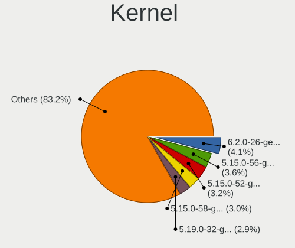

| Version           | Notebooks | Percent |
|-------------------|-----------|---------|
| 6.2.0-26-generic  | 471       | 4.06%   |
| 5.15.0-56-generic | 421       | 3.63%   |
| 5.15.0-52-generic | 376       | 3.24%   |
| 5.15.0-58-generic | 346       | 2.98%   |
| 5.19.0-32-generic | 333       | 2.87%   |
| 5.15.0-43-generic | 304       | 2.62%   |
| 5.15.0-48-generic | 293       | 2.53%   |
| 5.19.0-35-generic | 282       | 2.43%   |
| 6.2.0-39-generic  | 270       | 2.33%   |
| 5.15.0-47-generic | 254       | 2.19%   |
| 6.2.0-37-generic  | 244       | 2.1%    |
| 5.19.0-41-generic | 241       | 2.08%   |
| 5.15.0-46-generic | 235       | 2.03%   |
| 6.2.0-36-generic  | 233       | 2.01%   |
| 5.19.0-46-generic | 230       | 1.98%   |
| 5.15.0-53-generic | 214       | 1.85%   |
| 6.2.0-34-generic  | 212       | 1.83%   |
| 6.5.0-26-generic  | 209       | 1.8%    |
| 6.8.0-40-generic  | 204       | 1.76%   |
| 5.15.0-25-generic | 204       | 1.76%   |
| 5.19.0-38-generic | 198       | 1.71%   |
| 6.5.0-14-generic  | 190       | 1.64%   |
| 6.2.0-33-generic  | 185       | 1.6%    |
| 5.15.0-27-generic | 174       | 1.5%    |
| 6.2.0-32-generic  | 172       | 1.48%   |
| 6.5.0-35-generic  | 169       | 1.46%   |
| 5.15.0-41-generic | 167       | 1.44%   |
| 6.5.0-28-generic  | 163       | 1.41%   |
| 5.19.0-43-generic | 157       | 1.35%   |
| 5.15.0-40-generic | 157       | 1.35%   |
| 6.2.0-35-generic  | 147       | 1.27%   |
| 5.15.0-50-generic | 145       | 1.25%   |
| 6.5.0-15-generic  | 135       | 1.16%   |
| 6.5.0-21-generic  | 130       | 1.12%   |
| 6.5.0-18-generic  | 130       | 1.12%   |
| 5.15.0-60-generic | 126       | 1.09%   |
| 6.5.0-41-generic  | 119       | 1.03%   |
| 6.8.0-52-generic  | 117       | 1.01%   |
| 5.19.0-45-generic | 116       | 1%      |
| 5.15.0-33-generic | 108       | 0.93%   |

Kernel Family
-------------

Linux kernel without a distro release

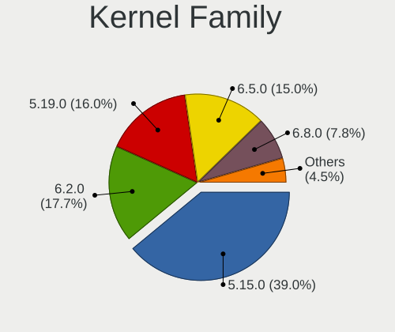

| Version | Notebooks | Percent |
|---------|-----------|---------|
| 5.15.0  | 4241      | 39.02%  |
| 6.2.0   | 1922      | 17.68%  |
| 5.19.0  | 1741      | 16.02%  |
| 6.5.0   | 1632      | 15.01%  |
| 6.8.0   | 847       | 7.79%   |
| 5.17.0  | 65        | 0.6%    |
| 6.1.0   | 55        | 0.51%   |
| 5.14.0  | 34        | 0.31%   |
| 6.0.0   | 22        | 0.2%    |
| 5.13.0  | 15        | 0.14%   |
| 5.18.0  | 10        | 0.09%   |
| 6.4.0   | 9         | 0.08%   |
| 6.2.11  | 9         | 0.08%   |
| 6.3.1   | 8         | 0.07%   |
| 5.17.1  | 8         | 0.07%   |
| 5.4.0   | 7         | 0.06%   |
| 5.19.5  | 7         | 0.06%   |
| 6.2.2   | 6         | 0.06%   |
| 6.0.9   | 6         | 0.06%   |
| 6.4.6   | 5         | 0.05%   |
| 6.2.8   | 5         | 0.05%   |
| 5.17.5  | 5         | 0.05%   |
| 5.13.19 | 5         | 0.05%   |
| 6.9.3   | 4         | 0.04%   |
| 6.7.0   | 4         | 0.04%   |
| 6.5.7   | 4         | 0.04%   |
| 6.4.11  | 4         | 0.04%   |
| 6.4.10  | 4         | 0.04%   |
| 6.2.10  | 4         | 0.04%   |
| 6.0.6   | 4         | 0.04%   |
| 6.8.7   | 3         | 0.03%   |
| 6.6.0   | 3         | 0.03%   |
| 6.5.1   | 3         | 0.03%   |
| 6.4.3   | 3         | 0.03%   |
| 6.3.7   | 3         | 0.03%   |
| 6.3.3   | 3         | 0.03%   |
| 6.2.9   | 3         | 0.03%   |
| 6.2.6   | 3         | 0.03%   |
| 6.2.12  | 3         | 0.03%   |
| 6.2.1   | 3         | 0.03%   |

Kernel Major Ver.
-----------------

Linux kernel major version

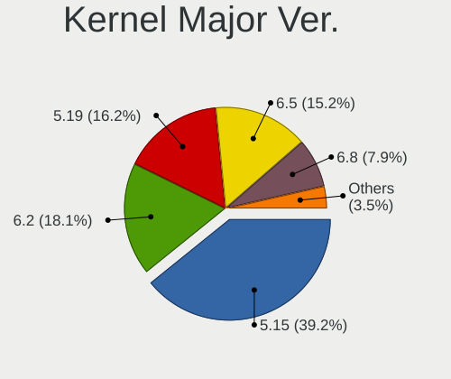

| Version | Notebooks | Percent |
|---------|-----------|---------|
| 5.15    | 4258      | 39.2%   |
| 6.2     | 1962      | 18.06%  |
| 5.19    | 1758      | 16.18%  |
| 6.5     | 1647      | 15.16%  |
| 6.8     | 853       | 7.85%   |
| 5.17    | 94        | 0.87%   |
| 6.1     | 70        | 0.64%   |
| 6.0     | 42        | 0.39%   |
| 5.14    | 35        | 0.32%   |
| 6.4     | 27        | 0.25%   |
| 5.18    | 26        | 0.24%   |
| 5.13    | 20        | 0.18%   |
| 6.3     | 16        | 0.15%   |
| 6.6     | 9         | 0.08%   |
| 6.9     | 8         | 0.07%   |
| 6.7     | 8         | 0.07%   |
| 5.4     | 7         | 0.06%   |
| 5.16    | 5         | 0.05%   |
| 6.16    | 3         | 0.03%   |
| 6.12    | 3         | 0.03%   |
| 5.11    | 3         | 0.03%   |
| 6.10    | 2         | 0.02%   |
| 5.10    | 2         | 0.02%   |
| 6.13    | 1         | 0.01%   |
| 6.11    | 1         | 0.01%   |
| 6       | 1         | 0.01%   |
| 5.8     | 1         | 0.01%   |
| Unknown | 1         | 0.01%   |

Arch
----

OS architecture (x86_64, i586, etc.)

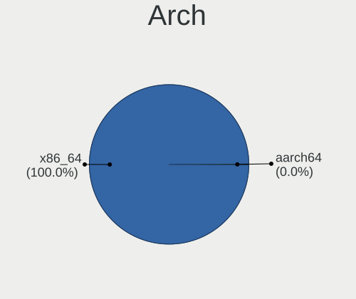

| Name    | Notebooks | Percent |
|---------|-----------|---------|
| x86_64  | 10190     | 99.97%  |
| aarch64 | 3         | 0.03%   |

DE
--

Desktop Environment

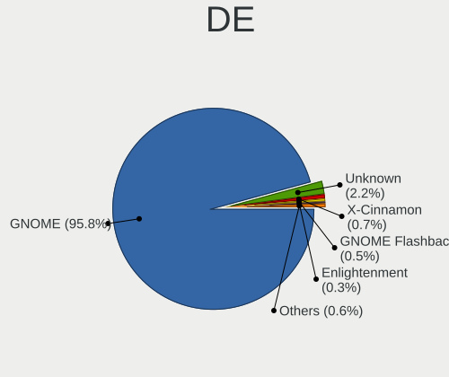

| Name              | Notebooks | Percent |
|-------------------|-----------|---------|
| GNOME             | 9780      | 95.75%  |
| Unknown           | 220       | 2.15%   |
| X-Cinnamon        | 70        | 0.69%   |
| GNOME Flashback   | 48        | 0.47%   |
| Enlightenment     | 32        | 0.31%   |
| i3                | 21        | 0.21%   |
| GNOME Classic     | 10        | 0.1%    |
| Cinnamon          | 8         | 0.08%   |
| sway              | 5         | 0.05%   |
| awesome           | 4         | 0.04%   |
| Pantheon          | 2         | 0.02%   |
| openbox           | 2         | 0.02%   |
| i3-with-shmlog    | 2         | 0.02%   |
| dwm               | 2         | 0.02%   |
| Yoyo              | 1         | 0.01%   |
| Yaru:ubuntu:GNOME | 1         | 0.01%   |
| xsession          | 1         | 0.01%   |
| ratflow           | 1         | 0.01%   |
| qtile             | 1         | 0.01%   |
| Lubuntu           | 1         | 0.01%   |
| GNUstep           | 1         | 0.01%   |
| fluxbox           | 1         | 0.01%   |

Display Server
--------------

X11 or Wayland

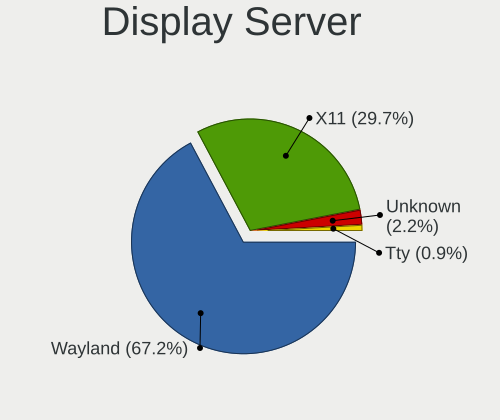

| Name    | Notebooks | Percent |
|---------|-----------|---------|
| Wayland | 6999      | 67.22%  |
| X11     | 3095      | 29.73%  |
| Unknown | 226       | 2.17%   |
| Tty     | 92        | 0.88%   |

Display Manager
---------------

SDDM, LightDM, etc.

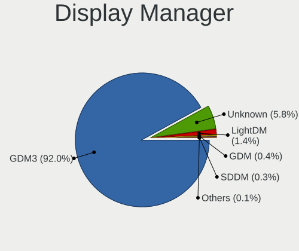

| Name            | Notebooks | Percent |
|-----------------|-----------|---------|
| GDM3            | 9427      | 92.01%  |
| Unknown         | 596       | 5.82%   |
| LightDM         | 142       | 1.39%   |
| GDM             | 37        | 0.36%   |
| SDDM            | 35        | 0.34%   |
| SLiM            | 6         | 0.06%   |
| XDM             | 2         | 0.02%   |
| KODI-STANDALONE | 1         | 0.01%   |

OS Lang
-------

Language

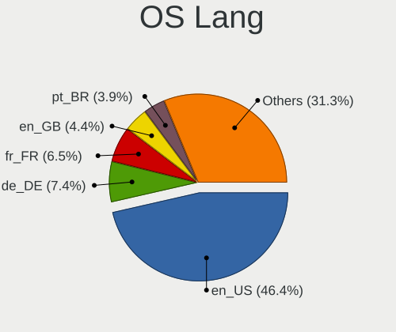

| Lang    | Notebooks | Percent |
|---------|-----------|---------|
| en_US   | 4755      | 46.43%  |
| de_DE   | 762       | 7.44%   |
| fr_FR   | 668       | 6.52%   |
| en_GB   | 452       | 4.41%   |
| pt_BR   | 403       | 3.94%   |
| en_IN   | 373       | 3.64%   |
| it_IT   | 327       | 3.19%   |
| ru_RU   | 308       | 3.01%   |
| es_ES   | 260       | 2.54%   |
| en_CA   | 212       | 2.07%   |
| pl_PL   | 135       | 1.32%   |
| en_AU   | 122       | 1.19%   |
| Unknown | 99        | 0.97%   |
| nl_NL   | 90        | 0.88%   |
| zh_CN   | 86        | 0.84%   |
| es_MX   | 78        | 0.76%   |
| C       | 69        | 0.67%   |
| hu_HU   | 63        | 0.62%   |
| es_AR   | 57        | 0.56%   |
| en_ZA   | 56        | 0.55%   |
| cs_CZ   | 55        | 0.54%   |
| pt_PT   | 52        | 0.51%   |
| tr_TR   | 50        | 0.49%   |
| es_CO   | 40        | 0.39%   |
| sv_SE   | 38        | 0.37%   |
| en_PH   | 37        | 0.36%   |
| de_AT   | 35        | 0.34%   |
| en_NZ   | 29        | 0.28%   |
| en_IL   | 27        | 0.26%   |
| de_CH   | 26        | 0.25%   |
| fr_BE   | 25        | 0.24%   |
| fi_FI   | 25        | 0.24%   |
| da_DK   | 25        | 0.24%   |
| es_CL   | 24        | 0.23%   |
| ja_JP   | 22        | 0.21%   |
| nb_NO   | 21        | 0.21%   |
| ro_RO   | 18        | 0.18%   |
| en_IE   | 18        | 0.18%   |
| en_SG   | 17        | 0.17%   |
| en_NG   | 17        | 0.17%   |

Boot Mode
---------

EFI or BIOS

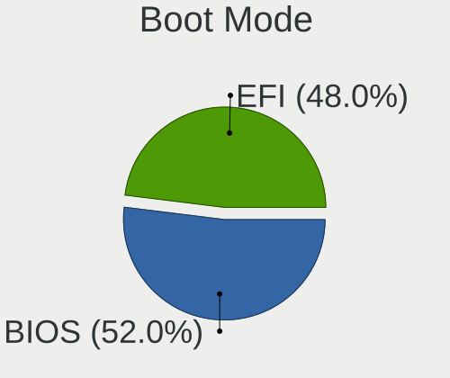

| Mode | Notebooks | Percent |
|------|-----------|---------|
| BIOS | 5374      | 51.96%  |
| EFI  | 4969      | 48.04%  |

Filesystem
----------

Type of filesystem

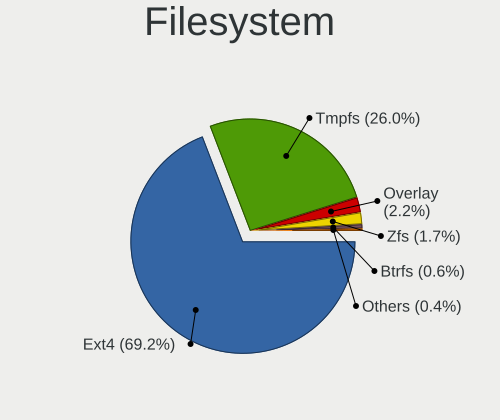

| Type    | Notebooks | Percent |
|---------|-----------|---------|
| Ext4    | 7223      | 69.17%  |
| Tmpfs   | 2714      | 25.99%  |
| Overlay | 227       | 2.17%   |
| Zfs     | 178       | 1.7%    |
| Btrfs   | 62        | 0.59%   |
| Xfs     | 16        | 0.15%   |
| Ext2    | 11        | 0.11%   |
| Ext3    | 10        | 0.1%    |
| XXX4    | 1         | 0.01%   |
| Unknown | 1         | 0.01%   |

Part. scheme
------------

Scheme of partitioning

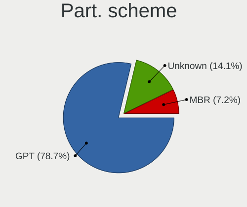

| Type    | Notebooks | Percent |
|---------|-----------|---------|
| GPT     | 8137      | 78.7%   |
| Unknown | 1455      | 14.07%  |
| MBR     | 747       | 7.23%   |

Dual Boot with Linux/BSD
------------------------

Hosting more than one Linux/BSD

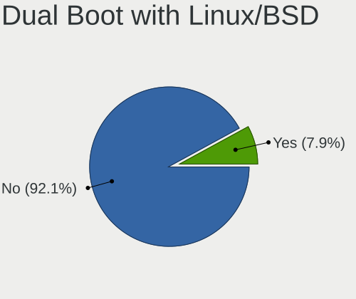

| Dual boot | Notebooks | Percent |
|-----------|-----------|---------|
| No        | 9458      | 92.06%  |
| Yes       | 816       | 7.94%   |

Dual Boot (Win)
---------------

Hosting Linux and Windows

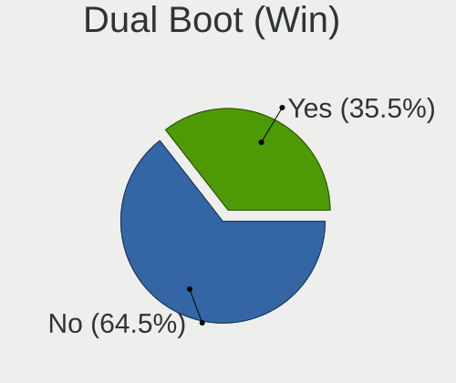

| Dual boot | Notebooks | Percent |
|-----------|-----------|---------|
| No        | 6624      | 64.46%  |
| Yes       | 3652      | 35.54%  |

Board
-----

Vendor
------

Motherboard manufacturer

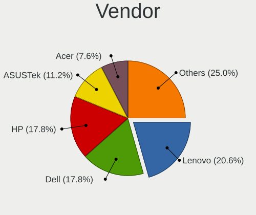

| Name                   | Notebooks | Percent |
|------------------------|-----------|---------|
| Lenovo                 | 2102      | 20.62%  |
| Dell                   | 1815      | 17.81%  |
| Hewlett-Packard        | 1810      | 17.76%  |
| ASUSTek Computer       | 1140      | 11.18%  |
| Acer                   | 778       | 7.63%   |
| Apple                  | 324       | 3.18%   |
| MSI                    | 261       | 2.56%   |
| HUAWEI                 | 245       | 2.4%    |
| Toshiba                | 205       | 2.01%   |
| Samsung Electronics    | 144       | 1.41%   |
| Sony                   | 94        | 0.92%   |
| Notebook               | 83        | 0.81%   |
| Unknown                | 74        | 0.73%   |
| Google                 | 72        | 0.71%   |
| Fujitsu                | 72        | 0.71%   |
| Medion                 | 55        | 0.54%   |
| Timi                   | 54        | 0.53%   |
| Alienware              | 51        | 0.5%    |
| Positivo               | 36        | 0.35%   |
| Packard Bell           | 32        | 0.31%   |
| LG Electronics         | 32        | 0.31%   |
| TUXEDO                 | 30        | 0.29%   |
| Framework              | 28        | 0.27%   |
| Chuwi                  | 26        | 0.26%   |
| HONOR                  | 23        | 0.23%   |
| System76               | 22        | 0.22%   |
| Gigabyte Technology    | 22        | 0.22%   |
| Panasonic              | 21        | 0.21%   |
| Gateway                | 19        | 0.19%   |
| Razer                  | 17        | 0.17%   |
| Avell High Performance | 17        | 0.17%   |
| GPU Company            | 15        | 0.15%   |
| AMI                    | 14        | 0.14%   |
| Teclast                | 12        | 0.12%   |
| Monster                | 12        | 0.12%   |
| Schenker               | 11        | 0.11%   |
| Clevo                  | 11        | 0.11%   |
| AZW                    | 11        | 0.11%   |
| Intel                  | 10        | 0.1%    |
| Infinix                | 10        | 0.1%    |

Model
-----

Motherboard model

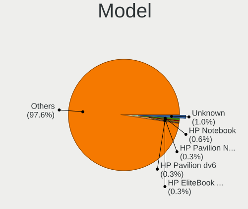

| Name                            | Notebooks | Percent |
|---------------------------------|-----------|---------|
| Unknown                         | 101       | 0.99%   |
| HP Notebook                     | 57        | 0.56%   |
| HP Pavilion Notebook            | 32        | 0.31%   |
| HP Pavilion dv6                 | 29        | 0.28%   |
| HP EliteBook 840 G3             | 29        | 0.28%   |
| Dell Latitude 5420              | 28        | 0.27%   |
| HP Pavilion 15                  | 26        | 0.26%   |
| HUAWEI BOM-WXX9                 | 25        | 0.25%   |
| HP Pavilion g6                  | 25        | 0.25%   |
| HUAWEI BOD-WXX9                 | 24        | 0.24%   |
| HP EliteBook 840 G5             | 24        | 0.24%   |
| HUAWEI NBLB-WAX9N               | 23        | 0.23%   |
| HP 15                           | 22        | 0.22%   |
| Lenovo ThinkBook 15 G2 ITL 20VE | 21        | 0.21%   |
| HP Pavilion dv7                 | 21        | 0.21%   |
| Apple MacBookPro9,2             | 21        | 0.21%   |
| HUAWEI BOHB-WAX9                | 20        | 0.2%    |
| Dell XPS 15 9500                | 20        | 0.2%    |
| Dell XPS 13 9370                | 20        | 0.2%    |
| HUAWEI HVY-WXX9                 | 19        | 0.19%   |
| Dell XPS 9320                   | 19        | 0.19%   |
| Dell XPS 15 9520                | 19        | 0.19%   |
| Dell XPS 15 7590                | 19        | 0.19%   |
| HP EliteBook 840 G8 Notebook PC | 18        | 0.18%   |
| Dell XPS 15 9570                | 18        | 0.18%   |
| Dell Latitude E6420             | 18        | 0.18%   |
| HP Pavilion g7                  | 17        | 0.17%   |
| Dell XPS 13 9380                | 17        | 0.17%   |
| Dell Latitude 7490              | 17        | 0.17%   |
| Dell G15 5530                   | 17        | 0.17%   |
| Apple MacBookPro8,2             | 17        | 0.17%   |
| HP ProBook 650 G1               | 16        | 0.16%   |
| HP Laptop 15-db0xxx             | 16        | 0.16%   |
| HP Laptop 15-da0xxx             | 16        | 0.16%   |
| HP EliteBook 8470p              | 16        | 0.16%   |
| Dell Latitude E7470             | 16        | 0.16%   |
| Dell Latitude E7440             | 16        | 0.16%   |
| Dell Inspiron 5570              | 16        | 0.16%   |
| Apple MacBookPro8,1             | 16        | 0.16%   |
| Apple MacBookAir6,2             | 16        | 0.16%   |

Model Family
------------

Motherboard model prefix

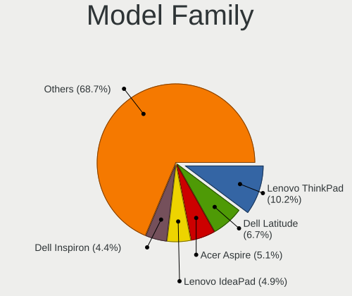

| Name                  | Notebooks | Percent |
|-----------------------|-----------|---------|
| Lenovo ThinkPad       | 1041      | 10.21%  |
| Dell Latitude         | 679       | 6.66%   |
| Acer Aspire           | 517       | 5.07%   |
| Lenovo IdeaPad        | 502       | 4.92%   |
| Dell Inspiron         | 452       | 4.43%   |
| HP Pavilion           | 368       | 3.61%   |
| HP EliteBook          | 351       | 3.44%   |
| ASUS VivoBook         | 343       | 3.37%   |
| HP ProBook            | 263       | 2.58%   |
| HP Laptop             | 256       | 2.51%   |
| Dell XPS              | 249       | 2.44%   |
| Dell Precision        | 188       | 1.84%   |
| Toshiba Satellite     | 165       | 1.62%   |
| Lenovo ThinkBook      | 131       | 1.29%   |
| Dell Vostro           | 129       | 1.27%   |
| Lenovo Legion         | 124       | 1.22%   |
| ASUS ZenBook          | 114       | 1.12%   |
| ASUS ROG              | 108       | 1.06%   |
| Unknown               | 101       | 0.99%   |
| ASUS ASUS             | 98        | 0.96%   |
| HP ZBook              | 97        | 0.95%   |
| Acer Swift            | 79        | 0.78%   |
| Acer Nitro            | 73        | 0.72%   |
| HP ENVY               | 66        | 0.65%   |
| HP Notebook           | 58        | 0.57%   |
| Fujitsu LIFEBOOK      | 58        | 0.57%   |
| Dell G15              | 53        | 0.52%   |
| HP OMEN               | 44        | 0.43%   |
| HP 250                | 42        | 0.41%   |
| Lenovo Yoga           | 40        | 0.39%   |
| Apple MacBookPro11    | 40        | 0.39%   |
| HP 255                | 37        | 0.36%   |
| Apple MacBookPro8     | 35        | 0.34%   |
| HP Compaq             | 32        | 0.31%   |
| Acer TravelMate       | 32        | 0.31%   |
| Acer Predator         | 31        | 0.3%    |
| MSI Modern            | 30        | 0.29%   |
| MSI Katana            | 29        | 0.28%   |
| HP 15                 | 29        | 0.28%   |
| Packard Bell EasyNote | 28        | 0.27%   |

MFG Year
--------

Motherboard manufacture year

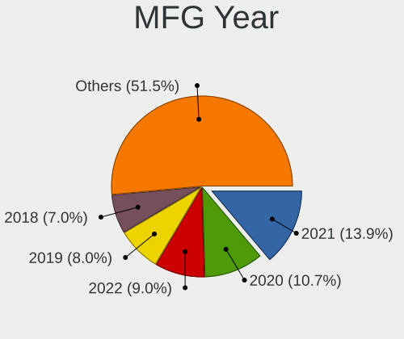

| Year    | Notebooks | Percent |
|---------|-----------|---------|
| 2021    | 1413      | 13.86%  |
| 2020    | 1088      | 10.67%  |
| 2022    | 916       | 8.99%   |
| 2019    | 814       | 7.99%   |
| 2018    | 715       | 7.01%   |
| 2013    | 628       | 6.16%   |
| 2012    | 600       | 5.89%   |
| 2017    | 597       | 5.86%   |
| 2011    | 542       | 5.32%   |
| 2023    | 532       | 5.22%   |
| 2014    | 484       | 4.75%   |
| 2016    | 459       | 4.5%    |
| 2015    | 447       | 4.39%   |
| 2010    | 349       | 3.42%   |
| 2008    | 206       | 2.02%   |
| 2009    | 179       | 1.76%   |
| 2024    | 86        | 0.84%   |
| 2007    | 76        | 0.75%   |
| 2006    | 39        | 0.38%   |
| 2025    | 15        | 0.15%   |
| Unknown | 8         | 0.08%   |

Form Factor
-----------

Physical design of the computer

| Name     | Notebooks | Percent |
|----------|-----------|---------|
| Notebook | 10193     | 100%    |

Secure Boot
-----------

Enabled or disabled

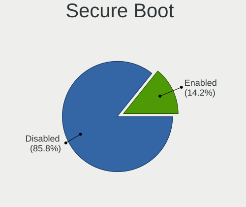

| State    | Notebooks | Percent |
|----------|-----------|---------|
| Disabled | 8807      | 85.8%   |
| Enabled  | 1458      | 14.2%   |

Coreboot
--------

Have coreboot on board

| Used | Notebooks | Percent |
|------|-----------|---------|
| No   | 10101     | 99.1%   |
| Yes  | 92        | 0.9%    |

RAM Size
--------

Total RAM memory

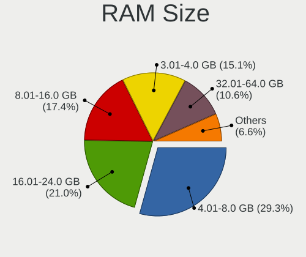

| Size in GB  | Notebooks | Percent |
|-------------|-----------|---------|
| 4.01-8.0    | 3005      | 29.29%  |
| 16.01-24.0  | 2153      | 20.99%  |
| 8.01-16.0   | 1786      | 17.41%  |
| 3.01-4.0    | 1547      | 15.08%  |
| 32.01-64.0  | 1092      | 10.65%  |
| 24.01-32.0  | 208       | 2.03%   |
| 64.01-256.0 | 208       | 2.03%   |
| 1.01-2.0    | 172       | 1.68%   |
| 2.01-3.0    | 83        | 0.81%   |
| 0.51-1.0    | 4         | 0.04%   |

RAM Used
--------

Used RAM memory

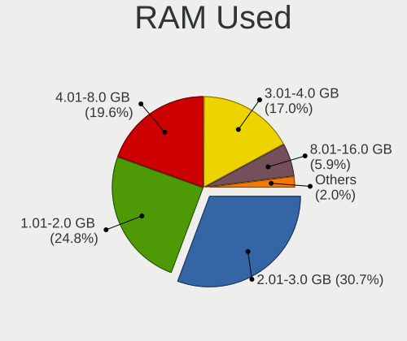

| Used GB    | Notebooks | Percent |
|------------|-----------|---------|
| 2.01-3.0   | 3352      | 30.7%   |
| 1.01-2.0   | 2706      | 24.79%  |
| 4.01-8.0   | 2137      | 19.57%  |
| 3.01-4.0   | 1860      | 17.04%  |
| 8.01-16.0  | 644       | 5.9%    |
| 16.01-24.0 | 90        | 0.82%   |
| 0.51-1.0   | 80        | 0.73%   |
| 24.01-32.0 | 28        | 0.26%   |
| 32.01-64.0 | 10        | 0.09%   |
| 0.01-0.5   | 10        | 0.09%   |

Total Drives
------------

Number of drives on board

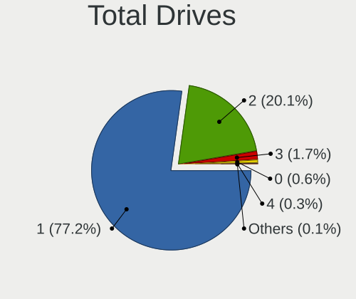

| Drives | Notebooks | Percent |
|--------|-----------|---------|
| 1      | 7957      | 77.18%  |
| 2      | 2073      | 20.11%  |
| 3      | 179       | 1.74%   |
| 0      | 67        | 0.65%   |
| 4      | 27        | 0.26%   |
| 5      | 4         | 0.04%   |
| 7      | 2         | 0.02%   |

Has CD-ROM
----------

Has CD-ROM on board

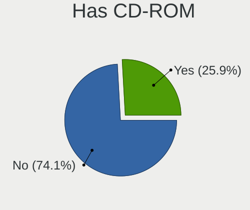

| Presented | Notebooks | Percent |
|-----------|-----------|---------|
| No        | 7578      | 74.12%  |
| Yes       | 2646      | 25.88%  |

Has Ethernet
------------

Has Ethernet on board

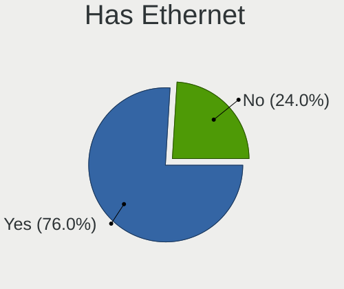

| Presented | Notebooks | Percent |
|-----------|-----------|---------|
| Yes       | 7773      | 75.97%  |
| No        | 2459      | 24.03%  |

Has WiFi
--------

Has WiFi module

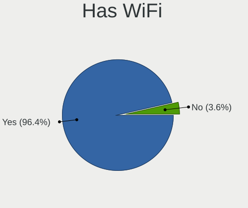

| Presented | Notebooks | Percent |
|-----------|-----------|---------|
| Yes       | 9834      | 96.41%  |
| No        | 366       | 3.59%   |

Has Bluetooth
-------------

Has Bluetooth module

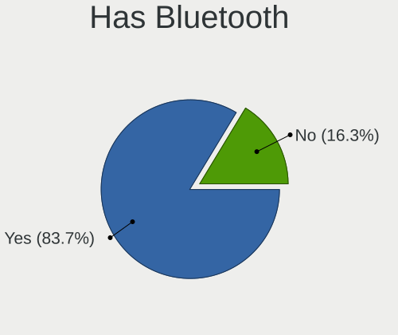

| Presented | Notebooks | Percent |
|-----------|-----------|---------|
| Yes       | 8597      | 83.68%  |
| No        | 1677      | 16.32%  |

Location
--------

Country
-------

Geographic location (country)

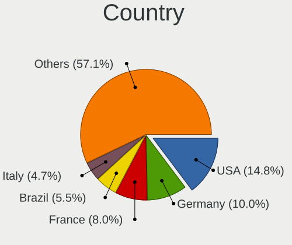

| Country      | Notebooks | Percent |
|--------------|-----------|---------|
| USA          | 1512      | 14.76%  |
| Germany      | 1020      | 9.95%   |
| France       | 816       | 7.96%   |
| Brazil       | 566       | 5.52%   |
| Italy        | 480       | 4.68%   |
| Russia       | 452       | 4.41%   |
| India        | 428       | 4.18%   |
| UK           | 364       | 3.55%   |
| Spain        | 335       | 3.27%   |
| Poland       | 268       | 2.62%   |
| Canada       | 259       | 2.53%   |
| Netherlands  | 231       | 2.25%   |
| Mexico       | 156       | 1.52%   |
| Turkey       | 155       | 1.51%   |
| Sweden       | 126       | 1.23%   |
| Australia    | 120       | 1.17%   |
| Hungary      | 111       | 1.08%   |
| Argentina    | 111       | 1.08%   |
| Czechia      | 110       | 1.07%   |
| China        | 108       | 1.05%   |
| Portugal     | 107       | 1.04%   |
| Belgium      | 99        | 0.97%   |
| Switzerland  | 96        | 0.94%   |
| Romania      | 94        | 0.92%   |
| Austria      | 87        | 0.85%   |
| Colombia     | 82        | 0.8%    |
| Indonesia    | 79        | 0.77%   |
| Greece       | 73        | 0.71%   |
| Finland      | 65        | 0.63%   |
| South Africa | 64        | 0.62%   |
| Bulgaria     | 62        | 0.61%   |
| Norway       | 61        | 0.6%    |
| Egypt        | 57        | 0.56%   |
| Denmark      | 56        | 0.55%   |
| Chile        | 53        | 0.52%   |
| Iran         | 51        | 0.5%    |
| Philippines  | 46        | 0.45%   |
| Japan        | 45        | 0.44%   |
| Vietnam      | 43        | 0.42%   |
| Pakistan     | 42        | 0.41%   |

City
----

Geographic location (city)

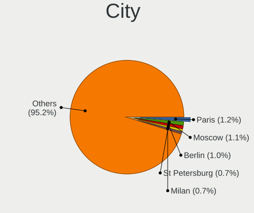

| City              | Notebooks | Percent |
|-------------------|-----------|---------|
| Paris             | 134       | 1.25%   |
| Moscow            | 123       | 1.15%   |
| Berlin            | 106       | 0.99%   |
| St Petersburg     | 76        | 0.71%   |
| Milan             | 74        | 0.69%   |
| Rome              | 68        | 0.63%   |
| Warsaw            | 67        | 0.62%   |
| Sao Paulo         | 66        | 0.61%   |
| Madrid            | 62        | 0.58%   |
| Istanbul          | 58        | 0.54%   |
| Budapest          | 58        | 0.54%   |
| Bengaluru         | 57        | 0.53%   |
| Munich            | 51        | 0.47%   |
| Vienna            | 50        | 0.47%   |
| Barcelona         | 49        | 0.46%   |
| Amsterdam         | 42        | 0.39%   |
| Rio de Janeiro    | 41        | 0.38%   |
| Toronto           | 38        | 0.35%   |
| Sydney            | 38        | 0.35%   |
| Hamburg           | 38        | 0.35%   |
| Bogotá           | 38        | 0.35%   |
| Athens            | 37        | 0.34%   |
| Prague            | 36        | 0.34%   |
| Chennai           | 36        | 0.34%   |
| Nairobi           | 35        | 0.33%   |
| Helsinki          | 35        | 0.33%   |
| Sofia             | 33        | 0.31%   |
| Tehran            | 32        | 0.3%    |
| Mexico City       | 32        | 0.3%    |
| Melbourne         | 32        | 0.3%    |
| Los Angeles       | 32        | 0.3%    |
| London            | 32        | 0.3%    |
| Delhi             | 31        | 0.29%   |
| Ankara            | 31        | 0.29%   |
| Lisbon            | 30        | 0.28%   |
| Frankfurt am Main | 30        | 0.28%   |
| Stockholm         | 29        | 0.27%   |
| Singapore         | 28        | 0.26%   |
| Santiago          | 28        | 0.26%   |
| New York          | 28        | 0.26%   |

Drives
------

Drive Vendor
------------

Hard drive vendors

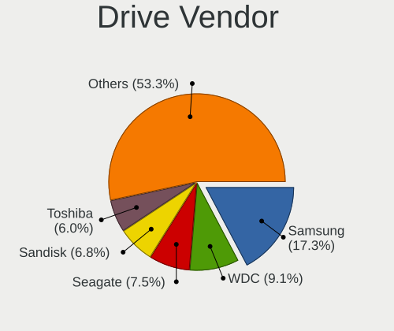

| Vendor                      | Notebooks | Drives | Percent |
|-----------------------------|-----------|--------|---------|
| Samsung Electronics         | 2106      | 2567   | 17.27%  |
| WDC                         | 1107      | 1315   | 9.08%   |
| Seagate                     | 916       | 1102   | 7.51%   |
| Sandisk                     | 834       | 1019   | 6.84%   |
| Toshiba                     | 728       | 844    | 5.97%   |
| SK hynix                    | 701       | 815    | 5.75%   |
| Kingston                    | 599       | 684    | 4.91%   |
| Micron Technology           | 575       | 644    | 4.71%   |
| Unknown                     | 570       | 709    | 4.67%   |
| Intel                       | 484       | 616    | 3.97%   |
| Crucial                     | 378       | 473    | 3.1%    |
| KIOXIA                      | 315       | 358    | 2.58%   |
| HGST                        | 254       | 320    | 2.08%   |
| Hitachi                     | 223       | 291    | 1.83%   |
| Apple                       | 197       | 247    | 1.62%   |
| A-DATA Technology           | 162       | 185    | 1.33%   |
| China                       | 106       | 123    | 0.87%   |
| Phison                      | 101       | 115    | 0.83%   |
| Unknown                     | 100       | 111    | 0.82%   |
| Kingston Technology Company | 94        | 110    | 0.77%   |
| Silicon Motion              | 79        | 93     | 0.65%   |
| LITEON                      | 76        | 82     | 0.62%   |
| Phison Electronics          | 65        | 71     | 0.53%   |
| Intenso                     | 58        | 78     | 0.48%   |
| Netac                       | 54        | 66     | 0.44%   |
| PNY                         | 52        | 60     | 0.43%   |
| Micron/Crucial Technology   | 51        | 56     | 0.42%   |
| SPCC                        | 49        | 59     | 0.4%    |
| ADATA Technology            | 48        | 57     | 0.39%   |
| Fujitsu                     | 37        | 44     | 0.3%    |
| Transcend                   | 35        | 45     | 0.29%   |
| SSSTC                       | 34        | 36     | 0.28%   |
| GOODRAM                     | 33        | 38     | 0.27%   |
| Team                        | 29        | 33     | 0.24%   |
| JMicron Technology          | 29        | 34     | 0.24%   |
| LITEONIT                    | 28        | 39     | 0.23%   |
| Lexar                       | 28        | 42     | 0.23%   |
| Gigabyte Technology         | 28        | 31     | 0.23%   |
| UMIS                        | 27        | 30     | 0.22%   |
| Patriot                     | 27        | 29     | 0.22%   |

Drive Model
-----------

Hard drive models

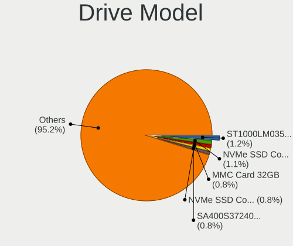

| Model                                                | Notebooks | Percent |
|------------------------------------------------------|-----------|---------|
| Seagate ST1000LM035-1RK172 1TB                       | 149       | 1.19%   |
| Samsung NVMe SSD Controller SM981/PM981/PM983 1TB    | 140       | 1.12%   |
| Unknown MMC Card  32GB                               | 106       | 0.84%   |
| Samsung NVMe SSD Controller PM9A1/PM9A3/980PRO 1TB   | 105       | 0.84%   |
| Kingston SA400S37240G 240GB SSD                      | 102       | 0.81%   |
| Unknown MMC Card  64GB                               | 100       | 0.8%    |
| Unknown                                              | 100       | 0.8%    |
| Seagate ST1000LM024 HN-M101MBB 1TB                   | 97        | 0.77%   |
| Toshiba MQ04ABF100 1TB                               | 92        | 0.73%   |
| Toshiba MQ01ABD100 1TB                               | 92        | 0.73%   |
| Intel SSDPEKNU512GZ 512GB                            | 91        | 0.72%   |
| SanDisk NVMe SSD Drive 512GB                         | 78        | 0.62%   |
| SanDisk NVMe SSD Drive 1TB                           | 76        | 0.61%   |
| Kingston SA400S37480G 480GB SSD                      | 68        | 0.54%   |
| Toshiba MQ01ABF050 500GB                             | 67        | 0.53%   |
| Seagate ST500LT012-1DG142 500GB                      | 66        | 0.53%   |
| Samsung SSD 860 EVO 500GB                            | 61        | 0.49%   |
| HGST HTS721010A9E630 1TB                             | 61        | 0.49%   |
| Sandisk WD Blue SN550 NVMe SSD 1024GB                | 59        | 0.47%   |
| Crucial CT500MX500SSD1 500GB                         | 58        | 0.46%   |
| Unknown MMC Card  128GB                              | 57        | 0.45%   |
| Sandisk WD Black SN750 / PC SN730 NVMe SSD 500GB     | 57        | 0.45%   |
| Seagate ST9500325AS 500GB                            | 55        | 0.44%   |
| Micron 2450_MTFDKBA512TFK 512GB                      | 55        | 0.44%   |
| Intel SSD 660P Series 512GB                          | 54        | 0.43%   |
| HGST HTS541010A9E680 1TB                             | 51        | 0.41%   |
| KIOXIA KBG40ZNS512G NVMe 512GB                       | 48        | 0.38%   |
| Crucial CT240BX500SSD1 240GB                         | 47        | 0.37%   |
| Phison 311CD0512GB                                   | 46        | 0.37%   |
| HGST HTS545050A7E680 500GB                           | 44        | 0.35%   |
| Samsung MZVL21T0HCLR-00B00 1TB                       | 42        | 0.33%   |
| Samsung MZALQ512HALU-000L2 512GB                     | 42        | 0.33%   |
| Kingston SA400S37120G 120GB SSD                      | 42        | 0.33%   |
| Samsung SSD 980 1TB                                  | 41        | 0.33%   |
| Samsung NVMe SSD Controller SM961/PM961/SM963 1024GB | 39        | 0.31%   |
| KIOXIA KBG40ZNV512G 512GB                            | 39        | 0.31%   |
| Samsung SSD 850 EVO 500GB                            | 38        | 0.3%    |
| Samsung NVMe SSD Drive 512GB                         | 38        | 0.3%    |
| Intel SSDPEKNW512G8 512GB                            | 35        | 0.28%   |
| Crucial CT1000MX500SSD1 1TB                          | 35        | 0.28%   |

HDD Vendor
----------

Hard disk drive vendors

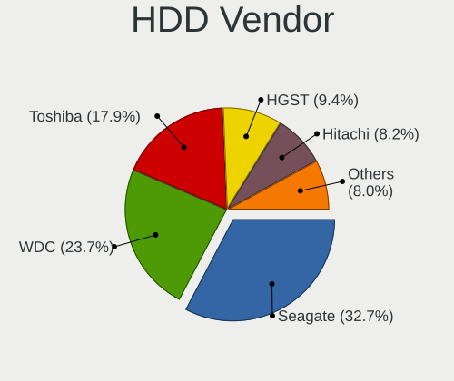

| Vendor              | Notebooks | Drives | Percent |
|---------------------|-----------|--------|---------|
| Seagate             | 880       | 1055   | 32.7%   |
| WDC                 | 638       | 762    | 23.71%  |
| Toshiba             | 483       | 551    | 17.95%  |
| HGST                | 254       | 320    | 9.44%   |
| Hitachi             | 222       | 290    | 8.25%   |
| Samsung Electronics | 53        | 60     | 1.97%   |
| Unknown             | 38        | 46     | 1.41%   |
| Fujitsu             | 37        | 44     | 1.37%   |
| JMicron Technology  | 18        | 19     | 0.67%   |
| Apple               | 10        | 12     | 0.37%   |
| Intenso             | 9         | 9      | 0.33%   |
| External            | 8         | 19     | 0.3%    |
| USB3.0              | 6         | 6      | 0.22%   |
| TO Exter            | 5         | 5      | 0.19%   |
| SSK                 | 4         | 4      | 0.15%   |
| ASMT                | 4         | 4      | 0.15%   |
| USB                 | 3         | 3      | 0.11%   |
| SABRENT             | 3         | 3      | 0.11%   |
| ASMedia             | 3         | 5      | 0.11%   |
| StoreJet            | 2         | 2      | 0.07%   |
| SAGE                | 2         | 2      | 0.07%   |
| T-FORCE             | 1         | 1      | 0.04%   |
| Shenzhen            | 1         | 2      | 0.04%   |
| NVME USB            | 1         | 1      | 0.04%   |
| MARSHAL             | 1         | 1      | 0.04%   |
| LaCie               | 1         | 1      | 0.04%   |
| Initio              | 1         | 1      | 0.04%   |
| Inateck             | 1         | 1      | 0.04%   |
| HGST HTS            | 1         | 2      | 0.04%   |
| Hewlett-Packard     | 1         | 1      | 0.04%   |

SSD Vendor
----------

Solid state drive vendors

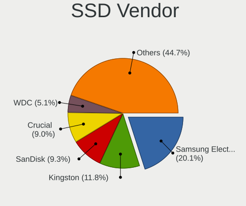

| Vendor              | Notebooks | Drives | Percent |
|---------------------|-----------|--------|---------|
| Samsung Electronics | 683       | 844    | 20.07%  |
| Kingston            | 403       | 469    | 11.84%  |
| SanDisk             | 318       | 401    | 9.34%   |
| Crucial             | 306       | 390    | 8.99%   |
| WDC                 | 172       | 207    | 5.05%   |
| SK hynix            | 113       | 136    | 3.32%   |
| Micron Technology   | 107       | 119    | 3.14%   |
| China               | 105       | 121    | 3.09%   |
| Apple               | 100       | 115    | 2.94%   |
| Intel               | 89        | 109    | 2.62%   |
| A-DATA Technology   | 86        | 92     | 2.53%   |
| LITEON              | 71        | 77     | 2.09%   |
| Toshiba             | 66        | 73     | 1.94%   |
| Netac               | 49        | 59     | 1.44%   |
| PNY                 | 47        | 54     | 1.38%   |
| SPCC                | 45        | 55     | 1.32%   |
| Unknown             | 38        | 47     | 1.12%   |
| Intenso             | 34        | 46     | 1%      |
| Transcend           | 30        | 39     | 0.88%   |
| GOODRAM             | 29        | 34     | 0.85%   |
| LITEONIT            | 28        | 39     | 0.82%   |
| Team                | 24        | 27     | 0.71%   |
| Patriot             | 22        | 24     | 0.65%   |
| Lexar               | 19        | 30     | 0.56%   |
| Gigabyte Technology | 17        | 17     | 0.5%    |
| KingSpec            | 16        | 16     | 0.47%   |
| Hewlett-Packard     | 15        | 26     | 0.44%   |
| Teclast             | 12        | 14     | 0.35%   |
| OCZ                 | 11        | 11     | 0.32%   |
| Emtec               | 11        | 14     | 0.32%   |
| Apacer              | 11        | 11     | 0.32%   |
| SABRENT             | 10        | 10     | 0.29%   |
| BHT                 | 10        | 15     | 0.29%   |
| Verbatim            | 9         | 9      | 0.26%   |
| KIOXIA-EXCERIA      | 9         | 12     | 0.26%   |
| Seagate             | 8         | 10     | 0.24%   |
| Phison              | 8         | 14     | 0.24%   |
| Corsair             | 8         | 8      | 0.24%   |
| BIWIN               | 8         | 8      | 0.24%   |
| Indilinx            | 6         | 6      | 0.18%   |

Drive Kind
----------

HDD or SSD

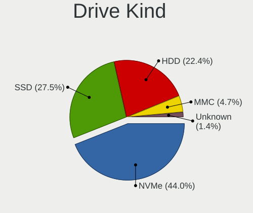

| Kind    | Notebooks | Drives | Percent |
|---------|-----------|--------|---------|
| NVMe    | 5140      | 6350   | 44.01%  |
| SSD     | 3207      | 4098   | 27.46%  |
| HDD     | 2613      | 3232   | 22.37%  |
| MMC     | 550       | 690    | 4.71%   |
| Unknown | 169       | 212    | 1.45%   |

Drive Connector
---------------

SATA, SAS, NVMe, etc.

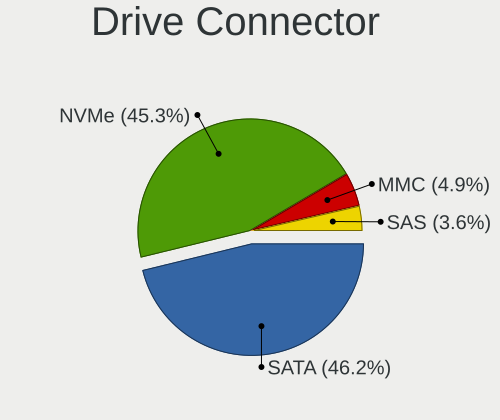

| Type | Notebooks | Drives | Percent |
|------|-----------|--------|---------|
| SATA | 5227      | 7037   | 46.19%  |
| NVMe | 5130      | 6319   | 45.33%  |
| MMC  | 550       | 690    | 4.86%   |
| SAS  | 410       | 536    | 3.62%   |

Drive Size
----------

Size of hard drive

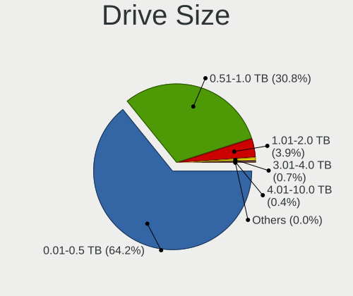

| Size in TB | Notebooks | Drives | Percent |
|------------|-----------|--------|---------|
| 0.01-0.5   | 3715      | 4803   | 64.21%  |
| 0.51-1.0   | 1782      | 2184   | 30.8%   |
| 1.01-2.0   | 224       | 262    | 3.87%   |
| 3.01-4.0   | 38        | 43     | 0.66%   |
| 4.01-10.0  | 25        | 31     | 0.43%   |
| 2.01-3.0   | 2         | 7      | 0.03%   |

Space Total
-----------

Amount of disk space available on the file system

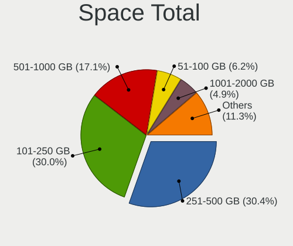

| Size in GB     | Notebooks | Percent |
|----------------|-----------|---------|
| 251-500        | 3184      | 30.41%  |
| 101-250        | 3145      | 30.04%  |
| 501-1000       | 1795      | 17.14%  |
| 51-100         | 649       | 6.2%    |
| 1001-2000      | 518       | 4.95%   |
| 1-20           | 473       | 4.52%   |
| 21-50          | 347       | 3.31%   |
| More than 3000 | 134       | 1.28%   |
| Unknown        | 113       | 1.08%   |
| 2001-3000      | 112       | 1.07%   |

Space Used
----------

Amount of used disk space

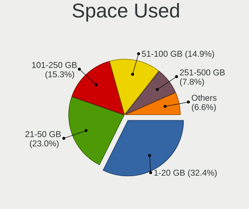

| Used GB        | Notebooks | Percent |
|----------------|-----------|---------|
| 1-20           | 3515      | 32.36%  |
| 21-50          | 2495      | 22.97%  |
| 101-250        | 1666      | 15.34%  |
| 51-100         | 1621      | 14.92%  |
| 251-500        | 848       | 7.81%   |
| 501-1000       | 405       | 3.73%   |
| 1001-2000      | 127       | 1.17%   |
| Unknown        | 113       | 1.04%   |
| More than 3000 | 41        | 0.38%   |
| 2001-3000      | 32        | 0.29%   |

Malfunc. Drives
---------------

Drive models with a malfunction

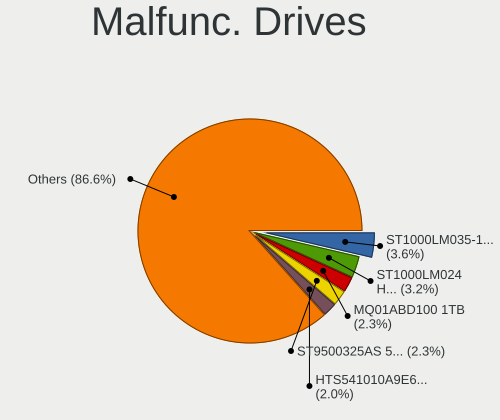

| Model                                 | Notebooks | Drives | Percent |
|---------------------------------------|-----------|--------|---------|
| Seagate ST1000LM035-1RK172 1TB        | 16        | 16     | 3.63%   |
| Seagate ST1000LM024 HN-M101MBB 1TB    | 14        | 15     | 3.17%   |
| Toshiba MQ01ABD100 1TB                | 10        | 10     | 2.27%   |
| Seagate ST9500325AS 500GB             | 10        | 10     | 2.27%   |
| HGST HTS541010A9E680 1TB              | 9         | 10     | 2.04%   |
| Toshiba MQ04ABF100 1TB                | 7         | 7      | 1.59%   |
| SK hynix BC711 HFM512GD3JX013N 512GB  | 7         | 7      | 1.59%   |
| Seagate ST500LT012-1DG142 500GB       | 7         | 7      | 1.59%   |
| HGST HTS725050A7E630 500GB            | 6         | 6      | 1.36%   |
| Seagate ST500LT012-9WS142 500GB       | 5         | 5      | 1.13%   |
| Seagate ST1000LX015-1U7172 1TB        | 5         | 5      | 1.13%   |
| Seagate ST1000LM014-SSHD-8GB          | 5         | 5      | 1.13%   |
| Seagate ST1000LM014-1EJ164 1TB        | 5         | 6      | 1.13%   |
| HGST HTS721010A9E630 1TB              | 5         | 5      | 1.13%   |
| HGST HTS545050A7E680 500GB            | 5         | 5      | 1.13%   |
| Toshiba MQ01ABF050 500GB              | 4         | 4      | 0.91%   |
| SK hynix HFS256G39TND-N210A 256GB SSD | 4         | 4      | 0.91%   |
| Seagate ST9320325AS 320GB             | 4         | 4      | 0.91%   |
| Seagate ST500LM012 HN-M500MBB 500GB   | 4         | 5      | 0.91%   |
| SanDisk SSD PLUS 240GB                | 4         | 6      | 0.91%   |
| SanDisk SD9SN8W-128G-1006 128GB SSD   | 4         | 4      | 0.91%   |
| HGST HTS541075A9E680 752GB            | 4         | 4      | 0.91%   |
| WDC WDS240G2G0A-00JH30 240GB SSD      | 3         | 3      | 0.68%   |
| WDC WD10JPVX-60JC3T0 1TB              | 3         | 3      | 0.68%   |
| WDC WD10JPCX-24UE4T0 1TB              | 3         | 3      | 0.68%   |
| Toshiba MQ01ABD050 500GB              | 3         | 3      | 0.68%   |
| SK hynix BC711 HFM256GD3JX013N 256GB  | 3         | 4      | 0.68%   |
| Seagate ST500LM021-1KJ152 500GB       | 3         | 3      | 0.68%   |
| Seagate ST1000LM049-2GH172 1TB        | 3         | 3      | 0.68%   |
| Intel SSDSCKKF256G8H 256GB            | 3         | 3      | 0.68%   |
| Hitachi HTS547564A9E384 640GB         | 3         | 3      | 0.68%   |
| Hitachi HTS547550A9E384 500GB         | 3         | 3      | 0.68%   |
| Hitachi HTS545050A7E380 500GB         | 3         | 3      | 0.68%   |
| Hitachi HTS543232A7A384 320GB         | 3         | 3      | 0.68%   |
| HGST HTS545050A7E380 500GB            | 3         | 3      | 0.68%   |
| Crucial CT525MX300SSD1 528GB          | 3         | 3      | 0.68%   |
| WDC WD5000LPVX-22V0TT0 500GB          | 2         | 2      | 0.45%   |
| WDC WD5000LPCX-60VHAT0 500GB          | 2         | 2      | 0.45%   |
| WDC WD3200BEKT-60V5T1 320GB           | 2         | 2      | 0.45%   |
| WDC WD10SPZX-60Z10T0 1TB              | 2         | 2      | 0.45%   |

Malfunc. Drive Vendor
---------------------

Vendors of faulty drives

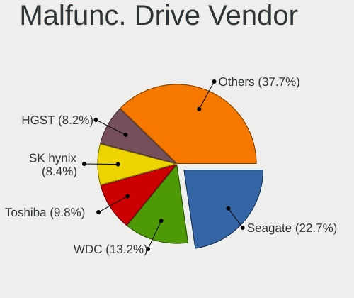

| Vendor                      | Notebooks | Drives | Percent |
|-----------------------------|-----------|--------|---------|
| Seagate                     | 100       | 105    | 22.73%  |
| WDC                         | 58        | 64     | 13.18%  |
| Toshiba                     | 43        | 44     | 9.77%   |
| SK hynix                    | 37        | 39     | 8.41%   |
| HGST                        | 36        | 37     | 8.18%   |
| Hitachi                     | 28        | 29     | 6.36%   |
| SanDisk                     | 19        | 22     | 4.32%   |
| Samsung Electronics         | 17        | 17     | 3.86%   |
| Intel                       | 17        | 17     | 3.86%   |
| Micron Technology           | 14        | 14     | 3.18%   |
| Kingston                    | 11        | 12     | 2.5%    |
| Crucial                     | 9         | 11     | 2.05%   |
| LITEON                      | 7         | 8      | 1.59%   |
| A-DATA Technology           | 5         | 7      | 1.14%   |
| China                       | 4         | 4      | 0.91%   |
| Fujitsu                     | 3         | 3      | 0.68%   |
| Apple                       | 3         | 3      | 0.68%   |
| Patriot                     | 2         | 2      | 0.45%   |
| Netac                       | 2         | 2      | 0.45%   |
| Unknown                     | 2         | 3      | 0.45%   |
| WALRAM                      | 1         | 1      | 0.23%   |
| VISIPRO                     | 1         | 1      | 0.23%   |
| Transcend                   | 1         | 1      | 0.23%   |
| tecmiyo                     | 1         | 1      | 0.23%   |
| Teclast                     | 1         | 1      | 0.23%   |
| SSSTC                       | 1         | 1      | 0.23%   |
| ShiJi                       | 1         | 1      | 0.23%   |
| SABRENT                     | 1         | 1      | 0.23%   |
| RX7                         | 1         | 1      | 0.23%   |
| Phison                      | 1         | 1      | 0.23%   |
| OCZ                         | 1         | 1      | 0.23%   |
| LITEONIT                    | 1         | 1      | 0.23%   |
| Lexar                       | 1         | 1      | 0.23%   |
| Lenovo                      | 1         | 1      | 0.23%   |
| Kingston Technology Company | 1         | 1      | 0.23%   |
| KingSpec                    | 1         | 1      | 0.23%   |
| JMicron Technology          | 1         | 1      | 0.23%   |
| Intenso                     | 1         | 1      | 0.23%   |
| Hypertec                    | 1         | 1      | 0.23%   |
| HS-SSD-E100                 | 1         | 1      | 0.23%   |

Malfunc. HDD Vendor
-------------------

Vendors of faulty HDD drives

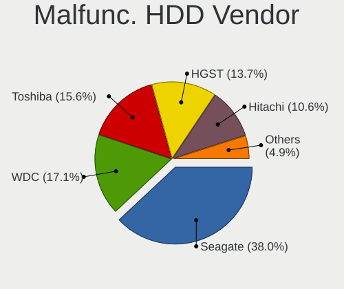

| Vendor              | Notebooks | Drives | Percent |
|---------------------|-----------|--------|---------|
| Seagate             | 100       | 105    | 38.02%  |
| WDC                 | 45        | 49     | 17.11%  |
| Toshiba             | 41        | 42     | 15.59%  |
| HGST                | 36        | 37     | 13.69%  |
| Hitachi             | 28        | 29     | 10.65%  |
| Samsung Electronics | 7         | 7      | 2.66%   |
| Fujitsu             | 3         | 3      | 1.14%   |
| SABRENT             | 1         | 1      | 0.38%   |
| JMicron Technology  | 1         | 1      | 0.38%   |
| Apple               | 1         | 1      | 0.38%   |

Malfunc. Drive Kind
-------------------

Kinds of faulty drives

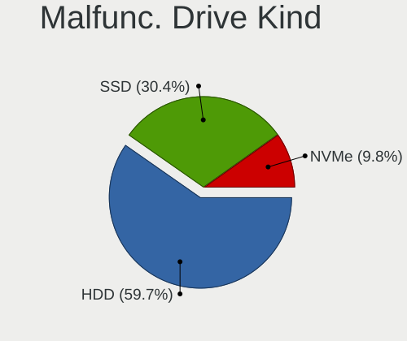

| Kind | Notebooks | Drives | Percent |
|------|-----------|--------|---------|
| HDD  | 261       | 275    | 59.73%  |
| SSD  | 133       | 145    | 30.43%  |
| NVMe | 43        | 47     | 9.84%   |

Failed Drives
-------------

Failed drive models

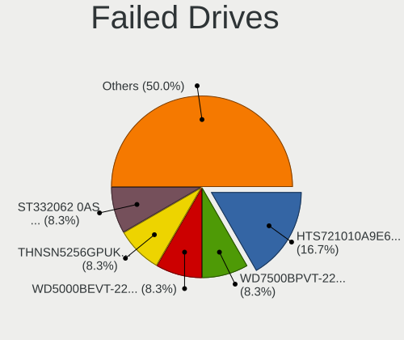

| Model                                                            | Notebooks | Drives | Percent |
|------------------------------------------------------------------|-----------|--------|---------|
| HGST HTS721010A9E630 1TB                                         | 2         | 2      | 16.67%  |
| WDC WD7500BPVT-22HXZT1 752GB                                     | 1         | 1      | 8.33%   |
| WDC WD5000BEVT-22A0RT0 500GB                                     | 1         | 1      | 8.33%   |
| Toshiba THNSN5256GPUK NVMe 256GB                                 | 1         | 1      | 8.33%   |
| Seagate ST332062 0AS 320GB                                       | 1         | 1      | 8.33%   |
| Samsung Electronics SSD 980 500GB S64DNF0R648337E                | 1         | 1      | 8.33%   |
| Samsung Electronics SSD 980 500GB                                | 1         | 1      | 8.33%   |
| Samsung Electronics NVMe SSD Controller SM961/PM961/SM963 1024GB | 1         | 1      | 8.33%   |
| Hitachi HTS727575A9E364 752GB                                    | 1         | 1      | 8.33%   |
| Crucial M4-CT256M4SSD3 256GB                                     | 1         | 1      | 8.33%   |
| A-DATA Technology SX8200PNP 256GB                                | 1         | 1      | 8.33%   |

Failed Drive Vendor
-------------------

Failed drive vendors

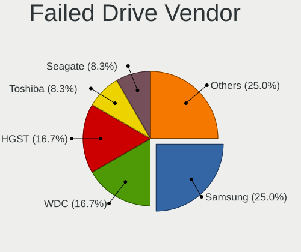

| Vendor              | Notebooks | Drives | Percent |
|---------------------|-----------|--------|---------|
| Samsung Electronics | 3         | 3      | 25%     |
| WDC                 | 2         | 2      | 16.67%  |
| HGST                | 2         | 2      | 16.67%  |
| Toshiba             | 1         | 1      | 8.33%   |
| Seagate             | 1         | 1      | 8.33%   |
| Hitachi             | 1         | 1      | 8.33%   |
| Crucial             | 1         | 1      | 8.33%   |
| A-DATA Technology   | 1         | 1      | 8.33%   |

Drive Status
------------

Number of failed and malfunc. drives

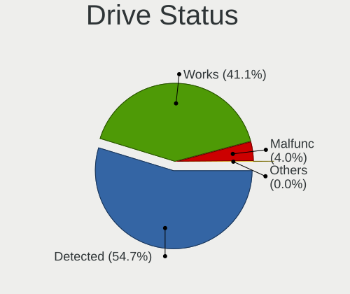

| Status   | Notebooks | Drives | Percent |
|----------|-----------|--------|---------|
| Detected | 5820      | 8650   | 54.71%  |
| Works    | 4376      | 5451   | 41.14%  |
| Malfunc  | 427       | 467    | 4.01%   |
| Failed   | 12        | 12     | 0.11%   |
| Fixed    | 1         | 1      | 0.01%   |
| Limited  | 1         | 1      | 0.01%   |

Storage controller
------------------

Storage Vendor
--------------

Storage controller vendors

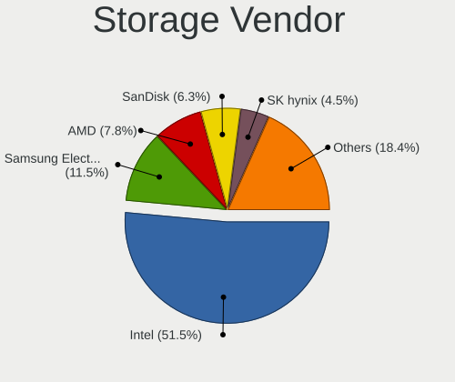

| Vendor                                  | Notebooks | Percent |
|-----------------------------------------|-----------|---------|
| Intel                                   | 6518      | 51.47%  |
| Samsung Electronics                     | 1451      | 11.46%  |
| AMD                                     | 991       | 7.83%   |
| SanDisk                                 | 801       | 6.33%   |
| SK hynix                                | 576       | 4.55%   |
| Micron Technology                       | 470       | 3.71%   |
| KIOXIA                                  | 292       | 2.31%   |
| Kingston Technology Company             | 287       | 2.27%   |
| Toshiba America Info Systems            | 214       | 1.69%   |
| Phison Electronics                      | 184       | 1.45%   |
| Micron/Crucial Technology               | 123       | 0.97%   |
| ADATA Technology                        | 116       | 0.92%   |
| Silicon Motion                          | 110       | 0.87%   |
| Apple                                   | 83        | 0.66%   |
| Nvidia                                  | 66        | 0.52%   |
| Solid State Storage Technology          | 62        | 0.49%   |
| MAXIO Technology (Hangzhou)             | 45        | 0.36%   |
| Union Memory (Shenzhen)                 | 44        | 0.35%   |
| Yangtze Memory Technologies             | 36        | 0.28%   |
| Shenzhen Longsys Electronics            | 32        | 0.25%   |
| Realtek Semiconductor                   | 27        | 0.21%   |
| Marvell Technology Group                | 27        | 0.21%   |
| Solidigm                                | 18        | 0.14%   |
| Lenovo                                  | 15        | 0.12%   |
| Lite-On Technology                      | 12        | 0.09%   |
| Seagate Technology                      | 7         | 0.06%   |
| Biwin Storage Technology                | 7         | 0.06%   |
| Shenzhen Unionmemory Information System | 6         | 0.05%   |
| ASMedia Technology                      | 6         | 0.05%   |
| Unknown                                 | 6         | 0.05%   |
| Ramaxel Technology(Shenzhen) Limited    | 4         | 0.03%   |
| Netac Technology                        | 4         | 0.03%   |
| Hosin Global Electronics                | 4         | 0.03%   |
| Transcend                               | 3         | 0.02%   |
| Silicon Integrated Systems [SiS]        | 3         | 0.02%   |
| Jiangsu Huacun Elec.                    | 3         | 0.02%   |
| INNOGRIT                                | 3         | 0.02%   |
| Shenzhen Shichuangyi Electronics        | 2         | 0.02%   |
| Zhaoxin                                 | 1         | 0.01%   |
| Silicon Image                           | 1         | 0.01%   |

Storage Model
-------------

Storage controller models

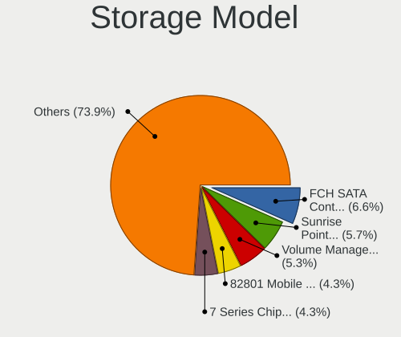

| Model                                                                          | Notebooks | Percent |
|--------------------------------------------------------------------------------|-----------|---------|
| AMD FCH SATA Controller [AHCI mode]                                            | 889       | 6.63%   |
| Intel Sunrise Point-LP SATA Controller [AHCI mode]                             | 765       | 5.71%   |
| Intel Volume Management Device NVMe RAID Controller                            | 706       | 5.27%   |
| Intel 82801 Mobile SATA Controller [RAID mode]                                 | 571       | 4.26%   |
| Intel 7 Series Chipset Family 6-port SATA Controller [AHCI mode]               | 570       | 4.25%   |
| Samsung NVMe SSD Controller SM981/PM981/PM983                                  | 449       | 3.35%   |
| Intel 6 Series/C200 Series Chipset Family 6 port Mobile SATA AHCI Controller   | 410       | 3.06%   |
| Samsung NVMe SSD Controller 980 (DRAM-less)                                    | 400       | 2.98%   |
| Intel 8 Series SATA Controller 1 [AHCI mode]                                   | 327       | 2.44%   |
| Samsung NVMe SSD Controller PM9A1/PM9A3/980PRO                                 | 324       | 2.42%   |
| Intel Tiger Lake-LP SATA Controller                                            | 256       | 1.91%   |
| SK hynix Gold P31/BC711/PC711 NVMe Solid State Drive                           | 252       | 1.88%   |
| Intel Wildcat Point-LP SATA Controller [AHCI Mode]                             | 252       | 1.88%   |
| Intel Cannon Lake Mobile PCH SATA AHCI Controller                              | 234       | 1.75%   |
| Intel 8 Series/C220 Series Chipset Family 6-port SATA Controller 1 [AHCI mode] | 231       | 1.72%   |
| Intel Comet Lake SATA AHCI Controller                                          | 203       | 1.51%   |
| Intel Celeron/Pentium Silver Processor SATA Controller                         | 202       | 1.51%   |
| Intel SSD 670p Series [Keystone Harbor]                                        | 189       | 1.41%   |
| KIOXIA NVMe SSD Controller BG4 (DRAM-less)                                     | 178       | 1.33%   |
| Intel 5 Series/3400 Series Chipset 4 port SATA AHCI Controller                 | 174       | 1.3%    |
| SanDisk Extreme Pro / WD Black SN750 / PC SN730 / Red SN700 NVMe SSD           | 159       | 1.19%   |
| Intel 82801IBM/IEM (ICH9M/ICH9M-E) 4 port SATA Controller [AHCI mode]          | 157       | 1.17%   |
| SanDisk Ultra 3D / WD PC SN530, IX SN530, Blue SN550 NVMe SSD (DRAM-less)      | 142       | 1.06%   |
| Intel Alder Lake-P SATA AHCI Controller                                        | 140       | 1.04%   |
| Micron 2450 NVMe SSD [HendrixV] (DRAM-less)                                    | 133       | 0.99%   |
| Intel SSD 660P Series                                                          | 124       | 0.92%   |
| Intel HM170/QM170 Chipset SATA Controller [AHCI Mode]                          | 123       | 0.92%   |
| Intel Cannon Point-LP SATA Controller [AHCI Mode]                              | 122       | 0.91%   |
| Intel RST Volume Management Device Controller                                  | 120       | 0.89%   |
| Intel 5 Series/3400 Series Chipset 6 port SATA AHCI Controller                 | 111       | 0.83%   |
| Intel 400 Series Chipset Family SATA AHCI Controller                           | 107       | 0.8%    |
| Samsung NVMe SSD Controller SM961/PM961/SM963                                  | 105       | 0.78%   |
| Toshiba America Info Systems XG6 NVMe SSD Controller                           | 99        | 0.74%   |
| Phison PS5013-E13 PCIe3 NVMe Controller (DRAM-less)                            | 98        | 0.73%   |
| Intel Ice Lake-LP SATA Controller [AHCI mode]                                  | 96        | 0.72%   |
| Intel Tiger Lake SATA AHCI Controller                                          | 95        | 0.71%   |
| Micron 3400 NVMe SSD [Hendrix]                                                 | 92        | 0.69%   |
| Intel 82801HM/HEM (ICH8M/ICH8M-E) IDE Controller                               | 90        | 0.67%   |
| Intel Atom Processor E3800 Series SATA AHCI Controller                         | 86        | 0.64%   |
| SanDisk WD SN560/SN740/SN770/SN5000 NVMe SSD                                   | 85        | 0.63%   |

Storage Kind
------------

Kind of storage controller (IDE, SATA, NVMe, SAS, ...)

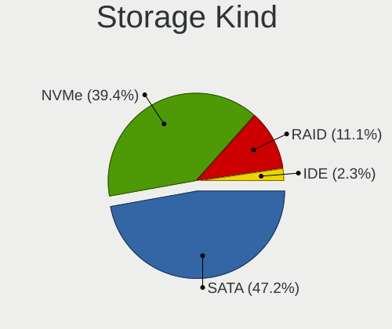

| Kind | Notebooks | Percent |
|------|-----------|---------|
| SATA | 6126      | 47.18%  |
| NVMe | 5118      | 39.41%  |
| RAID | 1439      | 11.08%  |
| IDE  | 302       | 2.33%   |

Processor
---------

CPU Vendor
----------

Processor vendors

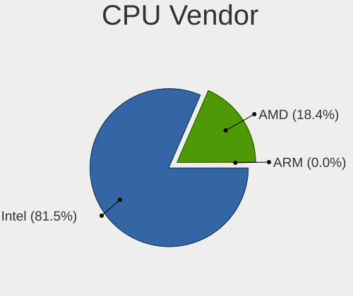

| Vendor       | Notebooks | Percent |
|--------------|-----------|---------|
| Intel        | 8310      | 81.53%  |
| AMD          | 1876      | 18.4%   |
| CentaurHauls | 4         | 0.04%   |
| Phytium      | 2         | 0.02%   |
| ARM          | 1         | 0.01%   |

CPU Model
---------

Processor models

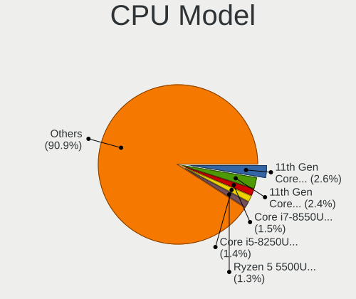

| Model                                         | Notebooks | Percent |
|-----------------------------------------------|-----------|---------|
| Intel 11th Gen Core i5-1135G7 @ 2.40GHz       | 263       | 2.58%   |
| Intel 11th Gen Core i7-1165G7 @ 2.80GHz       | 240       | 2.35%   |
| Intel Core i7-8550U CPU @ 1.80GHz             | 149       | 1.46%   |
| Intel Core i5-8250U CPU @ 1.60GHz             | 138       | 1.35%   |
| AMD Ryzen 5 5500U with Radeon Graphics        | 137       | 1.34%   |
| Intel Core i5-10210U CPU @ 1.60GHz            | 135       | 1.32%   |
| Intel 12th Gen Core i7-12700H                 | 122       | 1.2%    |
| Intel Core i7-10510U CPU @ 1.80GHz            | 118       | 1.16%   |
| Intel Core i5-7200U CPU @ 2.50GHz             | 116       | 1.14%   |
| Intel Core i5-8265U CPU @ 1.60GHz             | 109       | 1.07%   |
| Intel Core i5-6300U CPU @ 2.40GHz             | 106       | 1.04%   |
| Intel Core i5-6200U CPU @ 2.30GHz             | 106       | 1.04%   |
| Intel Celeron N4020 CPU @ 1.10GHz             | 104       | 1.02%   |
| Intel 11th Gen Core i7-11800H @ 2.30GHz       | 100       | 0.98%   |
| AMD Ryzen 7 5800H with Radeon Graphics        | 98        | 0.96%   |
| Intel Core i7-10750H CPU @ 2.60GHz            | 96        | 0.94%   |
| AMD Ryzen 7 5700U with Radeon Graphics        | 93        | 0.91%   |
| Intel Core i7-8565U CPU @ 1.80GHz             | 91        | 0.89%   |
| Intel Core i5-1035G1 CPU @ 1.00GHz            | 91        | 0.89%   |
| Intel Core i7-8750H CPU @ 2.20GHz             | 87        | 0.85%   |
| AMD Ryzen 5 3500U with Radeon Vega Mobile Gfx | 87        | 0.85%   |
| Intel Core i7-9750H CPU @ 2.60GHz             | 84        | 0.82%   |
| Intel 12th Gen Core i5-1235U                  | 81        | 0.79%   |
| Intel Core i7-7700HQ CPU @ 2.80GHz            | 79        | 0.77%   |
| Intel Core i5-3210M CPU @ 2.50GHz             | 79        | 0.77%   |
| Intel Core i5-5200U CPU @ 2.20GHz             | 77        | 0.76%   |
| Intel 12th Gen Core i7-1255U                  | 74        | 0.73%   |
| Intel 12th Gen Core i7-1260P                  | 70        | 0.69%   |
| Intel Core i7-8650U CPU @ 1.90GHz             | 67        | 0.66%   |
| Intel 11th Gen Core i3-1115G4 @ 3.00GHz       | 67        | 0.66%   |
| Intel Core i5-4210U CPU @ 1.70GHz             | 63        | 0.62%   |
| Intel 11th Gen Core i7-1185G7 @ 3.00GHz       | 62        | 0.61%   |
| Intel Core i7-7500U CPU @ 2.70GHz             | 60        | 0.59%   |
| Intel Core i5-2520M CPU @ 2.50GHz             | 60        | 0.59%   |
| Intel Celeron CPU N3350 @ 1.10GHz             | 59        | 0.58%   |
| Intel Core i5-3320M CPU @ 2.60GHz             | 55        | 0.54%   |
| AMD Ryzen 5 5600H with Radeon Graphics        | 55        | 0.54%   |
| Intel Core i5-5300U CPU @ 2.30GHz             | 54        | 0.53%   |
| AMD Ryzen 7 4800H with Radeon Graphics        | 54        | 0.53%   |
| Intel Core i5-8350U CPU @ 1.70GHz             | 53        | 0.52%   |

CPU Model Family
----------------

Processor model prefix

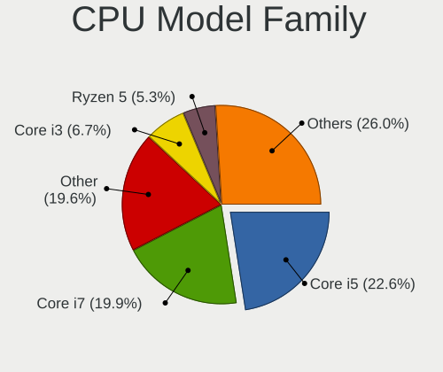

| Model                   | Notebooks | Percent |
|-------------------------|-----------|---------|
| Intel Core i5           | 2299      | 22.55%  |
| Intel Core i7           | 2025      | 19.86%  |
| Other                   | 1993      | 19.55%  |
| Intel Core i3           | 687       | 6.74%   |
| AMD Ryzen 5             | 540       | 5.3%    |
| Intel Celeron           | 530       | 5.2%    |
| AMD Ryzen 7             | 518       | 5.08%   |
| Intel Core 2 Duo        | 251       | 2.46%   |
| Intel Pentium           | 196       | 1.92%   |
| AMD Ryzen 9             | 100       | 0.98%   |
| AMD Ryzen 3             | 87        | 0.85%   |
| Intel Atom              | 86        | 0.84%   |
| AMD A6                  | 80        | 0.78%   |
| AMD Ryzen 7 PRO         | 77        | 0.76%   |
| AMD A8                  | 68        | 0.67%   |
| Intel Core              | 58        | 0.57%   |
| AMD A10                 | 53        | 0.52%   |
| AMD A4                  | 52        | 0.51%   |
| Intel Pentium Dual-Core | 43        | 0.42%   |
| Intel Core i9           | 43        | 0.42%   |
| AMD E2                  | 34        | 0.33%   |
| AMD Ryzen 5 PRO         | 29        | 0.28%   |
| Intel Pentium Silver    | 28        | 0.27%   |
| Intel Xeon              | 26        | 0.26%   |
| AMD E1                  | 26        | 0.26%   |
| Intel Pentium Dual      | 24        | 0.24%   |
| AMD Athlon              | 24        | 0.24%   |
| AMD E                   | 23        | 0.23%   |
| Intel Core 2            | 20        | 0.2%    |
| AMD Turion 64 X2 Mobile | 16        | 0.16%   |
| Intel Core M            | 13        | 0.13%   |
| Intel Core m3           | 12        | 0.12%   |
| AMD Athlon II           | 12        | 0.12%   |
| AMD A12                 | 11        | 0.11%   |
| Intel Genuine           | 10        | 0.1%    |
| AMD Phenom II           | 8         | 0.08%   |
| Intel Celeron Dual-Core | 7         | 0.07%   |
| Intel Core m5           | 6         | 0.06%   |
| AMD Ryzen 3 PRO         | 6         | 0.06%   |
| AMD FX                  | 6         | 0.06%   |

CPU Cores
---------

Number of processor cores

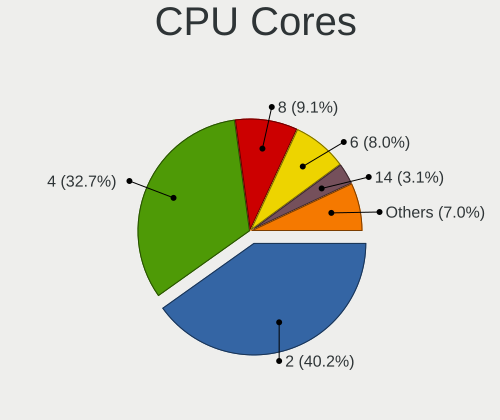

| Number | Notebooks | Percent |
|--------|-----------|---------|
| 2      | 4094      | 40.16%  |
| 4      | 3333      | 32.7%   |
| 8      | 923       | 9.05%   |
| 6      | 816       | 8%      |
| 14     | 317       | 3.11%   |
| 10     | 305       | 2.99%   |
| 12     | 216       | 2.12%   |
| 16     | 67        | 0.66%   |
| 1      | 62        | 0.61%   |
| 24     | 41        | 0.4%    |
| 5      | 8         | 0.08%   |
| 20     | 6         | 0.06%   |
| 3      | 5         | 0.05%   |
| 11     | 1         | 0.01%   |

CPU Sockets
-----------

Number of sockets

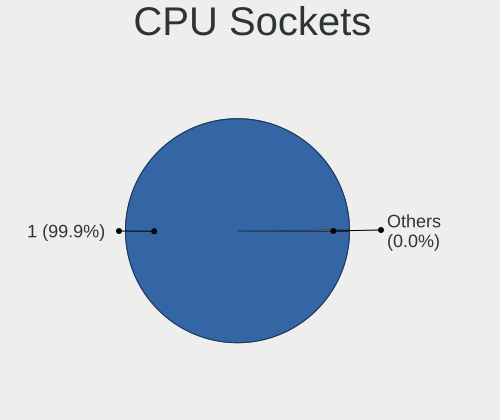

| Number | Notebooks | Percent |
|--------|-----------|---------|
| 1      | 10184     | 99.91%  |
| 16     | 4         | 0.04%   |
| 24     | 1         | 0.01%   |
| 14     | 1         | 0.01%   |
| 11     | 1         | 0.01%   |
| 8      | 1         | 0.01%   |
| 2      | 1         | 0.01%   |

CPU Threads
-----------

Threads per core (Hyper-Threading)

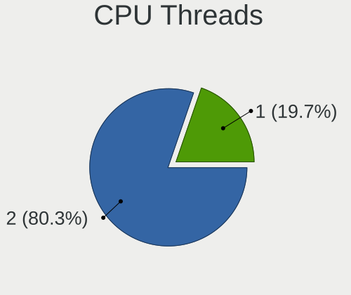

| Number | Notebooks | Percent |
|--------|-----------|---------|
| 2      | 8191      | 80.27%  |
| 1      | 2013      | 19.73%  |

CPU Op-Modes
------------

CPU Operation Modes (32-bit, 64-bit)

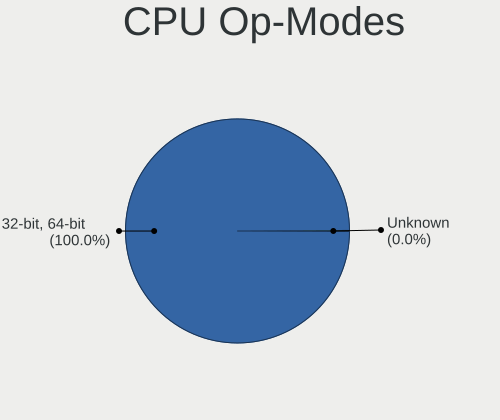

| Op mode        | Notebooks | Percent |
|----------------|-----------|---------|
| 32-bit, 64-bit | 10192     | 99.99%  |
| Unknown        | 1         | 0.01%   |

CPU Microcode
-------------

Microcode number

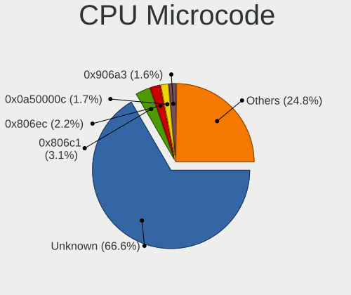

| Number     | Notebooks | Percent |
|------------|-----------|---------|
| Unknown    | 6939      | 66.61%  |
| 0x806c1    | 326       | 3.13%   |
| 0x806ec    | 229       | 2.2%    |
| 0x0a50000c | 172       | 1.65%   |
| 0x906a3    | 166       | 1.59%   |
| 0x806ea    | 160       | 1.54%   |
| 0x306a9    | 148       | 1.42%   |
| 0x08608103 | 130       | 1.25%   |
| 0x206a7    | 117       | 1.12%   |
| 0x906ea    | 99        | 0.95%   |
| 0x406e3    | 94        | 0.9%    |
| 0x40651    | 94        | 0.9%    |
| 0x306d4    | 89        | 0.85%   |
| 0xa0652    | 88        | 0.84%   |
| 0x806d1    | 86        | 0.83%   |
| 0x806e9    | 82        | 0.79%   |
| 0x08600106 | 80        | 0.77%   |
| 0x0a50000d | 76        | 0.73%   |
| 0x706e5    | 75        | 0.72%   |
| 0x08108109 | 75        | 0.72%   |
| 0x306c3    | 66        | 0.63%   |
| 0x706a8    | 64        | 0.61%   |
| 0x906a4    | 61        | 0.59%   |
| 0x20655    | 44        | 0.42%   |
| 0x0a404102 | 44        | 0.42%   |
| 0x906e9    | 36        | 0.35%   |
| 0x506e3    | 33        | 0.32%   |
| 0x806eb    | 30        | 0.29%   |
| 0x08108102 | 30        | 0.29%   |
| 0x1067a    | 29        | 0.28%   |
| 0x08600104 | 29        | 0.28%   |
| 0x30678    | 28        | 0.27%   |
| 0x06006705 | 28        | 0.27%   |
| 0x906ed    | 25        | 0.24%   |
| 0x506c9    | 25        | 0.24%   |
| 0x706a1    | 22        | 0.21%   |
| 0x08608102 | 22        | 0.21%   |
| 0xb06a2    | 19        | 0.18%   |
| 0x0a704103 | 19        | 0.18%   |
| 0x806c2    | 18        | 0.17%   |

CPU Microarch
-------------

Microarchitecture

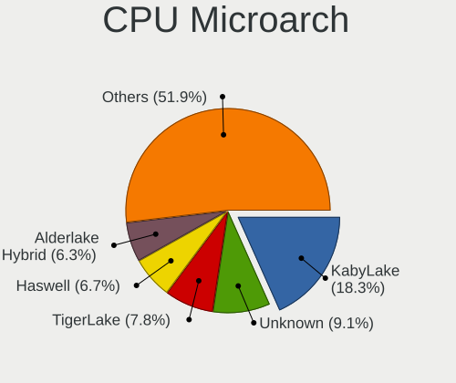

| Name               | Notebooks | Percent |
|--------------------|-----------|---------|
| KabyLake           | 1871      | 18.31%  |
| Unknown            | 928       | 9.08%   |
| TigerLake          | 796       | 7.79%   |
| Haswell            | 683       | 6.68%   |
| Alderlake Hybrid   | 641       | 6.27%   |
| IvyBridge          | 592       | 5.79%   |
| SandyBridge        | 556       | 5.44%   |
| Skylake            | 519       | 5.08%   |
| Zen 3              | 421       | 4.12%   |
| IceLake            | 340       | 3.33%   |
| Broadwell          | 321       | 3.14%   |
| Westmere           | 296       | 2.9%    |
| Silvermont         | 254       | 2.49%   |
| Penryn             | 241       | 2.36%   |
| CometLake          | 235       | 2.3%    |
| Goldmont plus      | 229       | 2.24%   |
| Zen 2              | 227       | 2.22%   |
| Zen+               | 220       | 2.15%   |
| Excavator          | 149       | 1.46%   |
| Core               | 128       | 1.25%   |
| Goldmont           | 94        | 0.92%   |
| Puma               | 76        | 0.74%   |
| Zen                | 54        | 0.53%   |
| Piledriver         | 54        | 0.53%   |
| Bobcat             | 48        | 0.47%   |
| K10                | 37        | 0.36%   |
| Jaguar             | 35        | 0.34%   |
| Meteorlake Hybrid  | 30        | 0.29%   |
| K8 Hammer          | 27        | 0.26%   |
| Nehalem            | 25        | 0.24%   |
| K10 Llano          | 25        | 0.24%   |
| Steamroller        | 18        | 0.18%   |
| K8 & K10 hybrid    | 17        | 0.17%   |
| Tremont            | 16        | 0.16%   |
| Bonnell            | 10        | 0.1%    |
| Gracemont          | 5         | 0.05%   |
| ArrowLake-H Hybrid | 1         | 0.01%   |

Graphics
--------

GPU Vendor
----------

Vendors of graphics cards

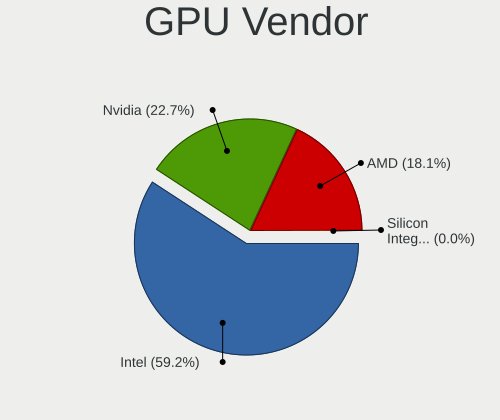

| Vendor                           | Notebooks | Percent |
|----------------------------------|-----------|---------|
| Intel                            | 7770      | 59.21%  |
| Nvidia                           | 2975      | 22.67%  |
| AMD                              | 2373      | 18.08%  |
| Zhaoxin                          | 4         | 0.03%   |
| Silicon Integrated Systems [SiS] | 1         | 0.01%   |

GPU Model
---------

Graphics card models

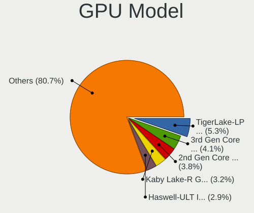

| Model                                                                                    | Notebooks | Percent |
|------------------------------------------------------------------------------------------|-----------|---------|
| Intel TigerLake-LP GT2 [Iris Xe Graphics]                                                | 713       | 5.35%   |
| Intel 3rd Gen Core processor Graphics Controller                                         | 549       | 4.12%   |
| Intel 2nd Generation Core Processor Family Integrated Graphics Controller                | 503       | 3.77%   |
| Intel Kaby Lake-R GT2 [UHD Graphics 620]                                                 | 426       | 3.19%   |
| Intel Haswell-ULT Integrated Graphics Controller                                         | 385       | 2.89%   |
| Intel Skylake-U GT2 [HD Graphics 520]                                                    | 346       | 2.59%   |
| Intel CometLake-U GT2 [UHD Graphics]                                                     | 343       | 2.57%   |
| Intel Alder Lake-P GT2 [Iris Xe Graphics]                                                | 326       | 2.44%   |
| Intel Kaby Lake-U GT2 [HD Graphics 620]                                                  | 279       | 2.09%   |
| Intel CoffeeLake-H GT2 [UHD Graphics 630]                                                | 277       | 2.08%   |
| Intel WhiskeyLake-U GT2 [UHD Graphics 620]                                               | 276       | 2.07%   |
| AMD Cezanne [Radeon Vega Series / Radeon Vega Mobile Series]                             | 270       | 2.02%   |
| Intel Broadwell-U GT2 [HD Graphics 5500]                                                 | 257       | 1.93%   |
| AMD Lucienne                                                                             | 250       | 1.87%   |
| Intel 4th Gen Core Processor Integrated Graphics Controller                              | 248       | 1.86%   |
| AMD Picasso/Raven 2 [Radeon Vega Series / Radeon Vega Mobile Series]                     | 231       | 1.73%   |
| AMD Renoir [Radeon Vega Series / Radeon Vega Mobile Series]                              | 215       | 1.61%   |
| Intel GeminiLake [UHD Graphics 600]                                                      | 206       | 1.54%   |
| Intel Raptor Lake-P [Iris Xe Graphics]                                                   | 200       | 1.5%    |
| Intel CometLake-H GT2 [UHD Graphics]                                                     | 199       | 1.49%   |
| Intel TigerLake-H GT1 [UHD Graphics]                                                     | 194       | 1.45%   |
| Intel Core Processor Integrated Graphics Controller                                      | 194       | 1.45%   |
| Nvidia TU117M [GeForce GTX 1650 Mobile / Max-Q]                                          | 188       | 1.41%   |
| Nvidia GA106M [GeForce RTX 3060 Mobile / Max-Q]                                          | 176       | 1.32%   |
| Intel Alder Lake-UP3 GT2 [Iris Xe Graphics]                                              | 140       | 1.05%   |
| Intel Iris Plus Graphics G1 (Ice Lake)                                                   | 138       | 1.03%   |
| Nvidia GA107M [GeForce RTX 3050 Mobile]                                                  | 136       | 1.02%   |
| Intel Atom/Celeron/Pentium Processor x5-E8000/J3xxx/N3xxx Integrated Graphics Controller | 134       | 1%      |
| AMD Barcelo                                                                              | 133       | 1%      |
| Intel Atom Processor Z36xxx/Z37xxx Series Graphics & Display                             | 120       | 0.9%    |
| Intel Mobile 4 Series Chipset Integrated Graphics Controller                             | 116       | 0.87%   |
| AMD Stoney [Radeon R2/R3/R4/R5 Graphics]                                                 | 104       | 0.78%   |
| AMD Rembrandt [Radeon 680M]                                                              | 103       | 0.77%   |
| Intel Kaby Lake-H GT2 [HD Graphics 630]                                                  | 102       | 0.76%   |
| Nvidia GA107M [GeForce RTX 3050 Ti Mobile]                                               | 96        | 0.72%   |
| Intel Skylake-H GT2 [HD Graphics 530]                                                    | 96        | 0.72%   |
| Intel Apollo Lake GT1 [HD Graphics 500]                                                  | 83        | 0.62%   |
| Nvidia GP107M [GeForce GTX 1050 Mobile]                                                  | 81        | 0.61%   |
| Nvidia GF117M [GeForce 610M/710M/810M/820M / GT 620M/625M/630M/720M]                     | 81        | 0.61%   |
| Intel Tiger Lake-LP GT2 [UHD Graphics G4]                                                | 79        | 0.59%   |

GPU Combo
---------

Combinations of graphics cards

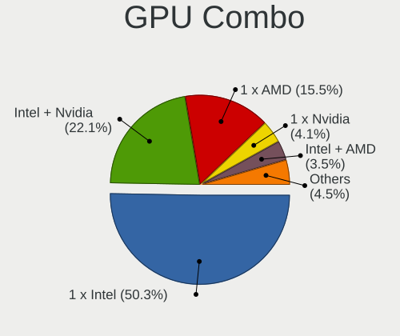

| Name                     | Notebooks | Percent |
|--------------------------|-----------|---------|
| 1 x Intel                | 5130      | 50.28%  |
| Intel + Nvidia           | 2251      | 22.06%  |
| 1 x AMD                  | 1585      | 15.54%  |
| 1 x Nvidia               | 417       | 4.09%   |
| Intel + AMD              | 359       | 3.52%   |
| AMD + Nvidia             | 305       | 2.99%   |
| 2 x AMD                  | 122       | 1.2%    |
| Other                    | 21        | 0.21%   |
| 2 x Nvidia               | 5         | 0.05%   |
| 1 x Zhaoxin              | 4         | 0.04%   |
| 2 x Intel                | 1         | 0.01%   |
| 1 x SiS                  | 1         | 0.01%   |
| Intel + AMD + 1 x Nvidia | 1         | 0.01%   |

GPU Driver
----------

Free vs proprietary

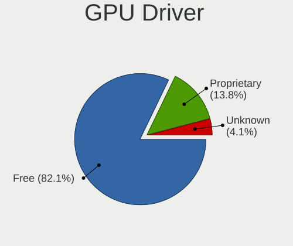

| Driver      | Notebooks | Percent |
|-------------|-----------|---------|
| Free        | 8454      | 82.15%  |
| Proprietary | 1416      | 13.76%  |
| Unknown     | 421       | 4.09%   |

GPU Memory
----------

Total video memory

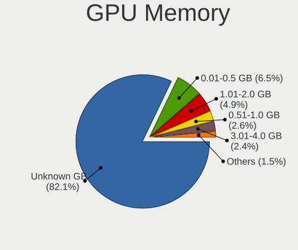

| Size in GB | Notebooks | Percent |
|------------|-----------|---------|
| Unknown    | 8455      | 82.12%  |
| 0.01-0.5   | 667       | 6.48%   |
| 1.01-2.0   | 501       | 4.87%   |
| 0.51-1.0   | 265       | 2.57%   |
| 3.01-4.0   | 251       | 2.44%   |
| 5.01-6.0   | 78        | 0.76%   |
| 7.01-8.0   | 53        | 0.51%   |
| 8.01-16.0  | 14        | 0.14%   |
| 2.01-3.0   | 12        | 0.12%   |

Monitor
-------

Monitor Vendor
--------------

Monitor vendors

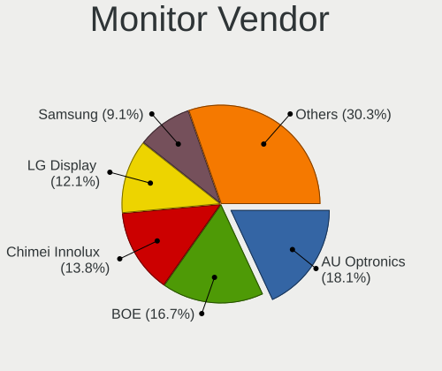

| Vendor                  | Notebooks | Percent |
|-------------------------|-----------|---------|
| AU Optronics            | 2185      | 18.06%  |
| BOE                     | 2019      | 16.69%  |
| Chimei Innolux          | 1669      | 13.8%   |
| LG Display              | 1462      | 12.09%  |
| Samsung Electronics     | 1095      | 9.05%   |
| Dell                    | 396       | 3.27%   |
| Sharp                   | 330       | 2.73%   |
| Apple                   | 317       | 2.62%   |
| Goldstar                | 278       | 2.3%    |
| PANDA                   | 208       | 1.72%   |
| Lenovo                  | 193       | 1.6%    |
| Chi Mei Optoelectronics | 184       | 1.52%   |
| Hewlett-Packard         | 175       | 1.45%   |
| Acer                    | 122       | 1.01%   |
| InfoVision              | 121       | 1%      |
| AOC                     | 111       | 0.92%   |
| CSO                     | 110       | 0.91%   |
| Philips                 | 106       | 0.88%   |
| BenQ                    | 87        | 0.72%   |
| Iiyama                  | 78        | 0.64%   |
| Ancor Communications    | 69        | 0.57%   |
| ASUSTek Computer        | 61        | 0.5%    |
| LG Philips              | 50        | 0.41%   |
| Sony                    | 49        | 0.41%   |
| ViewSonic               | 42        | 0.35%   |
| TMX                     | 40        | 0.33%   |
| MSI                     | 25        | 0.21%   |
| Mi                      | 25        | 0.21%   |
| Toshiba                 | 24        | 0.2%    |
| Panasonic               | 23        | 0.19%   |
| CPT                     | 21        | 0.17%   |
| HKC                     | 20        | 0.17%   |
| Sceptre Tech            | 15        | 0.12%   |
| HannStar                | 14        | 0.12%   |
| KDC                     | 13        | 0.11%   |
| Fujitsu Siemens         | 13        | 0.11%   |
| Vizio                   | 12        | 0.1%    |
| Eizo                    | 12        | 0.1%    |
| Vestel Elektronik       | 11        | 0.09%   |
| SLD                     | 11        | 0.09%   |

Monitor Model
-------------

Monitor models

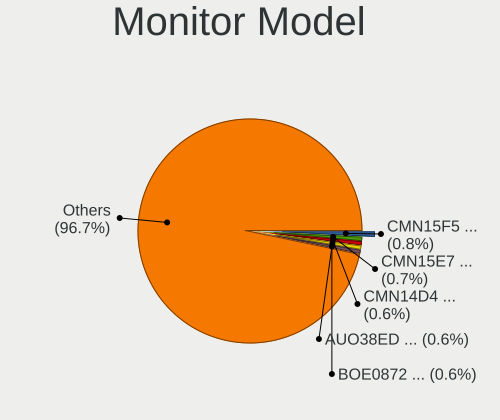

| Model                                                                    | Notebooks | Percent |
|--------------------------------------------------------------------------|-----------|---------|
| Chimei Innolux LCD Monitor CMN15F5 1920x1080 344x193mm 15.5-inch         | 98        | 0.8%    |
| Chimei Innolux LCD Monitor CMN15E7 1920x1080 344x193mm 15.5-inch         | 80        | 0.65%   |
| Chimei Innolux LCD Monitor CMN14D4 1920x1080 309x173mm 13.9-inch         | 76        | 0.62%   |
| AU Optronics LCD Monitor AUO38ED 1920x1080 344x193mm 15.5-inch           | 75        | 0.61%   |
| BOE LCD Monitor BOE0872 1920x1080 344x194mm 15.5-inch                    | 74        | 0.6%    |
| AU Optronics LCD Monitor AUO21ED 1920x1080 344x193mm 15.5-inch           | 59        | 0.48%   |
| Samsung Electronics LCD Monitor SEC5441 1280x800 331x207mm 15.4-inch     | 52        | 0.42%   |
| Chimei Innolux LCD Monitor CMN1521 1920x1080 344x193mm 15.5-inch         | 50        | 0.41%   |
| PANDA LCD Monitor NCP004D 1920x1080 344x194mm 15.5-inch                  | 49        | 0.4%    |
| LG Display LCD Monitor LGD02DC 1366x768 344x194mm 15.5-inch              | 48        | 0.39%   |
| Chimei Innolux LCD Monitor CMN15DB 1366x768 344x193mm 15.5-inch          | 48        | 0.39%   |
| AU Optronics LCD Monitor AUO403D 1920x1080 309x174mm 14.0-inch           | 44        | 0.36%   |
| Chimei Innolux LCD Monitor CMN15E6 1366x768 344x193mm 15.5-inch          | 43        | 0.35%   |
| BOE LCD Monitor BOE0877 1920x1080 309x173mm 13.9-inch                    | 43        | 0.35%   |
| Samsung Electronics LCD Monitor SDC4161 1920x1080 344x194mm 15.5-inch    | 40        | 0.33%   |
| AU Optronics LCD Monitor AUO61ED 1920x1080 344x194mm 15.5-inch           | 40        | 0.33%   |
| AU Optronics LCD Monitor AUO26EC 1366x768 344x193mm 15.5-inch            | 40        | 0.33%   |
| AU Optronics LCD Monitor AUOAF90 1920x1080 344x193mm 15.5-inch           | 37        | 0.3%    |
| BOE LCD Monitor BOE0812 1920x1080 344x194mm 15.5-inch                    | 36        | 0.29%   |
| Samsung Electronics LCD Monitor SDC4171 2880x1800 302x189mm 14.0-inch    | 35        | 0.29%   |
| LG Display LCD Monitor LGD033A 1366x768 344x194mm 15.5-inch              | 35        | 0.29%   |
| AU Optronics LCD Monitor AUO71EC 1366x768 344x193mm 15.5-inch            | 35        | 0.29%   |
| AU Optronics LCD Monitor AUO22EC 1366x768 344x193mm 15.5-inch            | 35        | 0.29%   |
| Chimei Innolux LCD Monitor CMN15E8 1920x1080 344x193mm 15.5-inch         | 34        | 0.28%   |
| Lenovo LCD Monitor LEN40BA 1920x1080 344x194mm 15.5-inch                 | 31        | 0.25%   |
| BOE LCD Monitor BOE0893 2160x1440 296x197mm 14.0-inch                    | 31        | 0.25%   |
| Chi Mei Optoelectronics LCD Monitor CMO15A7 1366x768 344x193mm 15.5-inch | 30        | 0.24%   |
| Chimei Innolux LCD Monitor CMN14E5 1920x1080 309x173mm 13.9-inch         | 29        | 0.24%   |
| Chimei Innolux LCD Monitor CMN14D5 1920x1080 309x173mm 13.9-inch         | 29        | 0.24%   |
| BOE LCD Monitor BOE06A4 1366x768 344x194mm 15.5-inch                     | 29        | 0.24%   |
| AU Optronics LCD Monitor AUOE48D 1920x1080 344x194mm 15.5-inch           | 28        | 0.23%   |
| AU Optronics LCD Monitor AUO10EC 1366x768 344x193mm 15.5-inch            | 28        | 0.23%   |
| AU Optronics LCD Monitor AUO20EC 1366x768 344x193mm 15.5-inch            | 27        | 0.22%   |
| LG Display LCD Monitor LGD05E5 1920x1080 344x194mm 15.5-inch             | 26        | 0.21%   |
| Chimei Innolux LCD Monitor CMN15C4 1920x1080 344x193mm 15.5-inch         | 26        | 0.21%   |
| Chimei Innolux LCD Monitor CMN14C9 1920x1080 309x173mm 13.9-inch         | 26        | 0.21%   |
| Chimei Innolux LCD Monitor CMN140A 1920x1080 309x173mm 13.9-inch         | 26        | 0.21%   |
| AU Optronics LCD Monitor AUO45EC 1366x768 344x193mm 15.5-inch            | 26        | 0.21%   |
| AU Optronics LCD Monitor AUO2E3C 1366x768 309x173mm 13.9-inch            | 26        | 0.21%   |
| Goldstar FULL HD GSM5B55 1920x1080 480x270mm 21.7-inch                   | 25        | 0.2%    |

Monitor Resolution
------------------

Monitor screen resolution

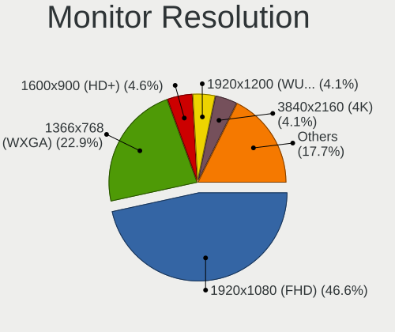

| Resolution         | Notebooks | Percent |
|--------------------|-----------|---------|
| 1920x1080 (FHD)    | 5245      | 46.59%  |
| 1366x768 (WXGA)    | 2575      | 22.87%  |
| 1600x900 (HD+)     | 522       | 4.64%   |
| 1920x1200 (WUXGA)  | 466       | 4.14%   |
| 3840x2160 (4K)     | 460       | 4.09%   |
| 2560x1440 (QHD)    | 400       | 3.55%   |
| 2560x1600          | 268       | 2.38%   |
| 1280x800 (WXGA)    | 227       | 2.02%   |
| 2880x1800          | 162       | 1.44%   |
| 1440x900 (WXGA+)   | 129       | 1.15%   |
| 1680x1050 (WSXGA+) | 99        | 0.88%   |
| 3840x2400          | 93        | 0.83%   |
| 3440x1440          | 80        | 0.71%   |
| 2560x1080          | 75        | 0.67%   |
| 2160x1440          | 56        | 0.5%    |
| 1280x1024 (SXGA)   | 42        | 0.37%   |
| 2256x1504          | 28        | 0.25%   |
| 3200x2000          | 27        | 0.24%   |
| 3200x1800 (QHD+)   | 26        | 0.23%   |
| 1360x768           | 22        | 0.2%    |
| 1920x540           | 20        | 0.18%   |
| 2880x1620          | 19        | 0.17%   |
| 2520x1680          | 18        | 0.16%   |
| 2240x1400          | 18        | 0.16%   |
| 3840x1080          | 16        | 0.14%   |
| 3072x1920          | 15        | 0.13%   |
| 1920x1280          | 15        | 0.13%   |
| 3000x2000          | 13        | 0.12%   |
| 3456x2160          | 12        | 0.11%   |
| 1024x600           | 10        | 0.09%   |
| 2304x1440          | 9         | 0.08%   |
| Unknown            | 9         | 0.08%   |
| 1680x945           | 8         | 0.07%   |
| 2288x1287          | 7         | 0.06%   |
| 1024x768 (XGA)     | 7         | 0.06%   |
| 1280x720 (HD)      | 6         | 0.05%   |
| 3840x1600          | 5         | 0.04%   |
| 1600x2560          | 5         | 0.04%   |
| 1600x1200          | 4         | 0.04%   |
| 3840x1100          | 3         | 0.03%   |

Monitor Diagonal
----------------

Diagonal size in inches

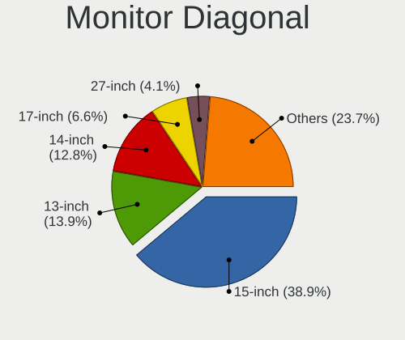

| Inches  | Notebooks | Percent |
|---------|-----------|---------|
| 15      | 4705      | 38.9%   |
| 13      | 1683      | 13.92%  |
| 14      | 1552      | 12.83%  |
| 17      | 798       | 6.6%    |
| 27      | 490       | 4.05%   |
| 24      | 482       | 3.99%   |
| 16      | 417       | 3.45%   |
| 23      | 309       | 2.55%   |
| 21      | 279       | 2.31%   |
| 12      | 213       | 1.76%   |
| 11      | 176       | 1.46%   |
| 31      | 167       | 1.38%   |
| 34      | 123       | 1.02%   |
| 18      | 85        | 0.7%    |
| Unknown | 71        | 0.59%   |
| 22      | 58        | 0.48%   |
| 20      | 50        | 0.41%   |
| 19      | 50        | 0.41%   |
| 40      | 40        | 0.33%   |
| 54      | 34        | 0.28%   |
| 84      | 31        | 0.26%   |
| 10      | 31        | 0.26%   |
| 72      | 30        | 0.25%   |
| 32      | 27        | 0.22%   |
| 63      | 25        | 0.21%   |
| 28      | 21        | 0.17%   |
| 26      | 15        | 0.12%   |
| 25      | 14        | 0.12%   |
| 48      | 13        | 0.11%   |
| 86      | 10        | 0.08%   |
| 52      | 8         | 0.07%   |
| 37      | 8         | 0.07%   |
| 49      | 7         | 0.06%   |
| 43      | 7         | 0.06%   |
| 74      | 6         | 0.05%   |
| 65      | 6         | 0.05%   |
| 29      | 6         | 0.05%   |
| 142     | 5         | 0.04%   |
| 46      | 5         | 0.04%   |
| 47      | 4         | 0.03%   |

Monitor Width
-------------

Physical width

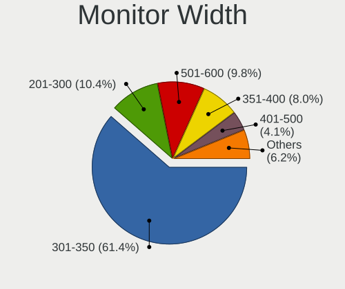

| Width in mm    | Notebooks | Percent |
|----------------|-----------|---------|
| 301-350        | 7365      | 61.45%  |
| 201-300        | 1252      | 10.45%  |
| 501-600        | 1177      | 9.82%   |
| 351-400        | 959       | 8%      |
| 401-500        | 494       | 4.12%   |
| 601-700        | 246       | 2.05%   |
| 701-800        | 152       | 1.27%   |
| 1001-1500      | 119       | 0.99%   |
| Unknown        | 71        | 0.59%   |
| 1501-2000      | 69        | 0.58%   |
| 801-900        | 59        | 0.49%   |
| 901-1000       | 12        | 0.1%    |
| More than 2000 | 5         | 0.04%   |
| 101-200        | 4         | 0.03%   |
| 1-100          | 2         | 0.02%   |

Aspect Ratio
------------

Proportional relationship between the width and the height

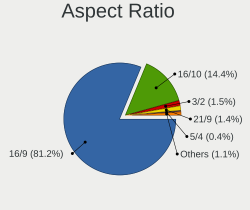

| Ratio   | Notebooks | Percent |
|---------|-----------|---------|
| 16/9    | 8520      | 81.24%  |
| 16/10   | 1513      | 14.43%  |
| 3/2     | 158       | 1.51%   |
| 21/9    | 146       | 1.39%   |
| 5/4     | 38        | 0.36%   |
| Unknown | 35        | 0.33%   |
| 4/3     | 22        | 0.21%   |
| 32/9    | 21        | 0.2%    |
| 0.56    | 10        | 0.1%    |
| 1.00    | 5         | 0.05%   |
| 0.62    | 4         | 0.04%   |
| 6/5     | 3         | 0.03%   |
| 3.73    | 3         | 0.03%   |
| 3.40    | 3         | 0.03%   |
| 3.33    | 1         | 0.01%   |
| 3.20    | 1         | 0.01%   |
| 2.12    | 1         | 0.01%   |
| 2.00    | 1         | 0.01%   |
| 1.96    | 1         | 0.01%   |
| 0.89    | 1         | 0.01%   |
| 0.67    | 1         | 0.01%   |

Monitor Area
------------

Area in inch²

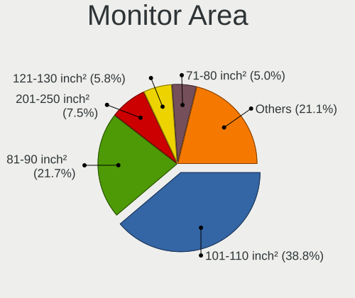

| Area in inch² | Notebooks | Percent |
|----------------|-----------|---------|
| 101-110        | 4677      | 38.8%   |
| 81-90          | 2616      | 21.7%   |
| 201-250        | 908       | 7.53%   |
| 121-130        | 702       | 5.82%   |
| 71-80          | 604       | 5.01%   |
| 301-350        | 502       | 4.16%   |
| 111-120        | 409       | 3.39%   |
| 351-500        | 336       | 2.79%   |
| 61-70          | 196       | 1.63%   |
| 51-60          | 179       | 1.48%   |
| More than 1000 | 165       | 1.37%   |
| 151-200        | 161       | 1.34%   |
| 251-300        | 154       | 1.28%   |
| 141-150        | 99        | 0.82%   |
| 501-1000       | 93        | 0.77%   |
| 131-140        | 88        | 0.73%   |
| Unknown        | 71        | 0.59%   |
| 91-100         | 58        | 0.48%   |
| 41-50          | 32        | 0.27%   |
| 1-40           | 5         | 0.04%   |

Pixel Density
-------------

Pixels per inch

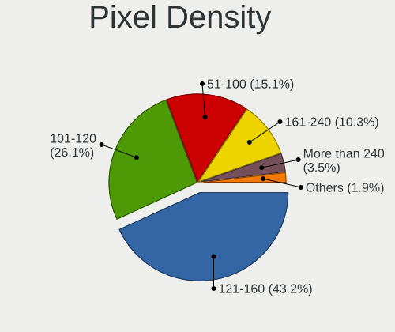

| Density       | Notebooks | Percent |
|---------------|-----------|---------|
| 121-160       | 5095      | 43.15%  |
| 101-120       | 3084      | 26.12%  |
| 51-100        | 1783      | 15.1%   |
| 161-240       | 1211      | 10.26%  |
| More than 240 | 412       | 3.49%   |
| 1-50          | 151       | 1.28%   |
| Unknown       | 71        | 0.6%    |

Multiple Monitors
-----------------

Total monitors connected

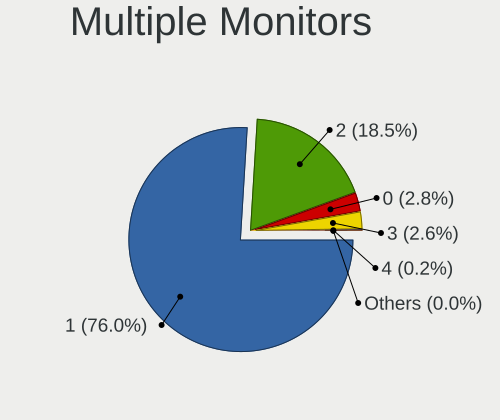

| Total | Notebooks | Percent |
|-------|-----------|---------|
| 1     | 7901      | 75.96%  |
| 2     | 1921      | 18.47%  |
| 0     | 287       | 2.76%   |
| 3     | 266       | 2.56%   |
| 4     | 22        | 0.21%   |
| 5     | 3         | 0.03%   |
| 6     | 1         | 0.01%   |

Network
-------

Net Controller Vendor
---------------------

Controller vendors

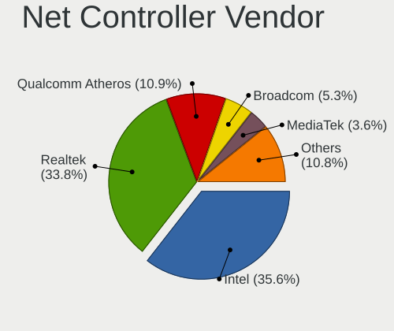

| Vendor                            | Notebooks | Percent |
|-----------------------------------|-----------|---------|
| Intel                             | 5663      | 35.56%  |
| Realtek Semiconductor             | 5381      | 33.79%  |
| Qualcomm Atheros                  | 1740      | 10.93%  |
| Broadcom                          | 843       | 5.29%   |
| MediaTek                          | 575       | 3.61%   |
| Broadcom Limited                  | 199       | 1.25%   |
| ASIX Electronics                  | 148       | 0.93%   |
| TP-Link                           | 118       | 0.74%   |
| Ralink                            | 108       | 0.68%   |
| Marvell Technology Group          | 98        | 0.62%   |
| Shenzhen Goodix Technology        | 93        | 0.58%   |
| DisplayLink                       | 75        | 0.47%   |
| Samsung Electronics               | 72        | 0.45%   |
| Dell                              | 64        | 0.4%    |
| Qualcomm                          | 60        | 0.38%   |
| Sierra Wireless                   | 56        | 0.35%   |
| Ralink Technology                 | 54        | 0.34%   |
| Lenovo                            | 49        | 0.31%   |
| Nvidia                            | 48        | 0.3%    |
| Xiaomi                            | 47        | 0.3%    |
| Ericsson Business Mobile Networks | 39        | 0.24%   |
| Hewlett-Packard                   | 36        | 0.23%   |
| NetGear                           | 29        | 0.18%   |
| Apple                             | 26        | 0.16%   |
| OPPO Electronics                  | 25        | 0.16%   |
| JMicron Technology                | 25        | 0.16%   |
| Huawei Technologies               | 22        | 0.14%   |
| ICS Advent                        | 20        | 0.13%   |
| Google                            | 20        | 0.13%   |
| D-Link                            | 15        | 0.09%   |
| Qualcomm Atheros Communications   | 13        | 0.08%   |
| Motorola PCS                      | 13        | 0.08%   |
| Fibocom                           | 12        | 0.08%   |
| U-Blox                            | 11        | 0.07%   |
| Edimax Technology                 | 10        | 0.06%   |
| Arduino SA                        | 7         | 0.04%   |
| Toshiba                           | 5         | 0.03%   |
| Qualcomm Technologies             | 5         | 0.03%   |
| D-Link System                     | 5         | 0.03%   |
| ASUSTek Computer                  | 5         | 0.03%   |

Net Controller Model
--------------------

Controller models

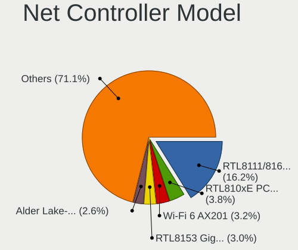

| Model                                                                  | Notebooks | Percent |
|------------------------------------------------------------------------|-----------|---------|
| Realtek RTL8111/8168/8211/8411 PCI Express Gigabit Ethernet Controller | 3078      | 16.17%  |
| Realtek RTL810xE PCI Express Fast Ethernet controller                  | 729       | 3.83%   |
| Intel Wi-Fi 6 AX201                                                    | 618       | 3.25%   |
| Realtek RTL8153 Gigabit Ethernet Adapter                               | 578       | 3.04%   |
| Intel Alder Lake-P PCH CNVi WiFi                                       | 493       | 2.59%   |
| Intel Wireless 8265 / 8275                                             | 437       | 2.3%    |
| Intel Wi-Fi 6 AX200                                                    | 378       | 1.99%   |
| Realtek RTL8821CE 802.11ac PCIe Wireless Network Adapter               | 341       | 1.79%   |
| Qualcomm Atheros QCA9377 802.11ac Wireless Network Adapter             | 322       | 1.69%   |
| Realtek RTL8822CE 802.11ac PCIe Wireless Network Adapter               | 321       | 1.69%   |
| Qualcomm Atheros QCA9565 / AR9565 Wireless Network Adapter             | 311       | 1.63%   |
| MediaTek MT7921 802.11ax PCIe Wireless Network Adapter [Filogic 330]   | 304       | 1.6%    |
| Intel Comet Lake PCH-LP CNVi WiFi                                      | 284       | 1.49%   |
| Intel Wireless 7265                                                    | 278       | 1.46%   |
| Intel 82579LM Gigabit Network Connection (Lewisville)                  | 275       | 1.44%   |
| Intel Wireless 8260                                                    | 258       | 1.35%   |
| Intel Wireless 7260                                                    | 247       | 1.3%    |
| Qualcomm Atheros AR9485 Wireless Network Adapter                       | 237       | 1.24%   |
| Qualcomm Atheros QCA6174 802.11ac Wireless Network Adapter             | 228       | 1.2%    |
| Intel Ethernet Connection (4) I219-LM                                  | 202       | 1.06%   |
| Qualcomm Atheros AR9285 Wireless Network Adapter (PCI-Express)         | 198       | 1.04%   |
| Intel Comet Lake PCH CNVi WiFi                                         | 186       | 0.98%   |
| Intel Centrino Advanced-N 6205 [Taylor Peak]                           | 184       | 0.97%   |
| Intel Raptor Lake PCH CNVi WiFi                                        | 178       | 0.93%   |
| Intel Cannon Point-LP CNVi [Wireless-AC]                               | 161       | 0.85%   |
| Intel Cannon Lake PCH CNVi WiFi                                        | 157       | 0.82%   |
| Intel Wireless 3165                                                    | 147       | 0.77%   |
| Realtek RTL8852BE PCIe 802.11ax Wireless Network Controller            | 145       | 0.76%   |
| Intel Tiger Lake PCH CNVi WiFi                                         | 142       | 0.75%   |
| Broadcom BCM4313 802.11bgn Wireless Network Adapter                    | 136       | 0.71%   |
| ASIX AX88179 Gigabit Ethernet                                          | 135       | 0.71%   |
| Intel Ethernet Connection I219-LM                                      | 133       | 0.7%    |
| MediaTek MT7922 802.11ax PCI Express Wireless Network Adapter          | 130       | 0.68%   |
| Realtek RTL8723BE PCIe Wireless Network Adapter                        | 128       | 0.67%   |
| Intel Wi-Fi 6E(802.11ax) AX210/AX1675* 2x2 [Typhoon Peak]              | 123       | 0.65%   |
| Broadcom BCM43142 802.11b/g/n                                          | 123       | 0.65%   |
| Intel Ice Lake-LP PCH CNVi WiFi                                        | 116       | 0.61%   |
| Intel Ethernet Connection I218-LM                                      | 99        | 0.52%   |
| Realtek RTL8852AE 802.11ax PCIe Wireless Network Adapter               | 98        | 0.51%   |
| Realtek RTL8125 2.5GbE Controller                                      | 95        | 0.5%    |

Wireless Vendor
---------------

Wireless vendors

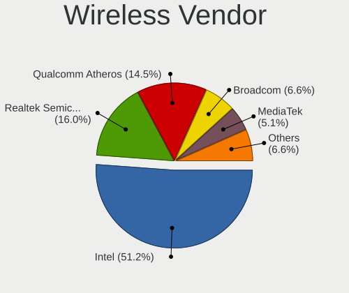

| Vendor                            | Notebooks | Percent |
|-----------------------------------|-----------|---------|
| Intel                             | 5265      | 51.17%  |
| Realtek Semiconductor             | 1651      | 16.04%  |
| Qualcomm Atheros                  | 1489      | 14.47%  |
| Broadcom                          | 677       | 6.58%   |
| MediaTek                          | 526       | 5.11%   |
| Broadcom Limited                  | 147       | 1.43%   |
| Ralink                            | 108       | 1.05%   |
| TP-Link                           | 95        | 0.92%   |
| Sierra Wireless                   | 56        | 0.54%   |
| Ralink Technology                 | 54        | 0.52%   |
| Qualcomm                          | 48        | 0.47%   |
| Dell                              | 44        | 0.43%   |
| NetGear                           | 28        | 0.27%   |
| Hewlett-Packard                   | 15        | 0.15%   |
| D-Link                            | 14        | 0.14%   |
| Qualcomm Atheros Communications   | 13        | 0.13%   |
| Fibocom                           | 12        | 0.12%   |
| Edimax Technology                 | 10        | 0.1%    |
| D-Link System                     | 5         | 0.05%   |
| Linksys                           | 4         | 0.04%   |
| Qualcomm Technologies             | 3         | 0.03%   |
| Belkin Components                 | 3         | 0.03%   |
| ASUSTek Computer                  | 3         | 0.03%   |
| TRENDnet                          | 2         | 0.02%   |
| ZyXEL Communications              | 1         | 0.01%   |
| U.S. Robotics                     | 1         | 0.01%   |
| Senao                             | 1         | 0.01%   |
| Quectel Wireless Solutions        | 1         | 0.01%   |
| Qcom                              | 1         | 0.01%   |
| Microsoft                         | 1         | 0.01%   |
| Mercucys                          | 1         | 0.01%   |
| Marvell Technology Group          | 1         | 0.01%   |
| IMC Networks                      | 1         | 0.01%   |
| I-O Data Device                   | 1         | 0.01%   |
| Guillemot                         | 1         | 0.01%   |
| Fujitsu Siemens Computers         | 1         | 0.01%   |
| Ericsson Business Mobile Networks | 1         | 0.01%   |
| Elecom                            | 1         | 0.01%   |
| Accton Technology                 | 1         | 0.01%   |
| AboCom Systems                    | 1         | 0.01%   |

Wireless Model
--------------

Wireless models

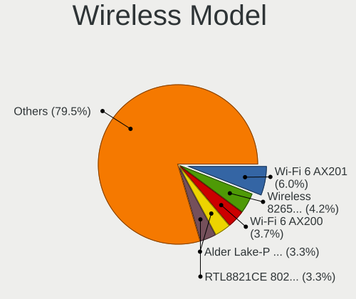

| Model                                                                | Notebooks | Percent |
|----------------------------------------------------------------------|-----------|---------|
| Intel Wi-Fi 6 AX201                                                  | 618       | 5.97%   |
| Intel Wireless 8265 / 8275                                           | 437       | 4.22%   |
| Intel Wi-Fi 6 AX200                                                  | 378       | 3.65%   |
| Intel Alder Lake-P PCH CNVi WiFi                                     | 346       | 3.34%   |
| Realtek RTL8821CE 802.11ac PCIe Wireless Network Adapter             | 341       | 3.29%   |
| Qualcomm Atheros QCA9377 802.11ac Wireless Network Adapter           | 322       | 3.11%   |
| Realtek RTL8822CE 802.11ac PCIe Wireless Network Adapter             | 321       | 3.1%    |
| Qualcomm Atheros QCA9565 / AR9565 Wireless Network Adapter           | 311       | 3%      |
| MediaTek MT7921 802.11ax PCIe Wireless Network Adapter [Filogic 330] | 304       | 2.94%   |
| Intel Comet Lake PCH-LP CNVi WiFi                                    | 284       | 2.74%   |
| Intel Wireless 7265                                                  | 278       | 2.69%   |
| Intel Wireless 8260                                                  | 258       | 2.49%   |
| Intel Wireless 7260                                                  | 247       | 2.39%   |
| Qualcomm Atheros AR9485 Wireless Network Adapter                     | 237       | 2.29%   |
| Qualcomm Atheros QCA6174 802.11ac Wireless Network Adapter           | 228       | 2.2%    |
| Qualcomm Atheros AR9285 Wireless Network Adapter (PCI-Express)       | 198       | 1.91%   |
| Intel Comet Lake PCH CNVi WiFi                                       | 186       | 1.8%    |
| Intel Centrino Advanced-N 6205 [Taylor Peak]                         | 184       | 1.78%   |
| Intel Raptor Lake PCH CNVi WiFi                                      | 174       | 1.68%   |
| Intel Cannon Point-LP CNVi [Wireless-AC]                             | 161       | 1.56%   |
| Intel Cannon Lake PCH CNVi WiFi                                      | 157       | 1.52%   |
| Intel Wireless 3165                                                  | 147       | 1.42%   |
| Intel Tiger Lake PCH CNVi WiFi                                       | 142       | 1.37%   |
| Realtek RTL8852BE PCIe 802.11ax Wireless Network Controller          | 138       | 1.33%   |
| Broadcom BCM4313 802.11bgn Wireless Network Adapter                  | 136       | 1.31%   |
| Realtek RTL8723BE PCIe Wireless Network Adapter                      | 128       | 1.24%   |
| Intel Wi-Fi 6E(802.11ax) AX210/AX1675* 2x2 [Typhoon Peak]            | 123       | 1.19%   |
| Broadcom BCM43142 802.11b/g/n                                        | 123       | 1.19%   |
| Intel Ice Lake-LP PCH CNVi WiFi                                      | 116       | 1.12%   |
| Realtek RTL8852AE 802.11ax PCIe Wireless Network Adapter             | 98        | 0.95%   |
| MediaTek MT7922 802.11ax PCI Express Wireless Network Adapter        | 93        | 0.9%    |
| MediaTek MT7902 802.11ax PCIe Wireless Network Adapter [Filogic 310] | 88        | 0.85%   |
| Realtek RTL8188CE 802.11b/g/n WiFi Adapter                           | 87        | 0.84%   |
| Intel Wireless 3160                                                  | 83        | 0.8%    |
| Intel Dual Band Wireless-AC 3165 Plus Bluetooth                      | 83        | 0.8%    |
| Intel Wi-Fi 5(802.11ac) Wireless-AC 9x6x [Thunder Peak]              | 77        | 0.74%   |
| Intel Centrino Wireless-N 2230                                       | 76        | 0.73%   |
| Intel Centrino Ultimate-N 6300                                       | 75        | 0.72%   |
| Qualcomm Atheros AR9462 Wireless Network Adapter                     | 71        | 0.69%   |
| Intel Centrino Advanced-N 6235                                       | 68        | 0.66%   |

Ethernet Vendor
---------------

Ethernet vendors

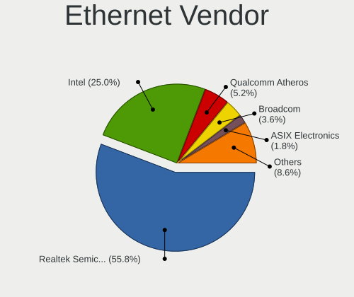

| Vendor                                 | Notebooks | Percent |
|----------------------------------------|-----------|---------|
| Realtek Semiconductor                  | 4600      | 55.79%  |
| Intel                                  | 2062      | 25.01%  |
| Qualcomm Atheros                       | 429       | 5.2%    |
| Broadcom                               | 298       | 3.61%   |
| ASIX Electronics                       | 148       | 1.8%    |
| Marvell Technology Group               | 97        | 1.18%   |
| DisplayLink                            | 75        | 0.91%   |
| Samsung Electronics                    | 71        | 0.86%   |
| Broadcom Limited                       | 55        | 0.67%   |
| MediaTek                               | 49        | 0.59%   |
| Nvidia                                 | 48        | 0.58%   |
| Lenovo                                 | 48        | 0.58%   |
| Xiaomi                                 | 47        | 0.57%   |
| Apple                                  | 26        | 0.32%   |
| OPPO Electronics                       | 25        | 0.3%    |
| JMicron Technology                     | 25        | 0.3%    |
| TP-Link                                | 23        | 0.28%   |
| ICS Advent                             | 20        | 0.24%   |
| Google                                 | 20        | 0.24%   |
| Motorola PCS                           | 13        | 0.16%   |
| Qualcomm                               | 12        | 0.15%   |
| Huawei Technologies                    | 12        | 0.15%   |
| Hewlett-Packard                        | 9         | 0.11%   |
| Sony Ericsson Mobile Communications AB | 3         | 0.04%   |
| Silicon Integrated Systems [SiS]       | 3         | 0.04%   |
| OnePlus Technology (Shenzhen)          | 3         | 0.04%   |
| Microchip Technology                   | 3         | 0.04%   |
| Spreadtrum Communications              | 2         | 0.02%   |
| Qualcomm Technologies                  | 2         | 0.02%   |
| Netchip Technology                     | 2         | 0.02%   |
| HMD Global                             | 2         | 0.02%   |
| ASUSTek Computer                       | 2         | 0.02%   |
| ZTE WCDMA Technologies MSM             | 1         | 0.01%   |
| vivo                                   | 1         | 0.01%   |
| Suzhou Motorcomm Electronic Technology | 1         | 0.01%   |
| Research In Motion                     | 1         | 0.01%   |
| Prolific Technology                    | 1         | 0.01%   |
| NetGear                                | 1         | 0.01%   |
| LG Electronics                         | 1         | 0.01%   |
| Digitech Systems                       | 1         | 0.01%   |

Ethernet Model
--------------

Ethernet models

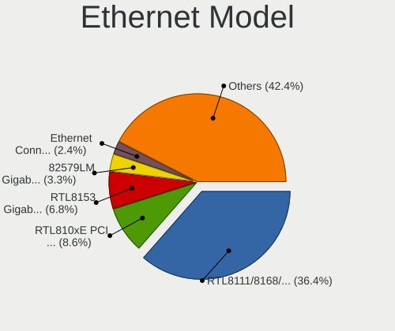

| Model                                                                  | Notebooks | Percent |
|------------------------------------------------------------------------|-----------|---------|
| Realtek RTL8111/8168/8211/8411 PCI Express Gigabit Ethernet Controller | 3078      | 36.45%  |
| Realtek RTL810xE PCI Express Fast Ethernet controller                  | 729       | 8.63%   |
| Realtek RTL8153 Gigabit Ethernet Adapter                               | 578       | 6.84%   |
| Intel 82579LM Gigabit Network Connection (Lewisville)                  | 275       | 3.26%   |
| Intel Ethernet Connection (4) I219-LM                                  | 202       | 2.39%   |
| Intel Alder Lake-P PCH CNVi WiFi                                       | 147       | 1.74%   |
| ASIX AX88179 Gigabit Ethernet                                          | 135       | 1.6%    |
| Intel Ethernet Connection I219-LM                                      | 133       | 1.57%   |
| Intel Ethernet Connection I218-LM                                      | 99        | 1.17%   |
| Realtek RTL8125 2.5GbE Controller                                      | 95        | 1.12%   |
| Intel Ethernet Connection I217-LM                                      | 90        | 1.07%   |
| Intel 82577LM Gigabit Network Connection                               | 89        | 1.05%   |
| Intel Ethernet Connection (3) I218-LM                                  | 86        | 1.02%   |
| Qualcomm Atheros AR8151 v2.0 Gigabit Ethernet                          | 80        | 0.95%   |
| Realtek Killer E2600 GbE Controller                                    | 78        | 0.92%   |
| Intel Ethernet Connection (16) I219-V                                  | 68        | 0.81%   |
| Intel Ethernet Connection (4) I219-V                                   | 65        | 0.77%   |
| Broadcom NetLink BCM57785 Gigabit Ethernet PCIe                        | 64        | 0.76%   |
| Broadcom NetXtreme BCM57765 Gigabit Ethernet PCIe                      | 58        | 0.69%   |
| Realtek RTL8152 Fast Ethernet Adapter                                  | 57        | 0.67%   |
| Intel Ethernet Connection (13) I219-V                                  | 55        | 0.65%   |
| Samsung Galaxy series, misc. (tethering mode)                          | 54        | 0.64%   |
| Intel Ethernet Connection (7) I219-LM                                  | 54        | 0.64%   |
| Intel Ethernet Connection (2) I219-LM                                  | 51        | 0.6%    |
| Qualcomm Atheros QCA8171 Gigabit Ethernet                              | 49        | 0.58%   |
| Intel Ethernet Connection (6) I219-V                                   | 49        | 0.58%   |
| Intel Ethernet Connection (6) I219-LM                                  | 49        | 0.58%   |
| Intel Ethernet Connection (16) I219-LM                                 | 48        | 0.57%   |
| Realtek Killer E3000 2.5GbE Controller                                 | 46        | 0.54%   |
| Intel Ethernet Connection (13) I219-LM                                 | 43        | 0.51%   |
| Intel Ethernet Connection I219-V                                       | 42        | 0.5%    |
| Qualcomm Atheros AR8161 Gigabit Ethernet                               | 41        | 0.49%   |
| Intel Ethernet Connection (10) I219-V                                  | 40        | 0.47%   |
| Broadcom NetLink BCM57780 Gigabit Ethernet PCIe                        | 39        | 0.46%   |
| Qualcomm Atheros AR8131 Gigabit Ethernet                               | 38        | 0.45%   |
| Intel Ethernet Connection (10) I219-LM                                 | 38        | 0.45%   |
| Intel 82579V Gigabit Network Connection                                | 38        | 0.45%   |
| Qualcomm Atheros AR8162 Fast Ethernet                                  | 37        | 0.44%   |
| MediaTek MT7922 802.11ax PCI Express Wireless Network Adapter          | 37        | 0.44%   |
| Xiaomi Mi/Redmi series (RNDIS)                                         | 36        | 0.43%   |

Net Controller Kind
-------------------

Ethernet, WiFi or modem

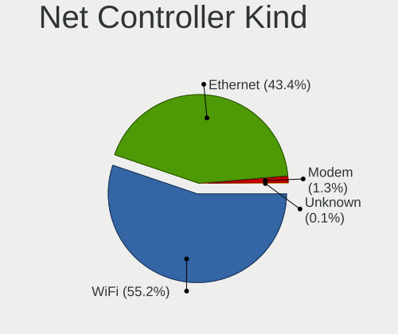

| Kind     | Notebooks | Percent |
|----------|-----------|---------|
| WiFi     | 9829      | 55.2%   |
| Ethernet | 7734      | 43.44%  |
| Modem    | 226       | 1.27%   |
| Unknown  | 16        | 0.09%   |

Used Controller
---------------

Currently used network controller

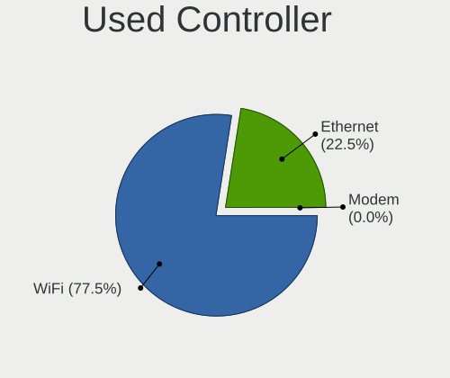

| Kind     | Notebooks | Percent |
|----------|-----------|---------|
| WiFi     | 8369      | 77.47%  |
| Ethernet | 2432      | 22.51%  |
| Modem    | 2         | 0.02%   |

NICs
----

Total network controllers on board

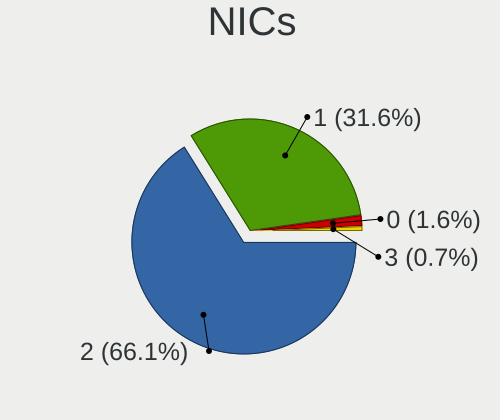

| Total | Notebooks | Percent |
|-------|-----------|---------|
| 2     | 6745      | 66.13%  |
| 1     | 3224      | 31.61%  |
| 0     | 159       | 1.56%   |
| 3     | 71        | 0.7%    |

IPv6
----

IPv6 vs IPv4

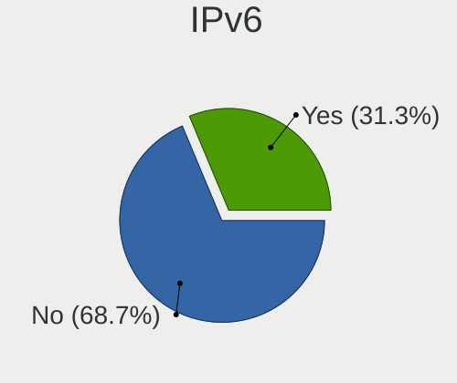

| Used | Notebooks | Percent |
|------|-----------|---------|
| No   | 7131      | 68.71%  |
| Yes  | 3248      | 31.29%  |

Bluetooth
---------

Bluetooth Vendor
----------------

Controller vendors

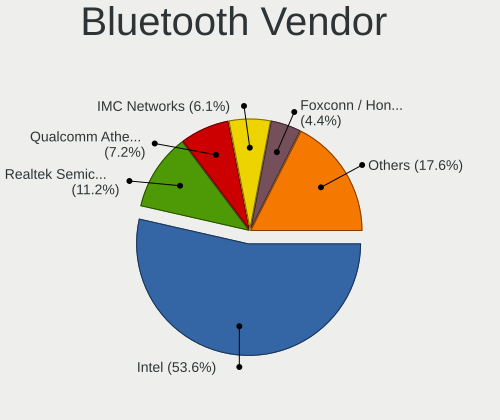

| Vendor                          | Notebooks | Percent |
|---------------------------------|-----------|---------|
| Intel                           | 4634      | 53.55%  |
| Realtek Semiconductor           | 967       | 11.18%  |
| Qualcomm Atheros Communications | 623       | 7.2%    |
| IMC Networks                    | 525       | 6.07%   |
| Foxconn / Hon Hai               | 385       | 4.45%   |
| Lite-On Technology              | 326       | 3.77%   |
| Broadcom                        | 296       | 3.42%   |
| Apple                           | 238       | 2.75%   |
| Dell                            | 108       | 1.25%   |
| Realtek                         | 99        | 1.14%   |
| Hewlett-Packard                 | 79        | 0.91%   |
| Cambridge Silicon Radio         | 72        | 0.83%   |
| Ralink                          | 61        | 0.7%    |
| Toshiba                         | 51        | 0.59%   |
| MediaTek                        | 44        | 0.51%   |
| ASUSTek Computer                | 25        | 0.29%   |
| USI                             | 21        | 0.24%   |
| Alps Electric                   | 19        | 0.22%   |
| Foxconn International           | 16        | 0.18%   |
| Ralink Technology               | 14        | 0.16%   |
| TP-Link                         | 8         | 0.09%   |
| Opticis                         | 8         | 0.09%   |
| Askey Computer                  | 8         | 0.09%   |
| Taiyo Yuden                     | 3         | 0.03%   |
| Smart Modular Technologies      | 3         | 0.03%   |
| Micro Star International        | 3         | 0.03%   |
| Integrated System Solution      | 3         | 0.03%   |
| Edimax Technology               | 2         | 0.02%   |
| Chicony Electronics             | 2         | 0.02%   |
| Roper                           | 1         | 0.01%   |
| Qcom                            | 1         | 0.01%   |
| Mobile Action Technology        | 1         | 0.01%   |
| Marvell Semiconductor           | 1         | 0.01%   |
| Fujitsu Siemens Computers       | 1         | 0.01%   |
| Fujitsu                         | 1         | 0.01%   |
| Dynex                           | 1         | 0.01%   |
| AICSemi                         | 1         | 0.01%   |
| Actions                         | 1         | 0.01%   |
| Unknown                         | 1         | 0.01%   |

Bluetooth Model
---------------

Controller models

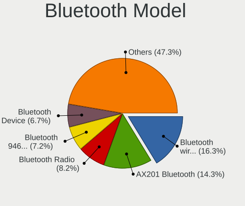

| Model                                               | Notebooks | Percent |
|-----------------------------------------------------|-----------|---------|
| Intel Bluetooth wireless interface                  | 1409      | 16.27%  |
| Intel AX201 Bluetooth                               | 1238      | 14.3%   |
| Realtek Bluetooth Radio                             | 708       | 8.18%   |
| Intel Bluetooth 9460/9560 Jefferson Peak (JfP)      | 625       | 7.22%   |
| Intel Bluetooth Device                              | 584       | 6.74%   |
| Intel AX200 Bluetooth                               | 371       | 4.28%   |
| Qualcomm Atheros  Bluetooth Device                  | 321       | 3.71%   |
| IMC Networks Wireless_Device                        | 265       | 3.06%   |
| Realtek  Bluetooth 4.2 Adapter                      | 169       | 1.95%   |
| Apple Bluetooth Host Controller                     | 142       | 1.64%   |
| IMC Networks Bluetooth Radio                        | 130       | 1.5%    |
| Intel Centrino Bluetooth Wireless Transceiver       | 128       | 1.48%   |
| Intel AX210 Bluetooth                               | 116       | 1.34%   |
| Foxconn / Hon Hai Bluetooth Device                  | 108       | 1.25%   |
| Realtek Bluetooth Radio                             | 99        | 1.14%   |
| Lite-On Qualcomm Atheros QCA9377 Bluetooth          | 94        | 1.09%   |
| Qualcomm Atheros AR3012 Bluetooth 4.0               | 88        | 1.02%   |
| Foxconn / Hon Hai MediaTek Bluetooth Adapter        | 87        | 1%      |
| Foxconn / Hon Hai Wireless_Device                   | 76        | 0.88%   |
| Apple Bluetooth USB Host Controller                 | 73        | 0.84%   |
| Qualcomm Atheros QCA61x4 Bluetooth 4.0              | 72        | 0.83%   |
| Cambridge Silicon Radio Bluetooth Dongle (HCI mode) | 72        | 0.83%   |
| Qualcomm Atheros AR3011 Bluetooth                   | 69        | 0.8%    |
| IMC Networks Bluetooth Device                       | 69        | 0.8%    |
| Intel Wireless-AC 9260 Bluetooth Adapter            | 68        | 0.79%   |
| Lite-On Wireless_Device                             | 66        | 0.76%   |
| Lite-On Bluetooth Device                            | 66        | 0.76%   |
| Intel Wireless-AC 3168 Bluetooth                    | 62        | 0.72%   |
| Ralink RT3290 Bluetooth                             | 61        | 0.7%    |
| Lite-On Atheros AR3012 Bluetooth                    | 53        | 0.61%   |
| HP Broadcom 2070 Bluetooth Combo                    | 51        | 0.59%   |
| Broadcom BCM2045B (BDC-2.1)                         | 48        | 0.55%   |
| MediaTek Wireless_Device                            | 44        | 0.51%   |
| Qualcomm Atheros AR9462 Bluetooth                   | 41        | 0.47%   |
| Dell DW375 Bluetooth Module                         | 41        | 0.47%   |
| Broadcom BCM20702 Bluetooth 4.0 [ThinkPad]          | 38        | 0.44%   |
| Intel Centrino Advanced-N 6230 Bluetooth adapter    | 37        | 0.43%   |
| Realtek RTL8723B Bluetooth                          | 31        | 0.36%   |
| Broadcom HP Portable SoftSailing                    | 31        | 0.36%   |
| Dell BCM20702A0 Bluetooth Module                    | 27        | 0.31%   |

Sound
-----

Sound Vendor
------------

Sound card vendors

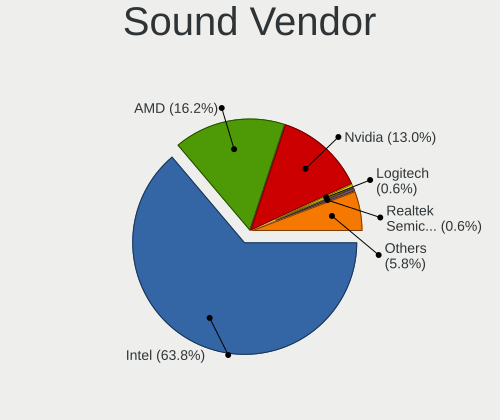

| Vendor                  | Notebooks | Percent |
|-------------------------|-----------|---------|
| Intel                   | 8165      | 63.82%  |
| AMD                     | 2078      | 16.24%  |
| Nvidia                  | 1668      | 13.04%  |
| Logitech                | 73        | 0.57%   |
| Realtek Semiconductor   | 71        | 0.55%   |
| Hewlett-Packard         | 68        | 0.53%   |
| GN Netcom               | 68        | 0.53%   |
| C-Media Electronics     | 67        | 0.52%   |
| Lenovo                  | 62        | 0.48%   |
| Apple                   | 58        | 0.45%   |
| Plantronics             | 42        | 0.33%   |
| JMTek                   | 30        | 0.23%   |
| Generalplus Technology  | 22        | 0.17%   |
| Razer USA               | 19        | 0.15%   |
| Corsair                 | 19        | 0.15%   |
| Texas Instruments       | 18        | 0.14%   |
| DSEA A/S                | 18        | 0.14%   |
| Kingston Technology     | 17        | 0.13%   |
| ASUSTek Computer        | 15        | 0.12%   |
| Creative Technology     | 13        | 0.1%    |
| SteelSeries ApS         | 11        | 0.09%   |
| Sony                    | 10        | 0.08%   |
| Focusrite-Novation      | 10        | 0.08%   |
| Jieli Technology        | 9         | 0.07%   |
| KTMicro                 | 8         | 0.06%   |
| Dell                    | 8         | 0.06%   |
| BEHRINGER International | 8         | 0.06%   |
| Tenx Technology         | 5         | 0.04%   |
| RODE Microphones        | 5         | 0.04%   |
| Zhaoxin                 | 4         | 0.03%   |
| Samsung Electronics     | 4         | 0.03%   |
| OPPO Electronics        | 4         | 0.03%   |
| Microsoft               | 4         | 0.03%   |
| Google                  | 4         | 0.03%   |
| Conexant Systems        | 4         | 0.03%   |
| Yamaha                  | 3         | 0.02%   |
| Walmart                 | 3         | 0.02%   |
| Turtle Beach            | 3         | 0.02%   |
| Syntek                  | 3         | 0.02%   |
| Silicon Motion          | 3         | 0.02%   |

Sound Model
-----------

Sound card models

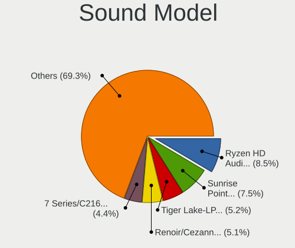

| Model                                                                      | Notebooks | Percent |
|----------------------------------------------------------------------------|-----------|---------|
| AMD Ryzen HD Audio Controller                                              | 1309      | 8.51%   |
| Intel Sunrise Point-LP HD Audio                                            | 1158      | 7.53%   |
| Intel Tiger Lake-LP Smart Sound Technology Audio Controller                | 795       | 5.17%   |
| AMD Renoir/Cezanne HDMI/DP Audio Controller                                | 787       | 5.12%   |
| Intel 7 Series/C216 Chipset Family High Definition Audio Controller        | 680       | 4.42%   |
| Intel Alder Lake PCH-P High Definition Audio Controller                    | 608       | 3.95%   |
| Intel 6 Series/C200 Series Chipset Family High Definition Audio Controller | 466       | 3.03%   |
| Intel 8 Series HD Audio Controller                                         | 392       | 2.55%   |
| Intel Haswell-ULT HD Audio Controller                                      | 390       | 2.54%   |
| Intel Comet Lake PCH-LP cAVS                                               | 363       | 2.36%   |
| Intel Broadwell-U Audio Controller                                         | 321       | 2.09%   |
| Intel 5 Series/3400 Series Chipset High Definition Audio                   | 320       | 2.08%   |
| Intel Wildcat Point-LP High Definition Audio Controller                    | 313       | 2.03%   |
| Intel Cannon Point-LP High Definition Audio Controller                     | 309       | 2.01%   |
| Intel Cannon Lake PCH cAVS                                                 | 307       | 2%      |
| Intel 8 Series/C220 Series Chipset High Definition Audio Controller        | 294       | 1.91%   |
| AMD Raven/Raven2/Fenghuang HDMI/DP Audio Controller                        | 251       | 1.63%   |
| Intel Raptor Lake-P/U/H cAVS                                               | 245       | 1.59%   |
| Intel Xeon E3-1200 v3/4th Gen Core Processor HD Audio Controller           | 236       | 1.53%   |
| Intel Celeron/Pentium Silver Processor High Definition Audio               | 230       | 1.5%    |
| AMD FCH Azalia Controller                                                  | 228       | 1.48%   |
| Intel Comet Lake PCH cAVS                                                  | 219       | 1.42%   |
| Intel Tiger Lake-H HD Audio Controller                                     | 207       | 1.35%   |
| Intel Ice Lake-LP Smart Sound Technology Audio Controller                  | 206       | 1.34%   |
| Intel 82801I (ICH9 Family) HD Audio Controller                             | 190       | 1.24%   |
| AMD Radeon High Definition Audio Controller                                | 189       | 1.23%   |
| Nvidia TU107 GeForce GTX 1650 High Definition Audio Controller             | 182       | 1.18%   |
| Nvidia GA106 High Definition Audio Controller                              | 172       | 1.12%   |
| Nvidia GA107 High Definition Audio Controller                              | 156       | 1.01%   |
| AMD Kabini HDMI/DP Audio                                                   | 156       | 1.01%   |
| AMD Family 15h (Models 60h-6fh) Audio Controller                           | 145       | 0.94%   |
| Nvidia GA104 High Definition Audio Controller                              | 127       | 0.83%   |
| Intel CM238 HD Audio Controller                                            | 124       | 0.81%   |
| Intel 100 Series/C230 Series Chipset Family HD Audio Controller            | 124       | 0.81%   |
| Nvidia GF108 High Definition Audio Controller                              | 109       | 0.71%   |
| Intel 82801H (ICH8 Family) HD Audio Controller                             | 104       | 0.68%   |
| AMD High Definition Audio Controller                                       | 103       | 0.67%   |
| Intel Atom Processor Z36xxx/Z37xxx Series High Definition Audio Controller | 102       | 0.66%   |
| Nvidia GP107GL High Definition Audio Controller                            | 101       | 0.66%   |
| Nvidia TU106 High Definition Audio Controller                              | 99        | 0.64%   |

Memory
------

Memory Vendor
-------------

Memory module vendors

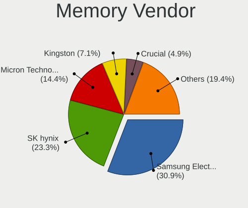

| Vendor              | Notebooks | Percent |
|---------------------|-----------|---------|
| Samsung Electronics | 2159      | 30.88%  |
| SK hynix            | 1626      | 23.26%  |
| Micron Technology   | 1010      | 14.45%  |
| Kingston            | 499       | 7.14%   |
| Crucial             | 343       | 4.91%   |
| Unknown             | 208       | 2.98%   |
| A-DATA Technology   | 174       | 2.49%   |
| Ramaxel Technology  | 132       | 1.89%   |
| Unknown (ABCD)      | 119       | 1.7%    |
| Unknown             | 112       | 1.6%    |
| Elpida              | 72        | 1.03%   |
| Nanya Technology    | 64        | 0.92%   |
| Corsair             | 62        | 0.89%   |
| Smart               | 46        | 0.66%   |
| G.Skill             | 44        | 0.63%   |
| Team                | 33        | 0.47%   |
| Transcend           | 20        | 0.29%   |
| Patriot             | 17        | 0.24%   |
| ChangXin Memory     | 17        | 0.24%   |
| GOODRAM             | 16        | 0.23%   |
| Smart Brazil        | 14        | 0.2%    |
| Apacer              | 9         | 0.13%   |
| PNY                 | 8         | 0.11%   |
| 8CFD000080AD        | 8         | 0.11%   |
| Timetec             | 7         | 0.1%    |
| Teikon              | 7         | 0.1%    |
| Goldkey             | 7         | 0.1%    |
| AMD                 | 7         | 0.1%    |
| Wilk                | 6         | 0.09%   |
| SHARETRONIC         | 6         | 0.09%   |
| Neo Forza           | 6         | 0.09%   |
| fef5                | 6         | 0.09%   |
| ASint Technology    | 6         | 0.09%   |
| Hikvision           | 5         | 0.07%   |
| ff                  | 4         | 0.06%   |
| Avant               | 4         | 0.06%   |
| 4ea5                | 4         | 0.06%   |
| Unknown (8AD6)      | 3         | 0.04%   |
| Unknown (768A)      | 3         | 0.04%   |
| Unknown (0x0C26)    | 3         | 0.04%   |

Memory Model
------------

Memory module models

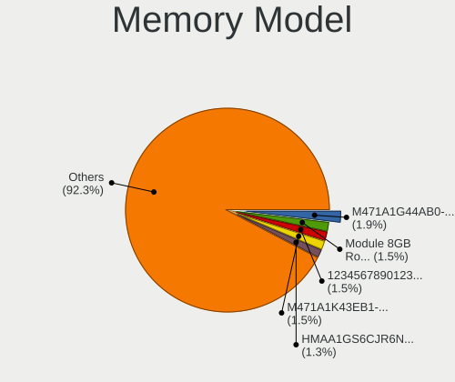

| Model                                                            | Notebooks | Percent |
|------------------------------------------------------------------|-----------|---------|
| Samsung RAM M471A1G44AB0-CWE 8GiB SODIMM DDR4 3200MT/s           | 136       | 1.86%   |
| Unknown                                                          | 112       | 1.53%   |
| Unknown (ABCD) RAM 123456789012345678 2GB SODIMM LPDDR4 2400MT/s | 109       | 1.49%   |
| Samsung RAM M471A1K43EB1-CWE 8GB SODIMM DDR4 3200MT/s            | 107       | 1.46%   |
| SK hynix RAM HMAA1GS6CJR6N-XN 8GB SODIMM DDR4 3200MT/s           | 97        | 1.33%   |
| Samsung RAM M471A1G44BB0-CWE 8GB SODIMM DDR4 3200MT/s            | 95        | 1.3%    |
| Samsung RAM M471A1K43DB1-CWE 8GB SODIMM DDR4 3200MT/s            | 70        | 0.96%   |
| SK hynix RAM HMA81GS6AFR8N-UH 8GB SODIMM DDR4 2667MT/s           | 69        | 0.94%   |
| Samsung RAM M471A5244CB0-CWE 4GB SODIMM DDR4 3200MT/s            | 63        | 0.86%   |
| Samsung RAM M471A5244CB0-CTD 4GB SODIMM DDR4 3266MT/s            | 61        | 0.84%   |
| Micron RAM 4ATF1G64HZ-3G2F1 8GB SODIMM DDR4 3200MT/s             | 61        | 0.84%   |
| SK hynix RAM HMA81GS6DJR8N-XN 8GB SODIMM DDR4 3200MT/s           | 59        | 0.81%   |
| Samsung RAM M471A1G44AB0-CWE 8GB Row Of Chips DDR4 3200MT/s      | 57        | 0.78%   |
| Samsung RAM M471A1K43CB1-CRC 8GB SODIMM DDR4 8400MT/s            | 56        | 0.77%   |
| Micron RAM 4ATF1G64HZ-3G2E1 8GB Row Of Chips DDR4 3200MT/s       | 53        | 0.73%   |
| SK hynix RAM HMAA1GS6CJR6N-XN 8GB Row Of Chips DDR4 3200MT/s     | 50        | 0.68%   |
| Micron RAM 8ATF1G64HZ-3G2R1 8GB SODIMM DDR4 3200MT/s             | 50        | 0.68%   |
| Samsung RAM M471B5173DB0-YK0 4GB SODIMM DDR3 1600MT/s            | 48        | 0.66%   |
| Samsung RAM M471A1K43DB1-CTD 8GB SODIMM DDR4 2667MT/s            | 46        | 0.63%   |
| SK hynix RAM HMT451S6BFR8A-PB 4GB SODIMM DDR3 1600MT/s           | 45        | 0.62%   |
| Micron RAM 4ATF1G64HZ-3G2E1 8GB SODIMM DDR4 3200MT/s             | 43        | 0.59%   |
| Samsung RAM M471B5173QH0-YK0 4GB SODIMM DDR3 1600MT/s            | 42        | 0.57%   |
| Samsung RAM M471B5273DH0-CH9 4GB SODIMM DDR3 1600MT/s            | 40        | 0.55%   |
| Samsung RAM M471A1K43CB1-CTD 8GB SODIMM DDR4 3200MT/s            | 40        | 0.55%   |
| Samsung RAM M471A1K43BB1-CRC 8GB SODIMM DDR4 2667MT/s            | 40        | 0.55%   |
| SK hynix RAM HMT351S6CFR8C-PB 4GB SODIMM DDR3 1600MT/s           | 39        | 0.53%   |
| SK hynix RAM HMAA2GS6CJR8N-XN 16GB SODIMM DDR4 3200MT/s          | 39        | 0.53%   |
| Samsung RAM M471B1G73QH0-YK0 8GB SODIMM DDR3 1600MT/s            | 38        | 0.52%   |
| SK hynix RAM HMT41GS6BFR8A-PB 8GB SODIMM DDR3 2667MT/s           | 37        | 0.51%   |
| SK hynix RAM HMA81GS6JJR8N-VK 8GB SODIMM DDR4 2667MT/s           | 37        | 0.51%   |
| Samsung RAM M471B1G73DB0-YK0 8GB SODIMM DDR3 1600MT/s            | 36        | 0.49%   |
| Samsung RAM M471A5244CB0-CRC 4GB SODIMM DDR4 2667MT/s            | 36        | 0.49%   |
| SK hynix RAM HMT451S6AFR8A-PB 4GB SODIMM DDR3 1600MT/s           | 35        | 0.48%   |
| Samsung RAM M425R1GB4BB0-CQKOL 8GB SODIMM DDR5 4800MT/s          | 34        | 0.47%   |
| SK hynix RAM HMA851S6AFR6N-UH 4GB SODIMM DDR4 2667MT/s           | 32        | 0.44%   |
| Samsung RAM Module 16GB SODIMM DDR4 3200MT/s                     | 32        | 0.44%   |
| Samsung RAM M471B5273CH0-CH9 4GB SODIMM DDR3 1334MT/s            | 32        | 0.44%   |
| Samsung RAM M471B5173EB0-YK0 4GB SODIMM DDR3 1600MT/s            | 32        | 0.44%   |
| Samsung RAM M471A2K43DB1-CWE 16GB SODIMM DDR4 3200MT/s           | 32        | 0.44%   |
| Samsung RAM M425R2GA3BB0-CQKOL 16GB SODIMM DDR5 4800MT/s         | 32        | 0.44%   |

Memory Kind
-----------

Memory module kinds

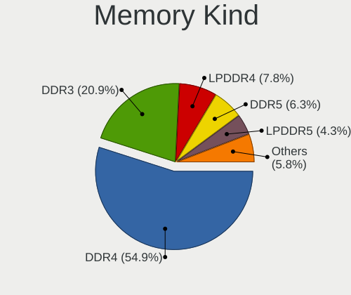

| Kind    | Notebooks | Percent |
|---------|-----------|---------|
| DDR4    | 3265      | 54.93%  |
| DDR3    | 1241      | 20.88%  |
| LPDDR4  | 461       | 7.76%   |
| DDR5    | 375       | 6.31%   |
| LPDDR5  | 255       | 4.29%   |
| LPDDR3  | 205       | 3.45%   |
| DDR2    | 70        | 1.18%   |
| SDRAM   | 45        | 0.76%   |
| Unknown | 21        | 0.35%   |
| DDR     | 5         | 0.08%   |
| DRAM    | 1         | 0.02%   |

Memory Form Factor
------------------

Physical design of the memory module

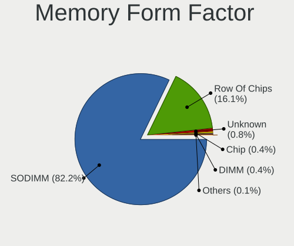

| Name            | Notebooks | Percent |
|-----------------|-----------|---------|
| SODIMM          | 4942      | 82.16%  |
| Row Of Chips    | 971       | 16.14%  |
| Unknown         | 46        | 0.76%   |
| Chip            | 26        | 0.43%   |
| DIMM            | 22        | 0.37%   |
| Proprietary Car | 8         | 0.13%   |

Memory Size
-----------

Memory module size

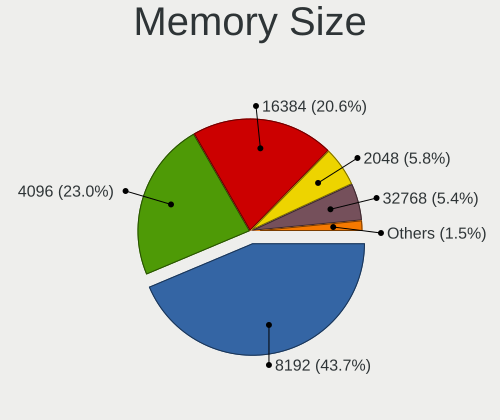

| Size   | Notebooks | Percent |
|--------|-----------|---------|
| 8192   | 2825      | 43.66%  |
| 4096   | 1488      | 23%     |
| 16384  | 1336      | 20.65%  |
| 2048   | 376       | 5.81%   |
| 32768  | 347       | 5.36%   |
| 1024   | 84        | 1.3%    |
| 12288  | 4         | 0.06%   |
| 6144   | 4         | 0.06%   |
| 65536  | 3         | 0.05%   |
| 131072 | 1         | 0.02%   |
| 3072   | 1         | 0.02%   |
| 1536   | 1         | 0.02%   |

Memory Speed
------------

Memory module speed

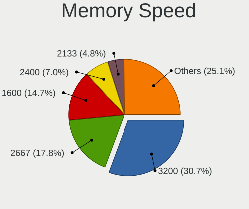

| Speed   | Notebooks | Percent |
|---------|-----------|---------|
| 3200    | 1938      | 30.67%  |
| 2667    | 1124      | 17.79%  |
| 1600    | 927       | 14.67%  |
| 2400    | 440       | 6.96%   |
| 2133    | 301       | 4.76%   |
| 4800    | 247       | 3.91%   |
| 6400    | 197       | 3.12%   |
| 4267    | 185       | 2.93%   |
| 5600    | 133       | 2.1%    |
| 1334    | 132       | 2.09%   |
| 1333    | 107       | 1.69%   |
| 8400    | 76        | 1.2%    |
| 3266    | 61        | 0.97%   |
| 1867    | 59        | 0.93%   |
| 4266    | 52        | 0.82%   |
| 1067    | 44        | 0.7%    |
| Unknown | 44        | 0.7%    |
| 667     | 42        | 0.66%   |
| 4199    | 36        | 0.57%   |
| 3733    | 31        | 0.49%   |
| 7500    | 26        | 0.41%   |
| 7467    | 17        | 0.27%   |
| 1066    | 16        | 0.25%   |
| 800     | 14        | 0.22%   |
| 2933    | 13        | 0.21%   |
| 5500    | 9         | 0.14%   |
| 8533    | 8         | 0.13%   |
| 2048    | 7         | 0.11%   |
| 1866    | 5         | 0.08%   |
| 975     | 5         | 0.08%   |
| 533     | 5         | 0.08%   |
| 333     | 4         | 0.06%   |
| 5200    | 2         | 0.03%   |
| 8600    | 1         | 0.02%   |
| 3000    | 1         | 0.02%   |
| 2800    | 1         | 0.02%   |
| 2666    | 1         | 0.02%   |
| 2465    | 1         | 0.02%   |
| 2267    | 1         | 0.02%   |
| 1800    | 1         | 0.02%   |

Printers & scanners
-------------------

Printer Vendor
--------------

Printer device vendors

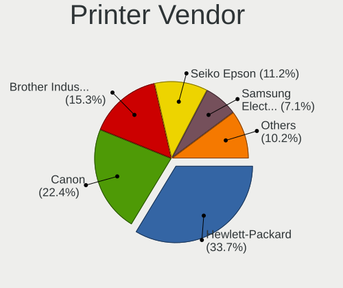

| Vendor              | Notebooks | Percent |
|---------------------|-----------|---------|
| Hewlett-Packard     | 33        | 33.67%  |
| Canon               | 22        | 22.45%  |
| Brother Industries  | 15        | 15.31%  |
| Seiko Epson         | 11        | 11.22%  |
| Samsung Electronics | 7         | 7.14%   |
| Xiaomi              | 2         | 2.04%   |
| STMicroelectronics  | 2         | 2.04%   |
| Xerox               | 1         | 1.02%   |
| QinHeng Electronics | 1         | 1.02%   |
| Kyocera             | 1         | 1.02%   |
| Dymo-CoStar         | 1         | 1.02%   |
| Dell                | 1         | 1.02%   |
| Unknown             | 1         | 1.02%   |

Printer Model
-------------

Printer device models

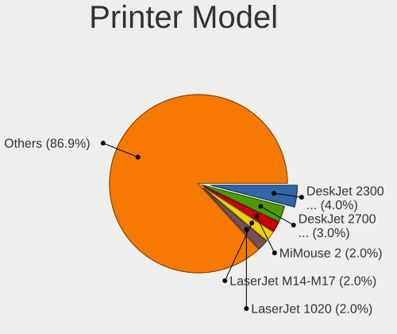

| Model                                                     | Notebooks | Percent |
|-----------------------------------------------------------|-----------|---------|
| HP DeskJet 2300 series                                    | 4         | 4.04%   |
| HP DeskJet 2700 series                                    | 3         | 3.03%   |
| Xiaomi MiMouse 2                                          | 2         | 2.02%   |
| HP LaserJet M14-M17                                       | 2         | 2.02%   |
| HP LaserJet 1020                                          | 2         | 2.02%   |
| HP LaserJet 1018                                          | 2         | 2.02%   |
| HP Color LaserJet CP1215                                  | 2         | 2.02%   |
| Canon LiDE 300                                            | 2         | 2.02%   |
| Brother DCP-1510                                          | 2         | 2.02%   |
| Xerox Phaser 3260                                         | 1         | 1.01%   |
| STMicroelectronics YICHIP3121 Virtual ComPort in FS Mode  | 1         | 1.01%   |
| STMicroelectronics LED badge -- mini LED display -- 11x44 | 1         | 1.01%   |
| Seiko Epson XP-4100 Series                                | 1         | 1.01%   |
| Seiko Epson XP-211 214 216 Series                         | 1         | 1.01%   |
| Seiko Epson USB2.0 Printer (Hi-speed)                     | 1         | 1.01%   |
| Seiko Epson Stylus NX230/SX235W Series                    | 1         | 1.01%   |
| Seiko Epson L5190 Series                                  | 1         | 1.01%   |
| Seiko Epson L3110 Series                                  | 1         | 1.01%   |
| Seiko Epson L3050 Series                                  | 1         | 1.01%   |
| Seiko Epson FX-2190IIN                                    | 1         | 1.01%   |
| Seiko Epson EPSON WF-3520 Series                          | 1         | 1.01%   |
| Seiko Epson EPSON L220 Series                             | 1         | 1.01%   |
| Seiko Epson Artisan 1430 Series                           | 1         | 1.01%   |
| Samsung Phaser 3120                                       | 1         | 1.01%   |
| Samsung ML-216x Series Laser Printer                      | 1         | 1.01%   |
| Samsung ML-1670 Series                                    | 1         | 1.01%   |
| Samsung ML-1610 Mono Laser Printer                        | 1         | 1.01%   |
| Samsung M2020 Series                                      | 1         | 1.01%   |
| Samsung CLX-3180 Series                                   | 1         | 1.01%   |
| Samsung C43x Series                                       | 1         | 1.01%   |
| QinHeng CH340S                                            | 1         | 1.01%   |
| Kyocera FS-1116MFP                                        | 1         | 1.01%   |
| HP Smart Tank 580-590 series                              | 1         | 1.01%   |
| HP OfficeJet 5600 (USBHUB)                                | 1         | 1.01%   |
| HP Officejet 4630 series                                  | 1         | 1.01%   |
| HP Officejet 4500 G510n-z                                 | 1         | 1.01%   |
| HP LaserJet P1102                                         | 1         | 1.01%   |
| HP LaserJet CP 1025                                       | 1         | 1.01%   |
| HP LaserJet 4250                                          | 1         | 1.01%   |
| HP LaserJet 400 M401dne                                   | 1         | 1.01%   |

Scanner Vendor
--------------

Scanner device vendors

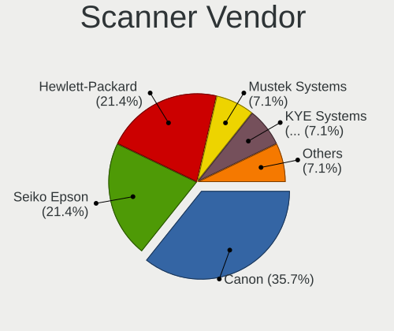

| Vendor                      | Notebooks | Percent |
|-----------------------------|-----------|---------|
| Canon                       | 5         | 35.71%  |
| Seiko Epson                 | 3         | 21.43%  |
| Hewlett-Packard             | 3         | 21.43%  |
| Mustek Systems              | 1         | 7.14%   |
| KYE Systems (Mouse Systems) | 1         | 7.14%   |
| AGFA-Gevaert NV             | 1         | 7.14%   |

Scanner Model
-------------

Scanner device models

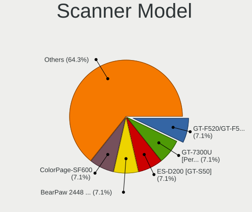

| Model                                               | Notebooks | Percent |
|-----------------------------------------------------|-----------|---------|
| Seiko Epson GT-F520/GT-F570 [Perfection 3590 PHOTO] | 1         | 7.14%   |
| Seiko Epson GT-7300U [Perfection 1260/1260 PHOTO]   | 1         | 7.14%   |
| Seiko Epson ES-D200 [GT-S50]                        | 1         | 7.14%   |
| Mustek Systems BearPaw 2448 CU Pro                  | 1         | 7.14%   |
| KYE Systems (Mouse Systems) ColorPage-SF600         | 1         | 7.14%   |
| HP Scanjet Professional 1000 Mobile Scanner         | 1         | 7.14%   |
| HP ScanJet 7400c                                    | 1         | 7.14%   |
| HP OfficeJet 6110                                   | 1         | 7.14%   |
| Canon CanoScan N650U/N656U                          | 1         | 7.14%   |
| Canon CanoScan LIDE 25                              | 1         | 7.14%   |
| Canon CanoScan LiDE 110                             | 1         | 7.14%   |
| Canon CanoScan LiDE 100                             | 1         | 7.14%   |
| Canon CanoScan 4200F                                | 1         | 7.14%   |
| AGFA-Gevaert NV SnapScan 1212U (?)                  | 1         | 7.14%   |

Camera
------

Camera Vendor
-------------

Camera device vendors

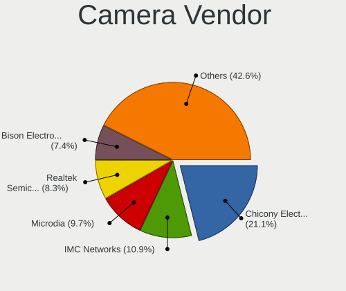

| Vendor                                 | Notebooks | Percent |
|----------------------------------------|-----------|---------|
| Chicony Electronics                    | 1984      | 21.09%  |
| IMC Networks                           | 1026      | 10.91%  |
| Microdia                               | 917       | 9.75%   |
| Realtek Semiconductor                  | 777       | 8.26%   |
| Bison Electronics                      | 694       | 7.38%   |
| Quanta                                 | 623       | 6.62%   |
| Sunplus Innovation Technology          | 582       | 6.19%   |
| Cheng Uei Precision Industry (Foxlink) | 378       | 4.02%   |
| Luxvisions Innotech Limited            | 330       | 3.51%   |
| Syntek                                 | 244       | 2.59%   |
| Apple                                  | 236       | 2.51%   |
| Suyin                                  | 234       | 2.49%   |
| Lite-On Technology                     | 202       | 2.15%   |
| Logitech                               | 139       | 1.48%   |
| Sonix Technology                       | 133       | 1.41%   |
| Silicon Motion                         | 97        | 1.03%   |
| Alcor Micro                            | 91        | 0.97%   |
| Samsung Electronics                    | 67        | 0.71%   |
| Ricoh                                  | 64        | 0.68%   |
| SunplusIT                              | 61        | 0.65%   |
| ShineTech                              | 47        | 0.5%    |
| icSpring                               | 38        | 0.4%    |
| Lenovo                                 | 34        | 0.36%   |
| Acer                                   | 33        | 0.35%   |
| Primax Electronics                     | 31        | 0.33%   |
| Importek                               | 31        | 0.33%   |
| ALi                                    | 28        | 0.3%    |
| Z-Star Microelectronics                | 21        | 0.22%   |
| Y Media                                | 19        | 0.2%    |
| Microsoft                              | 13        | 0.14%   |
| Sunplus Technology                     | 12        | 0.13%   |
| OmniVision Technologies                | 12        | 0.13%   |
| Unknown                                | 11        | 0.12%   |
| Shine-optics                           | 10        | 0.11%   |
| Intel                                  | 10        | 0.11%   |
| DigiTech                               | 10        | 0.11%   |
| kingcome                               | 8         | 0.09%   |
| Generalplus Technology                 | 6         | 0.06%   |
| webcam                                 | 5         | 0.05%   |
| USB Camera CS                          | 5         | 0.05%   |

Camera Model
------------

Camera device models

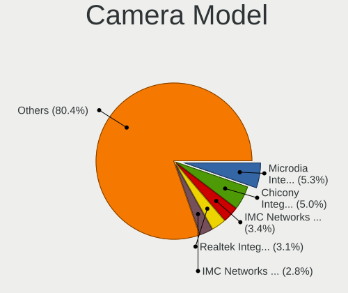

| Model                                               | Notebooks | Percent |
|-----------------------------------------------------|-----------|---------|
| Microdia Integrated_Webcam_HD                       | 500       | 5.29%   |
| Chicony Integrated Camera                           | 475       | 5.03%   |
| IMC Networks USB2.0 HD UVC WebCam                   | 322       | 3.41%   |
| Realtek Integrated_Webcam_HD                        | 291       | 3.08%   |
| IMC Networks Integrated Camera                      | 266       | 2.81%   |
| Bison Integrated Camera                             | 211       | 2.23%   |
| Sunplus Integrated_Webcam_HD                        | 172       | 1.82%   |
| Syntek Integrated Camera                            | 168       | 1.78%   |
| Chicony HD WebCam                                   | 166       | 1.76%   |
| Chicony HP HD Camera                                | 120       | 1.27%   |
| IMC Networks USB2.0 VGA UVC WebCam                  | 96        | 1.02%   |
| Quanta HD User Facing                               | 94        | 0.99%   |
| Quanta HP HD Camera                                 | 92        | 0.97%   |
| Luxvisions Innotech Limited Integrated Camera       | 92        | 0.97%   |
| IMC Networks HD Camera                              | 85        | 0.9%    |
| Bison HD Webcam                                     | 85        | 0.9%    |
| Apple iPhone 5/5C/5S/6/SE/7/8/X                     | 82        | 0.87%   |
| Quanta HD Webcam                                    | 77        | 0.81%   |
| Sonix USB2.0 HD UVC WebCam                          | 73        | 0.77%   |
| Chicony HP TrueVision HD Camera                     | 72        | 0.76%   |
| Luxvisions Innotech Limited HP TrueVision HD Camera | 69        | 0.73%   |
| Samsung Galaxy series, misc. (MTP mode)             | 67        | 0.71%   |
| Microdia Integrated_Webcam_FHD                      | 67        | 0.71%   |
| Sunplus HD WebCam                                   | 66        | 0.7%    |
| Quanta HP TrueVision HD Camera                      | 66        | 0.7%    |
| Lite-On Integrated Camera                           | 66        | 0.7%    |
| Chicony TOSHIBA Web Camera - HD                     | 65        | 0.69%   |
| Luxvisions Innotech Limited HP HD Camera            | 62        | 0.66%   |
| Chicony HD User Facing                              | 62        | 0.66%   |
| Bison BisonCam,NB Pro                               | 60        | 0.63%   |
| Chicony USB2.0 HD UVC WebCam                        | 59        | 0.62%   |
| Chicony HP Truevision HD                            | 58        | 0.61%   |
| Microdia Integrated Webcam                          | 57        | 0.6%    |
| Apple FaceTime HD Camera                            | 57        | 0.6%    |
| Realtek USB Camera                                  | 56        | 0.59%   |
| Bison Lenovo EasyCamera                             | 56        | 0.59%   |
| Bison SunplusIT Integrated Camera                   | 53        | 0.56%   |
| Chicony HP Wide Vision HD Camera                    | 52        | 0.55%   |
| Apple Built-in iSight                               | 52        | 0.55%   |
| Suyin HP Truevision HD                              | 47        | 0.5%    |

Security
--------

Fingerprint Vendor
------------------

Fingerprint sensor vendors

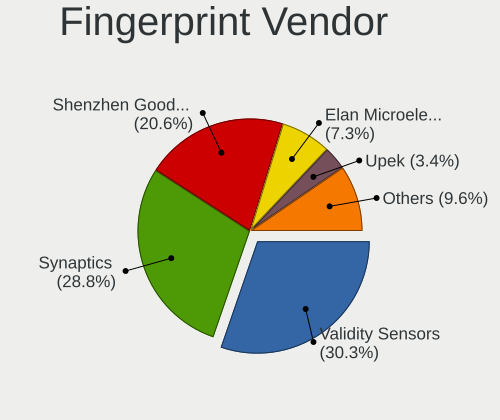

| Vendor                             | Notebooks | Percent |
|------------------------------------|-----------|---------|
| Validity Sensors                   | 592       | 30.28%  |
| Synaptics                          | 564       | 28.85%  |
| Shenzhen Goodix Technology         | 403       | 20.61%  |
| Elan Microelectronics              | 143       | 7.31%   |
| Upek                               | 66        | 3.38%   |
| AuthenTec                          | 60        | 3.07%   |
| LighTuning Technology              | 47        | 2.4%    |
| Realtek USB2.0 Finger Print Bridge | 34        | 1.74%   |
| STMicroelectronics                 | 12        | 0.61%   |
| Focal-systems.Corp                 | 11        | 0.56%   |
| HOLTEK                             | 10        | 0.51%   |
| Samsung Electronics                | 8         | 0.41%   |
| GDMicroelectronics                 | 3         | 0.15%   |
| Next Biometrics                    | 1         | 0.05%   |
| DigitalPersona                     | 1         | 0.05%   |

Fingerprint Model
-----------------

Fingerprint sensor models

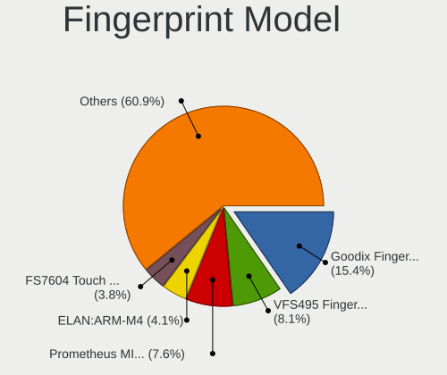

| Model                                                                      | Notebooks | Percent |
|----------------------------------------------------------------------------|-----------|---------|
| Shenzhen Goodix  Fingerprint Device                                        | 301       | 15.39%  |
| Validity Sensors VFS495 Fingerprint Reader                                 | 159       | 8.13%   |
| Synaptics Prometheus MIS Touch Fingerprint Reader                          | 149       | 7.62%   |
| Elan ELAN:ARM-M4                                                           | 81        | 4.14%   |
| Synaptics FS7604 Touch Fingerprint Sensor with PurePrint                   | 74        | 3.78%   |
| Synaptics Metallica MIS Touch Fingerprint Reader                           | 73        | 3.73%   |
| Elan ELAN:Fingerprint                                                      | 62        | 3.17%   |
| Upek Biometric Touchchip/Touchstrip Fingerprint Sensor                     | 60        | 3.07%   |
| Shenzhen Goodix FingerPrint                                                | 53        | 2.71%   |
| Validity Sensors VFS 5011 fingerprint sensor                               | 52        | 2.66%   |
| Validity Sensors VFS471 Fingerprint Reader                                 | 50        | 2.56%   |
| Shenzhen Goodix Fingerprint Reader                                         | 49        | 2.51%   |
| Validity Sensors Synaptics WBDI                                            | 48        | 2.45%   |
| Validity Sensors VFS5011 Fingerprint Reader                                | 47        | 2.4%    |
| Validity Sensors Synaptics VFS7552 Touch Fingerprint Sensor with PurePrint | 43        | 2.2%    |
| Synaptics UWP WBDI Device                                                  | 42        | 2.15%   |
| Validity Sensors Fingerprint scanner                                       | 37        | 1.89%   |
| Synaptics  FS7604 Touch Fingerprint Sensor with PurePrint                  | 37        | 1.89%   |
| Synaptics Prometheus Fingerprint Reader                                    | 37        | 1.89%   |
| Validity Sensors VFS491                                                    | 35        | 1.79%   |
| Realtek USB2.0 Finger Print Bridge FocalTech Fingerprint Device            | 34        | 1.74%   |
| Synaptics WBDI Fingerprint Reader USB 086                                  | 32        | 1.64%   |
| Synaptics Metallica MOH Touch Fingerprint Reader                           | 30        | 1.53%   |
| Synaptics Fingerprint reader [HP G6]                                       | 30        | 1.53%   |
| Validity Sensors Swipe Fingerprint Sensor                                  | 29        | 1.48%   |
| Validity Sensors VFS7500 Touch Fingerprint Sensor                          | 25        | 1.28%   |
| LighTuning EgisTec Touch Fingerprint Sensor                                | 25        | 1.28%   |
| Validity Sensors VFS451 Fingerprint Reader                                 | 24        | 1.23%   |
| AuthenTec Fingerprint Sensor                                               | 22        | 1.12%   |
| Synaptics WBDI                                                             | 20        | 1.02%   |
| Validity Sensors VFS301 Fingerprint Reader                                 | 16        | 0.82%   |
| LighTuning ES603 Swipe Fingerprint Sensor                                  | 16        | 0.82%   |
| AuthenTec AES2501 Fingerprint Sensor                                       | 13        | 0.66%   |
| STMicroelectronics Fingerprint Reader                                      | 12        | 0.61%   |
| Unknown                                                                    | 12        | 0.61%   |
| Focal-systems.Corp FT9201Fingerprint.                                      | 11        | 0.56%   |
| HOLTEK FocalTech Fingerprint Device                                        | 10        | 0.51%   |
| AuthenTec AES2810                                                          | 10        | 0.51%   |
| Validity Sensors VFS Fingerprint sensor                                    | 9         | 0.46%   |
| Synaptics UWP WBDI                                                         | 8         | 0.41%   |

Chipcard Vendor
---------------

Chipcard module vendors

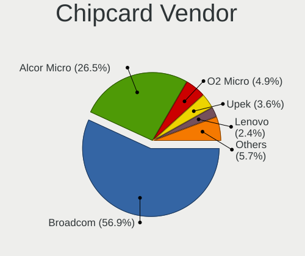

| Vendor                    | Notebooks | Percent |
|---------------------------|-----------|---------|
| Broadcom                  | 476       | 56.87%  |
| Alcor Micro               | 222       | 26.52%  |
| O2 Micro                  | 41        | 4.9%    |
| Upek                      | 30        | 3.58%   |
| Lenovo                    | 20        | 2.39%   |
| Gemalto (was Gemplus)     | 11        | 1.31%   |
| SCM Microsystems          | 6         | 0.72%   |
| Yubico.com                | 4         | 0.48%   |
| Giesecke & Devrient       | 4         | 0.48%   |
| Aladdin Knowledge Systems | 4         | 0.48%   |
| OmniKey                   | 3         | 0.36%   |
| Chicony Electronics       | 3         | 0.36%   |
| Watchdata                 | 2         | 0.24%   |
| Reiner SCT Kartensysteme  | 2         | 0.24%   |
| Realtek Semiconductor     | 2         | 0.24%   |
| Cherry                    | 2         | 0.24%   |
| NXP Semiconductors        | 1         | 0.12%   |
| Fujitsu Siemens Computers | 1         | 0.12%   |
| C3PO                      | 1         | 0.12%   |
| Aktiv                     | 1         | 0.12%   |
| Advanced Card Systems     | 1         | 0.12%   |

Chipcard Model
--------------

Chipcard module models

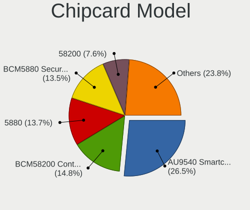

| Model                                                                        | Notebooks | Percent |
|------------------------------------------------------------------------------|-----------|---------|
| Alcor Micro AU9540 Smartcard Reader                                          | 222       | 26.52%  |
| Broadcom BCM58200 ControlVault 3 (FingerPrint sensor + Contacted SmartCard)  | 124       | 14.81%  |
| Broadcom 5880                                                                | 115       | 13.74%  |
| Broadcom BCM5880 Secure Applications Processor                               | 113       | 13.5%   |
| Broadcom 58200                                                               | 64        | 7.65%   |
| Broadcom BCM5880 Secure Applications Processor with fingerprint swipe sensor | 59        | 7.05%   |
| O2 Micro OZ776 CCID Smartcard Reader                                         | 36        | 4.3%    |
| Upek TouchChip Fingerprint Coprocessor (WBF advanced mode)                   | 30        | 3.58%   |
| Lenovo Integrated Smart Card Reader                                          | 20        | 2.39%   |
| Gemalto (was Gemplus) GemPC Twin SmartCard Reader                            | 8         | 0.96%   |
| O2 Micro Oz776 SmartCard Reader                                              | 5         | 0.6%    |
| Yubico.com Yubikey 4/5 U2F+CCID                                              | 4         | 0.48%   |
| SCM Microsystems SCR331-LC1 / SCR3310 SmartCard Reader                       | 4         | 0.48%   |
| Aladdin Knowledge Systems Token JC                                           | 4         | 0.48%   |
| Chicony Electronics HP Skylab USB Smartcard Keyboard                         | 3         | 0.36%   |
| Watchdata USB Key                                                            | 2         | 0.24%   |
| Reiner SCT Kartensysteme cyberJack RFID basis contactless smartcard reader   | 2         | 0.24%   |
| Realtek Semiconductor Smart Card Reader Interface                            | 2         | 0.24%   |
| Giesecke & Devrient StarSign CUT S                                           | 2         | 0.24%   |
| Giesecke & Devrient Chipcard Reader                                          | 2         | 0.24%   |
| Gemalto (was Gemplus) Compact Smart Card Reader Writer                       | 2         | 0.24%   |
| Cherry SmartCard Reader Keyboard KC 1000 SC                                  | 2         | 0.24%   |
| SCM Microsystems uTrust FIDO2 Security Key                                   | 1         | 0.12%   |
| SCM Microsystems SCR3340 - ExpressCard54 Smart Card Reader                   | 1         | 0.12%   |
| OmniKey CardMan 5022                                                         | 1         | 0.12%   |
| OmniKey CardMan 4321                                                         | 1         | 0.12%   |
| OmniKey CardMan 3121 (HID Technologies)                                      | 1         | 0.12%   |
| NXP Semiconductors PR533                                                     | 1         | 0.12%   |
| Gemalto (was Gemplus) GemPC Key SmartCard Reader                             | 1         | 0.12%   |
| Fujitsu Siemens Computers Keyboard KB SCR                                    | 1         | 0.12%   |
| C3PO LTC31v2                                                                 | 1         | 0.12%   |
| Broadcom BCM5880 Secure Applications Processor with fingerprint touch sensor | 1         | 0.12%   |
| Aktiv Rutoken lite                                                           | 1         | 0.12%   |
| Advanced Card Systems ACR122U                                                | 1         | 0.12%   |

Unsupported
-----------

Unsupported Devices
-------------------

Total unsupported devices on board

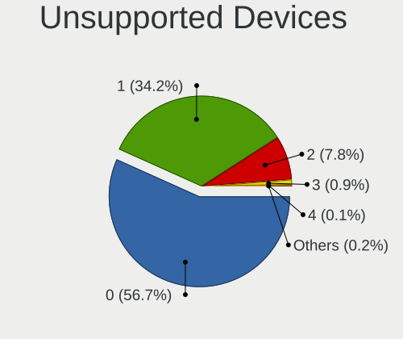

| Total | Notebooks | Percent |
|-------|-----------|---------|
| 0     | 5885      | 56.71%  |
| 1     | 3551      | 34.22%  |
| 2     | 814       | 7.84%   |
| 3     | 98        | 0.94%   |
| 4     | 10        | 0.1%    |
| 9     | 5         | 0.05%   |
| 5     | 5         | 0.05%   |
| 7     | 4         | 0.04%   |
| 6     | 3         | 0.03%   |
| 8     | 2         | 0.02%   |
| 10    | 1         | 0.01%   |

Unsupported Device Types
------------------------

Types of unsupported devices

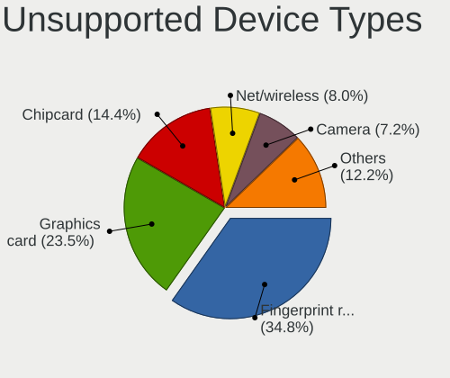

| Type                     | Notebooks | Percent |
|--------------------------|-----------|---------|
| Fingerprint reader       | 1913      | 34.8%   |
| Graphics card            | 1291      | 23.49%  |
| Chipcard                 | 789       | 14.35%  |
| Net/wireless             | 438       | 7.97%   |
| Camera                   | 396       | 7.2%    |
| Multimedia controller    | 228       | 4.15%   |
| Bluetooth                | 134       | 2.44%   |
| Sound                    | 82        | 1.49%   |
| Storage                  | 73        | 1.33%   |
| Card reader              | 51        | 0.93%   |
| Communication controller | 39        | 0.71%   |
| Net/ethernet             | 33        | 0.6%    |
| Network                  | 22        | 0.4%    |
| Flash memory             | 4         | 0.07%   |
| Modem                    | 2         | 0.04%   |
| Wireless                 | 1         | 0.02%   |
| Dvb card                 | 1         | 0.02%   |

