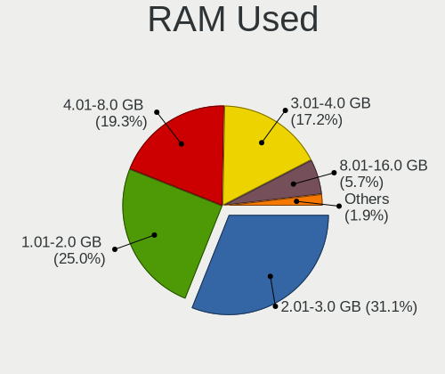
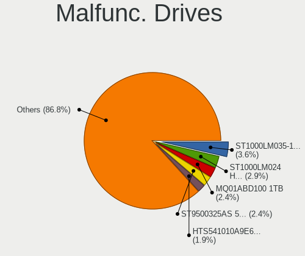
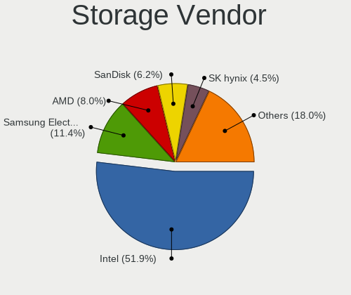
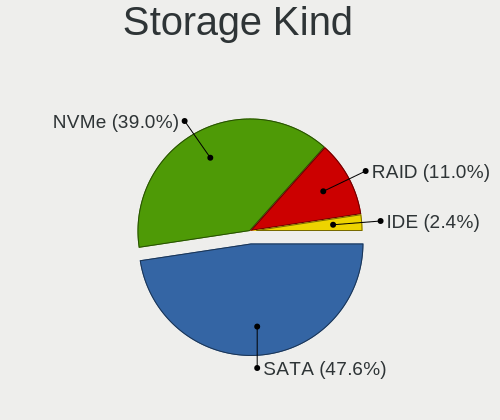
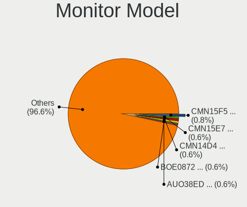

Ubuntu 22.04 - Tested Hardware & Statistics (Notebooks)
-------------------------------------------------------

A project to collect tested hardware configurations for Ubuntu 22.04.

Anyone can contribute to this report by the [hw-probe](https://github.com/linuxhw/hw-probe) tool:

    sudo -E hw-probe -all -upload

Please contribute! Especially if your hardware is rare.

Contents
--------

* [ Test Cases ](#test-cases)

* [ System ](#system)
  - [ Kernel                   ](#kernel)
  - [ Kernel Family            ](#kernel-family)
  - [ Kernel Major Ver.        ](#kernel-major-ver)
  - [ Arch                     ](#arch)
  - [ DE                       ](#de)
  - [ Display Server           ](#display-server)
  - [ Display Manager          ](#display-manager)
  - [ OS Lang                  ](#os-lang)
  - [ Boot Mode                ](#boot-mode)
  - [ Filesystem               ](#filesystem)
  - [ Part. scheme             ](#part-scheme)
  - [ Dual Boot with Linux/BSD ](#dual-boot-with-linuxbsd)
  - [ Dual Boot (Win)          ](#dual-boot-win)

* [ Board ](#board)
  - [ Vendor                   ](#vendor)
  - [ Model                    ](#model)
  - [ Model Family             ](#model-family)
  - [ MFG Year                 ](#mfg-year)
  - [ Form Factor              ](#form-factor)
  - [ Secure Boot              ](#secure-boot)
  - [ Coreboot                 ](#coreboot)
  - [ RAM Size                 ](#ram-size)
  - [ RAM Used                 ](#ram-used)
  - [ Total Drives             ](#total-drives)
  - [ Has CD-ROM               ](#has-cd-rom)
  - [ Has Ethernet             ](#has-ethernet)
  - [ Has WiFi                 ](#has-wifi)
  - [ Has Bluetooth            ](#has-bluetooth)

* [ Location ](#location)
  - [ Country                  ](#country)
  - [ City                     ](#city)

* [ Drives ](#drives)
  - [ Drive Vendor             ](#drive-vendor)
  - [ Drive Model              ](#drive-model)
  - [ HDD Vendor               ](#hdd-vendor)
  - [ SSD Vendor               ](#ssd-vendor)
  - [ Drive Kind               ](#drive-kind)
  - [ Drive Connector          ](#drive-connector)
  - [ Drive Size               ](#drive-size)
  - [ Space Total              ](#space-total)
  - [ Space Used               ](#space-used)
  - [ Malfunc. Drives          ](#malfunc-drives)
  - [ Malfunc. Drive Vendor    ](#malfunc-drive-vendor)
  - [ Malfunc. HDD Vendor      ](#malfunc-hdd-vendor)
  - [ Malfunc. Drive Kind      ](#malfunc-drive-kind)
  - [ Failed Drives            ](#failed-drives)
  - [ Failed Drive Vendor      ](#failed-drive-vendor)
  - [ Drive Status             ](#drive-status)

* [ Storage controller ](#storage-controller)
  - [ Storage Vendor           ](#storage-vendor)
  - [ Storage Model            ](#storage-model)
  - [ Storage Kind             ](#storage-kind)

* [ Processor ](#processor)
  - [ CPU Vendor               ](#cpu-vendor)
  - [ CPU Model                ](#cpu-model)
  - [ CPU Model Family         ](#cpu-model-family)
  - [ CPU Cores                ](#cpu-cores)
  - [ CPU Sockets              ](#cpu-sockets)
  - [ CPU Threads              ](#cpu-threads)
  - [ CPU Op-Modes             ](#cpu-op-modes)
  - [ CPU Microcode            ](#cpu-microcode)
  - [ CPU Microarch            ](#cpu-microarch)

* [ Graphics ](#graphics)
  - [ GPU Vendor               ](#gpu-vendor)
  - [ GPU Model                ](#gpu-model)
  - [ GPU Combo                ](#gpu-combo)
  - [ GPU Driver               ](#gpu-driver)
  - [ GPU Memory               ](#gpu-memory)

* [ Monitor ](#monitor)
  - [ Monitor Vendor           ](#monitor-vendor)
  - [ Monitor Model            ](#monitor-model)
  - [ Monitor Resolution       ](#monitor-resolution)
  - [ Monitor Diagonal         ](#monitor-diagonal)
  - [ Monitor Width            ](#monitor-width)
  - [ Aspect Ratio             ](#aspect-ratio)
  - [ Monitor Area             ](#monitor-area)
  - [ Pixel Density            ](#pixel-density)
  - [ Multiple Monitors        ](#multiple-monitors)

* [ Network ](#network)
  - [ Net Controller Vendor    ](#net-controller-vendor)
  - [ Net Controller Model     ](#net-controller-model)
  - [ Wireless Vendor          ](#wireless-vendor)
  - [ Wireless Model           ](#wireless-model)
  - [ Ethernet Vendor          ](#ethernet-vendor)
  - [ Ethernet Model           ](#ethernet-model)
  - [ Net Controller Kind      ](#net-controller-kind)
  - [ Used Controller          ](#used-controller)
  - [ NICs                     ](#nics)
  - [ IPv6                     ](#ipv6)

* [ Bluetooth ](#bluetooth)
  - [ Bluetooth Vendor         ](#bluetooth-vendor)
  - [ Bluetooth Model          ](#bluetooth-model)

* [ Sound ](#sound)
  - [ Sound Vendor             ](#sound-vendor)
  - [ Sound Model              ](#sound-model)

* [ Memory ](#memory)
  - [ Memory Vendor            ](#memory-vendor)
  - [ Memory Model             ](#memory-model)
  - [ Memory Kind              ](#memory-kind)
  - [ Memory Form Factor       ](#memory-form-factor)
  - [ Memory Size              ](#memory-size)
  - [ Memory Speed             ](#memory-speed)

* [ Printers & scanners ](#printers--scanners)
  - [ Printer Vendor           ](#printer-vendor)
  - [ Printer Model            ](#printer-model)
  - [ Scanner Vendor           ](#scanner-vendor)
  - [ Scanner Model            ](#scanner-model)

* [ Camera ](#camera)
  - [ Camera Vendor            ](#camera-vendor)
  - [ Camera Model             ](#camera-model)

* [ Security ](#security)
  - [ Fingerprint Vendor       ](#fingerprint-vendor)
  - [ Fingerprint Model        ](#fingerprint-model)
  - [ Chipcard Vendor          ](#chipcard-vendor)
  - [ Chipcard Model           ](#chipcard-model)

* [ Unsupported ](#unsupported)
  - [ Unsupported Devices      ](#unsupported-devices)
  - [ Unsupported Device Types ](#unsupported-device-types)

Test Cases
----------

Total: 12441

| Vendor        | Model                       | Probe                                                      | Date         |
|---------------|-----------------------------|------------------------------------------------------------|--------------|
| SDZ           | X133                        | [442d4da2a4](https://linux-hardware.org/?probe=442d4da2a4) | May 09, 2024 |
| MSI           | GE66 Raider 10UG            | [d19e5447f5](https://linux-hardware.org/?probe=d19e5447f5) | May 08, 2024 |
| HP            | ProBook 4740s               | [7f39194517](https://linux-hardware.org/?probe=7f39194517) | May 08, 2024 |
| Samsung       | SR700                       | [97ed5b7fc7](https://linux-hardware.org/?probe=97ed5b7fc7) | May 08, 2024 |
| HP            | ZBook Power 15.6 inch G8... | [291c23ee80](https://linux-hardware.org/?probe=291c23ee80) | May 08, 2024 |
| HP            | Pavilion Sleekbook 15       | [9cd7bfcd0f](https://linux-hardware.org/?probe=9cd7bfcd0f) | May 07, 2024 |
| ASUSTek       | X555LD                      | [989d24a4b7](https://linux-hardware.org/?probe=989d24a4b7) | May 07, 2024 |
| Lenovo        | ThinkPad P14s Gen 1 20Y2... | [064b211de8](https://linux-hardware.org/?probe=064b211de8) | May 07, 2024 |
| Notebook      | NS50_70MU                   | [99983ceae1](https://linux-hardware.org/?probe=99983ceae1) | May 07, 2024 |
| Lenovo        | ThinkPad T480 20L5A023HK    | [ff78bb7112](https://linux-hardware.org/?probe=ff78bb7112) | May 07, 2024 |
| Dell          | Inspiron 5547               | [b8dd9a912d](https://linux-hardware.org/?probe=b8dd9a912d) | May 07, 2024 |
| Dell          | Latitude 9430               | [953be205ca](https://linux-hardware.org/?probe=953be205ca) | May 07, 2024 |
| Sony          | SVF1521E2EW                 | [2e86efc1ba](https://linux-hardware.org/?probe=2e86efc1ba) | May 07, 2024 |
| HP            | ProBook 645 G3              | [29cb5b66f8](https://linux-hardware.org/?probe=29cb5b66f8) | May 07, 2024 |
| HP            | ZBook 15 G6                 | [4a401c8b15](https://linux-hardware.org/?probe=4a401c8b15) | May 06, 2024 |
| Sony          | VPCEB1S1E                   | [db144a8fd9](https://linux-hardware.org/?probe=db144a8fd9) | May 06, 2024 |
| Alurin        | ALU-BAR-I511-000-140        | [04578b9c4b](https://linux-hardware.org/?probe=04578b9c4b) | May 06, 2024 |
| Unknown       | Unknown                     | [273d6afeb5](https://linux-hardware.org/?probe=273d6afeb5) | May 06, 2024 |
| ASUSTek       | Zenbook UX5401ZA_UX5401Z... | [92089af4b7](https://linux-hardware.org/?probe=92089af4b7) | May 06, 2024 |
| Dell          | Latitude 5440               | [f6c9287953](https://linux-hardware.org/?probe=f6c9287953) | May 06, 2024 |
| ASUSTek       | VivoBook_ASUSLaptop X513... | [d4cca237f2](https://linux-hardware.org/?probe=d4cca237f2) | May 06, 2024 |
| ASUSTek       | VivoBook_ASUSLaptop X513... | [e5685451f5](https://linux-hardware.org/?probe=e5685451f5) | May 06, 2024 |
| Sony          | VPCEB1S1E                   | [aa8d766ae4](https://linux-hardware.org/?probe=aa8d766ae4) | May 06, 2024 |
| Dell          | Inspiron 15 3520            | [c9bddc6d00](https://linux-hardware.org/?probe=c9bddc6d00) | May 06, 2024 |
| Lenovo        | ThinkPad P50 20ENCTO1WW     | [9adbb0ba2c](https://linux-hardware.org/?probe=9adbb0ba2c) | May 06, 2024 |
| Lenovo        | ThinkPad P50 20ENCTO1WW     | [465a5be052](https://linux-hardware.org/?probe=465a5be052) | May 06, 2024 |
| Fujitsu       | LIFEBOOK E754               | [c201d1f500](https://linux-hardware.org/?probe=c201d1f500) | May 06, 2024 |
| ADVAN         | 1701                        | [e0928a1604](https://linux-hardware.org/?probe=e0928a1604) | May 06, 2024 |
| Lenovo        | ThinkPad P17 Gen 1 20SQS... | [8c2af338dc](https://linux-hardware.org/?probe=8c2af338dc) | May 06, 2024 |
| HP            | ProBook 450 G6              | [cb4f1dbbfa](https://linux-hardware.org/?probe=cb4f1dbbfa) | May 06, 2024 |
| Lenovo        | Unknown                     | [5087593233](https://linux-hardware.org/?probe=5087593233) | May 06, 2024 |
| Toshiba       | Satellite A200              | [633754915c](https://linux-hardware.org/?probe=633754915c) | May 05, 2024 |
| Lenovo        | IdeaPad Slim 5 16IRL8 82... | [2cace801f8](https://linux-hardware.org/?probe=2cace801f8) | May 05, 2024 |
| Toshiba       | Satellite A200              | [ba705e9e1b](https://linux-hardware.org/?probe=ba705e9e1b) | May 05, 2024 |
| Acer          | Aspire A315-510P            | [802925480b](https://linux-hardware.org/?probe=802925480b) | May 05, 2024 |
| ASUSTek       | ASUS TUF Gaming A15 FA50... | [b86bb80db9](https://linux-hardware.org/?probe=b86bb80db9) | May 05, 2024 |
| Lenovo        | ThinkPad P16 Gen 1 21D60... | [bc053b7c75](https://linux-hardware.org/?probe=bc053b7c75) | May 05, 2024 |
| ASUSTek       | VivoBook_ASUSLaptop M160... | [3602db941f](https://linux-hardware.org/?probe=3602db941f) | May 05, 2024 |
| Acer          | AOD270                      | [af6b765474](https://linux-hardware.org/?probe=af6b765474) | May 05, 2024 |
| Dell          | Precision 3510              | [c57923e0ff](https://linux-hardware.org/?probe=c57923e0ff) | May 04, 2024 |
| Dell          | Precision 3510              | [0c006aad0f](https://linux-hardware.org/?probe=0c006aad0f) | May 04, 2024 |
| HP            | ProBook 6470b               | [3865a636e2](https://linux-hardware.org/?probe=3865a636e2) | May 04, 2024 |
| Dell          | G15 5511                    | [8bb70e4a24](https://linux-hardware.org/?probe=8bb70e4a24) | May 04, 2024 |
| Apple         | MacBookAir4,1               | [f8bc0c50a5](https://linux-hardware.org/?probe=f8bc0c50a5) | May 04, 2024 |
| Lenovo        | ThinkPad T450 20BUS2SS00    | [5d764e707b](https://linux-hardware.org/?probe=5d764e707b) | May 04, 2024 |
| HP            | 15                          | [9ea6582e2f](https://linux-hardware.org/?probe=9ea6582e2f) | May 04, 2024 |
| Lenovo        | V340-17IWL 81RG             | [1584f1c1cf](https://linux-hardware.org/?probe=1584f1c1cf) | May 03, 2024 |
| HP            | ProBook 6470b               | [152863481c](https://linux-hardware.org/?probe=152863481c) | May 03, 2024 |
| Lenovo        | IdeaPad Slim 5 16ABR8 82... | [d3c40c405d](https://linux-hardware.org/?probe=d3c40c405d) | May 03, 2024 |
| Dell          | Latitude 7410               | [959e9d053d](https://linux-hardware.org/?probe=959e9d053d) | May 03, 2024 |
| HP            | EliteBook 8470p             | [2480bab346](https://linux-hardware.org/?probe=2480bab346) | May 02, 2024 |
| HP            | OMEN by Laptop 15-dc0xxx    | [23c1b45346](https://linux-hardware.org/?probe=23c1b45346) | May 02, 2024 |
| ASUSTek       | K40IE                       | [82ddbf99c2](https://linux-hardware.org/?probe=82ddbf99c2) | May 02, 2024 |
| ASUSTek       | X553MA                      | [1aaeefe305](https://linux-hardware.org/?probe=1aaeefe305) | May 02, 2024 |
| HP            | ENVY Laptop 17-cr1xxx       | [f17f6e1d74](https://linux-hardware.org/?probe=f17f6e1d74) | May 02, 2024 |
| Lenovo        | G400s VILG1                 | [f604dc3e58](https://linux-hardware.org/?probe=f604dc3e58) | May 02, 2024 |
| Notebook      | PCx0Dx                      | [a2c29d6db0](https://linux-hardware.org/?probe=a2c29d6db0) | May 02, 2024 |
| Lenovo        | ThinkPad E14 Gen 5 21JRC... | [8c996ba957](https://linux-hardware.org/?probe=8c996ba957) | May 02, 2024 |
| Lenovo        | V14-ADA 82C6                | [1e4ba01e31](https://linux-hardware.org/?probe=1e4ba01e31) | May 02, 2024 |
| Apple         | MacBookPro11,1              | [eb47dc7acd](https://linux-hardware.org/?probe=eb47dc7acd) | May 02, 2024 |
| HUAWEI        | BOD-WXX9                    | [0cd46d4084](https://linux-hardware.org/?probe=0cd46d4084) | May 02, 2024 |
| Unknown       | Unknown                     | [9fb77bbafc](https://linux-hardware.org/?probe=9fb77bbafc) | May 01, 2024 |
| HP            | Pavilion Sleekbook 15       | [f61e28b31c](https://linux-hardware.org/?probe=f61e28b31c) | May 01, 2024 |
| HP            | Stream Laptop 14-cb1xxx     | [b30b733ae9](https://linux-hardware.org/?probe=b30b733ae9) | May 01, 2024 |
| Framework     | Laptop 16 (AMD Ryzen 704... | [28e6be5f86](https://linux-hardware.org/?probe=28e6be5f86) | May 01, 2024 |
| Lenovo        | IdeaPad 1 15ALC7 82R4       | [f899f3dccf](https://linux-hardware.org/?probe=f899f3dccf) | May 01, 2024 |
| Acer          | Aspire A315-23              | [ee01c6ee48](https://linux-hardware.org/?probe=ee01c6ee48) | May 01, 2024 |
| Dell          | Inspiron 1525               | [8e9c51790c](https://linux-hardware.org/?probe=8e9c51790c) | May 01, 2024 |
| Dell          | Inspiron 1525               | [ca6bde2e75](https://linux-hardware.org/?probe=ca6bde2e75) | Apr 30, 2024 |
| Acer          | Aspire V3-372T              | [888ad09735](https://linux-hardware.org/?probe=888ad09735) | Apr 30, 2024 |
| ASUSTek       | VivoBook_ASUSLaptop X160... | [06046f8679](https://linux-hardware.org/?probe=06046f8679) | Apr 30, 2024 |
| Acer          | Aspire ES1-522              | [90a2ac9af6](https://linux-hardware.org/?probe=90a2ac9af6) | Apr 30, 2024 |
| MSI           | Raider GE76 12UE            | [6c23378280](https://linux-hardware.org/?probe=6c23378280) | Apr 30, 2024 |
| Lenovo        | ThinkPad T510 43494JG       | [fe8480c6c4](https://linux-hardware.org/?probe=fe8480c6c4) | Apr 30, 2024 |
| MSI           | GS66 Stealth 10SE           | [e436c09a5c](https://linux-hardware.org/?probe=e436c09a5c) | Apr 30, 2024 |
| HP            | EliteBook 840 G8 Noteboo... | [dca5cca3c7](https://linux-hardware.org/?probe=dca5cca3c7) | Apr 30, 2024 |
| Acer          | Aspire A115-32              | [32a4949c7c](https://linux-hardware.org/?probe=32a4949c7c) | Apr 30, 2024 |
| HP            | Laptop 15-da0xxx            | [1d5c1bf00e](https://linux-hardware.org/?probe=1d5c1bf00e) | Apr 30, 2024 |
| Lenovo        | IdeaPad 320-15IKB 80YH      | [d8017ef206](https://linux-hardware.org/?probe=d8017ef206) | Apr 30, 2024 |
| Lenovo        | IdeaPad 320-15IKB 80YH      | [7cc4d5fb6b](https://linux-hardware.org/?probe=7cc4d5fb6b) | Apr 30, 2024 |
| Lenovo        | ThinkPad P1 Gen 5 21DCS0... | [4f23a4a44b](https://linux-hardware.org/?probe=4f23a4a44b) | Apr 30, 2024 |
| HP            | Laptop 15s-fq5xxx           | [dfeb38ca05](https://linux-hardware.org/?probe=dfeb38ca05) | Apr 30, 2024 |
| HP            | Laptop 15q-bu0xx            | [24bf1e456c](https://linux-hardware.org/?probe=24bf1e456c) | Apr 30, 2024 |
| HP            | ProBook 650 G8 Notebook ... | [18585f423b](https://linux-hardware.org/?probe=18585f423b) | Apr 29, 2024 |
| Dell          | Latitude 3520               | [29ae7a02fd](https://linux-hardware.org/?probe=29ae7a02fd) | Apr 29, 2024 |
| Dell          | Latitude 3520               | [0ce04a54b4](https://linux-hardware.org/?probe=0ce04a54b4) | Apr 29, 2024 |
| ASUSTek       | X555YA                      | [43e5d87003](https://linux-hardware.org/?probe=43e5d87003) | Apr 29, 2024 |
| Lenovo        | ThinkBook 16 G4+ IAP 21C... | [4060d6bdbe](https://linux-hardware.org/?probe=4060d6bdbe) | Apr 29, 2024 |
| Lenovo        | ThinkBook 16 G4+ IAP 21C... | [885d49a692](https://linux-hardware.org/?probe=885d49a692) | Apr 29, 2024 |
| HP            | ZBook Studio G3             | [f22beb97bc](https://linux-hardware.org/?probe=f22beb97bc) | Apr 29, 2024 |
| Lenovo        | IdeaPad 5 Pro 14ITL6 82L... | [80821a7004](https://linux-hardware.org/?probe=80821a7004) | Apr 29, 2024 |
| Dell          | Latitude E6420              | [ce4fbe47c7](https://linux-hardware.org/?probe=ce4fbe47c7) | Apr 29, 2024 |
| Dell          | Latitude E6420              | [b7e8d7d578](https://linux-hardware.org/?probe=b7e8d7d578) | Apr 29, 2024 |
| Acer          | Extensa 5620                | [4150199b68](https://linux-hardware.org/?probe=4150199b68) | Apr 29, 2024 |
| Acer          | Aspire A715-76G             | [067678032d](https://linux-hardware.org/?probe=067678032d) | Apr 29, 2024 |
| Acer          | Aspire A515-47              | [7cef016361](https://linux-hardware.org/?probe=7cef016361) | Apr 29, 2024 |
| Dell          | Latitude 5420               | [121f841401](https://linux-hardware.org/?probe=121f841401) | Apr 29, 2024 |
| Toshiba       | Satellite L775D             | [507b5ac196](https://linux-hardware.org/?probe=507b5ac196) | Apr 29, 2024 |
| Samsung       | 750XED                      | [37fcaff384](https://linux-hardware.org/?probe=37fcaff384) | Apr 29, 2024 |
| HUAWEI        | NbDE-WXX9                   | [b378a91172](https://linux-hardware.org/?probe=b378a91172) | Apr 29, 2024 |
| Minix         | Z64 V1.2                    | [7c0143f3e4](https://linux-hardware.org/?probe=7c0143f3e4) | Apr 28, 2024 |
| Lenovo        | B570 1068EMG                | [9617fb7082](https://linux-hardware.org/?probe=9617fb7082) | Apr 28, 2024 |
| HP            | ProBook 650 G3              | [e2f71d285f](https://linux-hardware.org/?probe=e2f71d285f) | Apr 28, 2024 |
| Fujitsu       | LIFEBOOK UH572              | [18bdace363](https://linux-hardware.org/?probe=18bdace363) | Apr 28, 2024 |
| Lenovo        | ThinkPad T510 4349RW1       | [afaac362f7](https://linux-hardware.org/?probe=afaac362f7) | Apr 28, 2024 |
| Acer          | Aspire A315-33              | [6570c2a483](https://linux-hardware.org/?probe=6570c2a483) | Apr 28, 2024 |
| Toshiba       | Satellite P755              | [2e2a03f963](https://linux-hardware.org/?probe=2e2a03f963) | Apr 28, 2024 |
| Apple         | MacBookPro11,1              | [0a30ad8b47](https://linux-hardware.org/?probe=0a30ad8b47) | Apr 28, 2024 |
| Lenovo        | IdeaPad 320-15IKB 80XL      | [814f4429a4](https://linux-hardware.org/?probe=814f4429a4) | Apr 27, 2024 |
| Acer          | Aspire 5733                 | [f7af5c9308](https://linux-hardware.org/?probe=f7af5c9308) | Apr 27, 2024 |
| HP            | Notebook                    | [1918273411](https://linux-hardware.org/?probe=1918273411) | Apr 27, 2024 |
| HP            | Notebook                    | [91c53e6cc1](https://linux-hardware.org/?probe=91c53e6cc1) | Apr 27, 2024 |
| HP            | Laptop 15s-fq1xxx           | [b71d197185](https://linux-hardware.org/?probe=b71d197185) | Apr 27, 2024 |
| Lenovo        | ThinkPad X240 20AMA0SE00    | [be7a1e7b0c](https://linux-hardware.org/?probe=be7a1e7b0c) | Apr 27, 2024 |
| Toshiba       | Satellite C660              | [c2513f220d](https://linux-hardware.org/?probe=c2513f220d) | Apr 27, 2024 |
| ASUSTek       | ASUS TUF Gaming A17 FA70... | [da45f52feb](https://linux-hardware.org/?probe=da45f52feb) | Apr 27, 2024 |
| ASUSTek       | ASUS TUF Gaming A17 FA70... | [f8f255e514](https://linux-hardware.org/?probe=f8f255e514) | Apr 27, 2024 |
| ASUSTek       | X555LD                      | [95724fb189](https://linux-hardware.org/?probe=95724fb189) | Apr 27, 2024 |
| HP            | EliteBook 850 G4            | [1e562ccb80](https://linux-hardware.org/?probe=1e562ccb80) | Apr 27, 2024 |
| ASUSTek       | ZenBook UX431FAC_UX431FA    | [7c4a5dba54](https://linux-hardware.org/?probe=7c4a5dba54) | Apr 27, 2024 |
| Monster       | ABRA A5 V16.5               | [dafa6ffefd](https://linux-hardware.org/?probe=dafa6ffefd) | Apr 26, 2024 |
| Toshiba       | Satellite A505              | [d26d7bf4ec](https://linux-hardware.org/?probe=d26d7bf4ec) | Apr 26, 2024 |
| Samsung       | 750XED                      | [dc5ed7dd87](https://linux-hardware.org/?probe=dc5ed7dd87) | Apr 26, 2024 |
| ASUSTek       | VivoBook_ASUSLaptop M760... | [936e0bf88e](https://linux-hardware.org/?probe=936e0bf88e) | Apr 26, 2024 |
| Acer          | Aspire 7745G                | [2db24c493d](https://linux-hardware.org/?probe=2db24c493d) | Apr 26, 2024 |
| HP            | Pavilion Laptop 15-eh1xx... | [3358640735](https://linux-hardware.org/?probe=3358640735) | Apr 26, 2024 |
| Dell          | XPS 14 9440                 | [9eef0b7d62](https://linux-hardware.org/?probe=9eef0b7d62) | Apr 26, 2024 |
| Apple         | MacBookPro11,3              | [81b0d669d9](https://linux-hardware.org/?probe=81b0d669d9) | Apr 26, 2024 |
| Acer          | Aspire 5733                 | [b84cedde38](https://linux-hardware.org/?probe=b84cedde38) | Apr 26, 2024 |
| Dell          | Latitude 3420               | [c0bc583333](https://linux-hardware.org/?probe=c0bc583333) | Apr 26, 2024 |
| Dell          | Latitude 3420               | [522bdc6fd0](https://linux-hardware.org/?probe=522bdc6fd0) | Apr 26, 2024 |
| Lenovo        | IdeaPad 3 15ITL6 82H8       | [25997dad2f](https://linux-hardware.org/?probe=25997dad2f) | Apr 25, 2024 |
| Lenovo        | IdeaPad S145-15AST 81N3     | [68a7e21bcb](https://linux-hardware.org/?probe=68a7e21bcb) | Apr 25, 2024 |
| HP            | Laptop 15-da0xxx            | [3d96ca2745](https://linux-hardware.org/?probe=3d96ca2745) | Apr 25, 2024 |
| Lenovo        | IdeaPad 320-17ISK 80XJ      | [a0fe903a7c](https://linux-hardware.org/?probe=a0fe903a7c) | Apr 25, 2024 |
| Acer          | Aspire A315-510P            | [d30b9a7a06](https://linux-hardware.org/?probe=d30b9a7a06) | Apr 25, 2024 |
| HP            | EliteBook 850 G5            | [4da2348bbe](https://linux-hardware.org/?probe=4da2348bbe) | Apr 25, 2024 |
| Lenovo        | IdeaPad 5 14ALC05 82LM      | [6ec3950131](https://linux-hardware.org/?probe=6ec3950131) | Apr 25, 2024 |
| HP            | 2000                        | [1314698cd1](https://linux-hardware.org/?probe=1314698cd1) | Apr 25, 2024 |
| HP            | Compaq 6520s                | [235863713b](https://linux-hardware.org/?probe=235863713b) | Apr 25, 2024 |
| Dell          | Unidentified System         | [3adeaf17e6](https://linux-hardware.org/?probe=3adeaf17e6) | Apr 25, 2024 |
| Dell          | Inspiron N7010              | [adce00a04d](https://linux-hardware.org/?probe=adce00a04d) | Apr 25, 2024 |
| Dell          | Inspiron N7010              | [fa7c038b74](https://linux-hardware.org/?probe=fa7c038b74) | Apr 25, 2024 |
| Dell          | Unidentified System         | [d39d12f48e](https://linux-hardware.org/?probe=d39d12f48e) | Apr 25, 2024 |
| HP            | ZBook 17 G3                 | [05ef86a1b6](https://linux-hardware.org/?probe=05ef86a1b6) | Apr 25, 2024 |
| Lenovo        | Legion S7 16ARHA7 82UG      | [5b493ea8ca](https://linux-hardware.org/?probe=5b493ea8ca) | Apr 24, 2024 |
| Lenovo        | IdeaPad 5 14IIL05 81YH      | [f537e8aab2](https://linux-hardware.org/?probe=f537e8aab2) | Apr 24, 2024 |
| Lenovo        | ThinkPad P52 20MAS4W721     | [7aab14f802](https://linux-hardware.org/?probe=7aab14f802) | Apr 24, 2024 |
| Vizio         | CT14                        | [557643cae2](https://linux-hardware.org/?probe=557643cae2) | Apr 24, 2024 |
| Lenovo        | ThinkPad P16s Gen 2 21HK... | [363e170887](https://linux-hardware.org/?probe=363e170887) | Apr 24, 2024 |
| HP            | 255 G6 Notebook PC          | [8388259ad7](https://linux-hardware.org/?probe=8388259ad7) | Apr 24, 2024 |
| Dell          | Precision 3581              | [93a95856e0](https://linux-hardware.org/?probe=93a95856e0) | Apr 24, 2024 |
| Toshiba       | Satellite E45t-B            | [4abd9d698a](https://linux-hardware.org/?probe=4abd9d698a) | Apr 24, 2024 |
| ASUSTek       | ZenBook UX431FAC_UX431FA    | [cc693892db](https://linux-hardware.org/?probe=cc693892db) | Apr 24, 2024 |
| Lenovo        | Legion Pro 5 16IRX9 83DF    | [a0287fdd29](https://linux-hardware.org/?probe=a0287fdd29) | Apr 24, 2024 |
| Lenovo        | ThinkPad P16s Gen 2 21K9... | [ac5431b1ee](https://linux-hardware.org/?probe=ac5431b1ee) | Apr 24, 2024 |
| ASUSTek       | ROG Strix G513QC_G513QC     | [85b36d2613](https://linux-hardware.org/?probe=85b36d2613) | Apr 24, 2024 |
| Lenovo        | ThinkPad E14 Gen 2 20TA0... | [038bd79a48](https://linux-hardware.org/?probe=038bd79a48) | Apr 23, 2024 |
| Dell          | Latitude 5290 2-in-1        | [de4f7d0a06](https://linux-hardware.org/?probe=de4f7d0a06) | Apr 23, 2024 |
| Apple         | MacBookPro8,1               | [d8f7a5da03](https://linux-hardware.org/?probe=d8f7a5da03) | Apr 23, 2024 |
| Toshiba       | Satellite Pro A200          | [305f0f136a](https://linux-hardware.org/?probe=305f0f136a) | Apr 23, 2024 |
| Lenovo        | ThinkPad P51 20HHCTO1WW     | [152f2cedf4](https://linux-hardware.org/?probe=152f2cedf4) | Apr 23, 2024 |
| Dell          | Vostro 15 5510              | [aedc6ae848](https://linux-hardware.org/?probe=aedc6ae848) | Apr 23, 2024 |
| Allview       | Allbook J                   | [77d90c2a69](https://linux-hardware.org/?probe=77d90c2a69) | Apr 23, 2024 |
| Unknown       | Unknown                     | [6d5a09c736](https://linux-hardware.org/?probe=6d5a09c736) | Apr 23, 2024 |
| MSI           | Katana GF66 11UE            | [8f4e6cf713](https://linux-hardware.org/?probe=8f4e6cf713) | Apr 23, 2024 |
| Toshiba       | Satellite C55-B             | [031e71aea3](https://linux-hardware.org/?probe=031e71aea3) | Apr 23, 2024 |
| Notebook      | NP50D5                      | [5efdc99e90](https://linux-hardware.org/?probe=5efdc99e90) | Apr 23, 2024 |
| Acer          | Aspire A515-52G             | [9ee2e8d42a](https://linux-hardware.org/?probe=9ee2e8d42a) | Apr 23, 2024 |
| Lenovo        | IdeaPad 3 15ABA7 82RN       | [e99cd50084](https://linux-hardware.org/?probe=e99cd50084) | Apr 23, 2024 |
| HP            | ProBook 650 G1              | [09883eb0c7](https://linux-hardware.org/?probe=09883eb0c7) | Apr 22, 2024 |
| Monster       | ABRA A5 V9.1                | [de1c33f8ea](https://linux-hardware.org/?probe=de1c33f8ea) | Apr 22, 2024 |
| Dell          | Precision 3581              | [2e60f977aa](https://linux-hardware.org/?probe=2e60f977aa) | Apr 22, 2024 |
| Lenovo        | IdeaPad 320-17IKB 80XM      | [43ec460c41](https://linux-hardware.org/?probe=43ec460c41) | Apr 22, 2024 |
| Lenovo        | ThinkPad P1 Gen 4i 20Y30... | [5d84a72fcf](https://linux-hardware.org/?probe=5d84a72fcf) | Apr 22, 2024 |
| MSI           | GS65 Stealth Thin 8RE       | [8e326da202](https://linux-hardware.org/?probe=8e326da202) | Apr 22, 2024 |
| Acer          | Aspire E5-773G              | [5e72cf2ad7](https://linux-hardware.org/?probe=5e72cf2ad7) | Apr 22, 2024 |
| Dell          | Latitude 3150               | [2591de095d](https://linux-hardware.org/?probe=2591de095d) | Apr 22, 2024 |
| ASUSTek       | ZenBook UX325UA_UM325UA     | [cfba8255a3](https://linux-hardware.org/?probe=cfba8255a3) | Apr 22, 2024 |
| MECHREVO      | WUJIE14XA                   | [2b34ae91ef](https://linux-hardware.org/?probe=2b34ae91ef) | Apr 22, 2024 |
| ASUSTek       | VivoBook_ASUSLaptop X740... | [7102c622a5](https://linux-hardware.org/?probe=7102c622a5) | Apr 22, 2024 |
| eMachines     | eME528                      | [026f678993](https://linux-hardware.org/?probe=026f678993) | Apr 21, 2024 |
| HP            | Laptop 15s-eq3xxx           | [63efa2e397](https://linux-hardware.org/?probe=63efa2e397) | Apr 21, 2024 |
| HP            | EliteBook 840 G4            | [5030d63cae](https://linux-hardware.org/?probe=5030d63cae) | Apr 21, 2024 |
| ASUSTek       | X555UF                      | [0ad869f641](https://linux-hardware.org/?probe=0ad869f641) | Apr 21, 2024 |
| HP            | EliteBook 8460p             | [10abeed71a](https://linux-hardware.org/?probe=10abeed71a) | Apr 21, 2024 |
| Lenovo        | IdeaPad 110-15IBR 80T7      | [65f1fdc927](https://linux-hardware.org/?probe=65f1fdc927) | Apr 21, 2024 |
| Dell          | Latitude 7490               | [46cb3d1473](https://linux-hardware.org/?probe=46cb3d1473) | Apr 21, 2024 |
| Lenovo        | ThinkPad E590 20NB0018MC    | [6b065854a6](https://linux-hardware.org/?probe=6b065854a6) | Apr 21, 2024 |
| Lenovo        | ThinkPad T440 20B7000CLM    | [49c44d3355](https://linux-hardware.org/?probe=49c44d3355) | Apr 21, 2024 |
| Lenovo        | ThinkPad T440 20B7000CLM    | [b6124fdf94](https://linux-hardware.org/?probe=b6124fdf94) | Apr 21, 2024 |
| Dell          | Latitude E6510              | [b44dd02c4f](https://linux-hardware.org/?probe=b44dd02c4f) | Apr 20, 2024 |
| Acer          | Extensa 215-55              | [2639558ab5](https://linux-hardware.org/?probe=2639558ab5) | Apr 20, 2024 |
| Apple         | MacBookPro14,1              | [bc73a30917](https://linux-hardware.org/?probe=bc73a30917) | Apr 20, 2024 |
| Apple         | MacBookAir7,1               | [71cd16b516](https://linux-hardware.org/?probe=71cd16b516) | Apr 20, 2024 |
| Lenovo        | ThinkPad X270 20HN0016MX    | [cd5fff4dcd](https://linux-hardware.org/?probe=cd5fff4dcd) | Apr 20, 2024 |
| Lenovo        | IdeaPad Gaming 3 15ACH6 ... | [67792de52a](https://linux-hardware.org/?probe=67792de52a) | Apr 20, 2024 |
| HP            | 2000                        | [97a00523bc](https://linux-hardware.org/?probe=97a00523bc) | Apr 20, 2024 |
| HP            | Pavilion Laptop 15-eh0xx... | [e63dbfe22c](https://linux-hardware.org/?probe=e63dbfe22c) | Apr 20, 2024 |
| Monster       | ABRA A5 V9.1                | [a438f99e4d](https://linux-hardware.org/?probe=a438f99e4d) | Apr 20, 2024 |
| HUAWEI        | BOM-WXX9                    | [44ae5efad2](https://linux-hardware.org/?probe=44ae5efad2) | Apr 20, 2024 |
| Apple         | MacBookPro14,1              | [e215f07c2d](https://linux-hardware.org/?probe=e215f07c2d) | Apr 20, 2024 |
| ASUSTek       | ROG Strix G731GT_GL731GT    | [07ab4bf081](https://linux-hardware.org/?probe=07ab4bf081) | Apr 20, 2024 |
| HP            | Pavilion g6                 | [0f10b1616f](https://linux-hardware.org/?probe=0f10b1616f) | Apr 20, 2024 |
| HP            | Laptop 15-ef2xxx            | [276ff854fe](https://linux-hardware.org/?probe=276ff854fe) | Apr 20, 2024 |
| Lenovo        | ThinkPad T440p 20AWS4EG0... | [2496364031](https://linux-hardware.org/?probe=2496364031) | Apr 20, 2024 |
| ASUSTek       | ZenBook UX325UA_UM325UA     | [d89b09df70](https://linux-hardware.org/?probe=d89b09df70) | Apr 19, 2024 |
| Acer          | NG-F5-771G-74P9             | [efaac96b3d](https://linux-hardware.org/?probe=efaac96b3d) | Apr 19, 2024 |
| Dell          | Latitude D620               | [9ebcfcc532](https://linux-hardware.org/?probe=9ebcfcc532) | Apr 19, 2024 |
| Lenovo        | ThinkBook 16p Gen 4 21J8    | [f15e68d490](https://linux-hardware.org/?probe=f15e68d490) | Apr 19, 2024 |
| Dell          | Latitude 7440               | [abc0600b15](https://linux-hardware.org/?probe=abc0600b15) | Apr 19, 2024 |
| Dell          | Latitude 7440               | [bc75c7249a](https://linux-hardware.org/?probe=bc75c7249a) | Apr 19, 2024 |
| Lenovo        | ThinkPad Edge E145 20BCA... | [572cb1f325](https://linux-hardware.org/?probe=572cb1f325) | Apr 19, 2024 |
| Lenovo        | G480 20149                  | [ad23e3678b](https://linux-hardware.org/?probe=ad23e3678b) | Apr 19, 2024 |
| HP            | ProBook 640 G1              | [a5d4162d2f](https://linux-hardware.org/?probe=a5d4162d2f) | Apr 19, 2024 |
| Unknown       | Unknown                     | [62969495f2](https://linux-hardware.org/?probe=62969495f2) | Apr 19, 2024 |
| Notebook      | P7xxDM2(-G)                 | [8b6528977b](https://linux-hardware.org/?probe=8b6528977b) | Apr 19, 2024 |
| Ruijie        | RG-Rain305E                 | [48f650b68e](https://linux-hardware.org/?probe=48f650b68e) | Apr 19, 2024 |
| ADVAN         | 1701                        | [a55c0ef710](https://linux-hardware.org/?probe=a55c0ef710) | Apr 19, 2024 |
| Dell          | Inspiron N4050              | [c35c8bb833](https://linux-hardware.org/?probe=c35c8bb833) | Apr 19, 2024 |
| Dell          | Inspiron N4050              | [0e75a1591d](https://linux-hardware.org/?probe=0e75a1591d) | Apr 19, 2024 |
| ASUSTek       | ASUS P1412CEA_P1412CEA      | [1cc39c7bdc](https://linux-hardware.org/?probe=1cc39c7bdc) | Apr 18, 2024 |
| UNOWHY        | Y13G002S4EI                 | [d5ed9a8f9c](https://linux-hardware.org/?probe=d5ed9a8f9c) | Apr 18, 2024 |
| Acer          | Swift SF314-71              | [4dbbe8a263](https://linux-hardware.org/?probe=4dbbe8a263) | Apr 18, 2024 |
| Lenovo        | B570 1068EMG                | [87cf443603](https://linux-hardware.org/?probe=87cf443603) | Apr 18, 2024 |
| Lenovo        | G50-80 80E5                 | [184f2cf756](https://linux-hardware.org/?probe=184f2cf756) | Apr 18, 2024 |
| Acer          | Aspire ES1-512              | [11c23ef24d](https://linux-hardware.org/?probe=11c23ef24d) | Apr 18, 2024 |
| Acer          | Aspire ES1-512              | [6c292bf7df](https://linux-hardware.org/?probe=6c292bf7df) | Apr 18, 2024 |
| Lenovo        | ThinkPad X1 Extreme 2nd ... | [634572901c](https://linux-hardware.org/?probe=634572901c) | Apr 18, 2024 |
| Unknown       | X133                        | [b12f5e7b59](https://linux-hardware.org/?probe=b12f5e7b59) | Apr 18, 2024 |
| ASUSTek       | X55A                        | [5603d8ff5e](https://linux-hardware.org/?probe=5603d8ff5e) | Apr 18, 2024 |
| Allview       | Allbook J                   | [a106195c34](https://linux-hardware.org/?probe=a106195c34) | Apr 18, 2024 |
| Lenovo        | ThinkPad P14s Gen 1 20S4... | [2af00eb282](https://linux-hardware.org/?probe=2af00eb282) | Apr 18, 2024 |
| Lenovo        | V15-IGL 82C3                | [1cc58790d6](https://linux-hardware.org/?probe=1cc58790d6) | Apr 18, 2024 |
| ASUSTek       | VivoBook_ASUSLaptop X150... | [bf5c40b060](https://linux-hardware.org/?probe=bf5c40b060) | Apr 18, 2024 |
| Framework     | Laptop 13 (AMD Ryzen 704... | [c100880ad7](https://linux-hardware.org/?probe=c100880ad7) | Apr 18, 2024 |
| Dell          | Inspiron 16 Plus 7630       | [d19befd3a4](https://linux-hardware.org/?probe=d19befd3a4) | Apr 18, 2024 |
| Dell          | Inspiron 16 Plus 7630       | [4fd0bed406](https://linux-hardware.org/?probe=4fd0bed406) | Apr 17, 2024 |
| Dell          | Latitude E5540              | [c52074d979](https://linux-hardware.org/?probe=c52074d979) | Apr 17, 2024 |
| Lenovo        | ThinkPad P14s Gen 2a 21A... | [0cd0c2f953](https://linux-hardware.org/?probe=0cd0c2f953) | Apr 17, 2024 |
| Lenovo        | G50-80 80L0                 | [43b22a1d84](https://linux-hardware.org/?probe=43b22a1d84) | Apr 17, 2024 |
| HP            | ZBook 15 G5                 | [df2d154abb](https://linux-hardware.org/?probe=df2d154abb) | Apr 17, 2024 |
| HUAWEI        | KLVL-WXXW                   | [0279a4db38](https://linux-hardware.org/?probe=0279a4db38) | Apr 17, 2024 |
| Lenovo        | ThinkPad W550s 20E2CTO1W... | [121d5593e0](https://linux-hardware.org/?probe=121d5593e0) | Apr 17, 2024 |
| Dell          | Inspiron 7560               | [6583453d1f](https://linux-hardware.org/?probe=6583453d1f) | Apr 17, 2024 |
| Dell          | Latitude E5470              | [5d8e161314](https://linux-hardware.org/?probe=5d8e161314) | Apr 17, 2024 |
| HUAWEI        | HVY-WXX9                    | [6727adfce1](https://linux-hardware.org/?probe=6727adfce1) | Apr 17, 2024 |
| Acer          | Nitro AN515-57              | [f4cdb12814](https://linux-hardware.org/?probe=f4cdb12814) | Apr 17, 2024 |
| Lenovo        | IdeaPad 3 15IML05 81WR      | [e6888546ba](https://linux-hardware.org/?probe=e6888546ba) | Apr 16, 2024 |
| ILLEGEAR      | RAVEN SE                    | [7b641eb6ba](https://linux-hardware.org/?probe=7b641eb6ba) | Apr 16, 2024 |
| Lenovo        | ThinkBook 15 G2 ITL 20VE    | [080c39059e](https://linux-hardware.org/?probe=080c39059e) | Apr 16, 2024 |
| Intel         | CHERRYVIEW D1 PLATFORM      | [86ab252a30](https://linux-hardware.org/?probe=86ab252a30) | Apr 16, 2024 |
| Apple         | MacBookAir6,2               | [22c88e1591](https://linux-hardware.org/?probe=22c88e1591) | Apr 16, 2024 |
| Apple         | MacBookPro11,1              | [ff3ba1baf8](https://linux-hardware.org/?probe=ff3ba1baf8) | Apr 16, 2024 |
| Sony          | VPCEH3K1E                   | [79f871b092](https://linux-hardware.org/?probe=79f871b092) | Apr 16, 2024 |
| INSYS         | GW1-W149                    | [2f53f6286d](https://linux-hardware.org/?probe=2f53f6286d) | Apr 15, 2024 |
| ASUSTek       | ZenBook UX325EA_UX325EA     | [f50417f34e](https://linux-hardware.org/?probe=f50417f34e) | Apr 15, 2024 |
| HP            | Laptop 17-cp0xxx            | [6f08b03e98](https://linux-hardware.org/?probe=6f08b03e98) | Apr 15, 2024 |
| Lenovo        | ThinkBook 15p Gen 2 21B1    | [e7a52d5a3c](https://linux-hardware.org/?probe=e7a52d5a3c) | Apr 15, 2024 |
| ASUSTek       | VivoBook_ASUSLaptop X515... | [9f9dc48ef8](https://linux-hardware.org/?probe=9f9dc48ef8) | Apr 15, 2024 |
| Packard Be... | ENNS45HR                    | [668c3b801a](https://linux-hardware.org/?probe=668c3b801a) | Apr 15, 2024 |
| Standard      | Unknown                     | [f8ecdc6095](https://linux-hardware.org/?probe=f8ecdc6095) | Apr 15, 2024 |
| Lenovo        | Flex 3-1470 80JK            | [3c33b5194f](https://linux-hardware.org/?probe=3c33b5194f) | Apr 15, 2024 |
| Fujitsu       | LIFEBOOK T5010              | [89bd2f34e8](https://linux-hardware.org/?probe=89bd2f34e8) | Apr 15, 2024 |
| Lenovo        | IdeaPad 1 15ALC7 82R4       | [ccbc40e1d5](https://linux-hardware.org/?probe=ccbc40e1d5) | Apr 15, 2024 |
| MSI           | GF63 Thin 9SCSR             | [f0aa2a4553](https://linux-hardware.org/?probe=f0aa2a4553) | Apr 14, 2024 |
| ASUSTek       | VivoBook_ASUSLaptop M360... | [25a93e1b63](https://linux-hardware.org/?probe=25a93e1b63) | Apr 14, 2024 |
| HP            | Laptop 15-fc0xxx            | [3e03fa9446](https://linux-hardware.org/?probe=3e03fa9446) | Apr 14, 2024 |
| HP            | ProBook 450 15.6 inch G9... | [d866d51612](https://linux-hardware.org/?probe=d866d51612) | Apr 14, 2024 |
| Dell          | Inspiron 14 5420            | [6ae28bdf30](https://linux-hardware.org/?probe=6ae28bdf30) | Apr 14, 2024 |
| ASUSTek       | N81Vp                       | [92a6370ed9](https://linux-hardware.org/?probe=92a6370ed9) | Apr 14, 2024 |
| Unknown       | Unknown                     | [773a23ae2c](https://linux-hardware.org/?probe=773a23ae2c) | Apr 14, 2024 |
| Dell          | Latitude 3540               | [fcfe26dc90](https://linux-hardware.org/?probe=fcfe26dc90) | Apr 14, 2024 |
| Dell          | G15 5530                    | [b44b0fd700](https://linux-hardware.org/?probe=b44b0fd700) | Apr 14, 2024 |
| MSI           | Modern 14 B10MW             | [7a56c3ee49](https://linux-hardware.org/?probe=7a56c3ee49) | Apr 13, 2024 |
| ASUSTek       | ZenBook UX325EA_UX325EA     | [8c33938518](https://linux-hardware.org/?probe=8c33938518) | Apr 13, 2024 |
| Acer          | Predator PH315-52           | [6af03923d8](https://linux-hardware.org/?probe=6af03923d8) | Apr 13, 2024 |
| Apple         | MacBookPro11,5              | [16393b1211](https://linux-hardware.org/?probe=16393b1211) | Apr 13, 2024 |
| Acer          | Extensa 2540                | [ff3d1b60d2](https://linux-hardware.org/?probe=ff3d1b60d2) | Apr 13, 2024 |
| HP            | Pavilion g6                 | [80f535a166](https://linux-hardware.org/?probe=80f535a166) | Apr 13, 2024 |
| Dell          | G5 5590                     | [100c4a112b](https://linux-hardware.org/?probe=100c4a112b) | Apr 13, 2024 |
| ASUSTek       | VivoBook_ASUSLaptop X140... | [b4cd318c86](https://linux-hardware.org/?probe=b4cd318c86) | Apr 13, 2024 |
| Acer          | Aspire 5733                 | [3451c7aac4](https://linux-hardware.org/?probe=3451c7aac4) | Apr 13, 2024 |
| Acer          | Nitro AN515-58              | [1da17c34a3](https://linux-hardware.org/?probe=1da17c34a3) | Apr 13, 2024 |
| Notebook      | W65_67SZ                    | [e5d65368f2](https://linux-hardware.org/?probe=e5d65368f2) | Apr 13, 2024 |
| Lenovo        | ThinkPad T440 20B7A0MN04    | [2244374672](https://linux-hardware.org/?probe=2244374672) | Apr 13, 2024 |
| Acer          | Nitro AN515-58              | [b08b5165e8](https://linux-hardware.org/?probe=b08b5165e8) | Apr 13, 2024 |
| Dell          | G15 5530                    | [cbc77bc17c](https://linux-hardware.org/?probe=cbc77bc17c) | Apr 13, 2024 |
| ASUSTek       | VivoBook_ASUSLaptop M360... | [f6d12e0e88](https://linux-hardware.org/?probe=f6d12e0e88) | Apr 13, 2024 |
| Apple         | MacBookPro9,1               | [421b7a0e3a](https://linux-hardware.org/?probe=421b7a0e3a) | Apr 12, 2024 |
| Apple         | MacBookAir6,2               | [71158a0432](https://linux-hardware.org/?probe=71158a0432) | Apr 12, 2024 |
| Lenovo        | Yoga 510-14AST 80S9         | [19e925f1df](https://linux-hardware.org/?probe=19e925f1df) | Apr 12, 2024 |
| Lenovo        | ThinkPad T470 20HDS0C700    | [a06e4429b0](https://linux-hardware.org/?probe=a06e4429b0) | Apr 12, 2024 |
| HP            | ProBook 450 G8 Notebook ... | [1b7b943c5d](https://linux-hardware.org/?probe=1b7b943c5d) | Apr 12, 2024 |
| Lenovo        | ThinkPad E15 20RD005VRI     | [d7f5702701](https://linux-hardware.org/?probe=d7f5702701) | Apr 12, 2024 |
| Lenovo        | ThinkPad E590 20NB0002FE    | [d7eb12b86f](https://linux-hardware.org/?probe=d7eb12b86f) | Apr 12, 2024 |
| ASUSTek       | X542URR                     | [e3a4e15a6e](https://linux-hardware.org/?probe=e3a4e15a6e) | Apr 12, 2024 |
| HUAWEI        | KLVL-WXX9                   | [cbeae24a2b](https://linux-hardware.org/?probe=cbeae24a2b) | Apr 12, 2024 |
| HP            | EliteBook 840 G5            | [552cd13a50](https://linux-hardware.org/?probe=552cd13a50) | Apr 12, 2024 |
| Lenovo        | ThinkPad E590 20NB0002FE    | [b6cecec324](https://linux-hardware.org/?probe=b6cecec324) | Apr 12, 2024 |
| Lenovo        | ThinkPad S430 336457G       | [93b1811e42](https://linux-hardware.org/?probe=93b1811e42) | Apr 12, 2024 |
| Lenovo        | ThinkPad S430 336457G       | [118beb78ac](https://linux-hardware.org/?probe=118beb78ac) | Apr 12, 2024 |
| Notebook      | NS5x_NS7xPU                 | [b97d0acf58](https://linux-hardware.org/?probe=b97d0acf58) | Apr 11, 2024 |
| HP            | ZBook 15 G6                 | [e8ad21a64f](https://linux-hardware.org/?probe=e8ad21a64f) | Apr 11, 2024 |
| HP            | EliteBook 8470p             | [47a86e797f](https://linux-hardware.org/?probe=47a86e797f) | Apr 11, 2024 |
| Toshiba       | Satellite L50D-B            | [37d988b60d](https://linux-hardware.org/?probe=37d988b60d) | Apr 11, 2024 |
| Dell          | XPS 15 7590                 | [44db6be811](https://linux-hardware.org/?probe=44db6be811) | Apr 11, 2024 |
| HUAWEI        | NbDE-WXX9                   | [ab55a720c5](https://linux-hardware.org/?probe=ab55a720c5) | Apr 11, 2024 |
| Lenovo        | Yoga Slim 7 Pro 14ACH5 8... | [2b93085de2](https://linux-hardware.org/?probe=2b93085de2) | Apr 11, 2024 |
| HP            | ZBook 15 G3                 | [f003ea5605](https://linux-hardware.org/?probe=f003ea5605) | Apr 11, 2024 |
| ASUSTek       | TUF Gaming FX504GD_FX80G... | [fbaf67a904](https://linux-hardware.org/?probe=fbaf67a904) | Apr 11, 2024 |
| ASUSTek       | TUF Gaming FX504GD_FX80G... | [2526b63349](https://linux-hardware.org/?probe=2526b63349) | Apr 11, 2024 |
| Dell          | Latitude E5510              | [eb1e78e4d3](https://linux-hardware.org/?probe=eb1e78e4d3) | Apr 11, 2024 |
| Dell          | Inspiron 5570               | [df5df3d63f](https://linux-hardware.org/?probe=df5df3d63f) | Apr 11, 2024 |
| Lenovo        | ThinkPad T14 Gen 1 20S1S... | [1450416558](https://linux-hardware.org/?probe=1450416558) | Apr 11, 2024 |
| Dell          | Latitude E6510              | [0998bb8bb7](https://linux-hardware.org/?probe=0998bb8bb7) | Apr 11, 2024 |
| Dell          | Latitude E5450              | [0498f11080](https://linux-hardware.org/?probe=0498f11080) | Apr 10, 2024 |
| Dell          | Latitude E5450              | [6dce980379](https://linux-hardware.org/?probe=6dce980379) | Apr 10, 2024 |
| Dell          | Latitude E5470              | [4c1915f7c1](https://linux-hardware.org/?probe=4c1915f7c1) | Apr 10, 2024 |
| Dell          | Latitude 5310               | [531d4d9109](https://linux-hardware.org/?probe=531d4d9109) | Apr 10, 2024 |
| HP            | ENVY Laptop 15-ep0xxx       | [65d523fbeb](https://linux-hardware.org/?probe=65d523fbeb) | Apr 10, 2024 |
| Dell          | Precision 7680              | [816057ca7a](https://linux-hardware.org/?probe=816057ca7a) | Apr 10, 2024 |
| Dell          | Precision 7670              | [d0d89414ce](https://linux-hardware.org/?probe=d0d89414ce) | Apr 10, 2024 |
| Dell          | XPS 9315                    | [c4879d5e8d](https://linux-hardware.org/?probe=c4879d5e8d) | Apr 10, 2024 |
| ASUSTek       | VivoBook_ASUSLaptop X150... | [df283b0cd8](https://linux-hardware.org/?probe=df283b0cd8) | Apr 10, 2024 |
| Lenovo        | ThinkBook 15 G3 ACL 21A4    | [6cc6ee597b](https://linux-hardware.org/?probe=6cc6ee597b) | Apr 10, 2024 |
| ASUSTek       | ROG Zephyrus G14 GA401QH... | [f6afd2e88a](https://linux-hardware.org/?probe=f6afd2e88a) | Apr 10, 2024 |
| Dell          | Precision 5570              | [3bee2c3992](https://linux-hardware.org/?probe=3bee2c3992) | Apr 10, 2024 |
| Lenovo        | IdeaPad S145-15IIL 82DJ     | [9b695f494c](https://linux-hardware.org/?probe=9b695f494c) | Apr 10, 2024 |
| ASUSTek       | ROG Zephyrus G14 GA401QH... | [e3daecc245](https://linux-hardware.org/?probe=e3daecc245) | Apr 10, 2024 |
| Lenovo        | ThinkPad X1 Carbon 7th 2... | [638339b307](https://linux-hardware.org/?probe=638339b307) | Apr 10, 2024 |
| ASUSTek       | ASUS Zenbook 14 UX3405MA... | [55845bc8a6](https://linux-hardware.org/?probe=55845bc8a6) | Apr 10, 2024 |
| HUAWEI        | BOHB-WAX9                   | [672d643881](https://linux-hardware.org/?probe=672d643881) | Apr 09, 2024 |
| ASUSTek       | X555LF                      | [8c3943f55b](https://linux-hardware.org/?probe=8c3943f55b) | Apr 09, 2024 |
| Toshiba       | Satellite L850-B752         | [e9455429df](https://linux-hardware.org/?probe=e9455429df) | Apr 09, 2024 |
| HP            | EliteBook 2760p             | [438956801b](https://linux-hardware.org/?probe=438956801b) | Apr 09, 2024 |
| Dell          | Latitude 5490               | [6083d1ad5b](https://linux-hardware.org/?probe=6083d1ad5b) | Apr 09, 2024 |
| HUAWEI        | BOHB-WAX9                   | [7497e16b5c](https://linux-hardware.org/?probe=7497e16b5c) | Apr 09, 2024 |
| Unknown       | Unknown                     | [4bc1ff4841](https://linux-hardware.org/?probe=4bc1ff4841) | Apr 09, 2024 |
| ASUSTek       | N751JK                      | [1d678d0a58](https://linux-hardware.org/?probe=1d678d0a58) | Apr 09, 2024 |
| Toshiba       | Satellite L850-B752         | [00f65e52a3](https://linux-hardware.org/?probe=00f65e52a3) | Apr 09, 2024 |
| MSI           | Cyborg 15 A12VF             | [7ca59cdafe](https://linux-hardware.org/?probe=7ca59cdafe) | Apr 09, 2024 |
| ASUSTek       | ASUS Zenbook 14 UX3405MA... | [e332273f42](https://linux-hardware.org/?probe=e332273f42) | Apr 08, 2024 |
| Lenovo        | ThinkPad T420s 4174HR1      | [f79b6e4265](https://linux-hardware.org/?probe=f79b6e4265) | Apr 08, 2024 |
| ASUSTek       | VivoBook_ASUSLaptop X150... | [c4f6ef29ce](https://linux-hardware.org/?probe=c4f6ef29ce) | Apr 08, 2024 |
| Acer          | Extensa 215-55              | [e24d68d574](https://linux-hardware.org/?probe=e24d68d574) | Apr 08, 2024 |
| Lenovo        | Yoga Slim 6 14APU8 82X3     | [5ec749c52a](https://linux-hardware.org/?probe=5ec749c52a) | Apr 08, 2024 |
| Dell          | XPS 13 9380                 | [b92aa65db8](https://linux-hardware.org/?probe=b92aa65db8) | Apr 08, 2024 |
| Dell          | Latitude E5470              | [5117e65d62](https://linux-hardware.org/?probe=5117e65d62) | Apr 08, 2024 |
| Lenovo        | Legion 5 17ACH6H 82JY       | [4393607015](https://linux-hardware.org/?probe=4393607015) | Apr 08, 2024 |
| Dell          | Precision 7680              | [598c6ee3bf](https://linux-hardware.org/?probe=598c6ee3bf) | Apr 08, 2024 |
| HUAWEI        | KLVL-WXX9                   | [d1451542a0](https://linux-hardware.org/?probe=d1451542a0) | Apr 08, 2024 |
| Acer          | Aspire E1-471               | [60745df0a0](https://linux-hardware.org/?probe=60745df0a0) | Apr 08, 2024 |
| Acer          | Predator PH315-54           | [23dae5c2e2](https://linux-hardware.org/?probe=23dae5c2e2) | Apr 07, 2024 |
| ASUSTek       | K53SC                       | [9ceedcd930](https://linux-hardware.org/?probe=9ceedcd930) | Apr 07, 2024 |
| Apple         | MacBookPro13,2              | [9aa383b71b](https://linux-hardware.org/?probe=9aa383b71b) | Apr 07, 2024 |
| Acer          | Aspire A715-51G             | [a3f3c1986d](https://linux-hardware.org/?probe=a3f3c1986d) | Apr 07, 2024 |
| Lenovo        | Legion Slim 5 16APH8 82Y... | [1822926856](https://linux-hardware.org/?probe=1822926856) | Apr 07, 2024 |
| Lenovo        | IdeaPad 320-15IAP 80XR      | [e5830d8754](https://linux-hardware.org/?probe=e5830d8754) | Apr 07, 2024 |
| Acer          | Predator PH315-53           | [4c8bbd0426](https://linux-hardware.org/?probe=4c8bbd0426) | Apr 07, 2024 |
| HP            | Pavilion 15                 | [cdf0bb7376](https://linux-hardware.org/?probe=cdf0bb7376) | Apr 07, 2024 |
| ASUSTek       | K40IE                       | [152c0b8bef](https://linux-hardware.org/?probe=152c0b8bef) | Apr 07, 2024 |
| HP            | 8950                        | [db33441ed7](https://linux-hardware.org/?probe=db33441ed7) | Apr 07, 2024 |
| HP            | 8950                        | [649afa7841](https://linux-hardware.org/?probe=649afa7841) | Apr 07, 2024 |
| Dell          | XPS 15 9530                 | [213a87b9d0](https://linux-hardware.org/?probe=213a87b9d0) | Apr 07, 2024 |
| Getac         | S410                        | [eaed5d075c](https://linux-hardware.org/?probe=eaed5d075c) | Apr 07, 2024 |
| Dell          | XPS 13 9360                 | [558fef86ba](https://linux-hardware.org/?probe=558fef86ba) | Apr 07, 2024 |
| HP            | Pavilion 15                 | [e684c0b00b](https://linux-hardware.org/?probe=e684c0b00b) | Apr 07, 2024 |
| Getac         | S410                        | [abe2ec7a25](https://linux-hardware.org/?probe=abe2ec7a25) | Apr 07, 2024 |
| Getac         | S410                        | [b8619aa32c](https://linux-hardware.org/?probe=b8619aa32c) | Apr 06, 2024 |
| ASUSTek       | Zenbook UX3402VA_UX3402V... | [7acb8cd69d](https://linux-hardware.org/?probe=7acb8cd69d) | Apr 06, 2024 |
| Acer          | Aspire E5-571G              | [566b1be599](https://linux-hardware.org/?probe=566b1be599) | Apr 06, 2024 |
| HP            | Laptop 14-bs0xx             | [36cae1df97](https://linux-hardware.org/?probe=36cae1df97) | Apr 06, 2024 |
| Apple         | MacBookAir5,1               | [b78a1f13a5](https://linux-hardware.org/?probe=b78a1f13a5) | Apr 06, 2024 |
| Apple         | MacBookAir5,1               | [4fcbb0c76e](https://linux-hardware.org/?probe=4fcbb0c76e) | Apr 06, 2024 |
| HP            | Pavilion dv6                | [e397c999bc](https://linux-hardware.org/?probe=e397c999bc) | Apr 06, 2024 |
| Dell          | G3 3500                     | [57ecb1dc3d](https://linux-hardware.org/?probe=57ecb1dc3d) | Apr 06, 2024 |
| ASUSTek       | VivoBook_ASUSLaptop X513... | [7a8e934ecc](https://linux-hardware.org/?probe=7a8e934ecc) | Apr 06, 2024 |
| ASUSTek       | VivoBook_ASUSLaptop X170... | [91f5cb01b9](https://linux-hardware.org/?probe=91f5cb01b9) | Apr 06, 2024 |
| ASUSTek       | T100HAN                     | [d726cb00ba](https://linux-hardware.org/?probe=d726cb00ba) | Apr 06, 2024 |
| Dell          | Latitude E7450              | [1a06ba1a2e](https://linux-hardware.org/?probe=1a06ba1a2e) | Apr 06, 2024 |
| Casper        | EXCALIBUR G770              | [3accfd7d7b](https://linux-hardware.org/?probe=3accfd7d7b) | Apr 05, 2024 |
| Casper        | EXCALIBUR G770              | [00d364c46f](https://linux-hardware.org/?probe=00d364c46f) | Apr 05, 2024 |
| Apple         | MacBookPro11,1              | [80d3babf0d](https://linux-hardware.org/?probe=80d3babf0d) | Apr 05, 2024 |
| Dell          | Latitude E6420              | [eca4b4100e](https://linux-hardware.org/?probe=eca4b4100e) | Apr 05, 2024 |
| Apple         | MacBookPro8,2               | [d7077a5910](https://linux-hardware.org/?probe=d7077a5910) | Apr 05, 2024 |
| Timi          | RedmiBook Pro 14S           | [fd0d32d3cb](https://linux-hardware.org/?probe=fd0d32d3cb) | Apr 05, 2024 |
| Lenovo        | LOQ 15IRH8 82XV             | [86ccf9c2ca](https://linux-hardware.org/?probe=86ccf9c2ca) | Apr 05, 2024 |
| HP            | EliteBook 8540p             | [aa42d66ce3](https://linux-hardware.org/?probe=aa42d66ce3) | Apr 05, 2024 |
| Dell          | Latitude E6500              | [c5a83aecaa](https://linux-hardware.org/?probe=c5a83aecaa) | Apr 05, 2024 |
| Intel Clie... | LAPRC710                    | [d4671cf4fb](https://linux-hardware.org/?probe=d4671cf4fb) | Apr 05, 2024 |
| Intel Clie... | LAPRC710                    | [7b1fd787e5](https://linux-hardware.org/?probe=7b1fd787e5) | Apr 05, 2024 |
| Dell          | Latitude 7400               | [063a09c041](https://linux-hardware.org/?probe=063a09c041) | Apr 05, 2024 |
| Dell          | Inspiron 5448               | [61862de5ae](https://linux-hardware.org/?probe=61862de5ae) | Apr 05, 2024 |
| Dell          | Precision 5550              | [3e0f6b8cef](https://linux-hardware.org/?probe=3e0f6b8cef) | Apr 05, 2024 |
| Google        | Nasher360                   | [a79ae301b3](https://linux-hardware.org/?probe=a79ae301b3) | Apr 05, 2024 |
| Positivo      | S14CT01                     | [bccc1bda0b](https://linux-hardware.org/?probe=bccc1bda0b) | Apr 05, 2024 |
| Lenovo        | IdeaPad S410p 20296         | [285b9be78c](https://linux-hardware.org/?probe=285b9be78c) | Apr 05, 2024 |
| VALE          | Notebook Classic C151V      | [d09e06015f](https://linux-hardware.org/?probe=d09e06015f) | Apr 05, 2024 |
| Acer          | Aspire 5755G                | [1d1175f274](https://linux-hardware.org/?probe=1d1175f274) | Apr 04, 2024 |
| Lenovo        | IdeaPad 330-17IKB 81DM      | [3662d6cc3b](https://linux-hardware.org/?probe=3662d6cc3b) | Apr 04, 2024 |
| Lenovo        | IdeaPad 330-17IKB 81DM      | [1d78723489](https://linux-hardware.org/?probe=1d78723489) | Apr 04, 2024 |
| Dell          | Precision 3510              | [e66cc1fb93](https://linux-hardware.org/?probe=e66cc1fb93) | Apr 04, 2024 |
| HP            | EliteBook 2760p             | [9ab7018eab](https://linux-hardware.org/?probe=9ab7018eab) | Apr 04, 2024 |
| HP            | ZBook Studio 15.6 inch G... | [eb1f637530](https://linux-hardware.org/?probe=eb1f637530) | Apr 04, 2024 |
| ASUSTek       | TUF Gaming FX705DT_FX705... | [d2ba76970a](https://linux-hardware.org/?probe=d2ba76970a) | Apr 04, 2024 |
| Apple         | MacBookAir6,2               | [7a303875c9](https://linux-hardware.org/?probe=7a303875c9) | Apr 04, 2024 |
| Acer          | Extensa 5630                | [c810325d19](https://linux-hardware.org/?probe=c810325d19) | Apr 04, 2024 |
| VALE          | Notebook Classic C151V      | [db85555d5c](https://linux-hardware.org/?probe=db85555d5c) | Apr 04, 2024 |
| Toshiba       | Satellite NB15t-A           | [812de2aaae](https://linux-hardware.org/?probe=812de2aaae) | Apr 04, 2024 |
| Dell          | Vostro 3559                 | [7f70f63943](https://linux-hardware.org/?probe=7f70f63943) | Apr 04, 2024 |
| Acer          | Nitro AN515-58              | [e2d921879b](https://linux-hardware.org/?probe=e2d921879b) | Apr 04, 2024 |
| Maxcom        | mBook14                     | [c336e74df3](https://linux-hardware.org/?probe=c336e74df3) | Apr 04, 2024 |
| Maxcom        | mBook14                     | [9f682eba49](https://linux-hardware.org/?probe=9f682eba49) | Apr 04, 2024 |
| Lenovo        | IdeaPad 1 15AMN7 82VG       | [7aa8bc015c](https://linux-hardware.org/?probe=7aa8bc015c) | Apr 04, 2024 |
| ASUSTek       | TUF Gaming FX504GD_FX80G... | [becc45e734](https://linux-hardware.org/?probe=becc45e734) | Apr 04, 2024 |
| Acer          | Aspire 5755G                | [779b1b8228](https://linux-hardware.org/?probe=779b1b8228) | Apr 04, 2024 |
| Apple         | MacBookAir6,1               | [46144cd13e](https://linux-hardware.org/?probe=46144cd13e) | Apr 03, 2024 |
| HP            | ProBook 440 G8 Notebook ... | [99296143a7](https://linux-hardware.org/?probe=99296143a7) | Apr 03, 2024 |
| ASUSTek       | X555LD                      | [da49e24bdb](https://linux-hardware.org/?probe=da49e24bdb) | Apr 03, 2024 |
| ASUSTek       | UX550VE                     | [dfe00d78e4](https://linux-hardware.org/?probe=dfe00d78e4) | Apr 03, 2024 |
| Notebook      | NL40_50CU                   | [c356d14430](https://linux-hardware.org/?probe=c356d14430) | Apr 03, 2024 |
| Positivo      | Master N8340                | [03fe191f29](https://linux-hardware.org/?probe=03fe191f29) | Apr 03, 2024 |
| HP            | Notebook                    | [3807895bea](https://linux-hardware.org/?probe=3807895bea) | Apr 03, 2024 |
| Lenovo        | IdeaPad S340-14IIL 81VV     | [6fa0021220](https://linux-hardware.org/?probe=6fa0021220) | Apr 03, 2024 |
| Lenovo        | IdeaPad S340-14IIL 81VV     | [00dbe246ec](https://linux-hardware.org/?probe=00dbe246ec) | Apr 03, 2024 |
| ASUSTek       | VivoBook_ASUSLaptop X513... | [0ded53a444](https://linux-hardware.org/?probe=0ded53a444) | Apr 03, 2024 |
| Toshiba       | Satellite CL15t-B           | [97aa93ad29](https://linux-hardware.org/?probe=97aa93ad29) | Apr 03, 2024 |
| HP            | Notebook                    | [54680ba99a](https://linux-hardware.org/?probe=54680ba99a) | Apr 03, 2024 |
| Lenovo        | IdeaPad 5 Pro 16ACH6 82L... | [d461adfb56](https://linux-hardware.org/?probe=d461adfb56) | Apr 03, 2024 |
| HP            | ProBook 650 G2              | [ff7fdcd8cd](https://linux-hardware.org/?probe=ff7fdcd8cd) | Apr 03, 2024 |
| Lenovo        | Legion Slim 7 16APH8 82Y... | [fa74b9e85f](https://linux-hardware.org/?probe=fa74b9e85f) | Apr 03, 2024 |
| HP            | ZBook Studio G3             | [99e8b4ea7b](https://linux-hardware.org/?probe=99e8b4ea7b) | Apr 03, 2024 |
| ASUSTek       | Strix 17 GL703GE            | [074f6dc47b](https://linux-hardware.org/?probe=074f6dc47b) | Apr 03, 2024 |
| Dell          | Inspiron 14 Plus 7440       | [45c26d6324](https://linux-hardware.org/?probe=45c26d6324) | Apr 03, 2024 |
| Dell          | G3 3579                     | [a59eaf07a6](https://linux-hardware.org/?probe=a59eaf07a6) | Apr 03, 2024 |
| Lenovo        | G50-80 80L0                 | [33762cfa8e](https://linux-hardware.org/?probe=33762cfa8e) | Apr 03, 2024 |
| Apple         | MacBook6,1                  | [32e57190de](https://linux-hardware.org/?probe=32e57190de) | Apr 02, 2024 |
| HUAWEI        | NBLB-WAX9N                  | [dbba317b72](https://linux-hardware.org/?probe=dbba317b72) | Apr 02, 2024 |
| Notebook      | NV4XMB,ME,MZ                | [cf51c238a7](https://linux-hardware.org/?probe=cf51c238a7) | Apr 02, 2024 |
| Dell          | Inspiron 3737               | [57f0d2bdd7](https://linux-hardware.org/?probe=57f0d2bdd7) | Apr 02, 2024 |
| Wings Mobi... | Wings Book 1                | [532ae4633c](https://linux-hardware.org/?probe=532ae4633c) | Apr 02, 2024 |
| Apple         | MacBookPro12,1              | [25dad77212](https://linux-hardware.org/?probe=25dad77212) | Apr 02, 2024 |
| HUAWEI        | BOM-WXX9                    | [7fdae0c660](https://linux-hardware.org/?probe=7fdae0c660) | Apr 02, 2024 |
| Dell          | Latitude 6430U              | [1f7b5d492a](https://linux-hardware.org/?probe=1f7b5d492a) | Apr 02, 2024 |
| Toshiba       | IS 1414                     | [ed4c6a96f7](https://linux-hardware.org/?probe=ed4c6a96f7) | Apr 02, 2024 |
| Alienware     | x14                         | [8ae209f28d](https://linux-hardware.org/?probe=8ae209f28d) | Apr 02, 2024 |
| ASUSTek       | VivoBook_ASUSLaptop X160... | [21c028b980](https://linux-hardware.org/?probe=21c028b980) | Apr 02, 2024 |
| Lenovo        | ThinkBook 15 G3 ACL 21A4    | [3b12de1ede](https://linux-hardware.org/?probe=3b12de1ede) | Apr 02, 2024 |
| Lenovo        | IdeaPad 320-15IKB 80XL      | [0cad66eb7a](https://linux-hardware.org/?probe=0cad66eb7a) | Apr 02, 2024 |
| Acer          | Aspire F5-573G              | [7822798a8a](https://linux-hardware.org/?probe=7822798a8a) | Apr 02, 2024 |
| Lenovo        | IdeaPad 5 Pro 14ARH7 82S... | [2d9b875d04](https://linux-hardware.org/?probe=2d9b875d04) | Apr 02, 2024 |
| Dell          | Inspiron 3737               | [88d5ff86da](https://linux-hardware.org/?probe=88d5ff86da) | Apr 02, 2024 |
| HP            | EliteBook 850 G5            | [8f85b49c52](https://linux-hardware.org/?probe=8f85b49c52) | Apr 02, 2024 |
| HP            | Pavilion Gaming Laptop 1... | [ae3fdecd5d](https://linux-hardware.org/?probe=ae3fdecd5d) | Apr 02, 2024 |
| ASUSTek       | ASUSLaptop_Q540VJ           | [4540b8c7fe](https://linux-hardware.org/?probe=4540b8c7fe) | Apr 02, 2024 |
| ASUSTek       | ASUSLaptop_Q540VJ           | [50fcaadabb](https://linux-hardware.org/?probe=50fcaadabb) | Apr 02, 2024 |
| HP            | Pavilion m6                 | [147003c9cf](https://linux-hardware.org/?probe=147003c9cf) | Apr 02, 2024 |
| HP            | Pavilion m6                 | [d4c8d5d446](https://linux-hardware.org/?probe=d4c8d5d446) | Apr 02, 2024 |
| Dell          | XPS 13 9300                 | [60d3432302](https://linux-hardware.org/?probe=60d3432302) | Apr 02, 2024 |
| Lenovo        | ThinkPad T490 20N2CTO1WW    | [d3bb728f76](https://linux-hardware.org/?probe=d3bb728f76) | Apr 02, 2024 |
| Lenovo        | Legion Slim 7 16APH8 82Y... | [9fb0717868](https://linux-hardware.org/?probe=9fb0717868) | Apr 02, 2024 |
| Fujitsu       | LIFEBOOK E746               | [14c4b1ca3a](https://linux-hardware.org/?probe=14c4b1ca3a) | Apr 02, 2024 |
| MSI           | GE66 Raider 10UG            | [5342089fd7](https://linux-hardware.org/?probe=5342089fd7) | Apr 02, 2024 |
| Framework     | Laptop 13 (AMD Ryzen 704... | [d08d8aa3c8](https://linux-hardware.org/?probe=d08d8aa3c8) | Apr 01, 2024 |
| Dell          | Vostro 3350                 | [382f6d4d58](https://linux-hardware.org/?probe=382f6d4d58) | Apr 01, 2024 |
| HP            | EliteBook 840 G7 Noteboo... | [8400311a16](https://linux-hardware.org/?probe=8400311a16) | Apr 01, 2024 |
| Lenovo        | ThinkPad P14s Gen 2a 21A... | [cdd5077ad4](https://linux-hardware.org/?probe=cdd5077ad4) | Apr 01, 2024 |
| HP            | ProBook 450 15.6 inch G9... | [dfb241ae3d](https://linux-hardware.org/?probe=dfb241ae3d) | Apr 01, 2024 |
| Lenovo        | IdeaPad 110-15ISK 80UD      | [ee9b2a1604](https://linux-hardware.org/?probe=ee9b2a1604) | Apr 01, 2024 |
| Dell          | Precision 5520              | [85e27c5258](https://linux-hardware.org/?probe=85e27c5258) | Apr 01, 2024 |
| TongFang      | Standard                    | [00c9588d75](https://linux-hardware.org/?probe=00c9588d75) | Apr 01, 2024 |
| Lenovo        | ThinkBook 15-IIL 20SM       | [0f82bff1ce](https://linux-hardware.org/?probe=0f82bff1ce) | Apr 01, 2024 |
| Lenovo        | IdeaPad 3 15IIL05 81WE      | [b12aee4d87](https://linux-hardware.org/?probe=b12aee4d87) | Apr 01, 2024 |
| HP            | ProBook 640 G2              | [8e30761a09](https://linux-hardware.org/?probe=8e30761a09) | Apr 01, 2024 |
| Dell          | XPS 13 9360                 | [f6ec63e167](https://linux-hardware.org/?probe=f6ec63e167) | Apr 01, 2024 |
| HP            | Laptop 15s-eq3xxx           | [5d8d187267](https://linux-hardware.org/?probe=5d8d187267) | Apr 01, 2024 |
| Toshiba       | Satellite P55W-C            | [545bd0da64](https://linux-hardware.org/?probe=545bd0da64) | Apr 01, 2024 |
| Lenovo        | IdeaPad 310-15ISK 80SM      | [b3511ccf47](https://linux-hardware.org/?probe=b3511ccf47) | Apr 01, 2024 |
| Lenovo        | IdeaPad Y510P 20217         | [b13340abe1](https://linux-hardware.org/?probe=b13340abe1) | Apr 01, 2024 |
| Lenovo        | ThinkPad T440s 20AQ007SM... | [3cd31b8ad2](https://linux-hardware.org/?probe=3cd31b8ad2) | Mar 31, 2024 |
| Dell          | Vostro 3350                 | [b886f3addc](https://linux-hardware.org/?probe=b886f3addc) | Mar 31, 2024 |
| Lunnen        | LL6FA                       | [9ac6487779](https://linux-hardware.org/?probe=9ac6487779) | Mar 31, 2024 |
| Dell          | Inspiron 5458               | [ca0954019d](https://linux-hardware.org/?probe=ca0954019d) | Mar 31, 2024 |
| Dell          | G5 5505                     | [1948ababd2](https://linux-hardware.org/?probe=1948ababd2) | Mar 31, 2024 |
| ASUSTek       | VivoBook_ASUSLaptop X415... | [3bc12b2fdc](https://linux-hardware.org/?probe=3bc12b2fdc) | Mar 31, 2024 |
| Dell          | Latitude 5410               | [6916b94a45](https://linux-hardware.org/?probe=6916b94a45) | Mar 31, 2024 |
| BANGHO        | BES G0304                   | [0076ea4f99](https://linux-hardware.org/?probe=0076ea4f99) | Mar 31, 2024 |
| Lenovo        | ThinkPad T450 20BV001XMZ    | [cb709fd91f](https://linux-hardware.org/?probe=cb709fd91f) | Mar 31, 2024 |
| Apple         | MacBookPro15,2              | [72e021776a](https://linux-hardware.org/?probe=72e021776a) | Mar 31, 2024 |
| Dell          | Inspiron 3542               | [f1a4abd6dc](https://linux-hardware.org/?probe=f1a4abd6dc) | Mar 31, 2024 |
| ASUSTek       | VivoBook_ASUSLaptop X150... | [92dd6dd367](https://linux-hardware.org/?probe=92dd6dd367) | Mar 31, 2024 |
| Lenovo        | IdeaPad 330-15IKB 81DC      | [63f04a080c](https://linux-hardware.org/?probe=63f04a080c) | Mar 31, 2024 |
| HP            | Laptop 14s-fq0xxx           | [a45f20b822](https://linux-hardware.org/?probe=a45f20b822) | Mar 30, 2024 |
| Lenovo        | ThinkPad L14 Gen 1 20U50... | [1ac53d0197](https://linux-hardware.org/?probe=1ac53d0197) | Mar 30, 2024 |
| HP            | Pavilion Laptop 15-cc5xx    | [10db2b59f9](https://linux-hardware.org/?probe=10db2b59f9) | Mar 30, 2024 |
| HUAWEI        | BDZ-WXX9                    | [565458e081](https://linux-hardware.org/?probe=565458e081) | Mar 30, 2024 |
| Samsung       | 300E4C/300E5C/300E7C        | [c654a65e68](https://linux-hardware.org/?probe=c654a65e68) | Mar 30, 2024 |
| HP            | EliteBook Revolve 810 G3    | [a5130eb480](https://linux-hardware.org/?probe=a5130eb480) | Mar 30, 2024 |
| Apple         | MacBookPro15,2              | [02f30c0686](https://linux-hardware.org/?probe=02f30c0686) | Mar 30, 2024 |
| ASUSTek       | VivoBook_ASUSLaptop X515... | [edbe2be086](https://linux-hardware.org/?probe=edbe2be086) | Mar 30, 2024 |
| Acer          | Aspire A315-24PT            | [737b480c74](https://linux-hardware.org/?probe=737b480c74) | Mar 30, 2024 |
| ASUSTek       | ASUS TUF Gaming F17 FX70... | [a6e6eec43a](https://linux-hardware.org/?probe=a6e6eec43a) | Mar 30, 2024 |
| Lenovo        | IdeaPad Y510P 20217         | [0b0b2cfaba](https://linux-hardware.org/?probe=0b0b2cfaba) | Mar 30, 2024 |
| Lenovo        | IdeaPad Y510P 20217         | [640e524f35](https://linux-hardware.org/?probe=640e524f35) | Mar 30, 2024 |
| Lenovo        | ThinkPad T490 20N3SEYA00    | [62aa4b3862](https://linux-hardware.org/?probe=62aa4b3862) | Mar 29, 2024 |
| Lenovo        | ThinkPad E14 Gen 4 21EB0... | [c65d395997](https://linux-hardware.org/?probe=c65d395997) | Mar 29, 2024 |
| Sony          | VPCCA2S1E                   | [ed8c829953](https://linux-hardware.org/?probe=ed8c829953) | Mar 29, 2024 |
| Dell          | Latitude E6430              | [2504800a70](https://linux-hardware.org/?probe=2504800a70) | Mar 29, 2024 |
| ASUSTek       | ROG Zephyrus G14 GA401QM... | [000b3bdea6](https://linux-hardware.org/?probe=000b3bdea6) | Mar 29, 2024 |
| ASUSTek       | N53SV                       | [bc6e236fda](https://linux-hardware.org/?probe=bc6e236fda) | Mar 29, 2024 |
| HP            | EliteBook 840 G3            | [62424edf23](https://linux-hardware.org/?probe=62424edf23) | Mar 29, 2024 |
| Lenovo        | IdeaPad Slim 5 16IAH8 83... | [58067ce226](https://linux-hardware.org/?probe=58067ce226) | Mar 29, 2024 |
| XIAOMI        | Redmi Book Pro 16 2024      | [a8755c4714](https://linux-hardware.org/?probe=a8755c4714) | Mar 29, 2024 |
| Lenovo        | ThinkPad E16 Gen 1 21JNC... | [0a59bd119b](https://linux-hardware.org/?probe=0a59bd119b) | Mar 29, 2024 |
| Acer          | Aspire 4820TG               | [1eda48cfbf](https://linux-hardware.org/?probe=1eda48cfbf) | Mar 29, 2024 |
| Dell          | Latitude 3540               | [ddcaa79f2e](https://linux-hardware.org/?probe=ddcaa79f2e) | Mar 29, 2024 |
| Lenovo        | ThinkPad E14 Gen 4 21EB0... | [afa3325409](https://linux-hardware.org/?probe=afa3325409) | Mar 29, 2024 |
| Lenovo        | B50-70 20384                | [ce2d328e01](https://linux-hardware.org/?probe=ce2d328e01) | Mar 29, 2024 |
| ASUSTek       | K40IE                       | [2abe9e47a0](https://linux-hardware.org/?probe=2abe9e47a0) | Mar 29, 2024 |
| ASUSTek       | VivoBook_ASUSLaptop X515... | [aeb6dba24f](https://linux-hardware.org/?probe=aeb6dba24f) | Mar 28, 2024 |
| Lenovo        | ThinkPad L13 Gen 4 21FG0... | [d43e40c1a9](https://linux-hardware.org/?probe=d43e40c1a9) | Mar 28, 2024 |
| Unknown       | Unknown                     | [e296d5b81b](https://linux-hardware.org/?probe=e296d5b81b) | Mar 28, 2024 |
| ASUSTek       | VivoBook_ASUSLaptop X515... | [9641d580da](https://linux-hardware.org/?probe=9641d580da) | Mar 28, 2024 |
| LG Electro... | S460-G.BG41P1               | [a2a99943f1](https://linux-hardware.org/?probe=a2a99943f1) | Mar 28, 2024 |
| Dell          | Latitude 5400               | [7c41e018c9](https://linux-hardware.org/?probe=7c41e018c9) | Mar 28, 2024 |
| HUAWEI        | BOD-WXX9                    | [d26eb0b735](https://linux-hardware.org/?probe=d26eb0b735) | Mar 28, 2024 |
| HP            | EliteBook 845 G8 Noteboo... | [ece254a4f1](https://linux-hardware.org/?probe=ece254a4f1) | Mar 28, 2024 |
| HP            | EliteBook 2540p             | [f345a0c1ca](https://linux-hardware.org/?probe=f345a0c1ca) | Mar 28, 2024 |
| Dell          | Inspiron 3421               | [a5606e10ad](https://linux-hardware.org/?probe=a5606e10ad) | Mar 27, 2024 |
| TUXEDO        | N24_25JU                    | [c49066a6fc](https://linux-hardware.org/?probe=c49066a6fc) | Mar 27, 2024 |
| ASUSTek       | G53SX                       | [6d2eeefcd5](https://linux-hardware.org/?probe=6d2eeefcd5) | Mar 27, 2024 |
| HUAWEI        | BOD-WXX9                    | [831e41730c](https://linux-hardware.org/?probe=831e41730c) | Mar 27, 2024 |
| ASUSTek       | X555LD                      | [a9907de646](https://linux-hardware.org/?probe=a9907de646) | Mar 27, 2024 |
| Toshiba       | Satellite C70D-A            | [38fce9b527](https://linux-hardware.org/?probe=38fce9b527) | Mar 27, 2024 |
| Unknown       | Unknown                     | [3cf6533bc4](https://linux-hardware.org/?probe=3cf6533bc4) | Mar 27, 2024 |
| Lenovo        | IdeaPad 3 15ITL6 82H8       | [3992dd840f](https://linux-hardware.org/?probe=3992dd840f) | Mar 27, 2024 |
| HUAWEI        | NBLB-WAX9N                  | [de162db434](https://linux-hardware.org/?probe=de162db434) | Mar 27, 2024 |
| HP            | Presario V3000 (RD462PA#... | [1fbccb2f58](https://linux-hardware.org/?probe=1fbccb2f58) | Mar 27, 2024 |
| ASUSTek       | X555LNB                     | [45dec21dcc](https://linux-hardware.org/?probe=45dec21dcc) | Mar 27, 2024 |
| ASUSTek       | X555LNB                     | [cc09f69f8c](https://linux-hardware.org/?probe=cc09f69f8c) | Mar 27, 2024 |
| Lenovo        | V14-ARE 82DQ                | [f7e010a048](https://linux-hardware.org/?probe=f7e010a048) | Mar 27, 2024 |
| HP            | G42                         | [cecc4382e7](https://linux-hardware.org/?probe=cecc4382e7) | Mar 27, 2024 |
| Toshiba       | PORTEGE Z30-B               | [d618949360](https://linux-hardware.org/?probe=d618949360) | Mar 27, 2024 |
| Lenovo        | ThinkPad T14s Gen 3 21CQ... | [9db63891c1](https://linux-hardware.org/?probe=9db63891c1) | Mar 27, 2024 |
| HUAWEI        | NBLB-WAX9N                  | [df9db38c8a](https://linux-hardware.org/?probe=df9db38c8a) | Mar 26, 2024 |
| Lenovo        | ThinkPad P50 20EQS6LN1P     | [6e68290d5f](https://linux-hardware.org/?probe=6e68290d5f) | Mar 26, 2024 |
| Toshiba       | Satellite C75-A             | [f153e82f42](https://linux-hardware.org/?probe=f153e82f42) | Mar 26, 2024 |
| Toshiba       | Satellite C75-A             | [1152d85ee1](https://linux-hardware.org/?probe=1152d85ee1) | Mar 26, 2024 |
| ASUSTek       | T100HAN                     | [bd3a24ab78](https://linux-hardware.org/?probe=bd3a24ab78) | Mar 26, 2024 |
| Lenovo        | IdeaPad 310-15ABR 80ST      | [bbc6487949](https://linux-hardware.org/?probe=bbc6487949) | Mar 26, 2024 |
| HP            | Laptop 15s-fq1xxx           | [ff6b0404d9](https://linux-hardware.org/?probe=ff6b0404d9) | Mar 26, 2024 |
| HP            | Pavilion 15                 | [e4aeecb147](https://linux-hardware.org/?probe=e4aeecb147) | Mar 26, 2024 |
| Dell          | Vostro 3578                 | [0d29a06255](https://linux-hardware.org/?probe=0d29a06255) | Mar 26, 2024 |
| Toshiba       | Satellite Z830              | [ad324a7f50](https://linux-hardware.org/?probe=ad324a7f50) | Mar 26, 2024 |
| Acer          | Aspire A317-32              | [a8ba259399](https://linux-hardware.org/?probe=a8ba259399) | Mar 26, 2024 |
| Lenovo        | ThinkPad L15 Gen 1 20U30... | [c3a490e0df](https://linux-hardware.org/?probe=c3a490e0df) | Mar 26, 2024 |
| Dell          | G3 3579                     | [41c8a8a488](https://linux-hardware.org/?probe=41c8a8a488) | Mar 26, 2024 |
| Dell          | G3 3579                     | [52c0370925](https://linux-hardware.org/?probe=52c0370925) | Mar 26, 2024 |
| NOBLEX        | N14WCE128                   | [7f6538d554](https://linux-hardware.org/?probe=7f6538d554) | Mar 26, 2024 |
| Hungaro Fl... | Navon Loop 360              | [25ee97fd6c](https://linux-hardware.org/?probe=25ee97fd6c) | Mar 26, 2024 |
| Lenovo        | ThinkPad X1 Carbon 6th 2... | [d4c9a016ab](https://linux-hardware.org/?probe=d4c9a016ab) | Mar 26, 2024 |
| Toshiba       | Satellite Z830              | [65016e9943](https://linux-hardware.org/?probe=65016e9943) | Mar 26, 2024 |
| DEXP          | Atlas M16-A7W303            | [ea5ae76f9e](https://linux-hardware.org/?probe=ea5ae76f9e) | Mar 26, 2024 |
| Acer          | Aspire A315-24P             | [17387e2822](https://linux-hardware.org/?probe=17387e2822) | Mar 26, 2024 |
| Acer          | Aspire 5750G                | [eb093627c5](https://linux-hardware.org/?probe=eb093627c5) | Mar 25, 2024 |
| Lenovo        | ThinkPad E480 20KN0082AD    | [db9cb980a5](https://linux-hardware.org/?probe=db9cb980a5) | Mar 25, 2024 |
| ASUSTek       | VivoBook_ASUSLaptop X150... | [2086c8754a](https://linux-hardware.org/?probe=2086c8754a) | Mar 25, 2024 |
| Dell          | Precision 5530              | [d3267b1e8a](https://linux-hardware.org/?probe=d3267b1e8a) | Mar 25, 2024 |
| Lenovo        | ThinkPad T530 24297XG       | [4935048c5f](https://linux-hardware.org/?probe=4935048c5f) | Mar 25, 2024 |
| Toshiba       | Satellite CL15t-B           | [a5369c3b77](https://linux-hardware.org/?probe=a5369c3b77) | Mar 25, 2024 |
| Dell          | Latitude E5470              | [e6df5612e9](https://linux-hardware.org/?probe=e6df5612e9) | Mar 25, 2024 |
| HP            | Pavilion Gaming Laptop 1... | [9d47965e8d](https://linux-hardware.org/?probe=9d47965e8d) | Mar 25, 2024 |
| Sony          | VGN-NS11M_S                 | [b1ef5d1cd7](https://linux-hardware.org/?probe=b1ef5d1cd7) | Mar 24, 2024 |
| Sony          | VGN-NS11M_S                 | [245ea408c3](https://linux-hardware.org/?probe=245ea408c3) | Mar 24, 2024 |
| ASUSTek       | N56VZ                       | [567eb2ae2d](https://linux-hardware.org/?probe=567eb2ae2d) | Mar 24, 2024 |
| VENEZOLANA... | VIT P2460-02                | [c6fc091713](https://linux-hardware.org/?probe=c6fc091713) | Mar 24, 2024 |
| ASUSTek       | Vivobook Go E1504FA_E150... | [1b76135004](https://linux-hardware.org/?probe=1b76135004) | Mar 24, 2024 |
| ASUSTek       | Vivobook Go E1504FA_E150... | [32321231e1](https://linux-hardware.org/?probe=32321231e1) | Mar 24, 2024 |
| Lenovo        | ThinkBook 13x G2 IAP 21A... | [ebf2ce6969](https://linux-hardware.org/?probe=ebf2ce6969) | Mar 24, 2024 |
| Chuwi         | GemiBook Pro                | [c6525579e2](https://linux-hardware.org/?probe=c6525579e2) | Mar 24, 2024 |
| HP            | ZBook 15 G5                 | [d51e75a4b6](https://linux-hardware.org/?probe=d51e75a4b6) | Mar 24, 2024 |
| Chuwi         | GemiBook Pro                | [056eb38fe1](https://linux-hardware.org/?probe=056eb38fe1) | Mar 24, 2024 |
| HP            | ProBook 4540s               | [5690aa4071](https://linux-hardware.org/?probe=5690aa4071) | Mar 24, 2024 |
| Dell          | Latitude E6540              | [baf4466c0c](https://linux-hardware.org/?probe=baf4466c0c) | Mar 24, 2024 |
| MSI           | Katana 15 B13VGK            | [c2e73852fd](https://linux-hardware.org/?probe=c2e73852fd) | Mar 24, 2024 |
| HP            | Laptop 17-by4xxx            | [88b6c37944](https://linux-hardware.org/?probe=88b6c37944) | Mar 24, 2024 |
| ASUSTek       | VivoBook_ASUSLaptop M350... | [b2c4278c2c](https://linux-hardware.org/?probe=b2c4278c2c) | Mar 24, 2024 |
| Dell          | Latitude E6230              | [33eeb1b3a8](https://linux-hardware.org/?probe=33eeb1b3a8) | Mar 24, 2024 |
| Lenovo        | ThinkPad R400 7440CJ5       | [42b496df16](https://linux-hardware.org/?probe=42b496df16) | Mar 23, 2024 |
| HUAWEI        | BOD-WXX9                    | [f07c7e7a17](https://linux-hardware.org/?probe=f07c7e7a17) | Mar 23, 2024 |
| Dell          | Inspiron 5480               | [62a55513db](https://linux-hardware.org/?probe=62a55513db) | Mar 23, 2024 |
| Dell          | Latitude 7410               | [35346e5ebe](https://linux-hardware.org/?probe=35346e5ebe) | Mar 23, 2024 |
| Acer          | Aspire 5738                 | [536eec363e](https://linux-hardware.org/?probe=536eec363e) | Mar 23, 2024 |
| Lenovo        | B570 1068EMG                | [a13540b755](https://linux-hardware.org/?probe=a13540b755) | Mar 23, 2024 |
| Acer          | Aspire 5738                 | [f54f1540a6](https://linux-hardware.org/?probe=f54f1540a6) | Mar 23, 2024 |
| ASUSTek       | K40IE                       | [070dd1bcc1](https://linux-hardware.org/?probe=070dd1bcc1) | Mar 23, 2024 |
| Dell          | Precision 7710              | [7e5fbab156](https://linux-hardware.org/?probe=7e5fbab156) | Mar 23, 2024 |
| HUAWEI        | BOHK-WAX9X                  | [f5d05f888f](https://linux-hardware.org/?probe=f5d05f888f) | Mar 23, 2024 |
| Timi          | A35                         | [9f32e40385](https://linux-hardware.org/?probe=9f32e40385) | Mar 23, 2024 |
| ASUSTek       | ASUS TUF Gaming A17 FA70... | [dfcbe4a6cd](https://linux-hardware.org/?probe=dfcbe4a6cd) | Mar 23, 2024 |
| Lenovo        | IdeaPad 5 Pro 16ACH6 82L... | [b2fd799b3e](https://linux-hardware.org/?probe=b2fd799b3e) | Mar 23, 2024 |
| Lenovo        | IdeaPad 5 Pro 16ACH6 82L... | [ff2beece1e](https://linux-hardware.org/?probe=ff2beece1e) | Mar 23, 2024 |
| Acer          | Aspire E1-570               | [ca6c2802b8](https://linux-hardware.org/?probe=ca6c2802b8) | Mar 23, 2024 |
| Dell          | Precision 7710              | [c02d57103f](https://linux-hardware.org/?probe=c02d57103f) | Mar 23, 2024 |
| ASUSTek       | ASUSLaptop_Q530VJ           | [37380f7cbd](https://linux-hardware.org/?probe=37380f7cbd) | Mar 23, 2024 |
| Unknown       | Unknown                     | [19665a5e68](https://linux-hardware.org/?probe=19665a5e68) | Mar 23, 2024 |
| Dell          | Latitude 7200 2-in-1        | [da999a3975](https://linux-hardware.org/?probe=da999a3975) | Mar 23, 2024 |
| HP            | ProBook 640 G2              | [650cc8e349](https://linux-hardware.org/?probe=650cc8e349) | Mar 22, 2024 |
| ASUSTek       | X450LD                      | [a3b7b15fa7](https://linux-hardware.org/?probe=a3b7b15fa7) | Mar 22, 2024 |
| ASUSTek       | ROG Strix G512LW_G512LW     | [8e35746810](https://linux-hardware.org/?probe=8e35746810) | Mar 22, 2024 |
| Dell          | Precision 7560              | [0740bb3cdc](https://linux-hardware.org/?probe=0740bb3cdc) | Mar 22, 2024 |
| ASUSTek       | N56JN                       | [2bc4f9eba7](https://linux-hardware.org/?probe=2bc4f9eba7) | Mar 22, 2024 |
| Lenovo        | IdeaPad Pro 5 16APH8 83A... | [0f6b378c5d](https://linux-hardware.org/?probe=0f6b378c5d) | Mar 22, 2024 |
| Dell          | Latitude 3510               | [0b451e53cf](https://linux-hardware.org/?probe=0b451e53cf) | Mar 22, 2024 |
| Acer          | Aspire 5830TG               | [5190665de2](https://linux-hardware.org/?probe=5190665de2) | Mar 22, 2024 |
| Toshiba       | Satellite P55W-C            | [ccfdb0f093](https://linux-hardware.org/?probe=ccfdb0f093) | Mar 22, 2024 |
| Fujitsu       | LIFEBOOK T5010              | [6bbc49b072](https://linux-hardware.org/?probe=6bbc49b072) | Mar 22, 2024 |
| Avell High... | STORM TWO                   | [59a88fad54](https://linux-hardware.org/?probe=59a88fad54) | Mar 22, 2024 |
| Toshiba       | Satellite C55-C             | [1a11eacc6f](https://linux-hardware.org/?probe=1a11eacc6f) | Mar 21, 2024 |
| HP            | Pavilion Plus Laptop 14-... | [c4aa0ba90f](https://linux-hardware.org/?probe=c4aa0ba90f) | Mar 21, 2024 |
| Dell          | Inspiron 5721               | [4f3974c751](https://linux-hardware.org/?probe=4f3974c751) | Mar 21, 2024 |
| Lenovo        | V340-17IWL 81RG             | [948c90fc46](https://linux-hardware.org/?probe=948c90fc46) | Mar 21, 2024 |
| Lenovo        | G50-80 80E5                 | [3d16cef172](https://linux-hardware.org/?probe=3d16cef172) | Mar 21, 2024 |
| AMI           | Intel                       | [8f3257e1b2](https://linux-hardware.org/?probe=8f3257e1b2) | Mar 21, 2024 |
| HP            | Pavilion Gaming Laptop 1... | [0cf2295ae4](https://linux-hardware.org/?probe=0cf2295ae4) | Mar 21, 2024 |
| Acer          | Aspire V3-572G              | [ab338cecc0](https://linux-hardware.org/?probe=ab338cecc0) | Mar 21, 2024 |
| ASUSTek       | ASUS TUF Gaming A17 FA70... | [6e67248d73](https://linux-hardware.org/?probe=6e67248d73) | Mar 21, 2024 |
| MSI           | PE70 6QD                    | [e94cb83321](https://linux-hardware.org/?probe=e94cb83321) | Mar 21, 2024 |
| Notebook      | NJ50_70CU                   | [8333a53296](https://linux-hardware.org/?probe=8333a53296) | Mar 21, 2024 |
| Lenovo        | IdeaPad 110S-11IBR 80WG     | [2439e40d2c](https://linux-hardware.org/?probe=2439e40d2c) | Mar 21, 2024 |
| Dell          | Precision 5680              | [4543b32352](https://linux-hardware.org/?probe=4543b32352) | Mar 21, 2024 |
| Dell          | Precision 5680              | [d19c631a12](https://linux-hardware.org/?probe=d19c631a12) | Mar 21, 2024 |
| MSI           | Alpha 17 C7VF               | [6103abec4d](https://linux-hardware.org/?probe=6103abec4d) | Mar 21, 2024 |
| HP            | ProBook 450 G2              | [f1af71ce59](https://linux-hardware.org/?probe=f1af71ce59) | Mar 21, 2024 |
| Acer          | Aspire 5750G                | [8fce303fb3](https://linux-hardware.org/?probe=8fce303fb3) | Mar 20, 2024 |
| Sony          | VGN-CR320E                  | [5775c77cc2](https://linux-hardware.org/?probe=5775c77cc2) | Mar 20, 2024 |
| Lenovo        | ThinkPad Edge E145 20BCA... | [850480e2ec](https://linux-hardware.org/?probe=850480e2ec) | Mar 20, 2024 |
| Dell          | Latitude 5510               | [eda5c51b5e](https://linux-hardware.org/?probe=eda5c51b5e) | Mar 20, 2024 |
| MSI           | Alpha 17 C7VF               | [06e6614098](https://linux-hardware.org/?probe=06e6614098) | Mar 20, 2024 |
| Lenovo        | IdeaPad P580 20184          | [88b2cdef9f](https://linux-hardware.org/?probe=88b2cdef9f) | Mar 20, 2024 |
| HP            | Pavilion Laptop 15-eh3xx... | [2bceb73245](https://linux-hardware.org/?probe=2bceb73245) | Mar 20, 2024 |
| HP            | EliteBook 840 G4            | [d6c0c2ac98](https://linux-hardware.org/?probe=d6c0c2ac98) | Mar 20, 2024 |
| Razer         | Blade Stealth               | [427d6b97d0](https://linux-hardware.org/?probe=427d6b97d0) | Mar 20, 2024 |
| Dell          | Latitude 5401               | [810ba3dab6](https://linux-hardware.org/?probe=810ba3dab6) | Mar 20, 2024 |
| HUAWEI        | BoDE-WXX9                   | [7a3e14e618](https://linux-hardware.org/?probe=7a3e14e618) | Mar 20, 2024 |
| Dell          | Latitude E7450              | [81b6db65f8](https://linux-hardware.org/?probe=81b6db65f8) | Mar 20, 2024 |
| Lenovo        | IdeaPad 5 Pro 14ITL6 82L... | [08ef8bc02d](https://linux-hardware.org/?probe=08ef8bc02d) | Mar 20, 2024 |
| HP            | Pavilion g7                 | [47911c3c4e](https://linux-hardware.org/?probe=47911c3c4e) | Mar 20, 2024 |
| Dell          | XPS 15 7590                 | [7c1ffcae88](https://linux-hardware.org/?probe=7c1ffcae88) | Mar 20, 2024 |
| Alienware     | x15 R1                      | [686f4ed556](https://linux-hardware.org/?probe=686f4ed556) | Mar 20, 2024 |
| Unknown       | WY133A                      | [de159f4170](https://linux-hardware.org/?probe=de159f4170) | Mar 20, 2024 |
| Unknown       | WY133A                      | [1abe291a71](https://linux-hardware.org/?probe=1abe291a71) | Mar 20, 2024 |
| ASUSTek       | VivoBook_ASUSLaptop X512... | [2bdaf911fd](https://linux-hardware.org/?probe=2bdaf911fd) | Mar 20, 2024 |
| HP            | EliteBook 840 G6            | [dbb5c1fe9f](https://linux-hardware.org/?probe=dbb5c1fe9f) | Mar 20, 2024 |
| Lenovo        | IdeaPad Gaming 3 15ACH6 ... | [276662c281](https://linux-hardware.org/?probe=276662c281) | Mar 20, 2024 |
| Chuwi         | CoreBook XPro               | [6f7647cfe7](https://linux-hardware.org/?probe=6f7647cfe7) | Mar 20, 2024 |
| Dell          | Latitude E6320              | [28c0028b04](https://linux-hardware.org/?probe=28c0028b04) | Mar 19, 2024 |
| Lenovo        | ThinkPad P14s Gen 4 21K5... | [5bc5531a68](https://linux-hardware.org/?probe=5bc5531a68) | Mar 19, 2024 |
| Lenovo        | ThinkPad P16 Gen 1 21D6S... | [d69a92fb98](https://linux-hardware.org/?probe=d69a92fb98) | Mar 19, 2024 |
| Lenovo        | YangTian S550-14-API 82B... | [d91083aa5c](https://linux-hardware.org/?probe=d91083aa5c) | Mar 19, 2024 |
| Acer          | Aspire A515-47              | [e23d4b05d8](https://linux-hardware.org/?probe=e23d4b05d8) | Mar 19, 2024 |
| Alienware     | 17 R3                       | [7a56c80abc](https://linux-hardware.org/?probe=7a56c80abc) | Mar 19, 2024 |
| TUXEDO        | Polaris Intel Gen3 (TGL)    | [69a6ff7b62](https://linux-hardware.org/?probe=69a6ff7b62) | Mar 18, 2024 |
| TUXEDO        | Polaris Intel Gen3 (TGL)    | [f58b97df65](https://linux-hardware.org/?probe=f58b97df65) | Mar 18, 2024 |
| Dell          | G5 5505                     | [e07e02393c](https://linux-hardware.org/?probe=e07e02393c) | Mar 18, 2024 |
| HP            | EliteBook 8470p             | [f28ca01e47](https://linux-hardware.org/?probe=f28ca01e47) | Mar 18, 2024 |
| Lenovo        | Slim Pro 9 16IRP8 83C0      | [e8fb112882](https://linux-hardware.org/?probe=e8fb112882) | Mar 18, 2024 |
| HP            | EliteBook 840 G8 Noteboo... | [a71745084b](https://linux-hardware.org/?probe=a71745084b) | Mar 18, 2024 |
| Lenovo        | LaVie Z 20FF0012US          | [e834be68c3](https://linux-hardware.org/?probe=e834be68c3) | Mar 18, 2024 |
| Vizio         | CT14                        | [49ff5fbc04](https://linux-hardware.org/?probe=49ff5fbc04) | Mar 18, 2024 |
| HP            | EliteBook 830 G5            | [7ac30f9e22](https://linux-hardware.org/?probe=7ac30f9e22) | Mar 18, 2024 |
| Dell          | Latitude E6530              | [c33e8a8b0a](https://linux-hardware.org/?probe=c33e8a8b0a) | Mar 18, 2024 |
| HP            | EliteBook 830 G8 Noteboo... | [751e49dec1](https://linux-hardware.org/?probe=751e49dec1) | Mar 18, 2024 |
| MSI           | Modern 14 B4MW              | [c29ef44f2b](https://linux-hardware.org/?probe=c29ef44f2b) | Mar 18, 2024 |
| VALE          | Notebook Classic C140       | [dea2880555](https://linux-hardware.org/?probe=dea2880555) | Mar 18, 2024 |
| HP            | Bloog                       | [f7e901e876](https://linux-hardware.org/?probe=f7e901e876) | Mar 18, 2024 |
| HP            | G60                         | [67399d429c](https://linux-hardware.org/?probe=67399d429c) | Mar 18, 2024 |
| Lenovo        | ThinkPad X270 W10DG 20K5... | [c516b20ec9](https://linux-hardware.org/?probe=c516b20ec9) | Mar 17, 2024 |
| Dell          | XPS 15 9530                 | [4b6c0edcf7](https://linux-hardware.org/?probe=4b6c0edcf7) | Mar 17, 2024 |
| HP            | Victus by Laptop 16-e0xx... | [901b436ec2](https://linux-hardware.org/?probe=901b436ec2) | Mar 17, 2024 |
| HP            | ProBook 450 G3              | [9860e411fc](https://linux-hardware.org/?probe=9860e411fc) | Mar 17, 2024 |
| HP            | ProBook 450 G3              | [a1ef1bfc67](https://linux-hardware.org/?probe=a1ef1bfc67) | Mar 17, 2024 |
| Fujitsu       | LIFEBOOK S752               | [9e47a5f022](https://linux-hardware.org/?probe=9e47a5f022) | Mar 17, 2024 |
| HP            | Laptop 17-ak0xx             | [64fba2d333](https://linux-hardware.org/?probe=64fba2d333) | Mar 17, 2024 |
| Lenovo        | G770 1037                   | [61ed0db020](https://linux-hardware.org/?probe=61ed0db020) | Mar 17, 2024 |
| ASUSTek       | K46CB                       | [ecaef44e46](https://linux-hardware.org/?probe=ecaef44e46) | Mar 17, 2024 |
| Lenovo        | IdeaPad 1 15ADA7 82R1       | [d102af8267](https://linux-hardware.org/?probe=d102af8267) | Mar 17, 2024 |
| Dell          | Inspiron 7591               | [92314e9f47](https://linux-hardware.org/?probe=92314e9f47) | Mar 17, 2024 |
| ASUSTek       | X55VD                       | [a959f1dfec](https://linux-hardware.org/?probe=a959f1dfec) | Mar 17, 2024 |
| Apple         | MacBookAir6,2               | [8e2475eda6](https://linux-hardware.org/?probe=8e2475eda6) | Mar 17, 2024 |
| Apple         | MacBookAir6,2               | [b1d92aa90c](https://linux-hardware.org/?probe=b1d92aa90c) | Mar 17, 2024 |
| ASUSTek       | Zenbook UX3402VA_UX3402V... | [4ade0c63a8](https://linux-hardware.org/?probe=4ade0c63a8) | Mar 17, 2024 |
| Lenovo        | Slim Pro 9 16IRP8 83C0      | [7ebd277da0](https://linux-hardware.org/?probe=7ebd277da0) | Mar 17, 2024 |
| Lenovo        | IdeaPad 320-15IKB 80XL      | [eb26cf21f5](https://linux-hardware.org/?probe=eb26cf21f5) | Mar 16, 2024 |
| Dell          | Latitude E6230              | [2991ee40ab](https://linux-hardware.org/?probe=2991ee40ab) | Mar 16, 2024 |
| ASUSTek       | X756UVK                     | [369971b1b4](https://linux-hardware.org/?probe=369971b1b4) | Mar 16, 2024 |
| HP            | Laptop 15-bw0xx             | [bb32e0e79b](https://linux-hardware.org/?probe=bb32e0e79b) | Mar 16, 2024 |
| System76      | Gazelle                     | [e4a975b366](https://linux-hardware.org/?probe=e4a975b366) | Mar 16, 2024 |
| Lenovo        | B50-70 20384                | [6d0478d986](https://linux-hardware.org/?probe=6d0478d986) | Mar 16, 2024 |
| ASUSTek       | VivoBook_ASUSLaptop X160... | [a95e92f1f5](https://linux-hardware.org/?probe=a95e92f1f5) | Mar 16, 2024 |
| Lenovo        | G50-30 80G0                 | [3ec06d0273](https://linux-hardware.org/?probe=3ec06d0273) | Mar 16, 2024 |
| HP            | Compaq nx6310 (RH342ET#A... | [8991775659](https://linux-hardware.org/?probe=8991775659) | Mar 16, 2024 |
| Lenovo        | ThinkBook 15-IIL 20SM       | [42a5d23a39](https://linux-hardware.org/?probe=42a5d23a39) | Mar 16, 2024 |
| HP            | Bloog                       | [38378ae1bf](https://linux-hardware.org/?probe=38378ae1bf) | Mar 16, 2024 |
| ASUSTek       | ROG Strix G531GW_G531GW     | [a382a424fd](https://linux-hardware.org/?probe=a382a424fd) | Mar 15, 2024 |
| Dell          | Inspiron 5770               | [9b23f75048](https://linux-hardware.org/?probe=9b23f75048) | Mar 15, 2024 |
| Lenovo        | G580 2689NKG                | [72113e8871](https://linux-hardware.org/?probe=72113e8871) | Mar 15, 2024 |
| Lenovo        | V14 G2 ITL 82KA             | [df438763ef](https://linux-hardware.org/?probe=df438763ef) | Mar 15, 2024 |
| Lenovo        | ThinkPad T480 20L6S69Y02    | [8c4514f549](https://linux-hardware.org/?probe=8c4514f549) | Mar 15, 2024 |
| Dell          | Inspiron 15 7000 Gaming     | [0fe48c40c7](https://linux-hardware.org/?probe=0fe48c40c7) | Mar 15, 2024 |
| Lenovo        | IdeaPad 110S-11IBR 80WG     | [cd2af6a978](https://linux-hardware.org/?probe=cd2af6a978) | Mar 15, 2024 |
| Unknown       | Unknown                     | [a4e49121d0](https://linux-hardware.org/?probe=a4e49121d0) | Mar 15, 2024 |
| Google        | Coral                       | [415209f979](https://linux-hardware.org/?probe=415209f979) | Mar 15, 2024 |
| ASUSTek       | X756UVK                     | [7a1bbf7c90](https://linux-hardware.org/?probe=7a1bbf7c90) | Mar 15, 2024 |
| Acer          | Aspire 5830TG               | [3f677c1ef3](https://linux-hardware.org/?probe=3f677c1ef3) | Mar 15, 2024 |
| Lenovo        | ThinkPad T430 2344BPU       | [c7f9d8a241](https://linux-hardware.org/?probe=c7f9d8a241) | Mar 15, 2024 |
| Lenovo        | ThinkPad T430 2344BPU       | [5e66a5af9f](https://linux-hardware.org/?probe=5e66a5af9f) | Mar 14, 2024 |
| OEGStone      | W55xEU                      | [b53accb464](https://linux-hardware.org/?probe=b53accb464) | Mar 14, 2024 |
| HUAWEI        | CREM-WXX9                   | [8dfd30f47d](https://linux-hardware.org/?probe=8dfd30f47d) | Mar 14, 2024 |
| Dell          | Unidentified System         | [27a23c7920](https://linux-hardware.org/?probe=27a23c7920) | Mar 14, 2024 |
| Samsung       | Q210                        | [6ed3932ecd](https://linux-hardware.org/?probe=6ed3932ecd) | Mar 14, 2024 |
| Dell          | Inspiron 3558               | [a4ba4af09c](https://linux-hardware.org/?probe=a4ba4af09c) | Mar 14, 2024 |
| Dell          | Inspiron 3558               | [d30ba83104](https://linux-hardware.org/?probe=d30ba83104) | Mar 14, 2024 |
| ASUSTek       | VivoBook_ASUSLaptop M350... | [7bd3592ccd](https://linux-hardware.org/?probe=7bd3592ccd) | Mar 14, 2024 |
| HUAWEI        | CREM-WXX9                   | [53ffb858c0](https://linux-hardware.org/?probe=53ffb858c0) | Mar 14, 2024 |
| HP            | Pavilion Gaming Laptop 1... | [1cee1f0522](https://linux-hardware.org/?probe=1cee1f0522) | Mar 14, 2024 |
| Dell          | Latitude E7450              | [6535bea198](https://linux-hardware.org/?probe=6535bea198) | Mar 14, 2024 |
| MSI           | Titan 18 HX A14VIG          | [164986a2f7](https://linux-hardware.org/?probe=164986a2f7) | Mar 14, 2024 |
| Google        | Vilboz                      | [613311d6d7](https://linux-hardware.org/?probe=613311d6d7) | Mar 14, 2024 |
| Lenovo        | Z50-75 80EC                 | [07d7209b29](https://linux-hardware.org/?probe=07d7209b29) | Mar 14, 2024 |
| Lenovo        | ThinkPad T420 4178B9G       | [6c729a3045](https://linux-hardware.org/?probe=6c729a3045) | Mar 13, 2024 |
| HP            | ProBook 650 G1              | [be2b708931](https://linux-hardware.org/?probe=be2b708931) | Mar 13, 2024 |
| Dell          | Latitude 5410               | [b5dc4f7d43](https://linux-hardware.org/?probe=b5dc4f7d43) | Mar 13, 2024 |
| ASUSTek       | ASUS TUF Gaming F15 FX50... | [7a99f5e6bc](https://linux-hardware.org/?probe=7a99f5e6bc) | Mar 13, 2024 |
| Lenovo        | ThinkPad T15 Gen 1 20S6S... | [cd29cde5fb](https://linux-hardware.org/?probe=cd29cde5fb) | Mar 13, 2024 |
| HP            | EliteBook 840 G5            | [16dee4c095](https://linux-hardware.org/?probe=16dee4c095) | Mar 13, 2024 |
| Exo           | Smart Serie T               | [5581b96f81](https://linux-hardware.org/?probe=5581b96f81) | Mar 13, 2024 |
| Lenovo        | G580 2689NKG                | [afa8d543ba](https://linux-hardware.org/?probe=afa8d543ba) | Mar 13, 2024 |
| Teknoservi... | TTL Portatil 14             | [72c545ddbb](https://linux-hardware.org/?probe=72c545ddbb) | Mar 13, 2024 |
| Dell          | Latitude 6430U              | [10f4703781](https://linux-hardware.org/?probe=10f4703781) | Mar 13, 2024 |
| ASUSTek       | X580VD                      | [f33436ccfe](https://linux-hardware.org/?probe=f33436ccfe) | Mar 13, 2024 |
| Lenovo        | B71-80 80RJ                 | [7aa5c86b22](https://linux-hardware.org/?probe=7aa5c86b22) | Mar 12, 2024 |
| Lenovo        | ThinkPad L14 Gen 1 20U6S... | [55b19ba38d](https://linux-hardware.org/?probe=55b19ba38d) | Mar 12, 2024 |
| Samsung       | Q210                        | [8ba6bac7d7](https://linux-hardware.org/?probe=8ba6bac7d7) | Mar 12, 2024 |
| Apple         | MacBookAir6,2               | [f18604dfcc](https://linux-hardware.org/?probe=f18604dfcc) | Mar 12, 2024 |
| Lenovo        | ThinkPad L14 Gen 4 21H6S... | [de4a81edcc](https://linux-hardware.org/?probe=de4a81edcc) | Mar 12, 2024 |
| Acer          | Swift SF314-512             | [2a9597aa86](https://linux-hardware.org/?probe=2a9597aa86) | Mar 12, 2024 |
| Dell          | Precision 7680              | [fe5f0a0443](https://linux-hardware.org/?probe=fe5f0a0443) | Mar 12, 2024 |
| Panasonic ... | FZ55-3                      | [f26a0e6fd3](https://linux-hardware.org/?probe=f26a0e6fd3) | Mar 12, 2024 |
| Lenovo        | KaiTian N80z G1d            | [cf81d4918a](https://linux-hardware.org/?probe=cf81d4918a) | Mar 12, 2024 |
| Alienware     | x15 R1                      | [84d6d61f1b](https://linux-hardware.org/?probe=84d6d61f1b) | Mar 12, 2024 |
| Apple         | MacBookAir7,2               | [38c3b6472b](https://linux-hardware.org/?probe=38c3b6472b) | Mar 12, 2024 |
| Lenovo        | Yoga 300-11IBR 80M1         | [ed5b898404](https://linux-hardware.org/?probe=ed5b898404) | Mar 12, 2024 |
| Lenovo        | Yoga 300-11IBR 80M1         | [4a79c1e432](https://linux-hardware.org/?probe=4a79c1e432) | Mar 12, 2024 |
| ASUSTek       | VivoBook_ASUSLaptop X170... | [1c5fd2d212](https://linux-hardware.org/?probe=1c5fd2d212) | Mar 11, 2024 |
| Acer          | Predator PT515-51           | [9e5b498d5d](https://linux-hardware.org/?probe=9e5b498d5d) | Mar 11, 2024 |
| ASUSTek       | VivoBook_ASUSLaptop X160... | [7c359d1171](https://linux-hardware.org/?probe=7c359d1171) | Mar 11, 2024 |
| Acer          | Aspire V3-111P              | [9bd631ec91](https://linux-hardware.org/?probe=9bd631ec91) | Mar 11, 2024 |
| Dell          | Latitude E5450              | [a40134fc60](https://linux-hardware.org/?probe=a40134fc60) | Mar 11, 2024 |
| HP            | OMEN by Laptop 16-c0xxx     | [0d85faece4](https://linux-hardware.org/?probe=0d85faece4) | Mar 11, 2024 |
| Dell          | Inspiron 3542               | [f850f2ab1d](https://linux-hardware.org/?probe=f850f2ab1d) | Mar 11, 2024 |
| Lenovo        | ThinkBook 14 G2 ITL 20VD    | [676b491e39](https://linux-hardware.org/?probe=676b491e39) | Mar 11, 2024 |
| Lenovo        | IdeaPad 100-15IBD 80QQ      | [ef478b4997](https://linux-hardware.org/?probe=ef478b4997) | Mar 11, 2024 |
| Dell          | Precision 5520              | [e412e721de](https://linux-hardware.org/?probe=e412e721de) | Mar 11, 2024 |
| Lenovo        | ThinkPad T440p 20AWS4EG0... | [a40cfc8d78](https://linux-hardware.org/?probe=a40cfc8d78) | Mar 11, 2024 |
| Lenovo        | U41-70 80JV                 | [ffc6806e9f](https://linux-hardware.org/?probe=ffc6806e9f) | Mar 11, 2024 |
| Lenovo        | ThinkPad T480 20L5CTO1WW    | [2985082c3c](https://linux-hardware.org/?probe=2985082c3c) | Mar 10, 2024 |
| ASUSTek       | S551LN                      | [e2af762393](https://linux-hardware.org/?probe=e2af762393) | Mar 10, 2024 |
| Dell          | Latitude 5521               | [911d6925c4](https://linux-hardware.org/?probe=911d6925c4) | Mar 10, 2024 |
| HUAWEI        | BOD-WXX9                    | [bf7e46090f](https://linux-hardware.org/?probe=bf7e46090f) | Mar 10, 2024 |
| ASUSTek       | X550JX                      | [5b8d7edfa8](https://linux-hardware.org/?probe=5b8d7edfa8) | Mar 10, 2024 |
| Dell          | G15 5530                    | [98d7cf49d0](https://linux-hardware.org/?probe=98d7cf49d0) | Mar 10, 2024 |
| HP            | Pavilion Gaming Laptop 1... | [69542ec0a9](https://linux-hardware.org/?probe=69542ec0a9) | Mar 10, 2024 |
| HP            | Pavilion Notebook           | [76431ddf1c](https://linux-hardware.org/?probe=76431ddf1c) | Mar 10, 2024 |
| HUAWEI        | MACH-WX9                    | [c0ec9884e2](https://linux-hardware.org/?probe=c0ec9884e2) | Mar 10, 2024 |
| MSI           | Modern 14 B4MW              | [66d5671a75](https://linux-hardware.org/?probe=66d5671a75) | Mar 10, 2024 |
| Acer          | Aspire 5830TG               | [e09799794f](https://linux-hardware.org/?probe=e09799794f) | Mar 10, 2024 |
| Samsung       | 870Z5E/880Z5E/680Z5E        | [fd7305258c](https://linux-hardware.org/?probe=fd7305258c) | Mar 10, 2024 |
| MSI           | GP70 2QF                    | [0b3d8c1b0e](https://linux-hardware.org/?probe=0b3d8c1b0e) | Mar 10, 2024 |
| HUAWEI        | BOM-WXX9                    | [91013c89e7](https://linux-hardware.org/?probe=91013c89e7) | Mar 10, 2024 |
| Lenovo        | IdeaPad 305-15IHW 80NH      | [7d60e452cf](https://linux-hardware.org/?probe=7d60e452cf) | Mar 09, 2024 |
| Lenovo        | Legion Pro 5 16ARX8 82WM    | [651908ba44](https://linux-hardware.org/?probe=651908ba44) | Mar 09, 2024 |
| Lenovo        | IdeaPad 1 15IGL7 82V7       | [f2300b0ebd](https://linux-hardware.org/?probe=f2300b0ebd) | Mar 09, 2024 |
| ASUSTek       | X550ZA                      | [6bcc8425b7](https://linux-hardware.org/?probe=6bcc8425b7) | Mar 09, 2024 |
| ASUSTek       | X550ZA                      | [62d2c0438f](https://linux-hardware.org/?probe=62d2c0438f) | Mar 09, 2024 |
| Acer          | Aspire A315-24P             | [a8939f5213](https://linux-hardware.org/?probe=a8939f5213) | Mar 09, 2024 |
| HP            | EliteBook 830 G5            | [b999903479](https://linux-hardware.org/?probe=b999903479) | Mar 09, 2024 |
| Acer          | Aspire 5741G                | [506cdb1c20](https://linux-hardware.org/?probe=506cdb1c20) | Mar 09, 2024 |
| Lenovo        | ZHAOYANG K4e-IML 81VQ       | [748726f682](https://linux-hardware.org/?probe=748726f682) | Mar 09, 2024 |
| Lenovo        | ThinkPad P50 20ENCTO1WW     | [41e8406cb8](https://linux-hardware.org/?probe=41e8406cb8) | Mar 09, 2024 |
| Toshiba       | Satellite C670D-12Q         | [d221fa93cf](https://linux-hardware.org/?probe=d221fa93cf) | Mar 09, 2024 |
| HP            | Compaq 8510p                | [9a70629877](https://linux-hardware.org/?probe=9a70629877) | Mar 09, 2024 |
| Timi          | Mi Laptop Pro 15 2020       | [df6d6e16a3](https://linux-hardware.org/?probe=df6d6e16a3) | Mar 09, 2024 |
| Lenovo        | ThinkPad P50 20ENCTO1WW     | [8dccc4df3f](https://linux-hardware.org/?probe=8dccc4df3f) | Mar 09, 2024 |
| Dell          | Inspiron 7352               | [a93e7b8997](https://linux-hardware.org/?probe=a93e7b8997) | Mar 09, 2024 |
| ASUSTek       | X550JX                      | [0fd5f29628](https://linux-hardware.org/?probe=0fd5f29628) | Mar 09, 2024 |
| Lenovo        | IdeaPad 110-15IBR 80T7      | [58e75df1ae](https://linux-hardware.org/?probe=58e75df1ae) | Mar 09, 2024 |
| Acer          | Aspire 4552                 | [37b07d052c](https://linux-hardware.org/?probe=37b07d052c) | Mar 08, 2024 |
| Lenovo        | ThinkPad X201 3680JS3       | [b2645f2bd0](https://linux-hardware.org/?probe=b2645f2bd0) | Mar 08, 2024 |
| Allview       | Allbook J                   | [58b6452c8f](https://linux-hardware.org/?probe=58b6452c8f) | Mar 08, 2024 |
| Dell          | Latitude E5470              | [c78328a9b1](https://linux-hardware.org/?probe=c78328a9b1) | Mar 08, 2024 |
| Dell          | XPS 15 9530                 | [c5e0eb96bf](https://linux-hardware.org/?probe=c5e0eb96bf) | Mar 08, 2024 |
| HP            | ProBook 430 G3              | [f9899a1455](https://linux-hardware.org/?probe=f9899a1455) | Mar 08, 2024 |
| Dell          | Latitude 7300               | [01e6414d07](https://linux-hardware.org/?probe=01e6414d07) | Mar 08, 2024 |
| HP            | Pavilion Gaming Laptop 1... | [6875737e74](https://linux-hardware.org/?probe=6875737e74) | Mar 08, 2024 |
| ASUSTek       | VivoBook_ASUSLaptop E210... | [f09e888c9c](https://linux-hardware.org/?probe=f09e888c9c) | Mar 08, 2024 |
| HP            | ProBook 650 G1              | [f21a4393a9](https://linux-hardware.org/?probe=f21a4393a9) | Mar 08, 2024 |
| HP            | ProBook 650 G1              | [cf7b0b9e86](https://linux-hardware.org/?probe=cf7b0b9e86) | Mar 08, 2024 |
| Apple         | MacBookPro11,3              | [7d27fa77c9](https://linux-hardware.org/?probe=7d27fa77c9) | Mar 08, 2024 |
| AMI           | PC1068                      | [9b34e1b326](https://linux-hardware.org/?probe=9b34e1b326) | Mar 07, 2024 |
| Dell          | XPS 13 9370                 | [19fd303ce7](https://linux-hardware.org/?probe=19fd303ce7) | Mar 07, 2024 |
| HONOR         | FRI-FXX                     | [e020bb443f](https://linux-hardware.org/?probe=e020bb443f) | Mar 07, 2024 |
| Lenovo        | ThinkPad T450 20BU006VBR    | [6364b3a16a](https://linux-hardware.org/?probe=6364b3a16a) | Mar 07, 2024 |
| HP            | Laptop 14-dq2xxx            | [59efd798b3](https://linux-hardware.org/?probe=59efd798b3) | Mar 07, 2024 |
| HP            | Laptop 15-db0xxx            | [0939f6e67b](https://linux-hardware.org/?probe=0939f6e67b) | Mar 07, 2024 |
| Dell          | Vostro 15 3510              | [856ce9544e](https://linux-hardware.org/?probe=856ce9544e) | Mar 07, 2024 |
| Apple         | MacBookPro4,1               | [6570fe8279](https://linux-hardware.org/?probe=6570fe8279) | Mar 07, 2024 |
| HUAWEI        | NBM-WXX9                    | [164e1486c4](https://linux-hardware.org/?probe=164e1486c4) | Mar 07, 2024 |
| HUAWEI        | BoDE-WXX9                   | [caa7537216](https://linux-hardware.org/?probe=caa7537216) | Mar 07, 2024 |
| ADVAN         | 1405                        | [f11d45ddde](https://linux-hardware.org/?probe=f11d45ddde) | Mar 07, 2024 |
| Dell          | Latitude 5500               | [8c248216ac](https://linux-hardware.org/?probe=8c248216ac) | Mar 07, 2024 |
| Lenovo        | Z50-75 80EC                 | [e3c7074391](https://linux-hardware.org/?probe=e3c7074391) | Mar 06, 2024 |
| Dell          | G5 5590                     | [cf22eb76cb](https://linux-hardware.org/?probe=cf22eb76cb) | Mar 06, 2024 |
| Dell          | Latitude E6520              | [3a8f9b7a0a](https://linux-hardware.org/?probe=3a8f9b7a0a) | Mar 06, 2024 |
| Aquarius      | CMP NS685U_4                | [50d8a6cf79](https://linux-hardware.org/?probe=50d8a6cf79) | Mar 06, 2024 |
| Acer          | Swift SF114-32              | [049617ce31](https://linux-hardware.org/?probe=049617ce31) | Mar 06, 2024 |
| HP            | EliteBook 2570p             | [43569ca865](https://linux-hardware.org/?probe=43569ca865) | Mar 06, 2024 |
| Lenovo        | IdeaPad L3 15IML05 81Y3     | [1724afc932](https://linux-hardware.org/?probe=1724afc932) | Mar 06, 2024 |
| HUAWEI        | NBM-WXX9                    | [97f11050b4](https://linux-hardware.org/?probe=97f11050b4) | Mar 06, 2024 |
| Lenovo        | Legion Slim 5 16APH8 82Y... | [af6d42edad](https://linux-hardware.org/?probe=af6d42edad) | Mar 06, 2024 |
| Lenovo        | Legion Slim 5 16APH8 82Y... | [363b8ec6a6](https://linux-hardware.org/?probe=363b8ec6a6) | Mar 06, 2024 |
| HP            | ProBook 4730s               | [8eabdb01f6](https://linux-hardware.org/?probe=8eabdb01f6) | Mar 06, 2024 |
| Lenovo        | ThinkPad T440s 20ARS32P0... | [3fe2247187](https://linux-hardware.org/?probe=3fe2247187) | Mar 05, 2024 |
| TECNO Mobi... | MEGABOOK T1 TGL             | [ce3e0ba9dc](https://linux-hardware.org/?probe=ce3e0ba9dc) | Mar 05, 2024 |
| Dell          | Vostro 3546                 | [836cd32457](https://linux-hardware.org/?probe=836cd32457) | Mar 05, 2024 |
| Sony          | VPCEA4S1E                   | [1de57604b4](https://linux-hardware.org/?probe=1de57604b4) | Mar 05, 2024 |
| Sony          | VPCEA4S1E                   | [cf93759e19](https://linux-hardware.org/?probe=cf93759e19) | Mar 05, 2024 |
| Lenovo        | ThinkPad E16 Gen 1 21JN0... | [6f90a8e2f4](https://linux-hardware.org/?probe=6f90a8e2f4) | Mar 05, 2024 |
| HP            | Presario C500 (GF866EA#A... | [07d8a0454b](https://linux-hardware.org/?probe=07d8a0454b) | Mar 05, 2024 |
| HP            | Laptop 15-db0xxx            | [209e5977f9](https://linux-hardware.org/?probe=209e5977f9) | Mar 05, 2024 |
| Monster       | TULPAR T7 V21.8             | [608b9e154e](https://linux-hardware.org/?probe=608b9e154e) | Mar 05, 2024 |
| Dell          | Inspiron 1525               | [0358ab3364](https://linux-hardware.org/?probe=0358ab3364) | Mar 05, 2024 |
| HP            | Laptop 14-dq0xxx            | [cfcb468980](https://linux-hardware.org/?probe=cfcb468980) | Mar 05, 2024 |
| Acer          | Aspire 4820TG               | [bc8a80bc2f](https://linux-hardware.org/?probe=bc8a80bc2f) | Mar 05, 2024 |
| ASUSTek       | GL703VM                     | [449f8e3caa](https://linux-hardware.org/?probe=449f8e3caa) | Mar 04, 2024 |
| ASUSTek       | X551CA                      | [f47713c088](https://linux-hardware.org/?probe=f47713c088) | Mar 04, 2024 |
| Lenovo        | G50-80 80E5                 | [b76400053a](https://linux-hardware.org/?probe=b76400053a) | Mar 04, 2024 |
| Acer          | Aspire E5-571G              | [82d6b28fff](https://linux-hardware.org/?probe=82d6b28fff) | Mar 04, 2024 |
| Acer          | Aspire ES1-311              | [a7b591317e](https://linux-hardware.org/?probe=a7b591317e) | Mar 04, 2024 |
| Google        | Bobba                       | [6df3f2c1c8](https://linux-hardware.org/?probe=6df3f2c1c8) | Mar 04, 2024 |
| Google        | Bobba                       | [2bcb9c0184](https://linux-hardware.org/?probe=2bcb9c0184) | Mar 04, 2024 |
| Dell          | Inspiron 15-3567            | [a00bc83fbf](https://linux-hardware.org/?probe=a00bc83fbf) | Mar 04, 2024 |
| Dell          | XPS 13 9360                 | [961c7c8b78](https://linux-hardware.org/?probe=961c7c8b78) | Mar 04, 2024 |
| HP            | Laptop 15s-fq1xxx           | [3e8a7d8c6e](https://linux-hardware.org/?probe=3e8a7d8c6e) | Mar 04, 2024 |
| Dell          | XPS 13 9360                 | [c3d6cf875c](https://linux-hardware.org/?probe=c3d6cf875c) | Mar 04, 2024 |
| Dell          | Inspiron 5537               | [721b7dd97e](https://linux-hardware.org/?probe=721b7dd97e) | Mar 04, 2024 |
| Dell          | Inspiron 5537               | [4fe6a94fb2](https://linux-hardware.org/?probe=4fe6a94fb2) | Mar 04, 2024 |
| Lenovo        | IdeaPad 5 14ALC05 82LM      | [9d3648dfb3](https://linux-hardware.org/?probe=9d3648dfb3) | Mar 04, 2024 |
| Acer          | Nitro AN515-58              | [48b8cfbcad](https://linux-hardware.org/?probe=48b8cfbcad) | Mar 04, 2024 |
| Apple         | MacBookPro8,1               | [1dc31417b5](https://linux-hardware.org/?probe=1dc31417b5) | Mar 03, 2024 |
| Apple         | MacBookAir7,2               | [675086a94e](https://linux-hardware.org/?probe=675086a94e) | Mar 03, 2024 |
| ASUSTek       | VivoBook_ASUSLaptop M650... | [471c4b53b8](https://linux-hardware.org/?probe=471c4b53b8) | Mar 03, 2024 |
| ASUSTek       | X551MA                      | [2654a2794e](https://linux-hardware.org/?probe=2654a2794e) | Mar 03, 2024 |
| ASUSTek       | X551MA                      | [b2ceed3cea](https://linux-hardware.org/?probe=b2ceed3cea) | Mar 03, 2024 |
| Framework     | Laptop 13 (AMD Ryzen 704... | [89d9184374](https://linux-hardware.org/?probe=89d9184374) | Mar 03, 2024 |
| Clevo         | W25xHPx                     | [6378ee2353](https://linux-hardware.org/?probe=6378ee2353) | Mar 03, 2024 |
| Dell          | Inspiron 5577               | [df694d2c55](https://linux-hardware.org/?probe=df694d2c55) | Mar 03, 2024 |
| Unknown       | Unknown                     | [0904f0b181](https://linux-hardware.org/?probe=0904f0b181) | Mar 03, 2024 |
| Unknown       | Unknown                     | [cd5a36ef95](https://linux-hardware.org/?probe=cd5a36ef95) | Mar 03, 2024 |
| Lenovo        | ThinkPad L470 W10DG 20JV... | [b4bc485d5e](https://linux-hardware.org/?probe=b4bc485d5e) | Mar 03, 2024 |
| Lenovo        | 3000 V200 0764A46           | [99fd163eb7](https://linux-hardware.org/?probe=99fd163eb7) | Mar 03, 2024 |
| Dell          | Latitude E6520              | [e254077eb1](https://linux-hardware.org/?probe=e254077eb1) | Mar 03, 2024 |
| Lenovo        | Legion 5 Pro 16IAH7 82S0    | [c315e556b5](https://linux-hardware.org/?probe=c315e556b5) | Mar 02, 2024 |
| Lenovo        | Legion 5 Pro 16IAH7 82S0    | [443f4fdbbc](https://linux-hardware.org/?probe=443f4fdbbc) | Mar 02, 2024 |
| Dell          | Latitude E6510              | [8c303bb4a5](https://linux-hardware.org/?probe=8c303bb4a5) | Mar 02, 2024 |
| Monster       | Huma H5 V3.2                | [36511aa895](https://linux-hardware.org/?probe=36511aa895) | Mar 02, 2024 |
| Lenovo        | ThinkPad T430 2347B85       | [819e65aa56](https://linux-hardware.org/?probe=819e65aa56) | Mar 02, 2024 |
| Dell          | Latitude 5420               | [948f08e055](https://linux-hardware.org/?probe=948f08e055) | Mar 02, 2024 |
| Dell          | Latitude 7280               | [b40f34a4ed](https://linux-hardware.org/?probe=b40f34a4ed) | Mar 02, 2024 |
| HP            | 250 G6 Notebook PC          | [565fa13f9c](https://linux-hardware.org/?probe=565fa13f9c) | Mar 02, 2024 |
| Dell          | Inspiron 15 3525            | [1795cacd31](https://linux-hardware.org/?probe=1795cacd31) | Mar 02, 2024 |
| Lenovo        | IdeaPad Gaming 3 15ARH05... | [831ff2cb1b](https://linux-hardware.org/?probe=831ff2cb1b) | Mar 02, 2024 |
| Dell          | Latitude 5420               | [6e8c0750b4](https://linux-hardware.org/?probe=6e8c0750b4) | Mar 02, 2024 |
| Lenovo        | IdeaPad Slim 5 16ABR8 82... | [4e00c08967](https://linux-hardware.org/?probe=4e00c08967) | Mar 02, 2024 |
| Maibenben     | Perfectum Series            | [0f627f63f5](https://linux-hardware.org/?probe=0f627f63f5) | Mar 02, 2024 |
| Dell          | Latitude E5520              | [9cc9c79657](https://linux-hardware.org/?probe=9cc9c79657) | Mar 02, 2024 |
| Lenovo        | ThinkPad X230 2324AS7       | [2d26273459](https://linux-hardware.org/?probe=2d26273459) | Mar 02, 2024 |
| Acer          | Extensa 5620                | [6b671a40de](https://linux-hardware.org/?probe=6b671a40de) | Mar 01, 2024 |
| Allview       | Allbook J                   | [dd1b4469c1](https://linux-hardware.org/?probe=dd1b4469c1) | Mar 01, 2024 |
| Unknown       | Unknown                     | [70c110a2d5](https://linux-hardware.org/?probe=70c110a2d5) | Mar 01, 2024 |
| HP            | Pavilion Notebook           | [914372642c](https://linux-hardware.org/?probe=914372642c) | Mar 01, 2024 |
| Maibenben     | Perfectum Series            | [f08f57a128](https://linux-hardware.org/?probe=f08f57a128) | Mar 01, 2024 |
| ASUSTek       | ROG Strix G731GT_GL731GT    | [fc18695b87](https://linux-hardware.org/?probe=fc18695b87) | Mar 01, 2024 |
| Lenovo        | IdeaPad Flex-14API 81SS     | [d9a42731d8](https://linux-hardware.org/?probe=d9a42731d8) | Mar 01, 2024 |
| Apple         | MacBookPro8,2               | [6441b139f1](https://linux-hardware.org/?probe=6441b139f1) | Mar 01, 2024 |
| ASUSTek       | Zenbook UX5401ZAS_UX5401... | [5b10f28295](https://linux-hardware.org/?probe=5b10f28295) | Mar 01, 2024 |
| Lenovo        | IdeaPad 330S-14IKB 81F4     | [38b1d8c01c](https://linux-hardware.org/?probe=38b1d8c01c) | Mar 01, 2024 |
| Dell          | Latitude 7480               | [346052cea8](https://linux-hardware.org/?probe=346052cea8) | Mar 01, 2024 |
| Acer          | TravelMate 5740             | [90bca14b6a](https://linux-hardware.org/?probe=90bca14b6a) | Feb 29, 2024 |
| HUAWEI        | HKD-WXX                     | [ec838546ec](https://linux-hardware.org/?probe=ec838546ec) | Feb 29, 2024 |
| HP            | Pavilion dv6                | [2f58ea89cb](https://linux-hardware.org/?probe=2f58ea89cb) | Feb 29, 2024 |
| HP            | Pavilion dv6                | [2e9dd88746](https://linux-hardware.org/?probe=2e9dd88746) | Feb 29, 2024 |
| HP            | Pavilion dv6                | [cf2278e66a](https://linux-hardware.org/?probe=cf2278e66a) | Feb 29, 2024 |
| Lenovo        | ThinkBook 14-IIL 20SL       | [792fce7b20](https://linux-hardware.org/?probe=792fce7b20) | Feb 29, 2024 |
| Lenovo        | ThinkPad T61p 6457A23       | [d891adddc5](https://linux-hardware.org/?probe=d891adddc5) | Feb 29, 2024 |
| HP            | ProBook 450 15.6 inch G9... | [efbfc9a3e3](https://linux-hardware.org/?probe=efbfc9a3e3) | Feb 29, 2024 |
| Dell          | Latitude E5520m             | [2375f9c13c](https://linux-hardware.org/?probe=2375f9c13c) | Feb 29, 2024 |
| ASUSTek       | VivoBook_ASUSLaptop M150... | [96b542d67c](https://linux-hardware.org/?probe=96b542d67c) | Feb 29, 2024 |
| HP            | Pavilion Gaming Laptop 1... | [f9c04cc616](https://linux-hardware.org/?probe=f9c04cc616) | Feb 29, 2024 |
| ASUSTek       | VivoBook_ASUSLaptop X150... | [19d7dd5a8d](https://linux-hardware.org/?probe=19d7dd5a8d) | Feb 29, 2024 |
| Toshiba       | Satellite_C50-A             | [ab705071cf](https://linux-hardware.org/?probe=ab705071cf) | Feb 29, 2024 |
| Lenovo        | ThinkBook 15 G5 ABP 21JF    | [499c02fa90](https://linux-hardware.org/?probe=499c02fa90) | Feb 29, 2024 |
| Toshiba       | Satellite_C50-A             | [ea34b407a5](https://linux-hardware.org/?probe=ea34b407a5) | Feb 29, 2024 |
| HP            | Pavilion 15                 | [97da590ed6](https://linux-hardware.org/?probe=97da590ed6) | Feb 29, 2024 |
| Apple         | MacBookAir6,1               | [099de68a6e](https://linux-hardware.org/?probe=099de68a6e) | Feb 29, 2024 |
| Dell          | Latitude E6510              | [31a6dc2a84](https://linux-hardware.org/?probe=31a6dc2a84) | Feb 29, 2024 |
| ASUSTek       | VivoBook_ASUSLaptop X140... | [a54fc1d421](https://linux-hardware.org/?probe=a54fc1d421) | Feb 29, 2024 |
| HP            | Pavilion Laptop 15-eh2xx... | [0510a78cfe](https://linux-hardware.org/?probe=0510a78cfe) | Feb 29, 2024 |
| Acer          | Aspire E5-575G              | [18c2c2505c](https://linux-hardware.org/?probe=18c2c2505c) | Feb 28, 2024 |
| LG Electro... | 15Z980-A.AAS7U1             | [845caa9a4d](https://linux-hardware.org/?probe=845caa9a4d) | Feb 28, 2024 |
| Teguar        | TME-5040-22                 | [6828b97de6](https://linux-hardware.org/?probe=6828b97de6) | Feb 28, 2024 |
| Packard Be... | EasyNote TM86               | [dcf4f4a88e](https://linux-hardware.org/?probe=dcf4f4a88e) | Feb 28, 2024 |
| ASUSTek       | VivoBook_ASUSLaptop M150... | [b622a53e9d](https://linux-hardware.org/?probe=b622a53e9d) | Feb 28, 2024 |
| Lenovo        | ThinkPad T16 Gen 2 21K7C... | [b2d3a2ae6a](https://linux-hardware.org/?probe=b2d3a2ae6a) | Feb 28, 2024 |
| Lenovo        | ThinkBook 15 G4 IAP 21DJ    | [b5cd8e1e86](https://linux-hardware.org/?probe=b5cd8e1e86) | Feb 28, 2024 |
| ASUSTek       | X200CA                      | [d1c79b49fd](https://linux-hardware.org/?probe=d1c79b49fd) | Feb 28, 2024 |
| Lenovo        | IdeaPad S145-15API 81UT     | [633357530e](https://linux-hardware.org/?probe=633357530e) | Feb 28, 2024 |
| HP            | Pavilion Aero Laptop 13-... | [995aadf8a1](https://linux-hardware.org/?probe=995aadf8a1) | Feb 28, 2024 |
| ASRock        | X670E PG Lightning          | [d3ef0930d7](https://linux-hardware.org/?probe=d3ef0930d7) | Feb 28, 2024 |
| ASUSTek       | VivoBook_ASUSLaptop M150... | [faaa8d2d52](https://linux-hardware.org/?probe=faaa8d2d52) | Feb 28, 2024 |
| Lenovo        | Legion 5 Pro 16ARH7H 82R... | [366278e847](https://linux-hardware.org/?probe=366278e847) | Feb 28, 2024 |
| Lenovo        | IdeaPad Slim 5 16ABR8 82... | [5f24ae5d30](https://linux-hardware.org/?probe=5f24ae5d30) | Feb 28, 2024 |
| ASUSTek       | VivoBook_ASUSLaptop M650... | [902cf010e5](https://linux-hardware.org/?probe=902cf010e5) | Feb 28, 2024 |
| ASUSTek       | VivoBook_ASUSLaptop M650... | [f803f67bd8](https://linux-hardware.org/?probe=f803f67bd8) | Feb 28, 2024 |
| Dell          | Inspiron 1525               | [c56b5af618](https://linux-hardware.org/?probe=c56b5af618) | Feb 28, 2024 |
| MSI           | GT70 2OKWS                  | [f28e14ba49](https://linux-hardware.org/?probe=f28e14ba49) | Feb 27, 2024 |
| Lenovo        | Legion Slim 5 16IRH8 83D... | [25eb202dbc](https://linux-hardware.org/?probe=25eb202dbc) | Feb 27, 2024 |
| Dell          | Inspiron 16 7610            | [a1d6be5823](https://linux-hardware.org/?probe=a1d6be5823) | Feb 27, 2024 |
| Lenovo        | ThinkBook 16 G6 IRL 21KH    | [8422e5a0e5](https://linux-hardware.org/?probe=8422e5a0e5) | Feb 27, 2024 |
| ASUSTek       | K53SK                       | [0f7233aecc](https://linux-hardware.org/?probe=0f7233aecc) | Feb 27, 2024 |
| Lenovo        | IdeaPad 330S-15IKB 81JN     | [396597726a](https://linux-hardware.org/?probe=396597726a) | Feb 27, 2024 |
| Samsung       | 535U3C                      | [1977d9318f](https://linux-hardware.org/?probe=1977d9318f) | Feb 27, 2024 |
| MSI           | Cyborg 15 A12VF             | [061b5691d6](https://linux-hardware.org/?probe=061b5691d6) | Feb 27, 2024 |
| Notebook      | NLx0MU                      | [eb5d2cc34a](https://linux-hardware.org/?probe=eb5d2cc34a) | Feb 27, 2024 |
| Apple         | MacBookPro9,2               | [49402b681e](https://linux-hardware.org/?probe=49402b681e) | Feb 27, 2024 |
| HP            | Laptop 17-by4xxx            | [5c66922b3d](https://linux-hardware.org/?probe=5c66922b3d) | Feb 27, 2024 |
| Lenovo        | IdeaPad S340-15IWL 81N8     | [5c829afa05](https://linux-hardware.org/?probe=5c829afa05) | Feb 27, 2024 |
| Toshiba       | Satellite C660              | [8a559e94c0](https://linux-hardware.org/?probe=8a559e94c0) | Feb 27, 2024 |
| Lenovo        | ThinkPad L15 Gen 4 21H7C... | [31130bb86e](https://linux-hardware.org/?probe=31130bb86e) | Feb 26, 2024 |
| ASUSTek       | T100HAN                     | [1dcbcd018e](https://linux-hardware.org/?probe=1dcbcd018e) | Feb 26, 2024 |
| ASUSTek       | ASUS TUF Gaming A15 FA50... | [a40d261af5](https://linux-hardware.org/?probe=a40d261af5) | Feb 26, 2024 |
| Acer          | Aspire 6930G                | [8dad9d4185](https://linux-hardware.org/?probe=8dad9d4185) | Feb 26, 2024 |
| Clevo         | W25xHPx                     | [2e88171315](https://linux-hardware.org/?probe=2e88171315) | Feb 26, 2024 |
| Lenovo        | ThinkPad T14 Gen 2i 20W1... | [79b6d0b6de](https://linux-hardware.org/?probe=79b6d0b6de) | Feb 26, 2024 |
| Acer          | Extensa 215-55              | [14c23eee9c](https://linux-hardware.org/?probe=14c23eee9c) | Feb 26, 2024 |
| ASUSTek       | Vivobook Go E1504FA_E150... | [f553a48a66](https://linux-hardware.org/?probe=f553a48a66) | Feb 26, 2024 |
| SiComputer    | Nauta 02C                   | [c3136bfdd3](https://linux-hardware.org/?probe=c3136bfdd3) | Feb 26, 2024 |
| MSI           | Katana GF66 12UE            | [c3f9fe34d9](https://linux-hardware.org/?probe=c3f9fe34d9) | Feb 26, 2024 |
| Dell          | Inspiron 5570               | [809d9ebf7e](https://linux-hardware.org/?probe=809d9ebf7e) | Feb 26, 2024 |
| Thomson       | NEO14A-4SL64                | [cc866fc9f1](https://linux-hardware.org/?probe=cc866fc9f1) | Feb 26, 2024 |
| Lenovo        | ThinkPad T420 4178B9G       | [c3206e3d16](https://linux-hardware.org/?probe=c3206e3d16) | Feb 26, 2024 |
| HP            | ZBook Firefly 14 inch G8... | [e82d50f527](https://linux-hardware.org/?probe=e82d50f527) | Feb 26, 2024 |
| Positivo      | AT560                       | [0f755e1d3c](https://linux-hardware.org/?probe=0f755e1d3c) | Feb 26, 2024 |
| Dell          | XPS 15 9560                 | [06faf726dc](https://linux-hardware.org/?probe=06faf726dc) | Feb 26, 2024 |
| Dell          | Inspiron 5584               | [bd12d2d290](https://linux-hardware.org/?probe=bd12d2d290) | Feb 25, 2024 |
| ASUSTek       | N53SV                       | [9cdde393d0](https://linux-hardware.org/?probe=9cdde393d0) | Feb 25, 2024 |
| Dell          | Latitude 3470               | [3206463509](https://linux-hardware.org/?probe=3206463509) | Feb 25, 2024 |
| Gigabyte      | GB-BKi3(H)A-7100            | [4d49ece83e](https://linux-hardware.org/?probe=4d49ece83e) | Feb 25, 2024 |
| Lenovo        | ThinkBook 14 G3 ACL 21A2    | [2ac6a2a9d4](https://linux-hardware.org/?probe=2ac6a2a9d4) | Feb 25, 2024 |
| ASUSTek       | VivoBook_ASUSLaptop X412... | [a775aa024f](https://linux-hardware.org/?probe=a775aa024f) | Feb 25, 2024 |
| Lenovo        | IdeaPad 330-15IKB 81DE      | [69dbcf14df](https://linux-hardware.org/?probe=69dbcf14df) | Feb 25, 2024 |
| Lenovo        | ThinkBook 15 G4 IAP 21DJ    | [2bb54204c2](https://linux-hardware.org/?probe=2bb54204c2) | Feb 25, 2024 |
| Dell          | Inspiron 16 7610            | [dc67ddeecb](https://linux-hardware.org/?probe=dc67ddeecb) | Feb 25, 2024 |
| Dell          | Latitude E6510              | [a8457cc11f](https://linux-hardware.org/?probe=a8457cc11f) | Feb 25, 2024 |
| Lenovo        | ThinkPad P14s Gen 4 21K5... | [d8df7d2937](https://linux-hardware.org/?probe=d8df7d2937) | Feb 25, 2024 |
| Lenovo        | E40-80 80HR                 | [57929a984b](https://linux-hardware.org/?probe=57929a984b) | Feb 25, 2024 |
| Lenovo        | E40-80 80HR                 | [d9ce4a24bb](https://linux-hardware.org/?probe=d9ce4a24bb) | Feb 25, 2024 |
| HUAWEI        | MDF-XX                      | [121af5b6e4](https://linux-hardware.org/?probe=121af5b6e4) | Feb 25, 2024 |
| HUAWEI        | MDF-XX                      | [6c64d8cc5c](https://linux-hardware.org/?probe=6c64d8cc5c) | Feb 25, 2024 |
| HP            | Stream Laptop 14-ds0xxx     | [6cdc179a5a](https://linux-hardware.org/?probe=6cdc179a5a) | Feb 25, 2024 |
| ASUSTek       | X540UA                      | [8f74a2bd7b](https://linux-hardware.org/?probe=8f74a2bd7b) | Feb 25, 2024 |
| ASUSTek       | X540UA                      | [94ee1e8c2b](https://linux-hardware.org/?probe=94ee1e8c2b) | Feb 25, 2024 |
| Apple         | MacBookPro4,1               | [a0684dfb38](https://linux-hardware.org/?probe=a0684dfb38) | Feb 25, 2024 |
| ASUSTek       | VivoBook_ASUSLaptop X321... | [4328f54cbf](https://linux-hardware.org/?probe=4328f54cbf) | Feb 25, 2024 |
| Lenovo        | ThinkPad X1 Nano Gen 1 2... | [6d570ec5af](https://linux-hardware.org/?probe=6d570ec5af) | Feb 24, 2024 |
| Dell          | Vostro 3550                 | [d68cf6ae93](https://linux-hardware.org/?probe=d68cf6ae93) | Feb 24, 2024 |
| HP            | Compaq nx6310 (RH342ET#A... | [f9490ddc4c](https://linux-hardware.org/?probe=f9490ddc4c) | Feb 24, 2024 |
| Lenovo        | ThinkPad E14 Gen 4 21E3C... | [fa50eefbbe](https://linux-hardware.org/?probe=fa50eefbbe) | Feb 24, 2024 |
| Lenovo        | ThinkBook 15 G2 ITL 20VE    | [0e53b24247](https://linux-hardware.org/?probe=0e53b24247) | Feb 24, 2024 |
| Lenovo        | ThinkPad E14 Gen 4 21E3C... | [c9f8e4f038](https://linux-hardware.org/?probe=c9f8e4f038) | Feb 24, 2024 |
| Dell          | Latitude E5470              | [c21678b3f1](https://linux-hardware.org/?probe=c21678b3f1) | Feb 24, 2024 |
| Lenovo        | ThinkBook 15 G3 ACL 21A4    | [1ea0bb17d4](https://linux-hardware.org/?probe=1ea0bb17d4) | Feb 24, 2024 |
| HP            | Laptop 15s-eq2xxx           | [2bf6de2c3d](https://linux-hardware.org/?probe=2bf6de2c3d) | Feb 24, 2024 |
| ASUSTek       | Vivobook Go E1504FA_E150... | [8bc3b77cc1](https://linux-hardware.org/?probe=8bc3b77cc1) | Feb 24, 2024 |
| HP            | Pavilion Laptop 15-eh1xx... | [367494d4cf](https://linux-hardware.org/?probe=367494d4cf) | Feb 24, 2024 |
| Lenovo        | Legion 5 15ITH6H 82JH       | [e039c0c997](https://linux-hardware.org/?probe=e039c0c997) | Feb 24, 2024 |
| Lenovo        | Legion 5 15IMH05H 81Y6      | [75ca2d004c](https://linux-hardware.org/?probe=75ca2d004c) | Feb 23, 2024 |
| HP            | Laptop 15-da0xxx            | [dfa94cb360](https://linux-hardware.org/?probe=dfa94cb360) | Feb 23, 2024 |
| ASUSTek       | K52JU                       | [f545d028a1](https://linux-hardware.org/?probe=f545d028a1) | Feb 23, 2024 |
| Panasonic     | FZG1-4                      | [3f9786f325](https://linux-hardware.org/?probe=3f9786f325) | Feb 23, 2024 |

...

See full list of test cases in the file [Test_Cases.md](</Dist/Ubuntu_22.04/Notebook/Test_Cases.md>).

System
------

Kernel
------

Version of the Linux kernel

| Version           | Notebooks | Percent |
|-------------------|-----------|---------|
| 6.2.0-26-generic  | 447       | 4.53%   |
| 5.15.0-56-generic | 421       | 4.27%   |
| 5.15.0-52-generic | 375       | 3.8%    |
| 5.15.0-58-generic | 346       | 3.51%   |
| 5.19.0-32-generic | 320       | 3.25%   |
| 5.15.0-43-generic | 299       | 3.03%   |
| 5.15.0-48-generic | 293       | 2.97%   |
| 5.19.0-35-generic | 282       | 2.86%   |
| 6.2.0-39-generic  | 264       | 2.68%   |
| 5.15.0-47-generic | 254       | 2.58%   |
| 6.2.0-37-generic  | 242       | 2.45%   |
| 5.19.0-41-generic | 241       | 2.44%   |
| 5.15.0-46-generic | 235       | 2.38%   |
| 6.2.0-36-generic  | 232       | 2.35%   |
| 5.19.0-46-generic | 229       | 2.32%   |
| 6.2.0-34-generic  | 212       | 2.15%   |
| 5.15.0-53-generic | 212       | 2.15%   |
| 6.5.0-26-generic  | 202       | 2.05%   |
| 5.19.0-38-generic | 198       | 2.01%   |
| 5.15.0-25-generic | 196       | 1.99%   |
| 6.5.0-14-generic  | 188       | 1.91%   |
| 6.2.0-33-generic  | 184       | 1.87%   |
| 5.15.0-27-generic | 174       | 1.77%   |
| 6.2.0-32-generic  | 170       | 1.72%   |
| 5.15.0-41-generic | 167       | 1.69%   |
| 5.15.0-40-generic | 157       | 1.59%   |
| 5.19.0-43-generic | 156       | 1.58%   |
| 6.2.0-35-generic  | 147       | 1.49%   |
| 5.15.0-50-generic | 145       | 1.47%   |
| 6.5.0-15-generic  | 133       | 1.35%   |
| 6.5.0-21-generic  | 126       | 1.28%   |
| 5.15.0-60-generic | 126       | 1.28%   |
| 6.5.0-28-generic  | 119       | 1.21%   |
| 5.19.0-45-generic | 116       | 1.18%   |
| 5.15.0-33-generic | 108       | 1.1%    |
| 6.5.0-18-generic  | 103       | 1.04%   |
| 6.5.0-25-generic  | 102       | 1.03%   |
| 5.15.0-57-generic | 102       | 1.03%   |
| 6.5.0-17-generic  | 100       | 1.01%   |
| 6.5.0-27-generic  | 95        | 0.96%   |

Kernel Family
-------------

Linux kernel without a distro release

| Version | Notebooks | Percent |
|---------|-----------|---------|
| 5.15.0  | 4076      | 43.87%  |
| 6.2.0   | 1887      | 20.31%  |
| 5.19.0  | 1724      | 18.56%  |
| 6.5.0   | 1152      | 12.4%   |
| 5.17.0  | 65        | 0.7%    |
| 6.1.0   | 52        | 0.56%   |
| 5.14.0  | 34        | 0.37%   |
| 6.0.0   | 22        | 0.24%   |
| 5.13.0  | 15        | 0.16%   |
| 6.4.0   | 9         | 0.1%    |
| 6.2.11  | 9         | 0.1%    |
| 5.18.0  | 9         | 0.1%    |
| 6.3.1   | 7         | 0.08%   |
| 5.19.5  | 7         | 0.08%   |
| 5.17.1  | 7         | 0.08%   |
| 6.2.2   | 6         | 0.06%   |
| 6.0.9   | 6         | 0.06%   |
| 6.4.6   | 5         | 0.05%   |
| 6.2.8   | 5         | 0.05%   |
| 5.17.5  | 5         | 0.05%   |
| 6.7.0   | 4         | 0.04%   |
| 6.5.7   | 4         | 0.04%   |
| 6.4.11  | 4         | 0.04%   |
| 6.4.10  | 4         | 0.04%   |
| 6.2.10  | 4         | 0.04%   |
| 6.0.6   | 4         | 0.04%   |
| 5.4.0   | 4         | 0.04%   |
| 5.13.19 | 4         | 0.04%   |
| 6.6.0   | 3         | 0.03%   |
| 6.5.1   | 3         | 0.03%   |
| 6.4.3   | 3         | 0.03%   |
| 6.3.7   | 3         | 0.03%   |
| 6.3.3   | 3         | 0.03%   |
| 6.2.9   | 3         | 0.03%   |
| 6.2.6   | 3         | 0.03%   |
| 6.2.12  | 3         | 0.03%   |
| 6.2.1   | 3         | 0.03%   |
| 6.1.12  | 3         | 0.03%   |
| 5.19.17 | 3         | 0.03%   |
| 5.18.8  | 3         | 0.03%   |

Kernel Major Ver.
-----------------

Linux kernel major version

| Version | Notebooks | Percent |
|---------|-----------|---------|
| 5.15    | 4092      | 44.08%  |
| 6.2     | 1926      | 20.75%  |
| 5.19    | 1741      | 18.75%  |
| 6.5     | 1167      | 12.57%  |
| 5.17    | 93        | 1%      |
| 6.1     | 66        | 0.71%   |
| 6.0     | 40        | 0.43%   |
| 5.14    | 35        | 0.38%   |
| 6.4     | 27        | 0.29%   |
| 5.18    | 25        | 0.27%   |
| 5.13    | 19        | 0.2%    |
| 6.3     | 15        | 0.16%   |
| 6.7     | 8         | 0.09%   |
| 6.6     | 8         | 0.09%   |
| 6.8     | 6         | 0.06%   |
| 5.16    | 5         | 0.05%   |
| 5.4     | 4         | 0.04%   |
| 5.11    | 2         | 0.02%   |
| 5.10    | 2         | 0.02%   |
| 6       | 1         | 0.01%   |
| 5.8     | 1         | 0.01%   |
| Unknown | 1         | 0.01%   |

Arch
----

OS architecture (x86_64, i586, etc.)

| Name    | Notebooks | Percent |
|---------|-----------|---------|
| x86_64  | 8796      | 99.98%  |
| aarch64 | 2         | 0.02%   |

DE
--

Desktop Environment

| Name              | Notebooks | Percent |
|-------------------|-----------|---------|
| GNOME             | 8475      | 96.14%  |
| Unknown           | 175       | 1.99%   |
| X-Cinnamon        | 62        | 0.7%    |
| GNOME Flashback   | 41        | 0.47%   |
| i3                | 17        | 0.19%   |
| Enlightenment     | 11        | 0.12%   |
| GNOME Classic     | 7         | 0.08%   |
| Cinnamon          | 6         | 0.07%   |
| sway              | 5         | 0.06%   |
| awesome           | 4         | 0.05%   |
| Pantheon          | 2         | 0.02%   |
| dwm               | 2         | 0.02%   |
| Yoyo              | 1         | 0.01%   |
| Yaru:ubuntu:GNOME | 1         | 0.01%   |
| xsession          | 1         | 0.01%   |
| ratflow           | 1         | 0.01%   |
| openbox           | 1         | 0.01%   |
| Lubuntu           | 1         | 0.01%   |
| GNUstep           | 1         | 0.01%   |
| fluxbox           | 1         | 0.01%   |

Display Server
--------------

X11 or Wayland

| Name    | Notebooks | Percent |
|---------|-----------|---------|
| Wayland | 6116      | 68.18%  |
| X11     | 2608      | 29.07%  |
| Unknown | 177       | 1.97%   |
| Tty     | 70        | 0.78%   |

Display Manager
---------------

SDDM, LightDM, etc.

| Name            | Notebooks | Percent |
|-----------------|-----------|---------|
| GDM3            | 8157      | 92.25%  |
| Unknown         | 499       | 5.64%   |
| LightDM         | 111       | 1.26%   |
| GDM             | 35        | 0.4%    |
| SDDM            | 32        | 0.36%   |
| SLiM            | 5         | 0.06%   |
| XDM             | 2         | 0.02%   |
| KODI-STANDALONE | 1         | 0.01%   |

OS Lang
-------

Language

| Lang    | Notebooks | Percent |
|---------|-----------|---------|
| en_US   | 4094      | 46.34%  |
| de_DE   | 673       | 7.62%   |
| fr_FR   | 557       | 6.31%   |
| en_GB   | 404       | 4.57%   |
| pt_BR   | 338       | 3.83%   |
| en_IN   | 311       | 3.52%   |
| it_IT   | 282       | 3.19%   |
| ru_RU   | 265       | 3%      |
| es_ES   | 237       | 2.68%   |
| en_CA   | 189       | 2.14%   |
| pl_PL   | 119       | 1.35%   |
| en_AU   | 102       | 1.15%   |
| nl_NL   | 80        | 0.91%   |
| Unknown | 79        | 0.89%   |
| zh_CN   | 75        | 0.85%   |
| es_MX   | 69        | 0.78%   |
| hu_HU   | 60        | 0.68%   |
| C       | 53        | 0.6%    |
| es_AR   | 48        | 0.54%   |
| en_ZA   | 48        | 0.54%   |
| cs_CZ   | 48        | 0.54%   |
| tr_TR   | 45        | 0.51%   |
| pt_PT   | 42        | 0.48%   |
| sv_SE   | 37        | 0.42%   |
| es_CO   | 33        | 0.37%   |
| en_PH   | 30        | 0.34%   |
| de_AT   | 29        | 0.33%   |
| de_CH   | 24        | 0.27%   |
| fr_BE   | 23        | 0.26%   |
| en_NZ   | 23        | 0.26%   |
| fi_FI   | 22        | 0.25%   |
| en_IL   | 22        | 0.25%   |
| da_DK   | 22        | 0.25%   |
| nb_NO   | 20        | 0.23%   |
| ja_JP   | 20        | 0.23%   |
| es_CL   | 20        | 0.23%   |
| ro_RO   | 17        | 0.19%   |
| en_IE   | 17        | 0.19%   |
| el_GR   | 17        | 0.19%   |
| ko_KR   | 15        | 0.17%   |

Boot Mode
---------

EFI or BIOS

| Mode | Notebooks | Percent |
|------|-----------|---------|
| BIOS | 4715      | 52.88%  |
| EFI  | 4201      | 47.12%  |

Filesystem
----------

Type of filesystem

| Type    | Notebooks | Percent |
|---------|-----------|---------|
| Ext4    | 6427      | 71.34%  |
| Tmpfs   | 2110      | 23.42%  |
| Overlay | 208       | 2.31%   |
| Zfs     | 170       | 1.89%   |
| Btrfs   | 60        | 0.67%   |
| Xfs     | 14        | 0.16%   |
| Ext3    | 9         | 0.1%    |
| Ext2    | 9         | 0.1%    |
| XXX4    | 1         | 0.01%   |
| Unknown | 1         | 0.01%   |

Part. scheme
------------

Scheme of partitioning

| Type    | Notebooks | Percent |
|---------|-----------|---------|
| GPT     | 6896      | 77.27%  |
| Unknown | 1383      | 15.5%   |
| MBR     | 645       | 7.23%   |

Dual Boot with Linux/BSD
------------------------

Hosting more than one Linux/BSD

| Dual boot | Notebooks | Percent |
|-----------|-----------|---------|
| No        | 8164      | 92.11%  |
| Yes       | 699       | 7.89%   |

Dual Boot (Win)
---------------

Hosting Linux and Windows

| Dual boot | Notebooks | Percent |
|-----------|-----------|---------|
| No        | 5698      | 64.27%  |
| Yes       | 3168      | 35.73%  |

Board
-----

Vendor
------

Motherboard manufacturer

| Name                   | Notebooks | Percent |
|------------------------|-----------|---------|
| Lenovo                 | 1796      | 20.41%  |
| Hewlett-Packard        | 1572      | 17.87%  |
| Dell                   | 1527      | 17.36%  |
| ASUSTek Computer       | 977       | 11.1%   |
| Acer                   | 675       | 7.67%   |
| Apple                  | 282       | 3.21%   |
| MSI                    | 231       | 2.63%   |
| HUAWEI                 | 224       | 2.55%   |
| Toshiba                | 189       | 2.15%   |
| Samsung Electronics    | 124       | 1.41%   |
| Sony                   | 86        | 0.98%   |
| Notebook               | 74        | 0.84%   |
| Unknown                | 71        | 0.81%   |
| Google                 | 67        | 0.76%   |
| Fujitsu                | 64        | 0.73%   |
| Timi                   | 51        | 0.58%   |
| Medion                 | 44        | 0.5%    |
| Alienware              | 44        | 0.5%    |
| Positivo               | 31        | 0.35%   |
| Packard Bell           | 28        | 0.32%   |
| LG Electronics         | 28        | 0.32%   |
| Chuwi                  | 26        | 0.3%    |
| TUXEDO                 | 25        | 0.28%   |
| Framework              | 23        | 0.26%   |
| HONOR                  | 21        | 0.24%   |
| System76               | 18        | 0.2%    |
| Panasonic              | 18        | 0.2%    |
| Gigabyte Technology    | 18        | 0.2%    |
| Gateway                | 16        | 0.18%   |
| Avell High Performance | 15        | 0.17%   |
| Razer                  | 14        | 0.16%   |
| Teclast                | 12        | 0.14%   |
| AMI                    | 12        | 0.14%   |
| Monster                | 11        | 0.13%   |
| GPU Company            | 11        | 0.13%   |
| AZW                    | 11        | 0.13%   |
| Schenker               | 10        | 0.11%   |
| UNOWHY                 | 9         | 0.1%    |
| Clevo                  | 9         | 0.1%    |
| Intel                  | 8         | 0.09%   |

Model
-----

Motherboard model

| Name                            | Notebooks | Percent |
|---------------------------------|-----------|---------|
| Unknown                         | 95        | 1.08%   |
| HP Notebook                     | 47        | 0.53%   |
| HP Pavilion Notebook            | 29        | 0.33%   |
| HP Pavilion dv6                 | 26        | 0.3%    |
| HP Pavilion 15                  | 25        | 0.28%   |
| HUAWEI BOM-WXX9                 | 24        | 0.27%   |
| Dell Latitude 5420              | 24        | 0.27%   |
| HP EliteBook 840 G3             | 23        | 0.26%   |
| HUAWEI NBLB-WAX9N               | 22        | 0.25%   |
| HUAWEI BOD-WXX9                 | 22        | 0.25%   |
| HP Pavilion g6                  | 22        | 0.25%   |
| HP EliteBook 840 G5             | 21        | 0.24%   |
| HP 15                           | 21        | 0.24%   |
| HUAWEI HVY-WXX9                 | 19        | 0.22%   |
| HP Pavilion dv7                 | 19        | 0.22%   |
| Dell XPS 15 9520                | 19        | 0.22%   |
| Dell XPS 15 9500                | 19        | 0.22%   |
| Lenovo ThinkBook 15 G2 ITL 20VE | 18        | 0.2%    |
| Dell XPS 15 7590                | 18        | 0.2%    |
| Dell XPS 13 9370                | 18        | 0.2%    |
| HUAWEI BOHB-WAX9                | 17        | 0.19%   |
| HP EliteBook 840 G8 Notebook PC | 17        | 0.19%   |
| Dell Latitude E6420             | 17        | 0.19%   |
| Apple MacBookPro9,2             | 17        | 0.19%   |
| HP EliteBook 8470p              | 16        | 0.18%   |
| Apple MacBookPro8,1             | 16        | 0.18%   |
| HP Pavilion g7                  | 15        | 0.17%   |
| HP Laptop 15-db0xxx             | 15        | 0.17%   |
| HP Laptop 15-da0xxx             | 15        | 0.17%   |
| Dell XPS 9320                   | 15        | 0.17%   |
| Dell XPS 15 9570                | 15        | 0.17%   |
| Dell XPS 13 9380                | 15        | 0.17%   |
| Acer Aspire E5-571              | 15        | 0.17%   |
| HP ProBook 650 G1               | 14        | 0.16%   |
| Dell Vostro 3500                | 14        | 0.16%   |
| Dell Inspiron 5570              | 14        | 0.16%   |
| Apple MacBookPro8,2             | 14        | 0.16%   |
| Apple MacBookAir6,2             | 14        | 0.16%   |
| Lenovo ThinkBook 15 G3 ACL 21A4 | 13        | 0.15%   |
| HUAWEI NBLK-WAX9X               | 13        | 0.15%   |

Model Family
------------

Motherboard model prefix

| Name                  | Notebooks | Percent |
|-----------------------|-----------|---------|
| Lenovo ThinkPad       | 867       | 9.85%   |
| Dell Latitude         | 564       | 6.41%   |
| Lenovo IdeaPad        | 453       | 5.15%   |
| Acer Aspire           | 452       | 5.14%   |
| Dell Inspiron         | 389       | 4.42%   |
| HP Pavilion           | 329       | 3.74%   |
| HP EliteBook          | 298       | 3.39%   |
| ASUS VivoBook         | 295       | 3.35%   |
| HP ProBook            | 236       | 2.68%   |
| HP Laptop             | 224       | 2.55%   |
| Dell XPS              | 223       | 2.53%   |
| Toshiba Satellite     | 155       | 1.76%   |
| Dell Precision        | 148       | 1.68%   |
| Dell Vostro           | 112       | 1.27%   |
| Lenovo ThinkBook      | 107       | 1.22%   |
| Lenovo Legion         | 101       | 1.15%   |
| ASUS ZenBook          | 100       | 1.14%   |
| Unknown               | 95        | 1.08%   |
| ASUS ROG              | 93        | 1.06%   |
| HP ZBook              | 82        | 0.93%   |
| ASUS ASUS             | 77        | 0.88%   |
| Acer Swift            | 69        | 0.78%   |
| Acer Nitro            | 63        | 0.72%   |
| HP ENVY               | 57        | 0.65%   |
| Fujitsu LIFEBOOK      | 54        | 0.61%   |
| HP Notebook           | 48        | 0.55%   |
| HP OMEN               | 38        | 0.43%   |
| Dell G15              | 38        | 0.43%   |
| Apple MacBookPro11    | 38        | 0.43%   |
| Lenovo Yoga           | 37        | 0.42%   |
| HP 255                | 34        | 0.39%   |
| HP 250                | 32        | 0.36%   |
| HP Compaq             | 31        | 0.35%   |
| Apple MacBookPro8     | 31        | 0.35%   |
| MSI Modern            | 27        | 0.31%   |
| MSI Katana            | 27        | 0.31%   |
| HP 15                 | 27        | 0.31%   |
| Acer TravelMate       | 27        | 0.31%   |
| Acer Predator         | 25        | 0.28%   |
| Packard Bell EasyNote | 24        | 0.27%   |

MFG Year
--------

Motherboard manufacture year

| Year    | Notebooks | Percent |
|---------|-----------|---------|
| 2021    | 1287      | 14.63%  |
| 2020    | 971       | 11.04%  |
| 2022    | 809       | 9.2%    |
| 2019    | 715       | 8.13%   |
| 2018    | 609       | 6.92%   |
| 2013    | 548       | 6.23%   |
| 2017    | 512       | 5.82%   |
| 2012    | 506       | 5.75%   |
| 2011    | 481       | 5.47%   |
| 2014    | 434       | 4.93%   |
| 2016    | 399       | 4.54%   |
| 2015    | 384       | 4.36%   |
| 2023    | 368       | 4.18%   |
| 2010    | 318       | 3.61%   |
| 2008    | 189       | 2.15%   |
| 2009    | 150       | 1.7%    |
| 2007    | 76        | 0.86%   |
| 2006    | 24        | 0.27%   |
| 2024    | 10        | 0.11%   |
| Unknown | 8         | 0.09%   |

Form Factor
-----------

Physical design of the computer

| Name     | Notebooks | Percent |
|----------|-----------|---------|
| Notebook | 8798      | 100%    |

Secure Boot
-----------

Enabled or disabled

| State    | Notebooks | Percent |
|----------|-----------|---------|
| Disabled | 7577      | 85.5%   |
| Enabled  | 1285      | 14.5%   |

Coreboot
--------

Have coreboot on board

| Used | Notebooks | Percent |
|------|-----------|---------|
| No   | 8715      | 99.06%  |
| Yes  | 83        | 0.94%   |

RAM Size
--------

Total RAM memory

| Size in GB  | Notebooks | Percent |
|-------------|-----------|---------|
| 4.01-8.0    | 2645      | 29.88%  |
| 16.01-24.0  | 1872      | 21.15%  |
| 8.01-16.0   | 1543      | 17.43%  |
| 3.01-4.0    | 1383      | 15.63%  |
| 32.01-64.0  | 860       | 9.72%   |
| 64.01-256.0 | 159       | 1.8%    |
| 24.01-32.0  | 157       | 1.77%   |
| 1.01-2.0    | 150       | 1.69%   |
| 2.01-3.0    | 79        | 0.89%   |
| 0.51-1.0    | 3         | 0.03%   |

RAM Used
--------

Used RAM memory

| Used GB    | Notebooks | Percent |
|------------|-----------|---------|
| 2.01-3.0   | 2933      | 31.35%  |
| 1.01-2.0   | 2402      | 25.67%  |
| 4.01-8.0   | 1754      | 18.75%  |
| 3.01-4.0   | 1604      | 17.14%  |
| 8.01-16.0  | 505       | 5.4%    |
| 0.51-1.0   | 63        | 0.67%   |
| 16.01-24.0 | 61        | 0.65%   |
| 24.01-32.0 | 21        | 0.22%   |
| 32.01-64.0 | 7         | 0.07%   |
| 0.01-0.5   | 7         | 0.07%   |

Total Drives
------------

Number of drives on board

| Drives | Notebooks | Percent |
|--------|-----------|---------|
| 1      | 6868      | 77.28%  |
| 2      | 1786      | 20.1%   |
| 3      | 149       | 1.68%   |
| 0      | 57        | 0.64%   |
| 4      | 21        | 0.24%   |
| 5      | 4         | 0.05%   |
| 7      | 2         | 0.02%   |

Has CD-ROM
----------

Has CD-ROM on board

| Presented | Notebooks | Percent |
|-----------|-----------|---------|
| No        | 6467      | 73.27%  |
| Yes       | 2359      | 26.73%  |

Has Ethernet
------------

Has Ethernet on board

| Presented | Notebooks | Percent |
|-----------|-----------|---------|
| Yes       | 6596      | 74.73%  |
| No        | 2231      | 25.27%  |

Has WiFi
--------

Has WiFi module

| Presented | Notebooks | Percent |
|-----------|-----------|---------|
| Yes       | 8669      | 98.48%  |
| No        | 134       | 1.52%   |

Has Bluetooth
-------------

Has Bluetooth module

| Presented | Notebooks | Percent |
|-----------|-----------|---------|
| Yes       | 7382      | 83.31%  |
| No        | 1479      | 16.69%  |

Location
--------

Country
-------

Geographic location (country)

| Country      | Notebooks | Percent |
|--------------|-----------|---------|
| USA          | 1328      | 15.02%  |
| Germany      | 904       | 10.23%  |
| France       | 673       | 7.61%   |
| Brazil       | 473       | 5.35%   |
| Italy        | 420       | 4.75%   |
| Russia       | 372       | 4.21%   |
| India        | 347       | 3.92%   |
| UK           | 326       | 3.69%   |
| Spain        | 307       | 3.47%   |
| Poland       | 235       | 2.66%   |
| Canada       | 231       | 2.61%   |
| Netherlands  | 207       | 2.34%   |
| Mexico       | 137       | 1.55%   |
| Turkey       | 133       | 1.5%    |
| Sweden       | 108       | 1.22%   |
| Hungary      | 100       | 1.13%   |
| Australia    | 100       | 1.13%   |
| Czechia      | 95        | 1.07%   |
| Argentina    | 94        | 1.06%   |
| China        | 91        | 1.03%   |
| Portugal     | 89        | 1.01%   |
| Belgium      | 89        | 1.01%   |
| Romania      | 85        | 0.96%   |
| Switzerland  | 82        | 0.93%   |
| Austria      | 73        | 0.83%   |
| Indonesia    | 70        | 0.79%   |
| Colombia     | 69        | 0.78%   |
| Greece       | 63        | 0.71%   |
| Finland      | 56        | 0.63%   |
| Norway       | 53        | 0.6%    |
| South Africa | 52        | 0.59%   |
| Bulgaria     | 52        | 0.59%   |
| Egypt        | 49        | 0.55%   |
| Iran         | 48        | 0.54%   |
| Denmark      | 48        | 0.54%   |
| Chile        | 46        | 0.52%   |
| Pakistan     | 39        | 0.44%   |
| Japan        | 39        | 0.44%   |
| Philippines  | 38        | 0.43%   |
| Vietnam      | 37        | 0.42%   |

City
----

Geographic location (city)

| City              | Notebooks | Percent |
|-------------------|-----------|---------|
| Paris             | 113       | 1.23%   |
| Moscow            | 100       | 1.09%   |
| Berlin            | 94        | 1.02%   |
| Milan             | 67        | 0.73%   |
| Rome              | 60        | 0.65%   |
| St Petersburg     | 59        | 0.64%   |
| Warsaw            | 58        | 0.63%   |
| Sao Paulo         | 57        | 0.62%   |
| Madrid            | 56        | 0.61%   |
| Istanbul          | 52        | 0.57%   |
| Budapest          | 50        | 0.54%   |
| Barcelona         | 46        | 0.5%    |
| Vienna            | 44        | 0.48%   |
| Bengaluru         | 44        | 0.48%   |
| Munich            | 42        | 0.46%   |
| Amsterdam         | 36        | 0.39%   |
| Rio de Janeiro    | 35        | 0.38%   |
| Hamburg           | 35        | 0.38%   |
| Toronto           | 34        | 0.37%   |
| Prague            | 34        | 0.37%   |
| Athens            | 32        | 0.35%   |
| Helsinki          | 31        | 0.34%   |
| Tehran            | 30        | 0.33%   |
| Sydney            | 30        | 0.33%   |
| Sofia             | 30        | 0.33%   |
| Nairobi           | 30        | 0.33%   |
| Melbourne         | 30        | 0.33%   |
| Delhi             | 30        | 0.33%   |
| Mexico City       | 29        | 0.32%   |
| Los Angeles       | 29        | 0.32%   |
| Chennai           | 29        | 0.32%   |
| Bogot           | 29        | 0.32%   |
| London            | 28        | 0.3%    |
| Frankfurt am Main | 27        | 0.29%   |
| Zagreb            | 25        | 0.27%   |
| Stockholm         | 25        | 0.27%   |
| New York          | 25        | 0.27%   |
| Denver            | 25        | 0.27%   |
| Cairo             | 25        | 0.27%   |
| Ankara            | 25        | 0.27%   |

Drives
------

Drive Vendor
------------

Hard drive vendors

| Vendor                      | Notebooks | Drives | Percent |
|-----------------------------|-----------|--------|---------|
| Samsung Electronics         | 1796      | 2176   | 17.1%   |
| WDC                         | 976       | 1143   | 9.29%   |
| Seagate                     | 804       | 950    | 7.65%   |
| Sandisk                     | 694       | 831    | 6.61%   |
| Toshiba                     | 638       | 722    | 6.07%   |
| SK hynix                    | 595       | 666    | 5.67%   |
| Kingston                    | 524       | 593    | 4.99%   |
| Unknown                     | 498       | 616    | 4.74%   |
| Micron Technology           | 472       | 522    | 4.49%   |
| Intel                       | 427       | 533    | 4.07%   |
| Crucial                     | 328       | 399    | 3.12%   |
| KIOXIA                      | 257       | 289    | 2.45%   |
| HGST                        | 219       | 255    | 2.09%   |
| Hitachi                     | 202       | 252    | 1.92%   |
| Apple                       | 177       | 216    | 1.69%   |
| A-DATA Technology           | 143       | 162    | 1.36%   |
| Phison                      | 90        | 102    | 0.86%   |
| China                       | 90        | 105    | 0.86%   |
| Unknown                     | 82        | 88     | 0.78%   |
| Kingston Technology Company | 72        | 86     | 0.69%   |
| Silicon Motion              | 70        | 82     | 0.67%   |
| LITEON                      | 70        | 76     | 0.67%   |
| Phison Electronics          | 55        | 61     | 0.52%   |
| Netac                       | 50        | 61     | 0.48%   |
| Intenso                     | 49        | 65     | 0.47%   |
| SPCC                        | 48        | 56     | 0.46%   |
| PNY                         | 44        | 51     | 0.42%   |
| Micron/Crucial Technology   | 43        | 45     | 0.41%   |
| ADATA Technology            | 34        | 41     | 0.32%   |
| SSSTC                       | 32        | 34     | 0.3%    |
| Fujitsu                     | 31        | 37     | 0.3%    |
| Transcend                   | 30        | 37     | 0.29%   |
| GOODRAM                     | 30        | 33     | 0.29%   |
| JMicron Technology          | 27        | 30     | 0.26%   |
| LITEONIT                    | 26        | 35     | 0.25%   |
| Team                        | 24        | 25     | 0.23%   |
| UMIS                        | 23        | 25     | 0.22%   |
| Gigabyte Technology         | 23        | 25     | 0.22%   |
| Patriot                     | 21        | 23     | 0.2%    |
| MAXIO Technology (Hangzhou) | 21        | 21     | 0.2%    |

Drive Model
-----------

Hard drive models

| Model                                              | Notebooks | Percent |
|----------------------------------------------------|-----------|---------|
| Seagate ST1000LM035-1RK172 1TB                     | 128       | 1.18%   |
| Samsung NVMe SSD Controller SM981/PM981/PM983 1TB  | 122       | 1.13%   |
| Kingston SA400S37240G 240GB SSD                    | 93        | 0.86%   |
| Unknown MMC Card  64GB                             | 92        | 0.85%   |
| Unknown MMC Card  32GB                             | 92        | 0.85%   |
| Seagate ST1000LM024 HN-M101MBB 1TB                 | 86        | 0.8%    |
| Toshiba MQ01ABD100 1TB                             | 85        | 0.79%   |
| Toshiba MQ04ABF100 1TB                             | 84        | 0.78%   |
| Samsung NVMe SSD Controller PM9A1/PM9A3/980PRO 1TB | 82        | 0.76%   |
| Unknown                                            | 82        | 0.76%   |
| Intel SSDPEKNU512GZ 512GB                          | 81        | 0.75%   |
| Toshiba MQ01ABF050 500GB                           | 58        | 0.54%   |
| Seagate ST500LT012-1DG142 500GB                    | 58        | 0.54%   |
| Kingston SA400S37480G 480GB SSD                    | 58        | 0.54%   |
| SanDisk NVMe SSD Drive 512GB                       | 57        | 0.53%   |
| HGST HTS721010A9E630 1TB                           | 56        | 0.52%   |
| Sandisk WD Blue SN550 NVMe SSD 2TB                 | 52        | 0.48%   |
| Sandisk WD Black SN750 / PC SN730 NVMe SSD 512GB   | 51        | 0.47%   |
| Samsung SSD 860 EVO 500GB                          | 51        | 0.47%   |
| Unknown MMC Card  128GB                            | 50        | 0.46%   |
| Crucial CT500MX500SSD1 500GB                       | 50        | 0.46%   |
| Seagate ST9500325AS 500GB                          | 49        | 0.45%   |
| SanDisk NVMe SSD Drive 1TB                         | 47        | 0.43%   |
| Intel SSD 660P Series 1024GB                       | 45        | 0.42%   |
| Micron 2450_MTFDKBA512TFK 512GB                    | 43        | 0.4%    |
| KIOXIA KBG40ZNS512G NVMe 512GB                     | 43        | 0.4%    |
| Crucial CT240BX500SSD1 240GB                       | 42        | 0.39%   |
| HGST HTS545050A7E680 500GB                         | 41        | 0.38%   |
| Phison 311CD0512GB                                 | 40        | 0.37%   |
| Samsung MZALQ512HALU-000L2 512GB                   | 39        | 0.36%   |
| HGST HTS541010A9E680 1TB                           | 39        | 0.36%   |
| Samsung NVMe SSD Drive 512GB                       | 38        | 0.35%   |
| KIOXIA KBG40ZNV512G 512GB                          | 37        | 0.34%   |
| Samsung MZVL21T0HCLR-00B00 1TB                     | 36        | 0.33%   |
| Kingston SA400S37120G 120GB SSD                    | 36        | 0.33%   |
| Samsung SSD 980 1TB                                | 35        | 0.32%   |
| Samsung SSD 850 EVO 500GB                          | 35        | 0.32%   |
| Samsung NVMe SSD Controller SM961/PM961/SM963 1TB  | 34        | 0.31%   |
| Intel SSDPEKNW512G8 512GB                          | 34        | 0.31%   |
| Unknown SD/MMC/MS PRO 128GB                        | 32        | 0.3%    |

HDD Vendor
----------

Hard disk drive vendors

| Vendor              | Notebooks | Drives | Percent |
|---------------------|-----------|--------|---------|
| Seagate             | 773       | 910    | 32.91%  |
| WDC                 | 562       | 657    | 23.93%  |
| Toshiba             | 420       | 467    | 17.88%  |
| HGST                | 219       | 255    | 9.32%   |
| Hitachi             | 201       | 251    | 8.56%   |
| Samsung Electronics | 42        | 49     | 1.79%   |
| Unknown             | 35        | 41     | 1.49%   |
| Fujitsu             | 31        | 37     | 1.32%   |
| JMicron Technology  | 18        | 19     | 0.77%   |
| SABRENT             | 13        | 13     | 0.55%   |
| Apple               | 9         | 10     | 0.38%   |
| Intenso             | 5         | 5      | 0.21%   |
| TO Exter            | 3         | 3      | 0.13%   |
| ASMT                | 3         | 3      | 0.13%   |
| ASMedia             | 3         | 5      | 0.13%   |
| StoreJet            | 2         | 2      | 0.09%   |
| SAGE                | 2         | 2      | 0.09%   |
| USB3.0              | 1         | 1      | 0.04%   |
| USB                 | 1         | 1      | 0.04%   |
| Shenzhen            | 1         | 2      | 0.04%   |
| MARSHAL             | 1         | 1      | 0.04%   |
| LaCie               | 1         | 1      | 0.04%   |
| Initio              | 1         | 1      | 0.04%   |
| HGST HTS            | 1         | 2      | 0.04%   |
| Hewlett-Packard     | 1         | 1      | 0.04%   |

SSD Vendor
----------

Solid state drive vendors

| Vendor              | Notebooks | Drives | Percent |
|---------------------|-----------|--------|---------|
| Samsung Electronics | 587       | 711    | 19.63%  |
| Kingston            | 358       | 414    | 11.97%  |
| SanDisk             | 286       | 355    | 9.57%   |
| Crucial             | 272       | 334    | 9.1%    |
| WDC                 | 153       | 186    | 5.12%   |
| SK hynix            | 98        | 114    | 3.28%   |
| Micron Technology   | 91        | 101    | 3.04%   |
| Apple               | 88        | 98     | 2.94%   |
| China               | 86        | 97     | 2.88%   |
| Intel               | 78        | 94     | 2.61%   |
| A-DATA Technology   | 74        | 78     | 2.47%   |
| LITEON              | 65        | 71     | 2.17%   |
| Toshiba             | 58        | 63     | 1.94%   |
| Netac               | 45        | 54     | 1.51%   |
| SPCC                | 44        | 52     | 1.47%   |
| PNY                 | 40        | 46     | 1.34%   |
| Unknown             | 31        | 31     | 1.04%   |
| Intenso             | 28        | 37     | 0.94%   |
| GOODRAM             | 27        | 30     | 0.9%    |
| Transcend           | 26        | 32     | 0.87%   |
| LITEONIT            | 26        | 35     | 0.87%   |
| Team                | 20        | 20     | 0.67%   |
| Patriot             | 20        | 22     | 0.67%   |
| Lexar               | 17        | 22     | 0.57%   |
| KingSpec            | 15        | 15     | 0.5%    |
| Gigabyte Technology | 15        | 15     | 0.5%    |
| Hewlett-Packard     | 13        | 23     | 0.43%   |
| Teclast             | 12        | 14     | 0.4%    |
| Apacer              | 11        | 11     | 0.37%   |
| OCZ                 | 10        | 10     | 0.33%   |
| BHT                 | 10        | 13     | 0.33%   |
| Emtec               | 9         | 11     | 0.3%    |
| KIOXIA-EXCERIA      | 8         | 10     | 0.27%   |
| Seagate             | 7         | 9      | 0.23%   |
| External            | 7         | 15     | 0.23%   |
| Corsair             | 7         | 7      | 0.23%   |
| BIWIN               | 7         | 7      | 0.23%   |
| Verbatim            | 6         | 6      | 0.2%    |
| Phison              | 6         | 10     | 0.2%    |
| Indilinx            | 6         | 6      | 0.2%    |

Drive Kind
----------

HDD or SSD

| Kind    | Notebooks | Drives | Percent |
|---------|-----------|--------|---------|
| NVMe    | 4327      | 5268   | 42.98%  |
| SSD     | 2817      | 3528   | 27.98%  |
| HDD     | 2278      | 2739   | 22.63%  |
| MMC     | 485       | 604    | 4.82%   |
| Unknown | 161       | 199    | 1.6%    |

Drive Connector
---------------

SATA, SAS, NVMe, etc.

| Type | Notebooks | Drives | Percent |
|------|-----------|--------|---------|
| SATA | 4605      | 6036   | 47.18%  |
| NVMe | 4322      | 5249   | 44.28%  |
| MMC  | 485       | 604    | 4.97%   |
| SAS  | 348       | 449    | 3.57%   |

Drive Size
----------

Size of hard drive

| Size in TB | Notebooks | Drives | Percent |
|------------|-----------|--------|---------|
| 0.01-0.5   | 3276      | 4127   | 64.62%  |
| 0.51-1.0   | 1576      | 1879   | 31.08%  |
| 1.01-2.0   | 166       | 195    | 3.27%   |
| 3.01-4.0   | 21        | 25     | 0.41%   |
| 4.01-10.0  | 19        | 24     | 0.37%   |
| 2.01-3.0   | 6         | 11     | 0.12%   |
| 10.01-20.0 | 6         | 6      | 0.12%   |

Space Total
-----------

Amount of disk space available on the file system

| Size in GB     | Notebooks | Percent |
|----------------|-----------|---------|
| 101-250        | 2764      | 30.66%  |
| 251-500        | 2728      | 30.26%  |
| 501-1000       | 1500      | 16.64%  |
| 51-100         | 560       | 6.21%   |
| 1-20           | 431       | 4.78%   |
| 1001-2000      | 420       | 4.66%   |
| 21-50          | 316       | 3.5%    |
| More than 3000 | 108       | 1.2%    |
| 2001-3000      | 96        | 1.06%   |
| Unknown        | 93        | 1.03%   |

Space Used
----------

Amount of used disk space

| Used GB        | Notebooks | Percent |
|----------------|-----------|---------|
| 1-20           | 3181      | 34.15%  |
| 21-50          | 2176      | 23.36%  |
| 51-100         | 1377      | 14.78%  |
| 101-250        | 1360      | 14.6%   |
| 251-500        | 660       | 7.08%   |
| 501-1000       | 317       | 3.4%    |
| 1001-2000      | 101       | 1.08%   |
| Unknown        | 93        | 1%      |
| More than 3000 | 31        | 0.33%   |
| 2001-3000      | 20        | 0.21%   |

Malfunc. Drives
---------------

Drive models with a malfunction

| Model                                   | Notebooks | Drives | Percent |
|-----------------------------------------|-----------|--------|---------|
| Seagate ST1000LM035-1RK172 1TB          | 12        | 12     | 3.22%   |
| Seagate ST1000LM024 HN-M101MBB 1TB      | 10        | 11     | 2.68%   |
| Toshiba MQ01ABD100 1TB                  | 9         | 9      | 2.41%   |
| Toshiba MQ04ABF100 1TB                  | 7         | 7      | 1.88%   |
| SK hynix BC711 HFM512GD3JX013N 512GB    | 7         | 7      | 1.88%   |
| Seagate ST9500325AS 500GB               | 7         | 7      | 1.88%   |
| Seagate ST500LT012-9WS142 500GB         | 6         | 6      | 1.61%   |
| HGST HTS541010A9E680 1TB                | 6         | 6      | 1.61%   |
| Seagate ST500LT012-1DG142 500GB         | 5         | 5      | 1.34%   |
| Seagate ST1000LM014-SSHD-8GB            | 5         | 5      | 1.34%   |
| HGST HTS721010A9E630 1TB                | 5         | 5      | 1.34%   |
| HGST HTS545050A7E680 500GB              | 5         | 5      | 1.34%   |
| Seagate ST9320325AS 320GB               | 4         | 4      | 1.07%   |
| Seagate ST500LM012 HN-M500MBB 500GB     | 4         | 5      | 1.07%   |
| Seagate ST1000LX015-1U7172 1TB          | 4         | 4      | 1.07%   |
| Seagate ST1000LM014-1EJ164 1TB          | 4         | 5      | 1.07%   |
| HGST HTS725050A7E630 500GB              | 4         | 4      | 1.07%   |
| HGST HTS541075A9E680 752GB              | 4         | 4      | 1.07%   |
| WDC WDS240G2G0A-00JH30 240GB SSD        | 3         | 3      | 0.8%    |
| WDC WD10JPVX-60JC3T0 1TB                | 3         | 3      | 0.8%    |
| WDC WD10JPCX-24UE4T0 1TB                | 3         | 3      | 0.8%    |
| Toshiba MQ01ABF050 500GB                | 3         | 3      | 0.8%    |
| Toshiba MQ01ABD050 500GB                | 3         | 3      | 0.8%    |
| SK hynix HFS256G39TND-N210A 256GB SSD   | 3         | 3      | 0.8%    |
| SK hynix BC711 HFM256GD3JX013N 256GB    | 3         | 4      | 0.8%    |
| Hitachi HTS547550A9E384 500GB           | 3         | 3      | 0.8%    |
| Hitachi HTS545050A7E380 500GB           | 3         | 3      | 0.8%    |
| Hitachi HTS543232A7A384 320GB           | 3         | 3      | 0.8%    |
| HGST HTS545050A7E380 500GB              | 3         | 3      | 0.8%    |
| WDC WD5000LPVX-22V0TT0 500GB            | 2         | 2      | 0.54%   |
| WDC WD5000LPCX-60VHAT0 500GB            | 2         | 2      | 0.54%   |
| WDC WD3200BEKT-60V5T1 320GB             | 2         | 2      | 0.54%   |
| WDC WD Green 2.5 240GB                  | 2         | 4      | 0.54%   |
| SK hynix HFS512G39TND-N210A 512GB SSD   | 2         | 2      | 0.54%   |
| SK hynix HFS128G39TND-N210A 128GB SSD   | 2         | 2      | 0.54%   |
| SK hynix BC511 HFM512GDJTNI-82A0A 512GB | 2         | 2      | 0.54%   |
| Seagate ST9500420AS 500GB               | 2         | 2      | 0.54%   |
| Seagate ST500LM021-1KJ152 500GB         | 2         | 2      | 0.54%   |
| Seagate ST1000LM049-2GH172 1TB          | 2         | 2      | 0.54%   |
| SanDisk SSD PLUS 240GB                  | 2         | 4      | 0.54%   |

Malfunc. Drive Vendor
---------------------

Vendors of faulty drives

| Vendor              | Notebooks | Drives | Percent |
|---------------------|-----------|--------|---------|
| Seagate             | 78        | 83     | 20.97%  |
| WDC                 | 52        | 58     | 13.98%  |
| Toshiba             | 38        | 39     | 10.22%  |
| SK hynix            | 35        | 36     | 9.41%   |
| HGST                | 30        | 30     | 8.06%   |
| Hitachi             | 24        | 25     | 6.45%   |
| Intel               | 15        | 15     | 4.03%   |
| SanDisk             | 14        | 17     | 3.76%   |
| Samsung Electronics | 13        | 13     | 3.49%   |
| Micron Technology   | 13        | 13     | 3.49%   |
| Kingston            | 8         | 9      | 2.15%   |
| Crucial             | 8         | 9      | 2.15%   |
| LITEON              | 7         | 8      | 1.88%   |
| A-DATA Technology   | 5         | 7      | 1.34%   |
| China               | 3         | 3      | 0.81%   |
| Apple               | 3         | 3      | 0.81%   |
| Fujitsu             | 2         | 2      | 0.54%   |
| WALRAM              | 1         | 1      | 0.27%   |
| VISIPRO             | 1         | 1      | 0.27%   |
| Transcend           | 1         | 1      | 0.27%   |
| tecmiyo             | 1         | 1      | 0.27%   |
| Teclast             | 1         | 1      | 0.27%   |
| SSSTC               | 1         | 1      | 0.27%   |
| ShiJi               | 1         | 1      | 0.27%   |
| SABRENT             | 1         | 1      | 0.27%   |
| RX7                 | 1         | 1      | 0.27%   |
| Phison              | 1         | 1      | 0.27%   |
| Patriot             | 1         | 1      | 0.27%   |
| OCZ                 | 1         | 1      | 0.27%   |
| Netac               | 1         | 1      | 0.27%   |
| LITEONIT            | 1         | 1      | 0.27%   |
| Lenovo              | 1         | 1      | 0.27%   |
| KingSpec            | 1         | 1      | 0.27%   |
| JMicron Technology  | 1         | 1      | 0.27%   |
| Intenso             | 1         | 1      | 0.27%   |
| Hypertec            | 1         | 1      | 0.27%   |
| HS-SSD-E100         | 1         | 1      | 0.27%   |
| HS-SSD-C160         | 1         | 1      | 0.27%   |
| Gigabyte Technology | 1         | 1      | 0.27%   |
| Corsair             | 1         | 1      | 0.27%   |

Malfunc. HDD Vendor
-------------------

Vendors of faulty HDD drives

| Vendor              | Notebooks | Drives | Percent |
|---------------------|-----------|--------|---------|
| Seagate             | 78        | 83     | 35.94%  |
| WDC                 | 40        | 44     | 18.43%  |
| Toshiba             | 36        | 37     | 16.59%  |
| HGST                | 30        | 30     | 13.82%  |
| Hitachi             | 24        | 25     | 11.06%  |
| Samsung Electronics | 4         | 4      | 1.84%   |
| Fujitsu             | 2         | 2      | 0.92%   |
| SABRENT             | 1         | 1      | 0.46%   |
| JMicron Technology  | 1         | 1      | 0.46%   |
| Apple               | 1         | 1      | 0.46%   |

Malfunc. Drive Kind
-------------------

Kinds of faulty drives

| Kind | Notebooks | Drives | Percent |
|------|-----------|--------|---------|
| HDD  | 215       | 228    | 58.27%  |
| SSD  | 115       | 124    | 31.17%  |
| NVMe | 39        | 42     | 10.57%  |

Failed Drives
-------------

Failed drive models

| Model                                                         | Notebooks | Drives | Percent |
|---------------------------------------------------------------|-----------|--------|---------|
| HGST HTS721010A9E630 1TB                                      | 2         | 2      | 20%     |
| WDC WD7500BPVT-22HXZT1 752GB                                  | 1         | 1      | 10%     |
| WDC WD5000BEVT-22A0RT0 500GB                                  | 1         | 1      | 10%     |
| Toshiba THNSN5256GPUK NVMe 256GB                              | 1         | 1      | 10%     |
| Samsung Electronics SSD 980 500GB                             | 1         | 1      | 10%     |
| Samsung Electronics NVMe SSD Controller SM961/PM961/SM963 1TB | 1         | 1      | 10%     |
| Hitachi HTS727575A9E364 752GB                                 | 1         | 1      | 10%     |
| Crucial M4-CT256M4SSD3 256GB                                  | 1         | 1      | 10%     |
| A-DATA Technology SX8200PNP 256GB                             | 1         | 1      | 10%     |

Failed Drive Vendor
-------------------

Failed drive vendors

| Vendor              | Notebooks | Drives | Percent |
|---------------------|-----------|--------|---------|
| WDC                 | 2         | 2      | 20%     |
| Samsung Electronics | 2         | 2      | 20%     |
| HGST                | 2         | 2      | 20%     |
| Toshiba             | 1         | 1      | 10%     |
| Hitachi             | 1         | 1      | 10%     |
| Crucial             | 1         | 1      | 10%     |
| A-DATA Technology   | 1         | 1      | 10%     |

Drive Status
------------

Number of failed and malfunc. drives

| Status   | Notebooks | Drives | Percent |
|----------|-----------|--------|---------|
| Detected | 5087      | 7361   | 55.52%  |
| Works    | 3703      | 4572   | 40.42%  |
| Malfunc  | 361       | 394    | 3.94%   |
| Failed   | 10        | 10     | 0.11%   |
| Fixed    | 1         | 1      | 0.01%   |

Storage controller
------------------

Storage Vendor
--------------

Storage controller vendors

| Vendor                                  | Notebooks | Percent |
|-----------------------------------------|-----------|---------|
| Intel                                   | 5677      | 52.09%  |
| Samsung Electronics                     | 1244      | 11.41%  |
| AMD                                     | 908       | 8.33%   |
| Sandisk                                 | 655       | 6.01%   |
| SK hynix                                | 485       | 4.45%   |
| Micron Technology                       | 382       | 3.5%    |
| KIOXIA                                  | 239       | 2.19%   |
| Kingston Technology Company             | 235       | 2.16%   |
| Toshiba America Info Systems            | 187       | 1.72%   |
| Phison Electronics                      | 158       | 1.45%   |
| Micron/Crucial Technology               | 101       | 0.93%   |
| Silicon Motion                          | 97        | 0.89%   |
| ADATA Technology                        | 96        | 0.88%   |
| Apple                                   | 76        | 0.7%    |
| Solid State Storage Technology          | 57        | 0.52%   |
| Nvidia                                  | 52        | 0.48%   |
| Union Memory (Shenzhen)                 | 41        | 0.38%   |
| MAXIO Technology (Hangzhou)             | 28        | 0.26%   |
| Yangtze Memory Technologies             | 27        | 0.25%   |
| Marvell Technology Group                | 26        | 0.24%   |
| Shenzhen Longsys Electronics            | 25        | 0.23%   |
| Realtek Semiconductor                   | 21        | 0.19%   |
| Lenovo                                  | 12        | 0.11%   |
| Solidigm                                | 11        | 0.1%    |
| Lite-On Technology                      | 11        | 0.1%    |
| Seagate Technology                      | 7         | 0.06%   |
| Biwin Storage Technology                | 5         | 0.05%   |
| ASMedia Technology                      | 5         | 0.05%   |
| Unknown                                 | 5         | 0.05%   |
| Shenzhen Unionmemory Information System | 4         | 0.04%   |
| Netac Technology                        | 4         | 0.04%   |
| Transcend                               | 3         | 0.03%   |
| Silicon Integrated Systems [SiS]        | 3         | 0.03%   |
| Shenzhen Shichuangyi Electronics        | 2         | 0.02%   |
| Jiangsu Huacun Elec.                    | 2         | 0.02%   |
| INNOGRIT                                | 2         | 0.02%   |
| Zhaoxin                                 | 1         | 0.01%   |
| Ramaxel Technology(Shenzhen) Limited    | 1         | 0.01%   |
| O2 Micro                                | 1         | 0.01%   |
| JMicron Technology                      | 1         | 0.01%   |

Storage Model
-------------

Storage controller models

| Model                                                                          | Notebooks | Percent |
|--------------------------------------------------------------------------------|-----------|---------|
| AMD FCH SATA Controller [AHCI mode]                                            | 812       | 7.04%   |
| Intel Sunrise Point-LP SATA Controller [AHCI mode]                             | 664       | 5.76%   |
| Intel Volume Management Device NVMe RAID Controller                            | 604       | 5.24%   |
| Intel 7 Series Chipset Family 6-port SATA Controller [AHCI mode]               | 504       | 4.37%   |
| Intel 82801 Mobile SATA Controller [RAID mode]                                 | 502       | 4.35%   |
| Samsung NVMe SSD Controller SM981/PM981/PM983                                  | 397       | 3.44%   |
| Intel 6 Series/C200 Series Chipset Family 6 port Mobile SATA AHCI Controller   | 365       | 3.17%   |
| Samsung NVMe SSD Controller 980 (DRAM-less)                                    | 358       | 3.1%    |
| Intel 8 Series SATA Controller 1 [AHCI mode]                                   | 284       | 2.46%   |
| Samsung NVMe SSD Controller PM9A1/PM9A3/980PRO                                 | 266       | 2.31%   |
| SK hynix Gold P31/BC711/PC711 NVMe Solid State Drive                           | 228       | 1.98%   |
| Intel Wildcat Point-LP SATA Controller [AHCI Mode]                             | 227       | 1.97%   |
| Intel Tiger Lake-LP SATA Controller                                            | 219       | 1.9%    |
| Intel 8 Series/C220 Series Chipset Family 6-port SATA Controller 1 [AHCI mode] | 204       | 1.77%   |
| Intel Cannon Lake Mobile PCH SATA AHCI Controller                              | 200       | 1.73%   |
| Intel Celeron/Pentium Silver Processor SATA Controller                         | 189       | 1.64%   |
| Intel Comet Lake SATA AHCI Controller                                          | 177       | 1.53%   |
| Intel SSD 670p Series [Keystone Harbor]                                        | 166       | 1.44%   |
| KIOXIA NVMe SSD Controller BG4 (DRAM-less)                                     | 163       | 1.41%   |
| Intel 5 Series/3400 Series Chipset 4 port SATA AHCI Controller                 | 155       | 1.34%   |
| Intel 82801IBM/IEM (ICH9M/ICH9M-E) 4 port SATA Controller [AHCI mode]          | 141       | 1.22%   |
| SanDisk Extreme Pro / WD Black SN750 / PC SN730 / Red SN700 NVMe SSD           | 140       | 1.21%   |
| SanDisk Ultra 3D / WD Blue SN550 NVMe SSD                                      | 128       | 1.11%   |
| Intel SSD 660P Series                                                          | 109       | 0.95%   |
| Micron 2450 NVMe SSD [HendrixV] (DRAM-less)                                    | 107       | 0.93%   |
| Intel HM170/QM170 Chipset SATA Controller [AHCI Mode]                          | 107       | 0.93%   |
| Intel Cannon Point-LP SATA Controller [AHCI Mode]                              | 107       | 0.93%   |
| Intel Alder Lake-P SATA AHCI Controller                                        | 107       | 0.93%   |
| Intel 5 Series/3400 Series Chipset 6 port SATA AHCI Controller                 | 103       | 0.89%   |
| Samsung NVMe SSD Controller SM961/PM961/SM963                                  | 99        | 0.86%   |
| Intel 400 Series Chipset Family SATA AHCI Controller                           | 93        | 0.81%   |
| Intel Ice Lake-LP SATA Controller [AHCI mode]                                  | 89        | 0.77%   |
| Phison PS5013-E13 PCIe3 NVMe Controller (DRAM-less)                            | 88        | 0.76%   |
| Intel Tiger Lake SATA AHCI Controller                                          | 84        | 0.73%   |
| Toshiba America Info Systems XG6 NVMe SSD Controller                           | 83        | 0.72%   |
| Intel 82801HM/HEM (ICH8M/ICH8M-E) IDE Controller                               | 79        | 0.69%   |
| Micron 3400 NVMe SSD [Hendrix]                                                 | 78        | 0.68%   |
| Intel Volume Management Device NVMe RAID Controller Intel Corporation          | 77        | 0.67%   |
| Intel Celeron N3350/Pentium N4200/Atom E3900 Series SATA AHCI Controller       | 75        | 0.65%   |
| Intel Atom Processor E3800 Series SATA AHCI Controller                         | 74        | 0.64%   |

Storage Kind
------------

Kind of storage controller (IDE, SATA, NVMe, SAS, ...)

| Kind | Notebooks | Percent |
|------|-----------|---------|
| SATA | 5405      | 48.29%  |
| NVMe | 4313      | 38.54%  |
| RAID | 1206      | 10.78%  |
| IDE  | 268       | 2.39%   |

Processor
---------

CPU Vendor
----------

Processor vendors

| Vendor       | Notebooks | Percent |
|--------------|-----------|---------|
| Intel        | 7129      | 81.03%  |
| AMD          | 1664      | 18.91%  |
| CentaurHauls | 3         | 0.03%   |
| Phytium      | 2         | 0.02%   |

CPU Model
---------

Processor models

| Model                                         | Notebooks | Percent |
|-----------------------------------------------|-----------|---------|
| Intel 11th Gen Core i5-1135G7 @ 2.40GHz       | 230       | 2.61%   |
| Intel 11th Gen Core i7-1165G7 @ 2.80GHz       | 206       | 2.34%   |
| Intel Core i7-8550U CPU @ 1.80GHz             | 136       | 1.55%   |
| AMD Ryzen 5 5500U with Radeon Graphics        | 128       | 1.45%   |
| Intel Core i5-8250U CPU @ 1.60GHz             | 119       | 1.35%   |
| Intel Core i5-10210U CPU @ 1.60GHz            | 113       | 1.28%   |
| Intel 12th Gen Core i7-12700H                 | 110       | 1.25%   |
| Intel Core i7-10510U CPU @ 1.80GHz            | 105       | 1.19%   |
| Intel Core i5-6300U CPU @ 2.40GHz             | 99        | 1.12%   |
| Intel Core i5-7200U CPU @ 2.50GHz             | 98        | 1.11%   |
| Intel 11th Gen Core i7-11800H @ 2.30GHz       | 94        | 1.07%   |
| Intel Core i5-8265U CPU @ 1.60GHz             | 93        | 1.06%   |
| Intel Celeron N4020 CPU @ 1.10GHz             | 93        | 1.06%   |
| Intel Core i5-6200U CPU @ 2.30GHz             | 92        | 1.05%   |
| AMD Ryzen 7 5800H with Radeon Graphics        | 91        | 1.03%   |
| AMD Ryzen 7 5700U with Radeon Graphics        | 88        | 1%      |
| Intel Core i7-8565U CPU @ 1.80GHz             | 85        | 0.97%   |
| Intel Core i7-10750H CPU @ 2.60GHz            | 84        | 0.95%   |
| Intel Core i5-1035G1 CPU @ 1.00GHz            | 84        | 0.95%   |
| AMD Ryzen 5 3500U with Radeon Vega Mobile Gfx | 79        | 0.9%    |
| Intel Core i7-9750H CPU @ 2.60GHz             | 75        | 0.85%   |
| Intel Core i7-8750H CPU @ 2.20GHz             | 75        | 0.85%   |
| Intel Core i5-3210M CPU @ 2.50GHz             | 70        | 0.8%    |
| Intel Core i5-5200U CPU @ 2.20GHz             | 69        | 0.78%   |
| Intel Core i7-7700HQ CPU @ 2.80GHz            | 66        | 0.75%   |
| Intel 12th Gen Core i7-1255U                  | 61        | 0.69%   |
| Intel 12th Gen Core i5-1235U                  | 60        | 0.68%   |
| Intel 12th Gen Core i7-1260P                  | 59        | 0.67%   |
| Intel 11th Gen Core i3-1115G4 @ 3.00GHz       | 57        | 0.65%   |
| Intel Core i7-8650U CPU @ 1.90GHz             | 56        | 0.64%   |
| Intel 11th Gen Core i7-1185G7 @ 3.00GHz       | 55        | 0.62%   |
| Intel Core i5-2520M CPU @ 2.50GHz             | 54        | 0.61%   |
| Intel Core i5-4210U CPU @ 1.70GHz             | 53        | 0.6%    |
| Intel Celeron CPU N3350 @ 1.10GHz             | 52        | 0.59%   |
| Intel Core i7-7500U CPU @ 2.70GHz             | 50        | 0.57%   |
| AMD Ryzen 7 4800H with Radeon Graphics        | 50        | 0.57%   |
| AMD Ryzen 5 5600H with Radeon Graphics        | 49        | 0.56%   |
| Intel Core i7-6700HQ CPU @ 2.60GHz            | 47        | 0.53%   |
| Intel Core i5-5300U CPU @ 2.30GHz             | 47        | 0.53%   |
| Intel Core i5-3320M CPU @ 2.60GHz             | 47        | 0.53%   |

CPU Model Family
----------------

Processor model prefix

| Model                   | Notebooks | Percent |
|-------------------------|-----------|---------|
| Intel Core i5           | 2005      | 22.79%  |
| Intel Core i7           | 1785      | 20.29%  |
| Other                   | 1620      | 18.41%  |
| Intel Core i3           | 613       | 6.97%   |
| Intel Celeron           | 480       | 5.46%   |
| AMD Ryzen 5             | 477       | 5.42%   |
| AMD Ryzen 7             | 459       | 5.22%   |
| Intel Core 2 Duo        | 217       | 2.47%   |
| Intel Pentium           | 169       | 1.92%   |
| AMD Ryzen 9             | 82        | 0.93%   |
| AMD Ryzen 3             | 80        | 0.91%   |
| Intel Atom              | 75        | 0.85%   |
| AMD A6                  | 75        | 0.85%   |
| AMD Ryzen 7 PRO         | 63        | 0.72%   |
| AMD A8                  | 60        | 0.68%   |
| AMD A10                 | 47        | 0.53%   |
| AMD A4                  | 46        | 0.52%   |
| Intel Pentium Dual-Core | 38        | 0.43%   |
| Intel Core i9           | 32        | 0.36%   |
| AMD E2                  | 32        | 0.36%   |
| AMD Ryzen 5 PRO         | 27        | 0.31%   |
| AMD E1                  | 25        | 0.28%   |
| Intel Pentium Silver    | 24        | 0.27%   |
| AMD Athlon              | 23        | 0.26%   |
| Intel Pentium Dual      | 21        | 0.24%   |
| AMD E                   | 20        | 0.23%   |
| Intel Xeon              | 19        | 0.22%   |
| Intel Core 2            | 19        | 0.22%   |
| AMD Turion 64 X2 Mobile | 14        | 0.16%   |
| Intel Core M            | 12        | 0.14%   |
| Intel Core m3           | 11        | 0.13%   |
| AMD Athlon II           | 11        | 0.13%   |
| Intel Genuine           | 9         | 0.1%    |
| AMD A12                 | 9         | 0.1%    |
| AMD Phenom II           | 8         | 0.09%   |
| Intel Celeron Dual-Core | 7         | 0.08%   |
| Intel Core              | 6         | 0.07%   |
| AMD FX                  | 6         | 0.07%   |
| Intel Pentium Gold      | 5         | 0.06%   |
| Intel Core m5           | 5         | 0.06%   |

CPU Cores
---------

Number of processor cores

| Number | Notebooks | Percent |
|--------|-----------|---------|
| 2      | 3637      | 41.33%  |
| 4      | 2916      | 33.14%  |
| 8      | 790       | 8.98%   |
| 6      | 710       | 8.07%   |
| 14     | 256       | 2.91%   |
| 10     | 210       | 2.39%   |
| 12     | 166       | 1.89%   |
| 1      | 54        | 0.61%   |
| 16     | 30        | 0.34%   |
| 24     | 19        | 0.22%   |
| 3      | 5         | 0.06%   |
| 5      | 4         | 0.05%   |
| 20     | 2         | 0.02%   |

CPU Sockets
-----------

Number of sockets

| Number | Notebooks | Percent |
|--------|-----------|---------|
| 1      | 8798      | 100%    |

CPU Threads
-----------

Threads per core (Hyper-Threading)

| Number | Notebooks | Percent |
|--------|-----------|---------|
| 2      | 7062      | 80.19%  |
| 1      | 1745      | 19.81%  |

CPU Op-Modes
------------

CPU Operation Modes (32-bit, 64-bit)

| Op mode        | Notebooks | Percent |
|----------------|-----------|---------|
| 32-bit, 64-bit | 8797      | 99.99%  |
| Unknown        | 1         | 0.01%   |

CPU Microcode
-------------

Microcode number

| Number     | Notebooks | Percent |
|------------|-----------|---------|
| Unknown    | 5659      | 62.95%  |
| 0x806c1    | 323       | 3.59%   |
| 0x806ec    | 221       | 2.46%   |
| 0x0a50000c | 167       | 1.86%   |
| 0x906a3    | 164       | 1.82%   |
| 0x806ea    | 152       | 1.69%   |
| 0x306a9    | 142       | 1.58%   |
| 0x08608103 | 128       | 1.42%   |
| 0x206a7    | 110       | 1.22%   |
| 0x906ea    | 97        | 1.08%   |
| 0x406e3    | 91        | 1.01%   |
| 0x40651    | 90        | 1%      |
| 0x306d4    | 86        | 0.96%   |
| 0xa0652    | 85        | 0.95%   |
| 0x806d1    | 85        | 0.95%   |
| 0x806e9    | 81        | 0.9%    |
| 0x08600106 | 76        | 0.85%   |
| 0x0a50000d | 73        | 0.81%   |
| 0x08108109 | 73        | 0.81%   |
| 0x706e5    | 72        | 0.8%    |
| 0x706a8    | 63        | 0.7%    |
| 0x306c3    | 63        | 0.7%    |
| 0x906a4    | 58        | 0.65%   |
| 0x20655    | 42        | 0.47%   |
| 0x0a404102 | 40        | 0.44%   |
| 0x906e9    | 35        | 0.39%   |
| 0x806eb    | 30        | 0.33%   |
| 0x506e3    | 29        | 0.32%   |
| 0x08600104 | 29        | 0.32%   |
| 0x08108102 | 29        | 0.32%   |
| 0x1067a    | 28        | 0.31%   |
| 0x30678    | 27        | 0.3%    |
| 0x06006705 | 26        | 0.29%   |
| 0x906ed    | 25        | 0.28%   |
| 0x506c9    | 25        | 0.28%   |
| 0x706a1    | 22        | 0.24%   |
| 0x08608102 | 20        | 0.22%   |
| 0x806c2    | 18        | 0.2%    |
| 0x0a704103 | 18        | 0.2%    |
| 0xb06a2    | 17        | 0.19%   |

CPU Microarch
-------------

Microarchitecture

| Name              | Notebooks | Percent |
|-------------------|-----------|---------|
| KabyLake          | 1625      | 18.43%  |
| Unknown           | 727       | 8.25%   |
| TigerLake         | 692       | 7.85%   |
| Haswell           | 597       | 6.77%   |
| IvyBridge         | 520       | 5.9%    |
| SandyBridge       | 497       | 5.64%   |
| Alderlake Hybrid  | 480       | 5.44%   |
| Skylake           | 457       | 5.18%   |
| Zen 3             | 370       | 4.2%    |
| IceLake           | 309       | 3.5%    |
| Broadwell         | 287       | 3.26%   |
| Westmere          | 265       | 3.01%   |
| Silvermont        | 221       | 2.51%   |
| Goldmont plus     | 213       | 2.42%   |
| Penryn            | 207       | 2.35%   |
| Zen+              | 205       | 2.33%   |
| Zen 2             | 205       | 2.33%   |
| CometLake         | 200       | 2.27%   |
| Excavator         | 134       | 1.52%   |
| Core              | 116       | 1.32%   |
| Goldmont          | 84        | 0.95%   |
| Puma              | 69        | 0.78%   |
| Piledriver        | 50        | 0.57%   |
| Zen               | 48        | 0.54%   |
| Bobcat            | 42        | 0.48%   |
| K10               | 36        | 0.41%   |
| Jaguar            | 32        | 0.36%   |
| K8 Hammer         | 25        | 0.28%   |
| Nehalem           | 24        | 0.27%   |
| K10 Llano         | 21        | 0.24%   |
| K8 & K10 hybrid   | 17        | 0.19%   |
| Steamroller       | 16        | 0.18%   |
| Tremont           | 15        | 0.17%   |
| Bonnell           | 5         | 0.06%   |
| Meteorlake Hybrid | 3         | 0.03%   |
| Gracemont         | 3         | 0.03%   |

Graphics
--------

GPU Vendor
----------

Vendors of graphics cards

| Vendor                           | Notebooks | Percent |
|----------------------------------|-----------|---------|
| Intel                            | 6659      | 58.91%  |
| Nvidia                           | 2528      | 22.36%  |
| AMD                              | 2113      | 18.69%  |
| Zhaoxin                          | 3         | 0.03%   |
| Silicon Integrated Systems [SiS] | 1         | 0.01%   |

GPU Model
---------

Graphics card models

| Model                                                                                    | Notebooks | Percent |
|------------------------------------------------------------------------------------------|-----------|---------|
| Intel TigerLake-LP GT2 [Iris Xe Graphics]                                                | 621       | 5.41%   |
| Intel 3rd Gen Core processor Graphics Controller                                         | 479       | 4.17%   |
| Intel 2nd Generation Core Processor Family Integrated Graphics Controller                | 449       | 3.91%   |
| Intel UHD Graphics 620                                                                   | 369       | 3.21%   |
| Intel Haswell-ULT Integrated Graphics Controller                                         | 332       | 2.89%   |
| Intel Skylake GT2 [HD Graphics 520]                                                      | 305       | 2.66%   |
| Intel Alder Lake-P GT2 [Iris Xe Graphics]                                                | 296       | 2.58%   |
| Intel CometLake-U GT2 [UHD Graphics]                                                     | 293       | 2.55%   |
| Intel HD Graphics 620                                                                    | 255       | 2.22%   |
| AMD Cezanne [Radeon Vega Series / Radeon Vega Mobile Series]                             | 249       | 2.17%   |
| Intel CoffeeLake-H GT2 [UHD Graphics 630]                                                | 243       | 2.12%   |
| Intel WhiskeyLake-U GT2 [UHD Graphics 620]                                               | 242       | 2.11%   |
| AMD Lucienne                                                                             | 234       | 2.04%   |
| Intel HD Graphics 5500                                                                   | 231       | 2.01%   |
| Intel 4th Gen Core Processor Integrated Graphics Controller                              | 217       | 1.89%   |
| AMD Picasso/Raven 2 [Radeon Vega Series / Radeon Vega Mobile Series]                     | 216       | 1.88%   |
| Intel GeminiLake [UHD Graphics 600]                                                      | 194       | 1.69%   |
| AMD Renoir [Radeon RX Vega 6 (Ryzen 4000/5000 Mobile Series)]                            | 194       | 1.69%   |
| Intel TigerLake-H GT1 [UHD Graphics]                                                     | 174       | 1.51%   |
| Intel Core Processor Integrated Graphics Controller                                      | 174       | 1.51%   |
| Intel CometLake-H GT2 [UHD Graphics]                                                     | 171       | 1.49%   |
| Nvidia TU117M [GeForce GTX 1650 Mobile / Max-Q]                                          | 164       | 1.43%   |
| Nvidia GA106M [GeForce RTX 3060 Mobile / Max-Q]                                          | 160       | 1.39%   |
| Intel Raptor Lake-P [Iris Xe Graphics]                                                   | 130       | 1.13%   |
| Intel Iris Plus Graphics G1 (Ice Lake)                                                   | 128       | 1.11%   |
| Nvidia GA107M [GeForce RTX 3050 Mobile]                                                  | 121       | 1.05%   |
| Intel Atom/Celeron/Pentium Processor x5-E8000/J3xxx/N3xxx Integrated Graphics Controller | 116       | 1.01%   |
| Intel Mobile 4 Series Chipset Integrated Graphics Controller                             | 106       | 0.92%   |
| Intel Alder Lake-UP3 GT2 [Iris Xe Graphics]                                              | 106       | 0.92%   |
| AMD Barcelo                                                                              | 106       | 0.92%   |
| Intel Atom Processor Z36xxx/Z37xxx Series Graphics & Display                             | 105       | 0.91%   |
| AMD Stoney [Radeon R2/R3/R4/R5 Graphics]                                                 | 94        | 0.82%   |
| Nvidia GA107M [GeForce RTX 3050 Ti Mobile]                                               | 87        | 0.76%   |
| Intel HD Graphics 530                                                                    | 86        | 0.75%   |
| Intel HD Graphics 630                                                                    | 84        | 0.73%   |
| AMD Rembrandt [Radeon 680M]                                                              | 82        | 0.71%   |
| Intel HD Graphics 500                                                                    | 76        | 0.66%   |
| Nvidia GF117M [GeForce 610M/710M/810M/820M / GT 620M/625M/630M/720M]                     | 73        | 0.64%   |
| Nvidia GP107M [GeForce GTX 1050 Mobile]                                                  | 70        | 0.61%   |
| Intel Tiger Lake-LP GT2 [UHD Graphics G4]                                                | 67        | 0.58%   |

GPU Combo
---------

Combinations of graphics cards

| Name                     | Notebooks | Percent |
|--------------------------|-----------|---------|
| 1 x Intel                | 4407      | 50.06%  |
| Intel + Nvidia           | 1910      | 21.69%  |
| 1 x AMD                  | 1424      | 16.17%  |
| 1 x Nvidia               | 349       | 3.96%   |
| Intel + AMD              | 315       | 3.58%   |
| AMD + Nvidia             | 266       | 3.02%   |
| 2 x AMD                  | 106       | 1.2%    |
| Other                    | 17        | 0.19%   |
| 2 x Nvidia               | 4         | 0.05%   |
| 1 x Zhaoxin              | 3         | 0.03%   |
| 2 x Intel                | 1         | 0.01%   |
| 1 x SiS                  | 1         | 0.01%   |
| Intel + AMD + 1 x Nvidia | 1         | 0.01%   |

GPU Driver
----------

Free vs proprietary

| Driver      | Notebooks | Percent |
|-------------|-----------|---------|
| Free        | 7298      | 82.31%  |
| Proprietary | 1390      | 15.68%  |
| Unknown     | 178       | 2.01%   |

GPU Memory
----------

Total video memory

| Size in GB | Notebooks | Percent |
|------------|-----------|---------|
| Unknown    | 7271      | 81.85%  |
| 0.01-0.5   | 587       | 6.61%   |
| 1.01-2.0   | 446       | 5.02%   |
| 0.51-1.0   | 237       | 2.67%   |
| 3.01-4.0   | 218       | 2.45%   |
| 5.01-6.0   | 65        | 0.73%   |
| 7.01-8.0   | 38        | 0.43%   |
| 2.01-3.0   | 12        | 0.14%   |
| 8.01-16.0  | 9         | 0.1%    |

Monitor
-------

Monitor Vendor
--------------

Monitor vendors

| Vendor                  | Notebooks | Percent |
|-------------------------|-----------|---------|
| AU Optronics            | 1882      | 18.12%  |
| BOE                     | 1700      | 16.36%  |
| Chimei Innolux          | 1443      | 13.89%  |
| LG Display              | 1262      | 12.15%  |
| Samsung Electronics     | 981       | 9.44%   |
| Dell                    | 334       | 3.21%   |
| Sharp                   | 297       | 2.86%   |
| Apple                   | 276       | 2.66%   |
| Goldstar                | 235       | 2.26%   |
| PANDA                   | 183       | 1.76%   |
| Lenovo                  | 168       | 1.62%   |
| Chi Mei Optoelectronics | 162       | 1.56%   |
| Hewlett-Packard         | 148       | 1.42%   |
| Acer                    | 102       | 0.98%   |
| InfoVision              | 98        | 0.94%   |
| CSO                     | 94        | 0.9%    |
| AOC                     | 94        | 0.9%    |
| Philips                 | 82        | 0.79%   |
| BenQ                    | 75        | 0.72%   |
| Iiyama                  | 66        | 0.64%   |
| Ancor Communications    | 60        | 0.58%   |
| ASUSTek Computer        | 51        | 0.49%   |
| Sony                    | 47        | 0.45%   |
| LG Philips              | 43        | 0.41%   |
| TMX                     | 34        | 0.33%   |
| ViewSonic               | 33        | 0.32%   |
| Mi                      | 22        | 0.21%   |
| MSI                     | 20        | 0.19%   |
| CPT                     | 20        | 0.19%   |
| Panasonic               | 19        | 0.18%   |
| Toshiba                 | 18        | 0.17%   |
| HKC                     | 16        | 0.15%   |
| Sceptre Tech            | 13        | 0.13%   |
| KDC                     | 12        | 0.12%   |
| Fujitsu Siemens         | 12        | 0.12%   |
| Vizio                   | 10        | 0.1%    |
| Vestel Elektronik       | 10        | 0.1%    |
| SLD                     | 10        | 0.1%    |
| HannStar                | 10        | 0.1%    |
| NEC Computers           | 8         | 0.08%   |

Monitor Model
-------------

Monitor models

| Model                                                                    | Notebooks | Percent |
|--------------------------------------------------------------------------|-----------|---------|
| Chimei Innolux LCD Monitor CMN15F5 1920x1080 344x193mm 15.5-inch         | 88        | 0.84%   |
| BOE LCD Monitor BOE0872 1920x1080 344x194mm 15.5-inch                    | 69        | 0.66%   |
| Chimei Innolux LCD Monitor CMN15E7 1920x1080 344x193mm 15.5-inch         | 68        | 0.65%   |
| Chimei Innolux LCD Monitor CMN14D4 1920x1080 309x173mm 13.9-inch         | 67        | 0.64%   |
| AU Optronics LCD Monitor AUO38ED 1920x1080 344x193mm 15.5-inch           | 63        | 0.6%    |
| Samsung Electronics LCD Monitor SEC5441 1366x768 344x194mm 15.5-inch     | 49        | 0.47%   |
| AU Optronics LCD Monitor AUO21ED 1920x1080 344x193mm 15.5-inch           | 48        | 0.46%   |
| LG Display LCD Monitor LGD02DC 1366x768 344x194mm 15.5-inch              | 45        | 0.43%   |
| Chimei Innolux LCD Monitor CMN15DB 1366x768 344x193mm 15.5-inch          | 43        | 0.41%   |
| PANDA LCD Monitor NCP004D 1920x1080 344x194mm 15.5-inch                  | 41        | 0.39%   |
| Chimei Innolux LCD Monitor CMN15E6 1366x768 344x193mm 15.5-inch          | 41        | 0.39%   |
| Chimei Innolux LCD Monitor CMN1521 1920x1080 344x193mm 15.5-inch         | 41        | 0.39%   |
| BOE LCD Monitor BOE0877 1920x1080 309x173mm 13.9-inch                    | 40        | 0.38%   |
| AU Optronics LCD Monitor AUO403D 1920x1080 309x174mm 14.0-inch           | 40        | 0.38%   |
| AU Optronics LCD Monitor AUO26EC 1366x768 344x193mm 15.5-inch            | 38        | 0.36%   |
| Samsung Electronics LCD Monitor SDC4161 1920x1080 344x194mm 15.5-inch    | 37        | 0.35%   |
| Samsung Electronics LCD Monitor SDC4171 2880x1800 302x189mm 14.0-inch    | 34        | 0.32%   |
| AU Optronics LCD Monitor AUOAF90 1920x1080 344x193mm 15.5-inch           | 34        | 0.32%   |
| BOE LCD Monitor BOE0812 1920x1080 344x194mm 15.5-inch                    | 32        | 0.3%    |
| AU Optronics LCD Monitor AUO71EC 1366x768 344x193mm 15.5-inch            | 32        | 0.3%    |
| LG Display LCD Monitor LGD033A 1366x768 344x194mm 15.5-inch              | 30        | 0.28%   |
| Lenovo LCD Monitor LEN40BA 1920x1080 344x194mm 15.5-inch                 | 29        | 0.28%   |
| Chimei Innolux LCD Monitor CMN15E8 1920x1080 344x193mm 15.5-inch         | 28        | 0.27%   |
| AU Optronics LCD Monitor AUO61ED 1920x1080 344x194mm 15.5-inch           | 28        | 0.27%   |
| AU Optronics LCD Monitor AUO22EC 1366x768 344x193mm 15.5-inch            | 28        | 0.27%   |
| Chimei Innolux LCD Monitor CMN14E5 1920x1080 309x173mm 13.9-inch         | 27        | 0.26%   |
| Chi Mei Optoelectronics LCD Monitor CMO15A7 1366x768 344x193mm 15.5-inch | 27        | 0.26%   |
| BOE LCD Monitor BOE0893 2160x1440 296x197mm 14.0-inch                    | 26        | 0.25%   |
| AU Optronics LCD Monitor AUO10EC 1366x768 344x193mm 15.5-inch            | 25        | 0.24%   |
| Chimei Innolux LCD Monitor CMN151E 1920x1080 344x193mm 15.5-inch         | 24        | 0.23%   |
| BOE LCD Monitor BOE06A4 1366x768 344x194mm 15.5-inch                     | 24        | 0.23%   |
| AU Optronics LCD Monitor AUOE48D 1920x1080 344x194mm 15.5-inch           | 24        | 0.23%   |
| AU Optronics LCD Monitor AUO20EC 1366x768 344x193mm 15.5-inch            | 24        | 0.23%   |
| Goldstar FULL HD GSM5B55 1920x1080 480x270mm 21.7-inch                   | 23        | 0.22%   |
| Chimei Innolux LCD Monitor CMN14D5 1920x1080 309x173mm 13.9-inch         | 23        | 0.22%   |
| BOE LCD Monitor BOE0878 1920x1080 355x200mm 16.0-inch                    | 23        | 0.22%   |
| AU Optronics LCD Monitor AUO45EC 1366x768 344x193mm 15.5-inch            | 23        | 0.22%   |
| LG Display LCD Monitor LGD0456 1366x768 344x194mm 15.5-inch              | 22        | 0.21%   |
| Chimei Innolux LCD Monitor CMN1735 1920x1080 382x215mm 17.3-inch         | 22        | 0.21%   |
| Chimei Innolux LCD Monitor CMN15C4 1920x1080 344x193mm 15.5-inch         | 22        | 0.21%   |

Monitor Resolution
------------------

Monitor screen resolution

| Resolution         | Notebooks | Percent |
|--------------------|-----------|---------|
| 1920x1080 (FHD)    | 4499      | 46.46%  |
| 1366x768 (WXGA)    | 2296      | 23.71%  |
| 1600x900 (HD+)     | 470       | 4.85%   |
| 3840x2160 (4K)     | 399       | 4.12%   |
| 2560x1440 (QHD)    | 342       | 3.53%   |
| 1920x1200 (WUXGA)  | 331       | 3.42%   |
| 2560x1600          | 210       | 2.17%   |
| 1280x800 (WXGA)    | 199       | 2.05%   |
| 2880x1800          | 145       | 1.5%    |
| 1440x900 (WXGA+)   | 109       | 1.13%   |
| 1680x1050 (WSXGA+) | 82        | 0.85%   |
| 3840x2400          | 76        | 0.78%   |
| 2560x1080          | 67        | 0.69%   |
| 3440x1440          | 65        | 0.67%   |
| 2160x1440          | 49        | 0.51%   |
| 1280x1024 (SXGA)   | 36        | 0.37%   |
| 3200x1800 (QHD+)   | 26        | 0.27%   |
| 2256x1504          | 24        | 0.25%   |
| 1360x768           | 21        | 0.22%   |
| 3200x2000          | 20        | 0.21%   |
| 1920x540           | 17        | 0.18%   |
| 2880x1620          | 16        | 0.17%   |
| 2520x1680          | 16        | 0.17%   |
| 3840x1080          | 15        | 0.15%   |
| 3072x1920          | 14        | 0.14%   |
| 2240x1400          | 14        | 0.14%   |
| 3000x2000          | 13        | 0.13%   |
| 3456x2160          | 12        | 0.12%   |
| 1920x1280          | 12        | 0.12%   |
| 2304x1440          | 8         | 0.08%   |
| 1680x945           | 8         | 0.08%   |
| 1024x768 (XGA)     | 7         | 0.07%   |
| Unknown            | 7         | 0.07%   |
| 3840x1600          | 5         | 0.05%   |
| 1280x720 (HD)      | 5         | 0.05%   |
| 1024x600           | 5         | 0.05%   |
| 1600x2560          | 4         | 0.04%   |
| 1600x1200          | 4         | 0.04%   |
| 3840x1100          | 3         | 0.03%   |
| 2288x1287          | 3         | 0.03%   |

Monitor Diagonal
----------------

Diagonal size in inches

| Inches  | Notebooks | Percent |
|---------|-----------|---------|
| 15      | 4134      | 39.77%  |
| 13      | 1454      | 13.99%  |
| 14      | 1340      | 12.89%  |
| 17      | 723       | 6.96%   |
| 27      | 406       | 3.91%   |
| 24      | 403       | 3.88%   |
| 16      | 304       | 2.92%   |
| 23      | 270       | 2.6%    |
| 21      | 223       | 2.15%   |
| 12      | 184       | 1.77%   |
| 11      | 157       | 1.51%   |
| 34      | 119       | 1.14%   |
| 31      | 110       | 1.06%   |
| 18      | 74        | 0.71%   |
| Unknown | 61        | 0.59%   |
| 22      | 45        | 0.43%   |
| 19      | 41        | 0.39%   |
| 20      | 40        | 0.38%   |
| 40      | 33        | 0.32%   |
| 54      | 29        | 0.28%   |
| 84      | 27        | 0.26%   |
| 72      | 25        | 0.24%   |
| 10      | 24        | 0.23%   |
| 32      | 21        | 0.2%    |
| 28      | 17        | 0.16%   |
| 26      | 14        | 0.13%   |
| 48      | 13        | 0.13%   |
| 25      | 12        | 0.12%   |
| 86      | 8         | 0.08%   |
| 43      | 7         | 0.07%   |
| 37      | 7         | 0.07%   |
| 52      | 6         | 0.06%   |
| 49      | 6         | 0.06%   |
| 29      | 6         | 0.06%   |
| 65      | 5         | 0.05%   |
| 46      | 5         | 0.05%   |
| 47      | 4         | 0.04%   |
| 42      | 4         | 0.04%   |
| 38      | 4         | 0.04%   |
| 74      | 3         | 0.03%   |

Monitor Width
-------------

Physical width

| Width in mm    | Notebooks | Percent |
|----------------|-----------|---------|
| 301-350        | 6375      | 61.88%  |
| 201-300        | 1083      | 10.51%  |
| 501-600        | 989       | 9.6%    |
| 351-400        | 860       | 8.35%   |
| 401-500        | 403       | 3.91%   |
| 601-700        | 180       | 1.75%   |
| 701-800        | 142       | 1.38%   |
| 1001-1500      | 84        | 0.82%   |
| Unknown        | 61        | 0.59%   |
| 1501-2000      | 58        | 0.56%   |
| 801-900        | 49        | 0.48%   |
| 901-1000       | 12        | 0.12%   |
| 101-200        | 4         | 0.04%   |
| 1-100          | 2         | 0.02%   |
| More than 2000 | 1         | 0.01%   |

Aspect Ratio
------------

Proportional relationship between the width and the height

| Ratio   | Notebooks | Percent |
|---------|-----------|---------|
| 16/9    | 7408      | 81.91%  |
| 16/10   | 1228      | 13.58%  |
| 3/2     | 140       | 1.55%   |
| 21/9    | 140       | 1.55%   |
| 5/4     | 32        | 0.35%   |
| Unknown | 30        | 0.33%   |
| 4/3     | 21        | 0.23%   |
| 32/9    | 19        | 0.21%   |
| 0.56    | 8         | 0.09%   |
| 0.62    | 4         | 0.04%   |
| 6/5     | 3         | 0.03%   |
| 3.40    | 3         | 0.03%   |
| 3.73    | 1         | 0.01%   |
| 3.33    | 1         | 0.01%   |
| 3.20    | 1         | 0.01%   |
| 2.12    | 1         | 0.01%   |
| 2.00    | 1         | 0.01%   |
| 1.96    | 1         | 0.01%   |
| 1.00    | 1         | 0.01%   |
| 0.67    | 1         | 0.01%   |

Monitor Area
------------

Area in inch

| Area in inch | Notebooks | Percent |
|----------------|-----------|---------|
| 101-110        | 4129      | 39.84%  |
| 81-90          | 2257      | 21.78%  |
| 201-250        | 750       | 7.24%   |
| 121-130        | 641       | 6.18%   |
| 71-80          | 524       | 5.06%   |
| 301-350        | 419       | 4.04%   |
| 111-120        | 280       | 2.7%    |
| 351-500        | 265       | 2.56%   |
| 61-70          | 170       | 1.64%   |
| 51-60          | 160       | 1.54%   |
| 151-200        | 137       | 1.32%   |
| 251-300        | 132       | 1.27%   |
| More than 1000 | 116       | 1.12%   |
| 141-150        | 88        | 0.85%   |
| 501-1000       | 83        | 0.8%    |
| 131-140        | 73        | 0.7%    |
| Unknown        | 61        | 0.59%   |
| 91-100         | 50        | 0.48%   |
| 41-50          | 25        | 0.24%   |
| 1-40           | 5         | 0.05%   |

Pixel Density
-------------

Pixels per inch

| Density       | Notebooks | Percent |
|---------------|-----------|---------|
| 121-160       | 4406      | 43.41%  |
| 101-120       | 2682      | 26.42%  |
| 51-100        | 1514      | 14.92%  |
| 161-240       | 1004      | 9.89%   |
| More than 240 | 378       | 3.72%   |
| 1-50          | 105       | 1.03%   |
| Unknown       | 61        | 0.6%    |

Multiple Monitors
-----------------

Total monitors connected

| Total | Notebooks | Percent |
|-------|-----------|---------|
| 1     | 6852      | 76.53%  |
| 2     | 1616      | 18.05%  |
| 0     | 240       | 2.68%   |
| 3     | 223       | 2.49%   |
| 4     | 18        | 0.2%    |
| 5     | 3         | 0.03%   |
| 6     | 1         | 0.01%   |

Network
-------

Net Controller Vendor
---------------------

Controller vendors

| Vendor                            | Notebooks | Percent |
|-----------------------------------|-----------|---------|
| Intel                             | 4850      | 35.53%  |
| Realtek Semiconductor             | 4640      | 34%     |
| Qualcomm Atheros                  | 1536      | 11.25%  |
| Broadcom                          | 754       | 5.52%   |
| MediaTek                          | 462       | 3.38%   |
| Broadcom Limited                  | 179       | 1.31%   |
| ASIX Electronics                  | 127       | 0.93%   |
| TP-Link                           | 93        | 0.68%   |
| Ralink                            | 93        | 0.68%   |
| Marvell Technology Group          | 92        | 0.67%   |
| DisplayLink                       | 68        | 0.5%    |
| Samsung Electronics               | 58        | 0.42%   |
| Sierra Wireless                   | 53        | 0.39%   |
| Qualcomm                          | 52        | 0.38%   |
| Dell                              | 51        | 0.37%   |
| Ralink Technology                 | 43        | 0.32%   |
| Lenovo                            | 42        | 0.31%   |
| Xiaomi                            | 41        | 0.3%    |
| Nvidia                            | 38        | 0.28%   |
| Ericsson Business Mobile Networks | 32        | 0.23%   |
| Hewlett-Packard                   | 31        | 0.23%   |
| NetGear                           | 28        | 0.21%   |
| Apple                             | 23        | 0.17%   |
| Huawei Technologies               | 22        | 0.16%   |
| JMicron Technology                | 21        | 0.15%   |
| OPPO Electronics                  | 19        | 0.14%   |
| ICS Advent                        | 18        | 0.13%   |
| Google                            | 18        | 0.13%   |
| Qualcomm Atheros Communications   | 13        | 0.1%    |
| D-Link                            | 13        | 0.1%    |
| Motorola PCS                      | 12        | 0.09%   |
| FIBOCOM                           | 11        | 0.08%   |
| U-Blox                            | 9         | 0.07%   |
| Edimax Technology                 | 9         | 0.07%   |
| Arduino SA                        | 6         | 0.04%   |
| Qualcomm Technologies             | 5         | 0.04%   |
| D-Link System                     | 5         | 0.04%   |
| Toshiba                           | 4         | 0.03%   |
| Microchip Technology              | 4         | 0.03%   |
| Dresden Elektronik                | 4         | 0.03%   |

Net Controller Model
--------------------

Controller models

| Model                                                                  | Notebooks | Percent |
|------------------------------------------------------------------------|-----------|---------|
| Realtek RTL8111/8168/8211/8411 PCI Express Gigabit Ethernet Controller | 2614      | 16.04%  |
| Realtek RTL810xE PCI Express Fast Ethernet controller                  | 645       | 3.96%   |
| Intel Wi-Fi 6 AX201                                                    | 533       | 3.27%   |
| Realtek RTL8153 Gigabit Ethernet Adapter                               | 489       | 3%      |
| Intel Alder Lake-P PCH CNVi WiFi                                       | 417       | 2.56%   |
| Intel Wireless 8265 / 8275                                             | 384       | 2.36%   |
| Intel Wi-Fi 6 AX200                                                    | 336       | 2.06%   |
| Realtek RTL8821CE 802.11ac PCIe Wireless Network Adapter               | 309       | 1.9%    |
| Realtek RTL8822CE 802.11ac PCIe Wireless Network Adapter               | 297       | 1.82%   |
| Qualcomm Atheros QCA9377 802.11ac Wireless Network Adapter             | 282       | 1.73%   |
| Qualcomm Atheros QCA9565 / AR9565 Wireless Network Adapter             | 281       | 1.72%   |
| MediaTek MT7921 802.11ax PCI Express Wireless Network Adapter          | 263       | 1.61%   |
| Intel Wireless 7265                                                    | 246       | 1.51%   |
| Intel 82579LM Gigabit Network Connection (Lewisville)                  | 245       | 1.5%    |
| Intel Comet Lake PCH-LP CNVi WiFi                                      | 242       | 1.48%   |
| Intel Wireless 8260                                                    | 227       | 1.39%   |
| Intel Wireless 7260                                                    | 209       | 1.28%   |
| Qualcomm Atheros AR9485 Wireless Network Adapter                       | 207       | 1.27%   |
| Qualcomm Atheros QCA6174 802.11ac Wireless Network Adapter             | 202       | 1.24%   |
| Qualcomm Atheros AR9285 Wireless Network Adapter (PCI-Express)         | 174       | 1.07%   |
| Intel Ethernet Connection (4) I219-LM                                  | 171       | 1.05%   |
| Intel Centrino Advanced-N 6205 [Taylor Peak]                           | 164       | 1.01%   |
| Intel Comet Lake PCH CNVi WiFi                                         | 161       | 0.99%   |
| Intel Cannon Point-LP CNVi [Wireless-AC]                               | 141       | 0.87%   |
| Intel Cannon Lake PCH CNVi WiFi                                        | 137       | 0.84%   |
| Intel Wireless 3165                                                    | 132       | 0.81%   |
| Intel Tiger Lake PCH CNVi WiFi                                         | 126       | 0.77%   |
| Broadcom BCM4313 802.11bgn Wireless Network Adapter                    | 122       | 0.75%   |
| Intel Ethernet Connection I219-LM                                      | 121       | 0.74%   |
| Intel Raptor Lake PCH CNVi WiFi                                        | 114       | 0.7%    |
| ASIX AX88179 Gigabit Ethernet                                          | 114       | 0.7%    |
| Broadcom BCM43142 802.11b/g/n                                          | 112       | 0.69%   |
| Realtek RTL8852BE PCIe 802.11ax Wireless Network Controller            | 109       | 0.67%   |
| Intel Ice Lake-LP PCH CNVi WiFi                                        | 106       | 0.65%   |
| Realtek RTL8723BE PCIe Wireless Network Adapter                        | 103       | 0.63%   |
| Intel Wi-Fi 6E(802.11ax) AX210/AX1675* 2x2 [Typhoon Peak]              | 103       | 0.63%   |
| MediaTek MT7922 802.11ax PCI Express Wireless Network Adapter          | 100       | 0.61%   |
| Realtek RTL8852AE 802.11ax PCIe Wireless Network Adapter               | 90        | 0.55%   |
| Intel Ethernet Connection I218-LM                                      | 84        | 0.52%   |
| Intel 82577LM Gigabit Network Connection                               | 82        | 0.5%    |

Wireless Vendor
---------------

Wireless vendors

| Vendor                          | Notebooks | Percent |
|---------------------------------|-----------|---------|
| Intel                           | 4645      | 51.2%   |
| Realtek Semiconductor           | 1458      | 16.07%  |
| Qualcomm Atheros                | 1319      | 14.54%  |
| Broadcom                        | 610       | 6.72%   |
| MediaTek                        | 451       | 4.97%   |
| Broadcom Limited                | 131       | 1.44%   |
| Ralink                          | 93        | 1.03%   |
| TP-Link                         | 75        | 0.83%   |
| Sierra Wireless                 | 53        | 0.58%   |
| Ralink Technology               | 43        | 0.47%   |
| Qualcomm                        | 43        | 0.47%   |
| Dell                            | 36        | 0.4%    |
| NetGear                         | 27        | 0.3%    |
| Qualcomm Atheros Communications | 13        | 0.14%   |
| D-Link                          | 12        | 0.13%   |
| FIBOCOM                         | 11        | 0.12%   |
| Hewlett-Packard                 | 9         | 0.1%    |
| Edimax Technology               | 9         | 0.1%    |
| Qualcomm Technologies           | 5         | 0.06%   |
| D-Link System                   | 5         | 0.06%   |
| ASUSTek Computer                | 3         | 0.03%   |
| TRENDnet                        | 2         | 0.02%   |
| Linksys                         | 2         | 0.02%   |
| Belkin Components               | 2         | 0.02%   |
| ZyXEL Communications            | 1         | 0.01%   |
| U.S. Robotics                   | 1         | 0.01%   |
| Quectel Wireless Solutions      | 1         | 0.01%   |
| Qcom                            | 1         | 0.01%   |
| Microsoft                       | 1         | 0.01%   |
| Mercucys                        | 1         | 0.01%   |
| Marvell Technology Group        | 1         | 0.01%   |
| IMC Networks                    | 1         | 0.01%   |
| I-O Data Device                 | 1         | 0.01%   |
| Guillemot                       | 1         | 0.01%   |
| Fujitsu Siemens Computers       | 1         | 0.01%   |
| Elecom                          | 1         | 0.01%   |
| Accton Technology               | 1         | 0.01%   |
| AboCom Systems                  | 1         | 0.01%   |
| Unknown                         | 1         | 0.01%   |

Wireless Model
--------------

Wireless models

| Model                                                          | Notebooks | Percent |
|----------------------------------------------------------------|-----------|---------|
| Intel Wi-Fi 6 AX201                                            | 533       | 5.84%   |
| Intel Alder Lake-P PCH CNVi WiFi                               | 417       | 4.57%   |
| Intel Wireless 8265 / 8275                                     | 384       | 4.21%   |
| Intel Wi-Fi 6 AX200                                            | 336       | 3.68%   |
| Realtek RTL8821CE 802.11ac PCIe Wireless Network Adapter       | 309       | 3.38%   |
| Realtek RTL8822CE 802.11ac PCIe Wireless Network Adapter       | 297       | 3.25%   |
| Qualcomm Atheros QCA9377 802.11ac Wireless Network Adapter     | 282       | 3.09%   |
| Qualcomm Atheros QCA9565 / AR9565 Wireless Network Adapter     | 281       | 3.08%   |
| MediaTek MT7921 802.11ax PCI Express Wireless Network Adapter  | 263       | 2.88%   |
| Intel Wireless 7265                                            | 246       | 2.69%   |
| Intel Comet Lake PCH-LP CNVi WiFi                              | 242       | 2.65%   |
| Intel Wireless 8260                                            | 227       | 2.49%   |
| Intel Wireless 7260                                            | 209       | 2.29%   |
| Qualcomm Atheros AR9485 Wireless Network Adapter               | 207       | 2.27%   |
| Qualcomm Atheros QCA6174 802.11ac Wireless Network Adapter     | 202       | 2.21%   |
| Qualcomm Atheros AR9285 Wireless Network Adapter (PCI-Express) | 174       | 1.91%   |
| Intel Centrino Advanced-N 6205 [Taylor Peak]                   | 164       | 1.8%    |
| Intel Comet Lake PCH CNVi WiFi                                 | 161       | 1.76%   |
| Intel Cannon Point-LP CNVi [Wireless-AC]                       | 141       | 1.54%   |
| Intel Cannon Lake PCH CNVi WiFi                                | 137       | 1.5%    |
| Intel Wireless 3165                                            | 132       | 1.45%   |
| Intel Tiger Lake PCH CNVi WiFi                                 | 126       | 1.38%   |
| Broadcom BCM4313 802.11bgn Wireless Network Adapter            | 122       | 1.34%   |
| Intel Raptor Lake PCH CNVi WiFi                                | 114       | 1.25%   |
| Broadcom BCM43142 802.11b/g/n                                  | 112       | 1.23%   |
| Realtek RTL8852BE PCIe 802.11ax Wireless Network Controller    | 109       | 1.19%   |
| Intel Ice Lake-LP PCH CNVi WiFi                                | 106       | 1.16%   |
| Realtek RTL8723BE PCIe Wireless Network Adapter                | 103       | 1.13%   |
| Intel Wi-Fi 6E(802.11ax) AX210/AX1675* 2x2 [Typhoon Peak]      | 103       | 1.13%   |
| MediaTek MT7922 802.11ax PCI Express Wireless Network Adapter  | 100       | 1.1%    |
| Realtek RTL8852AE 802.11ax PCIe Wireless Network Adapter       | 90        | 0.99%   |
| Intel Wireless 3160                                            | 80        | 0.88%   |
| Intel Dual Band Wireless-AC 3165 Plus Bluetooth                | 77        | 0.84%   |
| Realtek RTL8188CE 802.11b/g/n WiFi Adapter                     | 73        | 0.8%    |
| Intel Wi-Fi 5(802.11ac) Wireless-AC 9x6x [Thunder Peak]        | 67        | 0.73%   |
| Intel Centrino Wireless-N 2230                                 | 67        | 0.73%   |
| Intel Centrino Ultimate-N 6300                                 | 67        | 0.73%   |
| Qualcomm Atheros AR9462 Wireless Network Adapter               | 62        | 0.68%   |
| Intel Centrino Advanced-N 6235                                 | 60        | 0.66%   |
| Realtek RTL8822BE 802.11a/b/g/n/ac WiFi adapter                | 59        | 0.65%   |

Ethernet Vendor
---------------

Ethernet vendors

| Vendor                                 | Notebooks | Percent |
|----------------------------------------|-----------|---------|
| Realtek Semiconductor                  | 3939      | 56.81%  |
| Intel                                  | 1650      | 23.8%   |
| Qualcomm Atheros                       | 373       | 5.38%   |
| Broadcom                               | 262       | 3.78%   |
| ASIX Electronics                       | 127       | 1.83%   |
| Marvell Technology Group               | 91        | 1.31%   |
| DisplayLink                            | 68        | 0.98%   |
| Samsung Electronics                    | 58        | 0.84%   |
| Broadcom Limited                       | 51        | 0.74%   |
| Lenovo                                 | 42        | 0.61%   |
| Xiaomi                                 | 41        | 0.59%   |
| Nvidia                                 | 38        | 0.55%   |
| Apple                                  | 23        | 0.33%   |
| JMicron Technology                     | 21        | 0.3%    |
| OPPO Electronics                       | 19        | 0.27%   |
| TP-Link                                | 18        | 0.26%   |
| ICS Advent                             | 18        | 0.26%   |
| Google                                 | 18        | 0.26%   |
| MediaTek                               | 12        | 0.17%   |
| Huawei Technologies                    | 12        | 0.17%   |
| Qualcomm                               | 9         | 0.13%   |
| Hewlett-Packard                        | 9         | 0.13%   |
| Motorola PCS                           | 8         | 0.12%   |
| ZTE WCDMA Technologies MSM             | 3         | 0.04%   |
| Silicon Integrated Systems [SiS]       | 3         | 0.04%   |
| OnePlus Technology (Shenzhen)          | 3         | 0.04%   |
| Microchip Technology                   | 3         | 0.04%   |
| Spreadtrum Communications              | 2         | 0.03%   |
| HMD Global                             | 2         | 0.03%   |
| vivo                                   | 1         | 0.01%   |
| Sony Ericsson Mobile Communications AB | 1         | 0.01%   |
| Research In Motion                     | 1         | 0.01%   |
| Prolific Technology                    | 1         | 0.01%   |
| NetGear                                | 1         | 0.01%   |
| Netchip Technology                     | 1         | 0.01%   |
| LG Electronics                         | 1         | 0.01%   |
| Davicom Semiconductor                  | 1         | 0.01%   |
| D-Link                                 | 1         | 0.01%   |
| Cypress Semiconductor                  | 1         | 0.01%   |
| ASUSTek Computer                       | 1         | 0.01%   |

Ethernet Model
--------------

Ethernet models

| Model                                                                  | Notebooks | Percent |
|------------------------------------------------------------------------|-----------|---------|
| Realtek RTL8111/8168/8211/8411 PCI Express Gigabit Ethernet Controller | 2614      | 37.15%  |
| Realtek RTL810xE PCI Express Fast Ethernet controller                  | 645       | 9.17%   |
| Realtek RTL8153 Gigabit Ethernet Adapter                               | 489       | 6.95%   |
| Intel 82579LM Gigabit Network Connection (Lewisville)                  | 245       | 3.48%   |
| Intel Ethernet Connection (4) I219-LM                                  | 171       | 2.43%   |
| Intel Ethernet Connection I219-LM                                      | 121       | 1.72%   |
| ASIX AX88179 Gigabit Ethernet                                          | 114       | 1.62%   |
| Intel Ethernet Connection I218-LM                                      | 84        | 1.19%   |
| Intel 82577LM Gigabit Network Connection                               | 82        | 1.17%   |
| Realtek RTL8125 2.5GbE Controller                                      | 81        | 1.15%   |
| Intel Ethernet Connection I217-LM                                      | 76        | 1.08%   |
| Intel Ethernet Connection (3) I218-LM                                  | 75        | 1.07%   |
| Qualcomm Atheros AR8151 v2.0 Gigabit Ethernet                          | 71        | 1.01%   |
| Realtek Killer E2600 GbE Controller                                    | 70        | 0.99%   |
| Intel Ethernet Connection (4) I219-V                                   | 58        | 0.82%   |
| Intel Ethernet Connection (16) I219-V                                  | 58        | 0.82%   |
| Broadcom NetLink BCM57785 Gigabit Ethernet PCIe                        | 57        | 0.81%   |
| Broadcom NetXtreme BCM57765 Gigabit Ethernet PCIe                      | 49        | 0.7%    |
| Intel Ethernet Connection (7) I219-LM                                  | 48        | 0.68%   |
| Realtek RTL8152 Fast Ethernet Adapter                                  | 46        | 0.65%   |
| Intel Ethernet Connection (2) I219-LM                                  | 44        | 0.63%   |
| Intel Ethernet Connection (13) I219-V                                  | 44        | 0.63%   |
| Samsung Galaxy series, misc. (tethering mode)                          | 42        | 0.6%    |
| Realtek Killer E3000 2.5GbE Controller                                 | 42        | 0.6%    |
| Qualcomm Atheros QCA8171 Gigabit Ethernet                              | 42        | 0.6%    |
| Intel Ethernet Connection (6) I219-V                                   | 42        | 0.6%    |
| Intel Ethernet Connection (6) I219-LM                                  | 42        | 0.6%    |
| Intel Ethernet Connection (16) I219-LM                                 | 39        | 0.55%   |
| Intel 82579V Gigabit Network Connection                                | 36        | 0.51%   |
| Qualcomm Atheros AR8162 Fast Ethernet                                  | 35        | 0.5%    |
| Qualcomm Atheros AR8161 Gigabit Ethernet                               | 35        | 0.5%    |
| Intel Ethernet Connection (13) I219-LM                                 | 35        | 0.5%    |
| Broadcom NetLink BCM57780 Gigabit Ethernet PCIe                        | 35        | 0.5%    |
| Intel Ethernet Connection I219-V                                       | 34        | 0.48%   |
| Xiaomi Mi/Redmi series (RNDIS)                                         | 33        | 0.47%   |
| Intel Ethernet Connection (10) I219-V                                  | 32        | 0.45%   |
| Intel 82567LM Gigabit Network Connection                               | 30        | 0.43%   |
| Qualcomm Atheros AR8152 v2.0 Fast Ethernet                             | 29        | 0.41%   |
| Intel Ethernet Connection I217-V                                       | 29        | 0.41%   |
| Intel Ethernet Connection (10) I219-LM                                 | 29        | 0.41%   |

Net Controller Kind
-------------------

Ethernet, WiFi or modem

| Kind     | Notebooks | Percent |
|----------|-----------|---------|
| WiFi     | 8672      | 56.42%  |
| Ethernet | 6569      | 42.74%  |
| Modem    | 108       | 0.7%    |
| Unknown  | 21        | 0.14%   |

Used Controller
---------------

Currently used network controller

| Kind     | Notebooks | Percent |
|----------|-----------|---------|
| WiFi     | 7366      | 78.92%  |
| Ethernet | 1968      | 21.08%  |

NICs
----

Total network controllers on board

| Total | Notebooks | Percent |
|-------|-----------|---------|
| 2     | 5778      | 65.64%  |
| 1     | 2817      | 32%     |
| 0     | 145       | 1.65%   |
| 3     | 63        | 0.72%   |

IPv6
----

IPv6 vs IPv4

| Used | Notebooks | Percent |
|------|-----------|---------|
| No   | 6145      | 68.84%  |
| Yes  | 2782      | 31.16%  |

Bluetooth
---------

Bluetooth Vendor
----------------

Controller vendors

| Vendor                          | Notebooks | Percent |
|---------------------------------|-----------|---------|
| Intel                           | 3940      | 53.01%  |
| Realtek Semiconductor           | 836       | 11.25%  |
| Qualcomm Atheros Communications | 559       | 7.52%   |
| IMC Networks                    | 433       | 5.83%   |
| Foxconn / Hon Hai               | 329       | 4.43%   |
| Lite-On Technology              | 290       | 3.9%    |
| Broadcom                        | 262       | 3.53%   |
| Apple                           | 206       | 2.77%   |
| Dell                            | 96        | 1.29%   |
| Realtek                         | 95        | 1.28%   |
| Hewlett-Packard                 | 71        | 0.96%   |
| Cambridge Silicon Radio         | 62        | 0.83%   |
| Ralink                          | 52        | 0.7%    |
| Toshiba                         | 48        | 0.65%   |
| MediaTek                        | 32        | 0.43%   |
| ASUSTek Computer                | 22        | 0.3%    |
| USI                             | 18        | 0.24%   |
| Alps Electric                   | 18        | 0.24%   |
| Foxconn International           | 14        | 0.19%   |
| Ralink Technology               | 12        | 0.16%   |
| Opticis                         | 7         | 0.09%   |
| Askey Computer                  | 7         | 0.09%   |
| TP-Link                         | 4         | 0.05%   |
| Taiyo Yuden                     | 3         | 0.04%   |
| Integrated System Solution      | 3         | 0.04%   |
| Micro Star International        | 2         | 0.03%   |
| Edimax Technology               | 2         | 0.03%   |
| Smart Modular Technologies      | 1         | 0.01%   |
| Roper                           | 1         | 0.01%   |
| Qcom                            | 1         | 0.01%   |
| Mobile Action Technology        | 1         | 0.01%   |
| Marvell Semiconductor           | 1         | 0.01%   |
| Fujitsu Siemens Computers       | 1         | 0.01%   |
| Fujitsu                         | 1         | 0.01%   |
| Dynex                           | 1         | 0.01%   |
| Chicony Electronics             | 1         | 0.01%   |

Bluetooth Model
---------------

Controller models

| Model                                               | Notebooks | Percent |
|-----------------------------------------------------|-----------|---------|
| Intel AX201 Bluetooth                               | 1044      | 14.04%  |
| Intel Bluetooth wireless interface                  | 693       | 9.32%   |
| Intel Bluetooth Device                              | 552       | 7.42%   |
| Intel Bluetooth 9460/9560 Jefferson Peak (JfP)      | 551       | 7.41%   |
| Realtek Bluetooth Radio                             | 543       | 7.3%    |
| Intel AX211 Bluetooth                               | 421       | 5.66%   |
| Intel AX200 Bluetooth                               | 329       | 4.42%   |
| Qualcomm Atheros  Bluetooth Device                  | 286       | 3.85%   |
| IMC Networks Wireless_Device                        | 209       | 2.81%   |
| Apple Bluetooth Host Controller                     | 124       | 1.67%   |
| Realtek  Bluetooth 4.2 Adapter                      | 123       | 1.65%   |
| Intel Centrino Bluetooth Wireless Transceiver       | 115       | 1.55%   |
| IMC Networks Bluetooth Radio                        | 114       | 1.53%   |
| Realtek 802.11ac WLAN Adapter                       | 98        | 1.32%   |
| Intel AX210 Bluetooth                               | 96        | 1.29%   |
| Foxconn / Hon Hai Bluetooth Device                  | 96        | 1.29%   |
| Realtek Bluetooth Radio                             | 95        | 1.28%   |
| Lite-On Qualcomm Atheros QCA9377 Bluetooth          | 84        | 1.13%   |
| Qualcomm Atheros AR3012 Bluetooth 4.0               | 80        | 1.08%   |
| Foxconn / Hon Hai MediaTek Bluetooth Adapter        | 74        | 1%      |
| Qualcomm Atheros QCA61x4 Bluetooth 4.0              | 65        | 0.87%   |
| Apple Bluetooth USB Host Controller                 | 64        | 0.86%   |
| Qualcomm Atheros AR3011 Bluetooth                   | 62        | 0.83%   |
| Cambridge Silicon Radio Bluetooth Dongle (HCI mode) | 62        | 0.83%   |
| Lite-On Bluetooth Device                            | 59        | 0.79%   |
| Intel Wireless-AC 9260 Bluetooth Adapter            | 59        | 0.79%   |
| Lite-On Wireless_Device                             | 57        | 0.77%   |
| IMC Networks Bluetooth Device                       | 56        | 0.75%   |
| Foxconn / Hon Hai Wireless_Device                   | 55        | 0.74%   |
| Ralink RT3290 Bluetooth                             | 52        | 0.7%    |
| Intel Wireless-AC 3168 Bluetooth                    | 51        | 0.69%   |
| Lite-On Atheros AR3012 Bluetooth                    | 48        | 0.65%   |
| HP Broadcom 2070 Bluetooth Combo                    | 46        | 0.62%   |
| Broadcom BCM2045B (BDC-2.1)                         | 42        | 0.56%   |
| Dell DW375 Bluetooth Module                         | 37        | 0.5%    |
| Qualcomm Atheros AR9462 Bluetooth                   | 36        | 0.48%   |
| MediaTek Wireless_Device                            | 32        | 0.43%   |
| Intel Centrino Advanced-N 6230 Bluetooth adapter    | 32        | 0.43%   |
| Broadcom HP Portable SoftSailing                    | 31        | 0.42%   |
| Broadcom BCM20702 Bluetooth 4.0 [ThinkPad]          | 30        | 0.4%    |

Sound
-----

Sound Vendor
------------

Sound card vendors

| Vendor                           | Notebooks | Percent |
|----------------------------------|-----------|---------|
| Intel                            | 7005      | 63.67%  |
| AMD                              | 1848      | 16.8%   |
| Nvidia                           | 1392      | 12.65%  |
| Logitech                         | 62        | 0.56%   |
| Realtek Semiconductor            | 60        | 0.55%   |
| C-Media Electronics              | 60        | 0.55%   |
| Hewlett-Packard                  | 56        | 0.51%   |
| Lenovo                           | 55        | 0.5%    |
| GN Netcom                        | 55        | 0.5%    |
| Apple                            | 53        | 0.48%   |
| Plantronics                      | 38        | 0.35%   |
| JMTek                            | 25        | 0.23%   |
| Generalplus Technology           | 22        | 0.2%    |
| Corsair                          | 18        | 0.16%   |
| Texas Instruments                | 17        | 0.15%   |
| Razer USA                        | 17        | 0.15%   |
| Kingston Technology              | 16        | 0.15%   |
| DSEA A/S                         | 15        | 0.14%   |
| ASUSTek Computer                 | 13        | 0.12%   |
| Creative Technology              | 11        | 0.1%    |
| SteelSeries ApS                  | 9         | 0.08%   |
| Sony                             | 8         | 0.07%   |
| Focusrite-Novation               | 8         | 0.07%   |
| DCMT Technology                  | 8         | 0.07%   |
| BR25                             | 6         | 0.05%   |
| BEHRINGER International          | 6         | 0.05%   |
| RODE Microphones                 | 5         | 0.05%   |
| Dell                             | 5         | 0.05%   |
| Sennheiser Communications        | 4         | 0.04%   |
| OPPO Electronics                 | 4         | 0.04%   |
| Microsoft                        | 4         | 0.04%   |
| Google                           | 4         | 0.04%   |
| Conexant Systems                 | 4         | 0.04%   |
| Zhaoxin                          | 3         | 0.03%   |
| Turtle Beach                     | 3         | 0.03%   |
| Tenx Technology                  | 3         | 0.03%   |
| Silicon Integrated Systems [SiS] | 3         | 0.03%   |
| Samsung Electronics              | 3         | 0.03%   |
| Mark of the Unicorn              | 3         | 0.03%   |
| JBL                              | 3         | 0.03%   |

Sound Model
-----------

Sound card models

| Model                                                                      | Notebooks | Percent |
|----------------------------------------------------------------------------|-----------|---------|
| AMD Family 17h/19h HD Audio Controller                                     | 1145      | 8.63%   |
| Intel Sunrise Point-LP HD Audio                                            | 1016      | 7.65%   |
| AMD Renoir Radeon High Definition Audio Controller                         | 707       | 5.33%   |
| Intel Tiger Lake-LP Smart Sound Technology Audio Controller                | 692       | 5.21%   |
| Intel 7 Series/C216 Chipset Family High Definition Audio Controller        | 599       | 4.51%   |
| Intel Alder Lake PCH-P High Definition Audio Controller                    | 510       | 3.84%   |
| Intel 6 Series/C200 Series Chipset Family High Definition Audio Controller | 417       | 3.14%   |
| Intel 8 Series HD Audio Controller                                         | 338       | 2.55%   |
| Intel Haswell-ULT HD Audio Controller                                      | 336       | 2.53%   |
| Intel Comet Lake PCH-LP cAVS                                               | 308       | 2.32%   |
| Intel 5 Series/3400 Series Chipset High Definition Audio                   | 288       | 2.17%   |
| Intel Broadwell-U Audio Controller                                         | 287       | 2.16%   |
| Intel Wildcat Point-LP High Definition Audio Controller                    | 279       | 2.1%    |
| Intel Cannon Point-LP High Definition Audio Controller                     | 273       | 2.06%   |
| Intel Cannon Lake PCH cAVS                                                 | 266       | 2%      |
| Intel 8 Series/C220 Series Chipset High Definition Audio Controller        | 262       | 1.97%   |
| AMD Raven/Raven2/Fenghuang HDMI/DP Audio Controller                        | 233       | 1.76%   |
| Nvidia Audio device                                                        | 225       | 1.69%   |
| Intel Celeron/Pentium Silver Processor High Definition Audio               | 214       | 1.61%   |
| Intel Xeon E3-1200 v3/4th Gen Core Processor HD Audio Controller           | 206       | 1.55%   |
| AMD FCH Azalia Controller                                                  | 206       | 1.55%   |
| Intel Comet Lake PCH cAVS                                                  | 189       | 1.42%   |
| Intel Tiger Lake-H HD Audio Controller                                     | 182       | 1.37%   |
| Intel Ice Lake-LP Smart Sound Technology Audio Controller                  | 176       | 1.33%   |
| Intel 82801I (ICH9 Family) HD Audio Controller                             | 171       | 1.29%   |
| Nvidia GA106 High Definition Audio Controller                              | 157       | 1.18%   |
| Nvidia TU107 GeForce GTX 1650 High Definition Audio Controller             | 150       | 1.13%   |
| Intel Raptor Lake-P/U/H cAVS                                               | 144       | 1.08%   |
| AMD Rembrandt Radeon High Definition Audio Controller                      | 142       | 1.07%   |
| AMD Kabini HDMI/DP Audio                                                   | 141       | 1.06%   |
| AMD Family 15h (Models 60h-6fh) Audio Controller                           | 130       | 0.98%   |
| Nvidia GA104 High Definition Audio Controller                              | 115       | 0.87%   |
| Intel 100 Series/C230 Series Chipset Family HD Audio Controller            | 109       | 0.82%   |
| Intel CM238 HD Audio Controller                                            | 103       | 0.78%   |
| Nvidia GF108 High Definition Audio Controller                              | 95        | 0.72%   |
| AMD High Definition Audio Controller                                       | 93        | 0.7%    |
| Nvidia TU106 High Definition Audio Controller                              | 92        | 0.69%   |
| Intel 82801H (ICH8 Family) HD Audio Controller                             | 90        | 0.68%   |
| Intel Atom Processor Z36xxx/Z37xxx Series High Definition Audio Controller | 89        | 0.67%   |
| Nvidia GP107GL High Definition Audio Controller                            | 87        | 0.66%   |

Memory
------

Memory Vendor
-------------

Memory module vendors

| Vendor              | Notebooks | Percent |
|---------------------|-----------|---------|
| Samsung Electronics | 1842      | 31.06%  |
| SK hynix            | 1381      | 23.29%  |
| Micron Technology   | 876       | 14.77%  |
| Kingston            | 417       | 7.03%   |
| Crucial             | 285       | 4.81%   |
| Unknown             | 185       | 3.12%   |
| A-DATA Technology   | 139       | 2.34%   |
| Unknown (ABCD)      | 111       | 1.87%   |
| Ramaxel Technology  | 104       | 1.75%   |
| Unknown             | 73        | 1.23%   |
| Elpida              | 59        | 0.99%   |
| Nanya Technology    | 58        | 0.98%   |
| Corsair             | 57        | 0.96%   |
| Smart               | 37        | 0.62%   |
| G.Skill             | 36        | 0.61%   |
| Team                | 25        | 0.42%   |
| Patriot             | 17        | 0.29%   |
| ChangXin Memory     | 16        | 0.27%   |
| Transcend           | 14        | 0.24%   |
| Smart Brazil        | 13        | 0.22%   |
| GOODRAM             | 13        | 0.22%   |
| PNY                 | 8         | 0.13%   |
| Teikon              | 7         | 0.12%   |
| Goldkey             | 6         | 0.1%    |
| Apacer              | 6         | 0.1%    |
| AMD                 | 6         | 0.1%    |
| Timetec             | 5         | 0.08%   |
| Neo Forza           | 5         | 0.08%   |
| ASint Technology    | 5         | 0.08%   |
| Wilk                | 4         | 0.07%   |
| SHARETRONIC         | 4         | 0.07%   |
| Hikvision           | 4         | 0.07%   |
| ff                  | 4         | 0.07%   |
| fef5                | 4         | 0.07%   |
| Avant               | 4         | 0.07%   |
| 8CFD000080AD        | 4         | 0.07%   |
| 4ea5                | 4         | 0.07%   |
| Unknown (8AD6)      | 3         | 0.05%   |
| Unknown (0x0C26)    | 3         | 0.05%   |
| Unknown (0x0B5E)    | 3         | 0.05%   |

Memory Model
------------

Memory module models

| Model                                                            | Notebooks | Percent |
|------------------------------------------------------------------|-----------|---------|
| Samsung RAM M471A1G44AB0-CWE 8192MB SODIMM DDR4 3200MT/s         | 119       | 1.92%   |
| Unknown (ABCD) RAM 123456789012345678 2GB SODIMM LPDDR4 2400MT/s | 102       | 1.65%   |
| Samsung RAM M471A1K43EB1-CWE 8GB SODIMM DDR4 3200MT/s            | 91        | 1.47%   |
| SK hynix RAM HMAA1GS6CJR6N-XN 8GB SODIMM DDR4 3200MT/s           | 86        | 1.39%   |
| Samsung RAM M471A1G44BB0-CWE 8GB SODIMM DDR4 3200MT/s            | 74        | 1.19%   |
| Unknown                                                          | 73        | 1.18%   |
| Samsung RAM M471A1K43DB1-CWE 8GB SODIMM DDR4 3200MT/s            | 59        | 0.95%   |
| SK hynix RAM HMA81GS6AFR8N-UH 8GB SODIMM DDR4 2667MT/s           | 55        | 0.89%   |
| Samsung RAM M471A5244CB0-CWE 4GB SODIMM DDR4 3200MT/s            | 53        | 0.85%   |
| Samsung RAM M471A5244CB0-CTD 4GB SODIMM DDR4 3266MT/s            | 53        | 0.85%   |
| Samsung RAM M471A1G44AB0-CWE 8GB Row Of Chips DDR4 3200MT/s      | 52        | 0.84%   |
| Micron RAM 4ATF1G64HZ-3G2E1 8GB Row Of Chips DDR4 3200MT/s       | 50        | 0.81%   |
| Micron RAM 4ATF1G64HZ-3G2F1 8GB SODIMM DDR4 3200MT/s             | 48        | 0.77%   |
| Samsung RAM M471B5173DB0-YK0 4GB SODIMM DDR3 1600MT/s            | 44        | 0.71%   |
| Samsung RAM M471A1K43DB1-CTD 8GB SODIMM DDR4 2667MT/s            | 42        | 0.68%   |
| Micron RAM 8ATF1G64HZ-3G2R1 8GB SODIMM DDR4 3200MT/s             | 42        | 0.68%   |
| SK hynix RAM HMT351S6CFR8C-PB 4GB SODIMM DDR3 1600MT/s           | 41        | 0.66%   |
| SK hynix RAM HMAA1GS6CJR6N-XN 8GB Row Of Chips DDR4 3200MT/s     | 41        | 0.66%   |
| SK hynix RAM HMT451S6BFR8A-PB 4GB SODIMM DDR3 1600MT/s           | 40        | 0.65%   |
| Samsung RAM M471A1K43CB1-CRC 8GB SODIMM DDR4 2667MT/s            | 40        | 0.65%   |
| Micron RAM 4ATF1G64HZ-3G2E1 8GB SODIMM DDR4 3200MT/s             | 39        | 0.63%   |
| Samsung RAM M471A1K43BB1-CRC 8192MB SODIMM DDR4 2667MT/s         | 37        | 0.6%    |
| SK hynix RAM HMA81GS6DJR8N-XN 8192MB SODIMM DDR4 3200MT/s        | 36        | 0.58%   |
| Samsung RAM M471B5273DH0-CH9 4GB SODIMM DDR3 1334MT/s            | 35        | 0.56%   |
| Samsung RAM M471B1G73QH0-YK0 8GB SODIMM DDR3 1600MT/s            | 34        | 0.55%   |
| Samsung RAM M471A1K43CB1-CTD 8GB SODIMM DDR4 2667MT/s            | 34        | 0.55%   |
| SK hynix RAM HMT41GS6BFR8A-PB 8GB SODIMM DDR3 1600MT/s           | 32        | 0.52%   |
| SK hynix RAM HMA81GS6JJR8N-VK 8GB SODIMM DDR4 2667MT/s           | 32        | 0.52%   |
| Samsung RAM M471B5173QH0-YK0 4GB SODIMM DDR3 1600MT/s            | 32        | 0.52%   |
| Samsung RAM M471A5244CB0-CRC 4GB SODIMM DDR4 2667MT/s            | 32        | 0.52%   |
| SK hynix RAM HMAA2GS6CJR8N-XN 16GB SODIMM DDR4 3200MT/s          | 31        | 0.5%    |
| SK hynix RAM HMA851S6AFR6N-UH 4GB SODIMM DDR4 2667MT/s           | 31        | 0.5%    |
| Samsung RAM M471B5273CH0-CH9 4GB SODIMM DDR3 1334MT/s            | 30        | 0.48%   |
| Samsung RAM M471B5173EB0-YK0 4GB SODIMM DDR3 1600MT/s            | 30        | 0.48%   |
| Samsung RAM M471B1G73DB0-YK0 8GB SODIMM DDR3 1600MT/s            | 30        | 0.48%   |
| Samsung RAM Module 16GB SODIMM DDR4 3200MT/s                     | 29        | 0.47%   |
| Samsung RAM M471A2K43DB1-CWE 16GB SODIMM DDR4 3200MT/s           | 29        | 0.47%   |
| Samsung RAM M471A2G43AB2-CWE 16GB SODIMM DDR4 3200MT/s           | 29        | 0.47%   |
| Samsung RAM M425R2GA3BB0-CQKOL 16GB SODIMM DDR5 4800MT/s         | 28        | 0.45%   |
| Samsung RAM M425R1GB4BB0-CQKOL 8GB SODIMM 4800MT/s               | 28        | 0.45%   |

Memory Kind
-----------

Memory module kinds

| Kind    | Notebooks | Percent |
|---------|-----------|---------|
| DDR4    | 2792      | 55.53%  |
| DDR3    | 1094      | 21.76%  |
| LPDDR4  | 412       | 8.19%   |
| DDR5    | 242       | 4.81%   |
| LPDDR5  | 186       | 3.7%    |
| LPDDR3  | 185       | 3.68%   |
| DDR2    | 61        | 1.21%   |
| SDRAM   | 32        | 0.64%   |
| Unknown | 18        | 0.36%   |
| DDR     | 5         | 0.1%    |
| DRAM    | 1         | 0.02%   |

Memory Form Factor
------------------

Physical design of the memory module

| Name            | Notebooks | Percent |
|-----------------|-----------|---------|
| SODIMM          | 4184      | 81.91%  |
| Row Of Chips    | 833       | 16.31%  |
| Unknown         | 42        | 0.82%   |
| Chip            | 25        | 0.49%   |
| DIMM            | 20        | 0.39%   |
| Proprietary Car | 4         | 0.08%   |

Memory Size
-----------

Memory module size

| Size   | Notebooks | Percent |
|--------|-----------|---------|
| 8192   | 2424      | 44.35%  |
| 4096   | 1309      | 23.95%  |
| 16384  | 1082      | 19.8%   |
| 2048   | 340       | 6.22%   |
| 32768  | 228       | 4.17%   |
| 1024   | 71        | 1.3%    |
| 6144   | 4         | 0.07%   |
| 65536  | 2         | 0.04%   |
| 12288  | 2         | 0.04%   |
| 131072 | 1         | 0.02%   |
| 3072   | 1         | 0.02%   |
| 1536   | 1         | 0.02%   |

Memory Speed
------------

Memory module speed

| Speed   | Notebooks | Percent |
|---------|-----------|---------|
| 3200    | 1618      | 30.28%  |
| 2667    | 994       | 18.6%   |
| 1600    | 820       | 15.35%  |
| 2400    | 379       | 7.09%   |
| 2133    | 271       | 5.07%   |
| 4800    | 206       | 3.86%   |
| 1334    | 167       | 3.13%   |
| 6400    | 166       | 3.11%   |
| 4267    | 159       | 2.98%   |
| 1333    | 94        | 1.76%   |
| 3266    | 53        | 0.99%   |
| 1867    | 52        | 0.97%   |
| 4266    | 47        | 0.88%   |
| Unknown | 42        | 0.79%   |
| 5600    | 41        | 0.77%   |
| 667     | 35        | 0.66%   |
| 1067    | 34        | 0.64%   |
| 3733    | 29        | 0.54%   |
| 4199    | 24        | 0.45%   |
| 8400    | 18        | 0.34%   |
| 1066    | 15        | 0.28%   |
| 800     | 15        | 0.28%   |
| 2933    | 11        | 0.21%   |
| 7467    | 7         | 0.13%   |
| 5500    | 7         | 0.13%   |
| 7500    | 6         | 0.11%   |
| 2048    | 6         | 0.11%   |
| 1866    | 4         | 0.07%   |
| 533     | 4         | 0.07%   |
| 333     | 4         | 0.07%   |
| 975     | 3         | 0.06%   |
| 8600    | 1         | 0.02%   |
| 8533    | 1         | 0.02%   |
| 5200    | 1         | 0.02%   |
| 3000    | 1         | 0.02%   |
| 2800    | 1         | 0.02%   |
| 2666    | 1         | 0.02%   |
| 1800    | 1         | 0.02%   |
| 1777    | 1         | 0.02%   |
| 1639    | 1         | 0.02%   |

Printers & scanners
-------------------

Printer Vendor
--------------

Printer device vendors

| Vendor              | Notebooks | Percent |
|---------------------|-----------|---------|
| Hewlett-Packard     | 30        | 34.48%  |
| Canon               | 17        | 19.54%  |
| Brother Industries  | 14        | 16.09%  |
| Seiko Epson         | 10        | 11.49%  |
| Samsung Electronics | 7         | 8.05%   |
| STMicroelectronics  | 2         | 2.3%    |
| Xiaomi              | 1         | 1.15%   |
| Xerox               | 1         | 1.15%   |
| QinHeng Electronics | 1         | 1.15%   |
| Kyocera             | 1         | 1.15%   |
| Dymo-CoStar         | 1         | 1.15%   |
| Dell                | 1         | 1.15%   |
| Unknown             | 1         | 1.15%   |

Printer Model
-------------

Printer device models

| Model                                                     | Notebooks | Percent |
|-----------------------------------------------------------|-----------|---------|
| HP DeskJet 2300 series                                    | 4         | 4.55%   |
| HP DeskJet 2700 series                                    | 3         | 3.41%   |
| HP LaserJet 1020                                          | 2         | 2.27%   |
| HP LaserJet 1018                                          | 2         | 2.27%   |
| HP HP LaserJet M14-M17                                    | 2         | 2.27%   |
| HP Color LaserJet CP1215                                  | 2         | 2.27%   |
| Brother DCP-1510                                          | 2         | 2.27%   |
| Xiaomi MiMouse 2                                          | 1         | 1.14%   |
| Xerox Phaser 3260                                         | 1         | 1.14%   |
| STMicroelectronics USB Printer P                          | 1         | 1.14%   |
| STMicroelectronics LED badge -- mini LED display -- 11x44 | 1         | 1.14%   |
| Seiko Epson XP-4100 Series                                | 1         | 1.14%   |
| Seiko Epson XP-215 217 Series                             | 1         | 1.14%   |
| Seiko Epson WF-3520 Series                                | 1         | 1.14%   |
| Seiko Epson USB2.0 Printer                                | 1         | 1.14%   |
| Seiko Epson Stylus NX230/SX235W Series                    | 1         | 1.14%   |
| Seiko Epson L395 Series                                   | 1         | 1.14%   |
| Seiko Epson L360 Series                                   | 1         | 1.14%   |
| Seiko Epson L3110 Series                                  | 1         | 1.14%   |
| Seiko Epson FX-2190IIN                                    | 1         | 1.14%   |
| Seiko Epson Artisan 1430 Series                           | 1         | 1.14%   |
| Samsung Phaser 3120                                       | 1         | 1.14%   |
| Samsung ML-216x Series Laser Printer                      | 1         | 1.14%   |
| Samsung ML-1670 Series                                    | 1         | 1.14%   |
| Samsung ML-1610 Mono Laser Printer                        | 1         | 1.14%   |
| Samsung M2020 Series                                      | 1         | 1.14%   |
| Samsung CLX-3180 Series                                   | 1         | 1.14%   |
| Samsung C43x Series                                       | 1         | 1.14%   |
| QinHeng CH340S                                            | 1         | 1.14%   |
| Kyocera FS-1116MFP                                        | 1         | 1.14%   |
| HP Smart Tank 580-590 series                              | 1         | 1.14%   |
| HP OfficeJet 5600 (USBHUB)                                | 1         | 1.14%   |
| HP Officejet 4630 series                                  | 1         | 1.14%   |
| HP Officejet 4500 G510n-z                                 | 1         | 1.14%   |
| HP LaserJet P1102                                         | 1         | 1.14%   |
| HP LaserJet 4250                                          | 1         | 1.14%   |
| HP LaserJet 400 M401dne                                   | 1         | 1.14%   |
| HP LaserJet 1300                                          | 1         | 1.14%   |
| HP LaserJet 1150                                          | 1         | 1.14%   |
| HP Laser 107w                                             | 1         | 1.14%   |

Scanner Vendor
--------------

Scanner device vendors

| Vendor                      | Notebooks | Percent |
|-----------------------------|-----------|---------|
| Canon                       | 4         | 33.33%  |
| Hewlett-Packard             | 3         | 25%     |
| Seiko Epson                 | 2         | 16.67%  |
| Mustek Systems              | 1         | 8.33%   |
| KYE Systems (Mouse Systems) | 1         | 8.33%   |
| AGFA-Gevaert NV             | 1         | 8.33%   |

Scanner Model
-------------

Scanner device models

| Model                                             | Notebooks | Percent |
|---------------------------------------------------|-----------|---------|
| Seiko Epson GT-7300U [Perfection 1260/1260 PHOTO] | 1         | 8.33%   |
| Seiko Epson ES-D200 [GT-S50]                      | 1         | 8.33%   |
| Mustek Systems BearPaw 2448 CU Pro                | 1         | 8.33%   |
| KYE Systems (Mouse Systems) ColorPage-SF600       | 1         | 8.33%   |
| HP Scanjet Professional 1000 Mobile Scanner       | 1         | 8.33%   |
| HP ScanJet 7400c                                  | 1         | 8.33%   |
| HP OfficeJet 6110                                 | 1         | 8.33%   |
| Canon CanoScan LIDE 25                            | 1         | 8.33%   |
| Canon CanoScan LiDE 110                           | 1         | 8.33%   |
| Canon CanoScan LiDE 100                           | 1         | 8.33%   |
| Canon CanoScan 4200F                              | 1         | 8.33%   |
| AGFA-Gevaert NV SnapScan 1212U (?)                | 1         | 8.33%   |

Camera
------

Camera Vendor
-------------

Camera device vendors

| Vendor                                 | Notebooks | Percent |
|----------------------------------------|-----------|---------|
| Chicony Electronics                    | 1709      | 21.14%  |
| IMC Networks                           | 899       | 11.12%  |
| Microdia                               | 797       | 9.86%   |
| Realtek Semiconductor                  | 644       | 7.96%   |
| Quanta                                 | 536       | 6.63%   |
| Sunplus Innovation Technology          | 500       | 6.18%   |
| Bison Electronics                      | 422       | 5.22%   |
| Cheng Uei Precision Industry (Foxlink) | 331       | 4.09%   |
| Luxvisions Innotech Limited            | 267       | 3.3%    |
| Syntek                                 | 210       | 2.6%    |
| Suyin                                  | 209       | 2.58%   |
| Acer                                   | 203       | 2.51%   |
| Apple                                  | 189       | 2.34%   |
| Lite-On Technology                     | 184       | 2.28%   |
| Logitech                               | 118       | 1.46%   |
| Sonix Technology                       | 109       | 1.35%   |
| Alcor Micro                            | 84        | 1.04%   |
| Silicon Motion                         | 82        | 1.01%   |
| Samsung Electronics                    | 58        | 0.72%   |
| Ricoh                                  | 58        | 0.72%   |
| SunplusIT                              | 51        | 0.63%   |
| icSpring                               | 36        | 0.45%   |
| ShineTech                              | 32        | 0.4%    |
| Lenovo                                 | 30        | 0.37%   |
| Importek                               | 30        | 0.37%   |
| Primax Electronics                     | 29        | 0.36%   |
| ALi                                    | 26        | 0.32%   |
| Z-Star Microelectronics                | 19        | 0.23%   |
| Y Media                                | 19        | 0.23%   |
| Microsoft                              | 13        | 0.16%   |
| Sunplus Technology                     | 12        | 0.15%   |
| OmniVision Technologies                | 11        | 0.14%   |
| DigiTech                               | 10        | 0.12%   |
| Intel                                  | 9         | 0.11%   |
| Shine-optics                           | 8         | 0.1%    |
| Unknown                                | 8         | 0.1%    |
| USB Camera CS                          | 5         | 0.06%   |
| Shenzhen Kingcome Optoelectronic       | 5         | 0.06%   |
| Jieli Technology                       | 5         | 0.06%   |
| WaveRider Communications               | 4         | 0.05%   |

Camera Model
------------

Camera device models

| Model                                               | Notebooks | Percent |
|-----------------------------------------------------|-----------|---------|
| Microdia Integrated_Webcam_HD                       | 439       | 5.4%    |
| Chicony Integrated Camera                           | 399       | 4.91%   |
| IMC Networks USB2.0 HD UVC WebCam                   | 280       | 3.45%   |
| Realtek Integrated_Webcam_HD                        | 241       | 2.97%   |
| IMC Networks Integrated Camera                      | 230       | 2.83%   |
| Sunplus Integrated_Webcam_HD                        | 149       | 1.83%   |
| Chicony HD WebCam                                   | 146       | 1.8%    |
| Syntek Integrated Camera                            | 143       | 1.76%   |
| Bison Integrated Camera                             | 114       | 1.4%    |
| Chicony HP HD Camera                                | 103       | 1.27%   |
| IMC Networks USB2.0 VGA UVC WebCam                  | 89        | 1.1%    |
| Realtek USB Camera                                  | 84        | 1.03%   |
| Acer Integrated Camera                              | 84        | 1.03%   |
| Quanta HD User Facing                               | 82        | 1.01%   |
| IMC Networks HD Camera                              | 76        | 0.94%   |
| Bison HD Webcam                                     | 76        | 0.94%   |
| Quanta HP HD Camera                                 | 75        | 0.92%   |
| Luxvisions Innotech Limited Integrated Camera       | 72        | 0.89%   |
| Chicony HP TrueVision HD Camera                     | 66        | 0.81%   |
| Apple iPhone 5/5C/5S/6/SE/7/8/X                     | 63        | 0.78%   |
| Luxvisions Innotech Limited HP TrueVision HD Camera | 62        | 0.76%   |
| Quanta HP TrueVision HD Camera                      | 61        | 0.75%   |
| Sonix USB2.0 HD UVC WebCam                          | 60        | 0.74%   |
| Sunplus HD WebCam                                   | 59        | 0.73%   |
| Lite-On Integrated Camera                           | 59        | 0.73%   |
| Samsung Galaxy series, misc. (MTP mode)             | 58        | 0.71%   |
| Chicony TOSHIBA Web Camera - HD                     | 58        | 0.71%   |
| Quanta ACER HD User Facing                          | 56        | 0.69%   |
| Chicony HD User Facing                              | 56        | 0.69%   |
| Chicony USB2.0 HD UVC WebCam                        | 54        | 0.66%   |
| Chicony USB2.0 Camera                               | 53        | 0.65%   |
| Microdia Integrated_Webcam_FHD                      | 51        | 0.63%   |
| Luxvisions Innotech Limited HP HD Camera            | 51        | 0.63%   |
| Cheng Uei Precision Industry (Foxlink) HP HD Camera | 49        | 0.6%    |
| Microdia Integrated Webcam                          | 48        | 0.59%   |
| Chicony HP Truevision HD                            | 48        | 0.59%   |
| Bison BisonCam,NB Pro                               | 48        | 0.59%   |
| Apple FaceTime HD Camera                            | 48        | 0.59%   |
| Chicony HP Wide Vision HD Camera                    | 45        | 0.55%   |
| Bison SunplusIT Integrated Camera                   | 44        | 0.54%   |

Security
--------

Fingerprint Vendor
------------------

Fingerprint sensor vendors

| Vendor                             | Notebooks | Percent |
|------------------------------------|-----------|---------|
| Validity Sensors                   | 522       | 30.8%   |
| Synaptics                          | 439       | 25.9%   |
| Shenzhen Goodix Technology         | 374       | 22.06%  |
| Elan Microelectronics              | 133       | 7.85%   |
| Upek                               | 56        | 3.3%    |
| AuthenTec                          | 54        | 3.19%   |
| LighTuning Technology              | 41        | 2.42%   |
| Realtek USB2.0 Finger Print Bridge | 32        | 1.89%   |
| STMicroelectronics                 | 12        | 0.71%   |
| Focal-systems.Corp                 | 10        | 0.59%   |
| Samsung Electronics                | 8         | 0.47%   |
| FocalTech                          | 5         | 0.29%   |
| HOLTEK                             | 4         | 0.24%   |
| GDMicroelectronics                 | 3         | 0.18%   |
| Next Biometrics                    | 1         | 0.06%   |
| DigitalPersona                     | 1         | 0.06%   |

Fingerprint Model
-----------------

Fingerprint sensor models

| Model                                                                      | Notebooks | Percent |
|----------------------------------------------------------------------------|-----------|---------|
| Shenzhen Goodix  Fingerprint Device                                        | 279       | 16.45%  |
| Validity Sensors VFS495 Fingerprint Reader                                 | 138       | 8.14%   |
| Synaptics Prometheus MIS Touch Fingerprint Reader                          | 120       | 7.08%   |
| Elan ELAN:ARM-M4                                                           | 75        | 4.42%   |
| Synaptics Metallica MIS Touch Fingerprint Reader                           | 64        | 3.77%   |
| Synaptics FS7604 Touch Fingerprint Sensor with PurePrint                   | 59        | 3.48%   |
| Elan ELAN:Fingerprint                                                      | 58        | 3.42%   |
| Upek Biometric Touchchip/Touchstrip Fingerprint Sensor                     | 51        | 3.01%   |
| Shenzhen Goodix FingerPrint                                                | 49        | 2.89%   |
| Validity Sensors VFS471 Fingerprint Reader                                 | 47        | 2.77%   |
| Validity Sensors Synaptics WBDI                                            | 46        | 2.71%   |
| Shenzhen Goodix Fingerprint Reader                                         | 46        | 2.71%   |
| Validity Sensors VFS5011 Fingerprint Reader                                | 44        | 2.59%   |
| Validity Sensors VFS 5011 fingerprint sensor                               | 43        | 2.54%   |
| Validity Sensors Synaptics VFS7552 Touch Fingerprint Sensor with PurePrint | 35        | 2.06%   |
| Validity Sensors VFS491                                                    | 33        | 1.95%   |
| Realtek USB2.0 Finger Print Bridge FocalTech Fingerprint Device            | 32        | 1.89%   |
| Synaptics  FS7604 Touch Fingerprint Sensor with PurePrint                  | 31        | 1.83%   |
| Validity Sensors Fingerprint scanner                                       | 30        | 1.77%   |
| Synaptics WBDI Fingerprint Reader USB 086                                  | 30        | 1.77%   |
| Synaptics UWP WBDI Device                                                  | 28        | 1.65%   |
| Synaptics Metallica MOH Touch Fingerprint Reader                           | 28        | 1.65%   |
| Validity Sensors Swipe Fingerprint Sensor                                  | 24        | 1.42%   |
| Synaptics Fingerprint reader [HP G6]                                       | 24        | 1.42%   |
| Validity Sensors VFS451 Fingerprint Reader                                 | 22        | 1.3%    |
| LighTuning EgisTec Touch Fingerprint Sensor                                | 22        | 1.3%    |
| Validity Sensors VFS7500 Touch Fingerprint Sensor                          | 21        | 1.24%   |
| AuthenTec Fingerprint Sensor                                               | 20        | 1.18%   |
| Synaptics WBDI                                                             | 17        | 1%      |
| Validity Sensors VFS301 Fingerprint Reader                                 | 14        | 0.83%   |
| LighTuning ES603 Swipe Fingerprint Sensor                                  | 14        | 0.83%   |
| STMicroelectronics Fingerprint Reader                                      | 12        | 0.71%   |
| AuthenTec AES2501 Fingerprint Sensor                                       | 12        | 0.71%   |
| Unknown                                                                    | 12        | 0.71%   |
| Focal-systems.Corp FT9201Fingerprint.                                      | 10        | 0.59%   |
| AuthenTec AES2810                                                          | 9         | 0.53%   |
| Validity Sensors VFS Fingerprint sensor                                    | 8         | 0.47%   |
| Synaptics UWP WBDI                                                         | 8         | 0.47%   |
| Synaptics TouchPad                                                         | 7         | 0.41%   |
| Synaptics  WBDI                                                            | 7         | 0.41%   |

Chipcard Vendor
---------------

Chipcard module vendors

| Vendor                    | Notebooks | Percent |
|---------------------------|-----------|---------|
| Broadcom                  | 401       | 56.64%  |
| Alcor Micro               | 192       | 27.12%  |
| O2 Micro                  | 35        | 4.94%   |
| Upek                      | 23        | 3.25%   |
| Lenovo                    | 17        | 2.4%    |
| Gemalto (was Gemplus)     | 10        | 1.41%   |
| SCM Microsystems          | 6         | 0.85%   |
| Giesecke & Devrient       | 3         | 0.42%   |
| Chicony Electronics       | 3         | 0.42%   |
| Aladdin Knowledge Systems | 3         | 0.42%   |
| Yubico.com                | 2         | 0.28%   |
| Watchdata                 | 2         | 0.28%   |
| OmniKey                   | 2         | 0.28%   |
| CHERRY                    | 2         | 0.28%   |
| Reiner SCT Kartensysteme  | 1         | 0.14%   |
| Realtek Semiconductor     | 1         | 0.14%   |
| NXP Semiconductors        | 1         | 0.14%   |
| Fujitsu Siemens Computers | 1         | 0.14%   |
| C3PO                      | 1         | 0.14%   |
| Aktiv                     | 1         | 0.14%   |
| Advanced Card Systems     | 1         | 0.14%   |

Chipcard Model
--------------

Chipcard module models

| Model                                                                        | Notebooks | Percent |
|------------------------------------------------------------------------------|-----------|---------|
| Alcor Micro AU9540 Smartcard Reader                                          | 192       | 27.12%  |
| Broadcom 58200                                                               | 141       | 19.92%  |
| Broadcom BCM5880 Secure Applications Processor                               | 104       | 14.69%  |
| Broadcom 5880                                                                | 102       | 14.41%  |
| Broadcom BCM5880 Secure Applications Processor with fingerprint swipe sensor | 53        | 7.49%   |
| O2 Micro OZ776 CCID Smartcard Reader                                         | 30        | 4.24%   |
| Upek TouchChip Fingerprint Coprocessor (WBF advanced mode)                   | 23        | 3.25%   |
| Lenovo Integrated Smart Card Reader                                          | 17        | 2.4%    |
| Gemalto (was Gemplus) GemPC Twin SmartCard Reader                            | 7         | 0.99%   |
| O2 Micro Oz776 SmartCard Reader                                              | 5         | 0.71%   |
| SCM Microsystems SCR331-LC1 / SCR3310 SmartCard Reader                       | 4         | 0.56%   |
| Chicony Electronics HP Skylab USB Smartcard Keyboard                         | 3         | 0.42%   |
| Aladdin Knowledge Systems Token JC                                           | 3         | 0.42%   |
| Yubico.com Yubikey 4/5 U2F+CCID                                              | 2         | 0.28%   |
| Watchdata USB Key                                                            | 2         | 0.28%   |
| Giesecke & Devrient StarSign CUT                                             | 2         | 0.28%   |
| Gemalto (was Gemplus) Compact Smart Card Reader Writer                       | 2         | 0.28%   |
| CHERRY SmartCard Reader Keyboard KC 1000 SC                                  | 2         | 0.28%   |
| SCM Microsystems uTrust FIDO2 Security Key                                   | 1         | 0.14%   |
| SCM Microsystems SCR3340 - ExpressCard54 Smart Card Reader                   | 1         | 0.14%   |
| Reiner SCT Kartensysteme cyberJack RFID basis contactless smartcard reader   | 1         | 0.14%   |
| Realtek Semiconductor Smart Card Reader Interface                            | 1         | 0.14%   |
| OmniKey CardMan 4321                                                         | 1         | 0.14%   |
| OmniKey CardMan 3121 (HID Technologies)                                      | 1         | 0.14%   |
| NXP Semiconductors PR533                                                     | 1         | 0.14%   |
| Giesecke & Devrient StarSign CUT S                                           | 1         | 0.14%   |
| Gemalto (was Gemplus) GemPC Key SmartCard Reader                             | 1         | 0.14%   |
| Fujitsu Siemens Computers Keyboard KB SCR                                    | 1         | 0.14%   |
| C3PO LTC31v2                                                                 | 1         | 0.14%   |
| Broadcom BCM5880 Secure Applications Processor with fingerprint touch sensor | 1         | 0.14%   |
| Aktiv Rutoken lite                                                           | 1         | 0.14%   |
| Advanced Card Systems ACR122U                                                | 1         | 0.14%   |

Unsupported
-----------

Unsupported Devices
-------------------

Total unsupported devices on board

| Total | Notebooks | Percent |
|-------|-----------|---------|
| 0     | 5145      | 57.55%  |
| 1     | 3039      | 33.99%  |
| 2     | 662       | 7.4%    |
| 3     | 71        | 0.79%   |
| 4     | 7         | 0.08%   |
| 5     | 5         | 0.06%   |
| 9     | 4         | 0.04%   |
| 8     | 2         | 0.02%   |
| 7     | 2         | 0.02%   |
| 6     | 2         | 0.02%   |
| 10    | 1         | 0.01%   |

Unsupported Device Types
------------------------

Types of unsupported devices

| Type                     | Notebooks | Percent |
|--------------------------|-----------|---------|
| Fingerprint reader       | 1657      | 36.02%  |
| Graphics card            | 1013      | 22.02%  |
| Chipcard                 | 668       | 14.52%  |
| Net/wireless             | 377       | 8.2%    |
| Camera                   | 311       | 6.76%   |
| Multimedia controller    | 192       | 4.17%   |
| Bluetooth                | 115       | 2.5%    |
| Sound                    | 72        | 1.57%   |
| Storage                  | 68        | 1.48%   |
| Card reader              | 46        | 1%      |
| Communication controller | 29        | 0.63%   |
| Net/ethernet             | 26        | 0.57%   |
| Network                  | 20        | 0.43%   |
| Flash memory             | 3         | 0.07%   |
| Modem                    | 2         | 0.04%   |
| Wireless                 | 1         | 0.02%   |

