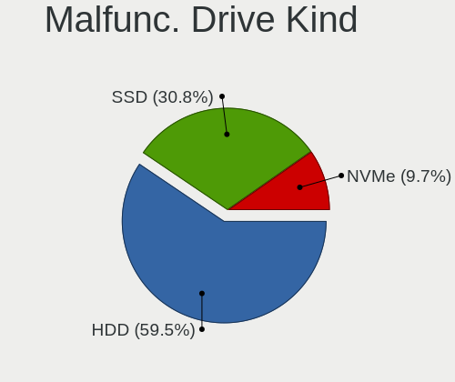

Ubuntu 22.04 - Tested Hardware & Statistics (Notebooks)
-------------------------------------------------------

A project to collect tested hardware configurations for Ubuntu 22.04.

Anyone can contribute to this report by the [hw-probe](https://github.com/linuxhw/hw-probe) tool:

    sudo -E hw-probe -all -upload

Please contribute! Especially if your hardware is rare.

Contents
--------

* [ Test Cases ](#test-cases)

* [ System ](#system)
  - [ Kernel                   ](#kernel)
  - [ Kernel Family            ](#kernel-family)
  - [ Kernel Major Ver.        ](#kernel-major-ver)
  - [ Arch                     ](#arch)
  - [ DE                       ](#de)
  - [ Display Server           ](#display-server)
  - [ Display Manager          ](#display-manager)
  - [ OS Lang                  ](#os-lang)
  - [ Boot Mode                ](#boot-mode)
  - [ Filesystem               ](#filesystem)
  - [ Part. scheme             ](#part-scheme)
  - [ Dual Boot with Linux/BSD ](#dual-boot-with-linuxbsd)
  - [ Dual Boot (Win)          ](#dual-boot-win)

* [ Board ](#board)
  - [ Vendor                   ](#vendor)
  - [ Model                    ](#model)
  - [ Model Family             ](#model-family)
  - [ MFG Year                 ](#mfg-year)
  - [ Form Factor              ](#form-factor)
  - [ Secure Boot              ](#secure-boot)
  - [ Coreboot                 ](#coreboot)
  - [ RAM Size                 ](#ram-size)
  - [ RAM Used                 ](#ram-used)
  - [ Total Drives             ](#total-drives)
  - [ Has CD-ROM               ](#has-cd-rom)
  - [ Has Ethernet             ](#has-ethernet)
  - [ Has WiFi                 ](#has-wifi)
  - [ Has Bluetooth            ](#has-bluetooth)

* [ Location ](#location)
  - [ Country                  ](#country)
  - [ City                     ](#city)

* [ Drives ](#drives)
  - [ Drive Vendor             ](#drive-vendor)
  - [ Drive Model              ](#drive-model)
  - [ HDD Vendor               ](#hdd-vendor)
  - [ SSD Vendor               ](#ssd-vendor)
  - [ Drive Kind               ](#drive-kind)
  - [ Drive Connector          ](#drive-connector)
  - [ Drive Size               ](#drive-size)
  - [ Space Total              ](#space-total)
  - [ Space Used               ](#space-used)
  - [ Malfunc. Drives          ](#malfunc-drives)
  - [ Malfunc. Drive Vendor    ](#malfunc-drive-vendor)
  - [ Malfunc. HDD Vendor      ](#malfunc-hdd-vendor)
  - [ Malfunc. Drive Kind      ](#malfunc-drive-kind)
  - [ Failed Drives            ](#failed-drives)
  - [ Failed Drive Vendor      ](#failed-drive-vendor)
  - [ Drive Status             ](#drive-status)

* [ Storage controller ](#storage-controller)
  - [ Storage Vendor           ](#storage-vendor)
  - [ Storage Model            ](#storage-model)
  - [ Storage Kind             ](#storage-kind)

* [ Processor ](#processor)
  - [ CPU Vendor               ](#cpu-vendor)
  - [ CPU Model                ](#cpu-model)
  - [ CPU Model Family         ](#cpu-model-family)
  - [ CPU Cores                ](#cpu-cores)
  - [ CPU Sockets              ](#cpu-sockets)
  - [ CPU Threads              ](#cpu-threads)
  - [ CPU Op-Modes             ](#cpu-op-modes)
  - [ CPU Microcode            ](#cpu-microcode)
  - [ CPU Microarch            ](#cpu-microarch)

* [ Graphics ](#graphics)
  - [ GPU Vendor               ](#gpu-vendor)
  - [ GPU Model                ](#gpu-model)
  - [ GPU Combo                ](#gpu-combo)
  - [ GPU Driver               ](#gpu-driver)
  - [ GPU Memory               ](#gpu-memory)

* [ Monitor ](#monitor)
  - [ Monitor Vendor           ](#monitor-vendor)
  - [ Monitor Model            ](#monitor-model)
  - [ Monitor Resolution       ](#monitor-resolution)
  - [ Monitor Diagonal         ](#monitor-diagonal)
  - [ Monitor Width            ](#monitor-width)
  - [ Aspect Ratio             ](#aspect-ratio)
  - [ Monitor Area             ](#monitor-area)
  - [ Pixel Density            ](#pixel-density)
  - [ Multiple Monitors        ](#multiple-monitors)

* [ Network ](#network)
  - [ Net Controller Vendor    ](#net-controller-vendor)
  - [ Net Controller Model     ](#net-controller-model)
  - [ Wireless Vendor          ](#wireless-vendor)
  - [ Wireless Model           ](#wireless-model)
  - [ Ethernet Vendor          ](#ethernet-vendor)
  - [ Ethernet Model           ](#ethernet-model)
  - [ Net Controller Kind      ](#net-controller-kind)
  - [ Used Controller          ](#used-controller)
  - [ NICs                     ](#nics)
  - [ IPv6                     ](#ipv6)

* [ Bluetooth ](#bluetooth)
  - [ Bluetooth Vendor         ](#bluetooth-vendor)
  - [ Bluetooth Model          ](#bluetooth-model)

* [ Sound ](#sound)
  - [ Sound Vendor             ](#sound-vendor)
  - [ Sound Model              ](#sound-model)

* [ Memory ](#memory)
  - [ Memory Vendor            ](#memory-vendor)
  - [ Memory Model             ](#memory-model)
  - [ Memory Kind              ](#memory-kind)
  - [ Memory Form Factor       ](#memory-form-factor)
  - [ Memory Size              ](#memory-size)
  - [ Memory Speed             ](#memory-speed)

* [ Printers & scanners ](#printers--scanners)
  - [ Printer Vendor           ](#printer-vendor)
  - [ Printer Model            ](#printer-model)
  - [ Scanner Vendor           ](#scanner-vendor)
  - [ Scanner Model            ](#scanner-model)

* [ Camera ](#camera)
  - [ Camera Vendor            ](#camera-vendor)
  - [ Camera Model             ](#camera-model)

* [ Security ](#security)
  - [ Fingerprint Vendor       ](#fingerprint-vendor)
  - [ Fingerprint Model        ](#fingerprint-model)
  - [ Chipcard Vendor          ](#chipcard-vendor)
  - [ Chipcard Model           ](#chipcard-model)

* [ Unsupported ](#unsupported)
  - [ Unsupported Devices      ](#unsupported-devices)
  - [ Unsupported Device Types ](#unsupported-device-types)

Test Cases
----------

Total: 3153

| Vendor        | Model                       | Probe                                                      | Date         |
|---------------|-----------------------------|------------------------------------------------------------|--------------|
| Lenovo        | G50-45 80E3                 | [d4f08c71a6](https://linux-hardware.org/?probe=d4f08c71a6) | Nov 02, 2022 |
| HP            | Pavilion Gaming Laptop      | [695b3d82a7](https://linux-hardware.org/?probe=695b3d82a7) | Nov 02, 2022 |
| HP            | Pavilion Gaming Laptop      | [9b9e55c471](https://linux-hardware.org/?probe=9b9e55c471) | Nov 02, 2022 |
| HP            | EliteBook 8460p             | [565ad502cc](https://linux-hardware.org/?probe=565ad502cc) | Nov 02, 2022 |
| Lenovo        | E41-25 81FS                 | [5d9743e91d](https://linux-hardware.org/?probe=5d9743e91d) | Nov 02, 2022 |
| Toshiba       | Satellite C70D-A            | [7a421ed810](https://linux-hardware.org/?probe=7a421ed810) | Nov 02, 2022 |
| Toshiba       | Satellite C70D-A            | [d82227846b](https://linux-hardware.org/?probe=d82227846b) | Nov 02, 2022 |
| Dell          | Latitude E5450              | [b39c12a9a4](https://linux-hardware.org/?probe=b39c12a9a4) | Nov 02, 2022 |
| HP            | ProBook 450 G8 Notebook ... | [44e281e52c](https://linux-hardware.org/?probe=44e281e52c) | Nov 02, 2022 |
| Lenovo        | Legion 5 Pro 16ITH6 82JF    | [09c2704bb0](https://linux-hardware.org/?probe=09c2704bb0) | Nov 02, 2022 |
| HP            | 625                         | [830c5c0d14](https://linux-hardware.org/?probe=830c5c0d14) | Nov 02, 2022 |
| HP            | 625                         | [4c627cab51](https://linux-hardware.org/?probe=4c627cab51) | Nov 02, 2022 |
| HP            | Pavilion x2 Detachable P... | [b4d63f4835](https://linux-hardware.org/?probe=b4d63f4835) | Nov 02, 2022 |
| Acer          | Aspire A315-54              | [1421a5a4e9](https://linux-hardware.org/?probe=1421a5a4e9) | Nov 02, 2022 |
| HP            | Pavilion Notebook           | [95d825cd94](https://linux-hardware.org/?probe=95d825cd94) | Nov 01, 2022 |
| Dell          | Precision 5520              | [e1a819ec3e](https://linux-hardware.org/?probe=e1a819ec3e) | Nov 01, 2022 |
| Lenovo        | ThinkPad L590 20Q7001KIX    | [c8e545615f](https://linux-hardware.org/?probe=c8e545615f) | Nov 01, 2022 |
| Acer          | Swift SF314-41              | [921b1a7ebf](https://linux-hardware.org/?probe=921b1a7ebf) | Nov 01, 2022 |
| ASUSTek       | VivoBook_ASUSLaptop M760... | [49d6eb853f](https://linux-hardware.org/?probe=49d6eb853f) | Nov 01, 2022 |
| ASUSTek       | VivoBook_ASUSLaptop M760... | [5de7efb403](https://linux-hardware.org/?probe=5de7efb403) | Nov 01, 2022 |
| ASUSTek       | X501A                       | [d5a34df414](https://linux-hardware.org/?probe=d5a34df414) | Nov 01, 2022 |
| ASUSTek       | VivoBook 15_ASUS Laptop ... | [6323d7e1b3](https://linux-hardware.org/?probe=6323d7e1b3) | Nov 01, 2022 |
| Dell          | Inspiron 15 3511            | [85c215eebf](https://linux-hardware.org/?probe=85c215eebf) | Nov 01, 2022 |
| Lenovo        | ThinkPad L14 Gen 2 20X2S... | [36d7199821](https://linux-hardware.org/?probe=36d7199821) | Nov 01, 2022 |
| Sony          | VPCZ12C5E                   | [b1e6524541](https://linux-hardware.org/?probe=b1e6524541) | Oct 31, 2022 |
| Lenovo        | IdeaPad S145-15API 81V7     | [973fc77891](https://linux-hardware.org/?probe=973fc77891) | Oct 31, 2022 |
| Dell          | Latitude E6330              | [51ded2feb1](https://linux-hardware.org/?probe=51ded2feb1) | Oct 31, 2022 |
| Dell          | Inspiron 3542               | [dcccad24af](https://linux-hardware.org/?probe=dcccad24af) | Oct 31, 2022 |
| Dell          | Vostro 7620                 | [2ccd56ee29](https://linux-hardware.org/?probe=2ccd56ee29) | Oct 31, 2022 |
| HP            | EliteBook 745 G2            | [0786ded6c8](https://linux-hardware.org/?probe=0786ded6c8) | Oct 31, 2022 |
| TUXEDO        | InfinityBook S 15 Gen6      | [92e9764aa0](https://linux-hardware.org/?probe=92e9764aa0) | Oct 31, 2022 |
| Acer          | Swift SF314-512             | [d6bf187cc9](https://linux-hardware.org/?probe=d6bf187cc9) | Oct 31, 2022 |
| Adlinktech    | SB-MLC                      | [203d95e012](https://linux-hardware.org/?probe=203d95e012) | Oct 31, 2022 |
| Lenovo        | ThinkBook 15 G2 ITL 20VE    | [451acdb910](https://linux-hardware.org/?probe=451acdb910) | Oct 31, 2022 |
| Sony          | SVT13118FXS                 | [13b4af9ec3](https://linux-hardware.org/?probe=13b4af9ec3) | Oct 31, 2022 |
| Dell          | Vostro 7620                 | [7f41a14301](https://linux-hardware.org/?probe=7f41a14301) | Oct 31, 2022 |
| ASUSTek       | VivoBook_ASUSLaptop X515... | [deac1b706f](https://linux-hardware.org/?probe=deac1b706f) | Oct 31, 2022 |
| Dell          | Vostro 7620                 | [00dae3fbc5](https://linux-hardware.org/?probe=00dae3fbc5) | Oct 31, 2022 |
| Lenovo        | ThinkPad Edge E530 3259M... | [aa1f78db58](https://linux-hardware.org/?probe=aa1f78db58) | Oct 31, 2022 |
| Lenovo        | ThinkPad Edge E530 3259M... | [26b5f59993](https://linux-hardware.org/?probe=26b5f59993) | Oct 31, 2022 |
| HP            | 14                          | [7611c14813](https://linux-hardware.org/?probe=7611c14813) | Oct 31, 2022 |
| Toshiba       | Satellite A200              | [296d9a0f38](https://linux-hardware.org/?probe=296d9a0f38) | Oct 31, 2022 |
| Toshiba       | Satellite A200              | [07a165b373](https://linux-hardware.org/?probe=07a165b373) | Oct 31, 2022 |
| Lenovo        | IdeaPad S145-15IWL 81S9     | [c8970ae94a](https://linux-hardware.org/?probe=c8970ae94a) | Oct 31, 2022 |
| Acer          | Nitro AN517-55              | [9653f093e1](https://linux-hardware.org/?probe=9653f093e1) | Oct 31, 2022 |
| Panasonic     | CF-19RDRCHH7                | [99e94a7708](https://linux-hardware.org/?probe=99e94a7708) | Oct 31, 2022 |
| ASUSTek       | K73SV                       | [d505f0c0d0](https://linux-hardware.org/?probe=d505f0c0d0) | Oct 30, 2022 |
| Lenovo        | ThinkPad X270 20HN0014FR    | [d6fc7c48a1](https://linux-hardware.org/?probe=d6fc7c48a1) | Oct 30, 2022 |
| Acer          | Swift SFX14-51G             | [6812d7cf22](https://linux-hardware.org/?probe=6812d7cf22) | Oct 30, 2022 |
| HP            | Laptop 15-da0xxx            | [b903c0e375](https://linux-hardware.org/?probe=b903c0e375) | Oct 30, 2022 |
| Lenovo        | IdeaPad 100S-14IBR 80R9     | [91d1732515](https://linux-hardware.org/?probe=91d1732515) | Oct 30, 2022 |
| Lenovo        | ThinkPad T510 4384WKU       | [86fee6e260](https://linux-hardware.org/?probe=86fee6e260) | Oct 30, 2022 |
| Lenovo        | ThinkPad P1 Gen 5 21DC00... | [910b452558](https://linux-hardware.org/?probe=910b452558) | Oct 30, 2022 |
| ASUSTek       | VivoBook_ASUS Laptop E40... | [cbdfd56f05](https://linux-hardware.org/?probe=cbdfd56f05) | Oct 30, 2022 |
| LG Electro... | 15Z980-HA76K                | [914156672d](https://linux-hardware.org/?probe=914156672d) | Oct 30, 2022 |
| Lenovo        | ThinkBook 15p 20V3          | [8dfb7265a9](https://linux-hardware.org/?probe=8dfb7265a9) | Oct 30, 2022 |
| Dell          | Latitude E6510              | [84a61bf436](https://linux-hardware.org/?probe=84a61bf436) | Oct 30, 2022 |
| HUAWEI        | KLVL-WXX9                   | [4e4e0ac802](https://linux-hardware.org/?probe=4e4e0ac802) | Oct 30, 2022 |
| HUAWEI        | KLVL-WXX9                   | [8887bce606](https://linux-hardware.org/?probe=8887bce606) | Oct 30, 2022 |
| GEO           | GeoBook3                    | [133a4460f6](https://linux-hardware.org/?probe=133a4460f6) | Oct 29, 2022 |
| Lenovo        | ThinkPad E14 Gen 3 20Y70... | [97425e2f52](https://linux-hardware.org/?probe=97425e2f52) | Oct 29, 2022 |
| HP            | Laptop 15-dw0xxx            | [f6b00cb10f](https://linux-hardware.org/?probe=f6b00cb10f) | Oct 29, 2022 |
| Dell          | Vostro 3500                 | [53754d84e7](https://linux-hardware.org/?probe=53754d84e7) | Oct 29, 2022 |
| Toshiba       | Satellite L50-A-1D6         | [77f308d89c](https://linux-hardware.org/?probe=77f308d89c) | Oct 29, 2022 |
| Lenovo        | ThinkPad T510 43145GG       | [d1e2bf7f33](https://linux-hardware.org/?probe=d1e2bf7f33) | Oct 29, 2022 |
| Dell          | Latitude E6510              | [b346d71347](https://linux-hardware.org/?probe=b346d71347) | Oct 29, 2022 |
| ASUSTek       | ASUS TUF Gaming F15 FX50... | [b8cfddfcbf](https://linux-hardware.org/?probe=b8cfddfcbf) | Oct 29, 2022 |
| HP            | Victus by Laptop 16-d1xx... | [c2d1799732](https://linux-hardware.org/?probe=c2d1799732) | Oct 29, 2022 |
| Dell          | Precision 3570              | [fb016d8d01](https://linux-hardware.org/?probe=fb016d8d01) | Oct 29, 2022 |
| HP            | EliteBook 830 G7 Noteboo... | [063675c104](https://linux-hardware.org/?probe=063675c104) | Oct 29, 2022 |
| HP            | OMEN by Laptop 15-dc1xxx    | [20d95ce78c](https://linux-hardware.org/?probe=20d95ce78c) | Oct 29, 2022 |
| Lenovo        | ThinkPad T480s 20L8S4PR1... | [d99f500b00](https://linux-hardware.org/?probe=d99f500b00) | Oct 29, 2022 |
| HP            | Laptop 15s-eq2xxx           | [dbd930e552](https://linux-hardware.org/?probe=dbd930e552) | Oct 29, 2022 |
| Lenovo        | IdeaPad 3 15IIL05 81WE      | [d152b0a56c](https://linux-hardware.org/?probe=d152b0a56c) | Oct 29, 2022 |
| Lenovo        | Legion Y740-17ICHg 81HH     | [ea1c9e069e](https://linux-hardware.org/?probe=ea1c9e069e) | Oct 29, 2022 |
| Lenovo        | IdeaPad 3 15ITL6 82H8       | [27dfa8687b](https://linux-hardware.org/?probe=27dfa8687b) | Oct 29, 2022 |
| AXIOO         | Mybook 14H                  | [f8a7c19640](https://linux-hardware.org/?probe=f8a7c19640) | Oct 29, 2022 |
| HP            | Pavilion dv6                | [6406b8b769](https://linux-hardware.org/?probe=6406b8b769) | Oct 29, 2022 |
| HP            | Pavilion dv6                | [7873dfb4cf](https://linux-hardware.org/?probe=7873dfb4cf) | Oct 29, 2022 |
| Medion        | X682X                       | [f05dd25a08](https://linux-hardware.org/?probe=f05dd25a08) | Oct 29, 2022 |
| Dell          | Precision 5750              | [9b9addd3b7](https://linux-hardware.org/?probe=9b9addd3b7) | Oct 29, 2022 |
| Lenovo        | ThinkPad X1 Carbon 7th 2... | [2ceb11d7b3](https://linux-hardware.org/?probe=2ceb11d7b3) | Oct 29, 2022 |
| Lenovo        | ThinkPad X1 Carbon 7th 2... | [5c3d640129](https://linux-hardware.org/?probe=5c3d640129) | Oct 29, 2022 |
| HP            | Laptop 15-dw3xxx            | [99ac55823d](https://linux-hardware.org/?probe=99ac55823d) | Oct 29, 2022 |
| HUAWEI        | BOD-WXX9                    | [880d3ba9c9](https://linux-hardware.org/?probe=880d3ba9c9) | Oct 29, 2022 |
| Dell          | Latitude 5531               | [cdea65fd5c](https://linux-hardware.org/?probe=cdea65fd5c) | Oct 29, 2022 |
| ASUSTek       | K53SV                       | [4ead64f80f](https://linux-hardware.org/?probe=4ead64f80f) | Oct 28, 2022 |
| IP3 Tech      | AP1                         | [0562a6a46d](https://linux-hardware.org/?probe=0562a6a46d) | Oct 28, 2022 |
| Lenovo        | IdeaPad 500-15ACZ 80K4      | [c079764998](https://linux-hardware.org/?probe=c079764998) | Oct 28, 2022 |
| Lenovo        | IdeaPad 500-15ACZ 80K4      | [5ef9b4213f](https://linux-hardware.org/?probe=5ef9b4213f) | Oct 28, 2022 |
| Dell          | XPS 13 9310                 | [7205cfe7b4](https://linux-hardware.org/?probe=7205cfe7b4) | Oct 28, 2022 |
| Toshiba       | Satellite C75D-B            | [4f644b7d3b](https://linux-hardware.org/?probe=4f644b7d3b) | Oct 28, 2022 |
| HP            | Pavilion Laptop 15-eh2xx... | [f9238c2035](https://linux-hardware.org/?probe=f9238c2035) | Oct 28, 2022 |
| Lenovo        | ThinkPad T420 4236NUG       | [d0e3fa9699](https://linux-hardware.org/?probe=d0e3fa9699) | Oct 28, 2022 |
| IP3 Tech      | AP1                         | [2a9c0ff1c5](https://linux-hardware.org/?probe=2a9c0ff1c5) | Oct 28, 2022 |
| Tactus        | GeoBook 110                 | [aad56b27f0](https://linux-hardware.org/?probe=aad56b27f0) | Oct 28, 2022 |
| Lenovo        | ThinkPad T560 20FHCTO1WW    | [05ff2d32fa](https://linux-hardware.org/?probe=05ff2d32fa) | Oct 28, 2022 |
| Lenovo        | ThinkPad T560 20FHCTO1WW    | [403a99d8b2](https://linux-hardware.org/?probe=403a99d8b2) | Oct 28, 2022 |
| Acer          | Aspire A315-58              | [7870d9b047](https://linux-hardware.org/?probe=7870d9b047) | Oct 28, 2022 |
| HUAWEI        | BOM-WXX9                    | [203ac0880d](https://linux-hardware.org/?probe=203ac0880d) | Oct 28, 2022 |
| MSI           | Stealth GS66 12UGS          | [98b47019d1](https://linux-hardware.org/?probe=98b47019d1) | Oct 28, 2022 |
| MSI           | GF63 Thin 11UD              | [0084d271e4](https://linux-hardware.org/?probe=0084d271e4) | Oct 28, 2022 |
| ASUSTek       | ROG Zephyrus M16 GU603HM... | [3b67700f14](https://linux-hardware.org/?probe=3b67700f14) | Oct 28, 2022 |
| Compaq        | Presario 21 VerX            | [97ee92b9d1](https://linux-hardware.org/?probe=97ee92b9d1) | Oct 28, 2022 |
| Dell          | Inspiron 15 3511            | [7cc13c49e2](https://linux-hardware.org/?probe=7cc13c49e2) | Oct 28, 2022 |
| Dell          | XPS 13 9305                 | [20bf043d6f](https://linux-hardware.org/?probe=20bf043d6f) | Oct 28, 2022 |
| Apple         | MacBookPro11,5              | [fc35e765fd](https://linux-hardware.org/?probe=fc35e765fd) | Oct 28, 2022 |
| MSI           | Katana GF66 11UC            | [83088617d3](https://linux-hardware.org/?probe=83088617d3) | Oct 28, 2022 |
| Dell          | Inspiron 3542               | [6c979bdf58](https://linux-hardware.org/?probe=6c979bdf58) | Oct 27, 2022 |
| HP            | 255 G7 Notebook PC          | [8cf00ceef5](https://linux-hardware.org/?probe=8cf00ceef5) | Oct 27, 2022 |
| Dell          | Latitude E6530              | [71b2df6eff](https://linux-hardware.org/?probe=71b2df6eff) | Oct 27, 2022 |
| Toshiba       | Satellite L300              | [60618ba137](https://linux-hardware.org/?probe=60618ba137) | Oct 27, 2022 |
| PC Special... | Recoil II                   | [9ec5a6ef20](https://linux-hardware.org/?probe=9ec5a6ef20) | Oct 27, 2022 |
| Lenovo        | G710 20252                  | [d15bee47c4](https://linux-hardware.org/?probe=d15bee47c4) | Oct 27, 2022 |
| PC Special... | Recoil II                   | [38ec5a7708](https://linux-hardware.org/?probe=38ec5a7708) | Oct 27, 2022 |
| Lenovo        | IdeaPad 320-14IKB 80YF      | [fe1166a134](https://linux-hardware.org/?probe=fe1166a134) | Oct 27, 2022 |
| Lenovo        | IdeaPad 320-14IKB 80YF      | [b35b1298a8](https://linux-hardware.org/?probe=b35b1298a8) | Oct 27, 2022 |
| HP            | Laptop 15-da0xxx            | [efdb76f667](https://linux-hardware.org/?probe=efdb76f667) | Oct 27, 2022 |
| ASUSTek       | VivoBook_ASUSLaptop M140... | [0a0922ed82](https://linux-hardware.org/?probe=0a0922ed82) | Oct 27, 2022 |
| MSI           | GE66 Raider 10UE            | [334d883dd3](https://linux-hardware.org/?probe=334d883dd3) | Oct 27, 2022 |
| Dell          | Latitude 5310               | [10b8371dbd](https://linux-hardware.org/?probe=10b8371dbd) | Oct 27, 2022 |
| Fujitsu       | LIFEBOOK AH530              | [a3f55b1301](https://linux-hardware.org/?probe=a3f55b1301) | Oct 27, 2022 |
| HP            | ZBook Fury 15.6 inch G8 ... | [f95081e76e](https://linux-hardware.org/?probe=f95081e76e) | Oct 27, 2022 |
| Fujitsu       | LIFEBOOK AH530              | [285a7d17e3](https://linux-hardware.org/?probe=285a7d17e3) | Oct 27, 2022 |
| HP            | EliteBook 830 G7 Noteboo... | [0fcfd33f95](https://linux-hardware.org/?probe=0fcfd33f95) | Oct 27, 2022 |
| Lenovo        | ThinkPad L590 20Q7001HGE    | [187544b911](https://linux-hardware.org/?probe=187544b911) | Oct 27, 2022 |
| ASUSTek       | ASUS EXPERTBOOK B1400CEP... | [9564d50ef8](https://linux-hardware.org/?probe=9564d50ef8) | Oct 27, 2022 |
| Acer          | Aspire 5750G                | [b51a20d480](https://linux-hardware.org/?probe=b51a20d480) | Oct 27, 2022 |
| HP            | EliteBook 840 G3            | [fdfd74a1ac](https://linux-hardware.org/?probe=fdfd74a1ac) | Oct 27, 2022 |
| MSI           | GL75 Leopard 10SFK          | [c05a05a275](https://linux-hardware.org/?probe=c05a05a275) | Oct 27, 2022 |
| Lenovo        | B590 20206                  | [8a8967999b](https://linux-hardware.org/?probe=8a8967999b) | Oct 27, 2022 |
| Lenovo        | ThinkPad E15 Gen 2 20TD0... | [4386ec3fb8](https://linux-hardware.org/?probe=4386ec3fb8) | Oct 27, 2022 |
| HP            | Pavilion Laptop 15-eh1xx... | [0d705b0971](https://linux-hardware.org/?probe=0d705b0971) | Oct 26, 2022 |
| Avell High... | A60 MUV                     | [ccdf105523](https://linux-hardware.org/?probe=ccdf105523) | Oct 26, 2022 |
| Dell          | Latitude E6530              | [c271a351aa](https://linux-hardware.org/?probe=c271a351aa) | Oct 26, 2022 |
| ASUSTek       | X555LAB                     | [44d47f5024](https://linux-hardware.org/?probe=44d47f5024) | Oct 26, 2022 |
| Dell          | Inspiron 7773               | [34d97b7ea2](https://linux-hardware.org/?probe=34d97b7ea2) | Oct 26, 2022 |
| Lenovo        | Legion S7 15IMH5 82BC       | [7654e5f9c4](https://linux-hardware.org/?probe=7654e5f9c4) | Oct 26, 2022 |
| Dell          | Inspiron 7773               | [c2cff54e7c](https://linux-hardware.org/?probe=c2cff54e7c) | Oct 26, 2022 |
| HP            | 240 G8 Notebook PC          | [25765f4a76](https://linux-hardware.org/?probe=25765f4a76) | Oct 26, 2022 |
| Dell          | Vostro 7620                 | [90f96ae099](https://linux-hardware.org/?probe=90f96ae099) | Oct 26, 2022 |
| ASUSTek       | X510UQ                      | [8907b3e019](https://linux-hardware.org/?probe=8907b3e019) | Oct 26, 2022 |
| HUAWEI        | HKD-WXX                     | [2ff7652d3a](https://linux-hardware.org/?probe=2ff7652d3a) | Oct 26, 2022 |
| Dell          | Latitude E6440              | [81a4c0f5d5](https://linux-hardware.org/?probe=81a4c0f5d5) | Oct 26, 2022 |
| HP            | Laptop 15-da0xxx            | [ed1b801fcd](https://linux-hardware.org/?probe=ed1b801fcd) | Oct 26, 2022 |
| Dell          | Latitude 7320               | [f249267def](https://linux-hardware.org/?probe=f249267def) | Oct 26, 2022 |
| Dell          | XPS 13 9360                 | [e0c3407d30](https://linux-hardware.org/?probe=e0c3407d30) | Oct 26, 2022 |
| Lenovo        | ThinkPad T450 20BUS0S902    | [1115da2433](https://linux-hardware.org/?probe=1115da2433) | Oct 26, 2022 |
| MSI           | Stealth GS66 12UH           | [3c985bb814](https://linux-hardware.org/?probe=3c985bb814) | Oct 26, 2022 |
| MSI           | Stealth GS66 12UH           | [336132b016](https://linux-hardware.org/?probe=336132b016) | Oct 26, 2022 |
| Lenovo        | 100w Gen 3 82J0             | [2554c81cce](https://linux-hardware.org/?probe=2554c81cce) | Oct 26, 2022 |
| Dell          | XPS 13 9305                 | [6062baa35c](https://linux-hardware.org/?probe=6062baa35c) | Oct 26, 2022 |
| HP            | ProBook 650 G2              | [7848c6d520](https://linux-hardware.org/?probe=7848c6d520) | Oct 26, 2022 |
| Lenovo        | Legion S7 15ACH6 82K8       | [082e572642](https://linux-hardware.org/?probe=082e572642) | Oct 26, 2022 |
| HP            | Pavilion Laptop 15-cc1xx    | [a977f9c3e9](https://linux-hardware.org/?probe=a977f9c3e9) | Oct 26, 2022 |
| HP            | Laptop 17t-cn200            | [179c1e53a9](https://linux-hardware.org/?probe=179c1e53a9) | Oct 26, 2022 |
| Lenovo        | ThinkPad E15 20RD001QFE     | [cc9f8c3aad](https://linux-hardware.org/?probe=cc9f8c3aad) | Oct 26, 2022 |
| Samsung       | 870Z5E/880Z5E/680Z5E        | [8ebb941ac6](https://linux-hardware.org/?probe=8ebb941ac6) | Oct 26, 2022 |
| Samsung       | 340XAA/350XAA/550XAA        | [562c9438d1](https://linux-hardware.org/?probe=562c9438d1) | Oct 25, 2022 |
| ASUSTek       | ROG Zephyrus G14 GA401QC... | [ae3d3abdf0](https://linux-hardware.org/?probe=ae3d3abdf0) | Oct 25, 2022 |
| ASUSTek       | ZenBook UX333FN_UX333FN     | [a128f79c0a](https://linux-hardware.org/?probe=a128f79c0a) | Oct 25, 2022 |
| ASUSTek       | K55VJ                       | [eac363d110](https://linux-hardware.org/?probe=eac363d110) | Oct 25, 2022 |
| ASUSTek       | VivoBook E14 E402WAS        | [eadb224c05](https://linux-hardware.org/?probe=eadb224c05) | Oct 25, 2022 |
| Apple         | MacBook5,1                  | [da04330684](https://linux-hardware.org/?probe=da04330684) | Oct 25, 2022 |
| Lenovo        | V15-IGL 82C3                | [264fcfd9f1](https://linux-hardware.org/?probe=264fcfd9f1) | Oct 25, 2022 |
| Dell          | Precision M6800             | [6c15780d7a](https://linux-hardware.org/?probe=6c15780d7a) | Oct 25, 2022 |
| HP            | ENVY 15                     | [faf3ff2256](https://linux-hardware.org/?probe=faf3ff2256) | Oct 25, 2022 |
| Dell          | XPS 15 9500                 | [8260478f31](https://linux-hardware.org/?probe=8260478f31) | Oct 25, 2022 |
| ALLDOCUBE     | i1402A                      | [22c255e8cd](https://linux-hardware.org/?probe=22c255e8cd) | Oct 25, 2022 |
| HP            | ZBook 15 G5                 | [0cb3fb3efc](https://linux-hardware.org/?probe=0cb3fb3efc) | Oct 25, 2022 |
| Lenovo        | ThinkPad T490 20N2001YUS    | [61b5a3092b](https://linux-hardware.org/?probe=61b5a3092b) | Oct 25, 2022 |
| ASUSTek       | ASUS TUF Gaming A15 FA50... | [09d3217ce4](https://linux-hardware.org/?probe=09d3217ce4) | Oct 25, 2022 |
| LG Electro... | 17Z90N-V.AA55D              | [bf40de3f5a](https://linux-hardware.org/?probe=bf40de3f5a) | Oct 25, 2022 |
| ASUSTek       | UX430UAR                    | [07d56a833e](https://linux-hardware.org/?probe=07d56a833e) | Oct 25, 2022 |
| MSI           | Creator Z17 A12UHST         | [18df556ca1](https://linux-hardware.org/?probe=18df556ca1) | Oct 25, 2022 |
| Lenovo        | ThinkPad X1 Nano Gen 1 2... | [491477817a](https://linux-hardware.org/?probe=491477817a) | Oct 25, 2022 |
| Dell          | Precision 3530              | [8d806f9e53](https://linux-hardware.org/?probe=8d806f9e53) | Oct 25, 2022 |
| Lenovo        | IdeaPad S340-15API 81NC     | [f8aa3a7277](https://linux-hardware.org/?probe=f8aa3a7277) | Oct 25, 2022 |
| Lenovo        | ThinkPad P1 20MD000NGE      | [561f09ba0f](https://linux-hardware.org/?probe=561f09ba0f) | Oct 25, 2022 |
| Lenovo        | IdeaPad S340-15API 81NC     | [86b8ce83b2](https://linux-hardware.org/?probe=86b8ce83b2) | Oct 25, 2022 |
| ASUSTek       | ZenBook UX333FN_UX333FN     | [ec7f3834d1](https://linux-hardware.org/?probe=ec7f3834d1) | Oct 25, 2022 |
| Lenovo        | ThinkPad X1 Extreme 2nd ... | [28c38a498d](https://linux-hardware.org/?probe=28c38a498d) | Oct 25, 2022 |
| Lenovo        | ThinkPad T490s 20NYS6FL0... | [ef0cad4118](https://linux-hardware.org/?probe=ef0cad4118) | Oct 25, 2022 |
| HP            | Laptop 15-dw0xxx            | [4e87fd9438](https://linux-hardware.org/?probe=4e87fd9438) | Oct 25, 2022 |
| HUAWEI        | KLVD-WXX9                   | [e9ce57f1c1](https://linux-hardware.org/?probe=e9ce57f1c1) | Oct 25, 2022 |
| HP            | Laptop 17-ak0xx             | [09e77bbc9a](https://linux-hardware.org/?probe=09e77bbc9a) | Oct 25, 2022 |
| Lenovo        | ThinkPad T60 1952F75        | [a6f536ca3d](https://linux-hardware.org/?probe=a6f536ca3d) | Oct 25, 2022 |
| Lenovo        | ThinkPad T60 1952F75        | [813bd112f8](https://linux-hardware.org/?probe=813bd112f8) | Oct 25, 2022 |
| Dell          | XPS 15 9500                 | [f827f47265](https://linux-hardware.org/?probe=f827f47265) | Oct 25, 2022 |
| Dell          | XPS 9315                    | [c18dd688a1](https://linux-hardware.org/?probe=c18dd688a1) | Oct 25, 2022 |
| ASUSTek       | X555LI                      | [fe6b4aa2a6](https://linux-hardware.org/?probe=fe6b4aa2a6) | Oct 25, 2022 |
| Dell          | Latitude 5480               | [0b8576ce3b](https://linux-hardware.org/?probe=0b8576ce3b) | Oct 25, 2022 |
| HUAWEI        | KLVD-WXX9                   | [1bbbcd4843](https://linux-hardware.org/?probe=1bbbcd4843) | Oct 24, 2022 |
| Dell          | Inspiron 16 7610            | [96ae3c2941](https://linux-hardware.org/?probe=96ae3c2941) | Oct 24, 2022 |
| MSI           | GE63 Raider RGB 8RE         | [0b3580c5fe](https://linux-hardware.org/?probe=0b3580c5fe) | Oct 24, 2022 |
| Notebook      | PCX0DX                      | [e29790dc3c](https://linux-hardware.org/?probe=e29790dc3c) | Oct 24, 2022 |
| ASUSTek       | VivoBook_ASUS Laptop E21... | [9b7ac9b23e](https://linux-hardware.org/?probe=9b7ac9b23e) | Oct 24, 2022 |
| HP            | Pavilion Notebook           | [d953ededc3](https://linux-hardware.org/?probe=d953ededc3) | Oct 24, 2022 |
| HP            | Laptop 17-ak0xx             | [88796bbb2b](https://linux-hardware.org/?probe=88796bbb2b) | Oct 24, 2022 |
| Dell          | Vostro 3501                 | [df16ec68c3](https://linux-hardware.org/?probe=df16ec68c3) | Oct 24, 2022 |
| MSI           | Stealth 15M B12UE           | [a6190e6271](https://linux-hardware.org/?probe=a6190e6271) | Oct 24, 2022 |
| HUAWEI        | NBLK-WAX9X                  | [22a138a507](https://linux-hardware.org/?probe=22a138a507) | Oct 24, 2022 |
| HUAWEI        | MateBook D                  | [b219f88756](https://linux-hardware.org/?probe=b219f88756) | Oct 24, 2022 |
| Monster       | TULPAR T7                   | [5d01101cee](https://linux-hardware.org/?probe=5d01101cee) | Oct 24, 2022 |
| Dell          | Vostro 3501                 | [996a5a3b8d](https://linux-hardware.org/?probe=996a5a3b8d) | Oct 24, 2022 |
| LG Electro... | 15Z90N-HA76K                | [7805c272fb](https://linux-hardware.org/?probe=7805c272fb) | Oct 24, 2022 |
| Dell          | Inspiron 3505               | [891f846aac](https://linux-hardware.org/?probe=891f846aac) | Oct 24, 2022 |
| Dell          | Latitude 7490               | [63d27972e4](https://linux-hardware.org/?probe=63d27972e4) | Oct 24, 2022 |
| K.A.Techno... | TM1                         | [48166b8360](https://linux-hardware.org/?probe=48166b8360) | Oct 23, 2022 |
| Toshiba       | Satellite C50-B             | [a9041efc75](https://linux-hardware.org/?probe=a9041efc75) | Oct 23, 2022 |
| Sony          | VGN-SZ3XP_C                 | [72f83141a0](https://linux-hardware.org/?probe=72f83141a0) | Oct 23, 2022 |
| Lenovo        | ThinkPad L15 Gen 1 20U70... | [b5315c133f](https://linux-hardware.org/?probe=b5315c133f) | Oct 23, 2022 |
| Mustek        | Z140C                       | [9188dbd3a5](https://linux-hardware.org/?probe=9188dbd3a5) | Oct 23, 2022 |
| Chuwi         | CoreBook X                  | [bc31018b26](https://linux-hardware.org/?probe=bc31018b26) | Oct 23, 2022 |
| Lenovo        | IdeaPad 110-15ACL 80TJ      | [e2e9f1a6e7](https://linux-hardware.org/?probe=e2e9f1a6e7) | Oct 23, 2022 |
| ASUSTek       | VivoBook_ASUSLaptop X513... | [9a104497e3](https://linux-hardware.org/?probe=9a104497e3) | Oct 23, 2022 |
| ASUSTek       | VivoBook_ASUSLaptop X513... | [bea9c6b47b](https://linux-hardware.org/?probe=bea9c6b47b) | Oct 23, 2022 |
| HP            | Laptop 15-da0xxx            | [4e299308f5](https://linux-hardware.org/?probe=4e299308f5) | Oct 23, 2022 |
| Lenovo        | G505s 20255                 | [cff2326042](https://linux-hardware.org/?probe=cff2326042) | Oct 23, 2022 |
| Notebook      | W650EH                      | [6bb1a8b1f1](https://linux-hardware.org/?probe=6bb1a8b1f1) | Oct 23, 2022 |
| Unknown       | Unknown                     | [05da6717ed](https://linux-hardware.org/?probe=05da6717ed) | Oct 23, 2022 |
| HP            | OMEN by Laptop 17-ck0xxx    | [34f4204ae8](https://linux-hardware.org/?probe=34f4204ae8) | Oct 23, 2022 |
| GEO           | GeoBook 140                 | [e97f8024f4](https://linux-hardware.org/?probe=e97f8024f4) | Oct 22, 2022 |
| Acer          | Aspire A315-58              | [e5b07599e3](https://linux-hardware.org/?probe=e5b07599e3) | Oct 22, 2022 |
| HP            | Laptop 14-dk1xxx            | [65efc061c0](https://linux-hardware.org/?probe=65efc061c0) | Oct 22, 2022 |
| Acer          | Aspire 5733                 | [ef561df926](https://linux-hardware.org/?probe=ef561df926) | Oct 22, 2022 |
| Samsung       | 305E4A/305E5A/305E7A        | [77bbf74390](https://linux-hardware.org/?probe=77bbf74390) | Oct 22, 2022 |
| Samsung       | 305E4A/305E5A/305E7A        | [acbf2e94c1](https://linux-hardware.org/?probe=acbf2e94c1) | Oct 22, 2022 |
| Dell          | Latitude E6440              | [030896045a](https://linux-hardware.org/?probe=030896045a) | Oct 22, 2022 |
| HP            | Pavilion g6                 | [55a5d78e1c](https://linux-hardware.org/?probe=55a5d78e1c) | Oct 22, 2022 |
| HP            | EliteBook 8540w             | [093b0de584](https://linux-hardware.org/?probe=093b0de584) | Oct 22, 2022 |
| Lenovo        | ThinkPad L470 W10DG 20JV... | [f460f8dc4e](https://linux-hardware.org/?probe=f460f8dc4e) | Oct 22, 2022 |
| GEO           | GeoBook 140                 | [bbbe5e0fca](https://linux-hardware.org/?probe=bbbe5e0fca) | Oct 22, 2022 |
| Dell          | Precision 3561              | [dcf74e5715](https://linux-hardware.org/?probe=dcf74e5715) | Oct 22, 2022 |
| ASUSTek       | X705UAP                     | [97de42a1ec](https://linux-hardware.org/?probe=97de42a1ec) | Oct 22, 2022 |
| ASUSTek       | ZenBook UX534FAC_UX534FA    | [928997f65c](https://linux-hardware.org/?probe=928997f65c) | Oct 22, 2022 |
| Samsung       | R519/R719                   | [da6668197e](https://linux-hardware.org/?probe=da6668197e) | Oct 22, 2022 |
| Lenovo        | ThinkPad L580 20LW0010GE    | [99da3e6f09](https://linux-hardware.org/?probe=99da3e6f09) | Oct 22, 2022 |
| Lenovo        | IdeaPad 3 15ALC6 82KU       | [57bfd1e0e9](https://linux-hardware.org/?probe=57bfd1e0e9) | Oct 22, 2022 |
| Lenovo        | ThinkPad P52 20M90017MX     | [8f3fdb4d9c](https://linux-hardware.org/?probe=8f3fdb4d9c) | Oct 22, 2022 |
| Lenovo        | IdeaPad 5 15ALC05 82LN      | [66fae864f2](https://linux-hardware.org/?probe=66fae864f2) | Oct 22, 2022 |
| Apple         | MacBookPro14,1              | [2a02bdc30d](https://linux-hardware.org/?probe=2a02bdc30d) | Oct 22, 2022 |
| HP            | ENVY m6                     | [815a490c76](https://linux-hardware.org/?probe=815a490c76) | Oct 22, 2022 |
| Lenovo        | ThinkPad X270 W10DG 20K6... | [c097316857](https://linux-hardware.org/?probe=c097316857) | Oct 22, 2022 |
| Lenovo        | IdeaPad 5 15ALC05 82LN      | [eaff8befe8](https://linux-hardware.org/?probe=eaff8befe8) | Oct 22, 2022 |
| Lenovo        | ThinkPad SL500 27463ZG      | [88a93e44f9](https://linux-hardware.org/?probe=88a93e44f9) | Oct 22, 2022 |
| Unknown       | Unknown                     | [51af31314f](https://linux-hardware.org/?probe=51af31314f) | Oct 22, 2022 |
| Lenovo        | ThinkPad T430 2347BT4       | [c3576df0c7](https://linux-hardware.org/?probe=c3576df0c7) | Oct 22, 2022 |
| Lenovo        | ThinkPad T480s 20L7CTO1W... | [df42ee1916](https://linux-hardware.org/?probe=df42ee1916) | Oct 22, 2022 |
| HP            | 2000                        | [0aa2a7b078](https://linux-hardware.org/?probe=0aa2a7b078) | Oct 22, 2022 |
| Dell          | Precision 3561              | [f514228295](https://linux-hardware.org/?probe=f514228295) | Oct 22, 2022 |
| Sony          | VPCEH3QFX                   | [def39e1ddd](https://linux-hardware.org/?probe=def39e1ddd) | Oct 21, 2022 |
| Lenovo        | ThinkPad E15 Gen 3 20YG0... | [8eebebb58f](https://linux-hardware.org/?probe=8eebebb58f) | Oct 21, 2022 |
| Acer          | Aspire A715-41G             | [afb2836a23](https://linux-hardware.org/?probe=afb2836a23) | Oct 21, 2022 |
| HP            | 15                          | [937cf874b0](https://linux-hardware.org/?probe=937cf874b0) | Oct 21, 2022 |
| HP            | Pavilion Notebook           | [2900a3fd5d](https://linux-hardware.org/?probe=2900a3fd5d) | Oct 21, 2022 |
| Lenovo        | Legion 5 15ACH6 82JW        | [f5af95bb9a](https://linux-hardware.org/?probe=f5af95bb9a) | Oct 21, 2022 |
| Lenovo        | Legion 5 15ACH6 82JW        | [5def3f5324](https://linux-hardware.org/?probe=5def3f5324) | Oct 21, 2022 |
| Radxa         | ROCK Pi X v1.4              | [133d713246](https://linux-hardware.org/?probe=133d713246) | Oct 21, 2022 |
| Lenovo        | IdeaPad 5 15ALC05 82LN      | [bfdfd5d11e](https://linux-hardware.org/?probe=bfdfd5d11e) | Oct 21, 2022 |
| Lenovo        | ThinkPad X1 Carbon 6th 2... | [98928036d5](https://linux-hardware.org/?probe=98928036d5) | Oct 21, 2022 |
| HP            | EliteBook 830 G8 Noteboo... | [47ca27793e](https://linux-hardware.org/?probe=47ca27793e) | Oct 21, 2022 |
| Unknown       | CZ-17                       | [37035fb17f](https://linux-hardware.org/?probe=37035fb17f) | Oct 21, 2022 |
| Acer          | Extensa 215-52              | [aaf7209d03](https://linux-hardware.org/?probe=aaf7209d03) | Oct 21, 2022 |
| HP            | ENVY m6                     | [d11f002c16](https://linux-hardware.org/?probe=d11f002c16) | Oct 21, 2022 |
| HP            | Laptop 15-da0xxx            | [f4510d3faa](https://linux-hardware.org/?probe=f4510d3faa) | Oct 21, 2022 |
| Dell          | Studio 1558                 | [b31ff30942](https://linux-hardware.org/?probe=b31ff30942) | Oct 21, 2022 |
| System76      | Galago Pro                  | [459c28f149](https://linux-hardware.org/?probe=459c28f149) | Oct 21, 2022 |
| Dell          | XPS 15 9570                 | [85dd4861a0](https://linux-hardware.org/?probe=85dd4861a0) | Oct 21, 2022 |
| HP            | OMEN by Laptop 17-ck0xxx    | [0ed2f15c34](https://linux-hardware.org/?probe=0ed2f15c34) | Oct 21, 2022 |
| Lenovo        | V110-15IAP 80TG             | [68a04f2544](https://linux-hardware.org/?probe=68a04f2544) | Oct 20, 2022 |
| HP            | Pavilion Gaming Laptop 1... | [f07691d6b1](https://linux-hardware.org/?probe=f07691d6b1) | Oct 20, 2022 |
| ASUSTek       | VivoBook_ASUSLaptop X509... | [7c284b1dfd](https://linux-hardware.org/?probe=7c284b1dfd) | Oct 20, 2022 |
| Dell          | Latitude E6500              | [1f99367f55](https://linux-hardware.org/?probe=1f99367f55) | Oct 20, 2022 |
| HP            | Laptop 15-db0xxx            | [c9962923a9](https://linux-hardware.org/?probe=c9962923a9) | Oct 20, 2022 |
| Alienware     | x15 R2                      | [39d9f7988a](https://linux-hardware.org/?probe=39d9f7988a) | Oct 20, 2022 |
| HP            | ENVY TS 15                  | [b27ee147cf](https://linux-hardware.org/?probe=b27ee147cf) | Oct 20, 2022 |
| Apple         | MacBookPro15,2              | [dac94a562a](https://linux-hardware.org/?probe=dac94a562a) | Oct 20, 2022 |
| HP            | ENVY Notebook               | [162bd58a21](https://linux-hardware.org/?probe=162bd58a21) | Oct 20, 2022 |
| HP            | Unknown                     | [3b5effbcc5](https://linux-hardware.org/?probe=3b5effbcc5) | Oct 20, 2022 |
| Positivo      | C4120F                      | [92338290da](https://linux-hardware.org/?probe=92338290da) | Oct 20, 2022 |
| HP            | Laptop 14-dk1xxx            | [cac272451b](https://linux-hardware.org/?probe=cac272451b) | Oct 20, 2022 |
| A-DATA Tec... | XENIA 14                    | [c8a0b8e94f](https://linux-hardware.org/?probe=c8a0b8e94f) | Oct 20, 2022 |
| Dell          | Latitude 5420               | [a6ef44d08a](https://linux-hardware.org/?probe=a6ef44d08a) | Oct 20, 2022 |
| Lenovo        | ThinkPad E590 20NB002BMB    | [4b272ef951](https://linux-hardware.org/?probe=4b272ef951) | Oct 20, 2022 |
| ASUSTek       | K54C                        | [124cad3faf](https://linux-hardware.org/?probe=124cad3faf) | Oct 20, 2022 |
| Razer x La... | TensorBook (late 2021)      | [fef9e26716](https://linux-hardware.org/?probe=fef9e26716) | Oct 20, 2022 |
| Lenovo        | ThinkPad E14 Gen 2 20TA0... | [238c40d2e4](https://linux-hardware.org/?probe=238c40d2e4) | Oct 19, 2022 |
| Acer          | Swift SFX14-41G             | [7c689396eb](https://linux-hardware.org/?probe=7c689396eb) | Oct 19, 2022 |
| Acer          | Swift SFX14-41G             | [357ad9257d](https://linux-hardware.org/?probe=357ad9257d) | Oct 19, 2022 |
| ASUSTek       | X555LF                      | [76a0525b50](https://linux-hardware.org/?probe=76a0525b50) | Oct 19, 2022 |
| Dell          | Latitude 7300               | [5674456b5d](https://linux-hardware.org/?probe=5674456b5d) | Oct 19, 2022 |
| Toshiba       | Satellite L300              | [ccd5c1a1d7](https://linux-hardware.org/?probe=ccd5c1a1d7) | Oct 19, 2022 |
| Lenovo        | ThinkPad E15 Gen 2 20TD0... | [9aea214116](https://linux-hardware.org/?probe=9aea214116) | Oct 19, 2022 |
| HP            | 620                         | [263e2a0ba9](https://linux-hardware.org/?probe=263e2a0ba9) | Oct 19, 2022 |
| MSI           | Creator Z17 A12UHST         | [5d65b94f2b](https://linux-hardware.org/?probe=5d65b94f2b) | Oct 19, 2022 |
| ASUSTek       | VivoBook_ASUSLaptop X421... | [3b87b259c8](https://linux-hardware.org/?probe=3b87b259c8) | Oct 19, 2022 |
| ASUSTek       | VivoBook_ASUSLaptop X421... | [e438393dca](https://linux-hardware.org/?probe=e438393dca) | Oct 19, 2022 |
| HP            | ENVY Notebook               | [5f45a29925](https://linux-hardware.org/?probe=5f45a29925) | Oct 19, 2022 |
| HP            | ProBook 440 G2              | [9f40520008](https://linux-hardware.org/?probe=9f40520008) | Oct 19, 2022 |
| Acer          | Aspire V3-772G              | [b901145ed0](https://linux-hardware.org/?probe=b901145ed0) | Oct 19, 2022 |
| Notebook      | NS50_70MU                   | [2df95e6892](https://linux-hardware.org/?probe=2df95e6892) | Oct 19, 2022 |
| Acer          | Aspire A315-21              | [3b8ac4e243](https://linux-hardware.org/?probe=3b8ac4e243) | Oct 19, 2022 |
| Acer          | Aspire V5-132P              | [420ad7ac8c](https://linux-hardware.org/?probe=420ad7ac8c) | Oct 19, 2022 |
| HP            | Pavilion Laptop 15-eh2xx... | [127f1add13](https://linux-hardware.org/?probe=127f1add13) | Oct 18, 2022 |
| HP            | 620                         | [ad17206515](https://linux-hardware.org/?probe=ad17206515) | Oct 18, 2022 |
| Dell          | Inspiron 3520               | [a6631e1118](https://linux-hardware.org/?probe=a6631e1118) | Oct 18, 2022 |
| HUAWEI        | NBM-WXX9                    | [fec0dd03d5](https://linux-hardware.org/?probe=fec0dd03d5) | Oct 18, 2022 |
| MSI           | Katana GF66 11UE            | [0e2d9432e1](https://linux-hardware.org/?probe=0e2d9432e1) | Oct 18, 2022 |
| HP            | EliteBook 850 G2            | [79a8b3d707](https://linux-hardware.org/?probe=79a8b3d707) | Oct 18, 2022 |
| Toshiba       | Satellite L300              | [5c7a54a7ad](https://linux-hardware.org/?probe=5c7a54a7ad) | Oct 18, 2022 |
| Insyde        | WindTab89                   | [8eb81874bb](https://linux-hardware.org/?probe=8eb81874bb) | Oct 18, 2022 |
| Dell          | Latitude 7300               | [c9bc03da26](https://linux-hardware.org/?probe=c9bc03da26) | Oct 18, 2022 |
| HP            | ZBook 14 G2                 | [fde830d956](https://linux-hardware.org/?probe=fde830d956) | Oct 18, 2022 |
| Acer          | Aspire V3-772G              | [8231c6e6ef](https://linux-hardware.org/?probe=8231c6e6ef) | Oct 18, 2022 |
| Lenovo        | ThinkPad T490 20N2S29E00    | [dd61a6ea26](https://linux-hardware.org/?probe=dd61a6ea26) | Oct 18, 2022 |
| HP            | Pavilion Notebook           | [462a0f1d13](https://linux-hardware.org/?probe=462a0f1d13) | Oct 18, 2022 |
| HP            | Pavilion Laptop 15-eg0xx... | [2c47736da1](https://linux-hardware.org/?probe=2c47736da1) | Oct 18, 2022 |
| Lenovo        | ThinkPad T14 Gen 2a 20XK... | [f5eec71426](https://linux-hardware.org/?probe=f5eec71426) | Oct 18, 2022 |
| EVOO          | EV-C-116-7                  | [ff4216edcd](https://linux-hardware.org/?probe=ff4216edcd) | Oct 18, 2022 |
| HP            | Pavilion dv7                | [4c6edfec3e](https://linux-hardware.org/?probe=4c6edfec3e) | Oct 18, 2022 |
| HP            | Pavilion dv7                | [22031176a8](https://linux-hardware.org/?probe=22031176a8) | Oct 18, 2022 |
| Dell          | Latitude 5421               | [77cbc2b788](https://linux-hardware.org/?probe=77cbc2b788) | Oct 18, 2022 |
| Lenovo        | ThinkPad T480s 20L7CTO1W... | [9f41760316](https://linux-hardware.org/?probe=9f41760316) | Oct 18, 2022 |
| HP            | Pavilion g7                 | [fd7f103176](https://linux-hardware.org/?probe=fd7f103176) | Oct 17, 2022 |
| HP            | 250 G5 Notebook PC          | [e8e0acd06e](https://linux-hardware.org/?probe=e8e0acd06e) | Oct 17, 2022 |
| Dell          | Vostro 14-3468              | [c0958ba47f](https://linux-hardware.org/?probe=c0958ba47f) | Oct 17, 2022 |
| Dell          | Inspiron 1545               | [2f82a1bbaa](https://linux-hardware.org/?probe=2f82a1bbaa) | Oct 17, 2022 |
| ASUSTek       | ZenBook 13 UX331FAL_UX33... | [3e8ca06ac6](https://linux-hardware.org/?probe=3e8ca06ac6) | Oct 17, 2022 |
| Dell          | Latitude 7212 Rugged Ext... | [0a38646448](https://linux-hardware.org/?probe=0a38646448) | Oct 17, 2022 |
| Lenovo        | G500 20236                  | [e38bd0cb56](https://linux-hardware.org/?probe=e38bd0cb56) | Oct 17, 2022 |
| Lenovo        | ThinkBook 15 G2 ITL 20VE    | [bbff53957f](https://linux-hardware.org/?probe=bbff53957f) | Oct 17, 2022 |
| Dell          | Inspiron 7720               | [1117fe6b9e](https://linux-hardware.org/?probe=1117fe6b9e) | Oct 17, 2022 |
| GEO           | GeoBook 120                 | [fe063a61a7](https://linux-hardware.org/?probe=fe063a61a7) | Oct 17, 2022 |
| ASUSTek       | VivoBook_ASUSLaptop X415... | [18893915f3](https://linux-hardware.org/?probe=18893915f3) | Oct 17, 2022 |
| HP            | EliteBook 845 G7 Noteboo... | [0a8148f3b5](https://linux-hardware.org/?probe=0a8148f3b5) | Oct 17, 2022 |
| Dell          | Latitude 7480               | [8d55df4648](https://linux-hardware.org/?probe=8d55df4648) | Oct 17, 2022 |
| HP            | 255 G3                      | [a6ef9f4649](https://linux-hardware.org/?probe=a6ef9f4649) | Oct 17, 2022 |
| Dell          | Latitude E7250              | [f7089d8635](https://linux-hardware.org/?probe=f7089d8635) | Oct 17, 2022 |
| HP            | Pavilion g6                 | [c19a6241e1](https://linux-hardware.org/?probe=c19a6241e1) | Oct 17, 2022 |
| HP            | EliteBook 840 G7 Noteboo... | [b8dbd1daf9](https://linux-hardware.org/?probe=b8dbd1daf9) | Oct 17, 2022 |
| HP            | ZBook 15                    | [6926e1a3c0](https://linux-hardware.org/?probe=6926e1a3c0) | Oct 17, 2022 |
| HP            | Pavilion Gaming Laptop 1... | [8ebbbf93e4](https://linux-hardware.org/?probe=8ebbbf93e4) | Oct 17, 2022 |
| ASUSTek       | GL552VW                     | [a49ebeea02](https://linux-hardware.org/?probe=a49ebeea02) | Oct 17, 2022 |
| Lenovo        | ThinkPad X240 20AMS4AW00    | [b3de6f312b](https://linux-hardware.org/?probe=b3de6f312b) | Oct 17, 2022 |
| Dell          | Inspiron 3541               | [858e5b974b](https://linux-hardware.org/?probe=858e5b974b) | Oct 17, 2022 |
| Lenovo        | ThinkPad L15 Gen 2a 20X7... | [98238459e4](https://linux-hardware.org/?probe=98238459e4) | Oct 17, 2022 |
| Samsung       | R430/P430/R480              | [c2f91318fe](https://linux-hardware.org/?probe=c2f91318fe) | Oct 17, 2022 |
| HP            | Laptop 15-ef2xxx            | [d8372069b0](https://linux-hardware.org/?probe=d8372069b0) | Oct 16, 2022 |
| Lenovo        | IdeaPad S145-15IGM 81WT     | [81cec7c137](https://linux-hardware.org/?probe=81cec7c137) | Oct 16, 2022 |
| HP            | ENVY dv6                    | [7fdc87c798](https://linux-hardware.org/?probe=7fdc87c798) | Oct 16, 2022 |
| Lenovo        | IdeaPad S145-15IGM 81WT     | [2d843ba905](https://linux-hardware.org/?probe=2d843ba905) | Oct 16, 2022 |
| HP            | ENVY dv6                    | [db457a0ffc](https://linux-hardware.org/?probe=db457a0ffc) | Oct 16, 2022 |
| Positivo      | AT300i                      | [02190f570b](https://linux-hardware.org/?probe=02190f570b) | Oct 16, 2022 |
| Sony          | SVE1712C1EW                 | [d4f9a0d03b](https://linux-hardware.org/?probe=d4f9a0d03b) | Oct 16, 2022 |
| Dell          | Inspiron 13-7359            | [11b411f3c5](https://linux-hardware.org/?probe=11b411f3c5) | Oct 16, 2022 |
| HUAWEI        | BOD-WXX9                    | [cf556bb7f7](https://linux-hardware.org/?probe=cf556bb7f7) | Oct 16, 2022 |
| Apple         | MacBookAir6,1               | [2438851671](https://linux-hardware.org/?probe=2438851671) | Oct 16, 2022 |
| HUAWEI        | BOD-WXX9                    | [a8a52af0f4](https://linux-hardware.org/?probe=a8a52af0f4) | Oct 16, 2022 |
| ASUSTek       | VivoBook_ASUSLaptop K340... | [82ab4c516a](https://linux-hardware.org/?probe=82ab4c516a) | Oct 16, 2022 |
| MSI           | Stealth GS66 12UGS          | [10f52ac957](https://linux-hardware.org/?probe=10f52ac957) | Oct 16, 2022 |
| Acer          | Aspire E5-575G              | [4aff854065](https://linux-hardware.org/?probe=4aff854065) | Oct 16, 2022 |
| Timi          | Mi NoteBook Pro             | [dbdd6179c7](https://linux-hardware.org/?probe=dbdd6179c7) | Oct 16, 2022 |
| Dell          | Latitude 3520               | [f556b42181](https://linux-hardware.org/?probe=f556b42181) | Oct 16, 2022 |
| Lenovo        | ThinkPad T510 43495KG       | [4668319862](https://linux-hardware.org/?probe=4668319862) | Oct 16, 2022 |
| Mustek        | Z140C                       | [02a81c2c1f](https://linux-hardware.org/?probe=02a81c2c1f) | Oct 16, 2022 |
| UNOWHY        | Y13G011S4EI                 | [c210cda35b](https://linux-hardware.org/?probe=c210cda35b) | Oct 16, 2022 |
| Dell          | Inspiron N4010              | [742bc1f2eb](https://linux-hardware.org/?probe=742bc1f2eb) | Oct 16, 2022 |
| MSI           | Modern 15 A5M               | [6459e3fedb](https://linux-hardware.org/?probe=6459e3fedb) | Oct 16, 2022 |
| A-DATA Tec... | XENIAXe15TI7G11GXELX        | [87cf4b398b](https://linux-hardware.org/?probe=87cf4b398b) | Oct 16, 2022 |
| Lenovo        | ThinkPad 11e 20ED001HUS     | [3c26d95ed7](https://linux-hardware.org/?probe=3c26d95ed7) | Oct 16, 2022 |
| HP            | Laptop 15-db0xxx            | [2880d58cb7](https://linux-hardware.org/?probe=2880d58cb7) | Oct 16, 2022 |
| MSI           | Modern 15 A5M               | [5192a80499](https://linux-hardware.org/?probe=5192a80499) | Oct 16, 2022 |
| Dell          | Latitude E6430              | [3119285bf0](https://linux-hardware.org/?probe=3119285bf0) | Oct 16, 2022 |
| LG Electro... | 17Z95P-K.ADE9U1             | [6a926f9477](https://linux-hardware.org/?probe=6a926f9477) | Oct 15, 2022 |
| Samsung       | 700T1C                      | [b0b2e6712c](https://linux-hardware.org/?probe=b0b2e6712c) | Oct 15, 2022 |
| ASUSTek       | VivoBook_ASUSLaptop X415... | [a318dbfcc9](https://linux-hardware.org/?probe=a318dbfcc9) | Oct 15, 2022 |
| ASUSTek       | X580VD                      | [59ecc7da84](https://linux-hardware.org/?probe=59ecc7da84) | Oct 15, 2022 |
| Lenovo        | IdeaPad 110-15IBR 80T7      | [ee67e90b5f](https://linux-hardware.org/?probe=ee67e90b5f) | Oct 15, 2022 |
| ASUSTek       | X540LA                      | [1680f919c8](https://linux-hardware.org/?probe=1680f919c8) | Oct 15, 2022 |
| Acer          | AOD257                      | [41a717913c](https://linux-hardware.org/?probe=41a717913c) | Oct 15, 2022 |
| Lenovo        | ThinkPad X230 2325CF6       | [622d37f892](https://linux-hardware.org/?probe=622d37f892) | Oct 15, 2022 |
| Lenovo        | Yoga Slim 7 14ARE05 82A2    | [cce0f23c1a](https://linux-hardware.org/?probe=cce0f23c1a) | Oct 15, 2022 |
| TUXEDO        | InfinityBook_Pro13_14_v4    | [ba752883e7](https://linux-hardware.org/?probe=ba752883e7) | Oct 15, 2022 |
| Fujitsu       | LIFEBOOK E754               | [4a2e6b2db6](https://linux-hardware.org/?probe=4a2e6b2db6) | Oct 15, 2022 |
| Acer          | Nitro AN515-44              | [8e16d67f02](https://linux-hardware.org/?probe=8e16d67f02) | Oct 15, 2022 |
| A-DATA Tec... | XENIA 14                    | [85f4236c50](https://linux-hardware.org/?probe=85f4236c50) | Oct 15, 2022 |
| ASUSTek       | VivoBook 15_ASUS Laptop ... | [a360479032](https://linux-hardware.org/?probe=a360479032) | Oct 15, 2022 |
| HUAWEI        | CREM-WXX9                   | [3edd19f985](https://linux-hardware.org/?probe=3edd19f985) | Oct 15, 2022 |
| Intel         | SandyBridge Platform        | [3cc3d23297](https://linux-hardware.org/?probe=3cc3d23297) | Oct 14, 2022 |
| ASUSTek       | X555UA                      | [f0adae0aba](https://linux-hardware.org/?probe=f0adae0aba) | Oct 14, 2022 |
| Lenovo        | IdeaPad S145-15IWL 81S9     | [19d249aa9c](https://linux-hardware.org/?probe=19d249aa9c) | Oct 14, 2022 |
| Dell          | Latitude E4310              | [318726cca9](https://linux-hardware.org/?probe=318726cca9) | Oct 14, 2022 |
| Lenovo        | Legion 5 15ACH6H 82JU       | [b5cfcb5d6c](https://linux-hardware.org/?probe=b5cfcb5d6c) | Oct 14, 2022 |
| TUXEDO        | Pulse 15 Gen1               | [e93bd87f1b](https://linux-hardware.org/?probe=e93bd87f1b) | Oct 14, 2022 |
| Lenovo        | Legion 5 15ACH6H 82JU       | [a65b043bb7](https://linux-hardware.org/?probe=a65b043bb7) | Oct 14, 2022 |
| Toshiba       | Satellite C70-B             | [610178423d](https://linux-hardware.org/?probe=610178423d) | Oct 14, 2022 |
| MSI           | GE63 Raider RGB 8RE         | [094801b1ee](https://linux-hardware.org/?probe=094801b1ee) | Oct 14, 2022 |
| Lenovo        | B40-70 80F3                 | [491ba5984a](https://linux-hardware.org/?probe=491ba5984a) | Oct 14, 2022 |
| Acer          | Aspire A515-45              | [f5f09c5dd6](https://linux-hardware.org/?probe=f5f09c5dd6) | Oct 14, 2022 |
| Acer          | Aspire A515-45              | [8b3d048a4b](https://linux-hardware.org/?probe=8b3d048a4b) | Oct 14, 2022 |
| Lenovo        | B40-70 80F3                 | [d22d4118a7](https://linux-hardware.org/?probe=d22d4118a7) | Oct 14, 2022 |
| HP            | ENVY 15                     | [09bfbadebe](https://linux-hardware.org/?probe=09bfbadebe) | Oct 14, 2022 |
| Acer          | Aspire 5820TG               | [21ed56e447](https://linux-hardware.org/?probe=21ed56e447) | Oct 14, 2022 |
| Lenovo        | Z50-75 80EC                 | [b36e579d37](https://linux-hardware.org/?probe=b36e579d37) | Oct 14, 2022 |
| Dell          | XPS 13 9305                 | [0bc0bf85be](https://linux-hardware.org/?probe=0bc0bf85be) | Oct 14, 2022 |
| Lenovo        | IdeaPad Slim 1-14AST-05 ... | [a64b309cc1](https://linux-hardware.org/?probe=a64b309cc1) | Oct 14, 2022 |
| Lenovo        | IdeaPad Slim 1-14AST-05 ... | [aa84357510](https://linux-hardware.org/?probe=aa84357510) | Oct 14, 2022 |
| Lenovo        | IdeaPad 3 17ITL6 82H9       | [82bb539c72](https://linux-hardware.org/?probe=82bb539c72) | Oct 14, 2022 |
| HP            | Pavilion dv6000 (RG266UA... | [1601ca9a83](https://linux-hardware.org/?probe=1601ca9a83) | Oct 14, 2022 |
| MSI           | GV72 7RE                    | [84941aaa84](https://linux-hardware.org/?probe=84941aaa84) | Oct 14, 2022 |
| Dell          | Inspiron 3543               | [25556b5183](https://linux-hardware.org/?probe=25556b5183) | Oct 14, 2022 |
| Dell          | XPS 15 9570                 | [07b0072cfb](https://linux-hardware.org/?probe=07b0072cfb) | Oct 14, 2022 |
| Dell          | Latitude E6400              | [3516901ea0](https://linux-hardware.org/?probe=3516901ea0) | Oct 14, 2022 |
| ASUSTek       | N53Jf                       | [a6a5cdbf04](https://linux-hardware.org/?probe=a6a5cdbf04) | Oct 13, 2022 |
| Lenovo        | G500s 20245                 | [61539bde5e](https://linux-hardware.org/?probe=61539bde5e) | Oct 13, 2022 |
| ASUSTek       | VivoBook_ASUSLaptop X340... | [144c6cf207](https://linux-hardware.org/?probe=144c6cf207) | Oct 13, 2022 |
| HP            | Pavilion dv7                | [ff54530690](https://linux-hardware.org/?probe=ff54530690) | Oct 13, 2022 |
| ASUSTek       | VivoBook 15_ASUS Laptop ... | [72e2c65863](https://linux-hardware.org/?probe=72e2c65863) | Oct 13, 2022 |
| ASUSTek       | VivoBook_ASUSLaptop X340... | [61c8063781](https://linux-hardware.org/?probe=61c8063781) | Oct 13, 2022 |
| Dell          | XPS 15 9550                 | [00d5f7c4b1](https://linux-hardware.org/?probe=00d5f7c4b1) | Oct 13, 2022 |
| Unknown       | Unknown                     | [2fa12ac832](https://linux-hardware.org/?probe=2fa12ac832) | Oct 13, 2022 |
| Lenovo        | ThinkPad X1 Carbon 4th 2... | [d1c1c4adea](https://linux-hardware.org/?probe=d1c1c4adea) | Oct 13, 2022 |
| Fujitsu       | LIFEBOOK E752               | [b4b93e4c15](https://linux-hardware.org/?probe=b4b93e4c15) | Oct 13, 2022 |
| Samsung       | 300E5M/300E5L               | [f8eae084ac](https://linux-hardware.org/?probe=f8eae084ac) | Oct 13, 2022 |
| Dell          | Precision 5550              | [c98624cbd4](https://linux-hardware.org/?probe=c98624cbd4) | Oct 13, 2022 |
| Dell          | Inspiron 5567               | [754608b701](https://linux-hardware.org/?probe=754608b701) | Oct 13, 2022 |
| Dell          | Latitude 5300               | [30d4b7fb75](https://linux-hardware.org/?probe=30d4b7fb75) | Oct 13, 2022 |
| Dell          | Inspiron 3505               | [04147466b3](https://linux-hardware.org/?probe=04147466b3) | Oct 13, 2022 |
| Lenovo        | ThinkPad X1 Carbon 6th 2... | [b604d02690](https://linux-hardware.org/?probe=b604d02690) | Oct 13, 2022 |
| Apple         | MacBookPro15,2              | [0efd118ac1](https://linux-hardware.org/?probe=0efd118ac1) | Oct 13, 2022 |
| Apple         | MacBookPro15,2              | [375ecae8fb](https://linux-hardware.org/?probe=375ecae8fb) | Oct 13, 2022 |
| VANT          | MOOVE3-15                   | [ed3f1f2728](https://linux-hardware.org/?probe=ed3f1f2728) | Oct 13, 2022 |
| Acer          | Aspire A315-53              | [3c99de982b](https://linux-hardware.org/?probe=3c99de982b) | Oct 13, 2022 |
| HP            | Laptop 14s-ef1xxx           | [4a38e7efc3](https://linux-hardware.org/?probe=4a38e7efc3) | Oct 13, 2022 |
| Apple         | MacBookPro15,2              | [705e4f406a](https://linux-hardware.org/?probe=705e4f406a) | Oct 13, 2022 |
| Acer          | Aspire E5-575G              | [ccb288d56f](https://linux-hardware.org/?probe=ccb288d56f) | Oct 13, 2022 |
| Alienware     | M15x                        | [c97318d8ee](https://linux-hardware.org/?probe=c97318d8ee) | Oct 13, 2022 |
| Dell          | Latitude 7400               | [3b340aa7d4](https://linux-hardware.org/?probe=3b340aa7d4) | Oct 12, 2022 |
| Dell          | Latitude 7400               | [159021ed29](https://linux-hardware.org/?probe=159021ed29) | Oct 12, 2022 |
| Lenovo        | ThinkPad T540p 20BE00AKZ... | [2a1c89201f](https://linux-hardware.org/?probe=2a1c89201f) | Oct 12, 2022 |
| Lenovo        | ThinkPad T540p 20BE00AKZ... | [e952835a2f](https://linux-hardware.org/?probe=e952835a2f) | Oct 12, 2022 |
| ASUSTek       | N550JK                      | [457bef52a9](https://linux-hardware.org/?probe=457bef52a9) | Oct 12, 2022 |
| Acer          | Aspire A515-45              | [3ba623cebe](https://linux-hardware.org/?probe=3ba623cebe) | Oct 12, 2022 |
| ASUSTek       | VivoBook_ASUSLaptop X509... | [adfbedf6ef](https://linux-hardware.org/?probe=adfbedf6ef) | Oct 12, 2022 |
| Dell          | Inspiron 7520               | [df55c5c266](https://linux-hardware.org/?probe=df55c5c266) | Oct 12, 2022 |
| Lenovo        | Z50-75 80EC                 | [7dbdbc1de9](https://linux-hardware.org/?probe=7dbdbc1de9) | Oct 12, 2022 |
| HP            | ProBook 650 G2              | [43ce2df718](https://linux-hardware.org/?probe=43ce2df718) | Oct 12, 2022 |
| HP            | ENVY Laptop 17-cr0xxx       | [67532c45cb](https://linux-hardware.org/?probe=67532c45cb) | Oct 12, 2022 |
| HP            | EliteBook 840 G2            | [d83c027361](https://linux-hardware.org/?probe=d83c027361) | Oct 12, 2022 |
| HP            | x2 210                      | [8b73f83532](https://linux-hardware.org/?probe=8b73f83532) | Oct 12, 2022 |
| Dell          | Latitude 5530               | [9453558076](https://linux-hardware.org/?probe=9453558076) | Oct 12, 2022 |
| HP            | x2 210                      | [981b59c927](https://linux-hardware.org/?probe=981b59c927) | Oct 12, 2022 |
| Lenovo        | ThinkPad T440s 20AQ007SM... | [682dcf0b87](https://linux-hardware.org/?probe=682dcf0b87) | Oct 12, 2022 |
| Lenovo        | ThinkPad S1 Yoga 12 20DK... | [5112d236ce](https://linux-hardware.org/?probe=5112d236ce) | Oct 12, 2022 |
| Lenovo        | ThinkPad T510 43495KG       | [dbe29306f4](https://linux-hardware.org/?probe=dbe29306f4) | Oct 12, 2022 |
| Acer          | Aspire ES1-572              | [7741ed43d0](https://linux-hardware.org/?probe=7741ed43d0) | Oct 12, 2022 |
| HUAWEI        | BOHK-WAX9X                  | [bf2c25a350](https://linux-hardware.org/?probe=bf2c25a350) | Oct 12, 2022 |
| Acer          | Aspire A514-54              | [b566c0179a](https://linux-hardware.org/?probe=b566c0179a) | Oct 12, 2022 |
| HP            | ProBook 440 G2              | [f3f47fa6af](https://linux-hardware.org/?probe=f3f47fa6af) | Oct 12, 2022 |
| HP            | Laptop 14-dk1xxx            | [c596f161bc](https://linux-hardware.org/?probe=c596f161bc) | Oct 12, 2022 |
| Lenovo        | ThinkPad T530 24297TG       | [d6dec1ab6d](https://linux-hardware.org/?probe=d6dec1ab6d) | Oct 12, 2022 |
| ASUSTek       | K53E                        | [ee3acd2da1](https://linux-hardware.org/?probe=ee3acd2da1) | Oct 11, 2022 |
| ASUSTek       | K53E                        | [8a8058467a](https://linux-hardware.org/?probe=8a8058467a) | Oct 11, 2022 |
| Dell          | XPS 15 9520                 | [338466b00c](https://linux-hardware.org/?probe=338466b00c) | Oct 11, 2022 |
| Lenovo        | ThinkPad T460s 20FAS2K13... | [36abc6f39f](https://linux-hardware.org/?probe=36abc6f39f) | Oct 11, 2022 |
| HP            | ProBook 4530s               | [62540370d6](https://linux-hardware.org/?probe=62540370d6) | Oct 11, 2022 |
| HP            | ProBook 4530s               | [a829511328](https://linux-hardware.org/?probe=a829511328) | Oct 11, 2022 |
| ASUSTek       | G750JW                      | [251f32c620](https://linux-hardware.org/?probe=251f32c620) | Oct 11, 2022 |
| Dell          | Latitude 5410               | [e468acae5c](https://linux-hardware.org/?probe=e468acae5c) | Oct 11, 2022 |
| Acer          | Aspire 7750G                | [4eacf977db](https://linux-hardware.org/?probe=4eacf977db) | Oct 11, 2022 |
| HP            | Laptop 15-da0xxx            | [739b145e6e](https://linux-hardware.org/?probe=739b145e6e) | Oct 11, 2022 |
| Dell          | G3 3579                     | [2191706dd0](https://linux-hardware.org/?probe=2191706dd0) | Oct 11, 2022 |
| HP            | EliteBook 865 16 inch G9... | [b4a34edd03](https://linux-hardware.org/?probe=b4a34edd03) | Oct 11, 2022 |
| Lenovo        | ThinkPad X1 Carbon Gen 8... | [e060b11754](https://linux-hardware.org/?probe=e060b11754) | Oct 11, 2022 |
| Toshiba       | PORTEGE R830                | [ffda659565](https://linux-hardware.org/?probe=ffda659565) | Oct 11, 2022 |
| ASUSTek       | VivoBook_ASUSLaptop X415... | [4ca8fc6d34](https://linux-hardware.org/?probe=4ca8fc6d34) | Oct 11, 2022 |
| LG Electro... | 17Z95P-K.ADE9U1             | [6f4dcc0770](https://linux-hardware.org/?probe=6f4dcc0770) | Oct 11, 2022 |
| Alienware     | M14xR2                      | [0c892d2ce0](https://linux-hardware.org/?probe=0c892d2ce0) | Oct 11, 2022 |
| Dell          | Precision 5530              | [cb79b7a190](https://linux-hardware.org/?probe=cb79b7a190) | Oct 11, 2022 |
| Dell          | Precision 5530              | [a3cdb3d17b](https://linux-hardware.org/?probe=a3cdb3d17b) | Oct 11, 2022 |
| Lenovo        | ThinkPad X200s 7470A98      | [2aea48a0f2](https://linux-hardware.org/?probe=2aea48a0f2) | Oct 11, 2022 |
| Lenovo        | ThinkPad X200s 7470A98      | [10d90de300](https://linux-hardware.org/?probe=10d90de300) | Oct 11, 2022 |
| Dell          | G3 3579                     | [7f20851840](https://linux-hardware.org/?probe=7f20851840) | Oct 10, 2022 |
| Lenovo        | Legion Y530-15ICH 81FV      | [09225a1f01](https://linux-hardware.org/?probe=09225a1f01) | Oct 10, 2022 |
| Lenovo        | Yoga 300-11IBY 80M0         | [3c02b5a75c](https://linux-hardware.org/?probe=3c02b5a75c) | Oct 10, 2022 |
| Acer          | Aspire E5-575G              | [cc03ef8c66](https://linux-hardware.org/?probe=cc03ef8c66) | Oct 10, 2022 |
| ASUSTek       | ZenBook UX325EA_UX325EA     | [7dcd7050ae](https://linux-hardware.org/?probe=7dcd7050ae) | Oct 10, 2022 |
| Apple         | MacBookAir7,2               | [703ab6caa2](https://linux-hardware.org/?probe=703ab6caa2) | Oct 10, 2022 |
| Lenovo        | G50-30 80G0                 | [f96c4889db](https://linux-hardware.org/?probe=f96c4889db) | Oct 10, 2022 |
| Apple         | MacBookAir7,2               | [29f7444a6e](https://linux-hardware.org/?probe=29f7444a6e) | Oct 10, 2022 |
| Dell          | Inspiron 7520               | [aa8415aa98](https://linux-hardware.org/?probe=aa8415aa98) | Oct 10, 2022 |
| Lenovo        | ThinkPad SL500 27463ZG      | [4c575be5d7](https://linux-hardware.org/?probe=4c575be5d7) | Oct 10, 2022 |
| HP            | Berknip                     | [016d401f29](https://linux-hardware.org/?probe=016d401f29) | Oct 10, 2022 |
| ASUSTek       | N53SV                       | [2460d79ba8](https://linux-hardware.org/?probe=2460d79ba8) | Oct 10, 2022 |
| Dell          | Latitude 5400               | [ff8eb160c9](https://linux-hardware.org/?probe=ff8eb160c9) | Oct 10, 2022 |
| HUAWEI        | BOM-WXX9                    | [6540f46a13](https://linux-hardware.org/?probe=6540f46a13) | Oct 10, 2022 |
| HP            | ENVY Sleekbook 4            | [c14c5b1ee3](https://linux-hardware.org/?probe=c14c5b1ee3) | Oct 10, 2022 |
| HUAWEI        | BOM-WXX9                    | [3a10829c41](https://linux-hardware.org/?probe=3a10829c41) | Oct 10, 2022 |
| Acer          | Aspire A317-53              | [dadf436fd1](https://linux-hardware.org/?probe=dadf436fd1) | Oct 10, 2022 |
| Lenovo        | ThinkPad X270 20HMS04P00    | [ef19243b89](https://linux-hardware.org/?probe=ef19243b89) | Oct 10, 2022 |
| Dell          | Inspiron 5558               | [61f05a7c32](https://linux-hardware.org/?probe=61f05a7c32) | Oct 10, 2022 |
| Apple         | MacBookPro6,2               | [8315e5ed7d](https://linux-hardware.org/?probe=8315e5ed7d) | Oct 10, 2022 |
| HP            | EliteBook 8460p             | [639306ec8a](https://linux-hardware.org/?probe=639306ec8a) | Oct 10, 2022 |
| Dell          | Latitude 7300               | [a461f5a749](https://linux-hardware.org/?probe=a461f5a749) | Oct 10, 2022 |
| MSI           | EX610                       | [60ac12983f](https://linux-hardware.org/?probe=60ac12983f) | Oct 10, 2022 |
| HP            | ProBook 470 G5              | [a7b96649da](https://linux-hardware.org/?probe=a7b96649da) | Oct 09, 2022 |
| HP            | Laptop 14-dk1xxx            | [16ce1ec6e1](https://linux-hardware.org/?probe=16ce1ec6e1) | Oct 09, 2022 |
| ASUSTek       | ASUS TUF Gaming A15 FA50... | [abb2efd530](https://linux-hardware.org/?probe=abb2efd530) | Oct 09, 2022 |
| Positivo      | AT300i                      | [62b9d61028](https://linux-hardware.org/?probe=62b9d61028) | Oct 09, 2022 |
| Dell          | Studio 1745                 | [0a38385b3c](https://linux-hardware.org/?probe=0a38385b3c) | Oct 09, 2022 |
| Acer          | Nitro AN515-44              | [be45a704e2](https://linux-hardware.org/?probe=be45a704e2) | Oct 09, 2022 |
| Notebook      | NLx0MU                      | [900e75392f](https://linux-hardware.org/?probe=900e75392f) | Oct 09, 2022 |
| ASUSTek       | P552LA                      | [6985e4f01e](https://linux-hardware.org/?probe=6985e4f01e) | Oct 09, 2022 |
| HUAWEI        | KLVL-WXX9                   | [fda26adf83](https://linux-hardware.org/?probe=fda26adf83) | Oct 09, 2022 |
| HUAWEI        | KLVL-WXX9                   | [a5511bd426](https://linux-hardware.org/?probe=a5511bd426) | Oct 09, 2022 |
| Dell          | Latitude 3410               | [e32ea6d41b](https://linux-hardware.org/?probe=e32ea6d41b) | Oct 09, 2022 |
| Dell          | Latitude 3410               | [3ceebebf71](https://linux-hardware.org/?probe=3ceebebf71) | Oct 09, 2022 |
| HP            | ProBook 6475b               | [e44eda5619](https://linux-hardware.org/?probe=e44eda5619) | Oct 09, 2022 |
| Gigabyte      | AERO 16 XE5                 | [d15dc371f4](https://linux-hardware.org/?probe=d15dc371f4) | Oct 09, 2022 |
| Positivo      | AT300i                      | [8bbd312832](https://linux-hardware.org/?probe=8bbd312832) | Oct 09, 2022 |
| HP            | Laptop 14-dq1xxx            | [61b68ac399](https://linux-hardware.org/?probe=61b68ac399) | Oct 09, 2022 |
| Lenovo        | IdeaPad 3 15ITL05 81X8      | [24d18c0f7f](https://linux-hardware.org/?probe=24d18c0f7f) | Oct 09, 2022 |
| Toshiba       | Satellite L750              | [9998a32d98](https://linux-hardware.org/?probe=9998a32d98) | Oct 09, 2022 |
| HP            | EliteBook 8470p             | [98149f60bb](https://linux-hardware.org/?probe=98149f60bb) | Oct 09, 2022 |
| HP            | EliteBook 8470p             | [78a84e1cfe](https://linux-hardware.org/?probe=78a84e1cfe) | Oct 09, 2022 |
| Dell          | Precision M4800             | [be05dcbe15](https://linux-hardware.org/?probe=be05dcbe15) | Oct 08, 2022 |
| Dell          | Studio 1745                 | [35a2b9314f](https://linux-hardware.org/?probe=35a2b9314f) | Oct 08, 2022 |
| Lenovo        | IdeaPad Gaming 3 15ACH6 ... | [184ecb5e76](https://linux-hardware.org/?probe=184ecb5e76) | Oct 08, 2022 |
| Packard Be... | EasyNote LE69KB             | [8858f6d8f3](https://linux-hardware.org/?probe=8858f6d8f3) | Oct 08, 2022 |
| Acer          | Aspire 5742G                | [0272592d8e](https://linux-hardware.org/?probe=0272592d8e) | Oct 08, 2022 |
| Toshiba       | Satellite C55D-B            | [46dd70675e](https://linux-hardware.org/?probe=46dd70675e) | Oct 08, 2022 |
| Lenovo        | IdeaPad S540-15IML D 81N... | [f7d3139c23](https://linux-hardware.org/?probe=f7d3139c23) | Oct 08, 2022 |
| Acer          | Aspire A315-53              | [cdd4dd4637](https://linux-hardware.org/?probe=cdd4dd4637) | Oct 08, 2022 |
| HP            | ProBook 470 G1              | [8572d5cbb6](https://linux-hardware.org/?probe=8572d5cbb6) | Oct 08, 2022 |
| Lenovo        | Z50-75 80EC                 | [e3f9c7a4f1](https://linux-hardware.org/?probe=e3f9c7a4f1) | Oct 07, 2022 |
| AZW           | GT-R                        | [d6abb5cc99](https://linux-hardware.org/?probe=d6abb5cc99) | Oct 07, 2022 |
| HP            | Victus by Laptop 16-e1xx... | [e2b4876c6e](https://linux-hardware.org/?probe=e2b4876c6e) | Oct 07, 2022 |
| ASUSTek       | VivoBook_ASUSLaptop M350... | [04e29685a6](https://linux-hardware.org/?probe=04e29685a6) | Oct 07, 2022 |
| Dell          | Vostro 3578                 | [4fa0e607b7](https://linux-hardware.org/?probe=4fa0e607b7) | Oct 07, 2022 |
| ASUSTek       | VivoBook_ASUSLaptop M350... | [2a8fd02f04](https://linux-hardware.org/?probe=2a8fd02f04) | Oct 07, 2022 |
| Dell          | Latitude E7250              | [5ecb7bbb6c](https://linux-hardware.org/?probe=5ecb7bbb6c) | Oct 07, 2022 |
| MSI           | GL62 6QD                    | [d97ad417e9](https://linux-hardware.org/?probe=d97ad417e9) | Oct 07, 2022 |
| Clevo         | W150HRM                     | [0aa2ea3e92](https://linux-hardware.org/?probe=0aa2ea3e92) | Oct 07, 2022 |
| Dell          | Latitude E6510              | [67f07a2413](https://linux-hardware.org/?probe=67f07a2413) | Oct 07, 2022 |
| Dell          | Precision 7530              | [7f71730e68](https://linux-hardware.org/?probe=7f71730e68) | Oct 07, 2022 |
| Acer          | Swift SF314-42              | [b20fc20189](https://linux-hardware.org/?probe=b20fc20189) | Oct 07, 2022 |
| HP            | Compaq 6530b (GW688AV)      | [4f99aa083c](https://linux-hardware.org/?probe=4f99aa083c) | Oct 07, 2022 |
| Lenovo        | ThinkPad L440 20ASS1Y400    | [4d5edb9c62](https://linux-hardware.org/?probe=4d5edb9c62) | Oct 07, 2022 |
| ASUSTek       | ROG Zephyrus G15 GA503QM... | [7f186dfabd](https://linux-hardware.org/?probe=7f186dfabd) | Oct 07, 2022 |
| ASUSTek       | ROG Zephyrus G15 GA503QM... | [6bae0e4f18](https://linux-hardware.org/?probe=6bae0e4f18) | Oct 07, 2022 |
| Acer          | Aspire E1-571               | [fe1e7b060c](https://linux-hardware.org/?probe=fe1e7b060c) | Oct 07, 2022 |
| Lenovo        | IdeaPad 3 15ITL6 82H8       | [97bceacb53](https://linux-hardware.org/?probe=97bceacb53) | Oct 07, 2022 |
| HUAWEI        | BOHB-WAX9                   | [6fec6456bc](https://linux-hardware.org/?probe=6fec6456bc) | Oct 07, 2022 |
| HUAWEI        | BOHB-WAX9                   | [fb954f84b4](https://linux-hardware.org/?probe=fb954f84b4) | Oct 07, 2022 |
| HUAWEI        | BOHB-WAX9                   | [d56cf9868c](https://linux-hardware.org/?probe=d56cf9868c) | Oct 07, 2022 |
| Lenovo        | 100w Gen 3 82J0             | [a399d3ed8f](https://linux-hardware.org/?probe=a399d3ed8f) | Oct 07, 2022 |
| Samsung       | 530U4E/540U4E               | [11ed7b9f37](https://linux-hardware.org/?probe=11ed7b9f37) | Oct 07, 2022 |
| Lenovo        | IdeaPad S145-15AST 81N3     | [167321509c](https://linux-hardware.org/?probe=167321509c) | Oct 07, 2022 |
| Positivo B... | VJC141F11X-B0111L           | [6f08bf3d68](https://linux-hardware.org/?probe=6f08bf3d68) | Oct 07, 2022 |
| Lenovo        | ThinkPad W510 4391B76       | [1c7ffe7f28](https://linux-hardware.org/?probe=1c7ffe7f28) | Oct 07, 2022 |
| HP            | Compaq 6530b (GW688AV)      | [805c7c3031](https://linux-hardware.org/?probe=805c7c3031) | Oct 06, 2022 |
| Acer          | Aspire E5-551               | [8d8a6c5632](https://linux-hardware.org/?probe=8d8a6c5632) | Oct 06, 2022 |
| Medion        | P6618                       | [58fc953d6c](https://linux-hardware.org/?probe=58fc953d6c) | Oct 06, 2022 |
| HP            | ProBook 650 G1              | [e31d2052e5](https://linux-hardware.org/?probe=e31d2052e5) | Oct 06, 2022 |
| MSI           | Modern 14 A10M              | [ae56e506c3](https://linux-hardware.org/?probe=ae56e506c3) | Oct 06, 2022 |
| Apple         | MacBookAir7,2               | [7d65aefb93](https://linux-hardware.org/?probe=7d65aefb93) | Oct 06, 2022 |
| HP            | ProBook 650 G1              | [1bcfb0642f](https://linux-hardware.org/?probe=1bcfb0642f) | Oct 06, 2022 |
| HP            | Pavilion Laptop 14-ec0xx... | [f7bb87986f](https://linux-hardware.org/?probe=f7bb87986f) | Oct 06, 2022 |
| Dell          | Precision M6800             | [802d1dbfcd](https://linux-hardware.org/?probe=802d1dbfcd) | Oct 06, 2022 |
| Dell          | Latitude 7480               | [ad29ce89eb](https://linux-hardware.org/?probe=ad29ce89eb) | Oct 06, 2022 |
| Apple         | MacBookAir7,2               | [719ac47bc6](https://linux-hardware.org/?probe=719ac47bc6) | Oct 06, 2022 |
| Lenovo        | Legion Y530-15ICH 81FV      | [2109e3f7b1](https://linux-hardware.org/?probe=2109e3f7b1) | Oct 06, 2022 |
| HP            | ProBook 440 G7              | [46e7baeae1](https://linux-hardware.org/?probe=46e7baeae1) | Oct 06, 2022 |
| Dell          | Inspiron 5555               | [9a6455f4f1](https://linux-hardware.org/?probe=9a6455f4f1) | Oct 06, 2022 |
| Dell          | Inspiron 7591 2n1           | [73d3c99c4d](https://linux-hardware.org/?probe=73d3c99c4d) | Oct 06, 2022 |
| ASUSTek       | VivoBook_ASUS Laptop E51... | [448fa6d328](https://linux-hardware.org/?probe=448fa6d328) | Oct 06, 2022 |
| ASUSTek       | VivoBook_ASUS Laptop E51... | [a07640b51c](https://linux-hardware.org/?probe=a07640b51c) | Oct 06, 2022 |
| Dell          | XPS 13 7390                 | [c52e60caae](https://linux-hardware.org/?probe=c52e60caae) | Oct 06, 2022 |
| Dell          | Precision M4500             | [e29243de7f](https://linux-hardware.org/?probe=e29243de7f) | Oct 06, 2022 |
| PC Special... | PCX0DX                      | [35e44699ff](https://linux-hardware.org/?probe=35e44699ff) | Oct 06, 2022 |
| HP            | Laptop 15-da0xxx            | [e6c8649fc8](https://linux-hardware.org/?probe=e6c8649fc8) | Oct 06, 2022 |
| Lenovo        | ThinkPad E15 Gen 2 20TD0... | [03a74f0a7b](https://linux-hardware.org/?probe=03a74f0a7b) | Oct 06, 2022 |
| HP            | Pavilion g7                 | [cc745de07f](https://linux-hardware.org/?probe=cc745de07f) | Oct 06, 2022 |
| MSI           | Creator Z16 A11UE           | [ad24aa79d7](https://linux-hardware.org/?probe=ad24aa79d7) | Oct 06, 2022 |
| HP            | ElitePad 1000 G2            | [5794de3528](https://linux-hardware.org/?probe=5794de3528) | Oct 06, 2022 |
| Dell          | Precision M4800             | [27c7c49be6](https://linux-hardware.org/?probe=27c7c49be6) | Oct 06, 2022 |
| Lenovo        | G510 20238                  | [18a7e32e6d](https://linux-hardware.org/?probe=18a7e32e6d) | Oct 06, 2022 |
| HP            | ElitePad 1000 G2            | [ed89b0d272](https://linux-hardware.org/?probe=ed89b0d272) | Oct 05, 2022 |
| MSI           | Katana GF66 11UE            | [e95b16017c](https://linux-hardware.org/?probe=e95b16017c) | Oct 05, 2022 |
| HP            | 250 G5 Notebook PC          | [614d8b9df8](https://linux-hardware.org/?probe=614d8b9df8) | Oct 05, 2022 |
| Sony          | VGN-SZ3XP_C                 | [f4fd751216](https://linux-hardware.org/?probe=f4fd751216) | Oct 05, 2022 |
| Acer          | Aspire A115-32              | [928b074a2a](https://linux-hardware.org/?probe=928b074a2a) | Oct 05, 2022 |
| Dell          | Inspiron 5537               | [75f96017fd](https://linux-hardware.org/?probe=75f96017fd) | Oct 05, 2022 |
| HP            | ProBook 6560b               | [c66d244ff2](https://linux-hardware.org/?probe=c66d244ff2) | Oct 05, 2022 |
| HP            | ProBook 6560b               | [ed2bd7adce](https://linux-hardware.org/?probe=ed2bd7adce) | Oct 05, 2022 |
| Dell          | Latitude 7300               | [a57bc6e1a5](https://linux-hardware.org/?probe=a57bc6e1a5) | Oct 05, 2022 |
| HP            | Pavilion Laptop 14-ec0xx... | [a3d3100ffa](https://linux-hardware.org/?probe=a3d3100ffa) | Oct 05, 2022 |
| Lenovo        | G510 20238                  | [700e1adbbb](https://linux-hardware.org/?probe=700e1adbbb) | Oct 05, 2022 |
| HP            | Pavilion Notebook           | [17c8e22c3b](https://linux-hardware.org/?probe=17c8e22c3b) | Oct 05, 2022 |
| Lenovo        | ThinkPad 11e 20ED001HUS     | [8e23fa0da2](https://linux-hardware.org/?probe=8e23fa0da2) | Oct 05, 2022 |
| ASUSTek       | S551LN                      | [bdb441bda7](https://linux-hardware.org/?probe=bdb441bda7) | Oct 04, 2022 |
| HP            | Pavilion dv6                | [2830144a8a](https://linux-hardware.org/?probe=2830144a8a) | Oct 04, 2022 |
| ASUSTek       | S551LN                      | [b56c08cbcf](https://linux-hardware.org/?probe=b56c08cbcf) | Oct 04, 2022 |
| Acer          | Aspire 7741                 | [55afdd2a98](https://linux-hardware.org/?probe=55afdd2a98) | Oct 04, 2022 |
| Unknown       | Unknown                     | [23c45d949c](https://linux-hardware.org/?probe=23c45d949c) | Oct 04, 2022 |
| HUAWEI        | NBLK-WAX9X                  | [cc9d8d4d30](https://linux-hardware.org/?probe=cc9d8d4d30) | Oct 04, 2022 |
| HP            | Pavilion Laptop 13-an1xx... | [9d9b963cd4](https://linux-hardware.org/?probe=9d9b963cd4) | Oct 04, 2022 |
| HP            | Pavilion Laptop 14-ec0xx... | [ed4fe6487a](https://linux-hardware.org/?probe=ed4fe6487a) | Oct 04, 2022 |
| MSI           | GF63 Thin 11UD              | [25077cf5e8](https://linux-hardware.org/?probe=25077cf5e8) | Oct 04, 2022 |
| Lenovo        | ThinkPad E570 20H500B4GE    | [46e06a46c3](https://linux-hardware.org/?probe=46e06a46c3) | Oct 04, 2022 |
| AZW           | GT-R                        | [781d42cdb2](https://linux-hardware.org/?probe=781d42cdb2) | Oct 04, 2022 |
| HP            | Laptop 15-da0xxx            | [5a43681142](https://linux-hardware.org/?probe=5a43681142) | Oct 04, 2022 |
| Dell          | Latitude E6230              | [a4af37beac](https://linux-hardware.org/?probe=a4af37beac) | Oct 04, 2022 |
| Notebook      | W54_55SU1,SUW               | [54083a4f07](https://linux-hardware.org/?probe=54083a4f07) | Oct 04, 2022 |
| Dell          | Latitude E7440              | [8dda778da4](https://linux-hardware.org/?probe=8dda778da4) | Oct 04, 2022 |
| HP            | ENVY Sleekbook 4            | [0b820a1c7e](https://linux-hardware.org/?probe=0b820a1c7e) | Oct 04, 2022 |
| Lenovo        | ThinkPad W520 4284AV9       | [732ad5b2fb](https://linux-hardware.org/?probe=732ad5b2fb) | Oct 04, 2022 |
| Lenovo        | IdeaPad 3 15IGL05 82BU      | [a9281e38d4](https://linux-hardware.org/?probe=a9281e38d4) | Oct 04, 2022 |
| Packard Be... | EasyNote TS11HR             | [34c6b23624](https://linux-hardware.org/?probe=34c6b23624) | Oct 04, 2022 |
| Apple         | MacBookPro9,2               | [bdc21c1bad](https://linux-hardware.org/?probe=bdc21c1bad) | Oct 04, 2022 |
| Apple         | MacBookPro9,2               | [50e50f0533](https://linux-hardware.org/?probe=50e50f0533) | Oct 04, 2022 |
| Apple         | MacBookPro5,5               | [5a5aada87f](https://linux-hardware.org/?probe=5a5aada87f) | Oct 03, 2022 |
| HP            | ProBook 4540s               | [ef3e02b39c](https://linux-hardware.org/?probe=ef3e02b39c) | Oct 03, 2022 |
| HP            | EliteBook 840 G5            | [5d6a3f11e7](https://linux-hardware.org/?probe=5d6a3f11e7) | Oct 03, 2022 |
| ASUSTek       | ASUS TUF Gaming F15 FX50... | [d9474bd3b9](https://linux-hardware.org/?probe=d9474bd3b9) | Oct 03, 2022 |
| MSI           | Katana GF66 11UE            | [cef4eb985c](https://linux-hardware.org/?probe=cef4eb985c) | Oct 03, 2022 |
| Lenovo        | ThinkPad E15 Gen 2 20TD0... | [4d7411d37a](https://linux-hardware.org/?probe=4d7411d37a) | Oct 03, 2022 |
| Sony          | VPCCA15FX                   | [c6c2a651b9](https://linux-hardware.org/?probe=c6c2a651b9) | Oct 03, 2022 |
| HP            | EliteBook 845 G7 Noteboo... | [b1590cf8fa](https://linux-hardware.org/?probe=b1590cf8fa) | Oct 03, 2022 |
| Sony          | VPCSB1S1E                   | [b85b92339b](https://linux-hardware.org/?probe=b85b92339b) | Oct 03, 2022 |
| Lanix         | Neuron V                    | [6bd3c14cc9](https://linux-hardware.org/?probe=6bd3c14cc9) | Oct 03, 2022 |
| Medion        | E6220                       | [51ae620c3d](https://linux-hardware.org/?probe=51ae620c3d) | Oct 03, 2022 |
| Dell          | Inspiron 5590               | [bdb7d444f0](https://linux-hardware.org/?probe=bdb7d444f0) | Oct 03, 2022 |
| Lenovo        | IdeaPad 5 14ALC05 82LM      | [45557ec6e6](https://linux-hardware.org/?probe=45557ec6e6) | Oct 03, 2022 |
| Unknown       | Unknown                     | [adbf8a4c0b](https://linux-hardware.org/?probe=adbf8a4c0b) | Oct 02, 2022 |
| HP            | 245 G7 Notebook PC          | [7b92fcd976](https://linux-hardware.org/?probe=7b92fcd976) | Oct 02, 2022 |
| HP            | 245 G7 Notebook PC          | [de8eb62c07](https://linux-hardware.org/?probe=de8eb62c07) | Oct 02, 2022 |
| Lenovo        | B50-45 20388                | [c5f81be3fd](https://linux-hardware.org/?probe=c5f81be3fd) | Oct 02, 2022 |
| Lenovo        | ThinkPad E15 Gen 2 20TD0... | [9d1b373e90](https://linux-hardware.org/?probe=9d1b373e90) | Oct 02, 2022 |
| Dell          | Latitude E4310              | [30e28f8806](https://linux-hardware.org/?probe=30e28f8806) | Oct 02, 2022 |
| Medion        | Akoya P2214T                | [428205d2a5](https://linux-hardware.org/?probe=428205d2a5) | Oct 02, 2022 |
| ASUSTek       | VivoBook_ASUSLaptop X512... | [d9a196cd8e](https://linux-hardware.org/?probe=d9a196cd8e) | Oct 02, 2022 |
| Dell          | XPS L421X                   | [dc90cf9dbf](https://linux-hardware.org/?probe=dc90cf9dbf) | Oct 02, 2022 |
| Acer          | Swift SF114-34              | [5283dee456](https://linux-hardware.org/?probe=5283dee456) | Oct 02, 2022 |
| HP            | ZBook 14 G2                 | [d0a30f35b6](https://linux-hardware.org/?probe=d0a30f35b6) | Oct 02, 2022 |
| HP            | ZBook 14 G2                 | [e192869dc8](https://linux-hardware.org/?probe=e192869dc8) | Oct 02, 2022 |
| eMachines     | E525                        | [1467bc71f7](https://linux-hardware.org/?probe=1467bc71f7) | Oct 02, 2022 |
| Dell          | Latitude E6320              | [69290cc372](https://linux-hardware.org/?probe=69290cc372) | Oct 02, 2022 |
| Acer          | Aspire V3-772G              | [16789117f4](https://linux-hardware.org/?probe=16789117f4) | Oct 02, 2022 |
| Lenovo        | ThinkPad P52s 20LB0021US    | [0bf0592f93](https://linux-hardware.org/?probe=0bf0592f93) | Oct 02, 2022 |
| Lenovo        | ThinkPad P52s 20LB0021US    | [67a8bb9eca](https://linux-hardware.org/?probe=67a8bb9eca) | Oct 02, 2022 |
| Unknown       | Unknown                     | [7e59447ab7](https://linux-hardware.org/?probe=7e59447ab7) | Oct 02, 2022 |
| HP            | Pavilion dv7                | [2da8f083a7](https://linux-hardware.org/?probe=2da8f083a7) | Oct 01, 2022 |
| MSI           | GF65 Thin 9SEXR             | [537828a21f](https://linux-hardware.org/?probe=537828a21f) | Oct 01, 2022 |
| Acer          | Aspire 5920G                | [9bd67cf4f9](https://linux-hardware.org/?probe=9bd67cf4f9) | Oct 01, 2022 |
| Sony          | VPCCA15FX                   | [96eb3d8cf7](https://linux-hardware.org/?probe=96eb3d8cf7) | Oct 01, 2022 |
| Lenovo        | V130-15IKB 81HN             | [44a4ed90e1](https://linux-hardware.org/?probe=44a4ed90e1) | Oct 01, 2022 |
| HUAWEI        | BOHK-WAX9X                  | [6525098252](https://linux-hardware.org/?probe=6525098252) | Oct 01, 2022 |
| Lenovo        | G400s VILG1                 | [e666344187](https://linux-hardware.org/?probe=e666344187) | Oct 01, 2022 |
| Acer          | Enduro EN314-51W            | [46782cf8f5](https://linux-hardware.org/?probe=46782cf8f5) | Oct 01, 2022 |
| Dell          | Latitude E5250              | [aeb221e727](https://linux-hardware.org/?probe=aeb221e727) | Oct 01, 2022 |
| Dell          | Latitude E5250              | [43f7cf1b59](https://linux-hardware.org/?probe=43f7cf1b59) | Oct 01, 2022 |
| Lenovo        | ThinkPad SL500 27463ZG      | [34006e3b46](https://linux-hardware.org/?probe=34006e3b46) | Oct 01, 2022 |
| HP            | ProBook 430 G7              | [bf25686a1f](https://linux-hardware.org/?probe=bf25686a1f) | Oct 01, 2022 |
| Dell          | Latitude 5480               | [ec9593f051](https://linux-hardware.org/?probe=ec9593f051) | Oct 01, 2022 |
| Notebook      | W330SU2                     | [a5d5500584](https://linux-hardware.org/?probe=a5d5500584) | Oct 01, 2022 |
| HP            | Pavilion 17                 | [fa2e48904a](https://linux-hardware.org/?probe=fa2e48904a) | Oct 01, 2022 |
| MSI           | Modern 14 A10M              | [571271ed93](https://linux-hardware.org/?probe=571271ed93) | Sep 30, 2022 |
| MSI           | Modern 14 A10M              | [9da1f3fe66](https://linux-hardware.org/?probe=9da1f3fe66) | Sep 30, 2022 |
| Dell          | Latitude 5530               | [43874dad6d](https://linux-hardware.org/?probe=43874dad6d) | Sep 30, 2022 |
| SANTECH       | NHx0EH_EJ_EK                | [01366bbeb7](https://linux-hardware.org/?probe=01366bbeb7) | Sep 30, 2022 |
| Apple         | MacBookPro9,2               | [87c9436154](https://linux-hardware.org/?probe=87c9436154) | Sep 30, 2022 |
| HP            | Notebook                    | [a30c1af9a5](https://linux-hardware.org/?probe=a30c1af9a5) | Sep 30, 2022 |
| Acer          | Aspire E1-531               | [fbe026b995](https://linux-hardware.org/?probe=fbe026b995) | Sep 30, 2022 |
| HP            | Pavilion dv5                | [9fd2d2169a](https://linux-hardware.org/?probe=9fd2d2169a) | Sep 30, 2022 |
| HP            | Pavilion dv5                | [1c42236e47](https://linux-hardware.org/?probe=1c42236e47) | Sep 30, 2022 |
| SIEMENS       | SIMATIC ITP1000             | [adbd7dbca6](https://linux-hardware.org/?probe=adbd7dbca6) | Sep 30, 2022 |
| Lenovo        | IdeaPad 5 Pro 16ARH7 82S... | [6bcbc9e08c](https://linux-hardware.org/?probe=6bcbc9e08c) | Sep 30, 2022 |
| NEC Comput... | PC-VRL21FB6S3R7             | [2001e2e28e](https://linux-hardware.org/?probe=2001e2e28e) | Sep 30, 2022 |
| ASUSTek       | ASUS EXPERTBOOK B1400CBA    | [4cad2a770c](https://linux-hardware.org/?probe=4cad2a770c) | Sep 30, 2022 |
| Lenovo        | ThinkPad T480s 20L7001YU... | [929514123f](https://linux-hardware.org/?probe=929514123f) | Sep 30, 2022 |
| Acer          | Aspire E5-521               | [a55d68e93c](https://linux-hardware.org/?probe=a55d68e93c) | Sep 30, 2022 |
| Google        | Relm                        | [e440e5c1cc](https://linux-hardware.org/?probe=e440e5c1cc) | Sep 30, 2022 |
| Apple         | MacBookPro16,1              | [03f56ec19b](https://linux-hardware.org/?probe=03f56ec19b) | Sep 30, 2022 |
| Samsung       | R430/P430/R480              | [09795617ab](https://linux-hardware.org/?probe=09795617ab) | Sep 30, 2022 |
| Lenovo        | G500s 20245                 | [b9001f7817](https://linux-hardware.org/?probe=b9001f7817) | Sep 29, 2022 |
| Toshiba       | TECRA M10                   | [64ad67c8e9](https://linux-hardware.org/?probe=64ad67c8e9) | Sep 29, 2022 |
| ASUSTek       | Zenbook UM3402YA_UM3402Y... | [36ad3c69ee](https://linux-hardware.org/?probe=36ad3c69ee) | Sep 29, 2022 |
| Acer          | Aspire ES1-311              | [0f40a045a9](https://linux-hardware.org/?probe=0f40a045a9) | Sep 29, 2022 |
| ASUSTek       | TUF Gaming FX505DY_FX505... | [bd2dea6653](https://linux-hardware.org/?probe=bd2dea6653) | Sep 29, 2022 |
| HP            | ZBook Firefly 15.6 inch ... | [be74c01cca](https://linux-hardware.org/?probe=be74c01cca) | Sep 29, 2022 |
| Acer          | Aspire A715-72G             | [8b7e129d4a](https://linux-hardware.org/?probe=8b7e129d4a) | Sep 29, 2022 |
| Lenovo        | ThinkPad P53 MWS 15.6 (Q... | [8990060646](https://linux-hardware.org/?probe=8990060646) | Sep 29, 2022 |
| Apple         | MacBookPro3,1               | [00f2a6e705](https://linux-hardware.org/?probe=00f2a6e705) | Sep 29, 2022 |
| Lenovo        | ThinkPad X1 Carbon 7th 2... | [54bc787611](https://linux-hardware.org/?probe=54bc787611) | Sep 29, 2022 |
| Dell          | XPS 13 9370                 | [4e0be93d26](https://linux-hardware.org/?probe=4e0be93d26) | Sep 29, 2022 |
| ASUSTek       | Zenbook UM5401QAB_UM5401... | [3e92ba3812](https://linux-hardware.org/?probe=3e92ba3812) | Sep 29, 2022 |
| Dell          | Latitude E7250              | [bed2e025b0](https://linux-hardware.org/?probe=bed2e025b0) | Sep 29, 2022 |
| Lenovo        | IdeaPad 320-15IKB 81BG      | [82528435d8](https://linux-hardware.org/?probe=82528435d8) | Sep 29, 2022 |
| MSI           | Creator Z17 A12UHST         | [4b9249b9b0](https://linux-hardware.org/?probe=4b9249b9b0) | Sep 29, 2022 |
| HP            | ProBook 6560b               | [902ef8ef79](https://linux-hardware.org/?probe=902ef8ef79) | Sep 29, 2022 |
| Razer         | Blade                       | [63a4e5f829](https://linux-hardware.org/?probe=63a4e5f829) | Sep 29, 2022 |
| HUAWEI        | HVY-WXX9                    | [4f2655de78](https://linux-hardware.org/?probe=4f2655de78) | Sep 29, 2022 |
| Sony          | VPCEH12FX                   | [037cda52fd](https://linux-hardware.org/?probe=037cda52fd) | Sep 29, 2022 |
| MSI           | Modern 14 A10M              | [5c5666fa97](https://linux-hardware.org/?probe=5c5666fa97) | Sep 29, 2022 |
| HUAWEI        | BOHK-WAX9X                  | [65f56cc48b](https://linux-hardware.org/?probe=65f56cc48b) | Sep 29, 2022 |
| Lenovo        | ThinkPad X1C 5th W10DG 2... | [0cbacebb95](https://linux-hardware.org/?probe=0cbacebb95) | Sep 29, 2022 |
| Dell          | XPS 15 9570                 | [eb3798c367](https://linux-hardware.org/?probe=eb3798c367) | Sep 28, 2022 |
| ASUSTek       | VivoBook_ASUSLaptop X515... | [cd08dccca4](https://linux-hardware.org/?probe=cd08dccca4) | Sep 28, 2022 |
| Notebook      | PB50_70RF,RD,RC             | [d56e485c88](https://linux-hardware.org/?probe=d56e485c88) | Sep 28, 2022 |
| ASUSTek       | VivoBook 17_ASUS Laptop ... | [a3fc8eb1bc](https://linux-hardware.org/?probe=a3fc8eb1bc) | Sep 28, 2022 |
| Lenovo        | Legion S7 15IMH5 82BC       | [4ecc5d01c1](https://linux-hardware.org/?probe=4ecc5d01c1) | Sep 28, 2022 |
| Dell          | Latitude E7250              | [4bf6378dde](https://linux-hardware.org/?probe=4bf6378dde) | Sep 28, 2022 |
| Lenovo        | ThinkPad L15 Gen 1 20U4S... | [d5a4d2ae41](https://linux-hardware.org/?probe=d5a4d2ae41) | Sep 28, 2022 |
| Dell          | Latitude E5430 non-vPro     | [12e886f006](https://linux-hardware.org/?probe=12e886f006) | Sep 28, 2022 |
| Dell          | Vostro 15 3515              | [7e4413a053](https://linux-hardware.org/?probe=7e4413a053) | Sep 28, 2022 |
| Dell          | XPS 13 9350                 | [23142407b0](https://linux-hardware.org/?probe=23142407b0) | Sep 28, 2022 |
| Lenovo        | IdeaPad 3 15ALC6 82MF       | [bbd715eb5a](https://linux-hardware.org/?probe=bbd715eb5a) | Sep 28, 2022 |
| Medion        | E6234                       | [19f1d7841e](https://linux-hardware.org/?probe=19f1d7841e) | Sep 28, 2022 |
| Lenovo        | ThinkPad P15v Gen 1 20TQ... | [a64f339e70](https://linux-hardware.org/?probe=a64f339e70) | Sep 28, 2022 |
| Dell          | Latitude 3410               | [82fe1556b6](https://linux-hardware.org/?probe=82fe1556b6) | Sep 28, 2022 |
| Lenovo        | IdeaPad Z510 20287          | [78badcba3c](https://linux-hardware.org/?probe=78badcba3c) | Sep 28, 2022 |
| Lenovo        | ThinkBook 14 G3 ACL 21A2    | [9271d6a014](https://linux-hardware.org/?probe=9271d6a014) | Sep 28, 2022 |
| Apple         | MacBookPro9,2               | [6ea648bc51](https://linux-hardware.org/?probe=6ea648bc51) | Sep 28, 2022 |
| Dell          | Inspiron 7591 2n1           | [cbe4496000](https://linux-hardware.org/?probe=cbe4496000) | Sep 28, 2022 |
| Acer          | Aspire E5-573               | [f7e628a5a1](https://linux-hardware.org/?probe=f7e628a5a1) | Sep 28, 2022 |
| Positivo      | S14CT01                     | [66e0c53646](https://linux-hardware.org/?probe=66e0c53646) | Sep 28, 2022 |
| Unknown       | Unknown                     | [3e450900da](https://linux-hardware.org/?probe=3e450900da) | Sep 28, 2022 |
| Apple         | MacBookPro15,2              | [2e6164b675](https://linux-hardware.org/?probe=2e6164b675) | Sep 28, 2022 |
| HP            | Pavilion Laptop 14-ce2xx... | [6eab6db53b](https://linux-hardware.org/?probe=6eab6db53b) | Sep 27, 2022 |
| Acer          | Aspire 5750G                | [f73c1084d0](https://linux-hardware.org/?probe=f73c1084d0) | Sep 27, 2022 |
| HP            | ProBook 450 G2              | [a9c7d575cd](https://linux-hardware.org/?probe=a9c7d575cd) | Sep 27, 2022 |
| ASUSTek       | VivoBook_ASUSLaptop X521... | [47acb38827](https://linux-hardware.org/?probe=47acb38827) | Sep 27, 2022 |
| Dell          | Precision 3561              | [77a4030052](https://linux-hardware.org/?probe=77a4030052) | Sep 27, 2022 |
| ASUSTek       | G73Jh                       | [e5405dd3d8](https://linux-hardware.org/?probe=e5405dd3d8) | Sep 27, 2022 |
| HUAWEI        | BOHK-WAX9X                  | [d0f8e8a0f6](https://linux-hardware.org/?probe=d0f8e8a0f6) | Sep 27, 2022 |
| Dell          | Latitude E7470              | [5bdc528b5a](https://linux-hardware.org/?probe=5bdc528b5a) | Sep 27, 2022 |
| Philco        | PNB14.1AC14S128W10          | [ee4bc98535](https://linux-hardware.org/?probe=ee4bc98535) | Sep 27, 2022 |
| HP            | Pavilion 10 TS              | [28003748e6](https://linux-hardware.org/?probe=28003748e6) | Sep 27, 2022 |
| HP            | ENVY m7 Notebook            | [c2739df54b](https://linux-hardware.org/?probe=c2739df54b) | Sep 27, 2022 |
| HP            | 635                         | [0509987782](https://linux-hardware.org/?probe=0509987782) | Sep 27, 2022 |
| Lenovo        | ThinkPad T410 2537AT9       | [553490bb4c](https://linux-hardware.org/?probe=553490bb4c) | Sep 27, 2022 |
| HP            | ProBook 450 G2              | [2935c5bedd](https://linux-hardware.org/?probe=2935c5bedd) | Sep 27, 2022 |
| Apple         | MacBookAir6,2               | [8c4c7f3dc1](https://linux-hardware.org/?probe=8c4c7f3dc1) | Sep 27, 2022 |
| Lenovo        | ThinkPad X270 W10DG 20K5... | [ae7c83bb37](https://linux-hardware.org/?probe=ae7c83bb37) | Sep 27, 2022 |
| Dell          | Inspiron 5570               | [3735a32f9e](https://linux-hardware.org/?probe=3735a32f9e) | Sep 27, 2022 |
| Samsung       | R425/R525                   | [a5b0ee0a18](https://linux-hardware.org/?probe=a5b0ee0a18) | Sep 27, 2022 |
| Lenovo        | Legion S7 15ACH6 82K8       | [3aa314d706](https://linux-hardware.org/?probe=3aa314d706) | Sep 27, 2022 |
| HP            | Laptop 17-cp0xxx            | [895fae1f2e](https://linux-hardware.org/?probe=895fae1f2e) | Sep 27, 2022 |
| ASUSTek       | G73Jh                       | [ac96a56edf](https://linux-hardware.org/?probe=ac96a56edf) | Sep 27, 2022 |
| Lenovo        | ThinkPad T480s 20L8S6WP0... | [d0149ee0e2](https://linux-hardware.org/?probe=d0149ee0e2) | Sep 27, 2022 |
| Dell          | XPS 15 9500                 | [d9d87f101a](https://linux-hardware.org/?probe=d9d87f101a) | Sep 27, 2022 |
| Dell          | XPS 13 9310                 | [6f9bc0cdba](https://linux-hardware.org/?probe=6f9bc0cdba) | Sep 26, 2022 |
| Dell          | XPS 13 9310                 | [d65cd8309b](https://linux-hardware.org/?probe=d65cd8309b) | Sep 26, 2022 |
| Dell          | Latitude 5420               | [bd81c07917](https://linux-hardware.org/?probe=bd81c07917) | Sep 26, 2022 |
| Dell          | Inspiron 1525               | [42ea8221af](https://linux-hardware.org/?probe=42ea8221af) | Sep 26, 2022 |
| HUAWEI        | NBLB-WAX9N                  | [3acb168799](https://linux-hardware.org/?probe=3acb168799) | Sep 26, 2022 |
| HP            | EliteBook 850 G7 Noteboo... | [9a1514cc61](https://linux-hardware.org/?probe=9a1514cc61) | Sep 26, 2022 |
| HUAWEI        | NBLB-WAX9N                  | [fd7e096a4b](https://linux-hardware.org/?probe=fd7e096a4b) | Sep 26, 2022 |
| HP            | Unknown                     | [e8906c977c](https://linux-hardware.org/?probe=e8906c977c) | Sep 26, 2022 |
| Lenovo        | ThinkPad SL500 27463ZG      | [70860ec433](https://linux-hardware.org/?probe=70860ec433) | Sep 26, 2022 |
| ASUSTek       | X580VD                      | [378e1d3133](https://linux-hardware.org/?probe=378e1d3133) | Sep 26, 2022 |
| HP            | ProBook 650 G1              | [bdcb5090f0](https://linux-hardware.org/?probe=bdcb5090f0) | Sep 26, 2022 |
| Lenovo        | IdeaPad 3 14ADA05 81W0      | [e39766ed4d](https://linux-hardware.org/?probe=e39766ed4d) | Sep 26, 2022 |
| GIADA         | ChiefRiver Platform         | [d0f71cdc7f](https://linux-hardware.org/?probe=d0f71cdc7f) | Sep 26, 2022 |
| Lenovo        | ThinkPad X1 Carbon 6th 2... | [7c8030e423](https://linux-hardware.org/?probe=7c8030e423) | Sep 26, 2022 |
| Lenovo        | ThinkPad T480s 20L7001PI... | [31235a45b5](https://linux-hardware.org/?probe=31235a45b5) | Sep 26, 2022 |
| Lenovo        | ThinkPad T480 20L6SCWK00    | [60933ed48b](https://linux-hardware.org/?probe=60933ed48b) | Sep 26, 2022 |
| Acer          | Aspire A514-54              | [bab009e0b7](https://linux-hardware.org/?probe=bab009e0b7) | Sep 26, 2022 |
| Insyde        | WindTab89                   | [0073af9597](https://linux-hardware.org/?probe=0073af9597) | Sep 26, 2022 |
| Insyde        | WindTab89                   | [6935ebecaa](https://linux-hardware.org/?probe=6935ebecaa) | Sep 26, 2022 |
| Dell          | Latitude 7420               | [0834411088](https://linux-hardware.org/?probe=0834411088) | Sep 26, 2022 |
| Dell          | Latitude E7470              | [1dba765507](https://linux-hardware.org/?probe=1dba765507) | Sep 26, 2022 |
| Dell          | XPS 13 7390                 | [cfebe9461d](https://linux-hardware.org/?probe=cfebe9461d) | Sep 26, 2022 |
| Lenovo        | ThinkPad Edge E430 3254A... | [cb5f6f279b](https://linux-hardware.org/?probe=cb5f6f279b) | Sep 26, 2022 |
| Lenovo        | ThinkPad Edge E430 3254A... | [3f11c520e0](https://linux-hardware.org/?probe=3f11c520e0) | Sep 26, 2022 |
| ASUSTek       | K55VJ                       | [8e87d041c3](https://linux-hardware.org/?probe=8e87d041c3) | Sep 26, 2022 |
| HP            | Spectre Pro x360 G2         | [d9248f7b2e](https://linux-hardware.org/?probe=d9248f7b2e) | Sep 26, 2022 |
| Acer          | Aspire A515-55              | [a9ac678198](https://linux-hardware.org/?probe=a9ac678198) | Sep 26, 2022 |
| Dell          | Inspiron 11-3168            | [6b1d418929](https://linux-hardware.org/?probe=6b1d418929) | Sep 26, 2022 |
| Samsung       | 670Z5E                      | [6bce247e38](https://linux-hardware.org/?probe=6bce247e38) | Sep 26, 2022 |
| AZW           | SEi                         | [ca815a2e20](https://linux-hardware.org/?probe=ca815a2e20) | Sep 26, 2022 |
| HP            | ProBook 6560b               | [96637a94a6](https://linux-hardware.org/?probe=96637a94a6) | Sep 25, 2022 |
| Jumper        | EZbook                      | [1af58cd7e7](https://linux-hardware.org/?probe=1af58cd7e7) | Sep 25, 2022 |
| ASUSTek       | G750JX                      | [4ce2831fac](https://linux-hardware.org/?probe=4ce2831fac) | Sep 25, 2022 |
| NSX           | Celeron 14                  | [b8fdb14beb](https://linux-hardware.org/?probe=b8fdb14beb) | Sep 25, 2022 |
| Positivo      | S14SL01                     | [a6b3c260f4](https://linux-hardware.org/?probe=a6b3c260f4) | Sep 25, 2022 |
| NSX           | Celeron 14                  | [1d358a2828](https://linux-hardware.org/?probe=1d358a2828) | Sep 25, 2022 |
| Acer          | Aspire 3810T                | [de19c5a7e9](https://linux-hardware.org/?probe=de19c5a7e9) | Sep 25, 2022 |
| HP            | EliteBook 840 G3            | [2ad6238f03](https://linux-hardware.org/?probe=2ad6238f03) | Sep 25, 2022 |
| Acer          | P5WE0                       | [124f7bdd77](https://linux-hardware.org/?probe=124f7bdd77) | Sep 25, 2022 |
| Unknown       | A116C1_1                    | [470cd9917c](https://linux-hardware.org/?probe=470cd9917c) | Sep 25, 2022 |
| HONOR         | BMH-WCX9                    | [49b0161bf0](https://linux-hardware.org/?probe=49b0161bf0) | Sep 25, 2022 |
| Lenovo        | IdeaPad3-15ADA05 81W1       | [d2192ee6f0](https://linux-hardware.org/?probe=d2192ee6f0) | Sep 25, 2022 |
| Acer          | Swift SF314-71              | [3414420bc7](https://linux-hardware.org/?probe=3414420bc7) | Sep 25, 2022 |
| Positivo      | S14SL01                     | [e09fcd6e38](https://linux-hardware.org/?probe=e09fcd6e38) | Sep 25, 2022 |
| ASUSTek       | VivoBook_ASUSLaptop X515... | [3e5af3e86c](https://linux-hardware.org/?probe=3e5af3e86c) | Sep 25, 2022 |
| AMI           | Intel                       | [56de8f8b8a](https://linux-hardware.org/?probe=56de8f8b8a) | Sep 25, 2022 |
| Dell          | Latitude 13                 | [28d623103e](https://linux-hardware.org/?probe=28d623103e) | Sep 25, 2022 |
| AMI           | Intel                       | [330585dcd8](https://linux-hardware.org/?probe=330585dcd8) | Sep 25, 2022 |
| Dell          | Inspiron 5570               | [6516021810](https://linux-hardware.org/?probe=6516021810) | Sep 25, 2022 |
| Dell          | XPS 15 9500                 | [1095e2f7f0](https://linux-hardware.org/?probe=1095e2f7f0) | Sep 25, 2022 |
| HP            | ProBook 450 G5              | [262ff53f6a](https://linux-hardware.org/?probe=262ff53f6a) | Sep 25, 2022 |
| Avell High... | A70 MOB                     | [b867406b76](https://linux-hardware.org/?probe=b867406b76) | Sep 25, 2022 |
| Dell          | Inspiron 15 5510            | [cfda1aa63a](https://linux-hardware.org/?probe=cfda1aa63a) | Sep 25, 2022 |
| Lenovo        | Yoga S730-13IWL 81J0        | [fee2b2d57e](https://linux-hardware.org/?probe=fee2b2d57e) | Sep 24, 2022 |
| Acer          | Aspire E5-551               | [693dca23b3](https://linux-hardware.org/?probe=693dca23b3) | Sep 24, 2022 |
| HP            | Stream 11 Pro               | [01a4c35ec9](https://linux-hardware.org/?probe=01a4c35ec9) | Sep 24, 2022 |
| HP            | Stream 11 Pro               | [46b9ac9732](https://linux-hardware.org/?probe=46b9ac9732) | Sep 24, 2022 |
| Samsung       | RV411/RV511/E3511/S3511/... | [118cf21173](https://linux-hardware.org/?probe=118cf21173) | Sep 24, 2022 |
| Dell          | Latitude 3410               | [ba10ea9fc5](https://linux-hardware.org/?probe=ba10ea9fc5) | Sep 24, 2022 |
| HP            | ProBook 440 14 inch G9 N... | [84d47822bf](https://linux-hardware.org/?probe=84d47822bf) | Sep 24, 2022 |
| HP            | ProBook 440 14 inch G9 N... | [3afd2e892b](https://linux-hardware.org/?probe=3afd2e892b) | Sep 24, 2022 |
| Lenovo        | ThinkPad E470 20H1004UIG    | [310337a455](https://linux-hardware.org/?probe=310337a455) | Sep 24, 2022 |
| Samsung       | RV411/RV511/E3511/S3511/... | [2322475867](https://linux-hardware.org/?probe=2322475867) | Sep 24, 2022 |
| Gigabyte      | AORUS 5 SE                  | [c188e2c5b5](https://linux-hardware.org/?probe=c188e2c5b5) | Sep 24, 2022 |
| ASUSTek       | X200MA                      | [753d8c4211](https://linux-hardware.org/?probe=753d8c4211) | Sep 24, 2022 |
| Dell          | G15 5515                    | [ae769dae75](https://linux-hardware.org/?probe=ae769dae75) | Sep 24, 2022 |
| ASUSTek       | VivoBook_ASUSLaptop X421... | [8f29c3dc10](https://linux-hardware.org/?probe=8f29c3dc10) | Sep 24, 2022 |
| Dell          | Vostro V131                 | [809655978a](https://linux-hardware.org/?probe=809655978a) | Sep 24, 2022 |
| Toshiba       | Satellite A305              | [d1ed6b20cf](https://linux-hardware.org/?probe=d1ed6b20cf) | Sep 24, 2022 |
| Toshiba       | Satellite A305              | [9e04fb330b](https://linux-hardware.org/?probe=9e04fb330b) | Sep 24, 2022 |
| HP            | EliteBook 850 G8 Noteboo... | [b01a9ac97f](https://linux-hardware.org/?probe=b01a9ac97f) | Sep 24, 2022 |
| Acer          | Swift SF315-52              | [b9e88a43d8](https://linux-hardware.org/?probe=b9e88a43d8) | Sep 24, 2022 |
| HP            | Laptop 15-da0xxx            | [da14d41e78](https://linux-hardware.org/?probe=da14d41e78) | Sep 24, 2022 |
| Dell          | G15 5515                    | [893c248dec](https://linux-hardware.org/?probe=893c248dec) | Sep 24, 2022 |
| Dell          | Latitude 5420               | [170a3248f6](https://linux-hardware.org/?probe=170a3248f6) | Sep 24, 2022 |
| Lenovo        | IdeaPad 5 14IIL05 81YH      | [9fbedd972e](https://linux-hardware.org/?probe=9fbedd972e) | Sep 24, 2022 |
| Dell          | Latitude E6500              | [491ad19866](https://linux-hardware.org/?probe=491ad19866) | Sep 24, 2022 |
| MSI           | GF65 Thin 9SEXR             | [b6f7e58295](https://linux-hardware.org/?probe=b6f7e58295) | Sep 24, 2022 |
| HP            | ProBook 4530s               | [7c6fe43c69](https://linux-hardware.org/?probe=7c6fe43c69) | Sep 24, 2022 |
| Dell          | Inspiron 15 5510            | [02787c733c](https://linux-hardware.org/?probe=02787c733c) | Sep 23, 2022 |
| Lenovo        | Legion R9000K2021H 82N6     | [d739547049](https://linux-hardware.org/?probe=d739547049) | Sep 23, 2022 |
| Acer          | Aspire E5-771G              | [39dc43058e](https://linux-hardware.org/?probe=39dc43058e) | Sep 23, 2022 |
| ASUSTek       | N750JV                      | [f69fe7dacf](https://linux-hardware.org/?probe=f69fe7dacf) | Sep 23, 2022 |
| Toshiba       | Satellite P205              | [2a1450578e](https://linux-hardware.org/?probe=2a1450578e) | Sep 23, 2022 |
| Dell          | Inspiron 15 5510            | [fe7ae61ecd](https://linux-hardware.org/?probe=fe7ae61ecd) | Sep 23, 2022 |
| HP            | ProBook 4530s               | [a533c17d9f](https://linux-hardware.org/?probe=a533c17d9f) | Sep 23, 2022 |
| Dell          | Inspiron 5566               | [4ed9eae431](https://linux-hardware.org/?probe=4ed9eae431) | Sep 23, 2022 |
| Toshiba       | Satellite P205              | [98e97d946a](https://linux-hardware.org/?probe=98e97d946a) | Sep 23, 2022 |
| NEC Comput... | PC-VK25LCZDM                | [97ab1f723e](https://linux-hardware.org/?probe=97ab1f723e) | Sep 23, 2022 |
| Dell          | Latitude E6330              | [5f1a272734](https://linux-hardware.org/?probe=5f1a272734) | Sep 23, 2022 |
| Toshiba       | Satellite C850-F21B         | [6d336c1e89](https://linux-hardware.org/?probe=6d336c1e89) | Sep 23, 2022 |
| Toshiba       | Satellite C850-F21B         | [dc1e853bbf](https://linux-hardware.org/?probe=dc1e853bbf) | Sep 23, 2022 |
| HP            | EliteBook 2760p             | [7d71278ac4](https://linux-hardware.org/?probe=7d71278ac4) | Sep 23, 2022 |
| ASUSTek       | ROG Strix G513QM_G513QM     | [67ec6c656b](https://linux-hardware.org/?probe=67ec6c656b) | Sep 23, 2022 |
| HP            | EliteBook 840 G5            | [872eafe5f7](https://linux-hardware.org/?probe=872eafe5f7) | Sep 23, 2022 |
| HP            | EliteBook 840 G5            | [68338b3080](https://linux-hardware.org/?probe=68338b3080) | Sep 23, 2022 |
| Acer          | TMP645-M                    | [83b27c389c](https://linux-hardware.org/?probe=83b27c389c) | Sep 23, 2022 |
| HP            | ENVY Laptop 15-ep1xxx       | [b2768e9e6d](https://linux-hardware.org/?probe=b2768e9e6d) | Sep 23, 2022 |
| Lenovo        | G500 20236                  | [0707ef3cf0](https://linux-hardware.org/?probe=0707ef3cf0) | Sep 23, 2022 |
| HP            | Pavilion 10 TS              | [1186e5b5d8](https://linux-hardware.org/?probe=1186e5b5d8) | Sep 23, 2022 |
| Lenovo        | IdeaPad 330-15AST 81D6      | [3f9e2bb677](https://linux-hardware.org/?probe=3f9e2bb677) | Sep 23, 2022 |
| Lenovo        | IdeaPad 330-15AST 81D6      | [10103bf87f](https://linux-hardware.org/?probe=10103bf87f) | Sep 23, 2022 |
| HP            | ENVY Notebook               | [7335c99e6a](https://linux-hardware.org/?probe=7335c99e6a) | Sep 23, 2022 |
| HP            | 15 TS                       | [6577aa9bb8](https://linux-hardware.org/?probe=6577aa9bb8) | Sep 23, 2022 |
| Lenovo        | ThinkPad X220 Tablet 429... | [845256127e](https://linux-hardware.org/?probe=845256127e) | Sep 23, 2022 |
| HP            | Laptop 17-by2xxx            | [3e71e40ba0](https://linux-hardware.org/?probe=3e71e40ba0) | Sep 22, 2022 |
| HP            | Laptop 17-by2xxx            | [4af5f4bacc](https://linux-hardware.org/?probe=4af5f4bacc) | Sep 22, 2022 |
| Lenovo        | Yoga 13sACN 2021 82CY       | [d374a74e0d](https://linux-hardware.org/?probe=d374a74e0d) | Sep 22, 2022 |
| Acer          | Aspire A515-55              | [fb1cce613c](https://linux-hardware.org/?probe=fb1cce613c) | Sep 22, 2022 |
| Acer          | Aspire 5750Z                | [38e1cc9153](https://linux-hardware.org/?probe=38e1cc9153) | Sep 22, 2022 |
| Fusion5       | S14                         | [9b3e06c4e4](https://linux-hardware.org/?probe=9b3e06c4e4) | Sep 22, 2022 |
| Acer          | Aspire 5750Z                | [b673d5cfe9](https://linux-hardware.org/?probe=b673d5cfe9) | Sep 22, 2022 |
| HP            | 255 G4 Notebook PC          | [655e2f4cb5](https://linux-hardware.org/?probe=655e2f4cb5) | Sep 22, 2022 |
| MSI           | GL63 9SDK                   | [83a78aa62b](https://linux-hardware.org/?probe=83a78aa62b) | Sep 22, 2022 |
| MSI           | GL63 9SDK                   | [a0ba440640](https://linux-hardware.org/?probe=a0ba440640) | Sep 22, 2022 |
| Dell          | XPS 9320                    | [6866f3105c](https://linux-hardware.org/?probe=6866f3105c) | Sep 22, 2022 |
| HP            | ProBook 6475b               | [fd9242f579](https://linux-hardware.org/?probe=fd9242f579) | Sep 22, 2022 |
| ASUSTek       | G73Jh                       | [58b83fee74](https://linux-hardware.org/?probe=58b83fee74) | Sep 22, 2022 |
| Dell          | Latitude 5501               | [f40716377a](https://linux-hardware.org/?probe=f40716377a) | Sep 22, 2022 |
| AXIOO         | SlimBook 11                 | [c658e4f48c](https://linux-hardware.org/?probe=c658e4f48c) | Sep 22, 2022 |
| Lenovo        | ThinkPad E595 20NFA000AU    | [a01352810a](https://linux-hardware.org/?probe=a01352810a) | Sep 22, 2022 |
| Acer          | Aspire E5-571               | [dc6bf82565](https://linux-hardware.org/?probe=dc6bf82565) | Sep 22, 2022 |
| HP            | EliteBook 8560p             | [c018c3287e](https://linux-hardware.org/?probe=c018c3287e) | Sep 22, 2022 |
| ASUSTek       | G73Jh                       | [e40a8996c4](https://linux-hardware.org/?probe=e40a8996c4) | Sep 22, 2022 |
| HP            | 15 Notebook PC              | [0643e29e9d](https://linux-hardware.org/?probe=0643e29e9d) | Sep 22, 2022 |
| HONOR         | HLYL-WXX9                   | [1da06fd0ba](https://linux-hardware.org/?probe=1da06fd0ba) | Sep 21, 2022 |
| Dell          | Inspiron 5566               | [183f486a54](https://linux-hardware.org/?probe=183f486a54) | Sep 21, 2022 |
| Acer          | Aspire E5-575G              | [cbbf373937](https://linux-hardware.org/?probe=cbbf373937) | Sep 21, 2022 |
| Lenovo        | IdeaPad 320-15IKB 80YH      | [74d69dbd69](https://linux-hardware.org/?probe=74d69dbd69) | Sep 21, 2022 |
| ASUSTek       | VivoBook_ASUSLaptop X350... | [7dc3fbcf76](https://linux-hardware.org/?probe=7dc3fbcf76) | Sep 21, 2022 |
| HP            | Laptop 15-da0xxx            | [e234a2b52a](https://linux-hardware.org/?probe=e234a2b52a) | Sep 21, 2022 |
| HP            | 250 G8 Notebook PC          | [17945ad430](https://linux-hardware.org/?probe=17945ad430) | Sep 21, 2022 |
| Dell          | Precision 7550              | [347372a20a](https://linux-hardware.org/?probe=347372a20a) | Sep 21, 2022 |
| HUAWEI        | BOHB-WAX9                   | [982931b71f](https://linux-hardware.org/?probe=982931b71f) | Sep 21, 2022 |
| HP            | 250 G8 Notebook PC          | [49c7f8f204](https://linux-hardware.org/?probe=49c7f8f204) | Sep 21, 2022 |
| Acer          | Aspire E5-571               | [dddf15cbf5](https://linux-hardware.org/?probe=dddf15cbf5) | Sep 21, 2022 |
| Lenovo        | IdeaPad 100-15IBD 80QQ      | [98d21fb774](https://linux-hardware.org/?probe=98d21fb774) | Sep 21, 2022 |
| Acer          | Aspire E5-571               | [21404b14d1](https://linux-hardware.org/?probe=21404b14d1) | Sep 21, 2022 |
| Lenovo        | IdeaPad 520-15IKB 81BF      | [56bff32d34](https://linux-hardware.org/?probe=56bff32d34) | Sep 21, 2022 |
| Lenovo        | ThinkPad W500 4061BC8       | [f2280ae816](https://linux-hardware.org/?probe=f2280ae816) | Sep 21, 2022 |
| Lenovo        | IdeaPad 300-15ISK 80Q7      | [c859bf5e24](https://linux-hardware.org/?probe=c859bf5e24) | Sep 21, 2022 |
| Medion        | E6220                       | [59b39f54d8](https://linux-hardware.org/?probe=59b39f54d8) | Sep 21, 2022 |
| HP            | Pavilion g7                 | [a5f3f12174](https://linux-hardware.org/?probe=a5f3f12174) | Sep 20, 2022 |
| HP            | Laptop 15-da0xxx            | [a454bf3aa7](https://linux-hardware.org/?probe=a454bf3aa7) | Sep 20, 2022 |
| HP            | EliteBook 840 G2            | [030ce84327](https://linux-hardware.org/?probe=030ce84327) | Sep 20, 2022 |
| Lenovo        | ThinkBook 15-IIL 20SM       | [824c786d4b](https://linux-hardware.org/?probe=824c786d4b) | Sep 20, 2022 |
| Lenovo        | ThinkPad E15 Gen 2 20TD0... | [849246d9f3](https://linux-hardware.org/?probe=849246d9f3) | Sep 20, 2022 |
| HP            | ProBook 6560b               | [743f401352](https://linux-hardware.org/?probe=743f401352) | Sep 20, 2022 |
| HP            | EliteBook 840 G3            | [233ba928b8](https://linux-hardware.org/?probe=233ba928b8) | Sep 20, 2022 |
| HP            | EliteBook 830 G5            | [5d6c1cd007](https://linux-hardware.org/?probe=5d6c1cd007) | Sep 20, 2022 |
| ASUSTek       | ASUS TUF Gaming A15 FA50... | [21c74278f8](https://linux-hardware.org/?probe=21c74278f8) | Sep 20, 2022 |
| HP            | EliteBook 8760w             | [858fd4f09e](https://linux-hardware.org/?probe=858fd4f09e) | Sep 20, 2022 |
| Lenovo        | ThinkBook 15 G2 ITL 20VE    | [3e80cdec5b](https://linux-hardware.org/?probe=3e80cdec5b) | Sep 20, 2022 |
| Dell          | Latitude E4310              | [c77a454d4e](https://linux-hardware.org/?probe=c77a454d4e) | Sep 20, 2022 |
| Lenovo        | E50-80 80J2                 | [a399d96de2](https://linux-hardware.org/?probe=a399d96de2) | Sep 20, 2022 |
| Lenovo        | IdeaPad 5 15ARE05 81YQ      | [9d85bdedd3](https://linux-hardware.org/?probe=9d85bdedd3) | Sep 20, 2022 |
| Lenovo        | IdeaPad 520-15IKB 81BF      | [e91328a3c2](https://linux-hardware.org/?probe=e91328a3c2) | Sep 20, 2022 |
| Sony          | VPCEH12FX                   | [1728d15dbf](https://linux-hardware.org/?probe=1728d15dbf) | Sep 20, 2022 |
| Dell          | Latitude E4310              | [4e8bf046d8](https://linux-hardware.org/?probe=4e8bf046d8) | Sep 19, 2022 |
| LG Electro... | P530-K.AE23B                | [329f95e326](https://linux-hardware.org/?probe=329f95e326) | Sep 19, 2022 |
| LG Electro... | P530-K.AE23B                | [5891712135](https://linux-hardware.org/?probe=5891712135) | Sep 19, 2022 |
| HP            | EliteBook 850 G3            | [7cfeb3607a](https://linux-hardware.org/?probe=7cfeb3607a) | Sep 19, 2022 |
| Samsung       | 300E5K/300E5Q               | [aaedf90f31](https://linux-hardware.org/?probe=aaedf90f31) | Sep 19, 2022 |
| Dell          | Latitude E6320              | [4995ae034f](https://linux-hardware.org/?probe=4995ae034f) | Sep 19, 2022 |
| Dell          | Latitude E6320              | [4bf59d7938](https://linux-hardware.org/?probe=4bf59d7938) | Sep 19, 2022 |
| Dell          | Latitude E6540              | [d13fb4e622](https://linux-hardware.org/?probe=d13fb4e622) | Sep 19, 2022 |
| ASUSTek       | UX490UA                     | [e953c29d50](https://linux-hardware.org/?probe=e953c29d50) | Sep 19, 2022 |
| Razer         | Blade 15 Base Model (Ear... | [6b6ad790c5](https://linux-hardware.org/?probe=6b6ad790c5) | Sep 19, 2022 |
| Lenovo        | Yoga 3 14 80JH              | [7b17bd93c0](https://linux-hardware.org/?probe=7b17bd93c0) | Sep 19, 2022 |
| Acer          | Aspire E5-553               | [5db637f345](https://linux-hardware.org/?probe=5db637f345) | Sep 19, 2022 |
| Acer          | Aspire E5-553               | [f0bbe89fe8](https://linux-hardware.org/?probe=f0bbe89fe8) | Sep 19, 2022 |
| HONOR         | HLYL-WXX9                   | [1f91c596f5](https://linux-hardware.org/?probe=1f91c596f5) | Sep 19, 2022 |
| HP            | 470 G7 Notebook PC          | [a9f6ad0c32](https://linux-hardware.org/?probe=a9f6ad0c32) | Sep 19, 2022 |
| Lenovo        | ThinkPad T14 Gen 3 21CF0... | [8bf0000c61](https://linux-hardware.org/?probe=8bf0000c61) | Sep 19, 2022 |
| Lenovo        | IdeaPad 320-15ISK 80XH      | [44afa82c4a](https://linux-hardware.org/?probe=44afa82c4a) | Sep 19, 2022 |
| Lenovo        | ThinkPad P14s Gen 1 20Y1... | [61cbfb879a](https://linux-hardware.org/?probe=61cbfb879a) | Sep 19, 2022 |
| Lenovo        | ThinkPad P14s Gen 1 20Y1... | [d2e3e6c9bb](https://linux-hardware.org/?probe=d2e3e6c9bb) | Sep 19, 2022 |
| Lenovo        | ThinkPad P14s Gen 1 20Y1... | [e404df9b2f](https://linux-hardware.org/?probe=e404df9b2f) | Sep 19, 2022 |
| Dell          | Inspiron 7577               | [fe5d00b2c8](https://linux-hardware.org/?probe=fe5d00b2c8) | Sep 19, 2022 |
| Lenovo        | ThinkPad E480 20KNA040CD    | [8cd233ffbb](https://linux-hardware.org/?probe=8cd233ffbb) | Sep 19, 2022 |
| Lenovo        | IdeaPad 5 15IIL05 81YK      | [514dde2498](https://linux-hardware.org/?probe=514dde2498) | Sep 19, 2022 |
| Lenovo        | IdeaPad S145-15IWL 81S9     | [40629d6fbc](https://linux-hardware.org/?probe=40629d6fbc) | Sep 19, 2022 |
| ASUSTek       | ASUS TUF Dash F15 FX516P... | [23f17e2f91](https://linux-hardware.org/?probe=23f17e2f91) | Sep 19, 2022 |
| Dell          | Precision 5530              | [37520b086e](https://linux-hardware.org/?probe=37520b086e) | Sep 18, 2022 |
| Lenovo        | E50-80 80J2                 | [1a538a3132](https://linux-hardware.org/?probe=1a538a3132) | Sep 18, 2022 |
| Unknown       | Unknown                     | [fab82ec455](https://linux-hardware.org/?probe=fab82ec455) | Sep 18, 2022 |
| MSI           | Prestige 14Evo A11MO        | [9af5848173](https://linux-hardware.org/?probe=9af5848173) | Sep 18, 2022 |
| Chuwi         | GemiBook                    | [c6ec4f6320](https://linux-hardware.org/?probe=c6ec4f6320) | Sep 18, 2022 |
| Dell          | Studio 1737                 | [7218731367](https://linux-hardware.org/?probe=7218731367) | Sep 18, 2022 |
| Lenovo        | ThinkPad X1 Carbon 6th 2... | [465ce269fd](https://linux-hardware.org/?probe=465ce269fd) | Sep 18, 2022 |
| ASUSTek       | X553MA                      | [28839dfd9e](https://linux-hardware.org/?probe=28839dfd9e) | Sep 18, 2022 |
| Acer          | Aspire A315-56              | [644bb082f4](https://linux-hardware.org/?probe=644bb082f4) | Sep 18, 2022 |
| Samsung       | 670Z5E                      | [50758a53dd](https://linux-hardware.org/?probe=50758a53dd) | Sep 18, 2022 |
| ASUSTek       | VivoBook_ASUSLaptop X513... | [daa76ef1c9](https://linux-hardware.org/?probe=daa76ef1c9) | Sep 18, 2022 |
| Acer          | Aspire V3-571               | [3f20a5e69d](https://linux-hardware.org/?probe=3f20a5e69d) | Sep 17, 2022 |
| ASUSTek       | VivoBook_ASUSLaptop X513... | [b0a2728114](https://linux-hardware.org/?probe=b0a2728114) | Sep 17, 2022 |
| Lenovo        | ThinkPad E490 20N8005AEQ    | [1de60a584a](https://linux-hardware.org/?probe=1de60a584a) | Sep 17, 2022 |
| Lenovo        | IdeaPad 5 14ALC05 82LM      | [8e5e19a8bd](https://linux-hardware.org/?probe=8e5e19a8bd) | Sep 17, 2022 |
| HP            | 250 G8 Notebook PC          | [6dd18a5a96](https://linux-hardware.org/?probe=6dd18a5a96) | Sep 17, 2022 |
| Dell          | Latitude 5520               | [3e023f86c9](https://linux-hardware.org/?probe=3e023f86c9) | Sep 17, 2022 |
| HP            | EliteBook 850 G3            | [2eee433657](https://linux-hardware.org/?probe=2eee433657) | Sep 17, 2022 |
| ASUSTek       | UX32VD                      | [324cafa8d2](https://linux-hardware.org/?probe=324cafa8d2) | Sep 17, 2022 |
| HUAWEI        | BOM-WXX9                    | [0c3d62f1c9](https://linux-hardware.org/?probe=0c3d62f1c9) | Sep 17, 2022 |
| Acer          | Swift SF314-71              | [0c383a03ad](https://linux-hardware.org/?probe=0c383a03ad) | Sep 17, 2022 |
| Acer          | Aspire 5820TG               | [df263f4d0b](https://linux-hardware.org/?probe=df263f4d0b) | Sep 17, 2022 |
| HP            | Laptop 15-db0xxx            | [c4a7f1814f](https://linux-hardware.org/?probe=c4a7f1814f) | Sep 16, 2022 |
| Dell          | Vostro 15 3510              | [d70dc7ab47](https://linux-hardware.org/?probe=d70dc7ab47) | Sep 16, 2022 |
| Dell          | Vostro 15 3510              | [0bcb975501](https://linux-hardware.org/?probe=0bcb975501) | Sep 16, 2022 |
| ASUSTek       | Zenbook UM5302TA_UM5302T... | [5b94d00557](https://linux-hardware.org/?probe=5b94d00557) | Sep 16, 2022 |
| Dell          | XPS 17 9720                 | [88a30be903](https://linux-hardware.org/?probe=88a30be903) | Sep 16, 2022 |
| Lenovo        | ThinkPad P17 Gen 1 20SQS... | [e31f54dfa3](https://linux-hardware.org/?probe=e31f54dfa3) | Sep 16, 2022 |
| HP            | EliteBook 855 G7 Noteboo... | [cf4e574788](https://linux-hardware.org/?probe=cf4e574788) | Sep 16, 2022 |
| HP            | ZBook Firefly 14 inch G9... | [f543e0852f](https://linux-hardware.org/?probe=f543e0852f) | Sep 16, 2022 |
| Lenovo        | ThinkPad T440s 20ARS0CN1... | [2f9eaf5711](https://linux-hardware.org/?probe=2f9eaf5711) | Sep 16, 2022 |
| Acer          | Aspire A515-51              | [59811273b4](https://linux-hardware.org/?probe=59811273b4) | Sep 16, 2022 |
| Sony          | VPCF23EFX                   | [a1b5a72e1c](https://linux-hardware.org/?probe=a1b5a72e1c) | Sep 16, 2022 |
| System76      | Galago Pro                  | [8d6c6b18fd](https://linux-hardware.org/?probe=8d6c6b18fd) | Sep 16, 2022 |
| HP            | ProBook 4340s               | [acca12f9d4](https://linux-hardware.org/?probe=acca12f9d4) | Sep 16, 2022 |
| Unknown       | Unknown                     | [d391ace7f8](https://linux-hardware.org/?probe=d391ace7f8) | Sep 16, 2022 |
| HP            | ENVY Laptop 13-ba0xxx       | [016a874005](https://linux-hardware.org/?probe=016a874005) | Sep 16, 2022 |
| Dell          | Latitude E6520              | [df5bdafb78](https://linux-hardware.org/?probe=df5bdafb78) | Sep 15, 2022 |
| Getac         | S410G2                      | [01ef66363e](https://linux-hardware.org/?probe=01ef66363e) | Sep 15, 2022 |
| Acer          | Aspire A515-51G             | [bc275a0476](https://linux-hardware.org/?probe=bc275a0476) | Sep 15, 2022 |
| Getac         | S410G2                      | [14c74d0b7e](https://linux-hardware.org/?probe=14c74d0b7e) | Sep 15, 2022 |
| HP            | Laptop 15s-fq1xxx           | [be467d8dfe](https://linux-hardware.org/?probe=be467d8dfe) | Sep 15, 2022 |
| HP            | Pavilion dv6                | [9c9c531c6b](https://linux-hardware.org/?probe=9c9c531c6b) | Sep 15, 2022 |
| ASUSTek       | 1005PE                      | [683c42315f](https://linux-hardware.org/?probe=683c42315f) | Sep 15, 2022 |
| ASUSTek       | VivoBook E14 E402WAS        | [84dee7df6c](https://linux-hardware.org/?probe=84dee7df6c) | Sep 15, 2022 |
| Chuwi         | CoreBook X                  | [e59a625390](https://linux-hardware.org/?probe=e59a625390) | Sep 15, 2022 |
| Dell          | Latitude 7480               | [a9432965f4](https://linux-hardware.org/?probe=a9432965f4) | Sep 15, 2022 |
| Acer          | Nitro AN517-55              | [a05e721ec9](https://linux-hardware.org/?probe=a05e721ec9) | Sep 15, 2022 |
| Samsung       | 350V5C/351V5C/3540VC/344... | [a49e02ebe7](https://linux-hardware.org/?probe=a49e02ebe7) | Sep 15, 2022 |
| ASUSTek       | ROG Zephyrus G14 GA402RJ... | [8574413795](https://linux-hardware.org/?probe=8574413795) | Sep 15, 2022 |
| HUAWEI        | HVY-WXX9                    | [000eb38ea7](https://linux-hardware.org/?probe=000eb38ea7) | Sep 15, 2022 |
| HP            | OMEN by Laptop              | [282afe0352](https://linux-hardware.org/?probe=282afe0352) | Sep 15, 2022 |
| Medion        | E6234                       | [2ea41cb7ed](https://linux-hardware.org/?probe=2ea41cb7ed) | Sep 15, 2022 |
| HP            | Laptop 14s-dr2xxx           | [39163aba8a](https://linux-hardware.org/?probe=39163aba8a) | Sep 15, 2022 |
| HP            | EliteBook 850 G3            | [f1e4aef2f2](https://linux-hardware.org/?probe=f1e4aef2f2) | Sep 15, 2022 |
| HP            | EliteBook 1040 G4           | [9b4136a781](https://linux-hardware.org/?probe=9b4136a781) | Sep 15, 2022 |
| ASUSTek       | VivoBook_ASUSLaptop X513... | [0737d49df2](https://linux-hardware.org/?probe=0737d49df2) | Sep 15, 2022 |
| Toshiba       | Satellite P50-B-11L         | [eba4212008](https://linux-hardware.org/?probe=eba4212008) | Sep 15, 2022 |
| HP            | Pavilion Notebook           | [578cb93789](https://linux-hardware.org/?probe=578cb93789) | Sep 14, 2022 |
| Apple         | MacBook9,1                  | [ee115a214b](https://linux-hardware.org/?probe=ee115a214b) | Sep 14, 2022 |
| ASUSTek       | X200CA                      | [6e71dffc7b](https://linux-hardware.org/?probe=6e71dffc7b) | Sep 14, 2022 |
| Dell          | Vostro 14-3468              | [fbe4062b6e](https://linux-hardware.org/?probe=fbe4062b6e) | Sep 14, 2022 |
| Exo           | Smart XL4                   | [96f159b86f](https://linux-hardware.org/?probe=96f159b86f) | Sep 14, 2022 |
| Google        | Snappy                      | [e428dec368](https://linux-hardware.org/?probe=e428dec368) | Sep 14, 2022 |
| Dell          | Inspiron 15 3520            | [1d74f86789](https://linux-hardware.org/?probe=1d74f86789) | Sep 14, 2022 |

...

See full list of test cases in the file [Test_Cases.md](</Dist/Ubuntu_22.04/Notebook/Test_Cases.md>).

System
------

Kernel
------

Version of the Linux kernel

| Version                  | Notebooks | Percent |
|--------------------------|-----------|---------|
| 5.15.0-48-generic        | 284       | 11.17%  |
| 5.15.0-47-generic        | 251       | 9.87%   |
| 5.15.0-46-generic        | 226       | 8.89%   |
| 5.15.0-43-generic        | 186       | 7.31%   |
| 5.15.0-52-generic        | 180       | 7.08%   |
| 5.15.0-27-generic        | 175       | 6.88%   |
| 5.15.0-25-generic        | 170       | 6.69%   |
| 5.15.0-41-generic        | 163       | 6.41%   |
| 5.15.0-40-generic        | 156       | 6.13%   |
| 5.15.0-50-generic        | 139       | 5.47%   |
| 5.15.0-33-generic        | 107       | 4.21%   |
| 5.15.0-30-generic        | 87        | 3.42%   |
| 5.15.0-39-generic        | 73        | 2.87%   |
| 5.15.0-37-generic        | 57        | 2.24%   |
| 5.15.0-35-generic        | 46        | 1.81%   |
| 5.15.0-23-generic        | 21        | 0.83%   |
| 5.15.0-18-generic        | 13        | 0.51%   |
| 5.15.0-28-generic        | 7         | 0.28%   |
| 5.15.0-17-generic        | 7         | 0.28%   |
| 5.19.0-051900-generic    | 6         | 0.24%   |
| 5.18.0-051800-generic    | 5         | 0.2%    |
| 5.17.0-051700-generic    | 5         | 0.2%    |
| 5.15.0-53-generic        | 5         | 0.2%    |
| 5.15.0-22-generic        | 5         | 0.2%    |
| 5.13.0-19-generic        | 5         | 0.2%    |
| 6.0.0-060000-generic     | 4         | 0.16%   |
| 5.19.5-051905-generic    | 4         | 0.16%   |
| 5.17.1-051701-generic    | 4         | 0.16%   |
| 5.17.0-1016-oem          | 4         | 0.16%   |
| 5.17.0-1012-oem          | 4         | 0.16%   |
| 5.15.0-32-generic        | 4         | 0.16%   |
| 5.17.9-051709-generic    | 3         | 0.12%   |
| 5.17.2-051702-generic    | 3         | 0.12%   |
| 5.15.0-36-generic        | 3         | 0.12%   |
| 6.0.0-060000rc3-generic  | 2         | 0.08%   |
| 5.19.3-051903-generic    | 2         | 0.08%   |
| 5.19.11-051911-generic   | 2         | 0.08%   |
| 5.18.8-t2                | 2         | 0.08%   |
| 5.18.15-051815-generic   | 2         | 0.08%   |
| 5.18.0-051800rc1-generic | 2         | 0.08%   |

Kernel Family
-------------

Linux kernel without a distro release

| Version | Notebooks | Percent |
|---------|-----------|---------|
| 5.15.0  | 2260      | 93.39%  |
| 5.17.0  | 33        | 1.36%   |
| 5.14.0  | 12        | 0.5%    |
| 5.13.0  | 10        | 0.41%   |
| 5.19.0  | 9         | 0.37%   |
| 5.18.0  | 9         | 0.37%   |
| 6.0.0   | 8         | 0.33%   |
| 5.17.1  | 6         | 0.25%   |
| 5.19.5  | 4         | 0.17%   |
| 5.18.8  | 3         | 0.12%   |
| 5.17.9  | 3         | 0.12%   |
| 5.17.8  | 3         | 0.12%   |
| 5.17.5  | 3         | 0.12%   |
| 5.17.2  | 3         | 0.12%   |
| 5.16.0  | 3         | 0.12%   |
| 5.19.3  | 2         | 0.08%   |
| 5.19.11 | 2         | 0.08%   |
| 5.18.6  | 2         | 0.08%   |
| 5.18.15 | 2         | 0.08%   |
| 5.17.6  | 2         | 0.08%   |
| 5.17.4  | 2         | 0.08%   |
| 5.17.11 | 2         | 0.08%   |
| 5.13.19 | 2         | 0.08%   |
| 5.11.0  | 2         | 0.08%   |
| 6.0.5   | 1         | 0.04%   |
| 6.0.3   | 1         | 0.04%   |
| 6.0     | 1         | 0.04%   |
| 5.8.0   | 1         | 0.04%   |
| 5.4.0   | 1         | 0.04%   |
| 5.19.2  | 1         | 0.04%   |
| 5.19.13 | 1         | 0.04%   |
| 5.19.1  | 1         | 0.04%   |
| 5.18.4  | 1         | 0.04%   |
| 5.18.3  | 1         | 0.04%   |
| 5.18.2  | 1         | 0.04%   |
| 5.18.16 | 1         | 0.04%   |
| 5.18.12 | 1         | 0.04%   |
| 5.18.11 | 1         | 0.04%   |
| 5.18.1  | 1         | 0.04%   |
| 5.17.15 | 1         | 0.04%   |

Kernel Major Ver.
-----------------

Linux kernel major version

| Version | Notebooks | Percent |
|---------|-----------|---------|
| 5.15    | 2272      | 94%     |
| 5.17    | 58        | 2.4%    |
| 5.18    | 22        | 0.91%   |
| 5.19    | 20        | 0.83%   |
| 5.14    | 12        | 0.5%    |
| 5.13    | 12        | 0.5%    |
| 6.0     | 10        | 0.41%   |
| 5.16    | 5         | 0.21%   |
| 5.11    | 2         | 0.08%   |
| 6       | 1         | 0.04%   |
| 5.8     | 1         | 0.04%   |
| 5.4     | 1         | 0.04%   |
| 5.10    | 1         | 0.04%   |

Arch
----

OS architecture (x86_64, i586, etc.)

| Name   | Notebooks | Percent |
|--------|-----------|---------|
| x86_64 | 2409      | 100%    |

DE
--

Desktop Environment

| Name              | Notebooks | Percent |
|-------------------|-----------|---------|
| GNOME             | 2314      | 95.86%  |
| Unknown           | 62        | 2.57%   |
| GNOME Flashback   | 14        | 0.58%   |
| X-Cinnamon        | 9         | 0.37%   |
| i3                | 5         | 0.21%   |
| Cinnamon          | 3         | 0.12%   |
| awesome           | 3         | 0.12%   |
| Yaru:ubuntu:GNOME | 1         | 0.04%   |
| GNUstep           | 1         | 0.04%   |
| GNOME Classic     | 1         | 0.04%   |
| dwm               | 1         | 0.04%   |

Display Server
--------------

X11 or Wayland

| Name    | Notebooks | Percent |
|---------|-----------|---------|
| Wayland | 1659      | 68.13%  |
| X11     | 719       | 29.53%  |
| Unknown | 32        | 1.31%   |
| Tty     | 25        | 1.03%   |

Display Manager
---------------

SDDM, LightDM, etc.

| Name    | Notebooks | Percent |
|---------|-----------|---------|
| GDM3    | 2204      | 91.23%  |
| Unknown | 154       | 6.37%   |
| LightDM | 36        | 1.49%   |
| GDM     | 11        | 0.46%   |
| SDDM    | 9         | 0.37%   |
| XDM     | 1         | 0.04%   |
| SLiM    | 1         | 0.04%   |

OS Lang
-------

Language

| Lang    | Notebooks | Percent |
|---------|-----------|---------|
| en_US   | 1124      | 46.6%   |
| de_DE   | 170       | 7.05%   |
| pt_BR   | 114       | 4.73%   |
| fr_FR   | 114       | 4.73%   |
| en_GB   | 110       | 4.56%   |
| en_IN   | 90        | 3.73%   |
| it_IT   | 81        | 3.36%   |
| es_ES   | 67        | 2.78%   |
| ru_RU   | 57        | 2.36%   |
| pl_PL   | 47        | 1.95%   |
| en_CA   | 38        | 1.58%   |
| en_AU   | 34        | 1.41%   |
| zh_CN   | 24        | 1%      |
| hu_HU   | 18        | 0.75%   |
| pt_PT   | 17        | 0.7%    |
| nl_NL   | 17        | 0.7%    |
| en_ZA   | 17        | 0.7%    |
| es_AR   | 16        | 0.66%   |
| tr_TR   | 15        | 0.62%   |
| C       | 15        | 0.62%   |
| es_MX   | 14        | 0.58%   |
| de_AT   | 13        | 0.54%   |
| cs_CZ   | 13        | 0.54%   |
| Unknown | 13        | 0.54%   |
| es_CO   | 11        | 0.46%   |
| da_DK   | 11        | 0.46%   |
| fr_BE   | 10        | 0.41%   |
| sv_SE   | 8         | 0.33%   |
| fi_FI   | 8         | 0.33%   |
| en_PH   | 8         | 0.33%   |
| ro_RO   | 7         | 0.29%   |
| es_CL   | 7         | 0.29%   |
| de_CH   | 7         | 0.29%   |
| nb_NO   | 6         | 0.25%   |
| en_IL   | 6         | 0.25%   |
| en_IE   | 6         | 0.25%   |
| ja_JP   | 5         | 0.21%   |
| en_NZ   | 5         | 0.21%   |
| en_HK   | 5         | 0.21%   |
| el_GR   | 5         | 0.21%   |

Boot Mode
---------

EFI or BIOS

| Mode | Notebooks | Percent |
|------|-----------|---------|
| BIOS | 1355      | 56.01%  |
| EFI  | 1064      | 43.99%  |

Filesystem
----------

Type of filesystem

| Type    | Notebooks | Percent |
|---------|-----------|---------|
| Ext4    | 2243      | 92.88%  |
| Overlay | 71        | 2.94%   |
| Zfs     | 65        | 2.69%   |
| Btrfs   | 20        | 0.83%   |
| Xfs     | 6         | 0.25%   |
| Ext3    | 5         | 0.21%   |
| Ext2    | 4         | 0.17%   |
| XXX4    | 1         | 0.04%   |

Part. scheme
------------

Scheme of partitioning

| Type    | Notebooks | Percent |
|---------|-----------|---------|
| GPT     | 1205      | 49.53%  |
| Unknown | 1118      | 45.95%  |
| MBR     | 110       | 4.52%   |

Dual Boot with Linux/BSD
------------------------

Hosting more than one Linux/BSD

| Dual boot | Notebooks | Percent |
|-----------|-----------|---------|
| No        | 2244      | 92.73%  |
| Yes       | 176       | 7.27%   |

Dual Boot (Win)
---------------

Hosting Linux and Windows

| Dual boot | Notebooks | Percent |
|-----------|-----------|---------|
| No        | 1536      | 63.5%   |
| Yes       | 883       | 36.5%   |

Board
-----

Vendor
------

Motherboard manufacturer

| Name                   | Notebooks | Percent |
|------------------------|-----------|---------|
| Lenovo                 | 504       | 20.92%  |
| Hewlett-Packard        | 448       | 18.6%   |
| Dell                   | 419       | 17.39%  |
| ASUSTek Computer       | 255       | 10.59%  |
| Acer                   | 182       | 7.56%   |
| MSI                    | 65        | 2.7%    |
| HUAWEI                 | 62        | 2.57%   |
| Toshiba                | 60        | 2.49%   |
| Apple                  | 59        | 2.45%   |
| Samsung Electronics    | 35        | 1.45%   |
| Sony                   | 23        | 0.95%   |
| Timi                   | 16        | 0.66%   |
| Alienware              | 16        | 0.66%   |
| Unknown                | 15        | 0.62%   |
| Positivo               | 14        | 0.58%   |
| Notebook               | 13        | 0.54%   |
| Medion                 | 13        | 0.54%   |
| Google                 | 13        | 0.54%   |
| Chuwi                  | 12        | 0.5%    |
| LG Electronics         | 11        | 0.46%   |
| Fujitsu                | 10        | 0.42%   |
| Packard Bell           | 8         | 0.33%   |
| Avell High Performance | 8         | 0.33%   |
| System76               | 6         | 0.25%   |
| Razer                  | 6         | 0.25%   |
| TUXEDO                 | 5         | 0.21%   |
| Gigabyte Technology    | 5         | 0.21%   |
| Gateway                | 5         | 0.21%   |
| Teclast                | 4         | 0.17%   |
| PC Specialist          | 4         | 0.17%   |
| Panasonic              | 4         | 0.17%   |
| Monster                | 4         | 0.17%   |
| Jumper                 | 4         | 0.17%   |
| GPU Company            | 4         | 0.17%   |
| Framework              | 4         | 0.17%   |
| AZW                    | 4         | 0.17%   |
| AMI                    | 4         | 0.17%   |
| A-DATA Technology      | 4         | 0.17%   |
| NEC Computers          | 3         | 0.12%   |
| Intel                  | 3         | 0.12%   |

Model
-----

Motherboard model

| Name                            | Notebooks | Percent |
|---------------------------------|-----------|---------|
| Unknown                         | 20        | 0.83%   |
| HP Pavilion Notebook            | 10        | 0.42%   |
| HP Pavilion g6                  | 10        | 0.42%   |
| HP Notebook                     | 9         | 0.37%   |
| Dell Latitude 5420              | 9         | 0.37%   |
| HUAWEI HVY-WXX9                 | 8         | 0.33%   |
| Dell Latitude E6510             | 8         | 0.33%   |
| HUAWEI BOM-WXX9                 | 7         | 0.29%   |
| HP Pavilion 15                  | 7         | 0.29%   |
| Dell XPS 15 9520                | 7         | 0.29%   |
| Dell XPS 15 9500                | 7         | 0.29%   |
| HP Pavilion g7                  | 6         | 0.25%   |
| HP EliteBook 840 G8 Notebook PC | 6         | 0.25%   |
| HP EliteBook 840 G3             | 6         | 0.25%   |
| HP EliteBook 840 G1             | 6         | 0.25%   |
| HP 15                           | 6         | 0.25%   |
| Dell XPS 15 9570                | 6         | 0.25%   |
| Alienware x17 R2                | 6         | 0.25%   |
| Acer Aspire E5-571              | 6         | 0.25%   |
| Timi TM1701                     | 5         | 0.21%   |
| Lenovo Z50-75 80EC              | 5         | 0.21%   |
| Lenovo ThinkBook 15 G2 ITL 20VE | 5         | 0.21%   |
| Lenovo IdeaPad 5 14ITL05 82FE   | 5         | 0.21%   |
| Lenovo IdeaPad 5 14ALC05 82LM   | 5         | 0.21%   |
| HUAWEI NBLK-WAX9X               | 5         | 0.21%   |
| HUAWEI BOHK-WAX9X               | 5         | 0.21%   |
| HUAWEI BOHB-WAX9                | 5         | 0.21%   |
| HUAWEI BOD-WXX9                 | 5         | 0.21%   |
| HP ProBook 650 G1               | 5         | 0.21%   |
| HP ProBook 440 G8 Notebook PC   | 5         | 0.21%   |
| HP Pavilion dv7                 | 5         | 0.21%   |
| HP Pavilion dv6                 | 5         | 0.21%   |
| HP Laptop 15s-eq2xxx            | 5         | 0.21%   |
| HP Laptop 15-db0xxx             | 5         | 0.21%   |
| HP Laptop 15-da0xxx             | 5         | 0.21%   |
| HP EliteBook 8470p              | 5         | 0.21%   |
| Dell XPS 15 7590                | 5         | 0.21%   |
| Dell XPS 13 9380                | 5         | 0.21%   |
| Dell XPS 13 9305                | 5         | 0.21%   |
| Dell Latitude E7470             | 5         | 0.21%   |

Model Family
------------

Motherboard model prefix

| Name                  | Notebooks | Percent |
|-----------------------|-----------|---------|
| Lenovo ThinkPad       | 235       | 9.76%   |
| Dell Latitude         | 143       | 5.94%   |
| Lenovo IdeaPad        | 126       | 5.23%   |
| Acer Aspire           | 121       | 5.02%   |
| Dell Inspiron         | 118       | 4.9%    |
| HP Pavilion           | 93        | 3.86%   |
| HP EliteBook          | 76        | 3.15%   |
| HP ProBook            | 72        | 2.99%   |
| HP Laptop             | 69        | 2.86%   |
| Dell XPS              | 68        | 2.82%   |
| ASUS VivoBook         | 65        | 2.7%    |
| Toshiba Satellite     | 48        | 1.99%   |
| Dell Precision        | 39        | 1.62%   |
| Dell Vostro           | 30        | 1.25%   |
| Lenovo Legion         | 29        | 1.2%    |
| ASUS ROG              | 29        | 1.2%    |
| Lenovo ThinkBook      | 28        | 1.16%   |
| Acer Swift            | 26        | 1.08%   |
| HP ENVY               | 24        | 1%      |
| ASUS ZenBook          | 24        | 1%      |
| HP ZBook              | 23        | 0.95%   |
| Unknown               | 20        | 0.83%   |
| ASUS ASUS             | 19        | 0.79%   |
| Acer Nitro            | 16        | 0.66%   |
| MSI Stealth           | 10        | 0.42%   |
| HP Notebook           | 10        | 0.42%   |
| HP 255                | 10        | 0.42%   |
| Fujitsu LIFEBOOK      | 10        | 0.42%   |
| Lenovo Yoga           | 9         | 0.37%   |
| HP OMEN               | 9         | 0.37%   |
| HP 15                 | 9         | 0.37%   |
| Packard Bell EasyNote | 8         | 0.33%   |
| HUAWEI HVY-WXX9       | 8         | 0.33%   |
| HP 250                | 8         | 0.33%   |
| Dell G15              | 8         | 0.33%   |
| Apple MacBookPro11    | 8         | 0.33%   |
| Toshiba PORTEGE       | 7         | 0.29%   |
| MSI Modern            | 7         | 0.29%   |
| HUAWEI BOM-WXX9       | 7         | 0.29%   |
| Apple MacBookPro15    | 7         | 0.29%   |

MFG Year
--------

Motherboard manufacture year

| Year    | Notebooks | Percent |
|---------|-----------|---------|
| 2021    | 429       | 17.81%  |
| 2020    | 326       | 13.53%  |
| 2019    | 221       | 9.17%   |
| 2018    | 189       | 7.85%   |
| 2013    | 154       | 6.39%   |
| 2017    | 144       | 5.98%   |
| 2014    | 137       | 5.69%   |
| 2022    | 136       | 5.65%   |
| 2012    | 132       | 5.48%   |
| 2011    | 127       | 5.27%   |
| 2015    | 105       | 4.36%   |
| 2010    | 99        | 4.11%   |
| 2016    | 95        | 3.94%   |
| 2008    | 51        | 2.12%   |
| 2009    | 39        | 1.62%   |
| 2007    | 16        | 0.66%   |
| 2006    | 5         | 0.21%   |
| Unknown | 4         | 0.17%   |

Form Factor
-----------

Physical design of the computer

| Name     | Notebooks | Percent |
|----------|-----------|---------|
| Notebook | 2409      | 100%    |

Secure Boot
-----------

Enabled or disabled

| State    | Notebooks | Percent |
|----------|-----------|---------|
| Disabled | 2076      | 85.93%  |
| Enabled  | 340       | 14.07%  |

Coreboot
--------

Have coreboot on board

| Used | Notebooks | Percent |
|------|-----------|---------|
| No   | 2392      | 99.29%  |
| Yes  | 17        | 0.71%   |

RAM Size
--------

Total RAM memory

| Size in GB  | Notebooks | Percent |
|-------------|-----------|---------|
| 4.01-8.0    | 740       | 30.68%  |
| 16.01-24.0  | 518       | 21.48%  |
| 3.01-4.0    | 407       | 16.87%  |
| 8.01-16.0   | 394       | 16.33%  |
| 32.01-64.0  | 194       | 8.04%   |
| 1.01-2.0    | 61        | 2.53%   |
| 64.01-256.0 | 45        | 1.87%   |
| 24.01-32.0  | 38        | 1.58%   |
| 2.01-3.0    | 15        | 0.62%   |

RAM Used
--------

Used RAM memory

| Used GB    | Notebooks | Percent |
|------------|-----------|---------|
| 2.01-3.0   | 786       | 31.67%  |
| 1.01-2.0   | 707       | 28.49%  |
| 4.01-8.0   | 438       | 17.65%  |
| 3.01-4.0   | 404       | 16.28%  |
| 8.01-16.0  | 107       | 4.31%   |
| 0.51-1.0   | 18        | 0.73%   |
| 16.01-24.0 | 12        | 0.48%   |
| 24.01-32.0 | 5         | 0.2%    |
| 0.01-0.5   | 3         | 0.12%   |
| 32.01-64.0 | 2         | 0.08%   |

Total Drives
------------

Number of drives on board

| Drives | Notebooks | Percent |
|--------|-----------|---------|
| 1      | 1851      | 76.52%  |
| 2      | 502       | 20.75%  |
| 3      | 41        | 1.69%   |
| 0      | 17        | 0.7%    |
| 4      | 6         | 0.25%   |
| 7      | 1         | 0.04%   |
| 5      | 1         | 0.04%   |

Has CD-ROM
----------

Has CD-ROM on board

| Presented | Notebooks | Percent |
|-----------|-----------|---------|
| No        | 1727      | 71.63%  |
| Yes       | 684       | 28.37%  |

Has Ethernet
------------

Has Ethernet on board

| Presented | Notebooks | Percent |
|-----------|-----------|---------|
| Yes       | 1790      | 74.21%  |
| No        | 622       | 25.79%  |

Has WiFi
--------

Has WiFi module

| Presented | Notebooks | Percent |
|-----------|-----------|---------|
| Yes       | 2370      | 98.38%  |
| No        | 39        | 1.62%   |

Has Bluetooth
-------------

Has Bluetooth module

| Presented | Notebooks | Percent |
|-----------|-----------|---------|
| Yes       | 1992      | 82.18%  |
| No        | 432       | 17.82%  |

Location
--------

Country
-------

Geographic location (country)

| Country      | Notebooks | Percent |
|--------------|-----------|---------|
| USA          | 389       | 16.12%  |
| Germany      | 218       | 9.03%   |
| Brazil       | 147       | 6.09%   |
| Italy        | 139       | 5.76%   |
| France       | 139       | 5.76%   |
| India        | 104       | 4.31%   |
| UK           | 89        | 3.69%   |
| Russia       | 89        | 3.69%   |
| Poland       | 68        | 2.82%   |
| Spain        | 64        | 2.65%   |
| Netherlands  | 52        | 2.15%   |
| Canada       | 46        | 1.91%   |
| Turkey       | 38        | 1.57%   |
| Hungary      | 37        | 1.53%   |
| Argentina    | 33        | 1.37%   |
| Sweden       | 31        | 1.28%   |
| Mexico       | 31        | 1.28%   |
| Portugal     | 30        | 1.24%   |
| Australia    | 30        | 1.24%   |
| Austria      | 27        | 1.12%   |
| Romania      | 25        | 1.04%   |
| China        | 25        | 1.04%   |
| Belgium      | 23        | 0.95%   |
| Czechia      | 22        | 0.91%   |
| Indonesia    | 21        | 0.87%   |
| Finland      | 21        | 0.87%   |
| Switzerland  | 19        | 0.79%   |
| South Africa | 18        | 0.75%   |
| Colombia     | 18        | 0.75%   |
| Denmark      | 16        | 0.66%   |
| Greece       | 15        | 0.62%   |
| Chile        | 15        | 0.62%   |
| Taiwan       | 14        | 0.58%   |
| Pakistan     | 14        | 0.58%   |
| Iran         | 14        | 0.58%   |
| Egypt        | 14        | 0.58%   |
| Norway       | 13        | 0.54%   |
| Bulgaria     | 13        | 0.54%   |
| Ukraine      | 12        | 0.5%    |
| Singapore    | 11        | 0.46%   |

City
----

Geographic location (city)

| City              | Notebooks | Percent |
|-------------------|-----------|---------|
| Moscow            | 28        | 1.14%   |
| Milan             | 27        | 1.1%    |
| Berlin            | 23        | 0.94%   |
| Budapest          | 21        | 0.86%   |
| Warsaw            | 20        | 0.81%   |
| Paris             | 18        | 0.73%   |
| Sao Paulo         | 16        | 0.65%   |
| Vienna            | 15        | 0.61%   |
| Madrid            | 14        | 0.57%   |
| Istanbul          | 14        | 0.57%   |
| Helsinki          | 14        | 0.57%   |
| St Petersburg     | 12        | 0.49%   |
| Rome              | 12        | 0.49%   |
| Sydney            | 10        | 0.41%   |
| Singapore         | 10        | 0.41%   |
| Rio de Janeiro    | 10        | 0.41%   |
| Yangon            | 9         | 0.37%   |
| Prague            | 9         | 0.37%   |
| Cape Town         | 9         | 0.37%   |
| Bengaluru         | 9         | 0.37%   |
| Barcelona         | 9         | 0.37%   |
| Taipei            | 8         | 0.33%   |
| Santiago          | 8         | 0.33%   |
| Mumbai            | 8         | 0.33%   |
| Mexico City       | 8         | 0.33%   |
| Los Angeles       | 8         | 0.33%   |
| Lisbon            | 8         | 0.33%   |
| Jakarta           | 8         | 0.33%   |
| Curitiba          | 8         | 0.33%   |
| Ankara            | 8         | 0.33%   |
| Zagreb            | 7         | 0.29%   |
| Tehran            | 7         | 0.29%   |
| Stockholm         | 7         | 0.29%   |
| Oslo              | 7         | 0.29%   |
| Nairobi           | 7         | 0.29%   |
| Munich            | 7         | 0.29%   |
| Melbourne         | 7         | 0.29%   |
| London            | 7         | 0.29%   |
| Leipzig           | 7         | 0.29%   |
| Frankfurt am Main | 7         | 0.29%   |

Drives
------

Drive Vendor
------------

Hard drive vendors

| Vendor                         | Notebooks | Drives | Percent |
|--------------------------------|-----------|--------|---------|
| Samsung Electronics            | 497       | 581    | 17.29%  |
| WDC                            | 299       | 331    | 10.4%   |
| Seagate                        | 233       | 261    | 8.1%    |
| Toshiba                        | 190       | 205    | 6.61%   |
| SanDisk                        | 182       | 201    | 6.33%   |
| SK hynix                       | 165       | 171    | 5.74%   |
| Kingston                       | 154       | 167    | 5.36%   |
| Unknown                        | 140       | 155    | 4.87%   |
| Micron Technology              | 106       | 111    | 3.69%   |
| Intel                          | 99        | 124    | 3.44%   |
| Crucial                        | 85        | 88     | 2.96%   |
| HGST                           | 73        | 76     | 2.54%   |
| Hitachi                        | 66        | 73     | 2.3%    |
| KIOXIA                         | 62        | 64     | 2.16%   |
| A-DATA Technology              | 43        | 50     | 1.5%    |
| Phison                         | 40        | 46     | 1.39%   |
| Apple                          | 36        | 43     | 1.25%   |
| Unknown                        | 34        | 34     | 1.18%   |
| Silicon Motion                 | 16        | 19     | 0.56%   |
| Intenso                        | 16        | 20     | 0.56%   |
| China                          | 15        | 17     | 0.52%   |
| SPCC                           | 13        | 14     | 0.45%   |
| PNY                            | 13        | 15     | 0.45%   |
| Netac                          | 13        | 14     | 0.45%   |
| LITEON                         | 13        | 14     | 0.45%   |
| GOODRAM                        | 11        | 11     | 0.38%   |
| Transcend                      | 9         | 10     | 0.31%   |
| Micron/Crucial Technology      | 9         | 9      | 0.31%   |
| Hewlett-Packard                | 9         | 11     | 0.31%   |
| UMIS                           | 8         | 8      | 0.28%   |
| Patriot                        | 8         | 8      | 0.28%   |
| Fujitsu                        | 8         | 8      | 0.28%   |
| LITEONIT                       | 7         | 8      | 0.24%   |
| Gigabyte Technology            | 7         | 8      | 0.24%   |
| Solid State Storage Technology | 6         | 6      | 0.21%   |
| Phison Electronics             | 6         | 6      | 0.21%   |
| BIWIN                          | 6         | 6      | 0.21%   |
| ADATA Technology               | 6         | 9      | 0.21%   |
| YMTC                           | 5         | 5      | 0.17%   |
| Union Memory (Shenzhen)        | 5         | 5      | 0.17%   |

Drive Model
-----------

Hard drive models

| Model                                               | Notebooks | Percent |
|-----------------------------------------------------|-----------|---------|
| Seagate ST1000LM035-1RK172 1TB                      | 38        | 1.28%   |
| Samsung NVMe SSD Drive 512GB                        | 38        | 1.28%   |
| Unknown                                             | 34        | 1.14%   |
| Toshiba MQ04ABF100 1TB                              | 30        | 1.01%   |
| Seagate ST1000LM024 HN-M101MBB 1TB                  | 30        | 1.01%   |
| Toshiba MQ01ABD100 1TB                              | 27        | 0.91%   |
| Kingston SA400S37240G 240GB SSD                     | 25        | 0.84%   |
| Samsung SM963 2.5" NVMe PCIe SSD 256GB              | 22        | 0.74%   |
| SanDisk NVMe SSD Drive 512GB                        | 21        | 0.71%   |
| Samsung NVMe SSD Drive 1024GB                       | 20        | 0.67%   |
| Seagate ST9500325AS 500GB                           | 19        | 0.64%   |
| Unknown MMC Card  32GB                              | 18        | 0.6%    |
| Toshiba MQ01ABF050 500GB                            | 18        | 0.6%    |
| SanDisk NVMe SSD Drive 256GB                        | 17        | 0.57%   |
| Samsung NVMe SSD Controller SM981/PM981/PM983 500GB | 17        | 0.57%   |
| Crucial CT500MX500SSD1 500GB                        | 17        | 0.57%   |
| Seagate ST500LT012-1DG142 500GB                     | 15        | 0.5%    |
| Samsung SSD 860 EVO 500GB                           | 15        | 0.5%    |
| Phison 311CD0512GB                                  | 15        | 0.5%    |
| Kingston SA400S37480G 480GB SSD                     | 15        | 0.5%    |
| HGST HTS721010A9E630 1TB                            | 15        | 0.5%    |
| HGST HTS545050A7E680 500GB                          | 15        | 0.5%    |
| WDC WD10SPZX-21Z10T0 1TB                            | 14        | 0.47%   |
| SK hynix NVMe SSD Drive 512GB                       | 14        | 0.47%   |
| Micron NVMe SSD Drive 512GB                         | 14        | 0.47%   |
| Intel SSDPEKNW512G8 512GB                           | 14        | 0.47%   |
| Kingston SA400S37120G 120GB SSD                     | 13        | 0.44%   |
| HGST HTS541010A9E680 1TB                            | 13        | 0.44%   |
| Samsung MZALQ512HALU-000L2 512GB                    | 12        | 0.4%    |
| Intel NVMe SSD Drive 512GB                          | 12        | 0.4%    |
| SK hynix NVMe SSD Drive 256GB                       | 11        | 0.37%   |
| SanDisk NVMe SSD Drive 1TB                          | 11        | 0.37%   |
| Samsung SSD 970 EVO Plus 1TB                        | 11        | 0.37%   |
| Samsung SSD 850 EVO 500GB                           | 11        | 0.37%   |
| Samsung MZVLB1T0HBLR-000L2 1TB                      | 11        | 0.37%   |
| Intel SSDPEKNU512GZ 512GB                           | 11        | 0.37%   |
| WDC WDS240G2G0A-00JH30 240GB SSD                    | 10        | 0.34%   |
| WDC WD10JPVX-22JC3T0 1TB                            | 10        | 0.34%   |
| Unknown SD/MMC/MS PRO 1TB                           | 10        | 0.34%   |
| SK hynix HFM001TD3JX013N 1TB                        | 10        | 0.34%   |

HDD Vendor
----------

Hard disk drive vendors

| Vendor              | Notebooks | Drives | Percent |
|---------------------|-----------|--------|---------|
| Seagate             | 224       | 249    | 31.86%  |
| WDC                 | 168       | 183    | 23.9%   |
| Toshiba             | 127       | 131    | 18.07%  |
| HGST                | 73        | 76     | 10.38%  |
| Hitachi             | 65        | 72     | 9.25%   |
| Samsung Electronics | 16        | 18     | 2.28%   |
| Unknown             | 11        | 12     | 1.56%   |
| Fujitsu             | 8         | 8      | 1.14%   |
| SABRENT             | 3         | 3      | 0.43%   |
| Apple               | 3         | 3      | 0.43%   |
| USB3.0              | 2         | 2      | 0.28%   |
| USB                 | 1         | 1      | 0.14%   |
| StoreJet            | 1         | 1      | 0.14%   |
| SAGE                | 1         | 1      | 0.14%   |

SSD Vendor
----------

Solid state drive vendors

| Vendor              | Notebooks | Drives | Percent |
|---------------------|-----------|--------|---------|
| Samsung Electronics | 153       | 170    | 19.1%   |
| Kingston            | 100       | 112    | 12.48%  |
| SanDisk             | 82        | 92     | 10.24%  |
| Crucial             | 75        | 78     | 9.36%   |
| WDC                 | 50        | 54     | 6.24%   |
| Micron Technology   | 29        | 30     | 3.62%   |
| SK hynix            | 26        | 29     | 3.25%   |
| A-DATA Technology   | 22        | 24     | 2.75%   |
| Apple               | 17        | 18     | 2.12%   |
| China               | 14        | 16     | 1.75%   |
| SPCC                | 13        | 14     | 1.62%   |
| Netac               | 13        | 14     | 1.62%   |
| Toshiba             | 12        | 13     | 1.5%    |
| PNY                 | 12        | 14     | 1.5%    |
| LITEON              | 12        | 13     | 1.5%    |
| Intel               | 12        | 12     | 1.5%    |
| Unknown             | 12        | 12     | 1.5%    |
| GOODRAM             | 11        | 11     | 1.37%   |
| Intenso             | 10        | 12     | 1.25%   |
| Patriot             | 8         | 8      | 1%      |
| Transcend           | 7         | 8      | 0.87%   |
| LITEONIT            | 7         | 8      | 0.87%   |
| Hewlett-Packard     | 6         | 8      | 0.75%   |
| BIWIN               | 6         | 6      | 0.75%   |
| Teclast             | 4         | 5      | 0.5%    |
| OCZ                 | 4         | 4      | 0.5%    |
| Lexar               | 4         | 4      | 0.5%    |
| Gigabyte Technology | 4         | 4      | 0.5%    |
| Corsair             | 4         | 4      | 0.5%    |
| Apacer              | 4         | 4      | 0.5%    |
| Plextor             | 3         | 3      | 0.37%   |
| KingSpec            | 3         | 3      | 0.37%   |
| FORESEE             | 3         | 3      | 0.37%   |
| BHT                 | 3         | 4      | 0.37%   |
| Verbatim            | 2         | 2      | 0.25%   |
| Team                | 2         | 2      | 0.25%   |
| ShiJi               | 2         | 2      | 0.25%   |
| Seagate             | 2         | 2      | 0.25%   |
| Phison              | 2         | 2      | 0.25%   |
| Londisk             | 2         | 2      | 0.25%   |

Drive Kind
----------

HDD or SSD

| Kind    | Notebooks | Drives | Percent |
|---------|-----------|--------|---------|
| NVMe    | 1132      | 1330   | 40.93%  |
| SSD     | 754       | 874    | 27.26%  |
| HDD     | 684       | 760    | 24.73%  |
| MMC     | 152       | 170    | 5.5%    |
| Unknown | 44        | 47     | 1.59%   |

Drive Connector
---------------

SATA, SAS, NVMe, etc.

| Type | Notebooks | Drives | Percent |
|------|-----------|--------|---------|
| SATA | 1307      | 1582   | 48.82%  |
| NVMe | 1129      | 1325   | 42.17%  |
| MMC  | 152       | 170    | 5.68%   |
| SAS  | 89        | 104    | 3.32%   |

Drive Size
----------

Size of hard drive

| Size in TB | Notebooks | Drives | Percent |
|------------|-----------|--------|---------|
| 0.01-0.5   | 924       | 1073   | 64.57%  |
| 0.51-1.0   | 457       | 506    | 31.94%  |
| 1.01-2.0   | 35        | 38     | 2.45%   |
| 3.01-4.0   | 7         | 8      | 0.49%   |
| 4.01-10.0  | 7         | 7      | 0.49%   |
| 2.01-3.0   | 1         | 2      | 0.07%   |

Space Total
-----------

Amount of disk space available on the file system

| Size in GB     | Notebooks | Percent |
|----------------|-----------|---------|
| 101-250        | 773       | 31.63%  |
| 251-500        | 710       | 29.05%  |
| 501-1000       | 390       | 15.96%  |
| 51-100         | 146       | 5.97%   |
| 1-20           | 128       | 5.24%   |
| 1001-2000      | 112       | 4.58%   |
| 21-50          | 108       | 4.42%   |
| More than 3000 | 32        | 1.31%   |
| 2001-3000      | 25        | 1.02%   |
| Unknown        | 20        | 0.82%   |

Space Used
----------

Amount of used disk space

| Used GB        | Notebooks | Percent |
|----------------|-----------|---------|
| 1-20           | 982       | 39.63%  |
| 21-50          | 506       | 20.42%  |
| 51-100         | 368       | 14.85%  |
| 101-250        | 320       | 12.91%  |
| 251-500        | 154       | 6.21%   |
| 501-1000       | 82        | 3.31%   |
| 1001-2000      | 30        | 1.21%   |
| Unknown        | 20        | 0.81%   |
| More than 3000 | 11        | 0.44%   |
| 2001-3000      | 5         | 0.2%    |

Malfunc. Drives
---------------

Drive models with a malfunction

| Model                                    | Notebooks | Drives | Percent |
|------------------------------------------|-----------|--------|---------|
| Seagate ST1000LM024 HN-M101MBB 1TB       | 5         | 6      | 4.55%   |
| Seagate ST9500325AS 500GB                | 4         | 4      | 3.64%   |
| Seagate ST1000LM035-1RK172 1TB           | 4         | 4      | 3.64%   |
| Toshiba MQ01ABD100 1TB                   | 3         | 3      | 2.73%   |
| SK hynix BC711 HFM512GD3JX013N 512GB     | 3         | 3      | 2.73%   |
| HGST HTS545050A7E680 500GB               | 3         | 3      | 2.73%   |
| HGST HTS541010A9E680 1TB                 | 3         | 3      | 2.73%   |
| WDC WDS240G2G0A-00JH30 240GB SSD         | 2         | 2      | 1.82%   |
| Seagate ST9500420AS 500GB                | 2         | 2      | 1.82%   |
| Seagate ST500LT012-9WS142 500GB          | 2         | 2      | 1.82%   |
| Seagate ST1000LM014-SSHD-8GB             | 2         | 2      | 1.82%   |
| Seagate ST1000LM014-1EJ164 1TB           | 2         | 3      | 1.82%   |
| HGST HTS725050A7E630 500GB               | 2         | 2      | 1.82%   |
| HGST HTS541075A9E680 752GB               | 2         | 2      | 1.82%   |
| WDC WDS480G2G0A-00JH30 480GB SSD         | 1         | 1      | 0.91%   |
| WDC WDS120G2G0A-00JH30 120GB SSD         | 1         | 1      | 0.91%   |
| WDC WD7500BPKT-22PK4T0 752GB             | 1         | 1      | 0.91%   |
| WDC WD5000LPVX-22V0TT0 500GB             | 1         | 1      | 0.91%   |
| WDC WD5000LPCX-60VHAT0 500GB             | 1         | 1      | 0.91%   |
| WDC WD5000BEVT-60ZAT1 500GB              | 1         | 1      | 0.91%   |
| WDC WD5000BEVT-00A0RT0 500GB             | 1         | 1      | 0.91%   |
| WDC WD3200BPVT-16JJ5T0 320GB             | 1         | 1      | 0.91%   |
| WDC WD3200BEKT-60V5T1 320GB              | 1         | 1      | 0.91%   |
| WDC WD2500BEKT-75A25T0 250GB             | 1         | 2      | 0.91%   |
| WDC WD10SPZX-24Z10 1TB                   | 1         | 1      | 0.91%   |
| WDC WD10SPZX-21Z10T0 1TB                 | 1         | 2      | 0.91%   |
| WDC WD10JPVX-60JC3T1 1TB                 | 1         | 1      | 0.91%   |
| WDC WD10JPVX-60JC3T0 1TB                 | 1         | 1      | 0.91%   |
| WDC WD10JPVX-22JC3T0 1TB                 | 1         | 1      | 0.91%   |
| WDC WD10JPVX-00JC3T0 1TB                 | 1         | 1      | 0.91%   |
| WDC WD10JPCX-24UE4T0 1TB                 | 1         | 1      | 0.91%   |
| WDC PC SA530 SDATN8Y-256G-1006 256GB SSD | 1         | 1      | 0.91%   |
| VISIPRO SSD 256GB                        | 1         | 1      | 0.91%   |
| Toshiba MQ01ABF050 500GB                 | 1         | 1      | 0.91%   |
| Toshiba MQ01ABF032 320GB                 | 1         | 1      | 0.91%   |
| Toshiba MQ01ABD050 500GB                 | 1         | 1      | 0.91%   |
| Toshiba MK6465GSX 640GB                  | 1         | 1      | 0.91%   |
| Toshiba MK5065GSXN 500GB                 | 1         | 1      | 0.91%   |
| Toshiba MK5065GSX 500GB                  | 1         | 1      | 0.91%   |
| Toshiba KSG60ZMV256G M.2 2280 256GB SSD  | 1         | 1      | 0.91%   |

Malfunc. Drive Vendor
---------------------

Vendors of faulty drives

| Vendor              | Notebooks | Drives | Percent |
|---------------------|-----------|--------|---------|
| Seagate             | 26        | 28     | 23.64%  |
| WDC                 | 20        | 22     | 18.18%  |
| HGST                | 14        | 14     | 12.73%  |
| Toshiba             | 10        | 10     | 9.09%   |
| SK hynix            | 9         | 9      | 8.18%   |
| Hitachi             | 9         | 9      | 8.18%   |
| Micron Technology   | 4         | 4      | 3.64%   |
| Samsung Electronics | 3         | 3      | 2.73%   |
| A-DATA Technology   | 3         | 3      | 2.73%   |
| Intel               | 2         | 2      | 1.82%   |
| Crucial             | 2         | 2      | 1.82%   |
| VISIPRO             | 1         | 1      | 0.91%   |
| tecmiyo             | 1         | 1      | 0.91%   |
| SanDisk             | 1         | 1      | 0.91%   |
| LITEON              | 1         | 1      | 0.91%   |
| Kingston            | 1         | 2      | 0.91%   |
| Intenso             | 1         | 1      | 0.91%   |
| Fujitsu             | 1         | 1      | 0.91%   |
| Corsair             | 1         | 1      | 0.91%   |

Malfunc. HDD Vendor
-------------------

Vendors of faulty HDD drives

| Vendor              | Notebooks | Drives | Percent |
|---------------------|-----------|--------|---------|
| Seagate             | 26        | 28     | 34.21%  |
| WDC                 | 15        | 17     | 19.74%  |
| HGST                | 14        | 14     | 18.42%  |
| Toshiba             | 9         | 9      | 11.84%  |
| Hitachi             | 9         | 9      | 11.84%  |
| Samsung Electronics | 2         | 2      | 2.63%   |
| Fujitsu             | 1         | 1      | 1.32%   |

Malfunc. Drive Kind
-------------------

Kinds of faulty drives

| Kind | Notebooks | Drives | Percent |
|------|-----------|--------|---------|
| HDD  | 76        | 80     | 69.09%  |
| SSD  | 26        | 27     | 23.64%  |
| NVMe | 8         | 8      | 7.27%   |

Failed Drives
-------------

Failed drive models

Zero info for selected period =(

Failed Drive Vendor
-------------------

Failed drive vendors

Zero info for selected period =(

Drive Status
------------

Number of failed and malfunc. drives

| Status   | Notebooks | Drives | Percent |
|----------|-----------|--------|---------|
| Detected | 1446      | 1937   | 57.93%  |
| Works    | 941       | 1129   | 37.7%   |
| Malfunc  | 109       | 115    | 4.37%   |

Storage controller
------------------

Storage Vendor
--------------

Storage controller vendors

| Vendor                               | Notebooks | Percent |
|--------------------------------------|-----------|---------|
| Intel                                | 1554      | 52.46%  |
| Samsung Electronics                  | 353       | 11.92%  |
| AMD                                  | 282       | 9.52%   |
| SanDisk                              | 175       | 5.91%   |
| SK hynix                             | 132       | 4.46%   |
| Micron Technology                    | 76        | 2.57%   |
| Toshiba America Info Systems         | 61        | 2.06%   |
| Kingston Technology Company          | 59        | 1.99%   |
| KIOXIA                               | 52        | 1.76%   |
| Phison Electronics                   | 48        | 1.62%   |
| ADATA Technology                     | 27        | 0.91%   |
| Silicon Motion                       | 23        | 0.78%   |
| Micron/Crucial Technology            | 19        | 0.64%   |
| Solid State Storage Technology       | 15        | 0.51%   |
| Apple                                | 15        | 0.51%   |
| Union Memory (Shenzhen)              | 14        | 0.47%   |
| Nvidia                               | 12        | 0.41%   |
| Marvell Technology Group             | 7         | 0.24%   |
| Yangtze Memory Technologies          | 6         | 0.2%    |
| Realtek Semiconductor                | 5         | 0.17%   |
| Lite-On Technology                   | 5         | 0.17%   |
| Seagate Technology                   | 4         | 0.14%   |
| Lenovo                               | 4         | 0.14%   |
| MAXIO Technology (Hangzhou)          | 3         | 0.1%    |
| ASMedia Technology                   | 3         | 0.1%    |
| Shenzhen Longsys Electronics         | 2         | 0.07%   |
| Zhaoxin                              | 1         | 0.03%   |
| Unknown                              | 1         | 0.03%   |
| Transcend                            | 1         | 0.03%   |
| Ramaxel Technology(Shenzhen) Limited | 1         | 0.03%   |
| Biwin Storage Technology             | 1         | 0.03%   |
| Unknown                              | 1         | 0.03%   |

Storage Model
-------------

Storage controller models

| Model                                                                          | Notebooks | Percent |
|--------------------------------------------------------------------------------|-----------|---------|
| AMD FCH SATA Controller [AHCI mode]                                            | 256       | 8.2%    |
| Intel Sunrise Point-LP SATA Controller [AHCI mode]                             | 188       | 6.02%   |
| Intel Volume Management Device NVMe RAID Controller                            | 178       | 5.7%    |
| Intel 7 Series Chipset Family 6-port SATA Controller [AHCI mode]               | 147       | 4.71%   |
| Intel 82801 Mobile SATA Controller [RAID mode]                                 | 145       | 4.64%   |
| Samsung NVMe SSD Controller SM981/PM981/PM983                                  | 126       | 4.03%   |
| Samsung NVMe SSD Controller 980                                                | 118       | 3.78%   |
| Intel 6 Series/C200 Series Chipset Family 6 port Mobile SATA AHCI Controller   | 90        | 2.88%   |
| Intel 8 Series SATA Controller 1 [AHCI mode]                                   | 79        | 2.53%   |
| Micron Non-Volatile memory controller                                          | 76        | 2.43%   |
| SK hynix Gold P31 SSD                                                          | 69        | 2.21%   |
| Intel Wildcat Point-LP SATA Controller [AHCI Mode]                             | 68        | 2.18%   |
| Intel 8 Series/C220 Series Chipset Family 6-port SATA Controller 1 [AHCI mode] | 67        | 2.15%   |
| Samsung NVMe SSD Controller PM9A1/PM9A3/980PRO                                 | 60        | 1.92%   |
| Intel Cannon Lake Mobile PCH SATA AHCI Controller                              | 58        | 1.86%   |
| Intel Celeron/Pentium Silver Processor SATA Controller                         | 57        | 1.83%   |
| Intel Tiger Lake-LP SATA Controller                                            | 55        | 1.76%   |
| SanDisk WD Blue SN550 NVMe SSD                                                 | 48        | 1.54%   |
| Intel 82801IBM/IEM (ICH9M/ICH9M-E) 4 port SATA Controller [AHCI mode]          | 47        | 1.5%    |
| KIOXIA NVMe SSD Controller BG4                                                 | 43        | 1.38%   |
| Intel 5 Series/3400 Series Chipset 4 port SATA AHCI Controller                 | 43        | 1.38%   |
| Intel Comet Lake SATA AHCI Controller                                          | 40        | 1.28%   |
| Intel Non-Volatile memory controller                                           | 37        | 1.18%   |
| SanDisk WD Black SN750 / PC SN730 NVMe SSD                                     | 36        | 1.15%   |
| SanDisk Non-Volatile memory controller                                         | 33        | 1.06%   |
| Samsung NVMe SSD Controller SM961/PM961/SM963                                  | 33        | 1.06%   |
| Intel SSD 660P Series                                                          | 32        | 1.02%   |
| Phison PS5013 E13 NVMe Controller                                              | 31        | 0.99%   |
| Intel Ice Lake-LP SATA Controller [AHCI mode]                                  | 31        | 0.99%   |
| Intel Cannon Point-LP SATA Controller [AHCI Mode]                              | 31        | 0.99%   |
| Intel 5 Series/3400 Series Chipset 6 port SATA AHCI Controller                 | 31        | 0.99%   |
| SK hynix Non-Volatile memory controller                                        | 27        | 0.86%   |
| Intel Celeron N3350/Pentium N4200/Atom E3900 Series SATA AHCI Controller       | 27        | 0.86%   |
| Toshiba America Info Systems XG6 NVMe SSD Controller                           | 25        | 0.8%    |
| Intel HM170/QM170 Chipset SATA Controller [AHCI Mode]                          | 25        | 0.8%    |
| Kingston Company Company Non-Volatile memory controller                        | 24        | 0.77%   |
| Intel Atom Processor E3800 Series SATA AHCI Controller                         | 22        | 0.7%    |
| Intel 82801HM/HEM (ICH8M/ICH8M-E) IDE Controller                               | 21        | 0.67%   |
| Intel 400 Series Chipset Family SATA AHCI Controller                           | 21        | 0.67%   |
| SK hynix BC511                                                                 | 20        | 0.64%   |

Storage Kind
------------

Kind of storage controller (IDE, SATA, NVMe, SAS, ...)

| Kind | Notebooks | Percent |
|------|-----------|---------|
| SATA | 1521      | 50.05%  |
| NVMe | 1124      | 36.99%  |
| RAID | 327       | 10.76%  |
| IDE  | 67        | 2.2%    |

Processor
---------

CPU Vendor
----------

Processor vendors

| Vendor       | Notebooks | Percent |
|--------------|-----------|---------|
| Intel        | 1939      | 80.49%  |
| AMD          | 469       | 19.47%  |
| CentaurHauls | 1         | 0.04%   |

CPU Model
---------

Processor models

| Model                                         | Notebooks | Percent |
|-----------------------------------------------|-----------|---------|
| Intel 11th Gen Core i5-1135G7 @ 2.40GHz       | 69        | 2.86%   |
| Intel 11th Gen Core i7-1165G7 @ 2.80GHz       | 66        | 2.74%   |
| Intel Core i7-8550U CPU @ 1.80GHz             | 46        | 1.91%   |
| Intel Core i5-8250U CPU @ 1.60GHz             | 37        | 1.54%   |
| Intel 11th Gen Core i7-11800H @ 2.30GHz       | 36        | 1.49%   |
| Intel Core i5-10210U CPU @ 1.60GHz            | 35        | 1.45%   |
| AMD Ryzen 5 5500U with Radeon Graphics        | 35        | 1.45%   |
| AMD Ryzen 5 3500U with Radeon Vega Mobile Gfx | 32        | 1.33%   |
| Intel Core i5-8265U CPU @ 1.60GHz             | 31        | 1.29%   |
| Intel Core i5-1035G1 CPU @ 1.00GHz            | 31        | 1.29%   |
| Intel Core i5-7200U CPU @ 2.50GHz             | 29        | 1.2%    |
| AMD Ryzen 7 5700U with Radeon Graphics        | 29        | 1.2%    |
| Intel Core i5-6200U CPU @ 2.30GHz             | 28        | 1.16%   |
| Intel 12th Gen Core i7-12700H                 | 28        | 1.16%   |
| Intel Celeron N4020 CPU @ 1.10GHz             | 27        | 1.12%   |
| AMD Ryzen 7 5800H with Radeon Graphics        | 27        | 1.12%   |
| Intel Core i7-8565U CPU @ 1.80GHz             | 25        | 1.04%   |
| Intel Core i5-5200U CPU @ 2.20GHz             | 25        | 1.04%   |
| Intel Core i7-8750H CPU @ 2.20GHz             | 24        | 1%      |
| Intel Core i7-10750H CPU @ 2.60GHz            | 24        | 1%      |
| Intel Core i5-3210M CPU @ 2.50GHz             | 24        | 1%      |
| Intel Core i7-10510U CPU @ 1.80GHz            | 23        | 0.95%   |
| Intel Core i5-6300U CPU @ 2.40GHz             | 23        | 0.95%   |
| Intel Core i7-9750H CPU @ 2.60GHz             | 22        | 0.91%   |
| Intel 11th Gen Core i7-1185G7 @ 3.00GHz       | 19        | 0.79%   |
| Intel Core i3-1005G1 CPU @ 1.20GHz            | 18        | 0.75%   |
| Intel Celeron CPU N3350 @ 1.10GHz             | 17        | 0.71%   |
| Intel Core i5-4210U CPU @ 1.70GHz             | 16        | 0.66%   |
| Intel Core i7-8650U CPU @ 1.90GHz             | 15        | 0.62%   |
| Intel Core i7-7700HQ CPU @ 2.80GHz            | 15        | 0.62%   |
| Intel Core i5-3230M CPU @ 2.60GHz             | 15        | 0.62%   |
| Intel Core i3-5005U CPU @ 2.00GHz             | 15        | 0.62%   |
| Intel Core i7-7500U CPU @ 2.70GHz             | 14        | 0.58%   |
| Intel Core i5-4200U CPU @ 1.60GHz             | 14        | 0.58%   |
| Intel Celeron N4000 CPU @ 1.10GHz             | 14        | 0.58%   |
| AMD Ryzen 7 4800H with Radeon Graphics        | 14        | 0.58%   |
| Intel Core i7-4510U CPU @ 2.00GHz             | 13        | 0.54%   |
| Intel Core i3-6006U CPU @ 2.00GHz             | 13        | 0.54%   |
| Intel 11th Gen Core i3-1115G4 @ 3.00GHz       | 13        | 0.54%   |
| AMD Ryzen 5 4500U with Radeon Graphics        | 13        | 0.54%   |

CPU Model Family
----------------

Processor model prefix

| Model                          | Notebooks | Percent |
|--------------------------------|-----------|---------|
| Intel Core i5                  | 576       | 23.91%  |
| Intel Core i7                  | 493       | 20.46%  |
| Other                          | 376       | 15.61%  |
| Intel Core i3                  | 172       | 7.14%   |
| Intel Celeron                  | 146       | 6.06%   |
| AMD Ryzen 5                    | 133       | 5.52%   |
| AMD Ryzen 7                    | 120       | 4.98%   |
| Intel Core 2 Duo               | 59        | 2.45%   |
| Intel Pentium                  | 49        | 2.03%   |
| AMD A6                         | 25        | 1.04%   |
| Intel Atom                     | 23        | 0.95%   |
| AMD Ryzen 9                    | 22        | 0.91%   |
| AMD Ryzen 3                    | 21        | 0.87%   |
| AMD A8                         | 20        | 0.83%   |
| AMD A4                         | 17        | 0.71%   |
| AMD A10                        | 17        | 0.71%   |
| AMD Ryzen 7 PRO                | 14        | 0.58%   |
| Intel Pentium Dual-Core        | 11        | 0.46%   |
| Intel Core i9                  | 11        | 0.46%   |
| AMD E2                         | 10        | 0.42%   |
| Intel Pentium Dual             | 9         | 0.37%   |
| AMD Athlon                     | 8         | 0.33%   |
| Intel Xeon                     | 6         | 0.25%   |
| Intel Pentium Silver           | 6         | 0.25%   |
| AMD Ryzen 5 PRO                | 6         | 0.25%   |
| AMD E1                         | 6         | 0.25%   |
| Intel Core 2                   | 5         | 0.21%   |
| AMD E                          | 5         | 0.21%   |
| Intel Genuine                  | 4         | 0.17%   |
| AMD FX                         | 4         | 0.17%   |
| Intel Core m3                  | 3         | 0.12%   |
| AMD Turion 64 X2 Mobile        | 3         | 0.12%   |
| AMD Athlon II                  | 3         | 0.12%   |
| Intel Pentium Gold             | 2         | 0.08%   |
| AMD V140                       | 2         | 0.08%   |
| AMD Turion X2 Dual-Core Mobile | 2         | 0.08%   |
| AMD Phenom II                  | 2         | 0.08%   |
| AMD Athlon II Dual-Core        | 2         | 0.08%   |
| AMD Athlon 64 X2               | 2         | 0.08%   |
| AMD A12                        | 2         | 0.08%   |

CPU Cores
---------

Number of processor cores

| Number | Notebooks | Percent |
|--------|-----------|---------|
| 2      | 1047      | 43.44%  |
| 4      | 840       | 34.85%  |
| 8      | 214       | 8.88%   |
| 6      | 200       | 8.3%    |
| 14     | 55        | 2.28%   |
| 12     | 19        | 0.79%   |
| 1      | 17        | 0.71%   |
| 10     | 14        | 0.58%   |
| 3      | 2         | 0.08%   |
| 16     | 1         | 0.04%   |
| 5      | 1         | 0.04%   |

CPU Sockets
-----------

Number of sockets

| Number | Notebooks | Percent |
|--------|-----------|---------|
| 1      | 2409      | 100%    |

CPU Threads
-----------

Threads per core (Hyper-Threading)

| Number | Notebooks | Percent |
|--------|-----------|---------|
| 2      | 1927      | 79.96%  |
| 1      | 483       | 20.04%  |

CPU Op-Modes
------------

CPU Operation Modes (32-bit, 64-bit)

| Op mode        | Notebooks | Percent |
|----------------|-----------|---------|
| 32-bit, 64-bit | 2408      | 99.96%  |
| Unknown        | 1         | 0.04%   |

CPU Microcode
-------------

Microcode number

| Number     | Notebooks | Percent |
|------------|-----------|---------|
| Unknown    | 1243      | 51.01%  |
| 0x806c1    | 142       | 5.83%   |
| 0x806ec    | 82        | 3.36%   |
| 0x806ea    | 71        | 2.91%   |
| 0x306a9    | 61        | 2.5%    |
| 0x906a3    | 57        | 2.34%   |
| 0x0a50000c | 57        | 2.34%   |
| 0x906ea    | 44        | 1.81%   |
| 0x306d4    | 37        | 1.52%   |
| 0x08608103 | 37        | 1.52%   |
| 0x806d1    | 36        | 1.48%   |
| 0x206a7    | 36        | 1.48%   |
| 0x40651    | 35        | 1.44%   |
| 0x406e3    | 34        | 1.4%    |
| 0xa0652    | 33        | 1.35%   |
| 0x806e9    | 33        | 1.35%   |
| 0x706e5    | 30        | 1.23%   |
| 0x706a8    | 28        | 1.15%   |
| 0x08108109 | 28        | 1.15%   |
| 0x306c3    | 26        | 1.07%   |
| 0x08600106 | 20        | 0.82%   |
| 0x20655    | 17        | 0.7%    |
| 0x08600104 | 15        | 0.62%   |
| 0x706a1    | 13        | 0.53%   |
| 0x06006705 | 13        | 0.53%   |
| 0x806eb    | 12        | 0.49%   |
| 0x906e9    | 11        | 0.45%   |
| 0x906a4    | 10        | 0.41%   |
| 0x08108102 | 10        | 0.41%   |
| 0x906ed    | 9         | 0.37%   |
| 0x506c9    | 9         | 0.37%   |
| 0x20652    | 9         | 0.37%   |
| 0x1067a    | 9         | 0.37%   |
| 0x6fd      | 8         | 0.33%   |
| 0x08608102 | 8         | 0.33%   |
| 0x06001119 | 8         | 0.33%   |
| 0x30678    | 7         | 0.29%   |
| 0x106e5    | 6         | 0.25%   |
| 0x0a404101 | 6         | 0.25%   |
| 0x506e3    | 5         | 0.21%   |

CPU Microarch
-------------

Microarchitecture

| Name             | Notebooks | Percent |
|------------------|-----------|---------|
| KabyLake         | 469       | 19.45%  |
| TigerLake        | 213       | 8.83%   |
| Haswell          | 168       | 6.97%   |
| IvyBridge        | 147       | 6.1%    |
| Unknown          | 135       | 5.6%    |
| SandyBridge      | 129       | 5.35%   |
| Skylake          | 110       | 4.56%   |
| IceLake          | 98        | 4.06%   |
| Zen 3            | 94        | 3.9%    |
| Broadwell        | 86        | 3.57%   |
| Westmere         | 80        | 3.32%   |
| Zen+             | 75        | 3.11%   |
| Silvermont       | 68        | 2.82%   |
| Alderlake Hybrid | 67        | 2.78%   |
| Zen 2            | 66        | 2.74%   |
| Penryn           | 62        | 2.57%   |
| Goldmont plus    | 62        | 2.57%   |
| CometLake        | 58        | 2.41%   |
| Excavator        | 47        | 1.95%   |
| Core             | 31        | 1.29%   |
| Goldmont         | 29        | 1.2%    |
| Puma             | 21        | 0.87%   |
| Piledriver       | 16        | 0.66%   |
| K10              | 12        | 0.5%    |
| Zen              | 10        | 0.41%   |
| Bobcat           | 10        | 0.41%   |
| Steamroller      | 9         | 0.37%   |
| Nehalem          | 8         | 0.33%   |
| K10 Llano        | 8         | 0.33%   |
| Jaguar           | 8         | 0.33%   |
| K8 Hammer        | 6         | 0.25%   |
| K8 & K10 hybrid  | 4         | 0.17%   |
| Tremont          | 3         | 0.12%   |
| Bonnell          | 2         | 0.08%   |

Graphics
--------

GPU Vendor
----------

Vendors of graphics cards

| Vendor  | Notebooks | Percent |
|---------|-----------|---------|
| Intel   | 1817      | 58.67%  |
| Nvidia  | 686       | 22.15%  |
| AMD     | 593       | 19.15%  |
| Zhaoxin | 1         | 0.03%   |

GPU Model
---------

Graphics card models

| Model                                                                                    | Notebooks | Percent |
|------------------------------------------------------------------------------------------|-----------|---------|
| Intel TigerLake-LP GT2 [Iris Xe Graphics]                                                | 195       | 6.19%   |
| Intel 3rd Gen Core processor Graphics Controller                                         | 138       | 4.38%   |
| Intel 2nd Generation Core Processor Family Integrated Graphics Controller                | 118       | 3.75%   |
| Intel UHD Graphics 620                                                                   | 117       | 3.72%   |
| Intel Haswell-ULT Integrated Graphics Controller                                         | 87        | 2.76%   |
| AMD Picasso/Raven 2 [Radeon Vega Series / Radeon Vega Mobile Series]                     | 79        | 2.51%   |
| Intel Skylake GT2 [HD Graphics 520]                                                      | 78        | 2.48%   |
| AMD Cezanne                                                                              | 77        | 2.45%   |
| Intel WhiskeyLake-U GT2 [UHD Graphics 620]                                               | 76        | 2.41%   |
| Intel HD Graphics 5500                                                                   | 74        | 2.35%   |
| Intel CoffeeLake-H GT2 [UHD Graphics 630]                                                | 74        | 2.35%   |
| Intel Alder Lake-P Integrated Graphics Controller                                        | 74        | 2.35%   |
| Intel CometLake-U GT2 [UHD Graphics]                                                     | 73        | 2.32%   |
| AMD Lucienne                                                                             | 71        | 2.25%   |
| Intel 4th Gen Core Processor Integrated Graphics Controller                              | 70        | 2.22%   |
| Intel HD Graphics 620                                                                    | 67        | 2.13%   |
| AMD Renoir                                                                               | 62        | 1.97%   |
| Intel TigerLake-H GT1 [UHD Graphics]                                                     | 58        | 1.84%   |
| Intel GeminiLake [UHD Graphics 600]                                                      | 56        | 1.78%   |
| Nvidia GA106M [GeForce RTX 3060 Mobile / Max-Q]                                          | 50        | 1.59%   |
| Intel Iris Plus Graphics G1 (Ice Lake)                                                   | 49        | 1.56%   |
| Intel Core Processor Integrated Graphics Controller                                      | 49        | 1.56%   |
| Intel CometLake-H GT2 [UHD Graphics]                                                     | 49        | 1.56%   |
| Intel Mobile 4 Series Chipset Integrated Graphics Controller                             | 40        | 1.27%   |
| AMD Stoney [Radeon R2/R3/R4/R5 Graphics]                                                 | 38        | 1.21%   |
| Intel Atom/Celeron/Pentium Processor x5-E8000/J3xxx/N3xxx Integrated Graphics Controller | 35        | 1.11%   |
| Intel Atom Processor Z36xxx/Z37xxx Series Graphics & Display                             | 33        | 1.05%   |
| Nvidia GA107M [GeForce RTX 3050 Mobile]                                                  | 30        | 0.95%   |
| Intel HD Graphics 500                                                                    | 26        | 0.83%   |
| Nvidia GA107M [GeForce RTX 3050 Ti Mobile]                                               | 25        | 0.79%   |
| AMD Sun XT [Radeon HD 8670A/8670M/8690M / R5 M330 / M430 / Radeon 520 Mobile]            | 24        | 0.76%   |
| Nvidia GF117M [GeForce 610M/710M/810M/820M / GT 620M/625M/630M/720M]                     | 23        | 0.73%   |
| Nvidia GP108M [GeForce MX150]                                                            | 20        | 0.64%   |
| Nvidia TU117M [GeForce GTX 1650 Mobile / Max-Q]                                          | 19        | 0.6%    |
| Nvidia GP107M [GeForce GTX 1050 Mobile]                                                  | 18        | 0.57%   |
| Intel HD Graphics 630                                                                    | 18        | 0.57%   |
| Nvidia TU117M [GeForce GTX 1650 Ti Mobile]                                               | 17        | 0.54%   |
| Nvidia GP107M [GeForce GTX 1050 Ti Mobile]                                               | 17        | 0.54%   |
| AMD Mullins [Radeon R4/R5 Graphics]                                                      | 17        | 0.54%   |
| Nvidia TU117M                                                                            | 16        | 0.51%   |

GPU Combo
---------

Combinations of graphics cards

| Name           | Notebooks | Percent |
|----------------|-----------|---------|
| 1 x Intel      | 1186      | 49.19%  |
| Intel + Nvidia | 528       | 21.9%   |
| 1 x AMD        | 404       | 16.76%  |
| 1 x Nvidia     | 96        | 3.98%   |
| Intel + AMD    | 95        | 3.94%   |
| AMD + Nvidia   | 63        | 2.61%   |
| 2 x AMD        | 31        | 1.29%   |
| Other          | 6         | 0.25%   |
| 2 x Nvidia     | 1         | 0.04%   |
| 1 x Zhaoxin    | 1         | 0.04%   |

GPU Driver
----------

Free vs proprietary

| Driver      | Notebooks | Percent |
|-------------|-----------|---------|
| Free        | 1978      | 81.84%  |
| Proprietary | 398       | 16.47%  |
| Unknown     | 41        | 1.7%    |

GPU Memory
----------

Total video memory

| Size in GB | Notebooks | Percent |
|------------|-----------|---------|
| Unknown    | 1974      | 81.54%  |
| 1.01-2.0   | 145       | 5.99%   |
| 0.01-0.5   | 137       | 5.66%   |
| 0.51-1.0   | 77        | 3.18%   |
| 3.01-4.0   | 53        | 2.19%   |
| 5.01-6.0   | 19        | 0.78%   |
| 7.01-8.0   | 11        | 0.45%   |
| 2.01-3.0   | 3         | 0.12%   |
| 8.01-16.0  | 2         | 0.08%   |

Monitor
-------

Monitor Vendor
--------------

Monitor vendors

| Vendor                  | Notebooks | Percent |
|-------------------------|-----------|---------|
| AU Optronics            | 540       | 19.01%  |
| BOE                     | 480       | 16.9%   |
| Chimei Innolux          | 368       | 12.96%  |
| LG Display              | 359       | 12.64%  |
| Samsung Electronics     | 272       | 9.58%   |
| Sharp                   | 95        | 3.35%   |
| Dell                    | 76        | 2.68%   |
| Goldstar                | 71        | 2.5%    |
| Apple                   | 59        | 2.08%   |
| Lenovo                  | 56        | 1.97%   |
| PANDA                   | 50        | 1.76%   |
| Chi Mei Optoelectronics | 41        | 1.44%   |
| Hewlett-Packard         | 34        | 1.2%    |
| Acer                    | 31        | 1.09%   |
| Philips                 | 28        | 0.99%   |
| CSO                     | 25        | 0.88%   |
| BenQ                    | 23        | 0.81%   |
| AOC                     | 22        | 0.77%   |
| InfoVision              | 21        | 0.74%   |
| Sony                    | 13        | 0.46%   |
| Ancor Communications    | 13        | 0.46%   |
| Iiyama                  | 12        | 0.42%   |
| LG Philips              | 11        | 0.39%   |
| ASUSTek Computer        | 11        | 0.39%   |
| ViewSonic               | 7         | 0.25%   |
| Toshiba                 | 7         | 0.25%   |
| CPT                     | 7         | 0.25%   |
| TMX                     | 6         | 0.21%   |
| HannStar                | 6         | 0.21%   |
| Sceptre Tech            | 5         | 0.18%   |
| STA                     | 4         | 0.14%   |
| SLD                     | 4         | 0.14%   |
| Fujitsu Siemens         | 4         | 0.14%   |
| Vizio                   | 3         | 0.11%   |
| SGT                     | 3         | 0.11%   |
| Pixio                   | 3         | 0.11%   |
| Panasonic               | 3         | 0.11%   |
| MSI                     | 3         | 0.11%   |
| JDI                     | 3         | 0.11%   |
| HKC                     | 3         | 0.11%   |

Monitor Model
-------------

Monitor models

| Model                                                                    | Notebooks | Percent |
|--------------------------------------------------------------------------|-----------|---------|
| Samsung Electronics LCD Monitor SEC5441 1366x768 344x194mm 15.5-inch     | 25        | 0.87%   |
| Chimei Innolux LCD Monitor CMN15F5 1920x1080 344x193mm 15.5-inch         | 22        | 0.77%   |
| LG Display LCD Monitor LGD02DC 1366x768 344x194mm 15.5-inch              | 18        | 0.63%   |
| Chimei Innolux LCD Monitor CMN14D4 1920x1080 309x173mm 13.9-inch         | 18        | 0.63%   |
| Chimei Innolux LCD Monitor CMN15DB 1366x768 344x193mm 15.5-inch          | 17        | 0.59%   |
| AU Optronics LCD Monitor AUO21ED 1920x1080 344x193mm 15.5-inch           | 17        | 0.59%   |
| BOE LCD Monitor BOE0872 1920x1080 344x194mm 15.5-inch                    | 16        | 0.56%   |
| AU Optronics LCD Monitor AUO38ED 1920x1080 344x193mm 15.5-inch           | 16        | 0.56%   |
| AU Optronics LCD Monitor AUO26EC 1366x768 344x193mm 15.5-inch            | 15        | 0.52%   |
| PANDA LCD Monitor NCP004D 1920x1080 344x194mm 15.5-inch                  | 12        | 0.42%   |
| Lenovo LCD Monitor LEN40BA 1920x1080 344x194mm 15.5-inch                 | 11        | 0.38%   |
| Chimei Innolux LCD Monitor CMN15E6 1366x768 344x193mm 15.5-inch          | 11        | 0.38%   |
| AU Optronics LCD Monitor AUO61ED 1920x1080 344x194mm 15.5-inch           | 11        | 0.38%   |
| LG Display LCD Monitor LGD033A 1366x768 344x194mm 15.5-inch              | 10        | 0.35%   |
| Goldstar FULL HD GSM5B55 1920x1080 480x270mm 21.7-inch                   | 10        | 0.35%   |
| Chimei Innolux LCD Monitor CMN15C4 1920x1080 344x193mm 15.5-inch         | 10        | 0.35%   |
| AU Optronics LCD Monitor AUO403D 1920x1080 309x173mm 13.9-inch           | 10        | 0.35%   |
| Chi Mei Optoelectronics LCD Monitor CMO15A7 1366x768 344x193mm 15.5-inch | 9         | 0.31%   |
| BOE LCD Monitor BOE0893 2160x1440 296x197mm 14.0-inch                    | 9         | 0.31%   |
| BOE LCD Monitor BOE0878 1920x1080 355x200mm 16.0-inch                    | 9         | 0.31%   |
| BOE LCD Monitor BOE0877 1920x1080 309x173mm 13.9-inch                    | 9         | 0.31%   |
| BOE LCD Monitor BOE0812 1920x1080 344x194mm 15.5-inch                    | 8         | 0.28%   |
| BOE LCD Monitor BOE0700 1920x1080 344x194mm 15.5-inch                    | 8         | 0.28%   |
| BOE LCD Monitor BOE06A4 1366x768 344x194mm 15.5-inch                     | 8         | 0.28%   |
| AU Optronics LCD Monitor AUOAF90 1920x1080 344x193mm 15.5-inch           | 8         | 0.28%   |
| AU Optronics LCD Monitor AUO71EC 1366x768 344x193mm 15.5-inch            | 8         | 0.28%   |
| AU Optronics LCD Monitor AUO40EC 1366x768 344x193mm 15.5-inch            | 8         | 0.28%   |
| AU Optronics LCD Monitor AUO408D 1920x1080 309x174mm 14.0-inch           | 8         | 0.28%   |
| Sharp LCD Monitor SHP14D0 3840x2400 336x210mm 15.6-inch                  | 7         | 0.24%   |
| LG Display LCD Monitor LGD05E5 1920x1080 344x194mm 15.5-inch             | 7         | 0.24%   |
| Goldstar ULTRAWIDE GSM59F1 2560x1080 798x334mm 34.1-inch                 | 7         | 0.24%   |
| Chimei Innolux LCD Monitor CMN15DC 1366x768 344x193mm 15.5-inch          | 7         | 0.24%   |
| Chimei Innolux LCD Monitor CMN151E 1920x1080 344x193mm 15.5-inch         | 7         | 0.24%   |
| Chimei Innolux LCD Monitor CMN14D5 1920x1080 309x173mm 13.9-inch         | 7         | 0.24%   |
| BOE LCD Monitor BOE097D 1920x1080 344x194mm 15.5-inch                    | 7         | 0.24%   |
| BOE LCD Monitor BOE08D7 1920x1080 309x174mm 14.0-inch                    | 7         | 0.24%   |
| BOE LCD Monitor BOE0747 1920x1080 344x194mm 15.5-inch                    | 7         | 0.24%   |
| AU Optronics LCD Monitor AUO70EC 1366x768 344x193mm 15.5-inch            | 7         | 0.24%   |
| AU Optronics LCD Monitor AUO5B2D 1920x1080 293x162mm 13.2-inch           | 7         | 0.24%   |
| AU Optronics LCD Monitor AUO45EC 1366x768 344x193mm 15.5-inch            | 7         | 0.24%   |

Monitor Resolution
------------------

Monitor screen resolution

| Resolution         | Notebooks | Percent |
|--------------------|-----------|---------|
| 1920x1080 (FHD)    | 1222      | 46.29%  |
| 1366x768 (WXGA)    | 688       | 26.06%  |
| 1600x900 (HD+)     | 127       | 4.81%   |
| 3840x2160 (4K)     | 120       | 4.55%   |
| 2560x1440 (QHD)    | 86        | 3.26%   |
| 1280x800 (WXGA)    | 59        | 2.23%   |
| 1920x1200 (WUXGA)  | 58        | 2.2%    |
| 2560x1600          | 47        | 1.78%   |
| 1440x900 (WXGA+)   | 32        | 1.21%   |
| 2880x1800          | 30        | 1.14%   |
| 3840x2400          | 24        | 0.91%   |
| 2560x1080          | 20        | 0.76%   |
| 2160x1440          | 18        | 0.68%   |
| 1680x1050 (WSXGA+) | 15        | 0.57%   |
| 3440x1440          | 14        | 0.53%   |
| 1280x1024 (SXGA)   | 12        | 0.45%   |
| 3072x1920          | 6         | 0.23%   |
| 1360x768           | 6         | 0.23%   |
| 3840x1080          | 5         | 0.19%   |
| 3200x1800 (QHD+)   | 5         | 0.19%   |
| 2520x1680          | 5         | 0.19%   |
| 2256x1504          | 5         | 0.19%   |
| 1920x540           | 5         | 0.19%   |
| 3456x2160          | 4         | 0.15%   |
| 3200x2000          | 3         | 0.11%   |
| 3000x2000          | 3         | 0.11%   |
| 2240x1400          | 2         | 0.08%   |
| 1600x1200          | 2         | 0.08%   |
| 1400x1050          | 2         | 0.08%   |
| 1024x600           | 2         | 0.08%   |
| Unknown            | 2         | 0.08%   |
| 6400x2160          | 1         | 0.04%   |
| 3840x1200          | 1         | 0.04%   |
| 2944x1080          | 1         | 0.04%   |
| 2304x1440          | 1         | 0.04%   |
| 2288x1287          | 1         | 0.04%   |
| 2160x1350          | 1         | 0.04%   |
| 2048x1152          | 1         | 0.04%   |
| 1920x515           | 1         | 0.04%   |
| 1920x1280          | 1         | 0.04%   |

Monitor Diagonal
----------------

Diagonal size in inches

| Inches  | Notebooks | Percent |
|---------|-----------|---------|
| 15      | 1197      | 42.21%  |
| 13      | 393       | 13.86%  |
| 14      | 359       | 12.66%  |
| 17      | 197       | 6.95%   |
| 27      | 101       | 3.56%   |
| 24      | 93        | 3.28%   |
| 23      | 76        | 2.68%   |
| 21      | 68        | 2.4%    |
| 16      | 59        | 2.08%   |
| 12      | 49        | 1.73%   |
| 11      | 47        | 1.66%   |
| 34      | 32        | 1.13%   |
| 31      | 27        | 0.95%   |
| 18      | 17        | 0.6%    |
| Unknown | 15        | 0.53%   |
| 22      | 11        | 0.39%   |
| 19      | 11        | 0.39%   |
| 84      | 9         | 0.32%   |
| 10      | 9         | 0.32%   |
| 26      | 8         | 0.28%   |
| 20      | 8         | 0.28%   |
| 72      | 7         | 0.25%   |
| 54      | 7         | 0.25%   |
| 43      | 4         | 0.14%   |
| 32      | 4         | 0.14%   |
| 65      | 3         | 0.11%   |
| 49      | 3         | 0.11%   |
| 28      | 3         | 0.11%   |
| 74      | 2         | 0.07%   |
| 47      | 2         | 0.07%   |
| 46      | 2         | 0.07%   |
| 40      | 2         | 0.07%   |
| 29      | 2         | 0.07%   |
| 69      | 1         | 0.04%   |
| 52      | 1         | 0.04%   |
| 48      | 1         | 0.04%   |
| 42      | 1         | 0.04%   |
| 37      | 1         | 0.04%   |
| 35      | 1         | 0.04%   |
| 33      | 1         | 0.04%   |

Monitor Width
-------------

Physical width

| Width in mm | Notebooks | Percent |
|-------------|-----------|---------|
| 301-350     | 1762      | 62.57%  |
| 201-300     | 303       | 10.76%  |
| 501-600     | 250       | 8.88%   |
| 351-400     | 244       | 8.66%   |
| 401-500     | 112       | 3.98%   |
| 601-700     | 45        | 1.6%    |
| 701-800     | 36        | 1.28%   |
| 1001-1500   | 20        | 0.71%   |
| 1501-2000   | 19        | 0.67%   |
| Unknown     | 15        | 0.53%   |
| 801-900     | 5         | 0.18%   |
| 901-1000    | 4         | 0.14%   |
| 101-200     | 1         | 0.04%   |

Aspect Ratio
------------

Proportional relationship between the width and the height

| Ratio   | Notebooks | Percent |
|---------|-----------|---------|
| 16/9    | 2078      | 84.2%   |
| 16/10   | 289       | 11.71%  |
| 3/2     | 35        | 1.42%   |
| 21/9    | 35        | 1.42%   |
| 4/3     | 10        | 0.41%   |
| 5/4     | 6         | 0.24%   |
| Unknown | 5         | 0.2%    |
| 32/9    | 4         | 0.16%   |
| 6/5     | 2         | 0.08%   |
| 3.73    | 1         | 0.04%   |
| 3.20    | 1         | 0.04%   |
| 2.12    | 1         | 0.04%   |
| 0.62    | 1         | 0.04%   |

Monitor Area
------------

Area in inch

| Area in inch | Notebooks | Percent |
|----------------|-----------|---------|
| 101-110        | 1200      | 42.42%  |
| 81-90          | 602       | 21.28%  |
| 201-250        | 192       | 6.79%   |
| 121-130        | 176       | 6.22%   |
| 71-80          | 150       | 5.3%    |
| 301-350        | 109       | 3.85%   |
| 351-500        | 65        | 2.3%    |
| 111-120        | 49        | 1.73%   |
| 51-60          | 47        | 1.66%   |
| 61-70          | 45        | 1.59%   |
| 151-200        | 41        | 1.45%   |
| 251-300        | 34        | 1.2%    |
| More than 1000 | 30        | 1.06%   |
| 141-150        | 18        | 0.64%   |
| 131-140        | 18        | 0.64%   |
| 501-1000       | 17        | 0.6%    |
| Unknown        | 15        | 0.53%   |
| 91-100         | 11        | 0.39%   |
| 41-50          | 9         | 0.32%   |
| 1-40           | 1         | 0.04%   |

Pixel Density
-------------

Pixels per inch

| Density       | Notebooks | Percent |
|---------------|-----------|---------|
| 121-160       | 1187      | 42.77%  |
| 101-120       | 771       | 27.78%  |
| 51-100        | 408       | 14.7%   |
| 161-240       | 258       | 9.3%    |
| More than 240 | 110       | 3.96%   |
| 1-50          | 26        | 0.94%   |
| Unknown       | 15        | 0.54%   |

Multiple Monitors
-----------------

Total monitors connected

| Total | Notebooks | Percent |
|-------|-----------|---------|
| 1     | 1897      | 77.94%  |
| 2     | 424       | 17.42%  |
| 3     | 55        | 2.26%   |
| 0     | 52        | 2.14%   |
| 4     | 6         | 0.25%   |

Network
-------

Net Controller Vendor
---------------------

Controller vendors

| Vendor                                 | Notebooks | Percent |
|----------------------------------------|-----------|---------|
| Intel                                  | 1319      | 35.44%  |
| Realtek Semiconductor                  | 1312      | 35.25%  |
| Qualcomm Atheros                       | 448       | 12.04%  |
| Broadcom                               | 187       | 5.02%   |
| MediaTek                               | 81        | 2.18%   |
| Broadcom Limited                       | 53        | 1.42%   |
| Ralink                                 | 30        | 0.81%   |
| ASIX Electronics                       | 28        | 0.75%   |
| TP-Link                                | 23        | 0.62%   |
| DisplayLink                            | 21        | 0.56%   |
| Marvell Technology Group               | 19        | 0.51%   |
| Dell                                   | 16        | 0.43%   |
| Samsung Electronics                    | 15        | 0.4%    |
| Ralink Technology                      | 14        | 0.38%   |
| Lenovo                                 | 14        | 0.38%   |
| NetGear                                | 13        | 0.35%   |
| Qualcomm                               | 10        | 0.27%   |
| Xiaomi                                 | 9         | 0.24%   |
| Hewlett-Packard                        | 9         | 0.24%   |
| OPPO Electronics                       | 8         | 0.21%   |
| Sierra Wireless                        | 7         | 0.19%   |
| Nvidia                                 | 7         | 0.19%   |
| JMicron Technology                     | 7         | 0.19%   |
| ICS Advent                             | 7         | 0.19%   |
| Apple                                  | 6         | 0.16%   |
| Qualcomm Atheros Communications        | 5         | 0.13%   |
| Motorola PCS                           | 5         | 0.13%   |
| Huawei Technologies                    | 5         | 0.13%   |
| Google                                 | 5         | 0.13%   |
| Toshiba                                | 4         | 0.11%   |
| FIBOCOM                                | 4         | 0.11%   |
| U-Blox                                 | 3         | 0.08%   |
| Ericsson Business Mobile Networks      | 3         | 0.08%   |
| Edimax Technology                      | 3         | 0.08%   |
| D-Link                                 | 3         | 0.08%   |
| Arduino SA                             | 3         | 0.08%   |
| ZTE WCDMA Technologies MSM             | 1         | 0.03%   |
| U.S. Robotics                          | 1         | 0.03%   |
| TRENDnet                               | 1         | 0.03%   |
| Sony Ericsson Mobile Communications AB | 1         | 0.03%   |

Net Controller Model
--------------------

Controller models

| Model                                                             | Notebooks | Percent |
|-------------------------------------------------------------------|-----------|---------|
| Realtek RTL8111/8168/8411 PCI Express Gigabit Ethernet Controller | 726       | 16.41%  |
| Realtek RTL810xE PCI Express Fast Ethernet controller             | 191       | 4.32%   |
| Intel Wi-Fi 6 AX201                                               | 163       | 3.69%   |
| Intel Wi-Fi 6 AX200                                               | 132       | 2.98%   |
| Realtek RTL8153 Gigabit Ethernet Adapter                          | 116       | 2.62%   |
| Realtek RTL8821CE 802.11ac PCIe Wireless Network Adapter          | 106       | 2.4%    |
| Qualcomm Atheros QCA9565 / AR9565 Wireless Network Adapter        | 94        | 2.13%   |
| Intel Wireless 8265 / 8275                                        | 94        | 2.13%   |
| Qualcomm Atheros QCA9377 802.11ac Wireless Network Adapter        | 90        | 2.03%   |
| Realtek RTL8822CE 802.11ac PCIe Wireless Network Adapter          | 86        | 1.94%   |
| Intel Alder Lake-P PCH CNVi WiFi                                  | 82        | 1.85%   |
| Intel Wireless 7265                                               | 65        | 1.47%   |
| Qualcomm Atheros AR9485 Wireless Network Adapter                  | 63        | 1.42%   |
| Intel Comet Lake PCH-LP CNVi WiFi                                 | 61        | 1.38%   |
| MediaTek MT7921 802.11ax PCI Express Wireless Network Adapter     | 60        | 1.36%   |
| Intel Wireless 7260                                               | 60        | 1.36%   |
| Intel 82579LM Gigabit Network Connection (Lewisville)             | 57        | 1.29%   |
| Intel Wireless 8260                                               | 53        | 1.2%    |
| Qualcomm Atheros AR9285 Wireless Network Adapter (PCI-Express)    | 50        | 1.13%   |
| Qualcomm Atheros QCA6174 802.11ac Wireless Network Adapter        | 49        | 1.11%   |
| Intel Comet Lake PCH CNVi WiFi                                    | 47        | 1.06%   |
| Intel Ethernet Connection (4) I219-LM                             | 45        | 1.02%   |
| Intel Cannon Point-LP CNVi [Wireless-AC]                          | 43        | 0.97%   |
| Intel Cannon Lake PCH CNVi WiFi                                   | 41        | 0.93%   |
| Realtek RTL8723BE PCIe Wireless Network Adapter                   | 36        | 0.81%   |
| Intel Wi-Fi 6 AX210/AX211/AX411 160MHz                            | 36        | 0.81%   |
| Intel Ice Lake-LP PCH CNVi WiFi                                   | 34        | 0.77%   |
| Intel Wireless 3165                                               | 33        | 0.75%   |
| Intel Tiger Lake PCH CNVi WiFi                                    | 33        | 0.75%   |
| Broadcom BCM4313 802.11bgn Wireless Network Adapter               | 33        | 0.75%   |
| Intel 82577LM Gigabit Network Connection                          | 32        | 0.72%   |
| Intel Wireless 3160                                               | 30        | 0.68%   |
| Intel Centrino Advanced-N 6205 [Taylor Peak]                      | 30        | 0.68%   |
| Intel Centrino Wireless-N 2230                                    | 28        | 0.63%   |
| Realtek RTL8852AE 802.11ax PCIe Wireless Network Adapter          | 27        | 0.61%   |
| Intel Ethernet Connection I219-LM                                 | 27        | 0.61%   |
| Intel Dual Band Wireless-AC 3165 Plus Bluetooth                   | 27        | 0.61%   |
| Intel Wireless-AC 9260                                            | 25        | 0.57%   |
| ASIX AX88179 Gigabit Ethernet                                     | 25        | 0.57%   |
| Realtek RTL8125 2.5GbE Controller                                 | 24        | 0.54%   |

Wireless Vendor
---------------

Wireless vendors

| Vendor                          | Notebooks | Percent |
|---------------------------------|-----------|---------|
| Intel                           | 1259      | 50.97%  |
| Realtek Semiconductor           | 435       | 17.61%  |
| Qualcomm Atheros                | 389       | 15.75%  |
| Broadcom                        | 149       | 6.03%   |
| MediaTek                        | 74        | 3%      |
| Broadcom Limited                | 38        | 1.54%   |
| Ralink                          | 30        | 1.21%   |
| TP-Link                         | 20        | 0.81%   |
| Ralink Technology               | 14        | 0.57%   |
| NetGear                         | 12        | 0.49%   |
| Dell                            | 11        | 0.45%   |
| Sierra Wireless                 | 7         | 0.28%   |
| Qualcomm                        | 7         | 0.28%   |
| Qualcomm Atheros Communications | 5         | 0.2%    |
| Hewlett-Packard                 | 5         | 0.2%    |
| FIBOCOM                         | 4         | 0.16%   |
| Edimax Technology               | 3         | 0.12%   |
| D-Link                          | 3         | 0.12%   |
| U.S. Robotics                   | 1         | 0.04%   |
| TRENDnet                        | 1         | 0.04%   |
| Quectel Wireless Solutions      | 1         | 0.04%   |
| IMC Networks                    | 1         | 0.04%   |
| D-Link System                   | 1         | 0.04%   |

Wireless Model
--------------

Wireless models

| Model                                                          | Notebooks | Percent |
|----------------------------------------------------------------|-----------|---------|
| Intel Wi-Fi 6 AX201                                            | 163       | 6.55%   |
| Intel Wi-Fi 6 AX200                                            | 132       | 5.3%    |
| Realtek RTL8821CE 802.11ac PCIe Wireless Network Adapter       | 106       | 4.26%   |
| Qualcomm Atheros QCA9565 / AR9565 Wireless Network Adapter     | 94        | 3.78%   |
| Intel Wireless 8265 / 8275                                     | 94        | 3.78%   |
| Qualcomm Atheros QCA9377 802.11ac Wireless Network Adapter     | 90        | 3.62%   |
| Realtek RTL8822CE 802.11ac PCIe Wireless Network Adapter       | 86        | 3.46%   |
| Intel Alder Lake-P PCH CNVi WiFi                               | 82        | 3.29%   |
| Intel Wireless 7265                                            | 65        | 2.61%   |
| Qualcomm Atheros AR9485 Wireless Network Adapter               | 63        | 2.53%   |
| Intel Comet Lake PCH-LP CNVi WiFi                              | 61        | 2.45%   |
| MediaTek MT7921 802.11ax PCI Express Wireless Network Adapter  | 60        | 2.41%   |
| Intel Wireless 7260                                            | 60        | 2.41%   |
| Intel Wireless 8260                                            | 53        | 2.13%   |
| Qualcomm Atheros AR9285 Wireless Network Adapter (PCI-Express) | 50        | 2.01%   |
| Qualcomm Atheros QCA6174 802.11ac Wireless Network Adapter     | 49        | 1.97%   |
| Intel Comet Lake PCH CNVi WiFi                                 | 47        | 1.89%   |
| Intel Cannon Point-LP CNVi [Wireless-AC]                       | 43        | 1.73%   |
| Intel Cannon Lake PCH CNVi WiFi                                | 41        | 1.65%   |
| Realtek RTL8723BE PCIe Wireless Network Adapter                | 36        | 1.45%   |
| Intel Wi-Fi 6 AX210/AX211/AX411 160MHz                         | 36        | 1.45%   |
| Intel Ice Lake-LP PCH CNVi WiFi                                | 34        | 1.37%   |
| Intel Wireless 3165                                            | 33        | 1.33%   |
| Intel Tiger Lake PCH CNVi WiFi                                 | 33        | 1.33%   |
| Broadcom BCM4313 802.11bgn Wireless Network Adapter            | 33        | 1.33%   |
| Intel Wireless 3160                                            | 30        | 1.21%   |
| Intel Centrino Advanced-N 6205 [Taylor Peak]                   | 30        | 1.21%   |
| Intel Centrino Wireless-N 2230                                 | 28        | 1.12%   |
| Realtek RTL8852AE 802.11ax PCIe Wireless Network Adapter       | 27        | 1.08%   |
| Intel Dual Band Wireless-AC 3165 Plus Bluetooth                | 27        | 1.08%   |
| Intel Wireless-AC 9260                                         | 25        | 1%      |
| Realtek RTL8723DE Wireless Network Adapter                     | 22        | 0.88%   |
| Broadcom BCM43142 802.11b/g/n                                  | 22        | 0.88%   |
| Realtek RTL8822BE 802.11a/b/g/n/ac WiFi adapter                | 20        | 0.8%    |
| Ralink RT3290 Wireless 802.11n 1T/1R PCIe                      | 20        | 0.8%    |
| Intel Centrino Ultimate-N 6300                                 | 20        | 0.8%    |
| Realtek RTL8188CE 802.11b/g/n WiFi Adapter                     | 19        | 0.76%   |
| Intel Centrino Advanced-N 6200                                 | 19        | 0.76%   |
| Realtek Realtek Network controller                             | 18        | 0.72%   |
| Realtek 802.11n WLAN Adapter                                   | 18        | 0.72%   |

Ethernet Vendor
---------------

Ethernet vendors

| Vendor                                 | Notebooks | Percent |
|----------------------------------------|-----------|---------|
| Realtek Semiconductor                  | 1093      | 58.23%  |
| Intel                                  | 424       | 22.59%  |
| Qualcomm Atheros                       | 104       | 5.54%   |
| Broadcom                               | 69        | 3.68%   |
| ASIX Electronics                       | 28        | 1.49%   |
| DisplayLink                            | 21        | 1.12%   |
| Marvell Technology Group               | 19        | 1.01%   |
| Broadcom Limited                       | 16        | 0.85%   |
| Samsung Electronics                    | 15        | 0.8%    |
| Lenovo                                 | 14        | 0.75%   |
| Xiaomi                                 | 9         | 0.48%   |
| OPPO Electronics                       | 8         | 0.43%   |
| Nvidia                                 | 7         | 0.37%   |
| MediaTek                               | 7         | 0.37%   |
| JMicron Technology                     | 7         | 0.37%   |
| ICS Advent                             | 7         | 0.37%   |
| Apple                                  | 6         | 0.32%   |
| Google                                 | 5         | 0.27%   |
| TP-Link                                | 3         | 0.16%   |
| Qualcomm                               | 3         | 0.16%   |
| Motorola PCS                           | 3         | 0.16%   |
| Huawei Technologies                    | 3         | 0.16%   |
| ZTE WCDMA Technologies MSM             | 1         | 0.05%   |
| Sony Ericsson Mobile Communications AB | 1         | 0.05%   |
| OnePlus                                | 1         | 0.05%   |
| NetGear                                | 1         | 0.05%   |
| HMD Global                             | 1         | 0.05%   |
| Hewlett-Packard                        | 1         | 0.05%   |

Ethernet Model
--------------

Ethernet models

| Model                                                             | Notebooks | Percent |
|-------------------------------------------------------------------|-----------|---------|
| Realtek RTL8111/8168/8411 PCI Express Gigabit Ethernet Controller | 726       | 38.17%  |
| Realtek RTL810xE PCI Express Fast Ethernet controller             | 191       | 10.04%  |
| Realtek RTL8153 Gigabit Ethernet Adapter                          | 116       | 6.1%    |
| Intel 82579LM Gigabit Network Connection (Lewisville)             | 57        | 3%      |
| Intel Ethernet Connection (4) I219-LM                             | 45        | 2.37%   |
| Intel 82577LM Gigabit Network Connection                          | 32        | 1.68%   |
| Intel Ethernet Connection I219-LM                                 | 27        | 1.42%   |
| ASIX AX88179 Gigabit Ethernet                                     | 25        | 1.31%   |
| Realtek RTL8125 2.5GbE Controller                                 | 24        | 1.26%   |
| Intel Ethernet Connection I218-LM                                 | 23        | 1.21%   |
| Broadcom NetLink BCM57785 Gigabit Ethernet PCIe                   | 21        | 1.1%    |
| Intel Ethernet Connection (3) I218-LM                             | 20        | 1.05%   |
| Realtek Killer E3000 2.5GbE Controller                            | 19        | 1%      |
| Intel Ethernet Connection (7) I219-LM                             | 19        | 1%      |
| Intel Ethernet Connection I217-LM                                 | 18        | 0.95%   |
| Qualcomm Atheros AR8151 v2.0 Gigabit Ethernet                     | 17        | 0.89%   |
| Intel Ethernet Connection (4) I219-V                              | 17        | 0.89%   |
| Realtek RTL8152 Fast Ethernet Adapter                             | 15        | 0.79%   |
| Intel Ethernet Connection (6) I219-V                              | 15        | 0.79%   |
| Realtek Killer E2600 Gigabit Ethernet Controller                  | 14        | 0.74%   |
| Qualcomm Atheros QCA8171 Gigabit Ethernet                         | 14        | 0.74%   |
| Intel Ethernet Connection (13) I219-LM                            | 14        | 0.74%   |
| Qualcomm Atheros AR8162 Fast Ethernet                             | 12        | 0.63%   |
| Samsung Galaxy series, misc. (tethering mode)                     | 11        | 0.58%   |
| Intel Ethernet Connection (6) I219-LM                             | 11        | 0.58%   |
| Intel 82567LM Gigabit Network Connection                          | 11        | 0.58%   |
| Broadcom NetLink BCM57780 Gigabit Ethernet PCIe                   | 11        | 0.58%   |
| Qualcomm Atheros AR8131 Gigabit Ethernet                          | 10        | 0.53%   |
| Intel Ethernet Connection (2) I219-LM                             | 10        | 0.53%   |
| Intel Ethernet Connection (13) I219-V                             | 10        | 0.53%   |
| DisplayLink Dell Universal Dock D6000                             | 10        | 0.53%   |
| Broadcom NetXtreme BCM57765 Gigabit Ethernet PCIe                 | 10        | 0.53%   |
| Qualcomm Atheros QCA8172 Fast Ethernet                            | 9         | 0.47%   |
| Intel Ethernet Connection I217-V                                  | 9         | 0.47%   |
| Intel 82579V Gigabit Network Connection                           | 9         | 0.47%   |
| Xiaomi Mi/Redmi series (RNDIS)                                    | 8         | 0.42%   |
| Qualcomm Atheros AR8152 v2.0 Fast Ethernet                        | 8         | 0.42%   |
| OPPO RMX2180                                                      | 8         | 0.42%   |
| Intel Ethernet Connection I219-V                                  | 8         | 0.42%   |
| Intel Ethernet Connection (16) I219-LM                            | 8         | 0.42%   |

Net Controller Kind
-------------------

Ethernet, WiFi or modem

| Kind     | Notebooks | Percent |
|----------|-----------|---------|
| WiFi     | 2371      | 56.65%  |
| Ethernet | 1784      | 42.63%  |
| Modem    | 27        | 0.65%   |
| Unknown  | 3         | 0.07%   |

Used Controller
---------------

Currently used network controller

| Kind     | Notebooks | Percent |
|----------|-----------|---------|
| WiFi     | 2001      | 78.81%  |
| Ethernet | 538       | 21.19%  |

NICs
----

Total network controllers on board

| Total | Notebooks | Percent |
|-------|-----------|---------|
| 2     | 1574      | 65.34%  |
| 1     | 776       | 32.21%  |
| 0     | 46        | 1.91%   |
| 3     | 13        | 0.54%   |

IPv6
----

IPv6 vs IPv4

| Used | Notebooks | Percent |
|------|-----------|---------|
| No   | 1737      | 71.63%  |
| Yes  | 688       | 28.37%  |

Bluetooth
---------

Bluetooth Vendor
----------------

Controller vendors

| Vendor                          | Notebooks | Percent |
|---------------------------------|-----------|---------|
| Intel                           | 1074      | 53.54%  |
| Realtek Semiconductor           | 249       | 12.41%  |
| Qualcomm Atheros Communications | 154       | 7.68%   |
| IMC Networks                    | 107       | 5.33%   |
| Lite-On Technology              | 83        | 4.14%   |
| Foxconn / Hon Hai               | 70        | 3.49%   |
| Broadcom                        | 68        | 3.39%   |
| Apple                           | 41        | 2.04%   |
| Dell                            | 32        | 1.6%    |
| Realtek                         | 31        | 1.55%   |
| Cambridge Silicon Radio         | 21        | 1.05%   |
| Ralink                          | 20        | 1%      |
| Toshiba                         | 19        | 0.95%   |
| Hewlett-Packard                 | 13        | 0.65%   |
| Ralink Technology               | 5         | 0.25%   |
| Foxconn International           | 4         | 0.2%    |
| Alps Electric                   | 4         | 0.2%    |
| ASUSTek Computer                | 3         | 0.15%   |
| Askey Computer                  | 3         | 0.15%   |
| USI                             | 1         | 0.05%   |
| Opticis                         | 1         | 0.05%   |
| Mobile Action Technology        | 1         | 0.05%   |
| MediaTek                        | 1         | 0.05%   |
| Integrated System Solution      | 1         | 0.05%   |

Bluetooth Model
---------------

Controller models

| Model                                               | Notebooks | Percent |
|-----------------------------------------------------|-----------|---------|
| Intel Bluetooth wireless interface                  | 337       | 16.78%  |
| Intel AX201 Bluetooth                               | 280       | 13.94%  |
| Realtek Bluetooth Radio                             | 177       | 8.81%   |
| Intel Bluetooth 9460/9560 Jefferson Peak (JfP)      | 145       | 7.22%   |
| Intel AX200 Bluetooth                               | 131       | 6.52%   |
| Qualcomm Atheros  Bluetooth Device                  | 77        | 3.83%   |
| Intel Bluetooth Device                              | 70        | 3.49%   |
| Realtek  Bluetooth 4.2 Adapter                      | 51        | 2.54%   |
| Intel Centrino Bluetooth Wireless Transceiver       | 40        | 1.99%   |
| Intel AX210 Bluetooth                               | 35        | 1.74%   |
| IMC Networks Wireless_Device                        | 35        | 1.74%   |
| IMC Networks Bluetooth Radio                        | 35        | 1.74%   |
| Lite-On Qualcomm Atheros QCA9377 Bluetooth          | 33        | 1.64%   |
| Realtek Bluetooth Radio                             | 31        | 1.54%   |
| Qualcomm Atheros AR3012 Bluetooth 4.0               | 27        | 1.34%   |
| Foxconn / Hon Hai Wireless_Device                   | 24        | 1.2%    |
| Apple Bluetooth Host Controller                     | 22        | 1.1%    |
| IMC Networks Bluetooth Device                       | 21        | 1.05%   |
| Foxconn / Hon Hai Bluetooth Device                  | 21        | 1.05%   |
| Cambridge Silicon Radio Bluetooth Dongle (HCI mode) | 21        | 1.05%   |
| Ralink RT3290 Bluetooth                             | 20        | 1%      |
| Intel Wireless-AC 9260 Bluetooth Adapter            | 20        | 1%      |
| Apple Bluetooth USB Host Controller                 | 16        | 0.8%    |
| Qualcomm Atheros QCA61x4 Bluetooth 4.0              | 15        | 0.75%   |
| Qualcomm Atheros AR3011 Bluetooth                   | 15        | 0.75%   |
| Lite-On Bluetooth Device                            | 15        | 0.75%   |
| Lite-On Atheros AR3012 Bluetooth                    | 14        | 0.7%    |
| Realtek RTL8723B Bluetooth                          | 12        | 0.6%    |
| Qualcomm Atheros AR9462 Bluetooth                   | 10        | 0.5%    |
| Intel Wireless-AC 3168 Bluetooth                    | 10        | 0.5%    |
| Dell DW375 Bluetooth Module                         | 10        | 0.5%    |
| Lite-On Wireless_Device                             | 9         | 0.45%   |
| HP Broadcom 2070 Bluetooth Combo                    | 9         | 0.45%   |
| Dell BCM20702A0 Bluetooth Module                    | 9         | 0.45%   |
| Toshiba Bluetooth Device                            | 8         | 0.4%    |
| Dell Wireless 365 Bluetooth                         | 8         | 0.4%    |
| Broadcom HP Portable SoftSailing                    | 8         | 0.4%    |
| Broadcom BCM2070 Bluetooth 2.1 + EDR                | 8         | 0.4%    |
| Broadcom BCM2045B (BDC-2.1)                         | 8         | 0.4%    |
| Intel Centrino Advanced-N 6230 Bluetooth adapter    | 7         | 0.35%   |

Sound
-----

Sound Vendor
------------

Sound card vendors

| Vendor                               | Notebooks | Percent |
|--------------------------------------|-----------|---------|
| Intel                                | 1906      | 64.22%  |
| AMD                                  | 508       | 17.12%  |
| Nvidia                               | 371       | 12.5%   |
| Lenovo                               | 15        | 0.51%   |
| C-Media Electronics                  | 15        | 0.51%   |
| Realtek Semiconductor                | 14        | 0.47%   |
| GN Netcom                            | 14        | 0.47%   |
| Plantronics                          | 13        | 0.44%   |
| Hewlett-Packard                      | 11        | 0.37%   |
| Logitech                             | 10        | 0.34%   |
| Apple                                | 10        | 0.34%   |
| Corsair                              | 8         | 0.27%   |
| JMTek                                | 5         | 0.17%   |
| Texas Instruments                    | 4         | 0.13%   |
| Razer USA                            | 4         | 0.13%   |
| Kingston Technology                  | 4         | 0.13%   |
| DCMT Technology                      | 3         | 0.1%    |
| Creative Technology                  | 3         | 0.1%    |
| BEHRINGER International              | 3         | 0.1%    |
| XMOS                                 | 2         | 0.07%   |
| SteelSeries ApS                      | 2         | 0.07%   |
| Sony                                 | 2         | 0.07%   |
| RODE Microphones                     | 2         | 0.07%   |
| OPPO Electronics                     | 2         | 0.07%   |
| JBL                                  | 2         | 0.07%   |
| Huawei Technologies                  | 2         | 0.07%   |
| Google                               | 2         | 0.07%   |
| Generalplus Technology               | 2         | 0.07%   |
| DSEA A/S                             | 2         | 0.07%   |
| Conexant Systems                     | 2         | 0.07%   |
| ASUSTek Computer                     | 2         | 0.07%   |
| Zhaoxin                              | 1         | 0.03%   |
| X-TENSIONS                           | 1         | 0.03%   |
| Thesycon Systemsoftware & Consulting | 1         | 0.03%   |
| Sennheiser Communications            | 1         | 0.03%   |
| SAVITECH                             | 1         | 0.03%   |
| Samsung Electronics                  | 1         | 0.03%   |
| No brand                             | 1         | 0.03%   |
| Medeli Electronics                   | 1         | 0.03%   |
| M-Audio                              | 1         | 0.03%   |

Sound Model
-----------

Sound card models

| Model                                                                                             | Notebooks | Percent |
|---------------------------------------------------------------------------------------------------|-----------|---------|
| AMD Family 17h/19h HD Audio Controller                                                            | 304       | 8.39%   |
| Intel Sunrise Point-LP HD Audio                                                                   | 287       | 7.92%   |
| Intel Tiger Lake-LP Smart Sound Technology Audio Controller                                       | 213       | 5.88%   |
| AMD Renoir Radeon High Definition Audio Controller                                                | 201       | 5.55%   |
| Intel 7 Series/C216 Chipset Family High Definition Audio Controller                               | 172       | 4.75%   |
| Intel 6 Series/C200 Series Chipset Family High Definition Audio Controller                        | 103       | 2.84%   |
| Intel Haswell-ULT HD Audio Controller                                                             | 90        | 2.48%   |
| Intel 8 Series HD Audio Controller                                                                | 90        | 2.48%   |
| Intel Cannon Point-LP High Definition Audio Controller                                            | 87        | 2.4%    |
| Intel Alder Lake PCH-P High Definition Audio Controller                                           | 87        | 2.4%    |
| Intel 5 Series/3400 Series Chipset High Definition Audio                                          | 87        | 2.4%    |
| Intel Broadwell-U Audio Controller                                                                | 86        | 2.37%   |
| Intel Wildcat Point-LP High Definition Audio Controller                                           | 83        | 2.29%   |
| Intel Cannon Lake PCH cAVS                                                                        | 83        | 2.29%   |
| Intel 8 Series/C220 Series Chipset High Definition Audio Controller                               | 80        | 2.21%   |
| AMD Raven/Raven2/Fenghuang HDMI/DP Audio Controller                                               | 80        | 2.21%   |
| Intel Comet Lake PCH-LP cAVS                                                                      | 79        | 2.18%   |
| Intel Xeon E3-1200 v3/4th Gen Core Processor HD Audio Controller                                  | 67        | 1.85%   |
| AMD FCH Azalia Controller                                                                         | 66        | 1.82%   |
| Intel Celeron/Pentium Silver Processor High Definition Audio                                      | 62        | 1.71%   |
| Intel Tiger Lake-H HD Audio Controller                                                            | 61        | 1.68%   |
| Intel Ice Lake-LP Smart Sound Technology Audio Controller                                         | 61        | 1.68%   |
| Intel 82801I (ICH9 Family) HD Audio Controller                                                    | 57        | 1.57%   |
| Intel Comet Lake PCH cAVS                                                                         | 54        | 1.49%   |
| Nvidia GA106 High Definition Audio Controller                                                     | 49        | 1.35%   |
| AMD Family 15h (Models 60h-6fh) Audio Controller                                                  | 47        | 1.3%    |
| Nvidia TU107 GeForce GTX 1650 High Definition Audio Controller                                    | 40        | 1.1%    |
| Nvidia GA104 High Definition Audio Controller                                                     | 39        | 1.08%   |
| AMD Kabini HDMI/DP Audio                                                                          | 38        | 1.05%   |
| AMD High Definition Audio Controller                                                              | 38        | 1.05%   |
| Nvidia Audio device                                                                               | 37        | 1.02%   |
| Nvidia GF108 High Definition Audio Controller                                                     | 31        | 0.86%   |
| Intel Celeron N3350/Pentium N4200/Atom E3900 Series Audio Cluster                                 | 28        | 0.77%   |
| Intel Atom Processor Z36xxx/Z37xxx Series High Definition Audio Controller                        | 28        | 0.77%   |
| Nvidia TU106 High Definition Audio Controller                                                     | 27        | 0.75%   |
| Nvidia GP107GL High Definition Audio Controller                                                   | 26        | 0.72%   |
| Intel 82801H (ICH8 Family) HD Audio Controller                                                    | 24        | 0.66%   |
| AMD SBx00 Azalia (Intel HDA)                                                                      | 23        | 0.64%   |
| Intel Atom/Celeron/Pentium Processor x5-E8000/J3xxx/N3xxx Series High Definition Audio Controller | 22        | 0.61%   |
| Intel 100 Series/C230 Series Chipset Family HD Audio Controller                                   | 21        | 0.58%   |

Memory
------

Memory Vendor
-------------

Memory module vendors

| Vendor                                  | Notebooks | Percent |
|-----------------------------------------|-----------|---------|
| Samsung Electronics                     | 486       | 30.92%  |
| SK hynix                                | 382       | 24.3%   |
| Micron Technology                       | 216       | 13.74%  |
| Kingston                                | 110       | 7%      |
| Crucial                                 | 70        | 4.45%   |
| Unknown                                 | 51        | 3.24%   |
| Unknown (ABCD)                          | 38        | 2.42%   |
| Ramaxel Technology                      | 37        | 2.35%   |
| A-DATA Technology                       | 35        | 2.23%   |
| Nanya Technology                        | 19        | 1.21%   |
| Smart                                   | 15        | 0.95%   |
| Corsair                                 | 14        | 0.89%   |
| Elpida                                  | 11        | 0.7%    |
| Unknown                                 | 11        | 0.7%    |
| Team                                    | 10        | 0.64%   |
| G.Skill                                 | 9         | 0.57%   |
| Patriot                                 | 7         | 0.45%   |
| Transcend                               | 3         | 0.19%   |
| Smart Brazil                            | 3         | 0.19%   |
| Goodram                                 | 3         | 0.19%   |
| Goldkey                                 | 3         | 0.19%   |
| Avant                                   | 3         | 0.19%   |
| Wilk                                    | 2         | 0.13%   |
| PNY                                     | 2         | 0.13%   |
| Kllisre                                 | 2         | 0.13%   |
| Hikvision                               | 2         | 0.13%   |
| fef5                                    | 2         | 0.13%   |
| CSX                                     | 2         | 0.13%   |
| ChangXin Memory                         | 2         | 0.13%   |
| ASint Technology                        | 2         | 0.13%   |
| AMD                                     | 2         | 0.13%   |
| Unknown (768A)                          | 1         | 0.06%   |
| Unknown (0x0080)                        | 1         | 0.06%   |
| Toshiba                                 | 1         | 0.06%   |
| Timetec                                 | 1         | 0.06%   |
| Super Talent                            | 1         | 0.06%   |
| Silicon Power Computer & Communications | 1         | 0.06%   |
| Silicon Power                           | 1         | 0.06%   |
| Shenzhen WODPOSIT                       | 1         | 0.06%   |
| SHARETRONIC                             | 1         | 0.06%   |

Memory Model
------------

Memory module models

| Model                                                            | Notebooks | Percent |
|------------------------------------------------------------------|-----------|---------|
| Samsung RAM M471A1G44AB0-CWE 8GB SODIMM DDR4 3200MT/s            | 45        | 2.75%   |
| Unknown (ABCD) RAM 123456789012345678 2GB SODIMM LPDDR4 2400MT/s | 37        | 2.26%   |
| SK hynix RAM HMA81GS6AFR8N-UH 8GB SODIMM DDR4 2667MT/s           | 20        | 1.22%   |
| Samsung RAM M471A5244CB0-CTD 4GB SODIMM DDR4 3266MT/s            | 18        | 1.1%    |
| Samsung RAM M471A1K43DB1-CWE 8GB SODIMM DDR4 3200MT/s            | 18        | 1.1%    |
| Samsung RAM M471B5173DB0-YK0 4GB SODIMM DDR3 1600MT/s            | 16        | 0.98%   |
| Micron RAM 4ATF1G64HZ-3G2E1 8GB SODIMM DDR4 3200MT/s             | 16        | 0.98%   |
| Micron RAM 4ATF1G64HZ-3G2E1 8GB Row Of Chips DDR4 3200MT/s       | 16        | 0.98%   |
| SK hynix RAM HMA851S6AFR6N-UH 4GB SODIMM DDR4 2667MT/s           | 14        | 0.86%   |
| Samsung RAM M471A5244CB0-CWE 4GB SODIMM DDR4 3200MT/s            | 14        | 0.86%   |
| Samsung RAM M471A1G44BB0-CWE 8GB SODIMM DDR4 3200MT/s            | 14        | 0.86%   |
| Samsung RAM M471A1G44AB0-CWE 8GB Row Of Chips DDR4 3200MT/s      | 14        | 0.86%   |
| SK hynix RAM HMAA1GS6CJR6N-XN 8192MB SODIMM DDR4 3200MT/s        | 13        | 0.8%    |
| Samsung RAM M471A1K43EB1-CWE 8GB SODIMM DDR4 3200MT/s            | 13        | 0.8%    |
| Samsung RAM M471A1K43CB1-CTD 8GB SODIMM DDR4 2667MT/s            | 13        | 0.8%    |
| SK hynix RAM HMT351S6CFR8C-PB 4GB SODIMM DDR3 1600MT/s           | 12        | 0.73%   |
| SK hynix RAM HMAA2GS6CJR8N-XN 16GB SODIMM DDR4 3200MT/s          | 12        | 0.73%   |
| Samsung RAM M471A1K43CB1-CRC 8GB SODIMM DDR4 2667MT/s            | 12        | 0.73%   |
| Samsung RAM M471A1K43BB1-CRC 8GB SODIMM DDR4 2667MT/s            | 12        | 0.73%   |
| SK hynix RAM HMCG78MEBSA095N 16GB SODIMM DDR5 4800MT/s           | 11        | 0.67%   |
| SK hynix RAM HMA851S6CJR6N-VK 4GB SODIMM DDR4 2667MT/s           | 11        | 0.67%   |
| SK hynix RAM HMA81GS6DJR8N-XN 8GB SODIMM DDR4 3200MT/s           | 11        | 0.67%   |
| Samsung RAM M471B5173QH0-YK0 4GB SODIMM DDR3 1600MT/s            | 11        | 0.67%   |
| Samsung RAM M471A2K43DB1-CWE 16GB SODIMM DDR4 3200MT/s           | 11        | 0.67%   |
| Micron RAM 4ATF51264HZ-2G6E1 4GB SODIMM DDR4 2667MT/s            | 11        | 0.67%   |
| Unknown                                                          | 11        | 0.67%   |
| SK hynix RAM HMT41GS6BFR8A-PB 8GB SODIMM DDR3 1600MT/s           | 10        | 0.61%   |
| Samsung RAM Module 16GB SODIMM DDR4 2667MT/s                     | 10        | 0.61%   |
| Samsung RAM M471B1G73DB0-YK0 8GB SODIMM DDR3 1600MT/s            | 10        | 0.61%   |
| Samsung RAM M471A1K43DB1-CTD 8GB SODIMM DDR4 2667MT/s            | 10        | 0.61%   |
| SK hynix RAM HMT451S6AFR8A-PB 4GB SODIMM DDR3 1600MT/s           | 9         | 0.55%   |
| SK hynix RAM HMAA1GS6CJR6N-XN 8GB Row Of Chips DDR4 3200MT/s     | 9         | 0.55%   |
| SK hynix RAM HMA81GS6JJR8N-VK 8GB SODIMM DDR4 2667MT/s           | 9         | 0.55%   |
| Samsung RAM Module 16GB SODIMM DDR4 3200MT/s                     | 9         | 0.55%   |
| Micron RAM 8ATF1G64HZ-3G2J1 8GB SODIMM DDR4 3200MT/s             | 9         | 0.55%   |
| SK hynix RAM HMT351S6EFR8A-PB 4GB SODIMM DDR3 1600MT/s           | 8         | 0.49%   |
| SK hynix RAM HMAA1GS6CJR6N-XN 8GB SODIMM DDR4 3200MT/s           | 8         | 0.49%   |
| SK hynix RAM HMA851S6DJR6N-XN 4GB SODIMM DDR4 3200MT/s           | 8         | 0.49%   |
| SK hynix RAM HMA81GS6CJR8N-VK 8GB SODIMM DDR4 2667MT/s           | 8         | 0.49%   |
| Samsung RAM M471B5173EB0-YK0 4GB SODIMM DDR3 1600MT/s            | 8         | 0.49%   |

Memory Kind
-----------

Memory module kinds

| Kind    | Notebooks | Percent |
|---------|-----------|---------|
| DDR4    | 748       | 56.28%  |
| DDR3    | 310       | 23.33%  |
| LPDDR4  | 124       | 9.33%   |
| LPDDR3  | 53        | 3.99%   |
| DDR5    | 40        | 3.01%   |
| DDR2    | 18        | 1.35%   |
| Unknown | 13        | 0.98%   |
| LPDDR5  | 11        | 0.83%   |
| SDRAM   | 10        | 0.75%   |
| DDR     | 2         | 0.15%   |

Memory Form Factor
------------------

Physical design of the memory module

| Name         | Notebooks | Percent |
|--------------|-----------|---------|
| SODIMM       | 1121      | 83.78%  |
| Row Of Chips | 199       | 14.87%  |
| Unknown      | 8         | 0.6%    |
| Chip         | 6         | 0.45%   |
| DIMM         | 4         | 0.3%    |

Memory Size
-----------

Memory module size

| Size  | Notebooks | Percent |
|-------|-----------|---------|
| 8192  | 575       | 39.96%  |
| 4096  | 441       | 30.65%  |
| 16384 | 243       | 16.89%  |
| 2048  | 101       | 7.02%   |
| 32768 | 60        | 4.17%   |
| 1024  | 17        | 1.18%   |
| 6144  | 2         | 0.14%   |

Memory Speed
------------

Memory module speed

| Speed   | Notebooks | Percent |
|---------|-----------|---------|
| 3200    | 390       | 27.48%  |
| 2667    | 304       | 21.42%  |
| 1600    | 237       | 16.7%   |
| 2400    | 121       | 8.53%   |
| 2133    | 68        | 4.79%   |
| 4267    | 48        | 3.38%   |
| 4800    | 45        | 3.17%   |
| 1334    | 42        | 2.96%   |
| 1333    | 26        | 1.83%   |
| 3266    | 18        | 1.27%   |
| 6400    | 15        | 1.06%   |
| 4266    | 15        | 1.06%   |
| 1867    | 15        | 1.06%   |
| 1067    | 13        | 0.92%   |
| 667     | 13        | 0.92%   |
| Unknown | 11        | 0.78%   |
| 4199    | 10        | 0.7%    |
| 1066    | 6         | 0.42%   |
| 8400    | 5         | 0.35%   |
| 2933    | 4         | 0.28%   |
| 1866    | 3         | 0.21%   |
| 800     | 3         | 0.21%   |
| 3733    | 2         | 0.14%   |
| 533     | 2         | 0.14%   |
| 2666    | 1         | 0.07%   |
| 975     | 1         | 0.07%   |
| 333     | 1         | 0.07%   |

Printers & scanners
-------------------

Printer Vendor
--------------

Printer device vendors

| Vendor              | Notebooks | Percent |
|---------------------|-----------|---------|
| Hewlett-Packard     | 9         | 40.91%  |
| Canon               | 6         | 27.27%  |
| Brother Industries  | 4         | 18.18%  |
| STMicroelectronics  | 1         | 4.55%   |
| Seiko Epson         | 1         | 4.55%   |
| Samsung Electronics | 1         | 4.55%   |

Printer Model
-------------

Printer device models

| Model                              | Notebooks | Percent |
|------------------------------------|-----------|---------|
| HP DeskJet 2300 series             | 2         | 9.09%   |
| Brother DCP-1510                   | 2         | 9.09%   |
| STMicroelectronics USB Printer P   | 1         | 4.55%   |
| Seiko Epson L3110 Series           | 1         | 4.55%   |
| Samsung C43x Series                | 1         | 4.55%   |
| HP Officejet 4630 series           | 1         | 4.55%   |
| HP LaserJet M14-M17                | 1         | 4.55%   |
| HP LaserJet 1300                   | 1         | 4.55%   |
| HP LaserJet 1020                   | 1         | 4.55%   |
| HP LaserJet 1018                   | 1         | 4.55%   |
| HP DeskJet 2700 series             | 1         | 4.55%   |
| HP DeskJet 2620 All-in-One Printer | 1         | 4.55%   |
| Canon PIXMA MX330                  | 1         | 4.55%   |
| Canon PIXMA MG2900 Series          | 1         | 4.55%   |
| Canon MF633C/635C                  | 1         | 4.55%   |
| Canon MF3110                       | 1         | 4.55%   |
| Canon LBP6030w/6018w               | 1         | 4.55%   |
| Canon LBP2900                      | 1         | 4.55%   |
| Brother MFC-L2710DN series         | 1         | 4.55%   |
| Brother MFC-L2700DW                | 1         | 4.55%   |

Scanner Vendor
--------------

Scanner device vendors

| Vendor          | Notebooks | Percent |
|-----------------|-----------|---------|
| Canon           | 2         | 66.67%  |
| Hewlett-Packard | 1         | 33.33%  |

Scanner Model
-------------

Scanner device models

| Model                  | Notebooks | Percent |
|------------------------|-----------|---------|
| HP OfficeJet 6110      | 1         | 33.33%  |
| Canon CanoScan LIDE 25 | 1         | 33.33%  |
| Canon CanoScan 4200F   | 1         | 33.33%  |

Camera
------

Camera Vendor
-------------

Camera device vendors

| Vendor                                 | Notebooks | Percent |
|----------------------------------------|-----------|---------|
| Chicony Electronics                    | 450       | 20.39%  |
| IMC Networks                           | 259       | 11.74%  |
| Microdia                               | 234       | 10.6%   |
| Acer                                   | 179       | 8.11%   |
| Realtek Semiconductor                  | 178       | 8.07%   |
| Quanta                                 | 154       | 6.98%   |
| Sunplus Innovation Technology          | 146       | 6.62%   |
| Cheng Uei Precision Industry (Foxlink) | 91        | 4.12%   |
| Luxvisions Innotech Limited            | 64        | 2.9%    |
| Syntek                                 | 63        | 2.85%   |
| Suyin                                  | 61        | 2.76%   |
| Lite-On Technology                     | 44        | 1.99%   |
| Apple                                  | 39        | 1.77%   |
| Logitech                               | 29        | 1.31%   |
| Silicon Motion                         | 28        | 1.27%   |
| Alcor Micro                            | 27        | 1.22%   |
| Samsung Electronics                    | 19        | 0.86%   |
| Ricoh                                  | 15        | 0.68%   |
| Lenovo                                 | 13        | 0.59%   |
| Sonix Technology                       | 12        | 0.54%   |
| ALi                                    | 11        | 0.5%    |
| SunplusIT                              | 10        | 0.45%   |
| Importek                               | 10        | 0.45%   |
| Primax Electronics                     | 9         | 0.41%   |
| icSpring                               | 8         | 0.36%   |
| Z-Star Microelectronics                | 6         | 0.27%   |
| Y Media                                | 6         | 0.27%   |
| Intel                                  | 4         | 0.18%   |
| Unknown                                | 4         | 0.18%   |
| Sunplus Technology                     | 3         | 0.14%   |
| OmniVision Technologies                | 3         | 0.14%   |
| Microsoft                              | 3         | 0.14%   |
| LG Electronics                         | 2         | 0.09%   |
| Jieli Technology                       | 2         | 0.09%   |
| Guillemot                              | 2         | 0.09%   |
| Goodong                                | 2         | 0.09%   |
| Xiaomi                                 | 1         | 0.05%   |
| WCM_USB                                | 1         | 0.05%   |
| USB Camera CS                          | 1         | 0.05%   |
| Unknown                                | 1         | 0.05%   |

Camera Model
------------

Camera device models

| Model                                               | Notebooks | Percent |
|-----------------------------------------------------|-----------|---------|
| Microdia Integrated_Webcam_HD                       | 126       | 5.67%   |
| Chicony Integrated Camera                           | 111       | 5%      |
| IMC Networks USB2.0 HD UVC WebCam                   | 65        | 2.93%   |
| IMC Networks Integrated Camera                      | 61        | 2.75%   |
| Realtek Integrated_Webcam_HD                        | 58        | 2.61%   |
| Acer Integrated Camera                              | 55        | 2.48%   |
| Chicony HD WebCam                                   | 48        | 2.16%   |
| Sunplus Integrated_Webcam_HD                        | 47        | 2.12%   |
| Syntek Integrated Camera                            | 37        | 1.67%   |
| IMC Networks USB2.0 VGA UVC WebCam                  | 33        | 1.49%   |
| Chicony HP HD Camera                                | 29        | 1.31%   |
| Quanta HD User Facing                               | 28        | 1.26%   |
| Quanta HP HD Camera                                 | 24        | 1.08%   |
| IMC Networks HD Camera                              | 23        | 1.04%   |
| Quanta HP TrueVision HD Camera                      | 20        | 0.9%    |
| Sunplus HD WebCam                                   | 19        | 0.86%   |
| Samsung Galaxy series, misc. (MTP mode)             | 19        | 0.86%   |
| Chicony TOSHIBA Web Camera - HD                     | 19        | 0.86%   |
| Acer Lenovo EasyCamera                              | 18        | 0.81%   |
| Realtek USB Camera                                  | 17        | 0.77%   |
| Realtek Integrated Webcam                           | 17        | 0.77%   |
| Luxvisions Innotech Limited Integrated Camera       | 17        | 0.77%   |
| Chicony HD User Facing                              | 17        | 0.77%   |
| Acer HD Webcam                                      | 17        | 0.77%   |
| Luxvisions Innotech Limited HP HD Camera            | 15        | 0.68%   |
| Lite-On HP HD Webcam                                | 15        | 0.68%   |
| Chicony HP Truevision HD camera                     | 15        | 0.68%   |
| Cheng Uei Precision Industry (Foxlink) Webcam       | 15        | 0.68%   |
| Quanta HP Wide Vision HD Camera                     | 14        | 0.63%   |
| Quanta HD Camera                                    | 14        | 0.63%   |
| Microdia Integrated Webcam                          | 14        | 0.63%   |
| Luxvisions Innotech Limited HP TrueVision HD Camera | 14        | 0.63%   |
| Acer SunplusIT Integrated Camera                    | 14        | 0.63%   |
| Acer HD Camera                                      | 14        | 0.63%   |
| Suyin HP Truevision HD                              | 13        | 0.59%   |
| Quanta HD WebCam                                    | 13        | 0.59%   |
| Lite-On Integrated Camera                           | 13        | 0.59%   |
| Chicony USB2.0 HD UVC WebCam                        | 13        | 0.59%   |
| Apple iPhone 5/5C/5S/6/SE                           | 13        | 0.59%   |
| Alcor Micro USB 2.0 WebCamera                       | 13        | 0.59%   |

Security
--------

Fingerprint Vendor
------------------

Fingerprint sensor vendors

| Vendor                             | Notebooks | Percent |
|------------------------------------|-----------|---------|
| Validity Sensors                   | 150       | 29.7%   |
| Synaptics                          | 133       | 26.34%  |
| Shenzhen Goodix Technology         | 124       | 24.55%  |
| Elan Microelectronics              | 41        | 8.12%   |
| Upek                               | 20        | 3.96%   |
| AuthenTec                          | 16        | 3.17%   |
| LighTuning Technology              | 15        | 2.97%   |
| STMicroelectronics                 | 2         | 0.4%    |
| Realtek USB2.0 Finger Print Bridge | 1         | 0.2%    |
| HOLTEK                             | 1         | 0.2%    |
| Focal-systems.Corp                 | 1         | 0.2%    |
| DigitalPersona                     | 1         | 0.2%    |

Fingerprint Model
-----------------

Fingerprint sensor models

| Model                                                                      | Notebooks | Percent |
|----------------------------------------------------------------------------|-----------|---------|
| Shenzhen Goodix  FingerPrint Device                                        | 89        | 17.62%  |
| Validity Sensors VFS495 Fingerprint Reader                                 | 44        | 8.71%   |
| Unknown                                                                    | 43        | 8.51%   |
| Synaptics Prometheus MIS Touch Fingerprint Reader                          | 35        | 6.93%   |
| Elan ELAN:ARM-M4                                                           | 26        | 5.15%   |
| Synaptics Metallica MIS Touch Fingerprint Reader                           | 23        | 4.55%   |
| Upek Biometric Touchchip/Touchstrip Fingerprint Sensor                     | 18        | 3.56%   |
| Shenzhen Goodix FingerPrint                                                | 18        | 3.56%   |
| Shenzhen Goodix Fingerprint Reader                                         | 17        | 3.37%   |
| Elan ELAN:Fingerprint                                                      | 15        | 2.97%   |
| Validity Sensors VFS471 Fingerprint Reader                                 | 13        | 2.57%   |
| Validity Sensors VFS491                                                    | 12        | 2.38%   |
| Synaptics  FS7604 Touch Fingerprint Sensor with PurePrint                  | 12        | 2.38%   |
| Validity Sensors VFS5011 Fingerprint Reader                                | 11        | 2.18%   |
| Validity Sensors VFS 5011 fingerprint sensor                               | 11        | 2.18%   |
| Validity Sensors Synaptics WBDI                                            | 11        | 2.18%   |
| Validity Sensors Synaptics VFS7552 Touch Fingerprint Sensor with PurePrint | 10        | 1.98%   |
| Synaptics  VFS7552 Touch Fingerprint Sensor with PurePrint                 | 10        | 1.98%   |
| Validity Sensors Fingerprint scanner                                       | 9         | 1.78%   |
| LighTuning EgisTec Touch Fingerprint Sensor                                | 8         | 1.58%   |
| Validity Sensors VFS7500 Touch Fingerprint Sensor                          | 7         | 1.39%   |
| Synaptics Metallica MOH Touch Fingerprint Reader                           | 7         | 1.39%   |
| AuthenTec Fingerprint Sensor                                               | 7         | 1.39%   |
| Validity Sensors VFS451 Fingerprint Reader                                 | 5         | 0.99%   |
| Validity Sensors Swipe Fingerprint Sensor                                  | 5         | 0.99%   |
| LighTuning EgisTec_ES603                                                   | 5         | 0.99%   |
| AuthenTec AES1600                                                          | 4         | 0.79%   |
| Validity Sensors VFS7552 Touch Fingerprint Sensor                          | 3         | 0.59%   |
| Validity Sensors VFS Fingerprint sensor                                    | 3         | 0.59%   |
| AuthenTec AES2810                                                          | 3         | 0.59%   |
| Validity Sensors VFS301 Fingerprint Reader                                 | 2         | 0.4%    |
| Validity Sensors VFS300 Fingerprint Reader                                 | 2         | 0.4%    |
| Validity Sensors Synaptics VFS7552 Touch Fingerprint Sensor                | 2         | 0.4%    |
| Upek TCS5B Fingerprint sensor                                              | 2         | 0.4%    |
| Synaptics  WBDI                                                            | 2         | 0.4%    |
| STMicroelectronics Fingerprint Reader                                      | 2         | 0.4%    |
| LighTuning Fingerprint Reader                                              | 2         | 0.4%    |
| AuthenTec AES2501 Fingerprint Sensor                                       | 2         | 0.4%    |
| Synaptics WBDI Device                                                      | 1         | 0.2%    |
| Realtek USB2.0 Finger Print Bridge FocalTech Fingerprint Device            | 1         | 0.2%    |

Chipcard Vendor
---------------

Chipcard module vendors

| Vendor                    | Notebooks | Percent |
|---------------------------|-----------|---------|
| Broadcom                  | 111       | 60%     |
| Alcor Micro               | 48        | 25.95%  |
| Upek                      | 6         | 3.24%   |
| Gemalto (was Gemplus)     | 6         | 3.24%   |
| O2 Micro                  | 4         | 2.16%   |
| Lenovo                    | 2         | 1.08%   |
| Watchdata                 | 1         | 0.54%   |
| SCM Microsystems          | 1         | 0.54%   |
| Reiner SCT Kartensysteme  | 1         | 0.54%   |
| OmniKey                   | 1         | 0.54%   |
| NXP Semiconductors        | 1         | 0.54%   |
| C3PO                      | 1         | 0.54%   |
| Aladdin Knowledge Systems | 1         | 0.54%   |
| Aktiv                     | 1         | 0.54%   |

Chipcard Model
--------------

Chipcard module models

| Model                                                                        | Notebooks | Percent |
|------------------------------------------------------------------------------|-----------|---------|
| Alcor Micro AU9540 Smartcard Reader                                          | 48        | 25.95%  |
| Broadcom 58200                                                               | 41        | 22.16%  |
| Broadcom BCM5880 Secure Applications Processor                               | 33        | 17.84%  |
| Broadcom 5880                                                                | 24        | 12.97%  |
| Broadcom BCM5880 Secure Applications Processor with fingerprint swipe sensor | 13        | 7.03%   |
| Upek TouchChip Fingerprint Coprocessor (WBF advanced mode)                   | 6         | 3.24%   |
| O2 Micro OZ776 CCID Smartcard Reader                                         | 4         | 2.16%   |
| Gemalto (was Gemplus) GemPC Twin SmartCard Reader                            | 4         | 2.16%   |
| Lenovo Integrated Smart Card Reader                                          | 2         | 1.08%   |
| Watchdata USB Key                                                            | 1         | 0.54%   |
| SCM Microsystems SCR331-LC1 / SCR3310 SmartCard Reader                       | 1         | 0.54%   |
| Reiner SCT Kartensysteme cyberJack RFID basis contactless smartcard reader   | 1         | 0.54%   |
| OmniKey CardMan 4321                                                         | 1         | 0.54%   |
| NXP Semiconductors PR533                                                     | 1         | 0.54%   |
| Gemalto (was Gemplus) GemPC Key SmartCard Reader                             | 1         | 0.54%   |
| Gemalto (was Gemplus) Compact Smart Card Reader Writer                       | 1         | 0.54%   |
| C3PO LTC31v2                                                                 | 1         | 0.54%   |
| Aladdin Knowledge Systems Token JC                                           | 1         | 0.54%   |
| Aktiv Rutoken lite                                                           | 1         | 0.54%   |

Unsupported
-----------

Unsupported Devices
-------------------

Total unsupported devices on board

| Total | Notebooks | Percent |
|-------|-----------|---------|
| 0     | 1422      | 58.59%  |
| 1     | 801       | 33%     |
| 2     | 187       | 7.7%    |
| 3     | 13        | 0.54%   |
| 5     | 2         | 0.08%   |
| 7     | 1         | 0.04%   |
| 4     | 1         | 0.04%   |

Unsupported Device Types
------------------------

Types of unsupported devices

| Type                     | Notebooks | Percent |
|--------------------------|-----------|---------|
| Fingerprint reader       | 493       | 40.98%  |
| Graphics card            | 244       | 20.28%  |
| Chipcard                 | 173       | 14.38%  |
| Net/wireless             | 101       | 8.4%    |
| Camera                   | 70        | 5.82%   |
| Multimedia controller    | 41        | 3.41%   |
| Bluetooth                | 34        | 2.83%   |
| Sound                    | 15        | 1.25%   |
| Storage                  | 12        | 1%      |
| Card reader              | 9         | 0.75%   |
| Communication controller | 5         | 0.42%   |
| Net/ethernet             | 4         | 0.33%   |
| Network                  | 2         | 0.17%   |

