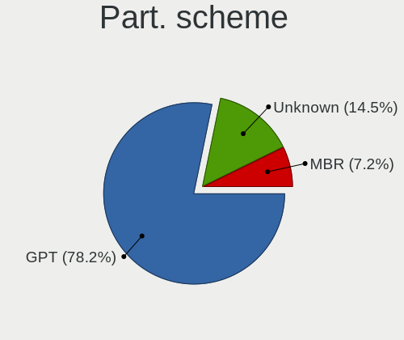
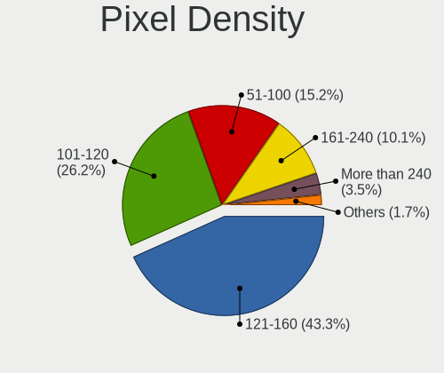
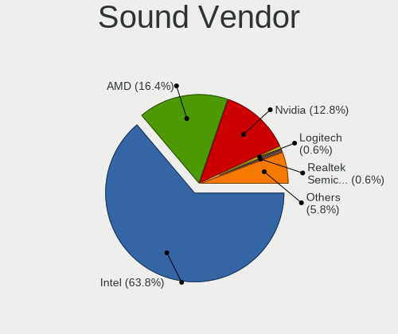

Ubuntu 22.04 - Tested Hardware & Statistics (Notebooks)
-------------------------------------------------------

A project to collect tested hardware configurations for Ubuntu 22.04.

Anyone can contribute to this report by the [hw-probe](https://github.com/linuxhw/hw-probe) tool:

    sudo -E hw-probe -all -upload

Please submit a probe of your configuration if it's not presented on the page or is rare.

Full-feature report is available here: https://linux-hardware.org/?view=trends

Contents
--------

* [ Test Cases ](#test-cases)

* [ System ](#system)
  - [ Kernel                   ](#kernel)
  - [ Kernel Family            ](#kernel-family)
  - [ Kernel Major Ver.        ](#kernel-major-ver)
  - [ Arch                     ](#arch)
  - [ DE                       ](#de)
  - [ Display Server           ](#display-server)
  - [ Display Manager          ](#display-manager)
  - [ OS Lang                  ](#os-lang)
  - [ Boot Mode                ](#boot-mode)
  - [ Filesystem               ](#filesystem)
  - [ Part. scheme             ](#part-scheme)
  - [ Dual Boot with Linux/BSD ](#dual-boot-with-linuxbsd)
  - [ Dual Boot (Win)          ](#dual-boot-win)

* [ Board ](#board)
  - [ Vendor                   ](#vendor)
  - [ Model                    ](#model)
  - [ Model Family             ](#model-family)
  - [ MFG Year                 ](#mfg-year)
  - [ Form Factor              ](#form-factor)
  - [ Secure Boot              ](#secure-boot)
  - [ Coreboot                 ](#coreboot)
  - [ RAM Size                 ](#ram-size)
  - [ RAM Used                 ](#ram-used)
  - [ Total Drives             ](#total-drives)
  - [ Has CD-ROM               ](#has-cd-rom)
  - [ Has Ethernet             ](#has-ethernet)
  - [ Has WiFi                 ](#has-wifi)
  - [ Has Bluetooth            ](#has-bluetooth)

* [ Location ](#location)
  - [ Country                  ](#country)
  - [ City                     ](#city)

* [ Drives ](#drives)
  - [ Drive Vendor             ](#drive-vendor)
  - [ Drive Model              ](#drive-model)
  - [ HDD Vendor               ](#hdd-vendor)
  - [ SSD Vendor               ](#ssd-vendor)
  - [ Drive Kind               ](#drive-kind)
  - [ Drive Connector          ](#drive-connector)
  - [ Drive Size               ](#drive-size)
  - [ Space Total              ](#space-total)
  - [ Space Used               ](#space-used)
  - [ Malfunc. Drives          ](#malfunc-drives)
  - [ Malfunc. Drive Vendor    ](#malfunc-drive-vendor)
  - [ Malfunc. HDD Vendor      ](#malfunc-hdd-vendor)
  - [ Malfunc. Drive Kind      ](#malfunc-drive-kind)
  - [ Failed Drives            ](#failed-drives)
  - [ Failed Drive Vendor      ](#failed-drive-vendor)
  - [ Drive Status             ](#drive-status)

* [ Storage controller ](#storage-controller)
  - [ Storage Vendor           ](#storage-vendor)
  - [ Storage Model            ](#storage-model)
  - [ Storage Kind             ](#storage-kind)

* [ Processor ](#processor)
  - [ CPU Vendor               ](#cpu-vendor)
  - [ CPU Model                ](#cpu-model)
  - [ CPU Model Family         ](#cpu-model-family)
  - [ CPU Cores                ](#cpu-cores)
  - [ CPU Sockets              ](#cpu-sockets)
  - [ CPU Threads              ](#cpu-threads)
  - [ CPU Op-Modes             ](#cpu-op-modes)
  - [ CPU Microcode            ](#cpu-microcode)
  - [ CPU Microarch            ](#cpu-microarch)

* [ Graphics ](#graphics)
  - [ GPU Vendor               ](#gpu-vendor)
  - [ GPU Model                ](#gpu-model)
  - [ GPU Combo                ](#gpu-combo)
  - [ GPU Driver               ](#gpu-driver)
  - [ GPU Memory               ](#gpu-memory)

* [ Monitor ](#monitor)
  - [ Monitor Vendor           ](#monitor-vendor)
  - [ Monitor Model            ](#monitor-model)
  - [ Monitor Resolution       ](#monitor-resolution)
  - [ Monitor Diagonal         ](#monitor-diagonal)
  - [ Monitor Width            ](#monitor-width)
  - [ Aspect Ratio             ](#aspect-ratio)
  - [ Monitor Area             ](#monitor-area)
  - [ Pixel Density            ](#pixel-density)
  - [ Multiple Monitors        ](#multiple-monitors)

* [ Network ](#network)
  - [ Net Controller Vendor    ](#net-controller-vendor)
  - [ Net Controller Model     ](#net-controller-model)
  - [ Wireless Vendor          ](#wireless-vendor)
  - [ Wireless Model           ](#wireless-model)
  - [ Ethernet Vendor          ](#ethernet-vendor)
  - [ Ethernet Model           ](#ethernet-model)
  - [ Net Controller Kind      ](#net-controller-kind)
  - [ Used Controller          ](#used-controller)
  - [ NICs                     ](#nics)
  - [ IPv6                     ](#ipv6)

* [ Bluetooth ](#bluetooth)
  - [ Bluetooth Vendor         ](#bluetooth-vendor)
  - [ Bluetooth Model          ](#bluetooth-model)

* [ Sound ](#sound)
  - [ Sound Vendor             ](#sound-vendor)
  - [ Sound Model              ](#sound-model)

* [ Memory ](#memory)
  - [ Memory Vendor            ](#memory-vendor)
  - [ Memory Model             ](#memory-model)
  - [ Memory Kind              ](#memory-kind)
  - [ Memory Form Factor       ](#memory-form-factor)
  - [ Memory Size              ](#memory-size)
  - [ Memory Speed             ](#memory-speed)

* [ Printers & scanners ](#printers--scanners)
  - [ Printer Vendor           ](#printer-vendor)
  - [ Printer Model            ](#printer-model)
  - [ Scanner Vendor           ](#scanner-vendor)
  - [ Scanner Model            ](#scanner-model)

* [ Camera ](#camera)
  - [ Camera Vendor            ](#camera-vendor)
  - [ Camera Model             ](#camera-model)

* [ Security ](#security)
  - [ Fingerprint Vendor       ](#fingerprint-vendor)
  - [ Fingerprint Model        ](#fingerprint-model)
  - [ Chipcard Vendor          ](#chipcard-vendor)
  - [ Chipcard Model           ](#chipcard-model)

* [ Unsupported ](#unsupported)
  - [ Unsupported Devices      ](#unsupported-devices)
  - [ Unsupported Device Types ](#unsupported-device-types)

Test Cases
----------

Total: 80

| Vendor        | Model                       | Probe                                                      | Date         |
|---------------|-----------------------------|------------------------------------------------------------|--------------|
| Lenovo        | ThinkPad E495 20NEA00QUS    | [d9cbb34331](https://linux-hardware.org/?probe=d9cbb34331) | Apr 04, 2022 |
| Lenovo        | ThinkPad E495 20NEA00QUS    | [062e604ef0](https://linux-hardware.org/?probe=062e604ef0) | Apr 04, 2022 |
| Lenovo        | ThinkPad P1 Gen 4i 20Y30... | [43ff476479](https://linux-hardware.org/?probe=43ff476479) | Apr 03, 2022 |
| Samsung       | R580/R590                   | [0b95325a5e](https://linux-hardware.org/?probe=0b95325a5e) | Apr 03, 2022 |
| Lenovo        | IdeaPad 5 Pro 14ACN6 82L... | [bdb683ff40](https://linux-hardware.org/?probe=bdb683ff40) | Apr 03, 2022 |
| ASUSTek       | ROG Zephyrus G14 GA401IH... | [ad5d38e378](https://linux-hardware.org/?probe=ad5d38e378) | Apr 02, 2022 |
| Lenovo        | IdeaPad 5 Pro 14ACN6 82L... | [e380073189](https://linux-hardware.org/?probe=e380073189) | Apr 02, 2022 |
| HP            | Pavilion Laptop 14-ce2xx... | [d103b2cb25](https://linux-hardware.org/?probe=d103b2cb25) | Apr 02, 2022 |
| Dell          | Inspiron N5110              | [eba4514371](https://linux-hardware.org/?probe=eba4514371) | Apr 01, 2022 |
| HUAWEI        | MACH-WX9                    | [a799c6c916](https://linux-hardware.org/?probe=a799c6c916) | Apr 01, 2022 |
| Dell          | Inspiron N5110              | [606eb17f56](https://linux-hardware.org/?probe=606eb17f56) | Apr 01, 2022 |
| Dell          | Inspiron N5110              | [6b0cd44dbb](https://linux-hardware.org/?probe=6b0cd44dbb) | Apr 01, 2022 |
| Alienware     | M11x                        | [f83c01bb34](https://linux-hardware.org/?probe=f83c01bb34) | Apr 01, 2022 |
| Avell High... | A70 MOB                     | [9e095642f0](https://linux-hardware.org/?probe=9e095642f0) | Apr 01, 2022 |
| Dell          | Inspiron 3501               | [a14dde61dc](https://linux-hardware.org/?probe=a14dde61dc) | Apr 01, 2022 |
| HUAWEI        | CREM-WXX9                   | [858142c2ab](https://linux-hardware.org/?probe=858142c2ab) | Apr 01, 2022 |
| Lenovo        | IdeaPad 5 14ITL05 82FE      | [ceee79344c](https://linux-hardware.org/?probe=ceee79344c) | Mar 31, 2022 |
| HUAWEI        | CREM-WXX9                   | [83b60423e1](https://linux-hardware.org/?probe=83b60423e1) | Mar 30, 2022 |
| HP            | 250 G4                      | [69a3535c1a](https://linux-hardware.org/?probe=69a3535c1a) | Mar 30, 2022 |
| HUAWEI        | CREM-WXX9                   | [4626f2aeab](https://linux-hardware.org/?probe=4626f2aeab) | Mar 29, 2022 |
| MSI           | GP76 Leopard 11UG           | [93a6b587c2](https://linux-hardware.org/?probe=93a6b587c2) | Mar 29, 2022 |
| Lenovo        | ThinkBook 15 G3 ACL 21A4    | [30c09eec3b](https://linux-hardware.org/?probe=30c09eec3b) | Mar 28, 2022 |
| HUAWEI        | CREM-WXX9                   | [dbdd71e8b8](https://linux-hardware.org/?probe=dbdd71e8b8) | Mar 28, 2022 |
| Dell          | XPS 17 9710                 | [ecf7b98552](https://linux-hardware.org/?probe=ecf7b98552) | Mar 28, 2022 |
| Lenovo        | ThinkPad T14s Gen 2a 20X... | [0e93a8600c](https://linux-hardware.org/?probe=0e93a8600c) | Mar 27, 2022 |
| Lenovo        | IdeaPad 5 Pro 14ACN6 82L... | [e5b0f5c259](https://linux-hardware.org/?probe=e5b0f5c259) | Mar 27, 2022 |
| HUAWEI        | MACH-WX9                    | [64e505d8d7](https://linux-hardware.org/?probe=64e505d8d7) | Mar 26, 2022 |
| Lenovo        | IdeaPad 5 Pro 14ACN6 82L... | [01e83234d9](https://linux-hardware.org/?probe=01e83234d9) | Mar 26, 2022 |
| Lenovo        | IdeaPad 5 Pro 14ACN6 82L... | [4fb374e78b](https://linux-hardware.org/?probe=4fb374e78b) | Mar 25, 2022 |
| HP            | EliteBook 840 G3            | [f06216a521](https://linux-hardware.org/?probe=f06216a521) | Mar 24, 2022 |
| HP            | Pavilion x2 Detachable      | [a82a2739a8](https://linux-hardware.org/?probe=a82a2739a8) | Mar 22, 2022 |
| Lenovo        | Z50-70 20354                | [b03762a80b](https://linux-hardware.org/?probe=b03762a80b) | Mar 22, 2022 |
| Framework     | Laptop                      | [b8fcafa943](https://linux-hardware.org/?probe=b8fcafa943) | Mar 20, 2022 |
| GPU Compan... | GWTC116-2                   | [3c0450f79e](https://linux-hardware.org/?probe=3c0450f79e) | Mar 12, 2022 |
| ASUSTek       | ROG Zephyrus G14 GA401IH... | [1c22760a82](https://linux-hardware.org/?probe=1c22760a82) | Mar 12, 2022 |
| MSI           | Creator Z16 A11UET          | [1804e5eb77](https://linux-hardware.org/?probe=1804e5eb77) | Mar 09, 2022 |
| ASUSTek       | ROG Zephyrus M16 GU603ZW... | [9fd12bdd29](https://linux-hardware.org/?probe=9fd12bdd29) | Mar 06, 2022 |
| HUAWEI        | BOHB-WAX9                   | [915ca09de4](https://linux-hardware.org/?probe=915ca09de4) | Mar 05, 2022 |
| Toshiba       | Satellite C70D-A            | [c7dfd52f76](https://linux-hardware.org/?probe=c7dfd52f76) | Mar 05, 2022 |
| HP            | ZBook 15 G5                 | [f86a14c16d](https://linux-hardware.org/?probe=f86a14c16d) | Mar 05, 2022 |
| ASUSTek       | ROG Zephyrus M16 GU603ZW... | [206f3a7c01](https://linux-hardware.org/?probe=206f3a7c01) | Mar 02, 2022 |
| HP            | Presario CQ42               | [de34294599](https://linux-hardware.org/?probe=de34294599) | Feb 27, 2022 |
| Shanghai Z... | ZXE CRB                     | [7fe4a3390b](https://linux-hardware.org/?probe=7fe4a3390b) | Feb 25, 2022 |
| Timi          | TM1709                      | [16e699bea8](https://linux-hardware.org/?probe=16e699bea8) | Feb 25, 2022 |
| ASUSTek       | ROG Zephyrus M16 GU603HE... | [076c8f6e01](https://linux-hardware.org/?probe=076c8f6e01) | Feb 23, 2022 |
| ASUSTek       | ROG Zephyrus M16 GU603HE... | [85c09f63f0](https://linux-hardware.org/?probe=85c09f63f0) | Feb 23, 2022 |
| Acer          | Aspire A517-52              | [52976ad94b](https://linux-hardware.org/?probe=52976ad94b) | Feb 23, 2022 |
| MSI           | Stealth GS66 12UHS          | [bb8ef51c23](https://linux-hardware.org/?probe=bb8ef51c23) | Feb 17, 2022 |
| Lenovo        | ThinkPad E15 Gen 2 20TES... | [da103e44c5](https://linux-hardware.org/?probe=da103e44c5) | Feb 17, 2022 |
| HP            | 620                         | [bd89b469e4](https://linux-hardware.org/?probe=bd89b469e4) | Feb 14, 2022 |
| HP            | Pavilion 15                 | [9246e37578](https://linux-hardware.org/?probe=9246e37578) | Feb 09, 2022 |
| ASUSTek       | K52Je                       | [e1010983cf](https://linux-hardware.org/?probe=e1010983cf) | Feb 09, 2022 |
| Dell          | Latitude 3330               | [c3b39f74b4](https://linux-hardware.org/?probe=c3b39f74b4) | Jan 31, 2022 |
| ASUSTek       | ROG Zephyrus G15 GA502IU... | [0a04b2d1b1](https://linux-hardware.org/?probe=0a04b2d1b1) | Jan 31, 2022 |
| HP            | 15                          | [81961b52a9](https://linux-hardware.org/?probe=81961b52a9) | Jan 29, 2022 |
| HP            | ProBook 445 G7              | [bceca55120](https://linux-hardware.org/?probe=bceca55120) | Jan 23, 2022 |
| ASUSTek       | ASUS TUF Gaming F17 FX70... | [2de98fb4d8](https://linux-hardware.org/?probe=2de98fb4d8) | Jan 22, 2022 |
| HP            | ProBook 650 G5              | [111cb6822e](https://linux-hardware.org/?probe=111cb6822e) | Jan 21, 2022 |
| HP            | Pavilion Laptop 14-dv1xx... | [e092fc4b26](https://linux-hardware.org/?probe=e092fc4b26) | Jan 20, 2022 |
| HP            | ZBook Power 15.6 inch G8... | [245123d0a8](https://linux-hardware.org/?probe=245123d0a8) | Jan 20, 2022 |
| Dell          | Latitude E6510              | [c0d3a6c31a](https://linux-hardware.org/?probe=c0d3a6c31a) | Jan 16, 2022 |
| Google        | Kefka                       | [e62fa3eea6](https://linux-hardware.org/?probe=e62fa3eea6) | Jan 10, 2022 |
| Timi          | RedmiBook Pro 15S           | [034079628f](https://linux-hardware.org/?probe=034079628f) | Jan 07, 2022 |
| Lenovo        | ThinkPad T400 2768WGB       | [ac0e3dfe29](https://linux-hardware.org/?probe=ac0e3dfe29) | Jan 07, 2022 |
| HP            | ENVY Laptop 13-ad1xx        | [666b0b18f5](https://linux-hardware.org/?probe=666b0b18f5) | Dec 30, 2021 |
| MSI           | GT73VR 6RE                  | [0f41e5dd07](https://linux-hardware.org/?probe=0f41e5dd07) | Dec 28, 2021 |
| Lenovo        | Legion 7 16ACHg6 82N6       | [be79b3cd82](https://linux-hardware.org/?probe=be79b3cd82) | Dec 26, 2021 |
| Lenovo        | Flex 2-15 20405             | [ccc85b0783](https://linux-hardware.org/?probe=ccc85b0783) | Dec 13, 2021 |
| MSI           | Modern 15 A11MU             | [34b31c53cd](https://linux-hardware.org/?probe=34b31c53cd) | Dec 07, 2021 |
| Toshiba       | PORTEGE Z10T-A              | [5257d76a92](https://linux-hardware.org/?probe=5257d76a92) | Dec 05, 2021 |
| HP            | Laptop 15s-fq1xxx           | [f219ee63ff](https://linux-hardware.org/?probe=f219ee63ff) | Nov 30, 2021 |
| HP            | Laptop 15s-fq1xxx           | [3199d159a4](https://linux-hardware.org/?probe=3199d159a4) | Nov 30, 2021 |
| Lenovo        | Flex 2-15 20405             | [d191e3f97f](https://linux-hardware.org/?probe=d191e3f97f) | Nov 22, 2021 |
| Lenovo        | Flex 2-15 20405             | [6381b11078](https://linux-hardware.org/?probe=6381b11078) | Nov 22, 2021 |
| ASUSTek       | X58L                        | [c3df58b13b](https://linux-hardware.org/?probe=c3df58b13b) | Nov 10, 2021 |
| ASUSTek       | X58L                        | [e1425f037e](https://linux-hardware.org/?probe=e1425f037e) | Nov 10, 2021 |
| ASUSTek       | X58L                        | [f64ba3a9e4](https://linux-hardware.org/?probe=f64ba3a9e4) | Nov 10, 2021 |
| Dell          | Inspiron 1464               | [26f50eb4a8](https://linux-hardware.org/?probe=26f50eb4a8) | Nov 06, 2021 |
| Dell          | Inspiron 11 - 3147          | [6b1a282c17](https://linux-hardware.org/?probe=6b1a282c17) | Nov 05, 2021 |
| Dell          | Inspiron 1464               | [4063779d5a](https://linux-hardware.org/?probe=4063779d5a) | Nov 01, 2021 |

System
------

Kernel
------

Version of the Linux kernel

| Version                     | Notebooks | Percent |
|-----------------------------|-----------|---------|
| 5.15.0-23-generic           | 17        | 28.33%  |
| 5.15.0-18-generic           | 12        | 20%     |
| 5.15.0-17-generic           | 7         | 11.67%  |
| 5.13.0-19-generic           | 5         | 8.33%   |
| 5.15.0-22-generic           | 4         | 6.67%   |
| 5.17.0-051700-generic       | 2         | 3.33%   |
| 5.17.0-051700rc5-lowlatency | 1         | 1.67%   |
| 5.16.0-051600-generic       | 1         | 1.67%   |
| 5.15.6-051506-generic       | 1         | 1.67%   |
| 5.15.17-xanmod2             | 1         | 1.67%   |
| 5.15.15-76051515-generic    | 1         | 1.67%   |
| 5.15.12-051512-generic      | 1         | 1.67%   |
| 5.15.11-051511-generic      | 1         | 1.67%   |
| 5.15.10-051510-generic      | 1         | 1.67%   |
| 5.15.0-14-generic           | 1         | 1.67%   |
| 5.15.0-13-generic           | 1         | 1.67%   |
| 5.15.0-12-generic           | 1         | 1.67%   |
| 5.15.0-11-generic           | 1         | 1.67%   |
| 5.13.19                     | 1         | 1.67%   |

Kernel Family
-------------

Linux kernel without a distro release

| Version | Notebooks | Percent |
|---------|-----------|---------|
| 5.15.0  | 42        | 72.41%  |
| 5.13.0  | 5         | 8.62%   |
| 5.17.0  | 3         | 5.17%   |
| 5.16.0  | 1         | 1.72%   |
| 5.15.6  | 1         | 1.72%   |
| 5.15.17 | 1         | 1.72%   |
| 5.15.15 | 1         | 1.72%   |
| 5.15.12 | 1         | 1.72%   |
| 5.15.11 | 1         | 1.72%   |
| 5.15.10 | 1         | 1.72%   |
| 5.13.19 | 1         | 1.72%   |

Kernel Major Ver.
-----------------

Linux kernel major version

| Version | Notebooks | Percent |
|---------|-----------|---------|
| 5.15    | 48        | 82.76%  |
| 5.13    | 6         | 10.34%  |
| 5.17    | 3         | 5.17%   |
| 5.16    | 1         | 1.72%   |

Arch
----

OS architecture (x86_64, i586, etc.)

| Name   | Notebooks | Percent |
|--------|-----------|---------|
| x86_64 | 57        | 100%    |

DE
--

Desktop Environment

| Name              | Notebooks | Percent |
|-------------------|-----------|---------|
| GNOME             | 51        | 86.44%  |
| Unknown           | 5         | 8.47%   |
| Yaru:ubuntu:GNOME | 1         | 1.69%   |
| GNUstep           | 1         | 1.69%   |
| Cinnamon          | 1         | 1.69%   |

Display Server
--------------

X11 or Wayland

| Name    | Notebooks | Percent |
|---------|-----------|---------|
| Wayland | 34        | 57.63%  |
| X11     | 19        | 32.2%   |
| Tty     | 5         | 8.47%   |
| Unknown | 1         | 1.69%   |

Display Manager
---------------

SDDM, LightDM, etc.

| Name    | Notebooks | Percent |
|---------|-----------|---------|
| GDM3    | 49        | 84.48%  |
| Unknown | 7         | 12.07%  |
| LightDM | 1         | 1.72%   |
| GDM     | 1         | 1.72%   |

OS Lang
-------

Language

| Lang    | Notebooks | Percent |
|---------|-----------|---------|
| en_US   | 30        | 52.63%  |
| en_IN   | 7         | 12.28%  |
| de_DE   | 3         | 5.26%   |
| ru_RU   | 2         | 3.51%   |
| pt_BR   | 2         | 3.51%   |
| fr_FR   | 2         | 3.51%   |
| en_GB   | 2         | 3.51%   |
| zh_CN   | 1         | 1.75%   |
| pl_PL   | 1         | 1.75%   |
| it_IT   | 1         | 1.75%   |
| hu_HU   | 1         | 1.75%   |
| en_SG   | 1         | 1.75%   |
| en_IL   | 1         | 1.75%   |
| en_CA   | 1         | 1.75%   |
| de_IT   | 1         | 1.75%   |
| Unknown | 1         | 1.75%   |

Boot Mode
---------

EFI or BIOS

| Mode | Notebooks | Percent |
|------|-----------|---------|
| BIOS | 31        | 54.39%  |
| EFI  | 26        | 45.61%  |

Filesystem
----------

Type of filesystem

| Type    | Notebooks | Percent |
|---------|-----------|---------|
| Ext4    | 54        | 93.1%   |
| Zfs     | 2         | 3.45%   |
| Overlay | 1         | 1.72%   |
| Btrfs   | 1         | 1.72%   |

Part. scheme
------------

Scheme of partitioning

| Type    | Notebooks | Percent |
|---------|-----------|---------|
| Unknown | 29        | 50.88%  |
| GPT     | 25        | 43.86%  |
| MBR     | 3         | 5.26%   |

Dual Boot with Linux/BSD
------------------------

Hosting more than one Linux/BSD

| Dual boot | Notebooks | Percent |
|-----------|-----------|---------|
| No        | 50        | 87.72%  |
| Yes       | 7         | 12.28%  |

Dual Boot (Win)
---------------

Hosting Linux and Windows

| Dual boot | Notebooks | Percent |
|-----------|-----------|---------|
| No        | 31        | 53.45%  |
| Yes       | 27        | 46.55%  |

Board
-----

Vendor
------

Motherboard manufacturer

| Name                           | Notebooks | Percent |
|--------------------------------|-----------|---------|
| Hewlett-Packard                | 15        | 26.32%  |
| Lenovo                         | 10        | 17.54%  |
| ASUSTek Computer               | 7         | 12.28%  |
| Dell                           | 6         | 10.53%  |
| MSI                            | 5         | 8.77%   |
| HUAWEI                         | 3         | 5.26%   |
| Toshiba                        | 2         | 3.51%   |
| Timi                           | 1         | 1.75%   |
| Shanghai Zhaoxin Semiconductor | 1         | 1.75%   |
| Samsung Electronics            | 1         | 1.75%   |
| GPU Company                    | 1         | 1.75%   |
| Google                         | 1         | 1.75%   |
| Framework                      | 1         | 1.75%   |
| Avell High Performance         | 1         | 1.75%   |
| Alienware                      | 1         | 1.75%   |
| Acer                           | 1         | 1.75%   |

Model
-----

Motherboard model

| Name                                              | Notebooks | Percent |
|---------------------------------------------------|-----------|---------|
| Toshiba Satellite C70D-A                          | 1         | 1.75%   |
| Toshiba PORTEGE Z10T-A                            | 1         | 1.75%   |
| Timi TM1709                                       | 1         | 1.75%   |
| Shanghai Zhaoxin ZXE CRB                          | 1         | 1.75%   |
| Samsung R580/R590                                 | 1         | 1.75%   |
| MSI Stealth GS66 12UHS                            | 1         | 1.75%   |
| MSI Modern 15 A11MU                               | 1         | 1.75%   |
| MSI GT73VR 6RE                                    | 1         | 1.75%   |
| MSI GP76 Leopard 11UG                             | 1         | 1.75%   |
| MSI Creator Z16 A11UET                            | 1         | 1.75%   |
| Lenovo Z50-70 20354                               | 1         | 1.75%   |
| Lenovo ThinkPad T14s Gen 2a 20XF004WUS            | 1         | 1.75%   |
| Lenovo ThinkPad P1 Gen 4i 20Y3004KUS              | 1         | 1.75%   |
| Lenovo ThinkPad E495 20NEA00QUS                   | 1         | 1.75%   |
| Lenovo ThinkPad E15 Gen 2 20TES2H500              | 1         | 1.75%   |
| Lenovo ThinkBook 15 G3 ACL 21A4                   | 1         | 1.75%   |
| Lenovo Legion 7 16ACHg6 82N6                      | 1         | 1.75%   |
| Lenovo IdeaPad 5 Pro 14ACN6 82L7                  | 1         | 1.75%   |
| Lenovo IdeaPad 5 14ITL05 82FE                     | 1         | 1.75%   |
| Lenovo Flex 2-15 20405                            | 1         | 1.75%   |
| HUAWEI MACH-WX9                                   | 1         | 1.75%   |
| HUAWEI CREM-WXX9                                  | 1         | 1.75%   |
| HUAWEI BOHB-WAX9                                  | 1         | 1.75%   |
| HP ZBook Power 15.6 inch G8 Mobile Workstation PC | 1         | 1.75%   |
| HP ZBook 15 G5                                    | 1         | 1.75%   |
| HP ProBook 650 G5                                 | 1         | 1.75%   |
| HP ProBook 445 G7                                 | 1         | 1.75%   |
| HP Presario CQ42                                  | 1         | 1.75%   |
| HP Pavilion x2 Detachable                         | 1         | 1.75%   |
| HP Pavilion Laptop 14-dv1xxx                      | 1         | 1.75%   |
| HP Pavilion Laptop 14-ce2xxx                      | 1         | 1.75%   |
| HP Pavilion 15                                    | 1         | 1.75%   |
| HP Laptop 15s-fq1xxx                              | 1         | 1.75%   |
| HP ENVY Laptop 13-ad1xx                           | 1         | 1.75%   |
| HP EliteBook 840 G3                               | 1         | 1.75%   |
| HP 620                                            | 1         | 1.75%   |
| HP 250 G4                                         | 1         | 1.75%   |
| HP 15                                             | 1         | 1.75%   |
| GPU Company GWTC116-2                             | 1         | 1.75%   |
| Google Kefka                                      | 1         | 1.75%   |
| Framework Laptop                                  | 1         | 1.75%   |
| Dell Latitude E6510                               | 1         | 1.75%   |
| Dell Latitude 3330                                | 1         | 1.75%   |
| Dell Inspiron N5110                               | 1         | 1.75%   |
| Dell Inspiron 3501                                | 1         | 1.75%   |
| Dell Inspiron 1464                                | 1         | 1.75%   |
| Dell Inspiron 11 - 3147                           | 1         | 1.75%   |
| Avell High Performance A70 MOB                    | 1         | 1.75%   |
| ASUS X58L                                         | 1         | 1.75%   |
| ASUS ROG Zephyrus M16 GU603ZW_GU603ZW             | 1         | 1.75%   |
| ASUS ROG Zephyrus M16 GU603HE_GU603HE             | 1         | 1.75%   |
| ASUS ROG Zephyrus G15 GA502IU_GA502IU             | 1         | 1.75%   |
| ASUS ROG Zephyrus G14 GA401IH_GA401IH             | 1         | 1.75%   |
| ASUS K52Je                                        | 1         | 1.75%   |
| ASUS ASUS TUF Gaming F17 FX706HEB_FX706HEB        | 1         | 1.75%   |
| Alienware M11x                                    | 1         | 1.75%   |
| Acer Aspire A517-52                               | 1         | 1.75%   |

Model Family
------------

Motherboard model prefix

| Name                       | Notebooks | Percent |
|----------------------------|-----------|---------|
| Lenovo ThinkPad            | 4         | 7.02%   |
| HP Pavilion                | 4         | 7.02%   |
| Dell Inspiron              | 4         | 7.02%   |
| ASUS ROG                   | 4         | 7.02%   |
| Lenovo IdeaPad             | 2         | 3.51%   |
| HP ZBook                   | 2         | 3.51%   |
| HP ProBook                 | 2         | 3.51%   |
| Dell Latitude              | 2         | 3.51%   |
| Toshiba Satellite          | 1         | 1.75%   |
| Toshiba PORTEGE            | 1         | 1.75%   |
| Timi TM1709                | 1         | 1.75%   |
| Shanghai Zhaoxin ZXE       | 1         | 1.75%   |
| Samsung R580               | 1         | 1.75%   |
| MSI Stealth                | 1         | 1.75%   |
| MSI Modern                 | 1         | 1.75%   |
| MSI GT73VR                 | 1         | 1.75%   |
| MSI GP76                   | 1         | 1.75%   |
| MSI Creator                | 1         | 1.75%   |
| Lenovo Z50-70              | 1         | 1.75%   |
| Lenovo ThinkBook           | 1         | 1.75%   |
| Lenovo Legion              | 1         | 1.75%   |
| Lenovo Flex                | 1         | 1.75%   |
| HUAWEI MACH-WX9            | 1         | 1.75%   |
| HUAWEI CREM-WXX9           | 1         | 1.75%   |
| HUAWEI BOHB-WAX9           | 1         | 1.75%   |
| HP Presario                | 1         | 1.75%   |
| HP Laptop                  | 1         | 1.75%   |
| HP ENVY                    | 1         | 1.75%   |
| HP EliteBook               | 1         | 1.75%   |
| HP 620                     | 1         | 1.75%   |
| HP 250                     | 1         | 1.75%   |
| HP 15                      | 1         | 1.75%   |
| GPU Company GWTC116-2      | 1         | 1.75%   |
| Google Kefka               | 1         | 1.75%   |
| Framework Laptop           | 1         | 1.75%   |
| Avell High Performance A70 | 1         | 1.75%   |
| ASUS X58L                  | 1         | 1.75%   |
| ASUS K52Je                 | 1         | 1.75%   |
| ASUS ASUS                  | 1         | 1.75%   |
| Alienware M11x             | 1         | 1.75%   |
| Acer Aspire                | 1         | 1.75%   |

MFG Year
--------

Motherboard manufacture year

| Year | Notebooks | Percent |
|------|-----------|---------|
| 2021 | 19        | 33.33%  |
| 2020 | 8         | 14.04%  |
| 2010 | 7         | 12.28%  |
| 2013 | 5         | 8.77%   |
| 2019 | 4         | 7.02%   |
| 2018 | 4         | 7.02%   |
| 2014 | 3         | 5.26%   |
| 2015 | 2         | 3.51%   |
| 2022 | 1         | 1.75%   |
| 2017 | 1         | 1.75%   |
| 2016 | 1         | 1.75%   |
| 2011 | 1         | 1.75%   |
| 2008 | 1         | 1.75%   |

Form Factor
-----------

Physical design of the computer

| Name     | Notebooks | Percent |
|----------|-----------|---------|
| Notebook | 57        | 100%    |

Secure Boot
-----------

Enabled or disabled

| State    | Notebooks | Percent |
|----------|-----------|---------|
| Disabled | 49        | 85.96%  |
| Enabled  | 8         | 14.04%  |

Coreboot
--------

Have coreboot on board

| Used | Notebooks | Percent |
|------|-----------|---------|
| No   | 56        | 98.25%  |
| Yes  | 1         | 1.75%   |

RAM Size
--------

Total RAM memory

| Size in GB  | Notebooks | Percent |
|-------------|-----------|---------|
| 4.01-8.0    | 14        | 24.56%  |
| 32.01-64.0  | 9         | 15.79%  |
| 3.01-4.0    | 9         | 15.79%  |
| 16.01-24.0  | 9         | 15.79%  |
| 8.01-16.0   | 7         | 12.28%  |
| 24.01-32.0  | 3         | 5.26%   |
| 2.01-3.0    | 2         | 3.51%   |
| 64.01-256.0 | 2         | 3.51%   |
| 1.01-2.0    | 2         | 3.51%   |

RAM Used
--------

Used RAM memory

| Used GB    | Notebooks | Percent |
|------------|-----------|---------|
| 4.01-8.0   | 16        | 27.12%  |
| 1.01-2.0   | 16        | 27.12%  |
| 2.01-3.0   | 15        | 25.42%  |
| 3.01-4.0   | 6         | 10.17%  |
| 8.01-16.0  | 2         | 3.39%   |
| 0.01-0.5   | 2         | 3.39%   |
| 24.01-32.0 | 1         | 1.69%   |
| 0.51-1.0   | 1         | 1.69%   |

Total Drives
------------

Number of drives on board

| Drives | Notebooks | Percent |
|--------|-----------|---------|
| 1      | 43        | 75.44%  |
| 2      | 12        | 21.05%  |
| 3      | 2         | 3.51%   |

Has CD-ROM
----------

Has CD-ROM on board

| Presented | Notebooks | Percent |
|-----------|-----------|---------|
| No        | 43        | 74.14%  |
| Yes       | 15        | 25.86%  |

Has Ethernet
------------

Has Ethernet on board

| Presented | Notebooks | Percent |
|-----------|-----------|---------|
| Yes       | 42        | 73.68%  |
| No        | 15        | 26.32%  |

Has WiFi
--------

Has WiFi module

| Presented | Notebooks | Percent |
|-----------|-----------|---------|
| Yes       | 57        | 100%    |

Has Bluetooth
-------------

Has Bluetooth module

| Presented | Notebooks | Percent |
|-----------|-----------|---------|
| Yes       | 49        | 84.48%  |
| No        | 9         | 15.52%  |

Location
--------

Country
-------

Geographic location (country)

| Country     | Notebooks | Percent |
|-------------|-----------|---------|
| USA         | 10        | 17.54%  |
| India       | 8         | 14.04%  |
| Germany     | 5         | 8.77%   |
| France      | 4         | 7.02%   |
| Poland      | 3         | 5.26%   |
| Italy       | 3         | 5.26%   |
| China       | 3         | 5.26%   |
| Taiwan      | 2         | 3.51%   |
| Russia      | 2         | 3.51%   |
| Brazil      | 2         | 3.51%   |
| UK          | 1         | 1.75%   |
| Thailand    | 1         | 1.75%   |
| Spain       | 1         | 1.75%   |
| Slovenia    | 1         | 1.75%   |
| Singapore   | 1         | 1.75%   |
| Romania     | 1         | 1.75%   |
| Netherlands | 1         | 1.75%   |
| Myanmar     | 1         | 1.75%   |
| Mexico      | 1         | 1.75%   |
| Israel      | 1         | 1.75%   |
| Hungary     | 1         | 1.75%   |
| Egypt       | 1         | 1.75%   |
| Colombia    | 1         | 1.75%   |
| Canada      | 1         | 1.75%   |
| Argentina   | 1         | 1.75%   |

City
----

Geographic location (city)

| City                     | Notebooks | Percent |
|--------------------------|-----------|---------|
| Moses Lake               | 2         | 3.45%   |
| Kunming                  | 2         | 3.45%   |
| Chennai                  | 2         | 3.45%   |
| Chandigarh               | 2         | 3.45%   |
| Boeschepe                | 2         | 3.45%   |
| Yangon                   | 1         | 1.72%   |
| Worms                    | 1         | 1.72%   |
| Warsaw                   | 1         | 1.72%   |
| Wake Forest              | 1         | 1.72%   |
| Tubarao                  | 1         | 1.72%   |
| The Hague                | 1         | 1.72%   |
| Tel Aviv                 | 1         | 1.72%   |
| Taoyuan District         | 1         | 1.72%   |
| Taipei                   | 1         | 1.72%   |
| St Petersburg            | 1         | 1.72%   |
| Singapore                | 1         | 1.72%   |
| Siegen                   | 1         | 1.72%   |
| Seward                   | 1         | 1.72%   |
| San Francisco            | 1         | 1.72%   |
| Richland Center          | 1         | 1.72%   |
| Renchen                  | 1         | 1.72%   |
| Pune                     | 1         | 1.72%   |
| Porto Alegre             | 1         | 1.72%   |
| Ploieşti                | 1         | 1.72%   |
| Paris                    | 1         | 1.72%   |
| Papun                    | 1         | 1.72%   |
| Palermo                  | 1         | 1.72%   |
| Palau-solita i Plegamans | 1         | 1.72%   |
| Orehova Vas              | 1         | 1.72%   |
| Mountain Grove           | 1         | 1.72%   |
| Moscow                   | 1         | 1.72%   |
| Marnaz                   | 1         | 1.72%   |
| Mariposa                 | 1         | 1.72%   |
| Ludhiana                 | 1         | 1.72%   |
| Legionowo                | 1         | 1.72%   |
| Khlong Luang             | 1         | 1.72%   |
| Hyderabad                | 1         | 1.72%   |
| Henderson                | 1         | 1.72%   |
| Gurgaon                  | 1         | 1.72%   |
| Grandview                | 1         | 1.72%   |
| Glasgow                  | 1         | 1.72%   |
| Gdansk                   | 1         | 1.72%   |
| Ensenada                 | 1         | 1.72%   |
| Düsseldorf              | 1         | 1.72%   |
| Dresden                  | 1         | 1.72%   |
| Collepietra              | 1         | 1.72%   |
| Cartagena                | 1         | 1.72%   |
| Cairo                    | 1         | 1.72%   |
| Budapest                 | 1         | 1.72%   |
| Brughiere                | 1         | 1.72%   |
| Brooklyn                 | 1         | 1.72%   |
| Beijing                  | 1         | 1.72%   |
| Arvada                   | 1         | 1.72%   |

Drives
------

Drive Vendor
------------

Hard drive vendors

| Vendor              | Notebooks | Drives | Percent |
|---------------------|-----------|--------|---------|
| Samsung Electronics | 19        | 23     | 28.79%  |
| WDC                 | 9         | 11     | 13.64%  |
| Seagate             | 8         | 8      | 12.12%  |
| Unknown             | 6         | 7      | 9.09%   |
| Intel               | 4         | 5      | 6.06%   |
| KIOXIA              | 3         | 3      | 4.55%   |
| Kingston            | 3         | 3      | 4.55%   |
| Toshiba             | 2         | 3      | 3.03%   |
| SK Hynix            | 2         | 2      | 3.03%   |
| Sandisk             | 2         | 2      | 3.03%   |
| PNY                 | 1         | 1      | 1.52%   |
| PLEXTOR             | 1         | 1      | 1.52%   |
| Micron Technology   | 1         | 2      | 1.52%   |
| LITEON              | 1         | 1      | 1.52%   |
| KLEVV               | 1         | 1      | 1.52%   |
| Hitachi             | 1         | 1      | 1.52%   |
| China               | 1         | 1      | 1.52%   |
| ADATA Technology    | 1         | 2      | 1.52%   |

Drive Model
-----------

Hard drive models

| Model                                  | Notebooks | Percent |
|----------------------------------------|-----------|---------|
| Seagate ST9500420AS 500GB              | 2         | 2.9%    |
| Samsung NVMe SSD Drive 512GB           | 2         | 2.9%    |
| Samsung NVMe SSD Drive 256GB           | 2         | 2.9%    |
| KIOXIA NVMe SSD Drive 256GB            | 2         | 2.9%    |
| Intel NVMe SSD Drive 512GB             | 2         | 2.9%    |
| WDC WDS100T1X0E-00AFY0 1TB             | 1         | 1.45%   |
| WDC WDBNCE0010PNC 1TB SSD              | 1         | 1.45%   |
| WDC WD3200BPVT-75JJ5T0 320GB           | 1         | 1.45%   |
| WDC WD10SPCX-24HWST1 1TB               | 1         | 1.45%   |
| WDC WD10JPVX-60JC3T0 1TB               | 1         | 1.45%   |
| WDC PC SN810 SDCPNRZ-2T00-1032 2TB     | 1         | 1.45%   |
| WDC PC SN730 SDBPNTY-512G              | 1         | 1.45%   |
| WDC PC SN530 SDBPNPZ-512G-1027 512GB   | 1         | 1.45%   |
| WDC PC SN530 SDBPNPZ-512G-1002 512GB   | 1         | 1.45%   |
| Unknown SD/MMC/MS PRO 3GB              | 1         | 1.45%   |
| Unknown SC128  128GB                   | 1         | 1.45%   |
| Unknown NVMe SSD Drive 512GB           | 1         | 1.45%   |
| Unknown MMC Card  32GB                 | 1         | 1.45%   |
| Unknown MMC Card  16GB                 | 1         | 1.45%   |
| Unknown Biwin  64GB                    | 1         | 1.45%   |
| Toshiba MQ01ABD100M 1TB                | 1         | 1.45%   |
| Toshiba KXG50ZNV512G 512GB             | 1         | 1.45%   |
| SK Hynix SKHynix_HFS001TDE9X084N 1TB   | 1         | 1.45%   |
| SK Hynix SKHynix_HFM256GD3HX015N 256GB | 1         | 1.45%   |
| Seagate ST9320423AS 320GB              | 1         | 1.45%   |
| Seagate ST9320325AS 320GB              | 1         | 1.45%   |
| Seagate ST500LT012-1DG142 500GB        | 1         | 1.45%   |
| Seagate ST500LM012 HN-M500MBB 500GB    | 1         | 1.45%   |
| Seagate ST320LM001 HN-M320MBB 320GB    | 1         | 1.45%   |
| Seagate ST1000LX015-1U7172 1TB         | 1         | 1.45%   |
| SanDisk SSD PLUS 240 GB                | 1         | 1.45%   |
| Sandisk NVMe SSD Drive 1024GB          | 1         | 1.45%   |
| Samsung SSD 860 EVO 1TB                | 1         | 1.45%   |
| Samsung SSD 850 EVO 500GB              | 1         | 1.45%   |
| Samsung SSD 750 EVO 250GB              | 1         | 1.45%   |
| Samsung NVMe SSD Drive 2TB             | 1         | 1.45%   |
| Samsung NVMe SSD Drive 1024GB          | 1         | 1.45%   |
| Samsung MZVLQ256HAJD-000H1 256GB       | 1         | 1.45%   |
| Samsung MZVLB512HAJQ-000H1 512GB       | 1         | 1.45%   |
| Samsung MZVLB1T0HBLR-000L2 1TB         | 1         | 1.45%   |
| Samsung MZVL21T0HCLR-00BL7 1TB         | 1         | 1.45%   |
| Samsung MZVL21T0HCLR-00B00 1TB         | 1         | 1.45%   |
| Samsung MZNLN128HAHQ-00000 128GB SSD   | 1         | 1.45%   |
| Samsung MZMTE256HMHP-00005 256GB SSD   | 1         | 1.45%   |
| Samsung MZALQ512HALU-000L2 512GB       | 1         | 1.45%   |
| Samsung MZALQ256HAJD-000L1 256GB       | 1         | 1.45%   |
| Samsung HM501II 500GB                  | 1         | 1.45%   |
| Samsung HM500JI 500GB                  | 1         | 1.45%   |
| Samsung HM160HI 160GB                  | 1         | 1.45%   |
| PNY CS900 240GB SSD                    | 1         | 1.45%   |
| PLEXTOR PX-512M5Pro 512GB SSD          | 1         | 1.45%   |
| Micron NVMe SSD Drive 1024GB           | 1         | 1.45%   |
| Micron 3400_MTFDKBA1T0TFH 1TB          | 1         | 1.45%   |
| LITEON CV8-8E128-HP 128GB SSD          | 1         | 1.45%   |
| KLEVV NEO N400 SSD 240GB               | 1         | 1.45%   |
| KIOXIA NVMe SSD Drive 512GB            | 1         | 1.45%   |
| Kingston SA2000M81000G 1TB             | 1         | 1.45%   |
| Kingston OM8PCP3512F-AI1 512GB         | 1         | 1.45%   |
| Kingston NVMe SSD Drive 512GB          | 1         | 1.45%   |
| Intel SSDPEKNW512G8H 512GB             | 1         | 1.45%   |

HDD Vendor
----------

Hard disk drive vendors

| Vendor              | Notebooks | Drives | Percent |
|---------------------|-----------|--------|---------|
| Seagate             | 8         | 8      | 47.06%  |
| WDC                 | 3         | 4      | 17.65%  |
| Samsung Electronics | 3         | 3      | 17.65%  |
| Unknown             | 1         | 1      | 5.88%   |
| Toshiba             | 1         | 1      | 5.88%   |
| Hitachi             | 1         | 1      | 5.88%   |

SSD Vendor
----------

Solid state drive vendors

| Vendor              | Notebooks | Drives | Percent |
|---------------------|-----------|--------|---------|
| Samsung Electronics | 5         | 5      | 41.67%  |
| WDC                 | 1         | 1      | 8.33%   |
| SanDisk             | 1         | 1      | 8.33%   |
| PNY                 | 1         | 1      | 8.33%   |
| PLEXTOR             | 1         | 1      | 8.33%   |
| LITEON              | 1         | 1      | 8.33%   |
| KLEVV               | 1         | 1      | 8.33%   |
| China               | 1         | 1      | 8.33%   |

Drive Kind
----------

HDD or SSD

| Kind | Notebooks | Drives | Percent |
|------|-----------|--------|---------|
| NVMe | 32        | 42     | 50.79%  |
| HDD  | 16        | 18     | 25.4%   |
| SSD  | 11        | 12     | 17.46%  |
| MMC  | 4         | 5      | 6.35%   |

Drive Connector
---------------

SATA, SAS, NVMe, etc.

| Type | Notebooks | Drives | Percent |
|------|-----------|--------|---------|
| NVMe | 32        | 42     | 50%     |
| SATA | 27        | 29     | 42.19%  |
| MMC  | 4         | 5      | 6.25%   |
| SAS  | 1         | 1      | 1.56%   |

Drive Size
----------

Size of hard drive

| Size in TB | Notebooks | Drives | Percent |
|------------|-----------|--------|---------|
| 0.01-0.5   | 21        | 22     | 75%     |
| 0.51-1.0   | 7         | 8      | 25%     |

Space Total
-----------

Amount of disk space available on the file system

| Size in GB     | Notebooks | Percent |
|----------------|-----------|---------|
| 251-500        | 18        | 30.51%  |
| 101-250        | 18        | 30.51%  |
| 501-1000       | 8         | 13.56%  |
| 1-20           | 5         | 8.47%   |
| 51-100         | 4         | 6.78%   |
| 1001-2000      | 3         | 5.08%   |
| More than 3000 | 1         | 1.69%   |
| 21-50          | 1         | 1.69%   |
| Unknown        | 1         | 1.69%   |

Space Used
----------

Amount of used disk space

| Used GB        | Notebooks | Percent |
|----------------|-----------|---------|
| 1-20           | 18        | 29.51%  |
| 51-100         | 14        | 22.95%  |
| 21-50          | 13        | 21.31%  |
| 101-250        | 10        | 16.39%  |
| 251-500        | 2         | 3.28%   |
| 501-1000       | 2         | 3.28%   |
| More than 3000 | 1         | 1.64%   |
| Unknown        | 1         | 1.64%   |

Malfunc. Drives
---------------

Drive models with a malfunction

| Model                               | Notebooks | Drives | Percent |
|-------------------------------------|-----------|--------|---------|
| WDC WD10JPVX-60JC3T0 1TB            | 1         | 1      | 16.67%  |
| Seagate ST9500420AS 500GB           | 1         | 1      | 16.67%  |
| Seagate ST9320325AS 320GB           | 1         | 1      | 16.67%  |
| Seagate ST320LM001 HN-M320MBB 320GB | 1         | 1      | 16.67%  |
| Samsung Electronics HM160HI 160GB   | 1         | 1      | 16.67%  |
| LITEON CV8-8E128-HP 128GB SSD       | 1         | 1      | 16.67%  |

Malfunc. Drive Vendor
---------------------

Vendors of faulty drives

| Vendor              | Notebooks | Drives | Percent |
|---------------------|-----------|--------|---------|
| Seagate             | 3         | 3      | 50%     |
| WDC                 | 1         | 1      | 16.67%  |
| Samsung Electronics | 1         | 1      | 16.67%  |
| LITEON              | 1         | 1      | 16.67%  |

Malfunc. HDD Vendor
-------------------

Vendors of faulty HDD drives

| Vendor              | Notebooks | Drives | Percent |
|---------------------|-----------|--------|---------|
| Seagate             | 3         | 3      | 60%     |
| WDC                 | 1         | 1      | 20%     |
| Samsung Electronics | 1         | 1      | 20%     |

Malfunc. Drive Kind
-------------------

Kinds of faulty drives

| Kind | Notebooks | Drives | Percent |
|------|-----------|--------|---------|
| HDD  | 5         | 5      | 83.33%  |
| SSD  | 1         | 1      | 16.67%  |

Failed Drives
-------------

Failed drive models

Zero info for selected period =(

Failed Drive Vendor
-------------------

Failed drive vendors

Zero info for selected period =(

Drive Status
------------

Number of failed and malfunc. drives

| Status   | Notebooks | Drives | Percent |
|----------|-----------|--------|---------|
| Detected | 32        | 42     | 53.33%  |
| Works    | 22        | 29     | 36.67%  |
| Malfunc  | 6         | 6      | 10%     |

Storage controller
------------------

Storage Vendor
--------------

Storage controller vendors

| Vendor                       | Notebooks | Percent |
|------------------------------|-----------|---------|
| Intel                        | 35        | 46.67%  |
| Samsung Electronics          | 13        | 17.33%  |
| AMD                          | 8         | 10.67%  |
| Sandisk                      | 6         | 8%      |
| KIOXIA                       | 3         | 4%      |
| Kingston Technology Company  | 3         | 4%      |
| SK Hynix                     | 2         | 2.67%   |
| Zhaoxin                      | 1         | 1.33%   |
| Toshiba America Info Systems | 1         | 1.33%   |
| Shenzhen Longsys Electronics | 1         | 1.33%   |
| Micron Technology            | 1         | 1.33%   |
| ADATA Technology             | 1         | 1.33%   |

Storage Model
-------------

Storage controller models

| Model                                                                            | Notebooks | Percent |
|----------------------------------------------------------------------------------|-----------|---------|
| AMD FCH SATA Controller [AHCI mode]                                              | 8         | 9.88%   |
| Intel Volume Management Device NVMe RAID Controller                              | 6         | 7.41%   |
| Intel 8 Series SATA Controller 1 [AHCI mode]                                     | 5         | 6.17%   |
| Samsung NVMe SSD Controller PM9A1/PM9A3/980PRO                                   | 4         | 4.94%   |
| Samsung NVMe SSD Controller 980                                                  | 4         | 4.94%   |
| Intel 82801 Mobile SATA Controller [RAID mode]                                   | 4         | 4.94%   |
| Intel 5 Series/3400 Series Chipset 4 port SATA AHCI Controller                   | 4         | 4.94%   |
| Samsung NVMe SSD Controller SM981/PM981/PM983                                    | 3         | 3.7%    |
| KIOXIA Non-Volatile memory controller                                            | 3         | 3.7%    |
| Intel Sunrise Point-LP SATA Controller [AHCI mode]                               | 3         | 3.7%    |
| SK Hynix Gold P31 SSD                                                            | 2         | 2.47%   |
| Sandisk WD PC SN810 / Black SN850 NVMe SSD                                       | 2         | 2.47%   |
| Sandisk WD Blue SN550 NVMe SSD                                                   | 2         | 2.47%   |
| Sandisk WD Black SN750 / PC SN730 NVMe SSD                                       | 2         | 2.47%   |
| Kingston Company Company Non-Volatile memory controller                          | 2         | 2.47%   |
| Intel Tiger Lake-LP SATA Controller [AHCI mode]                                  | 2         | 2.47%   |
| Intel SSD 660P Series                                                            | 2         | 2.47%   |
| Intel Non-Volatile memory controller                                             | 2         | 2.47%   |
| Zhaoxin ZX-100/ZX-200/ZX-E StorX AHCI Controller                                 | 1         | 1.23%   |
| Toshiba America Info Systems Toshiba America Info Non-Volatile memory controller | 1         | 1.23%   |
| Shenzhen Longsys Electronics Non-Volatile memory controller                      | 1         | 1.23%   |
| Samsung NVMe SSD Controller SM961/PM961/SM963                                    | 1         | 1.23%   |
| Samsung NVMe SSD Controller SM951/PM951                                          | 1         | 1.23%   |
| Micron Non-Volatile memory controller                                            | 1         | 1.23%   |
| Kingston Company A2000 NVMe SSD                                                  | 1         | 1.23%   |
| Intel Q170/Q150/B150/H170/H110/Z170/CM236 Chipset SATA Controller [AHCI Mode]    | 1         | 1.23%   |
| Intel Comet Lake SATA AHCI Controller                                            | 1         | 1.23%   |
| Intel Celeron/Pentium Silver Processor SATA Controller                           | 1         | 1.23%   |
| Intel Cannon Point-LP SATA Controller [AHCI Mode]                                | 1         | 1.23%   |
| Intel Cannon Lake Mobile PCH SATA AHCI Controller                                | 1         | 1.23%   |
| Intel Atom Processor E3800 Series SATA AHCI Controller                           | 1         | 1.23%   |
| Intel 82801IBM/IEM (ICH9M/ICH9M-E) 4 port SATA Controller [AHCI mode]            | 1         | 1.23%   |
| Intel 82801IBM/IEM (ICH9M/ICH9M-E) 2 port SATA Controller [IDE mode]             | 1         | 1.23%   |
| Intel 82801HM/HEM (ICH8M/ICH8M-E) SATA Controller [AHCI mode]                    | 1         | 1.23%   |
| Intel 82801HM/HEM (ICH8M/ICH8M-E) IDE Controller                                 | 1         | 1.23%   |
| Intel 6 Series/C200 Series Chipset Family 6 port Mobile SATA AHCI Controller     | 1         | 1.23%   |
| Intel 500 Series Chipset Family SATA AHCI Controller                             | 1         | 1.23%   |
| AMD FCH IDE Controller                                                           | 1         | 1.23%   |
| ADATA Non-Volatile memory controller                                             | 1         | 1.23%   |

Storage Kind
------------

Kind of storage controller (IDE, SATA, NVMe, SAS, ...)

| Kind | Notebooks | Percent |
|------|-----------|---------|
| SATA | 33        | 42.31%  |
| NVMe | 32        | 41.03%  |
| RAID | 10        | 12.82%  |
| IDE  | 3         | 3.85%   |

Processor
---------

CPU Vendor
----------

Processor vendors

| Vendor       | Notebooks | Percent |
|--------------|-----------|---------|
| Intel        | 45        | 78.95%  |
| AMD          | 11        | 19.3%   |
| CentaurHauls | 1         | 1.75%   |

CPU Model
---------

Processor models

| Model                                          | Notebooks | Percent |
|------------------------------------------------|-----------|---------|
| Intel 11th Gen Core i7-11800H @ 2.30GHz        | 4         | 7.02%   |
| Intel 11th Gen Core i5-1135G7 @ 2.40GHz        | 3         | 5.26%   |
| Intel Core i5-8250U CPU @ 1.60GHz              | 2         | 3.51%   |
| Intel 11th Gen Core i7-1165G7 @ 2.80GHz        | 2         | 3.51%   |
| AMD Ryzen 7 4800HS with Radeon Graphics        | 2         | 3.51%   |
| Intel Pentium Dual CPU T3200 @ 2.00GHz         | 1         | 1.75%   |
| Intel Pentium 3558U @ 1.70GHz                  | 1         | 1.75%   |
| Intel Genuine CPU U7300 @ 1.30GHz              | 1         | 1.75%   |
| Intel Core i7-8750H CPU @ 2.20GHz              | 1         | 1.75%   |
| Intel Core i7-8665U CPU @ 1.90GHz              | 1         | 1.75%   |
| Intel Core i7-8565U CPU @ 1.80GHz              | 1         | 1.75%   |
| Intel Core i7-8550U CPU @ 1.80GHz              | 1         | 1.75%   |
| Intel Core i7-6820HK CPU @ 2.70GHz             | 1         | 1.75%   |
| Intel Core i7-4510U CPU @ 2.00GHz              | 1         | 1.75%   |
| Intel Core i5-6300U CPU @ 2.40GHz              | 1         | 1.75%   |
| Intel Core i5-4220Y CPU @ 1.60GHz              | 1         | 1.75%   |
| Intel Core i5-4210U CPU @ 1.70GHz              | 1         | 1.75%   |
| Intel Core i5-10210U CPU @ 1.60GHz             | 1         | 1.75%   |
| Intel Core i5 CPU M 560 @ 2.67GHz              | 1         | 1.75%   |
| Intel Core i5 CPU M 520 @ 2.40GHz              | 1         | 1.75%   |
| Intel Core i3-4005U CPU @ 1.70GHz              | 1         | 1.75%   |
| Intel Core i3-3217U CPU @ 1.80GHz              | 1         | 1.75%   |
| Intel Core i3-2330M CPU @ 2.20GHz              | 1         | 1.75%   |
| Intel Core i3-1005G1 CPU @ 1.20GHz             | 1         | 1.75%   |
| Intel Core i3 CPU M 370 @ 2.40GHz              | 1         | 1.75%   |
| Intel Core i3 CPU M 350 @ 2.27GHz              | 1         | 1.75%   |
| Intel Core i3 CPU M 330 @ 2.13GHz              | 1         | 1.75%   |
| Intel Core 2 Duo CPU T6670 @ 2.20GHz           | 1         | 1.75%   |
| Intel Celeron N4020 CPU @ 1.10GHz              | 1         | 1.75%   |
| Intel Celeron CPU N3060 @ 1.60GHz              | 1         | 1.75%   |
| Intel Celeron CPU N2840 @ 2.16GHz              | 1         | 1.75%   |
| Intel Atom x5-Z8300 CPU @ 1.44GHz              | 1         | 1.75%   |
| Intel 12th Gen Core i9-12900H                  | 1         | 1.75%   |
| Intel 12th Gen Core i7-12700H                  | 1         | 1.75%   |
| Intel 11th Gen Core i9-11950H @ 2.60GHz        | 1         | 1.75%   |
| Intel 11th Gen Core i9-11900H @ 2.50GHz        | 1         | 1.75%   |
| Intel 11th Gen Core i7-1195G7 @ 2.90GHz        | 1         | 1.75%   |
| Intel 11th Gen Core i5-1155G7 @ 2.50GHz        | 1         | 1.75%   |
| Intel 11th Gen Core i5-11400H @ 2.70GHz        | 1         | 1.75%   |
| CentaurHauls ZHAOXIN KaiXian KX-6640MA@2.2+GHz | 1         | 1.75%   |
| AMD Ryzen 9 5900HX with Radeon Graphics        | 1         | 1.75%   |
| AMD Ryzen 7 PRO 5850U with Radeon Graphics     | 1         | 1.75%   |
| AMD Ryzen 7 5800U with Radeon Graphics         | 1         | 1.75%   |
| AMD Ryzen 7 5800H with Radeon Graphics         | 1         | 1.75%   |
| AMD Ryzen 5 5500U with Radeon Graphics         | 1         | 1.75%   |
| AMD Ryzen 5 4500U with Radeon Graphics         | 1         | 1.75%   |
| AMD Ryzen 5 3500U with Radeon Vega Mobile Gfx  | 1         | 1.75%   |
| AMD A4-5000 APU with Radeon HD Graphics        | 1         | 1.75%   |
| AMD A10-5745M APU with Radeon HD Graphics      | 1         | 1.75%   |

CPU Model Family
----------------

Processor model prefix

| Model              | Notebooks | Percent |
|--------------------|-----------|---------|
| Other              | 17        | 29.82%  |
| Intel Core i5      | 8         | 14.04%  |
| Intel Core i3      | 7         | 12.28%  |
| Intel Core i7      | 6         | 10.53%  |
| AMD Ryzen 7        | 4         | 7.02%   |
| Intel Celeron      | 3         | 5.26%   |
| AMD Ryzen 5        | 3         | 5.26%   |
| Intel Pentium Dual | 1         | 1.75%   |
| Intel Pentium      | 1         | 1.75%   |
| Intel Genuine      | 1         | 1.75%   |
| Intel Core 2 Duo   | 1         | 1.75%   |
| Intel Atom         | 1         | 1.75%   |
| AMD Ryzen 9        | 1         | 1.75%   |
| AMD Ryzen 7 PRO    | 1         | 1.75%   |
| AMD A4             | 1         | 1.75%   |
| AMD A10            | 1         | 1.75%   |

CPU Cores
---------

Number of processor cores

| Number | Notebooks | Percent |
|--------|-----------|---------|
| 2      | 21        | 36.84%  |
| 4      | 18        | 31.58%  |
| 8      | 12        | 21.05%  |
| 6      | 4         | 7.02%   |
| 14     | 2         | 3.51%   |

CPU Sockets
-----------

Number of sockets

| Number | Notebooks | Percent |
|--------|-----------|---------|
| 1      | 57        | 100%    |

CPU Threads
-----------

Threads per core (Hyper-Threading)

| Number | Notebooks | Percent |
|--------|-----------|---------|
| 2      | 46        | 80.7%   |
| 1      | 11        | 19.3%   |

CPU Op-Modes
------------

CPU Operation Modes (32-bit, 64-bit)

| Op mode        | Notebooks | Percent |
|----------------|-----------|---------|
| 32-bit, 64-bit | 57        | 100%    |

CPU Microcode
-------------

Microcode number

| Number     | Notebooks | Percent |
|------------|-----------|---------|
| Unknown    | 28        | 48.28%  |
| 0x806ea    | 3         | 5.17%   |
| 0x806d1    | 3         | 5.17%   |
| 0x806c1    | 3         | 5.17%   |
| 0x0a50000c | 3         | 5.17%   |
| 0x906a3    | 2         | 3.45%   |
| 0x806ec    | 2         | 3.45%   |
| 0x40651    | 2         | 3.45%   |
| 0x20655    | 2         | 3.45%   |
| 0x906ea    | 1         | 1.72%   |
| 0x806c2    | 1         | 1.72%   |
| 0x706e5    | 1         | 1.72%   |
| 0x706a8    | 1         | 1.72%   |
| 0x6fd      | 1         | 1.72%   |
| 0x306a9    | 1         | 1.72%   |
| 0x1067a    | 1         | 1.72%   |
| 0x08608103 | 1         | 1.72%   |
| 0x08600104 | 1         | 1.72%   |
| 0x06001119 | 1         | 1.72%   |

CPU Microarch
-------------

Microarchitecture

| Name             | Notebooks | Percent |
|------------------|-----------|---------|
| TigerLake        | 7         | 12.28%  |
| KabyLake         | 7         | 12.28%  |
| Unknown          | 6         | 10.53%  |
| Westmere         | 5         | 8.77%   |
| Haswell          | 5         | 8.77%   |
| Zen 3            | 4         | 7.02%   |
| Icelake          | 4         | 7.02%   |
| Zen 2            | 3         | 5.26%   |
| Silvermont       | 3         | 5.26%   |
| Skylake          | 2         | 3.51%   |
| Penryn           | 2         | 3.51%   |
| Alderlake Hybrid | 2         | 3.51%   |
| Zen+             | 1         | 1.75%   |
| SandyBridge      | 1         | 1.75%   |
| Piledriver       | 1         | 1.75%   |
| Jaguar           | 1         | 1.75%   |
| IvyBridge        | 1         | 1.75%   |
| Goldmont plus    | 1         | 1.75%   |
| Core             | 1         | 1.75%   |

Graphics
--------

GPU Vendor
----------

Vendors of graphics cards

| Vendor  | Notebooks | Percent |
|---------|-----------|---------|
| Intel   | 39        | 52%     |
| Nvidia  | 21        | 28%     |
| AMD     | 14        | 18.67%  |
| Zhaoxin | 1         | 1.33%   |

GPU Model
---------

Graphics card models

| Model                                                                                    | Notebooks | Percent |
|------------------------------------------------------------------------------------------|-----------|---------|
| Intel TigerLake-LP GT2 [Iris Xe Graphics]                                                | 7         | 9.21%   |
| Intel TigerLake-H GT1 [UHD Graphics]                                                     | 7         | 9.21%   |
| Intel Haswell-ULT Integrated Graphics Controller                                         | 4         | 5.26%   |
| AMD Cezanne                                                                              | 4         | 5.26%   |
| Intel UHD Graphics 620                                                                   | 3         | 3.95%   |
| AMD Renoir                                                                               | 3         | 3.95%   |
| Nvidia GF117M [GeForce 610M/710M/810M/820M / GT 620M/625M/630M/720M]                     | 2         | 2.63%   |
| Nvidia GA107M [GeForce RTX 3050 Ti Mobile]                                               | 2         | 2.63%   |
| Nvidia GA106M [GeForce RTX 3060 Mobile / Max-Q]                                          | 2         | 2.63%   |
| Nvidia GA104M [GeForce RTX 3080 Mobile / Max-Q 8GB/16GB]                                 | 2         | 2.63%   |
| Intel WhiskeyLake-U GT2 [UHD Graphics 620]                                               | 2         | 2.63%   |
| Intel Core Processor Integrated Graphics Controller                                      | 2         | 2.63%   |
| Intel Atom/Celeron/Pentium Processor x5-E8000/J3xxx/N3xxx Integrated Graphics Controller | 2         | 2.63%   |
| Intel Alder Lake-P Integrated Graphics Controller                                        | 2         | 2.63%   |
| Zhaoxin ZX-E C-960 GPU                                                                   | 1         | 1.32%   |
| Nvidia TU117M                                                                            | 1         | 1.32%   |
| Nvidia TU117GLM [T600 Mobile]                                                            | 1         | 1.32%   |
| Nvidia TU116M [GeForce GTX 1660 Ti Mobile]                                               | 1         | 1.32%   |
| Nvidia GT216M [GeForce GT 330M]                                                          | 1         | 1.32%   |
| Nvidia GT215M [GeForce GT 335M]                                                          | 1         | 1.32%   |
| Nvidia GP108M [GeForce MX250]                                                            | 1         | 1.32%   |
| Nvidia GP108M [GeForce MX150]                                                            | 1         | 1.32%   |
| Nvidia GP107GLM [Quadro P1000 Mobile]                                                    | 1         | 1.32%   |
| Nvidia GP104BM [GeForce GTX 1070 Mobile]                                                 | 1         | 1.32%   |
| Nvidia GM108M [GeForce MX110]                                                            | 1         | 1.32%   |
| Nvidia GA104M [GeForce RTX 3070 Mobile / Max-Q]                                          | 1         | 1.32%   |
| Nvidia GA104 [Geforce RTX 3070 Ti Laptop GPU]                                            | 1         | 1.32%   |
| Nvidia GA103M [GeForce RTX 3080 Ti Mobile]                                               | 1         | 1.32%   |
| Intel Skylake GT2 [HD Graphics 520]                                                      | 1         | 1.32%   |
| Intel Mobile GM965/GL960 Integrated Graphics Controller (secondary)                      | 1         | 1.32%   |
| Intel Mobile GM965/GL960 Integrated Graphics Controller (primary)                        | 1         | 1.32%   |
| Intel Mobile 4 Series Chipset Integrated Graphics Controller                             | 1         | 1.32%   |
| Intel Iris Plus Graphics G1 (Ice Lake)                                                   | 1         | 1.32%   |
| Intel Haswell-ULT High Definition Audio Controller [HD Graphics]                         | 1         | 1.32%   |
| Intel GeminiLake [UHD Graphics 600]                                                      | 1         | 1.32%   |
| Intel CometLake-U GT2 [UHD Graphics]                                                     | 1         | 1.32%   |
| Intel Atom Processor Z36xxx/Z37xxx Series Graphics & Display                             | 1         | 1.32%   |
| Intel 3rd Gen Core processor Graphics Controller                                         | 1         | 1.32%   |
| Intel 2nd Generation Core Processor Family Integrated Graphics Controller                | 1         | 1.32%   |
| AMD Sun XT [Radeon HD 8670A/8670M/8690M / R5 M330 / M430 / Radeon 520 Mobile]            | 1         | 1.32%   |
| AMD RV710/M92 [Mobility Radeon HD 4330/4350/4550]                                        | 1         | 1.32%   |
| AMD Richland [Radeon HD 8610G]                                                           | 1         | 1.32%   |
| AMD Picasso/Raven 2 [Radeon Vega Series / Radeon Vega Mobile Series]                     | 1         | 1.32%   |
| AMD Park [Mobility Radeon HD 5430/5450/5470]                                             | 1         | 1.32%   |
| AMD Lucienne                                                                             | 1         | 1.32%   |
| AMD Kabini [Radeon HD 8330]                                                              | 1         | 1.32%   |

GPU Combo
---------

Combinations of graphics cards

| Name           | Notebooks | Percent |
|----------------|-----------|---------|
| 1 x Intel      | 24        | 42.11%  |
| Intel + Nvidia | 14        | 24.56%  |
| 1 x AMD        | 10        | 17.54%  |
| 1 x Nvidia     | 4         | 7.02%   |
| AMD + Nvidia   | 3         | 5.26%   |
| 1 x Zhaoxin    | 1         | 1.75%   |
| Intel + AMD    | 1         | 1.75%   |

GPU Driver
----------

Free vs proprietary

| Driver      | Notebooks | Percent |
|-------------|-----------|---------|
| Free        | 44        | 75.86%  |
| Proprietary | 12        | 20.69%  |
| Unknown     | 2         | 3.45%   |

GPU Memory
----------

Total video memory

| Size in GB | Notebooks | Percent |
|------------|-----------|---------|
| Unknown    | 45        | 77.59%  |
| 3.01-4.0   | 4         | 6.9%    |
| 1.01-2.0   | 3         | 5.17%   |
| 0.01-0.5   | 3         | 5.17%   |
| 0.51-1.0   | 2         | 3.45%   |
| 7.01-8.0   | 1         | 1.72%   |

Monitor
-------

Monitor Vendor
--------------

Monitor vendors

| Vendor              | Notebooks | Percent |
|---------------------|-----------|---------|
| AU Optronics        | 14        | 22.22%  |
| BOE                 | 12        | 19.05%  |
| Samsung Electronics | 9         | 14.29%  |
| Chimei Innolux      | 6         | 9.52%   |
| LG Display          | 5         | 7.94%   |
| Dell                | 3         | 4.76%   |
| CSO                 | 3         | 4.76%   |
| AOC                 | 2         | 3.17%   |
| Sharp               | 1         | 1.59%   |
| PANDA               | 1         | 1.59%   |
| OEM                 | 1         | 1.59%   |
| Microstep           | 1         | 1.59%   |
| JDI                 | 1         | 1.59%   |
| InfoVision          | 1         | 1.59%   |
| HUAWEI              | 1         | 1.59%   |
| Hewlett-Packard     | 1         | 1.59%   |
| BenQ                | 1         | 1.59%   |

Monitor Model
-------------

Monitor models

| Model                                                                   | Notebooks | Percent |
|-------------------------------------------------------------------------|-----------|---------|
| Samsung Electronics LCD Monitor SEC5441 1366x768 309x174mm 14.0-inch    | 2         | 3.17%   |
| Sharp LQ173M1JW05 SHP14EC 1920x1080 382x215mm 17.3-inch                 | 1         | 1.59%   |
| Samsung Electronics LCD Monitor SEC504B 1600x900 382x215mm 17.3-inch    | 1         | 1.59%   |
| Samsung Electronics LCD Monitor SEC3842 1366x768 309x174mm 14.0-inch    | 1         | 1.59%   |
| Samsung Electronics LCD Monitor SEC3245 1366x768 344x194mm 15.5-inch    | 1         | 1.59%   |
| Samsung Electronics LCD Monitor SDC4C51 1366x768 344x194mm 15.5-inch    | 1         | 1.59%   |
| Samsung Electronics LCD Monitor SDC4951 1366x768 344x194mm 15.5-inch    | 1         | 1.59%   |
| Samsung Electronics LCD Monitor SAM7016 3840x2160 1872x1053mm 84.6-inch | 1         | 1.59%   |
| Samsung Electronics LCD Monitor SAM0B60 1920x1080 887x500mm 40.1-inch   | 1         | 1.59%   |
| PANDA LCD Monitor NCP0050 1920x1080 309x174mm 14.0-inch                 | 1         | 1.59%   |
| OEM 22_LCD_TV OEM3700 1920x540                                          | 1         | 1.59%   |
| Microstep LCD Monitor Optix AG32CQ                                      | 1         | 1.59%   |
| LG Display LCD Monitor LGD06AA 3840x2400 344x215mm 16.0-inch            | 1         | 1.59%   |
| LG Display LCD Monitor LGD0671 1920x1080 382x215mm 17.3-inch            | 1         | 1.59%   |
| LG Display LCD Monitor LGD02DC 1366x768 344x194mm 15.5-inch             | 1         | 1.59%   |
| LG Display LCD Monitor LGD02AD 1366x768 344x194mm 15.5-inch             | 1         | 1.59%   |
| LG Display LCD Monitor LGD018B 1366x768 310x174mm 14.0-inch             | 1         | 1.59%   |
| JDI LCD Monitor JDI422A 3000x2000 293x196mm 13.9-inch                   | 1         | 1.59%   |
| InfoVision LCD Monitor IVO8C5F 1920x1080 309x174mm 14.0-inch            | 1         | 1.59%   |
| HUAWEI ZQE-CAA HWV6A25 3440x1440 797x334mm 34.0-inch                    | 1         | 1.59%   |
| Hewlett-Packard W2071d HWP299C 1600x900 443x249mm 20.0-inch             | 1         | 1.59%   |
| Dell S2721QS DELA196 3840x2160 597x336mm 27.0-inch                      | 1         | 1.59%   |
| Dell S2240L DELD053 1920x1080 476x267mm 21.5-inch                       | 1         | 1.59%   |
| Dell E178FP DELA027 1280x1024 338x270mm 17.0-inch                       | 1         | 1.59%   |
| CSO LCD Monitor CSO1609 2560x1600 345x215mm 16.0-inch                   | 1         | 1.59%   |
| CSO LCD Monitor CSO140C 2880x1800 300x190mm 14.0-inch                   | 1         | 1.59%   |
| CSO LCD Monitor CSO1407 3840x2160 309x174mm 14.0-inch                   | 1         | 1.59%   |
| Chimei Innolux LCD Monitor CMN15F5 1920x1080 344x193mm 15.5-inch        | 1         | 1.59%   |
| Chimei Innolux LCD Monitor CMN15E7 1920x1080 344x193mm 15.5-inch        | 1         | 1.59%   |
| Chimei Innolux LCD Monitor CMN15CB 1920x1080 344x193mm 15.5-inch        | 1         | 1.59%   |
| Chimei Innolux LCD Monitor CMN15AB 1366x768 344x194mm 15.5-inch         | 1         | 1.59%   |
| Chimei Innolux LCD Monitor CMN1521 1920x1080 344x193mm 15.5-inch        | 1         | 1.59%   |
| Chimei Innolux LCD Monitor CMN1400 1920x1080 309x173mm 13.9-inch        | 1         | 1.59%   |
| BOE LCD Monitor BOE0A5D 1366x768 256x144mm 11.6-inch                    | 1         | 1.59%   |
| BOE LCD Monitor BOE09D0 1920x1080 309x174mm 14.0-inch                   | 1         | 1.59%   |
| BOE LCD Monitor BOE097D 1920x1080 344x194mm 15.5-inch                   | 1         | 1.59%   |
| BOE LCD Monitor BOE0974 2560x1440 344x194mm 15.5-inch                   | 1         | 1.59%   |
| BOE LCD Monitor BOE095F 2256x1504 285x190mm 13.5-inch                   | 1         | 1.59%   |
| BOE LCD Monitor BOE092F 2520x1680 338x226mm 16.0-inch                   | 1         | 1.59%   |
| BOE LCD Monitor BOE0872 1920x1080 344x194mm 15.5-inch                   | 1         | 1.59%   |
| BOE LCD Monitor BOE0864 1920x1080 344x194mm 15.5-inch                   | 1         | 1.59%   |
| BOE LCD Monitor BOE0852 1920x1080 344x194mm 15.5-inch                   | 1         | 1.59%   |
| BOE LCD Monitor BOE07C5 1920x1080 344x194mm 15.5-inch                   | 1         | 1.59%   |
| BOE LCD Monitor BOE070E 1920x1080 294x165mm 13.3-inch                   | 1         | 1.59%   |
| BOE LCD Monitor BOE0697 1366x768 309x173mm 13.9-inch                    | 1         | 1.59%   |
| BenQ GW2780 BNQ78E6 1920x1080 598x336mm 27.0-inch                       | 1         | 1.59%   |
| AU Optronics LCD Monitor AUOC199 2560x1600 344x215mm 16.0-inch          | 1         | 1.59%   |
| AU Optronics LCD Monitor AUOBF99 2560x1600 344x215mm 16.0-inch          | 1         | 1.59%   |
| AU Optronics LCD Monitor AUOA68B 1920x1080 344x194mm 15.5-inch          | 1         | 1.59%   |
| AU Optronics LCD Monitor AUO8294 1920x1080 382x215mm 17.3-inch          | 1         | 1.59%   |
| AU Optronics LCD Monitor AUO713C 1366x768 309x173mm 13.9-inch           | 1         | 1.59%   |
| AU Optronics LCD Monitor AUO408D 1920x1080 309x174mm 14.0-inch          | 1         | 1.59%   |
| AU Optronics LCD Monitor AUO35EC 1366x768 344x193mm 15.5-inch           | 1         | 1.59%   |
| AU Optronics LCD Monitor AUO315D 1920x1080 256x144mm 11.6-inch          | 1         | 1.59%   |
| AU Optronics LCD Monitor AUO312C 1366x768 293x164mm 13.2-inch           | 1         | 1.59%   |
| AU Optronics LCD Monitor AUO2E8D 1920x1080 344x194mm 15.5-inch          | 1         | 1.59%   |
| AU Optronics LCD Monitor AUO24ED 1920x1080 344x193mm 15.5-inch          | 1         | 1.59%   |
| AU Optronics LCD Monitor AUO235C 1366x768 256x144mm 11.6-inch           | 1         | 1.59%   |
| AU Optronics LCD Monitor AUO18D4 1280x800 216x135mm 10.0-inch           | 1         | 1.59%   |
| AU Optronics LCD Monitor 6400x2160                                      | 1         | 1.59%   |

Monitor Resolution
------------------

Monitor screen resolution

| Resolution       | Notebooks | Percent |
|------------------|-----------|---------|
| 1920x1080 (FHD)  | 25        | 39.68%  |
| 1366x768 (WXGA)  | 15        | 23.81%  |
| 3840x2160 (4K)   | 4         | 6.35%   |
| 2560x1600        | 3         | 4.76%   |
| 1600x900 (HD+)   | 3         | 4.76%   |
| 2560x1440 (QHD)  | 2         | 3.17%   |
| 6400x2160        | 1         | 1.59%   |
| 3840x2400        | 1         | 1.59%   |
| 3440x1440        | 1         | 1.59%   |
| 3000x2000        | 1         | 1.59%   |
| 2880x1800        | 1         | 1.59%   |
| 2520x1680        | 1         | 1.59%   |
| 2256x1504        | 1         | 1.59%   |
| 1920x540         | 1         | 1.59%   |
| 1280x800 (WXGA)  | 1         | 1.59%   |
| 1280x1024 (SXGA) | 1         | 1.59%   |
| Unknown          | 1         | 1.59%   |

Monitor Diagonal
----------------

Diagonal size in inches

| Inches  | Notebooks | Percent |
|---------|-----------|---------|
| 15      | 22        | 35.48%  |
| 14      | 8         | 12.9%   |
| 13      | 7         | 11.29%  |
| 17      | 5         | 8.06%   |
| 16      | 5         | 8.06%   |
| 27      | 3         | 4.84%   |
| 11      | 3         | 4.84%   |
| 84      | 1         | 1.61%   |
| 54      | 1         | 1.61%   |
| 34      | 1         | 1.61%   |
| 33      | 1         | 1.61%   |
| 24      | 1         | 1.61%   |
| 21      | 1         | 1.61%   |
| 20      | 1         | 1.61%   |
| 10      | 1         | 1.61%   |
| Unknown | 1         | 1.61%   |

Monitor Width
-------------

Physical width

| Width in mm | Notebooks | Percent |
|-------------|-----------|---------|
| 301-350     | 35        | 57.38%  |
| 201-300     | 9         | 14.75%  |
| 351-400     | 6         | 9.84%   |
| 501-600     | 4         | 6.56%   |
| 701-800     | 2         | 3.28%   |
| 401-500     | 2         | 3.28%   |
| 1501-2000   | 1         | 1.64%   |
| 1001-1500   | 1         | 1.64%   |
| Unknown     | 1         | 1.64%   |

Aspect Ratio
------------

Proportional relationship between the width and the height

| Ratio   | Notebooks | Percent |
|---------|-----------|---------|
| 16/9    | 45        | 78.95%  |
| 16/10   | 6         | 10.53%  |
| 3/2     | 3         | 5.26%   |
| 5/4     | 1         | 1.75%   |
| 21/9    | 1         | 1.75%   |
| Unknown | 1         | 1.75%   |

Monitor Area
------------

Area in inch²

| Area in inch² | Notebooks | Percent |
|----------------|-----------|---------|
| 101-110        | 22        | 35.48%  |
| 81-90          | 13        | 20.97%  |
| 111-120        | 5         | 8.06%   |
| 121-130        | 4         | 6.45%   |
| 51-60          | 3         | 4.84%   |
| 301-350        | 3         | 4.84%   |
| More than 1000 | 2         | 3.23%   |
| 71-80          | 2         | 3.23%   |
| 351-500        | 2         | 3.23%   |
| 151-200        | 2         | 3.23%   |
| 41-50          | 1         | 1.61%   |
| 201-250        | 1         | 1.61%   |
| 141-150        | 1         | 1.61%   |
| Unknown        | 1         | 1.61%   |

Pixel Density
-------------

Pixels per inch

| Density       | Notebooks | Percent |
|---------------|-----------|---------|
| 121-160       | 23        | 37.7%   |
| 101-120       | 13        | 21.31%  |
| 51-100        | 10        | 16.39%  |
| 161-240       | 9         | 14.75%  |
| More than 240 | 4         | 6.56%   |
| 1-50          | 1         | 1.64%   |
| Unknown       | 1         | 1.64%   |

Multiple Monitors
-----------------

Total monitors connected

| Total | Notebooks | Percent |
|-------|-----------|---------|
| 1     | 43        | 72.88%  |
| 2     | 11        | 18.64%  |
| 0     | 5         | 8.47%   |

Network
-------

Net Controller Vendor
---------------------

Controller vendors

| Vendor                   | Notebooks | Percent |
|--------------------------|-----------|---------|
| Realtek Semiconductor    | 35        | 38.46%  |
| Intel                    | 31        | 34.07%  |
| Qualcomm Atheros         | 11        | 12.09%  |
| Broadcom                 | 4         | 4.4%    |
| Ralink                   | 2         | 2.2%    |
| MEDIATEK                 | 2         | 2.2%    |
| Sierra Wireless          | 1         | 1.1%    |
| Qualcomm                 | 1         | 1.1%    |
| Marvell Technology Group | 1         | 1.1%    |
| JMicron Technology       | 1         | 1.1%    |
| Broadcom Limited         | 1         | 1.1%    |
| ASIX Electronics         | 1         | 1.1%    |

Net Controller Model
--------------------

Controller models

| Model                                                                          | Notebooks | Percent |
|--------------------------------------------------------------------------------|-----------|---------|
| Realtek RTL8111/8168/8411 PCI Express Gigabit Ethernet Controller              | 13        | 12.75%  |
| Realtek RTL810xE PCI Express Fast Ethernet controller                          | 7         | 6.86%   |
| Intel Wi-Fi 6 AX201                                                            | 5         | 4.9%    |
| Intel Wi-Fi 6 AX200                                                            | 5         | 4.9%    |
| Intel Wi-Fi 6 AX210/AX211/AX411 160MHz                                         | 4         | 3.92%   |
| Realtek RTL8153 Gigabit Ethernet Adapter                                       | 3         | 2.94%   |
| Realtek RTL8125 2.5GbE Controller                                              | 3         | 2.94%   |
| Qualcomm Atheros QCA6174 802.11ac Wireless Network Adapter                     | 3         | 2.94%   |
| Qualcomm Atheros AR9285 Wireless Network Adapter (PCI-Express)                 | 3         | 2.94%   |
| Intel Wireless 7265                                                            | 3         | 2.94%   |
| Realtek RTL8822CE 802.11ac PCIe Wireless Network Adapter                       | 2         | 1.96%   |
| Realtek RTL8821CE 802.11ac PCIe Wireless Network Adapter                       | 2         | 1.96%   |
| Realtek RTL8188EE Wireless Network Adapter                                     | 2         | 1.96%   |
| Realtek Realtek Ethernet controller                                            | 2         | 1.96%   |
| Qualcomm Atheros QCA9565 / AR9565 Wireless Network Adapter                     | 2         | 1.96%   |
| MEDIATEK MT7921 802.11ax PCI Express Wireless Network Adapter                  | 2         | 1.96%   |
| Intel Tiger Lake PCH CNVi WiFi                                                 | 2         | 1.96%   |
| Intel Alder Lake-P PCH CNVi WiFi                                               | 2         | 1.96%   |
| Broadcom BCM4313 802.11bgn Wireless Network Adapter                            | 2         | 1.96%   |
| Sierra Wireless EM7305                                                         | 1         | 0.98%   |
| Realtek RTL8723BE PCIe Wireless Network Adapter                                | 1         | 0.98%   |
| Realtek RTL8191SEvA Wireless LAN Controller                                    | 1         | 0.98%   |
| Realtek RTL8188EUS 802.11n Wireless Network Adapter                            | 1         | 0.98%   |
| Realtek RTL-8100/8101L/8139 PCI Fast Ethernet Adapter                          | 1         | 0.98%   |
| Realtek Killer E3000 2.5GbE Controller                                         | 1         | 0.98%   |
| Realtek 802.11n WLAN Adapter                                                   | 1         | 0.98%   |
| Ralink RT3290 Wireless 802.11n 1T/1R PCIe                                      | 1         | 0.98%   |
| Ralink RT3090 Wireless 802.11n 1T/1R PCIe                                      | 1         | 0.98%   |
| Qualcomm Atheros QCNFA765                                                      | 1         | 0.98%   |
| Qualcomm Atheros Killer E2400 Gigabit Ethernet Controller                      | 1         | 0.98%   |
| Qualcomm Atheros AR928X Wireless Network Adapter (PCI-Express)                 | 1         | 0.98%   |
| Qualcomm Atheros AR8162 Fast Ethernet                                          | 1         | 0.98%   |
| Qualcomm Atheros AR8132 Fast Ethernet                                          | 1         | 0.98%   |
| Marvell Group Yukon Optima 88E8059 [PCIe Gigabit Ethernet Controller with AVB] | 1         | 0.98%   |
| JMicron JMC250 PCI Express Gigabit Ethernet Controller                         | 1         | 0.98%   |
| Intel Wireless-AC 9260                                                         | 1         | 0.98%   |
| Intel Wireless 8265 / 8275                                                     | 1         | 0.98%   |
| Intel Wireless 8260                                                            | 1         | 0.98%   |
| Intel Wireless 7260                                                            | 1         | 0.98%   |
| Intel Wireless 3165                                                            | 1         | 0.98%   |
| Intel Ethernet Connection I219-LM                                              | 1         | 0.98%   |
| Intel Ethernet Connection I218-V                                               | 1         | 0.98%   |
| Intel Ethernet Connection (7) I219-LM                                          | 1         | 0.98%   |
| Intel Ethernet Connection (6) I219-LM                                          | 1         | 0.98%   |
| Intel Ethernet Connection (14) I219-V                                          | 1         | 0.98%   |
| Intel Comet Lake PCH-LP CNVi WiFi                                              | 1         | 0.98%   |
| Intel Cannon Point-LP CNVi [Wireless-AC]                                       | 1         | 0.98%   |
| Intel Cannon Lake PCH CNVi WiFi                                                | 1         | 0.98%   |
| Intel 82579LM Gigabit Network Connection (Lewisville)                          | 1         | 0.98%   |
| Intel 82577LM Gigabit Network Connection                                       | 1         | 0.98%   |
| Broadcom Limited BCM4312 802.11b/g LP-PHY                                      | 1         | 0.98%   |
| Broadcom BCM43224 802.11a/b/g/n                                                | 1         | 0.98%   |
| Broadcom BCM43142 802.11b/g/n                                                  | 1         | 0.98%   |
| ASIX AX88179 Gigabit Ethernet                                                  | 1         | 0.98%   |

Wireless Vendor
---------------

Wireless vendors

| Vendor                | Notebooks | Percent |
|-----------------------|-----------|---------|
| Intel                 | 29        | 50%     |
| Realtek Semiconductor | 9         | 15.52%  |
| Qualcomm Atheros      | 9         | 15.52%  |
| Broadcom              | 4         | 6.9%    |
| Ralink                | 2         | 3.45%   |
| MEDIATEK              | 2         | 3.45%   |
| Sierra Wireless       | 1         | 1.72%   |
| Qualcomm              | 1         | 1.72%   |
| Broadcom Limited      | 1         | 1.72%   |

Wireless Model
--------------

Wireless models

| Model                                                          | Notebooks | Percent |
|----------------------------------------------------------------|-----------|---------|
| Intel Wi-Fi 6 AX201                                            | 5         | 8.47%   |
| Intel Wi-Fi 6 AX200                                            | 5         | 8.47%   |
| Intel Wi-Fi 6 AX210/AX211/AX411 160MHz                         | 4         | 6.78%   |
| Qualcomm Atheros QCA6174 802.11ac Wireless Network Adapter     | 3         | 5.08%   |
| Qualcomm Atheros AR9285 Wireless Network Adapter (PCI-Express) | 3         | 5.08%   |
| Intel Wireless 7265                                            | 3         | 5.08%   |
| Realtek RTL8822CE 802.11ac PCIe Wireless Network Adapter       | 2         | 3.39%   |
| Realtek RTL8821CE 802.11ac PCIe Wireless Network Adapter       | 2         | 3.39%   |
| Realtek RTL8188EE Wireless Network Adapter                     | 2         | 3.39%   |
| Qualcomm Atheros QCA9565 / AR9565 Wireless Network Adapter     | 2         | 3.39%   |
| MEDIATEK MT7921 802.11ax PCI Express Wireless Network Adapter  | 2         | 3.39%   |
| Intel Tiger Lake PCH CNVi WiFi                                 | 2         | 3.39%   |
| Intel Alder Lake-P PCH CNVi WiFi                               | 2         | 3.39%   |
| Broadcom BCM4313 802.11bgn Wireless Network Adapter            | 2         | 3.39%   |
| Sierra Wireless EM7305                                         | 1         | 1.69%   |
| Realtek RTL8723BE PCIe Wireless Network Adapter                | 1         | 1.69%   |
| Realtek RTL8191SEvA Wireless LAN Controller                    | 1         | 1.69%   |
| Realtek RTL8188EUS 802.11n Wireless Network Adapter            | 1         | 1.69%   |
| Realtek 802.11n WLAN Adapter                                   | 1         | 1.69%   |
| Ralink RT3290 Wireless 802.11n 1T/1R PCIe                      | 1         | 1.69%   |
| Ralink RT3090 Wireless 802.11n 1T/1R PCIe                      | 1         | 1.69%   |
| Qualcomm Atheros QCNFA765                                      | 1         | 1.69%   |
| Qualcomm Atheros AR928X Wireless Network Adapter (PCI-Express) | 1         | 1.69%   |
| Intel Wireless-AC 9260                                         | 1         | 1.69%   |
| Intel Wireless 8265 / 8275                                     | 1         | 1.69%   |
| Intel Wireless 8260                                            | 1         | 1.69%   |
| Intel Wireless 7260                                            | 1         | 1.69%   |
| Intel Wireless 3165                                            | 1         | 1.69%   |
| Intel Comet Lake PCH-LP CNVi WiFi                              | 1         | 1.69%   |
| Intel Cannon Point-LP CNVi [Wireless-AC]                       | 1         | 1.69%   |
| Intel Cannon Lake PCH CNVi WiFi                                | 1         | 1.69%   |
| Broadcom Limited BCM4312 802.11b/g LP-PHY                      | 1         | 1.69%   |
| Broadcom BCM43224 802.11a/b/g/n                                | 1         | 1.69%   |
| Broadcom BCM43142 802.11b/g/n                                  | 1         | 1.69%   |

Ethernet Vendor
---------------

Ethernet vendors

| Vendor                   | Notebooks | Percent |
|--------------------------|-----------|---------|
| Realtek Semiconductor    | 30        | 69.77%  |
| Intel                    | 7         | 16.28%  |
| Qualcomm Atheros         | 3         | 6.98%   |
| Marvell Technology Group | 1         | 2.33%   |
| JMicron Technology       | 1         | 2.33%   |
| ASIX Electronics         | 1         | 2.33%   |

Ethernet Model
--------------

Ethernet models

| Model                                                                          | Notebooks | Percent |
|--------------------------------------------------------------------------------|-----------|---------|
| Realtek RTL8111/8168/8411 PCI Express Gigabit Ethernet Controller              | 13        | 30.23%  |
| Realtek RTL810xE PCI Express Fast Ethernet controller                          | 7         | 16.28%  |
| Realtek RTL8153 Gigabit Ethernet Adapter                                       | 3         | 6.98%   |
| Realtek RTL8125 2.5GbE Controller                                              | 3         | 6.98%   |
| Realtek Realtek Ethernet controller                                            | 2         | 4.65%   |
| Realtek RTL-8100/8101L/8139 PCI Fast Ethernet Adapter                          | 1         | 2.33%   |
| Realtek Killer E3000 2.5GbE Controller                                         | 1         | 2.33%   |
| Qualcomm Atheros Killer E2400 Gigabit Ethernet Controller                      | 1         | 2.33%   |
| Qualcomm Atheros AR8162 Fast Ethernet                                          | 1         | 2.33%   |
| Qualcomm Atheros AR8132 Fast Ethernet                                          | 1         | 2.33%   |
| Marvell Group Yukon Optima 88E8059 [PCIe Gigabit Ethernet Controller with AVB] | 1         | 2.33%   |
| JMicron JMC250 PCI Express Gigabit Ethernet Controller                         | 1         | 2.33%   |
| Intel Ethernet Connection I219-LM                                              | 1         | 2.33%   |
| Intel Ethernet Connection I218-V                                               | 1         | 2.33%   |
| Intel Ethernet Connection (7) I219-LM                                          | 1         | 2.33%   |
| Intel Ethernet Connection (6) I219-LM                                          | 1         | 2.33%   |
| Intel Ethernet Connection (14) I219-V                                          | 1         | 2.33%   |
| Intel 82579LM Gigabit Network Connection (Lewisville)                          | 1         | 2.33%   |
| Intel 82577LM Gigabit Network Connection                                       | 1         | 2.33%   |
| ASIX AX88179 Gigabit Ethernet                                                  | 1         | 2.33%   |

Net Controller Kind
-------------------

Ethernet, WiFi or modem

| Kind     | Notebooks | Percent |
|----------|-----------|---------|
| WiFi     | 57        | 57%     |
| Ethernet | 43        | 43%     |

Used Controller
---------------

Currently used network controller

| Kind     | Notebooks | Percent |
|----------|-----------|---------|
| WiFi     | 51        | 68%     |
| Ethernet | 24        | 32%     |

NICs
----

Total network controllers on board

| Total | Notebooks | Percent |
|-------|-----------|---------|
| 2     | 39        | 68.42%  |
| 1     | 17        | 29.82%  |
| 0     | 1         | 1.75%   |

IPv6
----

IPv6 vs IPv4

| Used | Notebooks | Percent |
|------|-----------|---------|
| No   | 42        | 72.41%  |
| Yes  | 16        | 27.59%  |

Bluetooth
---------

Bluetooth Vendor
----------------

Controller vendors

| Vendor                          | Notebooks | Percent |
|---------------------------------|-----------|---------|
| Intel                           | 29        | 59.18%  |
| Qualcomm Atheros Communications | 6         | 12.24%  |
| Realtek Semiconductor           | 5         | 10.2%   |
| IMC Networks                    | 2         | 4.08%   |
| Realtek                         | 1         | 2.04%   |
| Ralink Technology               | 1         | 2.04%   |
| Ralink                          | 1         | 2.04%   |
| Foxconn / Hon Hai               | 1         | 2.04%   |
| Dell                            | 1         | 2.04%   |
| Cambridge Silicon Radio         | 1         | 2.04%   |
| Broadcom                        | 1         | 2.04%   |

Bluetooth Model
---------------

Controller models

| Model                                               | Notebooks | Percent |
|-----------------------------------------------------|-----------|---------|
| Intel Bluetooth Device                              | 16        | 32.65%  |
| Intel AX200 Bluetooth                               | 5         | 10.2%   |
| Realtek Bluetooth Radio                             | 4         | 8.16%   |
| Intel AX210 Bluetooth                               | 4         | 8.16%   |
| Qualcomm Atheros QCA61x4 Bluetooth 4.0              | 3         | 6.12%   |
| Intel Bluetooth wireless interface                  | 3         | 6.12%   |
| IMC Networks Wireless_Device                        | 2         | 4.08%   |
| Realtek RTL8723B Bluetooth                          | 1         | 2.04%   |
| Realtek 802.11ac WLAN Adapter                       | 1         | 2.04%   |
| Ralink Motorola BC4 Bluetooth 3.0+HS Adapter        | 1         | 2.04%   |
| Ralink RT3290 Bluetooth                             | 1         | 2.04%   |
| Qualcomm Atheros  Bluetooth Device                  | 1         | 2.04%   |
| Qualcomm Atheros AR3012 Bluetooth 4.0               | 1         | 2.04%   |
| Qualcomm Atheros AR3011 Bluetooth                   | 1         | 2.04%   |
| Intel Wireless-AC 9260 Bluetooth Adapter            | 1         | 2.04%   |
| Foxconn / Hon Hai Bluetooth Device                  | 1         | 2.04%   |
| Dell Wireless 365 Bluetooth                         | 1         | 2.04%   |
| Cambridge Silicon Radio Bluetooth Dongle (HCI mode) | 1         | 2.04%   |
| Broadcom BCM43142A0 Bluetooth 4.0                   | 1         | 2.04%   |

Sound
-----

Sound Vendor
------------

Sound card vendors

| Vendor              | Notebooks | Percent |
|---------------------|-----------|---------|
| Intel               | 44        | 58.67%  |
| Nvidia              | 15        | 20%     |
| AMD                 | 13        | 17.33%  |
| Zhaoxin             | 1         | 1.33%   |
| Creative Technology | 1         | 1.33%   |
| Corsair             | 1         | 1.33%   |

Sound Model
-----------

Sound card models

| Model                                                                                             | Notebooks | Percent |
|---------------------------------------------------------------------------------------------------|-----------|---------|
| AMD Family 17h/19h HD Audio Controller                                                            | 9         | 9.89%   |
| Intel Tiger Lake-LP Smart Sound Technology Audio Controller                                       | 7         | 7.69%   |
| Intel Tiger Lake-H HD Audio Controller                                                            | 7         | 7.69%   |
| AMD Renoir Radeon High Definition Audio Controller                                                | 7         | 7.69%   |
| Nvidia Audio device                                                                               | 5         | 5.49%   |
| Intel Haswell-ULT HD Audio Controller                                                             | 5         | 5.49%   |
| Intel 8 Series HD Audio Controller                                                                | 5         | 5.49%   |
| Intel 5 Series/3400 Series Chipset High Definition Audio                                          | 5         | 5.49%   |
| Nvidia GA104 High Definition Audio Controller                                                     | 4         | 4.4%    |
| Intel Sunrise Point-LP HD Audio                                                                   | 4         | 4.4%    |
| Intel Cannon Point-LP High Definition Audio Controller                                            | 2         | 2.2%    |
| Intel Alder Lake PCH-P High Definition Audio Controller                                           | 2         | 2.2%    |
| Intel 82801I (ICH9 Family) HD Audio Controller                                                    | 2         | 2.2%    |
| AMD FCH Azalia Controller                                                                         | 2         | 2.2%    |
| Zhaoxin ZX-E High Definition Audio Controller                                                     | 1         | 1.1%    |
| Zhaoxin ZX-100/ZX-D/ZX-E High Definition Audio Controller                                         | 1         | 1.1%    |
| Nvidia TU116 High Definition Audio Controller                                                     | 1         | 1.1%    |
| Nvidia TU107 GeForce GTX 1650 High Definition Audio Controller                                    | 1         | 1.1%    |
| Nvidia High Definition Audio Controller                                                           | 1         | 1.1%    |
| Nvidia GT216 HDMI Audio Controller                                                                | 1         | 1.1%    |
| Nvidia GP107GL High Definition Audio Controller                                                   | 1         | 1.1%    |
| Nvidia GP104 High Definition Audio Controller                                                     | 1         | 1.1%    |
| Intel Ice Lake-LP Smart Sound Technology Audio Controller                                         | 1         | 1.1%    |
| Intel Comet Lake PCH-LP cAVS                                                                      | 1         | 1.1%    |
| Intel Celeron/Pentium Silver Processor High Definition Audio                                      | 1         | 1.1%    |
| Intel Cannon Lake PCH cAVS                                                                        | 1         | 1.1%    |
| Intel Atom/Celeron/Pentium Processor x5-E8000/J3xxx/N3xxx Series High Definition Audio Controller | 1         | 1.1%    |
| Intel Atom Processor Z36xxx/Z37xxx Series High Definition Audio Controller                        | 1         | 1.1%    |
| Intel 82801H (ICH8 Family) HD Audio Controller                                                    | 1         | 1.1%    |
| Intel 7 Series/C216 Chipset Family High Definition Audio Controller                               | 1         | 1.1%    |
| Intel 6 Series/C200 Series Chipset Family High Definition Audio Controller                        | 1         | 1.1%    |
| Intel 100 Series/C230 Series Chipset Family HD Audio Controller                                   | 1         | 1.1%    |
| Creative Technology Sound Blaster Premium HD [SBX]                                                | 1         | 1.1%    |
| Corsair HS80 RGB Wireless Gaming Receiver                                                         | 1         | 1.1%    |
| AMD Trinity HDMI Audio Controller                                                                 | 1         | 1.1%    |
| AMD RV710/730 HDMI Audio [Radeon HD 4000 series]                                                  | 1         | 1.1%    |
| AMD Raven/Raven2/Fenghuang HDMI/DP Audio Controller                                               | 1         | 1.1%    |
| AMD Kabini HDMI/DP Audio                                                                          | 1         | 1.1%    |
| AMD Cedar HDMI Audio [Radeon HD 5400/6300/7300 Series]                                            | 1         | 1.1%    |

Memory
------

Memory Vendor
-------------

Memory module vendors

| Vendor              | Notebooks | Percent |
|---------------------|-----------|---------|
| Samsung Electronics | 16        | 36.36%  |
| SK Hynix            | 8         | 18.18%  |
| Micron Technology   | 6         | 13.64%  |
| Kingston            | 4         | 9.09%   |
| Ramaxel Technology  | 2         | 4.55%   |
| Crucial             | 2         | 4.55%   |
| Unknown (ABCD)      | 1         | 2.27%   |
| Unknown             | 1         | 2.27%   |
| Shenzhen WODPOSIT   | 1         | 2.27%   |
| GOODRAM             | 1         | 2.27%   |
| ASint Technology    | 1         | 2.27%   |
| A-DATA Technology   | 1         | 2.27%   |

Memory Model
------------

Memory module models

| Model                                                            | Notebooks | Percent |
|------------------------------------------------------------------|-----------|---------|
| Samsung RAM M471B5773CHS-CH9 2GB SODIMM DDR3 4199MT/s            | 2         | 4.35%   |
| Samsung RAM M471B5173DB0-YK0 4096MB SODIMM DDR3 1600MT/s         | 2         | 4.35%   |
| Samsung RAM M425R2GA3BB0-CQKOD 16GB SODIMM 4800MT/s              | 2         | 4.35%   |
| Unknown RAM Module 2GB SODIMM DDR2 667MT/s                       | 1         | 2.17%   |
| Unknown RAM Module 1GB SODIMM DDR2 667MT/s                       | 1         | 2.17%   |
| Unknown (ABCD) RAM 123456789012345678 2GB SODIMM LPDDR4 2400MT/s | 1         | 2.17%   |
| SK Hynix RAM Module 2GB DDR3 1600MT/s                            | 1         | 2.17%   |
| SK Hynix RAM HMT451S6AFR8A-PB 4GB SODIMM DDR3 1600MT/s           | 1         | 2.17%   |
| SK Hynix RAM HMT325S6BFR8C-H9 2GB SODIMM 1600MT/s                | 1         | 2.17%   |
| SK Hynix RAM HMAB2GS6AMR6N-XN 16GB SODIMM DDR4 3200MT/s          | 1         | 2.17%   |
| SK Hynix RAM HMAA2GS6CJR8N-XN 16384MB SODIMM DDR4 3200MT/s       | 1         | 2.17%   |
| SK Hynix RAM HMA851S6CJR6N-VK 4GB SODIMM DDR4 2667MT/s           | 1         | 2.17%   |
| SK Hynix RAM HMA851S6CJR6N-UH 4GB SODIMM DDR4 2400MT/s           | 1         | 2.17%   |
| SK Hynix RAM HMA81GS6JJR8N-VK 8GB SODIMM DDR4 2667MT/s           | 1         | 2.17%   |
| Shenzhen WODPOSIT RAM Module 8GB SODIMM DDR4 2666MT/s            | 1         | 2.17%   |
| Samsung RAM Module 16GB SODIMM DDR4 2667MT/s                     | 1         | 2.17%   |
| Samsung RAM M471B5173EB0-YK0 4096MB SODIMM DDR3 1600MT/s         | 1         | 2.17%   |
| Samsung RAM M471B1G73DB0-YK0 8GB SODIMM DDR3 1600MT/s            | 1         | 2.17%   |
| Samsung RAM M471A4G43AB1-CWE 32GB SODIMM DDR4 3200MT/s           | 1         | 2.17%   |
| Samsung RAM M471A2G43AB2-CWE 16GB SODIMM DDR4 3200MT/s           | 1         | 2.17%   |
| Samsung RAM M471A1K43EB1-CWE 8GB SODIMM DDR4 3200MT/s            | 1         | 2.17%   |
| Samsung RAM M471A1K43DB1-CWE 8GB SODIMM DDR4 3200MT/s            | 1         | 2.17%   |
| Samsung RAM M471A1K43CB1-CWE 8GB SODIMM DDR4 3200MT/s            | 1         | 2.17%   |
| Samsung RAM M471A1G44AB0-CWE 8GB Row Of Chips DDR4 3200MT/s      | 1         | 2.17%   |
| Samsung RAM K4E6E304EB-EGCF 4GB Row Of Chips LPDDR3 1867MT/s     | 1         | 2.17%   |
| Samsung RAM K4A8G165WC-BCTD 4GB SODIMM DDR4 2667MT/s             | 1         | 2.17%   |
| Ramaxel RAM RMT3020EF48E8W1333 2GB SODIMM DDR3 1334MT/s          | 1         | 2.17%   |
| Ramaxel RAM RMSA3260NA78HAF-2666 8GB SODIMM DDR4 2667MT/s        | 1         | 2.17%   |
| Micron RAM MTC8C1084S1SC48BA1 16GB SODIMM 4800MT/s               | 1         | 2.17%   |
| Micron RAM MT52L1G32D4PG-093 8GB Row Of Chips LPDDR3 2133MT/s    | 1         | 2.17%   |
| Micron RAM MT40A1G16RC-062E:B 8GB Row Of Chips DDR4 3200MT/s     | 1         | 2.17%   |
| Micron RAM 4ATF51264HZ-3G2J1 4096MB SODIMM DDR4 3200MT/s         | 1         | 2.17%   |
| Micron RAM 4ATF1G64HZ-3G2E1 8GB SODIMM DDR4 3200MT/s             | 1         | 2.17%   |
| Micron RAM 4ATF1G64HZ-3G2E1 8GB Row Of Chips DDR4 3200MT/s       | 1         | 2.17%   |
| Kingston RAM KF3200C20S4/8G 8GB SODIMM DDR4 3200MT/s             | 1         | 2.17%   |
| Kingston RAM 9905700-095.A00G 16GB SODIMM DDR4 3200MT/s          | 1         | 2.17%   |
| Kingston RAM 9905700-046.A00G 16GB SODIMM DDR4 3200MT/s          | 1         | 2.17%   |
| Kingston RAM 9905624-044.A00G 8GB SODIMM DDR4 2400MT/s           | 1         | 2.17%   |
| GOODRAM RAM GR1333S364L9/4G 4GB SODIMM DDR3 1333MT/s             | 1         | 2.17%   |
| Crucial RAM CT32G4SFD832A.M16FF 32GB SODIMM DDR4 3200MT/s        | 1         | 2.17%   |
| Crucial RAM CT16G4SFD832A.M16FR 16GB SODIMM DDR4 3200MT/s        | 1         | 2.17%   |
| ASint RAM SSZ3128M8-EAEEF 2GB SODIMM DDR3 1067MT/s               | 1         | 2.17%   |
| A-DATA RAM Module 32GB SODIMM DDR4 3200MT/s                      | 1         | 2.17%   |

Memory Kind
-----------

Memory module kinds

| Kind    | Notebooks | Percent |
|---------|-----------|---------|
| DDR4    | 21        | 56.76%  |
| DDR3    | 8         | 21.62%  |
| SDRAM   | 2         | 5.41%   |
| LPDDR3  | 2         | 5.41%   |
| Unknown | 2         | 5.41%   |
| LPDDR4  | 1         | 2.7%    |
| DDR2    | 1         | 2.7%    |

Memory Form Factor
------------------

Physical design of the memory module

| Name         | Notebooks | Percent |
|--------------|-----------|---------|
| SODIMM       | 30        | 83.33%  |
| Row Of Chips | 5         | 13.89%  |
| Unknown      | 1         | 2.78%   |

Memory Size
-----------

Memory module size

| Size  | Notebooks | Percent |
|-------|-----------|---------|
| 8192  | 14        | 34.15%  |
| 4096  | 9         | 21.95%  |
| 16384 | 8         | 19.51%  |
| 2048  | 6         | 14.63%  |
| 32768 | 3         | 7.32%   |
| 1024  | 1         | 2.44%   |

Memory Speed
------------

Memory module speed

| Speed | Notebooks | Percent |
|-------|-----------|---------|
| 3200  | 15        | 38.46%  |
| 1600  | 6         | 15.38%  |
| 2667  | 5         | 12.82%  |
| 4800  | 2         | 5.13%   |
| 4199  | 2         | 5.13%   |
| 2400  | 2         | 5.13%   |
| 2666  | 1         | 2.56%   |
| 2133  | 1         | 2.56%   |
| 1867  | 1         | 2.56%   |
| 1334  | 1         | 2.56%   |
| 1333  | 1         | 2.56%   |
| 1067  | 1         | 2.56%   |
| 667   | 1         | 2.56%   |

Printers & scanners
-------------------

Printer Vendor
--------------

Printer device vendors

Zero info for selected period =(

Printer Model
-------------

Printer device models

Zero info for selected period =(

Scanner Vendor
--------------

Scanner device vendors

Zero info for selected period =(

Scanner Model
-------------

Scanner device models

Zero info for selected period =(

Camera
------

Camera Vendor
-------------

Camera device vendors

| Vendor                                 | Notebooks | Percent |
|----------------------------------------|-----------|---------|
| Chicony Electronics                    | 12        | 24%     |
| IMC Networks                           | 6         | 12%     |
| Microdia                               | 5         | 10%     |
| Realtek Semiconductor                  | 4         | 8%      |
| Acer                                   | 4         | 8%      |
| Syntek                                 | 3         | 6%      |
| Luxvisions Innotech Limited            | 3         | 6%      |
| Cheng Uei Precision Industry (Foxlink) | 3         | 6%      |
| Z-Star Microelectronics                | 1         | 2%      |
| USB Camera                             | 1         | 2%      |
| Suyin                                  | 1         | 2%      |
| Sunplus Innovation Technology          | 1         | 2%      |
| Sonix Technology                       | 1         | 2%      |
| ShineTech                              | 1         | 2%      |
| Ricoh                                  | 1         | 2%      |
| Quanta                                 | 1         | 2%      |
| Lite-On Technology                     | 1         | 2%      |
| Creative Technology                    | 1         | 2%      |

Camera Model
------------

Camera device models

| Model                                                        | Notebooks | Percent |
|--------------------------------------------------------------|-----------|---------|
| Chicony HP HD Camera                                         | 4         | 7.84%   |
| Syntek Lenovo EasyCamera                                     | 2         | 3.92%   |
| Microdia Integrated_Webcam_HD                                | 2         | 3.92%   |
| IMC Networks USB2.0 HD UVC WebCam                            | 2         | 3.92%   |
| IMC Networks Integrated Camera                               | 2         | 3.92%   |
| Chicony TOSHIBA Web Camera - HD                              | 2         | 3.92%   |
| Chicony Integrated Camera                                    | 2         | 3.92%   |
| Acer HD Camera                                               | 2         | 3.92%   |
| Z-Star WebCam SCB-1900N                                      | 1         | 1.96%   |
| USB Camera USB Camera                                        | 1         | 1.96%   |
| Syntek Integrated Camera                                     | 1         | 1.96%   |
| Suyin HP Webcam-101                                          | 1         | 1.96%   |
| Sunplus Dell HD Webcam                                       | 1         | 1.96%   |
| Sonix USB2.0 HD UVC WebCam                                   | 1         | 1.96%   |
| ShineTech HD Camera                                          | 1         | 1.96%   |
| Ricoh HD Webcam                                              | 1         | 1.96%   |
| Realtek Laptop Camera                                        | 1         | 1.96%   |
| Realtek Integrated Webcam                                    | 1         | 1.96%   |
| Realtek HP Wide Vision HD Camera                             | 1         | 1.96%   |
| Realtek HP "Truevision HD" laptop camera                     | 1         | 1.96%   |
| Quanta HD User Facing                                        | 1         | 1.96%   |
| Microdia USB Live camera                                     | 1         | 1.96%   |
| Microdia Laptop_Integrated_Webcam_1.3M                       | 1         | 1.96%   |
| Microdia 1.3 MPixel Integrated Webcam                        | 1         | 1.96%   |
| Luxvisions Innotech Limited Integrated RGB Camera            | 1         | 1.96%   |
| Luxvisions Innotech Limited HP Wide Vision HD Camera         | 1         | 1.96%   |
| Luxvisions Innotech Limited HP TrueVision HD Camera          | 1         | 1.96%   |
| Lite-On HP HD Camera                                         | 1         | 1.96%   |
| IMC Networks Integrated Webcam                               | 1         | 1.96%   |
| IMC Networks HD Camera                                       | 1         | 1.96%   |
| Creative Live! Cam Sync 1080p V2                             | 1         | 1.96%   |
| Chicony TOSHIBA Web Camera - 3M                              | 1         | 1.96%   |
| Chicony HP Wide Vision HD Camera                             | 1         | 1.96%   |
| Chicony HP Webcam                                            | 1         | 1.96%   |
| Chicony HP Truevision HD camera                              | 1         | 1.96%   |
| Chicony HD Webcam                                            | 1         | 1.96%   |
| Cheng Uei Precision Industry (Foxlink) XiaoMi USB 2.0 Webcam | 1         | 1.96%   |
| Cheng Uei Precision Industry (Foxlink) Webcam                | 1         | 1.96%   |
| Cheng Uei Precision Industry (Foxlink) HD Camera             | 1         | 1.96%   |
| Acer Integrated Camera                                       | 1         | 1.96%   |
| Acer HD Webcam                                               | 1         | 1.96%   |

Security
--------

Fingerprint Vendor
------------------

Fingerprint sensor vendors

| Vendor                     | Notebooks | Percent |
|----------------------------|-----------|---------|
| Shenzhen Goodix Technology | 4         | 40%     |
| Synaptics                  | 3         | 30%     |
| Validity Sensors           | 2         | 20%     |
| Elan Microelectronics      | 1         | 10%     |

Fingerprint Model
-----------------

Fingerprint sensor models

| Model                                                                      | Notebooks | Percent |
|----------------------------------------------------------------------------|-----------|---------|
| Shenzhen Goodix  Fingerprint Device                                        | 4         | 40%     |
| Unknown                                                                    | 2         | 20%     |
| Validity Sensors VFS495 Fingerprint Reader                                 | 1         | 10%     |
| Validity Sensors Synaptics VFS7552 Touch Fingerprint Sensor with PurePrint | 1         | 10%     |
| Synaptics  VFS7552 Touch Fingerprint Sensor with PurePrint                 | 1         | 10%     |
| Elan ELAN:ARM-M4                                                           | 1         | 10%     |

Chipcard Vendor
---------------

Chipcard module vendors

| Vendor   | Notebooks | Percent |
|----------|-----------|---------|
| Broadcom | 1         | 100%    |

Chipcard Model
--------------

Chipcard module models

| Model                                          | Notebooks | Percent |
|------------------------------------------------|-----------|---------|
| Broadcom BCM5880 Secure Applications Processor | 1         | 100%    |

Unsupported
-----------

Unsupported Devices
-------------------

Total unsupported devices on board

| Total | Notebooks | Percent |
|-------|-----------|---------|
| 0     | 35        | 60.34%  |
| 1     | 16        | 27.59%  |
| 2     | 7         | 12.07%  |

Unsupported Device Types
------------------------

Types of unsupported devices

| Type                  | Notebooks | Percent |
|-----------------------|-----------|---------|
| Fingerprint reader    | 10        | 35.71%  |
| Graphics card         | 9         | 32.14%  |
| Sound                 | 2         | 7.14%   |
| Multimedia controller | 2         | 7.14%   |
| Camera                | 2         | 7.14%   |
| Net/wireless          | 1         | 3.57%   |
| Chipcard              | 1         | 3.57%   |
| Bluetooth             | 1         | 3.57%   |

