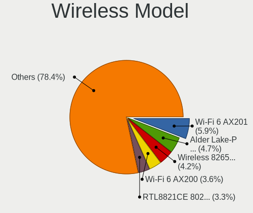
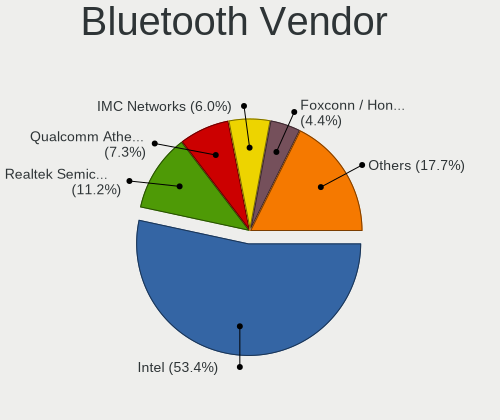
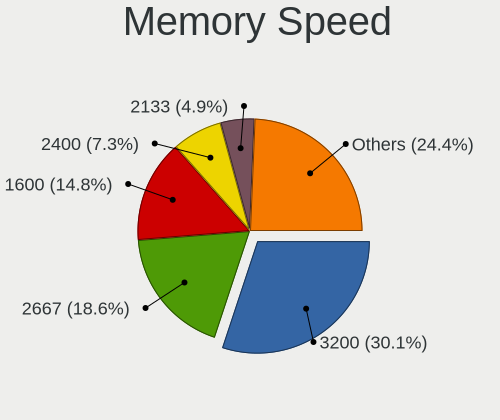
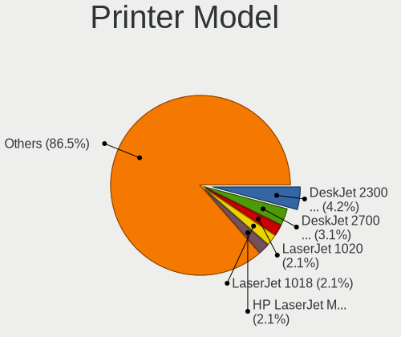
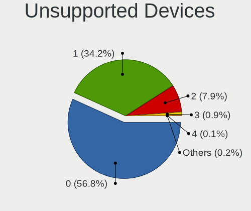

Ubuntu 22.04 - Tested Hardware & Statistics (Notebooks)
-------------------------------------------------------

A project to collect tested hardware configurations for Ubuntu 22.04.

Anyone can contribute to this report by the [hw-probe](https://github.com/linuxhw/hw-probe) tool:

    sudo -E hw-probe -all -upload

Please contribute! Especially if your hardware is rare.

Contents
--------

* [ Test Cases ](#test-cases)

* [ System ](#system)
  - [ Kernel                   ](#kernel)
  - [ Kernel Family            ](#kernel-family)
  - [ Kernel Major Ver.        ](#kernel-major-ver)
  - [ Arch                     ](#arch)
  - [ DE                       ](#de)
  - [ Display Server           ](#display-server)
  - [ Display Manager          ](#display-manager)
  - [ OS Lang                  ](#os-lang)
  - [ Boot Mode                ](#boot-mode)
  - [ Filesystem               ](#filesystem)
  - [ Part. scheme             ](#part-scheme)
  - [ Dual Boot with Linux/BSD ](#dual-boot-with-linuxbsd)
  - [ Dual Boot (Win)          ](#dual-boot-win)

* [ Board ](#board)
  - [ Vendor                   ](#vendor)
  - [ Model                    ](#model)
  - [ Model Family             ](#model-family)
  - [ MFG Year                 ](#mfg-year)
  - [ Form Factor              ](#form-factor)
  - [ Secure Boot              ](#secure-boot)
  - [ Coreboot                 ](#coreboot)
  - [ RAM Size                 ](#ram-size)
  - [ RAM Used                 ](#ram-used)
  - [ Total Drives             ](#total-drives)
  - [ Has CD-ROM               ](#has-cd-rom)
  - [ Has Ethernet             ](#has-ethernet)
  - [ Has WiFi                 ](#has-wifi)
  - [ Has Bluetooth            ](#has-bluetooth)

* [ Location ](#location)
  - [ Country                  ](#country)
  - [ City                     ](#city)

* [ Drives ](#drives)
  - [ Drive Vendor             ](#drive-vendor)
  - [ Drive Model              ](#drive-model)
  - [ HDD Vendor               ](#hdd-vendor)
  - [ SSD Vendor               ](#ssd-vendor)
  - [ Drive Kind               ](#drive-kind)
  - [ Drive Connector          ](#drive-connector)
  - [ Drive Size               ](#drive-size)
  - [ Space Total              ](#space-total)
  - [ Space Used               ](#space-used)
  - [ Malfunc. Drives          ](#malfunc-drives)
  - [ Malfunc. Drive Vendor    ](#malfunc-drive-vendor)
  - [ Malfunc. HDD Vendor      ](#malfunc-hdd-vendor)
  - [ Malfunc. Drive Kind      ](#malfunc-drive-kind)
  - [ Failed Drives            ](#failed-drives)
  - [ Failed Drive Vendor      ](#failed-drive-vendor)
  - [ Drive Status             ](#drive-status)

* [ Storage controller ](#storage-controller)
  - [ Storage Vendor           ](#storage-vendor)
  - [ Storage Model            ](#storage-model)
  - [ Storage Kind             ](#storage-kind)

* [ Processor ](#processor)
  - [ CPU Vendor               ](#cpu-vendor)
  - [ CPU Model                ](#cpu-model)
  - [ CPU Model Family         ](#cpu-model-family)
  - [ CPU Cores                ](#cpu-cores)
  - [ CPU Sockets              ](#cpu-sockets)
  - [ CPU Threads              ](#cpu-threads)
  - [ CPU Op-Modes             ](#cpu-op-modes)
  - [ CPU Microcode            ](#cpu-microcode)
  - [ CPU Microarch            ](#cpu-microarch)

* [ Graphics ](#graphics)
  - [ GPU Vendor               ](#gpu-vendor)
  - [ GPU Model                ](#gpu-model)
  - [ GPU Combo                ](#gpu-combo)
  - [ GPU Driver               ](#gpu-driver)
  - [ GPU Memory               ](#gpu-memory)

* [ Monitor ](#monitor)
  - [ Monitor Vendor           ](#monitor-vendor)
  - [ Monitor Model            ](#monitor-model)
  - [ Monitor Resolution       ](#monitor-resolution)
  - [ Monitor Diagonal         ](#monitor-diagonal)
  - [ Monitor Width            ](#monitor-width)
  - [ Aspect Ratio             ](#aspect-ratio)
  - [ Monitor Area             ](#monitor-area)
  - [ Pixel Density            ](#pixel-density)
  - [ Multiple Monitors        ](#multiple-monitors)

* [ Network ](#network)
  - [ Net Controller Vendor    ](#net-controller-vendor)
  - [ Net Controller Model     ](#net-controller-model)
  - [ Wireless Vendor          ](#wireless-vendor)
  - [ Wireless Model           ](#wireless-model)
  - [ Ethernet Vendor          ](#ethernet-vendor)
  - [ Ethernet Model           ](#ethernet-model)
  - [ Net Controller Kind      ](#net-controller-kind)
  - [ Used Controller          ](#used-controller)
  - [ NICs                     ](#nics)
  - [ IPv6                     ](#ipv6)

* [ Bluetooth ](#bluetooth)
  - [ Bluetooth Vendor         ](#bluetooth-vendor)
  - [ Bluetooth Model          ](#bluetooth-model)

* [ Sound ](#sound)
  - [ Sound Vendor             ](#sound-vendor)
  - [ Sound Model              ](#sound-model)

* [ Memory ](#memory)
  - [ Memory Vendor            ](#memory-vendor)
  - [ Memory Model             ](#memory-model)
  - [ Memory Kind              ](#memory-kind)
  - [ Memory Form Factor       ](#memory-form-factor)
  - [ Memory Size              ](#memory-size)
  - [ Memory Speed             ](#memory-speed)

* [ Printers & scanners ](#printers--scanners)
  - [ Printer Vendor           ](#printer-vendor)
  - [ Printer Model            ](#printer-model)
  - [ Scanner Vendor           ](#scanner-vendor)
  - [ Scanner Model            ](#scanner-model)

* [ Camera ](#camera)
  - [ Camera Vendor            ](#camera-vendor)
  - [ Camera Model             ](#camera-model)

* [ Security ](#security)
  - [ Fingerprint Vendor       ](#fingerprint-vendor)
  - [ Fingerprint Model        ](#fingerprint-model)
  - [ Chipcard Vendor          ](#chipcard-vendor)
  - [ Chipcard Model           ](#chipcard-model)

* [ Unsupported ](#unsupported)
  - [ Unsupported Devices      ](#unsupported-devices)
  - [ Unsupported Device Types ](#unsupported-device-types)

Test Cases
----------

Total: 8006

| Vendor        | Model                       | Probe                                                      | Date         |
|---------------|-----------------------------|------------------------------------------------------------|--------------|
| HP            | OMEN by Laptop 15-dc1xxx    | [fb024a9374](https://linux-hardware.org/?probe=fb024a9374) | Aug 12, 2023 |
| HP            | OMEN by Laptop 15-dc1xxx    | [398f85e94a](https://linux-hardware.org/?probe=398f85e94a) | Aug 12, 2023 |
| Toshiba       | Satellite C50D-A-13G        | [e1a3542078](https://linux-hardware.org/?probe=e1a3542078) | Aug 12, 2023 |
| Dell          | G3 3579                     | [09ba53e3c1](https://linux-hardware.org/?probe=09ba53e3c1) | Aug 12, 2023 |
| HP            | Pavilion g7                 | [325b804863](https://linux-hardware.org/?probe=325b804863) | Aug 12, 2023 |
| ASUSTek       | T200TA                      | [24d6504b2c](https://linux-hardware.org/?probe=24d6504b2c) | Aug 12, 2023 |
| HP            | Laptop 15-dy2xxx            | [bc66f59ac5](https://linux-hardware.org/?probe=bc66f59ac5) | Aug 12, 2023 |
| HP            | EliteBook 840 14 inch G1... | [73b7fc1fc9](https://linux-hardware.org/?probe=73b7fc1fc9) | Aug 11, 2023 |
| Acer          | Aspire F5-573G              | [019f3a6d1f](https://linux-hardware.org/?probe=019f3a6d1f) | Aug 11, 2023 |
| Acer          | Extensa 215-55              | [aea9ada5e8](https://linux-hardware.org/?probe=aea9ada5e8) | Aug 11, 2023 |
| Dell          | Latitude E6430              | [79f523548b](https://linux-hardware.org/?probe=79f523548b) | Aug 11, 2023 |
| Dell          | Latitude E6330              | [b3081e041e](https://linux-hardware.org/?probe=b3081e041e) | Aug 11, 2023 |
| Dell          | Latitude E6430              | [fd3c9b15f8](https://linux-hardware.org/?probe=fd3c9b15f8) | Aug 11, 2023 |
| Lenovo        | ThinkPad L520 5017BW5       | [1a9bbdc058](https://linux-hardware.org/?probe=1a9bbdc058) | Aug 11, 2023 |
| Dell          | G15 5520                    | [3bec284af8](https://linux-hardware.org/?probe=3bec284af8) | Aug 11, 2023 |
| ASUSTek       | VivoBook_ASUSLaptop M140... | [a4a009cd79](https://linux-hardware.org/?probe=a4a009cd79) | Aug 11, 2023 |
| Acer          | Extensa 215-55              | [036866525c](https://linux-hardware.org/?probe=036866525c) | Aug 11, 2023 |
| Acer          | Aspire ES1-111M             | [3c7140c389](https://linux-hardware.org/?probe=3c7140c389) | Aug 11, 2023 |
| Intel Clie... | LAPQC71A                    | [c87bff1d43](https://linux-hardware.org/?probe=c87bff1d43) | Aug 11, 2023 |
| Fujitsu       | LIFEBOOK S762               | [1ced8ae4d0](https://linux-hardware.org/?probe=1ced8ae4d0) | Aug 11, 2023 |
| Fujitsu       | LIFEBOOK S762               | [cb0b5cbd5d](https://linux-hardware.org/?probe=cb0b5cbd5d) | Aug 11, 2023 |
| MSI           | Creator Z16 A11UET          | [7883e9a69d](https://linux-hardware.org/?probe=7883e9a69d) | Aug 11, 2023 |
| Lenovo        | B50-70 20384                | [607103b8f5](https://linux-hardware.org/?probe=607103b8f5) | Aug 11, 2023 |
| Google        | Bobba360                    | [128700115a](https://linux-hardware.org/?probe=128700115a) | Aug 10, 2023 |
| Lenovo        | G40-45 80E1                 | [d6f18c79f6](https://linux-hardware.org/?probe=d6f18c79f6) | Aug 10, 2023 |
| HUAWEI        | KLVD-WXX9                   | [19cadaab1b](https://linux-hardware.org/?probe=19cadaab1b) | Aug 10, 2023 |
| Lenovo        | ThinkPad E14 20RA0076US     | [ab98272b50](https://linux-hardware.org/?probe=ab98272b50) | Aug 10, 2023 |
| Gateway       | MD7309U                     | [18dbacfdab](https://linux-hardware.org/?probe=18dbacfdab) | Aug 10, 2023 |
| HP            | OMEN by Laptop 15-dc1xxx    | [9627b6d632](https://linux-hardware.org/?probe=9627b6d632) | Aug 10, 2023 |
| ASUSTek       | VivoBook_ASUSLaptop M350... | [ffa9b97bf7](https://linux-hardware.org/?probe=ffa9b97bf7) | Aug 10, 2023 |
| HP            | OMEN by Laptop 15-dc1xxx    | [099d1ac0de](https://linux-hardware.org/?probe=099d1ac0de) | Aug 10, 2023 |
| BANGHO        | MAX L5                      | [4661b7a0f7](https://linux-hardware.org/?probe=4661b7a0f7) | Aug 10, 2023 |
| Avell High... | A70 HYB                     | [9b03ae1cd3](https://linux-hardware.org/?probe=9b03ae1cd3) | Aug 10, 2023 |
| HP            | Pavilion Laptop 14-dv2xx... | [479f066821](https://linux-hardware.org/?probe=479f066821) | Aug 10, 2023 |
| Avell         | A70 ION                     | [b71c176ce3](https://linux-hardware.org/?probe=b71c176ce3) | Aug 10, 2023 |
| Lenovo        | ThinkBook 14-IIL 20SL       | [e323e9cd7e](https://linux-hardware.org/?probe=e323e9cd7e) | Aug 10, 2023 |
| Dell          | XPS L421X                   | [ba412a439b](https://linux-hardware.org/?probe=ba412a439b) | Aug 10, 2023 |
| Google        | Kindred                     | [a45439e295](https://linux-hardware.org/?probe=a45439e295) | Aug 10, 2023 |
| HP            | Pavilion Laptop 14-dv1xx... | [385c88301b](https://linux-hardware.org/?probe=385c88301b) | Aug 10, 2023 |
| Dell          | Vostro 3501                 | [d606f83745](https://linux-hardware.org/?probe=d606f83745) | Aug 10, 2023 |
| Gateway       | NV57H                       | [826aaf5dd8](https://linux-hardware.org/?probe=826aaf5dd8) | Aug 10, 2023 |
| Lenovo        | ThinkPad E15 20RD0086UE     | [cb8ad3e0fc](https://linux-hardware.org/?probe=cb8ad3e0fc) | Aug 10, 2023 |
| Acer          | Aspire V3-571G              | [6c4354fa1c](https://linux-hardware.org/?probe=6c4354fa1c) | Aug 10, 2023 |
| Siragon       | MN-50                       | [8eafa43cb5](https://linux-hardware.org/?probe=8eafa43cb5) | Aug 09, 2023 |
| ASUSTek       | VivoBook_ASUSLaptop X321... | [204b2fa0a0](https://linux-hardware.org/?probe=204b2fa0a0) | Aug 09, 2023 |
| Lenovo        | V145-15AST 81MT             | [304b175b3c](https://linux-hardware.org/?probe=304b175b3c) | Aug 09, 2023 |
| Toshiba       | Satellite C70D-B            | [ac775a3228](https://linux-hardware.org/?probe=ac775a3228) | Aug 09, 2023 |
| ASUSTek       | ASUS TUF Gaming F17 FX70... | [bf81bbf7b4](https://linux-hardware.org/?probe=bf81bbf7b4) | Aug 09, 2023 |
| Google        | Bobba360                    | [fa4a78b024](https://linux-hardware.org/?probe=fa4a78b024) | Aug 09, 2023 |
| Medion        | Akoya THE TOUCH 10          | [d45603bb4e](https://linux-hardware.org/?probe=d45603bb4e) | Aug 09, 2023 |
| Lenovo        | Legion 5 15ACH6 82JW        | [5bd12768fa](https://linux-hardware.org/?probe=5bd12768fa) | Aug 09, 2023 |
| Toshiba       | Satellite C70D-B            | [e3f3b2fcfb](https://linux-hardware.org/?probe=e3f3b2fcfb) | Aug 09, 2023 |
| HP            | EliteBook 830 G8 Noteboo... | [5e79da69ed](https://linux-hardware.org/?probe=5e79da69ed) | Aug 09, 2023 |
| Dell          | Latitude 5520               | [478f0a6a07](https://linux-hardware.org/?probe=478f0a6a07) | Aug 09, 2023 |
| HP            | EliteBook 830 G8 Noteboo... | [c761edfea1](https://linux-hardware.org/?probe=c761edfea1) | Aug 09, 2023 |
| Dell          | XPS 15 9520                 | [0620b6b11a](https://linux-hardware.org/?probe=0620b6b11a) | Aug 09, 2023 |
| HP            | EliteBook 8470p             | [16acf13ed8](https://linux-hardware.org/?probe=16acf13ed8) | Aug 09, 2023 |
| HP            | EliteBook 2540p             | [2a02492c01](https://linux-hardware.org/?probe=2a02492c01) | Aug 09, 2023 |
| Dell          | Precision 3551              | [a9b776ade0](https://linux-hardware.org/?probe=a9b776ade0) | Aug 09, 2023 |
| HP            | EliteBook 2540p             | [509b979b88](https://linux-hardware.org/?probe=509b979b88) | Aug 09, 2023 |
| HP            | EliteBook 8560w             | [ea34946fbd](https://linux-hardware.org/?probe=ea34946fbd) | Aug 09, 2023 |
| Toshiba       | Satellite C55-C             | [199924c140](https://linux-hardware.org/?probe=199924c140) | Aug 09, 2023 |
| HP            | ENVY Laptop 17-ch0xxx       | [01fe285324](https://linux-hardware.org/?probe=01fe285324) | Aug 09, 2023 |
| Toshiba       | Satellite C55-C             | [324b952d6b](https://linux-hardware.org/?probe=324b952d6b) | Aug 09, 2023 |
| ASUSTek       | N56VJ                       | [d552e1a450](https://linux-hardware.org/?probe=d552e1a450) | Aug 08, 2023 |
| BANGHO        | MAX L5                      | [b21781af81](https://linux-hardware.org/?probe=b21781af81) | Aug 08, 2023 |
| HP            | EliteBook 820 G1            | [62889fd683](https://linux-hardware.org/?probe=62889fd683) | Aug 08, 2023 |
| Lenovo        | ThinkPad P50 20EQS0T800     | [8316628b28](https://linux-hardware.org/?probe=8316628b28) | Aug 08, 2023 |
| Lenovo        | ThinkPad P50 20EQS0T800     | [05d33f11b5](https://linux-hardware.org/?probe=05d33f11b5) | Aug 08, 2023 |
| Notebook      | W65_W67RZ1                  | [ab4b3c8f47](https://linux-hardware.org/?probe=ab4b3c8f47) | Aug 08, 2023 |
| HP            | ZBook 14 G2                 | [c52b1e963f](https://linux-hardware.org/?probe=c52b1e963f) | Aug 08, 2023 |
| HP            | ProBook 445 G8 Notebook ... | [f69459e15a](https://linux-hardware.org/?probe=f69459e15a) | Aug 08, 2023 |
| Dell          | Latitude 7440               | [0cfa45fbd8](https://linux-hardware.org/?probe=0cfa45fbd8) | Aug 08, 2023 |
| Lenovo        | ThinkPad T14 Gen 2a 20XL... | [4148b505d6](https://linux-hardware.org/?probe=4148b505d6) | Aug 08, 2023 |
| Dell          | Latitude 7440               | [e476a3e532](https://linux-hardware.org/?probe=e476a3e532) | Aug 08, 2023 |
| Dell          | Latitude E7450              | [a426887b24](https://linux-hardware.org/?probe=a426887b24) | Aug 08, 2023 |
| HP            | ZBook 14 G2                 | [211978450c](https://linux-hardware.org/?probe=211978450c) | Aug 08, 2023 |
| HP            | ZBook 14 G2                 | [23dd3e572c](https://linux-hardware.org/?probe=23dd3e572c) | Aug 08, 2023 |
| Dell          | Latitude 5540               | [08c875f58b](https://linux-hardware.org/?probe=08c875f58b) | Aug 08, 2023 |
| MSI           | Creator Z16 A11UET          | [ea05388cf5](https://linux-hardware.org/?probe=ea05388cf5) | Aug 08, 2023 |
| Dell          | Inspiron 5402               | [9004ee7aa2](https://linux-hardware.org/?probe=9004ee7aa2) | Aug 08, 2023 |
| Lenovo        | B40-80 80LS                 | [2865a9d402](https://linux-hardware.org/?probe=2865a9d402) | Aug 08, 2023 |
| Lenovo        | Legion 5 15ARH7H 82RD       | [1e2412e487](https://linux-hardware.org/?probe=1e2412e487) | Aug 08, 2023 |
| Dell          | Latitude E6430              | [313d3616c4](https://linux-hardware.org/?probe=313d3616c4) | Aug 08, 2023 |
| Google        | Parrot                      | [a0820a5e0c](https://linux-hardware.org/?probe=a0820a5e0c) | Aug 07, 2023 |
| Google        | Parrot                      | [f03c4efc0b](https://linux-hardware.org/?probe=f03c4efc0b) | Aug 07, 2023 |
| Lenovo        | ThinkPad T15 Gen 2i 20W4... | [ce593ff6c7](https://linux-hardware.org/?probe=ce593ff6c7) | Aug 07, 2023 |
| Acer          | Aspire A515-56              | [84b0c88b0a](https://linux-hardware.org/?probe=84b0c88b0a) | Aug 07, 2023 |
| MSI           | GL63 8RC                    | [d91d6193e6](https://linux-hardware.org/?probe=d91d6193e6) | Aug 07, 2023 |
| HP            | Notebook                    | [02ceb78a4f](https://linux-hardware.org/?probe=02ceb78a4f) | Aug 07, 2023 |
| Lenovo        | B40-70 20392                | [ebf45c27f4](https://linux-hardware.org/?probe=ebf45c27f4) | Aug 07, 2023 |
| SGIN          | laptop                      | [d80389ea87](https://linux-hardware.org/?probe=d80389ea87) | Aug 07, 2023 |
| Acer          | Swift SF514-53T             | [30d8fefda4](https://linux-hardware.org/?probe=30d8fefda4) | Aug 07, 2023 |
| Acer          | Swift SF514-53T             | [f1cef350fb](https://linux-hardware.org/?probe=f1cef350fb) | Aug 07, 2023 |
| Lenovo        | ThinkPad E14 Gen 5 21JRS... | [ebcf58253e](https://linux-hardware.org/?probe=ebcf58253e) | Aug 07, 2023 |
| Lenovo        | ThinkPad X1 Carbon Gen 1... | [a3dd4fadf3](https://linux-hardware.org/?probe=a3dd4fadf3) | Aug 07, 2023 |
| Dell          | XPS 13 9350                 | [fb1aaeae43](https://linux-hardware.org/?probe=fb1aaeae43) | Aug 07, 2023 |
| HP            | Laptop 17-ak0xx             | [67749cdc51](https://linux-hardware.org/?probe=67749cdc51) | Aug 07, 2023 |
| Notebook      | NHxxRZQ                     | [0cd17c8b5c](https://linux-hardware.org/?probe=0cd17c8b5c) | Aug 07, 2023 |
| Fujitsu       | LIFEBOOK A359               | [60a09f6ca3](https://linux-hardware.org/?probe=60a09f6ca3) | Aug 07, 2023 |
| Dell          | XPS 15 9500                 | [309b546405](https://linux-hardware.org/?probe=309b546405) | Aug 07, 2023 |
| HP            | Pavilion 15                 | [227895bca8](https://linux-hardware.org/?probe=227895bca8) | Aug 07, 2023 |
| ASUSTek       | ROG Zephyrus G14 GA401IH... | [0b3bf57b84](https://linux-hardware.org/?probe=0b3bf57b84) | Aug 07, 2023 |
| HP            | ProBook 650 G1              | [b02660749d](https://linux-hardware.org/?probe=b02660749d) | Aug 07, 2023 |
| Lenovo        | B40-80 80LS                 | [bfb069ff41](https://linux-hardware.org/?probe=bfb069ff41) | Aug 07, 2023 |
| HP            | EliteBook 840 G3            | [2e239a5f09](https://linux-hardware.org/?probe=2e239a5f09) | Aug 07, 2023 |
| Lenovo        | ThinkPad T480 20L6S42000    | [3e9ce860b6](https://linux-hardware.org/?probe=3e9ce860b6) | Aug 07, 2023 |
| Acer          | Aspire 4750                 | [8491f5fc3b](https://linux-hardware.org/?probe=8491f5fc3b) | Aug 07, 2023 |
| Apple         | MacBookAir6,1               | [acf60b5aa8](https://linux-hardware.org/?probe=acf60b5aa8) | Aug 06, 2023 |
| HP            | OMEN Laptop 15-en0xxx       | [32c2f39f3a](https://linux-hardware.org/?probe=32c2f39f3a) | Aug 06, 2023 |
| Acer          | E1-510                      | [2d6776c4fe](https://linux-hardware.org/?probe=2d6776c4fe) | Aug 06, 2023 |
| Notebook      | NS5x_NS7xPU                 | [d71ac9524e](https://linux-hardware.org/?probe=d71ac9524e) | Aug 06, 2023 |
| Dell          | Latitude 5290 2-in-1        | [62e2743cda](https://linux-hardware.org/?probe=62e2743cda) | Aug 06, 2023 |
| HP            | EliteBook 8540p             | [4709894444](https://linux-hardware.org/?probe=4709894444) | Aug 06, 2023 |
| Dell          | Latitude E5540              | [928c427cbc](https://linux-hardware.org/?probe=928c427cbc) | Aug 06, 2023 |
| ASUSTek       | UX32VD                      | [298a3261a0](https://linux-hardware.org/?probe=298a3261a0) | Aug 06, 2023 |
| Lenovo        | B40-70 20392                | [221f9de00a](https://linux-hardware.org/?probe=221f9de00a) | Aug 06, 2023 |
| HP            | EliteBook 840 G4            | [44d851d327](https://linux-hardware.org/?probe=44d851d327) | Aug 06, 2023 |
| HP            | ZBook Firefly 15.6 inch ... | [a3c7d29211](https://linux-hardware.org/?probe=a3c7d29211) | Aug 06, 2023 |
| HP            | EliteBook 840 G5            | [9688966097](https://linux-hardware.org/?probe=9688966097) | Aug 06, 2023 |
| HP            | Laptop 15-db0xxx            | [51442067d5](https://linux-hardware.org/?probe=51442067d5) | Aug 06, 2023 |
| Chuwi         | GemiBook Pro                | [2726702c6a](https://linux-hardware.org/?probe=2726702c6a) | Aug 06, 2023 |
| Lenovo        | B570e HuronRiver Platfor... | [270c9a3ea0](https://linux-hardware.org/?probe=270c9a3ea0) | Aug 06, 2023 |
| Dell          | Inspiron 7572               | [2509709a1e](https://linux-hardware.org/?probe=2509709a1e) | Aug 06, 2023 |
| HP            | Pavilion TS Sleekbook 15    | [8360dc045f](https://linux-hardware.org/?probe=8360dc045f) | Aug 06, 2023 |
| HP            | Pavilion TS Sleekbook 15    | [cad443cf78](https://linux-hardware.org/?probe=cad443cf78) | Aug 06, 2023 |
| Acer          | Aspire 5750G                | [3b589d53bc](https://linux-hardware.org/?probe=3b589d53bc) | Aug 06, 2023 |
| Lenovo        | B570e HuronRiver Platfor... | [db5a797fc0](https://linux-hardware.org/?probe=db5a797fc0) | Aug 06, 2023 |
| Acer          | Nitro AN515-57              | [dbb09ef76f](https://linux-hardware.org/?probe=dbb09ef76f) | Aug 06, 2023 |
| Acer          | Nitro AN515-57              | [0aa699dc73](https://linux-hardware.org/?probe=0aa699dc73) | Aug 06, 2023 |
| Lenovo        | ThinkPad T430 2342CTO       | [96dae933b5](https://linux-hardware.org/?probe=96dae933b5) | Aug 06, 2023 |
| Dell          | Latitude 7480               | [eeb7f6e8fe](https://linux-hardware.org/?probe=eeb7f6e8fe) | Aug 06, 2023 |
| HP            | Laptop 15-db0xxx            | [5889bc8dc7](https://linux-hardware.org/?probe=5889bc8dc7) | Aug 06, 2023 |
| Acer          | Aspire 5551                 | [4db1866796](https://linux-hardware.org/?probe=4db1866796) | Aug 06, 2023 |
| HP            | EliteBook 8560w             | [b2177d3c55](https://linux-hardware.org/?probe=b2177d3c55) | Aug 06, 2023 |
| HP            | Pavilion Laptop 15-cc5xx    | [8baf99b470](https://linux-hardware.org/?probe=8baf99b470) | Aug 05, 2023 |
| ASUSTek       | VivoBook_ASUSLaptop M350... | [c8d1e98a60](https://linux-hardware.org/?probe=c8d1e98a60) | Aug 05, 2023 |
| Dell          | Latitude 5410               | [2838e5d74c](https://linux-hardware.org/?probe=2838e5d74c) | Aug 05, 2023 |
| HP            | 15                          | [77ae1d8e7e](https://linux-hardware.org/?probe=77ae1d8e7e) | Aug 05, 2023 |
| Dell          | Inspiron 15 5510            | [6d78d72399](https://linux-hardware.org/?probe=6d78d72399) | Aug 05, 2023 |
| Toshiba       | Satellite C670D-11P         | [a5c49672d6](https://linux-hardware.org/?probe=a5c49672d6) | Aug 05, 2023 |
| Apple         | MacBookPro14,1              | [d3630fa2ed](https://linux-hardware.org/?probe=d3630fa2ed) | Aug 05, 2023 |
| ASUSTek       | VivoBook_ASUSLaptop M140... | [5f516e849d](https://linux-hardware.org/?probe=5f516e849d) | Aug 05, 2023 |
| Chuwi         | CoreBook XPro               | [776bcc618a](https://linux-hardware.org/?probe=776bcc618a) | Aug 05, 2023 |
| HP            | Notebook                    | [d86cc7b5ba](https://linux-hardware.org/?probe=d86cc7b5ba) | Aug 05, 2023 |
| Lenovo        | ThinkPad T15 Gen 2i 20W5... | [e2dee68ce7](https://linux-hardware.org/?probe=e2dee68ce7) | Aug 05, 2023 |
| ALLDOCUBE     | i1502                       | [1ccf0b8f71](https://linux-hardware.org/?probe=1ccf0b8f71) | Aug 05, 2023 |
| HP            | ProBook 450 G5              | [0482630783](https://linux-hardware.org/?probe=0482630783) | Aug 05, 2023 |
| Dell          | Latitude 5421               | [d01013b679](https://linux-hardware.org/?probe=d01013b679) | Aug 05, 2023 |
| Dell          | Latitude 5421               | [5dfde4e6ac](https://linux-hardware.org/?probe=5dfde4e6ac) | Aug 05, 2023 |
| ASUSTek       | VivoBook_ASUSLaptop X512... | [8292d9f518](https://linux-hardware.org/?probe=8292d9f518) | Aug 04, 2023 |
| Lenovo        | ThinkPad 13 2nd Gen 20J2... | [ff55512c0e](https://linux-hardware.org/?probe=ff55512c0e) | Aug 04, 2023 |
| Dell          | Latitude E6420              | [4f67a219dc](https://linux-hardware.org/?probe=4f67a219dc) | Aug 04, 2023 |
| HP            | ProBook 450 G8 Notebook ... | [9eac356b0a](https://linux-hardware.org/?probe=9eac356b0a) | Aug 04, 2023 |
| Acer          | Predator PH315-53           | [6c13f7a1f0](https://linux-hardware.org/?probe=6c13f7a1f0) | Aug 04, 2023 |
| HP            | ZHAN 99 Mobile Workstati... | [b3422c4e37](https://linux-hardware.org/?probe=b3422c4e37) | Aug 04, 2023 |
| ASUSTek       | VivoBook_ASUSLaptop M650... | [db2732f0e8](https://linux-hardware.org/?probe=db2732f0e8) | Aug 04, 2023 |
| Lenovo        | ThinkPad X1 Carbon Gen 1... | [7abc08a315](https://linux-hardware.org/?probe=7abc08a315) | Aug 04, 2023 |
| ASUSTek       | VivoBook_ASUSLaptop X509... | [87febc0242](https://linux-hardware.org/?probe=87febc0242) | Aug 04, 2023 |
| Lenovo        | IdeaPad 3 15IML05 81WB      | [2825bbd67b](https://linux-hardware.org/?probe=2825bbd67b) | Aug 04, 2023 |
| ASUSTek       | VivoBook_ASUSLaptop X412... | [d8caf086ad](https://linux-hardware.org/?probe=d8caf086ad) | Aug 04, 2023 |
| Dell          | Vostro 15 3510              | [bd994e4cc6](https://linux-hardware.org/?probe=bd994e4cc6) | Aug 04, 2023 |
| Apple         | MacBookPro8,2               | [44f5a672b7](https://linux-hardware.org/?probe=44f5a672b7) | Aug 04, 2023 |
| Medion        | Erazer X7841 MD99556        | [c9f4247fc1](https://linux-hardware.org/?probe=c9f4247fc1) | Aug 04, 2023 |
| Dell          | Vostro 15 3510              | [ab2f3b8c7b](https://linux-hardware.org/?probe=ab2f3b8c7b) | Aug 04, 2023 |
| Lenovo        | ThinkPad T480s 20L8S84H0... | [d64e9809fa](https://linux-hardware.org/?probe=d64e9809fa) | Aug 04, 2023 |
| Apple         | MacBookPro8,2               | [a8de87477f](https://linux-hardware.org/?probe=a8de87477f) | Aug 04, 2023 |
| Apple         | MacBookPro9,2               | [cf25fc0b62](https://linux-hardware.org/?probe=cf25fc0b62) | Aug 04, 2023 |
| HP            | 255 G3                      | [c8b3db6b0b](https://linux-hardware.org/?probe=c8b3db6b0b) | Aug 03, 2023 |
| HP            | EliteBook Folio G1          | [b9bb38ddd4](https://linux-hardware.org/?probe=b9bb38ddd4) | Aug 03, 2023 |
| Sony          | VGN-NS38E_S                 | [a21051f2a8](https://linux-hardware.org/?probe=a21051f2a8) | Aug 03, 2023 |
| Lenovo        | ThinkPad X280 20KES3D900    | [865dbfa247](https://linux-hardware.org/?probe=865dbfa247) | Aug 03, 2023 |
| Acer          | Aspire 7750G                | [71f5ef03f9](https://linux-hardware.org/?probe=71f5ef03f9) | Aug 03, 2023 |
| Notebook      | NP5x_NP6x_NP7xPNP           | [508c18e563](https://linux-hardware.org/?probe=508c18e563) | Aug 03, 2023 |
| Acer          | Aspire A515-57              | [87c4730d07](https://linux-hardware.org/?probe=87c4730d07) | Aug 03, 2023 |
| GIADA         | Unknown                     | [cd8b23468a](https://linux-hardware.org/?probe=cd8b23468a) | Aug 03, 2023 |
| Lenovo        | IdeaPad S130-11IGM 81J1     | [e5be227d11](https://linux-hardware.org/?probe=e5be227d11) | Aug 03, 2023 |
| Dell          | Latitude E6440              | [c00884f2cd](https://linux-hardware.org/?probe=c00884f2cd) | Aug 03, 2023 |
| Lenovo        | ThinkPad P14s Gen 3 21AK... | [deeafc23f9](https://linux-hardware.org/?probe=deeafc23f9) | Aug 03, 2023 |
| Lenovo        | V510-15IKB 80WQ             | [a3ff56579a](https://linux-hardware.org/?probe=a3ff56579a) | Aug 03, 2023 |
| Notebook      | N9x0TD_TF                   | [033c07e1d3](https://linux-hardware.org/?probe=033c07e1d3) | Aug 03, 2023 |
| Notebook      | N9x0TD_TF                   | [3ab98d3af1](https://linux-hardware.org/?probe=3ab98d3af1) | Aug 03, 2023 |
| Acer          | Aspire ES1-520              | [437e15fae7](https://linux-hardware.org/?probe=437e15fae7) | Aug 03, 2023 |
| MSI           | Prestige 14Evo A12M         | [c9e4b6dd90](https://linux-hardware.org/?probe=c9e4b6dd90) | Aug 03, 2023 |
| HP            | EliteBook 8570p             | [9b2c783e20](https://linux-hardware.org/?probe=9b2c783e20) | Aug 03, 2023 |
| Dell          | Latitude 5440               | [5791d15bc8](https://linux-hardware.org/?probe=5791d15bc8) | Aug 02, 2023 |
| Acer          | Aspire A515-56              | [8b2ffc9837](https://linux-hardware.org/?probe=8b2ffc9837) | Aug 02, 2023 |
| HUAWEI        | HVY-WXX9                    | [906ab3334f](https://linux-hardware.org/?probe=906ab3334f) | Aug 02, 2023 |
| Dell          | Latitude 5540               | [e521b93e2f](https://linux-hardware.org/?probe=e521b93e2f) | Aug 02, 2023 |
| Notebook      | PB50_70RF,RD,RC             | [deb7c70ef0](https://linux-hardware.org/?probe=deb7c70ef0) | Aug 02, 2023 |
| Acer          | Aspire ES1-520              | [1cf260b959](https://linux-hardware.org/?probe=1cf260b959) | Aug 02, 2023 |
| HP            | 255 G8 Notebook PC          | [d0e963d600](https://linux-hardware.org/?probe=d0e963d600) | Aug 02, 2023 |
| HUAWEI        | NBLB-WAX9N                  | [28ff7ce482](https://linux-hardware.org/?probe=28ff7ce482) | Aug 02, 2023 |
| Lenovo        | IdeaPad 3 15ALC6 82KU       | [502969280a](https://linux-hardware.org/?probe=502969280a) | Aug 02, 2023 |
| ASUSTek       | X540NA                      | [c7724d9c7c](https://linux-hardware.org/?probe=c7724d9c7c) | Aug 02, 2023 |
| Lenovo        | IdeaPad 3 15ITL6 82H8       | [34ef2db095](https://linux-hardware.org/?probe=34ef2db095) | Aug 02, 2023 |
| Lenovo        | Legion 5 Pro 16ACH6H 82J... | [8767df67f4](https://linux-hardware.org/?probe=8767df67f4) | Aug 02, 2023 |
| Samsung       | 950XCJ/951XCJ/950XCR        | [dd11fc89fe](https://linux-hardware.org/?probe=dd11fc89fe) | Aug 02, 2023 |
| Panasonic     | CF-31Q2A731M                | [28a7b62627](https://linux-hardware.org/?probe=28a7b62627) | Aug 02, 2023 |
| Acer          | Aspire E1-572               | [af04d8d764](https://linux-hardware.org/?probe=af04d8d764) | Aug 02, 2023 |
| Lenovo        | ThinkPad T470s W10DG 20J... | [74f1782ead](https://linux-hardware.org/?probe=74f1782ead) | Aug 02, 2023 |
| ASUSTek       | UX430UNR                    | [89c8324528](https://linux-hardware.org/?probe=89c8324528) | Aug 01, 2023 |
| Lenovo        | IdeaPad Gaming 3 15ACH6 ... | [d9db031e65](https://linux-hardware.org/?probe=d9db031e65) | Aug 01, 2023 |
| Dell          | Inspiron 5567               | [6f220fcf23](https://linux-hardware.org/?probe=6f220fcf23) | Aug 01, 2023 |
| HP            | OMEN by Laptop 16-c0xxx     | [8e7e80c44e](https://linux-hardware.org/?probe=8e7e80c44e) | Aug 01, 2023 |
| Lenovo        | IdeaPad Gaming 3 15ACH6 ... | [7ed6a80c20](https://linux-hardware.org/?probe=7ed6a80c20) | Aug 01, 2023 |
| Lenovo        | IdeaPad Gaming 3 15ACH6 ... | [bbf2e1b3b3](https://linux-hardware.org/?probe=bbf2e1b3b3) | Aug 01, 2023 |
| Lenovo        | ThinkPad X250 20CL0007SG    | [f30d61c851](https://linux-hardware.org/?probe=f30d61c851) | Aug 01, 2023 |
| Acer          | Aspire A315-23              | [ef1917aa93](https://linux-hardware.org/?probe=ef1917aa93) | Aug 01, 2023 |
| Acer          | Aspire A315-23              | [9164151f28](https://linux-hardware.org/?probe=9164151f28) | Aug 01, 2023 |
| Toshiba       | Satellite C850-F74T         | [7756db419e](https://linux-hardware.org/?probe=7756db419e) | Aug 01, 2023 |
| Dell          | Inspiron 5567               | [d6c2eae395](https://linux-hardware.org/?probe=d6c2eae395) | Aug 01, 2023 |
| ASUSTek       | X751LA                      | [928a69b9af](https://linux-hardware.org/?probe=928a69b9af) | Aug 01, 2023 |
| ASUSTek       | VivoBook_ASUS Laptop E41... | [2dcefa3349](https://linux-hardware.org/?probe=2dcefa3349) | Aug 01, 2023 |
| HP            | Pavilion Laptop 15-cc5xx    | [d1af2e2c9f](https://linux-hardware.org/?probe=d1af2e2c9f) | Jul 31, 2023 |
| HP            | 355 G2                      | [db5f6adcd7](https://linux-hardware.org/?probe=db5f6adcd7) | Jul 31, 2023 |
| ASUSTek       | VivoBook_ASUSLaptop M650... | [5650f66cd4](https://linux-hardware.org/?probe=5650f66cd4) | Jul 31, 2023 |
| Dell          | Inspiron 7520               | [b87690f890](https://linux-hardware.org/?probe=b87690f890) | Jul 31, 2023 |
| Google        | Woomax                      | [da717e8156](https://linux-hardware.org/?probe=da717e8156) | Jul 31, 2023 |
| VPU Compan... | VWNC71429-S                 | [2a21ab7b53](https://linux-hardware.org/?probe=2a21ab7b53) | Jul 31, 2023 |
| Lenovo        | ThinkPad E15 Gen 3 20YG0... | [762d07665a](https://linux-hardware.org/?probe=762d07665a) | Jul 31, 2023 |
| ASUSTek       | ROG Strix G513RM_G513RM     | [c42c13e7be](https://linux-hardware.org/?probe=c42c13e7be) | Jul 31, 2023 |
| HP            | Pavilion 17                 | [38fe3ae501](https://linux-hardware.org/?probe=38fe3ae501) | Jul 31, 2023 |
| Lenovo        | ThinkPad L440 20ASS19B03    | [560cd8b4fb](https://linux-hardware.org/?probe=560cd8b4fb) | Jul 31, 2023 |
| Lenovo        | V15-ADA 82C7                | [e3999da810](https://linux-hardware.org/?probe=e3999da810) | Jul 31, 2023 |
| Lenovo        | IdeaPad 110-15ISK 80UD      | [ad721ddbad](https://linux-hardware.org/?probe=ad721ddbad) | Jul 31, 2023 |
| Medion        | Erazer X7841 MD99556        | [7b9d9dfa25](https://linux-hardware.org/?probe=7b9d9dfa25) | Jul 31, 2023 |
| HP            | ProBook 430 G3              | [a42e1c787e](https://linux-hardware.org/?probe=a42e1c787e) | Jul 30, 2023 |
| ASUSTek       | VivoBook_ASUSLaptop X513... | [250fc62328](https://linux-hardware.org/?probe=250fc62328) | Jul 30, 2023 |
| Lenovo        | Legion 5 15IAH7 82RC        | [aea2ba0da6](https://linux-hardware.org/?probe=aea2ba0da6) | Jul 30, 2023 |
| HP            | 355 G2                      | [25362ed5e2](https://linux-hardware.org/?probe=25362ed5e2) | Jul 30, 2023 |
| Lenovo        | Legion 5 15IAH7 82RC        | [4299540699](https://linux-hardware.org/?probe=4299540699) | Jul 30, 2023 |
| BOSGAME       | U56                         | [39d52e51f5](https://linux-hardware.org/?probe=39d52e51f5) | Jul 30, 2023 |
| HONOR         | NBR-WAX9                    | [b69caa0c17](https://linux-hardware.org/?probe=b69caa0c17) | Jul 29, 2023 |
| HONOR         | NBR-WAX9                    | [d7434fdb2a](https://linux-hardware.org/?probe=d7434fdb2a) | Jul 29, 2023 |
| ASUSTek       | ROG Zephyrus M16 GU604VZ... | [928fd8c7cb](https://linux-hardware.org/?probe=928fd8c7cb) | Jul 29, 2023 |
| Lenovo        | ThinkPad T470s W10DG 20J... | [74a7a53f6a](https://linux-hardware.org/?probe=74a7a53f6a) | Jul 29, 2023 |
| HP            | Laptop 15-dy2xxx            | [3467c205e1](https://linux-hardware.org/?probe=3467c205e1) | Jul 29, 2023 |
| HP            | ZBook Fury 16 G9 Mobile ... | [5518dab193](https://linux-hardware.org/?probe=5518dab193) | Jul 29, 2023 |
| Dell          | Latitude 7380               | [ec068abcb3](https://linux-hardware.org/?probe=ec068abcb3) | Jul 29, 2023 |
| Dell          | Latitude 7380               | [a5ea12f136](https://linux-hardware.org/?probe=a5ea12f136) | Jul 29, 2023 |
| Lenovo        | ThinkPad E15 Gen 2 20TES... | [ec5a50d1d8](https://linux-hardware.org/?probe=ec5a50d1d8) | Jul 29, 2023 |
| Lenovo        | ThinkBook 13x G2 IAP 21A... | [bc18b4b7ed](https://linux-hardware.org/?probe=bc18b4b7ed) | Jul 29, 2023 |
| Lenovo        | ThinkBook 13x G2 IAP 21A... | [9b4b9b9d59](https://linux-hardware.org/?probe=9b4b9b9d59) | Jul 29, 2023 |
| Dell          | Inspiron 3501               | [42ca7b346e](https://linux-hardware.org/?probe=42ca7b346e) | Jul 29, 2023 |
| Dell          | Inspiron 3501               | [fdcac9e445](https://linux-hardware.org/?probe=fdcac9e445) | Jul 29, 2023 |
| Lenovo        | G50-45 80E3                 | [002504b8be](https://linux-hardware.org/?probe=002504b8be) | Jul 29, 2023 |
| HP            | 250 G8 Notebook PC          | [502747dd18](https://linux-hardware.org/?probe=502747dd18) | Jul 29, 2023 |
| Dell          | Inspiron 7520               | [7509644961](https://linux-hardware.org/?probe=7509644961) | Jul 28, 2023 |
| Sony          | VGN-NS38E_S                 | [703b459140](https://linux-hardware.org/?probe=703b459140) | Jul 28, 2023 |
| HP            | Laptop 15-fc0xxx            | [30dabbbc28](https://linux-hardware.org/?probe=30dabbbc28) | Jul 28, 2023 |
| Lenovo        | ThinkPad T14 Gen 2i 20W0... | [03b716e2bf](https://linux-hardware.org/?probe=03b716e2bf) | Jul 28, 2023 |
| HP            | OMEN by Laptop 17-cb1xxx    | [b24aea2d95](https://linux-hardware.org/?probe=b24aea2d95) | Jul 28, 2023 |
| MECHREVO      | WUJIE 14                    | [e6c48375f0](https://linux-hardware.org/?probe=e6c48375f0) | Jul 28, 2023 |
| ASUSTek       | ROG Zephyrus G15 GA503RM... | [216622d3d0](https://linux-hardware.org/?probe=216622d3d0) | Jul 28, 2023 |
| ASUSTek       | ROG Zephyrus G15 GA503RM... | [96f70f73b1](https://linux-hardware.org/?probe=96f70f73b1) | Jul 28, 2023 |
| MECHREVO      | WUJIE 14                    | [89b0f29570](https://linux-hardware.org/?probe=89b0f29570) | Jul 28, 2023 |
| ASUSTek       | VivoBook_ASUS Laptop E41... | [61321e569d](https://linux-hardware.org/?probe=61321e569d) | Jul 28, 2023 |
| Apple         | MacBookPro12,1              | [5bc4bf8334](https://linux-hardware.org/?probe=5bc4bf8334) | Jul 28, 2023 |
| Dell          | Latitude 3410               | [449e4c62f3](https://linux-hardware.org/?probe=449e4c62f3) | Jul 28, 2023 |
| Google        | Akemi                       | [b6a327a843](https://linux-hardware.org/?probe=b6a327a843) | Jul 27, 2023 |
| Samsung       | 700T                        | [a6c83540ad](https://linux-hardware.org/?probe=a6c83540ad) | Jul 27, 2023 |
| Dell          | XPS 15 9570                 | [af7b522b57](https://linux-hardware.org/?probe=af7b522b57) | Jul 27, 2023 |
| Dell          | Inspiron 13-5378            | [cd318f6b75](https://linux-hardware.org/?probe=cd318f6b75) | Jul 27, 2023 |
| Apple         | MacBookPro11,5              | [57e295e5cf](https://linux-hardware.org/?probe=57e295e5cf) | Jul 27, 2023 |
| Lenovo        | Z50-70 20354                | [f213363233](https://linux-hardware.org/?probe=f213363233) | Jul 27, 2023 |
| Acer          | Aspire A517-58M             | [c39540fbbc](https://linux-hardware.org/?probe=c39540fbbc) | Jul 27, 2023 |
| Lenovo        | ThinkPad T16 Gen 1 21CJC... | [d7fa33e7b1](https://linux-hardware.org/?probe=d7fa33e7b1) | Jul 27, 2023 |
| MSI           | GF63 Thin 11UC              | [20fff2edd2](https://linux-hardware.org/?probe=20fff2edd2) | Jul 27, 2023 |
| MSI           | PS63 Modern 8M              | [96e7b96787](https://linux-hardware.org/?probe=96e7b96787) | Jul 27, 2023 |
| Dell          | Latitude 9420               | [03c3ca79c4](https://linux-hardware.org/?probe=03c3ca79c4) | Jul 26, 2023 |
| ASUSTek       | K55DR                       | [47e831a79a](https://linux-hardware.org/?probe=47e831a79a) | Jul 26, 2023 |
| HP            | ENVY Laptop 13-aq0xxx       | [6632226064](https://linux-hardware.org/?probe=6632226064) | Jul 26, 2023 |
| HP            | ProBook 450 G3              | [fef5d6f571](https://linux-hardware.org/?probe=fef5d6f571) | Jul 26, 2023 |
| Chuwi         | GemiBook Pro                | [d626a17105](https://linux-hardware.org/?probe=d626a17105) | Jul 26, 2023 |
| Acer          | Aspire A715-42G             | [a6abe36eef](https://linux-hardware.org/?probe=a6abe36eef) | Jul 26, 2023 |
| Toshiba       | Satellite A135              | [91f5602ed7](https://linux-hardware.org/?probe=91f5602ed7) | Jul 26, 2023 |
| Lenovo        | ThinkPad E14 Gen 3 20Y70... | [a060c0999b](https://linux-hardware.org/?probe=a060c0999b) | Jul 26, 2023 |
| Acer          | Aspire A515-57G             | [8a297cb644](https://linux-hardware.org/?probe=8a297cb644) | Jul 26, 2023 |
| Acer          | Aspire A515-45              | [58d8bbebcd](https://linux-hardware.org/?probe=58d8bbebcd) | Jul 26, 2023 |
| Minix         | NEO Z83-4A                  | [3a884d55d3](https://linux-hardware.org/?probe=3a884d55d3) | Jul 26, 2023 |
| Chuwi         | GemiBook Pro                | [01f9930ae2](https://linux-hardware.org/?probe=01f9930ae2) | Jul 26, 2023 |
| HP            | ProBook 640 G2              | [f6400e37f6](https://linux-hardware.org/?probe=f6400e37f6) | Jul 26, 2023 |
| HP            | ProBook 640 G2              | [7814bf14ac](https://linux-hardware.org/?probe=7814bf14ac) | Jul 26, 2023 |
| HP            | Laptop 14s-fq1xxx           | [ee10ac6c06](https://linux-hardware.org/?probe=ee10ac6c06) | Jul 26, 2023 |
| ASUSTek       | Zenbook UX3402ZA_UX3402Z... | [9878121979](https://linux-hardware.org/?probe=9878121979) | Jul 26, 2023 |
| Lenovo        | ThinkPad L14 Gen 1 20U6S... | [1c52a031c7](https://linux-hardware.org/?probe=1c52a031c7) | Jul 26, 2023 |
| Samsung       | 700T                        | [881cb15d92](https://linux-hardware.org/?probe=881cb15d92) | Jul 25, 2023 |
| Lenovo        | IdeaPad 5 14ARE05 81YM      | [7970e46266](https://linux-hardware.org/?probe=7970e46266) | Jul 25, 2023 |
| ASUSTek       | ROG Strix G731GT_GL731GT    | [df5fa32e56](https://linux-hardware.org/?probe=df5fa32e56) | Jul 25, 2023 |
| Lenovo        | ThinkPad T460 20FMS15W07    | [6a77133959](https://linux-hardware.org/?probe=6a77133959) | Jul 25, 2023 |
| HP            | Pavilion Gaming Laptop 1... | [f3cc428da8](https://linux-hardware.org/?probe=f3cc428da8) | Jul 25, 2023 |
| Apple         | MacBookPro5,1               | [b5771a9e3f](https://linux-hardware.org/?probe=b5771a9e3f) | Jul 25, 2023 |
| HP            | Pavilion Gaming Laptop 1... | [6c03bf1d0d](https://linux-hardware.org/?probe=6c03bf1d0d) | Jul 25, 2023 |
| Apple         | MacBookPro8,1               | [86c44eb9f0](https://linux-hardware.org/?probe=86c44eb9f0) | Jul 25, 2023 |
| Dell          | Inspiron 5559               | [08569be07e](https://linux-hardware.org/?probe=08569be07e) | Jul 25, 2023 |
| HUAWEI        | NBLK-WAX9X                  | [f347019f85](https://linux-hardware.org/?probe=f347019f85) | Jul 24, 2023 |
| Lenovo        | ThinkPad T480 20L6S9R600    | [c97957b91a](https://linux-hardware.org/?probe=c97957b91a) | Jul 24, 2023 |
| Lenovo        | ThinkPad T420s 417152U      | [22e09689b0](https://linux-hardware.org/?probe=22e09689b0) | Jul 24, 2023 |
| Lenovo        | IdeaPad 5 15ITL05 82FG      | [295d363d3e](https://linux-hardware.org/?probe=295d363d3e) | Jul 24, 2023 |
| HP            | EliteBook 840 G2            | [598e9ca129](https://linux-hardware.org/?probe=598e9ca129) | Jul 24, 2023 |
| ASUSTek       | ASUS TUF Gaming F15 FX50... | [19aa0d748d](https://linux-hardware.org/?probe=19aa0d748d) | Jul 24, 2023 |
| Lenovo        | IdeaPad 3 15ALC6 82MF       | [f1844a5f28](https://linux-hardware.org/?probe=f1844a5f28) | Jul 24, 2023 |
| Acer          | Nitro AN515-57              | [d4b572d070](https://linux-hardware.org/?probe=d4b572d070) | Jul 24, 2023 |
| Lenovo        | ThinkPad X230 23246V9       | [e7bc7dac48](https://linux-hardware.org/?probe=e7bc7dac48) | Jul 24, 2023 |
| ASUSTek       | VivoBook_ASUSLaptop X415... | [8377b87a66](https://linux-hardware.org/?probe=8377b87a66) | Jul 24, 2023 |
| SLIMBOOK      | Executive                   | [2def302827](https://linux-hardware.org/?probe=2def302827) | Jul 24, 2023 |
| SLIMBOOK      | Executive                   | [2f0b072622](https://linux-hardware.org/?probe=2f0b072622) | Jul 24, 2023 |
| Acer          | Nitro AN515-54              | [696b36cfb3](https://linux-hardware.org/?probe=696b36cfb3) | Jul 24, 2023 |
| Lenovo        | E41-25 81FS                 | [d9f18f8f28](https://linux-hardware.org/?probe=d9f18f8f28) | Jul 24, 2023 |
| Lenovo        | ThinkPad T420 4180AQ3       | [823eca937c](https://linux-hardware.org/?probe=823eca937c) | Jul 24, 2023 |
| HP            | Pavilion Laptop 14-ec1xx... | [e822964466](https://linux-hardware.org/?probe=e822964466) | Jul 24, 2023 |
| Dell          | G15 5510                    | [18ceaecd85](https://linux-hardware.org/?probe=18ceaecd85) | Jul 24, 2023 |
| Lenovo        | ThinkPad L14 Gen 2 20X2S... | [3f4e603493](https://linux-hardware.org/?probe=3f4e603493) | Jul 23, 2023 |
| Dell          | Inspiron 3541               | [0a146a40d9](https://linux-hardware.org/?probe=0a146a40d9) | Jul 23, 2023 |
| Lenovo        | IdeaPad Pro 5 16ARP8 83A... | [6750fae080](https://linux-hardware.org/?probe=6750fae080) | Jul 23, 2023 |
| Lenovo        | Legion 5 Pro 16IAH7H 82R... | [de58b924e1](https://linux-hardware.org/?probe=de58b924e1) | Jul 23, 2023 |
| ASUSTek       | VivoBook_ASUS Laptop E21... | [a61cd014ac](https://linux-hardware.org/?probe=a61cd014ac) | Jul 23, 2023 |
| HP            | ProBook 6570b               | [31ef725f16](https://linux-hardware.org/?probe=31ef725f16) | Jul 23, 2023 |
| HP            | ProBook 6570b               | [62e92dfa4e](https://linux-hardware.org/?probe=62e92dfa4e) | Jul 23, 2023 |
| HUAWEI        | KPRC-WX0                    | [b8c39bfcff](https://linux-hardware.org/?probe=b8c39bfcff) | Jul 23, 2023 |
| GPU Compan... | GWNC21524                   | [10606e6e69](https://linux-hardware.org/?probe=10606e6e69) | Jul 23, 2023 |
| HP            | ProBook 450 G2              | [3466d6ab26](https://linux-hardware.org/?probe=3466d6ab26) | Jul 23, 2023 |
| HP            | ProBook 450 G2              | [94df828438](https://linux-hardware.org/?probe=94df828438) | Jul 22, 2023 |
| HP            | EliteBook 840 G5            | [f371e0efe5](https://linux-hardware.org/?probe=f371e0efe5) | Jul 22, 2023 |
| TUXEDO        | Gemini Gen2                 | [94fe3784a3](https://linux-hardware.org/?probe=94fe3784a3) | Jul 22, 2023 |
| Acer          | Aspire V3-372               | [7223651dee](https://linux-hardware.org/?probe=7223651dee) | Jul 22, 2023 |
| ASUSTek       | VivoBook_ASUSLaptop X421... | [cc08425e5b](https://linux-hardware.org/?probe=cc08425e5b) | Jul 22, 2023 |
| Acer          | Extensa 215-31              | [968f0d7741](https://linux-hardware.org/?probe=968f0d7741) | Jul 22, 2023 |
| Acer          | Extensa 215-31              | [e937f82e9d](https://linux-hardware.org/?probe=e937f82e9d) | Jul 22, 2023 |
| HP            | Pavilion Notebook           | [e50470a456](https://linux-hardware.org/?probe=e50470a456) | Jul 22, 2023 |
| Lenovo        | ThinkPad X1 Carbon 6th 2... | [727fd6d08d](https://linux-hardware.org/?probe=727fd6d08d) | Jul 22, 2023 |
| Timi          | Mi NoteBook Horizon Edit... | [72a5dfb7cd](https://linux-hardware.org/?probe=72a5dfb7cd) | Jul 21, 2023 |
| ALLDOCUBE     | i1502                       | [1006fc7673](https://linux-hardware.org/?probe=1006fc7673) | Jul 21, 2023 |
| ASUSTek       | S551LB                      | [edfa5090fc](https://linux-hardware.org/?probe=edfa5090fc) | Jul 21, 2023 |
| Lenovo        | IdeaPad 100-15IBY 80MJ      | [2af4d18efd](https://linux-hardware.org/?probe=2af4d18efd) | Jul 21, 2023 |
| Lenovo        | Z50-70 20354                | [33150ea27b](https://linux-hardware.org/?probe=33150ea27b) | Jul 21, 2023 |
| HUAWEI        | BOD-WXX9                    | [e98c83ea9b](https://linux-hardware.org/?probe=e98c83ea9b) | Jul 21, 2023 |
| HUAWEI        | BOD-WXX9                    | [c0d9daee63](https://linux-hardware.org/?probe=c0d9daee63) | Jul 21, 2023 |
| ASUSTek       | ASUS TUF Gaming A15 FA50... | [49b784f5e2](https://linux-hardware.org/?probe=49b784f5e2) | Jul 21, 2023 |
| Lenovo        | ThinkPad T540p 20BFA06B0... | [15e3320bb0](https://linux-hardware.org/?probe=15e3320bb0) | Jul 21, 2023 |
| Dell          | Latitude E6420              | [35d8d85f3c](https://linux-hardware.org/?probe=35d8d85f3c) | Jul 21, 2023 |
| Apple         | MacBookPro14,3              | [e24c8a224e](https://linux-hardware.org/?probe=e24c8a224e) | Jul 21, 2023 |
| Dell          | Inspiron 5559               | [1cd1874bc1](https://linux-hardware.org/?probe=1cd1874bc1) | Jul 21, 2023 |
| Dell          | Studio 1737                 | [df1ff5b464](https://linux-hardware.org/?probe=df1ff5b464) | Jul 21, 2023 |
| Lenovo        | G50-80 80E5                 | [0f212dfabe](https://linux-hardware.org/?probe=0f212dfabe) | Jul 21, 2023 |
| ASUSTek       | VivoBook_ASUSLaptop X415... | [35d1400354](https://linux-hardware.org/?probe=35d1400354) | Jul 20, 2023 |
| ASUSTek       | VivoBook_ASUSLaptop X712... | [5c4d93901b](https://linux-hardware.org/?probe=5c4d93901b) | Jul 20, 2023 |
| F-Plus Mob... | FLAPTOP r                   | [de2decf47b](https://linux-hardware.org/?probe=de2decf47b) | Jul 20, 2023 |
| HUAWEI        | BOD-WXX9                    | [10c841c8ae](https://linux-hardware.org/?probe=10c841c8ae) | Jul 20, 2023 |
| Dell          | XPS 15 7590                 | [714d6a38d3](https://linux-hardware.org/?probe=714d6a38d3) | Jul 20, 2023 |
| Fujitsu       | LIFEBOOK E556               | [d02422eb33](https://linux-hardware.org/?probe=d02422eb33) | Jul 20, 2023 |
| F-Plus Mob... | FLAPTOP r                   | [f21f00d216](https://linux-hardware.org/?probe=f21f00d216) | Jul 20, 2023 |
| Timi          | Mi NoteBook Ultra           | [6bb2b5bfb6](https://linux-hardware.org/?probe=6bb2b5bfb6) | Jul 20, 2023 |
| Lenovo        | ThinkPad T470s W10DG 20J... | [54eaa7c86b](https://linux-hardware.org/?probe=54eaa7c86b) | Jul 20, 2023 |
| HP            | ProBook 6460b               | [c135a2ae0e](https://linux-hardware.org/?probe=c135a2ae0e) | Jul 20, 2023 |
| Fujitsu       | FMVNA9K3C                   | [64c67e920e](https://linux-hardware.org/?probe=64c67e920e) | Jul 20, 2023 |
| Fujitsu       | FMVNA9K3C                   | [0b0d110403](https://linux-hardware.org/?probe=0b0d110403) | Jul 20, 2023 |
| Toshiba       | Satellite P505              | [67f92fe378](https://linux-hardware.org/?probe=67f92fe378) | Jul 20, 2023 |
| Lenovo        | ThinkPad E15 Gen 3 20YG0... | [fcdb1fdeed](https://linux-hardware.org/?probe=fcdb1fdeed) | Jul 20, 2023 |
| ASUSTek       | ROG Strix G733PZ_G733PZ     | [fe9e1671cc](https://linux-hardware.org/?probe=fe9e1671cc) | Jul 20, 2023 |
| Lenovo        | ThinkPad E15 Gen 3 20YG0... | [0bd52b9adf](https://linux-hardware.org/?probe=0bd52b9adf) | Jul 20, 2023 |
| Dell          | XPS 15 7590                 | [f7edcc8364](https://linux-hardware.org/?probe=f7edcc8364) | Jul 20, 2023 |
| HP            | Pavilion Gaming Laptop 1... | [fb09f582c5](https://linux-hardware.org/?probe=fb09f582c5) | Jul 20, 2023 |
| Dell          | Latitude E6410              | [2a09336b72](https://linux-hardware.org/?probe=2a09336b72) | Jul 20, 2023 |
| HP            | Pavilion Gaming Laptop 1... | [2fcc9e6028](https://linux-hardware.org/?probe=2fcc9e6028) | Jul 20, 2023 |
| ASUSTek       | ASUS EXPERTBOOK P2451FA_... | [0e18492205](https://linux-hardware.org/?probe=0e18492205) | Jul 20, 2023 |
| ASUSTek       | K55A                        | [57730763fa](https://linux-hardware.org/?probe=57730763fa) | Jul 20, 2023 |
| Dell          | Latitude 9420               | [750f80b869](https://linux-hardware.org/?probe=750f80b869) | Jul 19, 2023 |
| Dell          | Latitude 9420               | [a4ba4bfde1](https://linux-hardware.org/?probe=a4ba4bfde1) | Jul 19, 2023 |
| ASUSTek       | ASUS TUF Gaming F15 FX50... | [ec673415b4](https://linux-hardware.org/?probe=ec673415b4) | Jul 19, 2023 |
| ASUSTek       | ASUS TUF Gaming A17 FA70... | [77468bcff7](https://linux-hardware.org/?probe=77468bcff7) | Jul 19, 2023 |
| ASUSTek       | ASUS TUF Gaming A17 FA70... | [eb7b37c1d2](https://linux-hardware.org/?probe=eb7b37c1d2) | Jul 19, 2023 |
| ASUSTek       | VivoBook_ASUSLaptop X512... | [ebed32abef](https://linux-hardware.org/?probe=ebed32abef) | Jul 19, 2023 |
| Dell          | Latitude 7440               | [508d0e46e7](https://linux-hardware.org/?probe=508d0e46e7) | Jul 19, 2023 |
| ASUSTek       | X550CL                      | [15f6e3e7e0](https://linux-hardware.org/?probe=15f6e3e7e0) | Jul 19, 2023 |
| Apple         | MacBookAir6,1               | [1e5c6bb3a9](https://linux-hardware.org/?probe=1e5c6bb3a9) | Jul 18, 2023 |
| Positivo      | N4340                       | [fdcc9c264b](https://linux-hardware.org/?probe=fdcc9c264b) | Jul 18, 2023 |
| Positivo      | N4340                       | [1a7db9f33d](https://linux-hardware.org/?probe=1a7db9f33d) | Jul 18, 2023 |
| MSI           | Modern 15 A5M               | [1763ff7356](https://linux-hardware.org/?probe=1763ff7356) | Jul 18, 2023 |
| ASUSTek       | VivoBook_ASUSLaptop X415... | [3358d2f649](https://linux-hardware.org/?probe=3358d2f649) | Jul 18, 2023 |
| HP            | ElitePad 1000 G2            | [0878c1fae6](https://linux-hardware.org/?probe=0878c1fae6) | Jul 18, 2023 |
| Acer          | Nitro AN17-41               | [cfd05752a7](https://linux-hardware.org/?probe=cfd05752a7) | Jul 18, 2023 |
| Dell          | Precision 3581              | [68d58784d5](https://linux-hardware.org/?probe=68d58784d5) | Jul 18, 2023 |
| Dell          | Latitude 3590               | [6386a869e5](https://linux-hardware.org/?probe=6386a869e5) | Jul 18, 2023 |
| Lenovo        | Legion Pro 7 16IRX8H 82W... | [efd490f52d](https://linux-hardware.org/?probe=efd490f52d) | Jul 18, 2023 |
| Acer          | Aspire A515-56              | [4df2761b3c](https://linux-hardware.org/?probe=4df2761b3c) | Jul 18, 2023 |
| Toshiba       | TECRA Z50-A                 | [d2b1eef8ac](https://linux-hardware.org/?probe=d2b1eef8ac) | Jul 18, 2023 |
| ASUSTek       | VivoBook_ASUSLaptop X531... | [a8779931a8](https://linux-hardware.org/?probe=a8779931a8) | Jul 18, 2023 |
| Acer          | Swift SF314-512             | [7ca00c03d6](https://linux-hardware.org/?probe=7ca00c03d6) | Jul 18, 2023 |
| Lenovo        | ThinkPad T430 2344BPU       | [d2ffcfdd6b](https://linux-hardware.org/?probe=d2ffcfdd6b) | Jul 18, 2023 |
| Toshiba       | Satellite L850              | [afdd53cd2f](https://linux-hardware.org/?probe=afdd53cd2f) | Jul 18, 2023 |
| Toshiba       | Satellite L850              | [23c31a7c87](https://linux-hardware.org/?probe=23c31a7c87) | Jul 17, 2023 |
| ASUSTek       | G75VW                       | [2bd8f70433](https://linux-hardware.org/?probe=2bd8f70433) | Jul 17, 2023 |
| Dell          | Inspiron 5748               | [94e04f8baf](https://linux-hardware.org/?probe=94e04f8baf) | Jul 17, 2023 |
| ASUSTek       | VivoBook_ASUSLaptop X160... | [be44ef471d](https://linux-hardware.org/?probe=be44ef471d) | Jul 17, 2023 |
| Shenzhen P... | MOMO8W_P806                 | [fef8b63a34](https://linux-hardware.org/?probe=fef8b63a34) | Jul 17, 2023 |
| Apple         | MacBookPro8,1               | [27c0999421](https://linux-hardware.org/?probe=27c0999421) | Jul 17, 2023 |
| Dell          | Inspiron 7400               | [793ffb4349](https://linux-hardware.org/?probe=793ffb4349) | Jul 17, 2023 |
| HP            | ProBook 455 15.6 inch G9... | [7f25599ad8](https://linux-hardware.org/?probe=7f25599ad8) | Jul 17, 2023 |
| Dell          | Inspiron 7400               | [5bfc86eb6b](https://linux-hardware.org/?probe=5bfc86eb6b) | Jul 17, 2023 |
| HP            | EliteBook 6930p (NG813UP... | [4c6736fd14](https://linux-hardware.org/?probe=4c6736fd14) | Jul 17, 2023 |
| HP            | EliteBook 6930p (NG813UP... | [33b2f9227b](https://linux-hardware.org/?probe=33b2f9227b) | Jul 17, 2023 |
| HP            | ProBook 455 15.6 inch G9... | [8c94595be0](https://linux-hardware.org/?probe=8c94595be0) | Jul 17, 2023 |
| Olivetti      | Olipad Graphos W811         | [d303fe2826](https://linux-hardware.org/?probe=d303fe2826) | Jul 17, 2023 |
| HP            | Pavilion dv6                | [2abf53d250](https://linux-hardware.org/?probe=2abf53d250) | Jul 17, 2023 |
| Acer          | Swift SF314-71              | [462a41184d](https://linux-hardware.org/?probe=462a41184d) | Jul 17, 2023 |
| HP            | Pavilion 15                 | [86870a7a20](https://linux-hardware.org/?probe=86870a7a20) | Jul 17, 2023 |
| ASUSTek       | X751LA                      | [345fab37ab](https://linux-hardware.org/?probe=345fab37ab) | Jul 17, 2023 |
| Samsung       | RV420/RV520/RV720/E3530/... | [25f8458274](https://linux-hardware.org/?probe=25f8458274) | Jul 17, 2023 |
| Lenovo        | Yoga 3 Pro-1370 80HE        | [111c0b962d](https://linux-hardware.org/?probe=111c0b962d) | Jul 16, 2023 |
| Apple         | MacBookPro15,4              | [e456628b0c](https://linux-hardware.org/?probe=e456628b0c) | Jul 16, 2023 |
| Apple         | MacBookPro15,4              | [9b86ebabe3](https://linux-hardware.org/?probe=9b86ebabe3) | Jul 16, 2023 |
| Unknown       | Unknown                     | [85d7cb63b8](https://linux-hardware.org/?probe=85d7cb63b8) | Jul 16, 2023 |
| MSI           | GX60 3CC                    | [99566dd038](https://linux-hardware.org/?probe=99566dd038) | Jul 16, 2023 |
| ASUSTek       | VivoBook_ASUSLaptop X515... | [9287464155](https://linux-hardware.org/?probe=9287464155) | Jul 16, 2023 |
| HP            | Laptop                      | [c516791822](https://linux-hardware.org/?probe=c516791822) | Jul 15, 2023 |
| Hungaro Fl... | Navon Loop 360              | [b4325e403a](https://linux-hardware.org/?probe=b4325e403a) | Jul 15, 2023 |
| HP            | EliteBook 840 G1            | [420ffaec41](https://linux-hardware.org/?probe=420ffaec41) | Jul 15, 2023 |
| HP            | Pavilion 17                 | [c8775bcc36](https://linux-hardware.org/?probe=c8775bcc36) | Jul 15, 2023 |
| HP            | Pavilion Laptop 14-ec0xx... | [7d2f78f0d3](https://linux-hardware.org/?probe=7d2f78f0d3) | Jul 15, 2023 |
| Dell          | Latitude 7290               | [4675215b5f](https://linux-hardware.org/?probe=4675215b5f) | Jul 15, 2023 |
| Lenovo        | IdeaPad 3 15ADA05 81W1      | [f22c6fa671](https://linux-hardware.org/?probe=f22c6fa671) | Jul 15, 2023 |
| Lenovo        | ThinkPad T450 20BUS0S902    | [34329ab49c](https://linux-hardware.org/?probe=34329ab49c) | Jul 15, 2023 |
| BESSTAR Te... | U820                        | [6e79cbdccc](https://linux-hardware.org/?probe=6e79cbdccc) | Jul 15, 2023 |
| BESSTAR Te... | U820                        | [1c9da1be8b](https://linux-hardware.org/?probe=1c9da1be8b) | Jul 15, 2023 |
| Notebook      | NS5x_NS7xPU                 | [41283a1f4e](https://linux-hardware.org/?probe=41283a1f4e) | Jul 15, 2023 |
| BESSTAR Te... | U820                        | [274b5bed12](https://linux-hardware.org/?probe=274b5bed12) | Jul 15, 2023 |
| ASUSTek       | ASUS TUF Gaming F15 FX50... | [48b3d62237](https://linux-hardware.org/?probe=48b3d62237) | Jul 15, 2023 |
| Toshiba       | Satellite Pro L500          | [605c123888](https://linux-hardware.org/?probe=605c123888) | Jul 15, 2023 |
| Lenovo        | ThinkPad X1 Carbon Gen 1... | [038a62a49f](https://linux-hardware.org/?probe=038a62a49f) | Jul 15, 2023 |
| Notebook      | PCX0DX                      | [4b7f45adc4](https://linux-hardware.org/?probe=4b7f45adc4) | Jul 15, 2023 |
| ASUSTek       | TP500LA                     | [aace85ddbc](https://linux-hardware.org/?probe=aace85ddbc) | Jul 14, 2023 |
| Apple         | MacBookPro6,2               | [990cd83468](https://linux-hardware.org/?probe=990cd83468) | Jul 14, 2023 |
| Apple         | MacBookPro8,1               | [4de092adb7](https://linux-hardware.org/?probe=4de092adb7) | Jul 14, 2023 |
| Apple         | MacBookAir8,1               | [44ea5a1e75](https://linux-hardware.org/?probe=44ea5a1e75) | Jul 14, 2023 |
| Dell          | XPS 13 9300                 | [ca425f6c38](https://linux-hardware.org/?probe=ca425f6c38) | Jul 14, 2023 |
| HP            | Pavilion m6                 | [8566e9607f](https://linux-hardware.org/?probe=8566e9607f) | Jul 14, 2023 |
| Samsung       | 530U3BI/530U4BI/530U4BH     | [2f552150c5](https://linux-hardware.org/?probe=2f552150c5) | Jul 14, 2023 |
| HP            | Laptop 17-cp0xxx            | [bb135cf850](https://linux-hardware.org/?probe=bb135cf850) | Jul 14, 2023 |
| HP            | Laptop 17-cp0xxx            | [ded1de1af6](https://linux-hardware.org/?probe=ded1de1af6) | Jul 14, 2023 |
| Lenovo        | ThinkPad T430 23427YU       | [ccdb0e4b0e](https://linux-hardware.org/?probe=ccdb0e4b0e) | Jul 14, 2023 |
| Dell          | Latitude 5290 2-in-1        | [b1665dca99](https://linux-hardware.org/?probe=b1665dca99) | Jul 14, 2023 |
| Apple         | MacBookAir6,1               | [663f63dc47](https://linux-hardware.org/?probe=663f63dc47) | Jul 14, 2023 |
| HP            | 255 G8 Notebook PC          | [584f2a2ac4](https://linux-hardware.org/?probe=584f2a2ac4) | Jul 13, 2023 |
| HUAWEI        | BOHB-WAX9                   | [b72c043646](https://linux-hardware.org/?probe=b72c043646) | Jul 13, 2023 |
| Dell          | Latitude 5501               | [b10b0e72f0](https://linux-hardware.org/?probe=b10b0e72f0) | Jul 13, 2023 |
| Dell          | Precision M4800             | [58f17cf0a4](https://linux-hardware.org/?probe=58f17cf0a4) | Jul 13, 2023 |
| MSI           | GE62 2QD                    | [1a937fa00c](https://linux-hardware.org/?probe=1a937fa00c) | Jul 13, 2023 |
| HP            | Laptop 15-db0xxx            | [301dbaa508](https://linux-hardware.org/?probe=301dbaa508) | Jul 13, 2023 |
| HP            | Notebook                    | [50376757dd](https://linux-hardware.org/?probe=50376757dd) | Jul 13, 2023 |
| Dell          | XPS 13 9343                 | [0ae6ff1386](https://linux-hardware.org/?probe=0ae6ff1386) | Jul 13, 2023 |
| GPU Compan... | GWTC51427                   | [138ef93d27](https://linux-hardware.org/?probe=138ef93d27) | Jul 13, 2023 |
| Toshiba       | Satellite Pro S500          | [b9b5f89f0c](https://linux-hardware.org/?probe=b9b5f89f0c) | Jul 12, 2023 |
| HP            | Notebook                    | [38c068a51a](https://linux-hardware.org/?probe=38c068a51a) | Jul 12, 2023 |
| Lenovo        | IdeaPad S130-11IGM 81J1     | [f742573138](https://linux-hardware.org/?probe=f742573138) | Jul 12, 2023 |
| Lenovo        | Legion 5 15ACH6H 82JU       | [dd2c7b0c60](https://linux-hardware.org/?probe=dd2c7b0c60) | Jul 12, 2023 |
| ASUSTek       | VivoBook_ASUSLaptop X150... | [d7c5b64bcb](https://linux-hardware.org/?probe=d7c5b64bcb) | Jul 12, 2023 |
| ASUSTek       | ROG Zephyrus G14 GA402XV... | [eedf073788](https://linux-hardware.org/?probe=eedf073788) | Jul 12, 2023 |
| ASUSTek       | VivoBook_ASUSLaptop X512... | [b1ceb90106](https://linux-hardware.org/?probe=b1ceb90106) | Jul 12, 2023 |
| HP            | Unknown                     | [6100712075](https://linux-hardware.org/?probe=6100712075) | Jul 12, 2023 |
| HP            | EliteBook Folio 1040 G3     | [95c073864d](https://linux-hardware.org/?probe=95c073864d) | Jul 12, 2023 |
| Timi          | Mi NoteBook Ultra           | [04c4e233af](https://linux-hardware.org/?probe=04c4e233af) | Jul 12, 2023 |
| Lenovo        | Legion 5 15ACH6H 82JU       | [9479004a7e](https://linux-hardware.org/?probe=9479004a7e) | Jul 12, 2023 |
| HP            | Pavilion dv3                | [94eeea2364](https://linux-hardware.org/?probe=94eeea2364) | Jul 12, 2023 |
| Dell          | XPS 13 9305                 | [a4f7584ee4](https://linux-hardware.org/?probe=a4f7584ee4) | Jul 12, 2023 |
| Lenovo        | IdeaPad Pro 5 16ARP8 83A... | [151cc29e31](https://linux-hardware.org/?probe=151cc29e31) | Jul 12, 2023 |
| HP            | ProBook 6570b               | [0c933d2dd8](https://linux-hardware.org/?probe=0c933d2dd8) | Jul 12, 2023 |
| HP            | 630                         | [671710637c](https://linux-hardware.org/?probe=671710637c) | Jul 11, 2023 |
| HP            | G62                         | [c202be1723](https://linux-hardware.org/?probe=c202be1723) | Jul 11, 2023 |
| Dell          | Inspiron 7373               | [ae34ac968a](https://linux-hardware.org/?probe=ae34ac968a) | Jul 11, 2023 |
| Lenovo        | IdeaPad 310-15ISK 80UH      | [e688a998bc](https://linux-hardware.org/?probe=e688a998bc) | Jul 11, 2023 |
| HP            | Compaq 6730s                | [1c3f1f1005](https://linux-hardware.org/?probe=1c3f1f1005) | Jul 11, 2023 |
| Lenovo        | ThinkPad T14s Gen 3 21BR... | [11eed5426e](https://linux-hardware.org/?probe=11eed5426e) | Jul 11, 2023 |
| Dell          | Inspiron 7520               | [154a4104b1](https://linux-hardware.org/?probe=154a4104b1) | Jul 11, 2023 |
| Lenovo        | Legion 5 15ACH6A 82NW       | [481920c1a6](https://linux-hardware.org/?probe=481920c1a6) | Jul 11, 2023 |
| Dell          | Inspiron 13-5368            | [902469d3db](https://linux-hardware.org/?probe=902469d3db) | Jul 11, 2023 |
| MSI           | Cyborg 15 A12VF             | [e9de99bb41](https://linux-hardware.org/?probe=e9de99bb41) | Jul 11, 2023 |
| HP            | 250 G2                      | [7fd1832150](https://linux-hardware.org/?probe=7fd1832150) | Jul 11, 2023 |
| HP            | 250 G2                      | [738b04c947](https://linux-hardware.org/?probe=738b04c947) | Jul 11, 2023 |
| MSI           | Cyborg 15 A12VF             | [c98fe25d37](https://linux-hardware.org/?probe=c98fe25d37) | Jul 11, 2023 |
| Lenovo        | IdeaPad Slim 3 14AMN8 82... | [f09d4ec214](https://linux-hardware.org/?probe=f09d4ec214) | Jul 11, 2023 |
| Lenovo        | IdeaPad Slim 3 14AMN8 82... | [47c4706927](https://linux-hardware.org/?probe=47c4706927) | Jul 10, 2023 |
| Apple         | MacBookPro9,2               | [3ad7db3176](https://linux-hardware.org/?probe=3ad7db3176) | Jul 10, 2023 |
| HP            | Pavilion - 14-CE2068ST      | [bdf8b67813](https://linux-hardware.org/?probe=bdf8b67813) | Jul 10, 2023 |
| Dell          | Latitude E5430 non-vPro     | [71329b9909](https://linux-hardware.org/?probe=71329b9909) | Jul 10, 2023 |
| Lenovo        | ThinkPad T14s Gen 3 21BR... | [33c3fbd9ff](https://linux-hardware.org/?probe=33c3fbd9ff) | Jul 10, 2023 |
| HP            | Pavilion Laptop 15-eh2xx... | [d4ca6c4f81](https://linux-hardware.org/?probe=d4ca6c4f81) | Jul 10, 2023 |
| HUAWEI        | BOD-WXX9                    | [e157c2b1d6](https://linux-hardware.org/?probe=e157c2b1d6) | Jul 10, 2023 |
| Lenovo        | IdeaPad S340-15IIL 81VW     | [7d5e51d9a8](https://linux-hardware.org/?probe=7d5e51d9a8) | Jul 10, 2023 |
| Lenovo        | IdeaPad 510-15IKB 80SV      | [4ee2490bde](https://linux-hardware.org/?probe=4ee2490bde) | Jul 10, 2023 |
| Dell          | Latitude 5290 2-in-1        | [93af7b652d](https://linux-hardware.org/?probe=93af7b652d) | Jul 10, 2023 |
| HP            | Notebook                    | [ab3a4d4234](https://linux-hardware.org/?probe=ab3a4d4234) | Jul 10, 2023 |
| Acer          | Aspire A515-43              | [e511abad14](https://linux-hardware.org/?probe=e511abad14) | Jul 09, 2023 |
| Dell          | Inspiron 13-7359            | [0af0ff75dc](https://linux-hardware.org/?probe=0af0ff75dc) | Jul 09, 2023 |
| HP            | ENVY 17                     | [0d1714007f](https://linux-hardware.org/?probe=0d1714007f) | Jul 09, 2023 |
| Dell          | Latitude E6440              | [6265e6109a](https://linux-hardware.org/?probe=6265e6109a) | Jul 09, 2023 |
| Acer          | Aspire A515-51G             | [044dd1e5a7](https://linux-hardware.org/?probe=044dd1e5a7) | Jul 09, 2023 |
| ASUSTek       | X202EP                      | [37c48d7aa1](https://linux-hardware.org/?probe=37c48d7aa1) | Jul 09, 2023 |
| HP            | Compaq Presario CQ60        | [60e671ef49](https://linux-hardware.org/?probe=60e671ef49) | Jul 09, 2023 |
| TR            | ST Plus-KN                  | [3d549b50a3](https://linux-hardware.org/?probe=3d549b50a3) | Jul 09, 2023 |
| MSI           | GL72 6QF                    | [487fd6cc0e](https://linux-hardware.org/?probe=487fd6cc0e) | Jul 09, 2023 |
| HP            | ZBook Fury 15.6 inch G8 ... | [5ac5b565cd](https://linux-hardware.org/?probe=5ac5b565cd) | Jul 09, 2023 |
| Acer          | Nitro AN17-41               | [3003d5f2d7](https://linux-hardware.org/?probe=3003d5f2d7) | Jul 09, 2023 |
| ASUSTek       | G60VX                       | [3273a8de27](https://linux-hardware.org/?probe=3273a8de27) | Jul 09, 2023 |
| Notebook      | V1x0PNPx                    | [5a37402681](https://linux-hardware.org/?probe=5a37402681) | Jul 09, 2023 |
| HP            | Pavilion g7                 | [5e2cf6a804](https://linux-hardware.org/?probe=5e2cf6a804) | Jul 09, 2023 |
| Dell          | Latitude E6220              | [5e17659f32](https://linux-hardware.org/?probe=5e17659f32) | Jul 09, 2023 |
| HP            | Pavilion Laptop 15-eh1xx... | [8b54e451a7](https://linux-hardware.org/?probe=8b54e451a7) | Jul 09, 2023 |
| ASUSTek       | X550VC                      | [ecd8f6cdd2](https://linux-hardware.org/?probe=ecd8f6cdd2) | Jul 09, 2023 |
| HP            | Pavilion Laptop 15-eh1xx... | [c3d30da33f](https://linux-hardware.org/?probe=c3d30da33f) | Jul 09, 2023 |
| ASUSTek       | X550VC                      | [0ea27ea171](https://linux-hardware.org/?probe=0ea27ea171) | Jul 09, 2023 |
| HP            | EliteBook 840 G2            | [9b0de4f244](https://linux-hardware.org/?probe=9b0de4f244) | Jul 09, 2023 |
| HP            | Pavilion Laptop 15-cc5xx    | [627d945f1d](https://linux-hardware.org/?probe=627d945f1d) | Jul 08, 2023 |
| Dell          | Latitude 5290 2-in-1        | [4c71689526](https://linux-hardware.org/?probe=4c71689526) | Jul 08, 2023 |
| Dell          | MXG061                      | [11112370d0](https://linux-hardware.org/?probe=11112370d0) | Jul 08, 2023 |
| MSI           | Katana GF76 11UE            | [05c77752ce](https://linux-hardware.org/?probe=05c77752ce) | Jul 08, 2023 |
| Dell          | MXG061                      | [148c402557](https://linux-hardware.org/?probe=148c402557) | Jul 08, 2023 |
| MSI           | Katana GF76 11UE            | [be128325f8](https://linux-hardware.org/?probe=be128325f8) | Jul 08, 2023 |
| ASUSTek       | ROG Strix G513RW_G513RW     | [43004a5071](https://linux-hardware.org/?probe=43004a5071) | Jul 08, 2023 |
| HP            | 250 G5 Notebook PC          | [030ecef01c](https://linux-hardware.org/?probe=030ecef01c) | Jul 08, 2023 |
| HP            | 250 G5 Notebook PC          | [56683a6866](https://linux-hardware.org/?probe=56683a6866) | Jul 08, 2023 |
| Google        | Swanky                      | [e2987764f8](https://linux-hardware.org/?probe=e2987764f8) | Jul 08, 2023 |
| Dell          | G15 5511                    | [eebe5b09c0](https://linux-hardware.org/?probe=eebe5b09c0) | Jul 08, 2023 |
| Dell          | Latitude E5440              | [9b4a70fe2b](https://linux-hardware.org/?probe=9b4a70fe2b) | Jul 08, 2023 |
| Dell          | Inspiron 1764               | [2776a0f4ae](https://linux-hardware.org/?probe=2776a0f4ae) | Jul 08, 2023 |
| Lenovo        | ThinkPad X1 Carbon 2nd 2... | [28b061f34f](https://linux-hardware.org/?probe=28b061f34f) | Jul 08, 2023 |
| Lenovo        | ThinkPad X1 Carbon 2nd 2... | [63669f1312](https://linux-hardware.org/?probe=63669f1312) | Jul 08, 2023 |
| Dell          | Latitude 3189               | [cdf597586e](https://linux-hardware.org/?probe=cdf597586e) | Jul 08, 2023 |
| Dell          | Latitude 5540               | [1bd623d7b0](https://linux-hardware.org/?probe=1bd623d7b0) | Jul 07, 2023 |
| Sony          | VGN-NS38E_S                 | [eac09b82f8](https://linux-hardware.org/?probe=eac09b82f8) | Jul 07, 2023 |
| Sony          | VGN-NS38E_S                 | [4302a878d3](https://linux-hardware.org/?probe=4302a878d3) | Jul 07, 2023 |
| Dell          | Inspiron 1525               | [5e712f5b0a](https://linux-hardware.org/?probe=5e712f5b0a) | Jul 07, 2023 |
| HP            | EliteBook 830 G8 Noteboo... | [25e1dec3b8](https://linux-hardware.org/?probe=25e1dec3b8) | Jul 07, 2023 |
| Lenovo        | ThinkBook 15 G2 ITL 20VE    | [a3fd5e4b9d](https://linux-hardware.org/?probe=a3fd5e4b9d) | Jul 07, 2023 |
| TECNO         | MEGABOOK T1                 | [63737caadb](https://linux-hardware.org/?probe=63737caadb) | Jul 07, 2023 |
| Apple         | MacBookPro16,1              | [f02c3b7b7c](https://linux-hardware.org/?probe=f02c3b7b7c) | Jul 07, 2023 |
| ASUSTek       | ROG Strix G713PV_G713PV     | [702534e040](https://linux-hardware.org/?probe=702534e040) | Jul 07, 2023 |
| Lenovo        | ThinkPad T480 20L5000UUS    | [733b12f6a4](https://linux-hardware.org/?probe=733b12f6a4) | Jul 07, 2023 |
| Sony          | VPCSB25FB                   | [fda12b9c70](https://linux-hardware.org/?probe=fda12b9c70) | Jul 07, 2023 |
| HP            | 15                          | [34fee2ada6](https://linux-hardware.org/?probe=34fee2ada6) | Jul 07, 2023 |
| Dell          | Inspiron 5447               | [284afde913](https://linux-hardware.org/?probe=284afde913) | Jul 07, 2023 |
| Dell          | Inspiron 5447               | [22e09bd073](https://linux-hardware.org/?probe=22e09bd073) | Jul 07, 2023 |
| ASUSTek       | K55VJ                       | [cb30ecfbff](https://linux-hardware.org/?probe=cb30ecfbff) | Jul 06, 2023 |
| ASUSTek       | VivoBook_ASUSLaptop X321... | [d4c8c30176](https://linux-hardware.org/?probe=d4c8c30176) | Jul 06, 2023 |
| MECHREVO      | Jiaolong Series MRID6       | [c9ee671981](https://linux-hardware.org/?probe=c9ee671981) | Jul 06, 2023 |
| Lenovo        | IdeaPad 520-15IKB 81BF      | [681a43f02f](https://linux-hardware.org/?probe=681a43f02f) | Jul 06, 2023 |
| ASUSTek       | VivoBook_ASUSLaptop X150... | [f003f0aa32](https://linux-hardware.org/?probe=f003f0aa32) | Jul 06, 2023 |
| Lenovo        | IdeaPad 520-15IKB 81BF      | [6539d1f91c](https://linux-hardware.org/?probe=6539d1f91c) | Jul 06, 2023 |
| Dell          | Latitude E6420              | [620b3c9397](https://linux-hardware.org/?probe=620b3c9397) | Jul 06, 2023 |
| Acer          | TravelMate P215-53          | [d759c2c726](https://linux-hardware.org/?probe=d759c2c726) | Jul 06, 2023 |
| Medion        | ML-210007                   | [192b83694f](https://linux-hardware.org/?probe=192b83694f) | Jul 06, 2023 |
| Medion        | ML-210007                   | [8bc97d58d2](https://linux-hardware.org/?probe=8bc97d58d2) | Jul 06, 2023 |
| HP            | Laptop 17-bs1xx             | [ec66938fb1](https://linux-hardware.org/?probe=ec66938fb1) | Jul 06, 2023 |
| HP            | Pavilion dv4 2055br         | [d06fc3c63a](https://linux-hardware.org/?probe=d06fc3c63a) | Jul 06, 2023 |
| HP            | ProBook 4540s               | [cccf56865c](https://linux-hardware.org/?probe=cccf56865c) | Jul 06, 2023 |
| Lenovo        | ThinkPad P15 Gen 1 20SUS... | [9b01a450b1](https://linux-hardware.org/?probe=9b01a450b1) | Jul 05, 2023 |
| HP            | OMEN by Laptop 16-c0xxx     | [f603fed65f](https://linux-hardware.org/?probe=f603fed65f) | Jul 05, 2023 |
| HP            | 250 G7 Notebook PC          | [a3d75416d1](https://linux-hardware.org/?probe=a3d75416d1) | Jul 05, 2023 |
| Dell          | Studio 1749                 | [fe1e5d7b8f](https://linux-hardware.org/?probe=fe1e5d7b8f) | Jul 05, 2023 |
| HP            | ProBook 455 15.6 inch G9... | [bedadd4478](https://linux-hardware.org/?probe=bedadd4478) | Jul 05, 2023 |
| Dell          | Latitude 7440               | [2efee1eb6c](https://linux-hardware.org/?probe=2efee1eb6c) | Jul 05, 2023 |
| Acer          | Aspire V5-471G              | [6dd5e93eea](https://linux-hardware.org/?probe=6dd5e93eea) | Jul 05, 2023 |
| Medion        | X782X                       | [7369e18cc2](https://linux-hardware.org/?probe=7369e18cc2) | Jul 05, 2023 |
| Lenovo        | ThinkPad E15 20RD0011UK     | [bb0e10ceef](https://linux-hardware.org/?probe=bb0e10ceef) | Jul 05, 2023 |
| ASUSTek       | ROG Strix G733PZ_G733PZ     | [d990795943](https://linux-hardware.org/?probe=d990795943) | Jul 05, 2023 |
| ASUSTek       | ROG Strix G733PZ_G733PZ     | [0ba3c7bad7](https://linux-hardware.org/?probe=0ba3c7bad7) | Jul 05, 2023 |
| ASUSTek       | ROG Strix G733PZ_G733PZ     | [6e2dff39cc](https://linux-hardware.org/?probe=6e2dff39cc) | Jul 05, 2023 |
| Acer          | Aspire V5-472               | [663adbe947](https://linux-hardware.org/?probe=663adbe947) | Jul 05, 2023 |
| Sony          | VGN-NS21M_W                 | [36b9bc971f](https://linux-hardware.org/?probe=36b9bc971f) | Jul 05, 2023 |
| Dell          | Precision 7520              | [1bffd04c84](https://linux-hardware.org/?probe=1bffd04c84) | Jul 05, 2023 |
| HP            | Laptop 14s-ef1xxx           | [14e321559e](https://linux-hardware.org/?probe=14e321559e) | Jul 04, 2023 |
| Lenovo        | ThinkPad E15 20RD0011UK     | [d5b720740f](https://linux-hardware.org/?probe=d5b720740f) | Jul 04, 2023 |
| ASUSTek       | ASUS EXPERTBOOK B9400CBA... | [b6d0f85342](https://linux-hardware.org/?probe=b6d0f85342) | Jul 04, 2023 |
| Dell          | Vostro 1000                 | [b83feae6f5](https://linux-hardware.org/?probe=b83feae6f5) | Jul 04, 2023 |
| Lenovo        | ThinkPad T14 Gen 2a 20XL... | [73e054c849](https://linux-hardware.org/?probe=73e054c849) | Jul 04, 2023 |
| Gigabyte      | AERO 16 OLED BSF            | [1148bd3952](https://linux-hardware.org/?probe=1148bd3952) | Jul 04, 2023 |
| Dell          | Precision 5560              | [5f8f3c917f](https://linux-hardware.org/?probe=5f8f3c917f) | Jul 04, 2023 |
| Dell          | Latitude 6430U              | [0ffe35561e](https://linux-hardware.org/?probe=0ffe35561e) | Jul 04, 2023 |
| Dell          | Precision M4800             | [6b8b9d5bd0](https://linux-hardware.org/?probe=6b8b9d5bd0) | Jul 04, 2023 |
| Acer          | Nitro AN515-46              | [b45f18bac2](https://linux-hardware.org/?probe=b45f18bac2) | Jul 04, 2023 |
| Infinix       | INBOOK X2 GEN11             | [62e1543492](https://linux-hardware.org/?probe=62e1543492) | Jul 04, 2023 |
| Dell          | Precision M4800             | [b00dcc231d](https://linux-hardware.org/?probe=b00dcc231d) | Jul 04, 2023 |
| Medion        | E15301                      | [0682c086cb](https://linux-hardware.org/?probe=0682c086cb) | Jul 04, 2023 |
| rombica       | myBook Eclipse              | [c8f641ef96](https://linux-hardware.org/?probe=c8f641ef96) | Jul 04, 2023 |
| Apple         | MacBookPro11,1              | [630e1c0a8b](https://linux-hardware.org/?probe=630e1c0a8b) | Jul 03, 2023 |
| Apple         | MacBookAir8,1               | [6c99e0d5a7](https://linux-hardware.org/?probe=6c99e0d5a7) | Jul 03, 2023 |
| Positivo      | C14CU51                     | [8b8d839dc0](https://linux-hardware.org/?probe=8b8d839dc0) | Jul 03, 2023 |
| Lenovo        | ThinkPad T590 20N4002VGE    | [1e805e975e](https://linux-hardware.org/?probe=1e805e975e) | Jul 03, 2023 |
| Medion        | E15301                      | [2531465ecd](https://linux-hardware.org/?probe=2531465ecd) | Jul 03, 2023 |
| HP            | Pavilion Aero Laptop 13-... | [b025249305](https://linux-hardware.org/?probe=b025249305) | Jul 03, 2023 |
| Apple         | MacBookAir8,1               | [db0bc8cdd8](https://linux-hardware.org/?probe=db0bc8cdd8) | Jul 03, 2023 |
| Apple         | MacBookAir8,1               | [0a8f07762a](https://linux-hardware.org/?probe=0a8f07762a) | Jul 03, 2023 |
| Lenovo        | Legion 5 15ACH6 82JW        | [f567c6c550](https://linux-hardware.org/?probe=f567c6c550) | Jul 03, 2023 |
| ASUSTek       | VivoBook_ASUSLaptop K650... | [dfd66d3d07](https://linux-hardware.org/?probe=dfd66d3d07) | Jul 03, 2023 |
| Dell          | Latitude 5520               | [acb3fdea1b](https://linux-hardware.org/?probe=acb3fdea1b) | Jul 03, 2023 |
| Dell          | Latitude 5520               | [4bbef448c9](https://linux-hardware.org/?probe=4bbef448c9) | Jul 03, 2023 |
| MSI           | GF63 8RD                    | [7763890659](https://linux-hardware.org/?probe=7763890659) | Jul 03, 2023 |
| Lenovo        | ThinkPad E15 20RD001KAD     | [297fc9db56](https://linux-hardware.org/?probe=297fc9db56) | Jul 03, 2023 |
| Lenovo        | ThinkPad E15 20RD001KAD     | [d074d4e142](https://linux-hardware.org/?probe=d074d4e142) | Jul 03, 2023 |
| Dell          | Latitude 6430U              | [2cd1962ee4](https://linux-hardware.org/?probe=2cd1962ee4) | Jul 03, 2023 |
| TUXEDO        | Polaris 15 AMD Gen1         | [8fc6ae0352](https://linux-hardware.org/?probe=8fc6ae0352) | Jul 03, 2023 |
| Samsung       | RV420/RV520/RV720/E3530/... | [287b00885d](https://linux-hardware.org/?probe=287b00885d) | Jul 02, 2023 |
| TUXEDO        | InfinityBook 14 v2          | [9447ac0693](https://linux-hardware.org/?probe=9447ac0693) | Jul 02, 2023 |
| HP            | EliteBook 2540p             | [d69b1af76b](https://linux-hardware.org/?probe=d69b1af76b) | Jul 02, 2023 |
| HP            | Laptop 15-dy2xxx            | [519906f985](https://linux-hardware.org/?probe=519906f985) | Jul 02, 2023 |
| Dell          | XPS 15 7590                 | [81a034858f](https://linux-hardware.org/?probe=81a034858f) | Jul 02, 2023 |
| HP            | EliteBook 820 G3            | [09c7b86b2c](https://linux-hardware.org/?probe=09c7b86b2c) | Jul 02, 2023 |
| Lenovo        | IdeaPad S340-15API 81NC     | [2ac145f096](https://linux-hardware.org/?probe=2ac145f096) | Jul 02, 2023 |
| ASUSTek       | F5SR                        | [8a96310d69](https://linux-hardware.org/?probe=8a96310d69) | Jul 02, 2023 |
| HP            | Pavilion dv6                | [0840377177](https://linux-hardware.org/?probe=0840377177) | Jul 02, 2023 |
| Google        | Snappy                      | [cd2fcfaf55](https://linux-hardware.org/?probe=cd2fcfaf55) | Jul 02, 2023 |
| Lenovo        | ThinkPad E15 20RD001KAD     | [c3218595c8](https://linux-hardware.org/?probe=c3218595c8) | Jul 02, 2023 |
| AMI           | Intel                       | [65aafdb0b0](https://linux-hardware.org/?probe=65aafdb0b0) | Jul 02, 2023 |
| Lenovo        | ThinkPad T14 Gen 2i 20W0... | [97be9a3ea5](https://linux-hardware.org/?probe=97be9a3ea5) | Jul 02, 2023 |
| Dell          | Latitude 5400               | [ae6c4093b7](https://linux-hardware.org/?probe=ae6c4093b7) | Jul 02, 2023 |
| Dell          | Latitude 5540               | [bdf022bb03](https://linux-hardware.org/?probe=bdf022bb03) | Jul 02, 2023 |
| Packard Be... | EasyNote TJ67               | [92be4d3a56](https://linux-hardware.org/?probe=92be4d3a56) | Jul 02, 2023 |
| Apple         | MacBookAir9,1               | [d5e55f9e7d](https://linux-hardware.org/?probe=d5e55f9e7d) | Jul 01, 2023 |
| ASUSTek       | X510UQR                     | [2c5f862c42](https://linux-hardware.org/?probe=2c5f862c42) | Jul 01, 2023 |
| Lenovo        | IdeaPad Pro 5 16ARP8 83A... | [728d4edecd](https://linux-hardware.org/?probe=728d4edecd) | Jul 01, 2023 |
| Acer          | Aspire A315-55G             | [caddb7bcf7](https://linux-hardware.org/?probe=caddb7bcf7) | Jul 01, 2023 |
| Lenovo        | ThinkPad T14 Gen 3 21AJS... | [e9f511bc00](https://linux-hardware.org/?probe=e9f511bc00) | Jul 01, 2023 |
| ASUSTek       | ZenBook UX434FAC_UX434FA    | [ad76ecf5a9](https://linux-hardware.org/?probe=ad76ecf5a9) | Jul 01, 2023 |
| ASUSTek       | ZenBook UX434FAC_UX434FA    | [b8bab5a2e6](https://linux-hardware.org/?probe=b8bab5a2e6) | Jul 01, 2023 |
| Lenovo        | IdeaPad 3 15ADA05 81W1      | [546fe2b3ab](https://linux-hardware.org/?probe=546fe2b3ab) | Jul 01, 2023 |
| Acer          | Predator G9-593             | [127df9999f](https://linux-hardware.org/?probe=127df9999f) | Jul 01, 2023 |
| rombica       | myBook Eclipse              | [f42493341a](https://linux-hardware.org/?probe=f42493341a) | Jul 01, 2023 |
| rombica       | myBook Eclipse              | [19d5480b96](https://linux-hardware.org/?probe=19d5480b96) | Jul 01, 2023 |
| Acer          | Predator G9-593             | [d4dca39223](https://linux-hardware.org/?probe=d4dca39223) | Jul 01, 2023 |
| Dell          | Vostro 3560                 | [897b35527e](https://linux-hardware.org/?probe=897b35527e) | Jul 01, 2023 |
| Apple         | MacBookAir9,1               | [851ab528a3](https://linux-hardware.org/?probe=851ab528a3) | Jul 01, 2023 |
| Dell          | Inspiron 5457               | [af20c68e45](https://linux-hardware.org/?probe=af20c68e45) | Jul 01, 2023 |
| Dell          | Inspiron 3537               | [43b81e38cd](https://linux-hardware.org/?probe=43b81e38cd) | Jul 01, 2023 |
| ASUSTek       | K52Dr                       | [f97425ba5f](https://linux-hardware.org/?probe=f97425ba5f) | Jun 30, 2023 |
| Acer          | Aspire E5-575G              | [f127804b4a](https://linux-hardware.org/?probe=f127804b4a) | Jun 30, 2023 |
| Sony          | VGN-NS38E_S                 | [270e8b9fb7](https://linux-hardware.org/?probe=270e8b9fb7) | Jun 30, 2023 |
| Sony          | VGN-NS38E_S                 | [ca33cfbc67](https://linux-hardware.org/?probe=ca33cfbc67) | Jun 30, 2023 |
| Apple         | MacBookPro8,2               | [8386acaa29](https://linux-hardware.org/?probe=8386acaa29) | Jun 30, 2023 |
| HP            | 15                          | [2d80407689](https://linux-hardware.org/?probe=2d80407689) | Jun 30, 2023 |
| HP            | 15                          | [398d659d8c](https://linux-hardware.org/?probe=398d659d8c) | Jun 30, 2023 |
| HP            | EliteBook 8460p             | [d4a008aefb](https://linux-hardware.org/?probe=d4a008aefb) | Jun 30, 2023 |
| Dell          | Latitude 7350               | [95fc412b55](https://linux-hardware.org/?probe=95fc412b55) | Jun 30, 2023 |
| ASUSTek       | VivoBook_ASUSLaptop X321... | [05cb990f84](https://linux-hardware.org/?probe=05cb990f84) | Jun 30, 2023 |
| Apple         | MacBookAir9,1               | [bd5c030739](https://linux-hardware.org/?probe=bd5c030739) | Jun 30, 2023 |
| Apple         | MacBookAir9,1               | [ce486a5063](https://linux-hardware.org/?probe=ce486a5063) | Jun 30, 2023 |
| HP            | Laptop 15-ef2xxx            | [d0ea6a2d9d](https://linux-hardware.org/?probe=d0ea6a2d9d) | Jun 30, 2023 |
| HP            | EliteBook 2540p             | [7b546735a4](https://linux-hardware.org/?probe=7b546735a4) | Jun 30, 2023 |
| Acer          | Aspire 5737Z                | [842aa57faf](https://linux-hardware.org/?probe=842aa57faf) | Jun 30, 2023 |
| Samsung       | R430/R480                   | [485a09a0d2](https://linux-hardware.org/?probe=485a09a0d2) | Jun 30, 2023 |
| HP            | Pavilion Laptop 15-cc5xx    | [39f7adb927](https://linux-hardware.org/?probe=39f7adb927) | Jun 30, 2023 |
| Monster       | TULPAR T7 V21.7             | [046803a297](https://linux-hardware.org/?probe=046803a297) | Jun 30, 2023 |
| Lenovo        | Legion 5 15ACH6 82JW        | [7f9164d1e0](https://linux-hardware.org/?probe=7f9164d1e0) | Jun 29, 2023 |
| HP            | ProBook 4530s               | [d1c3bf37ff](https://linux-hardware.org/?probe=d1c3bf37ff) | Jun 29, 2023 |
| Dell          | XPS 15 9570                 | [e0492d6173](https://linux-hardware.org/?probe=e0492d6173) | Jun 29, 2023 |
| Dell          | Latitude 7350               | [8ae13e8fdb](https://linux-hardware.org/?probe=8ae13e8fdb) | Jun 29, 2023 |
| MSI           | Modern 14 B5M               | [cb0eb574da](https://linux-hardware.org/?probe=cb0eb574da) | Jun 29, 2023 |
| Lenovo        | ThinkPad X1 Carbon 6th 2... | [93e0628fbe](https://linux-hardware.org/?probe=93e0628fbe) | Jun 29, 2023 |
| HP            | Pavilion dv6                | [a24ee9a903](https://linux-hardware.org/?probe=a24ee9a903) | Jun 29, 2023 |
| ASUSTek       | X751MA                      | [b36ca5687c](https://linux-hardware.org/?probe=b36ca5687c) | Jun 29, 2023 |
| Acer          | TravelMate B113             | [04738ce824](https://linux-hardware.org/?probe=04738ce824) | Jun 29, 2023 |
| Acer          | TravelMate B113             | [9cfe4d5036](https://linux-hardware.org/?probe=9cfe4d5036) | Jun 29, 2023 |
| ASUSTek       | VivoBook_ASUSLaptop X512... | [0f0defbd9c](https://linux-hardware.org/?probe=0f0defbd9c) | Jun 29, 2023 |
| Dell          | Precision M6500             | [199e90722c](https://linux-hardware.org/?probe=199e90722c) | Jun 29, 2023 |
| HP            | Pavilion g6                 | [ef275e1249](https://linux-hardware.org/?probe=ef275e1249) | Jun 29, 2023 |
| Lenovo        | ThinkPad Edge E545 20B2S... | [c7e71c8c0b](https://linux-hardware.org/?probe=c7e71c8c0b) | Jun 29, 2023 |
| Lenovo        | ThinkPad Edge E545 20B2S... | [0c3b48af38](https://linux-hardware.org/?probe=0c3b48af38) | Jun 29, 2023 |
| Lenovo        | ThinkBook 14s-IML 20RS      | [e3d095fc9f](https://linux-hardware.org/?probe=e3d095fc9f) | Jun 29, 2023 |
| Toshiba       | TECRA R950                  | [cab34ec3dc](https://linux-hardware.org/?probe=cab34ec3dc) | Jun 28, 2023 |
| Toshiba       | Satellite X200              | [4a3e7008cf](https://linux-hardware.org/?probe=4a3e7008cf) | Jun 28, 2023 |
| HP            | ProBook 470 G3              | [1025bf4027](https://linux-hardware.org/?probe=1025bf4027) | Jun 28, 2023 |
| HP            | ProBook 470 G3              | [b8453a6830](https://linux-hardware.org/?probe=b8453a6830) | Jun 28, 2023 |
| Lenovo        | ThinkPad X240 20AL007LUK    | [ee0761a131](https://linux-hardware.org/?probe=ee0761a131) | Jun 28, 2023 |
| Dell          | Latitude 7440               | [24f85667ac](https://linux-hardware.org/?probe=24f85667ac) | Jun 28, 2023 |
| ASUSTek       | N75SF                       | [eda2a0d726](https://linux-hardware.org/?probe=eda2a0d726) | Jun 28, 2023 |
| HP            | Pavilion Laptop 15-eh2xx... | [5d30ae9d05](https://linux-hardware.org/?probe=5d30ae9d05) | Jun 28, 2023 |
| Lenovo        | ThinkPad T470s 20HF005QM... | [fee1e04033](https://linux-hardware.org/?probe=fee1e04033) | Jun 28, 2023 |
| HP            | EliteBook 745 G2            | [f64e6dd56e](https://linux-hardware.org/?probe=f64e6dd56e) | Jun 28, 2023 |
| ASUSTek       | F5SR                        | [3722cfa5fb](https://linux-hardware.org/?probe=3722cfa5fb) | Jun 27, 2023 |
| Lenovo        | ThinkPad 13 2nd Gen 20J2... | [46e3ea33a3](https://linux-hardware.org/?probe=46e3ea33a3) | Jun 27, 2023 |
| Dell          | Latitude E6530              | [f015f73aef](https://linux-hardware.org/?probe=f015f73aef) | Jun 27, 2023 |
| Samsung       | 550XCJ/550XCR               | [bca3e799e0](https://linux-hardware.org/?probe=bca3e799e0) | Jun 27, 2023 |
| HP            | Laptop 15s-eq2xxx           | [5922b4d31f](https://linux-hardware.org/?probe=5922b4d31f) | Jun 27, 2023 |
| UNOWHY        | Y13G002S4EI                 | [dae5fc72df](https://linux-hardware.org/?probe=dae5fc72df) | Jun 27, 2023 |
| UNOWHY        | Y13G002S4EI                 | [c91c09307d](https://linux-hardware.org/?probe=c91c09307d) | Jun 27, 2023 |
| Dell          | XPS 15 9500                 | [8ea6d92813](https://linux-hardware.org/?probe=8ea6d92813) | Jun 27, 2023 |
| HP            | Pavilion Laptop 15-eh2xx... | [fc7f2b378b](https://linux-hardware.org/?probe=fc7f2b378b) | Jun 27, 2023 |
| Lenovo        | ThinkPad X13 Gen 1 20UGS... | [3928ad0893](https://linux-hardware.org/?probe=3928ad0893) | Jun 27, 2023 |
| Lenovo        | IdeaPad S145-15API 81V7     | [ec69000909](https://linux-hardware.org/?probe=ec69000909) | Jun 27, 2023 |
| Acer          | Nitro AN515-45              | [0bfb7dc30a](https://linux-hardware.org/?probe=0bfb7dc30a) | Jun 27, 2023 |
| Apple         | MacBookPro8,2               | [3e5baaaa01](https://linux-hardware.org/?probe=3e5baaaa01) | Jun 27, 2023 |
| ASUSTek       | Zenbook UX5401EA_UX5401E... | [0defa5c92d](https://linux-hardware.org/?probe=0defa5c92d) | Jun 27, 2023 |
| Apple         | MacBook4,1                  | [fe27e643ac](https://linux-hardware.org/?probe=fe27e643ac) | Jun 26, 2023 |
| ASUSTek       | VivoBook_ASUSLaptop X321... | [cde6a94b92](https://linux-hardware.org/?probe=cde6a94b92) | Jun 26, 2023 |
| HP            | Pavilion dv6                | [fe7974bbc9](https://linux-hardware.org/?probe=fe7974bbc9) | Jun 26, 2023 |
| HP            | Pavilion dv6                | [3051c4ac4e](https://linux-hardware.org/?probe=3051c4ac4e) | Jun 26, 2023 |
| MSI           | Prestige 14H B12UCX         | [abf425c8d7](https://linux-hardware.org/?probe=abf425c8d7) | Jun 26, 2023 |
| MSI           | Crosshair 15 A11UEK         | [8ce4fd5481](https://linux-hardware.org/?probe=8ce4fd5481) | Jun 26, 2023 |
| Lenovo        | ThinkPad P51 20HJS16Q0J     | [d328a1e8f3](https://linux-hardware.org/?probe=d328a1e8f3) | Jun 26, 2023 |
| MSI           | Crosshair 15 A11UEK         | [bdb7d2c45e](https://linux-hardware.org/?probe=bdb7d2c45e) | Jun 26, 2023 |
| ASUSTek       | GL752VW                     | [1256645a67](https://linux-hardware.org/?probe=1256645a67) | Jun 26, 2023 |
| HP            | ProBook 455 15.6 inch G9... | [eeb516967a](https://linux-hardware.org/?probe=eeb516967a) | Jun 26, 2023 |
| HP            | EliteBook 8540w             | [2f2e5281ef](https://linux-hardware.org/?probe=2f2e5281ef) | Jun 26, 2023 |
| Acer          | Aspire A715-51G             | [08ba4bf92b](https://linux-hardware.org/?probe=08ba4bf92b) | Jun 26, 2023 |
| Acer          | Aspire A715-51G             | [3dc15705c8](https://linux-hardware.org/?probe=3dc15705c8) | Jun 26, 2023 |
| HP            | EliteBook 8540w             | [ca160c2c1c](https://linux-hardware.org/?probe=ca160c2c1c) | Jun 26, 2023 |
| Dell          | Latitude E5470              | [c463ab7b16](https://linux-hardware.org/?probe=c463ab7b16) | Jun 26, 2023 |
| ASUSTek       | F5SR                        | [059a0b2611](https://linux-hardware.org/?probe=059a0b2611) | Jun 26, 2023 |
| HP            | EliteBook 2540p             | [f5e04da161](https://linux-hardware.org/?probe=f5e04da161) | Jun 26, 2023 |
| ASUSTek       | ASUS EXPERTBOOK B1402CBA    | [8a764f6629](https://linux-hardware.org/?probe=8a764f6629) | Jun 26, 2023 |
| ASUSTek       | VivoBook_ASUSLaptop N740... | [44f08646c1](https://linux-hardware.org/?probe=44f08646c1) | Jun 26, 2023 |
| Dell          | Precision 7670              | [4138a39697](https://linux-hardware.org/?probe=4138a39697) | Jun 26, 2023 |
| Dell          | Inspiron 15 7000 Gaming     | [8db0a77e13](https://linux-hardware.org/?probe=8db0a77e13) | Jun 26, 2023 |
| Lenovo        | ThinkPad T480s 20L8S1R70... | [047bdacac5](https://linux-hardware.org/?probe=047bdacac5) | Jun 25, 2023 |
| Star Labs     | LabTop                      | [a413031ef8](https://linux-hardware.org/?probe=a413031ef8) | Jun 25, 2023 |
| Acer          | Aspire E5-575G              | [2f5357533f](https://linux-hardware.org/?probe=2f5357533f) | Jun 25, 2023 |
| Dell          | Latitude 7420               | [d5cb3d4bfa](https://linux-hardware.org/?probe=d5cb3d4bfa) | Jun 25, 2023 |
| HUAWEI        | NBLB-WAX9N                  | [3a045583a7](https://linux-hardware.org/?probe=3a045583a7) | Jun 25, 2023 |
| Dell          | Precision 5540              | [7d6c1fe39d](https://linux-hardware.org/?probe=7d6c1fe39d) | Jun 25, 2023 |
| HP            | Laptop 15-db0xxx            | [79979ceac7](https://linux-hardware.org/?probe=79979ceac7) | Jun 25, 2023 |
| Sony          | VGN-AR74DB                  | [c51cc05c0a](https://linux-hardware.org/?probe=c51cc05c0a) | Jun 25, 2023 |
| Dell          | Latitude E5470              | [e8f8b7e986](https://linux-hardware.org/?probe=e8f8b7e986) | Jun 25, 2023 |
| Dell          | Latitude E5470              | [e218b300b7](https://linux-hardware.org/?probe=e218b300b7) | Jun 25, 2023 |
| HP            | EliteBook 855 G8 Noteboo... | [0ec7fedf29](https://linux-hardware.org/?probe=0ec7fedf29) | Jun 24, 2023 |
| HP            | EliteBook 840 G1            | [37239831de](https://linux-hardware.org/?probe=37239831de) | Jun 24, 2023 |
| Acer          | Aspire A315-22              | [5e2e395efd](https://linux-hardware.org/?probe=5e2e395efd) | Jun 24, 2023 |
| Dell          | Latitude E6500              | [2b1720ad90](https://linux-hardware.org/?probe=2b1720ad90) | Jun 24, 2023 |
| Dell          | Inspiron 3576               | [c756e98d81](https://linux-hardware.org/?probe=c756e98d81) | Jun 24, 2023 |
| HP            | Pavilion dv7                | [ab7310809d](https://linux-hardware.org/?probe=ab7310809d) | Jun 24, 2023 |
| Toshiba       | Satellite L655              | [6ed0182e96](https://linux-hardware.org/?probe=6ed0182e96) | Jun 24, 2023 |
| Dell          | Inspiron 3576               | [874b84ce94](https://linux-hardware.org/?probe=874b84ce94) | Jun 24, 2023 |
| Lenovo        | ThinkPad L15 Gen 2a 20X7... | [09419812ab](https://linux-hardware.org/?probe=09419812ab) | Jun 24, 2023 |
| HP            | 15 Notebook PC              | [440f4bbf29](https://linux-hardware.org/?probe=440f4bbf29) | Jun 24, 2023 |
| Lenovo        | ThinkPad P53s 20N6001UUS    | [0834c21488](https://linux-hardware.org/?probe=0834c21488) | Jun 24, 2023 |
| Lenovo        | IdeaPad Gaming 3 16IAH7 ... | [ef5eb06f90](https://linux-hardware.org/?probe=ef5eb06f90) | Jun 24, 2023 |
| Medion        | P6624                       | [49bd227ded](https://linux-hardware.org/?probe=49bd227ded) | Jun 23, 2023 |
| eMachines     | eMG520                      | [2a33e0b985](https://linux-hardware.org/?probe=2a33e0b985) | Jun 23, 2023 |
| Packard Be... | EN Butterfly m              | [70bae75df2](https://linux-hardware.org/?probe=70bae75df2) | Jun 23, 2023 |
| Dell          | XPS 9320                    | [2dcfa6718b](https://linux-hardware.org/?probe=2dcfa6718b) | Jun 23, 2023 |
| Lenovo        | IdeaPad L340-15IRH Gamin... | [4429a0f659](https://linux-hardware.org/?probe=4429a0f659) | Jun 23, 2023 |
| ASUSTek       | VivoBook_ASUSLaptop X321... | [bb559685e3](https://linux-hardware.org/?probe=bb559685e3) | Jun 23, 2023 |
| Notebook      | W54_55SU1,SUW               | [622462c1d1](https://linux-hardware.org/?probe=622462c1d1) | Jun 23, 2023 |
| Notebook      | W54_55SU1,SUW               | [117e92a397](https://linux-hardware.org/?probe=117e92a397) | Jun 23, 2023 |
| Lenovo        | Legion 5 15ACH6 82JW        | [c75670186a](https://linux-hardware.org/?probe=c75670186a) | Jun 23, 2023 |
| Lenovo        | IdeaPad 3 15ITL6 82H8       | [32f2a1756a](https://linux-hardware.org/?probe=32f2a1756a) | Jun 23, 2023 |
| HP            | EliteBook 2540p             | [b33e52fa0a](https://linux-hardware.org/?probe=b33e52fa0a) | Jun 22, 2023 |
| Acer          | Aspire E5-575G              | [5c76172491](https://linux-hardware.org/?probe=5c76172491) | Jun 22, 2023 |
| Dell          | XPS 17 9710                 | [892620ac83](https://linux-hardware.org/?probe=892620ac83) | Jun 22, 2023 |
| Lenovo        | Legion 5 15ARH05H 82B1      | [4b866ca19f](https://linux-hardware.org/?probe=4b866ca19f) | Jun 22, 2023 |
| ASUSTek       | K55VD                       | [223967ea1d](https://linux-hardware.org/?probe=223967ea1d) | Jun 22, 2023 |
| Acer          | Aspire A515-57              | [0ee3dcbbb5](https://linux-hardware.org/?probe=0ee3dcbbb5) | Jun 22, 2023 |
| HP            | Pavilion dv6                | [fa9045c36f](https://linux-hardware.org/?probe=fa9045c36f) | Jun 22, 2023 |
| Timi          | RedmiBook 14-APCS           | [3dadb16806](https://linux-hardware.org/?probe=3dadb16806) | Jun 22, 2023 |
| Lenovo        | V15 G2 ITL Ua 82KB          | [110c366456](https://linux-hardware.org/?probe=110c366456) | Jun 22, 2023 |
| HP            | Dragonfly 13.5 inch G4 N... | [22c2768f76](https://linux-hardware.org/?probe=22c2768f76) | Jun 22, 2023 |
| Medion        | Erazer P6661 MD60303        | [22fb03fe41](https://linux-hardware.org/?probe=22fb03fe41) | Jun 22, 2023 |
| Toshiba       | PORTEGE Z930                | [0cad0d9955](https://linux-hardware.org/?probe=0cad0d9955) | Jun 22, 2023 |
| Lenovo        | ThinkPad L380 20M5000UGE    | [06db720b62](https://linux-hardware.org/?probe=06db720b62) | Jun 22, 2023 |
| HP            | Pavilion dv5                | [4a0db4b1ba](https://linux-hardware.org/?probe=4a0db4b1ba) | Jun 22, 2023 |
| HP            | Pavilion dv5                | [902335f2cb](https://linux-hardware.org/?probe=902335f2cb) | Jun 22, 2023 |
| Samsung       | 550XDA                      | [f20386ccdd](https://linux-hardware.org/?probe=f20386ccdd) | Jun 22, 2023 |
| Lenovo        | IdeaPad Gaming 3 15ACH6 ... | [42cb7025f1](https://linux-hardware.org/?probe=42cb7025f1) | Jun 22, 2023 |
| Dell          | Inspiron 15 3511            | [0ef8557b4d](https://linux-hardware.org/?probe=0ef8557b4d) | Jun 22, 2023 |
| Dell          | Latitude 3520               | [ada304545e](https://linux-hardware.org/?probe=ada304545e) | Jun 22, 2023 |
| System76      | Gazelle                     | [858e408027](https://linux-hardware.org/?probe=858e408027) | Jun 21, 2023 |
| Lenovo        | ThinkPad X1 Carbon 5th 2... | [079f84c10d](https://linux-hardware.org/?probe=079f84c10d) | Jun 21, 2023 |
| Lenovo        | IdeaPad Pro 5 16ARP8 83A... | [017f0476b0](https://linux-hardware.org/?probe=017f0476b0) | Jun 21, 2023 |
| Acer          | Aspire E1-572G              | [c4af4bf38c](https://linux-hardware.org/?probe=c4af4bf38c) | Jun 21, 2023 |
| Lenovo        | ThinkPad L440 20ASS19B03    | [3acd887212](https://linux-hardware.org/?probe=3acd887212) | Jun 21, 2023 |
| Lenovo        | ThinkPad E15 Gen 4 21E60... | [7de42486fb](https://linux-hardware.org/?probe=7de42486fb) | Jun 21, 2023 |
| Lenovo        | ThinkPad E15 Gen 4 21E60... | [b61cc560f8](https://linux-hardware.org/?probe=b61cc560f8) | Jun 21, 2023 |
| Dell          | Latitude 5430               | [458a2111da](https://linux-hardware.org/?probe=458a2111da) | Jun 21, 2023 |
| Dell          | XPS 9320                    | [6a60a308d1](https://linux-hardware.org/?probe=6a60a308d1) | Jun 21, 2023 |
| MSI           | GE75 Raider 10SF            | [b3ce37b2cb](https://linux-hardware.org/?probe=b3ce37b2cb) | Jun 21, 2023 |
| ASUSTek       | GL552VW                     | [592b7aa556](https://linux-hardware.org/?probe=592b7aa556) | Jun 21, 2023 |
| Lenovo        | IdeaPad Pro 5 16ARP8 83A... | [4af402b7c9](https://linux-hardware.org/?probe=4af402b7c9) | Jun 21, 2023 |
| Apple         | MacBookPro6,2               | [3beb323b62](https://linux-hardware.org/?probe=3beb323b62) | Jun 21, 2023 |
| ASUSTek       | ZenBook UX434IQ_UM433IQ     | [caaf6ce403](https://linux-hardware.org/?probe=caaf6ce403) | Jun 21, 2023 |
| ASUSTek       | K55VD                       | [49f6cc6986](https://linux-hardware.org/?probe=49f6cc6986) | Jun 20, 2023 |
| MSI           | Katana GF76 12UD            | [1897f5f0cb](https://linux-hardware.org/?probe=1897f5f0cb) | Jun 20, 2023 |
| Dell          | Latitude E6410              | [b34442d8c3](https://linux-hardware.org/?probe=b34442d8c3) | Jun 20, 2023 |
| Apple         | MacBookPro11,1              | [4850296b9d](https://linux-hardware.org/?probe=4850296b9d) | Jun 20, 2023 |
| Acer          | Predator PHN16-71           | [16f2ca887d](https://linux-hardware.org/?probe=16f2ca887d) | Jun 20, 2023 |
| Apple         | MacBookPro13,1              | [95a82b40ce](https://linux-hardware.org/?probe=95a82b40ce) | Jun 20, 2023 |
| Lenovo        | ThinkPad E14 Gen 2 20TA0... | [7c906bbd1c](https://linux-hardware.org/?probe=7c906bbd1c) | Jun 20, 2023 |
| Dell          | Precision 5560              | [ee53248c8c](https://linux-hardware.org/?probe=ee53248c8c) | Jun 20, 2023 |
| Google        | Blooguard                   | [f1d90deb53](https://linux-hardware.org/?probe=f1d90deb53) | Jun 20, 2023 |
| Lenovo        | ThinkPad T460s 20F9005BU... | [59a527c934](https://linux-hardware.org/?probe=59a527c934) | Jun 20, 2023 |
| HP            | OMEN by Laptop 15-dh0xxx    | [6e2f7d8295](https://linux-hardware.org/?probe=6e2f7d8295) | Jun 20, 2023 |
| ASUSTek       | VivoBook_ASUSLaptop X712... | [67c63af138](https://linux-hardware.org/?probe=67c63af138) | Jun 19, 2023 |
| Lenovo        | IdeaPad 3 17IIL05 81WF      | [f52b994470](https://linux-hardware.org/?probe=f52b994470) | Jun 19, 2023 |
| HP            | Pavilion dv6                | [09d49049bf](https://linux-hardware.org/?probe=09d49049bf) | Jun 19, 2023 |
| Samsung       | RC420/RC520/RC720           | [406b650f19](https://linux-hardware.org/?probe=406b650f19) | Jun 19, 2023 |
| Lenovo        | ThinkPad L440 20ASS19B03    | [a881db7c2b](https://linux-hardware.org/?probe=a881db7c2b) | Jun 19, 2023 |
| Dell          | Inspiron 3185               | [f53e8d1094](https://linux-hardware.org/?probe=f53e8d1094) | Jun 19, 2023 |
| ASUSTek       | X756UVK                     | [8ac304b302](https://linux-hardware.org/?probe=8ac304b302) | Jun 19, 2023 |
| ASUSTek       | X756UVK                     | [beb200bb6b](https://linux-hardware.org/?probe=beb200bb6b) | Jun 19, 2023 |
| Acer          | Aspire A515-57G             | [b783c040ee](https://linux-hardware.org/?probe=b783c040ee) | Jun 19, 2023 |
| Dell          | Inspiron 7347               | [026935ac8f](https://linux-hardware.org/?probe=026935ac8f) | Jun 19, 2023 |
| HP            | Pavilion Laptop 13-an0xx... | [0f68ace67c](https://linux-hardware.org/?probe=0f68ace67c) | Jun 19, 2023 |
| Dell          | G7 7588                     | [2cdb34b778](https://linux-hardware.org/?probe=2cdb34b778) | Jun 19, 2023 |
| Timi          | A34R                        | [da4d787d75](https://linux-hardware.org/?probe=da4d787d75) | Jun 19, 2023 |
| HP            | Laptop 15-db0xxx            | [c67d08fe43](https://linux-hardware.org/?probe=c67d08fe43) | Jun 19, 2023 |
| Acer          | Aspire ES1-420              | [76aab864d4](https://linux-hardware.org/?probe=76aab864d4) | Jun 19, 2023 |
| HP            | Laptop 14s-fq0xxx           | [6ff28ccac1](https://linux-hardware.org/?probe=6ff28ccac1) | Jun 19, 2023 |
| Acer          | Aspire 7739                 | [eda7fb180a](https://linux-hardware.org/?probe=eda7fb180a) | Jun 19, 2023 |
| Dell          | Latitude E6540              | [3721b0046f](https://linux-hardware.org/?probe=3721b0046f) | Jun 19, 2023 |
| Dell          | Inspiron 7352               | [dd9c020f92](https://linux-hardware.org/?probe=dd9c020f92) | Jun 19, 2023 |
| HP            | ProBook 440 G4              | [4b20fef62f](https://linux-hardware.org/?probe=4b20fef62f) | Jun 19, 2023 |
| ASUSTek       | X541NA                      | [2fa7c42c59](https://linux-hardware.org/?probe=2fa7c42c59) | Jun 18, 2023 |
| Acer          | Aspire 7739                 | [34854e20dd](https://linux-hardware.org/?probe=34854e20dd) | Jun 18, 2023 |
| Dell          | Latitude 5430               | [7c591ed7d8](https://linux-hardware.org/?probe=7c591ed7d8) | Jun 18, 2023 |
| Lenovo        | ThinkPad X1 Carbon 2nd 2... | [d237a2bfe6](https://linux-hardware.org/?probe=d237a2bfe6) | Jun 18, 2023 |
| Samsung       | 950XCJ/951XCJ/950XCR        | [4777b096a3](https://linux-hardware.org/?probe=4777b096a3) | Jun 18, 2023 |
| HP            | Pavilion Notebook           | [5d417b3d76](https://linux-hardware.org/?probe=5d417b3d76) | Jun 18, 2023 |
| Hampoo        | Cherry Trail CR Hampoo_r... | [e4a3b14c4c](https://linux-hardware.org/?probe=e4a3b14c4c) | Jun 18, 2023 |
| Acer          | Aspire A515-57              | [e7f63885d1](https://linux-hardware.org/?probe=e7f63885d1) | Jun 18, 2023 |
| Dell          | Latitude 5531               | [bf22616526](https://linux-hardware.org/?probe=bf22616526) | Jun 18, 2023 |
| Hampoo        | Cherry Trail CR Hampoo_r... | [68f03108e5](https://linux-hardware.org/?probe=68f03108e5) | Jun 18, 2023 |
| Dell          | Vostro 1015                 | [e195f838c3](https://linux-hardware.org/?probe=e195f838c3) | Jun 18, 2023 |
| Toshiba       | Satellite Pro L500          | [14765b8284](https://linux-hardware.org/?probe=14765b8284) | Jun 18, 2023 |
| Dell          | Latitude 3189               | [c7f2d1b100](https://linux-hardware.org/?probe=c7f2d1b100) | Jun 17, 2023 |
| HP            | EliteBook 840 G3            | [75bb32cc26](https://linux-hardware.org/?probe=75bb32cc26) | Jun 17, 2023 |
| Dell          | Latitude 5430               | [1797038bf6](https://linux-hardware.org/?probe=1797038bf6) | Jun 17, 2023 |
| Dell          | Latitude 5420               | [f7c9224ef1](https://linux-hardware.org/?probe=f7c9224ef1) | Jun 17, 2023 |
| Dell          | Latitude 5420               | [f553a4e5e7](https://linux-hardware.org/?probe=f553a4e5e7) | Jun 17, 2023 |
| HP            | 250 G4                      | [f25c49812b](https://linux-hardware.org/?probe=f25c49812b) | Jun 17, 2023 |
| Unknown       | Unknown                     | [c3aaea0987](https://linux-hardware.org/?probe=c3aaea0987) | Jun 17, 2023 |
| HP            | EliteBook 2540p             | [a62dc4b2ed](https://linux-hardware.org/?probe=a62dc4b2ed) | Jun 17, 2023 |
| Acer          | Aspire A515-46              | [dc64dc75dc](https://linux-hardware.org/?probe=dc64dc75dc) | Jun 17, 2023 |
| Acer          | Aspire A515-46              | [42ab827d04](https://linux-hardware.org/?probe=42ab827d04) | Jun 17, 2023 |
| Apple         | MacBookPro5,5               | [22e0a1e0cc](https://linux-hardware.org/?probe=22e0a1e0cc) | Jun 17, 2023 |
| Dell          | Inspiron 15-7568            | [4d0efefd7c](https://linux-hardware.org/?probe=4d0efefd7c) | Jun 17, 2023 |
| BANGHO        | MAX L5                      | [47f4fd7822](https://linux-hardware.org/?probe=47f4fd7822) | Jun 17, 2023 |
| ASUSTek       | VivoBook_ASUSLaptop X571... | [e2357f72af](https://linux-hardware.org/?probe=e2357f72af) | Jun 17, 2023 |
| HP            | Laptop 15-fc0xxx            | [af90ec4131](https://linux-hardware.org/?probe=af90ec4131) | Jun 16, 2023 |
| Lenovo        | ThinkPad T470 20HES2SH2B    | [2c6d49788f](https://linux-hardware.org/?probe=2c6d49788f) | Jun 16, 2023 |
| Lenovo        | ThinkPad X1 Carbon Gen 1... | [ea2e8604af](https://linux-hardware.org/?probe=ea2e8604af) | Jun 16, 2023 |
| HP            | ZBook Fury 15.6 inch G8 ... | [a210e832a8](https://linux-hardware.org/?probe=a210e832a8) | Jun 16, 2023 |
| HP            | ZBook Fury 15.6 inch G8 ... | [eb6365c303](https://linux-hardware.org/?probe=eb6365c303) | Jun 16, 2023 |
| Toshiba       | Satellite C55D-B            | [341da36529](https://linux-hardware.org/?probe=341da36529) | Jun 16, 2023 |
| Chuwi         | LarkBook X                  | [1869c3f4dc](https://linux-hardware.org/?probe=1869c3f4dc) | Jun 16, 2023 |
| Chuwi         | LarkBook X                  | [2aed95c237](https://linux-hardware.org/?probe=2aed95c237) | Jun 16, 2023 |
| BANGHO        | MAX L5                      | [5027ce5059](https://linux-hardware.org/?probe=5027ce5059) | Jun 16, 2023 |
| Lenovo        | IdeaPad 5 14ALC05 82LM      | [0d90e728fe](https://linux-hardware.org/?probe=0d90e728fe) | Jun 16, 2023 |
| Dell          | Inspiron 5548               | [547ffd8db7](https://linux-hardware.org/?probe=547ffd8db7) | Jun 16, 2023 |
| Acer          | Aspire ES1-522              | [25f52202b2](https://linux-hardware.org/?probe=25f52202b2) | Jun 16, 2023 |
| HUAWEI        | BOM-WXX9                    | [130605379e](https://linux-hardware.org/?probe=130605379e) | Jun 15, 2023 |
| Dell          | Precision 3551              | [f65ccf6171](https://linux-hardware.org/?probe=f65ccf6171) | Jun 15, 2023 |
| Dell          | Precision 3551              | [bc3299a9d7](https://linux-hardware.org/?probe=bc3299a9d7) | Jun 15, 2023 |
| Beelink       | Gemini X                    | [f95615a561](https://linux-hardware.org/?probe=f95615a561) | Jun 15, 2023 |
| Beelink       | Gemini X                    | [3f69d07a3e](https://linux-hardware.org/?probe=3f69d07a3e) | Jun 15, 2023 |
| Samsung       | 350V5C/351V5C/3540VC/344... | [41d5c8b913](https://linux-hardware.org/?probe=41d5c8b913) | Jun 15, 2023 |
| Lenovo        | ThinkPad T490 20N20032US    | [3df7663e0d](https://linux-hardware.org/?probe=3df7663e0d) | Jun 15, 2023 |
| Apple         | MacBookPro8,2               | [d254709437](https://linux-hardware.org/?probe=d254709437) | Jun 15, 2023 |
| ASUSTek       | K70AC                       | [b9dc7d0b00](https://linux-hardware.org/?probe=b9dc7d0b00) | Jun 15, 2023 |
| Dell          | Latitude E7450              | [05ebaf45ae](https://linux-hardware.org/?probe=05ebaf45ae) | Jun 15, 2023 |
| Dell          | Precision 5570              | [76bbf6a26f](https://linux-hardware.org/?probe=76bbf6a26f) | Jun 15, 2023 |
| HUAWEI        | BOHB-WAX9                   | [1858e12df4](https://linux-hardware.org/?probe=1858e12df4) | Jun 15, 2023 |
| HP            | Laptop 15s-fq0xxx           | [bbc15bef9c](https://linux-hardware.org/?probe=bbc15bef9c) | Jun 15, 2023 |
| Dell          | Inspiron 5505               | [7747deeb57](https://linux-hardware.org/?probe=7747deeb57) | Jun 15, 2023 |
| Toshiba       | Satellite X200              | [d57a63387d](https://linux-hardware.org/?probe=d57a63387d) | Jun 15, 2023 |
| Acer          | Aspire V5-472               | [58dc632831](https://linux-hardware.org/?probe=58dc632831) | Jun 15, 2023 |
| Razer         | Blade 16 - RZ09-0483        | [a8cc966bac](https://linux-hardware.org/?probe=a8cc966bac) | Jun 15, 2023 |
| Lenovo        | ThinkPad E14 Gen 2 20T60... | [f92cfc0ad7](https://linux-hardware.org/?probe=f92cfc0ad7) | Jun 15, 2023 |
| Lenovo        | IdeaPad 310-15IKB 80TV      | [1f5222a92f](https://linux-hardware.org/?probe=1f5222a92f) | Jun 15, 2023 |
| Lenovo        | IdeaPad 330S-15IKB 81F5     | [5b85dc34c6](https://linux-hardware.org/?probe=5b85dc34c6) | Jun 15, 2023 |
| Apple         | MacBookPro7,1               | [ae4444566b](https://linux-hardware.org/?probe=ae4444566b) | Jun 14, 2023 |
| HP            | ENVY 17                     | [269ca0c6e9](https://linux-hardware.org/?probe=269ca0c6e9) | Jun 14, 2023 |
| HUAWEI        | MACH-WX9                    | [b6998602c8](https://linux-hardware.org/?probe=b6998602c8) | Jun 14, 2023 |
| HP            | ProBook 430 G4              | [fe39c9b2ce](https://linux-hardware.org/?probe=fe39c9b2ce) | Jun 14, 2023 |
| HP            | ProBook 430 G4              | [2b4d088695](https://linux-hardware.org/?probe=2b4d088695) | Jun 14, 2023 |
| Lenovo        | ThinkPad T14 Gen 1 20UES... | [7d329c0bee](https://linux-hardware.org/?probe=7d329c0bee) | Jun 14, 2023 |
| HUAWEI        | BOHB-WAX9                   | [40ec446343](https://linux-hardware.org/?probe=40ec446343) | Jun 14, 2023 |
| Lenovo        | ThinkPad T14 Gen 1 20UES... | [acf5c5a440](https://linux-hardware.org/?probe=acf5c5a440) | Jun 14, 2023 |
| HP            | ZBook Power 15.6 inch G9... | [467be092e4](https://linux-hardware.org/?probe=467be092e4) | Jun 14, 2023 |
| Apple         | MacBookAir4,1               | [ac4f715f77](https://linux-hardware.org/?probe=ac4f715f77) | Jun 14, 2023 |
| Acer          | Aspire ES1-420              | [5c3a2078ca](https://linux-hardware.org/?probe=5c3a2078ca) | Jun 14, 2023 |
| Toshiba       | Satellite L650              | [d92c0dea02](https://linux-hardware.org/?probe=d92c0dea02) | Jun 14, 2023 |
| Dell          | XPS 15 9560                 | [f3b25c0959](https://linux-hardware.org/?probe=f3b25c0959) | Jun 14, 2023 |
| Fujitsu       | LIFEBOOK U747               | [aea3f705ed](https://linux-hardware.org/?probe=aea3f705ed) | Jun 13, 2023 |
| Dell          | XPS 9320                    | [a6567a0c58](https://linux-hardware.org/?probe=a6567a0c58) | Jun 13, 2023 |
| Framework     | Laptop (12th Gen Intel C... | [6dadff138b](https://linux-hardware.org/?probe=6dadff138b) | Jun 13, 2023 |
| Medion        | E7424 MD60150               | [c8d6acdb6f](https://linux-hardware.org/?probe=c8d6acdb6f) | Jun 13, 2023 |
| Medion        | E7424 MD60150               | [9f4ec54afd](https://linux-hardware.org/?probe=9f4ec54afd) | Jun 13, 2023 |
| ASUSTek       | ZenBook UX425EA_BX425EA     | [a0b003c3b1](https://linux-hardware.org/?probe=a0b003c3b1) | Jun 13, 2023 |
| Dell          | Latitude E5540              | [029d51e57f](https://linux-hardware.org/?probe=029d51e57f) | Jun 13, 2023 |
| Lenovo        | IdeaPad 5 15IAL7 82SF       | [5e636c4693](https://linux-hardware.org/?probe=5e636c4693) | Jun 13, 2023 |
| ASUSTek       | VivoBook_ASUSLaptop X150... | [f47c4b27fe](https://linux-hardware.org/?probe=f47c4b27fe) | Jun 13, 2023 |
| Unknown       | Unknown                     | [8c81783d26](https://linux-hardware.org/?probe=8c81783d26) | Jun 13, 2023 |
| Apple         | MacBookPro7,1               | [c1f5bf2148](https://linux-hardware.org/?probe=c1f5bf2148) | Jun 13, 2023 |
| Gateway       | NE572                       | [771f8d0d63](https://linux-hardware.org/?probe=771f8d0d63) | Jun 13, 2023 |
| HUAWEI        | HKF-WXX                     | [ad88913ce4](https://linux-hardware.org/?probe=ad88913ce4) | Jun 13, 2023 |
| Lenovo        | Legion Y530-15ICH-1060 8... | [1c33fe3f61](https://linux-hardware.org/?probe=1c33fe3f61) | Jun 12, 2023 |
| Lenovo        | Yoga 300-11IBY 80M0         | [40d06bae85](https://linux-hardware.org/?probe=40d06bae85) | Jun 12, 2023 |
| Dell          | XPS 15 9560                 | [ca84981180](https://linux-hardware.org/?probe=ca84981180) | Jun 12, 2023 |
| Acer          | Aspire F5-573G              | [c85f08223b](https://linux-hardware.org/?probe=c85f08223b) | Jun 12, 2023 |
| HP            | ProBook 440 14 inch G9 N... | [39d97bb85b](https://linux-hardware.org/?probe=39d97bb85b) | Jun 12, 2023 |
| Lenovo        | ThinkPad X250 20CLS45J00    | [64bbeab44d](https://linux-hardware.org/?probe=64bbeab44d) | Jun 12, 2023 |
| Lenovo        | ThinkPad X250 20CLS45J00    | [a08326363f](https://linux-hardware.org/?probe=a08326363f) | Jun 12, 2023 |
| Lenovo        | ThinkPad T490 20RY0002US    | [2a6a7f9099](https://linux-hardware.org/?probe=2a6a7f9099) | Jun 12, 2023 |
| HP            | ProBook 440 14 inch G9 N... | [aca09b2a54](https://linux-hardware.org/?probe=aca09b2a54) | Jun 12, 2023 |
| Lenovo        | ThinkPad E590 20NB0029GE    | [f3dae81611](https://linux-hardware.org/?probe=f3dae81611) | Jun 12, 2023 |
| Lenovo        | ThinkPad E590 20NB0029GE    | [f19d062310](https://linux-hardware.org/?probe=f19d062310) | Jun 12, 2023 |
| HP            | Pavilion Notebook           | [4c5907abd5](https://linux-hardware.org/?probe=4c5907abd5) | Jun 12, 2023 |
| Lenovo        | Legion 5 15IMH05H 81Y6      | [d4da1625e2](https://linux-hardware.org/?probe=d4da1625e2) | Jun 12, 2023 |
| Lenovo        | IdeaPad 5 Pro 16ACH6 82L... | [88fc978934](https://linux-hardware.org/?probe=88fc978934) | Jun 12, 2023 |
| Dell          | Precision 7560              | [fc461aad87](https://linux-hardware.org/?probe=fc461aad87) | Jun 12, 2023 |
| HP            | Laptop 15-da1xxx            | [5bc14dc937](https://linux-hardware.org/?probe=5bc14dc937) | Jun 12, 2023 |
| Lenovo        | ThinkBook 14-IIL 20SL       | [0b737be0c6](https://linux-hardware.org/?probe=0b737be0c6) | Jun 12, 2023 |
| Notebook      | PCX0DX                      | [9030773fa9](https://linux-hardware.org/?probe=9030773fa9) | Jun 12, 2023 |
| Notebook      | PCX0DX                      | [689901fd34](https://linux-hardware.org/?probe=689901fd34) | Jun 12, 2023 |
| Fujitsu       | T900                        | [4716750f3f](https://linux-hardware.org/?probe=4716750f3f) | Jun 12, 2023 |
| Dell          | Latitude 7350               | [1f5f117feb](https://linux-hardware.org/?probe=1f5f117feb) | Jun 12, 2023 |
| Lenovo        | Yoga 300-11IBY 80M0         | [0b42de0b42](https://linux-hardware.org/?probe=0b42de0b42) | Jun 12, 2023 |
| Dell          | Latitude 7350               | [bad2e8b0b2](https://linux-hardware.org/?probe=bad2e8b0b2) | Jun 12, 2023 |
| HP            | Pavilion 17                 | [e6279cb0df](https://linux-hardware.org/?probe=e6279cb0df) | Jun 12, 2023 |
| Apple         | MacBookPro5,5               | [cba5fb51f8](https://linux-hardware.org/?probe=cba5fb51f8) | Jun 11, 2023 |
| Dell          | Latitude 5520               | [f0fc9a8003](https://linux-hardware.org/?probe=f0fc9a8003) | Jun 11, 2023 |
| Notebook      | NJx0MU                      | [d2cb2b5360](https://linux-hardware.org/?probe=d2cb2b5360) | Jun 11, 2023 |
| Dell          | Latitude E6400              | [c1f065966d](https://linux-hardware.org/?probe=c1f065966d) | Jun 11, 2023 |
| Dell          | XPS 13 9310                 | [740fb14b2f](https://linux-hardware.org/?probe=740fb14b2f) | Jun 11, 2023 |
| ASUSTek       | VivoBook_ASUSLaptop M150... | [8a3bd0a576](https://linux-hardware.org/?probe=8a3bd0a576) | Jun 11, 2023 |
| Lenovo        | IdeaPad 3 15IGL05 81WQ      | [a67c1e25b2](https://linux-hardware.org/?probe=a67c1e25b2) | Jun 11, 2023 |
| HP            | ZBook 15 G6                 | [180abd0b90](https://linux-hardware.org/?probe=180abd0b90) | Jun 11, 2023 |
| Acer          | Aspire E5-572G              | [6f58cbafdd](https://linux-hardware.org/?probe=6f58cbafdd) | Jun 10, 2023 |
| Lenovo        | ThinkPad T480 20L50010US    | [aa44c2c8b9](https://linux-hardware.org/?probe=aa44c2c8b9) | Jun 10, 2023 |
| Acer          | Aspire E5-574G              | [8ca78da386](https://linux-hardware.org/?probe=8ca78da386) | Jun 10, 2023 |
| Beelink       | Gemini X                    | [adcb5e774d](https://linux-hardware.org/?probe=adcb5e774d) | Jun 10, 2023 |
| HUAWEI        | HVY-WXX9                    | [d6be89e452](https://linux-hardware.org/?probe=d6be89e452) | Jun 10, 2023 |
| Lenovo        | ThinkPad T480 20L50010US    | [398d708c85](https://linux-hardware.org/?probe=398d708c85) | Jun 10, 2023 |
| HP            | EliteBook 1040 G4           | [98aa06475b](https://linux-hardware.org/?probe=98aa06475b) | Jun 10, 2023 |
| Lenovo        | ThinkPad X240 20AMS5XY00    | [3b98c592e0](https://linux-hardware.org/?probe=3b98c592e0) | Jun 10, 2023 |
| HP            | Laptop 17-by3xxx            | [421ff52b0b](https://linux-hardware.org/?probe=421ff52b0b) | Jun 10, 2023 |
| Apple         | MacBookAir5,2               | [6adee93e47](https://linux-hardware.org/?probe=6adee93e47) | Jun 10, 2023 |
| HP            | Pavilion Gaming Laptop 1... | [7c9662b5eb](https://linux-hardware.org/?probe=7c9662b5eb) | Jun 10, 2023 |
| Dell          | Vostro 3560                 | [86f646e00f](https://linux-hardware.org/?probe=86f646e00f) | Jun 10, 2023 |
| Dell          | Vostro 3560                 | [1bb9178df2](https://linux-hardware.org/?probe=1bb9178df2) | Jun 10, 2023 |
| Exo           | Smart Serie LT              | [bbecad1cea](https://linux-hardware.org/?probe=bbecad1cea) | Jun 10, 2023 |
| Apple         | MacBookPro9,2               | [f502f89e9d](https://linux-hardware.org/?probe=f502f89e9d) | Jun 10, 2023 |
| HP            | ProBook 6360b               | [cdef37cb2d](https://linux-hardware.org/?probe=cdef37cb2d) | Jun 09, 2023 |
| Dell          | Vostro 3558                 | [15185698e7](https://linux-hardware.org/?probe=15185698e7) | Jun 09, 2023 |
| HUAWEI        | MACHC-WAX9                  | [6f26f51ef6](https://linux-hardware.org/?probe=6f26f51ef6) | Jun 09, 2023 |
| HP            | Victus by Laptop 16-e0xx... | [9cb24f9445](https://linux-hardware.org/?probe=9cb24f9445) | Jun 09, 2023 |
| HP            | Stream Laptop 14-ds0xxx     | [fb9e2f9fc8](https://linux-hardware.org/?probe=fb9e2f9fc8) | Jun 09, 2023 |
| HP            | ProBook 4510s               | [43a29ea83e](https://linux-hardware.org/?probe=43a29ea83e) | Jun 09, 2023 |
| HP            | Laptop 17-bs0xx             | [c93d52343c](https://linux-hardware.org/?probe=c93d52343c) | Jun 09, 2023 |
| Google        | Akali 360                   | [1f7d5f8bc5](https://linux-hardware.org/?probe=1f7d5f8bc5) | Jun 09, 2023 |
| Dell          | Latitude E7470              | [c5457da74f](https://linux-hardware.org/?probe=c5457da74f) | Jun 09, 2023 |
| Dell          | Inspiron 3583               | [adcb3b193a](https://linux-hardware.org/?probe=adcb3b193a) | Jun 09, 2023 |
| HUAWEI        | BOHB-WAX9                   | [aa0b439e8d](https://linux-hardware.org/?probe=aa0b439e8d) | Jun 09, 2023 |
| Lenovo        | ThinkPad T460s 20FAS11X0... | [23568da401](https://linux-hardware.org/?probe=23568da401) | Jun 09, 2023 |
| Apple         | MacBookPro5,5               | [09344fa63e](https://linux-hardware.org/?probe=09344fa63e) | Jun 09, 2023 |
| HP            | ENVY 15                     | [3776ac93b3](https://linux-hardware.org/?probe=3776ac93b3) | Jun 08, 2023 |
| Samsung       | 910S3L                      | [f8e59b4c0f](https://linux-hardware.org/?probe=f8e59b4c0f) | Jun 08, 2023 |
| Lenovo        | Legion Y740-17IRHg 81UJ     | [c98ac6e82c](https://linux-hardware.org/?probe=c98ac6e82c) | Jun 08, 2023 |
| HUAWEI        | HKD-WXX                     | [d6a8e02362](https://linux-hardware.org/?probe=d6a8e02362) | Jun 08, 2023 |
| HUAWEI        | HKD-WXX                     | [fdb80f6e89](https://linux-hardware.org/?probe=fdb80f6e89) | Jun 08, 2023 |
| Lenovo        | ThinkPad X1 Carbon 3444C... | [4e5e1d4052](https://linux-hardware.org/?probe=4e5e1d4052) | Jun 08, 2023 |
| Lenovo        | Legion Y740-17IRHg 81UJ     | [7879db73f8](https://linux-hardware.org/?probe=7879db73f8) | Jun 08, 2023 |
| Acer          | Aspire ES1-711              | [79bb8d8e39](https://linux-hardware.org/?probe=79bb8d8e39) | Jun 08, 2023 |
| HONOR         | NBR-WAX9                    | [697f2b18e8](https://linux-hardware.org/?probe=697f2b18e8) | Jun 08, 2023 |
| Lenovo        | IdeaPad 5 Pro 14ACN6 82L... | [292625f2da](https://linux-hardware.org/?probe=292625f2da) | Jun 08, 2023 |
| HP            | 2000                        | [4ae1384345](https://linux-hardware.org/?probe=4ae1384345) | Jun 07, 2023 |
| Beelink       | Gemini X                    | [49aca69972](https://linux-hardware.org/?probe=49aca69972) | Jun 07, 2023 |
| Dell          | Latitude 3350               | [ef85473c50](https://linux-hardware.org/?probe=ef85473c50) | Jun 07, 2023 |
| Dell          | XPS 9320                    | [ff5fc17acc](https://linux-hardware.org/?probe=ff5fc17acc) | Jun 07, 2023 |
| Dell          | XPS 13 9370                 | [f70195a177](https://linux-hardware.org/?probe=f70195a177) | Jun 07, 2023 |
| Onda TLC      | ONDA Oliver                 | [bbfcf4a3be](https://linux-hardware.org/?probe=bbfcf4a3be) | Jun 07, 2023 |
| HP            | EliteBook 2560p             | [1b491bcfeb](https://linux-hardware.org/?probe=1b491bcfeb) | Jun 07, 2023 |
| HP            | EliteBook 2560p             | [f1060e2b5d](https://linux-hardware.org/?probe=f1060e2b5d) | Jun 07, 2023 |
| Acer          | Nitro AN515-55              | [99b42755e8](https://linux-hardware.org/?probe=99b42755e8) | Jun 07, 2023 |
| Dell          | Inspiron 5547               | [7775c4c871](https://linux-hardware.org/?probe=7775c4c871) | Jun 07, 2023 |
| Dell          | Inspiron 5547               | [3a43778152](https://linux-hardware.org/?probe=3a43778152) | Jun 07, 2023 |
| Dell          | Latitude E7250              | [a80182e728](https://linux-hardware.org/?probe=a80182e728) | Jun 06, 2023 |
| Sony          | VPCEH3N6E                   | [788ddd35a8](https://linux-hardware.org/?probe=788ddd35a8) | Jun 06, 2023 |
| Acer          | Aspire A715-51G             | [dbde8636bb](https://linux-hardware.org/?probe=dbde8636bb) | Jun 06, 2023 |
| Acer          | Aspire A315-31              | [d5da1b4b30](https://linux-hardware.org/?probe=d5da1b4b30) | Jun 06, 2023 |
| ASUSTek       | VivoBook_ASUSLaptop M160... | [e4335c33f6](https://linux-hardware.org/?probe=e4335c33f6) | Jun 06, 2023 |
| ASUSTek       | VivoBook_ASUSLaptop M350... | [bf403bb6d8](https://linux-hardware.org/?probe=bf403bb6d8) | Jun 06, 2023 |
| Samsung       | 910S3L                      | [2db0ae25d8](https://linux-hardware.org/?probe=2db0ae25d8) | Jun 06, 2023 |
| Lenovo        | ThinkPad T590 20N5000AMH    | [91c0d99427](https://linux-hardware.org/?probe=91c0d99427) | Jun 06, 2023 |
| Dell          | Latitude 7400               | [9968377d89](https://linux-hardware.org/?probe=9968377d89) | Jun 06, 2023 |
| Dell          | XPS 13 9370                 | [82aba8957b](https://linux-hardware.org/?probe=82aba8957b) | Jun 06, 2023 |
| Dell          | Latitude E6400              | [ced90af89e](https://linux-hardware.org/?probe=ced90af89e) | Jun 06, 2023 |
| ASUSTek       | ROG Strix G531GT_G531GT     | [503bc1f4cc](https://linux-hardware.org/?probe=503bc1f4cc) | Jun 06, 2023 |
| ASUSTek       | ROG Strix G531GT_G531GT     | [31a814cd0e](https://linux-hardware.org/?probe=31a814cd0e) | Jun 06, 2023 |
| Lenovo        | IdeaPad 3 14ITL6 82H7       | [5159be9e2b](https://linux-hardware.org/?probe=5159be9e2b) | Jun 06, 2023 |
| ASUSTek       | TUF Gaming FX505DT_FX505... | [fc49284b9f](https://linux-hardware.org/?probe=fc49284b9f) | Jun 06, 2023 |
| Lenovo        | IdeaPad 5 14ALC05 82LM      | [53cb8df21f](https://linux-hardware.org/?probe=53cb8df21f) | Jun 06, 2023 |
| Dell          | Precision 3571              | [35f408bce4](https://linux-hardware.org/?probe=35f408bce4) | Jun 06, 2023 |
| Dell          | Latitude 5530               | [a302ecd3cd](https://linux-hardware.org/?probe=a302ecd3cd) | Jun 05, 2023 |
| Dell          | XPS 13 9305                 | [450d20f29d](https://linux-hardware.org/?probe=450d20f29d) | Jun 05, 2023 |
| ASUSTek       | VivoBook_ASUSLaptop X515... | [a06e6ab7ad](https://linux-hardware.org/?probe=a06e6ab7ad) | Jun 05, 2023 |
| HP            | Pavilion Laptop 15-eh1xx... | [c8ca6e8787](https://linux-hardware.org/?probe=c8ca6e8787) | Jun 05, 2023 |
| ASUSTek       | G750JM                      | [cdb3539c93](https://linux-hardware.org/?probe=cdb3539c93) | Jun 05, 2023 |
| HP            | ENVY m6 Notebook            | [5bc28b7062](https://linux-hardware.org/?probe=5bc28b7062) | Jun 05, 2023 |
| HP            | ENVY m6 Notebook            | [aff6da41b8](https://linux-hardware.org/?probe=aff6da41b8) | Jun 05, 2023 |
| Lenovo        | IdeaPad 3 14ITL6 82H7       | [ceab55a00c](https://linux-hardware.org/?probe=ceab55a00c) | Jun 05, 2023 |
| HP            | Laptop 14-fq0xxx            | [02614f184c](https://linux-hardware.org/?probe=02614f184c) | Jun 05, 2023 |
| Infinix       | INBOOK X2                   | [0a82b1aed3](https://linux-hardware.org/?probe=0a82b1aed3) | Jun 05, 2023 |

...

See full list of test cases in the file [Test_Cases.md](</Dist/Ubuntu_22.04/Notebook/Test_Cases.md>).

System
------

Kernel
------

Version of the Linux kernel

| Version           | Notebooks | Percent |
|-------------------|-----------|---------|
| 5.15.0-56-generic | 422       | 6.69%   |
| 5.15.0-52-generic | 374       | 5.93%   |
| 5.15.0-58-generic | 345       | 5.47%   |
| 5.19.0-32-generic | 297       | 4.71%   |
| 5.15.0-48-generic | 292       | 4.63%   |
| 5.15.0-43-generic | 290       | 4.6%    |
| 5.19.0-35-generic | 275       | 4.36%   |
| 5.15.0-47-generic | 254       | 4.03%   |
| 5.19.0-41-generic | 237       | 3.76%   |
| 5.15.0-46-generic | 234       | 3.71%   |
| 5.19.0-46-generic | 222       | 3.52%   |
| 5.15.0-53-generic | 211       | 3.34%   |
| 5.19.0-38-generic | 199       | 3.15%   |
| 5.15.0-25-generic | 185       | 2.93%   |
| 5.15.0-27-generic | 175       | 2.77%   |
| 5.15.0-41-generic | 167       | 2.65%   |
| 5.19.0-43-generic | 156       | 2.47%   |
| 5.15.0-40-generic | 156       | 2.47%   |
| 5.15.0-50-generic | 145       | 2.3%    |
| 5.15.0-60-generic | 127       | 2.01%   |
| 5.19.0-45-generic | 112       | 1.78%   |
| 5.15.0-33-generic | 108       | 1.71%   |
| 5.15.0-57-generic | 103       | 1.63%   |
| 5.19.0-40-generic | 89        | 1.41%   |
| 6.2.0-26-generic  | 87        | 1.38%   |
| 5.15.0-30-generic | 87        | 1.38%   |
| 5.19.0-50-generic | 84        | 1.33%   |
| 5.15.0-39-generic | 74        | 1.17%   |
| 5.19.0-42-generic | 72        | 1.14%   |
| 5.15.0-37-generic | 57        | 0.9%    |
| 5.15.0-35-generic | 46        | 0.73%   |
| 5.15.0-71-generic | 29        | 0.46%   |
| 5.15.0-67-generic | 24        | 0.38%   |
| 5.15.0-23-generic | 21        | 0.33%   |
| 5.15.0-69-generic | 20        | 0.32%   |
| 5.15.0-76-generic | 17        | 0.27%   |
| 5.15.0-18-generic | 13        | 0.21%   |
| 5.15.0-78-generic | 12        | 0.19%   |
| 5.15.0-73-generic | 11        | 0.17%   |
| 5.15.0-59-generic | 11        | 0.17%   |

Kernel Family
-------------

Linux kernel without a distro release

| Version | Notebooks | Percent |
|---------|-----------|---------|
| 5.15.0  | 3842      | 64.68%  |
| 5.19.0  | 1665      | 28.03%  |
| 6.2.0   | 98        | 1.65%   |
| 5.17.0  | 58        | 0.98%   |
| 5.14.0  | 32        | 0.54%   |
| 6.1.0   | 18        | 0.3%    |
| 6.0.0   | 18        | 0.3%    |
| 5.13.0  | 13        | 0.22%   |
| 5.18.0  | 9         | 0.15%   |
| 6.2.11  | 8         | 0.13%   |
| 6.3.1   | 7         | 0.12%   |
| 5.19.5  | 7         | 0.12%   |
| 5.17.1  | 7         | 0.12%   |
| 6.2.2   | 6         | 0.1%    |
| 6.0.9   | 6         | 0.1%    |
| 6.4.0   | 5         | 0.08%   |
| 6.2.8   | 5         | 0.08%   |
| 5.17.5  | 5         | 0.08%   |
| 6.2.10  | 4         | 0.07%   |
| 6.0.6   | 4         | 0.07%   |
| 5.4.0   | 4         | 0.07%   |
| 5.13.19 | 4         | 0.07%   |
| 6.3.3   | 3         | 0.05%   |
| 6.2.9   | 3         | 0.05%   |
| 6.2.6   | 3         | 0.05%   |
| 6.1.12  | 3         | 0.05%   |
| 5.18.8  | 3         | 0.05%   |
| 5.17.9  | 3         | 0.05%   |
| 5.17.8  | 3         | 0.05%   |
| 5.17.2  | 3         | 0.05%   |
| 5.16.0  | 3         | 0.05%   |
| 6.3.7   | 2         | 0.03%   |
| 6.2.7   | 2         | 0.03%   |
| 6.2.5   | 2         | 0.03%   |
| 6.2.12  | 2         | 0.03%   |
| 6.2.1   | 2         | 0.03%   |
| 6.1.9   | 2         | 0.03%   |
| 6.0.7   | 2         | 0.03%   |
| 6.0.2   | 2         | 0.03%   |
| 5.19.3  | 2         | 0.03%   |

Kernel Major Ver.
-----------------

Linux kernel major version

| Version | Notebooks | Percent |
|---------|-----------|---------|
| 5.15    | 3856      | 64.98%  |
| 5.19    | 1680      | 28.31%  |
| 6.2     | 134       | 2.26%   |
| 5.17    | 86        | 1.45%   |
| 6.0     | 36        | 0.61%   |
| 5.14    | 32        | 0.54%   |
| 6.1     | 31        | 0.52%   |
| 5.18    | 25        | 0.42%   |
| 5.13    | 17        | 0.29%   |
| 6.3     | 14        | 0.24%   |
| 6.4     | 8         | 0.13%   |
| 5.16    | 5         | 0.08%   |
| 5.4     | 4         | 0.07%   |
| 5.11    | 2         | 0.03%   |
| 6.5     | 1         | 0.02%   |
| 6       | 1         | 0.02%   |
| 5.8     | 1         | 0.02%   |
| 5.10    | 1         | 0.02%   |

Arch
----

OS architecture (x86_64, i586, etc.)

| Name    | Notebooks | Percent |
|---------|-----------|---------|
| x86_64  | 5757      | 99.98%  |
| aarch64 | 1         | 0.02%   |

DE
--

Desktop Environment

| Name              | Notebooks | Percent |
|-------------------|-----------|---------|
| GNOME             | 5546      | 96.13%  |
| Unknown           | 113       | 1.96%   |
| X-Cinnamon        | 43        | 0.75%   |
| GNOME Flashback   | 29        | 0.5%    |
| i3                | 11        | 0.19%   |
| GNOME Classic     | 7         | 0.12%   |
| sway              | 4         | 0.07%   |
| Cinnamon          | 4         | 0.07%   |
| awesome           | 3         | 0.05%   |
| DWM               | 2         | 0.03%   |
| Yaru:ubuntu:GNOME | 1         | 0.02%   |
| xsession          | 1         | 0.02%   |
| ratflow           | 1         | 0.02%   |
| Pantheon          | 1         | 0.02%   |
| GNUstep           | 1         | 0.02%   |
| fluxbox           | 1         | 0.02%   |
| Enlightenment     | 1         | 0.02%   |

Display Server
--------------

X11 or Wayland

| Name    | Notebooks | Percent |
|---------|-----------|---------|
| Wayland | 4004      | 68.42%  |
| X11     | 1705      | 29.14%  |
| Unknown | 102       | 1.74%   |
| Tty     | 41        | 0.7%    |

Display Manager
---------------

SDDM, LightDM, etc.

| Name    | Notebooks | Percent |
|---------|-----------|---------|
| GDM3    | 5326      | 92.13%  |
| Unknown | 325       | 5.62%   |
| LightDM | 81        | 1.4%    |
| GDM     | 24        | 0.42%   |
| SDDM    | 20        | 0.35%   |
| SLiM    | 4         | 0.07%   |
| XDM     | 1         | 0.02%   |

OS Lang
-------

Language

| Lang    | Notebooks | Percent |
|---------|-----------|---------|
| en_US   | 2697      | 46.69%  |
| de_DE   | 430       | 7.44%   |
| fr_FR   | 341       | 5.9%    |
| en_GB   | 278       | 4.81%   |
| pt_BR   | 234       | 4.05%   |
| en_IN   | 214       | 3.7%    |
| it_IT   | 191       | 3.31%   |
| ru_RU   | 161       | 2.79%   |
| es_ES   | 141       | 2.44%   |
| en_CA   | 120       | 2.08%   |
| pl_PL   | 82        | 1.42%   |
| en_AU   | 63        | 1.09%   |
| nl_NL   | 54        | 0.93%   |
| zh_CN   | 50        | 0.87%   |
| es_MX   | 43        | 0.74%   |
| Unknown | 42        | 0.73%   |
| hu_HU   | 41        | 0.71%   |
| en_ZA   | 36        | 0.62%   |
| es_AR   | 33        | 0.57%   |
| C       | 32        | 0.55%   |
| cs_CZ   | 30        | 0.52%   |
| pt_PT   | 28        | 0.48%   |
| sv_SE   | 26        | 0.45%   |
| tr_TR   | 24        | 0.42%   |
| de_AT   | 23        | 0.4%    |
| es_CO   | 22        | 0.38%   |
| en_PH   | 18        | 0.31%   |
| de_CH   | 18        | 0.31%   |
| es_CL   | 17        | 0.29%   |
| en_NZ   | 16        | 0.28%   |
| en_IL   | 15        | 0.26%   |
| da_DK   | 14        | 0.24%   |
| ko_KR   | 13        | 0.23%   |
| fr_BE   | 13        | 0.23%   |
| fi_FI   | 13        | 0.23%   |
| nb_NO   | 12        | 0.21%   |
| ja_JP   | 12        | 0.21%   |
| en_IE   | 12        | 0.21%   |
| ro_RO   | 11        | 0.19%   |
| en_SG   | 10        | 0.17%   |

Boot Mode
---------

EFI or BIOS

| Mode | Notebooks | Percent |
|------|-----------|---------|
| BIOS | 3183      | 54.66%  |
| EFI  | 2640      | 45.34%  |

Filesystem
----------

Type of filesystem

| Type    | Notebooks | Percent |
|---------|-----------|---------|
| Ext4    | 4914      | 83.91%  |
| Tmpfs   | 577       | 9.85%   |
| Overlay | 153       | 2.61%   |
| Zfs     | 136       | 2.32%   |
| Btrfs   | 50        | 0.85%   |
| Xfs     | 10        | 0.17%   |
| Ext3    | 8         | 0.14%   |
| Ext2    | 7         | 0.12%   |
| XXX4    | 1         | 0.02%   |

Part. scheme
------------

Scheme of partitioning

| Type    | Notebooks | Percent |
|---------|-----------|---------|
| GPT     | 4167      | 71.28%  |
| Unknown | 1252      | 21.42%  |
| MBR     | 427       | 7.3%    |

Dual Boot with Linux/BSD
------------------------

Hosting more than one Linux/BSD

| Dual boot | Notebooks | Percent |
|-----------|-----------|---------|
| No        | 5336      | 92.03%  |
| Yes       | 462       | 7.97%   |

Dual Boot (Win)
---------------

Hosting Linux and Windows

| Dual boot | Notebooks | Percent |
|-----------|-----------|---------|
| No        | 3704      | 63.95%  |
| Yes       | 2088      | 36.05%  |

Board
-----

Vendor
------

Motherboard manufacturer

| Name                   | Notebooks | Percent |
|------------------------|-----------|---------|
| Lenovo                 | 1175      | 20.41%  |
| Hewlett-Packard        | 1068      | 18.55%  |
| Dell                   | 990       | 17.19%  |
| ASUSTek Computer       | 612       | 10.63%  |
| Acer                   | 448       | 7.78%   |
| Apple                  | 170       | 2.95%   |
| MSI                    | 156       | 2.71%   |
| HUAWEI                 | 137       | 2.38%   |
| Toshiba                | 121       | 2.1%    |
| Samsung Electronics    | 90        | 1.56%   |
| Sony                   | 56        | 0.97%   |
| Notebook               | 52        | 0.9%    |
| Unknown                | 42        | 0.73%   |
| Timi                   | 40        | 0.69%   |
| Google                 | 39        | 0.68%   |
| Fujitsu                | 38        | 0.66%   |
| Alienware              | 33        | 0.57%   |
| Medion                 | 29        | 0.5%    |
| Packard Bell           | 22        | 0.38%   |
| Positivo               | 21        | 0.36%   |
| Chuwi                  | 20        | 0.35%   |
| TUXEDO                 | 19        | 0.33%   |
| LG Electronics         | 19        | 0.33%   |
| Gigabyte Technology    | 15        | 0.26%   |
| System76               | 14        | 0.24%   |
| Gateway                | 14        | 0.24%   |
| Avell High Performance | 14        | 0.24%   |
| HONOR                  | 13        | 0.23%   |
| Razer                  | 12        | 0.21%   |
| Framework              | 12        | 0.21%   |
| Teclast                | 9         | 0.16%   |
| Schenker               | 9         | 0.16%   |
| Panasonic              | 9         | 0.16%   |
| GPU Company            | 9         | 0.16%   |
| AZW                    | 8         | 0.14%   |
| AMI                    | 7         | 0.12%   |
| PC Specialist          | 6         | 0.1%    |
| Monster                | 6         | 0.1%    |
| Jumper                 | 6         | 0.1%    |
| Intel                  | 6         | 0.1%    |

Model
-----

Motherboard model

| Name                            | Notebooks | Percent |
|---------------------------------|-----------|---------|
| Unknown                         | 60        | 1.04%   |
| HP Notebook                     | 27        | 0.47%   |
| Dell Latitude 5420              | 18        | 0.31%   |
| HP Pavilion Notebook            | 17        | 0.3%    |
| Dell XPS 15 9520                | 17        | 0.3%    |
| HUAWEI HVY-WXX9                 | 16        | 0.28%   |
| HP Pavilion dv6                 | 16        | 0.28%   |
| HP Pavilion dv7                 | 15        | 0.26%   |
| HP EliteBook 840 G8 Notebook PC | 15        | 0.26%   |
| HP 15                           | 15        | 0.26%   |
| HUAWEI BOD-WXX9                 | 14        | 0.24%   |
| HP Pavilion g6                  | 14        | 0.24%   |
| HP Pavilion 15                  | 14        | 0.24%   |
| HP EliteBook 840 G5             | 14        | 0.24%   |
| HP EliteBook 840 G3             | 14        | 0.24%   |
| Dell XPS 15 9500                | 13        | 0.23%   |
| HUAWEI NBLK-WAX9X               | 12        | 0.21%   |
| HUAWEI NBLB-WAX9N               | 12        | 0.21%   |
| HUAWEI BOM-WXX9                 | 12        | 0.21%   |
| HUAWEI BOHB-WAX9                | 12        | 0.21%   |
| HP Pavilion g7                  | 12        | 0.21%   |
| HP EliteBook 8470p              | 12        | 0.21%   |
| Dell XPS 15 7590                | 12        | 0.21%   |
| Lenovo ThinkBook 15 G2 ITL 20VE | 11        | 0.19%   |
| HP Laptop 15-db0xxx             | 11        | 0.19%   |
| Dell XPS 9320                   | 11        | 0.19%   |
| Dell XPS 15 9570                | 11        | 0.19%   |
| Dell XPS 13 9380                | 11        | 0.19%   |
| Dell XPS 13 9370                | 11        | 0.19%   |
| Dell Latitude E6420             | 11        | 0.19%   |
| Dell Latitude 7420              | 11        | 0.19%   |
| Apple MacBookPro9,2             | 11        | 0.19%   |
| Acer Aspire E5-571              | 11        | 0.19%   |
| Timi TM1701                     | 10        | 0.17%   |
| HP Laptop 15s-eq2xxx            | 10        | 0.17%   |
| Dell XPS 13 7390                | 10        | 0.17%   |
| Dell Vostro 3500                | 10        | 0.17%   |
| Dell Latitude E7470             | 10        | 0.17%   |
| Dell G15 5510                   | 10        | 0.17%   |
| Apple MacBookPro8,2             | 10        | 0.17%   |

Model Family
------------

Motherboard model prefix

| Name                  | Notebooks | Percent |
|-----------------------|-----------|---------|
| Lenovo ThinkPad       | 583       | 10.13%  |
| Dell Latitude         | 354       | 6.15%   |
| Acer Aspire           | 303       | 5.26%   |
| Lenovo IdeaPad        | 283       | 4.91%   |
| Dell Inspiron         | 246       | 4.27%   |
| HP Pavilion           | 218       | 3.79%   |
| HP EliteBook          | 209       | 3.63%   |
| ASUS VivoBook         | 173       | 3%      |
| HP ProBook            | 158       | 2.74%   |
| Dell XPS              | 157       | 2.73%   |
| HP Laptop             | 150       | 2.61%   |
| Toshiba Satellite     | 96        | 1.67%   |
| Dell Precision        | 89        | 1.55%   |
| Dell Vostro           | 79        | 1.37%   |
| Lenovo ThinkBook      | 67        | 1.16%   |
| ASUS ROG              | 62        | 1.08%   |
| Lenovo Legion         | 61        | 1.06%   |
| Unknown               | 60        | 1.04%   |
| ASUS ZenBook          | 56        | 0.97%   |
| HP ZBook              | 51        | 0.89%   |
| ASUS ASUS             | 48        | 0.83%   |
| Acer Swift            | 47        | 0.82%   |
| HP ENVY               | 46        | 0.8%    |
| Acer Nitro            | 41        | 0.71%   |
| Fujitsu LIFEBOOK      | 32        | 0.56%   |
| HP OMEN               | 29        | 0.5%    |
| HP Notebook           | 28        | 0.49%   |
| Dell G15              | 28        | 0.49%   |
| HP 250                | 26        | 0.45%   |
| HP 255                | 23        | 0.4%    |
| Lenovo Yoga           | 21        | 0.36%   |
| HP 15                 | 21        | 0.36%   |
| Apple MacBookPro8     | 21        | 0.36%   |
| Packard Bell EasyNote | 20        | 0.35%   |
| HP Compaq             | 19        | 0.33%   |
| Apple MacBookPro11    | 18        | 0.31%   |
| Acer TravelMate       | 17        | 0.3%    |
| MSI Stealth           | 16        | 0.28%   |
| MSI Prestige          | 16        | 0.28%   |
| MSI Modern            | 16        | 0.28%   |

MFG Year
--------

Motherboard manufacture year

| Year    | Notebooks | Percent |
|---------|-----------|---------|
| 2021    | 920       | 15.98%  |
| 2020    | 701       | 12.17%  |
| 2019    | 511       | 8.87%   |
| 2022    | 509       | 8.84%   |
| 2018    | 423       | 7.35%   |
| 2013    | 354       | 6.15%   |
| 2012    | 340       | 5.9%    |
| 2017    | 325       | 5.64%   |
| 2011    | 308       | 5.35%   |
| 2014    | 293       | 5.09%   |
| 2015    | 265       | 4.6%    |
| 2016    | 261       | 4.53%   |
| 2010    | 222       | 3.86%   |
| 2008    | 114       | 1.98%   |
| 2009    | 105       | 1.82%   |
| 2023    | 52        | 0.9%    |
| 2007    | 35        | 0.61%   |
| 2006    | 15        | 0.26%   |
| Unknown | 5         | 0.09%   |

Form Factor
-----------

Physical design of the computer

| Name     | Notebooks | Percent |
|----------|-----------|---------|
| Notebook | 5758      | 100%    |

Secure Boot
-----------

Enabled or disabled

| State    | Notebooks | Percent |
|----------|-----------|---------|
| Disabled | 4974      | 85.82%  |
| Enabled  | 822       | 14.18%  |

Coreboot
--------

Have coreboot on board

| Used | Notebooks | Percent |
|------|-----------|---------|
| No   | 5710      | 99.17%  |
| Yes  | 48        | 0.83%   |

RAM Size
--------

Total RAM memory

| Size in GB  | Notebooks | Percent |
|-------------|-----------|---------|
| 4.01-8.0    | 1748      | 30.26%  |
| 16.01-24.0  | 1260      | 21.81%  |
| 3.01-4.0    | 952       | 16.48%  |
| 8.01-16.0   | 948       | 16.41%  |
| 32.01-64.0  | 518       | 8.97%   |
| 64.01-256.0 | 102       | 1.77%   |
| 1.01-2.0    | 102       | 1.77%   |
| 24.01-32.0  | 93        | 1.61%   |
| 2.01-3.0    | 50        | 0.87%   |
| 0.51-1.0    | 3         | 0.05%   |

RAM Used
--------

Used RAM memory

| Used GB    | Notebooks | Percent |
|------------|-----------|---------|
| 2.01-3.0   | 1916      | 31.65%  |
| 1.01-2.0   | 1614      | 26.66%  |
| 4.01-8.0   | 1123      | 18.55%  |
| 3.01-4.0   | 1002      | 16.55%  |
| 8.01-16.0  | 306       | 5.05%   |
| 0.51-1.0   | 40        | 0.66%   |
| 16.01-24.0 | 34        | 0.56%   |
| 24.01-32.0 | 11        | 0.18%   |
| 32.01-64.0 | 4         | 0.07%   |
| 0.01-0.5   | 4         | 0.07%   |

Total Drives
------------

Number of drives on board

| Drives | Notebooks | Percent |
|--------|-----------|---------|
| 1      | 4467      | 76.94%  |
| 2      | 1183      | 20.38%  |
| 3      | 101       | 1.74%   |
| 0      | 38        | 0.65%   |
| 4      | 13        | 0.22%   |
| 7      | 2         | 0.03%   |
| 5      | 2         | 0.03%   |

Has CD-ROM
----------

Has CD-ROM on board

| Presented | Notebooks | Percent |
|-----------|-----------|---------|
| No        | 4199      | 72.72%  |
| Yes       | 1575      | 27.28%  |

Has Ethernet
------------

Has Ethernet on board

| Presented | Notebooks | Percent |
|-----------|-----------|---------|
| Yes       | 4335      | 75.12%  |
| No        | 1436      | 24.88%  |

Has WiFi
--------

Has WiFi module

| Presented | Notebooks | Percent |
|-----------|-----------|---------|
| Yes       | 5669      | 98.42%  |
| No        | 91        | 1.58%   |

Has Bluetooth
-------------

Has Bluetooth module

| Presented | Notebooks | Percent |
|-----------|-----------|---------|
| Yes       | 4781      | 82.46%  |
| No        | 1017      | 17.54%  |

Location
--------

Country
-------

Geographic location (country)

| Country      | Notebooks | Percent |
|--------------|-----------|---------|
| USA          | 882       | 15.25%  |
| Germany      | 571       | 9.88%   |
| France       | 416       | 7.19%   |
| Brazil       | 323       | 5.59%   |
| Italy        | 279       | 4.83%   |
| India        | 242       | 4.19%   |
| Russia       | 229       | 3.96%   |
| UK           | 224       | 3.87%   |
| Spain        | 172       | 2.97%   |
| Poland       | 161       | 2.78%   |
| Canada       | 141       | 2.44%   |
| Netherlands  | 136       | 2.35%   |
| Mexico       | 86        | 1.49%   |
| Turkey       | 79        | 1.37%   |
| Sweden       | 78        | 1.35%   |
| Hungary      | 71        | 1.23%   |
| Argentina    | 64        | 1.11%   |
| Belgium      | 60        | 1.04%   |
| Portugal     | 59        | 1.02%   |
| Czechia      | 59        | 1.02%   |
| Australia    | 59        | 1.02%   |
| Switzerland  | 55        | 0.95%   |
| Austria      | 55        | 0.95%   |
| China        | 54        | 0.93%   |
| Romania      | 51        | 0.88%   |
| Indonesia    | 49        | 0.85%   |
| Greece       | 44        | 0.76%   |
| Colombia     | 42        | 0.73%   |
| South Africa | 38        | 0.66%   |
| Denmark      | 35        | 0.61%   |
| Finland      | 34        | 0.59%   |
| Chile        | 33        | 0.57%   |
| Bulgaria     | 33        | 0.57%   |
| Iran         | 31        | 0.54%   |
| Egypt        | 31        | 0.54%   |
| Pakistan     | 30        | 0.52%   |
| Serbia       | 29        | 0.5%    |
| Japan        | 27        | 0.47%   |
| Ireland      | 27        | 0.47%   |
| South Korea  | 26        | 0.45%   |

City
----

Geographic location (city)

| City              | Notebooks | Percent |
|-------------------|-----------|---------|
| Paris             | 67        | 1.12%   |
| Berlin            | 63        | 1.05%   |
| Moscow            | 61        | 1.02%   |
| Milan             | 50        | 0.84%   |
| Madrid            | 45        | 0.75%   |
| St Petersburg     | 43        | 0.72%   |
| Warsaw            | 42        | 0.7%    |
| Sao Paulo         | 37        | 0.62%   |
| Budapest          | 37        | 0.62%   |
| Rome              | 34        | 0.57%   |
| Vienna            | 32        | 0.54%   |
| Bengaluru         | 29        | 0.49%   |
| Istanbul          | 27        | 0.45%   |
| Barcelona         | 25        | 0.42%   |
| Munich            | 24        | 0.4%    |
| Rio de Janeiro    | 22        | 0.37%   |
| Prague            | 22        | 0.37%   |
| Nairobi           | 22        | 0.37%   |
| London            | 22        | 0.37%   |
| Athens            | 22        | 0.37%   |
| Toronto           | 21        | 0.35%   |
| Hamburg           | 21        | 0.35%   |
| Amsterdam         | 21        | 0.35%   |
| Tehran            | 20        | 0.33%   |
| Sydney            | 20        | 0.33%   |
| Mexico City       | 20        | 0.33%   |
| Helsinki          | 20        | 0.33%   |
| Frankfurt am Main | 20        | 0.33%   |
| Dublin            | 20        | 0.33%   |
| Denver            | 20        | 0.33%   |
| Belgrade          | 20        | 0.33%   |
| Stockholm         | 19        | 0.32%   |
| Los Angeles       | 19        | 0.32%   |
| Bogot           | 19        | 0.32%   |
| Santiago          | 18        | 0.3%    |
| Cape Town         | 18        | 0.3%    |
| Singapore         | 17        | 0.28%   |
| Chennai           | 17        | 0.28%   |
| Wroclaw           | 16        | 0.27%   |
| Sofia             | 16        | 0.27%   |

Drives
------

Drive Vendor
------------

Hard drive vendors

| Vendor                      | Notebooks | Drives | Percent |
|-----------------------------|-----------|--------|---------|
| Samsung Electronics         | 1210      | 1436   | 17.56%  |
| WDC                         | 682       | 781    | 9.9%    |
| Seagate                     | 557       | 659    | 8.08%   |
| Toshiba                     | 452       | 503    | 6.56%   |
| SanDisk                     | 447       | 530    | 6.49%   |
| SK hynix                    | 375       | 404    | 5.44%   |
| Kingston                    | 343       | 383    | 4.98%   |
| Unknown                     | 324       | 391    | 4.7%    |
| Micron Technology           | 289       | 313    | 4.19%   |
| Intel                       | 262       | 321    | 3.8%    |
| Crucial                     | 211       | 242    | 3.06%   |
| KIOXIA                      | 162       | 179    | 2.35%   |
| HGST                        | 153       | 166    | 2.22%   |
| Hitachi                     | 148       | 179    | 2.15%   |
| Apple                       | 99        | 116    | 1.44%   |
| A-DATA Technology           | 92        | 104    | 1.34%   |
| Phison                      | 69        | 76     | 1%      |
| Unknown                     | 61        | 62     | 0.89%   |
| China                       | 52        | 62     | 0.75%   |
| LITEON                      | 46        | 49     | 0.67%   |
| Silicon Motion              | 41        | 47     | 0.6%    |
| SPCC                        | 37        | 43     | 0.54%   |
| Kingston Technology Company | 36        | 41     | 0.52%   |
| Intenso                     | 33        | 42     | 0.48%   |
| Netac                       | 31        | 35     | 0.45%   |
| PNY                         | 27        | 31     | 0.39%   |
| Phison Electronics          | 26        | 28     | 0.38%   |
| SSSTC                       | 25        | 27     | 0.36%   |
| Micron/Crucial Technology   | 25        | 27     | 0.36%   |
| Fujitsu                     | 20        | 23     | 0.29%   |
| ADATA Technology            | 19        | 23     | 0.28%   |
| Transcend                   | 18        | 21     | 0.26%   |
| GOODRAM                     | 17        | 18     | 0.25%   |
| LITEONIT                    | 16        | 23     | 0.23%   |
| UMIS                        | 15        | 15     | 0.22%   |
| JMicron Technology          | 15        | 17     | 0.22%   |
| Gigabyte Technology         | 15        | 16     | 0.22%   |
| Patriot                     | 14        | 16     | 0.2%    |
| Team                        | 13        | 14     | 0.19%   |
| KingSpec                    | 13        | 13     | 0.19%   |

Drive Model
-----------

Hard drive models

| Model                                               | Notebooks | Percent |
|-----------------------------------------------------|-----------|---------|
| Seagate ST1000LM035-1RK172 1TB                      | 81        | 1.14%   |
| Samsung NVMe SSD Controller SM981/PM981/PM983 500GB | 79        | 1.11%   |
| Seagate ST1000LM024 HN-M101MBB 1TB                  | 64        | 0.9%    |
| Toshiba MQ04ABF100 1TB                              | 63        | 0.89%   |
| Unknown                                             | 61        | 0.86%   |
| Toshiba MQ01ABD100 1TB                              | 59        | 0.83%   |
| Unknown MMC Card  32GB                              | 58        | 0.82%   |
| Kingston SA400S37240G 240GB SSD                     | 58        | 0.82%   |
| Unknown MMC Card  64GB                              | 57        | 0.8%    |
| Samsung NVMe SSD Controller PM9A1/PM9A3/980PRO 1TB  | 46        | 0.65%   |
| Seagate ST500LT012-1DG142 500GB                     | 42        | 0.59%   |
| Intel SSDPEKNU512GZ 512GB                           | 42        | 0.59%   |
| Toshiba MQ01ABF050 500GB                            | 41        | 0.58%   |
| Samsung NVMe SSD Drive 512GB                        | 38        | 0.54%   |
| HGST HTS721010A9E630 1TB                            | 38        | 0.54%   |
| Seagate ST9500325AS 500GB                           | 35        | 0.49%   |
| Samsung SSD 860 EVO 500GB                           | 35        | 0.49%   |
| Kingston SA400S37480G 480GB SSD                     | 35        | 0.49%   |
| Crucial CT500MX500SSD1 500GB                        | 35        | 0.49%   |
| Sandisk WD Blue SN550 NVMe SSD 250GB                | 33        | 0.46%   |
| KIOXIA KBG40ZNS512G NVMe 512GB                      | 32        | 0.45%   |
| Sandisk WD Black SN750 / PC SN730 NVMe SSD 1024GB   | 31        | 0.44%   |
| SanDisk NVMe SSD Drive 512GB                        | 31        | 0.44%   |
| Phison 311CD0512GB                                  | 31        | 0.44%   |
| Samsung MZALQ512HALU-000L2 512GB                    | 30        | 0.42%   |
| HGST HTS541010A9E680 1TB                            | 30        | 0.42%   |
| Samsung SSD 850 EVO 500GB                           | 27        | 0.38%   |
| Intel SSD 660P Series 1024GB                        | 27        | 0.38%   |
| HGST HTS545050A7E680 500GB                          | 27        | 0.38%   |
| KIOXIA KBG40ZNV512G 512GB                           | 26        | 0.37%   |
| Intel SSDPEKNW512G8 512GB                           | 26        | 0.37%   |
| Unknown MMC Card  128GB                             | 25        | 0.35%   |
| Crucial CT240BX500SSD1 240GB                        | 25        | 0.35%   |
| Crucial CT1000MX500SSD1 1TB                         | 25        | 0.35%   |
| SanDisk NVMe SSD Drive 1TB                          | 24        | 0.34%   |
| Micron 2450_MTFDKBA512TFK 512GB                     | 24        | 0.34%   |
| Kingston SA400S37120G 120GB SSD                     | 24        | 0.34%   |
| Samsung MZVL21T0HCLR-00B00 1TB                      | 23        | 0.32%   |
| WDC WD10JPVX-22JC3T0 1TB                            | 22        | 0.31%   |
| Samsung SSD 980 1TB                                 | 22        | 0.31%   |

HDD Vendor
----------

Hard disk drive vendors

| Vendor              | Notebooks | Drives | Percent |
|---------------------|-----------|--------|---------|
| Seagate             | 534       | 629    | 32.64%  |
| WDC                 | 388       | 439    | 23.72%  |
| Toshiba             | 297       | 321    | 18.15%  |
| HGST                | 153       | 166    | 9.35%   |
| Hitachi             | 147       | 178    | 8.99%   |
| Samsung Electronics | 34        | 40     | 2.08%   |
| Unknown             | 23        | 25     | 1.41%   |
| Fujitsu             | 20        | 23     | 1.22%   |
| JMicron Technology  | 10        | 10     | 0.61%   |
| Apple               | 7         | 7      | 0.43%   |
| ASMT                | 4         | 4      | 0.24%   |
| USB3.0              | 3         | 3      | 0.18%   |
| Intenso             | 3         | 3      | 0.18%   |
| External            | 3         | 7      | 0.18%   |
| SSK                 | 2         | 2      | 0.12%   |
| ASMedia             | 2         | 2      | 0.12%   |
| USB                 | 1         | 1      | 0.06%   |
| StoreJet            | 1         | 1      | 0.06%   |
| PHD 3.0             | 1         | 1      | 0.06%   |
| MARSHAL             | 1         | 1      | 0.06%   |
| LaCie               | 1         | 1      | 0.06%   |
| HGST HTS            | 1         | 2      | 0.06%   |

SSD Vendor
----------

Solid state drive vendors

| Vendor              | Notebooks | Drives | Percent |
|---------------------|-----------|--------|---------|
| Samsung Electronics | 396       | 458    | 20.52%  |
| Kingston            | 226       | 259    | 11.71%  |
| SanDisk             | 202       | 247    | 10.47%  |
| Crucial             | 181       | 207    | 9.38%   |
| WDC                 | 115       | 133    | 5.96%   |
| SK hynix            | 62        | 73     | 3.21%   |
| Micron Technology   | 58        | 63     | 3.01%   |
| China               | 50        | 56     | 2.59%   |
| Intel               | 46        | 49     | 2.38%   |
| LITEON              | 42        | 45     | 2.18%   |
| Apple               | 42        | 46     | 2.18%   |
| A-DATA Technology   | 42        | 45     | 2.18%   |
| Toshiba             | 37        | 41     | 1.92%   |
| SPCC                | 35        | 41     | 1.81%   |
| Netac               | 29        | 32     | 1.5%    |
| PNY                 | 24        | 27     | 1.24%   |
| Unknown             | 21        | 21     | 1.09%   |
| Intenso             | 18        | 22     | 0.93%   |
| Transcend           | 16        | 19     | 0.83%   |
| LITEONIT            | 16        | 23     | 0.83%   |
| GOODRAM             | 15        | 16     | 0.78%   |
| Patriot             | 14        | 16     | 0.73%   |
| Team                | 12        | 12     | 0.62%   |
| KingSpec            | 12        | 12     | 0.62%   |
| Gigabyte Technology | 10        | 10     | 0.52%   |
| Lexar               | 9         | 9      | 0.47%   |
| Teclast             | 8         | 9      | 0.41%   |
| OCZ                 | 8         | 8      | 0.41%   |
| Hewlett-Packard     | 8         | 15     | 0.41%   |
| Apacer              | 8         | 8      | 0.41%   |
| Seagate             | 7         | 9      | 0.36%   |
| BIWIN               | 7         | 7      | 0.36%   |
| BHT                 | 7         | 9      | 0.36%   |
| Corsair             | 6         | 6      | 0.31%   |
| Verbatim            | 5         | 5      | 0.26%   |
| Emtec               | 5         | 6      | 0.26%   |
| SSSTC               | 4         | 5      | 0.21%   |
| Plextor             | 4         | 4      | 0.21%   |
| Phison              | 4         | 5      | 0.21%   |
| Maxtor              | 4         | 4      | 0.21%   |

Drive Kind
----------

HDD or SSD

| Kind    | Notebooks | Drives | Percent |
|---------|-----------|--------|---------|
| NVMe    | 2775      | 3314   | 41.87%  |
| SSD     | 1827      | 2215   | 27.56%  |
| HDD     | 1588      | 1866   | 23.96%  |
| MMC     | 330       | 402    | 4.98%   |
| Unknown | 108       | 129    | 1.63%   |

Drive Connector
---------------

SATA, SAS, NVMe, etc.

| Type | Notebooks | Drives | Percent |
|------|-----------|--------|---------|
| SATA | 3084      | 3948   | 48.18%  |
| NVMe | 2767      | 3299   | 43.23%  |
| MMC  | 330       | 402    | 5.16%   |
| SAS  | 220       | 277    | 3.44%   |

Drive Size
----------

Size of hard drive

| Size in TB | Notebooks | Drives | Percent |
|------------|-----------|--------|---------|
| 0.01-0.5   | 2168      | 2651   | 64.24%  |
| 0.51-1.0   | 1090      | 1288   | 32.3%   |
| 1.01-2.0   | 85        | 98     | 2.52%   |
| 3.01-4.0   | 15        | 15     | 0.44%   |
| 4.01-10.0  | 14        | 22     | 0.41%   |
| 2.01-3.0   | 3         | 7      | 0.09%   |

Space Total
-----------

Amount of disk space available on the file system

| Size in GB     | Notebooks | Percent |
|----------------|-----------|---------|
| 101-250        | 1830      | 31.16%  |
| 251-500        | 1779      | 30.29%  |
| 501-1000       | 964       | 16.41%  |
| 51-100         | 345       | 5.87%   |
| 1-20           | 285       | 4.85%   |
| 1001-2000      | 261       | 4.44%   |
| 21-50          | 220       | 3.75%   |
| More than 3000 | 74        | 1.26%   |
| 2001-3000      | 61        | 1.04%   |
| Unknown        | 54        | 0.92%   |

Space Used
----------

Amount of used disk space

| Used GB        | Notebooks | Percent |
|----------------|-----------|---------|
| 1-20           | 2137      | 35.38%  |
| 21-50          | 1362      | 22.55%  |
| 51-100         | 903       | 14.95%  |
| 101-250        | 846       | 14.01%  |
| 251-500        | 425       | 7.04%   |
| 501-1000       | 208       | 3.44%   |
| 1001-2000      | 68        | 1.13%   |
| Unknown        | 54        | 0.89%   |
| More than 3000 | 24        | 0.4%    |
| 2001-3000      | 13        | 0.22%   |

Malfunc. Drives
---------------

Drive models with a malfunction

| Model                                 | Notebooks | Drives | Percent |
|---------------------------------------|-----------|--------|---------|
| Seagate ST1000LM035-1RK172 1TB        | 8         | 8      | 3.21%   |
| Toshiba MQ01ABD100 1TB                | 6         | 6      | 2.41%   |
| Seagate ST1000LM024 HN-M101MBB 1TB    | 6         | 7      | 2.41%   |
| HGST HTS541010A9E680 1TB              | 6         | 6      | 2.41%   |
| SK hynix BC711 HFM512GD3JX013N 512GB  | 5         | 5      | 2.01%   |
| Seagate ST9500325AS 500GB             | 5         | 5      | 2.01%   |
| Toshiba MQ04ABF100 1TB                | 4         | 4      | 1.61%   |
| Seagate ST500LT012-9WS142 500GB       | 4         | 4      | 1.61%   |
| Seagate ST500LT012-1DG142 500GB       | 4         | 4      | 1.61%   |
| Seagate ST1000LX015-1U7172 1TB        | 4         | 4      | 1.61%   |
| Seagate ST1000LM014-1EJ164 1TB        | 4         | 5      | 1.61%   |
| WDC WD10JPCX-24UE4T0 1TB              | 3         | 3      | 1.2%    |
| Seagate ST9320325AS 320GB             | 3         | 3      | 1.2%    |
| Seagate ST1000LM014-SSHD-8GB          | 3         | 3      | 1.2%    |
| Hitachi HTS545050A7E380 500GB         | 3         | 3      | 1.2%    |
| Hitachi HTS543232A7A384 320GB         | 3         | 3      | 1.2%    |
| HGST HTS725050A7E630 500GB            | 3         | 3      | 1.2%    |
| HGST HTS721010A9E630 1TB              | 3         | 3      | 1.2%    |
| HGST HTS545050A7E680 500GB            | 3         | 3      | 1.2%    |
| WDC WDS240G2G0A-00JH30 240GB SSD      | 2         | 2      | 0.8%    |
| WDC WD5000LPCX-60VHAT0 500GB          | 2         | 2      | 0.8%    |
| WDC WD10JPVX-60JC3T0 1TB              | 2         | 2      | 0.8%    |
| Toshiba MQ01ABD050 500GB              | 2         | 2      | 0.8%    |
| SK hynix HFS512G39TND-N210A 512GB SSD | 2         | 2      | 0.8%    |
| SK hynix HFS256G39TND-N210A 256GB SSD | 2         | 2      | 0.8%    |
| Seagate ST9500420AS 500GB             | 2         | 2      | 0.8%    |
| Seagate ST500LM012 HN-M500MBB 500GB   | 2         | 3      | 0.8%    |
| Seagate ST1000LM049-2GH172 1TB        | 2         | 2      | 0.8%    |
| Micron Technology 1100 SATA 256GB SSD | 2         | 2      | 0.8%    |
| LITEON CV8-8E128-HP 128GB SSD         | 2         | 2      | 0.8%    |
| Intel SSDSC2BF180A5L 180GB            | 2         | 2      | 0.8%    |
| Hitachi HTS547564A9E384 640GB         | 2         | 2      | 0.8%    |
| Hitachi HTS547550A9E384 500GB         | 2         | 2      | 0.8%    |
| HGST HTS541075A9E680 752GB            | 2         | 2      | 0.8%    |
| Crucial CT275MX300SSD4 275GB          | 2         | 2      | 0.8%    |
| WDC WDS480G2G0A-00JH30 480GB SSD      | 1         | 1      | 0.4%    |
| WDC WDS120G2G0A-00JH30 120GB SSD      | 1         | 1      | 0.4%    |
| WDC WD7500BPVT-24HXZT3 752GB          | 1         | 1      | 0.4%    |
| WDC WD7500BPKT-22PK4T0 752GB          | 1         | 1      | 0.4%    |
| WDC WD6000HLHX-01JJPV0 600GB          | 1         | 1      | 0.4%    |

Malfunc. Drive Vendor
---------------------

Vendors of faulty drives

| Vendor              | Notebooks | Drives | Percent |
|---------------------|-----------|--------|---------|
| Seagate             | 56        | 61     | 22.58%  |
| WDC                 | 33        | 35     | 13.31%  |
| Toshiba             | 25        | 26     | 10.08%  |
| SK hynix            | 21        | 21     | 8.47%   |
| Hitachi             | 21        | 22     | 8.47%   |
| HGST                | 20        | 20     | 8.06%   |
| Samsung Electronics | 12        | 12     | 4.84%   |
| SanDisk             | 10        | 11     | 4.03%   |
| Intel               | 10        | 10     | 4.03%   |
| Micron Technology   | 8         | 8      | 3.23%   |
| LITEON              | 5         | 5      | 2.02%   |
| A-DATA Technology   | 5         | 5      | 2.02%   |
| Crucial             | 4         | 4      | 1.61%   |
| Kingston            | 3         | 4      | 1.21%   |
| China               | 2         | 2      | 0.81%   |
| WALRAM              | 1         | 1      | 0.4%    |
| VISIPRO             | 1         | 1      | 0.4%    |
| tecmiyo             | 1         | 1      | 0.4%    |
| SSSTC               | 1         | 1      | 0.4%    |
| ShiJi               | 1         | 1      | 0.4%    |
| RX7                 | 1         | 1      | 0.4%    |
| Netac               | 1         | 1      | 0.4%    |
| KingSpec            | 1         | 1      | 0.4%    |
| Intenso             | 1         | 1      | 0.4%    |
| HS-SSD-E100         | 1         | 1      | 0.4%    |
| Fujitsu             | 1         | 1      | 0.4%    |
| Corsair             | 1         | 1      | 0.4%    |
| Apple               | 1         | 1      | 0.4%    |

Malfunc. HDD Vendor
-------------------

Vendors of faulty HDD drives

| Vendor              | Notebooks | Drives | Percent |
|---------------------|-----------|--------|---------|
| Seagate             | 56        | 61     | 36.6%   |
| WDC                 | 27        | 29     | 17.65%  |
| Toshiba             | 23        | 24     | 15.03%  |
| Hitachi             | 21        | 22     | 13.73%  |
| HGST                | 20        | 20     | 13.07%  |
| Samsung Electronics | 4         | 4      | 2.61%   |
| Fujitsu             | 1         | 1      | 0.65%   |
| Apple               | 1         | 1      | 0.65%   |

Malfunc. Drive Kind
-------------------

Kinds of faulty drives

| Kind | Notebooks | Drives | Percent |
|------|-----------|--------|---------|
| HDD  | 152       | 162    | 61.54%  |
| SSD  | 70        | 72     | 28.34%  |
| NVMe | 25        | 25     | 10.12%  |

Failed Drives
-------------

Failed drive models

| Model                                                           | Notebooks | Drives | Percent |
|-----------------------------------------------------------------|-----------|--------|---------|
| WDC WD7500BPVT-22HXZT1 752GB                                    | 1         | 1      | 20%     |
| WDC WD5000BEVT-22A0RT0 500GB                                    | 1         | 1      | 20%     |
| Samsung Electronics NVMe SSD Controller SM961/PM961/SM963 256GB | 1         | 1      | 20%     |
| HGST HTS721010A9E630 1TB                                        | 1         | 1      | 20%     |
| Crucial M4-CT256M4SSD3 256GB                                    | 1         | 1      | 20%     |

Failed Drive Vendor
-------------------

Failed drive vendors

| Vendor              | Notebooks | Drives | Percent |
|---------------------|-----------|--------|---------|
| WDC                 | 2         | 2      | 40%     |
| Samsung Electronics | 1         | 1      | 20%     |
| HGST                | 1         | 1      | 20%     |
| Crucial             | 1         | 1      | 20%     |

Drive Status
------------

Number of failed and malfunc. drives

| Status   | Notebooks | Drives | Percent |
|----------|-----------|--------|---------|
| Detected | 3390      | 4773   | 56.53%  |
| Works    | 2358      | 2888   | 39.32%  |
| Malfunc  | 243       | 259    | 4.05%   |
| Failed   | 5         | 5      | 0.08%   |
| Fixed    | 1         | 1      | 0.02%   |

Storage controller
------------------

Storage Vendor
--------------

Storage controller vendors

| Vendor                                  | Notebooks | Percent |
|-----------------------------------------|-----------|---------|
| Intel                                   | 3752      | 52.69%  |
| Samsung Electronics                     | 833       | 11.7%   |
| AMD                                     | 615       | 8.64%   |
| Sandisk                                 | 412       | 5.79%   |
| SK hynix                                | 301       | 4.23%   |
| Micron Technology                       | 231       | 3.24%   |
| KIOXIA                                  | 153       | 2.15%   |
| Kingston Technology Company             | 151       | 2.12%   |
| Toshiba America Info Systems            | 131       | 1.84%   |
| Phison Electronics                      | 100       | 1.4%    |
| ADATA Technology                        | 66        | 0.93%   |
| Silicon Motion                          | 59        | 0.83%   |
| Micron/Crucial Technology               | 57        | 0.8%    |
| Solid State Storage Technology          | 48        | 0.67%   |
| Apple                                   | 47        | 0.66%   |
| Nvidia                                  | 35        | 0.49%   |
| Union Memory (Shenzhen)                 | 26        | 0.37%   |
| Yangtze Memory Technologies             | 15        | 0.21%   |
| Marvell Technology Group                | 14        | 0.2%    |
| Shenzhen Longsys Electronics            | 11        | 0.15%   |
| Realtek Semiconductor                   | 10        | 0.14%   |
| Lite-On Technology                      | 9         | 0.13%   |
| Lenovo                                  | 7         | 0.1%    |
| Seagate Technology                      | 6         | 0.08%   |
| MAXIO Technology (Hangzhou)             | 6         | 0.08%   |
| ASMedia Technology                      | 4         | 0.06%   |
| Unknown                                 | 4         | 0.06%   |
| Transcend                               | 3         | 0.04%   |
| Shenzhen Unionmemory Information System | 3         | 0.04%   |
| Biwin Storage Technology                | 3         | 0.04%   |
| Silicon Integrated Systems [SiS]        | 2         | 0.03%   |
| INNOGRIT                                | 2         | 0.03%   |
| Zhaoxin                                 | 1         | 0.01%   |
| Ramaxel Technology(Shenzhen) Limited    | 1         | 0.01%   |
| Netac Technology                        | 1         | 0.01%   |
| JMicron Technology                      | 1         | 0.01%   |
| Jiangsu Huacun Elec.                    | 1         | 0.01%   |

Storage Model
-------------

Storage controller models

| Model                                                                          | Notebooks | Percent |
|--------------------------------------------------------------------------------|-----------|---------|
| AMD FCH SATA Controller [AHCI mode]                                            | 546       | 7.25%   |
| Intel Sunrise Point-LP SATA Controller [AHCI mode]                             | 452       | 6%      |
| Intel Volume Management Device NVMe RAID Controller                            | 424       | 5.63%   |
| Intel 7 Series Chipset Family 6-port SATA Controller [AHCI mode]               | 347       | 4.61%   |
| Intel 82801 Mobile SATA Controller [RAID mode]                                 | 323       | 4.29%   |
| Samsung NVMe SSD Controller SM981/PM981/PM983                                  | 285       | 3.78%   |
| Samsung NVMe SSD Controller 980                                                | 250       | 3.32%   |
| Intel 6 Series/C200 Series Chipset Family 6 port Mobile SATA AHCI Controller   | 238       | 3.16%   |
| Intel 8 Series SATA Controller 1 [AHCI mode]                                   | 189       | 2.51%   |
| Samsung NVMe SSD Controller PM9A1/PM9A3/980PRO                                 | 173       | 2.3%    |
| SK hynix Gold P31/BC711/PC711 NVMe Solid State Drive                           | 152       | 2.02%   |
| Intel 8 Series/C220 Series Chipset Family 6-port SATA Controller 1 [AHCI mode] | 150       | 1.99%   |
| Intel Wildcat Point-LP SATA Controller [AHCI Mode]                             | 149       | 1.98%   |
| Intel Tiger Lake-LP SATA Controller                                            | 145       | 1.93%   |
| Intel Cannon Lake Mobile PCH SATA AHCI Controller                              | 138       | 1.83%   |
| Intel Celeron/Pentium Silver Processor SATA Controller                         | 127       | 1.69%   |
| KIOXIA NVMe SSD Controller BG4 (DRAM-less)                                     | 121       | 1.61%   |
| Intel Comet Lake SATA AHCI Controller                                          | 121       | 1.61%   |
| Intel 5 Series/3400 Series Chipset 4 port SATA AHCI Controller                 | 102       | 1.35%   |
| Intel 82801IBM/IEM (ICH9M/ICH9M-E) 4 port SATA Controller [AHCI mode]          | 101       | 1.34%   |
| SanDisk WD Blue SN550 NVMe SSD                                                 | 91        | 1.21%   |
| SanDisk WD Black SN750 / PC SN730 NVMe SSD                                     | 91        | 1.21%   |
| Intel SSD 670p Series [Keystone Harbor]                                        | 91        | 1.21%   |
| Intel SSD 660P Series                                                          | 77        | 1.02%   |
| Samsung NVMe SSD Controller SM961/PM961/SM963                                  | 73        | 0.97%   |
| Intel 5 Series/3400 Series Chipset 6 port SATA AHCI Controller                 | 71        | 0.94%   |
| Intel Cannon Point-LP SATA Controller [AHCI Mode]                              | 66        | 0.88%   |
| Intel 400 Series Chipset Family SATA AHCI Controller                           | 66        | 0.88%   |
| Intel Ice Lake-LP SATA Controller [AHCI mode]                                  | 65        | 0.86%   |
| Intel HM170/QM170 Chipset SATA Controller [AHCI Mode]                          | 65        | 0.86%   |
| Phison PS5013 E13 NVMe Controller                                              | 61        | 0.81%   |
| Intel Alder Lake-P SATA AHCI Controller                                        | 61        | 0.81%   |
| Intel Celeron N3350/Pentium N4200/Atom E3900 Series SATA AHCI Controller       | 57        | 0.76%   |
| Intel Atom Processor E3800 Series SATA AHCI Controller                         | 57        | 0.76%   |
| Toshiba America Info Systems XG6 NVMe SSD Controller                           | 56        | 0.74%   |
| Intel Tiger Lake SATA AHCI Controller                                          | 56        | 0.74%   |
| Micron 2450 NVMe SSD [HendrixV] (DRAM-less)                                    | 55        | 0.73%   |
| Micron 3400 NVMe SSD [Hendrix]                                                 | 52        | 0.69%   |
| Micron 2210 NVMe SSD [Cobain]                                                  | 51        | 0.68%   |
| Intel 82801HM/HEM (ICH8M/ICH8M-E) IDE Controller                               | 49        | 0.65%   |

Storage Kind
------------

Kind of storage controller (IDE, SATA, NVMe, SAS, ...)

| Kind | Notebooks | Percent |
|------|-----------|---------|
| SATA | 3635      | 49.67%  |
| NVMe | 2758      | 37.68%  |
| RAID | 762       | 10.41%  |
| IDE  | 164       | 2.24%   |

Processor
---------

CPU Vendor
----------

Processor vendors

| Vendor       | Notebooks | Percent |
|--------------|-----------|---------|
| Intel        | 4700      | 81.63%  |
| AMD          | 1056      | 18.34%  |
| Phytium      | 1         | 0.02%   |
| CentaurHauls | 1         | 0.02%   |

CPU Model
---------

Processor models

| Model                                         | Notebooks | Percent |
|-----------------------------------------------|-----------|---------|
| Intel 11th Gen Core i5-1135G7 @ 2.40GHz       | 162       | 2.81%   |
| Intel 11th Gen Core i7-1165G7 @ 2.80GHz       | 153       | 2.66%   |
| Intel Core i7-8550U CPU @ 1.80GHz             | 93        | 1.62%   |
| Intel 12th Gen Core i7-12700H                 | 81        | 1.41%   |
| AMD Ryzen 5 5500U with Radeon Graphics        | 81        | 1.41%   |
| Intel Core i5-8250U CPU @ 1.60GHz             | 79        | 1.37%   |
| Intel Core i5-10210U CPU @ 1.60GHz            | 77        | 1.34%   |
| Intel Core i7-10510U CPU @ 1.80GHz            | 72        | 1.25%   |
| Intel Core i5-7200U CPU @ 2.50GHz             | 69        | 1.2%    |
| Intel Celeron N4020 CPU @ 1.10GHz             | 67        | 1.16%   |
| AMD Ryzen 7 5800H with Radeon Graphics        | 66        | 1.15%   |
| Intel Core i7-8565U CPU @ 1.80GHz             | 65        | 1.13%   |
| Intel Core i5-6300U CPU @ 2.40GHz             | 64        | 1.11%   |
| Intel 11th Gen Core i7-11800H @ 2.30GHz       | 64        | 1.11%   |
| Intel Core i5-1035G1 CPU @ 1.00GHz            | 63        | 1.09%   |
| Intel Core i5-8265U CPU @ 1.60GHz             | 62        | 1.08%   |
| Intel Core i5-6200U CPU @ 2.30GHz             | 60        | 1.04%   |
| AMD Ryzen 5 3500U with Radeon Vega Mobile Gfx | 60        | 1.04%   |
| Intel Core i7-10750H CPU @ 2.60GHz            | 57        | 0.99%   |
| AMD Ryzen 7 5700U with Radeon Graphics        | 57        | 0.99%   |
| Intel Core i7-8750H CPU @ 2.20GHz             | 52        | 0.9%    |
| Intel Core i7-9750H CPU @ 2.60GHz             | 51        | 0.89%   |
| Intel Core i5-5200U CPU @ 2.20GHz             | 49        | 0.85%   |
| Intel 11th Gen Core i7-1185G7 @ 3.00GHz       | 49        | 0.85%   |
| Intel Core i5-3210M CPU @ 2.50GHz             | 47        | 0.82%   |
| Intel 12th Gen Core i7-1260P                  | 41        | 0.71%   |
| Intel Celeron CPU N3350 @ 1.10GHz             | 39        | 0.68%   |
| Intel 12th Gen Core i7-1255U                  | 39        | 0.68%   |
| Intel Core i7-8650U CPU @ 1.90GHz             | 38        | 0.66%   |
| Intel Core i5-2520M CPU @ 2.50GHz             | 38        | 0.66%   |
| Intel Core i7-7700HQ CPU @ 2.80GHz            | 37        | 0.64%   |
| Intel Core i5-4210U CPU @ 1.70GHz             | 36        | 0.63%   |
| Intel Core i5-3320M CPU @ 2.60GHz             | 35        | 0.61%   |
| Intel Core i7-7500U CPU @ 2.70GHz             | 34        | 0.59%   |
| Intel 11th Gen Core i3-1115G4 @ 3.00GHz       | 34        | 0.59%   |
| Intel Core i3-1005G1 CPU @ 1.20GHz            | 33        | 0.57%   |
| Intel Core i5-7300U CPU @ 2.60GHz             | 31        | 0.54%   |
| AMD Ryzen 7 4800H with Radeon Graphics        | 31        | 0.54%   |
| Intel Core i7-5500U CPU @ 2.40GHz             | 30        | 0.52%   |
| Intel Core i5-5300U CPU @ 2.30GHz             | 30        | 0.52%   |

CPU Model Family
----------------

Processor model prefix

| Model                   | Notebooks | Percent |
|-------------------------|-----------|---------|
| Intel Core i5           | 1332      | 23.13%  |
| Intel Core i7           | 1191      | 20.68%  |
| Other                   | 1012      | 17.58%  |
| Intel Core i3           | 415       | 7.21%   |
| Intel Celeron           | 335       | 5.82%   |
| AMD Ryzen 5             | 301       | 5.23%   |
| AMD Ryzen 7             | 281       | 4.88%   |
| Intel Core 2 Duo        | 143       | 2.48%   |
| Intel Pentium           | 123       | 2.14%   |
| AMD Ryzen 9             | 53        | 0.92%   |
| AMD A6                  | 52        | 0.9%    |
| Intel Atom              | 49        | 0.85%   |
| AMD Ryzen 3             | 48        | 0.83%   |
| AMD Ryzen 7 PRO         | 39        | 0.68%   |
| AMD A8                  | 38        | 0.66%   |
| AMD A4                  | 33        | 0.57%   |
| AMD A10                 | 28        | 0.49%   |
| Intel Pentium Dual-Core | 25        | 0.43%   |
| AMD E2                  | 24        | 0.42%   |
| Intel Core i9           | 21        | 0.36%   |
| AMD Athlon              | 17        | 0.3%    |
| Intel Pentium Dual      | 16        | 0.28%   |
| AMD Ryzen 5 PRO         | 15        | 0.26%   |
| AMD E1                  | 15        | 0.26%   |
| AMD E                   | 13        | 0.23%   |
| Intel Xeon              | 12        | 0.21%   |
| Intel Pentium Silver    | 11        | 0.19%   |
| Intel Core 2            | 10        | 0.17%   |
| Intel Genuine           | 8         | 0.14%   |
| AMD Turion 64 X2 Mobile | 8         | 0.14%   |
| Intel Core M            | 7         | 0.12%   |
| AMD Phenom II           | 6         | 0.1%    |
| AMD Athlon II           | 6         | 0.1%    |
| Intel Core m3           | 5         | 0.09%   |
| Intel Celeron Dual-Core | 5         | 0.09%   |
| AMD FX                  | 5         | 0.09%   |
| AMD A12                 | 5         | 0.09%   |
| AMD Turion 64 Mobile    | 4         | 0.07%   |
| AMD Sempron             | 4         | 0.07%   |
| AMD Athlon X2           | 4         | 0.07%   |

CPU Cores
---------

Number of processor cores

| Number | Notebooks | Percent |
|--------|-----------|---------|
| 2      | 2444      | 42.44%  |
| 4      | 1970      | 34.21%  |
| 8      | 486       | 8.44%   |
| 6      | 461       | 8%      |
| 14     | 152       | 2.64%   |
| 12     | 96        | 1.67%   |
| 10     | 92        | 1.6%    |
| 1      | 37        | 0.64%   |
| 16     | 12        | 0.21%   |
| 24     | 4         | 0.07%   |
| 3      | 3         | 0.05%   |
| 5      | 2         | 0.03%   |

CPU Sockets
-----------

Number of sockets

| Number | Notebooks | Percent |
|--------|-----------|---------|
| 1      | 5758      | 100%    |

CPU Threads
-----------

Threads per core (Hyper-Threading)

| Number | Notebooks | Percent |
|--------|-----------|---------|
| 2      | 4613      | 80.06%  |
| 1      | 1149      | 19.94%  |

CPU Op-Modes
------------

CPU Operation Modes (32-bit, 64-bit)

| Op mode        | Notebooks | Percent |
|----------------|-----------|---------|
| 32-bit, 64-bit | 5757      | 99.98%  |
| Unknown        | 1         | 0.02%   |

CPU Microcode
-------------

Microcode number

| Number     | Notebooks | Percent |
|------------|-----------|---------|
| Unknown    | 3050      | 51.91%  |
| 0x806c1    | 316       | 5.38%   |
| 0x806ec    | 208       | 3.54%   |
| 0x906a3    | 160       | 2.72%   |
| 0x806ea    | 144       | 2.45%   |
| 0x306a9    | 129       | 2.2%    |
| 0x0a50000c | 116       | 1.97%   |
| 0x206a7    | 97        | 1.65%   |
| 0x906ea    | 92        | 1.57%   |
| 0x406e3    | 86        | 1.46%   |
| 0x40651    | 85        | 1.45%   |
| 0x08608103 | 83        | 1.41%   |
| 0x306d4    | 82        | 1.4%    |
| 0xa0652    | 81        | 1.38%   |
| 0x806d1    | 78        | 1.33%   |
| 0x806e9    | 76        | 1.29%   |
| 0x706e5    | 71        | 1.21%   |
| 0x306c3    | 60        | 1.02%   |
| 0x706a8    | 59        | 1%      |
| 0x08600106 | 54        | 0.92%   |
| 0x08108109 | 54        | 0.92%   |
| 0x906a4    | 51        | 0.87%   |
| 0x20655    | 40        | 0.68%   |
| 0x906e9    | 33        | 0.56%   |
| 0x806eb    | 29        | 0.49%   |
| 0x506e3    | 27        | 0.46%   |
| 0x1067a    | 27        | 0.46%   |
| 0x30678    | 25        | 0.43%   |
| 0x906ed    | 23        | 0.39%   |
| 0x506c9    | 22        | 0.37%   |
| 0x08600104 | 22        | 0.37%   |
| 0x08108102 | 22        | 0.37%   |
| 0x0a404102 | 21        | 0.36%   |
| 0x06006705 | 21        | 0.36%   |
| 0x706a1    | 20        | 0.34%   |
| 0x0a50000d | 20        | 0.34%   |
| 0x806c2    | 18        | 0.31%   |
| 0x20652    | 14        | 0.24%   |
| 0x06001119 | 13        | 0.22%   |
| 0x6fd      | 12        | 0.2%    |

CPU Microarch
-------------

Microarchitecture

| Name             | Notebooks | Percent |
|------------------|-----------|---------|
| KabyLake         | 1091      | 18.92%  |
| TigerLake        | 500       | 8.67%   |
| Unknown          | 399       | 6.92%   |
| Haswell          | 392       | 6.8%    |
| IvyBridge        | 356       | 6.17%   |
| SandyBridge      | 326       | 5.65%   |
| Skylake          | 294       | 5.1%    |
| Alderlake Hybrid | 240       | 4.16%   |
| Zen 3            | 224       | 3.88%   |
| IceLake          | 216       | 3.75%   |
| Broadwell        | 184       | 3.19%   |
| Westmere         | 181       | 3.14%   |
| Silvermont       | 163       | 2.83%   |
| Zen+             | 152       | 2.64%   |
| Penryn           | 144       | 2.5%    |
| Goldmont plus    | 141       | 2.44%   |
| Zen 2            | 139       | 2.41%   |
| CometLake        | 136       | 2.36%   |
| Excavator        | 85        | 1.47%   |
| Core             | 70        | 1.21%   |
| Goldmont         | 62        | 1.08%   |
| Puma             | 44        | 0.76%   |
| Piledriver       | 35        | 0.61%   |
| Zen              | 34        | 0.59%   |
| Bobcat           | 32        | 0.55%   |
| K10              | 26        | 0.45%   |
| Jaguar           | 19        | 0.33%   |
| Nehalem          | 17        | 0.29%   |
| K8 Hammer        | 17        | 0.29%   |
| Steamroller      | 14        | 0.24%   |
| K10 Llano        | 13        | 0.23%   |
| K8 & K10 hybrid  | 12        | 0.21%   |
| Tremont          | 7         | 0.12%   |
| Bonnell          | 2         | 0.03%   |

Graphics
--------

GPU Vendor
----------

Vendors of graphics cards

| Vendor                           | Notebooks | Percent |
|----------------------------------|-----------|---------|
| Intel                            | 4392      | 59.17%  |
| Nvidia                           | 1672      | 22.52%  |
| AMD                              | 1357      | 18.28%  |
| Zhaoxin                          | 1         | 0.01%   |
| Silicon Integrated Systems [SiS] | 1         | 0.01%   |

GPU Model
---------

Graphics card models

| Model                                                                                    | Notebooks | Percent |
|------------------------------------------------------------------------------------------|-----------|---------|
| Intel TigerLake-LP GT2 [Iris Xe Graphics]                                                | 456       | 6.05%   |
| Intel 3rd Gen Core processor Graphics Controller                                         | 326       | 4.33%   |
| Intel 2nd Generation Core Processor Family Integrated Graphics Controller                | 302       | 4.01%   |
| Intel UHD Graphics 620                                                                   | 245       | 3.25%   |
| Intel Alder Lake-P Integrated Graphics Controller                                        | 232       | 3.08%   |
| Intel Haswell-ULT Integrated Graphics Controller                                         | 212       | 2.81%   |
| Intel Skylake GT2 [HD Graphics 520]                                                      | 204       | 2.71%   |
| Intel CometLake-U GT2 [UHD Graphics]                                                     | 198       | 2.63%   |
| Intel HD Graphics 620                                                                    | 175       | 2.32%   |
| AMD Cezanne [Radeon Vega Series / Radeon Vega Mobile Series]                             | 170       | 2.26%   |
| Intel CoffeeLake-H GT2 [UHD Graphics 630]                                                | 168       | 2.23%   |
| Intel WhiskeyLake-U GT2 [UHD Graphics 620]                                               | 165       | 2.19%   |
| AMD Picasso/Raven 2 [Radeon Vega Series / Radeon Vega Mobile Series]                     | 159       | 2.11%   |
| Intel 4th Gen Core Processor Integrated Graphics Controller                              | 153       | 2.03%   |
| Intel HD Graphics 5500                                                                   | 152       | 2.02%   |
| AMD Lucienne                                                                             | 150       | 1.99%   |
| AMD Renoir                                                                               | 131       | 1.74%   |
| Intel GeminiLake [UHD Graphics 600]                                                      | 130       | 1.73%   |
| Intel TigerLake-H GT1 [UHD Graphics]                                                     | 120       | 1.59%   |
| Intel Core Processor Integrated Graphics Controller                                      | 119       | 1.58%   |
| Nvidia GA106M [GeForce RTX 3060 Mobile / Max-Q]                                          | 116       | 1.54%   |
| Intel CometLake-H GT2 [UHD Graphics]                                                     | 116       | 1.54%   |
| Intel Iris Plus Graphics G1 (Ice Lake)                                                   | 96        | 1.27%   |
| Intel Atom/Celeron/Pentium Processor x5-E8000/J3xxx/N3xxx Integrated Graphics Controller | 83        | 1.1%    |
| Nvidia GA107M [GeForce RTX 3050 Mobile]                                                  | 80        | 1.06%   |
| Intel Atom Processor Z36xxx/Z37xxx Series Graphics & Display                             | 80        | 1.06%   |
| Intel Mobile 4 Series Chipset Integrated Graphics Controller                             | 74        | 0.98%   |
| Nvidia TU117M [GeForce GTX 1650 Mobile / Max-Q]                                          | 70        | 0.93%   |
| AMD Stoney [Radeon R2/R3/R4/R5 Graphics]                                                 | 67        | 0.89%   |
| Nvidia GA107M [GeForce RTX 3050 Ti Mobile]                                               | 63        | 0.84%   |
| Intel Alder Lake-UP3 GT2 [Iris Xe Graphics]                                              | 57        | 0.76%   |
| Intel HD Graphics 500                                                                    | 55        | 0.73%   |
| Nvidia GF117M [GeForce 610M/710M/810M/820M / GT 620M/625M/630M/720M]                     | 54        | 0.72%   |
| AMD Rembrandt [Radeon 680M]                                                              | 51        | 0.68%   |
| Intel HD Graphics 630                                                                    | 50        | 0.66%   |
| Intel HD Graphics 530                                                                    | 48        | 0.64%   |
| Nvidia GP107M [GeForce GTX 1050 Mobile]                                                  | 47        | 0.62%   |
| AMD Sun XT [Radeon HD 8670A/8670M/8690M / R5 M330 / M430 / Radeon 520 Mobile]            | 44        | 0.58%   |
| AMD Barcelo                                                                              | 44        | 0.58%   |
| Nvidia TU117M                                                                            | 42        | 0.56%   |

GPU Combo
---------

Combinations of graphics cards

| Name           | Notebooks | Percent |
|----------------|-----------|---------|
| 1 x Intel      | 2888      | 50.13%  |
| Intel + Nvidia | 1280      | 22.22%  |
| 1 x AMD        | 913       | 15.85%  |
| 1 x Nvidia     | 220       | 3.82%   |
| Intel + AMD    | 208       | 3.61%   |
| AMD + Nvidia   | 168       | 2.92%   |
| 2 x AMD        | 67        | 1.16%   |
| Other          | 11        | 0.19%   |
| 2 x Nvidia     | 3         | 0.05%   |
| 2 x Intel      | 1         | 0.02%   |
| 1 x Zhaoxin    | 1         | 0.02%   |
| 1 x SiS        | 1         | 0.02%   |

GPU Driver
----------

Free vs proprietary

| Driver      | Notebooks | Percent |
|-------------|-----------|---------|
| Free        | 4774      | 82.37%  |
| Proprietary | 913       | 15.75%  |
| Unknown     | 109       | 1.88%   |

GPU Memory
----------

Total video memory

| Size in GB | Notebooks | Percent |
|------------|-----------|---------|
| Unknown    | 4767      | 82.13%  |
| 0.01-0.5   | 340       | 5.86%   |
| 1.01-2.0   | 308       | 5.31%   |
| 0.51-1.0   | 160       | 2.76%   |
| 3.01-4.0   | 146       | 2.52%   |
| 5.01-6.0   | 42        | 0.72%   |
| 7.01-8.0   | 27        | 0.47%   |
| 2.01-3.0   | 8         | 0.14%   |
| 8.01-16.0  | 6         | 0.1%    |

Monitor
-------

Monitor Vendor
--------------

Monitor vendors

| Vendor                  | Notebooks | Percent |
|-------------------------|-----------|---------|
| AU Optronics            | 1211      | 17.96%  |
| BOE                     | 1136      | 16.84%  |
| Chimei Innolux          | 909       | 13.48%  |
| LG Display              | 851       | 12.62%  |
| Samsung Electronics     | 635       | 9.42%   |
| Dell                    | 207       | 3.07%   |
| Sharp                   | 205       | 3.04%   |
| Apple                   | 168       | 2.49%   |
| Goldstar                | 153       | 2.27%   |
| PANDA                   | 121       | 1.79%   |
| Chi Mei Optoelectronics | 114       | 1.69%   |
| Lenovo                  | 106       | 1.57%   |
| Hewlett-Packard         | 91        | 1.35%   |
| Acer                    | 64        | 0.95%   |
| InfoVision              | 63        | 0.93%   |
| CSO                     | 61        | 0.9%    |
| AOC                     | 57        | 0.85%   |
| Philips                 | 49        | 0.73%   |
| BenQ                    | 43        | 0.64%   |
| Iiyama                  | 40        | 0.59%   |
| Ancor Communications    | 40        | 0.59%   |
| Sony                    | 33        | 0.49%   |
| ASUSTek Computer        | 30        | 0.44%   |
| TMX                     | 26        | 0.39%   |
| ViewSonic               | 24        | 0.36%   |
| LG Philips              | 24        | 0.36%   |
| CPT                     | 17        | 0.25%   |
| Mi                      | 15        | 0.22%   |
| MSI                     | 14        | 0.21%   |
| Toshiba                 | 13        | 0.19%   |
| Panasonic               | 10        | 0.15%   |
| Vizio                   | 8         | 0.12%   |
| Eizo                    | 8         | 0.12%   |
| SLD                     | 7         | 0.1%    |
| Sceptre Tech            | 7         | 0.1%    |
| HannStar                | 7         | 0.1%    |
| Fujitsu Siemens         | 7         | 0.1%    |
| Vestel Elektronik       | 6         | 0.09%   |
| Denver                  | 6         | 0.09%   |
| STA                     | 5         | 0.07%   |

Monitor Model
-------------

Monitor models

| Model                                                                    | Notebooks | Percent |
|--------------------------------------------------------------------------|-----------|---------|
| Chimei Innolux LCD Monitor CMN15F5 1920x1080 344x193mm 15.5-inch         | 53        | 0.78%   |
| Chimei Innolux LCD Monitor CMN14D4 1920x1080 309x173mm 13.9-inch         | 42        | 0.62%   |
| AU Optronics LCD Monitor AUO38ED 1920x1080 344x193mm 15.5-inch           | 39        | 0.57%   |
| Samsung Electronics LCD Monitor SEC5441 1366x768 344x194mm 15.5-inch     | 38        | 0.56%   |
| BOE LCD Monitor BOE0872 1920x1080 344x194mm 15.5-inch                    | 38        | 0.56%   |
| AU Optronics LCD Monitor AUO21ED 1920x1080 344x194mm 15.5-inch           | 38        | 0.56%   |
| LG Display LCD Monitor LGD02DC 1366x768 344x194mm 15.5-inch              | 32        | 0.47%   |
| Chimei Innolux LCD Monitor CMN15E7 1920x1080 344x193mm 15.5-inch         | 32        | 0.47%   |
| PANDA LCD Monitor NCP004D 1920x1080 344x194mm 15.5-inch                  | 29        | 0.42%   |
| AU Optronics LCD Monitor AUO403D 1920x1080 309x174mm 14.0-inch           | 28        | 0.41%   |
| Chimei Innolux LCD Monitor CMN15E6 1366x768 344x193mm 15.5-inch          | 27        | 0.4%    |
| Chimei Innolux LCD Monitor CMN15DB 1366x768 344x193mm 15.5-inch          | 27        | 0.4%    |
| AU Optronics LCD Monitor AUO26EC 1366x768 344x193mm 15.5-inch            | 26        | 0.38%   |
| BOE LCD Monitor BOE0812 1920x1080 344x194mm 15.5-inch                    | 24        | 0.35%   |
| LG Display LCD Monitor LGD033A 1366x768 344x194mm 15.5-inch              | 23        | 0.34%   |
| Lenovo LCD Monitor LEN40BA 1920x1080 344x194mm 15.5-inch                 | 22        | 0.32%   |
| Chimei Innolux LCD Monitor CMN1521 1920x1080 344x193mm 15.5-inch         | 21        | 0.31%   |
| BOE LCD Monitor BOE0877 1920x1080 309x173mm 13.9-inch                    | 21        | 0.31%   |
| Chi Mei Optoelectronics LCD Monitor CMO15A7 1366x768 344x193mm 15.5-inch | 20        | 0.29%   |
| BOE LCD Monitor BOE0893 2160x1440 296x197mm 14.0-inch                    | 19        | 0.28%   |
| BOE LCD Monitor BOE0878 1920x1080 355x200mm 16.0-inch                    | 19        | 0.28%   |
| AU Optronics LCD Monitor AUO71EC 1366x768 344x193mm 15.5-inch            | 19        | 0.28%   |
| BOE LCD Monitor BOE0700 1920x1080 344x194mm 15.5-inch                    | 18        | 0.26%   |
| Samsung Electronics LCD Monitor SDC4171 2880x1800 302x189mm 14.0-inch    | 17        | 0.25%   |
| Chimei Innolux LCD Monitor CMN151E 1920x1080 344x193mm 15.5-inch         | 17        | 0.25%   |
| Chimei Innolux LCD Monitor CMN14E5 1920x1080 309x173mm 13.9-inch         | 17        | 0.25%   |
| Chimei Innolux LCD Monitor CMN14D5 1920x1080 309x173mm 13.9-inch         | 17        | 0.25%   |
| BOE LCD Monitor BOE0747 1920x1080 344x194mm 15.5-inch                    | 17        | 0.25%   |
| AU Optronics LCD Monitor AUOAF90 1920x1080 344x193mm 15.5-inch           | 17        | 0.25%   |
| LG Display LCD Monitor LGD06B3 1920x1200 336x210mm 15.6-inch             | 16        | 0.23%   |
| Chimei Innolux LCD Monitor CMN140A 1920x1080 309x173mm 13.9-inch         | 16        | 0.23%   |
| BOE LCD Monitor BOE091D 1920x1080 309x174mm 14.0-inch                    | 16        | 0.23%   |
| BOE LCD Monitor BOE06A4 1366x768 344x194mm 15.5-inch                     | 16        | 0.23%   |
| Samsung Electronics LCD Monitor SDC4161 1920x1080 344x194mm 15.5-inch    | 15        | 0.22%   |
| Goldstar FULL HD GSM5B55 1920x1080 480x270mm 21.7-inch                   | 15        | 0.22%   |
| Chimei Innolux LCD Monitor CMN1735 1920x1080 382x215mm 17.3-inch         | 15        | 0.22%   |
| Chimei Innolux LCD Monitor CMN15C4 1920x1080 344x193mm 15.5-inch         | 15        | 0.22%   |
| BOE LCD Monitor BOE097D 1920x1080 344x194mm 15.5-inch                    | 15        | 0.22%   |
| BOE LCD Monitor BOE0672 1366x768 344x194mm 15.5-inch                     | 15        | 0.22%   |
| AU Optronics LCD Monitor AUO243D 1920x1080 309x173mm 13.9-inch           | 15        | 0.22%   |

Monitor Resolution
------------------

Monitor screen resolution

| Resolution         | Notebooks | Percent |
|--------------------|-----------|---------|
| 1920x1080 (FHD)    | 2927      | 46.48%  |
| 1366x768 (WXGA)    | 1559      | 24.76%  |
| 1600x900 (HD+)     | 314       | 4.99%   |
| 3840x2160 (4K)     | 256       | 4.07%   |
| 2560x1440 (QHD)    | 222       | 3.53%   |
| 1920x1200 (WUXGA)  | 176       | 2.79%   |
| 1280x800 (WXGA)    | 144       | 2.29%   |
| 2560x1600          | 125       | 1.99%   |
| 2880x1800          | 83        | 1.32%   |
| 1440x900 (WXGA+)   | 69        | 1.1%    |
| 3840x2400          | 52        | 0.83%   |
| 2560x1080          | 50        | 0.79%   |
| 1680x1050 (WSXGA+) | 46        | 0.73%   |
| 3440x1440          | 44        | 0.7%    |
| 2160x1440          | 31        | 0.49%   |
| 1280x1024 (SXGA)   | 23        | 0.37%   |
| 1360x768           | 17        | 0.27%   |
| 2256x1504          | 14        | 0.22%   |
| 3200x1800 (QHD+)   | 12        | 0.19%   |
| 3200x2000          | 11        | 0.17%   |
| 2520x1680          | 10        | 0.16%   |
| 3840x1080          | 9         | 0.14%   |
| 1920x540           | 9         | 0.14%   |
| 3456x2160          | 8         | 0.13%   |
| 3072x1920          | 8         | 0.13%   |
| 3000x2000          | 8         | 0.13%   |
| 2880x1620          | 7         | 0.11%   |
| 1920x1280          | 6         | 0.1%    |
| 1680x945           | 6         | 0.1%    |
| Unknown            | 6         | 0.1%    |
| 2240x1400          | 5         | 0.08%   |
| 3840x1600          | 4         | 0.06%   |
| 1024x768 (XGA)     | 4         | 0.06%   |
| 2304x1440          | 3         | 0.05%   |
| 1280x720 (HD)      | 3         | 0.05%   |
| 2160x1350          | 2         | 0.03%   |
| 1600x1200          | 2         | 0.03%   |
| 1400x1050          | 2         | 0.03%   |
| 1024x600           | 2         | 0.03%   |
| 6400x2160          | 1         | 0.02%   |

Monitor Diagonal
----------------

Diagonal size in inches

| Inches  | Notebooks | Percent |
|---------|-----------|---------|
| 15      | 2712      | 40.2%   |
| 13      | 960       | 14.23%  |
| 14      | 865       | 12.82%  |
| 17      | 484       | 7.17%   |
| 27      | 256       | 3.79%   |
| 24      | 234       | 3.47%   |
| 23      | 182       | 2.7%    |
| 16      | 161       | 2.39%   |
| 21      | 148       | 2.19%   |
| 12      | 121       | 1.79%   |
| 11      | 107       | 1.59%   |
| 34      | 82        | 1.22%   |
| 31      | 63        | 0.93%   |
| 18      | 48        | 0.71%   |
| Unknown | 42        | 0.62%   |
| 22      | 29        | 0.43%   |
| 19      | 25        | 0.37%   |
| 20      | 21        | 0.31%   |
| 40      | 20        | 0.3%    |
| 84      | 18        | 0.27%   |
| 54      | 18        | 0.27%   |
| 26      | 18        | 0.27%   |
| 72      | 17        | 0.25%   |
| 10      | 17        | 0.25%   |
| 32      | 12        | 0.18%   |
| 28      | 12        | 0.18%   |
| 25      | 8         | 0.12%   |
| 43      | 6         | 0.09%   |
| 37      | 6         | 0.09%   |
| 29      | 6         | 0.09%   |
| 65      | 5         | 0.07%   |
| 48      | 5         | 0.07%   |
| 46      | 5         | 0.07%   |
| 49      | 4         | 0.06%   |
| 47      | 4         | 0.06%   |
| 38      | 4         | 0.06%   |
| 35      | 4         | 0.06%   |
| 52      | 3         | 0.04%   |
| 42      | 3         | 0.04%   |
| 74      | 2         | 0.03%   |

Monitor Width
-------------

Physical width

| Width in mm | Notebooks | Percent |
|-------------|-----------|---------|
| 301-350     | 4113      | 61.39%  |
| 201-300     | 730       | 10.9%   |
| 501-600     | 632       | 9.43%   |
| 351-400     | 587       | 8.76%   |
| 401-500     | 262       | 3.91%   |
| 601-700     | 107       | 1.6%    |
| 701-800     | 95        | 1.42%   |
| 1001-1500   | 47        | 0.7%    |
| Unknown     | 42        | 0.63%   |
| 1501-2000   | 38        | 0.57%   |
| 801-900     | 35        | 0.52%   |
| 901-1000    | 9         | 0.13%   |
| 101-200     | 3         | 0.04%   |

Aspect Ratio
------------

Proportional relationship between the width and the height

| Ratio   | Notebooks | Percent |
|---------|-----------|---------|
| 16/9    | 4887      | 83.01%  |
| 16/10   | 745       | 12.66%  |
| 21/9    | 102       | 1.73%   |
| 3/2     | 83        | 1.41%   |
| Unknown | 20        | 0.34%   |
| 4/3     | 17        | 0.29%   |
| 5/4     | 15        | 0.25%   |
| 32/9    | 8         | 0.14%   |
| 6/5     | 3         | 0.05%   |
| 0.62    | 2         | 0.03%   |
| 3.73    | 1         | 0.02%   |
| 3.33    | 1         | 0.02%   |
| 3.20    | 1         | 0.02%   |
| 2.12    | 1         | 0.02%   |
| 2.00    | 1         | 0.02%   |

Monitor Area
------------

Area in inch

| Area in inch | Notebooks | Percent |
|----------------|-----------|---------|
| 101-110        | 2718      | 40.36%  |
| 81-90          | 1460      | 21.68%  |
| 201-250        | 480       | 7.13%   |
| 121-130        | 427       | 6.34%   |
| 71-80          | 358       | 5.32%   |
| 301-350        | 274       | 4.07%   |
| 351-500        | 169       | 2.51%   |
| 111-120        | 139       | 2.06%   |
| 61-70          | 113       | 1.68%   |
| 51-60          | 107       | 1.59%   |
| 251-300        | 85        | 1.26%   |
| 151-200        | 82        | 1.22%   |
| More than 1000 | 67        | 0.99%   |
| 501-1000       | 55        | 0.82%   |
| 131-140        | 54        | 0.8%    |
| 141-150        | 52        | 0.77%   |
| Unknown        | 42        | 0.62%   |
| 91-100         | 32        | 0.48%   |
| 41-50          | 18        | 0.27%   |
| 1-40           | 2         | 0.03%   |

Pixel Density
-------------

Pixels per inch

| Density       | Notebooks | Percent |
|---------------|-----------|---------|
| 121-160       | 2844      | 43.06%  |
| 101-120       | 1800      | 27.26%  |
| 51-100        | 990       | 14.99%  |
| 161-240       | 625       | 9.46%   |
| More than 240 | 243       | 3.68%   |
| 1-50          | 60        | 0.91%   |
| Unknown       | 42        | 0.64%   |

Multiple Monitors
-----------------

Total monitors connected

| Total | Notebooks | Percent |
|-------|-----------|---------|
| 1     | 4490      | 76.94%  |
| 2     | 1044      | 17.89%  |
| 0     | 150       | 2.57%   |
| 3     | 140       | 2.4%    |
| 4     | 10        | 0.17%   |
| 6     | 1         | 0.02%   |
| 5     | 1         | 0.02%   |

Network
-------

Net Controller Vendor
---------------------

Controller vendors

| Vendor                                 | Notebooks | Percent |
|----------------------------------------|-----------|---------|
| Intel                                  | 3207      | 35.76%  |
| Realtek Semiconductor                  | 3075      | 34.28%  |
| Qualcomm Atheros                       | 1036      | 11.55%  |
| Broadcom                               | 499       | 5.56%   |
| MediaTek                               | 243       | 2.71%   |
| Broadcom Limited                       | 117       | 1.3%    |
| ASIX Electronics                       | 77        | 0.86%   |
| Ralink                                 | 63        | 0.7%    |
| TP-Link                                | 60        | 0.67%   |
| Marvell Technology Group               | 51        | 0.57%   |
| DisplayLink                            | 47        | 0.52%   |
| Samsung Electronics                    | 39        | 0.43%   |
| Dell                                   | 37        | 0.41%   |
| Qualcomm                               | 31        | 0.35%   |
| Ralink Technology                      | 30        | 0.33%   |
| Lenovo                                 | 30        | 0.33%   |
| Xiaomi                                 | 27        | 0.3%    |
| Sierra Wireless                        | 26        | 0.29%   |
| Nvidia                                 | 26        | 0.29%   |
| NetGear                                | 21        | 0.23%   |
| Ericsson Business Mobile Networks      | 21        | 0.23%   |
| Hewlett-Packard                        | 20        | 0.22%   |
| Apple                                  | 17        | 0.19%   |
| JMicron Technology                     | 16        | 0.18%   |
| Huawei Technologies                    | 14        | 0.16%   |
| OPPO Electronics                       | 13        | 0.14%   |
| Qualcomm Atheros Communications        | 12        | 0.13%   |
| ICS Advent                             | 12        | 0.13%   |
| Google                                 | 11        | 0.12%   |
| Motorola PCS                           | 9         | 0.1%    |
| Fibocom                                | 7         | 0.08%   |
| D-Link                                 | 7         | 0.08%   |
| U-Blox                                 | 5         | 0.06%   |
| Edimax Technology                      | 5         | 0.06%   |
| Arduino SA                             | 5         | 0.06%   |
| Toshiba                                | 4         | 0.04%   |
| Dresden Elektronik                     | 3         | 0.03%   |
| D-Link System                          | 3         | 0.03%   |
| TRENDnet                               | 2         | 0.02%   |
| Sony Ericsson Mobile Communications AB | 2         | 0.02%   |

Net Controller Model
--------------------

Controller models

| Model                                                             | Notebooks | Percent |
|-------------------------------------------------------------------|-----------|---------|
| Realtek RTL8111/8168/8411 PCI Express Gigabit Ethernet Controller | 1748      | 16.35%  |
| Realtek RTL810xE PCI Express Fast Ethernet controller             | 420       | 3.93%   |
| Intel Wi-Fi 6 AX201                                               | 385       | 3.6%    |
| Realtek RTL8153 Gigabit Ethernet Adapter                          | 298       | 2.79%   |
| Intel Alder Lake-P PCH CNVi WiFi                                  | 268       | 2.51%   |
| Intel Wireless 8265 / 8275                                        | 256       | 2.39%   |
| Intel Wi-Fi 6 AX200                                               | 256       | 2.39%   |
| Qualcomm Atheros QCA9565 / AR9565 Wireless Network Adapter        | 201       | 1.88%   |
| Realtek RTL8821CE 802.11ac PCIe Wireless Network Adapter          | 200       | 1.87%   |
| Qualcomm Atheros QCA9377 802.11ac Wireless Network Adapter        | 197       | 1.84%   |
| Realtek RTL8822CE 802.11ac PCIe Wireless Network Adapter          | 195       | 1.82%   |
| Intel 82579LM Gigabit Network Connection (Lewisville)             | 164       | 1.53%   |
| MediaTek MT7921 802.11ax PCI Express Wireless Network Adapter     | 162       | 1.52%   |
| Intel Comet Lake PCH-LP CNVi WiFi                                 | 162       | 1.52%   |
| Intel Wireless 7265                                               | 157       | 1.47%   |
| Qualcomm Atheros AR9485 Wireless Network Adapter                  | 148       | 1.38%   |
| Intel Wireless 7260                                               | 143       | 1.34%   |
| Intel Wireless 8260                                               | 138       | 1.29%   |
| Qualcomm Atheros QCA6174 802.11ac Wireless Network Adapter        | 133       | 1.24%   |
| Intel Ethernet Connection (4) I219-LM                             | 110       | 1.03%   |
| Intel Comet Lake PCH CNVi WiFi                                    | 109       | 1.02%   |
| Intel Centrino Advanced-N 6205 [Taylor Peak]                      | 106       | 0.99%   |
| Qualcomm Atheros AR9285 Wireless Network Adapter (PCI-Express)    | 102       | 0.95%   |
| Intel Cannon Point-LP CNVi [Wireless-AC]                          | 93        | 0.87%   |
| Intel Cannon Lake PCH CNVi WiFi                                   | 92        | 0.86%   |
| Intel Wireless 3165                                               | 85        | 0.79%   |
| Intel Ethernet Connection I219-LM                                 | 83        | 0.78%   |
| Intel Tiger Lake PCH CNVi WiFi                                    | 82        | 0.77%   |
| Broadcom BCM4313 802.11bgn Wireless Network Adapter               | 81        | 0.76%   |
| Intel Wi-Fi 6 AX210/AX211/AX411 160MHz                            | 76        | 0.71%   |
| Intel Ice Lake-LP PCH CNVi WiFi                                   | 76        | 0.71%   |
| ASIX AX88179 Gigabit Ethernet                                     | 73        | 0.68%   |
| Broadcom BCM43142 802.11b/g/n                                     | 70        | 0.65%   |
| Realtek RTL8723BE PCIe Wireless Network Adapter                   | 68        | 0.64%   |
| Realtek RTL8852AE 802.11ax PCIe Wireless Network Adapter          | 64        | 0.6%    |
| Realtek RTL8125 2.5GbE Controller                                 | 62        | 0.58%   |
| Intel 82577LM Gigabit Network Connection                          | 60        | 0.56%   |
| Intel Ethernet Connection I218-LM                                 | 56        | 0.52%   |
| Intel Wireless 3160                                               | 55        | 0.51%   |
| Realtek RTL8852BE PCIe 802.11ax Wireless Network Controller       | 54        | 0.51%   |

Wireless Vendor
---------------

Wireless vendors

| Vendor                            | Notebooks | Percent |
|-----------------------------------|-----------|---------|
| Intel                             | 3069      | 51.73%  |
| Realtek Semiconductor             | 964       | 16.25%  |
| Qualcomm Atheros                  | 887       | 14.95%  |
| Broadcom                          | 405       | 6.83%   |
| MediaTek                          | 233       | 3.93%   |
| Broadcom Limited                  | 79        | 1.33%   |
| Ralink                            | 63        | 1.06%   |
| TP-Link                           | 49        | 0.83%   |
| Ralink Technology                 | 30        | 0.51%   |
| Sierra Wireless                   | 26        | 0.44%   |
| Dell                              | 25        | 0.42%   |
| Qualcomm                          | 24        | 0.4%    |
| NetGear                           | 20        | 0.34%   |
| Qualcomm Atheros Communications   | 12        | 0.2%    |
| Hewlett-Packard                   | 7         | 0.12%   |
| Fibocom                           | 7         | 0.12%   |
| Ericsson Business Mobile Networks | 6         | 0.1%    |
| D-Link                            | 6         | 0.1%    |
| Edimax Technology                 | 5         | 0.08%   |
| D-Link System                     | 3         | 0.05%   |
| TRENDnet                          | 2         | 0.03%   |
| Linksys                           | 2         | 0.03%   |
| U.S. Robotics                     | 1         | 0.02%   |
| Quectel Wireless Solutions        | 1         | 0.02%   |
| Microsoft                         | 1         | 0.02%   |
| IMC Networks                      | 1         | 0.02%   |
| I-O Data Device                   | 1         | 0.02%   |
| Guillemot                         | 1         | 0.02%   |
| Fujitsu Siemens Computers         | 1         | 0.02%   |
| Belkin Components                 | 1         | 0.02%   |
| AboCom Systems                    | 1         | 0.02%   |

Wireless Model
--------------

Wireless models

| Model                                                          | Notebooks | Percent |
|----------------------------------------------------------------|-----------|---------|
| Intel Wi-Fi 6 AX201                                            | 385       | 6.44%   |
| Intel Alder Lake-P PCH CNVi WiFi                               | 268       | 4.48%   |
| Intel Wireless 8265 / 8275                                     | 256       | 4.28%   |
| Intel Wi-Fi 6 AX200                                            | 256       | 4.28%   |
| Qualcomm Atheros QCA9565 / AR9565 Wireless Network Adapter     | 201       | 3.36%   |
| Realtek RTL8821CE 802.11ac PCIe Wireless Network Adapter       | 200       | 3.34%   |
| Qualcomm Atheros QCA9377 802.11ac Wireless Network Adapter     | 197       | 3.29%   |
| Realtek RTL8822CE 802.11ac PCIe Wireless Network Adapter       | 195       | 3.26%   |
| MediaTek MT7921 802.11ax PCI Express Wireless Network Adapter  | 162       | 2.71%   |
| Intel Comet Lake PCH-LP CNVi WiFi                              | 162       | 2.71%   |
| Intel Wireless 7265                                            | 157       | 2.63%   |
| Qualcomm Atheros AR9485 Wireless Network Adapter               | 148       | 2.47%   |
| Intel Wireless 7260                                            | 143       | 2.39%   |
| Intel Wireless 8260                                            | 138       | 2.31%   |
| Qualcomm Atheros QCA6174 802.11ac Wireless Network Adapter     | 133       | 2.22%   |
| Intel Comet Lake PCH CNVi WiFi                                 | 109       | 1.82%   |
| Intel Centrino Advanced-N 6205 [Taylor Peak]                   | 106       | 1.77%   |
| Qualcomm Atheros AR9285 Wireless Network Adapter (PCI-Express) | 102       | 1.71%   |
| Intel Cannon Point-LP CNVi [Wireless-AC]                       | 93        | 1.56%   |
| Intel Cannon Lake PCH CNVi WiFi                                | 92        | 1.54%   |
| Intel Wireless 3165                                            | 85        | 1.42%   |
| Intel Tiger Lake PCH CNVi WiFi                                 | 82        | 1.37%   |
| Broadcom BCM4313 802.11bgn Wireless Network Adapter            | 81        | 1.35%   |
| Intel Wi-Fi 6 AX210/AX211/AX411 160MHz                         | 76        | 1.27%   |
| Intel Ice Lake-LP PCH CNVi WiFi                                | 76        | 1.27%   |
| Broadcom BCM43142 802.11b/g/n                                  | 70        | 1.17%   |
| Realtek RTL8723BE PCIe Wireless Network Adapter                | 68        | 1.14%   |
| Realtek RTL8852AE 802.11ax PCIe Wireless Network Adapter       | 64        | 1.07%   |
| Intel Wireless 3160                                            | 55        | 0.92%   |
| Realtek RTL8852BE PCIe 802.11ax Wireless Network Controller    | 54        | 0.9%    |
| Intel Dual Band Wireless-AC 3165 Plus Bluetooth                | 53        | 0.89%   |
| Intel Centrino Wireless-N 2230                                 | 50        | 0.84%   |
| Realtek RTL8188CE 802.11b/g/n WiFi Adapter                     | 49        | 0.82%   |
| Intel Wireless-AC 9260                                         | 46        | 0.77%   |
| Intel Centrino Advanced-N 6200                                 | 46        | 0.77%   |
| MediaTek MT7922 802.11ax PCI Express Wireless Network Adapter  | 44        | 0.74%   |
| Qualcomm Atheros AR9462 Wireless Network Adapter               | 42        | 0.7%    |
| Realtek 802.11n WLAN Adapter                                   | 41        | 0.69%   |
| Intel Centrino Ultimate-N 6300                                 | 41        | 0.69%   |
| Realtek RTL8822BE 802.11a/b/g/n/ac WiFi adapter                | 39        | 0.65%   |

Ethernet Vendor
---------------

Ethernet vendors

| Vendor                                 | Notebooks | Percent |
|----------------------------------------|-----------|---------|
| Realtek Semiconductor                  | 2616      | 57.44%  |
| Intel                                  | 1060      | 23.28%  |
| Qualcomm Atheros                       | 247       | 5.42%   |
| Broadcom                               | 173       | 3.8%    |
| ASIX Electronics                       | 77        | 1.69%   |
| Marvell Technology Group               | 51        | 1.12%   |
| DisplayLink                            | 47        | 1.03%   |
| Broadcom Limited                       | 41        | 0.9%    |
| Lenovo                                 | 30        | 0.66%   |
| Samsung Electronics                    | 29        | 0.64%   |
| Xiaomi                                 | 27        | 0.59%   |
| Nvidia                                 | 26        | 0.57%   |
| Apple                                  | 17        | 0.37%   |
| JMicron Technology                     | 16        | 0.35%   |
| OPPO Electronics                       | 13        | 0.29%   |
| ICS Advent                             | 12        | 0.26%   |
| TP-Link                                | 11        | 0.24%   |
| Google                                 | 11        | 0.24%   |
| MediaTek                               | 10        | 0.22%   |
| Qualcomm                               | 7         | 0.15%   |
| Huawei Technologies                    | 7         | 0.15%   |
| Motorola PCS                           | 6         | 0.13%   |
| Hewlett-Packard                        | 4         | 0.09%   |
| Silicon Integrated Systems [SiS]       | 2         | 0.04%   |
| OnePlus Technology (Shenzhen)          | 2         | 0.04%   |
| HMD Global                             | 2         | 0.04%   |
| ZTE WCDMA Technologies MSM             | 1         | 0.02%   |
| Spreadtrum Communications              | 1         | 0.02%   |
| Sony Ericsson Mobile Communications AB | 1         | 0.02%   |
| Research In Motion                     | 1         | 0.02%   |
| NetGear                                | 1         | 0.02%   |
| Netchip Technology                     | 1         | 0.02%   |
| Microchip Technology                   | 1         | 0.02%   |
| LG Electronics                         | 1         | 0.02%   |
| Davicom Semiconductor                  | 1         | 0.02%   |
| D-Link                                 | 1         | 0.02%   |

Ethernet Model
--------------

Ethernet models

| Model                                                             | Notebooks | Percent |
|-------------------------------------------------------------------|-----------|---------|
| Realtek RTL8111/8168/8411 PCI Express Gigabit Ethernet Controller | 1748      | 37.86%  |
| Realtek RTL810xE PCI Express Fast Ethernet controller             | 420       | 9.1%    |
| Realtek RTL8153 Gigabit Ethernet Adapter                          | 298       | 6.45%   |
| Intel 82579LM Gigabit Network Connection (Lewisville)             | 164       | 3.55%   |
| Intel Ethernet Connection (4) I219-LM                             | 110       | 2.38%   |
| Intel Ethernet Connection I219-LM                                 | 83        | 1.8%    |
| ASIX AX88179 Gigabit Ethernet                                     | 73        | 1.58%   |
| Realtek RTL8125 2.5GbE Controller                                 | 62        | 1.34%   |
| Intel 82577LM Gigabit Network Connection                          | 60        | 1.3%    |
| Intel Ethernet Connection I218-LM                                 | 56        | 1.21%   |
| Realtek Killer E2600 Gigabit Ethernet Controller                  | 48        | 1.04%   |
| Intel Ethernet Connection I217-LM                                 | 47        | 1.02%   |
| Intel Ethernet Connection (3) I218-LM                             | 47        | 1.02%   |
| Intel Ethernet Connection (4) I219-V                              | 45        | 0.97%   |
| Qualcomm Atheros AR8151 v2.0 Gigabit Ethernet                     | 43        | 0.93%   |
| Broadcom NetLink BCM57785 Gigabit Ethernet PCIe                   | 43        | 0.93%   |
| Realtek Killer E3000 2.5GbE Controller                            | 36        | 0.78%   |
| Intel Ethernet Connection (7) I219-LM                             | 33        | 0.71%   |
| Intel Ethernet Connection (6) I219-V                              | 32        | 0.69%   |
| Broadcom NetXtreme BCM57765 Gigabit Ethernet PCIe                 | 32        | 0.69%   |
| Realtek RTL8152 Fast Ethernet Adapter                             | 31        | 0.67%   |
| Intel Ethernet Connection (13) I219-LM                            | 31        | 0.67%   |
| Samsung Galaxy series, misc. (tethering mode)                     | 29        | 0.63%   |
| Qualcomm Atheros QCA8171 Gigabit Ethernet                         | 28        | 0.61%   |
| Intel Ethernet Connection (16) I219-V                             | 27        | 0.58%   |
| Intel Ethernet Connection (6) I219-LM                             | 25        | 0.54%   |
| Intel Ethernet Connection (16) I219-LM                            | 25        | 0.54%   |
| Intel Ethernet Connection (2) I219-LM                             | 24        | 0.52%   |
| Intel Ethernet Connection (13) I219-V                             | 24        | 0.52%   |
| Intel 82579V Gigabit Network Connection                           | 24        | 0.52%   |
| Xiaomi Mi/Redmi series (RNDIS)                                    | 22        | 0.48%   |
| Qualcomm Atheros AR8161 Gigabit Ethernet                          | 21        | 0.45%   |
| Qualcomm Atheros AR8131 Gigabit Ethernet                          | 21        | 0.45%   |
| Intel 82567LM Gigabit Network Connection                          | 21        | 0.45%   |
| Broadcom Limited NetLink BCM57780 Gigabit Ethernet PCIe           | 21        | 0.45%   |
| Qualcomm Atheros AR8162 Fast Ethernet                             | 20        | 0.43%   |
| Qualcomm Atheros AR8152 v2.0 Fast Ethernet                        | 20        | 0.43%   |
| Nvidia MCP79 Ethernet                                             | 20        | 0.43%   |
| Qualcomm Atheros QCA8172 Fast Ethernet                            | 19        | 0.41%   |
| Qualcomm Atheros Killer E2400 Gigabit Ethernet Controller         | 18        | 0.39%   |

Net Controller Kind
-------------------

Ethernet, WiFi or modem

| Kind     | Notebooks | Percent |
|----------|-----------|---------|
| WiFi     | 5672      | 56.23%  |
| Ethernet | 4323      | 42.86%  |
| Modem    | 76        | 0.75%   |
| Unknown  | 16        | 0.16%   |

Used Controller
---------------

Currently used network controller

| Kind     | Notebooks | Percent |
|----------|-----------|---------|
| WiFi     | 4809      | 78.93%  |
| Ethernet | 1284      | 21.07%  |

NICs
----

Total network controllers on board

| Total | Notebooks | Percent |
|-------|-----------|---------|
| 2     | 3818      | 66.3%   |
| 1     | 1804      | 31.32%  |
| 0     | 99        | 1.72%   |
| 3     | 38        | 0.66%   |

IPv6
----

IPv6 vs IPv4

| Used | Notebooks | Percent |
|------|-----------|---------|
| No   | 4056      | 69.65%  |
| Yes  | 1767      | 30.35%  |

Bluetooth
---------

Bluetooth Vendor
----------------

Controller vendors

| Vendor                          | Notebooks | Percent |
|---------------------------------|-----------|---------|
| Intel                           | 2600      | 54.05%  |
| Realtek Semiconductor           | 541       | 11.25%  |
| Qualcomm Atheros Communications | 357       | 7.42%   |
| IMC Networks                    | 257       | 5.34%   |
| Foxconn / Hon Hai               | 201       | 4.18%   |
| Lite-On Technology              | 198       | 4.12%   |
| Broadcom                        | 173       | 3.6%    |
| Apple                           | 119       | 2.47%   |
| Dell                            | 67        | 1.39%   |
| Realtek                         | 57        | 1.19%   |
| Hewlett-Packard                 | 46        | 0.96%   |
| Cambridge Silicon Radio         | 43        | 0.89%   |
| Ralink                          | 35        | 0.73%   |
| Toshiba                         | 31        | 0.64%   |
| ASUSTek Computer                | 13        | 0.27%   |
| MediaTek                        | 12        | 0.25%   |
| Alps Electric                   | 11        | 0.23%   |
| Foxconn International           | 10        | 0.21%   |
| Ralink Technology               | 9         | 0.19%   |
| USI                             | 7         | 0.15%   |
| Askey Computer                  | 5         | 0.1%    |
| Opticis                         | 4         | 0.08%   |
| Integrated System Solution      | 2         | 0.04%   |
| TP-Link                         | 1         | 0.02%   |
| Taiyo Yuden                     | 1         | 0.02%   |
| Smart Modular Technologies      | 1         | 0.02%   |
| Roper                           | 1         | 0.02%   |
| Qcom                            | 1         | 0.02%   |
| Mobile Action Technology        | 1         | 0.02%   |
| Micro Star International        | 1         | 0.02%   |
| Fujitsu Siemens Computers       | 1         | 0.02%   |
| Fujitsu                         | 1         | 0.02%   |
| Edimax Technology               | 1         | 0.02%   |
| Dynex                           | 1         | 0.02%   |
| Chicony Electronics             | 1         | 0.02%   |

Bluetooth Model
---------------

Controller models

| Model                                               | Notebooks | Percent |
|-----------------------------------------------------|-----------|---------|
| Intel Bluetooth wireless interface                  | 819       | 17.01%  |
| Intel AX201 Bluetooth                               | 700       | 14.54%  |
| Realtek Bluetooth Radio                             | 392       | 8.14%   |
| Intel Bluetooth 9460/9560 Jefferson Peak (JfP)      | 359       | 7.46%   |
| Intel AX200 Bluetooth                               | 252       | 5.23%   |
| Intel Bluetooth Device                              | 223       | 4.63%   |
| Qualcomm Atheros  Bluetooth Device                  | 189       | 3.93%   |
| Realtek  Bluetooth 4.2 Adapter                      | 106       | 2.2%    |
| IMC Networks Wireless_Device                        | 101       | 2.1%    |
| Intel Centrino Bluetooth Wireless Transceiver       | 83        | 1.72%   |
| Apple Bluetooth Host Controller                     | 77        | 1.6%    |
| IMC Networks Bluetooth Radio                        | 75        | 1.56%   |
| Intel AX210 Bluetooth                               | 72        | 1.5%    |
| Lite-On Qualcomm Atheros QCA9377 Bluetooth          | 64        | 1.33%   |
| Foxconn / Hon Hai Bluetooth Device                  | 61        | 1.27%   |
| Qualcomm Atheros AR3012 Bluetooth 4.0               | 58        | 1.2%    |
| Realtek 802.11ac WLAN Adapter                       | 50        | 1.04%   |
| Foxconn / Hon Hai MediaTek Bluetooth Adapter        | 45        | 0.93%   |
| Qualcomm Atheros QCA61x4 Bluetooth 4.0              | 43        | 0.89%   |
| Cambridge Silicon Radio Bluetooth Dongle (HCI mode) | 43        | 0.89%   |
| Intel Wireless-AC 9260 Bluetooth Adapter            | 41        | 0.85%   |
| IMC Networks Bluetooth Device                       | 40        | 0.83%   |
| Lite-On Atheros AR3012 Bluetooth                    | 38        | 0.79%   |
| Ralink RT3290 Bluetooth                             | 35        | 0.73%   |
| Lite-On Wireless_Device                             | 35        | 0.73%   |
| Lite-On Bluetooth Device                            | 35        | 0.73%   |
| Intel Wireless-AC 3168 Bluetooth                    | 33        | 0.69%   |
| Apple Bluetooth USB Host Controller                 | 32        | 0.66%   |
| HP Broadcom 2070 Bluetooth Combo                    | 30        | 0.62%   |
| Qualcomm Atheros AR3011 Bluetooth                   | 28        | 0.58%   |
| Foxconn / Hon Hai Wireless_Device                   | 27        | 0.56%   |
| Dell DW375 Bluetooth Module                         | 26        | 0.54%   |
| Broadcom BCM2045B (BDC-2.1)                         | 25        | 0.52%   |
| Broadcom HP Portable SoftSailing                    | 23        | 0.48%   |
| Broadcom BCM20702 Bluetooth 4.0 [ThinkPad]          | 23        | 0.48%   |
| Qualcomm Atheros AR9462 Bluetooth                   | 21        | 0.44%   |
| Intel Centrino Advanced-N 6230 Bluetooth adapter    | 20        | 0.42%   |
| Realtek RTL8723B Bluetooth                          | 18        | 0.37%   |
| IMC Networks Atheros AR3012 Bluetooth 4.0 Adapter   | 18        | 0.37%   |
| Dell BCM20702A0 Bluetooth Module                    | 16        | 0.33%   |

Sound
-----

Sound Vendor
------------

Sound card vendors

| Vendor                                       | Notebooks | Percent |
|----------------------------------------------|-----------|---------|
| Intel                                        | 4614      | 64.01%  |
| AMD                                          | 1185      | 16.44%  |
| Nvidia                                       | 899       | 12.47%  |
| C-Media Electronics                          | 40        | 0.55%   |
| Realtek Semiconductor                        | 39        | 0.54%   |
| Logitech                                     | 39        | 0.54%   |
| Hewlett-Packard                              | 37        | 0.51%   |
| Lenovo                                       | 35        | 0.49%   |
| Apple                                        | 35        | 0.49%   |
| GN Netcom                                    | 34        | 0.47%   |
| Plantronics                                  | 29        | 0.4%    |
| JMTek                                        | 18        | 0.25%   |
| Generalplus Technology                       | 15        | 0.21%   |
| Corsair                                      | 14        | 0.19%   |
| Texas Instruments                            | 12        | 0.17%   |
| Kingston Technology                          | 12        | 0.17%   |
| Razer USA                                    | 11        | 0.15%   |
| Sennheiser Communications                    | 9         | 0.12%   |
| Creative Technology                          | 9         | 0.12%   |
| ASUSTek Computer                             | 7         | 0.1%    |
| SteelSeries ApS                              | 6         | 0.08%   |
| Sony                                         | 6         | 0.08%   |
| Jieli Technology                             | 5         | 0.07%   |
| FUXIN                                        | 5         | 0.07%   |
| Focusrite-Novation                           | 5         | 0.07%   |
| RODE Microphones                             | 4         | 0.06%   |
| DSEA A/S                                     | 4         | 0.06%   |
| Conexant Systems                             | 4         | 0.06%   |
| BEHRINGER International                      | 4         | 0.06%   |
| Turtle Beach                                 | 3         | 0.04%   |
| JBL                                          | 3         | 0.04%   |
| Google                                       | 3         | 0.04%   |
| Dell                                         | 3         | 0.04%   |
| CMX Systems                                  | 3         | 0.04%   |
| Zoran Co. Personal Media Division (Nogatech) | 2         | 0.03%   |
| XMOS                                         | 2         | 0.03%   |
| Syntek                                       | 2         | 0.03%   |
| Silicon Integrated Systems [SiS]             | 2         | 0.03%   |
| Samsung Electronics                          | 2         | 0.03%   |
| PreSonus Audio Electronics                   | 2         | 0.03%   |

Sound Model
-----------

Sound card models

| Model                                                                      | Notebooks | Percent |
|----------------------------------------------------------------------------|-----------|---------|
| AMD Family 17h/19h HD Audio Controller                                     | 713       | 8.23%   |
| Intel Sunrise Point-LP HD Audio                                            | 680       | 7.85%   |
| Intel Tiger Lake-LP Smart Sound Technology Audio Controller                | 500       | 5.77%   |
| AMD Renoir Radeon High Definition Audio Controller                         | 446       | 5.15%   |
| Intel 7 Series/C216 Chipset Family High Definition Audio Controller        | 410       | 4.73%   |
| Intel Alder Lake PCH-P High Definition Audio Controller                    | 324       | 3.74%   |
| Intel 6 Series/C200 Series Chipset Family High Definition Audio Controller | 271       | 3.13%   |
| Intel Haswell-ULT HD Audio Controller                                      | 217       | 2.5%    |
| Intel 8 Series HD Audio Controller                                         | 217       | 2.5%    |
| Intel Comet Lake PCH-LP cAVS                                               | 208       | 2.4%    |
| Intel 5 Series/3400 Series Chipset High Definition Audio                   | 197       | 2.27%   |
| Intel Cannon Point-LP High Definition Audio Controller                     | 186       | 2.15%   |
| Intel Cannon Lake PCH cAVS                                                 | 185       | 2.13%   |
| Intel Broadwell-U Audio Controller                                         | 184       | 2.12%   |
| Intel 8 Series/C220 Series Chipset High Definition Audio Controller        | 178       | 2.05%   |
| Intel Wildcat Point-LP High Definition Audio Controller                    | 177       | 2.04%   |
| AMD Raven/Raven2/Fenghuang HDMI/DP Audio Controller                        | 172       | 1.98%   |
| Intel Xeon E3-1200 v3/4th Gen Core Processor HD Audio Controller           | 145       | 1.67%   |
| Intel Celeron/Pentium Silver Processor High Definition Audio               | 141       | 1.63%   |
| AMD FCH Azalia Controller                                                  | 140       | 1.62%   |
| Intel Comet Lake PCH cAVS                                                  | 129       | 1.49%   |
| Intel Tiger Lake-H HD Audio Controller                                     | 127       | 1.47%   |
| Intel Ice Lake-LP Smart Sound Technology Audio Controller                  | 127       | 1.47%   |
| Intel 82801I (ICH9 Family) HD Audio Controller                             | 120       | 1.38%   |
| Nvidia Audio device                                                        | 116       | 1.34%   |
| Nvidia GA106 High Definition Audio Controller                              | 114       | 1.32%   |
| Nvidia TU107 GeForce GTX 1650 High Definition Audio Controller             | 103       | 1.19%   |
| Nvidia GA104 High Definition Audio Controller                              | 83        | 0.96%   |
| AMD Family 15h (Models 60h-6fh) Audio Controller                           | 83        | 0.96%   |
| AMD Kabini HDMI/DP Audio                                                   | 81        | 0.93%   |
| Intel Atom Processor Z36xxx/Z37xxx Series High Definition Audio Controller | 69        | 0.8%    |
| AMD High Definition Audio Controller                                       | 67        | 0.77%   |
| Nvidia TU106 High Definition Audio Controller                              | 63        | 0.73%   |
| Nvidia GF108 High Definition Audio Controller                              | 62        | 0.72%   |
| Intel Celeron N3350/Pentium N4200/Atom E3900 Series Audio Cluster          | 61        | 0.7%    |
| Intel 100 Series/C230 Series Chipset Family HD Audio Controller            | 61        | 0.7%    |
| AMD SBx00 Azalia (Intel HDA)                                               | 60        | 0.69%   |
| Intel CM238 HD Audio Controller                                            | 59        | 0.68%   |
| Nvidia GP107GL High Definition Audio Controller                            | 56        | 0.65%   |
| Intel 82801H (ICH8 Family) HD Audio Controller                             | 55        | 0.63%   |

Memory
------

Memory Vendor
-------------

Memory module vendors

| Vendor                                  | Notebooks | Percent |
|-----------------------------------------|-----------|---------|
| Samsung Electronics                     | 1182      | 31.29%  |
| SK hynix                                | 877       | 23.22%  |
| Micron Technology                       | 537       | 14.22%  |
| Kingston                                | 282       | 7.47%   |
| Crucial                                 | 183       | 4.85%   |
| Unknown                                 | 127       | 3.36%   |
| A-DATA Technology                       | 89        | 2.36%   |
| Ramaxel Technology                      | 74        | 1.96%   |
| Unknown (ABCD)                          | 71        | 1.88%   |
| Nanya Technology                        | 43        | 1.14%   |
| Unknown                                 | 35        | 0.93%   |
| Elpida                                  | 34        | 0.9%    |
| Corsair                                 | 32        | 0.85%   |
| Smart                                   | 27        | 0.71%   |
| G.Skill                                 | 23        | 0.61%   |
| Team                                    | 18        | 0.48%   |
| Smart Brazil                            | 10        | 0.26%   |
| Patriot                                 | 10        | 0.26%   |
| GOODRAM                                 | 9         | 0.24%   |
| Transcend                               | 8         | 0.21%   |
| ChangXin Memory                         | 8         | 0.21%   |
| Goldkey                                 | 6         | 0.16%   |
| Neo Forza                               | 5         | 0.13%   |
| Wilk                                    | 4         | 0.11%   |
| ASint Technology                        | 4         | 0.11%   |
| Toshiba                                 | 3         | 0.08%   |
| Teikon                                  | 3         | 0.08%   |
| SHARETRONIC                             | 3         | 0.08%   |
| PNY                                     | 3         | 0.08%   |
| fef5                                    | 3         | 0.08%   |
| Avant                                   | 3         | 0.08%   |
| Apacer                                  | 3         | 0.08%   |
| AMD                                     | 3         | 0.08%   |
| Unknown (8AD6)                          | 2         | 0.05%   |
| Unknown (768A)                          | 2         | 0.05%   |
| Smart Modular                           | 2         | 0.05%   |
| Silicon Power Computer & Communications | 2         | 0.05%   |
| Silicon Power                           | 2         | 0.05%   |
| Qimonda                                 | 2         | 0.05%   |
| OM Nanotech                             | 2         | 0.05%   |

Memory Model
------------

Memory module models

| Model                                                            | Notebooks | Percent |
|------------------------------------------------------------------|-----------|---------|
| Samsung RAM M471A1G44AB0-CWE 8GB SODIMM DDR4 3200MT/s            | 84        | 2.12%   |
| Unknown (ABCD) RAM 123456789012345678 2GB SODIMM LPDDR4 2400MT/s | 68        | 1.72%   |
| SK hynix RAM HMAA1GS6CJR6N-XN 8GB SODIMM DDR4 3200MT/s           | 53        | 1.34%   |
| Samsung RAM M471A1K43EB1-CWE 8GB SODIMM DDR4 3200MT/s            | 48        | 1.21%   |
| Samsung RAM M471A5244CB0-CWE 4GB SODIMM DDR4 3200MT/s            | 41        | 1.04%   |
| Samsung RAM M471A5244CB0-CTD 4GB SODIMM DDR4 3266MT/s            | 41        | 1.04%   |
| SK hynix RAM HMA81GS6DJR8N-XN 8GB SODIMM DDR4 3200MT/s           | 38        | 0.96%   |
| SK hynix RAM HMA81GS6AFR8N-UH 8GB SODIMM DDR4 2667MT/s           | 38        | 0.96%   |
| Samsung RAM M471A1K43DB1-CWE 8192MB SODIMM DDR4 3200MT/s         | 37        | 0.94%   |
| Samsung RAM M471A1G44BB0-CWE 8GB SODIMM DDR4 3200MT/s            | 35        | 0.88%   |
| Unknown                                                          | 35        | 0.88%   |
| Samsung RAM M471B5173DB0-YK0 4GB SODIMM DDR3 1600MT/s            | 33        | 0.83%   |
| Micron RAM 4ATF1G64HZ-3G2E1 8GB Row Of Chips DDR4 3200MT/s       | 32        | 0.81%   |
| SK hynix RAM HMT351S6CFR8C-PB 4GB SODIMM DDR3 1600MT/s           | 29        | 0.73%   |
| Samsung RAM M471A1G44AB0-CWE 8GB Row Of Chips DDR4 3200MT/s      | 29        | 0.73%   |
| Micron RAM 4ATF1G64HZ-3G2E1 8GB SODIMM DDR4 3200MT/s             | 28        | 0.71%   |
| Samsung RAM M471A1K43DB1-CTD 8GB SODIMM DDR4 2667MT/s            | 27        | 0.68%   |
| Samsung RAM M471A1K43CB1-CTD 8GB SODIMM DDR4 2667MT/s            | 27        | 0.68%   |
| Samsung RAM M471A1K43BB1-CRC 8GB SODIMM DDR4 2667MT/s            | 27        | 0.68%   |
| Samsung RAM M471A1K43CB1-CRC 8GB SODIMM DDR4 2667MT/s            | 26        | 0.66%   |
| SK hynix RAM HMAA1GS6CJR6N-XN 8GB Row Of Chips DDR4 3200MT/s     | 24        | 0.61%   |
| Samsung RAM M471A2K43DB1-CWE 16GB SODIMM DDR4 3200MT/s           | 24        | 0.61%   |
| SK hynix RAM HMA851S6AFR6N-UH 4096MB SODIMM DDR4 2667MT/s        | 23        | 0.58%   |
| Samsung RAM M471B5273DH0-CH9 4GB SODIMM DDR3 1334MT/s            | 23        | 0.58%   |
| SK hynix RAM HMA81GS6JJR8N-VK 8GB SODIMM DDR4 2667MT/s           | 22        | 0.56%   |
| Samsung RAM Module 16GB SODIMM DDR4 3200MT/s                     | 22        | 0.56%   |
| Micron RAM 8ATF1G64HZ-3G2R1 8GB SODIMM DDR4 3200MT/s             | 22        | 0.56%   |
| SK hynix RAM HMT451S6BFR8A-PB 4GB SODIMM DDR3 1600MT/s           | 21        | 0.53%   |
| Samsung RAM M471B5273CH0-CH9 4GB SODIMM DDR3 1334MT/s            | 21        | 0.53%   |
| Samsung RAM M471B5173QH0-YK0 4096MB SODIMM DDR3 1600MT/s         | 21        | 0.53%   |
| SK hynix RAM HMT451S6AFR8A-PB 4GB SODIMM DDR3 1600MT/s           | 20        | 0.51%   |
| SK hynix RAM HMA851S6DJR6N-XN 4GB SODIMM DDR4 3200MT/s           | 20        | 0.51%   |
| SK hynix RAM HMA81GS6CJR8N-VK 8GB SODIMM DDR4 2667MT/s           | 20        | 0.51%   |
| SK hynix RAM H9CCNNNCLGALAR-NVD 8GB Row Of Chips LPDDR3 2133MT/s | 20        | 0.51%   |
| Samsung RAM Module 16GB SODIMM DDR4 2667MT/s                     | 20        | 0.51%   |
| Samsung RAM M471B1G73DB0-YK0 8GB SODIMM DDR3 1600MT/s            | 20        | 0.51%   |
| Micron RAM 4ATF1G64HZ-3G2E2 8GB SODIMM DDR4 3200MT/s             | 20        | 0.51%   |
| SK hynix RAM HMT41GS6BFR8A-PB 8GB SODIMM DDR3 1600MT/s           | 19        | 0.48%   |
| Samsung RAM M471B5173EB0-YK0 4GB SODIMM DDR3 1600MT/s            | 19        | 0.48%   |
| Samsung RAM M471A2G43AB2-CWE 16GB SODIMM DDR4 3200MT/s           | 19        | 0.48%   |

Memory Kind
-----------

Memory module kinds

| Kind    | Notebooks | Percent |
|---------|-----------|---------|
| DDR4    | 1816      | 56.36%  |
| DDR3    | 728       | 22.59%  |
| LPDDR4  | 270       | 8.38%   |
| DDR5    | 130       | 4.03%   |
| LPDDR3  | 123       | 3.82%   |
| LPDDR5  | 70        | 2.17%   |
| DDR2    | 46        | 1.43%   |
| SDRAM   | 24        | 0.74%   |
| Unknown | 11        | 0.34%   |
| DDR     | 3         | 0.09%   |
| DRAM    | 1         | 0.03%   |

Memory Form Factor
------------------

Physical design of the memory module

| Name            | Notebooks | Percent |
|-----------------|-----------|---------|
| SODIMM          | 2704      | 82.87%  |
| Row Of Chips    | 504       | 15.45%  |
| Unknown         | 22        | 0.67%   |
| Chip            | 18        | 0.55%   |
| DIMM            | 13        | 0.4%    |
| Proprietary Car | 2         | 0.06%   |

Memory Size
-----------

Memory module size

| Size   | Notebooks | Percent |
|--------|-----------|---------|
| 8192   | 1538      | 43.96%  |
| 4096   | 884       | 25.26%  |
| 16384  | 676       | 19.32%  |
| 2048   | 225       | 6.43%   |
| 32768  | 122       | 3.49%   |
| 1024   | 47        | 1.34%   |
| 6144   | 3         | 0.09%   |
| 131072 | 1         | 0.03%   |
| 65536  | 1         | 0.03%   |
| 12288  | 1         | 0.03%   |
| 1536   | 1         | 0.03%   |

Memory Speed
------------

Memory module speed

| Speed   | Notebooks | Percent |
|---------|-----------|---------|
| 3200    | 1006      | 29.36%  |
| 2667    | 674       | 19.67%  |
| 1600    | 544       | 15.88%  |
| 2400    | 259       | 7.56%   |
| 2133    | 172       | 5.02%   |
| 4800    | 129       | 3.77%   |
| 4267    | 107       | 3.12%   |
| 1334    | 107       | 3.12%   |
| 6400    | 74        | 2.16%   |
| 1333    | 70        | 2.04%   |
| 3266    | 41        | 1.2%    |
| 1867    | 33        | 0.96%   |
| 4266    | 29        | 0.85%   |
| 667     | 26        | 0.76%   |
| Unknown | 25        | 0.73%   |
| 1067    | 23        | 0.67%   |
| 4199    | 19        | 0.55%   |
| 3733    | 17        | 0.5%    |
| 1066    | 13        | 0.38%   |
| 8400    | 12        | 0.35%   |
| 800     | 10        | 0.29%   |
| 2933    | 5         | 0.15%   |
| 2048    | 5         | 0.15%   |
| 5600    | 4         | 0.12%   |
| 1866    | 4         | 0.12%   |
| 975     | 3         | 0.09%   |
| 533     | 3         | 0.09%   |
| 1777    | 2         | 0.06%   |
| 333     | 2         | 0.06%   |
| 5200    | 1         | 0.03%   |
| 3000    | 1         | 0.03%   |
| 2800    | 1         | 0.03%   |
| 2666    | 1         | 0.03%   |
| 1800    | 1         | 0.03%   |
| 1330    | 1         | 0.03%   |
| 1200    | 1         | 0.03%   |
| 933     | 1         | 0.03%   |

Printers & scanners
-------------------

Printer Vendor
--------------

Printer device vendors

| Vendor              | Notebooks | Percent |
|---------------------|-----------|---------|
| Hewlett-Packard     | 22        | 38.6%   |
| Canon               | 10        | 17.54%  |
| Brother Industries  | 8         | 14.04%  |
| Seiko Epson         | 6         | 10.53%  |
| Samsung Electronics | 4         | 7.02%   |
| STMicroelectronics  | 2         | 3.51%   |
| Xiaomi              | 1         | 1.75%   |
| Xerox               | 1         | 1.75%   |
| QinHeng Electronics | 1         | 1.75%   |
| Kyocera             | 1         | 1.75%   |
| Unknown             | 1         | 1.75%   |

Printer Model
-------------

Printer device models

| Model                                                     | Notebooks | Percent |
|-----------------------------------------------------------|-----------|---------|
| HP DeskJet 2300 series                                    | 4         | 6.9%    |
| HP LaserJet 1020                                          | 2         | 3.45%   |
| HP DeskJet 2700 series                                    | 2         | 3.45%   |
| Brother DCP-1510                                          | 2         | 3.45%   |
| Xiaomi MiMouse 2                                          | 1         | 1.72%   |
| Xerox Phaser 3260                                         | 1         | 1.72%   |
| STMicroelectronics USB Printer P                          | 1         | 1.72%   |
| STMicroelectronics LED badge -- mini LED display -- 11x44 | 1         | 1.72%   |
| Seiko Epson XP-4100 Series                                | 1         | 1.72%   |
| Seiko Epson Stylus NX230/SX235W Series                    | 1         | 1.72%   |
| Seiko Epson L360 Series                                   | 1         | 1.72%   |
| Seiko Epson L3110 Series                                  | 1         | 1.72%   |
| Seiko Epson FX-2190IIN                                    | 1         | 1.72%   |
| Seiko Epson Epson Stylus Photo 1500                       | 1         | 1.72%   |
| Samsung ML-216x Series Laser Printer                      | 1         | 1.72%   |
| Samsung ML-1610 Mono Laser Printer                        | 1         | 1.72%   |
| Samsung M2020 Series                                      | 1         | 1.72%   |
| Samsung C43x Series                                       | 1         | 1.72%   |
| QinHeng CH340S                                            | 1         | 1.72%   |
| Kyocera FS-1116MFP                                        | 1         | 1.72%   |
| HP OfficeJet 5600 (USBHUB)                                | 1         | 1.72%   |
| HP Officejet 4630 series                                  | 1         | 1.72%   |
| HP Officejet 4500 G510n-z                                 | 1         | 1.72%   |
| HP LaserJet P1102                                         | 1         | 1.72%   |
| HP LaserJet M14-M17                                       | 1         | 1.72%   |
| HP LaserJet 4250                                          | 1         | 1.72%   |
| HP LaserJet 400 M401a                                     | 1         | 1.72%   |
| HP LaserJet 1300                                          | 1         | 1.72%   |
| HP LaserJet 1150                                          | 1         | 1.72%   |
| HP LaserJet 1018                                          | 1         | 1.72%   |
| HP Laser 107w                                             | 1         | 1.72%   |
| HP DeskJet 2620 All-in-One Printer                        | 1         | 1.72%   |
| HP Deskjet 2540 series                                    | 1         | 1.72%   |
| HP Color LaserJet CP1215                                  | 1         | 1.72%   |
| HP color LaserJet 5550                                    | 1         | 1.72%   |
| Canon SELPHY CP400                                        | 1         | 1.72%   |
| Canon PIXMA MX330                                         | 1         | 1.72%   |
| Canon PIXMA MG2900 Series                                 | 1         | 1.72%   |
| Canon Pixma iP4500 Printer                                | 1         | 1.72%   |
| Canon MF633C/635C                                         | 1         | 1.72%   |

Scanner Vendor
--------------

Scanner device vendors

| Vendor                      | Notebooks | Percent |
|-----------------------------|-----------|---------|
| Canon                       | 4         | 40%     |
| Seiko Epson                 | 2         | 20%     |
| Mustek Systems              | 1         | 10%     |
| KYE Systems (Mouse Systems) | 1         | 10%     |
| Hewlett-Packard             | 1         | 10%     |
| AGFA-Gevaert NV             | 1         | 10%     |

Scanner Model
-------------

Scanner device models

| Model                                             | Notebooks | Percent |
|---------------------------------------------------|-----------|---------|
| Seiko Epson GT-7300U [Perfection 1260/1260 PHOTO] | 1         | 10%     |
| Seiko Epson ES-D200 [GT-S50]                      | 1         | 10%     |
| Mustek Systems BearPaw 2448 CU Pro                | 1         | 10%     |
| KYE Systems (Mouse Systems) ColorPage-SF600       | 1         | 10%     |
| HP OfficeJet 6110                                 | 1         | 10%     |
| Canon CanoScan LIDE 25                            | 1         | 10%     |
| Canon CanoScan LiDE 110                           | 1         | 10%     |
| Canon CanoScan LiDE 100                           | 1         | 10%     |
| Canon CanoScan 4200F                              | 1         | 10%     |
| AGFA-Gevaert NV SnapScan 1212U (?)                | 1         | 10%     |

Camera
------

Camera Vendor
-------------

Camera device vendors

| Vendor                                 | Notebooks | Percent |
|----------------------------------------|-----------|---------|
| Chicony Electronics                    | 1117      | 21.11%  |
| IMC Networks                           | 605       | 11.43%  |
| Microdia                               | 530       | 10.02%  |
| Realtek Semiconductor                  | 416       | 7.86%   |
| Quanta                                 | 361       | 6.82%   |
| Sunplus Innovation Technology          | 345       | 6.52%   |
| Bison Electronics                      | 251       | 4.74%   |
| Cheng Uei Precision Industry (Foxlink) | 217       | 4.1%    |
| Luxvisions Innotech Limited            | 163       | 3.08%   |
| Acer                                   | 155       | 2.93%   |
| Suyin                                  | 142       | 2.68%   |
| Syntek                                 | 138       | 2.61%   |
| Apple                                  | 123       | 2.32%   |
| Lite-On Technology                     | 121       | 2.29%   |
| Logitech                               | 74        | 1.4%    |
| Silicon Motion                         | 59        | 1.12%   |
| Alcor Micro                            | 58        | 1.1%    |
| Sonix Technology                       | 52        | 0.98%   |
| Samsung Electronics                    | 47        | 0.89%   |
| Ricoh                                  | 39        | 0.74%   |
| SunplusIT                              | 30        | 0.57%   |
| Lenovo                                 | 22        | 0.42%   |
| icSpring                               | 22        | 0.42%   |
| Primax Electronics                     | 21        | 0.4%    |
| Importek                               | 20        | 0.38%   |
| Y Media                                | 16        | 0.3%    |
| ALi                                    | 15        | 0.28%   |
| Z-Star Microelectronics                | 12        | 0.23%   |
| Microsoft                              | 8         | 0.15%   |
| Sunplus Technology                     | 7         | 0.13%   |
| DigiTech                               | 7         | 0.13%   |
| Intel                                  | 6         | 0.11%   |
| OmniVision Technologies                | 5         | 0.09%   |
| Unknown                                | 5         | 0.09%   |
| Shenzhen Kingcome Optoelectronic       | 4         | 0.08%   |
| WaveRider Communications               | 3         | 0.06%   |
| USB Camera CS                          | 3         | 0.06%   |
| Unknown (3730304231385031345945)       | 3         | 0.06%   |
| Unknown                                | 3         | 0.06%   |
| Sunplus IT                             | 3         | 0.06%   |

Camera Model
------------

Camera device models

| Model                                               | Notebooks | Percent |
|-----------------------------------------------------|-----------|---------|
| Microdia Integrated_Webcam_HD                       | 295       | 5.55%   |
| Chicony Integrated Camera                           | 249       | 4.68%   |
| IMC Networks USB2.0 HD UVC WebCam                   | 173       | 3.25%   |
| IMC Networks Integrated Camera                      | 159       | 2.99%   |
| Realtek Integrated_Webcam_HD                        | 156       | 2.93%   |
| Sunplus Integrated_Webcam_HD                        | 103       | 1.94%   |
| Chicony HD WebCam                                   | 101       | 1.9%    |
| Syntek Integrated Camera                            | 92        | 1.73%   |
| Bison Integrated Camera                             | 83        | 1.56%   |
| Chicony HP HD Camera                                | 70        | 1.32%   |
| IMC Networks USB2.0 VGA UVC WebCam                  | 64        | 1.2%    |
| Quanta HD User Facing                               | 57        | 1.07%   |
| Sunplus HD WebCam                                   | 56        | 1.05%   |
| Quanta HP HD Camera                                 | 55        | 1.03%   |
| IMC Networks HD Camera                              | 50        | 0.94%   |
| Samsung Galaxy series, misc. (MTP mode)             | 47        | 0.88%   |
| Quanta HP TrueVision HD Camera                      | 45        | 0.85%   |
| Realtek USB Camera                                  | 43        | 0.81%   |
| Luxvisions Innotech Limited Integrated Camera       | 42        | 0.79%   |
| Acer Integrated Camera                              | 42        | 0.79%   |
| Lite-On Integrated Camera                           | 40        | 0.75%   |
| Chicony USB2.0 Camera                               | 40        | 0.75%   |
| Luxvisions Innotech Limited HP TrueVision HD Camera | 39        | 0.73%   |
| Chicony TOSHIBA Web Camera - HD                     | 39        | 0.73%   |
| Chicony HD User Facing                              | 39        | 0.73%   |
| Chicony HP Truevision HD camera                     | 36        | 0.68%   |
| Chicony HP Wide Vision HD Camera                    | 35        | 0.66%   |
| Apple iPhone 5/5C/5S/6/SE/7/8/X                     | 35        | 0.66%   |
| Acer BisonCam,NB Pro                                | 35        | 0.66%   |
| Luxvisions Innotech Limited HP HD Camera            | 34        | 0.64%   |
| Sonix USB2.0 HD UVC WebCam                          | 33        | 0.62%   |
| Quanta HP Wide Vision HD Camera                     | 33        | 0.62%   |
| Chicony HP Truevision HD                            | 33        | 0.62%   |
| Microdia Integrated Webcam                          | 32        | 0.6%    |
| Chicony USB2.0 HD UVC WebCam                        | 32        | 0.6%    |
| Bison SunplusIT Integrated Camera                   | 32        | 0.6%    |
| Quanta ACER HD User Facing                          | 31        | 0.58%   |
| Apple FaceTime HD Camera                            | 31        | 0.58%   |
| Alcor Micro USB 2.0 Camera                          | 31        | 0.58%   |
| Suyin HP Truevision HD                              | 30        | 0.56%   |

Security
--------

Fingerprint Vendor
------------------

Fingerprint sensor vendors

| Vendor                             | Notebooks | Percent |
|------------------------------------|-----------|---------|
| Validity Sensors                   | 364       | 31.06%  |
| Synaptics                          | 317       | 27.05%  |
| Shenzhen Goodix Technology         | 253       | 21.59%  |
| Elan Microelectronics              | 93        | 7.94%   |
| Upek                               | 40        | 3.41%   |
| AuthenTec                          | 37        | 3.16%   |
| LighTuning Technology              | 27        | 2.3%    |
| Realtek USB2.0 Finger Print Bridge | 18        | 1.54%   |
| STMicroelectronics                 | 7         | 0.6%    |
| Samsung Electronics                | 6         | 0.51%   |
| Focal-systems.Corp                 | 5         | 0.43%   |
| HOLTEK                             | 3         | 0.26%   |
| GDMicroelectronics                 | 1         | 0.09%   |
| DigitalPersona                     | 1         | 0.09%   |

Fingerprint Model
-----------------

Fingerprint sensor models

| Model                                                                      | Notebooks | Percent |
|----------------------------------------------------------------------------|-----------|---------|
| Shenzhen Goodix  Fingerprint Device                                        | 188       | 16.04%  |
| Validity Sensors VFS495 Fingerprint Reader                                 | 98        | 8.36%   |
| Synaptics Prometheus MIS Touch Fingerprint Reader                          | 86        | 7.34%   |
| Elan ELAN:ARM-M4                                                           | 57        | 4.86%   |
| Synaptics Metallica MIS Touch Fingerprint Reader                           | 49        | 4.18%   |
| Elan ELAN:Fingerprint                                                      | 36        | 3.07%   |
| Upek Biometric Touchchip/Touchstrip Fingerprint Sensor                     | 35        | 2.99%   |
| Synaptics FS7604 Touch Fingerprint Sensor with PurePrint                   | 35        | 2.99%   |
| Shenzhen Goodix FingerPrint                                                | 35        | 2.99%   |
| Validity Sensors VFS471 Fingerprint Reader                                 | 31        | 2.65%   |
| Validity Sensors VFS5011 Fingerprint Reader                                | 30        | 2.56%   |
| Shenzhen Goodix Fingerprint Reader                                         | 30        | 2.56%   |
| Validity Sensors Synaptics WBDI                                            | 29        | 2.47%   |
| Validity Sensors Synaptics VFS7552 Touch Fingerprint Sensor with PurePrint | 29        | 2.47%   |
| Synaptics  FS7604 Touch Fingerprint Sensor with PurePrint                  | 26        | 2.22%   |
| Validity Sensors VFS 5011 fingerprint sensor                               | 25        | 2.13%   |
| Synaptics WBDI Fingerprint Reader USB 086                                  | 25        | 2.13%   |
| Validity Sensors VFS491                                                    | 23        | 1.96%   |
| Validity Sensors Fingerprint scanner                                       | 22        | 1.88%   |
| Validity Sensors VFS451 Fingerprint Reader                                 | 18        | 1.54%   |
| Synaptics UWP WBDI Device                                                  | 18        | 1.54%   |
| Synaptics Fingerprint reader [HP G6]                                       | 18        | 1.54%   |
| Realtek USB2.0 Finger Print Bridge FocalTech Fingerprint Device            | 18        | 1.54%   |
| Validity Sensors Swipe Fingerprint Sensor                                  | 17        | 1.45%   |
| Synaptics Metallica MOH Touch Fingerprint Reader                           | 17        | 1.45%   |
| Validity Sensors VFS7500 Touch Fingerprint Sensor                          | 16        | 1.37%   |
| LighTuning EgisTec Touch Fingerprint Sensor                                | 16        | 1.37%   |
| AuthenTec Fingerprint Sensor                                               | 16        | 1.37%   |
| Synaptics UWP WBDI                                                         | 13        | 1.11%   |
| Synaptics WBDI                                                             | 11        | 0.94%   |
| Unknown                                                                    | 10        | 0.85%   |
| Validity Sensors VFS301 Fingerprint Reader                                 | 9         | 0.77%   |
| AuthenTec AES2810                                                          | 8         | 0.68%   |
| STMicroelectronics Fingerprint Reader                                      | 7         | 0.6%    |
| LighTuning ES603 Swipe Fingerprint Sensor                                  | 7         | 0.6%    |
| Validity Sensors VFS Fingerprint sensor                                    | 6         | 0.51%   |
| Synaptics  WBDI                                                            | 6         | 0.51%   |
| AuthenTec AES2501 Fingerprint Sensor                                       | 6         | 0.51%   |
| Upek TCS5B Fingerprint sensor                                              | 5         | 0.43%   |
| Focal-systems.Corp FT9201Fingerprint.                                      | 5         | 0.43%   |

Chipcard Vendor
---------------

Chipcard module vendors

| Vendor                    | Notebooks | Percent |
|---------------------------|-----------|---------|
| Broadcom                  | 259       | 56.92%  |
| Alcor Micro               | 119       | 26.15%  |
| O2 Micro                  | 22        | 4.84%   |
| Upek                      | 18        | 3.96%   |
| Gemalto (was Gemplus)     | 9         | 1.98%   |
| Lenovo                    | 8         | 1.76%   |
| SCM Microsystems          | 4         | 0.88%   |
| Watchdata                 | 2         | 0.44%   |
| OmniKey                   | 2         | 0.44%   |
| Chicony Electronics       | 2         | 0.44%   |
| Cherry                    | 2         | 0.44%   |
| Aladdin Knowledge Systems | 2         | 0.44%   |
| Reiner SCT Kartensysteme  | 1         | 0.22%   |
| NXP Semiconductors        | 1         | 0.22%   |
| Giesecke & Devrient       | 1         | 0.22%   |
| Fujitsu Siemens Computers | 1         | 0.22%   |
| C3PO                      | 1         | 0.22%   |
| Aktiv                     | 1         | 0.22%   |

Chipcard Model
--------------

Chipcard module models

| Model                                                                        | Notebooks | Percent |
|------------------------------------------------------------------------------|-----------|---------|
| Alcor Micro AU9540 Smartcard Reader                                          | 119       | 26.15%  |
| Broadcom 58200                                                               | 95        | 20.88%  |
| Broadcom BCM5880 Secure Applications Processor                               | 75        | 16.48%  |
| Broadcom 5880                                                                | 58        | 12.75%  |
| Broadcom BCM5880 Secure Applications Processor with fingerprint swipe sensor | 31        | 6.81%   |
| O2 Micro OZ776 CCID Smartcard Reader                                         | 20        | 4.4%    |
| Upek TouchChip Fingerprint Coprocessor (WBF advanced mode)                   | 18        | 3.96%   |
| Lenovo Integrated Smart Card Reader                                          | 8         | 1.76%   |
| Gemalto (was Gemplus) GemPC Twin SmartCard Reader                            | 7         | 1.54%   |
| SCM Microsystems SCR331-LC1 / SCR3310 SmartCard Reader                       | 3         | 0.66%   |
| Watchdata USB Key                                                            | 2         | 0.44%   |
| O2 Micro Oz776 SmartCard Reader                                              | 2         | 0.44%   |
| Chicony Electronics HP Skylab USB Smartcard Keyboard                         | 2         | 0.44%   |
| Cherry SmartCard Reader Keyboard KC 1000 SC                                  | 2         | 0.44%   |
| Aladdin Knowledge Systems Token JC                                           | 2         | 0.44%   |
| SCM Microsystems SCR3340 - ExpressCard54 Smart Card Reader                   | 1         | 0.22%   |
| Reiner SCT Kartensysteme cyberJack RFID basis contactless smartcard reader   | 1         | 0.22%   |
| OmniKey CardMan 4321                                                         | 1         | 0.22%   |
| OmniKey CardMan 3121 (HID Technologies)                                      | 1         | 0.22%   |
| NXP Semiconductors PR533                                                     | 1         | 0.22%   |
| Giesecke & Devrient StarSign CUT                                             | 1         | 0.22%   |
| Gemalto (was Gemplus) GemPC Key SmartCard Reader                             | 1         | 0.22%   |
| Gemalto (was Gemplus) Compact Smart Card Reader Writer                       | 1         | 0.22%   |
| Fujitsu Siemens Computers Keyboard KB SCR                                    | 1         | 0.22%   |
| C3PO LTC31v2                                                                 | 1         | 0.22%   |
| Aktiv Rutoken lite                                                           | 1         | 0.22%   |

Unsupported
-----------

Unsupported Devices
-------------------

Total unsupported devices on board

| Total | Notebooks | Percent |
|-------|-----------|---------|
| 0     | 3339      | 57.28%  |
| 1     | 1967      | 33.75%  |
| 2     | 455       | 7.81%   |
| 3     | 54        | 0.93%   |
| 5     | 4         | 0.07%   |
| 4     | 3         | 0.05%   |
| 8     | 2         | 0.03%   |
| 6     | 2         | 0.03%   |
| 10    | 1         | 0.02%   |
| 9     | 1         | 0.02%   |
| 7     | 1         | 0.02%   |

Unsupported Device Types
------------------------

Types of unsupported devices

| Type                     | Notebooks | Percent |
|--------------------------|-----------|---------|
| Fingerprint reader       | 1147      | 37.46%  |
| Graphics card            | 682       | 22.27%  |
| Chipcard                 | 427       | 13.95%  |
| Net/wireless             | 263       | 8.59%   |
| Camera                   | 196       | 6.4%    |
| Multimedia controller    | 101       | 3.3%    |
| Bluetooth                | 75        | 2.45%   |
| Sound                    | 45        | 1.47%   |
| Storage                  | 42        | 1.37%   |
| Card reader              | 27        | 0.88%   |
| Net/ethernet             | 19        | 0.62%   |
| Communication controller | 19        | 0.62%   |
| Network                  | 14        | 0.46%   |
| Flash memory             | 3         | 0.1%    |
| Modem                    | 2         | 0.07%   |

