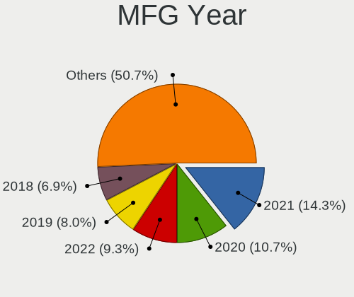

Ubuntu 22.04 - Tested Hardware & Statistics (Notebooks)
-------------------------------------------------------

A project to collect tested hardware configurations for Ubuntu 22.04.

Anyone can contribute to this report by the [hw-probe](https://github.com/linuxhw/hw-probe) tool:

    sudo -E hw-probe -all -upload

Please contribute! Especially if your hardware is rare.

Contents
--------

* [ Test Cases ](#test-cases)

* [ System ](#system)
  - [ Kernel                   ](#kernel)
  - [ Kernel Family            ](#kernel-family)
  - [ Kernel Major Ver.        ](#kernel-major-ver)
  - [ Arch                     ](#arch)
  - [ DE                       ](#de)
  - [ Display Server           ](#display-server)
  - [ Display Manager          ](#display-manager)
  - [ OS Lang                  ](#os-lang)
  - [ Boot Mode                ](#boot-mode)
  - [ Filesystem               ](#filesystem)
  - [ Part. scheme             ](#part-scheme)
  - [ Dual Boot with Linux/BSD ](#dual-boot-with-linuxbsd)
  - [ Dual Boot (Win)          ](#dual-boot-win)

* [ Board ](#board)
  - [ Vendor                   ](#vendor)
  - [ Model                    ](#model)
  - [ Model Family             ](#model-family)
  - [ MFG Year                 ](#mfg-year)
  - [ Form Factor              ](#form-factor)
  - [ Secure Boot              ](#secure-boot)
  - [ Coreboot                 ](#coreboot)
  - [ RAM Size                 ](#ram-size)
  - [ RAM Used                 ](#ram-used)
  - [ Total Drives             ](#total-drives)
  - [ Has CD-ROM               ](#has-cd-rom)
  - [ Has Ethernet             ](#has-ethernet)
  - [ Has WiFi                 ](#has-wifi)
  - [ Has Bluetooth            ](#has-bluetooth)

* [ Location ](#location)
  - [ Country                  ](#country)
  - [ City                     ](#city)

* [ Drives ](#drives)
  - [ Drive Vendor             ](#drive-vendor)
  - [ Drive Model              ](#drive-model)
  - [ HDD Vendor               ](#hdd-vendor)
  - [ SSD Vendor               ](#ssd-vendor)
  - [ Drive Kind               ](#drive-kind)
  - [ Drive Connector          ](#drive-connector)
  - [ Drive Size               ](#drive-size)
  - [ Space Total              ](#space-total)
  - [ Space Used               ](#space-used)
  - [ Malfunc. Drives          ](#malfunc-drives)
  - [ Malfunc. Drive Vendor    ](#malfunc-drive-vendor)
  - [ Malfunc. HDD Vendor      ](#malfunc-hdd-vendor)
  - [ Malfunc. Drive Kind      ](#malfunc-drive-kind)
  - [ Failed Drives            ](#failed-drives)
  - [ Failed Drive Vendor      ](#failed-drive-vendor)
  - [ Drive Status             ](#drive-status)

* [ Storage controller ](#storage-controller)
  - [ Storage Vendor           ](#storage-vendor)
  - [ Storage Model            ](#storage-model)
  - [ Storage Kind             ](#storage-kind)

* [ Processor ](#processor)
  - [ CPU Vendor               ](#cpu-vendor)
  - [ CPU Model                ](#cpu-model)
  - [ CPU Model Family         ](#cpu-model-family)
  - [ CPU Cores                ](#cpu-cores)
  - [ CPU Sockets              ](#cpu-sockets)
  - [ CPU Threads              ](#cpu-threads)
  - [ CPU Op-Modes             ](#cpu-op-modes)
  - [ CPU Microcode            ](#cpu-microcode)
  - [ CPU Microarch            ](#cpu-microarch)

* [ Graphics ](#graphics)
  - [ GPU Vendor               ](#gpu-vendor)
  - [ GPU Model                ](#gpu-model)
  - [ GPU Combo                ](#gpu-combo)
  - [ GPU Driver               ](#gpu-driver)
  - [ GPU Memory               ](#gpu-memory)

* [ Monitor ](#monitor)
  - [ Monitor Vendor           ](#monitor-vendor)
  - [ Monitor Model            ](#monitor-model)
  - [ Monitor Resolution       ](#monitor-resolution)
  - [ Monitor Diagonal         ](#monitor-diagonal)
  - [ Monitor Width            ](#monitor-width)
  - [ Aspect Ratio             ](#aspect-ratio)
  - [ Monitor Area             ](#monitor-area)
  - [ Pixel Density            ](#pixel-density)
  - [ Multiple Monitors        ](#multiple-monitors)

* [ Network ](#network)
  - [ Net Controller Vendor    ](#net-controller-vendor)
  - [ Net Controller Model     ](#net-controller-model)
  - [ Wireless Vendor          ](#wireless-vendor)
  - [ Wireless Model           ](#wireless-model)
  - [ Ethernet Vendor          ](#ethernet-vendor)
  - [ Ethernet Model           ](#ethernet-model)
  - [ Net Controller Kind      ](#net-controller-kind)
  - [ Used Controller          ](#used-controller)
  - [ NICs                     ](#nics)
  - [ IPv6                     ](#ipv6)

* [ Bluetooth ](#bluetooth)
  - [ Bluetooth Vendor         ](#bluetooth-vendor)
  - [ Bluetooth Model          ](#bluetooth-model)

* [ Sound ](#sound)
  - [ Sound Vendor             ](#sound-vendor)
  - [ Sound Model              ](#sound-model)

* [ Memory ](#memory)
  - [ Memory Vendor            ](#memory-vendor)
  - [ Memory Model             ](#memory-model)
  - [ Memory Kind              ](#memory-kind)
  - [ Memory Form Factor       ](#memory-form-factor)
  - [ Memory Size              ](#memory-size)
  - [ Memory Speed             ](#memory-speed)

* [ Printers & scanners ](#printers--scanners)
  - [ Printer Vendor           ](#printer-vendor)
  - [ Printer Model            ](#printer-model)
  - [ Scanner Vendor           ](#scanner-vendor)
  - [ Scanner Model            ](#scanner-model)

* [ Camera ](#camera)
  - [ Camera Vendor            ](#camera-vendor)
  - [ Camera Model             ](#camera-model)

* [ Security ](#security)
  - [ Fingerprint Vendor       ](#fingerprint-vendor)
  - [ Fingerprint Model        ](#fingerprint-model)
  - [ Chipcard Vendor          ](#chipcard-vendor)
  - [ Chipcard Model           ](#chipcard-model)

* [ Unsupported ](#unsupported)
  - [ Unsupported Devices      ](#unsupported-devices)
  - [ Unsupported Device Types ](#unsupported-device-types)

Test Cases
----------

Total: 7079

| Vendor        | Model                       | Probe                                                      | Date         |
|---------------|-----------------------------|------------------------------------------------------------|--------------|
| Lenovo        | ThinkPad T480 20L50010US    | [aa44c2c8b9](https://linux-hardware.org/?probe=aa44c2c8b9) | Jun 10, 2023 |
| Acer          | Aspire E5-574G              | [8ca78da386](https://linux-hardware.org/?probe=8ca78da386) | Jun 10, 2023 |
| Beelink       | Gemini X                    | [adcb5e774d](https://linux-hardware.org/?probe=adcb5e774d) | Jun 10, 2023 |
| HUAWEI        | HVY-WXX9                    | [d6be89e452](https://linux-hardware.org/?probe=d6be89e452) | Jun 10, 2023 |
| Lenovo        | ThinkPad T480 20L50010US    | [398d708c85](https://linux-hardware.org/?probe=398d708c85) | Jun 10, 2023 |
| HP            | EliteBook 1040 G4           | [98aa06475b](https://linux-hardware.org/?probe=98aa06475b) | Jun 10, 2023 |
| Lenovo        | ThinkPad X240 20AMS5XY00    | [3b98c592e0](https://linux-hardware.org/?probe=3b98c592e0) | Jun 10, 2023 |
| HP            | Laptop 17-by3xxx            | [421ff52b0b](https://linux-hardware.org/?probe=421ff52b0b) | Jun 10, 2023 |
| Apple         | MacBookAir5,2               | [6adee93e47](https://linux-hardware.org/?probe=6adee93e47) | Jun 10, 2023 |
| HP            | Pavilion Gaming Laptop 1... | [7c9662b5eb](https://linux-hardware.org/?probe=7c9662b5eb) | Jun 10, 2023 |
| Dell          | Vostro 3560                 | [86f646e00f](https://linux-hardware.org/?probe=86f646e00f) | Jun 10, 2023 |
| Dell          | Vostro 3560                 | [1bb9178df2](https://linux-hardware.org/?probe=1bb9178df2) | Jun 10, 2023 |
| Exo           | Smart Serie LT              | [bbecad1cea](https://linux-hardware.org/?probe=bbecad1cea) | Jun 10, 2023 |
| Apple         | MacBookPro9,2               | [f502f89e9d](https://linux-hardware.org/?probe=f502f89e9d) | Jun 10, 2023 |
| HP            | ProBook 6360b               | [cdef37cb2d](https://linux-hardware.org/?probe=cdef37cb2d) | Jun 09, 2023 |
| Dell          | Vostro 3558                 | [15185698e7](https://linux-hardware.org/?probe=15185698e7) | Jun 09, 2023 |
| HUAWEI        | MACHC-WAX9                  | [6f26f51ef6](https://linux-hardware.org/?probe=6f26f51ef6) | Jun 09, 2023 |
| HP            | Victus by Laptop 16-e0xx... | [9cb24f9445](https://linux-hardware.org/?probe=9cb24f9445) | Jun 09, 2023 |
| HP            | Stream Laptop 14-ds0xxx     | [fb9e2f9fc8](https://linux-hardware.org/?probe=fb9e2f9fc8) | Jun 09, 2023 |
| HP            | ProBook 4510s               | [43a29ea83e](https://linux-hardware.org/?probe=43a29ea83e) | Jun 09, 2023 |
| HP            | Laptop 17-bs0xx             | [c93d52343c](https://linux-hardware.org/?probe=c93d52343c) | Jun 09, 2023 |
| Google        | Akali 360                   | [1f7d5f8bc5](https://linux-hardware.org/?probe=1f7d5f8bc5) | Jun 09, 2023 |
| Dell          | Latitude E7470              | [c5457da74f](https://linux-hardware.org/?probe=c5457da74f) | Jun 09, 2023 |
| Dell          | Inspiron 3583               | [adcb3b193a](https://linux-hardware.org/?probe=adcb3b193a) | Jun 09, 2023 |
| HUAWEI        | BOHB-WAX9                   | [aa0b439e8d](https://linux-hardware.org/?probe=aa0b439e8d) | Jun 09, 2023 |
| Lenovo        | ThinkPad T460s 20FAS11X0... | [23568da401](https://linux-hardware.org/?probe=23568da401) | Jun 09, 2023 |
| Apple         | MacBookPro5,5               | [09344fa63e](https://linux-hardware.org/?probe=09344fa63e) | Jun 09, 2023 |
| HP            | ENVY 15                     | [3776ac93b3](https://linux-hardware.org/?probe=3776ac93b3) | Jun 08, 2023 |
| Samsung       | 910S3L                      | [f8e59b4c0f](https://linux-hardware.org/?probe=f8e59b4c0f) | Jun 08, 2023 |
| Lenovo        | Legion Y740-17IRHg 81UJ     | [c98ac6e82c](https://linux-hardware.org/?probe=c98ac6e82c) | Jun 08, 2023 |
| HUAWEI        | HKD-WXX                     | [d6a8e02362](https://linux-hardware.org/?probe=d6a8e02362) | Jun 08, 2023 |
| HUAWEI        | HKD-WXX                     | [fdb80f6e89](https://linux-hardware.org/?probe=fdb80f6e89) | Jun 08, 2023 |
| Lenovo        | ThinkPad X1 Carbon 3444C... | [4e5e1d4052](https://linux-hardware.org/?probe=4e5e1d4052) | Jun 08, 2023 |
| Lenovo        | Legion Y740-17IRHg 81UJ     | [7879db73f8](https://linux-hardware.org/?probe=7879db73f8) | Jun 08, 2023 |
| Acer          | Aspire ES1-711              | [79bb8d8e39](https://linux-hardware.org/?probe=79bb8d8e39) | Jun 08, 2023 |
| HONOR         | NBR-WAX9                    | [697f2b18e8](https://linux-hardware.org/?probe=697f2b18e8) | Jun 08, 2023 |
| Lenovo        | IdeaPad 5 Pro 14ACN6 82L... | [292625f2da](https://linux-hardware.org/?probe=292625f2da) | Jun 08, 2023 |
| HP            | 2000                        | [4ae1384345](https://linux-hardware.org/?probe=4ae1384345) | Jun 07, 2023 |
| Beelink       | Gemini X                    | [49aca69972](https://linux-hardware.org/?probe=49aca69972) | Jun 07, 2023 |
| Dell          | Latitude 3350               | [ef85473c50](https://linux-hardware.org/?probe=ef85473c50) | Jun 07, 2023 |
| Dell          | XPS 9320                    | [ff5fc17acc](https://linux-hardware.org/?probe=ff5fc17acc) | Jun 07, 2023 |
| Dell          | XPS 13 9370                 | [f70195a177](https://linux-hardware.org/?probe=f70195a177) | Jun 07, 2023 |
| Onda TLC      | ONDA Oliver                 | [bbfcf4a3be](https://linux-hardware.org/?probe=bbfcf4a3be) | Jun 07, 2023 |
| HP            | EliteBook 2560p             | [1b491bcfeb](https://linux-hardware.org/?probe=1b491bcfeb) | Jun 07, 2023 |
| HP            | EliteBook 2560p             | [f1060e2b5d](https://linux-hardware.org/?probe=f1060e2b5d) | Jun 07, 2023 |
| Acer          | Nitro AN515-55              | [99b42755e8](https://linux-hardware.org/?probe=99b42755e8) | Jun 07, 2023 |
| Dell          | Inspiron 5547               | [7775c4c871](https://linux-hardware.org/?probe=7775c4c871) | Jun 07, 2023 |
| Dell          | Inspiron 5547               | [3a43778152](https://linux-hardware.org/?probe=3a43778152) | Jun 07, 2023 |
| Dell          | Latitude E7250              | [a80182e728](https://linux-hardware.org/?probe=a80182e728) | Jun 06, 2023 |
| Sony          | VPCEH3N6E                   | [788ddd35a8](https://linux-hardware.org/?probe=788ddd35a8) | Jun 06, 2023 |
| Acer          | Aspire A715-51G             | [dbde8636bb](https://linux-hardware.org/?probe=dbde8636bb) | Jun 06, 2023 |
| Acer          | Aspire A315-31              | [d5da1b4b30](https://linux-hardware.org/?probe=d5da1b4b30) | Jun 06, 2023 |
| ASUSTek       | VivoBook_ASUSLaptop M160... | [e4335c33f6](https://linux-hardware.org/?probe=e4335c33f6) | Jun 06, 2023 |
| ASUSTek       | VivoBook_ASUSLaptop M350... | [bf403bb6d8](https://linux-hardware.org/?probe=bf403bb6d8) | Jun 06, 2023 |
| Samsung       | 910S3L                      | [2db0ae25d8](https://linux-hardware.org/?probe=2db0ae25d8) | Jun 06, 2023 |
| Lenovo        | ThinkPad T590 20N5000AMH    | [91c0d99427](https://linux-hardware.org/?probe=91c0d99427) | Jun 06, 2023 |
| Dell          | Latitude 7400               | [9968377d89](https://linux-hardware.org/?probe=9968377d89) | Jun 06, 2023 |
| Dell          | XPS 13 9370                 | [82aba8957b](https://linux-hardware.org/?probe=82aba8957b) | Jun 06, 2023 |
| Dell          | Latitude E6400              | [ced90af89e](https://linux-hardware.org/?probe=ced90af89e) | Jun 06, 2023 |
| ASUSTek       | ROG Strix G531GT_G531GT     | [503bc1f4cc](https://linux-hardware.org/?probe=503bc1f4cc) | Jun 06, 2023 |
| ASUSTek       | ROG Strix G531GT_G531GT     | [31a814cd0e](https://linux-hardware.org/?probe=31a814cd0e) | Jun 06, 2023 |
| Lenovo        | IdeaPad 3 14ITL6 82H7       | [5159be9e2b](https://linux-hardware.org/?probe=5159be9e2b) | Jun 06, 2023 |
| ASUSTek       | TUF Gaming FX505DT_FX505... | [fc49284b9f](https://linux-hardware.org/?probe=fc49284b9f) | Jun 06, 2023 |
| Lenovo        | IdeaPad 5 14ALC05 82LM      | [53cb8df21f](https://linux-hardware.org/?probe=53cb8df21f) | Jun 06, 2023 |
| Dell          | Precision 3571              | [35f408bce4](https://linux-hardware.org/?probe=35f408bce4) | Jun 06, 2023 |
| Dell          | Latitude 5530               | [a302ecd3cd](https://linux-hardware.org/?probe=a302ecd3cd) | Jun 05, 2023 |
| Dell          | XPS 13 9305                 | [450d20f29d](https://linux-hardware.org/?probe=450d20f29d) | Jun 05, 2023 |
| ASUSTek       | VivoBook_ASUSLaptop X515... | [a06e6ab7ad](https://linux-hardware.org/?probe=a06e6ab7ad) | Jun 05, 2023 |
| HP            | Pavilion Laptop 15-eh1xx... | [c8ca6e8787](https://linux-hardware.org/?probe=c8ca6e8787) | Jun 05, 2023 |
| ASUSTek       | G750JM                      | [cdb3539c93](https://linux-hardware.org/?probe=cdb3539c93) | Jun 05, 2023 |
| HP            | ENVY m6 Notebook            | [5bc28b7062](https://linux-hardware.org/?probe=5bc28b7062) | Jun 05, 2023 |
| HP            | ENVY m6 Notebook            | [aff6da41b8](https://linux-hardware.org/?probe=aff6da41b8) | Jun 05, 2023 |
| Lenovo        | IdeaPad 3 14ITL6 82H7       | [ceab55a00c](https://linux-hardware.org/?probe=ceab55a00c) | Jun 05, 2023 |
| HP            | Laptop 14-fq0xxx            | [02614f184c](https://linux-hardware.org/?probe=02614f184c) | Jun 05, 2023 |
| Infinix       | INBOOK X2                   | [0a82b1aed3](https://linux-hardware.org/?probe=0a82b1aed3) | Jun 05, 2023 |
| Lenovo        | Legion 5 15ACH6H 82JU       | [ea07821e39](https://linux-hardware.org/?probe=ea07821e39) | Jun 05, 2023 |
| HP            | Pavilion dm4                | [63bd248ea6](https://linux-hardware.org/?probe=63bd248ea6) | Jun 05, 2023 |
| Toshiba       | Satellite L655              | [1b9656a4a1](https://linux-hardware.org/?probe=1b9656a4a1) | Jun 04, 2023 |
| ASUSTek       | G750JM                      | [f492ab6829](https://linux-hardware.org/?probe=f492ab6829) | Jun 04, 2023 |
| HP            | 2000                        | [7b24eaf0d9](https://linux-hardware.org/?probe=7b24eaf0d9) | Jun 04, 2023 |
| HP            | 2000                        | [dfee85b8e7](https://linux-hardware.org/?probe=dfee85b8e7) | Jun 04, 2023 |
| IP3 Tech      | AP1                         | [d24ecf10e2](https://linux-hardware.org/?probe=d24ecf10e2) | Jun 04, 2023 |
| HUAWEI        | BOHB-WAX9                   | [8fa7afa4a1](https://linux-hardware.org/?probe=8fa7afa4a1) | Jun 04, 2023 |
| Lenovo        | ThinkPad T14 Gen 1 20S00... | [a00b8e7d13](https://linux-hardware.org/?probe=a00b8e7d13) | Jun 04, 2023 |
| Apple         | MacBookPro13,3              | [885709a33f](https://linux-hardware.org/?probe=885709a33f) | Jun 04, 2023 |
| Lenovo        | ThinkPad T450 20BU000FUS    | [a0181fbf52](https://linux-hardware.org/?probe=a0181fbf52) | Jun 04, 2023 |
| Samsung       | 950XED                      | [185834c02e](https://linux-hardware.org/?probe=185834c02e) | Jun 04, 2023 |
| Lanix         | AL V9                       | [3bd23fdde7](https://linux-hardware.org/?probe=3bd23fdde7) | Jun 04, 2023 |
| MSI           | Modern 14 B5M               | [da21766a5c](https://linux-hardware.org/?probe=da21766a5c) | Jun 04, 2023 |
| HP            | Pavilion 15                 | [dc8f67bb03](https://linux-hardware.org/?probe=dc8f67bb03) | Jun 03, 2023 |
| Schenker      | XMG FOCUS (M22)             | [31203c3645](https://linux-hardware.org/?probe=31203c3645) | Jun 03, 2023 |
| Dell          | Inspiron 13-5368            | [33bb0f34df](https://linux-hardware.org/?probe=33bb0f34df) | Jun 03, 2023 |
| ASUSTek       | X553MA                      | [d07b3215b1](https://linux-hardware.org/?probe=d07b3215b1) | Jun 03, 2023 |
| ASUSTek       | VivoBook_ASUSLaptop X515... | [f12b791748](https://linux-hardware.org/?probe=f12b791748) | Jun 03, 2023 |
| ASUSTek       | K52Je                       | [c6f78ba2aa](https://linux-hardware.org/?probe=c6f78ba2aa) | Jun 03, 2023 |
| Dell          | Inspiron 5559               | [9e1fe43cf9](https://linux-hardware.org/?probe=9e1fe43cf9) | Jun 03, 2023 |
| Acer          | Aspire A114-31              | [7a760e7ad6](https://linux-hardware.org/?probe=7a760e7ad6) | Jun 03, 2023 |
| Dell          | Latitude E5430 non-vPro     | [ba2dfac7ae](https://linux-hardware.org/?probe=ba2dfac7ae) | Jun 03, 2023 |
| Dell          | Latitude E7450              | [fe7cb1e53f](https://linux-hardware.org/?probe=fe7cb1e53f) | Jun 03, 2023 |
| Lenovo        | Yoga S740-14IIL 81RS        | [1e4ffa48ce](https://linux-hardware.org/?probe=1e4ffa48ce) | Jun 03, 2023 |
| Dell          | Inspiron 5490               | [a0cc355293](https://linux-hardware.org/?probe=a0cc355293) | Jun 03, 2023 |
| Dell          | G15 5520                    | [b77b760dfe](https://linux-hardware.org/?probe=b77b760dfe) | Jun 03, 2023 |
| NCS-Tech      | B300                        | [895395765b](https://linux-hardware.org/?probe=895395765b) | Jun 03, 2023 |
| Toshiba       | Satellite L655              | [9b83a4575b](https://linux-hardware.org/?probe=9b83a4575b) | Jun 02, 2023 |
| Notebook      | NL40_50CU                   | [47b838db36](https://linux-hardware.org/?probe=47b838db36) | Jun 02, 2023 |
| Dell          | Latitude 6430U              | [3104417f5e](https://linux-hardware.org/?probe=3104417f5e) | Jun 02, 2023 |
| ASUSTek       | VivoBook_ASUSLaptop K650... | [a6d6fdfe4f](https://linux-hardware.org/?probe=a6d6fdfe4f) | Jun 02, 2023 |
| Dell          | Inspiron 15 7000 Gaming     | [664282cc84](https://linux-hardware.org/?probe=664282cc84) | Jun 02, 2023 |
| Lenovo        | Legion 5 15ACH6H 82JU       | [4d170e024e](https://linux-hardware.org/?probe=4d170e024e) | Jun 02, 2023 |
| Acer          | Aspire 7745G                | [7739f949e1](https://linux-hardware.org/?probe=7739f949e1) | Jun 02, 2023 |
| Lenovo        | ThinkBook 15 G3 ACL 21A4    | [b8c8f96b56](https://linux-hardware.org/?probe=b8c8f96b56) | Jun 02, 2023 |
| HUAWEI        | MACHC-WAX9                  | [c87d784c98](https://linux-hardware.org/?probe=c87d784c98) | Jun 02, 2023 |
| Lenovo        | IdeaPad 1 15IGL7 82V7       | [a7c067f896](https://linux-hardware.org/?probe=a7c067f896) | Jun 02, 2023 |
| Lenovo        | ThinkBook 15 G4 ABA 21DL    | [6b1168349b](https://linux-hardware.org/?probe=6b1168349b) | Jun 02, 2023 |
| HP            | Laptop 15s-eq2xxx           | [302ae0e2dc](https://linux-hardware.org/?probe=302ae0e2dc) | Jun 02, 2023 |
| Lenovo        | ThinkBook 15 G4 ABA 21DL    | [3da98cc9bb](https://linux-hardware.org/?probe=3da98cc9bb) | Jun 02, 2023 |
| Apple         | MacBookPro5,5               | [29c4ba7312](https://linux-hardware.org/?probe=29c4ba7312) | Jun 01, 2023 |
| Unknown       | Unknown                     | [fa6344a8eb](https://linux-hardware.org/?probe=fa6344a8eb) | Jun 01, 2023 |
| Lenovo        | ThinkPad T530 2392AHG       | [05c41c8464](https://linux-hardware.org/?probe=05c41c8464) | Jun 01, 2023 |
| Lenovo        | ThinkBook 15 G4 IAP 21DJ    | [98b0b355db](https://linux-hardware.org/?probe=98b0b355db) | Jun 01, 2023 |
| Apple         | MacBookAir4,1               | [42b1507aa8](https://linux-hardware.org/?probe=42b1507aa8) | Jun 01, 2023 |
| Samsung       | 300E4C/300E5C/300E7C        | [fcc2d0ed39](https://linux-hardware.org/?probe=fcc2d0ed39) | Jun 01, 2023 |
| HP            | EliteBook 820 G2            | [c9409c532d](https://linux-hardware.org/?probe=c9409c532d) | Jun 01, 2023 |
| Lenovo        | G400s VILG1                 | [fee541ee18](https://linux-hardware.org/?probe=fee541ee18) | Jun 01, 2023 |
| Lenovo        | IdeaPad 330-15IKB 81FD      | [33e440f44f](https://linux-hardware.org/?probe=33e440f44f) | Jun 01, 2023 |
| MSI           | Prestige 15 A12UC           | [9324563727](https://linux-hardware.org/?probe=9324563727) | Jun 01, 2023 |
| MSI           | Prestige 15 A12UC           | [778e78d2a5](https://linux-hardware.org/?probe=778e78d2a5) | Jun 01, 2023 |
| HP            | ProBook 440 G4              | [af2f742bc5](https://linux-hardware.org/?probe=af2f742bc5) | Jun 01, 2023 |
| ASUSTek       | X550CA                      | [fe31674f48](https://linux-hardware.org/?probe=fe31674f48) | Jun 01, 2023 |
| ASUSTek       | ROG Strix G731GT_GL731GT    | [0afa6e53d0](https://linux-hardware.org/?probe=0afa6e53d0) | Jun 01, 2023 |
| Apple         | MacBook4,1                  | [996b318420](https://linux-hardware.org/?probe=996b318420) | Jun 01, 2023 |
| HP            | Pavilion Laptop 15-cc5xx    | [3e49e329d3](https://linux-hardware.org/?probe=3e49e329d3) | Jun 01, 2023 |
| Packard Be... | EasyNote LJ75               | [95c733d00f](https://linux-hardware.org/?probe=95c733d00f) | May 31, 2023 |
| Lenovo        | Yoga S740-14IIL 81RS        | [b7032438d2](https://linux-hardware.org/?probe=b7032438d2) | May 31, 2023 |
| MSI           | GE70 2QE                    | [a075b8b77d](https://linux-hardware.org/?probe=a075b8b77d) | May 31, 2023 |
| HP            | Laptop 15s-fq5xxx           | [bfcb7f950d](https://linux-hardware.org/?probe=bfcb7f950d) | May 31, 2023 |
| Lenovo        | Yoga S740-14IIL 81RS        | [2c315764a9](https://linux-hardware.org/?probe=2c315764a9) | May 31, 2023 |
| Dell          | Inspiron 3502               | [3c734d2900](https://linux-hardware.org/?probe=3c734d2900) | May 31, 2023 |
| Toshiba       | Satellite L850              | [cee0a13d3f](https://linux-hardware.org/?probe=cee0a13d3f) | May 31, 2023 |
| Dell          | Precision 7670              | [77b039b486](https://linux-hardware.org/?probe=77b039b486) | May 31, 2023 |
| AXIOO         | Mybook-14E                  | [cb04b551d8](https://linux-hardware.org/?probe=cb04b551d8) | May 31, 2023 |
| Lenovo        | ThinkBook 15 G4 ABA 21DL    | [7210e5c07e](https://linux-hardware.org/?probe=7210e5c07e) | May 31, 2023 |
| Lenovo        | ThinkPad T14s Gen 3 21BR... | [0ead50ad49](https://linux-hardware.org/?probe=0ead50ad49) | May 31, 2023 |
| Jumper        | EZbook                      | [3ccf2e1365](https://linux-hardware.org/?probe=3ccf2e1365) | May 31, 2023 |
| Lenovo        | ThinkPad X1 Carbon 7th 2... | [742ae62ba6](https://linux-hardware.org/?probe=742ae62ba6) | May 30, 2023 |
| Acer          | Aspire V3-574G              | [728459dd4a](https://linux-hardware.org/?probe=728459dd4a) | May 30, 2023 |
| Framework     | Laptop (12th Gen Intel C... | [ada20f1f6a](https://linux-hardware.org/?probe=ada20f1f6a) | May 30, 2023 |
| HP            | ENVY 15                     | [5acbfb03f4](https://linux-hardware.org/?probe=5acbfb03f4) | May 30, 2023 |
| Toshiba       | Satellite C665              | [c6149a6430](https://linux-hardware.org/?probe=c6149a6430) | May 30, 2023 |
| Apple         | MacBookPro11,1              | [b881639bef](https://linux-hardware.org/?probe=b881639bef) | May 30, 2023 |
| HP            | Pavilion 15                 | [ca18fafda8](https://linux-hardware.org/?probe=ca18fafda8) | May 29, 2023 |
| Acer          | Aspire A515-57              | [e9f91331b2](https://linux-hardware.org/?probe=e9f91331b2) | May 29, 2023 |
| ASUSTek       | VivoBook_ASUSLaptop X712... | [509bb7aae7](https://linux-hardware.org/?probe=509bb7aae7) | May 29, 2023 |
| MSI           | Katana GF76 12UD            | [b1b1816b59](https://linux-hardware.org/?probe=b1b1816b59) | May 29, 2023 |
| Notebook      | NV4XMB,ME,MZ                | [6fdc7285f2](https://linux-hardware.org/?probe=6fdc7285f2) | May 29, 2023 |
| Lenovo        | ThinkBook 16p Gen 4 21J8    | [202bf4f657](https://linux-hardware.org/?probe=202bf4f657) | May 29, 2023 |
| Lenovo        | ThinkBook 16p Gen 4 21J8    | [bb60c42e07](https://linux-hardware.org/?probe=bb60c42e07) | May 29, 2023 |
| Lenovo        | ThinkPad T480 20L6S42000    | [ea6330526c](https://linux-hardware.org/?probe=ea6330526c) | May 29, 2023 |
| Sony          | VPCEA45FG                   | [873ca04445](https://linux-hardware.org/?probe=873ca04445) | May 29, 2023 |
| MSI           | Raider GE76 12UE            | [5e8f375846](https://linux-hardware.org/?probe=5e8f375846) | May 29, 2023 |
| Dell          | Inspiron 15-7568            | [227930e25d](https://linux-hardware.org/?probe=227930e25d) | May 29, 2023 |
| Lenovo        | IdeaPad 320-15IAP 80XR      | [4353f50548](https://linux-hardware.org/?probe=4353f50548) | May 28, 2023 |
| Lenovo        | ThinkPad T540p 20BE00AKZ... | [f9bc4694e4](https://linux-hardware.org/?probe=f9bc4694e4) | May 28, 2023 |
| Lenovo        | IdeaPad 320-15IAP 80XR      | [d993490e5a](https://linux-hardware.org/?probe=d993490e5a) | May 28, 2023 |
| Apple         | MacBookAir4,1               | [25c6965a47](https://linux-hardware.org/?probe=25c6965a47) | May 28, 2023 |
| Apple         | MacBookAir4,1               | [e950caa0ce](https://linux-hardware.org/?probe=e950caa0ce) | May 28, 2023 |
| Lenovo        | IdeaPad Gaming 3 15IMH05... | [95793a85de](https://linux-hardware.org/?probe=95793a85de) | May 28, 2023 |
| Lenovo        | IdeaPad Gaming 3 15IMH05... | [7c9addaf1c](https://linux-hardware.org/?probe=7c9addaf1c) | May 28, 2023 |
| HP            | EliteBook 850 G8 Noteboo... | [9178413d40](https://linux-hardware.org/?probe=9178413d40) | May 28, 2023 |
| Samsung       | 300E4Z/300E5Z/300E7Z        | [c5b13d6ea2](https://linux-hardware.org/?probe=c5b13d6ea2) | May 28, 2023 |
| HP            | Pavilion Gaming Laptop 1... | [960ddf4eaf](https://linux-hardware.org/?probe=960ddf4eaf) | May 28, 2023 |
| Lenovo        | V130-15IKB 81HN             | [e50700f8be](https://linux-hardware.org/?probe=e50700f8be) | May 28, 2023 |
| HP            | EliteBook 840 G1            | [a1aa06298d](https://linux-hardware.org/?probe=a1aa06298d) | May 28, 2023 |
| ASUSTek       | VivoBook_ASUSLaptop X415... | [86876e9715](https://linux-hardware.org/?probe=86876e9715) | May 28, 2023 |
| HUAWEI        | HVY-WXX9                    | [412b42ae92](https://linux-hardware.org/?probe=412b42ae92) | May 28, 2023 |
| Shuttle       | X50V5                       | [277cc7ca36](https://linux-hardware.org/?probe=277cc7ca36) | May 28, 2023 |
| Acer          | Aspire A515-56              | [4d8767d94b](https://linux-hardware.org/?probe=4d8767d94b) | May 28, 2023 |
| Lenovo        | IdeaPad Gaming 3 15IAH7 ... | [c2125f60d2](https://linux-hardware.org/?probe=c2125f60d2) | May 28, 2023 |
| Apple         | MacBookAir8,1               | [47b2ee3c0d](https://linux-hardware.org/?probe=47b2ee3c0d) | May 28, 2023 |
| Dell          | Vostro 5402                 | [41a9c1dcf2](https://linux-hardware.org/?probe=41a9c1dcf2) | May 28, 2023 |
| Lenovo        | V130-15IGM 81HL             | [76a357994a](https://linux-hardware.org/?probe=76a357994a) | May 27, 2023 |
| HP            | Laptop 15s-fq5xxx           | [c6309fc374](https://linux-hardware.org/?probe=c6309fc374) | May 27, 2023 |
| Lenovo        | IdeaPad 5 15IIL05 81YK      | [1eecbd5808](https://linux-hardware.org/?probe=1eecbd5808) | May 27, 2023 |
| Lenovo        | G50-70 20351                | [ee0a9f666c](https://linux-hardware.org/?probe=ee0a9f666c) | May 27, 2023 |
| HUAWEI        | HVY-WXX9                    | [3f6fc3ec0c](https://linux-hardware.org/?probe=3f6fc3ec0c) | May 27, 2023 |
| HP            | Laptop 15-bs0xx             | [9605e313ac](https://linux-hardware.org/?probe=9605e313ac) | May 27, 2023 |
| HP            | Laptop 15-bs0xx             | [0a8ae92c13](https://linux-hardware.org/?probe=0a8ae92c13) | May 27, 2023 |
| HP            | ProBook 650 G1              | [8b2266868a](https://linux-hardware.org/?probe=8b2266868a) | May 27, 2023 |
| Dell          | Latitude 7490               | [fbad4c1a53](https://linux-hardware.org/?probe=fbad4c1a53) | May 27, 2023 |
| Dell          | Latitude 7490               | [00c44ed00c](https://linux-hardware.org/?probe=00c44ed00c) | May 27, 2023 |
| Apple         | MacBookPro5,5               | [f1b7ea69ea](https://linux-hardware.org/?probe=f1b7ea69ea) | May 27, 2023 |
| Lenovo        | ThinkBook 15 G4 ABA 21DL    | [cc9d03264f](https://linux-hardware.org/?probe=cc9d03264f) | May 27, 2023 |
| Samsung       | 910S3G/910S3T               | [e041a5365e](https://linux-hardware.org/?probe=e041a5365e) | May 26, 2023 |
| MSI           | Raider GE76 12UE            | [25bcdc17b0](https://linux-hardware.org/?probe=25bcdc17b0) | May 26, 2023 |
| Dell          | Inspiron N4020              | [6350805cd6](https://linux-hardware.org/?probe=6350805cd6) | May 26, 2023 |
| Dell          | Inspiron N4020              | [801ec6309f](https://linux-hardware.org/?probe=801ec6309f) | May 26, 2023 |
| ASUSTek       | K52Je                       | [3b40aeae90](https://linux-hardware.org/?probe=3b40aeae90) | May 26, 2023 |
| HP            | Pavilion Notebook           | [1c67718bdb](https://linux-hardware.org/?probe=1c67718bdb) | May 26, 2023 |
| Dell          | Latitude E7450              | [4a88622321](https://linux-hardware.org/?probe=4a88622321) | May 26, 2023 |
| ASUSTek       | X550CA                      | [3aebf9eb7c](https://linux-hardware.org/?probe=3aebf9eb7c) | May 26, 2023 |
| Lenovo        | ThinkBook 14 G4 IAP 21DH    | [98308c882b](https://linux-hardware.org/?probe=98308c882b) | May 26, 2023 |
| Toshiba       | Satellite S55-A             | [2b9beaf4a6](https://linux-hardware.org/?probe=2b9beaf4a6) | May 25, 2023 |
| Clevo         | P150HMx                     | [d6c90a2c0c](https://linux-hardware.org/?probe=d6c90a2c0c) | May 25, 2023 |
| MSI           | GE75 Raider 10SF            | [5ee0afea25](https://linux-hardware.org/?probe=5ee0afea25) | May 25, 2023 |
| ASUSTek       | N75SF                       | [38840055c8](https://linux-hardware.org/?probe=38840055c8) | May 25, 2023 |
| Dell          | Latitude 5480               | [adb6ba25f1](https://linux-hardware.org/?probe=adb6ba25f1) | May 25, 2023 |
| HP            | Pavilion Notebook           | [945b06d022](https://linux-hardware.org/?probe=945b06d022) | May 25, 2023 |
| ASUSTek       | ROG Zephyrus G15 GA503RW... | [270540781d](https://linux-hardware.org/?probe=270540781d) | May 25, 2023 |
| Dell          | G15 5510                    | [325fcf6e78](https://linux-hardware.org/?probe=325fcf6e78) | May 25, 2023 |
| Dell          | Latitude 5440               | [5a27bd40e7](https://linux-hardware.org/?probe=5a27bd40e7) | May 25, 2023 |
| Samsung       | 900X5T                      | [9f1d226c85](https://linux-hardware.org/?probe=9f1d226c85) | May 25, 2023 |
| Dell          | Latitude 5480               | [45b63ce664](https://linux-hardware.org/?probe=45b63ce664) | May 25, 2023 |
| HP            | Laptop 14-dq2xxx            | [589112cb44](https://linux-hardware.org/?probe=589112cb44) | May 25, 2023 |
| Dell          | Inspiron 15-7568            | [161ed53585](https://linux-hardware.org/?probe=161ed53585) | May 25, 2023 |
| Acer          | Aspire A514-55              | [17996395f4](https://linux-hardware.org/?probe=17996395f4) | May 25, 2023 |
| HP            | Stream Laptop 14-ds0xxx     | [5d83c85225](https://linux-hardware.org/?probe=5d83c85225) | May 25, 2023 |
| Fujitsu       | LIFEBOOK AH530              | [c885a13922](https://linux-hardware.org/?probe=c885a13922) | May 25, 2023 |
| Fujitsu       | LIFEBOOK AH530              | [897b688aba](https://linux-hardware.org/?probe=897b688aba) | May 25, 2023 |
| Dell          | Latitude 5420               | [a4690b7476](https://linux-hardware.org/?probe=a4690b7476) | May 25, 2023 |
| HP            | Laptop 14-dq1xxx            | [dddde1dc45](https://linux-hardware.org/?probe=dddde1dc45) | May 25, 2023 |
| HP            | Pavilion 17                 | [792ac6919d](https://linux-hardware.org/?probe=792ac6919d) | May 24, 2023 |
| Alienware     | 17 R3                       | [a567b379a1](https://linux-hardware.org/?probe=a567b379a1) | May 24, 2023 |
| Apple         | MacBookPro6,2               | [6858db4f73](https://linux-hardware.org/?probe=6858db4f73) | May 24, 2023 |
| MSI           | GF63 Thin 9RC               | [aef2c48b64](https://linux-hardware.org/?probe=aef2c48b64) | May 24, 2023 |
| ASUSTek       | K55VJ                       | [2b12b33767](https://linux-hardware.org/?probe=2b12b33767) | May 24, 2023 |
| HP            | Laptop 14-dq1xxx            | [d8261039f8](https://linux-hardware.org/?probe=d8261039f8) | May 24, 2023 |
| Dell          | Precision 5520              | [a5e0cc8586](https://linux-hardware.org/?probe=a5e0cc8586) | May 24, 2023 |
| Lenovo        | ThinkPad W530 24472BG       | [6431c2bb45](https://linux-hardware.org/?probe=6431c2bb45) | May 24, 2023 |
| Dell          | G15 5510                    | [730985e467](https://linux-hardware.org/?probe=730985e467) | May 24, 2023 |
| HP            | Stream Laptop 14-ds0xxx     | [587ab1857a](https://linux-hardware.org/?probe=587ab1857a) | May 24, 2023 |
| Lenovo        | Unknown                     | [e7148e7a18](https://linux-hardware.org/?probe=e7148e7a18) | May 23, 2023 |
| Lenovo        | IdeaPad 1 15IGL7 82V7       | [0c665ebdd8](https://linux-hardware.org/?probe=0c665ebdd8) | May 23, 2023 |
| Lenovo        | ThinkPad T440s 20AQ007SM... | [a81e627367](https://linux-hardware.org/?probe=a81e627367) | May 23, 2023 |
| Lenovo        | IdeaPad 110-15ISK 80UD      | [3e2ccc8b5e](https://linux-hardware.org/?probe=3e2ccc8b5e) | May 23, 2023 |
| ASUSTek       | VivoBook_ASUSLaptop E203... | [47c0ef11d2](https://linux-hardware.org/?probe=47c0ef11d2) | May 23, 2023 |
| ASUSTek       | VivoBook_ASUSLaptop E203... | [0f7e3e95a2](https://linux-hardware.org/?probe=0f7e3e95a2) | May 23, 2023 |
| Lenovo        | ThinkPad T470s 20HGS4RU0... | [ac8df81694](https://linux-hardware.org/?probe=ac8df81694) | May 23, 2023 |
| HP            | ENVY Laptop 13-ba1xxx       | [a11fdd0361](https://linux-hardware.org/?probe=a11fdd0361) | May 23, 2023 |
| Lenovo        | IdeaPad 330S-15IKB 81F5     | [d704fd9efd](https://linux-hardware.org/?probe=d704fd9efd) | May 23, 2023 |
| HP            | ProBook 450 G3              | [4400f1205b](https://linux-hardware.org/?probe=4400f1205b) | May 23, 2023 |
| Lenovo        | ThinkPad T14 Gen 3 21AH0... | [2fffd70abb](https://linux-hardware.org/?probe=2fffd70abb) | May 23, 2023 |
| Apple         | MacBookPro13,2              | [8b87a13f50](https://linux-hardware.org/?probe=8b87a13f50) | May 23, 2023 |
| Dell          | Inspiron 5575               | [7d93944943](https://linux-hardware.org/?probe=7d93944943) | May 23, 2023 |
| Apple         | MacBookPro13,2              | [f0ef45dcf3](https://linux-hardware.org/?probe=f0ef45dcf3) | May 23, 2023 |
| Chuwi         | HeroBook Air                | [724db856f3](https://linux-hardware.org/?probe=724db856f3) | May 23, 2023 |
| Lenovo        | ThinkBook 15 G4 ABA 21DL    | [c77cb59a5c](https://linux-hardware.org/?probe=c77cb59a5c) | May 23, 2023 |
| Lenovo        | ThinkPad T540p 20BF001NU... | [2a770d2eac](https://linux-hardware.org/?probe=2a770d2eac) | May 23, 2023 |
| Dell          | Latitude E5570              | [3b1aaa683d](https://linux-hardware.org/?probe=3b1aaa683d) | May 23, 2023 |
| Lenovo        | ThinkPad T450 20BUS0100G    | [069d442d0d](https://linux-hardware.org/?probe=069d442d0d) | May 22, 2023 |
| Acer          | Aspire A715-42G             | [39bb190ac7](https://linux-hardware.org/?probe=39bb190ac7) | May 22, 2023 |
| ASUSTek       | X555LNB                     | [a1aa3cf4b2](https://linux-hardware.org/?probe=a1aa3cf4b2) | May 22, 2023 |
| HUAWEI        | KLVL-WXXW                   | [6ca579ee78](https://linux-hardware.org/?probe=6ca579ee78) | May 22, 2023 |
| HP            | EliteBook 850 G6            | [b38d6399b4](https://linux-hardware.org/?probe=b38d6399b4) | May 22, 2023 |
| ASUSTek       | UX301LAB                    | [69f7b4ae4f](https://linux-hardware.org/?probe=69f7b4ae4f) | May 22, 2023 |
| MSI           | Modern 14 B10MW             | [895bca272b](https://linux-hardware.org/?probe=895bca272b) | May 22, 2023 |
| Apple         | MacBookPro5,5               | [7978c97691](https://linux-hardware.org/?probe=7978c97691) | May 22, 2023 |
| HUAWEI        | NBLB-WAX9N                  | [14b20068ca](https://linux-hardware.org/?probe=14b20068ca) | May 22, 2023 |
| Apple         | MacBookPro15,1              | [f1d994fa47](https://linux-hardware.org/?probe=f1d994fa47) | May 22, 2023 |
| Dell          | XPS 9315                    | [6c3fdbf590](https://linux-hardware.org/?probe=6c3fdbf590) | May 22, 2023 |
| Dell          | Inspiron 7520               | [eeca18ff12](https://linux-hardware.org/?probe=eeca18ff12) | May 22, 2023 |
| HP            | Pavilion g4                 | [3324fbbbaa](https://linux-hardware.org/?probe=3324fbbbaa) | May 22, 2023 |
| ASUSTek       | VivoBook_ASUSLaptop E410... | [dedcc1bb3f](https://linux-hardware.org/?probe=dedcc1bb3f) | May 22, 2023 |
| HUAWEI        | MACHC-WAX9                  | [536b91dce1](https://linux-hardware.org/?probe=536b91dce1) | May 21, 2023 |
| Acer          | Aspire E5-575G              | [d27d5d547e](https://linux-hardware.org/?probe=d27d5d547e) | May 21, 2023 |
| Sony          | VPCF120FD                   | [a438459d06](https://linux-hardware.org/?probe=a438459d06) | May 21, 2023 |
| MSI           | PS63 Modern 8MO             | [5d6f78bfbb](https://linux-hardware.org/?probe=5d6f78bfbb) | May 21, 2023 |
| Apple         | MacBookPro16,2              | [e4adcd71f1](https://linux-hardware.org/?probe=e4adcd71f1) | May 21, 2023 |
| Apple         | MacBookPro16,2              | [09f37f2540](https://linux-hardware.org/?probe=09f37f2540) | May 21, 2023 |
| HP            | EliteBook 640 14 inch G9... | [32e623c724](https://linux-hardware.org/?probe=32e623c724) | May 21, 2023 |
| HP            | Pavilion 15                 | [7afbe545bc](https://linux-hardware.org/?probe=7afbe545bc) | May 21, 2023 |
| Apple         | MacBook4,1                  | [d404dc5e03](https://linux-hardware.org/?probe=d404dc5e03) | May 21, 2023 |
| ASUSTek       | UX430UAR                    | [7815f47a45](https://linux-hardware.org/?probe=7815f47a45) | May 21, 2023 |
| ASUSTek       | K56CA                       | [6ae76c1553](https://linux-hardware.org/?probe=6ae76c1553) | May 21, 2023 |
| Lenovo        | IdeaPad 1 15IGL7 82V7       | [3a448141db](https://linux-hardware.org/?probe=3a448141db) | May 21, 2023 |
| HP            | Pavilion Laptop 15-cc5xx    | [dda7ad1c16](https://linux-hardware.org/?probe=dda7ad1c16) | May 21, 2023 |
| Toshiba       | Satellite Pro S500          | [b08ca84ea8](https://linux-hardware.org/?probe=b08ca84ea8) | May 20, 2023 |
| Unknown       | Unknown                     | [2d705adeaa](https://linux-hardware.org/?probe=2d705adeaa) | May 20, 2023 |
| Dell          | G3 3500                     | [29f1b0fbda](https://linux-hardware.org/?probe=29f1b0fbda) | May 20, 2023 |
| Acer          | Aspire E1-571               | [cce6eaa028](https://linux-hardware.org/?probe=cce6eaa028) | May 20, 2023 |
| Lenovo        | IdeaPad 1 15IGL7 82V7       | [6bce5f1ff0](https://linux-hardware.org/?probe=6bce5f1ff0) | May 20, 2023 |
| Dell          | Latitude E7450              | [51f34cd446](https://linux-hardware.org/?probe=51f34cd446) | May 20, 2023 |
| Lenovo        | ThinkPad P14s Gen 1 20Y1... | [c5fee7bb50](https://linux-hardware.org/?probe=c5fee7bb50) | May 20, 2023 |
| Acer          | Aspire S3                   | [b6841c9aeb](https://linux-hardware.org/?probe=b6841c9aeb) | May 20, 2023 |
| Acer          | Aspire S3                   | [3fafb0df5d](https://linux-hardware.org/?probe=3fafb0df5d) | May 20, 2023 |
| Lenovo        | IdeaPad 310-15ISK 80SM      | [7d4516eff2](https://linux-hardware.org/?probe=7d4516eff2) | May 20, 2023 |
| HP            | ProBook 450 G4              | [054ec4f1cb](https://linux-hardware.org/?probe=054ec4f1cb) | May 20, 2023 |
| Dell          | Latitude 7280               | [9b98a88e3d](https://linux-hardware.org/?probe=9b98a88e3d) | May 19, 2023 |
| Dell          | Latitude E7450              | [e844aeb177](https://linux-hardware.org/?probe=e844aeb177) | May 19, 2023 |
| Lenovo        | G50-30 80G0                 | [03c6d7a815](https://linux-hardware.org/?probe=03c6d7a815) | May 19, 2023 |
| HUAWEI        | BOHB-WAX9                   | [f69b95b887](https://linux-hardware.org/?probe=f69b95b887) | May 19, 2023 |
| ASUSTek       | VivoBook_ASUSLaptop K660... | [3ad05eed61](https://linux-hardware.org/?probe=3ad05eed61) | May 19, 2023 |
| ASUSTek       | VivoBook_ASUSLaptop X512... | [73aafcfb9c](https://linux-hardware.org/?probe=73aafcfb9c) | May 19, 2023 |
| Acer          | Aspire E5-771G              | [0dadbeca5b](https://linux-hardware.org/?probe=0dadbeca5b) | May 19, 2023 |
| TUXEDO        | Pulse 15 Gen2               | [c0e3ea54c0](https://linux-hardware.org/?probe=c0e3ea54c0) | May 19, 2023 |
| Lenovo        | IdeaPad 5 15IAL7 82SF       | [b0ed659e7d](https://linux-hardware.org/?probe=b0ed659e7d) | May 19, 2023 |
| Lenovo        | ThinkPad E590 20NB0029GE    | [749d31d44a](https://linux-hardware.org/?probe=749d31d44a) | May 19, 2023 |
| Lenovo        | ThinkPad E590 20NB0029GE    | [85da505294](https://linux-hardware.org/?probe=85da505294) | May 19, 2023 |
| MSI           | GE75 Raider 10SF            | [8aaec63d14](https://linux-hardware.org/?probe=8aaec63d14) | May 19, 2023 |
| Lenovo        | IdeaPad U530 Touch 20289    | [72e254e4ee](https://linux-hardware.org/?probe=72e254e4ee) | May 19, 2023 |
| MSI           | GE75 Raider 10SF            | [f3724cb7da](https://linux-hardware.org/?probe=f3724cb7da) | May 19, 2023 |
| Unknown       | Unknown                     | [49c702a8c9](https://linux-hardware.org/?probe=49c702a8c9) | May 18, 2023 |
| Lenovo        | ThinkPad L14 Gen 3 21C2C... | [a0f983e519](https://linux-hardware.org/?probe=a0f983e519) | May 18, 2023 |
| Lenovo        | Legion 5 15ITH6H 82JH       | [7f35aa414f](https://linux-hardware.org/?probe=7f35aa414f) | May 18, 2023 |
| Dell          | Latitude E6500              | [27213adbe8](https://linux-hardware.org/?probe=27213adbe8) | May 18, 2023 |
| Sony          | SVF1521A6EW                 | [49a9f77ea9](https://linux-hardware.org/?probe=49a9f77ea9) | May 18, 2023 |
| HP            | Laptop 15-db0xxx            | [6141537b7b](https://linux-hardware.org/?probe=6141537b7b) | May 18, 2023 |
| Dell          | Vostro 15 3510              | [e5e7213107](https://linux-hardware.org/?probe=e5e7213107) | May 18, 2023 |
| Toshiba       | PORTEGE Z830                | [f4548ca81b](https://linux-hardware.org/?probe=f4548ca81b) | May 18, 2023 |
| HUAWEI        | BOD-WXX9                    | [62e064b7d0](https://linux-hardware.org/?probe=62e064b7d0) | May 18, 2023 |
| Acer          | Aspire 7535                 | [32b02980a7](https://linux-hardware.org/?probe=32b02980a7) | May 18, 2023 |
| HP            | EliteBook 840 G8 Noteboo... | [ba813a3367](https://linux-hardware.org/?probe=ba813a3367) | May 18, 2023 |
| Sony          | VPCEB4Z1E                   | [d1cca131ad](https://linux-hardware.org/?probe=d1cca131ad) | May 18, 2023 |
| Dell          | Inspiron 5567               | [45888dea42](https://linux-hardware.org/?probe=45888dea42) | May 18, 2023 |
| Clevo         | P150HMx                     | [17e11751ef](https://linux-hardware.org/?probe=17e11751ef) | May 18, 2023 |
| ASUSTek       | VivoBook_ASUSLaptop X712... | [c152120c9e](https://linux-hardware.org/?probe=c152120c9e) | May 18, 2023 |
| Clevo         | P150HMx                     | [f749300168](https://linux-hardware.org/?probe=f749300168) | May 18, 2023 |
| Lenovo        | ThinkPad T480 20L5000UUS    | [cf1d4ac757](https://linux-hardware.org/?probe=cf1d4ac757) | May 18, 2023 |
| HP            | Laptop 15s-eq2xxx           | [a23a2d1c6c](https://linux-hardware.org/?probe=a23a2d1c6c) | May 18, 2023 |
| Lenovo        | IdeaPad 320-15IKB 80YH      | [a167afa608](https://linux-hardware.org/?probe=a167afa608) | May 17, 2023 |
| Acer          | Swift SF316-51              | [663e7fe745](https://linux-hardware.org/?probe=663e7fe745) | May 17, 2023 |
| ASUSTek       | TP300LA                     | [e2e6bc0209](https://linux-hardware.org/?probe=e2e6bc0209) | May 17, 2023 |
| Acer          | TravelMate P215-53G         | [d07aa12d74](https://linux-hardware.org/?probe=d07aa12d74) | May 17, 2023 |
| Acer          | TravelMate P215-53G         | [d2908ee6a9](https://linux-hardware.org/?probe=d2908ee6a9) | May 17, 2023 |
| Acer          | Nitro AN517-54              | [9372615767](https://linux-hardware.org/?probe=9372615767) | May 17, 2023 |
| Dell          | Inspiron 5580               | [7ced5f9473](https://linux-hardware.org/?probe=7ced5f9473) | May 17, 2023 |
| HP            | Laptop 15s-du0xxx           | [ddc3152cbc](https://linux-hardware.org/?probe=ddc3152cbc) | May 17, 2023 |
| Acer          | Nitro AN515-58              | [c9d2b44907](https://linux-hardware.org/?probe=c9d2b44907) | May 17, 2023 |
| Acer          | Aspire 5742G                | [04a6fe63c1](https://linux-hardware.org/?probe=04a6fe63c1) | May 17, 2023 |
| Acer          | Aspire E5-571               | [76e48382f5](https://linux-hardware.org/?probe=76e48382f5) | May 17, 2023 |
| Dell          | Latitude 5290 2-in-1        | [cb196c4c37](https://linux-hardware.org/?probe=cb196c4c37) | May 17, 2023 |
| HP            | Laptop 15s-fq4xxx           | [c6d11a2f8e](https://linux-hardware.org/?probe=c6d11a2f8e) | May 17, 2023 |
| Packard Be... | EasyNote TV43CM             | [66dbc844c7](https://linux-hardware.org/?probe=66dbc844c7) | May 17, 2023 |
| Google        | Samus                       | [d627862e56](https://linux-hardware.org/?probe=d627862e56) | May 16, 2023 |
| ASUSTek       | UX305FA                     | [36cb231f34](https://linux-hardware.org/?probe=36cb231f34) | May 16, 2023 |
| HP            | Pavilion dv6                | [bc505434f7](https://linux-hardware.org/?probe=bc505434f7) | May 16, 2023 |
| Dell          | Latitude 5420               | [ddd072b69c](https://linux-hardware.org/?probe=ddd072b69c) | May 16, 2023 |
| Acer          | Aspire 5050                 | [44f9abca04](https://linux-hardware.org/?probe=44f9abca04) | May 16, 2023 |
| Lenovo        | ThinkPad X270 W10DG 20K5... | [2bfe226026](https://linux-hardware.org/?probe=2bfe226026) | May 16, 2023 |
| MSI           | GF63 Thin 9RC               | [b8f2e92853](https://linux-hardware.org/?probe=b8f2e92853) | May 16, 2023 |
| Lenovo        | ThinkPad X270 W10DG 20K5... | [c2ccca0208](https://linux-hardware.org/?probe=c2ccca0208) | May 16, 2023 |
| Toshiba       | Satellite C805D             | [21ee852978](https://linux-hardware.org/?probe=21ee852978) | May 16, 2023 |
| Dell          | Precision 5530              | [16366ef886](https://linux-hardware.org/?probe=16366ef886) | May 16, 2023 |
| HUAWEI        | NBLB-WAX9N                  | [05441101a8](https://linux-hardware.org/?probe=05441101a8) | May 16, 2023 |
| AZW           | GT-R                        | [e156c5b105](https://linux-hardware.org/?probe=e156c5b105) | May 16, 2023 |
| Acer          | Aspire E5-571               | [6094f7a191](https://linux-hardware.org/?probe=6094f7a191) | May 16, 2023 |
| ASUSTek       | X550CC                      | [cce2c46f1e](https://linux-hardware.org/?probe=cce2c46f1e) | May 16, 2023 |
| Lenovo        | ThinkPad T470s W10DG 20J... | [b2b220a903](https://linux-hardware.org/?probe=b2b220a903) | May 16, 2023 |
| HP            | ENVY 4                      | [ddc467f053](https://linux-hardware.org/?probe=ddc467f053) | May 16, 2023 |
| Lenovo        | ThinkPad L480 20LTSAK70R    | [551d238ad3](https://linux-hardware.org/?probe=551d238ad3) | May 16, 2023 |
| HP            | Compaq Presario CQ60        | [e01dbddbd0](https://linux-hardware.org/?probe=e01dbddbd0) | May 16, 2023 |
| HP            | Compaq Presario CQ60        | [72db5ccefc](https://linux-hardware.org/?probe=72db5ccefc) | May 15, 2023 |
| Dell          | Latitude E5530 non-vPro     | [040fb99c20](https://linux-hardware.org/?probe=040fb99c20) | May 15, 2023 |
| HP            | Pavilion Laptop 15-eh0xx... | [996d19a70c](https://linux-hardware.org/?probe=996d19a70c) | May 15, 2023 |
| Lenovo        | IdeaPad L340-15IRH Gamin... | [f5ef3c16c5](https://linux-hardware.org/?probe=f5ef3c16c5) | May 15, 2023 |
| Toshiba       | Satellite L655              | [2fa63538ef](https://linux-hardware.org/?probe=2fa63538ef) | May 15, 2023 |
| Lenovo        | ThinkPad L512 44444WG       | [1bf9f3a0df](https://linux-hardware.org/?probe=1bf9f3a0df) | May 15, 2023 |
| Dell          | G3 3590                     | [75a6a8a107](https://linux-hardware.org/?probe=75a6a8a107) | May 15, 2023 |
| HP            | Pavilion Gaming Laptop 1... | [33a9b42068](https://linux-hardware.org/?probe=33a9b42068) | May 15, 2023 |
| Apple         | MacBook4,1                  | [755f1920f2](https://linux-hardware.org/?probe=755f1920f2) | May 15, 2023 |
| HP            | Pavilion Laptop 15-eg2xx... | [26c3a1e5cf](https://linux-hardware.org/?probe=26c3a1e5cf) | May 15, 2023 |
| HP            | Pavilion Laptop 15-eh0xx... | [3bd39e50a8](https://linux-hardware.org/?probe=3bd39e50a8) | May 15, 2023 |
| Dell          | XPS 13 9350                 | [3e34d3a71c](https://linux-hardware.org/?probe=3e34d3a71c) | May 15, 2023 |
| Dell          | G3 3590                     | [b19462038d](https://linux-hardware.org/?probe=b19462038d) | May 15, 2023 |
| Lenovo        | ThinkPad T440p 20AN0079M... | [ec0250b092](https://linux-hardware.org/?probe=ec0250b092) | May 15, 2023 |
| ASUSTek       | VivoBook_ASUSLaptop X160... | [b4e8e5504e](https://linux-hardware.org/?probe=b4e8e5504e) | May 15, 2023 |
| HP            | 250 G8 Notebook PC          | [47430a463a](https://linux-hardware.org/?probe=47430a463a) | May 15, 2023 |
| ASUSTek       | VivoBook_ASUSLaptop N740... | [1573285475](https://linux-hardware.org/?probe=1573285475) | May 15, 2023 |
| Dell          | Inspiron 5405               | [9d3ae56a5e](https://linux-hardware.org/?probe=9d3ae56a5e) | May 15, 2023 |
| HP            | Laptop 15-db0xxx            | [61665ffc1a](https://linux-hardware.org/?probe=61665ffc1a) | May 15, 2023 |
| Dell          | Latitude 5520               | [721000195d](https://linux-hardware.org/?probe=721000195d) | May 15, 2023 |
| Dell          | Latitude 5401               | [4304efbed6](https://linux-hardware.org/?probe=4304efbed6) | May 15, 2023 |
| Lenovo        | ThinkPad L440 20ASA09T06    | [48009f1be4](https://linux-hardware.org/?probe=48009f1be4) | May 15, 2023 |
| Lenovo        | ThinkPad L440 20ASA09T06    | [49e6d93eb1](https://linux-hardware.org/?probe=49e6d93eb1) | May 15, 2023 |
| ASUSTek       | X550CA                      | [f48f5f9eaa](https://linux-hardware.org/?probe=f48f5f9eaa) | May 15, 2023 |
| HP            | Laptop 17-cn2xxx            | [9492267a05](https://linux-hardware.org/?probe=9492267a05) | May 15, 2023 |
| HUAWEI        | KLVL-WXXW                   | [d7e4640b82](https://linux-hardware.org/?probe=d7e4640b82) | May 15, 2023 |
| HP            | ZBook Firefly 16 inch G9... | [fb4bda01b7](https://linux-hardware.org/?probe=fb4bda01b7) | May 15, 2023 |
| ASUSTek       | UX430UNR                    | [36f918cce7](https://linux-hardware.org/?probe=36f918cce7) | May 15, 2023 |
| ASUSTek       | UX430UNR                    | [1ba0adc2ba](https://linux-hardware.org/?probe=1ba0adc2ba) | May 15, 2023 |
| Acer          | Aspire A715-42G             | [b43ec1363a](https://linux-hardware.org/?probe=b43ec1363a) | May 14, 2023 |
| Acer          | Aspire A715-42G             | [b80a472c1a](https://linux-hardware.org/?probe=b80a472c1a) | May 14, 2023 |
| Lenovo        | ThinkPad T14 Gen 3 21CFC... | [bb119829d0](https://linux-hardware.org/?probe=bb119829d0) | May 14, 2023 |
| Lenovo        | IdeaPad S540-14IWL 81ND     | [d200313f91](https://linux-hardware.org/?probe=d200313f91) | May 14, 2023 |
| ASUSTek       | K55VJ                       | [bf3ff003f9](https://linux-hardware.org/?probe=bf3ff003f9) | May 14, 2023 |
| HP            | ZBook 15u G5                | [4f1f52ce64](https://linux-hardware.org/?probe=4f1f52ce64) | May 14, 2023 |
| ASUSTek       | VivoBook_ASUSLaptop N740... | [0ea14cadea](https://linux-hardware.org/?probe=0ea14cadea) | May 14, 2023 |
| ASUSTek       | VivoBook_ASUSLaptop X712... | [8747e49a83](https://linux-hardware.org/?probe=8747e49a83) | May 14, 2023 |
| ASUSTek       | N76VZ                       | [fc6d34934a](https://linux-hardware.org/?probe=fc6d34934a) | May 14, 2023 |
| HP            | EliteBook 850 G6            | [df19e8413c](https://linux-hardware.org/?probe=df19e8413c) | May 14, 2023 |
| Acer          | Aspire A315-23              | [64237b5d6e](https://linux-hardware.org/?probe=64237b5d6e) | May 14, 2023 |
| HP            | Notebook                    | [c14e7a41cf](https://linux-hardware.org/?probe=c14e7a41cf) | May 13, 2023 |
| HP            | Notebook                    | [726fa4fcd1](https://linux-hardware.org/?probe=726fa4fcd1) | May 13, 2023 |
| ASUSTek       | Zenbook UM3402YA_UM3402Y... | [ed72b68c39](https://linux-hardware.org/?probe=ed72b68c39) | May 13, 2023 |
| ASUSTek       | UX430UNR                    | [a15b90ff4b](https://linux-hardware.org/?probe=a15b90ff4b) | May 13, 2023 |
| Lenovo        | IdeaPad 1 15ADA7 82R1       | [0239277ed2](https://linux-hardware.org/?probe=0239277ed2) | May 13, 2023 |
| HP            | EliteBook 855 G8 Noteboo... | [ef37458c10](https://linux-hardware.org/?probe=ef37458c10) | May 13, 2023 |
| ASUSTek       | K55DR                       | [e4f7010e78](https://linux-hardware.org/?probe=e4f7010e78) | May 13, 2023 |
| ASUSTek       | K55DR                       | [0d4d8571bf](https://linux-hardware.org/?probe=0d4d8571bf) | May 13, 2023 |
| Samsung       | 550XDA                      | [5f562807be](https://linux-hardware.org/?probe=5f562807be) | May 13, 2023 |
| HP            | ENVY Laptop 14-eb0xxx       | [79db0c9b3c](https://linux-hardware.org/?probe=79db0c9b3c) | May 13, 2023 |
| HP            | Pavilion Laptop 15-cc5xx    | [6ade055af7](https://linux-hardware.org/?probe=6ade055af7) | May 13, 2023 |
| HP            | EliteBook 840 14 inch G9... | [26beee94a9](https://linux-hardware.org/?probe=26beee94a9) | May 12, 2023 |
| MSI           | GL73 8RC                    | [4eb76264f2](https://linux-hardware.org/?probe=4eb76264f2) | May 12, 2023 |
| Digma         | EVE 15 P417 NP3158CXW01     | [29e584b980](https://linux-hardware.org/?probe=29e584b980) | May 12, 2023 |
| Digma         | EVE 15 P417 NP3158CXW01     | [22673e3f0c](https://linux-hardware.org/?probe=22673e3f0c) | May 12, 2023 |
| Dell          | Precision 5550              | [f6d4846655](https://linux-hardware.org/?probe=f6d4846655) | May 12, 2023 |
| HP            | ENVY 17                     | [9f71f0b3e1](https://linux-hardware.org/?probe=9f71f0b3e1) | May 12, 2023 |
| MSI           | Stealth GS77 12UH           | [08fdf9cb20](https://linux-hardware.org/?probe=08fdf9cb20) | May 12, 2023 |
| ASUSTek       | X580VD                      | [971b7bfcd1](https://linux-hardware.org/?probe=971b7bfcd1) | May 12, 2023 |
| Panasonic     | CF-19-8                     | [1aa7d4071a](https://linux-hardware.org/?probe=1aa7d4071a) | May 12, 2023 |
| Lenovo        | ThinkPad E14 Gen 4 21EB0... | [b054e28875](https://linux-hardware.org/?probe=b054e28875) | May 12, 2023 |
| TUXEDO        | Pulse 15 Gen2               | [703faeb982](https://linux-hardware.org/?probe=703faeb982) | May 12, 2023 |
| Toshiba       | STI NA 1401                 | [c9aa3a7539](https://linux-hardware.org/?probe=c9aa3a7539) | May 12, 2023 |
| Samsung       | R430/R480                   | [076f13d198](https://linux-hardware.org/?probe=076f13d198) | May 12, 2023 |
| Dell          | Latitude 5300               | [917bfc93a5](https://linux-hardware.org/?probe=917bfc93a5) | May 12, 2023 |
| HP            | Laptop 17-cp0xxx            | [a47136c4d8](https://linux-hardware.org/?probe=a47136c4d8) | May 12, 2023 |
| Digma         | Pro Magnus M DN16R7-ADXW... | [4e4a1278e9](https://linux-hardware.org/?probe=4e4a1278e9) | May 12, 2023 |
| Dell          | Latitude 5530               | [ade218e4fa](https://linux-hardware.org/?probe=ade218e4fa) | May 11, 2023 |
| Acer          | Swift SFX14-51G             | [e18646482f](https://linux-hardware.org/?probe=e18646482f) | May 11, 2023 |
| Apple         | MacBookPro6,2               | [f56ecb2642](https://linux-hardware.org/?probe=f56ecb2642) | May 11, 2023 |
| Lenovo        | Slim 9 14IAP7 82T1          | [6c391cd64d](https://linux-hardware.org/?probe=6c391cd64d) | May 11, 2023 |
| HP            | Pavilion Laptop 15-eg1xx... | [9ed9aa95e8](https://linux-hardware.org/?probe=9ed9aa95e8) | May 11, 2023 |
| Lenovo        | Slim 9 14IAP7 82T1          | [4d2b811352](https://linux-hardware.org/?probe=4d2b811352) | May 11, 2023 |
| Chuwi         | GemiBook Pro                | [1f22322c4a](https://linux-hardware.org/?probe=1f22322c4a) | May 11, 2023 |
| Lenovo        | Legion Y530-15ICH 81FV      | [f55f75ca7d](https://linux-hardware.org/?probe=f55f75ca7d) | May 11, 2023 |
| Lenovo        | Legion Y530-15ICH 81FV      | [8c58684afd](https://linux-hardware.org/?probe=8c58684afd) | May 11, 2023 |
| TUXEDO        | Book_XA1510                 | [9aed9e823a](https://linux-hardware.org/?probe=9aed9e823a) | May 11, 2023 |
| Lenovo        | IdeaPad 1 15ADA7 82R1       | [328d899b1c](https://linux-hardware.org/?probe=328d899b1c) | May 11, 2023 |
| Samsung       | RV420/RV520/RV720/E3530/... | [c26f143862](https://linux-hardware.org/?probe=c26f143862) | May 11, 2023 |
| Digma         | EVE 11 C422 ES1068EW        | [6c6b40d9de](https://linux-hardware.org/?probe=6c6b40d9de) | May 10, 2023 |
| HP            | Pavilion g6                 | [2eaacf14f6](https://linux-hardware.org/?probe=2eaacf14f6) | May 10, 2023 |
| Acer          | Aspire 5810T                | [d21ea25d7a](https://linux-hardware.org/?probe=d21ea25d7a) | May 10, 2023 |
| Dell          | Inspiron 5590               | [117a2b318d](https://linux-hardware.org/?probe=117a2b318d) | May 10, 2023 |
| ASUSTek       | X550CC                      | [4d0b606423](https://linux-hardware.org/?probe=4d0b606423) | May 10, 2023 |
| Lenovo        | IdeaPad Gaming 3 15IHU6 ... | [601a09abf6](https://linux-hardware.org/?probe=601a09abf6) | May 10, 2023 |
| Toshiba       | Satellite Pro R50-C         | [66fe960f10](https://linux-hardware.org/?probe=66fe960f10) | May 10, 2023 |
| Sony          | SVE1713K1EB                 | [96244b73e7](https://linux-hardware.org/?probe=96244b73e7) | May 10, 2023 |
| Fujitsu Si... | AMILO Pa 2548               | [d5d7d8308f](https://linux-hardware.org/?probe=d5d7d8308f) | May 10, 2023 |
| HUAWEI        | MACHD-WXX9                  | [7b956abe69](https://linux-hardware.org/?probe=7b956abe69) | May 10, 2023 |
| ASUSTek       | Zenbook UM5302TA_UM5302T... | [35750a650a](https://linux-hardware.org/?probe=35750a650a) | May 10, 2023 |
| HP            | EliteBook 840 G3            | [46015ea246](https://linux-hardware.org/?probe=46015ea246) | May 10, 2023 |
| HONOR         | HYM-WXX                     | [ab5b69b742](https://linux-hardware.org/?probe=ab5b69b742) | May 10, 2023 |
| Lenovo        | ThinkPad T570 W10DG 20JW... | [0308c5d0c5](https://linux-hardware.org/?probe=0308c5d0c5) | May 10, 2023 |
| eMachines     | E625                        | [1271e33078](https://linux-hardware.org/?probe=1271e33078) | May 10, 2023 |
| Dell          | Inspiron 5590               | [9c53d54cae](https://linux-hardware.org/?probe=9c53d54cae) | May 10, 2023 |
| Samsung       | RV420/RV520/RV720/E3530/... | [da9df7e3c6](https://linux-hardware.org/?probe=da9df7e3c6) | May 10, 2023 |
| Lenovo        | ThinkPad E15 Gen 3 20YHS... | [813acd1225](https://linux-hardware.org/?probe=813acd1225) | May 10, 2023 |
| HP            | Pavilion Gaming Laptop 1... | [1bd26fc56f](https://linux-hardware.org/?probe=1bd26fc56f) | May 10, 2023 |
| Lenovo        | IdeaPad 3 15ALC6 82KU       | [afde593648](https://linux-hardware.org/?probe=afde593648) | May 10, 2023 |
| eMachines     | E625                        | [3160c872b8](https://linux-hardware.org/?probe=3160c872b8) | May 10, 2023 |
| Gateway       | P-7805u                     | [2713d979c4](https://linux-hardware.org/?probe=2713d979c4) | May 10, 2023 |
| Gateway       | P-7805u                     | [bdf7e6c628](https://linux-hardware.org/?probe=bdf7e6c628) | May 10, 2023 |
| HP            | Pavilion g6                 | [5c616bbd80](https://linux-hardware.org/?probe=5c616bbd80) | May 10, 2023 |
| Apple         | MacBook8,1                  | [89d87ca773](https://linux-hardware.org/?probe=89d87ca773) | May 09, 2023 |
| Thomson       | WWNEO14C-4BK32F             | [28a4468d2d](https://linux-hardware.org/?probe=28a4468d2d) | May 09, 2023 |
| Timi          | Xiaomi Book Pro 14 2022     | [d01779a93b](https://linux-hardware.org/?probe=d01779a93b) | May 09, 2023 |
| HP            | Pavilion g6                 | [fc978d0a03](https://linux-hardware.org/?probe=fc978d0a03) | May 09, 2023 |
| HP            | Pavilion Laptop 14-dv0xx... | [745096932c](https://linux-hardware.org/?probe=745096932c) | May 09, 2023 |
| Toshiba       | Satellite P500              | [16472912d5](https://linux-hardware.org/?probe=16472912d5) | May 09, 2023 |
| HUAWEI        | KLVD-WXX9                   | [3ad22447bb](https://linux-hardware.org/?probe=3ad22447bb) | May 09, 2023 |
| MSI           | Katana 17 B12UCXK           | [15b9d97c10](https://linux-hardware.org/?probe=15b9d97c10) | May 09, 2023 |
| HP            | ProBook 440 G3              | [20365b7b02](https://linux-hardware.org/?probe=20365b7b02) | May 09, 2023 |
| HP            | ProBook 450 G8 Notebook ... | [32fba9e487](https://linux-hardware.org/?probe=32fba9e487) | May 09, 2023 |
| Dell          | G5 5590                     | [c07c29d5de](https://linux-hardware.org/?probe=c07c29d5de) | May 09, 2023 |
| Unknown       | Unknown                     | [0225c3c300](https://linux-hardware.org/?probe=0225c3c300) | May 09, 2023 |
| Apple         | MacBookPro5,5               | [ff3919b7f3](https://linux-hardware.org/?probe=ff3919b7f3) | May 09, 2023 |
| Apple         | MacBookPro6,2               | [db93afa653](https://linux-hardware.org/?probe=db93afa653) | May 09, 2023 |
| Lanix Amer... | A V19                       | [31e64dbd5d](https://linux-hardware.org/?probe=31e64dbd5d) | May 08, 2023 |
| Samsung       | 950XED                      | [15e2cfcac7](https://linux-hardware.org/?probe=15e2cfcac7) | May 08, 2023 |
| Dell          | Latitude E5440              | [6db42a9acc](https://linux-hardware.org/?probe=6db42a9acc) | May 08, 2023 |
| ASUSTek       | X200MA                      | [1f7840b315](https://linux-hardware.org/?probe=1f7840b315) | May 08, 2023 |
| HP            | Laptop 17-cn2xxx            | [ddf0cb8a28](https://linux-hardware.org/?probe=ddf0cb8a28) | May 08, 2023 |
| Acer          | Aspire 7741                 | [995e6d9580](https://linux-hardware.org/?probe=995e6d9580) | May 08, 2023 |
| Avell High... | 1513                        | [6e383641d6](https://linux-hardware.org/?probe=6e383641d6) | May 08, 2023 |
| HP            | EliteBook 725 G4            | [bf3ce4741e](https://linux-hardware.org/?probe=bf3ce4741e) | May 08, 2023 |
| ASUSTek       | VivoBook_ASUS Laptop X50... | [f4d1f788e1](https://linux-hardware.org/?probe=f4d1f788e1) | May 08, 2023 |
| ASUSTek       | VivoBook_ASUSLaptop X432... | [395097d3a3](https://linux-hardware.org/?probe=395097d3a3) | May 08, 2023 |
| Dell          | Latitude 7390               | [dc5c96e431](https://linux-hardware.org/?probe=dc5c96e431) | May 08, 2023 |
| Sony          | VPCZ12C5E                   | [512da95fb0](https://linux-hardware.org/?probe=512da95fb0) | May 08, 2023 |
| Framework     | Laptop (12th Gen Intel C... | [78e63b3bd3](https://linux-hardware.org/?probe=78e63b3bd3) | May 07, 2023 |
| Dell          | Inspiron 13-7359            | [30bd232e19](https://linux-hardware.org/?probe=30bd232e19) | May 07, 2023 |
| Dell          | Inspiron 13-7359            | [923397bc88](https://linux-hardware.org/?probe=923397bc88) | May 07, 2023 |
| Dell          | Latitude 5310               | [d72db172f0](https://linux-hardware.org/?probe=d72db172f0) | May 07, 2023 |
| ASUSTek       | VivoBook 15_ASUS Laptop ... | [7e003cf7a9](https://linux-hardware.org/?probe=7e003cf7a9) | May 07, 2023 |
| Dell          | MXG061                      | [8ef701b61d](https://linux-hardware.org/?probe=8ef701b61d) | May 07, 2023 |
| HP            | Pavilion Laptop 15-eh1xx... | [816f9e047a](https://linux-hardware.org/?probe=816f9e047a) | May 07, 2023 |
| Sony          | VPCZ12C5E                   | [67e1fdf9c2](https://linux-hardware.org/?probe=67e1fdf9c2) | May 07, 2023 |
| ASUSTek       | Zenbook UM3402YAR_UM3402... | [020041a666](https://linux-hardware.org/?probe=020041a666) | May 07, 2023 |
| HP            | x2 210                      | [f7a174063f](https://linux-hardware.org/?probe=f7a174063f) | May 07, 2023 |
| HP            | x2 210                      | [b3c5b71d27](https://linux-hardware.org/?probe=b3c5b71d27) | May 07, 2023 |
| ASUSTek       | ASUS TUF Gaming F15 FX50... | [b1b0fa7485](https://linux-hardware.org/?probe=b1b0fa7485) | May 07, 2023 |
| Acer          | Predator PH315-53           | [efb597952f](https://linux-hardware.org/?probe=efb597952f) | May 07, 2023 |
| Toshiba       | Satellite C855D             | [7cdcc71b4e](https://linux-hardware.org/?probe=7cdcc71b4e) | May 07, 2023 |
| Lenovo        | ThinkBook 14 G2 ITL Ub 2... | [845c2112be](https://linux-hardware.org/?probe=845c2112be) | May 06, 2023 |
| HP            | ENVY TS 17                  | [d18f9c3e77](https://linux-hardware.org/?probe=d18f9c3e77) | May 06, 2023 |
| Dell          | Studio 1749                 | [43eb37cfd7](https://linux-hardware.org/?probe=43eb37cfd7) | May 06, 2023 |
| Dell          | Inspiron 3537               | [5b49eec8c6](https://linux-hardware.org/?probe=5b49eec8c6) | May 06, 2023 |
| HP            | Notebook                    | [cb89261339](https://linux-hardware.org/?probe=cb89261339) | May 06, 2023 |
| ASUSTek       | X441BA                      | [326309c1f1](https://linux-hardware.org/?probe=326309c1f1) | May 06, 2023 |
| HP            | EliteBook Folio 9470m       | [20461b100d](https://linux-hardware.org/?probe=20461b100d) | May 06, 2023 |
| ASUSTek       | X441BA                      | [dee3bc2cdb](https://linux-hardware.org/?probe=dee3bc2cdb) | May 06, 2023 |
| Google        | Samus                       | [aed9bd140f](https://linux-hardware.org/?probe=aed9bd140f) | May 06, 2023 |
| Notebook      | N7x0WU                      | [985f971691](https://linux-hardware.org/?probe=985f971691) | May 06, 2023 |
| ASUSTek       | ZenBook UX434FL_UX434FL     | [21ef45e81c](https://linux-hardware.org/?probe=21ef45e81c) | May 06, 2023 |
| HP            | 250 G5 Notebook PC          | [e12a1d28ba](https://linux-hardware.org/?probe=e12a1d28ba) | May 06, 2023 |
| Dell          | Inspiron 7558               | [aab9b575d7](https://linux-hardware.org/?probe=aab9b575d7) | May 06, 2023 |
| HP            | ZBook Studio G7 Mobile W... | [b0464a0b99](https://linux-hardware.org/?probe=b0464a0b99) | May 06, 2023 |
| Packard Be... | EasyNote TE69HW             | [fff5650658](https://linux-hardware.org/?probe=fff5650658) | May 05, 2023 |
| Fujitsu Si... | AMILO Pa 2548               | [449779fbe4](https://linux-hardware.org/?probe=449779fbe4) | May 05, 2023 |
| TUXEDO        | Pulse 15 Gen1               | [ec3e2f4be9](https://linux-hardware.org/?probe=ec3e2f4be9) | May 05, 2023 |
| Fujitsu Si... | AMILO Pa 2548               | [ffce6dd6d5](https://linux-hardware.org/?probe=ffce6dd6d5) | May 05, 2023 |
| Lenovo        | ThinkPad L512 44444WG       | [db330cab38](https://linux-hardware.org/?probe=db330cab38) | May 05, 2023 |
| HUAWEI        | CREM-WXX9                   | [55e2b9f062](https://linux-hardware.org/?probe=55e2b9f062) | May 05, 2023 |
| HUAWEI        | CREM-WXX9                   | [70f39dc2df](https://linux-hardware.org/?probe=70f39dc2df) | May 05, 2023 |
| Acer          | Aspire A315-23              | [2e4e7c801d](https://linux-hardware.org/?probe=2e4e7c801d) | May 05, 2023 |
| Medion        | Akoya E1317T                | [e8eb05a52a](https://linux-hardware.org/?probe=e8eb05a52a) | May 05, 2023 |
| Lenovo        | ThinkPad T420s 4174W2X      | [082029ecf5](https://linux-hardware.org/?probe=082029ecf5) | May 05, 2023 |
| Lenovo        | ThinkPad T420s 4174W2X      | [e2f37d94cd](https://linux-hardware.org/?probe=e2f37d94cd) | May 05, 2023 |
| Acer          | Aspire A315-58              | [34a67ec7c4](https://linux-hardware.org/?probe=34a67ec7c4) | May 05, 2023 |
| ASUSTek       | G73Jh                       | [0485192408](https://linux-hardware.org/?probe=0485192408) | May 05, 2023 |
| TUXEDO        | Polaris 15 AMD Gen1         | [d02d56f013](https://linux-hardware.org/?probe=d02d56f013) | May 05, 2023 |
| Lenovo        | ThinkPad T480 20L5000UUS    | [1dacd7233b](https://linux-hardware.org/?probe=1dacd7233b) | May 05, 2023 |
| Dynabook      | TECRA A50-J                 | [76a87cd7fc](https://linux-hardware.org/?probe=76a87cd7fc) | May 04, 2023 |
| Dell          | Latitude 5410               | [840aaee455](https://linux-hardware.org/?probe=840aaee455) | May 04, 2023 |
| ASUSTek       | Zenbook UM3402YA_UM3402Y... | [72336867ab](https://linux-hardware.org/?probe=72336867ab) | May 04, 2023 |
| Dell          | Latitude 5410               | [f95e1d32bf](https://linux-hardware.org/?probe=f95e1d32bf) | May 04, 2023 |
| Dell          | Latitude E5570              | [6b532c004d](https://linux-hardware.org/?probe=6b532c004d) | May 04, 2023 |
| Dell          | Latitude 5490               | [c2d5f80f6e](https://linux-hardware.org/?probe=c2d5f80f6e) | May 04, 2023 |
| Lenovo        | ThinkPad T495s 20QJCTO1W... | [a27c899176](https://linux-hardware.org/?probe=a27c899176) | May 04, 2023 |
| Lenovo        | IdeaPad 3 15IML05 81WB      | [1d74519195](https://linux-hardware.org/?probe=1d74519195) | May 04, 2023 |
| HUAWEI        | BOM-WXX9                    | [7a7021d420](https://linux-hardware.org/?probe=7a7021d420) | May 04, 2023 |
| HP            | ProBook 440 G4              | [ac499d5a17](https://linux-hardware.org/?probe=ac499d5a17) | May 04, 2023 |
| Acer          | Nitro AN515-58              | [e788d3fee0](https://linux-hardware.org/?probe=e788d3fee0) | May 04, 2023 |
| HP            | 255 G8 Notebook PC          | [af9621c92b](https://linux-hardware.org/?probe=af9621c92b) | May 04, 2023 |
| Apple         | MacBookAir7,2               | [57ad5809ad](https://linux-hardware.org/?probe=57ad5809ad) | May 04, 2023 |
| Apple         | MacBookAir7,2               | [e69ecc7c30](https://linux-hardware.org/?probe=e69ecc7c30) | May 04, 2023 |
| ASUSTek       | Zenbook UM3402YA_UM3402Y... | [1c26fc22d1](https://linux-hardware.org/?probe=1c26fc22d1) | May 04, 2023 |
| Notebook      | N7x0WU                      | [b11821f4a1](https://linux-hardware.org/?probe=b11821f4a1) | May 03, 2023 |
| HP            | Laptop 15-db0xxx            | [5b2534c11a](https://linux-hardware.org/?probe=5b2534c11a) | May 03, 2023 |
| MSI           | Katana GF66 11UE            | [00cae795f4](https://linux-hardware.org/?probe=00cae795f4) | May 03, 2023 |
| ASUSTek       | X751LJ                      | [708ac49447](https://linux-hardware.org/?probe=708ac49447) | May 03, 2023 |
| Dell          | Latitude 5580               | [e6c5e8bb0b](https://linux-hardware.org/?probe=e6c5e8bb0b) | May 03, 2023 |
| ASUSTek       | X751LJ                      | [66e45eac2c](https://linux-hardware.org/?probe=66e45eac2c) | May 03, 2023 |
| HUAWEI        | RLEF-XX                     | [b97932d8f1](https://linux-hardware.org/?probe=b97932d8f1) | May 03, 2023 |
| HP            | 250 G5 Notebook PC          | [4cb6025c16](https://linux-hardware.org/?probe=4cb6025c16) | May 03, 2023 |
| Packard Be... | EasyNote TE69BM             | [fc905a42fb](https://linux-hardware.org/?probe=fc905a42fb) | May 03, 2023 |
| Lenovo        | IdeaPad 320-15AST 80XV      | [910824ac40](https://linux-hardware.org/?probe=910824ac40) | May 03, 2023 |
| Sony          | VPCEH14FM                   | [a21be2b066](https://linux-hardware.org/?probe=a21be2b066) | May 03, 2023 |
| MSI           | GT72S 6QE                   | [bd81a36394](https://linux-hardware.org/?probe=bd81a36394) | May 03, 2023 |
| HP            | Pavilion Laptop 15-cc5xx    | [4da21d35eb](https://linux-hardware.org/?probe=4da21d35eb) | May 03, 2023 |
| Acer          | Swift SFX14-41G             | [e290126c8d](https://linux-hardware.org/?probe=e290126c8d) | May 03, 2023 |
| Lenovo        | IdeaPad Z565 4311           | [15b7663490](https://linux-hardware.org/?probe=15b7663490) | May 03, 2023 |
| Lenovo        | ThinkPad X220 4291IR6       | [56d274f769](https://linux-hardware.org/?probe=56d274f769) | May 03, 2023 |
| Dell          | Inspiron 11 - 3147          | [2e537d8cda](https://linux-hardware.org/?probe=2e537d8cda) | May 03, 2023 |
| Lenovo        | V130-15IKB 81HN             | [8c3e5e8d50](https://linux-hardware.org/?probe=8c3e5e8d50) | May 03, 2023 |
| Lenovo        | ThinkPad E15 Gen 3 20YG0... | [1e70580006](https://linux-hardware.org/?probe=1e70580006) | May 02, 2023 |
| HP            | Pavilion Aero Laptop 13-... | [1704454cdb](https://linux-hardware.org/?probe=1704454cdb) | May 02, 2023 |
| Dell          | Latitude E7470              | [b642589c50](https://linux-hardware.org/?probe=b642589c50) | May 02, 2023 |
| Lenovo        | ThinkPad P1 Gen 4i 20Y4S... | [d2f8737b9d](https://linux-hardware.org/?probe=d2f8737b9d) | May 02, 2023 |
| HP            | ProBook 450 15.6 inch G9... | [3ab78594e3](https://linux-hardware.org/?probe=3ab78594e3) | May 02, 2023 |
| Sony          | VPCF11C5E                   | [77f08d3d00](https://linux-hardware.org/?probe=77f08d3d00) | May 02, 2023 |
| Samsung       | 550XDA                      | [4bea46787f](https://linux-hardware.org/?probe=4bea46787f) | May 02, 2023 |
| Lenovo        | ThinkPad E560 20EV002FUS    | [5e2f76de77](https://linux-hardware.org/?probe=5e2f76de77) | May 02, 2023 |
| HP            | Laptop 15-db0xxx            | [678f7989e8](https://linux-hardware.org/?probe=678f7989e8) | May 01, 2023 |
| Timi          | Xiaomi Book Pro 14 2022     | [61ca990255](https://linux-hardware.org/?probe=61ca990255) | May 01, 2023 |
| Acer          | Aspire R5-571T              | [9d4259548f](https://linux-hardware.org/?probe=9d4259548f) | May 01, 2023 |
| Acer          | Aspire R5-571T              | [1e80e6a5fb](https://linux-hardware.org/?probe=1e80e6a5fb) | May 01, 2023 |
| ASUSTek       | VivoBook 15_ASUS Laptop ... | [f3e8baa565](https://linux-hardware.org/?probe=f3e8baa565) | May 01, 2023 |
| HP            | 240 G6 Notebook PC          | [3ca97c367a](https://linux-hardware.org/?probe=3ca97c367a) | May 01, 2023 |
| Panasonic     | CF-20-1                     | [a6ce7489e1](https://linux-hardware.org/?probe=a6ce7489e1) | May 01, 2023 |
| Timi          | Xiaomi Book Pro 14 2022     | [e7398c9db0](https://linux-hardware.org/?probe=e7398c9db0) | May 01, 2023 |
| HP            | OMEN by Laptop              | [bfbda66d8b](https://linux-hardware.org/?probe=bfbda66d8b) | May 01, 2023 |
| Lenovo        | ThinkPad T470s W10DG 20J... | [0f77b52547](https://linux-hardware.org/?probe=0f77b52547) | May 01, 2023 |
| Dell          | Latitude 3420               | [cb213cd50f](https://linux-hardware.org/?probe=cb213cd50f) | May 01, 2023 |
| Dell          | Latitude 3420               | [43edcd4b2b](https://linux-hardware.org/?probe=43edcd4b2b) | May 01, 2023 |
| ASUSTek       | VivoBook_ASUSLaptop M650... | [5086f7f4a2](https://linux-hardware.org/?probe=5086f7f4a2) | May 01, 2023 |
| Dell          | Vostro 3550                 | [a644bc676e](https://linux-hardware.org/?probe=a644bc676e) | May 01, 2023 |
| Lenovo        | ThinkPad T470s W10DG 20J... | [e3984b7285](https://linux-hardware.org/?probe=e3984b7285) | May 01, 2023 |
| HP            | ZBook Firefly 15 inch G8... | [ea5b56dbca](https://linux-hardware.org/?probe=ea5b56dbca) | May 01, 2023 |
| HP            | Pavilion Laptop 15-cw0xx... | [7bb2ae638b](https://linux-hardware.org/?probe=7bb2ae638b) | May 01, 2023 |
| HP            | ZBook Firefly 15 inch G8... | [e67706f385](https://linux-hardware.org/?probe=e67706f385) | May 01, 2023 |
| HP            | Pavilion Laptop 15-cw0xx... | [bd0458e8a9](https://linux-hardware.org/?probe=bd0458e8a9) | May 01, 2023 |
| ASUSTek       | X550CC                      | [cc784397f9](https://linux-hardware.org/?probe=cc784397f9) | May 01, 2023 |
| Dell          | Latitude 3420               | [327be624ce](https://linux-hardware.org/?probe=327be624ce) | May 01, 2023 |
| Acer          | Aspire A715-51G             | [842333a8da](https://linux-hardware.org/?probe=842333a8da) | May 01, 2023 |
| Dell          | Latitude 3420               | [1ce0c58a17](https://linux-hardware.org/?probe=1ce0c58a17) | May 01, 2023 |
| Lenovo        | ThinkPad T480 20L6A0LJCL    | [f67154866c](https://linux-hardware.org/?probe=f67154866c) | May 01, 2023 |
| Acer          | Nitro AN517-54              | [593a6b247f](https://linux-hardware.org/?probe=593a6b247f) | May 01, 2023 |
| Acer          | Aspire A715-51G             | [4f72daaab8](https://linux-hardware.org/?probe=4f72daaab8) | May 01, 2023 |
| HP            | EliteBook 8470p             | [f75b4a9457](https://linux-hardware.org/?probe=f75b4a9457) | May 01, 2023 |
| Unknown       | Unknown                     | [8978b9aa5f](https://linux-hardware.org/?probe=8978b9aa5f) | May 01, 2023 |
| HP            | Unknown                     | [475eb33956](https://linux-hardware.org/?probe=475eb33956) | May 01, 2023 |
| Unknown       | Unknown                     | [070854df6b](https://linux-hardware.org/?probe=070854df6b) | Apr 30, 2023 |
| Lenovo        | Z50-75 80EC                 | [af5d37f4f7](https://linux-hardware.org/?probe=af5d37f4f7) | Apr 30, 2023 |
| ASUSTek       | VivoBook_ASUSLaptop X580... | [05251702aa](https://linux-hardware.org/?probe=05251702aa) | Apr 30, 2023 |
| Lenovo        | IdeaPad L340-17API 81LY     | [44c60dcec2](https://linux-hardware.org/?probe=44c60dcec2) | Apr 30, 2023 |
| Dell          | Vostro 3558                 | [5d77d7d922](https://linux-hardware.org/?probe=5d77d7d922) | Apr 30, 2023 |
| ASUSTek       | VivoBook_ASUSLaptop X580... | [94118ab632](https://linux-hardware.org/?probe=94118ab632) | Apr 30, 2023 |
| HP            | Pavilion Laptop 14-ec0xx... | [d4cfc1e964](https://linux-hardware.org/?probe=d4cfc1e964) | Apr 30, 2023 |
| Dell          | XPS 13 9350                 | [95b5e79487](https://linux-hardware.org/?probe=95b5e79487) | Apr 30, 2023 |
| Acer          | Aspire E5-551G              | [bba2f8d1ad](https://linux-hardware.org/?probe=bba2f8d1ad) | Apr 30, 2023 |
| Dell          | Vostro 5468                 | [93eb16d30d](https://linux-hardware.org/?probe=93eb16d30d) | Apr 30, 2023 |
| HP            | Pavilion Laptop 15-cc5xx    | [28b11100ac](https://linux-hardware.org/?probe=28b11100ac) | Apr 30, 2023 |
| Gateway       | P-7805u                     | [0958f250f2](https://linux-hardware.org/?probe=0958f250f2) | Apr 30, 2023 |
| Maibenben     | MaiBook X series            | [5f97e34b20](https://linux-hardware.org/?probe=5f97e34b20) | Apr 30, 2023 |
| Dell          | G15 5511                    | [7d5f166e7a](https://linux-hardware.org/?probe=7d5f166e7a) | Apr 30, 2023 |
| Dell          | XPS 13 7390                 | [c5000ec967](https://linux-hardware.org/?probe=c5000ec967) | Apr 30, 2023 |
| Lenovo        | V130-15IGM 81HL             | [ff24454021](https://linux-hardware.org/?probe=ff24454021) | Apr 29, 2023 |
| ASUSTek       | VivoBook_ASUSLaptop X712... | [272103e5a7](https://linux-hardware.org/?probe=272103e5a7) | Apr 29, 2023 |
| ASUSTek       | G56JR                       | [b7eb868ec4](https://linux-hardware.org/?probe=b7eb868ec4) | Apr 29, 2023 |
| Acer          | TravelMate 5730             | [e74d115d0d](https://linux-hardware.org/?probe=e74d115d0d) | Apr 29, 2023 |
| Lenovo        | V130-15IGM 81HL             | [9081fc703d](https://linux-hardware.org/?probe=9081fc703d) | Apr 29, 2023 |
| Dell          | Inspiron 7773               | [19741ac2ea](https://linux-hardware.org/?probe=19741ac2ea) | Apr 29, 2023 |
| Acer          | Aspire A515-51G             | [bd4c84da60](https://linux-hardware.org/?probe=bd4c84da60) | Apr 29, 2023 |
| Lenovo        | ThinkPad E14 Gen 2 20TBS... | [21d008c7d8](https://linux-hardware.org/?probe=21d008c7d8) | Apr 29, 2023 |
| Lenovo        | ThinkPad E14 Gen 2 20TBS... | [49557b8214](https://linux-hardware.org/?probe=49557b8214) | Apr 29, 2023 |
| Lenovo        | ThinkPad T16 Gen 1 21CH0... | [7598c18042](https://linux-hardware.org/?probe=7598c18042) | Apr 29, 2023 |
| Dell          | Latitude E5470              | [c6c943679f](https://linux-hardware.org/?probe=c6c943679f) | Apr 29, 2023 |
| ASUSTek       | X756UVK                     | [72ba8fbf57](https://linux-hardware.org/?probe=72ba8fbf57) | Apr 29, 2023 |
| Dell          | Latitude 3301               | [3a0aad0e75](https://linux-hardware.org/?probe=3a0aad0e75) | Apr 29, 2023 |
| Dell          | Precision M6600             | [39d9af4736](https://linux-hardware.org/?probe=39d9af4736) | Apr 28, 2023 |
| Dell          | Inspiron 3180               | [bc3400a372](https://linux-hardware.org/?probe=bc3400a372) | Apr 28, 2023 |
| Dell          | Inspiron 15-3567            | [5dcd15cacf](https://linux-hardware.org/?probe=5dcd15cacf) | Apr 28, 2023 |
| Dell          | Latitude E5450              | [85fb3ec2fd](https://linux-hardware.org/?probe=85fb3ec2fd) | Apr 28, 2023 |
| Acer          | Aspire ES1-731              | [140e5eb8fc](https://linux-hardware.org/?probe=140e5eb8fc) | Apr 28, 2023 |
| Acer          | Swift SF314-57G             | [6fd79b811f](https://linux-hardware.org/?probe=6fd79b811f) | Apr 28, 2023 |
| HP            | Laptop 15-ef2xxx            | [f922f80a69](https://linux-hardware.org/?probe=f922f80a69) | Apr 28, 2023 |
| Pegatron      | A15                         | [e9de945dce](https://linux-hardware.org/?probe=e9de945dce) | Apr 28, 2023 |
| Lenovo        | ThinkPad L480 20LTS1NK27    | [6569669912](https://linux-hardware.org/?probe=6569669912) | Apr 28, 2023 |
| Lenovo        | V15 G2 ITL Ua 82KB          | [65f390b956](https://linux-hardware.org/?probe=65f390b956) | Apr 28, 2023 |
| Toshiba       | TECRA Z40-C                 | [a72fdebd89](https://linux-hardware.org/?probe=a72fdebd89) | Apr 28, 2023 |
| Toshiba       | TECRA Z40-C                 | [31bdde77c9](https://linux-hardware.org/?probe=31bdde77c9) | Apr 28, 2023 |
| Toshiba       | TECRA Z40-C                 | [eb550390c1](https://linux-hardware.org/?probe=eb550390c1) | Apr 28, 2023 |
| Dell          | Latitude 3301               | [855564b077](https://linux-hardware.org/?probe=855564b077) | Apr 28, 2023 |
| ASUSTek       | T100TA                      | [7c34e35183](https://linux-hardware.org/?probe=7c34e35183) | Apr 28, 2023 |
| ASUSTek       | T100TA                      | [266477f792](https://linux-hardware.org/?probe=266477f792) | Apr 28, 2023 |
| Apple         | MacBookPro6,2               | [ceaa38e624](https://linux-hardware.org/?probe=ceaa38e624) | Apr 28, 2023 |
| Gigabyte      | G5 GD                       | [d09d6fb712](https://linux-hardware.org/?probe=d09d6fb712) | Apr 27, 2023 |
| HP            | Compaq 6910p                | [049253c0c8](https://linux-hardware.org/?probe=049253c0c8) | Apr 27, 2023 |
| TUXEDO        | Unknown                     | [5108a05d49](https://linux-hardware.org/?probe=5108a05d49) | Apr 27, 2023 |
| Dell          | XPS 13 7390                 | [318ea8ad1e](https://linux-hardware.org/?probe=318ea8ad1e) | Apr 27, 2023 |
| Dell          | XPS 15 9520                 | [07572e6599](https://linux-hardware.org/?probe=07572e6599) | Apr 27, 2023 |
| Lenovo        | IdeaPad 5 14ALC05 82LM      | [f428173506](https://linux-hardware.org/?probe=f428173506) | Apr 27, 2023 |
| Lenovo        | V14 G2 ITL 82NM             | [6a56164bfd](https://linux-hardware.org/?probe=6a56164bfd) | Apr 27, 2023 |
| HP            | Pavilion Laptop 15-cc5xx    | [9344f38032](https://linux-hardware.org/?probe=9344f38032) | Apr 27, 2023 |
| Lenovo        | IdeaPad 3 15ALC6 82MF       | [393c7b06d5](https://linux-hardware.org/?probe=393c7b06d5) | Apr 26, 2023 |
| Lenovo        | IdeaPad Y510P 20217         | [e35780d356](https://linux-hardware.org/?probe=e35780d356) | Apr 26, 2023 |
| Toshiba       | Satellite Pro S500          | [7a2503959a](https://linux-hardware.org/?probe=7a2503959a) | Apr 26, 2023 |
| Lenovo        | ThinkPad X250 20CLA003TA    | [ea8109c2a7](https://linux-hardware.org/?probe=ea8109c2a7) | Apr 26, 2023 |
| Sony          | SVD1322X2EW                 | [2574ef07fb](https://linux-hardware.org/?probe=2574ef07fb) | Apr 26, 2023 |
| Acer          | Aspire A515-45              | [d910b01835](https://linux-hardware.org/?probe=d910b01835) | Apr 26, 2023 |
| HP            | OMEN by Laptop 15-dh1xxx    | [3c104a89ef](https://linux-hardware.org/?probe=3c104a89ef) | Apr 26, 2023 |
| Dell          | Vostro 15 3510              | [81cae0ba77](https://linux-hardware.org/?probe=81cae0ba77) | Apr 26, 2023 |
| Dell          | XPS 15 9500                 | [e37d368767](https://linux-hardware.org/?probe=e37d368767) | Apr 26, 2023 |
| HP            | EliteBook Folio 9470m       | [e0d69966e9](https://linux-hardware.org/?probe=e0d69966e9) | Apr 26, 2023 |
| ASUSTek       | ROG Strix G731GT_GL731GT    | [940cbb6ef0](https://linux-hardware.org/?probe=940cbb6ef0) | Apr 26, 2023 |
| Lenovo        | IdeaPad 3 15IML05 81WR      | [5daf26faca](https://linux-hardware.org/?probe=5daf26faca) | Apr 26, 2023 |
| System76      | Gazelle                     | [dbf4d8b33d](https://linux-hardware.org/?probe=dbf4d8b33d) | Apr 26, 2023 |
| Dell          | Precision M6600             | [4f5cd6d28e](https://linux-hardware.org/?probe=4f5cd6d28e) | Apr 26, 2023 |
| Lenovo        | Y720-15IKB 80VR             | [c9ef115a29](https://linux-hardware.org/?probe=c9ef115a29) | Apr 26, 2023 |
| Lenovo        | ThinkPad T430 2349UKM       | [6adb010c7a](https://linux-hardware.org/?probe=6adb010c7a) | Apr 25, 2023 |
| Acer          | Aspire E1-571               | [c6a1179816](https://linux-hardware.org/?probe=c6a1179816) | Apr 25, 2023 |
| Timi          | Mi NoteBook Ultra           | [b6b7cdfe22](https://linux-hardware.org/?probe=b6b7cdfe22) | Apr 25, 2023 |
| Acer          | Nitro AN517-42              | [5e54d08f91](https://linux-hardware.org/?probe=5e54d08f91) | Apr 25, 2023 |
| Avell High... | A70 HYB BS                  | [c7b5f9ef04](https://linux-hardware.org/?probe=c7b5f9ef04) | Apr 25, 2023 |
| Dell          | XPS 13 9310                 | [b9bc4703a8](https://linux-hardware.org/?probe=b9bc4703a8) | Apr 25, 2023 |
| Acer          | Aspire 5920G                | [c6387003fc](https://linux-hardware.org/?probe=c6387003fc) | Apr 25, 2023 |
| Dell          | Latitude 5490               | [32ddaf898c](https://linux-hardware.org/?probe=32ddaf898c) | Apr 25, 2023 |
| HP            | 255 G5 Notebook PC          | [c542c2df7e](https://linux-hardware.org/?probe=c542c2df7e) | Apr 25, 2023 |
| Lenovo        | ThinkPad E14 Gen 2 20T60... | [3a7c24a13f](https://linux-hardware.org/?probe=3a7c24a13f) | Apr 25, 2023 |
| ASUSTek       | VivoBook 15_ASUS Laptop ... | [7d5bd7e8fa](https://linux-hardware.org/?probe=7d5bd7e8fa) | Apr 25, 2023 |
| ASUSTek       | VivoBook 15_ASUS Laptop ... | [24bf298df5](https://linux-hardware.org/?probe=24bf298df5) | Apr 25, 2023 |
| Lenovo        | ThinkPad Edge E545 20B20... | [fd66f3852a](https://linux-hardware.org/?probe=fd66f3852a) | Apr 25, 2023 |
| Notebook      | W650EH                      | [8e848e589e](https://linux-hardware.org/?probe=8e848e589e) | Apr 25, 2023 |
| Lenovo        | Y720-15IKB 80VR             | [1602540ab8](https://linux-hardware.org/?probe=1602540ab8) | Apr 25, 2023 |
| ASUSTek       | ASUS TUF Gaming F17 FX70... | [5fd25f9235](https://linux-hardware.org/?probe=5fd25f9235) | Apr 25, 2023 |
| ASUSTek       | PRIME X670-P                | [37f98c9450](https://linux-hardware.org/?probe=37f98c9450) | Apr 25, 2023 |
| Dell          | Inspiron 3543               | [2a3020f392](https://linux-hardware.org/?probe=2a3020f392) | Apr 24, 2023 |
| ASUSTek       | X510UQR                     | [4a2e357ace](https://linux-hardware.org/?probe=4a2e357ace) | Apr 24, 2023 |
| ASUSTek       | VivoBook_ASUSLaptop X515... | [9e926f5c65](https://linux-hardware.org/?probe=9e926f5c65) | Apr 24, 2023 |
| Dell          | Vostro 15 3515              | [13c75fa32e](https://linux-hardware.org/?probe=13c75fa32e) | Apr 24, 2023 |
| INSYS         | PT1-140C                    | [902536abce](https://linux-hardware.org/?probe=902536abce) | Apr 24, 2023 |
| Lenovo        | G700                        | [75ee4cf99d](https://linux-hardware.org/?probe=75ee4cf99d) | Apr 24, 2023 |
| Dell          | System XPS L502X            | [4fd4992d0f](https://linux-hardware.org/?probe=4fd4992d0f) | Apr 24, 2023 |
| ASUSTek       | ROG Strix G531GT_G531GT     | [253f35c2c3](https://linux-hardware.org/?probe=253f35c2c3) | Apr 24, 2023 |
| Dell          | Inspiron 15 5510            | [c8f22361f6](https://linux-hardware.org/?probe=c8f22361f6) | Apr 24, 2023 |
| Lenovo        | IdeaPad Gaming 3 15IMH05... | [2787d97e6e](https://linux-hardware.org/?probe=2787d97e6e) | Apr 24, 2023 |
| Fujitsu       | LIFEBOOK S751               | [e01b26f35f](https://linux-hardware.org/?probe=e01b26f35f) | Apr 24, 2023 |
| HP            | Laptop 15-db0xxx            | [2ab42d58bf](https://linux-hardware.org/?probe=2ab42d58bf) | Apr 24, 2023 |
| HP            | Laptop 15-db0xxx            | [8c5aea6211](https://linux-hardware.org/?probe=8c5aea6211) | Apr 24, 2023 |
| Dell          | Inspiron 3542               | [9f4ce3c5a4](https://linux-hardware.org/?probe=9f4ce3c5a4) | Apr 24, 2023 |
| LG Electro... | 16Z90Q-G.AD78F              | [99bbc09adb](https://linux-hardware.org/?probe=99bbc09adb) | Apr 24, 2023 |
| Lenovo        | ThinkPad T440s 20ARS16G0... | [b019f5af89](https://linux-hardware.org/?probe=b019f5af89) | Apr 24, 2023 |
| HP            | ProBook 450 G7              | [57f0ae7486](https://linux-hardware.org/?probe=57f0ae7486) | Apr 24, 2023 |
| ASUSTek       | PRIME X670-P                | [ebe7f36c99](https://linux-hardware.org/?probe=ebe7f36c99) | Apr 23, 2023 |
| Lenovo        | IdeaPad 330-15IKB 81FE      | [e562ba35c6](https://linux-hardware.org/?probe=e562ba35c6) | Apr 23, 2023 |
| HP            | 350 G2                      | [ffa4ab3dc0](https://linux-hardware.org/?probe=ffa4ab3dc0) | Apr 23, 2023 |
| Samsung       | R510/P510                   | [4b58936ad7](https://linux-hardware.org/?probe=4b58936ad7) | Apr 23, 2023 |
| HP            | G42                         | [1d5b2eefc3](https://linux-hardware.org/?probe=1d5b2eefc3) | Apr 23, 2023 |
| Lenovo        | ThinkPad X220 4290EC5       | [f6fe80f275](https://linux-hardware.org/?probe=f6fe80f275) | Apr 23, 2023 |
| MSI           | Bravo 15 B5DD               | [180f1dd402](https://linux-hardware.org/?probe=180f1dd402) | Apr 23, 2023 |
| Dell          | Latitude 5591               | [b4dfa57eea](https://linux-hardware.org/?probe=b4dfa57eea) | Apr 23, 2023 |
| Sony          | SVD1322X2EW                 | [1652ce4c8f](https://linux-hardware.org/?probe=1652ce4c8f) | Apr 23, 2023 |
| HP            | EliteBook 840 G8 Noteboo... | [18fc5f09ed](https://linux-hardware.org/?probe=18fc5f09ed) | Apr 23, 2023 |
| Dell          | Latitude 5591               | [1a45f96f80](https://linux-hardware.org/?probe=1a45f96f80) | Apr 23, 2023 |
| Acer          | Aspire A515-57              | [23f076b6d3](https://linux-hardware.org/?probe=23f076b6d3) | Apr 23, 2023 |
| HP            | Pavilion dv7                | [0ca422761e](https://linux-hardware.org/?probe=0ca422761e) | Apr 23, 2023 |
| Dell          | Latitude E7240              | [1b5828d441](https://linux-hardware.org/?probe=1b5828d441) | Apr 23, 2023 |
| ASUSTek       | UX310UA                     | [a7b628ab1c](https://linux-hardware.org/?probe=a7b628ab1c) | Apr 23, 2023 |
| Lenovo        | ThinkBook 14 G4 IAP 21DH    | [aa23589794](https://linux-hardware.org/?probe=aa23589794) | Apr 23, 2023 |
| ASUSTek       | ROG Strix G513IM_G513IM     | [99e0054492](https://linux-hardware.org/?probe=99e0054492) | Apr 23, 2023 |
| ASUSTek       | ROG Strix G513IM_G513IM     | [86b56d3e69](https://linux-hardware.org/?probe=86b56d3e69) | Apr 23, 2023 |
| Toshiba       | Satellite Pro S500          | [fcf8a7bdb4](https://linux-hardware.org/?probe=fcf8a7bdb4) | Apr 23, 2023 |
| Sony          | VPCF13M1E                   | [023cbeeac3](https://linux-hardware.org/?probe=023cbeeac3) | Apr 23, 2023 |
| Lenovo        | ThinkPad T420 4236EJ3       | [77a309dcf1](https://linux-hardware.org/?probe=77a309dcf1) | Apr 22, 2023 |
| HUAWEI        | NBLK-WAX9X                  | [25e942e55c](https://linux-hardware.org/?probe=25e942e55c) | Apr 22, 2023 |
| Lenovo        | ThinkPad T420 4236EJ3       | [4c60675864](https://linux-hardware.org/?probe=4c60675864) | Apr 22, 2023 |
| HUAWEI        | KLVL-WXXW                   | [13b6b127e6](https://linux-hardware.org/?probe=13b6b127e6) | Apr 22, 2023 |
| ASUSTek       | Zenbook UX3402ZA_UX3402Z... | [adab9d9f6b](https://linux-hardware.org/?probe=adab9d9f6b) | Apr 22, 2023 |
| Apple         | MacBookPro11,5              | [7a873a7baa](https://linux-hardware.org/?probe=7a873a7baa) | Apr 22, 2023 |
| Dell          | Latitude E6500              | [5de8825606](https://linux-hardware.org/?probe=5de8825606) | Apr 22, 2023 |
| HP            | Pavilion g7                 | [785e97ad3d](https://linux-hardware.org/?probe=785e97ad3d) | Apr 22, 2023 |
| HP            | Pavilion g7                 | [0e6f1d6bf7](https://linux-hardware.org/?probe=0e6f1d6bf7) | Apr 22, 2023 |
| Medion        | Akoya E7416T                | [da5ea2c44b](https://linux-hardware.org/?probe=da5ea2c44b) | Apr 22, 2023 |
| Unknown       | M-140BI5                    | [32ba023e2a](https://linux-hardware.org/?probe=32ba023e2a) | Apr 22, 2023 |
| Acer          | Aspire E5-772               | [edfa9fcbef](https://linux-hardware.org/?probe=edfa9fcbef) | Apr 22, 2023 |
| Lenovo        | Z50-70 20354                | [76f54ae42f](https://linux-hardware.org/?probe=76f54ae42f) | Apr 22, 2023 |
| HP            | EliteBook 2570p             | [a26039eb50](https://linux-hardware.org/?probe=a26039eb50) | Apr 22, 2023 |
| HP            | EliteBook 2570p             | [7e7a982c3c](https://linux-hardware.org/?probe=7e7a982c3c) | Apr 22, 2023 |
| Lenovo        | N22 80S6                    | [e915245bfd](https://linux-hardware.org/?probe=e915245bfd) | Apr 22, 2023 |
| HP            | ProBook 4540s               | [12ee30d786](https://linux-hardware.org/?probe=12ee30d786) | Apr 22, 2023 |
| AMI           | Cherry Trail CR             | [325dfde573](https://linux-hardware.org/?probe=325dfde573) | Apr 22, 2023 |
| Lenovo        | ThinkPad E15 Gen 4 21E60... | [3056a65306](https://linux-hardware.org/?probe=3056a65306) | Apr 22, 2023 |
| HP            | Pavilion 15                 | [ac3f0ac1d5](https://linux-hardware.org/?probe=ac3f0ac1d5) | Apr 21, 2023 |
| HP            | Pavilion 15                 | [877b05303e](https://linux-hardware.org/?probe=877b05303e) | Apr 21, 2023 |
| HP            | Pavilion Gaming Laptop 1... | [2a507e00bf](https://linux-hardware.org/?probe=2a507e00bf) | Apr 21, 2023 |
| Gigabyte      | AERO 16 KE5                 | [9e4fe316b8](https://linux-hardware.org/?probe=9e4fe316b8) | Apr 21, 2023 |
| HP            | Compaq 6735s                | [9a23d08368](https://linux-hardware.org/?probe=9a23d08368) | Apr 21, 2023 |
| Lenovo        | IdeaPad 110-15ISK 80UD      | [52cfdbde2d](https://linux-hardware.org/?probe=52cfdbde2d) | Apr 21, 2023 |
| HP            | Compaq 6735s                | [6b255d5f07](https://linux-hardware.org/?probe=6b255d5f07) | Apr 21, 2023 |
| Dell          | Precision M6600             | [6f80333ca9](https://linux-hardware.org/?probe=6f80333ca9) | Apr 21, 2023 |
| HP            | EliteBook 2540p             | [b2a6b1a66d](https://linux-hardware.org/?probe=b2a6b1a66d) | Apr 21, 2023 |
| ASUSTek       | ROG Strix G513IH_G513IH     | [af72838c03](https://linux-hardware.org/?probe=af72838c03) | Apr 21, 2023 |
| ASUSTek       | ZenBook UX333FN_RX333FN     | [8027ff2b04](https://linux-hardware.org/?probe=8027ff2b04) | Apr 21, 2023 |
| Dell          | Latitude 7280               | [1359a75ba3](https://linux-hardware.org/?probe=1359a75ba3) | Apr 21, 2023 |
| Medion        | S15449                      | [c63e98624a](https://linux-hardware.org/?probe=c63e98624a) | Apr 21, 2023 |
| HP            | Pavilion Sleekbook 15       | [644ea805a9](https://linux-hardware.org/?probe=644ea805a9) | Apr 21, 2023 |
| Medion        | S15449                      | [914511ca07](https://linux-hardware.org/?probe=914511ca07) | Apr 21, 2023 |
| Dell          | Latitude E6500              | [363b443628](https://linux-hardware.org/?probe=363b443628) | Apr 21, 2023 |
| Lenovo        | ThinkPad E15 Gen 3 20YG0... | [6dcb6d41ef](https://linux-hardware.org/?probe=6dcb6d41ef) | Apr 21, 2023 |
| Lenovo        | IdeaPad 5 Pro 14ACN6 82L... | [6e2da1e766](https://linux-hardware.org/?probe=6e2da1e766) | Apr 21, 2023 |
| Google        | Swanky                      | [92156daf53](https://linux-hardware.org/?probe=92156daf53) | Apr 21, 2023 |
| Lenovo        | ThinkPad T490 20N2CTO1WW    | [acbe851404](https://linux-hardware.org/?probe=acbe851404) | Apr 21, 2023 |
| Lenovo        | ThinkPad W530 2436CTO       | [74d9f6c0d6](https://linux-hardware.org/?probe=74d9f6c0d6) | Apr 21, 2023 |
| HP            | EliteBook 2540p             | [be19bcd7de](https://linux-hardware.org/?probe=be19bcd7de) | Apr 21, 2023 |
| PC Special... | TN1-156M                    | [ef6b57e807](https://linux-hardware.org/?probe=ef6b57e807) | Apr 21, 2023 |
| Lenovo        | IdeaPad S530-13IWL 81J7     | [167000be9b](https://linux-hardware.org/?probe=167000be9b) | Apr 21, 2023 |
| Dell          | Vostro 3550                 | [21111146cd](https://linux-hardware.org/?probe=21111146cd) | Apr 21, 2023 |
| Dell          | G15 5510                    | [43d4ce3c37](https://linux-hardware.org/?probe=43d4ce3c37) | Apr 21, 2023 |
| HP            | Notebook                    | [150b1d6ae7](https://linux-hardware.org/?probe=150b1d6ae7) | Apr 21, 2023 |
| UMAX          | VisionBook 14Wa Pro         | [525241657b](https://linux-hardware.org/?probe=525241657b) | Apr 20, 2023 |
| UMAX          | VisionBook 14Wa Pro         | [07e2728dfe](https://linux-hardware.org/?probe=07e2728dfe) | Apr 20, 2023 |
| Infinix       | INBOOK X2 GEN11             | [cac51ecb89](https://linux-hardware.org/?probe=cac51ecb89) | Apr 20, 2023 |
| Infinix       | INBOOK X2 GEN11             | [7fea1a73bc](https://linux-hardware.org/?probe=7fea1a73bc) | Apr 20, 2023 |
| MSI           | GF63 Thin 9SC               | [fbed7350fc](https://linux-hardware.org/?probe=fbed7350fc) | Apr 20, 2023 |
| Timi          | A34R                        | [310e4d7b63](https://linux-hardware.org/?probe=310e4d7b63) | Apr 20, 2023 |
| Dell          | Latitude E6410              | [52ada88fb1](https://linux-hardware.org/?probe=52ada88fb1) | Apr 20, 2023 |
| MSI           | Creator Z17 A12UHST         | [1396746fba](https://linux-hardware.org/?probe=1396746fba) | Apr 20, 2023 |
| HP            | Notebook                    | [36788985ec](https://linux-hardware.org/?probe=36788985ec) | Apr 20, 2023 |
| ASUSTek       | K501LX                      | [00676747c4](https://linux-hardware.org/?probe=00676747c4) | Apr 19, 2023 |
| Dell          | Latitude E7440              | [c701c43108](https://linux-hardware.org/?probe=c701c43108) | Apr 19, 2023 |
| TUXEDO        | Book XUX7 Gen11             | [c92f90cd3b](https://linux-hardware.org/?probe=c92f90cd3b) | Apr 19, 2023 |
| Toshiba       | Satellite C55-C             | [594ceb6023](https://linux-hardware.org/?probe=594ceb6023) | Apr 19, 2023 |
| HP            | Notebook                    | [072fc2bf12](https://linux-hardware.org/?probe=072fc2bf12) | Apr 19, 2023 |
| HP            | 250 15.6 inch G9 Noteboo... | [9df9b0d25d](https://linux-hardware.org/?probe=9df9b0d25d) | Apr 19, 2023 |
| HP            | Laptop 15-dw3xxx            | [a0cf4fd00d](https://linux-hardware.org/?probe=a0cf4fd00d) | Apr 19, 2023 |
| HP            | Laptop 15-dw3xxx            | [7ce26d7fd9](https://linux-hardware.org/?probe=7ce26d7fd9) | Apr 19, 2023 |
| Lenovo        | ThinkBook 15-IML 20RW       | [b4c6c1198f](https://linux-hardware.org/?probe=b4c6c1198f) | Apr 19, 2023 |
| HP            | Pavilion dv7                | [f5c84d7a1b](https://linux-hardware.org/?probe=f5c84d7a1b) | Apr 19, 2023 |
| ASUSTek       | UX430UNR                    | [d8ed935b86](https://linux-hardware.org/?probe=d8ed935b86) | Apr 19, 2023 |
| TECNO         | MEGABOOK T1                 | [733d7d5584](https://linux-hardware.org/?probe=733d7d5584) | Apr 18, 2023 |
| HP            | Compaq Presario CQ70        | [030eff02bb](https://linux-hardware.org/?probe=030eff02bb) | Apr 18, 2023 |
| MSI           | GP65 Leopard 10SEK          | [3b852bad57](https://linux-hardware.org/?probe=3b852bad57) | Apr 18, 2023 |
| HP            | Pavilion Laptop 15-cw0xx... | [e69d8250d4](https://linux-hardware.org/?probe=e69d8250d4) | Apr 18, 2023 |
| HP            | Laptop 17-cn2xxx            | [5b77cc21f4](https://linux-hardware.org/?probe=5b77cc21f4) | Apr 18, 2023 |
| Toshiba       | Satellite L500              | [0896195ea4](https://linux-hardware.org/?probe=0896195ea4) | Apr 18, 2023 |
| Toshiba       | Satellite L500              | [7105145a87](https://linux-hardware.org/?probe=7105145a87) | Apr 18, 2023 |
| Dell          | XPS 15 9500                 | [7e8eea0944](https://linux-hardware.org/?probe=7e8eea0944) | Apr 18, 2023 |
| HP            | ProBook 450 15.6 inch G9... | [ec0532e3e3](https://linux-hardware.org/?probe=ec0532e3e3) | Apr 18, 2023 |
| Lenovo        | Yoga Slim 7 Pro 14IHU5 8... | [0dde7d44fb](https://linux-hardware.org/?probe=0dde7d44fb) | Apr 18, 2023 |
| Dell          | XPS 15 9500                 | [470d6fd3a4](https://linux-hardware.org/?probe=470d6fd3a4) | Apr 18, 2023 |
| HP            | ProBook 440 G5              | [329811ff90](https://linux-hardware.org/?probe=329811ff90) | Apr 18, 2023 |
| Apple         | MacBookPro12,1              | [28f6e6e6c6](https://linux-hardware.org/?probe=28f6e6e6c6) | Apr 18, 2023 |
| Sony          | VPCCW1S1E                   | [49dc80d94c](https://linux-hardware.org/?probe=49dc80d94c) | Apr 18, 2023 |
| Lenovo        | ThinkPad T480s 20L8S6SV0... | [8f05b53b93](https://linux-hardware.org/?probe=8f05b53b93) | Apr 17, 2023 |
| Acer          | Aspire E1-571               | [4278a9f497](https://linux-hardware.org/?probe=4278a9f497) | Apr 17, 2023 |
| ASUSTek       | K55A                        | [99fe712761](https://linux-hardware.org/?probe=99fe712761) | Apr 17, 2023 |
| HP            | 240 G4 Notebook PC          | [6410232c86](https://linux-hardware.org/?probe=6410232c86) | Apr 17, 2023 |
| HP            | ProBook 4730s               | [1e951f37df](https://linux-hardware.org/?probe=1e951f37df) | Apr 17, 2023 |
| ASUSTek       | ASUS TUF Gaming F17 FX70... | [ad381ae6d8](https://linux-hardware.org/?probe=ad381ae6d8) | Apr 17, 2023 |
| HP            | ProBook 445 14 inch G9 N... | [877464f534](https://linux-hardware.org/?probe=877464f534) | Apr 17, 2023 |
| HP            | ProBook 445 14 inch G9 N... | [650deb855e](https://linux-hardware.org/?probe=650deb855e) | Apr 17, 2023 |
| Dell          | Inspiron 5559               | [945c1a2fe3](https://linux-hardware.org/?probe=945c1a2fe3) | Apr 17, 2023 |
| LTD Delovo... | EVE 14 C414 ES4060EW        | [a83fb2552a](https://linux-hardware.org/?probe=a83fb2552a) | Apr 17, 2023 |
| Dell          | Inspiron 5559               | [a25bcc21e8](https://linux-hardware.org/?probe=a25bcc21e8) | Apr 17, 2023 |
| LTD Delovo... | EVE 14 C414 ES4060EW        | [a2060000b4](https://linux-hardware.org/?probe=a2060000b4) | Apr 17, 2023 |
| Lenovo        | ThinkPad P14s Gen 2a 21A... | [f3a91915df](https://linux-hardware.org/?probe=f3a91915df) | Apr 17, 2023 |
| Dell          | Latitude 7420               | [1b2360944e](https://linux-hardware.org/?probe=1b2360944e) | Apr 17, 2023 |
| Dell          | Inspiron 13-5378            | [bcb18ae818](https://linux-hardware.org/?probe=bcb18ae818) | Apr 17, 2023 |
| ASUSTek       | ASUS TUF Gaming F17 FX70... | [4644eb92ef](https://linux-hardware.org/?probe=4644eb92ef) | Apr 17, 2023 |
| Dell          | Latitude E7440              | [6264046b14](https://linux-hardware.org/?probe=6264046b14) | Apr 17, 2023 |
| HP            | ENVY Laptop 17-cg1xxx       | [e4fda598c3](https://linux-hardware.org/?probe=e4fda598c3) | Apr 16, 2023 |
| HP            | Laptop 14-dq2xxx            | [ebfde7de62](https://linux-hardware.org/?probe=ebfde7de62) | Apr 16, 2023 |
| Acer          | Aspire V3-772               | [a44b73c5e5](https://linux-hardware.org/?probe=a44b73c5e5) | Apr 16, 2023 |
| Acer          | Aspire V3-772               | [5dec93d2ba](https://linux-hardware.org/?probe=5dec93d2ba) | Apr 16, 2023 |
| iQual         | NQ4X                        | [425ccf4057](https://linux-hardware.org/?probe=425ccf4057) | Apr 16, 2023 |
| ASUSTek       | K53BE                       | [f21e7219ce](https://linux-hardware.org/?probe=f21e7219ce) | Apr 16, 2023 |
| HP            | ProBook 450 G1              | [000e6c6702](https://linux-hardware.org/?probe=000e6c6702) | Apr 16, 2023 |
| ASUSTek       | VivoBook_ASUSLaptop X712... | [5f4a346d92](https://linux-hardware.org/?probe=5f4a346d92) | Apr 16, 2023 |
| ASUSTek       | ASUS TUF Gaming A15 FA50... | [411186569d](https://linux-hardware.org/?probe=411186569d) | Apr 16, 2023 |
| ASUSTek       | ASUS TUF Gaming A15 FA50... | [d86218a8d1](https://linux-hardware.org/?probe=d86218a8d1) | Apr 16, 2023 |
| HP            | ProBook 4730s               | [be8f644cc3](https://linux-hardware.org/?probe=be8f644cc3) | Apr 16, 2023 |
| Lenovo        | IdeaPad 330-15IKB 81FE      | [f7cf140a28](https://linux-hardware.org/?probe=f7cf140a28) | Apr 16, 2023 |
| HP            | Laptop 15s-eq2xxx           | [b1b447dbbf](https://linux-hardware.org/?probe=b1b447dbbf) | Apr 16, 2023 |
| Dell          | Latitude E6520              | [4cce894e16](https://linux-hardware.org/?probe=4cce894e16) | Apr 16, 2023 |
| HP            | ProBook 440 G5              | [ff2ad3337b](https://linux-hardware.org/?probe=ff2ad3337b) | Apr 15, 2023 |
| HP            | Laptop 15s-eq2xxx           | [861920db51](https://linux-hardware.org/?probe=861920db51) | Apr 15, 2023 |
| Acer          | Aspire ES1-731              | [774333b753](https://linux-hardware.org/?probe=774333b753) | Apr 15, 2023 |
| MSI           | Modern 14 B11MOU            | [fb2586255c](https://linux-hardware.org/?probe=fb2586255c) | Apr 15, 2023 |
| Lenovo        | ThinkPad X201 33233QM       | [f84da542f6](https://linux-hardware.org/?probe=f84da542f6) | Apr 15, 2023 |
| ASUSTek       | ASUS TUF Gaming A17 FA70... | [0e89a3c19b](https://linux-hardware.org/?probe=0e89a3c19b) | Apr 15, 2023 |
| MSI           | Modern 14 B11MOU            | [5be6d6af31](https://linux-hardware.org/?probe=5be6d6af31) | Apr 15, 2023 |
| ASUSTek       | UX303LN                     | [48f04b1b6e](https://linux-hardware.org/?probe=48f04b1b6e) | Apr 15, 2023 |
| Acer          | Aspire A515-55              | [18414177a2](https://linux-hardware.org/?probe=18414177a2) | Apr 15, 2023 |
| Toshiba       | Satellite L655              | [c3c64a7016](https://linux-hardware.org/?probe=c3c64a7016) | Apr 14, 2023 |
| Apple         | MacBookAir7,2               | [ed87c59a92](https://linux-hardware.org/?probe=ed87c59a92) | Apr 14, 2023 |
| Digma         | EVE 11 C422 ES1068EW        | [a5cce02e71](https://linux-hardware.org/?probe=a5cce02e71) | Apr 14, 2023 |
| Dell          | XPS 15 7590                 | [f3248c9bca](https://linux-hardware.org/?probe=f3248c9bca) | Apr 14, 2023 |
| Lenovo        | ThinkPad Edge E135 33596... | [b87471108a](https://linux-hardware.org/?probe=b87471108a) | Apr 14, 2023 |
| Samsung       | 750XDA                      | [e447451a7a](https://linux-hardware.org/?probe=e447451a7a) | Apr 14, 2023 |
| Acer          | Aspire A515-57              | [ea0055d848](https://linux-hardware.org/?probe=ea0055d848) | Apr 14, 2023 |
| Notebook      | W65_67SH                    | [d84563301e](https://linux-hardware.org/?probe=d84563301e) | Apr 14, 2023 |
| Dell          | Inspiron 15 3511            | [6cfca82c2f](https://linux-hardware.org/?probe=6cfca82c2f) | Apr 14, 2023 |
| HP            | EliteBook 8440p             | [6522f4e2dc](https://linux-hardware.org/?probe=6522f4e2dc) | Apr 14, 2023 |
| Clevo         | W760T/M740T/M760T           | [0dfaa8f0e8](https://linux-hardware.org/?probe=0dfaa8f0e8) | Apr 14, 2023 |
| ASUSTek       | VivoBook_ASUSLaptop X432... | [5a17f65715](https://linux-hardware.org/?probe=5a17f65715) | Apr 14, 2023 |
| HUAWEI        | MRG-WXX                     | [56c255e5f0](https://linux-hardware.org/?probe=56c255e5f0) | Apr 14, 2023 |
| Lenovo        | IdeaPad 3 15IGL05 81WQ      | [d4de10f812](https://linux-hardware.org/?probe=d4de10f812) | Apr 14, 2023 |
| Lenovo        | ThinkPad X1 Carbon 7th 2... | [7c862e338c](https://linux-hardware.org/?probe=7c862e338c) | Apr 14, 2023 |
| Lenovo        | ThinkPad X270 20HMS0T000    | [9e33b0dcc4](https://linux-hardware.org/?probe=9e33b0dcc4) | Apr 14, 2023 |
| GPU Compan... | GWTC116-2                   | [05c4b7477b](https://linux-hardware.org/?probe=05c4b7477b) | Apr 14, 2023 |
| Lenovo        | IdeaPad 1 15ALC7 82R4       | [98121ef614](https://linux-hardware.org/?probe=98121ef614) | Apr 14, 2023 |
| Dell          | Latitude E6400              | [7497f0d27e](https://linux-hardware.org/?probe=7497f0d27e) | Apr 14, 2023 |
| Acer          | Nitro AN515-54              | [07a2ba2393](https://linux-hardware.org/?probe=07a2ba2393) | Apr 13, 2023 |
| Lenovo        | ThinkPad T430 2349UKM       | [c67f1476bc](https://linux-hardware.org/?probe=c67f1476bc) | Apr 13, 2023 |
| ASUSTek       | VivoBook_ASUSLaptop X160... | [b223f5fbf1](https://linux-hardware.org/?probe=b223f5fbf1) | Apr 13, 2023 |
| Lenovo        | ThinkPad X220 4291AY8       | [b2bc70473d](https://linux-hardware.org/?probe=b2bc70473d) | Apr 13, 2023 |
| Dell          | Inspiron 15-3567            | [c200475e1f](https://linux-hardware.org/?probe=c200475e1f) | Apr 13, 2023 |
| Acer          | Aspire A515-54G             | [eedb55e1ba](https://linux-hardware.org/?probe=eedb55e1ba) | Apr 13, 2023 |
| ASUSTek       | Zenbook UM5401QAB_UM5401... | [fa8b03b686](https://linux-hardware.org/?probe=fa8b03b686) | Apr 13, 2023 |
| Dell          | Inspiron 15-3567            | [ae928fe177](https://linux-hardware.org/?probe=ae928fe177) | Apr 13, 2023 |
| HP            | Notebook                    | [5fc60b1d5f](https://linux-hardware.org/?probe=5fc60b1d5f) | Apr 13, 2023 |
| Acer          | Aspire A515-57G             | [42e4889a44](https://linux-hardware.org/?probe=42e4889a44) | Apr 13, 2023 |
| Acer          | Nitro AN517-55              | [82931a3c45](https://linux-hardware.org/?probe=82931a3c45) | Apr 13, 2023 |
| ASUSTek       | ROG Zephyrus M16 GU603ZM... | [a8184cfc25](https://linux-hardware.org/?probe=a8184cfc25) | Apr 13, 2023 |
| Dell          | XPS L322X                   | [cbf247e5a6](https://linux-hardware.org/?probe=cbf247e5a6) | Apr 13, 2023 |
| HP            | OMEN Laptop 15-en1xxx       | [0a09da06be](https://linux-hardware.org/?probe=0a09da06be) | Apr 13, 2023 |
| Lenovo        | ThinkPad E14 Gen 2 20T60... | [da97aa7885](https://linux-hardware.org/?probe=da97aa7885) | Apr 13, 2023 |
| Dell          | Vostro 3550                 | [eaade18ae0](https://linux-hardware.org/?probe=eaade18ae0) | Apr 13, 2023 |
| ASUSTek       | ROG Strix G731GT_GL731GT    | [da0c8e23ed](https://linux-hardware.org/?probe=da0c8e23ed) | Apr 13, 2023 |
| HP            | Laptop 15-db0xxx            | [296ce6a791](https://linux-hardware.org/?probe=296ce6a791) | Apr 13, 2023 |
| Toshiba       | Satellite Pro S500          | [44dca3cd92](https://linux-hardware.org/?probe=44dca3cd92) | Apr 13, 2023 |
| Lenovo        | ThinkPad X250 20CLS29J05    | [60c50f0a10](https://linux-hardware.org/?probe=60c50f0a10) | Apr 13, 2023 |
| Acer          | Aspire A515-57G             | [73893f31b6](https://linux-hardware.org/?probe=73893f31b6) | Apr 12, 2023 |
| HP            | Pavilion TS 15              | [43b322dcf3](https://linux-hardware.org/?probe=43b322dcf3) | Apr 12, 2023 |
| HP            | Pavilion Laptop 15-eg0xx... | [d809f15d99](https://linux-hardware.org/?probe=d809f15d99) | Apr 12, 2023 |
| Acer          | Aspire ES1-731              | [3ea34efd72](https://linux-hardware.org/?probe=3ea34efd72) | Apr 12, 2023 |
| ASUSTek       | ROG Zephyrus M16 GU603ZM... | [e75be02a84](https://linux-hardware.org/?probe=e75be02a84) | Apr 12, 2023 |
| MSI           | Prestige 14Evo B13M         | [8ded60277f](https://linux-hardware.org/?probe=8ded60277f) | Apr 12, 2023 |
| Gigabyte      | G5 GD                       | [d914c2a179](https://linux-hardware.org/?probe=d914c2a179) | Apr 12, 2023 |
| Gigabyte      | G5 GD                       | [5b861c968e](https://linux-hardware.org/?probe=5b861c968e) | Apr 12, 2023 |
| Apple         | MacBookPro14,1              | [11757b2c03](https://linux-hardware.org/?probe=11757b2c03) | Apr 12, 2023 |
| Acer          | TravelMate P253             | [e07f3af414](https://linux-hardware.org/?probe=e07f3af414) | Apr 12, 2023 |
| Gateway       | NE56R                       | [39a33d998b](https://linux-hardware.org/?probe=39a33d998b) | Apr 12, 2023 |
| Lenovo        | ThinkPad W541 20EF000JUS    | [4fd97924f2](https://linux-hardware.org/?probe=4fd97924f2) | Apr 12, 2023 |
| Google        | Gnawty                      | [ddb0fea339](https://linux-hardware.org/?probe=ddb0fea339) | Apr 12, 2023 |
| Dell          | Latitude 3510               | [582f6705cb](https://linux-hardware.org/?probe=582f6705cb) | Apr 12, 2023 |
| Lenovo        | ThinkPad T14s Gen 2a 20X... | [9a592d3392](https://linux-hardware.org/?probe=9a592d3392) | Apr 11, 2023 |
| HP            | Compaq CQ58                 | [77ae8df47c](https://linux-hardware.org/?probe=77ae8df47c) | Apr 11, 2023 |
| MSI           | GP72MVR 7RFX                | [17f60a29f5](https://linux-hardware.org/?probe=17f60a29f5) | Apr 11, 2023 |
| HP            | Laptop 17-by4xxx            | [0f08555585](https://linux-hardware.org/?probe=0f08555585) | Apr 11, 2023 |
| HP            | Compaq CQ58                 | [31975ede32](https://linux-hardware.org/?probe=31975ede32) | Apr 11, 2023 |
| HP            | Laptop 17-by4xxx            | [abb34e803c](https://linux-hardware.org/?probe=abb34e803c) | Apr 11, 2023 |
| Lenovo        | ThinkPad X1 Carbon 3460C... | [f1999ee14e](https://linux-hardware.org/?probe=f1999ee14e) | Apr 11, 2023 |
| Dell          | XPS 15 9520                 | [5b01d0eda1](https://linux-hardware.org/?probe=5b01d0eda1) | Apr 11, 2023 |
| HP            | Pavilion (EH737UA#ABA)      | [cc8ff92529](https://linux-hardware.org/?probe=cc8ff92529) | Apr 11, 2023 |
| MSI           | GF63 Thin 9SCXR             | [3225aa17d2](https://linux-hardware.org/?probe=3225aa17d2) | Apr 11, 2023 |
| Lenovo        | IdeaPad Yoga 11S 20246      | [5234925c5c](https://linux-hardware.org/?probe=5234925c5c) | Apr 11, 2023 |
| HP            | 250 G8 Notebook PC          | [a60609df80](https://linux-hardware.org/?probe=a60609df80) | Apr 11, 2023 |
| Lenovo        | ThinkPad W541 20EGS03800    | [4be9d98954](https://linux-hardware.org/?probe=4be9d98954) | Apr 11, 2023 |
| Acer          | Aspire A515-57              | [f577606375](https://linux-hardware.org/?probe=f577606375) | Apr 11, 2023 |
| Dell          | G5 5590                     | [9c1f2f432b](https://linux-hardware.org/?probe=9c1f2f432b) | Apr 11, 2023 |
| BESSTAR Te... | X400                        | [6b1587e21d](https://linux-hardware.org/?probe=6b1587e21d) | Apr 11, 2023 |
| Dell          | Inspiron 5567               | [f12e2a4eb4](https://linux-hardware.org/?probe=f12e2a4eb4) | Apr 11, 2023 |
| MSI           | Prestige 14Evo B13M         | [a3967e84ad](https://linux-hardware.org/?probe=a3967e84ad) | Apr 11, 2023 |
| Acer          | Aspire E5-471               | [dbcbf972e5](https://linux-hardware.org/?probe=dbcbf972e5) | Apr 11, 2023 |
| MSI           | Creator 15 A11UE            | [ca70d48c0e](https://linux-hardware.org/?probe=ca70d48c0e) | Apr 11, 2023 |
| ASUSTek       | VivoBook 14_ASUS Laptop ... | [7852e88a19](https://linux-hardware.org/?probe=7852e88a19) | Apr 11, 2023 |
| Lenovo        | IdeaPad 5 14ARE05 81YM      | [40c7ac46e2](https://linux-hardware.org/?probe=40c7ac46e2) | Apr 10, 2023 |
| ASUSTek       | K55VD                       | [110fdee9b2](https://linux-hardware.org/?probe=110fdee9b2) | Apr 10, 2023 |
| TUXEDO        | Book XP1511                 | [5f5ee54a58](https://linux-hardware.org/?probe=5f5ee54a58) | Apr 10, 2023 |
| ASUSTek       | ZenBook S UX391UA           | [704f5bcf78](https://linux-hardware.org/?probe=704f5bcf78) | Apr 10, 2023 |
| HP            | Pavilion dv7                | [09416f091f](https://linux-hardware.org/?probe=09416f091f) | Apr 10, 2023 |
| Lenovo        | IdeaPad 320-15IKB 80XL      | [93f3fa59af](https://linux-hardware.org/?probe=93f3fa59af) | Apr 09, 2023 |
| HP            | Pavilion dv7                | [1e1b8b9ee8](https://linux-hardware.org/?probe=1e1b8b9ee8) | Apr 09, 2023 |
| HP            | Pavilion dv7                | [de8b7df38c](https://linux-hardware.org/?probe=de8b7df38c) | Apr 09, 2023 |
| ASUSTek       | ZenBook S UX391UA           | [fe939f268b](https://linux-hardware.org/?probe=fe939f268b) | Apr 09, 2023 |
| ASUSTek       | ZenBook S UX391UA           | [955a648772](https://linux-hardware.org/?probe=955a648772) | Apr 09, 2023 |
| ASUSTek       | Zenbook UX8402ZA_UX8402Z... | [02bbb66fe9](https://linux-hardware.org/?probe=02bbb66fe9) | Apr 09, 2023 |
| Lenovo        | IdeaPad 5 Pro 16ACH6 82L... | [c82c56c81e](https://linux-hardware.org/?probe=c82c56c81e) | Apr 09, 2023 |
| Dell          | Latitude 7275               | [d1a55f8f55](https://linux-hardware.org/?probe=d1a55f8f55) | Apr 09, 2023 |
| Acer          | Aspire A515-57              | [e04fc7e8e8](https://linux-hardware.org/?probe=e04fc7e8e8) | Apr 09, 2023 |
| Acer          | Aspire A317-53              | [b1c4404d58](https://linux-hardware.org/?probe=b1c4404d58) | Apr 09, 2023 |
| HONOR         | NMH-WCX9                    | [51c8f59aeb](https://linux-hardware.org/?probe=51c8f59aeb) | Apr 08, 2023 |
| Lenovo        | ThinkPad X230 2325BA3       | [37849126d4](https://linux-hardware.org/?probe=37849126d4) | Apr 08, 2023 |
| ICL           | RAYbook Si1512              | [1dd919f7ff](https://linux-hardware.org/?probe=1dd919f7ff) | Apr 08, 2023 |
| HP            | EliteBook 8560p             | [2ecc0fe5bc](https://linux-hardware.org/?probe=2ecc0fe5bc) | Apr 07, 2023 |
| ASUSTek       | VivoBook_ASUSLaptop X530... | [0477a89130](https://linux-hardware.org/?probe=0477a89130) | Apr 07, 2023 |
| HP            | 255 15.6 inch G9 Noteboo... | [52a7fed8d7](https://linux-hardware.org/?probe=52a7fed8d7) | Apr 07, 2023 |
| Notebook      | N141CU                      | [8648ddb323](https://linux-hardware.org/?probe=8648ddb323) | Apr 07, 2023 |
| HUAWEI        | NBLB-WAX9N                  | [b0f67ad60e](https://linux-hardware.org/?probe=b0f67ad60e) | Apr 07, 2023 |
| Dell          | G3 3500                     | [cae0e09f03](https://linux-hardware.org/?probe=cae0e09f03) | Apr 07, 2023 |
| HUAWEI        | NBLB-WAX9N                  | [868d29e288](https://linux-hardware.org/?probe=868d29e288) | Apr 07, 2023 |
| Dell          | G3 3500                     | [9f77f9158a](https://linux-hardware.org/?probe=9f77f9158a) | Apr 07, 2023 |
| Notebook      | NL5xNU                      | [3d65b6c046](https://linux-hardware.org/?probe=3d65b6c046) | Apr 07, 2023 |
| Dell          | Latitude E5550              | [b0e2c2e0d5](https://linux-hardware.org/?probe=b0e2c2e0d5) | Apr 07, 2023 |
| Dell          | Vostro 5391                 | [aaa8e31af8](https://linux-hardware.org/?probe=aaa8e31af8) | Apr 07, 2023 |
| HP            | ProBook 6360b               | [bfa6c44b14](https://linux-hardware.org/?probe=bfa6c44b14) | Apr 07, 2023 |
| HP            | Laptop 14-dk0xxx            | [fb1a3cbdb9](https://linux-hardware.org/?probe=fb1a3cbdb9) | Apr 06, 2023 |
| ASUSTek       | VivoBook_ASUSLaptop X509... | [9e7e969310](https://linux-hardware.org/?probe=9e7e969310) | Apr 06, 2023 |
| HUAWEI        | RLEF-XX                     | [874157891b](https://linux-hardware.org/?probe=874157891b) | Apr 06, 2023 |
| HP            | Laptop 15-da1xxx            | [84c8a107d4](https://linux-hardware.org/?probe=84c8a107d4) | Apr 06, 2023 |
| ASUSTek       | VivoBook_ASUSLaptop X515... | [b220308aa1](https://linux-hardware.org/?probe=b220308aa1) | Apr 06, 2023 |
| HP            | 250 G6 Notebook PC          | [2537675a96](https://linux-hardware.org/?probe=2537675a96) | Apr 06, 2023 |
| Lenovo        | ThinkPad T480s 20L70029U... | [dac43b8971](https://linux-hardware.org/?probe=dac43b8971) | Apr 06, 2023 |
| ASUSTek       | ZenBook UX325EA_UX325EA     | [ff65115a04](https://linux-hardware.org/?probe=ff65115a04) | Apr 06, 2023 |
| Lenovo        | ThinkBook 14 G4+ ARA 21D... | [3d59062866](https://linux-hardware.org/?probe=3d59062866) | Apr 06, 2023 |
| Dell          | XPS 15 9570                 | [3c1e15ab5c](https://linux-hardware.org/?probe=3c1e15ab5c) | Apr 06, 2023 |
| Notebook      | P15SM                       | [0e5e8189a3](https://linux-hardware.org/?probe=0e5e8189a3) | Apr 06, 2023 |
| Acer          | Swift SF314-59              | [d12cbc4044](https://linux-hardware.org/?probe=d12cbc4044) | Apr 06, 2023 |
| Lenovo        | ThinkPad E15 Gen 4 21E60... | [e4f64facb0](https://linux-hardware.org/?probe=e4f64facb0) | Apr 05, 2023 |
| Lenovo        | ThinkPad Edge E135 33596... | [d9d2e73619](https://linux-hardware.org/?probe=d9d2e73619) | Apr 05, 2023 |
| HP            | EliteBook 840 G5            | [0d68e199a9](https://linux-hardware.org/?probe=0d68e199a9) | Apr 05, 2023 |
| Fujitsu       | LIFEBOOK E751               | [0bdc444de8](https://linux-hardware.org/?probe=0bdc444de8) | Apr 05, 2023 |
| MSI           | Katana GF66 12UE            | [5114a5bd7a](https://linux-hardware.org/?probe=5114a5bd7a) | Apr 05, 2023 |
| Acer          | E1-510                      | [44b40ae5ac](https://linux-hardware.org/?probe=44b40ae5ac) | Apr 05, 2023 |
| Lenovo        | ThinkPad E14 Gen 2 20TBC... | [f4dd5b1a73](https://linux-hardware.org/?probe=f4dd5b1a73) | Apr 05, 2023 |
| Dell          | Inspiron 5567               | [59e664cdc6](https://linux-hardware.org/?probe=59e664cdc6) | Apr 05, 2023 |
| HP            | 250 G6 Notebook PC          | [f3d81b9880](https://linux-hardware.org/?probe=f3d81b9880) | Apr 05, 2023 |
| Lenovo        | ThinkPad X220 429136G       | [0f4a907d19](https://linux-hardware.org/?probe=0f4a907d19) | Apr 05, 2023 |
| Lenovo        | ThinkPad X220 429136G       | [d337edfd9a](https://linux-hardware.org/?probe=d337edfd9a) | Apr 05, 2023 |
| Lenovo        | Legion 5 Pro 16ACH6H 82J... | [405f73f1fd](https://linux-hardware.org/?probe=405f73f1fd) | Apr 05, 2023 |
| Dell          | Inspiron 5567               | [2e9904d939](https://linux-hardware.org/?probe=2e9904d939) | Apr 05, 2023 |
| Dell          | Latitude 5591               | [aa2f4e4208](https://linux-hardware.org/?probe=aa2f4e4208) | Apr 05, 2023 |
| Dell          | Precision 7670              | [b5e95f0d21](https://linux-hardware.org/?probe=b5e95f0d21) | Apr 05, 2023 |
| Lenovo        | IdeaPad 3 14IIL05 81WD      | [a7cb3cf668](https://linux-hardware.org/?probe=a7cb3cf668) | Apr 05, 2023 |
| Lenovo        | IdeaPad 3 14IIL05 81WD      | [16f81f8254](https://linux-hardware.org/?probe=16f81f8254) | Apr 05, 2023 |
| MSI           | Creator Z16 A12UET          | [240fb67b93](https://linux-hardware.org/?probe=240fb67b93) | Apr 05, 2023 |
| Dynabook      | TECRA A50-J                 | [a73b280bf3](https://linux-hardware.org/?probe=a73b280bf3) | Apr 04, 2023 |
| HP            | Notebook                    | [2566e7b2a0](https://linux-hardware.org/?probe=2566e7b2a0) | Apr 04, 2023 |
| Lenovo        | ThinkPad P15 Gen 1 20ST0... | [fa9fe4337a](https://linux-hardware.org/?probe=fa9fe4337a) | Apr 04, 2023 |
| MSI           | GF63 Thin 10SCXR            | [33e5d369a7](https://linux-hardware.org/?probe=33e5d369a7) | Apr 04, 2023 |
| Lenovo        | ThinkPad E14 Gen 3 20Y70... | [9f33f20fc4](https://linux-hardware.org/?probe=9f33f20fc4) | Apr 04, 2023 |
| HUAWEI        | HVY-WXX9                    | [ec6a09a6ba](https://linux-hardware.org/?probe=ec6a09a6ba) | Apr 04, 2023 |
| Lenovo        | IdeaPad 5 14ABA7 82SE       | [81400b8912](https://linux-hardware.org/?probe=81400b8912) | Apr 04, 2023 |
| Lenovo        | IdeaPad 5 Pro 16ACH6 82L... | [550f1d522d](https://linux-hardware.org/?probe=550f1d522d) | Apr 04, 2023 |
| Lenovo        | G500 20236                  | [4bbe18183a](https://linux-hardware.org/?probe=4bbe18183a) | Apr 04, 2023 |
| Apple         | MacBookPro8,1               | [4ef5210167](https://linux-hardware.org/?probe=4ef5210167) | Apr 04, 2023 |
| HUAWEI        | HVY-WXX9                    | [9da88b2a33](https://linux-hardware.org/?probe=9da88b2a33) | Apr 04, 2023 |
| ASUSTek       | GL553VD                     | [1978d77ba2](https://linux-hardware.org/?probe=1978d77ba2) | Apr 03, 2023 |
| Apple         | MacBookPro12,1              | [a55f69e324](https://linux-hardware.org/?probe=a55f69e324) | Apr 03, 2023 |
| Dell          | Latitude 5530               | [802248e232](https://linux-hardware.org/?probe=802248e232) | Apr 03, 2023 |
| Lenovo        | ThinkPad L490 20Q6S90C00    | [93fa18f474](https://linux-hardware.org/?probe=93fa18f474) | Apr 03, 2023 |
| Lenovo        | ThinkPad L490 20Q6S90C00    | [915c34d052](https://linux-hardware.org/?probe=915c34d052) | Apr 03, 2023 |
| Lenovo        | IdeaPad 110-15ISK 80UD      | [953b450863](https://linux-hardware.org/?probe=953b450863) | Apr 03, 2023 |
| Lenovo        | ThinkPad E14 Gen 2 20T60... | [71a388a292](https://linux-hardware.org/?probe=71a388a292) | Apr 03, 2023 |
| HP            | Laptop 15s-eq2xxx           | [28652ebe9b](https://linux-hardware.org/?probe=28652ebe9b) | Apr 03, 2023 |
| Fujitsu       | LIFEBOOK E752               | [4c5c75cfcb](https://linux-hardware.org/?probe=4c5c75cfcb) | Apr 03, 2023 |
| Apple         | MacBookPro11,5              | [80b6ae92c9](https://linux-hardware.org/?probe=80b6ae92c9) | Apr 03, 2023 |
| Dell          | Latitude 5521               | [35be2ed98c](https://linux-hardware.org/?probe=35be2ed98c) | Apr 03, 2023 |
| Acer          | Aspire 4820TG               | [ef04e5d464](https://linux-hardware.org/?probe=ef04e5d464) | Apr 03, 2023 |
| Acer          | Aspire 4820TG               | [f9eb684250](https://linux-hardware.org/?probe=f9eb684250) | Apr 03, 2023 |
| Apple         | MacBookPro5,5               | [c674243118](https://linux-hardware.org/?probe=c674243118) | Apr 03, 2023 |
| Apple         | MacBookPro5,5               | [dca6973952](https://linux-hardware.org/?probe=dca6973952) | Apr 03, 2023 |
| HP            | Stream Notebook             | [27610e0a39](https://linux-hardware.org/?probe=27610e0a39) | Apr 03, 2023 |
| Gateway       | NE56R                       | [ffa6b1d3f3](https://linux-hardware.org/?probe=ffa6b1d3f3) | Apr 03, 2023 |
| ASUSTek       | VivoBook_ASUSLaptop X412... | [1c15668c5d](https://linux-hardware.org/?probe=1c15668c5d) | Apr 03, 2023 |
| Lenovo        | IdeaPad 5 Pro 16ACH6 82L... | [d57f6cb4c6](https://linux-hardware.org/?probe=d57f6cb4c6) | Apr 03, 2023 |
| Acer          | Aspire A515-47              | [d6b7e9a498](https://linux-hardware.org/?probe=d6b7e9a498) | Apr 03, 2023 |
| Acer          | Aspire A515-47              | [e9d49346e1](https://linux-hardware.org/?probe=e9d49346e1) | Apr 03, 2023 |
| Lenovo        | ThinkPad Edge 0578A21       | [52a6bcc2f4](https://linux-hardware.org/?probe=52a6bcc2f4) | Apr 03, 2023 |

...

See full list of test cases in the file [Test_Cases.md](</Dist/Ubuntu_22.04/Notebook/Test_Cases.md>).

System
------

Kernel
------

Version of the Linux kernel

| Version               | Notebooks | Percent |
|-----------------------|-----------|---------|
| 5.15.0-56-generic     | 421       | 7.54%   |
| 5.15.0-52-generic     | 371       | 6.64%   |
| 5.15.0-58-generic     | 345       | 6.18%   |
| 5.15.0-48-generic     | 292       | 5.23%   |
| 5.15.0-43-generic     | 286       | 5.12%   |
| 5.19.0-35-generic     | 273       | 4.89%   |
| 5.19.0-32-generic     | 261       | 4.67%   |
| 5.15.0-47-generic     | 254       | 4.55%   |
| 5.15.0-46-generic     | 233       | 4.17%   |
| 5.19.0-41-generic     | 231       | 4.14%   |
| 5.15.0-53-generic     | 211       | 3.78%   |
| 5.19.0-38-generic     | 196       | 3.51%   |
| 5.15.0-25-generic     | 185       | 3.31%   |
| 5.15.0-27-generic     | 175       | 3.13%   |
| 5.15.0-41-generic     | 166       | 2.97%   |
| 5.15.0-40-generic     | 156       | 2.79%   |
| 5.15.0-50-generic     | 145       | 2.6%    |
| 5.15.0-60-generic     | 127       | 2.27%   |
| 5.15.0-33-generic     | 108       | 1.93%   |
| 5.15.0-57-generic     | 103       | 1.84%   |
| 5.19.0-40-generic     | 88        | 1.58%   |
| 5.15.0-30-generic     | 87        | 1.56%   |
| 5.19.0-43-generic     | 83        | 1.49%   |
| 5.15.0-39-generic     | 73        | 1.31%   |
| 5.19.0-42-generic     | 70        | 1.25%   |
| 5.15.0-37-generic     | 57        | 1.02%   |
| 5.15.0-35-generic     | 46        | 0.82%   |
| 5.15.0-71-generic     | 29        | 0.52%   |
| 5.15.0-67-generic     | 24        | 0.43%   |
| 5.15.0-23-generic     | 21        | 0.38%   |
| 5.15.0-69-generic     | 20        | 0.36%   |
| 5.15.0-18-generic     | 13        | 0.23%   |
| 5.15.0-59-generic     | 11        | 0.2%    |
| 5.15.0-72-generic     | 10        | 0.18%   |
| 5.17.0-1019-oem       | 8         | 0.14%   |
| 5.15.0-54-generic     | 8         | 0.14%   |
| 6.2.11-060211-generic | 7         | 0.13%   |
| 5.19.0-37-generic     | 7         | 0.13%   |
| 5.15.0-28-generic     | 7         | 0.13%   |
| 5.15.0-17-generic     | 7         | 0.13%   |

Kernel Family
-------------

Linux kernel without a distro release

| Version | Notebooks | Percent |
|---------|-----------|---------|
| 5.15.0  | 3795      | 72%     |
| 5.19.0  | 1167      | 22.14%  |
| 5.17.0  | 57        | 1.08%   |
| 5.14.0  | 28        | 0.53%   |
| 6.0.0   | 16        | 0.3%    |
| 5.13.0  | 13        | 0.25%   |
| 6.1.0   | 12        | 0.23%   |
| 5.18.0  | 9         | 0.17%   |
| 6.2.11  | 7         | 0.13%   |
| 6.2.0   | 7         | 0.13%   |
| 5.19.5  | 7         | 0.13%   |
| 5.17.1  | 7         | 0.13%   |
| 6.3.1   | 6         | 0.11%   |
| 6.2.2   | 6         | 0.11%   |
| 6.0.9   | 6         | 0.11%   |
| 6.2.8   | 5         | 0.09%   |
| 5.17.5  | 5         | 0.09%   |
| 6.2.10  | 4         | 0.08%   |
| 6.0.6   | 4         | 0.08%   |
| 5.13.19 | 4         | 0.08%   |
| 6.3.3   | 3         | 0.06%   |
| 6.2.9   | 3         | 0.06%   |
| 6.1.12  | 3         | 0.06%   |
| 5.4.0   | 3         | 0.06%   |
| 5.18.8  | 3         | 0.06%   |
| 5.17.9  | 3         | 0.06%   |
| 5.17.8  | 3         | 0.06%   |
| 5.17.2  | 3         | 0.06%   |
| 5.16.0  | 3         | 0.06%   |
| 6.2.7   | 2         | 0.04%   |
| 6.2.6   | 2         | 0.04%   |
| 6.2.5   | 2         | 0.04%   |
| 6.2.1   | 2         | 0.04%   |
| 6.1.9   | 2         | 0.04%   |
| 6.0.7   | 2         | 0.04%   |
| 6.0.2   | 2         | 0.04%   |
| 5.19.3  | 2         | 0.04%   |
| 5.19.11 | 2         | 0.04%   |
| 5.18.6  | 2         | 0.04%   |
| 5.18.19 | 2         | 0.04%   |

Kernel Major Ver.
-----------------

Linux kernel major version

| Version | Notebooks | Percent |
|---------|-----------|---------|
| 5.15    | 3807      | 72.31%  |
| 5.19    | 1182      | 22.45%  |
| 5.17    | 85        | 1.61%   |
| 6.2     | 40        | 0.76%   |
| 6.0     | 34        | 0.65%   |
| 5.14    | 28        | 0.53%   |
| 5.18    | 25        | 0.47%   |
| 6.1     | 23        | 0.44%   |
| 5.13    | 17        | 0.32%   |
| 6.3     | 11        | 0.21%   |
| 5.16    | 5         | 0.09%   |
| 5.4     | 3         | 0.06%   |
| 5.11    | 2         | 0.04%   |
| 6       | 1         | 0.02%   |
| 5.8     | 1         | 0.02%   |
| 5.10    | 1         | 0.02%   |

Arch
----

OS architecture (x86_64, i586, etc.)

| Name    | Notebooks | Percent |
|---------|-----------|---------|
| x86_64  | 5143      | 99.98%  |
| aarch64 | 1         | 0.02%   |

DE
--

Desktop Environment

| Name              | Notebooks | Percent |
|-------------------|-----------|---------|
| GNOME             | 4953      | 96.08%  |
| Unknown           | 102       | 1.98%   |
| X-Cinnamon        | 35        | 0.68%   |
| GNOME Flashback   | 29        | 0.56%   |
| i3                | 11        | 0.21%   |
| GNOME Classic     | 6         | 0.12%   |
| sway              | 4         | 0.08%   |
| Cinnamon          | 4         | 0.08%   |
| awesome           | 3         | 0.06%   |
| dwm               | 2         | 0.04%   |
| Yaru:ubuntu:GNOME | 1         | 0.02%   |
| xsession          | 1         | 0.02%   |
| ratflow           | 1         | 0.02%   |
| Pantheon          | 1         | 0.02%   |
| GNUstep           | 1         | 0.02%   |
| fluxbox           | 1         | 0.02%   |

Display Server
--------------

X11 or Wayland

| Name    | Notebooks | Percent |
|---------|-----------|---------|
| Wayland | 3580      | 68.57%  |
| X11     | 1511      | 28.94%  |
| Unknown | 90        | 1.72%   |
| Tty     | 40        | 0.77%   |

Display Manager
---------------

SDDM, LightDM, etc.

| Name    | Notebooks | Percent |
|---------|-----------|---------|
| GDM3    | 4759      | 92.18%  |
| Unknown | 292       | 5.66%   |
| LightDM | 67        | 1.3%    |
| GDM     | 22        | 0.43%   |
| SDDM    | 18        | 0.35%   |
| SLiM    | 4         | 0.08%   |
| XDM     | 1         | 0.02%   |

OS Lang
-------

Language

| Lang    | Notebooks | Percent |
|---------|-----------|---------|
| en_US   | 2406      | 46.63%  |
| de_DE   | 398       | 7.71%   |
| fr_FR   | 304       | 5.89%   |
| en_GB   | 253       | 4.9%    |
| pt_BR   | 211       | 4.09%   |
| en_IN   | 180       | 3.49%   |
| it_IT   | 174       | 3.37%   |
| ru_RU   | 140       | 2.71%   |
| es_ES   | 128       | 2.48%   |
| en_CA   | 109       | 2.11%   |
| pl_PL   | 76        | 1.47%   |
| en_AU   | 54        | 1.05%   |
| nl_NL   | 47        | 0.91%   |
| zh_CN   | 41        | 0.79%   |
| hu_HU   | 36        | 0.7%    |
| Unknown | 36        | 0.7%    |
| es_MX   | 35        | 0.68%   |
| en_ZA   | 33        | 0.64%   |
| es_AR   | 30        | 0.58%   |
| C       | 30        | 0.58%   |
| cs_CZ   | 28        | 0.54%   |
| pt_PT   | 24        | 0.47%   |
| tr_TR   | 23        | 0.45%   |
| de_AT   | 21        | 0.41%   |
| sv_SE   | 20        | 0.39%   |
| es_CO   | 20        | 0.39%   |
| en_PH   | 17        | 0.33%   |
| de_CH   | 17        | 0.33%   |
| es_CL   | 14        | 0.27%   |
| en_NZ   | 14        | 0.27%   |
| da_DK   | 13        | 0.25%   |
| fr_BE   | 12        | 0.23%   |
| ro_RO   | 11        | 0.21%   |
| nb_NO   | 11        | 0.21%   |
| ja_JP   | 11        | 0.21%   |
| fi_FI   | 11        | 0.21%   |
| en_IE   | 11        | 0.21%   |
| en_IL   | 10        | 0.19%   |
| ko_KR   | 9         | 0.17%   |
| en_SG   | 8         | 0.16%   |

Boot Mode
---------

EFI or BIOS

| Mode | Notebooks | Percent |
|------|-----------|---------|
| BIOS | 2837      | 54.6%   |
| EFI  | 2359      | 45.4%   |

Filesystem
----------

Type of filesystem

| Type    | Notebooks | Percent |
|---------|-----------|---------|
| Ext4    | 4630      | 89.14%  |
| Tmpfs   | 232       | 4.47%   |
| Overlay | 137       | 2.64%   |
| Zfs     | 125       | 2.41%   |
| Btrfs   | 44        | 0.85%   |
| Xfs     | 10        | 0.19%   |
| Ext3    | 8         | 0.15%   |
| Ext2    | 7         | 0.13%   |
| XXX4    | 1         | 0.02%   |

Part. scheme
------------

Scheme of partitioning

| Type    | Notebooks | Percent |
|---------|-----------|---------|
| GPT     | 3627      | 69.5%   |
| Unknown | 1223      | 23.43%  |
| MBR     | 369       | 7.07%   |

Dual Boot with Linux/BSD
------------------------

Hosting more than one Linux/BSD

| Dual boot | Notebooks | Percent |
|-----------|-----------|---------|
| No        | 4759      | 91.84%  |
| Yes       | 423       | 8.16%   |

Dual Boot (Win)
---------------

Hosting Linux and Windows

| Dual boot | Notebooks | Percent |
|-----------|-----------|---------|
| No        | 3302      | 63.86%  |
| Yes       | 1869      | 36.14%  |

Board
-----

Vendor
------

Motherboard manufacturer

| Name                   | Notebooks | Percent |
|------------------------|-----------|---------|
| Lenovo                 | 1050      | 20.41%  |
| Hewlett-Packard        | 961       | 18.68%  |
| Dell                   | 882       | 17.15%  |
| ASUSTek Computer       | 540       | 10.5%   |
| Acer                   | 400       | 7.78%   |
| Apple                  | 148       | 2.88%   |
| MSI                    | 144       | 2.8%    |
| HUAWEI                 | 124       | 2.41%   |
| Toshiba                | 107       | 2.08%   |
| Samsung Electronics    | 81        | 1.57%   |
| Sony                   | 54        | 1.05%   |
| Notebook               | 42        | 0.82%   |
| Unknown                | 39        | 0.76%   |
| Timi                   | 36        | 0.7%    |
| Alienware              | 33        | 0.64%   |
| Google                 | 32        | 0.62%   |
| Fujitsu                | 32        | 0.62%   |
| Medion                 | 22        | 0.43%   |
| Packard Bell           | 20        | 0.39%   |
| Positivo               | 19        | 0.37%   |
| LG Electronics         | 19        | 0.37%   |
| Chuwi                  | 18        | 0.35%   |
| TUXEDO                 | 17        | 0.33%   |
| Gigabyte Technology    | 14        | 0.27%   |
| System76               | 13        | 0.25%   |
| Avell High Performance | 13        | 0.25%   |
| HONOR                  | 12        | 0.23%   |
| Razer                  | 11        | 0.21%   |
| Gateway                | 11        | 0.21%   |
| Framework              | 11        | 0.21%   |
| Teclast                | 9         | 0.17%   |
| Schenker               | 9         | 0.17%   |
| Panasonic              | 8         | 0.16%   |
| AZW                    | 8         | 0.16%   |
| GPU Company            | 7         | 0.14%   |
| PC Specialist          | 6         | 0.12%   |
| Monster                | 6         | 0.12%   |
| Jumper                 | 6         | 0.12%   |
| Intel                  | 6         | 0.12%   |
| AMI                    | 6         | 0.12%   |

Model
-----

Motherboard model

| Name                            | Notebooks | Percent |
|---------------------------------|-----------|---------|
| Unknown                         | 55        | 1.07%   |
| HP Notebook                     | 25        | 0.49%   |
| Dell Latitude 5420              | 17        | 0.33%   |
| Dell XPS 15 9520                | 16        | 0.31%   |
| HUAWEI HVY-WXX9                 | 15        | 0.29%   |
| HP EliteBook 840 G8 Notebook PC | 15        | 0.29%   |
| HP Pavilion Notebook            | 14        | 0.27%   |
| HP Pavilion g6                  | 14        | 0.27%   |
| HP Pavilion dv7                 | 14        | 0.27%   |
| HP EliteBook 840 G5             | 13        | 0.25%   |
| HP 15                           | 13        | 0.25%   |
| HP Pavilion 15                  | 12        | 0.23%   |
| HP EliteBook 840 G3             | 12        | 0.23%   |
| HUAWEI NBLK-WAX9X               | 11        | 0.21%   |
| HUAWEI BOM-WXX9                 | 11        | 0.21%   |
| HUAWEI BOHB-WAX9                | 11        | 0.21%   |
| HUAWEI BOD-WXX9                 | 11        | 0.21%   |
| HP Pavilion g7                  | 11        | 0.21%   |
| HP Pavilion dv6                 | 11        | 0.21%   |
| HP EliteBook 8470p              | 11        | 0.21%   |
| Dell XPS 15 9500                | 11        | 0.21%   |
| Dell XPS 13 9380                | 11        | 0.21%   |
| Dell XPS 13 9370                | 11        | 0.21%   |
| Acer Aspire E5-571              | 11        | 0.21%   |
| Timi TM1701                     | 10        | 0.19%   |
| Lenovo ThinkBook 15 G2 ITL 20VE | 10        | 0.19%   |
| HUAWEI NBLB-WAX9N               | 10        | 0.19%   |
| Dell XPS 15 7590                | 10        | 0.19%   |
| Dell XPS 13 7390                | 10        | 0.19%   |
| Dell Vostro 3500                | 10        | 0.19%   |
| Dell Latitude E7470             | 10        | 0.19%   |
| Dell Latitude 7420              | 10        | 0.19%   |
| Dell G15 5510                   | 10        | 0.19%   |
| Apple MacBookPro9,2             | 10        | 0.19%   |
| HP Laptop 15s-eq2xxx            | 9         | 0.17%   |
| HP Laptop 15-db0xxx             | 9         | 0.17%   |
| Dell XPS 15 9570                | 9         | 0.17%   |
| Dell Latitude E6510             | 9         | 0.17%   |
| Dell Latitude E6420             | 9         | 0.17%   |
| Dell Latitude 5520              | 9         | 0.17%   |

Model Family
------------

Motherboard model prefix

| Name                  | Notebooks | Percent |
|-----------------------|-----------|---------|
| Lenovo ThinkPad       | 515       | 10.01%  |
| Dell Latitude         | 315       | 6.12%   |
| Acer Aspire           | 269       | 5.23%   |
| Lenovo IdeaPad        | 255       | 4.96%   |
| Dell Inspiron         | 222       | 4.32%   |
| HP Pavilion           | 190       | 3.69%   |
| HP EliteBook          | 186       | 3.62%   |
| ASUS VivoBook         | 145       | 2.82%   |
| HP ProBook            | 142       | 2.76%   |
| HP Laptop             | 139       | 2.7%    |
| Dell XPS              | 139       | 2.7%    |
| Toshiba Satellite     | 85        | 1.65%   |
| Dell Precision        | 75        | 1.46%   |
| Dell Vostro           | 74        | 1.44%   |
| Lenovo ThinkBook      | 63        | 1.22%   |
| Unknown               | 55        | 1.07%   |
| ASUS ROG              | 53        | 1.03%   |
| ASUS ZenBook          | 51        | 0.99%   |
| Lenovo Legion         | 50        | 0.97%   |
| HP ZBook              | 46        | 0.89%   |
| Acer Swift            | 45        | 0.87%   |
| HP ENVY               | 44        | 0.86%   |
| ASUS ASUS             | 40        | 0.78%   |
| Acer Nitro            | 35        | 0.68%   |
| Fujitsu LIFEBOOK      | 28        | 0.54%   |
| HP OMEN               | 26        | 0.51%   |
| HP Notebook           | 26        | 0.51%   |
| Dell G15              | 26        | 0.51%   |
| HP 250                | 23        | 0.45%   |
| Lenovo Yoga           | 20        | 0.39%   |
| HP 255                | 20        | 0.39%   |
| Packard Bell EasyNote | 19        | 0.37%   |
| HP 15                 | 19        | 0.37%   |
| HP Compaq             | 17        | 0.33%   |
| MSI Stealth           | 16        | 0.31%   |
| Apple MacBookPro11    | 16        | 0.31%   |
| Acer TravelMate       | 16        | 0.31%   |
| MSI Prestige          | 15        | 0.29%   |
| MSI GF63              | 15        | 0.29%   |
| HUAWEI HVY-WXX9       | 15        | 0.29%   |

MFG Year
--------

Motherboard manufacture year

| Year    | Notebooks | Percent |
|---------|-----------|---------|
| 2021    | 837       | 16.27%  |
| 2020    | 632       | 12.29%  |
| 2019    | 469       | 9.12%   |
| 2022    | 435       | 8.46%   |
| 2018    | 383       | 7.45%   |
| 2013    | 319       | 6.2%    |
| 2017    | 299       | 5.81%   |
| 2012    | 299       | 5.81%   |
| 2011    | 282       | 5.48%   |
| 2014    | 251       | 4.88%   |
| 2015    | 242       | 4.7%    |
| 2016    | 234       | 4.55%   |
| 2010    | 206       | 4%      |
| 2008    | 100       | 1.94%   |
| 2009    | 92        | 1.79%   |
| 2007    | 33        | 0.64%   |
| 2023    | 14        | 0.27%   |
| 2006    | 12        | 0.23%   |
| Unknown | 5         | 0.1%    |

Form Factor
-----------

Physical design of the computer

| Name     | Notebooks | Percent |
|----------|-----------|---------|
| Notebook | 5144      | 100%    |

Secure Boot
-----------

Enabled or disabled

| State    | Notebooks | Percent |
|----------|-----------|---------|
| Disabled | 4449      | 85.97%  |
| Enabled  | 726       | 14.03%  |

Coreboot
--------

Have coreboot on board

| Used | Notebooks | Percent |
|------|-----------|---------|
| No   | 5104      | 99.22%  |
| Yes  | 40        | 0.78%   |

RAM Size
--------

Total RAM memory

| Size in GB  | Notebooks | Percent |
|-------------|-----------|---------|
| 4.01-8.0    | 1564      | 30.33%  |
| 16.01-24.0  | 1136      | 22.03%  |
| 3.01-4.0    | 855       | 16.58%  |
| 8.01-16.0   | 828       | 16.06%  |
| 32.01-64.0  | 451       | 8.75%   |
| 1.01-2.0    | 98        | 1.9%    |
| 64.01-256.0 | 92        | 1.78%   |
| 24.01-32.0  | 86        | 1.67%   |
| 2.01-3.0    | 43        | 0.83%   |
| 0.51-1.0    | 3         | 0.06%   |

RAM Used
--------

Used RAM memory

| Used GB    | Notebooks | Percent |
|------------|-----------|---------|
| 2.01-3.0   | 1724      | 32%     |
| 1.01-2.0   | 1454      | 26.99%  |
| 4.01-8.0   | 988       | 18.34%  |
| 3.01-4.0   | 868       | 16.11%  |
| 8.01-16.0  | 268       | 4.97%   |
| 0.51-1.0   | 38        | 0.71%   |
| 16.01-24.0 | 31        | 0.58%   |
| 24.01-32.0 | 10        | 0.19%   |
| 0.01-0.5   | 4         | 0.07%   |
| 32.01-64.0 | 3         | 0.06%   |

Total Drives
------------

Number of drives on board

| Drives | Notebooks | Percent |
|--------|-----------|---------|
| 1      | 3980      | 76.77%  |
| 2      | 1063      | 20.51%  |
| 3      | 92        | 1.77%   |
| 0      | 35        | 0.68%   |
| 4      | 10        | 0.19%   |
| 7      | 2         | 0.04%   |
| 5      | 2         | 0.04%   |

Has CD-ROM
----------

Has CD-ROM on board

| Presented | Notebooks | Percent |
|-----------|-----------|---------|
| No        | 3732      | 72.37%  |
| Yes       | 1425      | 27.63%  |

Has Ethernet
------------

Has Ethernet on board

| Presented | Notebooks | Percent |
|-----------|-----------|---------|
| Yes       | 3876      | 75.2%   |
| No        | 1278      | 24.8%   |

Has WiFi
--------

Has WiFi module

| Presented | Notebooks | Percent |
|-----------|-----------|---------|
| Yes       | 5064      | 98.41%  |
| No        | 82        | 1.59%   |

Has Bluetooth
-------------

Has Bluetooth module

| Presented | Notebooks | Percent |
|-----------|-----------|---------|
| Yes       | 4257      | 82.21%  |
| No        | 921       | 17.79%  |

Location
--------

Country
-------

Geographic location (country)

| Country      | Notebooks | Percent |
|--------------|-----------|---------|
| USA          | 778       | 15.07%  |
| Germany      | 527       | 10.21%  |
| France       | 368       | 7.13%   |
| Brazil       | 292       | 5.66%   |
| Italy        | 261       | 5.06%   |
| India        | 205       | 3.97%   |
| Russia       | 204       | 3.95%   |
| UK           | 203       | 3.93%   |
| Spain        | 150       | 2.91%   |
| Poland       | 150       | 2.91%   |
| Canada       | 121       | 2.34%   |
| Netherlands  | 119       | 2.3%    |
| Turkey       | 76        | 1.47%   |
| Mexico       | 74        | 1.43%   |
| Sweden       | 66        | 1.28%   |
| Hungary      | 65        | 1.26%   |
| Argentina    | 58        | 1.12%   |
| Belgium      | 53        | 1.03%   |
| Czechia      | 51        | 0.99%   |
| Switzerland  | 50        | 0.97%   |
| Austria      | 50        | 0.97%   |
| Australia    | 49        | 0.95%   |
| Romania      | 48        | 0.93%   |
| Portugal     | 48        | 0.93%   |
| China        | 45        | 0.87%   |
| Indonesia    | 43        | 0.83%   |
| Greece       | 39        | 0.76%   |
| Colombia     | 38        | 0.74%   |
| South Africa | 34        | 0.66%   |
| Denmark      | 32        | 0.62%   |
| Finland      | 30        | 0.58%   |
| Chile        | 30        | 0.58%   |
| Bulgaria     | 29        | 0.56%   |
| Iran         | 28        | 0.54%   |
| Egypt        | 28        | 0.54%   |
| Pakistan     | 26        | 0.5%    |
| Ukraine      | 25        | 0.48%   |
| Serbia       | 25        | 0.48%   |
| Ireland      | 24        | 0.46%   |
| Vietnam      | 23        | 0.45%   |

City
----

Geographic location (city)

| City              | Notebooks | Percent |
|-------------------|-----------|---------|
| Paris             | 61        | 1.15%   |
| Berlin            | 58        | 1.09%   |
| Moscow            | 52        | 0.98%   |
| Milan             | 46        | 0.87%   |
| St Petersburg     | 39        | 0.73%   |
| Madrid            | 39        | 0.73%   |
| Warsaw            | 38        | 0.72%   |
| Budapest          | 34        | 0.64%   |
| Rome              | 33        | 0.62%   |
| Sao Paulo         | 31        | 0.58%   |
| Vienna            | 28        | 0.53%   |
| Istanbul          | 27        | 0.51%   |
| Munich            | 23        | 0.43%   |
| Bengaluru         | 23        | 0.43%   |
| Rio de Janeiro    | 22        | 0.41%   |
| Barcelona         | 22        | 0.41%   |
| Nairobi           | 21        | 0.4%    |
| London            | 20        | 0.38%   |
| Frankfurt am Main | 20        | 0.38%   |
| Prague            | 19        | 0.36%   |
| Hamburg           | 19        | 0.36%   |
| Tehran            | 18        | 0.34%   |
| Mexico City       | 18        | 0.34%   |
| Helsinki          | 18        | 0.34%   |
| Sydney            | 17        | 0.32%   |
| Santiago          | 17        | 0.32%   |
| Los Angeles       | 17        | 0.32%   |
| Dublin            | 17        | 0.32%   |
| Denver            | 17        | 0.32%   |
| Cape Town         | 17        | 0.32%   |
| Bogot           | 17        | 0.32%   |
| Belgrade          | 17        | 0.32%   |
| Athens            | 17        | 0.32%   |
| Amsterdam         | 17        | 0.32%   |
| Stockholm         | 16        | 0.3%    |
| Wroclaw           | 15        | 0.28%   |
| Ankara            | 15        | 0.28%   |
| Singapore         | 14        | 0.26%   |
| New York          | 14        | 0.26%   |
| Curitiba          | 14        | 0.26%   |

Drives
------

Drive Vendor
------------

Hard drive vendors

| Vendor                      | Notebooks | Drives | Percent |
|-----------------------------|-----------|--------|---------|
| Samsung Electronics         | 1093      | 1292   | 17.76%  |
| WDC                         | 617       | 705    | 10.03%  |
| Seagate                     | 513       | 599    | 8.34%   |
| Toshiba                     | 400       | 441    | 6.5%    |
| SanDisk                     | 392       | 459    | 6.37%   |
| SK hynix                    | 322       | 347    | 5.23%   |
| Kingston                    | 311       | 346    | 5.05%   |
| Unknown                     | 291       | 350    | 4.73%   |
| Micron Technology           | 251       | 269    | 4.08%   |
| Intel                       | 226       | 273    | 3.67%   |
| Crucial                     | 191       | 214    | 3.1%    |
| KIOXIA                      | 148       | 160    | 2.41%   |
| HGST                        | 140       | 150    | 2.28%   |
| Hitachi                     | 135       | 158    | 2.19%   |
| Apple                       | 88        | 100    | 1.43%   |
| A-DATA Technology           | 85        | 96     | 1.38%   |
| Phison                      | 64        | 70     | 1.04%   |
| Unknown                     | 54        | 55     | 0.88%   |
| China                       | 47        | 56     | 0.76%   |
| LITEON                      | 41        | 43     | 0.67%   |
| Silicon Motion              | 33        | 39     | 0.54%   |
| SPCC                        | 32        | 38     | 0.52%   |
| Intenso                     | 31        | 40     | 0.5%    |
| Kingston Technology Company | 27        | 32     | 0.44%   |
| Netac                       | 26        | 28     | 0.42%   |
| SSSTC                       | 21        | 23     | 0.34%   |
| Phison Electronics          | 21        | 23     | 0.34%   |
| Micron/Crucial Technology   | 21        | 22     | 0.34%   |
| PNY                         | 19        | 23     | 0.31%   |
| Fujitsu                     | 17        | 18     | 0.28%   |
| ADATA Technology            | 17        | 21     | 0.28%   |
| Transcend                   | 16        | 18     | 0.26%   |
| LITEONIT                    | 15        | 21     | 0.24%   |
| GOODRAM                     | 15        | 16     | 0.24%   |
| UMIS                        | 13        | 13     | 0.21%   |
| Solid State Storage         | 12        | 14     | 0.2%    |
| Patriot                     | 12        | 14     | 0.2%    |
| KingSpec                    | 12        | 12     | 0.2%    |
| JMicron Technology          | 12        | 14     | 0.2%    |
| Hewlett-Packard             | 12        | 19     | 0.2%    |

Drive Model
-----------

Hard drive models

| Model                                               | Notebooks | Percent |
|-----------------------------------------------------|-----------|---------|
| Seagate ST1000LM035-1RK172 1TB                      | 77        | 1.21%   |
| Samsung NVMe SSD Controller SM981/PM981/PM983 256GB | 71        | 1.12%   |
| Toshiba MQ04ABF100 1TB                              | 57        | 0.9%    |
| Seagate ST1000LM024 HN-M101MBB 1TB                  | 57        | 0.9%    |
| Toshiba MQ01ABD100 1TB                              | 56        | 0.88%   |
| Unknown                                             | 54        | 0.85%   |
| Kingston SA400S37240G 240GB SSD                     | 52        | 0.82%   |
| Unknown MMC Card  32GB                              | 51        | 0.8%    |
| Unknown MMC Card  64GB                              | 50        | 0.79%   |
| Samsung NVMe SSD Drive 512GB                        | 38        | 0.6%    |
| Toshiba MQ01ABF050 500GB                            | 37        | 0.58%   |
| Seagate ST500LT012-1DG142 500GB                     | 37        | 0.58%   |
| Samsung NVMe SSD Controller PM9A1/PM9A3/980PRO 1TB  | 37        | 0.58%   |
| HGST HTS721010A9E630 1TB                            | 35        | 0.55%   |
| Seagate ST9500325AS 500GB                           | 34        | 0.54%   |
| Intel SSDPEKNU512GZ 512GB                           | 34        | 0.54%   |
| Samsung SSD 860 EVO 500GB                           | 33        | 0.52%   |
| Crucial CT500MX500SSD1 500GB                        | 32        | 0.5%    |
| Phison 311CD0512GB                                  | 30        | 0.47%   |
| KIOXIA KBG40ZNS512G NVMe 512GB                      | 30        | 0.47%   |
| Kingston SA400S37480G 480GB SSD                     | 30        | 0.47%   |
| Sandisk WD Blue SN550 NVMe SSD 512GB                | 29        | 0.46%   |
| SanDisk NVMe SSD Drive 512GB                        | 28        | 0.44%   |
| Samsung MZALQ512HALU-000L2 512GB                    | 27        | 0.43%   |
| HGST HTS545050A7E680 500GB                          | 26        | 0.41%   |
| HGST HTS541010A9E680 1TB                            | 26        | 0.41%   |
| Crucial CT240BX500SSD1 240GB                        | 25        | 0.39%   |
| Crucial CT1000MX500SSD1 1TB                         | 25        | 0.39%   |
| Sandisk WD Black SN750 / PC SN730 NVMe SSD 256GB    | 24        | 0.38%   |
| Samsung SSD 850 EVO 500GB                           | 24        | 0.38%   |
| KIOXIA KBG40ZNV512G 512GB                           | 23        | 0.36%   |
| Samsung NVMe SSD Drive 256GB                        | 22        | 0.35%   |
| Unknown MMC Card  128GB                             | 21        | 0.33%   |
| SanDisk NVMe SSD Drive 256GB                        | 21        | 0.33%   |
| Samsung NVMe SSD Controller SM961/PM961/SM963 256GB | 21        | 0.33%   |
| Samsung MZVL21T0HCLR-00B00 1TB                      | 21        | 0.33%   |
| Intel SSD 660P Series 512GB                         | 21        | 0.33%   |
| WDC WD10JPVX-22JC3T0 1TB                            | 20        | 0.32%   |
| Unknown SD/MMC/MS PRO 64GB                          | 20        | 0.32%   |
| Samsung SSD 970 EVO Plus 1TB                        | 20        | 0.32%   |

HDD Vendor
----------

Hard disk drive vendors

| Vendor              | Notebooks | Drives | Percent |
|---------------------|-----------|--------|---------|
| Seagate             | 492       | 571    | 33.18%  |
| WDC                 | 350       | 393    | 23.6%   |
| Toshiba             | 269       | 287    | 18.14%  |
| HGST                | 140       | 150    | 9.44%   |
| Hitachi             | 134       | 157    | 9.04%   |
| Samsung Electronics | 31        | 36     | 2.09%   |
| Unknown             | 21        | 23     | 1.42%   |
| Fujitsu             | 17        | 18     | 1.15%   |
| Apple               | 6         | 6      | 0.4%    |
| USB3.0              | 3         | 3      | 0.2%    |
| Intenso             | 3         | 3      | 0.2%    |
| ASMT                | 3         | 3      | 0.2%    |
| SSK                 | 2         | 2      | 0.13%   |
| External            | 2         | 4      | 0.13%   |
| ASMedia             | 2         | 2      | 0.13%   |
| USB                 | 1         | 1      | 0.07%   |
| StoreJet            | 1         | 1      | 0.07%   |
| SAGE                | 1         | 1      | 0.07%   |
| PHD 3.0             | 1         | 1      | 0.07%   |
| MARSHAL             | 1         | 1      | 0.07%   |
| LaCie               | 1         | 1      | 0.07%   |
| JMicron Technology  | 1         | 1      | 0.07%   |
| HGST HTS            | 1         | 2      | 0.07%   |

SSD Vendor
----------

Solid state drive vendors

| Vendor              | Notebooks | Drives | Percent |
|---------------------|-----------|--------|---------|
| Samsung Electronics | 357       | 409    | 20.49%  |
| Kingston            | 203       | 232    | 11.65%  |
| SanDisk             | 180       | 217    | 10.33%  |
| Crucial             | 167       | 185    | 9.59%   |
| WDC                 | 106       | 123    | 6.08%   |
| Micron Technology   | 55        | 60     | 3.16%   |
| SK hynix            | 53        | 64     | 3.04%   |
| China               | 45        | 51     | 2.58%   |
| Intel               | 40        | 43     | 2.3%    |
| Apple               | 40        | 42     | 2.3%    |
| A-DATA Technology   | 38        | 40     | 2.18%   |
| LITEON              | 37        | 39     | 2.12%   |
| SPCC                | 30        | 36     | 1.72%   |
| Toshiba             | 27        | 30     | 1.55%   |
| Netac               | 25        | 26     | 1.44%   |
| Unknown             | 18        | 18     | 1.03%   |
| PNY                 | 17        | 20     | 0.98%   |
| Intenso             | 17        | 21     | 0.98%   |
| LITEONIT            | 15        | 21     | 0.86%   |
| Transcend           | 14        | 16     | 0.8%    |
| GOODRAM             | 14        | 15     | 0.8%    |
| Patriot             | 12        | 14     | 0.69%   |
| KingSpec            | 11        | 11     | 0.63%   |
| Team                | 10        | 10     | 0.57%   |
| Gigabyte Technology | 9         | 9      | 0.52%   |
| Teclast             | 8         | 9      | 0.46%   |
| OCZ                 | 8         | 8      | 0.46%   |
| Lexar               | 8         | 8      | 0.46%   |
| Hewlett-Packard     | 8         | 15     | 0.46%   |
| BIWIN               | 7         | 7      | 0.4%    |
| BHT                 | 7         | 9      | 0.4%    |
| Seagate             | 6         | 8      | 0.34%   |
| SABRENT             | 6         | 6      | 0.34%   |
| JMicron Technology  | 6         | 6      | 0.34%   |
| Corsair             | 6         | 6      | 0.34%   |
| Apacer              | 6         | 6      | 0.34%   |
| Emtec               | 5         | 5      | 0.29%   |
| Verbatim            | 4         | 4      | 0.23%   |
| SSSTC               | 4         | 5      | 0.23%   |
| Plextor             | 4         | 4      | 0.23%   |

Drive Kind
----------

HDD or SSD

| Kind    | Notebooks | Drives | Percent |
|---------|-----------|--------|---------|
| NVMe    | 2449      | 2905   | 41.34%  |
| SSD     | 1644      | 1982   | 27.75%  |
| HDD     | 1439      | 1667   | 24.29%  |
| MMC     | 297       | 359    | 5.01%   |
| Unknown | 95        | 113    | 1.6%    |

Drive Connector
---------------

SATA, SAS, NVMe, etc.

| Type | Notebooks | Drives | Percent |
|------|-----------|--------|---------|
| SATA | 2783      | 3523   | 48.62%  |
| NVMe | 2446      | 2898   | 42.73%  |
| MMC  | 297       | 359    | 5.19%   |
| SAS  | 198       | 246    | 3.46%   |

Drive Size
----------

Size of hard drive

| Size in TB | Notebooks | Drives | Percent |
|------------|-----------|--------|---------|
| 0.01-0.5   | 1955      | 2370   | 64.06%  |
| 0.51-1.0   | 980       | 1140   | 32.11%  |
| 1.01-2.0   | 82        | 94     | 2.69%   |
| 4.01-10.0  | 19        | 21     | 0.62%   |
| 3.01-4.0   | 7         | 11     | 0.23%   |
| 10.01-20.0 | 6         | 6      | 0.2%    |
| 2.01-3.0   | 3         | 7      | 0.1%    |

Space Total
-----------

Amount of disk space available on the file system

| Size in GB     | Notebooks | Percent |
|----------------|-----------|---------|
| 101-250        | 1645      | 31.42%  |
| 251-500        | 1566      | 29.91%  |
| 501-1000       | 860       | 16.43%  |
| 51-100         | 309       | 5.9%    |
| 1-20           | 255       | 4.87%   |
| 1001-2000      | 235       | 4.49%   |
| 21-50          | 204       | 3.9%    |
| More than 3000 | 62        | 1.18%   |
| 2001-3000      | 51        | 0.97%   |
| Unknown        | 48        | 0.92%   |

Space Used
----------

Amount of used disk space

| Used GB        | Notebooks | Percent |
|----------------|-----------|---------|
| 1-20           | 1929      | 35.88%  |
| 21-50          | 1203      | 22.38%  |
| 51-100         | 798       | 14.84%  |
| 101-250        | 751       | 13.97%  |
| 251-500        | 365       | 6.79%   |
| 501-1000       | 187       | 3.48%   |
| 1001-2000      | 62        | 1.15%   |
| Unknown        | 48        | 0.89%   |
| More than 3000 | 22        | 0.41%   |
| 2001-3000      | 11        | 0.2%    |

Malfunc. Drives
---------------

Drive models with a malfunction

| Model                                 | Notebooks | Drives | Percent |
|---------------------------------------|-----------|--------|---------|
| Seagate ST1000LM035-1RK172 1TB        | 8         | 8      | 3.59%   |
| Seagate ST1000LM024 HN-M101MBB 1TB    | 6         | 7      | 2.69%   |
| Toshiba MQ01ABD100 1TB                | 5         | 5      | 2.24%   |
| SK hynix BC711 HFM512GD3JX013N 512GB  | 5         | 5      | 2.24%   |
| Seagate ST9500325AS 500GB             | 5         | 5      | 2.24%   |
| Toshiba MQ04ABF100 1TB                | 4         | 4      | 1.79%   |
| Seagate ST500LT012-9WS142 500GB       | 4         | 4      | 1.79%   |
| Seagate ST500LT012-1DG142 500GB       | 4         | 4      | 1.79%   |
| Seagate ST1000LX015-1U7172 1TB        | 4         | 4      | 1.79%   |
| Seagate ST1000LM014-1EJ164 1TB        | 4         | 5      | 1.79%   |
| HGST HTS541010A9E680 1TB              | 4         | 4      | 1.79%   |
| Seagate ST9320325AS 320GB             | 3         | 3      | 1.35%   |
| Seagate ST1000LM014-SSHD-8GB          | 3         | 3      | 1.35%   |
| Hitachi HTS545050A7E380 500GB         | 3         | 3      | 1.35%   |
| Hitachi HTS543232A7A384 320GB         | 3         | 3      | 1.35%   |
| HGST HTS725050A7E630 500GB            | 3         | 3      | 1.35%   |
| HGST HTS721010A9E630 1TB              | 3         | 3      | 1.35%   |
| HGST HTS545050A7E680 500GB            | 3         | 3      | 1.35%   |
| WDC WDS240G2G0A-00JH30 240GB SSD      | 2         | 2      | 0.9%    |
| WDC WD5000LPCX-60VHAT0 500GB          | 2         | 2      | 0.9%    |
| WDC WD10JPVX-60JC3T0 1TB              | 2         | 2      | 0.9%    |
| WDC WD10JPCX-24UE4T0 1TB              | 2         | 2      | 0.9%    |
| Toshiba MQ01ABD050 500GB              | 2         | 2      | 0.9%    |
| SK hynix HFS256G39TND-N210A 256GB SSD | 2         | 2      | 0.9%    |
| Seagate ST9500420AS 500GB             | 2         | 2      | 0.9%    |
| Seagate ST500LM012 HN-M500MBB 500GB   | 2         | 3      | 0.9%    |
| Seagate ST1000LM049-2GH172 1TB        | 2         | 2      | 0.9%    |
| Micron Technology 1100 SATA 256GB SSD | 2         | 2      | 0.9%    |
| Intel SSDSC2BF180A5L 180GB            | 2         | 2      | 0.9%    |
| Hitachi HTS547564A9E384 640GB         | 2         | 2      | 0.9%    |
| Hitachi HTS547550A9E384 500GB         | 2         | 2      | 0.9%    |
| HGST HTS541075A9E680 752GB            | 2         | 2      | 0.9%    |
| Crucial CT275MX300SSD4 275GB          | 2         | 2      | 0.9%    |
| WDC WDS480G2G0A-00JH30 480GB SSD      | 1         | 1      | 0.45%   |
| WDC WDS120G2G0A-00JH30 120GB SSD      | 1         | 1      | 0.45%   |
| WDC WD7500BPVT-24HXZT3 752GB          | 1         | 1      | 0.45%   |
| WDC WD7500BPKT-22PK4T0 752GB          | 1         | 1      | 0.45%   |
| WDC WD6000HLHX-01JJPV0 600GB          | 1         | 1      | 0.45%   |
| WDC WD5000LPVX-22V0TT0 500GB          | 1         | 1      | 0.45%   |
| WDC WD5000LPVX-00V0TT0 500GB          | 1         | 1      | 0.45%   |

Malfunc. Drive Vendor
---------------------

Vendors of faulty drives

| Vendor              | Notebooks | Drives | Percent |
|---------------------|-----------|--------|---------|
| Seagate             | 54        | 59     | 24.32%  |
| WDC                 | 31        | 33     | 13.96%  |
| Toshiba             | 22        | 23     | 9.91%   |
| SK hynix            | 18        | 18     | 8.11%   |
| HGST                | 18        | 18     | 8.11%   |
| Hitachi             | 17        | 18     | 7.66%   |
| Samsung Electronics | 12        | 12     | 5.41%   |
| SanDisk             | 7         | 8      | 3.15%   |
| Intel               | 7         | 7      | 3.15%   |
| Micron Technology   | 6         | 6      | 2.7%    |
| A-DATA Technology   | 5         | 5      | 2.25%   |
| LITEON              | 4         | 4      | 1.8%    |
| Kingston            | 3         | 4      | 1.35%   |
| Crucial             | 3         | 3      | 1.35%   |
| China               | 2         | 2      | 0.9%    |
| WALRAM              | 1         | 1      | 0.45%   |
| VISIPRO             | 1         | 1      | 0.45%   |
| tecmiyo             | 1         | 1      | 0.45%   |
| SSSTC               | 1         | 1      | 0.45%   |
| ShiJi               | 1         | 1      | 0.45%   |
| RX7                 | 1         | 1      | 0.45%   |
| Netac               | 1         | 1      | 0.45%   |
| KingSpec            | 1         | 1      | 0.45%   |
| Intenso             | 1         | 1      | 0.45%   |
| HS-SSD-E100         | 1         | 1      | 0.45%   |
| Fujitsu             | 1         | 1      | 0.45%   |
| Corsair             | 1         | 1      | 0.45%   |
| Apple               | 1         | 1      | 0.45%   |

Malfunc. HDD Vendor
-------------------

Vendors of faulty HDD drives

| Vendor              | Notebooks | Drives | Percent |
|---------------------|-----------|--------|---------|
| Seagate             | 54        | 59     | 38.3%   |
| WDC                 | 25        | 27     | 17.73%  |
| Toshiba             | 21        | 22     | 14.89%  |
| HGST                | 18        | 18     | 12.77%  |
| Hitachi             | 17        | 18     | 12.06%  |
| Samsung Electronics | 4         | 4      | 2.84%   |
| Fujitsu             | 1         | 1      | 0.71%   |
| Apple               | 1         | 1      | 0.71%   |

Malfunc. Drive Kind
-------------------

Kinds of faulty drives

| Kind | Notebooks | Drives | Percent |
|------|-----------|--------|---------|
| HDD  | 141       | 150    | 63.51%  |
| SSD  | 58        | 60     | 26.13%  |
| NVMe | 23        | 23     | 10.36%  |

Failed Drives
-------------

Failed drive models

| Model                                                           | Notebooks | Drives | Percent |
|-----------------------------------------------------------------|-----------|--------|---------|
| WDC WD7500BPVT-22HXZT1 752GB                                    | 1         | 1      | 20%     |
| WDC WD5000BEVT-22A0RT0 500GB                                    | 1         | 1      | 20%     |
| Samsung Electronics NVMe SSD Controller SM961/PM961/SM963 256GB | 1         | 1      | 20%     |
| HGST HTS721010A9E630 1TB                                        | 1         | 1      | 20%     |
| Crucial M4-CT256M4SSD3 256GB                                    | 1         | 1      | 20%     |

Failed Drive Vendor
-------------------

Failed drive vendors

| Vendor              | Notebooks | Drives | Percent |
|---------------------|-----------|--------|---------|
| WDC                 | 2         | 2      | 40%     |
| Samsung Electronics | 1         | 1      | 20%     |
| HGST                | 1         | 1      | 20%     |
| Crucial             | 1         | 1      | 20%     |

Drive Status
------------

Number of failed and malfunc. drives

| Status   | Notebooks | Drives | Percent |
|----------|-----------|--------|---------|
| Detected | 3016      | 4216   | 56.39%  |
| Works    | 2107      | 2571   | 39.4%   |
| Malfunc  | 219       | 233    | 4.09%   |
| Failed   | 5         | 5      | 0.09%   |
| Fixed    | 1         | 1      | 0.02%   |

Storage controller
------------------

Storage Vendor
--------------

Storage controller vendors

| Vendor                                  | Notebooks | Percent |
|-----------------------------------------|-----------|---------|
| Intel                                   | 3367      | 52.94%  |
| Samsung Electronics                     | 758       | 11.92%  |
| AMD                                     | 556       | 8.74%   |
| SanDisk                                 | 364       | 5.72%   |
| SK hynix                                | 259       | 4.07%   |
| Micron Technology                       | 196       | 3.08%   |
| KIOXIA                                  | 138       | 2.17%   |
| Kingston Technology Company             | 133       | 2.09%   |
| Toshiba America Info Systems            | 117       | 1.84%   |
| Phison Electronics                      | 88        | 1.38%   |
| ADATA Technology                        | 61        | 0.96%   |
| Silicon Motion                          | 50        | 0.79%   |
| Micron/Crucial Technology               | 47        | 0.74%   |
| Solid State Storage Technology          | 44        | 0.69%   |
| Apple                                   | 39        | 0.61%   |
| Nvidia                                  | 30        | 0.47%   |
| Union Memory (Shenzhen)                 | 23        | 0.36%   |
| Yangtze Memory Technologies             | 15        | 0.24%   |
| Marvell Technology Group                | 12        | 0.19%   |
| Shenzhen Longsys Electronics            | 9         | 0.14%   |
| Realtek Semiconductor                   | 9         | 0.14%   |
| Lite-On Technology                      | 8         | 0.13%   |
| Seagate Technology                      | 6         | 0.09%   |
| Lenovo                                  | 6         | 0.09%   |
| MAXIO Technology (Hangzhou)             | 4         | 0.06%   |
| ASMedia Technology                      | 4         | 0.06%   |
| Unknown                                 | 4         | 0.06%   |
| Biwin Storage Technology                | 3         | 0.05%   |
| Transcend                               | 2         | 0.03%   |
| INNOGRIT                                | 2         | 0.03%   |
| Zhaoxin                                 | 1         | 0.02%   |
| Silicon Integrated Systems [SiS]        | 1         | 0.02%   |
| Shenzhen Unionmemory Information System | 1         | 0.02%   |
| Ramaxel Technology(Shenzhen) Limited    | 1         | 0.02%   |
| Netac Technology                        | 1         | 0.02%   |
| JMicron Technology                      | 1         | 0.02%   |

Storage Model
-------------

Storage controller models

| Model                                                                          | Notebooks | Percent |
|--------------------------------------------------------------------------------|-----------|---------|
| AMD FCH SATA Controller [AHCI mode]                                            | 493       | 7.33%   |
| Intel Sunrise Point-LP SATA Controller [AHCI mode]                             | 404       | 6.01%   |
| Intel Volume Management Device NVMe RAID Controller                            | 378       | 5.62%   |
| Intel 7 Series Chipset Family 6-port SATA Controller [AHCI mode]               | 313       | 4.66%   |
| Intel 82801 Mobile SATA Controller [RAID mode]                                 | 296       | 4.4%    |
| Samsung NVMe SSD Controller SM981/PM981/PM983                                  | 260       | 3.87%   |
| Samsung NVMe SSD Controller 980                                                | 229       | 3.41%   |
| Intel 6 Series/C200 Series Chipset Family 6 port Mobile SATA AHCI Controller   | 210       | 3.12%   |
| Micron NVMe Storage Controller                                                 | 192       | 2.86%   |
| Intel 8 Series SATA Controller 1 [AHCI mode]                                   | 163       | 2.42%   |
| Samsung NVMe SSD Controller PM9A1/PM9A3/980PRO                                 | 157       | 2.34%   |
| Intel Wildcat Point-LP SATA Controller [AHCI Mode]                             | 138       | 2.05%   |
| Intel 8 Series/C220 Series Chipset Family 6-port SATA Controller 1 [AHCI mode] | 138       | 2.05%   |
| SK hynix Gold P31/PC711 NVMe Solid State Drive                                 | 135       | 2.01%   |
| Intel Tiger Lake-LP SATA Controller                                            | 130       | 1.93%   |
| Intel Cannon Lake Mobile PCH SATA AHCI Controller                              | 126       | 1.87%   |
| Intel Celeron/Pentium Silver Processor SATA Controller                         | 119       | 1.77%   |
| KIOXIA NVMe SSD Controller BG4                                                 | 110       | 1.64%   |
| Intel Comet Lake SATA AHCI Controller                                          | 103       | 1.53%   |
| Intel 5 Series/3400 Series Chipset 4 port SATA AHCI Controller                 | 92        | 1.37%   |
| Intel 82801IBM/IEM (ICH9M/ICH9M-E) 4 port SATA Controller [AHCI mode]          | 89        | 1.32%   |
| SanDisk WD Blue SN550 NVMe SSD                                                 | 84        | 1.25%   |
| SanDisk WD Black SN750 / PC SN730 NVMe SSD                                     | 81        | 1.2%    |
| Intel Non-Volatile memory controller                                           | 77        | 1.15%   |
| Samsung NVMe SSD Controller SM961/PM961/SM963                                  | 71        | 1.06%   |
| Intel SSD 660P Series                                                          | 66        | 0.98%   |
| Intel 5 Series/3400 Series Chipset 6 port SATA AHCI Controller                 | 63        | 0.94%   |
| Intel Cannon Point-LP SATA Controller [AHCI Mode]                              | 61        | 0.91%   |
| Intel 400 Series Chipset Family SATA AHCI Controller                           | 61        | 0.91%   |
| Intel HM170/QM170 Chipset SATA Controller [AHCI Mode]                          | 58        | 0.86%   |
| Intel Ice Lake-LP SATA Controller [AHCI mode]                                  | 57        | 0.85%   |
| Phison PS5013 E13 NVMe Controller                                              | 55        | 0.82%   |
| Intel Atom Processor E3800 Series SATA AHCI Controller                         | 52        | 0.77%   |
| Toshiba America Info Systems XG6 NVMe SSD Controller                           | 51        | 0.76%   |
| Intel Celeron N3350/Pentium N4200/Atom E3900 Series SATA AHCI Controller       | 51        | 0.76%   |
| SanDisk Non-Volatile memory controller                                         | 50        | 0.74%   |
| Intel Alder Lake-P SATA AHCI Controller                                        | 50        | 0.74%   |
| Intel 500 Series Chipset Family SATA AHCI Controller                           | 50        | 0.74%   |
| Intel 82801HM/HEM (ICH8M/ICH8M-E) IDE Controller                               | 46        | 0.68%   |
| Solid State Storage Non-Volatile memory controller                             | 44        | 0.65%   |

Storage Kind
------------

Kind of storage controller (IDE, SATA, NVMe, SAS, ...)

| Kind | Notebooks | Percent |
|------|-----------|---------|
| SATA | 3264      | 49.96%  |
| NVMe | 2438      | 37.32%  |
| RAID | 683       | 10.45%  |
| IDE  | 148       | 2.27%   |

Processor
---------

CPU Vendor
----------

Processor vendors

| Vendor       | Notebooks | Percent |
|--------------|-----------|---------|
| Intel        | 4207      | 81.78%  |
| AMD          | 935       | 18.18%  |
| Phytium      | 1         | 0.02%   |
| CentaurHauls | 1         | 0.02%   |

CPU Model
---------

Processor models

| Model                                         | Notebooks | Percent |
|-----------------------------------------------|-----------|---------|
| Intel 11th Gen Core i5-1135G7 @ 2.40GHz       | 151       | 2.94%   |
| Intel 11th Gen Core i7-1165G7 @ 2.80GHz       | 140       | 2.72%   |
| Intel Core i7-8550U CPU @ 1.80GHz             | 85        | 1.65%   |
| Intel Core i5-8250U CPU @ 1.60GHz             | 75        | 1.46%   |
| AMD Ryzen 5 5500U with Radeon Graphics        | 71        | 1.38%   |
| Intel Core i5-10210U CPU @ 1.60GHz            | 70        | 1.36%   |
| Intel 12th Gen Core i7-12700H                 | 69        | 1.34%   |
| Intel Core i5-7200U CPU @ 2.50GHz             | 62        | 1.21%   |
| Intel Core i7-8565U CPU @ 1.80GHz             | 61        | 1.19%   |
| Intel Celeron N4020 CPU @ 1.10GHz             | 60        | 1.17%   |
| Intel 11th Gen Core i7-11800H @ 2.30GHz       | 60        | 1.17%   |
| Intel Core i7-10510U CPU @ 1.80GHz            | 58        | 1.13%   |
| Intel Core i5-6300U CPU @ 2.40GHz             | 58        | 1.13%   |
| Intel Core i5-1035G1 CPU @ 1.00GHz            | 57        | 1.11%   |
| Intel Core i5-8265U CPU @ 1.60GHz             | 55        | 1.07%   |
| AMD Ryzen 7 5800H with Radeon Graphics        | 55        | 1.07%   |
| AMD Ryzen 7 5700U with Radeon Graphics        | 54        | 1.05%   |
| AMD Ryzen 5 3500U with Radeon Vega Mobile Gfx | 54        | 1.05%   |
| Intel Core i5-6200U CPU @ 2.30GHz             | 53        | 1.03%   |
| Intel Core i7-10750H CPU @ 2.60GHz            | 52        | 1.01%   |
| Intel Core i7-8750H CPU @ 2.20GHz             | 48        | 0.93%   |
| Intel Core i5-5200U CPU @ 2.20GHz             | 47        | 0.91%   |
| Intel Core i7-9750H CPU @ 2.60GHz             | 46        | 0.89%   |
| Intel 11th Gen Core i7-1185G7 @ 3.00GHz       | 44        | 0.86%   |
| Intel Core i5-3210M CPU @ 2.50GHz             | 42        | 0.82%   |
| Intel Celeron CPU N3350 @ 1.10GHz             | 36        | 0.7%    |
| Intel Core i5-2520M CPU @ 2.50GHz             | 34        | 0.66%   |
| Intel 12th Gen Core i7-1260P                  | 34        | 0.66%   |
| Intel Core i7-7700HQ CPU @ 2.80GHz            | 33        | 0.64%   |
| Intel 12th Gen Core i7-1255U                  | 33        | 0.64%   |
| Intel Core i7-8650U CPU @ 1.90GHz             | 32        | 0.62%   |
| Intel Core i5-4210U CPU @ 1.70GHz             | 32        | 0.62%   |
| Intel Core i3-1005G1 CPU @ 1.20GHz            | 31        | 0.6%    |
| Intel Core i5-3320M CPU @ 2.60GHz             | 30        | 0.58%   |
| AMD Ryzen 7 4800H with Radeon Graphics        | 29        | 0.56%   |
| Intel Core i7-7500U CPU @ 2.70GHz             | 28        | 0.54%   |
| AMD Ryzen 5 5600H with Radeon Graphics        | 28        | 0.54%   |
| Intel Core i5-7300U CPU @ 2.60GHz             | 27        | 0.52%   |
| Intel Core i5-5300U CPU @ 2.30GHz             | 27        | 0.52%   |
| Intel 11th Gen Core i3-1115G4 @ 3.00GHz       | 27        | 0.52%   |

CPU Model Family
----------------

Processor model prefix

| Model                   | Notebooks | Percent |
|-------------------------|-----------|---------|
| Intel Core i5           | 1210      | 23.52%  |
| Intel Core i7           | 1059      | 20.59%  |
| Other                   | 880       | 17.11%  |
| Intel Core i3           | 373       | 7.25%   |
| Intel Celeron           | 304       | 5.91%   |
| AMD Ryzen 5             | 266       | 5.17%   |
| AMD Ryzen 7             | 244       | 4.74%   |
| Intel Core 2 Duo        | 127       | 2.47%   |
| Intel Pentium           | 116       | 2.26%   |
| AMD Ryzen 9             | 47        | 0.91%   |
| Intel Atom              | 45        | 0.87%   |
| AMD Ryzen 3             | 45        | 0.87%   |
| AMD A6                  | 45        | 0.87%   |
| AMD Ryzen 7 PRO         | 35        | 0.68%   |
| AMD A8                  | 35        | 0.68%   |
| AMD A4                  | 29        | 0.56%   |
| AMD A10                 | 26        | 0.51%   |
| AMD E2                  | 24        | 0.47%   |
| Intel Pentium Dual-Core | 23        | 0.45%   |
| Intel Core i9           | 20        | 0.39%   |
| Intel Pentium Dual      | 15        | 0.29%   |
| AMD Athlon              | 15        | 0.29%   |
| AMD E1                  | 12        | 0.23%   |
| AMD E                   | 12        | 0.23%   |
| Intel Xeon              | 11        | 0.21%   |
| AMD Ryzen 5 PRO         | 11        | 0.21%   |
| Intel Pentium Silver    | 10        | 0.19%   |
| Intel Core 2            | 8         | 0.16%   |
| Intel Core M            | 7         | 0.14%   |
| AMD Turion 64 X2 Mobile | 7         | 0.14%   |
| Intel Genuine           | 6         | 0.12%   |
| Intel Core m3           | 5         | 0.1%    |
| Intel Celeron Dual-Core | 5         | 0.1%    |
| AMD Phenom II           | 5         | 0.1%    |
| AMD FX                  | 5         | 0.1%    |
| AMD Athlon II           | 5         | 0.1%    |
| AMD A12                 | 5         | 0.1%    |
| AMD Turion 64 Mobile    | 4         | 0.08%   |
| AMD Athlon X2           | 4         | 0.08%   |
| AMD Athlon II Dual-Core | 4         | 0.08%   |

CPU Cores
---------

Number of processor cores

| Number | Notebooks | Percent |
|--------|-----------|---------|
| 2      | 2193      | 42.62%  |
| 4      | 1789      | 34.77%  |
| 8      | 431       | 8.38%   |
| 6      | 410       | 7.97%   |
| 14     | 129       | 2.51%   |
| 12     | 79        | 1.54%   |
| 10     | 68        | 1.32%   |
| 1      | 34        | 0.66%   |
| 16     | 6         | 0.12%   |
| 3      | 3         | 0.06%   |
| 5      | 2         | 0.04%   |
| 24     | 1         | 0.02%   |

CPU Sockets
-----------

Number of sockets

| Number | Notebooks | Percent |
|--------|-----------|---------|
| 1      | 5144      | 100%    |

CPU Threads
-----------

Threads per core (Hyper-Threading)

| Number | Notebooks | Percent |
|--------|-----------|---------|
| 2      | 4126      | 80.16%  |
| 1      | 1021      | 19.84%  |

CPU Op-Modes
------------

CPU Operation Modes (32-bit, 64-bit)

| Op mode        | Notebooks | Percent |
|----------------|-----------|---------|
| 32-bit, 64-bit | 5143      | 99.98%  |
| Unknown        | 1         | 0.02%   |

CPU Microcode
-------------

Microcode number

| Number     | Notebooks | Percent |
|------------|-----------|---------|
| Unknown    | 2683      | 51.18%  |
| 0x806c1    | 295       | 5.63%   |
| 0x806ec    | 187       | 3.57%   |
| 0x906a3    | 144       | 2.75%   |
| 0x806ea    | 136       | 2.59%   |
| 0x306a9    | 120       | 2.29%   |
| 0x0a50000c | 108       | 2.06%   |
| 0x206a7    | 87        | 1.66%   |
| 0x906ea    | 85        | 1.62%   |
| 0x40651    | 80        | 1.53%   |
| 0xa0652    | 78        | 1.49%   |
| 0x406e3    | 76        | 1.45%   |
| 0x306d4    | 76        | 1.45%   |
| 0x08608103 | 76        | 1.45%   |
| 0x806d1    | 69        | 1.32%   |
| 0x806e9    | 65        | 1.24%   |
| 0x706e5    | 61        | 1.16%   |
| 0x706a8    | 57        | 1.09%   |
| 0x306c3    | 54        | 1.03%   |
| 0x08108109 | 47        | 0.9%    |
| 0x906a4    | 46        | 0.88%   |
| 0x08600106 | 46        | 0.88%   |
| 0x20655    | 38        | 0.72%   |
| 0x906e9    | 29        | 0.55%   |
| 0x806eb    | 28        | 0.53%   |
| 0x506e3    | 25        | 0.48%   |
| 0x30678    | 22        | 0.42%   |
| 0x1067a    | 22        | 0.42%   |
| 0x506c9    | 21        | 0.4%    |
| 0x08600104 | 21        | 0.4%    |
| 0x906ed    | 20        | 0.38%   |
| 0x706a1    | 20        | 0.38%   |
| 0x08108102 | 20        | 0.38%   |
| 0x06006705 | 18        | 0.34%   |
| 0x806c2    | 15        | 0.29%   |
| 0x20652    | 14        | 0.27%   |
| 0x0a404102 | 14        | 0.27%   |
| 0x06001119 | 13        | 0.25%   |
| 0x0a50000d | 12        | 0.23%   |
| 0x0a404101 | 12        | 0.23%   |

CPU Microarch
-------------

Microarchitecture

| Name             | Notebooks | Percent |
|------------------|-----------|---------|
| KabyLake         | 984       | 19.1%   |
| TigerLake        | 456       | 8.85%   |
| Haswell          | 350       | 6.79%   |
| Unknown          | 333       | 6.46%   |
| IvyBridge        | 321       | 6.23%   |
| SandyBridge      | 291       | 5.65%   |
| Skylake          | 261       | 5.07%   |
| Alderlake Hybrid | 196       | 3.81%   |
| Zen 3            | 194       | 3.77%   |
| IceLake          | 192       | 3.73%   |
| Broadwell        | 171       | 3.32%   |
| Westmere         | 165       | 3.2%    |
| Silvermont       | 151       | 2.93%   |
| Zen+             | 137       | 2.66%   |
| Goldmont plus    | 130       | 2.52%   |
| Penryn           | 128       | 2.48%   |
| CometLake        | 127       | 2.47%   |
| Zen 2            | 125       | 2.43%   |
| Excavator        | 80        | 1.55%   |
| Core             | 63        | 1.22%   |
| Goldmont         | 56        | 1.09%   |
| Puma             | 36        | 0.7%    |
| Zen              | 31        | 0.6%    |
| Piledriver       | 31        | 0.6%    |
| Bobcat           | 31        | 0.6%    |
| K10              | 23        | 0.45%   |
| K8 Hammer        | 16        | 0.31%   |
| Jaguar           | 15        | 0.29%   |
| Steamroller      | 13        | 0.25%   |
| Nehalem          | 13        | 0.25%   |
| K10 Llano        | 13        | 0.25%   |
| K8 & K10 hybrid  | 10        | 0.19%   |
| Tremont          | 6         | 0.12%   |
| Bonnell          | 2         | 0.04%   |

Graphics
--------

GPU Vendor
----------

Vendors of graphics cards

| Vendor                           | Notebooks | Percent |
|----------------------------------|-----------|---------|
| Intel                            | 3935      | 59.24%  |
| Nvidia                           | 1502      | 22.61%  |
| AMD                              | 1203      | 18.11%  |
| Zhaoxin                          | 1         | 0.02%   |
| Silicon Integrated Systems [SiS] | 1         | 0.02%   |

GPU Model
---------

Graphics card models

| Model                                                                                    | Notebooks | Percent |
|------------------------------------------------------------------------------------------|-----------|---------|
| Intel TigerLake-LP GT2 [Iris Xe Graphics]                                                | 420       | 6.23%   |
| Intel 3rd Gen Core processor Graphics Controller                                         | 296       | 4.39%   |
| Intel 2nd Generation Core Processor Family Integrated Graphics Controller                | 269       | 3.99%   |
| Intel UHD Graphics 620                                                                   | 226       | 3.35%   |
| Intel Alder Lake-P Integrated Graphics Controller                                        | 201       | 2.98%   |
| Intel Haswell-ULT Integrated Graphics Controller                                         | 183       | 2.71%   |
| Intel Skylake GT2 [HD Graphics 520]                                                      | 179       | 2.65%   |
| Intel CometLake-U GT2 [UHD Graphics]                                                     | 172       | 2.55%   |
| Intel HD Graphics 620                                                                    | 155       | 2.3%    |
| Intel CoffeeLake-H GT2 [UHD Graphics 630]                                                | 155       | 2.3%    |
| Intel WhiskeyLake-U GT2 [UHD Graphics 620]                                               | 153       | 2.27%   |
| AMD Cezanne [Radeon Vega Series / Radeon Vega Mobile Series]                             | 152       | 2.25%   |
| AMD Picasso/Raven 2 [Radeon Vega Series / Radeon Vega Mobile Series]                     | 143       | 2.12%   |
| Intel HD Graphics 5500                                                                   | 142       | 2.1%    |
| Intel 4th Gen Core Processor Integrated Graphics Controller                              | 142       | 2.1%    |
| AMD Lucienne                                                                             | 137       | 2.03%   |
| Intel GeminiLake [UHD Graphics 600]                                                      | 120       | 1.78%   |
| AMD Renoir                                                                               | 118       | 1.75%   |
| Intel TigerLake-H GT1 [UHD Graphics]                                                     | 109       | 1.62%   |
| Intel Core Processor Integrated Graphics Controller                                      | 109       | 1.62%   |
| Intel CometLake-H GT2 [UHD Graphics]                                                     | 109       | 1.62%   |
| Nvidia GA106M [GeForce RTX 3060 Mobile / Max-Q]                                          | 104       | 1.54%   |
| Intel Iris Plus Graphics G1 (Ice Lake)                                                   | 88        | 1.3%    |
| Intel Atom/Celeron/Pentium Processor x5-E8000/J3xxx/N3xxx Integrated Graphics Controller | 80        | 1.19%   |
| Nvidia GA107M [GeForce RTX 3050 Mobile]                                                  | 71        | 1.05%   |
| Intel Atom Processor Z36xxx/Z37xxx Series Graphics & Display                             | 71        | 1.05%   |
| Intel Mobile 4 Series Chipset Integrated Graphics Controller                             | 66        | 0.98%   |
| AMD Stoney [Radeon R2/R3/R4/R5 Graphics]                                                 | 62        | 0.92%   |
| Nvidia TU117M [GeForce GTX 1650 Mobile / Max-Q]                                          | 61        | 0.9%    |
| Nvidia GA107M [GeForce RTX 3050 Ti Mobile]                                               | 58        | 0.86%   |
| Intel HD Graphics 500                                                                    | 51        | 0.76%   |
| Nvidia GF117M [GeForce 610M/710M/810M/820M / GT 620M/625M/630M/720M]                     | 49        | 0.73%   |
| Intel Alder Lake-UP3 GT2 [Iris Xe Graphics]                                              | 47        | 0.7%    |
| Intel HD Graphics 630                                                                    | 45        | 0.67%   |
| Nvidia GP107M [GeForce GTX 1050 Mobile]                                                  | 44        | 0.65%   |
| Intel HD Graphics 530                                                                    | 43        | 0.64%   |
| AMD Sun XT [Radeon HD 8670A/8670M/8690M / R5 M330 / M430 / Radeon 520 Mobile]            | 41        | 0.61%   |
| AMD Rembrandt [Radeon 680M]                                                              | 41        | 0.61%   |
| Nvidia TU117M                                                                            | 39        | 0.58%   |
| Nvidia GP108M [GeForce MX150]                                                            | 38        | 0.56%   |

GPU Combo
---------

Combinations of graphics cards

| Name           | Notebooks | Percent |
|----------------|-----------|---------|
| 1 x Intel      | 2573      | 50%     |
| Intel + Nvidia | 1162      | 22.58%  |
| 1 x AMD        | 812       | 15.78%  |
| 1 x Nvidia     | 195       | 3.79%   |
| Intel + AMD    | 186       | 3.61%   |
| AMD + Nvidia   | 142       | 2.76%   |
| 2 x AMD        | 62        | 1.2%    |
| Other          | 9         | 0.17%   |
| 2 x Nvidia     | 2         | 0.04%   |
| 2 x Intel      | 1         | 0.02%   |
| 1 x Zhaoxin    | 1         | 0.02%   |
| 1 x SiS        | 1         | 0.02%   |

GPU Driver
----------

Free vs proprietary

| Driver      | Notebooks | Percent |
|-------------|-----------|---------|
| Free        | 4260      | 82.35%  |
| Proprietary | 820       | 15.85%  |
| Unknown     | 93        | 1.8%    |

GPU Memory
----------

Total video memory

| Size in GB | Notebooks | Percent |
|------------|-----------|---------|
| Unknown    | 4249      | 81.95%  |
| 0.01-0.5   | 300       | 5.79%   |
| 1.01-2.0   | 288       | 5.55%   |
| 0.51-1.0   | 141       | 2.72%   |
| 3.01-4.0   | 134       | 2.58%   |
| 5.01-6.0   | 38        | 0.73%   |
| 7.01-8.0   | 23        | 0.44%   |
| 2.01-3.0   | 7         | 0.14%   |
| 8.01-16.0  | 5         | 0.1%    |

Monitor
-------

Monitor Vendor
--------------

Monitor vendors

| Vendor                  | Notebooks | Percent |
|-------------------------|-----------|---------|
| AU Optronics            | 1089      | 18.04%  |
| BOE                     | 1016      | 16.84%  |
| Chimei Innolux          | 814       | 13.49%  |
| LG Display              | 757       | 12.54%  |
| Samsung Electronics     | 572       | 9.48%   |
| Dell                    | 191       | 3.16%   |
| Sharp                   | 185       | 3.07%   |
| Apple                   | 145       | 2.4%    |
| Goldstar                | 138       | 2.29%   |
| PANDA                   | 109       | 1.81%   |
| Chi Mei Optoelectronics | 105       | 1.74%   |
| Lenovo                  | 97        | 1.61%   |
| Hewlett-Packard         | 81        | 1.34%   |
| Acer                    | 57        | 0.94%   |
| CSO                     | 54        | 0.89%   |
| InfoVision              | 53        | 0.88%   |
| AOC                     | 50        | 0.83%   |
| Philips                 | 49        | 0.81%   |
| BenQ                    | 38        | 0.63%   |
| Ancor Communications    | 37        | 0.61%   |
| Iiyama                  | 34        | 0.56%   |
| Sony                    | 28        | 0.46%   |
| ViewSonic               | 24        | 0.4%    |
| ASUSTek Computer        | 24        | 0.4%    |
| LG Philips              | 21        | 0.35%   |
| TMX                     | 19        | 0.31%   |
| CPT                     | 15        | 0.25%   |
| MSI                     | 13        | 0.22%   |
| Mi                      | 12        | 0.2%    |
| Toshiba                 | 10        | 0.17%   |
| Panasonic               | 10        | 0.17%   |
| Vizio                   | 8         | 0.13%   |
| SLD                     | 7         | 0.12%   |
| Fujitsu Siemens         | 7         | 0.12%   |
| Eizo                    | 7         | 0.12%   |
| HannStar                | 6         | 0.1%    |
| Vestel Elektronik       | 5         | 0.08%   |
| STA                     | 5         | 0.08%   |
| SGT                     | 5         | 0.08%   |
| NEC Computers           | 5         | 0.08%   |

Monitor Model
-------------

Monitor models

| Model                                                                    | Notebooks | Percent |
|--------------------------------------------------------------------------|-----------|---------|
| Chimei Innolux LCD Monitor CMN15F5 1920x1080 344x193mm 15.5-inch         | 49        | 0.8%    |
| AU Optronics LCD Monitor AUO38ED 1920x1080 344x193mm 15.5-inch           | 37        | 0.61%   |
| Samsung Electronics LCD Monitor SEC5441 1280x800 331x207mm 15.4-inch     | 36        | 0.59%   |
| Chimei Innolux LCD Monitor CMN14D4 1920x1080 309x173mm 13.9-inch         | 36        | 0.59%   |
| AU Optronics LCD Monitor AUO21ED 1920x1080 344x194mm 15.5-inch           | 36        | 0.59%   |
| LG Display LCD Monitor LGD02DC 1366x768 344x194mm 15.5-inch              | 32        | 0.52%   |
| BOE LCD Monitor BOE0872 1920x1080 344x194mm 15.5-inch                    | 32        | 0.52%   |
| PANDA LCD Monitor NCP004D 1920x1080 344x194mm 15.5-inch                  | 26        | 0.43%   |
| Chimei Innolux LCD Monitor CMN15DB 1366x768 344x193mm 15.5-inch          | 26        | 0.43%   |
| AU Optronics LCD Monitor AUO403D 1920x1080 309x173mm 13.9-inch           | 25        | 0.41%   |
| AU Optronics LCD Monitor AUO26EC 1366x768 344x193mm 15.5-inch            | 25        | 0.41%   |
| Chimei Innolux LCD Monitor CMN15E7 1920x1080 344x193mm 15.5-inch         | 24        | 0.39%   |
| Chimei Innolux LCD Monitor CMN15E6 1366x768 344x193mm 15.5-inch          | 24        | 0.39%   |
| LG Display LCD Monitor LGD033A 1366x768 344x194mm 15.5-inch              | 21        | 0.34%   |
| BOE LCD Monitor BOE0812 1920x1080 344x194mm 15.5-inch                    | 20        | 0.33%   |
| Lenovo LCD Monitor LEN40BA 1920x1080 344x194mm 15.5-inch                 | 19        | 0.31%   |
| Chi Mei Optoelectronics LCD Monitor CMO15A7 1366x768 344x193mm 15.5-inch | 18        | 0.29%   |
| BOE LCD Monitor BOE0893 2160x1440 296x197mm 14.0-inch                    | 18        | 0.29%   |
| BOE LCD Monitor BOE0878 1920x1080 355x200mm 16.0-inch                    | 18        | 0.29%   |
| BOE LCD Monitor BOE0877 1920x1080 309x173mm 13.9-inch                    | 17        | 0.28%   |
| BOE LCD Monitor BOE0700 1920x1080 344x194mm 15.5-inch                    | 17        | 0.28%   |
| AU Optronics LCD Monitor AUO71EC 1366x768 344x193mm 15.5-inch            | 17        | 0.28%   |
| Chimei Innolux LCD Monitor CMN1521 1920x1080 344x193mm 15.5-inch         | 16        | 0.26%   |
| BOE LCD Monitor BOE0747 1920x1080 344x194mm 15.5-inch                    | 16        | 0.26%   |
| AU Optronics LCD Monitor AUOAF90 1920x1080 344x193mm 15.5-inch           | 16        | 0.26%   |
| Samsung Electronics LCD Monitor SDC4171 2880x1800 302x189mm 14.0-inch    | 15        | 0.25%   |
| Chimei Innolux LCD Monitor CMN14D5 1920x1080 309x173mm 13.9-inch         | 15        | 0.25%   |
| Chimei Innolux LCD Monitor CMN140A 1920x1080 309x173mm 13.9-inch         | 15        | 0.25%   |
| BOE LCD Monitor BOE091D 1920x1080 309x174mm 14.0-inch                    | 15        | 0.25%   |
| LG Display LCD Monitor LGD05E5 1920x1080 344x194mm 15.5-inch             | 14        | 0.23%   |
| Goldstar FULL HD GSM5B55 1920x1080 480x270mm 21.7-inch                   | 14        | 0.23%   |
| Chimei Innolux LCD Monitor CMN1735 1920x1080 382x215mm 17.3-inch         | 14        | 0.23%   |
| Chimei Innolux LCD Monitor CMN151E 1920x1080 344x193mm 15.5-inch         | 14        | 0.23%   |
| AU Optronics LCD Monitor AUO5B2D 1920x1080 293x162mm 13.2-inch           | 14        | 0.23%   |
| AU Optronics LCD Monitor AUO312C 1366x768 293x164mm 13.2-inch            | 14        | 0.23%   |
| AU Optronics LCD Monitor AUO243D 1920x1080 309x173mm 13.9-inch           | 14        | 0.23%   |
| AU Optronics LCD Monitor AUO22EC 1366x768 344x193mm 15.5-inch            | 14        | 0.23%   |
| LG Display LCD Monitor LGD06B3 1920x1200 336x210mm 15.6-inch             | 13        | 0.21%   |
| Chimei Innolux LCD Monitor CMN15C4 1920x1080 344x193mm 15.5-inch         | 13        | 0.21%   |
| Chimei Innolux LCD Monitor CMN14C3 1366x768 309x173mm 13.9-inch          | 13        | 0.21%   |

Monitor Resolution
------------------

Monitor screen resolution

| Resolution         | Notebooks | Percent |
|--------------------|-----------|---------|
| 1920x1080 (FHD)    | 2627      | 46.6%   |
| 1366x768 (WXGA)    | 1408      | 24.98%  |
| 1600x900 (HD+)     | 282       | 5%      |
| 3840x2160 (4K)     | 232       | 4.12%   |
| 2560x1440 (QHD)    | 201       | 3.57%   |
| 1920x1200 (WUXGA)  | 147       | 2.61%   |
| 1280x800 (WXGA)    | 126       | 2.24%   |
| 2560x1600          | 106       | 1.88%   |
| 2880x1800          | 74        | 1.31%   |
| 1440x900 (WXGA+)   | 59        | 1.05%   |
| 3840x2400          | 46        | 0.82%   |
| 2560x1080          | 42        | 0.75%   |
| 1680x1050 (WSXGA+) | 42        | 0.75%   |
| 3440x1440          | 38        | 0.67%   |
| 2160x1440          | 30        | 0.53%   |
| 1280x1024 (SXGA)   | 22        | 0.39%   |
| 1360x768           | 16        | 0.28%   |
| 2256x1504          | 13        | 0.23%   |
| 3200x1800 (QHD+)   | 11        | 0.2%    |
| 3840x1080          | 9         | 0.16%   |
| 3200x2000          | 9         | 0.16%   |
| 2520x1680          | 9         | 0.16%   |
| 3456x2160          | 7         | 0.12%   |
| 3072x1920          | 7         | 0.12%   |
| 3000x2000          | 7         | 0.12%   |
| 1920x540           | 7         | 0.12%   |
| Unknown            | 6         | 0.11%   |
| 2880x1620          | 5         | 0.09%   |
| 1680x945           | 5         | 0.09%   |
| 2240x1400          | 4         | 0.07%   |
| 1024x768 (XGA)     | 4         | 0.07%   |
| 2304x1440          | 3         | 0.05%   |
| 1920x1280          | 3         | 0.05%   |
| 1280x720 (HD)      | 3         | 0.05%   |
| 3840x1600          | 2         | 0.04%   |
| 2160x1350          | 2         | 0.04%   |
| 1600x1200          | 2         | 0.04%   |
| 1400x1050          | 2         | 0.04%   |
| 1024x600           | 2         | 0.04%   |
| 6400x2160          | 1         | 0.02%   |

Monitor Diagonal
----------------

Diagonal size in inches

| Inches  | Notebooks | Percent |
|---------|-----------|---------|
| 15      | 2420      | 40.1%   |
| 13      | 867       | 14.37%  |
| 14      | 772       | 12.79%  |
| 17      | 442       | 7.32%   |
| 27      | 231       | 3.83%   |
| 24      | 213       | 3.53%   |
| 23      | 163       | 2.7%    |
| 16      | 139       | 2.3%    |
| 21      | 134       | 2.22%   |
| 12      | 106       | 1.76%   |
| 11      | 96        | 1.59%   |
| 34      | 72        | 1.19%   |
| 31      | 58        | 0.96%   |
| 18      | 42        | 0.7%    |
| Unknown | 38        | 0.63%   |
| 22      | 26        | 0.43%   |
| 19      | 23        | 0.38%   |
| 20      | 19        | 0.31%   |
| 40      | 18        | 0.3%    |
| 84      | 17        | 0.28%   |
| 54      | 17        | 0.28%   |
| 10      | 15        | 0.25%   |
| 72      | 14        | 0.23%   |
| 26      | 12        | 0.2%    |
| 28      | 10        | 0.17%   |
| 32      | 9         | 0.15%   |
| 25      | 8         | 0.13%   |
| 43      | 6         | 0.1%    |
| 65      | 5         | 0.08%   |
| 48      | 5         | 0.08%   |
| 49      | 4         | 0.07%   |
| 47      | 4         | 0.07%   |
| 46      | 4         | 0.07%   |
| 38      | 4         | 0.07%   |
| 52      | 3         | 0.05%   |
| 37      | 3         | 0.05%   |
| 29      | 3         | 0.05%   |
| 74      | 2         | 0.03%   |
| 35      | 2         | 0.03%   |
| 33      | 2         | 0.03%   |

Monitor Width
-------------

Physical width

| Width in mm | Notebooks | Percent |
|-------------|-----------|---------|
| 301-350     | 3674      | 61.28%  |
| 201-300     | 652       | 10.88%  |
| 501-600     | 567       | 9.46%   |
| 351-400     | 535       | 8.92%   |
| 401-500     | 235       | 3.92%   |
| 601-700     | 96        | 1.6%    |
| 701-800     | 82        | 1.37%   |
| 1001-1500   | 44        | 0.73%   |
| Unknown     | 38        | 0.63%   |
| 1501-2000   | 34        | 0.57%   |
| 801-900     | 28        | 0.47%   |
| 901-1000    | 7         | 0.12%   |
| 101-200     | 3         | 0.05%   |

Aspect Ratio
------------

Proportional relationship between the width and the height

| Ratio   | Notebooks | Percent |
|---------|-----------|---------|
| 16/9    | 4393      | 83.44%  |
| 16/10   | 644       | 12.23%  |
| 21/9    | 85        | 1.61%   |
| 3/2     | 75        | 1.42%   |
| Unknown | 19        | 0.36%   |
| 4/3     | 16        | 0.3%    |
| 5/4     | 15        | 0.28%   |
| 32/9    | 8         | 0.15%   |
| 6/5     | 3         | 0.06%   |
| 0.62    | 2         | 0.04%   |
| 3.73    | 1         | 0.02%   |
| 3.33    | 1         | 0.02%   |
| 3.20    | 1         | 0.02%   |
| 2.12    | 1         | 0.02%   |
| 2.00    | 1         | 0.02%   |

Monitor Area
------------

Area in inch

| Area in inch | Notebooks | Percent |
|----------------|-----------|---------|
| 101-110        | 2426      | 40.27%  |
| 81-90          | 1313      | 21.79%  |
| 201-250        | 431       | 7.15%   |
| 121-130        | 392       | 6.51%   |
| 71-80          | 322       | 5.34%   |
| 301-350        | 241       | 4%      |
| 351-500        | 146       | 2.42%   |
| 111-120        | 118       | 1.96%   |
| 61-70          | 98        | 1.63%   |
| 51-60          | 96        | 1.59%   |
| 251-300        | 79        | 1.31%   |
| 151-200        | 77        | 1.28%   |
| More than 1000 | 61        | 1.01%   |
| 501-1000       | 48        | 0.8%    |
| 131-140        | 47        | 0.78%   |
| 141-150        | 46        | 0.76%   |
| Unknown        | 38        | 0.63%   |
| 91-100         | 28        | 0.46%   |
| 41-50          | 16        | 0.27%   |
| 1-40           | 2         | 0.03%   |

Pixel Density
-------------

Pixels per inch

| Density       | Notebooks | Percent |
|---------------|-----------|---------|
| 121-160       | 2548      | 43.14%  |
| 101-120       | 1622      | 27.46%  |
| 51-100        | 881       | 14.91%  |
| 161-240       | 544       | 9.21%   |
| More than 240 | 220       | 3.72%   |
| 1-50          | 54        | 0.91%   |
| Unknown       | 38        | 0.64%   |

Multiple Monitors
-----------------

Total monitors connected

| Total | Notebooks | Percent |
|-------|-----------|---------|
| 1     | 4008      | 76.96%  |
| 2     | 939       | 18.03%  |
| 3     | 125       | 2.4%    |
| 0     | 125       | 2.4%    |
| 4     | 9         | 0.17%   |
| 6     | 1         | 0.02%   |
| 5     | 1         | 0.02%   |

Network
-------

Net Controller Vendor
---------------------

Controller vendors

| Vendor                                 | Notebooks | Percent |
|----------------------------------------|-----------|---------|
| Intel                                  | 2861      | 35.72%  |
| Realtek Semiconductor                  | 2773      | 34.62%  |
| Qualcomm Atheros                       | 943       | 11.77%  |
| Broadcom                               | 436       | 5.44%   |
| MediaTek                               | 198       | 2.47%   |
| Broadcom Limited                       | 105       | 1.31%   |
| ASIX Electronics                       | 63        | 0.79%   |
| Ralink                                 | 59        | 0.74%   |
| TP-Link                                | 48        | 0.6%    |
| Marvell Technology Group               | 46        | 0.57%   |
| DisplayLink                            | 42        | 0.52%   |
| Samsung Electronics                    | 37        | 0.46%   |
| Dell                                   | 33        | 0.41%   |
| Lenovo                                 | 29        | 0.36%   |
| Ralink Technology                      | 27        | 0.34%   |
| Qualcomm                               | 27        | 0.34%   |
| Xiaomi                                 | 23        | 0.29%   |
| Nvidia                                 | 23        | 0.29%   |
| Sierra Wireless                        | 20        | 0.25%   |
| NetGear                                | 20        | 0.25%   |
| Ericsson Business Mobile Networks      | 19        | 0.24%   |
| Hewlett-Packard                        | 17        | 0.21%   |
| JMicron Technology                     | 15        | 0.19%   |
| Qualcomm Atheros Communications        | 12        | 0.15%   |
| Huawei Technologies                    | 12        | 0.15%   |
| Apple                                  | 12        | 0.15%   |
| ICS Advent                             | 11        | 0.14%   |
| OPPO Electronics                       | 10        | 0.12%   |
| Google                                 | 9         | 0.11%   |
| Motorola PCS                           | 8         | 0.1%    |
| D-Link                                 | 7         | 0.09%   |
| Fibocom                                | 6         | 0.07%   |
| U-Blox                                 | 5         | 0.06%   |
| Edimax Technology                      | 5         | 0.06%   |
| Arduino SA                             | 5         | 0.06%   |
| Toshiba                                | 4         | 0.05%   |
| D-Link System                          | 3         | 0.04%   |
| TRENDnet                               | 2         | 0.02%   |
| Sony Ericsson Mobile Communications AB | 2         | 0.02%   |
| OnePlus Technology (Shenzhen)          | 2         | 0.02%   |

Net Controller Model
--------------------

Controller models

| Model                                                             | Notebooks | Percent |
|-------------------------------------------------------------------|-----------|---------|
| Realtek RTL8111/8168/8411 PCI Express Gigabit Ethernet Controller | 1560      | 16.36%  |
| Realtek RTL810xE PCI Express Fast Ethernet controller             | 386       | 4.05%   |
| Intel Wi-Fi 6 AX201                                               | 353       | 3.7%    |
| Realtek RTL8153 Gigabit Ethernet Adapter                          | 267       | 2.8%    |
| Intel Wi-Fi 6 AX200                                               | 237       | 2.49%   |
| Intel Wireless 8265 / 8275                                        | 228       | 2.39%   |
| Intel Alder Lake-P PCH CNVi WiFi                                  | 226       | 2.37%   |
| Realtek RTL8821CE 802.11ac PCIe Wireless Network Adapter          | 185       | 1.94%   |
| Qualcomm Atheros QCA9565 / AR9565 Wireless Network Adapter        | 182       | 1.91%   |
| Qualcomm Atheros QCA9377 802.11ac Wireless Network Adapter        | 179       | 1.88%   |
| Realtek RTL8822CE 802.11ac PCIe Wireless Network Adapter          | 177       | 1.86%   |
| Intel 82579LM Gigabit Network Connection (Lewisville)             | 147       | 1.54%   |
| MediaTek MT7921 802.11ax PCI Express Wireless Network Adapter     | 142       | 1.49%   |
| Intel Comet Lake PCH-LP CNVi WiFi                                 | 139       | 1.46%   |
| Intel Wireless 7265                                               | 138       | 1.45%   |
| Qualcomm Atheros AR9485 Wireless Network Adapter                  | 134       | 1.41%   |
| Intel Wireless 7260                                               | 131       | 1.37%   |
| Intel Wireless 8260                                               | 126       | 1.32%   |
| Qualcomm Atheros QCA6174 802.11ac Wireless Network Adapter        | 122       | 1.28%   |
| Intel Comet Lake PCH CNVi WiFi                                    | 102       | 1.07%   |
| Intel Ethernet Connection (4) I219-LM                             | 99        | 1.04%   |
| Qualcomm Atheros AR9285 Wireless Network Adapter (PCI-Express)    | 95        | 1%      |
| Intel Centrino Advanced-N 6205 [Taylor Peak]                      | 88        | 0.92%   |
| Intel Cannon Lake PCH CNVi WiFi                                   | 88        | 0.92%   |
| Intel Cannon Point-LP CNVi [Wireless-AC]                          | 86        | 0.9%    |
| Intel Wireless 3165                                               | 75        | 0.79%   |
| Intel Ethernet Connection I219-LM                                 | 73        | 0.77%   |
| Intel Tiger Lake PCH CNVi WiFi                                    | 72        | 0.75%   |
| Broadcom BCM4313 802.11bgn Wireless Network Adapter               | 71        | 0.74%   |
| Intel Wi-Fi 6 AX210/AX211/AX411 160MHz                            | 65        | 0.68%   |
| Intel Ice Lake-LP PCH CNVi WiFi                                   | 65        | 0.68%   |
| Broadcom BCM43142 802.11b/g/n                                     | 63        | 0.66%   |
| Realtek RTL8723BE PCIe Wireless Network Adapter                   | 61        | 0.64%   |
| ASIX AX88179 Gigabit Ethernet                                     | 59        | 0.62%   |
| Realtek RTL8852AE 802.11ax PCIe Wireless Network Adapter          | 55        | 0.58%   |
| Realtek RTL8125 2.5GbE Controller                                 | 55        | 0.58%   |
| Intel Dual Band Wireless-AC 3165 Plus Bluetooth                   | 52        | 0.55%   |
| Intel 82577LM Gigabit Network Connection                          | 52        | 0.55%   |
| Intel Wireless 3160                                               | 49        | 0.51%   |
| Realtek RTL8188CE 802.11b/g/n WiFi Adapter                        | 48        | 0.5%    |

Wireless Vendor
---------------

Wireless vendors

| Vendor                          | Notebooks | Percent |
|---------------------------------|-----------|---------|
| Intel                           | 2735      | 51.81%  |
| Realtek Semiconductor           | 874       | 16.56%  |
| Qualcomm Atheros                | 803       | 15.21%  |
| Broadcom                        | 356       | 6.74%   |
| MediaTek                        | 189       | 3.58%   |
| Broadcom Limited                | 69        | 1.31%   |
| Ralink                          | 59        | 1.12%   |
| TP-Link                         | 35        | 0.66%   |
| Ralink Technology               | 27        | 0.51%   |
| Qualcomm                        | 22        | 0.42%   |
| Dell                            | 22        | 0.42%   |
| Sierra Wireless                 | 20        | 0.38%   |
| NetGear                         | 19        | 0.36%   |
| Qualcomm Atheros Communications | 12        | 0.23%   |
| Hewlett-Packard                 | 6         | 0.11%   |
| Fibocom                         | 6         | 0.11%   |
| D-Link                          | 6         | 0.11%   |
| Edimax Technology               | 5         | 0.09%   |
| D-Link System                   | 3         | 0.06%   |
| TRENDnet                        | 2         | 0.04%   |
| U.S. Robotics                   | 1         | 0.02%   |
| Quectel Wireless Solutions      | 1         | 0.02%   |
| Microsoft                       | 1         | 0.02%   |
| Linksys                         | 1         | 0.02%   |
| IMC Networks                    | 1         | 0.02%   |
| I-O Data Device                 | 1         | 0.02%   |
| Fujitsu Siemens Computers       | 1         | 0.02%   |
| Belkin Components               | 1         | 0.02%   |
| AboCom Systems                  | 1         | 0.02%   |

Wireless Model
--------------

Wireless models

| Model                                                          | Notebooks | Percent |
|----------------------------------------------------------------|-----------|---------|
| Intel Wi-Fi 6 AX201                                            | 353       | 6.63%   |
| Intel Wi-Fi 6 AX200                                            | 237       | 4.45%   |
| Intel Wireless 8265 / 8275                                     | 228       | 4.28%   |
| Intel Alder Lake-P PCH CNVi WiFi                               | 226       | 4.25%   |
| Realtek RTL8821CE 802.11ac PCIe Wireless Network Adapter       | 185       | 3.48%   |
| Qualcomm Atheros QCA9565 / AR9565 Wireless Network Adapter     | 182       | 3.42%   |
| Qualcomm Atheros QCA9377 802.11ac Wireless Network Adapter     | 179       | 3.36%   |
| Realtek RTL8822CE 802.11ac PCIe Wireless Network Adapter       | 177       | 3.33%   |
| MediaTek MT7921 802.11ax PCI Express Wireless Network Adapter  | 142       | 2.67%   |
| Intel Comet Lake PCH-LP CNVi WiFi                              | 139       | 2.61%   |
| Intel Wireless 7265                                            | 138       | 2.59%   |
| Qualcomm Atheros AR9485 Wireless Network Adapter               | 134       | 2.52%   |
| Intel Wireless 7260                                            | 131       | 2.46%   |
| Intel Wireless 8260                                            | 126       | 2.37%   |
| Qualcomm Atheros QCA6174 802.11ac Wireless Network Adapter     | 122       | 2.29%   |
| Intel Comet Lake PCH CNVi WiFi                                 | 102       | 1.92%   |
| Qualcomm Atheros AR9285 Wireless Network Adapter (PCI-Express) | 95        | 1.79%   |
| Intel Centrino Advanced-N 6205 [Taylor Peak]                   | 88        | 1.65%   |
| Intel Cannon Lake PCH CNVi WiFi                                | 88        | 1.65%   |
| Intel Cannon Point-LP CNVi [Wireless-AC]                       | 86        | 1.62%   |
| Intel Wireless 3165                                            | 75        | 1.41%   |
| Intel Tiger Lake PCH CNVi WiFi                                 | 72        | 1.35%   |
| Broadcom BCM4313 802.11bgn Wireless Network Adapter            | 71        | 1.33%   |
| Intel Wi-Fi 6 AX210/AX211/AX411 160MHz                         | 65        | 1.22%   |
| Intel Ice Lake-LP PCH CNVi WiFi                                | 65        | 1.22%   |
| Broadcom BCM43142 802.11b/g/n                                  | 63        | 1.18%   |
| Realtek RTL8723BE PCIe Wireless Network Adapter                | 61        | 1.15%   |
| Realtek RTL8852AE 802.11ax PCIe Wireless Network Adapter       | 55        | 1.03%   |
| Intel Dual Band Wireless-AC 3165 Plus Bluetooth                | 52        | 0.98%   |
| Intel Wireless 3160                                            | 49        | 0.92%   |
| Realtek RTL8188CE 802.11b/g/n WiFi Adapter                     | 48        | 0.9%    |
| Intel Centrino Wireless-N 2230                                 | 48        | 0.9%    |
| Realtek RTL8852BE PCIe 802.11ax Wireless Network Controller    | 44        | 0.83%   |
| Intel Wireless-AC 9260                                         | 43        | 0.81%   |
| Realtek 802.11n WLAN Adapter                                   | 39        | 0.73%   |
| Intel Centrino Ultimate-N 6300                                 | 39        | 0.73%   |
| Intel Centrino Advanced-N 6200                                 | 39        | 0.73%   |
| Realtek RTL8723DE Wireless Network Adapter                     | 37        | 0.7%    |
| Realtek RTL8822BE 802.11a/b/g/n/ac WiFi adapter                | 36        | 0.68%   |
| Qualcomm Atheros AR9462 Wireless Network Adapter               | 34        | 0.64%   |

Ethernet Vendor
---------------

Ethernet vendors

| Vendor                                 | Notebooks | Percent |
|----------------------------------------|-----------|---------|
| Realtek Semiconductor                  | 2353      | 57.77%  |
| Intel                                  | 935       | 22.96%  |
| Qualcomm Atheros                       | 229       | 5.62%   |
| Broadcom                               | 150       | 3.68%   |
| ASIX Electronics                       | 63        | 1.55%   |
| Marvell Technology Group               | 46        | 1.13%   |
| DisplayLink                            | 42        | 1.03%   |
| Broadcom Limited                       | 38        | 0.93%   |
| Lenovo                                 | 29        | 0.71%   |
| Samsung Electronics                    | 27        | 0.66%   |
| Xiaomi                                 | 23        | 0.56%   |
| Nvidia                                 | 23        | 0.56%   |
| JMicron Technology                     | 15        | 0.37%   |
| TP-Link                                | 14        | 0.34%   |
| Apple                                  | 12        | 0.29%   |
| ICS Advent                             | 11        | 0.27%   |
| OPPO Electronics                       | 10        | 0.25%   |
| MediaTek                               | 9         | 0.22%   |
| Google                                 | 9         | 0.22%   |
| Huawei Technologies                    | 7         | 0.17%   |
| Qualcomm                               | 5         | 0.12%   |
| Motorola PCS                           | 5         | 0.12%   |
| Hewlett-Packard                        | 4         | 0.1%    |
| OnePlus Technology (Shenzhen)          | 2         | 0.05%   |
| HMD Global                             | 2         | 0.05%   |
| ZTE WCDMA Technologies MSM             | 1         | 0.02%   |
| Spreadtrum Communications              | 1         | 0.02%   |
| Sony Ericsson Mobile Communications AB | 1         | 0.02%   |
| Silicon Integrated Systems [SiS]       | 1         | 0.02%   |
| Research In Motion                     | 1         | 0.02%   |
| NetGear                                | 1         | 0.02%   |
| Netchip Technology                     | 1         | 0.02%   |
| LG Electronics                         | 1         | 0.02%   |
| Davicom Semiconductor                  | 1         | 0.02%   |
| D-Link                                 | 1         | 0.02%   |

Ethernet Model
--------------

Ethernet models

| Model                                                             | Notebooks | Percent |
|-------------------------------------------------------------------|-----------|---------|
| Realtek RTL8111/8168/8411 PCI Express Gigabit Ethernet Controller | 1560      | 37.76%  |
| Realtek RTL810xE PCI Express Fast Ethernet controller             | 386       | 9.34%   |
| Realtek RTL8153 Gigabit Ethernet Adapter                          | 267       | 6.46%   |
| Intel 82579LM Gigabit Network Connection (Lewisville)             | 147       | 3.56%   |
| Intel Ethernet Connection (4) I219-LM                             | 99        | 2.4%    |
| Intel Ethernet Connection I219-LM                                 | 73        | 1.77%   |
| ASIX AX88179 Gigabit Ethernet                                     | 59        | 1.43%   |
| Realtek RTL8125 2.5GbE Controller                                 | 55        | 1.33%   |
| Intel 82577LM Gigabit Network Connection                          | 52        | 1.26%   |
| Intel Ethernet Connection I218-LM                                 | 48        | 1.16%   |
| Realtek Killer E2600 Gigabit Ethernet Controller                  | 41        | 0.99%   |
| Intel Ethernet Connection (3) I218-LM                             | 41        | 0.99%   |
| Qualcomm Atheros AR8151 v2.0 Gigabit Ethernet                     | 40        | 0.97%   |
| Intel Ethernet Connection I217-LM                                 | 40        | 0.97%   |
| Intel Ethernet Connection (4) I219-V                              | 38        | 0.92%   |
| Broadcom NetLink BCM57785 Gigabit Ethernet PCIe                   | 38        | 0.92%   |
| Realtek Killer E3000 2.5GbE Controller                            | 36        | 0.87%   |
| Intel Ethernet Connection (7) I219-LM                             | 32        | 0.77%   |
| Realtek RTL8152 Fast Ethernet Adapter                             | 30        | 0.73%   |
| Intel Ethernet Connection (13) I219-LM                            | 29        | 0.7%    |
| Intel Ethernet Connection (6) I219-V                              | 28        | 0.68%   |
| Samsung Galaxy series, misc. (tethering mode)                     | 27        | 0.65%   |
| Qualcomm Atheros QCA8171 Gigabit Ethernet                         | 27        | 0.65%   |
| Broadcom NetXtreme BCM57765 Gigabit Ethernet PCIe                 | 25        | 0.61%   |
| Intel Ethernet Connection (6) I219-LM                             | 24        | 0.58%   |
| Intel Ethernet Connection (2) I219-LM                             | 23        | 0.56%   |
| Intel Ethernet Connection (16) I219-LM                            | 21        | 0.51%   |
| Qualcomm Atheros AR8161 Gigabit Ethernet                          | 20        | 0.48%   |
| Intel Ethernet Connection (16) I219-V                             | 20        | 0.48%   |
| Intel Ethernet Connection (13) I219-V                             | 20        | 0.48%   |
| Intel 82579V Gigabit Network Connection                           | 20        | 0.48%   |
| Intel 82567LM Gigabit Network Connection                          | 20        | 0.48%   |
| Broadcom Limited NetLink BCM57780 Gigabit Ethernet PCIe           | 20        | 0.48%   |
| Xiaomi Mi/Redmi series (RNDIS)                                    | 19        | 0.46%   |
| Qualcomm Atheros AR8162 Fast Ethernet                             | 19        | 0.46%   |
| Qualcomm Atheros AR8152 v2.0 Fast Ethernet                        | 19        | 0.46%   |
| Qualcomm Atheros QCA8172 Fast Ethernet                            | 18        | 0.44%   |
| Qualcomm Atheros AR8131 Gigabit Ethernet                          | 18        | 0.44%   |
| Nvidia MCP79 Ethernet                                             | 18        | 0.44%   |
| Broadcom NetLink BCM57780 Gigabit Ethernet PCIe                   | 18        | 0.44%   |

Net Controller Kind
-------------------

Ethernet, WiFi or modem

| Kind     | Notebooks | Percent |
|----------|-----------|---------|
| WiFi     | 5067      | 56.23%  |
| Ethernet | 3863      | 42.87%  |
| Modem    | 72        | 0.8%    |
| Unknown  | 10        | 0.11%   |

Used Controller
---------------

Currently used network controller

| Kind     | Notebooks | Percent |
|----------|-----------|---------|
| WiFi     | 4294      | 78.96%  |
| Ethernet | 1144      | 21.04%  |

NICs
----

Total network controllers on board

| Total | Notebooks | Percent |
|-------|-----------|---------|
| 2     | 3415      | 66.38%  |
| 1     | 1604      | 31.18%  |
| 0     | 93        | 1.81%   |
| 3     | 33        | 0.64%   |

IPv6
----

IPv6 vs IPv4

| Used | Notebooks | Percent |
|------|-----------|---------|
| No   | 3642      | 70.13%  |
| Yes  | 1551      | 29.87%  |

Bluetooth
---------

Bluetooth Vendor
----------------

Controller vendors

| Vendor                          | Notebooks | Percent |
|---------------------------------|-----------|---------|
| Intel                           | 2318      | 54.1%   |
| Realtek Semiconductor           | 489       | 11.41%  |
| Qualcomm Atheros Communications | 326       | 7.61%   |
| IMC Networks                    | 231       | 5.39%   |
| Foxconn / Hon Hai               | 173       | 4.04%   |
| Lite-On Technology              | 171       | 3.99%   |
| Broadcom                        | 155       | 3.62%   |
| Apple                           | 105       | 2.45%   |
| Dell                            | 61        | 1.42%   |
| Realtek                         | 51        | 1.19%   |
| Hewlett-Packard                 | 39        | 0.91%   |
| Cambridge Silicon Radio         | 37        | 0.86%   |
| Ralink                          | 32        | 0.75%   |
| Toshiba                         | 26        | 0.61%   |
| ASUSTek Computer                | 12        | 0.28%   |
| Foxconn International           | 10        | 0.23%   |
| Alps Electric                   | 9         | 0.21%   |
| Ralink Technology               | 8         | 0.19%   |
| USI                             | 7         | 0.16%   |
| MediaTek                        | 7         | 0.16%   |
| Askey Computer                  | 5         | 0.12%   |
| Opticis                         | 4         | 0.09%   |
| Integrated System Solution      | 2         | 0.05%   |
| TP-Link                         | 1         | 0.02%   |
| Roper                           | 1         | 0.02%   |
| Qcom                            | 1         | 0.02%   |
| Mobile Action Technology        | 1         | 0.02%   |
| Micro Star International        | 1         | 0.02%   |
| Fujitsu Siemens Computers       | 1         | 0.02%   |
| Edimax Technology               | 1         | 0.02%   |

Bluetooth Model
---------------

Controller models

| Model                                               | Notebooks | Percent |
|-----------------------------------------------------|-----------|---------|
| Intel Bluetooth wireless interface                  | 738       | 17.21%  |
| Intel AX201 Bluetooth                               | 629       | 14.67%  |
| Realtek Bluetooth Radio                             | 351       | 8.19%   |
| Intel Bluetooth 9460/9560 Jefferson Peak (JfP)      | 317       | 7.39%   |
| Intel AX200 Bluetooth                               | 233       | 5.43%   |
| Intel Bluetooth Device                              | 198       | 4.62%   |
| Qualcomm Atheros  Bluetooth Device                  | 169       | 3.94%   |
| Realtek  Bluetooth 4.2 Adapter                      | 99        | 2.31%   |
| IMC Networks Wireless_Device                        | 91        | 2.12%   |
| Intel Centrino Bluetooth Wireless Transceiver       | 75        | 1.75%   |
| Apple Bluetooth Host Controller                     | 66        | 1.54%   |
| IMC Networks Bluetooth Radio                        | 65        | 1.52%   |
| Intel AX210 Bluetooth                               | 61        | 1.42%   |
| Lite-On Qualcomm Atheros QCA9377 Bluetooth          | 58        | 1.35%   |
| Foxconn / Hon Hai Bluetooth Device                  | 56        | 1.31%   |
| Qualcomm Atheros AR3012 Bluetooth 4.0               | 54        | 1.26%   |
| Realtek Bluetooth Radio                             | 51        | 1.19%   |
| Qualcomm Atheros QCA61x4 Bluetooth 4.0              | 39        | 0.91%   |
| IMC Networks Bluetooth Device                       | 39        | 0.91%   |
| Intel Wireless-AC 9260 Bluetooth Adapter            | 38        | 0.89%   |
| Foxconn / Hon Hai MediaTek Bluetooth Adapter        | 37        | 0.86%   |
| Cambridge Silicon Radio Bluetooth Dongle (HCI mode) | 37        | 0.86%   |
| Lite-On Atheros AR3012 Bluetooth                    | 34        | 0.79%   |
| Ralink RT3290 Bluetooth                             | 32        | 0.75%   |
| Lite-On Bluetooth Device                            | 32        | 0.75%   |
| Intel Wireless-AC 3168 Bluetooth                    | 30        | 0.7%    |
| Apple Bluetooth USB Host Controller                 | 29        | 0.68%   |
| Qualcomm Atheros AR3011 Bluetooth                   | 27        | 0.63%   |
| HP Broadcom 2070 Bluetooth Combo                    | 26        | 0.61%   |
| Lite-On Wireless_Device                             | 25        | 0.58%   |
| Dell DW375 Bluetooth Module                         | 24        | 0.56%   |
| Broadcom BCM2045B (BDC-2.1)                         | 22        | 0.51%   |
| Broadcom BCM20702 Bluetooth 4.0 [ThinkPad]          | 21        | 0.49%   |
| Foxconn / Hon Hai Wireless_Device                   | 20        | 0.47%   |
| Qualcomm Atheros AR9462 Bluetooth                   | 19        | 0.44%   |
| Broadcom HP Portable SoftSailing                    | 19        | 0.44%   |
| Realtek RTL8723B Bluetooth                          | 16        | 0.37%   |
| Dell BCM20702A0 Bluetooth Module                    | 16        | 0.37%   |
| IMC Networks Atheros AR3012 Bluetooth 4.0 Adapter   | 14        | 0.33%   |
| Broadcom BCM2070 Bluetooth 2.1 + EDR                | 14        | 0.33%   |

Sound
-----

Sound Vendor
------------

Sound card vendors

| Vendor                                       | Notebooks | Percent |
|----------------------------------------------|-----------|---------|
| Intel                                        | 4132      | 64.17%  |
| AMD                                          | 1049      | 16.29%  |
| Nvidia                                       | 806       | 12.52%  |
| Realtek Semiconductor                        | 38        | 0.59%   |
| Logitech                                     | 37        | 0.57%   |
| C-Media Electronics                          | 36        | 0.56%   |
| Lenovo                                       | 32        | 0.5%    |
| Hewlett-Packard                              | 32        | 0.5%    |
| GN Netcom                                    | 31        | 0.48%   |
| Plantronics                                  | 29        | 0.45%   |
| Apple                                        | 29        | 0.45%   |
| JMTek                                        | 17        | 0.26%   |
| Corsair                                      | 13        | 0.2%    |
| Kingston Technology                          | 11        | 0.17%   |
| Generalplus Technology                       | 11        | 0.17%   |
| Texas Instruments                            | 10        | 0.16%   |
| Razer USA                                    | 10        | 0.16%   |
| Creative Technology                          | 8         | 0.12%   |
| DSEA A/S                                     | 7         | 0.11%   |
| SteelSeries ApS                              | 6         | 0.09%   |
| ASUSTek Computer                             | 6         | 0.09%   |
| Focusrite-Novation                           | 5         | 0.08%   |
| DCMT Technology                              | 5         | 0.08%   |
| BR23                                         | 5         | 0.08%   |
| Sony                                         | 4         | 0.06%   |
| RODE Microphones                             | 4         | 0.06%   |
| BEHRINGER International                      | 4         | 0.06%   |
| Sennheiser Communications                    | 3         | 0.05%   |
| JBL                                          | 3         | 0.05%   |
| Zoran Co. Personal Media Division (Nogatech) | 2         | 0.03%   |
| XMOS                                         | 2         | 0.03%   |
| Syntek                                       | 2         | 0.03%   |
| Samsung Electronics                          | 2         | 0.03%   |
| OPPO Electronics                             | 2         | 0.03%   |
| Microsoft                                    | 2         | 0.03%   |
| Huawei Technologies                          | 2         | 0.03%   |
| Google                                       | 2         | 0.03%   |
| fifine Microphones                           | 2         | 0.03%   |
| Dell                                         | 2         | 0.03%   |
| Conexant Systems                             | 2         | 0.03%   |

Sound Model
-----------

Sound card models

| Model                                                                      | Notebooks | Percent |
|----------------------------------------------------------------------------|-----------|---------|
| AMD Family 17h/19h HD Audio Controller                                     | 624       | 8.06%   |
| Intel Sunrise Point-LP HD Audio                                            | 609       | 7.87%   |
| Intel Tiger Lake-LP Smart Sound Technology Audio Controller                | 456       | 5.89%   |
| AMD Renoir Radeon High Definition Audio Controller                         | 397       | 5.13%   |
| Intel 7 Series/C216 Chipset Family High Definition Audio Controller        | 371       | 4.79%   |
| Intel Alder Lake PCH-P High Definition Audio Controller                    | 274       | 3.54%   |
| Intel 6 Series/C200 Series Chipset Family High Definition Audio Controller | 240       | 3.1%    |
| Intel Haswell-ULT HD Audio Controller                                      | 188       | 2.43%   |
| Intel 8 Series HD Audio Controller                                         | 188       | 2.43%   |
| Intel Comet Lake PCH-LP cAVS                                               | 181       | 2.34%   |
| Intel 5 Series/3400 Series Chipset High Definition Audio                   | 177       | 2.29%   |
| Intel Cannon Point-LP High Definition Audio Controller                     | 172       | 2.22%   |
| Intel Broadwell-U Audio Controller                                         | 171       | 2.21%   |
| Intel Cannon Lake PCH cAVS                                                 | 170       | 2.2%    |
| Intel Wildcat Point-LP High Definition Audio Controller                    | 165       | 2.13%   |
| Intel 8 Series/C220 Series Chipset High Definition Audio Controller        | 164       | 2.12%   |
| AMD Raven/Raven2/Fenghuang HDMI/DP Audio Controller                        | 154       | 1.99%   |
| Intel Xeon E3-1200 v3/4th Gen Core Processor HD Audio Controller           | 134       | 1.73%   |
| Intel Celeron/Pentium Silver Processor High Definition Audio               | 130       | 1.68%   |
| AMD FCH Azalia Controller                                                  | 123       | 1.59%   |
| Intel Comet Lake PCH cAVS                                                  | 120       | 1.55%   |
| Intel Tiger Lake-H HD Audio Controller                                     | 116       | 1.5%    |
| Intel Ice Lake-LP Smart Sound Technology Audio Controller                  | 114       | 1.47%   |
| Intel 82801I (ICH9 Family) HD Audio Controller                             | 107       | 1.38%   |
| Nvidia GA106 High Definition Audio Controller                              | 102       | 1.32%   |
| Nvidia TU107 GeForce GTX 1650 High Definition Audio Controller             | 96        | 1.24%   |
| Nvidia Audio device                                                        | 92        | 1.19%   |
| AMD Family 15h (Models 60h-6fh) Audio Controller                           | 78        | 1.01%   |
| Nvidia GA104 High Definition Audio Controller                              | 76        | 0.98%   |
| AMD Kabini HDMI/DP Audio                                                   | 69        | 0.89%   |
| Intel Atom Processor Z36xxx/Z37xxx Series High Definition Audio Controller | 62        | 0.8%    |
| AMD High Definition Audio Controller                                       | 62        | 0.8%    |
| Nvidia TU106 High Definition Audio Controller                              | 60        | 0.78%   |
| Intel 100 Series/C230 Series Chipset Family HD Audio Controller            | 56        | 0.72%   |
| Nvidia GF108 High Definition Audio Controller                              | 55        | 0.71%   |
| Intel Celeron N3350/Pentium N4200/Atom E3900 Series Audio Cluster          | 55        | 0.71%   |
| AMD SBx00 Azalia (Intel HDA)                                               | 54        | 0.7%    |
| Nvidia GP107GL High Definition Audio Controller                            | 53        | 0.68%   |
| Intel CM238 HD Audio Controller                                            | 52        | 0.67%   |
| Intel 82801H (ICH8 Family) HD Audio Controller                             | 52        | 0.67%   |

Memory
------

Memory Vendor
-------------

Memory module vendors

| Vendor                                  | Notebooks | Percent |
|-----------------------------------------|-----------|---------|
| Samsung Electronics                     | 1058      | 31.32%  |
| SK hynix                                | 800       | 23.68%  |
| Micron Technology                       | 471       | 13.94%  |
| Kingston                                | 243       | 7.19%   |
| Crucial                                 | 164       | 4.85%   |
| Unknown                                 | 109       | 3.23%   |
| A-DATA Technology                       | 80        | 2.37%   |
| Unknown (ABCD)                          | 71        | 2.1%    |
| Ramaxel Technology                      | 69        | 2.04%   |
| Nanya Technology                        | 39        | 1.15%   |
| Elpida                                  | 33        | 0.98%   |
| Corsair                                 | 31        | 0.92%   |
| Unknown                                 | 26        | 0.77%   |
| Smart                                   | 24        | 0.71%   |
| G.Skill                                 | 18        | 0.53%   |
| Team                                    | 15        | 0.44%   |
| Patriot                                 | 10        | 0.3%    |
| Smart Brazil                            | 8         | 0.24%   |
| Transcend                               | 7         | 0.21%   |
| ChangXin Memory                         | 7         | 0.21%   |
| GOODRAM                                 | 6         | 0.18%   |
| Goldkey                                 | 6         | 0.18%   |
| Wilk                                    | 4         | 0.12%   |
| Toshiba                                 | 3         | 0.09%   |
| SHARETRONIC                             | 3         | 0.09%   |
| PNY                                     | 3         | 0.09%   |
| Neo Forza                               | 3         | 0.09%   |
| fef5                                    | 3         | 0.09%   |
| Avant                                   | 3         | 0.09%   |
| ASint Technology                        | 3         | 0.09%   |
| Apacer                                  | 3         | 0.09%   |
| AMD                                     | 3         | 0.09%   |
| Unknown (768A)                          | 2         | 0.06%   |
| Teikon                                  | 2         | 0.06%   |
| Smart Modular                           | 2         | 0.06%   |
| Silicon Power Computer & Communications | 2         | 0.06%   |
| Silicon Power                           | 2         | 0.06%   |
| Qimonda                                 | 2         | 0.06%   |
| OM Nanotech                             | 2         | 0.06%   |
| Netac                                   | 2         | 0.06%   |

Memory Model
------------

Memory module models

| Model                                                            | Notebooks | Percent |
|------------------------------------------------------------------|-----------|---------|
| Samsung RAM M471A1G44AB0-CWE 8GB SODIMM DDR4 3200MT/s            | 75        | 2.12%   |
| Unknown (ABCD) RAM 123456789012345678 2GB SODIMM LPDDR4 2400MT/s | 68        | 1.92%   |
| Samsung RAM M471A1K43EB1-CWE 8GB SODIMM DDR4 3200MT/s            | 38        | 1.07%   |
| Samsung RAM M471A5244CB0-CTD 4GB SODIMM DDR4 3266MT/s            | 37        | 1.05%   |
| SK hynix RAM HMA81GS6AFR8N-UH 8GB SODIMM DDR4 2667MT/s           | 35        | 0.99%   |
| Samsung RAM M471A5244CB0-CWE 4GB SODIMM DDR4 3200MT/s            | 35        | 0.99%   |
| Samsung RAM M471A1K43DB1-CWE 8GB SODIMM DDR4 3200MT/s            | 35        | 0.99%   |
| SK hynix RAM HMA81GS6DJR8N-XN 8GB SODIMM DDR4 3200MT/s           | 34        | 0.96%   |
| Samsung RAM M471B5173DB0-YK0 4GB SODIMM DDR3 1600MT/s            | 31        | 0.88%   |
| Micron RAM 4ATF1G64HZ-3G2E1 8GB Row Of Chips DDR4 3200MT/s       | 31        | 0.88%   |
| Samsung RAM M471A1G44BB0-CWE 8GB SODIMM DDR4 3200MT/s            | 30        | 0.85%   |
| SK hynix RAM HMAA1GS6CJR6N-XN 8192MB SODIMM DDR4 3200MT/s        | 29        | 0.82%   |
| SK hynix RAM HMT351S6CFR8C-PB 4GB SODIMM DDR3 1600MT/s           | 27        | 0.76%   |
| Samsung RAM M471A1K43CB1-CRC 8GB SODIMM DDR4 2667MT/s            | 26        | 0.73%   |
| Samsung RAM M471A1G44AB0-CWE 8GB Row Of Chips DDR4 3200MT/s      | 26        | 0.73%   |
| Unknown                                                          | 26        | 0.73%   |
| Samsung RAM M471A1K43BB1-CRC 8GB SODIMM DDR4 2667MT/s            | 25        | 0.71%   |
| Samsung RAM M471A1K43DB1-CTD 8GB SODIMM DDR4 2667MT/s            | 24        | 0.68%   |
| Samsung RAM M471A1K43CB1-CTD 8GB SODIMM DDR4 2667MT/s            | 23        | 0.65%   |
| Micron RAM 4ATF1G64HZ-3G2E1 8GB SODIMM DDR4 3200MT/s             | 23        | 0.65%   |
| SK hynix RAM HMA851S6AFR6N-UH 4GB SODIMM DDR4 2667MT/s           | 21        | 0.59%   |
| Samsung RAM M471B5273DH0-CH9 4GB SODIMM DDR3 1334MT/s            | 21        | 0.59%   |
| Samsung RAM M471A2K43DB1-CWE 16GB SODIMM DDR4 3200MT/s           | 21        | 0.59%   |
| SK hynix RAM HMT451S6AFR8A-PB 4GB SODIMM DDR3 1600MT/s           | 20        | 0.57%   |
| SK hynix RAM HMAA1GS6CJR6N-XN 8GB SODIMM DDR4 3200MT/s           | 20        | 0.57%   |
| SK hynix RAM HMA81GS6JJR8N-VK 8GB SODIMM DDR4 2667MT/s           | 20        | 0.57%   |
| SK hynix RAM HMA81GS6CJR8N-VK 8GB SODIMM DDR4 2667MT/s           | 20        | 0.57%   |
| Samsung RAM Module 16GB SODIMM DDR4 2667MT/s                     | 20        | 0.57%   |
| Samsung RAM M471B5173QH0-YK0 4GB SODIMM DDR3 1600MT/s            | 20        | 0.57%   |
| Micron RAM 4ATF1G64HZ-3G2E2 8GB SODIMM DDR4 3200MT/s             | 20        | 0.57%   |
| SK hynix RAM H9CCNNNCLGALAR-NVD 8GB Row Of Chips LPDDR3 2133MT/s | 19        | 0.54%   |
| Samsung RAM M471B1G73DB0-YK0 8GB SODIMM DDR3 1600MT/s            | 19        | 0.54%   |
| SK hynix RAM HMT451S6BFR8A-PB 4GB SODIMM DDR3 1600MT/s           | 18        | 0.51%   |
| Samsung RAM Module 16GB SODIMM DDR4 3200MT/s                     | 18        | 0.51%   |
| Samsung RAM M471B5173EB0-YK0 4GB SODIMM DDR3 1600MT/s            | 18        | 0.51%   |
| Samsung RAM M471A5244CB0-CRC 4GB SODIMM DDR4 2667MT/s            | 18        | 0.51%   |
| Micron RAM 8ATF1G64HZ-3G2R1 8GB SODIMM DDR4 3200MT/s             | 18        | 0.51%   |
| SK hynix RAM HMT41GS6BFR8A-PB 8GB SODIMM DDR3 1600MT/s           | 17        | 0.48%   |
| SK hynix RAM HMCG78MEBSA095N 16GB SODIMM DDR5 4800MT/s           | 17        | 0.48%   |
| SK hynix RAM HMA851S6DJR6N-XN 4GB SODIMM DDR4 3200MT/s           | 17        | 0.48%   |

Memory Kind
-----------

Memory module kinds

| Kind    | Notebooks | Percent |
|---------|-----------|---------|
| DDR4    | 1621      | 56.23%  |
| DDR3    | 663       | 23%     |
| LPDDR4  | 254       | 8.81%   |
| LPDDR3  | 112       | 3.88%   |
| DDR5    | 108       | 3.75%   |
| LPDDR5  | 51        | 1.77%   |
| DDR2    | 41        | 1.42%   |
| SDRAM   | 20        | 0.69%   |
| Unknown | 10        | 0.35%   |
| DDR     | 2         | 0.07%   |
| DRAM    | 1         | 0.03%   |

Memory Form Factor
------------------

Physical design of the memory module

| Name            | Notebooks | Percent |
|-----------------|-----------|---------|
| SODIMM          | 2422      | 82.89%  |
| Row Of Chips    | 453       | 15.5%   |
| Unknown         | 18        | 0.62%   |
| Chip            | 16        | 0.55%   |
| DIMM            | 11        | 0.38%   |
| Proprietary Car | 2         | 0.07%   |

Memory Size
-----------

Memory module size

| Size   | Notebooks | Percent |
|--------|-----------|---------|
| 8192   | 1348      | 43.26%  |
| 4096   | 817       | 26.22%  |
| 16384  | 593       | 19.03%  |
| 2048   | 202       | 6.48%   |
| 32768  | 111       | 3.56%   |
| 1024   | 40        | 1.28%   |
| 6144   | 2         | 0.06%   |
| 131072 | 1         | 0.03%   |
| 65536  | 1         | 0.03%   |
| 1536   | 1         | 0.03%   |

Memory Speed
------------

Memory module speed

| Speed   | Notebooks | Percent |
|---------|-----------|---------|
| 3200    | 892       | 29.06%  |
| 2667    | 611       | 19.91%  |
| 1600    | 500       | 16.29%  |
| 2400    | 236       | 7.69%   |
| 2133    | 156       | 5.08%   |
| 4800    | 109       | 3.55%   |
| 4267    | 98        | 3.19%   |
| 1334    | 97        | 3.16%   |
| 1333    | 63        | 2.05%   |
| 6400    | 55        | 1.79%   |
| 3266    | 37        | 1.21%   |
| 1867    | 30        | 0.98%   |
| 4266    | 28        | 0.91%   |
| 667     | 24        | 0.78%   |
| Unknown | 23        | 0.75%   |
| 1067    | 21        | 0.68%   |
| 4199    | 16        | 0.52%   |
| 3733    | 15        | 0.49%   |
| 1066    | 12        | 0.39%   |
| 8400    | 11        | 0.36%   |
| 800     | 8         | 0.26%   |
| 2933    | 5         | 0.16%   |
| 2048    | 4         | 0.13%   |
| 1866    | 3         | 0.1%    |
| 533     | 3         | 0.1%    |
| 975     | 2         | 0.07%   |
| 333     | 2         | 0.07%   |
| 5600    | 1         | 0.03%   |
| 5200    | 1         | 0.03%   |
| 3000    | 1         | 0.03%   |
| 2800    | 1         | 0.03%   |
| 2666    | 1         | 0.03%   |
| 1777    | 1         | 0.03%   |
| 1200    | 1         | 0.03%   |
| 933     | 1         | 0.03%   |

Printers & scanners
-------------------

Printer Vendor
--------------

Printer device vendors

| Vendor              | Notebooks | Percent |
|---------------------|-----------|---------|
| Hewlett-Packard     | 19        | 37.25%  |
| Canon               | 9         | 17.65%  |
| Brother Industries  | 7         | 13.73%  |
| Seiko Epson         | 5         | 9.8%    |
| Samsung Electronics | 4         | 7.84%   |
| STMicroelectronics  | 2         | 3.92%   |
| Xiaomi              | 1         | 1.96%   |
| Xerox               | 1         | 1.96%   |
| QinHeng Electronics | 1         | 1.96%   |
| Kyocera             | 1         | 1.96%   |
| Unknown             | 1         | 1.96%   |

Printer Model
-------------

Printer device models

| Model                                                     | Notebooks | Percent |
|-----------------------------------------------------------|-----------|---------|
| HP DeskJet 2300 series                                    | 4         | 7.69%   |
| HP DeskJet 2700 series                                    | 2         | 3.85%   |
| Brother DCP-1510                                          | 2         | 3.85%   |
| Xiaomi MiMouse 2                                          | 1         | 1.92%   |
| Xerox Phaser 3260                                         | 1         | 1.92%   |
| STMicroelectronics USB Printer P                          | 1         | 1.92%   |
| STMicroelectronics LED badge -- mini LED display -- 11x44 | 1         | 1.92%   |
| Seiko Epson XP-4100 Series                                | 1         | 1.92%   |
| Seiko Epson Stylus NX230/SX235W Series                    | 1         | 1.92%   |
| Seiko Epson L3110 Series                                  | 1         | 1.92%   |
| Seiko Epson FX-2190IIN                                    | 1         | 1.92%   |
| Seiko Epson Epson Stylus Photo 1500                       | 1         | 1.92%   |
| Samsung ML-216x Series Laser Printer                      | 1         | 1.92%   |
| Samsung ML-1610 Mono Laser Printer                        | 1         | 1.92%   |
| Samsung M2020 Series                                      | 1         | 1.92%   |
| Samsung C43x Series                                       | 1         | 1.92%   |
| QinHeng CH340S                                            | 1         | 1.92%   |
| Kyocera FS-1116MFP                                        | 1         | 1.92%   |
| HP OfficeJet 5600 (USBHUB)                                | 1         | 1.92%   |
| HP Officejet 4630 series                                  | 1         | 1.92%   |
| HP Officejet 4500 G510n-z                                 | 1         | 1.92%   |
| HP LaserJet M14-M17                                       | 1         | 1.92%   |
| HP LaserJet 4250                                          | 1         | 1.92%   |
| HP LaserJet 400 M401a                                     | 1         | 1.92%   |
| HP LaserJet 1300                                          | 1         | 1.92%   |
| HP LaserJet 1150                                          | 1         | 1.92%   |
| HP LaserJet 1020                                          | 1         | 1.92%   |
| HP LaserJet 1018                                          | 1         | 1.92%   |
| HP Laser 107a                                             | 1         | 1.92%   |
| HP DeskJet 2600 series                                    | 1         | 1.92%   |
| HP Color LaserJet CP1215                                  | 1         | 1.92%   |
| HP color LaserJet 5550                                    | 1         | 1.92%   |
| Canon SELPHY CP400                                        | 1         | 1.92%   |
| Canon PIXMA MX330                                         | 1         | 1.92%   |
| Canon PIXMA MG2900 Series                                 | 1         | 1.92%   |
| Canon MF633C/635C                                         | 1         | 1.92%   |
| Canon MF4100 series                                       | 1         | 1.92%   |
| Canon MF3110                                              | 1         | 1.92%   |
| Canon LBP6030w/6018w                                      | 1         | 1.92%   |
| Canon LBP2900                                             | 1         | 1.92%   |

Scanner Vendor
--------------

Scanner device vendors

| Vendor          | Notebooks | Percent |
|-----------------|-----------|---------|
| Canon           | 4         | 57.14%  |
| Seiko Epson     | 2         | 28.57%  |
| Hewlett-Packard | 1         | 14.29%  |

Scanner Model
-------------

Scanner device models

| Model                                             | Notebooks | Percent |
|---------------------------------------------------|-----------|---------|
| Seiko Epson GT-7300U [Perfection 1260/1260 PHOTO] | 1         | 14.29%  |
| Seiko Epson ES-D200 [GT-S50]                      | 1         | 14.29%  |
| HP OfficeJet 6110                                 | 1         | 14.29%  |
| Canon CanoScan LIDE 25                            | 1         | 14.29%  |
| Canon CanoScan LiDE 110                           | 1         | 14.29%  |
| Canon CanoScan LiDE 100                           | 1         | 14.29%  |
| Canon CanoScan 4200F                              | 1         | 14.29%  |

Camera
------

Camera Vendor
-------------

Camera device vendors

| Vendor                                 | Notebooks | Percent |
|----------------------------------------|-----------|---------|
| Chicony Electronics                    | 983       | 20.8%   |
| IMC Networks                           | 539       | 11.4%   |
| Microdia                               | 477       | 10.09%  |
| Realtek Semiconductor                  | 380       | 8.04%   |
| Quanta                                 | 321       | 6.79%   |
| Sunplus Innovation Technology          | 311       | 6.58%   |
| Cheng Uei Precision Industry (Foxlink) | 201       | 4.25%   |
| Bison Electronics                      | 182       | 3.85%   |
| Acer                                   | 181       | 3.83%   |
| Luxvisions Innotech Limited            | 147       | 3.11%   |
| Suyin                                  | 130       | 2.75%   |
| Syntek                                 | 123       | 2.6%    |
| Lite-On Technology                     | 109       | 2.31%   |
| Apple                                  | 107       | 2.26%   |
| Logitech                               | 65        | 1.38%   |
| Silicon Motion                         | 54        | 1.14%   |
| Alcor Micro                            | 53        | 1.12%   |
| Sonix Technology                       | 43        | 0.91%   |
| Samsung Electronics                    | 39        | 0.83%   |
| Ricoh                                  | 34        | 0.72%   |
| SunplusIT                              | 25        | 0.53%   |
| Lenovo                                 | 22        | 0.47%   |
| icSpring                               | 22        | 0.47%   |
| Primax Electronics                     | 20        | 0.42%   |
| Importek                               | 18        | 0.38%   |
| Y Media                                | 14        | 0.3%    |
| ALi                                    | 14        | 0.3%    |
| Z-Star Microelectronics                | 12        | 0.25%   |
| Microsoft                              | 8         | 0.17%   |
| Sunplus Technology                     | 5         | 0.11%   |
| OmniVision Technologies                | 5         | 0.11%   |
| Intel                                  | 5         | 0.11%   |
| DigiTech                               | 4         | 0.08%   |
| Unknown                                | 4         | 0.08%   |
| WaveRider Communications               | 3         | 0.06%   |
| Unknown                                | 3         | 0.06%   |
| Sunplus IT                             | 3         | 0.06%   |
| LG Electronics                         | 3         | 0.06%   |
| Jieli Technology                       | 3         | 0.06%   |
| Goodong                                | 3         | 0.06%   |

Camera Model
------------

Camera device models

| Model                                               | Notebooks | Percent |
|-----------------------------------------------------|-----------|---------|
| Microdia Integrated_Webcam_HD                       | 265       | 5.58%   |
| Chicony Integrated Camera                           | 219       | 4.61%   |
| IMC Networks USB2.0 HD UVC WebCam                   | 146       | 3.07%   |
| Realtek Integrated_Webcam_HD                        | 142       | 2.99%   |
| IMC Networks Integrated Camera                      | 141       | 2.97%   |
| Sunplus Integrated_Webcam_HD                        | 95        | 2%      |
| Chicony HD WebCam                                   | 95        | 2%      |
| Syntek Integrated Camera                            | 80        | 1.68%   |
| Chicony HP HD Camera                                | 61        | 1.28%   |
| Acer Integrated Camera                              | 60        | 1.26%   |
| IMC Networks USB2.0 VGA UVC WebCam                  | 57        | 1.2%    |
| Bison Integrated Camera                             | 52        | 1.09%   |
| Quanta HD User Facing                               | 51        | 1.07%   |
| Quanta HP HD Camera                                 | 50        | 1.05%   |
| IMC Networks HD Camera                              | 46        | 0.97%   |
| Sunplus HD WebCam                                   | 45        | 0.95%   |
| Realtek USB Camera                                  | 41        | 0.86%   |
| Quanta HP TrueVision HD Camera                      | 40        | 0.84%   |
| Samsung Galaxy series, misc. (MTP mode)             | 39        | 0.82%   |
| Luxvisions Innotech Limited HP TrueVision HD Camera | 37        | 0.78%   |
| Acer HD Webcam                                      | 36        | 0.76%   |
| Chicony HD User Facing                              | 35        | 0.74%   |
| Lite-On Integrated Camera                           | 34        | 0.72%   |
| Chicony USB2.0 Camera                               | 34        | 0.72%   |
| Luxvisions Innotech Limited Integrated Camera       | 33        | 0.69%   |
| Chicony TOSHIBA Web Camera - HD                     | 33        | 0.69%   |
| Luxvisions Innotech Limited HP HD Camera            | 31        | 0.65%   |
| Chicony HP TrueVision HD Camera                     | 31        | 0.65%   |
| Apple iPhone 5/5C/5S/6/SE/7/8/X                     | 31        | 0.65%   |
| Sonix USB2.0 HD UVC WebCam                          | 30        | 0.63%   |
| Quanta HP Wide Vision HD Camera                     | 30        | 0.63%   |
| Bison SunplusIT Integrated Camera                   | 30        | 0.63%   |
| Chicony HP Wide Vision HD Camera                    | 29        | 0.61%   |
| Lite-On HP HD Camera                                | 28        | 0.59%   |
| Chicony HP Truevision HD                            | 28        | 0.59%   |
| Realtek Integrated Webcam                           | 27        | 0.57%   |
| Acer BisonCam,NB Pro                                | 27        | 0.57%   |
| Suyin HP Truevision HD                              | 26        | 0.55%   |
| Microdia Integrated Webcam                          | 26        | 0.55%   |
| IMC Networks ov9734_azurewave_camera                | 26        | 0.55%   |

Security
--------

Fingerprint Vendor
------------------

Fingerprint sensor vendors

| Vendor                             | Notebooks | Percent |
|------------------------------------|-----------|---------|
| Validity Sensors                   | 321       | 30.46%  |
| Synaptics                          | 288       | 27.32%  |
| Shenzhen Goodix Technology         | 232       | 22.01%  |
| Elan Microelectronics              | 88        | 8.35%   |
| Upek                               | 39        | 3.7%    |
| AuthenTec                          | 31        | 2.94%   |
| LighTuning Technology              | 26        | 2.47%   |
| Realtek USB2.0 Finger Print Bridge | 13        | 1.23%   |
| STMicroelectronics                 | 5         | 0.47%   |
| Samsung Electronics                | 4         | 0.38%   |
| HOLTEK                             | 3         | 0.28%   |
| Focal-systems.Corp                 | 3         | 0.28%   |
| DigitalPersona                     | 1         | 0.09%   |

Fingerprint Model
-----------------

Fingerprint sensor models

| Model                                                                      | Notebooks | Percent |
|----------------------------------------------------------------------------|-----------|---------|
| Shenzhen Goodix  Fingerprint Device                                        | 173       | 16.41%  |
| Validity Sensors VFS495 Fingerprint Reader                                 | 86        | 8.16%   |
| Synaptics Prometheus MIS Touch Fingerprint Reader                          | 74        | 7.02%   |
| Elan ELAN:ARM-M4                                                           | 53        | 5.03%   |
| Synaptics Metallica MIS Touch Fingerprint Reader                           | 45        | 4.27%   |
| Elan ELAN:Fingerprint                                                      | 35        | 3.32%   |
| Upek Biometric Touchchip/Touchstrip Fingerprint Sensor                     | 34        | 3.23%   |
| Shenzhen Goodix FingerPrint                                                | 31        | 2.94%   |
| Synaptics FS7604 Touch Fingerprint Sensor with PurePrint                   | 30        | 2.85%   |
| Validity Sensors VFS5011 Fingerprint Reader                                | 28        | 2.66%   |
| Validity Sensors VFS471 Fingerprint Reader                                 | 28        | 2.66%   |
| Shenzhen Goodix Fingerprint Reader                                         | 28        | 2.66%   |
| Validity Sensors Synaptics VFS7552 Touch Fingerprint Sensor with PurePrint | 27        | 2.56%   |
| Validity Sensors Synaptics WBDI                                            | 25        | 2.37%   |
| Synaptics  FS7604 Touch Fingerprint Sensor with PurePrint                  | 25        | 2.37%   |
| Synaptics WBDI Fingerprint Reader USB 086                                  | 24        | 2.28%   |
| Validity Sensors VFS 5011 fingerprint sensor                               | 22        | 2.09%   |
| Validity Sensors VFS491                                                    | 21        | 1.99%   |
| Validity Sensors Fingerprint scanner                                       | 18        | 1.71%   |
| Synaptics  VFS7552 Touch Fingerprint Sensor with PurePrint                 | 18        | 1.71%   |
| Synaptics UWP WBDI Device                                                  | 16        | 1.52%   |
| Validity Sensors VFS7500 Touch Fingerprint Sensor                          | 15        | 1.42%   |
| Validity Sensors Swipe Fingerprint Sensor                                  | 15        | 1.42%   |
| Synaptics Metallica MOH Touch Fingerprint Reader                           | 15        | 1.42%   |
| LighTuning EgisTec Touch Fingerprint Sensor                                | 15        | 1.42%   |
| Validity Sensors VFS451 Fingerprint Reader                                 | 13        | 1.23%   |
| Realtek USB2.0 Finger Print Bridge FocalTech Fingerprint Device            | 13        | 1.23%   |
| AuthenTec Fingerprint Sensor                                               | 13        | 1.23%   |
| Synaptics WBDI                                                             | 11        | 1.04%   |
| Synaptics UWP WBDI                                                         | 11        | 1.04%   |
| Unknown                                                                    | 10        | 0.95%   |
| Validity Sensors VFS301 Fingerprint Reader                                 | 7         | 0.66%   |
| LighTuning ES603 Swipe Fingerprint Sensor                                  | 7         | 0.66%   |
| AuthenTec AES2810                                                          | 7         | 0.66%   |
| Validity Sensors VFS Fingerprint sensor                                    | 6         | 0.57%   |
| Synaptics  WBDI                                                            | 6         | 0.57%   |
| AuthenTec AES2501 Fingerprint Sensor                                       | 6         | 0.57%   |
| Upek TCS5B Fingerprint sensor                                              | 5         | 0.47%   |
| STMicroelectronics Fingerprint Reader                                      | 5         | 0.47%   |
| LighTuning Fingerprint Reader                                              | 4         | 0.38%   |

Chipcard Vendor
---------------

Chipcard module vendors

| Vendor                    | Notebooks | Percent |
|---------------------------|-----------|---------|
| Broadcom                  | 229       | 55.72%  |
| Alcor Micro               | 111       | 27.01%  |
| O2 Micro                  | 21        | 5.11%   |
| Upek                      | 17        | 4.14%   |
| Gemalto (was Gemplus)     | 9         | 2.19%   |
| Lenovo                    | 7         | 1.7%    |
| Watchdata                 | 2         | 0.49%   |
| SCM Microsystems          | 2         | 0.49%   |
| OmniKey                   | 2         | 0.49%   |
| Chicony Electronics       | 2         | 0.49%   |
| Aladdin Knowledge Systems | 2         | 0.49%   |
| Reiner SCT Kartensysteme  | 1         | 0.24%   |
| NXP Semiconductors        | 1         | 0.24%   |
| Giesecke & Devrient       | 1         | 0.24%   |
| Fujitsu Siemens Computers | 1         | 0.24%   |
| Cherry                    | 1         | 0.24%   |
| C3PO                      | 1         | 0.24%   |
| Aktiv                     | 1         | 0.24%   |

Chipcard Model
--------------

Chipcard module models

| Model                                                                        | Notebooks | Percent |
|------------------------------------------------------------------------------|-----------|---------|
| Alcor Micro AU9540 Smartcard Reader                                          | 111       | 27.01%  |
| Broadcom 58200                                                               | 83        | 20.19%  |
| Broadcom BCM5880 Secure Applications Processor                               | 65        | 15.82%  |
| Broadcom 5880                                                                | 53        | 12.9%   |
| Broadcom BCM5880 Secure Applications Processor with fingerprint swipe sensor | 28        | 6.81%   |
| O2 Micro OZ776 CCID Smartcard Reader                                         | 20        | 4.87%   |
| Upek TouchChip Fingerprint Coprocessor (WBF advanced mode)                   | 17        | 4.14%   |
| Lenovo Integrated Smart Card Reader                                          | 7         | 1.7%    |
| Gemalto (was Gemplus) GemPC Twin SmartCard Reader                            | 7         | 1.7%    |
| Watchdata USB Key                                                            | 2         | 0.49%   |
| SCM Microsystems SCR331-LC1 / SCR3310 SmartCard Reader                       | 2         | 0.49%   |
| Chicony Electronics HP Skylab USB Smartcard Keyboard                         | 2         | 0.49%   |
| Aladdin Knowledge Systems Token JC                                           | 2         | 0.49%   |
| Reiner SCT Kartensysteme cyberJack RFID basis contactless smartcard reader   | 1         | 0.24%   |
| OmniKey CardMan 4321                                                         | 1         | 0.24%   |
| OmniKey CardMan 3121 (HID Technologies)                                      | 1         | 0.24%   |
| O2 Micro Oz776 SmartCard Reader                                              | 1         | 0.24%   |
| NXP Semiconductors PR533                                                     | 1         | 0.24%   |
| Giesecke & Devrient StarSign CUT                                             | 1         | 0.24%   |
| Gemalto (was Gemplus) GemPC Key SmartCard Reader                             | 1         | 0.24%   |
| Gemalto (was Gemplus) Compact Smart Card Reader Writer                       | 1         | 0.24%   |
| Fujitsu Siemens Computers Keyboard KB SCR                                    | 1         | 0.24%   |
| Cherry SmartCard Reader Keyboard KC 1000 SC                                  | 1         | 0.24%   |
| C3PO LTC31v2                                                                 | 1         | 0.24%   |
| Aktiv Rutoken lite                                                           | 1         | 0.24%   |

Unsupported
-----------

Unsupported Devices
-------------------

Total unsupported devices on board

| Total | Notebooks | Percent |
|-------|-----------|---------|
| 0     | 2976      | 57.21%  |
| 1     | 1751      | 33.66%  |
| 2     | 421       | 8.09%   |
| 3     | 44        | 0.85%   |
| 5     | 3         | 0.06%   |
| 6     | 2         | 0.04%   |
| 4     | 2         | 0.04%   |
| 9     | 1         | 0.02%   |
| 8     | 1         | 0.02%   |
| 7     | 1         | 0.02%   |

Unsupported Device Types
------------------------

Types of unsupported devices

| Type                     | Notebooks | Percent |
|--------------------------|-----------|---------|
| Fingerprint reader       | 1031      | 37.81%  |
| Graphics card            | 612       | 22.44%  |
| Chipcard                 | 385       | 14.12%  |
| Net/wireless             | 227       | 8.32%   |
| Camera                   | 171       | 6.27%   |
| Multimedia controller    | 86        | 3.15%   |
| Bluetooth                | 67        | 2.46%   |
| Sound                    | 37        | 1.36%   |
| Storage                  | 35        | 1.28%   |
| Card reader              | 25        | 0.92%   |
| Net/ethernet             | 17        | 0.62%   |
| Communication controller | 17        | 0.62%   |
| Network                  | 12        | 0.44%   |
| Flash memory             | 3         | 0.11%   |
| Modem                    | 2         | 0.07%   |

