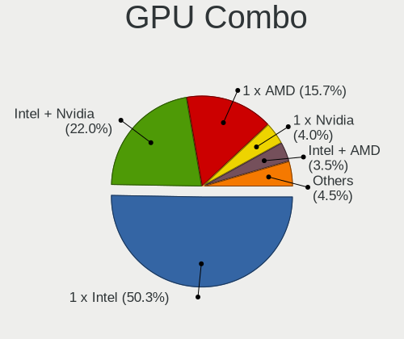
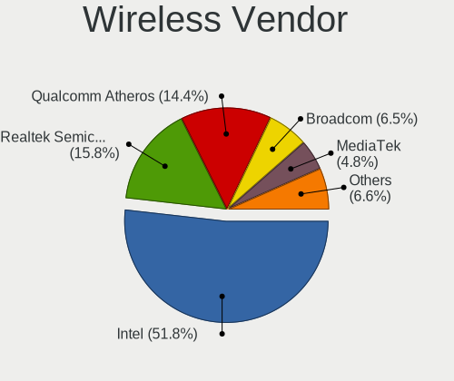

Ubuntu 22.04 - Tested Hardware & Statistics (Notebooks)
-------------------------------------------------------

A project to collect tested hardware configurations for Ubuntu 22.04.

Anyone can contribute to this report by the [hw-probe](https://github.com/linuxhw/hw-probe) tool:

    sudo -E hw-probe -all -upload

Please contribute! Especially if your hardware is rare.

Contents
--------

* [ Test Cases ](#test-cases)

* [ System ](#system)
  - [ Kernel                   ](#kernel)
  - [ Kernel Family            ](#kernel-family)
  - [ Kernel Major Ver.        ](#kernel-major-ver)
  - [ Arch                     ](#arch)
  - [ DE                       ](#de)
  - [ Display Server           ](#display-server)
  - [ Display Manager          ](#display-manager)
  - [ OS Lang                  ](#os-lang)
  - [ Boot Mode                ](#boot-mode)
  - [ Filesystem               ](#filesystem)
  - [ Part. scheme             ](#part-scheme)
  - [ Dual Boot with Linux/BSD ](#dual-boot-with-linuxbsd)
  - [ Dual Boot (Win)          ](#dual-boot-win)

* [ Board ](#board)
  - [ Vendor                   ](#vendor)
  - [ Model                    ](#model)
  - [ Model Family             ](#model-family)
  - [ MFG Year                 ](#mfg-year)
  - [ Form Factor              ](#form-factor)
  - [ Secure Boot              ](#secure-boot)
  - [ Coreboot                 ](#coreboot)
  - [ RAM Size                 ](#ram-size)
  - [ RAM Used                 ](#ram-used)
  - [ Total Drives             ](#total-drives)
  - [ Has CD-ROM               ](#has-cd-rom)
  - [ Has Ethernet             ](#has-ethernet)
  - [ Has WiFi                 ](#has-wifi)
  - [ Has Bluetooth            ](#has-bluetooth)

* [ Location ](#location)
  - [ Country                  ](#country)
  - [ City                     ](#city)

* [ Drives ](#drives)
  - [ Drive Vendor             ](#drive-vendor)
  - [ Drive Model              ](#drive-model)
  - [ HDD Vendor               ](#hdd-vendor)
  - [ SSD Vendor               ](#ssd-vendor)
  - [ Drive Kind               ](#drive-kind)
  - [ Drive Connector          ](#drive-connector)
  - [ Drive Size               ](#drive-size)
  - [ Space Total              ](#space-total)
  - [ Space Used               ](#space-used)
  - [ Malfunc. Drives          ](#malfunc-drives)
  - [ Malfunc. Drive Vendor    ](#malfunc-drive-vendor)
  - [ Malfunc. HDD Vendor      ](#malfunc-hdd-vendor)
  - [ Malfunc. Drive Kind      ](#malfunc-drive-kind)
  - [ Failed Drives            ](#failed-drives)
  - [ Failed Drive Vendor      ](#failed-drive-vendor)
  - [ Drive Status             ](#drive-status)

* [ Storage controller ](#storage-controller)
  - [ Storage Vendor           ](#storage-vendor)
  - [ Storage Model            ](#storage-model)
  - [ Storage Kind             ](#storage-kind)

* [ Processor ](#processor)
  - [ CPU Vendor               ](#cpu-vendor)
  - [ CPU Model                ](#cpu-model)
  - [ CPU Model Family         ](#cpu-model-family)
  - [ CPU Cores                ](#cpu-cores)
  - [ CPU Sockets              ](#cpu-sockets)
  - [ CPU Threads              ](#cpu-threads)
  - [ CPU Op-Modes             ](#cpu-op-modes)
  - [ CPU Microcode            ](#cpu-microcode)
  - [ CPU Microarch            ](#cpu-microarch)

* [ Graphics ](#graphics)
  - [ GPU Vendor               ](#gpu-vendor)
  - [ GPU Model                ](#gpu-model)
  - [ GPU Combo                ](#gpu-combo)
  - [ GPU Driver               ](#gpu-driver)
  - [ GPU Memory               ](#gpu-memory)

* [ Monitor ](#monitor)
  - [ Monitor Vendor           ](#monitor-vendor)
  - [ Monitor Model            ](#monitor-model)
  - [ Monitor Resolution       ](#monitor-resolution)
  - [ Monitor Diagonal         ](#monitor-diagonal)
  - [ Monitor Width            ](#monitor-width)
  - [ Aspect Ratio             ](#aspect-ratio)
  - [ Monitor Area             ](#monitor-area)
  - [ Pixel Density            ](#pixel-density)
  - [ Multiple Monitors        ](#multiple-monitors)

* [ Network ](#network)
  - [ Net Controller Vendor    ](#net-controller-vendor)
  - [ Net Controller Model     ](#net-controller-model)
  - [ Wireless Vendor          ](#wireless-vendor)
  - [ Wireless Model           ](#wireless-model)
  - [ Ethernet Vendor          ](#ethernet-vendor)
  - [ Ethernet Model           ](#ethernet-model)
  - [ Net Controller Kind      ](#net-controller-kind)
  - [ Used Controller          ](#used-controller)
  - [ NICs                     ](#nics)
  - [ IPv6                     ](#ipv6)

* [ Bluetooth ](#bluetooth)
  - [ Bluetooth Vendor         ](#bluetooth-vendor)
  - [ Bluetooth Model          ](#bluetooth-model)

* [ Sound ](#sound)
  - [ Sound Vendor             ](#sound-vendor)
  - [ Sound Model              ](#sound-model)

* [ Memory ](#memory)
  - [ Memory Vendor            ](#memory-vendor)
  - [ Memory Model             ](#memory-model)
  - [ Memory Kind              ](#memory-kind)
  - [ Memory Form Factor       ](#memory-form-factor)
  - [ Memory Size              ](#memory-size)
  - [ Memory Speed             ](#memory-speed)

* [ Printers & scanners ](#printers--scanners)
  - [ Printer Vendor           ](#printer-vendor)
  - [ Printer Model            ](#printer-model)
  - [ Scanner Vendor           ](#scanner-vendor)
  - [ Scanner Model            ](#scanner-model)

* [ Camera ](#camera)
  - [ Camera Vendor            ](#camera-vendor)
  - [ Camera Model             ](#camera-model)

* [ Security ](#security)
  - [ Fingerprint Vendor       ](#fingerprint-vendor)
  - [ Fingerprint Model        ](#fingerprint-model)
  - [ Chipcard Vendor          ](#chipcard-vendor)
  - [ Chipcard Model           ](#chipcard-model)

* [ Unsupported ](#unsupported)
  - [ Unsupported Devices      ](#unsupported-devices)
  - [ Unsupported Device Types ](#unsupported-device-types)

Test Cases
----------

Total: 9603

| Vendor        | Model                       | Probe                                                      | Date         |
|---------------|-----------------------------|------------------------------------------------------------|--------------|
| HP            | EliteBook 840 G5            | [279ac4ed92](https://linux-hardware.org/?probe=279ac4ed92) | Nov 06, 2023 |
| TUXEDO        | Pulse 15 Gen2               | [10f2785958](https://linux-hardware.org/?probe=10f2785958) | Nov 06, 2023 |
| Lenovo        | ThinkPad T440s 20ARS0HB0... | [95376bfed1](https://linux-hardware.org/?probe=95376bfed1) | Nov 06, 2023 |
| Lenovo        | ThinkPad T460s 20FAS2430... | [658d6f150e](https://linux-hardware.org/?probe=658d6f150e) | Nov 05, 2023 |
| Dell          | Latitude 5590               | [913308d97b](https://linux-hardware.org/?probe=913308d97b) | Nov 05, 2023 |
| Toshiba       | PORTEGE Z10t-A              | [600445b726](https://linux-hardware.org/?probe=600445b726) | Nov 05, 2023 |
| Lenovo        | IdeaPad 1 11IGL05 81VT      | [27923cd021](https://linux-hardware.org/?probe=27923cd021) | Nov 05, 2023 |
| ASUSTek       | K401UB                      | [3bc894aa34](https://linux-hardware.org/?probe=3bc894aa34) | Nov 05, 2023 |
| Dell          | Latitude E6400              | [c5f0762ae5](https://linux-hardware.org/?probe=c5f0762ae5) | Nov 05, 2023 |
| HP            | ProBook 4740s               | [2efc1092dd](https://linux-hardware.org/?probe=2efc1092dd) | Nov 05, 2023 |
| HP            | ProBook 4740s               | [0351f35099](https://linux-hardware.org/?probe=0351f35099) | Nov 05, 2023 |
| Acer          | Aspire ES1-311              | [d06185f74c](https://linux-hardware.org/?probe=d06185f74c) | Nov 05, 2023 |
| HP            | 250 G5 Notebook PC          | [7b281cb925](https://linux-hardware.org/?probe=7b281cb925) | Nov 05, 2023 |
| Lenovo        | ThinkPad T470s W10DG 20J... | [ae9fcece31](https://linux-hardware.org/?probe=ae9fcece31) | Nov 05, 2023 |
| ASUSTek       | K55VJ                       | [47851a05e9](https://linux-hardware.org/?probe=47851a05e9) | Nov 05, 2023 |
| MSI           | Alpha 17 C7VG               | [fd9594de89](https://linux-hardware.org/?probe=fd9594de89) | Nov 05, 2023 |
| Google        | Pyro                        | [2fd8f11a53](https://linux-hardware.org/?probe=2fd8f11a53) | Nov 05, 2023 |
| ASUSTek       | X756UVK                     | [3ba2cc1e0c](https://linux-hardware.org/?probe=3ba2cc1e0c) | Nov 05, 2023 |
| Apple         | MacBookAir7,1               | [23e52fc4f5](https://linux-hardware.org/?probe=23e52fc4f5) | Nov 05, 2023 |
| Lenovo        | ThinkPad E580 20KS003QUS    | [6bccd355f7](https://linux-hardware.org/?probe=6bccd355f7) | Nov 05, 2023 |
| Medion        | E6417 MD99252               | [8660ae1c16](https://linux-hardware.org/?probe=8660ae1c16) | Nov 05, 2023 |
| MSI           | Alpha 17 C7VG               | [a5a8cf5c09](https://linux-hardware.org/?probe=a5a8cf5c09) | Nov 05, 2023 |
| MSI           | Alpha 17 C7VG               | [74099b3a6e](https://linux-hardware.org/?probe=74099b3a6e) | Nov 05, 2023 |
| MSI           | Alpha 17 C7VG               | [bdad71bf99](https://linux-hardware.org/?probe=bdad71bf99) | Nov 05, 2023 |
| HP            | Pavilion Laptop 15-eh0xx... | [7a8597dd50](https://linux-hardware.org/?probe=7a8597dd50) | Nov 05, 2023 |
| Dell          | Inspiron 14 5401            | [124c666940](https://linux-hardware.org/?probe=124c666940) | Nov 05, 2023 |
| Dell          | Inspiron 14 5401            | [9eeeda059e](https://linux-hardware.org/?probe=9eeeda059e) | Nov 05, 2023 |
| Acer          | Aspire A517-51G             | [11f85eb258](https://linux-hardware.org/?probe=11f85eb258) | Nov 04, 2023 |
| Acer          | Aspire 7750G                | [ddf88ff37c](https://linux-hardware.org/?probe=ddf88ff37c) | Nov 04, 2023 |
| Lenovo        | ThinkPad E15 20RD0011UK     | [dc13d6012b](https://linux-hardware.org/?probe=dc13d6012b) | Nov 04, 2023 |
| ASUSTek       | ROG Strix G733QR_G733QR     | [5b7dc65a39](https://linux-hardware.org/?probe=5b7dc65a39) | Nov 04, 2023 |
| Acer          | TravelMate B118-M           | [051346666e](https://linux-hardware.org/?probe=051346666e) | Nov 04, 2023 |
| Acer          | TravelMate P215-54          | [5688b7940d](https://linux-hardware.org/?probe=5688b7940d) | Nov 04, 2023 |
| Lenovo        | ThinkPad T550 20CJS07P01    | [52157a4ee8](https://linux-hardware.org/?probe=52157a4ee8) | Nov 04, 2023 |
| Acer          | TravelMate P215-54          | [f051dc617c](https://linux-hardware.org/?probe=f051dc617c) | Nov 04, 2023 |
| ASUSTek       | VivoBook_ASUSLaptop X415... | [aba7da7a37](https://linux-hardware.org/?probe=aba7da7a37) | Nov 04, 2023 |
| HP            | 15                          | [5d5fb36764](https://linux-hardware.org/?probe=5d5fb36764) | Nov 04, 2023 |
| Dell          | Latitude E6420              | [6bd73f2b0e](https://linux-hardware.org/?probe=6bd73f2b0e) | Nov 04, 2023 |
| HP            | EliteBook 840 G6            | [d4b22ac16a](https://linux-hardware.org/?probe=d4b22ac16a) | Nov 04, 2023 |
| Lenovo        | ThinkPad T61 6460D6G        | [1d51aba71e](https://linux-hardware.org/?probe=1d51aba71e) | Nov 04, 2023 |
| HP            | ZBook Studio G3             | [eb90a23afa](https://linux-hardware.org/?probe=eb90a23afa) | Nov 04, 2023 |
| Lenovo        | ThinkPad T61 6460D6G        | [585906fa27](https://linux-hardware.org/?probe=585906fa27) | Nov 04, 2023 |
| American M... | A6                          | [4ff43d7d31](https://linux-hardware.org/?probe=4ff43d7d31) | Nov 04, 2023 |
| Acer          | Aspire A314-23P             | [1e3cdf0bf2](https://linux-hardware.org/?probe=1e3cdf0bf2) | Nov 04, 2023 |
| Dell          | XPS 15 7590                 | [8685e384af](https://linux-hardware.org/?probe=8685e384af) | Nov 04, 2023 |
| Dell          | Inspiron N4010              | [f8aed4abab](https://linux-hardware.org/?probe=f8aed4abab) | Nov 03, 2023 |
| ASUSTek       | ROG Flow X13 GV301QH_GV3... | [de4c3bfe46](https://linux-hardware.org/?probe=de4c3bfe46) | Nov 03, 2023 |
| Lenovo        | ThinkPad T460p 20FXS0960... | [10407542ab](https://linux-hardware.org/?probe=10407542ab) | Nov 03, 2023 |
| Lenovo        | B560 433028U                | [37a6693c3d](https://linux-hardware.org/?probe=37a6693c3d) | Nov 03, 2023 |
| HUAWEI        | MRGFG-XX                    | [5117a849b3](https://linux-hardware.org/?probe=5117a849b3) | Nov 03, 2023 |
| HUAWEI        | HLYL-WXX9                   | [993a2b9f3e](https://linux-hardware.org/?probe=993a2b9f3e) | Nov 03, 2023 |
| Medion        | ERAZER X7855 MD60892        | [b34c69b29d](https://linux-hardware.org/?probe=b34c69b29d) | Nov 03, 2023 |
| Dell          | Latitude E5570              | [a4617a2ea3](https://linux-hardware.org/?probe=a4617a2ea3) | Nov 03, 2023 |
| Dell          | Precision 5750              | [00e8468779](https://linux-hardware.org/?probe=00e8468779) | Nov 03, 2023 |
| Dell          | Latitude E5570              | [82d66aaaf1](https://linux-hardware.org/?probe=82d66aaaf1) | Nov 03, 2023 |
| Lenovo        | ThinkPad 11e 5th Gen 20L... | [fca8401d97](https://linux-hardware.org/?probe=fca8401d97) | Nov 03, 2023 |
| HP            | EliteBook 845 14 inch G9... | [5ff77430fa](https://linux-hardware.org/?probe=5ff77430fa) | Nov 03, 2023 |
| HP            | ProBook 445 G7              | [400a0e689f](https://linux-hardware.org/?probe=400a0e689f) | Nov 03, 2023 |
| HP            | ProBook 4330s               | [046f30b044](https://linux-hardware.org/?probe=046f30b044) | Nov 03, 2023 |
| Dell          | Inspiron 15-7568            | [70b564a0db](https://linux-hardware.org/?probe=70b564a0db) | Nov 03, 2023 |
| Lenovo        | ThinkPad E14 Gen 2 20TB0... | [6987861086](https://linux-hardware.org/?probe=6987861086) | Nov 03, 2023 |
| HP            | ZBook Power G7 Mobile Wo... | [044aa1f9b5](https://linux-hardware.org/?probe=044aa1f9b5) | Nov 03, 2023 |
| Apple         | MacBookAir7,1               | [50cb167f37](https://linux-hardware.org/?probe=50cb167f37) | Nov 03, 2023 |
| ASUSTek       | VivoBook_ASUSLaptop M150... | [4b04b9ef25](https://linux-hardware.org/?probe=4b04b9ef25) | Nov 02, 2023 |
| HP            | ProBook 4330s               | [0d3ba579b4](https://linux-hardware.org/?probe=0d3ba579b4) | Nov 02, 2023 |
| Lenovo        | IdeaPad 3 15ITL6 82H8       | [b724ede64d](https://linux-hardware.org/?probe=b724ede64d) | Nov 02, 2023 |
| Lenovo        | ThinkPad L540 20AUS0YU00    | [16b302d74a](https://linux-hardware.org/?probe=16b302d74a) | Nov 02, 2023 |
| Dell          | Latitude E6530              | [878bc8ec66](https://linux-hardware.org/?probe=878bc8ec66) | Nov 02, 2023 |
| HP            | EliteBook 840 G5            | [a42017f05d](https://linux-hardware.org/?probe=a42017f05d) | Nov 02, 2023 |
| HP            | Laptop 15-bw0xx             | [589f0a0dfb](https://linux-hardware.org/?probe=589f0a0dfb) | Nov 02, 2023 |
| ASUSTek       | VivoBook_ASUSLaptop M140... | [f1b74562ae](https://linux-hardware.org/?probe=f1b74562ae) | Nov 02, 2023 |
| HP            | 250 G6 Notebook PC          | [7184f1aadf](https://linux-hardware.org/?probe=7184f1aadf) | Nov 02, 2023 |
| HP            | Laptop 15-dw3xxx            | [d371b7299d](https://linux-hardware.org/?probe=d371b7299d) | Nov 02, 2023 |
| Lenovo        | Legion 5 Pro 16ACH6H 82J... | [2d1120d99a](https://linux-hardware.org/?probe=2d1120d99a) | Nov 02, 2023 |
| Lenovo        | ThinkPad E14 20RAS13J00     | [ebfdc934b7](https://linux-hardware.org/?probe=ebfdc934b7) | Nov 02, 2023 |
| Dell          | XPS 13 9300                 | [9690e7a65f](https://linux-hardware.org/?probe=9690e7a65f) | Nov 02, 2023 |
| Lenovo        | ThinkPad X250 20CLS45J00    | [c03ae6e6b0](https://linux-hardware.org/?probe=c03ae6e6b0) | Nov 02, 2023 |
| Lenovo        | ThinkPad T15 Gen 2i 20W4... | [37dc32cd03](https://linux-hardware.org/?probe=37dc32cd03) | Nov 02, 2023 |
| ASUSTek       | ZenBook UX325EA_UX325EA     | [027a0a96da](https://linux-hardware.org/?probe=027a0a96da) | Nov 02, 2023 |
| ASUSTek       | X555LAB                     | [b9532c1f86](https://linux-hardware.org/?probe=b9532c1f86) | Nov 02, 2023 |
| Google        | Nightfury                   | [ccee94a0ec](https://linux-hardware.org/?probe=ccee94a0ec) | Nov 02, 2023 |
| ASUSTek       | ASUS TUF Gaming A15 FA50... | [0c83d1e765](https://linux-hardware.org/?probe=0c83d1e765) | Nov 02, 2023 |
| Acer          | One S1002                   | [a00e6d78a6](https://linux-hardware.org/?probe=a00e6d78a6) | Nov 02, 2023 |
| Apple         | MacBookPro16,1              | [3c2964c23f](https://linux-hardware.org/?probe=3c2964c23f) | Nov 02, 2023 |
| Lenovo        | IdeaPad 320-15IKB 81BG      | [99992393e4](https://linux-hardware.org/?probe=99992393e4) | Nov 01, 2023 |
| Novatech      | C141EK5-CI5TX               | [ee65041e06](https://linux-hardware.org/?probe=ee65041e06) | Nov 01, 2023 |
| HP            | Pavilion Gaming Laptop 1... | [54516fba78](https://linux-hardware.org/?probe=54516fba78) | Nov 01, 2023 |
| HP            | Notebook                    | [3e766ed947](https://linux-hardware.org/?probe=3e766ed947) | Nov 01, 2023 |
| Sony          | VGN-CS21S_R                 | [a7eb8de9f5](https://linux-hardware.org/?probe=a7eb8de9f5) | Nov 01, 2023 |
| HP            | ZBook 15u G6                | [b74e35da2b](https://linux-hardware.org/?probe=b74e35da2b) | Nov 01, 2023 |
| ASUSTek       | VivoBook_ASUSLaptop M650... | [0c8b2cd660](https://linux-hardware.org/?probe=0c8b2cd660) | Nov 01, 2023 |
| HP            | Notebook                    | [47c0e83dcc](https://linux-hardware.org/?probe=47c0e83dcc) | Nov 01, 2023 |
| Apple         | MacBookPro8,1               | [f1387b3bd9](https://linux-hardware.org/?probe=f1387b3bd9) | Nov 01, 2023 |
| Lenovo        | IdeaPad S340-15API 81NC     | [af59fd3af9](https://linux-hardware.org/?probe=af59fd3af9) | Nov 01, 2023 |
| Google        | Akemi                       | [75082d5cf9](https://linux-hardware.org/?probe=75082d5cf9) | Nov 01, 2023 |
| ASUSTek       | ASUS EXPERTBOOK B9450FA_... | [ed95443390](https://linux-hardware.org/?probe=ed95443390) | Nov 01, 2023 |
| ASUSTek       | G53JW                       | [fcc18f3b68](https://linux-hardware.org/?probe=fcc18f3b68) | Nov 01, 2023 |
| VALE          | Notebook Classic C140       | [5be309c18b](https://linux-hardware.org/?probe=5be309c18b) | Nov 01, 2023 |
| Samsung       | 960XFH                      | [6076e144ac](https://linux-hardware.org/?probe=6076e144ac) | Nov 01, 2023 |
| HP            | EliteBook 8470w             | [d4b6365e3f](https://linux-hardware.org/?probe=d4b6365e3f) | Nov 01, 2023 |
| HP            | ProBook 4530s               | [eac8e65d32](https://linux-hardware.org/?probe=eac8e65d32) | Nov 01, 2023 |
| Dell          | Latitude 5480               | [567a2774f8](https://linux-hardware.org/?probe=567a2774f8) | Nov 01, 2023 |
| Lenovo        | ThinkPad T14s Gen 3 21BR... | [9422d2efb5](https://linux-hardware.org/?probe=9422d2efb5) | Nov 01, 2023 |
| Lenovo        | ThinkPad P16s Gen 1 21BT... | [5d58dd522f](https://linux-hardware.org/?probe=5d58dd522f) | Nov 01, 2023 |
| Dell          | Latitude 5421               | [670d635ddc](https://linux-hardware.org/?probe=670d635ddc) | Nov 01, 2023 |
| Teclast       | F6 Pro                      | [27dd740e4c](https://linux-hardware.org/?probe=27dd740e4c) | Nov 01, 2023 |
| Microtech     | CoreBookLite                | [1833fd5f0c](https://linux-hardware.org/?probe=1833fd5f0c) | Nov 01, 2023 |
| HP            | Laptop 15-dw3xxx            | [3479b99099](https://linux-hardware.org/?probe=3479b99099) | Nov 01, 2023 |
| Medion        | E6417 MD99252               | [56fcf238a1](https://linux-hardware.org/?probe=56fcf238a1) | Nov 01, 2023 |
| ASUSTek       | ROG Flow X13 GV301QH_GV3... | [6efacfa5c8](https://linux-hardware.org/?probe=6efacfa5c8) | Nov 01, 2023 |
| Dell          | G15 5510                    | [60ea93226d](https://linux-hardware.org/?probe=60ea93226d) | Nov 01, 2023 |
| Dell          | Inspiron 5502               | [a1d2f7988e](https://linux-hardware.org/?probe=a1d2f7988e) | Nov 01, 2023 |
| ASUSTek       | VivoBook_ASUSLaptop X512... | [3d00034c4e](https://linux-hardware.org/?probe=3d00034c4e) | Nov 01, 2023 |
| HP            | 15                          | [9bafa55125](https://linux-hardware.org/?probe=9bafa55125) | Nov 01, 2023 |
| Apple         | MacBook9,1                  | [44cec57d44](https://linux-hardware.org/?probe=44cec57d44) | Nov 01, 2023 |
| HP            | Pavilion Notebook           | [c0617fe23d](https://linux-hardware.org/?probe=c0617fe23d) | Nov 01, 2023 |
| Apple         | MacBookAir5,1               | [d7b563a839](https://linux-hardware.org/?probe=d7b563a839) | Oct 31, 2023 |
| Lenovo        | Unknown                     | [70268d88a4](https://linux-hardware.org/?probe=70268d88a4) | Oct 31, 2023 |
| ASUSTek       | VivoBook_ASUSLaptop X430... | [2e35f866e3](https://linux-hardware.org/?probe=2e35f866e3) | Oct 31, 2023 |
| HP            | ProBook 4530s               | [44160e2dc0](https://linux-hardware.org/?probe=44160e2dc0) | Oct 31, 2023 |
| ASUSTek       | G53JW                       | [6795430efa](https://linux-hardware.org/?probe=6795430efa) | Oct 31, 2023 |
| Lenovo        | ThinkPad T490 20N3000FRT    | [14710d3709](https://linux-hardware.org/?probe=14710d3709) | Oct 31, 2023 |
| Fujitsu       | LIFEBOOK U7510              | [e25f9a6add](https://linux-hardware.org/?probe=e25f9a6add) | Oct 31, 2023 |
| Lenovo        | ThinkPad T480 20L6SH3L2D    | [db3f0ac717](https://linux-hardware.org/?probe=db3f0ac717) | Oct 31, 2023 |
| Dell          | Precision 5570              | [fb83199260](https://linux-hardware.org/?probe=fb83199260) | Oct 31, 2023 |
| Lenovo        | ThinkPad E14 20RAS13J00     | [91a0aacae9](https://linux-hardware.org/?probe=91a0aacae9) | Oct 31, 2023 |
| HP            | Laptop 15-db0xxx            | [cf7f0c142e](https://linux-hardware.org/?probe=cf7f0c142e) | Oct 31, 2023 |
| HP            | EliteBook 820 G3            | [e131dccf11](https://linux-hardware.org/?probe=e131dccf11) | Oct 31, 2023 |
| Lenovo        | ThinkBook 15p Gen 2 21B1    | [a0da22e928](https://linux-hardware.org/?probe=a0da22e928) | Oct 31, 2023 |
| Alienware     | 13 R3                       | [726415f251](https://linux-hardware.org/?probe=726415f251) | Oct 31, 2023 |
| Dell          | XPS 15 9530                 | [683545565a](https://linux-hardware.org/?probe=683545565a) | Oct 31, 2023 |
| Lenovo        | V145-15AST 81MT             | [6bd7131347](https://linux-hardware.org/?probe=6bd7131347) | Oct 31, 2023 |
| Acer          | One 14 Z8-415               | [e3b7fce5f3](https://linux-hardware.org/?probe=e3b7fce5f3) | Oct 31, 2023 |
| Dell          | Inspiron 7580               | [fc223b91ed](https://linux-hardware.org/?probe=fc223b91ed) | Oct 31, 2023 |
| Lenovo        | V15-ADA 82C7                | [e8ea93da6d](https://linux-hardware.org/?probe=e8ea93da6d) | Oct 31, 2023 |
| Dell          | Inspiron 5590               | [7634c564d0](https://linux-hardware.org/?probe=7634c564d0) | Oct 31, 2023 |
| Dell          | Precision M6800             | [72c51649f1](https://linux-hardware.org/?probe=72c51649f1) | Oct 31, 2023 |
| Dell          | Latitude E5520              | [445903fc05](https://linux-hardware.org/?probe=445903fc05) | Oct 31, 2023 |
| Lenovo        | Z50-70 20354                | [8d764a9632](https://linux-hardware.org/?probe=8d764a9632) | Oct 31, 2023 |
| Lenovo        | ThinkPad T16 Gen 1 21CHC... | [924f7f81ce](https://linux-hardware.org/?probe=924f7f81ce) | Oct 30, 2023 |
| Dell          | Inspiron 5590               | [d339ee4dbc](https://linux-hardware.org/?probe=d339ee4dbc) | Oct 30, 2023 |
| OFF GLOBAL    | Nokia PureBook Pro 17       | [5bc799ab5a](https://linux-hardware.org/?probe=5bc799ab5a) | Oct 30, 2023 |
| HP            | Pavilion Gaming Laptop 1... | [43772c58a4](https://linux-hardware.org/?probe=43772c58a4) | Oct 30, 2023 |
| Dell          | Inspiron 5559               | [5a8a67bb6b](https://linux-hardware.org/?probe=5a8a67bb6b) | Oct 30, 2023 |
| Apple         | MacBookAir6,2               | [b1a709477b](https://linux-hardware.org/?probe=b1a709477b) | Oct 30, 2023 |
| Dell          | Precision 3541              | [6857b35adc](https://linux-hardware.org/?probe=6857b35adc) | Oct 30, 2023 |
| HP            | ProBook 450 G8 Notebook ... | [09b312b58c](https://linux-hardware.org/?probe=09b312b58c) | Oct 30, 2023 |
| MSI           | GF75 Thin 10UEK             | [c9cb087088](https://linux-hardware.org/?probe=c9cb087088) | Oct 30, 2023 |
| HP            | EliteBook 830 G8 Noteboo... | [0e7bb14862](https://linux-hardware.org/?probe=0e7bb14862) | Oct 30, 2023 |
| HP            | ProBook 640 G1              | [cf78ef09d2](https://linux-hardware.org/?probe=cf78ef09d2) | Oct 30, 2023 |
| Apple         | MacBookAir6,2               | [afd23e164c](https://linux-hardware.org/?probe=afd23e164c) | Oct 30, 2023 |
| ASUSTek       | VivoBook_ASUSLaptop X521... | [6e619afdba](https://linux-hardware.org/?probe=6e619afdba) | Oct 30, 2023 |
| ASUSTek       | VivoBook 15_ASUS Laptop ... | [ed3aee0fd5](https://linux-hardware.org/?probe=ed3aee0fd5) | Oct 30, 2023 |
| MSI           | GF75 Thin 10UEK             | [a58fbe3576](https://linux-hardware.org/?probe=a58fbe3576) | Oct 30, 2023 |
| ASUSTek       | N53SV                       | [8d853d0cb4](https://linux-hardware.org/?probe=8d853d0cb4) | Oct 30, 2023 |
| ASUSTek       | Zenbook UM3402YA_UM3402Y... | [794edd04ea](https://linux-hardware.org/?probe=794edd04ea) | Oct 30, 2023 |
| Lenovo        | IdeaPad Gaming 3 15ARH05... | [ecab2bb9fe](https://linux-hardware.org/?probe=ecab2bb9fe) | Oct 30, 2023 |
| Dell          | XPS 15 9510                 | [ab707308db](https://linux-hardware.org/?probe=ab707308db) | Oct 30, 2023 |
| Toshiba       | Satellite A300              | [e4c2011e59](https://linux-hardware.org/?probe=e4c2011e59) | Oct 30, 2023 |
| LG Electro... | 14Z980-G.BH51P1             | [879ba00b91](https://linux-hardware.org/?probe=879ba00b91) | Oct 30, 2023 |
| Chuwi         | CoreBook                    | [71b0d03991](https://linux-hardware.org/?probe=71b0d03991) | Oct 30, 2023 |
| Lenovo        | IdeaPad 3 14ALC6 82KT       | [17f4f01635](https://linux-hardware.org/?probe=17f4f01635) | Oct 30, 2023 |
| HP            | G60                         | [ad911271b1](https://linux-hardware.org/?probe=ad911271b1) | Oct 30, 2023 |
| Apple         | MacBookPro14,1              | [12e8c83970](https://linux-hardware.org/?probe=12e8c83970) | Oct 30, 2023 |
| HUAWEI        | KLVL-WXXW                   | [672304cacd](https://linux-hardware.org/?probe=672304cacd) | Oct 29, 2023 |
| Dell          | Precision 3550              | [f07af59705](https://linux-hardware.org/?probe=f07af59705) | Oct 29, 2023 |
| Acer          | Aspire 4820TG               | [a72ac510df](https://linux-hardware.org/?probe=a72ac510df) | Oct 29, 2023 |
| HP            | Pavilion 17                 | [2ef396fb9c](https://linux-hardware.org/?probe=2ef396fb9c) | Oct 29, 2023 |
| HP            | G62                         | [bd714e9671](https://linux-hardware.org/?probe=bd714e9671) | Oct 29, 2023 |
| ASUSTek       | VivoBook 12_ASUS Laptop ... | [7bdcd09429](https://linux-hardware.org/?probe=7bdcd09429) | Oct 29, 2023 |
| Allview       | Allbook H                   | [e56046d262](https://linux-hardware.org/?probe=e56046d262) | Oct 29, 2023 |
| Allview       | Allbook H                   | [3f2fc29d49](https://linux-hardware.org/?probe=3f2fc29d49) | Oct 29, 2023 |
| Lenovo        | IdeaPad Slim 3 14AMN8 82... | [3fe09c27c2](https://linux-hardware.org/?probe=3fe09c27c2) | Oct 29, 2023 |
| Dell          | Vostro 15 3515              | [3d2fe89bc1](https://linux-hardware.org/?probe=3d2fe89bc1) | Oct 29, 2023 |
| Panasonic     | CF-191HA23DE                | [3ccc424983](https://linux-hardware.org/?probe=3ccc424983) | Oct 29, 2023 |
| HP            | 2000                        | [440350f9df](https://linux-hardware.org/?probe=440350f9df) | Oct 29, 2023 |
| Samsung       | 905S3G/906S3G/915S3G/930... | [bc2ed6322b](https://linux-hardware.org/?probe=bc2ed6322b) | Oct 29, 2023 |
| ASUSTek       | G56JR                       | [8e871997f7](https://linux-hardware.org/?probe=8e871997f7) | Oct 29, 2023 |
| Lenovo        | G50-70 20351                | [5d83a07987](https://linux-hardware.org/?probe=5d83a07987) | Oct 29, 2023 |
| ASUSTek       | G56JR                       | [f8e77bd53a](https://linux-hardware.org/?probe=f8e77bd53a) | Oct 28, 2023 |
| ASUSTek       | ZenBook UX431FA_UX431FA     | [8f56c1076b](https://linux-hardware.org/?probe=8f56c1076b) | Oct 28, 2023 |
| Lenovo        | ThinkPad T440s 20ARS32P0... | [58234989c1](https://linux-hardware.org/?probe=58234989c1) | Oct 28, 2023 |
| ASUSTek       | ASUS TUF Gaming F15 FX50... | [22380583c4](https://linux-hardware.org/?probe=22380583c4) | Oct 28, 2023 |
| Lenovo        | G770 20089                  | [8428ba05f5](https://linux-hardware.org/?probe=8428ba05f5) | Oct 28, 2023 |
| ASUSTek       | ASUS TUF Gaming F15 FX50... | [b83a355a39](https://linux-hardware.org/?probe=b83a355a39) | Oct 28, 2023 |
| HP            | 15                          | [cda635d432](https://linux-hardware.org/?probe=cda635d432) | Oct 28, 2023 |
| Acer          | Nitro AN515-58              | [9a879f3fbe](https://linux-hardware.org/?probe=9a879f3fbe) | Oct 28, 2023 |
| HUAWEI        | NBLB-WAX9N                  | [67a82dac1b](https://linux-hardware.org/?probe=67a82dac1b) | Oct 28, 2023 |
| Acer          | Extensa 215-55              | [d1d57049ab](https://linux-hardware.org/?probe=d1d57049ab) | Oct 28, 2023 |
| MSI           | Modern 15 A5M               | [903418110a](https://linux-hardware.org/?probe=903418110a) | Oct 28, 2023 |
| Lenovo        | ThinkPad P14s Gen 1 20Y1... | [42a94f2f97](https://linux-hardware.org/?probe=42a94f2f97) | Oct 28, 2023 |
| HP            | Pavilion dv6                | [cb8ef15ece](https://linux-hardware.org/?probe=cb8ef15ece) | Oct 28, 2023 |
| HP            | Pavilion dv6                | [88a3365d2c](https://linux-hardware.org/?probe=88a3365d2c) | Oct 28, 2023 |
| Lenovo        | IdeaPad Slim 3 14AMN8 82... | [0277411276](https://linux-hardware.org/?probe=0277411276) | Oct 28, 2023 |
| Google        | Taniks                      | [c864f19e03](https://linux-hardware.org/?probe=c864f19e03) | Oct 28, 2023 |
| SLIMBOOK      | PROX14-10                   | [4ffcd3ced8](https://linux-hardware.org/?probe=4ffcd3ced8) | Oct 28, 2023 |
| HP            | 6360t                       | [d0f94e770b](https://linux-hardware.org/?probe=d0f94e770b) | Oct 28, 2023 |
| Lenovo        | IdeaPad S340-15IIL 81VW     | [4468cb093d](https://linux-hardware.org/?probe=4468cb093d) | Oct 28, 2023 |
| Lenovo        | IdeaPad S340-15IIL 81VW     | [c0aef363fa](https://linux-hardware.org/?probe=c0aef363fa) | Oct 28, 2023 |
| Clevo         | W240EL/W250ELQ/W270ELQ      | [cb44c39574](https://linux-hardware.org/?probe=cb44c39574) | Oct 27, 2023 |
| HP            | Laptop 15s-fq3xxx           | [b718818efa](https://linux-hardware.org/?probe=b718818efa) | Oct 27, 2023 |
| ASUSTek       | ASUS TUF Gaming A15 FA50... | [9aa7655975](https://linux-hardware.org/?probe=9aa7655975) | Oct 27, 2023 |
| Dell          | Latitude 5480               | [2d87cfcbb4](https://linux-hardware.org/?probe=2d87cfcbb4) | Oct 27, 2023 |
| Lenovo        | IdeaPad 3 17ITL6 82H9       | [20d212f3d4](https://linux-hardware.org/?probe=20d212f3d4) | Oct 27, 2023 |
| Lenovo        | ThinkPad E15 Gen 2 20TD0... | [181d68d988](https://linux-hardware.org/?probe=181d68d988) | Oct 27, 2023 |
| Apple         | MacBookPro7,1               | [fe15ca03f2](https://linux-hardware.org/?probe=fe15ca03f2) | Oct 27, 2023 |
| HP            | Laptop 15s-fq5xxx           | [72d2f9d210](https://linux-hardware.org/?probe=72d2f9d210) | Oct 27, 2023 |
| Notebook      | V1x0PNPx                    | [f1e27c662a](https://linux-hardware.org/?probe=f1e27c662a) | Oct 27, 2023 |
| Lenovo        | ThinkBook 14-IIL 20SL       | [a3355c6898](https://linux-hardware.org/?probe=a3355c6898) | Oct 27, 2023 |
| Dell          | XPS 15 9530                 | [dbc8a87975](https://linux-hardware.org/?probe=dbc8a87975) | Oct 27, 2023 |
| Lenovo        | ThinkPad T440p 20AWS2SY0... | [ac167b7da7](https://linux-hardware.org/?probe=ac167b7da7) | Oct 27, 2023 |
| Dell          | Vostro 15 5510              | [b01f7c48f6](https://linux-hardware.org/?probe=b01f7c48f6) | Oct 27, 2023 |
| Dell          | G7 7590                     | [90cbef58c2](https://linux-hardware.org/?probe=90cbef58c2) | Oct 27, 2023 |
| Dell          | Inspiron 3451               | [2c1267e536](https://linux-hardware.org/?probe=2c1267e536) | Oct 27, 2023 |
| HP            | Laptop 17-cp2xxx            | [788d8538b6](https://linux-hardware.org/?probe=788d8538b6) | Oct 27, 2023 |
| ASUSTek       | X550CL                      | [a95ddd6798](https://linux-hardware.org/?probe=a95ddd6798) | Oct 26, 2023 |
| Lenovo        | IdeaPad 320-15IKB 80XL      | [acc4051b9c](https://linux-hardware.org/?probe=acc4051b9c) | Oct 26, 2023 |
| Intel         | Unknown                     | [89725d512d](https://linux-hardware.org/?probe=89725d512d) | Oct 26, 2023 |
| Unknown       | Unknown                     | [d246d98312](https://linux-hardware.org/?probe=d246d98312) | Oct 26, 2023 |
| HP            | ProBook 650 G1              | [b05283573c](https://linux-hardware.org/?probe=b05283573c) | Oct 26, 2023 |
| Lenovo        | IdeaPad Gaming 3 15ACH6 ... | [2bee900f03](https://linux-hardware.org/?probe=2bee900f03) | Oct 26, 2023 |
| Samsung       | 900X3C/900X3D/900X3E/900... | [d7ffb73521](https://linux-hardware.org/?probe=d7ffb73521) | Oct 26, 2023 |
| HP            | ProBook 650 G1              | [5b2aac75a9](https://linux-hardware.org/?probe=5b2aac75a9) | Oct 26, 2023 |
| Acer          | Extensa 215-55              | [410da8fbb8](https://linux-hardware.org/?probe=410da8fbb8) | Oct 26, 2023 |
| Unknown       | X133                        | [c653721c37](https://linux-hardware.org/?probe=c653721c37) | Oct 26, 2023 |
| Lenovo        | G570 20079                  | [37b9c54cea](https://linux-hardware.org/?probe=37b9c54cea) | Oct 26, 2023 |
| ASUSTek       | GL553VD                     | [d1e94fb70b](https://linux-hardware.org/?probe=d1e94fb70b) | Oct 26, 2023 |
| Chuwi         | GemiBook Pro                | [e2900eda68](https://linux-hardware.org/?probe=e2900eda68) | Oct 26, 2023 |
| Lenovo        | IdeaPad 3 15IAU7 82RK       | [3d4390ca08](https://linux-hardware.org/?probe=3d4390ca08) | Oct 26, 2023 |
| Dell          | XPS 13 9370                 | [0c1002fb74](https://linux-hardware.org/?probe=0c1002fb74) | Oct 26, 2023 |
| HP            | EliteBook 8560p             | [101037a3e1](https://linux-hardware.org/?probe=101037a3e1) | Oct 25, 2023 |
| Lenovo        | ThinkPad T460 20FMS3YG01    | [b23f4c86cb](https://linux-hardware.org/?probe=b23f4c86cb) | Oct 25, 2023 |
| Lenovo        | IdeaPad 5 15ITL05 82FG      | [c09c90cd1f](https://linux-hardware.org/?probe=c09c90cd1f) | Oct 25, 2023 |
| Acer          | Aspire 5739G                | [21f871b008](https://linux-hardware.org/?probe=21f871b008) | Oct 25, 2023 |
| Samsung       | R780                        | [c54b18ab4a](https://linux-hardware.org/?probe=c54b18ab4a) | Oct 25, 2023 |
| Acer          | Aspire A514-55              | [4d1e460056](https://linux-hardware.org/?probe=4d1e460056) | Oct 25, 2023 |
| Acer          | Aspire A514-55              | [3a1de9e1d1](https://linux-hardware.org/?probe=3a1de9e1d1) | Oct 25, 2023 |
| Lenovo        | Y720-15IKB 81CQ             | [7aec151a1c](https://linux-hardware.org/?probe=7aec151a1c) | Oct 25, 2023 |
| HP            | 255 15.6 inch G10 Notebo... | [6b46392321](https://linux-hardware.org/?probe=6b46392321) | Oct 25, 2023 |
| ASUSTek       | X550LD                      | [cb2e25f26f](https://linux-hardware.org/?probe=cb2e25f26f) | Oct 25, 2023 |
| Dell          | Vostro 3500                 | [d105da96dd](https://linux-hardware.org/?probe=d105da96dd) | Oct 25, 2023 |
| Dell          | Precision 7550              | [b6f0ce0285](https://linux-hardware.org/?probe=b6f0ce0285) | Oct 25, 2023 |
| ASUSTek       | GL752VW                     | [a11cf1d28d](https://linux-hardware.org/?probe=a11cf1d28d) | Oct 25, 2023 |
| ASUSTek       | N53SN                       | [f3f325941b](https://linux-hardware.org/?probe=f3f325941b) | Oct 25, 2023 |
| Acer          | Aspire VN7-572G             | [979741d1d0](https://linux-hardware.org/?probe=979741d1d0) | Oct 25, 2023 |
| Acer          | Aspire A315-58              | [0d52b12158](https://linux-hardware.org/?probe=0d52b12158) | Oct 25, 2023 |
| Dell          | Inspiron One 2310           | [1a8d313e86](https://linux-hardware.org/?probe=1a8d313e86) | Oct 25, 2023 |
| HP            | ProBook 450 G8 Notebook ... | [e0a819cb8d](https://linux-hardware.org/?probe=e0a819cb8d) | Oct 25, 2023 |
| ASUSTek       | N53SN                       | [1cc18d5c46](https://linux-hardware.org/?probe=1cc18d5c46) | Oct 25, 2023 |
| Toshiba       | Satellite E45t-A            | [b375f48ebb](https://linux-hardware.org/?probe=b375f48ebb) | Oct 25, 2023 |
| Toshiba       | Satellite E45t-A            | [a4e0c01450](https://linux-hardware.org/?probe=a4e0c01450) | Oct 25, 2023 |
| Toshiba       | Satellite E45t-A            | [34bf61c6ae](https://linux-hardware.org/?probe=34bf61c6ae) | Oct 25, 2023 |
| HP            | Pavilion Laptop 15-eh1xx... | [bd850cfed3](https://linux-hardware.org/?probe=bd850cfed3) | Oct 24, 2023 |
| Notebook      | NS5x_NS7xAU                 | [ad7033d138](https://linux-hardware.org/?probe=ad7033d138) | Oct 24, 2023 |
| HP            | Pavilion dv7                | [6c8a64fc73](https://linux-hardware.org/?probe=6c8a64fc73) | Oct 24, 2023 |
| HP            | Victus by Gaming Laptop ... | [11f5a7aff4](https://linux-hardware.org/?probe=11f5a7aff4) | Oct 24, 2023 |
| Lenovo        | IdeaPad MIIX 700-12ISK 8... | [0206625e43](https://linux-hardware.org/?probe=0206625e43) | Oct 24, 2023 |
| Samsung       | 670Z5E                      | [101b5bda5b](https://linux-hardware.org/?probe=101b5bda5b) | Oct 24, 2023 |
| Dell          | Inspiron 15-3567            | [879198d56a](https://linux-hardware.org/?probe=879198d56a) | Oct 24, 2023 |
| Dell          | Latitude 5520               | [0c8da2f95a](https://linux-hardware.org/?probe=0c8da2f95a) | Oct 24, 2023 |
| Lenovo        | ThinkPad T16 Gen 1 21BWS... | [8f20a345e3](https://linux-hardware.org/?probe=8f20a345e3) | Oct 24, 2023 |
| Dell          | Vostro 3420                 | [e51b3ff063](https://linux-hardware.org/?probe=e51b3ff063) | Oct 24, 2023 |
| Dell          | Inspiron 15-3567            | [0e451d6616](https://linux-hardware.org/?probe=0e451d6616) | Oct 24, 2023 |
| HP            | Pavilion Laptop 15-eh3xx... | [d2a1f0ba6e](https://linux-hardware.org/?probe=d2a1f0ba6e) | Oct 24, 2023 |
| Lenovo        | Y720-15IKB 81CQ             | [c0601dc338](https://linux-hardware.org/?probe=c0601dc338) | Oct 24, 2023 |
| Dell          | Latitude E6420              | [6f26cdd42a](https://linux-hardware.org/?probe=6f26cdd42a) | Oct 24, 2023 |
| ASUSTek       | X555LN                      | [783a3b6555](https://linux-hardware.org/?probe=783a3b6555) | Oct 24, 2023 |
| Toshiba       | Satellite Pro L770-12Q      | [3ca47e347a](https://linux-hardware.org/?probe=3ca47e347a) | Oct 24, 2023 |
| HP            | ZBook Fury 15.6 inch G8 ... | [274089a92c](https://linux-hardware.org/?probe=274089a92c) | Oct 24, 2023 |
| Samsung       | R530/R730                   | [27caa8fdbe](https://linux-hardware.org/?probe=27caa8fdbe) | Oct 24, 2023 |
| HP            | 255 15.6 inch G10 Notebo... | [bde83ce236](https://linux-hardware.org/?probe=bde83ce236) | Oct 24, 2023 |
| Dell          | Latitude E6400              | [528ac03073](https://linux-hardware.org/?probe=528ac03073) | Oct 24, 2023 |
| Dell          | Vostro 3500                 | [5a0abfcf6f](https://linux-hardware.org/?probe=5a0abfcf6f) | Oct 24, 2023 |
| HUAWEI        | CREM-WXX9                   | [ae8ca7bea2](https://linux-hardware.org/?probe=ae8ca7bea2) | Oct 24, 2023 |
| Acer          | Extensa 5220                | [eda0099ab4](https://linux-hardware.org/?probe=eda0099ab4) | Oct 24, 2023 |
| HP            | 15 Notebook PC              | [655051029a](https://linux-hardware.org/?probe=655051029a) | Oct 24, 2023 |
| Dell          | G5 5587                     | [57c5525fd7](https://linux-hardware.org/?probe=57c5525fd7) | Oct 24, 2023 |
| Lenovo        | IdeaPad S145-15IWL 81S9     | [744dddac21](https://linux-hardware.org/?probe=744dddac21) | Oct 24, 2023 |
| Dell          | Inspiron 3542               | [1f7f9b7a99](https://linux-hardware.org/?probe=1f7f9b7a99) | Oct 23, 2023 |
| rocky         | ASUS EXPERTBOOK B1402CBA... | [e7dc573b01](https://linux-hardware.org/?probe=e7dc573b01) | Oct 23, 2023 |
| ASUSTek       | ASUS EXPERTBOOK B2502CBA... | [823dcebef0](https://linux-hardware.org/?probe=823dcebef0) | Oct 23, 2023 |
| Lenovo        | IdeaPad Gaming 3 15IHU6 ... | [da2cda923f](https://linux-hardware.org/?probe=da2cda923f) | Oct 23, 2023 |
| Lenovo        | G50-45 80E3                 | [51ad727f97](https://linux-hardware.org/?probe=51ad727f97) | Oct 23, 2023 |
| ASUSTek       | ASUS EXPERTBOOK B2502CBA... | [b7e1e895b9](https://linux-hardware.org/?probe=b7e1e895b9) | Oct 23, 2023 |
| HP            | ProBook 450 G8 Notebook ... | [b003720f21](https://linux-hardware.org/?probe=b003720f21) | Oct 23, 2023 |
| Lenovo        | Legion 5 Pro 16IAH7H 82R... | [f1e5521102](https://linux-hardware.org/?probe=f1e5521102) | Oct 23, 2023 |
| Acer          | Aspire E1-572G              | [ebfb310a2d](https://linux-hardware.org/?probe=ebfb310a2d) | Oct 23, 2023 |
| AWOW          | AL34                        | [d349e3c132](https://linux-hardware.org/?probe=d349e3c132) | Oct 23, 2023 |
| HP            | Pavilion Aero Laptop 13-... | [62d0c94205](https://linux-hardware.org/?probe=62d0c94205) | Oct 23, 2023 |
| HP            | Pavilion Aero Laptop 13-... | [3de8a2af66](https://linux-hardware.org/?probe=3de8a2af66) | Oct 23, 2023 |
| HP            | Pavilion Aero Laptop 13-... | [3036944fc9](https://linux-hardware.org/?probe=3036944fc9) | Oct 23, 2023 |
| HP            | EliteBook 840 G2            | [63107ac52c](https://linux-hardware.org/?probe=63107ac52c) | Oct 23, 2023 |
| Medion        | P6613                       | [c36f8ad846](https://linux-hardware.org/?probe=c36f8ad846) | Oct 23, 2023 |
| HP            | EliteBook 850 G3            | [e3df7c7494](https://linux-hardware.org/?probe=e3df7c7494) | Oct 23, 2023 |
| Dell          | Latitude E5570              | [3c4a0eb291](https://linux-hardware.org/?probe=3c4a0eb291) | Oct 23, 2023 |
| Acer          | Aspire A317-33              | [f48b2b4e3c](https://linux-hardware.org/?probe=f48b2b4e3c) | Oct 23, 2023 |
| HP            | EliteBook 850 G3            | [0b37842809](https://linux-hardware.org/?probe=0b37842809) | Oct 23, 2023 |
| Medion        | P6613                       | [18975f3ee4](https://linux-hardware.org/?probe=18975f3ee4) | Oct 23, 2023 |
| Lenovo        | LOQ 15IRH8 82XV             | [a368ef3766](https://linux-hardware.org/?probe=a368ef3766) | Oct 22, 2023 |
| ASUSTek       | X551CA                      | [43c37fb1fe](https://linux-hardware.org/?probe=43c37fb1fe) | Oct 22, 2023 |
| ASUSTek       | X551CA                      | [e9a381c722](https://linux-hardware.org/?probe=e9a381c722) | Oct 22, 2023 |
| Lenovo        | ThinkPad L14 Gen 1 20U10... | [816fae3275](https://linux-hardware.org/?probe=816fae3275) | Oct 22, 2023 |
| Lenovo        | IdeaPad 120S-14IAP 81A5     | [9b8176e7ac](https://linux-hardware.org/?probe=9b8176e7ac) | Oct 22, 2023 |
| ASUSTek       | ZenBook UX534FTC            | [a268a7a10e](https://linux-hardware.org/?probe=a268a7a10e) | Oct 22, 2023 |
| Acer          | Swift SF314-512             | [f6831bde3b](https://linux-hardware.org/?probe=f6831bde3b) | Oct 22, 2023 |
| HP            | Compaq 6520s                | [d010b05039](https://linux-hardware.org/?probe=d010b05039) | Oct 22, 2023 |
| Lenovo        | Legion Pro 7 16IRX8 82WR    | [329228b5c7](https://linux-hardware.org/?probe=329228b5c7) | Oct 22, 2023 |
| Dell          | Latitude E7440              | [2bfd9a80b6](https://linux-hardware.org/?probe=2bfd9a80b6) | Oct 22, 2023 |
| Dell          | Latitude E5450              | [0f5e45f8e4](https://linux-hardware.org/?probe=0f5e45f8e4) | Oct 22, 2023 |
| Dell          | Vostro 3560                 | [8f65236e52](https://linux-hardware.org/?probe=8f65236e52) | Oct 22, 2023 |
| Acer          | Aspire V3-111P              | [3c17975c8c](https://linux-hardware.org/?probe=3c17975c8c) | Oct 22, 2023 |
| Acer          | Aspire A715-76G             | [448723995f](https://linux-hardware.org/?probe=448723995f) | Oct 22, 2023 |
| Lenovo        | IdeaPad 3 15ITL6 82H8       | [c5027da111](https://linux-hardware.org/?probe=c5027da111) | Oct 22, 2023 |
| Toshiba       | Satellite L635              | [6bc7726e0e](https://linux-hardware.org/?probe=6bc7726e0e) | Oct 22, 2023 |
| ASUSTek       | K53SV                       | [66d1164d86](https://linux-hardware.org/?probe=66d1164d86) | Oct 21, 2023 |
| HP            | Pavilion 17                 | [f72b1f8c83](https://linux-hardware.org/?probe=f72b1f8c83) | Oct 21, 2023 |
| Dell          | Vostro 3560                 | [a523689a60](https://linux-hardware.org/?probe=a523689a60) | Oct 21, 2023 |
| Unknown       | X133                        | [a9f1936d1e](https://linux-hardware.org/?probe=a9f1936d1e) | Oct 21, 2023 |
| Dell          | Inspiron 3501               | [084dd63188](https://linux-hardware.org/?probe=084dd63188) | Oct 21, 2023 |
| HP            | 250 G6 Notebook PC          | [0ddb261c8c](https://linux-hardware.org/?probe=0ddb261c8c) | Oct 21, 2023 |
| Acer          | Aspire R3-131T              | [f8d2d274e1](https://linux-hardware.org/?probe=f8d2d274e1) | Oct 21, 2023 |
| HP            | Dragonfly 13.5 inch G4 N... | [eb4d59cc70](https://linux-hardware.org/?probe=eb4d59cc70) | Oct 21, 2023 |
| LG Electro... | 17Z90R-G.AP78D              | [8d320eb314](https://linux-hardware.org/?probe=8d320eb314) | Oct 21, 2023 |
| HP            | Laptop 15s-fq5xxx           | [9610ec84cb](https://linux-hardware.org/?probe=9610ec84cb) | Oct 21, 2023 |
| Lenovo        | ThinkBook 16p Gen 3 21EK    | [f96d0ccdef](https://linux-hardware.org/?probe=f96d0ccdef) | Oct 21, 2023 |
| Lenovo        | ThinkBook 15 G4 IAP 21DJ    | [59d8c7186d](https://linux-hardware.org/?probe=59d8c7186d) | Oct 21, 2023 |
| HP            | Victus by Gaming Laptop ... | [76632b6a09](https://linux-hardware.org/?probe=76632b6a09) | Oct 21, 2023 |
| HP            | Pavilion Laptop 15-cs3xx... | [f2ee678da1](https://linux-hardware.org/?probe=f2ee678da1) | Oct 21, 2023 |
| Notebook      | NJx0PU                      | [8c7eb17819](https://linux-hardware.org/?probe=8c7eb17819) | Oct 21, 2023 |
| Lenovo        | IdeaPad 3 15ITL6 82H8       | [37cdbd73b0](https://linux-hardware.org/?probe=37cdbd73b0) | Oct 21, 2023 |
| Lenovo        | ThinkPad T14 Gen 3 21AH0... | [7fd3955384](https://linux-hardware.org/?probe=7fd3955384) | Oct 21, 2023 |
| HP            | 15                          | [c85c40dbc8](https://linux-hardware.org/?probe=c85c40dbc8) | Oct 21, 2023 |
| HP            | 15                          | [95e8953601](https://linux-hardware.org/?probe=95e8953601) | Oct 21, 2023 |
| HP            | Pavilion Laptop 14-ec0xx... | [0d9d598232](https://linux-hardware.org/?probe=0d9d598232) | Oct 21, 2023 |
| Lenovo        | IdeaPad 330-15ARR 81D2      | [2bfd22515a](https://linux-hardware.org/?probe=2bfd22515a) | Oct 21, 2023 |
| ASUSTek       | GL553VD                     | [87210c3d86](https://linux-hardware.org/?probe=87210c3d86) | Oct 21, 2023 |
| Google        | Lillipup                    | [cbd229c1ae](https://linux-hardware.org/?probe=cbd229c1ae) | Oct 21, 2023 |
| Lenovo        | Legion 5 Pro 16ACH6H 82J... | [2fb4202e3f](https://linux-hardware.org/?probe=2fb4202e3f) | Oct 21, 2023 |
| realme        | RMNBXXXX                    | [cd819e512d](https://linux-hardware.org/?probe=cd819e512d) | Oct 20, 2023 |
| realme        | RMNBXXXX                    | [7cff25c875](https://linux-hardware.org/?probe=7cff25c875) | Oct 20, 2023 |
| HP            | EliteBook Folio 9470m       | [e2e142768b](https://linux-hardware.org/?probe=e2e142768b) | Oct 20, 2023 |
| Acer          | Swift SF315-41              | [23c9a3dea4](https://linux-hardware.org/?probe=23c9a3dea4) | Oct 20, 2023 |
| Lenovo        | IdeaPad 3 15ITL6 82H8       | [56621ceace](https://linux-hardware.org/?probe=56621ceace) | Oct 20, 2023 |
| HP            | Victus by Gaming Laptop ... | [cc2f4a6fce](https://linux-hardware.org/?probe=cc2f4a6fce) | Oct 20, 2023 |
| Samsung       | 670Z5E                      | [ddc0c78bff](https://linux-hardware.org/?probe=ddc0c78bff) | Oct 20, 2023 |
| Acer          | Aspire S3                   | [612caa1082](https://linux-hardware.org/?probe=612caa1082) | Oct 20, 2023 |
| ASUSTek       | ASUS TUF Gaming F15 FX50... | [9deda23e14](https://linux-hardware.org/?probe=9deda23e14) | Oct 20, 2023 |
| Lenovo        | IdeaPad S340-14API 81NB     | [4e0af93a94](https://linux-hardware.org/?probe=4e0af93a94) | Oct 20, 2023 |
| Lenovo        | IdeaPad S340-14API 81NB     | [137f87e169](https://linux-hardware.org/?probe=137f87e169) | Oct 20, 2023 |
| Chuwi         | GemiBook XPro               | [2a34fef14c](https://linux-hardware.org/?probe=2a34fef14c) | Oct 19, 2023 |
| Chuwi         | GemiBook XPro               | [6526948818](https://linux-hardware.org/?probe=6526948818) | Oct 19, 2023 |
| ASUSTek       | X756UVK                     | [ad9584f413](https://linux-hardware.org/?probe=ad9584f413) | Oct 19, 2023 |
| Lenovo        | IdeaPad S145-15API 81V7     | [0506dfa238](https://linux-hardware.org/?probe=0506dfa238) | Oct 19, 2023 |
| Lenovo        | LOQ 15IRH8 82XV             | [6bd80595bd](https://linux-hardware.org/?probe=6bd80595bd) | Oct 19, 2023 |
| Fujitsu       | LIFEBOOK T730               | [ec7b49e903](https://linux-hardware.org/?probe=ec7b49e903) | Oct 19, 2023 |
| TECNO         | MEGABOOK T1                 | [c6b98c8602](https://linux-hardware.org/?probe=c6b98c8602) | Oct 19, 2023 |
| Dell          | Precision 7760              | [30e33a33c3](https://linux-hardware.org/?probe=30e33a33c3) | Oct 19, 2023 |
| ASUSTek       | K46CB                       | [58573f017a](https://linux-hardware.org/?probe=58573f017a) | Oct 19, 2023 |
| Apple         | MacBookPro8,2               | [2a54f8ef57](https://linux-hardware.org/?probe=2a54f8ef57) | Oct 19, 2023 |
| Lenovo        | ThinkPad X1 Carbon Gen 1... | [0feec3b3ab](https://linux-hardware.org/?probe=0feec3b3ab) | Oct 19, 2023 |
| Dell          | Inspiron 5537               | [4cc07b1976](https://linux-hardware.org/?probe=4cc07b1976) | Oct 19, 2023 |
| Apple         | MacBookAir7,1               | [8205f4a16e](https://linux-hardware.org/?probe=8205f4a16e) | Oct 19, 2023 |
| Apple         | MacBookPro8,2               | [3c6951ecbd](https://linux-hardware.org/?probe=3c6951ecbd) | Oct 19, 2023 |
| Dell          | XPS 15 9520                 | [dd0f8dcb86](https://linux-hardware.org/?probe=dd0f8dcb86) | Oct 19, 2023 |
| ASUSTek       | N501JW                      | [a61bad1bae](https://linux-hardware.org/?probe=a61bad1bae) | Oct 19, 2023 |
| HP            | Notebook                    | [3fb8313450](https://linux-hardware.org/?probe=3fb8313450) | Oct 19, 2023 |
| Samsung       | 670Z5E                      | [aeec82cef9](https://linux-hardware.org/?probe=aeec82cef9) | Oct 19, 2023 |
| ASUSTek       | TUF Gaming FX505DU_TUF50... | [96fa72e593](https://linux-hardware.org/?probe=96fa72e593) | Oct 19, 2023 |
| ASUSTek       | TUF Gaming FX505GE_FX505... | [c8f55c449a](https://linux-hardware.org/?probe=c8f55c449a) | Oct 19, 2023 |
| ASUSTek       | ASUS TUF Gaming F15 FX50... | [f2c63dc167](https://linux-hardware.org/?probe=f2c63dc167) | Oct 19, 2023 |
| Lenovo        | IdeaPad 1 15AMN7 82VG       | [d8335b95a8](https://linux-hardware.org/?probe=d8335b95a8) | Oct 19, 2023 |
| Lenovo        | IdeaPad Gaming 3 15ACH6 ... | [ab21923ddd](https://linux-hardware.org/?probe=ab21923ddd) | Oct 19, 2023 |
| HP            | Pavilion Laptop 15-eh1xx... | [d8c89d49c6](https://linux-hardware.org/?probe=d8c89d49c6) | Oct 18, 2023 |
| UNOWHY        | Y13G012S4EI                 | [70032c78d7](https://linux-hardware.org/?probe=70032c78d7) | Oct 18, 2023 |
| HP            | EliteBook 840 G3            | [726f0ecc0b](https://linux-hardware.org/?probe=726f0ecc0b) | Oct 18, 2023 |
| MSI           | Modern 15 A5M               | [cb9366b6ae](https://linux-hardware.org/?probe=cb9366b6ae) | Oct 18, 2023 |
| Lenovo        | IdeaPad Gaming 3 15IMH05... | [cf6314850a](https://linux-hardware.org/?probe=cf6314850a) | Oct 18, 2023 |
| ASUSTek       | VivoBook_ASUSLaptop K350... | [e7787b05fe](https://linux-hardware.org/?probe=e7787b05fe) | Oct 18, 2023 |
| HP            | EliteBook 655 15.6 inch ... | [ebf8cac9b8](https://linux-hardware.org/?probe=ebf8cac9b8) | Oct 18, 2023 |
| ASUSTek       | Vivobook Go E1504FA_E150... | [c3a168bb6e](https://linux-hardware.org/?probe=c3a168bb6e) | Oct 18, 2023 |
| ASUSTek       | Vivobook Go E1504FA_E150... | [1054b32ffc](https://linux-hardware.org/?probe=1054b32ffc) | Oct 18, 2023 |
| Positivo      | Mobile                      | [5dedeac18e](https://linux-hardware.org/?probe=5dedeac18e) | Oct 18, 2023 |
| HP            | OMEN by Laptop 16-b0xxx     | [dae01ed766](https://linux-hardware.org/?probe=dae01ed766) | Oct 18, 2023 |
| Dell          | Latitude 5440               | [257850f5d8](https://linux-hardware.org/?probe=257850f5d8) | Oct 18, 2023 |
| HP            | 250 G3                      | [e4e0140eb3](https://linux-hardware.org/?probe=e4e0140eb3) | Oct 18, 2023 |
| ASUSTek       | Vivobook Go E1504FA_E150... | [0c5f7a1b92](https://linux-hardware.org/?probe=0c5f7a1b92) | Oct 18, 2023 |
| Lenovo        | IdeaPad 3 15ITL6 82H8       | [b99a873ab7](https://linux-hardware.org/?probe=b99a873ab7) | Oct 18, 2023 |
| ASUSTek       | K46CB                       | [f524007ed7](https://linux-hardware.org/?probe=f524007ed7) | Oct 18, 2023 |
| HP            | EliteBook 850 G3            | [58831524ae](https://linux-hardware.org/?probe=58831524ae) | Oct 18, 2023 |
| HP            | 15                          | [7767b3e03c](https://linux-hardware.org/?probe=7767b3e03c) | Oct 18, 2023 |
| Gateway       | NV59                        | [ec598a2d11](https://linux-hardware.org/?probe=ec598a2d11) | Oct 18, 2023 |
| HP            | 350 G2                      | [e89e096104](https://linux-hardware.org/?probe=e89e096104) | Oct 18, 2023 |
| MSI           | CX61 2PC                    | [67442a53f9](https://linux-hardware.org/?probe=67442a53f9) | Oct 18, 2023 |
| HP            | ProBook 450 G8 Notebook ... | [7aded01681](https://linux-hardware.org/?probe=7aded01681) | Oct 17, 2023 |
| HP            | ProBook 450 G6              | [b3c36f8233](https://linux-hardware.org/?probe=b3c36f8233) | Oct 17, 2023 |
| HUAWEI        | NBLB-WAX9N                  | [42292e1deb](https://linux-hardware.org/?probe=42292e1deb) | Oct 17, 2023 |
| ASUSTek       | K55VJ                       | [f5cfc1c08e](https://linux-hardware.org/?probe=f5cfc1c08e) | Oct 17, 2023 |
| LG Electro... | 17Z90P-G.AA86D              | [afffdd63b5](https://linux-hardware.org/?probe=afffdd63b5) | Oct 17, 2023 |
| ASUSTek       | ROG Strix G614JU_G614JU     | [bb50abd0e6](https://linux-hardware.org/?probe=bb50abd0e6) | Oct 17, 2023 |
| Dell          | Inspiron 7559               | [6280e4287a](https://linux-hardware.org/?probe=6280e4287a) | Oct 17, 2023 |
| ASUSTek       | EP121                       | [9c01d196e1](https://linux-hardware.org/?probe=9c01d196e1) | Oct 17, 2023 |
| ASUSTek       | Zenbook UX5401ZAS_UX5401... | [1430f19105](https://linux-hardware.org/?probe=1430f19105) | Oct 17, 2023 |
| Dell          | XPS 15 9500                 | [7e5d5dd6dd](https://linux-hardware.org/?probe=7e5d5dd6dd) | Oct 17, 2023 |
| ASUSTek       | Vivobook Go E1504FA_E150... | [a0dc919ac2](https://linux-hardware.org/?probe=a0dc919ac2) | Oct 17, 2023 |
| Lenovo        | B50-70 20384                | [91d1297632](https://linux-hardware.org/?probe=91d1297632) | Oct 17, 2023 |
| HP            | EliteBook 8760w             | [d5febd2212](https://linux-hardware.org/?probe=d5febd2212) | Oct 17, 2023 |
| HP            | OMEN by Laptop              | [c3bd837d33](https://linux-hardware.org/?probe=c3bd837d33) | Oct 17, 2023 |
| Lenovo        | IdeaPad S540-13IML 81XA     | [d4a36e5a56](https://linux-hardware.org/?probe=d4a36e5a56) | Oct 17, 2023 |
| Dell          | Latitude 5490               | [d85f87c8b0](https://linux-hardware.org/?probe=d85f87c8b0) | Oct 17, 2023 |
| HP            | ZBook 17 G5                 | [eabded17d2](https://linux-hardware.org/?probe=eabded17d2) | Oct 17, 2023 |
| HP            | ProBook 4540s               | [74e707f771](https://linux-hardware.org/?probe=74e707f771) | Oct 17, 2023 |
| HP            | ZBook 17 G5                 | [4dde32224f](https://linux-hardware.org/?probe=4dde32224f) | Oct 17, 2023 |
| MouseCompu... | GTN83G15H19C                | [39e86c5be4](https://linux-hardware.org/?probe=39e86c5be4) | Oct 17, 2023 |
| Toshiba       | Satellite C660              | [b96d2e0be9](https://linux-hardware.org/?probe=b96d2e0be9) | Oct 16, 2023 |
| Dell          | Latitude 7440               | [513083adb4](https://linux-hardware.org/?probe=513083adb4) | Oct 16, 2023 |
| ASUSTek       | ASUS TUF Gaming F15 FX50... | [58d5c291fc](https://linux-hardware.org/?probe=58d5c291fc) | Oct 16, 2023 |
| Dell          | Latitude 7440               | [f8d4813ce1](https://linux-hardware.org/?probe=f8d4813ce1) | Oct 16, 2023 |
| Gigabyte      | AORUS 17 YE5                | [6da84c9795](https://linux-hardware.org/?probe=6da84c9795) | Oct 16, 2023 |
| NEC Comput... | PC-VK27MDZDN                | [052e2dbcc2](https://linux-hardware.org/?probe=052e2dbcc2) | Oct 16, 2023 |
| Allview       | Allbook H                   | [456afe3921](https://linux-hardware.org/?probe=456afe3921) | Oct 16, 2023 |
| ASUSTek       | ROG Strix G614JU_G614JU     | [ddeaca23b4](https://linux-hardware.org/?probe=ddeaca23b4) | Oct 16, 2023 |
| Lenovo        | ThinkPad P14s Gen 4 21K5... | [d5ac310d84](https://linux-hardware.org/?probe=d5ac310d84) | Oct 16, 2023 |
| Apple         | MacBookPro16,1              | [6417009f82](https://linux-hardware.org/?probe=6417009f82) | Oct 16, 2023 |
| Dell          | Precision 7670              | [6993d3fcea](https://linux-hardware.org/?probe=6993d3fcea) | Oct 16, 2023 |
| Lenovo        | ThinkPad P16s Gen 2 21HK... | [3b0d979b69](https://linux-hardware.org/?probe=3b0d979b69) | Oct 16, 2023 |
| Positivo      | Q4128C-S                    | [ea1c91d413](https://linux-hardware.org/?probe=ea1c91d413) | Oct 16, 2023 |
| Acer          | Aspire E5-571               | [fcc76a61ae](https://linux-hardware.org/?probe=fcc76a61ae) | Oct 16, 2023 |
| ASUSTek       | VivoBook_ASUSLaptop X170... | [cfbb8e80dd](https://linux-hardware.org/?probe=cfbb8e80dd) | Oct 16, 2023 |
| Razer         | Blade                       | [94dee2f68d](https://linux-hardware.org/?probe=94dee2f68d) | Oct 16, 2023 |
| ASUSTek       | TUF Gaming FX505DU_TUF50... | [de39f3e617](https://linux-hardware.org/?probe=de39f3e617) | Oct 16, 2023 |
| HP            | Pavilion dv6                | [4faf7bb285](https://linux-hardware.org/?probe=4faf7bb285) | Oct 15, 2023 |
| Toshiba       | Satellite C670-169          | [b30404cbb6](https://linux-hardware.org/?probe=b30404cbb6) | Oct 15, 2023 |
| HP            | Pavilion Gaming Laptop 1... | [248c1c4918](https://linux-hardware.org/?probe=248c1c4918) | Oct 15, 2023 |
| Toshiba       | Satellite C670-169          | [2b13bdaf52](https://linux-hardware.org/?probe=2b13bdaf52) | Oct 15, 2023 |
| Toshiba       | Satellite Pro C70-A         | [dfa5ff2f64](https://linux-hardware.org/?probe=dfa5ff2f64) | Oct 15, 2023 |
| MSI           | Modern 14 A10RAS            | [571e9b4e91](https://linux-hardware.org/?probe=571e9b4e91) | Oct 15, 2023 |
| Notebook      | NS5x_NS7xAU                 | [1568dbcf9b](https://linux-hardware.org/?probe=1568dbcf9b) | Oct 15, 2023 |
| HP            | 255 G6 Notebook PC          | [5cc901b874](https://linux-hardware.org/?probe=5cc901b874) | Oct 15, 2023 |
| Teclast       | F7 Plus                     | [8c4d203e84](https://linux-hardware.org/?probe=8c4d203e84) | Oct 15, 2023 |
| Lenovo        | ThinkPad T14 Gen 4 21K4S... | [a3153a725f](https://linux-hardware.org/?probe=a3153a725f) | Oct 15, 2023 |
| Lenovo        | ThinkPad X240 20AMS7X300    | [0cc0243579](https://linux-hardware.org/?probe=0cc0243579) | Oct 15, 2023 |
| Lenovo        | ThinkPad X230 23259T0       | [a9d4c1b781](https://linux-hardware.org/?probe=a9d4c1b781) | Oct 15, 2023 |
| Toshiba       | Satellite L850              | [5bd7b67574](https://linux-hardware.org/?probe=5bd7b67574) | Oct 15, 2023 |
| HP            | Pavilion dv6                | [52e554d0dc](https://linux-hardware.org/?probe=52e554d0dc) | Oct 15, 2023 |
| Google        | Dratini                     | [0c74e4ac18](https://linux-hardware.org/?probe=0c74e4ac18) | Oct 15, 2023 |
| HP            | Compaq 610                  | [78e999ba70](https://linux-hardware.org/?probe=78e999ba70) | Oct 15, 2023 |
| ASUSTek       | X550LA                      | [96d4da9e73](https://linux-hardware.org/?probe=96d4da9e73) | Oct 15, 2023 |
| Lenovo        | G50-80 80E5                 | [7f8afc8d0c](https://linux-hardware.org/?probe=7f8afc8d0c) | Oct 15, 2023 |
| ASUSTek       | X550LA                      | [7cf8d3782a](https://linux-hardware.org/?probe=7cf8d3782a) | Oct 15, 2023 |
| Chuwi         | GemiBook Pro                | [7bdbfccdd2](https://linux-hardware.org/?probe=7bdbfccdd2) | Oct 15, 2023 |
| Google        | Dratini                     | [bc181ae269](https://linux-hardware.org/?probe=bc181ae269) | Oct 15, 2023 |
| HP            | Compaq Presario CQ40        | [45639896bd](https://linux-hardware.org/?probe=45639896bd) | Oct 15, 2023 |
| Dell          | Latitude 5480               | [7fc7972d68](https://linux-hardware.org/?probe=7fc7972d68) | Oct 15, 2023 |
| ASUSTek       | VivoBook_ASUSLaptop X509... | [66a5a05425](https://linux-hardware.org/?probe=66a5a05425) | Oct 15, 2023 |
| HP            | Pavilion Gaming Laptop 1... | [2dcb32d334](https://linux-hardware.org/?probe=2dcb32d334) | Oct 15, 2023 |
| Acer          | Aspire E1-531               | [4e585c2b99](https://linux-hardware.org/?probe=4e585c2b99) | Oct 15, 2023 |
| ASUSTek       | N501VW                      | [ac284e781b](https://linux-hardware.org/?probe=ac284e781b) | Oct 15, 2023 |
| Dell          | Inspiron N5010              | [9dae04bd63](https://linux-hardware.org/?probe=9dae04bd63) | Oct 15, 2023 |
| Acer          | Aspire A315-21              | [7476ed8679](https://linux-hardware.org/?probe=7476ed8679) | Oct 15, 2023 |
| Lenovo        | ThinkPad T420 4236EJ3       | [d1eebbe97a](https://linux-hardware.org/?probe=d1eebbe97a) | Oct 14, 2023 |
| Lenovo        | G770 20089                  | [b8d4374337](https://linux-hardware.org/?probe=b8d4374337) | Oct 14, 2023 |
| Lenovo        | G770 20089                  | [eefc449148](https://linux-hardware.org/?probe=eefc449148) | Oct 14, 2023 |
| Notebook      | NP5x_NP6x_NP7xRNJ_RNH       | [ce553c925a](https://linux-hardware.org/?probe=ce553c925a) | Oct 14, 2023 |
| Lenovo        | IdeaPad 3 15ABA7 82RN       | [6d1cb1c712](https://linux-hardware.org/?probe=6d1cb1c712) | Oct 14, 2023 |
| Dell          | Latitude E5410              | [b1559718de](https://linux-hardware.org/?probe=b1559718de) | Oct 14, 2023 |
| Dell          | Inspiron 15-3565            | [7fd09986dd](https://linux-hardware.org/?probe=7fd09986dd) | Oct 14, 2023 |
| HASEE Comp... | CV15S                       | [3bb0d698b5](https://linux-hardware.org/?probe=3bb0d698b5) | Oct 14, 2023 |
| Unknown       | Unknown                     | [6bb8ddbcda](https://linux-hardware.org/?probe=6bb8ddbcda) | Oct 14, 2023 |
| HP            | ProBook 640 G1              | [b00d98a451](https://linux-hardware.org/?probe=b00d98a451) | Oct 14, 2023 |
| HP            | ProBook 640 G1              | [15168951ed](https://linux-hardware.org/?probe=15168951ed) | Oct 13, 2023 |
| Lenovo        | IdeaPad 320-15IKB 81BG      | [d4be846a3c](https://linux-hardware.org/?probe=d4be846a3c) | Oct 13, 2023 |
| HP            | ProBook 655 G1              | [5ad5e32b43](https://linux-hardware.org/?probe=5ad5e32b43) | Oct 13, 2023 |
| Acer          | Aspire A515-57              | [ca520343c8](https://linux-hardware.org/?probe=ca520343c8) | Oct 13, 2023 |
| Novatech      | C141EK5-CI5TX               | [798d514e79](https://linux-hardware.org/?probe=798d514e79) | Oct 13, 2023 |
| Alienware     | 14                          | [50c4d04d8b](https://linux-hardware.org/?probe=50c4d04d8b) | Oct 13, 2023 |
| Timi          | RedmiBook 13 R              | [a39c380c4f](https://linux-hardware.org/?probe=a39c380c4f) | Oct 13, 2023 |
| Acer          | Nitro AN515-52              | [6ec1b6d812](https://linux-hardware.org/?probe=6ec1b6d812) | Oct 13, 2023 |
| Acer          | Nitro AN515-52              | [25433b6adb](https://linux-hardware.org/?probe=25433b6adb) | Oct 13, 2023 |
| Dell          | Inspiron 5548               | [edb6e06451](https://linux-hardware.org/?probe=edb6e06451) | Oct 13, 2023 |
| Lenovo        | ThinkPad T480 20L6SH3L2D    | [e66ff52b09](https://linux-hardware.org/?probe=e66ff52b09) | Oct 13, 2023 |
| Dell          | XPS 13 9305                 | [ffadf2894f](https://linux-hardware.org/?probe=ffadf2894f) | Oct 13, 2023 |
| Lenovo        | ThinkBook 15 G2 ITL 20VE    | [a8c11a4935](https://linux-hardware.org/?probe=a8c11a4935) | Oct 13, 2023 |
| Alienware     | 14                          | [62837bd175](https://linux-hardware.org/?probe=62837bd175) | Oct 13, 2023 |
| Lenovo        | IdeaPad 5 Pro 14ACN6 82L... | [ed963e201d](https://linux-hardware.org/?probe=ed963e201d) | Oct 13, 2023 |
| HP            | Notebook                    | [221bc048b5](https://linux-hardware.org/?probe=221bc048b5) | Oct 13, 2023 |
| HUAWEI        | BOM-WXX9                    | [7310efb29d](https://linux-hardware.org/?probe=7310efb29d) | Oct 13, 2023 |
| Digibras      | NH4CU53                     | [40f4cfc21c](https://linux-hardware.org/?probe=40f4cfc21c) | Oct 13, 2023 |
| Dell          | Latitude E5430 vPro         | [52a684be26](https://linux-hardware.org/?probe=52a684be26) | Oct 13, 2023 |
| Lenovo        | ThinkPad E14 Gen 3 20Y70... | [00d3c32a60](https://linux-hardware.org/?probe=00d3c32a60) | Oct 13, 2023 |
| ASUSTek       | GR8                         | [5b509d021c](https://linux-hardware.org/?probe=5b509d021c) | Oct 13, 2023 |
| Dell          | Inspiron 11-3168            | [538c1421e9](https://linux-hardware.org/?probe=538c1421e9) | Oct 13, 2023 |
| ASUSTek       | GR8                         | [e381fff6d8](https://linux-hardware.org/?probe=e381fff6d8) | Oct 13, 2023 |
| HUAWEI        | BOHL-WXX9                   | [85cc4b4c4a](https://linux-hardware.org/?probe=85cc4b4c4a) | Oct 12, 2023 |
| Dell          | Latitude E6510              | [e1909cd6fb](https://linux-hardware.org/?probe=e1909cd6fb) | Oct 12, 2023 |
| Dell          | Inspiron 3793               | [ef66b70c6f](https://linux-hardware.org/?probe=ef66b70c6f) | Oct 12, 2023 |
| Notebook      | PB50_70RF,RD,RC             | [2dbab85ec9](https://linux-hardware.org/?probe=2dbab85ec9) | Oct 12, 2023 |
| Dell          | Inspiron 3793               | [ec7d122a78](https://linux-hardware.org/?probe=ec7d122a78) | Oct 12, 2023 |
| Acer          | Nitro AN515-44              | [65b1e10033](https://linux-hardware.org/?probe=65b1e10033) | Oct 12, 2023 |
| Acer          | Nitro AN515-44              | [6d2fdd060b](https://linux-hardware.org/?probe=6d2fdd060b) | Oct 12, 2023 |
| Lenovo        | V145-15AST 81MT             | [47c6aaf7b8](https://linux-hardware.org/?probe=47c6aaf7b8) | Oct 12, 2023 |
| ASUSTek       | VivoBook_ASUSLaptop X509... | [662b033cee](https://linux-hardware.org/?probe=662b033cee) | Oct 12, 2023 |
| HP            | 15 Notebook PC              | [c06a23e4c0](https://linux-hardware.org/?probe=c06a23e4c0) | Oct 12, 2023 |
| Apple         | MacBookAir6,1               | [906af55718](https://linux-hardware.org/?probe=906af55718) | Oct 12, 2023 |
| Medion        | P15645 MD61606              | [bcdde16348](https://linux-hardware.org/?probe=bcdde16348) | Oct 12, 2023 |
| Apple         | MacBookPro5,4               | [f68b19bbe5](https://linux-hardware.org/?probe=f68b19bbe5) | Oct 12, 2023 |
| ASUSTek       | ROG Zephyrus G15 GA503QR... | [1c02f5d46f](https://linux-hardware.org/?probe=1c02f5d46f) | Oct 12, 2023 |
| HP            | ProBook 455 15.6 inch G9... | [d2e39b2cdd](https://linux-hardware.org/?probe=d2e39b2cdd) | Oct 12, 2023 |
| Lenovo        | ThinkBook 14 G3 ACL 21A2    | [c221b8e1e6](https://linux-hardware.org/?probe=c221b8e1e6) | Oct 12, 2023 |
| Dell          | Precision 5530              | [2c19c2e063](https://linux-hardware.org/?probe=2c19c2e063) | Oct 12, 2023 |
| MSI           | GF63 8RC                    | [6fcc7aa3b0](https://linux-hardware.org/?probe=6fcc7aa3b0) | Oct 12, 2023 |
| AMI           | Intel                       | [e60ced0b11](https://linux-hardware.org/?probe=e60ced0b11) | Oct 12, 2023 |
| AMI           | Intel                       | [4b7c1bc00c](https://linux-hardware.org/?probe=4b7c1bc00c) | Oct 12, 2023 |
| Dell          | Latitude E7470              | [7bf3b8f1ae](https://linux-hardware.org/?probe=7bf3b8f1ae) | Oct 11, 2023 |
| HUAWEI        | BOM-WXX9                    | [e9e1455443](https://linux-hardware.org/?probe=e9e1455443) | Oct 11, 2023 |
| Intel Clie... | LAPAC71H                    | [a27690b885](https://linux-hardware.org/?probe=a27690b885) | Oct 11, 2023 |
| HUAWEI        | BOM-WXX9                    | [a52015e7d5](https://linux-hardware.org/?probe=a52015e7d5) | Oct 11, 2023 |
| Lenovo        | ThinkPad E15 Gen 3 20YG0... | [86ca92698e](https://linux-hardware.org/?probe=86ca92698e) | Oct 11, 2023 |
| HP            | ProBook 650 G1              | [b506ceb439](https://linux-hardware.org/?probe=b506ceb439) | Oct 11, 2023 |
| Lenovo        | ThinkPad E15 Gen 3 20YG0... | [fb98eb2395](https://linux-hardware.org/?probe=fb98eb2395) | Oct 11, 2023 |
| Lenovo        | IdeaPad 3 15ITL6 82H8       | [046e552e27](https://linux-hardware.org/?probe=046e552e27) | Oct 11, 2023 |
| Acer          | TravelMate P258-M           | [eefce4c3ad](https://linux-hardware.org/?probe=eefce4c3ad) | Oct 11, 2023 |
| Acer          | Swift SFX14-41G             | [ad1ae13902](https://linux-hardware.org/?probe=ad1ae13902) | Oct 11, 2023 |
| HP            | EliteBook 830 G5            | [9f4ab6a725](https://linux-hardware.org/?probe=9f4ab6a725) | Oct 11, 2023 |
| ASUSTek       | ASUS TUF Gaming A15 FA50... | [a0e076c7f3](https://linux-hardware.org/?probe=a0e076c7f3) | Oct 11, 2023 |
| Dell          | Precision 3551              | [2f49e98390](https://linux-hardware.org/?probe=2f49e98390) | Oct 11, 2023 |
| HP            | EliteBook 840 G3            | [8501062496](https://linux-hardware.org/?probe=8501062496) | Oct 11, 2023 |
| Lenovo        | IdeaPad Gaming 3 15ACH6 ... | [19f231af9a](https://linux-hardware.org/?probe=19f231af9a) | Oct 11, 2023 |
| Chuwi         | GemiBook XPro               | [b9da20666a](https://linux-hardware.org/?probe=b9da20666a) | Oct 10, 2023 |
| Dell          | Inspiron 15-7579            | [08444b33e9](https://linux-hardware.org/?probe=08444b33e9) | Oct 10, 2023 |
| Acer          | Aspire A315-24P             | [30640ecf17](https://linux-hardware.org/?probe=30640ecf17) | Oct 10, 2023 |
| Dell          | Inspiron 15-7579            | [a58029a4f8](https://linux-hardware.org/?probe=a58029a4f8) | Oct 10, 2023 |
| Samsung       | 350V5C/351V5C/3540VC/344... | [62325b0861](https://linux-hardware.org/?probe=62325b0861) | Oct 10, 2023 |
| Dell          | XPS 15 9510                 | [89748db0f1](https://linux-hardware.org/?probe=89748db0f1) | Oct 10, 2023 |
| Apple         | MacBookPro11,3              | [2bc390851d](https://linux-hardware.org/?probe=2bc390851d) | Oct 10, 2023 |
| ASUSTek       | G750JM                      | [62af3377c2](https://linux-hardware.org/?probe=62af3377c2) | Oct 10, 2023 |
| EUROCOM       | RAPTOR X17                  | [468a885ee9](https://linux-hardware.org/?probe=468a885ee9) | Oct 10, 2023 |
| HP            | ProBook 450 G7              | [01bfe733f2](https://linux-hardware.org/?probe=01bfe733f2) | Oct 10, 2023 |
| HP            | Pavilion 11 x360 PC         | [947e4c6b2f](https://linux-hardware.org/?probe=947e4c6b2f) | Oct 10, 2023 |
| Lenovo        | ThinkBook 15 G2 ITL 20VE    | [c715105687](https://linux-hardware.org/?probe=c715105687) | Oct 10, 2023 |
| Dell          | Inspiron 13-7359            | [64ad406dc0](https://linux-hardware.org/?probe=64ad406dc0) | Oct 10, 2023 |
| HP            | Pavilion Gaming Laptop 1... | [640744cc70](https://linux-hardware.org/?probe=640744cc70) | Oct 10, 2023 |
| HP            | ProBook 450 G7              | [5805e4a7cb](https://linux-hardware.org/?probe=5805e4a7cb) | Oct 10, 2023 |
| ASUSTek       | VivoBook_ASUSLaptop X512... | [f56c04f3e2](https://linux-hardware.org/?probe=f56c04f3e2) | Oct 10, 2023 |
| Dell          | XPS 15 9560                 | [598f31dfeb](https://linux-hardware.org/?probe=598f31dfeb) | Oct 10, 2023 |
| Dell          | Inspiron 5570               | [2de48e2d74](https://linux-hardware.org/?probe=2de48e2d74) | Oct 09, 2023 |
| HUAWEI        | KLVF-XX                     | [29789b465a](https://linux-hardware.org/?probe=29789b465a) | Oct 09, 2023 |
| Gateway       | NV59                        | [79392cad25](https://linux-hardware.org/?probe=79392cad25) | Oct 09, 2023 |
| Lenovo        | ThinkPad X1 Carbon Gen 9... | [8dcc2d1ec2](https://linux-hardware.org/?probe=8dcc2d1ec2) | Oct 09, 2023 |
| Dell          | Inspiron 13-5378            | [ee7086c9da](https://linux-hardware.org/?probe=ee7086c9da) | Oct 09, 2023 |
| Lenovo        | ThinkPad X1 Carbon Gen 9... | [edd7c9e07a](https://linux-hardware.org/?probe=edd7c9e07a) | Oct 09, 2023 |
| MSI           | Bravo 15 B5DD               | [b7f6af41f9](https://linux-hardware.org/?probe=b7f6af41f9) | Oct 09, 2023 |
| ASUSTek       | VivoBook_ASUSLaptop X512... | [7197bfe5d6](https://linux-hardware.org/?probe=7197bfe5d6) | Oct 09, 2023 |
| HP            | ProBook 650 G1              | [33dc949dff](https://linux-hardware.org/?probe=33dc949dff) | Oct 09, 2023 |
| Lenovo        | ThinkBook 16p Gen 2 20YM    | [1e4919234b](https://linux-hardware.org/?probe=1e4919234b) | Oct 09, 2023 |
| Dell          | XPS 13 9310                 | [fc920f0b70](https://linux-hardware.org/?probe=fc920f0b70) | Oct 09, 2023 |
| HP            | 430                         | [e62771b9a7](https://linux-hardware.org/?probe=e62771b9a7) | Oct 09, 2023 |
| HP            | 430                         | [71211a4eda](https://linux-hardware.org/?probe=71211a4eda) | Oct 09, 2023 |
| ASUSTek       | VivoBook_ASUSLaptop X515... | [f3348806a2](https://linux-hardware.org/?probe=f3348806a2) | Oct 09, 2023 |
| ASUSTek       | VivoBook_ASUSLaptop X512... | [0e27147016](https://linux-hardware.org/?probe=0e27147016) | Oct 09, 2023 |
| HP            | Notebook                    | [a0400734eb](https://linux-hardware.org/?probe=a0400734eb) | Oct 09, 2023 |
| HP            | EliteBook 2540p             | [5cc0f3a697](https://linux-hardware.org/?probe=5cc0f3a697) | Oct 09, 2023 |
| Dell          | Inspiron 3583               | [f2fe39dcc0](https://linux-hardware.org/?probe=f2fe39dcc0) | Oct 09, 2023 |
| Dell          | Inspiron 3583               | [f78bda610e](https://linux-hardware.org/?probe=f78bda610e) | Oct 09, 2023 |
| ASUSTek       | X756UVK                     | [8ac988c839](https://linux-hardware.org/?probe=8ac988c839) | Oct 09, 2023 |
| GPU Compan... | GWTN156-2BK                 | [f4eec82fb9](https://linux-hardware.org/?probe=f4eec82fb9) | Oct 09, 2023 |
| Acer          | Aspire A517-52              | [fbe223cc6d](https://linux-hardware.org/?probe=fbe223cc6d) | Oct 08, 2023 |
| Acer          | Aspire A517-52              | [2a51c0c510](https://linux-hardware.org/?probe=2a51c0c510) | Oct 08, 2023 |
| Lenovo        | IdeaPad 3 14ALC6 82KT       | [3dd894caee](https://linux-hardware.org/?probe=3dd894caee) | Oct 08, 2023 |
| Acer          | Aspire 5755G                | [d4efaf21cb](https://linux-hardware.org/?probe=d4efaf21cb) | Oct 08, 2023 |
| Dell          | XPS 15 9500                 | [864da49dd8](https://linux-hardware.org/?probe=864da49dd8) | Oct 08, 2023 |
| Lenovo        | IdeaPad Pro 5 16ARP8 83A... | [6ffdf4867b](https://linux-hardware.org/?probe=6ffdf4867b) | Oct 08, 2023 |
| Acer          | Aspire 5755G                | [889b36122b](https://linux-hardware.org/?probe=889b36122b) | Oct 08, 2023 |
| HP            | Pavilion Notebook           | [3551e7fa6c](https://linux-hardware.org/?probe=3551e7fa6c) | Oct 08, 2023 |
| Dell          | Inspiron 3421               | [b8557f2880](https://linux-hardware.org/?probe=b8557f2880) | Oct 08, 2023 |
| HUAWEI        | KLVL-WXXW                   | [e2b2cc796b](https://linux-hardware.org/?probe=e2b2cc796b) | Oct 08, 2023 |
| Dell          | Inspiron 3576               | [7e5e46c41a](https://linux-hardware.org/?probe=7e5e46c41a) | Oct 08, 2023 |
| Dell          | Latitude 5480               | [d3ca182481](https://linux-hardware.org/?probe=d3ca182481) | Oct 08, 2023 |
| Dell          | Latitude E7440              | [40ffa6c211](https://linux-hardware.org/?probe=40ffa6c211) | Oct 08, 2023 |
| HP            | Laptop 15-bw0xx             | [d2a193b638](https://linux-hardware.org/?probe=d2a193b638) | Oct 08, 2023 |
| Dell          | Vostro 3550                 | [b19baf2fb5](https://linux-hardware.org/?probe=b19baf2fb5) | Oct 08, 2023 |
| Dell          | System Vostro 3750          | [1cbdc082a8](https://linux-hardware.org/?probe=1cbdc082a8) | Oct 08, 2023 |
| HUAWEI        | BOHK-WAX9X                  | [effcb33ac6](https://linux-hardware.org/?probe=effcb33ac6) | Oct 08, 2023 |
| HUAWEI        | BOHK-WAX9X                  | [f007d5f436](https://linux-hardware.org/?probe=f007d5f436) | Oct 08, 2023 |
| Lenovo        | ThinkPad E14 Gen 2 20T60... | [7a11989cb0](https://linux-hardware.org/?probe=7a11989cb0) | Oct 08, 2023 |
| Lenovo        | ThinkPad E14 Gen 2 20T60... | [1ce86e7416](https://linux-hardware.org/?probe=1ce86e7416) | Oct 08, 2023 |
| Lenovo        | G570 20079                  | [9e30a64927](https://linux-hardware.org/?probe=9e30a64927) | Oct 08, 2023 |
| Acer          | Aspire A515-54              | [30b5d7d52b](https://linux-hardware.org/?probe=30b5d7d52b) | Oct 08, 2023 |
| HP            | 635                         | [ef474a26d0](https://linux-hardware.org/?probe=ef474a26d0) | Oct 07, 2023 |
| Dell          | XPS 13 9305                 | [0a86e682e1](https://linux-hardware.org/?probe=0a86e682e1) | Oct 07, 2023 |
| HP            | OMEN by Laptop 17-an0xx     | [d375cfe649](https://linux-hardware.org/?probe=d375cfe649) | Oct 07, 2023 |
| Dell          | Latitude 5400               | [94546cd89b](https://linux-hardware.org/?probe=94546cd89b) | Oct 07, 2023 |
| Lenovo        | ThinkPad T450 20BUS0VH08    | [584a2bec33](https://linux-hardware.org/?probe=584a2bec33) | Oct 07, 2023 |
| Lenovo        | IdeaPad 1 15AMN7 82VG       | [2e5c24d1bd](https://linux-hardware.org/?probe=2e5c24d1bd) | Oct 07, 2023 |
| HP            | Laptop 17-bs1xx             | [032d9dddac](https://linux-hardware.org/?probe=032d9dddac) | Oct 07, 2023 |
| HUAWEI        | KLVL-WXXW                   | [a08bbfa9e1](https://linux-hardware.org/?probe=a08bbfa9e1) | Oct 07, 2023 |
| Lenovo        | IdeaPad 1 15IGL7 82V7       | [2b58fa8ba6](https://linux-hardware.org/?probe=2b58fa8ba6) | Oct 06, 2023 |
| HUAWEI        | BOHK-WAX9X                  | [797b40c01f](https://linux-hardware.org/?probe=797b40c01f) | Oct 06, 2023 |
| Dell          | Inspiron 5421               | [90c1f511a6](https://linux-hardware.org/?probe=90c1f511a6) | Oct 06, 2023 |
| HP            | EliteBook 840 G5            | [3ce37336af](https://linux-hardware.org/?probe=3ce37336af) | Oct 06, 2023 |
| Lenovo        | ThinkPad X270 W10DG 20K6... | [c07c01c9e6](https://linux-hardware.org/?probe=c07c01c9e6) | Oct 06, 2023 |
| VIT           | P2400                       | [1896f1962a](https://linux-hardware.org/?probe=1896f1962a) | Oct 06, 2023 |
| Lenovo        | Legion 5 15ARH7H 82RD       | [4703f4b16b](https://linux-hardware.org/?probe=4703f4b16b) | Oct 06, 2023 |
| Sony          | SVS1312G3EW                 | [c83adf32ea](https://linux-hardware.org/?probe=c83adf32ea) | Oct 06, 2023 |
| Dell          | Latitude 3490               | [ea449b795a](https://linux-hardware.org/?probe=ea449b795a) | Oct 06, 2023 |
| Lenovo        | ThinkPad E585 20KV000DGE    | [2413fa05d5](https://linux-hardware.org/?probe=2413fa05d5) | Oct 06, 2023 |
| Lenovo        | ThinkBook 15 G3 ACL 21A4    | [75690ff16c](https://linux-hardware.org/?probe=75690ff16c) | Oct 06, 2023 |
| Lenovo        | ThinkBook 15 G3 ACL 21A4    | [642e50dbfd](https://linux-hardware.org/?probe=642e50dbfd) | Oct 06, 2023 |
| Star Labs     | StarBook                    | [57a76a9d14](https://linux-hardware.org/?probe=57a76a9d14) | Oct 06, 2023 |
| Allview       | Allbook H                   | [9c1933c4eb](https://linux-hardware.org/?probe=9c1933c4eb) | Oct 06, 2023 |
| Lenovo        | ThinkPad T450 20BUS1A100    | [1b7097cf90](https://linux-hardware.org/?probe=1b7097cf90) | Oct 06, 2023 |
| Lenovo        | ThinkPad X1 Carbon 6th 2... | [3854d7db80](https://linux-hardware.org/?probe=3854d7db80) | Oct 06, 2023 |
| HP            | Laptop 17-bs1xx             | [5a280f7c85](https://linux-hardware.org/?probe=5a280f7c85) | Oct 06, 2023 |
| Acer          | Aspire A317-53              | [696bb7d513](https://linux-hardware.org/?probe=696bb7d513) | Oct 05, 2023 |
| HP            | Pavilion Laptop 14-ec0xx... | [08aa11c398](https://linux-hardware.org/?probe=08aa11c398) | Oct 05, 2023 |
| HP            | EliteBook 1040 G4           | [e483a70dc5](https://linux-hardware.org/?probe=e483a70dc5) | Oct 05, 2023 |
| HP            | ZBook Studio G5             | [47a1dadfc2](https://linux-hardware.org/?probe=47a1dadfc2) | Oct 05, 2023 |
| HUAWEI        | KLVL-WXX9                   | [3b01422b2a](https://linux-hardware.org/?probe=3b01422b2a) | Oct 05, 2023 |
| HP            | Laptop 15-db0xxx            | [f05b05d4ed](https://linux-hardware.org/?probe=f05b05d4ed) | Oct 05, 2023 |
| ASUSTek       | ASUS EXPERTBOOK B1400CEA... | [26247d8807](https://linux-hardware.org/?probe=26247d8807) | Oct 05, 2023 |
| Positivo B... | VJFE55F11X-B0211H           | [8d54d8438d](https://linux-hardware.org/?probe=8d54d8438d) | Oct 05, 2023 |
| Dell          | Inspiron 5570               | [3c4e1ac4b0](https://linux-hardware.org/?probe=3c4e1ac4b0) | Oct 05, 2023 |
| Dell          | Latitude 7490               | [fd6fe204ae](https://linux-hardware.org/?probe=fd6fe204ae) | Oct 05, 2023 |
| Lenovo        | G40-45 80E1                 | [0cf58ae6b1](https://linux-hardware.org/?probe=0cf58ae6b1) | Oct 05, 2023 |
| HUAWEI        | BOM-WXX9                    | [3a3bc85a18](https://linux-hardware.org/?probe=3a3bc85a18) | Oct 05, 2023 |
| HP            | Victus by Laptop 16-e0xx... | [204a97a06f](https://linux-hardware.org/?probe=204a97a06f) | Oct 05, 2023 |
| HP            | EliteBook 1050 G1           | [d5d3dd5136](https://linux-hardware.org/?probe=d5d3dd5136) | Oct 05, 2023 |
| Lenovo        | ThinkPad E14 20RAS06E00     | [549cad8b4f](https://linux-hardware.org/?probe=549cad8b4f) | Oct 05, 2023 |
| Acer          | Swift SF314-52              | [54c8de587a](https://linux-hardware.org/?probe=54c8de587a) | Oct 05, 2023 |
| Lenovo        | Z50-70 20354                | [fe4a7f68df](https://linux-hardware.org/?probe=fe4a7f68df) | Oct 05, 2023 |
| Lenovo        | ThinkPad P16 Gen 1 21D6C... | [dfb6b7140d](https://linux-hardware.org/?probe=dfb6b7140d) | Oct 05, 2023 |
| Dell          | Inspiron 5570               | [1ce23d6a49](https://linux-hardware.org/?probe=1ce23d6a49) | Oct 05, 2023 |
| HUAWEI        | NBLB-WAX9N                  | [ef041058aa](https://linux-hardware.org/?probe=ef041058aa) | Oct 05, 2023 |
| Dell          | Inspiron 15 3511            | [df8d2de325](https://linux-hardware.org/?probe=df8d2de325) | Oct 05, 2023 |
| HUAWEI        | NBLB-WAX9N                  | [75be134738](https://linux-hardware.org/?probe=75be134738) | Oct 05, 2023 |
| Dell          | Inspiron 7591 2n1           | [00e240b6a0](https://linux-hardware.org/?probe=00e240b6a0) | Oct 04, 2023 |
| HP            | ProBook 4530s               | [605bc9fe07](https://linux-hardware.org/?probe=605bc9fe07) | Oct 04, 2023 |
| MSI           | Creator 15 A11UE            | [d354fc7f98](https://linux-hardware.org/?probe=d354fc7f98) | Oct 04, 2023 |
| ASUSTek       | VivoBook_ASUSLaptop M160... | [5584c834bc](https://linux-hardware.org/?probe=5584c834bc) | Oct 04, 2023 |
| Sony          | VPCEG10EL                   | [1c789caaec](https://linux-hardware.org/?probe=1c789caaec) | Oct 04, 2023 |
| Dell          | Precision 5750              | [839fea4442](https://linux-hardware.org/?probe=839fea4442) | Oct 04, 2023 |
| HP            | Pavilion Laptop 15-eh1xx... | [46e4809bfe](https://linux-hardware.org/?probe=46e4809bfe) | Oct 04, 2023 |
| Apple         | MacBookPro14,2              | [49a295d5f0](https://linux-hardware.org/?probe=49a295d5f0) | Oct 04, 2023 |
| Apple         | MacBookPro4,1               | [e31f443ff9](https://linux-hardware.org/?probe=e31f443ff9) | Oct 04, 2023 |
| Dell          | Vostro 15 3510              | [82f0da4421](https://linux-hardware.org/?probe=82f0da4421) | Oct 04, 2023 |
| Dell          | Inspiron 7773               | [dbe0abae04](https://linux-hardware.org/?probe=dbe0abae04) | Oct 04, 2023 |
| Dell          | Latitude 7400               | [46a34e64f0](https://linux-hardware.org/?probe=46a34e64f0) | Oct 04, 2023 |
| Dell          | Latitude E6420              | [504010f96c](https://linux-hardware.org/?probe=504010f96c) | Oct 04, 2023 |
| HUAWEI        | BOHK-WAX9X                  | [f8f606f04f](https://linux-hardware.org/?probe=f8f606f04f) | Oct 03, 2023 |
| Lenovo        | IdeaPad L340-15IRH Gamin... | [f0b1db1bfd](https://linux-hardware.org/?probe=f0b1db1bfd) | Oct 03, 2023 |
| Dell          | Precision M4300             | [b40b9fbc1c](https://linux-hardware.org/?probe=b40b9fbc1c) | Oct 03, 2023 |
| HP            | ElitePad 1000 G2            | [0cf716956e](https://linux-hardware.org/?probe=0cf716956e) | Oct 03, 2023 |
| HP            | ENVY 15                     | [589ff0a0af](https://linux-hardware.org/?probe=589ff0a0af) | Oct 03, 2023 |
| ASUSTek       | Zenbook UX535QA_UM535QA     | [ffd1d0957b](https://linux-hardware.org/?probe=ffd1d0957b) | Oct 03, 2023 |
| Sony          | VPCEJ1L1E                   | [a51252de41](https://linux-hardware.org/?probe=a51252de41) | Oct 03, 2023 |
| ASUSTek       | VivoBook_ASUSLaptop K360... | [85af984a69](https://linux-hardware.org/?probe=85af984a69) | Oct 03, 2023 |
| ASUSTek       | Vivobook Go E1504FA_E150... | [380e23e27d](https://linux-hardware.org/?probe=380e23e27d) | Oct 03, 2023 |
| Lenovo        | ThinkPad E14 Gen 3 20Y70... | [25aa854661](https://linux-hardware.org/?probe=25aa854661) | Oct 03, 2023 |
| Dell          | Inspiron 5558               | [81c44f8b56](https://linux-hardware.org/?probe=81c44f8b56) | Oct 03, 2023 |
| HP            | Notebook                    | [f623311be2](https://linux-hardware.org/?probe=f623311be2) | Oct 03, 2023 |
| HP            | Notebook                    | [e7d1deb059](https://linux-hardware.org/?probe=e7d1deb059) | Oct 03, 2023 |
| ASUSTek       | X541UAK                     | [a8875273fb](https://linux-hardware.org/?probe=a8875273fb) | Oct 03, 2023 |
| Lenovo        | IdeaPad 330S-14IKB 81F4     | [5a882153d9](https://linux-hardware.org/?probe=5a882153d9) | Oct 03, 2023 |
| HP            | ProBook 650 G8 Notebook ... | [3ebf2aab50](https://linux-hardware.org/?probe=3ebf2aab50) | Oct 03, 2023 |
| Dell          | Inspiron 5480               | [666fbb9e46](https://linux-hardware.org/?probe=666fbb9e46) | Oct 03, 2023 |
| Panasonic     | CF-31SBLEB1M                | [7222337567](https://linux-hardware.org/?probe=7222337567) | Oct 02, 2023 |
| Dynabook      | Satellite Pro C50-G         | [36e6d60078](https://linux-hardware.org/?probe=36e6d60078) | Oct 02, 2023 |
| Lenovo        | G700 20251                  | [7e2ef4889a](https://linux-hardware.org/?probe=7e2ef4889a) | Oct 02, 2023 |
| Lenovo        | G700 20251                  | [245f8e4c16](https://linux-hardware.org/?probe=245f8e4c16) | Oct 02, 2023 |
| Toshiba       | KIRAbook                    | [802a0e1afd](https://linux-hardware.org/?probe=802a0e1afd) | Oct 02, 2023 |
| System76      | Gazelle Professional        | [f33ed13bf5](https://linux-hardware.org/?probe=f33ed13bf5) | Oct 02, 2023 |
| Dell          | Inspiron 15 7000 Gaming     | [0c371fd5f5](https://linux-hardware.org/?probe=0c371fd5f5) | Oct 02, 2023 |
| Acer          | Swift SFE16-43              | [045606333c](https://linux-hardware.org/?probe=045606333c) | Oct 02, 2023 |
| ASUSTek       | ROG Zephyrus G14 GA401IV... | [90116e4a3e](https://linux-hardware.org/?probe=90116e4a3e) | Oct 02, 2023 |
| ASUSTek       | ROG Zephyrus G14 GA401IV... | [b7f603e3e0](https://linux-hardware.org/?probe=b7f603e3e0) | Oct 02, 2023 |
| MSI           | MS-1651 Ver                 | [7450925b18](https://linux-hardware.org/?probe=7450925b18) | Oct 02, 2023 |
| HP            | EliteBook 650 15.6 inch ... | [75667a0116](https://linux-hardware.org/?probe=75667a0116) | Oct 02, 2023 |
| Dell          | Latitude 5480               | [3672418d7a](https://linux-hardware.org/?probe=3672418d7a) | Oct 02, 2023 |
| HP            | EliteBook 640 14 inch G9... | [336d3c6536](https://linux-hardware.org/?probe=336d3c6536) | Oct 02, 2023 |
| Apple         | MacBook8,1                  | [a7374560fe](https://linux-hardware.org/?probe=a7374560fe) | Oct 02, 2023 |
| HP            | EliteBook 640 14 inch G9... | [7144e87b6b](https://linux-hardware.org/?probe=7144e87b6b) | Oct 02, 2023 |
| Acer          | Aspire A517-53              | [c0cf81c598](https://linux-hardware.org/?probe=c0cf81c598) | Oct 02, 2023 |
| Fujitsu       | STYLISTIC R726              | [a4c3a19501](https://linux-hardware.org/?probe=a4c3a19501) | Oct 02, 2023 |
| Dell          | XPS 13 9370                 | [cb2da7439c](https://linux-hardware.org/?probe=cb2da7439c) | Oct 02, 2023 |
| Dell          | G15 5511                    | [8510f95ae4](https://linux-hardware.org/?probe=8510f95ae4) | Oct 02, 2023 |
| Apple         | MacBookPro8,1               | [5488654867](https://linux-hardware.org/?probe=5488654867) | Oct 02, 2023 |
| Notebook      | NH5x_7xDCx_DDx              | [95eefce48e](https://linux-hardware.org/?probe=95eefce48e) | Oct 02, 2023 |
| Apple         | MacBook8,1                  | [2f046de8e8](https://linux-hardware.org/?probe=2f046de8e8) | Oct 02, 2023 |
| Google        | Blorb                       | [ece8c8be08](https://linux-hardware.org/?probe=ece8c8be08) | Oct 02, 2023 |
| Dell          | XPS 13 9350                 | [42f7e22cf3](https://linux-hardware.org/?probe=42f7e22cf3) | Oct 02, 2023 |
| Dell          | Inspiron 16 7610            | [ae7655427a](https://linux-hardware.org/?probe=ae7655427a) | Oct 02, 2023 |
| Acer          | AO722                       | [568486139d](https://linux-hardware.org/?probe=568486139d) | Oct 02, 2023 |
| HP            | ProBook 650 G3              | [9f92e22b31](https://linux-hardware.org/?probe=9f92e22b31) | Oct 01, 2023 |
| Dell          | Precision M4700             | [f3248146f8](https://linux-hardware.org/?probe=f3248146f8) | Oct 01, 2023 |
| Lenovo        | Yoga 500-14IBD 80N4         | [79df472fc6](https://linux-hardware.org/?probe=79df472fc6) | Oct 01, 2023 |
| Apple         | MacBookPro12,1              | [4a50045f1c](https://linux-hardware.org/?probe=4a50045f1c) | Oct 01, 2023 |
| Dell          | Latitude E6320              | [58713ab6bf](https://linux-hardware.org/?probe=58713ab6bf) | Oct 01, 2023 |
| ASUSTek       | VivoBook_ASUSLaptop M160... | [fb307526fa](https://linux-hardware.org/?probe=fb307526fa) | Oct 01, 2023 |
| Acer          | Aspire A515-56              | [1736db5a40](https://linux-hardware.org/?probe=1736db5a40) | Oct 01, 2023 |
| Toshiba       | PORTEGE R830                | [beaf871c4c](https://linux-hardware.org/?probe=beaf871c4c) | Oct 01, 2023 |
| Packard Be... | DOT S                       | [5fd6d403d1](https://linux-hardware.org/?probe=5fd6d403d1) | Oct 01, 2023 |
| HP            | Pavilion Gaming Laptop 1... | [81027151d1](https://linux-hardware.org/?probe=81027151d1) | Oct 01, 2023 |
| Lenovo        | IdeaPad L340-15API 81LW     | [a8e9d8dd9c](https://linux-hardware.org/?probe=a8e9d8dd9c) | Oct 01, 2023 |
| Dell          | Precision M4800             | [e03e592ad9](https://linux-hardware.org/?probe=e03e592ad9) | Oct 01, 2023 |
| HP            | Pavilion Gaming Laptop 1... | [f9a210173c](https://linux-hardware.org/?probe=f9a210173c) | Oct 01, 2023 |
| Lenovo        | IdeaPad 3 15ALC6 82KU       | [f52bb9587d](https://linux-hardware.org/?probe=f52bb9587d) | Oct 01, 2023 |
| Dell          | Vostro 5402                 | [2718461962](https://linux-hardware.org/?probe=2718461962) | Oct 01, 2023 |
| Dell          | Inspiron 7580               | [8fa784881e](https://linux-hardware.org/?probe=8fa784881e) | Oct 01, 2023 |
| Dell          | Inspiron 13-5378            | [c25e886d9d](https://linux-hardware.org/?probe=c25e886d9d) | Oct 01, 2023 |
| Acer          | Predator G9-793             | [fd305490af](https://linux-hardware.org/?probe=fd305490af) | Oct 01, 2023 |
| OriginPC      | X170KM-G                    | [2a8752667a](https://linux-hardware.org/?probe=2a8752667a) | Oct 01, 2023 |
| HP            | ProBook 650 G8 Notebook ... | [b02492c1dd](https://linux-hardware.org/?probe=b02492c1dd) | Oct 01, 2023 |
| GPU Compan... | GWTN156-4                   | [fa5491ff0c](https://linux-hardware.org/?probe=fa5491ff0c) | Oct 01, 2023 |
| ASUSTek       | X756UVK                     | [3bc56b23ef](https://linux-hardware.org/?probe=3bc56b23ef) | Sep 30, 2023 |
| ASUSTek       | Z450LA                      | [afa96a084e](https://linux-hardware.org/?probe=afa96a084e) | Sep 30, 2023 |
| HP            | EliteBook 820 G4            | [eb46d26ff8](https://linux-hardware.org/?probe=eb46d26ff8) | Sep 30, 2023 |
| ASUSTek       | F7SR                        | [b895fd8bb2](https://linux-hardware.org/?probe=b895fd8bb2) | Sep 30, 2023 |
| ASUSTek       | F7SR                        | [1b7493ae6e](https://linux-hardware.org/?probe=1b7493ae6e) | Sep 30, 2023 |
| Infinix       | INBOOK X3                   | [6b5c2647c2](https://linux-hardware.org/?probe=6b5c2647c2) | Sep 30, 2023 |
| Lenovo        | ThinkPad E15 Gen 4 21E60... | [951a03d2ad](https://linux-hardware.org/?probe=951a03d2ad) | Sep 30, 2023 |
| Fujitsu Si... | AMILO Pa 2548               | [ee2d5e25d3](https://linux-hardware.org/?probe=ee2d5e25d3) | Sep 30, 2023 |
| Entroware     | Hybris                      | [5b124e9b7f](https://linux-hardware.org/?probe=5b124e9b7f) | Sep 30, 2023 |
| UNOWHY        | Y13G012S4EI                 | [2b60435562](https://linux-hardware.org/?probe=2b60435562) | Sep 30, 2023 |
| Fujitsu Si... | AMILO Pa 2548               | [a291afc6c3](https://linux-hardware.org/?probe=a291afc6c3) | Sep 30, 2023 |
| Dell          | Latitude 5430               | [eee2a34ff5](https://linux-hardware.org/?probe=eee2a34ff5) | Sep 30, 2023 |
| TECNO         | MEGABOOK T1                 | [9bba77e02b](https://linux-hardware.org/?probe=9bba77e02b) | Sep 30, 2023 |
| Samsung       | 305E4A/305E5A/305E7A        | [89d519a3f5](https://linux-hardware.org/?probe=89d519a3f5) | Sep 30, 2023 |
| Acer          | Aspire SW3-016              | [62c3855aa7](https://linux-hardware.org/?probe=62c3855aa7) | Sep 30, 2023 |
| HP            | Notebook                    | [873004172f](https://linux-hardware.org/?probe=873004172f) | Sep 30, 2023 |
| Sony          | VPCEG10EL                   | [8271942cc2](https://linux-hardware.org/?probe=8271942cc2) | Sep 30, 2023 |
| ASUSTek       | ASUS TUF Gaming A15 FA50... | [527c8192a9](https://linux-hardware.org/?probe=527c8192a9) | Sep 30, 2023 |
| Dell          | Inspiron 5521               | [a704dd3c01](https://linux-hardware.org/?probe=a704dd3c01) | Sep 30, 2023 |
| VALE          | Notebook Classic C140       | [5be7208021](https://linux-hardware.org/?probe=5be7208021) | Sep 30, 2023 |
| HP            | Dragonfly 13.5 inch G4 N... | [2afa933d2a](https://linux-hardware.org/?probe=2afa933d2a) | Sep 30, 2023 |
| Unknown       | Unknown                     | [56580ba351](https://linux-hardware.org/?probe=56580ba351) | Sep 30, 2023 |
| HP            | Dragonfly 13.5 inch G4 N... | [a7a8e627cb](https://linux-hardware.org/?probe=a7a8e627cb) | Sep 30, 2023 |
| ASUSTek       | ZenBook UX425QA_UM425QA     | [306bc123c4](https://linux-hardware.org/?probe=306bc123c4) | Sep 29, 2023 |
| Lenovo        | G770 1037                   | [576bbd3839](https://linux-hardware.org/?probe=576bbd3839) | Sep 29, 2023 |
| Lenovo        | ThinkPad X13 Gen 1 20UGA... | [8c1d3fc469](https://linux-hardware.org/?probe=8c1d3fc469) | Sep 29, 2023 |
| Dell          | XPS 15 9550                 | [587f9a3ff1](https://linux-hardware.org/?probe=587f9a3ff1) | Sep 29, 2023 |
| Lenovo        | ThinkPad X13 Gen 1 20UGA... | [c38ca27643](https://linux-hardware.org/?probe=c38ca27643) | Sep 29, 2023 |
| ASUSTek       | ASUS TUF Gaming A15 FA50... | [96e037afc8](https://linux-hardware.org/?probe=96e037afc8) | Sep 29, 2023 |
| Apple         | MacBookAir6,1               | [b77b45ce58](https://linux-hardware.org/?probe=b77b45ce58) | Sep 29, 2023 |
| Dell          | Latitude 5500               | [ea091dbcf2](https://linux-hardware.org/?probe=ea091dbcf2) | Sep 29, 2023 |
| HP            | OMEN by Laptop 15-dc1xxx    | [2d31a3d858](https://linux-hardware.org/?probe=2d31a3d858) | Sep 29, 2023 |
| Alienware     | m16 R1 AMD                  | [710a10efce](https://linux-hardware.org/?probe=710a10efce) | Sep 29, 2023 |
| MSI           | Prestige 15 A12SC           | [d78d241946](https://linux-hardware.org/?probe=d78d241946) | Sep 29, 2023 |
| ASUSTek       | VivoBook_ASUSLaptop X412... | [5828bffdb6](https://linux-hardware.org/?probe=5828bffdb6) | Sep 29, 2023 |
| Dell          | Inspiron 15-3552            | [8a8f11edae](https://linux-hardware.org/?probe=8a8f11edae) | Sep 29, 2023 |
| HP            | Laptop 14-fq0xxx            | [52648b0b45](https://linux-hardware.org/?probe=52648b0b45) | Sep 29, 2023 |
| Lenovo        | ThinkPad E495 20NE0001US    | [a76a94cd2f](https://linux-hardware.org/?probe=a76a94cd2f) | Sep 29, 2023 |
| Dell          | Inspiron 5437               | [c0301c2fbb](https://linux-hardware.org/?probe=c0301c2fbb) | Sep 29, 2023 |
| Lenovo        | V15 G2 ITL 82KB             | [e87fdc15ed](https://linux-hardware.org/?probe=e87fdc15ed) | Sep 29, 2023 |
| Lenovo        | V15 G2 ITL 82KB             | [b1333a2976](https://linux-hardware.org/?probe=b1333a2976) | Sep 29, 2023 |
| HP            | Stream Laptop 14-ds0xxx     | [bbab7c9f89](https://linux-hardware.org/?probe=bbab7c9f89) | Sep 29, 2023 |
| HP            | Stream Laptop 14-ds0xxx     | [4f23a67b82](https://linux-hardware.org/?probe=4f23a67b82) | Sep 29, 2023 |
| Samsung       | 340XAA/350XAA/550XAA        | [ccc715eeb6](https://linux-hardware.org/?probe=ccc715eeb6) | Sep 29, 2023 |
| Lenovo        | Yoga Slim 7 Carbon 14ACN... | [a5e7296c29](https://linux-hardware.org/?probe=a5e7296c29) | Sep 28, 2023 |
| HP            | ENVY 17                     | [184a826bba](https://linux-hardware.org/?probe=184a826bba) | Sep 28, 2023 |
| I-Life Dig... | ZED AIR PRO                 | [7cb30879f6](https://linux-hardware.org/?probe=7cb30879f6) | Sep 28, 2023 |
| Dell          | Precision 3560              | [14af02a240](https://linux-hardware.org/?probe=14af02a240) | Sep 28, 2023 |
| Lenovo        | ThinkPad T14 Gen 3 21AJS... | [38e71e4fe9](https://linux-hardware.org/?probe=38e71e4fe9) | Sep 28, 2023 |
| HP            | Laptop 15-fd0xxx            | [0a548c4390](https://linux-hardware.org/?probe=0a548c4390) | Sep 28, 2023 |
| ASUSTek       | ROG Zephyrus G14 GA401IU... | [f86a0719d7](https://linux-hardware.org/?probe=f86a0719d7) | Sep 28, 2023 |
| Lenovo        | ThinkPad T14 Gen 2i 20W0... | [c8dfaf68d0](https://linux-hardware.org/?probe=c8dfaf68d0) | Sep 28, 2023 |
| HP            | Pavilion 11 x360 PC         | [b6316ea4df](https://linux-hardware.org/?probe=b6316ea4df) | Sep 28, 2023 |
| HUAWEI        | NBLB-WAX9N                  | [7cbed3fca6](https://linux-hardware.org/?probe=7cbed3fca6) | Sep 28, 2023 |
| HP            | Pavilion 11 x360 PC         | [f75ab187aa](https://linux-hardware.org/?probe=f75ab187aa) | Sep 28, 2023 |
| Lenovo        | ThinkPad E14 Gen 3 20Y70... | [78b1c422c7](https://linux-hardware.org/?probe=78b1c422c7) | Sep 28, 2023 |
| HP            | Notebook                    | [7d55fd8520](https://linux-hardware.org/?probe=7d55fd8520) | Sep 28, 2023 |
| Alienware     | x14                         | [048d5f6f2a](https://linux-hardware.org/?probe=048d5f6f2a) | Sep 28, 2023 |
| ASUSTek       | X550CC                      | [001231c730](https://linux-hardware.org/?probe=001231c730) | Sep 28, 2023 |
| HP            | Notebook                    | [49192b29a6](https://linux-hardware.org/?probe=49192b29a6) | Sep 28, 2023 |
| HP            | Laptop 15-da0xxx            | [3d996f9823](https://linux-hardware.org/?probe=3d996f9823) | Sep 28, 2023 |
| Dell          | Inspiron 5515               | [5889ba673d](https://linux-hardware.org/?probe=5889ba673d) | Sep 27, 2023 |
| HP            | Laptop 15-da0xxx            | [8fb9d5d21f](https://linux-hardware.org/?probe=8fb9d5d21f) | Sep 27, 2023 |
| Toshiba       | Satellite L550              | [d93c40647f](https://linux-hardware.org/?probe=d93c40647f) | Sep 27, 2023 |
| Lenovo        | ThinkPad X1 Carbon Gen 8... | [b5dee453a3](https://linux-hardware.org/?probe=b5dee453a3) | Sep 27, 2023 |
| Lenovo        | IdeaPad 1 14IGL7 82V6       | [707c612189](https://linux-hardware.org/?probe=707c612189) | Sep 27, 2023 |
| AMI           | Cherry Trail CR             | [41b2d006c1](https://linux-hardware.org/?probe=41b2d006c1) | Sep 27, 2023 |
| AMI           | Cherry Trail CR             | [050c423c6b](https://linux-hardware.org/?probe=050c423c6b) | Sep 27, 2023 |
| Dell          | Latitude 7390               | [93e22b6fc4](https://linux-hardware.org/?probe=93e22b6fc4) | Sep 27, 2023 |
| HP            | EliteBook 840 G8 Noteboo... | [593ddb6105](https://linux-hardware.org/?probe=593ddb6105) | Sep 27, 2023 |
| Dell          | Latitude 7390               | [a7bfa2e285](https://linux-hardware.org/?probe=a7bfa2e285) | Sep 27, 2023 |
| Clevo         | W240EU/W250EUQ/W270EUQ      | [cd5d2fae9e](https://linux-hardware.org/?probe=cd5d2fae9e) | Sep 27, 2023 |
| Dell          | Precision 5570              | [f00d32a04a](https://linux-hardware.org/?probe=f00d32a04a) | Sep 27, 2023 |
| Sony          | VPCEG10EL                   | [7bfbe9b21d](https://linux-hardware.org/?probe=7bfbe9b21d) | Sep 27, 2023 |
| Lenovo        | IdeaPad 320-15IKB 81BG      | [17f9208e1a](https://linux-hardware.org/?probe=17f9208e1a) | Sep 27, 2023 |
| HUAWEI        | BOHB-WAX9                   | [054707cbd2](https://linux-hardware.org/?probe=054707cbd2) | Sep 27, 2023 |
| Toshiba       | dynabook T350/46BW          | [26ffaa1c0f](https://linux-hardware.org/?probe=26ffaa1c0f) | Sep 27, 2023 |
| HP            | EliteBook 8470p             | [a1fa543905](https://linux-hardware.org/?probe=a1fa543905) | Sep 27, 2023 |
| Dell          | Vostro 3500                 | [fac9ee2e6e](https://linux-hardware.org/?probe=fac9ee2e6e) | Sep 27, 2023 |
| ASUSTek       | VivoBook_ASUSLaptop M350... | [0e32901b18](https://linux-hardware.org/?probe=0e32901b18) | Sep 27, 2023 |
| HUAWEI        | KLVL-WXXW                   | [4f1f07158b](https://linux-hardware.org/?probe=4f1f07158b) | Sep 26, 2023 |
| HP            | ProBook 450 G8 Notebook ... | [c0607441c1](https://linux-hardware.org/?probe=c0607441c1) | Sep 26, 2023 |
| Lenovo        | ThinkPad T590 20N5S31U02    | [d4137582b5](https://linux-hardware.org/?probe=d4137582b5) | Sep 26, 2023 |
| Google        | Phaser360                   | [95686db08c](https://linux-hardware.org/?probe=95686db08c) | Sep 26, 2023 |
| Lenovo        | ThinkPad T590 20N5S31U02    | [aa988ac4df](https://linux-hardware.org/?probe=aa988ac4df) | Sep 26, 2023 |
| HP            | Laptop 15-dy2xxx            | [8fd945e3c5](https://linux-hardware.org/?probe=8fd945e3c5) | Sep 26, 2023 |
| Dell          | Inspiron 5423               | [a6a3b2697f](https://linux-hardware.org/?probe=a6a3b2697f) | Sep 26, 2023 |
| Lenovo        | ThinkBook 15 G2 ITL 20VE    | [92eb612b66](https://linux-hardware.org/?probe=92eb612b66) | Sep 26, 2023 |
| PC Special... | PCX0DX                      | [935fe5ddb0](https://linux-hardware.org/?probe=935fe5ddb0) | Sep 26, 2023 |
| Lenovo        | V15 G2 ALC 82KD             | [21c3145a6a](https://linux-hardware.org/?probe=21c3145a6a) | Sep 26, 2023 |
| Lenovo        | ThinkPad T14 Gen 3 21AH0... | [2cf86f7f12](https://linux-hardware.org/?probe=2cf86f7f12) | Sep 26, 2023 |
| HP            | Laptop 15s-fq2xxx           | [22294a7a32](https://linux-hardware.org/?probe=22294a7a32) | Sep 26, 2023 |
| Lenovo        | ThinkPad P16s Gen 1 21BT... | [47d912c5a9](https://linux-hardware.org/?probe=47d912c5a9) | Sep 26, 2023 |
| Lenovo        | ThinkPad P16s Gen 1 21BT... | [d2a926c703](https://linux-hardware.org/?probe=d2a926c703) | Sep 26, 2023 |
| Lenovo        | Yoga Slim 7 Pro 14ACH5 8... | [b6cd63eedc](https://linux-hardware.org/?probe=b6cd63eedc) | Sep 26, 2023 |
| Samsung       | 305E4A/305E5A/305E7A        | [24a1d008e6](https://linux-hardware.org/?probe=24a1d008e6) | Sep 26, 2023 |
| Acer          | Aspire E1-570               | [98ed9bca40](https://linux-hardware.org/?probe=98ed9bca40) | Sep 26, 2023 |
| Lenovo        | IdeaPad 5 14ARE05 81YM      | [786338b217](https://linux-hardware.org/?probe=786338b217) | Sep 26, 2023 |
| HP            | Pavilion 14                 | [a7589d8c93](https://linux-hardware.org/?probe=a7589d8c93) | Sep 26, 2023 |
| Notebook      | N2x0WU                      | [49046ef274](https://linux-hardware.org/?probe=49046ef274) | Sep 26, 2023 |
| HP            | Pavilion 14                 | [1aed6aba04](https://linux-hardware.org/?probe=1aed6aba04) | Sep 26, 2023 |
| Samsung       | 340XAA/350XAA/550XAA        | [3d8dfdbf80](https://linux-hardware.org/?probe=3d8dfdbf80) | Sep 26, 2023 |
| Lenovo        | IdeaPad 320-15ISK 80XH      | [6a3291f6bf](https://linux-hardware.org/?probe=6a3291f6bf) | Sep 25, 2023 |
| Lenovo        | IdeaPad 320-15ISK 80XH      | [981e7e8ec5](https://linux-hardware.org/?probe=981e7e8ec5) | Sep 25, 2023 |
| Lenovo        | Legion 5 15IMH05H 81Y6      | [c62002acdf](https://linux-hardware.org/?probe=c62002acdf) | Sep 25, 2023 |
| HP            | Laptop 15s-fq2xxx           | [0aa73d620b](https://linux-hardware.org/?probe=0aa73d620b) | Sep 25, 2023 |
| HUAWEI        | BOM-WXX9                    | [8d4ba0b939](https://linux-hardware.org/?probe=8d4ba0b939) | Sep 25, 2023 |
| HP            | Pavilion Laptop 14-ec0xx... | [6b0a58d94c](https://linux-hardware.org/?probe=6b0a58d94c) | Sep 25, 2023 |
| Dell          | Vostro 15 5510              | [b2d58819cc](https://linux-hardware.org/?probe=b2d58819cc) | Sep 25, 2023 |
| Dell          | Inspiron 1545               | [96508134e8](https://linux-hardware.org/?probe=96508134e8) | Sep 25, 2023 |
| Dell          | Precision M6800             | [027ed86f53](https://linux-hardware.org/?probe=027ed86f53) | Sep 25, 2023 |
| Fujitsu       | FMVA42CW                    | [48a8e36d5f](https://linux-hardware.org/?probe=48a8e36d5f) | Sep 25, 2023 |
| Fujitsu       | FMVA42CW                    | [8427efde7d](https://linux-hardware.org/?probe=8427efde7d) | Sep 25, 2023 |
| HP            | EliteBook 745 G3            | [a814d9fa4b](https://linux-hardware.org/?probe=a814d9fa4b) | Sep 25, 2023 |
| Acer          | Swift SF314-41              | [ef8b479649](https://linux-hardware.org/?probe=ef8b479649) | Sep 25, 2023 |
| Acer          | Swift SF314-44              | [6f5d49e16f](https://linux-hardware.org/?probe=6f5d49e16f) | Sep 25, 2023 |
| Acer          | Swift SF14-71T              | [10b657bd75](https://linux-hardware.org/?probe=10b657bd75) | Sep 25, 2023 |
| Acer          | Swift SF314-44              | [12f4ab85f3](https://linux-hardware.org/?probe=12f4ab85f3) | Sep 25, 2023 |
| Lenovo        | ThinkPad T450 20BUS1A100    | [f4887bacc7](https://linux-hardware.org/?probe=f4887bacc7) | Sep 25, 2023 |
| HUAWEI        | BOM-WXX9                    | [ed52653514](https://linux-hardware.org/?probe=ed52653514) | Sep 25, 2023 |
| Acer          | Nitro AN515-54              | [6383f263a8](https://linux-hardware.org/?probe=6383f263a8) | Sep 25, 2023 |
| ASUSTek       | ASUS TUF Gaming F15 FX50... | [b69f53c8fe](https://linux-hardware.org/?probe=b69f53c8fe) | Sep 25, 2023 |
| Dell          | Vostro 15 3510              | [e8868c236d](https://linux-hardware.org/?probe=e8868c236d) | Sep 25, 2023 |
| Dell          | Vostro 15 3510              | [eaa5061963](https://linux-hardware.org/?probe=eaa5061963) | Sep 25, 2023 |
| Acer          | Aspire V3-472P              | [b5ebe3295c](https://linux-hardware.org/?probe=b5ebe3295c) | Sep 25, 2023 |
| Apple         | MacBookPro7,1               | [677446fafa](https://linux-hardware.org/?probe=677446fafa) | Sep 25, 2023 |
| Lenovo        | ThinkPad T14 Gen 2a 20XL... | [336d5fe8c8](https://linux-hardware.org/?probe=336d5fe8c8) | Sep 25, 2023 |
| Acer          | Aspire E5-571               | [c834abf6b2](https://linux-hardware.org/?probe=c834abf6b2) | Sep 25, 2023 |
| TUXEDO        | Unknown                     | [6746de397a](https://linux-hardware.org/?probe=6746de397a) | Sep 25, 2023 |
| ASUSTek       | VivoBook_ASUSLaptop M160... | [811f1951fc](https://linux-hardware.org/?probe=811f1951fc) | Sep 25, 2023 |
| Dell          | Precision 5550              | [5a4d44b194](https://linux-hardware.org/?probe=5a4d44b194) | Sep 24, 2023 |
| Acer          | Aspire A715-42G             | [868a5abe75](https://linux-hardware.org/?probe=868a5abe75) | Sep 24, 2023 |
| ASUSTek       | N56VZ                       | [3d727dfaf6](https://linux-hardware.org/?probe=3d727dfaf6) | Sep 24, 2023 |
| Dell          | Latitude E6520              | [9fd6a2a84f](https://linux-hardware.org/?probe=9fd6a2a84f) | Sep 24, 2023 |
| HP            | Laptop 15s-fq2xxx           | [98ad01dfc0](https://linux-hardware.org/?probe=98ad01dfc0) | Sep 24, 2023 |
| Lenovo        | ThinkPad E14 Gen 4 21EB0... | [e87fa96814](https://linux-hardware.org/?probe=e87fa96814) | Sep 24, 2023 |
| Lenovo        | ThinkPad E14 Gen 4 21EB0... | [29399bf284](https://linux-hardware.org/?probe=29399bf284) | Sep 24, 2023 |
| Samsung       | 550XBE/350XBE               | [cdbacef976](https://linux-hardware.org/?probe=cdbacef976) | Sep 24, 2023 |
| Acer          | Aspire A515-56              | [3d1de53032](https://linux-hardware.org/?probe=3d1de53032) | Sep 24, 2023 |
| Dell          | XPS 13 9305                 | [7c0b883934](https://linux-hardware.org/?probe=7c0b883934) | Sep 24, 2023 |
| Unknown       | X133                        | [eca7c95360](https://linux-hardware.org/?probe=eca7c95360) | Sep 24, 2023 |
| Acer          | Swift SF314-44              | [b7f58e92a0](https://linux-hardware.org/?probe=b7f58e92a0) | Sep 24, 2023 |
| Lenovo        | IdeaPad 3 14ALC6 82KT       | [eef80142a9](https://linux-hardware.org/?probe=eef80142a9) | Sep 24, 2023 |
| HP            | Laptop 15s-fq2xxx           | [747f5bd882](https://linux-hardware.org/?probe=747f5bd882) | Sep 24, 2023 |
| Lenovo        | ThinkPad P50 20EQS3FS00     | [a3ee3b9ca3](https://linux-hardware.org/?probe=a3ee3b9ca3) | Sep 24, 2023 |
| HP            | EliteBook 830 G5            | [a6ac161796](https://linux-hardware.org/?probe=a6ac161796) | Sep 24, 2023 |
| HP            | ZBook 14 G2                 | [1f29f31860](https://linux-hardware.org/?probe=1f29f31860) | Sep 24, 2023 |
| HP            | EliteBook 8560w             | [0e7984242d](https://linux-hardware.org/?probe=0e7984242d) | Sep 24, 2023 |
| HP            | Laptop 14-cm0xxx            | [2af47d0dca](https://linux-hardware.org/?probe=2af47d0dca) | Sep 24, 2023 |
| HP            | ZBook 15v G5                | [c01fb4aeb0](https://linux-hardware.org/?probe=c01fb4aeb0) | Sep 24, 2023 |
| HP            | ZBook 15v G5                | [6495e2ad69](https://linux-hardware.org/?probe=6495e2ad69) | Sep 24, 2023 |
| ASUSTek       | VivoBook 15 ASUS Laptop ... | [40e72b93b6](https://linux-hardware.org/?probe=40e72b93b6) | Sep 24, 2023 |
| UMAX          | VisionBook 14Wr             | [5e8b69ec67](https://linux-hardware.org/?probe=5e8b69ec67) | Sep 23, 2023 |
| Toshiba       | Satellite L855              | [646b34b912](https://linux-hardware.org/?probe=646b34b912) | Sep 23, 2023 |
| Acer          | TravelMate P215-53G         | [ddda10c87f](https://linux-hardware.org/?probe=ddda10c87f) | Sep 23, 2023 |
| Toshiba       | Satellite L855              | [8384ddec2e](https://linux-hardware.org/?probe=8384ddec2e) | Sep 23, 2023 |
| HP            | EliteBook 840 G2            | [b8d84dc938](https://linux-hardware.org/?probe=b8d84dc938) | Sep 23, 2023 |
| Lenovo        | Yoga Slim 9 14ITL5 82D1     | [05ef373ef0](https://linux-hardware.org/?probe=05ef373ef0) | Sep 23, 2023 |
| Lenovo        | Yoga Slim 9 14ITL5 82D1     | [a57b236842](https://linux-hardware.org/?probe=a57b236842) | Sep 23, 2023 |
| Lenovo        | ThinkPad X1 Carbon Gen 8... | [b5584b2b96](https://linux-hardware.org/?probe=b5584b2b96) | Sep 23, 2023 |
| Fujitsu       | LIFEBOOK T730               | [7a0f7921c4](https://linux-hardware.org/?probe=7a0f7921c4) | Sep 23, 2023 |
| Lenovo        | ThinkPad X1 Carbon 7th 2... | [d3322d740d](https://linux-hardware.org/?probe=d3322d740d) | Sep 23, 2023 |
| MSI           | MS-1651 Ver                 | [93cfb04861](https://linux-hardware.org/?probe=93cfb04861) | Sep 23, 2023 |
| MSI           | MS-1651 Ver                 | [e71155ca01](https://linux-hardware.org/?probe=e71155ca01) | Sep 23, 2023 |
| Lenovo        | G50-80 80L0                 | [f08b8528da](https://linux-hardware.org/?probe=f08b8528da) | Sep 23, 2023 |
| UNOWHY        | Y13G002S4EI                 | [c3f95beccb](https://linux-hardware.org/?probe=c3f95beccb) | Sep 23, 2023 |
| Dell          | Precision M6600             | [1cef385aec](https://linux-hardware.org/?probe=1cef385aec) | Sep 23, 2023 |
| HP            | Pavilion g6                 | [226a590989](https://linux-hardware.org/?probe=226a590989) | Sep 23, 2023 |
| Lenovo        | IdeaPad S145-15IGM 81WT     | [7022eac21d](https://linux-hardware.org/?probe=7022eac21d) | Sep 23, 2023 |
| ASUSTek       | VivoBook_ASUSLaptop M350... | [c4b66b8208](https://linux-hardware.org/?probe=c4b66b8208) | Sep 23, 2023 |
| Panasonic     | FZG1-4                      | [bb4677655e](https://linux-hardware.org/?probe=bb4677655e) | Sep 23, 2023 |
| Lenovo        | ThinkPad X1 Carbon 6th 2... | [e344b05a7a](https://linux-hardware.org/?probe=e344b05a7a) | Sep 23, 2023 |
| HP            | Notebook                    | [0d03790c02](https://linux-hardware.org/?probe=0d03790c02) | Sep 23, 2023 |
| HP            | Notebook                    | [f9cec347c3](https://linux-hardware.org/?probe=f9cec347c3) | Sep 23, 2023 |
| Dell          | Latitude 5480               | [30b7787143](https://linux-hardware.org/?probe=30b7787143) | Sep 23, 2023 |
| Google        | Blorb                       | [778d4cb622](https://linux-hardware.org/?probe=778d4cb622) | Sep 22, 2023 |
| Dell          | Latitude E6440              | [41269356be](https://linux-hardware.org/?probe=41269356be) | Sep 22, 2023 |
| Lenovo        | ThinkPad X220 Tablet 429... | [9323b69b4b](https://linux-hardware.org/?probe=9323b69b4b) | Sep 22, 2023 |
| Google        | Blorb                       | [3a001130af](https://linux-hardware.org/?probe=3a001130af) | Sep 22, 2023 |
| ASUSTek       | VivoBook_ASUSLaptop X321... | [d62c6d340f](https://linux-hardware.org/?probe=d62c6d340f) | Sep 22, 2023 |
| Lenovo        | IdeaPad S145-15IGM 81WT     | [65a21a4968](https://linux-hardware.org/?probe=65a21a4968) | Sep 22, 2023 |
| TUXEDO        | Unknown                     | [07870d9c20](https://linux-hardware.org/?probe=07870d9c20) | Sep 22, 2023 |
| Lenovo        | ThinkPad X220 4290EC5       | [3cb76d839a](https://linux-hardware.org/?probe=3cb76d839a) | Sep 22, 2023 |
| Lenovo        | ThinkPad X230 23259T0       | [20286ecb4c](https://linux-hardware.org/?probe=20286ecb4c) | Sep 22, 2023 |
| Dell          | XPS 15 7590                 | [146d33a16d](https://linux-hardware.org/?probe=146d33a16d) | Sep 22, 2023 |
| Dell          | Latitude 5290 2-in-1        | [71b5a459b2](https://linux-hardware.org/?probe=71b5a459b2) | Sep 22, 2023 |
| Dell          | Latitude 5590               | [068de61e23](https://linux-hardware.org/?probe=068de61e23) | Sep 22, 2023 |
| ASUSTek       | X551CAP                     | [b90045e0f9](https://linux-hardware.org/?probe=b90045e0f9) | Sep 22, 2023 |
| ASUSTek       | K53TK                       | [65e95a03e9](https://linux-hardware.org/?probe=65e95a03e9) | Sep 22, 2023 |
| Dell          | Latitude 5421               | [fd5892945d](https://linux-hardware.org/?probe=fd5892945d) | Sep 21, 2023 |
| ASUSTek       | K53TK                       | [34857762c0](https://linux-hardware.org/?probe=34857762c0) | Sep 21, 2023 |
| Dell          | Latitude 5421               | [50a3d79521](https://linux-hardware.org/?probe=50a3d79521) | Sep 21, 2023 |
| Toshiba       | Satellite L855              | [ee1cb0c5cc](https://linux-hardware.org/?probe=ee1cb0c5cc) | Sep 21, 2023 |
| Lenovo        | ThinkPad X1 Carbon Gen 9... | [98ab1e6859](https://linux-hardware.org/?probe=98ab1e6859) | Sep 21, 2023 |
| Acer          | Aspire 5742G                | [ee84a8d240](https://linux-hardware.org/?probe=ee84a8d240) | Sep 21, 2023 |
| Lenovo        | IdeaPad S340-15IIL 81VW     | [874c33c481](https://linux-hardware.org/?probe=874c33c481) | Sep 21, 2023 |
| Lenovo        | ThinkPad T14 Gen 1 20UD0... | [4ab55a6c83](https://linux-hardware.org/?probe=4ab55a6c83) | Sep 21, 2023 |
| Lenovo        | IdeaPadFlex 15D 20334       | [82b9c0d614](https://linux-hardware.org/?probe=82b9c0d614) | Sep 21, 2023 |
| HP            | EliteBook 845 G8 Noteboo... | [3847c20962](https://linux-hardware.org/?probe=3847c20962) | Sep 21, 2023 |
| MSI           | Katana GF66 11UC            | [20dfeb32a2](https://linux-hardware.org/?probe=20dfeb32a2) | Sep 21, 2023 |
| Lenovo        | ThinkPad T14 Gen 1 20UD0... | [a41b85a029](https://linux-hardware.org/?probe=a41b85a029) | Sep 21, 2023 |
| Acer          | Aspire R3-431T              | [510e10a692](https://linux-hardware.org/?probe=510e10a692) | Sep 21, 2023 |
| ASUSTek       | X550CC                      | [265f8a4dcd](https://linux-hardware.org/?probe=265f8a4dcd) | Sep 21, 2023 |
| Dell          | Precision 5680              | [55deb46665](https://linux-hardware.org/?probe=55deb46665) | Sep 21, 2023 |
| Acer          | Aspire E5-575               | [3126f2c7c6](https://linux-hardware.org/?probe=3126f2c7c6) | Sep 21, 2023 |
| Gateway       | P-7805u                     | [baae0fec2e](https://linux-hardware.org/?probe=baae0fec2e) | Sep 21, 2023 |
| Acer          | Aspire R3-431T              | [a406b53d93](https://linux-hardware.org/?probe=a406b53d93) | Sep 21, 2023 |
| Gateway       | P-7805u                     | [edcd214333](https://linux-hardware.org/?probe=edcd214333) | Sep 21, 2023 |
| Lenovo        | ThinkPad X270 20HMS0DF00    | [276048d4f4](https://linux-hardware.org/?probe=276048d4f4) | Sep 20, 2023 |
| Lenovo        | ThinkPad E580 20KS001RUK    | [9882734ee2](https://linux-hardware.org/?probe=9882734ee2) | Sep 20, 2023 |
| HP            | 15 Notebook PC              | [c1abb47e39](https://linux-hardware.org/?probe=c1abb47e39) | Sep 20, 2023 |
| ASUSTek       | Zenbook UM3402YA_UM3402Y... | [4064a0898f](https://linux-hardware.org/?probe=4064a0898f) | Sep 20, 2023 |
| Lenovo        | ThinkPad L14 Gen 2 20X10... | [9879896d79](https://linux-hardware.org/?probe=9879896d79) | Sep 20, 2023 |
| Toshiba       | PORTEGE X30-E               | [2225b3687d](https://linux-hardware.org/?probe=2225b3687d) | Sep 20, 2023 |
| Apple         | MacBookPro15,1              | [b74bbced53](https://linux-hardware.org/?probe=b74bbced53) | Sep 20, 2023 |
| Apple         | MacBookPro8,1               | [c5e9108ee7](https://linux-hardware.org/?probe=c5e9108ee7) | Sep 20, 2023 |
| Acer          | Aspire 7750G                | [942c136417](https://linux-hardware.org/?probe=942c136417) | Sep 20, 2023 |
| Dell          | Precision 3510              | [2a10a66b9c](https://linux-hardware.org/?probe=2a10a66b9c) | Sep 20, 2023 |
| ASUSTek       | ROG Zephyrus G15 GA503QM... | [2846c7bbed](https://linux-hardware.org/?probe=2846c7bbed) | Sep 20, 2023 |
| Medion        | E6417 MD99252               | [749d8cd6a6](https://linux-hardware.org/?probe=749d8cd6a6) | Sep 20, 2023 |
| Dell          | Inspiron 3521               | [7815e94ca7](https://linux-hardware.org/?probe=7815e94ca7) | Sep 20, 2023 |
| Dell          | Inspiron 15-7579            | [d85124e7d2](https://linux-hardware.org/?probe=d85124e7d2) | Sep 20, 2023 |
| ASUSTek       | VivoBook_ASUSLaptop X512... | [c88b7c27fc](https://linux-hardware.org/?probe=c88b7c27fc) | Sep 20, 2023 |
| Toshiba       | Satellite L550              | [f55adbf4eb](https://linux-hardware.org/?probe=f55adbf4eb) | Sep 20, 2023 |
| HP            | EliteBook 8460p             | [7a6c8c1d0a](https://linux-hardware.org/?probe=7a6c8c1d0a) | Sep 20, 2023 |
| Acer          | Aspire A517-52              | [93b7c8d721](https://linux-hardware.org/?probe=93b7c8d721) | Sep 20, 2023 |
| HP            | EliteBook 8460p             | [6f7974b0f0](https://linux-hardware.org/?probe=6f7974b0f0) | Sep 20, 2023 |
| Dell          | Vostro 15 5510              | [9c3cf02807](https://linux-hardware.org/?probe=9c3cf02807) | Sep 20, 2023 |
| Dell          | Inspiron 15 7000 Gaming     | [16b2b018c1](https://linux-hardware.org/?probe=16b2b018c1) | Sep 20, 2023 |
| Chuwi         | LapBook Pro                 | [c3ff4d2f56](https://linux-hardware.org/?probe=c3ff4d2f56) | Sep 20, 2023 |
| Acer          | Aspire A517-52              | [b88d2679f2](https://linux-hardware.org/?probe=b88d2679f2) | Sep 19, 2023 |
| Dell          | Precision M6600             | [ddd4a0bdc5](https://linux-hardware.org/?probe=ddd4a0bdc5) | Sep 19, 2023 |
| Apple         | MacBookPro10,1              | [ccfc281f1a](https://linux-hardware.org/?probe=ccfc281f1a) | Sep 19, 2023 |
| Lenovo        | IdeaPad S540-14IWL 81ND     | [d48dce11ee](https://linux-hardware.org/?probe=d48dce11ee) | Sep 19, 2023 |
| Lenovo        | ThinkPad E480 20KNS0MM00    | [ef56d33374](https://linux-hardware.org/?probe=ef56d33374) | Sep 19, 2023 |
| Dell          | Precision 5550              | [a1c163a7e2](https://linux-hardware.org/?probe=a1c163a7e2) | Sep 19, 2023 |
| HP            | EliteBook 840 G2            | [54aca4b27b](https://linux-hardware.org/?probe=54aca4b27b) | Sep 19, 2023 |
| Daten Tecn... | DT02-M4                     | [67c158a4f1](https://linux-hardware.org/?probe=67c158a4f1) | Sep 19, 2023 |
| Dell          | Latitude E5450              | [6f16759400](https://linux-hardware.org/?probe=6f16759400) | Sep 19, 2023 |
| Lenovo        | ThinkPad T14 Gen 1 20UES... | [16f80f70a8](https://linux-hardware.org/?probe=16f80f70a8) | Sep 19, 2023 |
| Lenovo        | G550 20023                  | [a79d31d050](https://linux-hardware.org/?probe=a79d31d050) | Sep 19, 2023 |
| Dell          | Inspiron 7537               | [f3e268a82d](https://linux-hardware.org/?probe=f3e268a82d) | Sep 19, 2023 |
| HP            | Notebook                    | [3c10ef5d72](https://linux-hardware.org/?probe=3c10ef5d72) | Sep 19, 2023 |
| Lenovo        | ThinkPad X13 Gen 2i 20WL... | [7360de2a44](https://linux-hardware.org/?probe=7360de2a44) | Sep 19, 2023 |
| ASUSTek       | X550CL                      | [2d5c5ab820](https://linux-hardware.org/?probe=2d5c5ab820) | Sep 19, 2023 |
| ASUSTek       | VivoBook_ASUSLaptop X513... | [0ec89ecd46](https://linux-hardware.org/?probe=0ec89ecd46) | Sep 19, 2023 |
| MSI           | Katana GF76 12UG            | [ee50afcf85](https://linux-hardware.org/?probe=ee50afcf85) | Sep 18, 2023 |
| HP            | Laptop 17-cp0xxx            | [e502a47266](https://linux-hardware.org/?probe=e502a47266) | Sep 18, 2023 |
| HP            | EliteBook 840 G6            | [31c7a91b87](https://linux-hardware.org/?probe=31c7a91b87) | Sep 18, 2023 |
| Lenovo        | ThinkPad W520 4284W1D       | [c634509519](https://linux-hardware.org/?probe=c634509519) | Sep 18, 2023 |
| Lenovo        | IdeaPad 320-15IKB 81BG      | [210a1090b3](https://linux-hardware.org/?probe=210a1090b3) | Sep 18, 2023 |
| Samsung       | 760XDA                      | [28e4f5a8f8](https://linux-hardware.org/?probe=28e4f5a8f8) | Sep 18, 2023 |
| Acer          | Aspire 7741                 | [c1324275ec](https://linux-hardware.org/?probe=c1324275ec) | Sep 18, 2023 |
| HP            | ProBook 4530s               | [251e7cc45b](https://linux-hardware.org/?probe=251e7cc45b) | Sep 18, 2023 |
| Lenovo        | ThinkPad T61 7661AU5        | [af39839071](https://linux-hardware.org/?probe=af39839071) | Sep 18, 2023 |
| ASUSTek       | Zenbook UX3404VA_UX3404V... | [432c1d0b94](https://linux-hardware.org/?probe=432c1d0b94) | Sep 18, 2023 |
| TUXEDO        | InfinityBook Pro Gen7 (M... | [c1070eb99b](https://linux-hardware.org/?probe=c1070eb99b) | Sep 18, 2023 |
| HP            | Pavilion Notebook           | [3b365e2d8e](https://linux-hardware.org/?probe=3b365e2d8e) | Sep 18, 2023 |
| HP            | Pavilion Gaming Laptop 1... | [68c0d7834d](https://linux-hardware.org/?probe=68c0d7834d) | Sep 18, 2023 |
| ASUSTek       | VivoBook 15 ASUS Laptop ... | [29e5700e25](https://linux-hardware.org/?probe=29e5700e25) | Sep 18, 2023 |
| ASUSTek       | VivoBook 15 ASUS Laptop ... | [6a152b75d5](https://linux-hardware.org/?probe=6a152b75d5) | Sep 18, 2023 |
| Dell          | Latitude 7490               | [91a3ecf449](https://linux-hardware.org/?probe=91a3ecf449) | Sep 18, 2023 |
| ASUSTek       | X550LD                      | [a466adc807](https://linux-hardware.org/?probe=a466adc807) | Sep 17, 2023 |
| HUAWEI        | BOM-WXX9                    | [ce88b51f6e](https://linux-hardware.org/?probe=ce88b51f6e) | Sep 17, 2023 |
| Fujitsu       | LIFEBOOK E752               | [ba8890a377](https://linux-hardware.org/?probe=ba8890a377) | Sep 17, 2023 |
| Lenovo        | ThinkPad T460 20FN003LMS    | [13de66f73a](https://linux-hardware.org/?probe=13de66f73a) | Sep 17, 2023 |
| Dell          | Latitude E5420              | [56c6b73d62](https://linux-hardware.org/?probe=56c6b73d62) | Sep 17, 2023 |
| ASUSTek       | S551LN                      | [50ad376e75](https://linux-hardware.org/?probe=50ad376e75) | Sep 17, 2023 |
| HP            | ENVY 17                     | [d8e439962f](https://linux-hardware.org/?probe=d8e439962f) | Sep 17, 2023 |
| HP            | Pavilion 15                 | [c16424732a](https://linux-hardware.org/?probe=c16424732a) | Sep 17, 2023 |
| HP            | Pavilion 15                 | [47df3b9a6e](https://linux-hardware.org/?probe=47df3b9a6e) | Sep 17, 2023 |
| Dell          | Latitude E5420              | [5931b51b00](https://linux-hardware.org/?probe=5931b51b00) | Sep 17, 2023 |
| HP            | ProBook 4540s               | [12465042c9](https://linux-hardware.org/?probe=12465042c9) | Sep 17, 2023 |
| HP            | ZBook Power 15.6 inch G8... | [79142d7f53](https://linux-hardware.org/?probe=79142d7f53) | Sep 17, 2023 |
| Lenovo        | IdeaPad Y500 20193          | [481f317cad](https://linux-hardware.org/?probe=481f317cad) | Sep 17, 2023 |
| Lenovo        | IdeaPad Y500 20193          | [83ae4c6b8e](https://linux-hardware.org/?probe=83ae4c6b8e) | Sep 17, 2023 |
| ASUSTek       | VivoBook 17_ASUS Laptop ... | [757c12636e](https://linux-hardware.org/?probe=757c12636e) | Sep 17, 2023 |
| Toshiba       | QOSMIO X770                 | [84fc7ea45e](https://linux-hardware.org/?probe=84fc7ea45e) | Sep 17, 2023 |
| Dell          | Vostro 3400                 | [faddcc51a7](https://linux-hardware.org/?probe=faddcc51a7) | Sep 17, 2023 |
| Lenovo        | IdeaPad S540-15IWL D 81N... | [0460fafb99](https://linux-hardware.org/?probe=0460fafb99) | Sep 17, 2023 |
| ASUSTek       | ROG Strix G731GT_GL731GT    | [932df74a39](https://linux-hardware.org/?probe=932df74a39) | Sep 17, 2023 |
| Dell          | Precision M6800             | [4bf05e9eae](https://linux-hardware.org/?probe=4bf05e9eae) | Sep 17, 2023 |
| Apple         | MacBookPro9,2               | [8064cec888](https://linux-hardware.org/?probe=8064cec888) | Sep 17, 2023 |
| ASUSTek       | X555QA                      | [abe8b764d9](https://linux-hardware.org/?probe=abe8b764d9) | Sep 17, 2023 |
| ASUSTek       | X555QA                      | [8d38da1df4](https://linux-hardware.org/?probe=8d38da1df4) | Sep 17, 2023 |
| Lenovo        | ThinkBook 15 G4 IAP 21DJ    | [367454b6bc](https://linux-hardware.org/?probe=367454b6bc) | Sep 16, 2023 |
| Acer          | Aspire 5742G                | [fa6cd2ffd8](https://linux-hardware.org/?probe=fa6cd2ffd8) | Sep 16, 2023 |
| ASUSTek       | X405UQ                      | [d642c4640f](https://linux-hardware.org/?probe=d642c4640f) | Sep 16, 2023 |
| Lenovo        | IdeaPad Z500 5931           | [8de8aa75cc](https://linux-hardware.org/?probe=8de8aa75cc) | Sep 16, 2023 |

...

See full list of test cases in the file [Test_Cases.md](</Dist/Ubuntu_22.04/Notebook/Test_Cases.md>).

System
------

Kernel
------

Version of the Linux kernel

| Version           | Notebooks | Percent |
|-------------------|-----------|---------|
| 5.15.0-56-generic | 422       | 5.56%   |
| 5.15.0-52-generic | 375       | 4.94%   |
| 5.15.0-58-generic | 346       | 4.56%   |
| 6.2.0-26-generic  | 341       | 4.49%   |
| 5.19.0-32-generic | 311       | 4.1%    |
| 5.15.0-43-generic | 295       | 3.89%   |
| 5.15.0-48-generic | 292       | 3.85%   |
| 5.19.0-35-generic | 276       | 3.63%   |
| 5.15.0-47-generic | 254       | 3.35%   |
| 5.19.0-41-generic | 239       | 3.15%   |
| 5.15.0-46-generic | 235       | 3.09%   |
| 5.19.0-46-generic | 228       | 3%      |
| 5.15.0-53-generic | 212       | 2.79%   |
| 6.2.0-34-generic  | 202       | 2.66%   |
| 5.19.0-38-generic | 199       | 2.62%   |
| 5.15.0-25-generic | 189       | 2.49%   |
| 6.2.0-33-generic  | 180       | 2.37%   |
| 5.15.0-27-generic | 175       | 2.3%    |
| 6.2.0-32-generic  | 168       | 2.21%   |
| 5.15.0-41-generic | 167       | 2.2%    |
| 5.19.0-43-generic | 158       | 2.08%   |
| 5.15.0-40-generic | 157       | 2.07%   |
| 5.15.0-50-generic | 145       | 1.91%   |
| 6.2.0-35-generic  | 139       | 1.83%   |
| 5.15.0-60-generic | 128       | 1.69%   |
| 5.19.0-45-generic | 114       | 1.5%    |
| 5.15.0-33-generic | 108       | 1.42%   |
| 5.15.0-57-generic | 103       | 1.36%   |
| 5.19.0-50-generic | 92        | 1.21%   |
| 5.19.0-40-generic | 90        | 1.19%   |
| 5.15.0-30-generic | 87        | 1.15%   |
| 6.2.0-36-generic  | 80        | 1.05%   |
| 5.19.0-42-generic | 74        | 0.97%   |
| 5.15.0-39-generic | 74        | 0.97%   |
| 6.2.0-31-generic  | 72        | 0.95%   |
| 5.15.0-37-generic | 57        | 0.75%   |
| 5.15.0-35-generic | 46        | 0.61%   |
| 5.15.0-71-generic | 29        | 0.38%   |
| 5.15.0-67-generic | 24        | 0.32%   |
| 5.15.0-23-generic | 21        | 0.28%   |

Kernel Family
-------------

Linux kernel without a distro release

| Version | Notebooks | Percent |
|---------|-----------|---------|
| 5.15.0  | 3925      | 54.8%   |
| 5.19.0  | 1705      | 23.81%  |
| 6.2.0   | 1149      | 16.04%  |
| 5.17.0  | 64        | 0.89%   |
| 5.14.0  | 33        | 0.46%   |
| 6.1.0   | 22        | 0.31%   |
| 6.0.0   | 21        | 0.29%   |
| 5.13.0  | 13        | 0.18%   |
| 6.5.0   | 9         | 0.13%   |
| 5.18.0  | 9         | 0.13%   |
| 6.2.11  | 8         | 0.11%   |
| 6.3.1   | 7         | 0.1%    |
| 5.19.5  | 7         | 0.1%    |
| 5.17.1  | 7         | 0.1%    |
| 6.4.0   | 6         | 0.08%   |
| 6.2.2   | 6         | 0.08%   |
| 6.0.9   | 6         | 0.08%   |
| 6.2.8   | 5         | 0.07%   |
| 5.17.5  | 5         | 0.07%   |
| 6.4.11  | 4         | 0.06%   |
| 6.4.10  | 4         | 0.06%   |
| 6.2.10  | 4         | 0.06%   |
| 6.0.6   | 4         | 0.06%   |
| 5.4.0   | 4         | 0.06%   |
| 5.13.19 | 4         | 0.06%   |
| 6.5.1   | 3         | 0.04%   |
| 6.3.3   | 3         | 0.04%   |
| 6.2.9   | 3         | 0.04%   |
| 6.2.6   | 3         | 0.04%   |
| 6.2.1   | 3         | 0.04%   |
| 6.1.12  | 3         | 0.04%   |
| 5.18.8  | 3         | 0.04%   |
| 5.17.9  | 3         | 0.04%   |
| 5.17.8  | 3         | 0.04%   |
| 5.17.2  | 3         | 0.04%   |
| 5.16.0  | 3         | 0.04%   |
| 6.6.0   | 2         | 0.03%   |
| 6.5.8   | 2         | 0.03%   |
| 6.5.2   | 2         | 0.03%   |
| 6.4.6   | 2         | 0.03%   |

Kernel Major Ver.
-----------------

Linux kernel major version

| Version | Notebooks | Percent |
|---------|-----------|---------|
| 5.15    | 3940      | 55.06%  |
| 5.19    | 1720      | 24.04%  |
| 6.2     | 1186      | 16.57%  |
| 5.17    | 92        | 1.29%   |
| 6.0     | 39        | 0.54%   |
| 6.1     | 35        | 0.49%   |
| 5.14    | 33        | 0.46%   |
| 5.18    | 25        | 0.35%   |
| 6.4     | 20        | 0.28%   |
| 6.5     | 19        | 0.27%   |
| 5.13    | 17        | 0.24%   |
| 6.3     | 14        | 0.2%    |
| 5.16    | 5         | 0.07%   |
| 5.4     | 4         | 0.06%   |
| 6.6     | 2         | 0.03%   |
| 5.11    | 2         | 0.03%   |
| 6       | 1         | 0.01%   |
| 5.8     | 1         | 0.01%   |
| 5.10    | 1         | 0.01%   |

Arch
----

OS architecture (x86_64, i586, etc.)

| Name    | Notebooks | Percent |
|---------|-----------|---------|
| x86_64  | 6869      | 99.99%  |
| aarch64 | 1         | 0.01%   |

DE
--

Desktop Environment

| Name              | Notebooks | Percent |
|-------------------|-----------|---------|
| GNOME             | 6621      | 96.19%  |
| Unknown           | 134       | 1.95%   |
| X-Cinnamon        | 50        | 0.73%   |
| GNOME Flashback   | 33        | 0.48%   |
| i3                | 15        | 0.22%   |
| GNOME Classic     | 7         | 0.1%    |
| sway              | 5         | 0.07%   |
| Cinnamon          | 4         | 0.06%   |
| awesome           | 4         | 0.06%   |
| Enlightenment     | 2         | 0.03%   |
| dwm               | 2         | 0.03%   |
| Yaru:ubuntu:GNOME | 1         | 0.01%   |
| xsession          | 1         | 0.01%   |
| ratflow           | 1         | 0.01%   |
| Pantheon          | 1         | 0.01%   |
| GNUstep           | 1         | 0.01%   |
| fluxbox           | 1         | 0.01%   |

Display Server
--------------

X11 or Wayland

| Name    | Notebooks | Percent |
|---------|-----------|---------|
| Wayland | 4779      | 68.36%  |
| X11     | 2036      | 29.12%  |
| Unknown | 131       | 1.87%   |
| Tty     | 45        | 0.64%   |

Display Manager
---------------

SDDM, LightDM, etc.

| Name    | Notebooks | Percent |
|---------|-----------|---------|
| GDM3    | 6376      | 92.39%  |
| Unknown | 379       | 5.49%   |
| LightDM | 89        | 1.29%   |
| GDM     | 27        | 0.39%   |
| SDDM    | 24        | 0.35%   |
| SLiM    | 5         | 0.07%   |
| XDM     | 1         | 0.01%   |

OS Lang
-------

Language

| Lang    | Notebooks | Percent |
|---------|-----------|---------|
| en_US   | 3176      | 46.08%  |
| de_DE   | 527       | 7.65%   |
| fr_FR   | 424       | 6.15%   |
| en_GB   | 329       | 4.77%   |
| pt_BR   | 274       | 3.98%   |
| en_IN   | 254       | 3.68%   |
| it_IT   | 225       | 3.26%   |
| ru_RU   | 208       | 3.02%   |
| es_ES   | 172       | 2.5%    |
| en_CA   | 139       | 2.02%   |
| pl_PL   | 96        | 1.39%   |
| en_AU   | 84        | 1.22%   |
| nl_NL   | 66        | 0.96%   |
| zh_CN   | 61        | 0.88%   |
| Unknown | 54        | 0.78%   |
| es_MX   | 51        | 0.74%   |
| hu_HU   | 48        | 0.7%    |
| en_ZA   | 41        | 0.59%   |
| C       | 41        | 0.59%   |
| es_AR   | 38        | 0.55%   |
| cs_CZ   | 35        | 0.51%   |
| tr_TR   | 34        | 0.49%   |
| pt_PT   | 33        | 0.48%   |
| sv_SE   | 29        | 0.42%   |
| es_CO   | 26        | 0.38%   |
| en_PH   | 26        | 0.38%   |
| de_AT   | 23        | 0.33%   |
| de_CH   | 19        | 0.28%   |
| en_IL   | 18        | 0.26%   |
| ja_JP   | 17        | 0.25%   |
| es_CL   | 17        | 0.25%   |
| en_NZ   | 17        | 0.25%   |
| da_DK   | 17        | 0.25%   |
| fr_BE   | 16        | 0.23%   |
| fi_FI   | 16        | 0.23%   |
| nb_NO   | 15        | 0.22%   |
| ko_KR   | 14        | 0.2%    |
| en_IE   | 13        | 0.19%   |
| ro_RO   | 12        | 0.17%   |
| el_GR   | 12        | 0.17%   |

Boot Mode
---------

EFI or BIOS

| Mode | Notebooks | Percent |
|------|-----------|---------|
| BIOS | 3746      | 53.84%  |
| EFI  | 3212      | 46.16%  |

Filesystem
----------

Type of filesystem

| Type    | Notebooks | Percent |
|---------|-----------|---------|
| Ext4    | 5481      | 78.1%   |
| Tmpfs   | 1135      | 16.17%  |
| Overlay | 173       | 2.47%   |
| Zfs     | 149       | 2.12%   |
| Btrfs   | 53        | 0.76%   |
| Xfs     | 11        | 0.16%   |
| Ext3    | 8         | 0.11%   |
| Ext2    | 7         | 0.1%    |
| XXX4    | 1         | 0.01%   |

Part. scheme
------------

Scheme of partitioning

| Type    | Notebooks | Percent |
|---------|-----------|---------|
| GPT     | 5164      | 74.08%  |
| Unknown | 1295      | 18.58%  |
| MBR     | 512       | 7.34%   |

Dual Boot with Linux/BSD
------------------------

Hosting more than one Linux/BSD

| Dual boot | Notebooks | Percent |
|-----------|-----------|---------|
| No        | 6378      | 92.21%  |
| Yes       | 539       | 7.79%   |

Dual Boot (Win)
---------------

Hosting Linux and Windows

| Dual boot | Notebooks | Percent |
|-----------|-----------|---------|
| No        | 4416      | 63.86%  |
| Yes       | 2499      | 36.14%  |

Board
-----

Vendor
------

Motherboard manufacturer

| Name                   | Notebooks | Percent |
|------------------------|-----------|---------|
| Lenovo                 | 1388      | 20.2%   |
| Hewlett-Packard        | 1260      | 18.34%  |
| Dell                   | 1189      | 17.31%  |
| ASUSTek Computer       | 748       | 10.89%  |
| Acer                   | 532       | 7.74%   |
| Apple                  | 212       | 3.09%   |
| MSI                    | 182       | 2.65%   |
| HUAWEI                 | 174       | 2.53%   |
| Toshiba                | 143       | 2.08%   |
| Samsung Electronics    | 107       | 1.56%   |
| Sony                   | 64        | 0.93%   |
| Notebook               | 60        | 0.87%   |
| Unknown                | 50        | 0.73%   |
| Google                 | 49        | 0.71%   |
| Timi                   | 46        | 0.67%   |
| Fujitsu                | 43        | 0.63%   |
| Alienware              | 38        | 0.55%   |
| Medion                 | 35        | 0.51%   |
| Positivo               | 25        | 0.36%   |
| Chuwi                  | 25        | 0.36%   |
| Packard Bell           | 23        | 0.33%   |
| LG Electronics         | 22        | 0.32%   |
| TUXEDO                 | 21        | 0.31%   |
| System76               | 16        | 0.23%   |
| HONOR                  | 16        | 0.23%   |
| Gigabyte Technology    | 16        | 0.23%   |
| Gateway                | 16        | 0.23%   |
| Panasonic              | 15        | 0.22%   |
| Avell High Performance | 14        | 0.2%    |
| Razer                  | 13        | 0.19%   |
| Framework              | 13        | 0.19%   |
| Teclast                | 12        | 0.17%   |
| GPU Company            | 11        | 0.16%   |
| Schenker               | 10        | 0.15%   |
| AZW                    | 8         | 0.12%   |
| AMI                    | 8         | 0.12%   |
| UNOWHY                 | 7         | 0.1%    |
| Monster                | 7         | 0.1%    |
| Intel                  | 7         | 0.1%    |
| Infinix                | 7         | 0.1%    |

Model
-----

Motherboard model

| Name                            | Notebooks | Percent |
|---------------------------------|-----------|---------|
| Unknown                         | 70        | 1.02%   |
| HP Notebook                     | 37        | 0.54%   |
| HP Pavilion Notebook            | 21        | 0.31%   |
| HUAWEI BOM-WXX9                 | 20        | 0.29%   |
| Dell Latitude 5420              | 20        | 0.29%   |
| HP Pavilion dv6                 | 19        | 0.28%   |
| HP Pavilion g6                  | 18        | 0.26%   |
| HP 15                           | 18        | 0.26%   |
| Dell XPS 15 9520                | 18        | 0.26%   |
| HUAWEI NBLB-WAX9N               | 17        | 0.25%   |
| HUAWEI BOD-WXX9                 | 17        | 0.25%   |
| HP EliteBook 840 G5             | 17        | 0.25%   |
| HUAWEI HVY-WXX9                 | 16        | 0.23%   |
| HP Pavilion dv7                 | 16        | 0.23%   |
| HP Pavilion 15                  | 16        | 0.23%   |
| HP EliteBook 840 G8 Notebook PC | 16        | 0.23%   |
| HP EliteBook 840 G3             | 16        | 0.23%   |
| Dell XPS 15 9500                | 16        | 0.23%   |
| Dell XPS 15 7590                | 16        | 0.23%   |
| Dell Latitude E6420             | 15        | 0.22%   |
| Lenovo ThinkBook 15 G2 ITL 20VE | 14        | 0.2%    |
| HP EliteBook 8470p              | 14        | 0.2%    |
| Acer Aspire E5-571              | 14        | 0.2%    |
| HUAWEI BOHB-WAX9                | 13        | 0.19%   |
| HP Laptop 15-db0xxx             | 13        | 0.19%   |
| Dell XPS 15 9570                | 13        | 0.19%   |
| Dell XPS 13 9370                | 13        | 0.19%   |
| Dell Vostro 3500                | 13        | 0.19%   |
| Apple MacBookPro9,2             | 13        | 0.19%   |
| Apple MacBookPro8,1             | 13        | 0.19%   |
| HUAWEI NBLK-WAX9X               | 12        | 0.17%   |
| HP Pavilion g7                  | 12        | 0.17%   |
| Dell XPS 9320                   | 12        | 0.17%   |
| Apple MacBookPro8,2             | 12        | 0.17%   |
| HP ProBook 450 G8 Notebook PC   | 11        | 0.16%   |
| HP EliteBook 840 G1             | 11        | 0.16%   |
| Dell XPS 13 9380                | 11        | 0.16%   |
| Dell XPS 13 7390                | 11        | 0.16%   |
| Dell Latitude E7470             | 11        | 0.16%   |
| Dell Latitude E5570             | 11        | 0.16%   |

Model Family
------------

Motherboard model prefix

| Name                  | Notebooks | Percent |
|-----------------------|-----------|---------|
| Lenovo ThinkPad       | 686       | 9.99%   |
| Dell Latitude         | 420       | 6.11%   |
| Acer Aspire           | 363       | 5.28%   |
| Lenovo IdeaPad        | 342       | 4.98%   |
| Dell Inspiron         | 302       | 4.4%    |
| HP Pavilion           | 253       | 3.68%   |
| HP EliteBook          | 248       | 3.61%   |
| ASUS VivoBook         | 212       | 3.09%   |
| HP ProBook            | 185       | 2.69%   |
| Dell XPS              | 184       | 2.68%   |
| HP Laptop             | 173       | 2.52%   |
| Dell Precision        | 120       | 1.75%   |
| Toshiba Satellite     | 113       | 1.64%   |
| Dell Vostro           | 91        | 1.32%   |
| Lenovo ThinkBook      | 79        | 1.15%   |
| ASUS ROG              | 77        | 1.12%   |
| ASUS ZenBook          | 74        | 1.08%   |
| Lenovo Legion         | 70        | 1.02%   |
| Unknown               | 70        | 1.02%   |
| HP ZBook              | 64        | 0.93%   |
| ASUS ASUS             | 58        | 0.84%   |
| Acer Swift            | 57        | 0.83%   |
| HP ENVY               | 51        | 0.74%   |
| Acer Nitro            | 44        | 0.64%   |
| HP Notebook           | 38        | 0.55%   |
| Fujitsu LIFEBOOK      | 35        | 0.51%   |
| HP OMEN               | 33        | 0.48%   |
| Dell G15              | 31        | 0.45%   |
| HP 250                | 30        | 0.44%   |
| HP 255                | 29        | 0.42%   |
| Lenovo Yoga           | 26        | 0.38%   |
| Apple MacBookPro8     | 26        | 0.38%   |
| HP 15                 | 24        | 0.35%   |
| Apple MacBookPro11    | 24        | 0.35%   |
| HP Compaq             | 23        | 0.33%   |
| Acer TravelMate       | 22        | 0.32%   |
| MSI Katana            | 21        | 0.31%   |
| Packard Bell EasyNote | 20        | 0.29%   |
| MSI Modern            | 20        | 0.29%   |
| HUAWEI BOM-WXX9       | 20        | 0.29%   |

MFG Year
--------

Motherboard manufacture year

| Year    | Notebooks | Percent |
|---------|-----------|---------|
| 2021    | 1057      | 15.39%  |
| 2020    | 812       | 11.82%  |
| 2022    | 624       | 9.08%   |
| 2019    | 592       | 8.62%   |
| 2018    | 496       | 7.22%   |
| 2013    | 426       | 6.2%    |
| 2012    | 410       | 5.97%   |
| 2017    | 392       | 5.71%   |
| 2011    | 388       | 5.65%   |
| 2014    | 335       | 4.88%   |
| 2015    | 311       | 4.53%   |
| 2016    | 303       | 4.41%   |
| 2010    | 258       | 3.76%   |
| 2023    | 148       | 2.15%   |
| 2008    | 133       | 1.94%   |
| 2009    | 122       | 1.78%   |
| 2007    | 40        | 0.58%   |
| 2006    | 16        | 0.23%   |
| Unknown | 7         | 0.1%    |

Form Factor
-----------

Physical design of the computer

| Name     | Notebooks | Percent |
|----------|-----------|---------|
| Notebook | 6870      | 100%    |

Secure Boot
-----------

Enabled or disabled

| State    | Notebooks | Percent |
|----------|-----------|---------|
| Disabled | 5933      | 85.75%  |
| Enabled  | 986       | 14.25%  |

Coreboot
--------

Have coreboot on board

| Used | Notebooks | Percent |
|------|-----------|---------|
| No   | 6810      | 99.13%  |
| Yes  | 60        | 0.87%   |

RAM Size
--------

Total RAM memory

| Size in GB  | Notebooks | Percent |
|-------------|-----------|---------|
| 4.01-8.0    | 2082      | 30.18%  |
| 16.01-24.0  | 1488      | 21.57%  |
| 8.01-16.0   | 1169      | 16.94%  |
| 3.01-4.0    | 1104      | 16%     |
| 32.01-64.0  | 635       | 9.2%    |
| 64.01-256.0 | 121       | 1.75%   |
| 1.01-2.0    | 119       | 1.72%   |
| 24.01-32.0  | 113       | 1.64%   |
| 2.01-3.0    | 65        | 0.94%   |
| 0.51-1.0    | 3         | 0.04%   |

RAM Used
--------

Used RAM memory

| Used GB    | Notebooks | Percent |
|------------|-----------|---------|
| 2.01-3.0   | 2305      | 31.79%  |
| 1.01-2.0   | 1897      | 26.17%  |
| 4.01-8.0   | 1343      | 18.52%  |
| 3.01-4.0   | 1219      | 16.81%  |
| 8.01-16.0  | 372       | 5.13%   |
| 0.51-1.0   | 47        | 0.65%   |
| 16.01-24.0 | 42        | 0.58%   |
| 24.01-32.0 | 15        | 0.21%   |
| 32.01-64.0 | 5         | 0.07%   |
| 0.01-0.5   | 5         | 0.07%   |

Total Drives
------------

Number of drives on board

| Drives | Notebooks | Percent |
|--------|-----------|---------|
| 1      | 5335      | 76.97%  |
| 2      | 1413      | 20.39%  |
| 3      | 118       | 1.7%    |
| 0      | 44        | 0.63%   |
| 4      | 16        | 0.23%   |
| 5      | 3         | 0.04%   |
| 7      | 2         | 0.03%   |

Has CD-ROM
----------

Has CD-ROM on board

| Presented | Notebooks | Percent |
|-----------|-----------|---------|
| No        | 5032      | 73.05%  |
| Yes       | 1856      | 26.95%  |

Has Ethernet
------------

Has Ethernet on board

| Presented | Notebooks | Percent |
|-----------|-----------|---------|
| Yes       | 5157      | 74.87%  |
| No        | 1731      | 25.13%  |

Has WiFi
--------

Has WiFi module

| Presented | Notebooks | Percent |
|-----------|-----------|---------|
| Yes       | 6764      | 98.41%  |
| No        | 109       | 1.59%   |

Has Bluetooth
-------------

Has Bluetooth module

| Presented | Notebooks | Percent |
|-----------|-----------|---------|
| Yes       | 5749      | 83.09%  |
| No        | 1170      | 16.91%  |

Location
--------

Country
-------

Geographic location (country)

| Country      | Notebooks | Percent |
|--------------|-----------|---------|
| USA          | 1026      | 14.87%  |
| Germany      | 692       | 10.03%  |
| France       | 512       | 7.42%   |
| Brazil       | 379       | 5.49%   |
| Italy        | 334       | 4.84%   |
| Russia       | 286       | 4.15%   |
| India        | 285       | 4.13%   |
| UK           | 267       | 3.87%   |
| Spain        | 219       | 3.17%   |
| Poland       | 191       | 2.77%   |
| Canada       | 167       | 2.42%   |
| Netherlands  | 161       | 2.33%   |
| Turkey       | 104       | 1.51%   |
| Mexico       | 103       | 1.49%   |
| Sweden       | 86        | 1.25%   |
| Australia    | 81        | 1.17%   |
| Hungary      | 80        | 1.16%   |
| Argentina    | 78        | 1.13%   |
| China        | 70        | 1.01%   |
| Belgium      | 70        | 1.01%   |
| Czechia      | 69        | 1%      |
| Portugal     | 67        | 0.97%   |
| Switzerland  | 63        | 0.91%   |
| Romania      | 63        | 0.91%   |
| Austria      | 58        | 0.84%   |
| Indonesia    | 56        | 0.81%   |
| Greece       | 52        | 0.75%   |
| Colombia     | 48        | 0.7%    |
| South Africa | 43        | 0.62%   |
| Finland      | 42        | 0.61%   |
| Bulgaria     | 41        | 0.59%   |
| Denmark      | 40        | 0.58%   |
| Egypt        | 38        | 0.55%   |
| Iran         | 37        | 0.54%   |
| Chile        | 36        | 0.52%   |
| Japan        | 34        | 0.49%   |
| Pakistan     | 33        | 0.48%   |
| Norway       | 33        | 0.48%   |
| Vietnam      | 30        | 0.43%   |
| Serbia       | 30        | 0.43%   |

City
----

Geographic location (city)

| City              | Notebooks | Percent |
|-------------------|-----------|---------|
| Paris             | 81        | 1.13%   |
| Moscow            | 81        | 1.13%   |
| Berlin            | 76        | 1.06%   |
| Milan             | 54        | 0.76%   |
| Warsaw            | 52        | 0.73%   |
| St Petersburg     | 50        | 0.7%    |
| Rome              | 47        | 0.66%   |
| Madrid            | 47        | 0.66%   |
| Sao Paulo         | 43        | 0.6%    |
| Budapest          | 41        | 0.57%   |
| Istanbul          | 37        | 0.52%   |
| Barcelona         | 37        | 0.52%   |
| Vienna            | 34        | 0.48%   |
| Bengaluru         | 34        | 0.48%   |
| Munich            | 29        | 0.41%   |
| Rio de Janeiro    | 28        | 0.39%   |
| London            | 28        | 0.39%   |
| Amsterdam         | 27        | 0.38%   |
| Toronto           | 26        | 0.36%   |
| Prague            | 26        | 0.36%   |
| Hamburg           | 26        | 0.36%   |
| Sydney            | 25        | 0.35%   |
| Nairobi           | 25        | 0.35%   |
| Helsinki          | 25        | 0.35%   |
| Athens            | 25        | 0.35%   |
| Tehran            | 24        | 0.34%   |
| Sofia             | 23        | 0.32%   |
| Melbourne         | 23        | 0.32%   |
| New York          | 22        | 0.31%   |
| Frankfurt am Main | 22        | 0.31%   |
| Delhi             | 22        | 0.31%   |
| Mexico City       | 21        | 0.29%   |
| Los Angeles       | 21        | 0.29%   |
| Dublin            | 21        | 0.29%   |
| Denver            | 21        | 0.29%   |
| Chennai           | 21        | 0.29%   |
| Belgrade          | 21        | 0.29%   |
| Stockholm         | 20        | 0.28%   |
| Cape Town         | 20        | 0.28%   |
| Bogot           | 20        | 0.28%   |

Drives
------

Drive Vendor
------------

Hard drive vendors

| Vendor                      | Notebooks | Drives | Percent |
|-----------------------------|-----------|--------|---------|
| Samsung Electronics         | 1425      | 1707   | 17.34%  |
| WDC                         | 798       | 919    | 9.71%   |
| Seagate                     | 656       | 770    | 7.98%   |
| SanDisk                     | 537       | 643    | 6.54%   |
| Toshiba                     | 526       | 586    | 6.4%    |
| SK hynix                    | 464       | 510    | 5.65%   |
| Kingston                    | 410       | 457    | 4.99%   |
| Unknown                     | 388       | 473    | 4.72%   |
| Micron Technology           | 349       | 381    | 4.25%   |
| Intel                       | 318       | 391    | 3.87%   |
| Crucial                     | 250       | 290    | 3.04%   |
| KIOXIA                      | 193       | 217    | 2.35%   |
| HGST                        | 173       | 194    | 2.11%   |
| Hitachi                     | 170       | 208    | 2.07%   |
| Apple                       | 127       | 150    | 1.55%   |
| A-DATA Technology           | 111       | 125    | 1.35%   |
| Phison                      | 80        | 89     | 0.97%   |
| Unknown                     | 67        | 69     | 0.82%   |
| China                       | 66        | 78     | 0.8%    |
| LITEON                      | 58        | 63     | 0.71%   |
| Silicon Motion              | 53        | 62     | 0.65%   |
| Kingston Technology Company | 52        | 61     | 0.63%   |
| SPCC                        | 42        | 49     | 0.51%   |
| Netac                       | 38        | 44     | 0.46%   |
| Intenso                     | 37        | 48     | 0.45%   |
| PNY                         | 34        | 38     | 0.41%   |
| Phison Electronics          | 34        | 36     | 0.41%   |
| SSSTC                       | 30        | 32     | 0.37%   |
| Micron/Crucial Technology   | 28        | 30     | 0.34%   |
| ADATA Technology            | 26        | 30     | 0.32%   |
| Fujitsu                     | 23        | 26     | 0.28%   |
| Transcend                   | 21        | 25     | 0.26%   |
| GOODRAM                     | 21        | 23     | 0.26%   |
| Gigabyte Technology         | 21        | 22     | 0.26%   |
| UMIS                        | 20        | 21     | 0.24%   |
| Team                        | 18        | 19     | 0.22%   |
| LITEONIT                    | 18        | 26     | 0.22%   |
| JMicron Technology          | 18        | 21     | 0.22%   |
| Patriot                     | 17        | 19     | 0.21%   |
| Lexar                       | 15        | 16     | 0.18%   |

Drive Model
-----------

Hard drive models

| Model                                              | Notebooks | Percent |
|----------------------------------------------------|-----------|---------|
| Seagate ST1000LM035-1RK172 1TB                     | 102       | 1.21%   |
| Samsung NVMe SSD Controller SM981/PM981/PM983 1TB  | 96        | 1.13%   |
| Toshiba MQ04ABF100 1TB                             | 77        | 0.91%   |
| Seagate ST1000LM024 HN-M101MBB 1TB                 | 73        | 0.86%   |
| Kingston SA400S37240G 240GB SSD                    | 73        | 0.86%   |
| Unknown MMC Card  32GB                             | 71        | 0.84%   |
| Unknown MMC Card  64GB                             | 69        | 0.82%   |
| Unknown                                            | 67        | 0.79%   |
| Toshiba MQ01ABD100 1TB                             | 66        | 0.78%   |
| Samsung NVMe SSD Controller PM9A1/PM9A3/980PRO 1TB | 61        | 0.72%   |
| Intel SSDPEKNU512GZ 512GB                          | 54        | 0.64%   |
| Seagate ST500LT012-1DG142 500GB                    | 50        | 0.59%   |
| Toshiba MQ01ABF050 500GB                           | 46        | 0.54%   |
| Sandisk WD Blue SN550 NVMe SSD 1TB                 | 43        | 0.51%   |
| Samsung SSD 860 EVO 500GB                          | 43        | 0.51%   |
| Seagate ST9500325AS 500GB                          | 42        | 0.5%    |
| HGST HTS721010A9E630 1TB                           | 42        | 0.5%    |
| Crucial CT500MX500SSD1 500GB                       | 41        | 0.48%   |
| Sandisk WD Black SN750 / PC SN730 NVMe SSD 1024GB  | 40        | 0.47%   |
| Kingston SA400S37480G 480GB SSD                    | 40        | 0.47%   |
| Samsung NVMe SSD Drive 512GB                       | 38        | 0.45%   |
| SanDisk NVMe SSD Drive 512GB                       | 37        | 0.44%   |
| KIOXIA KBG40ZNS512G NVMe 512GB                     | 37        | 0.44%   |
| Phison 311CD0512GB                                 | 36        | 0.43%   |
| HGST HTS545050A7E680 500GB                         | 35        | 0.41%   |
| Micron 2450_MTFDKBA512TFK 512GB                    | 34        | 0.4%    |
| Unknown MMC Card  128GB                            | 33        | 0.39%   |
| Intel SSD 660P Series 1024GB                       | 33        | 0.39%   |
| HGST HTS541010A9E680 1TB                           | 32        | 0.38%   |
| Samsung MZALQ512HALU-000L2 512GB                   | 31        | 0.37%   |
| Intel SSDPEKNW512G8 512GB                          | 31        | 0.37%   |
| Crucial CT240BX500SSD1 240GB                       | 31        | 0.37%   |
| KIOXIA KBG40ZNV512G 512GB                          | 30        | 0.35%   |
| Unknown SD/MMC/MS PRO 16GB                         | 29        | 0.34%   |
| Samsung SSD 980 1TB                                | 29        | 0.34%   |
| Samsung SSD 850 EVO 500GB                          | 29        | 0.34%   |
| SanDisk NVMe SSD Drive 1TB                         | 28        | 0.33%   |
| Samsung MZVL21T0HCLR-00B00 1TB                     | 28        | 0.33%   |
| Kingston SA400S37120G 120GB SSD                    | 27        | 0.32%   |
| Crucial CT1000MX500SSD1 1TB                        | 26        | 0.31%   |

HDD Vendor
----------

Hard disk drive vendors

| Vendor              | Notebooks | Drives | Percent |
|---------------------|-----------|--------|---------|
| Seagate             | 630       | 737    | 33.14%  |
| WDC                 | 457       | 522    | 24.04%  |
| Toshiba             | 347       | 378    | 18.25%  |
| HGST                | 173       | 194    | 9.1%    |
| Hitachi             | 169       | 207    | 8.89%   |
| Samsung Electronics | 36        | 42     | 1.89%   |
| Unknown             | 32        | 36     | 1.68%   |
| Fujitsu             | 23        | 26     | 1.21%   |
| Apple               | 7         | 7      | 0.37%   |
| External            | 4         | 12     | 0.21%   |
| USB3.0              | 3         | 3      | 0.16%   |
| SSK                 | 3         | 3      | 0.16%   |
| Intenso             | 3         | 3      | 0.16%   |
| ASMT                | 3         | 3      | 0.16%   |
| USB                 | 2         | 2      | 0.11%   |
| SAGE                | 2         | 2      | 0.11%   |
| StoreJet            | 1         | 1      | 0.05%   |
| SABRENT             | 1         | 1      | 0.05%   |
| MARSHAL             | 1         | 1      | 0.05%   |
| LaCie               | 1         | 1      | 0.05%   |
| JMicron Technology  | 1         | 1      | 0.05%   |
| Initio              | 1         | 1      | 0.05%   |
| HGST HTS            | 1         | 2      | 0.05%   |

SSD Vendor
----------

Solid state drive vendors

| Vendor              | Notebooks | Drives | Percent |
|---------------------|-----------|--------|---------|
| Samsung Electronics | 468       | 553    | 20.11%  |
| Kingston            | 270       | 306    | 11.6%   |
| SanDisk             | 238       | 296    | 10.23%  |
| Crucial             | 214       | 249    | 9.2%    |
| WDC                 | 127       | 151    | 5.46%   |
| SK hynix            | 80        | 93     | 3.44%   |
| Micron Technology   | 68        | 76     | 2.92%   |
| China               | 63        | 71     | 2.71%   |
| Apple               | 57        | 61     | 2.45%   |
| Intel               | 56        | 61     | 2.41%   |
| LITEON              | 54        | 59     | 2.32%   |
| A-DATA Technology   | 54        | 57     | 2.32%   |
| Toshiba             | 44        | 48     | 1.89%   |
| SPCC                | 39        | 46     | 1.68%   |
| Netac               | 35        | 40     | 1.5%    |
| PNY                 | 31        | 34     | 1.33%   |
| Unknown             | 25        | 25     | 1.07%   |
| Intenso             | 21        | 27     | 0.9%    |
| Transcend           | 19        | 23     | 0.82%   |
| LITEONIT            | 18        | 26     | 0.77%   |
| GOODRAM             | 18        | 20     | 0.77%   |
| Team                | 17        | 17     | 0.73%   |
| Patriot             | 17        | 19     | 0.73%   |
| Gigabyte Technology | 14        | 14     | 0.6%    |
| Lexar               | 12        | 13     | 0.52%   |
| KingSpec            | 12        | 12     | 0.52%   |
| Teclast             | 10        | 11     | 0.43%   |
| Hewlett-Packard     | 10        | 18     | 0.43%   |
| BHT                 | 9         | 12     | 0.39%   |
| Apacer              | 9         | 9      | 0.39%   |
| SABRENT             | 8         | 8      | 0.34%   |
| OCZ                 | 8         | 8      | 0.34%   |
| Seagate             | 7         | 9      | 0.3%    |
| Emtec               | 7         | 9      | 0.3%    |
| BIWIN               | 7         | 7      | 0.3%    |
| Corsair             | 6         | 6      | 0.26%   |
| Verbatim            | 5         | 5      | 0.21%   |
| SSSTC               | 5         | 6      | 0.21%   |
| Phison              | 5         | 7      | 0.21%   |
| KIOXIA-EXCERIA      | 5         | 7      | 0.21%   |

Drive Kind
----------

HDD or SSD

| Kind    | Notebooks | Drives | Percent |
|---------|-----------|--------|---------|
| NVMe    | 3333      | 4021   | 42.27%  |
| SSD     | 2192      | 2693   | 27.8%   |
| HDD     | 1850      | 2185   | 23.46%  |
| MMC     | 384       | 470    | 4.87%   |
| Unknown | 126       | 152    | 1.6%    |

Drive Connector
---------------

SATA, SAS, NVMe, etc.

| Type | Notebooks | Drives | Percent |
|------|-----------|--------|---------|
| SATA | 3654      | 4729   | 47.96%  |
| NVMe | 3322      | 3993   | 43.6%   |
| MMC  | 384       | 470    | 5.04%   |
| SAS  | 259       | 329    | 3.4%    |

Drive Size
----------

Size of hard drive

| Size in TB | Notebooks | Drives | Percent |
|------------|-----------|--------|---------|
| 0.01-0.5   | 2587      | 3208   | 64.56%  |
| 0.51-1.0   | 1274      | 1489   | 31.79%  |
| 1.01-2.0   | 104       | 127    | 2.6%    |
| 4.01-10.0  | 23        | 25     | 0.57%   |
| 3.01-4.0   | 11        | 12     | 0.27%   |
| 2.01-3.0   | 7         | 16     | 0.17%   |
| 10.01-20.0 | 1         | 1      | 0.02%   |

Space Total
-----------

Amount of disk space available on the file system

| Size in GB     | Notebooks | Percent |
|----------------|-----------|---------|
| 101-250        | 2188      | 31.19%  |
| 251-500        | 2126      | 30.31%  |
| 501-1000       | 1158      | 16.51%  |
| 51-100         | 427       | 6.09%   |
| 1-20           | 331       | 4.72%   |
| 1001-2000      | 307       | 4.38%   |
| 21-50          | 254       | 3.62%   |
| More than 3000 | 81        | 1.15%   |
| 2001-3000      | 76        | 1.08%   |
| Unknown        | 67        | 0.96%   |

Space Used
----------

Amount of used disk space

| Used GB        | Notebooks | Percent |
|----------------|-----------|---------|
| 1-20           | 2529      | 34.99%  |
| 21-50          | 1658      | 22.94%  |
| 51-100         | 1072      | 14.83%  |
| 101-250        | 1021      | 14.13%  |
| 251-500        | 510       | 7.06%   |
| 501-1000       | 246       | 3.4%    |
| 1001-2000      | 82        | 1.13%   |
| Unknown        | 67        | 0.93%   |
| More than 3000 | 26        | 0.36%   |
| 2001-3000      | 16        | 0.22%   |

Malfunc. Drives
---------------

Drive models with a malfunction

| Model                                 | Notebooks | Drives | Percent |
|---------------------------------------|-----------|--------|---------|
| Seagate ST1000LM035-1RK172 1TB        | 10        | 10     | 3.4%    |
| Seagate ST1000LM024 HN-M101MBB 1TB    | 7         | 8      | 2.38%   |
| Toshiba MQ04ABF100 1TB                | 6         | 6      | 2.04%   |
| Toshiba MQ01ABD100 1TB                | 6         | 6      | 2.04%   |
| SK hynix BC711 HFM512GD3JX013N 512GB  | 6         | 6      | 2.04%   |
| Seagate ST9500325AS 500GB             | 6         | 6      | 2.04%   |
| Seagate ST500LT012-9WS142 500GB       | 6         | 6      | 2.04%   |
| HGST HTS541010A9E680 1TB              | 6         | 6      | 2.04%   |
| Seagate ST500LT012-1DG142 500GB       | 5         | 5      | 1.7%    |
| Seagate ST1000LX015-1U7172 1TB        | 4         | 4      | 1.36%   |
| Seagate ST1000LM014-SSHD-8GB          | 4         | 4      | 1.36%   |
| Seagate ST1000LM014-1EJ164 1TB        | 4         | 5      | 1.36%   |
| HGST HTS725050A7E630 500GB            | 4         | 4      | 1.36%   |
| HGST HTS545050A7E680 500GB            | 4         | 4      | 1.36%   |
| WDC WD10JPVX-60JC3T0 1TB              | 3         | 3      | 1.02%   |
| WDC WD10JPCX-24UE4T0 1TB              | 3         | 3      | 1.02%   |
| SK hynix HFS256G39TND-N210A 256GB SSD | 3         | 3      | 1.02%   |
| Seagate ST9320325AS 320GB             | 3         | 3      | 1.02%   |
| Seagate ST500LM012 HN-M500MBB 500GB   | 3         | 4      | 1.02%   |
| Hitachi HTS547550A9E384 500GB         | 3         | 3      | 1.02%   |
| Hitachi HTS545050A7E380 500GB         | 3         | 3      | 1.02%   |
| Hitachi HTS543232A7A384 320GB         | 3         | 3      | 1.02%   |
| HGST HTS721010A9E630 1TB              | 3         | 3      | 1.02%   |
| WDC WDS240G2G0A-00JH30 240GB SSD      | 2         | 2      | 0.68%   |
| WDC WD5000LPCX-60VHAT0 500GB          | 2         | 2      | 0.68%   |
| WDC WD3200BEKT-60V5T1 320GB           | 2         | 2      | 0.68%   |
| Toshiba MQ01ABF050 500GB              | 2         | 2      | 0.68%   |
| Toshiba MQ01ABD050 500GB              | 2         | 2      | 0.68%   |
| SK hynix HFS512G39TND-N210A 512GB SSD | 2         | 2      | 0.68%   |
| SK hynix HFS128G39TND-N210A 128GB SSD | 2         | 2      | 0.68%   |
| SK hynix BC711 HFM256GD3JX013N 256GB  | 2         | 2      | 0.68%   |
| Seagate ST9500420AS 500GB             | 2         | 2      | 0.68%   |
| Seagate ST500LM021-1KJ152 500GB       | 2         | 2      | 0.68%   |
| Seagate ST1000LM049-2GH172 1TB        | 2         | 2      | 0.68%   |
| SanDisk SSD PLUS 240GB                | 2         | 4      | 0.68%   |
| SanDisk SD9SN8W-128G-1006 128GB SSD   | 2         | 2      | 0.68%   |
| Samsung Electronics SSD 870 EVO 500GB | 2         | 2      | 0.68%   |
| Micron Technology 1100 SATA 256GB SSD | 2         | 2      | 0.68%   |
| Intel SSDSC2BF180A5L 180GB            | 2         | 2      | 0.68%   |
| Hitachi HTS547564A9E384 640GB         | 2         | 2      | 0.68%   |

Malfunc. Drive Vendor
---------------------

Vendors of faulty drives

| Vendor              | Notebooks | Drives | Percent |
|---------------------|-----------|--------|---------|
| Seagate             | 66        | 71     | 22.53%  |
| WDC                 | 44        | 47     | 15.02%  |
| Toshiba             | 30        | 31     | 10.24%  |
| SK hynix            | 27        | 27     | 9.22%   |
| Hitachi             | 22        | 23     | 7.51%   |
| HGST                | 22        | 22     | 7.51%   |
| Samsung Electronics | 13        | 13     | 4.44%   |
| SanDisk             | 12        | 15     | 4.1%    |
| Intel               | 11        | 11     | 3.75%   |
| Micron Technology   | 9         | 9      | 3.07%   |
| Crucial             | 6         | 6      | 2.05%   |
| LITEON              | 5         | 5      | 1.71%   |
| A-DATA Technology   | 5         | 6      | 1.71%   |
| Kingston            | 3         | 4      | 1.02%   |
| China               | 2         | 2      | 0.68%   |
| Apple               | 2         | 2      | 0.68%   |
| WALRAM              | 1         | 1      | 0.34%   |
| VISIPRO             | 1         | 1      | 0.34%   |
| tecmiyo             | 1         | 1      | 0.34%   |
| SSSTC               | 1         | 1      | 0.34%   |
| ShiJi               | 1         | 1      | 0.34%   |
| RX7                 | 1         | 1      | 0.34%   |
| Phison              | 1         | 1      | 0.34%   |
| Netac               | 1         | 1      | 0.34%   |
| LITEONIT            | 1         | 1      | 0.34%   |
| KingSpec            | 1         | 1      | 0.34%   |
| Intenso             | 1         | 1      | 0.34%   |
| HS-SSD-E100         | 1         | 1      | 0.34%   |
| Fujitsu             | 1         | 1      | 0.34%   |
| Corsair             | 1         | 1      | 0.34%   |

Malfunc. HDD Vendor
-------------------

Vendors of faulty HDD drives

| Vendor              | Notebooks | Drives | Percent |
|---------------------|-----------|--------|---------|
| Seagate             | 66        | 71     | 37.08%  |
| WDC                 | 34        | 36     | 19.1%   |
| Toshiba             | 28        | 29     | 15.73%  |
| Hitachi             | 22        | 23     | 12.36%  |
| HGST                | 22        | 22     | 12.36%  |
| Samsung Electronics | 4         | 4      | 2.25%   |
| Fujitsu             | 1         | 1      | 0.56%   |
| Apple               | 1         | 1      | 0.56%   |

Malfunc. Drive Kind
-------------------

Kinds of faulty drives

| Kind | Notebooks | Drives | Percent |
|------|-----------|--------|---------|
| HDD  | 177       | 187    | 60.82%  |
| SSD  | 86        | 92     | 29.55%  |
| NVMe | 28        | 29     | 9.62%   |

Failed Drives
-------------

Failed drive models

| Model                                                           | Notebooks | Drives | Percent |
|-----------------------------------------------------------------|-----------|--------|---------|
| WDC WD7500BPVT-22HXZT1 752GB                                    | 1         | 1      | 14.29%  |
| WDC WD5000BEVT-22A0RT0 500GB                                    | 1         | 1      | 14.29%  |
| Samsung Electronics SSD 980 500GB                               | 1         | 1      | 14.29%  |
| Samsung Electronics NVMe SSD Controller SM961/PM961/SM963 121GB | 1         | 1      | 14.29%  |
| HGST HTS721010A9E630 1TB                                        | 1         | 1      | 14.29%  |
| Crucial M4-CT256M4SSD3 256GB                                    | 1         | 1      | 14.29%  |
| A-DATA Technology SX8200PNP 256GB                               | 1         | 1      | 14.29%  |

Failed Drive Vendor
-------------------

Failed drive vendors

| Vendor              | Notebooks | Drives | Percent |
|---------------------|-----------|--------|---------|
| WDC                 | 2         | 2      | 28.57%  |
| Samsung Electronics | 2         | 2      | 28.57%  |
| HGST                | 1         | 1      | 14.29%  |
| Crucial             | 1         | 1      | 14.29%  |
| A-DATA Technology   | 1         | 1      | 14.29%  |

Drive Status
------------

Number of failed and malfunc. drives

| Status   | Notebooks | Drives | Percent |
|----------|-----------|--------|---------|
| Detected | 3988      | 5667   | 55.74%  |
| Works    | 2872      | 3538   | 40.14%  |
| Malfunc  | 287       | 308    | 4.01%   |
| Failed   | 7         | 7      | 0.1%    |
| Fixed    | 1         | 1      | 0.01%   |

Storage controller
------------------

Storage Vendor
--------------

Storage controller vendors

| Vendor                                  | Notebooks | Percent |
|-----------------------------------------|-----------|---------|
| Intel                                   | 4464      | 52.58%  |
| Samsung Electronics                     | 976       | 11.5%   |
| AMD                                     | 714       | 8.41%   |
| SanDisk                                 | 501       | 5.9%    |
| SK hynix                                | 371       | 4.37%   |
| Micron Technology                       | 281       | 3.31%   |
| Kingston Technology Company             | 190       | 2.24%   |
| KIOXIA                                  | 183       | 2.16%   |
| Toshiba America Info Systems            | 151       | 1.78%   |
| Phison Electronics                      | 123       | 1.45%   |
| ADATA Technology                        | 78        | 0.92%   |
| Silicon Motion                          | 72        | 0.85%   |
| Micron/Crucial Technology               | 66        | 0.78%   |
| Apple                                   | 59        | 0.69%   |
| Solid State Storage Technology          | 52        | 0.61%   |
| Nvidia                                  | 42        | 0.49%   |
| Union Memory (Shenzhen)                 | 35        | 0.41%   |
| Shenzhen Longsys Electronics            | 20        | 0.24%   |
| Marvell Technology Group                | 19        | 0.22%   |
| Yangtze Memory Technologies             | 16        | 0.19%   |
| Realtek Semiconductor                   | 12        | 0.14%   |
| MAXIO Technology (Hangzhou)             | 10        | 0.12%   |
| Lite-On Technology                      | 9         | 0.11%   |
| Lenovo                                  | 8         | 0.09%   |
| Seagate Technology                      | 6         | 0.07%   |
| Shenzhen Unionmemory Information System | 4         | 0.05%   |
| Biwin Storage Technology                | 4         | 0.05%   |
| ASMedia Technology                      | 4         | 0.05%   |
| Unknown                                 | 4         | 0.05%   |
| Transcend                               | 3         | 0.04%   |
| Solidigm                                | 3         | 0.04%   |
| Silicon Integrated Systems [SiS]        | 2         | 0.02%   |
| Netac Technology                        | 2         | 0.02%   |
| INNOGRIT                                | 2         | 0.02%   |
| Zhaoxin                                 | 1         | 0.01%   |
| Ramaxel Technology(Shenzhen) Limited    | 1         | 0.01%   |
| JMicron Technology                      | 1         | 0.01%   |
| Jiangsu Huacun Elec.                    | 1         | 0.01%   |

Storage Model
-------------

Storage controller models

| Model                                                                          | Notebooks | Percent |
|--------------------------------------------------------------------------------|-----------|---------|
| AMD FCH SATA Controller [AHCI mode]                                            | 636       | 7.08%   |
| Intel Sunrise Point-LP SATA Controller [AHCI mode]                             | 532       | 5.92%   |
| Intel Volume Management Device NVMe RAID Controller                            | 493       | 5.49%   |
| Intel 7 Series Chipset Family 6-port SATA Controller [AHCI mode]               | 417       | 4.64%   |
| Intel 82801 Mobile SATA Controller [RAID mode]                                 | 388       | 4.32%   |
| Samsung NVMe SSD Controller SM981/PM981/PM983                                  | 328       | 3.65%   |
| Samsung NVMe SSD Controller 980 (DRAM-less)                                    | 293       | 3.26%   |
| Intel 6 Series/C200 Series Chipset Family 6 port Mobile SATA AHCI Controller   | 290       | 3.23%   |
| Intel 8 Series SATA Controller 1 [AHCI mode]                                   | 222       | 2.47%   |
| Samsung NVMe SSD Controller PM9A1/PM9A3/980PRO                                 | 207       | 2.3%    |
| SK hynix Gold P31/BC711/PC711 NVMe Solid State Drive                           | 189       | 2.1%    |
| Intel Tiger Lake-LP SATA Controller                                            | 179       | 1.99%   |
| Intel Wildcat Point-LP SATA Controller [AHCI Mode]                             | 172       | 1.91%   |
| Intel 8 Series/C220 Series Chipset Family 6-port SATA Controller 1 [AHCI mode] | 168       | 1.87%   |
| Intel Cannon Lake Mobile PCH SATA AHCI Controller                              | 165       | 1.84%   |
| Intel Celeron/Pentium Silver Processor SATA Controller                         | 152       | 1.69%   |
| Intel Comet Lake SATA AHCI Controller                                          | 142       | 1.58%   |
| KIOXIA NVMe SSD Controller BG4 (DRAM-less)                                     | 137       | 1.52%   |
| Intel 5 Series/3400 Series Chipset 4 port SATA AHCI Controller                 | 124       | 1.38%   |
| Intel SSD 670p Series [Keystone Harbor]                                        | 116       | 1.29%   |
| Intel 82801IBM/IEM (ICH9M/ICH9M-E) 4 port SATA Controller [AHCI mode]          | 113       | 1.26%   |
| SanDisk Extreme Pro / WD Black SN750 / PC SN730 / Red SN700 NVMe SSD           | 112       | 1.25%   |
| SanDisk Ultra 3D / WD Blue SN550 NVMe SSD                                      | 111       | 1.24%   |
| Intel SSD 660P Series                                                          | 91        | 1.01%   |
| Intel HM170/QM170 Chipset SATA Controller [AHCI Mode]                          | 82        | 0.91%   |
| Intel Alder Lake-P SATA AHCI Controller                                        | 82        | 0.91%   |
| Intel 5 Series/3400 Series Chipset 6 port SATA AHCI Controller                 | 81        | 0.9%    |
| Samsung NVMe SSD Controller SM961/PM961/SM963                                  | 80        | 0.89%   |
| Intel Cannon Point-LP SATA Controller [AHCI Mode]                              | 79        | 0.88%   |
| Micron 2450 NVMe SSD [HendrixV] (DRAM-less)                                    | 76        | 0.85%   |
| Intel Ice Lake-LP SATA Controller [AHCI mode]                                  | 73        | 0.81%   |
| Intel 400 Series Chipset Family SATA AHCI Controller                           | 73        | 0.81%   |
| Phison PS5013-E13 PCIe3 NVMe Controller (DRAM-less)                            | 71        | 0.79%   |
| Intel Tiger Lake SATA AHCI Controller                                          | 66        | 0.73%   |
| Toshiba America Info Systems XG6 NVMe SSD Controller                           | 65        | 0.72%   |
| Intel Celeron N3350/Pentium N4200/Atom E3900 Series SATA AHCI Controller       | 63        | 0.7%    |
| Intel Atom Processor E3800 Series SATA AHCI Controller                         | 63        | 0.7%    |
| Micron 3400 NVMe SSD [Hendrix]                                                 | 62        | 0.69%   |
| Intel 82801HM/HEM (ICH8M/ICH8M-E) IDE Controller                               | 59        | 0.66%   |
| Micron 2210 NVMe SSD [Cobain]                                                  | 55        | 0.61%   |

Storage Kind
------------

Kind of storage controller (IDE, SATA, NVMe, SAS, ...)

| Kind | Notebooks | Percent |
|------|-----------|---------|
| SATA | 4292      | 49.18%  |
| NVMe | 3316      | 38%     |
| RAID | 917       | 10.51%  |
| IDE  | 202       | 2.31%   |

Processor
---------

CPU Vendor
----------

Processor vendors

| Vendor       | Notebooks | Percent |
|--------------|-----------|---------|
| Intel        | 5594      | 81.43%  |
| AMD          | 1273      | 18.53%  |
| CentaurHauls | 2         | 0.03%   |
| Phytium      | 1         | 0.01%   |

CPU Model
---------

Processor models

| Model                                         | Notebooks | Percent |
|-----------------------------------------------|-----------|---------|
| Intel 11th Gen Core i5-1135G7 @ 2.40GHz       | 192       | 2.79%   |
| Intel 11th Gen Core i7-1165G7 @ 2.80GHz       | 179       | 2.61%   |
| Intel Core i7-8550U CPU @ 1.80GHz             | 111       | 1.62%   |
| AMD Ryzen 5 5500U with Radeon Graphics        | 102       | 1.48%   |
| Intel 12th Gen Core i7-12700H                 | 96        | 1.4%    |
| Intel Core i5-8250U CPU @ 1.60GHz             | 94        | 1.37%   |
| Intel Core i5-10210U CPU @ 1.60GHz            | 90        | 1.31%   |
| Intel Core i7-10510U CPU @ 1.80GHz            | 87        | 1.27%   |
| Intel Core i5-7200U CPU @ 2.50GHz             | 78        | 1.14%   |
| Intel Core i5-6300U CPU @ 2.40GHz             | 78        | 1.14%   |
| Intel 11th Gen Core i7-11800H @ 2.30GHz       | 78        | 1.14%   |
| AMD Ryzen 7 5800H with Radeon Graphics        | 77        | 1.12%   |
| Intel Core i5-8265U CPU @ 1.60GHz             | 75        | 1.09%   |
| Intel Celeron N4020 CPU @ 1.10GHz             | 73        | 1.06%   |
| AMD Ryzen 7 5700U with Radeon Graphics        | 73        | 1.06%   |
| Intel Core i5-6200U CPU @ 2.30GHz             | 72        | 1.05%   |
| Intel Core i7-8565U CPU @ 1.80GHz             | 71        | 1.03%   |
| Intel Core i5-1035G1 CPU @ 1.00GHz            | 68        | 0.99%   |
| AMD Ryzen 5 3500U with Radeon Vega Mobile Gfx | 67        | 0.98%   |
| Intel Core i7-10750H CPU @ 2.60GHz            | 64        | 0.93%   |
| Intel Core i7-8750H CPU @ 2.20GHz             | 63        | 0.92%   |
| Intel Core i7-9750H CPU @ 2.60GHz             | 61        | 0.89%   |
| Intel Core i5-3210M CPU @ 2.50GHz             | 59        | 0.86%   |
| Intel Core i5-5200U CPU @ 2.20GHz             | 57        | 0.83%   |
| Intel 11th Gen Core i7-1185G7 @ 3.00GHz       | 51        | 0.74%   |
| Intel 12th Gen Core i7-1260P                  | 48        | 0.7%    |
| Intel 11th Gen Core i3-1115G4 @ 3.00GHz       | 48        | 0.7%    |
| Intel Core i7-7700HQ CPU @ 2.80GHz            | 46        | 0.67%   |
| Intel Core i5-2520M CPU @ 2.50GHz             | 46        | 0.67%   |
| Intel 12th Gen Core i7-1255U                  | 46        | 0.67%   |
| Intel Core i7-8650U CPU @ 1.90GHz             | 43        | 0.63%   |
| Intel Core i5-4210U CPU @ 1.70GHz             | 43        | 0.63%   |
| Intel Celeron CPU N3350 @ 1.10GHz             | 42        | 0.61%   |
| Intel 12th Gen Core i5-1235U                  | 42        | 0.61%   |
| Intel Core i5-3320M CPU @ 2.60GHz             | 41        | 0.6%    |
| Intel Core i7-7500U CPU @ 2.70GHz             | 39        | 0.57%   |
| Intel Core i3-1005G1 CPU @ 1.20GHz            | 39        | 0.57%   |
| AMD Ryzen 5 5600H with Radeon Graphics        | 38        | 0.55%   |
| Intel Core i5-5300U CPU @ 2.30GHz             | 37        | 0.54%   |
| Intel Core i5-2410M CPU @ 2.30GHz             | 37        | 0.54%   |

CPU Model Family
----------------

Processor model prefix

| Model                   | Notebooks | Percent |
|-------------------------|-----------|---------|
| Intel Core i5           | 1587      | 23.1%   |
| Intel Core i7           | 1415      | 20.6%   |
| Other                   | 1231      | 17.92%  |
| Intel Core i3           | 483       | 7.03%   |
| Intel Celeron           | 396       | 5.76%   |
| AMD Ryzen 5             | 370       | 5.39%   |
| AMD Ryzen 7             | 346       | 5.04%   |
| Intel Core 2 Duo        | 168       | 2.45%   |
| Intel Pentium           | 136       | 1.98%   |
| AMD Ryzen 9             | 65        | 0.95%   |
| AMD A6                  | 63        | 0.92%   |
| Intel Atom              | 57        | 0.83%   |
| AMD Ryzen 3             | 57        | 0.83%   |
| AMD Ryzen 7 PRO         | 49        | 0.71%   |
| AMD A8                  | 42        | 0.61%   |
| AMD A4                  | 38        | 0.55%   |
| AMD A10                 | 34        | 0.49%   |
| Intel Pentium Dual-Core | 28        | 0.41%   |
| Intel Core i9           | 27        | 0.39%   |
| AMD E2                  | 27        | 0.39%   |
| AMD Ryzen 5 PRO         | 18        | 0.26%   |
| AMD E1                  | 18        | 0.26%   |
| AMD Athlon              | 18        | 0.26%   |
| Intel Pentium Dual      | 17        | 0.25%   |
| AMD E                   | 17        | 0.25%   |
| Intel Pentium Silver    | 15        | 0.22%   |
| Intel Xeon              | 14        | 0.2%    |
| Intel Core 2            | 11        | 0.16%   |
| AMD Turion 64 X2 Mobile | 9         | 0.13%   |
| Intel Genuine           | 8         | 0.12%   |
| Intel Core m3           | 8         | 0.12%   |
| Intel Core M            | 8         | 0.12%   |
| AMD Athlon II           | 7         | 0.1%    |
| AMD A12                 | 7         | 0.1%    |
| Intel Celeron Dual-Core | 6         | 0.09%   |
| AMD Phenom II           | 6         | 0.09%   |
| AMD Sempron             | 5         | 0.07%   |
| AMD FX                  | 5         | 0.07%   |
| AMD Turion 64 Mobile    | 4         | 0.06%   |
| AMD Athlon X2           | 4         | 0.06%   |

CPU Cores
---------

Number of processor cores

| Number | Notebooks | Percent |
|--------|-----------|---------|
| 2      | 2867      | 41.73%  |
| 4      | 2342      | 34.09%  |
| 8      | 597       | 8.69%   |
| 6      | 556       | 8.09%   |
| 14     | 188       | 2.74%   |
| 10     | 130       | 1.89%   |
| 12     | 121       | 1.76%   |
| 1      | 41        | 0.6%    |
| 16     | 17        | 0.25%   |
| 24     | 6         | 0.09%   |
| 3      | 4         | 0.06%   |
| 5      | 2         | 0.03%   |

CPU Sockets
-----------

Number of sockets

| Number | Notebooks | Percent |
|--------|-----------|---------|
| 1      | 6870      | 100%    |

CPU Threads
-----------

Threads per core (Hyper-Threading)

| Number | Notebooks | Percent |
|--------|-----------|---------|
| 2      | 5522      | 80.32%  |
| 1      | 1353      | 19.68%  |

CPU Op-Modes
------------

CPU Operation Modes (32-bit, 64-bit)

| Op mode        | Notebooks | Percent |
|----------------|-----------|---------|
| 32-bit, 64-bit | 6869      | 99.99%  |
| Unknown        | 1         | 0.01%   |

CPU Microcode
-------------

Microcode number

| Number     | Notebooks | Percent |
|------------|-----------|---------|
| Unknown    | 3999      | 56.92%  |
| 0x806c1    | 321       | 4.57%   |
| 0x806ec    | 213       | 3.03%   |
| 0x906a3    | 162       | 2.31%   |
| 0x806ea    | 146       | 2.08%   |
| 0x0a50000c | 140       | 1.99%   |
| 0x306a9    | 132       | 1.88%   |
| 0x08608103 | 108       | 1.54%   |
| 0x206a7    | 104       | 1.48%   |
| 0x906ea    | 94        | 1.34%   |
| 0x406e3    | 88        | 1.25%   |
| 0x40651    | 87        | 1.24%   |
| 0x306d4    | 83        | 1.18%   |
| 0xa0652    | 82        | 1.17%   |
| 0x806d1    | 81        | 1.15%   |
| 0x806e9    | 77        | 1.1%    |
| 0x706e5    | 71        | 1.01%   |
| 0x08600106 | 65        | 0.93%   |
| 0x306c3    | 62        | 0.88%   |
| 0x08108109 | 62        | 0.88%   |
| 0x706a8    | 59        | 0.84%   |
| 0x906a4    | 55        | 0.78%   |
| 0x20655    | 40        | 0.57%   |
| 0x0a50000d | 38        | 0.54%   |
| 0x906e9    | 33        | 0.47%   |
| 0x806eb    | 30        | 0.43%   |
| 0x506e3    | 28        | 0.4%    |
| 0x1067a    | 28        | 0.4%    |
| 0x08108102 | 27        | 0.38%   |
| 0x30678    | 26        | 0.37%   |
| 0x0a404102 | 26        | 0.37%   |
| 0x08600104 | 24        | 0.34%   |
| 0x906ed    | 23        | 0.33%   |
| 0x506c9    | 23        | 0.33%   |
| 0x06006705 | 22        | 0.31%   |
| 0x706a1    | 21        | 0.3%    |
| 0x806c2    | 18        | 0.26%   |
| 0x08608102 | 15        | 0.21%   |
| 0x20652    | 14        | 0.2%    |
| 0x06001119 | 14        | 0.2%    |

CPU Microarch
-------------

Microarchitecture

| Name             | Notebooks | Percent |
|------------------|-----------|---------|
| KabyLake         | 1291      | 18.75%  |
| TigerLake        | 584       | 8.48%   |
| Unknown          | 509       | 7.39%   |
| Haswell          | 467       | 6.78%   |
| IvyBridge        | 427       | 6.2%    |
| SandyBridge      | 400       | 5.81%   |
| Skylake          | 355       | 5.16%   |
| Alderlake Hybrid | 322       | 4.68%   |
| Zen 3            | 278       | 4.04%   |
| Icelake          | 254       | 3.69%   |
| Broadwell        | 213       | 3.09%   |
| Westmere         | 211       | 3.06%   |
| Silvermont       | 180       | 2.61%   |
| Zen+             | 173       | 2.51%   |
| Goldmont plus    | 171       | 2.48%   |
| Zen 2            | 164       | 2.38%   |
| Penryn           | 164       | 2.38%   |
| CometLake        | 158       | 2.29%   |
| Excavator        | 102       | 1.48%   |
| Core             | 82        | 1.19%   |
| Goldmont         | 69        | 1%      |
| Puma             | 50        | 0.73%   |
| Piledriver       | 39        | 0.57%   |
| Zen              | 37        | 0.54%   |
| Bobcat           | 36        | 0.52%   |
| K10              | 27        | 0.39%   |
| Jaguar           | 24        | 0.35%   |
| Nehalem          | 20        | 0.29%   |
| K8 Hammer        | 19        | 0.28%   |
| K10 Llano        | 18        | 0.26%   |
| K8 & K10 hybrid  | 15        | 0.22%   |
| Steamroller      | 14        | 0.2%    |
| Tremont          | 9         | 0.13%   |
| Bonnell          | 3         | 0.04%   |

Graphics
--------

GPU Vendor
----------

Vendors of graphics cards

| Vendor                           | Notebooks | Percent |
|----------------------------------|-----------|---------|
| Intel                            | 5227      | 58.96%  |
| Nvidia                           | 2002      | 22.58%  |
| AMD                              | 1633      | 18.42%  |
| Zhaoxin                          | 2         | 0.02%   |
| Silicon Integrated Systems [SiS] | 1         | 0.01%   |

GPU Model
---------

Graphics card models

| Model                                                                                    | Notebooks | Percent |
|------------------------------------------------------------------------------------------|-----------|---------|
| Intel TigerLake-LP GT2 [Iris Xe Graphics]                                                | 525       | 5.83%   |
| Intel 3rd Gen Core processor Graphics Controller                                         | 393       | 4.37%   |
| Intel 2nd Generation Core Processor Family Integrated Graphics Controller                | 365       | 4.06%   |
| Intel UHD Graphics 620                                                                   | 296       | 3.29%   |
| Intel Haswell-ULT Integrated Graphics Controller                                         | 256       | 2.85%   |
| Intel Alder Lake-P GT2 [Iris Xe Graphics]                                                | 247       | 2.75%   |
| Intel Skylake GT2 [HD Graphics 520]                                                      | 242       | 2.69%   |
| Intel CometLake-U GT2 [UHD Graphics]                                                     | 235       | 2.61%   |
| AMD Cezanne [Radeon Vega Series / Radeon Vega Mobile Series]                             | 199       | 2.21%   |
| Intel HD Graphics 620                                                                    | 198       | 2.2%    |
| Intel CoffeeLake-H GT2 [UHD Graphics 630]                                                | 198       | 2.2%    |
| Intel WhiskeyLake-U GT2 [UHD Graphics 620]                                               | 194       | 2.16%   |
| AMD Lucienne                                                                             | 189       | 2.1%    |
| AMD Picasso/Raven 2 [Radeon Vega Series / Radeon Vega Mobile Series]                     | 181       | 2.01%   |
| Intel 4th Gen Core Processor Integrated Graphics Controller                              | 176       | 1.96%   |
| Intel HD Graphics 5500                                                                   | 174       | 1.93%   |
| Intel GeminiLake [UHD Graphics 600]                                                      | 157       | 1.74%   |
| AMD Renoir [Radeon RX Vega 6 (Ryzen 4000/5000 Mobile Series)]                            | 156       | 1.73%   |
| Intel Core Processor Integrated Graphics Controller                                      | 143       | 1.59%   |
| Intel TigerLake-H GT1 [UHD Graphics]                                                     | 142       | 1.58%   |
| Intel CometLake-H GT2 [UHD Graphics]                                                     | 137       | 1.52%   |
| Nvidia GA106M [GeForce RTX 3060 Mobile / Max-Q]                                          | 132       | 1.47%   |
| Nvidia TU117M [GeForce GTX 1650 Mobile / Max-Q]                                          | 130       | 1.44%   |
| Intel Iris Plus Graphics G1 (Ice Lake)                                                   | 107       | 1.19%   |
| Nvidia GA107M [GeForce RTX 3050 Mobile]                                                  | 99        | 1.1%    |
| Intel Atom/Celeron/Pentium Processor x5-E8000/J3xxx/N3xxx Integrated Graphics Controller | 92        | 1.02%   |
| Intel Atom Processor Z36xxx/Z37xxx Series Graphics & Display                             | 88        | 0.98%   |
| Intel Mobile 4 Series Chipset Integrated Graphics Controller                             | 82        | 0.91%   |
| Nvidia GA107M [GeForce RTX 3050 Ti Mobile]                                               | 76        | 0.84%   |
| AMD Stoney [Radeon R2/R3/R4/R5 Graphics]                                                 | 76        | 0.84%   |
| Intel Alder Lake-UP3 GT2 [Iris Xe Graphics]                                              | 75        | 0.83%   |
| AMD Barcelo                                                                              | 68        | 0.76%   |
| Intel HD Graphics 630                                                                    | 63        | 0.7%    |
| Intel HD Graphics 530                                                                    | 63        | 0.7%    |
| Intel HD Graphics 500                                                                    | 62        | 0.69%   |
| Nvidia GF117M [GeForce 610M/710M/810M/820M / GT 620M/625M/630M/720M]                     | 61        | 0.68%   |
| AMD Rembrandt [Radeon 680M]                                                              | 59        | 0.66%   |
| Nvidia GP107M [GeForce GTX 1050 Mobile]                                                  | 57        | 0.63%   |
| Intel Tiger Lake-LP GT2 [UHD Graphics G4]                                                | 56        | 0.62%   |
| AMD Sun XT [Radeon HD 8670A/8670M/8690M / R5 M330 / M430 / Radeon 520 Mobile]            | 51        | 0.57%   |

GPU Combo
---------

Combinations of graphics cards

| Name           | Notebooks | Percent |
|----------------|-----------|---------|
| 1 x Intel      | 3426      | 49.84%  |
| Intel + Nvidia | 1529      | 22.24%  |
| 1 x AMD        | 1093      | 15.9%   |
| 1 x Nvidia     | 266       | 3.87%   |
| Intel + AMD    | 252       | 3.67%   |
| AMD + Nvidia   | 204       | 2.97%   |
| 2 x AMD        | 83        | 1.21%   |
| Other          | 14        | 0.2%    |
| 2 x Nvidia     | 3         | 0.04%   |
| 1 x Zhaoxin    | 2         | 0.03%   |
| 2 x Intel      | 1         | 0.01%   |
| 1 x SiS        | 1         | 0.01%   |

GPU Driver
----------

Free vs proprietary

| Driver      | Notebooks | Percent |
|-------------|-----------|---------|
| Free        | 5693      | 82.26%  |
| Proprietary | 1099      | 15.88%  |
| Unknown     | 129       | 1.86%   |

GPU Memory
----------

Total video memory

| Size in GB | Notebooks | Percent |
|------------|-----------|---------|
| Unknown    | 5664      | 81.78%  |
| 0.01-0.5   | 433       | 6.25%   |
| 1.01-2.0   | 371       | 5.36%   |
| 0.51-1.0   | 188       | 2.71%   |
| 3.01-4.0   | 174       | 2.51%   |
| 5.01-6.0   | 51        | 0.74%   |
| 7.01-8.0   | 30        | 0.43%   |
| 2.01-3.0   | 9         | 0.13%   |
| 8.01-16.0  | 6         | 0.09%   |

Monitor
-------

Monitor Vendor
--------------

Monitor vendors

| Vendor                  | Notebooks | Percent |
|-------------------------|-----------|---------|
| AU Optronics            | 1468      | 18.17%  |
| BOE                     | 1338      | 16.56%  |
| Chimei Innolux          | 1104      | 13.67%  |
| LG Display              | 1005      | 12.44%  |
| Samsung Electronics     | 773       | 9.57%   |
| Dell                    | 256       | 3.17%   |
| Sharp                   | 239       | 2.96%   |
| Apple                   | 210       | 2.6%    |
| Goldstar                | 178       | 2.2%    |
| PANDA                   | 154       | 1.91%   |
| Chi Mei Optoelectronics | 132       | 1.63%   |
| Lenovo                  | 124       | 1.53%   |
| Hewlett-Packard         | 111       | 1.37%   |
| InfoVision              | 77        | 0.95%   |
| Acer                    | 77        | 0.95%   |
| CSO                     | 74        | 0.92%   |
| AOC                     | 71        | 0.88%   |
| BenQ                    | 56        | 0.69%   |
| Philips                 | 55        | 0.68%   |
| Iiyama                  | 49        | 0.61%   |
| Ancor Communications    | 47        | 0.58%   |
| ASUSTek Computer        | 39        | 0.48%   |
| Sony                    | 34        | 0.42%   |
| ViewSonic               | 30        | 0.37%   |
| LG Philips              | 28        | 0.35%   |
| TMX                     | 27        | 0.33%   |
| CPT                     | 18        | 0.22%   |
| Mi                      | 17        | 0.21%   |
| Toshiba                 | 14        | 0.17%   |
| MSI                     | 14        | 0.17%   |
| Panasonic               | 13        | 0.16%   |
| Sceptre Tech            | 11        | 0.14%   |
| KDC                     | 9         | 0.11%   |
| HKC                     | 9         | 0.11%   |
| Vizio                   | 8         | 0.1%    |
| HannStar                | 8         | 0.1%    |
| Fujitsu Siemens         | 8         | 0.1%    |
| Eizo                    | 8         | 0.1%    |
| Vestel Elektronik       | 7         | 0.09%   |
| SLD                     | 7         | 0.09%   |

Monitor Model
-------------

Monitor models

| Model                                                                    | Notebooks | Percent |
|--------------------------------------------------------------------------|-----------|---------|
| Chimei Innolux LCD Monitor CMN15F5 1920x1080 344x193mm 15.5-inch         | 63        | 0.77%   |
| Chimei Innolux LCD Monitor CMN14D4 1920x1080 309x173mm 13.9-inch         | 56        | 0.68%   |
| BOE LCD Monitor BOE0872 1920x1080 344x194mm 15.5-inch                    | 52        | 0.64%   |
| AU Optronics LCD Monitor AUO38ED 1920x1080 344x193mm 15.5-inch           | 50        | 0.61%   |
| Chimei Innolux LCD Monitor CMN15E7 1920x1080 344x193mm 15.5-inch         | 46        | 0.56%   |
| Samsung Electronics LCD Monitor SEC5441 1366x768 309x174mm 14.0-inch     | 42        | 0.51%   |
| AU Optronics LCD Monitor AUO21ED 1920x1080 344x194mm 15.5-inch           | 41        | 0.5%    |
| LG Display LCD Monitor LGD02DC 1366x768 344x194mm 15.5-inch              | 37        | 0.45%   |
| AU Optronics LCD Monitor AUO403D 1920x1080 309x173mm 13.9-inch           | 35        | 0.43%   |
| Chimei Innolux LCD Monitor CMN15DB 1366x768 344x193mm 15.5-inch          | 33        | 0.4%    |
| PANDA LCD Monitor NCP004D 1920x1080 344x194mm 15.5-inch                  | 32        | 0.39%   |
| AU Optronics LCD Monitor AUO26EC 1366x768 344x193mm 15.5-inch            | 31        | 0.38%   |
| Chimei Innolux LCD Monitor CMN15E6 1366x768 344x193mm 15.5-inch          | 29        | 0.35%   |
| BOE LCD Monitor BOE0877 1920x1080 309x173mm 13.9-inch                    | 27        | 0.33%   |
| BOE LCD Monitor BOE0812 1920x1080 344x194mm 15.5-inch                    | 27        | 0.33%   |
| AU Optronics LCD Monitor AUOAF90 1920x1080 344x193mm 15.5-inch           | 27        | 0.33%   |
| Chimei Innolux LCD Monitor CMN1521 1920x1080 344x193mm 15.5-inch         | 26        | 0.32%   |
| Samsung Electronics LCD Monitor SDC4161 1920x1080 344x194mm 15.5-inch    | 25        | 0.31%   |
| BOE LCD Monitor BOE0893 2160x1440 296x197mm 14.0-inch                    | 25        | 0.31%   |
| AU Optronics LCD Monitor AUO71EC 1366x768 344x193mm 15.5-inch            | 25        | 0.31%   |
| LG Display LCD Monitor LGD033A 1366x768 344x194mm 15.5-inch              | 24        | 0.29%   |
| Chi Mei Optoelectronics LCD Monitor CMO15A7 1366x768 344x193mm 15.5-inch | 24        | 0.29%   |
| Lenovo LCD Monitor LEN40BA 1920x1080 344x194mm 15.5-inch                 | 23        | 0.28%   |
| AU Optronics LCD Monitor AUO22EC 1366x768 344x193mm 15.5-inch            | 23        | 0.28%   |
| Samsung Electronics LCD Monitor SDC4171 2880x1800 302x189mm 14.0-inch    | 22        | 0.27%   |
| Chimei Innolux LCD Monitor CMN14E5 1920x1080 309x173mm 13.9-inch         | 21        | 0.26%   |
| Chimei Innolux LCD Monitor CMN14D5 1920x1080 309x173mm 13.9-inch         | 21        | 0.26%   |
| BOE LCD Monitor BOE0672 1366x768 344x194mm 15.5-inch                     | 20        | 0.24%   |
| AU Optronics LCD Monitor AUOE48D 1920x1080 344x194mm 15.5-inch           | 20        | 0.24%   |
| BOE LCD Monitor BOE0878 1920x1080 355x200mm 16.0-inch                    | 19        | 0.23%   |
| BOE LCD Monitor BOE0747 1920x1080 344x194mm 15.5-inch                    | 19        | 0.23%   |
| BOE LCD Monitor BOE0700 1920x1080 344x194mm 15.5-inch                    | 19        | 0.23%   |
| AU Optronics LCD Monitor AUO20EC 1366x768 344x193mm 15.5-inch            | 19        | 0.23%   |
| AU Optronics LCD Monitor AUO10EC 1366x768 344x193mm 15.5-inch            | 19        | 0.23%   |
| Chimei Innolux LCD Monitor CMN151E 1920x1080 344x193mm 15.5-inch         | 18        | 0.22%   |
| Chimei Innolux LCD Monitor CMN140A 1920x1080 309x173mm 13.9-inch         | 18        | 0.22%   |
| BOE LCD Monitor BOE06A4 1366x768 344x194mm 15.5-inch                     | 18        | 0.22%   |
| LG Display LCD Monitor LGD06B3 1920x1200 336x210mm 15.6-inch             | 17        | 0.21%   |
| LG Display LCD Monitor LGD05E5 1920x1080 344x194mm 15.5-inch             | 17        | 0.21%   |
| Chimei Innolux LCD Monitor CMN1735 1920x1080 381x214mm 17.2-inch         | 17        | 0.21%   |

Monitor Resolution
------------------

Monitor screen resolution

| Resolution         | Notebooks | Percent |
|--------------------|-----------|---------|
| 1920x1080 (FHD)    | 3524      | 46.76%  |
| 1366x768 (WXGA)    | 1822      | 24.18%  |
| 1600x900 (HD+)     | 377       | 5%      |
| 3840x2160 (4K)     | 316       | 4.19%   |
| 2560x1440 (QHD)    | 264       | 3.5%    |
| 1920x1200 (WUXGA)  | 226       | 3%      |
| 1280x800 (WXGA)    | 164       | 2.18%   |
| 2560x1600          | 154       | 2.04%   |
| 2880x1800          | 104       | 1.38%   |
| 1440x900 (WXGA+)   | 80        | 1.06%   |
| 3840x2400          | 64        | 0.85%   |
| 1680x1050 (WSXGA+) | 59        | 0.78%   |
| 2560x1080          | 55        | 0.73%   |
| 3440x1440          | 53        | 0.7%    |
| 2160x1440          | 44        | 0.58%   |
| 1280x1024 (SXGA)   | 23        | 0.31%   |
| 1360x768           | 18        | 0.24%   |
| 2256x1504          | 15        | 0.2%    |
| 3200x1800 (QHD+)   | 14        | 0.19%   |
| 3200x2000          | 12        | 0.16%   |
| 3072x1920          | 12        | 0.16%   |
| 3840x1080          | 11        | 0.15%   |
| 2520x1680          | 11        | 0.15%   |
| 3456x2160          | 10        | 0.13%   |
| 3000x2000          | 10        | 0.13%   |
| 1920x540           | 10        | 0.13%   |
| 2880x1620          | 9         | 0.12%   |
| 1920x1280          | 9         | 0.12%   |
| 2240x1400          | 6         | 0.08%   |
| 1680x945           | 6         | 0.08%   |
| Unknown            | 6         | 0.08%   |
| 2304x1440          | 5         | 0.07%   |
| 3840x1600          | 4         | 0.05%   |
| 1280x720 (HD)      | 4         | 0.05%   |
| 1024x768 (XGA)     | 4         | 0.05%   |
| 1024x600           | 3         | 0.04%   |
| 3840x1100          | 2         | 0.03%   |
| 3300x2200          | 2         | 0.03%   |
| 3120x2080          | 2         | 0.03%   |
| 2160x1350          | 2         | 0.03%   |

Monitor Diagonal
----------------

Diagonal size in inches

| Inches  | Notebooks | Percent |
|---------|-----------|---------|
| 15      | 3240      | 40.12%  |
| 13      | 1134      | 14.04%  |
| 14      | 1040      | 12.88%  |
| 17      | 584       | 7.23%   |
| 27      | 313       | 3.88%   |
| 24      | 293       | 3.63%   |
| 23      | 217       | 2.69%   |
| 16      | 207       | 2.56%   |
| 21      | 168       | 2.08%   |
| 12      | 143       | 1.77%   |
| 11      | 131       | 1.62%   |
| 34      | 95        | 1.18%   |
| 31      | 79        | 0.98%   |
| 18      | 50        | 0.62%   |
| Unknown | 49        | 0.61%   |
| 22      | 35        | 0.43%   |
| 40      | 28        | 0.35%   |
| 20      | 27        | 0.33%   |
| 19      | 27        | 0.33%   |
| 84      | 23        | 0.28%   |
| 54      | 21        | 0.26%   |
| 10      | 21        | 0.26%   |
| 72      | 19        | 0.24%   |
| 28      | 15        | 0.19%   |
| 32      | 14        | 0.17%   |
| 26      | 13        | 0.16%   |
| 25      | 11        | 0.14%   |
| 43      | 7         | 0.09%   |
| 86      | 6         | 0.07%   |
| 49      | 6         | 0.07%   |
| 48      | 6         | 0.07%   |
| 37      | 6         | 0.07%   |
| 29      | 6         | 0.07%   |
| 65      | 5         | 0.06%   |
| 46      | 5         | 0.06%   |
| 52      | 4         | 0.05%   |
| 38      | 4         | 0.05%   |
| 74      | 3         | 0.04%   |
| 42      | 3         | 0.04%   |
| 35      | 3         | 0.04%   |

Monitor Width
-------------

Physical width

| Width in mm | Notebooks | Percent |
|-------------|-----------|---------|
| 301-350     | 4936      | 61.58%  |
| 201-300     | 867       | 10.82%  |
| 501-600     | 760       | 9.48%   |
| 351-400     | 695       | 8.67%   |
| 401-500     | 298       | 3.72%   |
| 601-700     | 138       | 1.72%   |
| 701-800     | 110       | 1.37%   |
| 1001-1500   | 60        | 0.75%   |
| Unknown     | 49        | 0.61%   |
| 1501-2000   | 46        | 0.57%   |
| 801-900     | 42        | 0.52%   |
| 901-1000    | 11        | 0.14%   |
| 101-200     | 4         | 0.05%   |

Aspect Ratio
------------

Proportional relationship between the width and the height

| Ratio   | Notebooks | Percent |
|---------|-----------|---------|
| 16/9    | 5819      | 82.69%  |
| 16/10   | 908       | 12.9%   |
| 21/9    | 115       | 1.63%   |
| 3/2     | 108       | 1.53%   |
| Unknown | 25        | 0.36%   |
| 5/4     | 21        | 0.3%    |
| 4/3     | 11        | 0.16%   |
| 32/9    | 11        | 0.16%   |
| 0.56    | 6         | 0.09%   |
| 6/5     | 3         | 0.04%   |
| 0.62    | 3         | 0.04%   |
| 3.40    | 2         | 0.03%   |
| 3.73    | 1         | 0.01%   |
| 3.33    | 1         | 0.01%   |
| 3.20    | 1         | 0.01%   |
| 2.12    | 1         | 0.01%   |
| 2.00    | 1         | 0.01%   |

Monitor Area
------------

Area in inch

| Area in inch | Notebooks | Percent |
|----------------|-----------|---------|
| 101-110        | 3239      | 40.2%   |
| 81-90          | 1750      | 21.72%  |
| 201-250        | 573       | 7.11%   |
| 121-130        | 519       | 6.44%   |
| 71-80          | 413       | 5.13%   |
| 301-350        | 326       | 4.05%   |
| 351-500        | 202       | 2.51%   |
| 111-120        | 185       | 2.3%    |
| 61-70          | 135       | 1.68%   |
| 51-60          | 133       | 1.65%   |
| 251-300        | 104       | 1.29%   |
| 151-200        | 94        | 1.17%   |
| More than 1000 | 87        | 1.08%   |
| 501-1000       | 66        | 0.82%   |
| 131-140        | 61        | 0.76%   |
| 141-150        | 58        | 0.72%   |
| Unknown        | 49        | 0.61%   |
| 91-100         | 38        | 0.47%   |
| 41-50          | 22        | 0.27%   |
| 1-40           | 3         | 0.04%   |

Pixel Density
-------------

Pixels per inch

| Density       | Notebooks | Percent |
|---------------|-----------|---------|
| 121-160       | 3442      | 43.59%  |
| 101-120       | 2104      | 26.65%  |
| 51-100        | 1169      | 14.8%   |
| 161-240       | 767       | 9.71%   |
| More than 240 | 290       | 3.67%   |
| 1-50          | 75        | 0.95%   |
| Unknown       | 49        | 0.62%   |

Multiple Monitors
-----------------

Total monitors connected

| Total | Notebooks | Percent |
|-------|-----------|---------|
| 1     | 5359      | 76.88%  |
| 2     | 1246      | 17.87%  |
| 0     | 180       | 2.58%   |
| 3     | 170       | 2.44%   |
| 4     | 13        | 0.19%   |
| 5     | 2         | 0.03%   |
| 6     | 1         | 0.01%   |

Network
-------

Net Controller Vendor
---------------------

Controller vendors

| Vendor                            | Notebooks | Percent |
|-----------------------------------|-----------|---------|
| Intel                             | 3818      | 35.8%   |
| Realtek Semiconductor             | 3641      | 34.14%  |
| Qualcomm Atheros                  | 1228      | 11.51%  |
| Broadcom                          | 594       | 5.57%   |
| MediaTek                          | 303       | 2.84%   |
| Broadcom Limited                  | 137       | 1.28%   |
| ASIX Electronics                  | 99        | 0.93%   |
| Ralink                            | 75        | 0.7%    |
| TP-Link                           | 69        | 0.65%   |
| Marvell Technology Group          | 64        | 0.6%    |
| DisplayLink                       | 54        | 0.51%   |
| Samsung Electronics               | 44        | 0.41%   |
| Dell                              | 43        | 0.4%    |
| Qualcomm                          | 39        | 0.37%   |
| Sierra Wireless                   | 38        | 0.36%   |
| Xiaomi                            | 36        | 0.34%   |
| Lenovo                            | 34        | 0.32%   |
| Ralink Technology                 | 31        | 0.29%   |
| Nvidia                            | 31        | 0.29%   |
| Ericsson Business Mobile Networks | 24        | 0.23%   |
| Hewlett-Packard                   | 23        | 0.22%   |
| NetGear                           | 21        | 0.2%    |
| Huawei Technologies               | 19        | 0.18%   |
| Apple                             | 17        | 0.16%   |
| OPPO Electronics                  | 16        | 0.15%   |
| JMicron Technology                | 16        | 0.15%   |
| ICS Advent                        | 14        | 0.13%   |
| Google                            | 14        | 0.13%   |
| Qualcomm Atheros Communications   | 13        | 0.12%   |
| Motorola PCS                      | 9         | 0.08%   |
| D-Link                            | 9         | 0.08%   |
| Fibocom                           | 8         | 0.08%   |
| Edimax Technology                 | 6         | 0.06%   |
| Arduino SA                        | 6         | 0.06%   |
| U-Blox                            | 5         | 0.05%   |
| Toshiba                           | 4         | 0.04%   |
| Microchip Technology              | 4         | 0.04%   |
| D-Link System                     | 4         | 0.04%   |
| Qualcomm Technologies             | 3         | 0.03%   |
| Dresden Elektronik                | 3         | 0.03%   |

Net Controller Model
--------------------

Controller models

| Model                                                             | Notebooks | Percent |
|-------------------------------------------------------------------|-----------|---------|
| Realtek RTL8111/8168/8411 PCI Express Gigabit Ethernet Controller | 2068      | 16.24%  |
| Realtek RTL810xE PCI Express Fast Ethernet controller             | 505       | 3.97%   |
| Intel Wi-Fi 6 AX201                                               | 447       | 3.51%   |
| Realtek RTL8153 Gigabit Ethernet Adapter                          | 358       | 2.81%   |
| Intel Alder Lake-P PCH CNVi WiFi                                  | 327       | 2.57%   |
| Intel Wireless 8265 / 8275                                        | 303       | 2.38%   |
| Intel Wi-Fi 6 AX200                                               | 289       | 2.27%   |
| Realtek RTL8821CE 802.11ac PCIe Wireless Network Adapter          | 237       | 1.86%   |
| Realtek RTL8822CE 802.11ac PCIe Wireless Network Adapter          | 233       | 1.83%   |
| Qualcomm Atheros QCA9565 / AR9565 Wireless Network Adapter        | 232       | 1.82%   |
| Qualcomm Atheros QCA9377 802.11ac Wireless Network Adapter        | 225       | 1.77%   |
| Intel 82579LM Gigabit Network Connection (Lewisville)             | 199       | 1.56%   |
| MediaTek MT7921 802.11ax PCI Express Wireless Network Adapter     | 194       | 1.52%   |
| Intel Comet Lake PCH-LP CNVi WiFi                                 | 193       | 1.52%   |
| Intel Wireless 7265                                               | 185       | 1.45%   |
| Qualcomm Atheros AR9485 Wireless Network Adapter                  | 178       | 1.4%    |
| Intel Wireless 8260                                               | 167       | 1.31%   |
| Intel Wireless 7260                                               | 167       | 1.31%   |
| Qualcomm Atheros QCA6174 802.11ac Wireless Network Adapter        | 164       | 1.29%   |
| Intel Ethernet Connection (4) I219-LM                             | 136       | 1.07%   |
| Qualcomm Atheros AR9285 Wireless Network Adapter (PCI-Express)    | 130       | 1.02%   |
| Intel Comet Lake PCH CNVi WiFi                                    | 129       | 1.01%   |
| Intel Centrino Advanced-N 6205 [Taylor Peak]                      | 128       | 1.01%   |
| Intel Cannon Point-LP CNVi [Wireless-AC]                          | 111       | 0.87%   |
| Intel Cannon Lake PCH CNVi WiFi                                   | 110       | 0.86%   |
| Intel Wireless 3165                                               | 107       | 0.84%   |
| Intel Tiger Lake PCH CNVi WiFi                                    | 102       | 0.8%    |
| Broadcom BCM4313 802.11bgn Wireless Network Adapter               | 99        | 0.78%   |
| Intel Ethernet Connection I219-LM                                 | 98        | 0.77%   |
| ASIX AX88179 Gigabit Ethernet                                     | 92        | 0.72%   |
| Intel Wi-Fi 6 AX210/AX211/AX411 160MHz                            | 86        | 0.68%   |
| Intel Ice Lake-LP PCH CNVi WiFi                                   | 86        | 0.68%   |
| Realtek RTL8723BE PCIe Wireless Network Adapter                   | 79        | 0.62%   |
| Broadcom BCM43142 802.11b/g/n                                     | 79        | 0.62%   |
| Realtek RTL8852BE PCIe 802.11ax Wireless Network Controller       | 78        | 0.61%   |
| Realtek RTL8852AE 802.11ax PCIe Wireless Network Adapter          | 74        | 0.58%   |
| Realtek RTL8125 2.5GbE Controller                                 | 69        | 0.54%   |
| Intel Ethernet Connection I218-LM                                 | 67        | 0.53%   |
| Intel 82577LM Gigabit Network Connection                          | 66        | 0.52%   |
| Intel Dual Band Wireless-AC 3165 Plus Bluetooth                   | 64        | 0.5%    |

Wireless Vendor
---------------

Wireless vendors

| Vendor                            | Notebooks | Percent |
|-----------------------------------|-----------|---------|
| Intel                             | 3652      | 51.6%   |
| Realtek Semiconductor             | 1146      | 16.19%  |
| Qualcomm Atheros                  | 1058      | 14.95%  |
| Broadcom                          | 478       | 6.75%   |
| MediaTek                          | 292       | 4.13%   |
| Broadcom Limited                  | 96        | 1.36%   |
| Ralink                            | 75        | 1.06%   |
| TP-Link                           | 57        | 0.81%   |
| Sierra Wireless                   | 38        | 0.54%   |
| Ralink Technology                 | 31        | 0.44%   |
| Qualcomm                          | 31        | 0.44%   |
| Dell                              | 30        | 0.42%   |
| NetGear                           | 20        | 0.28%   |
| Qualcomm Atheros Communications   | 13        | 0.18%   |
| Hewlett-Packard                   | 9         | 0.13%   |
| Fibocom                           | 8         | 0.11%   |
| D-Link                            | 8         | 0.11%   |
| Ericsson Business Mobile Networks | 7         | 0.1%    |
| Edimax Technology                 | 6         | 0.08%   |
| D-Link System                     | 4         | 0.06%   |
| TRENDnet                          | 2         | 0.03%   |
| Qualcomm Technologies             | 2         | 0.03%   |
| Linksys                           | 2         | 0.03%   |
| Belkin Components                 | 2         | 0.03%   |
| ASUSTek Computer                  | 2         | 0.03%   |
| U.S. Robotics                     | 1         | 0.01%   |
| Quectel Wireless Solutions        | 1         | 0.01%   |
| Microsoft                         | 1         | 0.01%   |
| Mercucys                          | 1         | 0.01%   |
| IMC Networks                      | 1         | 0.01%   |
| I-O Data Device                   | 1         | 0.01%   |
| Guillemot                         | 1         | 0.01%   |
| Fujitsu Siemens Computers         | 1         | 0.01%   |
| AboCom Systems                    | 1         | 0.01%   |

Wireless Model
--------------

Wireless models

| Model                                                          | Notebooks | Percent |
|----------------------------------------------------------------|-----------|---------|
| Intel Wi-Fi 6 AX201                                            | 447       | 6.27%   |
| Intel Alder Lake-P PCH CNVi WiFi                               | 324       | 4.55%   |
| Intel Wireless 8265 / 8275                                     | 303       | 4.25%   |
| Intel Wi-Fi 6 AX200                                            | 289       | 4.05%   |
| Realtek RTL8821CE 802.11ac PCIe Wireless Network Adapter       | 237       | 3.32%   |
| Realtek RTL8822CE 802.11ac PCIe Wireless Network Adapter       | 233       | 3.27%   |
| Qualcomm Atheros QCA9565 / AR9565 Wireless Network Adapter     | 232       | 3.25%   |
| Qualcomm Atheros QCA9377 802.11ac Wireless Network Adapter     | 225       | 3.16%   |
| MediaTek MT7921 802.11ax PCI Express Wireless Network Adapter  | 194       | 2.72%   |
| Intel Comet Lake PCH-LP CNVi WiFi                              | 193       | 2.71%   |
| Intel Wireless 7265                                            | 185       | 2.6%    |
| Qualcomm Atheros AR9485 Wireless Network Adapter               | 178       | 2.5%    |
| Intel Wireless 8260                                            | 167       | 2.34%   |
| Intel Wireless 7260                                            | 167       | 2.34%   |
| Qualcomm Atheros QCA6174 802.11ac Wireless Network Adapter     | 164       | 2.3%    |
| Qualcomm Atheros AR9285 Wireless Network Adapter (PCI-Express) | 130       | 1.82%   |
| Intel Comet Lake PCH CNVi WiFi                                 | 129       | 1.81%   |
| Intel Centrino Advanced-N 6205 [Taylor Peak]                   | 128       | 1.8%    |
| Intel Cannon Point-LP CNVi [Wireless-AC]                       | 111       | 1.56%   |
| Intel Cannon Lake PCH CNVi WiFi                                | 110       | 1.54%   |
| Intel Wireless 3165                                            | 107       | 1.5%    |
| Intel Tiger Lake PCH CNVi WiFi                                 | 102       | 1.43%   |
| Broadcom BCM4313 802.11bgn Wireless Network Adapter            | 99        | 1.39%   |
| Intel Wi-Fi 6 AX210/AX211/AX411 160MHz                         | 86        | 1.21%   |
| Intel Ice Lake-LP PCH CNVi WiFi                                | 86        | 1.21%   |
| Realtek RTL8723BE PCIe Wireless Network Adapter                | 79        | 1.11%   |
| Broadcom BCM43142 802.11b/g/n                                  | 79        | 1.11%   |
| Realtek RTL8852BE PCIe 802.11ax Wireless Network Controller    | 78        | 1.09%   |
| Realtek RTL8852AE 802.11ax PCIe Wireless Network Adapter       | 74        | 1.04%   |
| Intel Dual Band Wireless-AC 3165 Plus Bluetooth                | 64        | 0.9%    |
| Intel Wireless 3160                                            | 62        | 0.87%   |
| Intel Wireless-AC 9260                                         | 59        | 0.83%   |
| Realtek RTL8188CE 802.11b/g/n WiFi Adapter                     | 58        | 0.81%   |
| MediaTek MT7922 802.11ax PCI Express Wireless Network Adapter  | 56        | 0.79%   |
| Intel Centrino Wireless-N 2230                                 | 54        | 0.76%   |
| Qualcomm Atheros AR9462 Wireless Network Adapter               | 50        | 0.7%    |
| Intel Centrino Ultimate-N 6300                                 | 50        | 0.7%    |
| Intel Centrino Advanced-N 6235                                 | 49        | 0.69%   |
| Intel Centrino Advanced-N 6200                                 | 49        | 0.69%   |
| Realtek RTL8822BE 802.11a/b/g/n/ac WiFi adapter                | 48        | 0.67%   |

Ethernet Vendor
---------------

Ethernet vendors

| Vendor                                 | Notebooks | Percent |
|----------------------------------------|-----------|---------|
| Realtek Semiconductor                  | 3088      | 56.87%  |
| Intel                                  | 1287      | 23.7%   |
| Qualcomm Atheros                       | 292       | 5.38%   |
| Broadcom                               | 208       | 3.83%   |
| ASIX Electronics                       | 99        | 1.82%   |
| Marvell Technology Group               | 64        | 1.18%   |
| DisplayLink                            | 54        | 0.99%   |
| Samsung Electronics                    | 44        | 0.81%   |
| Broadcom Limited                       | 44        | 0.81%   |
| Xiaomi                                 | 36        | 0.66%   |
| Lenovo                                 | 34        | 0.63%   |
| Nvidia                                 | 31        | 0.57%   |
| Apple                                  | 17        | 0.31%   |
| OPPO Electronics                       | 16        | 0.29%   |
| JMicron Technology                     | 16        | 0.29%   |
| ICS Advent                             | 14        | 0.26%   |
| Google                                 | 14        | 0.26%   |
| TP-Link                                | 12        | 0.22%   |
| MediaTek                               | 11        | 0.2%    |
| Huawei Technologies                    | 11        | 0.2%    |
| Qualcomm                               | 8         | 0.15%   |
| Motorola PCS                           | 6         | 0.11%   |
| Hewlett-Packard                        | 4         | 0.07%   |
| Microchip Technology                   | 3         | 0.06%   |
| ZTE WCDMA Technologies MSM             | 2         | 0.04%   |
| Spreadtrum Communications              | 2         | 0.04%   |
| Silicon Integrated Systems [SiS]       | 2         | 0.04%   |
| OnePlus Technology (Shenzhen)          | 2         | 0.04%   |
| HMD Global                             | 2         | 0.04%   |
| Sony Ericsson Mobile Communications AB | 1         | 0.02%   |
| Research In Motion                     | 1         | 0.02%   |
| NetGear                                | 1         | 0.02%   |
| Netchip Technology                     | 1         | 0.02%   |
| LG Electronics                         | 1         | 0.02%   |
| Davicom Semiconductor                  | 1         | 0.02%   |
| D-Link                                 | 1         | 0.02%   |

Ethernet Model
--------------

Ethernet models

| Model                                                             | Notebooks | Percent |
|-------------------------------------------------------------------|-----------|---------|
| Realtek RTL8111/8168/8411 PCI Express Gigabit Ethernet Controller | 2068      | 37.53%  |
| Realtek RTL810xE PCI Express Fast Ethernet controller             | 505       | 9.17%   |
| Realtek RTL8153 Gigabit Ethernet Adapter                          | 358       | 6.5%    |
| Intel 82579LM Gigabit Network Connection (Lewisville)             | 199       | 3.61%   |
| Intel Ethernet Connection (4) I219-LM                             | 136       | 2.47%   |
| Intel Ethernet Connection I219-LM                                 | 98        | 1.78%   |
| ASIX AX88179 Gigabit Ethernet                                     | 92        | 1.67%   |
| Realtek RTL8125 2.5GbE Controller                                 | 69        | 1.25%   |
| Intel Ethernet Connection I218-LM                                 | 67        | 1.22%   |
| Intel 82577LM Gigabit Network Connection                          | 66        | 1.2%    |
| Intel Ethernet Connection I217-LM                                 | 59        | 1.07%   |
| Intel Ethernet Connection (3) I218-LM                             | 55        | 1%      |
| Qualcomm Atheros AR8151 v2.0 Gigabit Ethernet                     | 53        | 0.96%   |
| Realtek Killer E2600 Gigabit Ethernet Controller                  | 51        | 0.93%   |
| Broadcom NetLink BCM57785 Gigabit Ethernet PCIe                   | 51        | 0.93%   |
| Intel Ethernet Connection (4) I219-V                              | 48        | 0.87%   |
| Intel Ethernet Connection (16) I219-V                             | 43        | 0.78%   |
| Realtek Killer E3000 2.5GbE Controller                            | 39        | 0.71%   |
| Broadcom NetXtreme BCM57765 Gigabit Ethernet PCIe                 | 39        | 0.71%   |
| Intel Ethernet Connection (7) I219-LM                             | 38        | 0.69%   |
| Realtek RTL8152 Fast Ethernet Adapter                             | 37        | 0.67%   |
| Intel Ethernet Connection (6) I219-V                              | 36        | 0.65%   |
| Intel Ethernet Connection (13) I219-V                             | 34        | 0.62%   |
| Samsung Galaxy series, misc. (tethering mode)                     | 33        | 0.6%    |
| Intel Ethernet Connection (6) I219-LM                             | 33        | 0.6%    |
| Qualcomm Atheros QCA8171 Gigabit Ethernet                         | 32        | 0.58%   |
| Intel Ethernet Connection (2) I219-LM                             | 32        | 0.58%   |
| Intel Ethernet Connection (13) I219-LM                            | 32        | 0.58%   |
| Xiaomi Mi/Redmi series (RNDIS)                                    | 31        | 0.56%   |
| Intel 82579V Gigabit Network Connection                           | 29        | 0.53%   |
| Qualcomm Atheros AR8161 Gigabit Ethernet                          | 28        | 0.51%   |
| Intel Ethernet Connection (16) I219-LM                            | 27        | 0.49%   |
| Broadcom NetLink BCM57780 Gigabit Ethernet PCIe                   | 26        | 0.47%   |
| Qualcomm Atheros AR8162 Fast Ethernet                             | 24        | 0.44%   |
| Qualcomm Atheros AR8152 v2.0 Fast Ethernet                        | 24        | 0.44%   |
| Qualcomm Atheros AR8131 Gigabit Ethernet                          | 24        | 0.44%   |
| Intel Ethernet Connection (10) I219-V                             | 24        | 0.44%   |
| Intel 82567LM Gigabit Network Connection                          | 24        | 0.44%   |
| Intel Ethernet Connection I219-V                                  | 23        | 0.42%   |
| Intel Ethernet Connection (10) I219-LM                            | 23        | 0.42%   |

Net Controller Kind
-------------------

Ethernet, WiFi or modem

| Kind     | Notebooks | Percent |
|----------|-----------|---------|
| WiFi     | 6766      | 56.38%  |
| Ethernet | 5143      | 42.85%  |
| Modem    | 73        | 0.61%   |
| Unknown  | 19        | 0.16%   |

Used Controller
---------------

Currently used network controller

| Kind     | Notebooks | Percent |
|----------|-----------|---------|
| WiFi     | 5748      | 78.93%  |
| Ethernet | 1534      | 21.07%  |

NICs
----

Total network controllers on board

| Total | Notebooks | Percent |
|-------|-----------|---------|
| 2     | 4545      | 66.13%  |
| 1     | 2174      | 31.63%  |
| 0     | 111       | 1.62%   |
| 3     | 43        | 0.63%   |

IPv6
----

IPv6 vs IPv4

| Used | Notebooks | Percent |
|------|-----------|---------|
| No   | 4819      | 69.3%   |
| Yes  | 2135      | 30.7%   |

Bluetooth
---------

Bluetooth Vendor
----------------

Controller vendors

| Vendor                          | Notebooks | Percent |
|---------------------------------|-----------|---------|
| Intel                           | 3117      | 53.9%   |
| Realtek Semiconductor           | 636       | 11%     |
| Qualcomm Atheros Communications | 447       | 7.73%   |
| IMC Networks                    | 310       | 5.36%   |
| Foxconn / Hon Hai               | 237       | 4.1%    |
| Lite-On Technology              | 232       | 4.01%   |
| Broadcom                        | 205       | 3.54%   |
| Apple                           | 151       | 2.61%   |
| Dell                            | 82        | 1.42%   |
| Realtek                         | 77        | 1.33%   |
| Hewlett-Packard                 | 52        | 0.9%    |
| Cambridge Silicon Radio         | 50        | 0.86%   |
| Ralink                          | 41        | 0.71%   |
| Toshiba                         | 38        | 0.66%   |
| Alps Electric                   | 16        | 0.28%   |
| MediaTek                        | 15        | 0.26%   |
| ASUSTek Computer                | 15        | 0.26%   |
| USI                             | 11        | 0.19%   |
| Ralink Technology               | 11        | 0.19%   |
| Foxconn International           | 11        | 0.19%   |
| Opticis                         | 7         | 0.12%   |
| Askey Computer                  | 6         | 0.1%    |
| Integrated System Solution      | 3         | 0.05%   |
| Micro Star International        | 2         | 0.03%   |
| TP-Link                         | 1         | 0.02%   |
| Taiyo Yuden                     | 1         | 0.02%   |
| Smart Modular Technologies      | 1         | 0.02%   |
| Roper                           | 1         | 0.02%   |
| Qcom                            | 1         | 0.02%   |
| Mobile Action Technology        | 1         | 0.02%   |
| Fujitsu Siemens Computers       | 1         | 0.02%   |
| Fujitsu                         | 1         | 0.02%   |
| Edimax Technology               | 1         | 0.02%   |
| Dynex                           | 1         | 0.02%   |
| Chicony Electronics             | 1         | 0.02%   |

Bluetooth Model
---------------

Controller models

| Model                                               | Notebooks | Percent |
|-----------------------------------------------------|-----------|---------|
| Intel Bluetooth wireless interface                  | 979       | 16.92%  |
| Intel AX201 Bluetooth                               | 835       | 14.43%  |
| Realtek Bluetooth Radio                             | 471       | 8.14%   |
| Intel Bluetooth 9460/9560 Jefferson Peak (JfP)      | 435       | 7.52%   |
| Intel Bluetooth Device                              | 319       | 5.51%   |
| Intel AX200 Bluetooth                               | 285       | 4.92%   |
| Qualcomm Atheros  Bluetooth Device                  | 233       | 4.03%   |
| IMC Networks Wireless_Device                        | 128       | 2.21%   |
| Realtek  Bluetooth 4.2 Adapter                      | 116       | 2%      |
| Intel Centrino Bluetooth Wireless Transceiver       | 96        | 1.66%   |
| Apple Bluetooth Host Controller                     | 96        | 1.66%   |
| IMC Networks Bluetooth Radio                        | 91        | 1.57%   |
| Foxconn / Hon Hai Wireless_Device                   | 88        | 1.52%   |
| Intel AX210 Bluetooth                               | 81        | 1.4%    |
| Realtek Bluetooth Radio                             | 77        | 1.33%   |
| Foxconn / Hon Hai Bluetooth Device                  | 72        | 1.24%   |
| Lite-On Qualcomm Atheros QCA9377 Bluetooth          | 68        | 1.18%   |
| Qualcomm Atheros AR3012 Bluetooth 4.0               | 67        | 1.16%   |
| Qualcomm Atheros QCA61x4 Bluetooth 4.0              | 53        | 0.92%   |
| Intel Wireless-AC 9260 Bluetooth Adapter            | 52        | 0.9%    |
| Cambridge Silicon Radio Bluetooth Dongle (HCI mode) | 50        | 0.86%   |
| IMC Networks Bluetooth Device                       | 46        | 0.79%   |
| Lite-On Wireless_Device                             | 44        | 0.76%   |
| Lite-On Bluetooth Device                            | 44        | 0.76%   |
| Lite-On Atheros AR3012 Bluetooth                    | 44        | 0.76%   |
| Qualcomm Atheros AR3011 Bluetooth                   | 43        | 0.74%   |
| Ralink RT3290 Bluetooth                             | 41        | 0.71%   |
| Apple Bluetooth USB Host Controller                 | 41        | 0.71%   |
| Intel Wireless-AC 3168 Bluetooth                    | 37        | 0.64%   |
| HP Broadcom 2070 Bluetooth Combo                    | 35        | 0.6%    |
| Dell DW375 Bluetooth Module                         | 32        | 0.55%   |
| Broadcom BCM2045B (BDC-2.1)                         | 29        | 0.5%    |
| Broadcom HP Portable SoftSailing                    | 27        | 0.47%   |
| Qualcomm Atheros AR9462 Bluetooth                   | 26        | 0.45%   |
| Broadcom BCM20702 Bluetooth 4.0 [ThinkPad]          | 25        | 0.43%   |
| Realtek RTL8723B Bluetooth                          | 19        | 0.33%   |
| IMC Networks Atheros AR3012 Bluetooth 4.0 Adapter   | 19        | 0.33%   |
| Dell BCM20702A0 Bluetooth Module                    | 19        | 0.33%   |
| Broadcom BCM2070 Bluetooth 2.1 + EDR                | 19        | 0.33%   |
| Broadcom HP Portable Bumble Bee                     | 17        | 0.29%   |

Sound
-----

Sound Vendor
------------

Sound card vendors

| Vendor                                       | Notebooks | Percent |
|----------------------------------------------|-----------|---------|
| Intel                                        | 5494      | 64%     |
| AMD                                          | 1422      | 16.57%  |
| Nvidia                                       | 1070      | 12.47%  |
| Logitech                                     | 50        | 0.58%   |
| Realtek Semiconductor                        | 46        | 0.54%   |
| Hewlett-Packard                              | 46        | 0.54%   |
| C-Media Electronics                          | 46        | 0.54%   |
| Lenovo                                       | 44        | 0.51%   |
| Apple                                        | 43        | 0.5%    |
| GN Netcom                                    | 42        | 0.49%   |
| Plantronics                                  | 31        | 0.36%   |
| Generalplus Technology                       | 19        | 0.22%   |
| JMTek                                        | 18        | 0.21%   |
| Corsair                                      | 15        | 0.17%   |
| Razer USA                                    | 14        | 0.16%   |
| Kingston Technology                          | 14        | 0.16%   |
| Texas Instruments                            | 13        | 0.15%   |
| Sennheiser Communications                    | 10        | 0.12%   |
| Creative Technology                          | 10        | 0.12%   |
| SteelSeries ApS                              | 8         | 0.09%   |
| ASUSTek Computer                             | 8         | 0.09%   |
| DCMT Technology                              | 7         | 0.08%   |
| Sony                                         | 6         | 0.07%   |
| Focusrite-Novation                           | 6         | 0.07%   |
| Jieli Technology                             | 5         | 0.06%   |
| DSEA A/S                                     | 5         | 0.06%   |
| RODE Microphones                             | 4         | 0.05%   |
| Google                                       | 4         | 0.05%   |
| Conexant Systems                             | 4         | 0.05%   |
| BEHRINGER International                      | 4         | 0.05%   |
| Turtle Beach                                 | 3         | 0.03%   |
| Samsung Electronics                          | 3         | 0.03%   |
| OPPO Electronics                             | 3         | 0.03%   |
| Microsoft                                    | 3         | 0.03%   |
| JBL                                          | 3         | 0.03%   |
| Dell                                         | 3         | 0.03%   |
| CMX Systems                                  | 3         | 0.03%   |
| Zoran Co. Personal Media Division (Nogatech) | 2         | 0.02%   |
| Zhaoxin                                      | 2         | 0.02%   |
| Yamaha                                       | 2         | 0.02%   |

Sound Model
-----------

Sound card models

| Model                                                                      | Notebooks | Percent |
|----------------------------------------------------------------------------|-----------|---------|
| AMD Family 17h/19h HD Audio Controller                                     | 869       | 8.41%   |
| Intel Sunrise Point-LP HD Audio                                            | 803       | 7.78%   |
| Intel Tiger Lake-LP Smart Sound Technology Audio Controller                | 584       | 5.66%   |
| AMD Renoir Radeon High Definition Audio Controller                         | 554       | 5.36%   |
| Intel 7 Series/C216 Chipset Family High Definition Audio Controller        | 493       | 4.77%   |
| Intel Alder Lake PCH-P High Definition Audio Controller                    | 394       | 3.82%   |
| Intel 6 Series/C200 Series Chipset Family High Definition Audio Controller | 333       | 3.22%   |
| Intel Haswell-ULT HD Audio Controller                                      | 261       | 2.53%   |
| Intel 8 Series HD Audio Controller                                         | 261       | 2.53%   |
| Intel Comet Lake PCH-LP cAVS                                               | 245       | 2.37%   |
| Intel 5 Series/3400 Series Chipset High Definition Audio                   | 230       | 2.23%   |
| Intel Cannon Lake PCH cAVS                                                 | 218       | 2.11%   |
| Intel Cannon Point-LP High Definition Audio Controller                     | 216       | 2.09%   |
| Intel Broadwell-U Audio Controller                                         | 213       | 2.06%   |
| Intel 8 Series/C220 Series Chipset High Definition Audio Controller        | 209       | 2.02%   |
| Intel Wildcat Point-LP High Definition Audio Controller                    | 206       | 1.99%   |
| AMD Raven/Raven2/Fenghuang HDMI/DP Audio Controller                        | 195       | 1.89%   |
| Intel Celeron/Pentium Silver Processor High Definition Audio               | 171       | 1.66%   |
| Intel Xeon E3-1200 v3/4th Gen Core Processor HD Audio Controller           | 167       | 1.62%   |
| AMD FCH Azalia Controller                                                  | 160       | 1.55%   |
| Intel Comet Lake PCH cAVS                                                  | 151       | 1.46%   |
| Intel Tiger Lake-H HD Audio Controller                                     | 150       | 1.45%   |
| Nvidia Audio device                                                        | 149       | 1.44%   |
| Intel Ice Lake-LP Smart Sound Technology Audio Controller                  | 143       | 1.38%   |
| Intel 82801I (ICH9 Family) HD Audio Controller                             | 135       | 1.31%   |
| Nvidia GA106 High Definition Audio Controller                              | 130       | 1.26%   |
| Nvidia TU107 GeForce GTX 1650 High Definition Audio Controller             | 113       | 1.09%   |
| AMD Kabini HDMI/DP Audio                                                   | 100       | 0.97%   |
| AMD Family 15h (Models 60h-6fh) Audio Controller                           | 100       | 0.97%   |
| Nvidia GA104 High Definition Audio Controller                              | 93        | 0.9%    |
| Intel 100 Series/C230 Series Chipset Family HD Audio Controller            | 80        | 0.77%   |
| Nvidia GF108 High Definition Audio Controller                              | 78        | 0.76%   |
| AMD High Definition Audio Controller                                       | 76        | 0.74%   |
| Intel CM238 HD Audio Controller                                            | 75        | 0.73%   |
| Intel Atom Processor Z36xxx/Z37xxx Series High Definition Audio Controller | 75        | 0.73%   |
| AMD Rembrandt Radeon High Definition Audio Controller                      | 73        | 0.71%   |
| Nvidia TU106 High Definition Audio Controller                              | 72        | 0.7%    |
| Nvidia GP107GL High Definition Audio Controller                            | 70        | 0.68%   |
| Intel Celeron N3350/Pentium N4200/Atom E3900 Series Audio Cluster          | 68        | 0.66%   |
| Intel 82801H (ICH8 Family) HD Audio Controller                             | 67        | 0.65%   |

Memory
------

Memory Vendor
-------------

Memory module vendors

| Vendor              | Notebooks | Percent |
|---------------------|-----------|---------|
| Samsung Electronics | 1426      | 31.11%  |
| SK hynix            | 1076      | 23.47%  |
| Micron Technology   | 668       | 14.57%  |
| Kingston            | 330       | 7.2%    |
| Crucial             | 222       | 4.84%   |
| Unknown             | 147       | 3.21%   |
| A-DATA Technology   | 110       | 2.4%    |
| Unknown (ABCD)      | 87        | 1.9%    |
| Ramaxel Technology  | 84        | 1.83%   |
| Nanya Technology    | 48        | 1.05%   |
| Unknown             | 47        | 1.03%   |
| Elpida              | 43        | 0.94%   |
| Corsair             | 40        | 0.87%   |
| Smart               | 29        | 0.63%   |
| G.Skill             | 27        | 0.59%   |
| Team                | 23        | 0.5%    |
| ChangXin Memory     | 13        | 0.28%   |
| Patriot             | 11        | 0.24%   |
| GOODRAM             | 11        | 0.24%   |
| Smart Brazil        | 10        | 0.22%   |
| Transcend           | 9         | 0.2%    |
| Goldkey             | 6         | 0.13%   |
| Apacer              | 6         | 0.13%   |
| Neo Forza           | 5         | 0.11%   |
| Wilk                | 4         | 0.09%   |
| Teikon              | 4         | 0.09%   |
| PNY                 | 4         | 0.09%   |
| ff                  | 4         | 0.09%   |
| Avant               | 4         | 0.09%   |
| ASint Technology    | 4         | 0.09%   |
| 4ea5                | 4         | 0.09%   |
| Toshiba             | 3         | 0.07%   |
| SHARETRONIC         | 3         | 0.07%   |
| Hikvision           | 3         | 0.07%   |
| fef5                | 3         | 0.07%   |
| AMD                 | 3         | 0.07%   |
| 8CFD000080AD        | 3         | 0.07%   |
| Unknown (8AD6)      | 2         | 0.04%   |
| Unknown (768A)      | 2         | 0.04%   |
| Unknown (0x0C26)    | 2         | 0.04%   |

Memory Model
------------

Memory module models

| Model                                                            | Notebooks | Percent |
|------------------------------------------------------------------|-----------|---------|
| Samsung RAM M471A1G44AB0-CWE 8GB SODIMM DDR4 3200MT/s            | 102       | 2.12%   |
| Unknown (ABCD) RAM 123456789012345678 2GB SODIMM LPDDR4 2400MT/s | 82        | 1.71%   |
| SK hynix RAM HMAA1GS6CJR6N-XN 8GB SODIMM DDR4 3200MT/s           | 70        | 1.46%   |
| Samsung RAM M471A1K43EB1-CWE 8GB SODIMM DDR4 3200MT/s            | 62        | 1.29%   |
| Samsung RAM M471A5244CB0-CWE 4GB SODIMM DDR4 3200MT/s            | 49        | 1.02%   |
| Samsung RAM M471A5244CB0-CTD 4GB SODIMM DDR4 3266MT/s            | 47        | 0.98%   |
| Unknown                                                          | 47        | 0.98%   |
| SK hynix RAM HMA81GS6AFR8N-UH 8GB SODIMM DDR4 2667MT/s           | 46        | 0.96%   |
| Samsung RAM M471A1G44BB0-CWE 8GB SODIMM DDR4 3200MT/s            | 46        | 0.96%   |
| Samsung RAM M471A1K43DB1-CWE 8GB SODIMM DDR4 3200MT/s            | 43        | 0.9%    |
| SK hynix RAM HMA81GS6DJR8N-XN 8GB SODIMM DDR4 3200MT/s           | 40        | 0.83%   |
| Micron RAM 4ATF1G64HZ-3G2E1 8GB Row Of Chips DDR4 3200MT/s       | 39        | 0.81%   |
| Samsung RAM M471A1G44AB0-CWE 8GB Row Of Chips DDR4 3200MT/s      | 37        | 0.77%   |
| Micron RAM 8ATF1G64HZ-3G2R1 8GB SODIMM DDR4 3200MT/s             | 36        | 0.75%   |
| SK hynix RAM HMT351S6CFR8C-PB 4GB SODIMM DDR3 1600MT/s           | 35        | 0.73%   |
| Samsung RAM M471B5173DB0-YK0 4GB SODIMM DDR3 1600MT/s            | 35        | 0.73%   |
| Samsung RAM M471A1K43DB1-CTD 8GB SODIMM DDR4 2667MT/s            | 35        | 0.73%   |
| SK hynix RAM HMAA1GS6CJR6N-XN 8GB Row Of Chips DDR4 3200MT/s     | 33        | 0.69%   |
| Samsung RAM M471A1K43CB1-CRC 8GB SODIMM DDR4 2667MT/s            | 33        | 0.69%   |
| Micron RAM 4ATF1G64HZ-3G2E1 8GB SODIMM DDR4 3200MT/s             | 32        | 0.67%   |
| Samsung RAM M471A1K43BB1-CRC 8GB SODIMM DDR4 2667MT/s            | 30        | 0.62%   |
| Samsung RAM M471B5273DH0-CH9 4GB SODIMM DDR3 1334MT/s            | 28        | 0.58%   |
| Samsung RAM M471A1K43CB1-CTD 8GB SODIMM DDR4 2667MT/s            | 28        | 0.58%   |
| SK hynix RAM HMA851S6AFR6N-UH 4GB SODIMM DDR4 2667MT/s           | 27        | 0.56%   |
| SK hynix RAM HMT451S6BFR8A-PB 4GB SODIMM DDR3 1600MT/s           | 26        | 0.54%   |
| SK hynix RAM HMA81GS6JJR8N-VK 8GB SODIMM DDR4 2667MT/s           | 25        | 0.52%   |
| Samsung RAM M471B1G73QH0-YK0 8GB SODIMM DDR3 1867MT/s            | 25        | 0.52%   |
| Samsung RAM M471B1G73DB0-YK0 8GB SODIMM DDR3 1600MT/s            | 25        | 0.52%   |
| Samsung RAM M471A2K43DB1-CWE 16GB SODIMM DDR4 3200MT/s           | 25        | 0.52%   |
| Micron RAM 4ATF1G64HZ-3G2F1 8GB SODIMM DDR4 3200MT/s             | 25        | 0.52%   |
| SK hynix RAM HMA81GS6CJR8N-VK 8GB SODIMM DDR4 2667MT/s           | 24        | 0.5%    |
| Samsung RAM Module 16GB SODIMM DDR4 3200MT/s                     | 24        | 0.5%    |
| Samsung RAM M471B5173QH0-YK0 4GB SODIMM DDR3 1600MT/s            | 24        | 0.5%    |
| Samsung RAM M471A2G43AB2-CWE 16GB SODIMM DDR4 3200MT/s           | 24        | 0.5%    |
| SK hynix RAM HMT451S6AFR8A-PB 4GB SODIMM DDR3 1600MT/s           | 23        | 0.48%   |
| Samsung RAM M471B5273CH0-CH9 4GB SODIMM DDR3 1334MT/s            | 23        | 0.48%   |
| SK hynix RAM HMA851S6CJR6N-VK 4GB SODIMM DDR4 2667MT/s           | 22        | 0.46%   |
| SK hynix RAM H9CCNNNCLGALAR-NVD 8GB Row Of Chips LPDDR3 2133MT/s | 22        | 0.46%   |
| Samsung RAM M471B5173EB0-YK0 4GB SODIMM DDR3 1600MT/s            | 22        | 0.46%   |
| Samsung RAM M471A5244CB0-CRC 4GB SODIMM DDR4 2667MT/s            | 22        | 0.46%   |

Memory Kind
-----------

Memory module kinds

| Kind    | Notebooks | Percent |
|---------|-----------|---------|
| DDR4    | 2184      | 56.14%  |
| DDR3    | 867       | 22.29%  |
| LPDDR4  | 334       | 8.59%   |
| DDR5    | 160       | 4.11%   |
| LPDDR3  | 144       | 3.7%    |
| LPDDR5  | 104       | 2.67%   |
| DDR2    | 51        | 1.31%   |
| SDRAM   | 29        | 0.75%   |
| Unknown | 12        | 0.31%   |
| DDR     | 4         | 0.1%    |
| DRAM    | 1         | 0.03%   |

Memory Form Factor
------------------

Physical design of the memory module

| Name            | Notebooks | Percent |
|-----------------|-----------|---------|
| SODIMM          | 3251      | 82.35%  |
| Row Of Chips    | 629       | 15.93%  |
| Unknown         | 28        | 0.71%   |
| Chip            | 22        | 0.56%   |
| DIMM            | 15        | 0.38%   |
| Proprietary Car | 3         | 0.08%   |

Memory Size
-----------

Memory module size

| Size   | Notebooks | Percent |
|--------|-----------|---------|
| 8192   | 1880      | 44.51%  |
| 4096   | 1039      | 24.6%   |
| 16384  | 809       | 19.15%  |
| 2048   | 260       | 6.16%   |
| 32768  | 166       | 3.93%   |
| 1024   | 61        | 1.44%   |
| 6144   | 3         | 0.07%   |
| 65536  | 2         | 0.05%   |
| 12288  | 2         | 0.05%   |
| 131072 | 1         | 0.02%   |
| 1536   | 1         | 0.02%   |

Memory Speed
------------

Memory module speed

| Speed   | Notebooks | Percent |
|---------|-----------|---------|
| 3200    | 1245      | 30.06%  |
| 2667    | 803       | 19.39%  |
| 1600    | 651       | 15.72%  |
| 2400    | 296       | 7.15%   |
| 2133    | 208       | 5.02%   |
| 4800    | 157       | 3.79%   |
| 4267    | 133       | 3.21%   |
| 1334    | 131       | 3.16%   |
| 6400    | 102       | 2.46%   |
| 1333    | 79        | 1.91%   |
| 3266    | 47        | 1.13%   |
| 1867    | 39        | 0.94%   |
| 4266    | 35        | 0.85%   |
| 667     | 31        | 0.75%   |
| Unknown | 27        | 0.65%   |
| 1067    | 26        | 0.63%   |
| 3733    | 25        | 0.6%    |
| 4199    | 22        | 0.53%   |
| 8400    | 14        | 0.34%   |
| 1066    | 14        | 0.34%   |
| 800     | 10        | 0.24%   |
| 5600    | 7         | 0.17%   |
| 2933    | 6         | 0.14%   |
| 2048    | 6         | 0.14%   |
| 1866    | 4         | 0.1%    |
| 5500    | 3         | 0.07%   |
| 975     | 3         | 0.07%   |
| 533     | 3         | 0.07%   |
| 7467    | 2         | 0.05%   |
| 333     | 2         | 0.05%   |
| 7500    | 1         | 0.02%   |
| 5200    | 1         | 0.02%   |
| 3000    | 1         | 0.02%   |
| 2800    | 1         | 0.02%   |
| 2666    | 1         | 0.02%   |
| 1800    | 1         | 0.02%   |
| 1777    | 1         | 0.02%   |
| 1639    | 1         | 0.02%   |
| 1330    | 1         | 0.02%   |
| 1200    | 1         | 0.02%   |

Printers & scanners
-------------------

Printer Vendor
--------------

Printer device vendors

| Vendor              | Notebooks | Percent |
|---------------------|-----------|---------|
| Hewlett-Packard     | 25        | 35.21%  |
| Canon               | 13        | 18.31%  |
| Brother Industries  | 12        | 16.9%   |
| Seiko Epson         | 8         | 11.27%  |
| Samsung Electronics | 5         | 7.04%   |
| STMicroelectronics  | 2         | 2.82%   |
| Xiaomi              | 1         | 1.41%   |
| Xerox               | 1         | 1.41%   |
| QinHeng Electronics | 1         | 1.41%   |
| Kyocera             | 1         | 1.41%   |
| Dell                | 1         | 1.41%   |
| Unknown             | 1         | 1.41%   |

Printer Model
-------------

Printer device models

| Model                                                     | Notebooks | Percent |
|-----------------------------------------------------------|-----------|---------|
| HP DeskJet 2300 series                                    | 4         | 5.56%   |
| HP DeskJet 2700 series                                    | 3         | 4.17%   |
| HP LaserJet 1020                                          | 2         | 2.78%   |
| Brother DCP-1510                                          | 2         | 2.78%   |
| Xiaomi MiMouse 2                                          | 1         | 1.39%   |
| Xerox Phaser 3260                                         | 1         | 1.39%   |
| STMicroelectronics USB Printer P                          | 1         | 1.39%   |
| STMicroelectronics LED badge -- mini LED display -- 11x44 | 1         | 1.39%   |
| Seiko Epson XP-4100 Series                                | 1         | 1.39%   |
| Seiko Epson USB2.0 Printer                                | 1         | 1.39%   |
| Seiko Epson Stylus NX230/SX235W Series                    | 1         | 1.39%   |
| Seiko Epson L360 Series                                   | 1         | 1.39%   |
| Seiko Epson L3110 Series                                  | 1         | 1.39%   |
| Seiko Epson FX-2190IIN                                    | 1         | 1.39%   |
| Seiko Epson ET-2600 Series                                | 1         | 1.39%   |
| Seiko Epson Epson Stylus Photo 1500                       | 1         | 1.39%   |
| Samsung ML-216x Series Laser Printer                      | 1         | 1.39%   |
| Samsung ML-1610 Mono Laser Printer                        | 1         | 1.39%   |
| Samsung M2020 Series                                      | 1         | 1.39%   |
| Samsung CLX-3180 Series                                   | 1         | 1.39%   |
| Samsung C43x Series                                       | 1         | 1.39%   |
| QinHeng CH340S                                            | 1         | 1.39%   |
| Kyocera FS-1116MFP                                        | 1         | 1.39%   |
| HP OfficeJet 5600 (USBHUB)                                | 1         | 1.39%   |
| HP Officejet 4630 series                                  | 1         | 1.39%   |
| HP Officejet 4500 G510n-z                                 | 1         | 1.39%   |
| HP LaserJet P1102                                         | 1         | 1.39%   |
| HP LaserJet M14-M17                                       | 1         | 1.39%   |
| HP LaserJet 4250                                          | 1         | 1.39%   |
| HP LaserJet 400 M401a                                     | 1         | 1.39%   |
| HP LaserJet 1300                                          | 1         | 1.39%   |
| HP LaserJet 1150                                          | 1         | 1.39%   |
| HP LaserJet 1018                                          | 1         | 1.39%   |
| HP Laser 107a                                             | 1         | 1.39%   |
| HP ENVY 6000 series                                       | 1         | 1.39%   |
| HP DeskJet 2600 series                                    | 1         | 1.39%   |
| HP Deskjet 2540 series                                    | 1         | 1.39%   |
| HP Deskjet 2050 J510                                      | 1         | 1.39%   |
| HP Color LaserJet CP1215                                  | 1         | 1.39%   |
| HP color LaserJet 5550                                    | 1         | 1.39%   |

Scanner Vendor
--------------

Scanner device vendors

| Vendor                      | Notebooks | Percent |
|-----------------------------|-----------|---------|
| Canon                       | 4         | 40%     |
| Seiko Epson                 | 2         | 20%     |
| Mustek Systems              | 1         | 10%     |
| KYE Systems (Mouse Systems) | 1         | 10%     |
| Hewlett-Packard             | 1         | 10%     |
| AGFA-Gevaert NV             | 1         | 10%     |

Scanner Model
-------------

Scanner device models

| Model                                             | Notebooks | Percent |
|---------------------------------------------------|-----------|---------|
| Seiko Epson GT-7300U [Perfection 1260/1260 PHOTO] | 1         | 10%     |
| Seiko Epson ES-D200 [GT-S50]                      | 1         | 10%     |
| Mustek Systems BearPaw 2448 CU Pro                | 1         | 10%     |
| KYE Systems (Mouse Systems) ColorPage-SF600       | 1         | 10%     |
| HP OfficeJet 6110                                 | 1         | 10%     |
| Canon CanoScan LIDE 25                            | 1         | 10%     |
| Canon CanoScan LiDE 110                           | 1         | 10%     |
| Canon CanoScan LiDE 100                           | 1         | 10%     |
| Canon CanoScan 4200F                              | 1         | 10%     |
| AGFA-Gevaert NV SnapScan 1212U (?)                | 1         | 10%     |

Camera
------

Camera Vendor
-------------

Camera device vendors

| Vendor                                 | Notebooks | Percent |
|----------------------------------------|-----------|---------|
| Chicony Electronics                    | 1328      | 21%     |
| IMC Networks                           | 720       | 11.39%  |
| Microdia                               | 637       | 10.07%  |
| Realtek Semiconductor                  | 499       | 7.89%   |
| Quanta                                 | 427       | 6.75%   |
| Sunplus Innovation Technology          | 402       | 6.36%   |
| Bison Electronics                      | 382       | 6.04%   |
| Cheng Uei Precision Industry (Foxlink) | 265       | 4.19%   |
| Luxvisions Innotech Limited            | 177       | 2.8%    |
| Syntek                                 | 168       | 2.66%   |
| Suyin                                  | 163       | 2.58%   |
| Lite-On Technology                     | 144       | 2.28%   |
| Apple                                  | 143       | 2.26%   |
| Acer                                   | 106       | 1.68%   |
| Logitech                               | 93        | 1.47%   |
| Silicon Motion                         | 71        | 1.12%   |
| Sonix Technology                       | 66        | 1.04%   |
| Alcor Micro                            | 65        | 1.03%   |
| Samsung Electronics                    | 52        | 0.82%   |
| Ricoh                                  | 48        | 0.76%   |
| SunplusIT                              | 40        | 0.63%   |
| icSpring                               | 27        | 0.43%   |
| Importek                               | 24        | 0.38%   |
| Primax Electronics                     | 23        | 0.36%   |
| Lenovo                                 | 22        | 0.35%   |
| ALi                                    | 20        | 0.32%   |
| Y Media                                | 16        | 0.25%   |
| Z-Star Microelectronics                | 15        | 0.24%   |
| Sunplus Technology                     | 10        | 0.16%   |
| Microsoft                              | 9         | 0.14%   |
| Intel                                  | 8         | 0.13%   |
| DigiTech                               | 8         | 0.13%   |
| ShineTech                              | 7         | 0.11%   |
| OmniVision Technologies                | 7         | 0.11%   |
| 8SSC20F27114V1SR0BK1X4S                | 7         | 0.11%   |
| DLTDC0A9II090N                         | 6         | 0.09%   |
| Unknown                                | 6         | 0.09%   |
| Shine-optics                           | 5         | 0.08%   |
| Jieli Technology                       | 5         | 0.08%   |
| 8SSC21D67422V1SR28902JL                | 5         | 0.08%   |

Camera Model
------------

Camera device models

| Model                                               | Notebooks | Percent |
|-----------------------------------------------------|-----------|---------|
| Microdia Integrated_Webcam_HD                       | 354       | 5.57%   |
| Chicony Integrated Camera                           | 297       | 4.67%   |
| IMC Networks USB2.0 HD UVC WebCam                   | 221       | 3.48%   |
| Realtek Integrated_Webcam_HD                        | 189       | 2.97%   |
| IMC Networks Integrated Camera                      | 188       | 2.96%   |
| Chicony HD Webcam                                   | 121       | 1.9%    |
| Sunplus Integrated_Webcam_HD                        | 117       | 1.84%   |
| Syntek Integrated Camera                            | 109       | 1.72%   |
| Bison Integrated Camera                             | 92        | 1.45%   |
| Chicony HP HD Camera                                | 83        | 1.31%   |
| IMC Networks USB2.0 VGA UVC WebCam                  | 73        | 1.15%   |
| Quanta HD User Facing                               | 67        | 1.05%   |
| Quanta HP HD Camera                                 | 63        | 0.99%   |
| Sunplus HD WebCam                                   | 60        | 0.94%   |
| Bison HD Webcam                                     | 58        | 0.91%   |
| IMC Networks HD Camera                              | 55        | 0.87%   |
| Acer Integrated Camera                              | 54        | 0.85%   |
| Samsung Galaxy series, misc. (MTP mode)             | 52        | 0.82%   |
| Quanta HP TrueVision HD Camera                      | 50        | 0.79%   |
| Lite-On Integrated Camera                           | 50        | 0.79%   |
| Chicony HP Truevision HD camera                     | 50        | 0.79%   |
| Chicony USB2.0 Camera                               | 47        | 0.74%   |
| Luxvisions Innotech Limited HP TrueVision HD Camera | 46        | 0.72%   |
| Chicony TOSHIBA Web Camera - HD                     | 45        | 0.71%   |
| Chicony USB2.0 HD UVC WebCam                        | 44        | 0.69%   |
| Chicony HD User Facing                              | 44        | 0.69%   |
| Luxvisions Innotech Limited HP HD Camera            | 43        | 0.68%   |
| Sonix USB2.0 HD UVC WebCam                          | 42        | 0.66%   |
| Luxvisions Innotech Limited Integrated Camera       | 42        | 0.66%   |
| Microdia Integrated Webcam                          | 40        | 0.63%   |
| Apple iPhone 5/5C/5S/6/SE/7/8/X                     | 40        | 0.63%   |
| Quanta ACER HD User Facing                          | 39        | 0.61%   |
| Chicony HP Wide Vision HD Camera                    | 39        | 0.61%   |
| Chicony HP Truevision HD                            | 39        | 0.61%   |
| Bison Lenovo EasyCamera                             | 39        | 0.61%   |
| Apple FaceTime HD Camera                            | 38        | 0.6%    |
| Realtek USB Camera                                  | 37        | 0.58%   |
| Bison BisonCam,NB Pro                               | 37        | 0.58%   |
| Quanta HP Wide Vision HD Camera                     | 36        | 0.57%   |
| IMC Networks ov9734_azurewave_camera                | 36        | 0.57%   |

Security
--------

Fingerprint Vendor
------------------

Fingerprint sensor vendors

| Vendor                             | Notebooks | Percent |
|------------------------------------|-----------|---------|
| Validity Sensors                   | 422       | 30.71%  |
| Synaptics                          | 368       | 26.78%  |
| Shenzhen Goodix Technology         | 303       | 22.05%  |
| Elan Microelectronics              | 109       | 7.93%   |
| Upek                               | 44        | 3.2%    |
| AuthenTec                          | 42        | 3.06%   |
| LighTuning Technology              | 32        | 2.33%   |
| Realtek USB2.0 Finger Print Bridge | 23        | 1.67%   |
| STMicroelectronics                 | 9         | 0.66%   |
| Samsung Electronics                | 7         | 0.51%   |
| Focal-systems.Corp                 | 7         | 0.51%   |
| HOLTEK                             | 4         | 0.29%   |
| GDMicroelectronics                 | 2         | 0.15%   |
| FocalTech                          | 1         | 0.07%   |
| DigitalPersona                     | 1         | 0.07%   |

Fingerprint Model
-----------------

Fingerprint sensor models

| Model                                                                      | Notebooks | Percent |
|----------------------------------------------------------------------------|-----------|---------|
| Shenzhen Goodix  FingerPrint Device                                        | 226       | 16.45%  |
| Validity Sensors VFS495 Fingerprint Reader                                 | 111       | 8.08%   |
| Synaptics Prometheus MIS Touch Fingerprint Reader                          | 101       | 7.35%   |
| Elan ELAN:ARM-M4                                                           | 66        | 4.8%    |
| Synaptics Metallica MIS Touch Fingerprint Reader                           | 53        | 3.86%   |
| Synaptics FS7604 Touch Fingerprint Sensor with PurePrint                   | 44        | 3.2%    |
| Elan ELAN:Fingerprint                                                      | 43        | 3.13%   |
| Shenzhen Goodix FingerPrint                                                | 41        | 2.98%   |
| Upek Biometric Touchchip/Touchstrip Fingerprint Sensor                     | 39        | 2.84%   |
| Validity Sensors VFS471 Fingerprint Reader                                 | 38        | 2.77%   |
| Validity Sensors VFS5011 Fingerprint Reader                                | 36        | 2.62%   |
| Shenzhen Goodix Fingerprint Reader                                         | 36        | 2.62%   |
| Validity Sensors Synaptics WBDI                                            | 33        | 2.4%    |
| Validity Sensors VFS 5011 fingerprint sensor                               | 31        | 2.26%   |
| Validity Sensors Synaptics VFS7552 Touch Fingerprint Sensor with PurePrint | 31        | 2.26%   |
| Synaptics  FS7604 Touch Fingerprint Sensor with PurePrint                  | 28        | 2.04%   |
| Validity Sensors VFS491                                                    | 27        | 1.97%   |
| Synaptics WBDI Fingerprint Reader USB 086                                  | 27        | 1.97%   |
| Validity Sensors Fingerprint scanner                                       | 25        | 1.82%   |
| Synaptics UWP WBDI Device                                                  | 24        | 1.75%   |
| Realtek USB2.0 Finger Print Bridge FocalTech Fingerprint Device            | 23        | 1.67%   |
| Validity Sensors Swipe Fingerprint Sensor                                  | 22        | 1.6%    |
| Synaptics Metallica MOH Touch Fingerprint Reader                           | 21        | 1.53%   |
| Synaptics Fingerprint reader [HP G6]                                       | 21        | 1.53%   |
| Validity Sensors VFS451 Fingerprint Reader                                 | 20        | 1.46%   |
| Validity Sensors VFS7500 Touch Fingerprint Sensor                          | 19        | 1.38%   |
| LighTuning EgisTec Touch Fingerprint Sensor                                | 19        | 1.38%   |
| AuthenTec Fingerprint Sensor                                               | 17        | 1.24%   |
| Synaptics WBDI                                                             | 15        | 1.09%   |
| Unknown                                                                    | 11        | 0.8%    |
| Validity Sensors VFS301 Fingerprint Reader                                 | 10        | 0.73%   |
| STMicroelectronics Fingerprint Reader                                      | 9         | 0.66%   |
| Synaptics UWP WBDI                                                         | 8         | 0.58%   |
| LighTuning ES603 Swipe Fingerprint Sensor                                  | 8         | 0.58%   |
| AuthenTec AES2810                                                          | 8         | 0.58%   |
| AuthenTec AES2501 Fingerprint Sensor                                       | 8         | 0.58%   |
| Synaptics  WBDI                                                            | 7         | 0.51%   |
| Focal-systems.Corp FT9201Fingerprint.                                      | 7         | 0.51%   |
| Validity Sensors VFS Fingerprint sensor                                    | 6         | 0.44%   |
| Validity Sensors Synaptics VFS7552 Touch Fingerprint Sensor                | 5         | 0.36%   |

Chipcard Vendor
---------------

Chipcard module vendors

| Vendor                    | Notebooks | Percent |
|---------------------------|-----------|---------|
| Broadcom                  | 318       | 57.19%  |
| Alcor Micro               | 151       | 27.16%  |
| O2 Micro                  | 24        | 4.32%   |
| Upek                      | 20        | 3.6%    |
| Lenovo                    | 10        | 1.8%    |
| Gemalto (was Gemplus)     | 10        | 1.8%    |
| SCM Microsystems          | 5         | 0.9%    |
| Aladdin Knowledge Systems | 3         | 0.54%   |
| Watchdata                 | 2         | 0.36%   |
| OmniKey                   | 2         | 0.36%   |
| Chicony Electronics       | 2         | 0.36%   |
| Cherry                    | 2         | 0.36%   |
| Reiner SCT Kartensysteme  | 1         | 0.18%   |
| NXP Semiconductors        | 1         | 0.18%   |
| Giesecke & Devrient       | 1         | 0.18%   |
| Fujitsu Siemens Computers | 1         | 0.18%   |
| C3PO                      | 1         | 0.18%   |
| Aktiv                     | 1         | 0.18%   |
| Advanced Card Systems     | 1         | 0.18%   |

Chipcard Model
--------------

Chipcard module models

| Model                                                                        | Notebooks | Percent |
|------------------------------------------------------------------------------|-----------|---------|
| Alcor Micro AU9540 Smartcard Reader                                          | 151       | 27.16%  |
| Broadcom 58200                                                               | 105       | 18.88%  |
| Broadcom BCM5880 Secure Applications Processor                               | 92        | 16.55%  |
| Broadcom 5880                                                                | 79        | 14.21%  |
| Broadcom BCM5880 Secure Applications Processor with fingerprint swipe sensor | 42        | 7.55%   |
| O2 Micro OZ776 CCID Smartcard Reader                                         | 22        | 3.96%   |
| Upek TouchChip Fingerprint Coprocessor (WBF advanced mode)                   | 20        | 3.6%    |
| Lenovo Integrated Smart Card Reader                                          | 10        | 1.8%    |
| Gemalto (was Gemplus) GemPC Twin SmartCard Reader                            | 7         | 1.26%   |
| SCM Microsystems SCR331-LC1 / SCR3310 SmartCard Reader                       | 4         | 0.72%   |
| Aladdin Knowledge Systems Token JC                                           | 3         | 0.54%   |
| Watchdata USB Key                                                            | 2         | 0.36%   |
| O2 Micro Oz776 SmartCard Reader                                              | 2         | 0.36%   |
| Gemalto (was Gemplus) Compact Smart Card Reader Writer                       | 2         | 0.36%   |
| Chicony Electronics HP Skylab USB Smartcard Keyboard                         | 2         | 0.36%   |
| Cherry SmartCard Reader Keyboard KC 1000 SC                                  | 2         | 0.36%   |
| SCM Microsystems SCR3340 - ExpressCard54 Smart Card Reader                   | 1         | 0.18%   |
| Reiner SCT Kartensysteme cyberJack RFID basis contactless smartcard reader   | 1         | 0.18%   |
| OmniKey CardMan 4321                                                         | 1         | 0.18%   |
| OmniKey CardMan 3121 (HID Technologies)                                      | 1         | 0.18%   |
| NXP Semiconductors PR533                                                     | 1         | 0.18%   |
| Giesecke & Devrient StarSign CUT                                             | 1         | 0.18%   |
| Gemalto (was Gemplus) GemPC Key SmartCard Reader                             | 1         | 0.18%   |
| Fujitsu Siemens Computers Keyboard KB SCR                                    | 1         | 0.18%   |
| C3PO LTC31v2                                                                 | 1         | 0.18%   |
| Aktiv Rutoken lite                                                           | 1         | 0.18%   |
| Advanced Card Systems ACR122U                                                | 1         | 0.18%   |

Unsupported
-----------

Unsupported Devices
-------------------

Total unsupported devices on board

| Total | Notebooks | Percent |
|-------|-----------|---------|
| 0     | 3990      | 57.29%  |
| 1     | 2369      | 34.01%  |
| 2     | 527       | 7.57%   |
| 3     | 62        | 0.89%   |
| 4     | 5         | 0.07%   |
| 5     | 4         | 0.06%   |
| 9     | 2         | 0.03%   |
| 8     | 2         | 0.03%   |
| 6     | 2         | 0.03%   |
| 10    | 1         | 0.01%   |
| 7     | 1         | 0.01%   |

Unsupported Device Types
------------------------

Types of unsupported devices

| Type                     | Notebooks | Percent |
|--------------------------|-----------|---------|
| Fingerprint reader       | 1342      | 37%     |
| Graphics card            | 810       | 22.33%  |
| Chipcard                 | 523       | 14.42%  |
| Net/wireless             | 296       | 8.16%   |
| Camera                   | 234       | 6.45%   |
| Multimedia controller    | 131       | 3.61%   |
| Bluetooth                | 85        | 2.34%   |
| Sound                    | 56        | 1.54%   |
| Storage                  | 54        | 1.49%   |
| Card reader              | 33        | 0.91%   |
| Net/ethernet             | 21        | 0.58%   |
| Communication controller | 21        | 0.58%   |
| Network                  | 16        | 0.44%   |
| Flash memory             | 3         | 0.08%   |
| Modem                    | 2         | 0.06%   |

