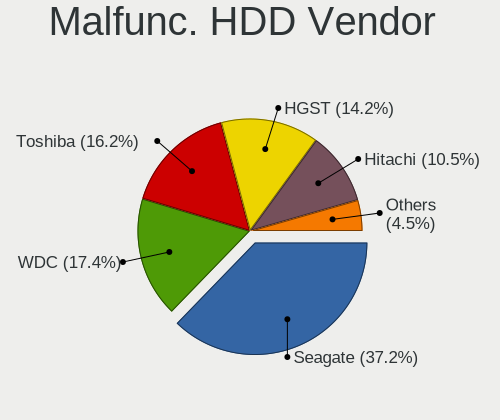
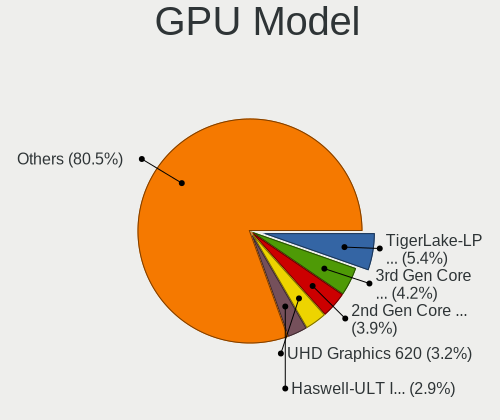
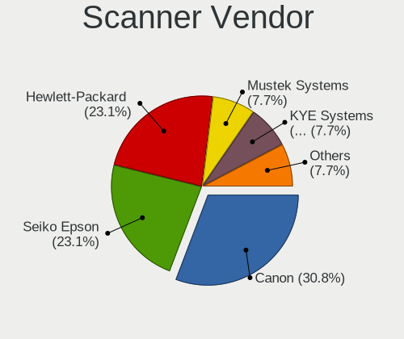
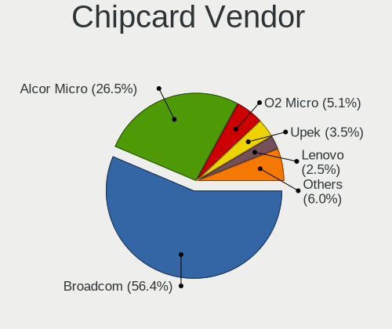

Ubuntu 22.04 - Tested Hardware & Statistics (Notebooks)
-------------------------------------------------------

A project to collect tested hardware configurations for Ubuntu 22.04.

Anyone can contribute to this report by the [hw-probe](https://github.com/linuxhw/hw-probe) tool:

    sudo -E hw-probe -all -upload

Please contribute! Especially if your hardware is rare.

Contents
--------

* [ Test Cases ](#test-cases)

* [ System ](#system)
  - [ Kernel                   ](#kernel)
  - [ Kernel Family            ](#kernel-family)
  - [ Kernel Major Ver.        ](#kernel-major-ver)
  - [ Arch                     ](#arch)
  - [ DE                       ](#de)
  - [ Display Server           ](#display-server)
  - [ Display Manager          ](#display-manager)
  - [ OS Lang                  ](#os-lang)
  - [ Boot Mode                ](#boot-mode)
  - [ Filesystem               ](#filesystem)
  - [ Part. scheme             ](#part-scheme)
  - [ Dual Boot with Linux/BSD ](#dual-boot-with-linuxbsd)
  - [ Dual Boot (Win)          ](#dual-boot-win)

* [ Board ](#board)
  - [ Vendor                   ](#vendor)
  - [ Model                    ](#model)
  - [ Model Family             ](#model-family)
  - [ MFG Year                 ](#mfg-year)
  - [ Form Factor              ](#form-factor)
  - [ Secure Boot              ](#secure-boot)
  - [ Coreboot                 ](#coreboot)
  - [ RAM Size                 ](#ram-size)
  - [ RAM Used                 ](#ram-used)
  - [ Total Drives             ](#total-drives)
  - [ Has CD-ROM               ](#has-cd-rom)
  - [ Has Ethernet             ](#has-ethernet)
  - [ Has WiFi                 ](#has-wifi)
  - [ Has Bluetooth            ](#has-bluetooth)

* [ Location ](#location)
  - [ Country                  ](#country)
  - [ City                     ](#city)

* [ Drives ](#drives)
  - [ Drive Vendor             ](#drive-vendor)
  - [ Drive Model              ](#drive-model)
  - [ HDD Vendor               ](#hdd-vendor)
  - [ SSD Vendor               ](#ssd-vendor)
  - [ Drive Kind               ](#drive-kind)
  - [ Drive Connector          ](#drive-connector)
  - [ Drive Size               ](#drive-size)
  - [ Space Total              ](#space-total)
  - [ Space Used               ](#space-used)
  - [ Malfunc. Drives          ](#malfunc-drives)
  - [ Malfunc. Drive Vendor    ](#malfunc-drive-vendor)
  - [ Malfunc. HDD Vendor      ](#malfunc-hdd-vendor)
  - [ Malfunc. Drive Kind      ](#malfunc-drive-kind)
  - [ Failed Drives            ](#failed-drives)
  - [ Failed Drive Vendor      ](#failed-drive-vendor)
  - [ Drive Status             ](#drive-status)

* [ Storage controller ](#storage-controller)
  - [ Storage Vendor           ](#storage-vendor)
  - [ Storage Model            ](#storage-model)
  - [ Storage Kind             ](#storage-kind)

* [ Processor ](#processor)
  - [ CPU Vendor               ](#cpu-vendor)
  - [ CPU Model                ](#cpu-model)
  - [ CPU Model Family         ](#cpu-model-family)
  - [ CPU Cores                ](#cpu-cores)
  - [ CPU Sockets              ](#cpu-sockets)
  - [ CPU Threads              ](#cpu-threads)
  - [ CPU Op-Modes             ](#cpu-op-modes)
  - [ CPU Microcode            ](#cpu-microcode)
  - [ CPU Microarch            ](#cpu-microarch)

* [ Graphics ](#graphics)
  - [ GPU Vendor               ](#gpu-vendor)
  - [ GPU Model                ](#gpu-model)
  - [ GPU Combo                ](#gpu-combo)
  - [ GPU Driver               ](#gpu-driver)
  - [ GPU Memory               ](#gpu-memory)

* [ Monitor ](#monitor)
  - [ Monitor Vendor           ](#monitor-vendor)
  - [ Monitor Model            ](#monitor-model)
  - [ Monitor Resolution       ](#monitor-resolution)
  - [ Monitor Diagonal         ](#monitor-diagonal)
  - [ Monitor Width            ](#monitor-width)
  - [ Aspect Ratio             ](#aspect-ratio)
  - [ Monitor Area             ](#monitor-area)
  - [ Pixel Density            ](#pixel-density)
  - [ Multiple Monitors        ](#multiple-monitors)

* [ Network ](#network)
  - [ Net Controller Vendor    ](#net-controller-vendor)
  - [ Net Controller Model     ](#net-controller-model)
  - [ Wireless Vendor          ](#wireless-vendor)
  - [ Wireless Model           ](#wireless-model)
  - [ Ethernet Vendor          ](#ethernet-vendor)
  - [ Ethernet Model           ](#ethernet-model)
  - [ Net Controller Kind      ](#net-controller-kind)
  - [ Used Controller          ](#used-controller)
  - [ NICs                     ](#nics)
  - [ IPv6                     ](#ipv6)

* [ Bluetooth ](#bluetooth)
  - [ Bluetooth Vendor         ](#bluetooth-vendor)
  - [ Bluetooth Model          ](#bluetooth-model)

* [ Sound ](#sound)
  - [ Sound Vendor             ](#sound-vendor)
  - [ Sound Model              ](#sound-model)

* [ Memory ](#memory)
  - [ Memory Vendor            ](#memory-vendor)
  - [ Memory Model             ](#memory-model)
  - [ Memory Kind              ](#memory-kind)
  - [ Memory Form Factor       ](#memory-form-factor)
  - [ Memory Size              ](#memory-size)
  - [ Memory Speed             ](#memory-speed)

* [ Printers & scanners ](#printers--scanners)
  - [ Printer Vendor           ](#printer-vendor)
  - [ Printer Model            ](#printer-model)
  - [ Scanner Vendor           ](#scanner-vendor)
  - [ Scanner Model            ](#scanner-model)

* [ Camera ](#camera)
  - [ Camera Vendor            ](#camera-vendor)
  - [ Camera Model             ](#camera-model)

* [ Security ](#security)
  - [ Fingerprint Vendor       ](#fingerprint-vendor)
  - [ Fingerprint Model        ](#fingerprint-model)
  - [ Chipcard Vendor          ](#chipcard-vendor)
  - [ Chipcard Model           ](#chipcard-model)

* [ Unsupported ](#unsupported)
  - [ Unsupported Devices      ](#unsupported-devices)
  - [ Unsupported Device Types ](#unsupported-device-types)

Test Cases
----------

Total: 11089

| Vendor        | Model                       | Probe                                                      | Date         |
|---------------|-----------------------------|------------------------------------------------------------|--------------|
| Apple         | MacBookPro4,1               | [5d31a31783](https://linux-hardware.org/?probe=5d31a31783) | Feb 02, 2024 |
| Dell          | Inspiron 13-7359            | [82a1195ef5](https://linux-hardware.org/?probe=82a1195ef5) | Feb 02, 2024 |
| Dell          | Inspiron 3583               | [3c532c85ec](https://linux-hardware.org/?probe=3c532c85ec) | Feb 02, 2024 |
| Lenovo        | IdeaPad 3 17ALC6 82KV       | [3aa20161d9](https://linux-hardware.org/?probe=3aa20161d9) | Feb 02, 2024 |
| Acer          | Aspire 5741G                | [935470b35c](https://linux-hardware.org/?probe=935470b35c) | Feb 02, 2024 |
| Acer          | Aspire V3-772               | [4a32c0297c](https://linux-hardware.org/?probe=4a32c0297c) | Feb 02, 2024 |
| ASUSTek       | VivoBook_ASUSLaptop M350... | [cb15afccd0](https://linux-hardware.org/?probe=cb15afccd0) | Feb 02, 2024 |
| Dell          | Precision 7550              | [c210fa0d97](https://linux-hardware.org/?probe=c210fa0d97) | Feb 02, 2024 |
| Acer          | Aspire 5741G                | [d598afdbe9](https://linux-hardware.org/?probe=d598afdbe9) | Feb 02, 2024 |
| DEXP          | Atlas M14-I5W303            | [fd14684ed2](https://linux-hardware.org/?probe=fd14684ed2) | Feb 02, 2024 |
| Lenovo        | ThinkPad E590 20NB002BRT    | [283a2fd324](https://linux-hardware.org/?probe=283a2fd324) | Feb 02, 2024 |
| HP            | ProBook 450 G8 Notebook ... | [0bbbc51a52](https://linux-hardware.org/?probe=0bbbc51a52) | Feb 02, 2024 |
| Lenovo        | ThinkBook 16p Gen 4 21J8    | [7cbebba117](https://linux-hardware.org/?probe=7cbebba117) | Feb 02, 2024 |
| SLIMBOOK      | HERO-S-TGL-RTX              | [1260457422](https://linux-hardware.org/?probe=1260457422) | Feb 02, 2024 |
| Apple         | MacBookPro11,3              | [5bc93c37fa](https://linux-hardware.org/?probe=5bc93c37fa) | Feb 02, 2024 |
| Dell          | Inspiron 3542               | [176eee6b84](https://linux-hardware.org/?probe=176eee6b84) | Feb 02, 2024 |
| Dell          | Inspiron 3542               | [7f677482ef](https://linux-hardware.org/?probe=7f677482ef) | Feb 02, 2024 |
| Pegatron      | Spring Peak                 | [b14f110621](https://linux-hardware.org/?probe=b14f110621) | Feb 02, 2024 |
| ASUSTek       | N53SV                       | [ee79ea1cbb](https://linux-hardware.org/?probe=ee79ea1cbb) | Feb 01, 2024 |
| Lenovo        | ThinkPad T440 20B7A0B7MN    | [74173e2c0a](https://linux-hardware.org/?probe=74173e2c0a) | Feb 01, 2024 |
| Pegatron      | Spring Peak                 | [4404cfb5c8](https://linux-hardware.org/?probe=4404cfb5c8) | Feb 01, 2024 |
| Lenovo        | IdeaPad S340-15API 81NC     | [7340c4abd7](https://linux-hardware.org/?probe=7340c4abd7) | Feb 01, 2024 |
| Dell          | Latitude 5420               | [9ca4bb32d7](https://linux-hardware.org/?probe=9ca4bb32d7) | Feb 01, 2024 |
| Dell          | Inspiron N5010              | [151239b938](https://linux-hardware.org/?probe=151239b938) | Feb 01, 2024 |
| Dell          | Vostro 3525                 | [495877fada](https://linux-hardware.org/?probe=495877fada) | Feb 01, 2024 |
| ASUSTek       | Zenbook UM3402YAR_UM3402... | [04c6362187](https://linux-hardware.org/?probe=04c6362187) | Feb 01, 2024 |
| ASUSTek       | N53SV                       | [29807f0dfa](https://linux-hardware.org/?probe=29807f0dfa) | Feb 01, 2024 |
| AMI           | Intel                       | [6d3ac84f15](https://linux-hardware.org/?probe=6d3ac84f15) | Feb 01, 2024 |
| Lenovo        | ThinkPad X1 Carbon 6th 2... | [6acefbaadc](https://linux-hardware.org/?probe=6acefbaadc) | Feb 01, 2024 |
| Acer          | Swift SF314-512             | [28bd75703e](https://linux-hardware.org/?probe=28bd75703e) | Feb 01, 2024 |
| Lenovo        | Yoga Slim 7 ProX 14ARH7 ... | [5f2635ae3a](https://linux-hardware.org/?probe=5f2635ae3a) | Feb 01, 2024 |
| Dell          | Inspiron 7501               | [5c071c25ab](https://linux-hardware.org/?probe=5c071c25ab) | Feb 01, 2024 |
| Fujitsu       | LIFEBOOK E752               | [5bd3d39655](https://linux-hardware.org/?probe=5bd3d39655) | Feb 01, 2024 |
| TrekStor      | Primebook P14               | [ffd6c873de](https://linux-hardware.org/?probe=ffd6c873de) | Feb 01, 2024 |
| Dell          | Inspiron 15 7000 Gaming     | [8689e993e3](https://linux-hardware.org/?probe=8689e993e3) | Feb 01, 2024 |
| Dell          | Inspiron 15 7000 Gaming     | [01332b7a24](https://linux-hardware.org/?probe=01332b7a24) | Feb 01, 2024 |
| Apple         | MacBookPro4,1               | [863b50ad5a](https://linux-hardware.org/?probe=863b50ad5a) | Feb 01, 2024 |
| Dell          | Inspiron 3542               | [5a7e77b4a7](https://linux-hardware.org/?probe=5a7e77b4a7) | Feb 01, 2024 |
| HP            | ENVY dv6                    | [a91621750a](https://linux-hardware.org/?probe=a91621750a) | Jan 31, 2024 |
| ASUSTek       | X555LD                      | [bc95890dcd](https://linux-hardware.org/?probe=bc95890dcd) | Jan 31, 2024 |
| Lenovo        | ThinkPad X1 Carbon Gen 1... | [a84c65f63e](https://linux-hardware.org/?probe=a84c65f63e) | Jan 31, 2024 |
| HUAWEI        | MCLF-XX                     | [97bfeb35bc](https://linux-hardware.org/?probe=97bfeb35bc) | Jan 31, 2024 |
| Dell          | Latitude E7250              | [24ea631399](https://linux-hardware.org/?probe=24ea631399) | Jan 31, 2024 |
| Dell          | Latitude 5501               | [7c92ef29c9](https://linux-hardware.org/?probe=7c92ef29c9) | Jan 31, 2024 |
| ASUSTek       | Zenbook UX5401ZAS_UX5401... | [36be131f18](https://linux-hardware.org/?probe=36be131f18) | Jan 31, 2024 |
| Dell          | Inspiron 5537               | [600bb8363d](https://linux-hardware.org/?probe=600bb8363d) | Jan 31, 2024 |
| ASUSTek       | X555LD                      | [e65c871d95](https://linux-hardware.org/?probe=e65c871d95) | Jan 31, 2024 |
| ASUSTek       | X555LD                      | [1433f11bba](https://linux-hardware.org/?probe=1433f11bba) | Jan 31, 2024 |
| MSI           | Modern 14 B5M               | [e41b88a884](https://linux-hardware.org/?probe=e41b88a884) | Jan 31, 2024 |
| Lenovo        | IdeaPad 300-17ISK 80QH      | [4f9b6c7262](https://linux-hardware.org/?probe=4f9b6c7262) | Jan 31, 2024 |
| Lenovo        | IdeaPad 300-17ISK 80QH      | [0e068176e4](https://linux-hardware.org/?probe=0e068176e4) | Jan 31, 2024 |
| Apple         | MacBook8,1                  | [6ef40b726e](https://linux-hardware.org/?probe=6ef40b726e) | Jan 31, 2024 |
| Dell          | XPS 13 9380                 | [479853dd4c](https://linux-hardware.org/?probe=479853dd4c) | Jan 31, 2024 |
| Acer          | Swift SF514-56T             | [14b287861f](https://linux-hardware.org/?probe=14b287861f) | Jan 31, 2024 |
| HP            | Pavilion dv6                | [e1e2c04f8c](https://linux-hardware.org/?probe=e1e2c04f8c) | Jan 30, 2024 |
| Alienware     | 15 R3                       | [297db64e3b](https://linux-hardware.org/?probe=297db64e3b) | Jan 30, 2024 |
| ASUSTek       | ROG Strix G814JI_G814JI     | [b51ecf60ef](https://linux-hardware.org/?probe=b51ecf60ef) | Jan 30, 2024 |
| Apple         | MacBook8,1                  | [9580d3149f](https://linux-hardware.org/?probe=9580d3149f) | Jan 30, 2024 |
| Dell          | XPS 13 9305                 | [1b2e728298](https://linux-hardware.org/?probe=1b2e728298) | Jan 30, 2024 |
| Lenovo        | ThinkPad X1 Carbon Gen 8... | [1669d54762](https://linux-hardware.org/?probe=1669d54762) | Jan 30, 2024 |
| Lenovo        | ThinkPad T510 43149TG       | [463b653f7a](https://linux-hardware.org/?probe=463b653f7a) | Jan 30, 2024 |
| Medion        | X781X                       | [3665eaa65c](https://linux-hardware.org/?probe=3665eaa65c) | Jan 30, 2024 |
| ASUSTek       | Vivobook Go E1504FA_E150... | [646a977cdd](https://linux-hardware.org/?probe=646a977cdd) | Jan 30, 2024 |
| ASUSTek       | VivoBook_ASUSLaptop K370... | [e935a209d7](https://linux-hardware.org/?probe=e935a209d7) | Jan 30, 2024 |
| ASUSTek       | VivoBook_ASUSLaptop K370... | [4a1a726464](https://linux-hardware.org/?probe=4a1a726464) | Jan 30, 2024 |
| Lenovo        | ThinkPad T410 2537AT1       | [54b5a51811](https://linux-hardware.org/?probe=54b5a51811) | Jan 30, 2024 |
| HP            | Pavilion dv7                | [8aab31766b](https://linux-hardware.org/?probe=8aab31766b) | Jan 30, 2024 |
| ASUSTek       | X540LA                      | [503b80e997](https://linux-hardware.org/?probe=503b80e997) | Jan 30, 2024 |
| ASUSTek       | UX550VD                     | [3b742650db](https://linux-hardware.org/?probe=3b742650db) | Jan 29, 2024 |
| Apple         | MacBookPro4,1               | [2e5f443b99](https://linux-hardware.org/?probe=2e5f443b99) | Jan 29, 2024 |
| Lenovo        | ThinkPad T14 Gen 3 21AH0... | [913338a499](https://linux-hardware.org/?probe=913338a499) | Jan 29, 2024 |
| Acer          | Aspire E1-522               | [1dab2e243c](https://linux-hardware.org/?probe=1dab2e243c) | Jan 29, 2024 |
| HP            | ProBook 640 G1              | [7bbe891072](https://linux-hardware.org/?probe=7bbe891072) | Jan 29, 2024 |
| Lenovo        | IdeaPad 3 15ADA05 81W1      | [dafe3d53e0](https://linux-hardware.org/?probe=dafe3d53e0) | Jan 29, 2024 |
| ASUSTek       | Vivobook Go E1404FA_E140... | [a1d3b30464](https://linux-hardware.org/?probe=a1d3b30464) | Jan 29, 2024 |
| ASUSTek       | Vivobook Go E1404FA_E140... | [ae5e53e103](https://linux-hardware.org/?probe=ae5e53e103) | Jan 29, 2024 |
| Dell          | Latitude 5430 Rugged        | [8708a1170b](https://linux-hardware.org/?probe=8708a1170b) | Jan 29, 2024 |
| Dell          | Inspiron 1525               | [aeacd97c42](https://linux-hardware.org/?probe=aeacd97c42) | Jan 29, 2024 |
| Lenovo        | Legion 5 15ACH6H 82JU       | [0c4fb535dc](https://linux-hardware.org/?probe=0c4fb535dc) | Jan 29, 2024 |
| HUAWEI        | NBLB-WAX9N                  | [dc9267becb](https://linux-hardware.org/?probe=dc9267becb) | Jan 29, 2024 |
| Medion        | P15648                      | [d906da0d95](https://linux-hardware.org/?probe=d906da0d95) | Jan 29, 2024 |
| HP            | Dragonfly Pro Laptop PC     | [f7605bd832](https://linux-hardware.org/?probe=f7605bd832) | Jan 28, 2024 |
| Acer          | Nitro AN515-58              | [20b00f9064](https://linux-hardware.org/?probe=20b00f9064) | Jan 28, 2024 |
| Apple         | MacBookAir6,1               | [d508f78053](https://linux-hardware.org/?probe=d508f78053) | Jan 28, 2024 |
| HP            | ProBook 4530s               | [6135fed286](https://linux-hardware.org/?probe=6135fed286) | Jan 28, 2024 |
| Lenovo        | IdeaPad S510p 20298         | [7c9fb93a37](https://linux-hardware.org/?probe=7c9fb93a37) | Jan 28, 2024 |
| Lenovo        | IdeaPad 130-15AST 81H5      | [81e9c9a499](https://linux-hardware.org/?probe=81e9c9a499) | Jan 28, 2024 |
| Toshiba       | Satellite P50-B-10Z         | [574103da6a](https://linux-hardware.org/?probe=574103da6a) | Jan 28, 2024 |
| Lenovo        | IdeaPad 3 15ADA05 81W1      | [cab252fea3](https://linux-hardware.org/?probe=cab252fea3) | Jan 28, 2024 |
| Acer          | Aspire VN7-571G             | [b5f8437f3c](https://linux-hardware.org/?probe=b5f8437f3c) | Jan 28, 2024 |
| Apple         | MacBookPro14,3              | [1b5bfa9bcb](https://linux-hardware.org/?probe=1b5bfa9bcb) | Jan 28, 2024 |
| HP            | Victus by Gaming Laptop ... | [49e891b67d](https://linux-hardware.org/?probe=49e891b67d) | Jan 28, 2024 |
| HP            | ENVY Laptop 15-ep0xxx       | [c2d0dabb5e](https://linux-hardware.org/?probe=c2d0dabb5e) | Jan 28, 2024 |
| Dell          | G15 5511                    | [53225a4d52](https://linux-hardware.org/?probe=53225a4d52) | Jan 28, 2024 |
| Dell          | Inspiron 3537               | [e91c3bfd73](https://linux-hardware.org/?probe=e91c3bfd73) | Jan 28, 2024 |
| Dell          | Inspiron 3537               | [0ee7687e3f](https://linux-hardware.org/?probe=0ee7687e3f) | Jan 28, 2024 |
| Google        | Elemi                       | [f767c4fdbb](https://linux-hardware.org/?probe=f767c4fdbb) | Jan 28, 2024 |
| Lenovo        | IdeaPad 130-15AST 81H5      | [465b69ceca](https://linux-hardware.org/?probe=465b69ceca) | Jan 28, 2024 |
| Acer          | Aspire A515-46              | [935246f473](https://linux-hardware.org/?probe=935246f473) | Jan 28, 2024 |
| Acer          | Aspire A515-46              | [f023bc003e](https://linux-hardware.org/?probe=f023bc003e) | Jan 27, 2024 |
| Dell          | Latitude 7490               | [8687d67e07](https://linux-hardware.org/?probe=8687d67e07) | Jan 27, 2024 |
| HP            | Notebook                    | [78ffba1358](https://linux-hardware.org/?probe=78ffba1358) | Jan 27, 2024 |
| Apple         | MacBookPro9,2               | [8bca4f366d](https://linux-hardware.org/?probe=8bca4f366d) | Jan 27, 2024 |
| ASUSTek       | Zenbook UM3402YAR_UM3402... | [ee59cf62cb](https://linux-hardware.org/?probe=ee59cf62cb) | Jan 27, 2024 |
| Dell          | Inspiron 5570               | [0fce3dbe59](https://linux-hardware.org/?probe=0fce3dbe59) | Jan 27, 2024 |
| Dell          | Latitude 7390 2-in-1        | [d57566edb3](https://linux-hardware.org/?probe=d57566edb3) | Jan 27, 2024 |
| Dell          | Latitude 7390 2-in-1        | [26a44b8cab](https://linux-hardware.org/?probe=26a44b8cab) | Jan 27, 2024 |
| Dell          | Latitude E7450              | [d427866522](https://linux-hardware.org/?probe=d427866522) | Jan 27, 2024 |
| Dell          | XPS 9320                    | [0214714fb9](https://linux-hardware.org/?probe=0214714fb9) | Jan 27, 2024 |
| ASUSTek       | Zenbook UM3402YAR_UM3402... | [dfb6b2a1c8](https://linux-hardware.org/?probe=dfb6b2a1c8) | Jan 27, 2024 |
| Fujitsu       | FARQ10003                   | [6084280fc9](https://linux-hardware.org/?probe=6084280fc9) | Jan 27, 2024 |
| System76      | Oryx Pro                    | [faac85b51d](https://linux-hardware.org/?probe=faac85b51d) | Jan 27, 2024 |
| Dell          | Latitude E7440              | [8d31059748](https://linux-hardware.org/?probe=8d31059748) | Jan 27, 2024 |
| Dell          | Inspiron 3542               | [2a81d5f313](https://linux-hardware.org/?probe=2a81d5f313) | Jan 27, 2024 |
| ASUSTek       | K52JT                       | [dd44051584](https://linux-hardware.org/?probe=dd44051584) | Jan 27, 2024 |
| Lenovo        | IdeaPad 3 15ITL6 82H8       | [5fac7fde98](https://linux-hardware.org/?probe=5fac7fde98) | Jan 27, 2024 |
| Apple         | MacBookPro9,2               | [9518bd6b03](https://linux-hardware.org/?probe=9518bd6b03) | Jan 27, 2024 |
| Dell          | Latitude E5250              | [29a9f5d01c](https://linux-hardware.org/?probe=29a9f5d01c) | Jan 26, 2024 |
| Apple         | MacBookPro9,2               | [5591f82595](https://linux-hardware.org/?probe=5591f82595) | Jan 26, 2024 |
| Apple         | MacBookPro8,1               | [fa96de4635](https://linux-hardware.org/?probe=fa96de4635) | Jan 26, 2024 |
| Apple         | MacBookPro8,1               | [90c57cfb01](https://linux-hardware.org/?probe=90c57cfb01) | Jan 26, 2024 |
| HP            | 15 Notebook PC              | [9f12f6bda7](https://linux-hardware.org/?probe=9f12f6bda7) | Jan 26, 2024 |
| ASUSTek       | ZenBook UX435EG_UX435EG     | [a354ee36fe](https://linux-hardware.org/?probe=a354ee36fe) | Jan 26, 2024 |
| Apple         | MacBookPro11,3              | [5859ff1ab1](https://linux-hardware.org/?probe=5859ff1ab1) | Jan 26, 2024 |
| TUXEDO        | Aura 15 Gen1                | [27fa584690](https://linux-hardware.org/?probe=27fa584690) | Jan 26, 2024 |
| HUAWEI        | KLVL-WXX9                   | [4b630c4e1e](https://linux-hardware.org/?probe=4b630c4e1e) | Jan 26, 2024 |
| HUAWEI        | KLVL-WXX9                   | [c639997108](https://linux-hardware.org/?probe=c639997108) | Jan 26, 2024 |
| Lenovo        | IdeaPad 3 15ADA05 81W1      | [87d6398f5b](https://linux-hardware.org/?probe=87d6398f5b) | Jan 26, 2024 |
| ASUSTek       | B400VC                      | [af39cde6d9](https://linux-hardware.org/?probe=af39cde6d9) | Jan 26, 2024 |
| HP            | 650                         | [d440902ea2](https://linux-hardware.org/?probe=d440902ea2) | Jan 26, 2024 |
| Toshiba       | Satellite C670D-12Q         | [a9a2651adc](https://linux-hardware.org/?probe=a9a2651adc) | Jan 26, 2024 |
| Dell          | Latitude 5490               | [f1fe39af02](https://linux-hardware.org/?probe=f1fe39af02) | Jan 26, 2024 |
| HP            | Pavilion dv6                | [9a15d7d823](https://linux-hardware.org/?probe=9a15d7d823) | Jan 26, 2024 |
| HP            | Laptop 15-bw0xx             | [6faf9b7c3a](https://linux-hardware.org/?probe=6faf9b7c3a) | Jan 26, 2024 |
| Google        | Markarth                    | [39dface7d9](https://linux-hardware.org/?probe=39dface7d9) | Jan 26, 2024 |
| Lenovo        | ThinkPad X1 Carbon 6th 2... | [565926342b](https://linux-hardware.org/?probe=565926342b) | Jan 25, 2024 |
| Dell          | Inspiron 3558               | [7972792612](https://linux-hardware.org/?probe=7972792612) | Jan 25, 2024 |
| Apple         | MacBookPro14,1              | [41817d480d](https://linux-hardware.org/?probe=41817d480d) | Jan 25, 2024 |
| Dell          | Inspiron 3558               | [4d1b20eaa7](https://linux-hardware.org/?probe=4d1b20eaa7) | Jan 25, 2024 |
| ASUSTek       | VivoBook_ASUSLaptop X415... | [e6681b71bc](https://linux-hardware.org/?probe=e6681b71bc) | Jan 25, 2024 |
| ASUSTek       | VivoBook_ASUSLaptop X415... | [65a3715aa3](https://linux-hardware.org/?probe=65a3715aa3) | Jan 25, 2024 |
| Lenovo        | ThinkPad X1 Carbon 6th 2... | [aac76b979a](https://linux-hardware.org/?probe=aac76b979a) | Jan 25, 2024 |
| HP            | ProBook 450 G1              | [97c68df9c0](https://linux-hardware.org/?probe=97c68df9c0) | Jan 25, 2024 |
| Dell          | Inspiron 1525               | [cfa1bbba1a](https://linux-hardware.org/?probe=cfa1bbba1a) | Jan 25, 2024 |
| ASUSTek       | ASUS EXPERTBOOK B1500CBA... | [a0b0aa335e](https://linux-hardware.org/?probe=a0b0aa335e) | Jan 25, 2024 |
| ASUSTek       | ASUS EXPERTBOOK B1500CBA... | [2add8788ab](https://linux-hardware.org/?probe=2add8788ab) | Jan 25, 2024 |
| HP            | 2000                        | [f1e38c4df2](https://linux-hardware.org/?probe=f1e38c4df2) | Jan 25, 2024 |
| Dell          | Inspiron 3581               | [7a5cfbd8d3](https://linux-hardware.org/?probe=7a5cfbd8d3) | Jan 25, 2024 |
| HP            | EliteBook 8470p             | [b892b5b8a4](https://linux-hardware.org/?probe=b892b5b8a4) | Jan 25, 2024 |
| Dell          | Inspiron 3581               | [dbf2745f1f](https://linux-hardware.org/?probe=dbf2745f1f) | Jan 25, 2024 |
| Acer          | Nitro AN515-57              | [052f6bc120](https://linux-hardware.org/?probe=052f6bc120) | Jan 25, 2024 |
| Acer          | Aspire A315-24P             | [24a5e0a03c](https://linux-hardware.org/?probe=24a5e0a03c) | Jan 25, 2024 |
| Lenovo        | ThinkPad T470 20HES18S02    | [9f18c011e4](https://linux-hardware.org/?probe=9f18c011e4) | Jan 25, 2024 |
| Samsung       | 905S3G/906S3G/915S3G/930... | [8c1fb214b8](https://linux-hardware.org/?probe=8c1fb214b8) | Jan 25, 2024 |
| HP            | ZBook 15v G5                | [8e114d2ba9](https://linux-hardware.org/?probe=8e114d2ba9) | Jan 25, 2024 |
| Dell          | Latitude E5470              | [25f5da470b](https://linux-hardware.org/?probe=25f5da470b) | Jan 24, 2024 |
| ASUSTek       | N551VW                      | [2a8f1d7cc1](https://linux-hardware.org/?probe=2a8f1d7cc1) | Jan 24, 2024 |
| Lenovo        | IdeaPad 3-15ALC6 82KU       | [c91921bbe1](https://linux-hardware.org/?probe=c91921bbe1) | Jan 24, 2024 |
| Samsung       | 905S3G/906S3G/915S3G/930... | [f3512d75e9](https://linux-hardware.org/?probe=f3512d75e9) | Jan 24, 2024 |
| HP            | 15                          | [6cd885c267](https://linux-hardware.org/?probe=6cd885c267) | Jan 24, 2024 |
| Lenovo        | ThinkPad T540p 20BFS2100... | [1bf8988f36](https://linux-hardware.org/?probe=1bf8988f36) | Jan 24, 2024 |
| Lenovo        | ThinkPad T540p 20BFS2100... | [08b929fe37](https://linux-hardware.org/?probe=08b929fe37) | Jan 24, 2024 |
| Lenovo        | ThinkPad X1 Carbon 2nd 2... | [86ff649a4d](https://linux-hardware.org/?probe=86ff649a4d) | Jan 24, 2024 |
| Acer          | Aspire V3-331               | [002e761d1d](https://linux-hardware.org/?probe=002e761d1d) | Jan 24, 2024 |
| Acer          | Aspire V3-331               | [944c9b110c](https://linux-hardware.org/?probe=944c9b110c) | Jan 24, 2024 |
| Dell          | Latitude 7490               | [d2085f3674](https://linux-hardware.org/?probe=d2085f3674) | Jan 24, 2024 |
| ASUSTek       | X541UV                      | [7df0d2b4af](https://linux-hardware.org/?probe=7df0d2b4af) | Jan 24, 2024 |
| Dell          | Latitude E6500              | [7c35926249](https://linux-hardware.org/?probe=7c35926249) | Jan 24, 2024 |
| Lenovo        | ThinkPad T530 24297XG       | [9b6f11b3a9](https://linux-hardware.org/?probe=9b6f11b3a9) | Jan 24, 2024 |
| Acer          | Aspire A315-57G             | [ed1eb72a6d](https://linux-hardware.org/?probe=ed1eb72a6d) | Jan 24, 2024 |
| Dell          | Latitude 7410               | [cbb6638a4d](https://linux-hardware.org/?probe=cbb6638a4d) | Jan 24, 2024 |
| Fujitsu       | LIFEBOOK E736               | [7f0a2dd840](https://linux-hardware.org/?probe=7f0a2dd840) | Jan 24, 2024 |
| Dell          | Inspiron 7375               | [cd6587d15b](https://linux-hardware.org/?probe=cd6587d15b) | Jan 24, 2024 |
| Apple         | MacBookAir6,1               | [b687521689](https://linux-hardware.org/?probe=b687521689) | Jan 24, 2024 |
| Dell          | Inspiron 5570               | [7c453fba6f](https://linux-hardware.org/?probe=7c453fba6f) | Jan 23, 2024 |
| ASUSTek       | ASUS TUF Gaming F15 FX50... | [122f69f8c5](https://linux-hardware.org/?probe=122f69f8c5) | Jan 23, 2024 |
| Lenovo        | IdeaPad S145-15IWL 81MV     | [cf3c2deee4](https://linux-hardware.org/?probe=cf3c2deee4) | Jan 23, 2024 |
| Lenovo        | ThinkPad T420s 4174HR1      | [ab4b7bc31f](https://linux-hardware.org/?probe=ab4b7bc31f) | Jan 23, 2024 |
| Lenovo        | ThinkPad W541 20EGS3630P    | [1cca38d87f](https://linux-hardware.org/?probe=1cca38d87f) | Jan 23, 2024 |
| ASUSTek       | ROG Zephyrus M16 GU603ZW... | [7ea2706c0f](https://linux-hardware.org/?probe=7ea2706c0f) | Jan 23, 2024 |
| HP            | Pavilion Laptop 14-ec0xx... | [7c041036d7](https://linux-hardware.org/?probe=7c041036d7) | Jan 23, 2024 |
| Acer          | Aspire A315-58              | [286a2dcf7a](https://linux-hardware.org/?probe=286a2dcf7a) | Jan 23, 2024 |
| Lenovo        | Legion 5 17ACH6 82K0        | [5bd83d3f0c](https://linux-hardware.org/?probe=5bd83d3f0c) | Jan 23, 2024 |
| Dell          | Vostro 5490                 | [ef2aff4ed1](https://linux-hardware.org/?probe=ef2aff4ed1) | Jan 23, 2024 |
| AZW           | Z83 V                       | [eed16e1e68](https://linux-hardware.org/?probe=eed16e1e68) | Jan 23, 2024 |
| AZW           | Z83 V                       | [b9b8c82621](https://linux-hardware.org/?probe=b9b8c82621) | Jan 23, 2024 |
| Dell          | Precision 5540              | [604697c5db](https://linux-hardware.org/?probe=604697c5db) | Jan 23, 2024 |
| Dell          | Latitude 5480               | [45ac237d79](https://linux-hardware.org/?probe=45ac237d79) | Jan 23, 2024 |
| Lenovo        | ThinkPad L15 Gen 3 21C4S... | [4f812aeb52](https://linux-hardware.org/?probe=4f812aeb52) | Jan 23, 2024 |
| Lenovo        | Legion R9000P2021H 82JQ     | [3d55ffe30d](https://linux-hardware.org/?probe=3d55ffe30d) | Jan 23, 2024 |
| HP            | Pavilion dv5                | [6fdec1f88a](https://linux-hardware.org/?probe=6fdec1f88a) | Jan 23, 2024 |
| ASUSTek       | T100HAN                     | [66829eb63f](https://linux-hardware.org/?probe=66829eb63f) | Jan 23, 2024 |
| Acer          | Aspire A315-58              | [d5c1dc774a](https://linux-hardware.org/?probe=d5c1dc774a) | Jan 22, 2024 |
| Dell          | Inspiron 5520               | [6d64beac72](https://linux-hardware.org/?probe=6d64beac72) | Jan 22, 2024 |
| Dell          | Latitude 7430               | [668299aad7](https://linux-hardware.org/?probe=668299aad7) | Jan 22, 2024 |
| Lenovo        | ThinkPad T460 20FMS0HB00    | [67c8620ffa](https://linux-hardware.org/?probe=67c8620ffa) | Jan 22, 2024 |
| Dell          | Inspiron 5570               | [9fd4f31b80](https://linux-hardware.org/?probe=9fd4f31b80) | Jan 22, 2024 |
| HP            | Elite x2 1012 G1            | [0528733539](https://linux-hardware.org/?probe=0528733539) | Jan 22, 2024 |
| Apple         | MacBookPro11,1              | [e9bc4f9199](https://linux-hardware.org/?probe=e9bc4f9199) | Jan 22, 2024 |
| Acer          | Swift SFX14-51G             | [ac8dbddf38](https://linux-hardware.org/?probe=ac8dbddf38) | Jan 22, 2024 |
| Fujitsu       | LIFEBOOK U7412              | [e5a97a5300](https://linux-hardware.org/?probe=e5a97a5300) | Jan 22, 2024 |
| Acer          | Aspire E1-570               | [bbe5568412](https://linux-hardware.org/?probe=bbe5568412) | Jan 22, 2024 |
| Dell          | Latitude 5440               | [4ac53b51b3](https://linux-hardware.org/?probe=4ac53b51b3) | Jan 22, 2024 |
| ASUSTek       | X751SA                      | [2da0669a42](https://linux-hardware.org/?probe=2da0669a42) | Jan 22, 2024 |
| HP            | Compaq CQ58                 | [e15554b4ae](https://linux-hardware.org/?probe=e15554b4ae) | Jan 22, 2024 |
| Dell          | Latitude 7280               | [21e6e4a581](https://linux-hardware.org/?probe=21e6e4a581) | Jan 22, 2024 |
| Fujitsu       | LIFEBOOK U748               | [59122c1f76](https://linux-hardware.org/?probe=59122c1f76) | Jan 22, 2024 |
| Lenovo        | Legion 5 15ACH6 82JW        | [5a444c3b35](https://linux-hardware.org/?probe=5a444c3b35) | Jan 22, 2024 |
| Apple         | MacBookPro14,1              | [99f10901cf](https://linux-hardware.org/?probe=99f10901cf) | Jan 22, 2024 |
| Dell          | Latitude E7470              | [1f052ca954](https://linux-hardware.org/?probe=1f052ca954) | Jan 22, 2024 |
| MSI           | GE63 Raider RGB 8RE         | [103ecfd1f4](https://linux-hardware.org/?probe=103ecfd1f4) | Jan 22, 2024 |
| ASUSTek       | ASUS TUF Gaming F17 FX70... | [318e16ffb6](https://linux-hardware.org/?probe=318e16ffb6) | Jan 22, 2024 |
| Toshiba       | Satellite P50t-A-11D        | [15428d1f5e](https://linux-hardware.org/?probe=15428d1f5e) | Jan 22, 2024 |
| Lenovo        | ThinkPad E15 Gen 4 21E60... | [d10912daa4](https://linux-hardware.org/?probe=d10912daa4) | Jan 21, 2024 |
| Samsung       | R530/R730/R540              | [d781965459](https://linux-hardware.org/?probe=d781965459) | Jan 21, 2024 |
| Notebook      | W65_W67RZ1                  | [3ad0a034e4](https://linux-hardware.org/?probe=3ad0a034e4) | Jan 21, 2024 |
| HP            | Pavilion dv6                | [8e6edcce2d](https://linux-hardware.org/?probe=8e6edcce2d) | Jan 21, 2024 |
| Dell          | Latitude E6420              | [dff8e97b14](https://linux-hardware.org/?probe=dff8e97b14) | Jan 21, 2024 |
| HP            | EliteBook 8570w             | [bdec3958cd](https://linux-hardware.org/?probe=bdec3958cd) | Jan 21, 2024 |
| Acer          | Aspire A715-51G             | [1053d8db44](https://linux-hardware.org/?probe=1053d8db44) | Jan 21, 2024 |
| Medion        | P15648                      | [1c94d72e42](https://linux-hardware.org/?probe=1c94d72e42) | Jan 21, 2024 |
| Panasonic     | FZG1-4                      | [78a30df588](https://linux-hardware.org/?probe=78a30df588) | Jan 21, 2024 |
| Medion        | P15648                      | [17cd0e622d](https://linux-hardware.org/?probe=17cd0e622d) | Jan 21, 2024 |
| HP            | Laptop 17-by0xxx            | [2e29855bb5](https://linux-hardware.org/?probe=2e29855bb5) | Jan 21, 2024 |
| ASUSTek       | ROG Zephyrus G14 GA401QM... | [5728acca29](https://linux-hardware.org/?probe=5728acca29) | Jan 20, 2024 |
| Sony          | SVF1421E2EW                 | [b28682a58b](https://linux-hardware.org/?probe=b28682a58b) | Jan 20, 2024 |
| HONOR         | BMH-WDX9                    | [cc5193ad6b](https://linux-hardware.org/?probe=cc5193ad6b) | Jan 20, 2024 |
| ASUSTek       | VivoBook_ASUSLaptop X512... | [6723cbd4cd](https://linux-hardware.org/?probe=6723cbd4cd) | Jan 20, 2024 |
| Lenovo        | ThinkPad L15 Gen 1 20U3C... | [354671b848](https://linux-hardware.org/?probe=354671b848) | Jan 20, 2024 |
| Lenovo        | IdeaPad Slim 5 14IRL8 82... | [cf906b4574](https://linux-hardware.org/?probe=cf906b4574) | Jan 20, 2024 |
| Lenovo        | IdeaPad Slim 5 14IRL8 82... | [49a8bb87e1](https://linux-hardware.org/?probe=49a8bb87e1) | Jan 20, 2024 |
| Lenovo        | ThinkPad W550s 20E2CTO1W... | [b3466550df](https://linux-hardware.org/?probe=b3466550df) | Jan 20, 2024 |
| Toshiba       | Satellite L670D             | [4b7547d3d1](https://linux-hardware.org/?probe=4b7547d3d1) | Jan 20, 2024 |
| Lenovo        | ThinkPad L15 Gen 1 20U3C... | [3e339aec48](https://linux-hardware.org/?probe=3e339aec48) | Jan 20, 2024 |
| Toshiba       | PORTEGE R700                | [9783d3e6f7](https://linux-hardware.org/?probe=9783d3e6f7) | Jan 20, 2024 |
| HP            | Laptop 14s-fq1xxx           | [5df2f7a287](https://linux-hardware.org/?probe=5df2f7a287) | Jan 20, 2024 |
| MSI           | Prestige 16Studio A13VF     | [c345bf4b85](https://linux-hardware.org/?probe=c345bf4b85) | Jan 20, 2024 |
| HONOR         | BMH-WDX9                    | [a244cafad7](https://linux-hardware.org/?probe=a244cafad7) | Jan 20, 2024 |
| HP            | ProBook 455 G3              | [d566a44f9d](https://linux-hardware.org/?probe=d566a44f9d) | Jan 20, 2024 |
| HP            | Laptop 17-by0xxx            | [bad5091b84](https://linux-hardware.org/?probe=bad5091b84) | Jan 20, 2024 |
| Acer          | Nitro AN515-57              | [3aa29620a4](https://linux-hardware.org/?probe=3aa29620a4) | Jan 20, 2024 |
| Sony          | SVF1521G6EW                 | [e795184dd6](https://linux-hardware.org/?probe=e795184dd6) | Jan 20, 2024 |
| Alienware     | 14                          | [00828e630d](https://linux-hardware.org/?probe=00828e630d) | Jan 20, 2024 |
| Dell          | Latitude 7440               | [2871324f95](https://linux-hardware.org/?probe=2871324f95) | Jan 19, 2024 |
| Lenovo        | IdeaPad 5 14ALC05 82LM      | [a13a3a85d9](https://linux-hardware.org/?probe=a13a3a85d9) | Jan 19, 2024 |
| Lenovo        | ThinkBook 14-IIL 20SL       | [aa40e37f96](https://linux-hardware.org/?probe=aa40e37f96) | Jan 19, 2024 |
| Dell          | Latitude 7440               | [5ff30573ae](https://linux-hardware.org/?probe=5ff30573ae) | Jan 19, 2024 |
| Dell          | XPS 17 9700                 | [61c6fd00e2](https://linux-hardware.org/?probe=61c6fd00e2) | Jan 19, 2024 |
| HP            | OMEN by Laptop 15-dc1xxx    | [74b90ddfac](https://linux-hardware.org/?probe=74b90ddfac) | Jan 19, 2024 |
| HP            | EliteBook 840 G3            | [ea1922427f](https://linux-hardware.org/?probe=ea1922427f) | Jan 19, 2024 |
| HP            | EliteBook 840 G8 Noteboo... | [7bd81f3e89](https://linux-hardware.org/?probe=7bd81f3e89) | Jan 19, 2024 |
| HP            | Pavilion Notebook           | [91f1ca34ad](https://linux-hardware.org/?probe=91f1ca34ad) | Jan 19, 2024 |
| Lenovo        | ThinkPad P16 Gen 1 21D60... | [a65c4a4db4](https://linux-hardware.org/?probe=a65c4a4db4) | Jan 19, 2024 |
| HP            | Victus by Gaming Laptop ... | [3dfc03f457](https://linux-hardware.org/?probe=3dfc03f457) | Jan 19, 2024 |
| HP            | Victus by Gaming Laptop ... | [f3ce87bc3c](https://linux-hardware.org/?probe=f3ce87bc3c) | Jan 19, 2024 |
| Acer          | Aspire F5-573               | [9a2df369e8](https://linux-hardware.org/?probe=9a2df369e8) | Jan 19, 2024 |
| Apple         | MacBookPro5,5               | [07332f19ce](https://linux-hardware.org/?probe=07332f19ce) | Jan 19, 2024 |
| Apple         | MacBookPro5,5               | [4f33e18c23](https://linux-hardware.org/?probe=4f33e18c23) | Jan 19, 2024 |
| Apple         | MacBookPro15,2              | [b36cb3cc5a](https://linux-hardware.org/?probe=b36cb3cc5a) | Jan 19, 2024 |
| ASUSTek       | X541NA                      | [21a49936f0](https://linux-hardware.org/?probe=21a49936f0) | Jan 19, 2024 |
| Acer          | Nitro AN515-58              | [e0368be539](https://linux-hardware.org/?probe=e0368be539) | Jan 19, 2024 |
| Lenovo        | IdeaPad 3 15ALC6 82MF       | [c7ab1232bb](https://linux-hardware.org/?probe=c7ab1232bb) | Jan 18, 2024 |
| Toshiba       | Satellite C70D-A            | [f71a7005de](https://linux-hardware.org/?probe=f71a7005de) | Jan 18, 2024 |
| HP            | Laptop 15-bs0xx             | [8cd9ebc60f](https://linux-hardware.org/?probe=8cd9ebc60f) | Jan 18, 2024 |
| Dell          | Inspiron 1525               | [8c923deb75](https://linux-hardware.org/?probe=8c923deb75) | Jan 18, 2024 |
| HP            | Pavilion 17                 | [eaa179919d](https://linux-hardware.org/?probe=eaa179919d) | Jan 18, 2024 |
| ASUSTek       | VivoBook_ASUSLaptop K360... | [fb993819da](https://linux-hardware.org/?probe=fb993819da) | Jan 18, 2024 |
| Apple         | MacBookPro12,1              | [624cf621cc](https://linux-hardware.org/?probe=624cf621cc) | Jan 18, 2024 |
| Lenovo        | ThinkPad X1 Carbon Gen 1... | [50d318d640](https://linux-hardware.org/?probe=50d318d640) | Jan 18, 2024 |
| Lenovo        | ThinkPad X260 20F5S0NV00    | [cda7600532](https://linux-hardware.org/?probe=cda7600532) | Jan 18, 2024 |
| HP            | Pavilion Laptop 15-cs2xx... | [5455618460](https://linux-hardware.org/?probe=5455618460) | Jan 18, 2024 |
| HUAWEI        | MACHD-WXX9                  | [0f17e4ee65](https://linux-hardware.org/?probe=0f17e4ee65) | Jan 18, 2024 |
| Dell          | Inspiron MM061              | [6415c1e543](https://linux-hardware.org/?probe=6415c1e543) | Jan 18, 2024 |
| HP            | ProBook 650 G2              | [4374ba78cb](https://linux-hardware.org/?probe=4374ba78cb) | Jan 18, 2024 |
| AZW           | SEi                         | [b144837b91](https://linux-hardware.org/?probe=b144837b91) | Jan 18, 2024 |
| Samsung       | 940XGK                      | [90cea105a0](https://linux-hardware.org/?probe=90cea105a0) | Jan 18, 2024 |
| UMAX          | VisionBook 14Wr Plus        | [7ce24a39ab](https://linux-hardware.org/?probe=7ce24a39ab) | Jan 18, 2024 |
| Lenovo        | ThinkPad E580 20KS001JGE    | [079ef185ed](https://linux-hardware.org/?probe=079ef185ed) | Jan 18, 2024 |
| MSI           | Prestige 13Evo A13M         | [3b3a0ddd43](https://linux-hardware.org/?probe=3b3a0ddd43) | Jan 18, 2024 |
| Dell          | XPS 9320                    | [eb5df7ed6d](https://linux-hardware.org/?probe=eb5df7ed6d) | Jan 18, 2024 |
| Acer          | Aspire A315-42G             | [5f7172f388](https://linux-hardware.org/?probe=5f7172f388) | Jan 18, 2024 |
| HP            | ZBook 14 G2                 | [e2c1850473](https://linux-hardware.org/?probe=e2c1850473) | Jan 18, 2024 |
| Toshiba       | Satellite C55-C             | [4e861cd5e4](https://linux-hardware.org/?probe=4e861cd5e4) | Jan 18, 2024 |
| Acer          | Swift SFX14-41G             | [e3c95c6c18](https://linux-hardware.org/?probe=e3c95c6c18) | Jan 17, 2024 |
| Dell          | Latitude 7212 Rugged Ext... | [d5cf900cbf](https://linux-hardware.org/?probe=d5cf900cbf) | Jan 17, 2024 |
| Lenovo        | ThinkPad X240 20AMS31700    | [d5d3c69c94](https://linux-hardware.org/?probe=d5d3c69c94) | Jan 17, 2024 |
| HP            | ZBook 15u G5                | [334b143154](https://linux-hardware.org/?probe=334b143154) | Jan 17, 2024 |
| ASUSTek       | ROG Zephyrus G14 GA402NU... | [9c805e9195](https://linux-hardware.org/?probe=9c805e9195) | Jan 17, 2024 |
| AZW           | GT-R                        | [5c0ce30435](https://linux-hardware.org/?probe=5c0ce30435) | Jan 17, 2024 |
| Sony          | VPCEB46FG                   | [0e2c2caced](https://linux-hardware.org/?probe=0e2c2caced) | Jan 17, 2024 |
| ASUSTek       | ASUS TUF Dash F15 FX517Z... | [1bb64ecbb9](https://linux-hardware.org/?probe=1bb64ecbb9) | Jan 17, 2024 |
| Dell          | XPS 9315                    | [2271aed5c7](https://linux-hardware.org/?probe=2271aed5c7) | Jan 17, 2024 |
| ASUSTek       | ASUS TUF Dash F15 FX517Z... | [42c4cf9cea](https://linux-hardware.org/?probe=42c4cf9cea) | Jan 17, 2024 |
| Lenovo        | ThinkPad X13 Gen 1 20T3S... | [11e51bc70c](https://linux-hardware.org/?probe=11e51bc70c) | Jan 17, 2024 |
| Dell          | G3 3500                     | [0fd2b03a7c](https://linux-hardware.org/?probe=0fd2b03a7c) | Jan 17, 2024 |
| ASUSTek       | VivoBook_ASUSLaptop K340... | [2ddefbdd81](https://linux-hardware.org/?probe=2ddefbdd81) | Jan 17, 2024 |
| Lenovo        | Yoga 2 Pro 20266            | [77ada6bc6d](https://linux-hardware.org/?probe=77ada6bc6d) | Jan 17, 2024 |
| Lenovo        | ThinkPad X1 Carbon 6th 2... | [de44aa3d15](https://linux-hardware.org/?probe=de44aa3d15) | Jan 17, 2024 |
| Lenovo        | ThinkPad P53 20QNS01900     | [205e74d1fe](https://linux-hardware.org/?probe=205e74d1fe) | Jan 17, 2024 |
| Dell          | Inspiron 7348               | [a3c452af85](https://linux-hardware.org/?probe=a3c452af85) | Jan 17, 2024 |
| HP            | Victus by Gaming Laptop ... | [e6e63ec982](https://linux-hardware.org/?probe=e6e63ec982) | Jan 17, 2024 |
| HP            | Pavilion 15                 | [8e7f087158](https://linux-hardware.org/?probe=8e7f087158) | Jan 17, 2024 |
| Lenovo        | IdeaPad 5 Pro 14ACN6 82L... | [3c194e897a](https://linux-hardware.org/?probe=3c194e897a) | Jan 17, 2024 |
| UNOWHY        | Y13G012S4EI                 | [4fdd521da4](https://linux-hardware.org/?probe=4fdd521da4) | Jan 17, 2024 |
| HP            | Pavilion 15                 | [0d78ac3518](https://linux-hardware.org/?probe=0d78ac3518) | Jan 16, 2024 |
| Acer          | Aspire A515-46              | [124e8224a6](https://linux-hardware.org/?probe=124e8224a6) | Jan 16, 2024 |
| HP            | Laptop 15-dy2xxx            | [130befb564](https://linux-hardware.org/?probe=130befb564) | Jan 16, 2024 |
| HONOR         | BMH-WDX9                    | [e793aff68b](https://linux-hardware.org/?probe=e793aff68b) | Jan 16, 2024 |
| Dell          | Vostro 16 5635              | [41feffb377](https://linux-hardware.org/?probe=41feffb377) | Jan 16, 2024 |
| Dell          | Vostro 16 5635              | [087ee82354](https://linux-hardware.org/?probe=087ee82354) | Jan 16, 2024 |
| Lenovo        | ThinkBook 15 G4 IAP 21DJ    | [d2b4053179](https://linux-hardware.org/?probe=d2b4053179) | Jan 16, 2024 |
| LG Electro... | A530-U.BE54P1               | [b396bdcd52](https://linux-hardware.org/?probe=b396bdcd52) | Jan 16, 2024 |
| Lenovo        | ThinkBook 14 G3 ACL 21A2    | [29d7b6841b](https://linux-hardware.org/?probe=29d7b6841b) | Jan 16, 2024 |
| Acer          | TravelMate P214-53          | [dbe5ed82b8](https://linux-hardware.org/?probe=dbe5ed82b8) | Jan 16, 2024 |
| ASUSTek       | Zenbook UM3402YAR_UM3402... | [dc21da33ed](https://linux-hardware.org/?probe=dc21da33ed) | Jan 16, 2024 |
| Notebook      | P15SM-A/SM1-A               | [bc817396a6](https://linux-hardware.org/?probe=bc817396a6) | Jan 16, 2024 |
| HP            | EliteBook 840 G3            | [d88b2acd84](https://linux-hardware.org/?probe=d88b2acd84) | Jan 16, 2024 |
| Acer          | Aspire F5-573G              | [6ba3da1f95](https://linux-hardware.org/?probe=6ba3da1f95) | Jan 16, 2024 |
| Dell          | Inspiron 3583               | [385ad48703](https://linux-hardware.org/?probe=385ad48703) | Jan 16, 2024 |
| ASUSTek       | VivoBook_ASUSLaptop X150... | [1284a92c36](https://linux-hardware.org/?probe=1284a92c36) | Jan 16, 2024 |
| Infinix       | INBook X1 Pro               | [8fd49f9543](https://linux-hardware.org/?probe=8fd49f9543) | Jan 16, 2024 |
| Lenovo        | ThinkPad Edge 030253G       | [f5b2d04869](https://linux-hardware.org/?probe=f5b2d04869) | Jan 16, 2024 |
| Lenovo        | ThinkPad E560 20EWS0M900    | [d327440fd5](https://linux-hardware.org/?probe=d327440fd5) | Jan 16, 2024 |
| Razer         | Blade 15 Base Model (Ear... | [42dd6472c7](https://linux-hardware.org/?probe=42dd6472c7) | Jan 16, 2024 |
| Acer          | Aspire A515-43              | [f91e4c897b](https://linux-hardware.org/?probe=f91e4c897b) | Jan 16, 2024 |
| Lenovo        | ThinkPad T14s Gen 4 21F6... | [694f38f139](https://linux-hardware.org/?probe=694f38f139) | Jan 16, 2024 |
| HP            | ProBook 445 G7              | [a9499322c3](https://linux-hardware.org/?probe=a9499322c3) | Jan 15, 2024 |
| Medion        | E6417 MD99252               | [02157451d7](https://linux-hardware.org/?probe=02157451d7) | Jan 15, 2024 |
| Lenovo        | G770 1037                   | [8cd3704440](https://linux-hardware.org/?probe=8cd3704440) | Jan 15, 2024 |
| Unknown       | Unknown                     | [7cb9c4ae9a](https://linux-hardware.org/?probe=7cb9c4ae9a) | Jan 15, 2024 |
| Lenovo        | IdeaPad 5 14ALC05 82LM      | [2c9fe1dad7](https://linux-hardware.org/?probe=2c9fe1dad7) | Jan 15, 2024 |
| Lenovo        | ThinkPad X270 20HMS12K00    | [246848e065](https://linux-hardware.org/?probe=246848e065) | Jan 15, 2024 |
| Dell          | Inspiron 3558               | [fc67829f54](https://linux-hardware.org/?probe=fc67829f54) | Jan 15, 2024 |
| Acer          | Nitro AN515-58              | [ed413e1907](https://linux-hardware.org/?probe=ed413e1907) | Jan 15, 2024 |
| HP            | EliteBook 820 G2            | [913733655d](https://linux-hardware.org/?probe=913733655d) | Jan 15, 2024 |
| ASUSTek       | VivoBook_ASUSLaptop M150... | [ff290c247d](https://linux-hardware.org/?probe=ff290c247d) | Jan 15, 2024 |
| Dell          | Inspiron 3543               | [402af8548c](https://linux-hardware.org/?probe=402af8548c) | Jan 15, 2024 |
| HP            | ProBook 645 G4              | [b461dec271](https://linux-hardware.org/?probe=b461dec271) | Jan 15, 2024 |
| Acer          | Aspire A115-32              | [d00c5b13f0](https://linux-hardware.org/?probe=d00c5b13f0) | Jan 15, 2024 |
| ASUSTek       | ROG Strix G513QC_PX513QC    | [bfecaac2ee](https://linux-hardware.org/?probe=bfecaac2ee) | Jan 14, 2024 |
| Dell          | Inspiron 3521               | [f2164243cd](https://linux-hardware.org/?probe=f2164243cd) | Jan 14, 2024 |
| Dell          | Inspiron 3521               | [8e97a40404](https://linux-hardware.org/?probe=8e97a40404) | Jan 14, 2024 |
| ASUSTek       | ASUS TUF Gaming F17 FX70... | [41c79968ee](https://linux-hardware.org/?probe=41c79968ee) | Jan 14, 2024 |
| Dell          | Inspiron 1501               | [b96b5df9e5](https://linux-hardware.org/?probe=b96b5df9e5) | Jan 14, 2024 |
| HP            | G60                         | [f9fc81d45a](https://linux-hardware.org/?probe=f9fc81d45a) | Jan 14, 2024 |
| Dell          | Inspiron 1501               | [7498db6367](https://linux-hardware.org/?probe=7498db6367) | Jan 14, 2024 |
| HP            | EliteBook 840 G3            | [7a41b077e3](https://linux-hardware.org/?probe=7a41b077e3) | Jan 14, 2024 |
| Notebook      | NH50_70_55_58_ED,EDQ        | [12af552024](https://linux-hardware.org/?probe=12af552024) | Jan 14, 2024 |
| ASUSTek       | VivoBook_ASUSLaptop X515... | [3382d92b24](https://linux-hardware.org/?probe=3382d92b24) | Jan 14, 2024 |
| ASUSTek       | VivoBook_ASUSLaptop X515... | [1d59e1c691](https://linux-hardware.org/?probe=1d59e1c691) | Jan 14, 2024 |
| Lenovo        | ThinkPad X1 Carbon 6th 2... | [1291da44c0](https://linux-hardware.org/?probe=1291da44c0) | Jan 14, 2024 |
| Apple         | MacBookPro12,1              | [1a33b5b4c6](https://linux-hardware.org/?probe=1a33b5b4c6) | Jan 14, 2024 |
| Apple         | MacBookPro12,1              | [6e1b95e72e](https://linux-hardware.org/?probe=6e1b95e72e) | Jan 14, 2024 |
| Lenovo        | IdeaPad Slim 1-14AST-05 ... | [a4234528de](https://linux-hardware.org/?probe=a4234528de) | Jan 14, 2024 |
| Samsung       | 700Z5A                      | [847f1c355d](https://linux-hardware.org/?probe=847f1c355d) | Jan 14, 2024 |
| Dell          | Latitude E7250              | [bd9ddc2751](https://linux-hardware.org/?probe=bd9ddc2751) | Jan 14, 2024 |
| Dell          | XPS 13 9370                 | [ce5a25d2a6](https://linux-hardware.org/?probe=ce5a25d2a6) | Jan 14, 2024 |
| Lenovo        | ThinkPad T470p 20J6001FU... | [e63baf47a1](https://linux-hardware.org/?probe=e63baf47a1) | Jan 14, 2024 |
| HP            | 15                          | [7ff82fb4d5](https://linux-hardware.org/?probe=7ff82fb4d5) | Jan 14, 2024 |
| Apple         | MacBookAir7,2               | [c5d8eebdd5](https://linux-hardware.org/?probe=c5d8eebdd5) | Jan 14, 2024 |
| ASUSTek       | VivoBook_ASUSLaptop X150... | [82f1c7e4f3](https://linux-hardware.org/?probe=82f1c7e4f3) | Jan 14, 2024 |
| HP            | G60                         | [85a5846338](https://linux-hardware.org/?probe=85a5846338) | Jan 14, 2024 |
| AXDIA Inte... | MYBOOK 14 PRO               | [9fcc01c1e0](https://linux-hardware.org/?probe=9fcc01c1e0) | Jan 14, 2024 |
| Sony          | SVF1521H2EW                 | [ef7a3ce205](https://linux-hardware.org/?probe=ef7a3ce205) | Jan 13, 2024 |
| ASUSTek       | VivoBook_ASUSLaptop K660... | [53a45b597e](https://linux-hardware.org/?probe=53a45b597e) | Jan 13, 2024 |
| Lenovo        | Yoga 2 Pro 20266            | [177eb57417](https://linux-hardware.org/?probe=177eb57417) | Jan 13, 2024 |
| Dell          | Inspiron N5010              | [ab07a9741b](https://linux-hardware.org/?probe=ab07a9741b) | Jan 13, 2024 |
| Dell          | Vostro 3500                 | [a6d51704d8](https://linux-hardware.org/?probe=a6d51704d8) | Jan 13, 2024 |
| HP            | ProBook 445 14 inch G10 ... | [cc219f9e8e](https://linux-hardware.org/?probe=cc219f9e8e) | Jan 13, 2024 |
| HP            | ProBook 445 14 inch G10 ... | [5d10765449](https://linux-hardware.org/?probe=5d10765449) | Jan 13, 2024 |
| MSI           | Katana 17 B13VGK            | [b886bf650f](https://linux-hardware.org/?probe=b886bf650f) | Jan 13, 2024 |
| Samsung       | RV408/RV508                 | [05836028b1](https://linux-hardware.org/?probe=05836028b1) | Jan 13, 2024 |
| Lenovo        | ThinkPad X1 Carbon 6th 2... | [a7a7b48aa9](https://linux-hardware.org/?probe=a7a7b48aa9) | Jan 13, 2024 |
| Acer          | Aspire A515-57              | [84b8c04f42](https://linux-hardware.org/?probe=84b8c04f42) | Jan 13, 2024 |
| Lenovo        | ThinkPad T15p Gen 3 21DA... | [c0806f99f9](https://linux-hardware.org/?probe=c0806f99f9) | Jan 13, 2024 |
| HP            | Laptop 15-bs2xx             | [1589ad0d1b](https://linux-hardware.org/?probe=1589ad0d1b) | Jan 13, 2024 |
| HP            | Laptop 15-bw0xx             | [eeab0dcae1](https://linux-hardware.org/?probe=eeab0dcae1) | Jan 13, 2024 |
| MSI           | Pulse GL66 11UDK            | [fdb748bed5](https://linux-hardware.org/?probe=fdb748bed5) | Jan 13, 2024 |
| HP            | Pavilion Laptop 14-dv0xx... | [fb216e5ee6](https://linux-hardware.org/?probe=fb216e5ee6) | Jan 12, 2024 |
| Lenovo        | IdeaPad 3 17ADA05 81W2      | [7b99f5e393](https://linux-hardware.org/?probe=7b99f5e393) | Jan 12, 2024 |
| HP            | Pavilion Gaming Laptop 1... | [9bed62afaf](https://linux-hardware.org/?probe=9bed62afaf) | Jan 12, 2024 |
| Acer          | Aspire V5-551G              | [699c652ddd](https://linux-hardware.org/?probe=699c652ddd) | Jan 12, 2024 |
| Lenovo        | ThinkPad T14 Gen 1 20UES... | [7dac43c256](https://linux-hardware.org/?probe=7dac43c256) | Jan 12, 2024 |
| Lenovo        | ThinkPad T530 24297XG       | [3ca4357d99](https://linux-hardware.org/?probe=3ca4357d99) | Jan 12, 2024 |
| Lenovo        | ThinkPad T14 Gen 3 21AH0... | [a7a2eedaec](https://linux-hardware.org/?probe=a7a2eedaec) | Jan 12, 2024 |
| ASUSTek       | K72F                        | [77d47cffd2](https://linux-hardware.org/?probe=77d47cffd2) | Jan 12, 2024 |
| Lenovo        | ThinkPad T440 20B7S1M20F    | [41dcda72fa](https://linux-hardware.org/?probe=41dcda72fa) | Jan 12, 2024 |
| Acer          | Aspire V5-551G              | [8c23e0fefc](https://linux-hardware.org/?probe=8c23e0fefc) | Jan 12, 2024 |
| ASUSTek       | Zenbook UX6404VI_UX6404V... | [61e9830d84](https://linux-hardware.org/?probe=61e9830d84) | Jan 12, 2024 |
| ASUSTek       | Zenbook UX6404VI_UX6404V... | [c74c1758a4](https://linux-hardware.org/?probe=c74c1758a4) | Jan 12, 2024 |
| HP            | Pavilion Notebook           | [a4afc8bb1f](https://linux-hardware.org/?probe=a4afc8bb1f) | Jan 12, 2024 |
| HP            | 650                         | [9c5b3c57f6](https://linux-hardware.org/?probe=9c5b3c57f6) | Jan 11, 2024 |
| Dell          | XPS 15 9570                 | [3f6db7dde8](https://linux-hardware.org/?probe=3f6db7dde8) | Jan 11, 2024 |
| Acer          | Aspire F5-573G              | [e37a928b80](https://linux-hardware.org/?probe=e37a928b80) | Jan 11, 2024 |
| Dell          | XPS 13 9370                 | [74e153aeed](https://linux-hardware.org/?probe=74e153aeed) | Jan 11, 2024 |
| ASUSTek       | ZenBook S UX391UA           | [bc0571ca78](https://linux-hardware.org/?probe=bc0571ca78) | Jan 11, 2024 |
| Medion        | Crawler E30e                | [2d2cd7c215](https://linux-hardware.org/?probe=2d2cd7c215) | Jan 11, 2024 |
| ASUSTek       | ZenBook S UX391UA           | [21d336676f](https://linux-hardware.org/?probe=21d336676f) | Jan 11, 2024 |
| Lenovo        | Legion Pro 7 16IRX8H 82W... | [9b78bbc950](https://linux-hardware.org/?probe=9b78bbc950) | Jan 11, 2024 |
| Medion        | S17403                      | [a1baabce52](https://linux-hardware.org/?probe=a1baabce52) | Jan 11, 2024 |
| Lenovo        | G580 20150                  | [bdddc03230](https://linux-hardware.org/?probe=bdddc03230) | Jan 11, 2024 |
| HP            | Pavilion Laptop 15-cs3xx... | [3de6626132](https://linux-hardware.org/?probe=3de6626132) | Jan 11, 2024 |
| Dell          | Inspiron 5547               | [0b1f6ac0e4](https://linux-hardware.org/?probe=0b1f6ac0e4) | Jan 11, 2024 |
| Dell          | Inspiron 5547               | [453ed6cb99](https://linux-hardware.org/?probe=453ed6cb99) | Jan 11, 2024 |
| Dell          | Latitude 5511               | [a445a8c583](https://linux-hardware.org/?probe=a445a8c583) | Jan 11, 2024 |
| Dell          | XPS 15 9530                 | [3237849878](https://linux-hardware.org/?probe=3237849878) | Jan 11, 2024 |
| Dell          | XPS 15 9530                 | [dfed5c7991](https://linux-hardware.org/?probe=dfed5c7991) | Jan 11, 2024 |
| HP            | Laptop 15s-fq5xxx           | [a25a75e986](https://linux-hardware.org/?probe=a25a75e986) | Jan 11, 2024 |
| Packard Be... | EasyNote LV44HC             | [54a820a7f0](https://linux-hardware.org/?probe=54a820a7f0) | Jan 11, 2024 |
| MSI           | Prestige 13Evo A13M         | [65eda94bdb](https://linux-hardware.org/?probe=65eda94bdb) | Jan 11, 2024 |
| Packard Be... | EasyNote LV44HC             | [35faa306c7](https://linux-hardware.org/?probe=35faa306c7) | Jan 11, 2024 |
| ASUSTek       | X756UVK                     | [c39aa3f8d9](https://linux-hardware.org/?probe=c39aa3f8d9) | Jan 11, 2024 |
| ASUSTek       | X756UVK                     | [366b092c47](https://linux-hardware.org/?probe=366b092c47) | Jan 11, 2024 |
| Acer          | Aspire R3-131T              | [98521cc1f9](https://linux-hardware.org/?probe=98521cc1f9) | Jan 10, 2024 |
| Acer          | Aspire R3-131T              | [23b6c85a7f](https://linux-hardware.org/?probe=23b6c85a7f) | Jan 10, 2024 |
| Lenovo        | ThinkPad T480s 20L7001HM... | [9663b055e8](https://linux-hardware.org/?probe=9663b055e8) | Jan 10, 2024 |
| Toshiba       | PORTEGE R700                | [3322fd81c6](https://linux-hardware.org/?probe=3322fd81c6) | Jan 10, 2024 |
| Toshiba       | PORTEGE R700                | [dd25b116ff](https://linux-hardware.org/?probe=dd25b116ff) | Jan 10, 2024 |
| HP            | Pavilion Laptop 15-cd0xx    | [261ba819ea](https://linux-hardware.org/?probe=261ba819ea) | Jan 10, 2024 |
| Dell          | Precision 7520              | [a36b0e554a](https://linux-hardware.org/?probe=a36b0e554a) | Jan 10, 2024 |
| Dell          | Latitude 5440               | [61e99860d0](https://linux-hardware.org/?probe=61e99860d0) | Jan 10, 2024 |
| Dell          | Latitude E5570              | [8fcbbeb0f4](https://linux-hardware.org/?probe=8fcbbeb0f4) | Jan 10, 2024 |
| Fujitsu       | LIFEBOOK U748               | [2f0cf866d6](https://linux-hardware.org/?probe=2f0cf866d6) | Jan 10, 2024 |
| HP            | Pavilion Plus Laptop 14-... | [401be0ff10](https://linux-hardware.org/?probe=401be0ff10) | Jan 10, 2024 |
| Lenovo        | ThinkPad X1 Carbon 5th 2... | [15d102aa05](https://linux-hardware.org/?probe=15d102aa05) | Jan 10, 2024 |
| TUXEDO        | InfinityBook Pro 14 Gen6    | [0e2b01b85c](https://linux-hardware.org/?probe=0e2b01b85c) | Jan 10, 2024 |
| ASUSTek       | ROG Strix G513IM_G513IM     | [d9894176d4](https://linux-hardware.org/?probe=d9894176d4) | Jan 10, 2024 |
| ASUSTek       | ROG Strix G513IM_G513IM     | [87f2d98083](https://linux-hardware.org/?probe=87f2d98083) | Jan 09, 2024 |
| Acer          | Aspire V5-552G              | [b27d99d614](https://linux-hardware.org/?probe=b27d99d614) | Jan 09, 2024 |
| ASUSTek       | VivoBook_ASUSLaptop X515... | [48f6f6e2c9](https://linux-hardware.org/?probe=48f6f6e2c9) | Jan 09, 2024 |
| HP            | Compaq nx6325 (EY361EA#A... | [7ee2a27fab](https://linux-hardware.org/?probe=7ee2a27fab) | Jan 09, 2024 |
| HP            | Compaq nx6325 (EY361EA#A... | [93476ee2ae](https://linux-hardware.org/?probe=93476ee2ae) | Jan 09, 2024 |
| HP            | ZBook Fury 17.3 inch G8 ... | [7013d64a90](https://linux-hardware.org/?probe=7013d64a90) | Jan 09, 2024 |
| Toshiba       | Satellite Pro C660          | [3e32f98160](https://linux-hardware.org/?probe=3e32f98160) | Jan 09, 2024 |
| Google        | Bobba                       | [bce87285f0](https://linux-hardware.org/?probe=bce87285f0) | Jan 09, 2024 |
| Dell          | Precision M6700             | [d84fdd1c74](https://linux-hardware.org/?probe=d84fdd1c74) | Jan 09, 2024 |
| Dell          | Precision M6700             | [da01e8717e](https://linux-hardware.org/?probe=da01e8717e) | Jan 09, 2024 |
| Lenovo        | ThinkPad P14s Gen 4 21K5... | [56da846df7](https://linux-hardware.org/?probe=56da846df7) | Jan 09, 2024 |
| Lenovo        | ThinkPad T440 20B7A0B7MN    | [70681bd4a7](https://linux-hardware.org/?probe=70681bd4a7) | Jan 09, 2024 |
| Lenovo        | ThinkPad T14 Gen 1 20UES... | [999111d4e5](https://linux-hardware.org/?probe=999111d4e5) | Jan 09, 2024 |
| Lenovo        | ThinkPad P14s Gen 4 21K5... | [04d8d36311](https://linux-hardware.org/?probe=04d8d36311) | Jan 08, 2024 |
| Sony          | SVF1521G6EW                 | [bdf6b3c370](https://linux-hardware.org/?probe=bdf6b3c370) | Jan 08, 2024 |
| ASUSTek       | VivoBook_ASUSLaptop M650... | [a16f0bdbca](https://linux-hardware.org/?probe=a16f0bdbca) | Jan 08, 2024 |
| Lenovo        | IdeaPad 5 15ALC05 82LN      | [fff38da117](https://linux-hardware.org/?probe=fff38da117) | Jan 08, 2024 |
| Lenovo        | IdeaPad L340-15API 81LW     | [908776c42b](https://linux-hardware.org/?probe=908776c42b) | Jan 08, 2024 |
| Dell          | Precision 3571              | [9a96981f77](https://linux-hardware.org/?probe=9a96981f77) | Jan 08, 2024 |
| Lenovo        | ThinkPad L540 20AUA1E600    | [9d0e13031a](https://linux-hardware.org/?probe=9d0e13031a) | Jan 08, 2024 |
| Dell          | Latitude 5421               | [11ff1eb9a9](https://linux-hardware.org/?probe=11ff1eb9a9) | Jan 08, 2024 |
| Lenovo        | IdeaPad 5 15ALC05 82LN      | [132e89ac42](https://linux-hardware.org/?probe=132e89ac42) | Jan 08, 2024 |
| Toshiba       | Satellite C55-C             | [5585c43e2d](https://linux-hardware.org/?probe=5585c43e2d) | Jan 08, 2024 |
| Dell          | Latitude 5540               | [49fa9dedaa](https://linux-hardware.org/?probe=49fa9dedaa) | Jan 08, 2024 |
| Dell          | Latitude D820               | [8018f1fd80](https://linux-hardware.org/?probe=8018f1fd80) | Jan 07, 2024 |
| Lenovo        | IdeaPad 5 Pro 14ACN6 82L... | [f101013f61](https://linux-hardware.org/?probe=f101013f61) | Jan 07, 2024 |
| Lenovo        | ThinkPad T440 20B7A0B7MN    | [bbe152d4f5](https://linux-hardware.org/?probe=bbe152d4f5) | Jan 07, 2024 |
| ASUSTek       | VivoBook_ASUSLaptop X571... | [1b0a755b6e](https://linux-hardware.org/?probe=1b0a755b6e) | Jan 07, 2024 |
| HP            | Laptop 14                   | [78522b0358](https://linux-hardware.org/?probe=78522b0358) | Jan 07, 2024 |
| Lenovo        | G500 20236                  | [6498b0c34f](https://linux-hardware.org/?probe=6498b0c34f) | Jan 07, 2024 |
| ASUSTek       | VivoBook_ASUSLaptop M340... | [13523b8324](https://linux-hardware.org/?probe=13523b8324) | Jan 07, 2024 |
| Acer          | TravelMate 5742Z            | [2fa4b837b1](https://linux-hardware.org/?probe=2fa4b837b1) | Jan 07, 2024 |
| HP            | EliteBook 840 G5            | [391ab997b5](https://linux-hardware.org/?probe=391ab997b5) | Jan 07, 2024 |
| Lenovo        | ThinkPad X220 Tablet 429... | [db24e06c04](https://linux-hardware.org/?probe=db24e06c04) | Jan 07, 2024 |
| Lenovo        | ThinkPad E14 Gen 2 20T7S... | [e26a035827](https://linux-hardware.org/?probe=e26a035827) | Jan 07, 2024 |
| Samsung       | 940XFG                      | [9f39debbee](https://linux-hardware.org/?probe=9f39debbee) | Jan 07, 2024 |
| HP            | EliteBook 840 G3            | [d640505d97](https://linux-hardware.org/?probe=d640505d97) | Jan 07, 2024 |
| Dell          | Latitude 5540               | [5931c99176](https://linux-hardware.org/?probe=5931c99176) | Jan 07, 2024 |
| Apple         | MacBookAir7,2               | [810f81c66e](https://linux-hardware.org/?probe=810f81c66e) | Jan 06, 2024 |
| AZW           | Speed S                     | [a16b812e0d](https://linux-hardware.org/?probe=a16b812e0d) | Jan 06, 2024 |
| HP            | Pavilion 13 x360 PC         | [52fea1e890](https://linux-hardware.org/?probe=52fea1e890) | Jan 06, 2024 |
| Apple         | MacBookAir6,2               | [ef63e5e5dd](https://linux-hardware.org/?probe=ef63e5e5dd) | Jan 06, 2024 |
| ASUSTek       | UX330UAK                    | [8d793240be](https://linux-hardware.org/?probe=8d793240be) | Jan 06, 2024 |
| ASUSTek       | ASUS Zenbook 14 UX3405MA... | [d922e42e7e](https://linux-hardware.org/?probe=d922e42e7e) | Jan 06, 2024 |
| ASUSTek       | VivoBook_ASUSLaptop M340... | [2b10c57f32](https://linux-hardware.org/?probe=2b10c57f32) | Jan 06, 2024 |
| Lenovo        | IdeaPad Gaming 3 15IHU6 ... | [62a2d8032e](https://linux-hardware.org/?probe=62a2d8032e) | Jan 06, 2024 |
| Lenovo        | IdeaPad Gaming 3 15IHU6 ... | [710f99bd78](https://linux-hardware.org/?probe=710f99bd78) | Jan 06, 2024 |
| ASUSTek       | Zenbook 15 UM3504DA_UM35... | [946a002602](https://linux-hardware.org/?probe=946a002602) | Jan 06, 2024 |
| Dell          | Latitude E7440              | [3e3121718d](https://linux-hardware.org/?probe=3e3121718d) | Jan 06, 2024 |
| HP            | EliteBook Folio 9480m       | [6788428246](https://linux-hardware.org/?probe=6788428246) | Jan 06, 2024 |
| HP            | ZBook 14 G2                 | [a5d8d9ecc9](https://linux-hardware.org/?probe=a5d8d9ecc9) | Jan 06, 2024 |
| Dell          | Latitude E5530 non-vPro     | [3477d2502f](https://linux-hardware.org/?probe=3477d2502f) | Jan 06, 2024 |
| Toshiba       | Satellite C850-1MF          | [d8a8886c9e](https://linux-hardware.org/?probe=d8a8886c9e) | Jan 06, 2024 |
| HP            | Pavilion Notebook           | [cb3075eea0](https://linux-hardware.org/?probe=cb3075eea0) | Jan 05, 2024 |
| Acer          | Aspire 5750G                | [f013b4abc7](https://linux-hardware.org/?probe=f013b4abc7) | Jan 05, 2024 |
| ASUSTek       | UX330UAK                    | [947a71aaeb](https://linux-hardware.org/?probe=947a71aaeb) | Jan 05, 2024 |
| Acer          | Aspire 5749                 | [6d2d40e6d7](https://linux-hardware.org/?probe=6d2d40e6d7) | Jan 05, 2024 |
| HP            | Laptop 14s-cf3xxx           | [416bb92e6e](https://linux-hardware.org/?probe=416bb92e6e) | Jan 05, 2024 |
| HP            | EliteBook 845 G8 Noteboo... | [687eb2054f](https://linux-hardware.org/?probe=687eb2054f) | Jan 05, 2024 |
| Alienware     | M14xR2                      | [191eeae180](https://linux-hardware.org/?probe=191eeae180) | Jan 05, 2024 |
| Medion        | Akoya E7222                 | [5b09c75ce1](https://linux-hardware.org/?probe=5b09c75ce1) | Jan 05, 2024 |
| Lenovo        | ThinkBook 13s G2 ITL 20V... | [329f1f3fa2](https://linux-hardware.org/?probe=329f1f3fa2) | Jan 05, 2024 |
| MECHREVO      | JiguangE Series GM5AR0E     | [dcaf044fe4](https://linux-hardware.org/?probe=dcaf044fe4) | Jan 05, 2024 |
| Dell          | Inspiron 5748               | [55730f5cf3](https://linux-hardware.org/?probe=55730f5cf3) | Jan 05, 2024 |
| Dell          | Latitude 7280               | [9557a37753](https://linux-hardware.org/?probe=9557a37753) | Jan 05, 2024 |
| Lenovo        | V15 G2 ALC 82KD             | [e5a4807041](https://linux-hardware.org/?probe=e5a4807041) | Jan 05, 2024 |
| Maibenben     | MaiBook X series            | [eb4921954d](https://linux-hardware.org/?probe=eb4921954d) | Jan 05, 2024 |
| Maibenben     | MaiBook X series            | [8a3ed185f1](https://linux-hardware.org/?probe=8a3ed185f1) | Jan 05, 2024 |
| Lenovo        | ThinkPad T420s 4174HR1      | [11fc92a512](https://linux-hardware.org/?probe=11fc92a512) | Jan 04, 2024 |
| HP            | Laptop 15-ef1xxx            | [3f8d3f0aec](https://linux-hardware.org/?probe=3f8d3f0aec) | Jan 04, 2024 |
| Dell          | Latitude E5570              | [0ea53252ce](https://linux-hardware.org/?probe=0ea53252ce) | Jan 04, 2024 |
| HP            | EliteBook 830 G6            | [1198f24836](https://linux-hardware.org/?probe=1198f24836) | Jan 04, 2024 |
| ASUSTek       | VivoBook_ASUSLaptop M160... | [26ec173956](https://linux-hardware.org/?probe=26ec173956) | Jan 04, 2024 |
| Lenovo        | Legion Pro 5 16IRX8 82WK    | [8213f6a90c](https://linux-hardware.org/?probe=8213f6a90c) | Jan 04, 2024 |
| Dell          | Inspiron N5010              | [8991ffeadc](https://linux-hardware.org/?probe=8991ffeadc) | Jan 04, 2024 |
| Dell          | Latitude E6500              | [8e718bd125](https://linux-hardware.org/?probe=8e718bd125) | Jan 04, 2024 |
| HP            | Pavilion Laptop 15-eh1xx... | [8ade7f9a3b](https://linux-hardware.org/?probe=8ade7f9a3b) | Jan 04, 2024 |
| Dell          | XPS 17 9730                 | [b8400fab0f](https://linux-hardware.org/?probe=b8400fab0f) | Jan 04, 2024 |
| Lenovo        | ThinkPad X250 20CL001LUS    | [f0f3c9a66c](https://linux-hardware.org/?probe=f0f3c9a66c) | Jan 04, 2024 |
| Lenovo        | ThinkPad T470 W10DG 20JN... | [db656f3905](https://linux-hardware.org/?probe=db656f3905) | Jan 04, 2024 |
| HP            | EliteBook 840 G3            | [840b965b43](https://linux-hardware.org/?probe=840b965b43) | Jan 04, 2024 |
| Lenovo        | ThinkPad T440p 20AWS4EG0... | [aec8bcf4d9](https://linux-hardware.org/?probe=aec8bcf4d9) | Jan 04, 2024 |
| Lenovo        | ThinkPad T440p 20AWS4EG0... | [bd11b8119e](https://linux-hardware.org/?probe=bd11b8119e) | Jan 04, 2024 |
| ASUSTek       | VivoBook_ASUSLaptop M150... | [c085db23b6](https://linux-hardware.org/?probe=c085db23b6) | Jan 04, 2024 |
| GPU Compan... | GWTN141-10                  | [443e0e2a67](https://linux-hardware.org/?probe=443e0e2a67) | Jan 04, 2024 |
| Dell          | Inspiron 5520               | [feb29ab594](https://linux-hardware.org/?probe=feb29ab594) | Jan 04, 2024 |
| Positivo      | Q4128CI                     | [3b0b3095d2](https://linux-hardware.org/?probe=3b0b3095d2) | Jan 03, 2024 |
| Medion        | E6417 MD99252               | [6bf9ec7bff](https://linux-hardware.org/?probe=6bf9ec7bff) | Jan 03, 2024 |
| Positivo      | Q4128CI                     | [7f3766e4dc](https://linux-hardware.org/?probe=7f3766e4dc) | Jan 03, 2024 |
| Sony          | VGN-FW11E                   | [f89dcd01ec](https://linux-hardware.org/?probe=f89dcd01ec) | Jan 03, 2024 |
| Lenovo        | IdeaPad S340-15IWL 81N8     | [de57acd268](https://linux-hardware.org/?probe=de57acd268) | Jan 03, 2024 |
| Lenovo        | ThinkPad Edge 0301GBG       | [2c26de7dfa](https://linux-hardware.org/?probe=2c26de7dfa) | Jan 03, 2024 |
| Lenovo        | IdeaPad S145-15IWL 81S9     | [c278d1e669](https://linux-hardware.org/?probe=c278d1e669) | Jan 03, 2024 |
| Sony          | VPCF13E8E                   | [85fd6c4a57](https://linux-hardware.org/?probe=85fd6c4a57) | Jan 03, 2024 |
| Dell          | Inspiron 3442               | [6d9d64e6f6](https://linux-hardware.org/?probe=6d9d64e6f6) | Jan 03, 2024 |
| Lenovo        | G500 20236                  | [15ae58d88c](https://linux-hardware.org/?probe=15ae58d88c) | Jan 03, 2024 |
| Dell          | Latitude E6540              | [116e5ab1bd](https://linux-hardware.org/?probe=116e5ab1bd) | Jan 03, 2024 |
| Lenovo        | G500 20236                  | [c9312cc676](https://linux-hardware.org/?probe=c9312cc676) | Jan 03, 2024 |
| Dell          | Inspiron MM061              | [34d48e27b3](https://linux-hardware.org/?probe=34d48e27b3) | Jan 03, 2024 |
| Fujitsu       | LIFEBOOK A557               | [5a96c8667a](https://linux-hardware.org/?probe=5a96c8667a) | Jan 03, 2024 |
| Fujitsu       | LIFEBOOK A557               | [e6fe224fb3](https://linux-hardware.org/?probe=e6fe224fb3) | Jan 03, 2024 |
| NEC Comput... | PC-VY10ACZ75                | [0a50a9d9ad](https://linux-hardware.org/?probe=0a50a9d9ad) | Jan 03, 2024 |
| Dell          | Precision 5510              | [762ef434f5](https://linux-hardware.org/?probe=762ef434f5) | Jan 03, 2024 |
| HP            | Laptop 15-dy5xxx            | [7f07b6deb8](https://linux-hardware.org/?probe=7f07b6deb8) | Jan 03, 2024 |
| Acer          | Nitro AN515-58              | [638b0599b5](https://linux-hardware.org/?probe=638b0599b5) | Jan 03, 2024 |
| HP            | EliteBook 840 G1            | [1f5691daf4](https://linux-hardware.org/?probe=1f5691daf4) | Jan 02, 2024 |
| HP            | OMEN Laptop 15-en0xxx       | [f095d4b2cb](https://linux-hardware.org/?probe=f095d4b2cb) | Jan 02, 2024 |
| Clevo         | W150ER                      | [c451a552db](https://linux-hardware.org/?probe=c451a552db) | Jan 02, 2024 |
| Clevo         | W150ER                      | [28eb341269](https://linux-hardware.org/?probe=28eb341269) | Jan 02, 2024 |
| HP            | EliteBook 830 G5            | [01a010ceeb](https://linux-hardware.org/?probe=01a010ceeb) | Jan 02, 2024 |
| Samsung       | 350V5C/351V5C/3540VC/344... | [2b2856700c](https://linux-hardware.org/?probe=2b2856700c) | Jan 02, 2024 |
| Acer          | Aspire ES1-523              | [6b5ef78cce](https://linux-hardware.org/?probe=6b5ef78cce) | Jan 02, 2024 |
| Lenovo        | IdeaPad Gaming 3 15IAH7 ... | [5e72d133f1](https://linux-hardware.org/?probe=5e72d133f1) | Jan 02, 2024 |
| Toshiba       | Satellite Pro A50-C         | [2b5c053b26](https://linux-hardware.org/?probe=2b5c053b26) | Jan 02, 2024 |
| MSI           | GF75 Thin 10UEK             | [046221633c](https://linux-hardware.org/?probe=046221633c) | Jan 02, 2024 |
| Dell          | Inspiron 3593               | [cb4c4f82a1](https://linux-hardware.org/?probe=cb4c4f82a1) | Jan 02, 2024 |
| Notebook      | P15SM-A/SM1-A               | [ed3bd04f1a](https://linux-hardware.org/?probe=ed3bd04f1a) | Jan 02, 2024 |
| Notebook      | N13xWU                      | [b88a27e565](https://linux-hardware.org/?probe=b88a27e565) | Jan 02, 2024 |
| Google        | Caroline                    | [8b3ec77c48](https://linux-hardware.org/?probe=8b3ec77c48) | Jan 02, 2024 |
| HP            | ProBook 430 G2              | [c56ad1ad48](https://linux-hardware.org/?probe=c56ad1ad48) | Jan 02, 2024 |
| Dell          | G3 3590                     | [ae7267dd5f](https://linux-hardware.org/?probe=ae7267dd5f) | Jan 02, 2024 |
| HP            | Pavilion dv3                | [351a45926e](https://linux-hardware.org/?probe=351a45926e) | Jan 02, 2024 |
| Acer          | Nitro AN515-58              | [b822b77797](https://linux-hardware.org/?probe=b822b77797) | Jan 02, 2024 |
| Sony          | VGN-AR51SU                  | [ad09db7b69](https://linux-hardware.org/?probe=ad09db7b69) | Jan 01, 2024 |
| Sony          | VGN-AR51SU                  | [01e1a67d40](https://linux-hardware.org/?probe=01e1a67d40) | Jan 01, 2024 |
| Lenovo        | ThinkPad T15 Gen 1 20S60... | [a679e6f722](https://linux-hardware.org/?probe=a679e6f722) | Jan 01, 2024 |
| Acer          | Aspire ES1-523              | [65fb7df562](https://linux-hardware.org/?probe=65fb7df562) | Jan 01, 2024 |
| Google        | Caroline                    | [95fb0e423e](https://linux-hardware.org/?probe=95fb0e423e) | Jan 01, 2024 |
| Lenovo        | Legion Y7000P2020H 82AX     | [59d5eb147b](https://linux-hardware.org/?probe=59d5eb147b) | Jan 01, 2024 |
| Packard Be... | EasyNote LJ65               | [52bbda495f](https://linux-hardware.org/?probe=52bbda495f) | Jan 01, 2024 |
| Notebook      | N13xWU                      | [d877ecb7be](https://linux-hardware.org/?probe=d877ecb7be) | Jan 01, 2024 |
| Toshiba       | Satellite A660              | [34dd6e3ec3](https://linux-hardware.org/?probe=34dd6e3ec3) | Jan 01, 2024 |
| Toshiba       | Satellite A660              | [4b00ffd071](https://linux-hardware.org/?probe=4b00ffd071) | Jan 01, 2024 |
| Dell          | Inspiron 3593               | [a2424d3523](https://linux-hardware.org/?probe=a2424d3523) | Jan 01, 2024 |
| Acer          | Aspire ES1-523              | [e270ce7266](https://linux-hardware.org/?probe=e270ce7266) | Jan 01, 2024 |
| HP            | ProBook 640 G1              | [a6ba47a6e6](https://linux-hardware.org/?probe=a6ba47a6e6) | Jan 01, 2024 |
| ASUSTek       | UX550VE                     | [90014cac84](https://linux-hardware.org/?probe=90014cac84) | Dec 31, 2023 |
| Google        | Caroline                    | [94a1dd78ec](https://linux-hardware.org/?probe=94a1dd78ec) | Dec 31, 2023 |
| HP            | Laptop 17-ca1xxx            | [b569c39f5a](https://linux-hardware.org/?probe=b569c39f5a) | Dec 31, 2023 |
| Google        | Caroline                    | [0d1ce09fbd](https://linux-hardware.org/?probe=0d1ce09fbd) | Dec 31, 2023 |
| Apple         | MacBookAir9,1               | [5dde4deb12](https://linux-hardware.org/?probe=5dde4deb12) | Dec 31, 2023 |
| HP            | Pavilion 17                 | [77a7431f73](https://linux-hardware.org/?probe=77a7431f73) | Dec 31, 2023 |
| Google        | Peppy                       | [9b8131eea3](https://linux-hardware.org/?probe=9b8131eea3) | Dec 31, 2023 |
| Unknown       | Unknown                     | [764c59c56e](https://linux-hardware.org/?probe=764c59c56e) | Dec 31, 2023 |
| XIAOMI        | Redmi Book Pro 15 2023      | [9f9b454f97](https://linux-hardware.org/?probe=9f9b454f97) | Dec 31, 2023 |
| Lenovo        | ThinkPad P43s 20RHCTO1WW    | [7b1fe348e4](https://linux-hardware.org/?probe=7b1fe348e4) | Dec 31, 2023 |
| Lenovo        | IdeaPad S340-15IWL 81N8     | [934f756965](https://linux-hardware.org/?probe=934f756965) | Dec 31, 2023 |
| Lenovo        | IdeaPad S340-15IWL 81N8     | [76869cc8d4](https://linux-hardware.org/?probe=76869cc8d4) | Dec 31, 2023 |
| HP            | Laptop 14s-ef1xxx           | [961d2db618](https://linux-hardware.org/?probe=961d2db618) | Dec 30, 2023 |
| Apple         | MacBookPro11,5              | [4987fb1cb9](https://linux-hardware.org/?probe=4987fb1cb9) | Dec 30, 2023 |
| HP            | ProBook 440 G6              | [14623af544](https://linux-hardware.org/?probe=14623af544) | Dec 30, 2023 |
| Medion        | DEFENDER E10                | [811e5b34cd](https://linux-hardware.org/?probe=811e5b34cd) | Dec 30, 2023 |
| Lenovo        | IdeaPad Gaming 3 15IAH7 ... | [3185001cb4](https://linux-hardware.org/?probe=3185001cb4) | Dec 30, 2023 |
| Dell          | Latitude E5420              | [0bc1fb2eaf](https://linux-hardware.org/?probe=0bc1fb2eaf) | Dec 30, 2023 |
| Lenovo        | ThinkPad E15 20RD002RUS     | [221c773946](https://linux-hardware.org/?probe=221c773946) | Dec 30, 2023 |
| Medion        | DEFENDER E10                | [2e99d46be8](https://linux-hardware.org/?probe=2e99d46be8) | Dec 30, 2023 |
| Alurin        | ALU-BAR-I511-000-140        | [04ce6d9f2e](https://linux-hardware.org/?probe=04ce6d9f2e) | Dec 30, 2023 |
| Lenovo        | ThinkPad E16 Gen 1 21JNC... | [6410cef098](https://linux-hardware.org/?probe=6410cef098) | Dec 30, 2023 |
| Acer          | Aspire F5-573G              | [4744ad0a98](https://linux-hardware.org/?probe=4744ad0a98) | Dec 30, 2023 |
| Lenovo        | IdeaPad 100-15IBD 80QQ      | [01c6121d4c](https://linux-hardware.org/?probe=01c6121d4c) | Dec 29, 2023 |
| Dell          | Inspiron 3593               | [dc67ac3e38](https://linux-hardware.org/?probe=dc67ac3e38) | Dec 29, 2023 |
| Apple         | MacBookPro14,3              | [83399f5e60](https://linux-hardware.org/?probe=83399f5e60) | Dec 29, 2023 |
| Acer          | Aspire A715-76G             | [e25984fb5e](https://linux-hardware.org/?probe=e25984fb5e) | Dec 29, 2023 |
| Dell          | XPS 13 9380                 | [1148fbe6b6](https://linux-hardware.org/?probe=1148fbe6b6) | Dec 29, 2023 |
| Lenovo        | ThinkPad T530 24297XG       | [f3af16ad5d](https://linux-hardware.org/?probe=f3af16ad5d) | Dec 29, 2023 |
| ASUSTek       | VivoBook 14_ASUS Laptop ... | [4ba914628d](https://linux-hardware.org/?probe=4ba914628d) | Dec 29, 2023 |
| Lenovo        | IdeaPad Y700-15ISK 80NV     | [a353b43ac0](https://linux-hardware.org/?probe=a353b43ac0) | Dec 29, 2023 |
| Timi          | A34R                        | [d72018ec19](https://linux-hardware.org/?probe=d72018ec19) | Dec 29, 2023 |
| Dell          | Latitude 5424 Rugged        | [1339f0b553](https://linux-hardware.org/?probe=1339f0b553) | Dec 29, 2023 |
| ASUSTek       | VivoBook_ASUSLaptop M150... | [6a99e4eda2](https://linux-hardware.org/?probe=6a99e4eda2) | Dec 29, 2023 |
| MSI           | MS-168B                     | [cd9dc4eadd](https://linux-hardware.org/?probe=cd9dc4eadd) | Dec 29, 2023 |
| Dell          | Latitude 7300               | [926a273123](https://linux-hardware.org/?probe=926a273123) | Dec 29, 2023 |
| Acer          | Aspire 4736Z                | [ea8dffb40f](https://linux-hardware.org/?probe=ea8dffb40f) | Dec 29, 2023 |
| Dell          | Latitude 7300               | [ac9c0099fd](https://linux-hardware.org/?probe=ac9c0099fd) | Dec 29, 2023 |
| HP            | ZBook 14 G2                 | [0d092c7ece](https://linux-hardware.org/?probe=0d092c7ece) | Dec 29, 2023 |
| ASUSTek       | Zenbook UM3402YAR_UM3402... | [13ba865757](https://linux-hardware.org/?probe=13ba865757) | Dec 29, 2023 |
| Lenovo        | Unknown                     | [71b939033d](https://linux-hardware.org/?probe=71b939033d) | Dec 28, 2023 |
| Lenovo        | ThinkPad E15 20RD002RUS     | [be86cafd2e](https://linux-hardware.org/?probe=be86cafd2e) | Dec 28, 2023 |
| ASUSTek       | ROG Strix G712LV_G712LV     | [c2d6079fe7](https://linux-hardware.org/?probe=c2d6079fe7) | Dec 28, 2023 |
| Lenovo        | ThinkPad T440 20B7A0B7MN    | [e456132635](https://linux-hardware.org/?probe=e456132635) | Dec 28, 2023 |
| HUAWEI        | CREFG-XX                    | [91cc2daf14](https://linux-hardware.org/?probe=91cc2daf14) | Dec 28, 2023 |
| Framework     | Laptop 13 (AMD Ryzen 704... | [4e1a45dee6](https://linux-hardware.org/?probe=4e1a45dee6) | Dec 28, 2023 |
| Lenovo        | G500 20236                  | [62aa46f354](https://linux-hardware.org/?probe=62aa46f354) | Dec 28, 2023 |
| HP            | EliteBook 840 G4            | [412a23e374](https://linux-hardware.org/?probe=412a23e374) | Dec 28, 2023 |
| Lenovo        | ThinkPad T420 4180ED3       | [0c9cecfac4](https://linux-hardware.org/?probe=0c9cecfac4) | Dec 28, 2023 |
| ASUSTek       | VivoBook_ASUSLaptop M150... | [d6477c7999](https://linux-hardware.org/?probe=d6477c7999) | Dec 28, 2023 |
| Acer          | Aspire E5-553G              | [a21fc70e01](https://linux-hardware.org/?probe=a21fc70e01) | Dec 28, 2023 |
| HP            | ZBook 15                    | [92d7e45b22](https://linux-hardware.org/?probe=92d7e45b22) | Dec 28, 2023 |
| HP            | EliteBook 840 G3            | [ce26af0483](https://linux-hardware.org/?probe=ce26af0483) | Dec 28, 2023 |
| HP            | Pavilion Laptop 15-eg2xx... | [6abb72e809](https://linux-hardware.org/?probe=6abb72e809) | Dec 28, 2023 |
| ASUSTek       | VivoBook 14_ASUS Laptop ... | [8250429628](https://linux-hardware.org/?probe=8250429628) | Dec 28, 2023 |
| Dell          | Inspiron 3593               | [27f6eb03d0](https://linux-hardware.org/?probe=27f6eb03d0) | Dec 28, 2023 |
| win elemen... | MoreFine S500+              | [6880205d9e](https://linux-hardware.org/?probe=6880205d9e) | Dec 28, 2023 |
| Acer          | Nitro AN515-51              | [f61d16f126](https://linux-hardware.org/?probe=f61d16f126) | Dec 28, 2023 |
| Valve         | Galileo                     | [ae65838bd7](https://linux-hardware.org/?probe=ae65838bd7) | Dec 28, 2023 |
| Lenovo        | Legion 5 15ARH05H 82B1      | [52a99e896e](https://linux-hardware.org/?probe=52a99e896e) | Dec 28, 2023 |
| Acer          | Aspire E5-573G              | [323f661113](https://linux-hardware.org/?probe=323f661113) | Dec 27, 2023 |
| HP            | Laptop 14-ck0xxx            | [6be155ee0d](https://linux-hardware.org/?probe=6be155ee0d) | Dec 27, 2023 |
| MSI           | Pulse GL66 12UEK            | [4600a758fa](https://linux-hardware.org/?probe=4600a758fa) | Dec 27, 2023 |
| Dell          | G3 3500                     | [87c0216250](https://linux-hardware.org/?probe=87c0216250) | Dec 27, 2023 |
| Lenovo        | IdeaPad Slim 3 15IRU8 82... | [c16f162169](https://linux-hardware.org/?probe=c16f162169) | Dec 27, 2023 |
| Dell          | Latitude 3520               | [b5802159c7](https://linux-hardware.org/?probe=b5802159c7) | Dec 27, 2023 |
| Dell          | Inspiron 5570               | [84242f4904](https://linux-hardware.org/?probe=84242f4904) | Dec 27, 2023 |
| Acer          | Nitro AN517-41              | [ab7e890030](https://linux-hardware.org/?probe=ab7e890030) | Dec 27, 2023 |
| Unknown       | Unknown                     | [0f40cd177e](https://linux-hardware.org/?probe=0f40cd177e) | Dec 27, 2023 |
| Unknown       | Unknown                     | [5965d25e5a](https://linux-hardware.org/?probe=5965d25e5a) | Dec 27, 2023 |
| Lenovo        | IdeaPad Gaming 3 15IAH7 ... | [d23b5553ca](https://linux-hardware.org/?probe=d23b5553ca) | Dec 27, 2023 |
| Dell          | Inspiron 3583               | [de1dd08f64](https://linux-hardware.org/?probe=de1dd08f64) | Dec 27, 2023 |
| ASUSTek       | VivoBook_ASUSLaptop X170... | [8af95757fe](https://linux-hardware.org/?probe=8af95757fe) | Dec 27, 2023 |
| Lenovo        | ThinkPad E480 20KN0065MX    | [14018f1aec](https://linux-hardware.org/?probe=14018f1aec) | Dec 27, 2023 |
| Lenovo        | ThinkPad T480 20L6S24N3J    | [b6b0c2c889](https://linux-hardware.org/?probe=b6b0c2c889) | Dec 27, 2023 |
| HUAWEI        | NbDE-WXX9                   | [5f124e4838](https://linux-hardware.org/?probe=5f124e4838) | Dec 27, 2023 |
| ASUSTek       | ZenBook UX325EA_UX325EA     | [a8871fb21b](https://linux-hardware.org/?probe=a8871fb21b) | Dec 27, 2023 |
| MSI           | GS40 6QE Phantom            | [2946f9add8](https://linux-hardware.org/?probe=2946f9add8) | Dec 26, 2023 |
| Medion        | P6613                       | [1f30069d6d](https://linux-hardware.org/?probe=1f30069d6d) | Dec 26, 2023 |
| TUXEDO        | N24_25JU                    | [3c7a5feb48](https://linux-hardware.org/?probe=3c7a5feb48) | Dec 26, 2023 |
| Apple         | MacBookAir6,2               | [67979f3133](https://linux-hardware.org/?probe=67979f3133) | Dec 26, 2023 |
| Lenovo        | IdeaPad Slim 5 14IAH8 83... | [e514863c67](https://linux-hardware.org/?probe=e514863c67) | Dec 26, 2023 |
| Dell          | XPS 13 9370                 | [17304074a6](https://linux-hardware.org/?probe=17304074a6) | Dec 26, 2023 |
| HP            | Pavilion Gaming Laptop 1... | [8fae3225fd](https://linux-hardware.org/?probe=8fae3225fd) | Dec 26, 2023 |
| Dell          | Latitude 5440               | [44e45480d1](https://linux-hardware.org/?probe=44e45480d1) | Dec 26, 2023 |
| Medion        | E6228                       | [827fcc5d4b](https://linux-hardware.org/?probe=827fcc5d4b) | Dec 26, 2023 |
| Unknown       | Unknown                     | [d382bd5980](https://linux-hardware.org/?probe=d382bd5980) | Dec 26, 2023 |
| Acer          | Nitro AN515-54              | [67492721ec](https://linux-hardware.org/?probe=67492721ec) | Dec 26, 2023 |
| Unknown       | Unknown                     | [c701a5ce22](https://linux-hardware.org/?probe=c701a5ce22) | Dec 26, 2023 |
| Unknown       | Unknown                     | [ef974b90c4](https://linux-hardware.org/?probe=ef974b90c4) | Dec 25, 2023 |
| Dell          | Latitude 7490               | [3c17f0bdce](https://linux-hardware.org/?probe=3c17f0bdce) | Dec 25, 2023 |
| HP            | Pavilion Laptop 15-cs3xx... | [59e540836e](https://linux-hardware.org/?probe=59e540836e) | Dec 25, 2023 |
| Lenovo        | ThinkPad T440 20B7A0B7MN    | [fb78f052e1](https://linux-hardware.org/?probe=fb78f052e1) | Dec 25, 2023 |
| ASUSTek       | Zenbook UM3402YAR_UM3402... | [771d35e2bc](https://linux-hardware.org/?probe=771d35e2bc) | Dec 25, 2023 |
| Google        | Aleena                      | [a5a888a877](https://linux-hardware.org/?probe=a5a888a877) | Dec 25, 2023 |
| Lenovo        | G50-45 80E3                 | [884a852341](https://linux-hardware.org/?probe=884a852341) | Dec 25, 2023 |
| MSI           | PS63 Modern 8M              | [3097ac02eb](https://linux-hardware.org/?probe=3097ac02eb) | Dec 25, 2023 |
| HP            | Laptop 17-bs1xx             | [736cd905c8](https://linux-hardware.org/?probe=736cd905c8) | Dec 25, 2023 |
| TUXEDO        | N24_25JU                    | [26beeaeefa](https://linux-hardware.org/?probe=26beeaeefa) | Dec 25, 2023 |
| HUAWEI        | BoDE-WXX9                   | [a8acfd11f6](https://linux-hardware.org/?probe=a8acfd11f6) | Dec 25, 2023 |
| MSI           | EX610                       | [95fe9d0294](https://linux-hardware.org/?probe=95fe9d0294) | Dec 25, 2023 |
| HP            | EliteBook Folio 9470m       | [e1f5de21d1](https://linux-hardware.org/?probe=e1f5de21d1) | Dec 25, 2023 |
| Acer          | Aspire 5749                 | [e70e0eae25](https://linux-hardware.org/?probe=e70e0eae25) | Dec 24, 2023 |
| Lenovo        | Yoga 2 Pro 20266            | [e6d150acea](https://linux-hardware.org/?probe=e6d150acea) | Dec 24, 2023 |
| Lenovo        | ThinkPad W530 2436CT0       | [7f8be52856](https://linux-hardware.org/?probe=7f8be52856) | Dec 24, 2023 |
| Acer          | Aspire A315-35              | [a3c4869087](https://linux-hardware.org/?probe=a3c4869087) | Dec 24, 2023 |
| Panasonic     | FZG1-4                      | [f6c98a5b67](https://linux-hardware.org/?probe=f6c98a5b67) | Dec 24, 2023 |
| Apple         | MacBookAir7,1               | [f666ec3927](https://linux-hardware.org/?probe=f666ec3927) | Dec 24, 2023 |
| Dell          | Latitude 7490               | [69205c648f](https://linux-hardware.org/?probe=69205c648f) | Dec 24, 2023 |
| Acer          | Nitro AN515-44              | [cc87c11e7b](https://linux-hardware.org/?probe=cc87c11e7b) | Dec 24, 2023 |
| Notebook      | NL5xNU                      | [1cb09f63f9](https://linux-hardware.org/?probe=1cb09f63f9) | Dec 24, 2023 |
| Lenovo        | IdeaPad 100-15IBD 80QQ      | [f8abeb2607](https://linux-hardware.org/?probe=f8abeb2607) | Dec 24, 2023 |
| Google        | Magolor                     | [f5d079bc79](https://linux-hardware.org/?probe=f5d079bc79) | Dec 24, 2023 |
| Dell          | Latitude 12 Rugged Table... | [7690d56522](https://linux-hardware.org/?probe=7690d56522) | Dec 24, 2023 |
| Unknown       | Unknown                     | [ef80f96d40](https://linux-hardware.org/?probe=ef80f96d40) | Dec 23, 2023 |
| Sony          | VPCEA1S1E                   | [af850dd5f3](https://linux-hardware.org/?probe=af850dd5f3) | Dec 23, 2023 |
| TUXEDO        | N24_25JU                    | [8a1a153723](https://linux-hardware.org/?probe=8a1a153723) | Dec 23, 2023 |
| Lenovo        | ThinkPad T410 2537E82       | [d153c701cc](https://linux-hardware.org/?probe=d153c701cc) | Dec 23, 2023 |
| Lenovo        | ThinkPad T410 2537E82       | [398233e395](https://linux-hardware.org/?probe=398233e395) | Dec 23, 2023 |
| Acer          | TravelMate 5730             | [69571c0b91](https://linux-hardware.org/?probe=69571c0b91) | Dec 23, 2023 |
| HP            | EliteBook 845 G8 Noteboo... | [d3dabca767](https://linux-hardware.org/?probe=d3dabca767) | Dec 23, 2023 |
| Dell          | Latitude E6330              | [afca8c73b2](https://linux-hardware.org/?probe=afca8c73b2) | Dec 23, 2023 |
| HP            | EliteBook 845 G8 Noteboo... | [26673c372e](https://linux-hardware.org/?probe=26673c372e) | Dec 23, 2023 |
| Dell          | Inspiron 3501               | [2fcf77279a](https://linux-hardware.org/?probe=2fcf77279a) | Dec 23, 2023 |
| Toshiba       | Satellite L750              | [8f2f7cd8c9](https://linux-hardware.org/?probe=8f2f7cd8c9) | Dec 23, 2023 |
| HP            | Laptop 17-bs1xx             | [984a979a7b](https://linux-hardware.org/?probe=984a979a7b) | Dec 23, 2023 |
| Lenovo        | ThinkPad T14 Gen 2a 20XL... | [19e33f2ead](https://linux-hardware.org/?probe=19e33f2ead) | Dec 23, 2023 |
| Dell          | Latitude E6400              | [1a10fd9a2e](https://linux-hardware.org/?probe=1a10fd9a2e) | Dec 23, 2023 |
| Lenovo        | ThinkPad E15 20RD002RUS     | [6ba8bb7550](https://linux-hardware.org/?probe=6ba8bb7550) | Dec 23, 2023 |
| Lenovo        | ThinkPad T14 Gen 2i 20W1... | [0f2cad4391](https://linux-hardware.org/?probe=0f2cad4391) | Dec 22, 2023 |
| Acer          | Aspire VX5-591G             | [2268342e9f](https://linux-hardware.org/?probe=2268342e9f) | Dec 22, 2023 |
| Apple         | MacBookPro13,1              | [89ef1fa23c](https://linux-hardware.org/?probe=89ef1fa23c) | Dec 22, 2023 |
| ASUSTek       | X555LD                      | [c81a75e686](https://linux-hardware.org/?probe=c81a75e686) | Dec 22, 2023 |
| ASUSTek       | ASUSLaptop_Q540VJ           | [937842fe5d](https://linux-hardware.org/?probe=937842fe5d) | Dec 22, 2023 |
| HP            | EliteBook 8460p             | [6ff6445717](https://linux-hardware.org/?probe=6ff6445717) | Dec 22, 2023 |
| ASUSTek       | X555LD                      | [30e988edc9](https://linux-hardware.org/?probe=30e988edc9) | Dec 22, 2023 |
| Allview       | Allbook I/1                 | [960dfde4cd](https://linux-hardware.org/?probe=960dfde4cd) | Dec 22, 2023 |
| Dell          | Latitude 5414               | [9b02eedb05](https://linux-hardware.org/?probe=9b02eedb05) | Dec 22, 2023 |
| Dell          | Vostro 15 3510              | [d2c7d30632](https://linux-hardware.org/?probe=d2c7d30632) | Dec 22, 2023 |
| Lenovo        | IdeaPad 310-15ABR 80ST      | [60690b9d12](https://linux-hardware.org/?probe=60690b9d12) | Dec 22, 2023 |
| Toshiba       | Satellite C55D-B            | [d705d8ee57](https://linux-hardware.org/?probe=d705d8ee57) | Dec 22, 2023 |
| Acer          | Nitro AN515-44              | [5f1c04a086](https://linux-hardware.org/?probe=5f1c04a086) | Dec 22, 2023 |
| Entroware     | Hybris                      | [870d0c5323](https://linux-hardware.org/?probe=870d0c5323) | Dec 22, 2023 |
| Dell          | Latitude 5501               | [0b6206153c](https://linux-hardware.org/?probe=0b6206153c) | Dec 22, 2023 |
| Acer          | Aspire 5742G                | [1f9d486306](https://linux-hardware.org/?probe=1f9d486306) | Dec 22, 2023 |
| Dell          | Latitude E6440              | [904540fc01](https://linux-hardware.org/?probe=904540fc01) | Dec 21, 2023 |
| Dell          | Inspiron 3541               | [67f350fefc](https://linux-hardware.org/?probe=67f350fefc) | Dec 21, 2023 |
| ASUSTek       | Zenbook 15 UM3504DA_UM35... | [907851c66b](https://linux-hardware.org/?probe=907851c66b) | Dec 21, 2023 |
| Lenovo        | ThinkPad T470 W10DG 20JM... | [c5c9d669ae](https://linux-hardware.org/?probe=c5c9d669ae) | Dec 21, 2023 |
| Dell          | Precision 3581              | [aa0186ade6](https://linux-hardware.org/?probe=aa0186ade6) | Dec 21, 2023 |
| HP            | ProBook 445 14 inch G10 ... | [0e95b32d0b](https://linux-hardware.org/?probe=0e95b32d0b) | Dec 21, 2023 |
| Dell          | Inspiron 15 3535            | [466204d787](https://linux-hardware.org/?probe=466204d787) | Dec 21, 2023 |
| Fujitsu       | LIFEBOOK U749               | [75a3ef28b0](https://linux-hardware.org/?probe=75a3ef28b0) | Dec 21, 2023 |
| HUAWEI        | BOD-WXX9                    | [f95bb7d27c](https://linux-hardware.org/?probe=f95bb7d27c) | Dec 21, 2023 |
| Fujitsu       | LIFEBOOK T5010              | [27e7d6f705](https://linux-hardware.org/?probe=27e7d6f705) | Dec 21, 2023 |
| Dell          | Latitude 7490               | [d0ea360540](https://linux-hardware.org/?probe=d0ea360540) | Dec 21, 2023 |
| realme        | RMNBXXXX                    | [d8e473e1e4](https://linux-hardware.org/?probe=d8e473e1e4) | Dec 21, 2023 |
| HP            | Pavilion dv7                | [ef719917ef](https://linux-hardware.org/?probe=ef719917ef) | Dec 21, 2023 |
| ASUSTek       | X550LD                      | [ebaf3f3e71](https://linux-hardware.org/?probe=ebaf3f3e71) | Dec 21, 2023 |
| HP            | Notebook                    | [9010ced489](https://linux-hardware.org/?probe=9010ced489) | Dec 21, 2023 |
| Dell          | Inspiron 5448               | [edf818740d](https://linux-hardware.org/?probe=edf818740d) | Dec 21, 2023 |
| HP            | Pavilion dv7                | [cd7f768fe8](https://linux-hardware.org/?probe=cd7f768fe8) | Dec 21, 2023 |
| Lenovo        | ThinkPad L14 Gen 1 20U10... | [e36c36774e](https://linux-hardware.org/?probe=e36c36774e) | Dec 21, 2023 |
| Dell          | Latitude E6520              | [9e16e8b2a6](https://linux-hardware.org/?probe=9e16e8b2a6) | Dec 21, 2023 |
| Dell          | Inspiron 7572               | [cd9385a64b](https://linux-hardware.org/?probe=cd9385a64b) | Dec 21, 2023 |
| Lenovo        | ThinkPad L580 20LW0010GE    | [4bd3fc58a8](https://linux-hardware.org/?probe=4bd3fc58a8) | Dec 21, 2023 |
| Panasonic     | CF-19RDRCHH7                | [0e67081368](https://linux-hardware.org/?probe=0e67081368) | Dec 21, 2023 |
| Dell          | Latitude 5590               | [4f307c792f](https://linux-hardware.org/?probe=4f307c792f) | Dec 20, 2023 |
| Apple         | MacBookPro9,2               | [da159da872](https://linux-hardware.org/?probe=da159da872) | Dec 20, 2023 |
| Dell          | Latitude 7480               | [f080cc67aa](https://linux-hardware.org/?probe=f080cc67aa) | Dec 20, 2023 |
| Lenovo        | IdeaPad 320-17IKB 80XM      | [393c13e870](https://linux-hardware.org/?probe=393c13e870) | Dec 20, 2023 |
| Lenovo        | IdeaPad 320-17IKB 80XM      | [09af8afa56](https://linux-hardware.org/?probe=09af8afa56) | Dec 20, 2023 |
| Toshiba       | Satellite C55D-B            | [dfd0e27118](https://linux-hardware.org/?probe=dfd0e27118) | Dec 20, 2023 |
| Lenovo        | ThinkPad T410 2537HN2       | [c268085f95](https://linux-hardware.org/?probe=c268085f95) | Dec 20, 2023 |
| Lenovo        | ThinkBook 15p Gen 2 21B1    | [06984b497c](https://linux-hardware.org/?probe=06984b497c) | Dec 20, 2023 |
| Dell          | Precision 5510              | [033bf69fdf](https://linux-hardware.org/?probe=033bf69fdf) | Dec 20, 2023 |
| Dell          | Precision 5510              | [a40fa883d2](https://linux-hardware.org/?probe=a40fa883d2) | Dec 20, 2023 |
| STONE COMP... | NOTCHA-286                  | [c931f0f65a](https://linux-hardware.org/?probe=c931f0f65a) | Dec 20, 2023 |
| Lenovo        | V15 G2 ALC Ua 82KD          | [71bc732b86](https://linux-hardware.org/?probe=71bc732b86) | Dec 20, 2023 |
| Dell          | G7 7700                     | [506de63cb5](https://linux-hardware.org/?probe=506de63cb5) | Dec 20, 2023 |
| Lenovo        | V15 G2 ALC Ua 82KD          | [5d14b45611](https://linux-hardware.org/?probe=5d14b45611) | Dec 20, 2023 |
| Lenovo        | ThinkPad T520 42404AU       | [2b29070879](https://linux-hardware.org/?probe=2b29070879) | Dec 20, 2023 |
| Lenovo        | V15 G2 ALC Ua 82KD          | [71d03541a9](https://linux-hardware.org/?probe=71d03541a9) | Dec 20, 2023 |
| ASUSTek       | VivoBook_ASUS Laptop X50... | [6f7295809b](https://linux-hardware.org/?probe=6f7295809b) | Dec 20, 2023 |
| Daten Tecn... | DT02-M4                     | [8f754589f6](https://linux-hardware.org/?probe=8f754589f6) | Dec 19, 2023 |
| HP            | Pavilion Gaming Laptop 1... | [dbbab5f96b](https://linux-hardware.org/?probe=dbbab5f96b) | Dec 19, 2023 |
| Lenovo        | ThinkBook 15 G2 ITL 20VE    | [775e2dfe26](https://linux-hardware.org/?probe=775e2dfe26) | Dec 19, 2023 |
| Google        | Swanky                      | [46b7f27873](https://linux-hardware.org/?probe=46b7f27873) | Dec 19, 2023 |
| Mediacom      | GTZS                        | [f326507469](https://linux-hardware.org/?probe=f326507469) | Dec 19, 2023 |
| Lenovo        | Yoga 900-13ISK 80MK         | [3cc3621576](https://linux-hardware.org/?probe=3cc3621576) | Dec 19, 2023 |
| HUAWEI        | CREFG-XX                    | [b97589a2bc](https://linux-hardware.org/?probe=b97589a2bc) | Dec 19, 2023 |
| HUAWEI        | CREFG-XX                    | [5dd323e917](https://linux-hardware.org/?probe=5dd323e917) | Dec 19, 2023 |
| HP            | EliteBook 840 14 inch G1... | [2222f1a1fb](https://linux-hardware.org/?probe=2222f1a1fb) | Dec 19, 2023 |
| ASUSTek       | VivoBook_ASUSLaptop K340... | [1b5268d64f](https://linux-hardware.org/?probe=1b5268d64f) | Dec 19, 2023 |
| ASUSTek       | VivoBook_ASUSLaptop K340... | [1290fe8e5a](https://linux-hardware.org/?probe=1290fe8e5a) | Dec 19, 2023 |
| Dell          | Latitude E6510              | [e9aceddae8](https://linux-hardware.org/?probe=e9aceddae8) | Dec 19, 2023 |
| ASUSTek       | ASUS TUF Gaming F15 FX50... | [a4efec2a2c](https://linux-hardware.org/?probe=a4efec2a2c) | Dec 19, 2023 |
| Wortmann      | TERRA_MOBILE_1542           | [f09218ee8f](https://linux-hardware.org/?probe=f09218ee8f) | Dec 19, 2023 |
| Unknown       | Unknown                     | [6f1ca9e563](https://linux-hardware.org/?probe=6f1ca9e563) | Dec 19, 2023 |
| Dell          | Precision M2800             | [8800042fb5](https://linux-hardware.org/?probe=8800042fb5) | Dec 19, 2023 |
| Unknown       | Unknown                     | [13072c9ecc](https://linux-hardware.org/?probe=13072c9ecc) | Dec 19, 2023 |
| Acer          | Aspire E5-573               | [91c6527140](https://linux-hardware.org/?probe=91c6527140) | Dec 19, 2023 |
| Dell          | XPS 13 9380                 | [1038e25caf](https://linux-hardware.org/?probe=1038e25caf) | Dec 19, 2023 |
| Dell          | XPS 13 9310                 | [3a4a73b5f1](https://linux-hardware.org/?probe=3a4a73b5f1) | Dec 19, 2023 |
| Acer          | Aspire E5-571               | [55a802f43c](https://linux-hardware.org/?probe=55a802f43c) | Dec 18, 2023 |
| Dell          | Latitude 3420               | [5fdda723cd](https://linux-hardware.org/?probe=5fdda723cd) | Dec 18, 2023 |
| Framework     | Laptop 13 (AMD Ryzen 704... | [923f390d62](https://linux-hardware.org/?probe=923f390d62) | Dec 18, 2023 |
| Acer          | Aspire A715-51G             | [1232ff1050](https://linux-hardware.org/?probe=1232ff1050) | Dec 18, 2023 |
| Framework     | Laptop 13 (AMD Ryzen 704... | [8a224cfad3](https://linux-hardware.org/?probe=8a224cfad3) | Dec 18, 2023 |
| HP            | Pavilion Notebook           | [0376612ef7](https://linux-hardware.org/?probe=0376612ef7) | Dec 18, 2023 |
| Lenovo        | ThinkPad T14s Gen 3 21BR... | [45a0b94112](https://linux-hardware.org/?probe=45a0b94112) | Dec 18, 2023 |
| Dell          | Latitude 7440               | [644c46aba6](https://linux-hardware.org/?probe=644c46aba6) | Dec 18, 2023 |
| realme        | RMNBXXXX                    | [100bef421f](https://linux-hardware.org/?probe=100bef421f) | Dec 18, 2023 |
| Dell          | XPS 15 9500                 | [941f6d849a](https://linux-hardware.org/?probe=941f6d849a) | Dec 18, 2023 |
| Lenovo        | ThinkPad T14 Gen 3 21AH0... | [fcc1139818](https://linux-hardware.org/?probe=fcc1139818) | Dec 18, 2023 |
| Acer          | Aspire 5349                 | [f81cd33147](https://linux-hardware.org/?probe=f81cd33147) | Dec 18, 2023 |
| Wortmann      | TERRA_MOBILE_1542           | [054ed4fad9](https://linux-hardware.org/?probe=054ed4fad9) | Dec 18, 2023 |
| Fujitsu       | LIFEBOOK A512               | [0c3974dad9](https://linux-hardware.org/?probe=0c3974dad9) | Dec 18, 2023 |
| HP            | 255 G6 Notebook PC          | [f4412027d4](https://linux-hardware.org/?probe=f4412027d4) | Dec 18, 2023 |
| ASUSTek       | X550LD                      | [d1dcdfda30](https://linux-hardware.org/?probe=d1dcdfda30) | Dec 17, 2023 |
| Lenovo        | Yoga 2 Pro 20266            | [4802066fc1](https://linux-hardware.org/?probe=4802066fc1) | Dec 17, 2023 |
| Acer          | Aspire S7-391               | [ab734913e8](https://linux-hardware.org/?probe=ab734913e8) | Dec 17, 2023 |
| Acer          | Aspire S7-391               | [1d66b3f887](https://linux-hardware.org/?probe=1d66b3f887) | Dec 17, 2023 |
| Acer          | Swift SF315-41              | [300b426183](https://linux-hardware.org/?probe=300b426183) | Dec 17, 2023 |
| Lenovo        | ThinkPad W550s 20E2CTO1W... | [17b157ef44](https://linux-hardware.org/?probe=17b157ef44) | Dec 17, 2023 |
| Sony          | SVD1321L2EW                 | [b753425d70](https://linux-hardware.org/?probe=b753425d70) | Dec 17, 2023 |
| ASUSTek       | VivoBook_ASUSLaptop K660... | [78a88bfe8c](https://linux-hardware.org/?probe=78a88bfe8c) | Dec 17, 2023 |
| ASUSTek       | VivoBook_ASUSLaptop K660... | [8833b0a058](https://linux-hardware.org/?probe=8833b0a058) | Dec 17, 2023 |
| HP            | Laptop 17-cp0xxx            | [341ecee745](https://linux-hardware.org/?probe=341ecee745) | Dec 17, 2023 |
| Lenovo        | ThinkPad T440 20B7A0B7MN    | [987ab63f96](https://linux-hardware.org/?probe=987ab63f96) | Dec 17, 2023 |
| Acer          | Aspire V3-772               | [d3e1291358](https://linux-hardware.org/?probe=d3e1291358) | Dec 17, 2023 |
| Lenovo        | ThinkPad A475 20KMS08300    | [b652245cca](https://linux-hardware.org/?probe=b652245cca) | Dec 17, 2023 |
| HP            | Laptop 15-bw0xx             | [91a9e2e8c4](https://linux-hardware.org/?probe=91a9e2e8c4) | Dec 17, 2023 |
| MSI           | PE70 6QE                    | [efc671c7c2](https://linux-hardware.org/?probe=efc671c7c2) | Dec 17, 2023 |
| MSI           | PE70 6QE                    | [c99e0d38ea](https://linux-hardware.org/?probe=c99e0d38ea) | Dec 17, 2023 |
| HP            | 2000                        | [3570eb7cd0](https://linux-hardware.org/?probe=3570eb7cd0) | Dec 17, 2023 |
| HP            | EliteBook 8460p             | [e85c54f3fd](https://linux-hardware.org/?probe=e85c54f3fd) | Dec 17, 2023 |
| Dell          | Inspiron N4030              | [a77869199a](https://linux-hardware.org/?probe=a77869199a) | Dec 17, 2023 |
| Lenovo        | ThinkPad W530 24491D1       | [bab70d44b1](https://linux-hardware.org/?probe=bab70d44b1) | Dec 17, 2023 |
| ASUSTek       | K53SD                       | [1c0bbe412c](https://linux-hardware.org/?probe=1c0bbe412c) | Dec 17, 2023 |
| ASUSTek       | X550LD                      | [492e654dfb](https://linux-hardware.org/?probe=492e654dfb) | Dec 17, 2023 |
| LG Electro... | 16Z90R-A.ADC8U1             | [5ae89dd818](https://linux-hardware.org/?probe=5ae89dd818) | Dec 16, 2023 |
| ASUSTek       | Zenbook UM3402YAR_UM3402... | [646c403e2f](https://linux-hardware.org/?probe=646c403e2f) | Dec 16, 2023 |
| ASUSTek       | Zenbook UM3402YAR_UM3402... | [7fc71d8954](https://linux-hardware.org/?probe=7fc71d8954) | Dec 16, 2023 |
| HP            | 250 G8 Notebook PC          | [6e6dfdc457](https://linux-hardware.org/?probe=6e6dfdc457) | Dec 16, 2023 |
| Lenovo        | ThinkPad T440 20B7A0B7MN    | [2167a2f148](https://linux-hardware.org/?probe=2167a2f148) | Dec 16, 2023 |
| Acer          | Aspire 6930G                | [3e93a62792](https://linux-hardware.org/?probe=3e93a62792) | Dec 16, 2023 |
| Lenovo        | ThinkPad T420 4238AW2       | [01fae631cf](https://linux-hardware.org/?probe=01fae631cf) | Dec 16, 2023 |
| Allview       | Allbook H                   | [2da4fcb35c](https://linux-hardware.org/?probe=2da4fcb35c) | Dec 16, 2023 |
| HUAWEI        | BoDE-WXX9                   | [e9f2e211bd](https://linux-hardware.org/?probe=e9f2e211bd) | Dec 16, 2023 |
| ASUSTek       | X555LD                      | [109311067f](https://linux-hardware.org/?probe=109311067f) | Dec 16, 2023 |
| Lenovo        | V17 G3 IAP 82U1             | [2598a81fd9](https://linux-hardware.org/?probe=2598a81fd9) | Dec 16, 2023 |
| Lenovo        | IdeaPad S400 20195          | [f4c6ceeca3](https://linux-hardware.org/?probe=f4c6ceeca3) | Dec 16, 2023 |
| Framework     | Laptop 13 (AMD Ryzen 704... | [7b3d7fcb72](https://linux-hardware.org/?probe=7b3d7fcb72) | Dec 16, 2023 |
| Framework     | Laptop 13 (AMD Ryzen 704... | [251ac554a9](https://linux-hardware.org/?probe=251ac554a9) | Dec 16, 2023 |
| Dell          | Precision 5540              | [ff22e47089](https://linux-hardware.org/?probe=ff22e47089) | Dec 16, 2023 |
| HP            | Notebook                    | [5bbbe8e356](https://linux-hardware.org/?probe=5bbbe8e356) | Dec 16, 2023 |
| ROMBICA       | myBook Discovery            | [c7b69fb478](https://linux-hardware.org/?probe=c7b69fb478) | Dec 16, 2023 |
| Dell          | Inspiron 1545               | [3f47a63c82](https://linux-hardware.org/?probe=3f47a63c82) | Dec 16, 2023 |
| ASUSTek       | ROG Strix G814JI_G814JI     | [933e5b48f2](https://linux-hardware.org/?probe=933e5b48f2) | Dec 16, 2023 |
| ASUSTek       | ROG Strix G814JI_G814JI     | [9df7fd000e](https://linux-hardware.org/?probe=9df7fd000e) | Dec 16, 2023 |
| ASUSTek       | Zenbook 15 UM3504DA_UM35... | [12c5d1d331](https://linux-hardware.org/?probe=12c5d1d331) | Dec 16, 2023 |
| Medion        | E6417 MD99252               | [26e9c2ba0c](https://linux-hardware.org/?probe=26e9c2ba0c) | Dec 15, 2023 |
| MSI           | Katana GF66 11SC            | [1eb5b02078](https://linux-hardware.org/?probe=1eb5b02078) | Dec 15, 2023 |
| Lenovo        | IdeaPad 320-17IKB 81BJ      | [2d3b97c04a](https://linux-hardware.org/?probe=2d3b97c04a) | Dec 15, 2023 |
| ASUSTek       | X555LAB                     | [199ffa8815](https://linux-hardware.org/?probe=199ffa8815) | Dec 15, 2023 |
| Dell          | Latitude 7490               | [a5431ec5e0](https://linux-hardware.org/?probe=a5431ec5e0) | Dec 15, 2023 |
| HP            | Pavilion Gaming Laptop 1... | [5223e586fd](https://linux-hardware.org/?probe=5223e586fd) | Dec 15, 2023 |
| Lenovo        | B590 62742QG                | [edb1cd89f6](https://linux-hardware.org/?probe=edb1cd89f6) | Dec 15, 2023 |
| Lenovo        | IdeaPad Gaming 3 15IAH7 ... | [9e63ff66cb](https://linux-hardware.org/?probe=9e63ff66cb) | Dec 15, 2023 |
| HP            | Pavilion g6                 | [7863fae702](https://linux-hardware.org/?probe=7863fae702) | Dec 15, 2023 |
| Acer          | Aspire A515-57G             | [638a0b8c0c](https://linux-hardware.org/?probe=638a0b8c0c) | Dec 15, 2023 |
| Lenovo        | Legion Y530-15ICH 81FV      | [618978da16](https://linux-hardware.org/?probe=618978da16) | Dec 15, 2023 |
| ASUSTek       | VivoBook 15_ASUS Laptop ... | [b7194dbbb8](https://linux-hardware.org/?probe=b7194dbbb8) | Dec 15, 2023 |
| HP            | Laptop 17-bs1xx             | [ef29718fd5](https://linux-hardware.org/?probe=ef29718fd5) | Dec 15, 2023 |
| Dell          | Vostro 15 3510              | [051090b9e0](https://linux-hardware.org/?probe=051090b9e0) | Dec 15, 2023 |
| ASUSTek       | VivoBook_ASUSLaptop X150... | [d8db62d461](https://linux-hardware.org/?probe=d8db62d461) | Dec 15, 2023 |
| Lenovo        | IdeaPad 1 15IJL7 82LX       | [a0eaa74105](https://linux-hardware.org/?probe=a0eaa74105) | Dec 15, 2023 |
| Lenovo        | IdeaPad 1 15IJL7 82LX       | [db4a7dea97](https://linux-hardware.org/?probe=db4a7dea97) | Dec 15, 2023 |
| HP            | Pavilion 15                 | [166f55ae0b](https://linux-hardware.org/?probe=166f55ae0b) | Dec 15, 2023 |
| Acer          | Nitro AN515-57              | [7e43febcae](https://linux-hardware.org/?probe=7e43febcae) | Dec 15, 2023 |
| Lenovo        | IdeaPad Slim 3 14AMN8 82... | [e4542af709](https://linux-hardware.org/?probe=e4542af709) | Dec 15, 2023 |
| Lenovo        | ThinkPad E16 Gen 1 21JNC... | [46fbc450b5](https://linux-hardware.org/?probe=46fbc450b5) | Dec 14, 2023 |
| Dell          | Latitude E5450              | [b616faa68f](https://linux-hardware.org/?probe=b616faa68f) | Dec 14, 2023 |
| ASUSTek       | X555LD                      | [9609ed5138](https://linux-hardware.org/?probe=9609ed5138) | Dec 14, 2023 |
| Fujitsu       | LIFEBOOK A357               | [b537ee14db](https://linux-hardware.org/?probe=b537ee14db) | Dec 14, 2023 |
| Fujitsu       | LIFEBOOK E736               | [7f788f5265](https://linux-hardware.org/?probe=7f788f5265) | Dec 14, 2023 |
| Dell          | XPS 15 9520                 | [ac8fb0b18d](https://linux-hardware.org/?probe=ac8fb0b18d) | Dec 14, 2023 |
| Lenovo        | ThinkPad L15 Gen 2a 20X7... | [adbfbb8174](https://linux-hardware.org/?probe=adbfbb8174) | Dec 13, 2023 |
| Acer          | Nitro AN515-51              | [1522c84fb7](https://linux-hardware.org/?probe=1522c84fb7) | Dec 13, 2023 |
| Apple         | MacBookAir6,2               | [9c3e8b880d](https://linux-hardware.org/?probe=9c3e8b880d) | Dec 13, 2023 |
| Lenovo        | ThinkBook 16p Gen 2 20YM    | [e70de29c90](https://linux-hardware.org/?probe=e70de29c90) | Dec 13, 2023 |
| Lenovo        | V110-15IAP 80TG             | [de6e3bf0eb](https://linux-hardware.org/?probe=de6e3bf0eb) | Dec 13, 2023 |
| Lenovo        | ThinkPad X201 3626W1P       | [bf54dfd215](https://linux-hardware.org/?probe=bf54dfd215) | Dec 13, 2023 |
| Fujitsu       | LIFEBOOK S762               | [9d192a95d8](https://linux-hardware.org/?probe=9d192a95d8) | Dec 13, 2023 |
| Fujitsu       | LIFEBOOK S762               | [19e6b5a871](https://linux-hardware.org/?probe=19e6b5a871) | Dec 13, 2023 |
| Lenovo        | ThinkPad X1 Carbon Gen 8... | [4a5e5bbe29](https://linux-hardware.org/?probe=4a5e5bbe29) | Dec 13, 2023 |
| Acer          | Swift SF314-43              | [6e8b956266](https://linux-hardware.org/?probe=6e8b956266) | Dec 13, 2023 |
| ASUSTek       | VivoBook_ASUSLaptop M160... | [f18bd26311](https://linux-hardware.org/?probe=f18bd26311) | Dec 13, 2023 |
| HP            | Laptop 15-fd0xxx            | [cdcd6ddfc6](https://linux-hardware.org/?probe=cdcd6ddfc6) | Dec 13, 2023 |
| Apple         | MacBookAir6,2               | [963ff854d9](https://linux-hardware.org/?probe=963ff854d9) | Dec 13, 2023 |
| Dell          | Vostro 3400                 | [01915c7894](https://linux-hardware.org/?probe=01915c7894) | Dec 13, 2023 |
| Dell          | Vostro 3400                 | [a8d24008e2](https://linux-hardware.org/?probe=a8d24008e2) | Dec 13, 2023 |
| Lenovo        | ThinkPad T14 Gen 3 21AH0... | [05ff735f51](https://linux-hardware.org/?probe=05ff735f51) | Dec 13, 2023 |
| Unknown       | Unknown                     | [4517e8a60b](https://linux-hardware.org/?probe=4517e8a60b) | Dec 13, 2023 |
| HP            | Pavilion Laptop 15-eg2xx... | [9c38707d13](https://linux-hardware.org/?probe=9c38707d13) | Dec 13, 2023 |
| HP            | Pavilion Laptop 15-eg2xx... | [f837c928be](https://linux-hardware.org/?probe=f837c928be) | Dec 13, 2023 |
| Dell          | G3 3590                     | [e764bfc760](https://linux-hardware.org/?probe=e764bfc760) | Dec 13, 2023 |
| HP            | Laptop 15-fd0xxx            | [e6f39159ad](https://linux-hardware.org/?probe=e6f39159ad) | Dec 13, 2023 |
| Lenovo        | IdeaPad Slim 3 14AMN8 82... | [2b589c71b3](https://linux-hardware.org/?probe=2b589c71b3) | Dec 12, 2023 |
| Fujitsu       | LIFEBOOK T902               | [da78a4dd31](https://linux-hardware.org/?probe=da78a4dd31) | Dec 12, 2023 |
| HP            | Pavilion Gaming Laptop 1... | [af7be431fb](https://linux-hardware.org/?probe=af7be431fb) | Dec 12, 2023 |
| HUAWEI        | NBLK-WAX9X                  | [a128efcd01](https://linux-hardware.org/?probe=a128efcd01) | Dec 12, 2023 |
| ASUSTek       | ASUS TUF Gaming A17 FA70... | [4293932b86](https://linux-hardware.org/?probe=4293932b86) | Dec 12, 2023 |
| Lenovo        | ThinkPad X201 3626W1P       | [695a85cd79](https://linux-hardware.org/?probe=695a85cd79) | Dec 12, 2023 |
| Fujitsu       | LIFEBOOK T902               | [dff662b36c](https://linux-hardware.org/?probe=dff662b36c) | Dec 12, 2023 |
| Lenovo        | ThinkPad E490 20N9S13000    | [d93593921b](https://linux-hardware.org/?probe=d93593921b) | Dec 12, 2023 |
| HP            | Laptop 15-fc0xxx            | [0ad101e0f2](https://linux-hardware.org/?probe=0ad101e0f2) | Dec 12, 2023 |
| Acer          | Aspire E1-522               | [e438bd7bc2](https://linux-hardware.org/?probe=e438bd7bc2) | Dec 12, 2023 |
| Acer          | Aspire E1-571               | [4576cb723a](https://linux-hardware.org/?probe=4576cb723a) | Dec 12, 2023 |
| Acer          | Aspire E1-522               | [0ba0422412](https://linux-hardware.org/?probe=0ba0422412) | Dec 12, 2023 |
| Lenovo        | Legion Pro 7 16IRX8H 82W... | [41ff1cd0ca](https://linux-hardware.org/?probe=41ff1cd0ca) | Dec 12, 2023 |
| ASUSTek       | X550LD                      | [1e1b5e9985](https://linux-hardware.org/?probe=1e1b5e9985) | Dec 12, 2023 |
| Sony          | VPCEH25EN                   | [284401858f](https://linux-hardware.org/?probe=284401858f) | Dec 12, 2023 |
| Lenovo        | IdeaPad 3 17IIL05 81WF      | [84fd94c616](https://linux-hardware.org/?probe=84fd94c616) | Dec 12, 2023 |
| Sony          | VPCCW1S1E                   | [361d9573dd](https://linux-hardware.org/?probe=361d9573dd) | Dec 12, 2023 |
| HP            | Pavilion 15                 | [235d10da72](https://linux-hardware.org/?probe=235d10da72) | Dec 12, 2023 |
| HP            | Pavilion 15                 | [fd466b16c8](https://linux-hardware.org/?probe=fd466b16c8) | Dec 12, 2023 |
| HP            | Pavilion Gaming Laptop 1... | [d27df22c9a](https://linux-hardware.org/?probe=d27df22c9a) | Dec 11, 2023 |
| MSI           | GX60 1AC/GX60 3AE/GX60 3... | [262637b1e2](https://linux-hardware.org/?probe=262637b1e2) | Dec 11, 2023 |
| ASUSTek       | Zenbook UX3402ZA_UX3402Z... | [ccd16e5c8d](https://linux-hardware.org/?probe=ccd16e5c8d) | Dec 11, 2023 |
| Lenovo        | ThinkPad L470 20J5S1FW00    | [9ea0dccce0](https://linux-hardware.org/?probe=9ea0dccce0) | Dec 11, 2023 |
| Dell          | Inspiron 3442               | [deced1a058](https://linux-hardware.org/?probe=deced1a058) | Dec 11, 2023 |
| Dell          | Inspiron 3521               | [e96af5da4d](https://linux-hardware.org/?probe=e96af5da4d) | Dec 11, 2023 |
| ASUSTek       | X202E                       | [3d45a17e7f](https://linux-hardware.org/?probe=3d45a17e7f) | Dec 11, 2023 |
| Lenovo        | IdeaPad 320-15IKB 80XL      | [f8b53d98cc](https://linux-hardware.org/?probe=f8b53d98cc) | Dec 10, 2023 |
| Framework     | Laptop 13 (AMD Ryzen 704... | [c2dd869dcf](https://linux-hardware.org/?probe=c2dd869dcf) | Dec 10, 2023 |
| Acer          | Aspire 7520                 | [70405c9fa1](https://linux-hardware.org/?probe=70405c9fa1) | Dec 10, 2023 |
| Unknown       | Unknown                     | [e70fd6bdb5](https://linux-hardware.org/?probe=e70fd6bdb5) | Dec 10, 2023 |
| Samsung       | RF511/RF411/RF711           | [59846b1d85](https://linux-hardware.org/?probe=59846b1d85) | Dec 10, 2023 |
| ASUSTek       | VivoBook_ASUSLaptop X160... | [96b05f5be6](https://linux-hardware.org/?probe=96b05f5be6) | Dec 10, 2023 |
| Acer          | Aspire E5-575G              | [48fffc72b6](https://linux-hardware.org/?probe=48fffc72b6) | Dec 10, 2023 |
| Sony          | VGN-AR51M                   | [d1c67ac651](https://linux-hardware.org/?probe=d1c67ac651) | Dec 10, 2023 |
| Acer          | Aspire 6930G                | [eea9d9e525](https://linux-hardware.org/?probe=eea9d9e525) | Dec 10, 2023 |
| HP            | EliteBook 8460p             | [1e96233f59](https://linux-hardware.org/?probe=1e96233f59) | Dec 10, 2023 |
| Lenovo        | IdeaPad 3 15ITL6 82H8       | [b9c86c02e7](https://linux-hardware.org/?probe=b9c86c02e7) | Dec 10, 2023 |
| Lenovo        | ThinkPad T470s W10DG 20J... | [37214745c0](https://linux-hardware.org/?probe=37214745c0) | Dec 10, 2023 |
| Valve         | Jupiter                     | [4c72e88035](https://linux-hardware.org/?probe=4c72e88035) | Dec 10, 2023 |
| Valve         | Jupiter                     | [9f822d68bb](https://linux-hardware.org/?probe=9f822d68bb) | Dec 10, 2023 |
| Lenovo        | ThinkPad E560 20EWS0M900    | [c753b49018](https://linux-hardware.org/?probe=c753b49018) | Dec 10, 2023 |
| HP            | 240 G8 Notebook PC          | [e5f4045026](https://linux-hardware.org/?probe=e5f4045026) | Dec 10, 2023 |
| Irbis         | NB290                       | [dcea177b24](https://linux-hardware.org/?probe=dcea177b24) | Dec 10, 2023 |
| ASUSTek       | VivoBook_ASUSLaptop X515... | [63b05d421b](https://linux-hardware.org/?probe=63b05d421b) | Dec 10, 2023 |
| ASUSTek       | VivoBook_ASUSLaptop X515... | [1ecb7258d5](https://linux-hardware.org/?probe=1ecb7258d5) | Dec 10, 2023 |
| Samsung       | 950XCJ/951XCJ/950XCR        | [2bc305a065](https://linux-hardware.org/?probe=2bc305a065) | Dec 09, 2023 |
| HP            | EliteBook 8560w             | [0de5475eb8](https://linux-hardware.org/?probe=0de5475eb8) | Dec 09, 2023 |
| ASUSTek       | VivoBook_ASUSLaptop X515... | [f0bcb0009e](https://linux-hardware.org/?probe=f0bcb0009e) | Dec 09, 2023 |
| HP            | ProBook 640 G2              | [0989548d19](https://linux-hardware.org/?probe=0989548d19) | Dec 09, 2023 |
| Lenovo        | ThinkPad X1 Carbon 2nd 2... | [04ed98dd4a](https://linux-hardware.org/?probe=04ed98dd4a) | Dec 09, 2023 |
| HUAWEI        | HN-WX9X                     | [d9d22e25cb](https://linux-hardware.org/?probe=d9d22e25cb) | Dec 09, 2023 |
| Medion        | P8614                       | [a7689ec115](https://linux-hardware.org/?probe=a7689ec115) | Dec 09, 2023 |
| HP            | EliteBook 840 G3            | [ae0afe3e73](https://linux-hardware.org/?probe=ae0afe3e73) | Dec 09, 2023 |
| ASUSTek       | K55DR                       | [a869089d9a](https://linux-hardware.org/?probe=a869089d9a) | Dec 09, 2023 |
| HP            | Pavilion Gaming Laptop 1... | [e800d95054](https://linux-hardware.org/?probe=e800d95054) | Dec 09, 2023 |
| Toshiba       | QOSMIO X770                 | [945c57d421](https://linux-hardware.org/?probe=945c57d421) | Dec 09, 2023 |
| Unknown       | Unknown                     | [130b4fa28a](https://linux-hardware.org/?probe=130b4fa28a) | Dec 09, 2023 |
| HP            | EliteBook 845 G8 Noteboo... | [acb9e267c5](https://linux-hardware.org/?probe=acb9e267c5) | Dec 09, 2023 |
| Framework     | Laptop (13th Gen Intel C... | [490ad0881a](https://linux-hardware.org/?probe=490ad0881a) | Dec 09, 2023 |
| Notebook      | N24_25JU                    | [48dc91498c](https://linux-hardware.org/?probe=48dc91498c) | Dec 09, 2023 |
| Lenovo        | G500 20236                  | [3c17f8cde4](https://linux-hardware.org/?probe=3c17f8cde4) | Dec 08, 2023 |
| Dell          | Latitude 7400               | [71ba2c1398](https://linux-hardware.org/?probe=71ba2c1398) | Dec 08, 2023 |
| Lenovo        | ThinkPad L15 Gen 4 21H3C... | [2c3c1f7ad2](https://linux-hardware.org/?probe=2c3c1f7ad2) | Dec 08, 2023 |
| HP            | Laptop 15-bw0xx             | [b00663cde8](https://linux-hardware.org/?probe=b00663cde8) | Dec 08, 2023 |
| HP            | Pavilion dv6                | [3ffa0f12b7](https://linux-hardware.org/?probe=3ffa0f12b7) | Dec 08, 2023 |
| Lenovo        | ThinkPad T550 20CJS1VD01    | [a7dccd5888](https://linux-hardware.org/?probe=a7dccd5888) | Dec 08, 2023 |
| Acer          | Aspire E1-531               | [7082f03269](https://linux-hardware.org/?probe=7082f03269) | Dec 08, 2023 |
| Sony          | SVE1713Q1EB                 | [482c83143b](https://linux-hardware.org/?probe=482c83143b) | Dec 08, 2023 |
| ASUSTek       | VivoBook_ASUS Laptop E51... | [6cd48c055d](https://linux-hardware.org/?probe=6cd48c055d) | Dec 08, 2023 |
| Dell          | Inspiron 15 3520            | [6452783d8a](https://linux-hardware.org/?probe=6452783d8a) | Dec 08, 2023 |
| HP            | EliteBook 840 G6            | [2d85c45e57](https://linux-hardware.org/?probe=2d85c45e57) | Dec 08, 2023 |
| HP            | EliteBook 840 G6            | [01177d538f](https://linux-hardware.org/?probe=01177d538f) | Dec 08, 2023 |
| Acer          | Aspire E5-573               | [c23042b293](https://linux-hardware.org/?probe=c23042b293) | Dec 08, 2023 |
| Timi          | RedmiBook 13 R              | [6b3b67cc8b](https://linux-hardware.org/?probe=6b3b67cc8b) | Dec 08, 2023 |
| HP            | Compaq 6720s                | [63200c945b](https://linux-hardware.org/?probe=63200c945b) | Dec 08, 2023 |
| HUAWEI        | BoDE-WXX9                   | [44e608daff](https://linux-hardware.org/?probe=44e608daff) | Dec 08, 2023 |
| ASUSTek       | VivoBook_ASUSLaptop M350... | [afc78e9ba2](https://linux-hardware.org/?probe=afc78e9ba2) | Dec 08, 2023 |
| ASUSTek       | VivoBook_ASUSLaptop M350... | [a6b0055398](https://linux-hardware.org/?probe=a6b0055398) | Dec 08, 2023 |
| ASUSTek       | ASUS TUF Gaming A15 FA50... | [529932bcd4](https://linux-hardware.org/?probe=529932bcd4) | Dec 08, 2023 |
| HP            | 15 Notebook PC              | [37a360ec8a](https://linux-hardware.org/?probe=37a360ec8a) | Dec 08, 2023 |
| HP            | EliteBook 840 G6            | [6e7af6d32b](https://linux-hardware.org/?probe=6e7af6d32b) | Dec 07, 2023 |
| ASUSTek       | X555BP                      | [b7680df948](https://linux-hardware.org/?probe=b7680df948) | Dec 07, 2023 |
| Lenovo        | ThinkBook 14 G6 IRL 21KG    | [f7511ff0d0](https://linux-hardware.org/?probe=f7511ff0d0) | Dec 07, 2023 |
| Dell          | Latitude E5540              | [208d70d734](https://linux-hardware.org/?probe=208d70d734) | Dec 07, 2023 |
| HP            | 255 15.6 inch G9 Noteboo... | [f85ac7ef66](https://linux-hardware.org/?probe=f85ac7ef66) | Dec 07, 2023 |
| Lenovo        | ThinkPad T540p 20BFS2600... | [b6ec0a5c30](https://linux-hardware.org/?probe=b6ec0a5c30) | Dec 07, 2023 |
| Medion        | Unknown                     | [58a27e1f8f](https://linux-hardware.org/?probe=58a27e1f8f) | Dec 07, 2023 |
| Dell          | Inspiron 13 5310            | [8a4776f925](https://linux-hardware.org/?probe=8a4776f925) | Dec 07, 2023 |
| HP            | ProBook 450 G2              | [0e087e0b94](https://linux-hardware.org/?probe=0e087e0b94) | Dec 07, 2023 |
| ASUSTek       | VivoBook_ASUSLaptop X415... | [cf8f25ba97](https://linux-hardware.org/?probe=cf8f25ba97) | Dec 07, 2023 |
| Lenovo        | Legion R9000P2021H 82JQ     | [e9ddadffad](https://linux-hardware.org/?probe=e9ddadffad) | Dec 07, 2023 |
| ASUSTek       | VivoBook_ASUSLaptop X415... | [673016ba0f](https://linux-hardware.org/?probe=673016ba0f) | Dec 07, 2023 |
| MSI           | CX62 7QL                    | [33cd9ad75d](https://linux-hardware.org/?probe=33cd9ad75d) | Dec 07, 2023 |
| Positivo      | Q4128C-S                    | [018aab637c](https://linux-hardware.org/?probe=018aab637c) | Dec 07, 2023 |
| ASUSTek       | ROG Zephyrus G15 GA503QR... | [90ffb00870](https://linux-hardware.org/?probe=90ffb00870) | Dec 07, 2023 |
| HP            | Laptop 17-by3xxx            | [d124640ef5](https://linux-hardware.org/?probe=d124640ef5) | Dec 06, 2023 |
| ASUSTek       | VivoBook_ASUS Laptop E51... | [2c7c5b2119](https://linux-hardware.org/?probe=2c7c5b2119) | Dec 06, 2023 |
| HP            | Pavilion 17                 | [93ecaf88d6](https://linux-hardware.org/?probe=93ecaf88d6) | Dec 06, 2023 |
| Dell          | Latitude E5440              | [56987fc258](https://linux-hardware.org/?probe=56987fc258) | Dec 06, 2023 |
| Dell          | Latitude E5440              | [6cdafbd9d1](https://linux-hardware.org/?probe=6cdafbd9d1) | Dec 06, 2023 |
| ASUSTek       | GL702VSK                    | [d8547acd71](https://linux-hardware.org/?probe=d8547acd71) | Dec 06, 2023 |
| Apple         | MacBookPro6,2               | [ee4cab6d84](https://linux-hardware.org/?probe=ee4cab6d84) | Dec 06, 2023 |
| ASUSTek       | UX510UWK                    | [30a7e501ad](https://linux-hardware.org/?probe=30a7e501ad) | Dec 06, 2023 |
| HP            | EliteBook 8460p             | [747cf33a22](https://linux-hardware.org/?probe=747cf33a22) | Dec 06, 2023 |
| Dell          | Vostro 3580                 | [896cdac0e2](https://linux-hardware.org/?probe=896cdac0e2) | Dec 06, 2023 |
| Lenovo        | IdeaPad 5 Pro 16ACH6 82L... | [52ee43b1e5](https://linux-hardware.org/?probe=52ee43b1e5) | Dec 06, 2023 |
| Acer          | Aspire A315-23              | [7d11b1aed9](https://linux-hardware.org/?probe=7d11b1aed9) | Dec 06, 2023 |
| Acer          | Aspire A517-51G             | [68f538dbc9](https://linux-hardware.org/?probe=68f538dbc9) | Dec 06, 2023 |
| HP            | Notebook                    | [8431ed2498](https://linux-hardware.org/?probe=8431ed2498) | Dec 06, 2023 |
| ASUSTek       | UX305CA                     | [6bac81f943](https://linux-hardware.org/?probe=6bac81f943) | Dec 06, 2023 |
| Lenovo        | ThinkPad E460 20ET0014US    | [b1cf294932](https://linux-hardware.org/?probe=b1cf294932) | Dec 06, 2023 |
| Lenovo        | IdeaPad 100-15IBD 80QQ      | [c1a6e3eb9e](https://linux-hardware.org/?probe=c1a6e3eb9e) | Dec 06, 2023 |
| Dell          | Inspiron 7472               | [ef77efb220](https://linux-hardware.org/?probe=ef77efb220) | Dec 06, 2023 |
| HP            | ProBook 450 G7              | [b70e2e4765](https://linux-hardware.org/?probe=b70e2e4765) | Dec 05, 2023 |
| Toshiba       | Satellite S75-B             | [dbec4c564e](https://linux-hardware.org/?probe=dbec4c564e) | Dec 05, 2023 |
| Apple         | MacBookPro11,2              | [196d6bc9e8](https://linux-hardware.org/?probe=196d6bc9e8) | Dec 05, 2023 |
| Apple         | MacBookPro6,2               | [a47e6e3616](https://linux-hardware.org/?probe=a47e6e3616) | Dec 05, 2023 |
| Google        | Robo                        | [52fb2b7262](https://linux-hardware.org/?probe=52fb2b7262) | Dec 05, 2023 |
| Lenovo        | IdeaPad Yoga 13 20175       | [8d46bb6a3c](https://linux-hardware.org/?probe=8d46bb6a3c) | Dec 05, 2023 |
| Google        | Robo                        | [f18235e8ca](https://linux-hardware.org/?probe=f18235e8ca) | Dec 05, 2023 |
| Lenovo        | ThinkPad T440p 20AWS0JC0... | [11fdf05513](https://linux-hardware.org/?probe=11fdf05513) | Dec 05, 2023 |
| Google        | Relm                        | [577c8dbfe0](https://linux-hardware.org/?probe=577c8dbfe0) | Dec 05, 2023 |
| Apple         | MacBookPro9,2               | [f665409b48](https://linux-hardware.org/?probe=f665409b48) | Dec 05, 2023 |
| HP            | ZBook Firefly 14 inch G8... | [8fbe891429](https://linux-hardware.org/?probe=8fbe891429) | Dec 05, 2023 |
| SDZ           | X133                        | [6e7c008a6a](https://linux-hardware.org/?probe=6e7c008a6a) | Dec 05, 2023 |
| Acer          | Aspire A315-510P            | [3937003fd0](https://linux-hardware.org/?probe=3937003fd0) | Dec 05, 2023 |
| ASUSTek       | VivoBook_ASUSLaptop X430... | [3306bdcb6c](https://linux-hardware.org/?probe=3306bdcb6c) | Dec 05, 2023 |
| Lenovo        | IdeaPad 5 Pro 16ACH6 82L... | [c64bc46e3a](https://linux-hardware.org/?probe=c64bc46e3a) | Dec 05, 2023 |
| HP            | 550                         | [a3dc2d4062](https://linux-hardware.org/?probe=a3dc2d4062) | Dec 05, 2023 |

...

See full list of test cases in the file [Test_Cases.md](</Dist/Ubuntu_22.04/Notebook/Test_Cases.md>).

System
------

Kernel
------

Version of the Linux kernel

| Version           | Notebooks | Percent |
|-------------------|-----------|---------|
| 5.15.0-56-generic | 423       | 4.83%   |
| 6.2.0-26-generic  | 416       | 4.75%   |
| 5.15.0-52-generic | 375       | 4.28%   |
| 5.15.0-58-generic | 346       | 3.95%   |
| 5.19.0-32-generic | 319       | 3.64%   |
| 5.15.0-43-generic | 297       | 3.39%   |
| 5.15.0-48-generic | 292       | 3.33%   |
| 5.19.0-35-generic | 280       | 3.2%    |
| 5.15.0-47-generic | 254       | 2.9%    |
| 6.2.0-39-generic  | 253       | 2.89%   |
| 6.2.0-37-generic  | 242       | 2.76%   |
| 5.19.0-41-generic | 240       | 2.74%   |
| 5.15.0-46-generic | 235       | 2.68%   |
| 6.2.0-36-generic  | 230       | 2.63%   |
| 5.19.0-46-generic | 228       | 2.6%    |
| 5.15.0-53-generic | 212       | 2.42%   |
| 6.2.0-34-generic  | 208       | 2.38%   |
| 5.19.0-38-generic | 199       | 2.27%   |
| 5.15.0-25-generic | 194       | 2.22%   |
| 6.2.0-33-generic  | 184       | 2.1%    |
| 6.5.0-14-generic  | 183       | 2.09%   |
| 5.15.0-27-generic | 175       | 2%      |
| 6.2.0-32-generic  | 169       | 1.93%   |
| 5.15.0-41-generic | 167       | 1.91%   |
| 5.19.0-43-generic | 158       | 1.8%    |
| 5.15.0-40-generic | 157       | 1.79%   |
| 6.2.0-35-generic  | 147       | 1.68%   |
| 5.15.0-50-generic | 145       | 1.66%   |
| 5.15.0-60-generic | 128       | 1.46%   |
| 5.19.0-45-generic | 115       | 1.31%   |
| 5.15.0-33-generic | 108       | 1.23%   |
| 5.15.0-57-generic | 103       | 1.18%   |
| 5.19.0-50-generic | 93        | 1.06%   |
| 5.19.0-40-generic | 89        | 1.02%   |
| 5.15.0-30-generic | 87        | 0.99%   |
| 5.19.0-42-generic | 75        | 0.86%   |
| 5.15.0-39-generic | 74        | 0.85%   |
| 6.2.0-31-generic  | 72        | 0.82%   |
| 6.5.0-15-generic  | 70        | 0.8%    |
| 5.15.0-37-generic | 57        | 0.65%   |

Kernel Family
-------------

Linux kernel without a distro release

| Version | Notebooks | Percent |
|---------|-----------|---------|
| 5.15.0  | 4018      | 48.6%   |
| 6.2.0   | 1843      | 22.29%  |
| 5.19.0  | 1720      | 20.81%  |
| 6.5.0   | 273       | 3.3%    |
| 5.17.0  | 64        | 0.77%   |
| 6.1.0   | 42        | 0.51%   |
| 5.14.0  | 34        | 0.41%   |
| 6.0.0   | 21        | 0.25%   |
| 5.13.0  | 15        | 0.18%   |
| 5.18.0  | 9         | 0.11%   |
| 6.4.0   | 8         | 0.1%    |
| 6.2.11  | 8         | 0.1%    |
| 6.3.1   | 7         | 0.08%   |
| 5.19.5  | 7         | 0.08%   |
| 5.17.1  | 7         | 0.08%   |
| 6.2.2   | 6         | 0.07%   |
| 6.0.9   | 6         | 0.07%   |
| 6.2.8   | 5         | 0.06%   |
| 5.17.5  | 5         | 0.06%   |
| 6.6.0   | 4         | 0.05%   |
| 6.4.6   | 4         | 0.05%   |
| 6.4.11  | 4         | 0.05%   |
| 6.4.10  | 4         | 0.05%   |
| 6.2.10  | 4         | 0.05%   |
| 6.0.6   | 4         | 0.05%   |
| 5.4.0   | 4         | 0.05%   |
| 5.13.19 | 4         | 0.05%   |
| 6.5.7   | 3         | 0.04%   |
| 6.5.1   | 3         | 0.04%   |
| 6.3.3   | 3         | 0.04%   |
| 6.2.9   | 3         | 0.04%   |
| 6.2.6   | 3         | 0.04%   |
| 6.2.1   | 3         | 0.04%   |
| 6.1.12  | 3         | 0.04%   |
| 5.18.8  | 3         | 0.04%   |
| 5.17.9  | 3         | 0.04%   |
| 5.17.8  | 3         | 0.04%   |
| 5.17.2  | 3         | 0.04%   |
| 5.16.0  | 3         | 0.04%   |
| 6.7.0   | 2         | 0.02%   |

Kernel Major Ver.
-----------------

Linux kernel major version

| Version | Notebooks | Percent |
|---------|-----------|---------|
| 5.15    | 4034      | 48.83%  |
| 6.2     | 1880      | 22.76%  |
| 5.19    | 1736      | 21.01%  |
| 6.5     | 286       | 3.46%   |
| 5.17    | 92        | 1.11%   |
| 6.1     | 56        | 0.68%   |
| 6.0     | 39        | 0.47%   |
| 5.14    | 34        | 0.41%   |
| 5.18    | 25        | 0.3%    |
| 6.4     | 24        | 0.29%   |
| 5.13    | 19        | 0.23%   |
| 6.3     | 14        | 0.17%   |
| 6.6     | 6         | 0.07%   |
| 5.16    | 5         | 0.06%   |
| 5.4     | 4         | 0.05%   |
| 6.7     | 2         | 0.02%   |
| 5.11    | 2         | 0.02%   |
| 6       | 1         | 0.01%   |
| 5.8     | 1         | 0.01%   |
| 5.10    | 1         | 0.01%   |

Arch
----

OS architecture (x86_64, i586, etc.)

| Name    | Notebooks | Percent |
|---------|-----------|---------|
| x86_64  | 7863      | 99.99%  |
| aarch64 | 1         | 0.01%   |

DE
--

Desktop Environment

| Name              | Notebooks | Percent |
|-------------------|-----------|---------|
| GNOME             | 7577      | 96.15%  |
| Unknown           | 154       | 1.95%   |
| X-Cinnamon        | 55        | 0.7%    |
| GNOME Flashback   | 38        | 0.48%   |
| i3                | 15        | 0.19%   |
| Enlightenment     | 9         | 0.11%   |
| GNOME Classic     | 7         | 0.09%   |
| sway              | 5         | 0.06%   |
| Cinnamon          | 5         | 0.06%   |
| awesome           | 4         | 0.05%   |
| Pantheon          | 2         | 0.03%   |
| dwm               | 2         | 0.03%   |
| Yaru:ubuntu:GNOME | 1         | 0.01%   |
| xsession          | 1         | 0.01%   |
| ratflow           | 1         | 0.01%   |
| openbox           | 1         | 0.01%   |
| Lubuntu           | 1         | 0.01%   |
| GNUstep           | 1         | 0.01%   |
| fluxbox           | 1         | 0.01%   |

Display Server
--------------

X11 or Wayland

| Name    | Notebooks | Percent |
|---------|-----------|---------|
| Wayland | 5473      | 68.34%  |
| X11     | 2325      | 29.03%  |
| Unknown | 155       | 1.94%   |
| Tty     | 55        | 0.69%   |

Display Manager
---------------

SDDM, LightDM, etc.

| Name    | Notebooks | Percent |
|---------|-----------|---------|
| GDM3    | 7292      | 92.32%  |
| Unknown | 441       | 5.58%   |
| LightDM | 104       | 1.32%   |
| GDM     | 29        | 0.37%   |
| SDDM    | 26        | 0.33%   |
| SLiM    | 5         | 0.06%   |
| XDM     | 2         | 0.03%   |

OS Lang
-------

Language

| Lang    | Notebooks | Percent |
|---------|-----------|---------|
| en_US   | 3655      | 46.3%   |
| de_DE   | 618       | 7.83%   |
| fr_FR   | 492       | 6.23%   |
| en_GB   | 367       | 4.65%   |
| pt_BR   | 305       | 3.86%   |
| en_IN   | 282       | 3.57%   |
| it_IT   | 258       | 3.27%   |
| ru_RU   | 234       | 2.96%   |
| es_ES   | 208       | 2.63%   |
| en_CA   | 163       | 2.06%   |
| pl_PL   | 109       | 1.38%   |
| en_AU   | 92        | 1.17%   |
| nl_NL   | 74        | 0.94%   |
| zh_CN   | 66        | 0.84%   |
| Unknown | 66        | 0.84%   |
| es_MX   | 58        | 0.73%   |
| hu_HU   | 53        | 0.67%   |
| C       | 48        | 0.61%   |
| en_ZA   | 43        | 0.54%   |
| cs_CZ   | 43        | 0.54%   |
| es_AR   | 41        | 0.52%   |
| pt_PT   | 38        | 0.48%   |
| tr_TR   | 37        | 0.47%   |
| sv_SE   | 33        | 0.42%   |
| es_CO   | 29        | 0.37%   |
| de_AT   | 27        | 0.34%   |
| en_PH   | 26        | 0.33%   |
| de_CH   | 23        | 0.29%   |
| fi_FI   | 21        | 0.27%   |
| fr_BE   | 20        | 0.25%   |
| en_NZ   | 20        | 0.25%   |
| da_DK   | 20        | 0.25%   |
| en_IL   | 19        | 0.24%   |
| ja_JP   | 18        | 0.23%   |
| nb_NO   | 17        | 0.22%   |
| es_CL   | 17        | 0.22%   |
| ko_KR   | 14        | 0.18%   |
| en_IE   | 14        | 0.18%   |
| el_GR   | 14        | 0.18%   |
| ro_RO   | 13        | 0.16%   |

Boot Mode
---------

EFI or BIOS

| Mode | Notebooks | Percent |
|------|-----------|---------|
| BIOS | 4283      | 53.73%  |
| EFI  | 3688      | 46.27%  |

Filesystem
----------

Type of filesystem

| Type    | Notebooks | Percent |
|---------|-----------|---------|
| Ext4    | 5960      | 73.97%  |
| Tmpfs   | 1656      | 20.55%  |
| Overlay | 196       | 2.43%   |
| Zfs     | 160       | 1.99%   |
| Btrfs   | 57        | 0.71%   |
| Xfs     | 11        | 0.14%   |
| Ext3    | 8         | 0.1%    |
| Ext2    | 8         | 0.1%    |
| XXX4    | 1         | 0.01%   |

Part. scheme
------------

Scheme of partitioning

| Type    | Notebooks | Percent |
|---------|-----------|---------|
| GPT     | 6046      | 75.79%  |
| Unknown | 1340      | 16.8%   |
| MBR     | 591       | 7.41%   |

Dual Boot with Linux/BSD
------------------------

Hosting more than one Linux/BSD

| Dual boot | Notebooks | Percent |
|-----------|-----------|---------|
| No        | 7288      | 92.06%  |
| Yes       | 629       | 7.94%   |

Dual Boot (Win)
---------------

Hosting Linux and Windows

| Dual boot | Notebooks | Percent |
|-----------|-----------|---------|
| No        | 5090      | 64.24%  |
| Yes       | 2833      | 35.76%  |

Board
-----

Vendor
------

Motherboard manufacturer

| Name                   | Notebooks | Percent |
|------------------------|-----------|---------|
| Lenovo                 | 1589      | 20.21%  |
| Hewlett-Packard        | 1426      | 18.13%  |
| Dell                   | 1357      | 17.26%  |
| ASUSTek Computer       | 870       | 11.06%  |
| Acer                   | 615       | 7.82%   |
| Apple                  | 246       | 3.13%   |
| MSI                    | 211       | 2.68%   |
| HUAWEI                 | 193       | 2.45%   |
| Toshiba                | 166       | 2.11%   |
| Samsung Electronics    | 119       | 1.51%   |
| Sony                   | 80        | 1.02%   |
| Notebook               | 67        | 0.85%   |
| Google                 | 62        | 0.79%   |
| Fujitsu                | 58        | 0.74%   |
| Unknown                | 58        | 0.74%   |
| Timi                   | 48        | 0.61%   |
| Medion                 | 43        | 0.55%   |
| Alienware              | 41        | 0.52%   |
| Positivo               | 27        | 0.34%   |
| Packard Bell           | 26        | 0.33%   |
| LG Electronics         | 25        | 0.32%   |
| Chuwi                  | 25        | 0.32%   |
| TUXEDO                 | 24        | 0.31%   |
| HONOR                  | 18        | 0.23%   |
| Framework              | 18        | 0.23%   |
| System76               | 17        | 0.22%   |
| Panasonic              | 16        | 0.2%    |
| Gigabyte Technology    | 16        | 0.2%    |
| Gateway                | 16        | 0.2%    |
| Avell High Performance | 14        | 0.18%   |
| Razer                  | 13        | 0.17%   |
| Teclast                | 12        | 0.15%   |
| GPU Company            | 11        | 0.14%   |
| AZW                    | 11        | 0.14%   |
| Schenker               | 10        | 0.13%   |
| AMI                    | 9         | 0.11%   |
| UNOWHY                 | 8         | 0.1%    |
| Infinix                | 8         | 0.1%    |
| Dynabook               | 8         | 0.1%    |
| Clevo                  | 8         | 0.1%    |

Model
-----

Motherboard model

| Name                            | Notebooks | Percent |
|---------------------------------|-----------|---------|
| Unknown                         | 79        | 1%      |
| HP Notebook                     | 44        | 0.56%   |
| HP Pavilion Notebook            | 26        | 0.33%   |
| HP Pavilion 15                  | 23        | 0.29%   |
| HP Pavilion dv6                 | 22        | 0.28%   |
| Dell Latitude 5420              | 22        | 0.28%   |
| HP EliteBook 840 G3             | 21        | 0.27%   |
| HUAWEI BOM-WXX9                 | 20        | 0.25%   |
| HP 15                           | 20        | 0.25%   |
| HUAWEI NBLB-WAX9N               | 19        | 0.24%   |
| HP Pavilion g6                  | 19        | 0.24%   |
| Dell XPS 15 9520                | 19        | 0.24%   |
| HUAWEI BOD-WXX9                 | 18        | 0.23%   |
| HP Pavilion dv7                 | 18        | 0.23%   |
| HP EliteBook 840 G5             | 18        | 0.23%   |
| HUAWEI HVY-WXX9                 | 17        | 0.22%   |
| HP EliteBook 840 G8 Notebook PC | 17        | 0.22%   |
| Dell XPS 15 9500                | 17        | 0.22%   |
| Dell XPS 13 9370                | 17        | 0.22%   |
| Lenovo ThinkBook 15 G2 ITL 20VE | 16        | 0.2%    |
| Dell XPS 15 7590                | 16        | 0.2%    |
| Dell Latitude E6420             | 16        | 0.2%    |
| Apple MacBookPro9,2             | 16        | 0.2%    |
| HUAWEI BOHB-WAX9                | 15        | 0.19%   |
| HP EliteBook 8470p              | 15        | 0.19%   |
| Dell XPS 15 9570                | 15        | 0.19%   |
| Acer Aspire E5-571              | 15        | 0.19%   |
| Dell XPS 9320                   | 14        | 0.18%   |
| Dell XPS 13 9380                | 14        | 0.18%   |
| Dell Vostro 3500                | 14        | 0.18%   |
| Apple MacBookPro8,1             | 14        | 0.18%   |
| HUAWEI NBLK-WAX9X               | 13        | 0.17%   |
| HP Laptop 15-db0xxx             | 13        | 0.17%   |
| HP ProBook 450 G8 Notebook PC   | 12        | 0.15%   |
| HP Pavilion g7                  | 12        | 0.15%   |
| HP Pavilion 17                  | 12        | 0.15%   |
| HP EliteBook 8460p              | 12        | 0.15%   |
| Dell Latitude E7470             | 12        | 0.15%   |
| Dell Latitude E7440             | 12        | 0.15%   |
| Dell Latitude E5570             | 12        | 0.15%   |

Model Family
------------

Motherboard model prefix

| Name                  | Notebooks | Percent |
|-----------------------|-----------|---------|
| Lenovo ThinkPad       | 787       | 10.01%  |
| Dell Latitude         | 493       | 6.27%   |
| Acer Aspire           | 413       | 5.25%   |
| Lenovo IdeaPad        | 392       | 4.98%   |
| Dell Inspiron         | 347       | 4.41%   |
| HP Pavilion           | 294       | 3.74%   |
| HP EliteBook          | 276       | 3.51%   |
| ASUS VivoBook         | 255       | 3.24%   |
| HP ProBook            | 210       | 2.67%   |
| Dell XPS              | 204       | 2.59%   |
| HP Laptop             | 201       | 2.56%   |
| Toshiba Satellite     | 134       | 1.7%    |
| Dell Precision        | 132       | 1.68%   |
| Dell Vostro           | 101       | 1.28%   |
| ASUS ZenBook          | 91        | 1.16%   |
| Lenovo ThinkBook      | 90        | 1.14%   |
| Lenovo Legion         | 88        | 1.12%   |
| ASUS ROG              | 86        | 1.09%   |
| Unknown               | 79        | 1%      |
| HP ZBook              | 74        | 0.94%   |
| ASUS ASUS             | 70        | 0.89%   |
| Acer Swift            | 64        | 0.81%   |
| Acer Nitro            | 60        | 0.76%   |
| HP ENVY               | 54        | 0.69%   |
| Fujitsu LIFEBOOK      | 49        | 0.62%   |
| HP Notebook           | 45        | 0.57%   |
| HP OMEN               | 35        | 0.45%   |
| Dell G15              | 33        | 0.42%   |
| Lenovo Yoga           | 32        | 0.41%   |
| HP 255                | 31        | 0.39%   |
| HP 250                | 30        | 0.38%   |
| Apple MacBookPro11    | 30        | 0.38%   |
| HP Compaq             | 28        | 0.36%   |
| Apple MacBookPro8     | 27        | 0.34%   |
| HP 15                 | 26        | 0.33%   |
| Acer TravelMate       | 26        | 0.33%   |
| MSI Modern            | 24        | 0.31%   |
| Packard Bell EasyNote | 23        | 0.29%   |
| MSI Prestige          | 23        | 0.29%   |
| MSI Katana            | 23        | 0.29%   |

MFG Year
--------

Motherboard manufacture year

| Year    | Notebooks | Percent |
|---------|-----------|---------|
| 2021    | 1172      | 14.9%   |
| 2020    | 875       | 11.13%  |
| 2022    | 719       | 9.14%   |
| 2019    | 654       | 8.32%   |
| 2018    | 553       | 7.03%   |
| 2013    | 503       | 6.4%    |
| 2017    | 459       | 5.84%   |
| 2012    | 455       | 5.79%   |
| 2011    | 432       | 5.49%   |
| 2014    | 385       | 4.9%    |
| 2016    | 357       | 4.54%   |
| 2015    | 345       | 4.39%   |
| 2010    | 295       | 3.75%   |
| 2023    | 259       | 3.29%   |
| 2008    | 170       | 2.16%   |
| 2009    | 140       | 1.78%   |
| 2007    | 64        | 0.81%   |
| 2006    | 20        | 0.25%   |
| Unknown | 7         | 0.09%   |

Form Factor
-----------

Physical design of the computer

| Name     | Notebooks | Percent |
|----------|-----------|---------|
| Notebook | 7864      | 100%    |

Secure Boot
-----------

Enabled or disabled

| State    | Notebooks | Percent |
|----------|-----------|---------|
| Disabled | 6789      | 85.71%  |
| Enabled  | 1132      | 14.29%  |

Coreboot
--------

Have coreboot on board

| Used | Notebooks | Percent |
|------|-----------|---------|
| No   | 7788      | 99.03%  |
| Yes  | 76        | 0.97%   |

RAM Size
--------

Total RAM memory

| Size in GB  | Notebooks | Percent |
|-------------|-----------|---------|
| 4.01-8.0    | 2368      | 29.96%  |
| 16.01-24.0  | 1695      | 21.44%  |
| 8.01-16.0   | 1355      | 17.14%  |
| 3.01-4.0    | 1258      | 15.91%  |
| 32.01-64.0  | 751       | 9.5%    |
| 24.01-32.0  | 134       | 1.7%    |
| 64.01-256.0 | 134       | 1.7%    |
| 1.01-2.0    | 133       | 1.68%   |
| 2.01-3.0    | 74        | 0.94%   |
| 0.51-1.0    | 3         | 0.04%   |

RAM Used
--------

Used RAM memory

| Used GB    | Notebooks | Percent |
|------------|-----------|---------|
| 2.01-3.0   | 2612      | 31.31%  |
| 1.01-2.0   | 2180      | 26.13%  |
| 4.01-8.0   | 1558      | 18.68%  |
| 3.01-4.0   | 1423      | 17.06%  |
| 8.01-16.0  | 437       | 5.24%   |
| 0.51-1.0   | 54        | 0.65%   |
| 16.01-24.0 | 49        | 0.59%   |
| 24.01-32.0 | 17        | 0.2%    |
| 32.01-64.0 | 6         | 0.07%   |
| 0.01-0.5   | 6         | 0.07%   |

Total Drives
------------

Number of drives on board

| Drives | Notebooks | Percent |
|--------|-----------|---------|
| 1      | 6116      | 77.04%  |
| 2      | 1607      | 20.24%  |
| 3      | 138       | 1.74%   |
| 0      | 54        | 0.68%   |
| 4      | 19        | 0.24%   |
| 5      | 3         | 0.04%   |
| 7      | 2         | 0.03%   |

Has CD-ROM
----------

Has CD-ROM on board

| Presented | Notebooks | Percent |
|-----------|-----------|---------|
| No        | 5719      | 72.52%  |
| Yes       | 2167      | 27.48%  |

Has Ethernet
------------

Has Ethernet on board

| Presented | Notebooks | Percent |
|-----------|-----------|---------|
| Yes       | 5930      | 75.17%  |
| No        | 1959      | 24.83%  |

Has WiFi
--------

Has WiFi module

| Presented | Notebooks | Percent |
|-----------|-----------|---------|
| Yes       | 7745      | 98.45%  |
| No        | 122       | 1.55%   |

Has Bluetooth
-------------

Has Bluetooth module

| Presented | Notebooks | Percent |
|-----------|-----------|---------|
| Yes       | 6588      | 83.18%  |
| No        | 1332      | 16.82%  |

Location
--------

Country
-------

Geographic location (country)

| Country      | Notebooks | Percent |
|--------------|-----------|---------|
| USA          | 1183      | 14.97%  |
| Germany      | 825       | 10.44%  |
| France       | 599       | 7.58%   |
| Brazil       | 426       | 5.39%   |
| Italy        | 383       | 4.85%   |
| Russia       | 331       | 4.19%   |
| India        | 317       | 4.01%   |
| UK           | 295       | 3.73%   |
| Spain        | 270       | 3.42%   |
| Poland       | 213       | 2.7%    |
| Canada       | 197       | 2.49%   |
| Netherlands  | 186       | 2.35%   |
| Mexico       | 121       | 1.53%   |
| Turkey       | 115       | 1.46%   |
| Sweden       | 93        | 1.18%   |
| Australia    | 90        | 1.14%   |
| Hungary      | 89        | 1.13%   |
| Czechia      | 83        | 1.05%   |
| Argentina    | 83        | 1.05%   |
| Portugal     | 81        | 1.03%   |
| Belgium      | 79        | 1%      |
| Switzerland  | 76        | 0.96%   |
| China        | 76        | 0.96%   |
| Romania      | 72        | 0.91%   |
| Austria      | 67        | 0.85%   |
| Indonesia    | 61        | 0.77%   |
| Colombia     | 59        | 0.75%   |
| Greece       | 57        | 0.72%   |
| Finland      | 53        | 0.67%   |
| South Africa | 46        | 0.58%   |
| Bulgaria     | 46        | 0.58%   |
| Norway       | 43        | 0.54%   |
| Denmark      | 43        | 0.54%   |
| Egypt        | 41        | 0.52%   |
| Iran         | 40        | 0.51%   |
| Vietnam      | 36        | 0.46%   |
| Pakistan     | 36        | 0.46%   |
| Japan        | 36        | 0.46%   |
| Chile        | 36        | 0.46%   |
| Philippines  | 32        | 0.41%   |

City
----

Geographic location (city)

| City              | Notebooks | Percent |
|-------------------|-----------|---------|
| Paris             | 102       | 1.24%   |
| Moscow            | 90        | 1.1%    |
| Berlin            | 87        | 1.06%   |
| Milan             | 65        | 0.79%   |
| St Petersburg     | 54        | 0.66%   |
| Rome              | 54        | 0.66%   |
| Madrid            | 54        | 0.66%   |
| Warsaw            | 53        | 0.65%   |
| Sao Paulo         | 50        | 0.61%   |
| Budapest          | 46        | 0.56%   |
| Istanbul          | 42        | 0.51%   |
| Bengaluru         | 41        | 0.5%    |
| Barcelona         | 41        | 0.5%    |
| Vienna            | 40        | 0.49%   |
| Munich            | 39        | 0.48%   |
| Hamburg           | 34        | 0.41%   |
| Prague            | 33        | 0.4%    |
| Amsterdam         | 32        | 0.39%   |
| Helsinki          | 31        | 0.38%   |
| Rio de Janeiro    | 30        | 0.37%   |
| Toronto           | 29        | 0.35%   |
| Sydney            | 29        | 0.35%   |
| Athens            | 29        | 0.35%   |
| Nairobi           | 28        | 0.34%   |
| London            | 28        | 0.34%   |
| Mexico City       | 26        | 0.32%   |
| Melbourne         | 26        | 0.32%   |
| Frankfurt am Main | 26        | 0.32%   |
| Delhi             | 26        | 0.32%   |
| Chennai           | 26        | 0.32%   |
| Bogot           | 26        | 0.32%   |
| Tehran            | 25        | 0.3%    |
| Sofia             | 25        | 0.3%    |
| Los Angeles       | 25        | 0.3%    |
| New York          | 24        | 0.29%   |
| Denver            | 24        | 0.29%   |
| Stockholm         | 22        | 0.27%   |
| Singapore         | 22        | 0.27%   |
| Dublin            | 22        | 0.27%   |
| Lisbon            | 21        | 0.26%   |

Drives
------

Drive Vendor
------------

Hard drive vendors

| Vendor                      | Notebooks | Drives | Percent |
|-----------------------------|-----------|--------|---------|
| Samsung Electronics         | 1615      | 1943   | 17.18%  |
| WDC                         | 885       | 1037   | 9.42%   |
| Seagate                     | 737       | 868    | 7.84%   |
| SanDisk                     | 612       | 736    | 6.51%   |
| Toshiba                     | 578       | 652    | 6.15%   |
| SK hynix                    | 527       | 587    | 5.61%   |
| Kingston                    | 476       | 536    | 5.06%   |
| Unknown                     | 444       | 545    | 4.72%   |
| Micron Technology           | 419       | 461    | 4.46%   |
| Intel                       | 384       | 474    | 4.09%   |
| Crucial                     | 296       | 345    | 3.15%   |
| KIOXIA                      | 224       | 250    | 2.38%   |
| HGST                        | 197       | 225    | 2.1%    |
| Hitachi                     | 187       | 230    | 1.99%   |
| Apple                       | 151       | 185    | 1.61%   |
| A-DATA Technology           | 132       | 148    | 1.4%    |
| Phison                      | 84        | 96     | 0.89%   |
| China                       | 81        | 94     | 0.86%   |
| Unknown                     | 74        | 78     | 0.79%   |
| Silicon Motion              | 62        | 73     | 0.66%   |
| LITEON                      | 62        | 68     | 0.66%   |
| Kingston Technology Company | 59        | 69     | 0.63%   |
| Phison Electronics          | 45        | 48     | 0.48%   |
| SPCC                        | 44        | 51     | 0.47%   |
| Netac                       | 44        | 53     | 0.47%   |
| Intenso                     | 44        | 57     | 0.47%   |
| PNY                         | 38        | 43     | 0.4%    |
| Micron/Crucial Technology   | 36        | 38     | 0.38%   |
| SSSTC                       | 32        | 34     | 0.34%   |
| ADATA Technology            | 29        | 35     | 0.31%   |
| Transcend                   | 28        | 34     | 0.3%    |
| Fujitsu                     | 27        | 30     | 0.29%   |
| LITEONIT                    | 24        | 33     | 0.26%   |
| GOODRAM                     | 24        | 26     | 0.26%   |
| JMicron Technology          | 23        | 26     | 0.24%   |
| UMIS                        | 22        | 24     | 0.23%   |
| Gigabyte Technology         | 22        | 23     | 0.23%   |
| Team                        | 21        | 22     | 0.22%   |
| Patriot                     | 19        | 21     | 0.2%    |
| Lexar                       | 17        | 18     | 0.18%   |

Drive Model
-----------

Hard drive models

| Model                                              | Notebooks | Percent |
|----------------------------------------------------|-----------|---------|
| Seagate ST1000LM035-1RK172 1TB                     | 117       | 1.21%   |
| Samsung NVMe SSD Controller SM981/PM981/PM983 1TB  | 104       | 1.07%   |
| Kingston SA400S37240G 240GB SSD                    | 84        | 0.87%   |
| Toshiba MQ04ABF100 1TB                             | 81        | 0.84%   |
| Unknown MMC Card  64GB                             | 80        | 0.83%   |
| Unknown MMC Card  32GB                             | 80        | 0.83%   |
| Seagate ST1000LM024 HN-M101MBB 1TB                 | 80        | 0.83%   |
| Toshiba MQ01ABD100 1TB                             | 76        | 0.78%   |
| Unknown                                            | 74        | 0.76%   |
| Samsung NVMe SSD Controller PM9A1/PM9A3/980PRO 2TB | 72        | 0.74%   |
| Intel SSDPEKNU512GZ 512GB                          | 68        | 0.7%    |
| Seagate ST500LT012-1DG142 500GB                    | 56        | 0.58%   |
| Toshiba MQ01ABF050 500GB                           | 49        | 0.51%   |
| Samsung SSD 860 EVO 500GB                          | 48        | 0.5%    |
| Kingston SA400S37480G 480GB SSD                    | 48        | 0.5%    |
| HGST HTS721010A9E630 1TB                           | 48        | 0.5%    |
| Sandisk WD Blue SN550 NVMe SSD 512GB               | 47        | 0.49%   |
| SanDisk NVMe SSD Drive 512GB                       | 47        | 0.49%   |
| Seagate ST9500325AS 500GB                          | 46        | 0.48%   |
| Unknown MMC Card  128GB                            | 45        | 0.46%   |
| Sandisk WD Black SN750 / PC SN730 NVMe SSD 512GB   | 45        | 0.46%   |
| Crucial CT500MX500SSD1 500GB                       | 45        | 0.46%   |
| KIOXIA KBG40ZNS512G NVMe 512GB                     | 42        | 0.43%   |
| Intel SSD 660P Series 1024GB                       | 40        | 0.41%   |
| Crucial CT240BX500SSD1 240GB                       | 40        | 0.41%   |
| HGST HTS545050A7E680 500GB                         | 39        | 0.4%    |
| Samsung NVMe SSD Drive 512GB                       | 38        | 0.39%   |
| SanDisk NVMe SSD Drive 1TB                         | 37        | 0.38%   |
| HGST HTS541010A9E680 1TB                           | 37        | 0.38%   |
| Samsung MZALQ512HALU-000L2 512GB                   | 36        | 0.37%   |
| Phison 311CD0512GB                                 | 36        | 0.37%   |
| Micron 2450_MTFDKBA512TFK 512GB                    | 36        | 0.37%   |
| Samsung MZVL21T0HCLR-00B00 1TB                     | 33        | 0.34%   |
| KIOXIA KBG40ZNV512G 512GB                          | 33        | 0.34%   |
| Kingston SA400S37120G 120GB SSD                    | 32        | 0.33%   |
| Intel SSDPEKNW512G8 512GB                          | 32        | 0.33%   |
| Samsung SSD 980 1TB                                | 31        | 0.32%   |
| Samsung SSD 850 EVO 500GB                          | 31        | 0.32%   |
| Unknown SD/MMC/MS PRO 256GB                        | 30        | 0.31%   |
| Crucial CT1000MX500SSD1 1TB                        | 30        | 0.31%   |

HDD Vendor
----------

Hard disk drive vendors

| Vendor              | Notebooks | Drives | Percent |
|---------------------|-----------|--------|---------|
| Seagate             | 709       | 833    | 33.18%  |
| WDC                 | 510       | 596    | 23.87%  |
| Toshiba             | 380       | 419    | 17.78%  |
| HGST                | 197       | 225    | 9.22%   |
| Hitachi             | 186       | 229    | 8.7%    |
| Samsung Electronics | 39        | 46     | 1.82%   |
| Unknown             | 33        | 39     | 1.54%   |
| Fujitsu             | 27        | 30     | 1.26%   |
| JMicron Technology  | 14        | 15     | 0.66%   |
| Apple               | 9         | 10     | 0.42%   |
| External            | 6         | 14     | 0.28%   |
| StoreJet            | 4         | 4      | 0.19%   |
| Intenso             | 4         | 4      | 0.19%   |
| TO Exter            | 3         | 3      | 0.14%   |
| SSK                 | 3         | 3      | 0.14%   |
| SAGE                | 2         | 2      | 0.09%   |
| SABRENT             | 2         | 2      | 0.09%   |
| ASMT                | 2         | 2      | 0.09%   |
| USB3.0              | 1         | 1      | 0.05%   |
| USB                 | 1         | 1      | 0.05%   |
| MARSHAL             | 1         | 1      | 0.05%   |
| LaCie               | 1         | 1      | 0.05%   |
| Initio              | 1         | 1      | 0.05%   |
| HGST HTS            | 1         | 2      | 0.05%   |
| Hewlett-Packard     | 1         | 1      | 0.05%   |

SSD Vendor
----------

Solid state drive vendors

| Vendor              | Notebooks | Drives | Percent |
|---------------------|-----------|--------|---------|
| Samsung Electronics | 544       | 644    | 20.09%  |
| Kingston            | 321       | 369    | 11.85%  |
| SanDisk             | 263       | 327    | 9.71%   |
| Crucial             | 251       | 295    | 9.27%   |
| WDC                 | 140       | 170    | 5.17%   |
| SK hynix            | 89        | 104    | 3.29%   |
| Micron Technology   | 82        | 91     | 3.03%   |
| China               | 78        | 87     | 2.88%   |
| Apple               | 70        | 77     | 2.58%   |
| Intel               | 69        | 76     | 2.55%   |
| A-DATA Technology   | 69        | 73     | 2.55%   |
| LITEON              | 58        | 64     | 2.14%   |
| Toshiba             | 51        | 55     | 1.88%   |
| SPCC                | 41        | 48     | 1.51%   |
| Netac               | 41        | 48     | 1.51%   |
| PNY                 | 35        | 39     | 1.29%   |
| Unknown             | 27        | 27     | 1%      |
| Transcend           | 25        | 31     | 0.92%   |
| Intenso             | 25        | 32     | 0.92%   |
| LITEONIT            | 24        | 33     | 0.89%   |
| GOODRAM             | 21        | 23     | 0.78%   |
| Team                | 18        | 18     | 0.66%   |
| Patriot             | 18        | 20     | 0.66%   |
| Gigabyte Technology | 15        | 15     | 0.55%   |
| Lexar               | 14        | 15     | 0.52%   |
| KingSpec            | 13        | 13     | 0.48%   |
| Teclast             | 11        | 13     | 0.41%   |
| Hewlett-Packard     | 11        | 19     | 0.41%   |
| SABRENT             | 10        | 10     | 0.37%   |
| OCZ                 | 9         | 9      | 0.33%   |
| BHT                 | 9         | 12     | 0.33%   |
| Apacer              | 9         | 9      | 0.33%   |
| Emtec               | 8         | 10     | 0.3%    |
| Seagate             | 7         | 9      | 0.26%   |
| KIOXIA-EXCERIA      | 7         | 9      | 0.26%   |
| BIWIN               | 7         | 7      | 0.26%   |
| Verbatim            | 6         | 6      | 0.22%   |
| Phison              | 6         | 10     | 0.22%   |
| Corsair             | 6         | 6      | 0.22%   |
| SSSTC               | 5         | 6      | 0.18%   |

Drive Kind
----------

HDD or SSD

| Kind    | Notebooks | Drives | Percent |
|---------|-----------|--------|---------|
| NVMe    | 3817      | 4630   | 42.32%  |
| SSD     | 2549      | 3145   | 28.26%  |
| HDD     | 2077      | 2484   | 23.03%  |
| MMC     | 436       | 538    | 4.83%   |
| Unknown | 141       | 175    | 1.56%   |

Drive Connector
---------------

SATA, SAS, NVMe, etc.

| Type | Notebooks | Drives | Percent |
|------|-----------|--------|---------|
| SATA | 4167      | 5426   | 47.78%  |
| NVMe | 3812      | 4614   | 43.71%  |
| MMC  | 436       | 538    | 5%      |
| SAS  | 306       | 394    | 3.51%   |

Drive Size
----------

Size of hard drive

| Size in TB | Notebooks | Drives | Percent |
|------------|-----------|--------|---------|
| 0.01-0.5   | 2971      | 3706   | 64.7%   |
| 0.51-1.0   | 1457      | 1731   | 31.73%  |
| 1.01-2.0   | 127       | 143    | 2.77%   |
| 3.01-4.0   | 16        | 16     | 0.35%   |
| 4.01-10.0  | 15        | 22     | 0.33%   |
| 2.01-3.0   | 5         | 10     | 0.11%   |
| 10.01-20.0 | 1         | 1      | 0.02%   |

Space Total
-----------

Amount of disk space available on the file system

| Size in GB     | Notebooks | Percent |
|----------------|-----------|---------|
| 101-250        | 2501      | 31.06%  |
| 251-500        | 2417      | 30.02%  |
| 501-1000       | 1337      | 16.6%   |
| 51-100         | 492       | 6.11%   |
| 1-20           | 396       | 4.92%   |
| 1001-2000      | 365       | 4.53%   |
| 21-50          | 280       | 3.48%   |
| More than 3000 | 95        | 1.18%   |
| 2001-3000      | 89        | 1.11%   |
| Unknown        | 80        | 0.99%   |

Space Used
----------

Amount of used disk space

| Used GB        | Notebooks | Percent |
|----------------|-----------|---------|
| 1-20           | 2869      | 34.52%  |
| 21-50          | 1921      | 23.12%  |
| 51-100         | 1223      | 14.72%  |
| 101-250        | 1198      | 14.42%  |
| 251-500        | 592       | 7.12%   |
| 501-1000       | 286       | 3.44%   |
| 1001-2000      | 93        | 1.12%   |
| Unknown        | 80        | 0.96%   |
| More than 3000 | 29        | 0.35%   |
| 2001-3000      | 19        | 0.23%   |

Malfunc. Drives
---------------

Drive models with a malfunction

| Model                                   | Notebooks | Drives | Percent |
|-----------------------------------------|-----------|--------|---------|
| Seagate ST1000LM035-1RK172 1TB          | 10        | 10     | 3.02%   |
| Seagate ST1000LM024 HN-M101MBB 1TB      | 8         | 9      | 2.42%   |
| Toshiba MQ01ABD100 1TB                  | 7         | 7      | 2.11%   |
| Seagate ST9500325AS 500GB               | 7         | 7      | 2.11%   |
| Toshiba MQ04ABF100 1TB                  | 6         | 6      | 1.81%   |
| SK hynix BC711 HFM512GD3JX013N 512GB    | 6         | 6      | 1.81%   |
| Seagate ST500LT012-9WS142 500GB         | 6         | 6      | 1.81%   |
| HGST HTS541010A9E680 1TB                | 6         | 6      | 1.81%   |
| Seagate ST500LT012-1DG142 500GB         | 5         | 5      | 1.51%   |
| HGST HTS545050A7E680 500GB              | 5         | 5      | 1.51%   |
| Seagate ST1000LX015-1U7172 1TB          | 4         | 4      | 1.21%   |
| Seagate ST1000LM014-SSHD-8GB            | 4         | 4      | 1.21%   |
| Seagate ST1000LM014-1EJ164 1TB          | 4         | 5      | 1.21%   |
| HGST HTS725050A7E630 500GB              | 4         | 4      | 1.21%   |
| WDC WD10JPVX-60JC3T0 1TB                | 3         | 3      | 0.91%   |
| WDC WD10JPCX-24UE4T0 1TB                | 3         | 3      | 0.91%   |
| Toshiba MQ01ABF050 500GB                | 3         | 3      | 0.91%   |
| SK hynix HFS256G39TND-N210A 256GB SSD   | 3         | 3      | 0.91%   |
| Seagate ST9320325AS 320GB               | 3         | 3      | 0.91%   |
| Seagate ST500LM012 HN-M500MBB 500GB     | 3         | 4      | 0.91%   |
| Hitachi HTS547550A9E384 500GB           | 3         | 3      | 0.91%   |
| Hitachi HTS545050A7E380 500GB           | 3         | 3      | 0.91%   |
| Hitachi HTS543232A7A384 320GB           | 3         | 3      | 0.91%   |
| HGST HTS721010A9E630 1TB                | 3         | 3      | 0.91%   |
| HGST HTS545050A7E380 500GB              | 3         | 3      | 0.91%   |
| HGST HTS541075A9E680 752GB              | 3         | 3      | 0.91%   |
| WDC WDS240G2G0A-00JH30 240GB SSD        | 2         | 2      | 0.6%    |
| WDC WD5000LPVX-22V0TT0 500GB            | 2         | 2      | 0.6%    |
| WDC WD5000LPCX-60VHAT0 500GB            | 2         | 2      | 0.6%    |
| WDC WD3200BEKT-60V5T1 320GB             | 2         | 2      | 0.6%    |
| Toshiba MQ01ABD050 500GB                | 2         | 2      | 0.6%    |
| SK hynix HFS512G39TND-N210A 512GB SSD   | 2         | 2      | 0.6%    |
| SK hynix HFS128G39TND-N210A 128GB SSD   | 2         | 2      | 0.6%    |
| SK hynix BC711 HFM256GD3JX013N 256GB    | 2         | 3      | 0.6%    |
| SK hynix BC511 HFM512GDJTNI-82A0A 512GB | 2         | 2      | 0.6%    |
| Seagate ST9500420AS 500GB               | 2         | 2      | 0.6%    |
| Seagate ST500LM021-1KJ152 500GB         | 2         | 2      | 0.6%    |
| Seagate ST1000LM049-2GH172 1TB          | 2         | 2      | 0.6%    |
| SanDisk SSD PLUS 240GB                  | 2         | 4      | 0.6%    |
| SanDisk SD9SN8W-128G-1006 128GB SSD     | 2         | 2      | 0.6%    |

Malfunc. Drive Vendor
---------------------

Vendors of faulty drives

| Vendor              | Notebooks | Drives | Percent |
|---------------------|-----------|--------|---------|
| Seagate             | 70        | 75     | 21.21%  |
| WDC                 | 49        | 54     | 14.85%  |
| Toshiba             | 34        | 35     | 10.3%   |
| SK hynix            | 32        | 33     | 9.7%    |
| HGST                | 26        | 26     | 7.88%   |
| Hitachi             | 23        | 24     | 6.97%   |
| Samsung Electronics | 13        | 13     | 3.94%   |
| Intel               | 13        | 13     | 3.94%   |
| SanDisk             | 12        | 15     | 3.64%   |
| Micron Technology   | 10        | 10     | 3.03%   |
| Kingston            | 6         | 7      | 1.82%   |
| Crucial             | 6         | 7      | 1.82%   |
| LITEON              | 5         | 6      | 1.52%   |
| A-DATA Technology   | 5         | 6      | 1.52%   |
| China               | 3         | 3      | 0.91%   |
| Apple               | 3         | 3      | 0.91%   |
| Fujitsu             | 2         | 2      | 0.61%   |
| WALRAM              | 1         | 1      | 0.3%    |
| VISIPRO             | 1         | 1      | 0.3%    |
| Transcend           | 1         | 1      | 0.3%    |
| tecmiyo             | 1         | 1      | 0.3%    |
| SSSTC               | 1         | 1      | 0.3%    |
| ShiJi               | 1         | 1      | 0.3%    |
| RX7                 | 1         | 1      | 0.3%    |
| Phison              | 1         | 1      | 0.3%    |
| OCZ                 | 1         | 1      | 0.3%    |
| Netac               | 1         | 1      | 0.3%    |
| LITEONIT            | 1         | 1      | 0.3%    |
| Lenovo              | 1         | 1      | 0.3%    |
| KingSpec            | 1         | 1      | 0.3%    |
| Intenso             | 1         | 1      | 0.3%    |
| Hypertec            | 1         | 1      | 0.3%    |
| HS-SSD-E100         | 1         | 1      | 0.3%    |
| HS-SSD-C160         | 1         | 1      | 0.3%    |
| Corsair             | 1         | 1      | 0.3%    |

Malfunc. HDD Vendor
-------------------

Vendors of faulty HDD drives

| Vendor              | Notebooks | Drives | Percent |
|---------------------|-----------|--------|---------|
| Seagate             | 70        | 75     | 35.71%  |
| WDC                 | 38        | 41     | 19.39%  |
| Toshiba             | 32        | 33     | 16.33%  |
| HGST                | 26        | 26     | 13.27%  |
| Hitachi             | 23        | 24     | 11.73%  |
| Samsung Electronics | 4         | 4      | 2.04%   |
| Fujitsu             | 2         | 2      | 1.02%   |
| Apple               | 1         | 1      | 0.51%   |

Malfunc. Drive Kind
-------------------

Kinds of faulty drives

| Kind | Notebooks | Drives | Percent |
|------|-----------|--------|---------|
| HDD  | 195       | 206    | 59.45%  |
| SSD  | 99        | 108    | 30.18%  |
| NVMe | 34        | 36     | 10.37%  |

Failed Drives
-------------

Failed drive models

| Model                                                           | Notebooks | Drives | Percent |
|-----------------------------------------------------------------|-----------|--------|---------|
| HGST HTS721010A9E630 1TB                                        | 2         | 2      | 22.22%  |
| WDC WD7500BPVT-22HXZT1 752GB                                    | 1         | 1      | 11.11%  |
| WDC WD5000BEVT-22A0RT0 500GB                                    | 1         | 1      | 11.11%  |
| Toshiba THNSN5256GPUK NVMe 256GB                                | 1         | 1      | 11.11%  |
| Samsung Electronics SSD 980 500GB                               | 1         | 1      | 11.11%  |
| Samsung Electronics NVMe SSD Controller SM961/PM961/SM963 256GB | 1         | 1      | 11.11%  |
| Crucial M4-CT256M4SSD3 256GB                                    | 1         | 1      | 11.11%  |
| A-DATA Technology SX8200PNP 256GB                               | 1         | 1      | 11.11%  |

Failed Drive Vendor
-------------------

Failed drive vendors

| Vendor              | Notebooks | Drives | Percent |
|---------------------|-----------|--------|---------|
| WDC                 | 2         | 2      | 22.22%  |
| Samsung Electronics | 2         | 2      | 22.22%  |
| HGST                | 2         | 2      | 22.22%  |
| Toshiba             | 1         | 1      | 11.11%  |
| Crucial             | 1         | 1      | 11.11%  |
| A-DATA Technology   | 1         | 1      | 11.11%  |

Drive Status
------------

Number of failed and malfunc. drives

| Status   | Notebooks | Drives | Percent |
|----------|-----------|--------|---------|
| Detected | 4564      | 6536   | 55.72%  |
| Works    | 3293      | 4076   | 40.2%   |
| Malfunc  | 324       | 350    | 3.96%   |
| Failed   | 9         | 9      | 0.11%   |
| Fixed    | 1         | 1      | 0.01%   |

Storage controller
------------------

Storage Vendor
--------------

Storage controller vendors

| Vendor                                  | Notebooks | Percent |
|-----------------------------------------|-----------|---------|
| Intel                                   | 5107      | 52.52%  |
| Samsung Electronics                     | 1098      | 11.29%  |
| AMD                                     | 827       | 8.5%    |
| SanDisk                                 | 572       | 5.88%   |
| SK hynix                                | 425       | 4.37%   |
| Micron Technology                       | 337       | 3.47%   |
| Kingston Technology Company             | 211       | 2.17%   |
| KIOXIA                                  | 210       | 2.16%   |
| Toshiba America Info Systems            | 169       | 1.74%   |
| Phison Electronics                      | 139       | 1.43%   |
| Silicon Motion                          | 85        | 0.87%   |
| ADATA Technology                        | 85        | 0.87%   |
| Micron/Crucial Technology               | 83        | 0.85%   |
| Apple                                   | 68        | 0.7%    |
| Solid State Storage Technology          | 55        | 0.57%   |
| Nvidia                                  | 49        | 0.5%    |
| Union Memory (Shenzhen)                 | 40        | 0.41%   |
| Shenzhen Longsys Electronics            | 22        | 0.23%   |
| Marvell Technology Group                | 22        | 0.23%   |
| Yangtze Memory Technologies             | 18        | 0.19%   |
| MAXIO Technology (Hangzhou)             | 18        | 0.19%   |
| Realtek Semiconductor                   | 16        | 0.16%   |
| Lite-On Technology                      | 10        | 0.1%    |
| Lenovo                                  | 10        | 0.1%    |
| Solidigm                                | 8         | 0.08%   |
| Seagate Technology                      | 6         | 0.06%   |
| ASMedia Technology                      | 5         | 0.05%   |
| Shenzhen Unionmemory Information System | 4         | 0.04%   |
| Biwin Storage Technology                | 4         | 0.04%   |
| Unknown                                 | 4         | 0.04%   |
| Transcend                               | 3         | 0.03%   |
| Netac Technology                        | 3         | 0.03%   |
| Silicon Integrated Systems [SiS]        | 2         | 0.02%   |
| INNOGRIT                                | 2         | 0.02%   |
| Zhaoxin                                 | 1         | 0.01%   |
| Shenzhen Shichuangyi Electronics        | 1         | 0.01%   |
| Ramaxel Technology(Shenzhen) Limited    | 1         | 0.01%   |
| O2 Micro                                | 1         | 0.01%   |
| JMicron Technology                      | 1         | 0.01%   |
| Jiangsu Huacun Elec.                    | 1         | 0.01%   |

Storage Model
-------------

Storage controller models

| Model                                                                          | Notebooks | Percent |
|--------------------------------------------------------------------------------|-----------|---------|
| AMD FCH SATA Controller [AHCI mode]                                            | 735       | 7.14%   |
| Intel Sunrise Point-LP SATA Controller [AHCI mode]                             | 599       | 5.82%   |
| Intel Volume Management Device NVMe RAID Controller                            | 549       | 5.33%   |
| Intel 7 Series Chipset Family 6-port SATA Controller [AHCI mode]               | 464       | 4.51%   |
| Intel 82801 Mobile SATA Controller [RAID mode]                                 | 451       | 4.38%   |
| Samsung NVMe SSD Controller SM981/PM981/PM983                                  | 357       | 3.47%   |
| Intel 6 Series/C200 Series Chipset Family 6 port Mobile SATA AHCI Controller   | 326       | 3.17%   |
| Samsung NVMe SSD Controller 980 (DRAM-less)                                    | 325       | 3.16%   |
| Intel 8 Series SATA Controller 1 [AHCI mode]                                   | 266       | 2.58%   |
| Samsung NVMe SSD Controller PM9A1/PM9A3/980PRO                                 | 233       | 2.26%   |
| SK hynix Gold P31/BC711/PC711 NVMe Solid State Drive                           | 204       | 1.98%   |
| Intel Wildcat Point-LP SATA Controller [AHCI Mode]                             | 203       | 1.97%   |
| Intel Tiger Lake-LP SATA Controller                                            | 199       | 1.93%   |
| Intel 8 Series/C220 Series Chipset Family 6-port SATA Controller 1 [AHCI mode] | 189       | 1.84%   |
| Intel Cannon Lake Mobile PCH SATA AHCI Controller                              | 178       | 1.73%   |
| Intel Celeron/Pentium Silver Processor SATA Controller                         | 167       | 1.62%   |
| Intel Comet Lake SATA AHCI Controller                                          | 158       | 1.54%   |
| KIOXIA NVMe SSD Controller BG4 (DRAM-less)                                     | 151       | 1.47%   |
| Intel SSD 670p Series [Keystone Harbor]                                        | 144       | 1.4%    |
| Intel 5 Series/3400 Series Chipset 4 port SATA AHCI Controller                 | 140       | 1.36%   |
| Intel 82801IBM/IEM (ICH9M/ICH9M-E) 4 port SATA Controller [AHCI mode]          | 130       | 1.26%   |
| SanDisk Extreme Pro / WD Black SN750 / PC SN730 / Red SN700 NVMe SSD           | 124       | 1.2%    |
| SanDisk Ultra 3D / WD Blue SN550 NVMe SSD                                      | 119       | 1.16%   |
| Intel SSD 660P Series                                                          | 101       | 0.98%   |
| Intel Alder Lake-P SATA AHCI Controller                                        | 98        | 0.95%   |
| Intel HM170/QM170 Chipset SATA Controller [AHCI Mode]                          | 97        | 0.94%   |
| Intel 5 Series/3400 Series Chipset 6 port SATA AHCI Controller                 | 95        | 0.92%   |
| Intel Cannon Point-LP SATA Controller [AHCI Mode]                              | 94        | 0.91%   |
| Samsung NVMe SSD Controller SM961/PM961/SM963                                  | 88        | 0.85%   |
| Intel 400 Series Chipset Family SATA AHCI Controller                           | 88        | 0.85%   |
| Micron 2450 NVMe SSD [HendrixV] (DRAM-less)                                    | 87        | 0.85%   |
| Intel Ice Lake-LP SATA Controller [AHCI mode]                                  | 80        | 0.78%   |
| Phison PS5013-E13 PCIe3 NVMe Controller (DRAM-less)                            | 77        | 0.75%   |
| Intel Tiger Lake SATA AHCI Controller                                          | 75        | 0.73%   |
| Toshiba America Info Systems XG6 NVMe SSD Controller                           | 73        | 0.71%   |
| Micron 3400 NVMe SSD [Hendrix]                                                 | 73        | 0.71%   |
| Intel Celeron N3350/Pentium N4200/Atom E3900 Series SATA AHCI Controller       | 71        | 0.69%   |
| Micron 2210 NVMe SSD [Cobain]                                                  | 68        | 0.66%   |
| Intel 82801HM/HEM (ICH8M/ICH8M-E) IDE Controller                               | 68        | 0.66%   |
| Intel Atom Processor E3800 Series SATA AHCI Controller                         | 66        | 0.64%   |

Storage Kind
------------

Kind of storage controller (IDE, SATA, NVMe, SAS, ...)

| Kind | Notebooks | Percent |
|------|-----------|---------|
| SATA | 4891      | 48.91%  |
| NVMe | 3805      | 38.05%  |
| RAID | 1064      | 10.64%  |
| IDE  | 239       | 2.39%   |

Processor
---------

CPU Vendor
----------

Processor vendors

| Vendor       | Notebooks | Percent |
|--------------|-----------|---------|
| Intel        | 6384      | 81.18%  |
| AMD          | 1477      | 18.78%  |
| CentaurHauls | 2         | 0.03%   |
| Phytium      | 1         | 0.01%   |

CPU Model
---------

Processor models

| Model                                         | Notebooks | Percent |
|-----------------------------------------------|-----------|---------|
| Intel 11th Gen Core i5-1135G7 @ 2.40GHz       | 207       | 2.63%   |
| Intel 11th Gen Core i7-1165G7 @ 2.80GHz       | 192       | 2.44%   |
| Intel Core i7-8550U CPU @ 1.80GHz             | 123       | 1.56%   |
| AMD Ryzen 5 5500U with Radeon Graphics        | 112       | 1.42%   |
| Intel Core i5-8250U CPU @ 1.60GHz             | 109       | 1.39%   |
| Intel Core i5-10210U CPU @ 1.60GHz            | 101       | 1.28%   |
| Intel 12th Gen Core i7-12700H                 | 100       | 1.27%   |
| Intel Core i7-10510U CPU @ 1.80GHz            | 97        | 1.23%   |
| Intel Core i5-7200U CPU @ 2.50GHz             | 88        | 1.12%   |
| Intel Core i5-6300U CPU @ 2.40GHz             | 87        | 1.11%   |
| Intel Core i5-8265U CPU @ 1.60GHz             | 86        | 1.09%   |
| Intel 11th Gen Core i7-11800H @ 2.30GHz       | 85        | 1.08%   |
| AMD Ryzen 7 5800H with Radeon Graphics        | 84        | 1.07%   |
| Intel Celeron N4020 CPU @ 1.10GHz             | 82        | 1.04%   |
| Intel Core i7-8565U CPU @ 1.80GHz             | 81        | 1.03%   |
| Intel Core i5-6200U CPU @ 2.30GHz             | 81        | 1.03%   |
| Intel Core i5-1035G1 CPU @ 1.00GHz            | 79        | 1%      |
| AMD Ryzen 7 5700U with Radeon Graphics        | 77        | 0.98%   |
| Intel Core i7-10750H CPU @ 2.60GHz            | 75        | 0.95%   |
| AMD Ryzen 5 3500U with Radeon Vega Mobile Gfx | 73        | 0.93%   |
| Intel Core i7-8750H CPU @ 2.20GHz             | 68        | 0.86%   |
| Intel Core i7-9750H CPU @ 2.60GHz             | 64        | 0.81%   |
| Intel Core i5-3210M CPU @ 2.50GHz             | 64        | 0.81%   |
| Intel Core i5-5200U CPU @ 2.20GHz             | 62        | 0.79%   |
| Intel Core i7-7700HQ CPU @ 2.80GHz            | 56        | 0.71%   |
| Intel 12th Gen Core i7-1260P                  | 55        | 0.7%    |
| Intel 11th Gen Core i7-1185G7 @ 3.00GHz       | 55        | 0.7%    |
| Intel 11th Gen Core i3-1115G4 @ 3.00GHz       | 55        | 0.7%    |
| Intel Core i7-8650U CPU @ 1.90GHz             | 53        | 0.67%   |
| Intel 12th Gen Core i7-1255U                  | 52        | 0.66%   |
| Intel Core i5-4210U CPU @ 1.70GHz             | 51        | 0.65%   |
| Intel Core i5-2520M CPU @ 2.50GHz             | 51        | 0.65%   |
| Intel 12th Gen Core i5-1235U                  | 51        | 0.65%   |
| Intel Celeron CPU N3350 @ 1.10GHz             | 47        | 0.6%    |
| Intel Core i7-7500U CPU @ 2.70GHz             | 44        | 0.56%   |
| Intel Core i5-3320M CPU @ 2.60GHz             | 44        | 0.56%   |
| Intel Core i7-6700HQ CPU @ 2.60GHz            | 43        | 0.55%   |
| Intel Core i5-5300U CPU @ 2.30GHz             | 43        | 0.55%   |
| AMD Ryzen 7 4800H with Radeon Graphics        | 43        | 0.55%   |
| AMD Ryzen 5 5600H with Radeon Graphics        | 43        | 0.55%   |

CPU Model Family
----------------

Processor model prefix

| Model                   | Notebooks | Percent |
|-------------------------|-----------|---------|
| Intel Core i5           | 1808      | 22.99%  |
| Intel Core i7           | 1605      | 20.41%  |
| Other                   | 1425      | 18.12%  |
| Intel Core i3           | 550       | 6.99%   |
| Intel Celeron           | 433       | 5.51%   |
| AMD Ryzen 5             | 423       | 5.38%   |
| AMD Ryzen 7             | 403       | 5.12%   |
| Intel Core 2 Duo        | 196       | 2.49%   |
| Intel Pentium           | 158       | 2.01%   |
| AMD Ryzen 9             | 72        | 0.92%   |
| AMD Ryzen 3             | 71        | 0.9%    |
| AMD A6                  | 68        | 0.86%   |
| Intel Atom              | 66        | 0.84%   |
| AMD Ryzen 7 PRO         | 53        | 0.67%   |
| AMD A8                  | 52        | 0.66%   |
| AMD A4                  | 44        | 0.56%   |
| AMD A10                 | 41        | 0.52%   |
| Intel Pentium Dual-Core | 34        | 0.43%   |
| Intel Core i9           | 29        | 0.37%   |
| AMD E2                  | 28        | 0.36%   |
| AMD E1                  | 23        | 0.29%   |
| AMD Ryzen 5 PRO         | 22        | 0.28%   |
| Intel Pentium Silver    | 20        | 0.25%   |
| AMD E                   | 20        | 0.25%   |
| AMD Athlon              | 20        | 0.25%   |
| Intel Pentium Dual      | 18        | 0.23%   |
| Intel Xeon              | 16        | 0.2%    |
| Intel Core 2            | 14        | 0.18%   |
| AMD Turion 64 X2 Mobile | 13        | 0.17%   |
| Intel Core m3           | 11        | 0.14%   |
| Intel Core M            | 11        | 0.14%   |
| AMD Athlon II           | 11        | 0.14%   |
| Intel Genuine           | 9         | 0.11%   |
| AMD A12                 | 8         | 0.1%    |
| Intel Celeron Dual-Core | 7         | 0.09%   |
| AMD Phenom II           | 6         | 0.08%   |
| AMD FX                  | 6         | 0.08%   |
| Intel Pentium Gold      | 5         | 0.06%   |
| AMD Sempron             | 5         | 0.06%   |
| AMD Athlon X2           | 5         | 0.06%   |

CPU Cores
---------

Number of processor cores

| Number | Notebooks | Percent |
|--------|-----------|---------|
| 2      | 3287      | 41.79%  |
| 4      | 2640      | 33.57%  |
| 8      | 686       | 8.72%   |
| 6      | 624       | 7.93%   |
| 14     | 217       | 2.76%   |
| 10     | 170       | 2.16%   |
| 12     | 149       | 1.89%   |
| 1      | 49        | 0.62%   |
| 16     | 22        | 0.28%   |
| 24     | 13        | 0.17%   |
| 5      | 4         | 0.05%   |
| 3      | 4         | 0.05%   |

CPU Sockets
-----------

Number of sockets

| Number | Notebooks | Percent |
|--------|-----------|---------|
| 1      | 7864      | 100%    |

CPU Threads
-----------

Threads per core (Hyper-Threading)

| Number | Notebooks | Percent |
|--------|-----------|---------|
| 2      | 6313      | 80.21%  |
| 1      | 1558      | 19.79%  |

CPU Op-Modes
------------

CPU Operation Modes (32-bit, 64-bit)

| Op mode        | Notebooks | Percent |
|----------------|-----------|---------|
| 32-bit, 64-bit | 7863      | 99.99%  |
| Unknown        | 1         | 0.01%   |

CPU Microcode
-------------

Microcode number

| Number     | Notebooks | Percent |
|------------|-----------|---------|
| Unknown    | 4842      | 60.22%  |
| 0x806c1    | 323       | 4.02%   |
| 0x806ec    | 218       | 2.71%   |
| 0x906a3    | 163       | 2.03%   |
| 0x0a50000c | 156       | 1.94%   |
| 0x806ea    | 151       | 1.88%   |
| 0x306a9    | 138       | 1.72%   |
| 0x08608103 | 115       | 1.43%   |
| 0x206a7    | 108       | 1.34%   |
| 0x906ea    | 96        | 1.19%   |
| 0x406e3    | 90        | 1.12%   |
| 0x40651    | 89        | 1.11%   |
| 0x306d4    | 85        | 1.06%   |
| 0xa0652    | 84        | 1.04%   |
| 0x806d1    | 84        | 1.04%   |
| 0x806e9    | 78        | 0.97%   |
| 0x706e5    | 71        | 0.88%   |
| 0x08108109 | 70        | 0.87%   |
| 0x08600106 | 69        | 0.86%   |
| 0x306c3    | 63        | 0.78%   |
| 0x706a8    | 60        | 0.75%   |
| 0x0a50000d | 59        | 0.73%   |
| 0x906a4    | 56        | 0.7%    |
| 0x20655    | 42        | 0.52%   |
| 0x906e9    | 33        | 0.41%   |
| 0x0a404102 | 33        | 0.41%   |
| 0x806eb    | 30        | 0.37%   |
| 0x506e3    | 29        | 0.36%   |
| 0x1067a    | 28        | 0.35%   |
| 0x08600104 | 28        | 0.35%   |
| 0x08108102 | 28        | 0.35%   |
| 0x30678    | 26        | 0.32%   |
| 0x906ed    | 25        | 0.31%   |
| 0x06006705 | 25        | 0.31%   |
| 0x506c9    | 24        | 0.3%    |
| 0x706a1    | 21        | 0.26%   |
| 0x806c2    | 18        | 0.22%   |
| 0x08608102 | 17        | 0.21%   |
| 0xb06a2    | 15        | 0.19%   |
| 0x20652    | 15        | 0.19%   |

CPU Microarch
-------------

Microarchitecture

| Name             | Notebooks | Percent |
|------------------|-----------|---------|
| KabyLake         | 1456      | 18.47%  |
| TigerLake        | 636       | 8.07%   |
| Unknown          | 603       | 7.65%   |
| Haswell          | 546       | 6.93%   |
| IvyBridge        | 475       | 6.03%   |
| SandyBridge      | 450       | 5.71%   |
| Skylake          | 411       | 5.22%   |
| Alderlake Hybrid | 408       | 5.18%   |
| Zen 3            | 328       | 4.16%   |
| Icelake          | 281       | 3.57%   |
| Broadwell        | 254       | 3.22%   |
| Westmere         | 240       | 3.05%   |
| Silvermont       | 196       | 2.49%   |
| Zen+             | 194       | 2.46%   |
| Penryn           | 192       | 2.44%   |
| Goldmont plus    | 187       | 2.37%   |
| Zen 2            | 182       | 2.31%   |
| CometLake        | 180       | 2.28%   |
| Excavator        | 122       | 1.55%   |
| Core             | 97        | 1.23%   |
| Goldmont         | 78        | 0.99%   |
| Puma             | 61        | 0.77%   |
| Piledriver       | 44        | 0.56%   |
| Zen              | 43        | 0.55%   |
| Bobcat           | 41        | 0.52%   |
| K10              | 34        | 0.43%   |
| Jaguar           | 30        | 0.38%   |
| Nehalem          | 23        | 0.29%   |
| K8 Hammer        | 23        | 0.29%   |
| K10 Llano        | 19        | 0.24%   |
| K8 & K10 hybrid  | 16        | 0.2%    |
| Steamroller      | 14        | 0.18%   |
| Tremont          | 12        | 0.15%   |
| Bonnell          | 4         | 0.05%   |
| Gracemont        | 1         | 0.01%   |

Graphics
--------

GPU Vendor
----------

Vendors of graphics cards

| Vendor                           | Notebooks | Percent |
|----------------------------------|-----------|---------|
| Intel                            | 5962      | 58.95%  |
| Nvidia                           | 2272      | 22.46%  |
| AMD                              | 1877      | 18.56%  |
| Zhaoxin                          | 2         | 0.02%   |
| Silicon Integrated Systems [SiS] | 1         | 0.01%   |

GPU Model
---------

Graphics card models

| Model                                                                                    | Notebooks | Percent |
|------------------------------------------------------------------------------------------|-----------|---------|
| Intel TigerLake-LP GT2 [Iris Xe Graphics]                                                | 569       | 5.54%   |
| Intel 3rd Gen Core processor Graphics Controller                                         | 437       | 4.26%   |
| Intel 2nd Generation Core Processor Family Integrated Graphics Controller                | 407       | 3.96%   |
| Intel UHD Graphics 620                                                                   | 338       | 3.29%   |
| Intel Haswell-ULT Integrated Graphics Controller                                         | 304       | 2.96%   |
| Intel Skylake GT2 [HD Graphics 520]                                                      | 277       | 2.7%    |
| Intel Alder Lake-P GT2 [Iris Xe Graphics]                                                | 270       | 2.63%   |
| Intel CometLake-U GT2 [UHD Graphics]                                                     | 261       | 2.54%   |
| AMD Cezanne [Radeon Vega Series / Radeon Vega Mobile Series]                             | 225       | 2.19%   |
| Intel HD Graphics 620                                                                    | 223       | 2.17%   |
| Intel WhiskeyLake-U GT2 [UHD Graphics 620]                                               | 222       | 2.16%   |
| Intel CoffeeLake-H GT2 [UHD Graphics 630]                                                | 216       | 2.1%    |
| AMD Lucienne                                                                             | 206       | 2.01%   |
| Intel HD Graphics 5500                                                                   | 204       | 1.99%   |
| AMD Picasso/Raven 2 [Radeon Vega Series / Radeon Vega Mobile Series]                     | 202       | 1.97%   |
| Intel 4th Gen Core Processor Integrated Graphics Controller                              | 201       | 1.96%   |
| AMD Renoir [Radeon RX Vega 6 (Ryzen 4000/5000 Mobile Series)]                            | 172       | 1.67%   |
| Intel GeminiLake [UHD Graphics 600]                                                      | 171       | 1.67%   |
| Intel Core Processor Integrated Graphics Controller                                      | 160       | 1.56%   |
| Intel TigerLake-H GT1 [UHD Graphics]                                                     | 159       | 1.55%   |
| Intel CometLake-H GT2 [UHD Graphics]                                                     | 154       | 1.5%    |
| Nvidia GA106M [GeForce RTX 3060 Mobile / Max-Q]                                          | 146       | 1.42%   |
| Nvidia TU117M [GeForce GTX 1650 Mobile / Max-Q]                                          | 145       | 1.41%   |
| Intel Iris Plus Graphics G1 (Ice Lake)                                                   | 119       | 1.16%   |
| Nvidia GA107M [GeForce RTX 3050 Mobile]                                                  | 114       | 1.11%   |
| Intel Atom/Celeron/Pentium Processor x5-E8000/J3xxx/N3xxx Integrated Graphics Controller | 103       | 1%      |
| Intel Mobile 4 Series Chipset Integrated Graphics Controller                             | 97        | 0.94%   |
| Intel Raptor Lake-P [Iris Xe Graphics]                                                   | 94        | 0.92%   |
| Intel Atom Processor Z36xxx/Z37xxx Series Graphics & Display                             | 93        | 0.91%   |
| Intel Alder Lake-UP3 GT2 [Iris Xe Graphics]                                              | 90        | 0.88%   |
| AMD Barcelo                                                                              | 89        | 0.87%   |
| AMD Stoney [Radeon R2/R3/R4/R5 Graphics]                                                 | 88        | 0.86%   |
| Nvidia GA107M [GeForce RTX 3050 Ti Mobile]                                               | 84        | 0.82%   |
| Intel HD Graphics 530                                                                    | 76        | 0.74%   |
| Intel HD Graphics 630                                                                    | 75        | 0.73%   |
| Intel HD Graphics 500                                                                    | 71        | 0.69%   |
| AMD Rembrandt [Radeon 680M]                                                              | 71        | 0.69%   |
| Nvidia GF117M [GeForce 610M/710M/810M/820M / GT 620M/625M/630M/720M]                     | 68        | 0.66%   |
| Intel Tiger Lake-LP GT2 [UHD Graphics G4]                                                | 64        | 0.62%   |
| Nvidia GP107M [GeForce GTX 1050 Mobile]                                                  | 62        | 0.6%    |

GPU Combo
---------

Combinations of graphics cards

| Name           | Notebooks | Percent |
|----------------|-----------|---------|
| 1 x Intel      | 3938      | 50.04%  |
| Intel + Nvidia | 1721      | 21.87%  |
| 1 x AMD        | 1265      | 16.08%  |
| 1 x Nvidia     | 311       | 3.95%   |
| Intel + AMD    | 279       | 3.55%   |
| AMD + Nvidia   | 237       | 3.01%   |
| 2 x AMD        | 95        | 1.21%   |
| Other          | 15        | 0.19%   |
| 2 x Nvidia     | 4         | 0.05%   |
| 1 x Zhaoxin    | 2         | 0.03%   |
| 2 x Intel      | 1         | 0.01%   |
| 1 x SiS        | 1         | 0.01%   |

GPU Driver
----------

Free vs proprietary

| Driver      | Notebooks | Percent |
|-------------|-----------|---------|
| Free        | 6527      | 82.4%   |
| Proprietary | 1241      | 15.67%  |
| Unknown     | 153       | 1.93%   |

GPU Memory
----------

Total video memory

| Size in GB | Notebooks | Percent |
|------------|-----------|---------|
| Unknown    | 6501      | 81.93%  |
| 0.01-0.5   | 505       | 6.36%   |
| 1.01-2.0   | 403       | 5.08%   |
| 0.51-1.0   | 217       | 2.73%   |
| 3.01-4.0   | 201       | 2.53%   |
| 5.01-6.0   | 58        | 0.73%   |
| 7.01-8.0   | 32        | 0.4%    |
| 2.01-3.0   | 12        | 0.15%   |
| 8.01-16.0  | 6         | 0.08%   |

Monitor
-------

Monitor Vendor
--------------

Monitor vendors

| Vendor                  | Notebooks | Percent |
|-------------------------|-----------|---------|
| AU Optronics            | 1691      | 18.2%   |
| BOE                     | 1520      | 16.36%  |
| Chimei Innolux          | 1285      | 13.83%  |
| LG Display              | 1140      | 12.27%  |
| Samsung Electronics     | 887       | 9.55%   |
| Dell                    | 301       | 3.24%   |
| Sharp                   | 265       | 2.85%   |
| Apple                   | 243       | 2.62%   |
| Goldstar                | 209       | 2.25%   |
| PANDA                   | 167       | 1.8%    |
| Chi Mei Optoelectronics | 149       | 1.6%    |
| Lenovo                  | 146       | 1.57%   |
| Hewlett-Packard         | 130       | 1.4%    |
| Acer                    | 93        | 1%      |
| InfoVision              | 85        | 0.92%   |
| AOC                     | 85        | 0.92%   |
| CSO                     | 80        | 0.86%   |
| Philips                 | 74        | 0.8%    |
| BenQ                    | 68        | 0.73%   |
| Iiyama                  | 58        | 0.62%   |
| Ancor Communications    | 56        | 0.6%    |
| ASUSTek Computer        | 43        | 0.46%   |
| Sony                    | 40        | 0.43%   |
| ViewSonic               | 33        | 0.36%   |
| LG Philips              | 32        | 0.34%   |
| TMX                     | 31        | 0.33%   |
| Mi                      | 20        | 0.22%   |
| CPT                     | 19        | 0.2%    |
| MSI                     | 18        | 0.19%   |
| Panasonic               | 17        | 0.18%   |
| Toshiba                 | 16        | 0.17%   |
| Sceptre Tech            | 11        | 0.12%   |
| HKC                     | 11        | 0.12%   |
| KDC                     | 10        | 0.11%   |
| Fujitsu Siemens         | 10        | 0.11%   |
| Vizio                   | 9         | 0.1%    |
| SLD                     | 9         | 0.1%    |
| HannStar                | 9         | 0.1%    |
| Vestel Elektronik       | 8         | 0.09%   |
| Eizo                    | 8         | 0.09%   |

Monitor Model
-------------

Monitor models

| Model                                                                    | Notebooks | Percent |
|--------------------------------------------------------------------------|-----------|---------|
| Chimei Innolux LCD Monitor CMN15F5 1920x1080 344x193mm 15.5-inch         | 75        | 0.8%    |
| Chimei Innolux LCD Monitor CMN14D4 1920x1080 309x173mm 13.9-inch         | 59        | 0.63%   |
| Chimei Innolux LCD Monitor CMN15E7 1920x1080 344x193mm 15.5-inch         | 58        | 0.62%   |
| BOE LCD Monitor BOE0872 1920x1080 344x194mm 15.5-inch                    | 58        | 0.62%   |
| AU Optronics LCD Monitor AUO38ED 1920x1080 344x193mm 15.5-inch           | 57        | 0.61%   |
| Samsung Electronics LCD Monitor SEC5441 1366x768 344x194mm 15.5-inch     | 48        | 0.51%   |
| AU Optronics LCD Monitor AUO21ED 1920x1080 344x193mm 15.5-inch           | 45        | 0.48%   |
| LG Display LCD Monitor LGD02DC 1366x768 344x194mm 15.5-inch              | 42        | 0.45%   |
| Chimei Innolux LCD Monitor CMN15DB 1366x768 344x193mm 15.5-inch          | 40        | 0.43%   |
| AU Optronics LCD Monitor AUO403D 1920x1080 309x174mm 14.0-inch           | 39        | 0.41%   |
| PANDA LCD Monitor NCP004D 1920x1080 344x194mm 15.5-inch                  | 37        | 0.39%   |
| Chimei Innolux LCD Monitor CMN1521 1920x1080 344x193mm 15.5-inch         | 37        | 0.39%   |
| Chimei Innolux LCD Monitor CMN15E6 1366x768 344x193mm 15.5-inch          | 35        | 0.37%   |
| AU Optronics LCD Monitor AUO26EC 1366x768 344x193mm 15.5-inch            | 35        | 0.37%   |
| Samsung Electronics LCD Monitor SDC4161 1920x1080 344x194mm 15.5-inch    | 32        | 0.34%   |
| BOE LCD Monitor BOE0877 1920x1080 309x173mm 13.9-inch                    | 32        | 0.34%   |
| Samsung Electronics LCD Monitor SDC4171 2880x1800 302x189mm 14.0-inch    | 31        | 0.33%   |
| AU Optronics LCD Monitor AUOAF90 1920x1080 344x193mm 15.5-inch           | 30        | 0.32%   |
| BOE LCD Monitor BOE0812 1920x1080 344x194mm 15.5-inch                    | 29        | 0.31%   |
| AU Optronics LCD Monitor AUO71EC 1366x768 344x193mm 15.5-inch            | 28        | 0.3%    |
| LG Display LCD Monitor LGD033A 1366x768 344x194mm 15.5-inch              | 27        | 0.29%   |
| Lenovo LCD Monitor LEN40BA 1920x1080 344x194mm 15.5-inch                 | 27        | 0.29%   |
| Chimei Innolux LCD Monitor CMN15E8 1920x1080 344x193mm 15.5-inch         | 25        | 0.27%   |
| BOE LCD Monitor BOE0893 2160x1440 296x197mm 14.0-inch                    | 25        | 0.27%   |
| Chi Mei Optoelectronics LCD Monitor CMO15A7 1366x768 344x193mm 15.5-inch | 24        | 0.26%   |
| AU Optronics LCD Monitor AUO22EC 1366x768 344x193mm 15.5-inch            | 24        | 0.26%   |
| AU Optronics LCD Monitor AUO10EC 1366x768 344x193mm 15.5-inch            | 24        | 0.26%   |
| Chimei Innolux LCD Monitor CMN14E5 1920x1080 309x173mm 13.9-inch         | 23        | 0.24%   |
| Chimei Innolux LCD Monitor CMN14D5 1920x1080 309x173mm 13.9-inch         | 23        | 0.24%   |
| AU Optronics LCD Monitor AUO20EC 1366x768 344x193mm 15.5-inch            | 23        | 0.24%   |
| Chimei Innolux LCD Monitor CMN151E 1920x1080 344x193mm 15.5-inch         | 22        | 0.23%   |
| BOE LCD Monitor BOE0700 1920x1080 344x194mm 15.5-inch                    | 22        | 0.23%   |
| BOE LCD Monitor BOE06A4 1366x768 344x194mm 15.5-inch                     | 22        | 0.23%   |
| LG Display LCD Monitor LGD0456 1366x768 344x194mm 15.5-inch              | 21        | 0.22%   |
| BOE LCD Monitor BOE0747 1920x1080 345x195mm 15.6-inch                    | 21        | 0.22%   |
| Goldstar FULL HD GSM5B55 1920x1080 480x270mm 21.7-inch                   | 20        | 0.21%   |
| Chimei Innolux LCD Monitor CMN15C4 1920x1080 344x193mm 15.5-inch         | 20        | 0.21%   |
| BOE LCD Monitor BOE0878 1920x1080 355x200mm 16.0-inch                    | 20        | 0.21%   |
| BOE LCD Monitor BOE0672 1366x768 344x194mm 15.5-inch                     | 20        | 0.21%   |
| AU Optronics LCD Monitor AUOE48D 1920x1080 344x194mm 15.5-inch           | 20        | 0.21%   |

Monitor Resolution
------------------

Monitor screen resolution

| Resolution         | Notebooks | Percent |
|--------------------|-----------|---------|
| 1920x1080 (FHD)    | 4026      | 46.48%  |
| 1366x768 (WXGA)    | 2074      | 23.94%  |
| 1600x900 (HD+)     | 430       | 4.96%   |
| 3840x2160 (4K)     | 369       | 4.26%   |
| 2560x1440 (QHD)    | 301       | 3.47%   |
| 1920x1200 (WUXGA)  | 280       | 3.23%   |
| 1280x800 (WXGA)    | 184       | 2.12%   |
| 2560x1600          | 179       | 2.07%   |
| 2880x1800          | 126       | 1.45%   |
| 1440x900 (WXGA+)   | 92        | 1.06%   |
| 3840x2400          | 68        | 0.79%   |
| 1680x1050 (WSXGA+) | 68        | 0.79%   |
| 2560x1080          | 63        | 0.73%   |
| 3440x1440          | 62        | 0.72%   |
| 2160x1440          | 45        | 0.52%   |
| 1280x1024 (SXGA)   | 32        | 0.37%   |
| 3200x1800 (QHD+)   | 21        | 0.24%   |
| 2256x1504          | 20        | 0.23%   |
| 1360x768           | 20        | 0.23%   |
| 3200x2000          | 17        | 0.2%    |
| 1920x540           | 15        | 0.17%   |
| 2880x1620          | 14        | 0.16%   |
| 3840x1080          | 13        | 0.15%   |
| 2520x1680          | 13        | 0.15%   |
| 3072x1920          | 12        | 0.14%   |
| 3000x2000          | 12        | 0.14%   |
| 3456x2160          | 10        | 0.12%   |
| 1920x1280          | 10        | 0.12%   |
| 2240x1400          | 9         | 0.1%    |
| 1680x945           | 8         | 0.09%   |
| 2304x1440          | 7         | 0.08%   |
| Unknown            | 7         | 0.08%   |
| 1024x768 (XGA)     | 6         | 0.07%   |
| 3840x1600          | 5         | 0.06%   |
| 1280x720 (HD)      | 5         | 0.06%   |
| 1600x1200          | 4         | 0.05%   |
| 1024x600           | 4         | 0.05%   |
| 3840x1100          | 3         | 0.03%   |
| 800x1280           | 2         | 0.02%   |
| 3300x2200          | 2         | 0.02%   |

Monitor Diagonal
----------------

Diagonal size in inches

| Inches  | Notebooks | Percent |
|---------|-----------|---------|
| 15      | 3702      | 39.85%  |
| 13      | 1320      | 14.21%  |
| 14      | 1183      | 12.73%  |
| 17      | 663       | 7.14%   |
| 27      | 369       | 3.97%   |
| 24      | 343       | 3.69%   |
| 23      | 250       | 2.69%   |
| 16      | 241       | 2.59%   |
| 21      | 201       | 2.16%   |
| 12      | 165       | 1.78%   |
| 11      | 142       | 1.53%   |
| 34      | 112       | 1.21%   |
| 31      | 94        | 1.01%   |
| 18      | 64        | 0.69%   |
| Unknown | 58        | 0.62%   |
| 22      | 41        | 0.44%   |
| 20      | 33        | 0.36%   |
| 19      | 33        | 0.36%   |
| 40      | 31        | 0.33%   |
| 54      | 25        | 0.27%   |
| 84      | 24        | 0.26%   |
| 10      | 22        | 0.24%   |
| 32      | 21        | 0.23%   |
| 72      | 20        | 0.22%   |
| 28      | 17        | 0.18%   |
| 26      | 13        | 0.14%   |
| 48      | 11        | 0.12%   |
| 25      | 11        | 0.12%   |
| 86      | 7         | 0.08%   |
| 43      | 7         | 0.08%   |
| 37      | 7         | 0.08%   |
| 49      | 6         | 0.06%   |
| 29      | 6         | 0.06%   |
| 65      | 5         | 0.05%   |
| 46      | 5         | 0.05%   |
| 52      | 4         | 0.04%   |
| 42      | 4         | 0.04%   |
| 38      | 4         | 0.04%   |
| 74      | 3         | 0.03%   |
| 35      | 3         | 0.03%   |

Monitor Width
-------------

Physical width

| Width in mm | Notebooks | Percent |
|-------------|-----------|---------|
| 301-350     | 5670      | 61.56%  |
| 201-300     | 979       | 10.63%  |
| 501-600     | 880       | 9.55%   |
| 351-400     | 788       | 8.55%   |
| 401-500     | 356       | 3.86%   |
| 601-700     | 161       | 1.75%   |
| 701-800     | 135       | 1.47%   |
| 1001-1500   | 70        | 0.76%   |
| Unknown     | 58        | 0.63%   |
| 1501-2000   | 50        | 0.54%   |
| 801-900     | 46        | 0.5%    |
| 901-1000    | 12        | 0.13%   |
| 101-200     | 4         | 0.04%   |
| 1-100       | 2         | 0.02%   |

Aspect Ratio
------------

Proportional relationship between the width and the height

| Ratio   | Notebooks | Percent |
|---------|-----------|---------|
| 16/9    | 6654      | 82.27%  |
| 16/10   | 1063      | 13.14%  |
| 21/9    | 133       | 1.64%   |
| 3/2     | 123       | 1.52%   |
| Unknown | 29        | 0.36%   |
| 5/4     | 28        | 0.35%   |
| 4/3     | 18        | 0.22%   |
| 32/9    | 16        | 0.2%    |
| 0.56    | 7         | 0.09%   |
| 0.62    | 4         | 0.05%   |
| 6/5     | 3         | 0.04%   |
| 3.40    | 3         | 0.04%   |
| 3.73    | 1         | 0.01%   |
| 3.33    | 1         | 0.01%   |
| 3.20    | 1         | 0.01%   |
| 2.12    | 1         | 0.01%   |
| 2.00    | 1         | 0.01%   |
| 1.96    | 1         | 0.01%   |
| 0.67    | 1         | 0.01%   |

Monitor Area
------------

Area in inch

| Area in inch | Notebooks | Percent |
|----------------|-----------|---------|
| 101-110        | 3697      | 39.9%   |
| 81-90          | 2017      | 21.77%  |
| 201-250        | 669       | 7.22%   |
| 121-130        | 587       | 6.33%   |
| 71-80          | 474       | 5.12%   |
| 301-350        | 382       | 4.12%   |
| 351-500        | 242       | 2.61%   |
| 111-120        | 219       | 2.36%   |
| 61-70          | 154       | 1.66%   |
| 51-60          | 145       | 1.56%   |
| 151-200        | 117       | 1.26%   |
| 251-300        | 114       | 1.23%   |
| More than 1000 | 97        | 1.05%   |
| 141-150        | 77        | 0.83%   |
| 501-1000       | 76        | 0.82%   |
| 131-140        | 67        | 0.72%   |
| Unknown        | 58        | 0.63%   |
| 91-100         | 46        | 0.5%    |
| 41-50          | 23        | 0.25%   |
| 1-40           | 5         | 0.05%   |

Pixel Density
-------------

Pixels per inch

| Density       | Notebooks | Percent |
|---------------|-----------|---------|
| 121-160       | 3915      | 43.15%  |
| 101-120       | 2426      | 26.74%  |
| 51-100        | 1356      | 14.94%  |
| 161-240       | 892       | 9.83%   |
| More than 240 | 340       | 3.75%   |
| 1-50          | 87        | 0.96%   |
| Unknown       | 58        | 0.64%   |

Multiple Monitors
-----------------

Total monitors connected

| Total | Notebooks | Percent |
|-------|-----------|---------|
| 1     | 6119      | 76.58%  |
| 2     | 1446      | 18.1%   |
| 0     | 207       | 2.59%   |
| 3     | 200       | 2.5%    |
| 4     | 15        | 0.19%   |
| 5     | 2         | 0.03%   |
| 6     | 1         | 0.01%   |

Network
-------

Net Controller Vendor
---------------------

Controller vendors

| Vendor                            | Notebooks | Percent |
|-----------------------------------|-----------|---------|
| Intel                             | 4355      | 35.64%  |
| Realtek Semiconductor             | 4147      | 33.94%  |
| Qualcomm Atheros                  | 1395      | 11.42%  |
| Broadcom                          | 675       | 5.52%   |
| MediaTek                          | 385       | 3.15%   |
| Broadcom Limited                  | 157       | 1.28%   |
| ASIX Electronics                  | 116       | 0.95%   |
| Ralink                            | 85        | 0.7%    |
| Marvell Technology Group          | 84        | 0.69%   |
| TP-Link                           | 82        | 0.67%   |
| DisplayLink                       | 64        | 0.52%   |
| Samsung Electronics               | 55        | 0.45%   |
| Dell                              | 48        | 0.39%   |
| Sierra Wireless                   | 46        | 0.38%   |
| Qualcomm                          | 44        | 0.36%   |
| Lenovo                            | 38        | 0.31%   |
| Xiaomi                            | 37        | 0.3%    |
| Nvidia                            | 36        | 0.29%   |
| Ralink Technology                 | 34        | 0.28%   |
| Ericsson Business Mobile Networks | 31        | 0.25%   |
| Hewlett-Packard                   | 27        | 0.22%   |
| NetGear                           | 25        | 0.2%    |
| Huawei Technologies               | 20        | 0.16%   |
| Apple                             | 20        | 0.16%   |
| JMicron Technology                | 19        | 0.16%   |
| OPPO Electronics                  | 17        | 0.14%   |
| ICS Advent                        | 16        | 0.13%   |
| Google                            | 16        | 0.13%   |
| Qualcomm Atheros Communications   | 13        | 0.11%   |
| Fibocom                           | 11        | 0.09%   |
| D-Link                            | 11        | 0.09%   |
| Motorola PCS                      | 10        | 0.08%   |
| Edimax Technology                 | 8         | 0.07%   |
| U-Blox                            | 6         | 0.05%   |
| Arduino SA                        | 6         | 0.05%   |
| D-Link System                     | 5         | 0.04%   |
| Toshiba                           | 4         | 0.03%   |
| Qualcomm Technologies             | 4         | 0.03%   |
| Microchip Technology              | 4         | 0.03%   |
| Dresden Elektronik                | 4         | 0.03%   |

Net Controller Model
--------------------

Controller models

| Model                                                                  | Notebooks | Percent |
|------------------------------------------------------------------------|-----------|---------|
| Realtek RTL8111/8168/8211/8411 PCI Express Gigabit Ethernet Controller | 2348      | 16.08%  |
| Realtek RTL810xE PCI Express Fast Ethernet controller                  | 584       | 4%      |
| Intel Wi-Fi 6 AX201                                                    | 487       | 3.33%   |
| Realtek RTL8153 Gigabit Ethernet Adapter                               | 437       | 2.99%   |
| Intel Alder Lake-P PCH CNVi WiFi                                       | 370       | 2.53%   |
| Intel Wireless 8265 / 8275                                             | 348       | 2.38%   |
| Intel Wi-Fi 6 AX200                                                    | 312       | 2.14%   |
| Realtek RTL8821CE 802.11ac PCIe Wireless Network Adapter               | 270       | 1.85%   |
| Realtek RTL8822CE 802.11ac PCIe Wireless Network Adapter               | 261       | 1.79%   |
| Qualcomm Atheros QCA9565 / AR9565 Wireless Network Adapter             | 258       | 1.77%   |
| Qualcomm Atheros QCA9377 802.11ac Wireless Network Adapter             | 253       | 1.73%   |
| MediaTek MT7921 802.11ax PCI Express Wireless Network Adapter          | 233       | 1.6%    |
| Intel 82579LM Gigabit Network Connection (Lewisville)                  | 228       | 1.56%   |
| Intel Wireless 7265                                                    | 220       | 1.51%   |
| Intel Comet Lake PCH-LP CNVi WiFi                                      | 212       | 1.45%   |
| Intel Wireless 7260                                                    | 199       | 1.36%   |
| Intel Wireless 8260                                                    | 198       | 1.36%   |
| Qualcomm Atheros AR9485 Wireless Network Adapter                       | 190       | 1.3%    |
| Qualcomm Atheros QCA6174 802.11ac Wireless Network Adapter             | 187       | 1.28%   |
| Intel Ethernet Connection (4) I219-LM                                  | 158       | 1.08%   |
| Qualcomm Atheros AR9285 Wireless Network Adapter (PCI-Express)         | 156       | 1.07%   |
| Intel Centrino Advanced-N 6205 [Taylor Peak]                           | 153       | 1.05%   |
| Intel Comet Lake PCH CNVi WiFi                                         | 144       | 0.99%   |
| Intel Cannon Point-LP CNVi [Wireless-AC]                               | 130       | 0.89%   |
| Intel Cannon Lake PCH CNVi WiFi                                        | 120       | 0.82%   |
| Intel Wireless 3165                                                    | 119       | 0.81%   |
| Intel Tiger Lake PCH CNVi WiFi                                         | 116       | 0.79%   |
| Broadcom BCM4313 802.11bgn Wireless Network Adapter                    | 112       | 0.77%   |
| Intel Ethernet Connection I219-LM                                      | 109       | 0.75%   |
| ASIX AX88179 Gigabit Ethernet                                          | 104       | 0.71%   |
| Broadcom BCM43142 802.11b/g/n                                          | 100       | 0.68%   |
| Intel Wi-Fi 6E(802.11ax) AX210/AX1675* 2x2 [Typhoon Peak]              | 95        | 0.65%   |
| Realtek RTL8723BE PCIe Wireless Network Adapter                        | 94        | 0.64%   |
| Intel Ice Lake-LP PCH CNVi WiFi                                        | 94        | 0.64%   |
| Realtek RTL8852BE PCIe 802.11ax Wireless Network Controller            | 89        | 0.61%   |
| Intel Raptor Lake PCH CNVi WiFi                                        | 85        | 0.58%   |
| Realtek RTL8852AE 802.11ax PCIe Wireless Network Adapter               | 79        | 0.54%   |
| MediaTek MT7922 802.11ax PCI Express Wireless Network Adapter          | 79        | 0.54%   |
| Intel Ethernet Connection I218-LM                                      | 78        | 0.53%   |
| Intel 82577LM Gigabit Network Connection                               | 74        | 0.51%   |

Wireless Vendor
---------------

Wireless vendors

| Vendor                            | Notebooks | Percent |
|-----------------------------------|-----------|---------|
| Intel                             | 4170      | 51.41%  |
| Realtek Semiconductor             | 1291      | 15.92%  |
| Qualcomm Atheros                  | 1197      | 14.76%  |
| Broadcom                          | 550       | 6.78%   |
| MediaTek                          | 374       | 4.61%   |
| Broadcom Limited                  | 111       | 1.37%   |
| Ralink                            | 85        | 1.05%   |
| TP-Link                           | 67        | 0.83%   |
| Sierra Wireless                   | 46        | 0.57%   |
| Qualcomm                          | 36        | 0.44%   |
| Ralink Technology                 | 34        | 0.42%   |
| Dell                              | 34        | 0.42%   |
| NetGear                           | 24        | 0.3%    |
| Qualcomm Atheros Communications   | 13        | 0.16%   |
| Fibocom                           | 11        | 0.14%   |
| Ericsson Business Mobile Networks | 10        | 0.12%   |
| D-Link                            | 10        | 0.12%   |
| Hewlett-Packard                   | 9         | 0.11%   |
| Edimax Technology                 | 8         | 0.1%    |
| D-Link System                     | 5         | 0.06%   |
| Qualcomm Technologies             | 3         | 0.04%   |
| ASUSTek Computer                  | 3         | 0.04%   |
| TRENDnet                          | 2         | 0.02%   |
| Linksys                           | 2         | 0.02%   |
| Belkin Components                 | 2         | 0.02%   |
| ZyXEL Communications              | 1         | 0.01%   |
| U.S. Robotics                     | 1         | 0.01%   |
| Quectel Wireless Solutions        | 1         | 0.01%   |
| Microsoft                         | 1         | 0.01%   |
| Mercucys                          | 1         | 0.01%   |
| Marvell Technology Group          | 1         | 0.01%   |
| IMC Networks                      | 1         | 0.01%   |
| I-O Data Device                   | 1         | 0.01%   |
| Guillemot                         | 1         | 0.01%   |
| Fujitsu Siemens Computers         | 1         | 0.01%   |
| Elecom                            | 1         | 0.01%   |
| Accton Technology                 | 1         | 0.01%   |
| AboCom Systems                    | 1         | 0.01%   |
| Unknown                           | 1         | 0.01%   |

Wireless Model
--------------

Wireless models

| Model                                                          | Notebooks | Percent |
|----------------------------------------------------------------|-----------|---------|
| Intel Wi-Fi 6 AX201                                            | 487       | 5.97%   |
| Intel Alder Lake-P PCH CNVi WiFi                               | 370       | 4.53%   |
| Intel Wireless 8265 / 8275                                     | 348       | 4.26%   |
| Intel Wi-Fi 6 AX200                                            | 312       | 3.82%   |
| Realtek RTL8821CE 802.11ac PCIe Wireless Network Adapter       | 270       | 3.31%   |
| Realtek RTL8822CE 802.11ac PCIe Wireless Network Adapter       | 261       | 3.2%    |
| Qualcomm Atheros QCA9565 / AR9565 Wireless Network Adapter     | 258       | 3.16%   |
| Qualcomm Atheros QCA9377 802.11ac Wireless Network Adapter     | 253       | 3.1%    |
| MediaTek MT7921 802.11ax PCI Express Wireless Network Adapter  | 233       | 2.85%   |
| Intel Wireless 7265                                            | 220       | 2.69%   |
| Intel Comet Lake PCH-LP CNVi WiFi                              | 212       | 2.6%    |
| Intel Wireless 7260                                            | 199       | 2.44%   |
| Intel Wireless 8260                                            | 198       | 2.43%   |
| Qualcomm Atheros AR9485 Wireless Network Adapter               | 190       | 2.33%   |
| Qualcomm Atheros QCA6174 802.11ac Wireless Network Adapter     | 187       | 2.29%   |
| Qualcomm Atheros AR9285 Wireless Network Adapter (PCI-Express) | 156       | 1.91%   |
| Intel Centrino Advanced-N 6205 [Taylor Peak]                   | 153       | 1.87%   |
| Intel Comet Lake PCH CNVi WiFi                                 | 144       | 1.76%   |
| Intel Cannon Point-LP CNVi [Wireless-AC]                       | 130       | 1.59%   |
| Intel Cannon Lake PCH CNVi WiFi                                | 120       | 1.47%   |
| Intel Wireless 3165                                            | 119       | 1.46%   |
| Intel Tiger Lake PCH CNVi WiFi                                 | 116       | 1.42%   |
| Broadcom BCM4313 802.11bgn Wireless Network Adapter            | 112       | 1.37%   |
| Broadcom BCM43142 802.11b/g/n                                  | 100       | 1.22%   |
| Intel Wi-Fi 6E(802.11ax) AX210/AX1675* 2x2 [Typhoon Peak]      | 95        | 1.16%   |
| Realtek RTL8723BE PCIe Wireless Network Adapter                | 94        | 1.15%   |
| Intel Ice Lake-LP PCH CNVi WiFi                                | 94        | 1.15%   |
| Realtek RTL8852BE PCIe 802.11ax Wireless Network Controller    | 89        | 1.09%   |
| Intel Raptor Lake PCH CNVi WiFi                                | 85        | 1.04%   |
| Realtek RTL8852AE 802.11ax PCIe Wireless Network Adapter       | 79        | 0.97%   |
| MediaTek MT7922 802.11ax PCI Express Wireless Network Adapter  | 79        | 0.97%   |
| Intel Dual Band Wireless-AC 3165 Plus Bluetooth                | 73        | 0.89%   |
| Intel Wireless 3160                                            | 67        | 0.82%   |
| Realtek RTL8188CE 802.11b/g/n WiFi Adapter                     | 66        | 0.81%   |
| Intel Wi-Fi 5(802.11ac) Wireless-AC 9x6x [Thunder Peak]        | 64        | 0.78%   |
| Intel Centrino Wireless-N 2230                                 | 62        | 0.76%   |
| Qualcomm Atheros AR9462 Wireless Network Adapter               | 57        | 0.7%    |
| Intel Centrino Ultimate-N 6300                                 | 57        | 0.7%    |
| Intel Centrino Advanced-N 6235                                 | 56        | 0.69%   |
| Intel Centrino Advanced-N 6200                                 | 54        | 0.66%   |

Ethernet Vendor
---------------

Ethernet vendors

| Vendor                                 | Notebooks | Percent |
|----------------------------------------|-----------|---------|
| Realtek Semiconductor                  | 3537      | 56.71%  |
| Intel                                  | 1484      | 23.79%  |
| Qualcomm Atheros                       | 339       | 5.44%   |
| Broadcom                               | 229       | 3.67%   |
| ASIX Electronics                       | 116       | 1.86%   |
| Marvell Technology Group               | 83        | 1.33%   |
| DisplayLink                            | 64        | 1.03%   |
| Samsung Electronics                    | 55        | 0.88%   |
| Broadcom Limited                       | 49        | 0.79%   |
| Lenovo                                 | 38        | 0.61%   |
| Xiaomi                                 | 37        | 0.59%   |
| Nvidia                                 | 36        | 0.58%   |
| Apple                                  | 20        | 0.32%   |
| JMicron Technology                     | 19        | 0.3%    |
| OPPO Electronics                       | 17        | 0.27%   |
| ICS Advent                             | 16        | 0.26%   |
| Google                                 | 16        | 0.26%   |
| TP-Link                                | 15        | 0.24%   |
| MediaTek                               | 12        | 0.19%   |
| Huawei Technologies                    | 11        | 0.18%   |
| Qualcomm                               | 8         | 0.13%   |
| Motorola PCS                           | 7         | 0.11%   |
| Hewlett-Packard                        | 6         | 0.1%    |
| OnePlus Technology (Shenzhen)          | 3         | 0.05%   |
| Microchip Technology                   | 3         | 0.05%   |
| ZTE WCDMA Technologies MSM             | 2         | 0.03%   |
| Spreadtrum Communications              | 2         | 0.03%   |
| Silicon Integrated Systems [SiS]       | 2         | 0.03%   |
| HMD Global                             | 2         | 0.03%   |
| Sony Ericsson Mobile Communications AB | 1         | 0.02%   |
| Research In Motion                     | 1         | 0.02%   |
| NetGear                                | 1         | 0.02%   |
| Netchip Technology                     | 1         | 0.02%   |
| LG Electronics                         | 1         | 0.02%   |
| Davicom Semiconductor                  | 1         | 0.02%   |
| D-Link                                 | 1         | 0.02%   |
| Cypress Semiconductor                  | 1         | 0.02%   |
| ASUSTek Computer                       | 1         | 0.02%   |

Ethernet Model
--------------

Ethernet models

| Model                                                                  | Notebooks | Percent |
|------------------------------------------------------------------------|-----------|---------|
| Realtek RTL8111/8168/8211/8411 PCI Express Gigabit Ethernet Controller | 2348      | 37.09%  |
| Realtek RTL810xE PCI Express Fast Ethernet controller                  | 584       | 9.23%   |
| Realtek RTL8153 Gigabit Ethernet Adapter                               | 437       | 6.9%    |
| Intel 82579LM Gigabit Network Connection (Lewisville)                  | 228       | 3.6%    |
| Intel Ethernet Connection (4) I219-LM                                  | 158       | 2.5%    |
| Intel Ethernet Connection I219-LM                                      | 109       | 1.72%   |
| ASIX AX88179 Gigabit Ethernet                                          | 104       | 1.64%   |
| Intel Ethernet Connection I218-LM                                      | 78        | 1.23%   |
| Intel 82577LM Gigabit Network Connection                               | 74        | 1.17%   |
| Realtek RTL8125 2.5GbE Controller                                      | 73        | 1.15%   |
| Intel Ethernet Connection I217-LM                                      | 73        | 1.15%   |
| Intel Ethernet Connection (3) I218-LM                                  | 67        | 1.06%   |
| Qualcomm Atheros AR8151 v2.0 Gigabit Ethernet                          | 64        | 1.01%   |
| Realtek Killer E2600 GbE Controller                                    | 63        | 1%      |
| Broadcom NetLink BCM57785 Gigabit Ethernet PCIe                        | 55        | 0.87%   |
| Intel Ethernet Connection (4) I219-V                                   | 51        | 0.81%   |
| Intel Ethernet Connection (16) I219-V                                  | 50        | 0.79%   |
| Broadcom NetXtreme BCM57765 Gigabit Ethernet PCIe                      | 43        | 0.68%   |
| Intel Ethernet Connection (7) I219-LM                                  | 42        | 0.66%   |
| Samsung Galaxy series, misc. (tethering mode)                          | 41        | 0.65%   |
| Realtek Killer E3000 2.5GbE Controller                                 | 40        | 0.63%   |
| Intel Ethernet Connection (6) I219-V                                   | 40        | 0.63%   |
| Realtek RTL8152 Fast Ethernet Adapter                                  | 38        | 0.6%    |
| Intel Ethernet Connection (13) I219-V                                  | 38        | 0.6%    |
| Qualcomm Atheros QCA8171 Gigabit Ethernet                              | 37        | 0.58%   |
| Intel Ethernet Connection (6) I219-LM                                  | 37        | 0.58%   |
| Intel Ethernet Connection (2) I219-LM                                  | 34        | 0.54%   |
| Intel Ethernet Connection (16) I219-LM                                 | 34        | 0.54%   |
| Intel Ethernet Connection (13) I219-LM                                 | 34        | 0.54%   |
| Intel 82579V Gigabit Network Connection                                | 33        | 0.52%   |
| Xiaomi Mi/Redmi series (RNDIS)                                         | 32        | 0.51%   |
| Qualcomm Atheros AR8161 Gigabit Ethernet                               | 31        | 0.49%   |
| Qualcomm Atheros AR8162 Fast Ethernet                                  | 30        | 0.47%   |
| Intel Ethernet Connection I219-V                                       | 30        | 0.47%   |
| Intel Ethernet Connection (10) I219-V                                  | 29        | 0.46%   |
| Qualcomm Atheros AR8152 v2.0 Fast Ethernet                             | 28        | 0.44%   |
| Intel 82567LM Gigabit Network Connection                               | 28        | 0.44%   |
| Qualcomm Atheros AR8131 Gigabit Ethernet                               | 27        | 0.43%   |
| Nvidia MCP79 Ethernet                                                  | 26        | 0.41%   |
| Broadcom NetLink BCM57780 Gigabit Ethernet PCIe                        | 26        | 0.41%   |

Net Controller Kind
-------------------

Ethernet, WiFi or modem

| Kind     | Notebooks | Percent |
|----------|-----------|---------|
| WiFi     | 7748      | 56.3%   |
| Ethernet | 5908      | 42.93%  |
| Modem    | 86        | 0.62%   |
| Unknown  | 20        | 0.15%   |

Used Controller
---------------

Currently used network controller

| Kind     | Notebooks | Percent |
|----------|-----------|---------|
| WiFi     | 6580      | 78.84%  |
| Ethernet | 1766      | 21.16%  |

NICs
----

Total network controllers on board

| Total | Notebooks | Percent |
|-------|-----------|---------|
| 2     | 5202      | 66.12%  |
| 1     | 2485      | 31.58%  |
| 0     | 129       | 1.64%   |
| 3     | 52        | 0.66%   |

IPv6
----

IPv6 vs IPv4

| Used | Notebooks | Percent |
|------|-----------|---------|
| No   | 5484      | 68.78%  |
| Yes  | 2489      | 31.22%  |

Bluetooth
---------

Bluetooth Vendor
----------------

Controller vendors

| Vendor                          | Notebooks | Percent |
|---------------------------------|-----------|---------|
| Intel                           | 3537      | 53.36%  |
| Realtek Semiconductor           | 731       | 11.03%  |
| Qualcomm Atheros Communications | 497       | 7.5%    |
| IMC Networks                    | 376       | 5.67%   |
| Foxconn / Hon Hai               | 285       | 4.3%    |
| Lite-On Technology              | 270       | 4.07%   |
| Broadcom                        | 244       | 3.68%   |
| Apple                           | 177       | 2.67%   |
| Dell                            | 86        | 1.3%    |
| Realtek                         | 81        | 1.22%   |
| Hewlett-Packard                 | 65        | 0.98%   |
| Cambridge Silicon Radio         | 57        | 0.86%   |
| Ralink                          | 47        | 0.71%   |
| Toshiba                         | 42        | 0.63%   |
| MediaTek                        | 26        | 0.39%   |
| ASUSTek Computer                | 19        | 0.29%   |
| Alps Electric                   | 18        | 0.27%   |
| USI                             | 13        | 0.2%    |
| Ralink Technology               | 12        | 0.18%   |
| Foxconn International           | 12        | 0.18%   |
| Opticis                         | 7         | 0.11%   |
| Askey Computer                  | 7         | 0.11%   |
| Integrated System Solution      | 3         | 0.05%   |
| TP-Link                         | 2         | 0.03%   |
| Taiyo Yuden                     | 2         | 0.03%   |
| Micro Star International        | 2         | 0.03%   |
| Edimax Technology               | 2         | 0.03%   |
| Smart Modular Technologies      | 1         | 0.02%   |
| Roper                           | 1         | 0.02%   |
| Qcom                            | 1         | 0.02%   |
| Mobile Action Technology        | 1         | 0.02%   |
| Marvell Semiconductor           | 1         | 0.02%   |
| Fujitsu Siemens Computers       | 1         | 0.02%   |
| Fujitsu                         | 1         | 0.02%   |
| Dynex                           | 1         | 0.02%   |
| Chicony Electronics             | 1         | 0.02%   |

Bluetooth Model
---------------

Controller models

| Model                                               | Notebooks | Percent |
|-----------------------------------------------------|-----------|---------|
| Intel Bluetooth wireless interface                  | 1127      | 16.99%  |
| Intel AX201 Bluetooth                               | 936       | 14.11%  |
| Realtek Bluetooth Radio                             | 548       | 8.26%   |
| Intel Bluetooth 9460/9560 Jefferson Peak (JfP)      | 487       | 7.34%   |
| Intel Bluetooth Device                              | 387       | 5.83%   |
| Intel AX200 Bluetooth                               | 305       | 4.6%    |
| Qualcomm Atheros  Bluetooth Device                  | 257       | 3.87%   |
| IMC Networks Wireless_Device                        | 172       | 2.59%   |
| Realtek  Bluetooth 4.2 Adapter                      | 132       | 1.99%   |
| Apple Bluetooth Host Controller                     | 110       | 1.66%   |
| Intel Centrino Bluetooth Wireless Transceiver       | 107       | 1.61%   |
| Foxconn / Hon Hai Wireless_Device                   | 104       | 1.57%   |
| IMC Networks Bluetooth Radio                        | 103       | 1.55%   |
| Intel AX210 Bluetooth                               | 89        | 1.34%   |
| Foxconn / Hon Hai Bluetooth Device                  | 89        | 1.34%   |
| Realtek Bluetooth Radio                             | 81        | 1.22%   |
| Lite-On Qualcomm Atheros QCA9377 Bluetooth          | 77        | 1.16%   |
| Qualcomm Atheros AR3012 Bluetooth 4.0               | 72        | 1.09%   |
| Qualcomm Atheros QCA61x4 Bluetooth 4.0              | 59        | 0.89%   |
| Intel Wireless-AC 9260 Bluetooth Adapter            | 57        | 0.86%   |
| Cambridge Silicon Radio Bluetooth Dongle (HCI mode) | 57        | 0.86%   |
| Lite-On Bluetooth Device                            | 56        | 0.84%   |
| Lite-On Wireless_Device                             | 53        | 0.8%    |
| Qualcomm Atheros AR3011 Bluetooth                   | 51        | 0.77%   |
| IMC Networks Bluetooth Device                       | 51        | 0.77%   |
| Apple Bluetooth USB Host Controller                 | 51        | 0.77%   |
| Ralink RT3290 Bluetooth                             | 47        | 0.71%   |
| Lite-On Atheros AR3012 Bluetooth                    | 46        | 0.69%   |
| Intel Wireless-AC 3168 Bluetooth                    | 45        | 0.68%   |
| HP Broadcom 2070 Bluetooth Combo                    | 43        | 0.65%   |
| Broadcom BCM2045B (BDC-2.1)                         | 38        | 0.57%   |
| Dell DW375 Bluetooth Module                         | 32        | 0.48%   |
| Qualcomm Atheros AR9462 Bluetooth                   | 31        | 0.47%   |
| Broadcom HP Portable SoftSailing                    | 29        | 0.44%   |
| Broadcom BCM20702 Bluetooth 4.0 [ThinkPad]          | 29        | 0.44%   |
| MediaTek Wireless_Device                            | 26        | 0.39%   |
| Realtek RTL8723B Bluetooth                          | 25        | 0.38%   |
| Broadcom BCM43142A0 Bluetooth Device                | 23        | 0.35%   |
| IMC Networks Atheros AR3012 Bluetooth 4.0 Adapter   | 21        | 0.32%   |
| Realtek RTL8822BE Bluetooth 4.2 Adapter             | 20        | 0.3%    |

Sound
-----

Sound Vendor
------------

Sound card vendors

| Vendor                            | Notebooks | Percent |
|-----------------------------------|-----------|---------|
| Intel                             | 6272      | 63.79%  |
| AMD                               | 1645      | 16.73%  |
| Nvidia                            | 1230      | 12.51%  |
| Realtek Semiconductor             | 59        | 0.6%    |
| Logitech                          | 56        | 0.57%   |
| C-Media Electronics               | 53        | 0.54%   |
| GN Netcom                         | 51        | 0.52%   |
| Lenovo                            | 50        | 0.51%   |
| Hewlett-Packard                   | 48        | 0.49%   |
| Apple                             | 46        | 0.47%   |
| Plantronics                       | 34        | 0.35%   |
| JMTek                             | 23        | 0.23%   |
| Generalplus Technology            | 22        | 0.22%   |
| Texas Instruments                 | 16        | 0.16%   |
| Razer USA                         | 16        | 0.16%   |
| Kingston Technology               | 16        | 0.16%   |
| Corsair                           | 16        | 0.16%   |
| ASUSTek Computer                  | 11        | 0.11%   |
| Creative Technology               | 10        | 0.1%    |
| Sennheiser Communications         | 9         | 0.09%   |
| DSEA A/S                          | 9         | 0.09%   |
| SteelSeries ApS                   | 8         | 0.08%   |
| KTMicro                           | 8         | 0.08%   |
| Focusrite-Novation                | 7         | 0.07%   |
| Sony                              | 6         | 0.06%   |
| BR23                              | 6         | 0.06%   |
| BEHRINGER International           | 5         | 0.05%   |
| RODE Microphones                  | 4         | 0.04%   |
| Microsoft                         | 4         | 0.04%   |
| Google                            | 4         | 0.04%   |
| Conexant Systems                  | 4         | 0.04%   |
| Turtle Beach                      | 3         | 0.03%   |
| Samsung Electronics               | 3         | 0.03%   |
| OPPO Electronics                  | 3         | 0.03%   |
| Mark of the Unicorn               | 3         | 0.03%   |
| JBL                               | 3         | 0.03%   |
| fifine Microphones                | 3         | 0.03%   |
| Elitegroup Computer Systems (ECS) | 3         | 0.03%   |
| Dell                              | 3         | 0.03%   |
| CMX Systems                       | 3         | 0.03%   |

Sound Model
-----------

Sound card models

| Model                                                                      | Notebooks | Percent |
|----------------------------------------------------------------------------|-----------|---------|
| AMD Family 17h/19h HD Audio Controller                                     | 1007      | 8.49%   |
| Intel Sunrise Point-LP HD Audio                                            | 914       | 7.71%   |
| Intel Tiger Lake-LP Smart Sound Technology Audio Controller                | 636       | 5.36%   |
| AMD Renoir Radeon High Definition Audio Controller                         | 622       | 5.25%   |
| Intel 7 Series/C216 Chipset Family High Definition Audio Controller        | 551       | 4.65%   |
| Intel Alder Lake PCH-P High Definition Audio Controller                    | 449       | 3.79%   |
| Intel 6 Series/C200 Series Chipset Family High Definition Audio Controller | 373       | 3.15%   |
| Intel 8 Series HD Audio Controller                                         | 310       | 2.61%   |
| Intel Haswell-ULT HD Audio Controller                                      | 309       | 2.61%   |
| Intel Comet Lake PCH-LP cAVS                                               | 274       | 2.31%   |
| Intel 5 Series/3400 Series Chipset High Definition Audio                   | 262       | 2.21%   |
| Intel Broadwell-U Audio Controller                                         | 254       | 2.14%   |
| Intel Cannon Point-LP High Definition Audio Controller                     | 250       | 2.11%   |
| Intel Wildcat Point-LP High Definition Audio Controller                    | 246       | 2.07%   |
| Intel 8 Series/C220 Series Chipset High Definition Audio Controller        | 239       | 2.02%   |
| Intel Cannon Lake PCH cAVS                                                 | 236       | 1.99%   |
| AMD Raven/Raven2/Fenghuang HDMI/DP Audio Controller                        | 218       | 1.84%   |
| Intel Xeon E3-1200 v3/4th Gen Core Processor HD Audio Controller           | 191       | 1.61%   |
| Nvidia Audio device                                                        | 189       | 1.59%   |
| Intel Celeron/Pentium Silver Processor High Definition Audio               | 188       | 1.59%   |
| AMD FCH Azalia Controller                                                  | 185       | 1.56%   |
| Intel Comet Lake PCH cAVS                                                  | 171       | 1.44%   |
| Intel Tiger Lake-H HD Audio Controller                                     | 166       | 1.4%    |
| Intel Ice Lake-LP Smart Sound Technology Audio Controller                  | 159       | 1.34%   |
| Intel 82801I (ICH9 Family) HD Audio Controller                             | 158       | 1.33%   |
| Nvidia GA106 High Definition Audio Controller                              | 144       | 1.21%   |
| Nvidia TU107 GeForce GTX 1650 High Definition Audio Controller             | 131       | 1.1%    |
| AMD Kabini HDMI/DP Audio                                                   | 125       | 1.05%   |
| AMD Family 15h (Models 60h-6fh) Audio Controller                           | 118       | 1%      |
| Nvidia GA104 High Definition Audio Controller                              | 103       | 0.87%   |
| Intel Raptor Lake-P/U/H cAVS                                               | 103       | 0.87%   |
| AMD Rembrandt Radeon High Definition Audio Controller                      | 103       | 0.87%   |
| Intel 100 Series/C230 Series Chipset Family HD Audio Controller            | 95        | 0.8%    |
| Intel CM238 HD Audio Controller                                            | 91        | 0.77%   |
| AMD High Definition Audio Controller                                       | 88        | 0.74%   |
| Nvidia GF108 High Definition Audio Controller                              | 85        | 0.72%   |
| Nvidia TU106 High Definition Audio Controller                              | 82        | 0.69%   |
| AMD SBx00 Azalia (Intel HDA)                                               | 80        | 0.67%   |
| Intel Atom Processor Z36xxx/Z37xxx Series High Definition Audio Controller | 79        | 0.67%   |
| Nvidia GP107GL High Definition Audio Controller                            | 78        | 0.66%   |

Memory
------

Memory Vendor
-------------

Memory module vendors

| Vendor              | Notebooks | Percent |
|---------------------|-----------|---------|
| Samsung Electronics | 1634      | 31.03%  |
| SK hynix            | 1229      | 23.34%  |
| Micron Technology   | 766       | 14.55%  |
| Kingston            | 377       | 7.16%   |
| Crucial             | 255       | 4.84%   |
| Unknown             | 170       | 3.23%   |
| A-DATA Technology   | 123       | 2.34%   |
| Unknown (ABCD)      | 96        | 1.82%   |
| Ramaxel Technology  | 95        | 1.8%    |
| Unknown             | 60        | 1.14%   |
| Nanya Technology    | 53        | 1.01%   |
| Corsair             | 51        | 0.97%   |
| Elpida              | 50        | 0.95%   |
| Smart               | 35        | 0.66%   |
| G.Skill             | 32        | 0.61%   |
| Team                | 25        | 0.47%   |
| ChangXin Memory     | 16        | 0.3%    |
| Patriot             | 15        | 0.28%   |
| GOODRAM             | 13        | 0.25%   |
| Transcend           | 12        | 0.23%   |
| Smart Brazil        | 11        | 0.21%   |
| PNY                 | 7         | 0.13%   |
| Teikon              | 6         | 0.11%   |
| Goldkey             | 6         | 0.11%   |
| Apacer              | 6         | 0.11%   |
| Neo Forza           | 5         | 0.09%   |
| Wilk                | 4         | 0.08%   |
| Timetec             | 4         | 0.08%   |
| SHARETRONIC         | 4         | 0.08%   |
| Hikvision           | 4         | 0.08%   |
| ff                  | 4         | 0.08%   |
| fef5                | 4         | 0.08%   |
| Avant               | 4         | 0.08%   |
| ASint Technology    | 4         | 0.08%   |
| 4ea5                | 4         | 0.08%   |
| Toshiba             | 3         | 0.06%   |
| Silicon Power       | 3         | 0.06%   |
| AMD                 | 3         | 0.06%   |
| 8CFD000080AD        | 3         | 0.06%   |
| Unknown (8AD6)      | 2         | 0.04%   |

Memory Model
------------

Memory module models

| Model                                                               | Notebooks | Percent |
|---------------------------------------------------------------------|-----------|---------|
| Samsung RAM M471A1G44AB0-CWE 8GB SODIMM DDR4 3200MT/s               | 110       | 1.99%   |
| Unknown (ABCD) RAM 123456789012345678 2048MB SODIMM LPDDR4 2400MT/s | 89        | 1.61%   |
| SK hynix RAM HMAA1GS6CJR6N-XN 8GB SODIMM DDR4 3200MT/s              | 78        | 1.41%   |
| Samsung RAM M471A1K43EB1-CWE 8GB SODIMM DDR4 3200MT/s               | 76        | 1.38%   |
| Samsung RAM M471A1G44BB0-CWE 8GB SODIMM DDR4 3200MT/s               | 60        | 1.09%   |
| Unknown                                                             | 60        | 1.09%   |
| SK hynix RAM HMA81GS6AFR8N-UH 8GB SODIMM DDR4 2667MT/s              | 53        | 0.96%   |
| Samsung RAM M471A1K43DB1-CWE 8GB SODIMM DDR4 3200MT/s               | 51        | 0.92%   |
| Samsung RAM M471A5244CB0-CWE 4GB SODIMM DDR4 3200MT/s               | 50        | 0.91%   |
| Samsung RAM M471A5244CB0-CTD 4096MB SODIMM DDR4 3266MT/s            | 50        | 0.91%   |
| SK hynix RAM HMA81GS6DJR8N-XN 8GB SODIMM DDR4 3200MT/s              | 47        | 0.85%   |
| Samsung RAM M471A1G44AB0-CWE 8GB Row Of Chips DDR4 3200MT/s         | 41        | 0.74%   |
| Micron RAM 4ATF1G64HZ-3G2E1 8GB Row Of Chips DDR4 3200MT/s          | 41        | 0.74%   |
| Micron RAM 8ATF1G64HZ-3G2R1 8GB SODIMM DDR4 3200MT/s                | 39        | 0.71%   |
| SK hynix RAM HMT351S6CFR8C-PB 4GB SODIMM DDR3 1600MT/s              | 38        | 0.69%   |
| Samsung RAM M471B5173DB0-YK0 4GB SODIMM DDR3 1600MT/s               | 38        | 0.69%   |
| Samsung RAM M471A1K43DB1-CTD 8GB SODIMM DDR4 2667MT/s               | 38        | 0.69%   |
| Samsung RAM M471A1K43CB1-CRC 8GB SODIMM DDR4 2667MT/s               | 37        | 0.67%   |
| Samsung RAM M471A1K43BB1-CRC 8GB SODIMM DDR4 2667MT/s               | 36        | 0.65%   |
| Micron RAM 4ATF1G64HZ-3G2F1 8GB SODIMM DDR4 3200MT/s                | 36        | 0.65%   |
| SK hynix RAM HMT451S6BFR8A-PB 4GB SODIMM DDR3 1600MT/s              | 35        | 0.63%   |
| SK hynix RAM HMAA1GS6CJR6N-XN 8GB Row Of Chips DDR4 3200MT/s        | 35        | 0.63%   |
| Samsung RAM M471B5273DH0-CH9 4GB SODIMM DDR3 1334MT/s               | 33        | 0.6%    |
| Micron RAM 4ATF1G64HZ-3G2E1 8GB SODIMM DDR4 3200MT/s                | 33        | 0.6%    |
| Samsung RAM M471A1K43CB1-CTD 8GB SODIMM DDR4 2667MT/s               | 31        | 0.56%   |
| Samsung RAM Module 16GB SODIMM DDR4 3200MT/s                        | 29        | 0.53%   |
| Samsung RAM M471B5173QH0-YK0 4096MB SODIMM DDR3 1600MT/s            | 29        | 0.53%   |
| Samsung RAM M471B1G73QH0-YK0 8GB SODIMM DDR3 1600MT/s               | 29        | 0.53%   |
| SK hynix RAM HMT451S6AFR8A-PB 4GB SODIMM DDR3 1600MT/s              | 28        | 0.51%   |
| SK hynix RAM HMT41GS6BFR8A-PB 8GB SODIMM DDR3 1600MT/s              | 28        | 0.51%   |
| SK hynix RAM HMA851S6AFR6N-UH 4GB SODIMM DDR4 2667MT/s              | 28        | 0.51%   |
| Samsung RAM M471B1G73DB0-YK0 8GB SODIMM DDR3 1600MT/s               | 27        | 0.49%   |
| Samsung RAM M471A5244CB0-CRC 4GB SODIMM DDR4 2667MT/s               | 27        | 0.49%   |
| Samsung RAM M471A2K43DB1-CWE 16GB SODIMM DDR4 3200MT/s              | 27        | 0.49%   |
| Samsung RAM M471A2G43AB2-CWE 16GB SODIMM DDR4 3200MT/s              | 27        | 0.49%   |
| SK hynix RAM HMAA2GS6CJR8N-XN 16GB SODIMM DDR4 3200MT/s             | 26        | 0.47%   |
| SK hynix RAM HMA81GS6JJR8N-VK 8GB SODIMM DDR4 2667MT/s              | 26        | 0.47%   |
| Samsung RAM M471B5273CH0-CH9 4GB SODIMM DDR3 1334MT/s               | 26        | 0.47%   |
| Micron RAM 8ATF1G64HZ-3G2J1 8GB SODIMM DDR4 3200MT/s                | 26        | 0.47%   |
| SK hynix RAM HMA851S6DJR6N-XN 4GB SODIMM DDR4 3200MT/s              | 25        | 0.45%   |

Memory Kind
-----------

Memory module kinds

| Kind    | Notebooks | Percent |
|---------|-----------|---------|
| DDR4    | 2485      | 55.59%  |
| DDR3    | 987       | 22.08%  |
| LPDDR4  | 374       | 8.37%   |
| DDR5    | 203       | 4.54%   |
| LPDDR3  | 164       | 3.67%   |
| LPDDR5  | 146       | 3.27%   |
| DDR2    | 59        | 1.32%   |
| SDRAM   | 30        | 0.67%   |
| Unknown | 17        | 0.38%   |
| DDR     | 4         | 0.09%   |
| DRAM    | 1         | 0.02%   |

Memory Form Factor
------------------

Physical design of the memory module

| Name            | Notebooks | Percent |
|-----------------|-----------|---------|
| SODIMM          | 3736      | 82.42%  |
| Row Of Chips    | 717       | 15.82%  |
| Unknown         | 36        | 0.79%   |
| Chip            | 24        | 0.53%   |
| DIMM            | 17        | 0.38%   |
| Proprietary Car | 3         | 0.07%   |

Memory Size
-----------

Memory module size

| Size   | Notebooks | Percent |
|--------|-----------|---------|
| 8192   | 2143      | 44.16%  |
| 4096   | 1175      | 24.21%  |
| 16384  | 966       | 19.91%  |
| 2048   | 304       | 6.26%   |
| 32768  | 190       | 3.92%   |
| 1024   | 65        | 1.34%   |
| 6144   | 4         | 0.08%   |
| 65536  | 2         | 0.04%   |
| 12288  | 2         | 0.04%   |
| 131072 | 1         | 0.02%   |
| 1536   | 1         | 0.02%   |

Memory Speed
------------

Memory module speed

| Speed   | Notebooks | Percent |
|---------|-----------|---------|
| 3200    | 1427      | 30.02%  |
| 2667    | 904       | 19.02%  |
| 1600    | 733       | 15.42%  |
| 2400    | 332       | 6.99%   |
| 2133    | 237       | 4.99%   |
| 4800    | 184       | 3.87%   |
| 1334    | 149       | 3.13%   |
| 4267    | 145       | 3.05%   |
| 6400    | 137       | 2.88%   |
| 1333    | 89        | 1.87%   |
| 3266    | 50        | 1.05%   |
| 1867    | 49        | 1.03%   |
| 4266    | 45        | 0.95%   |
| Unknown | 37        | 0.78%   |
| 667     | 34        | 0.72%   |
| 1067    | 32        | 0.67%   |
| 3733    | 29        | 0.61%   |
| 5600    | 23        | 0.48%   |
| 4199    | 23        | 0.48%   |
| 8400    | 16        | 0.34%   |
| 1066    | 15        | 0.32%   |
| 800     | 15        | 0.32%   |
| 2933    | 7         | 0.15%   |
| 2048    | 6         | 0.13%   |
| 7467    | 4         | 0.08%   |
| 5500    | 4         | 0.08%   |
| 1866    | 4         | 0.08%   |
| 533     | 4         | 0.08%   |
| 975     | 3         | 0.06%   |
| 333     | 3         | 0.06%   |
| 8600    | 1         | 0.02%   |
| 8533    | 1         | 0.02%   |
| 7500    | 1         | 0.02%   |
| 5200    | 1         | 0.02%   |
| 3000    | 1         | 0.02%   |
| 2800    | 1         | 0.02%   |
| 2666    | 1         | 0.02%   |
| 1800    | 1         | 0.02%   |
| 1777    | 1         | 0.02%   |
| 1639    | 1         | 0.02%   |

Printers & scanners
-------------------

Printer Vendor
--------------

Printer device vendors

| Vendor              | Notebooks | Percent |
|---------------------|-----------|---------|
| Hewlett-Packard     | 27        | 33.75%  |
| Canon               | 15        | 18.75%  |
| Brother Industries  | 14        | 17.5%   |
| Seiko Epson         | 9         | 11.25%  |
| Samsung Electronics | 6         | 7.5%    |
| STMicroelectronics  | 2         | 2.5%    |
| Xiaomi              | 1         | 1.25%   |
| Xerox               | 1         | 1.25%   |
| QinHeng Electronics | 1         | 1.25%   |
| Kyocera             | 1         | 1.25%   |
| Dymo-CoStar         | 1         | 1.25%   |
| Dell                | 1         | 1.25%   |
| Unknown             | 1         | 1.25%   |

Printer Model
-------------

Printer device models

| Model                                                     | Notebooks | Percent |
|-----------------------------------------------------------|-----------|---------|
| HP DeskJet 2300 series                                    | 4         | 4.94%   |
| HP DeskJet 2700 series                                    | 3         | 3.7%    |
| HP LaserJet 1020                                          | 2         | 2.47%   |
| HP Color LaserJet CP1215                                  | 2         | 2.47%   |
| Brother DCP-1510                                          | 2         | 2.47%   |
| Xiaomi MiMouse 2                                          | 1         | 1.23%   |
| Xerox Phaser 3260                                         | 1         | 1.23%   |
| STMicroelectronics USB Printer P                          | 1         | 1.23%   |
| STMicroelectronics LED badge -- mini LED display -- 11x44 | 1         | 1.23%   |
| Seiko Epson XP-4100 Series                                | 1         | 1.23%   |
| Seiko Epson XP-215 217 Series                             | 1         | 1.23%   |
| Seiko Epson USB2.0 Printer                                | 1         | 1.23%   |
| Seiko Epson Stylus NX230/SX235W Series                    | 1         | 1.23%   |
| Seiko Epson L360 Series                                   | 1         | 1.23%   |
| Seiko Epson L3110 Series                                  | 1         | 1.23%   |
| Seiko Epson FX-2190IIN                                    | 1         | 1.23%   |
| Seiko Epson ET-2600 Series                                | 1         | 1.23%   |
| Seiko Epson Epson Stylus Photo 1500                       | 1         | 1.23%   |
| Samsung Phaser 3120                                       | 1         | 1.23%   |
| Samsung ML-216x Series Laser Printer                      | 1         | 1.23%   |
| Samsung ML-1610 Mono Laser Printer                        | 1         | 1.23%   |
| Samsung M2020 Series                                      | 1         | 1.23%   |
| Samsung CLX-3180 Series                                   | 1         | 1.23%   |
| Samsung C43x Series                                       | 1         | 1.23%   |
| QinHeng CH340S                                            | 1         | 1.23%   |
| Kyocera FS-1116MFP                                        | 1         | 1.23%   |
| HP OfficeJet 5600 (USBHUB)                                | 1         | 1.23%   |
| HP Officejet 4630 series                                  | 1         | 1.23%   |
| HP Officejet 4500 G510n-z                                 | 1         | 1.23%   |
| HP LaserJet P1102                                         | 1         | 1.23%   |
| HP LaserJet 4250                                          | 1         | 1.23%   |
| HP LaserJet 400 M401dn                                    | 1         | 1.23%   |
| HP LaserJet 1300                                          | 1         | 1.23%   |
| HP LaserJet 1150                                          | 1         | 1.23%   |
| HP LaserJet 1018                                          | 1         | 1.23%   |
| HP Laser 107a                                             | 1         | 1.23%   |
| HP HP LaserJet M14-M17                                    | 1         | 1.23%   |
| HP ENVY 6000 series                                       | 1         | 1.23%   |
| HP DeskJet 3700 series                                    | 1         | 1.23%   |
| HP DeskJet 2600 series                                    | 1         | 1.23%   |

Scanner Vendor
--------------

Scanner device vendors

| Vendor                      | Notebooks | Percent |
|-----------------------------|-----------|---------|
| Canon                       | 4         | 36.36%  |
| Seiko Epson                 | 2         | 18.18%  |
| Hewlett-Packard             | 2         | 18.18%  |
| Mustek Systems              | 1         | 9.09%   |
| KYE Systems (Mouse Systems) | 1         | 9.09%   |
| AGFA-Gevaert NV             | 1         | 9.09%   |

Scanner Model
-------------

Scanner device models

| Model                                             | Notebooks | Percent |
|---------------------------------------------------|-----------|---------|
| Seiko Epson GT-7300U [Perfection 1260/1260 PHOTO] | 1         | 9.09%   |
| Seiko Epson ES-D200 [GT-S50]                      | 1         | 9.09%   |
| Mustek Systems BearPaw 2448 CU Pro                | 1         | 9.09%   |
| KYE Systems (Mouse Systems) ColorPage-SF600       | 1         | 9.09%   |
| HP ScanJet 7400c                                  | 1         | 9.09%   |
| HP OfficeJet 6110                                 | 1         | 9.09%   |
| Canon CanoScan LIDE 25                            | 1         | 9.09%   |
| Canon CanoScan LiDE 110                           | 1         | 9.09%   |
| Canon CanoScan LiDE 100                           | 1         | 9.09%   |
| Canon CanoScan 4200F                              | 1         | 9.09%   |
| AGFA-Gevaert NV SnapScan 1212U (?)                | 1         | 9.09%   |

Camera
------

Camera Vendor
-------------

Camera device vendors

| Vendor                                 | Notebooks | Percent |
|----------------------------------------|-----------|---------|
| Chicony Electronics                    | 1526      | 21.1%   |
| IMC Networks                           | 816       | 11.28%  |
| Microdia                               | 721       | 9.97%   |
| Realtek Semiconductor                  | 578       | 7.99%   |
| Quanta                                 | 489       | 6.76%   |
| Sunplus Innovation Technology          | 452       | 6.25%   |
| Bison Electronics                      | 383       | 5.3%    |
| Cheng Uei Precision Industry (Foxlink) | 301       | 4.16%   |
| Luxvisions Innotech Limited            | 204       | 2.82%   |
| Syntek                                 | 190       | 2.63%   |
| Suyin                                  | 188       | 2.6%    |
| Acer                                   | 172       | 2.38%   |
| Apple                                  | 167       | 2.31%   |
| Lite-On Technology                     | 165       | 2.28%   |
| Logitech                               | 107       | 1.48%   |
| Sonix Technology                       | 90        | 1.24%   |
| Silicon Motion                         | 80        | 1.11%   |
| Alcor Micro                            | 71        | 0.98%   |
| Samsung Electronics                    | 55        | 0.76%   |
| Ricoh                                  | 53        | 0.73%   |
| SunplusIT                              | 42        | 0.58%   |
| USB Camera                             | 29        | 0.4%    |
| Importek                               | 28        | 0.39%   |
| Lenovo                                 | 27        | 0.37%   |
| Primax Electronics                     | 25        | 0.35%   |
| ALi                                    | 22        | 0.3%    |
| ShineTech                              | 20        | 0.28%   |
| Z-Star Microelectronics                | 18        | 0.25%   |
| Y Media                                | 18        | 0.25%   |
| Microsoft                              | 12        | 0.17%   |
| Sunplus Technology                     | 11        | 0.15%   |
| DigiTech                               | 10        | 0.14%   |
| Intel                                  | 9         | 0.12%   |
| OmniVision Technologies                | 8         | 0.11%   |
| 8SSC20F27114V1SR0BK1X4S                | 7         | 0.1%    |
| Shine-optics                           | 6         | 0.08%   |
| 8SSC21D67422V1SR3AV5KW1                | 6         | 0.08%   |
| Unknown                                | 6         | 0.08%   |
| USB Camera CS                          | 5         | 0.07%   |
| Shenzhen Kingcome Optoelectronic       | 5         | 0.07%   |

Camera Model
------------

Camera device models

| Model                                               | Notebooks | Percent |
|-----------------------------------------------------|-----------|---------|
| Microdia Integrated_Webcam_HD                       | 400       | 5.5%    |
| Chicony Integrated Camera                           | 344       | 4.73%   |
| IMC Networks USB2.0 HD UVC WebCam                   | 255       | 3.51%   |
| Realtek Integrated_Webcam_HD                        | 230       | 3.16%   |
| IMC Networks Integrated Camera                      | 210       | 2.89%   |
| Chicony HD WebCam                                   | 148       | 2.04%   |
| Sunplus Integrated_Webcam_HD                        | 132       | 1.82%   |
| Syntek Integrated Camera                            | 128       | 1.76%   |
| Bison Integrated Camera                             | 117       | 1.61%   |
| Chicony HP HD Camera                                | 93        | 1.28%   |
| IMC Networks USB2.0 VGA UVC WebCam                  | 83        | 1.14%   |
| Quanta HD User Facing                               | 79        | 1.09%   |
| Realtek USB Camera                                  | 76        | 1.05%   |
| Quanta HP HD Camera                                 | 71        | 0.98%   |
| IMC Networks HD Camera                              | 60        | 0.83%   |
| Chicony HP TrueVision HD Camera                     | 60        | 0.83%   |
| Sunplus HD WebCam                                   | 57        | 0.78%   |
| Quanta HP TrueVision HD Camera                      | 56        | 0.77%   |
| Lite-On Integrated Camera                           | 56        | 0.77%   |
| Samsung Galaxy series, misc. (MTP mode)             | 55        | 0.76%   |
| Sonix USB2.0 HD UVC WebCam                          | 53        | 0.73%   |
| Luxvisions Innotech Limited HP TrueVision HD Camera | 52        | 0.72%   |
| Chicony TOSHIBA Web Camera - HD                     | 52        | 0.72%   |
| Chicony HD User Facing                              | 52        | 0.72%   |
| Acer Integrated Camera                              | 52        | 0.72%   |
| Apple iPhone 5/5C/5S/6/SE/7/8/X/XR                  | 51        | 0.7%    |
| Chicony USB2.0 HD UVC WebCam                        | 50        | 0.69%   |
| Chicony USB2.0 Camera                               | 50        | 0.69%   |
| Quanta ACER HD User Facing                          | 49        | 0.67%   |
| Bison HD Webcam                                     | 48        | 0.66%   |
| Microdia Integrated Webcam                          | 46        | 0.63%   |
| Luxvisions Innotech Limited HP HD Camera            | 46        | 0.63%   |
| Chicony HP Truevision HD                            | 44        | 0.61%   |
| Luxvisions Innotech Limited Integrated Camera       | 43        | 0.59%   |
| Bison Lenovo EasyCamera                             | 43        | 0.59%   |
| Chicony HP Wide Vision HD Camera                    | 42        | 0.58%   |
| Bison BisonCam,NB Pro                               | 42        | 0.58%   |
| Apple FaceTime HD Camera                            | 42        | 0.58%   |
| IMC Networks ov9734_azurewave_camera                | 41        | 0.56%   |
| Suyin HP Truevision HD                              | 40        | 0.55%   |

Security
--------

Fingerprint Vendor
------------------

Fingerprint sensor vendors

| Vendor                             | Notebooks | Percent |
|------------------------------------|-----------|---------|
| Validity Sensors                   | 478       | 31.16%  |
| Synaptics                          | 406       | 26.47%  |
| Shenzhen Goodix Technology         | 329       | 21.45%  |
| Elan Microelectronics              | 122       | 7.95%   |
| Upek                               | 51        | 3.32%   |
| AuthenTec                          | 49        | 3.19%   |
| LighTuning Technology              | 37        | 2.41%   |
| Realtek USB2.0 Finger Print Bridge | 28        | 1.83%   |
| STMicroelectronics                 | 10        | 0.65%   |
| Samsung Electronics                | 8         | 0.52%   |
| Focal-systems.Corp                 | 7         | 0.46%   |
| HOLTEK                             | 4         | 0.26%   |
| GDMicroelectronics                 | 3         | 0.2%    |
| FocalTech                          | 1         | 0.07%   |
| DigitalPersona                     | 1         | 0.07%   |

Fingerprint Model
-----------------

Fingerprint sensor models

| Model                                                                      | Notebooks | Percent |
|----------------------------------------------------------------------------|-----------|---------|
| Shenzhen Goodix  Fingerprint Device                                        | 244       | 15.9%   |
| Validity Sensors VFS495 Fingerprint Reader                                 | 127       | 8.27%   |
| Synaptics Prometheus MIS Touch Fingerprint Reader                          | 109       | 7.1%    |
| Elan ELAN:ARM-M4                                                           | 70        | 4.56%   |
| Synaptics Metallica MIS Touch Fingerprint Reader                           | 60        | 3.91%   |
| Synaptics FS7604 Touch Fingerprint Sensor with PurePrint                   | 53        | 3.45%   |
| Elan ELAN:Fingerprint                                                      | 52        | 3.39%   |
| Upek Biometric Touchchip/Touchstrip Fingerprint Sensor                     | 46        | 3%      |
| Validity Sensors VFS471 Fingerprint Reader                                 | 44        | 2.87%   |
| Shenzhen Goodix FingerPrint                                                | 43        | 2.8%    |
| Shenzhen Goodix Fingerprint Reader                                         | 42        | 2.74%   |
| Validity Sensors Synaptics WBDI                                            | 41        | 2.67%   |
| Validity Sensors VFS5011 Fingerprint Reader                                | 39        | 2.54%   |
| Validity Sensors VFS 5011 fingerprint sensor                               | 39        | 2.54%   |
| Validity Sensors Synaptics VFS7552 Touch Fingerprint Sensor with PurePrint | 32        | 2.08%   |
| Synaptics WBDI Fingerprint Reader USB 086                                  | 30        | 1.95%   |
| Synaptics  FS7604 Touch Fingerprint Sensor with PurePrint                  | 30        | 1.95%   |
| Validity Sensors VFS491                                                    | 29        | 1.89%   |
| Realtek USB2.0 Finger Print Bridge FocalTech Fingerprint Device            | 28        | 1.82%   |
| Validity Sensors Fingerprint scanner                                       | 27        | 1.76%   |
| Synaptics Metallica MOH Touch Fingerprint Reader                           | 26        | 1.69%   |
| Synaptics UWP WBDI Device                                                  | 24        | 1.56%   |
| Validity Sensors Swipe Fingerprint Sensor                                  | 23        | 1.5%    |
| Synaptics Fingerprint reader [HP G6]                                       | 23        | 1.5%    |
| Validity Sensors VFS451 Fingerprint Reader                                 | 21        | 1.37%   |
| LighTuning EgisTec Touch Fingerprint Sensor                                | 21        | 1.37%   |
| Validity Sensors VFS7500 Touch Fingerprint Sensor                          | 20        | 1.3%    |
| AuthenTec Fingerprint Sensor                                               | 20        | 1.3%    |
| Synaptics WBDI                                                             | 16        | 1.04%   |
| Validity Sensors VFS301 Fingerprint Reader                                 | 14        | 0.91%   |
| LighTuning ES603 Swipe Fingerprint Sensor                                  | 11        | 0.72%   |
| Unknown                                                                    | 11        | 0.72%   |
| STMicroelectronics Fingerprint Reader                                      | 10        | 0.65%   |
| AuthenTec AES2501 Fingerprint Sensor                                       | 10        | 0.65%   |
| Synaptics UWP WBDI                                                         | 8         | 0.52%   |
| AuthenTec AES2810                                                          | 8         | 0.52%   |
| Validity Sensors VFS Fingerprint sensor                                    | 7         | 0.46%   |
| Synaptics  WBDI                                                            | 7         | 0.46%   |
| Focal-systems.Corp FT9201Fingerprint.                                  | 7         | 0.46%   |
| Synaptics TouchPad                                                         | 6         | 0.39%   |

Chipcard Vendor
---------------

Chipcard module vendors

| Vendor                    | Notebooks | Percent |
|---------------------------|-----------|---------|
| Broadcom                  | 357       | 56.85%  |
| Alcor Micro               | 170       | 27.07%  |
| O2 Micro                  | 29        | 4.62%   |
| Upek                      | 22        | 3.5%    |
| Lenovo                    | 13        | 2.07%   |
| Gemalto (was Gemplus)     | 10        | 1.59%   |
| SCM Microsystems          | 5         | 0.8%    |
| Giesecke & Devrient       | 3         | 0.48%   |
| Aladdin Knowledge Systems | 3         | 0.48%   |
| Watchdata                 | 2         | 0.32%   |
| OmniKey                   | 2         | 0.32%   |
| Chicony Electronics       | 2         | 0.32%   |
| Cherry                    | 2         | 0.32%   |
| Yubico.com                | 1         | 0.16%   |
| Reiner SCT Kartensysteme  | 1         | 0.16%   |
| Realtek Semiconductor     | 1         | 0.16%   |
| NXP Semiconductors        | 1         | 0.16%   |
| Fujitsu Siemens Computers | 1         | 0.16%   |
| C3PO                      | 1         | 0.16%   |
| Aktiv                     | 1         | 0.16%   |
| Advanced Card Systems     | 1         | 0.16%   |

Chipcard Model
--------------

Chipcard module models

| Model                                                                        | Notebooks | Percent |
|------------------------------------------------------------------------------|-----------|---------|
| Alcor Micro AU9540 Smartcard Reader                                          | 170       | 27.07%  |
| Broadcom 58200                                                               | 119       | 18.95%  |
| Broadcom BCM5880 Secure Applications Processor                               | 99        | 15.76%  |
| Broadcom 5880                                                                | 93        | 14.81%  |
| Broadcom BCM5880 Secure Applications Processor with fingerprint swipe sensor | 45        | 7.17%   |
| O2 Micro OZ776 CCID Smartcard Reader                                         | 26        | 4.14%   |
| Upek TouchChip Fingerprint Coprocessor (WBF advanced mode)                   | 22        | 3.5%    |
| Lenovo Integrated Smart Card Reader                                          | 13        | 2.07%   |
| Gemalto (was Gemplus) GemPC Twin SmartCard Reader                            | 7         | 1.11%   |
| SCM Microsystems SCR331-LC1 / SCR3310 SmartCard Reader                       | 4         | 0.64%   |
| O2 Micro Oz776 SmartCard Reader                                              | 3         | 0.48%   |
| Aladdin Knowledge Systems Token JC                                           | 3         | 0.48%   |
| Watchdata USB Key                                                            | 2         | 0.32%   |
| Giesecke & Devrient StarSign CUT                                             | 2         | 0.32%   |
| Gemalto (was Gemplus) Compact Smart Card Reader Writer                       | 2         | 0.32%   |
| Chicony Electronics HP Skylab USB Smartcard Keyboard                         | 2         | 0.32%   |
| Cherry SmartCard Reader Keyboard KC 1000 SC                                  | 2         | 0.32%   |
| Yubico.com Yubikey 4/5 U2F+CCID                                              | 1         | 0.16%   |
| SCM Microsystems SCR3340 - ExpressCard54 Smart Card Reader                   | 1         | 0.16%   |
| Reiner SCT Kartensysteme cyberJack RFID basis contactless smartcard reader   | 1         | 0.16%   |
| Realtek Semiconductor Smart Card Reader Interface                            | 1         | 0.16%   |
| OmniKey CardMan 4321                                                         | 1         | 0.16%   |
| OmniKey CardMan 3121 (HID Technologies)                                      | 1         | 0.16%   |
| NXP Semiconductors PR533                                                     | 1         | 0.16%   |
| Giesecke & Devrient StarSign CUT S                                           | 1         | 0.16%   |
| Gemalto (was Gemplus) GemPC Key SmartCard Reader                             | 1         | 0.16%   |
| Fujitsu Siemens Computers Keyboard KB SCR                                    | 1         | 0.16%   |
| C3PO LTC31v2                                                                 | 1         | 0.16%   |
| Broadcom BCM5880 Secure Applications Processor with fingerprint touch sensor | 1         | 0.16%   |
| Aktiv Rutoken lite                                                           | 1         | 0.16%   |
| Advanced Card Systems ACR122U                                                | 1         | 0.16%   |

Unsupported
-----------

Unsupported Devices
-------------------

Total unsupported devices on board

| Total | Notebooks | Percent |
|-------|-----------|---------|
| 0     | 4585      | 57.43%  |
| 1     | 2726      | 34.15%  |
| 2     | 587       | 7.35%   |
| 3     | 65        | 0.81%   |
| 5     | 5         | 0.06%   |
| 4     | 5         | 0.06%   |
| 9     | 3         | 0.04%   |
| 8     | 2         | 0.03%   |
| 7     | 2         | 0.03%   |
| 6     | 2         | 0.03%   |
| 10    | 1         | 0.01%   |

Unsupported Device Types
------------------------

Types of unsupported devices

| Type                     | Notebooks | Percent |
|--------------------------|-----------|---------|
| Fingerprint reader       | 1498      | 36.4%   |
| Graphics card            | 922       | 22.41%  |
| Chipcard                 | 591       | 14.36%  |
| Net/wireless             | 334       | 8.12%   |
| Camera                   | 271       | 6.59%   |
| Multimedia controller    | 162       | 3.94%   |
| Bluetooth                | 100       | 2.43%   |
| Sound                    | 64        | 1.56%   |
| Storage                  | 61        | 1.48%   |
| Card reader              | 40        | 0.97%   |
| Communication controller | 26        | 0.63%   |
| Net/ethernet             | 24        | 0.58%   |
| Network                  | 17        | 0.41%   |
| Flash memory             | 3         | 0.07%   |
| Modem                    | 2         | 0.05%   |

