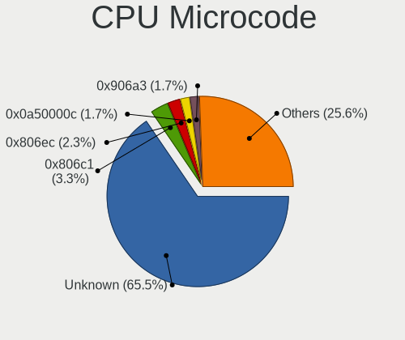
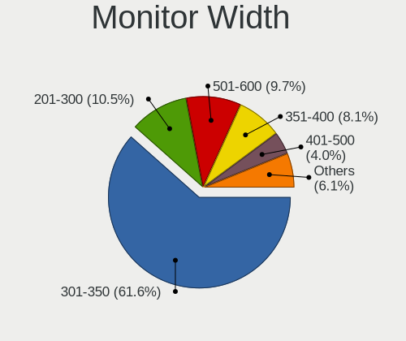
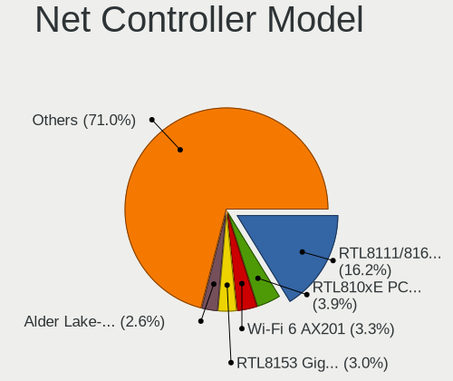
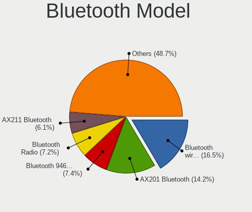
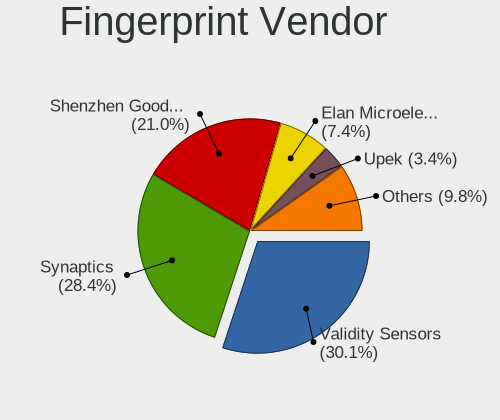

Ubuntu 22.04 - Tested Hardware & Statistics (Notebooks)
-------------------------------------------------------

A project to collect tested hardware configurations for Ubuntu 22.04.

Anyone can contribute to this report by the [hw-probe](https://github.com/linuxhw/hw-probe) tool:

    sudo -E hw-probe -all -upload

Please contribute! Especially if your hardware is rare.

Contents
--------

* [ Test Cases ](#test-cases)

* [ System ](#system)
  - [ Kernel                   ](#kernel)
  - [ Kernel Family            ](#kernel-family)
  - [ Kernel Major Ver.        ](#kernel-major-ver)
  - [ Arch                     ](#arch)
  - [ DE                       ](#de)
  - [ Display Server           ](#display-server)
  - [ Display Manager          ](#display-manager)
  - [ OS Lang                  ](#os-lang)
  - [ Boot Mode                ](#boot-mode)
  - [ Filesystem               ](#filesystem)
  - [ Part. scheme             ](#part-scheme)
  - [ Dual Boot with Linux/BSD ](#dual-boot-with-linuxbsd)
  - [ Dual Boot (Win)          ](#dual-boot-win)

* [ Board ](#board)
  - [ Vendor                   ](#vendor)
  - [ Model                    ](#model)
  - [ Model Family             ](#model-family)
  - [ MFG Year                 ](#mfg-year)
  - [ Form Factor              ](#form-factor)
  - [ Secure Boot              ](#secure-boot)
  - [ Coreboot                 ](#coreboot)
  - [ RAM Size                 ](#ram-size)
  - [ RAM Used                 ](#ram-used)
  - [ Total Drives             ](#total-drives)
  - [ Has CD-ROM               ](#has-cd-rom)
  - [ Has Ethernet             ](#has-ethernet)
  - [ Has WiFi                 ](#has-wifi)
  - [ Has Bluetooth            ](#has-bluetooth)

* [ Location ](#location)
  - [ Country                  ](#country)
  - [ City                     ](#city)

* [ Drives ](#drives)
  - [ Drive Vendor             ](#drive-vendor)
  - [ Drive Model              ](#drive-model)
  - [ HDD Vendor               ](#hdd-vendor)
  - [ SSD Vendor               ](#ssd-vendor)
  - [ Drive Kind               ](#drive-kind)
  - [ Drive Connector          ](#drive-connector)
  - [ Drive Size               ](#drive-size)
  - [ Space Total              ](#space-total)
  - [ Space Used               ](#space-used)
  - [ Malfunc. Drives          ](#malfunc-drives)
  - [ Malfunc. Drive Vendor    ](#malfunc-drive-vendor)
  - [ Malfunc. HDD Vendor      ](#malfunc-hdd-vendor)
  - [ Malfunc. Drive Kind      ](#malfunc-drive-kind)
  - [ Failed Drives            ](#failed-drives)
  - [ Failed Drive Vendor      ](#failed-drive-vendor)
  - [ Drive Status             ](#drive-status)

* [ Storage controller ](#storage-controller)
  - [ Storage Vendor           ](#storage-vendor)
  - [ Storage Model            ](#storage-model)
  - [ Storage Kind             ](#storage-kind)

* [ Processor ](#processor)
  - [ CPU Vendor               ](#cpu-vendor)
  - [ CPU Model                ](#cpu-model)
  - [ CPU Model Family         ](#cpu-model-family)
  - [ CPU Cores                ](#cpu-cores)
  - [ CPU Sockets              ](#cpu-sockets)
  - [ CPU Threads              ](#cpu-threads)
  - [ CPU Op-Modes             ](#cpu-op-modes)
  - [ CPU Microcode            ](#cpu-microcode)
  - [ CPU Microarch            ](#cpu-microarch)

* [ Graphics ](#graphics)
  - [ GPU Vendor               ](#gpu-vendor)
  - [ GPU Model                ](#gpu-model)
  - [ GPU Combo                ](#gpu-combo)
  - [ GPU Driver               ](#gpu-driver)
  - [ GPU Memory               ](#gpu-memory)

* [ Monitor ](#monitor)
  - [ Monitor Vendor           ](#monitor-vendor)
  - [ Monitor Model            ](#monitor-model)
  - [ Monitor Resolution       ](#monitor-resolution)
  - [ Monitor Diagonal         ](#monitor-diagonal)
  - [ Monitor Width            ](#monitor-width)
  - [ Aspect Ratio             ](#aspect-ratio)
  - [ Monitor Area             ](#monitor-area)
  - [ Pixel Density            ](#pixel-density)
  - [ Multiple Monitors        ](#multiple-monitors)

* [ Network ](#network)
  - [ Net Controller Vendor    ](#net-controller-vendor)
  - [ Net Controller Model     ](#net-controller-model)
  - [ Wireless Vendor          ](#wireless-vendor)
  - [ Wireless Model           ](#wireless-model)
  - [ Ethernet Vendor          ](#ethernet-vendor)
  - [ Ethernet Model           ](#ethernet-model)
  - [ Net Controller Kind      ](#net-controller-kind)
  - [ Used Controller          ](#used-controller)
  - [ NICs                     ](#nics)
  - [ IPv6                     ](#ipv6)

* [ Bluetooth ](#bluetooth)
  - [ Bluetooth Vendor         ](#bluetooth-vendor)
  - [ Bluetooth Model          ](#bluetooth-model)

* [ Sound ](#sound)
  - [ Sound Vendor             ](#sound-vendor)
  - [ Sound Model              ](#sound-model)

* [ Memory ](#memory)
  - [ Memory Vendor            ](#memory-vendor)
  - [ Memory Model             ](#memory-model)
  - [ Memory Kind              ](#memory-kind)
  - [ Memory Form Factor       ](#memory-form-factor)
  - [ Memory Size              ](#memory-size)
  - [ Memory Speed             ](#memory-speed)

* [ Printers & scanners ](#printers--scanners)
  - [ Printer Vendor           ](#printer-vendor)
  - [ Printer Model            ](#printer-model)
  - [ Scanner Vendor           ](#scanner-vendor)
  - [ Scanner Model            ](#scanner-model)

* [ Camera ](#camera)
  - [ Camera Vendor            ](#camera-vendor)
  - [ Camera Model             ](#camera-model)

* [ Security ](#security)
  - [ Fingerprint Vendor       ](#fingerprint-vendor)
  - [ Fingerprint Model        ](#fingerprint-model)
  - [ Chipcard Vendor          ](#chipcard-vendor)
  - [ Chipcard Model           ](#chipcard-model)

* [ Unsupported ](#unsupported)
  - [ Unsupported Devices      ](#unsupported-devices)
  - [ Unsupported Device Types ](#unsupported-device-types)

Test Cases
----------

Total: 8895

| Vendor        | Model                       | Probe                                                      | Date         |
|---------------|-----------------------------|------------------------------------------------------------|--------------|
| Acer          | Predator G9-793             | [fd305490af](https://linux-hardware.org/?probe=fd305490af) | Oct 01, 2023 |
| OriginPC      | X170KM-G                    | [2a8752667a](https://linux-hardware.org/?probe=2a8752667a) | Oct 01, 2023 |
| HP            | ProBook 650 G8 Notebook ... | [b02492c1dd](https://linux-hardware.org/?probe=b02492c1dd) | Oct 01, 2023 |
| GPU Compan... | GWTN156-4                   | [fa5491ff0c](https://linux-hardware.org/?probe=fa5491ff0c) | Oct 01, 2023 |
| ASUSTek       | X756UVK                     | [3bc56b23ef](https://linux-hardware.org/?probe=3bc56b23ef) | Sep 30, 2023 |
| ASUSTek       | Z450LA                      | [afa96a084e](https://linux-hardware.org/?probe=afa96a084e) | Sep 30, 2023 |
| HP            | EliteBook 820 G4            | [eb46d26ff8](https://linux-hardware.org/?probe=eb46d26ff8) | Sep 30, 2023 |
| ASUSTek       | F7SR                        | [b895fd8bb2](https://linux-hardware.org/?probe=b895fd8bb2) | Sep 30, 2023 |
| ASUSTek       | F7SR                        | [1b7493ae6e](https://linux-hardware.org/?probe=1b7493ae6e) | Sep 30, 2023 |
| Infinix       | INBOOK X3                   | [6b5c2647c2](https://linux-hardware.org/?probe=6b5c2647c2) | Sep 30, 2023 |
| Lenovo        | ThinkPad E15 Gen 4 21E60... | [951a03d2ad](https://linux-hardware.org/?probe=951a03d2ad) | Sep 30, 2023 |
| Fujitsu Si... | AMILO Pa 2548               | [ee2d5e25d3](https://linux-hardware.org/?probe=ee2d5e25d3) | Sep 30, 2023 |
| Entroware     | Hybris                      | [5b124e9b7f](https://linux-hardware.org/?probe=5b124e9b7f) | Sep 30, 2023 |
| UNOWHY        | Y13G012S4EI                 | [2b60435562](https://linux-hardware.org/?probe=2b60435562) | Sep 30, 2023 |
| Fujitsu Si... | AMILO Pa 2548               | [a291afc6c3](https://linux-hardware.org/?probe=a291afc6c3) | Sep 30, 2023 |
| Dell          | Latitude 5430               | [eee2a34ff5](https://linux-hardware.org/?probe=eee2a34ff5) | Sep 30, 2023 |
| TECNO         | MEGABOOK T1                 | [9bba77e02b](https://linux-hardware.org/?probe=9bba77e02b) | Sep 30, 2023 |
| Samsung       | 305E4A/305E5A/305E7A        | [89d519a3f5](https://linux-hardware.org/?probe=89d519a3f5) | Sep 30, 2023 |
| Acer          | Aspire SW3-016              | [62c3855aa7](https://linux-hardware.org/?probe=62c3855aa7) | Sep 30, 2023 |
| HP            | Notebook                    | [873004172f](https://linux-hardware.org/?probe=873004172f) | Sep 30, 2023 |
| Sony          | VPCEG10EL                   | [8271942cc2](https://linux-hardware.org/?probe=8271942cc2) | Sep 30, 2023 |
| ASUSTek       | ASUS TUF Gaming A15 FA50... | [527c8192a9](https://linux-hardware.org/?probe=527c8192a9) | Sep 30, 2023 |
| Dell          | Inspiron 5521               | [a704dd3c01](https://linux-hardware.org/?probe=a704dd3c01) | Sep 30, 2023 |
| VALE          | Notebook Classic C140       | [5be7208021](https://linux-hardware.org/?probe=5be7208021) | Sep 30, 2023 |
| HP            | Dragonfly 13.5 inch G4 N... | [2afa933d2a](https://linux-hardware.org/?probe=2afa933d2a) | Sep 30, 2023 |
| Unknown       | Unknown                     | [56580ba351](https://linux-hardware.org/?probe=56580ba351) | Sep 30, 2023 |
| HP            | Dragonfly 13.5 inch G4 N... | [a7a8e627cb](https://linux-hardware.org/?probe=a7a8e627cb) | Sep 30, 2023 |
| ASUSTek       | ZenBook UX425QA_UM425QA     | [306bc123c4](https://linux-hardware.org/?probe=306bc123c4) | Sep 29, 2023 |
| Lenovo        | G770 1037                   | [576bbd3839](https://linux-hardware.org/?probe=576bbd3839) | Sep 29, 2023 |
| Lenovo        | ThinkPad X13 Gen 1 20UGA... | [8c1d3fc469](https://linux-hardware.org/?probe=8c1d3fc469) | Sep 29, 2023 |
| Dell          | XPS 15 9550                 | [587f9a3ff1](https://linux-hardware.org/?probe=587f9a3ff1) | Sep 29, 2023 |
| Lenovo        | ThinkPad X13 Gen 1 20UGA... | [c38ca27643](https://linux-hardware.org/?probe=c38ca27643) | Sep 29, 2023 |
| ASUSTek       | ASUS TUF Gaming A15 FA50... | [96e037afc8](https://linux-hardware.org/?probe=96e037afc8) | Sep 29, 2023 |
| Apple         | MacBookAir6,1               | [b77b45ce58](https://linux-hardware.org/?probe=b77b45ce58) | Sep 29, 2023 |
| Dell          | Latitude 5500               | [ea091dbcf2](https://linux-hardware.org/?probe=ea091dbcf2) | Sep 29, 2023 |
| HP            | OMEN by Laptop 15-dc1xxx    | [2d31a3d858](https://linux-hardware.org/?probe=2d31a3d858) | Sep 29, 2023 |
| Alienware     | m16 R1 AMD                  | [710a10efce](https://linux-hardware.org/?probe=710a10efce) | Sep 29, 2023 |
| MSI           | Prestige 15 A12SC           | [d78d241946](https://linux-hardware.org/?probe=d78d241946) | Sep 29, 2023 |
| ASUSTek       | VivoBook_ASUSLaptop X412... | [5828bffdb6](https://linux-hardware.org/?probe=5828bffdb6) | Sep 29, 2023 |
| Dell          | Inspiron 15-3552            | [8a8f11edae](https://linux-hardware.org/?probe=8a8f11edae) | Sep 29, 2023 |
| HP            | Laptop 14-fq0xxx            | [52648b0b45](https://linux-hardware.org/?probe=52648b0b45) | Sep 29, 2023 |
| Lenovo        | ThinkPad E495 20NE0001US    | [a76a94cd2f](https://linux-hardware.org/?probe=a76a94cd2f) | Sep 29, 2023 |
| Dell          | Inspiron 5437               | [c0301c2fbb](https://linux-hardware.org/?probe=c0301c2fbb) | Sep 29, 2023 |
| Lenovo        | V15 G2 ITL 82KB             | [e87fdc15ed](https://linux-hardware.org/?probe=e87fdc15ed) | Sep 29, 2023 |
| Lenovo        | V15 G2 ITL 82KB             | [b1333a2976](https://linux-hardware.org/?probe=b1333a2976) | Sep 29, 2023 |
| HP            | Stream Laptop 14-ds0xxx     | [bbab7c9f89](https://linux-hardware.org/?probe=bbab7c9f89) | Sep 29, 2023 |
| HP            | Stream Laptop 14-ds0xxx     | [4f23a67b82](https://linux-hardware.org/?probe=4f23a67b82) | Sep 29, 2023 |
| Samsung       | 340XAA/350XAA/550XAA        | [ccc715eeb6](https://linux-hardware.org/?probe=ccc715eeb6) | Sep 29, 2023 |
| Lenovo        | Yoga Slim 7 Carbon 14ACN... | [a5e7296c29](https://linux-hardware.org/?probe=a5e7296c29) | Sep 28, 2023 |
| HP            | ENVY 17                     | [184a826bba](https://linux-hardware.org/?probe=184a826bba) | Sep 28, 2023 |
| I-Life Dig... | ZED AIR PRO                 | [7cb30879f6](https://linux-hardware.org/?probe=7cb30879f6) | Sep 28, 2023 |
| Dell          | Precision 3560              | [14af02a240](https://linux-hardware.org/?probe=14af02a240) | Sep 28, 2023 |
| Lenovo        | ThinkPad T14 Gen 3 21AJS... | [38e71e4fe9](https://linux-hardware.org/?probe=38e71e4fe9) | Sep 28, 2023 |
| HP            | Laptop 15-fd0xxx            | [0a548c4390](https://linux-hardware.org/?probe=0a548c4390) | Sep 28, 2023 |
| ASUSTek       | ROG Zephyrus G14 GA401IU... | [f86a0719d7](https://linux-hardware.org/?probe=f86a0719d7) | Sep 28, 2023 |
| Lenovo        | ThinkPad T14 Gen 2i 20W0... | [c8dfaf68d0](https://linux-hardware.org/?probe=c8dfaf68d0) | Sep 28, 2023 |
| HP            | Pavilion 11 x360 PC         | [b6316ea4df](https://linux-hardware.org/?probe=b6316ea4df) | Sep 28, 2023 |
| HUAWEI        | NBLB-WAX9N                  | [7cbed3fca6](https://linux-hardware.org/?probe=7cbed3fca6) | Sep 28, 2023 |
| HP            | Pavilion 11 x360 PC         | [f75ab187aa](https://linux-hardware.org/?probe=f75ab187aa) | Sep 28, 2023 |
| Lenovo        | ThinkPad E14 Gen 3 20Y70... | [78b1c422c7](https://linux-hardware.org/?probe=78b1c422c7) | Sep 28, 2023 |
| HP            | Notebook                    | [7d55fd8520](https://linux-hardware.org/?probe=7d55fd8520) | Sep 28, 2023 |
| Alienware     | x14                         | [048d5f6f2a](https://linux-hardware.org/?probe=048d5f6f2a) | Sep 28, 2023 |
| ASUSTek       | X550CC                      | [001231c730](https://linux-hardware.org/?probe=001231c730) | Sep 28, 2023 |
| HP            | Notebook                    | [49192b29a6](https://linux-hardware.org/?probe=49192b29a6) | Sep 28, 2023 |
| HP            | Laptop 15-da0xxx            | [3d996f9823](https://linux-hardware.org/?probe=3d996f9823) | Sep 28, 2023 |
| Dell          | Inspiron 5515               | [5889ba673d](https://linux-hardware.org/?probe=5889ba673d) | Sep 27, 2023 |
| HP            | Laptop 15-da0xxx            | [8fb9d5d21f](https://linux-hardware.org/?probe=8fb9d5d21f) | Sep 27, 2023 |
| Toshiba       | Satellite L550              | [d93c40647f](https://linux-hardware.org/?probe=d93c40647f) | Sep 27, 2023 |
| Lenovo        | ThinkPad X1 Carbon Gen 8... | [b5dee453a3](https://linux-hardware.org/?probe=b5dee453a3) | Sep 27, 2023 |
| Lenovo        | IdeaPad 1 14IGL7 82V6       | [707c612189](https://linux-hardware.org/?probe=707c612189) | Sep 27, 2023 |
| AMI           | Cherry Trail CR             | [41b2d006c1](https://linux-hardware.org/?probe=41b2d006c1) | Sep 27, 2023 |
| AMI           | Cherry Trail CR             | [050c423c6b](https://linux-hardware.org/?probe=050c423c6b) | Sep 27, 2023 |
| Dell          | Latitude 7390               | [93e22b6fc4](https://linux-hardware.org/?probe=93e22b6fc4) | Sep 27, 2023 |
| HP            | EliteBook 840 G8 Noteboo... | [593ddb6105](https://linux-hardware.org/?probe=593ddb6105) | Sep 27, 2023 |
| Dell          | Latitude 7390               | [a7bfa2e285](https://linux-hardware.org/?probe=a7bfa2e285) | Sep 27, 2023 |
| Clevo         | W240EU/W250EUQ/W270EUQ      | [cd5d2fae9e](https://linux-hardware.org/?probe=cd5d2fae9e) | Sep 27, 2023 |
| Dell          | Precision 5570              | [f00d32a04a](https://linux-hardware.org/?probe=f00d32a04a) | Sep 27, 2023 |
| Sony          | VPCEG10EL                   | [7bfbe9b21d](https://linux-hardware.org/?probe=7bfbe9b21d) | Sep 27, 2023 |
| Lenovo        | IdeaPad 320-15IKB 81BG      | [17f9208e1a](https://linux-hardware.org/?probe=17f9208e1a) | Sep 27, 2023 |
| HUAWEI        | BOHB-WAX9                   | [054707cbd2](https://linux-hardware.org/?probe=054707cbd2) | Sep 27, 2023 |
| Toshiba       | dynabook T350/46BW          | [26ffaa1c0f](https://linux-hardware.org/?probe=26ffaa1c0f) | Sep 27, 2023 |
| HP            | EliteBook 8470p             | [a1fa543905](https://linux-hardware.org/?probe=a1fa543905) | Sep 27, 2023 |
| Dell          | Vostro 3500                 | [fac9ee2e6e](https://linux-hardware.org/?probe=fac9ee2e6e) | Sep 27, 2023 |
| ASUSTek       | VivoBook_ASUSLaptop M350... | [0e32901b18](https://linux-hardware.org/?probe=0e32901b18) | Sep 27, 2023 |
| HUAWEI        | KLVL-WXXW                   | [4f1f07158b](https://linux-hardware.org/?probe=4f1f07158b) | Sep 26, 2023 |
| HP            | ProBook 450 G8 Notebook ... | [c0607441c1](https://linux-hardware.org/?probe=c0607441c1) | Sep 26, 2023 |
| Lenovo        | ThinkPad T590 20N5S31U02    | [d4137582b5](https://linux-hardware.org/?probe=d4137582b5) | Sep 26, 2023 |
| Google        | Phaser360                   | [95686db08c](https://linux-hardware.org/?probe=95686db08c) | Sep 26, 2023 |
| Lenovo        | ThinkPad T590 20N5S31U02    | [aa988ac4df](https://linux-hardware.org/?probe=aa988ac4df) | Sep 26, 2023 |
| HP            | Laptop 15-dy2xxx            | [8fd945e3c5](https://linux-hardware.org/?probe=8fd945e3c5) | Sep 26, 2023 |
| Dell          | Inspiron 5423               | [a6a3b2697f](https://linux-hardware.org/?probe=a6a3b2697f) | Sep 26, 2023 |
| Lenovo        | ThinkBook 15 G2 ITL 20VE    | [92eb612b66](https://linux-hardware.org/?probe=92eb612b66) | Sep 26, 2023 |
| PC Special... | PCX0DX                      | [935fe5ddb0](https://linux-hardware.org/?probe=935fe5ddb0) | Sep 26, 2023 |
| Lenovo        | V15 G2 ALC 82KD             | [21c3145a6a](https://linux-hardware.org/?probe=21c3145a6a) | Sep 26, 2023 |
| Lenovo        | ThinkPad T14 Gen 3 21AH0... | [2cf86f7f12](https://linux-hardware.org/?probe=2cf86f7f12) | Sep 26, 2023 |
| HP            | Laptop 15s-fq2xxx           | [22294a7a32](https://linux-hardware.org/?probe=22294a7a32) | Sep 26, 2023 |
| Lenovo        | ThinkPad P16s Gen 1 21BT... | [47d912c5a9](https://linux-hardware.org/?probe=47d912c5a9) | Sep 26, 2023 |
| Lenovo        | ThinkPad P16s Gen 1 21BT... | [d2a926c703](https://linux-hardware.org/?probe=d2a926c703) | Sep 26, 2023 |
| Lenovo        | Yoga Slim 7 Pro 14ACH5 8... | [b6cd63eedc](https://linux-hardware.org/?probe=b6cd63eedc) | Sep 26, 2023 |
| Samsung       | 305E4A/305E5A/305E7A        | [24a1d008e6](https://linux-hardware.org/?probe=24a1d008e6) | Sep 26, 2023 |
| Acer          | Aspire E1-570               | [98ed9bca40](https://linux-hardware.org/?probe=98ed9bca40) | Sep 26, 2023 |
| Lenovo        | IdeaPad 5 14ARE05 81YM      | [786338b217](https://linux-hardware.org/?probe=786338b217) | Sep 26, 2023 |
| HP            | Pavilion 14                 | [a7589d8c93](https://linux-hardware.org/?probe=a7589d8c93) | Sep 26, 2023 |
| Notebook      | N2x0WU                      | [49046ef274](https://linux-hardware.org/?probe=49046ef274) | Sep 26, 2023 |
| HP            | Pavilion 14                 | [1aed6aba04](https://linux-hardware.org/?probe=1aed6aba04) | Sep 26, 2023 |
| Samsung       | 340XAA/350XAA/550XAA        | [3d8dfdbf80](https://linux-hardware.org/?probe=3d8dfdbf80) | Sep 26, 2023 |
| Lenovo        | IdeaPad 320-15ISK 80XH      | [6a3291f6bf](https://linux-hardware.org/?probe=6a3291f6bf) | Sep 25, 2023 |
| Lenovo        | IdeaPad 320-15ISK 80XH      | [981e7e8ec5](https://linux-hardware.org/?probe=981e7e8ec5) | Sep 25, 2023 |
| Lenovo        | Legion 5 15IMH05H 81Y6      | [c62002acdf](https://linux-hardware.org/?probe=c62002acdf) | Sep 25, 2023 |
| HP            | Laptop 15s-fq2xxx           | [0aa73d620b](https://linux-hardware.org/?probe=0aa73d620b) | Sep 25, 2023 |
| HUAWEI        | BOM-WXX9                    | [8d4ba0b939](https://linux-hardware.org/?probe=8d4ba0b939) | Sep 25, 2023 |
| HP            | Pavilion Laptop 14-ec0xx... | [6b0a58d94c](https://linux-hardware.org/?probe=6b0a58d94c) | Sep 25, 2023 |
| Dell          | Vostro 15 5510              | [b2d58819cc](https://linux-hardware.org/?probe=b2d58819cc) | Sep 25, 2023 |
| Dell          | Inspiron 1545               | [96508134e8](https://linux-hardware.org/?probe=96508134e8) | Sep 25, 2023 |
| Dell          | Precision M6800             | [027ed86f53](https://linux-hardware.org/?probe=027ed86f53) | Sep 25, 2023 |
| Fujitsu       | FMVA42CW                    | [48a8e36d5f](https://linux-hardware.org/?probe=48a8e36d5f) | Sep 25, 2023 |
| Fujitsu       | FMVA42CW                    | [8427efde7d](https://linux-hardware.org/?probe=8427efde7d) | Sep 25, 2023 |
| HP            | EliteBook 745 G3            | [a814d9fa4b](https://linux-hardware.org/?probe=a814d9fa4b) | Sep 25, 2023 |
| Acer          | Swift SF314-41              | [ef8b479649](https://linux-hardware.org/?probe=ef8b479649) | Sep 25, 2023 |
| Acer          | Swift SF314-44              | [6f5d49e16f](https://linux-hardware.org/?probe=6f5d49e16f) | Sep 25, 2023 |
| Acer          | Swift SF14-71T              | [10b657bd75](https://linux-hardware.org/?probe=10b657bd75) | Sep 25, 2023 |
| Acer          | Swift SF314-44              | [12f4ab85f3](https://linux-hardware.org/?probe=12f4ab85f3) | Sep 25, 2023 |
| Lenovo        | ThinkPad T450 20BUS1A100    | [f4887bacc7](https://linux-hardware.org/?probe=f4887bacc7) | Sep 25, 2023 |
| HUAWEI        | BOM-WXX9                    | [ed52653514](https://linux-hardware.org/?probe=ed52653514) | Sep 25, 2023 |
| Acer          | Nitro AN515-54              | [6383f263a8](https://linux-hardware.org/?probe=6383f263a8) | Sep 25, 2023 |
| ASUSTek       | ASUS TUF Gaming F15 FX50... | [b69f53c8fe](https://linux-hardware.org/?probe=b69f53c8fe) | Sep 25, 2023 |
| Dell          | Vostro 15 3510              | [e8868c236d](https://linux-hardware.org/?probe=e8868c236d) | Sep 25, 2023 |
| Dell          | Vostro 15 3510              | [eaa5061963](https://linux-hardware.org/?probe=eaa5061963) | Sep 25, 2023 |
| Acer          | Aspire V3-472P              | [b5ebe3295c](https://linux-hardware.org/?probe=b5ebe3295c) | Sep 25, 2023 |
| Apple         | MacBookPro7,1               | [677446fafa](https://linux-hardware.org/?probe=677446fafa) | Sep 25, 2023 |
| Lenovo        | ThinkPad T14 Gen 2a 20XL... | [336d5fe8c8](https://linux-hardware.org/?probe=336d5fe8c8) | Sep 25, 2023 |
| Acer          | Aspire E5-571               | [c834abf6b2](https://linux-hardware.org/?probe=c834abf6b2) | Sep 25, 2023 |
| TUXEDO        | Unknown                     | [6746de397a](https://linux-hardware.org/?probe=6746de397a) | Sep 25, 2023 |
| ASUSTek       | VivoBook_ASUSLaptop M160... | [811f1951fc](https://linux-hardware.org/?probe=811f1951fc) | Sep 25, 2023 |
| Dell          | Precision 5550              | [5a4d44b194](https://linux-hardware.org/?probe=5a4d44b194) | Sep 24, 2023 |
| Acer          | Aspire A715-42G             | [868a5abe75](https://linux-hardware.org/?probe=868a5abe75) | Sep 24, 2023 |
| ASUSTek       | N56VZ                       | [3d727dfaf6](https://linux-hardware.org/?probe=3d727dfaf6) | Sep 24, 2023 |
| Dell          | Latitude E6520              | [9fd6a2a84f](https://linux-hardware.org/?probe=9fd6a2a84f) | Sep 24, 2023 |
| HP            | Laptop 15s-fq2xxx           | [98ad01dfc0](https://linux-hardware.org/?probe=98ad01dfc0) | Sep 24, 2023 |
| Lenovo        | ThinkPad E14 Gen 4 21EB0... | [e87fa96814](https://linux-hardware.org/?probe=e87fa96814) | Sep 24, 2023 |
| Lenovo        | ThinkPad E14 Gen 4 21EB0... | [29399bf284](https://linux-hardware.org/?probe=29399bf284) | Sep 24, 2023 |
| Samsung       | 550XBE/350XBE               | [cdbacef976](https://linux-hardware.org/?probe=cdbacef976) | Sep 24, 2023 |
| Acer          | Aspire A515-56              | [3d1de53032](https://linux-hardware.org/?probe=3d1de53032) | Sep 24, 2023 |
| Dell          | XPS 13 9305                 | [7c0b883934](https://linux-hardware.org/?probe=7c0b883934) | Sep 24, 2023 |
| Unknown       | X133                        | [eca7c95360](https://linux-hardware.org/?probe=eca7c95360) | Sep 24, 2023 |
| Acer          | Swift SF314-44              | [b7f58e92a0](https://linux-hardware.org/?probe=b7f58e92a0) | Sep 24, 2023 |
| Lenovo        | IdeaPad 3 14ALC6 82KT       | [eef80142a9](https://linux-hardware.org/?probe=eef80142a9) | Sep 24, 2023 |
| HP            | Laptop 15s-fq2xxx           | [747f5bd882](https://linux-hardware.org/?probe=747f5bd882) | Sep 24, 2023 |
| Lenovo        | ThinkPad P50 20EQS3FS00     | [a3ee3b9ca3](https://linux-hardware.org/?probe=a3ee3b9ca3) | Sep 24, 2023 |
| HP            | EliteBook 830 G5            | [a6ac161796](https://linux-hardware.org/?probe=a6ac161796) | Sep 24, 2023 |
| HP            | ZBook 14 G2                 | [1f29f31860](https://linux-hardware.org/?probe=1f29f31860) | Sep 24, 2023 |
| HP            | EliteBook 8560w             | [0e7984242d](https://linux-hardware.org/?probe=0e7984242d) | Sep 24, 2023 |
| HP            | Laptop 14-cm0xxx            | [2af47d0dca](https://linux-hardware.org/?probe=2af47d0dca) | Sep 24, 2023 |
| HP            | ZBook 15v G5                | [c01fb4aeb0](https://linux-hardware.org/?probe=c01fb4aeb0) | Sep 24, 2023 |
| HP            | ZBook 15v G5                | [6495e2ad69](https://linux-hardware.org/?probe=6495e2ad69) | Sep 24, 2023 |
| ASUSTek       | VivoBook 15 ASUS Laptop ... | [40e72b93b6](https://linux-hardware.org/?probe=40e72b93b6) | Sep 24, 2023 |
| UMAX          | VisionBook 14Wr             | [5e8b69ec67](https://linux-hardware.org/?probe=5e8b69ec67) | Sep 23, 2023 |
| Toshiba       | Satellite L855              | [646b34b912](https://linux-hardware.org/?probe=646b34b912) | Sep 23, 2023 |
| Acer          | TravelMate P215-53G         | [ddda10c87f](https://linux-hardware.org/?probe=ddda10c87f) | Sep 23, 2023 |
| Toshiba       | Satellite L855              | [8384ddec2e](https://linux-hardware.org/?probe=8384ddec2e) | Sep 23, 2023 |
| HP            | EliteBook 840 G2            | [b8d84dc938](https://linux-hardware.org/?probe=b8d84dc938) | Sep 23, 2023 |
| Lenovo        | Yoga Slim 9 14ITL5 82D1     | [05ef373ef0](https://linux-hardware.org/?probe=05ef373ef0) | Sep 23, 2023 |
| Lenovo        | Yoga Slim 9 14ITL5 82D1     | [a57b236842](https://linux-hardware.org/?probe=a57b236842) | Sep 23, 2023 |
| Lenovo        | ThinkPad X1 Carbon Gen 8... | [b5584b2b96](https://linux-hardware.org/?probe=b5584b2b96) | Sep 23, 2023 |
| Fujitsu       | LIFEBOOK T730               | [7a0f7921c4](https://linux-hardware.org/?probe=7a0f7921c4) | Sep 23, 2023 |
| Lenovo        | ThinkPad X1 Carbon 7th 2... | [d3322d740d](https://linux-hardware.org/?probe=d3322d740d) | Sep 23, 2023 |
| MSI           | MS-1651 Ver                 | [93cfb04861](https://linux-hardware.org/?probe=93cfb04861) | Sep 23, 2023 |
| MSI           | MS-1651 Ver                 | [e71155ca01](https://linux-hardware.org/?probe=e71155ca01) | Sep 23, 2023 |
| Lenovo        | G50-80 80L0                 | [f08b8528da](https://linux-hardware.org/?probe=f08b8528da) | Sep 23, 2023 |
| UNOWHY        | Y13G002S4EI                 | [c3f95beccb](https://linux-hardware.org/?probe=c3f95beccb) | Sep 23, 2023 |
| Dell          | Precision M6600             | [1cef385aec](https://linux-hardware.org/?probe=1cef385aec) | Sep 23, 2023 |
| HP            | Pavilion g6                 | [226a590989](https://linux-hardware.org/?probe=226a590989) | Sep 23, 2023 |
| Lenovo        | IdeaPad S145-15IGM 81WT     | [7022eac21d](https://linux-hardware.org/?probe=7022eac21d) | Sep 23, 2023 |
| ASUSTek       | VivoBook_ASUSLaptop M350... | [c4b66b8208](https://linux-hardware.org/?probe=c4b66b8208) | Sep 23, 2023 |
| Panasonic     | FZG1-4                      | [bb4677655e](https://linux-hardware.org/?probe=bb4677655e) | Sep 23, 2023 |
| Lenovo        | ThinkPad X1 Carbon 6th 2... | [e344b05a7a](https://linux-hardware.org/?probe=e344b05a7a) | Sep 23, 2023 |
| HP            | Notebook                    | [0d03790c02](https://linux-hardware.org/?probe=0d03790c02) | Sep 23, 2023 |
| HP            | Notebook                    | [f9cec347c3](https://linux-hardware.org/?probe=f9cec347c3) | Sep 23, 2023 |
| Dell          | Latitude 5480               | [30b7787143](https://linux-hardware.org/?probe=30b7787143) | Sep 23, 2023 |
| Google        | Blorb                       | [778d4cb622](https://linux-hardware.org/?probe=778d4cb622) | Sep 22, 2023 |
| Dell          | Latitude E6440              | [41269356be](https://linux-hardware.org/?probe=41269356be) | Sep 22, 2023 |
| Lenovo        | ThinkPad X220 Tablet 429... | [9323b69b4b](https://linux-hardware.org/?probe=9323b69b4b) | Sep 22, 2023 |
| Google        | Blorb                       | [3a001130af](https://linux-hardware.org/?probe=3a001130af) | Sep 22, 2023 |
| ASUSTek       | VivoBook_ASUSLaptop X321... | [d62c6d340f](https://linux-hardware.org/?probe=d62c6d340f) | Sep 22, 2023 |
| Lenovo        | IdeaPad S145-15IGM 81WT     | [65a21a4968](https://linux-hardware.org/?probe=65a21a4968) | Sep 22, 2023 |
| TUXEDO        | Unknown                     | [07870d9c20](https://linux-hardware.org/?probe=07870d9c20) | Sep 22, 2023 |
| Lenovo        | ThinkPad X220 4290EC5       | [3cb76d839a](https://linux-hardware.org/?probe=3cb76d839a) | Sep 22, 2023 |
| Lenovo        | ThinkPad X230 23259T0       | [20286ecb4c](https://linux-hardware.org/?probe=20286ecb4c) | Sep 22, 2023 |
| Dell          | XPS 15 7590                 | [146d33a16d](https://linux-hardware.org/?probe=146d33a16d) | Sep 22, 2023 |
| Dell          | Latitude 5290 2-in-1        | [71b5a459b2](https://linux-hardware.org/?probe=71b5a459b2) | Sep 22, 2023 |
| Dell          | Latitude 5590               | [068de61e23](https://linux-hardware.org/?probe=068de61e23) | Sep 22, 2023 |
| ASUSTek       | X551CAP                     | [b90045e0f9](https://linux-hardware.org/?probe=b90045e0f9) | Sep 22, 2023 |
| ASUSTek       | K53TK                       | [65e95a03e9](https://linux-hardware.org/?probe=65e95a03e9) | Sep 22, 2023 |
| Dell          | Latitude 5421               | [fd5892945d](https://linux-hardware.org/?probe=fd5892945d) | Sep 21, 2023 |
| ASUSTek       | K53TK                       | [34857762c0](https://linux-hardware.org/?probe=34857762c0) | Sep 21, 2023 |
| Dell          | Latitude 5421               | [50a3d79521](https://linux-hardware.org/?probe=50a3d79521) | Sep 21, 2023 |
| Toshiba       | Satellite L855              | [ee1cb0c5cc](https://linux-hardware.org/?probe=ee1cb0c5cc) | Sep 21, 2023 |
| Lenovo        | ThinkPad X1 Carbon Gen 9... | [98ab1e6859](https://linux-hardware.org/?probe=98ab1e6859) | Sep 21, 2023 |
| Acer          | Aspire 5742G                | [ee84a8d240](https://linux-hardware.org/?probe=ee84a8d240) | Sep 21, 2023 |
| Lenovo        | IdeaPad S340-15IIL 81VW     | [874c33c481](https://linux-hardware.org/?probe=874c33c481) | Sep 21, 2023 |
| Lenovo        | ThinkPad T14 Gen 1 20UD0... | [4ab55a6c83](https://linux-hardware.org/?probe=4ab55a6c83) | Sep 21, 2023 |
| Lenovo        | IdeaPadFlex 15D 20334       | [82b9c0d614](https://linux-hardware.org/?probe=82b9c0d614) | Sep 21, 2023 |
| HP            | EliteBook 845 G8 Noteboo... | [3847c20962](https://linux-hardware.org/?probe=3847c20962) | Sep 21, 2023 |
| MSI           | Katana GF66 11UC            | [20dfeb32a2](https://linux-hardware.org/?probe=20dfeb32a2) | Sep 21, 2023 |
| Lenovo        | ThinkPad T14 Gen 1 20UD0... | [a41b85a029](https://linux-hardware.org/?probe=a41b85a029) | Sep 21, 2023 |
| Acer          | Aspire R3-431T              | [510e10a692](https://linux-hardware.org/?probe=510e10a692) | Sep 21, 2023 |
| ASUSTek       | X550CC                      | [265f8a4dcd](https://linux-hardware.org/?probe=265f8a4dcd) | Sep 21, 2023 |
| Dell          | Precision 5680              | [55deb46665](https://linux-hardware.org/?probe=55deb46665) | Sep 21, 2023 |
| Acer          | Aspire E5-575               | [3126f2c7c6](https://linux-hardware.org/?probe=3126f2c7c6) | Sep 21, 2023 |
| Gateway       | P-7805u                     | [baae0fec2e](https://linux-hardware.org/?probe=baae0fec2e) | Sep 21, 2023 |
| Acer          | Aspire R3-431T              | [a406b53d93](https://linux-hardware.org/?probe=a406b53d93) | Sep 21, 2023 |
| Gateway       | P-7805u                     | [edcd214333](https://linux-hardware.org/?probe=edcd214333) | Sep 21, 2023 |
| Lenovo        | ThinkPad X270 20HMS0DF00    | [276048d4f4](https://linux-hardware.org/?probe=276048d4f4) | Sep 20, 2023 |
| Lenovo        | ThinkPad E580 20KS001RUK    | [9882734ee2](https://linux-hardware.org/?probe=9882734ee2) | Sep 20, 2023 |
| HP            | 15 Notebook PC              | [c1abb47e39](https://linux-hardware.org/?probe=c1abb47e39) | Sep 20, 2023 |
| ASUSTek       | Zenbook UM3402YA_UM3402Y... | [4064a0898f](https://linux-hardware.org/?probe=4064a0898f) | Sep 20, 2023 |
| Lenovo        | ThinkPad L14 Gen 2 20X10... | [9879896d79](https://linux-hardware.org/?probe=9879896d79) | Sep 20, 2023 |
| Toshiba       | PORTEGE X30-E               | [2225b3687d](https://linux-hardware.org/?probe=2225b3687d) | Sep 20, 2023 |
| Apple         | MacBookPro15,1              | [b74bbced53](https://linux-hardware.org/?probe=b74bbced53) | Sep 20, 2023 |
| Apple         | MacBookPro8,1               | [c5e9108ee7](https://linux-hardware.org/?probe=c5e9108ee7) | Sep 20, 2023 |
| Acer          | Aspire 7750G                | [942c136417](https://linux-hardware.org/?probe=942c136417) | Sep 20, 2023 |
| Dell          | Precision 3510              | [2a10a66b9c](https://linux-hardware.org/?probe=2a10a66b9c) | Sep 20, 2023 |
| ASUSTek       | ROG Zephyrus G15 GA503QM... | [2846c7bbed](https://linux-hardware.org/?probe=2846c7bbed) | Sep 20, 2023 |
| Medion        | E6417 MD99252               | [749d8cd6a6](https://linux-hardware.org/?probe=749d8cd6a6) | Sep 20, 2023 |
| Dell          | Inspiron 3521               | [7815e94ca7](https://linux-hardware.org/?probe=7815e94ca7) | Sep 20, 2023 |
| Dell          | Inspiron 15-7579            | [d85124e7d2](https://linux-hardware.org/?probe=d85124e7d2) | Sep 20, 2023 |
| ASUSTek       | VivoBook_ASUSLaptop X512... | [c88b7c27fc](https://linux-hardware.org/?probe=c88b7c27fc) | Sep 20, 2023 |
| Toshiba       | Satellite L550              | [f55adbf4eb](https://linux-hardware.org/?probe=f55adbf4eb) | Sep 20, 2023 |
| HP            | EliteBook 8460p             | [7a6c8c1d0a](https://linux-hardware.org/?probe=7a6c8c1d0a) | Sep 20, 2023 |
| Acer          | Aspire A517-52              | [93b7c8d721](https://linux-hardware.org/?probe=93b7c8d721) | Sep 20, 2023 |
| HP            | EliteBook 8460p             | [6f7974b0f0](https://linux-hardware.org/?probe=6f7974b0f0) | Sep 20, 2023 |
| Dell          | Vostro 15 5510              | [9c3cf02807](https://linux-hardware.org/?probe=9c3cf02807) | Sep 20, 2023 |
| Dell          | Inspiron 15 7000 Gaming     | [16b2b018c1](https://linux-hardware.org/?probe=16b2b018c1) | Sep 20, 2023 |
| Chuwi         | LapBook Pro                 | [c3ff4d2f56](https://linux-hardware.org/?probe=c3ff4d2f56) | Sep 20, 2023 |
| Acer          | Aspire A517-52              | [b88d2679f2](https://linux-hardware.org/?probe=b88d2679f2) | Sep 19, 2023 |
| Dell          | Precision M6600             | [ddd4a0bdc5](https://linux-hardware.org/?probe=ddd4a0bdc5) | Sep 19, 2023 |
| Apple         | MacBookPro10,1              | [ccfc281f1a](https://linux-hardware.org/?probe=ccfc281f1a) | Sep 19, 2023 |
| Lenovo        | IdeaPad S540-14IWL 81ND     | [d48dce11ee](https://linux-hardware.org/?probe=d48dce11ee) | Sep 19, 2023 |
| Lenovo        | ThinkPad E480 20KNS0MM00    | [ef56d33374](https://linux-hardware.org/?probe=ef56d33374) | Sep 19, 2023 |
| Dell          | Precision 5550              | [a1c163a7e2](https://linux-hardware.org/?probe=a1c163a7e2) | Sep 19, 2023 |
| HP            | EliteBook 840 G2            | [54aca4b27b](https://linux-hardware.org/?probe=54aca4b27b) | Sep 19, 2023 |
| Daten Tecn... | DT02-M4                     | [67c158a4f1](https://linux-hardware.org/?probe=67c158a4f1) | Sep 19, 2023 |
| Dell          | Latitude E5450              | [6f16759400](https://linux-hardware.org/?probe=6f16759400) | Sep 19, 2023 |
| Lenovo        | ThinkPad T14 Gen 1 20UES... | [16f80f70a8](https://linux-hardware.org/?probe=16f80f70a8) | Sep 19, 2023 |
| Lenovo        | G550 20023                  | [a79d31d050](https://linux-hardware.org/?probe=a79d31d050) | Sep 19, 2023 |
| Dell          | Inspiron 7537               | [f3e268a82d](https://linux-hardware.org/?probe=f3e268a82d) | Sep 19, 2023 |
| HP            | Notebook                    | [3c10ef5d72](https://linux-hardware.org/?probe=3c10ef5d72) | Sep 19, 2023 |
| Lenovo        | ThinkPad X13 Gen 2i 20WL... | [7360de2a44](https://linux-hardware.org/?probe=7360de2a44) | Sep 19, 2023 |
| ASUSTek       | X550CL                      | [2d5c5ab820](https://linux-hardware.org/?probe=2d5c5ab820) | Sep 19, 2023 |
| ASUSTek       | VivoBook_ASUSLaptop X513... | [0ec89ecd46](https://linux-hardware.org/?probe=0ec89ecd46) | Sep 19, 2023 |
| MSI           | Katana GF76 12UG            | [ee50afcf85](https://linux-hardware.org/?probe=ee50afcf85) | Sep 18, 2023 |
| HP            | Laptop 17-cp0xxx            | [e502a47266](https://linux-hardware.org/?probe=e502a47266) | Sep 18, 2023 |
| HP            | EliteBook 840 G6            | [31c7a91b87](https://linux-hardware.org/?probe=31c7a91b87) | Sep 18, 2023 |
| Lenovo        | ThinkPad W520 4284W1D       | [c634509519](https://linux-hardware.org/?probe=c634509519) | Sep 18, 2023 |
| Lenovo        | IdeaPad 320-15IKB 81BG      | [210a1090b3](https://linux-hardware.org/?probe=210a1090b3) | Sep 18, 2023 |
| Samsung       | 760XDA                      | [28e4f5a8f8](https://linux-hardware.org/?probe=28e4f5a8f8) | Sep 18, 2023 |
| Acer          | Aspire 7741                 | [c1324275ec](https://linux-hardware.org/?probe=c1324275ec) | Sep 18, 2023 |
| HP            | ProBook 4530s               | [251e7cc45b](https://linux-hardware.org/?probe=251e7cc45b) | Sep 18, 2023 |
| Lenovo        | ThinkPad T61 7661AU5        | [af39839071](https://linux-hardware.org/?probe=af39839071) | Sep 18, 2023 |
| ASUSTek       | Zenbook UX3404VA_UX3404V... | [432c1d0b94](https://linux-hardware.org/?probe=432c1d0b94) | Sep 18, 2023 |
| TUXEDO        | InfinityBook Pro Gen7 (M... | [c1070eb99b](https://linux-hardware.org/?probe=c1070eb99b) | Sep 18, 2023 |
| HP            | Pavilion Notebook           | [3b365e2d8e](https://linux-hardware.org/?probe=3b365e2d8e) | Sep 18, 2023 |
| HP            | Pavilion Gaming Laptop 1... | [68c0d7834d](https://linux-hardware.org/?probe=68c0d7834d) | Sep 18, 2023 |
| ASUSTek       | VivoBook 15 ASUS Laptop ... | [29e5700e25](https://linux-hardware.org/?probe=29e5700e25) | Sep 18, 2023 |
| ASUSTek       | VivoBook 15 ASUS Laptop ... | [6a152b75d5](https://linux-hardware.org/?probe=6a152b75d5) | Sep 18, 2023 |
| Dell          | Latitude 7490               | [91a3ecf449](https://linux-hardware.org/?probe=91a3ecf449) | Sep 18, 2023 |
| ASUSTek       | X550LD                      | [a466adc807](https://linux-hardware.org/?probe=a466adc807) | Sep 17, 2023 |
| HUAWEI        | BOM-WXX9                    | [ce88b51f6e](https://linux-hardware.org/?probe=ce88b51f6e) | Sep 17, 2023 |
| Fujitsu       | LIFEBOOK E752               | [ba8890a377](https://linux-hardware.org/?probe=ba8890a377) | Sep 17, 2023 |
| Lenovo        | ThinkPad T460 20FN003LMS    | [13de66f73a](https://linux-hardware.org/?probe=13de66f73a) | Sep 17, 2023 |
| Dell          | Latitude E5420              | [56c6b73d62](https://linux-hardware.org/?probe=56c6b73d62) | Sep 17, 2023 |
| ASUSTek       | S551LN                      | [50ad376e75](https://linux-hardware.org/?probe=50ad376e75) | Sep 17, 2023 |
| HP            | ENVY 17                     | [d8e439962f](https://linux-hardware.org/?probe=d8e439962f) | Sep 17, 2023 |
| HP            | Pavilion 15                 | [c16424732a](https://linux-hardware.org/?probe=c16424732a) | Sep 17, 2023 |
| HP            | Pavilion 15                 | [47df3b9a6e](https://linux-hardware.org/?probe=47df3b9a6e) | Sep 17, 2023 |
| Dell          | Latitude E5420              | [5931b51b00](https://linux-hardware.org/?probe=5931b51b00) | Sep 17, 2023 |
| HP            | ProBook 4540s               | [12465042c9](https://linux-hardware.org/?probe=12465042c9) | Sep 17, 2023 |
| HP            | ZBook Power 15.6 inch G8... | [79142d7f53](https://linux-hardware.org/?probe=79142d7f53) | Sep 17, 2023 |
| Lenovo        | IdeaPad Y500 20193          | [481f317cad](https://linux-hardware.org/?probe=481f317cad) | Sep 17, 2023 |
| Lenovo        | IdeaPad Y500 20193          | [83ae4c6b8e](https://linux-hardware.org/?probe=83ae4c6b8e) | Sep 17, 2023 |
| ASUSTek       | VivoBook 17_ASUS Laptop ... | [757c12636e](https://linux-hardware.org/?probe=757c12636e) | Sep 17, 2023 |
| Toshiba       | QOSMIO X770                 | [84fc7ea45e](https://linux-hardware.org/?probe=84fc7ea45e) | Sep 17, 2023 |
| Dell          | Vostro 3400                 | [faddcc51a7](https://linux-hardware.org/?probe=faddcc51a7) | Sep 17, 2023 |
| Lenovo        | IdeaPad S540-15IWL D 81N... | [0460fafb99](https://linux-hardware.org/?probe=0460fafb99) | Sep 17, 2023 |
| ASUSTek       | ROG Strix G731GT_GL731GT    | [932df74a39](https://linux-hardware.org/?probe=932df74a39) | Sep 17, 2023 |
| Dell          | Precision M6800             | [4bf05e9eae](https://linux-hardware.org/?probe=4bf05e9eae) | Sep 17, 2023 |
| Apple         | MacBookPro9,2               | [8064cec888](https://linux-hardware.org/?probe=8064cec888) | Sep 17, 2023 |
| ASUSTek       | X555QA                      | [abe8b764d9](https://linux-hardware.org/?probe=abe8b764d9) | Sep 17, 2023 |
| ASUSTek       | X555QA                      | [8d38da1df4](https://linux-hardware.org/?probe=8d38da1df4) | Sep 17, 2023 |
| Lenovo        | ThinkBook 15 G4 IAP 21DJ    | [367454b6bc](https://linux-hardware.org/?probe=367454b6bc) | Sep 16, 2023 |
| Acer          | Aspire 5742G                | [fa6cd2ffd8](https://linux-hardware.org/?probe=fa6cd2ffd8) | Sep 16, 2023 |
| ASUSTek       | X405UQ                      | [d642c4640f](https://linux-hardware.org/?probe=d642c4640f) | Sep 16, 2023 |
| Lenovo        | IdeaPad Z500 5931           | [8de8aa75cc](https://linux-hardware.org/?probe=8de8aa75cc) | Sep 16, 2023 |
| HUAWEI        | RLEF-XX                     | [1e8bb82a4a](https://linux-hardware.org/?probe=1e8bb82a4a) | Sep 16, 2023 |
| HP            | EliteBook 840 G1            | [71bcb4c527](https://linux-hardware.org/?probe=71bcb4c527) | Sep 16, 2023 |
| HP            | Laptop 15-fc0xxx            | [0f34501ff9](https://linux-hardware.org/?probe=0f34501ff9) | Sep 16, 2023 |
| Dell          | XPS 15 7590                 | [8cc60a838d](https://linux-hardware.org/?probe=8cc60a838d) | Sep 16, 2023 |
| Lenovo        | ThinkPad X201 3680W81       | [d241a0b977](https://linux-hardware.org/?probe=d241a0b977) | Sep 16, 2023 |
| Lenovo        | G50-70 20351                | [036e59efa0](https://linux-hardware.org/?probe=036e59efa0) | Sep 16, 2023 |
| Lenovo        | Legion R9000X2021R 82K8     | [de832cd47a](https://linux-hardware.org/?probe=de832cd47a) | Sep 16, 2023 |
| Dell          | Inspiron 3501               | [c0723e7eae](https://linux-hardware.org/?probe=c0723e7eae) | Sep 16, 2023 |
| Lenovo        | IdeaPad 320-15IAP 80XR      | [ed9e4c4c7e](https://linux-hardware.org/?probe=ed9e4c4c7e) | Sep 16, 2023 |
| HP            | 245 G8 Notebook PC          | [06e2986bbc](https://linux-hardware.org/?probe=06e2986bbc) | Sep 16, 2023 |
| Dell          | Latitude E6430              | [a426075604](https://linux-hardware.org/?probe=a426075604) | Sep 16, 2023 |
| ASUSTek       | ROG Strix G531GT_G531GT     | [6ab6048e01](https://linux-hardware.org/?probe=6ab6048e01) | Sep 16, 2023 |
| Lenovo        | IdeaPad 330-15IKB 81DE      | [ea4caa0eb4](https://linux-hardware.org/?probe=ea4caa0eb4) | Sep 16, 2023 |
| System76      | Adder WS                    | [9fd6194132](https://linux-hardware.org/?probe=9fd6194132) | Sep 16, 2023 |
| Lenovo        | IdeaPad Y570 0862           | [d818257e87](https://linux-hardware.org/?probe=d818257e87) | Sep 16, 2023 |
| Apple         | MacBook5,2                  | [7cdaac7be4](https://linux-hardware.org/?probe=7cdaac7be4) | Sep 16, 2023 |
| Lenovo        | IdeaPad 320-15IAP 80XR      | [1ab3f86345](https://linux-hardware.org/?probe=1ab3f86345) | Sep 15, 2023 |
| Dell          | Latitude 9420               | [35feb16995](https://linux-hardware.org/?probe=35feb16995) | Sep 15, 2023 |
| ASUSTek       | VivoBook_ASUSLaptop X515... | [365a5e674f](https://linux-hardware.org/?probe=365a5e674f) | Sep 15, 2023 |
| Samsung       | 760XDA                      | [fbe630565b](https://linux-hardware.org/?probe=fbe630565b) | Sep 15, 2023 |
| Dell          | Latitude 9420               | [da407d0553](https://linux-hardware.org/?probe=da407d0553) | Sep 15, 2023 |
| Chuwi         | GemiBook Pro                | [1fcac33942](https://linux-hardware.org/?probe=1fcac33942) | Sep 15, 2023 |
| ASUSTek       | VivoBook_ASUSLaptop K340... | [de94d54f00](https://linux-hardware.org/?probe=de94d54f00) | Sep 15, 2023 |
| HP            | EliteBook Revolve 810 G3    | [960947648b](https://linux-hardware.org/?probe=960947648b) | Sep 15, 2023 |
| ASUSTek       | ZenBook UX425UA_UM425UA     | [ef5ba3650e](https://linux-hardware.org/?probe=ef5ba3650e) | Sep 15, 2023 |
| HP            | EliteBook 840 G1            | [fd6d63df98](https://linux-hardware.org/?probe=fd6d63df98) | Sep 15, 2023 |
| HP            | ENVY 15                     | [c5c9db023b](https://linux-hardware.org/?probe=c5c9db023b) | Sep 15, 2023 |
| HP            | ENVY 15                     | [9741cff4ca](https://linux-hardware.org/?probe=9741cff4ca) | Sep 15, 2023 |
| ASUSTek       | ASUS EXPERTBOOK L1500CDA... | [9d68c6c261](https://linux-hardware.org/?probe=9d68c6c261) | Sep 15, 2023 |
| ASUSTek       | G752VY                      | [7d3353b537](https://linux-hardware.org/?probe=7d3353b537) | Sep 15, 2023 |
| TECNO         | MEGABOOK T1                 | [b15d4ed6b0](https://linux-hardware.org/?probe=b15d4ed6b0) | Sep 15, 2023 |
| Apple         | MacBook5,2                  | [192e02b434](https://linux-hardware.org/?probe=192e02b434) | Sep 15, 2023 |
| Acer          | Nitro AN515-57              | [953a205758](https://linux-hardware.org/?probe=953a205758) | Sep 15, 2023 |
| HP            | EliteBook 840 14 inch G9... | [9390e3d243](https://linux-hardware.org/?probe=9390e3d243) | Sep 15, 2023 |
| HP            | EliteBook 840 14 inch G9... | [9fc334d8b3](https://linux-hardware.org/?probe=9fc334d8b3) | Sep 15, 2023 |
| Dell          | Inspiron 5593               | [ea3d5cffdb](https://linux-hardware.org/?probe=ea3d5cffdb) | Sep 14, 2023 |
| Acer          | Aspire 7740                 | [4b5f0872ea](https://linux-hardware.org/?probe=4b5f0872ea) | Sep 14, 2023 |
| Acer          | Aspire E5-774               | [3d3f930e69](https://linux-hardware.org/?probe=3d3f930e69) | Sep 14, 2023 |
| Dell          | Latitude E6420              | [3aa2a92dbe](https://linux-hardware.org/?probe=3aa2a92dbe) | Sep 14, 2023 |
| Lenovo        | IdeaPad 1 15IGL7 82V7       | [430657ed88](https://linux-hardware.org/?probe=430657ed88) | Sep 14, 2023 |
| Dell          | Precision 7530              | [035a4eb568](https://linux-hardware.org/?probe=035a4eb568) | Sep 14, 2023 |
| Medion        | Akoya E1318T                | [1572639d04](https://linux-hardware.org/?probe=1572639d04) | Sep 14, 2023 |
| Monster       | TULPAR T7 V20.4             | [d83fee9f1b](https://linux-hardware.org/?probe=d83fee9f1b) | Sep 14, 2023 |
| ASUSTek       | GL552VW                     | [8e517319b7](https://linux-hardware.org/?probe=8e517319b7) | Sep 14, 2023 |
| Dell          | Latitude E6320              | [dfeb185798](https://linux-hardware.org/?probe=dfeb185798) | Sep 14, 2023 |
| Dell          | Vostro 1520                 | [5d70233702](https://linux-hardware.org/?probe=5d70233702) | Sep 14, 2023 |
| Lenovo        | ThinkPad T450s 20BWS0BU0... | [40a20d90bd](https://linux-hardware.org/?probe=40a20d90bd) | Sep 14, 2023 |
| Lenovo        | ThinkPad T14 Gen 1 20S00... | [2f2e7e3663](https://linux-hardware.org/?probe=2f2e7e3663) | Sep 14, 2023 |
| Apple         | MacBookPro11,2              | [02b6e4991e](https://linux-hardware.org/?probe=02b6e4991e) | Sep 13, 2023 |
| Apple         | MacBookPro11,2              | [d4a65d06e2](https://linux-hardware.org/?probe=d4a65d06e2) | Sep 13, 2023 |
| HP            | Pavilion Laptop 15-eh0xx... | [7050f11f50](https://linux-hardware.org/?probe=7050f11f50) | Sep 13, 2023 |
| Dell          | XPS 15 9570                 | [b8932f0fbd](https://linux-hardware.org/?probe=b8932f0fbd) | Sep 13, 2023 |
| HP            | Pavilion dv6                | [2174e236d6](https://linux-hardware.org/?probe=2174e236d6) | Sep 13, 2023 |
| Apple         | MacBookPro11,2              | [e9128ceb2a](https://linux-hardware.org/?probe=e9128ceb2a) | Sep 13, 2023 |
| Lenovo        | ThinkPad E470 20H1A0A3CD    | [f71a427eaf](https://linux-hardware.org/?probe=f71a427eaf) | Sep 13, 2023 |
| ASUSTek       | K72F                        | [d2f7378a8a](https://linux-hardware.org/?probe=d2f7378a8a) | Sep 13, 2023 |
| ASUSTek       | ZenBook UX325UA_UM325UA     | [262209b6a0](https://linux-hardware.org/?probe=262209b6a0) | Sep 13, 2023 |
| HP            | ProBook 445 G7              | [5210aaa5ee](https://linux-hardware.org/?probe=5210aaa5ee) | Sep 13, 2023 |
| Acer          | TravelMate P215-53G         | [eaa5b75106](https://linux-hardware.org/?probe=eaa5b75106) | Sep 13, 2023 |
| Apple         | MacBookPro8,2               | [32b9d759b2](https://linux-hardware.org/?probe=32b9d759b2) | Sep 13, 2023 |
| ASUSTek       | N75SF                       | [cff971fa54](https://linux-hardware.org/?probe=cff971fa54) | Sep 13, 2023 |
| Lenovo        | ThinkPad E14 Gen 2 20T60... | [2a30486273](https://linux-hardware.org/?probe=2a30486273) | Sep 13, 2023 |
| Dell          | XPS 17 9730                 | [36dea0b716](https://linux-hardware.org/?probe=36dea0b716) | Sep 13, 2023 |
| Lenovo        | ThinkPad E470 20H1A0A3CD    | [1f5e019771](https://linux-hardware.org/?probe=1f5e019771) | Sep 13, 2023 |
| HP            | Pavilion Laptop 15-eh0xx... | [0893eb24cb](https://linux-hardware.org/?probe=0893eb24cb) | Sep 13, 2023 |
| Dell          | Inspiron N5050              | [9161134ae2](https://linux-hardware.org/?probe=9161134ae2) | Sep 13, 2023 |
| ALLDOCUBE     | i1502                       | [7315adac50](https://linux-hardware.org/?probe=7315adac50) | Sep 13, 2023 |
| Lenovo        | ThinkPad X13 Gen 1 20T3S... | [62375851b3](https://linux-hardware.org/?probe=62375851b3) | Sep 13, 2023 |
| Lenovo        | ThinkPad X13 Gen 1 20T3S... | [c87b0b463c](https://linux-hardware.org/?probe=c87b0b463c) | Sep 13, 2023 |
| Timi          | Redmi Book Pro 14S          | [261ee2ede0](https://linux-hardware.org/?probe=261ee2ede0) | Sep 13, 2023 |
| ASUSTek       | VivoBook_ASUSLaptop M160... | [744362d446](https://linux-hardware.org/?probe=744362d446) | Sep 12, 2023 |
| ASUSTek       | VivoBook_ASUSLaptop M160... | [82d4f51421](https://linux-hardware.org/?probe=82d4f51421) | Sep 12, 2023 |
| ASUSTek       | GL552VW                     | [5ea02e4106](https://linux-hardware.org/?probe=5ea02e4106) | Sep 12, 2023 |
| Dell          | Inspiron 5537               | [4ff9edf944](https://linux-hardware.org/?probe=4ff9edf944) | Sep 12, 2023 |
| HUAWEI        | BOM-WXX9                    | [546dbbeb91](https://linux-hardware.org/?probe=546dbbeb91) | Sep 12, 2023 |
| Apple         | MacBookAir9,1               | [f6a9e9c18d](https://linux-hardware.org/?probe=f6a9e9c18d) | Sep 12, 2023 |
| HP            | Laptop 15-dy2xxx            | [eb95acbf23](https://linux-hardware.org/?probe=eb95acbf23) | Sep 12, 2023 |
| HUAWEI        | NBD-WXX9                    | [663412fd9c](https://linux-hardware.org/?probe=663412fd9c) | Sep 12, 2023 |
| ASUSTek       | VivoBook_ASUSLaptop X150... | [1400ef978f](https://linux-hardware.org/?probe=1400ef978f) | Sep 12, 2023 |
| ASUSTek       | VivoBook_ASUSLaptop M150... | [9f94d7ad84](https://linux-hardware.org/?probe=9f94d7ad84) | Sep 12, 2023 |
| ASUSTek       | VivoBook_ASUSLaptop M150... | [15457ee4ca](https://linux-hardware.org/?probe=15457ee4ca) | Sep 12, 2023 |
| MSI           | Katana GF66 12UC            | [0191ff7bb8](https://linux-hardware.org/?probe=0191ff7bb8) | Sep 12, 2023 |
| Lenovo        | ThinkPad E14 20RA002QRT     | [9aba9182e3](https://linux-hardware.org/?probe=9aba9182e3) | Sep 12, 2023 |
| Dell          | XPS 15 9530                 | [26b3fd07ae](https://linux-hardware.org/?probe=26b3fd07ae) | Sep 12, 2023 |
| Lenovo        | G565 20071                  | [34149789e7](https://linux-hardware.org/?probe=34149789e7) | Sep 12, 2023 |
| Lenovo        | Z70-80 80FG                 | [f588051436](https://linux-hardware.org/?probe=f588051436) | Sep 11, 2023 |
| Lenovo        | IdeaPad 100-15IBD 80QQ      | [8c529cfaa8](https://linux-hardware.org/?probe=8c529cfaa8) | Sep 11, 2023 |
| MSI           | Stealth GS77 12UGS          | [c83c0f03aa](https://linux-hardware.org/?probe=c83c0f03aa) | Sep 11, 2023 |
| Acer          | Aspire VX5-591G             | [70b8cb408c](https://linux-hardware.org/?probe=70b8cb408c) | Sep 11, 2023 |
| Acer          | Aspire A515-47              | [fdc2e70c28](https://linux-hardware.org/?probe=fdc2e70c28) | Sep 11, 2023 |
| Dell          | Latitude 3410               | [8717619604](https://linux-hardware.org/?probe=8717619604) | Sep 11, 2023 |
| HP            | Pavilion Laptop 14-bf1xx    | [fe3ed738a1](https://linux-hardware.org/?probe=fe3ed738a1) | Sep 11, 2023 |
| Dell          | Latitude 7280               | [99e91b57d8](https://linux-hardware.org/?probe=99e91b57d8) | Sep 11, 2023 |
| Dell          | Inspiron 5570               | [bffb256730](https://linux-hardware.org/?probe=bffb256730) | Sep 11, 2023 |
| Framework     | Laptop (13th Gen Intel C... | [86d99a6202](https://linux-hardware.org/?probe=86d99a6202) | Sep 10, 2023 |
| realme        | RMNBXXXX                    | [93403f6054](https://linux-hardware.org/?probe=93403f6054) | Sep 10, 2023 |
| Dell          | Latitude 3410               | [c1c98adb51](https://linux-hardware.org/?probe=c1c98adb51) | Sep 10, 2023 |
| ASUSTek       | ROG Zephyrus G16 GU603ZU... | [fea8aeff9e](https://linux-hardware.org/?probe=fea8aeff9e) | Sep 10, 2023 |
| Timi          | Redmi Book Pro 15 2022      | [b5a174bf19](https://linux-hardware.org/?probe=b5a174bf19) | Sep 10, 2023 |
| System76      | Gazelle                     | [6bf172c20e](https://linux-hardware.org/?probe=6bf172c20e) | Sep 10, 2023 |
| Dell          | Latitude 5414               | [9fff061209](https://linux-hardware.org/?probe=9fff061209) | Sep 10, 2023 |
| Lenovo        | ThinkPad X220 4290EC5       | [bf89d48687](https://linux-hardware.org/?probe=bf89d48687) | Sep 10, 2023 |
| ASUSTek       | ZenBook UX393EA_UX393EA     | [21d20fbd09](https://linux-hardware.org/?probe=21d20fbd09) | Sep 10, 2023 |
| Medion        | X781X                       | [1ce6a0aa38](https://linux-hardware.org/?probe=1ce6a0aa38) | Sep 10, 2023 |
| HP            | Dragonfly 13.5 inch G4 N... | [8121162f41](https://linux-hardware.org/?probe=8121162f41) | Sep 10, 2023 |
| MSI           | Modern 14 B11MOU            | [394bdfe7af](https://linux-hardware.org/?probe=394bdfe7af) | Sep 10, 2023 |
| Dell          | Latitude E6540              | [7bd2661f03](https://linux-hardware.org/?probe=7bd2661f03) | Sep 10, 2023 |
| Lenovo        | ThinkPad P16s Gen 2 21HK... | [511507697a](https://linux-hardware.org/?probe=511507697a) | Sep 10, 2023 |
| Acer          | Aspire A315-33              | [7c04fe4f52](https://linux-hardware.org/?probe=7c04fe4f52) | Sep 10, 2023 |
| ASUSTek       | Strix GL504GM_GL504GM       | [3297d8f0aa](https://linux-hardware.org/?probe=3297d8f0aa) | Sep 10, 2023 |
| Panasonic     | CF-30KCPRQ2B                | [1ca224c858](https://linux-hardware.org/?probe=1ca224c858) | Sep 10, 2023 |
| Dell          | Latitude E6330              | [2a3c06d056](https://linux-hardware.org/?probe=2a3c06d056) | Sep 10, 2023 |
| Acer          | Aspire A315-35              | [9ad28d6747](https://linux-hardware.org/?probe=9ad28d6747) | Sep 09, 2023 |
| Lenovo        | ThinkPad X260 20F5S7QT00    | [8475dc74df](https://linux-hardware.org/?probe=8475dc74df) | Sep 09, 2023 |
| ASUSTek       | X75A1                       | [c87f518c3f](https://linux-hardware.org/?probe=c87f518c3f) | Sep 09, 2023 |
| HP            | Laptop 15-db0xxx            | [b65fb1e357](https://linux-hardware.org/?probe=b65fb1e357) | Sep 09, 2023 |
| ASUSTek       | ZenBook UX333FA_UX333FA     | [8bbba91a69](https://linux-hardware.org/?probe=8bbba91a69) | Sep 09, 2023 |
| Lenovo        | ThinkPad L390 20NSS04400    | [e35abd1445](https://linux-hardware.org/?probe=e35abd1445) | Sep 09, 2023 |
| Timi          | Redmi Book Pro 15 2022      | [d2dbf4cee7](https://linux-hardware.org/?probe=d2dbf4cee7) | Sep 09, 2023 |
| HP            | ProBook 650 G1              | [d46b2b90ec](https://linux-hardware.org/?probe=d46b2b90ec) | Sep 09, 2023 |
| Apple         | MacBookAir8,1               | [2f6a95c96b](https://linux-hardware.org/?probe=2f6a95c96b) | Sep 09, 2023 |
| Dell          | XPS 17 9730                 | [17383a4a2d](https://linux-hardware.org/?probe=17383a4a2d) | Sep 09, 2023 |
| Lenovo        | ThinkPad X1 Carbon 6th 2... | [0d52512217](https://linux-hardware.org/?probe=0d52512217) | Sep 09, 2023 |
| HP            | Pavilion Notebook           | [1eef155af0](https://linux-hardware.org/?probe=1eef155af0) | Sep 09, 2023 |
| Lenovo        | B570 HuronRiver Platform    | [bb0607322d](https://linux-hardware.org/?probe=bb0607322d) | Sep 09, 2023 |
| ASUSTek       | ROG Strix G733PY_G733PY     | [d5c5247f67](https://linux-hardware.org/?probe=d5c5247f67) | Sep 09, 2023 |
| Lenovo        | IdeaPad Gaming 3 15ACH6 ... | [0f8249e50f](https://linux-hardware.org/?probe=0f8249e50f) | Sep 09, 2023 |
| HP            | EliteBook 840 G1            | [71dad1a9b9](https://linux-hardware.org/?probe=71dad1a9b9) | Sep 09, 2023 |
| Lenovo        | ThinkPad L14 Gen 1 20U10... | [2e9fbd4683](https://linux-hardware.org/?probe=2e9fbd4683) | Sep 08, 2023 |
| Acer          | Aspire A315-42              | [a0abff6d5f](https://linux-hardware.org/?probe=a0abff6d5f) | Sep 08, 2023 |
| Panasonic     | CF-53SSLZYLM                | [54ad6c4c01](https://linux-hardware.org/?probe=54ad6c4c01) | Sep 08, 2023 |
| Apple         | MacBookAir8,1               | [4c506d64e1](https://linux-hardware.org/?probe=4c506d64e1) | Sep 08, 2023 |
| ASUSTek       | VivoBook_ASUSLaptop X350... | [5e3574fbca](https://linux-hardware.org/?probe=5e3574fbca) | Sep 08, 2023 |
| ASUSTek       | FX503VD                     | [88ec9743f8](https://linux-hardware.org/?probe=88ec9743f8) | Sep 08, 2023 |
| System76      | Bonobo Extreme              | [5b7112b50a](https://linux-hardware.org/?probe=5b7112b50a) | Sep 08, 2023 |
| Panasonic     | CF-53SSLZYLM                | [073ec969bc](https://linux-hardware.org/?probe=073ec969bc) | Sep 08, 2023 |
| Dell          | Latitude E6410              | [5371b3f488](https://linux-hardware.org/?probe=5371b3f488) | Sep 08, 2023 |
| Dell          | Latitude E5570              | [9b4876f12a](https://linux-hardware.org/?probe=9b4876f12a) | Sep 08, 2023 |
| ASUSTek       | VivoBook_ASUSLaptop X321... | [7796aa07e0](https://linux-hardware.org/?probe=7796aa07e0) | Sep 08, 2023 |
| MSI           | Prestige 14Evo A12M         | [42ba1f73b8](https://linux-hardware.org/?probe=42ba1f73b8) | Sep 08, 2023 |
| Teclast       | F15Plus 2                   | [d095cd667b](https://linux-hardware.org/?probe=d095cd667b) | Sep 08, 2023 |
| ASUSTek       | UX430UAR                    | [dbd0ea122b](https://linux-hardware.org/?probe=dbd0ea122b) | Sep 08, 2023 |
| ASUSTek       | UX430UAR                    | [34601ced54](https://linux-hardware.org/?probe=34601ced54) | Sep 08, 2023 |
| HP            | EliteBook 830 G8 Noteboo... | [4159e1ea16](https://linux-hardware.org/?probe=4159e1ea16) | Sep 08, 2023 |
| Apple         | MacBookAir8,1               | [067e3af269](https://linux-hardware.org/?probe=067e3af269) | Sep 08, 2023 |
| Apple         | MacBookAir8,1               | [fad987f28f](https://linux-hardware.org/?probe=fad987f28f) | Sep 08, 2023 |
| Lenovo        | ThinkBook 15 G2 ITL 20VE    | [d5a5bbcf72](https://linux-hardware.org/?probe=d5a5bbcf72) | Sep 08, 2023 |
| ASUSTek       | X510UQ                      | [b838a2495b](https://linux-hardware.org/?probe=b838a2495b) | Sep 08, 2023 |
| Lenovo        | ZhaoYangN4620Z 20A0Z037K... | [1a6a64e046](https://linux-hardware.org/?probe=1a6a64e046) | Sep 08, 2023 |
| Acer          | Swift SF514-55T             | [35816546f8](https://linux-hardware.org/?probe=35816546f8) | Sep 08, 2023 |
| ASUSTek       | X453MA                      | [b73ef6339a](https://linux-hardware.org/?probe=b73ef6339a) | Sep 08, 2023 |
| Unknown       | Unknown                     | [08c7c3f0dc](https://linux-hardware.org/?probe=08c7c3f0dc) | Sep 08, 2023 |
| Framework     | Laptop (13th Gen Intel C... | [6e83f27f69](https://linux-hardware.org/?probe=6e83f27f69) | Sep 08, 2023 |
| Lenovo        | V15 G2 ITL 82KB             | [a9db40cece](https://linux-hardware.org/?probe=a9db40cece) | Sep 08, 2023 |
| Lenovo        | V15 G2 ITL 82KB             | [fc63e4f764](https://linux-hardware.org/?probe=fc63e4f764) | Sep 08, 2023 |
| HONOR         | FRI-FXX                     | [6c852bb5bc](https://linux-hardware.org/?probe=6c852bb5bc) | Sep 07, 2023 |
| Digibras      | NH4CU03                     | [0d0d0bf884](https://linux-hardware.org/?probe=0d0d0bf884) | Sep 07, 2023 |
| HP            | G42                         | [b33a0d0bf6](https://linux-hardware.org/?probe=b33a0d0bf6) | Sep 07, 2023 |
| ASUSTek       | X453MA                      | [e71f333094](https://linux-hardware.org/?probe=e71f333094) | Sep 07, 2023 |
| Dell          | Inspiron 15 5510            | [c7e4b4dfc1](https://linux-hardware.org/?probe=c7e4b4dfc1) | Sep 07, 2023 |
| Acer          | Aspire E5-575G              | [8ebe24476b](https://linux-hardware.org/?probe=8ebe24476b) | Sep 07, 2023 |
| HP            | ProBook 650 G8 Notebook ... | [b11a7b69f0](https://linux-hardware.org/?probe=b11a7b69f0) | Sep 07, 2023 |
| Lenovo        | Legion Y7000P IRH8 82YA     | [9ebc45f613](https://linux-hardware.org/?probe=9ebc45f613) | Sep 07, 2023 |
| Apple         | MacBookPro8,1               | [f913de368f](https://linux-hardware.org/?probe=f913de368f) | Sep 07, 2023 |
| ASUSTek       | X453MA                      | [c48759c297](https://linux-hardware.org/?probe=c48759c297) | Sep 07, 2023 |
| Apple         | MacBookPro8,1               | [423b8d7135](https://linux-hardware.org/?probe=423b8d7135) | Sep 07, 2023 |
| Lenovo        | IdeaPad 530S-14IKB 81EU     | [0ca7d43ae9](https://linux-hardware.org/?probe=0ca7d43ae9) | Sep 07, 2023 |
| Dell          | Precision M6800             | [b50e95f460](https://linux-hardware.org/?probe=b50e95f460) | Sep 07, 2023 |
| Lenovo        | G565 20071                  | [786aafb0e9](https://linux-hardware.org/?probe=786aafb0e9) | Sep 07, 2023 |
| Dell          | Inspiron 1525               | [6b0747dcb4](https://linux-hardware.org/?probe=6b0747dcb4) | Sep 07, 2023 |
| Dell          | Inspiron 1525               | [56a481c501](https://linux-hardware.org/?probe=56a481c501) | Sep 06, 2023 |
| ASUSTek       | ZenBook Pro Duo UX582LR_... | [b2ba03726a](https://linux-hardware.org/?probe=b2ba03726a) | Sep 06, 2023 |
| realme        | RMNBXXXX                    | [6783f1d181](https://linux-hardware.org/?probe=6783f1d181) | Sep 06, 2023 |
| Apple         | MacBookAir8,2               | [e9e8da1eea](https://linux-hardware.org/?probe=e9e8da1eea) | Sep 06, 2023 |
| Dell          | Latitude E5450              | [1478760d8c](https://linux-hardware.org/?probe=1478760d8c) | Sep 06, 2023 |
| HP            | Pavilion Notebook           | [50777cde40](https://linux-hardware.org/?probe=50777cde40) | Sep 06, 2023 |
| realme        | RMNBXXXX                    | [9370483c5f](https://linux-hardware.org/?probe=9370483c5f) | Sep 06, 2023 |
| Sony          | VGN-AW41MF_H                | [d3a3262a6e](https://linux-hardware.org/?probe=d3a3262a6e) | Sep 06, 2023 |
| Lenovo        | ThinkPad P1 20MD0014UK      | [428c816118](https://linux-hardware.org/?probe=428c816118) | Sep 06, 2023 |
| Dell          | Latitude 3520               | [0fa236983e](https://linux-hardware.org/?probe=0fa236983e) | Sep 06, 2023 |
| ASUSTek       | VivoBook_ASUSLaptop X571... | [2505f514b1](https://linux-hardware.org/?probe=2505f514b1) | Sep 06, 2023 |
| TUXEDO        | Unknown                     | [1e6c412d84](https://linux-hardware.org/?probe=1e6c412d84) | Sep 06, 2023 |
| VALE          | Notebook Classic C140       | [c2e792fccf](https://linux-hardware.org/?probe=c2e792fccf) | Sep 06, 2023 |
| VALE          | Notebook Classic C140       | [fb00b74b14](https://linux-hardware.org/?probe=fb00b74b14) | Sep 06, 2023 |
| VALE          | Notebook Classic C140       | [675a9e9b79](https://linux-hardware.org/?probe=675a9e9b79) | Sep 06, 2023 |
| Acer          | Aspire 5733Z                | [bc3d42d633](https://linux-hardware.org/?probe=bc3d42d633) | Sep 06, 2023 |
| Dell          | G3 3500                     | [5da26d2241](https://linux-hardware.org/?probe=5da26d2241) | Sep 06, 2023 |
| ASUSTek       | VivoBook_ASUSLaptop K650... | [f50ce96f55](https://linux-hardware.org/?probe=f50ce96f55) | Sep 06, 2023 |
| Sony          | SVE1712C5E                  | [a5c77b2450](https://linux-hardware.org/?probe=a5c77b2450) | Sep 06, 2023 |
| Sony          | SVE1712C5E                  | [f864c8e44a](https://linux-hardware.org/?probe=f864c8e44a) | Sep 05, 2023 |
| ASUSTek       | ROG Strix G713PV_G713PV     | [cac93ead6f](https://linux-hardware.org/?probe=cac93ead6f) | Sep 05, 2023 |
| Lenovo        | Legion 5 Pro 16IAH7H 82R... | [9d86c0f6e5](https://linux-hardware.org/?probe=9d86c0f6e5) | Sep 05, 2023 |
| Lenovo        | IdeaPad 310-15ISK 80SM      | [a17f1582d4](https://linux-hardware.org/?probe=a17f1582d4) | Sep 05, 2023 |
| HUAWEI        | BoDE-WXX9                   | [06a65572fe](https://linux-hardware.org/?probe=06a65572fe) | Sep 05, 2023 |
| Gateway       | NE56R                       | [be83386f4d](https://linux-hardware.org/?probe=be83386f4d) | Sep 05, 2023 |
| Dell          | Precision 7740              | [392ca47879](https://linux-hardware.org/?probe=392ca47879) | Sep 05, 2023 |
| HP            | EliteBook 845 14 inch G9... | [30bf3f1f45](https://linux-hardware.org/?probe=30bf3f1f45) | Sep 05, 2023 |
| Lenovo        | IdeaPad 320-15IKB 81BG      | [5728a3a48b](https://linux-hardware.org/?probe=5728a3a48b) | Sep 05, 2023 |
| Lenovo        | IdeaPad 320-15IKB 81BG      | [fdecc11aba](https://linux-hardware.org/?probe=fdecc11aba) | Sep 05, 2023 |
| Notebook      | NL5xNU                      | [306dab3d42](https://linux-hardware.org/?probe=306dab3d42) | Sep 05, 2023 |
| Dell          | Precision 7670              | [41bb07b203](https://linux-hardware.org/?probe=41bb07b203) | Sep 05, 2023 |
| Lenovo        | Legion Y7000P IRH8 82YA     | [235e80247e](https://linux-hardware.org/?probe=235e80247e) | Sep 05, 2023 |
| Toshiba       | Satellite L455D             | [1d49ff24ad](https://linux-hardware.org/?probe=1d49ff24ad) | Sep 05, 2023 |
| Apple         | MacBookPro16,3              | [7f61d6c898](https://linux-hardware.org/?probe=7f61d6c898) | Sep 05, 2023 |
| HP            | EliteBook 8470p             | [a658addd87](https://linux-hardware.org/?probe=a658addd87) | Sep 05, 2023 |
| Apple         | MacBookPro16,2              | [b47ac62db2](https://linux-hardware.org/?probe=b47ac62db2) | Sep 05, 2023 |
| HP            | ProBook 6550b               | [5881531377](https://linux-hardware.org/?probe=5881531377) | Sep 05, 2023 |
| HONOR         | BRN-FXX                     | [381e87228c](https://linux-hardware.org/?probe=381e87228c) | Sep 04, 2023 |
| HP            | ZBook 15 G2                 | [18d9c74d60](https://linux-hardware.org/?probe=18d9c74d60) | Sep 04, 2023 |
| HP            | EliteBook 8470p             | [5cb02e099f](https://linux-hardware.org/?probe=5cb02e099f) | Sep 04, 2023 |
| HP            | Pavilion dv9500             | [653fbbb509](https://linux-hardware.org/?probe=653fbbb509) | Sep 04, 2023 |
| TUXEDO        | Pulse 15 Gen2               | [3dd77a8c87](https://linux-hardware.org/?probe=3dd77a8c87) | Sep 04, 2023 |
| Samsung       | 950XED                      | [3d8ba5a34c](https://linux-hardware.org/?probe=3d8ba5a34c) | Sep 04, 2023 |
| Dell          | Vostro 15 5510              | [7223b751c4](https://linux-hardware.org/?probe=7223b751c4) | Sep 04, 2023 |
| Lenovo        | ThinkPad X260 20F5S2WX0R    | [cb338af601](https://linux-hardware.org/?probe=cb338af601) | Sep 04, 2023 |
| ASUSTek       | K73SV                       | [7d3f9fa0e5](https://linux-hardware.org/?probe=7d3f9fa0e5) | Sep 04, 2023 |
| Dell          | Precision 3581              | [739b270d83](https://linux-hardware.org/?probe=739b270d83) | Sep 04, 2023 |
| HP            | 250 15.6 inch G9 Noteboo... | [5128231fd7](https://linux-hardware.org/?probe=5128231fd7) | Sep 04, 2023 |
| Dynabook      | G83/HS                      | [9db149b715](https://linux-hardware.org/?probe=9db149b715) | Sep 04, 2023 |
| ASUSTek       | VivoBook_ASUSLaptop M160... | [ea096b699b](https://linux-hardware.org/?probe=ea096b699b) | Sep 04, 2023 |
| Acer          | Aspire A314-35              | [6edc4e910d](https://linux-hardware.org/?probe=6edc4e910d) | Sep 04, 2023 |
| Acer          | Aspire E1-572               | [5801580f1f](https://linux-hardware.org/?probe=5801580f1f) | Sep 04, 2023 |
| MSI           | Prestige 14Evo A12M         | [68bea64ed6](https://linux-hardware.org/?probe=68bea64ed6) | Sep 04, 2023 |
| HP            | ENVY 14 SPECTRE             | [1f0a26899c](https://linux-hardware.org/?probe=1f0a26899c) | Sep 04, 2023 |
| Samsung       | RV415                       | [dc6aa3101f](https://linux-hardware.org/?probe=dc6aa3101f) | Sep 03, 2023 |
| HP            | 240 G3                      | [24381b91f7](https://linux-hardware.org/?probe=24381b91f7) | Sep 03, 2023 |
| HUAWEI        | BOM-WXX9                    | [6b895a5320](https://linux-hardware.org/?probe=6b895a5320) | Sep 03, 2023 |
| ASUSTek       | ASUSLaptop_Q540VJ           | [39ed316bb6](https://linux-hardware.org/?probe=39ed316bb6) | Sep 03, 2023 |
| IP3 Techno... | ARN59P                      | [493a986305](https://linux-hardware.org/?probe=493a986305) | Sep 03, 2023 |
| Dell          | Latitude E6400              | [88a04ab4b8](https://linux-hardware.org/?probe=88a04ab4b8) | Sep 03, 2023 |
| Dell          | Latitude E6400              | [56cc7d7a27](https://linux-hardware.org/?probe=56cc7d7a27) | Sep 03, 2023 |
| Samsung       | R510/P510                   | [fa457144d5](https://linux-hardware.org/?probe=fa457144d5) | Sep 03, 2023 |
| Dell          | Latitude 5490               | [392d7335ed](https://linux-hardware.org/?probe=392d7335ed) | Sep 03, 2023 |
| Acer          | Swift SF314-42              | [89dcb5988f](https://linux-hardware.org/?probe=89dcb5988f) | Sep 03, 2023 |
| HP            | EliteBook 850 G3            | [0778936f6b](https://linux-hardware.org/?probe=0778936f6b) | Sep 03, 2023 |
| Acer          | Swift SF314-42              | [8552bc9508](https://linux-hardware.org/?probe=8552bc9508) | Sep 03, 2023 |
| Apple         | MacBookPro8,1               | [6cbaac077e](https://linux-hardware.org/?probe=6cbaac077e) | Sep 03, 2023 |
| Unknown       | Unknown                     | [8585671bfb](https://linux-hardware.org/?probe=8585671bfb) | Sep 03, 2023 |
| Unknown       | Unknown                     | [8d7616fae8](https://linux-hardware.org/?probe=8d7616fae8) | Sep 03, 2023 |
| Dell          | XPS 15 9570                 | [9607f36921](https://linux-hardware.org/?probe=9607f36921) | Sep 03, 2023 |
| HP            | Pavilion dv4                | [8d183fb271](https://linux-hardware.org/?probe=8d183fb271) | Sep 03, 2023 |
| Dell          | XPS 15 9570                 | [72c5c271b6](https://linux-hardware.org/?probe=72c5c271b6) | Sep 03, 2023 |
| Apple         | MacBookAir5,1               | [57bb5d91ab](https://linux-hardware.org/?probe=57bb5d91ab) | Sep 03, 2023 |
| Lenovo        | IdeaPad Gaming 3 16ARH7 ... | [13ea608a94](https://linux-hardware.org/?probe=13ea608a94) | Sep 03, 2023 |
| Lenovo        | IdeaPad 300-15ISK 80Q7      | [5f73c55303](https://linux-hardware.org/?probe=5f73c55303) | Sep 03, 2023 |
| Acer          | Aspire E1-572               | [e91fdf4fbe](https://linux-hardware.org/?probe=e91fdf4fbe) | Sep 03, 2023 |
| Lenovo        | IdeaPad Flex-14API 81SS     | [b9c93a8c15](https://linux-hardware.org/?probe=b9c93a8c15) | Sep 03, 2023 |
| VALE          | Notebook Classic C140       | [05b3dfb69a](https://linux-hardware.org/?probe=05b3dfb69a) | Sep 03, 2023 |
| ASUSTek       | X55A                        | [1ba0e59208](https://linux-hardware.org/?probe=1ba0e59208) | Sep 03, 2023 |
| HP            | Pavilion Laptop 15-eh1xx... | [e04761c470](https://linux-hardware.org/?probe=e04761c470) | Sep 03, 2023 |
| Lenovo        | IdeaPad S540-13IML 81XA     | [246a993eb7](https://linux-hardware.org/?probe=246a993eb7) | Sep 02, 2023 |
| Unknown       | Unknown                     | [c72be678a2](https://linux-hardware.org/?probe=c72be678a2) | Sep 02, 2023 |
| HP            | Laptop 15s-eq3xxx           | [399abaa799](https://linux-hardware.org/?probe=399abaa799) | Sep 02, 2023 |
| Dell          | Latitude 5500               | [77e18d6323](https://linux-hardware.org/?probe=77e18d6323) | Sep 02, 2023 |
| Lenovo        | ThinkPad T520 42435JG       | [aad827567e](https://linux-hardware.org/?probe=aad827567e) | Sep 02, 2023 |
| Lenovo        | V130-15IGM 81HL             | [aa1ec8baed](https://linux-hardware.org/?probe=aa1ec8baed) | Sep 02, 2023 |
| Lenovo        | V130-15IGM 81HL             | [38371fb896](https://linux-hardware.org/?probe=38371fb896) | Sep 02, 2023 |
| Samsung       | 530XBB                      | [30365848c4](https://linux-hardware.org/?probe=30365848c4) | Sep 02, 2023 |
| Dell          | Latitude 7400               | [c98434cc21](https://linux-hardware.org/?probe=c98434cc21) | Sep 02, 2023 |
| Apple         | MacBookPro11,1              | [edca0e0264](https://linux-hardware.org/?probe=edca0e0264) | Sep 02, 2023 |
| Lenovo        | ThinkPad W510 438923U       | [b0648eccac](https://linux-hardware.org/?probe=b0648eccac) | Sep 02, 2023 |
| Sony          | SVE1513I4E                  | [a1009ff0be](https://linux-hardware.org/?probe=a1009ff0be) | Sep 02, 2023 |
| Toshiba       | Satellite C660              | [d3c3b72e39](https://linux-hardware.org/?probe=d3c3b72e39) | Sep 01, 2023 |
| Acer          | Aspire 7740                 | [1ab9e5eddb](https://linux-hardware.org/?probe=1ab9e5eddb) | Sep 01, 2023 |
| Dell          | Inspiron 15 3511            | [d2f04fdc9e](https://linux-hardware.org/?probe=d2f04fdc9e) | Sep 01, 2023 |
| Lenovo        | ThinkPad P14s Gen 2i 20V... | [aefedc3b34](https://linux-hardware.org/?probe=aefedc3b34) | Sep 01, 2023 |
| HP            | EliteBook 840 G3            | [929ae155ea](https://linux-hardware.org/?probe=929ae155ea) | Sep 01, 2023 |
| HP            | EliteBook 840 G8 Noteboo... | [d4335c9520](https://linux-hardware.org/?probe=d4335c9520) | Sep 01, 2023 |
| Sony          | SVE1513I4E                  | [404c008e41](https://linux-hardware.org/?probe=404c008e41) | Sep 01, 2023 |
| Lenovo        | Legion R9000P2021H 82JQ     | [1e7179e4f0](https://linux-hardware.org/?probe=1e7179e4f0) | Sep 01, 2023 |
| Dell          | Vostro 3550                 | [c9431922ba](https://linux-hardware.org/?probe=c9431922ba) | Sep 01, 2023 |
| Toshiba       | Satellite P55t-C            | [3dd1896d54](https://linux-hardware.org/?probe=3dd1896d54) | Sep 01, 2023 |
| Dell          | Inspiron 5579               | [14fa68270f](https://linux-hardware.org/?probe=14fa68270f) | Sep 01, 2023 |
| Lenovo        | ThinkPad T440p 20AWS1BL0... | [f1e1512fc9](https://linux-hardware.org/?probe=f1e1512fc9) | Sep 01, 2023 |
| HP            | ZBook 15                    | [8a20670725](https://linux-hardware.org/?probe=8a20670725) | Sep 01, 2023 |
| HUAWEI        | MACH-WX9                    | [6f761aa23b](https://linux-hardware.org/?probe=6f761aa23b) | Aug 31, 2023 |
| HP            | EliteBook 840 G2            | [53bcd4ec72](https://linux-hardware.org/?probe=53bcd4ec72) | Aug 31, 2023 |
| HP            | EliteBook 840 G3            | [3411b788bc](https://linux-hardware.org/?probe=3411b788bc) | Aug 31, 2023 |
| Lenovo        | IdeaPad 300-15ISK 80Q7      | [b900fd0bc7](https://linux-hardware.org/?probe=b900fd0bc7) | Aug 31, 2023 |
| HP            | ProBook 4530s               | [09fddaab4d](https://linux-hardware.org/?probe=09fddaab4d) | Aug 31, 2023 |
| Dell          | Latitude 7340               | [d6d1df94f5](https://linux-hardware.org/?probe=d6d1df94f5) | Aug 31, 2023 |
| HUAWEI        | MACHD-WXX9                  | [2e74e88e2f](https://linux-hardware.org/?probe=2e74e88e2f) | Aug 31, 2023 |
| Lenovo        | ThinkPad X220 4290EC5       | [d75bd4dfbd](https://linux-hardware.org/?probe=d75bd4dfbd) | Aug 31, 2023 |
| HP            | 3115m                       | [85325be2ba](https://linux-hardware.org/?probe=85325be2ba) | Aug 31, 2023 |
| Lenovo        | ThinkPad T470s 20HGS0PA0... | [89caf6d252](https://linux-hardware.org/?probe=89caf6d252) | Aug 31, 2023 |
| MSI           | Thin GF63 12VE              | [0615d252af](https://linux-hardware.org/?probe=0615d252af) | Aug 31, 2023 |
| HP            | ProBook 455 15.6 inch G9... | [ae4d140b96](https://linux-hardware.org/?probe=ae4d140b96) | Aug 31, 2023 |
| Apple         | MacBookPro10,1              | [7741e9850b](https://linux-hardware.org/?probe=7741e9850b) | Aug 31, 2023 |
| ASUSTek       | ROG Strix G733PZ_G733PZ     | [33b5107930](https://linux-hardware.org/?probe=33b5107930) | Aug 31, 2023 |
| Dell          | XPS 15 7590                 | [b423b914f7](https://linux-hardware.org/?probe=b423b914f7) | Aug 30, 2023 |
| Dell          | G15 5530                    | [1027c8fe19](https://linux-hardware.org/?probe=1027c8fe19) | Aug 30, 2023 |
| HUAWEI        | BOM-WXX9                    | [ea587f2b2e](https://linux-hardware.org/?probe=ea587f2b2e) | Aug 30, 2023 |
| Lenovo        | ThinkPad T440s 20AQ007SM... | [0a55847393](https://linux-hardware.org/?probe=0a55847393) | Aug 30, 2023 |
| Toshiba       | Satellite P50-B-113         | [a9f21477c8](https://linux-hardware.org/?probe=a9f21477c8) | Aug 30, 2023 |
| HP            | ZBook 15 G3                 | [d88312e34b](https://linux-hardware.org/?probe=d88312e34b) | Aug 30, 2023 |
| HP            | ZBook 15 G3                 | [7943c070cc](https://linux-hardware.org/?probe=7943c070cc) | Aug 30, 2023 |
| Dell          | Vostro 3550                 | [f120556c56](https://linux-hardware.org/?probe=f120556c56) | Aug 30, 2023 |
| ASUSTek       | ROG Strix G731GT_GL731GT    | [aac7eeec4e](https://linux-hardware.org/?probe=aac7eeec4e) | Aug 30, 2023 |
| HP            | EliteBook 840 G2            | [4f3d3f12a4](https://linux-hardware.org/?probe=4f3d3f12a4) | Aug 30, 2023 |
| Lenovo        | ThinkPad X1 Extreme Gen ... | [15c048cb00](https://linux-hardware.org/?probe=15c048cb00) | Aug 30, 2023 |
| Sony          | VGN-C15TP_W                 | [591d0b778e](https://linux-hardware.org/?probe=591d0b778e) | Aug 30, 2023 |
| Apple         | MacBookPro9,2               | [76805c8b77](https://linux-hardware.org/?probe=76805c8b77) | Aug 30, 2023 |
| Apple         | MacBookPro9,2               | [cc6b5178f0](https://linux-hardware.org/?probe=cc6b5178f0) | Aug 30, 2023 |
| HUAWEI        | KLVD-WXX9                   | [98262b8471](https://linux-hardware.org/?probe=98262b8471) | Aug 30, 2023 |
| Lenovo        | ThinkPad W541 20EGS0N00H    | [ed94f8b9b9](https://linux-hardware.org/?probe=ed94f8b9b9) | Aug 29, 2023 |
| HP            | Stream Laptop 11-ak0xxx     | [64686e9027](https://linux-hardware.org/?probe=64686e9027) | Aug 29, 2023 |
| HP            | Pavilion g6                 | [b1836fb080](https://linux-hardware.org/?probe=b1836fb080) | Aug 29, 2023 |
| HONOR         | NMH-WCX9                    | [6e4b12a41e](https://linux-hardware.org/?probe=6e4b12a41e) | Aug 29, 2023 |
| Lenovo        | ThinkPad E14 Gen 3 20Y70... | [8c492a4b3d](https://linux-hardware.org/?probe=8c492a4b3d) | Aug 29, 2023 |
| ASUSTek       | X550LD                      | [b866599fbc](https://linux-hardware.org/?probe=b866599fbc) | Aug 29, 2023 |
| HP            | Dragonfly 13.5 inch G4 N... | [9450749b35](https://linux-hardware.org/?probe=9450749b35) | Aug 29, 2023 |
| ASUSTek       | ROG Zephyrus G14 GA401IH... | [bf8f795045](https://linux-hardware.org/?probe=bf8f795045) | Aug 29, 2023 |
| Lenovo        | IdeaPad Gaming 3 15IAH7 ... | [d6bca74de6](https://linux-hardware.org/?probe=d6bca74de6) | Aug 29, 2023 |
| Apple         | MacBookPro11,3              | [561b652278](https://linux-hardware.org/?probe=561b652278) | Aug 29, 2023 |
| HP            | 255 G2                      | [23bf2dd515](https://linux-hardware.org/?probe=23bf2dd515) | Aug 29, 2023 |
| Acer          | Aspire 5742                 | [9bbb56c640](https://linux-hardware.org/?probe=9bbb56c640) | Aug 29, 2023 |
| Sony          | VPCEA36FX                   | [174aefbf35](https://linux-hardware.org/?probe=174aefbf35) | Aug 29, 2023 |
| HP            | Pavilion Laptop 15t-eg30... | [aa2e067c2d](https://linux-hardware.org/?probe=aa2e067c2d) | Aug 29, 2023 |
| ASUSTek       | X580VD                      | [c8bed4c7e6](https://linux-hardware.org/?probe=c8bed4c7e6) | Aug 29, 2023 |
| Lenovo        | IdeaPad Slim 3 14ABR8 82... | [4fa3f56511](https://linux-hardware.org/?probe=4fa3f56511) | Aug 29, 2023 |
| Lenovo        | IdeaPad Slim 3 14ABR8 82... | [9bf240bf4d](https://linux-hardware.org/?probe=9bf240bf4d) | Aug 29, 2023 |
| HP            | ZBook 14 G2                 | [e56fcd0532](https://linux-hardware.org/?probe=e56fcd0532) | Aug 28, 2023 |
| Lenovo        | Legion 5 Pro 16ACH6H 82J... | [87b94b4ea0](https://linux-hardware.org/?probe=87b94b4ea0) | Aug 28, 2023 |
| MSI           | Katana GF66 12UGS           | [ca352a81f4](https://linux-hardware.org/?probe=ca352a81f4) | Aug 28, 2023 |
| HP            | Pavilion g6                 | [8d874b796c](https://linux-hardware.org/?probe=8d874b796c) | Aug 28, 2023 |
| HP            | Pavilion g6                 | [42bade556f](https://linux-hardware.org/?probe=42bade556f) | Aug 28, 2023 |
| ASUSTek       | K401UB                      | [14a7bf0f59](https://linux-hardware.org/?probe=14a7bf0f59) | Aug 28, 2023 |
| Dell          | Latitude E7240              | [1eab9b5f8d](https://linux-hardware.org/?probe=1eab9b5f8d) | Aug 28, 2023 |
| Lenovo        | Legion 5 15ACH6H 82JU       | [dfb8d0f76b](https://linux-hardware.org/?probe=dfb8d0f76b) | Aug 28, 2023 |
| HP            | 630                         | [4a94779668](https://linux-hardware.org/?probe=4a94779668) | Aug 28, 2023 |
| Dell          | XPS 15 7590                 | [9abe07288a](https://linux-hardware.org/?probe=9abe07288a) | Aug 28, 2023 |
| Toshiba       | Satellite Pro C70-C         | [eb9fbb104c](https://linux-hardware.org/?probe=eb9fbb104c) | Aug 28, 2023 |
| Apple         | MacBookPro16,2              | [65408b783f](https://linux-hardware.org/?probe=65408b783f) | Aug 28, 2023 |
| HP            | 15 Notebook PC              | [bb75fbb42b](https://linux-hardware.org/?probe=bb75fbb42b) | Aug 28, 2023 |
| HP            | Laptop 15-ef0xxx            | [b948af0216](https://linux-hardware.org/?probe=b948af0216) | Aug 27, 2023 |
| Dell          | Latitude E5470              | [582c495a92](https://linux-hardware.org/?probe=582c495a92) | Aug 27, 2023 |
| Dell          | Latitude E5470              | [63816a7b5f](https://linux-hardware.org/?probe=63816a7b5f) | Aug 27, 2023 |
| Dell          | Inspiron 5590               | [5036ce79f9](https://linux-hardware.org/?probe=5036ce79f9) | Aug 27, 2023 |
| Lenovo        | ThinkPad X270 W10DG 20K6... | [9fcb646019](https://linux-hardware.org/?probe=9fcb646019) | Aug 27, 2023 |
| Lenovo        | ThinkPad X270 W10DG 20K6... | [9ce11e1efa](https://linux-hardware.org/?probe=9ce11e1efa) | Aug 27, 2023 |
| Dell          | Precision M4700             | [c65acacce9](https://linux-hardware.org/?probe=c65acacce9) | Aug 27, 2023 |
| ASUSTek       | VivoBook_ASUSLaptop M350... | [67a80738c9](https://linux-hardware.org/?probe=67a80738c9) | Aug 27, 2023 |
| HP            | Pavilion Laptop 14-ec0xx... | [be9aaf7726](https://linux-hardware.org/?probe=be9aaf7726) | Aug 27, 2023 |
| Lenovo        | ThinkPad L14 Gen 4 21H5C... | [96b559d5d6](https://linux-hardware.org/?probe=96b559d5d6) | Aug 27, 2023 |
| Notebook      | NHx0EH_EJ_EK                | [a37b52dfbe](https://linux-hardware.org/?probe=a37b52dfbe) | Aug 27, 2023 |
| ASUSTek       | Zenbook UM3402YAR_UM3402... | [3f7455be45](https://linux-hardware.org/?probe=3f7455be45) | Aug 27, 2023 |
| HUAWEI        | HN-WX9X                     | [d526f12390](https://linux-hardware.org/?probe=d526f12390) | Aug 27, 2023 |
| Dell          | Studio 1737                 | [8e668fe167](https://linux-hardware.org/?probe=8e668fe167) | Aug 27, 2023 |
| Dell          | Latitude 14 Rugged (5404... | [c96c172d03](https://linux-hardware.org/?probe=c96c172d03) | Aug 27, 2023 |
| ASUSTek       | VivoBook_ASUSLaptop X513... | [cb258d3cc3](https://linux-hardware.org/?probe=cb258d3cc3) | Aug 27, 2023 |
| ASUSTek       | Zenbook UX3402VA_UX3402V... | [173b99bf55](https://linux-hardware.org/?probe=173b99bf55) | Aug 27, 2023 |
| Lenovo        | IdeaPad 320-15IKB 81BG      | [e165507af8](https://linux-hardware.org/?probe=e165507af8) | Aug 27, 2023 |
| Lenovo        | IdeaPad 320-15IKB 81BG      | [329d960437](https://linux-hardware.org/?probe=329d960437) | Aug 27, 2023 |
| Dell          | Precision M4700             | [8f4eef8a36](https://linux-hardware.org/?probe=8f4eef8a36) | Aug 27, 2023 |
| Dell          | Latitude 7390               | [8b97344f0a](https://linux-hardware.org/?probe=8b97344f0a) | Aug 27, 2023 |
| Dell          | Inspiron 16 Plus 7620       | [4a3a5eb408](https://linux-hardware.org/?probe=4a3a5eb408) | Aug 27, 2023 |
| Google        | Nautilus                    | [3f96b35cae](https://linux-hardware.org/?probe=3f96b35cae) | Aug 26, 2023 |
| HP            | Laptop 14-em0xxx            | [b59ee89595](https://linux-hardware.org/?probe=b59ee89595) | Aug 26, 2023 |
| Lenovo        | IdeaPad Y700-15ISK 80NV     | [14605463c1](https://linux-hardware.org/?probe=14605463c1) | Aug 26, 2023 |
| Panasonic     | CF53-4                      | [6228d53ef2](https://linux-hardware.org/?probe=6228d53ef2) | Aug 26, 2023 |
| Positivo      | CHT14B                      | [81a8519b9e](https://linux-hardware.org/?probe=81a8519b9e) | Aug 26, 2023 |
| Acer          | Aspire V5-471P              | [fcbacf6769](https://linux-hardware.org/?probe=fcbacf6769) | Aug 26, 2023 |
| Lenovo        | IdeaPad Y700-15ISK 80NV     | [738c091241](https://linux-hardware.org/?probe=738c091241) | Aug 26, 2023 |
| HP            | EliteBook 850 G1            | [4f74cc24e0](https://linux-hardware.org/?probe=4f74cc24e0) | Aug 26, 2023 |
| Acer          | Aspire E1-570               | [6c8db1b4dd](https://linux-hardware.org/?probe=6c8db1b4dd) | Aug 26, 2023 |
| HUAWEI        | KLVL-WXXW                   | [5e7257145a](https://linux-hardware.org/?probe=5e7257145a) | Aug 26, 2023 |
| HP            | Compaq 6710b (GE822PA#AB... | [134d0685ff](https://linux-hardware.org/?probe=134d0685ff) | Aug 26, 2023 |
| HUAWEI        | BOD-WXX9                    | [8f033793a9](https://linux-hardware.org/?probe=8f033793a9) | Aug 26, 2023 |
| HUAWEI        | BOD-WXX9                    | [0e107ac9bb](https://linux-hardware.org/?probe=0e107ac9bb) | Aug 26, 2023 |
| Acer          | Aspire E1-531               | [1a1924897a](https://linux-hardware.org/?probe=1a1924897a) | Aug 26, 2023 |
| Acer          | Aspire A515-56              | [53b787dc90](https://linux-hardware.org/?probe=53b787dc90) | Aug 26, 2023 |
| Lenovo        | IdeaPad 3 15ITL6 82H8       | [0140ea0642](https://linux-hardware.org/?probe=0140ea0642) | Aug 26, 2023 |
| Lenovo        | IdeaPad L340-15IRH Gamin... | [6496a666d7](https://linux-hardware.org/?probe=6496a666d7) | Aug 26, 2023 |
| Samsung       | 300E5K/300E5Q               | [f0f9f25268](https://linux-hardware.org/?probe=f0f9f25268) | Aug 26, 2023 |
| Samsung       | 300E5K/300E5Q               | [95aa33fc09](https://linux-hardware.org/?probe=95aa33fc09) | Aug 26, 2023 |
| Notebook      | NL4x_NL5xLU                 | [22c5b125e0](https://linux-hardware.org/?probe=22c5b125e0) | Aug 25, 2023 |
| ASUSTek       | K53SD                       | [a8bb2fa11d](https://linux-hardware.org/?probe=a8bb2fa11d) | Aug 25, 2023 |
| HP            | Laptop 15-bs0xx             | [7a522c6b71](https://linux-hardware.org/?probe=7a522c6b71) | Aug 25, 2023 |
| Acer          | Aspire V3-571               | [376d5e8a22](https://linux-hardware.org/?probe=376d5e8a22) | Aug 25, 2023 |
| HUAWEI        | HN-WX9X                     | [95ff13464e](https://linux-hardware.org/?probe=95ff13464e) | Aug 25, 2023 |
| Lenovo        | ThinkPad L580 20LXS1D100    | [f30a161506](https://linux-hardware.org/?probe=f30a161506) | Aug 25, 2023 |
| Dell          | Latitude 5590               | [57e6618c1f](https://linux-hardware.org/?probe=57e6618c1f) | Aug 25, 2023 |
| Dell          | Latitude 5590               | [7e84349262](https://linux-hardware.org/?probe=7e84349262) | Aug 25, 2023 |
| Dell          | Precision 5480              | [c4f1e9b39b](https://linux-hardware.org/?probe=c4f1e9b39b) | Aug 25, 2023 |
| Timi          | A34R                        | [f2998bab84](https://linux-hardware.org/?probe=f2998bab84) | Aug 25, 2023 |
| HP            | Notebook                    | [c3ae6b2ed1](https://linux-hardware.org/?probe=c3ae6b2ed1) | Aug 25, 2023 |
| HP            | Laptop 15s-fq4xxx           | [e2c530b9fd](https://linux-hardware.org/?probe=e2c530b9fd) | Aug 25, 2023 |
| Dell          | XPS 17 9700                 | [93fec269da](https://linux-hardware.org/?probe=93fec269da) | Aug 25, 2023 |
| HP            | Pavilion Laptop 15-cc5xx    | [1bdd23422a](https://linux-hardware.org/?probe=1bdd23422a) | Aug 25, 2023 |
| Lenovo        | ThinkPad L15 Gen 1 20U8S... | [bb854d7896](https://linux-hardware.org/?probe=bb854d7896) | Aug 25, 2023 |
| Sony          | VPCCW23FX                   | [e58afa3312](https://linux-hardware.org/?probe=e58afa3312) | Aug 25, 2023 |
| Dell          | XPS 15 9520                 | [16aa1ac3af](https://linux-hardware.org/?probe=16aa1ac3af) | Aug 25, 2023 |
| Dell          | Vostro 5470                 | [2e62ce7973](https://linux-hardware.org/?probe=2e62ce7973) | Aug 25, 2023 |
| Sony          | VGN-C15TP_W                 | [a63433e04d](https://linux-hardware.org/?probe=a63433e04d) | Aug 25, 2023 |
| Lenovo        | ThinkPad W530 2447GW3       | [3438523e90](https://linux-hardware.org/?probe=3438523e90) | Aug 25, 2023 |
| Acer          | Aspire 5742                 | [7d896ad750](https://linux-hardware.org/?probe=7d896ad750) | Aug 24, 2023 |
| Lenovo        | ThinkPad W530 2447GW3       | [72d1d1be0b](https://linux-hardware.org/?probe=72d1d1be0b) | Aug 24, 2023 |
| ASUSTek       | TUF Gaming FX505DY_FX505... | [0b3afd5dce](https://linux-hardware.org/?probe=0b3afd5dce) | Aug 24, 2023 |
| Dell          | Inspiron 5770               | [caecc0c140](https://linux-hardware.org/?probe=caecc0c140) | Aug 24, 2023 |
| Dell          | Inspiron 5770               | [0aaf8b7985](https://linux-hardware.org/?probe=0aaf8b7985) | Aug 24, 2023 |
| Dell          | Inspiron 7572               | [84f4498af0](https://linux-hardware.org/?probe=84f4498af0) | Aug 24, 2023 |
| Mediacom      | GTZS                        | [8b40b2b9fc](https://linux-hardware.org/?probe=8b40b2b9fc) | Aug 24, 2023 |
| HP            | ZBook Fury 15 G7 Mobile ... | [a2b21f0903](https://linux-hardware.org/?probe=a2b21f0903) | Aug 24, 2023 |
| Apple         | MacBookAir8,1               | [a1a9178606](https://linux-hardware.org/?probe=a1a9178606) | Aug 24, 2023 |
| HP            | ZBook 14 G2                 | [d3efd68f2f](https://linux-hardware.org/?probe=d3efd68f2f) | Aug 24, 2023 |
| Lenovo        | ThinkPad T16 Gen 1 21BV0... | [3d7ba31c2a](https://linux-hardware.org/?probe=3d7ba31c2a) | Aug 24, 2023 |
| Dell          | Latitude 3520               | [92ef936c86](https://linux-hardware.org/?probe=92ef936c86) | Aug 24, 2023 |
| Lenovo        | ThinkPad T430 2347DS4       | [cbaaad3882](https://linux-hardware.org/?probe=cbaaad3882) | Aug 24, 2023 |
| ASUSTek       | K73SV                       | [d366a928cc](https://linux-hardware.org/?probe=d366a928cc) | Aug 24, 2023 |
| Lenovo        | Legion Y7000P IRH8 82YA     | [4b21c7c00f](https://linux-hardware.org/?probe=4b21c7c00f) | Aug 24, 2023 |
| HP            | EliteBook 840 G1            | [1bae9647d1](https://linux-hardware.org/?probe=1bae9647d1) | Aug 24, 2023 |
| Dell          | Inspiron 5748               | [ea2d298b05](https://linux-hardware.org/?probe=ea2d298b05) | Aug 24, 2023 |
| Dell          | Precision 5680              | [3ef7298733](https://linux-hardware.org/?probe=3ef7298733) | Aug 24, 2023 |
| Dell          | Precision 3561              | [610fa14d3a](https://linux-hardware.org/?probe=610fa14d3a) | Aug 24, 2023 |
| Lenovo        | IdeaPad 320-15ISK 80XH      | [5bddf6d37d](https://linux-hardware.org/?probe=5bddf6d37d) | Aug 23, 2023 |
| HUAWEI        | BOM-WXX9                    | [061ecf9479](https://linux-hardware.org/?probe=061ecf9479) | Aug 23, 2023 |
| MSI           | GP72 6QF                    | [3afc91a639](https://linux-hardware.org/?probe=3afc91a639) | Aug 23, 2023 |
| TUXEDO        | Pulse 15 Gen2               | [da78ac9e8e](https://linux-hardware.org/?probe=da78ac9e8e) | Aug 23, 2023 |
| HP            | EliteBook 8440p             | [89e74082d8](https://linux-hardware.org/?probe=89e74082d8) | Aug 23, 2023 |
| HP            | Laptop 17-cp2xxx            | [e2a5a3b1d0](https://linux-hardware.org/?probe=e2a5a3b1d0) | Aug 23, 2023 |
| Dell          | Inspiron 1525               | [6c4e1108c1](https://linux-hardware.org/?probe=6c4e1108c1) | Aug 23, 2023 |
| Acer          | TravelMate 7730G            | [e286f4c997](https://linux-hardware.org/?probe=e286f4c997) | Aug 23, 2023 |
| ASUSTek       | ROG Zephyrus G14 GA401IH... | [df9818b791](https://linux-hardware.org/?probe=df9818b791) | Aug 23, 2023 |
| Yadro Clie... | KVADRA LE15T                | [985b61f2b2](https://linux-hardware.org/?probe=985b61f2b2) | Aug 23, 2023 |
| HP            | Pavilion dm4                | [36ad86af35](https://linux-hardware.org/?probe=36ad86af35) | Aug 22, 2023 |
| HP            | Laptop 17-cp3xxx            | [d5c63b82fb](https://linux-hardware.org/?probe=d5c63b82fb) | Aug 22, 2023 |
| Dell          | XPS 15 9500                 | [23474c1faa](https://linux-hardware.org/?probe=23474c1faa) | Aug 22, 2023 |
| COLORFUL      | X15 XS 22                   | [2e8aa13f76](https://linux-hardware.org/?probe=2e8aa13f76) | Aug 22, 2023 |
| Apple         | MacBookAir6,2               | [ec3c1320fd](https://linux-hardware.org/?probe=ec3c1320fd) | Aug 22, 2023 |
| Acer          | Swift SF314-512             | [fce52ede18](https://linux-hardware.org/?probe=fce52ede18) | Aug 22, 2023 |
| HUAWEI        | BoDE-WXX9                   | [d23fefd908](https://linux-hardware.org/?probe=d23fefd908) | Aug 22, 2023 |
| HUAWEI        | BOD-WXX9                    | [a1d2ccf421](https://linux-hardware.org/?probe=a1d2ccf421) | Aug 22, 2023 |
| Lenovo        | ThinkPad T470s 20HGS09L2... | [55974065ac](https://linux-hardware.org/?probe=55974065ac) | Aug 22, 2023 |
| Acer          | Aspire E1-531               | [ca5348bd31](https://linux-hardware.org/?probe=ca5348bd31) | Aug 22, 2023 |
| Dell          | Precision M4800             | [195210825b](https://linux-hardware.org/?probe=195210825b) | Aug 22, 2023 |
| Lenovo        | ThinkPad E490 20N8001BUS    | [85d80ec89f](https://linux-hardware.org/?probe=85d80ec89f) | Aug 22, 2023 |
| Apple         | MacBookPro11,4              | [11416c14af](https://linux-hardware.org/?probe=11416c14af) | Aug 22, 2023 |
| Dynabook      | Satellite Pro C50-E-11F     | [b8955c7cf1](https://linux-hardware.org/?probe=b8955c7cf1) | Aug 22, 2023 |
| Dell          | Latitude E7270              | [9eaaeb2503](https://linux-hardware.org/?probe=9eaaeb2503) | Aug 22, 2023 |
| HP            | Pavilion Gaming Laptop 1... | [1b985f59a1](https://linux-hardware.org/?probe=1b985f59a1) | Aug 21, 2023 |
| HP            | Pavilion 15                 | [383fdac352](https://linux-hardware.org/?probe=383fdac352) | Aug 21, 2023 |
| HP            | Pavilion dv9500             | [d5cc7639c3](https://linux-hardware.org/?probe=d5cc7639c3) | Aug 21, 2023 |
| Medion        | Akoya P7818                 | [770447675e](https://linux-hardware.org/?probe=770447675e) | Aug 21, 2023 |
| Acer          | TravelMate P215-52G         | [e8673e8d9c](https://linux-hardware.org/?probe=e8673e8d9c) | Aug 21, 2023 |
| Lenovo        | ThinkBook 15 G3 ACL 21A4    | [7975d95ea8](https://linux-hardware.org/?probe=7975d95ea8) | Aug 21, 2023 |
| Timi          | TM1703                      | [cf53d04c5f](https://linux-hardware.org/?probe=cf53d04c5f) | Aug 21, 2023 |
| Acer          | Swift SF314-512             | [9cd3fa37a0](https://linux-hardware.org/?probe=9cd3fa37a0) | Aug 21, 2023 |
| Acer          | Aspire 5755G                | [e1a9713e26](https://linux-hardware.org/?probe=e1a9713e26) | Aug 21, 2023 |
| Dell          | Inspiron 16 Plus 7620       | [b15b51b481](https://linux-hardware.org/?probe=b15b51b481) | Aug 21, 2023 |
| Medion        | Akoya THE TOUCH 10          | [c121ae9a76](https://linux-hardware.org/?probe=c121ae9a76) | Aug 21, 2023 |
| Lenovo        | ThinkPad T430 2349UKM       | [ad27162219](https://linux-hardware.org/?probe=ad27162219) | Aug 21, 2023 |
| Dell          | Latitude E7440              | [edae1bc7d3](https://linux-hardware.org/?probe=edae1bc7d3) | Aug 21, 2023 |
| Google        | Shyvana                     | [eb07bd67db](https://linux-hardware.org/?probe=eb07bd67db) | Aug 21, 2023 |
| Acer          | Aspire A515-56              | [4253b4a27e](https://linux-hardware.org/?probe=4253b4a27e) | Aug 21, 2023 |
| HP            | Pavilion Laptop 15-cc5xx    | [d39c6a5d81](https://linux-hardware.org/?probe=d39c6a5d81) | Aug 21, 2023 |
| Lenovo        | ThinkPad X220 42902WU       | [9fd887dc27](https://linux-hardware.org/?probe=9fd887dc27) | Aug 21, 2023 |
| Lenovo        | ThinkPad X230 23243VG       | [be77bad24e](https://linux-hardware.org/?probe=be77bad24e) | Aug 21, 2023 |
| Acer          | Aspire 7750G                | [0bf0d8e338](https://linux-hardware.org/?probe=0bf0d8e338) | Aug 21, 2023 |
| ASUSTek       | ASUSLaptop_Q540VJ           | [3e90075bb2](https://linux-hardware.org/?probe=3e90075bb2) | Aug 20, 2023 |
| Pegatron      | A15                         | [624757036f](https://linux-hardware.org/?probe=624757036f) | Aug 20, 2023 |
| Dell          | Inspiron 15 3520            | [bd2639e592](https://linux-hardware.org/?probe=bd2639e592) | Aug 20, 2023 |
| Apple         | MacBookPro13,3              | [7b2cc4a14c](https://linux-hardware.org/?probe=7b2cc4a14c) | Aug 20, 2023 |
| HP            | 250 G8 Notebook PC          | [41462b9338](https://linux-hardware.org/?probe=41462b9338) | Aug 20, 2023 |
| Lenovo        | Legion R9000P2021H 82JQ     | [30f233a018](https://linux-hardware.org/?probe=30f233a018) | Aug 20, 2023 |
| HP            | Pavilion g6                 | [45830a7769](https://linux-hardware.org/?probe=45830a7769) | Aug 20, 2023 |
| Acer          | Aspire V3-771               | [ccbacb7123](https://linux-hardware.org/?probe=ccbacb7123) | Aug 20, 2023 |
| Dell          | Vostro 15 5510              | [10dca460fd](https://linux-hardware.org/?probe=10dca460fd) | Aug 20, 2023 |
| HP            | Pavilion g6                 | [d4ba2c046d](https://linux-hardware.org/?probe=d4ba2c046d) | Aug 20, 2023 |
| ASUSTek       | ROG Strix G712LU            | [7fd51c6d4d](https://linux-hardware.org/?probe=7fd51c6d4d) | Aug 20, 2023 |
| HUAWEI        | BOD-WXX9                    | [a3dc3ffc3b](https://linux-hardware.org/?probe=a3dc3ffc3b) | Aug 20, 2023 |
| Lenovo        | IdeaPad 3 15ABA7 82RN       | [8838204e5f](https://linux-hardware.org/?probe=8838204e5f) | Aug 20, 2023 |
| ASUSTek       | ZenBook UX425UAZ_UM425UA... | [681310709d](https://linux-hardware.org/?probe=681310709d) | Aug 19, 2023 |
| HUAWEI        | BOD-WXX9                    | [dc1060bc0d](https://linux-hardware.org/?probe=dc1060bc0d) | Aug 19, 2023 |
| HUAWEI        | BOD-WXX9                    | [74c4c66eba](https://linux-hardware.org/?probe=74c4c66eba) | Aug 19, 2023 |
| ASUSTek       | X510UQ                      | [169472a4fa](https://linux-hardware.org/?probe=169472a4fa) | Aug 19, 2023 |
| Toshiba       | Satellite Pro A50-C         | [ed71bba366](https://linux-hardware.org/?probe=ed71bba366) | Aug 19, 2023 |
| Lenovo        | ThinkPad E470 20H2S0XB00    | [517d8c57d2](https://linux-hardware.org/?probe=517d8c57d2) | Aug 19, 2023 |
| HP            | Pavilion Gaming Laptop 1... | [a665e45380](https://linux-hardware.org/?probe=a665e45380) | Aug 19, 2023 |
| Dell          | Precision 7740              | [e386da5d08](https://linux-hardware.org/?probe=e386da5d08) | Aug 19, 2023 |
| Lenovo        | Legion Y7000P IRH8 82YA     | [70062471e2](https://linux-hardware.org/?probe=70062471e2) | Aug 19, 2023 |
| Dell          | Inspiron 5447               | [07a24f8880](https://linux-hardware.org/?probe=07a24f8880) | Aug 19, 2023 |
| HUAWEI        | BoDE-WXX9                   | [0a747fe196](https://linux-hardware.org/?probe=0a747fe196) | Aug 19, 2023 |
| Acer          | Aspire A715-51G             | [19ecc69fc4](https://linux-hardware.org/?probe=19ecc69fc4) | Aug 19, 2023 |
| HP            | 255 G8 Notebook PC          | [79af5911ee](https://linux-hardware.org/?probe=79af5911ee) | Aug 19, 2023 |
| ASUSTek       | VivoBook_ASUSLaptop M160... | [1f1ce97787](https://linux-hardware.org/?probe=1f1ce97787) | Aug 19, 2023 |
| Apple         | MacBookAir6,2               | [d172fc10d8](https://linux-hardware.org/?probe=d172fc10d8) | Aug 19, 2023 |
| Lenovo        | ThinkPad T420 4177Q5U       | [28a17aaa12](https://linux-hardware.org/?probe=28a17aaa12) | Aug 19, 2023 |
| Acer          | Aspire A515-56              | [97a87f1178](https://linux-hardware.org/?probe=97a87f1178) | Aug 19, 2023 |
| Dell          | Latitude E6330              | [7e196f2365](https://linux-hardware.org/?probe=7e196f2365) | Aug 19, 2023 |
| HP            | 2000                        | [650a9a885c](https://linux-hardware.org/?probe=650a9a885c) | Aug 19, 2023 |
| Samsung       | 300E5M/300E5L               | [e625280525](https://linux-hardware.org/?probe=e625280525) | Aug 19, 2023 |
| HUAWEI        | FRD-WX9                     | [678a3a9328](https://linux-hardware.org/?probe=678a3a9328) | Aug 19, 2023 |
| Lenovo        | ThinkPad T450 20BUS5W000    | [cb1eebf517](https://linux-hardware.org/?probe=cb1eebf517) | Aug 19, 2023 |
| Lenovo        | ThinkPad T450 20BUS5W000    | [87d16e9431](https://linux-hardware.org/?probe=87d16e9431) | Aug 19, 2023 |
| HP            | 255 G4 Notebook PC          | [fddebe6ccb](https://linux-hardware.org/?probe=fddebe6ccb) | Aug 19, 2023 |
| Lenovo        | Legion Y530-15ICH 81FV      | [f5751cb101](https://linux-hardware.org/?probe=f5751cb101) | Aug 19, 2023 |
| Lenovo        | Legion Y530-15ICH 81FV      | [800ad97443](https://linux-hardware.org/?probe=800ad97443) | Aug 19, 2023 |
| Toshiba       | Satellite C870-19R          | [f351a7a707](https://linux-hardware.org/?probe=f351a7a707) | Aug 19, 2023 |
| Timi          | RedmiBook Pro 14S           | [323664ecb8](https://linux-hardware.org/?probe=323664ecb8) | Aug 18, 2023 |
| Lenovo        | ThinkPad P1 Gen 2 20QTCT... | [0c47627604](https://linux-hardware.org/?probe=0c47627604) | Aug 18, 2023 |
| Dell          | Precision M4700             | [50cb31f3c0](https://linux-hardware.org/?probe=50cb31f3c0) | Aug 18, 2023 |
| Dell          | Inspiron 5570               | [ba1391d85a](https://linux-hardware.org/?probe=ba1391d85a) | Aug 18, 2023 |
| Dell          | Latitude 5420               | [6a758f4880](https://linux-hardware.org/?probe=6a758f4880) | Aug 18, 2023 |
| Dell          | Latitude 7300               | [607cb8c677](https://linux-hardware.org/?probe=607cb8c677) | Aug 18, 2023 |
| Infinix       | INBOOK X1 NEO               | [bb08f7158b](https://linux-hardware.org/?probe=bb08f7158b) | Aug 18, 2023 |
| Toshiba       | Satellite C870-19R          | [f906e0ccdb](https://linux-hardware.org/?probe=f906e0ccdb) | Aug 18, 2023 |
| HP            | EliteBook 2540p             | [dc150253e5](https://linux-hardware.org/?probe=dc150253e5) | Aug 18, 2023 |
| HUAWEI        | NBLB-WAX9N                  | [6fb9870620](https://linux-hardware.org/?probe=6fb9870620) | Aug 18, 2023 |
| MSI           | Katana GF76 11UD            | [17bc04111e](https://linux-hardware.org/?probe=17bc04111e) | Aug 17, 2023 |
| HP            | 255 15.6 inch G9 Noteboo... | [fb2095ddea](https://linux-hardware.org/?probe=fb2095ddea) | Aug 17, 2023 |
| HP            | EliteBook 8540p             | [ab0d47228c](https://linux-hardware.org/?probe=ab0d47228c) | Aug 17, 2023 |
| ASUSTek       | X75VD                       | [b07665aa45](https://linux-hardware.org/?probe=b07665aa45) | Aug 17, 2023 |
| Dell          | Latitude 5420               | [4656cc9656](https://linux-hardware.org/?probe=4656cc9656) | Aug 17, 2023 |
| ASUSTek       | ROG Zephyrus M16 GU603HM... | [d3eadf71c1](https://linux-hardware.org/?probe=d3eadf71c1) | Aug 17, 2023 |
| Lenovo        | ThinkPad T490 20N3S79M38    | [cb5346a558](https://linux-hardware.org/?probe=cb5346a558) | Aug 17, 2023 |
| Lenovo        | ThinkPad T490 20N3S79M38    | [4bfb2c68ca](https://linux-hardware.org/?probe=4bfb2c68ca) | Aug 17, 2023 |
| MSI           | Cyborg 15 A12VF             | [b80142953c](https://linux-hardware.org/?probe=b80142953c) | Aug 17, 2023 |
| MSI           | Cyborg 15 A12VF             | [1ba4da3bec](https://linux-hardware.org/?probe=1ba4da3bec) | Aug 17, 2023 |
| Schenker      | XMG CORE 15(M20, RTX 206... | [81dcd4b2dd](https://linux-hardware.org/?probe=81dcd4b2dd) | Aug 17, 2023 |
| Lenovo        | IdeaPad 110-15ACL 80TJ      | [dbee57dbed](https://linux-hardware.org/?probe=dbee57dbed) | Aug 17, 2023 |
| Acer          | Aspire E5-571               | [8a924c30e6](https://linux-hardware.org/?probe=8a924c30e6) | Aug 17, 2023 |
| ASUSTek       | VivoBook_ASUSLaptop K350... | [145e7ceb96](https://linux-hardware.org/?probe=145e7ceb96) | Aug 16, 2023 |
| HP            | Notebook                    | [dd8c90afbe](https://linux-hardware.org/?probe=dd8c90afbe) | Aug 16, 2023 |
| ASUSTek       | UX331UA                     | [b48511c64c](https://linux-hardware.org/?probe=b48511c64c) | Aug 16, 2023 |
| HP            | Pavilion g7                 | [403fee3152](https://linux-hardware.org/?probe=403fee3152) | Aug 16, 2023 |
| Lenovo        | ThinkBook 14-IIL 20SL       | [3a916bde7d](https://linux-hardware.org/?probe=3a916bde7d) | Aug 16, 2023 |
| Toshiba       | Satellite C660              | [8bc67959d1](https://linux-hardware.org/?probe=8bc67959d1) | Aug 16, 2023 |
| Dell          | XPS 9320                    | [f9d12ed2ff](https://linux-hardware.org/?probe=f9d12ed2ff) | Aug 16, 2023 |
| HP            | Pavilion dv6                | [ee8c1f96e8](https://linux-hardware.org/?probe=ee8c1f96e8) | Aug 16, 2023 |
| Dell          | Latitude 7300               | [07c0414596](https://linux-hardware.org/?probe=07c0414596) | Aug 16, 2023 |
| MSI           | Katana GF66 11UC            | [927eacb30f](https://linux-hardware.org/?probe=927eacb30f) | Aug 16, 2023 |
| HP            | Notebook                    | [bc495ab997](https://linux-hardware.org/?probe=bc495ab997) | Aug 16, 2023 |
| HP            | EliteBook 830 G5            | [9dee158ae4](https://linux-hardware.org/?probe=9dee158ae4) | Aug 16, 2023 |
| Dell          | XPS 13 9370                 | [987d48d494](https://linux-hardware.org/?probe=987d48d494) | Aug 16, 2023 |
| Schenker      | XMG CORE 15(M20, RTX 206... | [ca4998e0fe](https://linux-hardware.org/?probe=ca4998e0fe) | Aug 16, 2023 |
| ASUSTek       | ZenBook Pro Duo UX582ZM_... | [b3f31fbc53](https://linux-hardware.org/?probe=b3f31fbc53) | Aug 16, 2023 |
| Lenovo        | IdeaPad Y510P 20217         | [859e36f237](https://linux-hardware.org/?probe=859e36f237) | Aug 16, 2023 |
| Dell          | Precision 5520              | [0516c33229](https://linux-hardware.org/?probe=0516c33229) | Aug 16, 2023 |
| Dell          | Precision 5520              | [b9a35fa791](https://linux-hardware.org/?probe=b9a35fa791) | Aug 16, 2023 |
| Lenovo        | ThinkPad T495s 20QJ001MG... | [3ac30cf2d0](https://linux-hardware.org/?probe=3ac30cf2d0) | Aug 16, 2023 |
| Samsung       | RC530/RC730                 | [f9ce7b0ef5](https://linux-hardware.org/?probe=f9ce7b0ef5) | Aug 15, 2023 |
| Dell          | Latitude 7390               | [1eb393619c](https://linux-hardware.org/?probe=1eb393619c) | Aug 15, 2023 |
| Samsung       | RC530/RC730                 | [86f3ddda0c](https://linux-hardware.org/?probe=86f3ddda0c) | Aug 15, 2023 |
| HP            | Laptop 15-da0xxx            | [9ec3d164a6](https://linux-hardware.org/?probe=9ec3d164a6) | Aug 15, 2023 |
| HP            | Laptop 15-da0xxx            | [7f32d40a19](https://linux-hardware.org/?probe=7f32d40a19) | Aug 15, 2023 |
| HP            | OMEN by Gaming Laptop 16... | [253750d7f8](https://linux-hardware.org/?probe=253750d7f8) | Aug 15, 2023 |
| Lenovo        | IdeaPad 520S-14IKB 81BL     | [a69ad2f7b8](https://linux-hardware.org/?probe=a69ad2f7b8) | Aug 15, 2023 |
| Panasonic     | CF-31BAAAZ2M                | [cb0bd3b9b9](https://linux-hardware.org/?probe=cb0bd3b9b9) | Aug 15, 2023 |
| Sony          | VPCEH3N6E                   | [884688ddbf](https://linux-hardware.org/?probe=884688ddbf) | Aug 15, 2023 |
| Lenovo        | ThinkPad T14s Gen 3 21BS... | [ac119d72bb](https://linux-hardware.org/?probe=ac119d72bb) | Aug 15, 2023 |
| MSI           | Katana GF76 11UD            | [31beedbfba](https://linux-hardware.org/?probe=31beedbfba) | Aug 15, 2023 |
| Lenovo        | Legion Y740-15IRH 81UF      | [2b0ec42ffb](https://linux-hardware.org/?probe=2b0ec42ffb) | Aug 15, 2023 |
| HP            | Pavilion Laptop 15-eh1xx... | [dd9b3b469e](https://linux-hardware.org/?probe=dd9b3b469e) | Aug 15, 2023 |
| Lenovo        | Yoga 700-14ISK 80QD         | [71360c6f07](https://linux-hardware.org/?probe=71360c6f07) | Aug 15, 2023 |
| Acer          | Aspire A315-33              | [19221dff96](https://linux-hardware.org/?probe=19221dff96) | Aug 15, 2023 |
| Apple         | MacBookAir6,2               | [18060bdbd7](https://linux-hardware.org/?probe=18060bdbd7) | Aug 14, 2023 |
| Acer          | Aspire A515-57G             | [5a2c741f84](https://linux-hardware.org/?probe=5a2c741f84) | Aug 14, 2023 |
| Dell          | XPS 13 9343                 | [41bbf2a956](https://linux-hardware.org/?probe=41bbf2a956) | Aug 14, 2023 |
| Lenovo        | ThinkPad E15 Gen 4 21ED0... | [8a3dc0d427](https://linux-hardware.org/?probe=8a3dc0d427) | Aug 14, 2023 |
| Lenovo        | ThinkPad X1 Carbon Gen 8... | [c7669273cb](https://linux-hardware.org/?probe=c7669273cb) | Aug 14, 2023 |
| ASUSTek       | TUF Gaming FX705DY_FX705... | [4062060fba](https://linux-hardware.org/?probe=4062060fba) | Aug 14, 2023 |
| Positivo      | N1250                       | [8c1d1f89f7](https://linux-hardware.org/?probe=8c1d1f89f7) | Aug 14, 2023 |
| Positivo      | N1250                       | [17ce4f01a7](https://linux-hardware.org/?probe=17ce4f01a7) | Aug 14, 2023 |
| Dell          | Latitude E5570              | [46b35ff7e0](https://linux-hardware.org/?probe=46b35ff7e0) | Aug 14, 2023 |
| ASUSTek       | VivoBook_ASUSLaptop X515... | [15b52f0cde](https://linux-hardware.org/?probe=15b52f0cde) | Aug 14, 2023 |
| Dell          | Inspiron 15-7568            | [f9341607f1](https://linux-hardware.org/?probe=f9341607f1) | Aug 14, 2023 |
| Acer          | Aspire E1-571               | [0afd683e48](https://linux-hardware.org/?probe=0afd683e48) | Aug 13, 2023 |
| Tactus        | GeoBook 110                 | [b6897622f2](https://linux-hardware.org/?probe=b6897622f2) | Aug 13, 2023 |
| Dell          | Latitude E6520              | [4dea72e249](https://linux-hardware.org/?probe=4dea72e249) | Aug 13, 2023 |
| Dell          | Inspiron 3593               | [2b41347ea6](https://linux-hardware.org/?probe=2b41347ea6) | Aug 13, 2023 |
| Dell          | XPS 13 7390                 | [f4e6886bd8](https://linux-hardware.org/?probe=f4e6886bd8) | Aug 13, 2023 |
| HP            | Pavilion Laptop 15-cc5xx    | [49d9838f26](https://linux-hardware.org/?probe=49d9838f26) | Aug 13, 2023 |
| Dell          | Latitude E7450              | [9d787db93a](https://linux-hardware.org/?probe=9d787db93a) | Aug 13, 2023 |
| Allview       | Allbook H                   | [1a8e5e7f8f](https://linux-hardware.org/?probe=1a8e5e7f8f) | Aug 13, 2023 |
| Novatech      | 15.6 nSpire Laptop          | [cd8b4a2836](https://linux-hardware.org/?probe=cd8b4a2836) | Aug 13, 2023 |
| Acer          | Predator G5-793             | [bb25759563](https://linux-hardware.org/?probe=bb25759563) | Aug 13, 2023 |
| Medion        | Akoya THE TOUCH 10          | [488c1edd8d](https://linux-hardware.org/?probe=488c1edd8d) | Aug 13, 2023 |
| MSI           | GF63 Thin 10SC              | [f98e22f722](https://linux-hardware.org/?probe=f98e22f722) | Aug 13, 2023 |
| Acer          | Aspire 7560G                | [a4a5ddf1b0](https://linux-hardware.org/?probe=a4a5ddf1b0) | Aug 13, 2023 |
| MSI           | Katana GF66 11UD            | [e7e9bfd605](https://linux-hardware.org/?probe=e7e9bfd605) | Aug 13, 2023 |
| Lenovo        | V130-15IKB 81HN             | [ca2c61168c](https://linux-hardware.org/?probe=ca2c61168c) | Aug 13, 2023 |
| Lenovo        | IdeaPad 1 14ALC7 82R3       | [0766dc4b96](https://linux-hardware.org/?probe=0766dc4b96) | Aug 13, 2023 |
| Lenovo        | IdeaPad 1 14ALC7 82R3       | [6480e1b649](https://linux-hardware.org/?probe=6480e1b649) | Aug 13, 2023 |
| Dell          | XPS M1530                   | [f2cc56bc67](https://linux-hardware.org/?probe=f2cc56bc67) | Aug 13, 2023 |
| Dell          | Inspiron 5537               | [d978d063e8](https://linux-hardware.org/?probe=d978d063e8) | Aug 13, 2023 |
| HP            | EliteBook 8560w             | [dfdde7225d](https://linux-hardware.org/?probe=dfdde7225d) | Aug 13, 2023 |
| Acer          | Aspire 5750G                | [009242b925](https://linux-hardware.org/?probe=009242b925) | Aug 13, 2023 |
| Acer          | Aspire 7520                 | [7e84fe60a8](https://linux-hardware.org/?probe=7e84fe60a8) | Aug 13, 2023 |
| Lenovo        | G505s 20255                 | [9e0052d329](https://linux-hardware.org/?probe=9e0052d329) | Aug 12, 2023 |
| HP            | OMEN by Laptop 15-dc1xxx    | [bb650e1dd2](https://linux-hardware.org/?probe=bb650e1dd2) | Aug 12, 2023 |
| Lenovo        | ThinkPad T490 20N3S8FN0F    | [cff61d75ae](https://linux-hardware.org/?probe=cff61d75ae) | Aug 12, 2023 |
| ASUSTek       | ROG Strix G512LW_G512LW     | [4ba417ade2](https://linux-hardware.org/?probe=4ba417ade2) | Aug 12, 2023 |
| BANGHO        | BES T5                      | [9631e13d8b](https://linux-hardware.org/?probe=9631e13d8b) | Aug 12, 2023 |
| HP            | Pavilion Gaming Laptop 1... | [4404dc3287](https://linux-hardware.org/?probe=4404dc3287) | Aug 12, 2023 |
| Alienware     | x16 R1                      | [889b7e32ff](https://linux-hardware.org/?probe=889b7e32ff) | Aug 12, 2023 |
| HP            | ProBook 6560b               | [01c0e5d78c](https://linux-hardware.org/?probe=01c0e5d78c) | Aug 12, 2023 |
| HP            | OMEN by Laptop 15-dc1xxx    | [fb024a9374](https://linux-hardware.org/?probe=fb024a9374) | Aug 12, 2023 |
| HP            | OMEN by Laptop 15-dc1xxx    | [398f85e94a](https://linux-hardware.org/?probe=398f85e94a) | Aug 12, 2023 |
| Toshiba       | Satellite C50D-A-13G        | [e1a3542078](https://linux-hardware.org/?probe=e1a3542078) | Aug 12, 2023 |
| Dell          | G3 3579                     | [09ba53e3c1](https://linux-hardware.org/?probe=09ba53e3c1) | Aug 12, 2023 |
| HP            | Pavilion g7                 | [325b804863](https://linux-hardware.org/?probe=325b804863) | Aug 12, 2023 |
| ASUSTek       | T200TA                      | [24d6504b2c](https://linux-hardware.org/?probe=24d6504b2c) | Aug 12, 2023 |
| HP            | Laptop 15-dy2xxx            | [bc66f59ac5](https://linux-hardware.org/?probe=bc66f59ac5) | Aug 12, 2023 |
| HP            | EliteBook 840 14 inch G1... | [73b7fc1fc9](https://linux-hardware.org/?probe=73b7fc1fc9) | Aug 11, 2023 |
| Acer          | Aspire F5-573G              | [019f3a6d1f](https://linux-hardware.org/?probe=019f3a6d1f) | Aug 11, 2023 |
| Acer          | Extensa 215-55              | [aea9ada5e8](https://linux-hardware.org/?probe=aea9ada5e8) | Aug 11, 2023 |
| Dell          | Latitude E6430              | [79f523548b](https://linux-hardware.org/?probe=79f523548b) | Aug 11, 2023 |
| Dell          | Latitude E6330              | [b3081e041e](https://linux-hardware.org/?probe=b3081e041e) | Aug 11, 2023 |
| Dell          | Latitude E6430              | [fd3c9b15f8](https://linux-hardware.org/?probe=fd3c9b15f8) | Aug 11, 2023 |
| Lenovo        | ThinkPad L520 5017BW5       | [1a9bbdc058](https://linux-hardware.org/?probe=1a9bbdc058) | Aug 11, 2023 |
| Dell          | G15 5520                    | [3bec284af8](https://linux-hardware.org/?probe=3bec284af8) | Aug 11, 2023 |
| ASUSTek       | VivoBook_ASUSLaptop M140... | [a4a009cd79](https://linux-hardware.org/?probe=a4a009cd79) | Aug 11, 2023 |
| Acer          | Extensa 215-55              | [036866525c](https://linux-hardware.org/?probe=036866525c) | Aug 11, 2023 |
| Acer          | Aspire ES1-111M             | [3c7140c389](https://linux-hardware.org/?probe=3c7140c389) | Aug 11, 2023 |
| Intel Clie... | LAPQC71A                    | [c87bff1d43](https://linux-hardware.org/?probe=c87bff1d43) | Aug 11, 2023 |
| Fujitsu       | LIFEBOOK S762               | [1ced8ae4d0](https://linux-hardware.org/?probe=1ced8ae4d0) | Aug 11, 2023 |
| Fujitsu       | LIFEBOOK S762               | [cb0b5cbd5d](https://linux-hardware.org/?probe=cb0b5cbd5d) | Aug 11, 2023 |
| MSI           | Creator Z16 A11UET          | [7883e9a69d](https://linux-hardware.org/?probe=7883e9a69d) | Aug 11, 2023 |
| Lenovo        | B50-70 20384                | [607103b8f5](https://linux-hardware.org/?probe=607103b8f5) | Aug 11, 2023 |
| Google        | Bobba360                    | [128700115a](https://linux-hardware.org/?probe=128700115a) | Aug 10, 2023 |
| Lenovo        | G40-45 80E1                 | [d6f18c79f6](https://linux-hardware.org/?probe=d6f18c79f6) | Aug 10, 2023 |
| HUAWEI        | KLVD-WXX9                   | [19cadaab1b](https://linux-hardware.org/?probe=19cadaab1b) | Aug 10, 2023 |
| Lenovo        | ThinkPad E14 20RA0076US     | [ab98272b50](https://linux-hardware.org/?probe=ab98272b50) | Aug 10, 2023 |
| Gateway       | MD7309U                     | [18dbacfdab](https://linux-hardware.org/?probe=18dbacfdab) | Aug 10, 2023 |
| HP            | OMEN by Laptop 15-dc1xxx    | [9627b6d632](https://linux-hardware.org/?probe=9627b6d632) | Aug 10, 2023 |
| ASUSTek       | VivoBook_ASUSLaptop M350... | [ffa9b97bf7](https://linux-hardware.org/?probe=ffa9b97bf7) | Aug 10, 2023 |
| HP            | OMEN by Laptop 15-dc1xxx    | [099d1ac0de](https://linux-hardware.org/?probe=099d1ac0de) | Aug 10, 2023 |
| BANGHO        | MAX L5                      | [4661b7a0f7](https://linux-hardware.org/?probe=4661b7a0f7) | Aug 10, 2023 |
| Avell High... | A70 HYB                     | [9b03ae1cd3](https://linux-hardware.org/?probe=9b03ae1cd3) | Aug 10, 2023 |
| HP            | Pavilion Laptop 14-dv2xx... | [479f066821](https://linux-hardware.org/?probe=479f066821) | Aug 10, 2023 |
| Avell         | A70 ION                     | [b71c176ce3](https://linux-hardware.org/?probe=b71c176ce3) | Aug 10, 2023 |
| Lenovo        | ThinkBook 14-IIL 20SL       | [e323e9cd7e](https://linux-hardware.org/?probe=e323e9cd7e) | Aug 10, 2023 |
| Dell          | XPS L421X                   | [ba412a439b](https://linux-hardware.org/?probe=ba412a439b) | Aug 10, 2023 |
| Google        | Kindred                     | [a45439e295](https://linux-hardware.org/?probe=a45439e295) | Aug 10, 2023 |
| HP            | Pavilion Laptop 14-dv1xx... | [385c88301b](https://linux-hardware.org/?probe=385c88301b) | Aug 10, 2023 |
| Dell          | Vostro 3501                 | [d606f83745](https://linux-hardware.org/?probe=d606f83745) | Aug 10, 2023 |
| Gateway       | NV57H                       | [826aaf5dd8](https://linux-hardware.org/?probe=826aaf5dd8) | Aug 10, 2023 |
| Lenovo        | ThinkPad E15 20RD0086UE     | [cb8ad3e0fc](https://linux-hardware.org/?probe=cb8ad3e0fc) | Aug 10, 2023 |
| Acer          | Aspire V3-571G              | [6c4354fa1c](https://linux-hardware.org/?probe=6c4354fa1c) | Aug 10, 2023 |
| Siragon       | MN-50                       | [8eafa43cb5](https://linux-hardware.org/?probe=8eafa43cb5) | Aug 09, 2023 |
| ASUSTek       | VivoBook_ASUSLaptop X321... | [204b2fa0a0](https://linux-hardware.org/?probe=204b2fa0a0) | Aug 09, 2023 |
| Lenovo        | V145-15AST 81MT             | [304b175b3c](https://linux-hardware.org/?probe=304b175b3c) | Aug 09, 2023 |
| Toshiba       | Satellite C70D-B            | [ac775a3228](https://linux-hardware.org/?probe=ac775a3228) | Aug 09, 2023 |
| ASUSTek       | ASUS TUF Gaming F17 FX70... | [bf81bbf7b4](https://linux-hardware.org/?probe=bf81bbf7b4) | Aug 09, 2023 |
| Google        | Bobba360                    | [fa4a78b024](https://linux-hardware.org/?probe=fa4a78b024) | Aug 09, 2023 |
| Medion        | Akoya THE TOUCH 10          | [d45603bb4e](https://linux-hardware.org/?probe=d45603bb4e) | Aug 09, 2023 |
| Lenovo        | Legion 5 15ACH6 82JW        | [5bd12768fa](https://linux-hardware.org/?probe=5bd12768fa) | Aug 09, 2023 |
| Toshiba       | Satellite C70D-B            | [e3f3b2fcfb](https://linux-hardware.org/?probe=e3f3b2fcfb) | Aug 09, 2023 |
| HP            | EliteBook 830 G8 Noteboo... | [5e79da69ed](https://linux-hardware.org/?probe=5e79da69ed) | Aug 09, 2023 |
| Dell          | Latitude 5520               | [478f0a6a07](https://linux-hardware.org/?probe=478f0a6a07) | Aug 09, 2023 |
| HP            | EliteBook 830 G8 Noteboo... | [c761edfea1](https://linux-hardware.org/?probe=c761edfea1) | Aug 09, 2023 |
| Dell          | XPS 15 9520                 | [0620b6b11a](https://linux-hardware.org/?probe=0620b6b11a) | Aug 09, 2023 |
| HP            | EliteBook 8470p             | [16acf13ed8](https://linux-hardware.org/?probe=16acf13ed8) | Aug 09, 2023 |
| HP            | EliteBook 2540p             | [2a02492c01](https://linux-hardware.org/?probe=2a02492c01) | Aug 09, 2023 |
| Dell          | Precision 3551              | [a9b776ade0](https://linux-hardware.org/?probe=a9b776ade0) | Aug 09, 2023 |
| HP            | EliteBook 2540p             | [509b979b88](https://linux-hardware.org/?probe=509b979b88) | Aug 09, 2023 |
| HP            | EliteBook 8560w             | [ea34946fbd](https://linux-hardware.org/?probe=ea34946fbd) | Aug 09, 2023 |
| Toshiba       | Satellite C55-C             | [199924c140](https://linux-hardware.org/?probe=199924c140) | Aug 09, 2023 |
| HP            | ENVY Laptop 17-ch0xxx       | [01fe285324](https://linux-hardware.org/?probe=01fe285324) | Aug 09, 2023 |
| Toshiba       | Satellite C55-C             | [324b952d6b](https://linux-hardware.org/?probe=324b952d6b) | Aug 09, 2023 |
| ASUSTek       | N56VJ                       | [d552e1a450](https://linux-hardware.org/?probe=d552e1a450) | Aug 08, 2023 |
| BANGHO        | MAX L5                      | [b21781af81](https://linux-hardware.org/?probe=b21781af81) | Aug 08, 2023 |
| HP            | EliteBook 820 G1            | [62889fd683](https://linux-hardware.org/?probe=62889fd683) | Aug 08, 2023 |
| Lenovo        | ThinkPad P50 20EQS0T800     | [8316628b28](https://linux-hardware.org/?probe=8316628b28) | Aug 08, 2023 |
| Lenovo        | ThinkPad P50 20EQS0T800     | [05d33f11b5](https://linux-hardware.org/?probe=05d33f11b5) | Aug 08, 2023 |
| Notebook      | W65_W67RZ1                  | [ab4b3c8f47](https://linux-hardware.org/?probe=ab4b3c8f47) | Aug 08, 2023 |
| HP            | ZBook 14 G2                 | [c52b1e963f](https://linux-hardware.org/?probe=c52b1e963f) | Aug 08, 2023 |
| HP            | ProBook 445 G8 Notebook ... | [f69459e15a](https://linux-hardware.org/?probe=f69459e15a) | Aug 08, 2023 |
| Dell          | Latitude 7440               | [0cfa45fbd8](https://linux-hardware.org/?probe=0cfa45fbd8) | Aug 08, 2023 |
| Lenovo        | ThinkPad T14 Gen 2a 20XL... | [4148b505d6](https://linux-hardware.org/?probe=4148b505d6) | Aug 08, 2023 |
| Dell          | Latitude 7440               | [e476a3e532](https://linux-hardware.org/?probe=e476a3e532) | Aug 08, 2023 |
| Dell          | Latitude E7450              | [a426887b24](https://linux-hardware.org/?probe=a426887b24) | Aug 08, 2023 |
| HP            | ZBook 14 G2                 | [211978450c](https://linux-hardware.org/?probe=211978450c) | Aug 08, 2023 |
| HP            | ZBook 14 G2                 | [23dd3e572c](https://linux-hardware.org/?probe=23dd3e572c) | Aug 08, 2023 |
| Dell          | Latitude 5540               | [08c875f58b](https://linux-hardware.org/?probe=08c875f58b) | Aug 08, 2023 |
| MSI           | Creator Z16 A11UET          | [ea05388cf5](https://linux-hardware.org/?probe=ea05388cf5) | Aug 08, 2023 |
| Dell          | Inspiron 5402               | [9004ee7aa2](https://linux-hardware.org/?probe=9004ee7aa2) | Aug 08, 2023 |
| Lenovo        | B40-80 80LS                 | [2865a9d402](https://linux-hardware.org/?probe=2865a9d402) | Aug 08, 2023 |
| Lenovo        | Legion 5 15ARH7H 82RD       | [1e2412e487](https://linux-hardware.org/?probe=1e2412e487) | Aug 08, 2023 |
| Dell          | Latitude E6430              | [313d3616c4](https://linux-hardware.org/?probe=313d3616c4) | Aug 08, 2023 |
| Google        | Parrot                      | [a0820a5e0c](https://linux-hardware.org/?probe=a0820a5e0c) | Aug 07, 2023 |
| Google        | Parrot                      | [f03c4efc0b](https://linux-hardware.org/?probe=f03c4efc0b) | Aug 07, 2023 |
| Lenovo        | ThinkPad T15 Gen 2i 20W4... | [ce593ff6c7](https://linux-hardware.org/?probe=ce593ff6c7) | Aug 07, 2023 |
| Acer          | Aspire A515-56              | [84b0c88b0a](https://linux-hardware.org/?probe=84b0c88b0a) | Aug 07, 2023 |
| MSI           | GL63 8RC                    | [d91d6193e6](https://linux-hardware.org/?probe=d91d6193e6) | Aug 07, 2023 |
| HP            | Notebook                    | [02ceb78a4f](https://linux-hardware.org/?probe=02ceb78a4f) | Aug 07, 2023 |
| Lenovo        | B40-70 20392                | [ebf45c27f4](https://linux-hardware.org/?probe=ebf45c27f4) | Aug 07, 2023 |
| SGIN          | laptop                      | [d80389ea87](https://linux-hardware.org/?probe=d80389ea87) | Aug 07, 2023 |
| Acer          | Swift SF514-53T             | [30d8fefda4](https://linux-hardware.org/?probe=30d8fefda4) | Aug 07, 2023 |
| Acer          | Swift SF514-53T             | [f1cef350fb](https://linux-hardware.org/?probe=f1cef350fb) | Aug 07, 2023 |
| Lenovo        | ThinkPad E14 Gen 5 21JRS... | [ebcf58253e](https://linux-hardware.org/?probe=ebcf58253e) | Aug 07, 2023 |
| Lenovo        | ThinkPad X1 Carbon Gen 1... | [a3dd4fadf3](https://linux-hardware.org/?probe=a3dd4fadf3) | Aug 07, 2023 |
| Dell          | XPS 13 9350                 | [fb1aaeae43](https://linux-hardware.org/?probe=fb1aaeae43) | Aug 07, 2023 |
| HP            | Laptop 17-ak0xx             | [67749cdc51](https://linux-hardware.org/?probe=67749cdc51) | Aug 07, 2023 |
| Notebook      | NHxxRZQ                     | [0cd17c8b5c](https://linux-hardware.org/?probe=0cd17c8b5c) | Aug 07, 2023 |
| Fujitsu       | LIFEBOOK A359               | [60a09f6ca3](https://linux-hardware.org/?probe=60a09f6ca3) | Aug 07, 2023 |
| Dell          | XPS 15 9500                 | [309b546405](https://linux-hardware.org/?probe=309b546405) | Aug 07, 2023 |
| HP            | Pavilion 15                 | [227895bca8](https://linux-hardware.org/?probe=227895bca8) | Aug 07, 2023 |
| ASUSTek       | ROG Zephyrus G14 GA401IH... | [0b3bf57b84](https://linux-hardware.org/?probe=0b3bf57b84) | Aug 07, 2023 |
| HP            | ProBook 650 G1              | [b02660749d](https://linux-hardware.org/?probe=b02660749d) | Aug 07, 2023 |
| Lenovo        | B40-80 80LS                 | [bfb069ff41](https://linux-hardware.org/?probe=bfb069ff41) | Aug 07, 2023 |
| HP            | EliteBook 840 G3            | [2e239a5f09](https://linux-hardware.org/?probe=2e239a5f09) | Aug 07, 2023 |
| Lenovo        | ThinkPad T480 20L6S42000    | [3e9ce860b6](https://linux-hardware.org/?probe=3e9ce860b6) | Aug 07, 2023 |
| Acer          | Aspire 4750                 | [8491f5fc3b](https://linux-hardware.org/?probe=8491f5fc3b) | Aug 07, 2023 |
| Apple         | MacBookAir6,1               | [acf60b5aa8](https://linux-hardware.org/?probe=acf60b5aa8) | Aug 06, 2023 |
| HP            | OMEN Laptop 15-en0xxx       | [32c2f39f3a](https://linux-hardware.org/?probe=32c2f39f3a) | Aug 06, 2023 |
| Acer          | E1-510                      | [2d6776c4fe](https://linux-hardware.org/?probe=2d6776c4fe) | Aug 06, 2023 |
| Notebook      | NS5x_NS7xPU                 | [d71ac9524e](https://linux-hardware.org/?probe=d71ac9524e) | Aug 06, 2023 |

...

See full list of test cases in the file [Test_Cases.md](</Dist/Ubuntu_22.04/Notebook/Test_Cases.md>).

System
------

Kernel
------

Version of the Linux kernel

| Version           | Notebooks | Percent |
|-------------------|-----------|---------|
| 5.15.0-56-generic | 422       | 6.01%   |
| 5.15.0-52-generic | 374       | 5.33%   |
| 5.15.0-58-generic | 346       | 4.93%   |
| 6.2.0-26-generic  | 310       | 4.42%   |
| 5.19.0-32-generic | 305       | 4.35%   |
| 5.15.0-48-generic | 292       | 4.16%   |
| 5.15.0-43-generic | 291       | 4.15%   |
| 5.19.0-35-generic | 276       | 3.93%   |
| 5.15.0-47-generic | 254       | 3.62%   |
| 5.19.0-41-generic | 238       | 3.39%   |
| 5.15.0-46-generic | 235       | 3.35%   |
| 5.19.0-46-generic | 228       | 3.25%   |
| 5.15.0-53-generic | 211       | 3.01%   |
| 5.19.0-38-generic | 199       | 2.84%   |
| 5.15.0-25-generic | 187       | 2.67%   |
| 5.15.0-27-generic | 175       | 2.49%   |
| 5.15.0-41-generic | 167       | 2.38%   |
| 6.2.0-32-generic  | 162       | 2.31%   |
| 5.19.0-43-generic | 157       | 2.24%   |
| 5.15.0-40-generic | 156       | 2.22%   |
| 5.15.0-50-generic | 145       | 2.07%   |
| 6.2.0-33-generic  | 127       | 1.81%   |
| 5.15.0-60-generic | 127       | 1.81%   |
| 5.19.0-45-generic | 113       | 1.61%   |
| 5.15.0-33-generic | 108       | 1.54%   |
| 5.15.0-57-generic | 103       | 1.47%   |
| 5.19.0-50-generic | 90        | 1.28%   |
| 5.19.0-40-generic | 89        | 1.27%   |
| 5.15.0-30-generic | 87        | 1.24%   |
| 5.19.0-42-generic | 74        | 1.05%   |
| 5.15.0-39-generic | 74        | 1.05%   |
| 6.2.0-31-generic  | 69        | 0.98%   |
| 5.15.0-37-generic | 57        | 0.81%   |
| 5.15.0-35-generic | 46        | 0.66%   |
| 5.15.0-71-generic | 29        | 0.41%   |
| 5.15.0-67-generic | 24        | 0.34%   |
| 5.15.0-23-generic | 21        | 0.3%    |
| 5.15.0-69-generic | 20        | 0.29%   |
| 5.15.0-76-generic | 18        | 0.26%   |
| 5.15.0-78-generic | 14        | 0.2%    |

Kernel Family
-------------

Linux kernel without a distro release

| Version | Notebooks | Percent |
|---------|-----------|---------|
| 5.15.0  | 3889      | 58.67%  |
| 5.19.0  | 1692      | 25.52%  |
| 6.2.0   | 682       | 10.29%  |
| 5.17.0  | 62        | 0.94%   |
| 5.14.0  | 33        | 0.5%    |
| 6.0.0   | 21        | 0.32%   |
| 6.1.0   | 20        | 0.3%    |
| 5.13.0  | 13        | 0.2%    |
| 5.18.0  | 9         | 0.14%   |
| 6.2.11  | 8         | 0.12%   |
| 6.3.1   | 7         | 0.11%   |
| 5.19.5  | 7         | 0.11%   |
| 5.17.1  | 7         | 0.11%   |
| 6.5.0   | 6         | 0.09%   |
| 6.4.0   | 6         | 0.09%   |
| 6.2.2   | 6         | 0.09%   |
| 6.0.9   | 6         | 0.09%   |
| 6.2.8   | 5         | 0.08%   |
| 5.17.5  | 5         | 0.08%   |
| 6.4.10  | 4         | 0.06%   |
| 6.2.10  | 4         | 0.06%   |
| 6.0.6   | 4         | 0.06%   |
| 5.4.0   | 4         | 0.06%   |
| 5.13.19 | 4         | 0.06%   |
| 6.5.1   | 3         | 0.05%   |
| 6.3.3   | 3         | 0.05%   |
| 6.2.9   | 3         | 0.05%   |
| 6.2.6   | 3         | 0.05%   |
| 6.2.1   | 3         | 0.05%   |
| 6.1.12  | 3         | 0.05%   |
| 5.18.8  | 3         | 0.05%   |
| 5.17.9  | 3         | 0.05%   |
| 5.17.8  | 3         | 0.05%   |
| 5.17.2  | 3         | 0.05%   |
| 5.16.0  | 3         | 0.05%   |
| 6.5.2   | 2         | 0.03%   |
| 6.4.6   | 2         | 0.03%   |
| 6.4.11  | 2         | 0.03%   |
| 6.3.7   | 2         | 0.03%   |
| 6.2.7   | 2         | 0.03%   |

Kernel Major Ver.
-----------------

Linux kernel major version

| Version | Notebooks | Percent |
|---------|-----------|---------|
| 5.15    | 3904      | 58.95%  |
| 5.19    | 1707      | 25.77%  |
| 6.2     | 719       | 10.86%  |
| 5.17    | 90        | 1.36%   |
| 6.0     | 39        | 0.59%   |
| 6.1     | 33        | 0.5%    |
| 5.14    | 33        | 0.5%    |
| 5.18    | 25        | 0.38%   |
| 6.4     | 17        | 0.26%   |
| 5.13    | 17        | 0.26%   |
| 6.3     | 14        | 0.21%   |
| 6.5     | 11        | 0.17%   |
| 5.16    | 5         | 0.08%   |
| 5.4     | 4         | 0.06%   |
| 5.11    | 2         | 0.03%   |
| 6       | 1         | 0.02%   |
| 5.8     | 1         | 0.02%   |
| 5.10    | 1         | 0.02%   |

Arch
----

OS architecture (x86_64, i586, etc.)

| Name    | Notebooks | Percent |
|---------|-----------|---------|
| x86_64  | 6370      | 99.98%  |
| aarch64 | 1         | 0.02%   |

DE
--

Desktop Environment

| Name              | Notebooks | Percent |
|-------------------|-----------|---------|
| GNOME             | 6141      | 96.19%  |
| Unknown           | 124       | 1.94%   |
| X-Cinnamon        | 47        | 0.74%   |
| GNOME Flashback   | 30        | 0.47%   |
| i3                | 12        | 0.19%   |
| GNOME Classic     | 7         | 0.11%   |
| sway              | 5         | 0.08%   |
| Cinnamon          | 4         | 0.06%   |
| awesome           | 4         | 0.06%   |
| Enlightenment     | 2         | 0.03%   |
| dwm               | 2         | 0.03%   |
| Yaru:ubuntu:GNOME | 1         | 0.02%   |
| xsession          | 1         | 0.02%   |
| ratflow           | 1         | 0.02%   |
| Pantheon          | 1         | 0.02%   |
| GNUstep           | 1         | 0.02%   |
| fluxbox           | 1         | 0.02%   |

Display Server
--------------

X11 or Wayland

| Name    | Notebooks | Percent |
|---------|-----------|---------|
| Wayland | 4437      | 68.43%  |
| X11     | 1889      | 29.13%  |
| Unknown | 114       | 1.76%   |
| Tty     | 44        | 0.68%   |

Display Manager
---------------

SDDM, LightDM, etc.

| Name    | Notebooks | Percent |
|---------|-----------|---------|
| GDM3    | 5908      | 92.31%  |
| Unknown | 353       | 5.52%   |
| LightDM | 86        | 1.34%   |
| GDM     | 26        | 0.41%   |
| SDDM    | 21        | 0.33%   |
| SLiM    | 5         | 0.08%   |
| XDM     | 1         | 0.02%   |

OS Lang
-------

Language

| Lang    | Notebooks | Percent |
|---------|-----------|---------|
| en_US   | 2971      | 46.48%  |
| de_DE   | 481       | 7.53%   |
| fr_FR   | 387       | 6.05%   |
| en_GB   | 310       | 4.85%   |
| pt_BR   | 256       | 4.01%   |
| en_IN   | 238       | 3.72%   |
| it_IT   | 205       | 3.21%   |
| ru_RU   | 188       | 2.94%   |
| es_ES   | 155       | 2.42%   |
| en_CA   | 132       | 2.07%   |
| pl_PL   | 91        | 1.42%   |
| en_AU   | 77        | 1.2%    |
| nl_NL   | 58        | 0.91%   |
| zh_CN   | 57        | 0.89%   |
| es_MX   | 49        | 0.77%   |
| Unknown | 47        | 0.74%   |
| hu_HU   | 44        | 0.69%   |
| en_ZA   | 38        | 0.59%   |
| es_AR   | 36        | 0.56%   |
| C       | 34        | 0.53%   |
| tr_TR   | 32        | 0.5%    |
| cs_CZ   | 32        | 0.5%    |
| pt_PT   | 30        | 0.47%   |
| sv_SE   | 27        | 0.42%   |
| es_CO   | 25        | 0.39%   |
| en_PH   | 24        | 0.38%   |
| de_AT   | 23        | 0.36%   |
| de_CH   | 18        | 0.28%   |
| es_CL   | 17        | 0.27%   |
| en_NZ   | 17        | 0.27%   |
| en_IL   | 17        | 0.27%   |
| fr_BE   | 16        | 0.25%   |
| ja_JP   | 15        | 0.23%   |
| da_DK   | 15        | 0.23%   |
| nb_NO   | 14        | 0.22%   |
| fi_FI   | 14        | 0.22%   |
| ko_KR   | 13        | 0.2%    |
| en_IE   | 12        | 0.19%   |
| ro_RO   | 11        | 0.17%   |
| en_SG   | 11        | 0.17%   |

Boot Mode
---------

EFI or BIOS

| Mode | Notebooks | Percent |
|------|-----------|---------|
| BIOS | 3497      | 54.24%  |
| EFI  | 2950      | 45.76%  |

Filesystem
----------

Type of filesystem

| Type    | Notebooks | Percent |
|---------|-----------|---------|
| Ext4    | 5221      | 80.34%  |
| Tmpfs   | 891       | 13.71%  |
| Overlay | 164       | 2.52%   |
| Zfs     | 144       | 2.22%   |
| Btrfs   | 52        | 0.8%    |
| Xfs     | 11        | 0.17%   |
| Ext3    | 8         | 0.12%   |
| Ext2    | 7         | 0.11%   |
| XXX4    | 1         | 0.02%   |

Part. scheme
------------

Scheme of partitioning

| Type    | Notebooks | Percent |
|---------|-----------|---------|
| GPT     | 4708      | 72.8%   |
| Unknown | 1276      | 19.73%  |
| MBR     | 483       | 7.47%   |

Dual Boot with Linux/BSD
------------------------

Hosting more than one Linux/BSD

| Dual boot | Notebooks | Percent |
|-----------|-----------|---------|
| No        | 5913      | 92.16%  |
| Yes       | 503       | 7.84%   |

Dual Boot (Win)
---------------

Hosting Linux and Windows

| Dual boot | Notebooks | Percent |
|-----------|-----------|---------|
| No        | 4093      | 63.82%  |
| Yes       | 2320      | 36.18%  |

Board
-----

Vendor
------

Motherboard manufacturer

| Name                   | Notebooks | Percent |
|------------------------|-----------|---------|
| Lenovo                 | 1300      | 20.4%   |
| Hewlett-Packard        | 1169      | 18.35%  |
| Dell                   | 1095      | 17.19%  |
| ASUSTek Computer       | 690       | 10.83%  |
| Acer                   | 494       | 7.75%   |
| Apple                  | 194       | 3.05%   |
| MSI                    | 173       | 2.72%   |
| HUAWEI                 | 157       | 2.46%   |
| Toshiba                | 133       | 2.09%   |
| Samsung Electronics    | 101       | 1.59%   |
| Sony                   | 61        | 0.96%   |
| Notebook               | 55        | 0.86%   |
| Unknown                | 47        | 0.74%   |
| Timi                   | 45        | 0.71%   |
| Google                 | 43        | 0.67%   |
| Fujitsu                | 41        | 0.64%   |
| Alienware              | 36        | 0.57%   |
| Medion                 | 32        | 0.5%    |
| Positivo               | 23        | 0.36%   |
| Packard Bell           | 22        | 0.35%   |
| Chuwi                  | 21        | 0.33%   |
| TUXEDO                 | 20        | 0.31%   |
| LG Electronics         | 19        | 0.3%    |
| HONOR                  | 16        | 0.25%   |
| System76               | 15        | 0.24%   |
| Gigabyte Technology    | 15        | 0.24%   |
| Gateway                | 14        | 0.22%   |
| Avell High Performance | 14        | 0.22%   |
| Panasonic              | 13        | 0.2%    |
| Framework              | 13        | 0.2%    |
| Razer                  | 12        | 0.19%   |
| Teclast                | 10        | 0.16%   |
| Schenker               | 10        | 0.16%   |
| GPU Company            | 10        | 0.16%   |
| AZW                    | 8         | 0.13%   |
| AMI                    | 8         | 0.13%   |
| Monster                | 7         | 0.11%   |
| Infinix                | 7         | 0.11%   |
| UNOWHY                 | 6         | 0.09%   |
| PC Specialist          | 6         | 0.09%   |

Model
-----

Motherboard model

| Name                            | Notebooks | Percent |
|---------------------------------|-----------|---------|
| Unknown                         | 65        | 1.02%   |
| HP Notebook                     | 33        | 0.52%   |
| Dell Latitude 5420              | 20        | 0.31%   |
| HP Pavilion Notebook            | 19        | 0.3%    |
| HP Pavilion g6                  | 18        | 0.28%   |
| HUAWEI BOM-WXX9                 | 17        | 0.27%   |
| HUAWEI BOD-WXX9                 | 17        | 0.27%   |
| HP Pavilion dv6                 | 17        | 0.27%   |
| Dell XPS 15 9520                | 17        | 0.27%   |
| HUAWEI HVY-WXX9                 | 16        | 0.25%   |
| HP Pavilion 15                  | 16        | 0.25%   |
| HP EliteBook 840 G8 Notebook PC | 16        | 0.25%   |
| HP Pavilion dv7                 | 15        | 0.24%   |
| HP EliteBook 840 G3             | 15        | 0.24%   |
| HP 15                           | 15        | 0.24%   |
| Dell XPS 15 7590                | 15        | 0.24%   |
| HUAWEI NBLB-WAX9N               | 14        | 0.22%   |
| HP EliteBook 8470p              | 14        | 0.22%   |
| HP EliteBook 840 G5             | 14        | 0.22%   |
| Dell XPS 15 9500                | 14        | 0.22%   |
| HUAWEI BOHB-WAX9                | 13        | 0.2%    |
| Dell XPS 15 9570                | 13        | 0.2%    |
| Apple MacBookPro9,2             | 13        | 0.2%    |
| Acer Aspire E5-571              | 13        | 0.2%    |
| Lenovo ThinkBook 15 G2 ITL 20VE | 12        | 0.19%   |
| HUAWEI NBLK-WAX9X               | 12        | 0.19%   |
| HP Pavilion g7                  | 12        | 0.19%   |
| HP Laptop 15-db0xxx             | 12        | 0.19%   |
| Dell XPS 9320                   | 12        | 0.19%   |
| Dell XPS 13 9370                | 12        | 0.19%   |
| Dell Latitude E6420             | 12        | 0.19%   |
| Apple MacBookPro8,1             | 12        | 0.19%   |
| HP EliteBook 840 G1             | 11        | 0.17%   |
| Dell XPS 13 9380                | 11        | 0.17%   |
| Dell XPS 13 7390                | 11        | 0.17%   |
| Dell Vostro 3500                | 11        | 0.17%   |
| Dell Latitude 7420              | 11        | 0.17%   |
| Apple MacBookPro8,2             | 11        | 0.17%   |
| Timi TM1701                     | 10        | 0.16%   |
| HUAWEI KLVD-WXX9                | 10        | 0.16%   |

Model Family
------------

Motherboard model prefix

| Name                  | Notebooks | Percent |
|-----------------------|-----------|---------|
| Lenovo ThinkPad       | 649       | 10.19%  |
| Dell Latitude         | 393       | 6.17%   |
| Acer Aspire           | 338       | 5.31%   |
| Lenovo IdeaPad        | 315       | 4.94%   |
| Dell Inspiron         | 269       | 4.22%   |
| HP Pavilion           | 237       | 3.72%   |
| HP EliteBook          | 231       | 3.63%   |
| ASUS VivoBook         | 193       | 3.03%   |
| Dell XPS              | 173       | 2.72%   |
| HP ProBook            | 168       | 2.64%   |
| HP Laptop             | 165       | 2.59%   |
| Dell Precision        | 109       | 1.71%   |
| Toshiba Satellite     | 106       | 1.66%   |
| Dell Vostro           | 84        | 1.32%   |
| ASUS ROG              | 72        | 1.13%   |
| Lenovo ThinkBook      | 71        | 1.11%   |
| Lenovo Legion         | 69        | 1.08%   |
| ASUS ZenBook          | 68        | 1.07%   |
| Unknown               | 65        | 1.02%   |
| HP ZBook              | 58        | 0.91%   |
| Acer Swift            | 53        | 0.83%   |
| ASUS ASUS             | 51        | 0.8%    |
| HP ENVY               | 50        | 0.78%   |
| Acer Nitro            | 42        | 0.66%   |
| HP Notebook           | 34        | 0.53%   |
| Fujitsu LIFEBOOK      | 34        | 0.53%   |
| HP OMEN               | 31        | 0.49%   |
| Dell G15              | 29        | 0.46%   |
| HP 250                | 28        | 0.44%   |
| HP 255                | 27        | 0.42%   |
| Lenovo Yoga           | 25        | 0.39%   |
| Apple MacBookPro8     | 24        | 0.38%   |
| Apple MacBookPro11    | 23        | 0.36%   |
| MSI Katana            | 21        | 0.33%   |
| HP 15                 | 21        | 0.33%   |
| Packard Bell EasyNote | 20        | 0.31%   |
| HP Compaq             | 20        | 0.31%   |
| Acer TravelMate       | 19        | 0.3%    |
| MSI Prestige          | 18        | 0.28%   |
| MSI Stealth           | 17        | 0.27%   |

MFG Year
--------

Motherboard manufacture year

| Year    | Notebooks | Percent |
|---------|-----------|---------|
| 2021    | 1001      | 15.71%  |
| 2020    | 751       | 11.79%  |
| 2022    | 573       | 8.99%   |
| 2019    | 555       | 8.71%   |
| 2018    | 460       | 7.22%   |
| 2013    | 394       | 6.18%   |
| 2012    | 391       | 6.14%   |
| 2017    | 362       | 5.68%   |
| 2011    | 360       | 5.65%   |
| 2014    | 313       | 4.91%   |
| 2015    | 289       | 4.54%   |
| 2016    | 283       | 4.44%   |
| 2010    | 242       | 3.8%    |
| 2008    | 122       | 1.91%   |
| 2009    | 115       | 1.81%   |
| 2023    | 99        | 1.55%   |
| 2007    | 38        | 0.6%    |
| 2006    | 16        | 0.25%   |
| Unknown | 7         | 0.11%   |

Form Factor
-----------

Physical design of the computer

| Name     | Notebooks | Percent |
|----------|-----------|---------|
| Notebook | 6371      | 100%    |

Secure Boot
-----------

Enabled or disabled

| State    | Notebooks | Percent |
|----------|-----------|---------|
| Disabled | 5505      | 85.81%  |
| Enabled  | 910       | 14.19%  |

Coreboot
--------

Have coreboot on board

| Used | Notebooks | Percent |
|------|-----------|---------|
| No   | 6318      | 99.17%  |
| Yes  | 53        | 0.83%   |

RAM Size
--------

Total RAM memory

| Size in GB  | Notebooks | Percent |
|-------------|-----------|---------|
| 4.01-8.0    | 1912      | 29.89%  |
| 16.01-24.0  | 1390      | 21.73%  |
| 8.01-16.0   | 1081      | 16.9%   |
| 3.01-4.0    | 1035      | 16.18%  |
| 32.01-64.0  | 589       | 9.21%   |
| 64.01-256.0 | 113       | 1.77%   |
| 1.01-2.0    | 112       | 1.75%   |
| 24.01-32.0  | 104       | 1.63%   |
| 2.01-3.0    | 58        | 0.91%   |
| 0.51-1.0    | 3         | 0.05%   |

RAM Used
--------

Used RAM memory

| Used GB    | Notebooks | Percent |
|------------|-----------|---------|
| 2.01-3.0   | 2119      | 31.56%  |
| 1.01-2.0   | 1775      | 26.43%  |
| 4.01-8.0   | 1245      | 18.54%  |
| 3.01-4.0   | 1128      | 16.8%   |
| 8.01-16.0  | 343       | 5.11%   |
| 0.51-1.0   | 45        | 0.67%   |
| 16.01-24.0 | 38        | 0.57%   |
| 24.01-32.0 | 13        | 0.19%   |
| 0.01-0.5   | 5         | 0.07%   |
| 32.01-64.0 | 4         | 0.06%   |

Total Drives
------------

Number of drives on board

| Drives | Notebooks | Percent |
|--------|-----------|---------|
| 1      | 4952      | 77.06%  |
| 2      | 1304      | 20.29%  |
| 3      | 110       | 1.71%   |
| 0      | 42        | 0.65%   |
| 4      | 14        | 0.22%   |
| 7      | 2         | 0.03%   |
| 5      | 2         | 0.03%   |

Has CD-ROM
----------

Has CD-ROM on board

| Presented | Notebooks | Percent |
|-----------|-----------|---------|
| No        | 4648      | 72.77%  |
| Yes       | 1739      | 27.23%  |

Has Ethernet
------------

Has Ethernet on board

| Presented | Notebooks | Percent |
|-----------|-----------|---------|
| Yes       | 4790      | 75.01%  |
| No        | 1596      | 24.99%  |

Has WiFi
--------

Has WiFi module

| Presented | Notebooks | Percent |
|-----------|-----------|---------|
| Yes       | 6269      | 98.35%  |
| No        | 105       | 1.65%   |

Has Bluetooth
-------------

Has Bluetooth module

| Presented | Notebooks | Percent |
|-----------|-----------|---------|
| Yes       | 5307      | 82.73%  |
| No        | 1108      | 17.27%  |

Location
--------

Country
-------

Geographic location (country)

| Country      | Notebooks | Percent |
|--------------|-----------|---------|
| USA          | 972       | 15.19%  |
| Germany      | 637       | 9.96%   |
| France       | 470       | 7.35%   |
| Brazil       | 350       | 5.47%   |
| Italy        | 300       | 4.69%   |
| India        | 268       | 4.19%   |
| Russia       | 259       | 4.05%   |
| UK           | 245       | 3.83%   |
| Spain        | 196       | 3.06%   |
| Poland       | 179       | 2.8%    |
| Canada       | 157       | 2.45%   |
| Netherlands  | 147       | 2.3%    |
| Turkey       | 97        | 1.52%   |
| Mexico       | 97        | 1.52%   |
| Sweden       | 80        | 1.25%   |
| Hungary      | 75        | 1.17%   |
| Australia    | 73        | 1.14%   |
| Argentina    | 72        | 1.13%   |
| China        | 66        | 1.03%   |
| Belgium      | 66        | 1.03%   |
| Czechia      | 64        | 1%      |
| Portugal     | 63        | 0.98%   |
| Switzerland  | 57        | 0.89%   |
| Romania      | 56        | 0.88%   |
| Austria      | 56        | 0.88%   |
| Indonesia    | 52        | 0.81%   |
| Greece       | 48        | 0.75%   |
| Colombia     | 47        | 0.73%   |
| South Africa | 40        | 0.63%   |
| Finland      | 40        | 0.63%   |
| Denmark      | 38        | 0.59%   |
| Bulgaria     | 37        | 0.58%   |
| Chile        | 36        | 0.56%   |
| Iran         | 34        | 0.53%   |
| Egypt        | 33        | 0.52%   |
| Pakistan     | 32        | 0.5%    |
| Japan        | 31        | 0.48%   |
| Serbia       | 30        | 0.47%   |
| Norway       | 29        | 0.45%   |
| Philippines  | 28        | 0.44%   |

City
----

Geographic location (city)

| City              | Notebooks | Percent |
|-------------------|-----------|---------|
| Paris             | 76        | 1.15%   |
| Moscow            | 72        | 1.09%   |
| Berlin            | 66        | 1%      |
| Milan             | 52        | 0.79%   |
| Warsaw            | 49        | 0.74%   |
| St Petersburg     | 47        | 0.71%   |
| Madrid            | 47        | 0.71%   |
| Budapest          | 40        | 0.6%    |
| Sao Paulo         | 39        | 0.59%   |
| Rome              | 39        | 0.59%   |
| Istanbul          | 35        | 0.53%   |
| Vienna            | 33        | 0.5%    |
| Bengaluru         | 31        | 0.47%   |
| Barcelona         | 31        | 0.47%   |
| Munich            | 26        | 0.39%   |
| Hamburg           | 26        | 0.39%   |
| Sydney            | 25        | 0.38%   |
| London            | 25        | 0.38%   |
| Toronto           | 24        | 0.36%   |
| Prague            | 24        | 0.36%   |
| Amsterdam         | 24        | 0.36%   |
| Rio de Janeiro    | 23        | 0.35%   |
| Nairobi           | 23        | 0.35%   |
| Helsinki          | 23        | 0.35%   |
| Athens            | 23        | 0.35%   |
| Tehran            | 22        | 0.33%   |
| Frankfurt am Main | 22        | 0.33%   |
| Mexico City       | 21        | 0.32%   |
| Los Angeles       | 21        | 0.32%   |
| Dublin            | 21        | 0.32%   |
| Denver            | 21        | 0.32%   |
| Belgrade          | 21        | 0.32%   |
| Stockholm         | 20        | 0.3%    |
| New York          | 20        | 0.3%    |
| Bogot           | 20        | 0.3%    |
| Sofia             | 19        | 0.29%   |
| Singapore         | 19        | 0.29%   |
| Santiago          | 19        | 0.29%   |
| Delhi             | 19        | 0.29%   |
| Cape Town         | 19        | 0.29%   |

Drives
------

Drive Vendor
------------

Hard drive vendors

| Vendor                      | Notebooks | Drives | Percent |
|-----------------------------|-----------|--------|---------|
| Samsung Electronics         | 1333      | 1593   | 17.52%  |
| WDC                         | 739       | 847    | 9.71%   |
| Seagate                     | 609       | 718    | 8.01%   |
| Toshiba                     | 496       | 554    | 6.52%   |
| Sandisk                     | 495       | 583    | 6.51%   |
| SK hynix                    | 420       | 459    | 5.52%   |
| Kingston                    | 379       | 424    | 4.98%   |
| Unknown                     | 354       | 431    | 4.65%   |
| Micron Technology           | 321       | 351    | 4.22%   |
| Intel                       | 286       | 354    | 3.76%   |
| Crucial                     | 231       | 268    | 3.04%   |
| KIOXIA                      | 186       | 207    | 2.45%   |
| HGST                        | 166       | 182    | 2.18%   |
| Hitachi                     | 162       | 198    | 2.13%   |
| Apple                       | 114       | 133    | 1.5%    |
| A-DATA Technology           | 101       | 115    | 1.33%   |
| Phison                      | 76        | 84     | 1%      |
| Unknown                     | 65        | 67     | 0.85%   |
| China                       | 60        | 72     | 0.79%   |
| LITEON                      | 52        | 56     | 0.68%   |
| Silicon Motion              | 51        | 60     | 0.67%   |
| Kingston Technology Company | 46        | 53     | 0.6%    |
| SPCC                        | 41        | 47     | 0.54%   |
| Netac                       | 35        | 40     | 0.46%   |
| Intenso                     | 35        | 44     | 0.46%   |
| PNY                         | 30        | 34     | 0.39%   |
| SSSTC                       | 27        | 29     | 0.35%   |
| Phison Electronics          | 27        | 29     | 0.35%   |
| Micron/Crucial Technology   | 27        | 29     | 0.35%   |
| ADATA Technology            | 24        | 28     | 0.32%   |
| Transcend                   | 20        | 24     | 0.26%   |
| GOODRAM                     | 20        | 22     | 0.26%   |
| Fujitsu                     | 20        | 23     | 0.26%   |
| UMIS                        | 19        | 20     | 0.25%   |
| LITEONIT                    | 17        | 24     | 0.22%   |
| JMicron Technology          | 17        | 19     | 0.22%   |
| Gigabyte Technology         | 17        | 18     | 0.22%   |
| Team                        | 16        | 17     | 0.21%   |
| Patriot                     | 16        | 18     | 0.21%   |
| Lexar                       | 14        | 15     | 0.18%   |

Drive Model
-----------

Hard drive models

| Model                                               | Notebooks | Percent |
|-----------------------------------------------------|-----------|---------|
| Seagate ST1000LM035-1RK172 1TB                      | 93        | 1.19%   |
| Samsung NVMe SSD Controller SM981/PM981/PM983 256GB | 90        | 1.15%   |
| Toshiba MQ04ABF100 1TB                              | 69        | 0.88%   |
| Seagate ST1000LM024 HN-M101MBB 1TB                  | 68        | 0.87%   |
| Kingston SA400S37240G 240GB SSD                     | 68        | 0.87%   |
| Unknown MMC Card  32GB                              | 65        | 0.83%   |
| Unknown                                             | 65        | 0.83%   |
| Unknown MMC Card  64GB                              | 64        | 0.82%   |
| Toshiba MQ01ABD100 1TB                              | 64        | 0.82%   |
| Samsung NVMe SSD Controller PM9A1/PM9A3/980PRO 1TB  | 52        | 0.66%   |
| Intel SSDPEKNU512GZ 512GB                           | 49        | 0.62%   |
| Seagate ST500LT012-1DG142 500GB                     | 45        | 0.57%   |
| Toshiba MQ01ABF050 500GB                            | 42        | 0.54%   |
| Samsung SSD 860 EVO 500GB                           | 42        | 0.54%   |
| Seagate ST9500325AS 500GB                           | 41        | 0.52%   |
| HGST HTS721010A9E630 1TB                            | 41        | 0.52%   |
| Sandisk WD Blue SN550 NVMe SSD 512GB                | 38        | 0.48%   |
| Samsung NVMe SSD Drive 512GB                        | 38        | 0.48%   |
| Crucial CT500MX500SSD1 500GB                        | 38        | 0.48%   |
| Kingston SA400S37480G 480GB SSD                     | 37        | 0.47%   |
| SanDisk NVMe SSD Drive 512GB                        | 35        | 0.45%   |
| KIOXIA KBG40ZNS512G NVMe 512GB                      | 35        | 0.45%   |
| Phison 311CD0512GB                                  | 34        | 0.43%   |
| Sandisk WD Black SN750 / PC SN730 NVMe SSD 512GB    | 33        | 0.42%   |
| HGST HTS541010A9E680 1TB                            | 32        | 0.41%   |
| Samsung MZALQ512HALU-000L2 512GB                    | 31        | 0.4%    |
| HGST HTS545050A7E680 500GB                          | 31        | 0.4%    |
| Unknown MMC Card  128GB                             | 30        | 0.38%   |
| KIOXIA KBG40ZNV512G 512GB                           | 30        | 0.38%   |
| Samsung SSD 850 EVO 500GB                           | 29        | 0.37%   |
| Micron 2450_MTFDKBA512TFK 512GB                     | 29        | 0.37%   |
| Intel SSDPEKNW512G8 512GB                           | 29        | 0.37%   |
| Intel SSD 660P Series 1024GB                        | 29        | 0.37%   |
| Crucial CT240BX500SSD1 240GB                        | 28        | 0.36%   |
| Samsung MZVL21T0HCLR-00B00 1TB                      | 26        | 0.33%   |
| Crucial CT1000MX500SSD1 1TB                         | 26        | 0.33%   |
| SanDisk NVMe SSD Drive 1TB                          | 25        | 0.32%   |
| Samsung SSD 980 1TB                                 | 25        | 0.32%   |
| Samsung SSD 850 EVO 250GB                           | 25        | 0.32%   |
| Kingston SA400S37120G 120GB SSD                     | 25        | 0.32%   |

HDD Vendor
----------

Hard disk drive vendors

| Vendor              | Notebooks | Drives | Percent |
|---------------------|-----------|--------|---------|
| Seagate             | 586       | 688    | 32.79%  |
| WDC                 | 423       | 479    | 23.67%  |
| Toshiba             | 328       | 358    | 18.35%  |
| HGST                | 166       | 182    | 9.29%   |
| Hitachi             | 161       | 197    | 9.01%   |
| Samsung Electronics | 35        | 41     | 1.96%   |
| Unknown             | 27        | 29     | 1.51%   |
| Fujitsu             | 20        | 23     | 1.12%   |
| SABRENT             | 9         | 9      | 0.5%    |
| Apple               | 7         | 7      | 0.39%   |
| USB3.0              | 3         | 3      | 0.17%   |
| Intenso             | 3         | 3      | 0.17%   |
| External            | 3         | 9      | 0.17%   |
| ASMT                | 3         | 3      | 0.17%   |
| USB                 | 2         | 2      | 0.11%   |
| SSK                 | 2         | 2      | 0.11%   |
| SAGE                | 2         | 2      | 0.11%   |
| StoreJet            | 1         | 1      | 0.06%   |
| MARSHAL             | 1         | 1      | 0.06%   |
| LaCie               | 1         | 1      | 0.06%   |
| JMicron Technology  | 1         | 1      | 0.06%   |
| Initio              | 1         | 1      | 0.06%   |
| HGST HTS            | 1         | 2      | 0.06%   |
| ASMedia             | 1         | 1      | 0.06%   |

SSD Vendor
----------

Solid state drive vendors

| Vendor              | Notebooks | Drives | Percent |
|---------------------|-----------|--------|---------|
| Samsung Electronics | 441       | 518    | 20.52%  |
| Kingston            | 248       | 283    | 11.54%  |
| SanDisk             | 225       | 274    | 10.47%  |
| Crucial             | 197       | 229    | 9.17%   |
| WDC                 | 121       | 143    | 5.63%   |
| SK hynix            | 72        | 84     | 3.35%   |
| Micron Technology   | 62        | 68     | 2.89%   |
| China               | 58        | 66     | 2.7%    |
| Apple               | 50        | 54     | 2.33%   |
| LITEON              | 48        | 52     | 2.23%   |
| Intel               | 48        | 52     | 2.23%   |
| A-DATA Technology   | 47        | 50     | 2.19%   |
| Toshiba             | 40        | 44     | 1.86%   |
| SPCC                | 38        | 44     | 1.77%   |
| Netac               | 33        | 37     | 1.54%   |
| PNY                 | 27        | 30     | 1.26%   |
| Unknown             | 23        | 23     | 1.07%   |
| Intenso             | 19        | 23     | 0.88%   |
| Transcend           | 18        | 22     | 0.84%   |
| GOODRAM             | 18        | 20     | 0.84%   |
| LITEONIT            | 17        | 24     | 0.79%   |
| Patriot             | 16        | 18     | 0.74%   |
| Team                | 15        | 15     | 0.7%    |
| KingSpec            | 12        | 12     | 0.56%   |
| Gigabyte Technology | 12        | 12     | 0.56%   |
| Lexar               | 11        | 12     | 0.51%   |
| JMicron Technology  | 10        | 10     | 0.47%   |
| Teclast             | 9         | 10     | 0.42%   |
| Hewlett-Packard     | 9         | 16     | 0.42%   |
| Apacer              | 9         | 9      | 0.42%   |
| OCZ                 | 8         | 8      | 0.37%   |
| Seagate             | 7         | 9      | 0.33%   |
| BIWIN               | 7         | 7      | 0.33%   |
| BHT                 | 7         | 10     | 0.33%   |
| Emtec               | 6         | 7      | 0.28%   |
| Corsair             | 6         | 6      | 0.28%   |
| Verbatim            | 5         | 5      | 0.23%   |
| Phison              | 5         | 6      | 0.23%   |
| KIOXIA-EXCERIA      | 5         | 7      | 0.23%   |
| SSSTC               | 4         | 5      | 0.19%   |

Drive Kind
----------

HDD or SSD

| Kind    | Notebooks | Drives | Percent |
|---------|-----------|--------|---------|
| NVMe    | 3071      | 3688   | 42.02%  |
| SSD     | 2026      | 2478   | 27.72%  |
| HDD     | 1735      | 2045   | 23.74%  |
| MMC     | 358       | 438    | 4.9%    |
| Unknown | 119       | 144    | 1.63%   |

Drive Connector
---------------

SATA, SAS, NVMe, etc.

| Type | Notebooks | Drives | Percent |
|------|-----------|--------|---------|
| SATA | 3396      | 4377   | 48.12%  |
| NVMe | 3067      | 3679   | 43.46%  |
| MMC  | 358       | 438    | 5.07%   |
| SAS  | 236       | 299    | 3.34%   |

Drive Size
----------

Size of hard drive

| Size in TB | Notebooks | Drives | Percent |
|------------|-----------|--------|---------|
| 0.01-0.5   | 2400      | 2963   | 64.43%  |
| 0.51-1.0   | 1195      | 1401   | 32.08%  |
| 1.01-2.0   | 96        | 113    | 2.58%   |
| 4.01-10.0  | 15        | 23     | 0.4%    |
| 3.01-4.0   | 10        | 10     | 0.27%   |
| 2.01-3.0   | 5         | 9      | 0.13%   |
| 10.01-20.0 | 4         | 4      | 0.11%   |

Space Total
-----------

Amount of disk space available on the file system

| Size in GB     | Notebooks | Percent |
|----------------|-----------|---------|
| 101-250        | 2016      | 30.99%  |
| 251-500        | 1970      | 30.28%  |
| 501-1000       | 1078      | 16.57%  |
| 51-100         | 397       | 6.1%    |
| 1-20           | 313       | 4.81%   |
| 1001-2000      | 287       | 4.41%   |
| 21-50          | 239       | 3.67%   |
| More than 3000 | 79        | 1.21%   |
| 2001-3000      | 67        | 1.03%   |
| Unknown        | 59        | 0.91%   |

Space Used
----------

Amount of used disk space

| Used GB        | Notebooks | Percent |
|----------------|-----------|---------|
| 1-20           | 2361      | 35.26%  |
| 21-50          | 1527      | 22.8%   |
| 51-100         | 1005      | 15.01%  |
| 101-250        | 931       | 13.9%   |
| 251-500        | 470       | 7.02%   |
| 501-1000       | 230       | 3.43%   |
| 1001-2000      | 73        | 1.09%   |
| Unknown        | 59        | 0.88%   |
| More than 3000 | 25        | 0.37%   |
| 2001-3000      | 15        | 0.22%   |

Malfunc. Drives
---------------

Drive models with a malfunction

| Model                                 | Notebooks | Drives | Percent |
|---------------------------------------|-----------|--------|---------|
| Seagate ST1000LM035-1RK172 1TB        | 9         | 9      | 3.33%   |
| Toshiba MQ04ABF100 1TB                | 6         | 6      | 2.22%   |
| Toshiba MQ01ABD100 1TB                | 6         | 6      | 2.22%   |
| Seagate ST9500325AS 500GB             | 6         | 6      | 2.22%   |
| Seagate ST1000LM024 HN-M101MBB 1TB    | 6         | 7      | 2.22%   |
| HGST HTS541010A9E680 1TB              | 6         | 6      | 2.22%   |
| SK hynix BC711 HFM512GD3JX013N 512GB  | 5         | 5      | 1.85%   |
| Seagate ST500LT012-9WS142 500GB       | 4         | 4      | 1.48%   |
| Seagate ST500LT012-1DG142 500GB       | 4         | 4      | 1.48%   |
| Seagate ST1000LX015-1U7172 1TB        | 4         | 4      | 1.48%   |
| Seagate ST1000LM014-SSHD-8GB          | 4         | 4      | 1.48%   |
| Seagate ST1000LM014-1EJ164 1TB        | 4         | 5      | 1.48%   |
| WDC WD10JPVX-60JC3T0 1TB              | 3         | 3      | 1.11%   |
| WDC WD10JPCX-24UE4T0 1TB              | 3         | 3      | 1.11%   |
| SK hynix HFS256G39TND-N210A 256GB SSD | 3         | 3      | 1.11%   |
| Seagate ST9320325AS 320GB             | 3         | 3      | 1.11%   |
| Hitachi HTS547550A9E384 500GB         | 3         | 3      | 1.11%   |
| Hitachi HTS545050A7E380 500GB         | 3         | 3      | 1.11%   |
| Hitachi HTS543232A7A384 320GB         | 3         | 3      | 1.11%   |
| HGST HTS725050A7E630 500GB            | 3         | 3      | 1.11%   |
| HGST HTS721010A9E630 1TB              | 3         | 3      | 1.11%   |
| HGST HTS545050A7E680 500GB            | 3         | 3      | 1.11%   |
| WDC WDS240G2G0A-00JH30 240GB SSD      | 2         | 2      | 0.74%   |
| WDC WD5000LPCX-60VHAT0 500GB          | 2         | 2      | 0.74%   |
| WDC WD3200BEKT-60V5T1 320GB           | 2         | 2      | 0.74%   |
| Toshiba MQ01ABD050 500GB              | 2         | 2      | 0.74%   |
| SK hynix HFS512G39TND-N210A 512GB SSD | 2         | 2      | 0.74%   |
| Seagate ST9500420AS 500GB             | 2         | 2      | 0.74%   |
| Seagate ST500LM021-1KJ152 500GB       | 2         | 2      | 0.74%   |
| Seagate ST500LM012 HN-M500MBB 500GB   | 2         | 3      | 0.74%   |
| Seagate ST1000LM049-2GH172 1TB        | 2         | 2      | 0.74%   |
| SanDisk SSD PLUS 240GB                | 2         | 2      | 0.74%   |
| Micron Technology 1100 SATA 256GB SSD | 2         | 2      | 0.74%   |
| Intel SSDSC2BF180A5L 180GB            | 2         | 2      | 0.74%   |
| Hitachi HTS547564A9E384 640GB         | 2         | 2      | 0.74%   |
| HGST HTS541075A9E680 752GB            | 2         | 2      | 0.74%   |
| Crucial CT275MX300SSD4 275GB          | 2         | 2      | 0.74%   |
| WDC WDS480G2G0A-00JH30 480GB SSD      | 1         | 1      | 0.37%   |
| WDC WDS120G2G0A-00JH30 120GB SSD      | 1         | 1      | 0.37%   |
| WDC WD7500BPVT-24HXZT3 752GB          | 1         | 1      | 0.37%   |

Malfunc. Drive Vendor
---------------------

Vendors of faulty drives

| Vendor              | Notebooks | Drives | Percent |
|---------------------|-----------|--------|---------|
| Seagate             | 60        | 65     | 22.3%   |
| WDC                 | 40        | 43     | 14.87%  |
| Toshiba             | 29        | 30     | 10.78%  |
| SK hynix            | 23        | 23     | 8.55%   |
| Hitachi             | 22        | 23     | 8.18%   |
| HGST                | 20        | 20     | 7.43%   |
| Samsung Electronics | 12        | 12     | 4.46%   |
| SanDisk             | 11        | 12     | 4.09%   |
| Intel               | 10        | 10     | 3.72%   |
| Micron Technology   | 8         | 8      | 2.97%   |
| Crucial             | 5         | 5      | 1.86%   |
| A-DATA Technology   | 5         | 6      | 1.86%   |
| LITEON              | 4         | 4      | 1.49%   |
| Kingston            | 3         | 4      | 1.12%   |
| China               | 2         | 2      | 0.74%   |
| Apple               | 2         | 2      | 0.74%   |
| WALRAM              | 1         | 1      | 0.37%   |
| VISIPRO             | 1         | 1      | 0.37%   |
| tecmiyo             | 1         | 1      | 0.37%   |
| SSSTC               | 1         | 1      | 0.37%   |
| ShiJi               | 1         | 1      | 0.37%   |
| RX7                 | 1         | 1      | 0.37%   |
| Netac               | 1         | 1      | 0.37%   |
| LITEONIT            | 1         | 1      | 0.37%   |
| KingSpec            | 1         | 1      | 0.37%   |
| Intenso             | 1         | 1      | 0.37%   |
| HS-SSD-E100         | 1         | 1      | 0.37%   |
| Fujitsu             | 1         | 1      | 0.37%   |
| Corsair             | 1         | 1      | 0.37%   |

Malfunc. HDD Vendor
-------------------

Vendors of faulty HDD drives

| Vendor              | Notebooks | Drives | Percent |
|---------------------|-----------|--------|---------|
| Seagate             | 60        | 65     | 35.93%  |
| WDC                 | 32        | 34     | 19.16%  |
| Toshiba             | 27        | 28     | 16.17%  |
| Hitachi             | 22        | 23     | 13.17%  |
| HGST                | 20        | 20     | 11.98%  |
| Samsung Electronics | 4         | 4      | 2.4%    |
| Fujitsu             | 1         | 1      | 0.6%    |
| Apple               | 1         | 1      | 0.6%    |

Malfunc. Drive Kind
-------------------

Kinds of faulty drives

| Kind | Notebooks | Drives | Percent |
|------|-----------|--------|---------|
| HDD  | 166       | 176    | 61.94%  |
| SSD  | 77        | 80     | 28.73%  |
| NVMe | 25        | 26     | 9.33%   |

Failed Drives
-------------

Failed drive models

| Model                                                           | Notebooks | Drives | Percent |
|-----------------------------------------------------------------|-----------|--------|---------|
| WDC WD7500BPVT-22HXZT1 752GB                                    | 1         | 1      | 14.29%  |
| WDC WD5000BEVT-22A0RT0 500GB                                    | 1         | 1      | 14.29%  |
| Samsung Electronics SSD 980 500GB                               | 1         | 1      | 14.29%  |
| Samsung Electronics NVMe SSD Controller SM961/PM961/SM963 500GB | 1         | 1      | 14.29%  |
| HGST HTS721010A9E630 1TB                                        | 1         | 1      | 14.29%  |
| Crucial M4-CT256M4SSD3 256GB                                    | 1         | 1      | 14.29%  |
| A-DATA Technology SX8200PNP 256GB                               | 1         | 1      | 14.29%  |

Failed Drive Vendor
-------------------

Failed drive vendors

| Vendor              | Notebooks | Drives | Percent |
|---------------------|-----------|--------|---------|
| WDC                 | 2         | 2      | 28.57%  |
| Samsung Electronics | 2         | 2      | 28.57%  |
| HGST                | 1         | 1      | 14.29%  |
| Crucial             | 1         | 1      | 14.29%  |
| A-DATA Technology   | 1         | 1      | 14.29%  |

Drive Status
------------

Number of failed and malfunc. drives

| Status   | Notebooks | Drives | Percent |
|----------|-----------|--------|---------|
| Detected | 3727      | 5270   | 56.22%  |
| Works    | 2630      | 3233   | 39.67%  |
| Malfunc  | 264       | 282    | 3.98%   |
| Failed   | 7         | 7      | 0.11%   |
| Fixed    | 1         | 1      | 0.02%   |

Storage controller
------------------

Storage Vendor
--------------

Storage controller vendors

| Vendor                                  | Notebooks | Percent |
|-----------------------------------------|-----------|---------|
| Intel                                   | 4146      | 52.67%  |
| Samsung Electronics                     | 915       | 11.62%  |
| AMD                                     | 666       | 8.46%   |
| SanDisk                                 | 453       | 5.75%   |
| SK hynix                                | 336       | 4.27%   |
| Micron Technology                       | 259       | 3.29%   |
| KIOXIA                                  | 176       | 2.24%   |
| Kingston Technology Company             | 174       | 2.21%   |
| Toshiba America Info Systems            | 144       | 1.83%   |
| Phison Electronics                      | 109       | 1.38%   |
| ADATA Technology                        | 75        | 0.95%   |
| Silicon Motion                          | 70        | 0.89%   |
| Micron/Crucial Technology               | 63        | 0.8%    |
| Apple                                   | 53        | 0.67%   |
| Solid State Storage Technology          | 50        | 0.64%   |
| Nvidia                                  | 39        | 0.5%    |
| Union Memory (Shenzhen)                 | 29        | 0.37%   |
| Shenzhen Longsys Electronics            | 17        | 0.22%   |
| Marvell Technology Group                | 17        | 0.22%   |
| Yangtze Memory Technologies             | 16        | 0.2%    |
| Realtek Semiconductor                   | 10        | 0.13%   |
| Lite-On Technology                      | 9         | 0.11%   |
| Lenovo                                  | 7         | 0.09%   |
| Seagate Technology                      | 6         | 0.08%   |
| MAXIO Technology (Hangzhou)             | 6         | 0.08%   |
| Shenzhen Unionmemory Information System | 4         | 0.05%   |
| ASMedia Technology                      | 4         | 0.05%   |
| Unknown                                 | 4         | 0.05%   |
| Transcend                               | 3         | 0.04%   |
| Biwin Storage Technology                | 3         | 0.04%   |
| Silicon Integrated Systems [SiS]        | 2         | 0.03%   |
| INNOGRIT                                | 2         | 0.03%   |
| Zhaoxin                                 | 1         | 0.01%   |
| Ramaxel Technology(Shenzhen) Limited    | 1         | 0.01%   |
| Netac Technology                        | 1         | 0.01%   |
| JMicron Technology                      | 1         | 0.01%   |
| Jiangsu Huacun Elec.                    | 1         | 0.01%   |

Storage Model
-------------

Storage controller models

| Model                                                                          | Notebooks | Percent |
|--------------------------------------------------------------------------------|-----------|---------|
| AMD FCH SATA Controller [AHCI mode]                                            | 592       | 7.12%   |
| Intel Sunrise Point-LP SATA Controller [AHCI mode]                             | 496       | 5.97%   |
| Intel Volume Management Device NVMe RAID Controller                            | 456       | 5.48%   |
| Intel 7 Series Chipset Family 6-port SATA Controller [AHCI mode]               | 394       | 4.74%   |
| Intel 82801 Mobile SATA Controller [RAID mode]                                 | 363       | 4.37%   |
| Samsung NVMe SSD Controller SM981/PM981/PM983                                  | 316       | 3.8%    |
| Samsung NVMe SSD Controller 980                                                | 272       | 3.27%   |
| Intel 6 Series/C200 Series Chipset Family 6 port Mobile SATA AHCI Controller   | 267       | 3.21%   |
| Intel 8 Series SATA Controller 1 [AHCI mode]                                   | 207       | 2.49%   |
| Samsung NVMe SSD Controller PM9A1/PM9A3/980PRO                                 | 188       | 2.26%   |
| SK hynix Gold P31/BC711/PC711 NVMe Solid State Drive                           | 171       | 2.06%   |
| Intel Wildcat Point-LP SATA Controller [AHCI Mode]                             | 165       | 1.98%   |
| Intel Tiger Lake-LP SATA Controller                                            | 159       | 1.91%   |
| Intel 8 Series/C220 Series Chipset Family 6-port SATA Controller 1 [AHCI mode] | 159       | 1.91%   |
| Intel Cannon Lake Mobile PCH SATA AHCI Controller                              | 152       | 1.83%   |
| Intel Celeron/Pentium Silver Processor SATA Controller                         | 143       | 1.72%   |
| KIOXIA NVMe SSD Controller BG4 (DRAM-less)                                     | 132       | 1.59%   |
| Intel Comet Lake SATA AHCI Controller                                          | 128       | 1.54%   |
| Intel 5 Series/3400 Series Chipset 4 port SATA AHCI Controller                 | 115       | 1.38%   |
| Intel 82801IBM/IEM (ICH9M/ICH9M-E) 4 port SATA Controller [AHCI mode]          | 108       | 1.3%    |
| Intel SSD 670p Series [Keystone Harbor]                                        | 103       | 1.24%   |
| SanDisk WD Blue SN550 NVMe SSD                                                 | 100       | 1.2%    |
| SanDisk WD Black SN750 / PC SN730 NVMe SSD                                     | 98        | 1.18%   |
| Intel SSD 660P Series                                                          | 84        | 1.01%   |
| Samsung NVMe SSD Controller SM961/PM961/SM963                                  | 77        | 0.93%   |
| Intel 5 Series/3400 Series Chipset 6 port SATA AHCI Controller                 | 77        | 0.93%   |
| Intel Cannon Point-LP SATA Controller [AHCI Mode]                              | 72        | 0.87%   |
| Intel HM170/QM170 Chipset SATA Controller [AHCI Mode]                          | 71        | 0.85%   |
| Intel Alder Lake-P SATA AHCI Controller                                        | 70        | 0.84%   |
| Intel Ice Lake-LP SATA Controller [AHCI mode]                                  | 69        | 0.83%   |
| Intel 400 Series Chipset Family SATA AHCI Controller                           | 69        | 0.83%   |
| Micron 2450 NVMe SSD [HendrixV] (DRAM-less)                                    | 67        | 0.81%   |
| Phison PS5013 E13 NVMe Controller                                              | 65        | 0.78%   |
| Intel Tiger Lake SATA AHCI Controller                                          | 64        | 0.77%   |
| Toshiba America Info Systems XG6 NVMe SSD Controller                           | 61        | 0.73%   |
| Intel Celeron N3350/Pentium N4200/Atom E3900 Series SATA AHCI Controller       | 61        | 0.73%   |
| Intel Atom Processor E3800 Series SATA AHCI Controller                         | 60        | 0.72%   |
| Micron 3400 NVMe SSD [Hendrix]                                                 | 57        | 0.69%   |
| Intel 82801HM/HEM (ICH8M/ICH8M-E) IDE Controller                               | 53        | 0.64%   |
| Micron 2210 NVMe SSD [Cobain]                                                  | 51        | 0.61%   |

Storage Kind
------------

Kind of storage controller (IDE, SATA, NVMe, SAS, ...)

| Kind | Notebooks | Percent |
|------|-----------|---------|
| SATA | 3991      | 49.39%  |
| NVMe | 3060      | 37.87%  |
| RAID | 847       | 10.48%  |
| IDE  | 182       | 2.25%   |

Processor
---------

CPU Vendor
----------

Processor vendors

| Vendor       | Notebooks | Percent |
|--------------|-----------|---------|
| Intel        | 5200      | 81.62%  |
| AMD          | 1168      | 18.33%  |
| CentaurHauls | 2         | 0.03%   |
| Phytium      | 1         | 0.02%   |

CPU Model
---------

Processor models

| Model                                         | Notebooks | Percent |
|-----------------------------------------------|-----------|---------|
| Intel 11th Gen Core i5-1135G7 @ 2.40GHz       | 174       | 2.73%   |
| Intel 11th Gen Core i7-1165G7 @ 2.80GHz       | 168       | 2.64%   |
| Intel Core i7-8550U CPU @ 1.80GHz             | 105       | 1.65%   |
| Intel 12th Gen Core i7-12700H                 | 92        | 1.44%   |
| AMD Ryzen 5 5500U with Radeon Graphics        | 92        | 1.44%   |
| Intel Core i5-8250U CPU @ 1.60GHz             | 87        | 1.37%   |
| Intel Core i5-10210U CPU @ 1.60GHz            | 82        | 1.29%   |
| Intel Core i7-10510U CPU @ 1.80GHz            | 77        | 1.21%   |
| Intel Core i5-7200U CPU @ 2.50GHz             | 74        | 1.16%   |
| Intel 11th Gen Core i7-11800H @ 2.30GHz       | 72        | 1.13%   |
| AMD Ryzen 7 5800H with Radeon Graphics        | 72        | 1.13%   |
| Intel Celeron N4020 CPU @ 1.10GHz             | 71        | 1.11%   |
| Intel Core i5-6300U CPU @ 2.40GHz             | 70        | 1.1%    |
| Intel Core i5-8265U CPU @ 1.60GHz             | 69        | 1.08%   |
| Intel Core i5-6200U CPU @ 2.30GHz             | 69        | 1.08%   |
| Intel Core i7-8565U CPU @ 1.80GHz             | 66        | 1.04%   |
| Intel Core i5-1035G1 CPU @ 1.00GHz            | 66        | 1.04%   |
| AMD Ryzen 7 5700U with Radeon Graphics        | 66        | 1.04%   |
| AMD Ryzen 5 3500U with Radeon Vega Mobile Gfx | 64        | 1%      |
| Intel Core i7-10750H CPU @ 2.60GHz            | 62        | 0.97%   |
| Intel Core i7-9750H CPU @ 2.60GHz             | 57        | 0.89%   |
| Intel Core i7-8750H CPU @ 2.20GHz             | 55        | 0.86%   |
| Intel Core i5-3210M CPU @ 2.50GHz             | 55        | 0.86%   |
| Intel Core i5-5200U CPU @ 2.20GHz             | 54        | 0.85%   |
| Intel 11th Gen Core i7-1185G7 @ 3.00GHz       | 51        | 0.8%    |
| Intel 12th Gen Core i7-1260P                  | 45        | 0.71%   |
| Intel 11th Gen Core i3-1115G4 @ 3.00GHz       | 44        | 0.69%   |
| Intel Core i7-8650U CPU @ 1.90GHz             | 43        | 0.67%   |
| Intel Core i5-2520M CPU @ 2.50GHz             | 42        | 0.66%   |
| Intel Celeron CPU N3350 @ 1.10GHz             | 41        | 0.64%   |
| Intel 12th Gen Core i7-1255U                  | 41        | 0.64%   |
| Intel Core i7-7700HQ CPU @ 2.80GHz            | 40        | 0.63%   |
| Intel Core i5-4210U CPU @ 1.70GHz             | 39        | 0.61%   |
| Intel Core i5-3320M CPU @ 2.60GHz             | 39        | 0.61%   |
| Intel Core i7-7500U CPU @ 2.70GHz             | 37        | 0.58%   |
| Intel Core i5-5300U CPU @ 2.30GHz             | 36        | 0.56%   |
| Intel 12th Gen Core i5-1235U                  | 35        | 0.55%   |
| AMD Ryzen 5 5600H with Radeon Graphics        | 35        | 0.55%   |
| Intel Core i5-2410M CPU @ 2.30GHz             | 34        | 0.53%   |
| Intel Core i3-1005G1 CPU @ 1.20GHz            | 34        | 0.53%   |

CPU Model Family
----------------

Processor model prefix

| Model                   | Notebooks | Percent |
|-------------------------|-----------|---------|
| Intel Core i5           | 1475      | 23.15%  |
| Intel Core i7           | 1317      | 20.67%  |
| Other                   | 1137      | 17.85%  |
| Intel Core i3           | 453       | 7.11%   |
| Intel Celeron           | 368       | 5.78%   |
| AMD Ryzen 5             | 333       | 5.23%   |
| AMD Ryzen 7             | 317       | 4.98%   |
| Intel Core 2 Duo        | 156       | 2.45%   |
| Intel Pentium           | 131       | 2.06%   |
| AMD A6                  | 59        | 0.93%   |
| AMD Ryzen 9             | 58        | 0.91%   |
| AMD Ryzen 3             | 54        | 0.85%   |
| Intel Atom              | 53        | 0.83%   |
| AMD Ryzen 7 PRO         | 44        | 0.69%   |
| AMD A8                  | 41        | 0.64%   |
| AMD A4                  | 35        | 0.55%   |
| AMD A10                 | 31        | 0.49%   |
| Intel Pentium Dual-Core | 26        | 0.41%   |
| Intel Core i9           | 24        | 0.38%   |
| AMD E2                  | 24        | 0.38%   |
| AMD Ryzen 5 PRO         | 18        | 0.28%   |
| Intel Pentium Dual      | 17        | 0.27%   |
| AMD Athlon              | 17        | 0.27%   |
| AMD E1                  | 16        | 0.25%   |
| AMD E                   | 15        | 0.24%   |
| Intel Xeon              | 14        | 0.22%   |
| Intel Pentium Silver    | 13        | 0.2%    |
| Intel Core 2            | 11        | 0.17%   |
| AMD Turion 64 X2 Mobile | 9         | 0.14%   |
| Intel Genuine           | 8         | 0.13%   |
| Intel Core M            | 7         | 0.11%   |
| AMD Athlon II           | 7         | 0.11%   |
| Intel Core m3           | 6         | 0.09%   |
| Intel Celeron Dual-Core | 6         | 0.09%   |
| AMD Phenom II           | 6         | 0.09%   |
| AMD A12                 | 6         | 0.09%   |
| AMD Sempron             | 5         | 0.08%   |
| AMD FX                  | 5         | 0.08%   |
| AMD Turion 64 Mobile    | 4         | 0.06%   |
| AMD Athlon X2           | 4         | 0.06%   |

CPU Cores
---------

Number of processor cores

| Number | Notebooks | Percent |
|--------|-----------|---------|
| 2      | 2680      | 42.06%  |
| 4      | 2175      | 34.13%  |
| 8      | 544       | 8.54%   |
| 6      | 508       | 7.97%   |
| 14     | 179       | 2.81%   |
| 12     | 112       | 1.76%   |
| 10     | 109       | 1.71%   |
| 1      | 40        | 0.63%   |
| 16     | 14        | 0.22%   |
| 24     | 5         | 0.08%   |
| 3      | 4         | 0.06%   |
| 5      | 2         | 0.03%   |

CPU Sockets
-----------

Number of sockets

| Number | Notebooks | Percent |
|--------|-----------|---------|
| 1      | 6371      | 100%    |

CPU Threads
-----------

Threads per core (Hyper-Threading)

| Number | Notebooks | Percent |
|--------|-----------|---------|
| 2      | 5119      | 80.29%  |
| 1      | 1257      | 19.71%  |

CPU Op-Modes
------------

CPU Operation Modes (32-bit, 64-bit)

| Op mode        | Notebooks | Percent |
|----------------|-----------|---------|
| 32-bit, 64-bit | 6370      | 99.98%  |
| Unknown        | 1         | 0.02%   |

CPU Microcode
-------------

Microcode number

| Number     | Notebooks | Percent |
|------------|-----------|---------|
| Unknown    | 3572      | 54.84%  |
| 0x806c1    | 319       | 4.9%    |
| 0x806ec    | 210       | 3.22%   |
| 0x906a3    | 161       | 2.47%   |
| 0x806ea    | 145       | 2.23%   |
| 0x0a50000c | 132       | 2.03%   |
| 0x306a9    | 131       | 2.01%   |
| 0x206a7    | 103       | 1.58%   |
| 0x08608103 | 96        | 1.47%   |
| 0x906ea    | 93        | 1.43%   |
| 0x406e3    | 88        | 1.35%   |
| 0x40651    | 87        | 1.34%   |
| 0xa0652    | 82        | 1.26%   |
| 0x306d4    | 82        | 1.26%   |
| 0x806d1    | 80        | 1.23%   |
| 0x806e9    | 77        | 1.18%   |
| 0x706e5    | 70        | 1.07%   |
| 0x306c3    | 61        | 0.94%   |
| 0x08600106 | 60        | 0.92%   |
| 0x706a8    | 59        | 0.91%   |
| 0x08108109 | 58        | 0.89%   |
| 0x906a4    | 54        | 0.83%   |
| 0x20655    | 40        | 0.61%   |
| 0x906e9    | 33        | 0.51%   |
| 0x806eb    | 30        | 0.46%   |
| 0x506e3    | 28        | 0.43%   |
| 0x1067a    | 28        | 0.43%   |
| 0x0a50000d | 28        | 0.43%   |
| 0x30678    | 26        | 0.4%    |
| 0x08108102 | 25        | 0.38%   |
| 0x906ed    | 23        | 0.35%   |
| 0x506c9    | 23        | 0.35%   |
| 0x0a404102 | 22        | 0.34%   |
| 0x08600104 | 22        | 0.34%   |
| 0x06006705 | 22        | 0.34%   |
| 0x706a1    | 21        | 0.32%   |
| 0x806c2    | 18        | 0.28%   |
| 0x20652    | 14        | 0.21%   |
| 0xb06a2    | 13        | 0.2%    |
| 0x08608102 | 13        | 0.2%    |

CPU Microarch
-------------

Microarchitecture

| Name             | Notebooks | Percent |
|------------------|-----------|---------|
| KabyLake         | 1195      | 18.72%  |
| TigerLake        | 548       | 8.58%   |
| Unknown          | 452       | 7.08%   |
| Haswell          | 435       | 6.81%   |
| IvyBridge        | 401       | 6.28%   |
| SandyBridge      | 370       | 5.8%    |
| Skylake          | 328       | 5.14%   |
| Alderlake Hybrid | 291       | 4.56%   |
| Zen 3            | 254       | 3.98%   |
| Icelake          | 236       | 3.7%    |
| Broadwell        | 201       | 3.15%   |
| Westmere         | 199       | 3.12%   |
| Silvermont       | 170       | 2.66%   |
| Zen+             | 165       | 2.58%   |
| Goldmont plus    | 160       | 2.51%   |
| Penryn           | 154       | 2.41%   |
| Zen 2            | 150       | 2.35%   |
| CometLake        | 148       | 2.32%   |
| Excavator        | 92        | 1.44%   |
| Core             | 77        | 1.21%   |
| Goldmont         | 66        | 1.03%   |
| Puma             | 47        | 0.74%   |
| Piledriver       | 38        | 0.6%    |
| Zen              | 34        | 0.53%   |
| Bobcat           | 34        | 0.53%   |
| K10              | 27        | 0.42%   |
| Jaguar           | 22        | 0.34%   |
| K8 Hammer        | 19        | 0.3%    |
| Nehalem          | 18        | 0.28%   |
| K10 Llano        | 16        | 0.25%   |
| Steamroller      | 14        | 0.22%   |
| K8 & K10 hybrid  | 13        | 0.2%    |
| Tremont          | 8         | 0.13%   |
| Bonnell          | 2         | 0.03%   |

Graphics
--------

GPU Vendor
----------

Vendors of graphics cards

| Vendor                           | Notebooks | Percent |
|----------------------------------|-----------|---------|
| Intel                            | 4861      | 59.09%  |
| Nvidia                           | 1863      | 22.64%  |
| AMD                              | 1500      | 18.23%  |
| Zhaoxin                          | 2         | 0.02%   |
| Silicon Integrated Systems [SiS] | 1         | 0.01%   |

GPU Model
---------

Graphics card models

| Model                                                                                    | Notebooks | Percent |
|------------------------------------------------------------------------------------------|-----------|---------|
| Intel TigerLake-LP GT2 [Iris Xe Graphics]                                                | 494       | 5.91%   |
| Intel 3rd Gen Core processor Graphics Controller                                         | 369       | 4.42%   |
| Intel 2nd Generation Core Processor Family Integrated Graphics Controller                | 341       | 4.08%   |
| Intel UHD Graphics 620                                                                   | 278       | 3.33%   |
| Intel Alder Lake-P Integrated Graphics Controller                                        | 259       | 3.1%    |
| Intel Haswell-ULT Integrated Graphics Controller                                         | 237       | 2.84%   |
| Intel Skylake GT2 [HD Graphics 520]                                                      | 223       | 2.67%   |
| Intel CometLake-U GT2 [UHD Graphics]                                                     | 212       | 2.54%   |
| Intel HD Graphics 620                                                                    | 189       | 2.26%   |
| Intel CoffeeLake-H GT2 [UHD Graphics 630]                                                | 184       | 2.2%    |
| AMD Cezanne [Radeon Vega Series / Radeon Vega Mobile Series]                             | 184       | 2.2%    |
| Intel WhiskeyLake-U GT2 [UHD Graphics 620]                                               | 180       | 2.16%   |
| AMD Picasso/Raven 2 [Radeon Vega Series / Radeon Vega Mobile Series]                     | 172       | 2.06%   |
| AMD Lucienne                                                                             | 172       | 2.06%   |
| Intel HD Graphics 5500                                                                   | 167       | 2%      |
| Intel 4th Gen Core Processor Integrated Graphics Controller                              | 165       | 1.98%   |
| Intel GeminiLake [UHD Graphics 600]                                                      | 147       | 1.76%   |
| AMD Renoir                                                                               | 142       | 1.7%    |
| Intel Core Processor Integrated Graphics Controller                                      | 132       | 1.58%   |
| Intel TigerLake-H GT1 [UHD Graphics]                                                     | 131       | 1.57%   |
| Intel CometLake-H GT2 [UHD Graphics]                                                     | 127       | 1.52%   |
| Nvidia GA106M [GeForce RTX 3060 Mobile / Max-Q]                                          | 124       | 1.48%   |
| Intel Iris Plus Graphics G1 (Ice Lake)                                                   | 100       | 1.2%    |
| Nvidia GA107M [GeForce RTX 3050 Mobile]                                                  | 90        | 1.08%   |
| Intel Atom/Celeron/Pentium Processor x5-E8000/J3xxx/N3xxx Integrated Graphics Controller | 87        | 1.04%   |
| Intel Atom Processor Z36xxx/Z37xxx Series Graphics & Display                             | 83        | 0.99%   |
| Nvidia TU117M [GeForce GTX 1650 Mobile / Max-Q]                                          | 79        | 0.95%   |
| Intel Mobile 4 Series Chipset Integrated Graphics Controller                             | 79        | 0.95%   |
| Nvidia GA107M [GeForce RTX 3050 Ti Mobile]                                               | 72        | 0.86%   |
| AMD Stoney [Radeon R2/R3/R4/R5 Graphics]                                                 | 69        | 0.83%   |
| Intel Alder Lake-UP3 GT2 [Iris Xe Graphics]                                              | 65        | 0.78%   |
| Intel HD Graphics 500                                                                    | 59        | 0.71%   |
| AMD Barcelo                                                                              | 59        | 0.71%   |
| Nvidia GF117M [GeForce 610M/710M/810M/820M / GT 620M/625M/630M/720M]                     | 58        | 0.69%   |
| Intel HD Graphics 530                                                                    | 57        | 0.68%   |
| Intel HD Graphics 630                                                                    | 54        | 0.65%   |
| AMD Rembrandt [Radeon 680M]                                                              | 54        | 0.65%   |
| Nvidia GP107M [GeForce GTX 1050 Mobile]                                                  | 51        | 0.61%   |
| Intel Tiger Lake-LP GT2 [UHD Graphics G4]                                                | 51        | 0.61%   |
| AMD Sun XT [Radeon HD 8670A/8670M/8690M / R5 M330 / M430 / Radeon 520 Mobile]            | 50        | 0.6%    |

GPU Combo
---------

Combinations of graphics cards

| Name           | Notebooks | Percent |
|----------------|-----------|---------|
| 1 x Intel      | 3180      | 49.88%  |
| Intel + Nvidia | 1431      | 22.45%  |
| 1 x AMD        | 1008      | 15.81%  |
| 1 x Nvidia     | 245       | 3.84%   |
| Intel + AMD    | 231       | 3.62%   |
| AMD + Nvidia   | 184       | 2.89%   |
| 2 x AMD        | 76        | 1.19%   |
| Other          | 13        | 0.2%    |
| 2 x Nvidia     | 3         | 0.05%   |
| 1 x Zhaoxin    | 2         | 0.03%   |
| 2 x Intel      | 1         | 0.02%   |
| 1 x SiS        | 1         | 0.02%   |

GPU Driver
----------

Free vs proprietary

| Driver      | Notebooks | Percent |
|-------------|-----------|---------|
| Free        | 5283      | 82.3%   |
| Proprietary | 1016      | 15.83%  |
| Unknown     | 120       | 1.87%   |

GPU Memory
----------

Total video memory

| Size in GB | Notebooks | Percent |
|------------|-----------|---------|
| Unknown    | 5258      | 81.87%  |
| 0.01-0.5   | 387       | 6.03%   |
| 1.01-2.0   | 348       | 5.42%   |
| 0.51-1.0   | 176       | 2.74%   |
| 3.01-4.0   | 161       | 2.51%   |
| 5.01-6.0   | 48        | 0.75%   |
| 7.01-8.0   | 29        | 0.45%   |
| 2.01-3.0   | 9         | 0.14%   |
| 8.01-16.0  | 6         | 0.09%   |

Monitor
-------

Monitor Vendor
--------------

Monitor vendors

| Vendor                  | Notebooks | Percent |
|-------------------------|-----------|---------|
| AU Optronics            | 1357      | 18.13%  |
| BOE                     | 1253      | 16.74%  |
| Chimei Innolux          | 1014      | 13.55%  |
| LG Display              | 930       | 12.43%  |
| Samsung Electronics     | 713       | 9.53%   |
| Dell                    | 232       | 3.1%    |
| Sharp                   | 225       | 3.01%   |
| Apple                   | 192       | 2.57%   |
| Goldstar                | 166       | 2.22%   |
| PANDA                   | 138       | 1.84%   |
| Chi Mei Optoelectronics | 123       | 1.64%   |
| Lenovo                  | 116       | 1.55%   |
| Hewlett-Packard         | 101       | 1.35%   |
| Acer                    | 73        | 0.98%   |
| InfoVision              | 72        | 0.96%   |
| CSO                     | 66        | 0.88%   |
| AOC                     | 63        | 0.84%   |
| Philips                 | 51        | 0.68%   |
| BenQ                    | 48        | 0.64%   |
| Iiyama                  | 47        | 0.63%   |
| Ancor Communications    | 46        | 0.61%   |
| ASUSTek Computer        | 36        | 0.48%   |
| Sony                    | 33        | 0.44%   |
| ViewSonic               | 28        | 0.37%   |
| TMX                     | 27        | 0.36%   |
| LG Philips              | 26        | 0.35%   |
| CPT                     | 18        | 0.24%   |
| Mi                      | 17        | 0.23%   |
| Toshiba                 | 14        | 0.19%   |
| MSI                     | 14        | 0.19%   |
| Panasonic               | 12        | 0.16%   |
| Sceptre Tech            | 9         | 0.12%   |
| Vizio                   | 8         | 0.11%   |
| KDC                     | 8         | 0.11%   |
| HKC                     | 8         | 0.11%   |
| HannStar                | 8         | 0.11%   |
| Fujitsu Siemens         | 8         | 0.11%   |
| Eizo                    | 8         | 0.11%   |
| Vestel Elektronik       | 7         | 0.09%   |
| SLD                     | 7         | 0.09%   |

Monitor Model
-------------

Monitor models

| Model                                                                    | Notebooks | Percent |
|--------------------------------------------------------------------------|-----------|---------|
| Chimei Innolux LCD Monitor CMN15F5 1920x1080 344x193mm 15.5-inch         | 59        | 0.78%   |
| Chimei Innolux LCD Monitor CMN14D4 1920x1080 309x173mm 13.9-inch         | 50        | 0.66%   |
| BOE LCD Monitor BOE0872 1920x1080 344x194mm 15.5-inch                    | 48        | 0.63%   |
| AU Optronics LCD Monitor AUO38ED 1920x1080 344x193mm 15.5-inch           | 44        | 0.58%   |
| Samsung Electronics LCD Monitor SEC5441 1366x768 344x194mm 15.5-inch     | 39        | 0.51%   |
| AU Optronics LCD Monitor AUO21ED 1920x1080 344x194mm 15.5-inch           | 39        | 0.51%   |
| Chimei Innolux LCD Monitor CMN15E7 1920x1080 344x193mm 15.5-inch         | 37        | 0.49%   |
| LG Display LCD Monitor LGD02DC 1366x768 344x194mm 15.5-inch              | 36        | 0.48%   |
| AU Optronics LCD Monitor AUO403D 1920x1080 309x173mm 13.9-inch           | 32        | 0.42%   |
| Chimei Innolux LCD Monitor CMN15DB 1366x768 344x193mm 15.5-inch          | 31        | 0.41%   |
| AU Optronics LCD Monitor AUO26EC 1366x768 344x193mm 15.5-inch            | 30        | 0.4%    |
| PANDA LCD Monitor NCP004D 1920x1080 344x194mm 15.5-inch                  | 29        | 0.38%   |
| Chimei Innolux LCD Monitor CMN15E6 1366x768 344x193mm 15.5-inch          | 27        | 0.36%   |
| BOE LCD Monitor BOE0812 1920x1080 344x194mm 15.5-inch                    | 25        | 0.33%   |
| BOE LCD Monitor BOE0877 1920x1080 309x173mm 13.9-inch                    | 24        | 0.32%   |
| AU Optronics LCD Monitor AUOAF90 1920x1080 344x193mm 15.5-inch           | 24        | 0.32%   |
| LG Display LCD Monitor LGD033A 1366x768 344x194mm 15.5-inch              | 23        | 0.3%    |
| Chimei Innolux LCD Monitor CMN1521 1920x1080 344x193mm 15.5-inch         | 23        | 0.3%    |
| Lenovo LCD Monitor LEN40BA 1920x1080 344x194mm 15.5-inch                 | 22        | 0.29%   |
| Chi Mei Optoelectronics LCD Monitor CMO15A7 1366x768 344x193mm 15.5-inch | 22        | 0.29%   |
| BOE LCD Monitor BOE0893 2160x1440 296x197mm 14.0-inch                    | 22        | 0.29%   |
| AU Optronics LCD Monitor AUO71EC 1366x768 344x193mm 15.5-inch            | 22        | 0.29%   |
| Samsung Electronics LCD Monitor SDC4171 2880x1800 302x189mm 14.0-inch    | 21        | 0.28%   |
| AU Optronics LCD Monitor AUO22EC 1366x768 344x193mm 15.5-inch            | 21        | 0.28%   |
| Samsung Electronics LCD Monitor SDC4161 1920x1080 344x194mm 15.5-inch    | 20        | 0.26%   |
| Chimei Innolux LCD Monitor CMN14D5 1920x1080 309x173mm 13.9-inch         | 20        | 0.26%   |
| Chimei Innolux LCD Monitor CMN14E5 1920x1080 309x173mm 13.9-inch         | 19        | 0.25%   |
| BOE LCD Monitor BOE0878 1920x1080 355x200mm 16.0-inch                    | 19        | 0.25%   |
| BOE LCD Monitor BOE0747 1920x1080 344x194mm 15.5-inch                    | 19        | 0.25%   |
| AU Optronics LCD Monitor AUO10EC 1366x768 344x193mm 15.5-inch            | 19        | 0.25%   |
| Chimei Innolux LCD Monitor CMN151E 1920x1080 344x193mm 15.5-inch         | 18        | 0.24%   |
| BOE LCD Monitor BOE0700 1920x1080 344x194mm 15.5-inch                    | 18        | 0.24%   |
| BOE LCD Monitor BOE0672 1366x768 344x194mm 15.5-inch                     | 18        | 0.24%   |
| Chimei Innolux LCD Monitor CMN140A 1920x1080 309x173mm 13.9-inch         | 17        | 0.22%   |
| BOE LCD Monitor BOE097D 1920x1080 344x194mm 15.5-inch                    | 17        | 0.22%   |
| BOE LCD Monitor BOE06A4 1366x768 344x194mm 15.5-inch                     | 17        | 0.22%   |
| AU Optronics LCD Monitor AUO45EC 1366x768 344x193mm 15.5-inch            | 17        | 0.22%   |
| AU Optronics LCD Monitor AUO20EC 1366x768 344x193mm 15.5-inch            | 17        | 0.22%   |
| LG Display LCD Monitor LGD06B3 1920x1200 336x210mm 15.6-inch             | 16        | 0.21%   |
| LG Display LCD Monitor LGD05E5 1920x1080 344x194mm 15.5-inch             | 16        | 0.21%   |

Monitor Resolution
------------------

Monitor screen resolution

| Resolution         | Notebooks | Percent |
|--------------------|-----------|---------|
| 1920x1080 (FHD)    | 3241      | 46.44%  |
| 1366x768 (WXGA)    | 1708      | 24.47%  |
| 1600x900 (HD+)     | 355       | 5.09%   |
| 3840x2160 (4K)     | 290       | 4.16%   |
| 2560x1440 (QHD)    | 243       | 3.48%   |
| 1920x1200 (WUXGA)  | 203       | 2.91%   |
| 1280x800 (WXGA)    | 156       | 2.24%   |
| 2560x1600          | 144       | 2.06%   |
| 2880x1800          | 99        | 1.42%   |
| 1440x900 (WXGA+)   | 76        | 1.09%   |
| 3840x2400          | 57        | 0.82%   |
| 1680x1050 (WSXGA+) | 55        | 0.79%   |
| 2560x1080          | 51        | 0.73%   |
| 3440x1440          | 49        | 0.7%    |
| 2160x1440          | 36        | 0.52%   |
| 1280x1024 (SXGA)   | 20        | 0.29%   |
| 1360x768           | 17        | 0.24%   |
| 2256x1504          | 15        | 0.21%   |
| 3200x1800 (QHD+)   | 14        | 0.2%    |
| 3200x2000          | 12        | 0.17%   |
| 3840x1080          | 10        | 0.14%   |
| 3000x2000          | 10        | 0.14%   |
| 2520x1680          | 10        | 0.14%   |
| 1920x540           | 10        | 0.14%   |
| 3456x2160          | 9         | 0.13%   |
| 3072x1920          | 9         | 0.13%   |
| 2880x1620          | 9         | 0.13%   |
| 1920x1280          | 9         | 0.13%   |
| 2240x1400          | 6         | 0.09%   |
| 1680x945           | 6         | 0.09%   |
| Unknown            | 6         | 0.09%   |
| 3840x1600          | 4         | 0.06%   |
| 1280x720 (HD)      | 4         | 0.06%   |
| 1024x768 (XGA)     | 4         | 0.06%   |
| 2304x1440          | 3         | 0.04%   |
| 3840x1100          | 2         | 0.03%   |
| 3300x2200          | 2         | 0.03%   |
| 2160x1350          | 2         | 0.03%   |
| 1600x1200          | 2         | 0.03%   |
| 1400x1050          | 2         | 0.03%   |

Monitor Diagonal
----------------

Diagonal size in inches

| Inches  | Notebooks | Percent |
|---------|-----------|---------|
| 15      | 2995      | 40.02%  |
| 13      | 1063      | 14.2%   |
| 14      | 968       | 12.93%  |
| 17      | 542       | 7.24%   |
| 27      | 288       | 3.85%   |
| 24      | 268       | 3.58%   |
| 23      | 204       | 2.73%   |
| 16      | 184       | 2.46%   |
| 21      | 160       | 2.14%   |
| 12      | 135       | 1.8%    |
| 11      | 116       | 1.55%   |
| 34      | 88        | 1.18%   |
| 31      | 71        | 0.95%   |
| 18      | 48        | 0.64%   |
| Unknown | 45        | 0.6%    |
| 22      | 33        | 0.44%   |
| 19      | 27        | 0.36%   |
| 40      | 24        | 0.32%   |
| 20      | 24        | 0.32%   |
| 84      | 20        | 0.27%   |
| 54      | 20        | 0.27%   |
| 72      | 19        | 0.25%   |
| 10      | 19        | 0.25%   |
| 28      | 14        | 0.19%   |
| 32      | 13        | 0.17%   |
| 26      | 12        | 0.16%   |
| 25      | 9         | 0.12%   |
| 43      | 7         | 0.09%   |
| 86      | 6         | 0.08%   |
| 37      | 6         | 0.08%   |
| 29      | 6         | 0.08%   |
| 65      | 5         | 0.07%   |
| 49      | 5         | 0.07%   |
| 48      | 5         | 0.07%   |
| 46      | 5         | 0.07%   |
| 52      | 4         | 0.05%   |
| 38      | 4         | 0.05%   |
| 35      | 4         | 0.05%   |
| 74      | 3         | 0.04%   |
| 42      | 3         | 0.04%   |

Monitor Width
-------------

Physical width

| Width in mm | Notebooks | Percent |
|-------------|-----------|---------|
| 301-350     | 4564      | 61.42%  |
| 201-300     | 808       | 10.87%  |
| 501-600     | 704       | 9.47%   |
| 351-400     | 650       | 8.75%   |
| 401-500     | 283       | 3.81%   |
| 601-700     | 124       | 1.67%   |
| 701-800     | 102       | 1.37%   |
| 1001-1500   | 56        | 0.75%   |
| Unknown     | 45        | 0.61%   |
| 1501-2000   | 43        | 0.58%   |
| 801-900     | 39        | 0.52%   |
| 901-1000    | 10        | 0.13%   |
| 101-200     | 3         | 0.04%   |

Aspect Ratio
------------

Proportional relationship between the width and the height

| Ratio   | Notebooks | Percent |
|---------|-----------|---------|
| 16/9    | 5398      | 82.75%  |
| 16/10   | 841       | 12.89%  |
| 21/9    | 108       | 1.66%   |
| 3/2     | 98        | 1.5%    |
| Unknown | 22        | 0.34%   |
| 5/4     | 18        | 0.28%   |
| 4/3     | 11        | 0.17%   |
| 32/9    | 9         | 0.14%   |
| 0.56    | 6         | 0.09%   |
| 6/5     | 3         | 0.05%   |
| 3.40    | 2         | 0.03%   |
| 0.62    | 2         | 0.03%   |
| 3.73    | 1         | 0.02%   |
| 3.33    | 1         | 0.02%   |
| 3.20    | 1         | 0.02%   |
| 2.12    | 1         | 0.02%   |
| 2.00    | 1         | 0.02%   |

Monitor Area
------------

Area in inch

| Area in inch | Notebooks | Percent |
|----------------|-----------|---------|
| 101-110        | 2996      | 40.12%  |
| 81-90          | 1630      | 21.83%  |
| 201-250        | 536       | 7.18%   |
| 121-130        | 479       | 6.41%   |
| 71-80          | 391       | 5.24%   |
| 301-350        | 300       | 4.02%   |
| 351-500        | 186       | 2.49%   |
| 111-120        | 165       | 2.21%   |
| 61-70          | 127       | 1.7%    |
| 51-60          | 118       | 1.58%   |
| 251-300        | 96        | 1.29%   |
| 151-200        | 88        | 1.18%   |
| More than 1000 | 82        | 1.1%    |
| 501-1000       | 59        | 0.79%   |
| 131-140        | 58        | 0.78%   |
| 141-150        | 54        | 0.72%   |
| Unknown        | 45        | 0.6%    |
| 91-100         | 35        | 0.47%   |
| 41-50          | 20        | 0.27%   |
| 1-40           | 2         | 0.03%   |

Pixel Density
-------------

Pixels per inch

| Density       | Notebooks | Percent |
|---------------|-----------|---------|
| 121-160       | 3156      | 43.11%  |
| 101-120       | 1979      | 27.04%  |
| 51-100        | 1087      | 14.85%  |
| 161-240       | 709       | 9.69%   |
| More than 240 | 271       | 3.7%    |
| 1-50          | 73        | 1%      |
| Unknown       | 45        | 0.61%   |

Multiple Monitors
-----------------

Total monitors connected

| Total | Notebooks | Percent |
|-------|-----------|---------|
| 1     | 4952      | 76.66%  |
| 2     | 1173      | 18.16%  |
| 0     | 168       | 2.6%    |
| 3     | 154       | 2.38%   |
| 4     | 10        | 0.15%   |
| 5     | 2         | 0.03%   |
| 6     | 1         | 0.02%   |

Network
-------

Net Controller Vendor
---------------------

Controller vendors

| Vendor                            | Notebooks | Percent |
|-----------------------------------|-----------|---------|
| Intel                             | 3552      | 35.89%  |
| Realtek Semiconductor             | 3368      | 34.03%  |
| Qualcomm Atheros                  | 1139      | 11.51%  |
| Broadcom                          | 553       | 5.59%   |
| MediaTek                          | 275       | 2.78%   |
| Broadcom Limited                  | 130       | 1.31%   |
| ASIX Electronics                  | 88        | 0.89%   |
| Ralink                            | 69        | 0.7%    |
| TP-Link                           | 67        | 0.68%   |
| Marvell Technology Group          | 58        | 0.59%   |
| DisplayLink                       | 52        | 0.53%   |
| Samsung Electronics               | 43        | 0.43%   |
| Dell                              | 42        | 0.42%   |
| Qualcomm                          | 34        | 0.34%   |
| Xiaomi                            | 32        | 0.32%   |
| Sierra Wireless                   | 32        | 0.32%   |
| Lenovo                            | 32        | 0.32%   |
| Ralink Technology                 | 31        | 0.31%   |
| Nvidia                            | 29        | 0.29%   |
| Ericsson Business Mobile Networks | 23        | 0.23%   |
| Hewlett-Packard                   | 22        | 0.22%   |
| NetGear                           | 21        | 0.21%   |
| Apple                             | 17        | 0.17%   |
| JMicron Technology                | 16        | 0.16%   |
| Huawei Technologies               | 16        | 0.16%   |
| OPPO Electronics                  | 15        | 0.15%   |
| Google                            | 14        | 0.14%   |
| Qualcomm Atheros Communications   | 13        | 0.13%   |
| ICS Advent                        | 13        | 0.13%   |
| Motorola PCS                      | 9         | 0.09%   |
| Fibocom                           | 7         | 0.07%   |
| D-Link                            | 7         | 0.07%   |
| Edimax Technology                 | 6         | 0.06%   |
| U-Blox                            | 5         | 0.05%   |
| Arduino SA                        | 5         | 0.05%   |
| Toshiba                           | 4         | 0.04%   |
| D-Link System                     | 4         | 0.04%   |
| Dresden Elektronik                | 3         | 0.03%   |
| ZTE WCDMA Technologies MSM        | 2         | 0.02%   |
| TRENDnet                          | 2         | 0.02%   |

Net Controller Model
--------------------

Controller models

| Model                                                             | Notebooks | Percent |
|-------------------------------------------------------------------|-----------|---------|
| Realtek RTL8111/8168/8411 PCI Express Gigabit Ethernet Controller | 1912      | 16.18%  |
| Realtek RTL810xE PCI Express Fast Ethernet controller             | 469       | 3.97%   |
| Intel Wi-Fi 6 AX201                                               | 421       | 3.56%   |
| Realtek RTL8153 Gigabit Ethernet Adapter                          | 325       | 2.75%   |
| Intel Alder Lake-P PCH CNVi WiFi                                  | 305       | 2.58%   |
| Intel Wireless 8265 / 8275                                        | 287       | 2.43%   |
| Intel Wi-Fi 6 AX200                                               | 273       | 2.31%   |
| Realtek RTL8821CE 802.11ac PCIe Wireless Network Adapter          | 217       | 1.84%   |
| Qualcomm Atheros QCA9565 / AR9565 Wireless Network Adapter        | 216       | 1.83%   |
| Realtek RTL8822CE 802.11ac PCIe Wireless Network Adapter          | 214       | 1.81%   |
| Qualcomm Atheros QCA9377 802.11ac Wireless Network Adapter        | 208       | 1.76%   |
| Intel 82579LM Gigabit Network Connection (Lewisville)             | 187       | 1.58%   |
| MediaTek MT7921 802.11ax PCI Express Wireless Network Adapter     | 181       | 1.53%   |
| Intel Comet Lake PCH-LP CNVi WiFi                                 | 173       | 1.46%   |
| Intel Wireless 7265                                               | 172       | 1.46%   |
| Qualcomm Atheros AR9485 Wireless Network Adapter                  | 166       | 1.4%    |
| Intel Wireless 7260                                               | 156       | 1.32%   |
| Intel Wireless 8260                                               | 152       | 1.29%   |
| Qualcomm Atheros QCA6174 802.11ac Wireless Network Adapter        | 150       | 1.27%   |
| Intel Ethernet Connection (4) I219-LM                             | 126       | 1.07%   |
| Intel Comet Lake PCH CNVi WiFi                                    | 120       | 1.02%   |
| Intel Centrino Advanced-N 6205 [Taylor Peak]                      | 120       | 1.02%   |
| Qualcomm Atheros AR9285 Wireless Network Adapter (PCI-Express)    | 114       | 0.96%   |
| Intel Cannon Point-LP CNVi [Wireless-AC]                          | 103       | 0.87%   |
| Intel Cannon Lake PCH CNVi WiFi                                   | 100       | 0.85%   |
| Intel Wireless 3165                                               | 95        | 0.8%    |
| Intel Tiger Lake PCH CNVi WiFi                                    | 93        | 0.79%   |
| Broadcom BCM4313 802.11bgn Wireless Network Adapter               | 90        | 0.76%   |
| Intel Ethernet Connection I219-LM                                 | 89        | 0.75%   |
| Intel Wi-Fi 6 AX210/AX211/AX411 160MHz                            | 84        | 0.71%   |
| ASIX AX88179 Gigabit Ethernet                                     | 84        | 0.71%   |
| Intel Ice Lake-LP PCH CNVi WiFi                                   | 79        | 0.67%   |
| Broadcom BCM43142 802.11b/g/n                                     | 76        | 0.64%   |
| Realtek RTL8723BE PCIe Wireless Network Adapter                   | 75        | 0.63%   |
| Realtek RTL8852AE 802.11ax PCIe Wireless Network Adapter          | 70        | 0.59%   |
| Realtek RTL8852BE PCIe 802.11ax Wireless Network Controller       | 67        | 0.57%   |
| Realtek RTL8125 2.5GbE Controller                                 | 67        | 0.57%   |
| Intel 82577LM Gigabit Network Connection                          | 65        | 0.55%   |
| Intel Dual Band Wireless-AC 3165 Plus Bluetooth                   | 64        | 0.54%   |
| Intel Ethernet Connection I218-LM                                 | 62        | 0.52%   |

Wireless Vendor
---------------

Wireless vendors

| Vendor                          | Notebooks | Percent |
|---------------------------------|-----------|---------|
| Intel                           | 3393      | 51.77%  |
| Realtek Semiconductor           | 1062      | 16.2%   |
| Qualcomm Atheros                | 977       | 14.91%  |
| Broadcom                        | 444       | 6.77%   |
| MediaTek                        | 264       | 4.03%   |
| Broadcom Limited                | 89        | 1.36%   |
| Ralink                          | 69        | 1.05%   |
| TP-Link                         | 55        | 0.84%   |
| Sierra Wireless                 | 32        | 0.49%   |
| Ralink Technology               | 31        | 0.47%   |
| Dell                            | 29        | 0.44%   |
| Qualcomm                        | 27        | 0.41%   |
| NetGear                         | 20        | 0.31%   |
| Qualcomm Atheros Communications | 13        | 0.2%    |
| Hewlett-Packard                 | 8         | 0.12%   |
| Fibocom                         | 7         | 0.11%   |
| Edimax Technology               | 6         | 0.09%   |
| D-Link                          | 6         | 0.09%   |
| D-Link System                   | 4         | 0.06%   |
| TRENDnet                        | 2         | 0.03%   |
| Qualcomm Technologies           | 2         | 0.03%   |
| Linksys                         | 2         | 0.03%   |
| Belkin Components               | 2         | 0.03%   |
| ASUSTek Computer                | 2         | 0.03%   |
| U.S. Robotics                   | 1         | 0.02%   |
| Quectel Wireless Solutions      | 1         | 0.02%   |
| Microsoft                       | 1         | 0.02%   |
| IMC Networks                    | 1         | 0.02%   |
| I-O Data Device                 | 1         | 0.02%   |
| Guillemot                       | 1         | 0.02%   |
| Fujitsu Siemens Computers       | 1         | 0.02%   |
| AboCom Systems                  | 1         | 0.02%   |

Wireless Model
--------------

Wireless models

| Model                                                          | Notebooks | Percent |
|----------------------------------------------------------------|-----------|---------|
| Intel Wi-Fi 6 AX201                                            | 421       | 6.38%   |
| Intel Alder Lake-P PCH CNVi WiFi                               | 302       | 4.58%   |
| Intel Wireless 8265 / 8275                                     | 287       | 4.35%   |
| Intel Wi-Fi 6 AX200                                            | 273       | 4.14%   |
| Realtek RTL8821CE 802.11ac PCIe Wireless Network Adapter       | 217       | 3.29%   |
| Qualcomm Atheros QCA9565 / AR9565 Wireless Network Adapter     | 216       | 3.27%   |
| Realtek RTL8822CE 802.11ac PCIe Wireless Network Adapter       | 214       | 3.24%   |
| Qualcomm Atheros QCA9377 802.11ac Wireless Network Adapter     | 208       | 3.15%   |
| MediaTek MT7921 802.11ax PCI Express Wireless Network Adapter  | 181       | 2.74%   |
| Intel Comet Lake PCH-LP CNVi WiFi                              | 173       | 2.62%   |
| Intel Wireless 7265                                            | 172       | 2.61%   |
| Qualcomm Atheros AR9485 Wireless Network Adapter               | 166       | 2.51%   |
| Intel Wireless 7260                                            | 156       | 2.36%   |
| Intel Wireless 8260                                            | 152       | 2.3%    |
| Qualcomm Atheros QCA6174 802.11ac Wireless Network Adapter     | 150       | 2.27%   |
| Intel Comet Lake PCH CNVi WiFi                                 | 120       | 1.82%   |
| Intel Centrino Advanced-N 6205 [Taylor Peak]                   | 120       | 1.82%   |
| Qualcomm Atheros AR9285 Wireless Network Adapter (PCI-Express) | 114       | 1.73%   |
| Intel Cannon Point-LP CNVi [Wireless-AC]                       | 103       | 1.56%   |
| Intel Cannon Lake PCH CNVi WiFi                                | 100       | 1.51%   |
| Intel Wireless 3165                                            | 95        | 1.44%   |
| Intel Tiger Lake PCH CNVi WiFi                                 | 93        | 1.41%   |
| Broadcom BCM4313 802.11bgn Wireless Network Adapter            | 90        | 1.36%   |
| Intel Wi-Fi 6 AX210/AX211/AX411 160MHz                         | 84        | 1.27%   |
| Intel Ice Lake-LP PCH CNVi WiFi                                | 79        | 1.2%    |
| Broadcom BCM43142 802.11b/g/n                                  | 76        | 1.15%   |
| Realtek RTL8723BE PCIe Wireless Network Adapter                | 75        | 1.14%   |
| Realtek RTL8852AE 802.11ax PCIe Wireless Network Adapter       | 70        | 1.06%   |
| Realtek RTL8852BE PCIe 802.11ax Wireless Network Controller    | 67        | 1.01%   |
| Intel Dual Band Wireless-AC 3165 Plus Bluetooth                | 64        | 0.97%   |
| Intel Wireless 3160                                            | 60        | 0.91%   |
| Realtek 802.11n WLAN Adapter                                   | 59        | 0.89%   |
| Realtek RTL8188CE 802.11b/g/n WiFi Adapter                     | 55        | 0.83%   |
| Intel Wireless-AC 9260                                         | 52        | 0.79%   |
| Intel Centrino Wireless-N 2230                                 | 52        | 0.79%   |
| MediaTek MT7922 802.11ax PCI Express Wireless Network Adapter  | 51        | 0.77%   |
| Qualcomm Atheros AR9462 Wireless Network Adapter               | 50        | 0.76%   |
| Intel Centrino Advanced-N 6200                                 | 49        | 0.74%   |
| Intel Centrino Ultimate-N 6300                                 | 47        | 0.71%   |
| Realtek RTL8822BE 802.11a/b/g/n/ac WiFi adapter                | 44        | 0.67%   |

Ethernet Vendor
---------------

Ethernet vendors

| Vendor                                 | Notebooks | Percent |
|----------------------------------------|-----------|---------|
| Realtek Semiconductor                  | 2861      | 56.66%  |
| Intel                                  | 1196      | 23.69%  |
| Qualcomm Atheros                       | 275       | 5.45%   |
| Broadcom                               | 197       | 3.9%    |
| ASIX Electronics                       | 88        | 1.74%   |
| Marvell Technology Group               | 58        | 1.15%   |
| DisplayLink                            | 52        | 1.03%   |
| Broadcom Limited                       | 44        | 0.87%   |
| Samsung Electronics                    | 43        | 0.85%   |
| Xiaomi                                 | 32        | 0.63%   |
| Lenovo                                 | 32        | 0.63%   |
| Nvidia                                 | 29        | 0.57%   |
| Apple                                  | 17        | 0.34%   |
| JMicron Technology                     | 16        | 0.32%   |
| OPPO Electronics                       | 15        | 0.3%    |
| Google                                 | 14        | 0.28%   |
| ICS Advent                             | 13        | 0.26%   |
| TP-Link                                | 12        | 0.24%   |
| MediaTek                               | 11        | 0.22%   |
| Huawei Technologies                    | 9         | 0.18%   |
| Qualcomm                               | 7         | 0.14%   |
| Motorola PCS                           | 6         | 0.12%   |
| Hewlett-Packard                        | 4         | 0.08%   |
| ZTE WCDMA Technologies MSM             | 2         | 0.04%   |
| Spreadtrum Communications              | 2         | 0.04%   |
| Silicon Integrated Systems [SiS]       | 2         | 0.04%   |
| OnePlus Technology (Shenzhen)          | 2         | 0.04%   |
| HMD Global                             | 2         | 0.04%   |
| Sony Ericsson Mobile Communications AB | 1         | 0.02%   |
| Research In Motion                     | 1         | 0.02%   |
| NetGear                                | 1         | 0.02%   |
| Netchip Technology                     | 1         | 0.02%   |
| Microchip Technology                   | 1         | 0.02%   |
| LG Electronics                         | 1         | 0.02%   |
| Davicom Semiconductor                  | 1         | 0.02%   |
| D-Link                                 | 1         | 0.02%   |

Ethernet Model
--------------

Ethernet models

| Model                                                             | Notebooks | Percent |
|-------------------------------------------------------------------|-----------|---------|
| Realtek RTL8111/8168/8411 PCI Express Gigabit Ethernet Controller | 1912      | 37.34%  |
| Realtek RTL810xE PCI Express Fast Ethernet controller             | 469       | 9.16%   |
| Realtek RTL8153 Gigabit Ethernet Adapter                          | 325       | 6.35%   |
| Intel 82579LM Gigabit Network Connection (Lewisville)             | 187       | 3.65%   |
| Intel Ethernet Connection (4) I219-LM                             | 126       | 2.46%   |
| Intel Ethernet Connection I219-LM                                 | 89        | 1.74%   |
| ASIX AX88179 Gigabit Ethernet                                     | 84        | 1.64%   |
| Realtek RTL8125 2.5GbE Controller                                 | 67        | 1.31%   |
| Intel 82577LM Gigabit Network Connection                          | 65        | 1.27%   |
| Intel Ethernet Connection I218-LM                                 | 62        | 1.21%   |
| Intel Ethernet Connection I217-LM                                 | 57        | 1.11%   |
| Intel Ethernet Connection (3) I218-LM                             | 53        | 1.03%   |
| Qualcomm Atheros AR8151 v2.0 Gigabit Ethernet                     | 52        | 1.02%   |
| Broadcom NetLink BCM57785 Gigabit Ethernet PCIe                   | 49        | 0.96%   |
| Realtek Killer E2600 Gigabit Ethernet Controller                  | 48        | 0.94%   |
| Intel Ethernet Connection (4) I219-V                              | 47        | 0.92%   |
| Realtek Killer E3000 2.5GbE Controller                            | 38        | 0.74%   |
| Broadcom NetXtreme BCM57765 Gigabit Ethernet PCIe                 | 37        | 0.72%   |
| Intel Ethernet Connection (7) I219-LM                             | 36        | 0.7%    |
| Realtek RTL8152 Fast Ethernet Adapter                             | 34        | 0.66%   |
| Intel Ethernet Connection (6) I219-V                              | 34        | 0.66%   |
| Intel Ethernet Connection (16) I219-V                             | 33        | 0.64%   |
| Samsung Galaxy series, misc. (tethering mode)                     | 32        | 0.62%   |
| Intel Ethernet Connection (13) I219-V                             | 32        | 0.62%   |
| Intel Ethernet Connection (13) I219-LM                            | 32        | 0.62%   |
| Intel Ethernet Connection (6) I219-LM                             | 31        | 0.61%   |
| Qualcomm Atheros QCA8171 Gigabit Ethernet                         | 30        | 0.59%   |
| Intel Ethernet Connection (2) I219-LM                             | 29        | 0.57%   |
| Xiaomi Mi/Redmi series (RNDIS)                                    | 27        | 0.53%   |
| Qualcomm Atheros AR8161 Gigabit Ethernet                          | 27        | 0.53%   |
| Intel Ethernet Connection (16) I219-LM                            | 27        | 0.53%   |
| Intel 82579V Gigabit Network Connection                           | 26        | 0.51%   |
| Broadcom NetLink BCM57780 Gigabit Ethernet PCIe                   | 24        | 0.47%   |
| Intel 82567LM Gigabit Network Connection                          | 23        | 0.45%   |
| Qualcomm Atheros AR8162 Fast Ethernet                             | 22        | 0.43%   |
| Qualcomm Atheros AR8131 Gigabit Ethernet                          | 22        | 0.43%   |
| Intel Ethernet Connection I219-V                                  | 22        | 0.43%   |
| Qualcomm Atheros Killer E2400 Gigabit Ethernet Controller         | 21        | 0.41%   |
| Qualcomm Atheros AR8152 v2.0 Fast Ethernet                        | 21        | 0.41%   |
| Nvidia MCP79 Ethernet                                             | 21        | 0.41%   |

Net Controller Kind
-------------------

Ethernet, WiFi or modem

| Kind     | Notebooks | Percent |
|----------|-----------|---------|
| WiFi     | 6271      | 56.27%  |
| Ethernet | 4778      | 42.88%  |
| Modem    | 76        | 0.68%   |
| Unknown  | 19        | 0.17%   |

Used Controller
---------------

Currently used network controller

| Kind     | Notebooks | Percent |
|----------|-----------|---------|
| WiFi     | 5323      | 78.95%  |
| Ethernet | 1419      | 21.05%  |

NICs
----

Total network controllers on board

| Total | Notebooks | Percent |
|-------|-----------|---------|
| 2     | 4224      | 66.28%  |
| 1     | 2001      | 31.4%   |
| 0     | 107       | 1.68%   |
| 3     | 41        | 0.64%   |

IPv6
----

IPv6 vs IPv4

| Used | Notebooks | Percent |
|------|-----------|---------|
| No   | 4475      | 69.43%  |
| Yes  | 1970      | 30.57%  |

Bluetooth
---------

Bluetooth Vendor
----------------

Controller vendors

| Vendor                          | Notebooks | Percent |
|---------------------------------|-----------|---------|
| Intel                           | 2883      | 53.98%  |
| Realtek Semiconductor           | 596       | 11.16%  |
| Qualcomm Atheros Communications | 399       | 7.47%   |
| IMC Networks                    | 286       | 5.35%   |
| Foxconn / Hon Hai               | 225       | 4.21%   |
| Lite-On Technology              | 213       | 3.99%   |
| Broadcom                        | 194       | 3.63%   |
| Apple                           | 138       | 2.58%   |
| Dell                            | 76        | 1.42%   |
| Realtek                         | 65        | 1.22%   |
| Hewlett-Packard                 | 50        | 0.94%   |
| Cambridge Silicon Radio         | 46        | 0.86%   |
| Ralink                          | 38        | 0.71%   |
| Toshiba                         | 33        | 0.62%   |
| Alps Electric                   | 15        | 0.28%   |
| ASUSTek Computer                | 14        | 0.26%   |
| MediaTek                        | 13        | 0.24%   |
| Foxconn International           | 11        | 0.21%   |
| Ralink Technology               | 10        | 0.19%   |
| USI                             | 7         | 0.13%   |
| Opticis                         | 7         | 0.13%   |
| Askey Computer                  | 6         | 0.11%   |
| Integrated System Solution      | 3         | 0.06%   |
| Micro Star International        | 2         | 0.04%   |
| TP-Link                         | 1         | 0.02%   |
| Taiyo Yuden                     | 1         | 0.02%   |
| Smart Modular Technologies      | 1         | 0.02%   |
| Roper                           | 1         | 0.02%   |
| Qcom                            | 1         | 0.02%   |
| Mobile Action Technology        | 1         | 0.02%   |
| Fujitsu Siemens Computers       | 1         | 0.02%   |
| Fujitsu                         | 1         | 0.02%   |
| Edimax Technology               | 1         | 0.02%   |
| Dynex                           | 1         | 0.02%   |
| Chicony Electronics             | 1         | 0.02%   |

Bluetooth Model
---------------

Controller models

| Model                                               | Notebooks | Percent |
|-----------------------------------------------------|-----------|---------|
| Intel Bluetooth wireless interface                  | 913       | 17.08%  |
| Intel AX201 Bluetooth                               | 774       | 14.48%  |
| Realtek Bluetooth Radio                             | 437       | 8.18%   |
| Intel Bluetooth 9460/9560 Jefferson Peak (JfP)      | 393       | 7.35%   |
| Intel AX200 Bluetooth                               | 269       | 5.03%   |
| Intel Bluetooth Device                              | 263       | 4.92%   |
| Qualcomm Atheros  Bluetooth Device                  | 209       | 3.91%   |
| IMC Networks Wireless_Device                        | 116       | 2.17%   |
| Realtek  Bluetooth 4.2 Adapter                      | 113       | 2.11%   |
| Intel Centrino Bluetooth Wireless Transceiver       | 90        | 1.68%   |
| Apple Bluetooth Host Controller                     | 90        | 1.68%   |
| IMC Networks Bluetooth Radio                        | 83        | 1.55%   |
| Intel AX210 Bluetooth                               | 79        | 1.48%   |
| Foxconn / Hon Hai Bluetooth Device                  | 69        | 1.29%   |
| Realtek Bluetooth Radio                             | 65        | 1.22%   |
| Lite-On Qualcomm Atheros QCA9377 Bluetooth          | 65        | 1.22%   |
| Qualcomm Atheros AR3012 Bluetooth 4.0               | 62        | 1.16%   |
| Foxconn / Hon Hai MediaTek Bluetooth Adapter        | 50        | 0.94%   |
| Qualcomm Atheros QCA61x4 Bluetooth 4.0              | 48        | 0.9%    |
| Intel Wireless-AC 9260 Bluetooth Adapter            | 46        | 0.86%   |
| Cambridge Silicon Radio Bluetooth Dongle (HCI mode) | 46        | 0.86%   |
| IMC Networks Bluetooth Device                       | 45        | 0.84%   |
| Lite-On Atheros AR3012 Bluetooth                    | 42        | 0.79%   |
| Lite-On Bluetooth Device                            | 41        | 0.77%   |
| Ralink RT3290 Bluetooth                             | 38        | 0.71%   |
| Lite-On Wireless_Device                             | 38        | 0.71%   |
| Apple Bluetooth USB Host Controller                 | 36        | 0.67%   |
| Qualcomm Atheros AR3011 Bluetooth                   | 34        | 0.64%   |
| Intel Wireless-AC 3168 Bluetooth                    | 34        | 0.64%   |
| HP Broadcom 2070 Bluetooth Combo                    | 33        | 0.62%   |
| Foxconn / Hon Hai Wireless_Device                   | 32        | 0.6%    |
| Dell DW375 Bluetooth Module                         | 31        | 0.58%   |
| Broadcom BCM2045B (BDC-2.1)                         | 29        | 0.54%   |
| Broadcom HP Portable SoftSailing                    | 26        | 0.49%   |
| Broadcom BCM20702 Bluetooth 4.0 [ThinkPad]          | 25        | 0.47%   |
| Qualcomm Atheros AR9462 Bluetooth                   | 24        | 0.45%   |
| Intel Centrino Advanced-N 6230 Bluetooth adapter    | 24        | 0.45%   |
| IMC Networks Atheros AR3012 Bluetooth 4.0 Adapter   | 19        | 0.36%   |
| Realtek RTL8723B Bluetooth                          | 18        | 0.34%   |
| Dell BCM20702A0 Bluetooth Module                    | 18        | 0.34%   |

Sound
-----

Sound Vendor
------------

Sound card vendors

| Vendor                                       | Notebooks | Percent |
|----------------------------------------------|-----------|---------|
| Intel                                        | 5107      | 64.09%  |
| AMD                                          | 1308      | 16.41%  |
| Nvidia                                       | 996       | 12.5%   |
| Logitech                                     | 45        | 0.56%   |
| Hewlett-Packard                              | 42        | 0.53%   |
| C-Media Electronics                          | 42        | 0.53%   |
| Realtek Semiconductor                        | 41        | 0.51%   |
| Apple                                        | 41        | 0.51%   |
| Lenovo                                       | 40        | 0.5%    |
| GN Netcom                                    | 38        | 0.48%   |
| Plantronics                                  | 30        | 0.38%   |
| JMTek                                        | 18        | 0.23%   |
| Generalplus Technology                       | 17        | 0.21%   |
| Corsair                                      | 14        | 0.18%   |
| Kingston Technology                          | 13        | 0.16%   |
| Texas Instruments                            | 12        | 0.15%   |
| Razer USA                                    | 12        | 0.15%   |
| Sennheiser Communications                    | 10        | 0.13%   |
| Creative Technology                          | 10        | 0.13%   |
| SteelSeries ApS                              | 8         | 0.1%    |
| ASUSTek Computer                             | 8         | 0.1%    |
| DCMT Technology                              | 7         | 0.09%   |
| Sony                                         | 6         | 0.08%   |
| Focusrite-Novation                           | 6         | 0.08%   |
| BR23                                         | 5         | 0.06%   |
| RODE Microphones                             | 4         | 0.05%   |
| DSEA A/S                                     | 4         | 0.05%   |
| Conexant Systems                             | 4         | 0.05%   |
| BEHRINGER International                      | 4         | 0.05%   |
| Turtle Beach                                 | 3         | 0.04%   |
| Samsung Electronics                          | 3         | 0.04%   |
| OPPO Electronics                             | 3         | 0.04%   |
| JBL                                          | 3         | 0.04%   |
| Google                                       | 3         | 0.04%   |
| Dell                                         | 3         | 0.04%   |
| CMX Systems                                  | 3         | 0.04%   |
| Zoran Co. Personal Media Division (Nogatech) | 2         | 0.03%   |
| Zhaoxin                                      | 2         | 0.03%   |
| Yamaha                                       | 2         | 0.03%   |
| XMOS                                         | 2         | 0.03%   |

Sound Model
-----------

Sound card models

| Model                                                                      | Notebooks | Percent |
|----------------------------------------------------------------------------|-----------|---------|
| AMD Family 17h/19h HD Audio Controller                                     | 793       | 8.28%   |
| Intel Sunrise Point-LP HD Audio                                            | 752       | 7.85%   |
| Intel Tiger Lake-LP Smart Sound Technology Audio Controller                | 548       | 5.72%   |
| AMD Renoir Radeon High Definition Audio Controller                         | 505       | 5.27%   |
| Intel 7 Series/C216 Chipset Family High Definition Audio Controller        | 464       | 4.84%   |
| Intel Alder Lake PCH-P High Definition Audio Controller                    | 364       | 3.8%    |
| Intel 6 Series/C200 Series Chipset Family High Definition Audio Controller | 306       | 3.2%    |
| Intel Haswell-ULT HD Audio Controller                                      | 242       | 2.53%   |
| Intel 8 Series HD Audio Controller                                         | 242       | 2.53%   |
| Intel Comet Lake PCH-LP cAVS                                               | 222       | 2.32%   |
| Intel 5 Series/3400 Series Chipset High Definition Audio                   | 216       | 2.26%   |
| Intel Cannon Point-LP High Definition Audio Controller                     | 202       | 2.11%   |
| Intel Cannon Lake PCH cAVS                                                 | 202       | 2.11%   |
| Intel Broadwell-U Audio Controller                                         | 201       | 2.1%    |
| Intel 8 Series/C220 Series Chipset High Definition Audio Controller        | 196       | 2.05%   |
| Intel Wildcat Point-LP High Definition Audio Controller                    | 194       | 2.03%   |
| AMD Raven/Raven2/Fenghuang HDMI/DP Audio Controller                        | 185       | 1.93%   |
| Intel Celeron/Pentium Silver Processor High Definition Audio               | 160       | 1.67%   |
| Intel Xeon E3-1200 v3/4th Gen Core Processor HD Audio Controller           | 156       | 1.63%   |
| AMD FCH Azalia Controller                                                  | 152       | 1.59%   |
| Intel Comet Lake PCH cAVS                                                  | 141       | 1.47%   |
| Intel Tiger Lake-H HD Audio Controller                                     | 139       | 1.45%   |
| Nvidia Audio device                                                        | 135       | 1.41%   |
| Intel Ice Lake-LP Smart Sound Technology Audio Controller                  | 133       | 1.39%   |
| Intel 82801I (ICH9 Family) HD Audio Controller                             | 129       | 1.35%   |
| Nvidia GA106 High Definition Audio Controller                              | 122       | 1.27%   |
| Nvidia TU107 GeForce GTX 1650 High Definition Audio Controller             | 107       | 1.12%   |
| AMD Kabini HDMI/DP Audio                                                   | 92        | 0.96%   |
| AMD Family 15h (Models 60h-6fh) Audio Controller                           | 90        | 0.94%   |
| Nvidia GA104 High Definition Audio Controller                              | 89        | 0.93%   |
| Intel 100 Series/C230 Series Chipset Family HD Audio Controller            | 74        | 0.77%   |
| Nvidia GF108 High Definition Audio Controller                              | 73        | 0.76%   |
| Intel Atom Processor Z36xxx/Z37xxx Series High Definition Audio Controller | 72        | 0.75%   |
| AMD High Definition Audio Controller                                       | 69        | 0.72%   |
| Nvidia TU106 High Definition Audio Controller                              | 67        | 0.7%    |
| Intel Celeron N3350/Pentium N4200/Atom E3900 Series Audio Cluster          | 65        | 0.68%   |
| Intel CM238 HD Audio Controller                                            | 64        | 0.67%   |
| AMD SBx00 Azalia (Intel HDA)                                               | 64        | 0.67%   |
| Nvidia GP107GL High Definition Audio Controller                            | 62        | 0.65%   |
| Intel 82801H (ICH8 Family) HD Audio Controller                             | 60        | 0.63%   |

Memory
------

Memory Vendor
-------------

Memory module vendors

| Vendor              | Notebooks | Percent |
|---------------------|-----------|---------|
| Samsung Electronics | 1311      | 31.02%  |
| SK hynix            | 982       | 23.24%  |
| Micron Technology   | 610       | 14.43%  |
| Kingston            | 315       | 7.45%   |
| Crucial             | 207       | 4.9%    |
| Unknown             | 134       | 3.17%   |
| A-DATA Technology   | 102       | 2.41%   |
| Unknown (ABCD)      | 82        | 1.94%   |
| Ramaxel Technology  | 80        | 1.89%   |
| Nanya Technology    | 45        | 1.06%   |
| Unknown             | 44        | 1.04%   |
| Elpida              | 38        | 0.9%    |
| Corsair             | 37        | 0.88%   |
| Smart               | 29        | 0.69%   |
| G.Skill             | 25        | 0.59%   |
| Team                | 21        | 0.5%    |
| ChangXin Memory     | 13        | 0.31%   |
| GOODRAM             | 11        | 0.26%   |
| Smart Brazil        | 10        | 0.24%   |
| Patriot             | 10        | 0.24%   |
| Transcend           | 9         | 0.21%   |
| Goldkey             | 6         | 0.14%   |
| Neo Forza           | 5         | 0.12%   |
| Wilk                | 4         | 0.09%   |
| PNY                 | 4         | 0.09%   |
| ff                  | 4         | 0.09%   |
| Avant               | 4         | 0.09%   |
| ASint Technology    | 4         | 0.09%   |
| Apacer              | 4         | 0.09%   |
| 4ea5                | 4         | 0.09%   |
| Toshiba             | 3         | 0.07%   |
| Teikon              | 3         | 0.07%   |
| SHARETRONIC         | 3         | 0.07%   |
| Hikvision           | 3         | 0.07%   |
| fef5                | 3         | 0.07%   |
| AMD                 | 3         | 0.07%   |
| Unknown (8AD6)      | 2         | 0.05%   |
| Unknown (768A)      | 2         | 0.05%   |
| Timetec             | 2         | 0.05%   |
| Smart Modular       | 2         | 0.05%   |

Memory Model
------------

Memory module models

| Model                                                            | Notebooks | Percent |
|------------------------------------------------------------------|-----------|---------|
| Samsung RAM M471A1G44AB0-CWE 8GB SODIMM DDR4 3200MT/s            | 95        | 2.15%   |
| Unknown (ABCD) RAM 123456789012345678 1GB SODIMM LPDDR4 2400MT/s | 77        | 1.74%   |
| SK hynix RAM HMAA1GS6CJR6N-XN 8GB SODIMM DDR4 3200MT/s           | 62        | 1.4%    |
| Samsung RAM M471A1K43EB1-CWE 8GB SODIMM DDR4 3200MT/s            | 55        | 1.24%   |
| Samsung RAM M471A5244CB0-CWE 4GB SODIMM DDR4 3200MT/s            | 45        | 1.02%   |
| Unknown                                                          | 44        | 0.99%   |
| Samsung RAM M471A5244CB0-CTD 4GB SODIMM DDR4 3266MT/s            | 42        | 0.95%   |
| SK hynix RAM HMA81GS6AFR8N-UH 8GB SODIMM DDR4 2667MT/s           | 41        | 0.93%   |
| Samsung RAM M471A1G44BB0-CWE 8GB SODIMM DDR4 3200MT/s            | 41        | 0.93%   |
| Samsung RAM M471A1K43DB1-CWE 8GB SODIMM DDR4 3200MT/s            | 39        | 0.88%   |
| Micron RAM 4ATF1G64HZ-3G2E1 8GB Row Of Chips DDR4 3200MT/s       | 36        | 0.81%   |
| SK hynix RAM HMT351S6CFR8C-PB 4GB SODIMM DDR3 1600MT/s           | 34        | 0.77%   |
| Samsung RAM M471B5173DB0-YK0 4GB SODIMM DDR3 1600MT/s            | 34        | 0.77%   |
| Samsung RAM M471A1G44AB0-CWE 8GB Row Of Chips DDR4 3200MT/s      | 34        | 0.77%   |
| Samsung RAM M471A1K43DB1-CTD 8GB SODIMM DDR4 2667MT/s            | 32        | 0.72%   |
| Micron RAM 4ATF1G64HZ-3G2E1 8GB SODIMM DDR4 3200MT/s             | 31        | 0.7%    |
| SK hynix RAM HMAA1GS6CJR6N-XN 8GB Row Of Chips DDR4 3200MT/s     | 30        | 0.68%   |
| Samsung RAM M471A1K43CB1-CRC 8GB SODIMM DDR4 2667MT/s            | 30        | 0.68%   |
| Samsung RAM M471A1K43BB1-CRC 8GB SODIMM DDR4 2667MT/s            | 30        | 0.68%   |
| Micron RAM 8ATF1G64HZ-3G2R1 8GB SODIMM DDR4 3200MT/s             | 30        | 0.68%   |
| SK hynix RAM HMA81GS6DJR8N-XN 8192MB SODIMM DDR4 3200MT/s        | 28        | 0.63%   |
| Samsung RAM M471A1K43CB1-CTD 8GB SODIMM DDR4 2667MT/s            | 27        | 0.61%   |
| Samsung RAM M471B5273DH0-CH9 4GB SODIMM DDR3 1334MT/s            | 26        | 0.59%   |
| SK hynix RAM HMA851S6AFR6N-UH 4GB SODIMM DDR4 2667MT/s           | 25        | 0.56%   |
| SK hynix RAM HMA81GS6JJR8N-VK 8GB SODIMM DDR4 2667MT/s           | 24        | 0.54%   |
| Samsung RAM M471A2K43DB1-CWE 16384MB SODIMM DDR4 3200MT/s        | 24        | 0.54%   |
| SK hynix RAM HMT451S6BFR8A-PB 4GB SODIMM DDR3 1600MT/s           | 23        | 0.52%   |
| SK hynix RAM HMT451S6AFR8A-PB 4GB SODIMM DDR3 1600MT/s           | 23        | 0.52%   |
| Samsung RAM M471B5273CH0-CH9 4GB SODIMM DDR3 1334MT/s            | 23        | 0.52%   |
| Samsung RAM M471B5173QH0-YK0 4GB SODIMM DDR3 1600MT/s            | 23        | 0.52%   |
| Samsung RAM M471A2G43AB2-CWE 16GB SODIMM DDR4 3200MT/s           | 23        | 0.52%   |
| Samsung RAM Module 16GB SODIMM DDR4 3200MT/s                     | 22        | 0.5%    |
| Samsung RAM M471B1G73QH0-YK0 8GB SODIMM DDR3 1867MT/s            | 22        | 0.5%    |
| Samsung RAM M471B1G73DB0-YK0 8GB SODIMM DDR3 1600MT/s            | 22        | 0.5%    |
| Samsung RAM M425R1GB4BB0-CQKOL 8GB SODIMM DDR5 4800MT/s          | 22        | 0.5%    |
| SK hynix RAM HMA81GS6CJR8N-VK 8GB SODIMM DDR4 2667MT/s           | 21        | 0.47%   |
| SK hynix RAM H9CCNNNCLGALAR-NVD 8GB Row Of Chips LPDDR3 2133MT/s | 21        | 0.47%   |
| Samsung RAM M471B5173EB0-YK0 4GB SODIMM DDR3 1600MT/s            | 21        | 0.47%   |
| Samsung RAM M425R2GA3BB0-CQKOL 16GB SODIMM DDR5 4800MT/s         | 21        | 0.47%   |
| SK hynix RAM HMT41GS6BFR8A-PB 8GB SODIMM DDR3 1600MT/s           | 20        | 0.45%   |

Memory Kind
-----------

Memory module kinds

| Kind    | Notebooks | Percent |
|---------|-----------|---------|
| DDR4    | 2010      | 55.99%  |
| DDR3    | 804       | 22.4%   |
| LPDDR4  | 312       | 8.69%   |
| DDR5    | 149       | 4.15%   |
| LPDDR3  | 136       | 3.79%   |
| LPDDR5  | 86        | 2.4%    |
| DDR2    | 50        | 1.39%   |
| SDRAM   | 27        | 0.75%   |
| Unknown | 11        | 0.31%   |
| DDR     | 4         | 0.11%   |
| DRAM    | 1         | 0.03%   |

Memory Form Factor
------------------

Physical design of the memory module

| Name            | Notebooks | Percent |
|-----------------|-----------|---------|
| SODIMM          | 2997      | 82.4%   |
| Row Of Chips    | 577       | 15.86%  |
| Unknown         | 27        | 0.74%   |
| Chip            | 19        | 0.52%   |
| DIMM            | 15        | 0.41%   |
| Proprietary Car | 2         | 0.05%   |

Memory Size
-----------

Memory module size

| Size   | Notebooks | Percent |
|--------|-----------|---------|
| 8192   | 1730      | 44.36%  |
| 4096   | 963       | 24.69%  |
| 16384  | 753       | 19.31%  |
| 2048   | 239       | 6.13%   |
| 32768  | 150       | 3.85%   |
| 1024   | 58        | 1.49%   |
| 6144   | 3         | 0.08%   |
| 131072 | 1         | 0.03%   |
| 65536  | 1         | 0.03%   |
| 12288  | 1         | 0.03%   |
| 1536   | 1         | 0.03%   |

Memory Speed
------------

Memory module speed

| Speed   | Notebooks | Percent |
|---------|-----------|---------|
| 3200    | 1138      | 29.81%  |
| 2667    | 742       | 19.43%  |
| 1600    | 603       | 15.79%  |
| 2400    | 278       | 7.28%   |
| 2133    | 192       | 5.03%   |
| 4800    | 147       | 3.85%   |
| 4267    | 123       | 3.22%   |
| 1334    | 121       | 3.17%   |
| 6400    | 89        | 2.33%   |
| 1333    | 74        | 1.94%   |
| 3266    | 42        | 1.1%    |
| 1867    | 36        | 0.94%   |
| 4266    | 32        | 0.84%   |
| 667     | 30        | 0.79%   |
| Unknown | 27        | 0.71%   |
| 3733    | 24        | 0.63%   |
| 1067    | 24        | 0.63%   |
| 4199    | 20        | 0.52%   |
| 1066    | 13        | 0.34%   |
| 8400    | 12        | 0.31%   |
| 800     | 10        | 0.26%   |
| 2933    | 6         | 0.16%   |
| 2048    | 6         | 0.16%   |
| 5600    | 5         | 0.13%   |
| 1866    | 4         | 0.1%    |
| 975     | 3         | 0.08%   |
| 533     | 3         | 0.08%   |
| 1777    | 2         | 0.05%   |
| 333     | 2         | 0.05%   |
| 5500    | 1         | 0.03%   |
| 5200    | 1         | 0.03%   |
| 3000    | 1         | 0.03%   |
| 2800    | 1         | 0.03%   |
| 2666    | 1         | 0.03%   |
| 1800    | 1         | 0.03%   |
| 1639    | 1         | 0.03%   |
| 1330    | 1         | 0.03%   |
| 1200    | 1         | 0.03%   |
| 933     | 1         | 0.03%   |

Printers & scanners
-------------------

Printer Vendor
--------------

Printer device vendors

| Vendor              | Notebooks | Percent |
|---------------------|-----------|---------|
| Hewlett-Packard     | 25        | 38.46%  |
| Canon               | 12        | 18.46%  |
| Brother Industries  | 10        | 15.38%  |
| Seiko Epson         | 6         | 9.23%   |
| Samsung Electronics | 4         | 6.15%   |
| STMicroelectronics  | 2         | 3.08%   |
| Xiaomi              | 1         | 1.54%   |
| Xerox               | 1         | 1.54%   |
| QinHeng Electronics | 1         | 1.54%   |
| Kyocera             | 1         | 1.54%   |
| Dell                | 1         | 1.54%   |
| Unknown             | 1         | 1.54%   |

Printer Model
-------------

Printer device models

| Model                                                     | Notebooks | Percent |
|-----------------------------------------------------------|-----------|---------|
| HP DeskJet 2300 series                                    | 4         | 6.06%   |
| HP DeskJet 2700 series                                    | 3         | 4.55%   |
| HP LaserJet 1020                                          | 2         | 3.03%   |
| Brother DCP-1510                                          | 2         | 3.03%   |
| Xiaomi MiMouse 2                                          | 1         | 1.52%   |
| Xerox Phaser 3260                                         | 1         | 1.52%   |
| STMicroelectronics USB Printer P                          | 1         | 1.52%   |
| STMicroelectronics LED badge -- mini LED display -- 11x44 | 1         | 1.52%   |
| Seiko Epson XP-4100 Series                                | 1         | 1.52%   |
| Seiko Epson Stylus NX230/SX235W Series                    | 1         | 1.52%   |
| Seiko Epson L360 Series                                   | 1         | 1.52%   |
| Seiko Epson L3110 Series                                  | 1         | 1.52%   |
| Seiko Epson FX-2190IIN                                    | 1         | 1.52%   |
| Seiko Epson Epson Stylus Photo 1500                       | 1         | 1.52%   |
| Samsung ML-216x Series Laser Printer                      | 1         | 1.52%   |
| Samsung ML-1610 Mono Laser Printer                        | 1         | 1.52%   |
| Samsung M2020 Series                                      | 1         | 1.52%   |
| Samsung C43x Series                                       | 1         | 1.52%   |
| QinHeng CH340S                                            | 1         | 1.52%   |
| Kyocera FS-1116MFP                                        | 1         | 1.52%   |
| HP OfficeJet 5600 (USBHUB)                                | 1         | 1.52%   |
| HP Officejet 4630 series                                  | 1         | 1.52%   |
| HP Officejet 4500 G510n-z                                 | 1         | 1.52%   |
| HP LaserJet P1102                                         | 1         | 1.52%   |
| HP LaserJet M14-M17                                       | 1         | 1.52%   |
| HP LaserJet 4250                                          | 1         | 1.52%   |
| HP LaserJet 400 M401a                                     | 1         | 1.52%   |
| HP LaserJet 1300                                          | 1         | 1.52%   |
| HP LaserJet 1150                                          | 1         | 1.52%   |
| HP LaserJet 1018                                          | 1         | 1.52%   |
| HP Laser 107a                                             | 1         | 1.52%   |
| HP ENVY 6000 series                                       | 1         | 1.52%   |
| HP DeskJet 2600 series                                    | 1         | 1.52%   |
| HP Deskjet 2540 series                                    | 1         | 1.52%   |
| HP Deskjet 2050 J510                                      | 1         | 1.52%   |
| HP Color LaserJet CP1215                                  | 1         | 1.52%   |
| HP color LaserJet 5550                                    | 1         | 1.52%   |
| Dell B1160 Mono Laser Printer                             | 1         | 1.52%   |
| Canon TS6300 series                                       | 1         | 1.52%   |
| Canon SELPHY CP400                                        | 1         | 1.52%   |

Scanner Vendor
--------------

Scanner device vendors

| Vendor                      | Notebooks | Percent |
|-----------------------------|-----------|---------|
| Canon                       | 4         | 40%     |
| Seiko Epson                 | 2         | 20%     |
| Mustek Systems              | 1         | 10%     |
| KYE Systems (Mouse Systems) | 1         | 10%     |
| Hewlett-Packard             | 1         | 10%     |
| AGFA-Gevaert NV             | 1         | 10%     |

Scanner Model
-------------

Scanner device models

| Model                                             | Notebooks | Percent |
|---------------------------------------------------|-----------|---------|
| Seiko Epson GT-7300U [Perfection 1260/1260 PHOTO] | 1         | 10%     |
| Seiko Epson ES-D200 [GT-S50]                      | 1         | 10%     |
| Mustek Systems BearPaw 2448 CU Pro                | 1         | 10%     |
| KYE Systems (Mouse Systems) ColorPage-SF600       | 1         | 10%     |
| HP OfficeJet 6110                                 | 1         | 10%     |
| Canon CanoScan LIDE 25                            | 1         | 10%     |
| Canon CanoScan LiDE 110                           | 1         | 10%     |
| Canon CanoScan LiDE 100                           | 1         | 10%     |
| Canon CanoScan 4200F                              | 1         | 10%     |
| AGFA-Gevaert NV SnapScan 1212U (?)                | 1         | 10%     |

Camera
------

Camera Vendor
-------------

Camera device vendors

| Vendor                                 | Notebooks | Percent |
|----------------------------------------|-----------|---------|
| Chicony Electronics                    | 1231      | 21.02%  |
| IMC Networks                           | 669       | 11.42%  |
| Microdia                               | 588       | 10.04%  |
| Realtek Semiconductor                  | 453       | 7.73%   |
| Quanta                                 | 401       | 6.85%   |
| Sunplus Innovation Technology          | 381       | 6.51%   |
| Bison Electronics                      | 308       | 5.26%   |
| Cheng Uei Precision Industry (Foxlink) | 242       | 4.13%   |
| Luxvisions Innotech Limited            | 175       | 2.99%   |
| Syntek                                 | 156       | 2.66%   |
| Suyin                                  | 155       | 2.65%   |
| Acer                                   | 143       | 2.44%   |
| Apple                                  | 134       | 2.29%   |
| Lite-On Technology                     | 133       | 2.27%   |
| Logitech                               | 85        | 1.45%   |
| Silicon Motion                         | 68        | 1.16%   |
| Alcor Micro                            | 63        | 1.08%   |
| Sonix Technology                       | 59        | 1.01%   |
| Samsung Electronics                    | 51        | 0.87%   |
| Ricoh                                  | 44        | 0.75%   |
| SunplusIT                              | 38        | 0.65%   |
| icSpring                               | 25        | 0.43%   |
| Importek                               | 23        | 0.39%   |
| Lenovo                                 | 22        | 0.38%   |
| ALi                                    | 18        | 0.31%   |
| Y Media                                | 16        | 0.27%   |
| Primax Electronics                     | 16        | 0.27%   |
| Z-Star Microelectronics                | 14        | 0.24%   |
| Sunplus Technology                     | 9         | 0.15%   |
| Microsoft                              | 8         | 0.14%   |
| OmniVision Technologies                | 7         | 0.12%   |
| Intel                                  | 7         | 0.12%   |
| DigiTech                               | 7         | 0.12%   |
| Colorado                               | 6         | 0.1%    |
| Unknown                                | 5         | 0.09%   |
| ShineTech                              | 4         | 0.07%   |
| Shine-optics                           | 4         | 0.07%   |
| Shenzhen Kingcome Optoelectronic       | 4         | 0.07%   |
| Jieli Technology                       | 4         | 0.07%   |
| 8SSC21D67422V1SR28902JL                | 4         | 0.07%   |

Camera Model
------------

Camera device models

| Model                                               | Notebooks | Percent |
|-----------------------------------------------------|-----------|---------|
| Microdia Integrated_Webcam_HD                       | 323       | 5.49%   |
| Chicony Integrated Camera                           | 277       | 4.71%   |
| IMC Networks USB2.0 HD UVC WebCam                   | 202       | 3.43%   |
| IMC Networks Integrated Camera                      | 173       | 2.94%   |
| Realtek Integrated_Webcam_HD                        | 169       | 2.87%   |
| Sunplus Integrated_Webcam_HD                        | 133       | 2.26%   |
| Bison Integrated Camera                             | 105       | 1.78%   |
| Syntek Integrated Camera                            | 101       | 1.72%   |
| Chicony HD WebCam                                   | 101       | 1.72%   |
| Chicony HP HD Camera                                | 76        | 1.29%   |
| IMC Networks USB2.0 VGA UVC WebCam                  | 69        | 1.17%   |
| Quanta HD User Facing                               | 63        | 1.07%   |
| Sunplus HD WebCam                                   | 59        | 1%      |
| Quanta HP HD Camera                                 | 58        | 0.99%   |
| IMC Networks HD Camera                              | 52        | 0.88%   |
| Samsung Galaxy series, misc. (MTP mode)             | 51        | 0.87%   |
| Bison HD Webcam                                     | 50        | 0.85%   |
| Quanta HP TrueVision HD Camera                      | 48        | 0.82%   |
| Luxvisions Innotech Limited Integrated Camera       | 46        | 0.78%   |
| Lite-On Integrated Camera                           | 46        | 0.78%   |
| Chicony HP TrueVision HD Camera                     | 46        | 0.78%   |
| Luxvisions Innotech Limited HP TrueVision HD Camera | 43        | 0.73%   |
| Chicony USB2.0 Camera                               | 43        | 0.73%   |
| Chicony HD User Facing                              | 40        | 0.68%   |
| Luxvisions Innotech Limited HP HD Camera            | 39        | 0.66%   |
| Acer BisonCam,NB Pro                                | 39        | 0.66%   |
| Chicony USB2.0 HD UVC WebCam                        | 38        | 0.65%   |
| Microdia Integrated Webcam                          | 37        | 0.63%   |
| Apple iPhone 5/5C/5S/6/SE/7/8/X/XR                  | 37        | 0.63%   |
| Sonix USB2.0 HD UVC WebCam                          | 36        | 0.61%   |
| Quanta HP Wide Vision HD Camera                     | 36        | 0.61%   |
| Chicony HP Wide Vision HD Camera                    | 36        | 0.61%   |
| Chicony HP TrueVision HD                            | 36        | 0.61%   |
| Apple FaceTime HD Camera                            | 36        | 0.61%   |
| Realtek USB Camera                                  | 35        | 0.59%   |
| Bison SunplusIT Integrated Camera                   | 35        | 0.59%   |
| Suyin HP Truevision HD                              | 34        | 0.58%   |
| Quanta ACER HD User Facing                          | 33        | 0.56%   |
| Microdia USB 2.0 Camera                             | 33        | 0.56%   |
| IMC Networks ov9734_azurewave_camera                | 33        | 0.56%   |

Security
--------

Fingerprint Vendor
------------------

Fingerprint sensor vendors

| Vendor                             | Notebooks | Percent |
|------------------------------------|-----------|---------|
| Validity Sensors                   | 397       | 30.75%  |
| Synaptics                          | 352       | 27.27%  |
| Shenzhen Goodix Technology         | 276       | 21.38%  |
| Elan Microelectronics              | 103       | 7.98%   |
| Upek                               | 44        | 3.41%   |
| AuthenTec                          | 41        | 3.18%   |
| LighTuning Technology              | 29        | 2.25%   |
| Realtek USB2.0 Finger Print Bridge | 21        | 1.63%   |
| STMicroelectronics                 | 8         | 0.62%   |
| Samsung Electronics                | 7         | 0.54%   |
| Focal-systems.Corp                 | 6         | 0.46%   |
| HOLTEK                             | 4         | 0.31%   |
| GDMicroelectronics                 | 2         | 0.15%   |
| DigitalPersona                     | 1         | 0.08%   |

Fingerprint Model
-----------------

Fingerprint sensor models

| Model                                                                      | Notebooks | Percent |
|----------------------------------------------------------------------------|-----------|---------|
| Shenzhen Goodix  FingerPrint Device                                        | 205       | 15.88%  |
| Validity Sensors VFS495 Fingerprint Reader                                 | 107       | 8.29%   |
| Synaptics Prometheus MIS Touch Fingerprint Reader                          | 98        | 7.59%   |
| Elan ELAN:ARM-M4                                                           | 62        | 4.8%    |
| Synaptics Metallica MIS Touch Fingerprint Reader                           | 51        | 3.95%   |
| Synaptics FS7604 Touch Fingerprint Sensor with PurePrint                   | 41        | 3.18%   |
| Upek Biometric Touchchip/Touchstrip Fingerprint Sensor                     | 39        | 3.02%   |
| Shenzhen Goodix FingerPrint                                                | 37        | 2.87%   |
| Validity Sensors VFS471 Fingerprint Reader                                 | 34        | 2.63%   |
| Shenzhen Goodix Fingerprint Reader                                         | 34        | 2.63%   |
| Elan ELAN:Fingerprint                                                      | 34        | 2.63%   |
| Validity Sensors VFS5011 Fingerprint Reader                                | 32        | 2.48%   |
| Validity Sensors Synaptics WBDI                                            | 32        | 2.48%   |
| Validity Sensors Synaptics VFS7552 Touch Fingerprint Sensor with PurePrint | 30        | 2.32%   |
| Validity Sensors VFS 5011 fingerprint sensor                               | 29        | 2.25%   |
| Synaptics WBDI Fingerprint Reader USB 086                                  | 27        | 2.09%   |
| Synaptics  FS7604 Touch Fingerprint Sensor with PurePrint                  | 27        | 2.09%   |
| Validity Sensors VFS491                                                    | 26        | 2.01%   |
| Validity Sensors Fingerprint scanner                                       | 23        | 1.78%   |
| Synaptics UWP WBDI Device                                                  | 22        | 1.7%    |
| Realtek USB2.0 Finger Print Bridge FocalTech Fingerprint Device            | 21        | 1.63%   |
| Validity Sensors VFS451 Fingerprint Reader                                 | 20        | 1.55%   |
| Validity Sensors Swipe Fingerprint Sensor                                  | 20        | 1.55%   |
| Synaptics Metallica MOH Touch Fingerprint Reader                           | 20        | 1.55%   |
| Synaptics Fingerprint reader [HP G6]                                       | 18        | 1.39%   |
| Validity Sensors VFS7500 Touch Fingerprint Sensor                          | 17        | 1.32%   |
| LighTuning EgisTec Touch Fingerprint Sensor                                | 17        | 1.32%   |
| AuthenTec Fingerprint Sensor                                               | 16        | 1.24%   |
| Synaptics WBDI                                                             | 14        | 1.08%   |
| Synaptics UWP WBDI                                                         | 13        | 1.01%   |
| Unknown                                                                    | 11        | 0.85%   |
| Validity Sensors VFS301 Fingerprint Reader                                 | 10        | 0.77%   |
| STMicroelectronics Fingerprint Reader                                      | 8         | 0.62%   |
| LighTuning ES603 Swipe Fingerprint Sensor                                  | 8         | 0.62%   |
| AuthenTec AES2810                                                          | 8         | 0.62%   |
| AuthenTec AES2501 Fingerprint Sensor                                       | 8         | 0.62%   |
| Synaptics  WBDI                                                            | 7         | 0.54%   |
| Elan WBF Fingerprint Sensor                                                | 7         | 0.54%   |
| Validity Sensors VFS Fingerprint sensor                                    | 6         | 0.46%   |
| Focal-systems.Corp FT9201Fingerprint.                                      | 6         | 0.46%   |

Chipcard Vendor
---------------

Chipcard module vendors

| Vendor                    | Notebooks | Percent |
|---------------------------|-----------|---------|
| Broadcom                  | 297       | 57.67%  |
| Alcor Micro               | 135       | 26.21%  |
| O2 Micro                  | 23        | 4.47%   |
| Upek                      | 20        | 3.88%   |
| Lenovo                    | 10        | 1.94%   |
| Gemalto (was Gemplus)     | 10        | 1.94%   |
| SCM Microsystems          | 4         | 0.78%   |
| Watchdata                 | 2         | 0.39%   |
| OmniKey                   | 2         | 0.39%   |
| Chicony Electronics       | 2         | 0.39%   |
| Cherry                    | 2         | 0.39%   |
| Aladdin Knowledge Systems | 2         | 0.39%   |
| Reiner SCT Kartensysteme  | 1         | 0.19%   |
| NXP Semiconductors        | 1         | 0.19%   |
| Giesecke & Devrient       | 1         | 0.19%   |
| Fujitsu Siemens Computers | 1         | 0.19%   |
| C3PO                      | 1         | 0.19%   |
| Aktiv                     | 1         | 0.19%   |

Chipcard Model
--------------

Chipcard module models

| Model                                                                        | Notebooks | Percent |
|------------------------------------------------------------------------------|-----------|---------|
| Alcor Micro AU9540 Smartcard Reader                                          | 135       | 26.21%  |
| Broadcom 58200                                                               | 100       | 19.42%  |
| Broadcom BCM5880 Secure Applications Processor                               | 86        | 16.7%   |
| Broadcom 5880                                                                | 71        | 13.79%  |
| Broadcom BCM5880 Secure Applications Processor with fingerprint swipe sensor | 40        | 7.77%   |
| O2 Micro OZ776 CCID Smartcard Reader                                         | 21        | 4.08%   |
| Upek TouchChip Fingerprint Coprocessor (WBF advanced mode)                   | 20        | 3.88%   |
| Lenovo Integrated Smart Card Reader                                          | 10        | 1.94%   |
| Gemalto (was Gemplus) GemPC Twin SmartCard Reader                            | 7         | 1.36%   |
| SCM Microsystems SCR331-LC1 / SCR3310 SmartCard Reader                       | 3         | 0.58%   |
| Watchdata USB Key                                                            | 2         | 0.39%   |
| O2 Micro Oz776 SmartCard Reader                                              | 2         | 0.39%   |
| Gemalto (was Gemplus) Compact Smart Card Reader Writer                       | 2         | 0.39%   |
| Chicony Electronics HP Skylab USB Smartcard Keyboard                         | 2         | 0.39%   |
| Cherry SmartCard Reader Keyboard KC 1000 SC                                  | 2         | 0.39%   |
| Aladdin Knowledge Systems Token JC                                           | 2         | 0.39%   |
| SCM Microsystems SCR3340 - ExpressCard54 Smart Card Reader                   | 1         | 0.19%   |
| Reiner SCT Kartensysteme cyberJack RFID basis contactless smartcard reader   | 1         | 0.19%   |
| OmniKey CardMan 4321                                                         | 1         | 0.19%   |
| OmniKey CardMan 3121 (HID Technologies)                                      | 1         | 0.19%   |
| NXP Semiconductors PR533                                                     | 1         | 0.19%   |
| Giesecke & Devrient StarSign CUT                                             | 1         | 0.19%   |
| Gemalto (was Gemplus) GemPC Key SmartCard Reader                             | 1         | 0.19%   |
| Fujitsu Siemens Computers Keyboard KB SCR                                    | 1         | 0.19%   |
| C3PO LTC31v2                                                                 | 1         | 0.19%   |
| Aktiv Rutoken lite                                                           | 1         | 0.19%   |

Unsupported
-----------

Unsupported Devices
-------------------

Total unsupported devices on board

| Total | Notebooks | Percent |
|-------|-----------|---------|
| 0     | 3687      | 57.09%  |
| 1     | 2188      | 33.88%  |
| 2     | 505       | 7.82%   |
| 3     | 62        | 0.96%   |
| 5     | 4         | 0.06%   |
| 4     | 4         | 0.06%   |
| 9     | 2         | 0.03%   |
| 8     | 2         | 0.03%   |
| 6     | 2         | 0.03%   |
| 10    | 1         | 0.02%   |
| 7     | 1         | 0.02%   |

Unsupported Device Types
------------------------

Types of unsupported devices

| Type                     | Notebooks | Percent |
|--------------------------|-----------|---------|
| Fingerprint reader       | 1263      | 37.08%  |
| Graphics card            | 770       | 22.61%  |
| Chipcard                 | 485       | 14.24%  |
| Net/wireless             | 279       | 8.19%   |
| Camera                   | 217       | 6.37%   |
| Multimedia controller    | 117       | 3.44%   |
| Bluetooth                | 82        | 2.41%   |
| Sound                    | 53        | 1.56%   |
| Storage                  | 49        | 1.44%   |
| Card reader              | 30        | 0.88%   |
| Communication controller | 21        | 0.62%   |
| Net/ethernet             | 20        | 0.59%   |
| Network                  | 15        | 0.44%   |
| Flash memory             | 3         | 0.09%   |
| Modem                    | 2         | 0.06%   |

