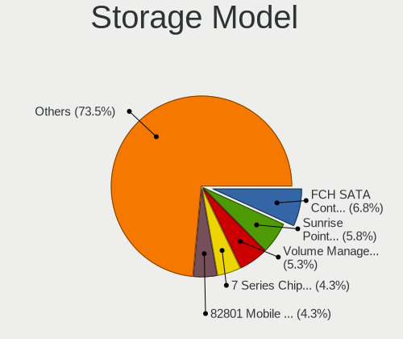
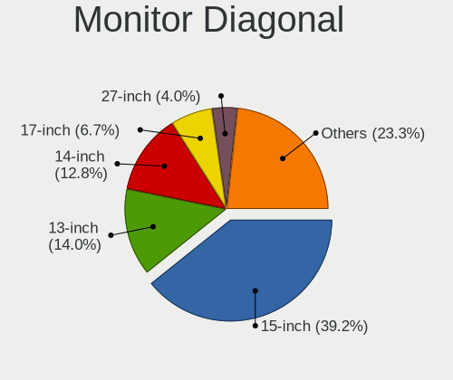
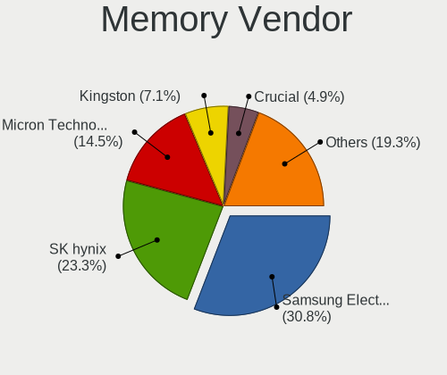
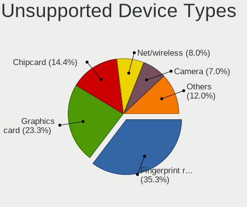

Ubuntu 22.04 - Tested Hardware & Statistics (Notebooks)
-------------------------------------------------------

A project to collect tested hardware configurations for Ubuntu 22.04.

Anyone can contribute to this report by the [hw-probe](https://github.com/linuxhw/hw-probe) tool:

    sudo -E hw-probe -all -upload

Please contribute! Especially if your hardware is rare.

Contents
--------

* [ Test Cases ](#test-cases)

* [ System ](#system)
  - [ Kernel                   ](#kernel)
  - [ Kernel Family            ](#kernel-family)
  - [ Kernel Major Ver.        ](#kernel-major-ver)
  - [ Arch                     ](#arch)
  - [ DE                       ](#de)
  - [ Display Server           ](#display-server)
  - [ Display Manager          ](#display-manager)
  - [ OS Lang                  ](#os-lang)
  - [ Boot Mode                ](#boot-mode)
  - [ Filesystem               ](#filesystem)
  - [ Part. scheme             ](#part-scheme)
  - [ Dual Boot with Linux/BSD ](#dual-boot-with-linuxbsd)
  - [ Dual Boot (Win)          ](#dual-boot-win)

* [ Board ](#board)
  - [ Vendor                   ](#vendor)
  - [ Model                    ](#model)
  - [ Model Family             ](#model-family)
  - [ MFG Year                 ](#mfg-year)
  - [ Form Factor              ](#form-factor)
  - [ Secure Boot              ](#secure-boot)
  - [ Coreboot                 ](#coreboot)
  - [ RAM Size                 ](#ram-size)
  - [ RAM Used                 ](#ram-used)
  - [ Total Drives             ](#total-drives)
  - [ Has CD-ROM               ](#has-cd-rom)
  - [ Has Ethernet             ](#has-ethernet)
  - [ Has WiFi                 ](#has-wifi)
  - [ Has Bluetooth            ](#has-bluetooth)

* [ Location ](#location)
  - [ Country                  ](#country)
  - [ City                     ](#city)

* [ Drives ](#drives)
  - [ Drive Vendor             ](#drive-vendor)
  - [ Drive Model              ](#drive-model)
  - [ HDD Vendor               ](#hdd-vendor)
  - [ SSD Vendor               ](#ssd-vendor)
  - [ Drive Kind               ](#drive-kind)
  - [ Drive Connector          ](#drive-connector)
  - [ Drive Size               ](#drive-size)
  - [ Space Total              ](#space-total)
  - [ Space Used               ](#space-used)
  - [ Malfunc. Drives          ](#malfunc-drives)
  - [ Malfunc. Drive Vendor    ](#malfunc-drive-vendor)
  - [ Malfunc. HDD Vendor      ](#malfunc-hdd-vendor)
  - [ Malfunc. Drive Kind      ](#malfunc-drive-kind)
  - [ Failed Drives            ](#failed-drives)
  - [ Failed Drive Vendor      ](#failed-drive-vendor)
  - [ Drive Status             ](#drive-status)

* [ Storage controller ](#storage-controller)
  - [ Storage Vendor           ](#storage-vendor)
  - [ Storage Model            ](#storage-model)
  - [ Storage Kind             ](#storage-kind)

* [ Processor ](#processor)
  - [ CPU Vendor               ](#cpu-vendor)
  - [ CPU Model                ](#cpu-model)
  - [ CPU Model Family         ](#cpu-model-family)
  - [ CPU Cores                ](#cpu-cores)
  - [ CPU Sockets              ](#cpu-sockets)
  - [ CPU Threads              ](#cpu-threads)
  - [ CPU Op-Modes             ](#cpu-op-modes)
  - [ CPU Microcode            ](#cpu-microcode)
  - [ CPU Microarch            ](#cpu-microarch)

* [ Graphics ](#graphics)
  - [ GPU Vendor               ](#gpu-vendor)
  - [ GPU Model                ](#gpu-model)
  - [ GPU Combo                ](#gpu-combo)
  - [ GPU Driver               ](#gpu-driver)
  - [ GPU Memory               ](#gpu-memory)

* [ Monitor ](#monitor)
  - [ Monitor Vendor           ](#monitor-vendor)
  - [ Monitor Model            ](#monitor-model)
  - [ Monitor Resolution       ](#monitor-resolution)
  - [ Monitor Diagonal         ](#monitor-diagonal)
  - [ Monitor Width            ](#monitor-width)
  - [ Aspect Ratio             ](#aspect-ratio)
  - [ Monitor Area             ](#monitor-area)
  - [ Pixel Density            ](#pixel-density)
  - [ Multiple Monitors        ](#multiple-monitors)

* [ Network ](#network)
  - [ Net Controller Vendor    ](#net-controller-vendor)
  - [ Net Controller Model     ](#net-controller-model)
  - [ Wireless Vendor          ](#wireless-vendor)
  - [ Wireless Model           ](#wireless-model)
  - [ Ethernet Vendor          ](#ethernet-vendor)
  - [ Ethernet Model           ](#ethernet-model)
  - [ Net Controller Kind      ](#net-controller-kind)
  - [ Used Controller          ](#used-controller)
  - [ NICs                     ](#nics)
  - [ IPv6                     ](#ipv6)

* [ Bluetooth ](#bluetooth)
  - [ Bluetooth Vendor         ](#bluetooth-vendor)
  - [ Bluetooth Model          ](#bluetooth-model)

* [ Sound ](#sound)
  - [ Sound Vendor             ](#sound-vendor)
  - [ Sound Model              ](#sound-model)

* [ Memory ](#memory)
  - [ Memory Vendor            ](#memory-vendor)
  - [ Memory Model             ](#memory-model)
  - [ Memory Kind              ](#memory-kind)
  - [ Memory Form Factor       ](#memory-form-factor)
  - [ Memory Size              ](#memory-size)
  - [ Memory Speed             ](#memory-speed)

* [ Printers & scanners ](#printers--scanners)
  - [ Printer Vendor           ](#printer-vendor)
  - [ Printer Model            ](#printer-model)
  - [ Scanner Vendor           ](#scanner-vendor)
  - [ Scanner Model            ](#scanner-model)

* [ Camera ](#camera)
  - [ Camera Vendor            ](#camera-vendor)
  - [ Camera Model             ](#camera-model)

* [ Security ](#security)
  - [ Fingerprint Vendor       ](#fingerprint-vendor)
  - [ Fingerprint Model        ](#fingerprint-model)
  - [ Chipcard Vendor          ](#chipcard-vendor)
  - [ Chipcard Model           ](#chipcard-model)

* [ Unsupported ](#unsupported)
  - [ Unsupported Devices      ](#unsupported-devices)
  - [ Unsupported Device Types ](#unsupported-device-types)

Test Cases
----------

Total: 6047

| Vendor        | Model                       | Probe                                                      | Date         |
|---------------|-----------------------------|------------------------------------------------------------|--------------|
| Dell          | Latitude 5530               | [e4688e2ef8](https://linux-hardware.org/?probe=e4688e2ef8) | Apr 01, 2023 |
| HP            | Pavilion Laptop 14-ec0xx... | [1da5570114](https://linux-hardware.org/?probe=1da5570114) | Apr 01, 2023 |
| Lenovo        | V310-14ISK 80SX             | [cd6dee4651](https://linux-hardware.org/?probe=cd6dee4651) | Apr 01, 2023 |
| ASUSTek       | ZenBook UX325EA_UX325EA     | [4191279e7e](https://linux-hardware.org/?probe=4191279e7e) | Apr 01, 2023 |
| Lenovo        | V110-15ISK 80TL             | [db058df07b](https://linux-hardware.org/?probe=db058df07b) | Apr 01, 2023 |
| Lenovo        | V110-15ISK 80TL             | [3691be13e8](https://linux-hardware.org/?probe=3691be13e8) | Apr 01, 2023 |
| Lenovo        | ThinkPad E14 20RA004YUS     | [36b592e607](https://linux-hardware.org/?probe=36b592e607) | Apr 01, 2023 |
| Samsung       | R530/R730/R540              | [714ed0f007](https://linux-hardware.org/?probe=714ed0f007) | Apr 01, 2023 |
| Itautec       | Infoway w7535               | [48a539f108](https://linux-hardware.org/?probe=48a539f108) | Apr 01, 2023 |
| Samsung       | 950XED                      | [c3b37a213a](https://linux-hardware.org/?probe=c3b37a213a) | Mar 31, 2023 |
| Acer          | Extensa 215-31              | [b1601e6747](https://linux-hardware.org/?probe=b1601e6747) | Mar 31, 2023 |
| Dell          | Vostro V131                 | [53538c2ae9](https://linux-hardware.org/?probe=53538c2ae9) | Mar 31, 2023 |
| ASUSTek       | K53SD                       | [81d03c3707](https://linux-hardware.org/?probe=81d03c3707) | Mar 31, 2023 |
| Lenovo        | ThinkPad E14 20RA0016IX     | [685f18f5b3](https://linux-hardware.org/?probe=685f18f5b3) | Mar 31, 2023 |
| MSI           | Modern 15 A5M               | [2a00bed043](https://linux-hardware.org/?probe=2a00bed043) | Mar 31, 2023 |
| Lenovo        | ThinkPad Edge E545 20B20... | [c2061eeeb8](https://linux-hardware.org/?probe=c2061eeeb8) | Mar 31, 2023 |
| Lenovo        | ThinkPad Edge E545 20B20... | [9a866f03fd](https://linux-hardware.org/?probe=9a866f03fd) | Mar 31, 2023 |
| Lenovo        | ThinkPad X270 20HMS0T000    | [702223a4b1](https://linux-hardware.org/?probe=702223a4b1) | Mar 31, 2023 |
| EVOO          | EVC156-1                    | [8e665ae8b2](https://linux-hardware.org/?probe=8e665ae8b2) | Mar 31, 2023 |
| Lenovo        | IdeaPad 530S-14IKB 81EU     | [fe51f2c62f](https://linux-hardware.org/?probe=fe51f2c62f) | Mar 31, 2023 |
| ASUSTek       | ASUS BR1100CKA BR1100CKA... | [d7f3354ce9](https://linux-hardware.org/?probe=d7f3354ce9) | Mar 31, 2023 |
| Toshiba       | Satellite Pro S500          | [b2e60d9170](https://linux-hardware.org/?probe=b2e60d9170) | Mar 31, 2023 |
| HP            | Pavilion Laptop 15-cc5xx    | [c6bbbbb7d8](https://linux-hardware.org/?probe=c6bbbbb7d8) | Mar 31, 2023 |
| Lenovo        | ThinkPad T14s Gen 2a 20X... | [0ffc78eac6](https://linux-hardware.org/?probe=0ffc78eac6) | Mar 30, 2023 |
| Medion        | E15407                      | [b863362865](https://linux-hardware.org/?probe=b863362865) | Mar 30, 2023 |
| Medion        | E15407                      | [641091a85d](https://linux-hardware.org/?probe=641091a85d) | Mar 30, 2023 |
| Apple         | MacBookAir7,2               | [d9cbbe0a35](https://linux-hardware.org/?probe=d9cbbe0a35) | Mar 30, 2023 |
| Lenovo        | IdeaPad 330S-15ARR 81FB     | [1dc323a9e9](https://linux-hardware.org/?probe=1dc323a9e9) | Mar 30, 2023 |
| Lenovo        | ThinkPad E595 20NF0000GE    | [95a77f6dcc](https://linux-hardware.org/?probe=95a77f6dcc) | Mar 30, 2023 |
| Apple         | MacBookPro10,2              | [2f56ac98c1](https://linux-hardware.org/?probe=2f56ac98c1) | Mar 30, 2023 |
| Lenovo        | ThinkBook 15-IIL 20SM       | [31d333ecc9](https://linux-hardware.org/?probe=31d333ecc9) | Mar 30, 2023 |
| Dell          | Vostro 5402                 | [27b9c84cbe](https://linux-hardware.org/?probe=27b9c84cbe) | Mar 30, 2023 |
| Lenovo        | Yoga 510-14ISK 80UK         | [722c1e9d68](https://linux-hardware.org/?probe=722c1e9d68) | Mar 30, 2023 |
| HP            | Pavilion Gaming Laptop 1... | [252d340923](https://linux-hardware.org/?probe=252d340923) | Mar 30, 2023 |
| Dell          | Latitude 3490               | [16d4f0954b](https://linux-hardware.org/?probe=16d4f0954b) | Mar 30, 2023 |
| HUAWEI        | RLEF-XX                     | [e9988edacd](https://linux-hardware.org/?probe=e9988edacd) | Mar 30, 2023 |
| ASUSTek       | ASUS TUF Gaming F17 FX70... | [da1e07f122](https://linux-hardware.org/?probe=da1e07f122) | Mar 30, 2023 |
| ASUSTek       | ASUS TUF Gaming F17 FX70... | [492d575f31](https://linux-hardware.org/?probe=492d575f31) | Mar 30, 2023 |
| HP            | ProBook 450 G5              | [89dfecad7e](https://linux-hardware.org/?probe=89dfecad7e) | Mar 30, 2023 |
| Lenovo        | N22 80S6                    | [c6cbeeb984](https://linux-hardware.org/?probe=c6cbeeb984) | Mar 30, 2023 |
| Acer          | Aspire A514-54              | [94da64753b](https://linux-hardware.org/?probe=94da64753b) | Mar 30, 2023 |
| Acer          | Aspire 8943G                | [e1d172011e](https://linux-hardware.org/?probe=e1d172011e) | Mar 30, 2023 |
| Lenovo        | Yoga Slim 7 Pro 16ACH6 8... | [889ef05f86](https://linux-hardware.org/?probe=889ef05f86) | Mar 30, 2023 |
| Apple         | MacBookAir9,1               | [1fe20bdfcb](https://linux-hardware.org/?probe=1fe20bdfcb) | Mar 30, 2023 |
| Notebook      | N650DU                      | [e8ec3c6462](https://linux-hardware.org/?probe=e8ec3c6462) | Mar 30, 2023 |
| Dell          | Inspiron 5566               | [7b53b4da78](https://linux-hardware.org/?probe=7b53b4da78) | Mar 29, 2023 |
| Dell          | Latitude E6530              | [eb7392d1ae](https://linux-hardware.org/?probe=eb7392d1ae) | Mar 29, 2023 |
| Medion        | P8614                       | [a66fe7042e](https://linux-hardware.org/?probe=a66fe7042e) | Mar 29, 2023 |
| ASUSTek       | TUF Gaming FX705DT_FX705... | [803a180064](https://linux-hardware.org/?probe=803a180064) | Mar 29, 2023 |
| Dell          | Inspiron 5767               | [1c80487906](https://linux-hardware.org/?probe=1c80487906) | Mar 29, 2023 |
| Acer          | Extensa 215-23              | [bf5730d468](https://linux-hardware.org/?probe=bf5730d468) | Mar 29, 2023 |
| ASUSTek       | X751LJ                      | [cf5d71e2b3](https://linux-hardware.org/?probe=cf5d71e2b3) | Mar 29, 2023 |
| ASUSTek       | TUF Gaming FX705DT_FX705... | [f33059ab6b](https://linux-hardware.org/?probe=f33059ab6b) | Mar 29, 2023 |
| Lenovo        | IdeaPadFlex 10 20324        | [40b3e68058](https://linux-hardware.org/?probe=40b3e68058) | Mar 29, 2023 |
| Timi          | TM1701                      | [16ca4bcb7f](https://linux-hardware.org/?probe=16ca4bcb7f) | Mar 29, 2023 |
| Lenovo        | ThinkPad T14 Gen 1 20UD0... | [bfa850ddad](https://linux-hardware.org/?probe=bfa850ddad) | Mar 29, 2023 |
| HUAWEI        | HVY-WXX9                    | [31d94ffb5f](https://linux-hardware.org/?probe=31d94ffb5f) | Mar 29, 2023 |
| Dell          | Vostro 15 3515              | [7b4a51d5e3](https://linux-hardware.org/?probe=7b4a51d5e3) | Mar 29, 2023 |
| Dell          | Inspiron 7520               | [8258074853](https://linux-hardware.org/?probe=8258074853) | Mar 28, 2023 |
| Google        | Caroline                    | [80f01f2a87](https://linux-hardware.org/?probe=80f01f2a87) | Mar 28, 2023 |
| Lenovo        | IdeaPad 510S-14ISK 80TK     | [25cc7bfca2](https://linux-hardware.org/?probe=25cc7bfca2) | Mar 28, 2023 |
| HP            | Pavilion g6                 | [c5b99ffdb0](https://linux-hardware.org/?probe=c5b99ffdb0) | Mar 28, 2023 |
| HP            | OMEN by Laptop 15-dc0xxx    | [b7a0579d38](https://linux-hardware.org/?probe=b7a0579d38) | Mar 28, 2023 |
| Acer          | TravelMate P215-52          | [b6184e813b](https://linux-hardware.org/?probe=b6184e813b) | Mar 28, 2023 |
| Dell          | G15 5511                    | [7f15a1e2c7](https://linux-hardware.org/?probe=7f15a1e2c7) | Mar 28, 2023 |
| Dell          | Precision 5540              | [f9e20de07f](https://linux-hardware.org/?probe=f9e20de07f) | Mar 28, 2023 |
| Lenovo        | ThinkPad E14 20RA004YUS     | [18226d4ded](https://linux-hardware.org/?probe=18226d4ded) | Mar 28, 2023 |
| HP            | ProBook 450 G7              | [8b27d78a17](https://linux-hardware.org/?probe=8b27d78a17) | Mar 28, 2023 |
| MSI           | B450 TOMAHAWK MAX           | [856b789461](https://linux-hardware.org/?probe=856b789461) | Mar 28, 2023 |
| Lenovo        | IdeaPad 5 Pro 16ACH6 82L... | [577947c9d3](https://linux-hardware.org/?probe=577947c9d3) | Mar 28, 2023 |
| HUAWEI        | NBLB-WAX9N                  | [9fbd9476b2](https://linux-hardware.org/?probe=9fbd9476b2) | Mar 28, 2023 |
| Lenovo        | ThinkPad T540p 20BE004EU... | [988731ac8d](https://linux-hardware.org/?probe=988731ac8d) | Mar 28, 2023 |
| Lenovo        | ThinkPad T540p 20BE004EU... | [8406000835](https://linux-hardware.org/?probe=8406000835) | Mar 28, 2023 |
| HP            | Pavilion Gaming Laptop 1... | [4c2dd89a20](https://linux-hardware.org/?probe=4c2dd89a20) | Mar 28, 2023 |
| HP            | Compaq 610                  | [dc9383200e](https://linux-hardware.org/?probe=dc9383200e) | Mar 28, 2023 |
| HP            | Pavilion Laptop 15-cs2xx... | [8921171c40](https://linux-hardware.org/?probe=8921171c40) | Mar 28, 2023 |
| HP            | ProBook 450 G3              | [f0e6089a6e](https://linux-hardware.org/?probe=f0e6089a6e) | Mar 28, 2023 |
| ASUSTek       | N53SV                       | [77aa77b2a3](https://linux-hardware.org/?probe=77aa77b2a3) | Mar 28, 2023 |
| HP            | Pavilion Laptop 15-cc5xx    | [7a9cf507e6](https://linux-hardware.org/?probe=7a9cf507e6) | Mar 28, 2023 |
| HP            | Pavilion Laptop 14-ec0xx... | [88d5c3bb9f](https://linux-hardware.org/?probe=88d5c3bb9f) | Mar 28, 2023 |
| HP            | Laptop 14s-fq2xxx           | [8b64ddb550](https://linux-hardware.org/?probe=8b64ddb550) | Mar 27, 2023 |
| Acer          | Extensa 2530                | [e39fe56d67](https://linux-hardware.org/?probe=e39fe56d67) | Mar 27, 2023 |
| Dell          | Inspiron 13-5378            | [2aff972d11](https://linux-hardware.org/?probe=2aff972d11) | Mar 27, 2023 |
| HUAWEI        | NBD-WXX9                    | [e7788fd2a4](https://linux-hardware.org/?probe=e7788fd2a4) | Mar 27, 2023 |
| HUAWEI        | NBD-WXX9                    | [d723ff0fa9](https://linux-hardware.org/?probe=d723ff0fa9) | Mar 27, 2023 |
| Lenovo        | ThinkPad T460s 20FAS1U20... | [99ea485cee](https://linux-hardware.org/?probe=99ea485cee) | Mar 27, 2023 |
| Dell          | XPS 13 9305                 | [2f96abf16a](https://linux-hardware.org/?probe=2f96abf16a) | Mar 27, 2023 |
| HUAWEI        | KLVD-WXX9                   | [574bb4272c](https://linux-hardware.org/?probe=574bb4272c) | Mar 27, 2023 |
| Dell          | XPS 13 9305                 | [07caea9176](https://linux-hardware.org/?probe=07caea9176) | Mar 27, 2023 |
| HUAWEI        | BOHB-WAX9                   | [d7b0ec58d5](https://linux-hardware.org/?probe=d7b0ec58d5) | Mar 27, 2023 |
| Dell          | Precision 7530              | [d5687ef764](https://linux-hardware.org/?probe=d5687ef764) | Mar 27, 2023 |
| Lenovo        | ThinkPad E14 Gen 4 21E3S... | [d484c5e138](https://linux-hardware.org/?probe=d484c5e138) | Mar 27, 2023 |
| Lenovo        | ThinkPad X1 Carbon Gen 9... | [bddc9116d1](https://linux-hardware.org/?probe=bddc9116d1) | Mar 27, 2023 |
| Acer          | Aspire 4820TG               | [e634227889](https://linux-hardware.org/?probe=e634227889) | Mar 27, 2023 |
| Lenovo        | IdeaPadFlex 10 20324        | [629579e7f2](https://linux-hardware.org/?probe=629579e7f2) | Mar 27, 2023 |
| Lenovo        | ThinkPad L14 Gen 3 21C10... | [6a8962feba](https://linux-hardware.org/?probe=6a8962feba) | Mar 27, 2023 |
| Dell          | Precision 7670              | [eece926391](https://linux-hardware.org/?probe=eece926391) | Mar 27, 2023 |
| HP            | EliteBook 2570p             | [d5ba09feb1](https://linux-hardware.org/?probe=d5ba09feb1) | Mar 27, 2023 |
| Dell          | Precision 7670              | [5b8f0590ec](https://linux-hardware.org/?probe=5b8f0590ec) | Mar 27, 2023 |
| Dell          | Latitude E5570              | [350e781679](https://linux-hardware.org/?probe=350e781679) | Mar 27, 2023 |
| Fujitsu       | LIFEBOOK E736               | [03df3679d3](https://linux-hardware.org/?probe=03df3679d3) | Mar 26, 2023 |
| ASUSTek       | X751SA                      | [bef27b5a10](https://linux-hardware.org/?probe=bef27b5a10) | Mar 26, 2023 |
| ASUSTek       | X751SA                      | [daac2899b2](https://linux-hardware.org/?probe=daac2899b2) | Mar 26, 2023 |
| Lenovo        | ThinkPad X230 2325BA3       | [9022b333bd](https://linux-hardware.org/?probe=9022b333bd) | Mar 26, 2023 |
| Fujitsu       | LIFEBOOK E736               | [f7d3c52f58](https://linux-hardware.org/?probe=f7d3c52f58) | Mar 26, 2023 |
| HUAWEI        | RLEF-XX                     | [b860e76ead](https://linux-hardware.org/?probe=b860e76ead) | Mar 26, 2023 |
| Lenovo        | ThinkPad T440s 20AQ009DG... | [6f3481adc0](https://linux-hardware.org/?probe=6f3481adc0) | Mar 26, 2023 |
| Dell          | XPS 15 7590                 | [aeec5e2588](https://linux-hardware.org/?probe=aeec5e2588) | Mar 26, 2023 |
| Apple         | MacBookPro16,2              | [cf7ab8adb4](https://linux-hardware.org/?probe=cf7ab8adb4) | Mar 26, 2023 |
| HUAWEI        | KLVD-WXX9                   | [ca83615d40](https://linux-hardware.org/?probe=ca83615d40) | Mar 26, 2023 |
| HUAWEI        | KLVD-WXX9                   | [285462b197](https://linux-hardware.org/?probe=285462b197) | Mar 26, 2023 |
| HUAWEI        | KLVD-WXX9                   | [fc40632056](https://linux-hardware.org/?probe=fc40632056) | Mar 26, 2023 |
| Positivo      | Smash2                      | [b61791c478](https://linux-hardware.org/?probe=b61791c478) | Mar 26, 2023 |
| Lenovo        | ThinkPad T550 20CK000GCA    | [946f550eb7](https://linux-hardware.org/?probe=946f550eb7) | Mar 26, 2023 |
| Acer          | V5-131                      | [f35bd55401](https://linux-hardware.org/?probe=f35bd55401) | Mar 26, 2023 |
| ASUSTek       | Zephyrus M GM501GS          | [68017924d7](https://linux-hardware.org/?probe=68017924d7) | Mar 26, 2023 |
| MSI           | Creator Z16 A11UET          | [0133ab37af](https://linux-hardware.org/?probe=0133ab37af) | Mar 26, 2023 |
| Dell          | XPS 13 9305                 | [5b29fbd6ac](https://linux-hardware.org/?probe=5b29fbd6ac) | Mar 26, 2023 |
| Lenovo        | ThinkPad T430 4237ZC7       | [845a2ed117](https://linux-hardware.org/?probe=845a2ed117) | Mar 26, 2023 |
| Dell          | Latitude E6430              | [912e5e8577](https://linux-hardware.org/?probe=912e5e8577) | Mar 26, 2023 |
| Dell          | Latitude E6430              | [237dabb566](https://linux-hardware.org/?probe=237dabb566) | Mar 26, 2023 |
| Sony          | SVF14215CXB                 | [624af23eb4](https://linux-hardware.org/?probe=624af23eb4) | Mar 26, 2023 |
| Lenovo        | G510 20238                  | [f406bad420](https://linux-hardware.org/?probe=f406bad420) | Mar 26, 2023 |
| Notebook      | NL40_50CU                   | [4870d52d1e](https://linux-hardware.org/?probe=4870d52d1e) | Mar 25, 2023 |
| HP            | G42                         | [f1b5695907](https://linux-hardware.org/?probe=f1b5695907) | Mar 25, 2023 |
| Lenovo        | ThinkPad W520 4282PQ7       | [ff42aa158f](https://linux-hardware.org/?probe=ff42aa158f) | Mar 25, 2023 |
| Timi          | TM1701                      | [f5dfd4628e](https://linux-hardware.org/?probe=f5dfd4628e) | Mar 25, 2023 |
| HP            | ProBook 650 G1              | [d1baffa910](https://linux-hardware.org/?probe=d1baffa910) | Mar 25, 2023 |
| Acer          | Aspire ES1-731              | [927cc86995](https://linux-hardware.org/?probe=927cc86995) | Mar 25, 2023 |
| Acer          | Aspire E1-731               | [667456015e](https://linux-hardware.org/?probe=667456015e) | Mar 25, 2023 |
| Lenovo        | IdeaPad 3 15ITL6 82H8       | [05b2003fc0](https://linux-hardware.org/?probe=05b2003fc0) | Mar 25, 2023 |
| Lenovo        | ThinkPad X201 3680W81       | [02821ba817](https://linux-hardware.org/?probe=02821ba817) | Mar 25, 2023 |
| Timi          | TM1701                      | [17e055a118](https://linux-hardware.org/?probe=17e055a118) | Mar 25, 2023 |
| Dell          | XPS 13 9380                 | [72bf3db096](https://linux-hardware.org/?probe=72bf3db096) | Mar 25, 2023 |
| HP            | OMEN by Laptop 16-b0xxx     | [22aa7f3036](https://linux-hardware.org/?probe=22aa7f3036) | Mar 25, 2023 |
| Lenovo        | V130-15IKB 81HN             | [0bfaf1252f](https://linux-hardware.org/?probe=0bfaf1252f) | Mar 25, 2023 |
| ASUSTek       | VivoBook_ASUSLaptop X150... | [e09dc41124](https://linux-hardware.org/?probe=e09dc41124) | Mar 25, 2023 |
| HP            | 255 G7 Notebook PC          | [2097578b64](https://linux-hardware.org/?probe=2097578b64) | Mar 25, 2023 |
| Getac         | B300-H                      | [28a9b0b0c7](https://linux-hardware.org/?probe=28a9b0b0c7) | Mar 25, 2023 |
| Dell          | Latitude E7450              | [7154586794](https://linux-hardware.org/?probe=7154586794) | Mar 25, 2023 |
| Dell          | Inspiron N5110              | [f8fc6c74da](https://linux-hardware.org/?probe=f8fc6c74da) | Mar 25, 2023 |
| Acer          | Aspire 4740                 | [c4e47e53dc](https://linux-hardware.org/?probe=c4e47e53dc) | Mar 25, 2023 |
| ASUSTek       | ASUS TUF Gaming A15 FA50... | [9e45f992a1](https://linux-hardware.org/?probe=9e45f992a1) | Mar 25, 2023 |
| Dell          | Vostro 5581                 | [d2ebb46bea](https://linux-hardware.org/?probe=d2ebb46bea) | Mar 25, 2023 |
| Apple         | MacBook4,1                  | [7ade2b1d1a](https://linux-hardware.org/?probe=7ade2b1d1a) | Mar 24, 2023 |
| Lenovo        | IdeaPad Gaming 3 15ARH05... | [548c06032b](https://linux-hardware.org/?probe=548c06032b) | Mar 24, 2023 |
| Dell          | XPS 13 9350                 | [d1ba8cb8e9](https://linux-hardware.org/?probe=d1ba8cb8e9) | Mar 24, 2023 |
| Dell          | Precision 3510              | [2ea0671f5d](https://linux-hardware.org/?probe=2ea0671f5d) | Mar 24, 2023 |
| HP            | Pavilion 11 x360 PC         | [2c3c5a65a5](https://linux-hardware.org/?probe=2c3c5a65a5) | Mar 24, 2023 |
| ASUSTek       | ROG Strix G513IE_G513IE     | [bc6baa37ef](https://linux-hardware.org/?probe=bc6baa37ef) | Mar 24, 2023 |
| MSI           | Creator Z17 A12UHST         | [47814b01b6](https://linux-hardware.org/?probe=47814b01b6) | Mar 24, 2023 |
| HP            | ProBook 5330m               | [6844efa448](https://linux-hardware.org/?probe=6844efa448) | Mar 24, 2023 |
| HP            | Laptop 15-dw0xxx            | [299c20969c](https://linux-hardware.org/?probe=299c20969c) | Mar 24, 2023 |
| Dell          | XPS 13 9305                 | [c7e354ffe3](https://linux-hardware.org/?probe=c7e354ffe3) | Mar 24, 2023 |
| Lenovo        | ThinkPad T14s Gen 2i 20W... | [7dfb215d39](https://linux-hardware.org/?probe=7dfb215d39) | Mar 24, 2023 |
| HP            | Laptop 15s-du2xxx           | [882f1dbee1](https://linux-hardware.org/?probe=882f1dbee1) | Mar 24, 2023 |
| HP            | ProBook 470 G5              | [1672158957](https://linux-hardware.org/?probe=1672158957) | Mar 24, 2023 |
| HP            | ProBook 470 G5              | [383b333f72](https://linux-hardware.org/?probe=383b333f72) | Mar 24, 2023 |
| HUAWEI        | NBLB-WAX9N                  | [e14a63a1e4](https://linux-hardware.org/?probe=e14a63a1e4) | Mar 24, 2023 |
| Dell          | Vostro 3500                 | [a375452089](https://linux-hardware.org/?probe=a375452089) | Mar 23, 2023 |
| Dell          | Latitude 5420               | [9e55d83acd](https://linux-hardware.org/?probe=9e55d83acd) | Mar 23, 2023 |
| Dell          | Latitude D630               | [95a44067f1](https://linux-hardware.org/?probe=95a44067f1) | Mar 23, 2023 |
| ASUSTek       | X75A1                       | [a4b87d85da](https://linux-hardware.org/?probe=a4b87d85da) | Mar 23, 2023 |
| ASUSTek       | X75A1                       | [654683dd2b](https://linux-hardware.org/?probe=654683dd2b) | Mar 23, 2023 |
| Dell          | Latitude D630               | [45e100abf8](https://linux-hardware.org/?probe=45e100abf8) | Mar 23, 2023 |
| Lenovo        | ThinkPad T570 W10DG 20JX... | [d40284254e](https://linux-hardware.org/?probe=d40284254e) | Mar 23, 2023 |
| Lenovo        | ThinkPad T570 W10DG 20JX... | [26521abccd](https://linux-hardware.org/?probe=26521abccd) | Mar 23, 2023 |
| Dell          | XPS 15 9520                 | [06d6af1db0](https://linux-hardware.org/?probe=06d6af1db0) | Mar 23, 2023 |
| Toshiba       | Satellite U845W             | [27e67eea9d](https://linux-hardware.org/?probe=27e67eea9d) | Mar 23, 2023 |
| HP            | Laptop 15s-eq2xxx           | [c17f20a679](https://linux-hardware.org/?probe=c17f20a679) | Mar 23, 2023 |
| Notebook      | W510LU                      | [076125acc3](https://linux-hardware.org/?probe=076125acc3) | Mar 23, 2023 |
| HP            | Pavilion Gaming Laptop 1... | [d956770153](https://linux-hardware.org/?probe=d956770153) | Mar 23, 2023 |
| HP            | ProBook 650 G5              | [028c91d344](https://linux-hardware.org/?probe=028c91d344) | Mar 23, 2023 |
| HUAWEI        | BOD-WXX9                    | [088494906d](https://linux-hardware.org/?probe=088494906d) | Mar 23, 2023 |
| Dell          | XPS 15 9510                 | [e6db3c2c26](https://linux-hardware.org/?probe=e6db3c2c26) | Mar 23, 2023 |
| HONOR         | NMH-WCX9                    | [21f61b5987](https://linux-hardware.org/?probe=21f61b5987) | Mar 23, 2023 |
| Lenovo        | ThinkPad P70 20ESS2VP00     | [bb6fdb6236](https://linux-hardware.org/?probe=bb6fdb6236) | Mar 23, 2023 |
| ASUSTek       | ASUS TUF Gaming F15 FX50... | [e4a3f70cbf](https://linux-hardware.org/?probe=e4a3f70cbf) | Mar 23, 2023 |
| ASUSTek       | ASUS TUF Gaming F15 FX50... | [d55de052b1](https://linux-hardware.org/?probe=d55de052b1) | Mar 23, 2023 |
| Dell          | Latitude 5400               | [4e17f4827d](https://linux-hardware.org/?probe=4e17f4827d) | Mar 23, 2023 |
| Timi          | TM1613                      | [3016a40df3](https://linux-hardware.org/?probe=3016a40df3) | Mar 23, 2023 |
| Timi          | TM1613                      | [ddbc83a8d3](https://linux-hardware.org/?probe=ddbc83a8d3) | Mar 23, 2023 |
| Dell          | Latitude 5400               | [c85d243d8a](https://linux-hardware.org/?probe=c85d243d8a) | Mar 23, 2023 |
| Lenovo        | ThinkPad L450 20DSA25V01    | [68b1ae2c5d](https://linux-hardware.org/?probe=68b1ae2c5d) | Mar 23, 2023 |
| Lenovo        | IdeaPad 3 15ABA7 82RN       | [c91fa425a5](https://linux-hardware.org/?probe=c91fa425a5) | Mar 23, 2023 |
| Teclast       | F15Plus 2                   | [70a7bfb366](https://linux-hardware.org/?probe=70a7bfb366) | Mar 23, 2023 |
| Lenovo        | G500 20236                  | [8688a57db6](https://linux-hardware.org/?probe=8688a57db6) | Mar 22, 2023 |
| ASUSTek       | ASUS TUF Gaming A15 FA50... | [34fd631d2b](https://linux-hardware.org/?probe=34fd631d2b) | Mar 22, 2023 |
| IGEL Techn... | M340C                       | [0a16ce19bb](https://linux-hardware.org/?probe=0a16ce19bb) | Mar 22, 2023 |
| ASUSTek       | ASUS EXPERTBOOK B1400CEA... | [4cbcbc3025](https://linux-hardware.org/?probe=4cbcbc3025) | Mar 22, 2023 |
| Toshiba       | Satellite U845W             | [65958975b3](https://linux-hardware.org/?probe=65958975b3) | Mar 22, 2023 |
| ASUSTek       | VivoBook_ASUSLaptop K650... | [ba101f37d0](https://linux-hardware.org/?probe=ba101f37d0) | Mar 22, 2023 |
| Sony          | VGN-AR51M                   | [ae55922eae](https://linux-hardware.org/?probe=ae55922eae) | Mar 22, 2023 |
| HP            | Laptop 17-by2xxx            | [e8c5422a4f](https://linux-hardware.org/?probe=e8c5422a4f) | Mar 22, 2023 |
| Toshiba       | Satellite Pro S500          | [2bb2519c2c](https://linux-hardware.org/?probe=2bb2519c2c) | Mar 21, 2023 |
| Toshiba       | Satellite Pro S500          | [a45c7086e5](https://linux-hardware.org/?probe=a45c7086e5) | Mar 21, 2023 |
| ASUSTek       | VivoBook_ASUSLaptop M760... | [8606a64427](https://linux-hardware.org/?probe=8606a64427) | Mar 21, 2023 |
| ASUSTek       | VivoBook E14 E402WAS        | [95154b40cc](https://linux-hardware.org/?probe=95154b40cc) | Mar 21, 2023 |
| HUAWEI        | CREM-WXX9                   | [64a63f42bf](https://linux-hardware.org/?probe=64a63f42bf) | Mar 21, 2023 |
| Dell          | G15 5510                    | [3ddfc82bcd](https://linux-hardware.org/?probe=3ddfc82bcd) | Mar 21, 2023 |
| Framework     | Laptop (12th Gen Intel C... | [3a8692d4cf](https://linux-hardware.org/?probe=3a8692d4cf) | Mar 21, 2023 |
| MSI           | GF63 Thin 10SCSR            | [45610ce6bf](https://linux-hardware.org/?probe=45610ce6bf) | Mar 21, 2023 |
| Avell High... | A62 LIV                     | [14dab05208](https://linux-hardware.org/?probe=14dab05208) | Mar 21, 2023 |
| HP            | 255 15.6 inch G9 Noteboo... | [42629ad13b](https://linux-hardware.org/?probe=42629ad13b) | Mar 21, 2023 |
| ASUSTek       | GL553VD                     | [ea7e302020](https://linux-hardware.org/?probe=ea7e302020) | Mar 21, 2023 |
| ASUSTek       | GL553VD                     | [8ed4a1e3ba](https://linux-hardware.org/?probe=8ed4a1e3ba) | Mar 21, 2023 |
| Lenovo        | IdeaPad 3 15ARE05 81W4      | [c5b2997e80](https://linux-hardware.org/?probe=c5b2997e80) | Mar 21, 2023 |
| Dell          | Latitude E6520              | [857fdb4095](https://linux-hardware.org/?probe=857fdb4095) | Mar 21, 2023 |
| HP            | EliteBook 840 G5            | [a204a0f2c0](https://linux-hardware.org/?probe=a204a0f2c0) | Mar 21, 2023 |
| Lenovo        | Legion Y530-15ICH 81FV      | [a8b511cdb0](https://linux-hardware.org/?probe=a8b511cdb0) | Mar 21, 2023 |
| ASUSTek       | TUF Gaming FX504GE_FX80G... | [d068d67f2d](https://linux-hardware.org/?probe=d068d67f2d) | Mar 21, 2023 |
| Dell          | Inspiron 5559               | [6f98b39459](https://linux-hardware.org/?probe=6f98b39459) | Mar 21, 2023 |
| Framework     | Laptop                      | [a7dc7b28c9](https://linux-hardware.org/?probe=a7dc7b28c9) | Mar 21, 2023 |
| Dell          | Inspiron 7520               | [330f307e06](https://linux-hardware.org/?probe=330f307e06) | Mar 21, 2023 |
| Tactus        | GeoBook 140                 | [5efd6f0674](https://linux-hardware.org/?probe=5efd6f0674) | Mar 20, 2023 |
| HP            | EliteBook 8440p             | [580c62b3b8](https://linux-hardware.org/?probe=580c62b3b8) | Mar 20, 2023 |
| IGEL Techn... | M340C                       | [2785bf290e](https://linux-hardware.org/?probe=2785bf290e) | Mar 20, 2023 |
| Dell          | Inspiron 3442               | [33137a049e](https://linux-hardware.org/?probe=33137a049e) | Mar 20, 2023 |
| HP            | 250 G4                      | [46e0314fb1](https://linux-hardware.org/?probe=46e0314fb1) | Mar 20, 2023 |
| Dell          | Latitude 7420               | [ac9a26d11c](https://linux-hardware.org/?probe=ac9a26d11c) | Mar 20, 2023 |
| Lenovo        | ThinkPad P15s Gen 2i 20W... | [c9c86f1e79](https://linux-hardware.org/?probe=c9c86f1e79) | Mar 20, 2023 |
| ASUSTek       | VivoBook_ASUSLaptop M560... | [c87313bdd4](https://linux-hardware.org/?probe=c87313bdd4) | Mar 20, 2023 |
| HP            | Pavilion dm4                | [7983ee084c](https://linux-hardware.org/?probe=7983ee084c) | Mar 20, 2023 |
| Acer          | Aspire M3-581T              | [a9a586ef2d](https://linux-hardware.org/?probe=a9a586ef2d) | Mar 20, 2023 |
| Sony          | VPCEH3N6E                   | [9de8a9a50a](https://linux-hardware.org/?probe=9de8a9a50a) | Mar 20, 2023 |
| Acer          | Aspire M3-581T              | [51e5415bb0](https://linux-hardware.org/?probe=51e5415bb0) | Mar 19, 2023 |
| Dell          | Latitude 5520               | [4153e72c6b](https://linux-hardware.org/?probe=4153e72c6b) | Mar 19, 2023 |
| Acer          | Swift SF514-53T             | [9d37ace881](https://linux-hardware.org/?probe=9d37ace881) | Mar 19, 2023 |
| Acer          | Swift SF514-53T             | [93ce0e9d73](https://linux-hardware.org/?probe=93ce0e9d73) | Mar 19, 2023 |
| Lenovo        | IdeaPad L3 15IML05 81Y3     | [95ae633abb](https://linux-hardware.org/?probe=95ae633abb) | Mar 19, 2023 |
| Acer          | Aspire V3-772               | [64b17e8d2c](https://linux-hardware.org/?probe=64b17e8d2c) | Mar 19, 2023 |
| Teclast       | F15Plus 2                   | [17558890e2](https://linux-hardware.org/?probe=17558890e2) | Mar 19, 2023 |
| Lenovo        | IdeaPad L3 15IML05 81Y3     | [54025a10f5](https://linux-hardware.org/?probe=54025a10f5) | Mar 19, 2023 |
| Lenovo        | ThinkPad E15 Gen 2 20TD0... | [92ae74e13d](https://linux-hardware.org/?probe=92ae74e13d) | Mar 19, 2023 |
| Lenovo        | ThinkBook 14p Gen 3 21EJ    | [dfc02dad7e](https://linux-hardware.org/?probe=dfc02dad7e) | Mar 19, 2023 |
| ASUSTek       | X550VX                      | [dcc37300fd](https://linux-hardware.org/?probe=dcc37300fd) | Mar 19, 2023 |
| Dell          | Latitude E7470              | [d9108aaeab](https://linux-hardware.org/?probe=d9108aaeab) | Mar 19, 2023 |
| Dell          | Inspiron 7520               | [f587cfd0f1](https://linux-hardware.org/?probe=f587cfd0f1) | Mar 19, 2023 |
| Lenovo        | ThinkPad E560 20EV0010UK    | [f60325ef42](https://linux-hardware.org/?probe=f60325ef42) | Mar 19, 2023 |
| Schenker      | XMG FUSION 15 (XFU15L19)    | [dc8d19f73a](https://linux-hardware.org/?probe=dc8d19f73a) | Mar 19, 2023 |
| HUAWEI        | NBLK-WAX9X                  | [5c0e12ebd0](https://linux-hardware.org/?probe=5c0e12ebd0) | Mar 19, 2023 |
| HP            | ProBook 450 G8 Notebook ... | [f5c5712df1](https://linux-hardware.org/?probe=f5c5712df1) | Mar 18, 2023 |
| HP            | OMEN by Laptop 17-an0xx     | [5a11bc39d5](https://linux-hardware.org/?probe=5a11bc39d5) | Mar 18, 2023 |
| Lenovo        | ThinkPad Edge E330 33541... | [4f0ddac461](https://linux-hardware.org/?probe=4f0ddac461) | Mar 18, 2023 |
| Schenker      | VISION 14                   | [85200e20d8](https://linux-hardware.org/?probe=85200e20d8) | Mar 18, 2023 |
| HP            | Laptop 15-db0xxx            | [bb43e46d71](https://linux-hardware.org/?probe=bb43e46d71) | Mar 18, 2023 |
| Lenovo        | ThinkPad T14 Gen 2i 20W1... | [8c8a87616c](https://linux-hardware.org/?probe=8c8a87616c) | Mar 18, 2023 |
| Apple         | MacBookPro9,2               | [e996669ec1](https://linux-hardware.org/?probe=e996669ec1) | Mar 18, 2023 |
| Gigabyte      | X570S AORUS ELITE AX        | [2a6ded1018](https://linux-hardware.org/?probe=2a6ded1018) | Mar 18, 2023 |
| Acer          | Aspire 8730                 | [bc63e0d2c1](https://linux-hardware.org/?probe=bc63e0d2c1) | Mar 18, 2023 |
| Lenovo        | ThinkBook 16p Gen 2 20YM    | [837ed83646](https://linux-hardware.org/?probe=837ed83646) | Mar 18, 2023 |
| Sony          | VPCEH3N6E                   | [9c677b7a7b](https://linux-hardware.org/?probe=9c677b7a7b) | Mar 18, 2023 |
| Sony          | VPCEH3N6E                   | [703cc66d3e](https://linux-hardware.org/?probe=703cc66d3e) | Mar 18, 2023 |
| ASUSTek       | TUF Gaming FX504GE_FX80G... | [928a8fe84e](https://linux-hardware.org/?probe=928a8fe84e) | Mar 18, 2023 |
| ASUSTek       | TUF Gaming FX504GE_FX80G... | [00dc1c3b6e](https://linux-hardware.org/?probe=00dc1c3b6e) | Mar 18, 2023 |
| HP            | Pavilion Laptop 15-cc5xx    | [5ede1a1bf2](https://linux-hardware.org/?probe=5ede1a1bf2) | Mar 18, 2023 |
| Lenovo        | IdeaPad Y510P 20217         | [d7acdc8bf3](https://linux-hardware.org/?probe=d7acdc8bf3) | Mar 18, 2023 |
| Lenovo        | ThinkPad Edge E335 33556... | [463dac90ba](https://linux-hardware.org/?probe=463dac90ba) | Mar 18, 2023 |
| Lenovo        | ThinkPad T590 20N4000DXS    | [c145898fae](https://linux-hardware.org/?probe=c145898fae) | Mar 17, 2023 |
| Lenovo        | V580c 20160                 | [b7f2837ccd](https://linux-hardware.org/?probe=b7f2837ccd) | Mar 17, 2023 |
| Notebook      | N150CU                      | [284a367641](https://linux-hardware.org/?probe=284a367641) | Mar 17, 2023 |
| HONOR         | HYM-WXX                     | [279e932275](https://linux-hardware.org/?probe=279e932275) | Mar 17, 2023 |
| Lenovo        | ThinkPad P50 20EN0006GE     | [6364c78054](https://linux-hardware.org/?probe=6364c78054) | Mar 17, 2023 |
| Acer          | Aspire V7-482PG             | [9ba6bdc643](https://linux-hardware.org/?probe=9ba6bdc643) | Mar 17, 2023 |
| Lenovo        | ThinkPad T590 20N4000DXS    | [293fe8b4ab](https://linux-hardware.org/?probe=293fe8b4ab) | Mar 17, 2023 |
| Medion        | GUARDIAN X10                | [f30ef18641](https://linux-hardware.org/?probe=f30ef18641) | Mar 17, 2023 |
| ASUSTek       | VivoBook_ASUSLaptop X509... | [51ec4d252f](https://linux-hardware.org/?probe=51ec4d252f) | Mar 17, 2023 |
| Lenovo        | IdeaPad S145-15IIL 82DJ     | [353d82cd61](https://linux-hardware.org/?probe=353d82cd61) | Mar 17, 2023 |
| Dell          | Latitude 7310               | [6b5de5fe3c](https://linux-hardware.org/?probe=6b5de5fe3c) | Mar 17, 2023 |
| Medion        | GUARDIAN X10                | [76798fdb55](https://linux-hardware.org/?probe=76798fdb55) | Mar 17, 2023 |
| MSI           | GP62 6QE                    | [3db109542c](https://linux-hardware.org/?probe=3db109542c) | Mar 17, 2023 |
| Dell          | Inspiron 3593               | [d983398383](https://linux-hardware.org/?probe=d983398383) | Mar 17, 2023 |
| Lenovo        | ThinkPad A485 20MVS0C300    | [70812fb9c8](https://linux-hardware.org/?probe=70812fb9c8) | Mar 17, 2023 |
| Dell          | Inspiron 7520               | [1cedff3f90](https://linux-hardware.org/?probe=1cedff3f90) | Mar 17, 2023 |
| HP            | ZBook Studio G3             | [db6c4ae697](https://linux-hardware.org/?probe=db6c4ae697) | Mar 17, 2023 |
| Lenovo        | ThinkPad T480s 20L8S88M0... | [2ad89b7995](https://linux-hardware.org/?probe=2ad89b7995) | Mar 16, 2023 |
| HP            | Pavilion Laptop 15-ck0xx    | [6a1e908693](https://linux-hardware.org/?probe=6a1e908693) | Mar 16, 2023 |
| Dell          | Inspiron 14 5425            | [1128b14745](https://linux-hardware.org/?probe=1128b14745) | Mar 16, 2023 |
| HP            | EliteBook 1050 G1           | [6dcfa134ac](https://linux-hardware.org/?probe=6dcfa134ac) | Mar 16, 2023 |
| Unknown       | Unknown                     | [7a44108d05](https://linux-hardware.org/?probe=7a44108d05) | Mar 16, 2023 |
| Dell          | Latitude 5511               | [7444a8c723](https://linux-hardware.org/?probe=7444a8c723) | Mar 16, 2023 |
| HUAWEI        | NDZ-WXX9                    | [82687f32c9](https://linux-hardware.org/?probe=82687f32c9) | Mar 16, 2023 |
| Lenovo        | Flex 2-15                   | [6bea7b508e](https://linux-hardware.org/?probe=6bea7b508e) | Mar 16, 2023 |
| Acer          | Aspire M3-581T              | [dfb8518fa9](https://linux-hardware.org/?probe=dfb8518fa9) | Mar 16, 2023 |
| Acer          | Aspire M3-581T              | [bb4f0202b7](https://linux-hardware.org/?probe=bb4f0202b7) | Mar 16, 2023 |
| HUAWEI        | BOD-WXX9                    | [ef98a330e6](https://linux-hardware.org/?probe=ef98a330e6) | Mar 16, 2023 |
| Acer          | TravelMate P215-53          | [3fc3403dfd](https://linux-hardware.org/?probe=3fc3403dfd) | Mar 16, 2023 |
| Dell          | Inspiron 5579               | [2854150d6e](https://linux-hardware.org/?probe=2854150d6e) | Mar 16, 2023 |
| Dell          | Latitude 7280               | [d793cea3ba](https://linux-hardware.org/?probe=d793cea3ba) | Mar 16, 2023 |
| Lenovo        | IdeaPad Y700-15ISK 80NV     | [c54f2ca880](https://linux-hardware.org/?probe=c54f2ca880) | Mar 16, 2023 |
| Lenovo        | IdeaPad 1 15IGL7 82V7       | [a01912ff82](https://linux-hardware.org/?probe=a01912ff82) | Mar 15, 2023 |
| HP            | ProBook 450 G8 Notebook ... | [7af2ed2e31](https://linux-hardware.org/?probe=7af2ed2e31) | Mar 15, 2023 |
| HP            | Laptop 15-bs0xx             | [be76f3a0a3](https://linux-hardware.org/?probe=be76f3a0a3) | Mar 15, 2023 |
| Sony          | SVE17137CXB                 | [acf08014f7](https://linux-hardware.org/?probe=acf08014f7) | Mar 15, 2023 |
| Lenovo        | ThinkPad E560 20EV0010UK    | [c6c5f88e4b](https://linux-hardware.org/?probe=c6c5f88e4b) | Mar 15, 2023 |
| Lenovo        | ThinkPad E560 20EV0010UK    | [3c632e35c3](https://linux-hardware.org/?probe=3c632e35c3) | Mar 15, 2023 |
| Toshiba       | PORTEGE Z30-B               | [06db6fa9b3](https://linux-hardware.org/?probe=06db6fa9b3) | Mar 15, 2023 |
| Apple         | MacBookPro15,2              | [26ab8620d9](https://linux-hardware.org/?probe=26ab8620d9) | Mar 15, 2023 |
| Lenovo        | ThinkPad P14s Gen 2a 21A... | [c454542aaa](https://linux-hardware.org/?probe=c454542aaa) | Mar 15, 2023 |
| Lenovo        | IdeaPad S145-15IIL 82DJ     | [3028035868](https://linux-hardware.org/?probe=3028035868) | Mar 15, 2023 |
| Apple         | MacBookPro9,2               | [6640fe0d6f](https://linux-hardware.org/?probe=6640fe0d6f) | Mar 15, 2023 |
| TUXEDO        | InfinityBook Pro Gen7 (M... | [f5a6ecdae0](https://linux-hardware.org/?probe=f5a6ecdae0) | Mar 15, 2023 |
| HP            | ProBook 450 G8 Notebook ... | [890aa0e0d3](https://linux-hardware.org/?probe=890aa0e0d3) | Mar 15, 2023 |
| HP            | ProBook 450 G8 Notebook ... | [d28c932c13](https://linux-hardware.org/?probe=d28c932c13) | Mar 15, 2023 |
| HP            | ZBook 15                    | [c34b49ba46](https://linux-hardware.org/?probe=c34b49ba46) | Mar 15, 2023 |
| Dell          | Vostro 3500                 | [2a85ee4871](https://linux-hardware.org/?probe=2a85ee4871) | Mar 15, 2023 |
| Toshiba       | Satellite Pro S500          | [0065669867](https://linux-hardware.org/?probe=0065669867) | Mar 15, 2023 |
| Acer          | Swift SF314-42              | [67500cfa07](https://linux-hardware.org/?probe=67500cfa07) | Mar 15, 2023 |
| HP            | EliteBook 2570p             | [1c6475f7da](https://linux-hardware.org/?probe=1c6475f7da) | Mar 15, 2023 |
| Apple         | MacBookPro9,2               | [9b01d90367](https://linux-hardware.org/?probe=9b01d90367) | Mar 14, 2023 |
| HUAWEI        | MACHC-WAX9                  | [fcb50f0e4f](https://linux-hardware.org/?probe=fcb50f0e4f) | Mar 14, 2023 |
| HUAWEI        | MACHC-WAX9                  | [fc7320db54](https://linux-hardware.org/?probe=fc7320db54) | Mar 14, 2023 |
| HP            | Laptop 17-ca0xxx            | [016f5cd3be](https://linux-hardware.org/?probe=016f5cd3be) | Mar 14, 2023 |
| Lenovo        | ThinkPad P53 20QN002LUS     | [77022cf63c](https://linux-hardware.org/?probe=77022cf63c) | Mar 14, 2023 |
| Acer          | Aspire 5100                 | [5142811e2b](https://linux-hardware.org/?probe=5142811e2b) | Mar 14, 2023 |
| HP            | EliteBook 840 G8 Noteboo... | [b3d9dfdb16](https://linux-hardware.org/?probe=b3d9dfdb16) | Mar 14, 2023 |
| Lenovo        | ThinkPad X1 Carbon 6th 2... | [0f6370d7f7](https://linux-hardware.org/?probe=0f6370d7f7) | Mar 14, 2023 |
| Lenovo        | ThinkPad X1 Carbon Gen 9... | [31ac227c9f](https://linux-hardware.org/?probe=31ac227c9f) | Mar 14, 2023 |
| Lenovo        | ThinkPad T520 4242BC5       | [328620a2d3](https://linux-hardware.org/?probe=328620a2d3) | Mar 14, 2023 |
| Dell          | Inspiron 3583               | [9eaa09faf0](https://linux-hardware.org/?probe=9eaa09faf0) | Mar 14, 2023 |
| Samsung       | 750XDA                      | [c6b76619bf](https://linux-hardware.org/?probe=c6b76619bf) | Mar 14, 2023 |
| Dell          | Precision 5570              | [f0d98798a2](https://linux-hardware.org/?probe=f0d98798a2) | Mar 14, 2023 |
| Lenovo        | ThinkPad A485 20MVS0C300    | [f3dd1409f6](https://linux-hardware.org/?probe=f3dd1409f6) | Mar 14, 2023 |
| Lenovo        | ThinkPad X1 Carbon 3448B... | [b428d6d41a](https://linux-hardware.org/?probe=b428d6d41a) | Mar 14, 2023 |
| Dell          | G3 3579                     | [e548fa074e](https://linux-hardware.org/?probe=e548fa074e) | Mar 14, 2023 |
| HP            | EliteBook 8470p             | [ff14bacd9a](https://linux-hardware.org/?probe=ff14bacd9a) | Mar 14, 2023 |
| Gateway       | M-1634U                     | [2c8551dd63](https://linux-hardware.org/?probe=2c8551dd63) | Mar 14, 2023 |
| Lenovo        | IdeaPad 110-17ACL 80UM      | [04fcb41bb8](https://linux-hardware.org/?probe=04fcb41bb8) | Mar 14, 2023 |
| MSI           | GE63 Raider RGB 8RE         | [9332803ca3](https://linux-hardware.org/?probe=9332803ca3) | Mar 13, 2023 |
| HP            | ZBook 15 G2                 | [e262c9e978](https://linux-hardware.org/?probe=e262c9e978) | Mar 13, 2023 |
| Dell          | G15 5510                    | [fa6a50c541](https://linux-hardware.org/?probe=fa6a50c541) | Mar 13, 2023 |
| Dell          | Precision 7560              | [0b0c4e4b1c](https://linux-hardware.org/?probe=0b0c4e4b1c) | Mar 13, 2023 |
| Lenovo        | ThinkPad T14 Gen 2i 20W1... | [4c6424525e](https://linux-hardware.org/?probe=4c6424525e) | Mar 13, 2023 |
| Lenovo        | ThinkPad E15 Gen 4 21E60... | [bc375a2ddd](https://linux-hardware.org/?probe=bc375a2ddd) | Mar 13, 2023 |
| HP            | ZBook Studio G4             | [2e04fad893](https://linux-hardware.org/?probe=2e04fad893) | Mar 13, 2023 |
| Chuwi         | GemiBook Pro                | [f30cf91b1c](https://linux-hardware.org/?probe=f30cf91b1c) | Mar 13, 2023 |
| HP            | Pavilion Notebook           | [34e902c00b](https://linux-hardware.org/?probe=34e902c00b) | Mar 13, 2023 |
| Jumper        | EZbook                      | [a6114c514f](https://linux-hardware.org/?probe=a6114c514f) | Mar 13, 2023 |
| Dell          | Latitude E5440              | [fe81dc02b0](https://linux-hardware.org/?probe=fe81dc02b0) | Mar 13, 2023 |
| HP            | Pavilion dm1                | [9ed7d80abb](https://linux-hardware.org/?probe=9ed7d80abb) | Mar 13, 2023 |
| Acer          | Nitro AN517-52              | [43c96b4e3e](https://linux-hardware.org/?probe=43c96b4e3e) | Mar 13, 2023 |
| Dell          | Latitude E7470              | [09bef8e5cd](https://linux-hardware.org/?probe=09bef8e5cd) | Mar 13, 2023 |
| ASUSTek       | X202EV                      | [db21e9ac28](https://linux-hardware.org/?probe=db21e9ac28) | Mar 13, 2023 |
| Lenovo        | ThinkPad T540p 20BFS3BR0... | [6218acf76f](https://linux-hardware.org/?probe=6218acf76f) | Mar 12, 2023 |
| Lenovo        | 3000 N500 423353U           | [240375d7f3](https://linux-hardware.org/?probe=240375d7f3) | Mar 12, 2023 |
| OEGStone      | W240EU/W250EUQ/W270EUQ      | [45ea3c4094](https://linux-hardware.org/?probe=45ea3c4094) | Mar 12, 2023 |
| Intel         | STCK1A8LFC H67494-302       | [bbce56dcee](https://linux-hardware.org/?probe=bbce56dcee) | Mar 12, 2023 |
| HP            | Pavilion dv7                | [66f70aa8f4](https://linux-hardware.org/?probe=66f70aa8f4) | Mar 12, 2023 |
| Toshiba       | Satellite Pro L500          | [303f47547b](https://linux-hardware.org/?probe=303f47547b) | Mar 12, 2023 |
| Lenovo        | ThinkPad E15 Gen 3 20YG0... | [f1749d153b](https://linux-hardware.org/?probe=f1749d153b) | Mar 12, 2023 |
| Dell          | Inspiron 3593               | [ee9887a6a5](https://linux-hardware.org/?probe=ee9887a6a5) | Mar 12, 2023 |
| Lenovo        | ThinkPad L15 Gen 3 21C30... | [eb987f6db2](https://linux-hardware.org/?probe=eb987f6db2) | Mar 12, 2023 |
| HP            | Laptop 15s-du0xxx           | [8c91461d71](https://linux-hardware.org/?probe=8c91461d71) | Mar 12, 2023 |
| ASUSTek       | X751MA                      | [f697401630](https://linux-hardware.org/?probe=f697401630) | Mar 12, 2023 |
| Acer          | Aspire 8930                 | [7434247d21](https://linux-hardware.org/?probe=7434247d21) | Mar 12, 2023 |
| Gigabyte      | AORUS 17G XC                | [fb998b9957](https://linux-hardware.org/?probe=fb998b9957) | Mar 12, 2023 |
| Google        | Droid                       | [b2a41c71ac](https://linux-hardware.org/?probe=b2a41c71ac) | Mar 12, 2023 |
| ASUSTek       | K501UW                      | [322b5bf476](https://linux-hardware.org/?probe=322b5bf476) | Mar 12, 2023 |
| Samsung       | 550XDA                      | [c42ead0ecf](https://linux-hardware.org/?probe=c42ead0ecf) | Mar 12, 2023 |
| Toshiba       | Satellite L735              | [0c5b1ebe0a](https://linux-hardware.org/?probe=0c5b1ebe0a) | Mar 11, 2023 |
| Toshiba       | Satellite L735              | [5371ec61c1](https://linux-hardware.org/?probe=5371ec61c1) | Mar 11, 2023 |
| Positivo      | Q464B                       | [513b08857c](https://linux-hardware.org/?probe=513b08857c) | Mar 11, 2023 |
| Lenovo        | Y520-15IKBN 80WK            | [f91bf005b0](https://linux-hardware.org/?probe=f91bf005b0) | Mar 11, 2023 |
| ASUSTek       | K56CB                       | [b9690b513d](https://linux-hardware.org/?probe=b9690b513d) | Mar 11, 2023 |
| HP            | EliteBook 840 G2            | [40bda215a2](https://linux-hardware.org/?probe=40bda215a2) | Mar 11, 2023 |
| HP            | EliteBook 840 G4            | [c4792e57b9](https://linux-hardware.org/?probe=c4792e57b9) | Mar 11, 2023 |
| Infinix       | INBOOK X2 PLUS              | [62b4169c3e](https://linux-hardware.org/?probe=62b4169c3e) | Mar 11, 2023 |
| Apple         | MacBookPro15,2              | [b6dc707f97](https://linux-hardware.org/?probe=b6dc707f97) | Mar 11, 2023 |
| VALE          | Notebook Classic C140       | [4e25d5eb76](https://linux-hardware.org/?probe=4e25d5eb76) | Mar 11, 2023 |
| Dell          | G15 Special Edition 5521    | [f6b2a6bfe0](https://linux-hardware.org/?probe=f6b2a6bfe0) | Mar 11, 2023 |
| Dell          | G15 Special Edition 5521    | [9fab787ede](https://linux-hardware.org/?probe=9fab787ede) | Mar 11, 2023 |
| HP            | Laptop 17-ca0xxx            | [c22a046fc6](https://linux-hardware.org/?probe=c22a046fc6) | Mar 11, 2023 |
| HP            | 250 G6 Notebook PC          | [d173735b81](https://linux-hardware.org/?probe=d173735b81) | Mar 11, 2023 |
| HP            | Laptop 15s-du0xxx           | [36133f02b8](https://linux-hardware.org/?probe=36133f02b8) | Mar 11, 2023 |
| ASUSTek       | UX430UAR                    | [a2b1839fd1](https://linux-hardware.org/?probe=a2b1839fd1) | Mar 11, 2023 |
| Acer          | Aspire A515-51G             | [607171cb69](https://linux-hardware.org/?probe=607171cb69) | Mar 11, 2023 |
| HP            | Pavilion Gaming Laptop 1... | [87779bfdea](https://linux-hardware.org/?probe=87779bfdea) | Mar 11, 2023 |
| ASUSTek       | VivoBook_ASUSLaptop X412... | [3823c10f89](https://linux-hardware.org/?probe=3823c10f89) | Mar 11, 2023 |
| Lenovo        | ThinkPad T460s 20FAS55Q1... | [302abad9dc](https://linux-hardware.org/?probe=302abad9dc) | Mar 11, 2023 |
| ASUSTek       | ZenBook UX434IQ_Q407IQ      | [c45a0f2220](https://linux-hardware.org/?probe=c45a0f2220) | Mar 11, 2023 |
| Star Labs     | StarBook                    | [04d0c2826a](https://linux-hardware.org/?probe=04d0c2826a) | Mar 11, 2023 |
| IGEL Techn... | M340C                       | [878b5f0965](https://linux-hardware.org/?probe=878b5f0965) | Mar 11, 2023 |
| Acer          | Aspire A515-55              | [037961f7a1](https://linux-hardware.org/?probe=037961f7a1) | Mar 11, 2023 |
| Apple         | MacBookPro9,2               | [2d0a8398ee](https://linux-hardware.org/?probe=2d0a8398ee) | Mar 11, 2023 |
| Google        | Ampton                      | [641b7d64fc](https://linux-hardware.org/?probe=641b7d64fc) | Mar 10, 2023 |
| ASUSTek       | K52Je                       | [f964ad4a66](https://linux-hardware.org/?probe=f964ad4a66) | Mar 10, 2023 |
| Lenovo        | Y520-15IKBN 80WK            | [e770c2f24c](https://linux-hardware.org/?probe=e770c2f24c) | Mar 10, 2023 |
| ASUSTek       | VivoBook_ASUSLaptop M350... | [96e374345a](https://linux-hardware.org/?probe=96e374345a) | Mar 10, 2023 |
| ASUSTek       | VivoBook_ASUSLaptop M350... | [b5f8598cfd](https://linux-hardware.org/?probe=b5f8598cfd) | Mar 10, 2023 |
| ASUSTek       | VivoBook_ASUSLaptop M760... | [ffcc55bb14](https://linux-hardware.org/?probe=ffcc55bb14) | Mar 10, 2023 |
| HP            | EliteBook 8470p             | [1c2bbbfbae](https://linux-hardware.org/?probe=1c2bbbfbae) | Mar 10, 2023 |
| Notebook      | N150CU                      | [3b891fe927](https://linux-hardware.org/?probe=3b891fe927) | Mar 10, 2023 |
| Lenovo        | Legion 5 15ARH7 82RE        | [99e2790846](https://linux-hardware.org/?probe=99e2790846) | Mar 10, 2023 |
| ASUSTek       | VivoBook 15_ASUS Laptop ... | [53649dddb6](https://linux-hardware.org/?probe=53649dddb6) | Mar 10, 2023 |
| Notebook      | N150CU                      | [b7fbec9613](https://linux-hardware.org/?probe=b7fbec9613) | Mar 10, 2023 |
| HP            | ProBook 445 G8 Notebook ... | [a62abba552](https://linux-hardware.org/?probe=a62abba552) | Mar 10, 2023 |
| HP            | ZBook Firefly 15 G7 Mobi... | [18fba066d8](https://linux-hardware.org/?probe=18fba066d8) | Mar 10, 2023 |
| HP            | EliteBook 840 G3            | [41bf4fb877](https://linux-hardware.org/?probe=41bf4fb877) | Mar 10, 2023 |
| HP            | Laptop 17-by3xxx            | [4528da8a2c](https://linux-hardware.org/?probe=4528da8a2c) | Mar 10, 2023 |
| HP            | ProBook 430 G2              | [4f689d1291](https://linux-hardware.org/?probe=4f689d1291) | Mar 10, 2023 |
| HP            | ProBook 4330s               | [00d887061a](https://linux-hardware.org/?probe=00d887061a) | Mar 10, 2023 |
| Lenovo        | ThinkPad Z16 Gen 1 21D40... | [2d99e047c9](https://linux-hardware.org/?probe=2d99e047c9) | Mar 10, 2023 |
| HP            | ProBook 430 G4              | [9c3d2e652a](https://linux-hardware.org/?probe=9c3d2e652a) | Mar 09, 2023 |
| Toshiba       | TECRA Z40-A                 | [43c7df46f9](https://linux-hardware.org/?probe=43c7df46f9) | Mar 09, 2023 |
| Acer          | Aspire ES1-531              | [bf2d3857fd](https://linux-hardware.org/?probe=bf2d3857fd) | Mar 09, 2023 |
| HP            | ProBook 430 G2              | [21595cd5ed](https://linux-hardware.org/?probe=21595cd5ed) | Mar 09, 2023 |
| Lenovo        | ThinkPad X201 36806V4       | [1921dc6d6b](https://linux-hardware.org/?probe=1921dc6d6b) | Mar 09, 2023 |
| Lenovo        | ThinkPad E15 20RD0011UK     | [026c39773a](https://linux-hardware.org/?probe=026c39773a) | Mar 09, 2023 |
| HP            | Presario CQ57               | [87bbd773ac](https://linux-hardware.org/?probe=87bbd773ac) | Mar 09, 2023 |
| Lenovo        | Legion 5 Pro 16ACH6H 82J... | [7236313c80](https://linux-hardware.org/?probe=7236313c80) | Mar 09, 2023 |
| HP            | EliteBook 8470p             | [4b88826804](https://linux-hardware.org/?probe=4b88826804) | Mar 09, 2023 |
| ASUSTek       | X580VD                      | [8cb2ac6f38](https://linux-hardware.org/?probe=8cb2ac6f38) | Mar 09, 2023 |
| Lenovo        | ThinkPad Edge E330 3354D... | [b741a79767](https://linux-hardware.org/?probe=b741a79767) | Mar 09, 2023 |
| HP            | 250 G7 Notebook PC          | [149a0b40c6](https://linux-hardware.org/?probe=149a0b40c6) | Mar 09, 2023 |
| HP            | Laptop 15s-du3xxx           | [bdfaf09cd0](https://linux-hardware.org/?probe=bdfaf09cd0) | Mar 09, 2023 |
| Toshiba       | Satellite L855              | [3832889508](https://linux-hardware.org/?probe=3832889508) | Mar 09, 2023 |
| ASUSTek       | ASUS EXPERTBOOK L1500CDA... | [36987c495a](https://linux-hardware.org/?probe=36987c495a) | Mar 09, 2023 |
| Lenovo        | ThinkPad X13 Gen 3 21CMA... | [f15426402c](https://linux-hardware.org/?probe=f15426402c) | Mar 09, 2023 |
| HP            | EliteBook 845 G8 Noteboo... | [fdc32a6871](https://linux-hardware.org/?probe=fdc32a6871) | Mar 09, 2023 |
| Unknown       | M-140BI5                    | [bb3776e45d](https://linux-hardware.org/?probe=bb3776e45d) | Mar 09, 2023 |
| ASUSTek       | UX32LN                      | [39805e4790](https://linux-hardware.org/?probe=39805e4790) | Mar 09, 2023 |
| ASUSTek       | UX32LN                      | [d12e99f5d2](https://linux-hardware.org/?probe=d12e99f5d2) | Mar 09, 2023 |
| HP            | Pavilion Gaming Laptop 1... | [da38390eca](https://linux-hardware.org/?probe=da38390eca) | Mar 09, 2023 |
| ASUSTek       | UX410UAR                    | [4fa93928b1](https://linux-hardware.org/?probe=4fa93928b1) | Mar 09, 2023 |
| Lenovo        | ThinkPad E15 Gen 4 21EDC... | [fd15fc475a](https://linux-hardware.org/?probe=fd15fc475a) | Mar 08, 2023 |
| Lenovo        | ThinkPad E15 Gen 4 21EDC... | [0e054a9861](https://linux-hardware.org/?probe=0e054a9861) | Mar 08, 2023 |
| Fujitsu       | LIFEBOOK E734               | [a4e6e8e566](https://linux-hardware.org/?probe=a4e6e8e566) | Mar 08, 2023 |
| HP            | Laptop 15s-eq1xxx           | [fc2ee93757](https://linux-hardware.org/?probe=fc2ee93757) | Mar 08, 2023 |
| HP            | Laptop 15s-eq1xxx           | [e1ce357347](https://linux-hardware.org/?probe=e1ce357347) | Mar 08, 2023 |
| Apple         | MacBookPro15,1              | [af6a474ce9](https://linux-hardware.org/?probe=af6a474ce9) | Mar 08, 2023 |
| HP            | Presario CQ57               | [ffa117dde1](https://linux-hardware.org/?probe=ffa117dde1) | Mar 08, 2023 |
| HP            | Pavilion g7                 | [c5c1815bc8](https://linux-hardware.org/?probe=c5c1815bc8) | Mar 08, 2023 |
| ASUSTek       | X705UAR                     | [21ea5828e3](https://linux-hardware.org/?probe=21ea5828e3) | Mar 08, 2023 |
| Samsung       | 550XDA                      | [65093a6cf5](https://linux-hardware.org/?probe=65093a6cf5) | Mar 08, 2023 |
| Entroware     | Apollo                      | [d1576010b3](https://linux-hardware.org/?probe=d1576010b3) | Mar 08, 2023 |
| Lenovo        | ThinkPad L440 20ASS29900    | [fda0cb7297](https://linux-hardware.org/?probe=fda0cb7297) | Mar 08, 2023 |
| Lenovo        | ThinkPad T14s Gen 3 21CQ... | [2756d8312f](https://linux-hardware.org/?probe=2756d8312f) | Mar 08, 2023 |
| HP            | Pavilion Aero Laptop 13-... | [3c5ca39c55](https://linux-hardware.org/?probe=3c5ca39c55) | Mar 08, 2023 |
| Lenovo        | IdeaPad 330S-15IKB 81F5     | [3087a03cb5](https://linux-hardware.org/?probe=3087a03cb5) | Mar 08, 2023 |
| Lenovo        | ThinkPad P73 20QSS1M700     | [f97fd31dd0](https://linux-hardware.org/?probe=f97fd31dd0) | Mar 08, 2023 |
| Intel         | Raptor Lake Client Platf... | [f52d925104](https://linux-hardware.org/?probe=f52d925104) | Mar 08, 2023 |
| ADVAN         | 1405                        | [7f96f0214f](https://linux-hardware.org/?probe=7f96f0214f) | Mar 08, 2023 |
| Toshiba       | Satellite P755              | [091eec0edf](https://linux-hardware.org/?probe=091eec0edf) | Mar 08, 2023 |
| Dell          | XPS 13 9380                 | [1edca5142c](https://linux-hardware.org/?probe=1edca5142c) | Mar 07, 2023 |
| Acer          | Swift SFX14-51G             | [54d0c16597](https://linux-hardware.org/?probe=54d0c16597) | Mar 07, 2023 |
| Lenovo        | 3000 N200 0769AUU           | [faaa24cfbf](https://linux-hardware.org/?probe=faaa24cfbf) | Mar 07, 2023 |
| MSI           | GL73 9SD                    | [0913746f16](https://linux-hardware.org/?probe=0913746f16) | Mar 07, 2023 |
| Apple         | MacBookPro9,2               | [9d9396bbfe](https://linux-hardware.org/?probe=9d9396bbfe) | Mar 07, 2023 |
| Lenovo        | ThinkPad L440 20ASS29900    | [707155405b](https://linux-hardware.org/?probe=707155405b) | Mar 07, 2023 |
| Dell          | Latitude E5530 non-vPro     | [a490496acc](https://linux-hardware.org/?probe=a490496acc) | Mar 07, 2023 |
| Fujitsu       | CELSIUS H780                | [7080d07525](https://linux-hardware.org/?probe=7080d07525) | Mar 07, 2023 |
| ASUSTek       | ASUS TUF Gaming F15 FX50... | [85701c7290](https://linux-hardware.org/?probe=85701c7290) | Mar 07, 2023 |
| HP            | Pavilion Laptop 15-eh1xx... | [48dc89b146](https://linux-hardware.org/?probe=48dc89b146) | Mar 07, 2023 |
| Dell          | Latitude E5570              | [5a5d668611](https://linux-hardware.org/?probe=5a5d668611) | Mar 07, 2023 |
| MSI           | Katana GF66 11UD            | [f464d5be92](https://linux-hardware.org/?probe=f464d5be92) | Mar 07, 2023 |
| Lenovo        | B570e HuronRiver Platfor... | [070c644d4f](https://linux-hardware.org/?probe=070c644d4f) | Mar 07, 2023 |
| Acer          | Nitro AN517-52              | [fd6cb5c68a](https://linux-hardware.org/?probe=fd6cb5c68a) | Mar 07, 2023 |
| Dell          | Inspiron N5010              | [16d683966c](https://linux-hardware.org/?probe=16d683966c) | Mar 07, 2023 |
| Lenovo        | 3000 N200 0769AUU           | [fe3f99601c](https://linux-hardware.org/?probe=fe3f99601c) | Mar 07, 2023 |
| Lenovo        | ThinkPad X220 4286CTO       | [5c33d1feca](https://linux-hardware.org/?probe=5c33d1feca) | Mar 07, 2023 |
| LG Electro... | A530-U.BE54P1               | [c0260c82db](https://linux-hardware.org/?probe=c0260c82db) | Mar 07, 2023 |
| Acer          | Aspire 8943G                | [914975f33e](https://linux-hardware.org/?probe=914975f33e) | Mar 06, 2023 |
| Dell          | XPS 13 9310                 | [5abae1d66c](https://linux-hardware.org/?probe=5abae1d66c) | Mar 06, 2023 |
| HP            | ProBook 450 G6              | [b27b730e8f](https://linux-hardware.org/?probe=b27b730e8f) | Mar 06, 2023 |
| HP            | Presario CQ57               | [33b1812664](https://linux-hardware.org/?probe=33b1812664) | Mar 06, 2023 |
| HP            | Presario CQ57               | [26ec55c2cb](https://linux-hardware.org/?probe=26ec55c2cb) | Mar 06, 2023 |
| Dell          | Latitude 5400               | [9e2592768b](https://linux-hardware.org/?probe=9e2592768b) | Mar 06, 2023 |
| ASUSTek       | VivoBook_ASUSLaptop X515... | [7fb36218d9](https://linux-hardware.org/?probe=7fb36218d9) | Mar 06, 2023 |
| Dell          | Latitude 7420               | [00ef839a27](https://linux-hardware.org/?probe=00ef839a27) | Mar 06, 2023 |
| HP            | G72                         | [64009d0874](https://linux-hardware.org/?probe=64009d0874) | Mar 06, 2023 |
| HP            | Pavilion Laptop 15-eh1xx... | [e682158c7f](https://linux-hardware.org/?probe=e682158c7f) | Mar 06, 2023 |
| HONOR         | HYM-WXX                     | [f9f277d226](https://linux-hardware.org/?probe=f9f277d226) | Mar 06, 2023 |
| HP            | ProBook 430 G5              | [aaebada0ca](https://linux-hardware.org/?probe=aaebada0ca) | Mar 06, 2023 |
| Dell          | Latitude 7420               | [18b4bfe200](https://linux-hardware.org/?probe=18b4bfe200) | Mar 06, 2023 |
| HP            | EliteBook 845 G7 Noteboo... | [8961f32cc5](https://linux-hardware.org/?probe=8961f32cc5) | Mar 06, 2023 |
| ASUSTek       | VivoBook_ASUSLaptop X170... | [ddeeba335b](https://linux-hardware.org/?probe=ddeeba335b) | Mar 06, 2023 |
| ASUSTek       | K501UW                      | [9a61fd62b3](https://linux-hardware.org/?probe=9a61fd62b3) | Mar 05, 2023 |
| Sony          | SVE1513I4E                  | [76d0570787](https://linux-hardware.org/?probe=76d0570787) | Mar 05, 2023 |
| Lenovo        | ThinkPad X240 20AMA1KEIX    | [addfa0676d](https://linux-hardware.org/?probe=addfa0676d) | Mar 05, 2023 |
| HP            | EliteBook 845 G7 Noteboo... | [d1a37d82cb](https://linux-hardware.org/?probe=d1a37d82cb) | Mar 05, 2023 |
| HUAWEI        | MACHC-WAX9                  | [53b112adac](https://linux-hardware.org/?probe=53b112adac) | Mar 05, 2023 |
| Acer          | Aspire 5750G                | [1c918f0aa3](https://linux-hardware.org/?probe=1c918f0aa3) | Mar 05, 2023 |
| Avell High... | A70 MOB                     | [79d3147035](https://linux-hardware.org/?probe=79d3147035) | Mar 05, 2023 |
| Lenovo        | G50-80 80R0                 | [6d4a93e1d8](https://linux-hardware.org/?probe=6d4a93e1d8) | Mar 05, 2023 |
| Avell High... | A70 MOB                     | [38bf7fda89](https://linux-hardware.org/?probe=38bf7fda89) | Mar 05, 2023 |
| Lenovo        | G505s 20255                 | [b338e704d9](https://linux-hardware.org/?probe=b338e704d9) | Mar 05, 2023 |
| Lenovo        | G50-80 80R0                 | [5e640d57d8](https://linux-hardware.org/?probe=5e640d57d8) | Mar 05, 2023 |
| Apple         | MacBookPro9,2               | [64d9894f5e](https://linux-hardware.org/?probe=64d9894f5e) | Mar 05, 2023 |
| Lenovo        | G50-80 80L0                 | [6e4cec1477](https://linux-hardware.org/?probe=6e4cec1477) | Mar 05, 2023 |
| Acer          | Aspire A315-51              | [4f87025cfe](https://linux-hardware.org/?probe=4f87025cfe) | Mar 05, 2023 |
| Acer          | Predator PH315-52           | [d95904900e](https://linux-hardware.org/?probe=d95904900e) | Mar 05, 2023 |
| Acer          | Swift SFX16-52G             | [fb45390054](https://linux-hardware.org/?probe=fb45390054) | Mar 05, 2023 |
| Acer          | Swift SFX16-52G             | [b86acec192](https://linux-hardware.org/?probe=b86acec192) | Mar 05, 2023 |
| MSI           | B450 TOMAHAWK MAX           | [8b36c984f8](https://linux-hardware.org/?probe=8b36c984f8) | Mar 05, 2023 |
| LG Electro... | R580-K.APC4BE1              | [9cac5bdcfc](https://linux-hardware.org/?probe=9cac5bdcfc) | Mar 05, 2023 |
| HP            | Laptop 14-dq2xxx            | [1a46276700](https://linux-hardware.org/?probe=1a46276700) | Mar 05, 2023 |
| MSI           | PS42 8RB                    | [effde33b49](https://linux-hardware.org/?probe=effde33b49) | Mar 05, 2023 |
| Apple         | MacBookPro16,2              | [9897b46cbd](https://linux-hardware.org/?probe=9897b46cbd) | Mar 05, 2023 |
| Acer          | Predator PH315-52           | [ec79844b81](https://linux-hardware.org/?probe=ec79844b81) | Mar 05, 2023 |
| HP            | ZBook Power 15.6 inch G9... | [51aacc46ce](https://linux-hardware.org/?probe=51aacc46ce) | Mar 05, 2023 |
| Lenovo        | IdeaPad 3 15IML05 81WB      | [0f0f44b0ee](https://linux-hardware.org/?probe=0f0f44b0ee) | Mar 05, 2023 |
| Lenovo        | IdeaPad 3 15ADA6 82KR       | [c112aacdb6](https://linux-hardware.org/?probe=c112aacdb6) | Mar 05, 2023 |
| Lenovo        | IdeaPad 3 15ADA6 82KR       | [ccd91fb0c7](https://linux-hardware.org/?probe=ccd91fb0c7) | Mar 05, 2023 |
| ASUSTek       | ROG Strix G513RM_G513RM     | [3c5d0610bb](https://linux-hardware.org/?probe=3c5d0610bb) | Mar 05, 2023 |
| Acer          | TravelMate 7730             | [86db818e06](https://linux-hardware.org/?probe=86db818e06) | Mar 05, 2023 |
| MSI           | GS70 2QE                    | [3c8e62e276](https://linux-hardware.org/?probe=3c8e62e276) | Mar 04, 2023 |
| Sony          | SVE1713Q1EB                 | [27268e9025](https://linux-hardware.org/?probe=27268e9025) | Mar 04, 2023 |
| Notebook      | N150CU                      | [99f9fb1cb3](https://linux-hardware.org/?probe=99f9fb1cb3) | Mar 04, 2023 |
| Acer          | Aspire A515-47              | [3b1c7f5e26](https://linux-hardware.org/?probe=3b1c7f5e26) | Mar 04, 2023 |
| HP            | 15                          | [0efd9be7ae](https://linux-hardware.org/?probe=0efd9be7ae) | Mar 04, 2023 |
| MSI           | GS70 2QE                    | [5c059744df](https://linux-hardware.org/?probe=5c059744df) | Mar 04, 2023 |
| HP            | 15                          | [b8a33a3d73](https://linux-hardware.org/?probe=b8a33a3d73) | Mar 04, 2023 |
| HP            | 250 G4                      | [3912b0e13e](https://linux-hardware.org/?probe=3912b0e13e) | Mar 04, 2023 |
| Acer          | Aspire A515-57T             | [0407d35133](https://linux-hardware.org/?probe=0407d35133) | Mar 04, 2023 |
| Apple         | MacBookPro10,1              | [7b7aa513b8](https://linux-hardware.org/?probe=7b7aa513b8) | Mar 04, 2023 |
| Lenovo        | IdeaPad 5 15ITL05 82FG      | [2a93373173](https://linux-hardware.org/?probe=2a93373173) | Mar 04, 2023 |
| HP            | ProBook 430 G4              | [4ee8ecac35](https://linux-hardware.org/?probe=4ee8ecac35) | Mar 04, 2023 |
| HP            | EliteBook 840 G5            | [948a77b264](https://linux-hardware.org/?probe=948a77b264) | Mar 04, 2023 |
| Lenovo        | IdeaPad 5 15ITL05 82FG      | [5871fdcf26](https://linux-hardware.org/?probe=5871fdcf26) | Mar 04, 2023 |
| HUAWEI        | NBLK-WAX9X                  | [afe8ef7318](https://linux-hardware.org/?probe=afe8ef7318) | Mar 04, 2023 |
| HP            | ProBook 430 G4              | [91ad7a5414](https://linux-hardware.org/?probe=91ad7a5414) | Mar 04, 2023 |
| HP            | G72                         | [a094ef43f1](https://linux-hardware.org/?probe=a094ef43f1) | Mar 04, 2023 |
| HP            | EliteBook 840 G5            | [f245db2b9a](https://linux-hardware.org/?probe=f245db2b9a) | Mar 04, 2023 |
| Lenovo        | IdeaPad Y510P 20217         | [a987f40464](https://linux-hardware.org/?probe=a987f40464) | Mar 04, 2023 |
| Lenovo        | IdeaPad Y510P 20217         | [6cd1e0a746](https://linux-hardware.org/?probe=6cd1e0a746) | Mar 04, 2023 |
| Dell          | Inspiron 16 7610            | [1121d93a65](https://linux-hardware.org/?probe=1121d93a65) | Mar 04, 2023 |
| Dell          | Latitude 5300               | [a77b29e10d](https://linux-hardware.org/?probe=a77b29e10d) | Mar 04, 2023 |
| Lenovo        | ThinkPad T580 20LAS35M00    | [2cdcded03e](https://linux-hardware.org/?probe=2cdcded03e) | Mar 04, 2023 |
| HP            | Presario CQ56               | [683be42a73](https://linux-hardware.org/?probe=683be42a73) | Mar 04, 2023 |
| HP            | ProBook 440 G7              | [ada5bd893b](https://linux-hardware.org/?probe=ada5bd893b) | Mar 04, 2023 |
| Acer          | Aspire VN7-791              | [8655b798d8](https://linux-hardware.org/?probe=8655b798d8) | Mar 04, 2023 |
| HP            | ProBook 440 G7              | [ce3d086582](https://linux-hardware.org/?probe=ce3d086582) | Mar 04, 2023 |
| Acer          | Aspire VN7-791              | [7502c125de](https://linux-hardware.org/?probe=7502c125de) | Mar 04, 2023 |
| Apple         | MacBookPro8,2               | [0b0c5a6895](https://linux-hardware.org/?probe=0b0c5a6895) | Mar 04, 2023 |
| HP            | Pavilion Gaming Laptop 1... | [fa94a404fa](https://linux-hardware.org/?probe=fa94a404fa) | Mar 04, 2023 |
| HP            | Presario CQ61               | [912b79009b](https://linux-hardware.org/?probe=912b79009b) | Mar 04, 2023 |
| HP            | EliteBook 840 G2            | [be9b47dc08](https://linux-hardware.org/?probe=be9b47dc08) | Mar 04, 2023 |
| ASUSTek       | VivoBook_ASUSLaptop S540... | [0228fd4ab1](https://linux-hardware.org/?probe=0228fd4ab1) | Mar 04, 2023 |
| Lenovo        | ThinkPad T430 2347AT2       | [4291caa1e6](https://linux-hardware.org/?probe=4291caa1e6) | Mar 03, 2023 |
| Apple         | MacBookPro5,4               | [fa4ef70ef1](https://linux-hardware.org/?probe=fa4ef70ef1) | Mar 03, 2023 |
| Apple         | MacBookPro5,4               | [69a6118dde](https://linux-hardware.org/?probe=69a6118dde) | Mar 03, 2023 |
| Fujitsu       | LIFEBOOK S760               | [ad73d4c8d8](https://linux-hardware.org/?probe=ad73d4c8d8) | Mar 03, 2023 |
| Apple         | MacBookPro16,1              | [5dac5286b0](https://linux-hardware.org/?probe=5dac5286b0) | Mar 03, 2023 |
| Dell          | Precision 3551              | [7c1bc8355a](https://linux-hardware.org/?probe=7c1bc8355a) | Mar 03, 2023 |
| Lenovo        | ThinkPad T580 20LAS35M00    | [9857559bb5](https://linux-hardware.org/?probe=9857559bb5) | Mar 03, 2023 |
| Lenovo        | ThinkPad T580 20LAS35M00    | [096c600c1d](https://linux-hardware.org/?probe=096c600c1d) | Mar 03, 2023 |
| HP            | Compaq 6720s                | [b422954b5a](https://linux-hardware.org/?probe=b422954b5a) | Mar 03, 2023 |
| Lenovo        | ThinkPad T580 20LAS35M00    | [cd8d61c1b6](https://linux-hardware.org/?probe=cd8d61c1b6) | Mar 03, 2023 |
| HP            | Compaq 615                  | [a700e4efc5](https://linux-hardware.org/?probe=a700e4efc5) | Mar 03, 2023 |
| HP            | Pavilion 17                 | [de3dcf402a](https://linux-hardware.org/?probe=de3dcf402a) | Mar 03, 2023 |
| Packard Be... | EasyNote TJ65               | [18f0877a2e](https://linux-hardware.org/?probe=18f0877a2e) | Mar 03, 2023 |
| Lenovo        | ThinkPad P1 Gen 2 20QTCT... | [38623506fd](https://linux-hardware.org/?probe=38623506fd) | Mar 03, 2023 |
| MSI           | GF63 Thin 10SC              | [29fae9ef99](https://linux-hardware.org/?probe=29fae9ef99) | Mar 03, 2023 |
| MSI           | GF63 Thin 10SC              | [36078cfcb3](https://linux-hardware.org/?probe=36078cfcb3) | Mar 03, 2023 |
| HP            | ENVY Sleekbook 4            | [d771874d8b](https://linux-hardware.org/?probe=d771874d8b) | Mar 03, 2023 |
| Lenovo        | G550 20023                  | [e8325b5ff1](https://linux-hardware.org/?probe=e8325b5ff1) | Mar 03, 2023 |
| HP            | EliteBook 840 G7 Noteboo... | [5e4e9bde6f](https://linux-hardware.org/?probe=5e4e9bde6f) | Mar 03, 2023 |
| Samsung       | 930XDA                      | [684b448b3a](https://linux-hardware.org/?probe=684b448b3a) | Mar 03, 2023 |
| MSI           | Sword 15 A11UD              | [3b4a6e4d12](https://linux-hardware.org/?probe=3b4a6e4d12) | Mar 03, 2023 |
| ASUSTek       | TUF Gaming FX504GD_FX80G... | [4ead3fc236](https://linux-hardware.org/?probe=4ead3fc236) | Mar 03, 2023 |
| HP            | ProBook 6360b               | [8b6826988f](https://linux-hardware.org/?probe=8b6826988f) | Mar 03, 2023 |
| Acer          | Aspire 5750                 | [d1e6cecff5](https://linux-hardware.org/?probe=d1e6cecff5) | Mar 03, 2023 |
| Lenovo        | ThinkPad Edge E330 33541... | [4c2c80f8a5](https://linux-hardware.org/?probe=4c2c80f8a5) | Mar 03, 2023 |
| Core Innov... | CLT1564                     | [ecb25b10e8](https://linux-hardware.org/?probe=ecb25b10e8) | Mar 03, 2023 |
| Lenovo        | IdeaPad 110-17ACL 80UM      | [d5022534ed](https://linux-hardware.org/?probe=d5022534ed) | Mar 03, 2023 |
| MSI           | GF63 Thin 10SC              | [3603c7c3e9](https://linux-hardware.org/?probe=3603c7c3e9) | Mar 03, 2023 |
| ASUSTek       | VivoBook_ASUSLaptop X340... | [ac5cf996d9](https://linux-hardware.org/?probe=ac5cf996d9) | Mar 03, 2023 |
| HUAWEI        | NBLB-WAX9N                  | [22010e24cd](https://linux-hardware.org/?probe=22010e24cd) | Mar 02, 2023 |
| Lenovo        | IdeaPad 110-15IBR 80T7      | [970bb66449](https://linux-hardware.org/?probe=970bb66449) | Mar 02, 2023 |
| HP            | Pavilion dv7                | [62ac92528a](https://linux-hardware.org/?probe=62ac92528a) | Mar 02, 2023 |
| HP            | ProBook 6450b               | [3def91ca84](https://linux-hardware.org/?probe=3def91ca84) | Mar 02, 2023 |
| Alienware     | m15                         | [180a0251f5](https://linux-hardware.org/?probe=180a0251f5) | Mar 02, 2023 |
| Teclast       | F7                          | [1d5ad73ccb](https://linux-hardware.org/?probe=1d5ad73ccb) | Mar 02, 2023 |
| Lenovo        | ThinkPad W530 2447C83       | [c5f046d2fb](https://linux-hardware.org/?probe=c5f046d2fb) | Mar 02, 2023 |
| Lenovo        | ThinkPad E490 20N8002ASP    | [9b91ef4633](https://linux-hardware.org/?probe=9b91ef4633) | Mar 02, 2023 |
| Acer          | Aspire 7745G                | [09f6357232](https://linux-hardware.org/?probe=09f6357232) | Mar 02, 2023 |
| Lenovo        | IdeaPad 5 15ARE05 81YQ      | [af18559468](https://linux-hardware.org/?probe=af18559468) | Mar 02, 2023 |
| HP            | OMEN by Laptop 15-dc1xxx    | [c34c6d8786](https://linux-hardware.org/?probe=c34c6d8786) | Mar 02, 2023 |
| Samsung       | 3570R/370R/470R/450R/510... | [2629f1915d](https://linux-hardware.org/?probe=2629f1915d) | Mar 02, 2023 |
| HP            | OMEN by Laptop 15-dc1xxx    | [2a1515aaa3](https://linux-hardware.org/?probe=2a1515aaa3) | Mar 02, 2023 |
| Dell          | Latitude 3490               | [e23ef8765b](https://linux-hardware.org/?probe=e23ef8765b) | Mar 02, 2023 |
| Acer          | TravelMate P253             | [aa56b7749c](https://linux-hardware.org/?probe=aa56b7749c) | Mar 02, 2023 |
| Dell          | Vostro 15 5510              | [96a16581c6](https://linux-hardware.org/?probe=96a16581c6) | Mar 02, 2023 |
| Dell          | Latitude 7420               | [49bdd8711f](https://linux-hardware.org/?probe=49bdd8711f) | Mar 02, 2023 |
| Dell          | Vostro 3550                 | [1427d9ce74](https://linux-hardware.org/?probe=1427d9ce74) | Mar 02, 2023 |
| Dell          | Vostro 3550                 | [eebbe0447e](https://linux-hardware.org/?probe=eebbe0447e) | Mar 02, 2023 |
| Lenovo        | ThinkBook 15 G2 ITL 20VE    | [a5288ab43b](https://linux-hardware.org/?probe=a5288ab43b) | Mar 02, 2023 |
| Lenovo        | Legion Y530-15ICH 81FV      | [dd4def5710](https://linux-hardware.org/?probe=dd4def5710) | Mar 02, 2023 |
| ASUSTek       | ROG Strix G731GT_GL731GT    | [3c378a3736](https://linux-hardware.org/?probe=3c378a3736) | Mar 02, 2023 |
| Dell          | Inspiron 7773               | [594591d4d4](https://linux-hardware.org/?probe=594591d4d4) | Mar 02, 2023 |
| Dell          | Inspiron 7773               | [11f02e9f67](https://linux-hardware.org/?probe=11f02e9f67) | Mar 02, 2023 |
| Dell          | Precision 7520              | [1a937434ba](https://linux-hardware.org/?probe=1a937434ba) | Mar 01, 2023 |
| MSI           | GP60 2OD                    | [62cfeec194](https://linux-hardware.org/?probe=62cfeec194) | Mar 01, 2023 |
| Dell          | XPS 15 9520                 | [e28307db49](https://linux-hardware.org/?probe=e28307db49) | Mar 01, 2023 |
| Dell          | Latitude 5530               | [b1d7964fc7](https://linux-hardware.org/?probe=b1d7964fc7) | Mar 01, 2023 |
| Lenovo        | IdeaPad Gaming 3 15IHU6 ... | [23d5a9e0a8](https://linux-hardware.org/?probe=23d5a9e0a8) | Mar 01, 2023 |
| ASUSTek       | N550JK                      | [1a041d0aad](https://linux-hardware.org/?probe=1a041d0aad) | Mar 01, 2023 |
| Positivo      | S14CT01                     | [312e70e158](https://linux-hardware.org/?probe=312e70e158) | Mar 01, 2023 |
| Apple         | MacBookPro14,3              | [6f952b4c9b](https://linux-hardware.org/?probe=6f952b4c9b) | Mar 01, 2023 |
| Toshiba       | Satellite Pro R50-E         | [b039ed22c6](https://linux-hardware.org/?probe=b039ed22c6) | Mar 01, 2023 |
| Notebook      | NS50_70MU                   | [18ff6f22a6](https://linux-hardware.org/?probe=18ff6f22a6) | Mar 01, 2023 |
| HUAWEI        | BOHB-WAX9                   | [73c765dbe2](https://linux-hardware.org/?probe=73c765dbe2) | Mar 01, 2023 |
| Lenovo        | ThinkPad T430s 235368U      | [e94f669bb3](https://linux-hardware.org/?probe=e94f669bb3) | Mar 01, 2023 |
| Sony          | SVE1713Q1EB                 | [37ebb32a24](https://linux-hardware.org/?probe=37ebb32a24) | Mar 01, 2023 |
| HP            | EliteBook 2740p             | [dee37a9bd9](https://linux-hardware.org/?probe=dee37a9bd9) | Mar 01, 2023 |
| Unknown       | X133                        | [36f455c1af](https://linux-hardware.org/?probe=36f455c1af) | Mar 01, 2023 |
| HP            | Pavilion dv6                | [c937edbfcd](https://linux-hardware.org/?probe=c937edbfcd) | Mar 01, 2023 |
| HP            | Pavilion 14                 | [ae0e65f5d1](https://linux-hardware.org/?probe=ae0e65f5d1) | Feb 28, 2023 |
| TCL Commun... | 8090                        | [d1f86443c7](https://linux-hardware.org/?probe=d1f86443c7) | Feb 28, 2023 |
| Dell          | Latitude 5420               | [0596aff5c4](https://linux-hardware.org/?probe=0596aff5c4) | Feb 28, 2023 |
| Alienware     | 15 R2                       | [f242145858](https://linux-hardware.org/?probe=f242145858) | Feb 28, 2023 |
| HP            | Pavilion dv7                | [e40593f800](https://linux-hardware.org/?probe=e40593f800) | Feb 28, 2023 |
| Timi          | RedmiBook 16                | [2d713931d2](https://linux-hardware.org/?probe=2d713931d2) | Feb 28, 2023 |
| Lenovo        | IdeaPad 3 15ABA7 82RN       | [d8b58a8ea1](https://linux-hardware.org/?probe=d8b58a8ea1) | Feb 28, 2023 |
| Alienware     | 15 R2                       | [5e29609544](https://linux-hardware.org/?probe=5e29609544) | Feb 28, 2023 |
| HP            | ENVY Laptop 17-ch1xxx       | [b518eb9925](https://linux-hardware.org/?probe=b518eb9925) | Feb 28, 2023 |
| Dell          | Latitude 5400               | [00cd14a724](https://linux-hardware.org/?probe=00cd14a724) | Feb 28, 2023 |
| Lenovo        | ThinkPad X1 Carbon Gen 8... | [76645fa513](https://linux-hardware.org/?probe=76645fa513) | Feb 28, 2023 |
| HP            | EliteBook 830 G5            | [b82fdfbe47](https://linux-hardware.org/?probe=b82fdfbe47) | Feb 28, 2023 |
| Dell          | G5 5590                     | [75f2235434](https://linux-hardware.org/?probe=75f2235434) | Feb 28, 2023 |
| ASUSTek       | ROG Zephyrus G14 GA401QM... | [7b7df086e0](https://linux-hardware.org/?probe=7b7df086e0) | Feb 28, 2023 |
| Apple         | MacBookPro5,5               | [e20478d60e](https://linux-hardware.org/?probe=e20478d60e) | Feb 28, 2023 |
| ASUSTek       | K52Je                       | [03857fde28](https://linux-hardware.org/?probe=03857fde28) | Feb 28, 2023 |
| Timi          | TM1701                      | [ab658664bb](https://linux-hardware.org/?probe=ab658664bb) | Feb 28, 2023 |
| Lenovo        | Yoga710-14ISK 80TY          | [756e003316](https://linux-hardware.org/?probe=756e003316) | Feb 28, 2023 |
| Dell          | Inspiron 15 3511            | [99462eae5e](https://linux-hardware.org/?probe=99462eae5e) | Feb 28, 2023 |
| HP            | Pavilion Laptop 15-cc5xx    | [4a5d167c96](https://linux-hardware.org/?probe=4a5d167c96) | Feb 28, 2023 |
| Alienware     | x15 R2                      | [f0335542ce](https://linux-hardware.org/?probe=f0335542ce) | Feb 28, 2023 |
| HP            | Pavilion dv7                | [1dbb82f9ff](https://linux-hardware.org/?probe=1dbb82f9ff) | Feb 28, 2023 |
| AZW           | SEi                         | [6d0814dc9f](https://linux-hardware.org/?probe=6d0814dc9f) | Feb 28, 2023 |
| Lenovo        | ThinkPad S1 Yoga 20C0S23... | [3cd99ed8f4](https://linux-hardware.org/?probe=3cd99ed8f4) | Feb 28, 2023 |
| Dell          | Latitude E7470              | [51deaef7a0](https://linux-hardware.org/?probe=51deaef7a0) | Feb 28, 2023 |
| HP            | ProBook 430 G6              | [a184aa7141](https://linux-hardware.org/?probe=a184aa7141) | Feb 27, 2023 |
| Dell          | Inspiron 5537               | [25fa030105](https://linux-hardware.org/?probe=25fa030105) | Feb 27, 2023 |
| HP            | Laptop 15t-dy200            | [3ea4171270](https://linux-hardware.org/?probe=3ea4171270) | Feb 27, 2023 |
| Lenovo        | ThinkPad T460s 20FAS55Q1... | [815b6ea9f2](https://linux-hardware.org/?probe=815b6ea9f2) | Feb 27, 2023 |
| Dell          | Inspiron 3537               | [78f270b35a](https://linux-hardware.org/?probe=78f270b35a) | Feb 27, 2023 |
| Dell          | Latitude E4310              | [2b2255a5b4](https://linux-hardware.org/?probe=2b2255a5b4) | Feb 27, 2023 |
| ASUSTek       | FX503VD                     | [46954919f7](https://linux-hardware.org/?probe=46954919f7) | Feb 27, 2023 |
| Dell          | Latitude 7420               | [d3af27a0ac](https://linux-hardware.org/?probe=d3af27a0ac) | Feb 27, 2023 |
| Acer          | Aspire E1-531               | [a52b94c2d5](https://linux-hardware.org/?probe=a52b94c2d5) | Feb 27, 2023 |
| Dell          | Inspiron 3537               | [bb1ffc3498](https://linux-hardware.org/?probe=bb1ffc3498) | Feb 27, 2023 |
| UMAX          | VisionBook-N12R             | [2477ae9a0e](https://linux-hardware.org/?probe=2477ae9a0e) | Feb 27, 2023 |
| HP            | Pavilion m6                 | [1e9d802ab6](https://linux-hardware.org/?probe=1e9d802ab6) | Feb 27, 2023 |
| ASUSTek       | FX503VD                     | [60e1742e7e](https://linux-hardware.org/?probe=60e1742e7e) | Feb 27, 2023 |
| Apple         | MacBookAir4,2               | [a9605bf85e](https://linux-hardware.org/?probe=a9605bf85e) | Feb 27, 2023 |
| HP            | Pavilion m6                 | [0d35b0b080](https://linux-hardware.org/?probe=0d35b0b080) | Feb 27, 2023 |
| Acer          | Aspire F5-573G              | [ce2bc0c00d](https://linux-hardware.org/?probe=ce2bc0c00d) | Feb 27, 2023 |
| Dell          | XPS L521X                   | [f9598ce828](https://linux-hardware.org/?probe=f9598ce828) | Feb 27, 2023 |
| Dell          | Latitude E6430              | [b75c4a18b3](https://linux-hardware.org/?probe=b75c4a18b3) | Feb 27, 2023 |
| Lenovo        | G50-80 80L0                 | [19727a16be](https://linux-hardware.org/?probe=19727a16be) | Feb 26, 2023 |
| Acer          | Aspire V3-772G              | [83dce8f92d](https://linux-hardware.org/?probe=83dce8f92d) | Feb 26, 2023 |
| Acer          | Predator PT515-51           | [b5da2905fb](https://linux-hardware.org/?probe=b5da2905fb) | Feb 26, 2023 |
| HP            | Pavilion Laptop 15-cc5xx    | [13f87401ca](https://linux-hardware.org/?probe=13f87401ca) | Feb 26, 2023 |
| ASUSTek       | ASUS TUF Gaming F15 FX50... | [e763fc25e7](https://linux-hardware.org/?probe=e763fc25e7) | Feb 26, 2023 |
| HP            | Pavilion dv7                | [3d8c3db030](https://linux-hardware.org/?probe=3d8c3db030) | Feb 26, 2023 |
| HONOR         | BBR-WAX9                    | [3fe348fb3f](https://linux-hardware.org/?probe=3fe348fb3f) | Feb 26, 2023 |
| HP            | 250 15.6 inch G9 Noteboo... | [2cea6ee649](https://linux-hardware.org/?probe=2cea6ee649) | Feb 26, 2023 |
| Lenovo        | 3000 N200 0769EAG           | [28056b6929](https://linux-hardware.org/?probe=28056b6929) | Feb 26, 2023 |
| Dell          | Latitude 7350               | [a8bbed94ce](https://linux-hardware.org/?probe=a8bbed94ce) | Feb 26, 2023 |
| HP            | ProBook 430 G4              | [05a6a84b50](https://linux-hardware.org/?probe=05a6a84b50) | Feb 26, 2023 |
| Lenovo        | ThinkPad T420 4236EJ3       | [d0b043c11b](https://linux-hardware.org/?probe=d0b043c11b) | Feb 26, 2023 |
| HP            | ENVY 17                     | [dea1551bf3](https://linux-hardware.org/?probe=dea1551bf3) | Feb 26, 2023 |
| Gigabyte      | MMLP5AP-00                  | [eb5ca5bb8d](https://linux-hardware.org/?probe=eb5ca5bb8d) | Feb 26, 2023 |
| HP            | ENVY 17                     | [0f347a1b6c](https://linux-hardware.org/?probe=0f347a1b6c) | Feb 26, 2023 |
| Dell          | Latitude E7250              | [db6ac786ef](https://linux-hardware.org/?probe=db6ac786ef) | Feb 26, 2023 |
| Lenovo        | ThinkPad E490 20N8000XRT    | [b9e64d9f86](https://linux-hardware.org/?probe=b9e64d9f86) | Feb 26, 2023 |
| ASUSTek       | TUF Gaming FX705DT_FX705... | [8a3c646d1f](https://linux-hardware.org/?probe=8a3c646d1f) | Feb 26, 2023 |
| Dell          | Latitude E6420              | [b35fdc2f10](https://linux-hardware.org/?probe=b35fdc2f10) | Feb 26, 2023 |
| HP            | Pavilion 14                 | [c9b9f213b5](https://linux-hardware.org/?probe=c9b9f213b5) | Feb 26, 2023 |
| Intel         | HuronRiver Platform         | [2168c2bb5c](https://linux-hardware.org/?probe=2168c2bb5c) | Feb 26, 2023 |
| Dell          | G15 5520                    | [d68c28ea8d](https://linux-hardware.org/?probe=d68c28ea8d) | Feb 26, 2023 |
| Lenovo        | G500 20236                  | [93f09b28d6](https://linux-hardware.org/?probe=93f09b28d6) | Feb 26, 2023 |
| Lenovo        | G500 20236                  | [51bd5c9f21](https://linux-hardware.org/?probe=51bd5c9f21) | Feb 26, 2023 |
| Lenovo        | ThinkPad T430s 235368U      | [58a8ada163](https://linux-hardware.org/?probe=58a8ada163) | Feb 26, 2023 |
| HP            | EliteBook 745 G3            | [8cee2ac27a](https://linux-hardware.org/?probe=8cee2ac27a) | Feb 26, 2023 |
| Toshiba       | Satellite C660D             | [d5e4af2957](https://linux-hardware.org/?probe=d5e4af2957) | Feb 26, 2023 |
| HP            | Notebook                    | [4a72575c17](https://linux-hardware.org/?probe=4a72575c17) | Feb 25, 2023 |
| HP            | 250 15.6 inch G9 Noteboo... | [84750f9d96](https://linux-hardware.org/?probe=84750f9d96) | Feb 25, 2023 |
| Acer          | Aspire V3-571G              | [b02e34a7f9](https://linux-hardware.org/?probe=b02e34a7f9) | Feb 25, 2023 |
| Acer          | Aspire ES1-521              | [e5f0a23afd](https://linux-hardware.org/?probe=e5f0a23afd) | Feb 25, 2023 |
| Apple         | MacBookPro7,1               | [7505d49d88](https://linux-hardware.org/?probe=7505d49d88) | Feb 25, 2023 |
| Apple         | MacBook5,1                  | [fbb2478f8c](https://linux-hardware.org/?probe=fbb2478f8c) | Feb 25, 2023 |
| HP            | ProBook 430 G4              | [0a2c7cca00](https://linux-hardware.org/?probe=0a2c7cca00) | Feb 25, 2023 |
| Lenovo        | ThinkPad X220 4290EC5       | [d72d87e4ae](https://linux-hardware.org/?probe=d72d87e4ae) | Feb 25, 2023 |
| Dell          | Inspiron 3420               | [e13f9bfc8f](https://linux-hardware.org/?probe=e13f9bfc8f) | Feb 25, 2023 |
| Lenovo        | IdeaPad 3 15ALC6 82MF       | [af95b24466](https://linux-hardware.org/?probe=af95b24466) | Feb 25, 2023 |
| ASUSTek       | VivoBook_ASUSLaptop M350... | [22cf774ac0](https://linux-hardware.org/?probe=22cf774ac0) | Feb 25, 2023 |
| Dell          | Vostro 3501                 | [ed459712f6](https://linux-hardware.org/?probe=ed459712f6) | Feb 25, 2023 |
| HP            | Pavilion Laptop 14-ec0xx... | [7b59cbd067](https://linux-hardware.org/?probe=7b59cbd067) | Feb 25, 2023 |
| HUAWEI        | NBLK-WAX9X                  | [2978ec71b8](https://linux-hardware.org/?probe=2978ec71b8) | Feb 25, 2023 |
| BESSTAR Te... | X400                        | [e1c05e0782](https://linux-hardware.org/?probe=e1c05e0782) | Feb 25, 2023 |
| Dell          | Inspiron 5537               | [0496ce1146](https://linux-hardware.org/?probe=0496ce1146) | Feb 25, 2023 |
| Dell          | Inspiron 5537               | [cb4b91f80c](https://linux-hardware.org/?probe=cb4b91f80c) | Feb 25, 2023 |
| HP            | Pavilion Aero Laptop 13-... | [af87e6ea4c](https://linux-hardware.org/?probe=af87e6ea4c) | Feb 25, 2023 |
| HP            | EliteBook 840 14 inch G9... | [9c0775a106](https://linux-hardware.org/?probe=9c0775a106) | Feb 25, 2023 |
| Hampoo        | I2W6_AP135 Reserved         | [c5cdb97c5b](https://linux-hardware.org/?probe=c5cdb97c5b) | Feb 25, 2023 |
| Lenovo        | Legion Y530-15ICH 81FV      | [0b239fec52](https://linux-hardware.org/?probe=0b239fec52) | Feb 25, 2023 |
| Apple         | MacBookPro16,2              | [c4cab43483](https://linux-hardware.org/?probe=c4cab43483) | Feb 25, 2023 |
| Lenovo        | ThinkPad X270 W10DG 20K5... | [c2c5da60c3](https://linux-hardware.org/?probe=c2c5da60c3) | Feb 25, 2023 |
| HP            | 15                          | [04741afb27](https://linux-hardware.org/?probe=04741afb27) | Feb 25, 2023 |
| HP            | Pavilion Laptop 15-cd0xx    | [dfb5281dfb](https://linux-hardware.org/?probe=dfb5281dfb) | Feb 25, 2023 |
| Sony          | VPCCW13FB                   | [1772a3987b](https://linux-hardware.org/?probe=1772a3987b) | Feb 25, 2023 |
| ASUSTek       | ZenBook UX425QA_UM425QA     | [02608a8288](https://linux-hardware.org/?probe=02608a8288) | Feb 25, 2023 |
| Hampoo        | I2W6_AP135 Reserved         | [976a29944a](https://linux-hardware.org/?probe=976a29944a) | Feb 25, 2023 |
| Lenovo        | IdeaPad 5 15IAL7 82SF       | [12d979b047](https://linux-hardware.org/?probe=12d979b047) | Feb 25, 2023 |
| ASUSTek       | ZenBook UX425EA_UX425EA     | [f0fa613cd2](https://linux-hardware.org/?probe=f0fa613cd2) | Feb 25, 2023 |
| Sony          | VGN-FZ31M                   | [6b830e36f1](https://linux-hardware.org/?probe=6b830e36f1) | Feb 25, 2023 |
| HP            | EliteBook 840 Aero G8 No... | [f24e6a55c4](https://linux-hardware.org/?probe=f24e6a55c4) | Feb 24, 2023 |
| HP            | Laptop 17-by2xxx            | [d6a91a338c](https://linux-hardware.org/?probe=d6a91a338c) | Feb 24, 2023 |
| Lenovo        | IdeaPad 3 15ALC6 82MF       | [d3354bd88c](https://linux-hardware.org/?probe=d3354bd88c) | Feb 24, 2023 |
| Lenovo        | IdeaPad Z580                | [cf2ff6c04b](https://linux-hardware.org/?probe=cf2ff6c04b) | Feb 24, 2023 |
| ASUSTek       | VivoBook_ASUSLaptop M650... | [d99e163be6](https://linux-hardware.org/?probe=d99e163be6) | Feb 24, 2023 |
| Dell          | Inspiron 3793               | [8e85683aae](https://linux-hardware.org/?probe=8e85683aae) | Feb 24, 2023 |
| Fujitsu       | LIFEBOOK U749               | [ba7cdc6018](https://linux-hardware.org/?probe=ba7cdc6018) | Feb 24, 2023 |
| Lenovo        | ThinkPad T470s 20HGS0AE0... | [7f8c9de1aa](https://linux-hardware.org/?probe=7f8c9de1aa) | Feb 24, 2023 |
| Acer          | Aspire A315-23              | [e0fcd4e578](https://linux-hardware.org/?probe=e0fcd4e578) | Feb 24, 2023 |
| Lenovo        | ThinkPad T495s 20QJS0GG0... | [6186149a54](https://linux-hardware.org/?probe=6186149a54) | Feb 24, 2023 |
| Chuwi         | HeroBook Air                | [8daed679c2](https://linux-hardware.org/?probe=8daed679c2) | Feb 24, 2023 |
| Acer          | Aspire E1-531               | [4526585d29](https://linux-hardware.org/?probe=4526585d29) | Feb 24, 2023 |
| HP            | EliteBook 840 14 inch G9... | [8ce6b54b09](https://linux-hardware.org/?probe=8ce6b54b09) | Feb 24, 2023 |
| HP            | Pavilion Notebook           | [fee146aaa1](https://linux-hardware.org/?probe=fee146aaa1) | Feb 24, 2023 |
| Toshiba       | Satellite A205              | [07e63c8b75](https://linux-hardware.org/?probe=07e63c8b75) | Feb 24, 2023 |
| Toshiba       | Satellite L775D             | [d8b2acd038](https://linux-hardware.org/?probe=d8b2acd038) | Feb 24, 2023 |
| HP            | EliteBook 840 G2            | [f1fa3164f9](https://linux-hardware.org/?probe=f1fa3164f9) | Feb 24, 2023 |
| ASUSTek       | ROG Strix G713RM_G713RM     | [4f7bbbdd28](https://linux-hardware.org/?probe=4f7bbbdd28) | Feb 24, 2023 |
| HP            | 250 15.6 inch G9 Noteboo... | [cddc383ff9](https://linux-hardware.org/?probe=cddc383ff9) | Feb 23, 2023 |
| ASUSTek       | ROG GU501GM                 | [5f0eaa8696](https://linux-hardware.org/?probe=5f0eaa8696) | Feb 23, 2023 |
| Dell          | Vostro 3700                 | [a37b20471b](https://linux-hardware.org/?probe=a37b20471b) | Feb 23, 2023 |
| Acer          | Aspire SW3-013              | [771b90caaa](https://linux-hardware.org/?probe=771b90caaa) | Feb 23, 2023 |
| Lenovo        | ThinkPad P70 20ESS2J700     | [5a94dfa289](https://linux-hardware.org/?probe=5a94dfa289) | Feb 23, 2023 |
| Dell          | Inspiron N5010              | [5b4def0870](https://linux-hardware.org/?probe=5b4def0870) | Feb 23, 2023 |
| MSI           | B450 TOMAHAWK MAX           | [e2cdf5625c](https://linux-hardware.org/?probe=e2cdf5625c) | Feb 23, 2023 |
| ASUSTek       | X441UA                      | [cd870fc3d3](https://linux-hardware.org/?probe=cd870fc3d3) | Feb 23, 2023 |
| Dell          | XPS 9320                    | [94e7c2d282](https://linux-hardware.org/?probe=94e7c2d282) | Feb 23, 2023 |
| MSI           | B450 TOMAHAWK MAX           | [bfbb3aab2c](https://linux-hardware.org/?probe=bfbb3aab2c) | Feb 23, 2023 |
| MSI           | GF75 Thin 10SCXK            | [a64a363f58](https://linux-hardware.org/?probe=a64a363f58) | Feb 23, 2023 |
| MSI           | GF75 Thin 10SCXK            | [3647a78d88](https://linux-hardware.org/?probe=3647a78d88) | Feb 23, 2023 |
| Lenovo        | IdeaPad S340-15API 81NC     | [d03f3a8806](https://linux-hardware.org/?probe=d03f3a8806) | Feb 23, 2023 |
| Lenovo        | IdeaPad S340-15API 81NC     | [ca79eee760](https://linux-hardware.org/?probe=ca79eee760) | Feb 23, 2023 |
| Lenovo        | ThinkPad P70 20ESS2J700     | [869614f52a](https://linux-hardware.org/?probe=869614f52a) | Feb 23, 2023 |
| Acer          | TravelMate P253             | [b99414b6de](https://linux-hardware.org/?probe=b99414b6de) | Feb 23, 2023 |
| Dell          | XPS 13 9370                 | [8923d5940e](https://linux-hardware.org/?probe=8923d5940e) | Feb 23, 2023 |
| Sony          | SVE15125CBW                 | [5b173518b5](https://linux-hardware.org/?probe=5b173518b5) | Feb 22, 2023 |
| Sony          | SVE15125CBW                 | [107bd5b235](https://linux-hardware.org/?probe=107bd5b235) | Feb 22, 2023 |
| Dell          | XPS 13 9370                 | [452bd46c01](https://linux-hardware.org/?probe=452bd46c01) | Feb 22, 2023 |
| Apple         | MacBookPro8,2               | [fd4b8d6419](https://linux-hardware.org/?probe=fd4b8d6419) | Feb 22, 2023 |
| Dell          | XPS 13 9370                 | [fe78ef8424](https://linux-hardware.org/?probe=fe78ef8424) | Feb 22, 2023 |
| Toshiba       | Satellite L655              | [2b16b06c7f](https://linux-hardware.org/?probe=2b16b06c7f) | Feb 22, 2023 |
| Lenovo        | ThinkPad X230 2325EJ0       | [3a2c22e22b](https://linux-hardware.org/?probe=3a2c22e22b) | Feb 22, 2023 |
| Lenovo        | Flex 2-14 20404             | [49445991dc](https://linux-hardware.org/?probe=49445991dc) | Feb 22, 2023 |
| Samsung       | 760XDA                      | [efa040a93f](https://linux-hardware.org/?probe=efa040a93f) | Feb 22, 2023 |
| Samsung       | 760XDA                      | [1ba36d420d](https://linux-hardware.org/?probe=1ba36d420d) | Feb 22, 2023 |
| Dell          | Precision M4800             | [9fb203c728](https://linux-hardware.org/?probe=9fb203c728) | Feb 22, 2023 |
| Notebook      | NS50_70MU                   | [a213ec0ba4](https://linux-hardware.org/?probe=a213ec0ba4) | Feb 22, 2023 |
| Lenovo        | G50-80 80E5                 | [51b83f1e27](https://linux-hardware.org/?probe=51b83f1e27) | Feb 22, 2023 |
| Dell          | Inspiron 3583               | [ad766a4190](https://linux-hardware.org/?probe=ad766a4190) | Feb 22, 2023 |
| Lenovo        | ThinkPad X230 2325EJ0       | [06c8604990](https://linux-hardware.org/?probe=06c8604990) | Feb 22, 2023 |
| Lenovo        | Legion 5 15ACH6H 82JU       | [7380033a44](https://linux-hardware.org/?probe=7380033a44) | Feb 22, 2023 |
| Dell          | Latitude 3189               | [3a9dc7e02c](https://linux-hardware.org/?probe=3a9dc7e02c) | Feb 22, 2023 |
| HP            | EliteBook 830 G5            | [a5f65720f5](https://linux-hardware.org/?probe=a5f65720f5) | Feb 22, 2023 |
| ASUSTek       | VivoBook_ASUSLaptop X515... | [8110c575e9](https://linux-hardware.org/?probe=8110c575e9) | Feb 22, 2023 |
| Acer          | Swift SF514-54T             | [ebbff689ba](https://linux-hardware.org/?probe=ebbff689ba) | Feb 22, 2023 |
| Notebook      | N8xEJEK                     | [1548ea7cab](https://linux-hardware.org/?probe=1548ea7cab) | Feb 21, 2023 |
| Notebook      | N8xEJEK                     | [a8a28d6f2b](https://linux-hardware.org/?probe=a8a28d6f2b) | Feb 21, 2023 |
| HP            | Laptop 15-da2xxx            | [76cbc7df6d](https://linux-hardware.org/?probe=76cbc7df6d) | Feb 21, 2023 |
| Chuwi         | CoreBook XPro               | [c1f8c947d4](https://linux-hardware.org/?probe=c1f8c947d4) | Feb 21, 2023 |
| HP            | Pavilion Laptop 15-eh1xx... | [dc6a6f7872](https://linux-hardware.org/?probe=dc6a6f7872) | Feb 21, 2023 |
| Dell          | Latitude E5570              | [47a066467a](https://linux-hardware.org/?probe=47a066467a) | Feb 21, 2023 |
| Lenovo        | ThinkPad P15v Gen 3 21D9... | [da461191e8](https://linux-hardware.org/?probe=da461191e8) | Feb 21, 2023 |
| Avell High... | 1513                        | [0b46cb6de1](https://linux-hardware.org/?probe=0b46cb6de1) | Feb 21, 2023 |
| Dell          | Latitude 5580               | [91567566be](https://linux-hardware.org/?probe=91567566be) | Feb 21, 2023 |
| ASUSTek       | ZenBook UX393EA_UX393EA     | [546763e7aa](https://linux-hardware.org/?probe=546763e7aa) | Feb 21, 2023 |
| BESSTAR Te... | X400                        | [f7f9004058](https://linux-hardware.org/?probe=f7f9004058) | Feb 21, 2023 |
| Lenovo        | ThinkPad X1 Extreme Gen ... | [5d62c279d2](https://linux-hardware.org/?probe=5d62c279d2) | Feb 21, 2023 |
| Dell          | Latitude 5430               | [69fd82c453](https://linux-hardware.org/?probe=69fd82c453) | Feb 21, 2023 |
| ECS           | SF20PA2                     | [f0ad83686f](https://linux-hardware.org/?probe=f0ad83686f) | Feb 21, 2023 |
| Lenovo        | ThinkPad S430 336457G       | [3a525ce932](https://linux-hardware.org/?probe=3a525ce932) | Feb 21, 2023 |
| Lenovo        | ThinkPad S430 336457G       | [f845d181ec](https://linux-hardware.org/?probe=f845d181ec) | Feb 20, 2023 |
| Lenovo        | IdeaPad 3 15ALC6 82KU       | [da5050e2f8](https://linux-hardware.org/?probe=da5050e2f8) | Feb 20, 2023 |
| Lenovo        | ThinkPad T410s 2924W3S      | [24081de7f1](https://linux-hardware.org/?probe=24081de7f1) | Feb 20, 2023 |
| Dell          | Latitude 7300               | [65690f7efc](https://linux-hardware.org/?probe=65690f7efc) | Feb 20, 2023 |
| Lenovo        | ThinkPad P14s Gen 2a 21A... | [008d5e19e1](https://linux-hardware.org/?probe=008d5e19e1) | Feb 20, 2023 |
| Lenovo        | ThinkPad Edge E540 20C60... | [cd5dcaaf88](https://linux-hardware.org/?probe=cd5dcaaf88) | Feb 20, 2023 |
| Dell          | Precision M4800             | [8f41cc730e](https://linux-hardware.org/?probe=8f41cc730e) | Feb 20, 2023 |
| Lenovo        | B570e HuronRiver Platfor... | [3ddfaa902f](https://linux-hardware.org/?probe=3ddfaa902f) | Feb 20, 2023 |
| Lenovo        | ThinkPad E550 20DF004TGE    | [f6cf4e902d](https://linux-hardware.org/?probe=f6cf4e902d) | Feb 20, 2023 |
| HP            | Laptop 14-dq1xxx            | [37c6221f28](https://linux-hardware.org/?probe=37c6221f28) | Feb 20, 2023 |
| Samsung       | 535U3C                      | [ec173f014b](https://linux-hardware.org/?probe=ec173f014b) | Feb 20, 2023 |
| Dell          | Latitude E6320              | [0b5bcfefc5](https://linux-hardware.org/?probe=0b5bcfefc5) | Feb 20, 2023 |
| Lenovo        | ThinkPad E495 20NEA001GE    | [87857c46e9](https://linux-hardware.org/?probe=87857c46e9) | Feb 20, 2023 |
| HP            | ZBook Firefly 14 inch G9... | [12bb4f91ae](https://linux-hardware.org/?probe=12bb4f91ae) | Feb 20, 2023 |
| HP            | ZBook Firefly 14 inch G9... | [a4404180b7](https://linux-hardware.org/?probe=a4404180b7) | Feb 20, 2023 |
| HP            | ProBook 440 G4              | [d495b4eb1e](https://linux-hardware.org/?probe=d495b4eb1e) | Feb 20, 2023 |
| HP            | Pavilion dv7                | [21e9d5e341](https://linux-hardware.org/?probe=21e9d5e341) | Feb 20, 2023 |
| Dell          | XPS 15 9570                 | [248fb5acc6](https://linux-hardware.org/?probe=248fb5acc6) | Feb 20, 2023 |
| HP            | 15 Notebook PC              | [c5256638eb](https://linux-hardware.org/?probe=c5256638eb) | Feb 20, 2023 |
| Dell          | Inspiron 3793               | [760270eadc](https://linux-hardware.org/?probe=760270eadc) | Feb 19, 2023 |
| Toshiba       | Satellite L655              | [a5124a64e6](https://linux-hardware.org/?probe=a5124a64e6) | Feb 19, 2023 |
| HP            | Compaq Presario CQ42        | [001f2f1a86](https://linux-hardware.org/?probe=001f2f1a86) | Feb 19, 2023 |
| Acer          | Aspire A515-51G             | [ca537a9b24](https://linux-hardware.org/?probe=ca537a9b24) | Feb 19, 2023 |
| Acer          | Aspire A515-51G             | [d5dbc5770a](https://linux-hardware.org/?probe=d5dbc5770a) | Feb 19, 2023 |
| Dell          | Inspiron 7520               | [1489b9779a](https://linux-hardware.org/?probe=1489b9779a) | Feb 19, 2023 |
| Sony          | VPCCB16FG                   | [0a6224bcc3](https://linux-hardware.org/?probe=0a6224bcc3) | Feb 19, 2023 |
| Dell          | XPS M1530                   | [c2f2509941](https://linux-hardware.org/?probe=c2f2509941) | Feb 19, 2023 |
| Dell          | XPS 15 9520                 | [631e48a0e5](https://linux-hardware.org/?probe=631e48a0e5) | Feb 19, 2023 |
| Dell          | Precision 3510              | [b20156e847](https://linux-hardware.org/?probe=b20156e847) | Feb 19, 2023 |
| Dell          | Vostro 5502                 | [49252b4695](https://linux-hardware.org/?probe=49252b4695) | Feb 19, 2023 |
| HP            | ProBook 440 G7              | [9caa421a49](https://linux-hardware.org/?probe=9caa421a49) | Feb 19, 2023 |
| ASUSTek       | VivoBook 15_ASUS Laptop ... | [faa600d8e5](https://linux-hardware.org/?probe=faa600d8e5) | Feb 19, 2023 |
| HP            | 2000                        | [5fae52af82](https://linux-hardware.org/?probe=5fae52af82) | Feb 19, 2023 |
| HP            | ProBook 440 G4              | [f6372e6b96](https://linux-hardware.org/?probe=f6372e6b96) | Feb 19, 2023 |
| HP            | Laptop 14-dq2xxx            | [83bef528a7](https://linux-hardware.org/?probe=83bef528a7) | Feb 19, 2023 |
| Dell          | Latitude E6320              | [467b45072e](https://linux-hardware.org/?probe=467b45072e) | Feb 19, 2023 |
| Core Innov... | CLT1564                     | [5a2d99678f](https://linux-hardware.org/?probe=5a2d99678f) | Feb 19, 2023 |
| Apple         | MacBookPro9,2               | [baa725d110](https://linux-hardware.org/?probe=baa725d110) | Feb 19, 2023 |
| Core Innov... | CLT1564                     | [6802e51afd](https://linux-hardware.org/?probe=6802e51afd) | Feb 19, 2023 |
| Lenovo        | ThinkPad X61 7673D13        | [b5399b39de](https://linux-hardware.org/?probe=b5399b39de) | Feb 19, 2023 |
| Dell          | Inspiron 15-3567            | [c2e0245ec5](https://linux-hardware.org/?probe=c2e0245ec5) | Feb 19, 2023 |
| HP            | 240 G8 Notebook PC          | [4a31ad70ba](https://linux-hardware.org/?probe=4a31ad70ba) | Feb 19, 2023 |
| ASUSTek       | VivoBook_ASUSLaptop X712... | [29d880eac0](https://linux-hardware.org/?probe=29d880eac0) | Feb 19, 2023 |
| Lenovo        | ThinkBook 15 G2 ITL 20VE    | [1104c148d1](https://linux-hardware.org/?probe=1104c148d1) | Feb 19, 2023 |
| Dell          | Latitude E6320              | [8110ff7717](https://linux-hardware.org/?probe=8110ff7717) | Feb 19, 2023 |
| Dell          | Precision M4800             | [d19947e42e](https://linux-hardware.org/?probe=d19947e42e) | Feb 19, 2023 |
| MSI           | Katana GF66 11UC            | [ef6f60f0a8](https://linux-hardware.org/?probe=ef6f60f0a8) | Feb 19, 2023 |
| Mediacom      | SmartBook 14 FullHD - SB... | [eb9f3822a0](https://linux-hardware.org/?probe=eb9f3822a0) | Feb 18, 2023 |
| Lenovo        | G770 1037                   | [2897d93885](https://linux-hardware.org/?probe=2897d93885) | Feb 18, 2023 |
| ASUSTek       | VivoBook_ASUSLaptop X515... | [9978dc62b3](https://linux-hardware.org/?probe=9978dc62b3) | Feb 18, 2023 |
| HP            | Notebook                    | [047fd0d69e](https://linux-hardware.org/?probe=047fd0d69e) | Feb 18, 2023 |
| Fujitsu       | STYLISTIC Q704              | [9d36ad089c](https://linux-hardware.org/?probe=9d36ad089c) | Feb 18, 2023 |
| ASUSTek       | VivoBook_ASUSLaptop X513... | [84d8598da2](https://linux-hardware.org/?probe=84d8598da2) | Feb 18, 2023 |
| Dell          | G7 7588                     | [caf1cd6176](https://linux-hardware.org/?probe=caf1cd6176) | Feb 18, 2023 |
| HP            | OMEN by Laptop 15-dh0xxx    | [cadd20aaff](https://linux-hardware.org/?probe=cadd20aaff) | Feb 18, 2023 |
| Dell          | Latitude E6520              | [b04c6e8984](https://linux-hardware.org/?probe=b04c6e8984) | Feb 18, 2023 |
| Schenker      | XMG CORE 17(M20, GTX 165... | [abf7c4c33c](https://linux-hardware.org/?probe=abf7c4c33c) | Feb 18, 2023 |
| HUAWEI        | BOHB-WAX9                   | [387aa81d4c](https://linux-hardware.org/?probe=387aa81d4c) | Feb 18, 2023 |
| HUAWEI        | BOHB-WAX9                   | [ebaa8145e1](https://linux-hardware.org/?probe=ebaa8145e1) | Feb 18, 2023 |
| Dell          | Latitude 3520               | [8df8f4c6fc](https://linux-hardware.org/?probe=8df8f4c6fc) | Feb 18, 2023 |
| MSI           | Raider GE76 12UGS           | [041cf0d3d8](https://linux-hardware.org/?probe=041cf0d3d8) | Feb 18, 2023 |
| MSI           | Raider GE76 12UGS           | [20dc6d6c5c](https://linux-hardware.org/?probe=20dc6d6c5c) | Feb 18, 2023 |
| HP            | EliteBook 8440p             | [24e71c037b](https://linux-hardware.org/?probe=24e71c037b) | Feb 18, 2023 |
| Dell          | Inspiron 5579               | [ba48a0f893](https://linux-hardware.org/?probe=ba48a0f893) | Feb 18, 2023 |
| Toshiba       | Satellite Pro L300          | [c2168db120](https://linux-hardware.org/?probe=c2168db120) | Feb 18, 2023 |
| Dell          | Inspiron 5575               | [aaa83a4af0](https://linux-hardware.org/?probe=aaa83a4af0) | Feb 18, 2023 |
| Dell          | Inspiron 5575               | [18b6274238](https://linux-hardware.org/?probe=18b6274238) | Feb 18, 2023 |
| Unknown       | Unknown                     | [ec840e7d97](https://linux-hardware.org/?probe=ec840e7d97) | Feb 18, 2023 |
| Lenovo        | ThinkPad P15 Gen 1 20ST0... | [3886d9287f](https://linux-hardware.org/?probe=3886d9287f) | Feb 17, 2023 |
| Lenovo        | ThinkPad P15 Gen 1 20ST0... | [1b401aa3cf](https://linux-hardware.org/?probe=1b401aa3cf) | Feb 17, 2023 |
| HP            | Pavilion Gaming Laptop 1... | [764c7eaffe](https://linux-hardware.org/?probe=764c7eaffe) | Feb 17, 2023 |
| ASUSTek       | K501UW                      | [6d64083839](https://linux-hardware.org/?probe=6d64083839) | Feb 17, 2023 |
| HP            | Pavilion Laptop 15-eh1xx... | [dfa8cae135](https://linux-hardware.org/?probe=dfa8cae135) | Feb 17, 2023 |
| Lenovo        | ThinkPad X201 3680A27       | [b84fe99b8a](https://linux-hardware.org/?probe=b84fe99b8a) | Feb 17, 2023 |
| Dell          | Latitude 3420               | [bbe23c0a58](https://linux-hardware.org/?probe=bbe23c0a58) | Feb 17, 2023 |
| HP            | Pavilion Gaming Laptop 1... | [0cd82bf0c0](https://linux-hardware.org/?probe=0cd82bf0c0) | Feb 17, 2023 |
| Fujitsu       | LIFEBOOK E736               | [60cf64693e](https://linux-hardware.org/?probe=60cf64693e) | Feb 17, 2023 |
| HP            | Pavilion dv7                | [5fd9a2f9c5](https://linux-hardware.org/?probe=5fd9a2f9c5) | Feb 17, 2023 |
| Acer          | Aspire E5-571G              | [7a47fab9f3](https://linux-hardware.org/?probe=7a47fab9f3) | Feb 17, 2023 |
| Dell          | Latitude 5300               | [371d693177](https://linux-hardware.org/?probe=371d693177) | Feb 17, 2023 |
| Dell          | Latitude 5300               | [323f21bb1e](https://linux-hardware.org/?probe=323f21bb1e) | Feb 17, 2023 |
| Dell          | Latitude 5300               | [ca02606bea](https://linux-hardware.org/?probe=ca02606bea) | Feb 17, 2023 |
| Lenovo        | ThinkPad T14 Gen 1 20S00... | [02d91d3f00](https://linux-hardware.org/?probe=02d91d3f00) | Feb 17, 2023 |
| HP            | EliteBook 840 G8 Noteboo... | [fcbec20556](https://linux-hardware.org/?probe=fcbec20556) | Feb 17, 2023 |
| ASUSTek       | K501UX                      | [4663e9136a](https://linux-hardware.org/?probe=4663e9136a) | Feb 17, 2023 |
| Lenovo        | ThinkPad T430s 235368U      | [70741e8808](https://linux-hardware.org/?probe=70741e8808) | Feb 17, 2023 |
| Dell          | Latitude E7240              | [fb6daef60c](https://linux-hardware.org/?probe=fb6daef60c) | Feb 17, 2023 |
| Lenovo        | ThinkPad E14 Gen 4 21E30... | [4e0e31fd72](https://linux-hardware.org/?probe=4e0e31fd72) | Feb 17, 2023 |
| ASUSTek       | VivoBook_ASUS Laptop E40... | [74621881b6](https://linux-hardware.org/?probe=74621881b6) | Feb 17, 2023 |
| HP            | 15 Notebook PC              | [4a502b4e1d](https://linux-hardware.org/?probe=4a502b4e1d) | Feb 17, 2023 |
| Lenovo        | IdeaPad Z585 20152          | [e03f8ffaf1](https://linux-hardware.org/?probe=e03f8ffaf1) | Feb 17, 2023 |
| Lenovo        | ThinkPad X220 4291ZD8       | [9dbad47bf0](https://linux-hardware.org/?probe=9dbad47bf0) | Feb 16, 2023 |
| Apple         | MacBookAir6,1               | [c96e404e3f](https://linux-hardware.org/?probe=c96e404e3f) | Feb 16, 2023 |
| HP            | EliteBook 840 G5            | [fb9eb2345d](https://linux-hardware.org/?probe=fb9eb2345d) | Feb 16, 2023 |
| Toshiba       | Satellite C50D-A-10E        | [85f5db38b7](https://linux-hardware.org/?probe=85f5db38b7) | Feb 16, 2023 |
| Dell          | Latitude 7480               | [1a6c8a3c5f](https://linux-hardware.org/?probe=1a6c8a3c5f) | Feb 16, 2023 |
| Dell          | Inspiron 3583               | [9200702bb7](https://linux-hardware.org/?probe=9200702bb7) | Feb 16, 2023 |
| HP            | EliteBook 2570p             | [4fe16ec4fe](https://linux-hardware.org/?probe=4fe16ec4fe) | Feb 16, 2023 |
| Lenovo        | ThinkPad T14 Gen 3 21AH0... | [3f21ded506](https://linux-hardware.org/?probe=3f21ded506) | Feb 16, 2023 |
| ASUSTek       | K501UW                      | [7857666504](https://linux-hardware.org/?probe=7857666504) | Feb 16, 2023 |
| MSI           | Creator Z17 A12UHST         | [a70040c510](https://linux-hardware.org/?probe=a70040c510) | Feb 16, 2023 |
| ASUSTek       | Zenbook UX3402ZA_Q409ZA     | [af928b3ac7](https://linux-hardware.org/?probe=af928b3ac7) | Feb 16, 2023 |
| Timi          | RedmiBook Pro 14S           | [5c807c8516](https://linux-hardware.org/?probe=5c807c8516) | Feb 16, 2023 |
| Dell          | Latitude 7490               | [796443d889](https://linux-hardware.org/?probe=796443d889) | Feb 16, 2023 |
| Lenovo        | Legion Y530-15ICH 81FV      | [66218c2375](https://linux-hardware.org/?probe=66218c2375) | Feb 16, 2023 |
| Lenovo        | ThinkBook 14-IIL 20SL       | [cec962a8f4](https://linux-hardware.org/?probe=cec962a8f4) | Feb 16, 2023 |
| Lenovo        | Y430P 20435                 | [da3030daae](https://linux-hardware.org/?probe=da3030daae) | Feb 16, 2023 |
| Lenovo        | IdeaPad 5 Pro 16ACH6 82L... | [0e694f49fe](https://linux-hardware.org/?probe=0e694f49fe) | Feb 16, 2023 |
| HP            | Stream Notebook PC 14       | [ba59b583d2](https://linux-hardware.org/?probe=ba59b583d2) | Feb 16, 2023 |
| Lenovo        | ThinkBook 15 G4 IAP 21DJ    | [b30708ce75](https://linux-hardware.org/?probe=b30708ce75) | Feb 15, 2023 |
| Lenovo        | ThinkPad P1 Gen 4i 20Y3S... | [580215c6bb](https://linux-hardware.org/?probe=580215c6bb) | Feb 15, 2023 |
| HP            | EliteBook 850 G8 Noteboo... | [aa3655a17e](https://linux-hardware.org/?probe=aa3655a17e) | Feb 15, 2023 |
| HUAWEI        | BOD-WXX9                    | [514bbe20b5](https://linux-hardware.org/?probe=514bbe20b5) | Feb 15, 2023 |
| ASUSTek       | VivoBook_ASUSLaptop X421... | [f6e519323b](https://linux-hardware.org/?probe=f6e519323b) | Feb 15, 2023 |
| Fujitsu Si... | LIFEBOOK E8310              | [eac9c046ac](https://linux-hardware.org/?probe=eac9c046ac) | Feb 15, 2023 |
| Unknown       | Unknown                     | [7fd524ac5b](https://linux-hardware.org/?probe=7fd524ac5b) | Feb 15, 2023 |
| ASUSTek       | X553MA                      | [56ee76d678](https://linux-hardware.org/?probe=56ee76d678) | Feb 15, 2023 |
| Fujitsu Si... | LIFEBOOK E8310              | [3717c2476f](https://linux-hardware.org/?probe=3717c2476f) | Feb 15, 2023 |
| ASUSTek       | X553MA                      | [1f8387dde4](https://linux-hardware.org/?probe=1f8387dde4) | Feb 15, 2023 |
| ASUSTek       | K501UW                      | [45e719d7c0](https://linux-hardware.org/?probe=45e719d7c0) | Feb 15, 2023 |
| HP            | OMEN by Laptop              | [849a50c7fd](https://linux-hardware.org/?probe=849a50c7fd) | Feb 15, 2023 |
| HP            | ENVY 17                     | [7700a1f6ef](https://linux-hardware.org/?probe=7700a1f6ef) | Feb 15, 2023 |
| Acer          | Nitro AN517-52              | [c320f9d360](https://linux-hardware.org/?probe=c320f9d360) | Feb 15, 2023 |
| HP            | ENVY 17                     | [484c95f203](https://linux-hardware.org/?probe=484c95f203) | Feb 15, 2023 |
| Samsung       | 530U3BI/530U4BI/530U4BH     | [44e18a0f72](https://linux-hardware.org/?probe=44e18a0f72) | Feb 15, 2023 |
| Samsung       | SP55S                       | [0b125a359a](https://linux-hardware.org/?probe=0b125a359a) | Feb 15, 2023 |
| HUAWEI        | KLVL-WXX9                   | [a4f13f23ce](https://linux-hardware.org/?probe=a4f13f23ce) | Feb 15, 2023 |
| Apple         | MacBookPro10,2              | [178ef8e028](https://linux-hardware.org/?probe=178ef8e028) | Feb 15, 2023 |
| Samsung       | 730U3E/740U3E               | [9763d78500](https://linux-hardware.org/?probe=9763d78500) | Feb 15, 2023 |
| Lenovo        | IdeaPad 3 15ALC6 82MF       | [e42ed53dcf](https://linux-hardware.org/?probe=e42ed53dcf) | Feb 15, 2023 |
| HP            | Laptop 14-dq2xxx            | [54f7f241bf](https://linux-hardware.org/?probe=54f7f241bf) | Feb 15, 2023 |
| Acer          | Aspire A315-33              | [38a92c4ace](https://linux-hardware.org/?probe=38a92c4ace) | Feb 15, 2023 |
| Lenovo        | IdeaPad Z585 20152          | [bc95a7befb](https://linux-hardware.org/?probe=bc95a7befb) | Feb 15, 2023 |
| HP            | Laptop 14-dq2xxx            | [8fc284c3b5](https://linux-hardware.org/?probe=8fc284c3b5) | Feb 15, 2023 |
| Lenovo        | Yoga S740-14IIL 81RS        | [e2720c14b7](https://linux-hardware.org/?probe=e2720c14b7) | Feb 15, 2023 |
| HP            | Notebook                    | [88703a5913](https://linux-hardware.org/?probe=88703a5913) | Feb 15, 2023 |
| HP            | Laptop 15-dw3xxx            | [5dbb939c28](https://linux-hardware.org/?probe=5dbb939c28) | Feb 15, 2023 |
| Apple         | MacBookPro10,2              | [6650047151](https://linux-hardware.org/?probe=6650047151) | Feb 15, 2023 |
| Lenovo        | ThinkPad A485 20MVS0C300    | [269420c3fe](https://linux-hardware.org/?probe=269420c3fe) | Feb 15, 2023 |
| MSI           | GE60 2OC\2OD\2OE            | [1a8f01fabe](https://linux-hardware.org/?probe=1a8f01fabe) | Feb 15, 2023 |
| HP            | 250 G6 Notebook PC          | [a1c5081488](https://linux-hardware.org/?probe=a1c5081488) | Feb 14, 2023 |
| Acer          | Predator G3-572             | [410a9aae8c](https://linux-hardware.org/?probe=410a9aae8c) | Feb 14, 2023 |
| Lenovo        | ThinkPad P15 Gen 1 20ST0... | [3039ccd4b0](https://linux-hardware.org/?probe=3039ccd4b0) | Feb 14, 2023 |
| HP            | Pavilion Gaming Laptop 1... | [247ab26b54](https://linux-hardware.org/?probe=247ab26b54) | Feb 14, 2023 |
| HP            | 14                          | [38554cf215](https://linux-hardware.org/?probe=38554cf215) | Feb 14, 2023 |
| Lenovo        | IdeaPad 330-15AST 81D6      | [6cda8724a4](https://linux-hardware.org/?probe=6cda8724a4) | Feb 14, 2023 |
| Lenovo        | ThinkPad X1 Carbon Gen 9... | [85ad798500](https://linux-hardware.org/?probe=85ad798500) | Feb 14, 2023 |
| Fujitsu       | FMVU14003                   | [0101f48644](https://linux-hardware.org/?probe=0101f48644) | Feb 14, 2023 |
| Dell          | Latitude E6420              | [bf4ea90e58](https://linux-hardware.org/?probe=bf4ea90e58) | Feb 14, 2023 |
| Dell          | XPS 13 9370                 | [4b81995ab0](https://linux-hardware.org/?probe=4b81995ab0) | Feb 14, 2023 |
| HP            | EliteBook 8570w             | [0d16c9013f](https://linux-hardware.org/?probe=0d16c9013f) | Feb 14, 2023 |
| Lenovo        | IdeaPad 5 Pro 16ARH7 82S... | [8ba717ec45](https://linux-hardware.org/?probe=8ba717ec45) | Feb 13, 2023 |
| Thomson       | N17V3C4WH128                | [57eacd1a37](https://linux-hardware.org/?probe=57eacd1a37) | Feb 13, 2023 |
| Acer          | Extensa 5220                | [87682be3fd](https://linux-hardware.org/?probe=87682be3fd) | Feb 13, 2023 |
| Acer          | Swift SF114-33              | [14cd72be0e](https://linux-hardware.org/?probe=14cd72be0e) | Feb 13, 2023 |
| Timi          | TM1613                      | [ce33c5c02e](https://linux-hardware.org/?probe=ce33c5c02e) | Feb 13, 2023 |
| Dell          | Latitude E6320              | [32ad32fb45](https://linux-hardware.org/?probe=32ad32fb45) | Feb 13, 2023 |
| Sony          | VPCCW23FX                   | [e252f11a47](https://linux-hardware.org/?probe=e252f11a47) | Feb 13, 2023 |
| Sony          | VPCCW23FX                   | [e39b62323e](https://linux-hardware.org/?probe=e39b62323e) | Feb 13, 2023 |
| ASUSTek       | X553MA                      | [ac4aeb4356](https://linux-hardware.org/?probe=ac4aeb4356) | Feb 13, 2023 |
| Sony          | VPCF13M1E                   | [4700e4a0c6](https://linux-hardware.org/?probe=4700e4a0c6) | Feb 13, 2023 |
| ASUSTek       | T100HAN                     | [dc44ec25dc](https://linux-hardware.org/?probe=dc44ec25dc) | Feb 13, 2023 |
| Dell          | Latitude 3410               | [7ccc73c7bf](https://linux-hardware.org/?probe=7ccc73c7bf) | Feb 13, 2023 |
| Acer          | TravelMate P215-53          | [7c1423b767](https://linux-hardware.org/?probe=7c1423b767) | Feb 13, 2023 |
| Dell          | Latitude 3410               | [374ddffec8](https://linux-hardware.org/?probe=374ddffec8) | Feb 13, 2023 |
| Pegatron      | H36ST                       | [2b0e74ca00](https://linux-hardware.org/?probe=2b0e74ca00) | Feb 13, 2023 |
| HP            | EliteBook 840 G5            | [2d99eeaca6](https://linux-hardware.org/?probe=2d99eeaca6) | Feb 13, 2023 |
| ASUSTek       | X556UQ                      | [b2f1a951a1](https://linux-hardware.org/?probe=b2f1a951a1) | Feb 13, 2023 |
| Lenovo        | ThinkPad X220 4290CTO       | [1e9debee03](https://linux-hardware.org/?probe=1e9debee03) | Feb 13, 2023 |
| HP            | ZBook Firefly 15 inch G8... | [5091f3fec7](https://linux-hardware.org/?probe=5091f3fec7) | Feb 13, 2023 |
| HP            | Pavilion Laptop 15-cc5xx    | [ec5a60f94f](https://linux-hardware.org/?probe=ec5a60f94f) | Feb 13, 2023 |
| Dell          | Latitude 5414               | [ded684adbe](https://linux-hardware.org/?probe=ded684adbe) | Feb 13, 2023 |
| Dell          | Latitude E5410              | [d724e9bb4d](https://linux-hardware.org/?probe=d724e9bb4d) | Feb 13, 2023 |
| Panasonic     | CF-C2CCEZXCM                | [c435502e6e](https://linux-hardware.org/?probe=c435502e6e) | Feb 13, 2023 |
| Acer          | Aspire 5349                 | [8407710a28](https://linux-hardware.org/?probe=8407710a28) | Feb 12, 2023 |
| Framework     | Laptop                      | [9a122792c7](https://linux-hardware.org/?probe=9a122792c7) | Feb 12, 2023 |
| Lenovo        | ThinkPad X260 20F5S8JT00    | [856bc9371a](https://linux-hardware.org/?probe=856bc9371a) | Feb 12, 2023 |
| Toshiba       | Satellite L510              | [706759d61d](https://linux-hardware.org/?probe=706759d61d) | Feb 12, 2023 |
| HP            | 14                          | [610e26434d](https://linux-hardware.org/?probe=610e26434d) | Feb 12, 2023 |
| Acer          | Swift SF514-51              | [16e29cd411](https://linux-hardware.org/?probe=16e29cd411) | Feb 12, 2023 |
| Acer          | Swift SF514-51              | [4f13a044da](https://linux-hardware.org/?probe=4f13a044da) | Feb 12, 2023 |
| Panasonic     | CF-C2CCEZXCM                | [3a0ce0730a](https://linux-hardware.org/?probe=3a0ce0730a) | Feb 12, 2023 |
| Lenovo        | IdeaPad Gaming 3 15IMH05... | [4c191fe9c2](https://linux-hardware.org/?probe=4c191fe9c2) | Feb 12, 2023 |
| ASUSTek       | VivoBook_ASUSLaptop X760... | [96dfdd671c](https://linux-hardware.org/?probe=96dfdd671c) | Feb 12, 2023 |
| Dell          | Latitude E7470              | [9b58106fd6](https://linux-hardware.org/?probe=9b58106fd6) | Feb 12, 2023 |
| TUXEDO        | Pulse 14 Gen1               | [f9865dfb5b](https://linux-hardware.org/?probe=f9865dfb5b) | Feb 12, 2023 |
| Lenovo        | ThinkPad T540p 20BFA183A... | [2705e3d0c5](https://linux-hardware.org/?probe=2705e3d0c5) | Feb 12, 2023 |
| Unknown       | Unknown                     | [e28dc371df](https://linux-hardware.org/?probe=e28dc371df) | Feb 12, 2023 |
| Dell          | Inspiron 5737               | [35062dd963](https://linux-hardware.org/?probe=35062dd963) | Feb 12, 2023 |
| ASUSTek       | ZenBook UX431DA_UM431DA     | [3982ec4e74](https://linux-hardware.org/?probe=3982ec4e74) | Feb 12, 2023 |
| Apple         | MacBookPro13,3              | [29ad514920](https://linux-hardware.org/?probe=29ad514920) | Feb 11, 2023 |
| Toshiba       | Satellite Pro C850-10N      | [d45ac3e79c](https://linux-hardware.org/?probe=d45ac3e79c) | Feb 11, 2023 |
| HP            | 15 Notebook PC              | [1bfd430898](https://linux-hardware.org/?probe=1bfd430898) | Feb 11, 2023 |
| Micro Elec... | MG-VCP2-17A3070T            | [36512228a1](https://linux-hardware.org/?probe=36512228a1) | Feb 11, 2023 |
| Lenovo        | ThinkPad T440p 20AW007QM... | [7a74052d7c](https://linux-hardware.org/?probe=7a74052d7c) | Feb 11, 2023 |
| HP            | 15 Notebook PC              | [807a099da1](https://linux-hardware.org/?probe=807a099da1) | Feb 11, 2023 |
| MSI           | Prestige 15 A12UD           | [9688180ef7](https://linux-hardware.org/?probe=9688180ef7) | Feb 11, 2023 |
| HP            | 15                          | [162c6f9186](https://linux-hardware.org/?probe=162c6f9186) | Feb 11, 2023 |
| Acer          | Nitro AN517-52              | [0df307b097](https://linux-hardware.org/?probe=0df307b097) | Feb 11, 2023 |
| ASUSTek       | K52F                        | [6820e56394](https://linux-hardware.org/?probe=6820e56394) | Feb 11, 2023 |
| Toshiba       | TECRA R850                  | [d3f5128132](https://linux-hardware.org/?probe=d3f5128132) | Feb 11, 2023 |
| HP            | Laptop 15-dw3xxx            | [04f66764c7](https://linux-hardware.org/?probe=04f66764c7) | Feb 11, 2023 |
| Lenovo        | IdeaPad Gaming 3 15IMH05... | [70643a8be9](https://linux-hardware.org/?probe=70643a8be9) | Feb 11, 2023 |
| Apple         | MacBookPro5,4               | [b7e924b0cd](https://linux-hardware.org/?probe=b7e924b0cd) | Feb 11, 2023 |
| Lenovo        | ThinkPad T470s W10DG 20J... | [c9f0a04fcf](https://linux-hardware.org/?probe=c9f0a04fcf) | Feb 10, 2023 |
| Lenovo        | ThinkPad T480s 20L7001PF... | [f6d2fc27d1](https://linux-hardware.org/?probe=f6d2fc27d1) | Feb 10, 2023 |
| Acer          | Aspire V5-122               | [99fd12250b](https://linux-hardware.org/?probe=99fd12250b) | Feb 10, 2023 |
| HP            | Laptop 14s-fq0xxx           | [eb1f7dfd26](https://linux-hardware.org/?probe=eb1f7dfd26) | Feb 10, 2023 |
| Dell          | Precision M4700             | [74f62c6131](https://linux-hardware.org/?probe=74f62c6131) | Feb 10, 2023 |
| BANGHO        | GM-15Z11 GF1650 i5          | [6cdb04950c](https://linux-hardware.org/?probe=6cdb04950c) | Feb 10, 2023 |
| Lenovo        | IdeaPad 320-17IKB 80XM      | [a830b15868](https://linux-hardware.org/?probe=a830b15868) | Feb 10, 2023 |
| HP            | 250 G4                      | [1c2413a114](https://linux-hardware.org/?probe=1c2413a114) | Feb 10, 2023 |
| Dell          | Precision M4700             | [797b766595](https://linux-hardware.org/?probe=797b766595) | Feb 10, 2023 |
| ASUSTek       | GL552VW                     | [c9ed530a00](https://linux-hardware.org/?probe=c9ed530a00) | Feb 10, 2023 |
| Google        | Droid                       | [33dbb43623](https://linux-hardware.org/?probe=33dbb43623) | Feb 10, 2023 |
| Lenovo        | ThinkPad L15 Gen 1 20U3S... | [ad0b876d84](https://linux-hardware.org/?probe=ad0b876d84) | Feb 10, 2023 |
| Teclast       | F15S                        | [951ded8432](https://linux-hardware.org/?probe=951ded8432) | Feb 10, 2023 |
| Timi          | Mi NoteBook Pro             | [34e8df3dea](https://linux-hardware.org/?probe=34e8df3dea) | Feb 10, 2023 |
| HP            | EliteBook 840 14 inch G9... | [40c7c2e40b](https://linux-hardware.org/?probe=40c7c2e40b) | Feb 10, 2023 |
| ASUSTek       | ASUS TUF Gaming A15 FA50... | [e2661330b8](https://linux-hardware.org/?probe=e2661330b8) | Feb 10, 2023 |
| Lenovo        | ThinkPad X1 Carbon Gen 9... | [501effae28](https://linux-hardware.org/?probe=501effae28) | Feb 10, 2023 |
| HP            | Notebook                    | [17664bf689](https://linux-hardware.org/?probe=17664bf689) | Feb 10, 2023 |
| Lenovo        | ThinkPad T15 Gen 2i 20W4... | [2643447783](https://linux-hardware.org/?probe=2643447783) | Feb 10, 2023 |

...

See full list of test cases in the file [Test_Cases.md](</Dist/Ubuntu_22.04/Notebook/Test_Cases.md>).

System
------

Kernel
------

Version of the Linux kernel

| Version               | Notebooks | Percent |
|-----------------------|-----------|---------|
| 5.15.0-56-generic     | 420       | 8.79%   |
| 5.15.0-52-generic     | 370       | 7.75%   |
| 5.15.0-58-generic     | 345       | 7.22%   |
| 5.15.0-48-generic     | 291       | 6.09%   |
| 5.15.0-43-generic     | 283       | 5.93%   |
| 5.19.0-35-generic     | 266       | 5.57%   |
| 5.15.0-47-generic     | 253       | 5.3%    |
| 5.15.0-46-generic     | 233       | 4.88%   |
| 5.19.0-32-generic     | 219       | 4.59%   |
| 5.15.0-53-generic     | 211       | 4.42%   |
| 5.15.0-25-generic     | 183       | 3.83%   |
| 5.15.0-27-generic     | 175       | 3.66%   |
| 5.15.0-41-generic     | 166       | 3.48%   |
| 5.15.0-40-generic     | 156       | 3.27%   |
| 5.15.0-50-generic     | 145       | 3.04%   |
| 5.15.0-60-generic     | 125       | 2.62%   |
| 5.15.0-33-generic     | 108       | 2.26%   |
| 5.15.0-57-generic     | 103       | 2.16%   |
| 5.15.0-30-generic     | 87        | 1.82%   |
| 5.15.0-39-generic     | 73        | 1.53%   |
| 5.15.0-37-generic     | 57        | 1.19%   |
| 5.15.0-35-generic     | 46        | 0.96%   |
| 5.19.0-38-generic     | 41        | 0.86%   |
| 5.15.0-67-generic     | 22        | 0.46%   |
| 5.15.0-23-generic     | 21        | 0.44%   |
| 5.15.0-18-generic     | 13        | 0.27%   |
| 5.15.0-59-generic     | 11        | 0.23%   |
| 5.19.0-37-generic     | 7         | 0.15%   |
| 5.17.0-1019-oem       | 7         | 0.15%   |
| 5.15.0-54-generic     | 7         | 0.15%   |
| 5.15.0-28-generic     | 7         | 0.15%   |
| 5.15.0-17-generic     | 7         | 0.15%   |
| 6.0.9-060009-generic  | 6         | 0.13%   |
| 5.19.5-051905-generic | 6         | 0.13%   |
| 5.19.0-051900-generic | 6         | 0.13%   |
| 5.17.0-051700-generic | 6         | 0.13%   |
| 5.14.0-1048-oem       | 6         | 0.13%   |
| 5.13.0-19-generic     | 6         | 0.13%   |
| 5.18.0-051800-generic | 5         | 0.1%    |
| 5.17.1-051701-generic | 5         | 0.1%    |

Kernel Family
-------------

Linux kernel without a distro release

| Version | Notebooks | Percent |
|---------|-----------|---------|
| 5.15.0  | 3724      | 82.35%  |
| 5.19.0  | 539       | 11.92%  |
| 5.17.0  | 52        | 1.15%   |
| 5.14.0  | 25        | 0.55%   |
| 6.0.0   | 15        | 0.33%   |
| 5.13.0  | 13        | 0.29%   |
| 5.18.0  | 9         | 0.2%    |
| 6.1.0   | 8         | 0.18%   |
| 5.19.5  | 7         | 0.15%   |
| 5.17.1  | 7         | 0.15%   |
| 6.2.2   | 6         | 0.13%   |
| 6.0.9   | 6         | 0.13%   |
| 5.17.5  | 5         | 0.11%   |
| 6.2.8   | 4         | 0.09%   |
| 6.0.6   | 4         | 0.09%   |
| 6.1.12  | 3         | 0.07%   |
| 5.4.0   | 3         | 0.07%   |
| 5.18.8  | 3         | 0.07%   |
| 5.17.9  | 3         | 0.07%   |
| 5.17.8  | 3         | 0.07%   |
| 5.17.2  | 3         | 0.07%   |
| 5.16.0  | 3         | 0.07%   |
| 5.13.19 | 3         | 0.07%   |
| 6.2.7   | 2         | 0.04%   |
| 6.2.5   | 2         | 0.04%   |
| 6.2.1   | 2         | 0.04%   |
| 6.1.9   | 2         | 0.04%   |
| 6.0.7   | 2         | 0.04%   |
| 6.0.2   | 2         | 0.04%   |
| 5.19.3  | 2         | 0.04%   |
| 5.19.11 | 2         | 0.04%   |
| 5.18.6  | 2         | 0.04%   |
| 5.18.19 | 2         | 0.04%   |
| 5.18.15 | 2         | 0.04%   |
| 5.17.6  | 2         | 0.04%   |
| 5.17.4  | 2         | 0.04%   |
| 5.17.11 | 2         | 0.04%   |
| 5.11.0  | 2         | 0.04%   |
| 6.2.9   | 1         | 0.02%   |
| 6.2.3   | 1         | 0.02%   |

Kernel Major Ver.
-----------------

Linux kernel major version

| Version | Notebooks | Percent |
|---------|-----------|---------|
| 5.15    | 3736      | 82.71%  |
| 5.19    | 553       | 12.24%  |
| 5.17    | 80        | 1.77%   |
| 6.0     | 33        | 0.73%   |
| 5.18    | 25        | 0.55%   |
| 5.14    | 25        | 0.55%   |
| 6.2     | 18        | 0.4%    |
| 6.1     | 18        | 0.4%    |
| 5.13    | 16        | 0.35%   |
| 5.16    | 5         | 0.11%   |
| 5.4     | 3         | 0.07%   |
| 5.11    | 2         | 0.04%   |
| 6       | 1         | 0.02%   |
| 5.8     | 1         | 0.02%   |
| 5.10    | 1         | 0.02%   |

Arch
----

OS architecture (x86_64, i586, etc.)

| Name    | Notebooks | Percent |
|---------|-----------|---------|
| x86_64  | 4432      | 99.98%  |
| aarch64 | 1         | 0.02%   |

DE
--

Desktop Environment

| Name              | Notebooks | Percent |
|-------------------|-----------|---------|
| GNOME             | 4279      | 96.31%  |
| Unknown           | 88        | 1.98%   |
| X-Cinnamon        | 25        | 0.56%   |
| GNOME Flashback   | 22        | 0.5%    |
| i3                | 10        | 0.23%   |
| GNOME Classic     | 4         | 0.09%   |
| Cinnamon          | 4         | 0.09%   |
| awesome           | 3         | 0.07%   |
| sway              | 2         | 0.05%   |
| dwm               | 2         | 0.05%   |
| Yaru:ubuntu:GNOME | 1         | 0.02%   |
| xsession          | 1         | 0.02%   |
| GNUstep           | 1         | 0.02%   |
| fluxbox           | 1         | 0.02%   |

Display Server
--------------

X11 or Wayland

| Name    | Notebooks | Percent |
|---------|-----------|---------|
| Wayland | 3079      | 68.51%  |
| X11     | 1303      | 28.99%  |
| Unknown | 73        | 1.62%   |
| Tty     | 39        | 0.87%   |

Display Manager
---------------

SDDM, LightDM, etc.

| Name    | Notebooks | Percent |
|---------|-----------|---------|
| GDM3    | 4121      | 92.63%  |
| Unknown | 238       | 5.35%   |
| LightDM | 54        | 1.21%   |
| GDM     | 17        | 0.38%   |
| SDDM    | 16        | 0.36%   |
| SLiM    | 2         | 0.04%   |
| XDM     | 1         | 0.02%   |

OS Lang
-------

Language

| Lang    | Notebooks | Percent |
|---------|-----------|---------|
| en_US   | 2094      | 47.1%   |
| de_DE   | 343       | 7.71%   |
| fr_FR   | 241       | 5.42%   |
| en_GB   | 221       | 4.97%   |
| pt_BR   | 182       | 4.09%   |
| en_IN   | 149       | 3.35%   |
| it_IT   | 148       | 3.33%   |
| ru_RU   | 117       | 2.63%   |
| es_ES   | 113       | 2.54%   |
| en_CA   | 90        | 2.02%   |
| pl_PL   | 69        | 1.55%   |
| en_AU   | 47        | 1.06%   |
| nl_NL   | 39        | 0.88%   |
| zh_CN   | 37        | 0.83%   |
| hu_HU   | 32        | 0.72%   |
| en_ZA   | 30        | 0.67%   |
| C       | 29        | 0.65%   |
| es_MX   | 28        | 0.63%   |
| cs_CZ   | 28        | 0.63%   |
| Unknown | 24        | 0.54%   |
| es_AR   | 23        | 0.52%   |
| tr_TR   | 22        | 0.49%   |
| pt_PT   | 20        | 0.45%   |
| es_CO   | 20        | 0.45%   |
| de_AT   | 20        | 0.45%   |
| en_PH   | 16        | 0.36%   |
| de_CH   | 16        | 0.36%   |
| sv_SE   | 14        | 0.31%   |
| en_NZ   | 14        | 0.31%   |
| fr_BE   | 12        | 0.27%   |
| da_DK   | 12        | 0.27%   |
| ro_RO   | 11        | 0.25%   |
| nb_NO   | 11        | 0.25%   |
| fi_FI   | 11        | 0.25%   |
| ja_JP   | 10        | 0.22%   |
| es_CL   | 10        | 0.22%   |
| en_IL   | 10        | 0.22%   |
| en_IE   | 9         | 0.2%    |
| ko_KR   | 8         | 0.18%   |
| en_NG   | 7         | 0.16%   |

Boot Mode
---------

EFI or BIOS

| Mode | Notebooks | Percent |
|------|-----------|---------|
| BIOS | 2469      | 55.17%  |
| EFI  | 2006      | 44.83%  |

Filesystem
----------

Type of filesystem

| Type    | Notebooks | Percent |
|---------|-----------|---------|
| Ext4    | 4143      | 93.25%  |
| Overlay | 122       | 2.75%   |
| Zfs     | 113       | 2.54%   |
| Btrfs   | 40        | 0.9%    |
| Xfs     | 8         | 0.18%   |
| Ext3    | 8         | 0.18%   |
| Ext2    | 7         | 0.16%   |
| XXX4    | 1         | 0.02%   |
| Tmpfs   | 1         | 0.02%   |

Part. scheme
------------

Scheme of partitioning

| Type    | Notebooks | Percent |
|---------|-----------|---------|
| GPT     | 2999      | 66.64%  |
| Unknown | 1185      | 26.33%  |
| MBR     | 316       | 7.02%   |

Dual Boot with Linux/BSD
------------------------

Hosting more than one Linux/BSD

| Dual boot | Notebooks | Percent |
|-----------|-----------|---------|
| No        | 4109      | 92.09%  |
| Yes       | 353       | 7.91%   |

Dual Boot (Win)
---------------

Hosting Linux and Windows

| Dual boot | Notebooks | Percent |
|-----------|-----------|---------|
| No        | 2842      | 63.78%  |
| Yes       | 1614      | 36.22%  |

Board
-----

Vendor
------

Motherboard manufacturer

| Name                   | Notebooks | Percent |
|------------------------|-----------|---------|
| Lenovo                 | 907       | 20.46%  |
| Hewlett-Packard        | 831       | 18.75%  |
| Dell                   | 770       | 17.37%  |
| ASUSTek Computer       | 455       | 10.26%  |
| Acer                   | 346       | 7.81%   |
| Apple                  | 128       | 2.89%   |
| MSI                    | 118       | 2.66%   |
| HUAWEI                 | 105       | 2.37%   |
| Toshiba                | 95        | 2.14%   |
| Samsung Electronics    | 70        | 1.58%   |
| Sony                   | 44        | 0.99%   |
| Notebook               | 35        | 0.79%   |
| Timi                   | 33        | 0.74%   |
| Unknown                | 33        | 0.74%   |
| Alienware              | 32        | 0.72%   |
| Fujitsu                | 29        | 0.65%   |
| Google                 | 28        | 0.63%   |
| Positivo               | 19        | 0.43%   |
| Medion                 | 19        | 0.43%   |
| LG Electronics         | 18        | 0.41%   |
| Packard Bell           | 16        | 0.36%   |
| Chuwi                  | 16        | 0.36%   |
| System76               | 12        | 0.27%   |
| Avell High Performance | 12        | 0.27%   |
| TUXEDO                 | 11        | 0.25%   |
| Razer                  | 11        | 0.25%   |
| Gigabyte Technology    | 11        | 0.25%   |
| Teclast                | 9         | 0.2%    |
| HONOR                  | 9         | 0.2%    |
| Framework              | 9         | 0.2%    |
| Schenker               | 8         | 0.18%   |
| Gateway                | 8         | 0.18%   |
| AZW                    | 7         | 0.16%   |
| Panasonic              | 6         | 0.14%   |
| Monster                | 6         | 0.14%   |
| Intel                  | 6         | 0.14%   |
| GPU Company            | 6         | 0.14%   |
| PC Specialist          | 5         | 0.11%   |
| Jumper                 | 5         | 0.11%   |
| AMI                    | 5         | 0.11%   |

Model
-----

Motherboard model

| Name                            | Notebooks | Percent |
|---------------------------------|-----------|---------|
| Unknown                         | 46        | 1.04%   |
| HP Notebook                     | 19        | 0.43%   |
| Dell Latitude 5420              | 15        | 0.34%   |
| Dell XPS 15 9520                | 14        | 0.32%   |
| HP Pavilion Notebook            | 13        | 0.29%   |
| HP EliteBook 840 G8 Notebook PC | 13        | 0.29%   |
| HP 15                           | 13        | 0.29%   |
| HP Pavilion g6                  | 12        | 0.27%   |
| HP Pavilion dv7                 | 12        | 0.27%   |
| HP EliteBook 840 G5             | 12        | 0.27%   |
| HUAWEI HVY-WXX9                 | 11        | 0.25%   |
| HUAWEI BOD-WXX9                 | 11        | 0.25%   |
| HP Pavilion g7                  | 11        | 0.25%   |
| HP Pavilion dv6                 | 11        | 0.25%   |
| HP EliteBook 840 G3             | 11        | 0.25%   |
| Dell XPS 13 9380                | 11        | 0.25%   |
| Timi TM1701                     | 10        | 0.23%   |
| Lenovo ThinkBook 15 G2 ITL 20VE | 10        | 0.23%   |
| HUAWEI NBLK-WAX9X               | 10        | 0.23%   |
| HUAWEI BOM-WXX9                 | 10        | 0.23%   |
| HP EliteBook 8470p              | 10        | 0.23%   |
| Dell XPS 13 9370                | 10        | 0.23%   |
| Dell Vostro 3500                | 10        | 0.23%   |
| Apple MacBookPro9,2             | 10        | 0.23%   |
| Dell XPS 15 9500                | 9         | 0.2%    |
| Dell XPS 15 7590                | 9         | 0.2%    |
| Dell Latitude E7470             | 9         | 0.2%    |
| Dell Latitude E6510             | 9         | 0.2%    |
| Dell Latitude E6420             | 9         | 0.2%    |
| Dell Latitude 7420              | 9         | 0.2%    |
| Acer Aspire E5-571              | 9         | 0.2%    |
| HUAWEI BOHB-WAX9                | 8         | 0.18%   |
| HP Pavilion 15                  | 8         | 0.18%   |
| HP Laptop 15-da0xxx             | 8         | 0.18%   |
| HP EliteBook 8460p              | 8         | 0.18%   |
| Dell XPS 15 9570                | 8         | 0.18%   |
| Dell XPS 13 7390                | 8         | 0.18%   |
| Dell Latitude 5520              | 8         | 0.18%   |
| Dell G15 5510                   | 8         | 0.18%   |
| Apple MacBookPro15,2            | 8         | 0.18%   |

Model Family
------------

Motherboard model prefix

| Name                  | Notebooks | Percent |
|-----------------------|-----------|---------|
| Lenovo ThinkPad       | 447       | 10.08%  |
| Dell Latitude         | 271       | 6.11%   |
| Acer Aspire           | 232       | 5.23%   |
| Lenovo IdeaPad        | 214       | 4.83%   |
| Dell Inspiron         | 195       | 4.4%    |
| HP EliteBook          | 167       | 3.77%   |
| HP Pavilion           | 162       | 3.65%   |
| HP ProBook            | 126       | 2.84%   |
| Dell XPS              | 125       | 2.82%   |
| HP Laptop             | 116       | 2.62%   |
| ASUS VivoBook         | 115       | 2.59%   |
| Toshiba Satellite     | 75        | 1.69%   |
| Dell Precision        | 68        | 1.53%   |
| Dell Vostro           | 66        | 1.49%   |
| Lenovo ThinkBook      | 54        | 1.22%   |
| ASUS ROG              | 47        | 1.06%   |
| Unknown               | 46        | 1.04%   |
| Lenovo Legion         | 44        | 0.99%   |
| HP ZBook              | 42        | 0.95%   |
| ASUS ZenBook          | 42        | 0.95%   |
| Acer Swift            | 41        | 0.92%   |
| HP ENVY               | 35        | 0.79%   |
| ASUS ASUS             | 34        | 0.77%   |
| Acer Nitro            | 27        | 0.61%   |
| Fujitsu LIFEBOOK      | 25        | 0.56%   |
| HP OMEN               | 24        | 0.54%   |
| Dell G15              | 22        | 0.5%    |
| HP Notebook           | 20        | 0.45%   |
| HP 250                | 19        | 0.43%   |
| HP 15                 | 19        | 0.43%   |
| Lenovo Yoga           | 17        | 0.38%   |
| HP 255                | 17        | 0.38%   |
| Packard Bell EasyNote | 15        | 0.34%   |
| MSI Stealth           | 15        | 0.34%   |
| ASUS TUF              | 14        | 0.32%   |
| Apple MacBookPro8     | 14        | 0.32%   |
| Apple MacBookPro15    | 14        | 0.32%   |
| Apple MacBookPro11    | 13        | 0.29%   |
| Acer TravelMate       | 13        | 0.29%   |
| MSI Prestige          | 12        | 0.27%   |

MFG Year
--------

Motherboard manufacture year

| Year    | Notebooks | Percent |
|---------|-----------|---------|
| 2021    | 723       | 16.31%  |
| 2020    | 556       | 12.54%  |
| 2019    | 401       | 9.05%   |
| 2022    | 341       | 7.69%   |
| 2018    | 332       | 7.49%   |
| 2013    | 276       | 6.23%   |
| 2017    | 266       | 6%      |
| 2012    | 261       | 5.89%   |
| 2011    | 252       | 5.68%   |
| 2014    | 217       | 4.9%    |
| 2015    | 207       | 4.67%   |
| 2016    | 205       | 4.62%   |
| 2010    | 179       | 4.04%   |
| 2008    | 88        | 1.99%   |
| 2009    | 81        | 1.83%   |
| 2007    | 31        | 0.7%    |
| 2006    | 9         | 0.2%    |
| Unknown | 5         | 0.11%   |
| 2023    | 3         | 0.07%   |

Form Factor
-----------

Physical design of the computer

| Name     | Notebooks | Percent |
|----------|-----------|---------|
| Notebook | 4433      | 100%    |

Secure Boot
-----------

Enabled or disabled

| State    | Notebooks | Percent |
|----------|-----------|---------|
| Disabled | 3845      | 86.29%  |
| Enabled  | 611       | 13.71%  |

Coreboot
--------

Have coreboot on board

| Used | Notebooks | Percent |
|------|-----------|---------|
| No   | 4398      | 99.21%  |
| Yes  | 35        | 0.79%   |

RAM Size
--------

Total RAM memory

| Size in GB  | Notebooks | Percent |
|-------------|-----------|---------|
| 4.01-8.0    | 1350      | 30.39%  |
| 16.01-24.0  | 981       | 22.08%  |
| 3.01-4.0    | 741       | 16.68%  |
| 8.01-16.0   | 697       | 15.69%  |
| 32.01-64.0  | 391       | 8.8%    |
| 1.01-2.0    | 87        | 1.96%   |
| 64.01-256.0 | 83        | 1.87%   |
| 24.01-32.0  | 70        | 1.58%   |
| 2.01-3.0    | 39        | 0.88%   |
| 0.51-1.0    | 3         | 0.07%   |

RAM Used
--------

Used RAM memory

| Used GB    | Notebooks | Percent |
|------------|-----------|---------|
| 2.01-3.0   | 1483      | 32.04%  |
| 1.01-2.0   | 1281      | 27.67%  |
| 4.01-8.0   | 837       | 18.08%  |
| 3.01-4.0   | 723       | 15.62%  |
| 8.01-16.0  | 226       | 4.88%   |
| 0.51-1.0   | 35        | 0.76%   |
| 16.01-24.0 | 28        | 0.6%    |
| 24.01-32.0 | 9         | 0.19%   |
| 0.01-0.5   | 4         | 0.09%   |
| 32.01-64.0 | 3         | 0.06%   |

Total Drives
------------

Number of drives on board

| Drives | Notebooks | Percent |
|--------|-----------|---------|
| 1      | 3416      | 76.51%  |
| 2      | 927       | 20.76%  |
| 3      | 79        | 1.77%   |
| 0      | 31        | 0.69%   |
| 4      | 9         | 0.2%    |
| 5      | 2         | 0.04%   |
| 7      | 1         | 0.02%   |

Has CD-ROM
----------

Has CD-ROM on board

| Presented | Notebooks | Percent |
|-----------|-----------|---------|
| No        | 3186      | 71.68%  |
| Yes       | 1259      | 28.32%  |

Has Ethernet
------------

Has Ethernet on board

| Presented | Notebooks | Percent |
|-----------|-----------|---------|
| Yes       | 3370      | 75.85%  |
| No        | 1073      | 24.15%  |

Has WiFi
--------

Has WiFi module

| Presented | Notebooks | Percent |
|-----------|-----------|---------|
| Yes       | 4363      | 98.4%   |
| No        | 71        | 1.6%    |

Has Bluetooth
-------------

Has Bluetooth module

| Presented | Notebooks | Percent |
|-----------|-----------|---------|
| Yes       | 3661      | 81.97%  |
| No        | 805       | 18.03%  |

Location
--------

Country
-------

Geographic location (country)

| Country      | Notebooks | Percent |
|--------------|-----------|---------|
| USA          | 680       | 15.29%  |
| Germany      | 456       | 10.25%  |
| France       | 299       | 6.72%   |
| Brazil       | 254       | 5.71%   |
| Italy        | 229       | 5.15%   |
| UK           | 176       | 3.96%   |
| India        | 169       | 3.8%    |
| Russia       | 167       | 3.75%   |
| Spain        | 135       | 3.04%   |
| Poland       | 135       | 3.04%   |
| Canada       | 103       | 2.32%   |
| Netherlands  | 100       | 2.25%   |
| Turkey       | 70        | 1.57%   |
| Mexico       | 61        | 1.37%   |
| Hungary      | 58        | 1.3%    |
| Sweden       | 56        | 1.26%   |
| Argentina    | 48        | 1.08%   |
| Austria      | 46        | 1.03%   |
| Romania      | 45        | 1.01%   |
| Czechia      | 45        | 1.01%   |
| Switzerland  | 44        | 0.99%   |
| Australia    | 44        | 0.99%   |
| Portugal     | 43        | 0.97%   |
| Belgium      | 41        | 0.92%   |
| Indonesia    | 40        | 0.9%    |
| China        | 39        | 0.88%   |
| Colombia     | 35        | 0.79%   |
| Greece       | 33        | 0.74%   |
| South Africa | 31        | 0.7%    |
| Finland      | 29        | 0.65%   |
| Denmark      | 28        | 0.63%   |
| Ukraine      | 24        | 0.54%   |
| Iran         | 24        | 0.54%   |
| Egypt        | 24        | 0.54%   |
| Bulgaria     | 24        | 0.54%   |
| Japan        | 22        | 0.49%   |
| Chile        | 22        | 0.49%   |
| Norway       | 21        | 0.47%   |
| Ireland      | 21        | 0.47%   |
| Taiwan       | 20        | 0.45%   |

City
----

Geographic location (city)

| City              | Notebooks | Percent |
|-------------------|-----------|---------|
| Berlin            | 50        | 1.09%   |
| Moscow            | 47        | 1.03%   |
| Paris             | 44        | 0.96%   |
| Milan             | 40        | 0.88%   |
| Warsaw            | 35        | 0.77%   |
| St Petersburg     | 33        | 0.72%   |
| Madrid            | 33        | 0.72%   |
| Budapest          | 30        | 0.66%   |
| Vienna            | 26        | 0.57%   |
| Sao Paulo         | 25        | 0.55%   |
| Istanbul          | 25        | 0.55%   |
| Rome              | 22        | 0.48%   |
| London            | 20        | 0.44%   |
| Barcelona         | 20        | 0.44%   |
| Rio de Janeiro    | 18        | 0.39%   |
| Nairobi           | 18        | 0.39%   |
| Munich            | 18        | 0.39%   |
| Helsinki          | 17        | 0.37%   |
| Bengaluru         | 17        | 0.37%   |
| Sydney            | 16        | 0.35%   |
| Prague            | 16        | 0.35%   |
| Hamburg           | 16        | 0.35%   |
| Denver            | 16        | 0.35%   |
| Cape Town         | 16        | 0.35%   |
| Stockholm         | 15        | 0.33%   |
| Bogot           | 15        | 0.33%   |
| Wroclaw           | 14        | 0.31%   |
| Tehran            | 14        | 0.31%   |
| Los Angeles       | 14        | 0.31%   |
| Frankfurt am Main | 14        | 0.31%   |
| Dublin            | 14        | 0.31%   |
| Bucharest         | 14        | 0.31%   |
| Athens            | 14        | 0.31%   |
| Ankara            | 14        | 0.31%   |
| Mexico City       | 13        | 0.28%   |
| Lisbon            | 13        | 0.28%   |
| Jakarta           | 13        | 0.28%   |
| Sofia             | 12        | 0.26%   |
| Santiago          | 12        | 0.26%   |
| Curitiba          | 12        | 0.26%   |

Drives
------

Drive Vendor
------------

Hard drive vendors

| Vendor                      | Notebooks | Drives | Percent |
|-----------------------------|-----------|--------|---------|
| Samsung Electronics         | 958       | 1126   | 18.07%  |
| WDC                         | 538       | 613    | 10.15%  |
| Seagate                     | 449       | 517    | 8.47%   |
| Toshiba                     | 345       | 381    | 6.51%   |
| SanDisk                     | 331       | 389    | 6.24%   |
| SK hynix                    | 281       | 299    | 5.3%    |
| Kingston                    | 267       | 297    | 5.03%   |
| Unknown                     | 256       | 304    | 4.83%   |
| Micron Technology           | 207       | 219    | 3.9%    |
| Intel                       | 185       | 228    | 3.49%   |
| Crucial                     | 161       | 178    | 3.04%   |
| KIOXIA                      | 125       | 135    | 2.36%   |
| Hitachi                     | 120       | 136    | 2.26%   |
| HGST                        | 118       | 127    | 2.23%   |
| A-DATA Technology           | 75        | 85     | 1.41%   |
| Apple                       | 71        | 80     | 1.34%   |
| Phison                      | 56        | 62     | 1.06%   |
| Unknown                     | 47        | 48     | 0.89%   |
| China                       | 36        | 43     | 0.68%   |
| LITEON                      | 32        | 34     | 0.6%    |
| Silicon Motion              | 31        | 35     | 0.58%   |
| Intenso                     | 28        | 35     | 0.53%   |
| SPCC                        | 27        | 30     | 0.51%   |
| Netac                       | 23        | 25     | 0.43%   |
| Kingston Technology Company | 20        | 23     | 0.38%   |
| PNY                         | 19        | 23     | 0.36%   |
| SSSTC                       | 18        | 20     | 0.34%   |
| Micron/Crucial Technology   | 18        | 19     | 0.34%   |
| Phison Electronics          | 17        | 18     | 0.32%   |
| Transcend                   | 15        | 16     | 0.28%   |
| GOODRAM                     | 15        | 16     | 0.28%   |
| Fujitsu                     | 15        | 16     | 0.28%   |
| LITEONIT                    | 13        | 18     | 0.25%   |
| ADATA Technology            | 13        | 17     | 0.25%   |
| Patriot                     | 12        | 13     | 0.23%   |
| Hewlett-Packard             | 12        | 15     | 0.23%   |
| Gigabyte Technology         | 12        | 13     | 0.23%   |
| UMIS                        | 11        | 11     | 0.21%   |
| Solid State Storage         | 10        | 12     | 0.19%   |
| Team                        | 9         | 10     | 0.17%   |

Drive Model
-----------

Hard drive models

| Model                                               | Notebooks | Percent |
|-----------------------------------------------------|-----------|---------|
| Seagate ST1000LM035-1RK172 1TB                      | 67        | 1.22%   |
| Samsung NVMe SSD Controller SM981/PM981/PM983 250GB | 64        | 1.17%   |
| Toshiba MQ04ABF100 1TB                              | 49        | 0.89%   |
| Seagate ST1000LM024 HN-M101MBB 1TB                  | 48        | 0.88%   |
| Toshiba MQ01ABD100 1TB                              | 47        | 0.86%   |
| Unknown                                             | 47        | 0.86%   |
| Kingston SA400S37240G 240GB SSD                     | 46        | 0.84%   |
| Unknown MMC Card  64GB                              | 42        | 0.77%   |
| Unknown MMC Card  32GB                              | 42        | 0.77%   |
| Samsung NVMe SSD Drive 512GB                        | 38        | 0.69%   |
| Toshiba MQ01ABF050 500GB                            | 34        | 0.62%   |
| Seagate ST9500325AS 500GB                           | 32        | 0.58%   |
| HGST HTS721010A9E630 1TB                            | 31        | 0.57%   |
| Seagate ST500LT012-1DG142 500GB                     | 30        | 0.55%   |
| Samsung SSD 860 EVO 500GB                           | 30        | 0.55%   |
| Samsung NVMe SSD Controller PM9A1/PM9A3/980PRO 1TB  | 30        | 0.55%   |
| Crucial CT500MX500SSD1 500GB                        | 28        | 0.51%   |
| Phison 311CD0512GB                                  | 27        | 0.49%   |
| KIOXIA KBG40ZNS512G NVMe 512GB                      | 27        | 0.49%   |
| Kingston SA400S37480G 480GB SSD                     | 27        | 0.49%   |
| SanDisk NVMe SSD Drive 512GB                        | 26        | 0.47%   |
| Samsung MZALQ512HALU-000L2 512GB                    | 26        | 0.47%   |
| Intel SSDPEKNU512GZ 512GB                           | 24        | 0.44%   |
| Crucial CT240BX500SSD1 240GB                        | 23        | 0.42%   |
| Samsung SSD 850 EVO 500GB                           | 22        | 0.4%    |
| Samsung SM963 2.5" NVMe PCIe SSD 256GB              | 22        | 0.4%    |
| HGST HTS545050A7E680 500GB                          | 21        | 0.38%   |
| Crucial CT1000MX500SSD1 1TB                         | 21        | 0.38%   |
| Sandisk WD Blue SN550 NVMe SSD 256GB                | 20        | 0.37%   |
| Samsung NVMe SSD Drive 1024GB                       | 20        | 0.37%   |
| HGST HTS541010A9E680 1TB                            | 20        | 0.37%   |
| Unknown SD/MMC/MS PRO 64GB                          | 19        | 0.35%   |
| SanDisk NVMe SSD Drive 256GB                        | 19        | 0.35%   |
| WDC WD10JPVX-22JC3T0 1TB                            | 18        | 0.33%   |
| Unknown MMC Card  128GB                             | 18        | 0.33%   |
| SK hynix HFM001TD3JX013N 1TB                        | 18        | 0.33%   |
| Sandisk WD Black SN750 / PC SN730 NVMe SSD 1TB      | 18        | 0.33%   |
| Samsung SSD 850 EVO 250GB                           | 18        | 0.33%   |
| KIOXIA KBG40ZNV512G 512GB                           | 18        | 0.33%   |
| Kingston SA400S37120G 120GB SSD                     | 18        | 0.33%   |

HDD Vendor
----------

Hard disk drive vendors

| Vendor              | Notebooks | Drives | Percent |
|---------------------|-----------|--------|---------|
| Seagate             | 430       | 492    | 33.31%  |
| WDC                 | 308       | 344    | 23.86%  |
| Toshiba             | 229       | 243    | 17.74%  |
| Hitachi             | 119       | 135    | 9.22%   |
| HGST                | 118       | 127    | 9.14%   |
| Samsung Electronics | 27        | 32     | 2.09%   |
| Unknown             | 20        | 22     | 1.55%   |
| Fujitsu             | 15        | 16     | 1.16%   |
| SABRENT             | 6         | 6      | 0.46%   |
| Apple               | 4         | 4      | 0.31%   |
| USB3.0              | 3         | 3      | 0.23%   |
| Intenso             | 2         | 2      | 0.15%   |
| ASMT                | 2         | 2      | 0.15%   |
| ASMedia             | 2         | 2      | 0.15%   |
| USB                 | 1         | 1      | 0.08%   |
| StoreJet            | 1         | 1      | 0.08%   |
| SAGE                | 1         | 1      | 0.08%   |
| PHD 3.0             | 1         | 1      | 0.08%   |
| MARSHAL             | 1         | 1      | 0.08%   |
| HGST HTS            | 1         | 2      | 0.08%   |

SSD Vendor
----------

Solid state drive vendors

| Vendor              | Notebooks | Drives | Percent |
|---------------------|-----------|--------|---------|
| Samsung Electronics | 306       | 344    | 20.36%  |
| Kingston            | 180       | 206    | 11.98%  |
| SanDisk             | 157       | 188    | 10.45%  |
| Crucial             | 141       | 155    | 9.38%   |
| WDC                 | 95        | 109    | 6.32%   |
| Micron Technology   | 49        | 51     | 3.26%   |
| SK hynix            | 44        | 52     | 2.93%   |
| China               | 34        | 40     | 2.26%   |
| A-DATA Technology   | 33        | 35     | 2.2%    |
| Intel               | 32        | 34     | 2.13%   |
| Apple               | 31        | 32     | 2.06%   |
| LITEON              | 30        | 32     | 2%      |
| SPCC                | 25        | 28     | 1.66%   |
| Toshiba             | 24        | 27     | 1.6%    |
| Netac               | 23        | 24     | 1.53%   |
| PNY                 | 17        | 20     | 1.13%   |
| Unknown             | 17        | 17     | 1.13%   |
| Intenso             | 16        | 18     | 1.06%   |
| GOODRAM             | 14        | 15     | 0.93%   |
| Transcend           | 13        | 14     | 0.86%   |
| LITEONIT            | 13        | 18     | 0.86%   |
| Patriot             | 12        | 13     | 0.8%    |
| Gigabyte Technology | 9         | 9      | 0.6%    |
| Teclast             | 8         | 9      | 0.53%   |
| Team                | 8         | 8      | 0.53%   |
| OCZ                 | 8         | 8      | 0.53%   |
| Hewlett-Packard     | 8         | 11     | 0.53%   |
| KingSpec            | 7         | 7      | 0.47%   |
| BIWIN               | 7         | 7      | 0.47%   |
| Corsair             | 6         | 6      | 0.4%    |
| Apacer              | 6         | 6      | 0.4%    |
| Seagate             | 5         | 7      | 0.33%   |
| Lexar               | 5         | 5      | 0.33%   |
| BHT                 | 5         | 7      | 0.33%   |
| SSSTC               | 4         | 5      | 0.27%   |
| Plextor             | 4         | 4      | 0.27%   |
| JMicron Technology  | 4         | 4      | 0.27%   |
| Verbatim            | 3         | 3      | 0.2%    |
| Vaseky              | 3         | 3      | 0.2%    |
| ShiJi               | 3         | 3      | 0.2%    |

Drive Kind
----------

HDD or SSD

| Kind    | Notebooks | Drives | Percent |
|---------|-----------|--------|---------|
| NVMe    | 2091      | 2488   | 40.96%  |
| SSD     | 1419      | 1687   | 27.8%   |
| HDD     | 1252      | 1437   | 24.52%  |
| MMC     | 259       | 309    | 5.07%   |
| Unknown | 84        | 97     | 1.65%   |

Drive Connector
---------------

SATA, SAS, NVMe, etc.

| Type | Notebooks | Drives | Percent |
|------|-----------|--------|---------|
| SATA | 2412      | 3022   | 48.91%  |
| NVMe | 2086      | 2476   | 42.3%   |
| MMC  | 259       | 309    | 5.25%   |
| SAS  | 175       | 211    | 3.55%   |

Drive Size
----------

Size of hard drive

| Size in TB | Notebooks | Drives | Percent |
|------------|-----------|--------|---------|
| 0.01-0.5   | 1722      | 2061   | 65.23%  |
| 0.51-1.0   | 823       | 951    | 31.17%  |
| 1.01-2.0   | 72        | 81     | 2.73%   |
| 4.01-10.0  | 16        | 20     | 0.61%   |
| 2.01-3.0   | 4         | 8      | 0.15%   |
| 3.01-4.0   | 3         | 3      | 0.11%   |

Space Total
-----------

Amount of disk space available on the file system

| Size in GB     | Notebooks | Percent |
|----------------|-----------|---------|
| 101-250        | 1426      | 31.66%  |
| 251-500        | 1323      | 29.37%  |
| 501-1000       | 750       | 16.65%  |
| 51-100         | 261       | 5.79%   |
| 1-20           | 223       | 4.95%   |
| 1001-2000      | 207       | 4.6%    |
| 21-50          | 184       | 4.09%   |
| More than 3000 | 53        | 1.18%   |
| 2001-3000      | 42        | 0.93%   |
| Unknown        | 35        | 0.78%   |

Space Used
----------

Amount of used disk space

| Used GB        | Notebooks | Percent |
|----------------|-----------|---------|
| 1-20           | 1712      | 37.04%  |
| 21-50          | 1002      | 21.68%  |
| 51-100         | 687       | 14.86%  |
| 101-250        | 637       | 13.78%  |
| 251-500        | 306       | 6.62%   |
| 501-1000       | 161       | 3.48%   |
| 1001-2000      | 54        | 1.17%   |
| Unknown        | 35        | 0.76%   |
| More than 3000 | 19        | 0.41%   |
| 2001-3000      | 9         | 0.19%   |

Malfunc. Drives
---------------

Drive models with a malfunction

| Model                                 | Notebooks | Drives | Percent |
|---------------------------------------|-----------|--------|---------|
| Seagate ST1000LM035-1RK172 1TB        | 6         | 6      | 3.03%   |
| Seagate ST1000LM024 HN-M101MBB 1TB    | 6         | 7      | 3.03%   |
| Toshiba MQ01ABD100 1TB                | 5         | 5      | 2.53%   |
| SK hynix BC711 HFM512GD3JX013N 512GB  | 5         | 5      | 2.53%   |
| Seagate ST9500325AS 500GB             | 5         | 5      | 2.53%   |
| HGST HTS541010A9E680 1TB              | 4         | 4      | 2.02%   |
| Toshiba MQ04ABF100 1TB                | 3         | 3      | 1.52%   |
| Seagate ST9320325AS 320GB             | 3         | 3      | 1.52%   |
| Seagate ST500LT012-9WS142 500GB       | 3         | 3      | 1.52%   |
| Seagate ST500LT012-1DG142 500GB       | 3         | 3      | 1.52%   |
| Seagate ST1000LX015-1U7172 1TB        | 3         | 3      | 1.52%   |
| Seagate ST1000LM014-SSHD-8GB          | 3         | 3      | 1.52%   |
| Seagate ST1000LM014-1EJ164 1TB        | 3         | 4      | 1.52%   |
| Hitachi HTS545050A7E380 500GB         | 3         | 3      | 1.52%   |
| Hitachi HTS543232A7A384 320GB         | 3         | 3      | 1.52%   |
| HGST HTS725050A7E630 500GB            | 3         | 3      | 1.52%   |
| HGST HTS721010A9E630 1TB              | 3         | 3      | 1.52%   |
| HGST HTS545050A7E680 500GB            | 3         | 3      | 1.52%   |
| WDC WDS240G2G0A-00JH30 240GB SSD      | 2         | 2      | 1.01%   |
| WDC WD10JPVX-60JC3T0 1TB              | 2         | 2      | 1.01%   |
| WDC WD10JPCX-24UE4T0 1TB              | 2         | 2      | 1.01%   |
| Toshiba MQ01ABD050 500GB              | 2         | 2      | 1.01%   |
| Seagate ST9500420AS 500GB             | 2         | 2      | 1.01%   |
| Seagate ST500LM012 HN-M500MBB 500GB   | 2         | 2      | 1.01%   |
| Seagate ST1000LM049-2GH172 1TB        | 2         | 2      | 1.01%   |
| Micron Technology 1100 SATA 256GB SSD | 2         | 2      | 1.01%   |
| Intel SSDSC2BF180A5L 180GB            | 2         | 2      | 1.01%   |
| HGST HTS541075A9E680 752GB            | 2         | 2      | 1.01%   |
| Crucial CT275MX300SSD4 275GB          | 2         | 2      | 1.01%   |
| WDC WDS480G2G0A-00JH30 480GB SSD      | 1         | 1      | 0.51%   |
| WDC WDS120G2G0A-00JH30 120GB SSD      | 1         | 1      | 0.51%   |
| WDC WD7500BPVT-24HXZT3 752GB          | 1         | 1      | 0.51%   |
| WDC WD7500BPKT-22PK4T0 752GB          | 1         | 1      | 0.51%   |
| WDC WD6000HLHX-01JJPV0 600GB          | 1         | 1      | 0.51%   |
| WDC WD5000LPVX-22V0TT0 500GB          | 1         | 1      | 0.51%   |
| WDC WD5000LPVX-00V0TT0 500GB          | 1         | 1      | 0.51%   |
| WDC WD5000LPCX-60VHAT0 500GB          | 1         | 1      | 0.51%   |
| WDC WD5000BEVT-60ZAT1 500GB           | 1         | 1      | 0.51%   |
| WDC WD5000BEVT-00A0RT0 500GB          | 1         | 1      | 0.51%   |
| WDC WD3200BPVT-16JJ5T0 320GB          | 1         | 1      | 0.51%   |

Malfunc. Drive Vendor
---------------------

Vendors of faulty drives

| Vendor              | Notebooks | Drives | Percent |
|---------------------|-----------|--------|---------|
| Seagate             | 48        | 52     | 24.37%  |
| WDC                 | 27        | 29     | 13.71%  |
| Toshiba             | 21        | 22     | 10.66%  |
| HGST                | 18        | 18     | 9.14%   |
| SK hynix            | 16        | 16     | 8.12%   |
| Hitachi             | 15        | 16     | 7.61%   |
| Samsung Electronics | 10        | 10     | 5.08%   |
| Micron Technology   | 6         | 6      | 3.05%   |
| SanDisk             | 5         | 6      | 2.54%   |
| Intel               | 5         | 5      | 2.54%   |
| A-DATA Technology   | 4         | 4      | 2.03%   |
| LITEON              | 3         | 3      | 1.52%   |
| Crucial             | 3         | 3      | 1.52%   |
| Kingston            | 2         | 3      | 1.02%   |
| China               | 2         | 2      | 1.02%   |
| WALRAM              | 1         | 1      | 0.51%   |
| VISIPRO             | 1         | 1      | 0.51%   |
| tecmiyo             | 1         | 1      | 0.51%   |
| SSSTC               | 1         | 1      | 0.51%   |
| ShiJi               | 1         | 1      | 0.51%   |
| RX7                 | 1         | 1      | 0.51%   |
| KingSpec            | 1         | 1      | 0.51%   |
| Intenso             | 1         | 1      | 0.51%   |
| HS-SSD-E100         | 1         | 1      | 0.51%   |
| Fujitsu             | 1         | 1      | 0.51%   |
| Corsair             | 1         | 1      | 0.51%   |
| Apple               | 1         | 1      | 0.51%   |

Malfunc. HDD Vendor
-------------------

Vendors of faulty HDD drives

| Vendor              | Notebooks | Drives | Percent |
|---------------------|-----------|--------|---------|
| Seagate             | 48        | 52     | 37.5%   |
| WDC                 | 22        | 24     | 17.19%  |
| Toshiba             | 20        | 21     | 15.63%  |
| HGST                | 18        | 18     | 14.06%  |
| Hitachi             | 15        | 16     | 11.72%  |
| Samsung Electronics | 3         | 3      | 2.34%   |
| Fujitsu             | 1         | 1      | 0.78%   |
| Apple               | 1         | 1      | 0.78%   |

Malfunc. Drive Kind
-------------------

Kinds of faulty drives

| Kind | Notebooks | Drives | Percent |
|------|-----------|--------|---------|
| HDD  | 128       | 136    | 64.97%  |
| SSD  | 49        | 51     | 24.87%  |
| NVMe | 20        | 20     | 10.15%  |

Failed Drives
-------------

Failed drive models

| Model                                                           | Notebooks | Drives | Percent |
|-----------------------------------------------------------------|-----------|--------|---------|
| WDC WD7500BPVT-22HXZT1 752GB                                    | 1         | 1      | 20%     |
| WDC WD5000BEVT-22A0RT0 500GB                                    | 1         | 1      | 20%     |
| Samsung Electronics NVMe SSD Controller SM961/PM961/SM963 256GB | 1         | 1      | 20%     |
| HGST HTS721010A9E630 1TB                                        | 1         | 1      | 20%     |
| Crucial M4-CT256M4SSD3 256GB                                    | 1         | 1      | 20%     |

Failed Drive Vendor
-------------------

Failed drive vendors

| Vendor              | Notebooks | Drives | Percent |
|---------------------|-----------|--------|---------|
| WDC                 | 2         | 2      | 40%     |
| Samsung Electronics | 1         | 1      | 20%     |
| HGST                | 1         | 1      | 20%     |
| Crucial             | 1         | 1      | 20%     |

Drive Status
------------

Number of failed and malfunc. drives

| Status   | Notebooks | Drives | Percent |
|----------|-----------|--------|---------|
| Detected | 2638      | 3642   | 57.24%  |
| Works    | 1772      | 2164   | 38.45%  |
| Malfunc  | 194       | 207    | 4.21%   |
| Failed   | 5         | 5      | 0.11%   |

Storage controller
------------------

Storage Vendor
--------------

Storage controller vendors

| Vendor                               | Notebooks | Percent |
|--------------------------------------|-----------|---------|
| Intel                                | 2899      | 53.06%  |
| Samsung Electronics                  | 666       | 12.19%  |
| AMD                                  | 479       | 8.77%   |
| SanDisk                              | 304       | 5.56%   |
| SK hynix                             | 227       | 4.15%   |
| Micron Technology                    | 158       | 2.89%   |
| KIOXIA                               | 116       | 2.12%   |
| Kingston Technology Company          | 106       | 1.94%   |
| Toshiba America Info Systems         | 103       | 1.89%   |
| Phison Electronics                   | 76        | 1.39%   |
| ADATA Technology                     | 52        | 0.95%   |
| Silicon Motion                       | 47        | 0.86%   |
| Micron/Crucial Technology            | 39        | 0.71%   |
| Solid State Storage Technology       | 38        | 0.7%    |
| Apple                                | 33        | 0.6%    |
| Nvidia                               | 27        | 0.49%   |
| Union Memory (Shenzhen)              | 20        | 0.37%   |
| Marvell Technology Group             | 12        | 0.22%   |
| Yangtze Memory Technologies          | 9         | 0.16%   |
| Realtek Semiconductor                | 9         | 0.16%   |
| Shenzhen Longsys Electronics         | 7         | 0.13%   |
| Seagate Technology                   | 6         | 0.11%   |
| Lite-On Technology                   | 6         | 0.11%   |
| Lenovo                               | 5         | 0.09%   |
| MAXIO Technology (Hangzhou)          | 4         | 0.07%   |
| Biwin Storage Technology             | 3         | 0.05%   |
| ASMedia Technology                   | 3         | 0.05%   |
| Transcend                            | 2         | 0.04%   |
| Unknown                              | 2         | 0.04%   |
| Zhaoxin                              | 1         | 0.02%   |
| Silicon Integrated Systems [SiS]     | 1         | 0.02%   |
| Ramaxel Technology(Shenzhen) Limited | 1         | 0.02%   |
| Netac Technology                     | 1         | 0.02%   |
| JMicron Technology                   | 1         | 0.02%   |
| INNOGRIT                             | 1         | 0.02%   |

Storage Model
-------------

Storage controller models

| Model                                                                          | Notebooks | Percent |
|--------------------------------------------------------------------------------|-----------|---------|
| AMD FCH SATA Controller [AHCI mode]                                            | 424       | 7.35%   |
| Intel Sunrise Point-LP SATA Controller [AHCI mode]                             | 342       | 5.93%   |
| Intel Volume Management Device NVMe RAID Controller                            | 319       | 5.53%   |
| Intel 7 Series Chipset Family 6-port SATA Controller [AHCI mode]               | 274       | 4.75%   |
| Intel 82801 Mobile SATA Controller [RAID mode]                                 | 263       | 4.56%   |
| Samsung NVMe SSD Controller SM981/PM981/PM983                                  | 239       | 4.14%   |
| Samsung NVMe SSD Controller 980                                                | 201       | 3.48%   |
| Intel 6 Series/C200 Series Chipset Family 6 port Mobile SATA AHCI Controller   | 184       | 3.19%   |
| Micron NVMe Storage Controller                                                 | 158       | 2.74%   |
| Intel 8 Series SATA Controller 1 [AHCI mode]                                   | 140       | 2.43%   |
| Samsung NVMe SSD Controller PM9A1/PM9A3/980PRO                                 | 136       | 2.36%   |
| Intel 8 Series/C220 Series Chipset Family 6-port SATA Controller 1 [AHCI mode] | 122       | 2.11%   |
| SK hynix Gold P31/PC711 NVMe Solid State Drive                                 | 119       | 2.06%   |
| Intel Wildcat Point-LP SATA Controller [AHCI Mode]                             | 114       | 1.98%   |
| Intel Cannon Lake Mobile PCH SATA AHCI Controller                              | 108       | 1.87%   |
| Intel Tiger Lake-LP SATA Controller                                            | 107       | 1.85%   |
| Intel Celeron/Pentium Silver Processor SATA Controller                         | 100       | 1.73%   |
| KIOXIA NVMe SSD Controller BG4                                                 | 93        | 1.61%   |
| Intel Comet Lake SATA AHCI Controller                                          | 81        | 1.4%    |
| Intel 82801IBM/IEM (ICH9M/ICH9M-E) 4 port SATA Controller [AHCI mode]          | 80        | 1.39%   |
| Intel 5 Series/3400 Series Chipset 4 port SATA AHCI Controller                 | 76        | 1.32%   |
| SanDisk WD Blue SN550 NVMe SSD                                                 | 70        | 1.21%   |
| SanDisk WD Black SN750 / PC SN730 NVMe SSD                                     | 66        | 1.14%   |
| Samsung NVMe SSD Controller SM961/PM961/SM963                                  | 63        | 1.09%   |
| Intel 5 Series/3400 Series Chipset 6 port SATA AHCI Controller                 | 58        | 1%      |
| Intel Non-Volatile memory controller                                           | 57        | 0.99%   |
| Intel SSD 660P Series                                                          | 56        | 0.97%   |
| Intel HM170/QM170 Chipset SATA Controller [AHCI Mode]                          | 56        | 0.97%   |
| Intel Cannon Point-LP SATA Controller [AHCI Mode]                              | 55        | 0.95%   |
| Intel Ice Lake-LP SATA Controller [AHCI mode]                                  | 52        | 0.9%    |
| Phison PS5013 E13 NVMe Controller                                              | 50        | 0.87%   |
| Intel 400 Series Chipset Family SATA AHCI Controller                           | 48        | 0.83%   |
| Intel Atom Processor E3800 Series SATA AHCI Controller                         | 45        | 0.78%   |
| Intel Celeron N3350/Pentium N4200/Atom E3900 Series SATA AHCI Controller       | 44        | 0.76%   |
| Toshiba America Info Systems XG6 NVMe SSD Controller                           | 43        | 0.74%   |
| Intel 82801HM/HEM (ICH8M/ICH8M-E) IDE Controller                               | 42        | 0.73%   |
| Intel 500 Series Chipset Family SATA AHCI Controller                           | 42        | 0.73%   |
| SanDisk Non-Volatile memory controller                                         | 40        | 0.69%   |
| Intel 82801HM/HEM (ICH8M/ICH8M-E) SATA Controller [AHCI mode]                  | 39        | 0.68%   |
| Solid State Storage Non-Volatile memory controller                             | 38        | 0.66%   |

Storage Kind
------------

Kind of storage controller (IDE, SATA, NVMe, SAS, ...)

| Kind | Notebooks | Percent |
|------|-----------|---------|
| SATA | 2804      | 50.05%  |
| NVMe | 2078      | 37.09%  |
| RAID | 588       | 10.5%   |
| IDE  | 132       | 2.36%   |

Processor
---------

CPU Vendor
----------

Processor vendors

| Vendor       | Notebooks | Percent |
|--------------|-----------|---------|
| Intel        | 3629      | 81.86%  |
| AMD          | 802       | 18.09%  |
| Phytium      | 1         | 0.02%   |
| CentaurHauls | 1         | 0.02%   |

CPU Model
---------

Processor models

| Model                                         | Notebooks | Percent |
|-----------------------------------------------|-----------|---------|
| Intel 11th Gen Core i5-1135G7 @ 2.40GHz       | 129       | 2.91%   |
| Intel 11th Gen Core i7-1165G7 @ 2.80GHz       | 128       | 2.89%   |
| Intel Core i7-8550U CPU @ 1.80GHz             | 75        | 1.69%   |
| Intel Core i5-8250U CPU @ 1.60GHz             | 68        | 1.53%   |
| Intel Core i5-10210U CPU @ 1.60GHz            | 60        | 1.35%   |
| Intel 11th Gen Core i7-11800H @ 2.30GHz       | 59        | 1.33%   |
| Intel 12th Gen Core i7-12700H                 | 58        | 1.31%   |
| AMD Ryzen 5 5500U with Radeon Graphics        | 57        | 1.29%   |
| Intel Core i5-7200U CPU @ 2.50GHz             | 54        | 1.22%   |
| Intel Core i7-8565U CPU @ 1.80GHz             | 52        | 1.17%   |
| Intel Celeron N4020 CPU @ 1.10GHz             | 52        | 1.17%   |
| Intel Core i5-8265U CPU @ 1.60GHz             | 50        | 1.13%   |
| Intel Core i5-1035G1 CPU @ 1.00GHz            | 49        | 1.11%   |
| Intel Core i7-10510U CPU @ 1.80GHz            | 47        | 1.06%   |
| Intel Core i5-6200U CPU @ 2.30GHz             | 47        | 1.06%   |
| AMD Ryzen 5 3500U with Radeon Vega Mobile Gfx | 47        | 1.06%   |
| Intel Core i5-6300U CPU @ 2.40GHz             | 46        | 1.04%   |
| AMD Ryzen 7 5800H with Radeon Graphics        | 46        | 1.04%   |
| Intel Core i7-8750H CPU @ 2.20GHz             | 45        | 1.02%   |
| AMD Ryzen 7 5700U with Radeon Graphics        | 44        | 0.99%   |
| Intel Core i7-10750H CPU @ 2.60GHz            | 41        | 0.92%   |
| Intel Core i5-5200U CPU @ 2.20GHz             | 41        | 0.92%   |
| Intel Core i7-9750H CPU @ 2.60GHz             | 40        | 0.9%    |
| Intel 11th Gen Core i7-1185G7 @ 3.00GHz       | 40        | 0.9%    |
| Intel Core i5-3210M CPU @ 2.50GHz             | 38        | 0.86%   |
| Intel Core i5-2520M CPU @ 2.50GHz             | 32        | 0.72%   |
| Intel Celeron CPU N3350 @ 1.10GHz             | 32        | 0.72%   |
| Intel Core i7-7700HQ CPU @ 2.80GHz            | 30        | 0.68%   |
| Intel Core i5-4210U CPU @ 1.70GHz             | 30        | 0.68%   |
| Intel Core i5-3320M CPU @ 2.60GHz             | 28        | 0.63%   |
| Intel Core i3-1005G1 CPU @ 1.20GHz            | 28        | 0.63%   |
| Intel Core i7-8650U CPU @ 1.90GHz             | 25        | 0.56%   |
| AMD Ryzen 7 4800H with Radeon Graphics        | 25        | 0.56%   |
| Intel Core i5-7300U CPU @ 2.60GHz             | 24        | 0.54%   |
| Intel 12th Gen Core i7-1260P                  | 24        | 0.54%   |
| Intel Core i7-7500U CPU @ 2.70GHz             | 23        | 0.52%   |
| Intel Core i7-6700HQ CPU @ 2.60GHz            | 23        | 0.52%   |
| Intel Core i5-4200U CPU @ 1.60GHz             | 23        | 0.52%   |
| Intel Celeron N4000 CPU @ 1.10GHz             | 23        | 0.52%   |
| Intel Core i7-1065G7 CPU @ 1.30GHz            | 22        | 0.5%    |

CPU Model Family
----------------

Processor model prefix

| Model                   | Notebooks | Percent |
|-------------------------|-----------|---------|
| Intel Core i5           | 1048      | 23.64%  |
| Intel Core i7           | 927       | 20.91%  |
| Other                   | 741       | 16.72%  |
| Intel Core i3           | 311       | 7.02%   |
| Intel Celeron           | 269       | 6.07%   |
| AMD Ryzen 5             | 217       | 4.9%    |
| AMD Ryzen 7             | 208       | 4.69%   |
| Intel Core 2 Duo        | 113       | 2.55%   |
| Intel Pentium           | 96        | 2.17%   |
| AMD Ryzen 9             | 44        | 0.99%   |
| AMD Ryzen 3             | 42        | 0.95%   |
| Intel Atom              | 41        | 0.92%   |
| AMD A6                  | 38        | 0.86%   |
| AMD A8                  | 32        | 0.72%   |
| AMD Ryzen 7 PRO         | 31        | 0.7%    |
| AMD A4                  | 26        | 0.59%   |
| AMD A10                 | 23        | 0.52%   |
| Intel Pentium Dual-Core | 21        | 0.47%   |
| Intel Core i9           | 19        | 0.43%   |
| AMD E2                  | 19        | 0.43%   |
| Intel Pentium Dual      | 14        | 0.32%   |
| AMD E                   | 12        | 0.27%   |
| AMD Ryzen 5 PRO         | 11        | 0.25%   |
| AMD E1                  | 11        | 0.25%   |
| AMD Athlon              | 11        | 0.25%   |
| Intel Xeon              | 10        | 0.23%   |
| Intel Pentium Silver    | 9         | 0.2%    |
| Intel Core 2            | 7         | 0.16%   |
| Intel Genuine           | 6         | 0.14%   |
| Intel Core M            | 6         | 0.14%   |
| AMD Turion 64 X2 Mobile | 6         | 0.14%   |
| Intel Core m3           | 5         | 0.11%   |
| AMD Phenom II           | 5         | 0.11%   |
| AMD Athlon II           | 5         | 0.11%   |
| AMD A12                 | 5         | 0.11%   |
| Intel Celeron Dual-Core | 4         | 0.09%   |
| AMD FX                  | 4         | 0.09%   |
| AMD Athlon II Dual-Core | 4         | 0.09%   |
| AMD Athlon X2           | 3         | 0.07%   |
| AMD Athlon 64 X2        | 3         | 0.07%   |

CPU Cores
---------

Number of processor cores

| Number | Notebooks | Percent |
|--------|-----------|---------|
| 2      | 1895      | 42.74%  |
| 4      | 1566      | 35.32%  |
| 8      | 386       | 8.71%   |
| 6      | 341       | 7.69%   |
| 14     | 110       | 2.48%   |
| 12     | 56        | 1.26%   |
| 10     | 44        | 0.99%   |
| 1      | 27        | 0.61%   |
| 16     | 4         | 0.09%   |
| 3      | 3         | 0.07%   |
| 5      | 2         | 0.05%   |

CPU Sockets
-----------

Number of sockets

| Number | Notebooks | Percent |
|--------|-----------|---------|
| 1      | 4433      | 100%    |

CPU Threads
-----------

Threads per core (Hyper-Threading)

| Number | Notebooks | Percent |
|--------|-----------|---------|
| 2      | 3542      | 79.85%  |
| 1      | 894       | 20.15%  |

CPU Op-Modes
------------

CPU Operation Modes (32-bit, 64-bit)

| Op mode        | Notebooks | Percent |
|----------------|-----------|---------|
| 32-bit, 64-bit | 4432      | 99.98%  |
| Unknown        | 1         | 0.02%   |

CPU Microcode
-------------

Microcode number

| Number     | Notebooks | Percent |
|------------|-----------|---------|
| Unknown    | 2320      | 51.42%  |
| 0x806c1    | 255       | 5.65%   |
| 0x806ec    | 156       | 3.46%   |
| 0x806ea    | 121       | 2.68%   |
| 0x906a3    | 118       | 2.62%   |
| 0x306a9    | 109       | 2.42%   |
| 0x0a50000c | 93        | 2.06%   |
| 0x206a7    | 75        | 1.66%   |
| 0x906ea    | 74        | 1.64%   |
| 0xa0652    | 64        | 1.42%   |
| 0x806d1    | 64        | 1.42%   |
| 0x08608103 | 64        | 1.42%   |
| 0x40651    | 63        | 1.4%    |
| 0x306d4    | 63        | 1.4%    |
| 0x406e3    | 60        | 1.33%   |
| 0x806e9    | 59        | 1.31%   |
| 0x706e5    | 54        | 1.2%    |
| 0x706a8    | 51        | 1.13%   |
| 0x306c3    | 49        | 1.09%   |
| 0x08108109 | 42        | 0.93%   |
| 0x08600106 | 37        | 0.82%   |
| 0x20655    | 34        | 0.75%   |
| 0x906a4    | 31        | 0.69%   |
| 0x906e9    | 26        | 0.58%   |
| 0x806eb    | 24        | 0.53%   |
| 0x506e3    | 23        | 0.51%   |
| 0x30678    | 20        | 0.44%   |
| 0x08600104 | 20        | 0.44%   |
| 0x506c9    | 19        | 0.42%   |
| 0x906ed    | 18        | 0.4%    |
| 0x1067a    | 17        | 0.38%   |
| 0x706a1    | 16        | 0.35%   |
| 0x08108102 | 16        | 0.35%   |
| 0x06006705 | 15        | 0.33%   |
| 0x806c2    | 14        | 0.31%   |
| 0x20652    | 13        | 0.29%   |
| 0x0a404102 | 12        | 0.27%   |
| 0x06001119 | 12        | 0.27%   |
| 0x6fd      | 11        | 0.24%   |
| 0x406c4    | 10        | 0.22%   |

CPU Microarch
-------------

Microarchitecture

| Name             | Notebooks | Percent |
|------------------|-----------|---------|
| KabyLake         | 854       | 19.24%  |
| TigerLake        | 397       | 8.94%   |
| Haswell          | 304       | 6.85%   |
| IvyBridge        | 283       | 6.38%   |
| Unknown          | 270       | 6.08%   |
| SandyBridge      | 257       | 5.79%   |
| Skylake          | 222       | 5%      |
| IceLake          | 172       | 3.87%   |
| Zen 3            | 163       | 3.67%   |
| Alderlake Hybrid | 152       | 3.42%   |
| Westmere         | 145       | 3.27%   |
| Broadwell        | 139       | 3.13%   |
| Silvermont       | 134       | 3.02%   |
| Zen+             | 122       | 2.75%   |
| Penryn           | 116       | 2.61%   |
| Goldmont plus    | 111       | 2.5%    |
| Zen 2            | 110       | 2.48%   |
| CometLake        | 106       | 2.39%   |
| Excavator        | 69        | 1.55%   |
| Core             | 56        | 1.26%   |
| Goldmont         | 49        | 1.1%    |
| Puma             | 33        | 0.74%   |
| Piledriver       | 28        | 0.63%   |
| Zen              | 27        | 0.61%   |
| Bobcat           | 25        | 0.56%   |
| K10              | 22        | 0.5%    |
| K10 Llano        | 13        | 0.29%   |
| Jaguar           | 13        | 0.29%   |
| Steamroller      | 11        | 0.25%   |
| K8 Hammer        | 11        | 0.25%   |
| Nehalem          | 10        | 0.23%   |
| K8 & K10 hybrid  | 7         | 0.16%   |
| Tremont          | 6         | 0.14%   |
| Bonnell          | 2         | 0.05%   |

Graphics
--------

GPU Vendor
----------

Vendors of graphics cards

| Vendor                           | Notebooks | Percent |
|----------------------------------|-----------|---------|
| Intel                            | 3396      | 59.36%  |
| Nvidia                           | 1284      | 22.44%  |
| AMD                              | 1039      | 18.16%  |
| Zhaoxin                          | 1         | 0.02%   |
| Silicon Integrated Systems [SiS] | 1         | 0.02%   |

GPU Model
---------

Graphics card models

| Model                                                                                    | Notebooks | Percent |
|------------------------------------------------------------------------------------------|-----------|---------|
| Intel TigerLake-LP GT2 [Iris Xe Graphics]                                                | 368       | 6.33%   |
| Intel 3rd Gen Core processor Graphics Controller                                         | 260       | 4.47%   |
| Intel 2nd Generation Core Processor Family Integrated Graphics Controller                | 240       | 4.13%   |
| Intel UHD Graphics 620                                                                   | 199       | 3.42%   |
| Intel Alder Lake-P Integrated Graphics Controller                                        | 164       | 2.82%   |
| Intel Haswell-ULT Integrated Graphics Controller                                         | 157       | 2.7%    |
| Intel Skylake GT2 [HD Graphics 520]                                                      | 153       | 2.63%   |
| Intel CometLake-U GT2 [UHD Graphics]                                                     | 142       | 2.44%   |
| Intel CoffeeLake-H GT2 [UHD Graphics 630]                                                | 136       | 2.34%   |
| Intel WhiskeyLake-U GT2 [UHD Graphics 620]                                               | 133       | 2.29%   |
| Intel HD Graphics 620                                                                    | 132       | 2.27%   |
| AMD Cezanne [Radeon Vega Series / Radeon Vega Mobile Series]                             | 132       | 2.27%   |
| AMD Picasso/Raven 2 [Radeon Vega Series / Radeon Vega Mobile Series]                     | 128       | 2.2%    |
| Intel 4th Gen Core Processor Integrated Graphics Controller                              | 126       | 2.17%   |
| Intel HD Graphics 5500                                                                   | 118       | 2.03%   |
| AMD Lucienne                                                                             | 112       | 1.93%   |
| AMD Renoir                                                                               | 104       | 1.79%   |
| Intel GeminiLake [UHD Graphics 600]                                                      | 102       | 1.75%   |
| Intel TigerLake-H GT1 [UHD Graphics]                                                     | 100       | 1.72%   |
| Intel Core Processor Integrated Graphics Controller                                      | 97        | 1.67%   |
| Intel CometLake-H GT2 [UHD Graphics]                                                     | 91        | 1.57%   |
| Nvidia GA106M [GeForce RTX 3060 Mobile / Max-Q]                                          | 86        | 1.48%   |
| Intel Iris Plus Graphics G1 (Ice Lake)                                                   | 77        | 1.32%   |
| Intel Atom/Celeron/Pentium Processor x5-E8000/J3xxx/N3xxx Integrated Graphics Controller | 74        | 1.27%   |
| Intel Mobile 4 Series Chipset Integrated Graphics Controller                             | 60        | 1.03%   |
| Intel Atom Processor Z36xxx/Z37xxx Series Graphics & Display                             | 60        | 1.03%   |
| Nvidia GA107M [GeForce RTX 3050 Mobile]                                                  | 56        | 0.96%   |
| AMD Stoney [Radeon R2/R3/R4/R5 Graphics]                                                 | 54        | 0.93%   |
| Nvidia GA107M [GeForce RTX 3050 Ti Mobile]                                               | 52        | 0.89%   |
| Nvidia TU117M [GeForce GTX 1650 Mobile / Max-Q]                                          | 47        | 0.81%   |
| Intel HD Graphics 500                                                                    | 45        | 0.77%   |
| Nvidia GF117M [GeForce 610M/710M/810M/820M / GT 620M/625M/630M/720M]                     | 42        | 0.72%   |
| Intel HD Graphics 630                                                                    | 42        | 0.72%   |
| Intel HD Graphics 530                                                                    | 41        | 0.71%   |
| Nvidia GP107M [GeForce GTX 1050 Mobile]                                                  | 39        | 0.67%   |
| AMD Rembrandt [Radeon 680M]                                                              | 35        | 0.6%    |
| AMD Sun XT [Radeon HD 8670A/8670M/8690M / R5 M330 / M430 / Radeon 520 Mobile]            | 34        | 0.58%   |
| Nvidia TU117M                                                                            | 31        | 0.53%   |
| Intel Mobile GM965/GL960 Integrated Graphics Controller (secondary)                      | 31        | 0.53%   |
| Intel Mobile GM965/GL960 Integrated Graphics Controller (primary)                        | 31        | 0.53%   |

GPU Combo
---------

Combinations of graphics cards

| Name           | Notebooks | Percent |
|----------------|-----------|---------|
| 1 x Intel      | 2225      | 50.17%  |
| Intel + Nvidia | 990       | 22.32%  |
| 1 x AMD        | 696       | 15.69%  |
| 1 x Nvidia     | 168       | 3.79%   |
| Intel + AMD    | 167       | 3.77%   |
| AMD + Nvidia   | 124       | 2.8%    |
| 2 x AMD        | 51        | 1.15%   |
| Other          | 9         | 0.2%    |
| 2 x Nvidia     | 2         | 0.05%   |
| 2 x Intel      | 1         | 0.02%   |
| 1 x Zhaoxin    | 1         | 0.02%   |
| 1 x SiS        | 1         | 0.02%   |

GPU Driver
----------

Free vs proprietary

| Driver      | Notebooks | Percent |
|-------------|-----------|---------|
| Free        | 3665      | 82.29%  |
| Proprietary | 708       | 15.9%   |
| Unknown     | 81        | 1.82%   |

GPU Memory
----------

Total video memory

| Size in GB | Notebooks | Percent |
|------------|-----------|---------|
| Unknown    | 3667      | 82.18%  |
| 1.01-2.0   | 255       | 5.71%   |
| 0.01-0.5   | 241       | 5.4%    |
| 0.51-1.0   | 132       | 2.96%   |
| 3.01-4.0   | 103       | 2.31%   |
| 5.01-6.0   | 32        | 0.72%   |
| 7.01-8.0   | 21        | 0.47%   |
| 2.01-3.0   | 6         | 0.13%   |
| 8.01-16.0  | 5         | 0.11%   |

Monitor
-------

Monitor Vendor
--------------

Monitor vendors

| Vendor                  | Notebooks | Percent |
|-------------------------|-----------|---------|
| AU Optronics            | 944       | 18.14%  |
| BOE                     | 872       | 16.75%  |
| Chimei Innolux          | 683       | 13.12%  |
| LG Display              | 672       | 12.91%  |
| Samsung Electronics     | 493       | 9.47%   |
| Dell                    | 168       | 3.23%   |
| Sharp                   | 163       | 3.13%   |
| Apple                   | 125       | 2.4%    |
| Goldstar                | 124       | 2.38%   |
| PANDA                   | 91        | 1.75%   |
| Chi Mei Optoelectronics | 88        | 1.69%   |
| Lenovo                  | 85        | 1.63%   |
| Hewlett-Packard         | 72        | 1.38%   |
| Acer                    | 52        | 1%      |
| InfoVision              | 47        | 0.9%    |
| Philips                 | 44        | 0.85%   |
| CSO                     | 44        | 0.85%   |
| AOC                     | 42        | 0.81%   |
| Ancor Communications    | 33        | 0.63%   |
| BenQ                    | 32        | 0.61%   |
| Iiyama                  | 31        | 0.6%    |
| ASUSTek Computer        | 20        | 0.38%   |
| ViewSonic               | 19        | 0.37%   |
| Sony                    | 19        | 0.37%   |
| LG Philips              | 17        | 0.33%   |
| TMX                     | 16        | 0.31%   |
| CPT                     | 13        | 0.25%   |
| Mi                      | 10        | 0.19%   |
| MSI                     | 9         | 0.17%   |
| Toshiba                 | 8         | 0.15%   |
| Panasonic               | 8         | 0.15%   |
| Vizio                   | 7         | 0.13%   |
| Fujitsu Siemens         | 7         | 0.13%   |
| Eizo                    | 7         | 0.13%   |
| HannStar                | 6         | 0.12%   |
| Vestel Elektronik       | 5         | 0.1%    |
| STA                     | 5         | 0.1%    |
| SLD                     | 5         | 0.1%    |
| SGT                     | 5         | 0.1%    |
| NEC Computers           | 5         | 0.1%    |

Monitor Model
-------------

Monitor models

| Model                                                                    | Notebooks | Percent |
|--------------------------------------------------------------------------|-----------|---------|
| Chimei Innolux LCD Monitor CMN15F5 1920x1080 344x193mm 15.5-inch         | 42        | 0.8%    |
| Samsung Electronics LCD Monitor SEC5441 1366x768 344x194mm 15.5-inch     | 34        | 0.65%   |
| Chimei Innolux LCD Monitor CMN14D4 1920x1080 309x173mm 13.9-inch         | 33        | 0.63%   |
| AU Optronics LCD Monitor AUO38ED 1920x1080 344x193mm 15.5-inch           | 33        | 0.63%   |
| AU Optronics LCD Monitor AUO21ED 1920x1080 344x194mm 15.5-inch           | 32        | 0.61%   |
| LG Display LCD Monitor LGD02DC 1366x768 344x194mm 15.5-inch              | 28        | 0.53%   |
| BOE LCD Monitor BOE0872 1920x1080 344x194mm 15.5-inch                    | 28        | 0.53%   |
| AU Optronics LCD Monitor AUO26EC 1366x768 344x193mm 15.5-inch            | 22        | 0.42%   |
| Chimei Innolux LCD Monitor CMN15E6 1366x768 344x193mm 15.5-inch          | 21        | 0.4%    |
| PANDA LCD Monitor NCP004D 1920x1080 344x194mm 15.5-inch                  | 19        | 0.36%   |
| LG Display LCD Monitor LGD033A 1366x768 344x194mm 15.5-inch              | 19        | 0.36%   |
| Lenovo LCD Monitor LEN40BA 1920x1080 344x194mm 15.5-inch                 | 19        | 0.36%   |
| Chimei Innolux LCD Monitor CMN15DB 1366x768 344x193mm 15.5-inch          | 19        | 0.36%   |
| AU Optronics LCD Monitor AUO403D 1920x1080 309x173mm 13.9-inch           | 19        | 0.36%   |
| BOE LCD Monitor BOE0812 1920x1080 344x194mm 15.5-inch                    | 17        | 0.32%   |
| AU Optronics LCD Monitor AUO71EC 1366x768 344x193mm 15.5-inch            | 17        | 0.32%   |
| Chimei Innolux LCD Monitor CMN15E7 1920x1080 344x193mm 15.5-inch         | 16        | 0.3%    |
| BOE LCD Monitor BOE0893 2160x1440 296x197mm 14.0-inch                    | 16        | 0.3%    |
| Chimei Innolux LCD Monitor CMN14D5 1920x1080 309x173mm 13.9-inch         | 15        | 0.28%   |
| Chi Mei Optoelectronics LCD Monitor CMO15A7 1366x768 344x193mm 15.5-inch | 14        | 0.27%   |
| BOE LCD Monitor BOE0878 1920x1080 355x200mm 16.0-inch                    | 14        | 0.27%   |
| BOE LCD Monitor BOE0877 1920x1080 309x173mm 13.9-inch                    | 14        | 0.27%   |
| BOE LCD Monitor BOE0700 1920x1080 344x194mm 15.5-inch                    | 14        | 0.27%   |
| AU Optronics LCD Monitor AUO5B2D 1920x1080 293x162mm 13.2-inch           | 14        | 0.27%   |
| AU Optronics LCD Monitor AUO22EC 1366x768 344x193mm 15.5-inch            | 14        | 0.27%   |
| Chimei Innolux LCD Monitor CMN15C4 1920x1080 344x193mm 15.5-inch         | 13        | 0.25%   |
| Chimei Innolux LCD Monitor CMN140A 1920x1080 309x173mm 13.9-inch         | 13        | 0.25%   |
| BOE LCD Monitor BOE091D 1920x1080 309x174mm 14.0-inch                    | 13        | 0.25%   |
| BOE LCD Monitor BOE0747 1920x1080 344x194mm 15.5-inch                    | 13        | 0.25%   |
| AU Optronics LCD Monitor AUOAF90 1920x1080 344x193mm 15.5-inch           | 13        | 0.25%   |
| AU Optronics LCD Monitor AUO312C 1366x768 293x164mm 13.2-inch            | 13        | 0.25%   |
| Samsung Electronics LCD Monitor SDC4171 2880x1800 302x189mm 14.0-inch    | 12        | 0.23%   |
| LG Display LCD Monitor LGD06B3 1920x1200 336x210mm 15.6-inch             | 12        | 0.23%   |
| LG Display LCD Monitor LGD05E5 1920x1080 344x194mm 15.5-inch             | 12        | 0.23%   |
| Goldstar FULL HD GSM5B55 1920x1080 480x270mm 21.7-inch                   | 12        | 0.23%   |
| Chimei Innolux LCD Monitor CMN1735 1920x1080 382x215mm 17.3-inch         | 12        | 0.23%   |
| Chimei Innolux LCD Monitor CMN1521 1920x1080 344x193mm 15.5-inch         | 12        | 0.23%   |
| BOE LCD Monitor BOE0687 1920x1080 344x193mm 15.5-inch                    | 12        | 0.23%   |
| AU Optronics LCD Monitor AUO20EC 1366x768 344x193mm 15.5-inch            | 12        | 0.23%   |
| Samsung Electronics LCD Monitor SDC4161 1920x1080 344x194mm 15.5-inch    | 11        | 0.21%   |

Monitor Resolution
------------------

Monitor screen resolution

| Resolution         | Notebooks | Percent |
|--------------------|-----------|---------|
| 1920x1080 (FHD)    | 2250      | 46.36%  |
| 1366x768 (WXGA)    | 1212      | 24.97%  |
| 1600x900 (HD+)     | 246       | 5.07%   |
| 3840x2160 (4K)     | 205       | 4.22%   |
| 2560x1440 (QHD)    | 175       | 3.61%   |
| 1920x1200 (WUXGA)  | 124       | 2.56%   |
| 1280x800 (WXGA)    | 113       | 2.33%   |
| 2560x1600          | 92        | 1.9%    |
| 2880x1800          | 55        | 1.13%   |
| 1440x900 (WXGA+)   | 51        | 1.05%   |
| 3840x2400          | 43        | 0.89%   |
| 1680x1050 (WSXGA+) | 40        | 0.82%   |
| 2560x1080          | 37        | 0.76%   |
| 3440x1440          | 36        | 0.74%   |
| 2160x1440          | 26        | 0.54%   |
| 1280x1024 (SXGA)   | 18        | 0.37%   |
| 1360x768           | 14        | 0.29%   |
| 3200x1800 (QHD+)   | 10        | 0.21%   |
| 2256x1504          | 10        | 0.21%   |
| 3840x1080          | 9         | 0.19%   |
| 3456x2160          | 7         | 0.14%   |
| 3072x1920          | 7         | 0.14%   |
| 2520x1680          | 7         | 0.14%   |
| 3200x2000          | 6         | 0.12%   |
| 3000x2000          | 6         | 0.12%   |
| 1920x540           | 6         | 0.12%   |
| Unknown            | 5         | 0.1%    |
| 2240x1400          | 4         | 0.08%   |
| 1680x945           | 4         | 0.08%   |
| 1024x768 (XGA)     | 4         | 0.08%   |
| 2880x1620          | 3         | 0.06%   |
| 3840x1600          | 2         | 0.04%   |
| 2304x1440          | 2         | 0.04%   |
| 2160x1350          | 2         | 0.04%   |
| 1920x1280          | 2         | 0.04%   |
| 1600x1200          | 2         | 0.04%   |
| 1400x1050          | 2         | 0.04%   |
| 1280x720 (HD)      | 2         | 0.04%   |
| 1024x600           | 2         | 0.04%   |
| 6400x2160          | 1         | 0.02%   |

Monitor Diagonal
----------------

Diagonal size in inches

| Inches  | Notebooks | Percent |
|---------|-----------|---------|
| 15      | 2088      | 40.11%  |
| 13      | 764       | 14.68%  |
| 14      | 659       | 12.66%  |
| 17      | 380       | 7.3%    |
| 27      | 195       | 3.75%   |
| 24      | 187       | 3.59%   |
| 23      | 140       | 2.69%   |
| 21      | 117       | 2.25%   |
| 16      | 114       | 2.19%   |
| 12      | 90        | 1.73%   |
| 11      | 82        | 1.58%   |
| 34      | 67        | 1.29%   |
| 31      | 47        | 0.9%    |
| 18      | 36        | 0.69%   |
| Unknown | 31        | 0.6%    |
| 22      | 26        | 0.5%    |
| 19      | 22        | 0.42%   |
| 84      | 16        | 0.31%   |
| 40      | 15        | 0.29%   |
| 20      | 15        | 0.29%   |
| 72      | 13        | 0.25%   |
| 54      | 12        | 0.23%   |
| 10      | 12        | 0.23%   |
| 26      | 10        | 0.19%   |
| 28      | 9         | 0.17%   |
| 25      | 8         | 0.15%   |
| 32      | 6         | 0.12%   |
| 65      | 5         | 0.1%    |
| 43      | 5         | 0.1%    |
| 49      | 4         | 0.08%   |
| 48      | 4         | 0.08%   |
| 46      | 3         | 0.06%   |
| 38      | 3         | 0.06%   |
| 37      | 3         | 0.06%   |
| 29      | 3         | 0.06%   |
| 74      | 2         | 0.04%   |
| 52      | 2         | 0.04%   |
| 47      | 2         | 0.04%   |
| 35      | 2         | 0.04%   |
| 33      | 2         | 0.04%   |

Monitor Width
-------------

Physical width

| Width in mm | Notebooks | Percent |
|-------------|-----------|---------|
| 301-350     | 3168      | 61.29%  |
| 201-300     | 562       | 10.87%  |
| 501-600     | 485       | 9.38%   |
| 351-400     | 462       | 8.94%   |
| 401-500     | 208       | 4.02%   |
| 601-700     | 82        | 1.59%   |
| 701-800     | 74        | 1.43%   |
| 1001-1500   | 34        | 0.66%   |
| 1501-2000   | 32        | 0.62%   |
| Unknown     | 31        | 0.6%    |
| 801-900     | 24        | 0.46%   |
| 901-1000    | 5         | 0.1%    |
| 101-200     | 2         | 0.04%   |

Aspect Ratio
------------

Proportional relationship between the width and the height

| Ratio   | Notebooks | Percent |
|---------|-----------|---------|
| 16/9    | 3787      | 83.4%   |
| 16/10   | 558       | 12.29%  |
| 21/9    | 78        | 1.72%   |
| 3/2     | 61        | 1.34%   |
| Unknown | 16        | 0.35%   |
| 5/4     | 13        | 0.29%   |
| 4/3     | 13        | 0.29%   |
| 32/9    | 7         | 0.15%   |
| 6/5     | 3         | 0.07%   |
| 3.73    | 1         | 0.02%   |
| 3.20    | 1         | 0.02%   |
| 2.12    | 1         | 0.02%   |
| 2.00    | 1         | 0.02%   |
| 0.62    | 1         | 0.02%   |

Monitor Area
------------

Area in inch

| Area in inch | Notebooks | Percent |
|----------------|-----------|---------|
| 101-110        | 2100      | 40.41%  |
| 81-90          | 1133      | 21.8%   |
| 201-250        | 375       | 7.22%   |
| 121-130        | 341       | 6.56%   |
| 71-80          | 290       | 5.58%   |
| 301-350        | 203       | 3.91%   |
| 351-500        | 128       | 2.46%   |
| 111-120        | 91        | 1.75%   |
| 61-70          | 83        | 1.6%    |
| 51-60          | 82        | 1.58%   |
| 251-300        | 74        | 1.42%   |
| 151-200        | 69        | 1.33%   |
| More than 1000 | 52        | 1%      |
| 501-1000       | 39        | 0.75%   |
| 141-150        | 38        | 0.73%   |
| 131-140        | 36        | 0.69%   |
| Unknown        | 31        | 0.6%    |
| 91-100         | 18        | 0.35%   |
| 41-50          | 13        | 0.25%   |
| 1-40           | 1         | 0.02%   |

Pixel Density
-------------

Pixels per inch

| Density       | Notebooks | Percent |
|---------------|-----------|---------|
| 121-160       | 2174      | 42.75%  |
| 101-120       | 1414      | 27.81%  |
| 51-100        | 756       | 14.87%  |
| 161-240       | 472       | 9.28%   |
| More than 240 | 195       | 3.83%   |
| 1-50          | 43        | 0.85%   |
| Unknown       | 31        | 0.61%   |

Multiple Monitors
-----------------

Total monitors connected

| Total | Notebooks | Percent |
|-------|-----------|---------|
| 1     | 3456      | 77.04%  |
| 2     | 803       | 17.9%   |
| 0     | 111       | 2.47%   |
| 3     | 107       | 2.39%   |
| 4     | 8         | 0.18%   |
| 6     | 1         | 0.02%   |

Network
-------

Net Controller Vendor
---------------------

Controller vendors

| Vendor                                 | Notebooks | Percent |
|----------------------------------------|-----------|---------|
| Intel                                  | 2468      | 35.72%  |
| Realtek Semiconductor                  | 2387      | 34.54%  |
| Qualcomm Atheros                       | 829       | 12%     |
| Broadcom                               | 381       | 5.51%   |
| MediaTek                               | 157       | 2.27%   |
| Broadcom Limited                       | 95        | 1.37%   |
| ASIX Electronics                       | 58        | 0.84%   |
| Ralink                                 | 54        | 0.78%   |
| TP-Link                                | 44        | 0.64%   |
| Marvell Technology Group               | 36        | 0.52%   |
| DisplayLink                            | 34        | 0.49%   |
| Samsung Electronics                    | 32        | 0.46%   |
| Dell                                   | 29        | 0.42%   |
| Lenovo                                 | 26        | 0.38%   |
| Qualcomm                               | 23        | 0.33%   |
| Ralink Technology                      | 20        | 0.29%   |
| Nvidia                                 | 20        | 0.29%   |
| NetGear                                | 19        | 0.27%   |
| Sierra Wireless                        | 18        | 0.26%   |
| Hewlett-Packard                        | 15        | 0.22%   |
| Xiaomi                                 | 14        | 0.2%    |
| JMicron Technology                     | 13        | 0.19%   |
| Ericsson Business Mobile Networks      | 12        | 0.17%   |
| Qualcomm Atheros Communications        | 11        | 0.16%   |
| ICS Advent                             | 11        | 0.16%   |
| Apple                                  | 11        | 0.16%   |
| Huawei Technologies                    | 9         | 0.13%   |
| OPPO Electronics                       | 8         | 0.12%   |
| Google                                 | 8         | 0.12%   |
| Motorola PCS                           | 7         | 0.1%    |
| Fibocom                                | 6         | 0.09%   |
| U-Blox                                 | 5         | 0.07%   |
| Edimax Technology                      | 5         | 0.07%   |
| D-Link                                 | 5         | 0.07%   |
| Toshiba                                | 4         | 0.06%   |
| Arduino SA                             | 4         | 0.06%   |
| D-Link System                          | 3         | 0.04%   |
| Sony Ericsson Mobile Communications AB | 2         | 0.03%   |
| OnePlus Technology (Shenzhen)          | 2         | 0.03%   |
| HMD Global                             | 2         | 0.03%   |

Net Controller Model
--------------------

Controller models

| Model                                                             | Notebooks | Percent |
|-------------------------------------------------------------------|-----------|---------|
| Realtek RTL8111/8168/8411 PCI Express Gigabit Ethernet Controller | 1342      | 16.3%   |
| Realtek RTL810xE PCI Express Fast Ethernet controller             | 345       | 4.19%   |
| Intel Wi-Fi 6 AX201                                               | 306       | 3.72%   |
| Realtek RTL8153 Gigabit Ethernet Adapter                          | 243       | 2.95%   |
| Intel Wi-Fi 6 AX200                                               | 208       | 2.53%   |
| Intel Wireless 8265 / 8275                                        | 197       | 2.39%   |
| Intel Alder Lake-P PCH CNVi WiFi                                  | 187       | 2.27%   |
| Qualcomm Atheros QCA9565 / AR9565 Wireless Network Adapter        | 163       | 1.98%   |
| Realtek RTL8821CE 802.11ac PCIe Wireless Network Adapter          | 162       | 1.97%   |
| Qualcomm Atheros QCA9377 802.11ac Wireless Network Adapter        | 159       | 1.93%   |
| Realtek RTL8822CE 802.11ac PCIe Wireless Network Adapter          | 149       | 1.81%   |
| Intel 82579LM Gigabit Network Connection (Lewisville)             | 132       | 1.6%    |
| Intel Wireless 7265                                               | 119       | 1.45%   |
| Intel Comet Lake PCH-LP CNVi WiFi                                 | 119       | 1.45%   |
| MediaTek MT7921 802.11ax PCI Express Wireless Network Adapter     | 116       | 1.41%   |
| Intel Wireless 7260                                               | 116       | 1.41%   |
| Qualcomm Atheros QCA6174 802.11ac Wireless Network Adapter        | 110       | 1.34%   |
| Intel Wireless 8260                                               | 110       | 1.34%   |
| Qualcomm Atheros AR9485 Wireless Network Adapter                  | 109       | 1.32%   |
| Qualcomm Atheros AR9285 Wireless Network Adapter (PCI-Express)    | 87        | 1.06%   |
| Intel Ethernet Connection (4) I219-LM                             | 86        | 1.04%   |
| Intel Comet Lake PCH CNVi WiFi                                    | 85        | 1.03%   |
| Intel Cannon Lake PCH CNVi WiFi                                   | 76        | 0.92%   |
| Intel Centrino Advanced-N 6205 [Taylor Peak]                      | 75        | 0.91%   |
| Intel Cannon Point-LP CNVi [Wireless-AC]                          | 74        | 0.9%    |
| Broadcom BCM4313 802.11bgn Wireless Network Adapter               | 66        | 0.8%    |
| Intel Tiger Lake PCH CNVi WiFi                                    | 64        | 0.78%   |
| Intel Wireless 3165                                               | 62        | 0.75%   |
| Intel Ethernet Connection I219-LM                                 | 60        | 0.73%   |
| Intel Wi-Fi 6 AX210/AX211/AX411 160MHz                            | 59        | 0.72%   |
| Intel Ice Lake-LP PCH CNVi WiFi                                   | 54        | 0.66%   |
| ASIX AX88179 Gigabit Ethernet                                     | 54        | 0.66%   |
| Broadcom BCM43142 802.11b/g/n                                     | 51        | 0.62%   |
| Realtek RTL8723BE PCIe Wireless Network Adapter                   | 48        | 0.58%   |
| Realtek RTL8125 2.5GbE Controller                                 | 48        | 0.58%   |
| Intel 82577LM Gigabit Network Connection                          | 48        | 0.58%   |
| Realtek RTL8852AE 802.11ax PCIe Wireless Network Adapter          | 47        | 0.57%   |
| Intel Centrino Wireless-N 2230                                    | 45        | 0.55%   |
| Intel Dual Band Wireless-AC 3165 Plus Bluetooth                   | 43        | 0.52%   |
| Realtek RTL8188CE 802.11b/g/n WiFi Adapter                        | 41        | 0.5%    |

Wireless Vendor
---------------

Wireless vendors

| Vendor                          | Notebooks | Percent |
|---------------------------------|-----------|---------|
| Intel                           | 2358      | 51.9%   |
| Realtek Semiconductor           | 731       | 16.09%  |
| Qualcomm Atheros                | 710       | 15.63%  |
| Broadcom                        | 311       | 6.85%   |
| MediaTek                        | 149       | 3.28%   |
| Broadcom Limited                | 61        | 1.34%   |
| Ralink                          | 54        | 1.19%   |
| TP-Link                         | 34        | 0.75%   |
| Ralink Technology               | 20        | 0.44%   |
| Dell                            | 19        | 0.42%   |
| Sierra Wireless                 | 18        | 0.4%    |
| Qualcomm                        | 18        | 0.4%    |
| NetGear                         | 18        | 0.4%    |
| Qualcomm Atheros Communications | 11        | 0.24%   |
| Hewlett-Packard                 | 6         | 0.13%   |
| Fibocom                         | 6         | 0.13%   |
| Edimax Technology               | 5         | 0.11%   |
| D-Link                          | 4         | 0.09%   |
| D-Link System                   | 3         | 0.07%   |
| U.S. Robotics                   | 1         | 0.02%   |
| TRENDnet                        | 1         | 0.02%   |
| Quectel Wireless Solutions      | 1         | 0.02%   |
| Microsoft                       | 1         | 0.02%   |
| Linksys                         | 1         | 0.02%   |
| IMC Networks                    | 1         | 0.02%   |
| I-O Data Device                 | 1         | 0.02%   |

Wireless Model
--------------

Wireless models

| Model                                                          | Notebooks | Percent |
|----------------------------------------------------------------|-----------|---------|
| Intel Wi-Fi 6 AX201                                            | 306       | 6.69%   |
| Intel Wi-Fi 6 AX200                                            | 208       | 4.55%   |
| Intel Wireless 8265 / 8275                                     | 197       | 4.31%   |
| Intel Alder Lake-P PCH CNVi WiFi                               | 187       | 4.09%   |
| Qualcomm Atheros QCA9565 / AR9565 Wireless Network Adapter     | 163       | 3.56%   |
| Realtek RTL8821CE 802.11ac PCIe Wireless Network Adapter       | 162       | 3.54%   |
| Qualcomm Atheros QCA9377 802.11ac Wireless Network Adapter     | 159       | 3.48%   |
| Realtek RTL8822CE 802.11ac PCIe Wireless Network Adapter       | 149       | 3.26%   |
| Intel Wireless 7265                                            | 119       | 2.6%    |
| Intel Comet Lake PCH-LP CNVi WiFi                              | 119       | 2.6%    |
| MediaTek MT7921 802.11ax PCI Express Wireless Network Adapter  | 116       | 2.54%   |
| Intel Wireless 7260                                            | 116       | 2.54%   |
| Qualcomm Atheros QCA6174 802.11ac Wireless Network Adapter     | 110       | 2.4%    |
| Intel Wireless 8260                                            | 110       | 2.4%    |
| Qualcomm Atheros AR9485 Wireless Network Adapter               | 109       | 2.38%   |
| Qualcomm Atheros AR9285 Wireless Network Adapter (PCI-Express) | 87        | 1.9%    |
| Intel Comet Lake PCH CNVi WiFi                                 | 85        | 1.86%   |
| Intel Cannon Lake PCH CNVi WiFi                                | 76        | 1.66%   |
| Intel Centrino Advanced-N 6205 [Taylor Peak]                   | 75        | 1.64%   |
| Intel Cannon Point-LP CNVi [Wireless-AC]                       | 74        | 1.62%   |
| Broadcom BCM4313 802.11bgn Wireless Network Adapter            | 66        | 1.44%   |
| Intel Tiger Lake PCH CNVi WiFi                                 | 64        | 1.4%    |
| Intel Wireless 3165                                            | 62        | 1.36%   |
| Intel Wi-Fi 6 AX210/AX211/AX411 160MHz                         | 59        | 1.29%   |
| Intel Ice Lake-LP PCH CNVi WiFi                                | 54        | 1.18%   |
| Broadcom BCM43142 802.11b/g/n                                  | 51        | 1.11%   |
| Realtek RTL8723BE PCIe Wireless Network Adapter                | 48        | 1.05%   |
| Realtek RTL8852AE 802.11ax PCIe Wireless Network Adapter       | 47        | 1.03%   |
| Intel Centrino Wireless-N 2230                                 | 45        | 0.98%   |
| Intel Dual Band Wireless-AC 3165 Plus Bluetooth                | 43        | 0.94%   |
| Realtek RTL8188CE 802.11b/g/n WiFi Adapter                     | 41        | 0.9%    |
| Intel Wireless 3160                                            | 41        | 0.9%    |
| Intel Wireless-AC 9260                                         | 39        | 0.85%   |
| Intel Centrino Ultimate-N 6300                                 | 35        | 0.77%   |
| Realtek RTL8822BE 802.11a/b/g/n/ac WiFi adapter                | 34        | 0.74%   |
| Realtek RTL8723DE Wireless Network Adapter                     | 34        | 0.74%   |
| Qualcomm Atheros AR9462 Wireless Network Adapter               | 33        | 0.72%   |
| Intel Centrino Advanced-N 6200                                 | 33        | 0.72%   |
| Realtek RTL8852BE PCIe 802.11ax Wireless Network Controller    | 31        | 0.68%   |
| Ralink RT3290 Wireless 802.11n 1T/1R PCIe                      | 29        | 0.63%   |

Ethernet Vendor
---------------

Ethernet vendors

| Vendor                                 | Notebooks | Percent |
|----------------------------------------|-----------|---------|
| Realtek Semiconductor                  | 2041      | 57.59%  |
| Intel                                  | 814       | 22.97%  |
| Qualcomm Atheros                       | 201       | 5.67%   |
| Broadcom                               | 132       | 3.72%   |
| ASIX Electronics                       | 58        | 1.64%   |
| Marvell Technology Group               | 36        | 1.02%   |
| Broadcom Limited                       | 36        | 1.02%   |
| DisplayLink                            | 34        | 0.96%   |
| Samsung Electronics                    | 32        | 0.9%    |
| Lenovo                                 | 26        | 0.73%   |
| Nvidia                                 | 20        | 0.56%   |
| Xiaomi                                 | 14        | 0.4%    |
| JMicron Technology                     | 13        | 0.37%   |
| ICS Advent                             | 11        | 0.31%   |
| Apple                                  | 11        | 0.31%   |
| TP-Link                                | 10        | 0.28%   |
| OPPO Electronics                       | 8         | 0.23%   |
| MediaTek                               | 8         | 0.23%   |
| Google                                 | 8         | 0.23%   |
| Qualcomm                               | 5         | 0.14%   |
| Motorola PCS                           | 5         | 0.14%   |
| Huawei Technologies                    | 5         | 0.14%   |
| Hewlett-Packard                        | 3         | 0.08%   |
| OnePlus Technology (Shenzhen)          | 2         | 0.06%   |
| HMD Global                             | 2         | 0.06%   |
| ZTE WCDMA Technologies MSM             | 1         | 0.03%   |
| Spreadtrum Communications              | 1         | 0.03%   |
| Sony Ericsson Mobile Communications AB | 1         | 0.03%   |
| Silicon Integrated Systems [SiS]       | 1         | 0.03%   |
| Research In Motion                     | 1         | 0.03%   |
| NetGear                                | 1         | 0.03%   |
| Netchip Technology                     | 1         | 0.03%   |
| LG Electronics                         | 1         | 0.03%   |
| D-Link                                 | 1         | 0.03%   |

Ethernet Model
--------------

Ethernet models

| Model                                                             | Notebooks | Percent |
|-------------------------------------------------------------------|-----------|---------|
| Realtek RTL8111/8168/8411 PCI Express Gigabit Ethernet Controller | 1342      | 37.28%  |
| Realtek RTL810xE PCI Express Fast Ethernet controller             | 345       | 9.58%   |
| Realtek RTL8153 Gigabit Ethernet Adapter                          | 243       | 6.75%   |
| Intel 82579LM Gigabit Network Connection (Lewisville)             | 132       | 3.67%   |
| Intel Ethernet Connection (4) I219-LM                             | 86        | 2.39%   |
| Intel Ethernet Connection I219-LM                                 | 60        | 1.67%   |
| ASIX AX88179 Gigabit Ethernet                                     | 54        | 1.5%    |
| Realtek RTL8125 2.5GbE Controller                                 | 48        | 1.33%   |
| Intel 82577LM Gigabit Network Connection                          | 48        | 1.33%   |
| Intel Ethernet Connection I218-LM                                 | 41        | 1.14%   |
| Qualcomm Atheros AR8151 v2.0 Gigabit Ethernet                     | 37        | 1.03%   |
| Intel Ethernet Connection I217-LM                                 | 36        | 1%      |
| Intel Ethernet Connection (4) I219-V                              | 34        | 0.94%   |
| Broadcom NetLink BCM57785 Gigabit Ethernet PCIe                   | 34        | 0.94%   |
| Intel Ethernet Connection (3) I218-LM                             | 33        | 0.92%   |
| Realtek Killer E3000 2.5GbE Controller                            | 32        | 0.89%   |
| Realtek Killer E2600 Gigabit Ethernet Controller                  | 30        | 0.83%   |
| Intel Ethernet Connection (7) I219-LM                             | 29        | 0.81%   |
| Realtek RTL8152 Fast Ethernet Adapter                             | 27        | 0.75%   |
| Intel Ethernet Connection (13) I219-LM                            | 26        | 0.72%   |
| Broadcom NetXtreme BCM57765 Gigabit Ethernet PCIe                 | 24        | 0.67%   |
| Samsung Galaxy series, misc. (tethering mode)                     | 23        | 0.64%   |
| Qualcomm Atheros QCA8171 Gigabit Ethernet                         | 23        | 0.64%   |
| Intel Ethernet Connection (6) I219-V                              | 23        | 0.64%   |
| Intel Ethernet Connection (2) I219-LM                             | 22        | 0.61%   |
| Intel Ethernet Connection (6) I219-LM                             | 20        | 0.56%   |
| Intel Ethernet Connection (13) I219-V                             | 19        | 0.53%   |
| Intel Ethernet Connection (16) I219-LM                            | 18        | 0.5%    |
| Broadcom Limited NetLink BCM57780 Gigabit Ethernet PCIe           | 18        | 0.5%    |
| Qualcomm Atheros QCA8172 Fast Ethernet                            | 17        | 0.47%   |
| Qualcomm Atheros AR8162 Fast Ethernet                             | 17        | 0.47%   |
| Qualcomm Atheros AR8152 v2.0 Fast Ethernet                        | 17        | 0.47%   |
| Nvidia MCP79 Ethernet                                             | 17        | 0.47%   |
| Intel 82567LM Gigabit Network Connection                          | 17        | 0.47%   |
| Qualcomm Atheros AR8161 Gigabit Ethernet                          | 16        | 0.44%   |
| Qualcomm Atheros AR8131 Gigabit Ethernet                          | 16        | 0.44%   |
| Intel 82579V Gigabit Network Connection                           | 16        | 0.44%   |
| Broadcom NetLink BCM57780 Gigabit Ethernet PCIe                   | 16        | 0.44%   |
| Intel Ethernet Connection I219-V                                  | 15        | 0.42%   |
| Qualcomm Atheros Killer E2500 Gigabit Ethernet Controller         | 14        | 0.39%   |

Net Controller Kind
-------------------

Ethernet, WiFi or modem

| Kind     | Notebooks | Percent |
|----------|-----------|---------|
| WiFi     | 4366      | 56.1%   |
| Ethernet | 3359      | 43.16%  |
| Modem    | 49        | 0.63%   |
| Unknown  | 8         | 0.1%    |

Used Controller
---------------

Currently used network controller

| Kind     | Notebooks | Percent |
|----------|-----------|---------|
| WiFi     | 3683      | 78.58%  |
| Ethernet | 1004      | 21.42%  |

NICs
----

Total network controllers on board

| Total | Notebooks | Percent |
|-------|-----------|---------|
| 2     | 2964      | 66.86%  |
| 1     | 1367      | 30.84%  |
| 0     | 74        | 1.67%   |
| 3     | 28        | 0.63%   |

IPv6
----

IPv6 vs IPv4

| Used | Notebooks | Percent |
|------|-----------|---------|
| No   | 3146      | 70.35%  |
| Yes  | 1326      | 29.65%  |

Bluetooth
---------

Bluetooth Vendor
----------------

Controller vendors

| Vendor                          | Notebooks | Percent |
|---------------------------------|-----------|---------|
| Intel                           | 1994      | 54.13%  |
| Realtek Semiconductor           | 410       | 11.13%  |
| Qualcomm Atheros Communications | 290       | 7.87%   |
| IMC Networks                    | 195       | 5.29%   |
| Foxconn / Hon Hai               | 149       | 4.04%   |
| Lite-On Technology              | 148       | 4.02%   |
| Broadcom                        | 135       | 3.66%   |
| Apple                           | 91        | 2.47%   |
| Dell                            | 54        | 1.47%   |
| Realtek                         | 46        | 1.25%   |
| Hewlett-Packard                 | 31        | 0.84%   |
| Cambridge Silicon Radio         | 30        | 0.81%   |
| Ralink                          | 29        | 0.79%   |
| Toshiba                         | 22        | 0.6%    |
| ASUSTek Computer                | 11        | 0.3%    |
| Foxconn International           | 9         | 0.24%   |
| Ralink Technology               | 8         | 0.22%   |
| Alps Electric                   | 8         | 0.22%   |
| USI                             | 5         | 0.14%   |
| MediaTek                        | 4         | 0.11%   |
| Askey Computer                  | 4         | 0.11%   |
| Opticis                         | 3         | 0.08%   |
| TP-Link                         | 1         | 0.03%   |
| Roper                           | 1         | 0.03%   |
| Qcom                            | 1         | 0.03%   |
| Mobile Action Technology        | 1         | 0.03%   |
| Micro Star International        | 1         | 0.03%   |
| Integrated System Solution      | 1         | 0.03%   |
| Fujitsu Siemens Computers       | 1         | 0.03%   |
| Edimax Technology               | 1         | 0.03%   |

Bluetooth Model
---------------

Controller models

| Model                                               | Notebooks | Percent |
|-----------------------------------------------------|-----------|---------|
| Intel Bluetooth wireless interface                  | 636       | 17.25%  |
| Intel AX201 Bluetooth                               | 540       | 14.65%  |
| Realtek Bluetooth Radio                             | 288       | 7.81%   |
| Intel Bluetooth 9460/9560 Jefferson Peak (JfP)      | 263       | 7.14%   |
| Intel AX200 Bluetooth                               | 205       | 5.56%   |
| Intel Bluetooth Device                              | 153       | 4.15%   |
| Qualcomm Atheros  Bluetooth Device                  | 150       | 4.07%   |
| Realtek  Bluetooth 4.2 Adapter                      | 89        | 2.41%   |
| IMC Networks Wireless_Device                        | 77        | 2.09%   |
| Intel Centrino Bluetooth Wireless Transceiver       | 68        | 1.84%   |
| Apple Bluetooth Host Controller                     | 56        | 1.52%   |
| Intel AX210 Bluetooth                               | 55        | 1.49%   |
| IMC Networks Bluetooth Radio                        | 55        | 1.49%   |
| Foxconn / Hon Hai Bluetooth Device                  | 53        | 1.44%   |
| Lite-On Qualcomm Atheros QCA9377 Bluetooth          | 52        | 1.41%   |
| Qualcomm Atheros AR3012 Bluetooth 4.0               | 49        | 1.33%   |
| Foxconn / Hon Hai Wireless_Device                   | 47        | 1.28%   |
| Realtek Bluetooth Radio                             | 46        | 1.25%   |
| Qualcomm Atheros QCA61x4 Bluetooth 4.0              | 34        | 0.92%   |
| Intel Wireless-AC 9260 Bluetooth Adapter            | 34        | 0.92%   |
| IMC Networks Bluetooth Device                       | 32        | 0.87%   |
| Lite-On Bluetooth Device                            | 31        | 0.84%   |
| Cambridge Silicon Radio Bluetooth Dongle (HCI mode) | 30        | 0.81%   |
| Ralink RT3290 Bluetooth                             | 29        | 0.79%   |
| Lite-On Atheros AR3012 Bluetooth                    | 28        | 0.76%   |
| Apple Bluetooth USB Host Controller                 | 27        | 0.73%   |
| Intel Wireless-AC 3168 Bluetooth                    | 26        | 0.71%   |
| Qualcomm Atheros AR3011 Bluetooth                   | 23        | 0.62%   |
| HP Broadcom 2070 Bluetooth Combo                    | 22        | 0.6%    |
| Dell DW375 Bluetooth Module                         | 22        | 0.6%    |
| Qualcomm Atheros AR9462 Bluetooth                   | 19        | 0.52%   |
| Broadcom HP Portable SoftSailing                    | 18        | 0.49%   |
| Broadcom BCM20702 Bluetooth 4.0 [ThinkPad]          | 18        | 0.49%   |
| Broadcom BCM2045B (BDC-2.1)                         | 18        | 0.49%   |
| Lite-On Wireless_Device                             | 16        | 0.43%   |
| Intel Centrino Advanced-N 6230 Bluetooth adapter    | 15        | 0.41%   |
| Realtek RTL8723B Bluetooth                          | 14        | 0.38%   |
| Dell BCM20702A0 Bluetooth Module                    | 14        | 0.38%   |
| Broadcom BCM2070 Bluetooth 2.1 + EDR                | 14        | 0.38%   |
| Broadcom HP Portable Bumble Bee                     | 10        | 0.27%   |

Sound
-----

Sound Vendor
------------

Sound card vendors

| Vendor                                       | Notebooks | Percent |
|----------------------------------------------|-----------|---------|
| Intel                                        | 3560      | 64.04%  |
| AMD                                          | 900       | 16.19%  |
| Nvidia                                       | 698       | 12.56%  |
| Realtek Semiconductor                        | 35        | 0.63%   |
| C-Media Electronics                          | 32        | 0.58%   |
| Logitech                                     | 29        | 0.52%   |
| Lenovo                                       | 29        | 0.52%   |
| Hewlett-Packard                              | 29        | 0.52%   |
| GN Netcom                                    | 28        | 0.5%    |
| Plantronics                                  | 26        | 0.47%   |
| Apple                                        | 26        | 0.47%   |
| JMTek                                        | 14        | 0.25%   |
| Corsair                                      | 12        | 0.22%   |
| Kingston Technology                          | 11        | 0.2%    |
| Texas Instruments                            | 10        | 0.18%   |
| Razer USA                                    | 8         | 0.14%   |
| Creative Technology                          | 8         | 0.14%   |
| Generalplus Technology                       | 7         | 0.13%   |
| Sennheiser Communications                    | 6         | 0.11%   |
| SteelSeries ApS                              | 5         | 0.09%   |
| DCMT Technology                              | 5         | 0.09%   |
| BR36                                         | 5         | 0.09%   |
| ASUSTek Computer                             | 5         | 0.09%   |
| Sony                                         | 4         | 0.07%   |
| RODE Microphones                             | 4         | 0.07%   |
| JBL                                          | 3         | 0.05%   |
| DSEA A/S                                     | 3         | 0.05%   |
| BEHRINGER International                      | 3         | 0.05%   |
| Zoran Co. Personal Media Division (Nogatech) | 2         | 0.04%   |
| XMOS                                         | 2         | 0.04%   |
| Syntek                                       | 2         | 0.04%   |
| OPPO Electronics                             | 2         | 0.04%   |
| Microsoft                                    | 2         | 0.04%   |
| Huawei Technologies                          | 2         | 0.04%   |
| Google                                       | 2         | 0.04%   |
| Dell                                         | 2         | 0.04%   |
| Conexant Systems                             | 2         | 0.04%   |
| Zhaoxin                                      | 1         | 0.02%   |
| Yamaha                                       | 1         | 0.02%   |
| X-TENSIONS                                   | 1         | 0.02%   |

Sound Model
-----------

Sound card models

| Model                                                                      | Notebooks | Percent |
|----------------------------------------------------------------------------|-----------|---------|
| AMD Family 17h/19h HD Audio Controller                                     | 535       | 8.02%   |
| Intel Sunrise Point-LP HD Audio                                            | 521       | 7.81%   |
| Intel Tiger Lake-LP Smart Sound Technology Audio Controller                | 397       | 5.95%   |
| AMD Renoir Radeon High Definition Audio Controller                         | 334       | 5.01%   |
| Intel 7 Series/C216 Chipset Family High Definition Audio Controller        | 328       | 4.92%   |
| Intel Alder Lake PCH-P High Definition Audio Controller                    | 213       | 3.19%   |
| Intel 6 Series/C200 Series Chipset Family High Definition Audio Controller | 211       | 3.16%   |
| Intel Haswell-ULT HD Audio Controller                                      | 160       | 2.4%    |
| Intel 8 Series HD Audio Controller                                         | 160       | 2.4%    |
| Intel 5 Series/3400 Series Chipset High Definition Audio                   | 154       | 2.31%   |
| Intel Comet Lake PCH-LP cAVS                                               | 151       | 2.26%   |
| Intel Cannon Point-LP High Definition Audio Controller                     | 150       | 2.25%   |
| Intel Cannon Lake PCH cAVS                                                 | 150       | 2.25%   |
| Intel 8 Series/C220 Series Chipset High Definition Audio Controller        | 146       | 2.19%   |
| Intel Broadwell-U Audio Controller                                         | 139       | 2.08%   |
| AMD Raven/Raven2/Fenghuang HDMI/DP Audio Controller                        | 136       | 2.04%   |
| Intel Wildcat Point-LP High Definition Audio Controller                    | 134       | 2.01%   |
| Intel Xeon E3-1200 v3/4th Gen Core Processor HD Audio Controller           | 118       | 1.77%   |
| Intel Celeron/Pentium Silver Processor High Definition Audio               | 111       | 1.66%   |
| AMD FCH Azalia Controller                                                  | 108       | 1.62%   |
| Intel Tiger Lake-H HD Audio Controller                                     | 106       | 1.59%   |
| Intel Ice Lake-LP Smart Sound Technology Audio Controller                  | 100       | 1.5%    |
| Intel Comet Lake PCH cAVS                                                  | 99        | 1.48%   |
| Intel 82801I (ICH9 Family) HD Audio Controller                             | 94        | 1.41%   |
| Nvidia GA106 High Definition Audio Controller                              | 85        | 1.27%   |
| Nvidia TU107 GeForce GTX 1650 High Definition Audio Controller             | 79        | 1.18%   |
| Nvidia Audio device                                                        | 75        | 1.12%   |
| Nvidia GA104 High Definition Audio Controller                              | 71        | 1.06%   |
| AMD Family 15h (Models 60h-6fh) Audio Controller                           | 67        | 1%      |
| AMD Kabini HDMI/DP Audio                                                   | 61        | 0.91%   |
| AMD High Definition Audio Controller                                       | 54        | 0.81%   |
| Nvidia TU106 High Definition Audio Controller                              | 52        | 0.78%   |
| Nvidia GF108 High Definition Audio Controller                              | 52        | 0.78%   |
| Intel Atom Processor Z36xxx/Z37xxx Series High Definition Audio Controller | 52        | 0.78%   |
| Intel 100 Series/C230 Series Chipset Family HD Audio Controller            | 52        | 0.78%   |
| Nvidia GP107GL High Definition Audio Controller                            | 49        | 0.73%   |
| Intel CM238 HD Audio Controller                                            | 48        | 0.72%   |
| Intel Celeron N3350/Pentium N4200/Atom E3900 Series Audio Cluster          | 48        | 0.72%   |
| Intel 82801H (ICH8 Family) HD Audio Controller                             | 48        | 0.72%   |
| AMD SBx00 Azalia (Intel HDA)                                               | 48        | 0.72%   |

Memory
------

Memory Vendor
-------------

Memory module vendors

| Vendor              | Notebooks | Percent |
|---------------------|-----------|---------|
| Samsung Electronics | 915       | 31.6%   |
| SK hynix            | 693       | 23.93%  |
| Micron Technology   | 389       | 13.43%  |
| Kingston            | 209       | 7.22%   |
| Crucial             | 139       | 4.8%    |
| Unknown             | 94        | 3.25%   |
| Unknown (ABCD)      | 61        | 2.11%   |
| A-DATA Technology   | 61        | 2.11%   |
| Ramaxel Technology  | 59        | 2.04%   |
| Nanya Technology    | 38        | 1.31%   |
| Corsair             | 26        | 0.9%    |
| Elpida              | 24        | 0.83%   |
| Smart               | 23        | 0.79%   |
| Unknown             | 23        | 0.79%   |
| G.Skill             | 17        | 0.59%   |
| Team                | 13        | 0.45%   |
| Patriot             | 9         | 0.31%   |
| Smart Brazil        | 7         | 0.24%   |
| GOODRAM             | 6         | 0.21%   |
| Goldkey             | 6         | 0.21%   |
| ChangXin Memory     | 6         | 0.21%   |
| Transcend           | 5         | 0.17%   |
| Wilk                | 4         | 0.14%   |
| PNY                 | 3         | 0.1%    |
| Neo Forza           | 3         | 0.1%    |
| fef5                | 3         | 0.1%    |
| Avant               | 3         | 0.1%    |
| ASint Technology    | 3         | 0.1%    |
| Apacer              | 3         | 0.1%    |
| Unknown (768A)      | 2         | 0.07%   |
| Toshiba             | 2         | 0.07%   |
| Silicon Power       | 2         | 0.07%   |
| SHARETRONIC         | 2         | 0.07%   |
| Qimonda             | 2         | 0.07%   |
| OM Nanotech         | 2         | 0.07%   |
| Kllisre             | 2         | 0.07%   |
| Hikvision           | 2         | 0.07%   |
| CSX                 | 2         | 0.07%   |
| AMD                 | 2         | 0.07%   |
| Unknown (F785)      | 1         | 0.03%   |

Memory Model
------------

Memory module models

| Model                                                            | Notebooks | Percent |
|------------------------------------------------------------------|-----------|---------|
| Samsung RAM M471A1G44AB0-CWE 8GB SODIMM DDR4 3200MT/s            | 66        | 2.18%   |
| Unknown (ABCD) RAM 123456789012345678 2GB SODIMM LPDDR4 2400MT/s | 58        | 1.91%   |
| SK hynix RAM HMAA1GS6CJR6N-XN 8GB SODIMM DDR4 3200MT/s           | 39        | 1.29%   |
| Samsung RAM M471A5244CB0-CTD 4GB SODIMM DDR4 3266MT/s            | 33        | 1.09%   |
| SK hynix RAM HMA81GS6AFR8N-UH 8GB SODIMM DDR4 2667MT/s           | 31        | 1.02%   |
| Samsung RAM M471A1K43DB1-CWE 8GB SODIMM DDR4 3200MT/s            | 29        | 0.96%   |
| SK hynix RAM HMA81GS6DJR8N-XN 8GB SODIMM DDR4 3200MT/s           | 28        | 0.92%   |
| Samsung RAM M471A1K43EB1-CWE 8GB SODIMM DDR4 3200MT/s            | 27        | 0.89%   |
| Samsung RAM M471A5244CB0-CWE 4GB SODIMM DDR4 3200MT/s            | 26        | 0.86%   |
| Samsung RAM M471A1G44BB0-CWE 8GB SODIMM DDR4 3200MT/s            | 25        | 0.82%   |
| Samsung RAM M471B5173DB0-YK0 4GB SODIMM DDR3 1600MT/s            | 24        | 0.79%   |
| Samsung RAM M471A1G44AB0-CWE 8GB Row Of Chips DDR4 3200MT/s      | 24        | 0.79%   |
| Micron RAM 4ATF1G64HZ-3G2E1 8GB Row Of Chips DDR4 3200MT/s       | 24        | 0.79%   |
| Samsung RAM M471A1K43CB1-CRC 8GB SODIMM DDR4 2667MT/s            | 23        | 0.76%   |
| Unknown                                                          | 23        | 0.76%   |
| Samsung RAM M471A1K43BB1-CRC 8GB SODIMM DDR4 2667MT/s            | 22        | 0.73%   |
| SK hynix RAM HMAA1GS6CJR6N-XN 8GB Row Of Chips DDR4 3200MT/s     | 21        | 0.69%   |
| Samsung RAM M471A2K43DB1-CWE 16GB SODIMM DDR4 3200MT/s           | 21        | 0.69%   |
| Samsung RAM M471A1K43DB1-CTD 8GB SODIMM DDR4 2667MT/s            | 21        | 0.69%   |
| SK hynix RAM HMT451S6AFR8A-PB 4GB SODIMM DDR3 1600MT/s           | 20        | 0.66%   |
| Samsung RAM M471B5173QH0-YK0 4GB SODIMM DDR3 1600MT/s            | 20        | 0.66%   |
| Micron RAM 4ATF1G64HZ-3G2E1 8GB SODIMM DDR4 3200MT/s             | 20        | 0.66%   |
| SK hynix RAM HMA851S6AFR6N-UH 4GB SODIMM DDR4 2667MT/s           | 19        | 0.63%   |
| SK hynix RAM HMA81GS6CJR8N-VK 8GB SODIMM DDR4 2667MT/s           | 19        | 0.63%   |
| Samsung RAM Module 16GB SODIMM DDR4 2667MT/s                     | 19        | 0.63%   |
| SK hynix RAM HMT351S6CFR8C-PB 4GB SODIMM DDR3 1600MT/s           | 18        | 0.59%   |
| SK hynix RAM H9CCNNNCLGALAR-NVD 8GB Row Of Chips LPDDR3 2133MT/s | 18        | 0.59%   |
| SK hynix RAM HMA81GS6JJR8N-VK 8GB SODIMM DDR4 2667MT/s           | 17        | 0.56%   |
| Samsung RAM M471B5273DH0-CH9 4GB SODIMM DDR3 1334MT/s            | 17        | 0.56%   |
| Samsung RAM M471A1K43CB1-CTD 8GB SODIMM DDR4 2667MT/s            | 17        | 0.56%   |
| Samsung RAM Module 16GB SODIMM DDR4 3200MT/s                     | 16        | 0.53%   |
| Samsung RAM M471B1G73DB0-YK0 8GB SODIMM DDR3 1600MT/s            | 16        | 0.53%   |
| Micron RAM 4ATF51264HZ-2G6E1 4GB SODIMM DDR4 2667MT/s            | 16        | 0.53%   |
| SK hynix RAM HMT41GS6BFR8A-PB 8GB SODIMM DDR3 1600MT/s           | 15        | 0.49%   |
| SK hynix RAM HMCG78MEBSA095N 16GB SODIMM DDR5 4800MT/s           | 15        | 0.49%   |
| Samsung RAM M471B5273CH0-CH9 4GB SODIMM DDR3 1334MT/s            | 15        | 0.49%   |
| Samsung RAM M471B5173EB0-YK0 4GB SODIMM DDR3 1600MT/s            | 15        | 0.49%   |
| Samsung RAM M471A5244CB0-CRC 4GB SODIMM DDR4 2667MT/s            | 15        | 0.49%   |
| Micron RAM 4ATF1G64HZ-3G2E2 8GB SODIMM DDR4 3200MT/s             | 15        | 0.49%   |
| SK hynix RAM HMT451S6BFR8A-PB 4GB SODIMM DDR3 1600MT/s           | 14        | 0.46%   |

Memory Kind
-----------

Memory module kinds

| Kind    | Notebooks | Percent |
|---------|-----------|---------|
| DDR4    | 1378      | 55.83%  |
| DDR3    | 577       | 23.38%  |
| LPDDR4  | 223       | 9.04%   |
| LPDDR3  | 96        | 3.89%   |
| DDR5    | 92        | 3.73%   |
| LPDDR5  | 38        | 1.54%   |
| DDR2    | 33        | 1.34%   |
| SDRAM   | 19        | 0.77%   |
| Unknown | 9         | 0.36%   |
| DDR     | 2         | 0.08%   |
| DRAM    | 1         | 0.04%   |

Memory Form Factor
------------------

Physical design of the memory module

| Name            | Notebooks | Percent |
|-----------------|-----------|---------|
| SODIMM          | 2074      | 83.13%  |
| Row Of Chips    | 381       | 15.27%  |
| Unknown         | 17        | 0.68%   |
| Chip            | 12        | 0.48%   |
| DIMM            | 10        | 0.4%    |
| Proprietary Car | 1         | 0.04%   |

Memory Size
-----------

Memory module size

| Size   | Notebooks | Percent |
|--------|-----------|---------|
| 8192   | 1141      | 42.86%  |
| 4096   | 717       | 26.93%  |
| 16384  | 479       | 17.99%  |
| 2048   | 187       | 7.02%   |
| 32768  | 98        | 3.68%   |
| 1024   | 36        | 1.35%   |
| 6144   | 2         | 0.08%   |
| 131072 | 1         | 0.04%   |
| 1536   | 1         | 0.04%   |

Memory Speed
------------

Memory module speed

| Speed   | Notebooks | Percent |
|---------|-----------|---------|
| 3200    | 731       | 27.77%  |
| 2667    | 534       | 20.29%  |
| 1600    | 436       | 16.57%  |
| 2400    | 214       | 8.13%   |
| 2133    | 133       | 5.05%   |
| 4800    | 96        | 3.65%   |
| 4267    | 88        | 3.34%   |
| 1334    | 85        | 3.23%   |
| 1333    | 56        | 2.13%   |
| 6400    | 40        | 1.52%   |
| 3266    | 33        | 1.25%   |
| 1867    | 27        | 1.03%   |
| 4266    | 23        | 0.87%   |
| 667     | 20        | 0.76%   |
| 1067    | 19        | 0.72%   |
| Unknown | 19        | 0.72%   |
| 4199    | 15        | 0.57%   |
| 3733    | 11        | 0.42%   |
| 1066    | 11        | 0.42%   |
| 8400    | 10        | 0.38%   |
| 2933    | 6         | 0.23%   |
| 800     | 6         | 0.23%   |
| 2048    | 4         | 0.15%   |
| 1866    | 3         | 0.11%   |
| 533     | 3         | 0.11%   |
| 975     | 2         | 0.08%   |
| 333     | 2         | 0.08%   |
| 3000    | 1         | 0.04%   |
| 2800    | 1         | 0.04%   |
| 2666    | 1         | 0.04%   |
| 1200    | 1         | 0.04%   |
| 933     | 1         | 0.04%   |

Printers & scanners
-------------------

Printer Vendor
--------------

Printer device vendors

| Vendor              | Notebooks | Percent |
|---------------------|-----------|---------|
| Hewlett-Packard     | 17        | 38.64%  |
| Canon               | 8         | 18.18%  |
| Brother Industries  | 7         | 15.91%  |
| Seiko Epson         | 4         | 9.09%   |
| Samsung Electronics | 4         | 9.09%   |
| Xerox               | 1         | 2.27%   |
| STMicroelectronics  | 1         | 2.27%   |
| Kyocera             | 1         | 2.27%   |
| Unknown             | 1         | 2.27%   |

Printer Model
-------------

Printer device models

| Model                                  | Notebooks | Percent |
|----------------------------------------|-----------|---------|
| HP DeskJet 2300 series                 | 4         | 8.89%   |
| HP DeskJet 2700 series                 | 2         | 4.44%   |
| Brother DCP-1510                       | 2         | 4.44%   |
| Xerox Phaser 3260                      | 1         | 2.22%   |
| STMicroelectronics USB Printer P       | 1         | 2.22%   |
| Seiko Epson XP-4100 Series             | 1         | 2.22%   |
| Seiko Epson Stylus NX230/SX235W Series | 1         | 2.22%   |
| Seiko Epson L3110 Series               | 1         | 2.22%   |
| Seiko Epson FX-2190IIN                 | 1         | 2.22%   |
| Samsung ML-216x Series Laser Printer   | 1         | 2.22%   |
| Samsung ML-1610 Mono Laser Printer     | 1         | 2.22%   |
| Samsung M2020 Series                   | 1         | 2.22%   |
| Samsung C43x Series                    | 1         | 2.22%   |
| Kyocera FS-1116MFP                     | 1         | 2.22%   |
| HP Officejet 4630 series               | 1         | 2.22%   |
| HP Officejet 4500 G510n-z              | 1         | 2.22%   |
| HP LaserJet M14-M17                    | 1         | 2.22%   |
| HP LaserJet 4250                       | 1         | 2.22%   |
| HP LaserJet 400 M401a                  | 1         | 2.22%   |
| HP LaserJet 1300                       | 1         | 2.22%   |
| HP LaserJet 1020                       | 1         | 2.22%   |
| HP LaserJet 1018                       | 1         | 2.22%   |
| HP Laser 107w                          | 1         | 2.22%   |
| HP DeskJet 2600 series                 | 1         | 2.22%   |
| HP Color LaserJet CP1215               | 1         | 2.22%   |
| HP color LaserJet 5550                 | 1         | 2.22%   |
| Canon SELPHY CP400                     | 1         | 2.22%   |
| Canon PIXMA MX330                      | 1         | 2.22%   |
| Canon PIXMA MG2900 Series              | 1         | 2.22%   |
| Canon MF633C/635C                      | 1         | 2.22%   |
| Canon MF4100 series                    | 1         | 2.22%   |
| Canon MF3110                           | 1         | 2.22%   |
| Canon LBP6030w/6018w                   | 1         | 2.22%   |
| Canon LBP2900                          | 1         | 2.22%   |
| Brother MFC-L2710DN series             | 1         | 2.22%   |
| Brother MFC-L2700DW                    | 1         | 2.22%   |
| Brother HL-L2360D series               | 1         | 2.22%   |
| Brother DCP-L2510D series              | 1         | 2.22%   |
| Brother DCP-J132W                      | 1         | 2.22%   |
| Unknown                                | 1         | 2.22%   |

Scanner Vendor
--------------

Scanner device vendors

| Vendor          | Notebooks | Percent |
|-----------------|-----------|---------|
| Canon           | 3         | 50%     |
| Seiko Epson     | 2         | 33.33%  |
| Hewlett-Packard | 1         | 16.67%  |

Scanner Model
-------------

Scanner device models

| Model                                             | Notebooks | Percent |
|---------------------------------------------------|-----------|---------|
| Seiko Epson GT-7300U [Perfection 1260/1260 PHOTO] | 1         | 16.67%  |
| Seiko Epson ES-D200 [GT-S50]                      | 1         | 16.67%  |
| HP OfficeJet 6110                                 | 1         | 16.67%  |
| Canon CanoScan LIDE 25                            | 1         | 16.67%  |
| Canon CanoScan LiDE 110                           | 1         | 16.67%  |
| Canon CanoScan 4200F                              | 1         | 16.67%  |

Camera
------

Camera Vendor
-------------

Camera device vendors

| Vendor                                 | Notebooks | Percent |
|----------------------------------------|-----------|---------|
| Chicony Electronics                    | 862       | 21.21%  |
| IMC Networks                           | 459       | 11.29%  |
| Microdia                               | 426       | 10.48%  |
| Realtek Semiconductor                  | 327       | 8.05%   |
| Quanta                                 | 272       | 6.69%   |
| Acer                                   | 265       | 6.52%   |
| Sunplus Innovation Technology          | 264       | 6.5%    |
| Cheng Uei Precision Industry (Foxlink) | 173       | 4.26%   |
| Luxvisions Innotech Limited            | 120       | 2.95%   |
| Syntek                                 | 109       | 2.68%   |
| Suyin                                  | 107       | 2.63%   |
| Apple                                  | 95        | 2.34%   |
| Lite-On Technology                     | 92        | 2.26%   |
| Logitech                               | 56        | 1.38%   |
| Alcor Micro                            | 48        | 1.18%   |
| Silicon Motion                         | 46        | 1.13%   |
| Bison Electronics                      | 38        | 0.94%   |
| Samsung Electronics                    | 32        | 0.79%   |
| Sonix Technology                       | 31        | 0.76%   |
| Ricoh                                  | 29        | 0.71%   |
| SunplusIT                              | 22        | 0.54%   |
| USB Camera                             | 21        | 0.52%   |
| Lenovo                                 | 20        | 0.49%   |
| Primax Electronics                     | 18        | 0.44%   |
| Importek                               | 14        | 0.34%   |
| ALi                                    | 14        | 0.34%   |
| Z-Star Microelectronics                | 9         | 0.22%   |
| Y Media                                | 8         | 0.2%    |
| Microsoft                              | 7         | 0.17%   |
| Sunplus Technology                     | 5         | 0.12%   |
| OmniVision Technologies                | 5         | 0.12%   |
| Intel                                  | 5         | 0.12%   |
| DigiTech                               | 4         | 0.1%    |
| Unknown                                | 4         | 0.1%    |
| Unknown                                | 3         | 0.07%   |
| LG Electronics                         | 3         | 0.07%   |
| Jieli Technology                       | 3         | 0.07%   |
| Xiaomi                                 | 2         | 0.05%   |
| WaveRider Communications               | 2         | 0.05%   |
| USB Camera CS                          | 2         | 0.05%   |

Camera Model
------------

Camera device models

| Model                                               | Notebooks | Percent |
|-----------------------------------------------------|-----------|---------|
| Microdia Integrated_Webcam_HD                       | 238       | 5.82%   |
| Chicony Integrated Camera                           | 201       | 4.92%   |
| IMC Networks USB2.0 HD UVC WebCam                   | 123       | 3.01%   |
| IMC Networks Integrated Camera                      | 119       | 2.91%   |
| Realtek Integrated_Webcam_HD                        | 118       | 2.89%   |
| Chicony HD Webcam                                   | 86        | 2.1%    |
| Sunplus Integrated_Webcam_HD                        | 79        | 1.93%   |
| Syntek Integrated Camera                            | 70        | 1.71%   |
| Acer Integrated Camera                              | 69        | 1.69%   |
| Chicony HP HD Camera                                | 55        | 1.35%   |
| IMC Networks USB2.0 VGA UVC WebCam                  | 48        | 1.17%   |
| Quanta HP HD Camera                                 | 42        | 1.03%   |
| Quanta HD User Facing                               | 40        | 0.98%   |
| Sunplus HD WebCam                                   | 37        | 0.91%   |
| IMC Networks HD Camera                              | 37        | 0.91%   |
| Quanta HP TrueVision HD Camera                      | 34        | 0.83%   |
| Samsung Galaxy A5 (MTP)                             | 32        | 0.78%   |
| Chicony HD User Facing                              | 31        | 0.76%   |
| Luxvisions Innotech Limited HP TrueVision HD Camera | 30        | 0.73%   |
| Chicony TOSHIBA Web Camera - HD                     | 30        | 0.73%   |
| Quanta HP Wide Vision HD Camera                     | 28        | 0.69%   |
| Luxvisions Innotech Limited HP HD Camera            | 28        | 0.69%   |
| Acer HD Webcam                                      | 28        | 0.69%   |
| Apple iPhone 5/5C/5S/6/SE/7/8/X                     | 27        | 0.66%   |
| Luxvisions Innotech Limited Integrated Camera       | 26        | 0.64%   |
| Chicony HP TrueVision HD Camera                     | 26        | 0.64%   |
| Acer SunplusIT Integrated Camera                    | 26        | 0.64%   |
| Realtek USB Camera                                  | 25        | 0.61%   |
| Lite-On Integrated Camera                           | 25        | 0.61%   |
| Chicony USB2.0 Camera                               | 25        | 0.61%   |
| Chicony HP Wide Vision HD Camera                    | 25        | 0.61%   |
| Chicony HP Truevision HD                            | 25        | 0.61%   |
| Sonix USB2.0 HD UVC WebCam                          | 24        | 0.59%   |
| Realtek Integrated Webcam                           | 24        | 0.59%   |
| Chicony Integrated Camera (1280x720@30)             | 24        | 0.59%   |
| Cheng Uei Precision Industry (Foxlink) Webcam       | 24        | 0.59%   |
| Acer Lenovo EasyCamera                              | 24        | 0.59%   |
| Acer BisonCam,NB Pro                                | 24        | 0.59%   |
| Microdia Integrated Webcam                          | 23        | 0.56%   |
| Lite-On HP HD Webcam                                | 23        | 0.56%   |

Security
--------

Fingerprint Vendor
------------------

Fingerprint sensor vendors

| Vendor                             | Notebooks | Percent |
|------------------------------------|-----------|---------|
| Validity Sensors                   | 285       | 31.05%  |
| Synaptics                          | 254       | 27.67%  |
| Shenzhen Goodix Technology         | 197       | 21.46%  |
| Elan Microelectronics              | 75        | 8.17%   |
| Upek                               | 30        | 3.27%   |
| AuthenTec                          | 29        | 3.16%   |
| LighTuning Technology              | 24        | 2.61%   |
| Realtek USB2.0 Finger Print Bridge | 10        | 1.09%   |
| STMicroelectronics                 | 5         | 0.54%   |
| Samsung Electronics                | 3         | 0.33%   |
| Focal-systems.Corp                 | 3         | 0.33%   |
| HOLTEK                             | 2         | 0.22%   |
| DigitalPersona                     | 1         | 0.11%   |

Fingerprint Model
-----------------

Fingerprint sensor models

| Model                                                                      | Notebooks | Percent |
|----------------------------------------------------------------------------|-----------|---------|
| Shenzhen Goodix  FingerPrint Device                                        | 147       | 16.01%  |
| Validity Sensors VFS495 Fingerprint Reader                                 | 79        | 8.61%   |
| Synaptics Prometheus MIS Touch Fingerprint Reader                          | 66        | 7.19%   |
| Elan ELAN:ARM-M4                                                           | 44        | 4.79%   |
| Synaptics Metallica MIS Touch Fingerprint Reader                           | 40        | 4.36%   |
| Elan ELAN:Fingerprint                                                      | 31        | 3.38%   |
| Upek Biometric Touchchip/Touchstrip Fingerprint Sensor                     | 28        | 3.05%   |
| Shenzhen Goodix FingerPrint                                                | 27        | 2.94%   |
| Validity Sensors Synaptics VFS7552 Touch Fingerprint Sensor with PurePrint | 26        | 2.83%   |
| Synaptics FS7604 Touch Fingerprint Sensor with PurePrint                   | 26        | 2.83%   |
| Validity Sensors VFS5011 Fingerprint Reader                                | 25        | 2.72%   |
| Validity Sensors VFS471 Fingerprint Reader                                 | 25        | 2.72%   |
| Shenzhen Goodix Fingerprint Reader                                         | 23        | 2.51%   |
| Synaptics WBDI Fingerprint Reader USB 086                                  | 22        | 2.4%    |
| Synaptics  FS7604 Touch Fingerprint Sensor with PurePrint                  | 22        | 2.4%    |
| Validity Sensors Synaptics WBDI                                            | 21        | 2.29%   |
| Validity Sensors VFS491                                                    | 19        | 2.07%   |
| Validity Sensors VFS 5011 fingerprint sensor                               | 17        | 1.85%   |
| Validity Sensors Fingerprint scanner                                       | 16        | 1.74%   |
| Synaptics  VFS7552 Touch Fingerprint Sensor with PurePrint                 | 16        | 1.74%   |
| Validity Sensors VFS7500 Touch Fingerprint Sensor                          | 14        | 1.53%   |
| Synaptics Metallica MOH Touch Fingerprint Reader                           | 14        | 1.53%   |
| LighTuning EgisTec Touch Fingerprint Sensor                                | 14        | 1.53%   |
| Validity Sensors Swipe Fingerprint Sensor                                  | 12        | 1.31%   |
| Synaptics UWP WBDI Device                                                  | 12        | 1.31%   |
| AuthenTec Fingerprint Sensor                                               | 12        | 1.31%   |
| Validity Sensors VFS451 Fingerprint Reader                                 | 11        | 1.2%    |
| Synaptics WBDI                                                             | 10        | 1.09%   |
| Synaptics UWP WBDI                                                         | 10        | 1.09%   |
| Realtek USB2.0 Finger Print Bridge FocalTech Fingerprint Device            | 10        | 1.09%   |
| AuthenTec AES2810                                                          | 7         | 0.76%   |
| Unknown                                                                    | 7         | 0.76%   |
| Validity Sensors VFS301 Fingerprint Reader                                 | 6         | 0.65%   |
| Synaptics  WBDI                                                            | 6         | 0.65%   |
| LighTuning ES603 Swipe Fingerprint Sensor                                  | 6         | 0.65%   |
| Validity Sensors VFS Fingerprint sensor                                    | 5         | 0.54%   |
| STMicroelectronics Fingerprint Reader                                      | 5         | 0.54%   |
| AuthenTec AES2501 Fingerprint Sensor                                       | 5         | 0.54%   |
| LighTuning Fingerprint Reader                                              | 4         | 0.44%   |
| AuthenTec AES1600                                                          | 4         | 0.44%   |

Chipcard Vendor
---------------

Chipcard module vendors

| Vendor                    | Notebooks | Percent |
|---------------------------|-----------|---------|
| Broadcom                  | 202       | 56.27%  |
| Alcor Micro               | 100       | 27.86%  |
| O2 Micro                  | 16        | 4.46%   |
| Upek                      | 12        | 3.34%   |
| Gemalto (was Gemplus)     | 8         | 2.23%   |
| Lenovo                    | 5         | 1.39%   |
| Watchdata                 | 2         | 0.56%   |
| SCM Microsystems          | 2         | 0.56%   |
| OmniKey                   | 2         | 0.56%   |
| Chicony Electronics       | 2         | 0.56%   |
| Aladdin Knowledge Systems | 2         | 0.56%   |
| Reiner SCT Kartensysteme  | 1         | 0.28%   |
| NXP Semiconductors        | 1         | 0.28%   |
| Fujitsu Siemens Computers | 1         | 0.28%   |
| Cherry                    | 1         | 0.28%   |
| C3PO                      | 1         | 0.28%   |
| Aktiv                     | 1         | 0.28%   |

Chipcard Model
--------------

Chipcard module models

| Model                                                                        | Notebooks | Percent |
|------------------------------------------------------------------------------|-----------|---------|
| Alcor Micro AU9540 Smartcard Reader                                          | 100       | 27.86%  |
| Broadcom 58200                                                               | 75        | 20.89%  |
| Broadcom BCM5880 Secure Applications Processor                               | 57        | 15.88%  |
| Broadcom 5880                                                                | 45        | 12.53%  |
| Broadcom BCM5880 Secure Applications Processor with fingerprint swipe sensor | 25        | 6.96%   |
| O2 Micro OZ776 CCID Smartcard Reader                                         | 16        | 4.46%   |
| Upek TouchChip Fingerprint Coprocessor (WBF advanced mode)                   | 12        | 3.34%   |
| Gemalto (was Gemplus) GemPC Twin SmartCard Reader                            | 6         | 1.67%   |
| Lenovo Integrated Smart Card Reader                                          | 5         | 1.39%   |
| Watchdata USB Key                                                            | 2         | 0.56%   |
| SCM Microsystems SCR331-LC1 / SCR3310 SmartCard Reader                       | 2         | 0.56%   |
| Chicony Electronics HP Skylab USB Smartcard Keyboard                         | 2         | 0.56%   |
| Aladdin Knowledge Systems Token JC                                           | 2         | 0.56%   |
| Reiner SCT Kartensysteme cyberJack RFID basis contactless smartcard reader   | 1         | 0.28%   |
| OmniKey CardMan 4321                                                         | 1         | 0.28%   |
| OmniKey CardMan 3121 (HID Technologies)                                      | 1         | 0.28%   |
| NXP Semiconductors PR533                                                     | 1         | 0.28%   |
| Gemalto (was Gemplus) GemPC Key SmartCard Reader                             | 1         | 0.28%   |
| Gemalto (was Gemplus) Compact Smart Card Reader Writer                       | 1         | 0.28%   |
| Fujitsu Siemens Computers Keyboard KB SCR                                    | 1         | 0.28%   |
| Cherry SmartCard Reader Keyboard KC 1000 SC                                  | 1         | 0.28%   |
| C3PO LTC31v2                                                                 | 1         | 0.28%   |
| Aktiv Rutoken lite                                                           | 1         | 0.28%   |

Unsupported
-----------

Unsupported Devices
-------------------

Total unsupported devices on board

| Total | Notebooks | Percent |
|-------|-----------|---------|
| 0     | 2565      | 57.28%  |
| 1     | 1507      | 33.65%  |
| 2     | 358       | 7.99%   |
| 3     | 40        | 0.89%   |
| 5     | 3         | 0.07%   |
| 4     | 2         | 0.04%   |
| 9     | 1         | 0.02%   |
| 7     | 1         | 0.02%   |
| 6     | 1         | 0.02%   |

Unsupported Device Types
------------------------

Types of unsupported devices

| Type                     | Notebooks | Percent |
|--------------------------|-----------|---------|
| Fingerprint reader       | 899       | 38.37%  |
| Graphics card            | 542       | 23.13%  |
| Chipcard                 | 337       | 14.38%  |
| Net/wireless             | 186       | 7.94%   |
| Camera                   | 129       | 5.51%   |
| Multimedia controller    | 74        | 3.16%   |
| Bluetooth                | 57        | 2.43%   |
| Sound                    | 32        | 1.37%   |
| Storage                  | 29        | 1.24%   |
| Card reader              | 21        | 0.9%    |
| Net/ethernet             | 14        | 0.6%    |
| Communication controller | 13        | 0.55%   |
| Network                  | 8         | 0.34%   |
| Flash memory             | 2         | 0.09%   |

