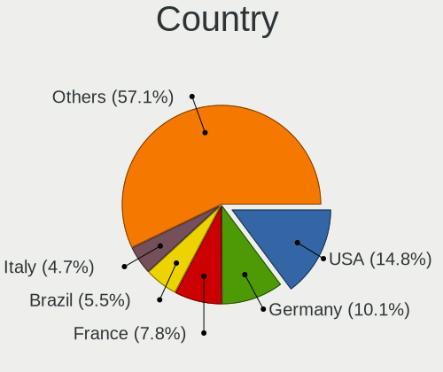

Ubuntu 22.04 - Tested Hardware & Statistics (Notebooks)
-------------------------------------------------------

A project to collect tested hardware configurations for Ubuntu 22.04.

Anyone can contribute to this report by the [hw-probe](https://github.com/linuxhw/hw-probe) tool:

    sudo -E hw-probe -all -upload

Please contribute! Especially if your hardware is rare.

Contents
--------

* [ Test Cases ](#test-cases)

* [ System ](#system)
  - [ Kernel                   ](#kernel)
  - [ Kernel Family            ](#kernel-family)
  - [ Kernel Major Ver.        ](#kernel-major-ver)
  - [ Arch                     ](#arch)
  - [ DE                       ](#de)
  - [ Display Server           ](#display-server)
  - [ Display Manager          ](#display-manager)
  - [ OS Lang                  ](#os-lang)
  - [ Boot Mode                ](#boot-mode)
  - [ Filesystem               ](#filesystem)
  - [ Part. scheme             ](#part-scheme)
  - [ Dual Boot with Linux/BSD ](#dual-boot-with-linuxbsd)
  - [ Dual Boot (Win)          ](#dual-boot-win)

* [ Board ](#board)
  - [ Vendor                   ](#vendor)
  - [ Model                    ](#model)
  - [ Model Family             ](#model-family)
  - [ MFG Year                 ](#mfg-year)
  - [ Form Factor              ](#form-factor)
  - [ Secure Boot              ](#secure-boot)
  - [ Coreboot                 ](#coreboot)
  - [ RAM Size                 ](#ram-size)
  - [ RAM Used                 ](#ram-used)
  - [ Total Drives             ](#total-drives)
  - [ Has CD-ROM               ](#has-cd-rom)
  - [ Has Ethernet             ](#has-ethernet)
  - [ Has WiFi                 ](#has-wifi)
  - [ Has Bluetooth            ](#has-bluetooth)

* [ Location ](#location)
  - [ Country                  ](#country)
  - [ City                     ](#city)

* [ Drives ](#drives)
  - [ Drive Vendor             ](#drive-vendor)
  - [ Drive Model              ](#drive-model)
  - [ HDD Vendor               ](#hdd-vendor)
  - [ SSD Vendor               ](#ssd-vendor)
  - [ Drive Kind               ](#drive-kind)
  - [ Drive Connector          ](#drive-connector)
  - [ Drive Size               ](#drive-size)
  - [ Space Total              ](#space-total)
  - [ Space Used               ](#space-used)
  - [ Malfunc. Drives          ](#malfunc-drives)
  - [ Malfunc. Drive Vendor    ](#malfunc-drive-vendor)
  - [ Malfunc. HDD Vendor      ](#malfunc-hdd-vendor)
  - [ Malfunc. Drive Kind      ](#malfunc-drive-kind)
  - [ Failed Drives            ](#failed-drives)
  - [ Failed Drive Vendor      ](#failed-drive-vendor)
  - [ Drive Status             ](#drive-status)

* [ Storage controller ](#storage-controller)
  - [ Storage Vendor           ](#storage-vendor)
  - [ Storage Model            ](#storage-model)
  - [ Storage Kind             ](#storage-kind)

* [ Processor ](#processor)
  - [ CPU Vendor               ](#cpu-vendor)
  - [ CPU Model                ](#cpu-model)
  - [ CPU Model Family         ](#cpu-model-family)
  - [ CPU Cores                ](#cpu-cores)
  - [ CPU Sockets              ](#cpu-sockets)
  - [ CPU Threads              ](#cpu-threads)
  - [ CPU Op-Modes             ](#cpu-op-modes)
  - [ CPU Microcode            ](#cpu-microcode)
  - [ CPU Microarch            ](#cpu-microarch)

* [ Graphics ](#graphics)
  - [ GPU Vendor               ](#gpu-vendor)
  - [ GPU Model                ](#gpu-model)
  - [ GPU Combo                ](#gpu-combo)
  - [ GPU Driver               ](#gpu-driver)
  - [ GPU Memory               ](#gpu-memory)

* [ Monitor ](#monitor)
  - [ Monitor Vendor           ](#monitor-vendor)
  - [ Monitor Model            ](#monitor-model)
  - [ Monitor Resolution       ](#monitor-resolution)
  - [ Monitor Diagonal         ](#monitor-diagonal)
  - [ Monitor Width            ](#monitor-width)
  - [ Aspect Ratio             ](#aspect-ratio)
  - [ Monitor Area             ](#monitor-area)
  - [ Pixel Density            ](#pixel-density)
  - [ Multiple Monitors        ](#multiple-monitors)

* [ Network ](#network)
  - [ Net Controller Vendor    ](#net-controller-vendor)
  - [ Net Controller Model     ](#net-controller-model)
  - [ Wireless Vendor          ](#wireless-vendor)
  - [ Wireless Model           ](#wireless-model)
  - [ Ethernet Vendor          ](#ethernet-vendor)
  - [ Ethernet Model           ](#ethernet-model)
  - [ Net Controller Kind      ](#net-controller-kind)
  - [ Used Controller          ](#used-controller)
  - [ NICs                     ](#nics)
  - [ IPv6                     ](#ipv6)

* [ Bluetooth ](#bluetooth)
  - [ Bluetooth Vendor         ](#bluetooth-vendor)
  - [ Bluetooth Model          ](#bluetooth-model)

* [ Sound ](#sound)
  - [ Sound Vendor             ](#sound-vendor)
  - [ Sound Model              ](#sound-model)

* [ Memory ](#memory)
  - [ Memory Vendor            ](#memory-vendor)
  - [ Memory Model             ](#memory-model)
  - [ Memory Kind              ](#memory-kind)
  - [ Memory Form Factor       ](#memory-form-factor)
  - [ Memory Size              ](#memory-size)
  - [ Memory Speed             ](#memory-speed)

* [ Printers & scanners ](#printers--scanners)
  - [ Printer Vendor           ](#printer-vendor)
  - [ Printer Model            ](#printer-model)
  - [ Scanner Vendor           ](#scanner-vendor)
  - [ Scanner Model            ](#scanner-model)

* [ Camera ](#camera)
  - [ Camera Vendor            ](#camera-vendor)
  - [ Camera Model             ](#camera-model)

* [ Security ](#security)
  - [ Fingerprint Vendor       ](#fingerprint-vendor)
  - [ Fingerprint Model        ](#fingerprint-model)
  - [ Chipcard Vendor          ](#chipcard-vendor)
  - [ Chipcard Model           ](#chipcard-model)

* [ Unsupported ](#unsupported)
  - [ Unsupported Devices      ](#unsupported-devices)
  - [ Unsupported Device Types ](#unsupported-device-types)

Test Cases
----------

Total: 4854

| Vendor        | Model                       | Probe                                                      | Date         |
|---------------|-----------------------------|------------------------------------------------------------|--------------|
| Dell          | Inspiron 5566               | [b2dd8d93c7](https://linux-hardware.org/?probe=b2dd8d93c7) | Feb 01, 2023 |
| Dell          | Latitude 5430               | [2afa57d0fa](https://linux-hardware.org/?probe=2afa57d0fa) | Feb 01, 2023 |
| Lenovo        | ThinkPad X220 4286CTO       | [465114aa14](https://linux-hardware.org/?probe=465114aa14) | Feb 01, 2023 |
| Dell          | Vostro 3500                 | [fa4104f438](https://linux-hardware.org/?probe=fa4104f438) | Feb 01, 2023 |
| Dell          | Vostro 3500                 | [ec80fcb8a5](https://linux-hardware.org/?probe=ec80fcb8a5) | Feb 01, 2023 |
| HUAWEI        | BOHK-WAX9X                  | [07b498f669](https://linux-hardware.org/?probe=07b498f669) | Feb 01, 2023 |
| Dell          | Inspiron 15-3567            | [2f6f4bc8c7](https://linux-hardware.org/?probe=2f6f4bc8c7) | Feb 01, 2023 |
| Lenovo        | ThinkPad X270 20HMS0T000    | [e9854b7cf8](https://linux-hardware.org/?probe=e9854b7cf8) | Feb 01, 2023 |
| Apple         | MacBookPro11,1              | [44f90bc9ab](https://linux-hardware.org/?probe=44f90bc9ab) | Feb 01, 2023 |
| HP            | Presario CQ57               | [0e34caefa3](https://linux-hardware.org/?probe=0e34caefa3) | Feb 01, 2023 |
| Dell          | Inspiron 15-7579            | [b5bd231bf3](https://linux-hardware.org/?probe=b5bd231bf3) | Jan 31, 2023 |
| ASUSTek       | VivoBook_ASUSLaptop X150... | [e2ad5b033f](https://linux-hardware.org/?probe=e2ad5b033f) | Jan 31, 2023 |
| Dell          | G3 3500                     | [4b519ab8a8](https://linux-hardware.org/?probe=4b519ab8a8) | Jan 31, 2023 |
| Timi          | TM1701                      | [a474c92380](https://linux-hardware.org/?probe=a474c92380) | Jan 31, 2023 |
| Dell          | XPS 13 7390                 | [5479d8c85b](https://linux-hardware.org/?probe=5479d8c85b) | Jan 31, 2023 |
| HP            | Laptop 15-bw0xx             | [b7fce61d74](https://linux-hardware.org/?probe=b7fce61d74) | Jan 31, 2023 |
| Dell          | XPS 13 9370                 | [cd12cbdc16](https://linux-hardware.org/?probe=cd12cbdc16) | Jan 31, 2023 |
| Lenovo        | ThinkPad E15 Gen 2 20T9S... | [51d249d102](https://linux-hardware.org/?probe=51d249d102) | Jan 31, 2023 |
| ASUSTek       | VivoBook_ASUSLaptop M340... | [cd9b7d5796](https://linux-hardware.org/?probe=cd9b7d5796) | Jan 31, 2023 |
| Dell          | XPS 15 9570                 | [896d7f2fbd](https://linux-hardware.org/?probe=896d7f2fbd) | Jan 31, 2023 |
| Timi          | A34R                        | [18ab422614](https://linux-hardware.org/?probe=18ab422614) | Jan 31, 2023 |
| HP            | EliteBook 840 G2            | [bf4741c8ad](https://linux-hardware.org/?probe=bf4741c8ad) | Jan 31, 2023 |
| Dell          | Latitude 7410               | [fd07971a70](https://linux-hardware.org/?probe=fd07971a70) | Jan 31, 2023 |
| Lenovo        | ThinkPad P15 Gen 2i 20YQ... | [ea48b6870c](https://linux-hardware.org/?probe=ea48b6870c) | Jan 31, 2023 |
| Google        | Casta                       | [db372f6a5f](https://linux-hardware.org/?probe=db372f6a5f) | Jan 31, 2023 |
| System76      | Lemur                       | [6dac0a5b94](https://linux-hardware.org/?probe=6dac0a5b94) | Jan 31, 2023 |
| Acer          | Aspire E5-571               | [615ee3d3fd](https://linux-hardware.org/?probe=615ee3d3fd) | Jan 31, 2023 |
| Lenovo        | ThinkPad P51 20HJS0BR00     | [6c05048c9d](https://linux-hardware.org/?probe=6c05048c9d) | Jan 31, 2023 |
| Acer          | Aspire E5-571               | [6498b44bcc](https://linux-hardware.org/?probe=6498b44bcc) | Jan 31, 2023 |
| Lenovo        | ThinkPad T430 2349A44       | [9f8528c5da](https://linux-hardware.org/?probe=9f8528c5da) | Jan 31, 2023 |
| Lenovo        | ThinkPad L540 20AVCTO1WW    | [d08beb0c26](https://linux-hardware.org/?probe=d08beb0c26) | Jan 31, 2023 |
| Apple         | MacBookPro14,2              | [ff0dfe765e](https://linux-hardware.org/?probe=ff0dfe765e) | Jan 31, 2023 |
| Toshiba       | Satellite U845W             | [6735a45763](https://linux-hardware.org/?probe=6735a45763) | Jan 30, 2023 |
| Lenovo        | ThinkPad P50 20EN0013US     | [d3bf9fe9e3](https://linux-hardware.org/?probe=d3bf9fe9e3) | Jan 30, 2023 |
| Acer          | Predator PH315-52           | [457b7cf5f0](https://linux-hardware.org/?probe=457b7cf5f0) | Jan 30, 2023 |
| HP            | Notebook                    | [fc93f8e357](https://linux-hardware.org/?probe=fc93f8e357) | Jan 30, 2023 |
| Acer          | Aspire V3-772G              | [fce1ba6f6b](https://linux-hardware.org/?probe=fce1ba6f6b) | Jan 30, 2023 |
| Sony          | VPCCB16FG                   | [837588c9eb](https://linux-hardware.org/?probe=837588c9eb) | Jan 30, 2023 |
| HP            | ProBook 4720s               | [b6edbaeae1](https://linux-hardware.org/?probe=b6edbaeae1) | Jan 30, 2023 |
| Acer          | Aspire M5-581TG             | [970a402846](https://linux-hardware.org/?probe=970a402846) | Jan 30, 2023 |
| Acer          | Aspire M5-581TG             | [c2d425d254](https://linux-hardware.org/?probe=c2d425d254) | Jan 30, 2023 |
| HUAWEI        | BOHB-WAX9                   | [f4916a0bd5](https://linux-hardware.org/?probe=f4916a0bd5) | Jan 30, 2023 |
| Dell          | Latitude 5480               | [ee87ac218f](https://linux-hardware.org/?probe=ee87ac218f) | Jan 30, 2023 |
| Dell          | Latitude 5480               | [3cbac640e1](https://linux-hardware.org/?probe=3cbac640e1) | Jan 30, 2023 |
| HP            | Compaq CQ58                 | [63dfd6ca48](https://linux-hardware.org/?probe=63dfd6ca48) | Jan 30, 2023 |
| Toshiba       | PORTEGE X30-E               | [01f74415b0](https://linux-hardware.org/?probe=01f74415b0) | Jan 30, 2023 |
| HP            | 15                          | [409a15bdf3](https://linux-hardware.org/?probe=409a15bdf3) | Jan 30, 2023 |
| HP            | ENVY Laptop 13-ah1xxx       | [360756b46a](https://linux-hardware.org/?probe=360756b46a) | Jan 30, 2023 |
| Dell          | Precision 5560              | [c994bfa3a7](https://linux-hardware.org/?probe=c994bfa3a7) | Jan 30, 2023 |
| Dell          | Latitude E6520              | [81717ed3df](https://linux-hardware.org/?probe=81717ed3df) | Jan 30, 2023 |
| Lenovo        | ThinkPad T480 20L5001KAU    | [4b7046e26c](https://linux-hardware.org/?probe=4b7046e26c) | Jan 30, 2023 |
| Dell          | XPS 13 9380                 | [ec00530842](https://linux-hardware.org/?probe=ec00530842) | Jan 30, 2023 |
| Lenovo        | ThinkPad T480 20L5000UUS    | [d356c9846a](https://linux-hardware.org/?probe=d356c9846a) | Jan 30, 2023 |
| Lenovo        | IdeaPad S145-15IWL 81S9     | [1c62beb905](https://linux-hardware.org/?probe=1c62beb905) | Jan 29, 2023 |
| Lenovo        | IdeaPad 320-15ISK 80XH      | [7bc88d72f0](https://linux-hardware.org/?probe=7bc88d72f0) | Jan 29, 2023 |
| HP            | Laptop 15-dy2xxx            | [97e6b9cb60](https://linux-hardware.org/?probe=97e6b9cb60) | Jan 29, 2023 |
| HP            | Laptop 15-dy2xxx            | [e5e795e7a2](https://linux-hardware.org/?probe=e5e795e7a2) | Jan 29, 2023 |
| Sony          | VPCCB16FG                   | [7307480466](https://linux-hardware.org/?probe=7307480466) | Jan 29, 2023 |
| Google        | Lillipup                    | [194cec66f5](https://linux-hardware.org/?probe=194cec66f5) | Jan 29, 2023 |
| Lenovo        | ThinkPad T420 4236PN3       | [3b5c51e8b8](https://linux-hardware.org/?probe=3b5c51e8b8) | Jan 29, 2023 |
| HUAWEI        | BOHB-WAX9                   | [ee6b0e54f7](https://linux-hardware.org/?probe=ee6b0e54f7) | Jan 29, 2023 |
| HP            | ZBook 14 G2                 | [4b1e1bc7e1](https://linux-hardware.org/?probe=4b1e1bc7e1) | Jan 29, 2023 |
| Apple         | MacBookPro5,5               | [678b6fa5f6](https://linux-hardware.org/?probe=678b6fa5f6) | Jan 29, 2023 |
| Lenovo        | IdeaPad 510-15ISK 80SR      | [debdb8208f](https://linux-hardware.org/?probe=debdb8208f) | Jan 29, 2023 |
| Lenovo        | IdeaPad 100-15IBD 80QQ      | [84c2710911](https://linux-hardware.org/?probe=84c2710911) | Jan 29, 2023 |
| HP            | ProBook 4520s               | [6a16110b08](https://linux-hardware.org/?probe=6a16110b08) | Jan 29, 2023 |
| HP            | ProBook 4520s               | [e973aeb114](https://linux-hardware.org/?probe=e973aeb114) | Jan 29, 2023 |
| HP            | Pavilion Sleekbook 15       | [d17dc00a8a](https://linux-hardware.org/?probe=d17dc00a8a) | Jan 29, 2023 |
| ASUSTek       | ASUS TUF Gaming F15 FX50... | [90644628b4](https://linux-hardware.org/?probe=90644628b4) | Jan 29, 2023 |
| HP            | Laptop 14-fq0xxx            | [0b7bcda17a](https://linux-hardware.org/?probe=0b7bcda17a) | Jan 29, 2023 |
| Timi          | RedmiBook Pro 15S           | [21cf912e1c](https://linux-hardware.org/?probe=21cf912e1c) | Jan 29, 2023 |
| Dell          | Inspiron 5520               | [c869e74605](https://linux-hardware.org/?probe=c869e74605) | Jan 29, 2023 |
| HP            | EliteBook 8460p             | [caedc4c130](https://linux-hardware.org/?probe=caedc4c130) | Jan 29, 2023 |
| HP            | Pavilion dv6                | [1e739ddc0d](https://linux-hardware.org/?probe=1e739ddc0d) | Jan 29, 2023 |
| HP            | Laptop 15-da0xxx            | [959a9a17dd](https://linux-hardware.org/?probe=959a9a17dd) | Jan 29, 2023 |
| System76      | Lemur                       | [a6fc9167f7](https://linux-hardware.org/?probe=a6fc9167f7) | Jan 29, 2023 |
| Alienware     | x15 R2                      | [51bb7a8c39](https://linux-hardware.org/?probe=51bb7a8c39) | Jan 29, 2023 |
| Dell          | Precision 7510              | [4f56174991](https://linux-hardware.org/?probe=4f56174991) | Jan 29, 2023 |
| Timi          | TM1703                      | [6bb85263a7](https://linux-hardware.org/?probe=6bb85263a7) | Jan 29, 2023 |
| ASUSTek       | X550LB                      | [9590dd2f30](https://linux-hardware.org/?probe=9590dd2f30) | Jan 28, 2023 |
| Lenovo        | G550 2958                   | [8bee986aca](https://linux-hardware.org/?probe=8bee986aca) | Jan 28, 2023 |
| Dell          | XPS 13 9380                 | [ed99ed692d](https://linux-hardware.org/?probe=ed99ed692d) | Jan 28, 2023 |
| Dell          | Latitude 7280               | [358f4c431f](https://linux-hardware.org/?probe=358f4c431f) | Jan 28, 2023 |
| Dell          | Latitude 7280               | [903e0489c4](https://linux-hardware.org/?probe=903e0489c4) | Jan 28, 2023 |
| HP            | Pavilion dv6                | [ce950f0a28](https://linux-hardware.org/?probe=ce950f0a28) | Jan 28, 2023 |
| Dell          | Inspiron 5570               | [17a8246044](https://linux-hardware.org/?probe=17a8246044) | Jan 28, 2023 |
| Lenovo        | ThinkPad T480 20L6SF8C00    | [4ab453f835](https://linux-hardware.org/?probe=4ab453f835) | Jan 28, 2023 |
| ASUSTek       | X555QA                      | [8eec8468fb](https://linux-hardware.org/?probe=8eec8468fb) | Jan 28, 2023 |
| Dell          | Inspiron 1521               | [8fcde91462](https://linux-hardware.org/?probe=8fcde91462) | Jan 28, 2023 |
| ASUSTek       | X751LB                      | [54094ae0a7](https://linux-hardware.org/?probe=54094ae0a7) | Jan 28, 2023 |
| Lenovo        | G550 2958                   | [a50b0e3645](https://linux-hardware.org/?probe=a50b0e3645) | Jan 28, 2023 |
| HP            | EliteBook 840 G3            | [f9446c0c08](https://linux-hardware.org/?probe=f9446c0c08) | Jan 28, 2023 |
| Lenovo        | IdeaPad Flex-14API 81SS     | [d99ff3dbe8](https://linux-hardware.org/?probe=d99ff3dbe8) | Jan 28, 2023 |
| Lenovo        | ThinkBook 14 G2 ITL 20VD    | [b33f2d5606](https://linux-hardware.org/?probe=b33f2d5606) | Jan 28, 2023 |
| Unknown       | Unknown                     | [b4270378b4](https://linux-hardware.org/?probe=b4270378b4) | Jan 27, 2023 |
| HP            | EliteBook 8530w             | [f395c475c9](https://linux-hardware.org/?probe=f395c475c9) | Jan 27, 2023 |
| Sony          | SVE1512H1EB                 | [9f9b853849](https://linux-hardware.org/?probe=9f9b853849) | Jan 27, 2023 |
| Sony          | SVE1512H1EB                 | [a1f75687bc](https://linux-hardware.org/?probe=a1f75687bc) | Jan 27, 2023 |
| MSI           | Prestige 14Evo A12M         | [17f4098b36](https://linux-hardware.org/?probe=17f4098b36) | Jan 27, 2023 |
| ASUSTek       | K73E                        | [66e0036452](https://linux-hardware.org/?probe=66e0036452) | Jan 27, 2023 |
| ASUSTek       | K73E                        | [91f049a01d](https://linux-hardware.org/?probe=91f049a01d) | Jan 27, 2023 |
| HP            | ProBook 445 G7              | [d0b5bf560a](https://linux-hardware.org/?probe=d0b5bf560a) | Jan 27, 2023 |
| ASUSTek       | ROG Strix G733CX_G733CX     | [a0c1ab03da](https://linux-hardware.org/?probe=a0c1ab03da) | Jan 27, 2023 |
| Dell          | Latitude E6430              | [ac467a864d](https://linux-hardware.org/?probe=ac467a864d) | Jan 27, 2023 |
| ASUSTek       | VivoBook_ASUSLaptop K340... | [37059de5b7](https://linux-hardware.org/?probe=37059de5b7) | Jan 27, 2023 |
| Acer          | Aspire ES1-571              | [c35f2771dc](https://linux-hardware.org/?probe=c35f2771dc) | Jan 27, 2023 |
| Lenovo        | ThinkBook 14 G3 ACL 21A2    | [77a6b88d58](https://linux-hardware.org/?probe=77a6b88d58) | Jan 27, 2023 |
| Dell          | Latitude E7470              | [42ace80c0b](https://linux-hardware.org/?probe=42ace80c0b) | Jan 27, 2023 |
| Acer          | Aspire A515-57G             | [f5492fbdaa](https://linux-hardware.org/?probe=f5492fbdaa) | Jan 27, 2023 |
| HP            | ProBook 450 G7              | [4582f041bc](https://linux-hardware.org/?probe=4582f041bc) | Jan 27, 2023 |
| Acer          | Aspire E5-571               | [cef03beca8](https://linux-hardware.org/?probe=cef03beca8) | Jan 27, 2023 |
| HP            | Laptop 17-cp0xxx            | [55477da159](https://linux-hardware.org/?probe=55477da159) | Jan 27, 2023 |
| HP            | ENVY Laptop 13-ba0xxx       | [e4544fb59a](https://linux-hardware.org/?probe=e4544fb59a) | Jan 27, 2023 |
| Gateway       | T-1620                      | [595ce5493d](https://linux-hardware.org/?probe=595ce5493d) | Jan 27, 2023 |
| Compaq        | 430                         | [069fa715b9](https://linux-hardware.org/?probe=069fa715b9) | Jan 27, 2023 |
| Dell          | XPS 13 9305                 | [c0468fe8fd](https://linux-hardware.org/?probe=c0468fe8fd) | Jan 27, 2023 |
| MSI           | Prestige 14Evo A12M         | [3638a1774c](https://linux-hardware.org/?probe=3638a1774c) | Jan 27, 2023 |
| ASUSTek       | ZenBook UX425UA_UM425UA     | [af3748a4f0](https://linux-hardware.org/?probe=af3748a4f0) | Jan 26, 2023 |
| Dell          | XPS 17 9700                 | [72161736bf](https://linux-hardware.org/?probe=72161736bf) | Jan 26, 2023 |
| Dell          | Latitude E6420              | [9837928212](https://linux-hardware.org/?probe=9837928212) | Jan 26, 2023 |
| HP            | 255 G8 Notebook PC          | [fdcee64754](https://linux-hardware.org/?probe=fdcee64754) | Jan 26, 2023 |
| HP            | 255 G8 Notebook PC          | [814fe54dc5](https://linux-hardware.org/?probe=814fe54dc5) | Jan 26, 2023 |
| ASUSTek       | Zenbook UX5401ZAS_UX5401... | [de8222900d](https://linux-hardware.org/?probe=de8222900d) | Jan 26, 2023 |
| Gigabyte      | Sabre 15                    | [3ad57e9198](https://linux-hardware.org/?probe=3ad57e9198) | Jan 26, 2023 |
| Fujitsu       | LIFEBOOK E752               | [2fc97553ae](https://linux-hardware.org/?probe=2fc97553ae) | Jan 26, 2023 |
| Lenovo        | ThinkPad L490 20Q5002GPG    | [a9567dc72b](https://linux-hardware.org/?probe=a9567dc72b) | Jan 26, 2023 |
| Packard Be... | EasyNote TS44HR             | [2902a743da](https://linux-hardware.org/?probe=2902a743da) | Jan 26, 2023 |
| HP            | ProBook 440 G5              | [af59cf3cd3](https://linux-hardware.org/?probe=af59cf3cd3) | Jan 26, 2023 |
| ASUSTek       | VivoBook_ASUSLaptop E210... | [c89c0bb61f](https://linux-hardware.org/?probe=c89c0bb61f) | Jan 26, 2023 |
| Dell          | Inspiron 15 5510            | [babedb5bbc](https://linux-hardware.org/?probe=babedb5bbc) | Jan 26, 2023 |
| Apple         | MacBook5,1                  | [b7759508d9](https://linux-hardware.org/?probe=b7759508d9) | Jan 26, 2023 |
| Apple         | MacBook5,1                  | [72f2c3fddc](https://linux-hardware.org/?probe=72f2c3fddc) | Jan 26, 2023 |
| HP            | Laptop 17-by2xxx            | [556e92dc41](https://linux-hardware.org/?probe=556e92dc41) | Jan 26, 2023 |
| Lenovo        | ThinkPad T16 Gen 1 21BVC... | [912583a548](https://linux-hardware.org/?probe=912583a548) | Jan 26, 2023 |
| Dell          | Precision 7510              | [6323693228](https://linux-hardware.org/?probe=6323693228) | Jan 26, 2023 |
| ASUSTek       | X550CL                      | [e98a955b1a](https://linux-hardware.org/?probe=e98a955b1a) | Jan 26, 2023 |
| Dell          | Inspiron 7577               | [4dded574d3](https://linux-hardware.org/?probe=4dded574d3) | Jan 25, 2023 |
| HP            | 250 15.6 inch G9 Noteboo... | [e030231e2c](https://linux-hardware.org/?probe=e030231e2c) | Jan 25, 2023 |
| HP            | Laptop 14-dq2xxx            | [f308688189](https://linux-hardware.org/?probe=f308688189) | Jan 25, 2023 |
| Timi          | Redmi Book Pro 15 2022      | [b89ee82de7](https://linux-hardware.org/?probe=b89ee82de7) | Jan 25, 2023 |
| HP            | ProBook 6460b               | [81a1748477](https://linux-hardware.org/?probe=81a1748477) | Jan 25, 2023 |
| HP            | Pavilion Laptop 15-eh1xx... | [f4e06ff0b2](https://linux-hardware.org/?probe=f4e06ff0b2) | Jan 25, 2023 |
| Lenovo        | IdeaPad Z500 20202          | [e589b4bd78](https://linux-hardware.org/?probe=e589b4bd78) | Jan 25, 2023 |
| ASUSTek       | TUF Gaming FX505DY_FX505... | [148b797f1a](https://linux-hardware.org/?probe=148b797f1a) | Jan 25, 2023 |
| ASUSTek       | TUF Gaming FX505DT_FX505... | [bd58d910f7](https://linux-hardware.org/?probe=bd58d910f7) | Jan 25, 2023 |
| HP            | Pavilion g7                 | [e96f30194b](https://linux-hardware.org/?probe=e96f30194b) | Jan 25, 2023 |
| HP            | Pavilion Gaming Laptop 1... | [30b373aafe](https://linux-hardware.org/?probe=30b373aafe) | Jan 25, 2023 |
| TUXEDO        | Unknown                     | [ebdbb886bc](https://linux-hardware.org/?probe=ebdbb886bc) | Jan 25, 2023 |
| Lenovo        | IdeaPad 3 15ITL6 82H8       | [07d5199d1c](https://linux-hardware.org/?probe=07d5199d1c) | Jan 25, 2023 |
| Acer          | Aspire A515-57G             | [2b83e8779f](https://linux-hardware.org/?probe=2b83e8779f) | Jan 25, 2023 |
| Dell          | Latitude E6520              | [baf618d1a1](https://linux-hardware.org/?probe=baf618d1a1) | Jan 25, 2023 |
| Acer          | Aspire A515-57G             | [cc3599afd2](https://linux-hardware.org/?probe=cc3599afd2) | Jan 24, 2023 |
| Dell          | Latitude E6520              | [615879d5e9](https://linux-hardware.org/?probe=615879d5e9) | Jan 24, 2023 |
| MSI           | CX700ND/CX70 0NF/CX70 0N... | [dad68fd07f](https://linux-hardware.org/?probe=dad68fd07f) | Jan 24, 2023 |
| Apple         | MacBookPro5,4               | [4bdccd0680](https://linux-hardware.org/?probe=4bdccd0680) | Jan 24, 2023 |
| MSI           | CX700ND/CX70 0NF/CX70 0N... | [b61b0f981e](https://linux-hardware.org/?probe=b61b0f981e) | Jan 24, 2023 |
| MSI           | GP66 Leopard 11UG           | [4e628cc332](https://linux-hardware.org/?probe=4e628cc332) | Jan 24, 2023 |
| Dell          | Precision 5570              | [2bde8abafe](https://linux-hardware.org/?probe=2bde8abafe) | Jan 24, 2023 |
| Lenovo        | IdeaPad S340-15IWL 81N8     | [5df97c3eb1](https://linux-hardware.org/?probe=5df97c3eb1) | Jan 24, 2023 |
| ASUSTek       | X555QA                      | [f981af502a](https://linux-hardware.org/?probe=f981af502a) | Jan 24, 2023 |
| Lenovo        | Legion 5 Pro 16ACH6H 82J... | [055d033d99](https://linux-hardware.org/?probe=055d033d99) | Jan 24, 2023 |
| Dell          | Latitude 5580               | [34ebeee5d4](https://linux-hardware.org/?probe=34ebeee5d4) | Jan 24, 2023 |
| HP            | Laptop 14-dq2xxx            | [9a930173a0](https://linux-hardware.org/?probe=9a930173a0) | Jan 24, 2023 |
| ASUSTek       | TUF Gaming FX505DT_FX505... | [65b6391803](https://linux-hardware.org/?probe=65b6391803) | Jan 24, 2023 |
| Acer          | Aspire V5-431               | [abf4a51513](https://linux-hardware.org/?probe=abf4a51513) | Jan 24, 2023 |
| Dell          | Precision 7510              | [bf8b996b99](https://linux-hardware.org/?probe=bf8b996b99) | Jan 24, 2023 |
| Acer          | Aspire V5-431               | [3da8ac521c](https://linux-hardware.org/?probe=3da8ac521c) | Jan 23, 2023 |
| Lenovo        | ThinkPad T540p 20BE00AKZ... | [c4a4bd6895](https://linux-hardware.org/?probe=c4a4bd6895) | Jan 23, 2023 |
| Lenovo        | IdeaPad Y510P 20217         | [97ca64cad1](https://linux-hardware.org/?probe=97ca64cad1) | Jan 23, 2023 |
| HP            | ENVY 15                     | [c1b400b6e6](https://linux-hardware.org/?probe=c1b400b6e6) | Jan 23, 2023 |
| Dell          | Inspiron 3542               | [0eb0b40b2b](https://linux-hardware.org/?probe=0eb0b40b2b) | Jan 23, 2023 |
| MSI           | Stealth GS66 12UH           | [9e79dca70b](https://linux-hardware.org/?probe=9e79dca70b) | Jan 23, 2023 |
| Dell          | Inspiron 7537               | [9181895f24](https://linux-hardware.org/?probe=9181895f24) | Jan 23, 2023 |
| HP            | OMEN by Laptop 16-b0xxx     | [e1eeca8eab](https://linux-hardware.org/?probe=e1eeca8eab) | Jan 23, 2023 |
| HP            | Pavilion Laptop 14-dv1xx... | [2194886c52](https://linux-hardware.org/?probe=2194886c52) | Jan 23, 2023 |
| HP            | EliteBook 840 G4            | [459ab8ae3d](https://linux-hardware.org/?probe=459ab8ae3d) | Jan 23, 2023 |
| Dell          | Latitude 7420               | [dc99eb6c92](https://linux-hardware.org/?probe=dc99eb6c92) | Jan 23, 2023 |
| Alienware     | 15 R4                       | [8833335118](https://linux-hardware.org/?probe=8833335118) | Jan 23, 2023 |
| Acer          | AO722                       | [85f48171a2](https://linux-hardware.org/?probe=85f48171a2) | Jan 23, 2023 |
| Acer          | Aspire E5-576               | [df3e660090](https://linux-hardware.org/?probe=df3e660090) | Jan 23, 2023 |
| HP            | Pavilion Laptop 15-eg2xx... | [adcd91409c](https://linux-hardware.org/?probe=adcd91409c) | Jan 23, 2023 |
| Alienware     | m15 R7                      | [e57302bf60](https://linux-hardware.org/?probe=e57302bf60) | Jan 23, 2023 |
| HP            | Pavilion Laptop 15-eg2xx... | [e2fd85407d](https://linux-hardware.org/?probe=e2fd85407d) | Jan 23, 2023 |
| HP            | Laptop 15-dw0xxx            | [8460e3552a](https://linux-hardware.org/?probe=8460e3552a) | Jan 22, 2023 |
| HP            | EliteBook 840 G5            | [5ad0221a16](https://linux-hardware.org/?probe=5ad0221a16) | Jan 22, 2023 |
| Acer          | Aspire A515-51              | [5195423178](https://linux-hardware.org/?probe=5195423178) | Jan 22, 2023 |
| Lenovo        | IdeaPad 700-15ISK 80RU      | [b37f2fcaba](https://linux-hardware.org/?probe=b37f2fcaba) | Jan 22, 2023 |
| Lenovo        | IdeaPad 700-15ISK 80RU      | [0e29c1dd04](https://linux-hardware.org/?probe=0e29c1dd04) | Jan 22, 2023 |
| HP            | ProBook 430 G2              | [24a0f33638](https://linux-hardware.org/?probe=24a0f33638) | Jan 22, 2023 |
| Dell          | Latitude 5520               | [a3541758f7](https://linux-hardware.org/?probe=a3541758f7) | Jan 22, 2023 |
| Lenovo        | ThinkPad E580 20KTS0TF00    | [395d565464](https://linux-hardware.org/?probe=395d565464) | Jan 22, 2023 |
| Dell          | Inspiron 3521               | [2189958490](https://linux-hardware.org/?probe=2189958490) | Jan 22, 2023 |
| Dell          | XPS 15 9520                 | [893ebdd842](https://linux-hardware.org/?probe=893ebdd842) | Jan 22, 2023 |
| Lenovo        | ThinkPad X220 4291CZ6       | [44370bfe99](https://linux-hardware.org/?probe=44370bfe99) | Jan 22, 2023 |
| Acer          | Aspire A515-55G             | [7a4e781669](https://linux-hardware.org/?probe=7a4e781669) | Jan 22, 2023 |
| ASUSTek       | X540UA                      | [39f992a141](https://linux-hardware.org/?probe=39f992a141) | Jan 22, 2023 |
| Apple         | MacBookPro9,2               | [ffa1f65eeb](https://linux-hardware.org/?probe=ffa1f65eeb) | Jan 22, 2023 |
| HP            | EliteBook 8470p             | [601dd342aa](https://linux-hardware.org/?probe=601dd342aa) | Jan 22, 2023 |
| HP            | Laptop 17-cp0xxx            | [7e1fa9aaf3](https://linux-hardware.org/?probe=7e1fa9aaf3) | Jan 22, 2023 |
| ASUSTek       | G750JM                      | [8cb76e0d6d](https://linux-hardware.org/?probe=8cb76e0d6d) | Jan 22, 2023 |
| Dell          | Latitude 5400               | [97ee7b50ee](https://linux-hardware.org/?probe=97ee7b50ee) | Jan 22, 2023 |
| Dell          | G15 5510                    | [7cee6347e3](https://linux-hardware.org/?probe=7cee6347e3) | Jan 22, 2023 |
| Lenovo        | IdeaPad 3 15ALC6 82MF       | [697fbcd8d1](https://linux-hardware.org/?probe=697fbcd8d1) | Jan 22, 2023 |
| ASUSTek       | UX303LN                     | [60f8946cdf](https://linux-hardware.org/?probe=60f8946cdf) | Jan 21, 2023 |
| Lenovo        | Yoga 700-14ISK 80QD         | [4e07ace043](https://linux-hardware.org/?probe=4e07ace043) | Jan 21, 2023 |
| ASUSTek       | UX303LN                     | [846e3df466](https://linux-hardware.org/?probe=846e3df466) | Jan 21, 2023 |
| Dell          | Latitude E5570              | [565e8c64f1](https://linux-hardware.org/?probe=565e8c64f1) | Jan 21, 2023 |
| Lenovo        | IdeaPad 1 14ADA05 82GW      | [d971cd0912](https://linux-hardware.org/?probe=d971cd0912) | Jan 21, 2023 |
| Toshiba       | Satellite Pro C850-10L      | [c1de4d0e2b](https://linux-hardware.org/?probe=c1de4d0e2b) | Jan 21, 2023 |
| Acer          | Swift SF314-57G             | [ae9de10584](https://linux-hardware.org/?probe=ae9de10584) | Jan 21, 2023 |
| Apple         | MacBookPro8,1               | [fa1f3d8e3b](https://linux-hardware.org/?probe=fa1f3d8e3b) | Jan 21, 2023 |
| Acer          | Aspire E5-575G              | [d020dd93e4](https://linux-hardware.org/?probe=d020dd93e4) | Jan 21, 2023 |
| HP            | Laptop 17-cp0xxx            | [1ada8c14a9](https://linux-hardware.org/?probe=1ada8c14a9) | Jan 21, 2023 |
| Wortmann      | 1220583_1470086             | [10016e75a1](https://linux-hardware.org/?probe=10016e75a1) | Jan 21, 2023 |
| Lenovo        | IdeaPad 5 15ARE05 81YQ      | [fe4b24bf26](https://linux-hardware.org/?probe=fe4b24bf26) | Jan 21, 2023 |
| HP            | Laptop 15s-eq3xxx           | [d2d30c8d6f](https://linux-hardware.org/?probe=d2d30c8d6f) | Jan 21, 2023 |
| Dell          | XPS 15 9520                 | [330a3844cb](https://linux-hardware.org/?probe=330a3844cb) | Jan 21, 2023 |
| Lenovo        | IdeaPad Z400 20201          | [9e49dc44eb](https://linux-hardware.org/?probe=9e49dc44eb) | Jan 21, 2023 |
| Dell          | Inspiron 3442               | [bb63f70764](https://linux-hardware.org/?probe=bb63f70764) | Jan 21, 2023 |
| Dell          | Inspiron 3442               | [5973a7db86](https://linux-hardware.org/?probe=5973a7db86) | Jan 21, 2023 |
| Dell          | Latitude 5501               | [72581be7e7](https://linux-hardware.org/?probe=72581be7e7) | Jan 21, 2023 |
| Lenovo        | ThinkPad P52s 20LBCTO1WW    | [e0b197c0c4](https://linux-hardware.org/?probe=e0b197c0c4) | Jan 21, 2023 |
| ASUSTek       | GL553VD                     | [eeea0542b8](https://linux-hardware.org/?probe=eeea0542b8) | Jan 21, 2023 |
| Dell          | XPS 13 9310                 | [5d606f2c60](https://linux-hardware.org/?probe=5d606f2c60) | Jan 21, 2023 |
| Lenovo        | IdeaPad 3 14ITL6 82H7       | [940d192ea9](https://linux-hardware.org/?probe=940d192ea9) | Jan 20, 2023 |
| Dell          | XPS 13 7390                 | [97b14c6835](https://linux-hardware.org/?probe=97b14c6835) | Jan 20, 2023 |
| Dell          | Inspiron 13-5368            | [4e74651840](https://linux-hardware.org/?probe=4e74651840) | Jan 20, 2023 |
| Acer          | Aspire A114-31              | [b341182acd](https://linux-hardware.org/?probe=b341182acd) | Jan 20, 2023 |
| ASUSTek       | ROG Zephyrus G14 GA401IV... | [1332c6c11a](https://linux-hardware.org/?probe=1332c6c11a) | Jan 20, 2023 |
| MSI           | CR650                       | [3d3a46f5c6](https://linux-hardware.org/?probe=3d3a46f5c6) | Jan 20, 2023 |
| MSI           | CR650                       | [7d3b1f25c4](https://linux-hardware.org/?probe=7d3b1f25c4) | Jan 20, 2023 |
| Acer          | Swift SF314-71              | [9cee6edc8e](https://linux-hardware.org/?probe=9cee6edc8e) | Jan 20, 2023 |
| Dell          | Latitude 7410               | [488f794ad5](https://linux-hardware.org/?probe=488f794ad5) | Jan 20, 2023 |
| Dell          | Vostro 3400                 | [c158cd6095](https://linux-hardware.org/?probe=c158cd6095) | Jan 20, 2023 |
| Dell          | Inspiron 14 5410            | [beaa2fdddb](https://linux-hardware.org/?probe=beaa2fdddb) | Jan 20, 2023 |
| Samsung       | 350V5C/351V5C/3540VC/344... | [9cb7b18b35](https://linux-hardware.org/?probe=9cb7b18b35) | Jan 20, 2023 |
| Samsung       | 350V5C/351V5C/3540VC/344... | [95e7b7d833](https://linux-hardware.org/?probe=95e7b7d833) | Jan 20, 2023 |
| HP            | Laptop 15s-eq3xxx           | [07cf342b4f](https://linux-hardware.org/?probe=07cf342b4f) | Jan 20, 2023 |
| Timi          | TM1613                      | [dc9bf9e792](https://linux-hardware.org/?probe=dc9bf9e792) | Jan 20, 2023 |
| Lenovo        | ThinkBook 15 G2 ITL 20VE    | [ccf1934924](https://linux-hardware.org/?probe=ccf1934924) | Jan 20, 2023 |
| ASUSTek       | X555QA                      | [cd42f89819](https://linux-hardware.org/?probe=cd42f89819) | Jan 20, 2023 |
| HP            | Laptop 15s-eq3xxx           | [78791e5b9e](https://linux-hardware.org/?probe=78791e5b9e) | Jan 20, 2023 |
| Acer          | Predator PH315-55           | [b628a46957](https://linux-hardware.org/?probe=b628a46957) | Jan 20, 2023 |
| ASUSTek       | ROG Strix G533QS_G533QS     | [105b2daa8e](https://linux-hardware.org/?probe=105b2daa8e) | Jan 20, 2023 |
| Lenovo        | ThinkPad T480 20L5000UUS    | [d3e44e2970](https://linux-hardware.org/?probe=d3e44e2970) | Jan 20, 2023 |
| Dell          | Latitude E5570              | [6e05683356](https://linux-hardware.org/?probe=6e05683356) | Jan 20, 2023 |
| Dell          | Latitude E7450              | [c5ae2acc97](https://linux-hardware.org/?probe=c5ae2acc97) | Jan 20, 2023 |
| Lenovo        | ThinkPad T420s 41732BU      | [fb42067a32](https://linux-hardware.org/?probe=fb42067a32) | Jan 20, 2023 |
| Acer          | Aspire A515-54              | [db5bd0e34e](https://linux-hardware.org/?probe=db5bd0e34e) | Jan 19, 2023 |
| HP            | Laptop 15-bs1xx             | [76689345ef](https://linux-hardware.org/?probe=76689345ef) | Jan 19, 2023 |
| Fujitsu       | LIFEBOOK A3511              | [873a521bf5](https://linux-hardware.org/?probe=873a521bf5) | Jan 19, 2023 |
| Dell          | Inspiron 3505               | [86defcfb4f](https://linux-hardware.org/?probe=86defcfb4f) | Jan 19, 2023 |
| Schenker      | XMG PRO (Early 2021)        | [5b7b3243b0](https://linux-hardware.org/?probe=5b7b3243b0) | Jan 19, 2023 |
| MSI           | Creator Z17 A12UHST         | [1fd7f0acb7](https://linux-hardware.org/?probe=1fd7f0acb7) | Jan 19, 2023 |
| Acer          | Aspire VN7-591G             | [9476823c0b](https://linux-hardware.org/?probe=9476823c0b) | Jan 19, 2023 |
| Apple         | MacBook5,2                  | [433209f43d](https://linux-hardware.org/?probe=433209f43d) | Jan 19, 2023 |
| Medion        | X781X                       | [d574c9c53c](https://linux-hardware.org/?probe=d574c9c53c) | Jan 19, 2023 |
| Dell          | Latitude E6510              | [4b10c4532e](https://linux-hardware.org/?probe=4b10c4532e) | Jan 19, 2023 |
| Dell          | Latitude E6510              | [6b8112e4c1](https://linux-hardware.org/?probe=6b8112e4c1) | Jan 19, 2023 |
| Sony          | VPCCA15FX                   | [41138327da](https://linux-hardware.org/?probe=41138327da) | Jan 19, 2023 |
| Lenovo        | IdeaPad 3 15ITL6 82H8       | [f91b43d7d7](https://linux-hardware.org/?probe=f91b43d7d7) | Jan 19, 2023 |
| Apple         | MacBookPro5,2               | [8e71a8746d](https://linux-hardware.org/?probe=8e71a8746d) | Jan 19, 2023 |
| Apple         | MacBook8,1                  | [17e254a9ec](https://linux-hardware.org/?probe=17e254a9ec) | Jan 19, 2023 |
| HP            | Stream Laptop 14-ax0XX      | [8825aa1329](https://linux-hardware.org/?probe=8825aa1329) | Jan 19, 2023 |
| Apple         | MacBookPro8,1               | [997cce8284](https://linux-hardware.org/?probe=997cce8284) | Jan 19, 2023 |
| Acer          | Aspire A114-31              | [30698dacda](https://linux-hardware.org/?probe=30698dacda) | Jan 19, 2023 |
| ASUSTek       | UX32VD                      | [7851952137](https://linux-hardware.org/?probe=7851952137) | Jan 18, 2023 |
| Dell          | Inspiron 3442               | [04fe55a1a1](https://linux-hardware.org/?probe=04fe55a1a1) | Jan 18, 2023 |
| Gigabyte      | P15FV5                      | [5a03ba32c0](https://linux-hardware.org/?probe=5a03ba32c0) | Jan 18, 2023 |
| Notebook      | W65_67SJ                    | [8628d6f752](https://linux-hardware.org/?probe=8628d6f752) | Jan 18, 2023 |
| Dell          | Latitude 5510               | [c9738f8691](https://linux-hardware.org/?probe=c9738f8691) | Jan 18, 2023 |
| Dell          | Inspiron 7537               | [95cc108754](https://linux-hardware.org/?probe=95cc108754) | Jan 18, 2023 |
| Lenovo        | ThinkPad T470s 20HGS36U0... | [37fd07b937](https://linux-hardware.org/?probe=37fd07b937) | Jan 18, 2023 |
| HUAWEI        | BOD-WXX9                    | [0d3da58e45](https://linux-hardware.org/?probe=0d3da58e45) | Jan 18, 2023 |
| Dell          | Precision M6800             | [62d01a5b26](https://linux-hardware.org/?probe=62d01a5b26) | Jan 18, 2023 |
| ASUSTek       | K53TA                       | [a56a3691e9](https://linux-hardware.org/?probe=a56a3691e9) | Jan 18, 2023 |
| Lenovo        | IdeaPad 3 15ALC6 82MF       | [3f0d644eaf](https://linux-hardware.org/?probe=3f0d644eaf) | Jan 18, 2023 |
| Dell          | Precision M6800             | [09e31ee1c8](https://linux-hardware.org/?probe=09e31ee1c8) | Jan 18, 2023 |
| HP            | Pavilion Laptop 15-cc5xx    | [c52e64925e](https://linux-hardware.org/?probe=c52e64925e) | Jan 18, 2023 |
| Dell          | Latitude 5530               | [f9325236bb](https://linux-hardware.org/?probe=f9325236bb) | Jan 17, 2023 |
| Dell          | Latitude 5530               | [fafa35ef88](https://linux-hardware.org/?probe=fafa35ef88) | Jan 17, 2023 |
| HP            | 255 G8 Notebook PC          | [e96d7dfab6](https://linux-hardware.org/?probe=e96d7dfab6) | Jan 17, 2023 |
| Samsung       | RV415/RV515/E3415           | [8612e64617](https://linux-hardware.org/?probe=8612e64617) | Jan 17, 2023 |
| Dell          | Latitude E6540              | [eaaf255ed2](https://linux-hardware.org/?probe=eaaf255ed2) | Jan 17, 2023 |
| Apple         | MacBookPro8,1               | [da481ceeb8](https://linux-hardware.org/?probe=da481ceeb8) | Jan 17, 2023 |
| Lenovo        | V330-14IKB 81B0             | [140f1537e2](https://linux-hardware.org/?probe=140f1537e2) | Jan 17, 2023 |
| HP            | Laptop 15s-eq1xxx           | [62fc20fe3e](https://linux-hardware.org/?probe=62fc20fe3e) | Jan 17, 2023 |
| HP            | Unknown                     | [fedf225852](https://linux-hardware.org/?probe=fedf225852) | Jan 17, 2023 |
| Dell          | Latitude 5521               | [cfe9e36a5e](https://linux-hardware.org/?probe=cfe9e36a5e) | Jan 17, 2023 |
| Digibras      | NH4CU03                     | [cd9cdce064](https://linux-hardware.org/?probe=cd9cdce064) | Jan 17, 2023 |
| Samsung       | 350V5C/351V5C/3540VC/344... | [8026c0d5b2](https://linux-hardware.org/?probe=8026c0d5b2) | Jan 17, 2023 |
| Acer          | Aspire V3-571G              | [84bce1ebbb](https://linux-hardware.org/?probe=84bce1ebbb) | Jan 17, 2023 |
| Dell          | XPS 9320                    | [bd7346b7c2](https://linux-hardware.org/?probe=bd7346b7c2) | Jan 17, 2023 |
| HP            | ZBook 14 G2                 | [d501532972](https://linux-hardware.org/?probe=d501532972) | Jan 17, 2023 |
| Dell          | Latitude E6420              | [8aba0b46b8](https://linux-hardware.org/?probe=8aba0b46b8) | Jan 17, 2023 |
| HP            | Pavilion Laptop 15-cc5xx    | [1ae3485568](https://linux-hardware.org/?probe=1ae3485568) | Jan 17, 2023 |
| HP            | Unknown                     | [8b89da1da5](https://linux-hardware.org/?probe=8b89da1da5) | Jan 17, 2023 |
| Dell          | Inspiron 3521               | [2d46e86664](https://linux-hardware.org/?probe=2d46e86664) | Jan 17, 2023 |
| Lenovo        | ThinkPad E14 Gen 2 20T60... | [5169fb5013](https://linux-hardware.org/?probe=5169fb5013) | Jan 17, 2023 |
| ASUSTek       | VivoBook_ASUSLaptop X510... | [a602bcd50a](https://linux-hardware.org/?probe=a602bcd50a) | Jan 17, 2023 |
| Dell          | Inspiron 3583               | [69e87b6d65](https://linux-hardware.org/?probe=69e87b6d65) | Jan 17, 2023 |
| HP            | Laptop 15s-eq1xxx           | [9e3506397c](https://linux-hardware.org/?probe=9e3506397c) | Jan 17, 2023 |
| Acer          | Aspire A515-52              | [fdc8429b4f](https://linux-hardware.org/?probe=fdc8429b4f) | Jan 16, 2023 |
| Dell          | Inspiron 3521               | [da7f445f06](https://linux-hardware.org/?probe=da7f445f06) | Jan 16, 2023 |
| Dell          | XPS 17 9720                 | [edb39e6e0f](https://linux-hardware.org/?probe=edb39e6e0f) | Jan 16, 2023 |
| HP            | EliteBook 840 G6            | [5a622c4769](https://linux-hardware.org/?probe=5a622c4769) | Jan 16, 2023 |
| HP            | Pavilion Notebook           | [b31a0e1b3e](https://linux-hardware.org/?probe=b31a0e1b3e) | Jan 16, 2023 |
| ASUSTek       | P43E                        | [2685c35f77](https://linux-hardware.org/?probe=2685c35f77) | Jan 16, 2023 |
| HP            | ProBook 430 G3              | [a320b048f1](https://linux-hardware.org/?probe=a320b048f1) | Jan 16, 2023 |
| HUAWEI        | BOD-WXX9                    | [c854a01151](https://linux-hardware.org/?probe=c854a01151) | Jan 16, 2023 |
| HP            | ProBook 430 G3              | [68edfcd96a](https://linux-hardware.org/?probe=68edfcd96a) | Jan 16, 2023 |
| Framework     | Laptop                      | [cb22e14309](https://linux-hardware.org/?probe=cb22e14309) | Jan 16, 2023 |
| Google        | Banon                       | [6bb3ed04f9](https://linux-hardware.org/?probe=6bb3ed04f9) | Jan 16, 2023 |
| HP            | Victus by Laptop 16-d0xx... | [a8ab10ee00](https://linux-hardware.org/?probe=a8ab10ee00) | Jan 16, 2023 |
| Lenovo        | ThinkPad T14 Gen 2i 20W0... | [3891575263](https://linux-hardware.org/?probe=3891575263) | Jan 16, 2023 |
| Samsung       | R530/R730/P530              | [e6752958eb](https://linux-hardware.org/?probe=e6752958eb) | Jan 16, 2023 |
| HP            | Pavilion Laptop 15-ck0xx    | [360173820c](https://linux-hardware.org/?probe=360173820c) | Jan 16, 2023 |
| Apple         | MacBookPro15,1              | [8382d0f8eb](https://linux-hardware.org/?probe=8382d0f8eb) | Jan 16, 2023 |
| Apple         | MacBookPro15,1              | [314c5ba951](https://linux-hardware.org/?probe=314c5ba951) | Jan 16, 2023 |
| HP            | ProBook 650 G4              | [340bddf38d](https://linux-hardware.org/?probe=340bddf38d) | Jan 16, 2023 |
| Lenovo        | ThinkPad SL500 2746A18      | [5535380e6c](https://linux-hardware.org/?probe=5535380e6c) | Jan 16, 2023 |
| HP            | Laptop 17-ak0xx             | [f68cfc34ab](https://linux-hardware.org/?probe=f68cfc34ab) | Jan 15, 2023 |
| Acer          | TravelMate P253             | [8f2246679e](https://linux-hardware.org/?probe=8f2246679e) | Jan 15, 2023 |
| Lenovo        | IdeaPad 5 15ITL05 82FG      | [fb0b3500da](https://linux-hardware.org/?probe=fb0b3500da) | Jan 15, 2023 |
| HP            | EliteBook 8460p             | [3bc61d7363](https://linux-hardware.org/?probe=3bc61d7363) | Jan 15, 2023 |
| Dell          | Latitude E5550              | [ccbb0c484f](https://linux-hardware.org/?probe=ccbb0c484f) | Jan 15, 2023 |
| Dell          | Latitude E5550              | [28471496b4](https://linux-hardware.org/?probe=28471496b4) | Jan 15, 2023 |
| HP            | Pavilion x2 Detachable      | [aa28cfacc3](https://linux-hardware.org/?probe=aa28cfacc3) | Jan 15, 2023 |
| Lenovo        | ThinkBook 15-IIL 20SM       | [63449ba8a3](https://linux-hardware.org/?probe=63449ba8a3) | Jan 15, 2023 |
| HP            | Pavilion x2 Detachable      | [5f9aaa4add](https://linux-hardware.org/?probe=5f9aaa4add) | Jan 15, 2023 |
| HP            | ZBook 14 G2                 | [239512c0c1](https://linux-hardware.org/?probe=239512c0c1) | Jan 15, 2023 |
| HP            | ProBook 6560b               | [ac20c40cf5](https://linux-hardware.org/?probe=ac20c40cf5) | Jan 15, 2023 |
| HP            | ProBook 6560b               | [076db0a934](https://linux-hardware.org/?probe=076db0a934) | Jan 15, 2023 |
| HP            | Laptop 17-bs0xx             | [9836c3d7c3](https://linux-hardware.org/?probe=9836c3d7c3) | Jan 15, 2023 |
| ASUSTek       | VivoBook_ASUSLaptop M340... | [bb339afa44](https://linux-hardware.org/?probe=bb339afa44) | Jan 15, 2023 |
| HP            | Pavilion dv7                | [b3cbaccd13](https://linux-hardware.org/?probe=b3cbaccd13) | Jan 15, 2023 |
| Dell          | Latitude 14 Rugged (5404... | [74bf687e30](https://linux-hardware.org/?probe=74bf687e30) | Jan 15, 2023 |
| HP            | Pavilion dv7                | [08bbff061e](https://linux-hardware.org/?probe=08bbff061e) | Jan 15, 2023 |
| Framework     | Laptop                      | [d7dd081a85](https://linux-hardware.org/?probe=d7dd081a85) | Jan 15, 2023 |
| Toshiba       | Satellite L70-B             | [8ca911b4fc](https://linux-hardware.org/?probe=8ca911b4fc) | Jan 15, 2023 |
| Dell          | XPS 13 9370                 | [5b26575c52](https://linux-hardware.org/?probe=5b26575c52) | Jan 15, 2023 |
| HP            | Laptop 17-cp0xxx            | [bdd76f68c8](https://linux-hardware.org/?probe=bdd76f68c8) | Jan 15, 2023 |
| HP            | 250 G3                      | [717fbc7972](https://linux-hardware.org/?probe=717fbc7972) | Jan 15, 2023 |
| HP            | Laptop 17-cp0xxx            | [e7ecd8c99e](https://linux-hardware.org/?probe=e7ecd8c99e) | Jan 15, 2023 |
| Samsung       | 305E4A/305E5A/305E7A        | [9527eef253](https://linux-hardware.org/?probe=9527eef253) | Jan 15, 2023 |
| Apple         | MacBookPro9,2               | [003c03a597](https://linux-hardware.org/?probe=003c03a597) | Jan 15, 2023 |
| Lenovo        | ThinkPad P50 20EQS1DC00     | [90d74fe43b](https://linux-hardware.org/?probe=90d74fe43b) | Jan 15, 2023 |
| HP            | Pavilion Laptop 15-cc5xx    | [3956da48cf](https://linux-hardware.org/?probe=3956da48cf) | Jan 15, 2023 |
| ASUSTek       | VivoBook_ASUSLaptop M340... | [295ef21c8b](https://linux-hardware.org/?probe=295ef21c8b) | Jan 15, 2023 |
| ASUSTek       | X510UQR                     | [2fb1d0a04c](https://linux-hardware.org/?probe=2fb1d0a04c) | Jan 14, 2023 |
| Acer          | Swift SFX16-52G             | [c8b31b22f8](https://linux-hardware.org/?probe=c8b31b22f8) | Jan 14, 2023 |
| Dell          | Inspiron 15 7510            | [67f4d14824](https://linux-hardware.org/?probe=67f4d14824) | Jan 14, 2023 |
| Apple         | MacBookPro5,5               | [77d37c245a](https://linux-hardware.org/?probe=77d37c245a) | Jan 14, 2023 |
| HP            | ZBook 15 G2                 | [cac34c1652](https://linux-hardware.org/?probe=cac34c1652) | Jan 14, 2023 |
| HP            | Pavilion g7                 | [38bfacf170](https://linux-hardware.org/?probe=38bfacf170) | Jan 14, 2023 |
| Lenovo        | ThinkPad E15 Gen 3 20YG0... | [88a24616cc](https://linux-hardware.org/?probe=88a24616cc) | Jan 14, 2023 |
| HP            | EliteBook 840 14 inch G9... | [1f30a57359](https://linux-hardware.org/?probe=1f30a57359) | Jan 14, 2023 |
| Acer          | Aspire 4750                 | [c05f45c326](https://linux-hardware.org/?probe=c05f45c326) | Jan 14, 2023 |
| Dell          | XPS 15 7590                 | [f860fd0273](https://linux-hardware.org/?probe=f860fd0273) | Jan 14, 2023 |
| Dell          | Latitude E6420              | [e7c4823aee](https://linux-hardware.org/?probe=e7c4823aee) | Jan 14, 2023 |
| HP            | Notebook                    | [e242059a08](https://linux-hardware.org/?probe=e242059a08) | Jan 14, 2023 |
| Lenovo        | ThinkPad X1 Carbon Gen 9... | [791416d4a6](https://linux-hardware.org/?probe=791416d4a6) | Jan 14, 2023 |
| ASUSTek       | X580VD                      | [4a8060c1cc](https://linux-hardware.org/?probe=4a8060c1cc) | Jan 13, 2023 |
| ASUSTek       | VivoBook_ASUSLaptop X150... | [6f39a15710](https://linux-hardware.org/?probe=6f39a15710) | Jan 13, 2023 |
| Dell          | XPS 9320                    | [b8de11c93d](https://linux-hardware.org/?probe=b8de11c93d) | Jan 13, 2023 |
| Packard Be... | EasyNote TK87               | [f1c4c8b89e](https://linux-hardware.org/?probe=f1c4c8b89e) | Jan 13, 2023 |
| Samsung       | 530XBB                      | [99a0fe43da](https://linux-hardware.org/?probe=99a0fe43da) | Jan 13, 2023 |
| Dell          | Vostro 3550                 | [3f68ef3681](https://linux-hardware.org/?probe=3f68ef3681) | Jan 13, 2023 |
| Dell          | Latitude 3490               | [facb8b4852](https://linux-hardware.org/?probe=facb8b4852) | Jan 13, 2023 |
| Acer          | Aspire 8735                 | [67d31c7012](https://linux-hardware.org/?probe=67d31c7012) | Jan 13, 2023 |
| ASUSTek       | ASUS TUF Gaming F15 FX50... | [73ca27df51](https://linux-hardware.org/?probe=73ca27df51) | Jan 13, 2023 |
| HP            | ZBook Studio G4             | [67168cc8a9](https://linux-hardware.org/?probe=67168cc8a9) | Jan 13, 2023 |
| Lenovo        | ThinkPad T480s 20L7001VG... | [b9ba7cc580](https://linux-hardware.org/?probe=b9ba7cc580) | Jan 13, 2023 |
| Dell          | Latitude 7390               | [cc5d8632f5](https://linux-hardware.org/?probe=cc5d8632f5) | Jan 13, 2023 |
| Lenovo        | ThinkPad T16 Gen 1 21CHC... | [b3fed0d61d](https://linux-hardware.org/?probe=b3fed0d61d) | Jan 13, 2023 |
| Apple         | MacBookAir4,1               | [7b8d494edb](https://linux-hardware.org/?probe=7b8d494edb) | Jan 13, 2023 |
| Lenovo        | IdeaPad Gaming 3 16IAH7 ... | [7c116ff037](https://linux-hardware.org/?probe=7c116ff037) | Jan 13, 2023 |
| Dell          | Precision 3551              | [66d483ea58](https://linux-hardware.org/?probe=66d483ea58) | Jan 13, 2023 |
| Acer          | Aspire 5810T                | [a39184ad9b](https://linux-hardware.org/?probe=a39184ad9b) | Jan 13, 2023 |
| Dell          | XPS 13 9380                 | [ece6bd7a3c](https://linux-hardware.org/?probe=ece6bd7a3c) | Jan 13, 2023 |
| Acer          | Aspire 5810T                | [ccc420a65a](https://linux-hardware.org/?probe=ccc420a65a) | Jan 13, 2023 |
| Dell          | Latitude 7390               | [a8ee39edc5](https://linux-hardware.org/?probe=a8ee39edc5) | Jan 13, 2023 |
| Sony          | VPCEH3N6E                   | [15129f4c39](https://linux-hardware.org/?probe=15129f4c39) | Jan 12, 2023 |
| System76      | Bonobo Extreme              | [38c8cf8148](https://linux-hardware.org/?probe=38c8cf8148) | Jan 12, 2023 |
| System76      | Bonobo Extreme              | [d2eaa6b727](https://linux-hardware.org/?probe=d2eaa6b727) | Jan 12, 2023 |
| MSI           | GE70 2QD                    | [8dce1e9fdd](https://linux-hardware.org/?probe=8dce1e9fdd) | Jan 12, 2023 |
| Google        | Sasuke                      | [7241244512](https://linux-hardware.org/?probe=7241244512) | Jan 12, 2023 |
| MSI           | Raider GE66 12UHS           | [dc6fc59dfa](https://linux-hardware.org/?probe=dc6fc59dfa) | Jan 12, 2023 |
| Lenovo        | Y520-15IKBN 80WK            | [219ffa8cfd](https://linux-hardware.org/?probe=219ffa8cfd) | Jan 12, 2023 |
| Lenovo        | Y520-15IKBN 80WK            | [552d9fd542](https://linux-hardware.org/?probe=552d9fd542) | Jan 12, 2023 |
| Lenovo        | G770 1037                   | [da21020be1](https://linux-hardware.org/?probe=da21020be1) | Jan 12, 2023 |
| Lenovo        | ThinkBook 14 G2 ITL 20VD    | [606cb1231b](https://linux-hardware.org/?probe=606cb1231b) | Jan 12, 2023 |
| Sony          | VPCEH3N6E                   | [c10a0ccff5](https://linux-hardware.org/?probe=c10a0ccff5) | Jan 12, 2023 |
| Lenovo        | ThinkPad T440p 20AW005BG... | [4e5eb618a2](https://linux-hardware.org/?probe=4e5eb618a2) | Jan 12, 2023 |
| Dell          | XPS 17 9700                 | [09f6a754d6](https://linux-hardware.org/?probe=09f6a754d6) | Jan 12, 2023 |
| Lenovo        | ThinkPad T470s W10DG 20J... | [566725e667](https://linux-hardware.org/?probe=566725e667) | Jan 12, 2023 |
| HP            | EliteBook 830 G5            | [6a11a77a53](https://linux-hardware.org/?probe=6a11a77a53) | Jan 12, 2023 |
| HP            | EliteBook 830 G5            | [09f51f5cd3](https://linux-hardware.org/?probe=09f51f5cd3) | Jan 12, 2023 |
| Lenovo        | Legion 7 16ACHg6 82N6       | [82ca2971d9](https://linux-hardware.org/?probe=82ca2971d9) | Jan 12, 2023 |
| HP            | EliteBook 8460p             | [00780c7a70](https://linux-hardware.org/?probe=00780c7a70) | Jan 11, 2023 |
| Dell          | Inspiron 3583               | [6081f3b43a](https://linux-hardware.org/?probe=6081f3b43a) | Jan 11, 2023 |
| Dell          | Inspiron 3583               | [e2c3a94f39](https://linux-hardware.org/?probe=e2c3a94f39) | Jan 11, 2023 |
| Lenovo        | IdeaPad Gaming 3 16IAH7 ... | [4606ff1dab](https://linux-hardware.org/?probe=4606ff1dab) | Jan 11, 2023 |
| HP            | ZBook Fury 15.6 inch G8 ... | [3965f2f9f4](https://linux-hardware.org/?probe=3965f2f9f4) | Jan 11, 2023 |
| ASUSTek       | N552VX                      | [7697ff8cb4](https://linux-hardware.org/?probe=7697ff8cb4) | Jan 11, 2023 |
| HP            | Laptop 17-cp0xxx            | [85090e6ae7](https://linux-hardware.org/?probe=85090e6ae7) | Jan 11, 2023 |
| Dell          | Latitude 7420               | [4ce659b05d](https://linux-hardware.org/?probe=4ce659b05d) | Jan 11, 2023 |
| Lenovo        | IdeaPad 110-15ACL 80TJ      | [e5773ce5f8](https://linux-hardware.org/?probe=e5773ce5f8) | Jan 11, 2023 |
| ASUSTek       | X550VX                      | [b325ae9a48](https://linux-hardware.org/?probe=b325ae9a48) | Jan 11, 2023 |
| ASUSTek       | ASUS TUF Gaming F15 FX50... | [b828defe64](https://linux-hardware.org/?probe=b828defe64) | Jan 11, 2023 |
| Google        | Sasuke                      | [99ba2827e0](https://linux-hardware.org/?probe=99ba2827e0) | Jan 10, 2023 |
| HP            | EliteBook 840 G8 Noteboo... | [28df55cca2](https://linux-hardware.org/?probe=28df55cca2) | Jan 10, 2023 |
| HP            | EliteBook 8460p             | [54eaec4178](https://linux-hardware.org/?probe=54eaec4178) | Jan 10, 2023 |
| Dell          | XPS 15 9500                 | [69b3403f94](https://linux-hardware.org/?probe=69b3403f94) | Jan 10, 2023 |
| ASUSTek       | N552VX                      | [59155b3092](https://linux-hardware.org/?probe=59155b3092) | Jan 10, 2023 |
| MSI           | GE70 2PL                    | [57907f4005](https://linux-hardware.org/?probe=57907f4005) | Jan 10, 2023 |
| Lenovo        | ThinkPad L14 Gen 1 20U2S... | [63adbe137a](https://linux-hardware.org/?probe=63adbe137a) | Jan 10, 2023 |
| Lenovo        | ThinkPad E14 20RA0011RT     | [2f2e1a45df](https://linux-hardware.org/?probe=2f2e1a45df) | Jan 10, 2023 |
| HUAWEI        | KLVD-WXX9                   | [c457f69728](https://linux-hardware.org/?probe=c457f69728) | Jan 10, 2023 |
| Acer          | Aspire E5-571               | [d222f0455b](https://linux-hardware.org/?probe=d222f0455b) | Jan 10, 2023 |
| Google        | Blooglet                    | [bf644ec6f4](https://linux-hardware.org/?probe=bf644ec6f4) | Jan 10, 2023 |
| Samsung       | 760XDA                      | [06a850e558](https://linux-hardware.org/?probe=06a850e558) | Jan 10, 2023 |
| Samsung       | 760XDA                      | [180727ef64](https://linux-hardware.org/?probe=180727ef64) | Jan 10, 2023 |
| HP            | ZBook Firefly 14 G7 Mobi... | [20bfe72df5](https://linux-hardware.org/?probe=20bfe72df5) | Jan 10, 2023 |
| HP            | ProBook 655 G1              | [1e3f42b7d1](https://linux-hardware.org/?probe=1e3f42b7d1) | Jan 10, 2023 |
| HP            | ProBook 640 G1              | [948821ee7e](https://linux-hardware.org/?probe=948821ee7e) | Jan 10, 2023 |
| Unknown       | Unknown                     | [cd585b620d](https://linux-hardware.org/?probe=cd585b620d) | Jan 10, 2023 |
| Unknown       | Unknown                     | [f28b2b0803](https://linux-hardware.org/?probe=f28b2b0803) | Jan 10, 2023 |
| Dell          | Precision 5510              | [22a344ddad](https://linux-hardware.org/?probe=22a344ddad) | Jan 09, 2023 |
| Dell          | XPS 13 9343                 | [ac85316fc2](https://linux-hardware.org/?probe=ac85316fc2) | Jan 09, 2023 |
| Sony          | SVE1512H1EB                 | [723e8bfbe6](https://linux-hardware.org/?probe=723e8bfbe6) | Jan 09, 2023 |
| Acer          | Aspire E5-551G              | [dc659db065](https://linux-hardware.org/?probe=dc659db065) | Jan 09, 2023 |
| Dell          | XPS 15 9550                 | [abe344877a](https://linux-hardware.org/?probe=abe344877a) | Jan 09, 2023 |
| Apple         | MacBookPro8,2               | [b4948165a0](https://linux-hardware.org/?probe=b4948165a0) | Jan 09, 2023 |
| A-DATA Tec... | XENIAXe15TI7G11GXELX        | [6d3966411f](https://linux-hardware.org/?probe=6d3966411f) | Jan 09, 2023 |
| Acer          | Aspire 5732Z                | [f1edf0ce01](https://linux-hardware.org/?probe=f1edf0ce01) | Jan 09, 2023 |
| A-DATA Tec... | XENIAXe15TI7G11GXELX        | [1405e2a7c8](https://linux-hardware.org/?probe=1405e2a7c8) | Jan 09, 2023 |
| Lenovo        | ThinkPad P14s Gen 2a 21A... | [4dcb7f82f6](https://linux-hardware.org/?probe=4dcb7f82f6) | Jan 09, 2023 |
| HP            | Pavilion dv7                | [d3177dc8b3](https://linux-hardware.org/?probe=d3177dc8b3) | Jan 09, 2023 |
| HP            | Pavilion dv7                | [77590fdff4](https://linux-hardware.org/?probe=77590fdff4) | Jan 09, 2023 |
| Dell          | XPS 9320                    | [a58b8a72b7](https://linux-hardware.org/?probe=a58b8a72b7) | Jan 09, 2023 |
| Dell          | Latitude 7420               | [cd159088a3](https://linux-hardware.org/?probe=cd159088a3) | Jan 09, 2023 |
| Lenovo        | IdeaPad 510S-14ISK 80TK     | [ff6c949737](https://linux-hardware.org/?probe=ff6c949737) | Jan 09, 2023 |
| Dell          | Precision 5560              | [cb05d14e97](https://linux-hardware.org/?probe=cb05d14e97) | Jan 09, 2023 |
| ASUSTek       | VivoBook_ASUSLaptop E410... | [bf429f2514](https://linux-hardware.org/?probe=bf429f2514) | Jan 09, 2023 |
| HP            | Pavilion Laptop 15-eh1xx... | [0f1543c21d](https://linux-hardware.org/?probe=0f1543c21d) | Jan 09, 2023 |
| Dell          | Inspiron N5010              | [25a001e082](https://linux-hardware.org/?probe=25a001e082) | Jan 09, 2023 |
| Google        | Snappy                      | [a1cae33e5a](https://linux-hardware.org/?probe=a1cae33e5a) | Jan 09, 2023 |
| Acer          | A515-44G                    | [0589eb53fa](https://linux-hardware.org/?probe=0589eb53fa) | Jan 08, 2023 |
| HP            | ProBook 640 G1              | [de1cf00225](https://linux-hardware.org/?probe=de1cf00225) | Jan 08, 2023 |
| Dell          | XPS 15 9550                 | [6a5da8e502](https://linux-hardware.org/?probe=6a5da8e502) | Jan 08, 2023 |
| HP            | EliteBook 840 G3            | [5de089f4c0](https://linux-hardware.org/?probe=5de089f4c0) | Jan 08, 2023 |
| Unknown       | Unknown                     | [ce97b4a08f](https://linux-hardware.org/?probe=ce97b4a08f) | Jan 08, 2023 |
| Dell          | Latitude 7350               | [1a4035d232](https://linux-hardware.org/?probe=1a4035d232) | Jan 08, 2023 |
| HP            | EliteBook 840 G3            | [d47b3555d6](https://linux-hardware.org/?probe=d47b3555d6) | Jan 08, 2023 |
| Dell          | Latitude E6440              | [faeb2d5372](https://linux-hardware.org/?probe=faeb2d5372) | Jan 08, 2023 |
| Jumper        | EZpad                       | [b42f4266ff](https://linux-hardware.org/?probe=b42f4266ff) | Jan 08, 2023 |
| Lenovo        | ThinkPad X1 Carbon Gen 9... | [aed0e384ae](https://linux-hardware.org/?probe=aed0e384ae) | Jan 08, 2023 |
| Lenovo        | N22 80S6                    | [cfcc0a49c6](https://linux-hardware.org/?probe=cfcc0a49c6) | Jan 08, 2023 |
| Lenovo        | ThinkPad W530 2463B87       | [5ac9828d4c](https://linux-hardware.org/?probe=5ac9828d4c) | Jan 08, 2023 |
| Lenovo        | N22 80S6                    | [a5638d3bf2](https://linux-hardware.org/?probe=a5638d3bf2) | Jan 08, 2023 |
| Lenovo        | N22 80S6                    | [ad72a0fad1](https://linux-hardware.org/?probe=ad72a0fad1) | Jan 08, 2023 |
| Notebook      | P7xxDM3(-G)                 | [7cafa98138](https://linux-hardware.org/?probe=7cafa98138) | Jan 08, 2023 |
| ASUSTek       | N73SV                       | [4cf1c4b702](https://linux-hardware.org/?probe=4cf1c4b702) | Jan 08, 2023 |
| HP            | ProBook 640 G1              | [d483e94c8b](https://linux-hardware.org/?probe=d483e94c8b) | Jan 08, 2023 |
| Lenovo        | ThinkBook 15 G2 ITL 20VE    | [69cda32447](https://linux-hardware.org/?probe=69cda32447) | Jan 08, 2023 |
| A-DATA Tec... | XENIAXe15TI7G11GXELX        | [6206409322](https://linux-hardware.org/?probe=6206409322) | Jan 08, 2023 |
| GPU Compan... | GWTN116-3                   | [57d5c29978](https://linux-hardware.org/?probe=57d5c29978) | Jan 08, 2023 |
| ASUSTek       | G750JX                      | [128fe1567d](https://linux-hardware.org/?probe=128fe1567d) | Jan 08, 2023 |
| Dell          | Inspiron N5010              | [916b46b2ee](https://linux-hardware.org/?probe=916b46b2ee) | Jan 08, 2023 |
| Alienware     | 17 R3                       | [f94b2fc95f](https://linux-hardware.org/?probe=f94b2fc95f) | Jan 08, 2023 |
| Notebook      | NL40_50CU                   | [953d771250](https://linux-hardware.org/?probe=953d771250) | Jan 08, 2023 |
| Acer          | Swift SF314-51              | [c5c6adea56](https://linux-hardware.org/?probe=c5c6adea56) | Jan 07, 2023 |
| HP            | Pavilion Laptop 15-eh1xx... | [ac63fca6cb](https://linux-hardware.org/?probe=ac63fca6cb) | Jan 07, 2023 |
| ASUSTek       | TUF Gaming FX505DT_FX505... | [f4a07abde3](https://linux-hardware.org/?probe=f4a07abde3) | Jan 07, 2023 |
| HP            | ENVY m6                     | [b5089c7b29](https://linux-hardware.org/?probe=b5089c7b29) | Jan 07, 2023 |
| Timi          | TM1701                      | [c011ef538e](https://linux-hardware.org/?probe=c011ef538e) | Jan 07, 2023 |
| Dell          | Latitude E6410              | [f664cab1c4](https://linux-hardware.org/?probe=f664cab1c4) | Jan 07, 2023 |
| ASUSTek       | X45C                        | [6366228fb2](https://linux-hardware.org/?probe=6366228fb2) | Jan 07, 2023 |
| Acer          | Aspire V3-551G              | [adfe7169cc](https://linux-hardware.org/?probe=adfe7169cc) | Jan 07, 2023 |
| Lenovo        | ThinkPad X270 20HMS1TJ3A    | [b8293b6fb2](https://linux-hardware.org/?probe=b8293b6fb2) | Jan 07, 2023 |
| ASUSTek       | UX31A                       | [70c0faff38](https://linux-hardware.org/?probe=70c0faff38) | Jan 07, 2023 |
| Lenovo        | ThinkPad X270 20HMS1TJ3A    | [1a2c09c2c2](https://linux-hardware.org/?probe=1a2c09c2c2) | Jan 07, 2023 |
| HP            | EliteBook 840 G3            | [dc4a4424a4](https://linux-hardware.org/?probe=dc4a4424a4) | Jan 07, 2023 |
| HP            | EliteBook 840 G3            | [25481638d5](https://linux-hardware.org/?probe=25481638d5) | Jan 07, 2023 |
| Google        | Coral                       | [63d87bed50](https://linux-hardware.org/?probe=63d87bed50) | Jan 07, 2023 |
| MSI           | GF63 8RD                    | [d9fc4d53c9](https://linux-hardware.org/?probe=d9fc4d53c9) | Jan 07, 2023 |
| Dell          | G15 5510                    | [210d9c1c73](https://linux-hardware.org/?probe=210d9c1c73) | Jan 07, 2023 |
| Dell          | G15 5510                    | [7009360ecf](https://linux-hardware.org/?probe=7009360ecf) | Jan 07, 2023 |
| HP            | Stream Notebook PC 13       | [d39ec5e414](https://linux-hardware.org/?probe=d39ec5e414) | Jan 07, 2023 |
| LG Electro... | U460-G.BG31P1               | [dea7419ce8](https://linux-hardware.org/?probe=dea7419ce8) | Jan 07, 2023 |
| Lenovo        | ThinkPad E590 20NB001BGE    | [44d45b8178](https://linux-hardware.org/?probe=44d45b8178) | Jan 06, 2023 |
| Apple         | MacBookPro10,1              | [874b25fc88](https://linux-hardware.org/?probe=874b25fc88) | Jan 06, 2023 |
| HP            | Laptop 17-cp0xxx            | [2726ef18ab](https://linux-hardware.org/?probe=2726ef18ab) | Jan 06, 2023 |
| LG Electro... | A530-U.BE54P1               | [39c702d864](https://linux-hardware.org/?probe=39c702d864) | Jan 06, 2023 |
| HP            | Pavilion Laptop 15-eg0xx... | [41e6bde836](https://linux-hardware.org/?probe=41e6bde836) | Jan 06, 2023 |
| Acer          | Aspire E5-574               | [511e5df827](https://linux-hardware.org/?probe=511e5df827) | Jan 06, 2023 |
| Dell          | Vostro 15 3510              | [aaf276dad9](https://linux-hardware.org/?probe=aaf276dad9) | Jan 06, 2023 |
| Lenovo        | ThinkPad X200s 7469A98      | [475d16af35](https://linux-hardware.org/?probe=475d16af35) | Jan 06, 2023 |
| Apple         | MacBookPro9,2               | [e0e6ab58b6](https://linux-hardware.org/?probe=e0e6ab58b6) | Jan 06, 2023 |
| Lenovo        | ThinkPad P14s Gen 3 21AK... | [fb190bab3a](https://linux-hardware.org/?probe=fb190bab3a) | Jan 06, 2023 |
| MSI           | Creator Z17 A12UHST         | [d0299b2518](https://linux-hardware.org/?probe=d0299b2518) | Jan 06, 2023 |
| Lenovo        | ThinkPad T14 Gen 1 20S1S... | [da78ec1731](https://linux-hardware.org/?probe=da78ec1731) | Jan 06, 2023 |
| HP            | Stream Laptop 11-y0XX       | [b40a3e32e9](https://linux-hardware.org/?probe=b40a3e32e9) | Jan 06, 2023 |
| HP            | Stream Laptop 11-y0XX       | [73db1ffcf6](https://linux-hardware.org/?probe=73db1ffcf6) | Jan 06, 2023 |
| ASUSTek       | G751JT                      | [6bd47c28bd](https://linux-hardware.org/?probe=6bd47c28bd) | Jan 05, 2023 |
| ASUSTek       | VivoBook_ASUSLaptop X415... | [cf94b53a8b](https://linux-hardware.org/?probe=cf94b53a8b) | Jan 05, 2023 |
| HP            | Notebook                    | [e63dc1a81a](https://linux-hardware.org/?probe=e63dc1a81a) | Jan 05, 2023 |
| Acer          | NG-A715-72G-70F7            | [bbedda14e5](https://linux-hardware.org/?probe=bbedda14e5) | Jan 05, 2023 |
| Acer          | NG-A715-72G-70F7            | [d2c2a681a2](https://linux-hardware.org/?probe=d2c2a681a2) | Jan 05, 2023 |
| HP            | ZBook 15 G3                 | [ab2bf3206e](https://linux-hardware.org/?probe=ab2bf3206e) | Jan 05, 2023 |
| ASUSTek       | X555LAB                     | [3af1bc02b8](https://linux-hardware.org/?probe=3af1bc02b8) | Jan 05, 2023 |
| HP            | ProBook 450 G0              | [e7af660f1a](https://linux-hardware.org/?probe=e7af660f1a) | Jan 05, 2023 |
| ASUSTek       | X555LAB                     | [0a1360a7dc](https://linux-hardware.org/?probe=0a1360a7dc) | Jan 05, 2023 |
| Lenovo        | IdeaPadFlex 15D 20334       | [2c092397ea](https://linux-hardware.org/?probe=2c092397ea) | Jan 05, 2023 |
| HP            | TouchSmart tm2              | [225a456244](https://linux-hardware.org/?probe=225a456244) | Jan 05, 2023 |
| HP            | Laptop 17-cp0xxx            | [c34caa3f7f](https://linux-hardware.org/?probe=c34caa3f7f) | Jan 05, 2023 |
| ASUSTek       | N73SV                       | [4ed6689d7c](https://linux-hardware.org/?probe=4ed6689d7c) | Jan 05, 2023 |
| Dell          | G15 5510                    | [e0282d77f8](https://linux-hardware.org/?probe=e0282d77f8) | Jan 05, 2023 |
| Lenovo        | ThinkBook 13s G2 ITL 20V... | [482205e492](https://linux-hardware.org/?probe=482205e492) | Jan 05, 2023 |
| Acer          | Aspire 5742                 | [c9fac0aa07](https://linux-hardware.org/?probe=c9fac0aa07) | Jan 05, 2023 |
| Dell          | Inspiron 7577               | [3a2d386a30](https://linux-hardware.org/?probe=3a2d386a30) | Jan 05, 2023 |
| Neousys Te... | POC-200 Series              | [7c37ff8631](https://linux-hardware.org/?probe=7c37ff8631) | Jan 04, 2023 |
| Acer          | Swift SFX16-52G             | [7ff6038cf3](https://linux-hardware.org/?probe=7ff6038cf3) | Jan 04, 2023 |
| ASUSTek       | Zenbook UM3402YA_UM3402Y... | [2da57c3386](https://linux-hardware.org/?probe=2da57c3386) | Jan 04, 2023 |
| Dell          | Latitude E5420              | [1e9b1cd8b7](https://linux-hardware.org/?probe=1e9b1cd8b7) | Jan 04, 2023 |
| Dell          | Latitude 5420               | [b7315d38e1](https://linux-hardware.org/?probe=b7315d38e1) | Jan 04, 2023 |
| HP            | OMEN by Laptop              | [e703dd0215](https://linux-hardware.org/?probe=e703dd0215) | Jan 04, 2023 |
| UNOWHY        | Y13G011S4EI                 | [1e25e7059a](https://linux-hardware.org/?probe=1e25e7059a) | Jan 04, 2023 |
| ASUSTek       | N73SV                       | [2cba5c99c4](https://linux-hardware.org/?probe=2cba5c99c4) | Jan 04, 2023 |
| HP            | Pavilion Laptop 15-cc5xx    | [2073a145eb](https://linux-hardware.org/?probe=2073a145eb) | Jan 04, 2023 |
| Dell          | Precision 3560              | [8cb8a3f5cf](https://linux-hardware.org/?probe=8cb8a3f5cf) | Jan 04, 2023 |
| HP            | ProBook 650 G1              | [9aadf12194](https://linux-hardware.org/?probe=9aadf12194) | Jan 04, 2023 |
| Dell          | Latitude E6330              | [0341a89f2f](https://linux-hardware.org/?probe=0341a89f2f) | Jan 04, 2023 |
| Unknown       | Unknown                     | [130b8a9582](https://linux-hardware.org/?probe=130b8a9582) | Jan 04, 2023 |
| Sony          | VPCEH3N6E                   | [5253826cac](https://linux-hardware.org/?probe=5253826cac) | Jan 04, 2023 |
| Acer          | Aspire 8943G                | [adb6f678b7](https://linux-hardware.org/?probe=adb6f678b7) | Jan 04, 2023 |
| Dell          | Latitude 5530               | [2413119d35](https://linux-hardware.org/?probe=2413119d35) | Jan 04, 2023 |
| HP            | G42                         | [a1e6624ba4](https://linux-hardware.org/?probe=a1e6624ba4) | Jan 03, 2023 |
| HP            | EliteBook 745 G5            | [1b7c55e09c](https://linux-hardware.org/?probe=1b7c55e09c) | Jan 03, 2023 |
| Acer          | Aspire E5-774               | [96c68886cf](https://linux-hardware.org/?probe=96c68886cf) | Jan 03, 2023 |
| HP            | Notebook                    | [38360ff289](https://linux-hardware.org/?probe=38360ff289) | Jan 03, 2023 |
| HP            | ZBook 15                    | [f6d890d2bc](https://linux-hardware.org/?probe=f6d890d2bc) | Jan 03, 2023 |
| Dell          | Latitude 7410               | [028f9b0434](https://linux-hardware.org/?probe=028f9b0434) | Jan 03, 2023 |
| Lenovo        | IdeaPad 5 Pro 16ACH6 82L... | [5cfd5fa391](https://linux-hardware.org/?probe=5cfd5fa391) | Jan 03, 2023 |
| Fujitsu       | LIFEBOOK E752               | [1c368b283c](https://linux-hardware.org/?probe=1c368b283c) | Jan 03, 2023 |
| Lenovo        | IdeaPad 5 Pro 16ARH7 82S... | [be5212ebcc](https://linux-hardware.org/?probe=be5212ebcc) | Jan 03, 2023 |
| HP            | EliteBook 850 G8 Noteboo... | [c63daf7a09](https://linux-hardware.org/?probe=c63daf7a09) | Jan 03, 2023 |
| Packard Be... | EasyNote TE69CX             | [baa9a2163d](https://linux-hardware.org/?probe=baa9a2163d) | Jan 03, 2023 |
| ASUSTek       | K53SV                       | [9e8b708bfa](https://linux-hardware.org/?probe=9e8b708bfa) | Jan 03, 2023 |
| HP            | EliteBook 830 G5            | [a4473dafda](https://linux-hardware.org/?probe=a4473dafda) | Jan 03, 2023 |
| Acer          | Aspire V3-772G              | [fac5053200](https://linux-hardware.org/?probe=fac5053200) | Jan 03, 2023 |
| ASUSTek       | VivoBook 15_ASUS Laptop ... | [aa875f1083](https://linux-hardware.org/?probe=aa875f1083) | Jan 02, 2023 |
| ASUSTek       | VivoBook 15_ASUS Laptop ... | [9ed57548b6](https://linux-hardware.org/?probe=9ed57548b6) | Jan 02, 2023 |
| HP            | ZBook 15                    | [c759064d8a](https://linux-hardware.org/?probe=c759064d8a) | Jan 02, 2023 |
| HP            | 255 G3                      | [83ebfe5b00](https://linux-hardware.org/?probe=83ebfe5b00) | Jan 02, 2023 |
| HP            | EliteBook 8460p             | [3365055862](https://linux-hardware.org/?probe=3365055862) | Jan 02, 2023 |
| Lenovo        | ThinkPad E14 Gen 3 20Y70... | [b1d353931a](https://linux-hardware.org/?probe=b1d353931a) | Jan 02, 2023 |
| Toshiba       | Satellite C660              | [03693cd355](https://linux-hardware.org/?probe=03693cd355) | Jan 02, 2023 |
| Acer          | Swift SFX16-52G             | [bd8403001c](https://linux-hardware.org/?probe=bd8403001c) | Jan 02, 2023 |
| Lenovo        | IdeaPad 5 15ITL05 82FG      | [66538edc62](https://linux-hardware.org/?probe=66538edc62) | Jan 02, 2023 |
| Lenovo        | G510 20238                  | [90c0016c38](https://linux-hardware.org/?probe=90c0016c38) | Jan 02, 2023 |
| Lenovo        | B570 1068AFU                | [9095a08936](https://linux-hardware.org/?probe=9095a08936) | Jan 02, 2023 |
| Toshiba       | Satellite C850-1GL          | [6326869c9e](https://linux-hardware.org/?probe=6326869c9e) | Jan 02, 2023 |
| Acer          | Aspire A515-57T             | [bc905f86da](https://linux-hardware.org/?probe=bc905f86da) | Jan 02, 2023 |
| HP            | EliteBook 8460p             | [45184e1f70](https://linux-hardware.org/?probe=45184e1f70) | Jan 02, 2023 |
| Acer          | Aspire A515-55              | [a42ae24d88](https://linux-hardware.org/?probe=a42ae24d88) | Jan 02, 2023 |
| LG Electro... | 14ZB90Q-G.AAC6U1            | [06239f711a](https://linux-hardware.org/?probe=06239f711a) | Jan 02, 2023 |
| Lenovo        | IdeaPad 330-14AST 81D5      | [d99426e3d5](https://linux-hardware.org/?probe=d99426e3d5) | Jan 01, 2023 |
| Advent        | Modena M201 Blue            | [abaae97a6f](https://linux-hardware.org/?probe=abaae97a6f) | Jan 01, 2023 |
| Dell          | Latitude E5540              | [dc77fda19f](https://linux-hardware.org/?probe=dc77fda19f) | Jan 01, 2023 |
| Dell          | Latitude E5570              | [fa17c3ab5d](https://linux-hardware.org/?probe=fa17c3ab5d) | Jan 01, 2023 |
| HP            | Pavilion Laptop 15-cc5xx    | [a805a62d14](https://linux-hardware.org/?probe=a805a62d14) | Jan 01, 2023 |
| HP            | EliteBook 2560p             | [c7f81ea5f8](https://linux-hardware.org/?probe=c7f81ea5f8) | Jan 01, 2023 |
| Samsung       | 350V5C/351V5C/3540VC/344... | [aba076d86d](https://linux-hardware.org/?probe=aba076d86d) | Jan 01, 2023 |
| Dell          | Latitude 7430               | [ad796336f7](https://linux-hardware.org/?probe=ad796336f7) | Jan 01, 2023 |
| Acer          | Nitro AN515-43              | [0e2f3fbb7c](https://linux-hardware.org/?probe=0e2f3fbb7c) | Jan 01, 2023 |
| ASUSTek       | ROG Strix G513RM_G513RM     | [113a2a45b2](https://linux-hardware.org/?probe=113a2a45b2) | Jan 01, 2023 |
| HP            | Laptop HP Laptop 14s-dr1... | [2a27236865](https://linux-hardware.org/?probe=2a27236865) | Jan 01, 2023 |
| Lenovo        | ThinkBook 13s G4 IAP 21A... | [5ada77ec03](https://linux-hardware.org/?probe=5ada77ec03) | Jan 01, 2023 |
| Lenovo        | ThinkBook 13s G4 IAP 21A... | [817985e5bf](https://linux-hardware.org/?probe=817985e5bf) | Jan 01, 2023 |
| Lenovo        | ThinkPad T14 Gen 2i 20W0... | [9e535c1e8e](https://linux-hardware.org/?probe=9e535c1e8e) | Jan 01, 2023 |
| Toshiba       | dynabook T351/34CBJ         | [c331343a3f](https://linux-hardware.org/?probe=c331343a3f) | Jan 01, 2023 |
| Acer          | Nitro AN515-43              | [71665a07cf](https://linux-hardware.org/?probe=71665a07cf) | Jan 01, 2023 |
| Lenovo        | ThinkPad T470s W10DG 20J... | [60b4a8e506](https://linux-hardware.org/?probe=60b4a8e506) | Jan 01, 2023 |
| Lenovo        | IdeaPad 330-14AST 81D5      | [7e7df16316](https://linux-hardware.org/?probe=7e7df16316) | Jan 01, 2023 |
| Dell          | XPS 13 9360                 | [68ae2ea90f](https://linux-hardware.org/?probe=68ae2ea90f) | Jan 01, 2023 |
| ASUSTek       | Q502LAB                     | [3e63430550](https://linux-hardware.org/?probe=3e63430550) | Jan 01, 2023 |
| Lenovo        | ThinkPad T410 2537DH6       | [23c0cbbe94](https://linux-hardware.org/?probe=23c0cbbe94) | Dec 31, 2022 |
| HP            | Pavilion dv6                | [30ec83dbd4](https://linux-hardware.org/?probe=30ec83dbd4) | Dec 31, 2022 |
| Notebook      | PB50_70RF,RD,RC             | [d1f655b9b1](https://linux-hardware.org/?probe=d1f655b9b1) | Dec 31, 2022 |
| Acer          | Aspire V3-571G              | [273f6722e0](https://linux-hardware.org/?probe=273f6722e0) | Dec 31, 2022 |
| Lenovo        | ThinkPad T14 Gen 2i 20W0... | [632515014d](https://linux-hardware.org/?probe=632515014d) | Dec 31, 2022 |
| Lenovo        | ThinkPad E470 20H2A02NBR    | [18827f3f77](https://linux-hardware.org/?probe=18827f3f77) | Dec 31, 2022 |
| HP            | Laptop 15-db0xxx            | [375dccca30](https://linux-hardware.org/?probe=375dccca30) | Dec 31, 2022 |
| Fujitsu       | LIFEBOOK U772               | [3ecdad230a](https://linux-hardware.org/?probe=3ecdad230a) | Dec 31, 2022 |
| Acer          | Aspire E5-575G              | [db40dc530a](https://linux-hardware.org/?probe=db40dc530a) | Dec 31, 2022 |
| Lenovo        | ThinkPad L470 20J5S0Y700    | [9e54ccbafa](https://linux-hardware.org/?probe=9e54ccbafa) | Dec 31, 2022 |
| Lenovo        | ThinkPad Edge E545 20B2S... | [c83f51d7d9](https://linux-hardware.org/?probe=c83f51d7d9) | Dec 31, 2022 |
| Acer          | Aspire E5-521               | [d9b5e3cfc3](https://linux-hardware.org/?probe=d9b5e3cfc3) | Dec 31, 2022 |
| Lenovo        | ThinkPad T480 20L6S29E0A    | [82168627b7](https://linux-hardware.org/?probe=82168627b7) | Dec 31, 2022 |
| Acer          | Aspire 8943G                | [dd6e590470](https://linux-hardware.org/?probe=dd6e590470) | Dec 30, 2022 |
| HP            | Laptop 17-cn1xxx            | [dde4bcd574](https://linux-hardware.org/?probe=dde4bcd574) | Dec 30, 2022 |
| Acer          | Aspire R7-371T              | [057e717cb7](https://linux-hardware.org/?probe=057e717cb7) | Dec 30, 2022 |
| Alienware     | x17 R2                      | [f213236189](https://linux-hardware.org/?probe=f213236189) | Dec 30, 2022 |
| Samsung       | 3570R/370R/470R/450R/510... | [465d2da36b](https://linux-hardware.org/?probe=465d2da36b) | Dec 30, 2022 |
| ASUSTek       | ZenBook UX425EA_UX425EA     | [4c8f1bd9d4](https://linux-hardware.org/?probe=4c8f1bd9d4) | Dec 30, 2022 |
| Unknown       | Unknown                     | [86dcc5a2ff](https://linux-hardware.org/?probe=86dcc5a2ff) | Dec 30, 2022 |
| Lenovo        | ThinkPad X1 Carbon Gen 8... | [80abf89bc6](https://linux-hardware.org/?probe=80abf89bc6) | Dec 30, 2022 |
| ASUSTek       | ASUS EXPERTBOOK B9400CEA... | [8b0b7eb91a](https://linux-hardware.org/?probe=8b0b7eb91a) | Dec 30, 2022 |
| Toshiba       | Satellite C850-1GL          | [f6f61f1841](https://linux-hardware.org/?probe=f6f61f1841) | Dec 30, 2022 |
| Toshiba       | Satellite C850-1GL          | [796edd73f6](https://linux-hardware.org/?probe=796edd73f6) | Dec 30, 2022 |
| Lenovo        | IdeaPad 110-15IBR 80T7      | [ceb89aefed](https://linux-hardware.org/?probe=ceb89aefed) | Dec 30, 2022 |
| System76      | Oryx Pro                    | [dcc09f8dc5](https://linux-hardware.org/?probe=dcc09f8dc5) | Dec 30, 2022 |
| HP            | 431 Notebook                | [6a8d323e0c](https://linux-hardware.org/?probe=6a8d323e0c) | Dec 30, 2022 |
| Lenovo        | ThinkPad X240 20AMS1J60B    | [1d8fcd4a75](https://linux-hardware.org/?probe=1d8fcd4a75) | Dec 30, 2022 |
| HP            | Laptop 17-by0xxx            | [0da7f8e1d5](https://linux-hardware.org/?probe=0da7f8e1d5) | Dec 30, 2022 |
| HP            | EliteBook 745 G5            | [d819dbd901](https://linux-hardware.org/?probe=d819dbd901) | Dec 30, 2022 |
| Apple         | MacBookPro11,3              | [87d0f67d84](https://linux-hardware.org/?probe=87d0f67d84) | Dec 30, 2022 |
| Dell          | Latitude 9420               | [3c43afbd50](https://linux-hardware.org/?probe=3c43afbd50) | Dec 29, 2022 |
| HP            | 255 G8 Notebook PC          | [05209e0503](https://linux-hardware.org/?probe=05209e0503) | Dec 29, 2022 |
| Acer          | Swift SF314-57G             | [9d71d087d8](https://linux-hardware.org/?probe=9d71d087d8) | Dec 29, 2022 |
| Acer          | Aspire A517-51              | [d6e1d87869](https://linux-hardware.org/?probe=d6e1d87869) | Dec 29, 2022 |
| Dell          | Inspiron 3583               | [35f6da18cc](https://linux-hardware.org/?probe=35f6da18cc) | Dec 29, 2022 |
| HP            | 250 G8 Notebook PC          | [754ba4696d](https://linux-hardware.org/?probe=754ba4696d) | Dec 29, 2022 |
| Toshiba       | Satellite A305              | [b27112a271](https://linux-hardware.org/?probe=b27112a271) | Dec 29, 2022 |
| Toshiba       | Satellite A305              | [a955e57ba0](https://linux-hardware.org/?probe=a955e57ba0) | Dec 29, 2022 |
| Toshiba       | Satellite C870-13V          | [5ad370d470](https://linux-hardware.org/?probe=5ad370d470) | Dec 29, 2022 |
| HP            | ProBook 450 G7              | [ca7468f975](https://linux-hardware.org/?probe=ca7468f975) | Dec 29, 2022 |
| HP            | Pavilion Gaming Laptop 1... | [23d1e04f4c](https://linux-hardware.org/?probe=23d1e04f4c) | Dec 29, 2022 |
| AMI           | Intel                       | [b4f7a84546](https://linux-hardware.org/?probe=b4f7a84546) | Dec 29, 2022 |
| HP            | Laptop 17-cp0xxx            | [7f54c2425b](https://linux-hardware.org/?probe=7f54c2425b) | Dec 29, 2022 |
| Lenovo        | IdeaPad S130-11IGM 81J1     | [2b646304f0](https://linux-hardware.org/?probe=2b646304f0) | Dec 29, 2022 |
| Dell          | Latitude 3420               | [eb6d4c6921](https://linux-hardware.org/?probe=eb6d4c6921) | Dec 29, 2022 |
| Lenovo        | Z50-70 20354                | [7b8f5e4379](https://linux-hardware.org/?probe=7b8f5e4379) | Dec 29, 2022 |
| Lenovo        | G50-70 20351                | [6ece20ec58](https://linux-hardware.org/?probe=6ece20ec58) | Dec 29, 2022 |
| HP            | ProBook 430 G1              | [217bb0ea0f](https://linux-hardware.org/?probe=217bb0ea0f) | Dec 29, 2022 |
| Dell          | Latitude E6420              | [9733c425b6](https://linux-hardware.org/?probe=9733c425b6) | Dec 29, 2022 |
| HP            | Laptop 15-dw0xxx            | [b851f7bcfc](https://linux-hardware.org/?probe=b851f7bcfc) | Dec 29, 2022 |
| HP            | EliteBook 2560p             | [e0c82de440](https://linux-hardware.org/?probe=e0c82de440) | Dec 29, 2022 |
| Fujitsu       | LIFEBOOK E736               | [8d54484965](https://linux-hardware.org/?probe=8d54484965) | Dec 29, 2022 |
| Lenovo        | V14-IIL 82C4                | [9b77a1e3f3](https://linux-hardware.org/?probe=9b77a1e3f3) | Dec 29, 2022 |
| Lenovo        | ThinkPad X1 Carbon 6th 2... | [499c91958a](https://linux-hardware.org/?probe=499c91958a) | Dec 29, 2022 |
| Notebook      | W65_67SZ                    | [cbebefb520](https://linux-hardware.org/?probe=cbebefb520) | Dec 29, 2022 |
| Acer          | Aspire A315-41              | [09c901fe98](https://linux-hardware.org/?probe=09c901fe98) | Dec 29, 2022 |
| Apple         | MacBookPro15,2              | [e5a7b5b5be](https://linux-hardware.org/?probe=e5a7b5b5be) | Dec 28, 2022 |
| HP            | Pavilion Laptop 15-eg0xx... | [b915fc0d47](https://linux-hardware.org/?probe=b915fc0d47) | Dec 28, 2022 |
| Lenovo        | ThinkPad E480 20KQS13M00    | [fb7e2874d3](https://linux-hardware.org/?probe=fb7e2874d3) | Dec 28, 2022 |
| HP            | OMEN Laptop 15-en1xxx       | [9e95d6a4ac](https://linux-hardware.org/?probe=9e95d6a4ac) | Dec 28, 2022 |
| System76      | Bonobo Extreme              | [cedfb426df](https://linux-hardware.org/?probe=cedfb426df) | Dec 28, 2022 |
| HP            | Pavilion Laptop 15-cs3xx... | [7f33845279](https://linux-hardware.org/?probe=7f33845279) | Dec 28, 2022 |
| System76      | Bonobo Extreme              | [1b6caec010](https://linux-hardware.org/?probe=1b6caec010) | Dec 28, 2022 |
| GPU Compan... | GWTN116-3                   | [73323d3bad](https://linux-hardware.org/?probe=73323d3bad) | Dec 28, 2022 |
| GPU Compan... | GWTN116-3                   | [bcad5903ae](https://linux-hardware.org/?probe=bcad5903ae) | Dec 28, 2022 |
| ASUSTek       | Zenbook UM5302TA_UM5302T... | [74c1f3a4c2](https://linux-hardware.org/?probe=74c1f3a4c2) | Dec 28, 2022 |
| Alienware     | x17 R2                      | [5a7ea2683a](https://linux-hardware.org/?probe=5a7ea2683a) | Dec 28, 2022 |
| Lenovo        | V14-IIL 82C4                | [58825656f9](https://linux-hardware.org/?probe=58825656f9) | Dec 28, 2022 |
| HP            | 240 G6 Notebook PC          | [b593030fef](https://linux-hardware.org/?probe=b593030fef) | Dec 28, 2022 |
| HP            | 240 G6 Notebook PC          | [27e4ff648f](https://linux-hardware.org/?probe=27e4ff648f) | Dec 28, 2022 |
| Lenovo        | G580 20157                  | [bfefa4ee83](https://linux-hardware.org/?probe=bfefa4ee83) | Dec 28, 2022 |
| Toshiba       | Satellite C55-C             | [2966924363](https://linux-hardware.org/?probe=2966924363) | Dec 28, 2022 |
| Toshiba       | Satellite C55-C             | [f3e27d230f](https://linux-hardware.org/?probe=f3e27d230f) | Dec 28, 2022 |
| ASUSTek       | G73Jh                       | [e406daa47c](https://linux-hardware.org/?probe=e406daa47c) | Dec 28, 2022 |
| HP            | EliteBook 8570p             | [268f34635a](https://linux-hardware.org/?probe=268f34635a) | Dec 28, 2022 |
| Lenovo        | G580 20157                  | [39f72fea9c](https://linux-hardware.org/?probe=39f72fea9c) | Dec 28, 2022 |
| HP            | Compaq Presario CQ60        | [f3f1a02bce](https://linux-hardware.org/?probe=f3f1a02bce) | Dec 28, 2022 |
| HP            | Compaq Presario CQ60        | [b1f32ea75c](https://linux-hardware.org/?probe=b1f32ea75c) | Dec 28, 2022 |
| HP            | ENVY Laptop 13-ba1xxx       | [c25b644aca](https://linux-hardware.org/?probe=c25b644aca) | Dec 28, 2022 |
| Lenovo        | IdeaPad L340-17API 81LY     | [f4df1b165b](https://linux-hardware.org/?probe=f4df1b165b) | Dec 28, 2022 |
| HP            | Laptop 14-fq0xxx            | [e020678b51](https://linux-hardware.org/?probe=e020678b51) | Dec 28, 2022 |
| Lenovo        | 100-14IBY 80R7              | [92b2614ac2](https://linux-hardware.org/?probe=92b2614ac2) | Dec 28, 2022 |
| Lenovo        | Y50-70 20378                | [e232c2de6d](https://linux-hardware.org/?probe=e232c2de6d) | Dec 28, 2022 |
| Samsung       | 550XDA                      | [6d744c7602](https://linux-hardware.org/?probe=6d744c7602) | Dec 28, 2022 |
| Samsung       | 550XDA                      | [b463fa7a54](https://linux-hardware.org/?probe=b463fa7a54) | Dec 28, 2022 |
| Dell          | Latitude E7450              | [b641b13d8a](https://linux-hardware.org/?probe=b641b13d8a) | Dec 28, 2022 |
| Lenovo        | G555 0873                   | [f705d0146a](https://linux-hardware.org/?probe=f705d0146a) | Dec 27, 2022 |
| ASUSTek       | K52Je                       | [28cac9b262](https://linux-hardware.org/?probe=28cac9b262) | Dec 27, 2022 |
| Acer          | Swift SFX14-51G             | [16c5f2a610](https://linux-hardware.org/?probe=16c5f2a610) | Dec 27, 2022 |
| HUAWEI        | BOD-WXX9                    | [d196b92cff](https://linux-hardware.org/?probe=d196b92cff) | Dec 27, 2022 |
| Acer          | Aspire E5-574               | [15e48d4c24](https://linux-hardware.org/?probe=15e48d4c24) | Dec 27, 2022 |
| Teclast       | F15Plus 2                   | [71564a5900](https://linux-hardware.org/?probe=71564a5900) | Dec 27, 2022 |
| Teclast       | F15Plus 2                   | [4d10c4922e](https://linux-hardware.org/?probe=4d10c4922e) | Dec 27, 2022 |
| Acer          | Aspire 5741                 | [22540f4247](https://linux-hardware.org/?probe=22540f4247) | Dec 27, 2022 |
| Acer          | Aspire 5741                 | [b47449f70f](https://linux-hardware.org/?probe=b47449f70f) | Dec 27, 2022 |
| Toshiba       | Satellite A305              | [a9d9fd5efa](https://linux-hardware.org/?probe=a9d9fd5efa) | Dec 27, 2022 |
| Acer          | Predator PH317-56           | [b74460d91c](https://linux-hardware.org/?probe=b74460d91c) | Dec 27, 2022 |
| ASUSTek       | K43E                        | [530e44f9c6](https://linux-hardware.org/?probe=530e44f9c6) | Dec 27, 2022 |
| Schenker      | VISION 15 (SVS15E21)        | [9409e9bfce](https://linux-hardware.org/?probe=9409e9bfce) | Dec 27, 2022 |
| ASUSTek       | X550VXK                     | [039600625a](https://linux-hardware.org/?probe=039600625a) | Dec 27, 2022 |
| Dell          | Vostro 5490                 | [d32b30987a](https://linux-hardware.org/?probe=d32b30987a) | Dec 27, 2022 |
| MACHENIKE     | Machcreator-16              | [682c068af0](https://linux-hardware.org/?probe=682c068af0) | Dec 27, 2022 |
| HUAWEI        | NBLK-WAX9X                  | [292ef79b8a](https://linux-hardware.org/?probe=292ef79b8a) | Dec 27, 2022 |
| Samsung       | SP55S                       | [ce8b6d3fdb](https://linux-hardware.org/?probe=ce8b6d3fdb) | Dec 27, 2022 |
| Samsung       | SP55S                       | [f0d13bbd0d](https://linux-hardware.org/?probe=f0d13bbd0d) | Dec 27, 2022 |
| Lenovo        | ThinkPad X1 Carbon Gen 1... | [e5cd9613f9](https://linux-hardware.org/?probe=e5cd9613f9) | Dec 27, 2022 |
| Samsung       | 300E5M/300E5L               | [669e014ee6](https://linux-hardware.org/?probe=669e014ee6) | Dec 27, 2022 |
| MSI           | MS-7A34                     | [4668f06370](https://linux-hardware.org/?probe=4668f06370) | Dec 26, 2022 |
| Medion        | P6640                       | [0787385a0f](https://linux-hardware.org/?probe=0787385a0f) | Dec 26, 2022 |
| ASUSTek       | VivoBook_ASUSLaptop K340... | [ee7b1d707c](https://linux-hardware.org/?probe=ee7b1d707c) | Dec 26, 2022 |
| HP            | OMEN by Laptop 16-c0xxx     | [3111141139](https://linux-hardware.org/?probe=3111141139) | Dec 26, 2022 |
| Timi          | A18R                        | [83f858038d](https://linux-hardware.org/?probe=83f858038d) | Dec 26, 2022 |
| ASUSTek       | X75A1                       | [5a5ee8db71](https://linux-hardware.org/?probe=5a5ee8db71) | Dec 26, 2022 |
| Dynabook      | Satellite Pro C50-J         | [9b26454313](https://linux-hardware.org/?probe=9b26454313) | Dec 26, 2022 |
| Dynabook      | Satellite Pro C50-J         | [ee842c64a3](https://linux-hardware.org/?probe=ee842c64a3) | Dec 26, 2022 |
| Dell          | XPS 15 9510                 | [394fe96894](https://linux-hardware.org/?probe=394fe96894) | Dec 26, 2022 |
| Acer          | Swift SF314-43              | [f7c9b3538e](https://linux-hardware.org/?probe=f7c9b3538e) | Dec 26, 2022 |
| Lenovo        | IdeaPad 1 14IGL7 82V6       | [27d5cfbc7b](https://linux-hardware.org/?probe=27d5cfbc7b) | Dec 26, 2022 |
| Notebook      | N7x0WU                      | [9eee40dd50](https://linux-hardware.org/?probe=9eee40dd50) | Dec 26, 2022 |
| ASUSTek       | K52Je                       | [dc13c122ed](https://linux-hardware.org/?probe=dc13c122ed) | Dec 26, 2022 |
| ASUSTek       | X751MA                      | [f63581c721](https://linux-hardware.org/?probe=f63581c721) | Dec 26, 2022 |
| Lenovo        | Legion 5 15IAH7H 82RB       | [e47f890444](https://linux-hardware.org/?probe=e47f890444) | Dec 26, 2022 |
| Lenovo        | Legion 5 15IAH7H 82RB       | [c288ade12d](https://linux-hardware.org/?probe=c288ade12d) | Dec 26, 2022 |
| Toshiba       | Satellite A305              | [75a4a25c93](https://linux-hardware.org/?probe=75a4a25c93) | Dec 26, 2022 |
| ASUSTek       | ZenBook S UX391UA           | [5004189ba4](https://linux-hardware.org/?probe=5004189ba4) | Dec 26, 2022 |
| Acer          | Swift SF314-51              | [bfdd69d192](https://linux-hardware.org/?probe=bfdd69d192) | Dec 25, 2022 |
| Dell          | XPS 13 7390                 | [9131496b00](https://linux-hardware.org/?probe=9131496b00) | Dec 25, 2022 |
| ASUSTek       | VivoBook_ASUSLaptop K340... | [7c8560a87e](https://linux-hardware.org/?probe=7c8560a87e) | Dec 25, 2022 |
| Toshiba       | Satellite C850-1C8          | [eab4ef74de](https://linux-hardware.org/?probe=eab4ef74de) | Dec 25, 2022 |
| HP            | ProBook 450 G1              | [26c346f0ab](https://linux-hardware.org/?probe=26c346f0ab) | Dec 25, 2022 |
| Lenovo        | ThinkPad T470 W10DG 20JN... | [08af6df0dd](https://linux-hardware.org/?probe=08af6df0dd) | Dec 25, 2022 |
| Toshiba       | Satellite C850-1C8          | [1e47b54431](https://linux-hardware.org/?probe=1e47b54431) | Dec 25, 2022 |
| HP            | ENVY 17                     | [f3458ee7d5](https://linux-hardware.org/?probe=f3458ee7d5) | Dec 25, 2022 |
| Lenovo        | ThinkPad X1 Carbon 5th 2... | [faba7b00c6](https://linux-hardware.org/?probe=faba7b00c6) | Dec 25, 2022 |
| HP            | ENVY Notebook               | [16af8b4da3](https://linux-hardware.org/?probe=16af8b4da3) | Dec 25, 2022 |
| Acer          | Aspire 5739G                | [0d3bd3f3ec](https://linux-hardware.org/?probe=0d3bd3f3ec) | Dec 25, 2022 |
| ASUSTek       | ROG Strix G713IC_G713IC     | [72fa60782d](https://linux-hardware.org/?probe=72fa60782d) | Dec 25, 2022 |
| Dell          | Latitude 5521               | [32d3e87886](https://linux-hardware.org/?probe=32d3e87886) | Dec 25, 2022 |
| Lenovo        | ThinkPad E585 20KVS06F00    | [8c3bdcc48c](https://linux-hardware.org/?probe=8c3bdcc48c) | Dec 25, 2022 |
| Framework     | Laptop (12th Gen Intel C... | [daebafedd8](https://linux-hardware.org/?probe=daebafedd8) | Dec 25, 2022 |
| Acer          | Nitro AN515-31              | [249f50d430](https://linux-hardware.org/?probe=249f50d430) | Dec 25, 2022 |
| Toshiba       | PORTEGE Z930                | [4a77067c41](https://linux-hardware.org/?probe=4a77067c41) | Dec 25, 2022 |
| Lenovo        | ThinkPad T450 20BUS3GN01    | [e88a11d2bb](https://linux-hardware.org/?probe=e88a11d2bb) | Dec 25, 2022 |
| Dell          | Inspiron 5567               | [46d23963c9](https://linux-hardware.org/?probe=46d23963c9) | Dec 25, 2022 |
| HP            | Pavilion g4                 | [a5d26c4498](https://linux-hardware.org/?probe=a5d26c4498) | Dec 24, 2022 |
| UMAX          | VisionBook 14Wa Pro         | [7eb49ce0ab](https://linux-hardware.org/?probe=7eb49ce0ab) | Dec 24, 2022 |
| Dell          | Vostro 3500                 | [0d59e2b098](https://linux-hardware.org/?probe=0d59e2b098) | Dec 24, 2022 |
| Dell          | Vostro 3501                 | [2bd2de39fb](https://linux-hardware.org/?probe=2bd2de39fb) | Dec 24, 2022 |
| Acer          | Swift SF314-43              | [b1c3a71567](https://linux-hardware.org/?probe=b1c3a71567) | Dec 24, 2022 |
| HP            | Pavilion Laptop 15-cc5xx    | [337ee988ae](https://linux-hardware.org/?probe=337ee988ae) | Dec 24, 2022 |
| Dell          | Latitude 3380               | [e4847d5b1f](https://linux-hardware.org/?probe=e4847d5b1f) | Dec 24, 2022 |
| UMAX          | VisionBook 14Wa Pro         | [4123115ef0](https://linux-hardware.org/?probe=4123115ef0) | Dec 24, 2022 |
| Lenovo        | IdeaPad C340-14API 81N6     | [5e589fb2d1](https://linux-hardware.org/?probe=5e589fb2d1) | Dec 24, 2022 |
| Lenovo        | ThinkPad X61s 7667WHE       | [d689ae23a7](https://linux-hardware.org/?probe=d689ae23a7) | Dec 24, 2022 |
| Toshiba       | dynabook T351/34CBJ         | [281bf4e6a7](https://linux-hardware.org/?probe=281bf4e6a7) | Dec 24, 2022 |
| Lenovo        | ThinkPad L470 20J5S0Y700    | [9ce4138a3b](https://linux-hardware.org/?probe=9ce4138a3b) | Dec 24, 2022 |
| Alienware     | m15 R7                      | [4e33480c8a](https://linux-hardware.org/?probe=4e33480c8a) | Dec 24, 2022 |
| System76      | Pangolin                    | [1c936bfe04](https://linux-hardware.org/?probe=1c936bfe04) | Dec 24, 2022 |
| Dell          | Latitude E6540              | [5df6345cd7](https://linux-hardware.org/?probe=5df6345cd7) | Dec 24, 2022 |
| ASUSTek       | ROG Zephyrus G14 GA401QE... | [dab48b870c](https://linux-hardware.org/?probe=dab48b870c) | Dec 23, 2022 |
| Lenovo        | G505s 20255                 | [2a0fc9ecc3](https://linux-hardware.org/?probe=2a0fc9ecc3) | Dec 23, 2022 |
| Dell          | Inspiron 15 5510            | [d53469cd41](https://linux-hardware.org/?probe=d53469cd41) | Dec 23, 2022 |
| Dell          | Inspiron 15 5510            | [9ddf91aa1b](https://linux-hardware.org/?probe=9ddf91aa1b) | Dec 23, 2022 |
| ASUSTek       | G73Sw                       | [3f4336472e](https://linux-hardware.org/?probe=3f4336472e) | Dec 23, 2022 |
| HP            | EliteBook 840 G5            | [05ab61864f](https://linux-hardware.org/?probe=05ab61864f) | Dec 23, 2022 |
| MSI           | Pulse GL76 12UEK            | [9ca4075241](https://linux-hardware.org/?probe=9ca4075241) | Dec 23, 2022 |
| MSI           | Pulse GL76 12UEK            | [099b612c13](https://linux-hardware.org/?probe=099b612c13) | Dec 23, 2022 |
| Acer          | Predator PH315-54           | [84bdb8f2eb](https://linux-hardware.org/?probe=84bdb8f2eb) | Dec 23, 2022 |
| Notebook      | P64_HJ,HK1                  | [26a548a6f3](https://linux-hardware.org/?probe=26a548a6f3) | Dec 23, 2022 |
| Lenovo        | Legion Y540-15IRH-PG0 81... | [c47eaa75b3](https://linux-hardware.org/?probe=c47eaa75b3) | Dec 23, 2022 |
| HONOR         | BBR-WAX9                    | [19909aa86b](https://linux-hardware.org/?probe=19909aa86b) | Dec 23, 2022 |
| Acer          | Aspire 5050                 | [5d1026f74d](https://linux-hardware.org/?probe=5d1026f74d) | Dec 23, 2022 |
| HP            | ProBook 440 G7              | [33a03f23cc](https://linux-hardware.org/?probe=33a03f23cc) | Dec 23, 2022 |
| Dell          | Vostro 3460                 | [92a850ae45](https://linux-hardware.org/?probe=92a850ae45) | Dec 23, 2022 |
| Timi          | TM1701                      | [2f28d7e2dc](https://linux-hardware.org/?probe=2f28d7e2dc) | Dec 23, 2022 |
| Dell          | Vostro 3460                 | [b7a0d95962](https://linux-hardware.org/?probe=b7a0d95962) | Dec 23, 2022 |
| Timi          | TM1701                      | [dfb4f8774f](https://linux-hardware.org/?probe=dfb4f8774f) | Dec 23, 2022 |
| Dell          | Inspiron 1546               | [7812af7998](https://linux-hardware.org/?probe=7812af7998) | Dec 23, 2022 |
| Hometech      | Alfa 420C                   | [9dcf2c28b3](https://linux-hardware.org/?probe=9dcf2c28b3) | Dec 23, 2022 |
| Lenovo        | ThinkPad T480 20L6S3F41E    | [ce682eacb7](https://linux-hardware.org/?probe=ce682eacb7) | Dec 23, 2022 |
| HP            | Pavilion Laptop 15-cc5xx    | [9ce6c07b4b](https://linux-hardware.org/?probe=9ce6c07b4b) | Dec 23, 2022 |
| Hometech      | Alfa 420C                   | [5a4f33dd7b](https://linux-hardware.org/?probe=5a4f33dd7b) | Dec 22, 2022 |
| Lenovo        | G50-80 80E5                 | [194eee0657](https://linux-hardware.org/?probe=194eee0657) | Dec 22, 2022 |
| Toshiba       | TECRA R940                  | [939e438746](https://linux-hardware.org/?probe=939e438746) | Dec 22, 2022 |
| Acer          | Swift SF314-57G             | [53678dec76](https://linux-hardware.org/?probe=53678dec76) | Dec 22, 2022 |
| Sony          | VPCEB36GM                   | [5aba4d1d5f](https://linux-hardware.org/?probe=5aba4d1d5f) | Dec 22, 2022 |
| HP            | ENVY 15                     | [3c07c09a25](https://linux-hardware.org/?probe=3c07c09a25) | Dec 22, 2022 |
| ASUSTek       | VivoBook_ASUSLaptop K340... | [9462031346](https://linux-hardware.org/?probe=9462031346) | Dec 22, 2022 |
| HP            | Pavilion Gaming Laptop 1... | [b221e3103a](https://linux-hardware.org/?probe=b221e3103a) | Dec 22, 2022 |
| HP            | EliteBook 850 G8 Noteboo... | [5b645cbd36](https://linux-hardware.org/?probe=5b645cbd36) | Dec 22, 2022 |
| Dell          | Vostro 5490                 | [2d85a576e1](https://linux-hardware.org/?probe=2d85a576e1) | Dec 22, 2022 |
| HP            | ProBook 440 G8 Notebook ... | [2d50f93c7f](https://linux-hardware.org/?probe=2d50f93c7f) | Dec 22, 2022 |
| LTD Delovo... | EVE 14 C414 ES4060EW        | [9f1751d2e5](https://linux-hardware.org/?probe=9f1751d2e5) | Dec 22, 2022 |
| HP            | ProBook 440 G8 Notebook ... | [dac438be55](https://linux-hardware.org/?probe=dac438be55) | Dec 22, 2022 |
| Razer         | Blade 17 (2022) - RZ09-0... | [f244715ee3](https://linux-hardware.org/?probe=f244715ee3) | Dec 22, 2022 |
| HP            | Pavilion dv6                | [ef639be49a](https://linux-hardware.org/?probe=ef639be49a) | Dec 22, 2022 |
| Razer         | Blade 17 (2022) - RZ09-0... | [2ebd48d256](https://linux-hardware.org/?probe=2ebd48d256) | Dec 22, 2022 |
| Gateway       | NV78                        | [6733e081fc](https://linux-hardware.org/?probe=6733e081fc) | Dec 22, 2022 |
| Dell          | Latitude E7450              | [16cc0bdbc4](https://linux-hardware.org/?probe=16cc0bdbc4) | Dec 22, 2022 |
| Dell          | Latitude E7450              | [df0790836c](https://linux-hardware.org/?probe=df0790836c) | Dec 22, 2022 |
| Dell          | Vostro 3500                 | [a50ec1e677](https://linux-hardware.org/?probe=a50ec1e677) | Dec 22, 2022 |
| Razer         | Blade 17 (2022) - RZ09-0... | [d6f3d14b20](https://linux-hardware.org/?probe=d6f3d14b20) | Dec 22, 2022 |
| Dell          | Inspiron 5590               | [4e4cf63a0a](https://linux-hardware.org/?probe=4e4cf63a0a) | Dec 22, 2022 |
| Monster       | ABRA A5 V18.1               | [d151d1eb82](https://linux-hardware.org/?probe=d151d1eb82) | Dec 21, 2022 |
| Dell          | XPS 13 9370                 | [982f470134](https://linux-hardware.org/?probe=982f470134) | Dec 21, 2022 |
| Apple         | MacBook5,1                  | [d565332e52](https://linux-hardware.org/?probe=d565332e52) | Dec 21, 2022 |
| Dell          | Latitude E5410              | [969f85bfc3](https://linux-hardware.org/?probe=969f85bfc3) | Dec 21, 2022 |
| HP            | Stream 11 Pro               | [39775c36e3](https://linux-hardware.org/?probe=39775c36e3) | Dec 21, 2022 |
| HP            | Stream Laptop 14-ax0XX      | [7ddd963f2f](https://linux-hardware.org/?probe=7ddd963f2f) | Dec 21, 2022 |
| HP            | Laptop 15s-eq1xxx           | [fd0cb86f82](https://linux-hardware.org/?probe=fd0cb86f82) | Dec 21, 2022 |
| Dell          | G15 5515                    | [e222bc4dfc](https://linux-hardware.org/?probe=e222bc4dfc) | Dec 21, 2022 |
| ASUSTek       | Zenbook UX3402ZA_Q409ZA     | [39b80964ba](https://linux-hardware.org/?probe=39b80964ba) | Dec 21, 2022 |
| ASUSTek       | VivoBook_ASUSLaptop K340... | [7eb6658e3a](https://linux-hardware.org/?probe=7eb6658e3a) | Dec 21, 2022 |
| Lenovo        | ThinkPad T460s 20F9A02PC... | [da548ee1cb](https://linux-hardware.org/?probe=da548ee1cb) | Dec 21, 2022 |
| Haier         | Y11C                        | [cc9a03834f](https://linux-hardware.org/?probe=cc9a03834f) | Dec 21, 2022 |
| HP            | ZBook 15v G5                | [e2056b0bdd](https://linux-hardware.org/?probe=e2056b0bdd) | Dec 21, 2022 |
| Dell          | Latitude 3380               | [808c693271](https://linux-hardware.org/?probe=808c693271) | Dec 20, 2022 |
| ASUSTek       | S551LB                      | [5e48f71064](https://linux-hardware.org/?probe=5e48f71064) | Dec 20, 2022 |
| Dell          | XPS 17 9700                 | [069abc91a3](https://linux-hardware.org/?probe=069abc91a3) | Dec 20, 2022 |
| ASUSTek       | VivoBook_ASUSLaptop K340... | [7a14c8194f](https://linux-hardware.org/?probe=7a14c8194f) | Dec 20, 2022 |
| Lenovo        | ThinkPad P14s Gen 1 20Y1... | [c0f4dfeb74](https://linux-hardware.org/?probe=c0f4dfeb74) | Dec 20, 2022 |
| Positivo      | Master N8340                | [643f2e00e0](https://linux-hardware.org/?probe=643f2e00e0) | Dec 20, 2022 |
| ASUSTek       | TUF Gaming FX505GE          | [094e72dc22](https://linux-hardware.org/?probe=094e72dc22) | Dec 20, 2022 |
| Acer          | Predator PH315-54           | [c291063360](https://linux-hardware.org/?probe=c291063360) | Dec 20, 2022 |
| Lenovo        | ThinkBook 15 G3 ACL 21A4    | [422faa5041](https://linux-hardware.org/?probe=422faa5041) | Dec 20, 2022 |
| Lenovo        | Legion 7 16IAX7 82TD        | [46e5d4fe56](https://linux-hardware.org/?probe=46e5d4fe56) | Dec 20, 2022 |
| Lenovo        | ThinkPad L14 Gen 1 20U50... | [37513092d6](https://linux-hardware.org/?probe=37513092d6) | Dec 20, 2022 |
| Dell          | Inspiron 15 5510            | [e1d9b06871](https://linux-hardware.org/?probe=e1d9b06871) | Dec 20, 2022 |
| HP            | Unknown                     | [84f5cfd0cf](https://linux-hardware.org/?probe=84f5cfd0cf) | Dec 20, 2022 |
| ASUSTek       | VivoBook_ASUSLaptop X421... | [4fbc0ddbd5](https://linux-hardware.org/?probe=4fbc0ddbd5) | Dec 20, 2022 |
| Dell          | XPS 15 9510                 | [870c784f85](https://linux-hardware.org/?probe=870c784f85) | Dec 20, 2022 |
| Acer          | Aspire A515-51              | [29af4c3712](https://linux-hardware.org/?probe=29af4c3712) | Dec 20, 2022 |
| Acer          | Extensa 5230                | [0cfe897a2b](https://linux-hardware.org/?probe=0cfe897a2b) | Dec 20, 2022 |
| HP            | EliteBook 745 G5            | [71137f0f0a](https://linux-hardware.org/?probe=71137f0f0a) | Dec 20, 2022 |
| Dell          | Inspiron 5720               | [a5dc05fb3d](https://linux-hardware.org/?probe=a5dc05fb3d) | Dec 20, 2022 |
| HUAWEI        | NBD-WXX9                    | [1fec8c22dc](https://linux-hardware.org/?probe=1fec8c22dc) | Dec 20, 2022 |
| Dell          | G5 5505                     | [dbb7472e3e](https://linux-hardware.org/?probe=dbb7472e3e) | Dec 20, 2022 |
| Unknown       | Unknown                     | [56781f9824](https://linux-hardware.org/?probe=56781f9824) | Dec 19, 2022 |
| ASUSTek       | VivoBook_ASUSLaptop M340... | [90d4affad3](https://linux-hardware.org/?probe=90d4affad3) | Dec 19, 2022 |
| HP            | Pavilion Laptop 15-cc5xx    | [9c7ebefdc6](https://linux-hardware.org/?probe=9c7ebefdc6) | Dec 19, 2022 |
| MSI           | CreatorPro Z17 A12UKST      | [6b97aacdf0](https://linux-hardware.org/?probe=6b97aacdf0) | Dec 19, 2022 |
| Acer          | Aspire A715-72G             | [8e15fef839](https://linux-hardware.org/?probe=8e15fef839) | Dec 19, 2022 |
| Dell          | Inspiron 11-3168            | [d71732c038](https://linux-hardware.org/?probe=d71732c038) | Dec 19, 2022 |
| ASUSTek       | VivoBook_ASUSLaptop M340... | [3e4b608419](https://linux-hardware.org/?probe=3e4b608419) | Dec 19, 2022 |
| Dell          | Latitude 5521               | [3d3be9c8e9](https://linux-hardware.org/?probe=3d3be9c8e9) | Dec 19, 2022 |
| ASUSTek       | X75VC                       | [a16ed79c3d](https://linux-hardware.org/?probe=a16ed79c3d) | Dec 19, 2022 |
| ASUSTek       | X550MD                      | [16f09c5918](https://linux-hardware.org/?probe=16f09c5918) | Dec 19, 2022 |
| Sony          | VPCF23S1E                   | [4ab362e83b](https://linux-hardware.org/?probe=4ab362e83b) | Dec 19, 2022 |
| Sony          | VPCF23S1E                   | [b62decbb3f](https://linux-hardware.org/?probe=b62decbb3f) | Dec 19, 2022 |
| ASUSTek       | Q400A                       | [8f8b00d1d6](https://linux-hardware.org/?probe=8f8b00d1d6) | Dec 19, 2022 |
| Acer          | Extensa 5230                | [dfe70c9fdc](https://linux-hardware.org/?probe=dfe70c9fdc) | Dec 19, 2022 |
| HP            | Pavilion Laptop 15-cc5xx    | [b7b07d0c82](https://linux-hardware.org/?probe=b7b07d0c82) | Dec 19, 2022 |
| Lenovo        | Y720-15IKB 80VR             | [96dcb47ba1](https://linux-hardware.org/?probe=96dcb47ba1) | Dec 18, 2022 |
| Lenovo        | ThinkPad T450 20BUS0QT02    | [439cd38614](https://linux-hardware.org/?probe=439cd38614) | Dec 18, 2022 |
| ASUSTek       | N750JK                      | [8d876c21b0](https://linux-hardware.org/?probe=8d876c21b0) | Dec 18, 2022 |
| HP            | 255 15.6 inch G9 Noteboo... | [145cf4199f](https://linux-hardware.org/?probe=145cf4199f) | Dec 18, 2022 |
| ASUSTek       | N750JK                      | [71575f3d8c](https://linux-hardware.org/?probe=71575f3d8c) | Dec 18, 2022 |
| HP            | 255 15.6 inch G9 Noteboo... | [ecdb6b63ee](https://linux-hardware.org/?probe=ecdb6b63ee) | Dec 18, 2022 |
| HP            | OMEN by Laptop 16-c0xxx     | [19908d4085](https://linux-hardware.org/?probe=19908d4085) | Dec 18, 2022 |
| Acer          | Aspire V3-772G              | [706c85a543](https://linux-hardware.org/?probe=706c85a543) | Dec 18, 2022 |
| Acer          | Aspire V3-772G              | [038b09e27b](https://linux-hardware.org/?probe=038b09e27b) | Dec 18, 2022 |
| HP            | ProBook 4720s               | [cd684d5dbe](https://linux-hardware.org/?probe=cd684d5dbe) | Dec 18, 2022 |
| Lenovo        | ThinkPad Edge E531 68852... | [24affad285](https://linux-hardware.org/?probe=24affad285) | Dec 18, 2022 |
| HP            | EliteBook 850 G3            | [72eccc0663](https://linux-hardware.org/?probe=72eccc0663) | Dec 18, 2022 |
| ASUSTek       | VivoBook_ASUSLaptop X570... | [83887c3224](https://linux-hardware.org/?probe=83887c3224) | Dec 18, 2022 |
| ASUSTek       | ROG Zephyrus S17 GX701LW... | [31609e8e56](https://linux-hardware.org/?probe=31609e8e56) | Dec 18, 2022 |
| HUAWEI        | NBD-WXX9                    | [b0a4a9919c](https://linux-hardware.org/?probe=b0a4a9919c) | Dec 18, 2022 |
| HP            | 245 G6 Notebook PC          | [b679a6163d](https://linux-hardware.org/?probe=b679a6163d) | Dec 18, 2022 |
| HP            | Pavilion Laptop 14-ec0xx... | [08e38b2be9](https://linux-hardware.org/?probe=08e38b2be9) | Dec 18, 2022 |
| Dell          | XPS 15 9520                 | [b9b1f8140b](https://linux-hardware.org/?probe=b9b1f8140b) | Dec 18, 2022 |
| HP            | 15                          | [95f40991cc](https://linux-hardware.org/?probe=95f40991cc) | Dec 18, 2022 |
| Acer          | Aspire 5739G                | [0cf9fc6ba8](https://linux-hardware.org/?probe=0cf9fc6ba8) | Dec 17, 2022 |
| ASUSTek       | K50IE                       | [5681babfa5](https://linux-hardware.org/?probe=5681babfa5) | Dec 17, 2022 |
| ASUSTek       | ZenBook UX425UAZ_UM425UA... | [b2b93008c3](https://linux-hardware.org/?probe=b2b93008c3) | Dec 17, 2022 |
| HP            | EliteBook 840 G3            | [3e518355b6](https://linux-hardware.org/?probe=3e518355b6) | Dec 17, 2022 |
| HP            | EliteBook 840 G3            | [eccd29cfac](https://linux-hardware.org/?probe=eccd29cfac) | Dec 17, 2022 |
| ASUSTek       | VivoBook_ASUSLaptop M350... | [39de5a5168](https://linux-hardware.org/?probe=39de5a5168) | Dec 17, 2022 |
| Notebook      | PC5x_7xHP_HR_HS             | [7a528ca531](https://linux-hardware.org/?probe=7a528ca531) | Dec 17, 2022 |
| Google        | Cyan                        | [df6e213ea7](https://linux-hardware.org/?probe=df6e213ea7) | Dec 17, 2022 |
| ASUSTek       | VivoBook_ASUSLaptop X712... | [f878370f3d](https://linux-hardware.org/?probe=f878370f3d) | Dec 17, 2022 |
| Google        | Cyan                        | [b0872d0327](https://linux-hardware.org/?probe=b0872d0327) | Dec 17, 2022 |
| ASUSTek       | VivoBook_ASUSLaptop X571... | [f6e6cfc7b3](https://linux-hardware.org/?probe=f6e6cfc7b3) | Dec 17, 2022 |
| Acer          | Aspire A315-41G             | [8641a184ad](https://linux-hardware.org/?probe=8641a184ad) | Dec 17, 2022 |
| Toshiba       | Satellite C50D-A-12M        | [fa522940dd](https://linux-hardware.org/?probe=fa522940dd) | Dec 17, 2022 |
| GPD           | G1619-04                    | [0859fa80c8](https://linux-hardware.org/?probe=0859fa80c8) | Dec 17, 2022 |
| HP            | Pavilion Laptop 15-cc5xx    | [88afc15b1a](https://linux-hardware.org/?probe=88afc15b1a) | Dec 17, 2022 |
| Foxconn       | Kangaroo Mobile Desktop     | [4e847b4a36](https://linux-hardware.org/?probe=4e847b4a36) | Dec 17, 2022 |
| Acer          | Aspire V3-771               | [f8468e696e](https://linux-hardware.org/?probe=f8468e696e) | Dec 17, 2022 |
| Acer          | Aspire V3-771               | [4b9551aa0e](https://linux-hardware.org/?probe=4b9551aa0e) | Dec 17, 2022 |
| Apple         | MacBookPro8,1               | [a30cdfc558](https://linux-hardware.org/?probe=a30cdfc558) | Dec 16, 2022 |
| ASUSTek       | X550CC                      | [045064bd18](https://linux-hardware.org/?probe=045064bd18) | Dec 16, 2022 |
| Digibras      | US41II1                     | [6b1d584ff8](https://linux-hardware.org/?probe=6b1d584ff8) | Dec 16, 2022 |
| HP            | EliteBook 8460p             | [f11100a29e](https://linux-hardware.org/?probe=f11100a29e) | Dec 16, 2022 |
| Acer          | Predator PH315-55           | [01ba4c7b4a](https://linux-hardware.org/?probe=01ba4c7b4a) | Dec 16, 2022 |
| Dell          | Latitude 7420               | [60f07d5a45](https://linux-hardware.org/?probe=60f07d5a45) | Dec 16, 2022 |
| Acer          | Predator PH315-55           | [e2297c201d](https://linux-hardware.org/?probe=e2297c201d) | Dec 16, 2022 |
| Dell          | Inspiron 3442               | [3b5142322b](https://linux-hardware.org/?probe=3b5142322b) | Dec 16, 2022 |
| Lenovo        | Flex 2-15                   | [38670ac27c](https://linux-hardware.org/?probe=38670ac27c) | Dec 16, 2022 |
| Acer          | AO756                       | [ebc4d7cfcb](https://linux-hardware.org/?probe=ebc4d7cfcb) | Dec 16, 2022 |
| HP            | Laptop 15q-bu0xx            | [d291ab8cf8](https://linux-hardware.org/?probe=d291ab8cf8) | Dec 16, 2022 |
| Dell          | Inspiron 5502               | [66635e6315](https://linux-hardware.org/?probe=66635e6315) | Dec 16, 2022 |
| Acer          | Nitro AN517-54              | [cb963df304](https://linux-hardware.org/?probe=cb963df304) | Dec 16, 2022 |
| MSI           | Modern 14 B4MW              | [19e6ba206d](https://linux-hardware.org/?probe=19e6ba206d) | Dec 16, 2022 |
| Lenovo        | Legion S7 15ACH6 82K8       | [a12207ff89](https://linux-hardware.org/?probe=a12207ff89) | Dec 16, 2022 |
| Lenovo        | ThinkBook 13x G2 IAP 21A... | [45e62da63d](https://linux-hardware.org/?probe=45e62da63d) | Dec 16, 2022 |
| Google        | Careena                     | [7309bde937](https://linux-hardware.org/?probe=7309bde937) | Dec 16, 2022 |
| LG Electro... | 14ZB90Q-G.AAC6U1            | [3e99087eee](https://linux-hardware.org/?probe=3e99087eee) | Dec 16, 2022 |
| Razer         | Blade 17 (2022) - RZ09-0... | [7fe46a2bae](https://linux-hardware.org/?probe=7fe46a2bae) | Dec 16, 2022 |
| Lenovo        | G40-30 80FY                 | [b9184a9ade](https://linux-hardware.org/?probe=b9184a9ade) | Dec 16, 2022 |
| Dell          | Inspiron N5110              | [b333e1030f](https://linux-hardware.org/?probe=b333e1030f) | Dec 16, 2022 |
| HP            | EliteBook 840 G5            | [2c57417bdf](https://linux-hardware.org/?probe=2c57417bdf) | Dec 16, 2022 |
| Apple         | MacBookAir7,1               | [facc218586](https://linux-hardware.org/?probe=facc218586) | Dec 15, 2022 |
| Lenovo        | ThinkBook 15 G2 ARE 20VG    | [e8b0c03cb9](https://linux-hardware.org/?probe=e8b0c03cb9) | Dec 15, 2022 |
| Fujitsu       | LIFEBOOK E734               | [ff5206e8e0](https://linux-hardware.org/?probe=ff5206e8e0) | Dec 15, 2022 |
| Toshiba       | IS 1442                     | [c028a09103](https://linux-hardware.org/?probe=c028a09103) | Dec 15, 2022 |
| Dell          | Latitude E6430              | [1da4bd3e02](https://linux-hardware.org/?probe=1da4bd3e02) | Dec 15, 2022 |
| Lenovo        | ThinkPad P14s Gen 3 21J6... | [7aab463e8e](https://linux-hardware.org/?probe=7aab463e8e) | Dec 15, 2022 |
| Samsung       | 530U3C/530U4C/532U3C        | [87f99a0bb2](https://linux-hardware.org/?probe=87f99a0bb2) | Dec 15, 2022 |
| Lenovo        | IdeaPad 330-17IKB 81DK      | [5d47df0d10](https://linux-hardware.org/?probe=5d47df0d10) | Dec 15, 2022 |
| Dell          | G15 5511                    | [8454bbb59e](https://linux-hardware.org/?probe=8454bbb59e) | Dec 15, 2022 |
| Dell          | Latitude 3420               | [a6c668f4a2](https://linux-hardware.org/?probe=a6c668f4a2) | Dec 15, 2022 |
| Lenovo        | ThinkPad X1 Carbon Gen 9... | [888e6092a6](https://linux-hardware.org/?probe=888e6092a6) | Dec 15, 2022 |
| HP            | EliteBook 830 G6            | [5248ee7dbe](https://linux-hardware.org/?probe=5248ee7dbe) | Dec 15, 2022 |
| HP            | EliteBook 830 G7 Noteboo... | [3403282c8c](https://linux-hardware.org/?probe=3403282c8c) | Dec 15, 2022 |
| Lenovo        | ThinkPad T15p Gen 3 21DA... | [36afd57275](https://linux-hardware.org/?probe=36afd57275) | Dec 14, 2022 |
| Acer          | Aspire ES1-512              | [302ea6f1dd](https://linux-hardware.org/?probe=302ea6f1dd) | Dec 14, 2022 |
| Dell          | XPS 9320                    | [8f7e2157bf](https://linux-hardware.org/?probe=8f7e2157bf) | Dec 14, 2022 |
| Dell          | Latitude E7240              | [c47fc4fadf](https://linux-hardware.org/?probe=c47fc4fadf) | Dec 14, 2022 |
| ASUSTek       | VivoBook_ASUSLaptop X509... | [c84a4ee6f2](https://linux-hardware.org/?probe=c84a4ee6f2) | Dec 14, 2022 |
| Samsung       | 300E5E/300E4E/300E5V/300... | [37c6f8c548](https://linux-hardware.org/?probe=37c6f8c548) | Dec 14, 2022 |
| Lenovo        | ThinkPad Edge 0301GBG       | [a48e9c810c](https://linux-hardware.org/?probe=a48e9c810c) | Dec 14, 2022 |
| Lenovo        | IdeaPadFlex 10 20324        | [2499d7057e](https://linux-hardware.org/?probe=2499d7057e) | Dec 14, 2022 |
| Insyde        | G0975                       | [1f4823542d](https://linux-hardware.org/?probe=1f4823542d) | Dec 14, 2022 |
| MSI           | GF63 Thin 9SC               | [e8dcf65234](https://linux-hardware.org/?probe=e8dcf65234) | Dec 14, 2022 |
| HP            | EliteBook 745 G5            | [7c6e344c2a](https://linux-hardware.org/?probe=7c6e344c2a) | Dec 14, 2022 |
| Toshiba       | PORTEGE R830                | [0d5af64ca4](https://linux-hardware.org/?probe=0d5af64ca4) | Dec 14, 2022 |
| HP            | EliteBook 6930p             | [327f863380](https://linux-hardware.org/?probe=327f863380) | Dec 14, 2022 |
| Dell          | Vostro 14 5410              | [d858d468cc](https://linux-hardware.org/?probe=d858d468cc) | Dec 14, 2022 |
| Acer          | Aspire A517-52              | [35df49c1d1](https://linux-hardware.org/?probe=35df49c1d1) | Dec 14, 2022 |
| Alienware     | 15 R4                       | [f365266667](https://linux-hardware.org/?probe=f365266667) | Dec 14, 2022 |
| Lenovo        | B50-30 20382                | [e2ecbddf15](https://linux-hardware.org/?probe=e2ecbddf15) | Dec 14, 2022 |
| Unknown       | Unknown                     | [7c8c0bd933](https://linux-hardware.org/?probe=7c8c0bd933) | Dec 13, 2022 |
| Dell          | Latitude 7350               | [31c0d1eddf](https://linux-hardware.org/?probe=31c0d1eddf) | Dec 13, 2022 |
| Dell          | Latitude 7350               | [f47ad85de3](https://linux-hardware.org/?probe=f47ad85de3) | Dec 13, 2022 |
| Dell          | Inspiron 3421               | [dc2518bc90](https://linux-hardware.org/?probe=dc2518bc90) | Dec 13, 2022 |
| Toshiba       | ENCORE 2 WT10-A             | [46ee1e42cf](https://linux-hardware.org/?probe=46ee1e42cf) | Dec 13, 2022 |
| ASUSTek       | X705UAP                     | [8080afc7d4](https://linux-hardware.org/?probe=8080afc7d4) | Dec 13, 2022 |
| Acer          | Nitro AN515-58              | [9c13949220](https://linux-hardware.org/?probe=9c13949220) | Dec 13, 2022 |
| Notebook      | NL40_50ZU                   | [8e0e4867f8](https://linux-hardware.org/?probe=8e0e4867f8) | Dec 13, 2022 |
| MSI           | Stealth GS77 12UGS          | [255ab7b26d](https://linux-hardware.org/?probe=255ab7b26d) | Dec 13, 2022 |
| Acer          | Aspire A514-54              | [6aa836cfc6](https://linux-hardware.org/?probe=6aa836cfc6) | Dec 13, 2022 |
| MSI           | Stealth GS77 12UGS          | [dbb9f0d299](https://linux-hardware.org/?probe=dbb9f0d299) | Dec 13, 2022 |
| Dell          | Studio 1747                 | [f2feefe033](https://linux-hardware.org/?probe=f2feefe033) | Dec 13, 2022 |
| HP            | Pavilion g6                 | [1120db45a3](https://linux-hardware.org/?probe=1120db45a3) | Dec 13, 2022 |
| GPD           | G1619-04                    | [d263576c0f](https://linux-hardware.org/?probe=d263576c0f) | Dec 12, 2022 |
| Dell          | Inspiron 3442               | [4b44d6e506](https://linux-hardware.org/?probe=4b44d6e506) | Dec 12, 2022 |
| Acer          | Aspire 5742G                | [ee22896cd2](https://linux-hardware.org/?probe=ee22896cd2) | Dec 12, 2022 |
| HUAWEI        | MDZ-WXX9X                   | [ec151dcc1e](https://linux-hardware.org/?probe=ec151dcc1e) | Dec 12, 2022 |
| Acer          | Aspire 7750                 | [9f0f4a8510](https://linux-hardware.org/?probe=9f0f4a8510) | Dec 12, 2022 |
| MSI           | Creator Z17 A12UHST         | [61685b4f1a](https://linux-hardware.org/?probe=61685b4f1a) | Dec 12, 2022 |
| Acer          | Aspire 7750                 | [f7577f248a](https://linux-hardware.org/?probe=f7577f248a) | Dec 12, 2022 |
| Dell          | Latitude 5501               | [1a06a1c5e3](https://linux-hardware.org/?probe=1a06a1c5e3) | Dec 12, 2022 |
| HP            | Laptop 17-cn2xxx            | [ae215a07f7](https://linux-hardware.org/?probe=ae215a07f7) | Dec 12, 2022 |
| Dell          | Inspiron 3793               | [0aecc9e3c9](https://linux-hardware.org/?probe=0aecc9e3c9) | Dec 12, 2022 |
| Dell          | Latitude 5430               | [b439d1e1a4](https://linux-hardware.org/?probe=b439d1e1a4) | Dec 12, 2022 |
| Dell          | Latitude 5501               | [bfb65fea9d](https://linux-hardware.org/?probe=bfb65fea9d) | Dec 12, 2022 |
| Lenovo        | ThinkPad T14 Gen 1 20UDS... | [b518609312](https://linux-hardware.org/?probe=b518609312) | Dec 12, 2022 |
| Lenovo        | ThinkPad T14 Gen 1 20UDS... | [f815a2e4a3](https://linux-hardware.org/?probe=f815a2e4a3) | Dec 12, 2022 |
| ASUSTek       | X75VC                       | [45efd7615d](https://linux-hardware.org/?probe=45efd7615d) | Dec 12, 2022 |
| HP            | 255 G5 Notebook PC          | [3504b137ee](https://linux-hardware.org/?probe=3504b137ee) | Dec 12, 2022 |
| Dell          | Inspiron 5459               | [d9cc4844ac](https://linux-hardware.org/?probe=d9cc4844ac) | Dec 12, 2022 |
| HP            | ProBook 6560b               | [78dfb8c378](https://linux-hardware.org/?probe=78dfb8c378) | Dec 12, 2022 |
| Lenovo        | ThinkPad P15s Gen 1 20T4... | [dba940474a](https://linux-hardware.org/?probe=dba940474a) | Dec 12, 2022 |
| Positivo B... | VJFE44F11X-B2111H           | [903b25c77f](https://linux-hardware.org/?probe=903b25c77f) | Dec 12, 2022 |
| ASUSTek       | GL752VW                     | [05c7382806](https://linux-hardware.org/?probe=05c7382806) | Dec 11, 2022 |
| ASUSTek       | VivoBook_ASUSLaptop X421... | [be36edb132](https://linux-hardware.org/?probe=be36edb132) | Dec 11, 2022 |
| ASUSTek       | VivoBook_ASUSLaptop X421... | [491b8d0b8f](https://linux-hardware.org/?probe=491b8d0b8f) | Dec 11, 2022 |
| Acer          | Aspire A515-55              | [9451601259](https://linux-hardware.org/?probe=9451601259) | Dec 11, 2022 |
| Lenovo        | ThinkPad P17 Gen 2i 20YU... | [c68d83cbe9](https://linux-hardware.org/?probe=c68d83cbe9) | Dec 11, 2022 |
| Unknown       | Unknown                     | [bde36454f9](https://linux-hardware.org/?probe=bde36454f9) | Dec 11, 2022 |
| Acer          | Aspire A315-56              | [aa4c9c448c](https://linux-hardware.org/?probe=aa4c9c448c) | Dec 11, 2022 |
| Lenovo        | ThinkPad P17 Gen 2i 20YU... | [eaba83d221](https://linux-hardware.org/?probe=eaba83d221) | Dec 11, 2022 |
| HP            | 620                         | [65ef44647a](https://linux-hardware.org/?probe=65ef44647a) | Dec 11, 2022 |
| HP            | Laptop 15-bw0xx             | [5f885c41a0](https://linux-hardware.org/?probe=5f885c41a0) | Dec 11, 2022 |
| HP            | EliteBook 8470p             | [4cd5a9cce3](https://linux-hardware.org/?probe=4cd5a9cce3) | Dec 11, 2022 |
| Lenovo        | IdeaPad 3 15IIL05 81WE      | [b463c25c4d](https://linux-hardware.org/?probe=b463c25c4d) | Dec 11, 2022 |
| Lenovo        | IdeaPad 3 15IIL05 81WE      | [1c80b48ea0](https://linux-hardware.org/?probe=1c80b48ea0) | Dec 11, 2022 |
| Dell          | Inspiron 7537               | [890f5f6529](https://linux-hardware.org/?probe=890f5f6529) | Dec 11, 2022 |
| ASUSTek       | N75SF                       | [4d1916b6ca](https://linux-hardware.org/?probe=4d1916b6ca) | Dec 11, 2022 |
| Alienware     | m17 R2                      | [76a2c6b1ca](https://linux-hardware.org/?probe=76a2c6b1ca) | Dec 11, 2022 |
| ASUSTek       | ZenBook UX325EA_UX325EA     | [6e2cf6514a](https://linux-hardware.org/?probe=6e2cf6514a) | Dec 10, 2022 |
| Lenovo        | ThinkPad T14 Gen 1 20S1S... | [b56d83f25b](https://linux-hardware.org/?probe=b56d83f25b) | Dec 10, 2022 |
| Lenovo        | G710                        | [e1c54d8bc8](https://linux-hardware.org/?probe=e1c54d8bc8) | Dec 10, 2022 |
| Lenovo        | G710                        | [b2231f4343](https://linux-hardware.org/?probe=b2231f4343) | Dec 10, 2022 |
| HUAWEI        | CREM-WXX9                   | [8b8b7600f2](https://linux-hardware.org/?probe=8b8b7600f2) | Dec 10, 2022 |
| Lenovo        | ThinkBook 15-IIL 20SM       | [83b02f1ffb](https://linux-hardware.org/?probe=83b02f1ffb) | Dec 10, 2022 |
| HUAWEI        | BOHB-WAX9                   | [573736f441](https://linux-hardware.org/?probe=573736f441) | Dec 10, 2022 |
| Lenovo        | ThinkPad E14 Gen 4 21EBC... | [bec3d9e1e0](https://linux-hardware.org/?probe=bec3d9e1e0) | Dec 10, 2022 |
| HP            | EliteBook 745 G5            | [d89f0b2141](https://linux-hardware.org/?probe=d89f0b2141) | Dec 10, 2022 |
| HUAWEI        | CREM-WXX9                   | [f02aa7b2d8](https://linux-hardware.org/?probe=f02aa7b2d8) | Dec 10, 2022 |
| HP            | Pavilion Laptop 14-ec0xx... | [8008043900](https://linux-hardware.org/?probe=8008043900) | Dec 10, 2022 |
| ASUSTek       | ASUS TUF Gaming A15 FA50... | [26e2759694](https://linux-hardware.org/?probe=26e2759694) | Dec 10, 2022 |
| Lenovo        | V15-IGL 82C3                | [ec71643183](https://linux-hardware.org/?probe=ec71643183) | Dec 09, 2022 |
| Lenovo        | V15-IGL 82C3                | [aa2fd0b3bc](https://linux-hardware.org/?probe=aa2fd0b3bc) | Dec 09, 2022 |
| Toshiba       | Satellite C70-C-11L         | [8de407e526](https://linux-hardware.org/?probe=8de407e526) | Dec 09, 2022 |
| Samsung       | 270E5K                      | [9164b7d324](https://linux-hardware.org/?probe=9164b7d324) | Dec 09, 2022 |
| Toshiba       | Satellite C855-1W4          | [19149f22c5](https://linux-hardware.org/?probe=19149f22c5) | Dec 09, 2022 |
| Dell          | Vostro 3400                 | [ae397c1347](https://linux-hardware.org/?probe=ae397c1347) | Dec 09, 2022 |
| Fujitsu       | LIFEBOOK E752               | [f325091065](https://linux-hardware.org/?probe=f325091065) | Dec 09, 2022 |
| Acer          | Aspire 5742G                | [869e2a9671](https://linux-hardware.org/?probe=869e2a9671) | Dec 09, 2022 |
| Dell          | Latitude E6420              | [acd81c73d0](https://linux-hardware.org/?probe=acd81c73d0) | Dec 09, 2022 |
| HP            | OMEN by Laptop 16-c0xxx     | [d7b8344d86](https://linux-hardware.org/?probe=d7b8344d86) | Dec 09, 2022 |

...

See full list of test cases in the file [Test_Cases.md](</Dist/Ubuntu_22.04/Notebook/Test_Cases.md>).

System
------

Kernel
------

Version of the Linux kernel

| Version               | Notebooks | Percent |
|-----------------------|-----------|---------|
| 5.15.0-56-generic     | 416       | 10.79%  |
| 5.15.0-52-generic     | 366       | 9.49%   |
| 5.15.0-48-generic     | 291       | 7.55%   |
| 5.15.0-43-generic     | 255       | 6.61%   |
| 5.15.0-47-generic     | 252       | 6.54%   |
| 5.15.0-46-generic     | 231       | 5.99%   |
| 5.15.0-58-generic     | 223       | 5.78%   |
| 5.15.0-53-generic     | 210       | 5.45%   |
| 5.15.0-25-generic     | 180       | 4.67%   |
| 5.15.0-27-generic     | 175       | 4.54%   |
| 5.15.0-41-generic     | 164       | 4.25%   |
| 5.15.0-40-generic     | 156       | 4.05%   |
| 5.15.0-50-generic     | 143       | 3.71%   |
| 5.15.0-33-generic     | 108       | 2.8%    |
| 5.15.0-57-generic     | 101       | 2.62%   |
| 5.15.0-30-generic     | 87        | 2.26%   |
| 5.15.0-39-generic     | 73        | 1.89%   |
| 5.15.0-37-generic     | 57        | 1.48%   |
| 5.15.0-35-generic     | 46        | 1.19%   |
| 5.15.0-23-generic     | 21        | 0.54%   |
| 5.15.0-18-generic     | 13        | 0.34%   |
| 5.15.0-59-generic     | 10        | 0.26%   |
| 5.17.0-1019-oem       | 7         | 0.18%   |
| 5.15.0-54-generic     | 7         | 0.18%   |
| 5.15.0-28-generic     | 7         | 0.18%   |
| 5.15.0-17-generic     | 7         | 0.18%   |
| 6.0.9-060009-generic  | 6         | 0.16%   |
| 5.19.5-051905-generic | 6         | 0.16%   |
| 5.19.0-051900-generic | 6         | 0.16%   |
| 5.17.0-051700-generic | 6         | 0.16%   |
| 5.13.0-19-generic     | 6         | 0.16%   |
| 5.18.0-051800-generic | 5         | 0.13%   |
| 5.17.1-051701-generic | 5         | 0.13%   |
| 5.15.0-22-generic     | 5         | 0.13%   |
| 6.0.0-060000-generic  | 4         | 0.1%    |
| 5.17.0-1021-oem       | 4         | 0.1%    |
| 5.17.0-1016-oem       | 4         | 0.1%    |
| 5.17.0-1012-oem       | 4         | 0.1%    |
| 5.15.0-32-generic     | 4         | 0.1%    |
| 5.17.9-051709-generic | 3         | 0.08%   |

Kernel Family
-------------

Linux kernel without a distro release

| Version | Notebooks | Percent |
|---------|-----------|---------|
| 5.15.0  | 3427      | 94.05%  |
| 5.17.0  | 48        | 1.32%   |
| 5.14.0  | 17        | 0.47%   |
| 5.13.0  | 13        | 0.36%   |
| 6.0.0   | 10        | 0.27%   |
| 5.19.0  | 9         | 0.25%   |
| 5.18.0  | 9         | 0.25%   |
| 5.19.5  | 7         | 0.19%   |
| 5.17.1  | 7         | 0.19%   |
| 6.0.9   | 6         | 0.16%   |
| 6.1.0   | 4         | 0.11%   |
| 6.0.6   | 4         | 0.11%   |
| 5.17.5  | 4         | 0.11%   |
| 5.4.0   | 3         | 0.08%   |
| 5.18.8  | 3         | 0.08%   |
| 5.17.9  | 3         | 0.08%   |
| 5.17.8  | 3         | 0.08%   |
| 5.17.2  | 3         | 0.08%   |
| 5.16.0  | 3         | 0.08%   |
| 5.13.19 | 3         | 0.08%   |
| 6.0.7   | 2         | 0.05%   |
| 5.19.3  | 2         | 0.05%   |
| 5.19.11 | 2         | 0.05%   |
| 5.18.6  | 2         | 0.05%   |
| 5.18.19 | 2         | 0.05%   |
| 5.18.15 | 2         | 0.05%   |
| 5.17.6  | 2         | 0.05%   |
| 5.17.4  | 2         | 0.05%   |
| 5.17.11 | 2         | 0.05%   |
| 5.11.0  | 2         | 0.05%   |
| 6.1.7   | 1         | 0.03%   |
| 6.1.4   | 1         | 0.03%   |
| 6.0.8   | 1         | 0.03%   |
| 6.0.5   | 1         | 0.03%   |
| 6.0.3   | 1         | 0.03%   |
| 6.0.2   | 1         | 0.03%   |
| 6.0     | 1         | 0.03%   |
| 5.8.0   | 1         | 0.03%   |
| 5.19.2  | 1         | 0.03%   |
| 5.19.17 | 1         | 0.03%   |

Kernel Major Ver.
-----------------

Linux kernel major version

| Version | Notebooks | Percent |
|---------|-----------|---------|
| 5.15    | 3439      | 94.48%  |
| 5.17    | 75        | 2.06%   |
| 6.0     | 26        | 0.71%   |
| 5.18    | 25        | 0.69%   |
| 5.19    | 23        | 0.63%   |
| 5.14    | 17        | 0.47%   |
| 5.13    | 16        | 0.44%   |
| 6.1     | 6         | 0.16%   |
| 5.16    | 5         | 0.14%   |
| 5.4     | 3         | 0.08%   |
| 5.11    | 2         | 0.05%   |
| 6       | 1         | 0.03%   |
| 5.8     | 1         | 0.03%   |
| 5.10    | 1         | 0.03%   |

Arch
----

OS architecture (x86_64, i586, etc.)

| Name    | Notebooks | Percent |
|---------|-----------|---------|
| x86_64  | 3621      | 99.97%  |
| aarch64 | 1         | 0.03%   |

DE
--

Desktop Environment

| Name              | Notebooks | Percent |
|-------------------|-----------|---------|
| GNOME             | 3495      | 96.28%  |
| Unknown           | 78        | 2.15%   |
| GNOME Flashback   | 18        | 0.5%    |
| X-Cinnamon        | 16        | 0.44%   |
| i3                | 7         | 0.19%   |
| GNOME Classic     | 4         | 0.11%   |
| Cinnamon          | 4         | 0.11%   |
| awesome           | 3         | 0.08%   |
| Yaru:ubuntu:GNOME | 1         | 0.03%   |
| sway              | 1         | 0.03%   |
| GNUstep           | 1         | 0.03%   |
| fluxbox           | 1         | 0.03%   |
| dwm               | 1         | 0.03%   |

Display Server
--------------

X11 or Wayland

| Name    | Notebooks | Percent |
|---------|-----------|---------|
| Wayland | 2500      | 68.27%  |
| X11     | 1073      | 29.3%   |
| Unknown | 54        | 1.47%   |
| Tty     | 35        | 0.96%   |

Display Manager
---------------

SDDM, LightDM, etc.

| Name    | Notebooks | Percent |
|---------|-----------|---------|
| GDM3    | 3361      | 92.46%  |
| Unknown | 196       | 5.39%   |
| LightDM | 47        | 1.29%   |
| GDM     | 15        | 0.41%   |
| SDDM    | 13        | 0.36%   |
| SLiM    | 2         | 0.06%   |
| XDM     | 1         | 0.03%   |

OS Lang
-------

Language

| Lang    | Notebooks | Percent |
|---------|-----------|---------|
| en_US   | 1715      | 47.25%  |
| de_DE   | 261       | 7.19%   |
| fr_FR   | 197       | 5.43%   |
| en_GB   | 174       | 4.79%   |
| pt_BR   | 159       | 4.38%   |
| en_IN   | 124       | 3.42%   |
| it_IT   | 120       | 3.31%   |
| es_ES   | 98        | 2.7%    |
| ru_RU   | 93        | 2.56%   |
| en_CA   | 69        | 1.9%    |
| pl_PL   | 59        | 1.63%   |
| en_AU   | 40        | 1.1%    |
| zh_CN   | 33        | 0.91%   |
| nl_NL   | 32        | 0.88%   |
| hu_HU   | 25        | 0.69%   |
| en_ZA   | 25        | 0.69%   |
| C       | 25        | 0.69%   |
| cs_CZ   | 23        | 0.63%   |
| es_MX   | 20        | 0.55%   |
| es_AR   | 20        | 0.55%   |
| tr_TR   | 18        | 0.5%    |
| de_AT   | 18        | 0.5%    |
| pt_PT   | 17        | 0.47%   |
| Unknown | 17        | 0.47%   |
| es_CO   | 15        | 0.41%   |
| en_PH   | 13        | 0.36%   |
| sv_SE   | 12        | 0.33%   |
| en_NZ   | 12        | 0.33%   |
| de_CH   | 12        | 0.33%   |
| da_DK   | 12        | 0.33%   |
| fr_BE   | 11        | 0.3%    |
| ro_RO   | 10        | 0.28%   |
| en_IL   | 10        | 0.28%   |
| nb_NO   | 8         | 0.22%   |
| ko_KR   | 8         | 0.22%   |
| ja_JP   | 8         | 0.22%   |
| fi_FI   | 8         | 0.22%   |
| es_CL   | 8         | 0.22%   |
| en_IE   | 6         | 0.17%   |
| en_HK   | 6         | 0.17%   |

Boot Mode
---------

EFI or BIOS

| Mode | Notebooks | Percent |
|------|-----------|---------|
| BIOS | 2036      | 55.81%  |
| EFI  | 1612      | 44.19%  |

Filesystem
----------

Type of filesystem

| Type    | Notebooks | Percent |
|---------|-----------|---------|
| Ext4    | 3379      | 93.11%  |
| Overlay | 104       | 2.87%   |
| Zfs     | 91        | 2.51%   |
| Btrfs   | 33        | 0.91%   |
| Xfs     | 7         | 0.19%   |
| Ext3    | 7         | 0.19%   |
| Ext2    | 6         | 0.17%   |
| XXX4    | 1         | 0.03%   |
| Tmpfs   | 1         | 0.03%   |

Part. scheme
------------

Scheme of partitioning

| Type    | Notebooks | Percent |
|---------|-----------|---------|
| GPT     | 2289      | 62.34%  |
| Unknown | 1151      | 31.35%  |
| MBR     | 232       | 6.32%   |

Dual Boot with Linux/BSD
------------------------

Hosting more than one Linux/BSD

| Dual boot | Notebooks | Percent |
|-----------|-----------|---------|
| No        | 3367      | 92.37%  |
| Yes       | 278       | 7.63%   |

Dual Boot (Win)
---------------

Hosting Linux and Windows

| Dual boot | Notebooks | Percent |
|-----------|-----------|---------|
| No        | 2313      | 63.54%  |
| Yes       | 1327      | 36.46%  |

Board
-----

Vendor
------

Motherboard manufacturer

| Name                   | Notebooks | Percent |
|------------------------|-----------|---------|
| Lenovo                 | 723       | 19.96%  |
| Hewlett-Packard        | 684       | 18.88%  |
| Dell                   | 644       | 17.78%  |
| ASUSTek Computer       | 374       | 10.33%  |
| Acer                   | 289       | 7.98%   |
| Apple                  | 99        | 2.73%   |
| MSI                    | 95        | 2.62%   |
| HUAWEI                 | 86        | 2.37%   |
| Toshiba                | 78        | 2.15%   |
| Samsung Electronics    | 59        | 1.63%   |
| Sony                   | 35        | 0.97%   |
| Alienware              | 28        | 0.77%   |
| Unknown                | 27        | 0.75%   |
| Notebook               | 26        | 0.72%   |
| Timi                   | 25        | 0.69%   |
| Google                 | 24        | 0.66%   |
| Fujitsu                | 20        | 0.55%   |
| LG Electronics         | 17        | 0.47%   |
| Positivo               | 16        | 0.44%   |
| Medion                 | 16        | 0.44%   |
| Packard Bell           | 14        | 0.39%   |
| Chuwi                  | 13        | 0.36%   |
| System76               | 12        | 0.33%   |
| Razer                  | 11        | 0.3%    |
| Avell High Performance | 9         | 0.25%   |
| TUXEDO                 | 8         | 0.22%   |
| Gigabyte Technology    | 8         | 0.22%   |
| Gateway                | 7         | 0.19%   |
| Framework              | 7         | 0.19%   |
| Teclast                | 6         | 0.17%   |
| Monster                | 6         | 0.17%   |
| GPU Company            | 6         | 0.17%   |
| AZW                    | 6         | 0.17%   |
| Schenker               | 5         | 0.14%   |
| PC Specialist          | 5         | 0.14%   |
| Panasonic              | 5         | 0.14%   |
| HONOR                  | 5         | 0.14%   |
| AMI                    | 5         | 0.14%   |
| A-DATA Technology      | 5         | 0.14%   |
| Jumper                 | 4         | 0.11%   |

Model
-----

Motherboard model

| Name                            | Notebooks | Percent |
|---------------------------------|-----------|---------|
| Unknown                         | 40        | 1.1%    |
| HP Notebook                     | 15        | 0.41%   |
| Dell Latitude 5420              | 12        | 0.33%   |
| HP Pavilion Notebook            | 11        | 0.3%    |
| HP Pavilion g6                  | 11        | 0.3%    |
| HP EliteBook 840 G8 Notebook PC | 11        | 0.3%    |
| Dell XPS 15 9520                | 11        | 0.3%    |
| HUAWEI HVY-WXX9                 | 10        | 0.28%   |
| HP Pavilion g7                  | 10        | 0.28%   |
| HP Pavilion dv6                 | 10        | 0.28%   |
| HP EliteBook 840 G3             | 10        | 0.28%   |
| HP 15                           | 10        | 0.28%   |
| HUAWEI BOM-WXX9                 | 9         | 0.25%   |
| Dell XPS 15 9500                | 9         | 0.25%   |
| Dell XPS 15 7590                | 9         | 0.25%   |
| Dell Latitude E6510             | 9         | 0.25%   |
| HUAWEI NBLK-WAX9X               | 8         | 0.22%   |
| HUAWEI BOD-WXX9                 | 8         | 0.22%   |
| HP Pavilion 15                  | 8         | 0.22%   |
| HP EliteBook 8470p              | 8         | 0.22%   |
| HP EliteBook 8460p              | 8         | 0.22%   |
| HP EliteBook 840 G5             | 8         | 0.22%   |
| Dell XPS 13 9370                | 8         | 0.22%   |
| Dell XPS 13 7390                | 8         | 0.22%   |
| Dell Vostro 3500                | 8         | 0.22%   |
| Dell Latitude E6420             | 8         | 0.22%   |
| Alienware x17 R2                | 8         | 0.22%   |
| Acer Aspire E5-571              | 8         | 0.22%   |
| Timi TM1701                     | 7         | 0.19%   |
| Lenovo ThinkBook 15 G3 ACL 21A4 | 7         | 0.19%   |
| Lenovo ThinkBook 15 G2 ITL 20VE | 7         | 0.19%   |
| Lenovo ThinkBook 14 G2 ITL 20VD | 7         | 0.19%   |
| HUAWEI BOHB-WAX9                | 7         | 0.19%   |
| HP ProBook 6560b                | 7         | 0.19%   |
| HP ProBook 440 G8 Notebook PC   | 7         | 0.19%   |
| HP Pavilion dv7                 | 7         | 0.19%   |
| HP Laptop 15-da0xxx             | 7         | 0.19%   |
| HP EliteBook 840 G1             | 7         | 0.19%   |
| Dell XPS 15 9570                | 7         | 0.19%   |
| Dell XPS 13 9380                | 7         | 0.19%   |

Model Family
------------

Motherboard model prefix

| Name                  | Notebooks | Percent |
|-----------------------|-----------|---------|
| Lenovo ThinkPad       | 344       | 9.5%    |
| Dell Latitude         | 223       | 6.16%   |
| Acer Aspire           | 194       | 5.36%   |
| Lenovo IdeaPad        | 176       | 4.86%   |
| Dell Inspiron         | 170       | 4.69%   |
| HP EliteBook          | 136       | 3.75%   |
| HP Pavilion           | 133       | 3.67%   |
| Dell XPS              | 108       | 2.98%   |
| HP ProBook            | 105       | 2.9%    |
| HP Laptop             | 101       | 2.79%   |
| ASUS VivoBook         | 92        | 2.54%   |
| Toshiba Satellite     | 61        | 1.68%   |
| Dell Vostro           | 54        | 1.49%   |
| Dell Precision        | 53        | 1.46%   |
| Lenovo ThinkBook      | 45        | 1.24%   |
| ASUS ROG              | 40        | 1.1%    |
| Unknown               | 40        | 1.1%    |
| Lenovo Legion         | 38        | 1.05%   |
| Acer Swift            | 37        | 1.02%   |
| ASUS Zenbook          | 35        | 0.97%   |
| HP ZBook              | 34        | 0.94%   |
| HP ENVY               | 33        | 0.91%   |
| ASUS ASUS             | 26        | 0.72%   |
| Acer Nitro            | 24        | 0.66%   |
| Fujitsu LIFEBOOK      | 19        | 0.52%   |
| HP OMEN               | 17        | 0.47%   |
| HP Notebook           | 16        | 0.44%   |
| Dell G15              | 16        | 0.44%   |
| Packard Bell EasyNote | 14        | 0.39%   |
| MSI Stealth           | 14        | 0.39%   |
| HP 255                | 14        | 0.39%   |
| HP 15                 | 14        | 0.39%   |
| Lenovo Yoga           | 13        | 0.36%   |
| HP 250                | 13        | 0.36%   |
| Apple MacBookPro11    | 13        | 0.36%   |
| Apple MacBookPro8     | 12        | 0.33%   |
| Razer Blade           | 11        | 0.3%    |
| MSI Prestige          | 11        | 0.3%    |
| MSI Modern            | 10        | 0.28%   |
| HUAWEI HVY-WXX9       | 10        | 0.28%   |

MFG Year
--------

Motherboard manufacture year

| Year    | Notebooks | Percent |
|---------|-----------|---------|
| 2021    | 594       | 16.4%   |
| 2020    | 458       | 12.64%  |
| 2019    | 332       | 9.17%   |
| 2018    | 278       | 7.68%   |
| 2022    | 267       | 7.37%   |
| 2013    | 228       | 6.29%   |
| 2017    | 223       | 6.16%   |
| 2012    | 208       | 5.74%   |
| 2011    | 206       | 5.69%   |
| 2014    | 195       | 5.38%   |
| 2015    | 164       | 4.53%   |
| 2016    | 155       | 4.28%   |
| 2010    | 144       | 3.98%   |
| 2008    | 71        | 1.96%   |
| 2009    | 64        | 1.77%   |
| 2007    | 23        | 0.64%   |
| 2006    | 8         | 0.22%   |
| Unknown | 4         | 0.11%   |

Form Factor
-----------

Physical design of the computer

| Name     | Notebooks | Percent |
|----------|-----------|---------|
| Notebook | 3622      | 100%    |

Secure Boot
-----------

Enabled or disabled

| State    | Notebooks | Percent |
|----------|-----------|---------|
| Disabled | 3128      | 86%     |
| Enabled  | 509       | 14%     |

Coreboot
--------

Have coreboot on board

| Used | Notebooks | Percent |
|------|-----------|---------|
| No   | 3592      | 99.17%  |
| Yes  | 30        | 0.83%   |

RAM Size
--------

Total RAM memory

| Size in GB  | Notebooks | Percent |
|-------------|-----------|---------|
| 4.01-8.0    | 1101      | 30.33%  |
| 16.01-24.0  | 788       | 21.71%  |
| 3.01-4.0    | 614       | 16.91%  |
| 8.01-16.0   | 578       | 15.92%  |
| 32.01-64.0  | 319       | 8.79%   |
| 1.01-2.0    | 74        | 2.04%   |
| 64.01-256.0 | 68        | 1.87%   |
| 24.01-32.0  | 59        | 1.63%   |
| 2.01-3.0    | 27        | 0.74%   |
| 0.51-1.0    | 2         | 0.06%   |

RAM Used
--------

Used RAM memory

| Used GB    | Notebooks | Percent |
|------------|-----------|---------|
| 2.01-3.0   | 1206      | 32.13%  |
| 1.01-2.0   | 1045      | 27.84%  |
| 4.01-8.0   | 671       | 17.88%  |
| 3.01-4.0   | 593       | 15.8%   |
| 8.01-16.0  | 179       | 4.77%   |
| 0.51-1.0   | 29        | 0.77%   |
| 16.01-24.0 | 18        | 0.48%   |
| 24.01-32.0 | 7         | 0.19%   |
| 0.01-0.5   | 3         | 0.08%   |
| 32.01-64.0 | 2         | 0.05%   |

Total Drives
------------

Number of drives on board

| Drives | Notebooks | Percent |
|--------|-----------|---------|
| 1      | 2796      | 76.79%  |
| 2      | 746       | 20.49%  |
| 3      | 64        | 1.76%   |
| 0      | 26        | 0.71%   |
| 4      | 7         | 0.19%   |
| 7      | 1         | 0.03%   |
| 5      | 1         | 0.03%   |

Has CD-ROM
----------

Has CD-ROM on board

| Presented | Notebooks | Percent |
|-----------|-----------|---------|
| No        | 2591      | 71.38%  |
| Yes       | 1039      | 28.62%  |

Has Ethernet
------------

Has Ethernet on board

| Presented | Notebooks | Percent |
|-----------|-----------|---------|
| Yes       | 2735      | 75.43%  |
| No        | 891       | 24.57%  |

Has WiFi
--------

Has WiFi module

| Presented | Notebooks | Percent |
|-----------|-----------|---------|
| Yes       | 3568      | 98.51%  |
| No        | 54        | 1.49%   |

Has Bluetooth
-------------

Has Bluetooth module

| Presented | Notebooks | Percent |
|-----------|-----------|---------|
| Yes       | 3000      | 82.24%  |
| No        | 648       | 17.76%  |

Location
--------

Country
-------

Geographic location (country)

| Country      | Notebooks | Percent |
|--------------|-----------|---------|
| USA          | 575       | 15.83%  |
| Germany      | 350       | 9.64%   |
| France       | 240       | 6.61%   |
| Brazil       | 209       | 5.75%   |
| Italy        | 197       | 5.42%   |
| India        | 141       | 3.88%   |
| Russia       | 138       | 3.8%    |
| UK           | 134       | 3.69%   |
| Spain        | 108       | 2.97%   |
| Poland       | 104       | 2.86%   |
| Netherlands  | 82        | 2.26%   |
| Canada       | 82        | 2.26%   |
| Turkey       | 54        | 1.49%   |
| Mexico       | 49        | 1.35%   |
| Sweden       | 48        | 1.32%   |
| Hungary      | 46        | 1.27%   |
| Austria      | 40        | 1.1%    |
| Argentina    | 40        | 1.1%    |
| Romania      | 38        | 1.05%   |
| Czechia      | 38        | 1.05%   |
| Portugal     | 37        | 1.02%   |
| Australia    | 37        | 1.02%   |
| China        | 36        | 0.99%   |
| Switzerland  | 35        | 0.96%   |
| Belgium      | 35        | 0.96%   |
| Indonesia    | 31        | 0.85%   |
| Greece       | 29        | 0.8%    |
| Colombia     | 27        | 0.74%   |
| South Africa | 26        | 0.72%   |
| Finland      | 25        | 0.69%   |
| Denmark      | 24        | 0.66%   |
| Egypt        | 20        | 0.55%   |
| Bulgaria     | 20        | 0.55%   |
| Ukraine      | 18        | 0.5%    |
| Taiwan       | 18        | 0.5%    |
| Iran         | 18        | 0.5%    |
| Chile        | 18        | 0.5%    |
| Serbia       | 17        | 0.47%   |
| Norway       | 17        | 0.47%   |
| South Korea  | 16        | 0.44%   |

City
----

Geographic location (city)

| City           | Notebooks | Percent |
|----------------|-----------|---------|
| Moscow         | 39        | 1.05%   |
| Berlin         | 36        | 0.97%   |
| Milan          | 34        | 0.92%   |
| Paris          | 33        | 0.89%   |
| Warsaw         | 26        | 0.7%    |
| St Petersburg  | 26        | 0.7%    |
| Madrid         | 26        | 0.7%    |
| Budapest       | 25        | 0.67%   |
| Vienna         | 22        | 0.59%   |
| Rome           | 20        | 0.54%   |
| Istanbul       | 19        | 0.51%   |
| Sao Paulo      | 18        | 0.49%   |
| Helsinki       | 16        | 0.43%   |
| Barcelona      | 16        | 0.43%   |
| Nairobi        | 15        | 0.4%    |
| London         | 15        | 0.4%    |
| Cape Town      | 15        | 0.4%    |
| Prague         | 14        | 0.38%   |
| Los Angeles    | 14        | 0.38%   |
| Rio de Janeiro | 13        | 0.35%   |
| Munich         | 13        | 0.35%   |
| Bucharest      | 13        | 0.35%   |
| Ankara         | 13        | 0.35%   |
| Sydney         | 12        | 0.32%   |
| Stockholm      | 12        | 0.32%   |
| Jakarta        | 12        | 0.32%   |
| Hamburg        | 12        | 0.32%   |
| Denver         | 12        | 0.32%   |
| Bengaluru      | 12        | 0.32%   |
| Belgrade       | 12        | 0.32%   |
| Athens         | 12        | 0.32%   |
| Wroclaw        | 11        | 0.3%    |
| Tehran         | 11        | 0.3%    |
| Singapore      | 11        | 0.3%    |
| Lisbon         | 11        | 0.3%    |
| Curitiba       | 11        | 0.3%    |
| Yangon         | 10        | 0.27%   |
| Sofia          | 10        | 0.27%   |
| Mumbai         | 10        | 0.27%   |
| Mexico City    | 10        | 0.27%   |

Drives
------

Drive Vendor
------------

Hard drive vendors

| Vendor                         | Notebooks | Drives | Percent |
|--------------------------------|-----------|--------|---------|
| Samsung Electronics            | 765       | 894    | 17.72%  |
| WDC                            | 434       | 481    | 10.06%  |
| Seagate                        | 354       | 406    | 8.2%    |
| SanDisk                        | 281       | 321    | 6.51%   |
| Toshiba                        | 271       | 293    | 6.28%   |
| SK hynix                       | 241       | 254    | 5.58%   |
| Kingston                       | 220       | 238    | 5.1%    |
| Unknown                        | 210       | 244    | 4.87%   |
| Micron Technology              | 171       | 181    | 3.96%   |
| Intel                          | 158       | 195    | 3.66%   |
| Crucial                        | 129       | 144    | 2.99%   |
| KIOXIA                         | 103       | 108    | 2.39%   |
| HGST                           | 102       | 110    | 2.36%   |
| Hitachi                        | 101       | 109    | 2.34%   |
| A-DATA Technology              | 64        | 71     | 1.48%   |
| Apple                          | 56        | 65     | 1.3%    |
| Phison                         | 49        | 55     | 1.14%   |
| Unknown                        | 42        | 43     | 0.97%   |
| LITEON                         | 30        | 32     | 0.7%    |
| China                          | 25        | 29     | 0.58%   |
| Silicon Motion                 | 24        | 28     | 0.56%   |
| SPCC                           | 22        | 25     | 0.51%   |
| Intenso                        | 21        | 28     | 0.49%   |
| PNY                            | 18        | 22     | 0.42%   |
| Netac                          | 18        | 19     | 0.42%   |
| Transcend                      | 14        | 15     | 0.32%   |
| SSSTC                          | 13        | 14     | 0.3%    |
| Phison Electronics             | 13        | 13     | 0.3%    |
| Kingston Technology Company    | 13        | 15     | 0.3%    |
| Micron/Crucial Technology      | 12        | 13     | 0.28%   |
| Hewlett-Packard                | 12        | 14     | 0.28%   |
| GOODRAM                        | 12        | 13     | 0.28%   |
| Fujitsu                        | 11        | 12     | 0.25%   |
| ADATA Technology               | 11        | 14     | 0.25%   |
| UMIS                           | 10        | 10     | 0.23%   |
| Patriot                        | 10        | 11     | 0.23%   |
| LITEONIT                       | 10        | 12     | 0.23%   |
| Solid State Storage Technology | 8         | 9      | 0.19%   |
| Solid State Storage            | 8         | 10     | 0.19%   |
| Gigabyte Technology            | 8         | 9      | 0.19%   |

Drive Model
-----------

Hard drive models

| Model                                                | Notebooks | Percent |
|------------------------------------------------------|-----------|---------|
| Seagate ST1000LM035-1RK172 1TB                       | 52        | 1.17%   |
| Samsung NVMe SSD Controller SM981/PM981/PM983 500GB  | 45        | 1.01%   |
| Seagate ST1000LM024 HN-M101MBB 1TB                   | 43        | 0.96%   |
| Unknown                                              | 42        | 0.94%   |
| Toshiba MQ04ABF100 1TB                               | 41        | 0.92%   |
| Toshiba MQ01ABD100 1TB                               | 40        | 0.9%    |
| Kingston SA400S37240G 240GB SSD                      | 39        | 0.87%   |
| Samsung NVMe SSD Drive 512GB                         | 38        | 0.85%   |
| Unknown MMC Card  32GB                               | 33        | 0.74%   |
| Unknown MMC Card  64GB                               | 32        | 0.72%   |
| Seagate ST9500325AS 500GB                            | 26        | 0.58%   |
| HGST HTS721010A9E630 1TB                             | 26        | 0.58%   |
| Phison 311CD0512GB                                   | 23        | 0.52%   |
| Crucial CT500MX500SSD1 500GB                         | 23        | 0.52%   |
| Toshiba MQ01ABF050 500GB                             | 22        | 0.49%   |
| Seagate ST500LT012-1DG142 500GB                      | 22        | 0.49%   |
| SanDisk NVMe SSD Drive 512GB                         | 22        | 0.49%   |
| Samsung SSD 860 EVO 500GB                            | 22        | 0.49%   |
| Samsung SM963 2.5" NVMe PCIe SSD 256GB               | 22        | 0.49%   |
| Kingston SA400S37480G 480GB SSD                      | 22        | 0.49%   |
| Samsung NVMe SSD Controller PM9A1/PM9A3/980PRO 512GB | 21        | 0.47%   |
| Samsung NVMe SSD Drive 1024GB                        | 20        | 0.45%   |
| Samsung MZALQ512HALU-000L2 512GB                     | 20        | 0.45%   |
| SanDisk NVMe SSD Drive 256GB                         | 19        | 0.43%   |
| KIOXIA KBG40ZNS512G NVMe 512GB                       | 19        | 0.43%   |
| Intel SSDPEKNU512GZ 512GB                            | 19        | 0.43%   |
| HGST HTS541010A9E680 1TB                             | 19        | 0.43%   |
| Crucial CT240BX500SSD1 240GB                         | 19        | 0.43%   |
| WDC WD10JPVX-22JC3T0 1TB                             | 18        | 0.4%    |
| Samsung SSD 970 EVO Plus 1TB                         | 17        | 0.38%   |
| Samsung SSD 850 EVO 500GB                            | 17        | 0.38%   |
| Kingston SA400S37120G 120GB SSD                      | 17        | 0.38%   |
| HGST HTS545050A7E680 500GB                           | 17        | 0.38%   |
| WDC WD10SPZX-21Z10T0 1TB                             | 16        | 0.36%   |
| Sandisk WD Blue SN550 NVMe SSD 1TB                   | 16        | 0.36%   |
| Sandisk WD Black SN750 / PC SN730 NVMe SSD 1TB       | 15        | 0.34%   |
| Intel SSDPEKNW512G8 512GB                            | 15        | 0.34%   |
| Crucial CT1000MX500SSD1 1TB                          | 15        | 0.34%   |
| SK hynix NVMe SSD Drive 512GB                        | 14        | 0.31%   |
| Samsung SSD 850 EVO 250GB                            | 14        | 0.31%   |

HDD Vendor
----------

Hard disk drive vendors

| Vendor              | Notebooks | Drives | Percent |
|---------------------|-----------|--------|---------|
| Seagate             | 338       | 384    | 32.75%  |
| WDC                 | 245       | 266    | 23.74%  |
| Toshiba             | 180       | 188    | 17.44%  |
| HGST                | 102       | 110    | 9.88%   |
| Hitachi             | 100       | 108    | 9.69%   |
| Samsung Electronics | 21        | 25     | 2.03%   |
| Unknown             | 14        | 15     | 1.36%   |
| Fujitsu             | 11        | 12     | 1.07%   |
| SABRENT             | 6         | 6      | 0.58%   |
| Apple               | 4         | 4      | 0.39%   |
| USB3.0              | 2         | 2      | 0.19%   |
| ASMedia             | 2         | 2      | 0.19%   |
| USB                 | 1         | 1      | 0.1%    |
| StoreJet            | 1         | 1      | 0.1%    |
| SAGE                | 1         | 1      | 0.1%    |
| MARSHAL             | 1         | 1      | 0.1%    |
| Intenso             | 1         | 1      | 0.1%    |
| HGST HTS            | 1         | 2      | 0.1%    |
| ASMT                | 1         | 1      | 0.1%    |

SSD Vendor
----------

Solid state drive vendors

| Vendor              | Notebooks | Drives | Percent |
|---------------------|-----------|--------|---------|
| Samsung Electronics | 250       | 277    | 20.31%  |
| Kingston            | 148       | 163    | 12.02%  |
| SanDisk             | 131       | 154    | 10.64%  |
| Crucial             | 112       | 125    | 9.1%    |
| WDC                 | 80        | 87     | 6.5%    |
| Micron Technology   | 44        | 46     | 3.57%   |
| SK hynix            | 40        | 45     | 3.25%   |
| A-DATA Technology   | 29        | 31     | 2.36%   |
| LITEON              | 28        | 30     | 2.27%   |
| Apple               | 27        | 28     | 2.19%   |
| China               | 24        | 27     | 1.95%   |
| SPCC                | 22        | 25     | 1.79%   |
| Intel               | 22        | 24     | 1.79%   |
| Toshiba             | 18        | 20     | 1.46%   |
| Netac               | 18        | 19     | 1.46%   |
| PNY                 | 16        | 19     | 1.3%    |
| Unknown             | 16        | 16     | 1.3%    |
| Transcend           | 12        | 13     | 0.97%   |
| GOODRAM             | 12        | 13     | 0.97%   |
| Intenso             | 11        | 13     | 0.89%   |
| Patriot             | 10        | 11     | 0.81%   |
| LITEONIT            | 10        | 12     | 0.81%   |
| Hewlett-Packard     | 8         | 10     | 0.65%   |
| BIWIN               | 7         | 7      | 0.57%   |
| OCZ                 | 6         | 6      | 0.49%   |
| Teclast             | 5         | 6      | 0.41%   |
| Team                | 5         | 5      | 0.41%   |
| KingSpec            | 5         | 5      | 0.41%   |
| Gigabyte Technology | 5         | 5      | 0.41%   |
| SSSTC               | 4         | 4      | 0.32%   |
| Seagate             | 4         | 6      | 0.32%   |
| Plextor             | 4         | 4      | 0.32%   |
| Lexar               | 4         | 4      | 0.32%   |
| Corsair             | 4         | 4      | 0.32%   |
| BHT                 | 4         | 5      | 0.32%   |
| Apacer              | 4         | 4      | 0.32%   |
| Verbatim            | 3         | 3      | 0.24%   |
| KIOXIA-EXCERIA      | 3         | 5      | 0.24%   |
| FORESEE             | 3         | 3      | 0.24%   |
| Emtec               | 3         | 3      | 0.24%   |

Drive Kind
----------

HDD or SSD

| Kind    | Notebooks | Drives | Percent |
|---------|-----------|--------|---------|
| NVMe    | 1708      | 2009   | 40.95%  |
| SSD     | 1167      | 1360   | 27.98%  |
| HDD     | 1005      | 1130   | 24.09%  |
| MMC     | 218       | 254    | 5.23%   |
| Unknown | 73        | 83     | 1.75%   |

Drive Connector
---------------

SATA, SAS, NVMe, etc.

| Type | Notebooks | Drives | Percent |
|------|-----------|--------|---------|
| SATA | 1956      | 2406   | 48.61%  |
| NVMe | 1704      | 2002   | 42.35%  |
| MMC  | 218       | 254    | 5.42%   |
| SAS  | 146       | 174    | 3.63%   |

Drive Size
----------

Size of hard drive

| Size in TB | Notebooks | Drives | Percent |
|------------|-----------|--------|---------|
| 0.01-0.5   | 1406      | 1654   | 65.52%  |
| 0.51-1.0   | 668       | 753    | 31.13%  |
| 1.01-2.0   | 45        | 51     | 2.1%    |
| 4.01-10.0  | 16        | 20     | 0.75%   |
| 3.01-4.0   | 10        | 10     | 0.47%   |
| 2.01-3.0   | 1         | 2      | 0.05%   |

Space Total
-----------

Amount of disk space available on the file system

| Size in GB     | Notebooks | Percent |
|----------------|-----------|---------|
| 101-250        | 1171      | 31.89%  |
| 251-500        | 1069      | 29.11%  |
| 501-1000       | 594       | 16.18%  |
| 51-100         | 217       | 5.91%   |
| 1-20           | 184       | 5.01%   |
| 1001-2000      | 172       | 4.68%   |
| 21-50          | 156       | 4.25%   |
| More than 3000 | 47        | 1.28%   |
| 2001-3000      | 36        | 0.98%   |
| Unknown        | 26        | 0.71%   |

Space Used
----------

Amount of used disk space

| Used GB        | Notebooks | Percent |
|----------------|-----------|---------|
| 1-20           | 1428      | 38.1%   |
| 21-50          | 795       | 21.21%  |
| 51-100         | 551       | 14.7%   |
| 101-250        | 514       | 13.71%  |
| 251-500        | 237       | 6.32%   |
| 501-1000       | 128       | 3.42%   |
| 1001-2000      | 46        | 1.23%   |
| Unknown        | 26        | 0.69%   |
| More than 3000 | 16        | 0.43%   |
| 2001-3000      | 7         | 0.19%   |

Malfunc. Drives
---------------

Drive models with a malfunction

| Model                                    | Notebooks | Drives | Percent |
|------------------------------------------|-----------|--------|---------|
| Seagate ST1000LM024 HN-M101MBB 1TB       | 6         | 7      | 3.9%    |
| Toshiba MQ01ABD100 1TB                   | 5         | 5      | 3.25%   |
| SK hynix BC711 HFM512GD3JX013N 512GB     | 5         | 5      | 3.25%   |
| Seagate ST9500325AS 500GB                | 4         | 4      | 2.6%    |
| Seagate ST1000LM035-1RK172 1TB           | 4         | 4      | 2.6%    |
| HGST HTS541010A9E680 1TB                 | 4         | 4      | 2.6%    |
| Seagate ST500LT012-9WS142 500GB          | 3         | 3      | 1.95%   |
| Seagate ST1000LM014-1EJ164 1TB           | 3         | 4      | 1.95%   |
| Hitachi HTS543232A7A384 320GB            | 3         | 3      | 1.95%   |
| HGST HTS725050A7E630 500GB               | 3         | 3      | 1.95%   |
| HGST HTS545050A7E680 500GB               | 3         | 3      | 1.95%   |
| WDC WDS240G2G0A-00JH30 240GB SSD         | 2         | 2      | 1.3%    |
| WDC WD10JPVX-60JC3T0 1TB                 | 2         | 2      | 1.3%    |
| Seagate ST9500420AS 500GB                | 2         | 2      | 1.3%    |
| Seagate ST500LT012-1DG142 500GB          | 2         | 2      | 1.3%    |
| Seagate ST1000LM014-SSHD-8GB             | 2         | 2      | 1.3%    |
| Hitachi HTS545050A7E380 500GB            | 2         | 2      | 1.3%    |
| HGST HTS721010A9E630 1TB                 | 2         | 2      | 1.3%    |
| HGST HTS541075A9E680 752GB               | 2         | 2      | 1.3%    |
| Crucial CT275MX300SSD4 275GB             | 2         | 2      | 1.3%    |
| WDC WDS480G2G0A-00JH30 480GB SSD         | 1         | 1      | 0.65%   |
| WDC WDS120G2G0A-00JH30 120GB SSD         | 1         | 1      | 0.65%   |
| WDC WD7500BPKT-22PK4T0 752GB             | 1         | 1      | 0.65%   |
| WDC WD5000LPVX-22V0TT0 500GB             | 1         | 1      | 0.65%   |
| WDC WD5000LPCX-60VHAT0 500GB             | 1         | 1      | 0.65%   |
| WDC WD5000BEVT-60ZAT1 500GB              | 1         | 1      | 0.65%   |
| WDC WD5000BEVT-00A0RT0 500GB             | 1         | 1      | 0.65%   |
| WDC WD3200BPVT-16JJ5T0 320GB             | 1         | 1      | 0.65%   |
| WDC WD3200BEKT-60V5T1 320GB              | 1         | 1      | 0.65%   |
| WDC WD2500BEKT-75A25T0 250GB             | 1         | 2      | 0.65%   |
| WDC WD10SPZX-24Z10 1TB                   | 1         | 1      | 0.65%   |
| WDC WD10SPZX-21Z10T0 1TB                 | 1         | 2      | 0.65%   |
| WDC WD10JPVX-60JC3T1 1TB                 | 1         | 1      | 0.65%   |
| WDC WD10JPVX-22JC3T0 1TB                 | 1         | 1      | 0.65%   |
| WDC WD10JPVX-00JC3T0 1TB                 | 1         | 1      | 0.65%   |
| WDC WD10JPCX-24UE4T0 1TB                 | 1         | 1      | 0.65%   |
| WDC WD Green M.2 2280 240GB SSD          | 1         | 1      | 0.65%   |
| WDC PC SA530 SDATN8Y-256G-1006 256GB SSD | 1         | 1      | 0.65%   |
| WALRAM SSD 256GB                         | 1         | 1      | 0.65%   |
| VISIPRO SSD 256GB                        | 1         | 1      | 0.65%   |

Malfunc. Drive Vendor
---------------------

Vendors of faulty drives

| Vendor              | Notebooks | Drives | Percent |
|---------------------|-----------|--------|---------|
| Seagate             | 33        | 36     | 21.57%  |
| WDC                 | 22        | 24     | 14.38%  |
| HGST                | 17        | 17     | 11.11%  |
| Toshiba             | 16        | 17     | 10.46%  |
| Hitachi             | 14        | 14     | 9.15%   |
| SK hynix            | 13        | 13     | 8.5%    |
| Samsung Electronics | 8         | 8      | 5.23%   |
| SanDisk             | 4         | 5      | 2.61%   |
| Micron Technology   | 4         | 4      | 2.61%   |
| A-DATA Technology   | 4         | 4      | 2.61%   |
| LITEON              | 3         | 3      | 1.96%   |
| Crucial             | 3         | 3      | 1.96%   |
| Intel               | 2         | 2      | 1.31%   |
| WALRAM              | 1         | 1      | 0.65%   |
| VISIPRO             | 1         | 1      | 0.65%   |
| tecmiyo             | 1         | 1      | 0.65%   |
| ShiJi               | 1         | 1      | 0.65%   |
| RX7                 | 1         | 1      | 0.65%   |
| Kingston            | 1         | 2      | 0.65%   |
| Intenso             | 1         | 1      | 0.65%   |
| Fujitsu             | 1         | 1      | 0.65%   |
| Corsair             | 1         | 1      | 0.65%   |
| Apple               | 1         | 1      | 0.65%   |

Malfunc. HDD Vendor
-------------------

Vendors of faulty HDD drives

| Vendor              | Notebooks | Drives | Percent |
|---------------------|-----------|--------|---------|
| Seagate             | 33        | 36     | 33.33%  |
| HGST                | 17        | 17     | 17.17%  |
| WDC                 | 16        | 18     | 16.16%  |
| Toshiba             | 15        | 16     | 15.15%  |
| Hitachi             | 14        | 14     | 14.14%  |
| Samsung Electronics | 2         | 2      | 2.02%   |
| Fujitsu             | 1         | 1      | 1.01%   |
| Apple               | 1         | 1      | 1.01%   |

Malfunc. Drive Kind
-------------------

Kinds of faulty drives

| Kind | Notebooks | Drives | Percent |
|------|-----------|--------|---------|
| HDD  | 99        | 105    | 64.71%  |
| SSD  | 36        | 38     | 23.53%  |
| NVMe | 18        | 18     | 11.76%  |

Failed Drives
-------------

Failed drive models

| Model                                                           | Notebooks | Drives | Percent |
|-----------------------------------------------------------------|-----------|--------|---------|
| WDC WD7500BPVT-22HXZT1 752GB                                    | 1         | 1      | 25%     |
| WDC WD5000BEVT-22A0RT0 500GB                                    | 1         | 1      | 25%     |
| Samsung Electronics NVMe SSD Controller SM961/PM961/SM963 256GB | 1         | 1      | 25%     |
| HGST HTS721010A9E630 1TB                                        | 1         | 1      | 25%     |

Failed Drive Vendor
-------------------

Failed drive vendors

| Vendor              | Notebooks | Drives | Percent |
|---------------------|-----------|--------|---------|
| WDC                 | 2         | 2      | 50%     |
| Samsung Electronics | 1         | 1      | 25%     |
| HGST                | 1         | 1      | 25%     |

Drive Status
------------

Number of failed and malfunc. drives

| Status   | Notebooks | Drives | Percent |
|----------|-----------|--------|---------|
| Detected | 2180      | 2958   | 57.99%  |
| Works    | 1423      | 1713   | 37.86%  |
| Malfunc  | 152       | 161    | 4.04%   |
| Failed   | 4         | 4      | 0.11%   |

Storage controller
------------------

Storage Vendor
--------------

Storage controller vendors

| Vendor                               | Notebooks | Percent |
|--------------------------------------|-----------|---------|
| Intel                                | 2357      | 52.98%  |
| Samsung Electronics                  | 532       | 11.96%  |
| AMD                                  | 395       | 8.88%   |
| SanDisk                              | 255       | 5.73%   |
| SK hynix                             | 193       | 4.34%   |
| Micron Technology                    | 127       | 2.85%   |
| KIOXIA                               | 94        | 2.11%   |
| Toshiba America Info Systems         | 84        | 1.89%   |
| Kingston Technology Company          | 84        | 1.89%   |
| Phison Electronics                   | 64        | 1.44%   |
| ADATA Technology                     | 42        | 0.94%   |
| Silicon Motion                       | 37        | 0.83%   |
| Solid State Storage Technology       | 30        | 0.67%   |
| Micron/Crucial Technology            | 30        | 0.67%   |
| Apple                                | 23        | 0.52%   |
| Nvidia                               | 22        | 0.49%   |
| Union Memory (Shenzhen)              | 18        | 0.4%    |
| Marvell Technology Group             | 12        | 0.27%   |
| Realtek Semiconductor                | 8         | 0.18%   |
| Yangtze Memory Technologies          | 6         | 0.13%   |
| Lite-On Technology                   | 6         | 0.13%   |
| Lenovo                               | 5         | 0.11%   |
| Shenzhen Longsys Electronics         | 4         | 0.09%   |
| Seagate Technology                   | 4         | 0.09%   |
| MAXIO Technology (Hangzhou)          | 4         | 0.09%   |
| ASMedia Technology                   | 3         | 0.07%   |
| Transcend                            | 2         | 0.04%   |
| Biwin Storage Technology             | 2         | 0.04%   |
| Zhaoxin                              | 1         | 0.02%   |
| Silicon Integrated Systems [SiS]     | 1         | 0.02%   |
| Ramaxel Technology(Shenzhen) Limited | 1         | 0.02%   |
| JMicron Technology                   | 1         | 0.02%   |
| INNOGRIT                             | 1         | 0.02%   |
| Unknown                              | 1         | 0.02%   |

Storage Model
-------------

Storage controller models

| Model                                                                          | Notebooks | Percent |
|--------------------------------------------------------------------------------|-----------|---------|
| AMD FCH SATA Controller [AHCI mode]                                            | 353       | 7.52%   |
| Intel Sunrise Point-LP SATA Controller [AHCI mode]                             | 281       | 5.98%   |
| Intel Volume Management Device NVMe RAID Controller                            | 272       | 5.79%   |
| Intel 7 Series Chipset Family 6-port SATA Controller [AHCI mode]               | 227       | 4.83%   |
| Intel 82801 Mobile SATA Controller [RAID mode]                                 | 214       | 4.56%   |
| Samsung NVMe SSD Controller SM981/PM981/PM983                                  | 197       | 4.19%   |
| Samsung NVMe SSD Controller 980                                                | 159       | 3.39%   |
| Intel 6 Series/C200 Series Chipset Family 6 port Mobile SATA AHCI Controller   | 148       | 3.15%   |
| Micron Non-Volatile memory controller                                          | 127       | 2.7%    |
| Intel 8 Series SATA Controller 1 [AHCI mode]                                   | 119       | 2.53%   |
| Samsung NVMe SSD Controller PM9A1/PM9A3/980PRO                                 | 105       | 2.24%   |
| Intel 8 Series/C220 Series Chipset Family 6-port SATA Controller 1 [AHCI mode] | 104       | 2.21%   |
| SK hynix Gold P31/PC711 NVMe Solid State Drive                                 | 100       | 2.13%   |
| Intel Wildcat Point-LP SATA Controller [AHCI Mode]                             | 99        | 2.11%   |
| Intel Cannon Lake Mobile PCH SATA AHCI Controller                              | 85        | 1.81%   |
| Intel Tiger Lake-LP SATA Controller                                            | 83        | 1.77%   |
| Intel Celeron/Pentium Silver Processor SATA Controller                         | 82        | 1.75%   |
| KIOXIA NVMe SSD Controller BG4                                                 | 75        | 1.6%    |
| Intel 82801IBM/IEM (ICH9M/ICH9M-E) 4 port SATA Controller [AHCI mode]          | 68        | 1.45%   |
| Intel Non-Volatile memory controller                                           | 61        | 1.3%    |
| Intel Comet Lake SATA AHCI Controller                                          | 61        | 1.3%    |
| Intel 5 Series/3400 Series Chipset 4 port SATA AHCI Controller                 | 61        | 1.3%    |
| SanDisk WD Blue SN550 NVMe SSD                                                 | 60        | 1.28%   |
| SanDisk WD Black SN750 / PC SN730 NVMe SSD                                     | 54        | 1.15%   |
| SanDisk Non-Volatile memory controller                                         | 54        | 1.15%   |
| Samsung NVMe SSD Controller SM961/PM961/SM963                                  | 49        | 1.04%   |
| Intel SSD 660P Series                                                          | 48        | 1.02%   |
| Intel Cannon Point-LP SATA Controller [AHCI Mode]                              | 46        | 0.98%   |
| Intel HM170/QM170 Chipset SATA Controller [AHCI Mode]                          | 45        | 0.96%   |
| Phison PS5013 E13 NVMe Controller                                              | 44        | 0.94%   |
| Intel Ice Lake-LP SATA Controller [AHCI mode]                                  | 44        | 0.94%   |
| Intel 5 Series/3400 Series Chipset 6 port SATA AHCI Controller                 | 44        | 0.94%   |
| SK hynix Non-Volatile memory controller                                        | 38        | 0.81%   |
| Intel Atom Processor E3800 Series SATA AHCI Controller                         | 38        | 0.81%   |
| Toshiba America Info Systems XG6 NVMe SSD Controller                           | 35        | 0.75%   |
| Intel 500 Series Chipset Family SATA AHCI Controller                           | 34        | 0.72%   |
| Kingston Company Company Non-Volatile memory controller                        | 33        | 0.7%    |
| Intel Celeron N3350/Pentium N4200/Atom E3900 Series SATA AHCI Controller       | 33        | 0.7%    |
| Intel 400 Series Chipset Family SATA AHCI Controller                           | 31        | 0.66%   |
| Solid State Storage Non-Volatile memory controller                             | 30        | 0.64%   |

Storage Kind
------------

Kind of storage controller (IDE, SATA, NVMe, SAS, ...)

| Kind | Notebooks | Percent |
|------|-----------|---------|
| SATA | 2282      | 49.96%  |
| NVMe | 1697      | 37.15%  |
| RAID | 489       | 10.7%   |
| IDE  | 100       | 2.19%   |

Processor
---------

CPU Vendor
----------

Processor vendors

| Vendor       | Notebooks | Percent |
|--------------|-----------|---------|
| Intel        | 2958      | 81.67%  |
| AMD          | 662       | 18.28%  |
| Phytium      | 1         | 0.03%   |
| CentaurHauls | 1         | 0.03%   |

CPU Model
---------

Processor models

| Model                                         | Notebooks | Percent |
|-----------------------------------------------|-----------|---------|
| Intel 11th Gen Core i7-1165G7 @ 2.80GHz       | 107       | 2.95%   |
| Intel 11th Gen Core i5-1135G7 @ 2.40GHz       | 99        | 2.73%   |
| Intel Core i7-8550U CPU @ 1.80GHz             | 65        | 1.79%   |
| Intel Core i5-8250U CPU @ 1.60GHz             | 60        | 1.66%   |
| Intel 11th Gen Core i7-11800H @ 2.30GHz       | 52        | 1.44%   |
| Intel Core i5-10210U CPU @ 1.60GHz            | 49        | 1.35%   |
| Intel 12th Gen Core i7-12700H                 | 48        | 1.33%   |
| AMD Ryzen 5 5500U with Radeon Graphics        | 48        | 1.33%   |
| Intel Core i5-8265U CPU @ 1.60GHz             | 41        | 1.13%   |
| AMD Ryzen 7 5700U with Radeon Graphics        | 41        | 1.13%   |
| Intel Core i5-7200U CPU @ 2.50GHz             | 40        | 1.1%    |
| Intel Core i5-1035G1 CPU @ 1.00GHz            | 40        | 1.1%    |
| Intel Celeron N4020 CPU @ 1.10GHz             | 40        | 1.1%    |
| AMD Ryzen 5 3500U with Radeon Vega Mobile Gfx | 40        | 1.1%    |
| Intel Core i7-8565U CPU @ 1.80GHz             | 39        | 1.08%   |
| Intel Core i7-10510U CPU @ 1.80GHz            | 38        | 1.05%   |
| Intel Core i5-6200U CPU @ 2.30GHz             | 38        | 1.05%   |
| AMD Ryzen 7 5800H with Radeon Graphics        | 37        | 1.02%   |
| Intel Core i7-10750H CPU @ 2.60GHz            | 34        | 0.94%   |
| Intel Core i5-6300U CPU @ 2.40GHz             | 34        | 0.94%   |
| Intel Core i7-8750H CPU @ 2.20GHz             | 33        | 0.91%   |
| Intel Core i5-5200U CPU @ 2.20GHz             | 33        | 0.91%   |
| Intel Core i7-9750H CPU @ 2.60GHz             | 31        | 0.86%   |
| Intel Core i5-3210M CPU @ 2.50GHz             | 30        | 0.83%   |
| Intel 11th Gen Core i7-1185G7 @ 3.00GHz       | 29        | 0.8%    |
| Intel Core i7-7700HQ CPU @ 2.80GHz            | 27        | 0.75%   |
| Intel Core i5-4210U CPU @ 1.70GHz             | 26        | 0.72%   |
| Intel Core i3-1005G1 CPU @ 1.20GHz            | 24        | 0.66%   |
| Intel Core i5-2520M CPU @ 2.50GHz             | 23        | 0.64%   |
| Intel Celeron CPU N3350 @ 1.10GHz             | 23        | 0.64%   |
| Intel Core i7-8650U CPU @ 1.90GHz             | 22        | 0.61%   |
| Intel Core i5-3320M CPU @ 2.60GHz             | 22        | 0.61%   |
| Intel Core i7-7500U CPU @ 2.70GHz             | 20        | 0.55%   |
| Intel Core i5-7300U CPU @ 2.60GHz             | 20        | 0.55%   |
| Intel Core i5-3230M CPU @ 2.60GHz             | 20        | 0.55%   |
| Intel Core i3-5005U CPU @ 2.00GHz             | 20        | 0.55%   |
| Intel Celeron N4000 CPU @ 1.10GHz             | 20        | 0.55%   |
| AMD Ryzen 7 4800H with Radeon Graphics        | 20        | 0.55%   |
| Intel Core i7-5500U CPU @ 2.40GHz             | 19        | 0.52%   |
| Intel Core i5-4200U CPU @ 1.60GHz             | 19        | 0.52%   |

CPU Model Family
----------------

Processor model prefix

| Model                   | Notebooks | Percent |
|-------------------------|-----------|---------|
| Intel Core i5           | 854       | 23.58%  |
| Intel Core i7           | 750       | 20.71%  |
| Other                   | 604       | 16.68%  |
| Intel Core i3           | 267       | 7.37%   |
| Intel Celeron           | 216       | 5.96%   |
| AMD Ryzen 5             | 181       | 5%      |
| AMD Ryzen 7             | 172       | 4.75%   |
| Intel Core 2 Duo        | 89        | 2.46%   |
| Intel Pentium           | 73        | 2.02%   |
| AMD Ryzen 3             | 37        | 1.02%   |
| AMD Ryzen 9             | 35        | 0.97%   |
| AMD A6                  | 35        | 0.97%   |
| Intel Atom              | 34        | 0.94%   |
| AMD A8                  | 25        | 0.69%   |
| AMD Ryzen 7 PRO         | 22        | 0.61%   |
| AMD A4                  | 20        | 0.55%   |
| AMD A10                 | 20        | 0.55%   |
| Intel Pentium Dual-Core | 19        | 0.52%   |
| Intel Core i9           | 18        | 0.5%    |
| AMD E2                  | 16        | 0.44%   |
| AMD Athlon              | 11        | 0.3%    |
| Intel Pentium Dual      | 10        | 0.28%   |
| AMD E1                  | 9         | 0.25%   |
| AMD E                   | 9         | 0.25%   |
| Intel Xeon              | 8         | 0.22%   |
| Intel Pentium Silver    | 8         | 0.22%   |
| Intel Core 2            | 7         | 0.19%   |
| AMD Ryzen 5 PRO         | 7         | 0.19%   |
| Intel Genuine           | 6         | 0.17%   |
| Intel Core m3           | 5         | 0.14%   |
| Intel Core M            | 5         | 0.14%   |
| AMD Turion 64 X2 Mobile | 4         | 0.11%   |
| AMD FX                  | 4         | 0.11%   |
| AMD Athlon II           | 4         | 0.11%   |
| AMD A12                 | 4         | 0.11%   |
| AMD Athlon X2           | 3         | 0.08%   |
| AMD Athlon II Dual-Core | 3         | 0.08%   |
| AMD Athlon 64 X2        | 3         | 0.08%   |
| Intel Pentium Gold      | 2         | 0.06%   |
| Intel Celeron Dual-Core | 2         | 0.06%   |

CPU Cores
---------

Number of processor cores

| Number | Notebooks | Percent |
|--------|-----------|---------|
| 2      | 1564      | 43.17%  |
| 4      | 1265      | 34.92%  |
| 8      | 321       | 8.86%   |
| 6      | 272       | 7.51%   |
| 14     | 94        | 2.59%   |
| 12     | 43        | 1.19%   |
| 10     | 33        | 0.91%   |
| 1      | 24        | 0.66%   |
| 16     | 3         | 0.08%   |
| 5      | 2         | 0.06%   |
| 3      | 2         | 0.06%   |

CPU Sockets
-----------

Number of sockets

| Number | Notebooks | Percent |
|--------|-----------|---------|
| 1      | 3622      | 100%    |

CPU Threads
-----------

Threads per core (Hyper-Threading)

| Number | Notebooks | Percent |
|--------|-----------|---------|
| 2      | 2894      | 79.88%  |
| 1      | 729       | 20.12%  |

CPU Op-Modes
------------

CPU Operation Modes (32-bit, 64-bit)

| Op mode        | Notebooks | Percent |
|----------------|-----------|---------|
| 32-bit, 64-bit | 3621      | 99.97%  |
| Unknown        | 1         | 0.03%   |

CPU Microcode
-------------

Microcode number

| Number     | Notebooks | Percent |
|------------|-----------|---------|
| Unknown    | 1898      | 51.59%  |
| 0x806c1    | 203       | 5.52%   |
| 0x806ec    | 121       | 3.29%   |
| 0x806ea    | 102       | 2.77%   |
| 0x906a3    | 98        | 2.66%   |
| 0x306a9    | 89        | 2.42%   |
| 0x0a50000c | 72        | 1.96%   |
| 0x206a7    | 62        | 1.69%   |
| 0x906ea    | 60        | 1.63%   |
| 0x806d1    | 57        | 1.55%   |
| 0x08608103 | 56        | 1.52%   |
| 0x306d4    | 54        | 1.47%   |
| 0x806e9    | 53        | 1.44%   |
| 0x40651    | 52        | 1.41%   |
| 0xa0652    | 51        | 1.39%   |
| 0x406e3    | 47        | 1.28%   |
| 0x706e5    | 41        | 1.11%   |
| 0x306c3    | 41        | 1.11%   |
| 0x706a8    | 39        | 1.06%   |
| 0x08108109 | 35        | 0.95%   |
| 0x08600106 | 31        | 0.84%   |
| 0x20655    | 25        | 0.68%   |
| 0x906a4    | 23        | 0.63%   |
| 0x906e9    | 21        | 0.57%   |
| 0x806eb    | 18        | 0.49%   |
| 0x906ed    | 16        | 0.43%   |
| 0x706a1    | 16        | 0.43%   |
| 0x30678    | 16        | 0.43%   |
| 0x08600104 | 16        | 0.43%   |
| 0x06006705 | 15        | 0.41%   |
| 0x506e3    | 14        | 0.38%   |
| 0x1067a    | 14        | 0.38%   |
| 0x506c9    | 13        | 0.35%   |
| 0x20652    | 12        | 0.33%   |
| 0x08108102 | 12        | 0.33%   |
| 0x806c2    | 10        | 0.27%   |
| 0x406c4    | 9         | 0.24%   |
| 0x06001119 | 9         | 0.24%   |
| 0x6fd      | 8         | 0.22%   |
| 0x406c3    | 8         | 0.22%   |

CPU Microarch
-------------

Microarchitecture

| Name             | Notebooks | Percent |
|------------------|-----------|---------|
| KabyLake         | 701       | 19.33%  |
| TigerLake        | 317       | 8.74%   |
| Haswell          | 261       | 7.2%    |
| IvyBridge        | 231       | 6.37%   |
| Unknown          | 225       | 6.21%   |
| SandyBridge      | 209       | 5.76%   |
| Skylake          | 171       | 4.72%   |
| Icelake          | 140       | 3.86%   |
| Zen 3            | 124       | 3.42%   |
| Broadwell        | 123       | 3.39%   |
| Alderlake Hybrid | 122       | 3.36%   |
| Westmere         | 113       | 3.12%   |
| Silvermont       | 108       | 2.98%   |
| Zen+             | 106       | 2.92%   |
| Penryn           | 97        | 2.68%   |
| Zen 2            | 92        | 2.54%   |
| Goldmont plus    | 91        | 2.51%   |
| CometLake        | 84        | 2.32%   |
| Excavator        | 63        | 1.74%   |
| Core             | 43        | 1.19%   |
| Goldmont         | 37        | 1.02%   |
| Puma             | 26        | 0.72%   |
| Zen              | 23        | 0.63%   |
| Piledriver       | 21        | 0.58%   |
| Bobcat           | 19        | 0.52%   |
| K10              | 17        | 0.47%   |
| Steamroller      | 11        | 0.3%    |
| K10 Llano        | 11        | 0.3%    |
| Nehalem          | 10        | 0.28%   |
| K8 Hammer        | 9         | 0.25%   |
| Jaguar           | 9         | 0.25%   |
| K8 & K10 hybrid  | 6         | 0.17%   |
| Tremont          | 4         | 0.11%   |
| Bonnell          | 2         | 0.06%   |

Graphics
--------

GPU Vendor
----------

Vendors of graphics cards

| Vendor                           | Notebooks | Percent |
|----------------------------------|-----------|---------|
| Intel                            | 2768      | 59.11%  |
| Nvidia                           | 1056      | 22.55%  |
| AMD                              | 857       | 18.3%   |
| Zhaoxin                          | 1         | 0.02%   |
| Silicon Integrated Systems [SiS] | 1         | 0.02%   |

GPU Model
---------

Graphics card models

| Model                                                                                    | Notebooks | Percent |
|------------------------------------------------------------------------------------------|-----------|---------|
| Intel TigerLake-LP GT2 [Iris Xe Graphics]                                                | 293       | 6.16%   |
| Intel 3rd Gen Core processor Graphics Controller                                         | 213       | 4.47%   |
| Intel 2nd Generation Core Processor Family Integrated Graphics Controller                | 192       | 4.03%   |
| Intel UHD Graphics 620                                                                   | 175       | 3.68%   |
| Intel Alder Lake-P Integrated Graphics Controller                                        | 136       | 2.86%   |
| Intel Haswell-ULT Integrated Graphics Controller                                         | 135       | 2.84%   |
| Intel Skylake GT2 [HD Graphics 520]                                                      | 119       | 2.5%    |
| Intel CometLake-U GT2 [UHD Graphics]                                                     | 114       | 2.39%   |
| AMD Picasso/Raven 2 [Radeon Vega Series / Radeon Vega Mobile Series]                     | 112       | 2.35%   |
| Intel HD Graphics 620                                                                    | 108       | 2.27%   |
| Intel 4th Gen Core Processor Integrated Graphics Controller                              | 108       | 2.27%   |
| Intel CoffeeLake-H GT2 [UHD Graphics 630]                                                | 107       | 2.25%   |
| Intel WhiskeyLake-U GT2 [UHD Graphics 620]                                               | 105       | 2.21%   |
| Intel HD Graphics 5500                                                                   | 104       | 2.18%   |
| AMD Cezanne [Radeon Vega Series / Radeon Vega Mobile Series]                             | 103       | 2.16%   |
| AMD Lucienne                                                                             | 99        | 2.08%   |
| Intel TigerLake-H GT1 [UHD Graphics]                                                     | 89        | 1.87%   |
| AMD Renoir                                                                               | 87        | 1.83%   |
| Intel GeminiLake [UHD Graphics 600]                                                      | 83        | 1.74%   |
| Nvidia GA106M [GeForce RTX 3060 Mobile / Max-Q]                                          | 74        | 1.55%   |
| Intel Core Processor Integrated Graphics Controller                                      | 73        | 1.53%   |
| Intel CometLake-H GT2 [UHD Graphics]                                                     | 70        | 1.47%   |
| Intel Iris Plus Graphics G1 (Ice Lake)                                                   | 64        | 1.34%   |
| Intel Atom/Celeron/Pentium Processor x5-E8000/J3xxx/N3xxx Integrated Graphics Controller | 57        | 1.2%    |
| Intel Mobile 4 Series Chipset Integrated Graphics Controller                             | 53        | 1.11%   |
| Intel Atom Processor Z36xxx/Z37xxx Series Graphics & Display                             | 51        | 1.07%   |
| AMD Stoney [Radeon R2/R3/R4/R5 Graphics]                                                 | 51        | 1.07%   |
| Nvidia GA107M [GeForce RTX 3050 Mobile]                                                  | 48        | 1.01%   |
| Nvidia GA107M [GeForce RTX 3050 Ti Mobile]                                               | 39        | 0.82%   |
| Nvidia TU117M [GeForce GTX 1650 Mobile / Max-Q]                                          | 38        | 0.8%    |
| Nvidia GF117M [GeForce 610M/710M/810M/820M / GT 620M/625M/630M/720M]                     | 38        | 0.8%    |
| Intel HD Graphics 630                                                                    | 35        | 0.74%   |
| Intel HD Graphics 500                                                                    | 34        | 0.71%   |
| Intel HD Graphics 530                                                                    | 31        | 0.65%   |
| AMD Sun XT [Radeon HD 8670A/8670M/8690M / R5 M330 / M430 / Radeon 520 Mobile]            | 30        | 0.63%   |
| Nvidia GP107M [GeForce GTX 1050 Mobile]                                                  | 29        | 0.61%   |
| Nvidia GP108M [GeForce MX150]                                                            | 27        | 0.57%   |
| AMD Rembrandt [Radeon 680M]                                                              | 26        | 0.55%   |
| AMD Topaz XT [Radeon R7 M260/M265 / M340/M360 / M440/M445 / 530/535 / 620/625 Mobile]    | 25        | 0.53%   |
| Nvidia GP107M [GeForce GTX 1050 Ti Mobile]                                               | 24        | 0.5%    |

GPU Combo
---------

Combinations of graphics cards

| Name           | Notebooks | Percent |
|----------------|-----------|---------|
| 1 x Intel      | 1795      | 49.53%  |
| Intel + Nvidia | 821       | 22.65%  |
| 1 x AMD        | 578       | 15.95%  |
| 1 x Nvidia     | 139       | 3.84%   |
| Intel + AMD    | 139       | 3.84%   |
| AMD + Nvidia   | 94        | 2.59%   |
| 2 x AMD        | 45        | 1.24%   |
| Other          | 8         | 0.22%   |
| 2 x Nvidia     | 2         | 0.06%   |
| 2 x Intel      | 1         | 0.03%   |
| 1 x Zhaoxin    | 1         | 0.03%   |
| 1 x SiS        | 1         | 0.03%   |

GPU Driver
----------

Free vs proprietary

| Driver      | Notebooks | Percent |
|-------------|-----------|---------|
| Free        | 2983      | 82.04%  |
| Proprietary | 590       | 16.23%  |
| Unknown     | 63        | 1.73%   |

GPU Memory
----------

Total video memory

| Size in GB | Notebooks | Percent |
|------------|-----------|---------|
| Unknown    | 2993      | 82.11%  |
| 1.01-2.0   | 214       | 5.87%   |
| 0.01-0.5   | 198       | 5.43%   |
| 0.51-1.0   | 109       | 2.99%   |
| 3.01-4.0   | 78        | 2.14%   |
| 5.01-6.0   | 27        | 0.74%   |
| 7.01-8.0   | 16        | 0.44%   |
| 2.01-3.0   | 6         | 0.16%   |
| 8.01-16.0  | 4         | 0.11%   |

Monitor
-------

Monitor Vendor
--------------

Monitor vendors

| Vendor                  | Notebooks | Percent |
|-------------------------|-----------|---------|
| AU Optronics            | 797       | 18.6%   |
| BOE                     | 720       | 16.8%   |
| Chimei Innolux          | 567       | 13.23%  |
| LG Display              | 546       | 12.74%  |
| Samsung Electronics     | 404       | 9.43%   |
| Sharp                   | 147       | 3.43%   |
| Dell                    | 130       | 3.03%   |
| Goldstar                | 107       | 2.5%    |
| Apple                   | 97        | 2.26%   |
| Lenovo                  | 72        | 1.68%   |
| Chi Mei Optoelectronics | 70        | 1.63%   |
| PANDA                   | 69        | 1.61%   |
| Hewlett-Packard         | 61        | 1.42%   |
| InfoVision              | 39        | 0.91%   |
| Philips                 | 37        | 0.86%   |
| Acer                    | 37        | 0.86%   |
| CSO                     | 35        | 0.82%   |
| AOC                     | 32        | 0.75%   |
| BenQ                    | 29        | 0.68%   |
| Ancor Communications    | 28        | 0.65%   |
| Iiyama                  | 26        | 0.61%   |
| ASUSTek Computer        | 17        | 0.4%    |
| Sony                    | 16        | 0.37%   |
| LG Philips              | 15        | 0.35%   |
| ViewSonic               | 11        | 0.26%   |
| CPT                     | 11        | 0.26%   |
| TMX                     | 10        | 0.23%   |
| Toshiba                 | 7         | 0.16%   |
| MSI                     | 7         | 0.16%   |
| Vizio                   | 6         | 0.14%   |
| Sceptre Tech            | 6         | 0.14%   |
| Panasonic               | 6         | 0.14%   |
| HannStar                | 6         | 0.14%   |
| Fujitsu Siemens         | 6         | 0.14%   |
| STA                     | 5         | 0.12%   |
| SGT                     | 5         | 0.12%   |
| Mi                      | 5         | 0.12%   |
| Eizo                    | 5         | 0.12%   |
| Vestel Elektronik       | 4         | 0.09%   |
| SLD                     | 4         | 0.09%   |

Monitor Model
-------------

Monitor models

| Model                                                                    | Notebooks | Percent |
|--------------------------------------------------------------------------|-----------|---------|
| Chimei Innolux LCD Monitor CMN15F5 1920x1080 344x193mm 15.5-inch         | 33        | 0.76%   |
| Samsung Electronics LCD Monitor SEC5441 1366x768 344x194mm 15.5-inch     | 31        | 0.72%   |
| Chimei Innolux LCD Monitor CMN14D4 1920x1080 309x173mm 13.9-inch         | 28        | 0.65%   |
| AU Optronics LCD Monitor AUO38ED 1920x1080 344x193mm 15.5-inch           | 27        | 0.62%   |
| LG Display LCD Monitor LGD02DC 1366x768 344x194mm 15.5-inch              | 25        | 0.58%   |
| AU Optronics LCD Monitor AUO21ED 1920x1080 344x194mm 15.5-inch           | 25        | 0.58%   |
| BOE LCD Monitor BOE0872 1920x1080 344x194mm 15.5-inch                    | 23        | 0.53%   |
| AU Optronics LCD Monitor AUO26EC 1366x768 344x193mm 15.5-inch            | 19        | 0.44%   |
| Chimei Innolux LCD Monitor CMN15DB 1366x768 344x193mm 15.5-inch          | 18        | 0.42%   |
| AU Optronics LCD Monitor AUO403D 1920x1080 309x173mm 13.9-inch           | 17        | 0.39%   |
| PANDA LCD Monitor NCP004D 1920x1080 344x194mm 15.5-inch                  | 16        | 0.37%   |
| Lenovo LCD Monitor LEN40BA 1920x1080 344x194mm 15.5-inch                 | 16        | 0.37%   |
| Chimei Innolux LCD Monitor CMN15E6 1366x768 344x193mm 15.5-inch          | 16        | 0.37%   |
| LG Display LCD Monitor LGD033A 1366x768 344x194mm 15.5-inch              | 14        | 0.32%   |
| BOE LCD Monitor BOE0812 1920x1080 344x194mm 15.5-inch                    | 14        | 0.32%   |
| AU Optronics LCD Monitor AUO61ED 1920x1080 344x194mm 15.5-inch           | 14        | 0.32%   |
| AU Optronics LCD Monitor AUO71EC 1366x768 344x193mm 15.5-inch            | 13        | 0.3%    |
| AU Optronics LCD Monitor AUO22EC 1366x768 344x193mm 15.5-inch            | 13        | 0.3%    |
| Goldstar FULL HD GSM5B55 1920x1080 480x270mm 21.7-inch                   | 12        | 0.28%   |
| Chimei Innolux LCD Monitor CMN15E7 1920x1080 344x193mm 15.5-inch         | 12        | 0.28%   |
| Chimei Innolux LCD Monitor CMN15C4 1920x1080 344x193mm 15.5-inch         | 12        | 0.28%   |
| Chimei Innolux LCD Monitor CMN14D5 1920x1080 309x173mm 13.9-inch         | 12        | 0.28%   |
| Chi Mei Optoelectronics LCD Monitor CMO15A7 1366x768 344x193mm 15.5-inch | 12        | 0.28%   |
| BOE LCD Monitor BOE0893 2160x1440 296x197mm 14.0-inch                    | 12        | 0.28%   |
| BOE LCD Monitor BOE0878 1920x1080 355x200mm 16.0-inch                    | 12        | 0.28%   |
| LG Display LCD Monitor LGD05E5 1920x1080 344x194mm 15.5-inch             | 11        | 0.25%   |
| Goldstar LG ULTRAWIDE GSM59F1 2560x1080 670x280mm 28.6-inch              | 11        | 0.25%   |
| AU Optronics LCD Monitor AUO5B2D 1920x1080 293x162mm 13.2-inch           | 11        | 0.25%   |
| AU Optronics LCD Monitor AUO20EC 1366x768 344x193mm 15.5-inch            | 11        | 0.25%   |
| Sharp LCD Monitor SHP14D0 3840x2400 336x210mm 15.6-inch                  | 10        | 0.23%   |
| Samsung Electronics LCD Monitor SDC4171 2880x1800 302x189mm 14.0-inch    | 10        | 0.23%   |
| LG Display LCD Monitor LGD0521 1920x1080 309x174mm 14.0-inch             | 10        | 0.23%   |
| Chimei Innolux LCD Monitor CMN14C3 1366x768 309x173mm 13.9-inch          | 10        | 0.23%   |
| BOE LCD Monitor BOE097D 1920x1080 344x194mm 15.5-inch                    | 10        | 0.23%   |
| BOE LCD Monitor BOE0877 1920x1080 309x173mm 13.9-inch                    | 10        | 0.23%   |
| BOE LCD Monitor BOE0747 1920x1080 344x194mm 15.5-inch                    | 10        | 0.23%   |
| BOE LCD Monitor BOE0700 1920x1080 344x194mm 15.5-inch                    | 10        | 0.23%   |
| BOE LCD Monitor BOE06A4 1366x768 344x194mm 15.5-inch                     | 10        | 0.23%   |
| AU Optronics LCD Monitor AUO10EC 1366x768 344x193mm 15.5-inch            | 10        | 0.23%   |
| LG Display LCD Monitor LGD0456 1366x768 344x194mm 15.5-inch              | 9         | 0.21%   |

Monitor Resolution
------------------

Monitor screen resolution

| Resolution         | Notebooks | Percent |
|--------------------|-----------|---------|
| 1920x1080 (FHD)    | 1837      | 46.05%  |
| 1366x768 (WXGA)    | 1010      | 25.32%  |
| 1600x900 (HD+)     | 202       | 5.06%   |
| 3840x2160 (4K)     | 178       | 4.46%   |
| 2560x1440 (QHD)    | 139       | 3.48%   |
| 1920x1200 (WUXGA)  | 100       | 2.51%   |
| 1280x800 (WXGA)    | 90        | 2.26%   |
| 2560x1600          | 73        | 1.83%   |
| 2880x1800          | 47        | 1.18%   |
| 1440x900 (WXGA+)   | 42        | 1.05%   |
| 3840x2400          | 36        | 0.9%    |
| 1680x1050 (WSXGA+) | 34        | 0.85%   |
| 2560x1080          | 32        | 0.8%    |
| 3440x1440          | 28        | 0.7%    |
| 2160x1440          | 22        | 0.55%   |
| 1280x1024 (SXGA)   | 16        | 0.4%    |
| 1360x768           | 11        | 0.28%   |
| 3200x1800 (QHD+)   | 8         | 0.2%    |
| 2256x1504          | 8         | 0.2%    |
| 2520x1680          | 7         | 0.18%   |
| 3840x1080          | 6         | 0.15%   |
| 3072x1920          | 6         | 0.15%   |
| 1920x540           | 6         | 0.15%   |
| 3456x2160          | 5         | 0.13%   |
| 3200x2000          | 5         | 0.13%   |
| 3000x2000          | 5         | 0.13%   |
| 1024x768 (XGA)     | 4         | 0.1%    |
| 2240x1400          | 3         | 0.08%   |
| Unknown            | 3         | 0.08%   |
| 3840x1600          | 2         | 0.05%   |
| 2304x1440          | 2         | 0.05%   |
| 2160x1350          | 2         | 0.05%   |
| 1920x1280          | 2         | 0.05%   |
| 1600x1200          | 2         | 0.05%   |
| 1400x1050          | 2         | 0.05%   |
| 1280x720 (HD)      | 2         | 0.05%   |
| 1024x600           | 2         | 0.05%   |
| 6400x2160          | 1         | 0.03%   |
| 5760x1080          | 1         | 0.03%   |
| 3840x1200          | 1         | 0.03%   |

Monitor Diagonal
----------------

Diagonal size in inches

| Inches  | Notebooks | Percent |
|---------|-----------|---------|
| 15      | 1740      | 40.64%  |
| 13      | 614       | 14.34%  |
| 14      | 547       | 12.77%  |
| 17      | 317       | 7.4%    |
| 27      | 159       | 3.71%   |
| 24      | 149       | 3.48%   |
| 23      | 109       | 2.55%   |
| 16      | 91        | 2.13%   |
| 21      | 90        | 2.1%    |
| 11      | 70        | 1.63%   |
| 12      | 68        | 1.59%   |
| 34      | 57        | 1.33%   |
| 31      | 45        | 1.05%   |
| 18      | 28        | 0.65%   |
| Unknown | 24        | 0.56%   |
| 22      | 21        | 0.49%   |
| 19      | 17        | 0.4%    |
| 84      | 15        | 0.35%   |
| 20      | 14        | 0.33%   |
| 10      | 12        | 0.28%   |
| 72      | 11        | 0.26%   |
| 40      | 11        | 0.26%   |
| 26      | 10        | 0.23%   |
| 54      | 9         | 0.21%   |
| 28      | 7         | 0.16%   |
| 25      | 7         | 0.16%   |
| 32      | 5         | 0.12%   |
| 43      | 4         | 0.09%   |
| 65      | 3         | 0.07%   |
| 49      | 3         | 0.07%   |
| 48      | 3         | 0.07%   |
| 46      | 3         | 0.07%   |
| 37      | 3         | 0.07%   |
| 29      | 3         | 0.07%   |
| 74      | 2         | 0.05%   |
| 47      | 2         | 0.05%   |
| 38      | 2         | 0.05%   |
| 69      | 1         | 0.02%   |
| 52      | 1         | 0.02%   |
| 42      | 1         | 0.02%   |

Monitor Width
-------------

Physical width

| Width in mm | Notebooks | Percent |
|-------------|-----------|---------|
| 301-350     | 2624      | 61.73%  |
| 201-300     | 450       | 10.59%  |
| 501-600     | 391       | 9.2%    |
| 351-400     | 385       | 9.06%   |
| 401-500     | 163       | 3.83%   |
| 601-700     | 74        | 1.74%   |
| 701-800     | 62        | 1.46%   |
| 1501-2000   | 29        | 0.68%   |
| 1001-1500   | 25        | 0.59%   |
| Unknown     | 24        | 0.56%   |
| 801-900     | 18        | 0.42%   |
| 901-1000    | 4         | 0.09%   |
| 101-200     | 2         | 0.05%   |

Aspect Ratio
------------

Proportional relationship between the width and the height

| Ratio   | Notebooks | Percent |
|---------|-----------|---------|
| 16/9    | 3119      | 83.51%  |
| 16/10   | 456       | 12.21%  |
| 21/9    | 65        | 1.74%   |
| 3/2     | 49        | 1.31%   |
| 4/3     | 12        | 0.32%   |
| 5/4     | 11        | 0.29%   |
| Unknown | 10        | 0.27%   |
| 32/9    | 5         | 0.13%   |
| 6/5     | 3         | 0.08%   |
| 3.73    | 1         | 0.03%   |
| 3.20    | 1         | 0.03%   |
| 2.12    | 1         | 0.03%   |
| 2.00    | 1         | 0.03%   |
| 0.62    | 1         | 0.03%   |

Monitor Area
------------

Area in inch

| Area in inch | Notebooks | Percent |
|----------------|-----------|---------|
| 101-110        | 1748      | 40.89%  |
| 81-90          | 930       | 21.75%  |
| 201-250        | 287       | 6.71%   |
| 121-130        | 284       | 6.64%   |
| 71-80          | 231       | 5.4%    |
| 301-350        | 167       | 3.91%   |
| 351-500        | 113       | 2.64%   |
| 111-120        | 73        | 1.71%   |
| 51-60          | 70        | 1.64%   |
| 251-300        | 66        | 1.54%   |
| 61-70          | 62        | 1.45%   |
| 151-200        | 56        | 1.31%   |
| More than 1000 | 43        | 1.01%   |
| 501-1000       | 31        | 0.73%   |
| 141-150        | 30        | 0.7%    |
| 131-140        | 30        | 0.7%    |
| Unknown        | 24        | 0.56%   |
| 91-100         | 16        | 0.37%   |
| 41-50          | 13        | 0.3%    |
| 1-40           | 1         | 0.02%   |

Pixel Density
-------------

Pixels per inch

| Density       | Notebooks | Percent |
|---------------|-----------|---------|
| 121-160       | 1779      | 42.48%  |
| 101-120       | 1164      | 27.79%  |
| 51-100        | 626       | 14.95%  |
| 161-240       | 393       | 9.38%   |
| More than 240 | 166       | 3.96%   |
| 1-50          | 36        | 0.86%   |
| Unknown       | 24        | 0.57%   |

Multiple Monitors
-----------------

Total monitors connected

| Total | Notebooks | Percent |
|-------|-----------|---------|
| 1     | 2831      | 77.31%  |
| 2     | 650       | 17.75%  |
| 3     | 87        | 2.38%   |
| 0     | 85        | 2.32%   |
| 4     | 8         | 0.22%   |
| 6     | 1         | 0.03%   |

Network
-------

Net Controller Vendor
---------------------

Controller vendors

| Vendor                                 | Notebooks | Percent |
|----------------------------------------|-----------|---------|
| Intel                                  | 2012      | 35.62%  |
| Realtek Semiconductor                  | 1975      | 34.96%  |
| Qualcomm Atheros                       | 681       | 12.06%  |
| Broadcom                               | 303       | 5.36%   |
| MediaTek                               | 123       | 2.18%   |
| Broadcom Limited                       | 80        | 1.42%   |
| Ralink                                 | 46        | 0.81%   |
| ASIX Electronics                       | 45        | 0.8%    |
| TP-Link                                | 38        | 0.67%   |
| DisplayLink                            | 31        | 0.55%   |
| Marvell Technology Group               | 25        | 0.44%   |
| Dell                                   | 25        | 0.44%   |
| Samsung Electronics                    | 22        | 0.39%   |
| Lenovo                                 | 22        | 0.39%   |
| NetGear                                | 18        | 0.32%   |
| Ralink Technology                      | 16        | 0.28%   |
| Qualcomm                               | 16        | 0.28%   |
| Nvidia                                 | 16        | 0.28%   |
| Hewlett-Packard                        | 13        | 0.23%   |
| Xiaomi                                 | 12        | 0.21%   |
| Sierra Wireless                        | 11        | 0.19%   |
| JMicron Technology                     | 9         | 0.16%   |
| ICS Advent                             | 9         | 0.16%   |
| Qualcomm Atheros Communications        | 8         | 0.14%   |
| OPPO Electronics                       | 8         | 0.14%   |
| Huawei Technologies                    | 8         | 0.14%   |
| Apple                                  | 8         | 0.14%   |
| Ericsson Business Mobile Networks      | 7         | 0.12%   |
| Motorola PCS                           | 6         | 0.11%   |
| Google                                 | 6         | 0.11%   |
| U-Blox                                 | 5         | 0.09%   |
| Fibocom                                | 5         | 0.09%   |
| Toshiba                                | 4         | 0.07%   |
| Edimax Technology                      | 4         | 0.07%   |
| D-Link                                 | 4         | 0.07%   |
| Arduino SA                             | 4         | 0.07%   |
| Sony Ericsson Mobile Communications AB | 2         | 0.04%   |
| ZTE WCDMA Technologies MSM             | 1         | 0.02%   |
| U.S. Robotics                          | 1         | 0.02%   |
| TRENDnet                               | 1         | 0.02%   |

Net Controller Model
--------------------

Controller models

| Model                                                             | Notebooks | Percent |
|-------------------------------------------------------------------|-----------|---------|
| Realtek RTL8111/8168/8411 PCI Express Gigabit Ethernet Controller | 1104      | 16.47%  |
| Realtek RTL810xE PCI Express Fast Ethernet controller             | 282       | 4.21%   |
| Intel Wi-Fi 6 AX201                                               | 242       | 3.61%   |
| Realtek RTL8153 Gigabit Ethernet Adapter                          | 195       | 2.91%   |
| Intel Wi-Fi 6 AX200                                               | 181       | 2.7%    |
| Intel Wireless 8265 / 8275                                        | 164       | 2.45%   |
| Intel Alder Lake-P PCH CNVi WiFi                                  | 151       | 2.25%   |
| Realtek RTL8821CE 802.11ac PCIe Wireless Network Adapter          | 138       | 2.06%   |
| Qualcomm Atheros QCA9565 / AR9565 Wireless Network Adapter        | 138       | 2.06%   |
| Qualcomm Atheros QCA9377 802.11ac Wireless Network Adapter        | 135       | 2.01%   |
| Realtek RTL8822CE 802.11ac PCIe Wireless Network Adapter          | 121       | 1.8%    |
| Intel 82579LM Gigabit Network Connection (Lewisville)             | 101       | 1.51%   |
| Intel Wireless 7260                                               | 98        | 1.46%   |
| Intel Wireless 7265                                               | 97        | 1.45%   |
| Intel Comet Lake PCH-LP CNVi WiFi                                 | 95        | 1.42%   |
| MediaTek MT7921 802.11ax PCI Express Wireless Network Adapter     | 92        | 1.37%   |
| Qualcomm Atheros AR9485 Wireless Network Adapter                  | 89        | 1.33%   |
| Qualcomm Atheros QCA6174 802.11ac Wireless Network Adapter        | 87        | 1.3%    |
| Intel Wireless 8260                                               | 86        | 1.28%   |
| Intel Ethernet Connection (4) I219-LM                             | 73        | 1.09%   |
| Qualcomm Atheros AR9285 Wireless Network Adapter (PCI-Express)    | 69        | 1.03%   |
| Intel Comet Lake PCH CNVi WiFi                                    | 66        | 0.98%   |
| Intel Cannon Lake PCH CNVi WiFi                                   | 59        | 0.88%   |
| Intel Cannon Point-LP CNVi [Wireless-AC]                          | 58        | 0.87%   |
| Intel Tiger Lake PCH CNVi WiFi                                    | 54        | 0.81%   |
| Intel Centrino Advanced-N 6205 [Taylor Peak]                      | 53        | 0.79%   |
| Intel Wi-Fi 6 AX210/AX211/AX411 160MHz                            | 52        | 0.78%   |
| Broadcom BCM4313 802.11bgn Wireless Network Adapter               | 52        | 0.78%   |
| Intel Wireless 3165                                               | 48        | 0.72%   |
| Intel Ice Lake-LP PCH CNVi WiFi                                   | 47        | 0.7%    |
| Intel Ethernet Connection I219-LM                                 | 46        | 0.69%   |
| Realtek RTL8723BE PCIe Wireless Network Adapter                   | 45        | 0.67%   |
| Intel Centrino Wireless-N 2230                                    | 41        | 0.61%   |
| Broadcom BCM43142 802.11b/g/n                                     | 41        | 0.61%   |
| ASIX AX88179 Gigabit Ethernet                                     | 41        | 0.61%   |
| Realtek RTL8125 2.5GbE Controller                                 | 40        | 0.6%    |
| Realtek RTL8852AE 802.11ax PCIe Wireless Network Adapter          | 39        | 0.58%   |
| Intel 82577LM Gigabit Network Connection                          | 39        | 0.58%   |
| Intel Dual Band Wireless-AC 3165 Plus Bluetooth                   | 38        | 0.57%   |
| Intel Wireless 3160                                               | 37        | 0.55%   |

Wireless Vendor
---------------

Wireless vendors

| Vendor                            | Notebooks | Percent |
|-----------------------------------|-----------|---------|
| Intel                             | 1923      | 51.75%  |
| Realtek Semiconductor             | 606       | 16.31%  |
| Qualcomm Atheros                  | 585       | 15.74%  |
| Broadcom                          | 249       | 6.7%    |
| MediaTek                          | 116       | 3.12%   |
| Broadcom Limited                  | 53        | 1.43%   |
| Ralink                            | 46        | 1.24%   |
| TP-Link                           | 28        | 0.75%   |
| NetGear                           | 17        | 0.46%   |
| Ralink Technology                 | 16        | 0.43%   |
| Dell                              | 16        | 0.43%   |
| Qualcomm                          | 12        | 0.32%   |
| Sierra Wireless                   | 11        | 0.3%    |
| Qualcomm Atheros Communications   | 8         | 0.22%   |
| Hewlett-Packard                   | 6         | 0.16%   |
| Fibocom                           | 5         | 0.13%   |
| Edimax Technology                 | 4         | 0.11%   |
| D-Link                            | 4         | 0.11%   |
| Ericsson Business Mobile Networks | 3         | 0.08%   |
| U.S. Robotics                     | 1         | 0.03%   |
| TRENDnet                          | 1         | 0.03%   |
| Quectel Wireless Solutions        | 1         | 0.03%   |
| Microsoft                         | 1         | 0.03%   |
| Linksys                           | 1         | 0.03%   |
| IMC Networks                      | 1         | 0.03%   |
| I-O Data Device                   | 1         | 0.03%   |
| D-Link System                     | 1         | 0.03%   |

Wireless Model
--------------

Wireless models

| Model                                                          | Notebooks | Percent |
|----------------------------------------------------------------|-----------|---------|
| Intel Wi-Fi 6 AX201                                            | 242       | 6.47%   |
| Intel Wi-Fi 6 AX200                                            | 181       | 4.84%   |
| Intel Wireless 8265 / 8275                                     | 164       | 4.38%   |
| Intel Alder Lake-P PCH CNVi WiFi                               | 151       | 4.04%   |
| Realtek RTL8821CE 802.11ac PCIe Wireless Network Adapter       | 138       | 3.69%   |
| Qualcomm Atheros QCA9565 / AR9565 Wireless Network Adapter     | 138       | 3.69%   |
| Qualcomm Atheros QCA9377 802.11ac Wireless Network Adapter     | 135       | 3.61%   |
| Realtek RTL8822CE 802.11ac PCIe Wireless Network Adapter       | 121       | 3.23%   |
| Intel Wireless 7260                                            | 98        | 2.62%   |
| Intel Wireless 7265                                            | 97        | 2.59%   |
| Intel Comet Lake PCH-LP CNVi WiFi                              | 95        | 2.54%   |
| MediaTek MT7921 802.11ax PCI Express Wireless Network Adapter  | 92        | 2.46%   |
| Qualcomm Atheros AR9485 Wireless Network Adapter               | 89        | 2.38%   |
| Qualcomm Atheros QCA6174 802.11ac Wireless Network Adapter     | 87        | 2.32%   |
| Intel Wireless 8260                                            | 86        | 2.3%    |
| Qualcomm Atheros AR9285 Wireless Network Adapter (PCI-Express) | 69        | 1.84%   |
| Intel Comet Lake PCH CNVi WiFi                                 | 66        | 1.76%   |
| Intel Cannon Lake PCH CNVi WiFi                                | 59        | 1.58%   |
| Intel Cannon Point-LP CNVi [Wireless-AC]                       | 58        | 1.55%   |
| Intel Tiger Lake PCH CNVi WiFi                                 | 54        | 1.44%   |
| Intel Centrino Advanced-N 6205 [Taylor Peak]                   | 53        | 1.42%   |
| Intel Wi-Fi 6 AX210/AX211/AX411 160MHz                         | 52        | 1.39%   |
| Broadcom BCM4313 802.11bgn Wireless Network Adapter            | 52        | 1.39%   |
| Intel Wireless 3165                                            | 48        | 1.28%   |
| Intel Ice Lake-LP PCH CNVi WiFi                                | 47        | 1.26%   |
| Realtek RTL8723BE PCIe Wireless Network Adapter                | 45        | 1.2%    |
| Intel Centrino Wireless-N 2230                                 | 41        | 1.1%    |
| Broadcom BCM43142 802.11b/g/n                                  | 41        | 1.1%    |
| Realtek RTL8852AE 802.11ax PCIe Wireless Network Adapter       | 39        | 1.04%   |
| Intel Dual Band Wireless-AC 3165 Plus Bluetooth                | 38        | 1.02%   |
| Intel Wireless 3160                                            | 37        | 0.99%   |
| Intel Wireless-AC 9260                                         | 32        | 0.86%   |
| Realtek RTL8723DE Wireless Network Adapter                     | 31        | 0.83%   |
| Intel Centrino Ultimate-N 6300                                 | 31        | 0.83%   |
| Realtek RTL8188CE 802.11b/g/n WiFi Adapter                     | 30        | 0.8%    |
| Realtek RTL8822BE 802.11a/b/g/n/ac WiFi adapter                | 29        | 0.77%   |
| Realtek Realtek Network controller                             | 29        | 0.77%   |
| Ralink RT3290 Wireless 802.11n 1T/1R PCIe                      | 27        | 0.72%   |
| Qualcomm Atheros AR9462 Wireless Network Adapter               | 26        | 0.69%   |
| Realtek 802.11n WLAN Adapter                                   | 25        | 0.67%   |

Ethernet Vendor
---------------

Ethernet vendors

| Vendor                                 | Notebooks | Percent |
|----------------------------------------|-----------|---------|
| Realtek Semiconductor                  | 1678      | 58.45%  |
| Intel                                  | 648       | 22.57%  |
| Qualcomm Atheros                       | 162       | 5.64%   |
| Broadcom                               | 102       | 3.55%   |
| ASIX Electronics                       | 45        | 1.57%   |
| DisplayLink                            | 31        | 1.08%   |
| Broadcom Limited                       | 28        | 0.98%   |
| Marvell Technology Group               | 25        | 0.87%   |
| Samsung Electronics                    | 22        | 0.77%   |
| Lenovo                                 | 22        | 0.77%   |
| Nvidia                                 | 16        | 0.56%   |
| Xiaomi                                 | 12        | 0.42%   |
| TP-Link                                | 10        | 0.35%   |
| JMicron Technology                     | 9         | 0.31%   |
| ICS Advent                             | 9         | 0.31%   |
| OPPO Electronics                       | 8         | 0.28%   |
| Apple                                  | 8         | 0.28%   |
| MediaTek                               | 7         | 0.24%   |
| Google                                 | 6         | 0.21%   |
| Qualcomm                               | 4         | 0.14%   |
| Motorola PCS                           | 4         | 0.14%   |
| Huawei Technologies                    | 4         | 0.14%   |
| Hewlett-Packard                        | 3         | 0.1%    |
| ZTE WCDMA Technologies MSM             | 1         | 0.03%   |
| Spreadtrum Communications              | 1         | 0.03%   |
| Sony Ericsson Mobile Communications AB | 1         | 0.03%   |
| Silicon Integrated Systems [SiS]       | 1         | 0.03%   |
| OnePlus Technology (Shenzhen)          | 1         | 0.03%   |
| NetGear                                | 1         | 0.03%   |
| LG Electronics                         | 1         | 0.03%   |
| HMD Global                             | 1         | 0.03%   |

Ethernet Model
--------------

Ethernet models

| Model                                                             | Notebooks | Percent |
|-------------------------------------------------------------------|-----------|---------|
| Realtek RTL8111/8168/8411 PCI Express Gigabit Ethernet Controller | 1104      | 37.85%  |
| Realtek RTL810xE PCI Express Fast Ethernet controller             | 282       | 9.67%   |
| Realtek RTL8153 Gigabit Ethernet Adapter                          | 195       | 6.68%   |
| Intel 82579LM Gigabit Network Connection (Lewisville)             | 101       | 3.46%   |
| Intel Ethernet Connection (4) I219-LM                             | 73        | 2.5%    |
| Intel Ethernet Connection I219-LM                                 | 46        | 1.58%   |
| ASIX AX88179 Gigabit Ethernet                                     | 41        | 1.41%   |
| Realtek RTL8125 2.5GbE Controller                                 | 40        | 1.37%   |
| Intel 82577LM Gigabit Network Connection                          | 39        | 1.34%   |
| Intel Ethernet Connection I218-LM                                 | 35        | 1.2%    |
| Qualcomm Atheros AR8151 v2.0 Gigabit Ethernet                     | 33        | 1.13%   |
| Realtek Killer E3000 2.5GbE Controller                            | 29        | 0.99%   |
| Intel Ethernet Connection (3) I218-LM                             | 29        | 0.99%   |
| Intel Ethernet Connection I217-LM                                 | 28        | 0.96%   |
| Intel Ethernet Connection (4) I219-V                              | 28        | 0.96%   |
| Broadcom NetLink BCM57785 Gigabit Ethernet PCIe                   | 27        | 0.93%   |
| Realtek Killer E2600 Gigabit Ethernet Controller                  | 25        | 0.86%   |
| Intel Ethernet Connection (7) I219-LM                             | 25        | 0.86%   |
| Realtek RTL8152 Fast Ethernet Adapter                             | 23        | 0.79%   |
| Qualcomm Atheros QCA8171 Gigabit Ethernet                         | 20        | 0.69%   |
| Intel Ethernet Connection (6) I219-V                              | 18        | 0.62%   |
| Intel Ethernet Connection (13) I219-LM                            | 18        | 0.62%   |
| Broadcom NetXtreme BCM57765 Gigabit Ethernet PCIe                 | 18        | 0.62%   |
| Intel 82567LM Gigabit Network Connection                          | 17        | 0.58%   |
| Samsung Galaxy series, misc. (tethering mode)                     | 16        | 0.55%   |
| Intel Ethernet Connection (6) I219-LM                             | 15        | 0.51%   |
| Intel Ethernet Connection (2) I219-LM                             | 15        | 0.51%   |
| Broadcom NetLink BCM57780 Gigabit Ethernet PCIe                   | 15        | 0.51%   |
| Qualcomm Atheros AR8131 Gigabit Ethernet                          | 14        | 0.48%   |
| Intel Ethernet Connection (16) I219-LM                            | 14        | 0.48%   |
| Intel Ethernet Connection (13) I219-V                             | 14        | 0.48%   |
| Intel Ethernet Connection (10) I219-LM                            | 14        | 0.48%   |
| Intel 82579V Gigabit Network Connection                           | 14        | 0.48%   |
| Broadcom Limited NetLink BCM57780 Gigabit Ethernet PCIe           | 14        | 0.48%   |
| Qualcomm Atheros AR8162 Fast Ethernet                             | 13        | 0.45%   |
| Qualcomm Atheros AR8152 v2.0 Fast Ethernet                        | 13        | 0.45%   |
| Nvidia MCP79 Ethernet                                             | 13        | 0.45%   |
| Intel Ethernet Connection (14) I219-LM                            | 13        | 0.45%   |
| Qualcomm Atheros QCA8172 Fast Ethernet                            | 12        | 0.41%   |
| Qualcomm Atheros Killer E2500 Gigabit Ethernet Controller         | 12        | 0.41%   |

Net Controller Kind
-------------------

Ethernet, WiFi or modem

| Kind     | Notebooks | Percent |
|----------|-----------|---------|
| WiFi     | 3570      | 56.32%  |
| Ethernet | 2726      | 43%     |
| Modem    | 37        | 0.58%   |
| Unknown  | 6         | 0.09%   |

Used Controller
---------------

Currently used network controller

| Kind     | Notebooks | Percent |
|----------|-----------|---------|
| WiFi     | 3001      | 78.4%   |
| Ethernet | 827       | 21.6%   |

NICs
----

Total network controllers on board

| Total | Notebooks | Percent |
|-------|-----------|---------|
| 2     | 2401      | 66.29%  |
| 1     | 1140      | 31.47%  |
| 0     | 59        | 1.63%   |
| 3     | 22        | 0.61%   |

IPv6
----

IPv6 vs IPv4

| Used | Notebooks | Percent |
|------|-----------|---------|
| No   | 2592      | 71.01%  |
| Yes  | 1058      | 28.99%  |

Bluetooth
---------

Bluetooth Vendor
----------------

Controller vendors

| Vendor                          | Notebooks | Percent |
|---------------------------------|-----------|---------|
| Intel                           | 1631      | 53.99%  |
| Realtek Semiconductor           | 346       | 11.45%  |
| Qualcomm Atheros Communications | 241       | 7.98%   |
| IMC Networks                    | 158       | 5.23%   |
| Lite-On Technology              | 126       | 4.17%   |
| Foxconn / Hon Hai               | 114       | 3.77%   |
| Broadcom                        | 102       | 3.38%   |
| Apple                           | 73        | 2.42%   |
| Dell                            | 43        | 1.42%   |
| Realtek                         | 40        | 1.32%   |
| Ralink                          | 27        | 0.89%   |
| Hewlett-Packard                 | 26        | 0.86%   |
| Cambridge Silicon Radio         | 25        | 0.83%   |
| Toshiba                         | 22        | 0.73%   |
| ASUSTek Computer                | 9         | 0.3%    |
| Ralink Technology               | 8         | 0.26%   |
| Foxconn International           | 8         | 0.26%   |
| Alps Electric                   | 6         | 0.2%    |
| Opticis                         | 3         | 0.1%    |
| Askey Computer                  | 3         | 0.1%    |
| USI                             | 2         | 0.07%   |
| MediaTek                        | 2         | 0.07%   |
| TP-Link                         | 1         | 0.03%   |
| Mobile Action Technology        | 1         | 0.03%   |
| Micro Star International        | 1         | 0.03%   |
| Integrated System Solution      | 1         | 0.03%   |
| Fujitsu Siemens Computers       | 1         | 0.03%   |
| Edimax Technology               | 1         | 0.03%   |

Bluetooth Model
---------------

Controller models

| Model                                               | Notebooks | Percent |
|-----------------------------------------------------|-----------|---------|
| Intel Bluetooth Device                              | 555       | 18.36%  |
| Intel Bluetooth wireless interface                  | 526       | 17.4%   |
| Realtek Bluetooth Radio                             | 241       | 7.97%   |
| Intel Bluetooth 9460/9560 Jefferson Peak (JfP)      | 206       | 6.81%   |
| Intel AX200 Bluetooth                               | 178       | 5.89%   |
| Qualcomm Atheros  Bluetooth Device                  | 123       | 4.07%   |
| Realtek  Bluetooth 4.2 Adapter                      | 79        | 2.61%   |
| Lite-On Bluetooth Device                            | 73        | 2.41%   |
| Intel Centrino Bluetooth Wireless Transceiver       | 61        | 2.02%   |
| IMC Networks Wireless_Device                        | 57        | 1.89%   |
| Intel AX210 Bluetooth                               | 49        | 1.62%   |
| IMC Networks Bluetooth Radio                        | 48        | 1.59%   |
| Apple Bluetooth Host Controller                     | 46        | 1.52%   |
| Qualcomm Atheros AR3012 Bluetooth 4.0               | 42        | 1.39%   |
| Realtek Bluetooth Radio                             | 40        | 1.32%   |
| Foxconn / Hon Hai Bluetooth Device                  | 40        | 1.32%   |
| Foxconn / Hon Hai Wireless_Device                   | 37        | 1.22%   |
| Qualcomm Atheros QCA61x4 Bluetooth 4.0              | 28        | 0.93%   |
| Ralink RT3290 Bluetooth                             | 27        | 0.89%   |
| Intel Wireless-AC 9260 Bluetooth Adapter            | 27        | 0.89%   |
| IMC Networks Bluetooth Device                       | 27        | 0.89%   |
| Cambridge Silicon Radio Bluetooth Dongle (HCI mode) | 25        | 0.83%   |
| Lite-On Atheros AR3012 Bluetooth                    | 21        | 0.69%   |
| Apple Bluetooth USB Host Controller                 | 21        | 0.69%   |
| Qualcomm Atheros AR3011 Bluetooth                   | 20        | 0.66%   |
| Intel Wireless-AC 3168 Bluetooth                    | 20        | 0.66%   |
| HP Broadcom 2070 Bluetooth Combo                    | 18        | 0.6%    |
| Qualcomm Atheros AR9462 Bluetooth                   | 15        | 0.5%    |
| Lite-On Wireless_Device                             | 15        | 0.5%    |
| Dell DW375 Bluetooth Module                         | 15        | 0.5%    |
| Realtek RTL8723B Bluetooth                          | 14        | 0.46%   |
| Broadcom HP Portable SoftSailing                    | 14        | 0.46%   |
| Dell BCM20702A0 Bluetooth Module                    | 13        | 0.43%   |
| Broadcom BCM20702 Bluetooth 4.0 [ThinkPad]          | 11        | 0.36%   |
| Broadcom BCM2070 Bluetooth 2.1 + EDR                | 11        | 0.36%   |
| Broadcom BCM2045B (BDC-2.1)                         | 11        | 0.36%   |
| Intel Centrino Advanced-N 6230 Bluetooth adapter    | 10        | 0.33%   |
| Broadcom HP Portable Bumble Bee                     | 10        | 0.33%   |
| Dell Wireless 365 Bluetooth                         | 9         | 0.3%    |
| Toshiba Bluetooth Device                            | 8         | 0.26%   |

Sound
-----

Sound Vendor
------------

Sound card vendors

| Vendor                                       | Notebooks | Percent |
|----------------------------------------------|-----------|---------|
| Intel                                        | 2903      | 64.31%  |
| AMD                                          | 735       | 16.28%  |
| Nvidia                                       | 574       | 12.72%  |
| Realtek Semiconductor                        | 26        | 0.58%   |
| Logitech                                     | 24        | 0.53%   |
| GN Netcom                                    | 24        | 0.53%   |
| C-Media Electronics                          | 24        | 0.53%   |
| Lenovo                                       | 22        | 0.49%   |
| Plantronics                                  | 20        | 0.44%   |
| Hewlett-Packard                              | 18        | 0.4%    |
| Apple                                        | 15        | 0.33%   |
| JMTek                                        | 11        | 0.24%   |
| Corsair                                      | 10        | 0.22%   |
| Texas Instruments                            | 8         | 0.18%   |
| Kingston Technology                          | 8         | 0.18%   |
| Creative Technology                          | 6         | 0.13%   |
| Razer USA                                    | 5         | 0.11%   |
| Generalplus Technology                       | 5         | 0.11%   |
| SteelSeries ApS                              | 4         | 0.09%   |
| Sennheiser Communications                    | 4         | 0.09%   |
| RODE Microphones                             | 4         | 0.09%   |
| KTMicro                                      | 4         | 0.09%   |
| Sony                                         | 3         | 0.07%   |
| Jieli Technology                             | 3         | 0.07%   |
| JBL                                          | 3         | 0.07%   |
| BEHRINGER International                      | 3         | 0.07%   |
| ASUSTek Computer                             | 3         | 0.07%   |
| XMOS                                         | 2         | 0.04%   |
| OPPO Electronics                             | 2         | 0.04%   |
| Microsoft                                    | 2         | 0.04%   |
| Huawei Technologies                          | 2         | 0.04%   |
| Google                                       | 2         | 0.04%   |
| DSEA A/S                                     | 2         | 0.04%   |
| Conexant Systems                             | 2         | 0.04%   |
| Zoran Co. Personal Media Division (Nogatech) | 1         | 0.02%   |
| Zhaoxin                                      | 1         | 0.02%   |
| X-TENSIONS                                   | 1         | 0.02%   |
| Unknown (ABC)                                | 1         | 0.02%   |
| Thesycon Systemsoftware & Consulting         | 1         | 0.02%   |
| Syntek                                       | 1         | 0.02%   |

Sound Model
-----------

Sound card models

| Model                                                                                             | Notebooks | Percent |
|---------------------------------------------------------------------------------------------------|-----------|---------|
| AMD Family 17h/19h HD Audio Controller                                                            | 439       | 8.04%   |
| Intel Sunrise Point-LP HD Audio                                                                   | 435       | 7.97%   |
| Intel Tiger Lake-LP Smart Sound Technology Audio Controller                                       | 317       | 5.81%   |
| AMD Renoir Radeon High Definition Audio Controller                                                | 277       | 5.08%   |
| Intel 7 Series/C216 Chipset Family High Definition Audio Controller                               | 269       | 4.93%   |
| Intel Alder Lake PCH-P High Definition Audio Controller                                           | 171       | 3.13%   |
| Intel 6 Series/C200 Series Chipset Family High Definition Audio Controller                        | 170       | 3.11%   |
| Intel Haswell-ULT HD Audio Controller                                                             | 138       | 2.53%   |
| Intel 8 Series HD Audio Controller                                                                | 138       | 2.53%   |
| Intel 8 Series/C220 Series Chipset High Definition Audio Controller                               | 125       | 2.29%   |
| Intel Comet Lake PCH-LP cAVS                                                                      | 123       | 2.25%   |
| Intel Broadwell-U Audio Controller                                                                | 123       | 2.25%   |
| Intel 5 Series/3400 Series Chipset High Definition Audio                                          | 122       | 2.24%   |
| AMD Raven/Raven2/Fenghuang HDMI/DP Audio Controller                                               | 120       | 2.2%    |
| Intel Wildcat Point-LP High Definition Audio Controller                                           | 118       | 2.16%   |
| Intel Cannon Point-LP High Definition Audio Controller                                            | 118       | 2.16%   |
| Intel Cannon Lake PCH cAVS                                                                        | 118       | 2.16%   |
| Intel Xeon E3-1200 v3/4th Gen Core Processor HD Audio Controller                                  | 101       | 1.85%   |
| Intel Tiger Lake-H HD Audio Controller                                                            | 93        | 1.7%    |
| Intel Celeron/Pentium Silver Processor High Definition Audio                                      | 91        | 1.67%   |
| AMD FCH Azalia Controller                                                                         | 86        | 1.58%   |
| Intel Ice Lake-LP Smart Sound Technology Audio Controller                                         | 82        | 1.5%    |
| Intel 82801I (ICH9 Family) HD Audio Controller                                                    | 81        | 1.48%   |
| Intel Comet Lake PCH cAVS                                                                         | 77        | 1.41%   |
| Nvidia GA106 High Definition Audio Controller                                                     | 73        | 1.34%   |
| Nvidia Audio device                                                                               | 66        | 1.21%   |
| Nvidia GA104 High Definition Audio Controller                                                     | 61        | 1.12%   |
| AMD Family 15h (Models 60h-6fh) Audio Controller                                                  | 61        | 1.12%   |
| Nvidia TU107 GeForce GTX 1650 High Definition Audio Controller                                    | 55        | 1.01%   |
| AMD High Definition Audio Controller                                                              | 51        | 0.93%   |
| AMD Kabini HDMI/DP Audio                                                                          | 47        | 0.86%   |
| Intel Atom Processor Z36xxx/Z37xxx Series High Definition Audio Controller                        | 45        | 0.82%   |
| Nvidia TU106 High Definition Audio Controller                                                     | 44        | 0.81%   |
| Nvidia GF108 High Definition Audio Controller                                                     | 44        | 0.81%   |
| Intel CM238 HD Audio Controller                                                                   | 39        | 0.71%   |
| Intel 100 Series/C230 Series Chipset Family HD Audio Controller                                   | 38        | 0.7%    |
| Nvidia GP107GL High Definition Audio Controller                                                   | 37        | 0.68%   |
| AMD SBx00 Azalia (Intel HDA)                                                                      | 37        | 0.68%   |
| Intel Celeron N3350/Pentium N4200/Atom E3900 Series Audio Cluster                                 | 36        | 0.66%   |
| Intel Atom/Celeron/Pentium Processor x5-E8000/J3xxx/N3xxx Series High Definition Audio Controller | 35        | 0.64%   |

Memory
------

Memory Vendor
-------------

Memory module vendors

| Vendor              | Notebooks | Percent |
|---------------------|-----------|---------|
| Samsung Electronics | 737       | 31.48%  |
| SK hynix            | 573       | 24.48%  |
| Micron Technology   | 308       | 13.16%  |
| Kingston            | 170       | 7.26%   |
| Crucial             | 106       | 4.53%   |
| Unknown             | 73        | 3.12%   |
| A-DATA Technology   | 49        | 2.09%   |
| Unknown (ABCD)      | 48        | 2.05%   |
| Ramaxel Technology  | 43        | 1.84%   |
| Nanya Technology    | 36        | 1.54%   |
| Smart               | 21        | 0.9%    |
| Elpida              | 21        | 0.9%    |
| Corsair             | 21        | 0.9%    |
| Unknown             | 21        | 0.9%    |
| G.Skill             | 14        | 0.6%    |
| Team                | 11        | 0.47%   |
| Patriot             | 8         | 0.34%   |
| Smart Brazil        | 6         | 0.26%   |
| GOODRAM             | 5         | 0.21%   |
| Goldkey             | 5         | 0.21%   |
| Wilk                | 4         | 0.17%   |
| Transcend           | 4         | 0.17%   |
| ChangXin Memory     | 4         | 0.17%   |
| PNY                 | 3         | 0.13%   |
| Neo Forza           | 3         | 0.13%   |
| fef5                | 3         | 0.13%   |
| Avant               | 3         | 0.13%   |
| ASint Technology    | 3         | 0.13%   |
| Unknown (768A)      | 2         | 0.09%   |
| Qimonda             | 2         | 0.09%   |
| OM Nanotech         | 2         | 0.09%   |
| Kllisre             | 2         | 0.09%   |
| Hikvision           | 2         | 0.09%   |
| CSX                 | 2         | 0.09%   |
| Apacer              | 2         | 0.09%   |
| AMD                 | 2         | 0.09%   |
| Unknown (CB83)      | 1         | 0.04%   |
| Unknown (8A5D)      | 1         | 0.04%   |
| Unknown (82B5)      | 1         | 0.04%   |
| Unknown (0x0080)    | 1         | 0.04%   |

Memory Model
------------

Memory module models

| Model                                                            | Notebooks | Percent |
|------------------------------------------------------------------|-----------|---------|
| Samsung RAM M471A1G44AB0-CWE 8GB SODIMM DDR4 3200MT/s            | 56        | 2.3%    |
| Unknown (ABCD) RAM 123456789012345678 2GB SODIMM LPDDR4 2400MT/s | 47        | 1.93%   |
| SK hynix RAM HMAA1GS6CJR6N-XN 8GB SODIMM DDR4 3200MT/s           | 34        | 1.39%   |
| SK hynix RAM HMA81GS6AFR8N-UH 8192MB SODIMM DDR4 2667MT/s        | 27        | 1.11%   |
| Samsung RAM M471A5244CB0-CTD 4GB SODIMM DDR4 3266MT/s            | 27        | 1.11%   |
| Samsung RAM M471A5244CB0-CWE 4GB SODIMM DDR4 3200MT/s            | 23        | 0.94%   |
| Samsung RAM M471A1K43DB1-CWE 8GB SODIMM DDR4 3200MT/s            | 23        | 0.94%   |
| Samsung RAM M471A1K43EB1-CWE 8GB SODIMM DDR4 3200MT/s            | 22        | 0.9%    |
| Micron RAM 4ATF1G64HZ-3G2E1 8GB Row Of Chips DDR4 3200MT/s       | 21        | 0.86%   |
| Unknown                                                          | 21        | 0.86%   |
| Samsung RAM M471B5173QH0-YK0 4GB SODIMM DDR3 1600MT/s            | 20        | 0.82%   |
| Samsung RAM M471B5173DB0-YK0 4GB SODIMM DDR3 1600MT/s            | 20        | 0.82%   |
| Samsung RAM M471A1G44BB0-CWE 8GB SODIMM DDR4 3200MT/s            | 20        | 0.82%   |
| Samsung RAM M471A1G44AB0-CWE 8GB Row Of Chips DDR4 3200MT/s      | 19        | 0.78%   |
| Samsung RAM M471A1K43BB1-CRC 8GB SODIMM DDR4 2667MT/s            | 18        | 0.74%   |
| SK hynix RAM HMA851S6AFR6N-UH 4GB SODIMM DDR4 2667MT/s           | 17        | 0.7%    |
| Samsung RAM M471A2K43DB1-CWE 16GB SODIMM DDR4 3200MT/s           | 17        | 0.7%    |
| Samsung RAM M471A1K43CB1-CTD 8GB SODIMM DDR4 2667MT/s            | 17        | 0.7%    |
| Samsung RAM M471A1K43CB1-CRC 8GB SODIMM DDR4 2667MT/s            | 17        | 0.7%    |
| Micron RAM 4ATF1G64HZ-3G2E1 8GB SODIMM DDR4 3200MT/s             | 17        | 0.7%    |
| SK hynix RAM HMAA1GS6CJR6N-XN 8GB Row Of Chips DDR4 3200MT/s     | 16        | 0.66%   |
| SK hynix RAM HMA81GS6DJR8N-XN 8GB SODIMM DDR4 3200MT/s           | 16        | 0.66%   |
| Samsung RAM Module 16GB SODIMM DDR4 2667MT/s                     | 16        | 0.66%   |
| Samsung RAM M471B1G73DB0-YK0 8GB SODIMM DDR3 1600MT/s            | 16        | 0.66%   |
| SK hynix RAM HMT351S6CFR8C-PB 4GB SODIMM DDR3 1600MT/s           | 15        | 0.61%   |
| SK hynix RAM HMCG78MEBSA095N 16GB SODIMM DDR5 4800MT/s           | 15        | 0.61%   |
| SK hynix RAM HMAA2GS6CJR8N-XN 16GB SODIMM DDR4 3200MT/s          | 15        | 0.61%   |
| Samsung RAM M471B5273DH0-CH9 4GB SODIMM DDR3 1334MT/s            | 15        | 0.61%   |
| Samsung RAM M471B5173EB0-YK0 4GB SODIMM DDR3 1600MT/s            | 14        | 0.57%   |
| Micron RAM 4ATF51264HZ-2G6E1 4GB SODIMM DDR4 2667MT/s            | 14        | 0.57%   |
| SK hynix RAM HMA81GS6JJR8N-VK 8GB SODIMM DDR4 2667MT/s           | 13        | 0.53%   |
| SK hynix RAM HMA81GS6CJR8N-VK 8GB SODIMM DDR4 2667MT/s           | 13        | 0.53%   |
| SK hynix RAM H9CCNNNCLGALAR-NVD 8GB Row Of Chips LPDDR3 2133MT/s | 13        | 0.53%   |
| Samsung RAM Module 16GB SODIMM DDR4 3200MT/s                     | 13        | 0.53%   |
| Samsung RAM M471A1K43DB1-CTD 8GB SODIMM DDR4 2667MT/s            | 13        | 0.53%   |
| SK hynix RAM HMT451S6AFR8A-PB 4GB SODIMM DDR3 1600MT/s           | 12        | 0.49%   |
| SK hynix RAM HMT41GS6BFR8A-PB 8GB SODIMM DDR3 1600MT/s           | 12        | 0.49%   |
| Samsung RAM M471A5244CB0-CTD 4GB Row Of Chips DDR4 2667MT/s      | 12        | 0.49%   |
| Samsung RAM M471A5244CB0-CRC 4GB SODIMM DDR4 2667MT/s            | 12        | 0.49%   |
| Micron RAM 4ATF1G64HZ-3G2E2 8GB SODIMM DDR4 3200MT/s             | 12        | 0.49%   |

Memory Kind
-----------

Memory module kinds

| Kind    | Notebooks | Percent |
|---------|-----------|---------|
| DDR4    | 1108      | 55.68%  |
| DDR3    | 470       | 23.62%  |
| LPDDR4  | 176       | 8.84%   |
| LPDDR3  | 81        | 4.07%   |
| DDR5    | 73        | 3.67%   |
| LPDDR5  | 27        | 1.36%   |
| DDR2    | 24        | 1.21%   |
| SDRAM   | 16        | 0.8%    |
| Unknown | 12        | 0.6%    |
| DDR     | 2         | 0.1%    |
| DRAM    | 1         | 0.05%   |

Memory Form Factor
------------------

Physical design of the memory module

| Name         | Notebooks | Percent |
|--------------|-----------|---------|
| SODIMM       | 1680      | 83.46%  |
| Row Of Chips | 305       | 15.15%  |
| Unknown      | 13        | 0.65%   |
| Chip         | 9         | 0.45%   |
| DIMM         | 6         | 0.3%    |

Memory Size
-----------

Memory module size

| Size  | Notebooks | Percent |
|-------|-----------|---------|
| 8192  | 910       | 42.4%   |
| 4096  | 593       | 27.63%  |
| 16384 | 381       | 17.75%  |
| 2048  | 152       | 7.08%   |
| 32768 | 84        | 3.91%   |
| 1024  | 24        | 1.12%   |
| 6144  | 2         | 0.09%   |

Memory Speed
------------

Memory module speed

| Speed   | Notebooks | Percent |
|---------|-----------|---------|
| 3200    | 579       | 27.32%  |
| 2667    | 435       | 20.53%  |
| 1600    | 361       | 17.04%  |
| 2400    | 174       | 8.21%   |
| 2133    | 103       | 4.86%   |
| 4800    | 79        | 3.73%   |
| 4267    | 73        | 3.45%   |
| 1334    | 67        | 3.16%   |
| 1333    | 42        | 1.98%   |
| 6400    | 29        | 1.37%   |
| 3266    | 27        | 1.27%   |
| 1867    | 23        | 1.09%   |
| 4266    | 21        | 0.99%   |
| Unknown | 17        | 0.8%    |
| 1067    | 15        | 0.71%   |
| 667     | 15        | 0.71%   |
| 4199    | 12        | 0.57%   |
| 8400    | 8         | 0.38%   |
| 1066    | 8         | 0.38%   |
| 2933    | 7         | 0.33%   |
| 800     | 5         | 0.24%   |
| 3733    | 4         | 0.19%   |
| 2048    | 4         | 0.19%   |
| 1866    | 3         | 0.14%   |
| 975     | 2         | 0.09%   |
| 533     | 2         | 0.09%   |
| 2666    | 1         | 0.05%   |
| 1200    | 1         | 0.05%   |
| 933     | 1         | 0.05%   |
| 333     | 1         | 0.05%   |

Printers & scanners
-------------------

Printer Vendor
--------------

Printer device vendors

| Vendor              | Notebooks | Percent |
|---------------------|-----------|---------|
| Hewlett-Packard     | 13        | 35.14%  |
| Canon               | 8         | 21.62%  |
| Brother Industries  | 7         | 18.92%  |
| Samsung Electronics | 3         | 8.11%   |
| Seiko Epson         | 2         | 5.41%   |
| Xerox               | 1         | 2.7%    |
| STMicroelectronics  | 1         | 2.7%    |
| Kyocera             | 1         | 2.7%    |
| Unknown             | 1         | 2.7%    |

Printer Model
-------------

Printer device models

| Model                                | Notebooks | Percent |
|--------------------------------------|-----------|---------|
| HP DeskJet 2300 series               | 3         | 8.11%   |
| HP DeskJet 2700 series               | 2         | 5.41%   |
| Brother DCP-1510                     | 2         | 5.41%   |
| Xerox Phaser 3260                    | 1         | 2.7%    |
| STMicroelectronics USB Printer P     | 1         | 2.7%    |
| Seiko Epson XP-4100 Series           | 1         | 2.7%    |
| Seiko Epson L3110 Series             | 1         | 2.7%    |
| Samsung ML-216x Series Laser Printer | 1         | 2.7%    |
| Samsung ML-1610 Mono Laser Printer   | 1         | 2.7%    |
| Samsung C43x Series                  | 1         | 2.7%    |
| Kyocera FS-1116MFP                   | 1         | 2.7%    |
| HP Officejet 4630 series             | 1         | 2.7%    |
| HP LaserJet M14-M17                  | 1         | 2.7%    |
| HP LaserJet 1300                     | 1         | 2.7%    |
| HP LaserJet 1020                     | 1         | 2.7%    |
| HP LaserJet 1018                     | 1         | 2.7%    |
| HP Laser 107a                        | 1         | 2.7%    |
| HP DeskJet 2600 series               | 1         | 2.7%    |
| HP Color LaserJet CP1215             | 1         | 2.7%    |
| Canon SELPHY CP400                   | 1         | 2.7%    |
| Canon PIXMA MX330                    | 1         | 2.7%    |
| Canon PIXMA MG2900 Series            | 1         | 2.7%    |
| Canon MF633C/635C                    | 1         | 2.7%    |
| Canon MF4100 series                  | 1         | 2.7%    |
| Canon MF3110                         | 1         | 2.7%    |
| Canon LBP6030w/6018w                 | 1         | 2.7%    |
| Canon LBP2900                        | 1         | 2.7%    |
| Brother MFC-L2710DN series           | 1         | 2.7%    |
| Brother MFC-L2700DW                  | 1         | 2.7%    |
| Brother HL-L2360D series             | 1         | 2.7%    |
| Brother DCP-L2510D series            | 1         | 2.7%    |
| Brother DCP-J132W                    | 1         | 2.7%    |
| Unknown                              | 1         | 2.7%    |

Scanner Vendor
--------------

Scanner device vendors

| Vendor          | Notebooks | Percent |
|-----------------|-----------|---------|
| Seiko Epson     | 2         | 40%     |
| Canon           | 2         | 40%     |
| Hewlett-Packard | 1         | 20%     |

Scanner Model
-------------

Scanner device models

| Model                                             | Notebooks | Percent |
|---------------------------------------------------|-----------|---------|
| Seiko Epson GT-7300U [Perfection 1260/1260 PHOTO] | 1         | 20%     |
| Seiko Epson ES-D200 [GT-S50]                      | 1         | 20%     |
| HP OfficeJet 6110                                 | 1         | 20%     |
| Canon CanoScan LIDE 25                            | 1         | 20%     |
| Canon CanoScan 4200F                              | 1         | 20%     |

Camera
------

Camera Vendor
-------------

Camera device vendors

| Vendor                                 | Notebooks | Percent |
|----------------------------------------|-----------|---------|
| Chicony Electronics                    | 695       | 20.98%  |
| IMC Networks                           | 368       | 11.11%  |
| Microdia                               | 361       | 10.9%   |
| Realtek Semiconductor                  | 268       | 8.09%   |
| Acer                                   | 250       | 7.55%   |
| Quanta                                 | 225       | 6.79%   |
| Sunplus Innovation Technology          | 216       | 6.52%   |
| Cheng Uei Precision Industry (Foxlink) | 140       | 4.23%   |
| Luxvisions Innotech Limited            | 97        | 2.93%   |
| Syntek                                 | 93        | 2.81%   |
| Suyin                                  | 85        | 2.57%   |
| Lite-On Technology                     | 74        | 2.23%   |
| Apple                                  | 68        | 2.05%   |
| Logitech                               | 43        | 1.3%    |
| Silicon Motion                         | 40        | 1.21%   |
| Alcor Micro                            | 40        | 1.21%   |
| Samsung Electronics                    | 27        | 0.81%   |
| Ricoh                                  | 25        | 0.75%   |
| Sonix Technology                       | 21        | 0.63%   |
| Lenovo                                 | 16        | 0.48%   |
| SunplusIT                              | 15        | 0.45%   |
| Primax Electronics                     | 15        | 0.45%   |
| icSpring                               | 14        | 0.42%   |
| ALi                                    | 13        | 0.39%   |
| Importek                               | 12        | 0.36%   |
| Z-Star Microelectronics                | 9         | 0.27%   |
| Y Media                                | 7         | 0.21%   |
| Microsoft                              | 7         | 0.21%   |
| Unknown                                | 5         | 0.15%   |
| Unknown                                | 4         | 0.12%   |
| Sunplus Technology                     | 4         | 0.12%   |
| OmniVision Technologies                | 4         | 0.12%   |
| Intel                                  | 4         | 0.12%   |
| LG Electronics                         | 3         | 0.09%   |
| Jieli Technology                       | 3         | 0.09%   |
| DigiTech                               | 3         | 0.09%   |
| Xiaomi                                 | 2         | 0.06%   |
| WaveRider Communications               | 2         | 0.06%   |
| ShineTech                              | 2         | 0.06%   |
| OYT Tech                               | 2         | 0.06%   |

Camera Model
------------

Camera device models

| Model                                               | Notebooks | Percent |
|-----------------------------------------------------|-----------|---------|
| Microdia Integrated_Webcam_HD                       | 205       | 6.15%   |
| Chicony Integrated Camera                           | 156       | 4.68%   |
| IMC Networks USB2.0 HD UVC WebCam                   | 95        | 2.85%   |
| Realtek Integrated_Webcam_HD                        | 93        | 2.79%   |
| IMC Networks Integrated Camera                      | 91        | 2.73%   |
| Chicony HD WebCam                                   | 82        | 2.46%   |
| Acer Integrated Camera                              | 74        | 2.22%   |
| Sunplus Integrated_Webcam_HD                        | 68        | 2.04%   |
| Syntek Integrated Camera                            | 56        | 1.68%   |
| IMC Networks USB2.0 VGA UVC WebCam                  | 44        | 1.32%   |
| Chicony HP HD Camera                                | 42        | 1.26%   |
| Quanta HP HD Camera                                 | 33        | 0.99%   |
| Quanta HD User Facing                               | 33        | 0.99%   |
| Acer Lenovo EasyCamera                              | 32        | 0.96%   |
| Sunplus HD WebCam                                   | 28        | 0.84%   |
| IMC Networks HD Camera                              | 28        | 0.84%   |
| Chicony HD User Facing                              | 28        | 0.84%   |
| Samsung Galaxy A5 (MTP)                             | 27        | 0.81%   |
| Quanta HP TrueVision HD Camera                      | 27        | 0.81%   |
| Luxvisions Innotech Limited HP TrueVision HD Camera | 24        | 0.72%   |
| Luxvisions Innotech Limited HP HD Camera            | 24        | 0.72%   |
| Realtek USB Camera                                  | 23        | 0.69%   |
| Realtek Integrated Webcam                           | 23        | 0.69%   |
| Quanta HP Wide Vision HD Camera                     | 23        | 0.69%   |
| Luxvisions Innotech Limited Integrated Camera       | 22        | 0.66%   |
| Chicony HP Truevision HD camera                     | 22        | 0.66%   |
| Acer SunplusIT Integrated Camera                    | 22        | 0.66%   |
| Lite-On Integrated Camera                           | 21        | 0.63%   |
| Cheng Uei Precision Industry (Foxlink) HP HD Camera | 21        | 0.63%   |
| Acer HD Webcam                                      | 21        | 0.63%   |
| Acer BisonCam,NB Pro                                | 21        | 0.63%   |
| Quanta HD WebCam                                    | 20        | 0.6%    |
| Chicony USB2.0 Camera                               | 20        | 0.6%    |
| Chicony TOSHIBA Web Camera - HD                     | 20        | 0.6%    |
| Chicony HP Wide Vision HD Camera                    | 20        | 0.6%    |
| Apple iPhone 5/5C/5S/6/SE                           | 20        | 0.6%    |
| Syntek Lenovo EasyCamera                            | 19        | 0.57%   |
| Microdia Integrated Webcam                          | 19        | 0.57%   |
| Lite-On HP HD Webcam                                | 19        | 0.57%   |
| Chicony USB2.0 HD UVC WebCam                        | 19        | 0.57%   |

Security
--------

Fingerprint Vendor
------------------

Fingerprint sensor vendors

| Vendor                             | Notebooks | Percent |
|------------------------------------|-----------|---------|
| Validity Sensors                   | 229       | 30.33%  |
| Synaptics                          | 206       | 27.28%  |
| Shenzhen Goodix Technology         | 171       | 22.65%  |
| Elan Microelectronics              | 64        | 8.48%   |
| AuthenTec                          | 25        | 3.31%   |
| Upek                               | 24        | 3.18%   |
| LighTuning Technology              | 20        | 2.65%   |
| Realtek USB2.0 Finger Print Bridge | 5         | 0.66%   |
| STMicroelectronics                 | 4         | 0.53%   |
| Focal-systems.Corp                 | 3         | 0.4%    |
| Samsung Electronics                | 2         | 0.26%   |
| HOLTEK                             | 1         | 0.13%   |
| DigitalPersona                     | 1         | 0.13%   |

Fingerprint Model
-----------------

Fingerprint sensor models

| Model                                                                      | Notebooks | Percent |
|----------------------------------------------------------------------------|-----------|---------|
| Shenzhen Goodix  Fingerprint Device                                        | 122       | 16.16%  |
| Unknown                                                                    | 71        | 9.4%    |
| Validity Sensors VFS495 Fingerprint Reader                                 | 67        | 8.87%   |
| Synaptics Prometheus MIS Touch Fingerprint Reader                          | 48        | 6.36%   |
| Elan ELAN:ARM-M4                                                           | 40        | 5.3%    |
| Synaptics Metallica MIS Touch Fingerprint Reader                           | 34        | 4.5%    |
| Shenzhen Goodix FingerPrint                                                | 26        | 3.44%   |
| Elan ELAN:Fingerprint                                                      | 24        | 3.18%   |
| Shenzhen Goodix Fingerprint Reader                                         | 23        | 3.05%   |
| Validity Sensors VFS471 Fingerprint Reader                                 | 22        | 2.91%   |
| Upek Biometric Touchchip/Touchstrip Fingerprint Sensor                     | 22        | 2.91%   |
| Validity Sensors Synaptics VFS7552 Touch Fingerprint Sensor with PurePrint | 20        | 2.65%   |
| Validity Sensors VFS5011 Fingerprint Reader                                | 19        | 2.52%   |
| Validity Sensors Synaptics WBDI                                            | 19        | 2.52%   |
| Synaptics  FS7604 Touch Fingerprint Sensor with PurePrint                  | 18        | 2.38%   |
| Validity Sensors VFS491                                                    | 15        | 1.99%   |
| Synaptics  VFS7552 Touch Fingerprint Sensor with PurePrint                 | 15        | 1.99%   |
| Validity Sensors Fingerprint scanner                                       | 14        | 1.85%   |
| Validity Sensors VFS 5011 fingerprint sensor                               | 13        | 1.72%   |
| Synaptics Metallica MOH Touch Fingerprint Reader                           | 12        | 1.59%   |
| LighTuning EgisTec Touch Fingerprint Sensor                                | 12        | 1.59%   |
| AuthenTec Fingerprint Sensor                                               | 11        | 1.46%   |
| Validity Sensors VFS7500 Touch Fingerprint Sensor                          | 10        | 1.32%   |
| Validity Sensors Swipe Fingerprint Sensor                                  | 9         | 1.19%   |
| Validity Sensors VFS451 Fingerprint Reader                                 | 8         | 1.06%   |
| AuthenTec AES2810                                                          | 7         | 0.93%   |
| Synaptics  WBDI                                                            | 5         | 0.66%   |
| Realtek USB2.0 Finger Print Bridge FocalTech Fingerprint Device            | 5         | 0.66%   |
| LighTuning ES603 Swipe Fingerprint Sensor                                  | 5         | 0.66%   |
| STMicroelectronics Fingerprint Reader                                      | 4         | 0.53%   |
| AuthenTec AES1600                                                          | 4         | 0.53%   |
| Validity Sensors VFS7552 Touch Fingerprint Sensor                          | 3         | 0.4%    |
| Validity Sensors VFS301 Fingerprint Reader                                 | 3         | 0.4%    |
| Validity Sensors VFS Fingerprint sensor                                    | 3         | 0.4%    |
| LighTuning Fingerprint Reader                                              | 3         | 0.4%    |
| Focal-systems.Corp FT9201Fingerprint.                                      | 3         | 0.4%    |
| AuthenTec AES2501 Fingerprint Sensor                                       | 3         | 0.4%    |
| Validity Sensors VFS300 Fingerprint Reader                                 | 2         | 0.26%   |
| Validity Sensors Synaptics VFS7552 Touch Fingerprint Sensor                | 2         | 0.26%   |
| Upek TCS5B Fingerprint sensor                                              | 2         | 0.26%   |

Chipcard Vendor
---------------

Chipcard module vendors

| Vendor                    | Notebooks | Percent |
|---------------------------|-----------|---------|
| Broadcom                  | 160       | 58.82%  |
| Alcor Micro               | 74        | 27.21%  |
| O2 Micro                  | 9         | 3.31%   |
| Gemalto (was Gemplus)     | 8         | 2.94%   |
| Upek                      | 7         | 2.57%   |
| Lenovo                    | 3         | 1.1%    |
| Aladdin Knowledge Systems | 2         | 0.74%   |
| Watchdata                 | 1         | 0.37%   |
| SCM Microsystems          | 1         | 0.37%   |
| Reiner SCT Kartensysteme  | 1         | 0.37%   |
| OmniKey                   | 1         | 0.37%   |
| NXP Semiconductors        | 1         | 0.37%   |
| Fujitsu Siemens Computers | 1         | 0.37%   |
| Chicony Electronics       | 1         | 0.37%   |
| C3PO                      | 1         | 0.37%   |
| Aktiv                     | 1         | 0.37%   |

Chipcard Model
--------------

Chipcard module models

| Model                                                                        | Notebooks | Percent |
|------------------------------------------------------------------------------|-----------|---------|
| Alcor Micro AU9540 Smartcard Reader                                          | 74        | 27.21%  |
| Broadcom 58200                                                               | 58        | 21.32%  |
| Broadcom BCM5880 Secure Applications Processor                               | 45        | 16.54%  |
| Broadcom 5880                                                                | 34        | 12.5%   |
| Broadcom BCM5880 Secure Applications Processor with fingerprint swipe sensor | 23        | 8.46%   |
| O2 Micro OZ776 CCID Smartcard Reader                                         | 9         | 3.31%   |
| Upek TouchChip Fingerprint Coprocessor (WBF advanced mode)                   | 7         | 2.57%   |
| Gemalto (was Gemplus) GemPC Twin SmartCard Reader                            | 6         | 2.21%   |
| Lenovo Integrated Smart Card Reader                                          | 3         | 1.1%    |
| Aladdin Knowledge Systems Token JC                                           | 2         | 0.74%   |
| Watchdata USB Key                                                            | 1         | 0.37%   |
| SCM Microsystems SCR331-LC1 / SCR3310 SmartCard Reader                       | 1         | 0.37%   |
| Reiner SCT Kartensysteme cyberJack RFID basis contactless smartcard reader   | 1         | 0.37%   |
| OmniKey CardMan 4321                                                         | 1         | 0.37%   |
| NXP Semiconductors PR533                                                     | 1         | 0.37%   |
| Gemalto (was Gemplus) GemPC Key SmartCard Reader                             | 1         | 0.37%   |
| Gemalto (was Gemplus) Compact Smart Card Reader Writer                       | 1         | 0.37%   |
| Fujitsu Siemens Computers Keyboard KB SCR                                    | 1         | 0.37%   |
| Chicony Electronics HP Skylab USB Smartcard Keyboard                         | 1         | 0.37%   |
| C3PO LTC31v2                                                                 | 1         | 0.37%   |
| Aktiv Rutoken lite                                                           | 1         | 0.37%   |

Unsupported
-----------

Unsupported Devices
-------------------

Total unsupported devices on board

| Total | Notebooks | Percent |
|-------|-----------|---------|
| 0     | 2120      | 58.05%  |
| 1     | 1200      | 32.86%  |
| 2     | 294       | 8.05%   |
| 3     | 30        | 0.82%   |
| 5     | 3         | 0.08%   |
| 4     | 2         | 0.05%   |
| 9     | 1         | 0.03%   |
| 7     | 1         | 0.03%   |
| 6     | 1         | 0.03%   |

Unsupported Device Types
------------------------

Types of unsupported devices

| Type                     | Notebooks | Percent |
|--------------------------|-----------|---------|
| Fingerprint reader       | 738       | 39.17%  |
| Graphics card            | 427       | 22.66%  |
| Chipcard                 | 255       | 13.54%  |
| Net/wireless             | 153       | 8.12%   |
| Camera                   | 109       | 5.79%   |
| Multimedia controller    | 61        | 3.24%   |
| Bluetooth                | 50        | 2.65%   |
| Sound                    | 24        | 1.27%   |
| Storage                  | 23        | 1.22%   |
| Card reader              | 18        | 0.96%   |
| Communication controller | 11        | 0.58%   |
| Net/ethernet             | 9         | 0.48%   |
| Network                  | 5         | 0.27%   |
| Flash memory             | 1         | 0.05%   |

