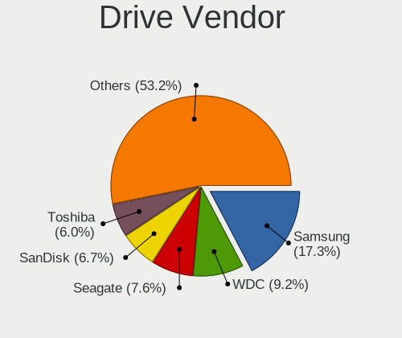
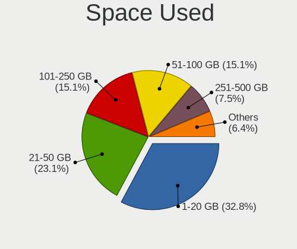
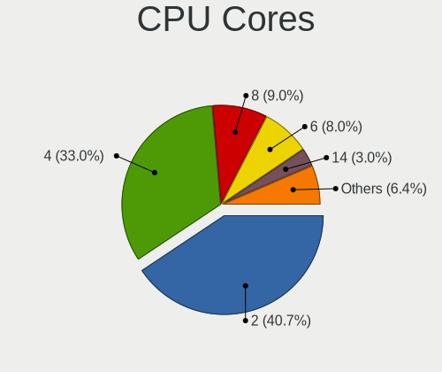
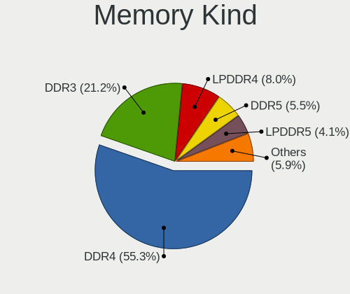

Ubuntu 22.04 - Tested Hardware & Statistics (Notebooks)
-------------------------------------------------------

A project to collect tested hardware configurations for Ubuntu 22.04.

Anyone can contribute to this report by the [hw-probe](https://github.com/linuxhw/hw-probe) tool:

    sudo -E hw-probe -all -upload

Please contribute! Especially if your hardware is rare.

Contents
--------

* [ Test Cases ](#test-cases)

* [ System ](#system)
  - [ Kernel                   ](#kernel)
  - [ Kernel Family            ](#kernel-family)
  - [ Kernel Major Ver.        ](#kernel-major-ver)
  - [ Arch                     ](#arch)
  - [ DE                       ](#de)
  - [ Display Server           ](#display-server)
  - [ Display Manager          ](#display-manager)
  - [ OS Lang                  ](#os-lang)
  - [ Boot Mode                ](#boot-mode)
  - [ Filesystem               ](#filesystem)
  - [ Part. scheme             ](#part-scheme)
  - [ Dual Boot with Linux/BSD ](#dual-boot-with-linuxbsd)
  - [ Dual Boot (Win)          ](#dual-boot-win)

* [ Board ](#board)
  - [ Vendor                   ](#vendor)
  - [ Model                    ](#model)
  - [ Model Family             ](#model-family)
  - [ MFG Year                 ](#mfg-year)
  - [ Form Factor              ](#form-factor)
  - [ Secure Boot              ](#secure-boot)
  - [ Coreboot                 ](#coreboot)
  - [ RAM Size                 ](#ram-size)
  - [ RAM Used                 ](#ram-used)
  - [ Total Drives             ](#total-drives)
  - [ Has CD-ROM               ](#has-cd-rom)
  - [ Has Ethernet             ](#has-ethernet)
  - [ Has WiFi                 ](#has-wifi)
  - [ Has Bluetooth            ](#has-bluetooth)

* [ Location ](#location)
  - [ Country                  ](#country)
  - [ City                     ](#city)

* [ Drives ](#drives)
  - [ Drive Vendor             ](#drive-vendor)
  - [ Drive Model              ](#drive-model)
  - [ HDD Vendor               ](#hdd-vendor)
  - [ SSD Vendor               ](#ssd-vendor)
  - [ Drive Kind               ](#drive-kind)
  - [ Drive Connector          ](#drive-connector)
  - [ Drive Size               ](#drive-size)
  - [ Space Total              ](#space-total)
  - [ Space Used               ](#space-used)
  - [ Malfunc. Drives          ](#malfunc-drives)
  - [ Malfunc. Drive Vendor    ](#malfunc-drive-vendor)
  - [ Malfunc. HDD Vendor      ](#malfunc-hdd-vendor)
  - [ Malfunc. Drive Kind      ](#malfunc-drive-kind)
  - [ Failed Drives            ](#failed-drives)
  - [ Failed Drive Vendor      ](#failed-drive-vendor)
  - [ Drive Status             ](#drive-status)

* [ Storage controller ](#storage-controller)
  - [ Storage Vendor           ](#storage-vendor)
  - [ Storage Model            ](#storage-model)
  - [ Storage Kind             ](#storage-kind)

* [ Processor ](#processor)
  - [ CPU Vendor               ](#cpu-vendor)
  - [ CPU Model                ](#cpu-model)
  - [ CPU Model Family         ](#cpu-model-family)
  - [ CPU Cores                ](#cpu-cores)
  - [ CPU Sockets              ](#cpu-sockets)
  - [ CPU Threads              ](#cpu-threads)
  - [ CPU Op-Modes             ](#cpu-op-modes)
  - [ CPU Microcode            ](#cpu-microcode)
  - [ CPU Microarch            ](#cpu-microarch)

* [ Graphics ](#graphics)
  - [ GPU Vendor               ](#gpu-vendor)
  - [ GPU Model                ](#gpu-model)
  - [ GPU Combo                ](#gpu-combo)
  - [ GPU Driver               ](#gpu-driver)
  - [ GPU Memory               ](#gpu-memory)

* [ Monitor ](#monitor)
  - [ Monitor Vendor           ](#monitor-vendor)
  - [ Monitor Model            ](#monitor-model)
  - [ Monitor Resolution       ](#monitor-resolution)
  - [ Monitor Diagonal         ](#monitor-diagonal)
  - [ Monitor Width            ](#monitor-width)
  - [ Aspect Ratio             ](#aspect-ratio)
  - [ Monitor Area             ](#monitor-area)
  - [ Pixel Density            ](#pixel-density)
  - [ Multiple Monitors        ](#multiple-monitors)

* [ Network ](#network)
  - [ Net Controller Vendor    ](#net-controller-vendor)
  - [ Net Controller Model     ](#net-controller-model)
  - [ Wireless Vendor          ](#wireless-vendor)
  - [ Wireless Model           ](#wireless-model)
  - [ Ethernet Vendor          ](#ethernet-vendor)
  - [ Ethernet Model           ](#ethernet-model)
  - [ Net Controller Kind      ](#net-controller-kind)
  - [ Used Controller          ](#used-controller)
  - [ NICs                     ](#nics)
  - [ IPv6                     ](#ipv6)

* [ Bluetooth ](#bluetooth)
  - [ Bluetooth Vendor         ](#bluetooth-vendor)
  - [ Bluetooth Model          ](#bluetooth-model)

* [ Sound ](#sound)
  - [ Sound Vendor             ](#sound-vendor)
  - [ Sound Model              ](#sound-model)

* [ Memory ](#memory)
  - [ Memory Vendor            ](#memory-vendor)
  - [ Memory Model             ](#memory-model)
  - [ Memory Kind              ](#memory-kind)
  - [ Memory Form Factor       ](#memory-form-factor)
  - [ Memory Size              ](#memory-size)
  - [ Memory Speed             ](#memory-speed)

* [ Printers & scanners ](#printers--scanners)
  - [ Printer Vendor           ](#printer-vendor)
  - [ Printer Model            ](#printer-model)
  - [ Scanner Vendor           ](#scanner-vendor)
  - [ Scanner Model            ](#scanner-model)

* [ Camera ](#camera)
  - [ Camera Vendor            ](#camera-vendor)
  - [ Camera Model             ](#camera-model)

* [ Security ](#security)
  - [ Fingerprint Vendor       ](#fingerprint-vendor)
  - [ Fingerprint Model        ](#fingerprint-model)
  - [ Chipcard Vendor          ](#chipcard-vendor)
  - [ Chipcard Model           ](#chipcard-model)

* [ Unsupported ](#unsupported)
  - [ Unsupported Devices      ](#unsupported-devices)
  - [ Unsupported Device Types ](#unsupported-device-types)

Test Cases
----------

Total: 1965

| Vendor        | Model                       | Probe                                                      | Date         |
|---------------|-----------------------------|------------------------------------------------------------|--------------|
| Lenovo        | ThinkPad T14 Gen 2i 20W1... | [12abd434b5](https://linux-hardware.org/?probe=12abd434b5) | Sep 01, 2022 |
| Dell          | Latitude 5521               | [dcf7869cf6](https://linux-hardware.org/?probe=dcf7869cf6) | Sep 01, 2022 |
| Lenovo        | ThinkBook 14 G2 ITL 20VD    | [02ec70b604](https://linux-hardware.org/?probe=02ec70b604) | Sep 01, 2022 |
| Lenovo        | ThinkPad T400 6474W7T       | [f9a9b12b37](https://linux-hardware.org/?probe=f9a9b12b37) | Sep 01, 2022 |
| HP            | Laptop 15-db0xxx            | [de848d928c](https://linux-hardware.org/?probe=de848d928c) | Sep 01, 2022 |
| Lenovo        | ThinkPad P15 Gen 1 20STC... | [0a5a3fa67e](https://linux-hardware.org/?probe=0a5a3fa67e) | Sep 01, 2022 |
| Casper        | NIRVANA NOTEBOOK            | [7a5978071e](https://linux-hardware.org/?probe=7a5978071e) | Sep 01, 2022 |
| Avell High... | C62 MOB                     | [ab93c1f314](https://linux-hardware.org/?probe=ab93c1f314) | Sep 01, 2022 |
| Notebook      | NL40_50CU                   | [af0da080ec](https://linux-hardware.org/?probe=af0da080ec) | Sep 01, 2022 |
| Dell          | Latitude 3340               | [d64525742a](https://linux-hardware.org/?probe=d64525742a) | Sep 01, 2022 |
| Dell          | Latitude 3340               | [b9d472b965](https://linux-hardware.org/?probe=b9d472b965) | Sep 01, 2022 |
| ASUSTek       | ZenBook UX431DA_UM431DA     | [cc30fbdce2](https://linux-hardware.org/?probe=cc30fbdce2) | Sep 01, 2022 |
| LG Electro... | 14Z990-V.AP72B              | [8c67c188a1](https://linux-hardware.org/?probe=8c67c188a1) | Sep 01, 2022 |
| Lenovo        | ThinkPad T400 6474W7T       | [b52974ac00](https://linux-hardware.org/?probe=b52974ac00) | Sep 01, 2022 |
| Dell          | Latitude 5591               | [b860997149](https://linux-hardware.org/?probe=b860997149) | Sep 01, 2022 |
| HP            | ProBook 6460b               | [a0e3db2eed](https://linux-hardware.org/?probe=a0e3db2eed) | Sep 01, 2022 |
| Samsung       | 950XEE                      | [454b67dd88](https://linux-hardware.org/?probe=454b67dd88) | Sep 01, 2022 |
| Acer          | Aspire E5-571               | [7759e41b1d](https://linux-hardware.org/?probe=7759e41b1d) | Sep 01, 2022 |
| HP            | OMEN by Laptop 15-ce0xx     | [85d4f11486](https://linux-hardware.org/?probe=85d4f11486) | Sep 01, 2022 |
| HP            | EliteBook 840 G2            | [4da3485e34](https://linux-hardware.org/?probe=4da3485e34) | Sep 01, 2022 |
| HP            | ENVY Laptop 13-ba1xxx       | [5a4e2225a8](https://linux-hardware.org/?probe=5a4e2225a8) | Sep 01, 2022 |
| HP            | G42                         | [a79b07fcd0](https://linux-hardware.org/?probe=a79b07fcd0) | Sep 01, 2022 |
| HP            | ENVY Laptop 15-ep0xxx       | [93ff04a07b](https://linux-hardware.org/?probe=93ff04a07b) | Sep 01, 2022 |
| Dell          | Latitude 7390               | [571b195a12](https://linux-hardware.org/?probe=571b195a12) | Aug 31, 2022 |
| Dell          | Latitude 7390               | [3c3f6114f6](https://linux-hardware.org/?probe=3c3f6114f6) | Aug 31, 2022 |
| HP            | Laptop 15-db0xxx            | [42879ce5cf](https://linux-hardware.org/?probe=42879ce5cf) | Aug 31, 2022 |
| HP            | Laptop 15-db0xxx            | [3c7e97b769](https://linux-hardware.org/?probe=3c7e97b769) | Aug 31, 2022 |
| Acer          | Aspire V3-571G              | [8f4a2b603a](https://linux-hardware.org/?probe=8f4a2b603a) | Aug 31, 2022 |
| Toshiba       | Satellite Pro L500          | [7f523718cf](https://linux-hardware.org/?probe=7f523718cf) | Aug 31, 2022 |
| Dell          | Latitude 7280               | [e71e9350b4](https://linux-hardware.org/?probe=e71e9350b4) | Aug 31, 2022 |
| HP            | EliteBook 840 G8 Noteboo... | [4808984401](https://linux-hardware.org/?probe=4808984401) | Aug 31, 2022 |
| Lenovo        | ThinkPad L14 Gen 1 20U5S... | [eb79e6b28e](https://linux-hardware.org/?probe=eb79e6b28e) | Aug 31, 2022 |
| HUAWEI        | HVY-WXX9                    | [193310218d](https://linux-hardware.org/?probe=193310218d) | Aug 31, 2022 |
| Samsung       | RV410/RV510/S3510/E3510     | [d36b7bb077](https://linux-hardware.org/?probe=d36b7bb077) | Aug 31, 2022 |
| HUAWEI        | CREF-XX                     | [4ea2674cd8](https://linux-hardware.org/?probe=4ea2674cd8) | Aug 31, 2022 |
| Lenovo        | ThinkPad P43s 20RJS0D100    | [afbf0f6021](https://linux-hardware.org/?probe=afbf0f6021) | Aug 31, 2022 |
| HP            | Presario F500 (GM639LA#A... | [7323caa631](https://linux-hardware.org/?probe=7323caa631) | Aug 31, 2022 |
| Dell          | Vostro 3550                 | [c26bf23cdd](https://linux-hardware.org/?probe=c26bf23cdd) | Aug 31, 2022 |
| Dell          | Inspiron 5502               | [1bb776feab](https://linux-hardware.org/?probe=1bb776feab) | Aug 31, 2022 |
| Lenovo        | V15-IIL 82C5                | [2a9e478284](https://linux-hardware.org/?probe=2a9e478284) | Aug 30, 2022 |
| Lenovo        | ThinkPad Edge E530 62724... | [87cad1c0b0](https://linux-hardware.org/?probe=87cad1c0b0) | Aug 30, 2022 |
| Avell High... | B.ON                        | [dbc18dad43](https://linux-hardware.org/?probe=dbc18dad43) | Aug 30, 2022 |
| HP            | Pavilion Gaming Laptop 1... | [20da9d42a4](https://linux-hardware.org/?probe=20da9d42a4) | Aug 30, 2022 |
| Lenovo        | ThinkPad L512 259756M       | [3990fcfeed](https://linux-hardware.org/?probe=3990fcfeed) | Aug 30, 2022 |
| Dell          | XPS 15 9570                 | [6c35aeda10](https://linux-hardware.org/?probe=6c35aeda10) | Aug 30, 2022 |
| Lenovo        | ThinkPad T490s 20NYS4HL0... | [273e5229a4](https://linux-hardware.org/?probe=273e5229a4) | Aug 30, 2022 |
| HP            | Pavilion Gaming Laptop 1... | [11efd3dbe0](https://linux-hardware.org/?probe=11efd3dbe0) | Aug 30, 2022 |
| HP            | EliteBook 840 G2            | [5ba91d8167](https://linux-hardware.org/?probe=5ba91d8167) | Aug 30, 2022 |
| HP            | EliteBook 840 G1            | [23d73aa95c](https://linux-hardware.org/?probe=23d73aa95c) | Aug 30, 2022 |
| ASUSTek       | GL552JX                     | [d477c2cd47](https://linux-hardware.org/?probe=d477c2cd47) | Aug 30, 2022 |
| HP            | EliteBook 840 G2            | [bed3be5142](https://linux-hardware.org/?probe=bed3be5142) | Aug 30, 2022 |
| HP            | EliteBook 840 G2            | [b588415d06](https://linux-hardware.org/?probe=b588415d06) | Aug 30, 2022 |
| Lenovo        | ThinkPad T470 20HES3370A    | [3b1630e4bc](https://linux-hardware.org/?probe=3b1630e4bc) | Aug 30, 2022 |
| Lenovo        | ThinkPad E15 Gen 3 20YG0... | [6393abc859](https://linux-hardware.org/?probe=6393abc859) | Aug 30, 2022 |
| Dell          | Latitude 5520               | [26434099b3](https://linux-hardware.org/?probe=26434099b3) | Aug 30, 2022 |
| HP            | EliteBook 830 G6            | [897046248f](https://linux-hardware.org/?probe=897046248f) | Aug 30, 2022 |
| Dell          | Inspiron 5502               | [28a1dd084e](https://linux-hardware.org/?probe=28a1dd084e) | Aug 30, 2022 |
| Dell          | Inspiron 5502               | [df0098010e](https://linux-hardware.org/?probe=df0098010e) | Aug 30, 2022 |
| Chuwi         | GemiBook                    | [abca00f582](https://linux-hardware.org/?probe=abca00f582) | Aug 30, 2022 |
| ASUSTek       | K501LX                      | [993e5d9848](https://linux-hardware.org/?probe=993e5d9848) | Aug 29, 2022 |
| Apple         | MacBookPro7,1               | [a879fb8249](https://linux-hardware.org/?probe=a879fb8249) | Aug 29, 2022 |
| Lenovo        | ThinkPad X1 Carbon 6th 2... | [636a7f710c](https://linux-hardware.org/?probe=636a7f710c) | Aug 29, 2022 |
| Dell          | Latitude E5450              | [9dad9e784f](https://linux-hardware.org/?probe=9dad9e784f) | Aug 29, 2022 |
| Monster       | Huma H5 V3.2                | [ea050f24db](https://linux-hardware.org/?probe=ea050f24db) | Aug 29, 2022 |
| Fujitsu       | LIFEBOOK E746               | [5b0eba15c2](https://linux-hardware.org/?probe=5b0eba15c2) | Aug 29, 2022 |
| Apple         | MacBookPro11,4              | [dc1f806296](https://linux-hardware.org/?probe=dc1f806296) | Aug 29, 2022 |
| HP            | ProBook 440 14 inch G9 N... | [0a08f13779](https://linux-hardware.org/?probe=0a08f13779) | Aug 29, 2022 |
| System76      | Galago Pro                  | [df2c4ae77c](https://linux-hardware.org/?probe=df2c4ae77c) | Aug 29, 2022 |
| ASUSTek       | X553MA                      | [108e0c7803](https://linux-hardware.org/?probe=108e0c7803) | Aug 29, 2022 |
| HP            | ZBook 15u G4                | [39f4830019](https://linux-hardware.org/?probe=39f4830019) | Aug 28, 2022 |
| Lenovo        | G50-45 80E3                 | [239e5612ee](https://linux-hardware.org/?probe=239e5612ee) | Aug 28, 2022 |
| Panasonic     | CF-30KTPAZAE                | [61a8f4a768](https://linux-hardware.org/?probe=61a8f4a768) | Aug 28, 2022 |
| Lenovo        | IdeaPad 320-14ISK 80XG      | [8fac02d016](https://linux-hardware.org/?probe=8fac02d016) | Aug 28, 2022 |
| HP            | ZBook 15u G4                | [2115d02bfd](https://linux-hardware.org/?probe=2115d02bfd) | Aug 28, 2022 |
| Lenovo        | IdeaPad 320-14ISK 80XG      | [d281087322](https://linux-hardware.org/?probe=d281087322) | Aug 28, 2022 |
| Lenovo        | IdeaPad C340-14API 81N6     | [c8c04ce5db](https://linux-hardware.org/?probe=c8c04ce5db) | Aug 28, 2022 |
| Dell          | Latitude E7470              | [568c9bfd40](https://linux-hardware.org/?probe=568c9bfd40) | Aug 28, 2022 |
| Dell          | Inspiron 3543               | [68d1385b7e](https://linux-hardware.org/?probe=68d1385b7e) | Aug 28, 2022 |
| Microtech     | CoreBook                    | [7507a104b7](https://linux-hardware.org/?probe=7507a104b7) | Aug 28, 2022 |
| Dell          | Inspiron N5010              | [1a76248bf8](https://linux-hardware.org/?probe=1a76248bf8) | Aug 28, 2022 |
| Alienware     | 15                          | [f85646920a](https://linux-hardware.org/?probe=f85646920a) | Aug 28, 2022 |
| Lenovo        | ThinkPad L440 20ASS3A300    | [fbf3d4a87a](https://linux-hardware.org/?probe=fbf3d4a87a) | Aug 27, 2022 |
| Lenovo        | ThinkBook 13s-IWL 20R9      | [98bb5817f6](https://linux-hardware.org/?probe=98bb5817f6) | Aug 27, 2022 |
| HP            | Pavilion Notebook           | [0e4eab04c0](https://linux-hardware.org/?probe=0e4eab04c0) | Aug 27, 2022 |
| HP            | Pavilion Notebook           | [65e832cb2f](https://linux-hardware.org/?probe=65e832cb2f) | Aug 27, 2022 |
| ASUSTek       | VivoBook_ASUSLaptop X512... | [65f638768e](https://linux-hardware.org/?probe=65f638768e) | Aug 27, 2022 |
| Alienware     | M14xR1                      | [498d5f5254](https://linux-hardware.org/?probe=498d5f5254) | Aug 27, 2022 |
| Acer          | Nitro AN515-57              | [decd7daef2](https://linux-hardware.org/?probe=decd7daef2) | Aug 27, 2022 |
| BESSTAR Te... | X400                        | [ab70086ae7](https://linux-hardware.org/?probe=ab70086ae7) | Aug 27, 2022 |
| HP            | Pavilion Gaming Laptop 1... | [f4d9682f50](https://linux-hardware.org/?probe=f4d9682f50) | Aug 27, 2022 |
| BESSTAR Te... | X400                        | [f8d3611cf0](https://linux-hardware.org/?probe=f8d3611cf0) | Aug 27, 2022 |
| Acer          | Nitro AN515-54              | [975f6a801d](https://linux-hardware.org/?probe=975f6a801d) | Aug 27, 2022 |
| HP            | Unknown                     | [9b22ce41e3](https://linux-hardware.org/?probe=9b22ce41e3) | Aug 27, 2022 |
| Lenovo        | YangTian V340-15-IIL 81X... | [f26ee3814c](https://linux-hardware.org/?probe=f26ee3814c) | Aug 27, 2022 |
| Fujitsu       | LIFEBOOK A530               | [5534f20f99](https://linux-hardware.org/?probe=5534f20f99) | Aug 27, 2022 |
| Fujitsu       | LIFEBOOK A530               | [df9aa3eab2](https://linux-hardware.org/?probe=df9aa3eab2) | Aug 27, 2022 |
| Lenovo        | ThinkPad E14 Gen 4 21E4C... | [cf1b2ff13c](https://linux-hardware.org/?probe=cf1b2ff13c) | Aug 27, 2022 |
| Positivo      | C14CR01                     | [bb9a4c427a](https://linux-hardware.org/?probe=bb9a4c427a) | Aug 27, 2022 |
| speedmaste... | E131x series                | [69d287c029](https://linux-hardware.org/?probe=69d287c029) | Aug 26, 2022 |
| Dell          | Latitude E6510              | [846791d8b9](https://linux-hardware.org/?probe=846791d8b9) | Aug 26, 2022 |
| Dell          | Vostro 1520                 | [b51f7dfba6](https://linux-hardware.org/?probe=b51f7dfba6) | Aug 26, 2022 |
| HP            | Pavilion Laptop 15-cd0xx    | [62ce95ce9c](https://linux-hardware.org/?probe=62ce95ce9c) | Aug 26, 2022 |
| Lenovo        | ThinkPad T440p 20AW007QM... | [b24bbedfc1](https://linux-hardware.org/?probe=b24bbedfc1) | Aug 26, 2022 |
| Apple         | MacBookPro9,2               | [49b01e516c](https://linux-hardware.org/?probe=49b01e516c) | Aug 26, 2022 |
| ASUSTek       | S551LB                      | [efd20dadd0](https://linux-hardware.org/?probe=efd20dadd0) | Aug 26, 2022 |
| Acer          | Aspire A315-34              | [d71a1ce240](https://linux-hardware.org/?probe=d71a1ce240) | Aug 26, 2022 |
| Timi          | Redmi Book Pro 14 2022      | [3f61df6540](https://linux-hardware.org/?probe=3f61df6540) | Aug 26, 2022 |
| Lenovo        | ThinkPad P14s Gen 2a 21A... | [83377b24dc](https://linux-hardware.org/?probe=83377b24dc) | Aug 25, 2022 |
| Lenovo        | IdeaPad 330-15IKB 81DE      | [cbae91bec7](https://linux-hardware.org/?probe=cbae91bec7) | Aug 25, 2022 |
| Gateway       | NV53A                       | [618b8506e2](https://linux-hardware.org/?probe=618b8506e2) | Aug 25, 2022 |
| Lenovo        | ThinkPad P14s Gen 2a 21A... | [d2e2d5484c](https://linux-hardware.org/?probe=d2e2d5484c) | Aug 25, 2022 |
| HUAWEI        | BOM-WXX9                    | [06ba6b75b4](https://linux-hardware.org/?probe=06ba6b75b4) | Aug 25, 2022 |
| Lenovo        | ThinkPad L490 20Q5S0LF00    | [3c1287dfd2](https://linux-hardware.org/?probe=3c1287dfd2) | Aug 25, 2022 |
| Dell          | Inspiron N5010              | [f4862a3793](https://linux-hardware.org/?probe=f4862a3793) | Aug 25, 2022 |
| Dell          | Inspiron 5459               | [398f6d4b78](https://linux-hardware.org/?probe=398f6d4b78) | Aug 25, 2022 |
| HP            | ProBook 430 G5              | [6a7db587c7](https://linux-hardware.org/?probe=6a7db587c7) | Aug 25, 2022 |
| Toshiba       | PORTEGE Z10t-A              | [ba23396754](https://linux-hardware.org/?probe=ba23396754) | Aug 25, 2022 |
| Dell          | XPS 15 9560                 | [28323e5398](https://linux-hardware.org/?probe=28323e5398) | Aug 25, 2022 |
| ASUSTek       | P81IJ                       | [7ab324abea](https://linux-hardware.org/?probe=7ab324abea) | Aug 25, 2022 |
| Lenovo        | ThinkPad L440 20ASS3A300    | [09feb7053d](https://linux-hardware.org/?probe=09feb7053d) | Aug 25, 2022 |
| HP            | ZBook 15u G4                | [dcdc803214](https://linux-hardware.org/?probe=dcdc803214) | Aug 24, 2022 |
| ASUSTek       | ProArt StudioBook W700G3... | [72f873111c](https://linux-hardware.org/?probe=72f873111c) | Aug 24, 2022 |
| HP            | Pavilion Notebook           | [70ca4aae12](https://linux-hardware.org/?probe=70ca4aae12) | Aug 24, 2022 |
| Linx          | LINX1010B                   | [07194b77d4](https://linux-hardware.org/?probe=07194b77d4) | Aug 24, 2022 |
| Lenovo        | IdeaPad S540-15IML D 81N... | [a0c40a81ec](https://linux-hardware.org/?probe=a0c40a81ec) | Aug 24, 2022 |
| HUAWEI        | NBLB-WAX9N                  | [69281b6cc3](https://linux-hardware.org/?probe=69281b6cc3) | Aug 24, 2022 |
| HP            | 255 G6 Notebook PC          | [a476ba5a83](https://linux-hardware.org/?probe=a476ba5a83) | Aug 24, 2022 |
| Dell          | Inspiron 3543               | [000b034e01](https://linux-hardware.org/?probe=000b034e01) | Aug 24, 2022 |
| Packard Be... | EasyNote LJ65               | [dcd6540e36](https://linux-hardware.org/?probe=dcd6540e36) | Aug 24, 2022 |
| Lenovo        | IdeaPad 5 14ALC05 82LM      | [421ab76c43](https://linux-hardware.org/?probe=421ab76c43) | Aug 24, 2022 |
| Dell          | Inspiron 5402               | [936ea503c8](https://linux-hardware.org/?probe=936ea503c8) | Aug 24, 2022 |
| Lenovo        | Legion Y540-15IRH-PG0 81... | [c7d603acb8](https://linux-hardware.org/?probe=c7d603acb8) | Aug 24, 2022 |
| HP            | ProBook 430 G8 Notebook ... | [17260bd4fb](https://linux-hardware.org/?probe=17260bd4fb) | Aug 24, 2022 |
| Toshiba       | Satellite C55-B             | [eaabc96ff1](https://linux-hardware.org/?probe=eaabc96ff1) | Aug 24, 2022 |
| Lenovo        | V330-15IKB 81AX             | [c3ddddae2c](https://linux-hardware.org/?probe=c3ddddae2c) | Aug 24, 2022 |
| Apple         | MacBookPro16,2              | [3c6266b13d](https://linux-hardware.org/?probe=3c6266b13d) | Aug 23, 2022 |
| Packard Be... | EasyNote LJ65               | [6493743ace](https://linux-hardware.org/?probe=6493743ace) | Aug 23, 2022 |
| Dell          | Precision M4800             | [dbe7bfeb57](https://linux-hardware.org/?probe=dbe7bfeb57) | Aug 23, 2022 |
| Dell          | Precision M4800             | [b8edb4a562](https://linux-hardware.org/?probe=b8edb4a562) | Aug 23, 2022 |
| HP            | Stream 11 Pro               | [de889aa178](https://linux-hardware.org/?probe=de889aa178) | Aug 23, 2022 |
| HP            | Pavilion g6                 | [ae65121050](https://linux-hardware.org/?probe=ae65121050) | Aug 23, 2022 |
| Lenovo        | 14w 81MQ000JUS              | [3866b50e6e](https://linux-hardware.org/?probe=3866b50e6e) | Aug 23, 2022 |
| HP            | Laptop 15s-eq0xxx           | [29db41fc1b](https://linux-hardware.org/?probe=29db41fc1b) | Aug 23, 2022 |
| Dell          | Vostro 5481                 | [749e6c3622](https://linux-hardware.org/?probe=749e6c3622) | Aug 23, 2022 |
| TEKNOSERVI... | PORTATIL TTL 15             | [054d000bb1](https://linux-hardware.org/?probe=054d000bb1) | Aug 23, 2022 |
| ASUSTek       | X556UF                      | [23316377ee](https://linux-hardware.org/?probe=23316377ee) | Aug 23, 2022 |
| HP            | EliteBook 8470p             | [0b017b90c9](https://linux-hardware.org/?probe=0b017b90c9) | Aug 23, 2022 |
| Lenovo        | Legion 5 15IMH05H 81Y6      | [62db26b1b4](https://linux-hardware.org/?probe=62db26b1b4) | Aug 23, 2022 |
| Lenovo        | IdeaPad 3 15ITL6 82H8       | [284d2fd5c1](https://linux-hardware.org/?probe=284d2fd5c1) | Aug 23, 2022 |
| Acer          | Aspire E5-571               | [659e36b0ed](https://linux-hardware.org/?probe=659e36b0ed) | Aug 23, 2022 |
| Dell          | Latitude D630               | [be9c4025cb](https://linux-hardware.org/?probe=be9c4025cb) | Aug 23, 2022 |
| Lenovo        | Legion 5 15IMH05H 81Y6      | [b008c35b2b](https://linux-hardware.org/?probe=b008c35b2b) | Aug 23, 2022 |
| ASUSTek       | VivoBook_ASUSLaptop X515... | [3c41ecc4e0](https://linux-hardware.org/?probe=3c41ecc4e0) | Aug 23, 2022 |
| Samsung       | 340XAA/350XAA/550XAA        | [323faca611](https://linux-hardware.org/?probe=323faca611) | Aug 22, 2022 |
| HP            | Compaq nc6400 (EH522AV)     | [1c583ce5d2](https://linux-hardware.org/?probe=1c583ce5d2) | Aug 22, 2022 |
| Samsung       | RV411/RV511/E3511/S3511/... | [ee5962ca1e](https://linux-hardware.org/?probe=ee5962ca1e) | Aug 22, 2022 |
| Lenovo        | ThinkPad X230 23252UG       | [149419b2df](https://linux-hardware.org/?probe=149419b2df) | Aug 22, 2022 |
| Lenovo        | B570e 476022G               | [ad4a4c25d5](https://linux-hardware.org/?probe=ad4a4c25d5) | Aug 22, 2022 |
| Lenovo        | ThinkPad X230 23252UG       | [09505ab893](https://linux-hardware.org/?probe=09505ab893) | Aug 22, 2022 |
| HUAWEI        | NBD-WXX9                    | [4391428197](https://linux-hardware.org/?probe=4391428197) | Aug 22, 2022 |
| HP            | EliteBook 840 G8 Noteboo... | [2aa681b773](https://linux-hardware.org/?probe=2aa681b773) | Aug 22, 2022 |
| HP            | EliteBook 840 G8 Noteboo... | [a51a82210b](https://linux-hardware.org/?probe=a51a82210b) | Aug 22, 2022 |
| Acer          | Aspire 5741G                | [dfa9c7ced0](https://linux-hardware.org/?probe=dfa9c7ced0) | Aug 22, 2022 |
| Dell          | Latitude E7240              | [4adf6ab444](https://linux-hardware.org/?probe=4adf6ab444) | Aug 22, 2022 |
| HP            | ProBook 440 G8 Notebook ... | [6fcc3e058d](https://linux-hardware.org/?probe=6fcc3e058d) | Aug 22, 2022 |
| HP            | EliteBook 8440p             | [f85ff90a58](https://linux-hardware.org/?probe=f85ff90a58) | Aug 22, 2022 |
| HP            | EliteBook 8440p             | [3842f0e711](https://linux-hardware.org/?probe=3842f0e711) | Aug 22, 2022 |
| Lenovo        | ThinkPad E580 20KS0009AD    | [ba4d785a29](https://linux-hardware.org/?probe=ba4d785a29) | Aug 22, 2022 |
| Toshiba       | Satellite L875D             | [45ed0eb61a](https://linux-hardware.org/?probe=45ed0eb61a) | Aug 22, 2022 |
| Acer          | Aspire E1-410               | [e7d78093ba](https://linux-hardware.org/?probe=e7d78093ba) | Aug 22, 2022 |
| Dell          | Latitude E6500              | [defd0003bc](https://linux-hardware.org/?probe=defd0003bc) | Aug 22, 2022 |
| Acer          | Aspire E1-410               | [d2ba4edba4](https://linux-hardware.org/?probe=d2ba4edba4) | Aug 22, 2022 |
| ASUSTek       | VivoBook_ASUSLaptop X760... | [f1fa32b507](https://linux-hardware.org/?probe=f1fa32b507) | Aug 22, 2022 |
| ASUSTek       | X540NA                      | [1fa4b8b58a](https://linux-hardware.org/?probe=1fa4b8b58a) | Aug 21, 2022 |
| Dell          | Latitude 5490               | [a37eabe03f](https://linux-hardware.org/?probe=a37eabe03f) | Aug 21, 2022 |
| ASUSTek       | X540NA                      | [e9bcb08163](https://linux-hardware.org/?probe=e9bcb08163) | Aug 21, 2022 |
| Dell          | Inspiron 3583               | [d9ab8accea](https://linux-hardware.org/?probe=d9ab8accea) | Aug 21, 2022 |
| Dell          | Inspiron 3583               | [6ff066abac](https://linux-hardware.org/?probe=6ff066abac) | Aug 21, 2022 |
| MSI           | GE60 0NC/GE60 0ND           | [838dcef1f9](https://linux-hardware.org/?probe=838dcef1f9) | Aug 21, 2022 |
| HP            | Laptop 17-bs0xx             | [3dda19880c](https://linux-hardware.org/?probe=3dda19880c) | Aug 21, 2022 |
| Dell          | XPS 13 9370                 | [79d380d4af](https://linux-hardware.org/?probe=79d380d4af) | Aug 21, 2022 |
| Dell          | XPS 13 9350                 | [e663637449](https://linux-hardware.org/?probe=e663637449) | Aug 21, 2022 |
| ASUSTek       | X556UF                      | [9630e2d4f5](https://linux-hardware.org/?probe=9630e2d4f5) | Aug 21, 2022 |
| Samsung       | R519/R719                   | [c0720d7924](https://linux-hardware.org/?probe=c0720d7924) | Aug 21, 2022 |
| Dell          | G5 5587                     | [327f035c11](https://linux-hardware.org/?probe=327f035c11) | Aug 21, 2022 |
| ASUSTek       | Zenbook UM5401QA_UM5401Q... | [1380621999](https://linux-hardware.org/?probe=1380621999) | Aug 21, 2022 |
| ASUSTek       | K53SD                       | [1b2c4f25a7](https://linux-hardware.org/?probe=1b2c4f25a7) | Aug 21, 2022 |
| Samsung       | 550P5C/550P7C               | [75f94f8fa5](https://linux-hardware.org/?probe=75f94f8fa5) | Aug 21, 2022 |
| Dell          | Inspiron 5447               | [aa44fba5de](https://linux-hardware.org/?probe=aa44fba5de) | Aug 21, 2022 |
| ASUSTek       | ZenBook UX431DA_UM431DA     | [2e77015116](https://linux-hardware.org/?probe=2e77015116) | Aug 21, 2022 |
| Dell          | Inspiron 1520               | [052b6ab02c](https://linux-hardware.org/?probe=052b6ab02c) | Aug 21, 2022 |
| ASUSTek       | ZenBook UX534FTC_UX534FT    | [d4a7a111a7](https://linux-hardware.org/?probe=d4a7a111a7) | Aug 21, 2022 |
| Samsung       | 550P5C/550P7C               | [c369daf6b0](https://linux-hardware.org/?probe=c369daf6b0) | Aug 21, 2022 |
| Timi          | TM1701                      | [4591dee526](https://linux-hardware.org/?probe=4591dee526) | Aug 21, 2022 |
| Dell          | Latitude 5420               | [e8ccf9922e](https://linux-hardware.org/?probe=e8ccf9922e) | Aug 21, 2022 |
| Dell          | Latitude 5420               | [f44e5a1241](https://linux-hardware.org/?probe=f44e5a1241) | Aug 21, 2022 |
| Dell          | Inspiron 5447               | [21d9982f20](https://linux-hardware.org/?probe=21d9982f20) | Aug 21, 2022 |
| ASUSTek       | VivoBook_ASUSLaptop X415... | [342bd47a5a](https://linux-hardware.org/?probe=342bd47a5a) | Aug 20, 2022 |
| ASUSTek       | N56VZ                       | [e9e40a7df5](https://linux-hardware.org/?probe=e9e40a7df5) | Aug 20, 2022 |
| HP            | Pavilion dv6                | [5d8ca491cf](https://linux-hardware.org/?probe=5d8ca491cf) | Aug 20, 2022 |
| HP            | 15                          | [4d736aca15](https://linux-hardware.org/?probe=4d736aca15) | Aug 20, 2022 |
| MSI           | GS65 Stealth Thin 8RE       | [90aed4d5d1](https://linux-hardware.org/?probe=90aed4d5d1) | Aug 20, 2022 |
| Toshiba       | PORTEGE M780                | [8b7e72c5d9](https://linux-hardware.org/?probe=8b7e72c5d9) | Aug 20, 2022 |
| Dell          | Latitude E6430              | [30a702dcec](https://linux-hardware.org/?probe=30a702dcec) | Aug 20, 2022 |
| HP            | Compaq 6730b (KE718AV)      | [2bb0221a17](https://linux-hardware.org/?probe=2bb0221a17) | Aug 19, 2022 |
| Unknown       | Unknown                     | [937afb80d6](https://linux-hardware.org/?probe=937afb80d6) | Aug 19, 2022 |
| HUAWEI        | NBD-WXX9                    | [b7c760ecee](https://linux-hardware.org/?probe=b7c760ecee) | Aug 19, 2022 |
| ASUSTek       | VivoBook_ASUSLaptop X421... | [87fcf5d702](https://linux-hardware.org/?probe=87fcf5d702) | Aug 19, 2022 |
| Lenovo        | V110-15IAP 80TG             | [65bb270b4e](https://linux-hardware.org/?probe=65bb270b4e) | Aug 19, 2022 |
| HP            | Laptop 14s-fq1xxx           | [61f9640136](https://linux-hardware.org/?probe=61f9640136) | Aug 19, 2022 |
| Lenovo        | ThinkPad X1 Carbon 4th 2... | [bdb88a532f](https://linux-hardware.org/?probe=bdb88a532f) | Aug 19, 2022 |
| HP            | ElitePad 1000 G2            | [ed06ba603c](https://linux-hardware.org/?probe=ed06ba603c) | Aug 19, 2022 |
| Lenovo        | ThinkPad X13 Gen 1 20UFS... | [8834646a81](https://linux-hardware.org/?probe=8834646a81) | Aug 19, 2022 |
| Acer          | Aspire E5-475               | [f21f1687d5](https://linux-hardware.org/?probe=f21f1687d5) | Aug 19, 2022 |
| Acer          | Aspire E5-475               | [04b38f1dfd](https://linux-hardware.org/?probe=04b38f1dfd) | Aug 19, 2022 |
| HP            | Laptop 15-da0xxx            | [7a9624c968](https://linux-hardware.org/?probe=7a9624c968) | Aug 19, 2022 |
| Acer          | Aspire E5-571               | [12371a2f0b](https://linux-hardware.org/?probe=12371a2f0b) | Aug 19, 2022 |
| Dell          | Inspiron 5535               | [b62b002b47](https://linux-hardware.org/?probe=b62b002b47) | Aug 19, 2022 |
| Dell          | Latitude E6410              | [3304a70394](https://linux-hardware.org/?probe=3304a70394) | Aug 19, 2022 |
| Compaq        | Presario 21 VerX            | [97aa39b2ca](https://linux-hardware.org/?probe=97aa39b2ca) | Aug 19, 2022 |
| ASUSTek       | VivoBook_ASUSLaptop X509... | [f9ec8eaac3](https://linux-hardware.org/?probe=f9ec8eaac3) | Aug 18, 2022 |
| Sony          | VPCEB1S1E                   | [45dbb67d02](https://linux-hardware.org/?probe=45dbb67d02) | Aug 18, 2022 |
| Dell          | Inspiron 7570               | [7d353117aa](https://linux-hardware.org/?probe=7d353117aa) | Aug 18, 2022 |
| Dell          | Inspiron 7570               | [10609a18a8](https://linux-hardware.org/?probe=10609a18a8) | Aug 18, 2022 |
| Apple         | MacBookAir6,2               | [f27c089486](https://linux-hardware.org/?probe=f27c089486) | Aug 18, 2022 |
| HP            | Stream 11 Pro               | [76b11a4ddb](https://linux-hardware.org/?probe=76b11a4ddb) | Aug 18, 2022 |
| MSI           | Katana GF66 11UG            | [74da710e26](https://linux-hardware.org/?probe=74da710e26) | Aug 18, 2022 |
| HP            | ProBook 640 G4              | [d4da530f4b](https://linux-hardware.org/?probe=d4da530f4b) | Aug 18, 2022 |
| ASUSTek       | ZenBook UX434FAC_UX433FA... | [a3da16034e](https://linux-hardware.org/?probe=a3da16034e) | Aug 18, 2022 |
| Lenovo        | G50-80 80E5                 | [1a392021c7](https://linux-hardware.org/?probe=1a392021c7) | Aug 18, 2022 |
| ASUSTek       | ZenBook UX425IA_UM425IA     | [2bf774fae7](https://linux-hardware.org/?probe=2bf774fae7) | Aug 18, 2022 |
| Lenovo        | ThinkPad X1 Carbon 6th 2... | [c32d69a956](https://linux-hardware.org/?probe=c32d69a956) | Aug 18, 2022 |
| Dynabook      | Satellite Pro C50-G-10M     | [92acf22491](https://linux-hardware.org/?probe=92acf22491) | Aug 18, 2022 |
| Dynabook      | Satellite Pro C50-G-10M     | [f1c882f6f9](https://linux-hardware.org/?probe=f1c882f6f9) | Aug 18, 2022 |
| Lenovo        | IdeaPad 5 15IIL05 81YK      | [658569ca5e](https://linux-hardware.org/?probe=658569ca5e) | Aug 18, 2022 |
| Acer          | Aspire E5-471G              | [3179053060](https://linux-hardware.org/?probe=3179053060) | Aug 18, 2022 |
| Acer          | TMP255-M                    | [ec78f44540](https://linux-hardware.org/?probe=ec78f44540) | Aug 18, 2022 |
| Acer          | TMP255-M                    | [b0bf845535](https://linux-hardware.org/?probe=b0bf845535) | Aug 18, 2022 |
| Packard Be... | EasyNote TJ65               | [df3b457c00](https://linux-hardware.org/?probe=df3b457c00) | Aug 18, 2022 |
| Lenovo        | G580 20150                  | [3c18536e95](https://linux-hardware.org/?probe=3c18536e95) | Aug 18, 2022 |
| Apple         | MacBookPro8,2               | [5200949f98](https://linux-hardware.org/?probe=5200949f98) | Aug 18, 2022 |
| HP            | EliteBook 8470p             | [8f5ed294e7](https://linux-hardware.org/?probe=8f5ed294e7) | Aug 17, 2022 |
| HP            | Laptop 14-cm0xxx            | [e6b2ec9760](https://linux-hardware.org/?probe=e6b2ec9760) | Aug 17, 2022 |
| Acer          | Aspire E1-431               | [d4132b425f](https://linux-hardware.org/?probe=d4132b425f) | Aug 17, 2022 |
| Dell          | Inspiron 7520               | [96349ba82a](https://linux-hardware.org/?probe=96349ba82a) | Aug 17, 2022 |
| ASUSTek       | X556UQ                      | [cc792932e6](https://linux-hardware.org/?probe=cc792932e6) | Aug 17, 2022 |
| Lenovo        | IdeaPad 3 15ALC6 82KU       | [e9d1b72a88](https://linux-hardware.org/?probe=e9d1b72a88) | Aug 17, 2022 |
| Lenovo        | IdeaPad Gaming 3 15IHU6 ... | [f3731f8754](https://linux-hardware.org/?probe=f3731f8754) | Aug 17, 2022 |
| HP            | Laptop 15-dw3xxx            | [f0d245ec0f](https://linux-hardware.org/?probe=f0d245ec0f) | Aug 17, 2022 |
| Dell          | XPS 15 9560                 | [d971bbde47](https://linux-hardware.org/?probe=d971bbde47) | Aug 17, 2022 |
| Dell          | XPS 15 9520                 | [7e75c31235](https://linux-hardware.org/?probe=7e75c31235) | Aug 17, 2022 |
| HUAWEI        | NBLB-WAX9N                  | [9003287b49](https://linux-hardware.org/?probe=9003287b49) | Aug 17, 2022 |
| Packard Be... | EasyNote TS11HR             | [9d82dca288](https://linux-hardware.org/?probe=9d82dca288) | Aug 17, 2022 |
| Toshiba       | Satellite C870-1F3          | [6738afe025](https://linux-hardware.org/?probe=6738afe025) | Aug 17, 2022 |
| Dell          | G15 5515                    | [3a7c8ea452](https://linux-hardware.org/?probe=3a7c8ea452) | Aug 17, 2022 |
| Toshiba       | Satellite C55-A             | [b5108145be](https://linux-hardware.org/?probe=b5108145be) | Aug 17, 2022 |
| Toshiba       | Satellite C55-A             | [0db7961f5a](https://linux-hardware.org/?probe=0db7961f5a) | Aug 17, 2022 |
| Dell          | Latitude 7400               | [7f870ac8c2](https://linux-hardware.org/?probe=7f870ac8c2) | Aug 17, 2022 |
| HP            | ProBook 4440s               | [5f3b887159](https://linux-hardware.org/?probe=5f3b887159) | Aug 17, 2022 |
| ASUSTek       | K72Jr                       | [604b0356b1](https://linux-hardware.org/?probe=604b0356b1) | Aug 17, 2022 |
| Lenovo        | ThinkPad X1 Carbon 3rd 2... | [dcfef0a5d7](https://linux-hardware.org/?probe=dcfef0a5d7) | Aug 17, 2022 |
| HP            | Compaq 6720s                | [bf767707b2](https://linux-hardware.org/?probe=bf767707b2) | Aug 17, 2022 |
| HP            | ProBook 455 G8 Notebook ... | [96c0510005](https://linux-hardware.org/?probe=96c0510005) | Aug 16, 2022 |
| HP            | OMEN by Laptop 15-dc1xxx    | [364ebb944a](https://linux-hardware.org/?probe=364ebb944a) | Aug 16, 2022 |
| Notebook      | NS5x_NS7xPU                 | [9c61455acb](https://linux-hardware.org/?probe=9c61455acb) | Aug 16, 2022 |
| Lenovo        | ThinkBook 16p Gen 2 20YM    | [2b746c613f](https://linux-hardware.org/?probe=2b746c613f) | Aug 16, 2022 |
| Samsung       | SP55S                       | [da13a56b12](https://linux-hardware.org/?probe=da13a56b12) | Aug 16, 2022 |
| Lenovo        | G50-80 80E5                 | [112c52fe0c](https://linux-hardware.org/?probe=112c52fe0c) | Aug 16, 2022 |
| ASUSTek       | VivoBook_ASUSLaptop X415... | [b9e32d8f94](https://linux-hardware.org/?probe=b9e32d8f94) | Aug 16, 2022 |
| HP            | Stream Laptop 14-ax0XX      | [a6b5ac708a](https://linux-hardware.org/?probe=a6b5ac708a) | Aug 16, 2022 |
| Notebook      | NS5x_NS7xPU                 | [9f6a6e3775](https://linux-hardware.org/?probe=9f6a6e3775) | Aug 16, 2022 |
| Apple         | MacBookPro9,2               | [565bb62364](https://linux-hardware.org/?probe=565bb62364) | Aug 16, 2022 |
| HP            | Pavilion g6                 | [ddc9a7396e](https://linux-hardware.org/?probe=ddc9a7396e) | Aug 16, 2022 |
| HP            | Pavilion g6                 | [ef1cbed5a4](https://linux-hardware.org/?probe=ef1cbed5a4) | Aug 16, 2022 |
| Lenovo        | IdeaPad 130-15AST 81H5      | [c62eb0135b](https://linux-hardware.org/?probe=c62eb0135b) | Aug 15, 2022 |
| Lenovo        | ThinkPad T470s 20HFCTO1W... | [4d5eb5e332](https://linux-hardware.org/?probe=4d5eb5e332) | Aug 15, 2022 |
| VALE          | Notebook Classic C170       | [e1563aa775](https://linux-hardware.org/?probe=e1563aa775) | Aug 15, 2022 |
| Samsung       | 350V5C/351V5C/3540VC/344... | [88fc37216d](https://linux-hardware.org/?probe=88fc37216d) | Aug 15, 2022 |
| ASUSTek       | X501A1                      | [d021969767](https://linux-hardware.org/?probe=d021969767) | Aug 15, 2022 |
| ASUSTek       | ROG Zephyrus G14 GA401II... | [6c757dee54](https://linux-hardware.org/?probe=6c757dee54) | Aug 15, 2022 |
| Dell          | Precision 3571              | [ba2a6f6d10](https://linux-hardware.org/?probe=ba2a6f6d10) | Aug 15, 2022 |
| Dell          | Latitude 3510               | [97e3f5102d](https://linux-hardware.org/?probe=97e3f5102d) | Aug 15, 2022 |
| HP            | ProBook 450 G3              | [b359d6e711](https://linux-hardware.org/?probe=b359d6e711) | Aug 15, 2022 |
| ASUSTek       | GL552VW                     | [ae85f68d58](https://linux-hardware.org/?probe=ae85f68d58) | Aug 15, 2022 |
| Lenovo        | Legion 5 17ACH6H 82JY       | [ffe1757df5](https://linux-hardware.org/?probe=ffe1757df5) | Aug 15, 2022 |
| HP            | Pavilion Laptop 15-eh1xx... | [caf6393a95](https://linux-hardware.org/?probe=caf6393a95) | Aug 15, 2022 |
| Dell          | Latitude 5531               | [4697382760](https://linux-hardware.org/?probe=4697382760) | Aug 15, 2022 |
| Dell          | Precision 3571              | [0aefc564d4](https://linux-hardware.org/?probe=0aefc564d4) | Aug 15, 2022 |
| Apple         | MacBookPro15,1              | [ce03a2383e](https://linux-hardware.org/?probe=ce03a2383e) | Aug 15, 2022 |
| Notebook      | NS5x_NS7xPU                 | [b85f9a8cfd](https://linux-hardware.org/?probe=b85f9a8cfd) | Aug 15, 2022 |
| Apple         | MacBook4,1                  | [1c9628e804](https://linux-hardware.org/?probe=1c9628e804) | Aug 15, 2022 |
| Apple         | MacBookPro15,1              | [cb10c34587](https://linux-hardware.org/?probe=cb10c34587) | Aug 15, 2022 |
| HP            | Laptop 15-da1xxx            | [dd375c139f](https://linux-hardware.org/?probe=dd375c139f) | Aug 14, 2022 |
| Packard Be... | EasyNote TS11HR             | [837159c07a](https://linux-hardware.org/?probe=837159c07a) | Aug 14, 2022 |
| Lenovo        | G50-80 80E5                 | [29724f5a3f](https://linux-hardware.org/?probe=29724f5a3f) | Aug 14, 2022 |
| Timi          | TM1701                      | [f54a2ca3bc](https://linux-hardware.org/?probe=f54a2ca3bc) | Aug 14, 2022 |
| MSI           | Alpha 15 A3DD               | [fd548daf00](https://linux-hardware.org/?probe=fd548daf00) | Aug 14, 2022 |
| HP            | Pavilion Laptop 15-eh2xx... | [da2935226c](https://linux-hardware.org/?probe=da2935226c) | Aug 14, 2022 |
| HP            | EliteBook 840 G3            | [81b8b0400d](https://linux-hardware.org/?probe=81b8b0400d) | Aug 14, 2022 |
| Lenovo        | G50-80 80E5                 | [132a476896](https://linux-hardware.org/?probe=132a476896) | Aug 14, 2022 |
| Lenovo        | ThinkPad E550 20DF0040CA    | [0f657d4798](https://linux-hardware.org/?probe=0f657d4798) | Aug 14, 2022 |
| Notebook      | NL40_50CU                   | [dc6838dde5](https://linux-hardware.org/?probe=dc6838dde5) | Aug 14, 2022 |
| Acer          | Aspire V5-471PG             | [c91dcf26c8](https://linux-hardware.org/?probe=c91dcf26c8) | Aug 14, 2022 |
| Dell          | Latitude 5531               | [aaac45c3dd](https://linux-hardware.org/?probe=aaac45c3dd) | Aug 14, 2022 |
| Lenovo        | V130-15IKB 81HN             | [b479c93d90](https://linux-hardware.org/?probe=b479c93d90) | Aug 14, 2022 |
| Timi          | TM1701                      | [dc4d12ca83](https://linux-hardware.org/?probe=dc4d12ca83) | Aug 14, 2022 |
| Acer          | Nitro AN515-42              | [f4626d5fde](https://linux-hardware.org/?probe=f4626d5fde) | Aug 14, 2022 |
| Lenovo        | Y520-15IKBN 80WK            | [66a759db9c](https://linux-hardware.org/?probe=66a759db9c) | Aug 14, 2022 |
| Lenovo        | IdeaPad S540-13IML 81XA     | [9ee2e85959](https://linux-hardware.org/?probe=9ee2e85959) | Aug 14, 2022 |
| Lenovo        | IdeaPad 5 14ITL05 82FE      | [fa12e95e32](https://linux-hardware.org/?probe=fa12e95e32) | Aug 14, 2022 |
| A-DATA Tec... | XENIA 14                    | [51cc14cc1f](https://linux-hardware.org/?probe=51cc14cc1f) | Aug 14, 2022 |
| ASUSTek       | N53SN                       | [6cb4ac4247](https://linux-hardware.org/?probe=6cb4ac4247) | Aug 14, 2022 |
| HUAWEI        | BOHK-WAX9X                  | [e7783dda18](https://linux-hardware.org/?probe=e7783dda18) | Aug 13, 2022 |
| HP            | ProBook 640 G1              | [7f8289a8f3](https://linux-hardware.org/?probe=7f8289a8f3) | Aug 13, 2022 |
| HP            | 470 G7 Notebook PC          | [adae536639](https://linux-hardware.org/?probe=adae536639) | Aug 13, 2022 |
| HP            | 470 G7 Notebook PC          | [5a319a7a29](https://linux-hardware.org/?probe=5a319a7a29) | Aug 13, 2022 |
| BESSTAR Te... | X400                        | [b6dcf79292](https://linux-hardware.org/?probe=b6dcf79292) | Aug 13, 2022 |
| HP            | Pavilion 15                 | [a5ef05aaff](https://linux-hardware.org/?probe=a5ef05aaff) | Aug 13, 2022 |
| Apple         | MacBookPro16,1              | [720b74b4f8](https://linux-hardware.org/?probe=720b74b4f8) | Aug 13, 2022 |
| Acer          | Nitro AN515-42              | [ca0a82cb87](https://linux-hardware.org/?probe=ca0a82cb87) | Aug 13, 2022 |
| ASUSTek       | TUF Gaming FX505DT_FX505... | [298cf4b527](https://linux-hardware.org/?probe=298cf4b527) | Aug 13, 2022 |
| Samsung       | 300E5M/300E5L               | [e39c1b59a6](https://linux-hardware.org/?probe=e39c1b59a6) | Aug 13, 2022 |
| Acer          | Aspire V5-471PG             | [5c2d9bf35f](https://linux-hardware.org/?probe=5c2d9bf35f) | Aug 13, 2022 |
| Dell          | Inspiron 1545               | [039ac79042](https://linux-hardware.org/?probe=039ac79042) | Aug 13, 2022 |
| Acer          | Aspire E5-575               | [60580d80c4](https://linux-hardware.org/?probe=60580d80c4) | Aug 13, 2022 |
| Toshiba       | PORTEGE M780                | [b7304a84fd](https://linux-hardware.org/?probe=b7304a84fd) | Aug 13, 2022 |
| Lenovo        | IdeaPad 330S-15AST 81F9     | [0f367345a0](https://linux-hardware.org/?probe=0f367345a0) | Aug 12, 2022 |
| HUAWEI        | HVY-WXX9                    | [1caa3886f8](https://linux-hardware.org/?probe=1caa3886f8) | Aug 12, 2022 |
| HP            | Laptop 15-bs0xx             | [3e63b30226](https://linux-hardware.org/?probe=3e63b30226) | Aug 12, 2022 |
| HP            | Pavilion Gaming Laptop 1... | [73a3d7c1cf](https://linux-hardware.org/?probe=73a3d7c1cf) | Aug 12, 2022 |
| HP            | 15                          | [30a35c4e04](https://linux-hardware.org/?probe=30a35c4e04) | Aug 12, 2022 |
| Lenovo        | IdeaPad 3 15ADA05 81W1      | [f8a6209b06](https://linux-hardware.org/?probe=f8a6209b06) | Aug 12, 2022 |
| Lenovo        | ThinkPad T490s 20NYS79X0... | [5fe4fba501](https://linux-hardware.org/?probe=5fe4fba501) | Aug 12, 2022 |
| Lenovo        | IdeaPad 1 15ALC7 82R4       | [db6af6dbfc](https://linux-hardware.org/?probe=db6af6dbfc) | Aug 12, 2022 |
| BESSTAR Te... | X400                        | [e8424e153d](https://linux-hardware.org/?probe=e8424e153d) | Aug 12, 2022 |
| HP            | 255 G6 Notebook PC          | [d53db96c14](https://linux-hardware.org/?probe=d53db96c14) | Aug 12, 2022 |
| HP            | 255 G6 Notebook PC          | [1eaceda85f](https://linux-hardware.org/?probe=1eaceda85f) | Aug 12, 2022 |
| ASUSTek       | ZenBook UX534FAC            | [419660b78b](https://linux-hardware.org/?probe=419660b78b) | Aug 12, 2022 |
| HP            | ProBook 6570b               | [335eb52112](https://linux-hardware.org/?probe=335eb52112) | Aug 12, 2022 |
| ASUSTek       | VivoBook_ASUSLaptop X509... | [0c3e294d06](https://linux-hardware.org/?probe=0c3e294d06) | Aug 12, 2022 |
| Lenovo        | ThinkPad T580 20L9S14S00    | [aa4b21b3a7](https://linux-hardware.org/?probe=aa4b21b3a7) | Aug 12, 2022 |
| Notebook      | NS5x_NS7xPU                 | [ee9c6679ca](https://linux-hardware.org/?probe=ee9c6679ca) | Aug 12, 2022 |
| HUAWEI        | CREM-WXX9                   | [dbdcafa667](https://linux-hardware.org/?probe=dbdcafa667) | Aug 11, 2022 |
| Apple         | MacBookPro11,3              | [1091d27582](https://linux-hardware.org/?probe=1091d27582) | Aug 11, 2022 |
| HP            | ProBook 450 G5              | [846e1d6c9f](https://linux-hardware.org/?probe=846e1d6c9f) | Aug 11, 2022 |
| Dell          | XPS 9320                    | [2c76534231](https://linux-hardware.org/?probe=2c76534231) | Aug 11, 2022 |
| Avell High... | B.ON                        | [b057c64850](https://linux-hardware.org/?probe=b057c64850) | Aug 11, 2022 |
| Dell          | Inspiron 3584               | [3ba16dc3e1](https://linux-hardware.org/?probe=3ba16dc3e1) | Aug 11, 2022 |
| ASUSTek       | ZenBook UX435EG_UX435EG     | [4360427600](https://linux-hardware.org/?probe=4360427600) | Aug 11, 2022 |
| HP            | Stream Notebook PC 13       | [09b81bbcc4](https://linux-hardware.org/?probe=09b81bbcc4) | Aug 11, 2022 |
| MSI           | Modern 14 A10RB             | [9979c66e3e](https://linux-hardware.org/?probe=9979c66e3e) | Aug 11, 2022 |
| Lenovo        | ThinkPad Edge E530 62724... | [53ad80ce0d](https://linux-hardware.org/?probe=53ad80ce0d) | Aug 11, 2022 |
| ASUSTek       | X510UR                      | [3faeed2cc1](https://linux-hardware.org/?probe=3faeed2cc1) | Aug 11, 2022 |
| Notebook      | PD5x_7xPNP_PNN_PNT          | [4a34f7697a](https://linux-hardware.org/?probe=4a34f7697a) | Aug 11, 2022 |
| ASUSTek       | ZenBook UX431DA_UM431DA     | [8b0ede5e40](https://linux-hardware.org/?probe=8b0ede5e40) | Aug 10, 2022 |
| Dell          | Precision 5530              | [08137fb7ea](https://linux-hardware.org/?probe=08137fb7ea) | Aug 10, 2022 |
| Lenovo        | ThinkBook 15 G3 ACL 21A4    | [bd5bfb000b](https://linux-hardware.org/?probe=bd5bfb000b) | Aug 10, 2022 |
| Sony          | VPCYB20AL                   | [f886e2ff98](https://linux-hardware.org/?probe=f886e2ff98) | Aug 10, 2022 |
| Dell          | Latitude E7450              | [3992650626](https://linux-hardware.org/?probe=3992650626) | Aug 10, 2022 |
| Lenovo        | IdeaPad S145-15IWL 81S9     | [3151f7847e](https://linux-hardware.org/?probe=3151f7847e) | Aug 10, 2022 |
| HP            | EliteBook 840 G8 Noteboo... | [0f33fa05f5](https://linux-hardware.org/?probe=0f33fa05f5) | Aug 10, 2022 |
| Dell          | XPS 9320                    | [f1ce1578ed](https://linux-hardware.org/?probe=f1ce1578ed) | Aug 10, 2022 |
| Dell          | Inspiron 5523               | [6a6928a8a5](https://linux-hardware.org/?probe=6a6928a8a5) | Aug 10, 2022 |
| HP            | 2000                        | [f933964387](https://linux-hardware.org/?probe=f933964387) | Aug 10, 2022 |
| HUAWEI        | MACHR-WX9                   | [19f2f18728](https://linux-hardware.org/?probe=19f2f18728) | Aug 10, 2022 |
| MSI           | Creator 15 A11UE            | [9685c95f42](https://linux-hardware.org/?probe=9685c95f42) | Aug 09, 2022 |
| Lenovo        | V330-15IKB 81AX             | [39922e64f8](https://linux-hardware.org/?probe=39922e64f8) | Aug 09, 2022 |
| ASUSTek       | ASUS TUF Gaming A15 FA50... | [364f2e0a23](https://linux-hardware.org/?probe=364f2e0a23) | Aug 09, 2022 |
| Lenovo        | ThinkPad T460p 20FWCTO1W... | [2ac0968200](https://linux-hardware.org/?probe=2ac0968200) | Aug 09, 2022 |
| ASUSTek       | ASUS TUF Dash F15 FX516P... | [63a6df97b9](https://linux-hardware.org/?probe=63a6df97b9) | Aug 09, 2022 |
| HUAWEI        | KLVC-WXX9                   | [fa0e4ba168](https://linux-hardware.org/?probe=fa0e4ba168) | Aug 09, 2022 |
| HP            | Pavilion g6                 | [4b6fc67f06](https://linux-hardware.org/?probe=4b6fc67f06) | Aug 09, 2022 |
| Dell          | Inspiron 5593               | [1b59fcaefb](https://linux-hardware.org/?probe=1b59fcaefb) | Aug 09, 2022 |
| Lenovo        | IdeaPad S340-14API 81NB     | [8a7ce6e755](https://linux-hardware.org/?probe=8a7ce6e755) | Aug 09, 2022 |
| HP            | Laptop 15-dy1xxx            | [38d16fe95a](https://linux-hardware.org/?probe=38d16fe95a) | Aug 09, 2022 |
| Dell          | Latitude 5531               | [64998a7d5a](https://linux-hardware.org/?probe=64998a7d5a) | Aug 09, 2022 |
| Acer          | Nitro AN515-54              | [bb2e5a2390](https://linux-hardware.org/?probe=bb2e5a2390) | Aug 09, 2022 |
| ASUSTek       | ROG Zephyrus G15 GA503RM... | [e4be834b9b](https://linux-hardware.org/?probe=e4be834b9b) | Aug 09, 2022 |
| ASUSTek       | ROG Zephyrus G15 GA503RM... | [032e3470a6](https://linux-hardware.org/?probe=032e3470a6) | Aug 09, 2022 |
| ASUSTek       | VivoBook 15_ASUS Laptop ... | [9a06c0c10c](https://linux-hardware.org/?probe=9a06c0c10c) | Aug 09, 2022 |
| Dell          | Inspiron 7370               | [17d8e571fa](https://linux-hardware.org/?probe=17d8e571fa) | Aug 08, 2022 |
| MSI           | Creator 15 A11UE            | [45702835fc](https://linux-hardware.org/?probe=45702835fc) | Aug 08, 2022 |
| Lenovo        | IdeaPad 3 15ITL6 82H8       | [114ada270e](https://linux-hardware.org/?probe=114ada270e) | Aug 08, 2022 |
| Dell          | XPS 15 9520                 | [50420ea12f](https://linux-hardware.org/?probe=50420ea12f) | Aug 08, 2022 |
| ASUSTek       | X540NA                      | [c37ee0a700](https://linux-hardware.org/?probe=c37ee0a700) | Aug 08, 2022 |
| Fujitsu       | LIFEBOOK E5412              | [daa7780efb](https://linux-hardware.org/?probe=daa7780efb) | Aug 08, 2022 |
| Acer          | Aspire A315-56              | [742452483f](https://linux-hardware.org/?probe=742452483f) | Aug 08, 2022 |
| Dell          | Inspiron 5447               | [65b4e485ad](https://linux-hardware.org/?probe=65b4e485ad) | Aug 08, 2022 |
| Lenovo        | ThinkPad E15 Gen 2 20TD0... | [21e646de39](https://linux-hardware.org/?probe=21e646de39) | Aug 08, 2022 |
| Apple         | MacBookPro14,1              | [7115af1c63](https://linux-hardware.org/?probe=7115af1c63) | Aug 08, 2022 |
| Framework     | Laptop                      | [c52019fe10](https://linux-hardware.org/?probe=c52019fe10) | Aug 07, 2022 |
| HP            | ProBook 440 G8 Notebook ... | [dff2dcd497](https://linux-hardware.org/?probe=dff2dcd497) | Aug 07, 2022 |
| MSI           | CR70 2M/CX70 2OC/CX70 2O... | [023d68a796](https://linux-hardware.org/?probe=023d68a796) | Aug 07, 2022 |
| Timi          | RedmiBook 16                | [d1e515a491](https://linux-hardware.org/?probe=d1e515a491) | Aug 07, 2022 |
| ASUSTek       | VivoBook 15_ASUS Laptop ... | [977159d1d8](https://linux-hardware.org/?probe=977159d1d8) | Aug 07, 2022 |
| HP            | Pavilion g6                 | [aa437aea14](https://linux-hardware.org/?probe=aa437aea14) | Aug 07, 2022 |
| ASUSTek       | N56VZ                       | [3ee621b609](https://linux-hardware.org/?probe=3ee621b609) | Aug 07, 2022 |
| MSI           | Vector GP66 12UH            | [561191fa0e](https://linux-hardware.org/?probe=561191fa0e) | Aug 07, 2022 |
| Acer          | Aspire A315-41              | [6a9c811ea3](https://linux-hardware.org/?probe=6a9c811ea3) | Aug 07, 2022 |
| HP            | Pavilion g6                 | [7543f383ad](https://linux-hardware.org/?probe=7543f383ad) | Aug 07, 2022 |
| ASUSTek       | ROG Strix G533ZW_G533ZW     | [8f7ef1d997](https://linux-hardware.org/?probe=8f7ef1d997) | Aug 07, 2022 |
| ASUSTek       | ROG Strix G533ZW_G533ZW     | [ffab2b901d](https://linux-hardware.org/?probe=ffab2b901d) | Aug 07, 2022 |
| HUAWEI        | KLVD-WXX9                   | [ba034abead](https://linux-hardware.org/?probe=ba034abead) | Aug 07, 2022 |
| Lenovo        | ThinkPad X1 Carbon Gen 9... | [8e2366679b](https://linux-hardware.org/?probe=8e2366679b) | Aug 07, 2022 |
| Lenovo        | ThinkPad Twist 33477RG      | [9b826e7361](https://linux-hardware.org/?probe=9b826e7361) | Aug 07, 2022 |
| AZW           | GT-R                        | [5d6effabbd](https://linux-hardware.org/?probe=5d6effabbd) | Aug 06, 2022 |
| AZW           | GT-R                        | [c121b194be](https://linux-hardware.org/?probe=c121b194be) | Aug 06, 2022 |
| Dell          | XPS 13 9310                 | [7e9a6b9e85](https://linux-hardware.org/?probe=7e9a6b9e85) | Aug 06, 2022 |
| HP            | 255 G6 Notebook PC          | [de1dd136e8](https://linux-hardware.org/?probe=de1dd136e8) | Aug 06, 2022 |
| Apple         | MacBookPro11,5              | [968cdd1444](https://linux-hardware.org/?probe=968cdd1444) | Aug 06, 2022 |
| TrekStor      | Notebook Slim S130          | [d2c7e85bf4](https://linux-hardware.org/?probe=d2c7e85bf4) | Aug 06, 2022 |
| Acer          | Aspire V3-372T              | [9dc2882992](https://linux-hardware.org/?probe=9dc2882992) | Aug 06, 2022 |
| HP            | Notebook                    | [d9806ef95e](https://linux-hardware.org/?probe=d9806ef95e) | Aug 06, 2022 |
| Dell          | Precision 3570              | [fd1c9b5ad9](https://linux-hardware.org/?probe=fd1c9b5ad9) | Aug 06, 2022 |
| Lenovo        | ThinkPad T540p 20BFA06P0... | [2f51f6572f](https://linux-hardware.org/?probe=2f51f6572f) | Aug 06, 2022 |
| Dell          | Inspiron 15-3567            | [2ac3b9a2f1](https://linux-hardware.org/?probe=2ac3b9a2f1) | Aug 06, 2022 |
| Positivo      | Mobile                      | [017b8eeb6b](https://linux-hardware.org/?probe=017b8eeb6b) | Aug 06, 2022 |
| Positivo      | Mobile                      | [fe169d2119](https://linux-hardware.org/?probe=fe169d2119) | Aug 06, 2022 |
| ASUSTek       | ZenBook UX435EG_UX435EG     | [969a86f47b](https://linux-hardware.org/?probe=969a86f47b) | Aug 06, 2022 |
| Lenovo        | ThinkPad W541 20EGS19S00    | [74fd80fb86](https://linux-hardware.org/?probe=74fd80fb86) | Aug 06, 2022 |
| Acer          | Swift SF314-511             | [39b2c17704](https://linux-hardware.org/?probe=39b2c17704) | Aug 06, 2022 |
| HP            | ZBook 15 G5 QEB19B          | [16b73fe45d](https://linux-hardware.org/?probe=16b73fe45d) | Aug 06, 2022 |
| Toshiba       | Satellite C55-A             | [08591d01e0](https://linux-hardware.org/?probe=08591d01e0) | Aug 06, 2022 |
| Dell          | Latitude 5520               | [33888d0477](https://linux-hardware.org/?probe=33888d0477) | Aug 06, 2022 |
| Acer          | Aspire 5742                 | [b1ec54ce80](https://linux-hardware.org/?probe=b1ec54ce80) | Aug 05, 2022 |
| Google        | Phaser360                   | [9f3c85a1bc](https://linux-hardware.org/?probe=9f3c85a1bc) | Aug 05, 2022 |
| Google        | Phaser360                   | [6b98625e69](https://linux-hardware.org/?probe=6b98625e69) | Aug 05, 2022 |
| ASUSTek       | ZenBook UX435EG_UX435EG     | [d336fed4fb](https://linux-hardware.org/?probe=d336fed4fb) | Aug 05, 2022 |
| Acer          | Aspire M3-581TG             | [5c73e4c75b](https://linux-hardware.org/?probe=5c73e4c75b) | Aug 05, 2022 |
| HP            | EliteBook 845 G7 Noteboo... | [32172c2866](https://linux-hardware.org/?probe=32172c2866) | Aug 05, 2022 |
| HP            | Pavilion Notebook           | [705f31df94](https://linux-hardware.org/?probe=705f31df94) | Aug 05, 2022 |
| MSI           | Creator Z17 A12UHST         | [ccbb6bb183](https://linux-hardware.org/?probe=ccbb6bb183) | Aug 05, 2022 |
| Lenovo        | ThinkPad E14 Gen 3 20YDS... | [4c2c7e2d33](https://linux-hardware.org/?probe=4c2c7e2d33) | Aug 05, 2022 |
| Lenovo        | ThinkPad T460s 20FAS16J0... | [f3d3d0eb8f](https://linux-hardware.org/?probe=f3d3d0eb8f) | Aug 05, 2022 |
| Lenovo        | IdeaPad 120S-14IAP 81A5     | [a284074100](https://linux-hardware.org/?probe=a284074100) | Aug 05, 2022 |
| ASUSTek       | ASUS TUF Gaming A15 FA50... | [209cd4bc66](https://linux-hardware.org/?probe=209cd4bc66) | Aug 05, 2022 |
| Acer          | Nitro AN515-52              | [8b737740c3](https://linux-hardware.org/?probe=8b737740c3) | Aug 05, 2022 |
| ASUSTek       | ROG Strix G513QY_G513QY     | [96a3fde20d](https://linux-hardware.org/?probe=96a3fde20d) | Aug 05, 2022 |
| ASUSTek       | ROG Strix G513QY_G513QY     | [ed1d208252](https://linux-hardware.org/?probe=ed1d208252) | Aug 05, 2022 |
| Lenovo        | ThinkPad E15 Gen 2 20T80... | [9edf66f0ec](https://linux-hardware.org/?probe=9edf66f0ec) | Aug 05, 2022 |
| Lenovo        | ThinkPad T440s 20AR003SM... | [e835f1eca5](https://linux-hardware.org/?probe=e835f1eca5) | Aug 04, 2022 |
| HP            | ProBook 4440s               | [cb7b9336ac](https://linux-hardware.org/?probe=cb7b9336ac) | Aug 04, 2022 |
| Lenovo        | ThinkPad E15 Gen 4 21E6C... | [ea83ab47fe](https://linux-hardware.org/?probe=ea83ab47fe) | Aug 04, 2022 |
| Lenovo        | IdeaPad Y410P 20216         | [ac44b0735b](https://linux-hardware.org/?probe=ac44b0735b) | Aug 04, 2022 |
| ASUSTek       | VivoBook_ASUS Laptop X50... | [e2545a7011](https://linux-hardware.org/?probe=e2545a7011) | Aug 04, 2022 |
| Dell          | Inspiron 5559               | [3e02305524](https://linux-hardware.org/?probe=3e02305524) | Aug 04, 2022 |
| HUAWEI        | BOHB-WAX9                   | [fcc8ebfb00](https://linux-hardware.org/?probe=fcc8ebfb00) | Aug 04, 2022 |
| Lenovo        | ThinkBook 16 G4+ ARA 21D... | [28eaeed6dd](https://linux-hardware.org/?probe=28eaeed6dd) | Aug 04, 2022 |
| Toshiba       | Satellite U840              | [5ebf9417bf](https://linux-hardware.org/?probe=5ebf9417bf) | Aug 04, 2022 |
| Apple         | MacBookAir7,2               | [3e5f261f2a](https://linux-hardware.org/?probe=3e5f261f2a) | Aug 04, 2022 |
| Google        | Dratini                     | [e61c92a95b](https://linux-hardware.org/?probe=e61c92a95b) | Aug 04, 2022 |
| Dell          | Latitude E7470              | [16fd81987c](https://linux-hardware.org/?probe=16fd81987c) | Aug 04, 2022 |
| Dell          | Latitude 5420               | [d4717e9bb1](https://linux-hardware.org/?probe=d4717e9bb1) | Aug 04, 2022 |
| Apple         | MacBookPro11,3              | [debdaa7876](https://linux-hardware.org/?probe=debdaa7876) | Aug 04, 2022 |
| Apple         | MacBookAir7,2               | [ea623ea5b4](https://linux-hardware.org/?probe=ea623ea5b4) | Aug 04, 2022 |
| Dell          | Inspiron 3558               | [febed4db37](https://linux-hardware.org/?probe=febed4db37) | Aug 04, 2022 |
| Sony          | VPCCW13FB                   | [34db85d2d4](https://linux-hardware.org/?probe=34db85d2d4) | Aug 04, 2022 |
| Star Labs     | LabTop                      | [a32c7d706c](https://linux-hardware.org/?probe=a32c7d706c) | Aug 03, 2022 |
| HUAWEI        | NBLBZ-WAX9N                 | [0aa70716b7](https://linux-hardware.org/?probe=0aa70716b7) | Aug 03, 2022 |
| ASUSTek       | Zenbook UM3402YA_UM3402Y... | [277b793b7c](https://linux-hardware.org/?probe=277b793b7c) | Aug 03, 2022 |
| Lenovo        | Yoga 900-13ISK 80MK         | [1d0650ff70](https://linux-hardware.org/?probe=1d0650ff70) | Aug 03, 2022 |
| HUAWEI        | BOHB-WAX9                   | [76087f7441](https://linux-hardware.org/?probe=76087f7441) | Aug 03, 2022 |
| HP            | ZBook 15 G3                 | [06e06f9c67](https://linux-hardware.org/?probe=06e06f9c67) | Aug 03, 2022 |
| Dell          | Latitude E6500              | [5beb896e02](https://linux-hardware.org/?probe=5beb896e02) | Aug 03, 2022 |
| Lenovo        | ThinkPad E14 Gen 4 21ECS... | [8f934de8ef](https://linux-hardware.org/?probe=8f934de8ef) | Aug 03, 2022 |
| Dell          | Latitude E7440              | [4d132a5fd7](https://linux-hardware.org/?probe=4d132a5fd7) | Aug 03, 2022 |
| MSI           | Creator Z17 A12UHST         | [87533b4847](https://linux-hardware.org/?probe=87533b4847) | Aug 03, 2022 |
| Teclast       | F15 Plus                    | [c816a74a84](https://linux-hardware.org/?probe=c816a74a84) | Aug 03, 2022 |
| Timi          | TM1701                      | [5b62dea22f](https://linux-hardware.org/?probe=5b62dea22f) | Aug 03, 2022 |
| Timi          | TM1701                      | [cddc7cb825](https://linux-hardware.org/?probe=cddc7cb825) | Aug 03, 2022 |
| Lenovo        | ThinkPad E15 Gen 3 20YJ0... | [4302e59af6](https://linux-hardware.org/?probe=4302e59af6) | Aug 03, 2022 |
| HP            | 625                         | [1c59a9a3d3](https://linux-hardware.org/?probe=1c59a9a3d3) | Aug 03, 2022 |
| HP            | 625                         | [02db8f5852](https://linux-hardware.org/?probe=02db8f5852) | Aug 03, 2022 |
| Dell          | XPS 15 9560                 | [82b1c0b54f](https://linux-hardware.org/?probe=82b1c0b54f) | Aug 03, 2022 |
| MSI           | Stealth GS77 12UGS          | [7502f1d760](https://linux-hardware.org/?probe=7502f1d760) | Aug 03, 2022 |
| HP            | ENVY Laptop 13-ba1xxx       | [7497e54b50](https://linux-hardware.org/?probe=7497e54b50) | Aug 03, 2022 |
| Sony          | VPCCW13FB                   | [2d36ec46e0](https://linux-hardware.org/?probe=2d36ec46e0) | Aug 03, 2022 |
| Dell          | Latitude E6500              | [0407131fba](https://linux-hardware.org/?probe=0407131fba) | Aug 02, 2022 |
| Dell          | Inspiron 5547               | [cd42712c4c](https://linux-hardware.org/?probe=cd42712c4c) | Aug 02, 2022 |
| Dell          | Inspiron 5547               | [be6e34d630](https://linux-hardware.org/?probe=be6e34d630) | Aug 02, 2022 |
| Lenovo        | Legion 5 15IMH05H 81Y6      | [882cec3541](https://linux-hardware.org/?probe=882cec3541) | Aug 02, 2022 |
| HP            | ProBook 440 G1              | [fc4f66c2de](https://linux-hardware.org/?probe=fc4f66c2de) | Aug 02, 2022 |
| ASUSTek       | TUF Gaming FX505DT_FX505... | [0c0aec3e36](https://linux-hardware.org/?probe=0c0aec3e36) | Aug 02, 2022 |
| Acer          | Aspire E5-771G              | [b9ae819b8a](https://linux-hardware.org/?probe=b9ae819b8a) | Aug 02, 2022 |
| MSI           | Modern 14 A10RB             | [abf1fcf08b](https://linux-hardware.org/?probe=abf1fcf08b) | Aug 02, 2022 |
| HP            | Pavilion Laptop 15-eg0xx... | [91581d4ecd](https://linux-hardware.org/?probe=91581d4ecd) | Aug 02, 2022 |
| HUAWEI        | BOHB-WAX9                   | [6d65ac3351](https://linux-hardware.org/?probe=6d65ac3351) | Aug 02, 2022 |
| HP            | Notebook                    | [8bfc6db465](https://linux-hardware.org/?probe=8bfc6db465) | Aug 02, 2022 |
| Dell          | XPS 13 9360                 | [f34ae117a3](https://linux-hardware.org/?probe=f34ae117a3) | Aug 02, 2022 |
| ASUSTek       | ZenBook UX482EAR_UX482EA... | [716563c78c](https://linux-hardware.org/?probe=716563c78c) | Aug 02, 2022 |
| HUAWEI        | BOD-WXX9                    | [7fdd86e71f](https://linux-hardware.org/?probe=7fdd86e71f) | Aug 01, 2022 |
| HP            | Elite x2 1012 G1            | [52002fd1e6](https://linux-hardware.org/?probe=52002fd1e6) | Aug 01, 2022 |
| Dell          | XPS 15 7590                 | [8a4cc1f177](https://linux-hardware.org/?probe=8a4cc1f177) | Aug 01, 2022 |
| Dell          | Latitude E6500              | [012df8dc46](https://linux-hardware.org/?probe=012df8dc46) | Aug 01, 2022 |
| Dell          | XPS 13 9380                 | [d4524b40db](https://linux-hardware.org/?probe=d4524b40db) | Aug 01, 2022 |
| Dell          | Latitude E6500              | [5cbd654078](https://linux-hardware.org/?probe=5cbd654078) | Aug 01, 2022 |
| Lenovo        | ThinkPad X1 Carbon 6th 2... | [ef6649eea3](https://linux-hardware.org/?probe=ef6649eea3) | Aug 01, 2022 |
| ASUSTek       | ROG Strix G713RM_G713RM     | [41b26f984c](https://linux-hardware.org/?probe=41b26f984c) | Aug 01, 2022 |
| Lenovo        | ThinkPad E14 Gen 3 20Y70... | [110c94eb72](https://linux-hardware.org/?probe=110c94eb72) | Aug 01, 2022 |
| Acer          | Aspire 5560                 | [d5b8ae56fd](https://linux-hardware.org/?probe=d5b8ae56fd) | Aug 01, 2022 |
| ASUSTek       | GL553VE                     | [d67cc48957](https://linux-hardware.org/?probe=d67cc48957) | Aug 01, 2022 |
| Dell          | XPS 13 9380                 | [75f131a86a](https://linux-hardware.org/?probe=75f131a86a) | Aug 01, 2022 |
| Positivo      | Q232A                       | [da99b8ab1e](https://linux-hardware.org/?probe=da99b8ab1e) | Aug 01, 2022 |
| Positivo      | Q232A                       | [7d860e8f5d](https://linux-hardware.org/?probe=7d860e8f5d) | Aug 01, 2022 |
| Lenovo        | ThinkPad E590 20NB0032CD    | [502b0eeb39](https://linux-hardware.org/?probe=502b0eeb39) | Aug 01, 2022 |
| Lenovo        | ThinkPad E555 20DHCTO1WW    | [c376def8c9](https://linux-hardware.org/?probe=c376def8c9) | Aug 01, 2022 |
| Acer          | Aspire E5-576               | [a31ceb9a36](https://linux-hardware.org/?probe=a31ceb9a36) | Jul 31, 2022 |
| Sony          | VPCCW13FB                   | [453d0f75cc](https://linux-hardware.org/?probe=453d0f75cc) | Jul 31, 2022 |
| HP            | OMEN Notebook               | [a31203500e](https://linux-hardware.org/?probe=a31203500e) | Jul 31, 2022 |
| HP            | Pavilion dv2000 (RQ116PA... | [c6ce2d4317](https://linux-hardware.org/?probe=c6ce2d4317) | Jul 31, 2022 |
| ASUSTek       | E200HA                      | [86ef744d76](https://linux-hardware.org/?probe=86ef744d76) | Jul 31, 2022 |
| HP            | Pavilion dv2000 (RQ116PA... | [eca5fa0c39](https://linux-hardware.org/?probe=eca5fa0c39) | Jul 31, 2022 |
| HP            | Pavilion Laptop 15-cd0xx    | [b3dc6e72d5](https://linux-hardware.org/?probe=b3dc6e72d5) | Jul 31, 2022 |
| Dell          | XPS 15 9520                 | [ca95b48036](https://linux-hardware.org/?probe=ca95b48036) | Jul 31, 2022 |
| Fujitsu       | LIFEBOOK E754               | [7875967525](https://linux-hardware.org/?probe=7875967525) | Jul 31, 2022 |
| Fujitsu       | LIFEBOOK E754               | [14be18819f](https://linux-hardware.org/?probe=14be18819f) | Jul 31, 2022 |
| Dell          | XPS 15 9520                 | [4a7830a606](https://linux-hardware.org/?probe=4a7830a606) | Jul 31, 2022 |
| HP            | OMEN Notebook               | [74803dd358](https://linux-hardware.org/?probe=74803dd358) | Jul 31, 2022 |
| HP            | Laptop 15s-eq2xxx           | [e6ccfdf23c](https://linux-hardware.org/?probe=e6ccfdf23c) | Jul 31, 2022 |
| HP            | Notebook                    | [2268ecaee2](https://linux-hardware.org/?probe=2268ecaee2) | Jul 31, 2022 |
| HP            | Pavilion Laptop 15-cd0xx    | [521b86d8af](https://linux-hardware.org/?probe=521b86d8af) | Jul 31, 2022 |
| ASUSTek       | N53SN                       | [efcc58fd20](https://linux-hardware.org/?probe=efcc58fd20) | Jul 30, 2022 |
| HP            | EliteBook 8460p             | [c9ce430b56](https://linux-hardware.org/?probe=c9ce430b56) | Jul 30, 2022 |
| Acer          | ConceptD CN315-71P          | [c7ed484a1f](https://linux-hardware.org/?probe=c7ed484a1f) | Jul 30, 2022 |
| HP            | Notebook                    | [ac46775f8b](https://linux-hardware.org/?probe=ac46775f8b) | Jul 30, 2022 |
| Acer          | Aspire A515-57G             | [a44d178033](https://linux-hardware.org/?probe=a44d178033) | Jul 30, 2022 |
| Dell          | Precision 5550              | [e11d4be493](https://linux-hardware.org/?probe=e11d4be493) | Jul 30, 2022 |
| Apple         | MacBookPro14,1              | [a6cba0b6de](https://linux-hardware.org/?probe=a6cba0b6de) | Jul 29, 2022 |
| HP            | ENVY Laptop 17-ce1xxx       | [3f1e6ca5cb](https://linux-hardware.org/?probe=3f1e6ca5cb) | Jul 29, 2022 |
| Positivo      | C4128E-S                    | [03150bf5fa](https://linux-hardware.org/?probe=03150bf5fa) | Jul 29, 2022 |
| Lenovo        | IdeaPad 5 Pro 16ACH6 82L... | [4fa56bac04](https://linux-hardware.org/?probe=4fa56bac04) | Jul 29, 2022 |
| Lenovo        | ThinkPad X270 W10DG 20K5... | [8abcb43cb6](https://linux-hardware.org/?probe=8abcb43cb6) | Jul 29, 2022 |
| HP            | Pavilion Aero Laptop 13-... | [74626c2a4d](https://linux-hardware.org/?probe=74626c2a4d) | Jul 29, 2022 |
| Intel         | IS80 V117                   | [cf45970313](https://linux-hardware.org/?probe=cf45970313) | Jul 29, 2022 |
| Lenovo        | ThinkPad T540p 20BFA06P0... | [824d231d52](https://linux-hardware.org/?probe=824d231d52) | Jul 29, 2022 |
| Lenovo        | ThinkPad E565 20EY000CUS    | [f8e7f7acc4](https://linux-hardware.org/?probe=f8e7f7acc4) | Jul 29, 2022 |
| Lenovo        | ThinkPad P17 Gen 2i 20YU... | [9996781aa7](https://linux-hardware.org/?probe=9996781aa7) | Jul 29, 2022 |
| Dell          | Inspiron 3501               | [be3c46490f](https://linux-hardware.org/?probe=be3c46490f) | Jul 29, 2022 |
| Toshiba       | Satellite U840              | [c3f00f5b90](https://linux-hardware.org/?probe=c3f00f5b90) | Jul 29, 2022 |
| Linx          | LINX1010B                   | [60a5211d09](https://linux-hardware.org/?probe=60a5211d09) | Jul 28, 2022 |
| Dell          | Latitude 5590               | [ab7d6b9f02](https://linux-hardware.org/?probe=ab7d6b9f02) | Jul 28, 2022 |
| Dell          | Inspiron 7348               | [5d6e6f5c03](https://linux-hardware.org/?probe=5d6e6f5c03) | Jul 28, 2022 |
| HP            | Laptop 15-da0xxx            | [76490ed70b](https://linux-hardware.org/?probe=76490ed70b) | Jul 28, 2022 |
| A14CR         | Unknown                     | [6315deeec1](https://linux-hardware.org/?probe=6315deeec1) | Jul 28, 2022 |
| Lenovo        | IdeaPad 5 Pro 16ARH7 82S... | [0342de9530](https://linux-hardware.org/?probe=0342de9530) | Jul 28, 2022 |
| Dell          | Latitude E7470              | [9f4d55071c](https://linux-hardware.org/?probe=9f4d55071c) | Jul 28, 2022 |
| Lenovo        | ThinkPad T15g Gen 2i 20Y... | [387255a978](https://linux-hardware.org/?probe=387255a978) | Jul 28, 2022 |
| Lenovo        | ThinkPad P50 20EQS2J900     | [87bc2728b0](https://linux-hardware.org/?probe=87bc2728b0) | Jul 28, 2022 |
| Dell          | Latitude 3350               | [adea850f9f](https://linux-hardware.org/?probe=adea850f9f) | Jul 28, 2022 |
| Dell          | Latitude 3350               | [2d5e7ae919](https://linux-hardware.org/?probe=2d5e7ae919) | Jul 28, 2022 |
| HP            | Pavilion 15                 | [512f5ada4a](https://linux-hardware.org/?probe=512f5ada4a) | Jul 28, 2022 |
| HP            | Pavilion 15                 | [b74fec46a0](https://linux-hardware.org/?probe=b74fec46a0) | Jul 28, 2022 |
| Lenovo        | IdeaPad 5 Pro 16ARH7 82S... | [e3c3370769](https://linux-hardware.org/?probe=e3c3370769) | Jul 28, 2022 |
| Apple         | MacBookPro11,3              | [e4d5f5d092](https://linux-hardware.org/?probe=e4d5f5d092) | Jul 28, 2022 |
| GPU Compan... | GWTN141-10                  | [acc16b54d2](https://linux-hardware.org/?probe=acc16b54d2) | Jul 28, 2022 |
| GPU Compan... | GWTN141-10                  | [38c3ffc86a](https://linux-hardware.org/?probe=38c3ffc86a) | Jul 28, 2022 |
| Lenovo        | IdeaPad 320-15IKB 80YH      | [0439161423](https://linux-hardware.org/?probe=0439161423) | Jul 28, 2022 |
| ASUSTek       | N53SN                       | [2e35ef4a8a](https://linux-hardware.org/?probe=2e35ef4a8a) | Jul 28, 2022 |
| MSI           | GF63 Thin 9SC               | [323db48d16](https://linux-hardware.org/?probe=323db48d16) | Jul 27, 2022 |
| Dell          | Latitude D830               | [59dd23cfcb](https://linux-hardware.org/?probe=59dd23cfcb) | Jul 27, 2022 |
| Lenovo        | ThinkPad T440 20B7S3UD00    | [a24d38402a](https://linux-hardware.org/?probe=a24d38402a) | Jul 27, 2022 |
| Lenovo        | V145-15AST 81MT             | [ee800b1d9e](https://linux-hardware.org/?probe=ee800b1d9e) | Jul 27, 2022 |
| Lenovo        | Legion R9000P2021H 82JQ     | [2ed7d049e7](https://linux-hardware.org/?probe=2ed7d049e7) | Jul 27, 2022 |
| Apple         | MacBookPro11,3              | [664f9fe49b](https://linux-hardware.org/?probe=664f9fe49b) | Jul 27, 2022 |
| Dell          | XPS 17 9720                 | [5f7787d9e3](https://linux-hardware.org/?probe=5f7787d9e3) | Jul 27, 2022 |
| Avell High... | B.ON                        | [182df5e0c6](https://linux-hardware.org/?probe=182df5e0c6) | Jul 26, 2022 |
| Lenovo        | IdeaPad 1 15ALC7 82R4       | [45a7d95010](https://linux-hardware.org/?probe=45a7d95010) | Jul 26, 2022 |
| Timi          | Mi Laptop Air 12.5          | [52764ae22f](https://linux-hardware.org/?probe=52764ae22f) | Jul 26, 2022 |
| Lenovo        | ThinkPad E550 20DF0040CA    | [f54dc4ee78](https://linux-hardware.org/?probe=f54dc4ee78) | Jul 26, 2022 |
| Lenovo        | ThinkPad E14 Gen 2 20TAS... | [f9203ffeed](https://linux-hardware.org/?probe=f9203ffeed) | Jul 26, 2022 |
| Lenovo        | ThinkPad P1 Gen 4i 20Y30... | [fda3911bdb](https://linux-hardware.org/?probe=fda3911bdb) | Jul 26, 2022 |
| A-DATA Tec... | XENIAXe15TI7G11GXELX        | [a2c2f04e29](https://linux-hardware.org/?probe=a2c2f04e29) | Jul 26, 2022 |
| Toshiba       | IS 1413G                    | [adfacec492](https://linux-hardware.org/?probe=adfacec492) | Jul 26, 2022 |
| ASUSTek       | VivoBook_ASUSLaptop X760... | [6ae47baf6d](https://linux-hardware.org/?probe=6ae47baf6d) | Jul 26, 2022 |
| Dell          | XPS 15 9520                 | [007bab123f](https://linux-hardware.org/?probe=007bab123f) | Jul 26, 2022 |
| Dell          | XPS 15 9520                 | [b45acaf9b7](https://linux-hardware.org/?probe=b45acaf9b7) | Jul 26, 2022 |
| HUAWEI        | HLYL-WXX9                   | [338fa23f66](https://linux-hardware.org/?probe=338fa23f66) | Jul 25, 2022 |
| Acer          | Aspire 5251                 | [5b1dba6e1e](https://linux-hardware.org/?probe=5b1dba6e1e) | Jul 25, 2022 |
| ASUSTek       | X550ZA                      | [00126a3052](https://linux-hardware.org/?probe=00126a3052) | Jul 25, 2022 |
| Lenovo        | M4400s 20282                | [b47bce191a](https://linux-hardware.org/?probe=b47bce191a) | Jul 25, 2022 |
| ASUSTek       | ROG Strix G533ZM_G533ZM     | [f47a0ecbf5](https://linux-hardware.org/?probe=f47a0ecbf5) | Jul 25, 2022 |
| Gigabyte      | AORUS 17 XE4                | [0bddb42774](https://linux-hardware.org/?probe=0bddb42774) | Jul 25, 2022 |
| Lenovo        | ThinkPad E550 20DF0040CA    | [276e2a32dc](https://linux-hardware.org/?probe=276e2a32dc) | Jul 25, 2022 |
| GMKtec        | NucBox5                     | [d51a4aaa8d](https://linux-hardware.org/?probe=d51a4aaa8d) | Jul 25, 2022 |
| Positivo      | C14CU51                     | [1bc38897f0](https://linux-hardware.org/?probe=1bc38897f0) | Jul 25, 2022 |
| Dell          | Precision 5550              | [c385488cf1](https://linux-hardware.org/?probe=c385488cf1) | Jul 24, 2022 |
| ASUSTek       | X550JX                      | [52fba9d147](https://linux-hardware.org/?probe=52fba9d147) | Jul 24, 2022 |
| Dell          | G15 5515                    | [2d7ddd400c](https://linux-hardware.org/?probe=2d7ddd400c) | Jul 24, 2022 |
| ASUSTek       | ROG Zephyrus G15 GA503QM... | [e902922ed5](https://linux-hardware.org/?probe=e902922ed5) | Jul 24, 2022 |
| Dell          | Inspiron 3537               | [df25f468ef](https://linux-hardware.org/?probe=df25f468ef) | Jul 24, 2022 |
| Dell          | Inspiron 3537               | [acc1cd1dcf](https://linux-hardware.org/?probe=acc1cd1dcf) | Jul 24, 2022 |
| ASUSTek       | X751MA                      | [4986a5eabc](https://linux-hardware.org/?probe=4986a5eabc) | Jul 24, 2022 |
| ASUSTek       | GL702VI                     | [7bb350de7e](https://linux-hardware.org/?probe=7bb350de7e) | Jul 24, 2022 |
| HP            | EliteBook 2530p             | [894cec649e](https://linux-hardware.org/?probe=894cec649e) | Jul 24, 2022 |
| Monster       | ABRA A5 V16.6               | [d26a2b3f0a](https://linux-hardware.org/?probe=d26a2b3f0a) | Jul 24, 2022 |
| Toshiba       | Satellite C650D             | [50e201ffd2](https://linux-hardware.org/?probe=50e201ffd2) | Jul 24, 2022 |
| Dell          | Latitude E5570              | [fa3d675cde](https://linux-hardware.org/?probe=fa3d675cde) | Jul 24, 2022 |
| HP            | Laptop 15-db1xxx            | [7c0eb9b401](https://linux-hardware.org/?probe=7c0eb9b401) | Jul 24, 2022 |
| Lenovo        | ThinkPad E14 Gen 3 20YDS... | [7ffde486ac](https://linux-hardware.org/?probe=7ffde486ac) | Jul 24, 2022 |
| ASUSTek       | Zephyrus G GU502DU_GA502... | [6d61fa0728](https://linux-hardware.org/?probe=6d61fa0728) | Jul 24, 2022 |
| ASUSTek       | VivoBook_ASUSLaptop X515... | [f84af529bb](https://linux-hardware.org/?probe=f84af529bb) | Jul 24, 2022 |
| HP            | Pavilion Aero Laptop 13-... | [a58ae4eb60](https://linux-hardware.org/?probe=a58ae4eb60) | Jul 24, 2022 |
| Acer          | Nitro AN515-55              | [b121274e4f](https://linux-hardware.org/?probe=b121274e4f) | Jul 23, 2022 |
| NEC Comput... | PC-VJ24LLZCB                | [9b0955cfe2](https://linux-hardware.org/?probe=9b0955cfe2) | Jul 23, 2022 |
| HP            | Laptop 14q-bu1xx            | [7fa58abd22](https://linux-hardware.org/?probe=7fa58abd22) | Jul 23, 2022 |
| HP            | EliteBook 840 G4            | [d8d889ef85](https://linux-hardware.org/?probe=d8d889ef85) | Jul 23, 2022 |
| Dell          | Inspiron 13-7378            | [757d6a8cd5](https://linux-hardware.org/?probe=757d6a8cd5) | Jul 23, 2022 |
| HP            | EliteBook 8540w             | [3a29c1db1d](https://linux-hardware.org/?probe=3a29c1db1d) | Jul 23, 2022 |
| Dell          | Inspiron 13-7378            | [3fed26243d](https://linux-hardware.org/?probe=3fed26243d) | Jul 23, 2022 |
| Lenovo        | IdeaPad 330-15IKB 81FD      | [6b6a156202](https://linux-hardware.org/?probe=6b6a156202) | Jul 23, 2022 |
| ASUSTek       | GL702VI                     | [ca8b9fbf8f](https://linux-hardware.org/?probe=ca8b9fbf8f) | Jul 22, 2022 |
| Dell          | XPS 15 9500                 | [51963194e9](https://linux-hardware.org/?probe=51963194e9) | Jul 22, 2022 |
| ASUSTek       | BU201LA                     | [0b78bea31f](https://linux-hardware.org/?probe=0b78bea31f) | Jul 22, 2022 |
| Lenovo        | ThinkPad W541 20EGS1TB00    | [899b18b07f](https://linux-hardware.org/?probe=899b18b07f) | Jul 22, 2022 |
| Dell          | Latitude 5420               | [eecbd6aeec](https://linux-hardware.org/?probe=eecbd6aeec) | Jul 22, 2022 |
| Packard Be... | EasyNote TE11BZ             | [e1099c5342](https://linux-hardware.org/?probe=e1099c5342) | Jul 22, 2022 |
| ASUSTek       | VivoBook_ASUSLaptop X509... | [edfabf845b](https://linux-hardware.org/?probe=edfabf845b) | Jul 22, 2022 |
| Dell          | Latitude E6420              | [07a671ae31](https://linux-hardware.org/?probe=07a671ae31) | Jul 22, 2022 |
| Dell          | Precision 3561              | [ca88539127](https://linux-hardware.org/?probe=ca88539127) | Jul 22, 2022 |
| Toshiba       | Satellite Pro L500          | [5dd6e66215](https://linux-hardware.org/?probe=5dd6e66215) | Jul 22, 2022 |
| Dell          | Inspiron 3505               | [5bec1168d0](https://linux-hardware.org/?probe=5bec1168d0) | Jul 22, 2022 |
| Dell          | Vostro 1400                 | [3c76ef94e8](https://linux-hardware.org/?probe=3c76ef94e8) | Jul 22, 2022 |
| Unknown       | Unknown                     | [fdd0edb248](https://linux-hardware.org/?probe=fdd0edb248) | Jul 22, 2022 |
| HP            | OMEN by Gaming Laptop 16... | [1a0ea0050f](https://linux-hardware.org/?probe=1a0ea0050f) | Jul 22, 2022 |
| Acer          | ConceptD CN315-71P          | [2723b19c18](https://linux-hardware.org/?probe=2723b19c18) | Jul 22, 2022 |
| Lenovo        | IdeaPad 3 17ALC6 82KV       | [82252d7530](https://linux-hardware.org/?probe=82252d7530) | Jul 22, 2022 |
| Samsung       | 270E5K/270E5Q/271E5K/257... | [2c8cd53533](https://linux-hardware.org/?probe=2c8cd53533) | Jul 22, 2022 |
| Dell          | XPS 15 9510                 | [6b6e8fd2da](https://linux-hardware.org/?probe=6b6e8fd2da) | Jul 21, 2022 |
| HUAWEI        | NBLK-WAX9X                  | [83a8a7c32d](https://linux-hardware.org/?probe=83a8a7c32d) | Jul 21, 2022 |
| ASUSTek       | N53SV                       | [635f096b70](https://linux-hardware.org/?probe=635f096b70) | Jul 21, 2022 |
| Lenovo        | IdeaPad 3 17ALC6 82KV       | [078e9ebcfa](https://linux-hardware.org/?probe=078e9ebcfa) | Jul 21, 2022 |
| Google        | Peppy                       | [3bfdae8e5e](https://linux-hardware.org/?probe=3bfdae8e5e) | Jul 21, 2022 |
| Dell          | Precision 7560              | [c76f72f8c7](https://linux-hardware.org/?probe=c76f72f8c7) | Jul 21, 2022 |
| Lenovo        | ThinkPad E15 Gen 2 20TDS... | [b0a8b9eb01](https://linux-hardware.org/?probe=b0a8b9eb01) | Jul 21, 2022 |
| Lenovo        | ThinkPad E580 20KSS0GK01    | [b2d902cbc6](https://linux-hardware.org/?probe=b2d902cbc6) | Jul 21, 2022 |
| Dell          | Latitude 7490               | [9b66106776](https://linux-hardware.org/?probe=9b66106776) | Jul 21, 2022 |
| Samsung       | 750XED                      | [546562ffbb](https://linux-hardware.org/?probe=546562ffbb) | Jul 21, 2022 |
| Schenker      | XMG CORE 17(M20, GTX 165... | [c63392708b](https://linux-hardware.org/?probe=c63392708b) | Jul 21, 2022 |
| Dell          | Latitude E7250              | [5fdb8cad05](https://linux-hardware.org/?probe=5fdb8cad05) | Jul 21, 2022 |
| Lenovo        | G50-80 80E5                 | [08eac34b26](https://linux-hardware.org/?probe=08eac34b26) | Jul 20, 2022 |
| Teclast       | F15 Plus                    | [d77f56c032](https://linux-hardware.org/?probe=d77f56c032) | Jul 20, 2022 |
| Acer          | Aspire K50-20               | [1f4543c39e](https://linux-hardware.org/?probe=1f4543c39e) | Jul 20, 2022 |
| Dell          | Latitude 3420               | [07c70a9430](https://linux-hardware.org/?probe=07c70a9430) | Jul 20, 2022 |
| Acer          | Aspire K50-20               | [3f0e68ecf5](https://linux-hardware.org/?probe=3f0e68ecf5) | Jul 20, 2022 |
| AZW           | SEi                         | [55109c037b](https://linux-hardware.org/?probe=55109c037b) | Jul 20, 2022 |
| Dell          | XPS 15 9500                 | [6886cd26f5](https://linux-hardware.org/?probe=6886cd26f5) | Jul 20, 2022 |
| HP            | EliteBook 855 G8 Noteboo... | [c000bcc566](https://linux-hardware.org/?probe=c000bcc566) | Jul 20, 2022 |
| GHIA          | Notebook                    | [2193ab1cd3](https://linux-hardware.org/?probe=2193ab1cd3) | Jul 20, 2022 |
| AMI           | Intel                       | [2cc77b0777](https://linux-hardware.org/?probe=2cc77b0777) | Jul 20, 2022 |
| Gigabyte      | AERO 15 XD                  | [771779a0fb](https://linux-hardware.org/?probe=771779a0fb) | Jul 20, 2022 |
| Lenovo        | ThinkPad X240 20AMS0PB11    | [a6e3ee128e](https://linux-hardware.org/?probe=a6e3ee128e) | Jul 20, 2022 |
| Acer          | Aspire ES1-531              | [45be1164f5](https://linux-hardware.org/?probe=45be1164f5) | Jul 19, 2022 |
| Dell          | Inspiron 5447               | [a0b16f7a10](https://linux-hardware.org/?probe=a0b16f7a10) | Jul 19, 2022 |
| Dell          | Inspiron 5447               | [e5b80a7f5e](https://linux-hardware.org/?probe=e5b80a7f5e) | Jul 19, 2022 |
| Dell          | Inspiron 5558               | [c20f045904](https://linux-hardware.org/?probe=c20f045904) | Jul 19, 2022 |
| Acer          | Aspire 5742G                | [832c41d36c](https://linux-hardware.org/?probe=832c41d36c) | Jul 19, 2022 |
| Apple         | MacBookAir7,2               | [5ac0670954](https://linux-hardware.org/?probe=5ac0670954) | Jul 19, 2022 |
| Dell          | Latitude 3450               | [970985b513](https://linux-hardware.org/?probe=970985b513) | Jul 19, 2022 |
| Lenovo        | ThinkPad T14 Gen 1 20S1S... | [94d45277af](https://linux-hardware.org/?probe=94d45277af) | Jul 19, 2022 |
| HUAWEI        | HVY-WXX9                    | [b3073d8188](https://linux-hardware.org/?probe=b3073d8188) | Jul 19, 2022 |
| Avell High... | B.ON                        | [6bd67d621f](https://linux-hardware.org/?probe=6bd67d621f) | Jul 19, 2022 |
| ASUSTek       | X556UQK                     | [2ddc53797a](https://linux-hardware.org/?probe=2ddc53797a) | Jul 19, 2022 |
| ASUSTek       | VivoBook_ASUSLaptop X515... | [1b97d31fb6](https://linux-hardware.org/?probe=1b97d31fb6) | Jul 19, 2022 |
| Lenovo        | 81VS                        | [03a3d3c58b](https://linux-hardware.org/?probe=03a3d3c58b) | Jul 19, 2022 |
| ASUSTek       | ASUS TUF Gaming F15 FX50... | [a6b8e7dd03](https://linux-hardware.org/?probe=a6b8e7dd03) | Jul 18, 2022 |
| ASUSTek       | X555QA                      | [a34b1c5684](https://linux-hardware.org/?probe=a34b1c5684) | Jul 18, 2022 |
| Dell          | Precision 3561              | [7dfa6ede1e](https://linux-hardware.org/?probe=7dfa6ede1e) | Jul 18, 2022 |
| HP            | EliteBook 855 G8 Noteboo... | [7af8f86704](https://linux-hardware.org/?probe=7af8f86704) | Jul 18, 2022 |
| HP            | ProBook 450 G3              | [96c65556bb](https://linux-hardware.org/?probe=96c65556bb) | Jul 18, 2022 |
| Lenovo        | ThinkPad T440 20B7S1QQ1P    | [b8220c7bb8](https://linux-hardware.org/?probe=b8220c7bb8) | Jul 18, 2022 |
| Sony          | VPCEA1C5E                   | [4592d973d6](https://linux-hardware.org/?probe=4592d973d6) | Jul 18, 2022 |
| HP            | ProBook 450 G5              | [47c85dbefd](https://linux-hardware.org/?probe=47c85dbefd) | Jul 18, 2022 |
| Acer          | Swift SF314-42              | [b4d21f89ed](https://linux-hardware.org/?probe=b4d21f89ed) | Jul 18, 2022 |
| HP            | Pavilion g7                 | [5129e33508](https://linux-hardware.org/?probe=5129e33508) | Jul 18, 2022 |
| Lenovo        | ThinkPad E15 Gen 3 20YJC... | [ce2df1e866](https://linux-hardware.org/?probe=ce2df1e866) | Jul 18, 2022 |
| Lenovo        | IdeaPad Gaming 3 15IMH05... | [5510f2d904](https://linux-hardware.org/?probe=5510f2d904) | Jul 18, 2022 |
| HP            | Laptop 15-dy2xxx            | [5f048b2be1](https://linux-hardware.org/?probe=5f048b2be1) | Jul 18, 2022 |
| Fujitsu       | LIFEBOOK AH512              | [de59ca3757](https://linux-hardware.org/?probe=de59ca3757) | Jul 17, 2022 |
| Dell          | Vostro 3500                 | [27a7c25204](https://linux-hardware.org/?probe=27a7c25204) | Jul 17, 2022 |
| ASUSTek       | VivoBook_ASUSLaptop X512... | [75990d47d7](https://linux-hardware.org/?probe=75990d47d7) | Jul 17, 2022 |
| Acer          | Swift SF314-43              | [61b8fb7c41](https://linux-hardware.org/?probe=61b8fb7c41) | Jul 17, 2022 |
| Dell          | Inspiron 15 3511            | [257823caa8](https://linux-hardware.org/?probe=257823caa8) | Jul 17, 2022 |
| HUAWEI        | HVY-WXX9                    | [5bf07dadc2](https://linux-hardware.org/?probe=5bf07dadc2) | Jul 17, 2022 |
| Dell          | Latitude 7390               | [fca3ed2ef5](https://linux-hardware.org/?probe=fca3ed2ef5) | Jul 17, 2022 |
| ASUSTek       | N73SV                       | [db493240aa](https://linux-hardware.org/?probe=db493240aa) | Jul 17, 2022 |
| Lenovo        | Legion 5 15ACH6H 82JU       | [fb9a47e37f](https://linux-hardware.org/?probe=fb9a47e37f) | Jul 17, 2022 |
| ASUSTek       | N751JK                      | [4a614fcc98](https://linux-hardware.org/?probe=4a614fcc98) | Jul 17, 2022 |
| Dell          | Latitude 5420               | [fb08361409](https://linux-hardware.org/?probe=fb08361409) | Jul 17, 2022 |
| ASUSTek       | VivoBook_ASUSLaptop X515... | [5089cb3d81](https://linux-hardware.org/?probe=5089cb3d81) | Jul 17, 2022 |
| Toshiba       | PORTEGE R930                | [0e8e3b5a24](https://linux-hardware.org/?probe=0e8e3b5a24) | Jul 17, 2022 |
| ASUSTek       | X510UAR                     | [56298c2c32](https://linux-hardware.org/?probe=56298c2c32) | Jul 17, 2022 |
| Acer          | Nitro AN515-55              | [c9e61ec6c4](https://linux-hardware.org/?probe=c9e61ec6c4) | Jul 16, 2022 |
| Dell          | Latitude 7480               | [bca86186a4](https://linux-hardware.org/?probe=bca86186a4) | Jul 16, 2022 |
| HP            | ZBook Firefly 15 G7 Mobi... | [8f556b89fc](https://linux-hardware.org/?probe=8f556b89fc) | Jul 16, 2022 |
| Dell          | Latitude E6510              | [42fcd7f8c8](https://linux-hardware.org/?probe=42fcd7f8c8) | Jul 16, 2022 |
| Acer          | Aspire A317-53              | [020dfc5580](https://linux-hardware.org/?probe=020dfc5580) | Jul 16, 2022 |
| Acer          | Aspire A317-53              | [d8838cbae7](https://linux-hardware.org/?probe=d8838cbae7) | Jul 16, 2022 |
| HUAWEI        | CREM-WXX9                   | [01c6a390fe](https://linux-hardware.org/?probe=01c6a390fe) | Jul 16, 2022 |
| HP            | Laptop 15-gw0xxx            | [a7f15d1696](https://linux-hardware.org/?probe=a7f15d1696) | Jul 16, 2022 |
| HP            | EliteBook 850 G6            | [26ea1094c8](https://linux-hardware.org/?probe=26ea1094c8) | Jul 16, 2022 |
| Lenovo        | IdeaPad 330-15IKB 81FE      | [79b4ccf8b3](https://linux-hardware.org/?probe=79b4ccf8b3) | Jul 16, 2022 |
| Lenovo        | IdeaPad 330-15IKB 81FE      | [99f294736d](https://linux-hardware.org/?probe=99f294736d) | Jul 16, 2022 |
| ASUSTek       | G752VY                      | [c6ec6114a4](https://linux-hardware.org/?probe=c6ec6114a4) | Jul 16, 2022 |
| Dell          | Vostro 3700                 | [2b7a37d662](https://linux-hardware.org/?probe=2b7a37d662) | Jul 16, 2022 |
| Dell          | XPS 13 9380                 | [f253678639](https://linux-hardware.org/?probe=f253678639) | Jul 16, 2022 |
| ASUSTek       | ROG Zephyrus G14 GA401QM... | [970aa6e4a8](https://linux-hardware.org/?probe=970aa6e4a8) | Jul 16, 2022 |
| Dell          | Inspiron 5577               | [54fda2d2bc](https://linux-hardware.org/?probe=54fda2d2bc) | Jul 16, 2022 |
| Apple         | MacBookPro14,3              | [8ebe778d86](https://linux-hardware.org/?probe=8ebe778d86) | Jul 16, 2022 |
| HP            | Notebook                    | [8ef9afa771](https://linux-hardware.org/?probe=8ef9afa771) | Jul 16, 2022 |
| Lenovo        | IdeaPad Gaming 3 15IHU6 ... | [3884be1bc0](https://linux-hardware.org/?probe=3884be1bc0) | Jul 15, 2022 |
| Apple         | MacBookPro8,3               | [1a8945938d](https://linux-hardware.org/?probe=1a8945938d) | Jul 15, 2022 |
| MSI           | Creator Z17 A12UHST         | [ef0c958c66](https://linux-hardware.org/?probe=ef0c958c66) | Jul 15, 2022 |
| Lenovo        | ThinkPad T470s W10DG 20J... | [41c6118825](https://linux-hardware.org/?probe=41c6118825) | Jul 15, 2022 |
| Avell High... | B.ON                        | [54cb0cfd97](https://linux-hardware.org/?probe=54cb0cfd97) | Jul 15, 2022 |
| Lenovo        | ThinkPad T570 W10DG 20JX... | [24c803a5fc](https://linux-hardware.org/?probe=24c803a5fc) | Jul 15, 2022 |
| Samsung       | 750XED                      | [eb7c27f7ff](https://linux-hardware.org/?probe=eb7c27f7ff) | Jul 15, 2022 |
| Samsung       | 760XDA                      | [2e6c4cc51e](https://linux-hardware.org/?probe=2e6c4cc51e) | Jul 15, 2022 |
| Samsung       | 760XDA                      | [f1c9bdd913](https://linux-hardware.org/?probe=f1c9bdd913) | Jul 15, 2022 |
| Lenovo        | ThinkPad T14 Gen 2i 20W0... | [179267a713](https://linux-hardware.org/?probe=179267a713) | Jul 15, 2022 |
| Lenovo        | IdeaPad 3 15IIL05 Ua 81W... | [513e2ede59](https://linux-hardware.org/?probe=513e2ede59) | Jul 15, 2022 |
| Acer          | ConceptD CN315-71P          | [de83d4ef43](https://linux-hardware.org/?probe=de83d4ef43) | Jul 15, 2022 |
| Apple         | MacBookPro14,3              | [35855733a4](https://linux-hardware.org/?probe=35855733a4) | Jul 15, 2022 |
| Acer          | Aspire A515-57G             | [43a9aeb04d](https://linux-hardware.org/?probe=43a9aeb04d) | Jul 15, 2022 |
| Acer          | ConceptD CN315-71P          | [01e6c30eff](https://linux-hardware.org/?probe=01e6c30eff) | Jul 15, 2022 |
| Lenovo        | ThinkPad T440 20B7S1QQ1P    | [01fae3a07c](https://linux-hardware.org/?probe=01fae3a07c) | Jul 15, 2022 |
| Lenovo        | IdeaPad Gaming 3 15IHU6 ... | [e992a45818](https://linux-hardware.org/?probe=e992a45818) | Jul 15, 2022 |
| Toshiba       | Satellite C50-A             | [1e9ec46863](https://linux-hardware.org/?probe=1e9ec46863) | Jul 15, 2022 |
| Fusion5       | S14+                        | [64668fa44f](https://linux-hardware.org/?probe=64668fa44f) | Jul 15, 2022 |
| Apple         | MacBookPro6,1               | [31e791b52a](https://linux-hardware.org/?probe=31e791b52a) | Jul 14, 2022 |
| ASUSTek       | ASUS TUF Gaming F15 FX50... | [46ef1a2cd6](https://linux-hardware.org/?probe=46ef1a2cd6) | Jul 14, 2022 |
| Lenovo        | ThinkPad T430 2342A19       | [54c99c7f2f](https://linux-hardware.org/?probe=54c99c7f2f) | Jul 14, 2022 |
| Acer          | Aspire E5-571               | [9cd0caeff2](https://linux-hardware.org/?probe=9cd0caeff2) | Jul 14, 2022 |
| Lenovo        | V145-15AST 81MT             | [8b3e5af205](https://linux-hardware.org/?probe=8b3e5af205) | Jul 14, 2022 |
| Lenovo        | IdeaPad 3 15ITL6 82H8       | [cf41c08ea5](https://linux-hardware.org/?probe=cf41c08ea5) | Jul 14, 2022 |
| Lenovo        | IdeaPad 3 15ITL6 82H8       | [d651eb1f7d](https://linux-hardware.org/?probe=d651eb1f7d) | Jul 14, 2022 |
| Lenovo        | IdeaPad 3 15ITL6 82H8       | [b04b2741a0](https://linux-hardware.org/?probe=b04b2741a0) | Jul 14, 2022 |
| Dell          | Inspiron 16 Plus 7620       | [73be4f7864](https://linux-hardware.org/?probe=73be4f7864) | Jul 14, 2022 |
| HP            | Notebook -15q-bu004tu       | [b15814c3b1](https://linux-hardware.org/?probe=b15814c3b1) | Jul 14, 2022 |
| Acer          | Aspire A315-41              | [366f3c9611](https://linux-hardware.org/?probe=366f3c9611) | Jul 14, 2022 |
| Acer          | Aspire A315-41              | [27f2c99f99](https://linux-hardware.org/?probe=27f2c99f99) | Jul 14, 2022 |
| Lenovo        | IdeaPad 5 Pro 16IHU6 82L... | [bad418e134](https://linux-hardware.org/?probe=bad418e134) | Jul 14, 2022 |
| Dell          | Latitude E6420              | [fadad1be46](https://linux-hardware.org/?probe=fadad1be46) | Jul 14, 2022 |
| Acer          | Aspire R3-131T              | [f4efe63bf8](https://linux-hardware.org/?probe=f4efe63bf8) | Jul 13, 2022 |
| Acer          | Aspire R3-131T              | [a06c4e1f6b](https://linux-hardware.org/?probe=a06c4e1f6b) | Jul 13, 2022 |
| Avell High... | B.ON                        | [1e954ba2ad](https://linux-hardware.org/?probe=1e954ba2ad) | Jul 13, 2022 |
| HP            | ProBook 650 G1              | [a9ad150187](https://linux-hardware.org/?probe=a9ad150187) | Jul 13, 2022 |
| HP            | ProBook 650 G1              | [780f5c575e](https://linux-hardware.org/?probe=780f5c575e) | Jul 13, 2022 |
| HP            | EliteBook 2560p             | [444a7e921c](https://linux-hardware.org/?probe=444a7e921c) | Jul 13, 2022 |
| Dell          | Inspiron 11 - 3147          | [983f95105e](https://linux-hardware.org/?probe=983f95105e) | Jul 13, 2022 |
| Lenovo        | V15-IIL 82C5                | [fc969f7c75](https://linux-hardware.org/?probe=fc969f7c75) | Jul 13, 2022 |
| HP            | EliteBook 840 G2            | [c4e14fe01a](https://linux-hardware.org/?probe=c4e14fe01a) | Jul 13, 2022 |
| Lenovo        | ThinkPad E15 Gen 2 20TD0... | [fc99c10d57](https://linux-hardware.org/?probe=fc99c10d57) | Jul 13, 2022 |
| HP            | ZBook Fury 15.6 inch G8 ... | [baa6fdeed9](https://linux-hardware.org/?probe=baa6fdeed9) | Jul 13, 2022 |
| HP            | Notebook                    | [1358a12fdf](https://linux-hardware.org/?probe=1358a12fdf) | Jul 13, 2022 |
| Lenovo        | IdeaPad 320S-14IKB 81BN     | [cde5f69fef](https://linux-hardware.org/?probe=cde5f69fef) | Jul 13, 2022 |
| Apple         | MacBookPro15,1              | [42d81e0803](https://linux-hardware.org/?probe=42d81e0803) | Jul 13, 2022 |
| HP            | ENVY m7 Notebook            | [4709f46402](https://linux-hardware.org/?probe=4709f46402) | Jul 13, 2022 |
| Lenovo        | V15-IIL 82C5                | [c9842baa35](https://linux-hardware.org/?probe=c9842baa35) | Jul 12, 2022 |
| Lenovo        | ThinkPad E480 20KQ000EBR    | [399639e6a0](https://linux-hardware.org/?probe=399639e6a0) | Jul 12, 2022 |
| Toshiba       | TECRA R940                  | [ae9720d59b](https://linux-hardware.org/?probe=ae9720d59b) | Jul 12, 2022 |
| ASUSTek       | ROG Zephyrus G15 GA502IV... | [5f3670ea60](https://linux-hardware.org/?probe=5f3670ea60) | Jul 12, 2022 |
| ASUSTek       | TUF Gaming FX705DT_FX705... | [1d5a0f6177](https://linux-hardware.org/?probe=1d5a0f6177) | Jul 12, 2022 |
| Dell          | Latitude E6530              | [aa6cd1337f](https://linux-hardware.org/?probe=aa6cd1337f) | Jul 12, 2022 |
| Dell          | Latitude E6410              | [cde668d556](https://linux-hardware.org/?probe=cde668d556) | Jul 12, 2022 |
| Dell          | Latitude E6410              | [a15b38ef5e](https://linux-hardware.org/?probe=a15b38ef5e) | Jul 12, 2022 |
| Lenovo        | G50-30 80G0                 | [4de601fe45](https://linux-hardware.org/?probe=4de601fe45) | Jul 12, 2022 |
| ASUSTek       | N53SV                       | [2af75f4744](https://linux-hardware.org/?probe=2af75f4744) | Jul 12, 2022 |
| MSI           | Prestige 14Evo A11M         | [292a5032e3](https://linux-hardware.org/?probe=292a5032e3) | Jul 11, 2022 |
| HP            | Pavilion 15                 | [2bfb2ba391](https://linux-hardware.org/?probe=2bfb2ba391) | Jul 11, 2022 |
| Acer          | Aspire E5-553               | [e7cdc97a90](https://linux-hardware.org/?probe=e7cdc97a90) | Jul 11, 2022 |
| Lenovo        | IdeaPad 3 15IIL05 81WE      | [41b46c06f1](https://linux-hardware.org/?probe=41b46c06f1) | Jul 11, 2022 |
| Lenovo        | ThinkPad P15s Gen 1 20T4... | [718dc2177b](https://linux-hardware.org/?probe=718dc2177b) | Jul 11, 2022 |
| Jumper        | EZbook                      | [4b0935af93](https://linux-hardware.org/?probe=4b0935af93) | Jul 11, 2022 |
| Dell          | Vostro 3525                 | [2174c6314a](https://linux-hardware.org/?probe=2174c6314a) | Jul 11, 2022 |
| Dell          | Vostro 3525                 | [ff38c8714c](https://linux-hardware.org/?probe=ff38c8714c) | Jul 11, 2022 |
| ASUSTek       | VivoBook_ASUSLaptop X409... | [1755faf164](https://linux-hardware.org/?probe=1755faf164) | Jul 11, 2022 |
| HP            | Laptop 15-ef1xxx            | [b6a7451086](https://linux-hardware.org/?probe=b6a7451086) | Jul 11, 2022 |
| Positivo      | C14CU51                     | [5888159062](https://linux-hardware.org/?probe=5888159062) | Jul 11, 2022 |
| Dell          | Latitude E6330              | [2bfc958793](https://linux-hardware.org/?probe=2bfc958793) | Jul 11, 2022 |
| ASUSTek       | VivoBook_ASUSLaptop X515... | [3ac0019f4e](https://linux-hardware.org/?probe=3ac0019f4e) | Jul 11, 2022 |
| Dell          | Inspiron 1520               | [23b309a911](https://linux-hardware.org/?probe=23b309a911) | Jul 10, 2022 |
| Lenovo        | IdeaPad 330-15ARR 81D2      | [f3de47ac1f](https://linux-hardware.org/?probe=f3de47ac1f) | Jul 10, 2022 |
| Sony          | SVE1513R1EB                 | [9d74a4a9cb](https://linux-hardware.org/?probe=9d74a4a9cb) | Jul 10, 2022 |
| ASUSTek       | UX310UAK                    | [2574834337](https://linux-hardware.org/?probe=2574834337) | Jul 10, 2022 |
| Sony          | VPCYB20AL                   | [c9645d6952](https://linux-hardware.org/?probe=c9645d6952) | Jul 10, 2022 |
| ASUSTek       | UX310UAK                    | [9cc9bae948](https://linux-hardware.org/?probe=9cc9bae948) | Jul 10, 2022 |
| Lenovo        | V340-17IWL 81RG             | [c2a9e04e5e](https://linux-hardware.org/?probe=c2a9e04e5e) | Jul 10, 2022 |
| Dell          | Latitude 5420               | [1cc724cf75](https://linux-hardware.org/?probe=1cc724cf75) | Jul 10, 2022 |
| HP            | Pavilion dv7                | [0dcf6b98e8](https://linux-hardware.org/?probe=0dcf6b98e8) | Jul 10, 2022 |
| HP            | ProBook 470 G2              | [318374978e](https://linux-hardware.org/?probe=318374978e) | Jul 10, 2022 |
| HP            | ProBook 4740s               | [18ff2d02bd](https://linux-hardware.org/?probe=18ff2d02bd) | Jul 10, 2022 |
| Dell          | Venue 11 Pro 7130 MS        | [a42903b516](https://linux-hardware.org/?probe=a42903b516) | Jul 10, 2022 |
| Dell          | Venue 11 Pro 7130 MS        | [404e81318c](https://linux-hardware.org/?probe=404e81318c) | Jul 10, 2022 |
| HUAWEI        | NBLK-WAX9X                  | [6ed9abc24e](https://linux-hardware.org/?probe=6ed9abc24e) | Jul 10, 2022 |
| Unknown       | Unknown                     | [2a33e52de4](https://linux-hardware.org/?probe=2a33e52de4) | Jul 10, 2022 |
| Dell          | Inspiron 16 7610            | [25dce193df](https://linux-hardware.org/?probe=25dce193df) | Jul 10, 2022 |
| ASUSTek       | VivoBook_ASUSLaptop X513... | [ab7a7b0d04](https://linux-hardware.org/?probe=ab7a7b0d04) | Jul 10, 2022 |
| Lenovo        | ThinkPad T470s 20HFCTO1W... | [2894597236](https://linux-hardware.org/?probe=2894597236) | Jul 10, 2022 |
| Gigabyte      | X570 I AORUS PRO WIFI       | [e621e42c4c](https://linux-hardware.org/?probe=e621e42c4c) | Jul 10, 2022 |
| Unknown       | Unknown                     | [ca41cf88fc](https://linux-hardware.org/?probe=ca41cf88fc) | Jul 10, 2022 |
| Lenovo        | V14-ADA 82C6                | [bad44ee029](https://linux-hardware.org/?probe=bad44ee029) | Jul 10, 2022 |
| BANGHO        | W240HU/W250HUQ              | [4f064a8dbc](https://linux-hardware.org/?probe=4f064a8dbc) | Jul 10, 2022 |
| Dell          | G15 5511                    | [78d96f0cd9](https://linux-hardware.org/?probe=78d96f0cd9) | Jul 10, 2022 |
| HP            | 250 G5 Notebook PC          | [fff2d717b1](https://linux-hardware.org/?probe=fff2d717b1) | Jul 09, 2022 |
| MSI           | Prestige 14Evo A11M         | [670abf3d2b](https://linux-hardware.org/?probe=670abf3d2b) | Jul 09, 2022 |
| HUAWEI        | KLVL-WXXW                   | [0e5d573899](https://linux-hardware.org/?probe=0e5d573899) | Jul 09, 2022 |
| ASUSTek       | VivoBook_ASUSLaptop X512... | [7881b7d351](https://linux-hardware.org/?probe=7881b7d351) | Jul 09, 2022 |
| Dell          | Inspiron 3537               | [36305f7936](https://linux-hardware.org/?probe=36305f7936) | Jul 09, 2022 |
| HP            | Laptop 14s-fq0xxx           | [5a009407d9](https://linux-hardware.org/?probe=5a009407d9) | Jul 09, 2022 |
| Lenovo        | IdeaPad 305-15IBD 80NJ      | [95ff55839b](https://linux-hardware.org/?probe=95ff55839b) | Jul 09, 2022 |
| Acer          | Aspire E1-410               | [109c532d9c](https://linux-hardware.org/?probe=109c532d9c) | Jul 09, 2022 |
| Toshiba       | Satellite L655              | [d8990c4f88](https://linux-hardware.org/?probe=d8990c4f88) | Jul 09, 2022 |
| Lenovo        | ThinkPad T570 W10DG 20JX... | [b9c939b2e2](https://linux-hardware.org/?probe=b9c939b2e2) | Jul 09, 2022 |
| Lenovo        | ThinkPad T570 W10DG 20JX... | [88cc242e02](https://linux-hardware.org/?probe=88cc242e02) | Jul 09, 2022 |
| ASUSTek       | VivoBook_ASUSLaptop X409... | [b3cdd2b6f6](https://linux-hardware.org/?probe=b3cdd2b6f6) | Jul 09, 2022 |
| HP            | EliteBook 840 G1            | [57517e2dc2](https://linux-hardware.org/?probe=57517e2dc2) | Jul 09, 2022 |
| Lenovo        | ThinkBook 14-IIL 20SL       | [54187f60f4](https://linux-hardware.org/?probe=54187f60f4) | Jul 09, 2022 |
| Lenovo        | IdeaPad Gaming 3 15IMH05... | [977cf239f9](https://linux-hardware.org/?probe=977cf239f9) | Jul 08, 2022 |
| HP            | Laptop 15-ef1xxx            | [264b084b00](https://linux-hardware.org/?probe=264b084b00) | Jul 08, 2022 |
| Lenovo        | ThinkPad R61 8932FJG        | [d783a022b3](https://linux-hardware.org/?probe=d783a022b3) | Jul 08, 2022 |
| ASUSTek       | VivoBook_ASUSLaptop X705... | [82ddcf66ec](https://linux-hardware.org/?probe=82ddcf66ec) | Jul 08, 2022 |
| ASUSTek       | ZenBook UX434FLC_UX434FL    | [99172a6e6f](https://linux-hardware.org/?probe=99172a6e6f) | Jul 08, 2022 |
| Acer          | Aspire 5736Z                | [81cc040232](https://linux-hardware.org/?probe=81cc040232) | Jul 08, 2022 |
| Apple         | MacBookPro15,1              | [8526010078](https://linux-hardware.org/?probe=8526010078) | Jul 08, 2022 |
| Samsung       | 305V4A/305V5A/3415VA        | [bcb40b4a21](https://linux-hardware.org/?probe=bcb40b4a21) | Jul 08, 2022 |
| Alienware     | m15 R7                      | [4eb6ee73e4](https://linux-hardware.org/?probe=4eb6ee73e4) | Jul 07, 2022 |
| Dell          | Inspiron 3583               | [f413588311](https://linux-hardware.org/?probe=f413588311) | Jul 07, 2022 |
| Dell          | XPS 15 9500                 | [f59cdbcb8d](https://linux-hardware.org/?probe=f59cdbcb8d) | Jul 07, 2022 |
| Dell          | XPS 15 9500                 | [36c7cff92d](https://linux-hardware.org/?probe=36c7cff92d) | Jul 07, 2022 |
| ASUSTek       | X542UQR                     | [04cc10b779](https://linux-hardware.org/?probe=04cc10b779) | Jul 07, 2022 |
| Dell          | Latitude 7480               | [1a973cec94](https://linux-hardware.org/?probe=1a973cec94) | Jul 07, 2022 |
| Dell          | Latitude 7480               | [8f2db74749](https://linux-hardware.org/?probe=8f2db74749) | Jul 07, 2022 |
| HP            | EliteBook 840 G1            | [acf48e8ab1](https://linux-hardware.org/?probe=acf48e8ab1) | Jul 07, 2022 |
| Dell          | Latitude D531               | [008236dd11](https://linux-hardware.org/?probe=008236dd11) | Jul 07, 2022 |
| LG Electro... | 14ZT980-L.AM11U             | [ed8f6f3569](https://linux-hardware.org/?probe=ed8f6f3569) | Jul 07, 2022 |
| Lenovo        | ThinkPad X1 Carbon Gen 1... | [6606cb7d46](https://linux-hardware.org/?probe=6606cb7d46) | Jul 06, 2022 |
| ASUSTek       | G53JW                       | [2090800f5c](https://linux-hardware.org/?probe=2090800f5c) | Jul 06, 2022 |
| HP            | EliteBook 840 G1            | [55239d353e](https://linux-hardware.org/?probe=55239d353e) | Jul 06, 2022 |
| HP            | EliteBook 850 G1            | [1a2485b399](https://linux-hardware.org/?probe=1a2485b399) | Jul 06, 2022 |
| Dell          | Precision 5520              | [6e0069c450](https://linux-hardware.org/?probe=6e0069c450) | Jul 06, 2022 |
| HP            | EliteBook 840 G5            | [6eca49476a](https://linux-hardware.org/?probe=6eca49476a) | Jul 06, 2022 |
| Samsung       | 300E4A/300E5A/300E7A/343... | [a78014db07](https://linux-hardware.org/?probe=a78014db07) | Jul 06, 2022 |
| Lenovo        | C315 10038                  | [62fdbe3d73](https://linux-hardware.org/?probe=62fdbe3d73) | Jul 06, 2022 |
| Toshiba       | Satellite Pro S500          | [cb61224ec8](https://linux-hardware.org/?probe=cb61224ec8) | Jul 06, 2022 |
| Dell          | Latitude 7490               | [b456bca385](https://linux-hardware.org/?probe=b456bca385) | Jul 06, 2022 |
| Toshiba       | PORTEGE Z930                | [292aa38957](https://linux-hardware.org/?probe=292aa38957) | Jul 05, 2022 |
| Google        | Candy                       | [c9d2cff4cd](https://linux-hardware.org/?probe=c9d2cff4cd) | Jul 05, 2022 |
| Toshiba       | PORTEGE Z930                | [4df74c5b84](https://linux-hardware.org/?probe=4df74c5b84) | Jul 05, 2022 |
| Razer         | Blade 15 (2022) - RZ09-0... | [3997cbeaa7](https://linux-hardware.org/?probe=3997cbeaa7) | Jul 05, 2022 |
| Alienware     | x17 R2                      | [1ab946220b](https://linux-hardware.org/?probe=1ab946220b) | Jul 05, 2022 |
| Toshiba       | Satellite L350              | [0991e50be1](https://linux-hardware.org/?probe=0991e50be1) | Jul 05, 2022 |
| Dell          | Inspiron 3537               | [bfe2aed3aa](https://linux-hardware.org/?probe=bfe2aed3aa) | Jul 05, 2022 |
| MSI           | GS65 Stealth Thin 8RF       | [fb6e1047d3](https://linux-hardware.org/?probe=fb6e1047d3) | Jul 05, 2022 |
| Lenovo        | IdeaPad S340-14IIL 81VV     | [c7c8a9031c](https://linux-hardware.org/?probe=c7c8a9031c) | Jul 05, 2022 |
| Acer          | ConceptD CN315-71P          | [76d6073818](https://linux-hardware.org/?probe=76d6073818) | Jul 05, 2022 |
| Toshiba       | KIRA                        | [142283a7ac](https://linux-hardware.org/?probe=142283a7ac) | Jul 05, 2022 |
| ASUSTek       | G550JK                      | [ab366fcbe6](https://linux-hardware.org/?probe=ab366fcbe6) | Jul 05, 2022 |
| Google        | Candy                       | [f238084845](https://linux-hardware.org/?probe=f238084845) | Jul 05, 2022 |
| Lenovo        | ThinkBook 14-IIL 20SL       | [ff169d8f9d](https://linux-hardware.org/?probe=ff169d8f9d) | Jul 05, 2022 |
| Lenovo        | IdeaPad Y510P 20217         | [697729549b](https://linux-hardware.org/?probe=697729549b) | Jul 04, 2022 |
| Dell          | XPS 13 7390                 | [c5155b28a7](https://linux-hardware.org/?probe=c5155b28a7) | Jul 04, 2022 |
| Toshiba       | Satellite P50-A-12P         | [6fc4be2ae8](https://linux-hardware.org/?probe=6fc4be2ae8) | Jul 04, 2022 |
| Lenovo        | Legion 5 17ACH6 82K0        | [2afdf76afd](https://linux-hardware.org/?probe=2afdf76afd) | Jul 04, 2022 |
| Lenovo        | Legion 5 17ACH6 82K0        | [be7fd47ea1](https://linux-hardware.org/?probe=be7fd47ea1) | Jul 04, 2022 |
| Apple         | MacBookAir6,2               | [072608d8d8](https://linux-hardware.org/?probe=072608d8d8) | Jul 04, 2022 |
| ASUSTek       | ASUS TUF Dash F15 FX516P... | [dee20b535f](https://linux-hardware.org/?probe=dee20b535f) | Jul 04, 2022 |
| Timi          | TM1613                      | [6d3f245289](https://linux-hardware.org/?probe=6d3f245289) | Jul 04, 2022 |
| Lenovo        | IdeaPad 510-15IKB 80SV      | [e8bc566971](https://linux-hardware.org/?probe=e8bc566971) | Jul 04, 2022 |
| Lenovo        | Z40-70 80E6                 | [39acb88627](https://linux-hardware.org/?probe=39acb88627) | Jul 04, 2022 |
| Lenovo        | Z40-70 80E6                 | [9dd807f08d](https://linux-hardware.org/?probe=9dd807f08d) | Jul 04, 2022 |
| HP            | EliteBook 840 G4            | [342facf96e](https://linux-hardware.org/?probe=342facf96e) | Jul 04, 2022 |
| Acer          | Predator PT516-52s          | [3992d41a65](https://linux-hardware.org/?probe=3992d41a65) | Jul 04, 2022 |
| HP            | 470 G7 Notebook PC          | [49d49283d6](https://linux-hardware.org/?probe=49d49283d6) | Jul 04, 2022 |
| Lenovo        | ThinkBook 14 G4 IAP 21DH    | [ad60f0abf2](https://linux-hardware.org/?probe=ad60f0abf2) | Jul 04, 2022 |
| Dell          | Latitude 7280               | [5333012df2](https://linux-hardware.org/?probe=5333012df2) | Jul 04, 2022 |
| Novatech      | C141WP-I5HS                 | [c487164618](https://linux-hardware.org/?probe=c487164618) | Jul 04, 2022 |
| Unknown       | Unknown                     | [df0722af87](https://linux-hardware.org/?probe=df0722af87) | Jul 04, 2022 |
| Dell          | Latitude 7520               | [531ccedcf2](https://linux-hardware.org/?probe=531ccedcf2) | Jul 04, 2022 |
| Linx          | LINX1010B                   | [ae94ac08d9](https://linux-hardware.org/?probe=ae94ac08d9) | Jul 03, 2022 |
| Dell          | Vostro 5568                 | [c3e4fb87d2](https://linux-hardware.org/?probe=c3e4fb87d2) | Jul 03, 2022 |
| HP            | ZBook 14 G2                 | [557028fe6a](https://linux-hardware.org/?probe=557028fe6a) | Jul 03, 2022 |
| ASUSTek       | K401UQK                     | [5540b74d09](https://linux-hardware.org/?probe=5540b74d09) | Jul 03, 2022 |
| ASUSTek       | K401UQK                     | [c793608515](https://linux-hardware.org/?probe=c793608515) | Jul 03, 2022 |
| Timi          | TM1613                      | [38d9919cfd](https://linux-hardware.org/?probe=38d9919cfd) | Jul 03, 2022 |
| Dell          | Inspiron N5040              | [2459fb8d6e](https://linux-hardware.org/?probe=2459fb8d6e) | Jul 03, 2022 |
| Dell          | Latitude E7450              | [33c3831e59](https://linux-hardware.org/?probe=33c3831e59) | Jul 03, 2022 |
| Dell          | Inspiron 3501               | [6b6b2abba6](https://linux-hardware.org/?probe=6b6b2abba6) | Jul 03, 2022 |
| HP            | ENVY dv7                    | [75393deb26](https://linux-hardware.org/?probe=75393deb26) | Jul 03, 2022 |
| Dell          | Inspiron N5040              | [81e318d1d5](https://linux-hardware.org/?probe=81e318d1d5) | Jul 03, 2022 |
| Lenovo        | ThinkPad E470 20H1007MPB    | [7a20748cc1](https://linux-hardware.org/?probe=7a20748cc1) | Jul 03, 2022 |
| Dell          | XPS 13 7390                 | [00370cb2ff](https://linux-hardware.org/?probe=00370cb2ff) | Jul 03, 2022 |
| Lenovo        | IdeaPad Z460 0913           | [90ea533adb](https://linux-hardware.org/?probe=90ea533adb) | Jul 02, 2022 |
| Dell          | Latitude E6330              | [a4616b3d97](https://linux-hardware.org/?probe=a4616b3d97) | Jul 02, 2022 |
| Acer          | Aspire A515-54G             | [c0975c6877](https://linux-hardware.org/?probe=c0975c6877) | Jul 02, 2022 |
| AXDIA Inte... | WINPAD 12                   | [c263197569](https://linux-hardware.org/?probe=c263197569) | Jul 02, 2022 |
| Jumper        | EZbook                      | [5e7336ee93](https://linux-hardware.org/?probe=5e7336ee93) | Jul 02, 2022 |
| Lenovo        | IdeaPad Z460 0913           | [2d50c0ffab](https://linux-hardware.org/?probe=2d50c0ffab) | Jul 02, 2022 |
| Sony          | SVE1513R1EB                 | [d352a1c731](https://linux-hardware.org/?probe=d352a1c731) | Jul 02, 2022 |
| Acer          | Aspire A515-54G             | [92d695d6be](https://linux-hardware.org/?probe=92d695d6be) | Jul 02, 2022 |
| Dell          | Inspiron 1501               | [f6efa72c1f](https://linux-hardware.org/?probe=f6efa72c1f) | Jul 01, 2022 |
| Toshiba       | Satellite L350              | [06df7a6c59](https://linux-hardware.org/?probe=06df7a6c59) | Jul 01, 2022 |
| HP            | Laptop 15s-fq1xxx           | [bd9caa15d5](https://linux-hardware.org/?probe=bd9caa15d5) | Jul 01, 2022 |
| Lenovo        | ThinkPad T480 20L5000UUS    | [60c86ea9e1](https://linux-hardware.org/?probe=60c86ea9e1) | Jul 01, 2022 |
| Toshiba       | Satellite L350              | [49c8c1b96a](https://linux-hardware.org/?probe=49c8c1b96a) | Jul 01, 2022 |
| Lenovo        | Z70-80 80FG                 | [eaf34443c7](https://linux-hardware.org/?probe=eaf34443c7) | Jul 01, 2022 |
| Lenovo        | IdeaPad 510-15IKB 80SV      | [0532069637](https://linux-hardware.org/?probe=0532069637) | Jul 01, 2022 |
| Lenovo        | V110-15IAP 80TG             | [05d0271371](https://linux-hardware.org/?probe=05d0271371) | Jul 01, 2022 |
| Dell          | XPS 15 9520                 | [ca7efa311a](https://linux-hardware.org/?probe=ca7efa311a) | Jul 01, 2022 |
| Lenovo        | V110-15IAP 80TG             | [23519c6427](https://linux-hardware.org/?probe=23519c6427) | Jul 01, 2022 |
| Timi          | Mi NoteBook Ultra           | [0364230bc7](https://linux-hardware.org/?probe=0364230bc7) | Jul 01, 2022 |
| ASUSTek       | N43JQ                       | [d73f714472](https://linux-hardware.org/?probe=d73f714472) | Jul 01, 2022 |
| Lenovo        | Z70-80 80FG                 | [de5734cbe0](https://linux-hardware.org/?probe=de5734cbe0) | Jul 01, 2022 |
| Lenovo        | Z70-80 80FG                 | [dd8c266ad2](https://linux-hardware.org/?probe=dd8c266ad2) | Jul 01, 2022 |
| Timi          | RedmiBook 14 II             | [bf58ea7c43](https://linux-hardware.org/?probe=bf58ea7c43) | Jul 01, 2022 |
| Timi          | RedmiBook 14 II             | [4c7e17e7ba](https://linux-hardware.org/?probe=4c7e17e7ba) | Jul 01, 2022 |
| HUAWEI        | NBM-WXX9                    | [6ed674f77e](https://linux-hardware.org/?probe=6ed674f77e) | Jul 01, 2022 |
| Dell          | Latitude E5430 non-vPro     | [ae786e567a](https://linux-hardware.org/?probe=ae786e567a) | Jun 30, 2022 |
| Dell          | Latitude E5430 non-vPro     | [c4942af0bc](https://linux-hardware.org/?probe=c4942af0bc) | Jun 30, 2022 |
| Lenovo        | IdeaPad 5 Pro 14ACN6 82L... | [54f7fcc588](https://linux-hardware.org/?probe=54f7fcc588) | Jun 30, 2022 |
| HP            | Laptop 15s-du2xxx           | [13e85826c2](https://linux-hardware.org/?probe=13e85826c2) | Jun 30, 2022 |
| HP            | Laptop 15s-du2xxx           | [bb4df4398e](https://linux-hardware.org/?probe=bb4df4398e) | Jun 30, 2022 |
| Dell          | XPS 15 9520                 | [0cb6549f23](https://linux-hardware.org/?probe=0cb6549f23) | Jun 30, 2022 |
| Apple         | MacBookAir3,2               | [ee189c9ba2](https://linux-hardware.org/?probe=ee189c9ba2) | Jun 30, 2022 |
| HP            | Laptop 14s-dk0xxx           | [97d88d7e00](https://linux-hardware.org/?probe=97d88d7e00) | Jun 30, 2022 |
| Dell          | Inspiron 7572               | [a6c34895e2](https://linux-hardware.org/?probe=a6c34895e2) | Jun 30, 2022 |
| Apple         | MacBookPro12,1              | [3cec3cffbb](https://linux-hardware.org/?probe=3cec3cffbb) | Jun 30, 2022 |
| Dell          | Inspiron 5521               | [e9948fff52](https://linux-hardware.org/?probe=e9948fff52) | Jun 30, 2022 |
| Apple         | MacBookPro12,1              | [bac4b49e55](https://linux-hardware.org/?probe=bac4b49e55) | Jun 30, 2022 |
| Dell          | Latitude E5430 non-vPro     | [c4ef403aed](https://linux-hardware.org/?probe=c4ef403aed) | Jun 30, 2022 |
| Acer          | Swift SF314-43              | [14f9c7d4c5](https://linux-hardware.org/?probe=14f9c7d4c5) | Jun 29, 2022 |
| Lenovo        | ThinkPad E14 Gen 3 20Y70... | [03854f8307](https://linux-hardware.org/?probe=03854f8307) | Jun 29, 2022 |
| Lenovo        | Z70-80 80FG                 | [bef849e3d1](https://linux-hardware.org/?probe=bef849e3d1) | Jun 29, 2022 |
| Lenovo        | ThinkPad T470 20HES2141Z    | [53010a4be8](https://linux-hardware.org/?probe=53010a4be8) | Jun 29, 2022 |
| Lenovo        | ThinkPad T470 20HES2141Z    | [8e9c8e62b1](https://linux-hardware.org/?probe=8e9c8e62b1) | Jun 29, 2022 |
| HP            | Pavilion dm1                | [927f5b38e0](https://linux-hardware.org/?probe=927f5b38e0) | Jun 29, 2022 |
| Toshiba       | Satellite C850-1NU          | [2b83cb161e](https://linux-hardware.org/?probe=2b83cb161e) | Jun 29, 2022 |
| Dell          | Inspiron 5405               | [73ec2d1277](https://linux-hardware.org/?probe=73ec2d1277) | Jun 29, 2022 |
| Lenovo        | IdeaPad Flex-14API 81SS     | [828f0b9ef1](https://linux-hardware.org/?probe=828f0b9ef1) | Jun 29, 2022 |
| HP            | ENVY dv7                    | [9f64d5f095](https://linux-hardware.org/?probe=9f64d5f095) | Jun 29, 2022 |
| HP            | Laptop 17-ca1xxx            | [10620fe30b](https://linux-hardware.org/?probe=10620fe30b) | Jun 29, 2022 |
| Toshiba       | Satellite L755D             | [87bdccce5e](https://linux-hardware.org/?probe=87bdccce5e) | Jun 29, 2022 |
| Acer          | Aspire 5740                 | [1db26fc575](https://linux-hardware.org/?probe=1db26fc575) | Jun 29, 2022 |
| Toshiba       | Satellite M305              | [0f42d5a8ef](https://linux-hardware.org/?probe=0f42d5a8ef) | Jun 29, 2022 |
| Acer          | Aspire 5740                 | [44a72b9a94](https://linux-hardware.org/?probe=44a72b9a94) | Jun 29, 2022 |
| Lenovo        | IdeaPad 100S-14IBR 80R9     | [e8d42a5f3b](https://linux-hardware.org/?probe=e8d42a5f3b) | Jun 29, 2022 |
| Dell          | Inspiron 11 - 3147          | [82e2b1519c](https://linux-hardware.org/?probe=82e2b1519c) | Jun 29, 2022 |
| Dell          | Inspiron 11 - 3147          | [c661afa5d3](https://linux-hardware.org/?probe=c661afa5d3) | Jun 29, 2022 |
| MSI           | Stealth GS66 12UGS          | [8c8ad7136d](https://linux-hardware.org/?probe=8c8ad7136d) | Jun 29, 2022 |
| System76      | Bonobo Extreme              | [8872466072](https://linux-hardware.org/?probe=8872466072) | Jun 28, 2022 |
| Dell          | Inspiron 5570               | [bb61360dae](https://linux-hardware.org/?probe=bb61360dae) | Jun 28, 2022 |
| Dell          | Inspiron 5570               | [4119b5740c](https://linux-hardware.org/?probe=4119b5740c) | Jun 28, 2022 |
| HP            | Laptop 15-da2xxx            | [cb262785dc](https://linux-hardware.org/?probe=cb262785dc) | Jun 28, 2022 |
| HP            | Laptop 15-da2xxx            | [5efb0cb1c5](https://linux-hardware.org/?probe=5efb0cb1c5) | Jun 28, 2022 |
| Acer          | Aspire A515-51G             | [4178b8c79f](https://linux-hardware.org/?probe=4178b8c79f) | Jun 28, 2022 |
| Acer          | Aspire A515-51G             | [1571a4ab8e](https://linux-hardware.org/?probe=1571a4ab8e) | Jun 28, 2022 |
| Dell          | XPS 13 9300                 | [8ecea7fce7](https://linux-hardware.org/?probe=8ecea7fce7) | Jun 28, 2022 |
| HP            | ENVY dv7                    | [00ce30e950](https://linux-hardware.org/?probe=00ce30e950) | Jun 28, 2022 |
| HP            | 340S G7                     | [6695a6a5ed](https://linux-hardware.org/?probe=6695a6a5ed) | Jun 28, 2022 |
| ASUSTek       | VivoBook_ASUSLaptop E410... | [464a37068f](https://linux-hardware.org/?probe=464a37068f) | Jun 28, 2022 |
| Apple         | MacBookPro12,1              | [ed7338a47a](https://linux-hardware.org/?probe=ed7338a47a) | Jun 28, 2022 |
| Login Info... | LOG-MB47II7                 | [332f799fe9](https://linux-hardware.org/?probe=332f799fe9) | Jun 28, 2022 |
| HP            | Pavilion TS 14              | [f851b6a57b](https://linux-hardware.org/?probe=f851b6a57b) | Jun 28, 2022 |
| HP            | Pavilion 15                 | [468a953a80](https://linux-hardware.org/?probe=468a953a80) | Jun 27, 2022 |
| Lenovo        | IdeaPad 330-17IKB 81DK      | [2304f26a21](https://linux-hardware.org/?probe=2304f26a21) | Jun 27, 2022 |
| Dell          | Latitude 7480               | [87a2e9762f](https://linux-hardware.org/?probe=87a2e9762f) | Jun 27, 2022 |
| Dell          | Latitude E5570              | [ea7aa4f4ab](https://linux-hardware.org/?probe=ea7aa4f4ab) | Jun 27, 2022 |
| HP            | Pavilion 15                 | [9e7a0c1889](https://linux-hardware.org/?probe=9e7a0c1889) | Jun 27, 2022 |
| Lenovo        | G550 20023                  | [0a2aa10fd1](https://linux-hardware.org/?probe=0a2aa10fd1) | Jun 27, 2022 |
| Dell          | G3 3500                     | [0df1b9607c](https://linux-hardware.org/?probe=0df1b9607c) | Jun 27, 2022 |
| Gigabyte      | RC14UD                      | [1f3a4dad7a](https://linux-hardware.org/?probe=1f3a4dad7a) | Jun 27, 2022 |
| Dell          | Latitude 5510               | [06199cdfe6](https://linux-hardware.org/?probe=06199cdfe6) | Jun 27, 2022 |
| Lenovo        | ThinkPad E14 Gen 2 20TA0... | [6491230956](https://linux-hardware.org/?probe=6491230956) | Jun 27, 2022 |
| Lenovo        | IdeaPad 330-17IKB 81DK      | [850cc358f4](https://linux-hardware.org/?probe=850cc358f4) | Jun 27, 2022 |
| Fujitsu       | LIFEBOOK U938               | [c959653e4f](https://linux-hardware.org/?probe=c959653e4f) | Jun 27, 2022 |
| Lenovo        | ThinkPad X1 Carbon 4th 2... | [aa51c70192](https://linux-hardware.org/?probe=aa51c70192) | Jun 27, 2022 |
| Fujitsu       | LIFEBOOK U938               | [be4fb4ad71](https://linux-hardware.org/?probe=be4fb4ad71) | Jun 27, 2022 |
| Lenovo        | ThinkPad X230 2325U5P       | [5b8770aaf7](https://linux-hardware.org/?probe=5b8770aaf7) | Jun 27, 2022 |
| Lenovo        | ThinkPad X230 2325U5P       | [d80f5059d2](https://linux-hardware.org/?probe=d80f5059d2) | Jun 27, 2022 |
| Lenovo        | ThinkPad X230 2325U5P       | [89b9650228](https://linux-hardware.org/?probe=89b9650228) | Jun 27, 2022 |
| Dell          | Precision M3800             | [95a0805f35](https://linux-hardware.org/?probe=95a0805f35) | Jun 27, 2022 |
| Fujitsu       | LIFEBOOK E752               | [8ddfe8d07b](https://linux-hardware.org/?probe=8ddfe8d07b) | Jun 26, 2022 |
| Medion        | S6445 MD61351               | [c99e2d656f](https://linux-hardware.org/?probe=c99e2d656f) | Jun 26, 2022 |
| Medion        | S6445 MD61351               | [d0e2e3232c](https://linux-hardware.org/?probe=d0e2e3232c) | Jun 26, 2022 |
| ASUSTek       | X510UNR                     | [d5f3803a24](https://linux-hardware.org/?probe=d5f3803a24) | Jun 26, 2022 |
| Dell          | Inspiron 3580               | [dfab1b501e](https://linux-hardware.org/?probe=dfab1b501e) | Jun 26, 2022 |
| Acer          | Swift SF314-512             | [510f23fce0](https://linux-hardware.org/?probe=510f23fce0) | Jun 26, 2022 |
| ASUSTek       | ASUS EXPERTBOOK B9450FA_... | [88681cbb38](https://linux-hardware.org/?probe=88681cbb38) | Jun 26, 2022 |
| HP            | Pavilion Laptop 15-eh1xx... | [e006119954](https://linux-hardware.org/?probe=e006119954) | Jun 26, 2022 |
| Samsung       | 300E5K/300E5Q               | [6fdcfe2be7](https://linux-hardware.org/?probe=6fdcfe2be7) | Jun 26, 2022 |
| Acer          | TravelMate P214-53          | [d93da606dc](https://linux-hardware.org/?probe=d93da606dc) | Jun 26, 2022 |
| Samsung       | 300E5K/300E5Q               | [1b7010c05b](https://linux-hardware.org/?probe=1b7010c05b) | Jun 26, 2022 |
| Acer          | Aspire E5-571G              | [f8c41984c9](https://linux-hardware.org/?probe=f8c41984c9) | Jun 25, 2022 |
| MSI           | Stealth GS66 12UHS          | [4cee5507af](https://linux-hardware.org/?probe=4cee5507af) | Jun 25, 2022 |
| Chuwi         | GemiBook Pro                | [160062e69a](https://linux-hardware.org/?probe=160062e69a) | Jun 25, 2022 |
| Lenovo        | ThinkPad X1 Carbon 5th 2... | [044be44d33](https://linux-hardware.org/?probe=044be44d33) | Jun 25, 2022 |
| Lenovo        | IdeaPad S540-14API 81NH     | [8f9e6e12b1](https://linux-hardware.org/?probe=8f9e6e12b1) | Jun 25, 2022 |
| HP            | EliteBook 8740w             | [3d88d48a84](https://linux-hardware.org/?probe=3d88d48a84) | Jun 25, 2022 |
| Lenovo        | G570 20079                  | [5ec853b08c](https://linux-hardware.org/?probe=5ec853b08c) | Jun 25, 2022 |
| GPU Compan... | GWTC116-2                   | [c90d6bd560](https://linux-hardware.org/?probe=c90d6bd560) | Jun 25, 2022 |
| GPU Compan... | GWTC116-2                   | [52404c379f](https://linux-hardware.org/?probe=52404c379f) | Jun 25, 2022 |
| HP            | Pavilion dv7                | [a0c6c78c33](https://linux-hardware.org/?probe=a0c6c78c33) | Jun 25, 2022 |
| Lenovo        | ThinkPad E14 Gen 2 20TBS... | [0adc011c8b](https://linux-hardware.org/?probe=0adc011c8b) | Jun 24, 2022 |
| HP            | ZBook 15 G5 QEB19A          | [87a3d94edb](https://linux-hardware.org/?probe=87a3d94edb) | Jun 24, 2022 |
| HP            | ZBook 15 G5 QEB19A          | [09b12eda27](https://linux-hardware.org/?probe=09b12eda27) | Jun 24, 2022 |
| HUAWEI        | BOD-WXX9                    | [d306afd176](https://linux-hardware.org/?probe=d306afd176) | Jun 24, 2022 |
| HUAWEI        | BOD-WXX9                    | [f3742fcee5](https://linux-hardware.org/?probe=f3742fcee5) | Jun 24, 2022 |
| Dell          | Vostro 15 3515              | [93427bd0bf](https://linux-hardware.org/?probe=93427bd0bf) | Jun 24, 2022 |
| Samsung       | 300E5EV/300E4EV/270E5EV/... | [ce17a478c3](https://linux-hardware.org/?probe=ce17a478c3) | Jun 24, 2022 |
| Dell          | XPS 13 9370                 | [b1447080a3](https://linux-hardware.org/?probe=b1447080a3) | Jun 24, 2022 |
| HP            | Pavilion dv7                | [334a6079e5](https://linux-hardware.org/?probe=334a6079e5) | Jun 24, 2022 |
| Acer          | Aspire A315-23              | [45c9b081c5](https://linux-hardware.org/?probe=45c9b081c5) | Jun 24, 2022 |
| ASUSTek       | X411UN                      | [d4543f64dc](https://linux-hardware.org/?probe=d4543f64dc) | Jun 24, 2022 |
| Sony          | VPCEH2J1E                   | [7dde3ae196](https://linux-hardware.org/?probe=7dde3ae196) | Jun 23, 2022 |
| Medion        | Erazer P6661 MD60303        | [a678044765](https://linux-hardware.org/?probe=a678044765) | Jun 23, 2022 |
| Medion        | Erazer P6661 MD60303        | [babd561a16](https://linux-hardware.org/?probe=babd561a16) | Jun 23, 2022 |
| Dell          | Inspiron 3580               | [22c8672cea](https://linux-hardware.org/?probe=22c8672cea) | Jun 23, 2022 |
| HP            | EliteBook 8540w             | [b2d1469a45](https://linux-hardware.org/?probe=b2d1469a45) | Jun 23, 2022 |
| Lenovo        | ThinkPad E15 Gen 2 20TD0... | [b7d2767b67](https://linux-hardware.org/?probe=b7d2767b67) | Jun 23, 2022 |
| HP            | EliteBook 8470p             | [f9895656b6](https://linux-hardware.org/?probe=f9895656b6) | Jun 23, 2022 |
| MSI           | GE76 Raider 10UH            | [77ef5acb4c](https://linux-hardware.org/?probe=77ef5acb4c) | Jun 23, 2022 |
| HP            | EliteBook 8470p             | [2e2bcb63d7](https://linux-hardware.org/?probe=2e2bcb63d7) | Jun 23, 2022 |
| Sony          | SVS1312J3EW                 | [95e0cb21c4](https://linux-hardware.org/?probe=95e0cb21c4) | Jun 23, 2022 |
| Dell          | XPS 15 7590                 | [28b27f6df4](https://linux-hardware.org/?probe=28b27f6df4) | Jun 23, 2022 |
| ASUSTek       | ROG Zephyrus G15 GA503RW... | [43a27bb2dd](https://linux-hardware.org/?probe=43a27bb2dd) | Jun 23, 2022 |
| Apple         | MacBookPro11,1              | [58bec264ab](https://linux-hardware.org/?probe=58bec264ab) | Jun 23, 2022 |
| HP            | Laptop 15-dy1xxx            | [00b3a0e19d](https://linux-hardware.org/?probe=00b3a0e19d) | Jun 23, 2022 |
| ASUSTek       | VivoBook_ASUSLaptop X510... | [5188bfb9d3](https://linux-hardware.org/?probe=5188bfb9d3) | Jun 23, 2022 |
| Lenovo        | ThinkPad T460s 20F90076U... | [f6a965ff8c](https://linux-hardware.org/?probe=f6a965ff8c) | Jun 22, 2022 |
| Lenovo        | IdeaPad S510p 20298         | [3ddae75872](https://linux-hardware.org/?probe=3ddae75872) | Jun 22, 2022 |
| Dell          | Precision M4500             | [e41b9f3386](https://linux-hardware.org/?probe=e41b9f3386) | Jun 22, 2022 |
| ASUSTek       | ROG Zephyrus G15 GA503RW... | [f993d31672](https://linux-hardware.org/?probe=f993d31672) | Jun 22, 2022 |
| Teclast       | F7S                         | [dba66e9d34](https://linux-hardware.org/?probe=dba66e9d34) | Jun 22, 2022 |
| Lenovo        | V15-ADA 82C7                | [98350f1274](https://linux-hardware.org/?probe=98350f1274) | Jun 22, 2022 |
| Dell          | Inspiron 14 5425            | [16e98704b5](https://linux-hardware.org/?probe=16e98704b5) | Jun 22, 2022 |
| Toshiba       | Satellite Pro L500          | [e745bcf24b](https://linux-hardware.org/?probe=e745bcf24b) | Jun 22, 2022 |
| Lenovo        | ThinkPad T495 20NKS01W06    | [d1a1093555](https://linux-hardware.org/?probe=d1a1093555) | Jun 22, 2022 |
| HP            | Pavilion 15                 | [18a1195bbc](https://linux-hardware.org/?probe=18a1195bbc) | Jun 22, 2022 |
| HP            | ProBook 645 G1              | [1157ee7e3a](https://linux-hardware.org/?probe=1157ee7e3a) | Jun 21, 2022 |
| eMachines     | eMG420                      | [bcbb4fab5b](https://linux-hardware.org/?probe=bcbb4fab5b) | Jun 21, 2022 |
| Lenovo        | IdeaPad 500-15ISK 80NT      | [d4896fb036](https://linux-hardware.org/?probe=d4896fb036) | Jun 21, 2022 |
| ASUSTek       | ROG G703GXR_G703GXR         | [34dd35ae85](https://linux-hardware.org/?probe=34dd35ae85) | Jun 21, 2022 |
| Acer          | Aspire A315-41              | [00a254b4ff](https://linux-hardware.org/?probe=00a254b4ff) | Jun 21, 2022 |
| Lenovo        | IdeaPad 5 15ITL05 82FG      | [6eb841aab1](https://linux-hardware.org/?probe=6eb841aab1) | Jun 21, 2022 |
| HP            | ZBook Firefly 15 G7 Mobi... | [36fdd87ff3](https://linux-hardware.org/?probe=36fdd87ff3) | Jun 21, 2022 |
| HUAWEI        | BOD-WXX9                    | [b0d232a3c9](https://linux-hardware.org/?probe=b0d232a3c9) | Jun 20, 2022 |
| Lenovo        | ThinkPad X1 Extreme Gen ... | [6d9cd593ce](https://linux-hardware.org/?probe=6d9cd593ce) | Jun 20, 2022 |
| Dell          | Vostro 3490                 | [c203985c20](https://linux-hardware.org/?probe=c203985c20) | Jun 20, 2022 |
| GPU Compan... | GWTC116-2                   | [bafe5e1b83](https://linux-hardware.org/?probe=bafe5e1b83) | Jun 20, 2022 |
| Dell          | Vostro 3490                 | [e0968d0d2b](https://linux-hardware.org/?probe=e0968d0d2b) | Jun 20, 2022 |
| Samsung       | 300E5EV/300E4EV/270E5EV/... | [926b001aa9](https://linux-hardware.org/?probe=926b001aa9) | Jun 20, 2022 |
| Acer          | Aspire A315-41              | [4ca3721cbb](https://linux-hardware.org/?probe=4ca3721cbb) | Jun 20, 2022 |
| Lenovo        | G50-80 80E5                 | [d4aa7ef4a3](https://linux-hardware.org/?probe=d4aa7ef4a3) | Jun 20, 2022 |
| Dell          | Vostro 1720                 | [8ef7de0a23](https://linux-hardware.org/?probe=8ef7de0a23) | Jun 20, 2022 |
| ASUSTek       | X555LJ                      | [ee2a9b3c87](https://linux-hardware.org/?probe=ee2a9b3c87) | Jun 20, 2022 |
| Dell          | Vostro 1720                 | [d8e7c4c263](https://linux-hardware.org/?probe=d8e7c4c263) | Jun 20, 2022 |
| ASUSTek       | X450CC                      | [4d5fb8a789](https://linux-hardware.org/?probe=4d5fb8a789) | Jun 20, 2022 |
| ASUSTek       | X450CC                      | [9f7b97f22f](https://linux-hardware.org/?probe=9f7b97f22f) | Jun 20, 2022 |
| Lenovo        | Legion 7 16ACHg6 82N6       | [c434fdda77](https://linux-hardware.org/?probe=c434fdda77) | Jun 20, 2022 |
| Dell          | Vostro 14-3468              | [1f0ee8f5fd](https://linux-hardware.org/?probe=1f0ee8f5fd) | Jun 20, 2022 |
| Acer          | Predator G3-572             | [10466efc20](https://linux-hardware.org/?probe=10466efc20) | Jun 20, 2022 |
| Lenovo        | IdeaPad 330-15AST 81D6      | [90f4bec7db](https://linux-hardware.org/?probe=90f4bec7db) | Jun 19, 2022 |
| Lenovo        | ThinkPad S1 Yoga 12 20DK... | [f23b75e3ca](https://linux-hardware.org/?probe=f23b75e3ca) | Jun 19, 2022 |
| HP            | EliteBook 820 G3            | [4eadb7ee17](https://linux-hardware.org/?probe=4eadb7ee17) | Jun 19, 2022 |
| HP            | ProBook 4440s               | [14d2048e71](https://linux-hardware.org/?probe=14d2048e71) | Jun 19, 2022 |
| ASUSTek       | TUF Gaming FX504GD_FX80G... | [4b10fd12ae](https://linux-hardware.org/?probe=4b10fd12ae) | Jun 19, 2022 |
| ASUSTek       | T100HAN                     | [9e58d9ae77](https://linux-hardware.org/?probe=9e58d9ae77) | Jun 19, 2022 |
| HP            | Laptop 14-ck0xxx            | [234a9c1523](https://linux-hardware.org/?probe=234a9c1523) | Jun 18, 2022 |
| HUAWEI        | WRTD-WXX9                   | [15d402e40c](https://linux-hardware.org/?probe=15d402e40c) | Jun 18, 2022 |
| Dell          | G5 5587                     | [9f2ca6b48b](https://linux-hardware.org/?probe=9f2ca6b48b) | Jun 18, 2022 |
| HUAWEI        | CREM-WXX9                   | [da5eba7c85](https://linux-hardware.org/?probe=da5eba7c85) | Jun 18, 2022 |
| ASUSTek       | ROG Zephyrus G14 GA401QM... | [65359ef780](https://linux-hardware.org/?probe=65359ef780) | Jun 18, 2022 |
| MSI           | Creator Z16 A11UET          | [0a6d214b2e](https://linux-hardware.org/?probe=0a6d214b2e) | Jun 18, 2022 |
| HP            | EliteBook 840 G4            | [d42c64a985](https://linux-hardware.org/?probe=d42c64a985) | Jun 18, 2022 |
| Lenovo        | ThinkPad S1 Yoga 12 20DK... | [8f2740e70e](https://linux-hardware.org/?probe=8f2740e70e) | Jun 18, 2022 |
| ASUSTek       | N53SV                       | [444af845ca](https://linux-hardware.org/?probe=444af845ca) | Jun 18, 2022 |
| Dell          | Latitude E5470              | [e18ba2b5d7](https://linux-hardware.org/?probe=e18ba2b5d7) | Jun 18, 2022 |
| Lenovo        | ThinkPad E15 Gen 3 20YHS... | [a56ff0b014](https://linux-hardware.org/?probe=a56ff0b014) | Jun 18, 2022 |
| Acer          | ConceptD CN315-71P          | [66d09f029f](https://linux-hardware.org/?probe=66d09f029f) | Jun 18, 2022 |
| Lenovo        | ThinkPad E490 20N8S01H00    | [7f96502192](https://linux-hardware.org/?probe=7f96502192) | Jun 18, 2022 |
| ASUSTek       | VivoBook_ASUSLaptop X510... | [f76be8391b](https://linux-hardware.org/?probe=f76be8391b) | Jun 18, 2022 |
| HP            | Pavilion dv7                | [7b7e3113e0](https://linux-hardware.org/?probe=7b7e3113e0) | Jun 17, 2022 |
| HP            | ProBook 430 G8 Notebook ... | [e9494c5d21](https://linux-hardware.org/?probe=e9494c5d21) | Jun 17, 2022 |
| Dell          | Latitude 5310               | [d34d939bae](https://linux-hardware.org/?probe=d34d939bae) | Jun 17, 2022 |
| Dell          | Inspiron 7590               | [2e4fc22b64](https://linux-hardware.org/?probe=2e4fc22b64) | Jun 17, 2022 |
| Lenovo        | ThinkPad E15 Gen 3 20YHS... | [9481bad179](https://linux-hardware.org/?probe=9481bad179) | Jun 17, 2022 |
| Dell          | Latitude E7440              | [4faafe71fa](https://linux-hardware.org/?probe=4faafe71fa) | Jun 17, 2022 |
| HUAWEI        | CREM-WXX9                   | [e1bada171a](https://linux-hardware.org/?probe=e1bada171a) | Jun 17, 2022 |
| HUAWEI        | BOM-WXX9                    | [afc1d78a8f](https://linux-hardware.org/?probe=afc1d78a8f) | Jun 17, 2022 |
| HUAWEI        | CREM-WXX9                   | [14e28bc7f9](https://linux-hardware.org/?probe=14e28bc7f9) | Jun 17, 2022 |
| HP            | Laptop 17-cp0xxx            | [124d4a2353](https://linux-hardware.org/?probe=124d4a2353) | Jun 17, 2022 |
| HP            | Laptop 15-da0xxx            | [9182c204be](https://linux-hardware.org/?probe=9182c204be) | Jun 17, 2022 |
| Dell          | Precision 7760              | [f80762d743](https://linux-hardware.org/?probe=f80762d743) | Jun 17, 2022 |
| Acer          | Predator PT315-52           | [32cac99918](https://linux-hardware.org/?probe=32cac99918) | Jun 16, 2022 |
| ASUSTek       | VivoBook_ASUS Laptop X50... | [70d6947d54](https://linux-hardware.org/?probe=70d6947d54) | Jun 16, 2022 |
| Apple         | MacBookPro8,2               | [15eb6c4eb1](https://linux-hardware.org/?probe=15eb6c4eb1) | Jun 16, 2022 |
| Lenovo        | ThinkBook 15 G3 ACL 21A4    | [7331d28044](https://linux-hardware.org/?probe=7331d28044) | Jun 16, 2022 |
| Acer          | ConceptD CN315-71P          | [9b162f339b](https://linux-hardware.org/?probe=9b162f339b) | Jun 16, 2022 |
| HP            | Pavilion Notebook           | [8f1d8fcd39](https://linux-hardware.org/?probe=8f1d8fcd39) | Jun 16, 2022 |
| ASUSTek       | VivoBook_ASUSLaptop X350... | [6ebb8676bf](https://linux-hardware.org/?probe=6ebb8676bf) | Jun 16, 2022 |
| Lenovo        | IdeaPad 5 14ALC05 82LM      | [e21faf995b](https://linux-hardware.org/?probe=e21faf995b) | Jun 16, 2022 |
| HP            | Stream Laptop 14-cb1xxx     | [ae0f4dd18b](https://linux-hardware.org/?probe=ae0f4dd18b) | Jun 16, 2022 |
| HP            | Stream Laptop 14-cb1xxx     | [71b772c834](https://linux-hardware.org/?probe=71b772c834) | Jun 16, 2022 |
| Dell          | Precision 5540              | [860282ced4](https://linux-hardware.org/?probe=860282ced4) | Jun 16, 2022 |
| Chuwi         | GemiBook Pro                | [ba5ab976e2](https://linux-hardware.org/?probe=ba5ab976e2) | Jun 16, 2022 |
| Chuwi         | GemiBook Pro                | [d2b608c230](https://linux-hardware.org/?probe=d2b608c230) | Jun 16, 2022 |
| Google        | Lick                        | [4afa3f3535](https://linux-hardware.org/?probe=4afa3f3535) | Jun 16, 2022 |
| Unknown       | Unknown                     | [2c6bf60a83](https://linux-hardware.org/?probe=2c6bf60a83) | Jun 16, 2022 |
| HP            | Pavilion Notebook           | [5e7d518df1](https://linux-hardware.org/?probe=5e7d518df1) | Jun 16, 2022 |
| HP            | Stream Laptop 11-y0XX       | [1ab0513045](https://linux-hardware.org/?probe=1ab0513045) | Jun 15, 2022 |
| ASUSTek       | VivoBook_ASUSLaptop X740... | [1e88796016](https://linux-hardware.org/?probe=1e88796016) | Jun 15, 2022 |
| Dell          | Latitude E6410              | [6194911b41](https://linux-hardware.org/?probe=6194911b41) | Jun 15, 2022 |
| Dell          | Vostro 3525                 | [97e8f44feb](https://linux-hardware.org/?probe=97e8f44feb) | Jun 15, 2022 |
| Notebook      | PB50_70DFx,DDx              | [21206dd6bf](https://linux-hardware.org/?probe=21206dd6bf) | Jun 14, 2022 |
| Dell          | Latitude E6430s             | [a1043bd5bf](https://linux-hardware.org/?probe=a1043bd5bf) | Jun 14, 2022 |
| HUAWEI        | BOHB-WAX9                   | [850d5001c5](https://linux-hardware.org/?probe=850d5001c5) | Jun 14, 2022 |
| ASUSTek       | K50AB                       | [7cb494bd03](https://linux-hardware.org/?probe=7cb494bd03) | Jun 14, 2022 |
| HP            | ProBook 430 G6              | [c7b3318ac4](https://linux-hardware.org/?probe=c7b3318ac4) | Jun 14, 2022 |
| Lenovo        | V15-IIL 82C5                | [bf09de57ad](https://linux-hardware.org/?probe=bf09de57ad) | Jun 14, 2022 |
| Lenovo        | IdeaPad Z460 0913           | [8e6757afda](https://linux-hardware.org/?probe=8e6757afda) | Jun 14, 2022 |
| ASUSTek       | ASUS TUF Dash F15 FX516P... | [5b6f3d52c5](https://linux-hardware.org/?probe=5b6f3d52c5) | Jun 14, 2022 |
| Lenovo        | IdeaPad Z460 0913           | [40b40205cd](https://linux-hardware.org/?probe=40b40205cd) | Jun 14, 2022 |
| Avell High... | B.ON                        | [dc7a4710c5](https://linux-hardware.org/?probe=dc7a4710c5) | Jun 14, 2022 |
| Lenovo        | IdeaPad 700-17ISK 80RV      | [ba10f6ee4f](https://linux-hardware.org/?probe=ba10f6ee4f) | Jun 14, 2022 |
| Google        | sentry                      | [15c61aaa04](https://linux-hardware.org/?probe=15c61aaa04) | Jun 14, 2022 |
| ASUSTek       | VivoBook_ASUSLaptop E410... | [31cc15c58b](https://linux-hardware.org/?probe=31cc15c58b) | Jun 14, 2022 |
| Apple         | MacBookPro11,1              | [57b90afcda](https://linux-hardware.org/?probe=57b90afcda) | Jun 14, 2022 |
| HP            | EliteBook 850 G8 Noteboo... | [6b697edde2](https://linux-hardware.org/?probe=6b697edde2) | Jun 14, 2022 |
| Acer          | Aspire 7738                 | [39646d89f1](https://linux-hardware.org/?probe=39646d89f1) | Jun 14, 2022 |
| Apple         | MacBookPro11,1              | [d40967b111](https://linux-hardware.org/?probe=d40967b111) | Jun 13, 2022 |
| Lenovo        | ThinkPad X201 4492BT6       | [d9b6635c28](https://linux-hardware.org/?probe=d9b6635c28) | Jun 13, 2022 |
| Lenovo        | ThinkPad X201 4492BT6       | [f2a221c48b](https://linux-hardware.org/?probe=f2a221c48b) | Jun 13, 2022 |
| Lenovo        | ThinkPad T470s W10DG 20J... | [0ac0a212e0](https://linux-hardware.org/?probe=0ac0a212e0) | Jun 13, 2022 |
| Toshiba       | Satellite C655              | [e0d79b002e](https://linux-hardware.org/?probe=e0d79b002e) | Jun 13, 2022 |
| HP            | ENVY m6                     | [f8a6325caa](https://linux-hardware.org/?probe=f8a6325caa) | Jun 13, 2022 |
| HP            | Pavilion Laptop 14-dv1xx... | [7aaeea9280](https://linux-hardware.org/?probe=7aaeea9280) | Jun 13, 2022 |
| MSI           | Bravo 17 A4DDR              | [916ce4be3b](https://linux-hardware.org/?probe=916ce4be3b) | Jun 13, 2022 |
| Dell          | Vostro 3500                 | [cd4a50586f](https://linux-hardware.org/?probe=cd4a50586f) | Jun 13, 2022 |
| Dell          | Vostro 3500                 | [ab6653d9a1](https://linux-hardware.org/?probe=ab6653d9a1) | Jun 13, 2022 |
| Lenovo        | IdeaPad 330-15AST 81D6      | [e9bb69a4bd](https://linux-hardware.org/?probe=e9bb69a4bd) | Jun 13, 2022 |
| Lenovo        | IdeaPad 330-15AST 81D6      | [a577ed815b](https://linux-hardware.org/?probe=a577ed815b) | Jun 13, 2022 |
| ASUSTek       | Q550LF                      | [d484b61500](https://linux-hardware.org/?probe=d484b61500) | Jun 13, 2022 |
| Dell          | Inspiron 14 5410            | [51223823bd](https://linux-hardware.org/?probe=51223823bd) | Jun 13, 2022 |
| ASUSTek       | Q550LF                      | [8849df72cf](https://linux-hardware.org/?probe=8849df72cf) | Jun 13, 2022 |
| Monster       | HUMA H5 V2.2                | [062a54a327](https://linux-hardware.org/?probe=062a54a327) | Jun 13, 2022 |
| Apple         | MacBookPro8,2               | [9773f14f9b](https://linux-hardware.org/?probe=9773f14f9b) | Jun 12, 2022 |
| Apple         | MacBookPro8,2               | [99d8f8ebb4](https://linux-hardware.org/?probe=99d8f8ebb4) | Jun 12, 2022 |
| Lenovo        | IdeaPad Slim 1-14AST-05 ... | [fa3f4da9a8](https://linux-hardware.org/?probe=fa3f4da9a8) | Jun 12, 2022 |
| Apple         | MacBookPro14,1              | [4b6c230717](https://linux-hardware.org/?probe=4b6c230717) | Jun 12, 2022 |
| HP            | Notebook                    | [3862d56f64](https://linux-hardware.org/?probe=3862d56f64) | Jun 12, 2022 |
| Lenovo        | ThinkPad T440s 20AQ007SM... | [d4bfcc2d6d](https://linux-hardware.org/?probe=d4bfcc2d6d) | Jun 12, 2022 |
| Lenovo        | ThinkPad E14 Gen 4 21ECS... | [b35f8d011f](https://linux-hardware.org/?probe=b35f8d011f) | Jun 12, 2022 |
| Daten Tecn... | DT02-M4                     | [3b6da08af2](https://linux-hardware.org/?probe=3b6da08af2) | Jun 12, 2022 |
| Inter Sale... | NID-11125DE                 | [6dee31bf20](https://linux-hardware.org/?probe=6dee31bf20) | Jun 12, 2022 |
| Dell          | Vostro 1500                 | [748a8a831b](https://linux-hardware.org/?probe=748a8a831b) | Jun 12, 2022 |
| HP            | ProBook 450 G0              | [34d266accd](https://linux-hardware.org/?probe=34d266accd) | Jun 12, 2022 |
| Lenovo        | IdeaPad 3 14IIL05 81WD      | [bd97975917](https://linux-hardware.org/?probe=bd97975917) | Jun 12, 2022 |
| HP            | EliteBook 8540w             | [e608a37bdf](https://linux-hardware.org/?probe=e608a37bdf) | Jun 12, 2022 |
| HP            | EliteBook 8540w             | [9a6d5b6597](https://linux-hardware.org/?probe=9a6d5b6597) | Jun 12, 2022 |
| Dell          | XPS 13 9380                 | [af2362a1e4](https://linux-hardware.org/?probe=af2362a1e4) | Jun 12, 2022 |
| HP            | ElitePad 1000 G2            | [9ff02a8c0c](https://linux-hardware.org/?probe=9ff02a8c0c) | Jun 12, 2022 |
| HP            | ElitePad 1000 G2            | [9273aa4844](https://linux-hardware.org/?probe=9273aa4844) | Jun 12, 2022 |
| Lenovo        | ThinkPad X1 Carbon 7th 2... | [6db07f5434](https://linux-hardware.org/?probe=6db07f5434) | Jun 11, 2022 |
| MSI           | P65 Creator 9SE             | [da30629803](https://linux-hardware.org/?probe=da30629803) | Jun 11, 2022 |
| ASUSTek       | Zenbook UM3402YA_UM3402Y... | [4a8b021e76](https://linux-hardware.org/?probe=4a8b021e76) | Jun 11, 2022 |
| Dell          | Inspiron 15-3567            | [ad093b7b31](https://linux-hardware.org/?probe=ad093b7b31) | Jun 11, 2022 |
| Dell          | Inspiron 16 7610            | [9967260c3c](https://linux-hardware.org/?probe=9967260c3c) | Jun 11, 2022 |
| HP            | OMEN Laptop 15-en1xxx       | [cae8181e7d](https://linux-hardware.org/?probe=cae8181e7d) | Jun 11, 2022 |
| HP            | 255 G8 Notebook PC          | [b31c452186](https://linux-hardware.org/?probe=b31c452186) | Jun 11, 2022 |
| Dell          | Vostro 1720                 | [c2d78fc426](https://linux-hardware.org/?probe=c2d78fc426) | Jun 11, 2022 |
| Sony          | SVE1711C5E                  | [2123c26290](https://linux-hardware.org/?probe=2123c26290) | Jun 11, 2022 |
| Lenovo        | IdeaPad S340-14IIL 81VV     | [5e7659e141](https://linux-hardware.org/?probe=5e7659e141) | Jun 11, 2022 |
| ASUSTek       | ROG Strix G533QS_G533QS     | [0f2467dc08](https://linux-hardware.org/?probe=0f2467dc08) | Jun 11, 2022 |
| Dell          | Inspiron 14 5410            | [4f422725bc](https://linux-hardware.org/?probe=4f422725bc) | Jun 11, 2022 |
| ASUSTek       | X556UAK                     | [a6a1a232ac](https://linux-hardware.org/?probe=a6a1a232ac) | Jun 10, 2022 |
| AVITA         | NE14A2                      | [3ac292714a](https://linux-hardware.org/?probe=3ac292714a) | Jun 10, 2022 |
| Razer         | Blade                       | [df8f6881a7](https://linux-hardware.org/?probe=df8f6881a7) | Jun 10, 2022 |
| Acer          | Swift SF314-43              | [56258106c4](https://linux-hardware.org/?probe=56258106c4) | Jun 10, 2022 |
| Lenovo        | ThinkBook 14 G2 ITL 20VD    | [ffd6243fea](https://linux-hardware.org/?probe=ffd6243fea) | Jun 10, 2022 |
| HP            | Stream 11 Pro               | [c41b9d6ea0](https://linux-hardware.org/?probe=c41b9d6ea0) | Jun 10, 2022 |
| Acer          | Swift SF314-43              | [2a3a49ac86](https://linux-hardware.org/?probe=2a3a49ac86) | Jun 10, 2022 |
| MSI           | Katana GF66 11UD            | [61c5f26bf8](https://linux-hardware.org/?probe=61c5f26bf8) | Jun 10, 2022 |
| ASUSTek       | ZenBook UX325EA_UX325EA     | [eb4a496e95](https://linux-hardware.org/?probe=eb4a496e95) | Jun 09, 2022 |
| ASUSTek       | ZenBook UX325EA_UX325EA     | [24b293410c](https://linux-hardware.org/?probe=24b293410c) | Jun 09, 2022 |
| HP            | OMEN by Laptop 16-c0xxx     | [d29d3120fb](https://linux-hardware.org/?probe=d29d3120fb) | Jun 09, 2022 |
| ASUSTek       | E502NA                      | [d65dd8fc52](https://linux-hardware.org/?probe=d65dd8fc52) | Jun 09, 2022 |
| ASUSTek       | E502NA                      | [d3d64dcb5b](https://linux-hardware.org/?probe=d3d64dcb5b) | Jun 09, 2022 |
| HUAWEI        | BOM-WXX9                    | [ed3f107ae1](https://linux-hardware.org/?probe=ed3f107ae1) | Jun 09, 2022 |
| HP            | ProBook 450 G6              | [898eff4fae](https://linux-hardware.org/?probe=898eff4fae) | Jun 09, 2022 |
| HP            | EliteBook 845 G7 Noteboo... | [c450ce865f](https://linux-hardware.org/?probe=c450ce865f) | Jun 09, 2022 |
| Dell          | XPS 13 9305                 | [e373d39f20](https://linux-hardware.org/?probe=e373d39f20) | Jun 09, 2022 |
| MSI           | Prestige 15 A12UD           | [b431907e86](https://linux-hardware.org/?probe=b431907e86) | Jun 09, 2022 |
| Lenovo        | G50-30 80G0                 | [063ed87d63](https://linux-hardware.org/?probe=063ed87d63) | Jun 09, 2022 |
| HP            | Stream 11 Pro               | [dad1114af5](https://linux-hardware.org/?probe=dad1114af5) | Jun 09, 2022 |
| Lenovo        | ThinkPad P50 20EN001PUS     | [52ef9383a4](https://linux-hardware.org/?probe=52ef9383a4) | Jun 09, 2022 |
| Acer          | Aspire 5732Z                | [b9a30cba65](https://linux-hardware.org/?probe=b9a30cba65) | Jun 08, 2022 |
| Dell          | G7 7588                     | [fee04ee1cb](https://linux-hardware.org/?probe=fee04ee1cb) | Jun 08, 2022 |
| Acer          | Aspire 5749Z                | [d7020510e2](https://linux-hardware.org/?probe=d7020510e2) | Jun 08, 2022 |
| Lenovo        | ThinkPad X1 Carbon 4th 2... | [6d9c3da618](https://linux-hardware.org/?probe=6d9c3da618) | Jun 08, 2022 |
| Lenovo        | ThinkPad T530 2359CTO       | [80f593be1b](https://linux-hardware.org/?probe=80f593be1b) | Jun 08, 2022 |
| ASUSTek       | ASUS TUF Gaming F17 FX70... | [7e3c31382f](https://linux-hardware.org/?probe=7e3c31382f) | Jun 08, 2022 |
| Acer          | Swift SF314-42              | [5af5c89f5e](https://linux-hardware.org/?probe=5af5c89f5e) | Jun 08, 2022 |
| Acer          | Predator PH317-52           | [fe23e710a3](https://linux-hardware.org/?probe=fe23e710a3) | Jun 08, 2022 |
| Gigabyte      | RC14UD                      | [0abbc978f1](https://linux-hardware.org/?probe=0abbc978f1) | Jun 08, 2022 |
| Lenovo        | ThinkPad X240 20AMS4XT01    | [3be7b8370b](https://linux-hardware.org/?probe=3be7b8370b) | Jun 08, 2022 |
| Alienware     | x17 R2                      | [78b867a06e](https://linux-hardware.org/?probe=78b867a06e) | Jun 08, 2022 |
| Sony          | VPCCA15FG                   | [d155f5ee52](https://linux-hardware.org/?probe=d155f5ee52) | Jun 08, 2022 |
| Acer          | Swift SF313-53              | [68dff2bc8e](https://linux-hardware.org/?probe=68dff2bc8e) | Jun 08, 2022 |
| Google        | Cyan                        | [8000f8c752](https://linux-hardware.org/?probe=8000f8c752) | Jun 08, 2022 |
| Standard      | Unknown                     | [1806e7f770](https://linux-hardware.org/?probe=1806e7f770) | Jun 08, 2022 |
| Dell          | Inspiron 5458               | [39ebbf309c](https://linux-hardware.org/?probe=39ebbf309c) | Jun 08, 2022 |
| Acer          | Aspire 5732Z                | [3c14a5bf10](https://linux-hardware.org/?probe=3c14a5bf10) | Jun 08, 2022 |
| Acer          | Aspire E5-521               | [62f3062226](https://linux-hardware.org/?probe=62f3062226) | Jun 08, 2022 |
| Dell          | Inspiron 3583               | [c9368800c7](https://linux-hardware.org/?probe=c9368800c7) | Jun 08, 2022 |
| Alienware     | m15                         | [0e4b4aaefa](https://linux-hardware.org/?probe=0e4b4aaefa) | Jun 07, 2022 |
| Lenovo        | ThinkPad L15 Gen 2 20X30... | [82222c1913](https://linux-hardware.org/?probe=82222c1913) | Jun 07, 2022 |
| ASUSTek       | UL50Vg                      | [04b9e14817](https://linux-hardware.org/?probe=04b9e14817) | Jun 07, 2022 |
| Lenovo        | Legion 5 15IMH05H 81Y6      | [bdb3bbe37f](https://linux-hardware.org/?probe=bdb3bbe37f) | Jun 07, 2022 |
| Dell          | Inspiron 3505               | [9ae6cc8594](https://linux-hardware.org/?probe=9ae6cc8594) | Jun 07, 2022 |
| Lenovo        | ThinkPad X1 Carbon Gen 9... | [1c8e5b49d3](https://linux-hardware.org/?probe=1c8e5b49d3) | Jun 07, 2022 |
| Dell          | XPS 13 9380                 | [6a14acf011](https://linux-hardware.org/?probe=6a14acf011) | Jun 07, 2022 |
| Dell          | XPS 13 9380                 | [0fbc627b7e](https://linux-hardware.org/?probe=0fbc627b7e) | Jun 07, 2022 |
| Acer          | Aspire A515-51              | [e19276f596](https://linux-hardware.org/?probe=e19276f596) | Jun 07, 2022 |
| Panasonic     | CF-52VDA131M                | [aa40370193](https://linux-hardware.org/?probe=aa40370193) | Jun 07, 2022 |
| Lenovo        | ThinkPad T580 20L9S14S00    | [a8c7fc9c3a](https://linux-hardware.org/?probe=a8c7fc9c3a) | Jun 07, 2022 |
| Lenovo        | ThinkBook 15 G3 ACL 21A4    | [3160d1890a](https://linux-hardware.org/?probe=3160d1890a) | Jun 07, 2022 |
| Dell          | Inspiron N4050              | [ee7e6966f5](https://linux-hardware.org/?probe=ee7e6966f5) | Jun 07, 2022 |
| Lenovo        | ThinkPad E14 20RA0011RT     | [3a26a66b9b](https://linux-hardware.org/?probe=3a26a66b9b) | Jun 07, 2022 |
| HP            | Notebook                    | [e0d3324088](https://linux-hardware.org/?probe=e0d3324088) | Jun 06, 2022 |
| HP            | Pavilion Laptop 15-eh2xx... | [15884c96c2](https://linux-hardware.org/?probe=15884c96c2) | Jun 06, 2022 |
| ASUSTek       | VivoBook_ASUSLaptop M760... | [09d190612b](https://linux-hardware.org/?probe=09d190612b) | Jun 06, 2022 |
| Toshiba       | Satellite C850D-115         | [35f95dcc1c](https://linux-hardware.org/?probe=35f95dcc1c) | Jun 06, 2022 |
| Notebook      | NS50MU                      | [d54906a6c5](https://linux-hardware.org/?probe=d54906a6c5) | Jun 06, 2022 |
| Lenovo        | Legion 5 15IMH05 82AU       | [cd7bc92bcd](https://linux-hardware.org/?probe=cd7bc92bcd) | Jun 06, 2022 |
| Dell          | Inspiron 15 3515            | [c1aa502d9d](https://linux-hardware.org/?probe=c1aa502d9d) | Jun 06, 2022 |
| Dell          | Inspiron 15 3515            | [14f8f1c91b](https://linux-hardware.org/?probe=14f8f1c91b) | Jun 06, 2022 |
| Notebook      | NS50MU                      | [bf6d177bf1](https://linux-hardware.org/?probe=bf6d177bf1) | Jun 06, 2022 |
| Lenovo        | ThinkPad E15 Gen 2 20TD0... | [91abfe378e](https://linux-hardware.org/?probe=91abfe378e) | Jun 06, 2022 |
| Dell          | Inspiron 3583               | [40a0e3f1a6](https://linux-hardware.org/?probe=40a0e3f1a6) | Jun 06, 2022 |
| Dell          | Inspiron 3583               | [3d3fc96968](https://linux-hardware.org/?probe=3d3fc96968) | Jun 06, 2022 |
| GPU Compan... | GWTN156-11                  | [3923104fee](https://linux-hardware.org/?probe=3923104fee) | Jun 06, 2022 |
| HP            | Laptop 15-db0xxx            | [e5998cb70e](https://linux-hardware.org/?probe=e5998cb70e) | Jun 05, 2022 |
| HP            | ProBook 6570b               | [4b8265532d](https://linux-hardware.org/?probe=4b8265532d) | Jun 05, 2022 |
| Acer          | Aspire A315-21              | [43ba232aa8](https://linux-hardware.org/?probe=43ba232aa8) | Jun 05, 2022 |
| Dell          | G7 7588                     | [b3081f079f](https://linux-hardware.org/?probe=b3081f079f) | Jun 05, 2022 |
| Samsung       | RF510/RF410/RF710           | [0747526a1c](https://linux-hardware.org/?probe=0747526a1c) | Jun 05, 2022 |
| ASUSTek       | X550JX                      | [05094a5491](https://linux-hardware.org/?probe=05094a5491) | Jun 05, 2022 |
| ASUSTek       | K53TK                       | [3d9406cb79](https://linux-hardware.org/?probe=3d9406cb79) | Jun 05, 2022 |
| HP            | EliteBook 8540w             | [241652096d](https://linux-hardware.org/?probe=241652096d) | Jun 05, 2022 |
| IP3 Tech      | KN1-NB133                   | [88a8285f6d](https://linux-hardware.org/?probe=88a8285f6d) | Jun 04, 2022 |
| GPU Compan... | GWTN156-11                  | [3593ab268c](https://linux-hardware.org/?probe=3593ab268c) | Jun 04, 2022 |
| HP            | Laptop 15-bs1xx             | [e579d912d0](https://linux-hardware.org/?probe=e579d912d0) | Jun 04, 2022 |
| Razer         | Blade 15 (2022) - RZ09-0... | [1c0171143f](https://linux-hardware.org/?probe=1c0171143f) | Jun 04, 2022 |
| Positivo      | C4120F-AX                   | [3d98e9959e](https://linux-hardware.org/?probe=3d98e9959e) | Jun 04, 2022 |
| Medion        | E6222                       | [a3d392b7ee](https://linux-hardware.org/?probe=a3d392b7ee) | Jun 04, 2022 |
| Dell          | Inspiron 3584               | [843797dc80](https://linux-hardware.org/?probe=843797dc80) | Jun 04, 2022 |
| Medion        | E6222                       | [97812075bf](https://linux-hardware.org/?probe=97812075bf) | Jun 04, 2022 |
| HUAWEI        | NBLB-WAX9N                  | [3dd8394bb5](https://linux-hardware.org/?probe=3dd8394bb5) | Jun 04, 2022 |
| Lenovo        | ThinkPad P15 Gen 2i 20YQ... | [57e7433cc5](https://linux-hardware.org/?probe=57e7433cc5) | Jun 04, 2022 |
| HP            | 15                          | [b256b9e839](https://linux-hardware.org/?probe=b256b9e839) | Jun 04, 2022 |
| Lenovo        | ThinkPad P14s Gen 2a 21A... | [41f2ca65e1](https://linux-hardware.org/?probe=41f2ca65e1) | Jun 04, 2022 |
| Dell          | Precision 7740              | [641a9a19f4](https://linux-hardware.org/?probe=641a9a19f4) | Jun 04, 2022 |
| Acer          | Swift SF314-42              | [8816abcee8](https://linux-hardware.org/?probe=8816abcee8) | Jun 03, 2022 |
| HP            | Notebook                    | [7fdb15a4cc](https://linux-hardware.org/?probe=7fdb15a4cc) | Jun 03, 2022 |
| Acer          | Swift SF314-42              | [fbfcffd093](https://linux-hardware.org/?probe=fbfcffd093) | Jun 03, 2022 |
| HP            | ProBook 450 G0              | [b3399223ef](https://linux-hardware.org/?probe=b3399223ef) | Jun 03, 2022 |
| ASUSTek       | ROG Zephyrus G15 GA502IV... | [cae8761200](https://linux-hardware.org/?probe=cae8761200) | Jun 03, 2022 |
| Lenovo        | ThinkPad T430 2349LTU       | [2c80cec3c3](https://linux-hardware.org/?probe=2c80cec3c3) | Jun 03, 2022 |
| Jumper        | EZpad                       | [60f1126e6b](https://linux-hardware.org/?probe=60f1126e6b) | Jun 03, 2022 |
| Acer          | Aspire A515-51              | [fe3077da22](https://linux-hardware.org/?probe=fe3077da22) | Jun 03, 2022 |
| Acer          | Aspire A515-51              | [da6a60caab](https://linux-hardware.org/?probe=da6a60caab) | Jun 03, 2022 |
| ASUSTek       | Zenbook UM3402YA_UM3402Y... | [ac88b5f927](https://linux-hardware.org/?probe=ac88b5f927) | Jun 03, 2022 |
| HP            | ProBook 470 G1              | [ea56369709](https://linux-hardware.org/?probe=ea56369709) | Jun 03, 2022 |
| Lenovo        | S21e-20 80M4                | [f58679fbe0](https://linux-hardware.org/?probe=f58679fbe0) | Jun 03, 2022 |
| Lenovo        | S21e-20 80M4                | [e33c821418](https://linux-hardware.org/?probe=e33c821418) | Jun 03, 2022 |
| HP            | Pavilion g7                 | [4b91aeb69b](https://linux-hardware.org/?probe=4b91aeb69b) | Jun 03, 2022 |
| ASUSTek       | X411UN                      | [70d24e4237](https://linux-hardware.org/?probe=70d24e4237) | Jun 02, 2022 |
| LG Electro... | Z360-GH6SK                  | [cb91c2c2bd](https://linux-hardware.org/?probe=cb91c2c2bd) | Jun 02, 2022 |
| Lenovo        | IdeaPad L340-15API 81LW     | [b47b9118af](https://linux-hardware.org/?probe=b47b9118af) | Jun 02, 2022 |
| HP            | ProBook 4720s               | [686dfdc2c0](https://linux-hardware.org/?probe=686dfdc2c0) | Jun 02, 2022 |
| Lenovo        | V330-14ARR 81B1             | [dad2acbf49](https://linux-hardware.org/?probe=dad2acbf49) | Jun 02, 2022 |
| Dell          | G15 5515                    | [24ddbd70dc](https://linux-hardware.org/?probe=24ddbd70dc) | Jun 02, 2022 |
| HP            | ProBook 450 G0              | [ac99467383](https://linux-hardware.org/?probe=ac99467383) | Jun 02, 2022 |
| HP            | ProBook 4720s               | [6bb3cec68c](https://linux-hardware.org/?probe=6bb3cec68c) | Jun 02, 2022 |
| EVOO          | EV-C-116-7                  | [1955955afc](https://linux-hardware.org/?probe=1955955afc) | Jun 02, 2022 |
| Acer          | Aspire A315-58              | [b63e54900e](https://linux-hardware.org/?probe=b63e54900e) | Jun 02, 2022 |
| ASUSTek       | S550CA                      | [e683ab1965](https://linux-hardware.org/?probe=e683ab1965) | Jun 02, 2022 |
| Avell High... | 1513                        | [d2088a55fb](https://linux-hardware.org/?probe=d2088a55fb) | Jun 02, 2022 |
| Avell High... | B.ON                        | [25890a0c50](https://linux-hardware.org/?probe=25890a0c50) | Jun 01, 2022 |
| ASUSTek       | UL50Vg                      | [0a520c949f](https://linux-hardware.org/?probe=0a520c949f) | Jun 01, 2022 |
| Dell          | Precision 3560              | [61a40987bb](https://linux-hardware.org/?probe=61a40987bb) | Jun 01, 2022 |
| Lenovo        | ThinkPad L412 0553A13       | [5eaab81b28](https://linux-hardware.org/?probe=5eaab81b28) | Jun 01, 2022 |
| Lenovo        | ThinkPad L412 0553A13       | [3468475871](https://linux-hardware.org/?probe=3468475871) | Jun 01, 2022 |
| Lenovo        | ThinkPad E420 1141E9G       | [48b5588cbd](https://linux-hardware.org/?probe=48b5588cbd) | Jun 01, 2022 |
| Dynabook      | Satellite Pro C50-G-10G     | [a4d02be05d](https://linux-hardware.org/?probe=a4d02be05d) | Jun 01, 2022 |
| Prestigio     | PSB141C04CGP                | [4fa2ee47c0](https://linux-hardware.org/?probe=4fa2ee47c0) | Jun 01, 2022 |
| Razer         | Blade 17 (Mid 2021) - RZ... | [929a363cba](https://linux-hardware.org/?probe=929a363cba) | Jun 01, 2022 |
| Lenovo        | ThinkPad E14 Gen 3 20YFC... | [ac0d3882ca](https://linux-hardware.org/?probe=ac0d3882ca) | Jun 01, 2022 |
| Lenovo        | IdeaPad Y700-15ISK 80NV     | [d12c2f9f7c](https://linux-hardware.org/?probe=d12c2f9f7c) | Jun 01, 2022 |
| Lenovo        | ThinkPad T440s 20ARS29U0... | [50de8ad2e9](https://linux-hardware.org/?probe=50de8ad2e9) | Jun 01, 2022 |
| Acer          | Swift SF314-42              | [f4906f3799](https://linux-hardware.org/?probe=f4906f3799) | Jun 01, 2022 |
| HP            | Laptop 15s-fq1xxx           | [08fe1f2d0f](https://linux-hardware.org/?probe=08fe1f2d0f) | May 31, 2022 |
| ASUSTek       | ROG Strix G533QS_G533QS     | [7099867859](https://linux-hardware.org/?probe=7099867859) | May 31, 2022 |
| Maibenben     | XiaoMai5                    | [db343bc7eb](https://linux-hardware.org/?probe=db343bc7eb) | May 31, 2022 |
| HP            | ProBook 470 G1              | [ef73457d51](https://linux-hardware.org/?probe=ef73457d51) | May 31, 2022 |
| Dell          | Inspiron 14 7420 2-in-1     | [131a117ca2](https://linux-hardware.org/?probe=131a117ca2) | May 31, 2022 |
| Dell          | XPS 13 9310                 | [726e3b4cd7](https://linux-hardware.org/?probe=726e3b4cd7) | May 31, 2022 |
| Dell          | Inspiron 5520               | [199523cb84](https://linux-hardware.org/?probe=199523cb84) | May 31, 2022 |
| Samsung       | RF511/RF411/RF711           | [ddafd23ad4](https://linux-hardware.org/?probe=ddafd23ad4) | May 31, 2022 |
| ASUSTek       | N550JV                      | [37af34e2e7](https://linux-hardware.org/?probe=37af34e2e7) | May 31, 2022 |
| HUAWEI        | BOM-WXX9                    | [0d21170323](https://linux-hardware.org/?probe=0d21170323) | May 31, 2022 |
| ASUSTek       | G73Jh                       | [b7db998ac4](https://linux-hardware.org/?probe=b7db998ac4) | May 31, 2022 |
| ASUSTek       | N550JV                      | [2652284f1a](https://linux-hardware.org/?probe=2652284f1a) | May 31, 2022 |
| HP            | EliteBook 2560p             | [4ad762abcb](https://linux-hardware.org/?probe=4ad762abcb) | May 31, 2022 |
| ASUSTek       | ROG Strix G533QS_G533QS     | [aeb3a20df7](https://linux-hardware.org/?probe=aeb3a20df7) | May 31, 2022 |
| Toshiba       | Satellite C850D-115         | [fca373e327](https://linux-hardware.org/?probe=fca373e327) | May 31, 2022 |
| HP            | Spectre 13 x2 PC            | [9b67243691](https://linux-hardware.org/?probe=9b67243691) | May 30, 2022 |
| Dell          | Latitude 7400               | [685a5a8006](https://linux-hardware.org/?probe=685a5a8006) | May 30, 2022 |
| HP            | Pavilion Laptop 15-cw1xx... | [be0f84abb3](https://linux-hardware.org/?probe=be0f84abb3) | May 30, 2022 |
| Toshiba       | Satellite C50D-B            | [ce4eb9abc2](https://linux-hardware.org/?probe=ce4eb9abc2) | May 30, 2022 |
| Dell          | Inspiron MM061              | [904ddbbbb1](https://linux-hardware.org/?probe=904ddbbbb1) | May 30, 2022 |
| Lenovo        | ThinkPad E14 Gen 3 20YFC... | [784e1ca4cc](https://linux-hardware.org/?probe=784e1ca4cc) | May 30, 2022 |
| HP            | ENVY Laptop 15-ep1xxx       | [e6145c7453](https://linux-hardware.org/?probe=e6145c7453) | May 30, 2022 |
| Lenovo        | IdeaPad Z480                | [b1cf8ca505](https://linux-hardware.org/?probe=b1cf8ca505) | May 30, 2022 |
| Acer          | Aspire A515-51              | [4c1c5915bc](https://linux-hardware.org/?probe=4c1c5915bc) | May 29, 2022 |
| Lenovo        | IdeaPad 330-17IKB 81DK      | [84f8bf29fd](https://linux-hardware.org/?probe=84f8bf29fd) | May 29, 2022 |
| Acer          | Aspire A515-51              | [443f0579bb](https://linux-hardware.org/?probe=443f0579bb) | May 29, 2022 |
| Chuwi         | GemiBook                    | [432c1135b8](https://linux-hardware.org/?probe=432c1135b8) | May 29, 2022 |
| Dell          | Inspiron 3420               | [2e79e10052](https://linux-hardware.org/?probe=2e79e10052) | May 29, 2022 |
| Lenovo        | ThinkPad T480s 20L8S34C0... | [c272fc283f](https://linux-hardware.org/?probe=c272fc283f) | May 29, 2022 |
| HUAWEI        | HLYL-WXX9                   | [b1670ac481](https://linux-hardware.org/?probe=b1670ac481) | May 29, 2022 |
| HUAWEI        | HLYL-WXX9                   | [4fec6454b4](https://linux-hardware.org/?probe=4fec6454b4) | May 29, 2022 |
| HP            | Pavilion g6                 | [a82494e1f3](https://linux-hardware.org/?probe=a82494e1f3) | May 29, 2022 |
| Samsung       | RV410/RV510/S3510/E3510     | [d7800ffe07](https://linux-hardware.org/?probe=d7800ffe07) | May 29, 2022 |
| Lenovo        | ThinkPad T440s 20AQ007SM... | [6e41ef26bf](https://linux-hardware.org/?probe=6e41ef26bf) | May 29, 2022 |
| ASUSTek       | UX360CA                     | [63fac2dc9b](https://linux-hardware.org/?probe=63fac2dc9b) | May 29, 2022 |
| Lenovo        | Legion S7 15ACH6 82K8       | [10ade1b182](https://linux-hardware.org/?probe=10ade1b182) | May 29, 2022 |
| HP            | Pavilion Laptop 15t-eg10... | [e24b789c03](https://linux-hardware.org/?probe=e24b789c03) | May 29, 2022 |
| Lenovo        | IdeaPad 320-15AST 80XV      | [55dfdf01c6](https://linux-hardware.org/?probe=55dfdf01c6) | May 29, 2022 |
| Acer          | Swift SF314-43              | [44b220163b](https://linux-hardware.org/?probe=44b220163b) | May 28, 2022 |
| Dell          | XPS 13 9380                 | [7220b6a007](https://linux-hardware.org/?probe=7220b6a007) | May 28, 2022 |
| Dell          | XPS 13 9380                 | [962defa2c3](https://linux-hardware.org/?probe=962defa2c3) | May 28, 2022 |
| Lenovo        | ThinkPad P14s Gen 2a 21A... | [61cbe48681](https://linux-hardware.org/?probe=61cbe48681) | May 28, 2022 |
| HP            | ProBook 650 G1              | [b32a949b01](https://linux-hardware.org/?probe=b32a949b01) | May 28, 2022 |
| ASUSTek       | ROG Strix G513QY_G513QY     | [ee508ca972](https://linux-hardware.org/?probe=ee508ca972) | May 28, 2022 |
| HP            | Pavilion dv8                | [e2e28a055e](https://linux-hardware.org/?probe=e2e28a055e) | May 28, 2022 |
| HP            | ProBook 450 G0              | [0086280448](https://linux-hardware.org/?probe=0086280448) | May 28, 2022 |
| HP            | 15                          | [d44aca33f7](https://linux-hardware.org/?probe=d44aca33f7) | May 28, 2022 |
| ASUSTek       | Zenbook UM3402YA_UM3402Y... | [1a31d93797](https://linux-hardware.org/?probe=1a31d93797) | May 28, 2022 |
| Google        | Phaser360                   | [1795c158e4](https://linux-hardware.org/?probe=1795c158e4) | May 28, 2022 |
| HP            | Pavilion dv6000 (GP639EA... | [3a472b96d3](https://linux-hardware.org/?probe=3a472b96d3) | May 27, 2022 |
| HP            | Pavilion dv6000 (GP639EA... | [7f3e3aada0](https://linux-hardware.org/?probe=7f3e3aada0) | May 27, 2022 |
| Dell          | Inspiron 5521               | [84cc31cb32](https://linux-hardware.org/?probe=84cc31cb32) | May 27, 2022 |
| HP            | Pavilion Laptop 15-eh0xx... | [0000ab45a7](https://linux-hardware.org/?probe=0000ab45a7) | May 27, 2022 |
| Dell          | XPS 13 9305                 | [5dc9e065e3](https://linux-hardware.org/?probe=5dc9e065e3) | May 27, 2022 |
| Lenovo        | ThinkPad T580 20L9CTO1WW    | [397d64e10c](https://linux-hardware.org/?probe=397d64e10c) | May 27, 2022 |
| Medion        | S6421 MD60703               | [9fffed019c](https://linux-hardware.org/?probe=9fffed019c) | May 27, 2022 |
| Lenovo        | ThinkPad T580 20L9CTO1WW    | [a74cc1410a](https://linux-hardware.org/?probe=a74cc1410a) | May 27, 2022 |
| Lenovo        | ThinkPad T580 20L9S14S00    | [63bc3a2ce5](https://linux-hardware.org/?probe=63bc3a2ce5) | May 27, 2022 |
| Dell          | Inspiron 15 3510            | [860cd7b1f5](https://linux-hardware.org/?probe=860cd7b1f5) | May 27, 2022 |
| Dell          | Inspiron 15 3510            | [3d9ff1d25f](https://linux-hardware.org/?probe=3d9ff1d25f) | May 27, 2022 |
| HUAWEI        | NBM-WXX9                    | [d7adff5a41](https://linux-hardware.org/?probe=d7adff5a41) | May 27, 2022 |
| Lenovo        | IdeaPad 5 14ALC05 82LM      | [8a4d6e798d](https://linux-hardware.org/?probe=8a4d6e798d) | May 26, 2022 |
| Alienware     | 15 R3                       | [84df370117](https://linux-hardware.org/?probe=84df370117) | May 26, 2022 |
| Gateway       | NV57H                       | [75c484ec74](https://linux-hardware.org/?probe=75c484ec74) | May 26, 2022 |
| Lenovo        | ThinkPad L490 20Q5002GPG    | [9e1d2f7e8a](https://linux-hardware.org/?probe=9e1d2f7e8a) | May 26, 2022 |
| Dell          | Inspiron 3420               | [a3509450fc](https://linux-hardware.org/?probe=a3509450fc) | May 26, 2022 |
| Dell          | Inspiron 3420               | [63592b1c26](https://linux-hardware.org/?probe=63592b1c26) | May 26, 2022 |
| HP            | ProBook 650 G1              | [1e3cb9027d](https://linux-hardware.org/?probe=1e3cb9027d) | May 26, 2022 |
| Panasonic     | CF53-4                      | [5ca3312ac9](https://linux-hardware.org/?probe=5ca3312ac9) | May 26, 2022 |
| Acer          | TravelMate 5742Z            | [fd6407ece1](https://linux-hardware.org/?probe=fd6407ece1) | May 26, 2022 |
| HP            | Pavilion tx2500             | [4f5faea87f](https://linux-hardware.org/?probe=4f5faea87f) | May 26, 2022 |
| HP            | ZBook 15 G5                 | [4f083f0d35](https://linux-hardware.org/?probe=4f083f0d35) | May 25, 2022 |
| Dell          | Inspiron 5521               | [69cec459af](https://linux-hardware.org/?probe=69cec459af) | May 25, 2022 |
| Acer          | Nitro AN515-54              | [4c0609eff4](https://linux-hardware.org/?probe=4c0609eff4) | May 25, 2022 |
| Lenovo        | IdeaPad S540-15IWL GTX 8... | [cff9e3245c](https://linux-hardware.org/?probe=cff9e3245c) | May 25, 2022 |
| Lenovo        | ThinkPad S1 Yoga 12 20DK... | [fc05deca82](https://linux-hardware.org/?probe=fc05deca82) | May 25, 2022 |
| Dell          | Vostro 15 3515              | [6a41815a3a](https://linux-hardware.org/?probe=6a41815a3a) | May 25, 2022 |
| Positivo      | AT510                       | [2845c5ebd6](https://linux-hardware.org/?probe=2845c5ebd6) | May 25, 2022 |
| HP            | Pavilion Gaming Laptop 1... | [74796bddc6](https://linux-hardware.org/?probe=74796bddc6) | May 25, 2022 |
| Alienware     | m15 R7                      | [d8155181ec](https://linux-hardware.org/?probe=d8155181ec) | May 25, 2022 |
| HP            | Pavilion Laptop 15-eh2xx... | [364356854c](https://linux-hardware.org/?probe=364356854c) | May 25, 2022 |
| HP            | EliteBook 850 G6            | [25e4d08ac2](https://linux-hardware.org/?probe=25e4d08ac2) | May 25, 2022 |
| HP            | Notebook                    | [87460a83e8](https://linux-hardware.org/?probe=87460a83e8) | May 25, 2022 |
| Lenovo        | V15 G2 ITL 82KB             | [afa36e649d](https://linux-hardware.org/?probe=afa36e649d) | May 25, 2022 |
| ASUSTek       | ROG Strix G512LU_G512LU     | [24b9b9fc85](https://linux-hardware.org/?probe=24b9b9fc85) | May 25, 2022 |
| ASUSTek       | ROG Strix G512LU_G512LU     | [7d581f520f](https://linux-hardware.org/?probe=7d581f520f) | May 25, 2022 |
| HP            | 250 G8 Notebook PC          | [cee3591bcd](https://linux-hardware.org/?probe=cee3591bcd) | May 25, 2022 |
| AMI           | Intel                       | [6f43f8000f](https://linux-hardware.org/?probe=6f43f8000f) | May 25, 2022 |
| Acer          | TravelMate 8372             | [fda4340056](https://linux-hardware.org/?probe=fda4340056) | May 25, 2022 |
| Dell          | Vostro 3590                 | [911d4f5b0c](https://linux-hardware.org/?probe=911d4f5b0c) | May 25, 2022 |
| Dell          | Vostro 3590                 | [84edfb2984](https://linux-hardware.org/?probe=84edfb2984) | May 24, 2022 |
| HUAWEI        | NBLK-WAX9X                  | [0517751353](https://linux-hardware.org/?probe=0517751353) | May 24, 2022 |
| HP            | Laptop 14-fq0xxx            | [cce2c3d087](https://linux-hardware.org/?probe=cce2c3d087) | May 24, 2022 |
| HP            | Laptop 14-fq0xxx            | [a26b5f2e62](https://linux-hardware.org/?probe=a26b5f2e62) | May 24, 2022 |
| HP            | ZBook 15 G5                 | [fea70c6484](https://linux-hardware.org/?probe=fea70c6484) | May 24, 2022 |
| LG Electro... | 17Z90N-V.AA77G              | [701a55dbe1](https://linux-hardware.org/?probe=701a55dbe1) | May 24, 2022 |
| Dell          | Latitude 5420               | [28c0f1ba96](https://linux-hardware.org/?probe=28c0f1ba96) | May 24, 2022 |
| Lenovo        | IdeaPad 330S-14IKB 81F4     | [7e4dbd239c](https://linux-hardware.org/?probe=7e4dbd239c) | May 24, 2022 |
| LG Electro... | 15Z95P-P.AAE8U1             | [b6f94c26a6](https://linux-hardware.org/?probe=b6f94c26a6) | May 24, 2022 |
| MSI           | Prestige 15 A11SCS          | [2433529434](https://linux-hardware.org/?probe=2433529434) | May 24, 2022 |
| Toshiba       | Satellite Pro U400          | [4aeeca648d](https://linux-hardware.org/?probe=4aeeca648d) | May 24, 2022 |
| Medion        | P7649 MD60817               | [afcecb3b4e](https://linux-hardware.org/?probe=afcecb3b4e) | May 24, 2022 |
| Allview       | Allbook H                   | [9ea4897c6b](https://linux-hardware.org/?probe=9ea4897c6b) | May 24, 2022 |
| ASUSTek       | Zenbook UM3402YA_UM3402Y... | [9f202f07cd](https://linux-hardware.org/?probe=9f202f07cd) | May 24, 2022 |
| HP            | EliteBook 845 G8 Noteboo... | [ddd705ecaf](https://linux-hardware.org/?probe=ddd705ecaf) | May 24, 2022 |
| Dell          | Latitude E7470              | [b01633e1ae](https://linux-hardware.org/?probe=b01633e1ae) | May 24, 2022 |
| Apple         | MacBookPro8,2               | [764a660c33](https://linux-hardware.org/?probe=764a660c33) | May 24, 2022 |
| Dell          | Inspiron 5557               | [1b07902e70](https://linux-hardware.org/?probe=1b07902e70) | May 24, 2022 |
| ASUSTek       | Zephyrus G GU502DU_GA502... | [bd95cdf1cd](https://linux-hardware.org/?probe=bd95cdf1cd) | May 24, 2022 |
| Unknown       | Aspire E                    | [d437b15b97](https://linux-hardware.org/?probe=d437b15b97) | May 24, 2022 |
| Lenovo        | IdeaPad 5 Pro 16IHU6 82L... | [322f05198a](https://linux-hardware.org/?probe=322f05198a) | May 24, 2022 |
| Unknown       | Aspire E                    | [f46b38824f](https://linux-hardware.org/?probe=f46b38824f) | May 24, 2022 |
| Dell          | Vostro 3550                 | [eb16993291](https://linux-hardware.org/?probe=eb16993291) | May 24, 2022 |
| Dell          | Vostro 3550                 | [b40dbcb6e4](https://linux-hardware.org/?probe=b40dbcb6e4) | May 23, 2022 |
| Dell          | XPS 15 9560                 | [7152b312be](https://linux-hardware.org/?probe=7152b312be) | May 23, 2022 |
| ASUSTek       | N550JV                      | [7b3acdb5ac](https://linux-hardware.org/?probe=7b3acdb5ac) | May 23, 2022 |
| Dell          | Latitude E7470              | [815dbb114b](https://linux-hardware.org/?probe=815dbb114b) | May 23, 2022 |
| Lenovo        | IdeaPad 330-15IKB 81FD      | [77ff0216c6](https://linux-hardware.org/?probe=77ff0216c6) | May 23, 2022 |
| ASUSTek       | ROG Zephyrus G14 GA401QM... | [43a374c1d4](https://linux-hardware.org/?probe=43a374c1d4) | May 23, 2022 |
| Dell          | Inspiron M5030              | [e59616f367](https://linux-hardware.org/?probe=e59616f367) | May 23, 2022 |
| Dell          | Inspiron 15-3552            | [a97b4f8a75](https://linux-hardware.org/?probe=a97b4f8a75) | May 22, 2022 |
| Acer          | Swift SF314-54              | [fc1233f258](https://linux-hardware.org/?probe=fc1233f258) | May 22, 2022 |
| Apple         | MacBookPro11,4              | [1f931afa11](https://linux-hardware.org/?probe=1f931afa11) | May 22, 2022 |
| Lenovo        | V14-IIL 82C4                | [1ca9184b98](https://linux-hardware.org/?probe=1ca9184b98) | May 22, 2022 |
| Toshiba       | Satellite L755D             | [3614e30a7e](https://linux-hardware.org/?probe=3614e30a7e) | May 22, 2022 |
| Lenovo        | IdeaPad 700-15ISK 80RU      | [8949bc2cf8](https://linux-hardware.org/?probe=8949bc2cf8) | May 22, 2022 |
| Lenovo        | ThinkPad T530 2359CTO       | [277734b1fe](https://linux-hardware.org/?probe=277734b1fe) | May 22, 2022 |
| Lenovo        | Yoga Slim 9 14ITL5 82D1     | [d728114b9b](https://linux-hardware.org/?probe=d728114b9b) | May 22, 2022 |
| Lenovo        | ThinkBook 14-IML 20RV       | [6f5d1c9f06](https://linux-hardware.org/?probe=6f5d1c9f06) | May 22, 2022 |
| Lenovo        | ThinkPad T530 2359CTO       | [9a7b6da037](https://linux-hardware.org/?probe=9a7b6da037) | May 22, 2022 |
| Lenovo        | ThinkPad X1 Carbon 6th 2... | [ae7670331c](https://linux-hardware.org/?probe=ae7670331c) | May 22, 2022 |
| Lenovo        | G780 2182                   | [4ba22e506c](https://linux-hardware.org/?probe=4ba22e506c) | May 22, 2022 |
| Apple         | MacBookPro5,5               | [8d2abc6eb8](https://linux-hardware.org/?probe=8d2abc6eb8) | May 22, 2022 |
| Lenovo        | ThinkBook 14-IML 20RV       | [6f780776df](https://linux-hardware.org/?probe=6f780776df) | May 22, 2022 |
| Dell          | G15 5510                    | [0ca1f736f9](https://linux-hardware.org/?probe=0ca1f736f9) | May 22, 2022 |
| HP            | Laptop 15-bs0xx             | [40e9bdb15d](https://linux-hardware.org/?probe=40e9bdb15d) | May 22, 2022 |
| Lenovo        | ThinkBook 14-IML 20RV       | [6e46286500](https://linux-hardware.org/?probe=6e46286500) | May 21, 2022 |
| Dell          | Latitude E7470              | [9a6c29a243](https://linux-hardware.org/?probe=9a6c29a243) | May 21, 2022 |
| HP            | Pavilion g6                 | [3b904a10e3](https://linux-hardware.org/?probe=3b904a10e3) | May 21, 2022 |
| Toshiba       | Satellite L655              | [3ea531093a](https://linux-hardware.org/?probe=3ea531093a) | May 21, 2022 |
| MSI           | CX61 2PC                    | [0efd671877](https://linux-hardware.org/?probe=0efd671877) | May 21, 2022 |
| HP            | Pavilion g6                 | [e165a36a31](https://linux-hardware.org/?probe=e165a36a31) | May 21, 2022 |
| Dell          | Inspiron 5521               | [59c909c05e](https://linux-hardware.org/?probe=59c909c05e) | May 21, 2022 |
| ASUSTek       | VivoBook_ASUSLaptop M350... | [f1f75187e1](https://linux-hardware.org/?probe=f1f75187e1) | May 21, 2022 |
| Lenovo        | ThinkPad X1 Carbon Gen 9... | [62486fe8d6](https://linux-hardware.org/?probe=62486fe8d6) | May 21, 2022 |
| Lenovo        | ThinkPad X1 Carbon Gen 9... | [f0f481f187](https://linux-hardware.org/?probe=f0f481f187) | May 21, 2022 |
| Acer          | Swift SF514-54T             | [29b06de977](https://linux-hardware.org/?probe=29b06de977) | May 21, 2022 |
| HP            | Notebook                    | [a1be02b2d6](https://linux-hardware.org/?probe=a1be02b2d6) | May 21, 2022 |
| Dell          | Inspiron 3541               | [9869bcac0c](https://linux-hardware.org/?probe=9869bcac0c) | May 21, 2022 |
| HP            | Laptop 15-dw3xxx            | [dad32d6137](https://linux-hardware.org/?probe=dad32d6137) | May 21, 2022 |
| HP            | Laptop 15-dw3xxx            | [395e3badb3](https://linux-hardware.org/?probe=395e3badb3) | May 21, 2022 |
| ASUSTek       | N550JV                      | [8a1f2ffc65](https://linux-hardware.org/?probe=8a1f2ffc65) | May 20, 2022 |
| ASUSTek       | N550JV                      | [286611f4de](https://linux-hardware.org/?probe=286611f4de) | May 20, 2022 |
| Entroware     | Triton                      | [2bfa3e5cc8](https://linux-hardware.org/?probe=2bfa3e5cc8) | May 20, 2022 |
| MSI           | Stealth GS66 12UE           | [98bccdf1f2](https://linux-hardware.org/?probe=98bccdf1f2) | May 20, 2022 |
| HP            | Laptop 15-dw2xxx            | [1e441cdd81](https://linux-hardware.org/?probe=1e441cdd81) | May 20, 2022 |
| HP            | Laptop 15-dw2xxx            | [12b3ea9a8b](https://linux-hardware.org/?probe=12b3ea9a8b) | May 20, 2022 |
| Lenovo        | ThinkPad L13 Yoga Gen 2a... | [59279fc1ba](https://linux-hardware.org/?probe=59279fc1ba) | May 20, 2022 |
| Lenovo        | ThinkPad E15 Gen 3 20YG0... | [20309ca84a](https://linux-hardware.org/?probe=20309ca84a) | May 20, 2022 |
| Alienware     | x17 R2                      | [019dbb46a4](https://linux-hardware.org/?probe=019dbb46a4) | May 20, 2022 |
| ASUSTek       | VivoBook_ASUSLaptop M740... | [4d2d33c41c](https://linux-hardware.org/?probe=4d2d33c41c) | May 20, 2022 |
| Lenovo        | ThinkPad X1 Carbon 4th 2... | [e876753143](https://linux-hardware.org/?probe=e876753143) | May 20, 2022 |
| HP            | EliteBook 850 G6            | [1b672f1faa](https://linux-hardware.org/?probe=1b672f1faa) | May 20, 2022 |
| HP            | Laptop 15-bs0xx             | [5c989cad8d](https://linux-hardware.org/?probe=5c989cad8d) | May 20, 2022 |
| HP            | EliteBook 850 G6            | [d2232927a7](https://linux-hardware.org/?probe=d2232927a7) | May 20, 2022 |
| ASUSTek       | VivoBook_ASUSLaptop X515... | [586933cfe0](https://linux-hardware.org/?probe=586933cfe0) | May 20, 2022 |
| HP            | ZBook Studio 16.0 inch G... | [7b11b85bc2](https://linux-hardware.org/?probe=7b11b85bc2) | May 19, 2022 |
| HP            | Pavilion Gaming Laptop 1... | [342929d56c](https://linux-hardware.org/?probe=342929d56c) | May 19, 2022 |
| ASUSTek       | ZenBook UX333FA_UX333FA     | [9f4f14ebd1](https://linux-hardware.org/?probe=9f4f14ebd1) | May 19, 2022 |
| Acer          | Swift SF314-42              | [6ea1e6d50a](https://linux-hardware.org/?probe=6ea1e6d50a) | May 19, 2022 |
| MSI           | Prestige 14 A12UC           | [189b62a372](https://linux-hardware.org/?probe=189b62a372) | May 19, 2022 |
| Apple         | MacBookPro5,5               | [af3a0c021a](https://linux-hardware.org/?probe=af3a0c021a) | May 19, 2022 |
| HP            | 250 G4 Notebook PC          | [1472f65ca0](https://linux-hardware.org/?probe=1472f65ca0) | May 19, 2022 |
| SLIMBOOK      | PROX14-10                   | [b0d5e9b290](https://linux-hardware.org/?probe=b0d5e9b290) | May 19, 2022 |
| Dell          | Vostro 3500                 | [d30a648e90](https://linux-hardware.org/?probe=d30a648e90) | May 19, 2022 |
| Dell          | Inspiron 5565               | [d5a8629a31](https://linux-hardware.org/?probe=d5a8629a31) | May 19, 2022 |
| Acer          | Swift SF314-52              | [4c199417ea](https://linux-hardware.org/?probe=4c199417ea) | May 19, 2022 |
| Lenovo        | ThinkPad T490 20N2005VMX    | [736bd1ab68](https://linux-hardware.org/?probe=736bd1ab68) | May 18, 2022 |
| Alienware     | m15                         | [88f12bc13a](https://linux-hardware.org/?probe=88f12bc13a) | May 18, 2022 |
| Lenovo        | ThinkPad T490 20N2005VMX    | [6c41f73e8a](https://linux-hardware.org/?probe=6c41f73e8a) | May 18, 2022 |
| Dell          | Vostro 15 3515              | [90d9ac6bf3](https://linux-hardware.org/?probe=90d9ac6bf3) | May 18, 2022 |
| Dell          | Latitude 5400               | [402603a522](https://linux-hardware.org/?probe=402603a522) | May 18, 2022 |
| Lenovo        | ThinkBook 14 G2 ITL 20VD    | [1ef52e97fa](https://linux-hardware.org/?probe=1ef52e97fa) | May 18, 2022 |
| Lenovo        | V145-15AST 81MT             | [badf4d0a88](https://linux-hardware.org/?probe=badf4d0a88) | May 18, 2022 |
| Lenovo        | ThinkPad T490 20N2CTO1WW    | [9ff24e3f8b](https://linux-hardware.org/?probe=9ff24e3f8b) | May 18, 2022 |
| ASUSTek       | X555LD                      | [66a07f5e71](https://linux-hardware.org/?probe=66a07f5e71) | May 18, 2022 |
| ASUSTek       | X555LD                      | [3856a337bb](https://linux-hardware.org/?probe=3856a337bb) | May 18, 2022 |
| Acer          | Aspire 5250                 | [7ca9e60266](https://linux-hardware.org/?probe=7ca9e60266) | May 17, 2022 |
| HP            | Pavilion Notebook           | [2b8318661b](https://linux-hardware.org/?probe=2b8318661b) | May 17, 2022 |
| Acer          | Aspire one 1-431            | [216bdf2075](https://linux-hardware.org/?probe=216bdf2075) | May 17, 2022 |
| MSI           | Stealth GS66 12UGS          | [f92e29b330](https://linux-hardware.org/?probe=f92e29b330) | May 17, 2022 |
| HP            | ProBook 430 G1              | [5fee96836d](https://linux-hardware.org/?probe=5fee96836d) | May 17, 2022 |
| ASUSTek       | VivoBook 15 ASUS Laptop ... | [1bce5b14e3](https://linux-hardware.org/?probe=1bce5b14e3) | May 17, 2022 |
| Lenovo        | ThinkPad X1 Carbon 6th 2... | [a76c24b01b](https://linux-hardware.org/?probe=a76c24b01b) | May 17, 2022 |
| Acer          | Aspire A515-51G             | [9a945a6cf5](https://linux-hardware.org/?probe=9a945a6cf5) | May 17, 2022 |
| Apple         | MacBookPro11,4              | [8bf515d1d3](https://linux-hardware.org/?probe=8bf515d1d3) | May 17, 2022 |
| Dell          | XPS 15 9570                 | [ce6b14cd55](https://linux-hardware.org/?probe=ce6b14cd55) | May 17, 2022 |
| Dell          | XPS 13 9370                 | [6459eab7e8](https://linux-hardware.org/?probe=6459eab7e8) | May 17, 2022 |
| Dell          | Inspiron 5735               | [b678e46de2](https://linux-hardware.org/?probe=b678e46de2) | May 17, 2022 |
| Lenovo        | Legion 5 15ACH6A 82NW       | [e0697c999e](https://linux-hardware.org/?probe=e0697c999e) | May 17, 2022 |
| Toshiba       | Satellite L655              | [7709c37037](https://linux-hardware.org/?probe=7709c37037) | May 17, 2022 |
| Acer          | Aspire one 1-431            | [33b2da3e70](https://linux-hardware.org/?probe=33b2da3e70) | May 17, 2022 |
| Acer          | Aspire V3-571G              | [e7e00fe579](https://linux-hardware.org/?probe=e7e00fe579) | May 17, 2022 |
| Dell          | Precision 5560              | [f7b7c1b7ac](https://linux-hardware.org/?probe=f7b7c1b7ac) | May 17, 2022 |
| Toshiba       | Satellite L655              | [1d12d6b59a](https://linux-hardware.org/?probe=1d12d6b59a) | May 17, 2022 |
| Lenovo        | ThinkPad T480 20L6S14Y01    | [d3f3fff089](https://linux-hardware.org/?probe=d3f3fff089) | May 16, 2022 |
| HP            | Laptop 15s-eq3xxx           | [2298d45b84](https://linux-hardware.org/?probe=2298d45b84) | May 16, 2022 |
| ASUSTek       | ROG Zephyrus G14 GA401QM... | [031c2ec486](https://linux-hardware.org/?probe=031c2ec486) | May 16, 2022 |
| ASUSTek       | ROG Zephyrus G14 GA401QM... | [d4f9f894b6](https://linux-hardware.org/?probe=d4f9f894b6) | May 16, 2022 |
| Lenovo        | ThinkPad X1 Carbon 4th 2... | [1454db93a0](https://linux-hardware.org/?probe=1454db93a0) | May 16, 2022 |
| Teclast       | F15 Plus                    | [1163da6e09](https://linux-hardware.org/?probe=1163da6e09) | May 16, 2022 |
| Dell          | Inspiron 15-3567            | [6d5340f5fa](https://linux-hardware.org/?probe=6d5340f5fa) | May 16, 2022 |
| Lenovo        | V14-ADA 82C6                | [5f3fea62ab](https://linux-hardware.org/?probe=5f3fea62ab) | May 16, 2022 |
| Lenovo        | G580 2189                   | [e7de790c8a](https://linux-hardware.org/?probe=e7de790c8a) | May 16, 2022 |
| MSI           | Summit E13FlipEvo A11MT     | [2b5c24c068](https://linux-hardware.org/?probe=2b5c24c068) | May 16, 2022 |
| Dell          | Inspiron 5570               | [faf97fa9a0](https://linux-hardware.org/?probe=faf97fa9a0) | May 16, 2022 |
| Chuwi         | GemiBook Pro                | [b9b65db051](https://linux-hardware.org/?probe=b9b65db051) | May 16, 2022 |
| Alienware     | x17 R2                      | [b755419e26](https://linux-hardware.org/?probe=b755419e26) | May 16, 2022 |
| HP            | ZBook 15 G6                 | [6c433b3b60](https://linux-hardware.org/?probe=6c433b3b60) | May 16, 2022 |
| MSI           | Alpha 15 A4DEK              | [71b7fc78c3](https://linux-hardware.org/?probe=71b7fc78c3) | May 15, 2022 |
| Alienware     | m15                         | [1cadce5105](https://linux-hardware.org/?probe=1cadce5105) | May 15, 2022 |
| MSI           | GS73VR 7RG                  | [3815425b08](https://linux-hardware.org/?probe=3815425b08) | May 15, 2022 |
| Dell          | XPS 15 9570                 | [7de7df5240](https://linux-hardware.org/?probe=7de7df5240) | May 15, 2022 |
| Dell          | Latitude E5420              | [12b3efbfad](https://linux-hardware.org/?probe=12b3efbfad) | May 15, 2022 |
| Dell          | Latitude E5420              | [f6050892da](https://linux-hardware.org/?probe=f6050892da) | May 15, 2022 |
| Acer          | Aspire E5-571               | [99976087b6](https://linux-hardware.org/?probe=99976087b6) | May 15, 2022 |
| MSI           | GX60 1AC                    | [5d29d3316a](https://linux-hardware.org/?probe=5d29d3316a) | May 15, 2022 |
| Acer          | Aspire E5-571               | [8eff9fb0c8](https://linux-hardware.org/?probe=8eff9fb0c8) | May 15, 2022 |
| TUXEDO        | P95_HR                      | [05d8136964](https://linux-hardware.org/?probe=05d8136964) | May 15, 2022 |
| Toshiba       | Satellite L50-A-115         | [186b630cd2](https://linux-hardware.org/?probe=186b630cd2) | May 15, 2022 |
| Samsung       | 340XAA/350XAA/550XAA        | [3d2e586d03](https://linux-hardware.org/?probe=3d2e586d03) | May 15, 2022 |
| HP            | Laptop 15-bs1xx             | [d247cf55a1](https://linux-hardware.org/?probe=d247cf55a1) | May 15, 2022 |
| ASUSTek       | K52De                       | [83206ce723](https://linux-hardware.org/?probe=83206ce723) | May 14, 2022 |
| ASUSTek       | ROG Strix G733QS_G733QS     | [b28d047360](https://linux-hardware.org/?probe=b28d047360) | May 14, 2022 |
| ASUSTek       | ROG Strix G733QS_G733QS     | [36ccfac84d](https://linux-hardware.org/?probe=36ccfac84d) | May 14, 2022 |
| Lenovo        | ThinkPad T500 2241W2B       | [2bd7b2d9a4](https://linux-hardware.org/?probe=2bd7b2d9a4) | May 14, 2022 |
| LG Electro... | 15Z990-HA50K                | [e5cf57d2f4](https://linux-hardware.org/?probe=e5cf57d2f4) | May 14, 2022 |
| ASUSTek       | ROG Zephyrus G14 GA401QM... | [0f4e4f3887](https://linux-hardware.org/?probe=0f4e4f3887) | May 14, 2022 |
| Lenovo        | ThinkPad L14 Gen 2 20X10... | [bf7abc840c](https://linux-hardware.org/?probe=bf7abc840c) | May 14, 2022 |
| Lenovo        | ThinkPad E15 Gen 2 20TD0... | [d4ea8d2b79](https://linux-hardware.org/?probe=d4ea8d2b79) | May 14, 2022 |
| ASUSTek       | N73SV                       | [062b80185f](https://linux-hardware.org/?probe=062b80185f) | May 14, 2022 |
| Lenovo        | ThinkPad L14 Gen 2 20X10... | [107ca55bd4](https://linux-hardware.org/?probe=107ca55bd4) | May 14, 2022 |
| Lenovo        | IdeaPad 5 14ITL05 82FE      | [1090b6739e](https://linux-hardware.org/?probe=1090b6739e) | May 14, 2022 |
| Lenovo        | IdeaPad L340-15IWL 81LG     | [4fe9787a82](https://linux-hardware.org/?probe=4fe9787a82) | May 14, 2022 |
| Dell          | Vostro 3500                 | [f784f7eb95](https://linux-hardware.org/?probe=f784f7eb95) | May 14, 2022 |
| Toshiba       | IS 1413G                    | [6c320568d0](https://linux-hardware.org/?probe=6c320568d0) | May 14, 2022 |
| HUAWEI        | MACH-WX9                    | [6af47b6a1c](https://linux-hardware.org/?probe=6af47b6a1c) | May 14, 2022 |
| Lenovo        | Legion Y7000P 2019 81Q5     | [2b7a0725f0](https://linux-hardware.org/?probe=2b7a0725f0) | May 14, 2022 |
| HP            | Pavilion g7                 | [d08c014458](https://linux-hardware.org/?probe=d08c014458) | May 14, 2022 |
| Samsung       | 270E5J/2570EJ               | [3eaceb3a18](https://linux-hardware.org/?probe=3eaceb3a18) | May 14, 2022 |
| Samsung       | 270E5J/2570EJ               | [1fbf8759b0](https://linux-hardware.org/?probe=1fbf8759b0) | May 14, 2022 |
| Lenovo        | IdeaPad 320-15AST 80XV      | [4316b121b1](https://linux-hardware.org/?probe=4316b121b1) | May 14, 2022 |
| Toshiba       | Satellite L45-B             | [7f46e36f35](https://linux-hardware.org/?probe=7f46e36f35) | May 14, 2022 |
| Toshiba       | Satellite L45-B             | [81b3317aa8](https://linux-hardware.org/?probe=81b3317aa8) | May 14, 2022 |
| Acer          | Aspire R5-571T              | [4d1362123c](https://linux-hardware.org/?probe=4d1362123c) | May 14, 2022 |
| Dell          | Inspiron 7380               | [ce19144efb](https://linux-hardware.org/?probe=ce19144efb) | May 14, 2022 |
| ASUSTek       | VivoBook_ASUSLaptop X705... | [58f371c0d7](https://linux-hardware.org/?probe=58f371c0d7) | May 13, 2022 |
| Apple         | MacBookPro13,2              | [5693f5ee45](https://linux-hardware.org/?probe=5693f5ee45) | May 13, 2022 |
| Dell          | XPS 15 9510                 | [836b9e0442](https://linux-hardware.org/?probe=836b9e0442) | May 13, 2022 |
| HP            | 250 G4 Notebook PC          | [996bc01199](https://linux-hardware.org/?probe=996bc01199) | May 13, 2022 |
| Sony          | VPCEH1M0E                   | [eefe7eee06](https://linux-hardware.org/?probe=eefe7eee06) | May 13, 2022 |
| HP            | ProBook 470 G1              | [06030eee20](https://linux-hardware.org/?probe=06030eee20) | May 13, 2022 |
| AVITA         | NS14A8                      | [bc86f7a17e](https://linux-hardware.org/?probe=bc86f7a17e) | May 13, 2022 |
| ASUSTek       | X551MA                      | [6a39b7b0da](https://linux-hardware.org/?probe=6a39b7b0da) | May 13, 2022 |
| Chuwi         | GemiBook Pro                | [4bc9a160a1](https://linux-hardware.org/?probe=4bc9a160a1) | May 13, 2022 |
| ASUSTek       | ROG Zephyrus G14 GA401QM... | [6251446c92](https://linux-hardware.org/?probe=6251446c92) | May 13, 2022 |
| Dell          | G3 3779                     | [c1da54a43b](https://linux-hardware.org/?probe=c1da54a43b) | May 13, 2022 |
| ASUSTek       | VivoBook_ASUSLaptop X415... | [f7d3a9220c](https://linux-hardware.org/?probe=f7d3a9220c) | May 13, 2022 |
| HP            | Pavilion 17                 | [60fbd20766](https://linux-hardware.org/?probe=60fbd20766) | May 13, 2022 |
| ASUSTek       | VivoBook_ASUSLaptop E410... | [24d4683d52](https://linux-hardware.org/?probe=24d4683d52) | May 13, 2022 |
| Lenovo        | ThinkPad T420s 4170CTO      | [4e58c3e210](https://linux-hardware.org/?probe=4e58c3e210) | May 13, 2022 |
| Dell          | Latitude 3400               | [caa5d59cbd](https://linux-hardware.org/?probe=caa5d59cbd) | May 13, 2022 |
| ASUSTek       | ROG Strix G533QS_G533QS     | [a2abab3a72](https://linux-hardware.org/?probe=a2abab3a72) | May 13, 2022 |
| Dell          | Inspiron 3541               | [7873185850](https://linux-hardware.org/?probe=7873185850) | May 12, 2022 |
| ASUSTek       | ASUS TUF Gaming F15 FX50... | [5ea934bd19](https://linux-hardware.org/?probe=5ea934bd19) | May 12, 2022 |
| Apple         | MacBookPro8,1               | [f3ad419505](https://linux-hardware.org/?probe=f3ad419505) | May 12, 2022 |
| ASUSTek       | ROG Strix G533QS_G533QS     | [1c358bb926](https://linux-hardware.org/?probe=1c358bb926) | May 12, 2022 |
| ASUSTek       | ZenBook UX325EA_UX325EA     | [2e7753a944](https://linux-hardware.org/?probe=2e7753a944) | May 12, 2022 |
| TUXEDO        | N2x0WU                      | [b70a08c999](https://linux-hardware.org/?probe=b70a08c999) | May 12, 2022 |
| HP            | EliteBook 840 G3            | [4d2b2c6a3c](https://linux-hardware.org/?probe=4d2b2c6a3c) | May 12, 2022 |
| Dell          | Inspiron 1525               | [a9e9868b12](https://linux-hardware.org/?probe=a9e9868b12) | May 12, 2022 |
| Alienware     | x17 R2                      | [0a81fc619e](https://linux-hardware.org/?probe=0a81fc619e) | May 12, 2022 |
| MSI           | GF63 Thin 9SCSR             | [a80ef1636d](https://linux-hardware.org/?probe=a80ef1636d) | May 12, 2022 |
| Acer          | Nitro AN515-55              | [eaefbf2773](https://linux-hardware.org/?probe=eaefbf2773) | May 12, 2022 |
| HP            | ZBook 15 G6                 | [a4ce7187a6](https://linux-hardware.org/?probe=a4ce7187a6) | May 12, 2022 |
| Dell          | Latitude 5520               | [927a4b0ed0](https://linux-hardware.org/?probe=927a4b0ed0) | May 12, 2022 |
| Toshiba       | IS 1413G                    | [d4fa91d7b4](https://linux-hardware.org/?probe=d4fa91d7b4) | May 12, 2022 |
| Acer          | Swift SF514-55T             | [02cae91736](https://linux-hardware.org/?probe=02cae91736) | May 12, 2022 |
| HP            | ZBook Power 15.6 inch G8... | [c195f80f3c](https://linux-hardware.org/?probe=c195f80f3c) | May 12, 2022 |
| Chuwi         | MiniBook X                  | [541609a32e](https://linux-hardware.org/?probe=541609a32e) | May 12, 2022 |
| HP            | Pavilion dv6                | [9e5da14b9f](https://linux-hardware.org/?probe=9e5da14b9f) | May 11, 2022 |
| Lenovo        | ThinkPad L380 Yoga 20M70... | [dd8a564470](https://linux-hardware.org/?probe=dd8a564470) | May 11, 2022 |
| Unknown       | Unknown                     | [c01cff4387](https://linux-hardware.org/?probe=c01cff4387) | May 11, 2022 |
| ASUSTek       | K54LY                       | [9e60c12b38](https://linux-hardware.org/?probe=9e60c12b38) | May 11, 2022 |
| Sony          | SVE1513R1EB                 | [c378efbd3d](https://linux-hardware.org/?probe=c378efbd3d) | May 11, 2022 |
| HUAWEI        | KLVL-WXX9                   | [62c6121a76](https://linux-hardware.org/?probe=62c6121a76) | May 11, 2022 |
| HP            | Pavilion Aero Laptop 13-... | [dae406c3b6](https://linux-hardware.org/?probe=dae406c3b6) | May 11, 2022 |
| ASUSTek       | ROG Zephyrus G14 GA401QC... | [7286fd4e36](https://linux-hardware.org/?probe=7286fd4e36) | May 11, 2022 |
| HP            | 15                          | [c54400b509](https://linux-hardware.org/?probe=c54400b509) | May 11, 2022 |
| Google        | Rabbid                      | [2cabce6789](https://linux-hardware.org/?probe=2cabce6789) | May 10, 2022 |
| ASUSTek       | ASUS TUF Gaming A15 FA50... | [65e46938b9](https://linux-hardware.org/?probe=65e46938b9) | May 10, 2022 |
| Dell          | Precision 5750              | [11e888b7d9](https://linux-hardware.org/?probe=11e888b7d9) | May 10, 2022 |
| HP            | 2000                        | [d0e74bfff6](https://linux-hardware.org/?probe=d0e74bfff6) | May 10, 2022 |
| ASUSTek       | ROG Zephyrus G14 GA401QM... | [ce3addb8a4](https://linux-hardware.org/?probe=ce3addb8a4) | May 10, 2022 |
| HP            | EliteBook 840 G8 Noteboo... | [47b730f9bd](https://linux-hardware.org/?probe=47b730f9bd) | May 10, 2022 |
| Toshiba       | PORTEGE Z930                | [fff817aea6](https://linux-hardware.org/?probe=fff817aea6) | May 10, 2022 |
| HP            | ProBook 450 G8 Notebook ... | [02925e8fac](https://linux-hardware.org/?probe=02925e8fac) | May 10, 2022 |
| HP            | Pavilion Laptop 15z-cw10... | [67b3694f6a](https://linux-hardware.org/?probe=67b3694f6a) | May 10, 2022 |
| Lenovo        | Legion S7 15ACH6 82K8       | [37806600f2](https://linux-hardware.org/?probe=37806600f2) | May 10, 2022 |
| HP            | ZBook 15 G3                 | [82bbcd17e8](https://linux-hardware.org/?probe=82bbcd17e8) | May 10, 2022 |
| HP            | Laptop 15s-eq2xxx           | [ae80aa69fe](https://linux-hardware.org/?probe=ae80aa69fe) | May 09, 2022 |
| Lenovo        | ThinkPad T430s 2356JR1      | [2c97326b6b](https://linux-hardware.org/?probe=2c97326b6b) | May 09, 2022 |
| Acer          | Aspire E1-571               | [65d7984ad4](https://linux-hardware.org/?probe=65d7984ad4) | May 09, 2022 |
| ASUSTek       | ZenBook UX325EA_UX325EA     | [34a4a272f5](https://linux-hardware.org/?probe=34a4a272f5) | May 09, 2022 |
| Acer          | Nitro AN515-57              | [b93966ec3c](https://linux-hardware.org/?probe=b93966ec3c) | May 09, 2022 |
| ASUSTek       | K95VJ                       | [5e07819ad6](https://linux-hardware.org/?probe=5e07819ad6) | May 09, 2022 |
| ASUSTek       | VivoBook_ASUSLaptop X740... | [f48ef1adaf](https://linux-hardware.org/?probe=f48ef1adaf) | May 09, 2022 |
| Dell          | Precision 5540              | [1744609574](https://linux-hardware.org/?probe=1744609574) | May 09, 2022 |
| HP            | Pavilion g6                 | [267b134fdd](https://linux-hardware.org/?probe=267b134fdd) | May 09, 2022 |
| Acer          | Aspire E5-575G              | [71e7f1c760](https://linux-hardware.org/?probe=71e7f1c760) | May 09, 2022 |
| Gateway       | P-7805u                     | [0192b23d62](https://linux-hardware.org/?probe=0192b23d62) | May 09, 2022 |
| Lenovo        | IdeaPad 3 15ADA05 81W1      | [d18df271fd](https://linux-hardware.org/?probe=d18df271fd) | May 09, 2022 |
| Dell          | Precision 7510              | [5f3136d1fd](https://linux-hardware.org/?probe=5f3136d1fd) | May 09, 2022 |
| Google        | Blooglet                    | [64b4f18c1c](https://linux-hardware.org/?probe=64b4f18c1c) | May 09, 2022 |
| Google        | Blooglet                    | [f3dc91bf66](https://linux-hardware.org/?probe=f3dc91bf66) | May 09, 2022 |
| HP            | Laptop 15s-eq2xxx           | [f269fd3294](https://linux-hardware.org/?probe=f269fd3294) | May 09, 2022 |
| HP            | ProBook 650 G2              | [aa7c15cb1a](https://linux-hardware.org/?probe=aa7c15cb1a) | May 09, 2022 |
| Toshiba       | IS 1413G                    | [fbb3e61ebf](https://linux-hardware.org/?probe=fbb3e61ebf) | May 09, 2022 |
| HP            | ProBook 650 G2              | [a42f9094ec](https://linux-hardware.org/?probe=a42f9094ec) | May 09, 2022 |
| HP            | Laptop 17z-ca300            | [c43f2b0e29](https://linux-hardware.org/?probe=c43f2b0e29) | May 08, 2022 |
| HP            | Pavilion g6                 | [69406bff46](https://linux-hardware.org/?probe=69406bff46) | May 08, 2022 |
| HP            | Pavilion g6                 | [56ca785331](https://linux-hardware.org/?probe=56ca785331) | May 08, 2022 |
| MSI           | GE62 2QD                    | [cef8637026](https://linux-hardware.org/?probe=cef8637026) | May 08, 2022 |
| HP            | ProBook 4520s               | [06e044a425](https://linux-hardware.org/?probe=06e044a425) | May 08, 2022 |
| Lenovo        | Z50-75 80EC                 | [691a4c0ca5](https://linux-hardware.org/?probe=691a4c0ca5) | May 08, 2022 |
| Apple         | MacBookPro7,1               | [7ff6997105](https://linux-hardware.org/?probe=7ff6997105) | May 08, 2022 |
| Acer          | Aspire 5253G                | [6f6b26ee56](https://linux-hardware.org/?probe=6f6b26ee56) | May 08, 2022 |
| Dell          | Inspiron 3180               | [30cfb22760](https://linux-hardware.org/?probe=30cfb22760) | May 07, 2022 |
| ASUSTek       | ASUS TUF Gaming F17 FX70... | [52c2a321a4](https://linux-hardware.org/?probe=52c2a321a4) | May 07, 2022 |
| Lenovo        | IdeaPad 330-15IKB 81DE      | [3227adfd1a](https://linux-hardware.org/?probe=3227adfd1a) | May 07, 2022 |
| mPTech        | ARC 11.6 128GB HD           | [aafa7cb1cb](https://linux-hardware.org/?probe=aafa7cb1cb) | May 07, 2022 |
| HP            | Notebook                    | [04f5e602de](https://linux-hardware.org/?probe=04f5e602de) | May 07, 2022 |
| ASUSTek       | K53SD                       | [0c04c6cb24](https://linux-hardware.org/?probe=0c04c6cb24) | May 07, 2022 |
| Lenovo        | G510 20238                  | [7f0c87b783](https://linux-hardware.org/?probe=7f0c87b783) | May 07, 2022 |
| Lenovo        | G510 20238                  | [c1143872e6](https://linux-hardware.org/?probe=c1143872e6) | May 07, 2022 |
| ASUSTek       | N550JV                      | [09480b1677](https://linux-hardware.org/?probe=09480b1677) | May 07, 2022 |
| Dell          | Inspiron 3543               | [3bc2a1e87e](https://linux-hardware.org/?probe=3bc2a1e87e) | May 07, 2022 |
| PC Special... | Recoil II                   | [4eeb154eea](https://linux-hardware.org/?probe=4eeb154eea) | May 07, 2022 |
| HP            | 340S G7 Notebook PC         | [c0d0f6435b](https://linux-hardware.org/?probe=c0d0f6435b) | May 06, 2022 |
| HP            | ProBook 430 G4              | [cae67b53da](https://linux-hardware.org/?probe=cae67b53da) | May 06, 2022 |
| Toshiba       | Satellite C70-C-11L         | [32fd52cba1](https://linux-hardware.org/?probe=32fd52cba1) | May 06, 2022 |
| HUAWEI        | BOHK-WAX9X                  | [ec38b16f17](https://linux-hardware.org/?probe=ec38b16f17) | May 06, 2022 |
| Toshiba       | Satellite C70-C-11L         | [bda878ed3a](https://linux-hardware.org/?probe=bda878ed3a) | May 06, 2022 |
| Toshiba       | dynabook R731/37EK          | [10ed6c8741](https://linux-hardware.org/?probe=10ed6c8741) | May 06, 2022 |
| Medion        | E7222                       | [658905b8e4](https://linux-hardware.org/?probe=658905b8e4) | May 06, 2022 |
| Gateway       | NV55C                       | [2cbbfa9c42](https://linux-hardware.org/?probe=2cbbfa9c42) | May 06, 2022 |
| HP            | Laptop 15-dw3xxx            | [7d4d1cb642](https://linux-hardware.org/?probe=7d4d1cb642) | May 06, 2022 |
| ASUSTek       | VivoBook_ASUSLaptop K340... | [1863683cb7](https://linux-hardware.org/?probe=1863683cb7) | May 06, 2022 |
| Acer          | Aspire A317-32              | [ae2c984a96](https://linux-hardware.org/?probe=ae2c984a96) | May 06, 2022 |
| Lenovo        | ThinkPad L13 20R3S10R00     | [b173909e06](https://linux-hardware.org/?probe=b173909e06) | May 06, 2022 |
| HP            | Laptop 15-ef1xxx            | [d2eb5ae290](https://linux-hardware.org/?probe=d2eb5ae290) | May 05, 2022 |
| Lenovo        | IdeaPad 3 17IIL05 81WF      | [f9bb1a20a9](https://linux-hardware.org/?probe=f9bb1a20a9) | May 05, 2022 |
| Toshiba       | Satellite C655              | [791bf14da8](https://linux-hardware.org/?probe=791bf14da8) | May 05, 2022 |
| Medion        | E7222                       | [1e12090b57](https://linux-hardware.org/?probe=1e12090b57) | May 05, 2022 |
| HP            | Stream Laptop 14-ds0xxx     | [13c20da3be](https://linux-hardware.org/?probe=13c20da3be) | May 05, 2022 |
| Dell          | Latitude 7420               | [7fd2239abb](https://linux-hardware.org/?probe=7fd2239abb) | May 05, 2022 |
| HP            | EliteBook 840 G6            | [f26171e0fb](https://linux-hardware.org/?probe=f26171e0fb) | May 05, 2022 |
| Vestel        | V Note 1341                 | [d5a260dc00](https://linux-hardware.org/?probe=d5a260dc00) | May 05, 2022 |
| Lenovo        | G50-30 80G0                 | [3d1c0ef2f0](https://linux-hardware.org/?probe=3d1c0ef2f0) | May 05, 2022 |
| HP            | Laptop 14-fq0xxx            | [5be2ebf3e2](https://linux-hardware.org/?probe=5be2ebf3e2) | May 05, 2022 |
| Acer          | TravelMate P653-M           | [221d943970](https://linux-hardware.org/?probe=221d943970) | May 04, 2022 |
| HP            | Laptop 15-dw0xxx            | [8d561055ba](https://linux-hardware.org/?probe=8d561055ba) | May 04, 2022 |
| HP            | ProBook 430 G1              | [280a764142](https://linux-hardware.org/?probe=280a764142) | May 04, 2022 |
| ASUSTek       | T300FA                      | [af1316bab5](https://linux-hardware.org/?probe=af1316bab5) | May 04, 2022 |
| Lenovo        | ThinkPad L14 Gen 1 20U2S... | [64eb136705](https://linux-hardware.org/?probe=64eb136705) | May 03, 2022 |
| HP            | Pavilion Laptop 15z-cw10... | [923eb0c417](https://linux-hardware.org/?probe=923eb0c417) | May 03, 2022 |
| Acer          | Aspire V5-552G              | [caa6467c0e](https://linux-hardware.org/?probe=caa6467c0e) | May 03, 2022 |
| Acer          | Aspire V5-552G              | [c3255ca484](https://linux-hardware.org/?probe=c3255ca484) | May 03, 2022 |
| HP            | Pavilion Laptop 15-cs0xx... | [0a6358dc13](https://linux-hardware.org/?probe=0a6358dc13) | May 03, 2022 |
| Dell          | XPS 17 9710                 | [5d62fcaf51](https://linux-hardware.org/?probe=5d62fcaf51) | May 03, 2022 |
| Lenovo        | ThinkPad T460 20FMS6LB00    | [3d7e88cdae](https://linux-hardware.org/?probe=3d7e88cdae) | May 03, 2022 |
| Dell          | Inspiron 3583               | [bd62b32976](https://linux-hardware.org/?probe=bd62b32976) | May 03, 2022 |
| HP            | ProBook 450 G8 Notebook ... | [ecc7f176ff](https://linux-hardware.org/?probe=ecc7f176ff) | May 03, 2022 |
| Lenovo        | IdeaPad Y470 20090          | [690c12e995](https://linux-hardware.org/?probe=690c12e995) | May 03, 2022 |
| Lenovo        | ThinkPad T430 2349AK5       | [78f64f92f3](https://linux-hardware.org/?probe=78f64f92f3) | May 03, 2022 |
| HP            | 255 G6 Notebook PC          | [af004a928f](https://linux-hardware.org/?probe=af004a928f) | May 03, 2022 |
| MSI           | Katana GF66 11UE            | [ca68b014a7](https://linux-hardware.org/?probe=ca68b014a7) | May 03, 2022 |
| Dell          | Inspiron 5755               | [5ae0d07e61](https://linux-hardware.org/?probe=5ae0d07e61) | May 03, 2022 |
| Acer          | Nitro AN515-57              | [b32500381a](https://linux-hardware.org/?probe=b32500381a) | May 03, 2022 |
| Acer          | Aspire one 1-131            | [ade813cf7f](https://linux-hardware.org/?probe=ade813cf7f) | May 03, 2022 |
| Dell          | Precision M4800             | [266c0c151d](https://linux-hardware.org/?probe=266c0c151d) | May 02, 2022 |
| Toshiba       | Satellite Pro S500          | [09eded1793](https://linux-hardware.org/?probe=09eded1793) | May 02, 2022 |
| HUAWEI        | CREM-WXX9                   | [4e6ed2eaa3](https://linux-hardware.org/?probe=4e6ed2eaa3) | May 02, 2022 |
| HP            | Presario CQ42               | [93ac0fd52a](https://linux-hardware.org/?probe=93ac0fd52a) | May 02, 2022 |
| Sony          | VPCS13V9E                   | [0b565d3fac](https://linux-hardware.org/?probe=0b565d3fac) | May 02, 2022 |
| Dell          | XPS 13 9380                 | [aa294d2650](https://linux-hardware.org/?probe=aa294d2650) | May 02, 2022 |
| Dell          | Precision 7530              | [ef011e846b](https://linux-hardware.org/?probe=ef011e846b) | May 02, 2022 |
| Toshiba       | Satellite P850              | [8e97662196](https://linux-hardware.org/?probe=8e97662196) | May 02, 2022 |
| Avell High... | B.ON                        | [5de402efe5](https://linux-hardware.org/?probe=5de402efe5) | May 02, 2022 |
| Dell          | Latitude E6510              | [916f405c55](https://linux-hardware.org/?probe=916f405c55) | May 02, 2022 |
| HP            | ZBook 15 G5                 | [334e009f9c](https://linux-hardware.org/?probe=334e009f9c) | May 02, 2022 |
| Toshiba       | Satellite C650D             | [6a29f83afe](https://linux-hardware.org/?probe=6a29f83afe) | May 02, 2022 |
| HP            | EliteBook 840 G3            | [88f6586c4b](https://linux-hardware.org/?probe=88f6586c4b) | May 02, 2022 |
| Toshiba       | Satellite C650D             | [dd85719ec6](https://linux-hardware.org/?probe=dd85719ec6) | May 02, 2022 |
| Lenovo        | ThinkPad T480 20L50000RT    | [b636694d0c](https://linux-hardware.org/?probe=b636694d0c) | May 02, 2022 |
| Lenovo        | ThinkPad T480 20L50000RT    | [142fb350da](https://linux-hardware.org/?probe=142fb350da) | May 02, 2022 |
| Framework     | Laptop                      | [4de04607db](https://linux-hardware.org/?probe=4de04607db) | May 02, 2022 |
| Lenovo        | N22 80S6                    | [f08359857b](https://linux-hardware.org/?probe=f08359857b) | May 01, 2022 |
| ASUSTek       | X550LD                      | [5625deb6aa](https://linux-hardware.org/?probe=5625deb6aa) | May 01, 2022 |
| Dell          | Vostro 5470                 | [85d403928b](https://linux-hardware.org/?probe=85d403928b) | May 01, 2022 |
| HP            | ProBook 455 G8 Notebook ... | [0b847ba92b](https://linux-hardware.org/?probe=0b847ba92b) | May 01, 2022 |
| ASUSTek       | ZenBook UX325EA_UX325EA     | [c37aaf2585](https://linux-hardware.org/?probe=c37aaf2585) | May 01, 2022 |
| Avell High... | A70 MOB                     | [cb532b211e](https://linux-hardware.org/?probe=cb532b211e) | May 01, 2022 |
| Lenovo        | IdeaPad 3 15IIL05 81WE      | [0eb277ff80](https://linux-hardware.org/?probe=0eb277ff80) | May 01, 2022 |
| HP            | Laptop 15-bw0xx             | [549ca9da46](https://linux-hardware.org/?probe=549ca9da46) | May 01, 2022 |
| HP            | Laptop 15-bw0xx             | [ec3ccc4967](https://linux-hardware.org/?probe=ec3ccc4967) | May 01, 2022 |
| Acer          | TravelMate P253             | [89812a5d4a](https://linux-hardware.org/?probe=89812a5d4a) | May 01, 2022 |
| Dell          | Latitude 3490               | [ff6e81ce15](https://linux-hardware.org/?probe=ff6e81ce15) | May 01, 2022 |
| Acer          | F5-573                      | [47c8b0dd51](https://linux-hardware.org/?probe=47c8b0dd51) | May 01, 2022 |
| Dell          | Vostro 1720                 | [fd52613ee2](https://linux-hardware.org/?probe=fd52613ee2) | May 01, 2022 |
| Acer          | Aspire A715-75G             | [50d37d9cf7](https://linux-hardware.org/?probe=50d37d9cf7) | May 01, 2022 |
| Lenovo        | B50-30 20382                | [1eb95bb123](https://linux-hardware.org/?probe=1eb95bb123) | May 01, 2022 |
| Acer          | Aspire A515-45              | [a5fd51cc39](https://linux-hardware.org/?probe=a5fd51cc39) | May 01, 2022 |
| ASUSTek       | Zephyrus G GU502DU_GA502... | [36bd67db48](https://linux-hardware.org/?probe=36bd67db48) | May 01, 2022 |
| Dell          | Latitude E6420              | [8c12f58910](https://linux-hardware.org/?probe=8c12f58910) | May 01, 2022 |
| ASUSTek       | VivoBook_ASUSLaptop E510... | [f7b04a093f](https://linux-hardware.org/?probe=f7b04a093f) | May 01, 2022 |
| ASUSTek       | PU551LA                     | [19e1b6041b](https://linux-hardware.org/?probe=19e1b6041b) | May 01, 2022 |
| Lenovo        | G700 20251                  | [94272db5ec](https://linux-hardware.org/?probe=94272db5ec) | Apr 30, 2022 |
| Alienware     | x17 R2                      | [d78db966bc](https://linux-hardware.org/?probe=d78db966bc) | Apr 30, 2022 |
| Dell          | Vostro 1720                 | [bc8f50b9fb](https://linux-hardware.org/?probe=bc8f50b9fb) | Apr 30, 2022 |
| Dell          | Vostro 1720                 | [56cc7a9a54](https://linux-hardware.org/?probe=56cc7a9a54) | Apr 30, 2022 |
| Lenovo        | 81VS                        | [1ff46f7cdc](https://linux-hardware.org/?probe=1ff46f7cdc) | Apr 30, 2022 |
| Lenovo        | 81VS                        | [ea23b0e852](https://linux-hardware.org/?probe=ea23b0e852) | Apr 30, 2022 |
| Dell          | System XPS L502X            | [77e1846d8d](https://linux-hardware.org/?probe=77e1846d8d) | Apr 30, 2022 |
| Lenovo        | IdeaPad Flex-14API 81SS     | [f5d70fb9d3](https://linux-hardware.org/?probe=f5d70fb9d3) | Apr 30, 2022 |
| Itautec       | Infoway w7535               | [ac87d9e508](https://linux-hardware.org/?probe=ac87d9e508) | Apr 30, 2022 |
| HUAWEI        | HVY-WXX9                    | [d7913302d5](https://linux-hardware.org/?probe=d7913302d5) | Apr 30, 2022 |
| Dell          | G7 7700                     | [462862ed56](https://linux-hardware.org/?probe=462862ed56) | Apr 30, 2022 |
| Toshiba       | Dakar10FW8                  | [fbe2aaac31](https://linux-hardware.org/?probe=fbe2aaac31) | Apr 30, 2022 |
| Lenovo        | ThinkBook 14 G2 ARE 20VF    | [b6cbc6e523](https://linux-hardware.org/?probe=b6cbc6e523) | Apr 30, 2022 |
| NSX           | SB1402                      | [c9d79a4fe5](https://linux-hardware.org/?probe=c9d79a4fe5) | Apr 30, 2022 |
| ASUSTek       | X550VC                      | [16223d208e](https://linux-hardware.org/?probe=16223d208e) | Apr 30, 2022 |
| HP            | ProBook 440 G8 Notebook ... | [a7fe3cb0f6](https://linux-hardware.org/?probe=a7fe3cb0f6) | Apr 30, 2022 |
| Lenovo        | G40-70 80GA                 | [fcd20cb250](https://linux-hardware.org/?probe=fcd20cb250) | Apr 30, 2022 |
| HP            | ProBook 4520s               | [60eab2c6c5](https://linux-hardware.org/?probe=60eab2c6c5) | Apr 30, 2022 |
| Dell          | Latitude 9420               | [4ba28afe84](https://linux-hardware.org/?probe=4ba28afe84) | Apr 30, 2022 |
| Lenovo        | ThinkBook 15 G2 ITL 20VE    | [1abef3591b](https://linux-hardware.org/?probe=1abef3591b) | Apr 30, 2022 |
| Lenovo        | IdeaPad 5 14ITL05 82FE      | [51625474b7](https://linux-hardware.org/?probe=51625474b7) | Apr 30, 2022 |
| Acer          | Aspire A315-23              | [865091bbc1](https://linux-hardware.org/?probe=865091bbc1) | Apr 30, 2022 |
| Acer          | Aspire A315-23              | [5ee29c3982](https://linux-hardware.org/?probe=5ee29c3982) | Apr 30, 2022 |
| HP            | Laptop 17-by3xxx            | [087399e252](https://linux-hardware.org/?probe=087399e252) | Apr 30, 2022 |
| Lenovo        | ThinkPad L15 Gen 1 20U4S... | [55e76f131d](https://linux-hardware.org/?probe=55e76f131d) | Apr 30, 2022 |
| HP            | 255 G6 Notebook PC          | [f639c7c8f5](https://linux-hardware.org/?probe=f639c7c8f5) | Apr 29, 2022 |
| HP            | ZBook 15 G5                 | [aac5097e2a](https://linux-hardware.org/?probe=aac5097e2a) | Apr 29, 2022 |
| HP            | ENVY Laptop 15-ep0xxx       | [96dbfb494e](https://linux-hardware.org/?probe=96dbfb494e) | Apr 29, 2022 |
| Sony          | SVE1513R1EB                 | [d1e0096b2d](https://linux-hardware.org/?probe=d1e0096b2d) | Apr 29, 2022 |
| HP            | EliteBook 8570w             | [e6f47edf47](https://linux-hardware.org/?probe=e6f47edf47) | Apr 29, 2022 |
| Toshiba       | Satellite P50-B-103         | [6df44e9098](https://linux-hardware.org/?probe=6df44e9098) | Apr 29, 2022 |
| Lenovo        | ThinkPad T450 20BV001YMS    | [f38b762c83](https://linux-hardware.org/?probe=f38b762c83) | Apr 29, 2022 |
| Lenovo        | Yoga S740-14IIL 81RS        | [6affdcee0f](https://linux-hardware.org/?probe=6affdcee0f) | Apr 29, 2022 |
| HP            | ENVY dv7                    | [dbd8feaee0](https://linux-hardware.org/?probe=dbd8feaee0) | Apr 29, 2022 |
| Lenovo        | ThinkPad T470 W10DG 20JN... | [e7ca44864b](https://linux-hardware.org/?probe=e7ca44864b) | Apr 29, 2022 |
| Dell          | Inspiron 7400               | [0c0af6919d](https://linux-hardware.org/?probe=0c0af6919d) | Apr 29, 2022 |
| Teclast       | F7 Plus                     | [8096cf3295](https://linux-hardware.org/?probe=8096cf3295) | Apr 29, 2022 |
| HP            | EliteBook 840 G1            | [411c79850c](https://linux-hardware.org/?probe=411c79850c) | Apr 29, 2022 |
| Acer          | Aspire A515-54              | [4ff968ef61](https://linux-hardware.org/?probe=4ff968ef61) | Apr 28, 2022 |
| Dell          | Precision 7510              | [afaea67857](https://linux-hardware.org/?probe=afaea67857) | Apr 28, 2022 |
| Dell          | Inspiron 7400               | [8e5289a5e7](https://linux-hardware.org/?probe=8e5289a5e7) | Apr 28, 2022 |
| Dell          | Inspiron 3505               | [1f6bbce46b](https://linux-hardware.org/?probe=1f6bbce46b) | Apr 28, 2022 |
| Apple         | MacBook3,1                  | [5c90931c74](https://linux-hardware.org/?probe=5c90931c74) | Apr 28, 2022 |
| Lenovo        | IdeaPad 320S-14IKB 80X4     | [06ef070e40](https://linux-hardware.org/?probe=06ef070e40) | Apr 28, 2022 |
| Lenovo        | IdeaPad 320S-14IKB 80X4     | [8ef803f8c9](https://linux-hardware.org/?probe=8ef803f8c9) | Apr 28, 2022 |
| Dell          | Latitude 5420               | [26abde11eb](https://linux-hardware.org/?probe=26abde11eb) | Apr 28, 2022 |
| Toshiba       | Satellite C855              | [703a704f72](https://linux-hardware.org/?probe=703a704f72) | Apr 28, 2022 |
| Lenovo        | Z50-75 80EC                 | [3e88e21f3c](https://linux-hardware.org/?probe=3e88e21f3c) | Apr 28, 2022 |
| Toshiba       | Satellite Pro S500          | [eb4ae51e74](https://linux-hardware.org/?probe=eb4ae51e74) | Apr 27, 2022 |
| Acer          | Aspire E1-570               | [efcd6be006](https://linux-hardware.org/?probe=efcd6be006) | Apr 27, 2022 |
| Dell          | Inspiron N4010              | [820098c075](https://linux-hardware.org/?probe=820098c075) | Apr 27, 2022 |
| Apple         | MacBook3,1                  | [c7da3d4c4f](https://linux-hardware.org/?probe=c7da3d4c4f) | Apr 27, 2022 |
| Dell          | Inspiron N4010              | [4d84b677ae](https://linux-hardware.org/?probe=4d84b677ae) | Apr 27, 2022 |
| Dell          | Latitude E6510              | [10d60e00c2](https://linux-hardware.org/?probe=10d60e00c2) | Apr 27, 2022 |
| Samsung       | 350V5C/351V5C/3540VC/344... | [6e793edd01](https://linux-hardware.org/?probe=6e793edd01) | Apr 27, 2022 |
| Dell          | Inspiron 5415               | [5edac5d5a6](https://linux-hardware.org/?probe=5edac5d5a6) | Apr 27, 2022 |
| Dell          | Latitude E6520              | [1ca407a69f](https://linux-hardware.org/?probe=1ca407a69f) | Apr 27, 2022 |
| NOBLEX        | N14WD21                     | [a8a7a4e1d5](https://linux-hardware.org/?probe=a8a7a4e1d5) | Apr 27, 2022 |
| Lenovo        | ThinkPad X250 20CLS52P0F    | [a4d291ccda](https://linux-hardware.org/?probe=a4d291ccda) | Apr 27, 2022 |
| Lenovo        | IdeaPad Gaming 3 15IMH05... | [a696a35961](https://linux-hardware.org/?probe=a696a35961) | Apr 27, 2022 |
| Lenovo        | ThinkPad T470 W10DG 20JN... | [87cc990d93](https://linux-hardware.org/?probe=87cc990d93) | Apr 27, 2022 |
| Acer          | Aspire 5750G                | [3a96bf8237](https://linux-hardware.org/?probe=3a96bf8237) | Apr 27, 2022 |
| Lenovo        | ThinkPad T430u 335337G      | [31bc958302](https://linux-hardware.org/?probe=31bc958302) | Apr 26, 2022 |
| Lenovo        | ThinkPad T430u 335337G      | [8446691cb3](https://linux-hardware.org/?probe=8446691cb3) | Apr 26, 2022 |
| Lenovo        | Legion 5 15ACH6 82JW        | [3b4a331875](https://linux-hardware.org/?probe=3b4a331875) | Apr 26, 2022 |
| Dell          | Inspiron 3583               | [bca722d45d](https://linux-hardware.org/?probe=bca722d45d) | Apr 26, 2022 |
| HP            | 255 G8 Notebook PC          | [17ccf19b71](https://linux-hardware.org/?probe=17ccf19b71) | Apr 26, 2022 |
| Lenovo        | ThinkPad L490 20Q5002GPG    | [9e591226b7](https://linux-hardware.org/?probe=9e591226b7) | Apr 26, 2022 |
| Lenovo        | ThinkPad P15v Gen 1 20TQ... | [bd827295e5](https://linux-hardware.org/?probe=bd827295e5) | Apr 26, 2022 |
| Dell          | G15 5510                    | [5126d58147](https://linux-hardware.org/?probe=5126d58147) | Apr 26, 2022 |
| Dell          | G15 5510                    | [ef1787abc5](https://linux-hardware.org/?probe=ef1787abc5) | Apr 25, 2022 |
| Lenovo        | ThinkPad X230 2324GA7       | [a5138b511d](https://linux-hardware.org/?probe=a5138b511d) | Apr 25, 2022 |
| Lenovo        | ThinkPad P15v Gen 1 20TQ... | [9e7c80a9d0](https://linux-hardware.org/?probe=9e7c80a9d0) | Apr 25, 2022 |
| Lenovo        | ThinkPad L15 Gen 2 20X3C... | [3fcb247b21](https://linux-hardware.org/?probe=3fcb247b21) | Apr 25, 2022 |
| Timi          | RedmiBook Pro 15S           | [07ccc93cd4](https://linux-hardware.org/?probe=07ccc93cd4) | Apr 25, 2022 |
| MSI           | GF65 Thin 10UE              | [b099b2ab43](https://linux-hardware.org/?probe=b099b2ab43) | Apr 25, 2022 |
| MSI           | GF65 Thin 10UE              | [79fc46c6f0](https://linux-hardware.org/?probe=79fc46c6f0) | Apr 25, 2022 |
| HP            | ProBook 4520s               | [1621eddc70](https://linux-hardware.org/?probe=1621eddc70) | Apr 25, 2022 |
| HP            | OMEN by Laptop 15-ce0xx     | [8694f28b60](https://linux-hardware.org/?probe=8694f28b60) | Apr 25, 2022 |
| HP            | EliteBook 845 G7 Noteboo... | [1b1bf8dddf](https://linux-hardware.org/?probe=1b1bf8dddf) | Apr 25, 2022 |
| ASUSTek       | VivoBook_ASUSLaptop M350... | [4c3bf947f5](https://linux-hardware.org/?probe=4c3bf947f5) | Apr 25, 2022 |
| HP            | EliteBook 830 G5            | [17f9b4e988](https://linux-hardware.org/?probe=17f9b4e988) | Apr 25, 2022 |
| Apple         | MacBookAir6,2               | [fe067fc3d4](https://linux-hardware.org/?probe=fe067fc3d4) | Apr 25, 2022 |
| Apple         | MacBookAir6,2               | [fb26f3ab65](https://linux-hardware.org/?probe=fb26f3ab65) | Apr 25, 2022 |
| AMI           | Intel                       | [87e32073a4](https://linux-hardware.org/?probe=87e32073a4) | Apr 24, 2022 |
| Sony          | VPCEH25FM                   | [bceedddb01](https://linux-hardware.org/?probe=bceedddb01) | Apr 24, 2022 |
| Acer          | Aspire A515-56G             | [492dd679be](https://linux-hardware.org/?probe=492dd679be) | Apr 24, 2022 |
| Lenovo        | IdeaPad L340-15IRH Gamin... | [54aa68a653](https://linux-hardware.org/?probe=54aa68a653) | Apr 24, 2022 |
| Acer          | Aspire A515-56G             | [5fc4dbeaad](https://linux-hardware.org/?probe=5fc4dbeaad) | Apr 24, 2022 |
| ASUSTek       | X550CC                      | [4f77777c97](https://linux-hardware.org/?probe=4f77777c97) | Apr 24, 2022 |
| HP            | ProBook 430 G1              | [52259207bb](https://linux-hardware.org/?probe=52259207bb) | Apr 24, 2022 |
| HP            | 255 G6 Notebook PC          | [ad390bd7b7](https://linux-hardware.org/?probe=ad390bd7b7) | Apr 24, 2022 |
| Avell High... | C65 MOB                     | [b8e185c194](https://linux-hardware.org/?probe=b8e185c194) | Apr 24, 2022 |
| Medion        | E7220                       | [c2d7457304](https://linux-hardware.org/?probe=c2d7457304) | Apr 23, 2022 |
| Dell          | Latitude 5290               | [e373cb6fa1](https://linux-hardware.org/?probe=e373cb6fa1) | Apr 23, 2022 |
| ASUSTek       | VivoBook_ASUS Laptop X50... | [a551ef1ec7](https://linux-hardware.org/?probe=a551ef1ec7) | Apr 23, 2022 |
| Lenovo        | ThinkPad E15 Gen 2 20TDS... | [59a49b2d04](https://linux-hardware.org/?probe=59a49b2d04) | Apr 23, 2022 |
| ASUSTek       | K46CA                       | [e762eba391](https://linux-hardware.org/?probe=e762eba391) | Apr 23, 2022 |
| Dell          | Inspiron N5110              | [30209dbcd1](https://linux-hardware.org/?probe=30209dbcd1) | Apr 23, 2022 |
| Dell          | Latitude 5580               | [cbd7aaec4a](https://linux-hardware.org/?probe=cbd7aaec4a) | Apr 23, 2022 |
| Chuwi         | Unknown                     | [96105ecbb2](https://linux-hardware.org/?probe=96105ecbb2) | Apr 23, 2022 |
| Lenovo        | ThinkPad P50 20EQS64N1N     | [c3d792a237](https://linux-hardware.org/?probe=c3d792a237) | Apr 23, 2022 |
| ASUSTek       | VivoBook_ASUS Laptop X50... | [fd6718859d](https://linux-hardware.org/?probe=fd6718859d) | Apr 23, 2022 |
| Timi          | RedmiBook 14-APCS           | [32cb202a0e](https://linux-hardware.org/?probe=32cb202a0e) | Apr 22, 2022 |
| Samsung       | 300E4C/300E5C/300E7C        | [f3e50d22aa](https://linux-hardware.org/?probe=f3e50d22aa) | Apr 22, 2022 |
| Positivo      | W942SW_SW1                  | [36b0510bae](https://linux-hardware.org/?probe=36b0510bae) | Apr 22, 2022 |
| HONOR         | NBD-WXX9                    | [135c98b96d](https://linux-hardware.org/?probe=135c98b96d) | Apr 22, 2022 |
| Samsung       | 300E4C/300E5C/300E7C        | [d90f38b2ad](https://linux-hardware.org/?probe=d90f38b2ad) | Apr 22, 2022 |
| Acer          | Aspire A515-45              | [377315649e](https://linux-hardware.org/?probe=377315649e) | Apr 22, 2022 |
| MSI           | Stealth GS77 12UGS          | [cd1bc2095f](https://linux-hardware.org/?probe=cd1bc2095f) | Apr 22, 2022 |
| Dell          | XPS 15 7590                 | [f2680af572](https://linux-hardware.org/?probe=f2680af572) | Apr 22, 2022 |
| Lenovo        | IdeaPad 330-15IKB 81DE      | [8abbc8a322](https://linux-hardware.org/?probe=8abbc8a322) | Apr 22, 2022 |
| HUAWEI        | HVY-WXX9                    | [3320719d25](https://linux-hardware.org/?probe=3320719d25) | Apr 22, 2022 |
| MSI           | Stealth GS77 12UGS          | [33afc70a54](https://linux-hardware.org/?probe=33afc70a54) | Apr 22, 2022 |
| HP            | EliteBook 830 G5            | [6061f1cd1e](https://linux-hardware.org/?probe=6061f1cd1e) | Apr 22, 2022 |
| Acer          | Swift SF314-42              | [b0dc5471af](https://linux-hardware.org/?probe=b0dc5471af) | Apr 22, 2022 |
| Lenovo        | IdeaPad 5 Pro 16ACH6 82L... | [35e11e3e60](https://linux-hardware.org/?probe=35e11e3e60) | Apr 22, 2022 |
| Lenovo        | IdeaPadFlex 15 20309        | [6dac014a49](https://linux-hardware.org/?probe=6dac014a49) | Apr 22, 2022 |
| Lenovo        | IdeaPad 500S-13ISK 80Q2     | [4548a301f8](https://linux-hardware.org/?probe=4548a301f8) | Apr 22, 2022 |
| Lenovo        | IdeaPad 3 17ITL6 82H9       | [8f132efef2](https://linux-hardware.org/?probe=8f132efef2) | Apr 21, 2022 |
| Acer          | Aspire 7530G                | [710b429d94](https://linux-hardware.org/?probe=710b429d94) | Apr 21, 2022 |
| HP            | EliteBook 840 G5            | [0f748e86d4](https://linux-hardware.org/?probe=0f748e86d4) | Apr 21, 2022 |
| HP            | EliteBook 840 G5            | [58a8282067](https://linux-hardware.org/?probe=58a8282067) | Apr 21, 2022 |
| Dell          | XPS 15 7590                 | [5266d4c66b](https://linux-hardware.org/?probe=5266d4c66b) | Apr 21, 2022 |
| Dell          | XPS 15 7590                 | [70d107a754](https://linux-hardware.org/?probe=70d107a754) | Apr 21, 2022 |
| ASUSTek       | G550JK                      | [6d291b9c9c](https://linux-hardware.org/?probe=6d291b9c9c) | Apr 21, 2022 |
| ASUSTek       | X450LA                      | [997a83a67c](https://linux-hardware.org/?probe=997a83a67c) | Apr 20, 2022 |
| Acer          | Swift SF314-42              | [a8af23856d](https://linux-hardware.org/?probe=a8af23856d) | Apr 20, 2022 |
| Intel         | W7650                       | [edb281c81e](https://linux-hardware.org/?probe=edb281c81e) | Apr 20, 2022 |
| Dell          | Latitude 3410               | [d932874d9c](https://linux-hardware.org/?probe=d932874d9c) | Apr 19, 2022 |
| Lenovo        | B575e 36852EG               | [8f5e5f427a](https://linux-hardware.org/?probe=8f5e5f427a) | Apr 18, 2022 |
| ASUSTek       | G771JW                      | [9b04178e4d](https://linux-hardware.org/?probe=9b04178e4d) | Apr 18, 2022 |
| Lenovo        | B575e 36852EG               | [4731516b58](https://linux-hardware.org/?probe=4731516b58) | Apr 18, 2022 |
| Lenovo        | ThinkBook 14 G3 ACL 21A2    | [3faf048414](https://linux-hardware.org/?probe=3faf048414) | Apr 18, 2022 |
| Lenovo        | Z50-70 20354                | [e693d05883](https://linux-hardware.org/?probe=e693d05883) | Apr 17, 2022 |
| Lenovo        | ThinkBook 14p Gen 2 20YN    | [800aefa57e](https://linux-hardware.org/?probe=800aefa57e) | Apr 16, 2022 |
| MSI           | GF63 8RD                    | [287e344d0e](https://linux-hardware.org/?probe=287e344d0e) | Apr 16, 2022 |
| ASUSTek       | VivoBook_ASUSLaptop X421... | [a0ad75fa4b](https://linux-hardware.org/?probe=a0ad75fa4b) | Apr 16, 2022 |
| Google        | Phaser360                   | [ab97623a21](https://linux-hardware.org/?probe=ab97623a21) | Apr 16, 2022 |
| Acer          | Swift SF315-52              | [90c143abed](https://linux-hardware.org/?probe=90c143abed) | Apr 16, 2022 |
| Timi          | A34                         | [ff24fc7e19](https://linux-hardware.org/?probe=ff24fc7e19) | Apr 15, 2022 |
| Sony          | VGN-NS38E_S                 | [1b8177c97a](https://linux-hardware.org/?probe=1b8177c97a) | Apr 14, 2022 |
| Lenovo        | Legion R7000 2020 82B6      | [260c012f44](https://linux-hardware.org/?probe=260c012f44) | Apr 14, 2022 |
| System76      | Serval WS                   | [f02bcd64a2](https://linux-hardware.org/?probe=f02bcd64a2) | Apr 14, 2022 |
| PC Special... | PCx0Dx                      | [6b0f05bf07](https://linux-hardware.org/?probe=6b0f05bf07) | Apr 13, 2022 |
| Lenovo        | Legion 5P 15ARH05H 82GU     | [a31cc5eb3b](https://linux-hardware.org/?probe=a31cc5eb3b) | Apr 13, 2022 |
| Multilaser    | M11W                        | [4be432c77a](https://linux-hardware.org/?probe=4be432c77a) | Apr 13, 2022 |
| Lenovo        | IdeaPad 330S-15IKB 81F5     | [fecdd237a4](https://linux-hardware.org/?probe=fecdd237a4) | Apr 11, 2022 |
| Apple         | MacBookPro14,1              | [1d1ff81694](https://linux-hardware.org/?probe=1d1ff81694) | Apr 11, 2022 |
| Lenovo        | IdeaPad 5 Pro 14ACN6 82L... | [ce0316a106](https://linux-hardware.org/?probe=ce0316a106) | Apr 10, 2022 |
| ASUSTek       | ROG Zephyrus G15 GA502IV... | [0def0def83](https://linux-hardware.org/?probe=0def0def83) | Apr 09, 2022 |
| HP            | 840 G6                      | [7f8b25d480](https://linux-hardware.org/?probe=7f8b25d480) | Apr 09, 2022 |
| Toshiba       | Satellite L50-A             | [9a4f7c7381](https://linux-hardware.org/?probe=9a4f7c7381) | Apr 09, 2022 |
| Toshiba       | Satellite L50-A             | [ce1ec01972](https://linux-hardware.org/?probe=ce1ec01972) | Apr 09, 2022 |
| Lenovo        | ThinkPad S1 Yoga 12 20DK... | [2240b6c593](https://linux-hardware.org/?probe=2240b6c593) | Apr 09, 2022 |
| Lenovo        | ThinkPad L14 Gen 2 20X10... | [1f799cdbef](https://linux-hardware.org/?probe=1f799cdbef) | Apr 09, 2022 |
| Apple         | MacBookPro14,1              | [470a09fc31](https://linux-hardware.org/?probe=470a09fc31) | Apr 09, 2022 |
| Lenovo        | Yoga Slim 7-14ARE05 82A2    | [ae77218dcf](https://linux-hardware.org/?probe=ae77218dcf) | Apr 07, 2022 |
| HP            | EliteBook 840 G8 Noteboo... | [8ab4c1618d](https://linux-hardware.org/?probe=8ab4c1618d) | Apr 07, 2022 |
| Acer          | Nitro AN515-42              | [322440c462](https://linux-hardware.org/?probe=322440c462) | Apr 06, 2022 |
| HP            | 840 G6                      | [76665316f7](https://linux-hardware.org/?probe=76665316f7) | Apr 06, 2022 |
| Dell          | G5 5590                     | [86d53d1c79](https://linux-hardware.org/?probe=86d53d1c79) | Apr 06, 2022 |
| Framework     | Laptop                      | [59a51973bb](https://linux-hardware.org/?probe=59a51973bb) | Apr 05, 2022 |
| Medion        | E15303                      | [21bdec99bb](https://linux-hardware.org/?probe=21bdec99bb) | Apr 05, 2022 |
| Lenovo        | ThinkPad E495 20NEA00QUS    | [d9cbb34331](https://linux-hardware.org/?probe=d9cbb34331) | Apr 04, 2022 |
| Lenovo        | ThinkPad E495 20NEA00QUS    | [062e604ef0](https://linux-hardware.org/?probe=062e604ef0) | Apr 04, 2022 |
| Lenovo        | ThinkPad P1 Gen 4i 20Y30... | [43ff476479](https://linux-hardware.org/?probe=43ff476479) | Apr 03, 2022 |
| Samsung       | R580/R590                   | [0b95325a5e](https://linux-hardware.org/?probe=0b95325a5e) | Apr 03, 2022 |
| Lenovo        | IdeaPad 5 Pro 14ACN6 82L... | [bdb683ff40](https://linux-hardware.org/?probe=bdb683ff40) | Apr 03, 2022 |
| ASUSTek       | ROG Zephyrus G14 GA401IH... | [ad5d38e378](https://linux-hardware.org/?probe=ad5d38e378) | Apr 02, 2022 |
| HP            | Pavilion Laptop 14-ce2xx... | [d103b2cb25](https://linux-hardware.org/?probe=d103b2cb25) | Apr 02, 2022 |
| HUAWEI        | MACH-WX9                    | [a799c6c916](https://linux-hardware.org/?probe=a799c6c916) | Apr 01, 2022 |
| Dell          | Inspiron N5110              | [6b0cd44dbb](https://linux-hardware.org/?probe=6b0cd44dbb) | Apr 01, 2022 |
| Alienware     | M11x                        | [f83c01bb34](https://linux-hardware.org/?probe=f83c01bb34) | Apr 01, 2022 |
| Avell High... | A70 MOB                     | [9e095642f0](https://linux-hardware.org/?probe=9e095642f0) | Apr 01, 2022 |
| Dell          | Inspiron 3501               | [a14dde61dc](https://linux-hardware.org/?probe=a14dde61dc) | Apr 01, 2022 |
| Lenovo        | IdeaPad 5 14ITL05 82FE      | [ceee79344c](https://linux-hardware.org/?probe=ceee79344c) | Mar 31, 2022 |
| HP            | 250 G4                      | [69a3535c1a](https://linux-hardware.org/?probe=69a3535c1a) | Mar 30, 2022 |
| MSI           | GP76 Leopard 11UG           | [93a6b587c2](https://linux-hardware.org/?probe=93a6b587c2) | Mar 29, 2022 |
| Lenovo        | ThinkBook 15 G3 ACL 21A4    | [30c09eec3b](https://linux-hardware.org/?probe=30c09eec3b) | Mar 28, 2022 |
| HUAWEI        | CREM-WXX9                   | [dbdd71e8b8](https://linux-hardware.org/?probe=dbdd71e8b8) | Mar 28, 2022 |
| Dell          | XPS 17 9710                 | [ecf7b98552](https://linux-hardware.org/?probe=ecf7b98552) | Mar 28, 2022 |
| Lenovo        | ThinkPad T14s Gen 2a 20X... | [0e93a8600c](https://linux-hardware.org/?probe=0e93a8600c) | Mar 27, 2022 |
| Lenovo        | IdeaPad 5 Pro 14ACN6 82L... | [e5b0f5c259](https://linux-hardware.org/?probe=e5b0f5c259) | Mar 27, 2022 |
| HUAWEI        | MACH-WX9                    | [64e505d8d7](https://linux-hardware.org/?probe=64e505d8d7) | Mar 26, 2022 |
| Lenovo        | IdeaPad 5 Pro 14ACN6 82L... | [4fb374e78b](https://linux-hardware.org/?probe=4fb374e78b) | Mar 25, 2022 |
| HP            | EliteBook 840 G3            | [f06216a521](https://linux-hardware.org/?probe=f06216a521) | Mar 24, 2022 |
| HP            | Pavilion x2 Detachable      | [a82a2739a8](https://linux-hardware.org/?probe=a82a2739a8) | Mar 22, 2022 |
| Lenovo        | Z50-70 20354                | [b03762a80b](https://linux-hardware.org/?probe=b03762a80b) | Mar 22, 2022 |
| Framework     | Laptop                      | [b8fcafa943](https://linux-hardware.org/?probe=b8fcafa943) | Mar 20, 2022 |
| Lenovo        | Edge 15 80H1                | [bd2b981053](https://linux-hardware.org/?probe=bd2b981053) | Mar 14, 2022 |
| GPU Compan... | GWTC116-2                   | [3c0450f79e](https://linux-hardware.org/?probe=3c0450f79e) | Mar 12, 2022 |
| ASUSTek       | ROG Zephyrus G14 GA401IH... | [1c22760a82](https://linux-hardware.org/?probe=1c22760a82) | Mar 12, 2022 |
| MSI           | Creator Z16 A11UET          | [1804e5eb77](https://linux-hardware.org/?probe=1804e5eb77) | Mar 09, 2022 |
| ASUSTek       | ROG Zephyrus M16 GU603ZW... | [9fd12bdd29](https://linux-hardware.org/?probe=9fd12bdd29) | Mar 06, 2022 |
| HUAWEI        | BOHB-WAX9                   | [915ca09de4](https://linux-hardware.org/?probe=915ca09de4) | Mar 05, 2022 |
| Toshiba       | Satellite C70D-A            | [c7dfd52f76](https://linux-hardware.org/?probe=c7dfd52f76) | Mar 05, 2022 |
| HP            | ZBook 15 G5                 | [f86a14c16d](https://linux-hardware.org/?probe=f86a14c16d) | Mar 05, 2022 |
| ASUSTek       | ROG Zephyrus M16 GU603ZW... | [206f3a7c01](https://linux-hardware.org/?probe=206f3a7c01) | Mar 02, 2022 |
| HP            | Presario CQ42               | [de34294599](https://linux-hardware.org/?probe=de34294599) | Feb 27, 2022 |
| Shanghai Z... | ZXE CRB                     | [7fe4a3390b](https://linux-hardware.org/?probe=7fe4a3390b) | Feb 25, 2022 |
| Timi          | TM1709                      | [16e699bea8](https://linux-hardware.org/?probe=16e699bea8) | Feb 25, 2022 |
| ASUSTek       | ROG Zephyrus M16 GU603HE... | [076c8f6e01](https://linux-hardware.org/?probe=076c8f6e01) | Feb 23, 2022 |
| ASUSTek       | ROG Zephyrus M16 GU603HE... | [85c09f63f0](https://linux-hardware.org/?probe=85c09f63f0) | Feb 23, 2022 |
| Acer          | Aspire A517-52              | [52976ad94b](https://linux-hardware.org/?probe=52976ad94b) | Feb 23, 2022 |
| MSI           | Stealth GS66 12UHS          | [bb8ef51c23](https://linux-hardware.org/?probe=bb8ef51c23) | Feb 17, 2022 |
| Lenovo        | ThinkPad E15 Gen 2 20TES... | [da103e44c5](https://linux-hardware.org/?probe=da103e44c5) | Feb 17, 2022 |
| HP            | 620                         | [bd89b469e4](https://linux-hardware.org/?probe=bd89b469e4) | Feb 14, 2022 |
| HP            | Pavilion 15                 | [9246e37578](https://linux-hardware.org/?probe=9246e37578) | Feb 09, 2022 |
| ASUSTek       | K52Je                       | [e1010983cf](https://linux-hardware.org/?probe=e1010983cf) | Feb 09, 2022 |
| Dell          | Latitude 3330               | [c3b39f74b4](https://linux-hardware.org/?probe=c3b39f74b4) | Jan 31, 2022 |
| ASUSTek       | ROG Zephyrus G15 GA502IU... | [0a04b2d1b1](https://linux-hardware.org/?probe=0a04b2d1b1) | Jan 31, 2022 |
| HP            | 15                          | [81961b52a9](https://linux-hardware.org/?probe=81961b52a9) | Jan 29, 2022 |
| HP            | ProBook 445 G7              | [bceca55120](https://linux-hardware.org/?probe=bceca55120) | Jan 23, 2022 |
| ASUSTek       | ASUS TUF Gaming F17 FX70... | [2de98fb4d8](https://linux-hardware.org/?probe=2de98fb4d8) | Jan 22, 2022 |
| HP            | ProBook 650 G5              | [111cb6822e](https://linux-hardware.org/?probe=111cb6822e) | Jan 21, 2022 |
| HP            | Pavilion Laptop 14-dv1xx... | [e092fc4b26](https://linux-hardware.org/?probe=e092fc4b26) | Jan 20, 2022 |
| HP            | ZBook Power 15.6 inch G8... | [245123d0a8](https://linux-hardware.org/?probe=245123d0a8) | Jan 20, 2022 |
| Dell          | Latitude E6510              | [c0d3a6c31a](https://linux-hardware.org/?probe=c0d3a6c31a) | Jan 16, 2022 |
| Google        | Kefka                       | [e62fa3eea6](https://linux-hardware.org/?probe=e62fa3eea6) | Jan 10, 2022 |
| Timi          | RedmiBook Pro 15S           | [034079628f](https://linux-hardware.org/?probe=034079628f) | Jan 07, 2022 |
| Lenovo        | ThinkPad T400 2768WGB       | [ac0e3dfe29](https://linux-hardware.org/?probe=ac0e3dfe29) | Jan 07, 2022 |
| HP            | ENVY Laptop 13-ad1xx        | [666b0b18f5](https://linux-hardware.org/?probe=666b0b18f5) | Dec 30, 2021 |
| MSI           | GT73VR 6RE                  | [0f41e5dd07](https://linux-hardware.org/?probe=0f41e5dd07) | Dec 28, 2021 |
| Lenovo        | Legion 7 16ACHg6 82N6       | [be79b3cd82](https://linux-hardware.org/?probe=be79b3cd82) | Dec 26, 2021 |
| Lenovo        | Flex 2-15 20405             | [ccc85b0783](https://linux-hardware.org/?probe=ccc85b0783) | Dec 13, 2021 |
| MSI           | Modern 15 A11MU             | [34b31c53cd](https://linux-hardware.org/?probe=34b31c53cd) | Dec 07, 2021 |
| Toshiba       | PORTEGE Z10T-A              | [5257d76a92](https://linux-hardware.org/?probe=5257d76a92) | Dec 05, 2021 |
| HP            | Laptop 15s-fq1xxx           | [f219ee63ff](https://linux-hardware.org/?probe=f219ee63ff) | Nov 30, 2021 |
| HP            | Laptop 15s-fq1xxx           | [3199d159a4](https://linux-hardware.org/?probe=3199d159a4) | Nov 30, 2021 |
| Lenovo        | Flex 2-15 20405             | [d191e3f97f](https://linux-hardware.org/?probe=d191e3f97f) | Nov 22, 2021 |
| Lenovo        | Flex 2-15 20405             | [6381b11078](https://linux-hardware.org/?probe=6381b11078) | Nov 22, 2021 |
| ASUSTek       | X58L                        | [c3df58b13b](https://linux-hardware.org/?probe=c3df58b13b) | Nov 10, 2021 |
| ASUSTek       | X58L                        | [e1425f037e](https://linux-hardware.org/?probe=e1425f037e) | Nov 10, 2021 |
| ASUSTek       | X58L                        | [f64ba3a9e4](https://linux-hardware.org/?probe=f64ba3a9e4) | Nov 10, 2021 |
| Dell          | Inspiron 1464               | [26f50eb4a8](https://linux-hardware.org/?probe=26f50eb4a8) | Nov 06, 2021 |
| Dell          | Inspiron 11 - 3147          | [6b1a282c17](https://linux-hardware.org/?probe=6b1a282c17) | Nov 05, 2021 |
| Dell          | Inspiron 1464               | [4063779d5a](https://linux-hardware.org/?probe=4063779d5a) | Nov 01, 2021 |

...

See full list of test cases in the file [Test_Cases.md](</Dist/Ubuntu_22.04/Notebook/Test_Cases.md>).

System
------

Kernel
------

Version of the Linux kernel

| Version                               | Notebooks | Percent |
|---------------------------------------|-----------|---------|
| 5.15.0-46-generic                     | 218       | 13.91%  |
| 5.15.0-27-generic                     | 174       | 11.1%   |
| 5.15.0-41-generic                     | 161       | 10.27%  |
| 5.15.0-25-generic                     | 158       | 10.08%  |
| 5.15.0-40-generic                     | 156       | 9.96%   |
| 5.15.0-43-generic                     | 132       | 8.42%   |
| 5.15.0-33-generic                     | 107       | 6.83%   |
| 5.15.0-30-generic                     | 86        | 5.49%   |
| 5.15.0-39-generic                     | 72        | 4.59%   |
| 5.15.0-37-generic                     | 57        | 3.64%   |
| 5.15.0-35-generic                     | 46        | 2.94%   |
| 5.15.0-23-generic                     | 21        | 1.34%   |
| 5.15.0-47-generic                     | 20        | 1.28%   |
| 5.15.0-18-generic                     | 13        | 0.83%   |
| 5.15.0-28-generic                     | 7         | 0.45%   |
| 5.15.0-17-generic                     | 7         | 0.45%   |
| 5.17.0-051700-generic                 | 5         | 0.32%   |
| 5.15.0-22-generic                     | 5         | 0.32%   |
| 5.13.0-19-generic                     | 5         | 0.32%   |
| 5.19.0-051900-generic                 | 4         | 0.26%   |
| 5.17.1-051701-generic                 | 4         | 0.26%   |
| 5.17.0-1012-oem                       | 4         | 0.26%   |
| 5.15.0-32-generic                     | 4         | 0.26%   |
| 5.18.0-051800-generic                 | 3         | 0.19%   |
| 5.17.9-051709-generic                 | 3         | 0.19%   |
| 5.17.2-051702-generic                 | 3         | 0.19%   |
| 5.15.0-36-generic                     | 3         | 0.19%   |
| 5.19.3-051903-generic                 | 2         | 0.13%   |
| 5.18.8-t2                             | 2         | 0.13%   |
| 5.18.15-051815-generic                | 2         | 0.13%   |
| 5.18.0-051800rc1-generic              | 2         | 0.13%   |
| 5.17.8-051708-generic                 | 2         | 0.13%   |
| 5.17.6-051706-generic                 | 2         | 0.13%   |
| 5.17.5-051705-generic                 | 2         | 0.13%   |
| 5.17.4-051704-generic                 | 2         | 0.13%   |
| 5.17.11-051711-generic                | 2         | 0.13%   |
| 5.17.0-1014-oem                       | 2         | 0.13%   |
| 5.17.0-1013-oem                       | 2         | 0.13%   |
| 5.17.0-1004-oem                       | 2         | 0.13%   |
| 5.15.0-40-lowlatency                  | 2         | 0.13%   |
| 5.14.0-1036-oem                       | 2         | 0.13%   |
| 5.19.0-xanmod2-x64v2                  | 1         | 0.06%   |
| 5.19.0-051900rc2daily20220617-generic | 1         | 0.06%   |
| 5.18.8-051808-generic                 | 1         | 0.06%   |
| 5.18.6-xanmod1                        | 1         | 0.06%   |
| 5.18.6-051806-generic                 | 1         | 0.06%   |
| 5.18.4-xanmod1                        | 1         | 0.06%   |
| 5.18.4-051804-generic                 | 1         | 0.06%   |
| 5.18.3-051803-generic                 | 1         | 0.06%   |
| 5.18.2-051802-generic                 | 1         | 0.06%   |
| 5.18.16-xanmod1                       | 1         | 0.06%   |
| 5.18.12-051812-generic                | 1         | 0.06%   |
| 5.18.11-xanmod1                       | 1         | 0.06%   |
| 5.18.1                                | 1         | 0.06%   |
| 5.18.0-11.1-liquorix-amd64            | 1         | 0.06%   |
| 5.18.0-051800rc7-generic              | 1         | 0.06%   |
| 5.17.8-xanmod1                        | 1         | 0.06%   |
| 5.17.5-xanmod1                        | 1         | 0.06%   |
| 5.17.15-76051715-generic              | 1         | 0.06%   |
| 5.17.0-9.1-liquorix-amd64             | 1         | 0.06%   |

Kernel Family
-------------

Linux kernel without a distro release

| Version  | Notebooks | Percent |
|----------|-----------|---------|
| 5.15.0   | 1392      | 93.05%  |
| 5.17.0   | 21        | 1.4%    |
| 5.13.0   | 9         | 0.6%    |
| 5.18.0   | 7         | 0.47%   |
| 5.19.0   | 6         | 0.4%    |
| 5.14.0   | 6         | 0.4%    |
| 5.17.1   | 4         | 0.27%   |
| 5.18.8   | 3         | 0.2%    |
| 5.17.9   | 3         | 0.2%    |
| 5.17.8   | 3         | 0.2%    |
| 5.17.5   | 3         | 0.2%    |
| 5.17.2   | 3         | 0.2%    |
| 5.19.3   | 2         | 0.13%   |
| 5.18.6   | 2         | 0.13%   |
| 5.18.15  | 2         | 0.13%   |
| 5.17.6   | 2         | 0.13%   |
| 5.17.4   | 2         | 0.13%   |
| 5.17.11  | 2         | 0.13%   |
| 5.16.0   | 2         | 0.13%   |
| 5.18.4   | 1         | 0.07%   |
| 5.18.3   | 1         | 0.07%   |
| 5.18.2   | 1         | 0.07%   |
| 5.18.16  | 1         | 0.07%   |
| 5.18.12  | 1         | 0.07%   |
| 5.18.11  | 1         | 0.07%   |
| 5.18.1   | 1         | 0.07%   |
| 5.17.15  | 1         | 0.07%   |
| 5.16.2   | 1         | 0.07%   |
| 5.16.11  | 1         | 0.07%   |
| 5.15.6   | 1         | 0.07%   |
| 5.15.55  | 1         | 0.07%   |
| 5.15.39  | 1         | 0.07%   |
| 5.15.36  | 1         | 0.07%   |
| 5.15.17  | 1         | 0.07%   |
| 5.15.15  | 1         | 0.07%   |
| 5.15.12  | 1         | 0.07%   |
| 5.15.11  | 1         | 0.07%   |
| 5.15.10  | 1         | 0.07%   |
| 5.13.19  | 1         | 0.07%   |
| 5.11.0   | 1         | 0.07%   |
| 5.10.121 | 1         | 0.07%   |

Kernel Major Ver.
-----------------

Linux kernel major version

| Version | Notebooks | Percent |
|---------|-----------|---------|
| 5.15    | 1400      | 93.71%  |
| 5.17    | 44        | 2.95%   |
| 5.18    | 20        | 1.34%   |
| 5.13    | 10        | 0.67%   |
| 5.19    | 8         | 0.54%   |
| 5.14    | 6         | 0.4%    |
| 5.16    | 4         | 0.27%   |
| 5.11    | 1         | 0.07%   |
| 5.10    | 1         | 0.07%   |

Arch
----

OS architecture (x86_64, i586, etc.)

| Name   | Notebooks | Percent |
|--------|-----------|---------|
| x86_64 | 1487      | 100%    |

DE
--

Desktop Environment

| Name              | Notebooks | Percent |
|-------------------|-----------|---------|
| GNOME             | 1430      | 95.84%  |
| Unknown           | 37        | 2.48%   |
| X-Cinnamon        | 5         | 0.34%   |
| GNOME Flashback   | 5         | 0.34%   |
| Unity             | 4         | 0.27%   |
| i3                | 3         | 0.2%    |
| Cinnamon          | 3         | 0.2%    |
| Yaru:ubuntu:GNOME | 1         | 0.07%   |
| GNUstep           | 1         | 0.07%   |
| GNOME Classic     | 1         | 0.07%   |
| dwm               | 1         | 0.07%   |
| awesome           | 1         | 0.07%   |

Display Server
--------------

X11 or Wayland

| Name    | Notebooks | Percent |
|---------|-----------|---------|
| Wayland | 1028      | 68.26%  |
| X11     | 444       | 29.48%  |
| Unknown | 18        | 1.2%    |
| Tty     | 16        | 1.06%   |

Display Manager
---------------

SDDM, LightDM, etc.

| Name    | Notebooks | Percent |
|---------|-----------|---------|
| GDM3    | 1361      | 91.28%  |
| Unknown | 97        | 6.51%   |
| LightDM | 20        | 1.34%   |
| SDDM    | 6         | 0.4%    |
| GDM     | 6         | 0.4%    |
| XDM     | 1         | 0.07%   |

OS Lang
-------

Language

| Lang    | Notebooks | Percent |
|---------|-----------|---------|
| en_US   | 717       | 48.15%  |
| de_DE   | 88        | 5.91%   |
| pt_BR   | 79        | 5.31%   |
| fr_FR   | 71        | 4.77%   |
| en_GB   | 65        | 4.37%   |
| en_IN   | 62        | 4.16%   |
| es_ES   | 40        | 2.69%   |
| ru_RU   | 31        | 2.08%   |
| it_IT   | 27        | 1.81%   |
| pl_PL   | 25        | 1.68%   |
| en_CA   | 24        | 1.61%   |
| en_AU   | 23        | 1.54%   |
| zh_CN   | 17        | 1.14%   |
| nl_NL   | 13        | 0.87%   |
| pt_PT   | 12        | 0.81%   |
| hu_HU   | 12        | 0.81%   |
| C       | 11        | 0.74%   |
| da_DK   | 10        | 0.67%   |
| cs_CZ   | 10        | 0.67%   |
| tr_TR   | 9         | 0.6%    |
| es_AR   | 9         | 0.6%    |
| Unknown | 8         | 0.54%   |
| fi_FI   | 7         | 0.47%   |
| en_ZA   | 7         | 0.47%   |
| sv_SE   | 6         | 0.4%    |
| en_IL   | 6         | 0.4%    |
| fr_BE   | 5         | 0.34%   |
| es_MX   | 5         | 0.34%   |
| es_CO   | 5         | 0.34%   |
| en_NZ   | 5         | 0.34%   |
| de_CH   | 5         | 0.34%   |
| de_AT   | 5         | 0.34%   |
| nb_NO   | 4         | 0.27%   |
| ja_JP   | 4         | 0.27%   |
| es_CL   | 4         | 0.27%   |
| en_SG   | 4         | 0.27%   |
| en_PH   | 4         | 0.27%   |
| en_HK   | 4         | 0.27%   |
| bg_BG   | 4         | 0.27%   |
| sl_SI   | 3         | 0.2%    |
| ru_UA   | 3         | 0.2%    |
| ro_RO   | 3         | 0.2%    |
| ko_KR   | 3         | 0.2%    |
| hr_HR   | 3         | 0.2%    |
| es_EC   | 3         | 0.2%    |
| en_IE   | 3         | 0.2%    |
| zh_TW   | 2         | 0.13%   |
| fr_CA   | 2         | 0.13%   |
| es_PE   | 2         | 0.13%   |
| es_CR   | 2         | 0.13%   |
| el_GR   | 2         | 0.13%   |
| sk_SK   | 1         | 0.07%   |
| nl_BE   | 1         | 0.07%   |
| lv_LV   | 1         | 0.07%   |
| hy_AM   | 1         | 0.07%   |
| fr_CH   | 1         | 0.07%   |
| es_US   | 1         | 0.07%   |
| es_SV   | 1         | 0.07%   |
| es_BO   | 1         | 0.07%   |
| en_NG   | 1         | 0.07%   |

Boot Mode
---------

EFI or BIOS

| Mode | Notebooks | Percent |
|------|-----------|---------|
| BIOS | 810       | 54.22%  |
| EFI  | 684       | 45.78%  |

Filesystem
----------

Type of filesystem

| Type    | Notebooks | Percent |
|---------|-----------|---------|
| Ext4    | 1391      | 93.29%  |
| Zfs     | 41        | 2.75%   |
| Overlay | 36        | 2.41%   |
| Btrfs   | 12        | 0.8%    |
| Xfs     | 5         | 0.34%   |
| Ext3    | 3         | 0.2%    |
| Ext2    | 3         | 0.2%    |

Part. scheme
------------

Scheme of partitioning

| Type    | Notebooks | Percent |
|---------|-----------|---------|
| Unknown | 834       | 55.97%  |
| GPT     | 628       | 42.15%  |
| MBR     | 28        | 1.88%   |

Dual Boot with Linux/BSD
------------------------

Hosting more than one Linux/BSD

| Dual boot | Notebooks | Percent |
|-----------|-----------|---------|
| No        | 1375      | 92.1%   |
| Yes       | 118       | 7.9%    |

Dual Boot (Win)
---------------

Hosting Linux and Windows

| Dual boot | Notebooks | Percent |
|-----------|-----------|---------|
| No        | 966       | 64.62%  |
| Yes       | 529       | 35.38%  |

Board
-----

Vendor
------

Motherboard manufacturer

| Name                           | Notebooks | Percent |
|--------------------------------|-----------|---------|
| Lenovo                         | 311       | 20.91%  |
| Hewlett-Packard                | 269       | 18.09%  |
| Dell                           | 253       | 17.01%  |
| ASUSTek Computer               | 167       | 11.23%  |
| Acer                           | 108       | 7.26%   |
| MSI                            | 41        | 2.76%   |
| Apple                          | 40        | 2.69%   |
| HUAWEI                         | 39        | 2.62%   |
| Toshiba                        | 37        | 2.49%   |
| Samsung Electronics            | 23        | 1.55%   |
| Timi                           | 13        | 0.87%   |
| Sony                           | 13        | 0.87%   |
| Alienware                      | 12        | 0.81%   |
| Google                         | 11        | 0.74%   |
| Positivo                       | 9         | 0.61%   |
| Medion                         | 8         | 0.54%   |
| Fujitsu                        | 7         | 0.47%   |
| Avell High Performance         | 7         | 0.47%   |
| Unknown                        | 7         | 0.47%   |
| Notebook                       | 6         | 0.4%    |
| LG Electronics                 | 6         | 0.4%    |
| Packard Bell                   | 5         | 0.34%   |
| Chuwi                          | 5         | 0.34%   |
| Teclast                        | 4         | 0.27%   |
| Razer                          | 4         | 0.27%   |
| GPU Company                    | 4         | 0.27%   |
| Gateway                        | 4         | 0.27%   |
| Framework                      | 4         | 0.27%   |
| System76                       | 3         | 0.2%    |
| Panasonic                      | 3         | 0.2%    |
| Monster                        | 3         | 0.2%    |
| Jumper                         | 3         | 0.2%    |
| Gigabyte Technology            | 3         | 0.2%    |
| AMI                            | 3         | 0.2%    |
| TUXEDO                         | 2         | 0.13%   |
| PC Specialist                  | 2         | 0.13%   |
| Intel                          | 2         | 0.13%   |
| Dynabook                       | 2         | 0.13%   |
| AZW                            | 2         | 0.13%   |
| AVITA                          | 2         | 0.13%   |
| A-DATA Technology              | 2         | 0.13%   |
| Vestel                         | 1         | 0.07%   |
| VALE                           | 1         | 0.07%   |
| TrekStor                       | 1         | 0.07%   |
| TEKNOSERVICE                   | 1         | 0.07%   |
| Star Labs                      | 1         | 0.07%   |
| speedmaster                    | 1         | 0.07%   |
| SLIMBOOK                       | 1         | 0.07%   |
| Shanghai Zhaoxin Semiconductor | 1         | 0.07%   |
| Semp Toshiba                   | 1         | 0.07%   |
| Schenker                       | 1         | 0.07%   |
| Prestigio                      | 1         | 0.07%   |
| NSX                            | 1         | 0.07%   |
| Novatech                       | 1         | 0.07%   |
| NOBLEX                         | 1         | 0.07%   |
| NEC Computers                  | 1         | 0.07%   |
| Multilaser                     | 1         | 0.07%   |
| mPTech                         | 1         | 0.07%   |
| Microtech                      | 1         | 0.07%   |
| Maibenben                      | 1         | 0.07%   |

Model
-----

Motherboard model

| Name                                  | Notebooks | Percent |
|---------------------------------------|-----------|---------|
| Unknown                               | 10        | 0.67%   |
| HP Notebook                           | 8         | 0.54%   |
| HP Pavilion g6                        | 7         | 0.47%   |
| Dell Latitude 5420                    | 7         | 0.47%   |
| HUAWEI HVY-WXX9                       | 6         | 0.4%    |
| HP Pavilion 15                        | 6         | 0.4%    |
| Dell XPS 15 9520                      | 6         | 0.4%    |
| Alienware x17 R2                      | 6         | 0.4%    |
| HP Pavilion Notebook                  | 5         | 0.34%   |
| HP EliteBook 840 G8 Notebook PC       | 5         | 0.34%   |
| HP 15                                 | 5         | 0.34%   |
| Dell XPS 13 9380                      | 5         | 0.34%   |
| Dell Latitude E6510                   | 5         | 0.34%   |
| Acer Swift SF314-42                   | 5         | 0.34%   |
| Acer Aspire E5-571                    | 5         | 0.34%   |
| Lenovo ThinkBook 15 G3 ACL 21A4       | 4         | 0.27%   |
| Lenovo IdeaPad 5 14ITL05 82FE         | 4         | 0.27%   |
| HUAWEI BOM-WXX9                       | 4         | 0.27%   |
| HP EliteBook 840 G1                   | 4         | 0.27%   |
| Framework Laptop                      | 4         | 0.27%   |
| Dell XPS 15 9560                      | 4         | 0.27%   |
| Dell XPS 15 7590                      | 4         | 0.27%   |
| ASUS ROG Zephyrus G14 GA401QM_GA401QM | 4         | 0.27%   |
| Apple MacBookPro14,1                  | 4         | 0.27%   |
| Acer Swift SF314-43                   | 4         | 0.27%   |
| Timi TM1701                           | 3         | 0.2%    |
| Lenovo V15-IIL 82C5                   | 3         | 0.2%    |
| Lenovo Legion 5 15IMH05H 81Y6         | 3         | 0.2%    |
| Lenovo IdeaPad 5 14ALC05 82LM         | 3         | 0.2%    |
| Lenovo IdeaPad 330-15IKB 81DE         | 3         | 0.2%    |
| Lenovo IdeaPad 3 15ITL6 82H8          | 3         | 0.2%    |
| Lenovo G50-80 80E5                    | 3         | 0.2%    |
| HUAWEI NBLK-WAX9X                     | 3         | 0.2%    |
| HUAWEI NBLB-WAX9N                     | 3         | 0.2%    |
| HUAWEI BOHB-WAX9                      | 3         | 0.2%    |
| HUAWEI BOD-WXX9                       | 3         | 0.2%    |
| HP ZBook 15 G5                        | 3         | 0.2%    |
| HP ProBook 650 G1                     | 3         | 0.2%    |
| HP ProBook 440 G8 Notebook PC         | 3         | 0.2%    |
| HP Pavilion g7                        | 3         | 0.2%    |
| HP Pavilion Aero Laptop 13-be0xxx     | 3         | 0.2%    |
| HP Laptop 15s-fq1xxx                  | 3         | 0.2%    |
| HP Laptop 15-dw3xxx                   | 3         | 0.2%    |
| HP Laptop 15-db0xxx                   | 3         | 0.2%    |
| HP Laptop 15-da0xxx                   | 3         | 0.2%    |
| HP Laptop 15-bs0xx                    | 3         | 0.2%    |
| HP EliteBook 850 G6                   | 3         | 0.2%    |
| HP EliteBook 8470p                    | 3         | 0.2%    |
| HP EliteBook 840 G4                   | 3         | 0.2%    |
| HP EliteBook 840 G3                   | 3         | 0.2%    |
| HP 255 G6 Notebook PC                 | 3         | 0.2%    |
| GPU Company GWTC116-2                 | 3         | 0.2%    |
| Dell XPS 15 9570                      | 3         | 0.2%    |
| Dell XPS 13 9370                      | 3         | 0.2%    |
| Dell Vostro 3500                      | 3         | 0.2%    |
| Dell Latitude E7470                   | 3         | 0.2%    |
| Dell Latitude E6410                   | 3         | 0.2%    |
| Dell Latitude 5520                    | 3         | 0.2%    |
| Dell Inspiron 3583                    | 3         | 0.2%    |
| Dell Inspiron 3543                    | 3         | 0.2%    |

Model Family
------------

Motherboard model prefix

| Name                  | Notebooks | Percent |
|-----------------------|-----------|---------|
| Lenovo ThinkPad       | 140       | 9.41%   |
| Lenovo IdeaPad        | 83        | 5.58%   |
| Dell Inspiron         | 79        | 5.31%   |
| Dell Latitude         | 77        | 5.18%   |
| Acer Aspire           | 67        | 4.51%   |
| HP Pavilion           | 55        | 3.7%    |
| HP Laptop             | 46        | 3.09%   |
| HP EliteBook          | 44        | 2.96%   |
| HP ProBook            | 42        | 2.82%   |
| Dell XPS              | 40        | 2.69%   |
| ASUS VivoBook         | 38        | 2.56%   |
| Toshiba Satellite     | 27        | 1.82%   |
| ASUS ROG              | 23        | 1.55%   |
| Dell Precision        | 22        | 1.48%   |
| Dell Vostro           | 20        | 1.34%   |
| Lenovo ThinkBook      | 17        | 1.14%   |
| Lenovo Legion         | 17        | 1.14%   |
| HP ZBook              | 17        | 1.14%   |
| Acer Swift            | 17        | 1.14%   |
| ASUS Zenbook          | 14        | 0.94%   |
| ASUS ASUS             | 12        | 0.81%   |
| HP ENVY               | 11        | 0.74%   |
| Acer Nitro            | 11        | 0.74%   |
| Unknown               | 10        | 0.67%   |
| HP Notebook           | 9         | 0.61%   |
| HP OMEN               | 7         | 0.47%   |
| Fujitsu LIFEBOOK      | 7         | 0.47%   |
| Apple MacBookPro11    | 7         | 0.47%   |
| Toshiba PORTEGE       | 6         | 0.4%    |
| MSI Stealth           | 6         | 0.4%    |
| HUAWEI HVY-WXX9       | 6         | 0.4%    |
| HP Stream             | 6         | 0.4%    |
| Dell G15              | 6         | 0.4%    |
| Alienware x17         | 6         | 0.4%    |
| Packard Bell EasyNote | 5         | 0.34%   |
| MSI Creator           | 5         | 0.34%   |
| HP 255                | 5         | 0.34%   |
| HP 15                 | 5         | 0.34%   |
| Apple MacBookPro8     | 5         | 0.34%   |
| Apple MacBookPro14    | 5         | 0.34%   |
| Acer TravelMate       | 5         | 0.34%   |
| Timi RedmiBook        | 4         | 0.27%   |
| Razer Blade           | 4         | 0.27%   |
| MSI Prestige          | 4         | 0.27%   |
| Lenovo Yoga           | 4         | 0.27%   |
| HUAWEI BOM-WXX9       | 4         | 0.27%   |
| HP 250                | 4         | 0.27%   |
| Framework Laptop      | 4         | 0.27%   |
| ASUS TUF              | 4         | 0.27%   |
| Acer Predator         | 4         | 0.27%   |
| Timi TM1701           | 3         | 0.2%    |
| MSI Modern            | 3         | 0.2%    |
| MSI Katana            | 3         | 0.2%    |
| MSI GF63              | 3         | 0.2%    |
| Lenovo V15-IIL        | 3         | 0.2%    |
| Lenovo G50-80         | 3         | 0.2%    |
| HUAWEI NBLK-WAX9X     | 3         | 0.2%    |
| HUAWEI NBLB-WAX9N     | 3         | 0.2%    |
| HUAWEI BOHB-WAX9      | 3         | 0.2%    |
| HUAWEI BOD-WXX9       | 3         | 0.2%    |

MFG Year
--------

Motherboard manufacture year

| Year    | Notebooks | Percent |
|---------|-----------|---------|
| 2021    | 272       | 18.29%  |
| 2020    | 202       | 13.58%  |
| 2019    | 144       | 9.68%   |
| 2018    | 112       | 7.53%   |
| 2017    | 96        | 6.46%   |
| 2013    | 93        | 6.25%   |
| 2022    | 85        | 5.72%   |
| 2014    | 82        | 5.51%   |
| 2012    | 82        | 5.51%   |
| 2011    | 66        | 4.44%   |
| 2016    | 63        | 4.24%   |
| 2015    | 63        | 4.24%   |
| 2010    | 63        | 4.24%   |
| 2008    | 25        | 1.68%   |
| 2009    | 24        | 1.61%   |
| 2007    | 10        | 0.67%   |
| 2006    | 3         | 0.2%    |
| Unknown | 2         | 0.13%   |

Form Factor
-----------

Physical design of the computer

| Name     | Notebooks | Percent |
|----------|-----------|---------|
| Notebook | 1487      | 100%    |

Secure Boot
-----------

Enabled or disabled

| State    | Notebooks | Percent |
|----------|-----------|---------|
| Disabled | 1276      | 85.47%  |
| Enabled  | 217       | 14.53%  |

Coreboot
--------

Have coreboot on board

| Used | Notebooks | Percent |
|------|-----------|---------|
| No   | 1475      | 99.19%  |
| Yes  | 12        | 0.81%   |

RAM Size
--------

Total RAM memory

| Size in GB  | Notebooks | Percent |
|-------------|-----------|---------|
| 4.01-8.0    | 457       | 30.69%  |
| 16.01-24.0  | 320       | 21.49%  |
| 8.01-16.0   | 252       | 16.92%  |
| 3.01-4.0    | 242       | 16.25%  |
| 32.01-64.0  | 117       | 7.86%   |
| 1.01-2.0    | 36        | 2.42%   |
| 64.01-256.0 | 33        | 2.22%   |
| 24.01-32.0  | 22        | 1.48%   |
| 2.01-3.0    | 10        | 0.67%   |

RAM Used
--------

Used RAM memory

| Used GB    | Notebooks | Percent |
|------------|-----------|---------|
| 2.01-3.0   | 491       | 32.07%  |
| 1.01-2.0   | 438       | 28.61%  |
| 4.01-8.0   | 266       | 17.37%  |
| 3.01-4.0   | 250       | 16.33%  |
| 8.01-16.0  | 60        | 3.92%   |
| 0.51-1.0   | 13        | 0.85%   |
| 16.01-24.0 | 5         | 0.33%   |
| 24.01-32.0 | 3         | 0.2%    |
| 0.01-0.5   | 3         | 0.2%    |
| 32.01-64.0 | 2         | 0.13%   |

Total Drives
------------

Number of drives on board

| Drives | Notebooks | Percent |
|--------|-----------|---------|
| 1      | 1137      | 76.16%  |
| 2      | 313       | 20.96%  |
| 3      | 29        | 1.94%   |
| 0      | 10        | 0.67%   |
| 4      | 2         | 0.13%   |
| 7      | 1         | 0.07%   |
| 5      | 1         | 0.07%   |

Has CD-ROM
----------

Has CD-ROM on board

| Presented | Notebooks | Percent |
|-----------|-----------|---------|
| No        | 1077      | 72.28%  |
| Yes       | 413       | 27.72%  |

Has Ethernet
------------

Has Ethernet on board

| Presented | Notebooks | Percent |
|-----------|-----------|---------|
| Yes       | 1094      | 73.52%  |
| No        | 394       | 26.48%  |

Has WiFi
--------

Has WiFi module

| Presented | Notebooks | Percent |
|-----------|-----------|---------|
| Yes       | 1466      | 98.59%  |
| No        | 21        | 1.41%   |

Has Bluetooth
-------------

Has Bluetooth module

| Presented | Notebooks | Percent |
|-----------|-----------|---------|
| Yes       | 1242      | 82.97%  |
| No        | 255       | 17.03%  |

Location
--------

Country
-------

Geographic location (country)

| Country      | Notebooks | Percent |
|--------------|-----------|---------|
| USA          | 263       | 17.65%  |
| Germany      | 125       | 8.39%   |
| Brazil       | 92        | 6.17%   |
| France       | 83        | 5.57%   |
| India        | 73        | 4.9%    |
| Russia       | 58        | 3.89%   |
| UK           | 54        | 3.62%   |
| Italy        | 49        | 3.29%   |
| Poland       | 36        | 2.42%   |
| Netherlands  | 33        | 2.21%   |
| Spain        | 32        | 2.15%   |
| Canada       | 30        | 2.01%   |
| Turkey       | 26        | 1.74%   |
| Australia    | 23        | 1.54%   |
| Hungary      | 21        | 1.41%   |
| Argentina    | 21        | 1.41%   |
| Sweden       | 20        | 1.34%   |
| Mexico       | 19        | 1.28%   |
| China        | 18        | 1.21%   |
| Czechia      | 16        | 1.07%   |
| Romania      | 15        | 1.01%   |
| Portugal     | 15        | 1.01%   |
| Finland      | 15        | 1.01%   |
| Indonesia    | 14        | 0.94%   |
| Denmark      | 14        | 0.94%   |
| Austria      | 14        | 0.94%   |
| Taiwan       | 11        | 0.74%   |
| Pakistan     | 11        | 0.74%   |
| Belgium      | 11        | 0.74%   |
| Greece       | 10        | 0.67%   |
| Chile        | 10        | 0.67%   |
| Bulgaria     | 10        | 0.67%   |
| Ukraine      | 9         | 0.6%    |
| Switzerland  | 9         | 0.6%    |
| Myanmar      | 9         | 0.6%    |
| Singapore    | 8         | 0.54%   |
| Norway       | 8         | 0.54%   |
| Iran         | 8         | 0.54%   |
| Egypt        | 8         | 0.54%   |
| Colombia     | 8         | 0.54%   |
| South Africa | 7         | 0.47%   |
| New Zealand  | 7         | 0.47%   |
| Israel       | 7         | 0.47%   |
| Croatia      | 7         | 0.47%   |
| South Korea  | 6         | 0.4%    |
| Nepal        | 6         | 0.4%    |
| Japan        | 6         | 0.4%    |
| Costa Rica   | 6         | 0.4%    |
| Thailand     | 5         | 0.34%   |
| Slovenia     | 5         | 0.34%   |
| Serbia       | 5         | 0.34%   |
| Philippines  | 5         | 0.34%   |
| Malaysia     | 5         | 0.34%   |
| Ireland      | 5         | 0.34%   |
| Hong Kong    | 5         | 0.34%   |
| Ecuador      | 5         | 0.34%   |
| Vietnam      | 4         | 0.27%   |
| Puerto Rico  | 4         | 0.27%   |
| Venezuela    | 3         | 0.2%    |
| Uzbekistan   | 3         | 0.2%    |

City
----

Geographic location (city)

| City           | Notebooks | Percent |
|----------------|-----------|---------|
| Moscow         | 16        | 1.06%   |
| Berlin         | 14        | 0.93%   |
| Warsaw         | 13        | 0.86%   |
| Paris          | 12        | 0.79%   |
| Helsinki       | 12        | 0.79%   |
| Budapest       | 12        | 0.79%   |
| Milan          | 11        | 0.73%   |
| Sydney         | 10        | 0.66%   |
| St Petersburg  | 10        | 0.66%   |
| Yangon         | 9         | 0.6%    |
| Vienna         | 9         | 0.6%    |
| Istanbul       | 9         | 0.6%    |
| Sao Paulo      | 8         | 0.53%   |
| Singapore      | 7         | 0.46%   |
| Santiago       | 7         | 0.46%   |
| Madrid         | 7         | 0.46%   |
| Jakarta        | 7         | 0.46%   |
| Ankara         | 7         | 0.46%   |
| Zagreb         | 6         | 0.4%    |
| Rio de Janeiro | 6         | 0.4%    |
| Curitiba       | 6         | 0.4%    |
| Athens         | 6         | 0.4%    |
| Taipei         | 5         | 0.33%   |
| Stockholm      | 5         | 0.33%   |
| Sofia          | 5         | 0.33%   |
| San Jos      | 5         | 0.33%   |
| Prague         | 5         | 0.33%   |
| Leipzig        | 5         | 0.33%   |
| Indore         | 5         | 0.33%   |
| Fortaleza      | 5         | 0.33%   |
| Buenos Aires   | 5         | 0.33%   |
| Bucharest      | 5         | 0.33%   |
| Wroclaw        | 4         | 0.26%   |
| Toronto        | 4         | 0.26%   |
| Tel Aviv       | 4         | 0.26%   |
| Tehran         | 4         | 0.26%   |
| San Juan       | 4         | 0.26%   |
| Rome           | 4         | 0.26%   |
| Pune           | 4         | 0.26%   |
| Perth          | 4         | 0.26%   |
| Oslo           | 4         | 0.26%   |
| Novosibirsk    | 4         | 0.26%   |
| New York       | 4         | 0.26%   |
| Mumbai         | 4         | 0.26%   |
| Mirpur         | 4         | 0.26%   |
| Mexico City    | 4         | 0.26%   |
| Melbourne      | 4         | 0.26%   |
| Islamabad      | 4         | 0.26%   |
| Hyderabad      | 4         | 0.26%   |
| Ernakulam      | 4         | 0.26%   |
| Dallas         | 4         | 0.26%   |
| Crdoba       | 4         | 0.26%   |
| Coimbatore     | 4         | 0.26%   |
| Chennai        | 4         | 0.26%   |
| Central        | 4         | 0.26%   |
| Cape Town      | 4         | 0.26%   |
| Bengaluru      | 4         | 0.26%   |
| Beijing        | 4         | 0.26%   |
| Barcelona      | 4         | 0.26%   |
| Atlanta        | 4         | 0.26%   |

Drives
------

Drive Vendor
------------

Hard drive vendors

| Vendor                         | Notebooks | Drives | Percent |
|--------------------------------|-----------|--------|---------|
| Samsung Electronics            | 328       | 384    | 18.52%  |
| WDC                            | 183       | 205    | 10.33%  |
| Seagate                        | 152       | 172    | 8.58%   |
| SK hynix                       | 113       | 118    | 6.38%   |
| Toshiba                        | 107       | 116    | 6.04%   |
| SanDisk                        | 101       | 110    | 5.7%    |
| Kingston                       | 93        | 102    | 5.25%   |
| Unknown                        | 77        | 85     | 4.35%   |
| Micron Technology              | 68        | 74     | 3.84%   |
| Intel                          | 62        | 79     | 3.5%    |
| HGST                           | 46        | 48     | 2.6%    |
| Crucial                        | 46        | 47     | 2.6%    |
| Hitachi                        | 43        | 48     | 2.43%   |
| KIOXIA                         | 38        | 40     | 2.15%   |
| Phison                         | 32        | 38     | 1.81%   |
| Apple                          | 24        | 29     | 1.36%   |
| Unknown                        | 24        | 24     | 1.36%   |
| A-DATA Technology              | 22        | 27     | 1.24%   |
| Silicon Motion                 | 14        | 17     | 0.79%   |
| China                          | 11        | 11     | 0.62%   |
| SPCC                           | 9         | 9      | 0.51%   |
| LITEON                         | 9         | 9      | 0.51%   |
| PNY                            | 8         | 9      | 0.45%   |
| Intenso                        | 8         | 10     | 0.45%   |
| Netac                          | 7         | 8      | 0.4%    |
| Transcend                      | 6         | 7      | 0.34%   |
| Hewlett-Packard                | 6         | 8      | 0.34%   |
| Union Memory (Shenzhen)        | 5         | 5      | 0.28%   |
| UMIS                           | 5         | 5      | 0.28%   |
| ADATA Technology               | 5         | 6      | 0.28%   |
| YMTC                           | 4         | 4      | 0.23%   |
| Teclast                        | 4         | 5      | 0.23%   |
| Plextor                        | 4         | 4      | 0.23%   |
| OCZ                            | 4         | 4      | 0.23%   |
| Micron/Crucial Technology      | 4         | 4      | 0.23%   |
| GOODRAM                        | 4         | 4      | 0.23%   |
| BIWIN                          | 4         | 4      | 0.23%   |
| Apacer                         | 4         | 4      | 0.23%   |
| XPG                            | 3         | 3      | 0.17%   |
| Patriot                        | 3         | 3      | 0.17%   |
| MAXIO Technology (Hangzhou)    | 3         | 3      | 0.17%   |
| Lexar                          | 3         | 3      | 0.17%   |
| Lenovo                         | 3         | 3      | 0.17%   |
| Gigabyte Technology            | 3         | 4      | 0.17%   |
| FORESEE                        | 3         | 3      | 0.17%   |
| Verbatim                       | 2         | 2      | 0.11%   |
| Solid State Storage Technology | 2         | 2      | 0.11%   |
| ShiJi                          | 2         | 2      | 0.11%   |
| SABRENT                        | 2         | 2      | 0.11%   |
| OSCOO                          | 2         | 2      | 0.11%   |
| OEM                            | 2         | 2      | 0.11%   |
| LITEONIT                       | 2         | 2      | 0.11%   |
| KIOXIA-EXCERIA                 | 2         | 4      | 0.11%   |
| JMicron Technology             | 2         | 2      | 0.11%   |
| Fujitsu                        | 2         | 2      | 0.11%   |
| BHT                            | 2         | 2      | 0.11%   |
| Yangtze Memory Technologies    | 1         | 1      | 0.06%   |
| WDC WDB                        | 1         | 1      | 0.06%   |
| USB                            | 1         | 1      | 0.06%   |
| Union Memory                   | 1         | 1      | 0.06%   |

Drive Model
-----------

Hard drive models

| Model                                   | Notebooks | Percent |
|-----------------------------------------|-----------|---------|
| Samsung NVMe SSD Drive 512GB            | 33        | 1.79%   |
| Unknown                                 | 24        | 1.3%    |
| Seagate ST1000LM035-1RK172 1TB          | 23        | 1.25%   |
| Seagate ST1000LM024 HN-M101MBB 1TB      | 22        | 1.2%    |
| Toshiba MQ04ABF100 1TB                  | 21        | 1.14%   |
| Samsung SM963 2.5" NVMe PCIe SSD 1024GB | 19        | 1.03%   |
| Samsung NVMe SSD Drive 256GB            | 18        | 0.98%   |
| SanDisk NVMe SSD Drive 512GB            | 16        | 0.87%   |
| Toshiba MQ01ABD100 1TB                  | 15        | 0.81%   |
| SanDisk NVMe SSD Drive 256GB            | 15        | 0.81%   |
| Micron NVMe SSD Drive 512GB             | 14        | 0.76%   |
| Seagate ST9500325AS 500GB               | 13        | 0.71%   |
| Seagate ST500LT012-1DG142 500GB         | 13        | 0.71%   |
| SK hynix NVMe SSD Drive 512GB           | 11        | 0.6%    |
| SK hynix NVMe SSD Drive 256GB           | 11        | 0.6%    |
| Phison 311CD0512GB                      | 11        | 0.6%    |
| Kingston SA400S37240G 240GB SSD         | 11        | 0.6%    |
| Intel NVMe SSD Drive 512GB              | 11        | 0.6%    |
| Samsung SSD 860 EVO 500GB               | 10        | 0.54%   |
| HGST HTS721010A9E630 1TB                | 10        | 0.54%   |
| HGST HTS545050A7E680 500GB              | 10        | 0.54%   |
| WDC WD10SPZX-21Z10T0 1TB                | 9         | 0.49%   |
| Samsung SSD 980 1TB                     | 9         | 0.49%   |
| Kingston SA400S37120G 120GB SSD         | 9         | 0.49%   |
| Kingston NVMe SSD Drive 512GB           | 9         | 0.49%   |
| Crucial CT500MX500SSD1 500GB            | 9         | 0.49%   |
| Crucial CT1000MX500SSD1 1TB             | 9         | 0.49%   |
| Unknown SD/MMC/MS PRO 128GB             | 8         | 0.43%   |
| Toshiba MQ01ABF050 500GB                | 8         | 0.43%   |
| SK hynix HFM001TD3JX013N 1TB            | 8         | 0.43%   |
| Kingston SA400S37480G 480GB SSD         | 8         | 0.43%   |
| HGST HTS541010A9E680 1TB                | 8         | 0.43%   |
| Crucial CT480BX500SSD1 480GB            | 8         | 0.43%   |
| WDC WDS240G2G0A-00JH30 240GB SSD        | 7         | 0.38%   |
| Toshiba KBG30ZMS128G 128GB NVMe SSD     | 7         | 0.38%   |
| SK hynix NVMe SSD Drive 1024GB          | 7         | 0.38%   |
| Samsung SSD 980 PRO 1TB                 | 7         | 0.38%   |
| Samsung NVMe SSD Drive 1TB              | 7         | 0.38%   |
| Samsung MZVLB1T0HBLR-000L2 1TB          | 7         | 0.38%   |
| Micron 3400_MTFDKBA1T0TFH 1TB           | 7         | 0.38%   |
| Intel SSDPEKNW512G8 512GB               | 7         | 0.38%   |
| Seagate ST500LM012 HN-M500MBB 500GB     | 6         | 0.33%   |
| Seagate ST2000LM007-1R8174 2TB          | 6         | 0.33%   |
| SanDisk SDSSDA120G 120GB                | 6         | 0.33%   |
| SanDisk NVMe SSD Drive 1TB              | 6         | 0.33%   |
| Samsung SSD 970 EVO Plus 1TB            | 6         | 0.33%   |
| Samsung MZVLQ512HALU-000H1 512GB        | 6         | 0.33%   |
| Samsung MZALQ512HALU-000L2 512GB        | 6         | 0.33%   |
| KIOXIA NVMe SSD Drive 512GB             | 6         | 0.33%   |
| KIOXIA NVMe SSD Drive 256GB             | 6         | 0.33%   |
| Intel SSDPEKNU512GZ 512GB               | 6         | 0.33%   |
| Hitachi HTS547550A9E384 500GB           | 6         | 0.33%   |
| WDC WDS120G2G0A-00JH30 120GB SSD        | 5         | 0.27%   |
| WDC WD10JPVX-22JC3T0 1TB                | 5         | 0.27%   |
| Unknown DA4032  32GB                    | 5         | 0.27%   |
| Toshiba NVMe SSD Drive 512GB            | 5         | 0.27%   |
| Seagate ST500LT012-9WS142 500GB         | 5         | 0.27%   |
| Samsung SSD 970 EVO Plus 2TB            | 5         | 0.27%   |
| Samsung SSD 860 EVO 1TB                 | 5         | 0.27%   |
| Samsung SSD 850 EVO 500GB               | 5         | 0.27%   |

HDD Vendor
----------

Hard disk drive vendors

| Vendor              | Notebooks | Drives | Percent |
|---------------------|-----------|--------|---------|
| Seagate             | 145       | 163    | 33.33%  |
| WDC                 | 102       | 112    | 23.45%  |
| Toshiba             | 73        | 76     | 16.78%  |
| HGST                | 46        | 48     | 10.57%  |
| Hitachi             | 42        | 47     | 9.66%   |
| Samsung Electronics | 10        | 11     | 2.3%    |
| Unknown             | 8         | 10     | 1.84%   |
| SABRENT             | 2         | 2      | 0.46%   |
| Fujitsu             | 2         | 2      | 0.46%   |
| Apple               | 2         | 2      | 0.46%   |
| USB                 | 1         | 1      | 0.23%   |
| StoreJet            | 1         | 1      | 0.23%   |
| SAGE                | 1         | 1      | 0.23%   |

SSD Vendor
----------

Solid state drive vendors

| Vendor              | Notebooks | Drives | Percent |
|---------------------|-----------|--------|---------|
| Samsung Electronics | 99        | 107    | 20.54%  |
| Kingston            | 56        | 65     | 11.62%  |
| SanDisk             | 47        | 52     | 9.75%   |
| Crucial             | 40        | 41     | 8.3%    |
| WDC                 | 32        | 33     | 6.64%   |
| Micron Technology   | 18        | 20     | 3.73%   |
| SK hynix            | 17        | 19     | 3.53%   |
| Apple               | 13        | 14     | 2.7%    |
| A-DATA Technology   | 13        | 15     | 2.7%    |
| China               | 10        | 10     | 2.07%   |
| SPCC                | 9         | 9      | 1.87%   |
| LITEON              | 9         | 9      | 1.87%   |
| Unknown             | 9         | 9      | 1.87%   |
| PNY                 | 7         | 8      | 1.45%   |
| Netac               | 7         | 8      | 1.45%   |
| Intel               | 7         | 7      | 1.45%   |
| Toshiba             | 6         | 6      | 1.24%   |
| Intenso             | 6         | 8      | 1.24%   |
| Transcend           | 4         | 5      | 0.83%   |
| Teclast             | 4         | 5      | 0.83%   |
| OCZ                 | 4         | 4      | 0.83%   |
| Hewlett-Packard     | 4         | 6      | 0.83%   |
| GOODRAM             | 4         | 4      | 0.83%   |
| BIWIN               | 4         | 4      | 0.83%   |
| Plextor             | 3         | 3      | 0.62%   |
| Patriot             | 3         | 3      | 0.62%   |
| Lexar               | 3         | 3      | 0.62%   |
| FORESEE             | 3         | 3      | 0.62%   |
| Apacer              | 3         | 3      | 0.62%   |
| Verbatim            | 2         | 2      | 0.41%   |
| Phison              | 2         | 2      | 0.41%   |
| LITEONIT            | 2         | 2      | 0.41%   |
| BHT                 | 2         | 2      | 0.41%   |
| WDC WDB             | 1         | 1      | 0.21%   |
| Union Memory        | 1         | 1      | 0.21%   |
| TO Exter            | 1         | 1      | 0.21%   |
| Timetec             | 1         | 1      | 0.21%   |
| Team                | 1         | 1      | 0.21%   |
| TAMMUZ              | 1         | 1      | 0.21%   |
| ShiJi               | 1         | 1      | 0.21%   |
| Seagate             | 1         | 1      | 0.21%   |
| S3+                 | 1         | 1      | 0.21%   |
| OSCOO               | 1         | 1      | 0.21%   |
| ORTIAL              | 1         | 1      | 0.21%   |
| MyDigitalSSD        | 1         | 1      | 0.21%   |
| Mushkin             | 1         | 1      | 0.21%   |
| M4-CT128            | 1         | 1      | 0.21%   |
| Londisk             | 1         | 1      | 0.21%   |
| LDLC                | 1         | 1      | 0.21%   |
| KLEVV               | 1         | 2      | 0.21%   |
| KIOXIA-EXCERIA      | 1         | 3      | 0.21%   |
| KingSpec            | 1         | 1      | 0.21%   |
| KingDian            | 1         | 1      | 0.21%   |
| HS-SSD-C100         | 1         | 1      | 0.21%   |
| Hitachi             | 1         | 1      | 0.21%   |
| Gigabyte Technology | 1         | 1      | 0.21%   |
| faspeed             | 1         | 1      | 0.21%   |
| E535N               | 1         | 1      | 0.21%   |
| Dell                | 1         | 1      | 0.21%   |
| Dahua               | 1         | 1      | 0.21%   |

Drive Kind
----------

HDD or SSD

| Kind    | Notebooks | Drives | Percent |
|---------|-----------|--------|---------|
| NVMe    | 711       | 854    | 41.82%  |
| SSD     | 454       | 525    | 26.71%  |
| HDD     | 423       | 476    | 24.88%  |
| MMC     | 89        | 97     | 5.24%   |
| Unknown | 23        | 23     | 1.35%   |

Drive Connector
---------------

SATA, SAS, NVMe, etc.

| Type | Notebooks | Drives | Percent |
|------|-----------|--------|---------|
| SATA | 798       | 966    | 48.42%  |
| NVMe | 708       | 850    | 42.96%  |
| MMC  | 89        | 97     | 5.4%    |
| SAS  | 53        | 62     | 3.22%   |

Drive Size
----------

Size of hard drive

| Size in TB | Notebooks | Drives | Percent |
|------------|-----------|--------|---------|
| 0.01-0.5   | 568       | 674    | 65.21%  |
| 0.51-1.0   | 279       | 299    | 32.03%  |
| 1.01-2.0   | 16        | 18     | 1.84%   |
| 4.01-10.0  | 6         | 8      | 0.69%   |
| 3.01-4.0   | 2         | 2      | 0.23%   |

Space Total
-----------

Amount of disk space available on the file system

| Size in GB     | Notebooks | Percent |
|----------------|-----------|---------|
| 101-250        | 470       | 31.15%  |
| 251-500        | 444       | 29.42%  |
| 501-1000       | 239       | 15.84%  |
| 51-100         | 89        | 5.9%    |
| 1001-2000      | 79        | 5.24%   |
| 1-20           | 78        | 5.17%   |
| 21-50          | 68        | 4.51%   |
| More than 3000 | 18        | 1.19%   |
| 2001-3000      | 15        | 0.99%   |
| Unknown        | 9         | 0.6%    |

Space Used
----------

Amount of used disk space

| Used GB        | Notebooks | Percent |
|----------------|-----------|---------|
| 1-20           | 654       | 42.75%  |
| 21-50          | 311       | 20.33%  |
| 51-100         | 223       | 14.58%  |
| 101-250        | 165       | 10.78%  |
| 251-500        | 82        | 5.36%   |
| 501-1000       | 53        | 3.46%   |
| 1001-2000      | 23        | 1.5%    |
| Unknown        | 9         | 0.59%   |
| More than 3000 | 7         | 0.46%   |
| 2001-3000      | 3         | 0.2%    |

Malfunc. Drives
---------------

Drive models with a malfunction

| Model                                               | Notebooks | Drives | Percent |
|-----------------------------------------------------|-----------|--------|---------|
| Seagate ST1000LM024 HN-M101MBB 1TB                  | 5         | 6      | 7.35%   |
| Seagate ST9500325AS 500GB                           | 4         | 4      | 5.88%   |
| HGST HTS545050A7E680 500GB                          | 3         | 3      | 4.41%   |
| Toshiba MQ01ABD100 1TB                              | 2         | 2      | 2.94%   |
| SK hynix BC711 HFM512GD3JX013N 512GB                | 2         | 2      | 2.94%   |
| Seagate ST500LT012-9WS142 500GB                     | 2         | 2      | 2.94%   |
| WDC WDS480G2G0A-00JH30 480GB SSD                    | 1         | 1      | 1.47%   |
| WDC WDS240G2G0A-00JH30 240GB SSD                    | 1         | 1      | 1.47%   |
| WDC WDS120G2G0A-00JH30 120GB SSD                    | 1         | 1      | 1.47%   |
| WDC WD7500BPKT-22PK4T0 752GB                        | 1         | 1      | 1.47%   |
| WDC WD5000LPVX-22V0TT0 500GB                        | 1         | 1      | 1.47%   |
| WDC WD5000LPCX-60VHAT0 500GB                        | 1         | 1      | 1.47%   |
| WDC WD5000BEVT-00A0RT0 500GB                        | 1         | 1      | 1.47%   |
| WDC WD3200BPVT-16JJ5T0 320GB                        | 1         | 1      | 1.47%   |
| WDC WD3200BEKT-60V5T1 320GB                         | 1         | 1      | 1.47%   |
| WDC WD2500BEKT-75A25T0 250GB                        | 1         | 1      | 1.47%   |
| WDC WD10SPZX-21Z10T0 1TB                            | 1         | 2      | 1.47%   |
| WDC WD10JPVX-60JC3T1 1TB                            | 1         | 1      | 1.47%   |
| WDC WD10JPVX-60JC3T0 1TB                            | 1         | 1      | 1.47%   |
| WDC WD10JPVX-22JC3T0 1TB                            | 1         | 1      | 1.47%   |
| WDC WD10JPVX-00JC3T0 1TB                            | 1         | 1      | 1.47%   |
| WDC WD10JPCX-24UE4T0 1TB                            | 1         | 1      | 1.47%   |
| WDC PC SA530 SDATN8Y-256G-1006 256GB SSD            | 1         | 1      | 1.47%   |
| Toshiba MQ01ABF032 320GB                            | 1         | 1      | 1.47%   |
| Toshiba MK6465GSX 640GB                             | 1         | 1      | 1.47%   |
| Toshiba MK5065GSX 500GB                             | 1         | 1      | 1.47%   |
| SK hynix SC210 2.5 7MM 128GB SSD                    | 1         | 1      | 1.47%   |
| SK hynix HFS128G3AMNM-1010A 128GB SSD               | 1         | 1      | 1.47%   |
| SK hynix BC501 HFM256GDJTNG-8310A 256GB             | 1         | 1      | 1.47%   |
| Seagate ST9500420AS 500GB                           | 1         | 1      | 1.47%   |
| Seagate ST9320325AS 320GB                           | 1         | 1      | 1.47%   |
| Seagate ST750LM022 HN-M750MBB 752GB                 | 1         | 1      | 1.47%   |
| Seagate ST320LT020-9YG142 320GB                     | 1         | 1      | 1.47%   |
| Seagate ST320LM001 HN-M320MBB 320GB                 | 1         | 1      | 1.47%   |
| Seagate ST1000LM014-SSHD-8GB                        | 1         | 1      | 1.47%   |
| Seagate ST1000LM014-1EJ164 1TB                      | 1         | 1      | 1.47%   |
| SanDisk SD8SBAT256G1122 256GB SSD                   | 1         | 1      | 1.47%   |
| Samsung Electronics HM160HI 160GB                   | 1         | 1      | 1.47%   |
| Samsung Electronics HM121HI 120GB                   | 1         | 1      | 1.47%   |
| Micron Technology MTFDDAV256TBN-1AR15ABHA 256GB SSD | 1         | 1      | 1.47%   |
| Micron Technology MTFDDAK256TBN-1AR1ZABHA 256GB SSD | 1         | 1      | 1.47%   |
| Micron Technology 1100_MTFDDAV512TBN 512GB SSD      | 1         | 1      | 1.47%   |
| Micron Technology 1100 SATA 256GB SSD               | 1         | 1      | 1.47%   |
| LITEON CV8-8E128-HP 128GB SSD                       | 1         | 1      | 1.47%   |
| Kingston SV300S37A120G 120GB SSD                    | 1         | 2      | 1.47%   |
| Intel SSDSCKKW240H6 240GB                           | 1         | 1      | 1.47%   |
| Hitachi HTS725032A9A360 320GB                       | 1         | 1      | 1.47%   |
| Hitachi HTS547564A9E384 640GB                       | 1         | 1      | 1.47%   |
| Hitachi HTS543232L9A300 320GB                       | 1         | 1      | 1.47%   |
| HGST HTS725050A7E630 500GB                          | 1         | 1      | 1.47%   |
| HGST HTS545050A7E380 500GB                          | 1         | 1      | 1.47%   |
| HGST HTS541075A9E680 752GB                          | 1         | 1      | 1.47%   |
| HGST HTS541010A9E680 1TB                            | 1         | 1      | 1.47%   |
| HGST HTS541010A7E630 1TB                            | 1         | 1      | 1.47%   |
| A-DATA Technology SX8200PNP 1TB                     | 1         | 1      | 1.47%   |
| A-DATA Technology SX8100NP 1TB                      | 1         | 1      | 1.47%   |

Malfunc. Drive Vendor
---------------------

Vendors of faulty drives

| Vendor              | Notebooks | Drives | Percent |
|---------------------|-----------|--------|---------|
| Seagate             | 18        | 19     | 26.47%  |
| WDC                 | 17        | 18     | 25%     |
| HGST                | 8         | 8      | 11.76%  |
| Toshiba             | 5         | 5      | 7.35%   |
| SK hynix            | 5         | 5      | 7.35%   |
| Micron Technology   | 4         | 4      | 5.88%   |
| Hitachi             | 3         | 3      | 4.41%   |
| Samsung Electronics | 2         | 2      | 2.94%   |
| A-DATA Technology   | 2         | 2      | 2.94%   |
| SanDisk             | 1         | 1      | 1.47%   |
| LITEON              | 1         | 1      | 1.47%   |
| Kingston            | 1         | 2      | 1.47%   |
| Intel               | 1         | 1      | 1.47%   |

Malfunc. HDD Vendor
-------------------

Vendors of faulty HDD drives

| Vendor              | Notebooks | Drives | Percent |
|---------------------|-----------|--------|---------|
| Seagate             | 18        | 19     | 36.73%  |
| WDC                 | 13        | 14     | 26.53%  |
| HGST                | 8         | 8      | 16.33%  |
| Toshiba             | 5         | 5      | 10.2%   |
| Hitachi             | 3         | 3      | 6.12%   |
| Samsung Electronics | 2         | 2      | 4.08%   |

Malfunc. Drive Kind
-------------------

Kinds of faulty drives

| Kind | Notebooks | Drives | Percent |
|------|-----------|--------|---------|
| HDD  | 49        | 51     | 72.06%  |
| SSD  | 14        | 15     | 20.59%  |
| NVMe | 5         | 5      | 7.35%   |

Failed Drives
-------------

Failed drive models

Zero info for selected period =(

Failed Drive Vendor
-------------------

Failed drive vendors

Zero info for selected period =(

Drive Status
------------

Number of failed and malfunc. drives

| Status   | Notebooks | Drives | Percent |
|----------|-----------|--------|---------|
| Detected | 870       | 1169   | 56.38%  |
| Works    | 606       | 735    | 39.27%  |
| Malfunc  | 67        | 71     | 4.34%   |

Storage controller
------------------

Storage Vendor
--------------

Storage controller vendors

| Vendor                         | Notebooks | Percent |
|--------------------------------|-----------|---------|
| Intel                          | 954       | 51.57%  |
| Samsung Electronics            | 239       | 12.92%  |
| AMD                            | 178       | 9.62%   |
| SanDisk                        | 98        | 5.3%    |
| SK hynix                       | 90        | 4.86%   |
| Micron Technology              | 49        | 2.65%   |
| Kingston Technology Company    | 37        | 2%      |
| Toshiba America Info Systems   | 34        | 1.84%   |
| KIOXIA                         | 33        | 1.78%   |
| Phison Electronics             | 32        | 1.73%   |
| Silicon Motion                 | 20        | 1.08%   |
| ADATA Technology               | 14        | 0.76%   |
| Union Memory (Shenzhen)        | 10        | 0.54%   |
| Micron/Crucial Technology      | 10        | 0.54%   |
| Nvidia                         | 9         | 0.49%   |
| Apple                          | 8         | 0.43%   |
| Marvell Technology Group       | 6         | 0.32%   |
| Yangtze Memory Technologies    | 5         | 0.27%   |
| Solid State Storage Technology | 4         | 0.22%   |
| Seagate Technology             | 3         | 0.16%   |
| Realtek Semiconductor          | 3         | 0.16%   |
| MAXIO Technology (Hangzhou)    | 3         | 0.16%   |
| Lenovo                         | 3         | 0.16%   |
| Unknown                        | 2         | 0.11%   |
| Shenzhen Longsys Electronics   | 2         | 0.11%   |
| ASMedia Technology             | 2         | 0.11%   |
| Zhaoxin                        | 1         | 0.05%   |
| Lite-On Technology             | 1         | 0.05%   |

Storage Model
-------------

Storage controller models

| Model                                                                            | Notebooks | Percent |
|----------------------------------------------------------------------------------|-----------|---------|
| AMD FCH SATA Controller [AHCI mode]                                              | 159       | 8.17%   |
| Intel Sunrise Point-LP SATA Controller [AHCI mode]                               | 121       | 6.22%   |
| Intel Volume Management Device NVMe RAID Controller                              | 106       | 5.45%   |
| Intel 7 Series Chipset Family 6-port SATA Controller [AHCI mode]                 | 91        | 4.68%   |
| Intel 82801 Mobile SATA Controller [RAID mode]                                   | 86        | 4.42%   |
| Samsung NVMe SSD Controller 980                                                  | 82        | 4.21%   |
| Samsung NVMe SSD Controller SM981/PM981/PM983                                    | 79        | 4.06%   |
| Intel 8 Series SATA Controller 1 [AHCI mode]                                     | 55        | 2.83%   |
| Intel 6 Series/C200 Series Chipset Family 6 port Mobile SATA AHCI Controller     | 51        | 2.62%   |
| SK hynix Gold P31 SSD                                                            | 50        | 2.57%   |
| Micron Non-Volatile memory controller                                            | 49        | 2.52%   |
| Samsung NVMe SSD Controller PM9A1/PM9A3/980PRO                                   | 44        | 2.26%   |
| Intel Cannon Lake Mobile PCH SATA AHCI Controller                                | 37        | 1.9%    |
| Intel Wildcat Point-LP SATA Controller [AHCI Mode]                               | 36        | 1.85%   |
| Intel 8 Series/C220 Series Chipset Family 6-port SATA Controller 1 [AHCI mode]   | 36        | 1.85%   |
| Intel Celeron/Pentium Silver Processor SATA Controller                           | 32        | 1.64%   |
| Intel Tiger Lake-LP SATA Controller                                              | 30        | 1.54%   |
| Intel 5 Series/3400 Series Chipset 4 port SATA AHCI Controller                   | 28        | 1.44%   |
| SanDisk WD Blue SN550 NVMe SSD                                                   | 26        | 1.34%   |
| KIOXIA NVMe SSD Controller BG4                                                   | 25        | 1.28%   |
| Intel 82801IBM/IEM (ICH9M/ICH9M-E) 4 port SATA Controller [AHCI mode]            | 23        | 1.18%   |
| Samsung NVMe SSD Controller SM961/PM961/SM963                                    | 22        | 1.13%   |
| Intel Non-Volatile memory controller                                             | 22        | 1.13%   |
| Intel Comet Lake SATA AHCI Controller                                            | 22        | 1.13%   |
| SanDisk WD Black SN750 / PC SN730 NVMe SSD                                       | 21        | 1.08%   |
| SanDisk Non-Volatile memory controller                                           | 21        | 1.08%   |
| Intel Cannon Point-LP SATA Controller [AHCI Mode]                                | 21        | 1.08%   |
| Phison PS5013 E13 NVMe Controller                                                | 20        | 1.03%   |
| Intel SSD 660P Series                                                            | 20        | 1.03%   |
| Intel Ice Lake-LP SATA Controller [AHCI mode]                                    | 19        | 0.98%   |
| Intel HM170/QM170 Chipset SATA Controller [AHCI Mode]                            | 19        | 0.98%   |
| Intel Celeron N3350/Pentium N4200/Atom E3900 Series SATA AHCI Controller         | 19        | 0.98%   |
| SK hynix BC511                                                                   | 16        | 0.82%   |
| Intel 400 Series Chipset Family SATA AHCI Controller                             | 16        | 0.82%   |
| Intel 5 Series/3400 Series Chipset 6 port SATA AHCI Controller                   | 15        | 0.77%   |
| Silicon Motion SM2263EN/SM2263XT SSD Controller                                  | 14        | 0.72%   |
| Intel 500 Series Chipset Family SATA AHCI Controller                             | 14        | 0.72%   |
| Toshiba America Info Systems XG6 NVMe SSD Controller                             | 13        | 0.67%   |
| Kingston Company Company Non-Volatile memory controller                          | 13        | 0.67%   |
| Intel SSD Pro 7600p/760p/E 6100p Series                                          | 13        | 0.67%   |
| Intel Atom Processor E3800 Series SATA AHCI Controller                           | 13        | 0.67%   |
| Intel 82801HM/HEM (ICH8M/ICH8M-E) IDE Controller                                 | 13        | 0.67%   |
| AMD SB7x0/SB8x0/SB9x0 SATA Controller [AHCI mode]                                | 13        | 0.67%   |
| SK hynix Non-Volatile memory controller                                          | 12        | 0.62%   |
| Intel 82801HM/HEM (ICH8M/ICH8M-E) SATA Controller [AHCI mode]                    | 11        | 0.57%   |
| Toshiba America Info Systems Toshiba America Info Non-Volatile memory controller | 10        | 0.51%   |
| SanDisk WD PC SN810 / Black SN850 NVMe SSD                                       | 10        | 0.51%   |
| Kingston Company OM3PDP3 NVMe SSD                                                | 10        | 0.51%   |
| Intel Q170/Q150/B150/H170/H110/Z170/CM236 Chipset SATA Controller [AHCI Mode]    | 10        | 0.51%   |
| SanDisk WD Blue SN500 / PC SN520 NVMe SSD                                        | 9         | 0.46%   |
| Intel Atom/Celeron/Pentium Processor x5-E8000/J3xxx/N3xxx Series SATA Controller | 9         | 0.46%   |
| ADATA Non-Volatile memory controller                                             | 9         | 0.46%   |
| Union Memory (Shenzhen) Non-Volatile memory controller                           | 8         | 0.41%   |
| Toshiba America Info Systems BG3 NVMe SSD Controller                             | 8         | 0.41%   |
| Samsung Electronics SATA controller                                              | 8         | 0.41%   |
| Phison E12 NVMe Controller                                                       | 7         | 0.36%   |
| KIOXIA Non-Volatile memory controller                                            | 7         | 0.36%   |
| Kingston Company U-SNS8154P3 NVMe SSD                                            | 7         | 0.36%   |
| SK hynix BC501 NVMe Solid State Drive                                            | 6         | 0.31%   |
| Silicon Motion Non-Volatile memory controller                                    | 6         | 0.31%   |

Storage Kind
------------

Kind of storage controller (IDE, SATA, NVMe, SAS, ...)

| Kind | Notebooks | Percent |
|------|-----------|---------|
| SATA | 938       | 49.79%  |
| NVMe | 704       | 37.37%  |
| RAID | 194       | 10.3%   |
| IDE  | 48        | 2.55%   |

Processor
---------

CPU Vendor
----------

Processor vendors

| Vendor       | Notebooks | Percent |
|--------------|-----------|---------|
| Intel        | 1186      | 79.76%  |
| AMD          | 300       | 20.17%  |
| CentaurHauls | 1         | 0.07%   |

CPU Model
---------

Processor models

| Model                                         | Notebooks | Percent |
|-----------------------------------------------|-----------|---------|
| Intel 11th Gen Core i7-1165G7 @ 2.80GHz       | 47        | 3.16%   |
| Intel 11th Gen Core i5-1135G7 @ 2.40GHz       | 43        | 2.89%   |
| Intel Core i7-8550U CPU @ 1.80GHz             | 31        | 2.08%   |
| Intel Core i5-8250U CPU @ 1.60GHz             | 25        | 1.68%   |
| Intel 11th Gen Core i7-11800H @ 2.30GHz       | 23        | 1.55%   |
| Intel Core i5-1035G1 CPU @ 1.00GHz            | 22        | 1.48%   |
| AMD Ryzen 5 5500U with Radeon Graphics        | 22        | 1.48%   |
| Intel Core i5-10210U CPU @ 1.60GHz            | 21        | 1.41%   |
| Intel Core i5-8265U CPU @ 1.60GHz             | 20        | 1.34%   |
| AMD Ryzen 5 3500U with Radeon Vega Mobile Gfx | 20        | 1.34%   |
| Intel Core i5-6200U CPU @ 2.30GHz             | 19        | 1.28%   |
| Intel Core i5-7200U CPU @ 2.50GHz             | 17        | 1.14%   |
| AMD Ryzen 7 5800H with Radeon Graphics        | 17        | 1.14%   |
| Intel Core i7-9750H CPU @ 2.60GHz             | 16        | 1.08%   |
| Intel Core i7-8750H CPU @ 2.20GHz             | 16        | 1.08%   |
| Intel Celeron N4020 CPU @ 1.10GHz             | 16        | 1.08%   |
| Intel Core i5-5200U CPU @ 2.20GHz             | 15        | 1.01%   |
| Intel 12th Gen Core i7-12700H                 | 15        | 1.01%   |
| Intel Core i5-3210M CPU @ 2.50GHz             | 14        | 0.94%   |
| AMD Ryzen 7 5700U with Radeon Graphics        | 14        | 0.94%   |
| Intel Core i7-8565U CPU @ 1.80GHz             | 13        | 0.87%   |
| Intel Core i7-10750H CPU @ 2.60GHz            | 13        | 0.87%   |
| Intel Core i7-10510U CPU @ 1.80GHz            | 13        | 0.87%   |
| Intel Core i5-6300U CPU @ 2.40GHz             | 13        | 0.87%   |
| Intel Core i5-4200U CPU @ 1.60GHz             | 12        | 0.81%   |
| Intel Core i7-7700HQ CPU @ 2.80GHz            | 11        | 0.74%   |
| Intel Celeron CPU N3350 @ 1.10GHz             | 11        | 0.74%   |
| AMD Ryzen 5 4500U with Radeon Graphics        | 11        | 0.74%   |
| Intel Core i5-4210U CPU @ 1.70GHz             | 10        | 0.67%   |
| Intel Core i5-3230M CPU @ 2.60GHz             | 10        | 0.67%   |
| Intel Core i3-1005G1 CPU @ 1.20GHz            | 10        | 0.67%   |
| Intel 11th Gen Core i7-1185G7 @ 3.00GHz       | 10        | 0.67%   |
| Intel Core i7-7500U CPU @ 2.70GHz             | 9         | 0.61%   |
| Intel Core i7-4510U CPU @ 2.00GHz             | 9         | 0.61%   |
| Intel 12th Gen Core i9-12900HK                | 9         | 0.61%   |
| Intel 12th Gen Core i9-12900H                 | 9         | 0.61%   |
| Intel Core i7-8665U CPU @ 1.90GHz             | 8         | 0.54%   |
| Intel Core i5-3320M CPU @ 2.60GHz             | 8         | 0.54%   |
| Intel Core i5-10300H CPU @ 2.50GHz            | 8         | 0.54%   |
| Intel 11th Gen Core i5-11300H @ 3.10GHz       | 8         | 0.54%   |
| AMD Ryzen 5 5600H with Radeon Graphics        | 8         | 0.54%   |
| AMD Ryzen 5 4600H with Radeon Graphics        | 8         | 0.54%   |
| Intel Core i7-5500U CPU @ 2.40GHz             | 7         | 0.47%   |
| Intel Core i7-1065G7 CPU @ 1.30GHz            | 7         | 0.47%   |
| Intel Core i5-7300U CPU @ 2.60GHz             | 7         | 0.47%   |
| Intel Core i5-4300U CPU @ 1.90GHz             | 7         | 0.47%   |
| Intel Core i5-2450M CPU @ 2.50GHz             | 7         | 0.47%   |
| Intel Core i5 CPU M 520 @ 2.40GHz             | 7         | 0.47%   |
| Intel Core i3-8130U CPU @ 2.20GHz             | 7         | 0.47%   |
| Intel Core i3-3110M CPU @ 2.40GHz             | 7         | 0.47%   |
| Intel Celeron N4000 CPU @ 1.10GHz             | 7         | 0.47%   |
| Intel Celeron CPU N3060 @ 1.60GHz             | 7         | 0.47%   |
| Intel Celeron CPU N2840 @ 2.16GHz             | 7         | 0.47%   |
| Intel 11th Gen Core i7-11850H @ 2.50GHz       | 7         | 0.47%   |
| Intel 11th Gen Core i5-1145G7 @ 2.60GHz       | 7         | 0.47%   |
| AMD Ryzen 7 4800H with Radeon Graphics        | 7         | 0.47%   |
| AMD Ryzen 7 4700U with Radeon Graphics        | 7         | 0.47%   |
| Intel Core i7-8850H CPU @ 2.60GHz             | 6         | 0.4%    |
| Intel Core i7-6600U CPU @ 2.60GHz             | 6         | 0.4%    |
| Intel Core i5-9300H CPU @ 2.40GHz             | 6         | 0.4%    |

CPU Model Family
----------------

Processor model prefix

| Model                          | Notebooks | Percent |
|--------------------------------|-----------|---------|
| Intel Core i5                  | 355       | 23.87%  |
| Intel Core i7                  | 297       | 19.97%  |
| Other                          | 237       | 15.94%  |
| Intel Core i3                  | 104       | 6.99%   |
| Intel Celeron                  | 95        | 6.39%   |
| AMD Ryzen 5                    | 93        | 6.25%   |
| AMD Ryzen 7                    | 73        | 4.91%   |
| Intel Core 2 Duo               | 34        | 2.29%   |
| Intel Pentium                  | 29        | 1.95%   |
| AMD A6                         | 18        | 1.21%   |
| AMD Ryzen 9                    | 13        | 0.87%   |
| AMD Ryzen 3                    | 12        | 0.81%   |
| AMD A10                        | 12        | 0.81%   |
| AMD A4                         | 11        | 0.74%   |
| AMD Ryzen 7 PRO                | 10        | 0.67%   |
| Intel Atom                     | 9         | 0.61%   |
| AMD A8                         | 8         | 0.54%   |
| Intel Pentium Dual-Core        | 7         | 0.47%   |
| AMD Athlon                     | 7         | 0.47%   |
| Intel Pentium Dual             | 5         | 0.34%   |
| AMD E2                         | 5         | 0.34%   |
| Intel Xeon                     | 4         | 0.27%   |
| Intel Core i9                  | 4         | 0.27%   |
| AMD Ryzen 5 PRO                | 4         | 0.27%   |
| Intel Pentium Silver           | 3         | 0.2%    |
| Intel Genuine                  | 3         | 0.2%    |
| Intel Core 2                   | 3         | 0.2%    |
| AMD E                          | 3         | 0.2%    |
| AMD Athlon II                  | 3         | 0.2%    |
| Intel Pentium Gold             | 2         | 0.13%   |
| Intel Core m3                  | 2         | 0.13%   |
| AMD Turion X2 Dual-Core Mobile | 2         | 0.13%   |
| AMD Phenom II                  | 2         | 0.13%   |
| AMD FX                         | 2         | 0.13%   |
| AMD E1                         | 2         | 0.13%   |
| AMD Athlon 64 X2               | 2         | 0.13%   |
| AMD A12                        | 2         | 0.13%   |
| Intel Core m5                  | 1         | 0.07%   |
| Intel Core M                   | 1         | 0.07%   |
| AMD V140                       | 1         | 0.07%   |
| AMD V120                       | 1         | 0.07%   |
| AMD Turion 64 X2 Mobile        | 1         | 0.07%   |
| AMD Turion 64 Mobile           | 1         | 0.07%   |
| AMD Sempron                    | 1         | 0.07%   |
| AMD C-50                       | 1         | 0.07%   |
| AMD Athlon X2                  | 1         | 0.07%   |
| AMD Athlon II X2               | 1         | 0.07%   |

CPU Cores
---------

Number of processor cores

| Number | Notebooks | Percent |
|--------|-----------|---------|
| 2      | 632       | 42.47%  |
| 4      | 525       | 35.28%  |
| 8      | 134       | 9.01%   |
| 6      | 131       | 8.8%    |
| 14     | 38        | 2.55%   |
| 1      | 10        | 0.67%   |
| 12     | 9         | 0.6%    |
| 10     | 6         | 0.4%    |
| 16     | 1         | 0.07%   |
| 5      | 1         | 0.07%   |
| 3      | 1         | 0.07%   |

CPU Sockets
-----------

Number of sockets

| Number | Notebooks | Percent |
|--------|-----------|---------|
| 1      | 1487      | 100%    |

CPU Threads
-----------

Threads per core (Hyper-Threading)

| Number | Notebooks | Percent |
|--------|-----------|---------|
| 2      | 1193      | 80.23%  |
| 1      | 294       | 19.77%  |

CPU Op-Modes
------------

CPU Operation Modes (32-bit, 64-bit)

| Op mode        | Notebooks | Percent |
|----------------|-----------|---------|
| 32-bit, 64-bit | 1486      | 99.93%  |
| Unknown        | 1         | 0.07%   |

CPU Microcode
-------------

Microcode number

| Number     | Notebooks | Percent |
|------------|-----------|---------|
| Unknown    | 762       | 50.7%   |
| 0x806c1    | 93        | 6.19%   |
| 0x806ec    | 50        | 3.33%   |
| 0x0a50000c | 45        | 2.99%   |
| 0x306a9    | 43        | 2.86%   |
| 0x906a3    | 40        | 2.66%   |
| 0x806ea    | 40        | 2.66%   |
| 0x906ea    | 28        | 1.86%   |
| 0x40651    | 25        | 1.66%   |
| 0x806d1    | 24        | 1.6%    |
| 0x806e9    | 22        | 1.46%   |
| 0x406e3    | 20        | 1.33%   |
| 0x08608103 | 20        | 1.33%   |
| 0x306d4    | 19        | 1.26%   |
| 0x08108109 | 18        | 1.2%    |
| 0xa0652    | 17        | 1.13%   |
| 0x706a8    | 17        | 1.13%   |
| 0x206a7    | 17        | 1.13%   |
| 0x706e5    | 16        | 1.06%   |
| 0x306c3    | 14        | 0.93%   |
| 0x08600106 | 14        | 0.93%   |
| 0x08600104 | 11        | 0.73%   |
| 0x20655    | 10        | 0.67%   |
| 0x806eb    | 9         | 0.6%    |
| 0x06006705 | 9         | 0.6%    |
| 0x906e9    | 8         | 0.53%   |
| 0x706a1    | 8         | 0.53%   |
| 0x1067a    | 7         | 0.47%   |
| 0x08108102 | 7         | 0.47%   |
| 0x506e3    | 6         | 0.4%    |
| 0x506c9    | 6         | 0.4%    |
| 0x06001119 | 6         | 0.4%    |
| 0x906ed    | 4         | 0.27%   |
| 0x6fd      | 4         | 0.27%   |
| 0x506ca    | 4         | 0.27%   |
| 0x40661    | 4         | 0.27%   |
| 0x0a50000b | 4         | 0.27%   |
| 0x906a4    | 3         | 0.2%    |
| 0x406c3    | 3         | 0.2%    |
| 0x30678    | 3         | 0.2%    |
| 0x20652    | 3         | 0.2%    |
| 0x0a404101 | 3         | 0.2%    |
| 0x08608102 | 3         | 0.2%    |
| 0x0600611a | 3         | 0.2%    |
| 0xa0660    | 2         | 0.13%   |
| 0x906c0    | 2         | 0.13%   |
| 0x806c2    | 2         | 0.13%   |
| 0x406c4    | 2         | 0.13%   |
| 0x106e5    | 2         | 0.13%   |
| 0x08600103 | 2         | 0.13%   |
| 0x08600102 | 2         | 0.13%   |
| 0x07030105 | 2         | 0.13%   |
| 0x010000c8 | 2         | 0.13%   |
| 0x6fa      | 1         | 0.07%   |
| 0x6f2      | 1         | 0.07%   |
| 0x30673    | 1         | 0.07%   |
| 0x10676    | 1         | 0.07%   |
| 0x08701013 | 1         | 0.07%   |
| 0x0810100b | 1         | 0.07%   |
| 0x08101007 | 1         | 0.07%   |

CPU Microarch
-------------

Microarchitecture

| Name             | Notebooks | Percent |
|------------------|-----------|---------|
| KabyLake         | 289       | 19.44%  |
| TigerLake        | 135       | 9.08%   |
| Haswell          | 106       | 7.13%   |
| IvyBridge        | 91        | 6.12%   |
| Unknown          | 76        | 5.11%   |
| SandyBridge      | 72        | 4.84%   |
| Skylake          | 70        | 4.71%   |
| Zen 3            | 68        | 4.57%   |
| Icelake          | 64        | 4.3%    |
| Zen+             | 49        | 3.3%    |
| Broadwell        | 47        | 3.16%   |
| Westmere         | 45        | 3.03%   |
| Zen 2            | 44        | 2.96%   |
| Alderlake Hybrid | 44        | 2.96%   |
| Silvermont       | 42        | 2.82%   |
| Goldmont plus    | 37        | 2.49%   |
| Penryn           | 36        | 2.42%   |
| CometLake        | 35        | 2.35%   |
| Excavator        | 32        | 2.15%   |
| Goldmont         | 20        | 1.34%   |
| Core             | 16        | 1.08%   |
| Piledriver       | 11        | 0.74%   |
| Puma             | 9         | 0.61%   |
| K10              | 8         | 0.54%   |
| Bobcat           | 8         | 0.54%   |
| Zen              | 7         | 0.47%   |
| Nehalem          | 5         | 0.34%   |
| K10 Llano        | 5         | 0.34%   |
| Steamroller      | 4         | 0.27%   |
| K8 Hammer        | 4         | 0.27%   |
| K8 & K10 hybrid  | 4         | 0.27%   |
| Tremont          | 2         | 0.13%   |
| Jaguar           | 2         | 0.13%   |

Graphics
--------

GPU Vendor
----------

Vendors of graphics cards

| Vendor  | Notebooks | Percent |
|---------|-----------|---------|
| Intel   | 1108      | 57.62%  |
| Nvidia  | 439       | 22.83%  |
| AMD     | 375       | 19.5%   |
| Zhaoxin | 1         | 0.05%   |

GPU Model
---------

Graphics card models

| Model                                                                                    | Notebooks | Percent |
|------------------------------------------------------------------------------------------|-----------|---------|
| Intel TigerLake-LP GT2 [Iris Xe Graphics]                                                | 127       | 6.49%   |
| Intel 3rd Gen Core processor Graphics Controller                                         | 86        | 4.39%   |
| Intel UHD Graphics 620                                                                   | 73        | 3.73%   |
| Intel 2nd Generation Core Processor Family Integrated Graphics Controller                | 68        | 3.47%   |
| Intel Haswell-ULT Integrated Graphics Controller                                         | 61        | 3.12%   |
| AMD Cezanne                                                                              | 55        | 2.81%   |
| AMD Picasso/Raven 2 [Radeon Vega Series / Radeon Vega Mobile Series]                     | 50        | 2.55%   |
| Intel Skylake GT2 [HD Graphics 520]                                                      | 48        | 2.45%   |
| Intel Alder Lake-P Integrated Graphics Controller                                        | 47        | 2.4%    |
| Intel WhiskeyLake-U GT2 [UHD Graphics 620]                                               | 46        | 2.35%   |
| Intel CoffeeLake-H GT2 [UHD Graphics 630]                                                | 45        | 2.3%    |
| Intel HD Graphics 620                                                                    | 43        | 2.2%    |
| Intel CometLake-U GT2 [UHD Graphics]                                                     | 43        | 2.2%    |
| AMD Renoir                                                                               | 41        | 2.09%   |
| Intel TigerLake-H GT1 [UHD Graphics]                                                     | 40        | 2.04%   |
| AMD Lucienne                                                                             | 40        | 2.04%   |
| Intel HD Graphics 5500                                                                   | 38        | 1.94%   |
| Intel 4th Gen Core Processor Integrated Graphics Controller                              | 36        | 1.84%   |
| Intel GeminiLake [UHD Graphics 600]                                                      | 34        | 1.74%   |
| Nvidia GA106M [GeForce RTX 3060 Mobile / Max-Q]                                          | 32        | 1.63%   |
| Intel Iris Plus Graphics G1 (Ice Lake)                                                   | 32        | 1.63%   |
| Intel CometLake-H GT2 [UHD Graphics]                                                     | 29        | 1.48%   |
| Intel Core Processor Integrated Graphics Controller                                      | 25        | 1.28%   |
| AMD Stoney [Radeon R2/R3/R4/R5 Graphics]                                                 | 25        | 1.28%   |
| Intel Atom/Celeron/Pentium Processor x5-E8000/J3xxx/N3xxx Integrated Graphics Controller | 22        | 1.12%   |
| Intel Atom Processor Z36xxx/Z37xxx Series Graphics & Display                             | 20        | 1.02%   |
| Nvidia GF117M [GeForce 610M/710M/810M/820M / GT 620M/625M/630M/720M]                     | 19        | 0.97%   |
| Intel Mobile 4 Series Chipset Integrated Graphics Controller                             | 19        | 0.97%   |
| Intel HD Graphics 500                                                                    | 19        | 0.97%   |
| Nvidia GA107M [GeForce RTX 3050 Mobile]                                                  | 18        | 0.92%   |
| AMD Sun XT [Radeon HD 8670A/8670M/8690M / R5 M330 / M430 / Radeon 520 Mobile]            | 18        | 0.92%   |
| Nvidia TU117M [GeForce GTX 1650 Mobile / Max-Q]                                          | 16        | 0.82%   |
| Nvidia GA107M [GeForce RTX 3050 Ti Mobile]                                               | 16        | 0.82%   |
| Intel HD Graphics 630                                                                    | 13        | 0.66%   |
| AMD Topaz XT [Radeon R7 M260/M265 / M340/M360 / M440/M445 / 530/535 / 620/625 Mobile]    | 13        | 0.66%   |
| Nvidia TU117M                                                                            | 12        | 0.61%   |
| Intel Mobile GM965/GL960 Integrated Graphics Controller (secondary)                      | 12        | 0.61%   |
| Intel Mobile GM965/GL960 Integrated Graphics Controller (primary)                        | 12        | 0.61%   |
| Nvidia GP108M [GeForce MX150]                                                            | 11        | 0.56%   |
| Intel HD Graphics 530                                                                    | 11        | 0.56%   |
| Nvidia GP107M [GeForce GTX 1050 Ti Mobile]                                               | 10        | 0.51%   |
| AMD Barcelo                                                                              | 10        | 0.51%   |
| Nvidia TU117M [GeForce GTX 1650 Ti Mobile]                                               | 9         | 0.46%   |
| Nvidia GP107M [GeForce GTX 1050 Mobile]                                                  | 9         | 0.46%   |
| Nvidia GA104 [Geforce RTX 3070 Ti Laptop GPU]                                            | 9         | 0.46%   |
| Nvidia GP108M [GeForce MX250]                                                            | 8         | 0.41%   |
| Nvidia GM108M [GeForce 940MX]                                                            | 8         | 0.41%   |
| Nvidia GA104M [GeForce RTX 3080 Mobile / Max-Q 8GB/16GB]                                 | 8         | 0.41%   |
| Nvidia GA104M [GeForce RTX 3070 Mobile / Max-Q]                                          | 8         | 0.41%   |
| Intel Tiger Lake UHD Graphics                                                            | 8         | 0.41%   |
| Intel Iris Plus Graphics G7                                                              | 8         | 0.41%   |
| Nvidia TU116M [GeForce GTX 1660 Ti Mobile]                                               | 7         | 0.36%   |
| Nvidia GM108M [GeForce MX130]                                                            | 7         | 0.36%   |
| Nvidia GM107M [GeForce GTX 950M]                                                         | 7         | 0.36%   |
| Nvidia GF108M [GeForce GT 540M]                                                          | 7         | 0.36%   |
| AMD Wani [Radeon R5/R6/R7 Graphics]                                                      | 7         | 0.36%   |
| AMD Mullins [Radeon R4/R5 Graphics]                                                      | 7         | 0.36%   |
| Nvidia TU117M [GeForce MX450]                                                            | 6         | 0.31%   |
| Nvidia TU117GLM [Quadro T1000 Mobile]                                                    | 6         | 0.31%   |
| Nvidia GM108M [GeForce MX110]                                                            | 6         | 0.31%   |

GPU Combo
---------

Combinations of graphics cards

| Name           | Notebooks | Percent |
|----------------|-----------|---------|
| 1 x Intel      | 707       | 47.55%  |
| Intel + Nvidia | 333       | 22.39%  |
| 1 x AMD        | 254       | 17.08%  |
| 1 x Nvidia     | 65        | 4.37%   |
| Intel + AMD    | 61        | 4.1%    |
| AMD + Nvidia   | 40        | 2.69%   |
| 2 x AMD        | 20        | 1.34%   |
| Other          | 5         | 0.34%   |
| 2 x Nvidia     | 1         | 0.07%   |
| 1 x Zhaoxin    | 1         | 0.07%   |

GPU Driver
----------

Free vs proprietary

| Driver      | Notebooks | Percent |
|-------------|-----------|---------|
| Free        | 1204      | 80.59%  |
| Proprietary | 265       | 17.74%  |
| Unknown     | 25        | 1.67%   |

GPU Memory
----------

Total video memory

| Size in GB | Notebooks | Percent |
|------------|-----------|---------|
| Unknown    | 1206      | 80.72%  |
| 1.01-2.0   | 104       | 6.96%   |
| 0.01-0.5   | 90        | 6.02%   |
| 0.51-1.0   | 39        | 2.61%   |
| 3.01-4.0   | 33        | 2.21%   |
| 5.01-6.0   | 11        | 0.74%   |
| 7.01-8.0   | 7         | 0.47%   |
| 2.01-3.0   | 2         | 0.13%   |
| 8.01-16.0  | 2         | 0.13%   |

Monitor
-------

Monitor Vendor
--------------

Monitor vendors

| Vendor                  | Notebooks | Percent |
|-------------------------|-----------|---------|
| AU Optronics            | 343       | 19.76%  |
| BOE                     | 299       | 17.22%  |
| Chimei Innolux          | 222       | 12.79%  |
| LG Display              | 214       | 12.33%  |
| Samsung Electronics     | 171       | 9.85%   |
| Sharp                   | 59        | 3.4%    |
| Dell                    | 47        | 2.71%   |
| Goldstar                | 43        | 2.48%   |
| PANDA                   | 40        | 2.3%    |
| Apple                   | 39        | 2.25%   |
| Lenovo                  | 24        | 1.38%   |
| Hewlett-Packard         | 21        | 1.21%   |
| Chi Mei Optoelectronics | 21        | 1.21%   |
| Philips                 | 17        | 0.98%   |
| Acer                    | 17        | 0.98%   |
| BenQ                    | 16        | 0.92%   |
| CSO                     | 14        | 0.81%   |
| InfoVision              | 13        | 0.75%   |
| AOC                     | 11        | 0.63%   |
| Sony                    | 8         | 0.46%   |
| Ancor Communications    | 7         | 0.4%    |
| LG Philips              | 6         | 0.35%   |
| CPT                     | 6         | 0.35%   |
| ViewSonic               | 5         | 0.29%   |
| Iiyama                  | 5         | 0.29%   |
| HannStar                | 5         | 0.29%   |
| TMX                     | 4         | 0.23%   |
| ASUSTek Computer        | 4         | 0.23%   |
| Pixio                   | 3         | 0.17%   |
| Toshiba                 | 2         | 0.12%   |
| STA                     | 2         | 0.12%   |
| SLD                     | 2         | 0.12%   |
| SGT                     | 2         | 0.12%   |
| Sceptre Tech            | 2         | 0.12%   |
| Mi                      | 2         | 0.12%   |
| JDI                     | 2         | 0.12%   |
| Insignia                | 2         | 0.12%   |
| InnoLux Display         | 2         | 0.12%   |
| HKC                     | 2         | 0.12%   |
| Fujitsu Siemens         | 2         | 0.12%   |
| CHD                     | 2         | 0.12%   |
| Wacom                   | 1         | 0.06%   |
| Vizio                   | 1         | 0.06%   |
| Vestel Elektronik       | 1         | 0.06%   |
| Unknown (XXX)           | 1         | 0.06%   |
| Unknown                 | 1         | 0.06%   |
| Seiko/Epson             | 1         | 0.06%   |
| SANYO                   | 1         | 0.06%   |
| RTK                     | 1         | 0.06%   |
| Panasonic               | 1         | 0.06%   |
| OEM                     | 1         | 0.06%   |
| MStar                   | 1         | 0.06%   |
| MSI                     | 1         | 0.06%   |
| Microstep               | 1         | 0.06%   |
| KDB                     | 1         | 0.06%   |
| ITE                     | 1         | 0.06%   |
| HUAWEI                  | 1         | 0.06%   |
| Hitachi                 | 1         | 0.06%   |
| HB@                     | 1         | 0.06%   |
| GJX                     | 1         | 0.06%   |

Monitor Model
-------------

Monitor models

| Model                                                                    | Notebooks | Percent |
|--------------------------------------------------------------------------|-----------|---------|
| Chimei Innolux LCD Monitor CMN15F5 1920x1080 344x193mm 15.5-inch         | 15        | 0.85%   |
| Samsung Electronics LCD Monitor SEC5441 1366x768 344x194mm 15.5-inch     | 14        | 0.8%    |
| AU Optronics LCD Monitor AUO21ED 1920x1080 344x193mm 15.5-inch           | 13        | 0.74%   |
| AU Optronics LCD Monitor AUO38ED 1920x1080 344x193mm 15.5-inch           | 12        | 0.68%   |
| AU Optronics LCD Monitor AUO26EC 1366x768 344x193mm 15.5-inch            | 12        | 0.68%   |
| Chimei Innolux LCD Monitor CMN15DB 1366x768 344x193mm 15.5-inch          | 11        | 0.63%   |
| Chimei Innolux LCD Monitor CMN14D4 1920x1080 309x173mm 13.9-inch         | 10        | 0.57%   |
| PANDA LCD Monitor NCP004D 1920x1080 344x194mm 15.5-inch                  | 9         | 0.51%   |
| Goldstar FULL HD GSM5B55 1920x1080 480x270mm 21.7-inch                   | 9         | 0.51%   |
| LG Display LCD Monitor LGD02DC 1366x768 344x194mm 15.5-inch              | 8         | 0.46%   |
| Chimei Innolux LCD Monitor CMN15C4 1920x1080 344x193mm 15.5-inch         | 8         | 0.46%   |
| BOE LCD Monitor BOE0872 1920x1080 344x194mm 15.5-inch                    | 8         | 0.46%   |
| Chimei Innolux LCD Monitor CMN15E6 1366x768 344x193mm 15.5-inch          | 7         | 0.4%    |
| BOE LCD Monitor BOE0877 1920x1080 309x173mm 13.9-inch                    | 7         | 0.4%    |
| AU Optronics LCD Monitor AUO61ED 1920x1080 344x193mm 15.5-inch           | 7         | 0.4%    |
| LG Display LCD Monitor LGD033A 1366x768 344x194mm 15.5-inch              | 6         | 0.34%   |
| BOE LCD Monitor BOE08D7 1920x1080 309x174mm 14.0-inch                    | 6         | 0.34%   |
| BOE LCD Monitor BOE0878 1920x1080 355x200mm 16.0-inch                    | 6         | 0.34%   |
| BOE LCD Monitor BOE0812 1920x1080 344x194mm 15.5-inch                    | 6         | 0.34%   |
| BOE LCD Monitor BOE06A4 1366x768 344x194mm 15.5-inch                     | 6         | 0.34%   |
| AU Optronics LCD Monitor AUO71EC 1366x768 344x193mm 15.5-inch            | 6         | 0.34%   |
| AU Optronics LCD Monitor AUO45EC 1366x768 344x193mm 15.5-inch            | 6         | 0.34%   |
| AU Optronics LCD Monitor AUO40EC 1366x768 344x193mm 15.5-inch            | 6         | 0.34%   |
| Sharp LCD Monitor SHP14BA 1920x1080 344x194mm 15.5-inch                  | 5         | 0.28%   |
| Samsung Electronics LCD Monitor SEC3358 1280x800 331x207mm 15.4-inch     | 5         | 0.28%   |
| LG Display LCD Monitor LGD0521 1920x1080 309x174mm 14.0-inch             | 5         | 0.28%   |
| Lenovo LCD Monitor LEN40BA 1920x1080 344x194mm 15.5-inch                 | 5         | 0.28%   |
| Chimei Innolux LCD Monitor CMN15AB 1366x768 344x193mm 15.5-inch          | 5         | 0.28%   |
| Chimei Innolux LCD Monitor CMN151E 1920x1080 344x193mm 15.5-inch         | 5         | 0.28%   |
| Chimei Innolux LCD Monitor CMN14FF 1920x1080 309x173mm 13.9-inch         | 5         | 0.28%   |
| Chimei Innolux LCD Monitor CMN14D5 1920x1080 309x173mm 13.9-inch         | 5         | 0.28%   |
| BOE LCD Monitor BOE097D 1920x1080 344x194mm 15.5-inch                    | 5         | 0.28%   |
| BOE LCD Monitor BOE095F 2256x1504 285x190mm 13.5-inch                    | 5         | 0.28%   |
| BOE LCD Monitor BOE0747 1920x1080 344x194mm 15.5-inch                    | 5         | 0.28%   |
| BOE LCD Monitor BOE0687 1920x1080 344x193mm 15.5-inch                    | 5         | 0.28%   |
| AU Optronics LCD Monitor AUO70EC 1366x768 344x193mm 15.5-inch            | 5         | 0.28%   |
| AU Optronics LCD Monitor AUO408D 1920x1080 309x174mm 14.0-inch           | 5         | 0.28%   |
| AU Optronics LCD Monitor AUO403D 1920x1080 309x173mm 13.9-inch           | 5         | 0.28%   |
| AU Optronics LCD Monitor AUO22EC 1366x768 344x193mm 15.5-inch            | 5         | 0.28%   |
| AU Optronics LCD Monitor AUO20EC 1366x768 344x193mm 15.5-inch            | 5         | 0.28%   |
| AU Optronics LCD Monitor AUO10EC 1366x768 344x193mm 15.5-inch            | 5         | 0.28%   |
| Sharp LCD Monitor SHP14AD 3840x2160 294x165mm 13.3-inch                  | 4         | 0.23%   |
| Samsung Electronics LCD Monitor SDC4154 2880x1800 302x189mm 14.0-inch    | 4         | 0.23%   |
| Samsung Electronics LCD Monitor SDC414D 3456x2160 336x210mm 15.6-inch    | 4         | 0.23%   |
| PANDA LM156LF1L03 NCP001C 1920x1080 344x194mm 15.5-inch                  | 4         | 0.23%   |
| PANDA LCD Monitor NCP005F 1920x1080 344x194mm 15.5-inch                  | 4         | 0.23%   |
| PANDA LCD Monitor NCP002D 1920x1080 344x194mm 15.5-inch                  | 4         | 0.23%   |
| LG Display LCD Monitor LGD046F 1920x1080 345x194mm 15.6-inch             | 4         | 0.23%   |
| LG Display LCD Monitor LGD0456 1366x768 344x194mm 15.5-inch              | 4         | 0.23%   |
| Goldstar ULTRAWIDE GSM59F1 2560x1080 673x284mm 28.8-inch                 | 4         | 0.23%   |
| Chimei Innolux LCD Monitor CMN15DC 1366x768 344x193mm 15.5-inch          | 4         | 0.23%   |
| Chimei Innolux LCD Monitor CMN15D5 1920x1080 344x193mm 15.5-inch         | 4         | 0.23%   |
| Chimei Innolux LCD Monitor CMN15B6 1366x768 344x194mm 15.5-inch          | 4         | 0.23%   |
| Chimei Innolux LCD Monitor CMN1521 1920x1080 344x193mm 15.5-inch         | 4         | 0.23%   |
| Chimei Innolux LCD Monitor CMN140A 1920x1080 309x173mm 13.9-inch         | 4         | 0.23%   |
| Chimei Innolux LCD Monitor CMN1404 1920x1080 309x173mm 13.9-inch         | 4         | 0.23%   |
| Chi Mei Optoelectronics LCD Monitor CMO15A7 1366x768 344x193mm 15.5-inch | 4         | 0.23%   |
| BOE LCD Monitor BOE09D3 1920x1080 344x194mm 15.5-inch                    | 4         | 0.23%   |
| BOE LCD Monitor BOE08E4 1600x900 382x215mm 17.3-inch                     | 4         | 0.23%   |
| BOE LCD Monitor BOE08C2 1920x1080 344x194mm 15.5-inch                    | 4         | 0.23%   |

Monitor Resolution
------------------

Monitor screen resolution

| Resolution         | Notebooks | Percent |
|--------------------|-----------|---------|
| 1920x1080 (FHD)    | 761       | 47.12%  |
| 1366x768 (WXGA)    | 414       | 25.63%  |
| 3840x2160 (4K)     | 77        | 4.77%   |
| 1600x900 (HD+)     | 75        | 4.64%   |
| 2560x1440 (QHD)    | 48        | 2.97%   |
| 2560x1600          | 30        | 1.86%   |
| 1920x1200 (WUXGA)  | 28        | 1.73%   |
| 1280x800 (WXGA)    | 28        | 1.73%   |
| 1440x900 (WXGA+)   | 25        | 1.55%   |
| 2880x1800          | 21        | 1.3%    |
| 3840x2400          | 14        | 0.87%   |
| 1680x1050 (WSXGA+) | 12        | 0.74%   |
| 2560x1080          | 11        | 0.68%   |
| 3440x1440          | 10        | 0.62%   |
| 1280x1024 (SXGA)   | 9         | 0.56%   |
| 2160x1440          | 8         | 0.5%    |
| 2256x1504          | 5         | 0.31%   |
| 1360x768           | 5         | 0.31%   |
| 3456x2160          | 4         | 0.25%   |
| 3840x1080          | 3         | 0.19%   |
| 3200x1800 (QHD+)   | 3         | 0.19%   |
| 3072x1920          | 3         | 0.19%   |
| 2520x1680          | 3         | 0.19%   |
| 3200x2000          | 2         | 0.12%   |
| 3000x2000          | 2         | 0.12%   |
| 1920x540           | 2         | 0.12%   |
| 6400x2160          | 1         | 0.06%   |
| 3840x1200          | 1         | 0.06%   |
| 2288x1287          | 1         | 0.06%   |
| 2240x1400          | 1         | 0.06%   |
| 2048x1152          | 1         | 0.06%   |
| 1920x515           | 1         | 0.06%   |
| 1920x1280          | 1         | 0.06%   |
| 1600x1200          | 1         | 0.06%   |
| 1400x1050          | 1         | 0.06%   |
| 1280x720 (HD)      | 1         | 0.06%   |
| 1024x768 (XGA)     | 1         | 0.06%   |
| Unknown            | 1         | 0.06%   |

Monitor Diagonal
----------------

Diagonal size in inches

| Inches  | Notebooks | Percent |
|---------|-----------|---------|
| 15      | 739       | 42.59%  |
| 13      | 237       | 13.66%  |
| 14      | 229       | 13.2%   |
| 17      | 125       | 7.2%    |
| 27      | 56        | 3.23%   |
| 24      | 49        | 2.82%   |
| 21      | 49        | 2.82%   |
| 23      | 40        | 2.31%   |
| 16      | 38        | 2.19%   |
| 12      | 28        | 1.61%   |
| 11      | 28        | 1.61%   |
| 34      | 20        | 1.15%   |
| 31      | 13        | 0.75%   |
| 18      | 11        | 0.63%   |
| Unknown | 11        | 0.63%   |
| 22      | 9         | 0.52%   |
| 19      | 7         | 0.4%    |
| 84      | 6         | 0.35%   |
| 26      | 5         | 0.29%   |
| 20      | 5         | 0.29%   |
| 54      | 4         | 0.23%   |
| 72      | 3         | 0.17%   |
| 32      | 3         | 0.17%   |
| 10      | 3         | 0.17%   |
| 46      | 2         | 0.12%   |
| 43      | 2         | 0.12%   |
| 28      | 2         | 0.12%   |
| 65      | 1         | 0.06%   |
| 52      | 1         | 0.06%   |
| 49      | 1         | 0.06%   |
| 48      | 1         | 0.06%   |
| 42      | 1         | 0.06%   |
| 40      | 1         | 0.06%   |
| 37      | 1         | 0.06%   |
| 35      | 1         | 0.06%   |
| 33      | 1         | 0.06%   |
| 29      | 1         | 0.06%   |
| 25      | 1         | 0.06%   |

Monitor Width
-------------

Physical width

| Width in mm | Notebooks | Percent |
|-------------|-----------|---------|
| 301-350     | 1102      | 63.81%  |
| 201-300     | 172       | 9.96%   |
| 351-400     | 151       | 8.74%   |
| 501-600     | 138       | 7.99%   |
| 401-500     | 81        | 4.69%   |
| 701-800     | 24        | 1.39%   |
| 601-700     | 23        | 1.33%   |
| 1001-1500   | 11        | 0.64%   |
| Unknown     | 11        | 0.64%   |
| 1501-2000   | 9         | 0.52%   |
| 801-900     | 3         | 0.17%   |
| 901-1000    | 2         | 0.12%   |

Aspect Ratio
------------

Proportional relationship between the width and the height

| Ratio   | Notebooks | Percent |
|---------|-----------|---------|
| 16/9    | 1282      | 84.56%  |
| 16/10   | 171       | 11.28%  |
| 21/9    | 22        | 1.45%   |
| 3/2     | 21        | 1.39%   |
| 4/3     | 7         | 0.46%   |
| 5/4     | 5         | 0.33%   |
| Unknown | 3         | 0.2%    |
| 32/9    | 2         | 0.13%   |
| 6/5     | 1         | 0.07%   |
| 3.73    | 1         | 0.07%   |
| 3.20    | 1         | 0.07%   |

Monitor Area
------------

Area in inch

| Area in inch | Notebooks | Percent |
|----------------|-----------|---------|
| 101-110        | 741       | 42.86%  |
| 81-90          | 382       | 22.09%  |
| 201-250        | 118       | 6.82%   |
| 121-130        | 109       | 6.3%    |
| 71-80          | 86        | 4.97%   |
| 301-350        | 61        | 3.53%   |
| 351-500        | 37        | 2.14%   |
| 111-120        | 31        | 1.79%   |
| 51-60          | 28        | 1.62%   |
| 151-200        | 26        | 1.5%    |
| 61-70          | 25        | 1.45%   |
| More than 1000 | 15        | 0.87%   |
| 251-300        | 15        | 0.87%   |
| 141-150        | 13        | 0.75%   |
| 131-140        | 13        | 0.75%   |
| Unknown        | 11        | 0.64%   |
| 501-1000       | 10        | 0.58%   |
| 91-100         | 5         | 0.29%   |
| 41-50          | 3         | 0.17%   |

Pixel Density
-------------

Pixels per inch

| Density       | Notebooks | Percent |
|---------------|-----------|---------|
| 121-160       | 749       | 43.96%  |
| 101-120       | 475       | 27.88%  |
| 51-100        | 231       | 13.56%  |
| 161-240       | 153       | 8.98%   |
| More than 240 | 69        | 4.05%   |
| 1-50          | 16        | 0.94%   |
| Unknown       | 11        | 0.65%   |

Multiple Monitors
-----------------

Total monitors connected

| Total | Notebooks | Percent |
|-------|-----------|---------|
| 1     | 1174      | 78.21%  |
| 2     | 258       | 17.19%  |
| 0     | 35        | 2.33%   |
| 3     | 31        | 2.07%   |
| 4     | 3         | 0.2%    |

Network
-------

Net Controller Vendor
---------------------

Controller vendors

| Vendor                                 | Notebooks | Percent |
|----------------------------------------|-----------|---------|
| Realtek Semiconductor                  | 818       | 35.41%  |
| Intel                                  | 811       | 35.11%  |
| Qualcomm Atheros                       | 285       | 12.34%  |
| Broadcom                               | 102       | 4.42%   |
| MediaTek                               | 58        | 2.51%   |
| Broadcom Limited                       | 32        | 1.39%   |
| Ralink                                 | 20        | 0.87%   |
| ASIX Electronics                       | 17        | 0.74%   |
| TP-Link                                | 13        | 0.56%   |
| Marvell Technology Group               | 13        | 0.56%   |
| DisplayLink                            | 12        | 0.52%   |
| Lenovo                                 | 11        | 0.48%   |
| Samsung Electronics                    | 9         | 0.39%   |
| Ralink Technology                      | 9         | 0.39%   |
| Xiaomi                                 | 7         | 0.3%    |
| ICS Advent                             | 7         | 0.3%    |
| Sierra Wireless                        | 6         | 0.26%   |
| OPPO Electronics                       | 6         | 0.26%   |
| NetGear                                | 6         | 0.26%   |
| JMicron Technology                     | 6         | 0.26%   |
| Qualcomm                               | 4         | 0.17%   |
| Nvidia                                 | 4         | 0.17%   |
| Motorola PCS                           | 4         | 0.17%   |
| Hewlett-Packard                        | 4         | 0.17%   |
| Google                                 | 4         | 0.17%   |
| Dell                                   | 4         | 0.17%   |
| U-Blox                                 | 3         | 0.13%   |
| Toshiba                                | 3         | 0.13%   |
| Qualcomm Atheros Communications        | 3         | 0.13%   |
| Huawei Technologies                    | 3         | 0.13%   |
| Ericsson Business Mobile Networks      | 3         | 0.13%   |
| Apple                                  | 3         | 0.13%   |
| Edimax Technology                      | 2         | 0.09%   |
| D-Link                                 | 2         | 0.09%   |
| Arduino SA                             | 2         | 0.09%   |
| U.S. Robotics                          | 1         | 0.04%   |
| TRENDnet                               | 1         | 0.04%   |
| Sony Ericsson Mobile Communications AB | 1         | 0.04%   |
| Sigma Designs                          | 1         | 0.04%   |
| SEGGER                                 | 1         | 0.04%   |
| Realtek                                | 1         | 0.04%   |
| Raspberry Pi                           | 1         | 0.04%   |
| Quectel Wireless Solutions             | 1         | 0.04%   |
| Microchip Technology                   | 1         | 0.04%   |
| Lego Group                             | 1         | 0.04%   |
| IMC Networks                           | 1         | 0.04%   |
| HMD Global                             | 1         | 0.04%   |
| Hex/ProfiCNC                           | 1         | 0.04%   |
| Fibocom                                | 1         | 0.04%   |

Net Controller Model
--------------------

Controller models

| Model                                                             | Notebooks | Percent |
|-------------------------------------------------------------------|-----------|---------|
| Realtek RTL8111/8168/8411 PCI Express Gigabit Ethernet Controller | 450       | 16.51%  |
| Realtek RTL810xE PCI Express Fast Ethernet controller             | 115       | 4.22%   |
| Intel Wi-Fi 6 AX201                                               | 104       | 3.82%   |
| Intel Wi-Fi 6 AX200                                               | 86        | 3.16%   |
| Realtek RTL8821CE 802.11ac PCIe Wireless Network Adapter          | 61        | 2.24%   |
| Qualcomm Atheros QCA9565 / AR9565 Wireless Network Adapter        | 61        | 2.24%   |
| Realtek RTL8822CE 802.11ac PCIe Wireless Network Adapter          | 59        | 2.17%   |
| Qualcomm Atheros QCA9377 802.11ac Wireless Network Adapter        | 57        | 2.09%   |
| Realtek RTL8153 Gigabit Ethernet Adapter                          | 56        | 2.06%   |
| Intel Wireless 8265 / 8275                                        | 52        | 1.91%   |
| Intel Alder Lake-P PCH CNVi WiFi                                  | 50        | 1.83%   |
| MediaTek MT7921 802.11ax PCI Express Wireless Network Adapter     | 44        | 1.61%   |
| Intel Wireless 7260                                               | 42        | 1.54%   |
| Intel Wireless 7265                                               | 40        | 1.47%   |
| Qualcomm Atheros QCA6174 802.11ac Wireless Network Adapter        | 37        | 1.36%   |
| Intel Wireless 8260                                               | 36        | 1.32%   |
| Intel Comet Lake PCH-LP CNVi WiFi                                 | 34        | 1.25%   |
| Qualcomm Atheros AR9485 Wireless Network Adapter                  | 33        | 1.21%   |
| Qualcomm Atheros AR9285 Wireless Network Adapter (PCI-Express)    | 32        | 1.17%   |
| Intel Wi-Fi 6 AX210/AX211/AX411 160MHz                            | 31        | 1.14%   |
| Intel Comet Lake PCH CNVi WiFi                                    | 30        | 1.1%    |
| Intel 82579LM Gigabit Network Connection (Lewisville)             | 30        | 1.1%    |
| Intel Cannon Lake PCH CNVi WiFi                                   | 27        | 0.99%   |
| Intel Cannon Point-LP CNVi [Wireless-AC]                          | 26        | 0.95%   |
| Intel Ethernet Connection (4) I219-LM                             | 25        | 0.92%   |
| Realtek RTL8723BE PCIe Wireless Network Adapter                   | 23        | 0.84%   |
| Intel Tiger Lake PCH CNVi WiFi                                    | 22        | 0.81%   |
| Intel Ice Lake-LP PCH CNVi WiFi                                   | 20        | 0.73%   |
| Intel Centrino Advanced-N 6205 [Taylor Peak]                      | 20        | 0.73%   |
| Realtek RTL8125 2.5GbE Controller                                 | 19        | 0.7%    |
| Intel Dual Band Wireless-AC 3165 Plus Bluetooth                   | 19        | 0.7%    |
| Intel Centrino Wireless-N 2230                                    | 19        | 0.7%    |
| Intel Wireless 3165                                               | 17        | 0.62%   |
| Intel Ethernet Connection I219-LM                                 | 17        | 0.62%   |
| Broadcom BCM4313 802.11bgn Wireless Network Adapter               | 17        | 0.62%   |
| Realtek RTL8723DE Wireless Network Adapter                        | 16        | 0.59%   |
| Realtek RTL8188CE 802.11b/g/n WiFi Adapter                        | 16        | 0.59%   |
| Intel Wireless 3160                                               | 16        | 0.59%   |
| Intel Ethernet Connection I218-LM                                 | 16        | 0.59%   |
| Realtek RTL8852AE 802.11ax PCIe Wireless Network Adapter          | 15        | 0.55%   |
| Realtek Killer E3000 2.5GbE Controller                            | 15        | 0.55%   |
| ASIX AX88179 Gigabit Ethernet                                     | 15        | 0.55%   |
| Ralink RT3290 Wireless 802.11n 1T/1R PCIe                         | 14        | 0.51%   |
| Intel 82577LM Gigabit Network Connection                          | 14        | 0.51%   |
| Intel Wireless-AC 9260                                            | 13        | 0.48%   |
| Realtek RTL8822BE 802.11a/b/g/n/ac WiFi adapter                   | 12        | 0.44%   |
| Realtek 802.11n WLAN Adapter                                      | 12        | 0.44%   |
| Realtek RTL8188EE Wireless Network Adapter                        | 11        | 0.4%    |
| Realtek Realtek Network controller                                | 11        | 0.4%    |
| Qualcomm Atheros AR8151 v2.0 Gigabit Ethernet                     | 11        | 0.4%    |
| Intel Ethernet Connection (4) I219-V                              | 11        | 0.4%    |
| Intel Ethernet Connection (7) I219-LM                             | 10        | 0.37%   |
| Intel Ethernet Connection (3) I218-LM                             | 10        | 0.37%   |
| Intel Ethernet Connection (13) I219-LM                            | 10        | 0.37%   |
| Broadcom BCM43142 802.11b/g/n                                     | 10        | 0.37%   |
| Realtek Killer E2600 Gigabit Ethernet Controller                  | 9         | 0.33%   |
| Qualcomm Atheros QCA8171 Gigabit Ethernet                         | 9         | 0.33%   |
| Qualcomm Atheros AR9462 Wireless Network Adapter                  | 9         | 0.33%   |
| Intel Ethernet Connection (2) I219-LM                             | 9         | 0.33%   |
| Broadcom Limited BCM4360 802.11ac Wireless Network Adapter        | 9         | 0.33%   |

Wireless Vendor
---------------

Wireless vendors

| Vendor                            | Notebooks | Percent |
|-----------------------------------|-----------|---------|
| Intel                             | 782       | 51.25%  |
| Realtek Semiconductor             | 278       | 18.22%  |
| Qualcomm Atheros                  | 243       | 15.92%  |
| Broadcom                          | 78        | 5.11%   |
| MediaTek                          | 51        | 3.34%   |
| Broadcom Limited                  | 21        | 1.38%   |
| Ralink                            | 20        | 1.31%   |
| TP-Link                           | 13        | 0.85%   |
| Ralink Technology                 | 9         | 0.59%   |
| NetGear                           | 6         | 0.39%   |
| Sierra Wireless                   | 4         | 0.26%   |
| Dell                              | 4         | 0.26%   |
| Qualcomm Atheros Communications   | 3         | 0.2%    |
| Hewlett-Packard                   | 2         | 0.13%   |
| Edimax Technology                 | 2         | 0.13%   |
| D-Link                            | 2         | 0.13%   |
| U.S. Robotics                     | 1         | 0.07%   |
| TRENDnet                          | 1         | 0.07%   |
| Realtek                           | 1         | 0.07%   |
| Quectel Wireless Solutions        | 1         | 0.07%   |
| Qualcomm                          | 1         | 0.07%   |
| IMC Networks                      | 1         | 0.07%   |
| Fibocom                           | 1         | 0.07%   |
| Ericsson Business Mobile Networks | 1         | 0.07%   |

Wireless Model
--------------

Wireless models

| Model                                                          | Notebooks | Percent |
|----------------------------------------------------------------|-----------|---------|
| Intel Wi-Fi 6 AX201                                            | 104       | 6.76%   |
| Intel Wi-Fi 6 AX200                                            | 86        | 5.59%   |
| Realtek RTL8821CE 802.11ac PCIe Wireless Network Adapter       | 61        | 3.96%   |
| Qualcomm Atheros QCA9565 / AR9565 Wireless Network Adapter     | 61        | 3.96%   |
| Realtek RTL8822CE 802.11ac PCIe Wireless Network Adapter       | 59        | 3.83%   |
| Qualcomm Atheros QCA9377 802.11ac Wireless Network Adapter     | 57        | 3.7%    |
| Intel Wireless 8265 / 8275                                     | 52        | 3.38%   |
| Intel Alder Lake-P PCH CNVi WiFi                               | 50        | 3.25%   |
| MediaTek MT7921 802.11ax PCI Express Wireless Network Adapter  | 44        | 2.86%   |
| Intel Wireless 7260                                            | 42        | 2.73%   |
| Intel Wireless 7265                                            | 40        | 2.6%    |
| Qualcomm Atheros QCA6174 802.11ac Wireless Network Adapter     | 37        | 2.4%    |
| Intel Wireless 8260                                            | 36        | 2.34%   |
| Intel Comet Lake PCH-LP CNVi WiFi                              | 34        | 2.21%   |
| Qualcomm Atheros AR9485 Wireless Network Adapter               | 33        | 2.14%   |
| Qualcomm Atheros AR9285 Wireless Network Adapter (PCI-Express) | 32        | 2.08%   |
| Intel Wi-Fi 6 AX210/AX211/AX411 160MHz                         | 31        | 2.01%   |
| Intel Comet Lake PCH CNVi WiFi                                 | 30        | 1.95%   |
| Intel Cannon Lake PCH CNVi WiFi                                | 27        | 1.75%   |
| Intel Cannon Point-LP CNVi [Wireless-AC]                       | 26        | 1.69%   |
| Realtek RTL8723BE PCIe Wireless Network Adapter                | 23        | 1.49%   |
| Intel Tiger Lake PCH CNVi WiFi                                 | 22        | 1.43%   |
| Intel Ice Lake-LP PCH CNVi WiFi                                | 20        | 1.3%    |
| Intel Centrino Advanced-N 6205 [Taylor Peak]                   | 20        | 1.3%    |
| Intel Dual Band Wireless-AC 3165 Plus Bluetooth                | 19        | 1.23%   |
| Intel Centrino Wireless-N 2230                                 | 19        | 1.23%   |
| Intel Wireless 3165                                            | 17        | 1.1%    |
| Broadcom BCM4313 802.11bgn Wireless Network Adapter            | 17        | 1.1%    |
| Realtek RTL8723DE Wireless Network Adapter                     | 16        | 1.04%   |
| Realtek RTL8188CE 802.11b/g/n WiFi Adapter                     | 16        | 1.04%   |
| Intel Wireless 3160                                            | 16        | 1.04%   |
| Realtek RTL8852AE 802.11ax PCIe Wireless Network Adapter       | 15        | 0.97%   |
| Ralink RT3290 Wireless 802.11n 1T/1R PCIe                      | 14        | 0.91%   |
| Intel Wireless-AC 9260                                         | 13        | 0.84%   |
| Realtek RTL8822BE 802.11a/b/g/n/ac WiFi adapter                | 12        | 0.78%   |
| Realtek 802.11n WLAN Adapter                                   | 12        | 0.78%   |
| Realtek RTL8188EE Wireless Network Adapter                     | 11        | 0.71%   |
| Realtek Realtek Network controller                             | 11        | 0.71%   |
| Broadcom BCM43142 802.11b/g/n                                  | 10        | 0.65%   |
| Qualcomm Atheros AR9462 Wireless Network Adapter               | 9         | 0.58%   |
| Broadcom Limited BCM4360 802.11ac Wireless Network Adapter     | 9         | 0.58%   |
| Realtek RTL8188EUS 802.11n Wireless Network Adapter            | 8         | 0.52%   |
| Qualcomm Atheros AR9287 Wireless Network Adapter (PCI-Express) | 8         | 0.52%   |
| Intel PRO/Wireless 3945ABG [Golan] Network Connection          | 8         | 0.52%   |
| Intel Dual Band Wireless-AC 3168NGW [Stone Peak]               | 8         | 0.52%   |
| Intel Centrino Ultimate-N 6300                                 | 8         | 0.52%   |
| Intel Centrino Advanced-N 6235                                 | 8         | 0.52%   |
| Intel Centrino Advanced-N 6200                                 | 8         | 0.52%   |
| Broadcom BCM4331 802.11a/b/g/n                                 | 7         | 0.45%   |
| Broadcom BCM43228 802.11a/b/g/n                                | 7         | 0.45%   |
| Intel Centrino Wireless-N 1000 [Condor Peak]                   | 6         | 0.39%   |
| Realtek RTL88x2bu [AC1200 Techkey]                             | 5         | 0.32%   |
| Realtek RTL8821AE 802.11ac PCIe Wireless Network Adapter       | 5         | 0.32%   |
| Realtek RTL8723BU 802.11b/g/n WLAN Adapter                     | 5         | 0.32%   |
| Qualcomm Atheros AR928X Wireless Network Adapter (PCI-Express) | 5         | 0.32%   |
| Intel WiFi Link 5100                                           | 5         | 0.32%   |
| Intel Gemini Lake PCH CNVi WiFi                                | 5         | 0.32%   |
| Intel Centrino Wireless-N 1030 [Rainbow Peak]                  | 5         | 0.32%   |
| Broadcom Limited BCM4312 802.11b/g LP-PHY                      | 5         | 0.32%   |
| Broadcom BCM4364 802.11ac Wireless Network Adapter             | 5         | 0.32%   |

Ethernet Vendor
---------------

Ethernet vendors

| Vendor                                 | Notebooks | Percent |
|----------------------------------------|-----------|---------|
| Realtek Semiconductor                  | 667       | 57.75%  |
| Intel                                  | 247       | 21.39%  |
| Qualcomm Atheros                       | 68        | 5.89%   |
| Broadcom                               | 43        | 3.72%   |
| ASIX Electronics                       | 17        | 1.47%   |
| Marvell Technology Group               | 13        | 1.13%   |
| DisplayLink                            | 12        | 1.04%   |
| Broadcom Limited                       | 12        | 1.04%   |
| Lenovo                                 | 11        | 0.95%   |
| Samsung Electronics                    | 9         | 0.78%   |
| Xiaomi                                 | 7         | 0.61%   |
| MediaTek                               | 7         | 0.61%   |
| ICS Advent                             | 7         | 0.61%   |
| OPPO Electronics                       | 6         | 0.52%   |
| JMicron Technology                     | 6         | 0.52%   |
| Nvidia                                 | 4         | 0.35%   |
| Google                                 | 4         | 0.35%   |
| Qualcomm                               | 3         | 0.26%   |
| Apple                                  | 3         | 0.26%   |
| Sierra Wireless                        | 2         | 0.17%   |
| Motorola PCS                           | 2         | 0.17%   |
| Huawei Technologies                    | 2         | 0.17%   |
| Sony Ericsson Mobile Communications AB | 1         | 0.09%   |
| HMD Global                             | 1         | 0.09%   |
| Hewlett-Packard                        | 1         | 0.09%   |

Ethernet Model
--------------

Ethernet models

| Model                                                                          | Notebooks | Percent |
|--------------------------------------------------------------------------------|-----------|---------|
| Realtek RTL8111/8168/8411 PCI Express Gigabit Ethernet Controller              | 450       | 38.59%  |
| Realtek RTL810xE PCI Express Fast Ethernet controller                          | 115       | 9.86%   |
| Realtek RTL8153 Gigabit Ethernet Adapter                                       | 56        | 4.8%    |
| Intel 82579LM Gigabit Network Connection (Lewisville)                          | 30        | 2.57%   |
| Intel Ethernet Connection (4) I219-LM                                          | 25        | 2.14%   |
| Realtek RTL8125 2.5GbE Controller                                              | 19        | 1.63%   |
| Intel Ethernet Connection I219-LM                                              | 17        | 1.46%   |
| Intel Ethernet Connection I218-LM                                              | 16        | 1.37%   |
| Realtek Killer E3000 2.5GbE Controller                                         | 15        | 1.29%   |
| ASIX AX88179 Gigabit Ethernet                                                  | 15        | 1.29%   |
| Intel 82577LM Gigabit Network Connection                                       | 14        | 1.2%    |
| Qualcomm Atheros AR8151 v2.0 Gigabit Ethernet                                  | 11        | 0.94%   |
| Intel Ethernet Connection (4) I219-V                                           | 11        | 0.94%   |
| Intel Ethernet Connection (7) I219-LM                                          | 10        | 0.86%   |
| Intel Ethernet Connection (3) I218-LM                                          | 10        | 0.86%   |
| Intel Ethernet Connection (13) I219-LM                                         | 10        | 0.86%   |
| Realtek Killer E2600 Gigabit Ethernet Controller                               | 9         | 0.77%   |
| Qualcomm Atheros QCA8171 Gigabit Ethernet                                      | 9         | 0.77%   |
| Intel Ethernet Connection (2) I219-LM                                          | 9         | 0.77%   |
| Samsung Galaxy series, misc. (tethering mode)                                  | 8         | 0.69%   |
| Qualcomm Atheros AR8162 Fast Ethernet                                          | 8         | 0.69%   |
| Intel Ethernet Connection (6) I219-V                                           | 8         | 0.69%   |
| Intel Ethernet Connection (6) I219-LM                                          | 8         | 0.69%   |
| Broadcom NetLink BCM57785 Gigabit Ethernet PCIe                                | 8         | 0.69%   |
| Xiaomi Mi/Redmi series (RNDIS)                                                 | 7         | 0.6%    |
| Qualcomm Atheros AR8152 v2.0 Fast Ethernet                                     | 7         | 0.6%    |
| Qualcomm Atheros AR8131 Gigabit Ethernet                                       | 7         | 0.6%    |
| Intel Ethernet Connection I217-LM                                              | 7         | 0.6%    |
| Intel Ethernet Connection (13) I219-V                                          | 7         | 0.6%    |
| Broadcom NetXtreme BCM57765 Gigabit Ethernet PCIe                              | 7         | 0.6%    |
| Realtek RTL8152 Fast Ethernet Adapter                                          | 6         | 0.51%   |
| Qualcomm Atheros AR8161 Gigabit Ethernet                                       | 6         | 0.51%   |
| OPPO 9R                                                                        | 6         | 0.51%   |
| JMicron JMC250 PCI Express Gigabit Ethernet Controller                         | 6         | 0.51%   |
| Intel Ethernet Connection I217-V                                               | 6         | 0.51%   |
| Intel 82567LM Gigabit Network Connection                                       | 6         | 0.51%   |
| Broadcom NetLink BCM57780 Gigabit Ethernet PCIe                                | 6         | 0.51%   |
| Qualcomm Atheros Killer E2500 Gigabit Ethernet Controller                      | 5         | 0.43%   |
| MediaTek moto e6s                                                              | 5         | 0.43%   |
| Lenovo USB-C Dock Ethernet                                                     | 5         | 0.43%   |
| Intel Ethernet Connection (14) I219-LM                                         | 5         | 0.43%   |
| Intel Ethernet Connection (10) I219-LM                                         | 5         | 0.43%   |
| Intel 82579V Gigabit Network Connection                                        | 5         | 0.43%   |
| ICS Advent DM9601 Fast Ethernet Adapter                                        | 5         | 0.43%   |
| DisplayLink Dell Universal Dock D6000                                          | 5         | 0.43%   |
| Broadcom NetXtreme BCM5764M Gigabit Ethernet PCIe                              | 5         | 0.43%   |
| Realtek Realtek Ethernet controller                                            | 4         | 0.34%   |
| Qualcomm Atheros Killer E220x Gigabit Ethernet Controller                      | 4         | 0.34%   |
| Marvell Group Yukon Optima 88E8059 [PCIe Gigabit Ethernet Controller with AVB] | 4         | 0.34%   |
| Intel Ethernet Connection I219-V                                               | 4         | 0.34%   |
| Intel Ethernet Connection (16) I219-LM                                         | 4         | 0.34%   |
| Broadcom Limited NetLink BCM57780 Gigabit Ethernet PCIe                        | 4         | 0.34%   |
| Qualcomm Atheros Killer E2400 Gigabit Ethernet Controller                      | 3         | 0.26%   |
| Qualcomm Atheros AR8152 v1.1 Fast Ethernet                                     | 3         | 0.26%   |
| Marvell Group 88E8040 PCI-E Fast Ethernet Controller                           | 3         | 0.26%   |
| Lenovo ThinkPad Lan                                                            | 3         | 0.26%   |
| Intel Ethernet Connection I218-V                                               | 3         | 0.26%   |
| Intel Ethernet Connection (16) I219-V                                          | 3         | 0.26%   |
| Intel Ethernet Connection (14) I219-V                                          | 3         | 0.26%   |
| Intel Ethernet Connection (10) I219-V                                          | 3         | 0.26%   |

Net Controller Kind
-------------------

Ethernet, WiFi or modem

| Kind     | Notebooks | Percent |
|----------|-----------|---------|
| WiFi     | 1467      | 56.95%  |
| Ethernet | 1090      | 42.31%  |
| Modem    | 16        | 0.62%   |
| Unknown  | 3         | 0.12%   |

Used Controller
---------------

Currently used network controller

| Kind     | Notebooks | Percent |
|----------|-----------|---------|
| WiFi     | 1228      | 78.52%  |
| Ethernet | 336       | 21.48%  |

NICs
----

Total network controllers on board

| Total | Notebooks | Percent |
|-------|-----------|---------|
| 2     | 971       | 65.3%   |
| 1     | 482       | 32.41%  |
| 0     | 25        | 1.68%   |
| 3     | 9         | 0.61%   |

IPv6
----

IPv6 vs IPv4

| Used | Notebooks | Percent |
|------|-----------|---------|
| No   | 1079      | 72.08%  |
| Yes  | 418       | 27.92%  |

Bluetooth
---------

Bluetooth Vendor
----------------

Controller vendors

| Vendor                          | Notebooks | Percent |
|---------------------------------|-----------|---------|
| Intel                           | 673       | 53.93%  |
| Realtek Semiconductor           | 153       | 12.26%  |
| Qualcomm Atheros Communications | 105       | 8.41%   |
| IMC Networks                    | 75        | 6.01%   |
| Lite-On Technology              | 48        | 3.85%   |
| Foxconn / Hon Hai               | 48        | 3.85%   |
| Broadcom                        | 32        | 2.56%   |
| Apple                           | 29        | 2.32%   |
| Realtek                         | 17        | 1.36%   |
| Ralink                          | 14        | 1.12%   |
| Cambridge Silicon Radio         | 14        | 1.12%   |
| Dell                            | 13        | 1.04%   |
| Toshiba                         | 9         | 0.72%   |
| Ralink Technology               | 4         | 0.32%   |
| Hewlett-Packard                 | 4         | 0.32%   |
| Foxconn International           | 3         | 0.24%   |
| ASUSTek Computer                | 2         | 0.16%   |
| Alps Electric                   | 2         | 0.16%   |
| Opticis                         | 1         | 0.08%   |
| Mobile Action Technology        | 1         | 0.08%   |
| Askey Computer                  | 1         | 0.08%   |

Bluetooth Model
---------------

Controller models

| Model                                                                               | Notebooks | Percent |
|-------------------------------------------------------------------------------------|-----------|---------|
| Intel Bluetooth wireless interface                                                  | 204       | 16.33%  |
| Intel AX201 Bluetooth                                                               | 172       | 13.77%  |
| Realtek Bluetooth Radio                                                             | 114       | 9.13%   |
| Intel Bluetooth 9460/9560 Jefferson Peak (JfP)                                      | 93        | 7.45%   |
| Intel AX200 Bluetooth                                                               | 85        | 6.81%   |
| Qualcomm Atheros  Bluetooth Device                                                  | 51        | 4.08%   |
| Intel Bluetooth Device                                                              | 44        | 3.52%   |
| Intel AX210 Bluetooth                                                               | 30        | 2.4%    |
| Realtek  Bluetooth 4.2 Adapter                                                      | 29        | 2.32%   |
| IMC Networks Bluetooth Radio                                                        | 26        | 2.08%   |
| Intel Centrino Bluetooth Wireless Transceiver                                       | 24        | 1.92%   |
| IMC Networks Wireless_Device                                                        | 24        | 1.92%   |
| Lite-On Qualcomm Atheros QCA9377 Bluetooth                                          | 21        | 1.68%   |
| Foxconn / Hon Hai Wireless_Device                                                   | 19        | 1.52%   |
| Qualcomm Atheros AR3012 Bluetooth 4.0                                               | 18        | 1.44%   |
| Apple Bluetooth Host Controller                                                     | 18        | 1.44%   |
| Realtek Bluetooth Radio                                                             | 17        | 1.36%   |
| Foxconn / Hon Hai Bluetooth Device                                                  | 16        | 1.28%   |
| Ralink RT3290 Bluetooth                                                             | 14        | 1.12%   |
| IMC Networks Bluetooth Device                                                       | 14        | 1.12%   |
| Cambridge Silicon Radio Bluetooth Dongle (HCI mode)                                 | 14        | 1.12%   |
| Qualcomm Atheros AR3011 Bluetooth                                                   | 11        | 0.88%   |
| Qualcomm Atheros QCA61x4 Bluetooth 4.0                                              | 10        | 0.8%    |
| Lite-On Atheros AR3012 Bluetooth                                                    | 9         | 0.72%   |
| Intel Wireless-AC 9260 Bluetooth Adapter                                            | 9         | 0.72%   |
| Apple Bluetooth USB Host Controller                                                 | 9         | 0.72%   |
| Lite-On Bluetooth Device                                                            | 8         | 0.64%   |
| Intel Wireless-AC 3168 Bluetooth                                                    | 7         | 0.56%   |
| Realtek RTL8723B Bluetooth                                                          | 6         | 0.48%   |
| Qualcomm Atheros AR9462 Bluetooth                                                   | 6         | 0.48%   |
| Broadcom HP Portable SoftSailing                                                    | 6         | 0.48%   |
| Qualcomm Atheros AR3012 Bluetooth                                                   | 5         | 0.4%    |
| Lite-On Wireless_Device                                                             | 5         | 0.4%    |
| Intel Centrino Advanced-N 6230 Bluetooth adapter                                    | 5         | 0.4%    |
| IMC Networks Atheros AR3012 Bluetooth 4.0 Adapter                                   | 5         | 0.4%    |
| Dell DW375 Bluetooth Module                                                         | 5         | 0.4%    |
| Broadcom BCM20702 Bluetooth 4.0 [ThinkPad]                                          | 5         | 0.4%    |
| Toshiba Bluetooth Device                                                            | 4         | 0.32%   |
| Dell Wireless 365 Bluetooth                                                         | 4         | 0.32%   |
| Broadcom HP Portable Bumble Bee                                                     | 4         | 0.32%   |
| Realtek RTL8822BE Bluetooth 4.2 Adapter                                             | 3         | 0.24%   |
| IMC Networks Bluetooth USB Host Controller                                          | 3         | 0.24%   |
| HP Bluetooth 2.0 Interface [Broadcom BCM2045]                                       | 3         | 0.24%   |
| Foxconn International BCM43142A0 Bluetooth module                                   | 3         | 0.24%   |
| Broadcom BCM43142A0 Bluetooth 4.0                                                   | 3         | 0.24%   |
| Broadcom BCM2070 Bluetooth 2.1 + EDR                                                | 3         | 0.24%   |
| Toshiba RT Bluetooth Radio                                                          | 2         | 0.16%   |
| Toshiba Integrated Bluetooth HCI                                                    | 2         | 0.16%   |
| Realtek RTL8821A Bluetooth                                                          | 2         | 0.16%   |
| Ralink Motorola BC4 Bluetooth 3.0+HS Adapter                                        | 2         | 0.16%   |
| Ralink CSR BS8510                                                                   | 2         | 0.16%   |
| Qualcomm Atheros Bluetooth                                                          | 2         | 0.16%   |
| Lite-On Qualcomm Atheros Bluetooth                                                  | 2         | 0.16%   |
| Lite-On Broadcom BCM43142A0 Bluetooth Device                                        | 2         | 0.16%   |
| IMC Networks Bluetooth                                                              | 2         | 0.16%   |
| Foxconn / Hon Hai Foxconn T77H114 BCM2070 [Single-Chip Bluetooth 2.1 + EDR Adapter] | 2         | 0.16%   |
| Foxconn / Hon Hai BT                                                                | 2         | 0.16%   |
| Foxconn / Hon Hai Broadcom Bluetooth 2.1 Device                                     | 2         | 0.16%   |
| Foxconn / Hon Hai Broadcom BCM20702 Bluetooth                                       | 2         | 0.16%   |
| Foxconn / Hon Hai Bluetooth USB Host Controller                                     | 2         | 0.16%   |

Sound
-----

Sound Vendor
------------

Sound card vendors

| Vendor                               | Notebooks | Percent |
|--------------------------------------|-----------|---------|
| Intel                                | 1167      | 63.53%  |
| AMD                                  | 321       | 17.47%  |
| Nvidia                               | 242       | 13.17%  |
| Lenovo                               | 11        | 0.6%    |
| Plantronics                          | 9         | 0.49%   |
| GN Netcom                            | 9         | 0.49%   |
| Hewlett-Packard                      | 7         | 0.38%   |
| Corsair                              | 7         | 0.38%   |
| Logitech                             | 5         | 0.27%   |
| C-Media Electronics                  | 5         | 0.27%   |
| Apple                                | 5         | 0.27%   |
| JMTek                                | 4         | 0.22%   |
| Texas Instruments                    | 3         | 0.16%   |
| Realtek Semiconductor                | 3         | 0.16%   |
| Razer USA                            | 3         | 0.16%   |
| BEHRINGER International              | 3         | 0.16%   |
| XMOS                                 | 2         | 0.11%   |
| Kingston Technology                  | 2         | 0.11%   |
| JBL                                  | 2         | 0.11%   |
| Zhaoxin                              | 1         | 0.05%   |
| Thesycon Systemsoftware & Consulting | 1         | 0.05%   |
| SteelSeries ApS                      | 1         | 0.05%   |
| Sony                                 | 1         | 0.05%   |
| Sennheiser Communications            | 1         | 0.05%   |
| SAVITECH                             | 1         | 0.05%   |
| Samsung Electronics                  | 1         | 0.05%   |
| RODE Microphones                     | 1         | 0.05%   |
| ONN                                  | 1         | 0.05%   |
| No brand                             | 1         | 0.05%   |
| M-Audio                              | 1         | 0.05%   |
| Lautsprecher Teufel                  | 1         | 0.05%   |
| JOUNIVO                              | 1         | 0.05%   |
| Huawei Technologies                  | 1         | 0.05%   |
| Google                               | 1         | 0.05%   |
| Generalplus Technology               | 1         | 0.05%   |
| Focusrite-Novation                   | 1         | 0.05%   |
| FIFINE Microphones                   | 1         | 0.05%   |
| DCMT Technology                      | 1         | 0.05%   |
| Creative Technology                  | 1         | 0.05%   |
| Conexant Systems                     | 1         | 0.05%   |
| CMX Systems                          | 1         | 0.05%   |
| Cambridge Silicon Radio              | 1         | 0.05%   |
| Blue Microphones                     | 1         | 0.05%   |
| Audio-Technica                       | 1         | 0.05%   |
| ASUSTek Computer                     | 1         | 0.05%   |
| Unknown                              | 1         | 0.05%   |

Sound Model
-----------

Sound card models

| Model                                                                                             | Notebooks | Percent |
|---------------------------------------------------------------------------------------------------|-----------|---------|
| AMD Family 17h/19h HD Audio Controller                                                            | 198       | 8.82%   |
| Intel Sunrise Point-LP HD Audio                                                                   | 178       | 7.93%   |
| Intel Tiger Lake-LP Smart Sound Technology Audio Controller                                       | 135       | 6.01%   |
| AMD Renoir Radeon High Definition Audio Controller                                                | 133       | 5.92%   |
| Intel 7 Series/C216 Chipset Family High Definition Audio Controller                               | 106       | 4.72%   |
| Intel Haswell-ULT HD Audio Controller                                                             | 64        | 2.85%   |
| Intel 8 Series HD Audio Controller                                                                | 64        | 2.85%   |
| Intel 6 Series/C200 Series Chipset Family High Definition Audio Controller                        | 57        | 2.54%   |
| Intel Alder Lake PCH-P High Definition Audio Controller                                           | 54        | 2.41%   |
| Intel Cannon Lake PCH cAVS                                                                        | 51        | 2.27%   |
| AMD Raven/Raven2/Fenghuang HDMI/DP Audio Controller                                               | 51        | 2.27%   |
| Intel Cannon Point-LP High Definition Audio Controller                                            | 50        | 2.23%   |
| Intel 5 Series/3400 Series Chipset High Definition Audio                                          | 49        | 2.18%   |
| Intel Broadwell-U Audio Controller                                                                | 47        | 2.09%   |
| Intel Wildcat Point-LP High Definition Audio Controller                                           | 46        | 2.05%   |
| Intel Comet Lake PCH-LP cAVS                                                                      | 46        | 2.05%   |
| Intel Tiger Lake-H HD Audio Controller                                                            | 43        | 1.92%   |
| Intel 8 Series/C220 Series Chipset High Definition Audio Controller                               | 43        | 1.92%   |
| Intel Ice Lake-LP Smart Sound Technology Audio Controller                                         | 39        | 1.74%   |
| Intel Celeron/Pentium Silver Processor High Definition Audio                                      | 37        | 1.65%   |
| Intel Xeon E3-1200 v3/4th Gen Core Processor HD Audio Controller                                  | 36        | 1.6%    |
| AMD FCH Azalia Controller                                                                         | 35        | 1.56%   |
| Intel Comet Lake PCH cAVS                                                                         | 33        | 1.47%   |
| Nvidia GA106 High Definition Audio Controller                                                     | 32        | 1.43%   |
| AMD Family 15h (Models 60h-6fh) Audio Controller                                                  | 32        | 1.43%   |
| Nvidia TU107 GeForce GTX 1650 High Definition Audio Controller                                    | 31        | 1.38%   |
| Nvidia GA104 High Definition Audio Controller                                                     | 30        | 1.34%   |
| Intel 82801I (ICH9 Family) HD Audio Controller                                                    | 29        | 1.29%   |
| AMD High Definition Audio Controller                                                              | 25        | 1.11%   |
| Nvidia Audio device                                                                               | 24        | 1.07%   |
| Intel Celeron N3350/Pentium N4200/Atom E3900 Series Audio Cluster                                 | 19        | 0.85%   |
| Nvidia GF108 High Definition Audio Controller                                                     | 18        | 0.8%    |
| AMD Kabini HDMI/DP Audio                                                                          | 18        | 0.8%    |
| Intel Atom/Celeron/Pentium Processor x5-E8000/J3xxx/N3xxx Series High Definition Audio Controller | 17        | 0.76%   |
| Intel Atom Processor Z36xxx/Z37xxx Series High Definition Audio Controller                        | 17        | 0.76%   |
| Intel 100 Series/C230 Series Chipset Family HD Audio Controller                                   | 16        | 0.71%   |
| AMD SBx00 Azalia (Intel HDA)                                                                      | 16        | 0.71%   |
| Intel CM238 HD Audio Controller                                                                   | 15        | 0.67%   |
| Intel 82801H (ICH8 Family) HD Audio Controller                                                    | 15        | 0.67%   |
| Nvidia GP107GL High Definition Audio Controller                                                   | 13        | 0.58%   |
| Nvidia TU106 High Definition Audio Controller                                                     | 12        | 0.53%   |
| Nvidia High Definition Audio Controller                                                           | 11        | 0.49%   |
| AMD Trinity HDMI Audio Controller                                                                 | 11        | 0.49%   |
| Nvidia TU116 High Definition Audio Controller                                                     | 9         | 0.4%    |
| Nvidia GK107 HDMI Audio Controller                                                                | 9         | 0.4%    |
| Nvidia GT216 HDMI Audio Controller                                                                | 8         | 0.36%   |
| Nvidia GM107 High Definition Audio Controller [GeForce 940MX]                                     | 8         | 0.36%   |
| Hewlett-Packard USB Audio                                                                         | 7         | 0.31%   |
| AMD Wrestler HDMI Audio                                                                           | 7         | 0.31%   |
| AMD Turks HDMI Audio [Radeon HD 6500/6600 / 6700M Series]                                         | 6         | 0.27%   |
| AMD Cedar HDMI Audio [Radeon HD 5400/6300/7300 Series]                                            | 6         | 0.27%   |
| Nvidia GP106 High Definition Audio Controller                                                     | 5         | 0.22%   |
| Nvidia GP104 High Definition Audio Controller                                                     | 5         | 0.22%   |
| Nvidia GK208 HDMI/DP Audio Controller                                                             | 5         | 0.22%   |
| Lenovo ThinkPad USB-C Dock Gen2 USB Audio                                                         | 5         | 0.22%   |
| Apple Audio Device                                                                                | 5         | 0.22%   |
| AMD BeaverCreek HDMI Audio [Radeon HD 6500D and 6400G-6600G series]                               | 5         | 0.22%   |
| Plantronics BT600                                                                                 | 4         | 0.18%   |
| Nvidia GF119 HDMI Audio Controller                                                                | 4         | 0.18%   |
| C-Media Electronics Audio Adapter (Unitek Y-247A)                                                 | 4         | 0.18%   |

Memory
------

Memory Vendor
-------------

Memory module vendors

| Vendor                                  | Notebooks | Percent |
|-----------------------------------------|-----------|---------|
| Samsung Electronics                     | 302       | 31.01%  |
| SK hynix                                | 231       | 23.72%  |
| Micron Technology                       | 149       | 15.3%   |
| Kingston                                | 67        | 6.88%   |
| Crucial                                 | 43        | 4.41%   |
| Unknown                                 | 30        | 3.08%   |
| Unknown (ABCD)                          | 25        | 2.57%   |
| A-DATA Technology                       | 24        | 2.46%   |
| Ramaxel Technology                      | 19        | 1.95%   |
| Smart                                   | 11        | 1.13%   |
| Team                                    | 8         | 0.82%   |
| Nanya Technology                        | 8         | 0.82%   |
| Elpida                                  | 8         | 0.82%   |
| Corsair                                 | 7         | 0.72%   |
| G.Skill                                 | 6         | 0.62%   |
| Patriot                                 | 5         | 0.51%   |
| Unknown                                 | 5         | 0.51%   |
| GOODRAM                                 | 3         | 0.31%   |
| ASint Technology                        | 2         | 0.21%   |
| AMD                                     | 2         | 0.21%   |
| Wilk                                    | 1         | 0.1%    |
| Unknown (768A)                          | 1         | 0.1%    |
| Super Talent                            | 1         | 0.1%    |
| Smart Brazil                            | 1         | 0.1%    |
| Silicon Power Computer & Communications | 1         | 0.1%    |
| Silicon Power                           | 1         | 0.1%    |
| Shenzhen WODPOSIT                       | 1         | 0.1%    |
| SanMax                                  | 1         | 0.1%    |
| Qimonda                                 | 1         | 0.1%    |
| PNY                                     | 1         | 0.1%    |
| OM Nanotech                             | 1         | 0.1%    |
| Multilaser                              | 1         | 0.1%    |
| Kllisre                                 | 1         | 0.1%    |
| GeIL                                    | 1         | 0.1%    |
| fef5                                    | 1         | 0.1%    |
| CSX                                     | 1         | 0.1%    |
| ChangXin Memory                         | 1         | 0.1%    |
| Carry                                   | 1         | 0.1%    |
| Avant                                   | 1         | 0.1%    |

Memory Model
------------

Memory module models

| Model                                                               | Notebooks | Percent |
|---------------------------------------------------------------------|-----------|---------|
| Samsung RAM M471A1G44AB0-CWE 8GB SODIMM DDR4 3200MT/s               | 27        | 2.66%   |
| Unknown (ABCD) RAM 123456789012345678 2048MB SODIMM LPDDR4 2400MT/s | 24        | 2.37%   |
| SK hynix RAM HMAA1GS6CJR6N-XN 8GB SODIMM DDR4 3200MT/s              | 14        | 1.38%   |
| Samsung RAM M471A5244CB0-CTD 4096MB SODIMM DDR4 3266MT/s            | 14        | 1.38%   |
| Micron RAM 4ATF1G64HZ-3G2E1 8GB SODIMM DDR4 3200MT/s                | 13        | 1.28%   |
| Micron RAM 4ATF1G64HZ-3G2E1 8GB Row Of Chips DDR4 3200MT/s          | 13        | 1.28%   |
| SK hynix RAM HMT351S6CFR8C-PB 4GB SODIMM DDR3 1600MT/s              | 12        | 1.18%   |
| SK hynix RAM HMA81GS6AFR8N-UH 8GB SODIMM DDR4 2667MT/s              | 12        | 1.18%   |
| Samsung RAM M471B5173DB0-YK0 4096MB SODIMM DDR3 1600MT/s            | 10        | 0.99%   |
| Samsung RAM M471A1K43DB1-CWE 8GB SODIMM DDR4 3200MT/s               | 10        | 0.99%   |
| Samsung RAM M471A1K43CB1-CTD 8GB SODIMM DDR4 2667MT/s               | 10        | 0.99%   |
| Samsung RAM M471A1G44BB0-CWE 8192MB SODIMM DDR4 3200MT/s            | 10        | 0.99%   |
| Samsung RAM M471A1K43EB1-CWE 8GB SODIMM DDR4 3200MT/s               | 9         | 0.89%   |
| Micron RAM 8ATF1G64HZ-3G2J1 8GB SODIMM DDR4 3200MT/s                | 9         | 0.89%   |
| Micron RAM 4ATF51264HZ-2G6E1 4GB SODIMM DDR4 2667MT/s               | 9         | 0.89%   |
| SK hynix RAM HMA851S6CJR6N-VK 4GB SODIMM DDR4 2667MT/s              | 8         | 0.79%   |
| SK hynix RAM HMA851S6AFR6N-UH 4GB SODIMM DDR4 2667MT/s              | 8         | 0.79%   |
| Samsung RAM M471B5173QH0-YK0 4GB SODIMM DDR3 1600MT/s               | 8         | 0.79%   |
| SK hynix RAM HMAA2GS6CJR8N-XN 16GB SODIMM DDR4 3200MT/s             | 7         | 0.69%   |
| SK hynix RAM HMA81GS6DJR8N-XN 8GB SODIMM DDR4 3200MT/s              | 7         | 0.69%   |
| Samsung RAM M471A1K43DB1-CTD 8GB SODIMM DDR4 2667MT/s               | 7         | 0.69%   |
| Samsung RAM M471A1K43BB1-CRC 8GB SODIMM DDR4 2667MT/s               | 7         | 0.69%   |
| SK hynix RAM HMT41GS6BFR8A-PB 8GB SODIMM DDR3 1600MT/s              | 6         | 0.59%   |
| SK hynix RAM HMCG78MEBSA095N 16GB SODIMM 4800MT/s                   | 6         | 0.59%   |
| SK hynix RAM HMA81GS6JJR8N-VK 8GB SODIMM DDR4 2667MT/s              | 6         | 0.59%   |
| Samsung RAM Module 16GB SODIMM DDR4 3200MT/s                        | 6         | 0.59%   |
| Samsung RAM Module 16GB SODIMM DDR4 2667MT/s                        | 6         | 0.59%   |
| Samsung RAM M471B1G73DB0-YK0 8GB SODIMM DDR3 1600MT/s               | 6         | 0.59%   |
| Samsung RAM M471A5244CB0-CWE 4GB SODIMM DDR4 3200MT/s               | 6         | 0.59%   |
| Samsung RAM M471A5244CB0-CRC 4GB SODIMM DDR4 2667MT/s               | 6         | 0.59%   |
| Samsung RAM M471A1G44AB0-CWE 8GB Row Of Chips DDR4 3200MT/s         | 6         | 0.59%   |
| Samsung RAM K4EBE304EB-EGCG 8GB Row Of Chips LPDDR3 2133MT/s        | 6         | 0.59%   |
| Micron RAM 4ATF1G64HZ-3G2E2 8GB SODIMM DDR4 3200MT/s                | 6         | 0.59%   |
| SK hynix RAM HMT451S6BFR8A-PB 4GB SODIMM DDR3 1600MT/s              | 5         | 0.49%   |
| SK hynix RAM HMAA4GS6AJR8N-XN 32GB SODIMM DDR4 3200MT/s             | 5         | 0.49%   |
| SK hynix RAM HMA81GS6CJR8N-VK 8GB SODIMM DDR4 2667MT/s              | 5         | 0.49%   |
| Samsung RAM Module 8GB SODIMM DDR4 3200MT/s                         | 5         | 0.49%   |
| Samsung RAM M471B5273DH0-CK0 4GB SODIMM DDR3 1600MT/s               | 5         | 0.49%   |
| Samsung RAM M471A2G43AB2-CWE 16384MB SODIMM DDR4 3200MT/s           | 5         | 0.49%   |
| Samsung RAM M471A1K43CB1-CRC 8GB SODIMM DDR4 2667MT/s               | 5         | 0.49%   |
| Samsung RAM M425R4GA3BB0-CQKOD 32GB SODIMM 4800MT/s                 | 5         | 0.49%   |
| Samsung RAM K4A8G165WC-BCTD 4GB SODIMM DDR4 2667MT/s                | 5         | 0.49%   |
| Samsung RAM K4A8G165WC-BCTD 4GB Row Of Chips DDR4 2667MT/s          | 5         | 0.49%   |
| Micron RAM Module 4GB SODIMM LPDDR3 2133MT/s                        | 5         | 0.49%   |
| Micron RAM 8ATF1G64HZ-2G6E1 8GB SODIMM DDR4 2667MT/s                | 5         | 0.49%   |
| Micron RAM 4ATF51264HZ-2G3B1 4GB SODIMM DDR4 2400MT/s               | 5         | 0.49%   |
| A-DATA RAM Module 8GB SODIMM DDR4 2667MT/s                          | 5         | 0.49%   |
| Unknown                                                             | 5         | 0.49%   |
| Unknown RAM Module 4GB SODIMM DDR3                                  | 4         | 0.39%   |
| Unknown RAM Module 2GB SODIMM DDR3                                  | 4         | 0.39%   |
| Unknown RAM Module 2GB Row Of Chips LPDDR4 4267MT/s                 | 4         | 0.39%   |
| SK hynix RAM Module 8GB SODIMM DDR3 1600MT/s                        | 4         | 0.39%   |
| SK hynix RAM Module 4GB SODIMM DDR3 1600MT/s                        | 4         | 0.39%   |
| SK hynix RAM HMT451S6AFR8A-PB 4096MB SODIMM DDR3 1600MT/s           | 4         | 0.39%   |
| SK hynix RAM HMT41GS6AFR8A-PB 8GB SODIMM DDR3 1600MT/s              | 4         | 0.39%   |
| SK hynix RAM HMAA1GS6CJR6N-XN 8GB Row Of Chips DDR4 3200MT/s        | 4         | 0.39%   |
| SK hynix RAM HMA851S6DJR6N-XN 4GB SODIMM DDR4 3200MT/s              | 4         | 0.39%   |
| SK hynix RAM HCNNNCPMMLXR-NEE 2GB Row Of Chips LPDDR4 4267MT/s      | 4         | 0.39%   |
| Samsung RAM M471B5173EB0-YK0 4GB SODIMM DDR3 1600MT/s               | 4         | 0.39%   |
| Samsung RAM M471B1G73QH0-YK0 8GB SODIMM DDR3 1600MT/s               | 4         | 0.39%   |

Memory Kind
-----------

Memory module kinds

| Kind    | Notebooks | Percent |
|---------|-----------|---------|
| DDR4    | 484       | 58.1%   |
| DDR3    | 180       | 21.61%  |
| LPDDR4  | 82        | 9.84%   |
| LPDDR3  | 30        | 3.6%    |
| Unknown | 26        | 3.12%   |
| DDR5    | 11        | 1.32%   |
| DDR2    | 11        | 1.32%   |
| SDRAM   | 5         | 0.6%    |
| LPDDR5  | 3         | 0.36%   |
| DDR     | 1         | 0.12%   |

Memory Form Factor
------------------

Physical design of the memory module

| Name         | Notebooks | Percent |
|--------------|-----------|---------|
| SODIMM       | 709       | 84.4%   |
| Row Of Chips | 120       | 14.29%  |
| Unknown      | 7         | 0.83%   |
| Chip         | 3         | 0.36%   |
| DIMM         | 1         | 0.12%   |

Memory Size
-----------

Memory module size

| Size  | Notebooks | Percent |
|-------|-----------|---------|
| 8192  | 373       | 41.22%  |
| 4096  | 275       | 30.39%  |
| 16384 | 136       | 15.03%  |
| 2048  | 62        | 6.85%   |
| 32768 | 47        | 5.19%   |
| 1024  | 10        | 1.1%    |
| 6144  | 2         | 0.22%   |

Memory Speed
------------

Memory module speed

| Speed   | Notebooks | Percent |
|---------|-----------|---------|
| 3200    | 249       | 27.82%  |
| 2667    | 196       | 21.9%   |
| 1600    | 143       | 15.98%  |
| 2400    | 81        | 9.05%   |
| 2133    | 47        | 5.25%   |
| 4800    | 32        | 3.58%   |
| 4267    | 31        | 3.46%   |
| 1334    | 19        | 2.12%   |
| 3266    | 14        | 1.56%   |
| 1333    | 14        | 1.56%   |
| 4266    | 11        | 1.23%   |
| 667     | 9         | 1.01%   |
| 1867    | 8         | 0.89%   |
| 1067    | 8         | 0.89%   |
| Unknown | 8         | 0.89%   |
| 6400    | 6         | 0.67%   |
| 4199    | 5         | 0.56%   |
| 8400    | 4         | 0.45%   |
| 2933    | 2         | 0.22%   |
| 1066    | 2         | 0.22%   |
| 3733    | 1         | 0.11%   |
| 2666    | 1         | 0.11%   |
| 1866    | 1         | 0.11%   |
| 975     | 1         | 0.11%   |
| 800     | 1         | 0.11%   |
| 533     | 1         | 0.11%   |

Printers & scanners
-------------------

Printer Vendor
--------------

Printer device vendors

| Vendor              | Notebooks | Percent |
|---------------------|-----------|---------|
| Hewlett-Packard     | 5         | 41.67%  |
| Canon               | 2         | 16.67%  |
| Brother Industries  | 2         | 16.67%  |
| STMicroelectronics  | 1         | 8.33%   |
| Seiko Epson         | 1         | 8.33%   |
| Samsung Electronics | 1         | 8.33%   |

Printer Model
-------------

Printer device models

| Model                              | Notebooks | Percent |
|------------------------------------|-----------|---------|
| Brother DCP-1510                   | 2         | 16.67%  |
| STMicroelectronics USB Printer P   | 1         | 8.33%   |
| Seiko Epson L3110 Series           | 1         | 8.33%   |
| Samsung C43x Series                | 1         | 8.33%   |
| HP LaserJet M14-M17                | 1         | 8.33%   |
| HP LaserJet 1018                   | 1         | 8.33%   |
| HP DeskJet 2700 series             | 1         | 8.33%   |
| HP DeskJet 2620 All-in-One Printer | 1         | 8.33%   |
| HP DeskJet 2300 series             | 1         | 8.33%   |
| Canon PIXMA MG2900 Series          | 1         | 8.33%   |
| Canon MF3110                       | 1         | 8.33%   |

Scanner Vendor
--------------

Scanner device vendors

| Vendor | Notebooks | Percent |
|--------|-----------|---------|
| Canon  | 1         | 100%    |

Scanner Model
-------------

Scanner device models

| Model                | Notebooks | Percent |
|----------------------|-----------|---------|
| Canon CanoScan 4200F | 1         | 100%    |

Camera
------

Camera Vendor
-------------

Camera device vendors

| Vendor                                 | Notebooks | Percent |
|----------------------------------------|-----------|---------|
| Chicony Electronics                    | 275       | 20.16%  |
| IMC Networks                           | 162       | 11.88%  |
| Microdia                               | 145       | 10.63%  |
| Acer                                   | 110       | 8.06%   |
| Realtek Semiconductor                  | 108       | 7.92%   |
| Quanta                                 | 95        | 6.96%   |
| Sunplus Innovation Technology          | 83        | 6.09%   |
| Cheng Uei Precision Industry (Foxlink) | 55        | 4.03%   |
| Luxvisions Innotech Limited            | 46        | 3.37%   |
| Syntek                                 | 41        | 3.01%   |
| Suyin                                  | 40        | 2.93%   |
| Lite-On Technology                     | 30        | 2.2%    |
| Apple                                  | 25        | 1.83%   |
| Alcor Micro                            | 19        | 1.39%   |
| Silicon Motion                         | 17        | 1.25%   |
| Logitech                               | 15        | 1.1%    |
| Samsung Electronics                    | 14        | 1.03%   |
| Sonix Technology                       | 10        | 0.73%   |
| Ricoh                                  | 10        | 0.73%   |
| Importek                               | 8         | 0.59%   |
| ALi                                    | 7         | 0.51%   |
| SunplusIT                              | 6         | 0.44%   |
| icSpring                               | 6         | 0.44%   |
| Intel                                  | 4         | 0.29%   |
| Z-Star Microelectronics                | 3         | 0.22%   |
| Primax Electronics                     | 3         | 0.22%   |
| Microsoft                              | 3         | 0.22%   |
| Lenovo                                 | 3         | 0.22%   |
| Y Media                                | 2         | 0.15%   |
| OmniVision Technologies                | 2         | 0.15%   |
| Guillemot                              | 2         | 0.15%   |
| WCM_USB                                | 1         | 0.07%   |
| Unknown                                | 1         | 0.07%   |
| ShineTech                              | 1         | 0.07%   |
| OYT TECH                               | 1         | 0.07%   |
| Nebraska Furniture Mart                | 1         | 0.07%   |
| LG Electronics                         | 1         | 0.07%   |
| Jieli Technology                       | 1         | 0.07%   |
| Goodong                                | 1         | 0.07%   |
| GEMBIRD                                | 1         | 0.07%   |
| Creative Technology                    | 1         | 0.07%   |
| BRS 2Mp Camera                         | 1         | 0.07%   |
| BKX-Usb2.0 2MP Camera                  | 1         | 0.07%   |
| Alpha Imaging Technology               | 1         | 0.07%   |
| 8SSC20F27142V1GZ17M2049                | 1         | 0.07%   |
| Unknown                                | 1         | 0.07%   |

Camera Model
------------

Camera device models

| Model                                                | Notebooks | Percent |
|------------------------------------------------------|-----------|---------|
| Microdia Integrated_Webcam_HD                        | 91        | 6.64%   |
| Chicony Integrated Camera                            | 74        | 5.4%    |
| IMC Networks Integrated Camera                       | 39        | 2.84%   |
| IMC Networks USB2.0 HD UVC WebCam                    | 38        | 2.77%   |
| Realtek Integrated_Webcam_HD                         | 34        | 2.48%   |
| Acer Integrated Camera                               | 33        | 2.41%   |
| Sunplus Integrated_Webcam_HD                         | 29        | 2.12%   |
| Chicony HD Webcam                                    | 27        | 1.97%   |
| Syntek Integrated Camera                             | 19        | 1.39%   |
| Quanta HD User Facing                                | 19        | 1.39%   |
| IMC Networks USB2.0 VGA UVC WebCam                   | 18        | 1.31%   |
| IMC Networks HD Camera                               | 18        | 1.31%   |
| Chicony HP HD Camera                                 | 18        | 1.31%   |
| Quanta HP HD Camera                                  | 15        | 1.09%   |
| Luxvisions Innotech Limited Integrated Camera        | 15        | 1.09%   |
| Chicony TOSHIBA Web Camera - HD                      | 15        | 1.09%   |
| Samsung Galaxy series, misc. (MTP mode)              | 14        | 1.02%   |
| Quanta HP TrueVision HD Camera                       | 14        | 1.02%   |
| Cheng Uei Precision Industry (Foxlink) Webcam        | 14        | 1.02%   |
| Realtek USB Camera                                   | 11        | 0.8%    |
| Lite-On HP HD Webcam                                 | 11        | 0.8%    |
| Chicony HD User Facing                               | 11        | 0.8%    |
| Acer Lenovo EasyCamera                               | 11        | 0.8%    |
| Syntek Lenovo EasyCamera                             | 10        | 0.73%   |
| Suyin HP TrueVision HD                               | 10        | 0.73%   |
| Luxvisions Innotech Limited HP Wide Vision HD Camera | 10        | 0.73%   |
| Luxvisions Innotech Limited HP HD Camera             | 10        | 0.73%   |
| Lite-On Integrated Camera                            | 10        | 0.73%   |
| IMC Networks HP TrueVision HD Camera                 | 10        | 0.73%   |
| Alcor Micro USB 2.0 Camera                           | 10        | 0.73%   |
| Sunplus HD WebCam                                    | 9         | 0.66%   |
| Sonix USB2.0 HD UVC WebCam                           | 9         | 0.66%   |
| Realtek HD WebCam                                    | 9         | 0.66%   |
| Quanta HD Webcam                                     | 9         | 0.66%   |
| Chicony USB2.0 VGA UVC WebCam                        | 9         | 0.66%   |
| Chicony HP TrueVision HD Camera                      | 9         | 0.66%   |
| Apple iPhone 5/5C/5S/6/SE                            | 9         | 0.66%   |
| Acer HD Webcam                                       | 9         | 0.66%   |
| Syntek EasyCamera                                    | 8         | 0.58%   |
| Realtek Integrated Webcam                            | 8         | 0.58%   |
| Quanta HD Camera                                     | 8         | 0.58%   |
| Acer HD Camera                                       | 8         | 0.58%   |
| Quanta HP Wide Vision HD Camera                      | 7         | 0.51%   |
| Microdia Webcam Vitade AF                            | 7         | 0.51%   |
| Luxvisions Innotech Limited HP TrueVision HD Camera  | 7         | 0.51%   |
| Chicony USB2.0 HD UVC WebCam                         | 7         | 0.51%   |
| Apple FaceTime HD Camera                             | 7         | 0.51%   |
| Acer SunplusIT Integrated Camera                     | 7         | 0.51%   |
| Acer Lenovo Integrated Webcam                        | 7         | 0.51%   |
| Acer BisonCam,NB Pro                                 | 7         | 0.51%   |
| Quanta HP Webcam                                     | 6         | 0.44%   |
| Microdia Integrated_Webcam_FHD                       | 6         | 0.44%   |
| IMC Networks VGA UVC WebCam                          | 6         | 0.44%   |
| IMC Networks USB2.0 HD IR UVC WebCam                 | 6         | 0.44%   |
| icSpring camera                                      | 6         | 0.44%   |
| Chicony Lenovo EasyCamera                            | 6         | 0.44%   |
| Chicony Integrated Camera (1280x720@30)              | 6         | 0.44%   |
| Chicony HP Truevision HD                             | 6         | 0.44%   |
| Chicony HP HD Webcam                                 | 6         | 0.44%   |
| ALi Gateway Webcam                                   | 6         | 0.44%   |

Security
--------

Fingerprint Vendor
------------------

Fingerprint sensor vendors

| Vendor                     | Notebooks | Percent |
|----------------------------|-----------|---------|
| Validity Sensors           | 89        | 29.87%  |
| Synaptics                  | 76        | 25.5%   |
| Shenzhen Goodix Technology | 76        | 25.5%   |
| Elan Microelectronics      | 24        | 8.05%   |
| AuthenTec                  | 12        | 4.03%   |
| LighTuning Technology      | 11        | 3.69%   |
| Upek                       | 6         | 2.01%   |
| STMicroelectronics         | 1         | 0.34%   |
| HOLTEK                     | 1         | 0.34%   |
| Focal-systems.Corp         | 1         | 0.34%   |
| DigitalPersona             | 1         | 0.34%   |

Fingerprint Model
-----------------

Fingerprint sensor models

| Model                                                                      | Notebooks | Percent |
|----------------------------------------------------------------------------|-----------|---------|
| Shenzhen Goodix  FingerPrint Device                                        | 57        | 19.13%  |
| Validity Sensors VFS495 Fingerprint Reader                                 | 29        | 9.73%   |
| Unknown                                                                    | 23        | 7.72%   |
| Synaptics Prometheus MIS Touch Fingerprint Reader                          | 21        | 7.05%   |
| Elan ELAN:ARM-M4                                                           | 17        | 5.7%    |
| Shenzhen Goodix Fingerprint Reader                                         | 11        | 3.69%   |
| Synaptics  VFS7552 Touch Fingerprint Sensor with PurePrint                 | 9         | 3.02%   |
| Validity Sensors VFS 5011 fingerprint sensor                               | 8         | 2.68%   |
| Validity Sensors Synaptics VFS7552 Touch Fingerprint Sensor with PurePrint | 8         | 2.68%   |
| Synaptics Metallica MIS Touch Fingerprint Reader                           | 8         | 2.68%   |
| Shenzhen Goodix FingerPrint                                                | 8         | 2.68%   |
| Validity Sensors VFS491                                                    | 7         | 2.35%   |
| Validity Sensors Synaptics WBDI                                            | 7         | 2.35%   |
| Validity Sensors Fingerprint scanner                                       | 7         | 2.35%   |
| Synaptics  FS7604 Touch Fingerprint Sensor with PurePrint                  | 7         | 2.35%   |
| Elan ELAN:Fingerprint                                                      | 7         | 2.35%   |
| Validity Sensors VFS7500 Touch Fingerprint Sensor                          | 6         | 2.01%   |
| LighTuning EgisTec Touch Fingerprint Sensor                                | 6         | 2.01%   |
| AuthenTec Fingerprint Sensor                                               | 6         | 2.01%   |
| Upek Biometric Touchchip/Touchstrip Fingerprint Sensor                     | 5         | 1.68%   |
| Synaptics Metallica MOH Touch Fingerprint Reader                           | 5         | 1.68%   |
| Validity Sensors VFS7552 Touch Fingerprint Sensor                          | 3         | 1.01%   |
| Validity Sensors VFS5011 Fingerprint Reader                                | 3         | 1.01%   |
| Validity Sensors VFS471 Fingerprint Reader                                 | 3         | 1.01%   |
| Validity Sensors VFS451 Fingerprint Reader                                 | 3         | 1.01%   |
| LighTuning ES603 Swipe Fingerprint Sensor                                  | 3         | 1.01%   |
| AuthenTec AES1600                                                          | 3         | 1.01%   |
| Validity Sensors VFS300 Fingerprint Reader                                 | 2         | 0.67%   |
| Synaptics  WBDI                                                            | 2         | 0.67%   |
| LighTuning Fingerprint Reader                                              | 2         | 0.67%   |
| AuthenTec AES2810                                                          | 2         | 0.67%   |
| Validity Sensors VFS301 Fingerprint Reader                                 | 1         | 0.34%   |
| Validity Sensors VFS Fingerprint sensor                                    | 1         | 0.34%   |
| Validity Sensors Swipe Fingerprint Sensor                                  | 1         | 0.34%   |
| Upek TCS5B Fingerprint sensor                                              | 1         | 0.34%   |
| Synaptics WBDI Device                                                      | 1         | 0.34%   |
| STMicroelectronics Fingerprint Reader                                      | 1         | 0.34%   |
| HOLTEK FocalTech Fingerprint Device                                        | 1         | 0.34%   |
| Focal-systems.Corp FT9201Fingerprint.                                      | 1         | 0.34%   |
| DigitalPersona Fingerprint Reader                                          | 1         | 0.34%   |
| AuthenTec AES2501 Fingerprint Sensor                                       | 1         | 0.34%   |

Chipcard Vendor
---------------

Chipcard module vendors

| Vendor                    | Notebooks | Percent |
|---------------------------|-----------|---------|
| Broadcom                  | 56        | 58.33%  |
| Alcor Micro               | 24        | 25%     |
| Upek                      | 4         | 4.17%   |
| O2 Micro                  | 4         | 4.17%   |
| Gemalto (was Gemplus)     | 3         | 3.13%   |
| SCM Microsystems          | 1         | 1.04%   |
| OmniKey                   | 1         | 1.04%   |
| NXP Semiconductors        | 1         | 1.04%   |
| Lenovo                    | 1         | 1.04%   |
| Aladdin Knowledge Systems | 1         | 1.04%   |

Chipcard Model
--------------

Chipcard module models

| Model                                                                        | Notebooks | Percent |
|------------------------------------------------------------------------------|-----------|---------|
| Alcor Micro AU9540 Smartcard Reader                                          | 24        | 25%     |
| Broadcom 58200                                                               | 21        | 21.88%  |
| Broadcom BCM5880 Secure Applications Processor                               | 14        | 14.58%  |
| Broadcom 5880                                                                | 14        | 14.58%  |
| Broadcom BCM5880 Secure Applications Processor with fingerprint swipe sensor | 7         | 7.29%   |
| Upek TouchChip Fingerprint Coprocessor (WBF advanced mode)                   | 4         | 4.17%   |
| O2 Micro OZ776 CCID Smartcard Reader                                         | 4         | 4.17%   |
| Gemalto (was Gemplus) GemPC Twin SmartCard Reader                            | 2         | 2.08%   |
| SCM Microsystems SCR331-LC1 / SCR3310 SmartCard Reader                       | 1         | 1.04%   |
| OmniKey CardMan 4321                                                         | 1         | 1.04%   |
| NXP Semiconductors PR533                                                     | 1         | 1.04%   |
| Lenovo Integrated Smart Card Reader                                          | 1         | 1.04%   |
| Gemalto (was Gemplus) GemPC Key SmartCard Reader                             | 1         | 1.04%   |
| Aladdin Knowledge Systems Token JC                                           | 1         | 1.04%   |

Unsupported
-----------

Unsupported Devices
-------------------

Total unsupported devices on board

| Total | Notebooks | Percent |
|-------|-----------|---------|
| 0     | 902       | 60.09%  |
| 1     | 475       | 31.65%  |
| 2     | 114       | 7.59%   |
| 3     | 8         | 0.53%   |
| 7     | 1         | 0.07%   |
| 5     | 1         | 0.07%   |

Unsupported Device Types
------------------------

Types of unsupported devices

| Type                     | Notebooks | Percent |
|--------------------------|-----------|---------|
| Fingerprint reader       | 293       | 40.98%  |
| Graphics card            | 144       | 20.14%  |
| Chipcard                 | 90        | 12.59%  |
| Net/wireless             | 56        | 7.83%   |
| Camera                   | 46        | 6.43%   |
| Multimedia controller    | 29        | 4.06%   |
| Bluetooth                | 25        | 3.5%    |
| Sound                    | 10        | 1.4%    |
| Storage                  | 8         | 1.12%   |
| Card reader              | 7         | 0.98%   |
| Communication controller | 4         | 0.56%   |
| Network                  | 2         | 0.28%   |
| Net/ethernet             | 1         | 0.14%   |

