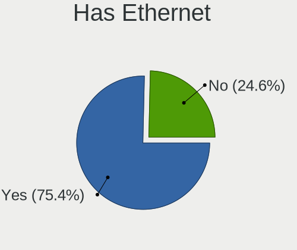
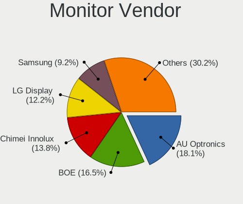
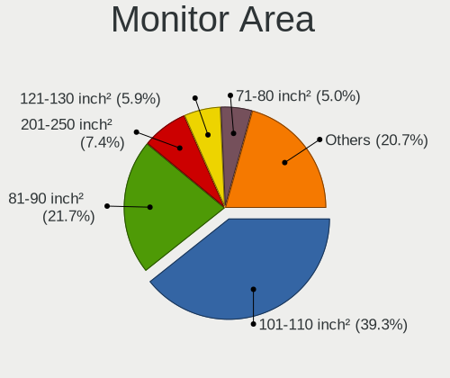
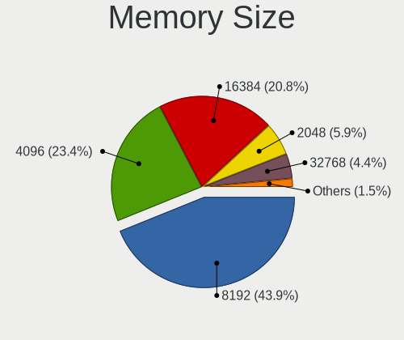

Ubuntu 22.04 - Tested Hardware & Statistics (Notebooks)
-------------------------------------------------------

A project to collect tested hardware configurations for Ubuntu 22.04.

Anyone can contribute to this report by the [hw-probe](https://github.com/linuxhw/hw-probe) tool:

    sudo -E hw-probe -all -upload

Please contribute! Especially if your hardware is rare.

Contents
--------

* [ Test Cases ](#test-cases)

* [ System ](#system)
  - [ Kernel                   ](#kernel)
  - [ Kernel Family            ](#kernel-family)
  - [ Kernel Major Ver.        ](#kernel-major-ver)
  - [ Arch                     ](#arch)
  - [ DE                       ](#de)
  - [ Display Server           ](#display-server)
  - [ Display Manager          ](#display-manager)
  - [ OS Lang                  ](#os-lang)
  - [ Boot Mode                ](#boot-mode)
  - [ Filesystem               ](#filesystem)
  - [ Part. scheme             ](#part-scheme)
  - [ Dual Boot with Linux/BSD ](#dual-boot-with-linuxbsd)
  - [ Dual Boot (Win)          ](#dual-boot-win)

* [ Board ](#board)
  - [ Vendor                   ](#vendor)
  - [ Model                    ](#model)
  - [ Model Family             ](#model-family)
  - [ MFG Year                 ](#mfg-year)
  - [ Form Factor              ](#form-factor)
  - [ Secure Boot              ](#secure-boot)
  - [ Coreboot                 ](#coreboot)
  - [ RAM Size                 ](#ram-size)
  - [ RAM Used                 ](#ram-used)
  - [ Total Drives             ](#total-drives)
  - [ Has CD-ROM               ](#has-cd-rom)
  - [ Has Ethernet             ](#has-ethernet)
  - [ Has WiFi                 ](#has-wifi)
  - [ Has Bluetooth            ](#has-bluetooth)

* [ Location ](#location)
  - [ Country                  ](#country)
  - [ City                     ](#city)

* [ Drives ](#drives)
  - [ Drive Vendor             ](#drive-vendor)
  - [ Drive Model              ](#drive-model)
  - [ HDD Vendor               ](#hdd-vendor)
  - [ SSD Vendor               ](#ssd-vendor)
  - [ Drive Kind               ](#drive-kind)
  - [ Drive Connector          ](#drive-connector)
  - [ Drive Size               ](#drive-size)
  - [ Space Total              ](#space-total)
  - [ Space Used               ](#space-used)
  - [ Malfunc. Drives          ](#malfunc-drives)
  - [ Malfunc. Drive Vendor    ](#malfunc-drive-vendor)
  - [ Malfunc. HDD Vendor      ](#malfunc-hdd-vendor)
  - [ Malfunc. Drive Kind      ](#malfunc-drive-kind)
  - [ Failed Drives            ](#failed-drives)
  - [ Failed Drive Vendor      ](#failed-drive-vendor)
  - [ Drive Status             ](#drive-status)

* [ Storage controller ](#storage-controller)
  - [ Storage Vendor           ](#storage-vendor)
  - [ Storage Model            ](#storage-model)
  - [ Storage Kind             ](#storage-kind)

* [ Processor ](#processor)
  - [ CPU Vendor               ](#cpu-vendor)
  - [ CPU Model                ](#cpu-model)
  - [ CPU Model Family         ](#cpu-model-family)
  - [ CPU Cores                ](#cpu-cores)
  - [ CPU Sockets              ](#cpu-sockets)
  - [ CPU Threads              ](#cpu-threads)
  - [ CPU Op-Modes             ](#cpu-op-modes)
  - [ CPU Microcode            ](#cpu-microcode)
  - [ CPU Microarch            ](#cpu-microarch)

* [ Graphics ](#graphics)
  - [ GPU Vendor               ](#gpu-vendor)
  - [ GPU Model                ](#gpu-model)
  - [ GPU Combo                ](#gpu-combo)
  - [ GPU Driver               ](#gpu-driver)
  - [ GPU Memory               ](#gpu-memory)

* [ Monitor ](#monitor)
  - [ Monitor Vendor           ](#monitor-vendor)
  - [ Monitor Model            ](#monitor-model)
  - [ Monitor Resolution       ](#monitor-resolution)
  - [ Monitor Diagonal         ](#monitor-diagonal)
  - [ Monitor Width            ](#monitor-width)
  - [ Aspect Ratio             ](#aspect-ratio)
  - [ Monitor Area             ](#monitor-area)
  - [ Pixel Density            ](#pixel-density)
  - [ Multiple Monitors        ](#multiple-monitors)

* [ Network ](#network)
  - [ Net Controller Vendor    ](#net-controller-vendor)
  - [ Net Controller Model     ](#net-controller-model)
  - [ Wireless Vendor          ](#wireless-vendor)
  - [ Wireless Model           ](#wireless-model)
  - [ Ethernet Vendor          ](#ethernet-vendor)
  - [ Ethernet Model           ](#ethernet-model)
  - [ Net Controller Kind      ](#net-controller-kind)
  - [ Used Controller          ](#used-controller)
  - [ NICs                     ](#nics)
  - [ IPv6                     ](#ipv6)

* [ Bluetooth ](#bluetooth)
  - [ Bluetooth Vendor         ](#bluetooth-vendor)
  - [ Bluetooth Model          ](#bluetooth-model)

* [ Sound ](#sound)
  - [ Sound Vendor             ](#sound-vendor)
  - [ Sound Model              ](#sound-model)

* [ Memory ](#memory)
  - [ Memory Vendor            ](#memory-vendor)
  - [ Memory Model             ](#memory-model)
  - [ Memory Kind              ](#memory-kind)
  - [ Memory Form Factor       ](#memory-form-factor)
  - [ Memory Size              ](#memory-size)
  - [ Memory Speed             ](#memory-speed)

* [ Printers & scanners ](#printers--scanners)
  - [ Printer Vendor           ](#printer-vendor)
  - [ Printer Model            ](#printer-model)
  - [ Scanner Vendor           ](#scanner-vendor)
  - [ Scanner Model            ](#scanner-model)

* [ Camera ](#camera)
  - [ Camera Vendor            ](#camera-vendor)
  - [ Camera Model             ](#camera-model)

* [ Security ](#security)
  - [ Fingerprint Vendor       ](#fingerprint-vendor)
  - [ Fingerprint Model        ](#fingerprint-model)
  - [ Chipcard Vendor          ](#chipcard-vendor)
  - [ Chipcard Model           ](#chipcard-model)

* [ Unsupported ](#unsupported)
  - [ Unsupported Devices      ](#unsupported-devices)
  - [ Unsupported Device Types ](#unsupported-device-types)

Test Cases
----------

Total: 669

| Vendor        | Model                       | Probe                                                      | Date         |
|---------------|-----------------------------|------------------------------------------------------------|--------------|
| Lenovo        | ThinkPad E14 Gen 3 20YFC... | [ac0d3882ca](https://linux-hardware.org/?probe=ac0d3882ca) | Jun 01, 2022 |
| Lenovo        | IdeaPad Y700-15ISK 80NV     | [d12c2f9f7c](https://linux-hardware.org/?probe=d12c2f9f7c) | Jun 01, 2022 |
| Lenovo        | ThinkPad T440s 20ARS29U0... | [50de8ad2e9](https://linux-hardware.org/?probe=50de8ad2e9) | Jun 01, 2022 |
| Acer          | Swift SF314-42              | [f4906f3799](https://linux-hardware.org/?probe=f4906f3799) | Jun 01, 2022 |
| HP            | Laptop 15s-fq1xxx           | [08fe1f2d0f](https://linux-hardware.org/?probe=08fe1f2d0f) | May 31, 2022 |
| ASUSTek       | ROG Strix G533QS_G533QS     | [7099867859](https://linux-hardware.org/?probe=7099867859) | May 31, 2022 |
| Maibenben     | XiaoMai5                    | [db343bc7eb](https://linux-hardware.org/?probe=db343bc7eb) | May 31, 2022 |
| HP            | ProBook 470 G1              | [ef73457d51](https://linux-hardware.org/?probe=ef73457d51) | May 31, 2022 |
| Dell          | Inspiron 14 7420 2-in-1     | [131a117ca2](https://linux-hardware.org/?probe=131a117ca2) | May 31, 2022 |
| Dell          | XPS 13 9310                 | [726e3b4cd7](https://linux-hardware.org/?probe=726e3b4cd7) | May 31, 2022 |
| Dell          | Inspiron 5520               | [199523cb84](https://linux-hardware.org/?probe=199523cb84) | May 31, 2022 |
| Samsung       | RF511/RF411/RF711           | [ddafd23ad4](https://linux-hardware.org/?probe=ddafd23ad4) | May 31, 2022 |
| ASUSTek       | N550JV                      | [37af34e2e7](https://linux-hardware.org/?probe=37af34e2e7) | May 31, 2022 |
| HUAWEI        | BOM-WXX9                    | [0d21170323](https://linux-hardware.org/?probe=0d21170323) | May 31, 2022 |
| ASUSTek       | G73Jh                       | [b7db998ac4](https://linux-hardware.org/?probe=b7db998ac4) | May 31, 2022 |
| ASUSTek       | N550JV                      | [2652284f1a](https://linux-hardware.org/?probe=2652284f1a) | May 31, 2022 |
| HP            | EliteBook 2560p             | [4ad762abcb](https://linux-hardware.org/?probe=4ad762abcb) | May 31, 2022 |
| ASUSTek       | ROG Strix G533QS_G533QS     | [aeb3a20df7](https://linux-hardware.org/?probe=aeb3a20df7) | May 31, 2022 |
| Toshiba       | Satellite C850D-115         | [fca373e327](https://linux-hardware.org/?probe=fca373e327) | May 31, 2022 |
| HP            | Spectre 13 x2 PC            | [9b67243691](https://linux-hardware.org/?probe=9b67243691) | May 30, 2022 |
| Dell          | Latitude 7400               | [685a5a8006](https://linux-hardware.org/?probe=685a5a8006) | May 30, 2022 |
| HP            | Pavilion Laptop 15-cw1xx... | [be0f84abb3](https://linux-hardware.org/?probe=be0f84abb3) | May 30, 2022 |
| Toshiba       | Satellite C50D-B            | [ce4eb9abc2](https://linux-hardware.org/?probe=ce4eb9abc2) | May 30, 2022 |
| Dell          | Inspiron MM061              | [904ddbbbb1](https://linux-hardware.org/?probe=904ddbbbb1) | May 30, 2022 |
| Lenovo        | ThinkPad E14 Gen 3 20YFC... | [784e1ca4cc](https://linux-hardware.org/?probe=784e1ca4cc) | May 30, 2022 |
| HP            | ENVY Laptop 15-ep1xxx       | [e6145c7453](https://linux-hardware.org/?probe=e6145c7453) | May 30, 2022 |
| Lenovo        | IdeaPad Z480                | [b1cf8ca505](https://linux-hardware.org/?probe=b1cf8ca505) | May 30, 2022 |
| Acer          | Aspire A515-51              | [4c1c5915bc](https://linux-hardware.org/?probe=4c1c5915bc) | May 29, 2022 |
| Lenovo        | IdeaPad 330-17IKB 81DK      | [84f8bf29fd](https://linux-hardware.org/?probe=84f8bf29fd) | May 29, 2022 |
| Acer          | Aspire A515-51              | [443f0579bb](https://linux-hardware.org/?probe=443f0579bb) | May 29, 2022 |
| Chuwi         | GemiBook                    | [432c1135b8](https://linux-hardware.org/?probe=432c1135b8) | May 29, 2022 |
| Dell          | Inspiron 3420               | [2e79e10052](https://linux-hardware.org/?probe=2e79e10052) | May 29, 2022 |
| Lenovo        | ThinkPad T480s 20L8S34C0... | [c272fc283f](https://linux-hardware.org/?probe=c272fc283f) | May 29, 2022 |
| HUAWEI        | HLYL-WXX9                   | [b1670ac481](https://linux-hardware.org/?probe=b1670ac481) | May 29, 2022 |
| HUAWEI        | HLYL-WXX9                   | [4fec6454b4](https://linux-hardware.org/?probe=4fec6454b4) | May 29, 2022 |
| HP            | Pavilion g6                 | [a82494e1f3](https://linux-hardware.org/?probe=a82494e1f3) | May 29, 2022 |
| Samsung       | RV410/RV510/S3510/E3510     | [d7800ffe07](https://linux-hardware.org/?probe=d7800ffe07) | May 29, 2022 |
| Lenovo        | ThinkPad T440s 20AQ007SM... | [6e41ef26bf](https://linux-hardware.org/?probe=6e41ef26bf) | May 29, 2022 |
| ASUSTek       | UX360CA                     | [63fac2dc9b](https://linux-hardware.org/?probe=63fac2dc9b) | May 29, 2022 |
| Lenovo        | Legion S7 15ACH6 82K8       | [10ade1b182](https://linux-hardware.org/?probe=10ade1b182) | May 29, 2022 |
| HP            | Pavilion Laptop 15t-eg10... | [e24b789c03](https://linux-hardware.org/?probe=e24b789c03) | May 29, 2022 |
| Lenovo        | IdeaPad 320-15AST 80XV      | [55dfdf01c6](https://linux-hardware.org/?probe=55dfdf01c6) | May 29, 2022 |
| Acer          | Swift SF314-43              | [44b220163b](https://linux-hardware.org/?probe=44b220163b) | May 28, 2022 |
| Dell          | XPS 13 9380                 | [7220b6a007](https://linux-hardware.org/?probe=7220b6a007) | May 28, 2022 |
| Dell          | XPS 13 9380                 | [962defa2c3](https://linux-hardware.org/?probe=962defa2c3) | May 28, 2022 |
| Lenovo        | ThinkPad P14s Gen 2a 21A... | [61cbe48681](https://linux-hardware.org/?probe=61cbe48681) | May 28, 2022 |
| HP            | ProBook 650 G1              | [b32a949b01](https://linux-hardware.org/?probe=b32a949b01) | May 28, 2022 |
| ASUSTek       | ROG Strix G513QY_G513QY     | [ee508ca972](https://linux-hardware.org/?probe=ee508ca972) | May 28, 2022 |
| HP            | Pavilion dv8                | [e2e28a055e](https://linux-hardware.org/?probe=e2e28a055e) | May 28, 2022 |
| HP            | ProBook 450 G0              | [0086280448](https://linux-hardware.org/?probe=0086280448) | May 28, 2022 |
| HP            | 15                          | [d44aca33f7](https://linux-hardware.org/?probe=d44aca33f7) | May 28, 2022 |
| ASUSTek       | Zenbook UM3402YA_UM3402Y... | [1a31d93797](https://linux-hardware.org/?probe=1a31d93797) | May 28, 2022 |
| Google        | Phaser360                   | [1795c158e4](https://linux-hardware.org/?probe=1795c158e4) | May 28, 2022 |
| HP            | Pavilion dv6000 (GP639EA... | [3a472b96d3](https://linux-hardware.org/?probe=3a472b96d3) | May 27, 2022 |
| HP            | Pavilion dv6000 (GP639EA... | [7f3e3aada0](https://linux-hardware.org/?probe=7f3e3aada0) | May 27, 2022 |
| Dell          | Inspiron 5521               | [84cc31cb32](https://linux-hardware.org/?probe=84cc31cb32) | May 27, 2022 |
| HP            | Pavilion Laptop 15-eh0xx... | [0000ab45a7](https://linux-hardware.org/?probe=0000ab45a7) | May 27, 2022 |
| Dell          | XPS 13 9305                 | [5dc9e065e3](https://linux-hardware.org/?probe=5dc9e065e3) | May 27, 2022 |
| Lenovo        | ThinkPad T580 20L9CTO1WW    | [397d64e10c](https://linux-hardware.org/?probe=397d64e10c) | May 27, 2022 |
| Medion        | S6421 MD60703               | [9fffed019c](https://linux-hardware.org/?probe=9fffed019c) | May 27, 2022 |
| Lenovo        | ThinkPad T580 20L9CTO1WW    | [a74cc1410a](https://linux-hardware.org/?probe=a74cc1410a) | May 27, 2022 |
| Lenovo        | ThinkPad T580 20L9S14S00    | [63bc3a2ce5](https://linux-hardware.org/?probe=63bc3a2ce5) | May 27, 2022 |
| Dell          | Inspiron 15 3510            | [860cd7b1f5](https://linux-hardware.org/?probe=860cd7b1f5) | May 27, 2022 |
| Dell          | Inspiron 15 3510            | [3d9ff1d25f](https://linux-hardware.org/?probe=3d9ff1d25f) | May 27, 2022 |
| HUAWEI        | NBM-WXX9                    | [d7adff5a41](https://linux-hardware.org/?probe=d7adff5a41) | May 27, 2022 |
| Lenovo        | IdeaPad 5 14ALC05 82LM      | [8a4d6e798d](https://linux-hardware.org/?probe=8a4d6e798d) | May 26, 2022 |
| Alienware     | 15 R3                       | [84df370117](https://linux-hardware.org/?probe=84df370117) | May 26, 2022 |
| Gateway       | NV57H                       | [75c484ec74](https://linux-hardware.org/?probe=75c484ec74) | May 26, 2022 |
| Lenovo        | ThinkPad L490 20Q5002GPG    | [9e1d2f7e8a](https://linux-hardware.org/?probe=9e1d2f7e8a) | May 26, 2022 |
| Dell          | Inspiron 3420               | [a3509450fc](https://linux-hardware.org/?probe=a3509450fc) | May 26, 2022 |
| Dell          | Inspiron 3420               | [63592b1c26](https://linux-hardware.org/?probe=63592b1c26) | May 26, 2022 |
| HP            | ProBook 650 G1              | [1e3cb9027d](https://linux-hardware.org/?probe=1e3cb9027d) | May 26, 2022 |
| Panasonic     | CF53-4                      | [5ca3312ac9](https://linux-hardware.org/?probe=5ca3312ac9) | May 26, 2022 |
| Acer          | TravelMate 5742Z            | [fd6407ece1](https://linux-hardware.org/?probe=fd6407ece1) | May 26, 2022 |
| HP            | Pavilion tx2500             | [4f5faea87f](https://linux-hardware.org/?probe=4f5faea87f) | May 26, 2022 |
| HP            | ZBook 15 G5                 | [4f083f0d35](https://linux-hardware.org/?probe=4f083f0d35) | May 25, 2022 |
| Dell          | Inspiron 5521               | [69cec459af](https://linux-hardware.org/?probe=69cec459af) | May 25, 2022 |
| Acer          | Nitro AN515-54              | [4c0609eff4](https://linux-hardware.org/?probe=4c0609eff4) | May 25, 2022 |
| Lenovo        | IdeaPad S540-15IWL GTX 8... | [cff9e3245c](https://linux-hardware.org/?probe=cff9e3245c) | May 25, 2022 |
| Lenovo        | ThinkPad S1 Yoga 12 20DK... | [fc05deca82](https://linux-hardware.org/?probe=fc05deca82) | May 25, 2022 |
| Dell          | Vostro 15 3515              | [6a41815a3a](https://linux-hardware.org/?probe=6a41815a3a) | May 25, 2022 |
| Positivo      | AT510                       | [2845c5ebd6](https://linux-hardware.org/?probe=2845c5ebd6) | May 25, 2022 |
| HP            | Pavilion Gaming Laptop 1... | [74796bddc6](https://linux-hardware.org/?probe=74796bddc6) | May 25, 2022 |
| Alienware     | m15 R7                      | [d8155181ec](https://linux-hardware.org/?probe=d8155181ec) | May 25, 2022 |
| HP            | Pavilion Laptop 15-eh2xx... | [364356854c](https://linux-hardware.org/?probe=364356854c) | May 25, 2022 |
| HP            | EliteBook 850 G6            | [25e4d08ac2](https://linux-hardware.org/?probe=25e4d08ac2) | May 25, 2022 |
| HP            | Notebook                    | [87460a83e8](https://linux-hardware.org/?probe=87460a83e8) | May 25, 2022 |
| Lenovo        | V15 G2 ITL 82KB             | [afa36e649d](https://linux-hardware.org/?probe=afa36e649d) | May 25, 2022 |
| ASUSTek       | ROG Strix G512LU_G512LU     | [24b9b9fc85](https://linux-hardware.org/?probe=24b9b9fc85) | May 25, 2022 |
| ASUSTek       | ROG Strix G512LU_G512LU     | [7d581f520f](https://linux-hardware.org/?probe=7d581f520f) | May 25, 2022 |
| HP            | 250 G8 Notebook PC          | [cee3591bcd](https://linux-hardware.org/?probe=cee3591bcd) | May 25, 2022 |
| AMI           | Intel                       | [6f43f8000f](https://linux-hardware.org/?probe=6f43f8000f) | May 25, 2022 |
| Acer          | TravelMate 8372             | [fda4340056](https://linux-hardware.org/?probe=fda4340056) | May 25, 2022 |
| Dell          | Vostro 3590                 | [911d4f5b0c](https://linux-hardware.org/?probe=911d4f5b0c) | May 25, 2022 |
| Dell          | Vostro 3590                 | [84edfb2984](https://linux-hardware.org/?probe=84edfb2984) | May 24, 2022 |
| HUAWEI        | NBLK-WAX9X                  | [0517751353](https://linux-hardware.org/?probe=0517751353) | May 24, 2022 |
| HP            | Laptop 14-fq0xxx            | [cce2c3d087](https://linux-hardware.org/?probe=cce2c3d087) | May 24, 2022 |
| HP            | Laptop 14-fq0xxx            | [a26b5f2e62](https://linux-hardware.org/?probe=a26b5f2e62) | May 24, 2022 |
| HP            | ZBook 15 G5                 | [fea70c6484](https://linux-hardware.org/?probe=fea70c6484) | May 24, 2022 |
| LG Electro... | 17Z90N-V.AA77G              | [701a55dbe1](https://linux-hardware.org/?probe=701a55dbe1) | May 24, 2022 |
| Dell          | Latitude 5420               | [28c0f1ba96](https://linux-hardware.org/?probe=28c0f1ba96) | May 24, 2022 |
| Lenovo        | IdeaPad 330S-14IKB 81F4     | [7e4dbd239c](https://linux-hardware.org/?probe=7e4dbd239c) | May 24, 2022 |
| LG Electro... | 15Z95P-P.AAE8U1             | [b6f94c26a6](https://linux-hardware.org/?probe=b6f94c26a6) | May 24, 2022 |
| MSI           | Prestige 15 A11SCS          | [2433529434](https://linux-hardware.org/?probe=2433529434) | May 24, 2022 |
| Toshiba       | Satellite Pro U400          | [4aeeca648d](https://linux-hardware.org/?probe=4aeeca648d) | May 24, 2022 |
| Medion        | P7649 MD60817               | [afcecb3b4e](https://linux-hardware.org/?probe=afcecb3b4e) | May 24, 2022 |
| Allview       | Allbook H                   | [9ea4897c6b](https://linux-hardware.org/?probe=9ea4897c6b) | May 24, 2022 |
| ASUSTek       | Zenbook UM3402YA_UM3402Y... | [9f202f07cd](https://linux-hardware.org/?probe=9f202f07cd) | May 24, 2022 |
| HP            | EliteBook 845 G8 Noteboo... | [ddd705ecaf](https://linux-hardware.org/?probe=ddd705ecaf) | May 24, 2022 |
| Dell          | Latitude E7470              | [b01633e1ae](https://linux-hardware.org/?probe=b01633e1ae) | May 24, 2022 |
| Apple         | MacBookPro8,2               | [764a660c33](https://linux-hardware.org/?probe=764a660c33) | May 24, 2022 |
| Dell          | Inspiron 5557               | [1b07902e70](https://linux-hardware.org/?probe=1b07902e70) | May 24, 2022 |
| ASUSTek       | Zephyrus G GU502DU_GA502... | [bd95cdf1cd](https://linux-hardware.org/?probe=bd95cdf1cd) | May 24, 2022 |
| Unknown       | Aspire E                    | [d437b15b97](https://linux-hardware.org/?probe=d437b15b97) | May 24, 2022 |
| Lenovo        | IdeaPad 5 Pro 16IHU6 82L... | [322f05198a](https://linux-hardware.org/?probe=322f05198a) | May 24, 2022 |
| Unknown       | Aspire E                    | [f46b38824f](https://linux-hardware.org/?probe=f46b38824f) | May 24, 2022 |
| Dell          | Vostro 3550                 | [eb16993291](https://linux-hardware.org/?probe=eb16993291) | May 24, 2022 |
| Dell          | Vostro 3550                 | [b40dbcb6e4](https://linux-hardware.org/?probe=b40dbcb6e4) | May 23, 2022 |
| Dell          | XPS 15 9560                 | [7152b312be](https://linux-hardware.org/?probe=7152b312be) | May 23, 2022 |
| ASUSTek       | N550JV                      | [7b3acdb5ac](https://linux-hardware.org/?probe=7b3acdb5ac) | May 23, 2022 |
| Dell          | Latitude E7470              | [815dbb114b](https://linux-hardware.org/?probe=815dbb114b) | May 23, 2022 |
| Lenovo        | IdeaPad 330-15IKB 81FD      | [77ff0216c6](https://linux-hardware.org/?probe=77ff0216c6) | May 23, 2022 |
| ASUSTek       | ROG Zephyrus G14 GA401QM... | [43a374c1d4](https://linux-hardware.org/?probe=43a374c1d4) | May 23, 2022 |
| Dell          | Inspiron M5030              | [e59616f367](https://linux-hardware.org/?probe=e59616f367) | May 23, 2022 |
| Dell          | Inspiron 15-3552            | [a97b4f8a75](https://linux-hardware.org/?probe=a97b4f8a75) | May 22, 2022 |
| Acer          | Swift SF314-54              | [fc1233f258](https://linux-hardware.org/?probe=fc1233f258) | May 22, 2022 |
| Apple         | MacBookPro11,4              | [1f931afa11](https://linux-hardware.org/?probe=1f931afa11) | May 22, 2022 |
| Lenovo        | V14-IIL 82C4                | [1ca9184b98](https://linux-hardware.org/?probe=1ca9184b98) | May 22, 2022 |
| Toshiba       | Satellite L755D             | [3614e30a7e](https://linux-hardware.org/?probe=3614e30a7e) | May 22, 2022 |
| Lenovo        | IdeaPad 700-15ISK 80RU      | [8949bc2cf8](https://linux-hardware.org/?probe=8949bc2cf8) | May 22, 2022 |
| Lenovo        | ThinkPad T530 2359CTO       | [277734b1fe](https://linux-hardware.org/?probe=277734b1fe) | May 22, 2022 |
| Lenovo        | Yoga Slim 9 14ITL5 82D1     | [d728114b9b](https://linux-hardware.org/?probe=d728114b9b) | May 22, 2022 |
| Lenovo        | ThinkBook 14-IML 20RV       | [6f5d1c9f06](https://linux-hardware.org/?probe=6f5d1c9f06) | May 22, 2022 |
| Lenovo        | ThinkPad T530 2359CTO       | [9a7b6da037](https://linux-hardware.org/?probe=9a7b6da037) | May 22, 2022 |
| Lenovo        | ThinkPad X1 Carbon 6th 2... | [ae7670331c](https://linux-hardware.org/?probe=ae7670331c) | May 22, 2022 |
| Lenovo        | G780 2182                   | [4ba22e506c](https://linux-hardware.org/?probe=4ba22e506c) | May 22, 2022 |
| Apple         | MacBookPro5,5               | [8d2abc6eb8](https://linux-hardware.org/?probe=8d2abc6eb8) | May 22, 2022 |
| Lenovo        | ThinkBook 14-IML 20RV       | [6f780776df](https://linux-hardware.org/?probe=6f780776df) | May 22, 2022 |
| Dell          | G15 5510                    | [0ca1f736f9](https://linux-hardware.org/?probe=0ca1f736f9) | May 22, 2022 |
| HP            | Laptop 15-bs0xx             | [40e9bdb15d](https://linux-hardware.org/?probe=40e9bdb15d) | May 22, 2022 |
| Lenovo        | ThinkBook 14-IML 20RV       | [6e46286500](https://linux-hardware.org/?probe=6e46286500) | May 21, 2022 |
| Dell          | Latitude E7470              | [9a6c29a243](https://linux-hardware.org/?probe=9a6c29a243) | May 21, 2022 |
| HP            | Pavilion g6                 | [3b904a10e3](https://linux-hardware.org/?probe=3b904a10e3) | May 21, 2022 |
| Toshiba       | Satellite L655              | [3ea531093a](https://linux-hardware.org/?probe=3ea531093a) | May 21, 2022 |
| MSI           | CX61 2PC                    | [0efd671877](https://linux-hardware.org/?probe=0efd671877) | May 21, 2022 |
| HP            | Pavilion g6                 | [e165a36a31](https://linux-hardware.org/?probe=e165a36a31) | May 21, 2022 |
| Dell          | Inspiron 5521               | [59c909c05e](https://linux-hardware.org/?probe=59c909c05e) | May 21, 2022 |
| ASUSTek       | VivoBook_ASUSLaptop M350... | [f1f75187e1](https://linux-hardware.org/?probe=f1f75187e1) | May 21, 2022 |
| Lenovo        | ThinkPad X1 Carbon Gen 9... | [62486fe8d6](https://linux-hardware.org/?probe=62486fe8d6) | May 21, 2022 |
| Lenovo        | ThinkPad X1 Carbon Gen 9... | [f0f481f187](https://linux-hardware.org/?probe=f0f481f187) | May 21, 2022 |
| Acer          | Swift SF514-54T             | [29b06de977](https://linux-hardware.org/?probe=29b06de977) | May 21, 2022 |
| HP            | Notebook                    | [a1be02b2d6](https://linux-hardware.org/?probe=a1be02b2d6) | May 21, 2022 |
| Dell          | Inspiron 3541               | [9869bcac0c](https://linux-hardware.org/?probe=9869bcac0c) | May 21, 2022 |
| HP            | Laptop 15-dw3xxx            | [dad32d6137](https://linux-hardware.org/?probe=dad32d6137) | May 21, 2022 |
| HP            | Laptop 15-dw3xxx            | [395e3badb3](https://linux-hardware.org/?probe=395e3badb3) | May 21, 2022 |
| ASUSTek       | N550JV                      | [8a1f2ffc65](https://linux-hardware.org/?probe=8a1f2ffc65) | May 20, 2022 |
| ASUSTek       | N550JV                      | [286611f4de](https://linux-hardware.org/?probe=286611f4de) | May 20, 2022 |
| Entroware     | Triton                      | [2bfa3e5cc8](https://linux-hardware.org/?probe=2bfa3e5cc8) | May 20, 2022 |
| MSI           | Stealth GS66 12UE           | [98bccdf1f2](https://linux-hardware.org/?probe=98bccdf1f2) | May 20, 2022 |
| HP            | Laptop 15-dw2xxx            | [1e441cdd81](https://linux-hardware.org/?probe=1e441cdd81) | May 20, 2022 |
| HP            | Laptop 15-dw2xxx            | [12b3ea9a8b](https://linux-hardware.org/?probe=12b3ea9a8b) | May 20, 2022 |
| Lenovo        | ThinkPad L13 Yoga Gen 2a... | [59279fc1ba](https://linux-hardware.org/?probe=59279fc1ba) | May 20, 2022 |
| Lenovo        | ThinkPad E15 Gen 3 20YG0... | [20309ca84a](https://linux-hardware.org/?probe=20309ca84a) | May 20, 2022 |
| Alienware     | x17 R2                      | [019dbb46a4](https://linux-hardware.org/?probe=019dbb46a4) | May 20, 2022 |
| ASUSTek       | VivoBook_ASUSLaptop M740... | [4d2d33c41c](https://linux-hardware.org/?probe=4d2d33c41c) | May 20, 2022 |
| Lenovo        | ThinkPad X1 Carbon 4th 2... | [e876753143](https://linux-hardware.org/?probe=e876753143) | May 20, 2022 |
| HP            | EliteBook 850 G6            | [1b672f1faa](https://linux-hardware.org/?probe=1b672f1faa) | May 20, 2022 |
| HP            | Laptop 15-bs0xx             | [5c989cad8d](https://linux-hardware.org/?probe=5c989cad8d) | May 20, 2022 |
| HP            | EliteBook 850 G6            | [d2232927a7](https://linux-hardware.org/?probe=d2232927a7) | May 20, 2022 |
| ASUSTek       | VivoBook_ASUSLaptop X515... | [586933cfe0](https://linux-hardware.org/?probe=586933cfe0) | May 20, 2022 |
| HP            | ZBook Studio 16.0 inch G... | [7b11b85bc2](https://linux-hardware.org/?probe=7b11b85bc2) | May 19, 2022 |
| HP            | Pavilion Gaming Laptop 1... | [342929d56c](https://linux-hardware.org/?probe=342929d56c) | May 19, 2022 |
| ASUSTek       | ZenBook UX333FA_UX333FA     | [9f4f14ebd1](https://linux-hardware.org/?probe=9f4f14ebd1) | May 19, 2022 |
| Acer          | Swift SF314-42              | [6ea1e6d50a](https://linux-hardware.org/?probe=6ea1e6d50a) | May 19, 2022 |
| MSI           | Prestige 14 A12UC           | [189b62a372](https://linux-hardware.org/?probe=189b62a372) | May 19, 2022 |
| Apple         | MacBookPro5,5               | [af3a0c021a](https://linux-hardware.org/?probe=af3a0c021a) | May 19, 2022 |
| HP            | 250 G4 Notebook PC          | [1472f65ca0](https://linux-hardware.org/?probe=1472f65ca0) | May 19, 2022 |
| SLIMBOOK      | PROX14-10                   | [b0d5e9b290](https://linux-hardware.org/?probe=b0d5e9b290) | May 19, 2022 |
| Dell          | Vostro 3500                 | [d30a648e90](https://linux-hardware.org/?probe=d30a648e90) | May 19, 2022 |
| Dell          | Inspiron 5565               | [d5a8629a31](https://linux-hardware.org/?probe=d5a8629a31) | May 19, 2022 |
| Acer          | Swift SF314-52              | [4c199417ea](https://linux-hardware.org/?probe=4c199417ea) | May 19, 2022 |
| Lenovo        | ThinkPad T490 20N2005VMX    | [736bd1ab68](https://linux-hardware.org/?probe=736bd1ab68) | May 18, 2022 |
| Alienware     | m15                         | [88f12bc13a](https://linux-hardware.org/?probe=88f12bc13a) | May 18, 2022 |
| Lenovo        | ThinkPad T490 20N2005VMX    | [6c41f73e8a](https://linux-hardware.org/?probe=6c41f73e8a) | May 18, 2022 |
| Dell          | Vostro 15 3515              | [90d9ac6bf3](https://linux-hardware.org/?probe=90d9ac6bf3) | May 18, 2022 |
| Dell          | Latitude 5400               | [402603a522](https://linux-hardware.org/?probe=402603a522) | May 18, 2022 |
| Lenovo        | ThinkBook 14 G2 ITL 20VD    | [1ef52e97fa](https://linux-hardware.org/?probe=1ef52e97fa) | May 18, 2022 |
| Lenovo        | V145-15AST 81MT             | [badf4d0a88](https://linux-hardware.org/?probe=badf4d0a88) | May 18, 2022 |
| Lenovo        | ThinkPad T490 20N2CTO1WW    | [9ff24e3f8b](https://linux-hardware.org/?probe=9ff24e3f8b) | May 18, 2022 |
| ASUSTek       | X555LD                      | [66a07f5e71](https://linux-hardware.org/?probe=66a07f5e71) | May 18, 2022 |
| ASUSTek       | X555LD                      | [3856a337bb](https://linux-hardware.org/?probe=3856a337bb) | May 18, 2022 |
| Acer          | Aspire 5250                 | [7ca9e60266](https://linux-hardware.org/?probe=7ca9e60266) | May 17, 2022 |
| HP            | Pavilion Notebook           | [2b8318661b](https://linux-hardware.org/?probe=2b8318661b) | May 17, 2022 |
| Acer          | Aspire one 1-431            | [216bdf2075](https://linux-hardware.org/?probe=216bdf2075) | May 17, 2022 |
| MSI           | Stealth GS66 12UGS          | [f92e29b330](https://linux-hardware.org/?probe=f92e29b330) | May 17, 2022 |
| HP            | ProBook 430 G1              | [5fee96836d](https://linux-hardware.org/?probe=5fee96836d) | May 17, 2022 |
| ASUSTek       | VivoBook 15 ASUS Laptop ... | [1bce5b14e3](https://linux-hardware.org/?probe=1bce5b14e3) | May 17, 2022 |
| Lenovo        | ThinkPad X1 Carbon 6th 2... | [a76c24b01b](https://linux-hardware.org/?probe=a76c24b01b) | May 17, 2022 |
| Acer          | Aspire A515-51G             | [9a945a6cf5](https://linux-hardware.org/?probe=9a945a6cf5) | May 17, 2022 |
| Apple         | MacBookPro11,4              | [8bf515d1d3](https://linux-hardware.org/?probe=8bf515d1d3) | May 17, 2022 |
| Dell          | XPS 15 9570                 | [ce6b14cd55](https://linux-hardware.org/?probe=ce6b14cd55) | May 17, 2022 |
| Dell          | XPS 13 9370                 | [6459eab7e8](https://linux-hardware.org/?probe=6459eab7e8) | May 17, 2022 |
| Dell          | Inspiron 5735               | [b678e46de2](https://linux-hardware.org/?probe=b678e46de2) | May 17, 2022 |
| Lenovo        | Legion 5 15ACH6A 82NW       | [e0697c999e](https://linux-hardware.org/?probe=e0697c999e) | May 17, 2022 |
| Toshiba       | Satellite L655              | [7709c37037](https://linux-hardware.org/?probe=7709c37037) | May 17, 2022 |
| Acer          | Aspire one 1-431            | [33b2da3e70](https://linux-hardware.org/?probe=33b2da3e70) | May 17, 2022 |
| Acer          | Aspire V3-571G              | [e7e00fe579](https://linux-hardware.org/?probe=e7e00fe579) | May 17, 2022 |
| Dell          | Precision 5560              | [f7b7c1b7ac](https://linux-hardware.org/?probe=f7b7c1b7ac) | May 17, 2022 |
| Toshiba       | Satellite L655              | [1d12d6b59a](https://linux-hardware.org/?probe=1d12d6b59a) | May 17, 2022 |
| Lenovo        | ThinkPad T480 20L6S14Y01    | [d3f3fff089](https://linux-hardware.org/?probe=d3f3fff089) | May 16, 2022 |
| HP            | Laptop 15s-eq3xxx           | [2298d45b84](https://linux-hardware.org/?probe=2298d45b84) | May 16, 2022 |
| ASUSTek       | ROG Zephyrus G14 GA401QM... | [031c2ec486](https://linux-hardware.org/?probe=031c2ec486) | May 16, 2022 |
| ASUSTek       | ROG Zephyrus G14 GA401QM... | [d4f9f894b6](https://linux-hardware.org/?probe=d4f9f894b6) | May 16, 2022 |
| Lenovo        | ThinkPad X1 Carbon 4th 2... | [1454db93a0](https://linux-hardware.org/?probe=1454db93a0) | May 16, 2022 |
| Teclast       | F15 Plus                    | [1163da6e09](https://linux-hardware.org/?probe=1163da6e09) | May 16, 2022 |
| Dell          | Inspiron 15-3567            | [6d5340f5fa](https://linux-hardware.org/?probe=6d5340f5fa) | May 16, 2022 |
| Lenovo        | V14-ADA 82C6                | [5f3fea62ab](https://linux-hardware.org/?probe=5f3fea62ab) | May 16, 2022 |
| Lenovo        | G580 2189                   | [e7de790c8a](https://linux-hardware.org/?probe=e7de790c8a) | May 16, 2022 |
| MSI           | Summit E13FlipEvo A11MT     | [2b5c24c068](https://linux-hardware.org/?probe=2b5c24c068) | May 16, 2022 |
| Dell          | Inspiron 5570               | [faf97fa9a0](https://linux-hardware.org/?probe=faf97fa9a0) | May 16, 2022 |
| Chuwi         | GemiBook Pro                | [b9b65db051](https://linux-hardware.org/?probe=b9b65db051) | May 16, 2022 |
| Alienware     | x17 R2                      | [b755419e26](https://linux-hardware.org/?probe=b755419e26) | May 16, 2022 |
| HP            | ZBook 15 G6                 | [6c433b3b60](https://linux-hardware.org/?probe=6c433b3b60) | May 16, 2022 |
| MSI           | Alpha 15 A4DEK              | [71b7fc78c3](https://linux-hardware.org/?probe=71b7fc78c3) | May 15, 2022 |
| Alienware     | m15                         | [1cadce5105](https://linux-hardware.org/?probe=1cadce5105) | May 15, 2022 |
| MSI           | GS73VR 7RG                  | [3815425b08](https://linux-hardware.org/?probe=3815425b08) | May 15, 2022 |
| Dell          | XPS 15 9570                 | [7de7df5240](https://linux-hardware.org/?probe=7de7df5240) | May 15, 2022 |
| Dell          | Latitude E5420              | [12b3efbfad](https://linux-hardware.org/?probe=12b3efbfad) | May 15, 2022 |
| Dell          | Latitude E5420              | [f6050892da](https://linux-hardware.org/?probe=f6050892da) | May 15, 2022 |
| Acer          | Aspire E5-571               | [99976087b6](https://linux-hardware.org/?probe=99976087b6) | May 15, 2022 |
| MSI           | GX60 1AC                    | [5d29d3316a](https://linux-hardware.org/?probe=5d29d3316a) | May 15, 2022 |
| Acer          | Aspire E5-571               | [8eff9fb0c8](https://linux-hardware.org/?probe=8eff9fb0c8) | May 15, 2022 |
| TUXEDO        | P95_HR                      | [05d8136964](https://linux-hardware.org/?probe=05d8136964) | May 15, 2022 |
| Toshiba       | Satellite L50-A-115         | [186b630cd2](https://linux-hardware.org/?probe=186b630cd2) | May 15, 2022 |
| Samsung       | 340XAA/350XAA/550XAA        | [3d2e586d03](https://linux-hardware.org/?probe=3d2e586d03) | May 15, 2022 |
| HP            | Laptop 15-bs1xx             | [d247cf55a1](https://linux-hardware.org/?probe=d247cf55a1) | May 15, 2022 |
| ASUSTek       | K52De                       | [83206ce723](https://linux-hardware.org/?probe=83206ce723) | May 14, 2022 |
| ASUSTek       | ROG Strix G733QS_G733QS     | [b28d047360](https://linux-hardware.org/?probe=b28d047360) | May 14, 2022 |
| ASUSTek       | ROG Strix G733QS_G733QS     | [36ccfac84d](https://linux-hardware.org/?probe=36ccfac84d) | May 14, 2022 |
| Lenovo        | ThinkPad T500 2241W2B       | [2bd7b2d9a4](https://linux-hardware.org/?probe=2bd7b2d9a4) | May 14, 2022 |
| LG Electro... | 15Z990-HA50K                | [e5cf57d2f4](https://linux-hardware.org/?probe=e5cf57d2f4) | May 14, 2022 |
| ASUSTek       | ROG Zephyrus G14 GA401QM... | [0f4e4f3887](https://linux-hardware.org/?probe=0f4e4f3887) | May 14, 2022 |
| Lenovo        | ThinkPad L14 Gen 2 20X10... | [bf7abc840c](https://linux-hardware.org/?probe=bf7abc840c) | May 14, 2022 |
| Lenovo        | ThinkPad E15 Gen 2 20TD0... | [d4ea8d2b79](https://linux-hardware.org/?probe=d4ea8d2b79) | May 14, 2022 |
| ASUSTek       | N73SV                       | [062b80185f](https://linux-hardware.org/?probe=062b80185f) | May 14, 2022 |
| Lenovo        | ThinkPad L14 Gen 2 20X10... | [107ca55bd4](https://linux-hardware.org/?probe=107ca55bd4) | May 14, 2022 |
| Lenovo        | IdeaPad 5 14ITL05 82FE      | [1090b6739e](https://linux-hardware.org/?probe=1090b6739e) | May 14, 2022 |
| Lenovo        | IdeaPad L340-15IWL 81LG     | [4fe9787a82](https://linux-hardware.org/?probe=4fe9787a82) | May 14, 2022 |
| Dell          | Vostro 3500                 | [f784f7eb95](https://linux-hardware.org/?probe=f784f7eb95) | May 14, 2022 |
| Toshiba       | IS 1413G                    | [6c320568d0](https://linux-hardware.org/?probe=6c320568d0) | May 14, 2022 |
| HUAWEI        | MACH-WX9                    | [6af47b6a1c](https://linux-hardware.org/?probe=6af47b6a1c) | May 14, 2022 |
| Lenovo        | Legion Y7000P 2019 81Q5     | [2b7a0725f0](https://linux-hardware.org/?probe=2b7a0725f0) | May 14, 2022 |
| HP            | Pavilion g7                 | [d08c014458](https://linux-hardware.org/?probe=d08c014458) | May 14, 2022 |
| Samsung       | 270E5J/2570EJ               | [3eaceb3a18](https://linux-hardware.org/?probe=3eaceb3a18) | May 14, 2022 |
| Samsung       | 270E5J/2570EJ               | [1fbf8759b0](https://linux-hardware.org/?probe=1fbf8759b0) | May 14, 2022 |
| Lenovo        | IdeaPad 320-15AST 80XV      | [4316b121b1](https://linux-hardware.org/?probe=4316b121b1) | May 14, 2022 |
| Toshiba       | Satellite L45-B             | [7f46e36f35](https://linux-hardware.org/?probe=7f46e36f35) | May 14, 2022 |
| Toshiba       | Satellite L45-B             | [81b3317aa8](https://linux-hardware.org/?probe=81b3317aa8) | May 14, 2022 |
| Acer          | Aspire R5-571T              | [4d1362123c](https://linux-hardware.org/?probe=4d1362123c) | May 14, 2022 |
| Dell          | Inspiron 7380               | [ce19144efb](https://linux-hardware.org/?probe=ce19144efb) | May 14, 2022 |
| ASUSTek       | VivoBook_ASUSLaptop X705... | [58f371c0d7](https://linux-hardware.org/?probe=58f371c0d7) | May 13, 2022 |
| Apple         | MacBookPro13,2              | [5693f5ee45](https://linux-hardware.org/?probe=5693f5ee45) | May 13, 2022 |
| Dell          | XPS 15 9510                 | [836b9e0442](https://linux-hardware.org/?probe=836b9e0442) | May 13, 2022 |
| HP            | 250 G4 Notebook PC          | [996bc01199](https://linux-hardware.org/?probe=996bc01199) | May 13, 2022 |
| Sony          | VPCEH1M0E                   | [eefe7eee06](https://linux-hardware.org/?probe=eefe7eee06) | May 13, 2022 |
| HP            | ProBook 470 G1              | [06030eee20](https://linux-hardware.org/?probe=06030eee20) | May 13, 2022 |
| AVITA         | NS14A8                      | [bc86f7a17e](https://linux-hardware.org/?probe=bc86f7a17e) | May 13, 2022 |
| ASUSTek       | X551MA                      | [6a39b7b0da](https://linux-hardware.org/?probe=6a39b7b0da) | May 13, 2022 |
| Chuwi         | GemiBook Pro                | [4bc9a160a1](https://linux-hardware.org/?probe=4bc9a160a1) | May 13, 2022 |
| ASUSTek       | ROG Zephyrus G14 GA401QM... | [6251446c92](https://linux-hardware.org/?probe=6251446c92) | May 13, 2022 |
| Dell          | G3 3779                     | [c1da54a43b](https://linux-hardware.org/?probe=c1da54a43b) | May 13, 2022 |
| ASUSTek       | VivoBook_ASUSLaptop X415... | [f7d3a9220c](https://linux-hardware.org/?probe=f7d3a9220c) | May 13, 2022 |
| HP            | Pavilion 17                 | [60fbd20766](https://linux-hardware.org/?probe=60fbd20766) | May 13, 2022 |
| ASUSTek       | VivoBook_ASUSLaptop E410... | [24d4683d52](https://linux-hardware.org/?probe=24d4683d52) | May 13, 2022 |
| Lenovo        | ThinkPad T420s 4170CTO      | [4e58c3e210](https://linux-hardware.org/?probe=4e58c3e210) | May 13, 2022 |
| Dell          | Latitude 3400               | [caa5d59cbd](https://linux-hardware.org/?probe=caa5d59cbd) | May 13, 2022 |
| ASUSTek       | ROG Strix G533QS_G533QS     | [a2abab3a72](https://linux-hardware.org/?probe=a2abab3a72) | May 13, 2022 |
| Dell          | Inspiron 3541               | [7873185850](https://linux-hardware.org/?probe=7873185850) | May 12, 2022 |
| ASUSTek       | ASUS TUF Gaming F15 FX50... | [5ea934bd19](https://linux-hardware.org/?probe=5ea934bd19) | May 12, 2022 |
| Apple         | MacBookPro8,1               | [f3ad419505](https://linux-hardware.org/?probe=f3ad419505) | May 12, 2022 |
| ASUSTek       | ROG Strix G533QS_G533QS     | [1c358bb926](https://linux-hardware.org/?probe=1c358bb926) | May 12, 2022 |
| ASUSTek       | ZenBook UX325EA_UX325EA     | [2e7753a944](https://linux-hardware.org/?probe=2e7753a944) | May 12, 2022 |
| TUXEDO        | N2x0WU                      | [b70a08c999](https://linux-hardware.org/?probe=b70a08c999) | May 12, 2022 |
| HP            | EliteBook 840 G3            | [4d2b2c6a3c](https://linux-hardware.org/?probe=4d2b2c6a3c) | May 12, 2022 |
| Dell          | Inspiron 1525               | [a9e9868b12](https://linux-hardware.org/?probe=a9e9868b12) | May 12, 2022 |
| Alienware     | x17 R2                      | [0a81fc619e](https://linux-hardware.org/?probe=0a81fc619e) | May 12, 2022 |
| MSI           | GF63 Thin 9SCSR             | [a80ef1636d](https://linux-hardware.org/?probe=a80ef1636d) | May 12, 2022 |
| Acer          | Nitro AN515-55              | [eaefbf2773](https://linux-hardware.org/?probe=eaefbf2773) | May 12, 2022 |
| HP            | ZBook 15 G6                 | [a4ce7187a6](https://linux-hardware.org/?probe=a4ce7187a6) | May 12, 2022 |
| Dell          | Latitude 5520               | [927a4b0ed0](https://linux-hardware.org/?probe=927a4b0ed0) | May 12, 2022 |
| Toshiba       | IS 1413G                    | [d4fa91d7b4](https://linux-hardware.org/?probe=d4fa91d7b4) | May 12, 2022 |
| Acer          | Swift SF514-55T             | [02cae91736](https://linux-hardware.org/?probe=02cae91736) | May 12, 2022 |
| HP            | ZBook Power 15.6 inch G8... | [c195f80f3c](https://linux-hardware.org/?probe=c195f80f3c) | May 12, 2022 |
| Chuwi         | MiniBook X                  | [541609a32e](https://linux-hardware.org/?probe=541609a32e) | May 12, 2022 |
| HP            | Pavilion dv6                | [9e5da14b9f](https://linux-hardware.org/?probe=9e5da14b9f) | May 11, 2022 |
| Lenovo        | ThinkPad L380 Yoga 20M70... | [dd8a564470](https://linux-hardware.org/?probe=dd8a564470) | May 11, 2022 |
| Unknown       | Unknown                     | [c01cff4387](https://linux-hardware.org/?probe=c01cff4387) | May 11, 2022 |
| ASUSTek       | K54LY                       | [9e60c12b38](https://linux-hardware.org/?probe=9e60c12b38) | May 11, 2022 |
| Sony          | SVE1513R1EB                 | [c378efbd3d](https://linux-hardware.org/?probe=c378efbd3d) | May 11, 2022 |
| HUAWEI        | KLVL-WXX9                   | [62c6121a76](https://linux-hardware.org/?probe=62c6121a76) | May 11, 2022 |
| HP            | Pavilion Aero Laptop 13-... | [dae406c3b6](https://linux-hardware.org/?probe=dae406c3b6) | May 11, 2022 |
| ASUSTek       | ROG Zephyrus G14 GA401QC... | [7286fd4e36](https://linux-hardware.org/?probe=7286fd4e36) | May 11, 2022 |
| HP            | 15                          | [c54400b509](https://linux-hardware.org/?probe=c54400b509) | May 11, 2022 |
| Google        | Rabbid                      | [2cabce6789](https://linux-hardware.org/?probe=2cabce6789) | May 10, 2022 |
| ASUSTek       | ASUS TUF Gaming A15 FA50... | [65e46938b9](https://linux-hardware.org/?probe=65e46938b9) | May 10, 2022 |
| Dell          | Precision 5750              | [11e888b7d9](https://linux-hardware.org/?probe=11e888b7d9) | May 10, 2022 |
| HP            | 2000                        | [d0e74bfff6](https://linux-hardware.org/?probe=d0e74bfff6) | May 10, 2022 |
| ASUSTek       | ROG Zephyrus G14 GA401QM... | [ce3addb8a4](https://linux-hardware.org/?probe=ce3addb8a4) | May 10, 2022 |
| HP            | EliteBook 840 G8 Noteboo... | [47b730f9bd](https://linux-hardware.org/?probe=47b730f9bd) | May 10, 2022 |
| Toshiba       | PORTEGE Z930                | [fff817aea6](https://linux-hardware.org/?probe=fff817aea6) | May 10, 2022 |
| HP            | ProBook 450 G8 Notebook ... | [02925e8fac](https://linux-hardware.org/?probe=02925e8fac) | May 10, 2022 |
| HP            | Pavilion Laptop 15z-cw10... | [67b3694f6a](https://linux-hardware.org/?probe=67b3694f6a) | May 10, 2022 |
| Lenovo        | Legion S7 15ACH6 82K8       | [37806600f2](https://linux-hardware.org/?probe=37806600f2) | May 10, 2022 |
| HP            | ZBook 15 G3                 | [82bbcd17e8](https://linux-hardware.org/?probe=82bbcd17e8) | May 10, 2022 |
| HP            | Laptop 15s-eq2xxx           | [ae80aa69fe](https://linux-hardware.org/?probe=ae80aa69fe) | May 09, 2022 |
| Lenovo        | ThinkPad T430s 2356JR1      | [2c97326b6b](https://linux-hardware.org/?probe=2c97326b6b) | May 09, 2022 |
| Acer          | Aspire E1-571               | [65d7984ad4](https://linux-hardware.org/?probe=65d7984ad4) | May 09, 2022 |
| ASUSTek       | ZenBook UX325EA_UX325EA     | [34a4a272f5](https://linux-hardware.org/?probe=34a4a272f5) | May 09, 2022 |
| Acer          | Nitro AN515-57              | [b93966ec3c](https://linux-hardware.org/?probe=b93966ec3c) | May 09, 2022 |
| ASUSTek       | K95VJ                       | [5e07819ad6](https://linux-hardware.org/?probe=5e07819ad6) | May 09, 2022 |
| ASUSTek       | VivoBook_ASUSLaptop X740... | [f48ef1adaf](https://linux-hardware.org/?probe=f48ef1adaf) | May 09, 2022 |
| Dell          | Precision 5540              | [1744609574](https://linux-hardware.org/?probe=1744609574) | May 09, 2022 |
| HP            | Pavilion g6                 | [267b134fdd](https://linux-hardware.org/?probe=267b134fdd) | May 09, 2022 |
| Acer          | Aspire E5-575G              | [71e7f1c760](https://linux-hardware.org/?probe=71e7f1c760) | May 09, 2022 |
| Gateway       | P-7805u                     | [0192b23d62](https://linux-hardware.org/?probe=0192b23d62) | May 09, 2022 |
| Lenovo        | IdeaPad 3 15ADA05 81W1      | [d18df271fd](https://linux-hardware.org/?probe=d18df271fd) | May 09, 2022 |
| Dell          | Precision 7510              | [5f3136d1fd](https://linux-hardware.org/?probe=5f3136d1fd) | May 09, 2022 |
| Google        | Blooglet                    | [64b4f18c1c](https://linux-hardware.org/?probe=64b4f18c1c) | May 09, 2022 |
| Google        | Blooglet                    | [f3dc91bf66](https://linux-hardware.org/?probe=f3dc91bf66) | May 09, 2022 |
| HP            | Laptop 15s-eq2xxx           | [f269fd3294](https://linux-hardware.org/?probe=f269fd3294) | May 09, 2022 |
| HP            | ProBook 650 G2              | [aa7c15cb1a](https://linux-hardware.org/?probe=aa7c15cb1a) | May 09, 2022 |
| Toshiba       | IS 1413G                    | [fbb3e61ebf](https://linux-hardware.org/?probe=fbb3e61ebf) | May 09, 2022 |
| HP            | ProBook 650 G2              | [a42f9094ec](https://linux-hardware.org/?probe=a42f9094ec) | May 09, 2022 |
| HP            | Laptop 17z-ca300            | [c43f2b0e29](https://linux-hardware.org/?probe=c43f2b0e29) | May 08, 2022 |
| HP            | Pavilion g6                 | [69406bff46](https://linux-hardware.org/?probe=69406bff46) | May 08, 2022 |
| HP            | Pavilion g6                 | [56ca785331](https://linux-hardware.org/?probe=56ca785331) | May 08, 2022 |
| MSI           | GE62 2QD                    | [cef8637026](https://linux-hardware.org/?probe=cef8637026) | May 08, 2022 |
| HP            | ProBook 4520s               | [06e044a425](https://linux-hardware.org/?probe=06e044a425) | May 08, 2022 |
| Lenovo        | Z50-75 80EC                 | [691a4c0ca5](https://linux-hardware.org/?probe=691a4c0ca5) | May 08, 2022 |
| Apple         | MacBookPro7,1               | [7ff6997105](https://linux-hardware.org/?probe=7ff6997105) | May 08, 2022 |
| Acer          | Aspire 5253G                | [6f6b26ee56](https://linux-hardware.org/?probe=6f6b26ee56) | May 08, 2022 |
| Dell          | Inspiron 3180               | [30cfb22760](https://linux-hardware.org/?probe=30cfb22760) | May 07, 2022 |
| ASUSTek       | ASUS TUF Gaming F17 FX70... | [52c2a321a4](https://linux-hardware.org/?probe=52c2a321a4) | May 07, 2022 |
| Lenovo        | IdeaPad 330-15IKB 81DE      | [3227adfd1a](https://linux-hardware.org/?probe=3227adfd1a) | May 07, 2022 |
| mPTech        | ARC 11.6 128GB HD           | [aafa7cb1cb](https://linux-hardware.org/?probe=aafa7cb1cb) | May 07, 2022 |
| HP            | Notebook                    | [04f5e602de](https://linux-hardware.org/?probe=04f5e602de) | May 07, 2022 |
| ASUSTek       | K53SD                       | [0c04c6cb24](https://linux-hardware.org/?probe=0c04c6cb24) | May 07, 2022 |
| Lenovo        | G510 20238                  | [7f0c87b783](https://linux-hardware.org/?probe=7f0c87b783) | May 07, 2022 |
| Lenovo        | G510 20238                  | [c1143872e6](https://linux-hardware.org/?probe=c1143872e6) | May 07, 2022 |
| ASUSTek       | N550JV                      | [09480b1677](https://linux-hardware.org/?probe=09480b1677) | May 07, 2022 |
| Dell          | Inspiron 3543               | [3bc2a1e87e](https://linux-hardware.org/?probe=3bc2a1e87e) | May 07, 2022 |
| PC Special... | Recoil II                   | [4eeb154eea](https://linux-hardware.org/?probe=4eeb154eea) | May 07, 2022 |
| HP            | 340S G7 Notebook PC         | [c0d0f6435b](https://linux-hardware.org/?probe=c0d0f6435b) | May 06, 2022 |
| HP            | ProBook 430 G4              | [cae67b53da](https://linux-hardware.org/?probe=cae67b53da) | May 06, 2022 |
| Toshiba       | Satellite C70-C-11L         | [32fd52cba1](https://linux-hardware.org/?probe=32fd52cba1) | May 06, 2022 |
| HUAWEI        | BOHK-WAX9X                  | [ec38b16f17](https://linux-hardware.org/?probe=ec38b16f17) | May 06, 2022 |
| Toshiba       | Satellite C70-C-11L         | [bda878ed3a](https://linux-hardware.org/?probe=bda878ed3a) | May 06, 2022 |
| Toshiba       | dynabook R731/37EK          | [10ed6c8741](https://linux-hardware.org/?probe=10ed6c8741) | May 06, 2022 |
| Medion        | E7222                       | [658905b8e4](https://linux-hardware.org/?probe=658905b8e4) | May 06, 2022 |
| Gateway       | NV55C                       | [2cbbfa9c42](https://linux-hardware.org/?probe=2cbbfa9c42) | May 06, 2022 |
| HP            | Laptop 15-dw3xxx            | [7d4d1cb642](https://linux-hardware.org/?probe=7d4d1cb642) | May 06, 2022 |
| ASUSTek       | VivoBook_ASUSLaptop K340... | [1863683cb7](https://linux-hardware.org/?probe=1863683cb7) | May 06, 2022 |
| Acer          | Aspire A317-32              | [ae2c984a96](https://linux-hardware.org/?probe=ae2c984a96) | May 06, 2022 |
| Lenovo        | ThinkPad L13 20R3S10R00     | [b173909e06](https://linux-hardware.org/?probe=b173909e06) | May 06, 2022 |
| HP            | Laptop 15-ef1xxx            | [d2eb5ae290](https://linux-hardware.org/?probe=d2eb5ae290) | May 05, 2022 |
| Lenovo        | IdeaPad 3 17IIL05 81WF      | [f9bb1a20a9](https://linux-hardware.org/?probe=f9bb1a20a9) | May 05, 2022 |
| Toshiba       | Satellite C655              | [791bf14da8](https://linux-hardware.org/?probe=791bf14da8) | May 05, 2022 |
| Medion        | E7222                       | [1e12090b57](https://linux-hardware.org/?probe=1e12090b57) | May 05, 2022 |
| HP            | Stream Laptop 14-ds0xxx     | [13c20da3be](https://linux-hardware.org/?probe=13c20da3be) | May 05, 2022 |
| Dell          | Latitude 7420               | [7fd2239abb](https://linux-hardware.org/?probe=7fd2239abb) | May 05, 2022 |
| HP            | EliteBook 840 G6            | [f26171e0fb](https://linux-hardware.org/?probe=f26171e0fb) | May 05, 2022 |
| Vestel        | V Note 1341                 | [d5a260dc00](https://linux-hardware.org/?probe=d5a260dc00) | May 05, 2022 |
| Lenovo        | G50-30 80G0                 | [3d1c0ef2f0](https://linux-hardware.org/?probe=3d1c0ef2f0) | May 05, 2022 |
| HP            | Laptop 14-fq0xxx            | [5be2ebf3e2](https://linux-hardware.org/?probe=5be2ebf3e2) | May 05, 2022 |
| Acer          | TravelMate P653-M           | [221d943970](https://linux-hardware.org/?probe=221d943970) | May 04, 2022 |
| HP            | Laptop 15-dw0xxx            | [8d561055ba](https://linux-hardware.org/?probe=8d561055ba) | May 04, 2022 |
| HP            | ProBook 430 G1              | [280a764142](https://linux-hardware.org/?probe=280a764142) | May 04, 2022 |
| ASUSTek       | T300FA                      | [af1316bab5](https://linux-hardware.org/?probe=af1316bab5) | May 04, 2022 |
| Lenovo        | ThinkPad L14 Gen 1 20U2S... | [64eb136705](https://linux-hardware.org/?probe=64eb136705) | May 03, 2022 |
| HP            | Pavilion Laptop 15z-cw10... | [923eb0c417](https://linux-hardware.org/?probe=923eb0c417) | May 03, 2022 |
| Acer          | Aspire V5-552G              | [caa6467c0e](https://linux-hardware.org/?probe=caa6467c0e) | May 03, 2022 |
| Acer          | Aspire V5-552G              | [c3255ca484](https://linux-hardware.org/?probe=c3255ca484) | May 03, 2022 |
| HP            | Pavilion Laptop 15-cs0xx... | [0a6358dc13](https://linux-hardware.org/?probe=0a6358dc13) | May 03, 2022 |
| Dell          | XPS 17 9710                 | [5d62fcaf51](https://linux-hardware.org/?probe=5d62fcaf51) | May 03, 2022 |
| Lenovo        | ThinkPad T460 20FMS6LB00    | [3d7e88cdae](https://linux-hardware.org/?probe=3d7e88cdae) | May 03, 2022 |
| Dell          | Inspiron 3583               | [bd62b32976](https://linux-hardware.org/?probe=bd62b32976) | May 03, 2022 |
| HP            | ProBook 450 G8 Notebook ... | [ecc7f176ff](https://linux-hardware.org/?probe=ecc7f176ff) | May 03, 2022 |
| Lenovo        | IdeaPad Y470 20090          | [690c12e995](https://linux-hardware.org/?probe=690c12e995) | May 03, 2022 |
| Lenovo        | ThinkPad T430 2349AK5       | [78f64f92f3](https://linux-hardware.org/?probe=78f64f92f3) | May 03, 2022 |
| HP            | 255 G6 Notebook PC          | [af004a928f](https://linux-hardware.org/?probe=af004a928f) | May 03, 2022 |
| MSI           | Katana GF66 11UE            | [ca68b014a7](https://linux-hardware.org/?probe=ca68b014a7) | May 03, 2022 |
| Dell          | Inspiron 5755               | [5ae0d07e61](https://linux-hardware.org/?probe=5ae0d07e61) | May 03, 2022 |
| Acer          | Nitro AN515-57              | [b32500381a](https://linux-hardware.org/?probe=b32500381a) | May 03, 2022 |
| Acer          | Aspire one 1-131            | [ade813cf7f](https://linux-hardware.org/?probe=ade813cf7f) | May 03, 2022 |
| Dell          | Precision M4800             | [266c0c151d](https://linux-hardware.org/?probe=266c0c151d) | May 02, 2022 |
| Toshiba       | Satellite Pro S500          | [09eded1793](https://linux-hardware.org/?probe=09eded1793) | May 02, 2022 |
| HUAWEI        | CREM-WXX9                   | [4e6ed2eaa3](https://linux-hardware.org/?probe=4e6ed2eaa3) | May 02, 2022 |
| HP            | Presario CQ42               | [93ac0fd52a](https://linux-hardware.org/?probe=93ac0fd52a) | May 02, 2022 |
| Sony          | VPCS13V9E                   | [0b565d3fac](https://linux-hardware.org/?probe=0b565d3fac) | May 02, 2022 |
| Dell          | XPS 13 9380                 | [aa294d2650](https://linux-hardware.org/?probe=aa294d2650) | May 02, 2022 |
| Dell          | Precision 7530              | [ef011e846b](https://linux-hardware.org/?probe=ef011e846b) | May 02, 2022 |
| Toshiba       | Satellite P850              | [8e97662196](https://linux-hardware.org/?probe=8e97662196) | May 02, 2022 |
| Avell High... | B.ON                        | [5de402efe5](https://linux-hardware.org/?probe=5de402efe5) | May 02, 2022 |
| Dell          | Latitude E6510              | [916f405c55](https://linux-hardware.org/?probe=916f405c55) | May 02, 2022 |
| HP            | ZBook 15 G5                 | [334e009f9c](https://linux-hardware.org/?probe=334e009f9c) | May 02, 2022 |
| Toshiba       | Satellite C650D             | [6a29f83afe](https://linux-hardware.org/?probe=6a29f83afe) | May 02, 2022 |
| HP            | EliteBook 840 G3            | [88f6586c4b](https://linux-hardware.org/?probe=88f6586c4b) | May 02, 2022 |
| Toshiba       | Satellite C650D             | [dd85719ec6](https://linux-hardware.org/?probe=dd85719ec6) | May 02, 2022 |
| Lenovo        | ThinkPad T480 20L50000RT    | [b636694d0c](https://linux-hardware.org/?probe=b636694d0c) | May 02, 2022 |
| Lenovo        | ThinkPad T480 20L50000RT    | [142fb350da](https://linux-hardware.org/?probe=142fb350da) | May 02, 2022 |
| Framework     | Laptop                      | [4de04607db](https://linux-hardware.org/?probe=4de04607db) | May 02, 2022 |
| Lenovo        | N22 80S6                    | [f08359857b](https://linux-hardware.org/?probe=f08359857b) | May 01, 2022 |
| ASUSTek       | X550LD                      | [5625deb6aa](https://linux-hardware.org/?probe=5625deb6aa) | May 01, 2022 |
| Dell          | Vostro 5470                 | [85d403928b](https://linux-hardware.org/?probe=85d403928b) | May 01, 2022 |
| HP            | ProBook 455 G8 Notebook ... | [0b847ba92b](https://linux-hardware.org/?probe=0b847ba92b) | May 01, 2022 |
| ASUSTek       | ZenBook UX325EA_UX325EA     | [c37aaf2585](https://linux-hardware.org/?probe=c37aaf2585) | May 01, 2022 |
| Avell High... | A70 MOB                     | [cb532b211e](https://linux-hardware.org/?probe=cb532b211e) | May 01, 2022 |
| Lenovo        | IdeaPad 3 15IIL05 81WE      | [0eb277ff80](https://linux-hardware.org/?probe=0eb277ff80) | May 01, 2022 |
| HP            | Laptop 15-bw0xx             | [549ca9da46](https://linux-hardware.org/?probe=549ca9da46) | May 01, 2022 |
| HP            | Laptop 15-bw0xx             | [ec3ccc4967](https://linux-hardware.org/?probe=ec3ccc4967) | May 01, 2022 |
| Acer          | TravelMate P253             | [89812a5d4a](https://linux-hardware.org/?probe=89812a5d4a) | May 01, 2022 |
| Dell          | Latitude 3490               | [ff6e81ce15](https://linux-hardware.org/?probe=ff6e81ce15) | May 01, 2022 |
| Acer          | F5-573                      | [47c8b0dd51](https://linux-hardware.org/?probe=47c8b0dd51) | May 01, 2022 |
| Dell          | Vostro 1720                 | [fd52613ee2](https://linux-hardware.org/?probe=fd52613ee2) | May 01, 2022 |
| Acer          | Aspire A715-75G             | [50d37d9cf7](https://linux-hardware.org/?probe=50d37d9cf7) | May 01, 2022 |
| Lenovo        | B50-30 20382                | [1eb95bb123](https://linux-hardware.org/?probe=1eb95bb123) | May 01, 2022 |
| Acer          | Aspire A515-45              | [a5fd51cc39](https://linux-hardware.org/?probe=a5fd51cc39) | May 01, 2022 |
| ASUSTek       | Zephyrus G GU502DU_GA502... | [36bd67db48](https://linux-hardware.org/?probe=36bd67db48) | May 01, 2022 |
| Dell          | Latitude E6420              | [8c12f58910](https://linux-hardware.org/?probe=8c12f58910) | May 01, 2022 |
| ASUSTek       | VivoBook_ASUSLaptop E510... | [f7b04a093f](https://linux-hardware.org/?probe=f7b04a093f) | May 01, 2022 |
| ASUSTek       | PU551LA                     | [19e1b6041b](https://linux-hardware.org/?probe=19e1b6041b) | May 01, 2022 |
| Lenovo        | G700 20251                  | [94272db5ec](https://linux-hardware.org/?probe=94272db5ec) | Apr 30, 2022 |
| Alienware     | x17 R2                      | [d78db966bc](https://linux-hardware.org/?probe=d78db966bc) | Apr 30, 2022 |
| Dell          | Vostro 1720                 | [bc8f50b9fb](https://linux-hardware.org/?probe=bc8f50b9fb) | Apr 30, 2022 |
| Dell          | Vostro 1720                 | [56cc7a9a54](https://linux-hardware.org/?probe=56cc7a9a54) | Apr 30, 2022 |
| Lenovo        | 81VS                        | [1ff46f7cdc](https://linux-hardware.org/?probe=1ff46f7cdc) | Apr 30, 2022 |
| Lenovo        | 81VS                        | [ea23b0e852](https://linux-hardware.org/?probe=ea23b0e852) | Apr 30, 2022 |
| Dell          | System XPS L502X            | [77e1846d8d](https://linux-hardware.org/?probe=77e1846d8d) | Apr 30, 2022 |
| Lenovo        | IdeaPad Flex-14API 81SS     | [f5d70fb9d3](https://linux-hardware.org/?probe=f5d70fb9d3) | Apr 30, 2022 |
| Itautec       | Infoway w7535               | [ac87d9e508](https://linux-hardware.org/?probe=ac87d9e508) | Apr 30, 2022 |
| HUAWEI        | HVY-WXX9                    | [d7913302d5](https://linux-hardware.org/?probe=d7913302d5) | Apr 30, 2022 |
| Dell          | G7 7700                     | [462862ed56](https://linux-hardware.org/?probe=462862ed56) | Apr 30, 2022 |
| Toshiba       | Dakar10FW8                  | [fbe2aaac31](https://linux-hardware.org/?probe=fbe2aaac31) | Apr 30, 2022 |
| Lenovo        | ThinkBook 14 G2 ARE 20VF    | [b6cbc6e523](https://linux-hardware.org/?probe=b6cbc6e523) | Apr 30, 2022 |
| NSX           | SB1402                      | [c9d79a4fe5](https://linux-hardware.org/?probe=c9d79a4fe5) | Apr 30, 2022 |
| ASUSTek       | X550VC                      | [16223d208e](https://linux-hardware.org/?probe=16223d208e) | Apr 30, 2022 |
| HP            | ProBook 440 G8 Notebook ... | [a7fe3cb0f6](https://linux-hardware.org/?probe=a7fe3cb0f6) | Apr 30, 2022 |
| Lenovo        | G40-70 80GA                 | [fcd20cb250](https://linux-hardware.org/?probe=fcd20cb250) | Apr 30, 2022 |
| HP            | ProBook 4520s               | [60eab2c6c5](https://linux-hardware.org/?probe=60eab2c6c5) | Apr 30, 2022 |
| Dell          | Latitude 9420               | [4ba28afe84](https://linux-hardware.org/?probe=4ba28afe84) | Apr 30, 2022 |
| Lenovo        | ThinkBook 15 G2 ITL 20VE    | [1abef3591b](https://linux-hardware.org/?probe=1abef3591b) | Apr 30, 2022 |
| Lenovo        | IdeaPad 5 14ITL05 82FE      | [51625474b7](https://linux-hardware.org/?probe=51625474b7) | Apr 30, 2022 |
| Acer          | Aspire A315-23              | [865091bbc1](https://linux-hardware.org/?probe=865091bbc1) | Apr 30, 2022 |
| Acer          | Aspire A315-23              | [5ee29c3982](https://linux-hardware.org/?probe=5ee29c3982) | Apr 30, 2022 |
| HP            | Laptop 17-by3xxx            | [087399e252](https://linux-hardware.org/?probe=087399e252) | Apr 30, 2022 |
| Lenovo        | ThinkPad L15 Gen 1 20U4S... | [55e76f131d](https://linux-hardware.org/?probe=55e76f131d) | Apr 30, 2022 |
| HP            | 255 G6 Notebook PC          | [f639c7c8f5](https://linux-hardware.org/?probe=f639c7c8f5) | Apr 29, 2022 |
| HP            | ZBook 15 G5                 | [aac5097e2a](https://linux-hardware.org/?probe=aac5097e2a) | Apr 29, 2022 |
| HP            | ENVY Laptop 15-ep0xxx       | [96dbfb494e](https://linux-hardware.org/?probe=96dbfb494e) | Apr 29, 2022 |
| Sony          | SVE1513R1EB                 | [d1e0096b2d](https://linux-hardware.org/?probe=d1e0096b2d) | Apr 29, 2022 |
| HP            | EliteBook 8570w             | [e6f47edf47](https://linux-hardware.org/?probe=e6f47edf47) | Apr 29, 2022 |
| Toshiba       | Satellite P50-B-103         | [6df44e9098](https://linux-hardware.org/?probe=6df44e9098) | Apr 29, 2022 |
| Lenovo        | ThinkPad T450 20BV001YMS    | [f38b762c83](https://linux-hardware.org/?probe=f38b762c83) | Apr 29, 2022 |
| Lenovo        | Yoga S740-14IIL 81RS        | [6affdcee0f](https://linux-hardware.org/?probe=6affdcee0f) | Apr 29, 2022 |
| HP            | ENVY dv7                    | [dbd8feaee0](https://linux-hardware.org/?probe=dbd8feaee0) | Apr 29, 2022 |
| Lenovo        | ThinkPad T470 W10DG 20JN... | [e7ca44864b](https://linux-hardware.org/?probe=e7ca44864b) | Apr 29, 2022 |
| Dell          | Inspiron 7400               | [0c0af6919d](https://linux-hardware.org/?probe=0c0af6919d) | Apr 29, 2022 |
| Teclast       | F7 Plus                     | [8096cf3295](https://linux-hardware.org/?probe=8096cf3295) | Apr 29, 2022 |
| HP            | EliteBook 840 G1            | [411c79850c](https://linux-hardware.org/?probe=411c79850c) | Apr 29, 2022 |
| Acer          | Aspire A515-54              | [4ff968ef61](https://linux-hardware.org/?probe=4ff968ef61) | Apr 28, 2022 |
| Dell          | Precision 7510              | [afaea67857](https://linux-hardware.org/?probe=afaea67857) | Apr 28, 2022 |
| Dell          | Inspiron 7400               | [8e5289a5e7](https://linux-hardware.org/?probe=8e5289a5e7) | Apr 28, 2022 |
| Dell          | Inspiron 3505               | [1f6bbce46b](https://linux-hardware.org/?probe=1f6bbce46b) | Apr 28, 2022 |
| Apple         | MacBook3,1                  | [5c90931c74](https://linux-hardware.org/?probe=5c90931c74) | Apr 28, 2022 |
| Lenovo        | IdeaPad 320S-14IKB 80X4     | [06ef070e40](https://linux-hardware.org/?probe=06ef070e40) | Apr 28, 2022 |
| Lenovo        | IdeaPad 320S-14IKB 80X4     | [8ef803f8c9](https://linux-hardware.org/?probe=8ef803f8c9) | Apr 28, 2022 |
| Dell          | Latitude 5420               | [26abde11eb](https://linux-hardware.org/?probe=26abde11eb) | Apr 28, 2022 |
| Toshiba       | Satellite C855              | [703a704f72](https://linux-hardware.org/?probe=703a704f72) | Apr 28, 2022 |
| Lenovo        | Z50-75 80EC                 | [3e88e21f3c](https://linux-hardware.org/?probe=3e88e21f3c) | Apr 28, 2022 |
| Toshiba       | Satellite Pro S500          | [eb4ae51e74](https://linux-hardware.org/?probe=eb4ae51e74) | Apr 27, 2022 |
| Acer          | Aspire E1-570               | [efcd6be006](https://linux-hardware.org/?probe=efcd6be006) | Apr 27, 2022 |
| Dell          | Inspiron N4010              | [820098c075](https://linux-hardware.org/?probe=820098c075) | Apr 27, 2022 |
| Apple         | MacBook3,1                  | [c7da3d4c4f](https://linux-hardware.org/?probe=c7da3d4c4f) | Apr 27, 2022 |
| Dell          | Inspiron N4010              | [4d84b677ae](https://linux-hardware.org/?probe=4d84b677ae) | Apr 27, 2022 |
| Dell          | Latitude E6510              | [10d60e00c2](https://linux-hardware.org/?probe=10d60e00c2) | Apr 27, 2022 |
| Samsung       | 350V5C/351V5C/3540VC/344... | [6e793edd01](https://linux-hardware.org/?probe=6e793edd01) | Apr 27, 2022 |
| Dell          | Inspiron 5415               | [5edac5d5a6](https://linux-hardware.org/?probe=5edac5d5a6) | Apr 27, 2022 |
| Dell          | Latitude E6520              | [1ca407a69f](https://linux-hardware.org/?probe=1ca407a69f) | Apr 27, 2022 |
| Noblex        | N14WD21                     | [a8a7a4e1d5](https://linux-hardware.org/?probe=a8a7a4e1d5) | Apr 27, 2022 |
| Lenovo        | ThinkPad X250 20CLS52P0F    | [a4d291ccda](https://linux-hardware.org/?probe=a4d291ccda) | Apr 27, 2022 |
| Lenovo        | IdeaPad Gaming 3 15IMH05... | [a696a35961](https://linux-hardware.org/?probe=a696a35961) | Apr 27, 2022 |
| Lenovo        | ThinkPad T470 W10DG 20JN... | [87cc990d93](https://linux-hardware.org/?probe=87cc990d93) | Apr 27, 2022 |
| Acer          | Aspire 5750G                | [3a96bf8237](https://linux-hardware.org/?probe=3a96bf8237) | Apr 27, 2022 |
| Lenovo        | ThinkPad T430u 335337G      | [31bc958302](https://linux-hardware.org/?probe=31bc958302) | Apr 26, 2022 |
| Lenovo        | ThinkPad T430u 335337G      | [8446691cb3](https://linux-hardware.org/?probe=8446691cb3) | Apr 26, 2022 |
| Lenovo        | Legion 5 15ACH6 82JW        | [3b4a331875](https://linux-hardware.org/?probe=3b4a331875) | Apr 26, 2022 |
| Dell          | Inspiron 3583               | [bca722d45d](https://linux-hardware.org/?probe=bca722d45d) | Apr 26, 2022 |
| HP            | 255 G8 Notebook PC          | [17ccf19b71](https://linux-hardware.org/?probe=17ccf19b71) | Apr 26, 2022 |
| Lenovo        | ThinkPad L490 20Q5002GPG    | [9e591226b7](https://linux-hardware.org/?probe=9e591226b7) | Apr 26, 2022 |
| Lenovo        | ThinkPad P15v Gen 1 20TQ... | [bd827295e5](https://linux-hardware.org/?probe=bd827295e5) | Apr 26, 2022 |
| Dell          | G15 5510                    | [5126d58147](https://linux-hardware.org/?probe=5126d58147) | Apr 26, 2022 |
| Dell          | G15 5510                    | [ef1787abc5](https://linux-hardware.org/?probe=ef1787abc5) | Apr 25, 2022 |
| Lenovo        | ThinkPad X230 2324GA7       | [a5138b511d](https://linux-hardware.org/?probe=a5138b511d) | Apr 25, 2022 |
| Lenovo        | ThinkPad P15v Gen 1 20TQ... | [9e7c80a9d0](https://linux-hardware.org/?probe=9e7c80a9d0) | Apr 25, 2022 |
| Lenovo        | ThinkPad L15 Gen 2 20X3C... | [3fcb247b21](https://linux-hardware.org/?probe=3fcb247b21) | Apr 25, 2022 |
| Timi          | RedmiBook Pro 15S           | [07ccc93cd4](https://linux-hardware.org/?probe=07ccc93cd4) | Apr 25, 2022 |
| MSI           | GF65 Thin 10UE              | [b099b2ab43](https://linux-hardware.org/?probe=b099b2ab43) | Apr 25, 2022 |
| MSI           | GF65 Thin 10UE              | [79fc46c6f0](https://linux-hardware.org/?probe=79fc46c6f0) | Apr 25, 2022 |
| HP            | ProBook 4520s               | [1621eddc70](https://linux-hardware.org/?probe=1621eddc70) | Apr 25, 2022 |
| HP            | OMEN by Laptop 15-ce0xx     | [8694f28b60](https://linux-hardware.org/?probe=8694f28b60) | Apr 25, 2022 |
| HP            | EliteBook 845 G7 Noteboo... | [1b1bf8dddf](https://linux-hardware.org/?probe=1b1bf8dddf) | Apr 25, 2022 |
| ASUSTek       | VivoBook_ASUSLaptop M350... | [4c3bf947f5](https://linux-hardware.org/?probe=4c3bf947f5) | Apr 25, 2022 |
| HP            | EliteBook 830 G5            | [17f9b4e988](https://linux-hardware.org/?probe=17f9b4e988) | Apr 25, 2022 |
| Apple         | MacBookAir6,2               | [fe067fc3d4](https://linux-hardware.org/?probe=fe067fc3d4) | Apr 25, 2022 |
| Apple         | MacBookAir6,2               | [fb26f3ab65](https://linux-hardware.org/?probe=fb26f3ab65) | Apr 25, 2022 |
| AMI           | Intel                       | [87e32073a4](https://linux-hardware.org/?probe=87e32073a4) | Apr 24, 2022 |
| Sony          | VPCEH25FM                   | [bceedddb01](https://linux-hardware.org/?probe=bceedddb01) | Apr 24, 2022 |
| Acer          | Aspire A515-56G             | [492dd679be](https://linux-hardware.org/?probe=492dd679be) | Apr 24, 2022 |
| Lenovo        | IdeaPad L340-15IRH Gamin... | [54aa68a653](https://linux-hardware.org/?probe=54aa68a653) | Apr 24, 2022 |
| Acer          | Aspire A515-56G             | [5fc4dbeaad](https://linux-hardware.org/?probe=5fc4dbeaad) | Apr 24, 2022 |
| ASUSTek       | X550CC                      | [4f77777c97](https://linux-hardware.org/?probe=4f77777c97) | Apr 24, 2022 |
| HP            | ProBook 430 G1              | [52259207bb](https://linux-hardware.org/?probe=52259207bb) | Apr 24, 2022 |
| HP            | 255 G6 Notebook PC          | [ad390bd7b7](https://linux-hardware.org/?probe=ad390bd7b7) | Apr 24, 2022 |
| Avell High... | C65 MOB                     | [b8e185c194](https://linux-hardware.org/?probe=b8e185c194) | Apr 24, 2022 |
| Medion        | E7220                       | [c2d7457304](https://linux-hardware.org/?probe=c2d7457304) | Apr 23, 2022 |
| Dell          | Latitude 5290               | [e373cb6fa1](https://linux-hardware.org/?probe=e373cb6fa1) | Apr 23, 2022 |
| ASUSTek       | VivoBook_ASUS Laptop X50... | [a551ef1ec7](https://linux-hardware.org/?probe=a551ef1ec7) | Apr 23, 2022 |
| Lenovo        | ThinkPad E15 Gen 2 20TDS... | [59a49b2d04](https://linux-hardware.org/?probe=59a49b2d04) | Apr 23, 2022 |
| ASUSTek       | K46CA                       | [e762eba391](https://linux-hardware.org/?probe=e762eba391) | Apr 23, 2022 |
| Dell          | Inspiron N5110              | [30209dbcd1](https://linux-hardware.org/?probe=30209dbcd1) | Apr 23, 2022 |
| Dell          | Latitude 5580               | [cbd7aaec4a](https://linux-hardware.org/?probe=cbd7aaec4a) | Apr 23, 2022 |
| Chuwi         | Unknown                     | [96105ecbb2](https://linux-hardware.org/?probe=96105ecbb2) | Apr 23, 2022 |
| Lenovo        | ThinkPad P50 20EQS64N1N     | [c3d792a237](https://linux-hardware.org/?probe=c3d792a237) | Apr 23, 2022 |
| ASUSTek       | VivoBook_ASUS Laptop X50... | [fd6718859d](https://linux-hardware.org/?probe=fd6718859d) | Apr 23, 2022 |
| Timi          | RedmiBook 14-APCS           | [32cb202a0e](https://linux-hardware.org/?probe=32cb202a0e) | Apr 22, 2022 |
| Samsung       | 300E4C/300E5C/300E7C        | [f3e50d22aa](https://linux-hardware.org/?probe=f3e50d22aa) | Apr 22, 2022 |
| Positivo      | W942SW_SW1                  | [36b0510bae](https://linux-hardware.org/?probe=36b0510bae) | Apr 22, 2022 |
| HONOR         | NBD-WXX9                    | [135c98b96d](https://linux-hardware.org/?probe=135c98b96d) | Apr 22, 2022 |
| Samsung       | 300E4C/300E5C/300E7C        | [d90f38b2ad](https://linux-hardware.org/?probe=d90f38b2ad) | Apr 22, 2022 |
| Acer          | Aspire A515-45              | [377315649e](https://linux-hardware.org/?probe=377315649e) | Apr 22, 2022 |
| MSI           | Stealth GS77 12UGS          | [cd1bc2095f](https://linux-hardware.org/?probe=cd1bc2095f) | Apr 22, 2022 |
| Dell          | XPS 15 7590                 | [f2680af572](https://linux-hardware.org/?probe=f2680af572) | Apr 22, 2022 |
| Lenovo        | IdeaPad 330-15IKB 81DE      | [8abbc8a322](https://linux-hardware.org/?probe=8abbc8a322) | Apr 22, 2022 |
| HUAWEI        | HVY-WXX9                    | [3320719d25](https://linux-hardware.org/?probe=3320719d25) | Apr 22, 2022 |
| MSI           | Stealth GS77 12UGS          | [33afc70a54](https://linux-hardware.org/?probe=33afc70a54) | Apr 22, 2022 |
| HP            | EliteBook 830 G5            | [6061f1cd1e](https://linux-hardware.org/?probe=6061f1cd1e) | Apr 22, 2022 |
| Acer          | Swift SF314-42              | [b0dc5471af](https://linux-hardware.org/?probe=b0dc5471af) | Apr 22, 2022 |
| Lenovo        | IdeaPad 5 Pro 16ACH6 82L... | [35e11e3e60](https://linux-hardware.org/?probe=35e11e3e60) | Apr 22, 2022 |
| Lenovo        | IdeaPadFlex 15 20309        | [6dac014a49](https://linux-hardware.org/?probe=6dac014a49) | Apr 22, 2022 |
| Lenovo        | IdeaPad 500S-13ISK 80Q2     | [4548a301f8](https://linux-hardware.org/?probe=4548a301f8) | Apr 22, 2022 |
| Lenovo        | IdeaPad 3 17ITL6 82H9       | [8f132efef2](https://linux-hardware.org/?probe=8f132efef2) | Apr 21, 2022 |
| Acer          | Aspire 7530G                | [710b429d94](https://linux-hardware.org/?probe=710b429d94) | Apr 21, 2022 |
| HP            | EliteBook 840 G5            | [0f748e86d4](https://linux-hardware.org/?probe=0f748e86d4) | Apr 21, 2022 |
| HP            | EliteBook 840 G5            | [58a8282067](https://linux-hardware.org/?probe=58a8282067) | Apr 21, 2022 |
| Dell          | XPS 15 7590                 | [5266d4c66b](https://linux-hardware.org/?probe=5266d4c66b) | Apr 21, 2022 |
| Dell          | XPS 15 7590                 | [70d107a754](https://linux-hardware.org/?probe=70d107a754) | Apr 21, 2022 |
| ASUSTek       | G550JK                      | [6d291b9c9c](https://linux-hardware.org/?probe=6d291b9c9c) | Apr 21, 2022 |
| ASUSTek       | X450LA                      | [997a83a67c](https://linux-hardware.org/?probe=997a83a67c) | Apr 20, 2022 |
| Acer          | Swift SF314-42              | [a8af23856d](https://linux-hardware.org/?probe=a8af23856d) | Apr 20, 2022 |
| Intel         | W7650                       | [edb281c81e](https://linux-hardware.org/?probe=edb281c81e) | Apr 20, 2022 |
| Dell          | Latitude 3410               | [d932874d9c](https://linux-hardware.org/?probe=d932874d9c) | Apr 19, 2022 |
| Lenovo        | B575e 36852EG               | [8f5e5f427a](https://linux-hardware.org/?probe=8f5e5f427a) | Apr 18, 2022 |
| ASUSTek       | G771JW                      | [9b04178e4d](https://linux-hardware.org/?probe=9b04178e4d) | Apr 18, 2022 |
| Lenovo        | B575e 36852EG               | [4731516b58](https://linux-hardware.org/?probe=4731516b58) | Apr 18, 2022 |
| Lenovo        | ThinkBook 14 G3 ACL 21A2    | [3faf048414](https://linux-hardware.org/?probe=3faf048414) | Apr 18, 2022 |
| Lenovo        | Z50-70 20354                | [e693d05883](https://linux-hardware.org/?probe=e693d05883) | Apr 17, 2022 |
| Lenovo        | ThinkBook 14p Gen 2 20YN    | [800aefa57e](https://linux-hardware.org/?probe=800aefa57e) | Apr 16, 2022 |
| MSI           | GF63 8RD                    | [287e344d0e](https://linux-hardware.org/?probe=287e344d0e) | Apr 16, 2022 |
| ASUSTek       | VivoBook_ASUSLaptop X421... | [a0ad75fa4b](https://linux-hardware.org/?probe=a0ad75fa4b) | Apr 16, 2022 |
| Google        | Phaser360                   | [ab97623a21](https://linux-hardware.org/?probe=ab97623a21) | Apr 16, 2022 |
| Acer          | Swift SF315-52              | [90c143abed](https://linux-hardware.org/?probe=90c143abed) | Apr 16, 2022 |
| Timi          | A34                         | [ff24fc7e19](https://linux-hardware.org/?probe=ff24fc7e19) | Apr 15, 2022 |
| Sony          | VGN-NS38E_S                 | [1b8177c97a](https://linux-hardware.org/?probe=1b8177c97a) | Apr 14, 2022 |
| Lenovo        | Legion R7000 2020 82B6      | [260c012f44](https://linux-hardware.org/?probe=260c012f44) | Apr 14, 2022 |
| System76      | Serval WS                   | [f02bcd64a2](https://linux-hardware.org/?probe=f02bcd64a2) | Apr 14, 2022 |
| PC Special... | PCx0Dx                      | [6b0f05bf07](https://linux-hardware.org/?probe=6b0f05bf07) | Apr 13, 2022 |
| Lenovo        | Legion 5P 15ARH05H 82GU     | [a31cc5eb3b](https://linux-hardware.org/?probe=a31cc5eb3b) | Apr 13, 2022 |
| Multilaser    | M11W                        | [4be432c77a](https://linux-hardware.org/?probe=4be432c77a) | Apr 13, 2022 |
| Lenovo        | IdeaPad 330S-15IKB 81F5     | [fecdd237a4](https://linux-hardware.org/?probe=fecdd237a4) | Apr 11, 2022 |
| Apple         | MacBookPro14,1              | [1d1ff81694](https://linux-hardware.org/?probe=1d1ff81694) | Apr 11, 2022 |
| Lenovo        | IdeaPad 5 Pro 14ACN6 82L... | [ce0316a106](https://linux-hardware.org/?probe=ce0316a106) | Apr 10, 2022 |
| ASUSTek       | ROG Zephyrus G15 GA502IV... | [0def0def83](https://linux-hardware.org/?probe=0def0def83) | Apr 09, 2022 |
| HP            | 840 G6                      | [7f8b25d480](https://linux-hardware.org/?probe=7f8b25d480) | Apr 09, 2022 |
| Toshiba       | Satellite L50-A             | [9a4f7c7381](https://linux-hardware.org/?probe=9a4f7c7381) | Apr 09, 2022 |
| Toshiba       | Satellite L50-A             | [ce1ec01972](https://linux-hardware.org/?probe=ce1ec01972) | Apr 09, 2022 |
| Lenovo        | ThinkPad S1 Yoga 12 20DK... | [2240b6c593](https://linux-hardware.org/?probe=2240b6c593) | Apr 09, 2022 |
| Lenovo        | ThinkPad L14 Gen 2 20X10... | [1f799cdbef](https://linux-hardware.org/?probe=1f799cdbef) | Apr 09, 2022 |
| Apple         | MacBookPro14,1              | [470a09fc31](https://linux-hardware.org/?probe=470a09fc31) | Apr 09, 2022 |
| Lenovo        | Yoga Slim 7-14ARE05 82A2    | [ae77218dcf](https://linux-hardware.org/?probe=ae77218dcf) | Apr 07, 2022 |
| HP            | EliteBook 840 G8 Noteboo... | [8ab4c1618d](https://linux-hardware.org/?probe=8ab4c1618d) | Apr 07, 2022 |
| Acer          | Nitro AN515-42              | [322440c462](https://linux-hardware.org/?probe=322440c462) | Apr 06, 2022 |
| HP            | 840 G6                      | [76665316f7](https://linux-hardware.org/?probe=76665316f7) | Apr 06, 2022 |
| Dell          | G5 5590                     | [86d53d1c79](https://linux-hardware.org/?probe=86d53d1c79) | Apr 06, 2022 |
| Framework     | Laptop                      | [59a51973bb](https://linux-hardware.org/?probe=59a51973bb) | Apr 05, 2022 |
| Medion        | E15303                      | [21bdec99bb](https://linux-hardware.org/?probe=21bdec99bb) | Apr 05, 2022 |
| Lenovo        | ThinkPad E495 20NEA00QUS    | [d9cbb34331](https://linux-hardware.org/?probe=d9cbb34331) | Apr 04, 2022 |
| Lenovo        | ThinkPad E495 20NEA00QUS    | [062e604ef0](https://linux-hardware.org/?probe=062e604ef0) | Apr 04, 2022 |
| Lenovo        | ThinkPad P1 Gen 4i 20Y30... | [43ff476479](https://linux-hardware.org/?probe=43ff476479) | Apr 03, 2022 |
| Samsung       | R580/R590                   | [0b95325a5e](https://linux-hardware.org/?probe=0b95325a5e) | Apr 03, 2022 |
| Lenovo        | IdeaPad 5 Pro 14ACN6 82L... | [bdb683ff40](https://linux-hardware.org/?probe=bdb683ff40) | Apr 03, 2022 |
| ASUSTek       | ROG Zephyrus G14 GA401IH... | [ad5d38e378](https://linux-hardware.org/?probe=ad5d38e378) | Apr 02, 2022 |
| HP            | Pavilion Laptop 14-ce2xx... | [d103b2cb25](https://linux-hardware.org/?probe=d103b2cb25) | Apr 02, 2022 |
| HUAWEI        | MACH-WX9                    | [a799c6c916](https://linux-hardware.org/?probe=a799c6c916) | Apr 01, 2022 |
| Dell          | Inspiron N5110              | [6b0cd44dbb](https://linux-hardware.org/?probe=6b0cd44dbb) | Apr 01, 2022 |
| Alienware     | M11x                        | [f83c01bb34](https://linux-hardware.org/?probe=f83c01bb34) | Apr 01, 2022 |
| Avell High... | A70 MOB                     | [9e095642f0](https://linux-hardware.org/?probe=9e095642f0) | Apr 01, 2022 |
| Dell          | Inspiron 3501               | [a14dde61dc](https://linux-hardware.org/?probe=a14dde61dc) | Apr 01, 2022 |
| Lenovo        | IdeaPad 5 14ITL05 82FE      | [ceee79344c](https://linux-hardware.org/?probe=ceee79344c) | Mar 31, 2022 |
| HP            | 250 G4                      | [69a3535c1a](https://linux-hardware.org/?probe=69a3535c1a) | Mar 30, 2022 |
| MSI           | GP76 Leopard 11UG           | [93a6b587c2](https://linux-hardware.org/?probe=93a6b587c2) | Mar 29, 2022 |
| Lenovo        | ThinkBook 15 G3 ACL 21A4    | [30c09eec3b](https://linux-hardware.org/?probe=30c09eec3b) | Mar 28, 2022 |
| HUAWEI        | CREM-WXX9                   | [dbdd71e8b8](https://linux-hardware.org/?probe=dbdd71e8b8) | Mar 28, 2022 |
| Dell          | XPS 17 9710                 | [ecf7b98552](https://linux-hardware.org/?probe=ecf7b98552) | Mar 28, 2022 |
| Lenovo        | ThinkPad T14s Gen 2a 20X... | [0e93a8600c](https://linux-hardware.org/?probe=0e93a8600c) | Mar 27, 2022 |
| Lenovo        | IdeaPad 5 Pro 14ACN6 82L... | [e5b0f5c259](https://linux-hardware.org/?probe=e5b0f5c259) | Mar 27, 2022 |
| HUAWEI        | MACH-WX9                    | [64e505d8d7](https://linux-hardware.org/?probe=64e505d8d7) | Mar 26, 2022 |
| Lenovo        | IdeaPad 5 Pro 14ACN6 82L... | [4fb374e78b](https://linux-hardware.org/?probe=4fb374e78b) | Mar 25, 2022 |
| HP            | EliteBook 840 G3            | [f06216a521](https://linux-hardware.org/?probe=f06216a521) | Mar 24, 2022 |
| HP            | Pavilion x2 Detachable      | [a82a2739a8](https://linux-hardware.org/?probe=a82a2739a8) | Mar 22, 2022 |
| Lenovo        | Z50-70 20354                | [b03762a80b](https://linux-hardware.org/?probe=b03762a80b) | Mar 22, 2022 |
| Framework     | Laptop                      | [b8fcafa943](https://linux-hardware.org/?probe=b8fcafa943) | Mar 20, 2022 |
| Lenovo        | Edge 15 80H1                | [bd2b981053](https://linux-hardware.org/?probe=bd2b981053) | Mar 14, 2022 |
| GPU Compan... | GWTC116-2                   | [3c0450f79e](https://linux-hardware.org/?probe=3c0450f79e) | Mar 12, 2022 |
| ASUSTek       | ROG Zephyrus G14 GA401IH... | [1c22760a82](https://linux-hardware.org/?probe=1c22760a82) | Mar 12, 2022 |
| MSI           | Creator Z16 A11UET          | [1804e5eb77](https://linux-hardware.org/?probe=1804e5eb77) | Mar 09, 2022 |
| ASUSTek       | ROG Zephyrus M16 GU603ZW... | [9fd12bdd29](https://linux-hardware.org/?probe=9fd12bdd29) | Mar 06, 2022 |
| HUAWEI        | BOHB-WAX9                   | [915ca09de4](https://linux-hardware.org/?probe=915ca09de4) | Mar 05, 2022 |
| Toshiba       | Satellite C70D-A            | [c7dfd52f76](https://linux-hardware.org/?probe=c7dfd52f76) | Mar 05, 2022 |
| HP            | ZBook 15 G5                 | [f86a14c16d](https://linux-hardware.org/?probe=f86a14c16d) | Mar 05, 2022 |
| ASUSTek       | ROG Zephyrus M16 GU603ZW... | [206f3a7c01](https://linux-hardware.org/?probe=206f3a7c01) | Mar 02, 2022 |
| HP            | Presario CQ42               | [de34294599](https://linux-hardware.org/?probe=de34294599) | Feb 27, 2022 |
| Shanghai Z... | ZXE CRB                     | [7fe4a3390b](https://linux-hardware.org/?probe=7fe4a3390b) | Feb 25, 2022 |
| Timi          | TM1709                      | [16e699bea8](https://linux-hardware.org/?probe=16e699bea8) | Feb 25, 2022 |
| ASUSTek       | ROG Zephyrus M16 GU603HE... | [076c8f6e01](https://linux-hardware.org/?probe=076c8f6e01) | Feb 23, 2022 |
| ASUSTek       | ROG Zephyrus M16 GU603HE... | [85c09f63f0](https://linux-hardware.org/?probe=85c09f63f0) | Feb 23, 2022 |
| Acer          | Aspire A517-52              | [52976ad94b](https://linux-hardware.org/?probe=52976ad94b) | Feb 23, 2022 |
| MSI           | Stealth GS66 12UHS          | [bb8ef51c23](https://linux-hardware.org/?probe=bb8ef51c23) | Feb 17, 2022 |
| Lenovo        | ThinkPad E15 Gen 2 20TES... | [da103e44c5](https://linux-hardware.org/?probe=da103e44c5) | Feb 17, 2022 |
| HP            | 620                         | [bd89b469e4](https://linux-hardware.org/?probe=bd89b469e4) | Feb 14, 2022 |
| HP            | Pavilion 15                 | [9246e37578](https://linux-hardware.org/?probe=9246e37578) | Feb 09, 2022 |
| ASUSTek       | K52Je                       | [e1010983cf](https://linux-hardware.org/?probe=e1010983cf) | Feb 09, 2022 |
| Dell          | Latitude 3330               | [c3b39f74b4](https://linux-hardware.org/?probe=c3b39f74b4) | Jan 31, 2022 |
| ASUSTek       | ROG Zephyrus G15 GA502IU... | [0a04b2d1b1](https://linux-hardware.org/?probe=0a04b2d1b1) | Jan 31, 2022 |
| HP            | 15                          | [81961b52a9](https://linux-hardware.org/?probe=81961b52a9) | Jan 29, 2022 |
| HP            | ProBook 445 G7              | [bceca55120](https://linux-hardware.org/?probe=bceca55120) | Jan 23, 2022 |
| ASUSTek       | ASUS TUF Gaming F17 FX70... | [2de98fb4d8](https://linux-hardware.org/?probe=2de98fb4d8) | Jan 22, 2022 |
| HP            | ProBook 650 G5              | [111cb6822e](https://linux-hardware.org/?probe=111cb6822e) | Jan 21, 2022 |
| HP            | Pavilion Laptop 14-dv1xx... | [e092fc4b26](https://linux-hardware.org/?probe=e092fc4b26) | Jan 20, 2022 |
| HP            | ZBook Power 15.6 inch G8... | [245123d0a8](https://linux-hardware.org/?probe=245123d0a8) | Jan 20, 2022 |
| Dell          | Latitude E6510              | [c0d3a6c31a](https://linux-hardware.org/?probe=c0d3a6c31a) | Jan 16, 2022 |
| Google        | Kefka                       | [e62fa3eea6](https://linux-hardware.org/?probe=e62fa3eea6) | Jan 10, 2022 |
| Timi          | RedmiBook Pro 15S           | [034079628f](https://linux-hardware.org/?probe=034079628f) | Jan 07, 2022 |
| Lenovo        | ThinkPad T400 2768WGB       | [ac0e3dfe29](https://linux-hardware.org/?probe=ac0e3dfe29) | Jan 07, 2022 |
| HP            | ENVY Laptop 13-ad1xx        | [666b0b18f5](https://linux-hardware.org/?probe=666b0b18f5) | Dec 30, 2021 |
| MSI           | GT73VR 6RE                  | [0f41e5dd07](https://linux-hardware.org/?probe=0f41e5dd07) | Dec 28, 2021 |
| Lenovo        | Legion 7 16ACHg6 82N6       | [be79b3cd82](https://linux-hardware.org/?probe=be79b3cd82) | Dec 26, 2021 |
| Lenovo        | Flex 2-15 20405             | [ccc85b0783](https://linux-hardware.org/?probe=ccc85b0783) | Dec 13, 2021 |
| MSI           | Modern 15 A11MU             | [34b31c53cd](https://linux-hardware.org/?probe=34b31c53cd) | Dec 07, 2021 |
| Toshiba       | PORTEGE Z10T-A              | [5257d76a92](https://linux-hardware.org/?probe=5257d76a92) | Dec 05, 2021 |
| HP            | Laptop 15s-fq1xxx           | [f219ee63ff](https://linux-hardware.org/?probe=f219ee63ff) | Nov 30, 2021 |
| HP            | Laptop 15s-fq1xxx           | [3199d159a4](https://linux-hardware.org/?probe=3199d159a4) | Nov 30, 2021 |
| Lenovo        | Flex 2-15 20405             | [d191e3f97f](https://linux-hardware.org/?probe=d191e3f97f) | Nov 22, 2021 |
| Lenovo        | Flex 2-15 20405             | [6381b11078](https://linux-hardware.org/?probe=6381b11078) | Nov 22, 2021 |
| ASUSTek       | X58L                        | [c3df58b13b](https://linux-hardware.org/?probe=c3df58b13b) | Nov 10, 2021 |
| ASUSTek       | X58L                        | [e1425f037e](https://linux-hardware.org/?probe=e1425f037e) | Nov 10, 2021 |
| ASUSTek       | X58L                        | [f64ba3a9e4](https://linux-hardware.org/?probe=f64ba3a9e4) | Nov 10, 2021 |
| Dell          | Inspiron 1464               | [26f50eb4a8](https://linux-hardware.org/?probe=26f50eb4a8) | Nov 06, 2021 |
| Dell          | Inspiron 11 - 3147          | [6b1a282c17](https://linux-hardware.org/?probe=6b1a282c17) | Nov 05, 2021 |
| Dell          | Inspiron 1464               | [4063779d5a](https://linux-hardware.org/?probe=4063779d5a) | Nov 01, 2021 |

System
------

Kernel
------

Version of the Linux kernel

| Version                     | Notebooks | Percent |
|-----------------------------|-----------|---------|
| 5.15.0-27-generic           | 170       | 31.25%  |
| 5.15.0-25-generic           | 93        | 17.1%   |
| 5.15.0-30-generic           | 86        | 15.81%  |
| 5.15.0-33-generic           | 75        | 13.79%  |
| 5.15.0-23-generic           | 21        | 3.86%   |
| 5.15.0-18-generic           | 12        | 2.21%   |
| 5.15.0-28-generic           | 7         | 1.29%   |
| 5.15.0-17-generic           | 7         | 1.29%   |
| 5.15.0-22-generic           | 5         | 0.92%   |
| 5.13.0-19-generic           | 5         | 0.92%   |
| 5.15.0-32-generic           | 4         | 0.74%   |
| 5.17.9-051709-generic       | 3         | 0.55%   |
| 5.17.2-051702-generic       | 3         | 0.55%   |
| 5.17.0-051700-generic       | 3         | 0.55%   |
| 5.18.0-051800rc1-generic    | 2         | 0.37%   |
| 5.17.8-051708-generic       | 2         | 0.37%   |
| 5.17.6-051706-generic       | 2         | 0.37%   |
| 5.17.5-051705-generic       | 2         | 0.37%   |
| 5.17.4-051704-generic       | 2         | 0.37%   |
| 5.17.0-1004-oem             | 2         | 0.37%   |
| 5.15.0-35-generic           | 2         | 0.37%   |
| 5.18.0-051800rc7-generic    | 1         | 0.18%   |
| 5.18.0-051800-generic       | 1         | 0.18%   |
| 5.17.8-xanmod1              | 1         | 0.18%   |
| 5.17.5-xanmod1              | 1         | 0.18%   |
| 5.17.1-051701-generic       | 1         | 0.18%   |
| 5.17.0-9.1-liquorix-amd64   | 1         | 0.18%   |
| 5.17.0-1006-oem             | 1         | 0.18%   |
| 5.17.0-1003-oem             | 1         | 0.18%   |
| 5.17.0-051700rc7-generic    | 1         | 0.18%   |
| 5.17.0-051700rc5-lowlatency | 1         | 0.18%   |
| 5.16.2-051602-generic       | 1         | 0.18%   |
| 5.16.11-76051611-generic    | 1         | 0.18%   |
| 5.16.0-051600-generic       | 1         | 0.18%   |
| 5.15.6-051506-generic       | 1         | 0.18%   |
| 5.15.39-051539-generic      | 1         | 0.18%   |
| 5.15.36-051536-generic      | 1         | 0.18%   |
| 5.15.17-xanmod2             | 1         | 0.18%   |
| 5.15.15-76051515-generic    | 1         | 0.18%   |
| 5.15.12-051512-generic      | 1         | 0.18%   |
| 5.15.11-051511-generic      | 1         | 0.18%   |
| 5.15.10-051510-generic      | 1         | 0.18%   |
| 5.15.0-33-lowlatency        | 1         | 0.18%   |
| 5.15.0-322205121620-generic | 1         | 0.18%   |
| 5.15.0-27-lowlatency        | 1         | 0.18%   |
| 5.15.0-14-generic           | 1         | 0.18%   |
| 5.15.0-13-generic           | 1         | 0.18%   |
| 5.15.0-12-generic           | 1         | 0.18%   |
| 5.15.0-11-generic           | 1         | 0.18%   |
| 5.15.0-1008-aws             | 1         | 0.18%   |
| 5.15.0-10025-tuxedo         | 1         | 0.18%   |
| 5.14.0-1036-oem             | 1         | 0.18%   |
| 5.14.0-1033-oem             | 1         | 0.18%   |
| 5.14.0-1024-oem             | 1         | 0.18%   |
| 5.13.19                     | 1         | 0.18%   |
| 5.13.0-39-generic           | 1         | 0.18%   |
| 5.13.0-35-generic           | 1         | 0.18%   |

Kernel Family
-------------

Linux kernel without a distro release

| Version | Notebooks | Percent |
|---------|-----------|---------|
| 5.15.0  | 478       | 90.02%  |
| 5.17.0  | 10        | 1.88%   |
| 5.13.0  | 7         | 1.32%   |
| 5.18.0  | 4         | 0.75%   |
| 5.17.9  | 3         | 0.56%   |
| 5.17.8  | 3         | 0.56%   |
| 5.17.5  | 3         | 0.56%   |
| 5.17.2  | 3         | 0.56%   |
| 5.14.0  | 3         | 0.56%   |
| 5.17.6  | 2         | 0.38%   |
| 5.17.4  | 2         | 0.38%   |
| 5.17.1  | 1         | 0.19%   |
| 5.16.2  | 1         | 0.19%   |
| 5.16.11 | 1         | 0.19%   |
| 5.16.0  | 1         | 0.19%   |
| 5.15.6  | 1         | 0.19%   |
| 5.15.39 | 1         | 0.19%   |
| 5.15.36 | 1         | 0.19%   |
| 5.15.17 | 1         | 0.19%   |
| 5.15.15 | 1         | 0.19%   |
| 5.15.12 | 1         | 0.19%   |
| 5.15.11 | 1         | 0.19%   |
| 5.15.10 | 1         | 0.19%   |
| 5.13.19 | 1         | 0.19%   |

Kernel Major Ver.
-----------------

Linux kernel major version

| Version | Notebooks | Percent |
|---------|-----------|---------|
| 5.15    | 486       | 91.53%  |
| 5.17    | 27        | 5.08%   |
| 5.13    | 8         | 1.51%   |
| 5.18    | 4         | 0.75%   |
| 5.16    | 3         | 0.56%   |
| 5.14    | 3         | 0.56%   |

Arch
----

OS architecture (x86_64, i586, etc.)

| Name   | Notebooks | Percent |
|--------|-----------|---------|
| x86_64 | 530       | 100%    |

DE
--

Desktop Environment

| Name              | Notebooks | Percent |
|-------------------|-----------|---------|
| GNOME             | 509       | 95.5%   |
| Unknown           | 12        | 2.25%   |
| X-Cinnamon        | 2         | 0.38%   |
| i3                | 2         | 0.38%   |
| GNOME Flashback   | 2         | 0.38%   |
| Yaru:ubuntu:GNOME | 1         | 0.19%   |
| Unity             | 1         | 0.19%   |
| GNUstep           | 1         | 0.19%   |
| GNOME Classic     | 1         | 0.19%   |
| Cinnamon          | 1         | 0.19%   |
| awesome           | 1         | 0.19%   |

Display Server
--------------

X11 or Wayland

| Name    | Notebooks | Percent |
|---------|-----------|---------|
| Wayland | 363       | 67.85%  |
| X11     | 158       | 29.53%  |
| Tty     | 8         | 1.5%    |
| Unknown | 6         | 1.12%   |

Display Manager
---------------

SDDM, LightDM, etc.

| Name    | Notebooks | Percent |
|---------|-----------|---------|
| GDM3    | 486       | 91.53%  |
| Unknown | 40        | 7.53%   |
| LightDM | 2         | 0.38%   |
| GDM     | 2         | 0.38%   |
| XDM     | 1         | 0.19%   |

OS Lang
-------

Language

| Lang    | Notebooks | Percent |
|---------|-----------|---------|
| en_US   | 259       | 48.87%  |
| de_DE   | 32        | 6.04%   |
| pt_BR   | 25        | 4.72%   |
| es_ES   | 21        | 3.96%   |
| fr_FR   | 20        | 3.77%   |
| en_IN   | 20        | 3.77%   |
| en_GB   | 17        | 3.21%   |
| en_CA   | 16        | 3.02%   |
| ru_RU   | 15        | 2.83%   |
| pl_PL   | 12        | 2.26%   |
| it_IT   | 10        | 1.89%   |
| zh_CN   | 8         | 1.51%   |
| en_AU   | 5         | 0.94%   |
| pt_PT   | 4         | 0.75%   |
| fi_FI   | 4         | 0.75%   |
| es_AR   | 4         | 0.75%   |
| en_IL   | 4         | 0.75%   |
| da_DK   | 4         | 0.75%   |
| tr_TR   | 3         | 0.57%   |
| sv_SE   | 3         | 0.57%   |
| ja_JP   | 3         | 0.57%   |
| hu_HU   | 3         | 0.57%   |
| es_EC   | 3         | 0.57%   |
| de_CH   | 3         | 0.57%   |
| bg_BG   | 3         | 0.57%   |
| Unknown | 3         | 0.57%   |
| ko_KR   | 2         | 0.38%   |
| fr_BE   | 2         | 0.38%   |
| es_PE   | 2         | 0.38%   |
| es_MX   | 2         | 0.38%   |
| en_ZA   | 2         | 0.38%   |
| en_NZ   | 2         | 0.38%   |
| zh_TW   | 1         | 0.19%   |
| sl_SI   | 1         | 0.19%   |
| ru_UA   | 1         | 0.19%   |
| ro_RO   | 1         | 0.19%   |
| nl_NL   | 1         | 0.19%   |
| nl_BE   | 1         | 0.19%   |
| nb_NO   | 1         | 0.19%   |
| hr_HR   | 1         | 0.19%   |
| fr_CH   | 1         | 0.19%   |
| es_CL   | 1         | 0.19%   |
| en_SG   | 1         | 0.19%   |
| de_IT   | 1         | 0.19%   |
| de_AT   | 1         | 0.19%   |
| cs_CZ   | 1         | 0.19%   |

Boot Mode
---------

EFI or BIOS

| Mode | Notebooks | Percent |
|------|-----------|---------|
| BIOS | 295       | 55.35%  |
| EFI  | 238       | 44.65%  |

Filesystem
----------

Type of filesystem

| Type    | Notebooks | Percent |
|---------|-----------|---------|
| Ext4    | 500       | 93.98%  |
| Zfs     | 15        | 2.82%   |
| Overlay | 10        | 1.88%   |
| Btrfs   | 5         | 0.94%   |
| Xfs     | 2         | 0.38%   |

Part. scheme
------------

Scheme of partitioning

| Type    | Notebooks | Percent |
|---------|-----------|---------|
| Unknown | 302       | 56.77%  |
| GPT     | 220       | 41.35%  |
| MBR     | 10        | 1.88%   |

Dual Boot with Linux/BSD
------------------------

Hosting more than one Linux/BSD

| Dual boot | Notebooks | Percent |
|-----------|-----------|---------|
| No        | 488       | 91.73%  |
| Yes       | 44        | 8.27%   |

Dual Boot (Win)
---------------

Hosting Linux and Windows

| Dual boot | Notebooks | Percent |
|-----------|-----------|---------|
| No        | 347       | 64.98%  |
| Yes       | 187       | 35.02%  |

Board
-----

Vendor
------

Motherboard manufacturer

| Name                           | Notebooks | Percent |
|--------------------------------|-----------|---------|
| Lenovo                         | 113       | 21.32%  |
| Hewlett-Packard                | 102       | 19.25%  |
| Dell                           | 80        | 15.09%  |
| ASUSTek Computer               | 56        | 10.57%  |
| Acer                           | 41        | 7.74%   |
| MSI                            | 20        | 3.77%   |
| Toshiba                        | 19        | 3.58%   |
| HUAWEI                         | 11        | 2.08%   |
| Apple                          | 9         | 1.7%    |
| Alienware                      | 8         | 1.51%   |
| Samsung Electronics            | 7         | 1.32%   |
| Sony                           | 5         | 0.94%   |
| Medion                         | 5         | 0.94%   |
| Timi                           | 4         | 0.75%   |
| Google                         | 4         | 0.75%   |
| Chuwi                          | 4         | 0.75%   |
| Avell High Performance         | 4         | 0.75%   |
| LG Electronics                 | 3         | 0.57%   |
| Gateway                        | 3         | 0.57%   |
| Framework                      | 3         | 0.57%   |
| TUXEDO                         | 2         | 0.38%   |
| Teclast                        | 2         | 0.38%   |
| Positivo                       | 2         | 0.38%   |
| PC Specialist                  | 2         | 0.38%   |
| AMI                            | 2         | 0.38%   |
| Unknown                        | 2         | 0.38%   |
| Vestel                         | 1         | 0.19%   |
| System76                       | 1         | 0.19%   |
| SLIMBOOK                       | 1         | 0.19%   |
| Shanghai Zhaoxin Semiconductor | 1         | 0.19%   |
| Panasonic                      | 1         | 0.19%   |
| NSX                            | 1         | 0.19%   |
| Noblex                         | 1         | 0.19%   |
| Multilaser                     | 1         | 0.19%   |
| mPTech                         | 1         | 0.19%   |
| Maibenben                      | 1         | 0.19%   |
| Itautec                        | 1         | 0.19%   |
| Intel                          | 1         | 0.19%   |
| HONOR                          | 1         | 0.19%   |
| GPU Company                    | 1         | 0.19%   |
| Entroware                      | 1         | 0.19%   |
| AVITA                          | 1         | 0.19%   |
| Allview                        | 1         | 0.19%   |

Model
-----

Motherboard model

| Name                                              | Notebooks | Percent |
|---------------------------------------------------|-----------|---------|
| Alienware x17 R2                                  | 4         | 0.75%   |
| Lenovo IdeaPad 5 14ITL05 82FE                     | 3         | 0.57%   |
| HP ZBook 15 G5                                    | 3         | 0.57%   |
| HP Pavilion g6                                    | 3         | 0.57%   |
| HP Notebook                                       | 3         | 0.57%   |
| HP 15                                             | 3         | 0.57%   |
| Framework Laptop                                  | 3         | 0.57%   |
| Dell Latitude E6510                               | 3         | 0.57%   |
| ASUS ROG Zephyrus G14 GA401QM_GA401QM             | 3         | 0.57%   |
| ASUS N550JV                                       | 3         | 0.57%   |
| Acer Swift SF314-42                               | 3         | 0.57%   |
| Unknown                                           | 3         | 0.57%   |
| Lenovo Z50-75 80EC                                | 2         | 0.38%   |
| Lenovo Z50-70 20354                               | 2         | 0.38%   |
| Lenovo ThinkBook 14-IML 20RV                      | 2         | 0.38%   |
| Lenovo IdeaPad 330-15IKB 81DE                     | 2         | 0.38%   |
| HUAWEI HVY-WXX9                                   | 2         | 0.38%   |
| HP ZBook Power 15.6 inch G8 Mobile Workstation PC | 2         | 0.38%   |
| HP ZBook 15 G6                                    | 2         | 0.38%   |
| HP ProBook 650 G1                                 | 2         | 0.38%   |
| HP ProBook 470 G1                                 | 2         | 0.38%   |
| HP ProBook 450 G8 Notebook PC                     | 2         | 0.38%   |
| HP ProBook 430 G1                                 | 2         | 0.38%   |
| HP Laptop 15s-fq1xxx                              | 2         | 0.38%   |
| HP Laptop 15-dw3xxx                               | 2         | 0.38%   |
| HP Laptop 15-bs0xx                                | 2         | 0.38%   |
| HP EliteBook 850 G6                               | 2         | 0.38%   |
| HP EliteBook 840 G8 Notebook PC                   | 2         | 0.38%   |
| HP EliteBook 840 G3                               | 2         | 0.38%   |
| HP 255 G6 Notebook PC                             | 2         | 0.38%   |
| Dell XPS 15 9570                                  | 2         | 0.38%   |
| Dell XPS 15 7590                                  | 2         | 0.38%   |
| Dell Vostro 15 3515                               | 2         | 0.38%   |
| Dell Precision 7510                               | 2         | 0.38%   |
| Dell Latitude 5420                                | 2         | 0.38%   |
| Dell Inspiron 3541                                | 2         | 0.38%   |
| Dell G15 5510                                     | 2         | 0.38%   |
| Avell High Performance A70 MOB                    | 2         | 0.38%   |
| ASUS ZenBook UX325EA_UX325EA                      | 2         | 0.38%   |
| ASUS VivoBook_ASUSLaptop M3500QC_M3500QC          | 2         | 0.38%   |
| Apple MacBookPro5,5                               | 2         | 0.38%   |
| AMI Intel                                         | 2         | 0.38%   |
| Acer Aspire A515-45                               | 2         | 0.38%   |
| Vestel V Note 1341                                | 1         | 0.19%   |
| TUXEDO P95_HR                                     | 1         | 0.19%   |
| TUXEDO N2x0WU                                     | 1         | 0.19%   |
| Toshiba Satellite Pro U400                        | 1         | 0.19%   |
| Toshiba Satellite Pro S500                        | 1         | 0.19%   |
| Toshiba Satellite P850                            | 1         | 0.19%   |
| Toshiba Satellite P50-B-103                       | 1         | 0.19%   |
| Toshiba Satellite L755D                           | 1         | 0.19%   |
| Toshiba Satellite L655                            | 1         | 0.19%   |
| Toshiba Satellite L50-A-115                       | 1         | 0.19%   |
| Toshiba Satellite L50-A                           | 1         | 0.19%   |
| Toshiba Satellite L45-B                           | 1         | 0.19%   |
| Toshiba Satellite C855                            | 1         | 0.19%   |
| Toshiba Satellite C850D-115                       | 1         | 0.19%   |
| Toshiba Satellite C70D-A                          | 1         | 0.19%   |
| Toshiba Satellite C70-C-11L                       | 1         | 0.19%   |
| Toshiba Satellite C655                            | 1         | 0.19%   |

Model Family
------------

Motherboard model prefix

| Name                       | Notebooks | Percent |
|----------------------------|-----------|---------|
| Lenovo ThinkPad            | 45        | 8.49%   |
| Lenovo IdeaPad             | 29        | 5.47%   |
| Dell Inspiron              | 29        | 5.47%   |
| HP Pavilion                | 23        | 4.34%   |
| Acer Aspire                | 23        | 4.34%   |
| Dell Latitude              | 20        | 3.77%   |
| HP ProBook                 | 16        | 3.02%   |
| HP Laptop                  | 16        | 3.02%   |
| Toshiba Satellite          | 15        | 2.83%   |
| HP EliteBook               | 14        | 2.64%   |
| ASUS VivoBook              | 13        | 2.45%   |
| ASUS ROG                   | 12        | 2.26%   |
| Dell XPS                   | 11        | 2.08%   |
| HP ZBook                   | 9         | 1.7%    |
| Acer Swift                 | 9         | 1.7%    |
| Lenovo ThinkBook           | 8         | 1.51%   |
| Lenovo Legion              | 7         | 1.32%   |
| Dell Vostro                | 7         | 1.32%   |
| Dell Precision             | 7         | 1.32%   |
| MSI Stealth                | 4         | 0.75%   |
| HP ENVY                    | 4         | 0.75%   |
| ASUS Zenbook               | 4         | 0.75%   |
| ASUS ASUS                  | 4         | 0.75%   |
| Alienware x17              | 4         | 0.75%   |
| Acer TravelMate            | 4         | 0.75%   |
| Acer Nitro                 | 4         | 0.75%   |
| Lenovo Yoga                | 3         | 0.57%   |
| HP Notebook                | 3         | 0.57%   |
| HP 255                     | 3         | 0.57%   |
| HP 250                     | 3         | 0.57%   |
| HP 15                      | 3         | 0.57%   |
| Framework Laptop           | 3         | 0.57%   |
| ASUS N550JV                | 3         | 0.57%   |
| Unknown                    | 3         | 0.57%   |
| Toshiba PORTEGE            | 2         | 0.38%   |
| Timi RedmiBook             | 2         | 0.38%   |
| MSI Prestige               | 2         | 0.38%   |
| MSI GF63                   | 2         | 0.38%   |
| Lenovo Z50-75              | 2         | 0.38%   |
| Lenovo Z50-70              | 2         | 0.38%   |
| HUAWEI HVY-WXX9            | 2         | 0.38%   |
| Dell G15                   | 2         | 0.38%   |
| Chuwi GemiBook             | 2         | 0.38%   |
| Avell High Performance A70 | 2         | 0.38%   |
| Apple MacBookPro8          | 2         | 0.38%   |
| Apple MacBookPro5          | 2         | 0.38%   |
| AMI Intel                  | 2         | 0.38%   |
| Alienware m15              | 2         | 0.38%   |
| Vestel V                   | 1         | 0.19%   |
| TUXEDO P95                 | 1         | 0.19%   |
| TUXEDO N2x0WU              | 1         | 0.19%   |
| Toshiba dynabook           | 1         | 0.19%   |
| Toshiba Dakar10FW8         | 1         | 0.19%   |
| Timi TM1709                | 1         | 0.19%   |
| Timi A34                   | 1         | 0.19%   |
| Teclast F7                 | 1         | 0.19%   |
| Teclast F15                | 1         | 0.19%   |
| System76 Serval            | 1         | 0.19%   |
| Sony VPCS13V9E             | 1         | 0.19%   |
| Sony VPCEH25FM             | 1         | 0.19%   |

MFG Year
--------

Motherboard manufacture year

| Year    | Notebooks | Percent |
|---------|-----------|---------|
| 2021    | 100       | 18.87%  |
| 2020    | 89        | 16.79%  |
| 2019    | 48        | 9.06%   |
| 2018    | 43        | 8.11%   |
| 2013    | 38        | 7.17%   |
| 2017    | 30        | 5.66%   |
| 2011    | 29        | 5.47%   |
| 2014    | 28        | 5.28%   |
| 2012    | 26        | 4.91%   |
| 2010    | 24        | 4.53%   |
| 2022    | 21        | 3.96%   |
| 2016    | 19        | 3.58%   |
| 2015    | 16        | 3.02%   |
| 2008    | 11        | 2.08%   |
| 2009    | 6         | 1.13%   |
| 2006    | 1         | 0.19%   |
| Unknown | 1         | 0.19%   |

Form Factor
-----------

Physical design of the computer

| Name     | Notebooks | Percent |
|----------|-----------|---------|
| Notebook | 530       | 100%    |

Secure Boot
-----------

Enabled or disabled

| State    | Notebooks | Percent |
|----------|-----------|---------|
| Disabled | 457       | 86.06%  |
| Enabled  | 74        | 13.94%  |

Coreboot
--------

Have coreboot on board

| Used | Notebooks | Percent |
|------|-----------|---------|
| No   | 526       | 99.25%  |
| Yes  | 4         | 0.75%   |

RAM Size
--------

Total RAM memory

| Size in GB  | Notebooks | Percent |
|-------------|-----------|---------|
| 4.01-8.0    | 167       | 31.45%  |
| 16.01-24.0  | 106       | 19.96%  |
| 8.01-16.0   | 100       | 18.83%  |
| 3.01-4.0    | 78        | 14.69%  |
| 32.01-64.0  | 42        | 7.91%   |
| 64.01-256.0 | 16        | 3.01%   |
| 24.01-32.0  | 10        | 1.88%   |
| 1.01-2.0    | 8         | 1.51%   |
| 2.01-3.0    | 4         | 0.75%   |

RAM Used
--------

Used RAM memory

| Used GB    | Notebooks | Percent |
|------------|-----------|---------|
| 2.01-3.0   | 165       | 30.56%  |
| 1.01-2.0   | 161       | 29.81%  |
| 4.01-8.0   | 100       | 18.52%  |
| 3.01-4.0   | 84        | 15.56%  |
| 8.01-16.0  | 20        | 3.7%    |
| 0.51-1.0   | 4         | 0.74%   |
| 32.01-64.0 | 2         | 0.37%   |
| 0.01-0.5   | 2         | 0.37%   |
| 24.01-32.0 | 1         | 0.19%   |
| 16.01-24.0 | 1         | 0.19%   |

Total Drives
------------

Number of drives on board

| Drives | Notebooks | Percent |
|--------|-----------|---------|
| 1      | 406       | 76.46%  |
| 2      | 114       | 21.47%  |
| 3      | 8         | 1.51%   |
| 0      | 2         | 0.38%   |
| 7      | 1         | 0.19%   |

Has CD-ROM
----------

Has CD-ROM on board

| Presented | Notebooks | Percent |
|-----------|-----------|---------|
| No        | 371       | 69.87%  |
| Yes       | 160       | 30.13%  |

Has Ethernet
------------

Has Ethernet on board

| Presented | Notebooks | Percent |
|-----------|-----------|---------|
| Yes       | 394       | 74.34%  |
| No        | 136       | 25.66%  |

Has WiFi
--------

Has WiFi module

| Presented | Notebooks | Percent |
|-----------|-----------|---------|
| Yes       | 524       | 98.87%  |
| No        | 6         | 1.13%   |

Has Bluetooth
-------------

Has Bluetooth module

| Presented | Notebooks | Percent |
|-----------|-----------|---------|
| Yes       | 457       | 85.9%   |
| No        | 75        | 14.1%   |

Location
--------

Country
-------

Geographic location (country)

| Country     | Notebooks | Percent |
|-------------|-----------|---------|
| USA         | 89        | 16.79%  |
| Germany     | 42        | 7.92%   |
| Brazil      | 34        | 6.42%   |
| France      | 26        | 4.91%   |
| Russia      | 25        | 4.72%   |
| India       | 23        | 4.34%   |
| Italy       | 21        | 3.96%   |
| Spain       | 18        | 3.4%    |
| Poland      | 17        | 3.21%   |
| UK          | 16        | 3.02%   |
| Canada      | 15        | 2.83%   |
| Netherlands | 13        | 2.45%   |
| China       | 11        | 2.08%   |
| Sweden      | 9         | 1.7%    |
| Romania     | 9         | 1.7%    |
| Mexico      | 9         | 1.7%    |
| Turkey      | 8         | 1.51%   |
| Finland     | 8         | 1.51%   |
| Argentina   | 8         | 1.51%   |
| Australia   | 7         | 1.32%   |
| Portugal    | 6         | 1.13%   |
| Denmark     | 6         | 1.13%   |
| Bulgaria    | 5         | 0.94%   |
| Taiwan      | 4         | 0.75%   |
| South Korea | 4         | 0.75%   |
| Japan       | 4         | 0.75%   |
| Israel      | 4         | 0.75%   |
| Hungary     | 4         | 0.75%   |
| Ecuador     | 4         | 0.75%   |
| Belgium     | 4         | 0.75%   |
| Vietnam     | 3         | 0.57%   |
| Thailand    | 3         | 0.57%   |
| Switzerland | 3         | 0.57%   |
| Peru        | 3         | 0.57%   |
| Pakistan    | 3         | 0.57%   |
| Nepal       | 3         | 0.57%   |
| Czechia     | 3         | 0.57%   |
| Austria     | 3         | 0.57%   |
| Ukraine     | 2         | 0.38%   |
| Slovenia    | 2         | 0.38%   |
| Singapore   | 2         | 0.38%   |
| Serbia      | 2         | 0.38%   |
| Norway      | 2         | 0.38%   |
| New Zealand | 2         | 0.38%   |
| Myanmar     | 2         | 0.38%   |
| Morocco     | 2         | 0.38%   |
| Ivory Coast | 2         | 0.38%   |
| Iran        | 2         | 0.38%   |
| Indonesia   | 2         | 0.38%   |
| Egypt       | 2         | 0.38%   |
| Croatia     | 2         | 0.38%   |
| Costa Rica  | 2         | 0.38%   |
| Colombia    | 2         | 0.38%   |
| Chile       | 2         | 0.38%   |
| Armenia     | 2         | 0.38%   |
| Zimbabwe    | 1         | 0.19%   |
| Venezuela   | 1         | 0.19%   |
| Uzbekistan  | 1         | 0.19%   |
| Uruguay     | 1         | 0.19%   |
| Sri Lanka   | 1         | 0.19%   |

City
----

Geographic location (city)

| City           | Notebooks | Percent |
|----------------|-----------|---------|
| Moscow         | 9         | 1.69%   |
| Warsaw         | 5         | 0.94%   |
| Sydney         | 5         | 0.94%   |
| St Petersburg  | 5         | 0.94%   |
| Madrid         | 5         | 0.94%   |
| Helsinki       | 5         | 0.94%   |
| Berlin         | 5         | 0.94%   |
| Bucharest      | 4         | 0.75%   |
| Tel Aviv       | 3         | 0.56%   |
| Sofia          | 3         | 0.56%   |
| Rio de Janeiro | 3         | 0.56%   |
| Milan          | 3         | 0.56%   |
| Dallas         | 3         | 0.56%   |
| Curitiba       | 3         | 0.56%   |
| Beijing        | 3         | 0.56%   |
| Barcelona      | 3         | 0.56%   |
| Zagreb         | 2         | 0.38%   |
| Yerevan        | 2         | 0.38%   |
| Yangon         | 2         | 0.38%   |
| Wroclaw        | 2         | 0.38%   |
| Una            | 2         | 0.38%   |
| Toronto        | 2         | 0.38%   |
| Tampa          | 2         | 0.38%   |
| Steenbecque    | 2         | 0.38%   |
| Singapore      | 2         | 0.38%   |
| Sao Paulo      | 2         | 0.38%   |
| Santiago       | 2         | 0.38%   |
| San Jos      | 2         | 0.38%   |
| San Francisco  | 2         | 0.38%   |
| Rome           | 2         | 0.38%   |
| Recife         | 2         | 0.38%   |
| Mumbai         | 2         | 0.38%   |
| Moses Lake     | 2         | 0.38%   |
| Lisbon         | 2         | 0.38%   |
| Leipzig        | 2         | 0.38%   |
| La Plata       | 2         | 0.38%   |
| Kunming        | 2         | 0.38%   |
| Izmir          | 2         | 0.38%   |
| Hyderabad      | 2         | 0.38%   |
| Houston        | 2         | 0.38%   |
| Guayaquil      | 2         | 0.38%   |
| Frederiksberg  | 2         | 0.38%   |
| Delft          | 2         | 0.38%   |
| Crdoba       | 2         | 0.38%   |
| City of London | 2         | 0.38%   |
| Chicago        | 2         | 0.38%   |
| Casablanca     | 2         | 0.38%   |
| Campinas       | 2         | 0.38%   |
| Budapest       | 2         | 0.38%   |
| Brno           | 2         | 0.38%   |
| Brest          | 2         | 0.38%   |
| Bolzano        | 2         | 0.38%   |
| Arkhangelsk    | 2         | 0.38%   |
| Arequipa       | 2         | 0.38%   |
| Ankara         | 2         | 0.38%   |
| Amsterdam      | 2         | 0.38%   |
| Abidjan        | 2         | 0.38%   |
| Zhytomyr       | 1         | 0.19%   |
| Youngsville    | 1         | 0.19%   |
| Yeonsu-gu      | 1         | 0.19%   |

Drives
------

Drive Vendor
------------

Hard drive vendors

| Vendor                      | Notebooks | Drives | Percent |
|-----------------------------|-----------|--------|---------|
| Samsung Electronics         | 115       | 139    | 18.46%  |
| WDC                         | 61        | 65     | 9.79%   |
| Seagate                     | 58        | 64     | 9.31%   |
| SK Hynix                    | 49        | 50     | 7.87%   |
| Sandisk                     | 39        | 40     | 6.26%   |
| Toshiba                     | 35        | 37     | 5.62%   |
| Unknown                     | 32        | 35     | 5.14%   |
| Micron Technology           | 26        | 28     | 4.17%   |
| Kingston                    | 26        | 26     | 4.17%   |
| Intel                       | 25        | 28     | 4.01%   |
| Hitachi                     | 17        | 19     | 2.73%   |
| HGST                        | 16        | 16     | 2.57%   |
| KIOXIA                      | 15        | 15     | 2.41%   |
| Crucial                     | 13        | 13     | 2.09%   |
| A-DATA Technology           | 8         | 9      | 1.28%   |
| Phison                      | 7         | 8      | 1.12%   |
| Unknown                     | 6         | 6      | 0.96%   |
| Netac                       | 5         | 5      | 0.8%    |
| Apple                       | 5         | 5      | 0.8%    |
| PNY                         | 4         | 4      | 0.64%   |
| PLEXTOR                     | 3         | 3      | 0.48%   |
| Hewlett-Packard             | 3         | 4      | 0.48%   |
| ADATA Technology            | 3         | 4      | 0.48%   |
| YMTC                        | 2         | 2      | 0.32%   |
| Teclast                     | 2         | 2      | 0.32%   |
| Silicon Motion              | 2         | 2      | 0.32%   |
| OEM                         | 2         | 2      | 0.32%   |
| OCZ                         | 2         | 2      | 0.32%   |
| MAXIO Technology (Hangzhou) | 2         | 2      | 0.32%   |
| Lexar                       | 2         | 2      | 0.32%   |
| Lenovo                      | 2         | 2      | 0.32%   |
| KIOXIA-EXCERIA              | 2         | 3      | 0.32%   |
| GOODRAM                     | 2         | 2      | 0.32%   |
| China                       | 2         | 2      | 0.32%   |
| BIWIN                       | 2         | 2      | 0.32%   |
| Verbatim                    | 1         | 1      | 0.16%   |
| USB                         | 1         | 1      | 0.16%   |
| Union Memory (Shenzhen)     | 1         | 1      | 0.16%   |
| TAMMUZ                      | 1         | 1      | 0.16%   |
| StoreJet                    | 1         | 1      | 0.16%   |
| SPCC                        | 1         | 1      | 0.16%   |
| sobetter                    | 1         | 1      | 0.16%   |
| S3+                         | 1         | 1      | 0.16%   |
| Realtek                     | 1         | 1      | 0.16%   |
| Patriot                     | 1         | 1      | 0.16%   |
| OSCOO                       | 1         | 1      | 0.16%   |
| LONDISK                     | 1         | 1      | 0.16%   |
| LITEON                      | 1         | 1      | 0.16%   |
| KLEVV                       | 1         | 2      | 0.16%   |
| KingSpec                    | 1         | 1      | 0.16%   |
| JMicron                     | 1         | 1      | 0.16%   |
| Intenso                     | 1         | 2      | 0.16%   |
| Inateck                     | 1         | 1      | 0.16%   |
| imation                     | 1         | 1      | 0.16%   |
| HS-SSD-E100N                | 1         | 1      | 0.16%   |
| GEO                         | 1         | 1      | 0.16%   |
| Fujitsu                     | 1         | 1      | 0.16%   |
| E535N                       | 1         | 1      | 0.16%   |
| Dell                        | 1         | 1      | 0.16%   |
| BHT                         | 1         | 1      | 0.16%   |

Drive Model
-----------

Hard drive models

| Model                                   | Notebooks | Percent |
|-----------------------------------------|-----------|---------|
| Seagate ST1000LM024 HN-M101MBB 1TB      | 12        | 1.85%   |
| Samsung NVMe SSD Drive 512GB            | 11        | 1.7%    |
| Samsung NVMe SSD Drive 1024GB           | 8         | 1.23%   |
| Seagate ST1000LM035-1RK172 1TB          | 7         | 1.08%   |
| Sandisk NVMe SSD Drive 512GB            | 7         | 1.08%   |
| Samsung NVMe SSD Drive 256GB            | 7         | 1.08%   |
| Intel NVMe SSD Drive 512GB              | 7         | 1.08%   |
| HGST HTS545050A7E680 500GB              | 7         | 1.08%   |
| Toshiba MQ01ABD100 1TB                  | 6         | 0.93%   |
| SK Hynix NVMe SSD Drive 512GB           | 6         | 0.93%   |
| Samsung SSD 860 EVO 500GB               | 6         | 0.93%   |
| Micron NVMe SSD Drive 512GB             | 6         | 0.93%   |
| Unknown                                 | 6         | 0.93%   |
| Toshiba NVMe SSD Drive 512GB            | 5         | 0.77%   |
| Toshiba MQ04ABF100 1TB                  | 5         | 0.77%   |
| SK Hynix NVMe SSD Drive 256GB           | 5         | 0.77%   |
| Unknown SD/MMC/MS PRO 999GB             | 4         | 0.62%   |
| SK Hynix HFM001TD3JX013N 1TB            | 4         | 0.62%   |
| Seagate ST9500325AS 500GB               | 4         | 0.62%   |
| Seagate ST500LT012-1DG142 500GB         | 4         | 0.62%   |
| Samsung MZVLQ512HALU-000H1 512GB        | 4         | 0.62%   |
| Samsung MZVLB1T0HBLR-000L2 1TB          | 4         | 0.62%   |
| Samsung MZALQ512HALU-000L2 512GB        | 4         | 0.62%   |
| KIOXIA NVMe SSD Drive 256GB             | 4         | 0.62%   |
| Kingston NVMe SSD Drive 512GB           | 4         | 0.62%   |
| Crucial CT500MX500SSD1 500GB            | 4         | 0.62%   |
| WDC WD10SPCX-24HWST1 1TB                | 3         | 0.46%   |
| Toshiba KBG30ZMS128G 128GB NVMe SSD     | 3         | 0.46%   |
| SK Hynix HFS256G39TND-N210A 256GB SSD   | 3         | 0.46%   |
| Seagate ST500LM012 HN-M500MBB 500GB     | 3         | 0.46%   |
| Seagate ST2000LM007-1R8174 2TB          | 3         | 0.46%   |
| Seagate ST1000LM048-2E7172 1TB          | 3         | 0.46%   |
| Sandisk NVMe SSD Drive 256GB            | 3         | 0.46%   |
| Samsung SSD 970 EVO Plus 1TB            | 3         | 0.46%   |
| Samsung SSD 850 EVO 500GB               | 3         | 0.46%   |
| Samsung MZVLB512HAJQ-000L7 512GB        | 3         | 0.46%   |
| Micron NVMe SSD Drive 1024GB            | 3         | 0.46%   |
| Kingston SA400S37480G 480GB SSD         | 3         | 0.46%   |
| Intel SSDPEKNW512G8H 512GB              | 3         | 0.46%   |
| Intel SSDPEKNU512GZ 512GB               | 3         | 0.46%   |
| Hitachi HTS547550A9E384 500GB           | 3         | 0.46%   |
| YMTC PC005 512GB                        | 2         | 0.31%   |
| WDC WDS240G2G0B-00EPW0 240GB SSD        | 2         | 0.31%   |
| WDC WD5000LPCX-60VHAT0 500GB            | 2         | 0.31%   |
| WDC WD10JPVX-22JC3T0 1TB                | 2         | 0.31%   |
| WDC PC SN810 SDCPNRZ-2T00-1032 2TB      | 2         | 0.31%   |
| WDC PC SN730 SDBPNTY-512G-1027 512GB    | 2         | 0.31%   |
| WDC PC SN530 SDBPNPZ-512G-1002 512GB    | 2         | 0.31%   |
| Unknown TA2964  64GB                    | 2         | 0.31%   |
| Unknown SD128  128GB                    | 2         | 0.31%   |
| Unknown MMC Card  16GB                  | 2         | 0.31%   |
| Unknown DA4032  32GB                    | 2         | 0.31%   |
| Unknown Biwin  64GB                     | 2         | 0.31%   |
| Toshiba MQ01ABF050 500GB                | 2         | 0.31%   |
| Teclast BD256GB SHCB-2280 SSD           | 2         | 0.31%   |
| SK Hynix SKHynix_HFS512GDE9X084N 512GB  | 2         | 0.31%   |
| SK Hynix PC401 NVMe 512GB               | 2         | 0.31%   |
| SK Hynix NVMe SSD Drive 1024GB          | 2         | 0.31%   |
| SK Hynix HBG4e  32GB                    | 2         | 0.31%   |
| SK Hynix BC511 HFM512GDJTNI-82A0A 512GB | 2         | 0.31%   |

HDD Vendor
----------

Hard disk drive vendors

| Vendor              | Notebooks | Drives | Percent |
|---------------------|-----------|--------|---------|
| Seagate             | 56        | 62     | 35.9%   |
| WDC                 | 30        | 31     | 19.23%  |
| Toshiba             | 21        | 21     | 13.46%  |
| Hitachi             | 16        | 18     | 10.26%  |
| HGST                | 16        | 16     | 10.26%  |
| Samsung Electronics | 8         | 8      | 5.13%   |
| Unknown             | 4         | 5      | 2.56%   |
| Apple               | 2         | 2      | 1.28%   |
| USB                 | 1         | 1      | 0.64%   |
| StoreJet            | 1         | 1      | 0.64%   |
| Fujitsu             | 1         | 1      | 0.64%   |

SSD Vendor
----------

Solid state drive vendors

| Vendor              | Notebooks | Drives | Percent |
|---------------------|-----------|--------|---------|
| Samsung Electronics | 30        | 32     | 19.35%  |
| SanDisk             | 19        | 20     | 12.26%  |
| Kingston            | 13        | 13     | 8.39%   |
| WDC                 | 10        | 10     | 6.45%   |
| SK Hynix            | 10        | 10     | 6.45%   |
| Crucial             | 9         | 9      | 5.81%   |
| A-DATA Technology   | 6         | 7      | 3.87%   |
| Netac               | 5         | 5      | 3.23%   |
| Intel               | 5         | 5      | 3.23%   |
| Micron Technology   | 4         | 5      | 2.58%   |
| PNY                 | 3         | 3      | 1.94%   |
| PLEXTOR             | 3         | 3      | 1.94%   |
| Apple               | 3         | 3      | 1.94%   |
| Teclast             | 2         | 2      | 1.29%   |
| OCZ                 | 2         | 2      | 1.29%   |
| Lexar               | 2         | 2      | 1.29%   |
| Hewlett-Packard     | 2         | 3      | 1.29%   |
| GOODRAM             | 2         | 2      | 1.29%   |
| China               | 2         | 2      | 1.29%   |
| BIWIN               | 2         | 2      | 1.29%   |
| Unknown             | 2         | 2      | 1.29%   |
| Verbatim            | 1         | 1      | 0.65%   |
| Toshiba             | 1         | 1      | 0.65%   |
| TAMMUZ              | 1         | 1      | 0.65%   |
| SPCC                | 1         | 1      | 0.65%   |
| Seagate             | 1         | 1      | 0.65%   |
| S3+                 | 1         | 1      | 0.65%   |
| Patriot             | 1         | 1      | 0.65%   |
| LONDISK             | 1         | 1      | 0.65%   |
| LITEON              | 1         | 1      | 0.65%   |
| KLEVV               | 1         | 2      | 0.65%   |
| KIOXIA-EXCERIA      | 1         | 2      | 0.65%   |
| KingSpec            | 1         | 1      | 0.65%   |
| Intenso             | 1         | 2      | 0.65%   |
| Hitachi             | 1         | 1      | 0.65%   |
| E535N               | 1         | 1      | 0.65%   |
| Dell                | 1         | 1      | 0.65%   |
| BHT                 | 1         | 1      | 0.65%   |
| AXIOM               | 1         | 1      | 0.65%   |
| ASMT                | 1         | 1      | 0.65%   |

Drive Kind
----------

HDD or SSD

| Kind    | Notebooks | Drives | Percent |
|---------|-----------|--------|---------|
| NVMe    | 262       | 302    | 43.38%  |
| HDD     | 152       | 166    | 25.17%  |
| SSD     | 146       | 164    | 24.17%  |
| MMC     | 35        | 37     | 5.79%   |
| Unknown | 9         | 9      | 1.49%   |

Drive Connector
---------------

SATA, SAS, NVMe, etc.

| Type | Notebooks | Drives | Percent |
|------|-----------|--------|---------|
| SATA | 277       | 321    | 47.11%  |
| NVMe | 260       | 300    | 44.22%  |
| MMC  | 35        | 37     | 5.95%   |
| SAS  | 16        | 20     | 2.72%   |

Drive Size
----------

Size of hard drive

| Size in TB | Notebooks | Drives | Percent |
|------------|-----------|--------|---------|
| 0.01-0.5   | 193       | 215    | 64.12%  |
| 0.51-1.0   | 99        | 104    | 32.89%  |
| 1.01-2.0   | 7         | 7      | 2.33%   |
| 3.01-4.0   | 1         | 1      | 0.33%   |
| 4.01-10.0  | 1         | 3      | 0.33%   |

Space Total
-----------

Amount of disk space available on the file system

| Size in GB     | Notebooks | Percent |
|----------------|-----------|---------|
| 101-250        | 171       | 31.84%  |
| 251-500        | 159       | 29.61%  |
| 501-1000       | 83        | 15.46%  |
| 51-100         | 35        | 6.52%   |
| 1001-2000      | 30        | 5.59%   |
| 1-20           | 27        | 5.03%   |
| 21-50          | 16        | 2.98%   |
| More than 3000 | 8         | 1.49%   |
| 2001-3000      | 6         | 1.12%   |
| Unknown        | 2         | 0.37%   |

Space Used
----------

Amount of used disk space

| Used GB        | Notebooks | Percent |
|----------------|-----------|---------|
| 1-20           | 226       | 41.85%  |
| 21-50          | 107       | 19.81%  |
| 51-100         | 79        | 14.63%  |
| 101-250        | 62        | 11.48%  |
| 251-500        | 31        | 5.74%   |
| 501-1000       | 20        | 3.7%    |
| 1001-2000      | 7         | 1.3%    |
| More than 3000 | 5         | 0.93%   |
| Unknown        | 2         | 0.37%   |
| 2001-3000      | 1         | 0.19%   |

Malfunc. Drives
---------------

Drive models with a malfunction

| Model                                               | Notebooks | Drives | Percent |
|-----------------------------------------------------|-----------|--------|---------|
| Seagate ST1000LM024 HN-M101MBB 1TB                  | 4         | 5      | 14.29%  |
| Seagate ST9500325AS 500GB                           | 2         | 2      | 7.14%   |
| HGST HTS545050A7E680 500GB                          | 2         | 2      | 7.14%   |
| WDC WD5000LPCX-60VHAT0 500GB                        | 1         | 1      | 3.57%   |
| WDC WD5000BEVT-00A0RT0 500GB                        | 1         | 1      | 3.57%   |
| WDC WD3200BEKT-60V5T1 320GB                         | 1         | 1      | 3.57%   |
| WDC WD10JPVX-60JC3T0 1TB                            | 1         | 1      | 3.57%   |
| WDC WD10JPVX-00JC3T0 1TB                            | 1         | 1      | 3.57%   |
| Toshiba MQ01ABF032 320GB                            | 1         | 1      | 3.57%   |
| Toshiba MQ01ABD100 1TB                              | 1         | 1      | 3.57%   |
| Toshiba MK5065GSX 500GB                             | 1         | 1      | 3.57%   |
| SK Hynix SC210 2.5 7MM 128GB SSD                    | 1         | 1      | 3.57%   |
| Seagate ST9500420AS 500GB                           | 1         | 1      | 3.57%   |
| Seagate ST9320325AS 320GB                           | 1         | 1      | 3.57%   |
| Seagate ST320LM001 HN-M320MBB 320GB                 | 1         | 1      | 3.57%   |
| Seagate ST1000LM014-SSHD-8GB                        | 1         | 1      | 3.57%   |
| SanDisk SD8SBAT256G1122 256GB SSD                   | 1         | 1      | 3.57%   |
| Samsung Electronics HM160HI 160GB                   | 1         | 1      | 3.57%   |
| Samsung Electronics HM121HI 120GB                   | 1         | 1      | 3.57%   |
| Micron Technology MTFDDAK256TBN-1AR1ZABHA 256GB SSD | 1         | 1      | 3.57%   |
| LITEON CV8-8E128-HP 128GB SSD                       | 1         | 1      | 3.57%   |
| Hitachi HTS543232L9A300 320GB                       | 1         | 1      | 3.57%   |
| HGST HTS541010A9E680 1TB                            | 1         | 1      | 3.57%   |

Malfunc. Drive Vendor
---------------------

Vendors of faulty drives

| Vendor              | Notebooks | Drives | Percent |
|---------------------|-----------|--------|---------|
| Seagate             | 10        | 11     | 35.71%  |
| WDC                 | 5         | 5      | 17.86%  |
| Toshiba             | 3         | 3      | 10.71%  |
| HGST                | 3         | 3      | 10.71%  |
| Samsung Electronics | 2         | 2      | 7.14%   |
| SK Hynix            | 1         | 1      | 3.57%   |
| SanDisk             | 1         | 1      | 3.57%   |
| Micron Technology   | 1         | 1      | 3.57%   |
| LITEON              | 1         | 1      | 3.57%   |
| Hitachi             | 1         | 1      | 3.57%   |

Malfunc. HDD Vendor
-------------------

Vendors of faulty HDD drives

| Vendor              | Notebooks | Drives | Percent |
|---------------------|-----------|--------|---------|
| Seagate             | 10        | 11     | 41.67%  |
| WDC                 | 5         | 5      | 20.83%  |
| Toshiba             | 3         | 3      | 12.5%   |
| HGST                | 3         | 3      | 12.5%   |
| Samsung Electronics | 2         | 2      | 8.33%   |
| Hitachi             | 1         | 1      | 4.17%   |

Malfunc. Drive Kind
-------------------

Kinds of faulty drives

| Kind | Notebooks | Drives | Percent |
|------|-----------|--------|---------|
| HDD  | 24        | 25     | 85.71%  |
| SSD  | 4         | 4      | 14.29%  |

Failed Drives
-------------

Failed drive models

Zero info for selected period =(

Failed Drive Vendor
-------------------

Failed drive vendors

Zero info for selected period =(

Drive Status
------------

Number of failed and malfunc. drives

| Status   | Notebooks | Drives | Percent |
|----------|-----------|--------|---------|
| Detected | 313       | 401    | 56.91%  |
| Works    | 209       | 248    | 38%     |
| Malfunc  | 28        | 29     | 5.09%   |

Storage controller
------------------

Storage Vendor
--------------

Storage controller vendors

| Vendor                       | Notebooks | Percent |
|------------------------------|-----------|---------|
| Intel                        | 336       | 50.45%  |
| Samsung Electronics          | 82        | 12.31%  |
| AMD                          | 72        | 10.81%  |
| Sandisk                      | 38        | 5.71%   |
| SK Hynix                     | 37        | 5.56%   |
| Micron Technology            | 22        | 3.3%    |
| Toshiba America Info Systems | 14        | 2.1%    |
| KIOXIA                       | 14        | 2.1%    |
| Kingston Technology Company  | 13        | 1.95%   |
| Phison Electronics           | 9         | 1.35%   |
| Nvidia                       | 5         | 0.75%   |
| ADATA Technology             | 5         | 0.75%   |
| Silicon Motion               | 4         | 0.6%    |
| Micron/Crucial Technology    | 4         | 0.6%    |
| Yangtze Memory Technologies  | 2         | 0.3%    |
| Shenzhen Longsys Electronics | 2         | 0.3%    |
| MAXIO Technology (Hangzhou)  | 2         | 0.3%    |
| Lenovo                       | 2         | 0.3%    |
| Zhaoxin                      | 1         | 0.15%   |
| Union Memory (Shenzhen)      | 1         | 0.15%   |
| Marvell Technology Group     | 1         | 0.15%   |

Storage Model
-------------

Storage controller models

| Model                                                                            | Notebooks | Percent |
|----------------------------------------------------------------------------------|-----------|---------|
| AMD FCH SATA Controller [AHCI mode]                                              | 65        | 9.34%   |
| Intel Sunrise Point-LP SATA Controller [AHCI mode]                               | 40        | 5.75%   |
| Intel Volume Management Device NVMe RAID Controller                              | 35        | 5.03%   |
| Samsung NVMe SSD Controller SM981/PM981/PM983                                    | 34        | 4.89%   |
| Intel 7 Series Chipset Family 6-port SATA Controller [AHCI mode]                 | 32        | 4.6%    |
| Samsung NVMe SSD Controller 980                                                  | 27        | 3.88%   |
| Intel 82801 Mobile SATA Controller [RAID mode]                                   | 24        | 3.45%   |
| Intel 8 Series SATA Controller 1 [AHCI mode]                                     | 23        | 3.3%    |
| Micron Non-Volatile memory controller                                            | 22        | 3.16%   |
| Intel 6 Series/C200 Series Chipset Family 6 port Mobile SATA AHCI Controller     | 22        | 3.16%   |
| SK Hynix Gold P31 SSD                                                            | 19        | 2.73%   |
| Intel Cannon Lake Mobile PCH SATA AHCI Controller                                | 19        | 2.73%   |
| Intel Celeron/Pentium Silver Processor SATA Controller                           | 16        | 2.3%    |
| KIOXIA Non-Volatile memory controller                                            | 13        | 1.87%   |
| Intel 8 Series/C220 Series Chipset Family 6-port SATA Controller 1 [AHCI mode]   | 13        | 1.87%   |
| Sandisk WD Blue SN550 NVMe SSD                                                   | 12        | 1.72%   |
| Samsung NVMe SSD Controller PM9A1/PM9A3/980PRO                                   | 12        | 1.72%   |
| Intel Tiger Lake-LP SATA Controller [AHCI mode]                                  | 11        | 1.58%   |
| Intel 5 Series/3400 Series Chipset 4 port SATA AHCI Controller                   | 11        | 1.58%   |
| SK Hynix BC511                                                                   | 10        | 1.44%   |
| Intel SSD 660P Series                                                            | 10        | 1.44%   |
| Sandisk WD Black SN750 / PC SN730 NVMe SSD                                       | 9         | 1.29%   |
| Intel Wildcat Point-LP SATA Controller [AHCI Mode]                               | 9         | 1.29%   |
| Intel Cannon Point-LP SATA Controller [AHCI Mode]                                | 8         | 1.15%   |
| Sandisk WD PC SN810 / Black SN850 NVMe SSD                                       | 6         | 0.86%   |
| Sandisk Non-Volatile memory controller                                           | 6         | 0.86%   |
| Samsung NVMe SSD Controller SM961/PM961/SM963                                    | 6         | 0.86%   |
| Kingston Company Company Non-Volatile memory controller                          | 6         | 0.86%   |
| Intel Non-Volatile memory controller                                             | 6         | 0.86%   |
| Intel HM170/QM170 Chipset SATA Controller [AHCI Mode]                            | 6         | 0.86%   |
| Intel Comet Lake SATA AHCI Controller                                            | 6         | 0.86%   |
| Intel Atom Processor E3800 Series SATA AHCI Controller                           | 6         | 0.86%   |
| Toshiba America Info Systems XG6 NVMe SSD Controller                             | 5         | 0.72%   |
| Phison PS5013 E13 NVMe Controller                                                | 5         | 0.72%   |
| Intel Q170/Q150/B150/H170/H110/Z170/CM236 Chipset SATA Controller [AHCI Mode]    | 5         | 0.72%   |
| Intel 82801IBM/IEM (ICH9M/ICH9M-E) 4 port SATA Controller [AHCI mode]            | 5         | 0.72%   |
| Intel 82801HM/HEM (ICH8M/ICH8M-E) SATA Controller [AHCI mode]                    | 5         | 0.72%   |
| Intel 82801HM/HEM (ICH8M/ICH8M-E) IDE Controller                                 | 5         | 0.72%   |
| Intel 500 Series Chipset Family SATA AHCI Controller                             | 5         | 0.72%   |
| AMD SB7x0/SB8x0/SB9x0 SATA Controller [AHCI mode]                                | 5         | 0.72%   |
| ADATA Non-Volatile memory controller                                             | 5         | 0.72%   |
| Toshiba America Info Systems Toshiba America Info Non-Volatile memory controller | 4         | 0.57%   |
| Silicon Motion SM2263EN/SM2263XT SSD Controller                                  | 4         | 0.57%   |
| Intel SSD Pro 7600p/760p/E 6100p Series                                          | 4         | 0.57%   |
| Intel Ice Lake-LP SATA Controller [AHCI mode]                                    | 4         | 0.57%   |
| Intel Celeron N3350/Pentium N4200/Atom E3900 Series SATA AHCI Controller         | 4         | 0.57%   |
| Intel 400 Series Chipset Family SATA AHCI Controller                             | 4         | 0.57%   |
| Toshiba America Info Systems BG3 NVMe SSD Controller                             | 3         | 0.43%   |
| SK Hynix PC401 NVMe Solid State Drive 256GB                                      | 3         | 0.43%   |
| SK Hynix Non-Volatile memory controller                                          | 3         | 0.43%   |
| Sandisk WD Blue SN500 / PC SN520 NVMe SSD                                        | 3         | 0.43%   |
| Kingston Company U-SNS8154P3 NVMe SSD                                            | 3         | 0.43%   |
| Intel Atom/Celeron/Pentium Processor x5-E8000/J3xxx/N3xxx Series SATA Controller | 3         | 0.43%   |
| Intel 82801IBM/IEM (ICH9M/ICH9M-E) 2 port SATA Controller [IDE mode]             | 3         | 0.43%   |
| Intel 7 Series Chipset Family 4-port SATA Controller [IDE mode]                  | 3         | 0.43%   |
| Intel 7 Series Chipset Family 2-port SATA Controller [IDE mode]                  | 3         | 0.43%   |
| Intel 5 Series/3400 Series Chipset 6 port SATA AHCI Controller                   | 3         | 0.43%   |
| Yangtze Memory Non-Volatile memory controller                                    | 2         | 0.29%   |
| SK Hynix BC501 NVMe Solid State Drive                                            | 2         | 0.29%   |
| Samsung NVMe SSD Controller SM951/PM951                                          | 2         | 0.29%   |

Storage Kind
------------

Kind of storage controller (IDE, SATA, NVMe, SAS, ...)

| Kind | Notebooks | Percent |
|------|-----------|---------|
| SATA | 339       | 50%     |
| NVMe | 259       | 38.2%   |
| RAID | 61        | 9%      |
| IDE  | 19        | 2.8%    |

Processor
---------

CPU Vendor
----------

Processor vendors

| Vendor       | Notebooks | Percent |
|--------------|-----------|---------|
| Intel        | 410       | 77.36%  |
| AMD          | 119       | 22.45%  |
| CentaurHauls | 1         | 0.19%   |

CPU Model
---------

Processor models

| Model                                         | Notebooks | Percent |
|-----------------------------------------------|-----------|---------|
| Intel 11th Gen Core i7-1165G7 @ 2.80GHz       | 22        | 4.15%   |
| Intel 11th Gen Core i5-1135G7 @ 2.40GHz       | 13        | 2.45%   |
| Intel Core i5-8265U CPU @ 1.60GHz             | 11        | 2.08%   |
| Intel Core i5-8250U CPU @ 1.60GHz             | 11        | 2.08%   |
| AMD Ryzen 5 3500U with Radeon Vega Mobile Gfx | 10        | 1.89%   |
| Intel 11th Gen Core i7-11800H @ 2.30GHz       | 9         | 1.7%    |
| Intel Core i7-8550U CPU @ 1.80GHz             | 8         | 1.51%   |
| AMD Ryzen 7 5800H with Radeon Graphics        | 7         | 1.32%   |
| AMD Ryzen 5 5500U with Radeon Graphics        | 7         | 1.32%   |
| Intel Core i7-8750H CPU @ 2.20GHz             | 6         | 1.13%   |
| Intel Core i5-7200U CPU @ 2.50GHz             | 6         | 1.13%   |
| Intel Core i5-3230M CPU @ 2.60GHz             | 6         | 1.13%   |
| Intel Core i5-3210M CPU @ 2.50GHz             | 6         | 1.13%   |
| Intel Core i5-1035G1 CPU @ 1.00GHz            | 6         | 1.13%   |
| Intel Core i5-10210U CPU @ 1.60GHz            | 6         | 1.13%   |
| Intel Celeron N4020 CPU @ 1.10GHz             | 6         | 1.13%   |
| AMD Ryzen 5 4500U with Radeon Graphics        | 6         | 1.13%   |
| Intel Core i5-6300U CPU @ 2.40GHz             | 5         | 0.94%   |
| Intel Core i5-6200U CPU @ 2.30GHz             | 5         | 0.94%   |
| Intel Core i5-4200U CPU @ 1.60GHz             | 5         | 0.94%   |
| Intel Core i5-10300H CPU @ 2.50GHz            | 5         | 0.94%   |
| Intel Core i3-8130U CPU @ 2.20GHz             | 5         | 0.94%   |
| Intel Core i3-1005G1 CPU @ 1.20GHz            | 5         | 0.94%   |
| Intel 12th Gen Core i7-12700H                 | 5         | 0.94%   |
| Intel 11th Gen Core i7-1185G7 @ 3.00GHz       | 5         | 0.94%   |
| Intel Core i7-9750H CPU @ 2.60GHz             | 4         | 0.75%   |
| Intel Core i7-8665U CPU @ 1.90GHz             | 4         | 0.75%   |
| Intel Core i7-7700HQ CPU @ 2.80GHz            | 4         | 0.75%   |
| Intel Core i7-4510U CPU @ 2.00GHz             | 4         | 0.75%   |
| Intel Core i7-3630QM CPU @ 2.40GHz            | 4         | 0.75%   |
| Intel Core i5-4210U CPU @ 1.70GHz             | 4         | 0.75%   |
| Intel Celeron N4000 CPU @ 1.10GHz             | 4         | 0.75%   |
| Intel 11th Gen Core i5-11400H @ 2.70GHz       | 4         | 0.75%   |
| AMD Ryzen 7 5700U with Radeon Graphics        | 4         | 0.75%   |
| AMD Ryzen 7 4800H with Radeon Graphics        | 4         | 0.75%   |
| AMD Ryzen 7 4700U with Radeon Graphics        | 4         | 0.75%   |
| AMD Ryzen 5 4600H with Radeon Graphics        | 4         | 0.75%   |
| Intel Core i7-8565U CPU @ 1.80GHz             | 3         | 0.57%   |
| Intel Core i7-7500U CPU @ 2.70GHz             | 3         | 0.57%   |
| Intel Core i7-4700HQ CPU @ 2.40GHz            | 3         | 0.57%   |
| Intel Core i7-10870H CPU @ 2.20GHz            | 3         | 0.57%   |
| Intel Core i7-10750H CPU @ 2.60GHz            | 3         | 0.57%   |
| Intel Core i7-1065G7 CPU @ 1.30GHz            | 3         | 0.57%   |
| Intel Core i5-9300H CPU @ 2.40GHz             | 3         | 0.57%   |
| Intel Core i5-8350U CPU @ 1.70GHz             | 3         | 0.57%   |
| Intel Core i5-5300U CPU @ 2.30GHz             | 3         | 0.57%   |
| Intel Core i5-5200U CPU @ 2.20GHz             | 3         | 0.57%   |
| Intel Core i5-4200M CPU @ 2.50GHz             | 3         | 0.57%   |
| Intel Core i5-2520M CPU @ 2.50GHz             | 3         | 0.57%   |
| Intel Core i5-2450M CPU @ 2.50GHz             | 3         | 0.57%   |
| Intel Core i3-2330M CPU @ 2.20GHz             | 3         | 0.57%   |
| Intel Core i3-2310M CPU @ 2.10GHz             | 3         | 0.57%   |
| Intel Core i3 CPU M 380 @ 2.53GHz             | 3         | 0.57%   |
| Intel Celeron N4120 CPU @ 1.10GHz             | 3         | 0.57%   |
| Intel Celeron CPU N3060 @ 1.60GHz             | 3         | 0.57%   |
| Intel Celeron CPU N2840 @ 2.16GHz             | 3         | 0.57%   |
| Intel 12th Gen Core i9-12900HK                | 3         | 0.57%   |
| Intel 12th Gen Core i9-12900H                 | 3         | 0.57%   |
| AMD Ryzen 9 5900HX with Radeon Graphics       | 3         | 0.57%   |
| AMD Ryzen 9 5900HS with Radeon Graphics       | 3         | 0.57%   |

CPU Model Family
----------------

Processor model prefix

| Model                          | Notebooks | Percent |
|--------------------------------|-----------|---------|
| Intel Core i5                  | 130       | 24.53%  |
| Intel Core i7                  | 91        | 17.17%  |
| Other                          | 85        | 16.04%  |
| Intel Core i3                  | 41        | 7.74%   |
| AMD Ryzen 5                    | 38        | 7.17%   |
| Intel Celeron                  | 30        | 5.66%   |
| AMD Ryzen 7                    | 30        | 5.66%   |
| Intel Pentium                  | 11        | 2.08%   |
| Intel Core 2 Duo               | 10        | 1.89%   |
| AMD A6                         | 9         | 1.7%    |
| AMD A10                        | 7         | 1.32%   |
| AMD Ryzen 9                    | 6         | 1.13%   |
| AMD A4                         | 5         | 0.94%   |
| AMD Ryzen 7 PRO                | 4         | 0.75%   |
| Intel Atom                     | 3         | 0.57%   |
| Intel Pentium Silver           | 2         | 0.38%   |
| Intel Pentium Dual-Core        | 2         | 0.38%   |
| Intel Pentium Dual             | 2         | 0.38%   |
| Intel Core i9                  | 2         | 0.38%   |
| AMD Turion X2 Dual-Core Mobile | 2         | 0.38%   |
| AMD Ryzen 3                    | 2         | 0.38%   |
| AMD FX                         | 2         | 0.38%   |
| AMD A8                         | 2         | 0.38%   |
| Intel Xeon                     | 1         | 0.19%   |
| Intel Genuine                  | 1         | 0.19%   |
| Intel Core m3                  | 1         | 0.19%   |
| Intel Core M                   | 1         | 0.19%   |
| Intel Core 2                   | 1         | 0.19%   |
| AMD Turion 64 X2 Mobile        | 1         | 0.19%   |
| AMD Ryzen 5 PRO                | 1         | 0.19%   |
| AMD Phenom II                  | 1         | 0.19%   |
| AMD E2                         | 1         | 0.19%   |
| AMD E1                         | 1         | 0.19%   |
| AMD E                          | 1         | 0.19%   |
| AMD C-50                       | 1         | 0.19%   |
| AMD Athlon II                  | 1         | 0.19%   |
| AMD Athlon                     | 1         | 0.19%   |

CPU Cores
---------

Number of processor cores

| Number | Notebooks | Percent |
|--------|-----------|---------|
| 2      | 214       | 40.38%  |
| 4      | 197       | 37.17%  |
| 8      | 56        | 10.57%  |
| 6      | 48        | 9.06%   |
| 14     | 12        | 2.26%   |
| 12     | 1         | 0.19%   |
| 10     | 1         | 0.19%   |
| 1      | 1         | 0.19%   |

CPU Sockets
-----------

Number of sockets

| Number | Notebooks | Percent |
|--------|-----------|---------|
| 1      | 530       | 100%    |

CPU Threads
-----------

Threads per core (Hyper-Threading)

| Number | Notebooks | Percent |
|--------|-----------|---------|
| 2      | 425       | 80.19%  |
| 1      | 105       | 19.81%  |

CPU Op-Modes
------------

CPU Operation Modes (32-bit, 64-bit)

| Op mode        | Notebooks | Percent |
|----------------|-----------|---------|
| 32-bit, 64-bit | 529       | 99.81%  |
| Unknown        | 1         | 0.19%   |

CPU Microcode
-------------

Microcode number

| Number     | Notebooks | Percent |
|------------|-----------|---------|
| Unknown    | 273       | 50.93%  |
| 0x806c1    | 35        | 6.53%   |
| 0x306a9    | 19        | 3.54%   |
| 0x0a50000c | 19        | 3.54%   |
| 0x806ea    | 18        | 3.36%   |
| 0x806ec    | 17        | 3.17%   |
| 0x906a3    | 12        | 2.24%   |
| 0x906ea    | 10        | 1.87%   |
| 0x706a8    | 8         | 1.49%   |
| 0x206a7    | 8         | 1.49%   |
| 0x08108109 | 8         | 1.49%   |
| 0x806d1    | 7         | 1.31%   |
| 0x706e5    | 7         | 1.31%   |
| 0x40651    | 7         | 1.31%   |
| 0x08600104 | 7         | 1.31%   |
| 0x08600106 | 6         | 1.12%   |
| 0xa0652    | 5         | 0.93%   |
| 0x806e9    | 5         | 0.93%   |
| 0x06001119 | 5         | 0.93%   |
| 0x806eb    | 4         | 0.75%   |
| 0x706a1    | 4         | 0.75%   |
| 0x306d4    | 4         | 0.75%   |
| 0x306c3    | 4         | 0.75%   |
| 0x20655    | 4         | 0.75%   |
| 0x08608103 | 4         | 0.75%   |
| 0x906ed    | 3         | 0.56%   |
| 0x506c9    | 3         | 0.56%   |
| 0x406e3    | 3         | 0.56%   |
| 0x906e9    | 2         | 0.37%   |
| 0x30678    | 2         | 0.37%   |
| 0x1067a    | 2         | 0.37%   |
| 0x07030105 | 2         | 0.37%   |
| 0x06006705 | 2         | 0.37%   |
| 0x906c0    | 1         | 0.19%   |
| 0x806c2    | 1         | 0.19%   |
| 0x6fd      | 1         | 0.19%   |
| 0x6fa      | 1         | 0.19%   |
| 0x506e3    | 1         | 0.19%   |
| 0x406c3    | 1         | 0.19%   |
| 0x40661    | 1         | 0.19%   |
| 0x0a50000b | 1         | 0.19%   |
| 0x08701013 | 1         | 0.19%   |
| 0x08608102 | 1         | 0.19%   |
| 0x08600102 | 1         | 0.19%   |
| 0x08108102 | 1         | 0.19%   |
| 0x0810100b | 1         | 0.19%   |
| 0x08101007 | 1         | 0.19%   |
| 0x0600611a | 1         | 0.19%   |
| 0x06003106 | 1         | 0.19%   |
| 0x02000032 | 1         | 0.19%   |

CPU Microarch
-------------

Microarchitecture

| Name             | Notebooks | Percent |
|------------------|-----------|---------|
| KabyLake         | 98        | 18.49%  |
| TigerLake        | 50        | 9.43%   |
| Haswell          | 39        | 7.36%   |
| IvyBridge        | 34        | 6.42%   |
| Zen 3            | 29        | 5.47%   |
| SandyBridge      | 27        | 5.09%   |
| Unknown          | 24        | 4.53%   |
| Zen 2            | 23        | 4.34%   |
| Skylake          | 22        | 4.15%   |
| IceLake          | 21        | 3.96%   |
| Goldmont plus    | 18        | 3.4%    |
| Zen+             | 17        | 3.21%   |
| Westmere         | 15        | 2.83%   |
| Silvermont       | 14        | 2.64%   |
| CometLake        | 14        | 2.64%   |
| Alderlake Hybrid | 12        | 2.26%   |
| Penryn           | 11        | 2.08%   |
| Excavator        | 11        | 2.08%   |
| Broadwell        | 10        | 1.89%   |
| Piledriver       | 6         | 1.13%   |
| Puma             | 5         | 0.94%   |
| Goldmont         | 5         | 0.94%   |
| Core             | 5         | 0.94%   |
| Bobcat           | 4         | 0.75%   |
| Zen              | 3         | 0.57%   |
| Steamroller      | 2         | 0.38%   |
| Nehalem          | 2         | 0.38%   |
| K8 & K10 hybrid  | 2         | 0.38%   |
| K10 Llano        | 2         | 0.38%   |
| K10              | 2         | 0.38%   |
| Tremont          | 1         | 0.19%   |
| K8 Hammer        | 1         | 0.19%   |
| Jaguar           | 1         | 0.19%   |

Graphics
--------

GPU Vendor
----------

Vendors of graphics cards

| Vendor  | Notebooks | Percent |
|---------|-----------|---------|
| Intel   | 386       | 56.02%  |
| Nvidia  | 159       | 23.08%  |
| AMD     | 143       | 20.75%  |
| Zhaoxin | 1         | 0.15%   |

GPU Model
---------

Graphics card models

| Model                                                                                    | Notebooks | Percent |
|------------------------------------------------------------------------------------------|-----------|---------|
| Intel TigerLake-LP GT2 [Iris Xe Graphics]                                                | 48        | 6.82%   |
| Intel 3rd Gen Core processor Graphics Controller                                         | 32        | 4.55%   |
| Intel UHD Graphics 620                                                                   | 28        | 3.98%   |
| AMD Cezanne                                                                              | 26        | 3.69%   |
| Intel 2nd Generation Core Processor Family Integrated Graphics Controller                | 25        | 3.55%   |
| Intel Haswell-ULT Integrated Graphics Controller                                         | 22        | 3.13%   |
| Intel WhiskeyLake-U GT2 [UHD Graphics 620]                                               | 20        | 2.84%   |
| AMD Renoir                                                                               | 20        | 2.84%   |
| AMD Picasso/Raven 2 [Radeon Vega Series / Radeon Vega Mobile Series]                     | 18        | 2.56%   |
| Intel TigerLake-H GT1 [UHD Graphics]                                                     | 17        | 2.41%   |
| Intel GeminiLake [UHD Graphics 600]                                                      | 16        | 2.27%   |
| Intel CoffeeLake-H GT2 [UHD Graphics 630]                                                | 16        | 2.27%   |
| Intel CometLake-H GT2 [UHD Graphics]                                                     | 14        | 1.99%   |
| Intel 4th Gen Core Processor Integrated Graphics Controller                              | 14        | 1.99%   |
| Nvidia GA106M [GeForce RTX 3060 Mobile / Max-Q]                                          | 13        | 1.85%   |
| Intel Skylake GT2 [HD Graphics 520]                                                      | 13        | 1.85%   |
| Intel Alder Lake-P Integrated Graphics Controller                                        | 13        | 1.85%   |
| Intel Iris Plus Graphics G1 (Ice Lake)                                                   | 11        | 1.56%   |
| Intel HD Graphics 620                                                                    | 11        | 1.56%   |
| AMD Lucienne                                                                             | 11        | 1.56%   |
| Intel Core Processor Integrated Graphics Controller                                      | 10        | 1.42%   |
| Intel CometLake-U GT2 [UHD Graphics]                                                     | 10        | 1.42%   |
| Nvidia GF117M [GeForce 610M/710M/810M/820M / GT 620M/625M/630M/720M]                     | 9         | 1.28%   |
| AMD Stoney [Radeon R2/R3/R4/R5 Graphics]                                                 | 9         | 1.28%   |
| Intel HD Graphics 5500                                                                   | 8         | 1.14%   |
| Intel Atom/Celeron/Pentium Processor x5-E8000/J3xxx/N3xxx Integrated Graphics Controller | 8         | 1.14%   |
| AMD Topaz XT [Radeon R7 M260/M265 / M340/M360 / M440/M445 / 530/535 / 620/625 Mobile]    | 7         | 0.99%   |
| Nvidia TU117M                                                                            | 6         | 0.85%   |
| Nvidia GA107M [GeForce RTX 3050 Mobile]                                                  | 6         | 0.85%   |
| Intel Atom Processor Z36xxx/Z37xxx Series Graphics & Display                             | 6         | 0.85%   |
| Nvidia TU117M [GeForce GTX 1650 Ti Mobile]                                               | 5         | 0.71%   |
| Nvidia GA104M [GeForce RTX 3080 Mobile / Max-Q 8GB/16GB]                                 | 5         | 0.71%   |
| Intel Mobile GM965/GL960 Integrated Graphics Controller (secondary)                      | 5         | 0.71%   |
| Intel Mobile GM965/GL960 Integrated Graphics Controller (primary)                        | 5         | 0.71%   |
| Intel Mobile 4 Series Chipset Integrated Graphics Controller                             | 5         | 0.71%   |
| Intel HD Graphics 630                                                                    | 5         | 0.71%   |
| Nvidia TU117M [GeForce GTX 1650 Mobile / Max-Q]                                          | 4         | 0.57%   |
| Nvidia TU116M [GeForce GTX 1660 Ti Mobile]                                               | 4         | 0.57%   |
| Nvidia GA107M [GeForce RTX 3050 Ti Mobile]                                               | 4         | 0.57%   |
| Intel HD Graphics 530                                                                    | 4         | 0.57%   |
| Intel HD Graphics 500                                                                    | 4         | 0.57%   |
| AMD Sun XT [Radeon HD 8670A/8670M/8690M / R5 M330 / M430 / Radeon 520 Mobile]            | 4         | 0.57%   |
| AMD Mullins [Radeon R4/R5 Graphics]                                                      | 4         | 0.57%   |
| AMD Mars [Radeon HD 8670A/8670M/8750M / R7 M370]                                         | 4         | 0.57%   |
| Nvidia TU117M [GeForce MX450]                                                            | 3         | 0.43%   |
| Nvidia GP108M [GeForce MX250]                                                            | 3         | 0.43%   |
| Nvidia GP107M [GeForce GTX 1050 Ti Mobile]                                               | 3         | 0.43%   |
| Nvidia GM108M [GeForce MX130]                                                            | 3         | 0.43%   |
| Nvidia GM108M [GeForce MX110]                                                            | 3         | 0.43%   |
| Nvidia GM107M [GeForce GTX 960M]                                                         | 3         | 0.43%   |
| Nvidia GK208M [GeForce GT 740M]                                                          | 3         | 0.43%   |
| Nvidia GK107M [GeForce GT 750M]                                                          | 3         | 0.43%   |
| Nvidia GA104 [Geforce RTX 3070 Ti Laptop GPU]                                            | 3         | 0.43%   |
| Nvidia GA103M [GeForce RTX 3080 Ti Laptop GPU]                                           | 3         | 0.43%   |
| Intel Iris Plus Graphics G7                                                              | 3         | 0.43%   |
| AMD Park [Mobility Radeon HD 5430/5450/5470]                                             | 3         | 0.43%   |
| AMD Barcelo                                                                              | 3         | 0.43%   |
| Nvidia TU106M [GeForce RTX 2070 Mobile / Max-Q Refresh]                                  | 2         | 0.28%   |
| Nvidia TU106M [GeForce RTX 2060 Mobile]                                                  | 2         | 0.28%   |
| Nvidia TU106M [GeForce RTX 2060 Max-Q]                                                   | 2         | 0.28%   |

GPU Combo
---------

Combinations of graphics cards

| Name           | Notebooks | Percent |
|----------------|-----------|---------|
| 1 x Intel      | 240       | 45.28%  |
| Intel + Nvidia | 119       | 22.45%  |
| 1 x AMD        | 96        | 18.11%  |
| 1 x Nvidia     | 23        | 4.34%   |
| Intel + AMD    | 22        | 4.15%   |
| AMD + Nvidia   | 16        | 3.02%   |
| 2 x AMD        | 9         | 1.7%    |
| Other          | 3         | 0.57%   |
| 2 x Nvidia     | 1         | 0.19%   |
| 1 x Zhaoxin    | 1         | 0.19%   |

GPU Driver
----------

Free vs proprietary

| Driver      | Notebooks | Percent |
|-------------|-----------|---------|
| Free        | 425       | 80.04%  |
| Proprietary | 96        | 18.08%  |
| Unknown     | 10        | 1.88%   |

GPU Memory
----------

Total video memory

| Size in GB | Notebooks | Percent |
|------------|-----------|---------|
| Unknown    | 427       | 80.26%  |
| 1.01-2.0   | 40        | 7.52%   |
| 0.01-0.5   | 30        | 5.64%   |
| 0.51-1.0   | 15        | 2.82%   |
| 3.01-4.0   | 13        | 2.44%   |
| 7.01-8.0   | 3         | 0.56%   |
| 5.01-6.0   | 3         | 0.56%   |
| 8.01-16.0  | 1         | 0.19%   |

Monitor
-------

Monitor Vendor
--------------

Monitor vendors

| Vendor                  | Notebooks | Percent |
|-------------------------|-----------|---------|
| AU Optronics            | 120       | 19.83%  |
| BOE                     | 104       | 17.19%  |
| Chimei Innolux          | 76        | 12.56%  |
| LG Display              | 73        | 12.07%  |
| Samsung Electronics     | 68        | 11.24%  |
| Dell                    | 21        | 3.47%   |
| Sharp                   | 19        | 3.14%   |
| PANDA                   | 15        | 2.48%   |
| Goldstar                | 9         | 1.49%   |
| Lenovo                  | 8         | 1.32%   |
| InfoVision              | 8         | 1.32%   |
| Apple                   | 8         | 1.32%   |
| Hewlett-Packard         | 7         | 1.16%   |
| Chi Mei Optoelectronics | 7         | 1.16%   |
| BenQ                    | 6         | 0.99%   |
| AOC                     | 6         | 0.99%   |
| Sony                    | 4         | 0.66%   |
| Philips                 | 4         | 0.66%   |
| CSO                     | 4         | 0.66%   |
| Acer                    | 4         | 0.66%   |
| CPT                     | 3         | 0.5%    |
| ASUSTek Computer        | 3         | 0.5%    |
| Pixio                   | 2         | 0.33%   |
| LG Philips              | 2         | 0.33%   |
| InnoLux Display         | 2         | 0.33%   |
| ViewSonic               | 1         | 0.17%   |
| Vestel Elektronik       | 1         | 0.17%   |
| Unknown (XXX)           | 1         | 0.17%   |
| Unknown                 | 1         | 0.17%   |
| TMX                     | 1         | 0.17%   |
| STA                     | 1         | 0.17%   |
| SLD                     | 1         | 0.17%   |
| OEM                     | 1         | 0.17%   |
| MSI                     | 1         | 0.17%   |
| Microstep               | 1         | 0.17%   |
| KDB                     | 1         | 0.17%   |
| JDI                     | 1         | 0.17%   |
| Iiyama                  | 1         | 0.17%   |
| HUAWEI                  | 1         | 0.17%   |
| HB@                     | 1         | 0.17%   |
| HannStar                | 1         | 0.17%   |
| Fujitsu Siemens         | 1         | 0.17%   |
| Denver                  | 1         | 0.17%   |
| Daewoo                  | 1         | 0.17%   |
| CHD                     | 1         | 0.17%   |
| CCE                     | 1         | 0.17%   |
| Ancor Communications    | 1         | 0.17%   |

Monitor Model
-------------

Monitor models

| Model                                                                    | Notebooks | Percent |
|--------------------------------------------------------------------------|-----------|---------|
| AU Optronics LCD Monitor AUO26EC 1366x768 344x193mm 15.5-inch            | 6         | 0.98%   |
| Samsung Electronics LCD Monitor SEC5441 1366x768 309x174mm 14.0-inch     | 5         | 0.81%   |
| Chimei Innolux LCD Monitor CMN15F5 1920x1080 344x193mm 15.5-inch         | 5         | 0.81%   |
| Chimei Innolux LCD Monitor CMN14D4 1920x1080 309x173mm 13.9-inch         | 5         | 0.81%   |
| AU Optronics LCD Monitor AUO21ED 1920x1080 344x194mm 15.5-inch           | 5         | 0.81%   |
| PANDA LCD Monitor NCP004D 1920x1080 344x194mm 15.5-inch                  | 4         | 0.65%   |
| LG Display LCD Monitor LGD02DC 1366x768 344x194mm 15.5-inch              | 4         | 0.65%   |
| Chimei Innolux LCD Monitor CMN15AB 1366x768 344x193mm 15.5-inch          | 4         | 0.65%   |
| LG Display LCD Monitor LGD0521 1920x1080 309x174mm 14.0-inch             | 3         | 0.49%   |
| LG Display LCD Monitor LGD0465 1366x768 344x194mm 15.5-inch              | 3         | 0.49%   |
| LG Display LCD Monitor LGD033A 1366x768 344x194mm 15.5-inch              | 3         | 0.49%   |
| InfoVision LCD Monitor IVO8C78 1920x1080 309x174mm 14.0-inch             | 3         | 0.49%   |
| Chimei Innolux LCD Monitor CMN15DB 1366x768 344x193mm 15.5-inch          | 3         | 0.49%   |
| Chimei Innolux LCD Monitor CMN14FF 1920x1080 309x173mm 13.9-inch         | 3         | 0.49%   |
| Chimei Innolux LCD Monitor CMN140A 1920x1080 309x173mm 13.9-inch         | 3         | 0.49%   |
| BOE LCD Monitor BOE095F 2256x1504 285x190mm 13.5-inch                    | 3         | 0.49%   |
| BOE LCD Monitor BOE0872 1920x1080 344x194mm 15.5-inch                    | 3         | 0.49%   |
| BOE LCD Monitor BOE06A4 1366x768 344x194mm 15.5-inch                     | 3         | 0.49%   |
| AU Optronics LCD Monitor AUOAF90 1920x1080 344x193mm 15.5-inch           | 3         | 0.49%   |
| AU Optronics LCD Monitor AUO683D 1920x1080 309x174mm 14.0-inch           | 3         | 0.49%   |
| AU Optronics LCD Monitor AUO299C 1920x1080 382x215mm 17.3-inch           | 3         | 0.49%   |
| Sharp LCD Monitor SHP14BA 1920x1080 344x194mm 15.5-inch                  | 2         | 0.33%   |
| Samsung Electronics LCD Monitor SEC4256 1600x900 382x215mm 17.3-inch     | 2         | 0.33%   |
| Samsung Electronics LCD Monitor SEC324C 1600x900 310x174mm 14.0-inch     | 2         | 0.33%   |
| Samsung Electronics LCD Monitor SEC315A 1366x768 344x194mm 15.5-inch     | 2         | 0.33%   |
| Samsung Electronics LCD Monitor SEC3152 1366x768 344x194mm 15.5-inch     | 2         | 0.33%   |
| Samsung Electronics LCD Monitor SDC4171 2880x1800 302x189mm 14.0-inch    | 2         | 0.33%   |
| Samsung Electronics LCD Monitor SDC4161 1920x1080 344x194mm 15.5-inch    | 2         | 0.33%   |
| Samsung Electronics LCD Monitor SDC4154 2880x1800 302x189mm 14.0-inch    | 2         | 0.33%   |
| Samsung Electronics LCD Monitor SDC324C 1920x1080 344x194mm 15.5-inch    | 2         | 0.33%   |
| PANDA LCD Monitor NCP002D 1920x1080 344x194mm 15.5-inch                  | 2         | 0.33%   |
| LG Display LCD Monitor LGD05F6 1920x1080 309x174mm 14.0-inch             | 2         | 0.33%   |
| LG Display LCD Monitor LGD059D 1920x1080 309x174mm 14.0-inch             | 2         | 0.33%   |
| LG Display LCD Monitor LGD0563 1920x1080 344x194mm 15.5-inch             | 2         | 0.33%   |
| LG Display LCD Monitor LGD049B 1920x1080 344x194mm 15.5-inch             | 2         | 0.33%   |
| LG Display LCD Monitor LGD0456 1366x768 344x194mm 15.5-inch              | 2         | 0.33%   |
| LG Display LCD Monitor LGD040A 1920x1080 309x175mm 14.0-inch             | 2         | 0.33%   |
| LG Display LCD Monitor LGD0323 1920x1080 345x194mm 15.6-inch             | 2         | 0.33%   |
| Lenovo LCD Monitor LEN40BA 1920x1080 344x194mm 15.5-inch                 | 2         | 0.33%   |
| Goldstar ULTRAWIDE GSM59F1 2560x1080 673x284mm 28.8-inch                 | 2         | 0.33%   |
| Goldstar FULL HD GSM5B55 1920x1080 480x270mm 21.7-inch                   | 2         | 0.33%   |
| Dell U2415 DELA0BA 1920x1200 518x324mm 24.1-inch                         | 2         | 0.33%   |
| Dell U2414H DELA0B2 1920x1080 527x296mm 23.8-inch                        | 2         | 0.33%   |
| Dell P2721Q DELF123 3840x2160 597x336mm 27.0-inch                        | 2         | 0.33%   |
| Chimei Innolux LCD Monitor CMN1738 1920x1080 381x214mm 17.2-inch         | 2         | 0.33%   |
| Chimei Innolux LCD Monitor CMN15E3 1920x1080 344x193mm 15.5-inch         | 2         | 0.33%   |
| Chimei Innolux LCD Monitor CMN15CC 1366x768 344x193mm 15.5-inch          | 2         | 0.33%   |
| Chimei Innolux LCD Monitor CMN1526 1920x1080 344x193mm 15.5-inch         | 2         | 0.33%   |
| Chimei Innolux LCD Monitor CMN14C9 1920x1080 309x173mm 13.9-inch         | 2         | 0.33%   |
| Chimei Innolux LCD Monitor CMN1132 1366x768 256x144mm 11.6-inch          | 2         | 0.33%   |
| Chi Mei Optoelectronics LCD Monitor CMO1592 1366x768 344x193mm 15.5-inch | 2         | 0.33%   |
| BOE LCD Monitor BOE097D 1920x1080 344x194mm 15.5-inch                    | 2         | 0.33%   |
| BOE LCD Monitor BOE08E4 1600x900 382x215mm 17.3-inch                     | 2         | 0.33%   |
| BOE LCD Monitor BOE08C6 1920x1080 344x194mm 15.5-inch                    | 2         | 0.33%   |
| BOE LCD Monitor BOE08C2 1920x1080 344x194mm 15.5-inch                    | 2         | 0.33%   |
| BOE LCD Monitor BOE0878 1920x1080 355x200mm 16.0-inch                    | 2         | 0.33%   |
| BOE LCD Monitor BOE0877 1920x1080 309x173mm 13.9-inch                    | 2         | 0.33%   |
| BOE LCD Monitor BOE0812 1920x1080 344x194mm 15.5-inch                    | 2         | 0.33%   |
| BOE LCD Monitor BOE07F6 1920x1080 309x174mm 14.0-inch                    | 2         | 0.33%   |
| BOE LCD Monitor BOE07D3 1920x1080 309x174mm 14.0-inch                    | 2         | 0.33%   |

Monitor Resolution
------------------

Monitor screen resolution

| Resolution         | Notebooks | Percent |
|--------------------|-----------|---------|
| 1920x1080 (FHD)    | 277       | 48.51%  |
| 1366x768 (WXGA)    | 141       | 24.69%  |
| 1600x900 (HD+)     | 31        | 5.43%   |
| 3840x2160 (4K)     | 27        | 4.73%   |
| 2560x1440 (QHD)    | 18        | 3.15%   |
| 1280x800 (WXGA)    | 10        | 1.75%   |
| 1920x1200 (WUXGA)  | 9         | 1.58%   |
| 2560x1600          | 8         | 1.4%    |
| 2880x1800          | 7         | 1.23%   |
| 1680x1050 (WSXGA+) | 6         | 1.05%   |
| 1280x1024 (SXGA)   | 6         | 1.05%   |
| 1440x900 (WXGA+)   | 5         | 0.88%   |
| 3840x2400          | 3         | 0.53%   |
| 3440x1440          | 3         | 0.53%   |
| 2560x1080          | 3         | 0.53%   |
| 2256x1504          | 3         | 0.53%   |
| 2160x1440          | 3         | 0.53%   |
| 1920x540           | 2         | 0.35%   |
| 1360x768           | 2         | 0.35%   |
| 6400x2160          | 1         | 0.18%   |
| 3456x2160          | 1         | 0.18%   |
| 3200x2000          | 1         | 0.18%   |
| 3000x2000          | 1         | 0.18%   |
| 2520x1680          | 1         | 0.18%   |
| 2240x1400          | 1         | 0.18%   |
| Unknown            | 1         | 0.18%   |

Monitor Diagonal
----------------

Diagonal size in inches

| Inches  | Notebooks | Percent |
|---------|-----------|---------|
| 15      | 260       | 42.76%  |
| 14      | 88        | 14.47%  |
| 13      | 76        | 12.5%   |
| 17      | 50        | 8.22%   |
| 27      | 18        | 2.96%   |
| 21      | 18        | 2.96%   |
| 24      | 16        | 2.63%   |
| 23      | 12        | 1.97%   |
| 16      | 11        | 1.81%   |
| 11      | 9         | 1.48%   |
| 12      | 8         | 1.32%   |
| 34      | 5         | 0.82%   |
| 22      | 5         | 0.82%   |
| 31      | 4         | 0.66%   |
| Unknown | 4         | 0.66%   |
| 84      | 3         | 0.49%   |
| 72      | 3         | 0.49%   |
| 54      | 3         | 0.49%   |
| 20      | 3         | 0.49%   |
| 18      | 3         | 0.49%   |
| 40      | 2         | 0.33%   |
| 32      | 2         | 0.33%   |
| 19      | 2         | 0.33%   |
| 35      | 1         | 0.16%   |
| 33      | 1         | 0.16%   |
| 10      | 1         | 0.16%   |

Monitor Width
-------------

Physical width

| Width in mm | Notebooks | Percent |
|-------------|-----------|---------|
| 301-350     | 389       | 64.4%   |
| 351-400     | 56        | 9.27%   |
| 201-300     | 56        | 9.27%   |
| 501-600     | 41        | 6.79%   |
| 401-500     | 32        | 5.3%    |
| 701-800     | 8         | 1.32%   |
| 601-700     | 6         | 0.99%   |
| 1501-2000   | 6         | 0.99%   |
| Unknown     | 4         | 0.66%   |
| 801-900     | 3         | 0.5%    |
| 1001-1500   | 3         | 0.5%    |

Aspect Ratio
------------

Proportional relationship between the width and the height

| Ratio   | Notebooks | Percent |
|---------|-----------|---------|
| 16/9    | 458       | 85.77%  |
| 16/10   | 54        | 10.11%  |
| 3/2     | 9         | 1.69%   |
| 21/9    | 6         | 1.12%   |
| 5/4     | 5         | 0.94%   |
| 4/3     | 1         | 0.19%   |
| Unknown | 1         | 0.19%   |

Monitor Area
------------

Area in inch

| Area in inch | Notebooks | Percent |
|----------------|-----------|---------|
| 101-110        | 261       | 42.86%  |
| 81-90          | 138       | 22.66%  |
| 121-130        | 44        | 7.22%   |
| 201-250        | 37        | 6.08%   |
| 71-80          | 25        | 4.11%   |
| 301-350        | 18        | 2.96%   |
| 351-500        | 13        | 2.13%   |
| 151-200        | 13        | 2.13%   |
| 111-120        | 10        | 1.64%   |
| More than 1000 | 9         | 1.48%   |
| 51-60          | 9         | 1.48%   |
| 61-70          | 8         | 1.31%   |
| 141-150        | 7         | 1.15%   |
| 251-300        | 6         | 0.99%   |
| Unknown        | 4         | 0.66%   |
| 131-140        | 2         | 0.33%   |
| 501-1000       | 2         | 0.33%   |
| 91-100         | 2         | 0.33%   |
| 41-50          | 1         | 0.16%   |

Pixel Density
-------------

Pixels per inch

| Density       | Notebooks | Percent |
|---------------|-----------|---------|
| 121-160       | 271       | 45.39%  |
| 101-120       | 164       | 27.47%  |
| 51-100        | 79        | 13.23%  |
| 161-240       | 49        | 8.21%   |
| More than 240 | 23        | 3.85%   |
| 1-50          | 7         | 1.17%   |
| Unknown       | 4         | 0.67%   |

Multiple Monitors
-----------------

Total monitors connected

| Total | Notebooks | Percent |
|-------|-----------|---------|
| 1     | 414       | 77.82%  |
| 2     | 94        | 17.67%  |
| 0     | 18        | 3.38%   |
| 3     | 5         | 0.94%   |
| 4     | 1         | 0.19%   |

Network
-------

Net Controller Vendor
---------------------

Controller vendors

| Vendor                                 | Notebooks | Percent |
|----------------------------------------|-----------|---------|
| Realtek Semiconductor                  | 300       | 36.32%  |
| Intel                                  | 283       | 34.26%  |
| Qualcomm Atheros                       | 121       | 14.65%  |
| Broadcom                               | 33        | 4%      |
| MEDIATEK                               | 20        | 2.42%   |
| Broadcom Limited                       | 9         | 1.09%   |
| Ralink                                 | 7         | 0.85%   |
| Marvell Technology Group               | 6         | 0.73%   |
| ASIX Electronics                       | 6         | 0.73%   |
| DisplayLink                            | 4         | 0.48%   |
| Sierra Wireless                        | 3         | 0.36%   |
| Samsung Electronics                    | 3         | 0.36%   |
| Ralink Technology                      | 3         | 0.36%   |
| Nvidia                                 | 3         | 0.36%   |
| JMicron Technology                     | 3         | 0.36%   |
| U-Blox                                 | 2         | 0.24%   |
| Qualcomm                               | 2         | 0.24%   |
| OPPO Electronics                       | 2         | 0.24%   |
| Lenovo                                 | 2         | 0.24%   |
| Ericsson Business Mobile Networks      | 2         | 0.24%   |
| U.S. Robotics                          | 1         | 0.12%   |
| TP-Link                                | 1         | 0.12%   |
| Sony Ericsson Mobile Communications AB | 1         | 0.12%   |
| SEGGER                                 | 1         | 0.12%   |
| Qualcomm Atheros Communications        | 1         | 0.12%   |
| Lego Group                             | 1         | 0.12%   |
| IMC Networks                           | 1         | 0.12%   |
| ICS Advent                             | 1         | 0.12%   |
| Huawei Technologies                    | 1         | 0.12%   |
| HMD Global                             | 1         | 0.12%   |
| Hewlett-Packard                        | 1         | 0.12%   |
| Fibocom                                | 1         | 0.12%   |

Net Controller Model
--------------------

Controller models

| Model                                                             | Notebooks | Percent |
|-------------------------------------------------------------------|-----------|---------|
| Realtek RTL8111/8168/8411 PCI Express Gigabit Ethernet Controller | 156       | 16.22%  |
| Realtek RTL810xE PCI Express Fast Ethernet controller             | 42        | 4.37%   |
| Intel Wi-Fi 6 AX200                                               | 40        | 4.16%   |
| Intel Wi-Fi 6 AX201                                               | 38        | 3.95%   |
| Qualcomm Atheros QCA9565 / AR9565 Wireless Network Adapter        | 29        | 3.01%   |
| Realtek RTL8822CE 802.11ac PCIe Wireless Network Adapter          | 25        | 2.6%    |
| Realtek RTL8821CE 802.11ac PCIe Wireless Network Adapter          | 24        | 2.49%   |
| Realtek RTL8153 Gigabit Ethernet Adapter                          | 22        | 2.29%   |
| MEDIATEK MT7921 802.11ax PCI Express Wireless Network Adapter     | 19        | 1.98%   |
| Qualcomm Atheros AR9485 Wireless Network Adapter                  | 18        | 1.87%   |
| Qualcomm Atheros QCA6174 802.11ac Wireless Network Adapter        | 17        | 1.77%   |
| Qualcomm Atheros QCA9377 802.11ac Wireless Network Adapter        | 15        | 1.56%   |
| Intel Wireless 8265 / 8275                                        | 15        | 1.56%   |
| Intel Wireless 8260                                               | 14        | 1.46%   |
| Intel Wireless 7260                                               | 14        | 1.46%   |
| Intel Alder Lake-P PCH CNVi WiFi                                  | 14        | 1.46%   |
| Qualcomm Atheros AR9285 Wireless Network Adapter (PCI-Express)    | 13        | 1.35%   |
| Intel Comet Lake PCH CNVi WiFi                                    | 12        | 1.25%   |
| Intel Wireless 7265                                               | 11        | 1.14%   |
| Intel Tiger Lake PCH CNVi WiFi                                    | 11        | 1.14%   |
| Intel 82579LM Gigabit Network Connection (Lewisville)             | 11        | 1.14%   |
| Intel Cannon Point-LP CNVi [Wireless-AC]                          | 10        | 1.04%   |
| Intel Cannon Lake PCH CNVi WiFi                                   | 10        | 1.04%   |
| Realtek RTL8188CE 802.11b/g/n WiFi Adapter                        | 9         | 0.94%   |
| Realtek Killer E3000 2.5GbE Controller                            | 9         | 0.94%   |
| Intel Wireless 3165                                               | 9         | 0.94%   |
| Realtek RTL8852AE 802.11ax PCIe Wireless Network Adapter          | 8         | 0.83%   |
| Intel Wi-Fi 6 AX210/AX211/AX411 160MHz                            | 8         | 0.83%   |
| Realtek RTL8723BE PCIe Wireless Network Adapter                   | 7         | 0.73%   |
| Intel Ice Lake-LP PCH CNVi WiFi                                   | 7         | 0.73%   |
| Intel Centrino Advanced-N 6205 [Taylor Peak]                      | 7         | 0.73%   |
| Broadcom BCM4313 802.11bgn Wireless Network Adapter               | 7         | 0.73%   |
| Ralink RT3290 Wireless 802.11n 1T/1R PCIe                         | 6         | 0.62%   |
| Intel Wireless-AC 9260                                            | 6         | 0.62%   |
| Intel Ethernet Connection I219-LM                                 | 6         | 0.62%   |
| Intel Ethernet Connection (7) I219-LM                             | 6         | 0.62%   |
| Intel Ethernet Connection (4) I219-V                              | 6         | 0.62%   |
| Intel Ethernet Connection (4) I219-LM                             | 6         | 0.62%   |
| Intel Dual Band Wireless-AC 3165 Plus Bluetooth                   | 6         | 0.62%   |
| Intel Centrino Wireless-N 2230                                    | 6         | 0.62%   |
| Realtek RTL8125 2.5GbE Controller                                 | 5         | 0.52%   |
| Qualcomm Atheros QCA8171 Gigabit Ethernet                         | 5         | 0.52%   |
| Qualcomm Atheros AR8162 Fast Ethernet                             | 5         | 0.52%   |
| Qualcomm Atheros AR8151 v2.0 Gigabit Ethernet                     | 5         | 0.52%   |
| Intel Wireless 3160                                               | 5         | 0.52%   |
| Intel Ethernet Connection (6) I219-V                              | 5         | 0.52%   |
| Intel Comet Lake PCH-LP CNVi WiFi                                 | 5         | 0.52%   |
| Broadcom NetLink BCM57785 Gigabit Ethernet PCIe                   | 5         | 0.52%   |
| ASIX AX88179 Gigabit Ethernet                                     | 5         | 0.52%   |
| Realtek Killer E2600 Gigabit Ethernet Controller                  | 4         | 0.42%   |
| Realtek 802.11n WLAN Adapter                                      | 4         | 0.42%   |
| Qualcomm Atheros AR8152 v2.0 Fast Ethernet                        | 4         | 0.42%   |
| Intel Ethernet Connection (6) I219-LM                             | 4         | 0.42%   |
| Intel Ethernet Connection (2) I219-LM                             | 4         | 0.42%   |
| Broadcom BCM43142 802.11b/g/n                                     | 4         | 0.42%   |
| Samsung Galaxy series, misc. (tethering mode)                     | 3         | 0.31%   |
| Realtek RTL8822BE 802.11a/b/g/n/ac WiFi adapter                   | 3         | 0.31%   |
| Realtek RTL8723DE Wireless Network Adapter                        | 3         | 0.31%   |
| Realtek RTL8188EUS 802.11n Wireless Network Adapter               | 3         | 0.31%   |
| Realtek RTL8188EE Wireless Network Adapter                        | 3         | 0.31%   |

Wireless Vendor
---------------

Wireless vendors

| Vendor                          | Notebooks | Percent |
|---------------------------------|-----------|---------|
| Intel                           | 270       | 50.09%  |
| Realtek Semiconductor           | 99        | 18.37%  |
| Qualcomm Atheros                | 99        | 18.37%  |
| Broadcom                        | 25        | 4.64%   |
| MEDIATEK                        | 20        | 3.71%   |
| Ralink                          | 7         | 1.3%    |
| Broadcom Limited                | 6         | 1.11%   |
| Sierra Wireless                 | 3         | 0.56%   |
| Ralink Technology               | 3         | 0.56%   |
| U.S. Robotics                   | 1         | 0.19%   |
| TP-Link                         | 1         | 0.19%   |
| Qualcomm Atheros Communications | 1         | 0.19%   |
| Qualcomm                        | 1         | 0.19%   |
| IMC Networks                    | 1         | 0.19%   |
| Hewlett-Packard                 | 1         | 0.19%   |
| Fibocom                         | 1         | 0.19%   |

Wireless Model
--------------

Wireless models

| Model                                                           | Notebooks | Percent |
|-----------------------------------------------------------------|-----------|---------|
| Intel Wi-Fi 6 AX200                                             | 40        | 7.37%   |
| Intel Wi-Fi 6 AX201                                             | 38        | 7%      |
| Qualcomm Atheros QCA9565 / AR9565 Wireless Network Adapter      | 29        | 5.34%   |
| Realtek RTL8822CE 802.11ac PCIe Wireless Network Adapter        | 25        | 4.6%    |
| Realtek RTL8821CE 802.11ac PCIe Wireless Network Adapter        | 24        | 4.42%   |
| MEDIATEK MT7921 802.11ax PCI Express Wireless Network Adapter   | 19        | 3.5%    |
| Qualcomm Atheros AR9485 Wireless Network Adapter                | 18        | 3.31%   |
| Qualcomm Atheros QCA6174 802.11ac Wireless Network Adapter      | 17        | 3.13%   |
| Qualcomm Atheros QCA9377 802.11ac Wireless Network Adapter      | 15        | 2.76%   |
| Intel Wireless 8265 / 8275                                      | 15        | 2.76%   |
| Intel Wireless 8260                                             | 14        | 2.58%   |
| Intel Wireless 7260                                             | 14        | 2.58%   |
| Intel Alder Lake-P PCH CNVi WiFi                                | 14        | 2.58%   |
| Qualcomm Atheros AR9285 Wireless Network Adapter (PCI-Express)  | 13        | 2.39%   |
| Intel Comet Lake PCH CNVi WiFi                                  | 12        | 2.21%   |
| Intel Wireless 7265                                             | 11        | 2.03%   |
| Intel Tiger Lake PCH CNVi WiFi                                  | 11        | 2.03%   |
| Intel Cannon Point-LP CNVi [Wireless-AC]                        | 10        | 1.84%   |
| Intel Cannon Lake PCH CNVi WiFi                                 | 10        | 1.84%   |
| Realtek RTL8188CE 802.11b/g/n WiFi Adapter                      | 9         | 1.66%   |
| Intel Wireless 3165                                             | 9         | 1.66%   |
| Realtek RTL8852AE 802.11ax PCIe Wireless Network Adapter        | 8         | 1.47%   |
| Intel Wi-Fi 6 AX210/AX211/AX411 160MHz                          | 8         | 1.47%   |
| Realtek RTL8723BE PCIe Wireless Network Adapter                 | 7         | 1.29%   |
| Intel Ice Lake-LP PCH CNVi WiFi                                 | 7         | 1.29%   |
| Intel Centrino Advanced-N 6205 [Taylor Peak]                    | 7         | 1.29%   |
| Broadcom BCM4313 802.11bgn Wireless Network Adapter             | 7         | 1.29%   |
| Ralink RT3290 Wireless 802.11n 1T/1R PCIe                       | 6         | 1.1%    |
| Intel Wireless-AC 9260                                          | 6         | 1.1%    |
| Intel Dual Band Wireless-AC 3165 Plus Bluetooth                 | 6         | 1.1%    |
| Intel Centrino Wireless-N 2230                                  | 6         | 1.1%    |
| Intel Wireless 3160                                             | 5         | 0.92%   |
| Intel Comet Lake PCH-LP CNVi WiFi                               | 5         | 0.92%   |
| Realtek 802.11n WLAN Adapter                                    | 4         | 0.74%   |
| Broadcom BCM43142 802.11b/g/n                                   | 4         | 0.74%   |
| Realtek RTL8822BE 802.11a/b/g/n/ac WiFi adapter                 | 3         | 0.55%   |
| Realtek RTL8723DE Wireless Network Adapter                      | 3         | 0.55%   |
| Realtek RTL8188EUS 802.11n Wireless Network Adapter             | 3         | 0.55%   |
| Realtek RTL8188EE Wireless Network Adapter                      | 3         | 0.55%   |
| Qualcomm Atheros AR9462 Wireless Network Adapter                | 3         | 0.55%   |
| Intel Dual Band Wireless-AC 3168NGW [Stone Peak]                | 3         | 0.55%   |
| Intel Centrino Wireless-N 1030 [Rainbow Peak]                   | 3         | 0.55%   |
| Realtek RTL8723BU 802.11b/g/n WLAN Adapter                      | 2         | 0.37%   |
| Qualcomm Atheros AR928X Wireless Network Adapter (PCI-Express)  | 2         | 0.37%   |
| Qualcomm Atheros AR9287 Wireless Network Adapter (PCI-Express)  | 2         | 0.37%   |
| Intel Wireless Gigabit 17265                                    | 2         | 0.37%   |
| Intel Gemini Lake PCH CNVi WiFi                                 | 2         | 0.37%   |
| Intel Centrino Advanced-N 6235                                  | 2         | 0.37%   |
| Intel Centrino Advanced-N 6200                                  | 2         | 0.37%   |
| Broadcom Limited BCM4313 802.11bgn Wireless Network Adapter     | 2         | 0.37%   |
| Broadcom Limited BCM4312 802.11b/g LP-PHY                       | 2         | 0.37%   |
| Broadcom BCM4331 802.11a/b/g/n                                  | 2         | 0.37%   |
| Broadcom BCM43224 802.11a/b/g/n                                 | 2         | 0.37%   |
| Broadcom BCM4312 802.11b/g LP-PHY                               | 2         | 0.37%   |
| U.S. Robotics USR5423 802.11bg Wireless Adapter [ZyDAS ZD1211B] | 1         | 0.18%   |
| TP-Link TL-WN823N v2/v3 [Realtek RTL8192EU]                     | 1         | 0.18%   |
| Sierra Wireless EM7345 4G LTE                                   | 1         | 0.18%   |
| Sierra Wireless EM7305 Modem                                    | 1         | 0.18%   |
| Sierra Wireless EM7305                                          | 1         | 0.18%   |
| Realtek RTL88x2bu [AC1200 Techkey]                              | 1         | 0.18%   |

Ethernet Vendor
---------------

Ethernet vendors

| Vendor                                 | Notebooks | Percent |
|----------------------------------------|-----------|---------|
| Realtek Semiconductor                  | 242       | 59.46%  |
| Intel                                  | 81        | 19.9%   |
| Qualcomm Atheros                       | 34        | 8.35%   |
| Broadcom                               | 14        | 3.44%   |
| Marvell Technology Group               | 6         | 1.47%   |
| ASIX Electronics                       | 6         | 1.47%   |
| DisplayLink                            | 4         | 0.98%   |
| Samsung Electronics                    | 3         | 0.74%   |
| Nvidia                                 | 3         | 0.74%   |
| JMicron Technology                     | 3         | 0.74%   |
| Broadcom Limited                       | 3         | 0.74%   |
| OPPO Electronics                       | 2         | 0.49%   |
| Lenovo                                 | 2         | 0.49%   |
| Sony Ericsson Mobile Communications AB | 1         | 0.25%   |
| Qualcomm                               | 1         | 0.25%   |
| ICS Advent                             | 1         | 0.25%   |
| HMD Global                             | 1         | 0.25%   |

Ethernet Model
--------------

Ethernet models

| Model                                                                          | Notebooks | Percent |
|--------------------------------------------------------------------------------|-----------|---------|
| Realtek RTL8111/8168/8411 PCI Express Gigabit Ethernet Controller              | 156       | 37.96%  |
| Realtek RTL810xE PCI Express Fast Ethernet controller                          | 42        | 10.22%  |
| Realtek RTL8153 Gigabit Ethernet Adapter                                       | 22        | 5.35%   |
| Intel 82579LM Gigabit Network Connection (Lewisville)                          | 11        | 2.68%   |
| Realtek Killer E3000 2.5GbE Controller                                         | 9         | 2.19%   |
| Intel Ethernet Connection I219-LM                                              | 6         | 1.46%   |
| Intel Ethernet Connection (7) I219-LM                                          | 6         | 1.46%   |
| Intel Ethernet Connection (4) I219-V                                           | 6         | 1.46%   |
| Intel Ethernet Connection (4) I219-LM                                          | 6         | 1.46%   |
| Realtek RTL8125 2.5GbE Controller                                              | 5         | 1.22%   |
| Qualcomm Atheros QCA8171 Gigabit Ethernet                                      | 5         | 1.22%   |
| Qualcomm Atheros AR8162 Fast Ethernet                                          | 5         | 1.22%   |
| Qualcomm Atheros AR8151 v2.0 Gigabit Ethernet                                  | 5         | 1.22%   |
| Intel Ethernet Connection (6) I219-V                                           | 5         | 1.22%   |
| Broadcom NetLink BCM57785 Gigabit Ethernet PCIe                                | 5         | 1.22%   |
| ASIX AX88179 Gigabit Ethernet                                                  | 5         | 1.22%   |
| Realtek Killer E2600 Gigabit Ethernet Controller                               | 4         | 0.97%   |
| Qualcomm Atheros AR8152 v2.0 Fast Ethernet                                     | 4         | 0.97%   |
| Intel Ethernet Connection (6) I219-LM                                          | 4         | 0.97%   |
| Intel Ethernet Connection (2) I219-LM                                          | 4         | 0.97%   |
| Samsung Galaxy series, misc. (tethering mode)                                  | 3         | 0.73%   |
| Realtek RTL8152 Fast Ethernet Adapter                                          | 3         | 0.73%   |
| Qualcomm Atheros Killer E2500 Gigabit Ethernet Controller                      | 3         | 0.73%   |
| JMicron JMC250 PCI Express Gigabit Ethernet Controller                         | 3         | 0.73%   |
| Intel Ethernet Connection I218-LM                                              | 3         | 0.73%   |
| Intel Ethernet Connection I217-V                                               | 3         | 0.73%   |
| Intel Ethernet Connection (13) I219-V                                          | 3         | 0.73%   |
| Intel Ethernet Connection (13) I219-LM                                         | 3         | 0.73%   |
| Intel 82577LM Gigabit Network Connection                                       | 3         | 0.73%   |
| DisplayLink Dell Universal Dock D6000                                          | 3         | 0.73%   |
| Realtek Realtek Ethernet controller                                            | 2         | 0.49%   |
| Realtek Killer E2500 Gigabit Ethernet Controller                               | 2         | 0.49%   |
| Qualcomm Atheros QCA8172 Fast Ethernet                                         | 2         | 0.49%   |
| Qualcomm Atheros Killer E220x Gigabit Ethernet Controller                      | 2         | 0.49%   |
| Qualcomm Atheros AR8161 Gigabit Ethernet                                       | 2         | 0.49%   |
| Qualcomm Atheros AR8152 v1.1 Fast Ethernet                                     | 2         | 0.49%   |
| Qualcomm Atheros AR8131 Gigabit Ethernet                                       | 2         | 0.49%   |
| OPPO realme X50 5G                                                             | 2         | 0.49%   |
| Nvidia MCP79 Ethernet                                                          | 2         | 0.49%   |
| Marvell Group 88E8040 PCI-E Fast Ethernet Controller                           | 2         | 0.49%   |
| Intel Ethernet Connection I219-V                                               | 2         | 0.49%   |
| Intel Ethernet Connection I218-V                                               | 2         | 0.49%   |
| Intel Ethernet Connection (3) I218-LM                                          | 2         | 0.49%   |
| Intel Ethernet Connection (14) I219-V                                          | 2         | 0.49%   |
| Intel Ethernet Connection (10) I219-LM                                         | 2         | 0.49%   |
| Broadcom NetXtreme BCM57765 Gigabit Ethernet PCIe                              | 2         | 0.49%   |
| Broadcom NetXtreme BCM5764M Gigabit Ethernet PCIe                              | 2         | 0.49%   |
| Sony Ericsson Mobile AB G3212                                                  | 1         | 0.24%   |
| Realtek RTL-8100/8101L/8139 PCI Fast Ethernet Adapter                          | 1         | 0.24%   |
| Qualcomm M2012K11AG                                                            | 1         | 0.24%   |
| Qualcomm Atheros Killer E2400 Gigabit Ethernet Controller                      | 1         | 0.24%   |
| Qualcomm Atheros AR8132 Fast Ethernet                                          | 1         | 0.24%   |
| Nvidia MCP65 Ethernet                                                          | 1         | 0.24%   |
| Marvell Group Yukon Optima 88E8059 [PCIe Gigabit Ethernet Controller with AVB] | 1         | 0.24%   |
| Marvell Group 88E8071 PCI-E Gigabit Ethernet Controller                        | 1         | 0.24%   |
| Marvell Group 88E8058 PCI-E Gigabit Ethernet Controller                        | 1         | 0.24%   |
| Marvell Group 88E8055 PCI-E Gigabit Ethernet Controller                        | 1         | 0.24%   |
| Lenovo USB-C Dock Ethernet                                                     | 1         | 0.24%   |
| Lenovo ThinkPad Lan                                                            | 1         | 0.24%   |
| Intel WiMAX Connection 2400m                                                   | 1         | 0.24%   |

Net Controller Kind
-------------------

Ethernet, WiFi or modem

| Kind     | Notebooks | Percent |
|----------|-----------|---------|
| WiFi     | 524       | 56.71%  |
| Ethernet | 392       | 42.42%  |
| Modem    | 7         | 0.76%   |
| Unknown  | 1         | 0.11%   |

Used Controller
---------------

Currently used network controller

| Kind     | Notebooks | Percent |
|----------|-----------|---------|
| WiFi     | 437       | 77.76%  |
| Ethernet | 125       | 22.24%  |

NICs
----

Total network controllers on board

| Total | Notebooks | Percent |
|-------|-----------|---------|
| 2     | 353       | 66.6%   |
| 1     | 168       | 31.7%   |
| 0     | 6         | 1.13%   |
| 3     | 3         | 0.57%   |

IPv6
----

IPv6 vs IPv4

| Used | Notebooks | Percent |
|------|-----------|---------|
| No   | 385       | 72.37%  |
| Yes  | 147       | 27.63%  |

Bluetooth
---------

Bluetooth Vendor
----------------

Controller vendors

| Vendor                          | Notebooks | Percent |
|---------------------------------|-----------|---------|
| Intel                           | 243       | 52.71%  |
| Realtek Semiconductor           | 57        | 12.36%  |
| Qualcomm Atheros Communications | 47        | 10.2%   |
| IMC Networks                    | 30        | 6.51%   |
| Lite-On Technology              | 16        | 3.47%   |
| Foxconn / Hon Hai               | 15        | 3.25%   |
| Broadcom                        | 12        | 2.6%    |
| Cambridge Silicon Radio         | 7         | 1.52%   |
| Apple                           | 7         | 1.52%   |
| Realtek                         | 6         | 1.3%    |
| Ralink                          | 6         | 1.3%    |
| Toshiba                         | 5         | 1.08%   |
| Dell                            | 5         | 1.08%   |
| Ralink Technology               | 1         | 0.22%   |
| Opticis                         | 1         | 0.22%   |
| Hewlett-Packard                 | 1         | 0.22%   |
| Foxconn International           | 1         | 0.22%   |
| ASUSTek Computer                | 1         | 0.22%   |

Bluetooth Model
---------------

Controller models

| Model                                               | Notebooks | Percent |
|-----------------------------------------------------|-----------|---------|
| Intel Bluetooth wireless interface                  | 68        | 14.72%  |
| Intel AX201 Bluetooth                               | 63        | 13.64%  |
| Intel AX200 Bluetooth                               | 40        | 8.66%   |
| Realtek Bluetooth Radio                             | 36        | 7.79%   |
| Intel Bluetooth 9460/9560 Jefferson Peak (JfP)      | 31        | 6.71%   |
| Qualcomm Atheros  Bluetooth Device                  | 23        | 4.98%   |
| Intel Bluetooth Device                              | 14        | 3.03%   |
| IMC Networks Wireless_Device                        | 13        | 2.81%   |
| Realtek 802.11ac WLAN Adapter                       | 10        | 2.16%   |
| Realtek  Bluetooth 4.2 Adapter                      | 9         | 1.95%   |
| Qualcomm Atheros AR3012 Bluetooth 4.0               | 9         | 1.95%   |
| Intel Centrino Bluetooth Wireless Transceiver       | 8         | 1.73%   |
| Intel AX210 Bluetooth                               | 8         | 1.73%   |
| IMC Networks Bluetooth Radio                        | 8         | 1.73%   |
| Cambridge Silicon Radio Bluetooth Dongle (HCI mode) | 7         | 1.52%   |
| Realtek Bluetooth Radio                             | 6         | 1.3%    |
| Ralink RT3290 Bluetooth                             | 6         | 1.3%    |
| Lite-On Qualcomm Atheros QCA9377 Bluetooth          | 6         | 1.3%    |
| Foxconn / Hon Hai Bluetooth Device                  | 6         | 1.3%    |
| Qualcomm Atheros QCA61x4 Bluetooth 4.0              | 5         | 1.08%   |
| Intel Wireless-AC 9260 Bluetooth Adapter            | 5         | 1.08%   |
| Foxconn / Hon Hai Wireless_Device                   | 5         | 1.08%   |
| Apple Bluetooth Host Controller                     | 5         | 1.08%   |
| Toshiba Bluetooth Device                            | 4         | 0.87%   |
| Qualcomm Atheros AR3011 Bluetooth                   | 4         | 0.87%   |
| IMC Networks Bluetooth Device                       | 4         | 0.87%   |
| Qualcomm Atheros AR3012 Bluetooth                   | 3         | 0.65%   |
| Lite-On Bluetooth Device                            | 3         | 0.65%   |
| Intel Wireless-AC 3168 Bluetooth                    | 3         | 0.65%   |
| Intel Centrino Advanced-N 6230 Bluetooth adapter    | 3         | 0.65%   |
| Dell Wireless 365 Bluetooth                         | 3         | 0.65%   |
| Broadcom BCM20702 Bluetooth 4.0 [ThinkPad]          | 3         | 0.65%   |
| Lite-On Wireless_Device                             | 2         | 0.43%   |
| Lite-On Qualcomm Atheros Bluetooth                  | 2         | 0.43%   |
| Lite-On Atheros AR3012 Bluetooth                    | 2         | 0.43%   |
| IMC Networks Bluetooth USB Host Controller          | 2         | 0.43%   |
| IMC Networks Atheros AR3012 Bluetooth 4.0 Adapter   | 2         | 0.43%   |
| Foxconn / Hon Hai Broadcom BCM20702 Bluetooth       | 2         | 0.43%   |
| Broadcom BCM43142A0 Bluetooth 4.0                   | 2         | 0.43%   |
| Broadcom BCM2070 Bluetooth Device                   | 2         | 0.43%   |
| Toshiba Integrated Bluetooth HCI                    | 1         | 0.22%   |
| Realtek RTL8822BE Bluetooth 4.2 Adapter             | 1         | 0.22%   |
| Realtek RTL8723B Bluetooth                          | 1         | 0.22%   |
| Realtek Bluetooth 5.1 Radio                         | 1         | 0.22%   |
| Ralink Motorola BC4 Bluetooth 3.0+HS Adapter        | 1         | 0.22%   |
| Qualcomm Atheros Bluetooth USB Host Controller      | 1         | 0.22%   |
| Qualcomm Atheros Bluetooth (AR3011)                 | 1         | 0.22%   |
| Qualcomm Atheros Bluetooth                          | 1         | 0.22%   |
| Opticis Bluetooth Radio                             | 1         | 0.22%   |
| Lite-On BCM20702A0                                  | 1         | 0.22%   |
| IMC Networks Bluetooth                              | 1         | 0.22%   |
| HP Bluetooth 2.0 Interface [Broadcom BCM2045]       | 1         | 0.22%   |
| Foxconn International BCM43142A0 Bluetooth module   | 1         | 0.22%   |
| Foxconn / Hon Hai Bluetooth USB Host Controller     | 1         | 0.22%   |
| Foxconn / Hon Hai Acer Module                       | 1         | 0.22%   |
| Dell Wireless 355 Bluetooth                         | 1         | 0.22%   |
| Dell DW375 Bluetooth Module                         | 1         | 0.22%   |
| Broadcom HP Portable SoftSailing                    | 1         | 0.22%   |
| Broadcom HP Portable Bumble Bee                     | 1         | 0.22%   |
| Broadcom Bluetooth 3.0+HS USB Adapter               | 1         | 0.22%   |

Sound
-----

Sound Vendor
------------

Sound card vendors

| Vendor                               | Notebooks | Percent |
|--------------------------------------|-----------|---------|
| Intel                                | 403       | 61.62%  |
| AMD                                  | 123       | 18.81%  |
| Nvidia                               | 97        | 14.83%  |
| Plantronics                          | 4         | 0.61%   |
| Corsair                              | 4         | 0.61%   |
| Logitech                             | 2         | 0.31%   |
| Lenovo                               | 2         | 0.31%   |
| Zhaoxin                              | 1         | 0.15%   |
| XMOS                                 | 1         | 0.15%   |
| Thesycon Systemsoftware & Consulting | 1         | 0.15%   |
| Texas Instruments                    | 1         | 0.15%   |
| SteelSeries ApS                      | 1         | 0.15%   |
| Sennheiser Communications            | 1         | 0.15%   |
| Samsung Electronics                  | 1         | 0.15%   |
| Realtek Semiconductor                | 1         | 0.15%   |
| Kingston Technology                  | 1         | 0.15%   |
| Huawei Technologies                  | 1         | 0.15%   |
| Hewlett-Packard                      | 1         | 0.15%   |
| GN Netcom                            | 1         | 0.15%   |
| Focusrite-Novation                   | 1         | 0.15%   |
| FIFINE Microphones                   | 1         | 0.15%   |
| Creative Technology                  | 1         | 0.15%   |
| Cambridge Silicon Radio              | 1         | 0.15%   |
| C-Media Electronics                  | 1         | 0.15%   |
| BEHRINGER International              | 1         | 0.15%   |
| Audio-Technica                       | 1         | 0.15%   |

Sound Model
-----------

Sound card models

| Model                                                                                             | Notebooks | Percent |
|---------------------------------------------------------------------------------------------------|-----------|---------|
| AMD Family 17h/19h HD Audio Controller                                                            | 78        | 9.65%   |
| Intel Sunrise Point-LP HD Audio                                                                   | 57        | 7.05%   |
| AMD Renoir Radeon High Definition Audio Controller                                                | 55        | 6.81%   |
| Intel Tiger Lake-LP Smart Sound Technology Audio Controller                                       | 50        | 6.19%   |
| Intel 7 Series/C216 Chipset Family High Definition Audio Controller                               | 37        | 4.58%   |
| Intel Haswell-ULT HD Audio Controller                                                             | 24        | 2.97%   |
| Intel 8 Series HD Audio Controller                                                                | 24        | 2.97%   |
| Intel 6 Series/C200 Series Chipset Family High Definition Audio Controller                        | 24        | 2.97%   |
| Nvidia Audio device                                                                               | 22        | 2.72%   |
| Intel Cannon Lake PCH cAVS                                                                        | 21        | 2.6%    |
| Intel Cannon Point-LP High Definition Audio Controller                                            | 20        | 2.48%   |
| AMD Raven/Raven2/Fenghuang HDMI/DP Audio Controller                                               | 20        | 2.48%   |
| Intel Celeron/Pentium Silver Processor High Definition Audio                                      | 18        | 2.23%   |
| AMD FCH Azalia Controller                                                                         | 18        | 2.23%   |
| Intel Tiger Lake-H HD Audio Controller                                                            | 17        | 2.1%    |
| Intel 8 Series/C220 Series Chipset High Definition Audio Controller                               | 16        | 1.98%   |
| Intel 5 Series/3400 Series Chipset High Definition Audio                                          | 16        | 1.98%   |
| Intel Xeon E3-1200 v3/4th Gen Core Processor HD Audio Controller                                  | 14        | 1.73%   |
| Intel Ice Lake-LP Smart Sound Technology Audio Controller                                         | 14        | 1.73%   |
| Intel Comet Lake PCH cAVS                                                                         | 14        | 1.73%   |
| Intel Alder Lake PCH-P High Definition Audio Controller                                           | 14        | 1.73%   |
| Nvidia TU107 GeForce GTX 1650 High Definition Audio Controller                                    | 12        | 1.49%   |
| Nvidia GA104 High Definition Audio Controller                                                     | 11        | 1.36%   |
| AMD Family 15h (Models 60h-6fh) Audio Controller                                                  | 11        | 1.36%   |
| Intel Comet Lake PCH-LP cAVS                                                                      | 10        | 1.24%   |
| Intel Broadwell-U Audio Controller                                                                | 10        | 1.24%   |
| Intel Wildcat Point-LP High Definition Audio Controller                                           | 9         | 1.11%   |
| AMD High Definition Audio Controller                                                              | 9         | 1.11%   |
| Nvidia TU106 High Definition Audio Controller                                                     | 8         | 0.99%   |
| Nvidia GF108 High Definition Audio Controller                                                     | 8         | 0.99%   |
| AMD Kabini HDMI/DP Audio                                                                          | 8         | 0.99%   |
| Intel 82801I (ICH9 Family) HD Audio Controller                                                    | 7         | 0.87%   |
| Intel Atom/Celeron/Pentium Processor x5-E8000/J3xxx/N3xxx Series High Definition Audio Controller | 6         | 0.74%   |
| Intel Atom Processor Z36xxx/Z37xxx Series High Definition Audio Controller                        | 6         | 0.74%   |
| Intel 100 Series/C230 Series Chipset Family HD Audio Controller                                   | 6         | 0.74%   |
| AMD Trinity HDMI Audio Controller                                                                 | 6         | 0.74%   |
| Nvidia GP107GL High Definition Audio Controller                                                   | 5         | 0.62%   |
| Nvidia GM107 High Definition Audio Controller [GeForce 940MX]                                     | 5         | 0.62%   |
| Intel CM238 HD Audio Controller                                                                   | 5         | 0.62%   |
| Intel 82801H (ICH8 Family) HD Audio Controller                                                    | 5         | 0.62%   |
| AMD SBx00 Azalia (Intel HDA)                                                                      | 5         | 0.62%   |
| Nvidia TU116 High Definition Audio Controller                                                     | 4         | 0.5%    |
| Intel Celeron N3350/Pentium N4200/Atom E3900 Series Audio Cluster                                 | 4         | 0.5%    |
| Plantronics BT600                                                                                 | 3         | 0.37%   |
| Nvidia High Definition Audio Controller                                                           | 3         | 0.37%   |
| Nvidia GP104 High Definition Audio Controller                                                     | 3         | 0.37%   |
| Nvidia GF119 HDMI Audio Controller                                                                | 3         | 0.37%   |
| AMD Wrestler HDMI Audio                                                                           | 3         | 0.37%   |
| AMD Cedar HDMI Audio [Radeon HD 5400/6300/7300 Series]                                            | 3         | 0.37%   |
| Nvidia MCP79 High Definition Audio                                                                | 2         | 0.25%   |
| Nvidia GT216 HDMI Audio Controller                                                                | 2         | 0.25%   |
| Nvidia GP106 High Definition Audio Controller                                                     | 2         | 0.25%   |
| Nvidia GK208 HDMI/DP Audio Controller                                                             | 2         | 0.25%   |
| Nvidia GK107 HDMI Audio Controller                                                                | 2         | 0.25%   |
| AMD Turks HDMI Audio [Radeon HD 6500/6600 / 6700M Series]                                         | 2         | 0.25%   |
| AMD Kaveri HDMI/DP Audio Controller                                                               | 2         | 0.25%   |
| AMD BeaverCreek HDMI Audio [Radeon HD 6500D and 6400G-6600G series]                               | 2         | 0.25%   |
| Zhaoxin ZX-E High Definition Audio Controller                                                     | 1         | 0.12%   |
| Zhaoxin ZX-100/ZX-D/ZX-E High Definition Audio Controller                                         | 1         | 0.12%   |
| XMOS iFi (by AMR) HD USB Audio                                                                    | 1         | 0.12%   |

Memory
------

Memory Vendor
-------------

Memory module vendors

| Vendor              | Notebooks | Percent |
|---------------------|-----------|---------|
| Samsung Electronics | 100       | 29.33%  |
| SK Hynix            | 75        | 21.99%  |
| Micron Technology   | 54        | 15.84%  |
| Kingston            | 20        | 5.87%   |
| Crucial             | 17        | 4.99%   |
| Ramaxel Technology  | 13        | 3.81%   |
| Unknown             | 10        | 2.93%   |
| Unknown (ABCD)      | 9         | 2.64%   |
| A-DATA Technology   | 9         | 2.64%   |
| Nanya Technology    | 5         | 1.47%   |
| Team                | 4         | 1.17%   |
| Smart               | 4         | 1.17%   |
| Elpida              | 3         | 0.88%   |
| Corsair             | 3         | 0.88%   |
| AMD                 | 2         | 0.59%   |
| Wilk                | 1         | 0.29%   |
| Silicon Power       | 1         | 0.29%   |
| Shenzhen WODPOSIT   | 1         | 0.29%   |
| SanMax              | 1         | 0.29%   |
| PNY                 | 1         | 0.29%   |
| Patriot             | 1         | 0.29%   |
| Multilaser          | 1         | 0.29%   |
| Kllisre             | 1         | 0.29%   |
| GOODRAM             | 1         | 0.29%   |
| G.Skill             | 1         | 0.29%   |
| fef5                | 1         | 0.29%   |
| ASint Technology    | 1         | 0.29%   |
| Unknown             | 1         | 0.29%   |

Memory Model
------------

Memory module models

| Model                                                          | Notebooks | Percent |
|----------------------------------------------------------------|-----------|---------|
| Samsung RAM M471A1G44AB0-CWE 8GB SODIMM DDR4 3200MT/s          | 10        | 2.78%   |
| Unknown (ABCD) RAM 123456789012345678 2GB SODIMM DDR4 2400MT/s | 9         | 2.5%    |
| SK Hynix RAM HMA851S6CJR6N-VK 4GB SODIMM DDR4 2667MT/s         | 7         | 1.94%   |
| Samsung RAM M471B5173DB0-YK0 4GB SODIMM DDR3 1600MT/s          | 6         | 1.67%   |
| Micron RAM 4ATF1G64HZ-3G2E1 8GB SODIMM DDR4 3200MT/s           | 6         | 1.67%   |
| Micron RAM 4ATF1G64HZ-3G2E1 8192MB Row Of Chips DDR4 3200MT/s  | 6         | 1.67%   |
| SK Hynix RAM HMT351S6CFR8C-PB 4GB SODIMM DDR3 1600MT/s         | 5         | 1.39%   |
| Samsung RAM M471A5244CB0-CTD 4GB SODIMM DDR4 3266MT/s          | 5         | 1.39%   |
| Samsung RAM M471A1G44AB0-CWE 8GB Row Of Chips DDR4 3200MT/s    | 5         | 1.39%   |
| SK Hynix RAM HMA81GS6AFR8N-UH 8GB SODIMM DDR4 2667MT/s         | 4         | 1.11%   |
| Samsung RAM Module 16GB SODIMM DDR4 2667MT/s                   | 4         | 1.11%   |
| Samsung RAM M471A2G43AB2-CWE 16GB SODIMM DDR4 3200MT/s         | 4         | 1.11%   |
| Samsung RAM M471A1K43EB1-CWE 8GB SODIMM DDR4 3200MT/s          | 4         | 1.11%   |
| SK Hynix RAM HMAA4GS6AJR8N-XN 32GB SODIMM DDR4 3200MT/s        | 3         | 0.83%   |
| SK Hynix RAM HMAA1GS6CJR6N-XN 8192MB SODIMM DDR4 3200MT/s      | 3         | 0.83%   |
| Samsung RAM Module 16GB SODIMM DDR4 3200MT/s                   | 3         | 0.83%   |
| Samsung RAM M471B5173QH0-YK0 4GB SODIMM DDR3 1600MT/s          | 3         | 0.83%   |
| Samsung RAM M471A1K43DB1-CWE 8GB SODIMM DDR4 3200MT/s          | 3         | 0.83%   |
| Samsung RAM M471A1K43DB1-CTD 8GB SODIMM DDR4 2667MT/s          | 3         | 0.83%   |
| Samsung RAM M471A1K43CB1-CTD 8GB SODIMM DDR4 2667MT/s          | 3         | 0.83%   |
| Samsung RAM M471A1K43CB1-CRC 8GB SODIMM DDR4 2667MT/s          | 3         | 0.83%   |
| Samsung RAM M471A1G44BB0-CWE 8192MB SODIMM DDR4 3200MT/s       | 3         | 0.83%   |
| Samsung RAM M425R4GA3BB0-CQKOD 32GB SODIMM 4800MT/s            | 3         | 0.83%   |
| Ramaxel RAM RMSA3260NA78HAF-2666 8GB SODIMM DDR4 2667MT/s      | 3         | 0.83%   |
| Micron RAM 4ATF51264HZ-3G2J1 4GB SODIMM DDR4 3200MT/s          | 3         | 0.83%   |
| Unknown RAM Module 4GB SODIMM DDR3                             | 2         | 0.56%   |
| Unknown RAM Module 2GB SODIMM DDR3                             | 2         | 0.56%   |
| Unknown RAM Module 2GB SODIMM DDR2 667MT/s                     | 2         | 0.56%   |
| Unknown RAM Module 2GB Row Of Chips LPDDR4 4267MT/s            | 2         | 0.56%   |
| Unknown RAM Module 1GB SODIMM DDR2 667MT/s                     | 2         | 0.56%   |
| Team RAM TEAMGROUP-SD4-3200 16GB SODIMM DDR4 3200MT/s          | 2         | 0.56%   |
| SK Hynix RAM HMT451S6AFR8A-PB 4GB SODIMM DDR3 1600MT/s         | 2         | 0.56%   |
| SK Hynix RAM HMCG88MEBSA092N 32GB SODIMM 4800MT/s              | 2         | 0.56%   |
| SK Hynix RAM HMAA2GS6CJR8N-XN 16384MB SODIMM DDR4 3200MT/s     | 2         | 0.56%   |
| SK Hynix RAM HMAA1GS6CMR6N-VK 8GB SODIMM DDR4 2667MT/s         | 2         | 0.56%   |
| SK Hynix RAM HMA851S6AFR6N-UH 4GB SODIMM DDR4 2667MT/s         | 2         | 0.56%   |
| SK Hynix RAM HMA82GS6DJR8N-VK 16384MB SODIMM DDR4 2667MT/s     | 2         | 0.56%   |
| SK Hynix RAM HMA81GS6JJR8N-VK 8GB SODIMM DDR4 2667MT/s         | 2         | 0.56%   |
| SK Hynix RAM HMA81GS6DJR8N-XN 8GB SODIMM DDR4 3200MT/s         | 2         | 0.56%   |
| SK Hynix RAM HMA81GS6CJR8N-VK 8192MB SODIMM DDR4 2667MT/s      | 2         | 0.56%   |
| SK Hynix RAM HCNNNCPMMLXR-NEE 2GB Row Of Chips LPDDR4 4267MT/s | 2         | 0.56%   |
| Samsung RAM UBE3D4AA-MGCR 2GB Row Of Chips LPDDR4 4267MT/s     | 2         | 0.56%   |
| Samsung RAM M471B5773CHS-CH9 2GB SODIMM DDR3 4199MT/s          | 2         | 0.56%   |
| Samsung RAM M471B5173EB0-YK0 4GB SODIMM DDR3 1600MT/s          | 2         | 0.56%   |
| Samsung RAM M471B1G73DB0-YK0 8192MB SODIMM DDR3 1600MT/s       | 2         | 0.56%   |
| Samsung RAM M425R2GA3BB0-CQKOD 16GB SODIMM 4800MT/s            | 2         | 0.56%   |
| Samsung RAM K4EBE304EB-EGCG 8GB Row Of Chips LPDDR3 2133MT/s   | 2         | 0.56%   |
| Samsung RAM K4A8G165WC-BCTD 4GB Row Of Chips DDR4 2667MT/s     | 2         | 0.56%   |
| Ramaxel RAM RMT3170MN68F9F1600 4GB SODIMM DDR3 1600MT/s        | 2         | 0.56%   |
| Micron RAM MT53B256M32D1NP 1GB LPDDR4 2400MT/s                 | 2         | 0.56%   |
| Micron RAM Module 6GB Row Of Chips LPDDR4 4267MT/s             | 2         | 0.56%   |
| Micron RAM Module 4GB SODIMM LPDDR3 2133MT/s                   | 2         | 0.56%   |
| Micron RAM 8ATF1G64HZ-3G2J1 8GB SODIMM DDR4 3200MT/s           | 2         | 0.56%   |
| Micron RAM 8ATF1G64HZ-2G6E1 8GB SODIMM DDR4 2667MT/s           | 2         | 0.56%   |
| Micron RAM 53E1G32D2NP-046 2GB Row Of Chips LPDDR4 4267MT/s    | 2         | 0.56%   |
| Micron RAM 4ATS1G64HZ-2G6E1 8192MB SODIMM DDR4 2667MT/s        | 2         | 0.56%   |
| Micron RAM 4ATF51264HZ-2G6E1 4GB SODIMM DDR4 2667MT/s          | 2         | 0.56%   |
| Micron RAM 4ATF51264HZ-2G3B1 4GB SODIMM DDR4 2400MT/s          | 2         | 0.56%   |
| Micron RAM 4ATF1G64HZ-3G2E2 8GB SODIMM DDR4 3200MT/s           | 2         | 0.56%   |
| Micron RAM 16KTF51264HZ-1G6M1 4GB SODIMM DDR3 1600MT/s         | 2         | 0.56%   |

Memory Kind
-----------

Memory module kinds

| Kind    | Notebooks | Percent |
|---------|-----------|---------|
| DDR4    | 171       | 58.56%  |
| DDR3    | 62        | 21.23%  |
| LPDDR4  | 31        | 10.62%  |
| Unknown | 11        | 3.77%   |
| LPDDR3  | 10        | 3.42%   |
| DDR2    | 4         | 1.37%   |
| SDRAM   | 3         | 1.03%   |

Memory Form Factor
------------------

Physical design of the memory module

| Name         | Notebooks | Percent |
|--------------|-----------|---------|
| SODIMM       | 243       | 82.94%  |
| Row Of Chips | 46        | 15.7%   |
| Unknown      | 4         | 1.37%   |

Memory Size
-----------

Memory module size

| Size  | Notebooks | Percent |
|-------|-----------|---------|
| 8192  | 139       | 42.77%  |
| 4096  | 95        | 29.23%  |
| 16384 | 36        | 11.08%  |
| 32768 | 25        | 7.69%   |
| 2048  | 24        | 7.38%   |
| 1024  | 4         | 1.23%   |
| 6144  | 2         | 0.62%   |

Memory Speed
------------

Memory module speed

| Speed   | Notebooks | Percent |
|---------|-----------|---------|
| 3200    | 90        | 29.13%  |
| 2667    | 69        | 22.33%  |
| 1600    | 55        | 17.8%   |
| 2400    | 25        | 8.09%   |
| 4267    | 14        | 4.53%   |
| 2133    | 13        | 4.21%   |
| 4800    | 10        | 3.24%   |
| 1334    | 7         | 2.27%   |
| 3266    | 5         | 1.62%   |
| 4266    | 4         | 1.29%   |
| 4199    | 3         | 0.97%   |
| Unknown | 3         | 0.97%   |
| 1867    | 2         | 0.65%   |
| 1333    | 2         | 0.65%   |
| 667     | 2         | 0.65%   |
| 2933    | 1         | 0.32%   |
| 2666    | 1         | 0.32%   |
| 1866    | 1         | 0.32%   |
| 1067    | 1         | 0.32%   |
| 800     | 1         | 0.32%   |

Printers & scanners
-------------------

Printer Vendor
--------------

Printer device vendors

| Vendor              | Notebooks | Percent |
|---------------------|-----------|---------|
| Hewlett-Packard     | 2         | 40%     |
| Samsung Electronics | 1         | 20%     |
| Canon               | 1         | 20%     |
| Brother Industries  | 1         | 20%     |

Printer Model
-------------

Printer device models

| Model                  | Notebooks | Percent |
|------------------------|-----------|---------|
| Samsung C43x Series    | 1         | 20%     |
| HP LaserJet M14-M17    | 1         | 20%     |
| HP DeskJet 2700 series | 1         | 20%     |
| Canon MF3110           | 1         | 20%     |
| Brother DCP-1510       | 1         | 20%     |

Scanner Vendor
--------------

Scanner device vendors

Zero info for selected period =(

Scanner Model
-------------

Scanner device models

Zero info for selected period =(

Camera
------

Camera Vendor
-------------

Camera device vendors

| Vendor                                 | Notebooks | Percent |
|----------------------------------------|-----------|---------|
| Chicony Electronics                    | 98        | 20.04%  |
| IMC Networks                           | 55        | 11.25%  |
| Microdia                               | 46        | 9.41%   |
| Acer                                   | 44        | 9%      |
| Realtek Semiconductor                  | 38        | 7.77%   |
| Quanta                                 | 37        | 7.57%   |
| Sunplus Innovation Technology          | 30        | 6.13%   |
| Cheng Uei Precision Industry (Foxlink) | 20        | 4.09%   |
| Syntek                                 | 19        | 3.89%   |
| Luxvisions Innotech Limited            | 17        | 3.48%   |
| Suyin                                  | 15        | 3.07%   |
| Lite-On Technology                     | 10        | 2.04%   |
| Alcor Micro                            | 8         | 1.64%   |
| Samsung Electronics                    | 7         | 1.43%   |
| Apple                                  | 7         | 1.43%   |
| Silicon Motion                         | 5         | 1.02%   |
| Importek                               | 5         | 1.02%   |
| Ricoh                                  | 4         | 0.82%   |
| Logitech                               | 4         | 0.82%   |
| USB Camera                             | 3         | 0.61%   |
| Sonix Technology                       | 3         | 0.61%   |
| Intel                                  | 2         | 0.41%   |
| Z-Star Microelectronics                | 1         | 0.2%    |
| Y Media                                | 1         | 0.2%    |
| WCM_USB                                | 1         | 0.2%    |
| SunplusIT                              | 1         | 0.2%    |
| ShineTech                              | 1         | 0.2%    |
| Primax Electronics                     | 1         | 0.2%    |
| Lenovo                                 | 1         | 0.2%    |
| Jieli Technology                       | 1         | 0.2%    |
| Guillemot                              | 1         | 0.2%    |
| Creative Technology                    | 1         | 0.2%    |
| ALi                                    | 1         | 0.2%    |
| Unknown                                | 1         | 0.2%    |

Camera Model
------------

Camera device models

| Model                                                | Notebooks | Percent |
|------------------------------------------------------|-----------|---------|
| Microdia Integrated_Webcam_HD                        | 28        | 5.68%   |
| Chicony Integrated Camera                            | 27        | 5.48%   |
| IMC Networks Integrated Camera                       | 15        | 3.04%   |
| Acer Integrated Camera                               | 13        | 2.64%   |
| Realtek Integrated_Webcam_HD                         | 12        | 2.43%   |
| IMC Networks USB2.0 HD UVC WebCam                    | 12        | 2.43%   |
| Chicony HD WebCam                                    | 11        | 2.23%   |
| Quanta HD User Facing                                | 10        | 2.03%   |
| Chicony HP HD Camera                                 | 10        | 2.03%   |
| Sunplus Integrated_Webcam_HD                         | 8         | 1.62%   |
| Chicony TOSHIBA Web Camera - HD                      | 8         | 1.62%   |
| Syntek Lenovo EasyCamera                             | 7         | 1.42%   |
| Syntek Integrated Camera                             | 7         | 1.42%   |
| Samsung Galaxy A5 (MTP)                              | 7         | 1.42%   |
| Quanta HP HD Camera                                  | 6         | 1.22%   |
| IMC Networks HD Camera                               | 6         | 1.22%   |
| Cheng Uei Precision Industry (Foxlink) Webcam        | 6         | 1.22%   |
| Realtek Integrated Webcam                            | 5         | 1.01%   |
| Realtek HD WebCam                                    | 5         | 1.01%   |
| Quanta HP Wide Vision HD Camera                      | 5         | 1.01%   |
| Luxvisions Innotech Limited HP Wide Vision HD Camera | 5         | 1.01%   |
| IMC Networks USB2.0 VGA UVC WebCam                   | 5         | 1.01%   |
| IMC Networks HP TrueVision HD Camera                 | 5         | 1.01%   |
| Chicony USB2.0 HD UVC WebCam                         | 5         | 1.01%   |
| Alcor Micro SHUNCCM2MP                               | 5         | 1.01%   |
| Acer Lenovo EasyCamera                               | 5         | 1.01%   |
| Syntek EasyCamera                                    | 4         | 0.81%   |
| Sunplus HD WebCam                                    | 4         | 0.81%   |
| Quanta HP Webcam                                     | 4         | 0.81%   |
| Luxvisions Innotech Limited HP HD Camera             | 4         | 0.81%   |
| Chicony HP TrueVision HD Camera                      | 4         | 0.81%   |
| Acer HD Camera                                       | 4         | 0.81%   |
| Acer BisonCam, NB Pro                                | 4         | 0.81%   |
| USB Camera USB Camera                                | 3         | 0.61%   |
| Suyin HP TrueVision HD                               | 3         | 0.61%   |
| Sunplus Laptop_Integrated_Webcam_FHD                 | 3         | 0.61%   |
| Sonix USB2.0 HD UVC WebCam                           | 3         | 0.61%   |
| Realtek USB Camera                                   | 3         | 0.61%   |
| Realtek HP Webcam                                    | 3         | 0.61%   |
| Quanta HD Webcam                                     | 3         | 0.61%   |
| Microdia Webcam Vitade AF                            | 3         | 0.61%   |
| Luxvisions Innotech Limited Integrated Camera        | 3         | 0.61%   |
| Luxvisions Innotech Limited HP TrueVision HD Camera  | 3         | 0.61%   |
| Logitech HD Pro Webcam C920                          | 3         | 0.61%   |
| Lite-On Integrated Camera                            | 3         | 0.61%   |
| Lite-On HP HD Webcam                                 | 3         | 0.61%   |
| Lite-On HP HD Camera                                 | 3         | 0.61%   |
| IMC Networks ov9734_azurewave_camera                 | 3         | 0.61%   |
| Chicony ThinkPad T490 Webcam                         | 3         | 0.61%   |
| Chicony Lenovo EasyCamera                            | 3         | 0.61%   |
| Chicony HP TrueVision HD                             | 3         | 0.61%   |
| Chicony HP HD Webcam                                 | 3         | 0.61%   |
| Chicony HD User Facing                               | 3         | 0.61%   |
| Apple iPhone 5/5C/5S/6/SE                            | 3         | 0.61%   |
| Acer Lenovo Integrated Webcam                        | 3         | 0.61%   |
| Acer HD Webcam                                       | 3         | 0.61%   |
| Suyin VGA Webcam                                     | 2         | 0.41%   |
| Sunplus Integrated_Webcam_FHD                        | 2         | 0.41%   |
| Sunplus HK 1080P K20Pro                              | 2         | 0.41%   |
| Sunplus 1.3M HD WebCam                               | 2         | 0.41%   |

Security
--------

Fingerprint Vendor
------------------

Fingerprint sensor vendors

| Vendor                     | Notebooks | Percent |
|----------------------------|-----------|---------|
| Synaptics                  | 32        | 27.83%  |
| Shenzhen Goodix Technology | 30        | 26.09%  |
| Validity Sensors           | 26        | 22.61%  |
| Elan Microelectronics      | 11        | 9.57%   |
| LighTuning Technology      | 7         | 6.09%   |
| AuthenTec                  | 5         | 4.35%   |
| Upek                       | 3         | 2.61%   |
| Focal-systems.Corp         | 1         | 0.87%   |

Fingerprint Model
-----------------

Fingerprint sensor models

| Model                                                                      | Notebooks | Percent |
|----------------------------------------------------------------------------|-----------|---------|
| Shenzhen Goodix  Fingerprint Device                                        | 22        | 19.13%  |
| Unknown                                                                    | 11        | 9.57%   |
| Validity Sensors VFS495 Fingerprint Reader                                 | 9         | 7.83%   |
| Elan ELAN:ARM-M4                                                           | 9         | 7.83%   |
| Synaptics  VFS7552 Touch Fingerprint Sensor with PurePrint                 | 6         | 5.22%   |
| Synaptics Prometheus MIS Touch Fingerprint Reader                          | 6         | 5.22%   |
| Shenzhen Goodix Fingerprint Reader                                         | 6         | 5.22%   |
| Validity Sensors Synaptics VFS7552 Touch Fingerprint Sensor with PurePrint | 5         | 4.35%   |
| Synaptics Metallica MIS Touch Fingerprint Reader                           | 5         | 4.35%   |
| LighTuning EgisTec Touch Fingerprint Sensor                                | 4         | 3.48%   |
| Validity Sensors VFS 5011 fingerprint sensor                               | 3         | 2.61%   |
| AuthenTec Fingerprint Sensor                                               | 3         | 2.61%   |
| Validity Sensors VFS7500 Touch Fingerprint Sensor                          | 2         | 1.74%   |
| Validity Sensors Fingerprint scanner                                       | 2         | 1.74%   |
| Upek Biometric Touchchip/Touchstrip Fingerprint Sensor                     | 2         | 1.74%   |
| Synaptics  FS7604 Touch Fingerprint Sensor with PurePrint                  | 2         | 1.74%   |
| Shenzhen Goodix FingerPrint                                                | 2         | 1.74%   |
| LighTuning ES603 Swipe Fingerprint Sensor                                  | 2         | 1.74%   |
| Elan ELAN:Fingerprint                                                      | 2         | 1.74%   |
| Validity Sensors VFS5011 Fingerprint Reader                                | 1         | 0.87%   |
| Validity Sensors VFS491                                                    | 1         | 0.87%   |
| Validity Sensors VFS471 Fingerprint Reader                                 | 1         | 0.87%   |
| Validity Sensors VFS301 Fingerprint Reader                                 | 1         | 0.87%   |
| Validity Sensors Synaptics WBDI                                            | 1         | 0.87%   |
| Upek TCS5B Fingerprint sensor                                              | 1         | 0.87%   |
| Synaptics WBDI Device                                                      | 1         | 0.87%   |
| Synaptics Metallica MOH Touch Fingerprint Reader                           | 1         | 0.87%   |
| LighTuning Fingerprint Reader                                              | 1         | 0.87%   |
| Focal-systems.Corp FT9201Fingerprint.                                      | 1         | 0.87%   |
| AuthenTec AES2810                                                          | 1         | 0.87%   |
| AuthenTec AES1600                                                          | 1         | 0.87%   |

Chipcard Vendor
---------------

Chipcard module vendors

| Vendor             | Notebooks | Percent |
|--------------------|-----------|---------|
| Broadcom           | 16        | 57.14%  |
| Alcor Micro        | 10        | 35.71%  |
| Upek               | 1         | 3.57%   |
| NXP Semiconductors | 1         | 3.57%   |

Chipcard Model
--------------

Chipcard module models

| Model                                                                        | Notebooks | Percent |
|------------------------------------------------------------------------------|-----------|---------|
| Alcor Micro AU9540 Smartcard Reader                                          | 10        | 35.71%  |
| Broadcom BCM5880 Secure Applications Processor                               | 6         | 21.43%  |
| Broadcom 58200                                                               | 5         | 17.86%  |
| Broadcom 5880                                                                | 4         | 14.29%  |
| Upek TouchChip Fingerprint Coprocessor (WBF advanced mode)                   | 1         | 3.57%   |
| NXP Semiconductors PR533                                                     | 1         | 3.57%   |
| Broadcom BCM5880 Secure Applications Processor with fingerprint swipe sensor | 1         | 3.57%   |

Unsupported
-----------

Unsupported Devices
-------------------

Total unsupported devices on board

| Total | Notebooks | Percent |
|-------|-----------|---------|
| 0     | 331       | 62.45%  |
| 1     | 157       | 29.62%  |
| 2     | 39        | 7.36%   |
| 7     | 1         | 0.19%   |
| 5     | 1         | 0.19%   |
| 3     | 1         | 0.19%   |

Unsupported Device Types
------------------------

Types of unsupported devices

| Type                     | Notebooks | Percent |
|--------------------------|-----------|---------|
| Fingerprint reader       | 113       | 47.28%  |
| Graphics card            | 40        | 16.74%  |
| Chipcard                 | 26        | 10.88%  |
| Net/wireless             | 14        | 5.86%   |
| Bluetooth                | 11        | 4.6%    |
| Camera                   | 10        | 4.18%   |
| Multimedia controller    | 8         | 3.35%   |
| Storage                  | 6         | 2.51%   |
| Sound                    | 6         | 2.51%   |
| Network                  | 2         | 0.84%   |
| Card reader              | 2         | 0.84%   |
| Communication controller | 1         | 0.42%   |

