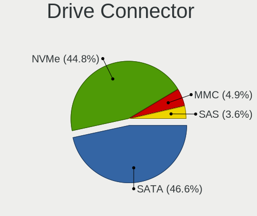
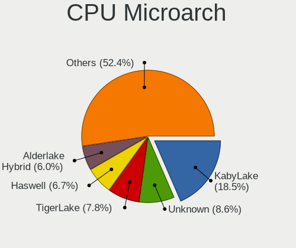
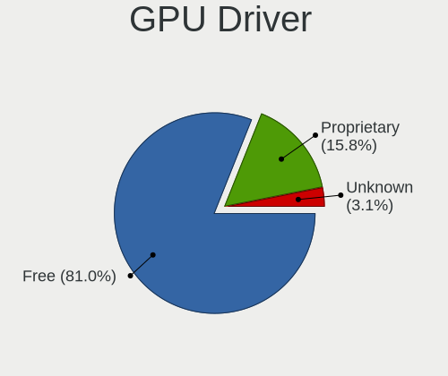
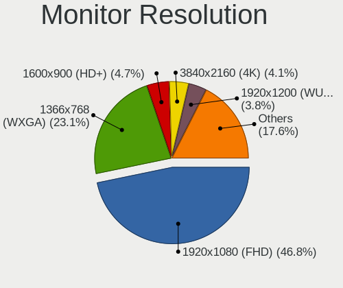

Ubuntu 22.04 - Tested Hardware & Statistics (Notebooks)
-------------------------------------------------------

A project to collect tested hardware configurations for Ubuntu 22.04.

Anyone can contribute to this report by the [hw-probe](https://github.com/linuxhw/hw-probe) tool:

    sudo -E hw-probe -all -upload

Please contribute! Especially if your hardware is rare.

Contents
--------

* [ Test Cases ](#test-cases)

* [ System ](#system)
  - [ Kernel                   ](#kernel)
  - [ Kernel Family            ](#kernel-family)
  - [ Kernel Major Ver.        ](#kernel-major-ver)
  - [ Arch                     ](#arch)
  - [ DE                       ](#de)
  - [ Display Server           ](#display-server)
  - [ Display Manager          ](#display-manager)
  - [ OS Lang                  ](#os-lang)
  - [ Boot Mode                ](#boot-mode)
  - [ Filesystem               ](#filesystem)
  - [ Part. scheme             ](#part-scheme)
  - [ Dual Boot with Linux/BSD ](#dual-boot-with-linuxbsd)
  - [ Dual Boot (Win)          ](#dual-boot-win)

* [ Board ](#board)
  - [ Vendor                   ](#vendor)
  - [ Model                    ](#model)
  - [ Model Family             ](#model-family)
  - [ MFG Year                 ](#mfg-year)
  - [ Form Factor              ](#form-factor)
  - [ Secure Boot              ](#secure-boot)
  - [ Coreboot                 ](#coreboot)
  - [ RAM Size                 ](#ram-size)
  - [ RAM Used                 ](#ram-used)
  - [ Total Drives             ](#total-drives)
  - [ Has CD-ROM               ](#has-cd-rom)
  - [ Has Ethernet             ](#has-ethernet)
  - [ Has WiFi                 ](#has-wifi)
  - [ Has Bluetooth            ](#has-bluetooth)

* [ Location ](#location)
  - [ Country                  ](#country)
  - [ City                     ](#city)

* [ Drives ](#drives)
  - [ Drive Vendor             ](#drive-vendor)
  - [ Drive Model              ](#drive-model)
  - [ HDD Vendor               ](#hdd-vendor)
  - [ SSD Vendor               ](#ssd-vendor)
  - [ Drive Kind               ](#drive-kind)
  - [ Drive Connector          ](#drive-connector)
  - [ Drive Size               ](#drive-size)
  - [ Space Total              ](#space-total)
  - [ Space Used               ](#space-used)
  - [ Malfunc. Drives          ](#malfunc-drives)
  - [ Malfunc. Drive Vendor    ](#malfunc-drive-vendor)
  - [ Malfunc. HDD Vendor      ](#malfunc-hdd-vendor)
  - [ Malfunc. Drive Kind      ](#malfunc-drive-kind)
  - [ Failed Drives            ](#failed-drives)
  - [ Failed Drive Vendor      ](#failed-drive-vendor)
  - [ Drive Status             ](#drive-status)

* [ Storage controller ](#storage-controller)
  - [ Storage Vendor           ](#storage-vendor)
  - [ Storage Model            ](#storage-model)
  - [ Storage Kind             ](#storage-kind)

* [ Processor ](#processor)
  - [ CPU Vendor               ](#cpu-vendor)
  - [ CPU Model                ](#cpu-model)
  - [ CPU Model Family         ](#cpu-model-family)
  - [ CPU Cores                ](#cpu-cores)
  - [ CPU Sockets              ](#cpu-sockets)
  - [ CPU Threads              ](#cpu-threads)
  - [ CPU Op-Modes             ](#cpu-op-modes)
  - [ CPU Microcode            ](#cpu-microcode)
  - [ CPU Microarch            ](#cpu-microarch)

* [ Graphics ](#graphics)
  - [ GPU Vendor               ](#gpu-vendor)
  - [ GPU Model                ](#gpu-model)
  - [ GPU Combo                ](#gpu-combo)
  - [ GPU Driver               ](#gpu-driver)
  - [ GPU Memory               ](#gpu-memory)

* [ Monitor ](#monitor)
  - [ Monitor Vendor           ](#monitor-vendor)
  - [ Monitor Model            ](#monitor-model)
  - [ Monitor Resolution       ](#monitor-resolution)
  - [ Monitor Diagonal         ](#monitor-diagonal)
  - [ Monitor Width            ](#monitor-width)
  - [ Aspect Ratio             ](#aspect-ratio)
  - [ Monitor Area             ](#monitor-area)
  - [ Pixel Density            ](#pixel-density)
  - [ Multiple Monitors        ](#multiple-monitors)

* [ Network ](#network)
  - [ Net Controller Vendor    ](#net-controller-vendor)
  - [ Net Controller Model     ](#net-controller-model)
  - [ Wireless Vendor          ](#wireless-vendor)
  - [ Wireless Model           ](#wireless-model)
  - [ Ethernet Vendor          ](#ethernet-vendor)
  - [ Ethernet Model           ](#ethernet-model)
  - [ Net Controller Kind      ](#net-controller-kind)
  - [ Used Controller          ](#used-controller)
  - [ NICs                     ](#nics)
  - [ IPv6                     ](#ipv6)

* [ Bluetooth ](#bluetooth)
  - [ Bluetooth Vendor         ](#bluetooth-vendor)
  - [ Bluetooth Model          ](#bluetooth-model)

* [ Sound ](#sound)
  - [ Sound Vendor             ](#sound-vendor)
  - [ Sound Model              ](#sound-model)

* [ Memory ](#memory)
  - [ Memory Vendor            ](#memory-vendor)
  - [ Memory Model             ](#memory-model)
  - [ Memory Kind              ](#memory-kind)
  - [ Memory Form Factor       ](#memory-form-factor)
  - [ Memory Size              ](#memory-size)
  - [ Memory Speed             ](#memory-speed)

* [ Printers & scanners ](#printers--scanners)
  - [ Printer Vendor           ](#printer-vendor)
  - [ Printer Model            ](#printer-model)
  - [ Scanner Vendor           ](#scanner-vendor)
  - [ Scanner Model            ](#scanner-model)

* [ Camera ](#camera)
  - [ Camera Vendor            ](#camera-vendor)
  - [ Camera Model             ](#camera-model)

* [ Security ](#security)
  - [ Fingerprint Vendor       ](#fingerprint-vendor)
  - [ Fingerprint Model        ](#fingerprint-model)
  - [ Chipcard Vendor          ](#chipcard-vendor)
  - [ Chipcard Model           ](#chipcard-model)

* [ Unsupported ](#unsupported)
  - [ Unsupported Devices      ](#unsupported-devices)
  - [ Unsupported Device Types ](#unsupported-device-types)

Test Cases
----------

Total: 10421

| Vendor        | Model                       | Probe                                                      | Date         |
|---------------|-----------------------------|------------------------------------------------------------|--------------|
| Apple         | MacBookAir7,1               | [f666ec3927](https://linux-hardware.org/?probe=f666ec3927) | Dec 24, 2023 |
| Dell          | Latitude 7490               | [69205c648f](https://linux-hardware.org/?probe=69205c648f) | Dec 24, 2023 |
| Acer          | Nitro AN515-44              | [cc87c11e7b](https://linux-hardware.org/?probe=cc87c11e7b) | Dec 24, 2023 |
| Notebook      | NL5xNU                      | [1cb09f63f9](https://linux-hardware.org/?probe=1cb09f63f9) | Dec 24, 2023 |
| Lenovo        | IdeaPad 100-15IBD 80QQ      | [f8abeb2607](https://linux-hardware.org/?probe=f8abeb2607) | Dec 24, 2023 |
| Google        | Magolor                     | [f5d079bc79](https://linux-hardware.org/?probe=f5d079bc79) | Dec 24, 2023 |
| Dell          | Latitude 12 Rugged Table... | [7690d56522](https://linux-hardware.org/?probe=7690d56522) | Dec 24, 2023 |
| Unknown       | Unknown                     | [ef80f96d40](https://linux-hardware.org/?probe=ef80f96d40) | Dec 23, 2023 |
| Sony          | VPCEA1S1E                   | [af850dd5f3](https://linux-hardware.org/?probe=af850dd5f3) | Dec 23, 2023 |
| TUXEDO        | N24_25JU                    | [8a1a153723](https://linux-hardware.org/?probe=8a1a153723) | Dec 23, 2023 |
| Lenovo        | ThinkPad T410 2537E82       | [d153c701cc](https://linux-hardware.org/?probe=d153c701cc) | Dec 23, 2023 |
| Lenovo        | ThinkPad T410 2537E82       | [398233e395](https://linux-hardware.org/?probe=398233e395) | Dec 23, 2023 |
| Acer          | TravelMate 5730             | [69571c0b91](https://linux-hardware.org/?probe=69571c0b91) | Dec 23, 2023 |
| HP            | EliteBook 845 G8 Noteboo... | [d3dabca767](https://linux-hardware.org/?probe=d3dabca767) | Dec 23, 2023 |
| Dell          | Latitude E6330              | [afca8c73b2](https://linux-hardware.org/?probe=afca8c73b2) | Dec 23, 2023 |
| HP            | EliteBook 845 G8 Noteboo... | [26673c372e](https://linux-hardware.org/?probe=26673c372e) | Dec 23, 2023 |
| Dell          | Inspiron 3501               | [2fcf77279a](https://linux-hardware.org/?probe=2fcf77279a) | Dec 23, 2023 |
| Toshiba       | Satellite L750              | [8f2f7cd8c9](https://linux-hardware.org/?probe=8f2f7cd8c9) | Dec 23, 2023 |
| HP            | Laptop 17-bs1xx             | [984a979a7b](https://linux-hardware.org/?probe=984a979a7b) | Dec 23, 2023 |
| Lenovo        | ThinkPad T14 Gen 2a 20XL... | [19e33f2ead](https://linux-hardware.org/?probe=19e33f2ead) | Dec 23, 2023 |
| Dell          | Latitude E6400              | [1a10fd9a2e](https://linux-hardware.org/?probe=1a10fd9a2e) | Dec 23, 2023 |
| Lenovo        | ThinkPad E15 20RD002RUS     | [6ba8bb7550](https://linux-hardware.org/?probe=6ba8bb7550) | Dec 23, 2023 |
| Lenovo        | ThinkPad T14 Gen 2i 20W1... | [0f2cad4391](https://linux-hardware.org/?probe=0f2cad4391) | Dec 22, 2023 |
| Acer          | Aspire VX5-591G             | [2268342e9f](https://linux-hardware.org/?probe=2268342e9f) | Dec 22, 2023 |
| Apple         | MacBookPro13,1              | [89ef1fa23c](https://linux-hardware.org/?probe=89ef1fa23c) | Dec 22, 2023 |
| ASUSTek       | X555LD                      | [c81a75e686](https://linux-hardware.org/?probe=c81a75e686) | Dec 22, 2023 |
| ASUSTek       | ASUSLaptop_Q540VJ           | [937842fe5d](https://linux-hardware.org/?probe=937842fe5d) | Dec 22, 2023 |
| HP            | EliteBook 8460p             | [6ff6445717](https://linux-hardware.org/?probe=6ff6445717) | Dec 22, 2023 |
| ASUSTek       | X555LD                      | [30e988edc9](https://linux-hardware.org/?probe=30e988edc9) | Dec 22, 2023 |
| Allview       | Allbook I/1                 | [960dfde4cd](https://linux-hardware.org/?probe=960dfde4cd) | Dec 22, 2023 |
| Dell          | Latitude 5414               | [9b02eedb05](https://linux-hardware.org/?probe=9b02eedb05) | Dec 22, 2023 |
| Dell          | Vostro 15 3510              | [d2c7d30632](https://linux-hardware.org/?probe=d2c7d30632) | Dec 22, 2023 |
| Lenovo        | IdeaPad 310-15ABR 80ST      | [60690b9d12](https://linux-hardware.org/?probe=60690b9d12) | Dec 22, 2023 |
| Toshiba       | Satellite C55D-B            | [d705d8ee57](https://linux-hardware.org/?probe=d705d8ee57) | Dec 22, 2023 |
| Acer          | Nitro AN515-44              | [5f1c04a086](https://linux-hardware.org/?probe=5f1c04a086) | Dec 22, 2023 |
| Entroware     | Hybris                      | [870d0c5323](https://linux-hardware.org/?probe=870d0c5323) | Dec 22, 2023 |
| Dell          | Latitude 5501               | [0b6206153c](https://linux-hardware.org/?probe=0b6206153c) | Dec 22, 2023 |
| Acer          | Aspire 5742G                | [1f9d486306](https://linux-hardware.org/?probe=1f9d486306) | Dec 22, 2023 |
| Dell          | Latitude E6440              | [904540fc01](https://linux-hardware.org/?probe=904540fc01) | Dec 21, 2023 |
| Dell          | Inspiron 3541               | [67f350fefc](https://linux-hardware.org/?probe=67f350fefc) | Dec 21, 2023 |
| ASUSTek       | Zenbook 15 UM3504DA_UM35... | [907851c66b](https://linux-hardware.org/?probe=907851c66b) | Dec 21, 2023 |
| Lenovo        | ThinkPad T470 W10DG 20JM... | [c5c9d669ae](https://linux-hardware.org/?probe=c5c9d669ae) | Dec 21, 2023 |
| Dell          | Precision 3581              | [aa0186ade6](https://linux-hardware.org/?probe=aa0186ade6) | Dec 21, 2023 |
| HP            | ProBook 445 14 inch G10 ... | [0e95b32d0b](https://linux-hardware.org/?probe=0e95b32d0b) | Dec 21, 2023 |
| Dell          | Inspiron 15 3535            | [466204d787](https://linux-hardware.org/?probe=466204d787) | Dec 21, 2023 |
| Fujitsu       | LIFEBOOK U749               | [75a3ef28b0](https://linux-hardware.org/?probe=75a3ef28b0) | Dec 21, 2023 |
| HUAWEI        | BOD-WXX9                    | [f95bb7d27c](https://linux-hardware.org/?probe=f95bb7d27c) | Dec 21, 2023 |
| Fujitsu       | LIFEBOOK T5010              | [27e7d6f705](https://linux-hardware.org/?probe=27e7d6f705) | Dec 21, 2023 |
| Dell          | Latitude 7490               | [d0ea360540](https://linux-hardware.org/?probe=d0ea360540) | Dec 21, 2023 |
| realme        | RMNBXXXX                    | [d8e473e1e4](https://linux-hardware.org/?probe=d8e473e1e4) | Dec 21, 2023 |
| HP            | Pavilion dv7                | [ef719917ef](https://linux-hardware.org/?probe=ef719917ef) | Dec 21, 2023 |
| ASUSTek       | X550LD                      | [ebaf3f3e71](https://linux-hardware.org/?probe=ebaf3f3e71) | Dec 21, 2023 |
| HP            | Notebook                    | [9010ced489](https://linux-hardware.org/?probe=9010ced489) | Dec 21, 2023 |
| Dell          | Inspiron 5448               | [edf818740d](https://linux-hardware.org/?probe=edf818740d) | Dec 21, 2023 |
| HP            | Pavilion dv7                | [cd7f768fe8](https://linux-hardware.org/?probe=cd7f768fe8) | Dec 21, 2023 |
| Lenovo        | ThinkPad L14 Gen 1 20U10... | [e36c36774e](https://linux-hardware.org/?probe=e36c36774e) | Dec 21, 2023 |
| Dell          | Latitude E6520              | [9e16e8b2a6](https://linux-hardware.org/?probe=9e16e8b2a6) | Dec 21, 2023 |
| Dell          | Inspiron 7572               | [cd9385a64b](https://linux-hardware.org/?probe=cd9385a64b) | Dec 21, 2023 |
| Lenovo        | ThinkPad L580 20LW0010GE    | [4bd3fc58a8](https://linux-hardware.org/?probe=4bd3fc58a8) | Dec 21, 2023 |
| Panasonic     | CF-19RDRCHH7                | [0e67081368](https://linux-hardware.org/?probe=0e67081368) | Dec 21, 2023 |
| Dell          | Latitude 5590               | [4f307c792f](https://linux-hardware.org/?probe=4f307c792f) | Dec 20, 2023 |
| Apple         | MacBookPro9,2               | [da159da872](https://linux-hardware.org/?probe=da159da872) | Dec 20, 2023 |
| Dell          | Latitude 7480               | [f080cc67aa](https://linux-hardware.org/?probe=f080cc67aa) | Dec 20, 2023 |
| Lenovo        | IdeaPad 320-17IKB 80XM      | [393c13e870](https://linux-hardware.org/?probe=393c13e870) | Dec 20, 2023 |
| Lenovo        | IdeaPad 320-17IKB 80XM      | [09af8afa56](https://linux-hardware.org/?probe=09af8afa56) | Dec 20, 2023 |
| Toshiba       | Satellite C55D-B            | [dfd0e27118](https://linux-hardware.org/?probe=dfd0e27118) | Dec 20, 2023 |
| Lenovo        | ThinkPad T410 2537HN2       | [c268085f95](https://linux-hardware.org/?probe=c268085f95) | Dec 20, 2023 |
| Lenovo        | ThinkBook 15p Gen 2 21B1    | [06984b497c](https://linux-hardware.org/?probe=06984b497c) | Dec 20, 2023 |
| Dell          | Precision 5510              | [033bf69fdf](https://linux-hardware.org/?probe=033bf69fdf) | Dec 20, 2023 |
| Dell          | Precision 5510              | [a40fa883d2](https://linux-hardware.org/?probe=a40fa883d2) | Dec 20, 2023 |
| STONE COMP... | NOTCHA-286                  | [c931f0f65a](https://linux-hardware.org/?probe=c931f0f65a) | Dec 20, 2023 |
| Lenovo        | V15 G2 ALC Ua 82KD          | [71bc732b86](https://linux-hardware.org/?probe=71bc732b86) | Dec 20, 2023 |
| Dell          | G7 7700                     | [506de63cb5](https://linux-hardware.org/?probe=506de63cb5) | Dec 20, 2023 |
| Lenovo        | V15 G2 ALC Ua 82KD          | [5d14b45611](https://linux-hardware.org/?probe=5d14b45611) | Dec 20, 2023 |
| Lenovo        | ThinkPad T520 42404AU       | [2b29070879](https://linux-hardware.org/?probe=2b29070879) | Dec 20, 2023 |
| Lenovo        | V15 G2 ALC Ua 82KD          | [71d03541a9](https://linux-hardware.org/?probe=71d03541a9) | Dec 20, 2023 |
| ASUSTek       | VivoBook_ASUS Laptop X50... | [6f7295809b](https://linux-hardware.org/?probe=6f7295809b) | Dec 20, 2023 |
| Daten Tecn... | DT02-M4                     | [8f754589f6](https://linux-hardware.org/?probe=8f754589f6) | Dec 19, 2023 |
| HP            | Pavilion Gaming Laptop 1... | [dbbab5f96b](https://linux-hardware.org/?probe=dbbab5f96b) | Dec 19, 2023 |
| Lenovo        | ThinkBook 15 G2 ITL 20VE    | [775e2dfe26](https://linux-hardware.org/?probe=775e2dfe26) | Dec 19, 2023 |
| Google        | Swanky                      | [46b7f27873](https://linux-hardware.org/?probe=46b7f27873) | Dec 19, 2023 |
| Mediacom      | GTZS                        | [f326507469](https://linux-hardware.org/?probe=f326507469) | Dec 19, 2023 |
| Lenovo        | Yoga 900-13ISK 80MK         | [3cc3621576](https://linux-hardware.org/?probe=3cc3621576) | Dec 19, 2023 |
| HUAWEI        | CREFG-XX                    | [b97589a2bc](https://linux-hardware.org/?probe=b97589a2bc) | Dec 19, 2023 |
| HUAWEI        | CREFG-XX                    | [5dd323e917](https://linux-hardware.org/?probe=5dd323e917) | Dec 19, 2023 |
| HP            | EliteBook 840 14 inch G1... | [2222f1a1fb](https://linux-hardware.org/?probe=2222f1a1fb) | Dec 19, 2023 |
| ASUSTek       | VivoBook_ASUSLaptop K340... | [1b5268d64f](https://linux-hardware.org/?probe=1b5268d64f) | Dec 19, 2023 |
| ASUSTek       | VivoBook_ASUSLaptop K340... | [1290fe8e5a](https://linux-hardware.org/?probe=1290fe8e5a) | Dec 19, 2023 |
| Dell          | Latitude E6510              | [e9aceddae8](https://linux-hardware.org/?probe=e9aceddae8) | Dec 19, 2023 |
| ASUSTek       | ASUS TUF Gaming F15 FX50... | [a4efec2a2c](https://linux-hardware.org/?probe=a4efec2a2c) | Dec 19, 2023 |
| Wortmann      | TERRA_MOBILE_1542           | [f09218ee8f](https://linux-hardware.org/?probe=f09218ee8f) | Dec 19, 2023 |
| Unknown       | Unknown                     | [6f1ca9e563](https://linux-hardware.org/?probe=6f1ca9e563) | Dec 19, 2023 |
| Dell          | Precision M2800             | [8800042fb5](https://linux-hardware.org/?probe=8800042fb5) | Dec 19, 2023 |
| Unknown       | Unknown                     | [13072c9ecc](https://linux-hardware.org/?probe=13072c9ecc) | Dec 19, 2023 |
| Acer          | Aspire E5-573               | [91c6527140](https://linux-hardware.org/?probe=91c6527140) | Dec 19, 2023 |
| Dell          | XPS 13 9380                 | [1038e25caf](https://linux-hardware.org/?probe=1038e25caf) | Dec 19, 2023 |
| Dell          | XPS 13 9310                 | [3a4a73b5f1](https://linux-hardware.org/?probe=3a4a73b5f1) | Dec 19, 2023 |
| Acer          | Aspire E5-571               | [55a802f43c](https://linux-hardware.org/?probe=55a802f43c) | Dec 18, 2023 |
| Dell          | Latitude 3420               | [5fdda723cd](https://linux-hardware.org/?probe=5fdda723cd) | Dec 18, 2023 |
| Framework     | Laptop 13 (AMD Ryzen 704... | [923f390d62](https://linux-hardware.org/?probe=923f390d62) | Dec 18, 2023 |
| Acer          | Aspire A715-51G             | [1232ff1050](https://linux-hardware.org/?probe=1232ff1050) | Dec 18, 2023 |
| Framework     | Laptop 13 (AMD Ryzen 704... | [8a224cfad3](https://linux-hardware.org/?probe=8a224cfad3) | Dec 18, 2023 |
| HP            | Pavilion Notebook           | [0376612ef7](https://linux-hardware.org/?probe=0376612ef7) | Dec 18, 2023 |
| Lenovo        | ThinkPad T14s Gen 3 21BR... | [45a0b94112](https://linux-hardware.org/?probe=45a0b94112) | Dec 18, 2023 |
| Dell          | Latitude 7440               | [644c46aba6](https://linux-hardware.org/?probe=644c46aba6) | Dec 18, 2023 |
| realme        | RMNBXXXX                    | [100bef421f](https://linux-hardware.org/?probe=100bef421f) | Dec 18, 2023 |
| Dell          | XPS 15 9500                 | [941f6d849a](https://linux-hardware.org/?probe=941f6d849a) | Dec 18, 2023 |
| Lenovo        | ThinkPad T14 Gen 3 21AH0... | [fcc1139818](https://linux-hardware.org/?probe=fcc1139818) | Dec 18, 2023 |
| Acer          | Aspire 5349                 | [f81cd33147](https://linux-hardware.org/?probe=f81cd33147) | Dec 18, 2023 |
| Wortmann      | TERRA_MOBILE_1542           | [054ed4fad9](https://linux-hardware.org/?probe=054ed4fad9) | Dec 18, 2023 |
| Fujitsu       | LIFEBOOK A512               | [0c3974dad9](https://linux-hardware.org/?probe=0c3974dad9) | Dec 18, 2023 |
| HP            | 255 G6 Notebook PC          | [f4412027d4](https://linux-hardware.org/?probe=f4412027d4) | Dec 18, 2023 |
| ASUSTek       | X550LD                      | [d1dcdfda30](https://linux-hardware.org/?probe=d1dcdfda30) | Dec 17, 2023 |
| Lenovo        | Yoga 2 Pro 20266            | [4802066fc1](https://linux-hardware.org/?probe=4802066fc1) | Dec 17, 2023 |
| Acer          | Aspire S7-391               | [ab734913e8](https://linux-hardware.org/?probe=ab734913e8) | Dec 17, 2023 |
| Acer          | Aspire S7-391               | [1d66b3f887](https://linux-hardware.org/?probe=1d66b3f887) | Dec 17, 2023 |
| Acer          | Swift SF315-41              | [300b426183](https://linux-hardware.org/?probe=300b426183) | Dec 17, 2023 |
| Lenovo        | ThinkPad W550s 20E2CTO1W... | [17b157ef44](https://linux-hardware.org/?probe=17b157ef44) | Dec 17, 2023 |
| Sony          | SVD1321L2EW                 | [b753425d70](https://linux-hardware.org/?probe=b753425d70) | Dec 17, 2023 |
| ASUSTek       | VivoBook_ASUSLaptop K660... | [78a88bfe8c](https://linux-hardware.org/?probe=78a88bfe8c) | Dec 17, 2023 |
| ASUSTek       | VivoBook_ASUSLaptop K660... | [8833b0a058](https://linux-hardware.org/?probe=8833b0a058) | Dec 17, 2023 |
| HP            | Laptop 17-cp0xxx            | [341ecee745](https://linux-hardware.org/?probe=341ecee745) | Dec 17, 2023 |
| Lenovo        | ThinkPad T440 20B7A0B7MN    | [987ab63f96](https://linux-hardware.org/?probe=987ab63f96) | Dec 17, 2023 |
| Acer          | Aspire V3-772               | [d3e1291358](https://linux-hardware.org/?probe=d3e1291358) | Dec 17, 2023 |
| Lenovo        | ThinkPad A475 20KMS08300    | [b652245cca](https://linux-hardware.org/?probe=b652245cca) | Dec 17, 2023 |
| HP            | Laptop 15-bw0xx             | [91a9e2e8c4](https://linux-hardware.org/?probe=91a9e2e8c4) | Dec 17, 2023 |
| MSI           | PE70 6QE                    | [efc671c7c2](https://linux-hardware.org/?probe=efc671c7c2) | Dec 17, 2023 |
| MSI           | PE70 6QE                    | [c99e0d38ea](https://linux-hardware.org/?probe=c99e0d38ea) | Dec 17, 2023 |
| HP            | 2000                        | [3570eb7cd0](https://linux-hardware.org/?probe=3570eb7cd0) | Dec 17, 2023 |
| HP            | EliteBook 8460p             | [e85c54f3fd](https://linux-hardware.org/?probe=e85c54f3fd) | Dec 17, 2023 |
| Dell          | Inspiron N4030              | [a77869199a](https://linux-hardware.org/?probe=a77869199a) | Dec 17, 2023 |
| Lenovo        | ThinkPad W530 24491D1       | [bab70d44b1](https://linux-hardware.org/?probe=bab70d44b1) | Dec 17, 2023 |
| ASUSTek       | K53SD                       | [1c0bbe412c](https://linux-hardware.org/?probe=1c0bbe412c) | Dec 17, 2023 |
| ASUSTek       | X550LD                      | [492e654dfb](https://linux-hardware.org/?probe=492e654dfb) | Dec 17, 2023 |
| LG Electro... | 16Z90R-A.ADC8U1             | [5ae89dd818](https://linux-hardware.org/?probe=5ae89dd818) | Dec 16, 2023 |
| ASUSTek       | Zenbook UM3402YAR_UM3402... | [646c403e2f](https://linux-hardware.org/?probe=646c403e2f) | Dec 16, 2023 |
| ASUSTek       | Zenbook UM3402YAR_UM3402... | [7fc71d8954](https://linux-hardware.org/?probe=7fc71d8954) | Dec 16, 2023 |
| HP            | 250 G8 Notebook PC          | [6e6dfdc457](https://linux-hardware.org/?probe=6e6dfdc457) | Dec 16, 2023 |
| Lenovo        | ThinkPad T440 20B7A0B7MN    | [2167a2f148](https://linux-hardware.org/?probe=2167a2f148) | Dec 16, 2023 |
| Acer          | Aspire 6930G                | [3e93a62792](https://linux-hardware.org/?probe=3e93a62792) | Dec 16, 2023 |
| Lenovo        | ThinkPad T420 4238AW2       | [01fae631cf](https://linux-hardware.org/?probe=01fae631cf) | Dec 16, 2023 |
| Allview       | Allbook H                   | [2da4fcb35c](https://linux-hardware.org/?probe=2da4fcb35c) | Dec 16, 2023 |
| HUAWEI        | BoDE-WXX9                   | [e9f2e211bd](https://linux-hardware.org/?probe=e9f2e211bd) | Dec 16, 2023 |
| ASUSTek       | X555LD                      | [109311067f](https://linux-hardware.org/?probe=109311067f) | Dec 16, 2023 |
| Lenovo        | V17 G3 IAP 82U1             | [2598a81fd9](https://linux-hardware.org/?probe=2598a81fd9) | Dec 16, 2023 |
| Lenovo        | IdeaPad S400 20195          | [f4c6ceeca3](https://linux-hardware.org/?probe=f4c6ceeca3) | Dec 16, 2023 |
| Framework     | Laptop 13 (AMD Ryzen 704... | [7b3d7fcb72](https://linux-hardware.org/?probe=7b3d7fcb72) | Dec 16, 2023 |
| Framework     | Laptop 13 (AMD Ryzen 704... | [251ac554a9](https://linux-hardware.org/?probe=251ac554a9) | Dec 16, 2023 |
| Dell          | Precision 5540              | [ff22e47089](https://linux-hardware.org/?probe=ff22e47089) | Dec 16, 2023 |
| HP            | Notebook                    | [5bbbe8e356](https://linux-hardware.org/?probe=5bbbe8e356) | Dec 16, 2023 |
| ROMBICA       | myBook Discovery            | [c7b69fb478](https://linux-hardware.org/?probe=c7b69fb478) | Dec 16, 2023 |
| Dell          | Inspiron 1545               | [3f47a63c82](https://linux-hardware.org/?probe=3f47a63c82) | Dec 16, 2023 |
| ASUSTek       | ROG Strix G814JI_G814JI     | [933e5b48f2](https://linux-hardware.org/?probe=933e5b48f2) | Dec 16, 2023 |
| ASUSTek       | ROG Strix G814JI_G814JI     | [9df7fd000e](https://linux-hardware.org/?probe=9df7fd000e) | Dec 16, 2023 |
| ASUSTek       | Zenbook 15 UM3504DA_UM35... | [12c5d1d331](https://linux-hardware.org/?probe=12c5d1d331) | Dec 16, 2023 |
| Medion        | E6417 MD99252               | [26e9c2ba0c](https://linux-hardware.org/?probe=26e9c2ba0c) | Dec 15, 2023 |
| MSI           | Katana GF66 11SC            | [1eb5b02078](https://linux-hardware.org/?probe=1eb5b02078) | Dec 15, 2023 |
| Lenovo        | IdeaPad 320-17IKB 81BJ      | [2d3b97c04a](https://linux-hardware.org/?probe=2d3b97c04a) | Dec 15, 2023 |
| ASUSTek       | X555LAB                     | [199ffa8815](https://linux-hardware.org/?probe=199ffa8815) | Dec 15, 2023 |
| Dell          | Latitude 7490               | [a5431ec5e0](https://linux-hardware.org/?probe=a5431ec5e0) | Dec 15, 2023 |
| HP            | Pavilion Gaming Laptop 1... | [5223e586fd](https://linux-hardware.org/?probe=5223e586fd) | Dec 15, 2023 |
| Lenovo        | B590 62742QG                | [edb1cd89f6](https://linux-hardware.org/?probe=edb1cd89f6) | Dec 15, 2023 |
| Lenovo        | IdeaPad Gaming 3 15IAH7 ... | [9e63ff66cb](https://linux-hardware.org/?probe=9e63ff66cb) | Dec 15, 2023 |
| HP            | Pavilion g6                 | [7863fae702](https://linux-hardware.org/?probe=7863fae702) | Dec 15, 2023 |
| Acer          | Aspire A515-57G             | [638a0b8c0c](https://linux-hardware.org/?probe=638a0b8c0c) | Dec 15, 2023 |
| Lenovo        | Legion Y530-15ICH 81FV      | [618978da16](https://linux-hardware.org/?probe=618978da16) | Dec 15, 2023 |
| ASUSTek       | VivoBook 15_ASUS Laptop ... | [b7194dbbb8](https://linux-hardware.org/?probe=b7194dbbb8) | Dec 15, 2023 |
| HP            | Laptop 17-bs1xx             | [ef29718fd5](https://linux-hardware.org/?probe=ef29718fd5) | Dec 15, 2023 |
| Dell          | Vostro 15 3510              | [051090b9e0](https://linux-hardware.org/?probe=051090b9e0) | Dec 15, 2023 |
| ASUSTek       | VivoBook_ASUSLaptop X150... | [d8db62d461](https://linux-hardware.org/?probe=d8db62d461) | Dec 15, 2023 |
| Lenovo        | IdeaPad 1 15IJL7 82LX       | [a0eaa74105](https://linux-hardware.org/?probe=a0eaa74105) | Dec 15, 2023 |
| Lenovo        | IdeaPad 1 15IJL7 82LX       | [db4a7dea97](https://linux-hardware.org/?probe=db4a7dea97) | Dec 15, 2023 |
| HP            | Pavilion 15                 | [166f55ae0b](https://linux-hardware.org/?probe=166f55ae0b) | Dec 15, 2023 |
| Acer          | Nitro AN515-57              | [7e43febcae](https://linux-hardware.org/?probe=7e43febcae) | Dec 15, 2023 |
| Lenovo        | IdeaPad Slim 3 14AMN8 82... | [e4542af709](https://linux-hardware.org/?probe=e4542af709) | Dec 15, 2023 |
| Lenovo        | ThinkPad E16 Gen 1 21JNC... | [46fbc450b5](https://linux-hardware.org/?probe=46fbc450b5) | Dec 14, 2023 |
| Dell          | Latitude E5450              | [b616faa68f](https://linux-hardware.org/?probe=b616faa68f) | Dec 14, 2023 |
| ASUSTek       | X555LD                      | [9609ed5138](https://linux-hardware.org/?probe=9609ed5138) | Dec 14, 2023 |
| Fujitsu       | LIFEBOOK A357               | [b537ee14db](https://linux-hardware.org/?probe=b537ee14db) | Dec 14, 2023 |
| Fujitsu       | LIFEBOOK E736               | [7f788f5265](https://linux-hardware.org/?probe=7f788f5265) | Dec 14, 2023 |
| Dell          | XPS 15 9520                 | [ac8fb0b18d](https://linux-hardware.org/?probe=ac8fb0b18d) | Dec 14, 2023 |
| Lenovo        | ThinkPad L15 Gen 2a 20X7... | [adbfbb8174](https://linux-hardware.org/?probe=adbfbb8174) | Dec 13, 2023 |
| Acer          | Nitro AN515-51              | [1522c84fb7](https://linux-hardware.org/?probe=1522c84fb7) | Dec 13, 2023 |
| Apple         | MacBookAir6,2               | [9c3e8b880d](https://linux-hardware.org/?probe=9c3e8b880d) | Dec 13, 2023 |
| Lenovo        | ThinkBook 16p Gen 2 20YM    | [e70de29c90](https://linux-hardware.org/?probe=e70de29c90) | Dec 13, 2023 |
| Lenovo        | V110-15IAP 80TG             | [de6e3bf0eb](https://linux-hardware.org/?probe=de6e3bf0eb) | Dec 13, 2023 |
| Lenovo        | ThinkPad X201 3626W1P       | [bf54dfd215](https://linux-hardware.org/?probe=bf54dfd215) | Dec 13, 2023 |
| Fujitsu       | LIFEBOOK S762               | [9d192a95d8](https://linux-hardware.org/?probe=9d192a95d8) | Dec 13, 2023 |
| Fujitsu       | LIFEBOOK S762               | [19e6b5a871](https://linux-hardware.org/?probe=19e6b5a871) | Dec 13, 2023 |
| Lenovo        | ThinkPad X1 Carbon Gen 8... | [4a5e5bbe29](https://linux-hardware.org/?probe=4a5e5bbe29) | Dec 13, 2023 |
| Acer          | Swift SF314-43              | [6e8b956266](https://linux-hardware.org/?probe=6e8b956266) | Dec 13, 2023 |
| ASUSTek       | VivoBook_ASUSLaptop M160... | [f18bd26311](https://linux-hardware.org/?probe=f18bd26311) | Dec 13, 2023 |
| HP            | Laptop 15-fd0xxx            | [cdcd6ddfc6](https://linux-hardware.org/?probe=cdcd6ddfc6) | Dec 13, 2023 |
| Apple         | MacBookAir6,2               | [963ff854d9](https://linux-hardware.org/?probe=963ff854d9) | Dec 13, 2023 |
| Dell          | Vostro 3400                 | [01915c7894](https://linux-hardware.org/?probe=01915c7894) | Dec 13, 2023 |
| Dell          | Vostro 3400                 | [a8d24008e2](https://linux-hardware.org/?probe=a8d24008e2) | Dec 13, 2023 |
| Lenovo        | ThinkPad T14 Gen 3 21AH0... | [05ff735f51](https://linux-hardware.org/?probe=05ff735f51) | Dec 13, 2023 |
| Unknown       | Unknown                     | [4517e8a60b](https://linux-hardware.org/?probe=4517e8a60b) | Dec 13, 2023 |
| HP            | Pavilion Laptop 15-eg2xx... | [9c38707d13](https://linux-hardware.org/?probe=9c38707d13) | Dec 13, 2023 |
| HP            | Pavilion Laptop 15-eg2xx... | [f837c928be](https://linux-hardware.org/?probe=f837c928be) | Dec 13, 2023 |
| Dell          | G3 3590                     | [e764bfc760](https://linux-hardware.org/?probe=e764bfc760) | Dec 13, 2023 |
| HP            | Laptop 15-fd0xxx            | [e6f39159ad](https://linux-hardware.org/?probe=e6f39159ad) | Dec 13, 2023 |
| Lenovo        | IdeaPad Slim 3 14AMN8 82... | [2b589c71b3](https://linux-hardware.org/?probe=2b589c71b3) | Dec 12, 2023 |
| Fujitsu       | LIFEBOOK T902               | [da78a4dd31](https://linux-hardware.org/?probe=da78a4dd31) | Dec 12, 2023 |
| HP            | Pavilion Gaming Laptop 1... | [af7be431fb](https://linux-hardware.org/?probe=af7be431fb) | Dec 12, 2023 |
| HUAWEI        | NBLK-WAX9X                  | [a128efcd01](https://linux-hardware.org/?probe=a128efcd01) | Dec 12, 2023 |
| ASUSTek       | ASUS TUF Gaming A17 FA70... | [4293932b86](https://linux-hardware.org/?probe=4293932b86) | Dec 12, 2023 |
| Lenovo        | ThinkPad X201 3626W1P       | [695a85cd79](https://linux-hardware.org/?probe=695a85cd79) | Dec 12, 2023 |
| Fujitsu       | LIFEBOOK T902               | [dff662b36c](https://linux-hardware.org/?probe=dff662b36c) | Dec 12, 2023 |
| Lenovo        | ThinkPad E490 20N9S13000    | [d93593921b](https://linux-hardware.org/?probe=d93593921b) | Dec 12, 2023 |
| HP            | Laptop 15-fc0xxx            | [0ad101e0f2](https://linux-hardware.org/?probe=0ad101e0f2) | Dec 12, 2023 |
| Acer          | Aspire E1-522               | [e438bd7bc2](https://linux-hardware.org/?probe=e438bd7bc2) | Dec 12, 2023 |
| Acer          | Aspire E1-571               | [4576cb723a](https://linux-hardware.org/?probe=4576cb723a) | Dec 12, 2023 |
| Acer          | Aspire E1-522               | [0ba0422412](https://linux-hardware.org/?probe=0ba0422412) | Dec 12, 2023 |
| Lenovo        | Legion Pro 7 16IRX8H 82W... | [41ff1cd0ca](https://linux-hardware.org/?probe=41ff1cd0ca) | Dec 12, 2023 |
| ASUSTek       | X550LD                      | [1e1b5e9985](https://linux-hardware.org/?probe=1e1b5e9985) | Dec 12, 2023 |
| Sony          | VPCEH25EN                   | [284401858f](https://linux-hardware.org/?probe=284401858f) | Dec 12, 2023 |
| Lenovo        | IdeaPad 3 17IIL05 81WF      | [84fd94c616](https://linux-hardware.org/?probe=84fd94c616) | Dec 12, 2023 |
| Sony          | VPCCW1S1E                   | [361d9573dd](https://linux-hardware.org/?probe=361d9573dd) | Dec 12, 2023 |
| HP            | Pavilion 15                 | [235d10da72](https://linux-hardware.org/?probe=235d10da72) | Dec 12, 2023 |
| HP            | Pavilion 15                 | [fd466b16c8](https://linux-hardware.org/?probe=fd466b16c8) | Dec 12, 2023 |
| HP            | Pavilion Gaming Laptop 1... | [d27df22c9a](https://linux-hardware.org/?probe=d27df22c9a) | Dec 11, 2023 |
| MSI           | GX60 1AC/GX60 3AE/GX60 3... | [262637b1e2](https://linux-hardware.org/?probe=262637b1e2) | Dec 11, 2023 |
| ASUSTek       | Zenbook UX3402ZA_UX3402Z... | [ccd16e5c8d](https://linux-hardware.org/?probe=ccd16e5c8d) | Dec 11, 2023 |
| Lenovo        | ThinkPad L470 20J5S1FW00    | [9ea0dccce0](https://linux-hardware.org/?probe=9ea0dccce0) | Dec 11, 2023 |
| Dell          | Inspiron 3442               | [deced1a058](https://linux-hardware.org/?probe=deced1a058) | Dec 11, 2023 |
| Dell          | Inspiron 3521               | [e96af5da4d](https://linux-hardware.org/?probe=e96af5da4d) | Dec 11, 2023 |
| ASUSTek       | X202E                       | [3d45a17e7f](https://linux-hardware.org/?probe=3d45a17e7f) | Dec 11, 2023 |
| Lenovo        | IdeaPad 320-15IKB 80XL      | [f8b53d98cc](https://linux-hardware.org/?probe=f8b53d98cc) | Dec 10, 2023 |
| Framework     | Laptop 13 (AMD Ryzen 704... | [c2dd869dcf](https://linux-hardware.org/?probe=c2dd869dcf) | Dec 10, 2023 |
| Acer          | Aspire 7520                 | [70405c9fa1](https://linux-hardware.org/?probe=70405c9fa1) | Dec 10, 2023 |
| Unknown       | Unknown                     | [e70fd6bdb5](https://linux-hardware.org/?probe=e70fd6bdb5) | Dec 10, 2023 |
| Samsung       | RF511/RF411/RF711           | [59846b1d85](https://linux-hardware.org/?probe=59846b1d85) | Dec 10, 2023 |
| ASUSTek       | VivoBook_ASUSLaptop X160... | [96b05f5be6](https://linux-hardware.org/?probe=96b05f5be6) | Dec 10, 2023 |
| Acer          | Aspire E5-575G              | [48fffc72b6](https://linux-hardware.org/?probe=48fffc72b6) | Dec 10, 2023 |
| Sony          | VGN-AR51M                   | [d1c67ac651](https://linux-hardware.org/?probe=d1c67ac651) | Dec 10, 2023 |
| Acer          | Aspire 6930G                | [eea9d9e525](https://linux-hardware.org/?probe=eea9d9e525) | Dec 10, 2023 |
| HP            | EliteBook 8460p             | [1e96233f59](https://linux-hardware.org/?probe=1e96233f59) | Dec 10, 2023 |
| Lenovo        | IdeaPad 3 15ITL6 82H8       | [b9c86c02e7](https://linux-hardware.org/?probe=b9c86c02e7) | Dec 10, 2023 |
| Lenovo        | ThinkPad T470s W10DG 20J... | [37214745c0](https://linux-hardware.org/?probe=37214745c0) | Dec 10, 2023 |
| Valve         | Jupiter                     | [4c72e88035](https://linux-hardware.org/?probe=4c72e88035) | Dec 10, 2023 |
| Valve         | Jupiter                     | [9f822d68bb](https://linux-hardware.org/?probe=9f822d68bb) | Dec 10, 2023 |
| Lenovo        | ThinkPad E560 20EWS0M900    | [c753b49018](https://linux-hardware.org/?probe=c753b49018) | Dec 10, 2023 |
| HP            | 240 G8 Notebook PC          | [e5f4045026](https://linux-hardware.org/?probe=e5f4045026) | Dec 10, 2023 |
| Irbis         | NB290                       | [dcea177b24](https://linux-hardware.org/?probe=dcea177b24) | Dec 10, 2023 |
| ASUSTek       | VivoBook_ASUSLaptop X515... | [63b05d421b](https://linux-hardware.org/?probe=63b05d421b) | Dec 10, 2023 |
| ASUSTek       | VivoBook_ASUSLaptop X515... | [1ecb7258d5](https://linux-hardware.org/?probe=1ecb7258d5) | Dec 10, 2023 |
| Samsung       | 950XCJ/951XCJ/950XCR        | [2bc305a065](https://linux-hardware.org/?probe=2bc305a065) | Dec 09, 2023 |
| HP            | EliteBook 8560w             | [0de5475eb8](https://linux-hardware.org/?probe=0de5475eb8) | Dec 09, 2023 |
| ASUSTek       | VivoBook_ASUSLaptop X515... | [f0bcb0009e](https://linux-hardware.org/?probe=f0bcb0009e) | Dec 09, 2023 |
| HP            | ProBook 640 G2              | [0989548d19](https://linux-hardware.org/?probe=0989548d19) | Dec 09, 2023 |
| Lenovo        | ThinkPad X1 Carbon 2nd 2... | [04ed98dd4a](https://linux-hardware.org/?probe=04ed98dd4a) | Dec 09, 2023 |
| HUAWEI        | HN-WX9X                     | [d9d22e25cb](https://linux-hardware.org/?probe=d9d22e25cb) | Dec 09, 2023 |
| Medion        | P8614                       | [a7689ec115](https://linux-hardware.org/?probe=a7689ec115) | Dec 09, 2023 |
| HP            | EliteBook 840 G3            | [ae0afe3e73](https://linux-hardware.org/?probe=ae0afe3e73) | Dec 09, 2023 |
| ASUSTek       | K55DR                       | [a869089d9a](https://linux-hardware.org/?probe=a869089d9a) | Dec 09, 2023 |
| HP            | Pavilion Gaming Laptop 1... | [e800d95054](https://linux-hardware.org/?probe=e800d95054) | Dec 09, 2023 |
| Toshiba       | QOSMIO X770                 | [945c57d421](https://linux-hardware.org/?probe=945c57d421) | Dec 09, 2023 |
| Unknown       | Unknown                     | [130b4fa28a](https://linux-hardware.org/?probe=130b4fa28a) | Dec 09, 2023 |
| HP            | EliteBook 845 G8 Noteboo... | [acb9e267c5](https://linux-hardware.org/?probe=acb9e267c5) | Dec 09, 2023 |
| Framework     | Laptop (13th Gen Intel C... | [490ad0881a](https://linux-hardware.org/?probe=490ad0881a) | Dec 09, 2023 |
| Notebook      | N24_25JU                    | [48dc91498c](https://linux-hardware.org/?probe=48dc91498c) | Dec 09, 2023 |
| Lenovo        | G500 20236                  | [3c17f8cde4](https://linux-hardware.org/?probe=3c17f8cde4) | Dec 08, 2023 |
| Dell          | Latitude 7400               | [71ba2c1398](https://linux-hardware.org/?probe=71ba2c1398) | Dec 08, 2023 |
| Lenovo        | ThinkPad L15 Gen 4 21H3C... | [2c3c1f7ad2](https://linux-hardware.org/?probe=2c3c1f7ad2) | Dec 08, 2023 |
| HP            | Laptop 15-bw0xx             | [b00663cde8](https://linux-hardware.org/?probe=b00663cde8) | Dec 08, 2023 |
| HP            | Pavilion dv6                | [3ffa0f12b7](https://linux-hardware.org/?probe=3ffa0f12b7) | Dec 08, 2023 |
| Lenovo        | ThinkPad T550 20CJS1VD01    | [a7dccd5888](https://linux-hardware.org/?probe=a7dccd5888) | Dec 08, 2023 |
| Acer          | Aspire E1-531               | [7082f03269](https://linux-hardware.org/?probe=7082f03269) | Dec 08, 2023 |
| Sony          | SVE1713Q1EB                 | [482c83143b](https://linux-hardware.org/?probe=482c83143b) | Dec 08, 2023 |
| ASUSTek       | VivoBook_ASUS Laptop E51... | [6cd48c055d](https://linux-hardware.org/?probe=6cd48c055d) | Dec 08, 2023 |
| Dell          | Inspiron 15 3520            | [6452783d8a](https://linux-hardware.org/?probe=6452783d8a) | Dec 08, 2023 |
| HP            | EliteBook 840 G6            | [2d85c45e57](https://linux-hardware.org/?probe=2d85c45e57) | Dec 08, 2023 |
| HP            | EliteBook 840 G6            | [01177d538f](https://linux-hardware.org/?probe=01177d538f) | Dec 08, 2023 |
| Acer          | Aspire E5-573               | [c23042b293](https://linux-hardware.org/?probe=c23042b293) | Dec 08, 2023 |
| Timi          | RedmiBook 13 R              | [6b3b67cc8b](https://linux-hardware.org/?probe=6b3b67cc8b) | Dec 08, 2023 |
| HP            | Compaq 6720s                | [63200c945b](https://linux-hardware.org/?probe=63200c945b) | Dec 08, 2023 |
| HUAWEI        | BoDE-WXX9                   | [44e608daff](https://linux-hardware.org/?probe=44e608daff) | Dec 08, 2023 |
| ASUSTek       | VivoBook_ASUSLaptop M350... | [afc78e9ba2](https://linux-hardware.org/?probe=afc78e9ba2) | Dec 08, 2023 |
| ASUSTek       | VivoBook_ASUSLaptop M350... | [a6b0055398](https://linux-hardware.org/?probe=a6b0055398) | Dec 08, 2023 |
| ASUSTek       | ASUS TUF Gaming A15 FA50... | [529932bcd4](https://linux-hardware.org/?probe=529932bcd4) | Dec 08, 2023 |
| HP            | 15 Notebook PC              | [37a360ec8a](https://linux-hardware.org/?probe=37a360ec8a) | Dec 08, 2023 |
| HP            | EliteBook 840 G6            | [6e7af6d32b](https://linux-hardware.org/?probe=6e7af6d32b) | Dec 07, 2023 |
| ASUSTek       | X555BP                      | [b7680df948](https://linux-hardware.org/?probe=b7680df948) | Dec 07, 2023 |
| Lenovo        | ThinkBook 14 G6 IRL 21KG    | [f7511ff0d0](https://linux-hardware.org/?probe=f7511ff0d0) | Dec 07, 2023 |
| Dell          | Latitude E5540              | [208d70d734](https://linux-hardware.org/?probe=208d70d734) | Dec 07, 2023 |
| HP            | 255 15.6 inch G9 Noteboo... | [f85ac7ef66](https://linux-hardware.org/?probe=f85ac7ef66) | Dec 07, 2023 |
| Lenovo        | ThinkPad T540p 20BFS2600... | [b6ec0a5c30](https://linux-hardware.org/?probe=b6ec0a5c30) | Dec 07, 2023 |
| Medion        | Unknown                     | [58a27e1f8f](https://linux-hardware.org/?probe=58a27e1f8f) | Dec 07, 2023 |
| Dell          | Inspiron 13 5310            | [8a4776f925](https://linux-hardware.org/?probe=8a4776f925) | Dec 07, 2023 |
| HP            | ProBook 450 G2              | [0e087e0b94](https://linux-hardware.org/?probe=0e087e0b94) | Dec 07, 2023 |
| ASUSTek       | VivoBook_ASUSLaptop X415... | [cf8f25ba97](https://linux-hardware.org/?probe=cf8f25ba97) | Dec 07, 2023 |
| Lenovo        | Legion R9000P2021H 82JQ     | [e9ddadffad](https://linux-hardware.org/?probe=e9ddadffad) | Dec 07, 2023 |
| ASUSTek       | VivoBook_ASUSLaptop X415... | [673016ba0f](https://linux-hardware.org/?probe=673016ba0f) | Dec 07, 2023 |
| MSI           | CX62 7QL                    | [33cd9ad75d](https://linux-hardware.org/?probe=33cd9ad75d) | Dec 07, 2023 |
| Positivo      | Q4128C-S                    | [018aab637c](https://linux-hardware.org/?probe=018aab637c) | Dec 07, 2023 |
| ASUSTek       | ROG Zephyrus G15 GA503QR... | [90ffb00870](https://linux-hardware.org/?probe=90ffb00870) | Dec 07, 2023 |
| HP            | Laptop 17-by3xxx            | [d124640ef5](https://linux-hardware.org/?probe=d124640ef5) | Dec 06, 2023 |
| ASUSTek       | VivoBook_ASUS Laptop E51... | [2c7c5b2119](https://linux-hardware.org/?probe=2c7c5b2119) | Dec 06, 2023 |
| HP            | Pavilion 17                 | [93ecaf88d6](https://linux-hardware.org/?probe=93ecaf88d6) | Dec 06, 2023 |
| Dell          | Latitude E5440              | [56987fc258](https://linux-hardware.org/?probe=56987fc258) | Dec 06, 2023 |
| Dell          | Latitude E5440              | [6cdafbd9d1](https://linux-hardware.org/?probe=6cdafbd9d1) | Dec 06, 2023 |
| ASUSTek       | GL702VSK                    | [d8547acd71](https://linux-hardware.org/?probe=d8547acd71) | Dec 06, 2023 |
| Apple         | MacBookPro6,2               | [ee4cab6d84](https://linux-hardware.org/?probe=ee4cab6d84) | Dec 06, 2023 |
| ASUSTek       | UX510UWK                    | [30a7e501ad](https://linux-hardware.org/?probe=30a7e501ad) | Dec 06, 2023 |
| HP            | EliteBook 8460p             | [747cf33a22](https://linux-hardware.org/?probe=747cf33a22) | Dec 06, 2023 |
| Dell          | Vostro 3580                 | [896cdac0e2](https://linux-hardware.org/?probe=896cdac0e2) | Dec 06, 2023 |
| Lenovo        | IdeaPad 5 Pro 16ACH6 82L... | [52ee43b1e5](https://linux-hardware.org/?probe=52ee43b1e5) | Dec 06, 2023 |
| Acer          | Aspire A315-23              | [7d11b1aed9](https://linux-hardware.org/?probe=7d11b1aed9) | Dec 06, 2023 |
| Acer          | Aspire A517-51G             | [68f538dbc9](https://linux-hardware.org/?probe=68f538dbc9) | Dec 06, 2023 |
| HP            | Notebook                    | [8431ed2498](https://linux-hardware.org/?probe=8431ed2498) | Dec 06, 2023 |
| ASUSTek       | UX305CA                     | [6bac81f943](https://linux-hardware.org/?probe=6bac81f943) | Dec 06, 2023 |
| Lenovo        | ThinkPad E460 20ET0014US    | [b1cf294932](https://linux-hardware.org/?probe=b1cf294932) | Dec 06, 2023 |
| Lenovo        | IdeaPad 100-15IBD 80QQ      | [c1a6e3eb9e](https://linux-hardware.org/?probe=c1a6e3eb9e) | Dec 06, 2023 |
| Dell          | Inspiron 7472               | [ef77efb220](https://linux-hardware.org/?probe=ef77efb220) | Dec 06, 2023 |
| HP            | ProBook 450 G7              | [b70e2e4765](https://linux-hardware.org/?probe=b70e2e4765) | Dec 05, 2023 |
| Toshiba       | Satellite S75-B             | [dbec4c564e](https://linux-hardware.org/?probe=dbec4c564e) | Dec 05, 2023 |
| Apple         | MacBookPro11,2              | [196d6bc9e8](https://linux-hardware.org/?probe=196d6bc9e8) | Dec 05, 2023 |
| Apple         | MacBookPro6,2               | [a47e6e3616](https://linux-hardware.org/?probe=a47e6e3616) | Dec 05, 2023 |
| Google        | Robo                        | [52fb2b7262](https://linux-hardware.org/?probe=52fb2b7262) | Dec 05, 2023 |
| Lenovo        | IdeaPad Yoga 13 20175       | [8d46bb6a3c](https://linux-hardware.org/?probe=8d46bb6a3c) | Dec 05, 2023 |
| Google        | Robo                        | [f18235e8ca](https://linux-hardware.org/?probe=f18235e8ca) | Dec 05, 2023 |
| Lenovo        | ThinkPad T440p 20AWS0JC0... | [11fdf05513](https://linux-hardware.org/?probe=11fdf05513) | Dec 05, 2023 |
| Google        | Relm                        | [577c8dbfe0](https://linux-hardware.org/?probe=577c8dbfe0) | Dec 05, 2023 |
| Apple         | MacBookPro9,2               | [f665409b48](https://linux-hardware.org/?probe=f665409b48) | Dec 05, 2023 |
| HP            | ZBook Firefly 14 inch G8... | [8fbe891429](https://linux-hardware.org/?probe=8fbe891429) | Dec 05, 2023 |
| SDZ           | X133                        | [6e7c008a6a](https://linux-hardware.org/?probe=6e7c008a6a) | Dec 05, 2023 |
| Acer          | Aspire A315-510P            | [3937003fd0](https://linux-hardware.org/?probe=3937003fd0) | Dec 05, 2023 |
| ASUSTek       | VivoBook_ASUSLaptop X430... | [3306bdcb6c](https://linux-hardware.org/?probe=3306bdcb6c) | Dec 05, 2023 |
| Lenovo        | IdeaPad 5 Pro 16ACH6 82L... | [c64bc46e3a](https://linux-hardware.org/?probe=c64bc46e3a) | Dec 05, 2023 |
| HP            | 550                         | [a3dc2d4062](https://linux-hardware.org/?probe=a3dc2d4062) | Dec 05, 2023 |
| ASUSTek       | VivoBook 15_ASUS Laptop ... | [becdc5222d](https://linux-hardware.org/?probe=becdc5222d) | Dec 05, 2023 |
| Dell          | Latitude E6440              | [74db313788](https://linux-hardware.org/?probe=74db313788) | Dec 05, 2023 |
| ASUSTek       | GL702VSK                    | [20e6076fd3](https://linux-hardware.org/?probe=20e6076fd3) | Dec 05, 2023 |
| ASUSTek       | K55DR                       | [a13beb506c](https://linux-hardware.org/?probe=a13beb506c) | Dec 05, 2023 |
| Fujitsu       | LIFEBOOK A357               | [8725242a43](https://linux-hardware.org/?probe=8725242a43) | Dec 04, 2023 |
| Acer          | Aspire A515-55              | [0c467a2af3](https://linux-hardware.org/?probe=0c467a2af3) | Dec 04, 2023 |
| HP            | ZBook Firefly 15 inch G8... | [dfc33bff7a](https://linux-hardware.org/?probe=dfc33bff7a) | Dec 04, 2023 |
| Lenovo        | G50-45 80E3                 | [9cbacbf139](https://linux-hardware.org/?probe=9cbacbf139) | Dec 04, 2023 |
| HP            | Laptop 17t-cn200            | [26c356c486](https://linux-hardware.org/?probe=26c356c486) | Dec 04, 2023 |
| Acer          | Nitro AN517-41              | [a1b25ec823](https://linux-hardware.org/?probe=a1b25ec823) | Dec 04, 2023 |
| ASUSTek       | VivoBook_ASUSLaptop X403... | [fd95385327](https://linux-hardware.org/?probe=fd95385327) | Dec 04, 2023 |
| ASUSTek       | ASUS TUF Gaming F15 FX50... | [c2d2b59a76](https://linux-hardware.org/?probe=c2d2b59a76) | Dec 04, 2023 |
| Dell          | Inspiron 3558               | [29d253c1cd](https://linux-hardware.org/?probe=29d253c1cd) | Dec 04, 2023 |
| Lenovo        | E41-25 81FS                 | [d088539ba0](https://linux-hardware.org/?probe=d088539ba0) | Dec 04, 2023 |
| HP            | EliteBook 840 G6            | [dc816e1423](https://linux-hardware.org/?probe=dc816e1423) | Dec 04, 2023 |
| ASUSTek       | VivoBook_ASUSLaptop X321... | [80d59e5b16](https://linux-hardware.org/?probe=80d59e5b16) | Dec 03, 2023 |
| Acer          | Aspire 5750G                | [8bca63eb54](https://linux-hardware.org/?probe=8bca63eb54) | Dec 03, 2023 |
| ASUSTek       | K50IJ                       | [c093780dc5](https://linux-hardware.org/?probe=c093780dc5) | Dec 03, 2023 |
| Dell          | Vostro 3550                 | [0926acf98a](https://linux-hardware.org/?probe=0926acf98a) | Dec 03, 2023 |
| Acer          | Aspire E5-573               | [c265401f64](https://linux-hardware.org/?probe=c265401f64) | Dec 03, 2023 |
| Dell          | Precision 5680              | [6982d86e8c](https://linux-hardware.org/?probe=6982d86e8c) | Dec 03, 2023 |
| ASUSTek       | GL703VM                     | [616bfbe220](https://linux-hardware.org/?probe=616bfbe220) | Dec 03, 2023 |
| Acer          | Nitro AN515-57              | [1f8c488e82](https://linux-hardware.org/?probe=1f8c488e82) | Dec 03, 2023 |
| HP            | Pavilion 13 x360 PC         | [d481339f2f](https://linux-hardware.org/?probe=d481339f2f) | Dec 03, 2023 |
| HP            | EliteBook 840 G2            | [0ae6e0f882](https://linux-hardware.org/?probe=0ae6e0f882) | Dec 03, 2023 |
| Acer          | Aspire 5750G                | [f04a8e4722](https://linux-hardware.org/?probe=f04a8e4722) | Dec 03, 2023 |
| Lenovo        | IdeaPad 5 14ALC05 82LM      | [8d214d7977](https://linux-hardware.org/?probe=8d214d7977) | Dec 03, 2023 |
| Lenovo        | IdeaPad 320S-15IKB 81BQ     | [9cedc35586](https://linux-hardware.org/?probe=9cedc35586) | Dec 03, 2023 |
| Acer          | Swift SF515-51T             | [3cd6a2e9dc](https://linux-hardware.org/?probe=3cd6a2e9dc) | Dec 03, 2023 |
| Acer          | Swift SF515-51T             | [a0306c58e5](https://linux-hardware.org/?probe=a0306c58e5) | Dec 03, 2023 |
| HP            | Pavilion 13 x360 PC         | [359c30e001](https://linux-hardware.org/?probe=359c30e001) | Dec 03, 2023 |
| MSI           | PS63 Modern 8RC             | [76f07c96fd](https://linux-hardware.org/?probe=76f07c96fd) | Dec 03, 2023 |
| HUAWEI        | NBD-WXX9                    | [2d7c4215b0](https://linux-hardware.org/?probe=2d7c4215b0) | Dec 03, 2023 |
| Lenovo        | ThinkPad T440p 20AWA02M0... | [c977bbe2c4](https://linux-hardware.org/?probe=c977bbe2c4) | Dec 03, 2023 |
| Lenovo        | ThinkPad T480 20L6S9UY00    | [318a41e343](https://linux-hardware.org/?probe=318a41e343) | Dec 03, 2023 |
| HP            | Pavilion 15                 | [fecd529c90](https://linux-hardware.org/?probe=fecd529c90) | Dec 03, 2023 |
| Dell          | XPS 13 9360                 | [f5b7c2899a](https://linux-hardware.org/?probe=f5b7c2899a) | Dec 03, 2023 |
| UNOWHY        | Y13G002S4EI                 | [4587cd55f9](https://linux-hardware.org/?probe=4587cd55f9) | Dec 03, 2023 |
| Acer          | Nitro AN515-58              | [e2d48a6b41](https://linux-hardware.org/?probe=e2d48a6b41) | Dec 03, 2023 |
| Lenovo        | ThinkPad T420 4180PBG       | [7922226a1c](https://linux-hardware.org/?probe=7922226a1c) | Dec 02, 2023 |
| Lenovo        | ThinkPad T420 4180PBG       | [cb2b5c10a7](https://linux-hardware.org/?probe=cb2b5c10a7) | Dec 02, 2023 |
| Apple         | MacBookPro13,1              | [165571d0a3](https://linux-hardware.org/?probe=165571d0a3) | Dec 02, 2023 |
| Dell          | Latitude E6430              | [fedc3b8a8d](https://linux-hardware.org/?probe=fedc3b8a8d) | Dec 02, 2023 |
| Lenovo        | ThinkPad T14 Gen 3 21AHS... | [b7acc6efe8](https://linux-hardware.org/?probe=b7acc6efe8) | Dec 02, 2023 |
| ASUSTek       | K53E                        | [4b184d1d81](https://linux-hardware.org/?probe=4b184d1d81) | Dec 02, 2023 |
| MSI           | GE72 6QD                    | [2e250b81a4](https://linux-hardware.org/?probe=2e250b81a4) | Dec 02, 2023 |
| MSI           | GE72 6QF                    | [2cce4d92fe](https://linux-hardware.org/?probe=2cce4d92fe) | Dec 02, 2023 |
| ASUSTek       | ZenBook UX433FN_UX433FN     | [3b3d0cb740](https://linux-hardware.org/?probe=3b3d0cb740) | Dec 02, 2023 |
| HUAWEI        | HLYL-WXX9                   | [514428be56](https://linux-hardware.org/?probe=514428be56) | Dec 02, 2023 |
| Dell          | Latitude E6430              | [980a0b89b5](https://linux-hardware.org/?probe=980a0b89b5) | Dec 02, 2023 |
| Lenovo        | IdeaPad 3 14IGL05 81WH      | [a1a93224e4](https://linux-hardware.org/?probe=a1a93224e4) | Dec 02, 2023 |
| SK hynix      | HyBook                      | [4c0f06eb94](https://linux-hardware.org/?probe=4c0f06eb94) | Dec 02, 2023 |
| Sony          | VPCEB1S1E                   | [d240ac5f41](https://linux-hardware.org/?probe=d240ac5f41) | Dec 02, 2023 |
| Dell          | G15 5510                    | [bdfca2648a](https://linux-hardware.org/?probe=bdfca2648a) | Dec 02, 2023 |
| HP            | Pavilion 15                 | [e62aa2185a](https://linux-hardware.org/?probe=e62aa2185a) | Dec 02, 2023 |
| HP            | EliteBook 8560p             | [186eb0ce63](https://linux-hardware.org/?probe=186eb0ce63) | Dec 02, 2023 |
| HP            | EliteBook 8560p             | [6f6f496558](https://linux-hardware.org/?probe=6f6f496558) | Dec 01, 2023 |
| Acer          | Predator PH317-52           | [013bd43bc7](https://linux-hardware.org/?probe=013bd43bc7) | Dec 01, 2023 |
| Dell          | Studio 1737                 | [4e400ded4b](https://linux-hardware.org/?probe=4e400ded4b) | Dec 01, 2023 |
| Lenovo        | ThinkPad W550s 20E2CTO1W... | [1645df2234](https://linux-hardware.org/?probe=1645df2234) | Dec 01, 2023 |
| Lenovo        | ThinkPad W550s 20E2CTO1W... | [570da1b5b2](https://linux-hardware.org/?probe=570da1b5b2) | Dec 01, 2023 |
| Toshiba       | Satellite C870-1F3          | [adb628ff38](https://linux-hardware.org/?probe=adb628ff38) | Dec 01, 2023 |
| Toshiba       | Satellite C870-1F3          | [93907ea0f4](https://linux-hardware.org/?probe=93907ea0f4) | Dec 01, 2023 |
| Dell          | Latitude 5520               | [5b61695af2](https://linux-hardware.org/?probe=5b61695af2) | Dec 01, 2023 |
| Acer          | Predator PH317-52           | [abb14dcedb](https://linux-hardware.org/?probe=abb14dcedb) | Dec 01, 2023 |
| Lenovo        | K14 G2 IRU 21G1             | [22af506155](https://linux-hardware.org/?probe=22af506155) | Dec 01, 2023 |
| Acer          | Aspire V3-571               | [90e07856e4](https://linux-hardware.org/?probe=90e07856e4) | Dec 01, 2023 |
| Lenovo        | ThinkPad X60 1706M8U        | [ab0582fe71](https://linux-hardware.org/?probe=ab0582fe71) | Dec 01, 2023 |
| Dell          | Latitude E6520              | [1cb2209cef](https://linux-hardware.org/?probe=1cb2209cef) | Dec 01, 2023 |
| Dell          | XPS420                      | [2204a9646d](https://linux-hardware.org/?probe=2204a9646d) | Dec 01, 2023 |
| Dell          | Inspiron 15-7568            | [80d4969c23](https://linux-hardware.org/?probe=80d4969c23) | Dec 01, 2023 |
| HP            | Pavilion 15                 | [4282694224](https://linux-hardware.org/?probe=4282694224) | Dec 01, 2023 |
| Lenovo        | ThinkPad T490s 20NYS02A0... | [a23499d148](https://linux-hardware.org/?probe=a23499d148) | Nov 30, 2023 |
| Acer          | Aspire V5-573               | [8a76c8baac](https://linux-hardware.org/?probe=8a76c8baac) | Nov 30, 2023 |
| Lenovo        | G50-70 20351                | [7b700be3e2](https://linux-hardware.org/?probe=7b700be3e2) | Nov 30, 2023 |
| HP            | 15                          | [df51360bdd](https://linux-hardware.org/?probe=df51360bdd) | Nov 30, 2023 |
| Clevo         | C4100/C5100                 | [8e2637b70f](https://linux-hardware.org/?probe=8e2637b70f) | Nov 30, 2023 |
| Clevo         | C4100/C5100                 | [ea98614215](https://linux-hardware.org/?probe=ea98614215) | Nov 30, 2023 |
| Lenovo        | IdeaPad 5 15IIL05 81YK      | [120ad9d1f3](https://linux-hardware.org/?probe=120ad9d1f3) | Nov 30, 2023 |
| Dell          | Inspiron 3521               | [3e97ecc95d](https://linux-hardware.org/?probe=3e97ecc95d) | Nov 30, 2023 |
| Kelyx Arge... | Kelyx KL3450                | [0d6ca3bd1a](https://linux-hardware.org/?probe=0d6ca3bd1a) | Nov 30, 2023 |
| Acer          | Predator PH315-52           | [bb1fc18586](https://linux-hardware.org/?probe=bb1fc18586) | Nov 30, 2023 |
| HP            | Pavilion g6                 | [f36afef418](https://linux-hardware.org/?probe=f36afef418) | Nov 30, 2023 |
| Apple         | MacBookPro5,4               | [bc9394652a](https://linux-hardware.org/?probe=bc9394652a) | Nov 30, 2023 |
| MSI           | Prestige 16Studio A13VF     | [dc93bfeb80](https://linux-hardware.org/?probe=dc93bfeb80) | Nov 30, 2023 |
| ASUSTek       | ASUS TUF Gaming A15 FA50... | [d92b5d4caf](https://linux-hardware.org/?probe=d92b5d4caf) | Nov 30, 2023 |
| Lenovo        | B50-50 80S2                 | [51d5653319](https://linux-hardware.org/?probe=51d5653319) | Nov 30, 2023 |
| Acer          | Nitro AN515-42              | [4c24f3fddf](https://linux-hardware.org/?probe=4c24f3fddf) | Nov 30, 2023 |
| Irbis         | NB290                       | [75805d6558](https://linux-hardware.org/?probe=75805d6558) | Nov 29, 2023 |
| Google        | Nautilus                    | [1b255e77a3](https://linux-hardware.org/?probe=1b255e77a3) | Nov 29, 2023 |
| PC Special... | Recoil 16                   | [3dd3569b17](https://linux-hardware.org/?probe=3dd3569b17) | Nov 29, 2023 |
| Notebook      | P9XXEN_EF_ED                | [cd5316e290](https://linux-hardware.org/?probe=cd5316e290) | Nov 29, 2023 |
| Notebook      | P9XXEN_EF_ED                | [29e5da6013](https://linux-hardware.org/?probe=29e5da6013) | Nov 29, 2023 |
| Apple         | MacBookPro13,1              | [6074c742c1](https://linux-hardware.org/?probe=6074c742c1) | Nov 29, 2023 |
| HP            | Pavilion Gaming Laptop 1... | [2d1452d207](https://linux-hardware.org/?probe=2d1452d207) | Nov 29, 2023 |
| ASUSTek       | N71Jq                       | [f13e32bb82](https://linux-hardware.org/?probe=f13e32bb82) | Nov 29, 2023 |
| Alurin        | ALU-LPT-N4020-8256-156      | [0524ad397b](https://linux-hardware.org/?probe=0524ad397b) | Nov 29, 2023 |
| Lenovo        | IdeaPad 320-15ABR 80XS      | [2ad6007c7f](https://linux-hardware.org/?probe=2ad6007c7f) | Nov 29, 2023 |
| Fujitsu       | LIFEBOOK E5512              | [9df65d1a3d](https://linux-hardware.org/?probe=9df65d1a3d) | Nov 29, 2023 |
| Fujitsu       | LIFEBOOK A3511              | [d1dc329e65](https://linux-hardware.org/?probe=d1dc329e65) | Nov 29, 2023 |
| HP            | Laptop 15-da0xxx            | [4d9e778bd2](https://linux-hardware.org/?probe=4d9e778bd2) | Nov 29, 2023 |
| Olivetti      | OLIBOOK P35-XXXAEU          | [6b83c6bd43](https://linux-hardware.org/?probe=6b83c6bd43) | Nov 29, 2023 |
| HP            | Laptop 15-bw0xx             | [d9e4a9a2cd](https://linux-hardware.org/?probe=d9e4a9a2cd) | Nov 29, 2023 |
| HP            | Laptop 15-bw0xx             | [e3e8042ebf](https://linux-hardware.org/?probe=e3e8042ebf) | Nov 29, 2023 |
| ASUSTek       | X441NA                      | [6965a13f84](https://linux-hardware.org/?probe=6965a13f84) | Nov 29, 2023 |
| ASUSTek       | K501UW                      | [bb2313602b](https://linux-hardware.org/?probe=bb2313602b) | Nov 29, 2023 |
| ASUSTek       | X555LD                      | [363701a47c](https://linux-hardware.org/?probe=363701a47c) | Nov 29, 2023 |
| Lenovo        | IdeaPad 5 15ITL05 82FG      | [77e37462eb](https://linux-hardware.org/?probe=77e37462eb) | Nov 29, 2023 |
| HP            | EliteBook 640 14 inch G9... | [a9f36d870b](https://linux-hardware.org/?probe=a9f36d870b) | Nov 28, 2023 |
| MSI           | GF63 Thin 11UD              | [bde4e92728](https://linux-hardware.org/?probe=bde4e92728) | Nov 28, 2023 |
| ASUSTek       | X200CA                      | [d0ea54e4fa](https://linux-hardware.org/?probe=d0ea54e4fa) | Nov 28, 2023 |
| HP            | EliteBook 860 16 inch G1... | [ebf45c9457](https://linux-hardware.org/?probe=ebf45c9457) | Nov 28, 2023 |
| HP            | EliteBook 840 14 inch G9... | [bbfe8e99fc](https://linux-hardware.org/?probe=bbfe8e99fc) | Nov 28, 2023 |
| HP            | ZBook Fury 15.6 inch G8 ... | [4fbfde63e3](https://linux-hardware.org/?probe=4fbfde63e3) | Nov 28, 2023 |
| Toshiba       | Satellite L855              | [b1f194a955](https://linux-hardware.org/?probe=b1f194a955) | Nov 28, 2023 |
| HP            | ZBook Fury 15.6 inch G8 ... | [ff997b6ca3](https://linux-hardware.org/?probe=ff997b6ca3) | Nov 28, 2023 |
| Sony          | VPCF13M1E                   | [4a6e054f68](https://linux-hardware.org/?probe=4a6e054f68) | Nov 28, 2023 |
| HP            | Laptop 15-dy2xxx            | [144a7d4106](https://linux-hardware.org/?probe=144a7d4106) | Nov 28, 2023 |
| ASUSTek       | VivoBook_ASUSLaptop X512... | [49fad3d40c](https://linux-hardware.org/?probe=49fad3d40c) | Nov 28, 2023 |
| HP            | G60                         | [eb7f66cedc](https://linux-hardware.org/?probe=eb7f66cedc) | Nov 28, 2023 |
| ASUSTek       | VivoBook_ASUSLaptop X513... | [9f9e92a1f6](https://linux-hardware.org/?probe=9f9e92a1f6) | Nov 28, 2023 |
| Dell          | Latitude 7440               | [aa4dce8576](https://linux-hardware.org/?probe=aa4dce8576) | Nov 27, 2023 |
| HP            | EliteBook 640 14 inch G9... | [f5f1058473](https://linux-hardware.org/?probe=f5f1058473) | Nov 27, 2023 |
| Lenovo        | ThinkPad T520 4243PH3       | [63ba3b10d4](https://linux-hardware.org/?probe=63ba3b10d4) | Nov 27, 2023 |
| Dell          | Precision 5520              | [4d773def1d](https://linux-hardware.org/?probe=4d773def1d) | Nov 27, 2023 |
| ASUSTek       | ASUS TUF Gaming A15 FA50... | [8739388aac](https://linux-hardware.org/?probe=8739388aac) | Nov 27, 2023 |
| Lenovo        | IdeaPad 5 Pro 14ACN6 82L... | [b760a588ee](https://linux-hardware.org/?probe=b760a588ee) | Nov 27, 2023 |
| Lenovo        | ThinkBook 14-IIL 20SL       | [9ba9e50996](https://linux-hardware.org/?probe=9ba9e50996) | Nov 27, 2023 |
| ASUSTek       | K56CB                       | [fc0cf53ff2](https://linux-hardware.org/?probe=fc0cf53ff2) | Nov 27, 2023 |
| HP            | ZBook 15 G3                 | [03586846aa](https://linux-hardware.org/?probe=03586846aa) | Nov 27, 2023 |
| ASUSTek       | Zenbook UM3402YAR_UM3402... | [aadba04a83](https://linux-hardware.org/?probe=aadba04a83) | Nov 27, 2023 |
| Lenovo        | ThinkPad T490 20N3S5DU14    | [37cb36a6fa](https://linux-hardware.org/?probe=37cb36a6fa) | Nov 27, 2023 |
| Lenovo        | IdeaPad Gaming 3 15IAH7 ... | [ade10d9872](https://linux-hardware.org/?probe=ade10d9872) | Nov 27, 2023 |
| HUAWEI        | CREF-XX                     | [096f432812](https://linux-hardware.org/?probe=096f432812) | Nov 27, 2023 |
| HP            | Pavilion Gaming Laptop 1... | [06bf1b0f79](https://linux-hardware.org/?probe=06bf1b0f79) | Nov 27, 2023 |
| Lenovo        | ThinkBook 14-IIL 20SL       | [956dbda516](https://linux-hardware.org/?probe=956dbda516) | Nov 26, 2023 |
| Lenovo        | IdeaPad 3 14ABA7 82RM       | [92f23bf41c](https://linux-hardware.org/?probe=92f23bf41c) | Nov 26, 2023 |
| SHENZHEN Y... | XBOOK-3                     | [beeefc2461](https://linux-hardware.org/?probe=beeefc2461) | Nov 26, 2023 |
| Dell          | Latitude 5590               | [cd823db120](https://linux-hardware.org/?probe=cd823db120) | Nov 26, 2023 |
| HP            | Notebook                    | [d13874e201](https://linux-hardware.org/?probe=d13874e201) | Nov 26, 2023 |
| HP            | Notebook                    | [6d348c3a7a](https://linux-hardware.org/?probe=6d348c3a7a) | Nov 26, 2023 |
| MSI           | Modern 15 A10M              | [105e84e282](https://linux-hardware.org/?probe=105e84e282) | Nov 26, 2023 |
| Lenovo        | IdeaPad S340-15API 81NC     | [351dde4845](https://linux-hardware.org/?probe=351dde4845) | Nov 26, 2023 |
| HP            | OMEN by Laptop 15-dc1xxx    | [8378baf644](https://linux-hardware.org/?probe=8378baf644) | Nov 26, 2023 |
| Lenovo        | Yoga Pro 7 14APH8 82Y8      | [2ca445207e](https://linux-hardware.org/?probe=2ca445207e) | Nov 26, 2023 |
| Lenovo        | ThinkPad R400 7440DQ6       | [3720b52e84](https://linux-hardware.org/?probe=3720b52e84) | Nov 26, 2023 |
| HP            | Laptop 15-db0xxx            | [22dbbee029](https://linux-hardware.org/?probe=22dbbee029) | Nov 26, 2023 |
| HP            | Notebook                    | [671f5f59ac](https://linux-hardware.org/?probe=671f5f59ac) | Nov 26, 2023 |
| Lenovo        | IdeaPad S340-15API 81NC     | [7ea3637c4f](https://linux-hardware.org/?probe=7ea3637c4f) | Nov 26, 2023 |
| Lenovo        | ThinkBook 15 G4 IAP 21DJ    | [7b30223421](https://linux-hardware.org/?probe=7b30223421) | Nov 26, 2023 |
| HUAWEI        | HVY-WXX9                    | [ed18c0bb54](https://linux-hardware.org/?probe=ed18c0bb54) | Nov 26, 2023 |
| HP            | ProBook 450 G7              | [6e903b92f6](https://linux-hardware.org/?probe=6e903b92f6) | Nov 26, 2023 |
| HP            | Pavilion dv6                | [e09777761c](https://linux-hardware.org/?probe=e09777761c) | Nov 26, 2023 |
| Toshiba       | Satellite L300D             | [5910ef90fd](https://linux-hardware.org/?probe=5910ef90fd) | Nov 26, 2023 |
| ASUSTek       | K53SD                       | [e7c6d5b018](https://linux-hardware.org/?probe=e7c6d5b018) | Nov 26, 2023 |
| Panasonic     | CF-53JALZY1M                | [e90faa0f97](https://linux-hardware.org/?probe=e90faa0f97) | Nov 26, 2023 |
| Samsung       | R520/R522/R620              | [36cde2f22a](https://linux-hardware.org/?probe=36cde2f22a) | Nov 25, 2023 |
| Dell          | XPS 15 9570                 | [99daa92571](https://linux-hardware.org/?probe=99daa92571) | Nov 25, 2023 |
| Dell          | Latitude 7490               | [a9d03c8349](https://linux-hardware.org/?probe=a9d03c8349) | Nov 25, 2023 |
| Dell          | Inspiron 5537               | [ea362b85cf](https://linux-hardware.org/?probe=ea362b85cf) | Nov 25, 2023 |
| Lenovo        | ThinkPad P43s 20RHCTO1WW    | [8973295484](https://linux-hardware.org/?probe=8973295484) | Nov 25, 2023 |
| ASUSTek       | Zenbook UM3402YA_UM3402Y... | [7359fe59a4](https://linux-hardware.org/?probe=7359fe59a4) | Nov 25, 2023 |
| Lenovo        | IdeaPad 3 15ALC6 82KU       | [23914b5dc2](https://linux-hardware.org/?probe=23914b5dc2) | Nov 25, 2023 |
| Unknown       | Unknown                     | [a719bb0ba3](https://linux-hardware.org/?probe=a719bb0ba3) | Nov 25, 2023 |
| Lenovo        | ThinkPad E560 20EWS0M900    | [344eaa9a2a](https://linux-hardware.org/?probe=344eaa9a2a) | Nov 25, 2023 |
| Lenovo        | ThinkPad E14 Gen 4 21ECS... | [d32adc8fff](https://linux-hardware.org/?probe=d32adc8fff) | Nov 24, 2023 |
| ASUSTek       | K501UW                      | [4f1442fcc4](https://linux-hardware.org/?probe=4f1442fcc4) | Nov 24, 2023 |
| Dell          | Latitude D830               | [472b675869](https://linux-hardware.org/?probe=472b675869) | Nov 24, 2023 |
| Acer          | Aspire A315-58              | [1bf1e47f81](https://linux-hardware.org/?probe=1bf1e47f81) | Nov 24, 2023 |
| Apple         | MacBookAir6,2               | [013087de59](https://linux-hardware.org/?probe=013087de59) | Nov 24, 2023 |
| Dell          | Latitude 7400               | [86a9de8212](https://linux-hardware.org/?probe=86a9de8212) | Nov 24, 2023 |
| Dell          | XPS 13 9305                 | [6a47a3a5de](https://linux-hardware.org/?probe=6a47a3a5de) | Nov 24, 2023 |
| Unknown       | Unknown                     | [b96d7a11ef](https://linux-hardware.org/?probe=b96d7a11ef) | Nov 24, 2023 |
| ASUSTek       | TUF Gaming FX505DT_FX505... | [5a01c502bd](https://linux-hardware.org/?probe=5a01c502bd) | Nov 24, 2023 |
| ASUSTek       | VivoBook_ASUSLaptop M150... | [d262dd65d4](https://linux-hardware.org/?probe=d262dd65d4) | Nov 24, 2023 |
| Timi          | Mi NoteBook Pro             | [90499ad4f0](https://linux-hardware.org/?probe=90499ad4f0) | Nov 24, 2023 |
| Acer          | Aspire A315-59              | [37984277e9](https://linux-hardware.org/?probe=37984277e9) | Nov 24, 2023 |
| Packard Be... | EasyNote ENLG71BM           | [25ae01fde2](https://linux-hardware.org/?probe=25ae01fde2) | Nov 24, 2023 |
| HP            | Laptop 15s-fq2xxx           | [aa4097f060](https://linux-hardware.org/?probe=aa4097f060) | Nov 24, 2023 |
| Apple         | MacBookPro14,2              | [e210f3a972](https://linux-hardware.org/?probe=e210f3a972) | Nov 24, 2023 |
| HP            | Pavilion Gaming Laptop 1... | [f17333cca3](https://linux-hardware.org/?probe=f17333cca3) | Nov 24, 2023 |
| ASUSTek       | Vivobook Go E1504GAB_E15... | [d733fc5f50](https://linux-hardware.org/?probe=d733fc5f50) | Nov 24, 2023 |
| ASUSTek       | Vivobook Go E1504GAB_E15... | [17fd894479](https://linux-hardware.org/?probe=17fd894479) | Nov 24, 2023 |
| HP            | Presario CQ61               | [5c7a775c76](https://linux-hardware.org/?probe=5c7a775c76) | Nov 24, 2023 |
| Samsung       | 960XFH                      | [2ad3d93589](https://linux-hardware.org/?probe=2ad3d93589) | Nov 24, 2023 |
| Dell          | Latitude E5550              | [96a4d03e8c](https://linux-hardware.org/?probe=96a4d03e8c) | Nov 23, 2023 |
| Linx          | LINX1010L                   | [07d470eaac](https://linux-hardware.org/?probe=07d470eaac) | Nov 23, 2023 |
| Samsung       | 870Z5E/880Z5E/680Z5E        | [db22f8c316](https://linux-hardware.org/?probe=db22f8c316) | Nov 23, 2023 |
| Lenovo        | ThinkPad T440s 20ARS0LE0... | [3da7eab7e8](https://linux-hardware.org/?probe=3da7eab7e8) | Nov 23, 2023 |
| Acer          | Nitro AN515-58              | [ca5e9fbf52](https://linux-hardware.org/?probe=ca5e9fbf52) | Nov 23, 2023 |
| ASUSTek       | ASUS TUF Gaming A15 FA50... | [94fc35a5f9](https://linux-hardware.org/?probe=94fc35a5f9) | Nov 23, 2023 |
| HP            | ZBook Fury 16 G9 Mobile ... | [49ec5aa905](https://linux-hardware.org/?probe=49ec5aa905) | Nov 23, 2023 |
| Acer          | Nitro AN515-58              | [ab672024d6](https://linux-hardware.org/?probe=ab672024d6) | Nov 23, 2023 |
| HP            | ProBook 430 G5              | [1c9b64b051](https://linux-hardware.org/?probe=1c9b64b051) | Nov 23, 2023 |
| HP            | Pavilion Notebook           | [7d55f31a65](https://linux-hardware.org/?probe=7d55f31a65) | Nov 23, 2023 |
| Lenovo        | ThinkBook 15 G3 ACL 21A4    | [b450d3fe43](https://linux-hardware.org/?probe=b450d3fe43) | Nov 23, 2023 |
| HP            | Laptop 17-cp0xxx            | [7f23e0e274](https://linux-hardware.org/?probe=7f23e0e274) | Nov 23, 2023 |
| Dell          | Latitude 7440               | [c05ecee673](https://linux-hardware.org/?probe=c05ecee673) | Nov 23, 2023 |
| Acer          | Aspire Lite AL15-52         | [a86c46d6fa](https://linux-hardware.org/?probe=a86c46d6fa) | Nov 23, 2023 |
| Lenovo        | IdeaPad 110-15ISK 80UD      | [e897dd5b20](https://linux-hardware.org/?probe=e897dd5b20) | Nov 23, 2023 |
| HP            | Notebook                    | [897e3bf444](https://linux-hardware.org/?probe=897e3bf444) | Nov 23, 2023 |
| Lenovo        | IdeaPad 1 15AMN7 82X5       | [8d944b2cf7](https://linux-hardware.org/?probe=8d944b2cf7) | Nov 22, 2023 |
| HP            | EliteBook 840 G8 Noteboo... | [58252e8597](https://linux-hardware.org/?probe=58252e8597) | Nov 22, 2023 |
| Toshiba       | Satellite Pro L500          | [712435b9a5](https://linux-hardware.org/?probe=712435b9a5) | Nov 22, 2023 |
| Google        | Samus                       | [d87150c47b](https://linux-hardware.org/?probe=d87150c47b) | Nov 22, 2023 |
| Lenovo        | ThinkPad E560 20EV0000ZA    | [dad936ca8a](https://linux-hardware.org/?probe=dad936ca8a) | Nov 22, 2023 |
| Lenovo        | IdeaPad 5 15ITL05 82FG      | [ac1c1063ba](https://linux-hardware.org/?probe=ac1c1063ba) | Nov 22, 2023 |
| Lenovo        | ThinkPad E560 20EV0000ZA    | [6cb322f4cb](https://linux-hardware.org/?probe=6cb322f4cb) | Nov 22, 2023 |
| Lenovo        | ThinkBook 14-IIL 20SL       | [3f798c7bfd](https://linux-hardware.org/?probe=3f798c7bfd) | Nov 22, 2023 |
| ASUSTek       | VivoBook_ASUSLaptop M340... | [5ebe8bc062](https://linux-hardware.org/?probe=5ebe8bc062) | Nov 22, 2023 |
| ASUSTek       | TUF Gaming FX705DT_FX705... | [bd428a8490](https://linux-hardware.org/?probe=bd428a8490) | Nov 22, 2023 |
| Samsung       | 760XDA                      | [491ebf48ff](https://linux-hardware.org/?probe=491ebf48ff) | Nov 22, 2023 |
| HUAWEI        | BOHB-WAX9                   | [e80db886ed](https://linux-hardware.org/?probe=e80db886ed) | Nov 22, 2023 |
| HUAWEI        | BOHB-WAX9                   | [8789c24bc2](https://linux-hardware.org/?probe=8789c24bc2) | Nov 22, 2023 |
| Acer          | TravelMate 5760             | [bcec28eaaa](https://linux-hardware.org/?probe=bcec28eaaa) | Nov 22, 2023 |
| Toshiba       | Satellite C670D-11Z         | [354cabf09c](https://linux-hardware.org/?probe=354cabf09c) | Nov 22, 2023 |
| Apple         | MacBook3,1                  | [ceffa3f19e](https://linux-hardware.org/?probe=ceffa3f19e) | Nov 22, 2023 |
| Apple         | MacBook3,1                  | [fa85f5740d](https://linux-hardware.org/?probe=fa85f5740d) | Nov 22, 2023 |
| Lenovo        | Legion Pro 5 16IRX8 82WK    | [1862966cbe](https://linux-hardware.org/?probe=1862966cbe) | Nov 22, 2023 |
| TECNO         | MEGABOOK T1                 | [af9ab5c122](https://linux-hardware.org/?probe=af9ab5c122) | Nov 22, 2023 |
| Dell          | Latitude E6540              | [6fe2a2a1dd](https://linux-hardware.org/?probe=6fe2a2a1dd) | Nov 22, 2023 |
| Acer          | Aspire 7750G                | [eb37f9f9b4](https://linux-hardware.org/?probe=eb37f9f9b4) | Nov 22, 2023 |
| Dell          | Latitude 3580               | [c5c5d11d39](https://linux-hardware.org/?probe=c5c5d11d39) | Nov 22, 2023 |
| MSI           | Prestige 15 A11SCX          | [e443925a9c](https://linux-hardware.org/?probe=e443925a9c) | Nov 22, 2023 |
| Lenovo        | ThinkPad T490s 20NYS02A0... | [90e2dbaa74](https://linux-hardware.org/?probe=90e2dbaa74) | Nov 21, 2023 |
| Dell          | Latitude E5450              | [51011f2935](https://linux-hardware.org/?probe=51011f2935) | Nov 21, 2023 |
| mPTech        | ARC 11.6 128GB HD           | [56319a6e9d](https://linux-hardware.org/?probe=56319a6e9d) | Nov 21, 2023 |
| HP            | Pavilion 15                 | [9ac4b59c55](https://linux-hardware.org/?probe=9ac4b59c55) | Nov 21, 2023 |
| Acer          | Aspire E1-731               | [abb995bc38](https://linux-hardware.org/?probe=abb995bc38) | Nov 21, 2023 |
| ASUSTek       | ASUS TUF Dash F15 FX516P... | [88fba30cec](https://linux-hardware.org/?probe=88fba30cec) | Nov 21, 2023 |
| Lenovo        | ThinkBook 15 G2 ITL 20VE    | [d91c731a96](https://linux-hardware.org/?probe=d91c731a96) | Nov 21, 2023 |
| Dell          | Latitude E6430              | [7fb0b53d1c](https://linux-hardware.org/?probe=7fb0b53d1c) | Nov 21, 2023 |
| Acer          | Aspire A315-41              | [e880b6a41f](https://linux-hardware.org/?probe=e880b6a41f) | Nov 21, 2023 |
| HP            | ZBook Fury 15.6 inch G8 ... | [8d5fa67be3](https://linux-hardware.org/?probe=8d5fa67be3) | Nov 21, 2023 |
| HP            | ProBook 6560b               | [84d3b269c8](https://linux-hardware.org/?probe=84d3b269c8) | Nov 21, 2023 |
| Lenovo        | Legion 5 15IMH05H 81Y6      | [2964062ee1](https://linux-hardware.org/?probe=2964062ee1) | Nov 21, 2023 |
| HP            | Laptop 15-da0xxx            | [a322cc26b1](https://linux-hardware.org/?probe=a322cc26b1) | Nov 21, 2023 |
| MSI           | Pulse GL76 12UEK            | [def3f12e81](https://linux-hardware.org/?probe=def3f12e81) | Nov 21, 2023 |
| Allview       | Allbook H                   | [8c23eb07ac](https://linux-hardware.org/?probe=8c23eb07ac) | Nov 21, 2023 |
| HP            | EliteBook 840 G3            | [3adc2d4951](https://linux-hardware.org/?probe=3adc2d4951) | Nov 21, 2023 |
| HP            | Pavilion 15                 | [a38bb99384](https://linux-hardware.org/?probe=a38bb99384) | Nov 21, 2023 |
| Samsung       | 550XDA                      | [4c1328b562](https://linux-hardware.org/?probe=4c1328b562) | Nov 21, 2023 |
| Apple         | MacBookPro7,1               | [e0f2e8180d](https://linux-hardware.org/?probe=e0f2e8180d) | Nov 21, 2023 |
| Lenovo        | Legion Pro 7 16ARX8H 82W... | [43d2b6b8b6](https://linux-hardware.org/?probe=43d2b6b8b6) | Nov 21, 2023 |
| Acer          | Aspire A515-43              | [294889610d](https://linux-hardware.org/?probe=294889610d) | Nov 20, 2023 |
| Dell          | Inspiron 3501               | [c207576b9e](https://linux-hardware.org/?probe=c207576b9e) | Nov 20, 2023 |
| MSI           | Bravo 15 A4DDR              | [d678fe79f8](https://linux-hardware.org/?probe=d678fe79f8) | Nov 20, 2023 |
| Dell          | Inspiron 3501               | [8ed6bf7673](https://linux-hardware.org/?probe=8ed6bf7673) | Nov 20, 2023 |
| Dell          | Inspiron N5110              | [78992043bf](https://linux-hardware.org/?probe=78992043bf) | Nov 20, 2023 |
| Lenovo        | ThinkPad X230 2320JPU       | [10e0d2e090](https://linux-hardware.org/?probe=10e0d2e090) | Nov 20, 2023 |
| HP            | Laptop 15-bs0xx             | [3982d2c377](https://linux-hardware.org/?probe=3982d2c377) | Nov 20, 2023 |
| Lenovo        | Legion R7000P ARH7 82RE     | [0ae39d9390](https://linux-hardware.org/?probe=0ae39d9390) | Nov 20, 2023 |
| HP            | ProBook 650 G5              | [ea9539a6d2](https://linux-hardware.org/?probe=ea9539a6d2) | Nov 20, 2023 |
| Dell          | Latitude 5440               | [107b422b2c](https://linux-hardware.org/?probe=107b422b2c) | Nov 20, 2023 |
| Lenovo        | ThinkPad L15 Gen 3 21C4S... | [e5d9227cf4](https://linux-hardware.org/?probe=e5d9227cf4) | Nov 20, 2023 |
| Dell          | Inspiron 15 7000 Gaming     | [7183e48f52](https://linux-hardware.org/?probe=7183e48f52) | Nov 20, 2023 |
| Dell          | G15 5530                    | [0d608c0d48](https://linux-hardware.org/?probe=0d608c0d48) | Nov 20, 2023 |
| ASUSTek       | X555LN                      | [e2f9466842](https://linux-hardware.org/?probe=e2f9466842) | Nov 19, 2023 |
| HP            | Notebook                    | [3b356149fd](https://linux-hardware.org/?probe=3b356149fd) | Nov 19, 2023 |
| Sony          | SVP1321S1EBI                | [589b7a8e3f](https://linux-hardware.org/?probe=589b7a8e3f) | Nov 19, 2023 |
| Lenovo        | ThinkPad T14 Gen 1 20UES... | [0af175a9d7](https://linux-hardware.org/?probe=0af175a9d7) | Nov 19, 2023 |
| ASUSTek       | GL553VD                     | [eff083cd7e](https://linux-hardware.org/?probe=eff083cd7e) | Nov 19, 2023 |
| HP            | Pavilion dm4                | [6fb416e928](https://linux-hardware.org/?probe=6fb416e928) | Nov 19, 2023 |
| Lenovo        | IdeaPad S145-15API 81V7     | [5edc51a963](https://linux-hardware.org/?probe=5edc51a963) | Nov 19, 2023 |
| HUAWEI        | NBLB-WAX9N                  | [e89473830f](https://linux-hardware.org/?probe=e89473830f) | Nov 19, 2023 |
| Lenovo        | ThinkPad E560 20EWS0M900    | [bcaaff7eea](https://linux-hardware.org/?probe=bcaaff7eea) | Nov 19, 2023 |
| Lenovo        | ThinkPad T440p 20AWS0B70... | [808b3a2a5d](https://linux-hardware.org/?probe=808b3a2a5d) | Nov 19, 2023 |
| Dell          | Latitude 5440               | [ed0b97c0a4](https://linux-hardware.org/?probe=ed0b97c0a4) | Nov 19, 2023 |
| HP            | ProBook 6550b               | [b0ed7bd41d](https://linux-hardware.org/?probe=b0ed7bd41d) | Nov 19, 2023 |
| Lenovo        | ThinkPad T480 20L6S9UY00    | [21433a0601](https://linux-hardware.org/?probe=21433a0601) | Nov 19, 2023 |
| HP            | ProBook 640 G1              | [702a886d45](https://linux-hardware.org/?probe=702a886d45) | Nov 19, 2023 |
| Apple         | MacBookPro11,4              | [07fadadf4b](https://linux-hardware.org/?probe=07fadadf4b) | Nov 19, 2023 |
| HP            | ZBook Firefly 16 inch G1... | [e27aa36a0d](https://linux-hardware.org/?probe=e27aa36a0d) | Nov 19, 2023 |
| Lenovo        | Legion 5 15ARH05H 82B1      | [2f1ba470f6](https://linux-hardware.org/?probe=2f1ba470f6) | Nov 18, 2023 |
| HP            | Laptop 15s-eq2xxx           | [f5414a4ffe](https://linux-hardware.org/?probe=f5414a4ffe) | Nov 18, 2023 |
| Toshiba       | Satellite C660D             | [fed171dba3](https://linux-hardware.org/?probe=fed171dba3) | Nov 18, 2023 |
| Toshiba       | Satellite P50t-B-10T        | [1515cbaa91](https://linux-hardware.org/?probe=1515cbaa91) | Nov 18, 2023 |
| Lenovo        | Legion 5 15ARH05H 82B1      | [f3170951f8](https://linux-hardware.org/?probe=f3170951f8) | Nov 18, 2023 |
| ASUSTek       | K501UXM                     | [727b1debe1](https://linux-hardware.org/?probe=727b1debe1) | Nov 18, 2023 |
| HP            | Compaq 6910p                | [7501434931](https://linux-hardware.org/?probe=7501434931) | Nov 18, 2023 |
| ASUSTek       | X550JX                      | [d8e10147d2](https://linux-hardware.org/?probe=d8e10147d2) | Nov 18, 2023 |
| Framework     | Laptop 13 (AMD Ryzen 704... | [2be4a499cb](https://linux-hardware.org/?probe=2be4a499cb) | Nov 18, 2023 |
| HP            | ProBook 650 G1              | [d61fe67d3f](https://linux-hardware.org/?probe=d61fe67d3f) | Nov 18, 2023 |
| Dell          | Latitude 5430               | [a2757959fc](https://linux-hardware.org/?probe=a2757959fc) | Nov 18, 2023 |
| ASUSTek       | S300CA                      | [0d1a79b878](https://linux-hardware.org/?probe=0d1a79b878) | Nov 18, 2023 |
| HP            | ProBook 440 G7              | [dbbf51e4c5](https://linux-hardware.org/?probe=dbbf51e4c5) | Nov 18, 2023 |
| Daten Tecn... | DCM4D-4 v4                  | [669208a0f6](https://linux-hardware.org/?probe=669208a0f6) | Nov 18, 2023 |
| Daten Tecn... | DCM4D-4 v4                  | [a8095f2a1a](https://linux-hardware.org/?probe=a8095f2a1a) | Nov 18, 2023 |
| Lenovo        | ThinkPad E560 20EWS0M900    | [08bbcc2f7f](https://linux-hardware.org/?probe=08bbcc2f7f) | Nov 18, 2023 |
| Acer          | Nitro AN515-56              | [dc208dca03](https://linux-hardware.org/?probe=dc208dca03) | Nov 18, 2023 |
| Sony          | SVE1713Q1EB                 | [d561fc3b0e](https://linux-hardware.org/?probe=d561fc3b0e) | Nov 17, 2023 |
| Lenovo        | Legion S7 15ACH6 82K8       | [6e4144386d](https://linux-hardware.org/?probe=6e4144386d) | Nov 17, 2023 |
| Dell          | Vostro 15 5510              | [21505599dd](https://linux-hardware.org/?probe=21505599dd) | Nov 17, 2023 |
| Lenovo        | ThinkPad T470s W10DG 20J... | [66a57a819b](https://linux-hardware.org/?probe=66a57a819b) | Nov 17, 2023 |
| HP            | ProBook 650 G1              | [8cba43dfd6](https://linux-hardware.org/?probe=8cba43dfd6) | Nov 17, 2023 |
| Dell          | Inspiron 15 3515            | [c526bb7fac](https://linux-hardware.org/?probe=c526bb7fac) | Nov 17, 2023 |
| Dell          | Latitude 5420               | [cc85910964](https://linux-hardware.org/?probe=cc85910964) | Nov 17, 2023 |
| Dell          | Inspiron 15 3515            | [ea21fd1e60](https://linux-hardware.org/?probe=ea21fd1e60) | Nov 17, 2023 |
| Acer          | Aspire A515-51G             | [44d575bc98](https://linux-hardware.org/?probe=44d575bc98) | Nov 17, 2023 |
| Lenovo        | ThinkPad X220 4290KV8       | [cb34220afb](https://linux-hardware.org/?probe=cb34220afb) | Nov 17, 2023 |
| HP            | Pavilion dv5                | [0ad6009c48](https://linux-hardware.org/?probe=0ad6009c48) | Nov 17, 2023 |
| HP            | Pavilion dv5                | [f79c95680b](https://linux-hardware.org/?probe=f79c95680b) | Nov 17, 2023 |
| Dell          | XPS 9320                    | [04760461ba](https://linux-hardware.org/?probe=04760461ba) | Nov 17, 2023 |
| Lenovo        | ThinkPad T14 Gen 1 20UDS... | [56ae69a7dc](https://linux-hardware.org/?probe=56ae69a7dc) | Nov 17, 2023 |
| Apple         | MacBookPro5,2               | [6ab9a3a012](https://linux-hardware.org/?probe=6ab9a3a012) | Nov 17, 2023 |
| ASUSTek       | X201E                       | [f9b0c13ec1](https://linux-hardware.org/?probe=f9b0c13ec1) | Nov 17, 2023 |
| MSI           | Pulse GL66 12UEK            | [9421ac824c](https://linux-hardware.org/?probe=9421ac824c) | Nov 17, 2023 |
| Lenovo        | ThinkPad X1 Yoga 1st 20F... | [168e6686a8](https://linux-hardware.org/?probe=168e6686a8) | Nov 17, 2023 |
| HP            | Pavilion dv6                | [2aaedc3314](https://linux-hardware.org/?probe=2aaedc3314) | Nov 17, 2023 |
| Lenovo        | IdeaPad Y580 20132          | [ca7747546b](https://linux-hardware.org/?probe=ca7747546b) | Nov 17, 2023 |
| Apple         | MacBookAir3,2               | [17cf4dd653](https://linux-hardware.org/?probe=17cf4dd653) | Nov 17, 2023 |
| Lenovo        | ThinkPad T460 20FMS36800    | [5954abe148](https://linux-hardware.org/?probe=5954abe148) | Nov 17, 2023 |
| Medion        | P8614                       | [fbbdd9bd21](https://linux-hardware.org/?probe=fbbdd9bd21) | Nov 16, 2023 |
| Lenovo        | ThinkPad T14 Gen 1 20UES... | [a76432f7df](https://linux-hardware.org/?probe=a76432f7df) | Nov 16, 2023 |
| Lenovo        | IdeaPad 5 14ITL05 82FE      | [3e6ad056d6](https://linux-hardware.org/?probe=3e6ad056d6) | Nov 16, 2023 |
| Dell          | XPS 15 9510                 | [8414c926f0](https://linux-hardware.org/?probe=8414c926f0) | Nov 16, 2023 |
| HP            | EliteBook 840 14 inch G1... | [fd50b727cb](https://linux-hardware.org/?probe=fd50b727cb) | Nov 16, 2023 |
| HUAWEI        | MDF-XX                      | [d4cdc093f4](https://linux-hardware.org/?probe=d4cdc093f4) | Nov 16, 2023 |
| Acer          | Extensa 5220                | [313dfe3829](https://linux-hardware.org/?probe=313dfe3829) | Nov 16, 2023 |
| HP            | ProBook 650 G5              | [5736b02f06](https://linux-hardware.org/?probe=5736b02f06) | Nov 16, 2023 |
| Lenovo        | ThinkPad T495 20NJCTO1WW    | [a9704992fa](https://linux-hardware.org/?probe=a9704992fa) | Nov 16, 2023 |
| Apple         | MacBook5,1                  | [1987d370db](https://linux-hardware.org/?probe=1987d370db) | Nov 16, 2023 |
| Lenovo        | Legion 5 15ACH6H 82JU       | [3281df4dcd](https://linux-hardware.org/?probe=3281df4dcd) | Nov 15, 2023 |
| Toshiba       | Satellite C55-C             | [30653c48a7](https://linux-hardware.org/?probe=30653c48a7) | Nov 15, 2023 |
| Dell          | Latitude 5440               | [1f337ab4b1](https://linux-hardware.org/?probe=1f337ab4b1) | Nov 15, 2023 |
| Lenovo        | ThinkPad E480 20KN003WLM    | [f5b7705de3](https://linux-hardware.org/?probe=f5b7705de3) | Nov 15, 2023 |
| Acer          | Extensa 5220                | [6b5e8902be](https://linux-hardware.org/?probe=6b5e8902be) | Nov 15, 2023 |
| HP            | Notebook                    | [73567de74e](https://linux-hardware.org/?probe=73567de74e) | Nov 15, 2023 |
| Apple         | MacBookPro11,1              | [3305f0e8ca](https://linux-hardware.org/?probe=3305f0e8ca) | Nov 15, 2023 |
| Dell          | Latitude E6540              | [6ee01afb58](https://linux-hardware.org/?probe=6ee01afb58) | Nov 15, 2023 |
| Notebook      | P9XXEN_EF_ED                | [9119b16d75](https://linux-hardware.org/?probe=9119b16d75) | Nov 15, 2023 |
| Notebook      | P9XXEN_EF_ED                | [ac5c2d0218](https://linux-hardware.org/?probe=ac5c2d0218) | Nov 15, 2023 |
| Acer          | TMP215-52-32DT              | [582fca0005](https://linux-hardware.org/?probe=582fca0005) | Nov 15, 2023 |
| ASUSTek       | UL80VT                      | [35735f2cbf](https://linux-hardware.org/?probe=35735f2cbf) | Nov 15, 2023 |
| Acer          | TMP215-52-32DT              | [1aec98605f](https://linux-hardware.org/?probe=1aec98605f) | Nov 15, 2023 |
| ASUSTek       | UL80VT                      | [e4eaf39f61](https://linux-hardware.org/?probe=e4eaf39f61) | Nov 15, 2023 |
| Lenovo        | Legion 5 15IMH05H 81Y6      | [a4bbeade58](https://linux-hardware.org/?probe=a4bbeade58) | Nov 15, 2023 |
| Dell          | Latitude 7310               | [8370505908](https://linux-hardware.org/?probe=8370505908) | Nov 15, 2023 |
| Dell          | Latitude E5430 non-vPro     | [6ea69f0699](https://linux-hardware.org/?probe=6ea69f0699) | Nov 15, 2023 |
| Sony          | VGN-NS130AE                 | [7a70acb426](https://linux-hardware.org/?probe=7a70acb426) | Nov 15, 2023 |
| HP            | ZBook Fury 17.3 inch G8 ... | [9b2d42ff24](https://linux-hardware.org/?probe=9b2d42ff24) | Nov 15, 2023 |
| HP            | ZBook Fury 17.3 inch G8 ... | [f5413c3dd5](https://linux-hardware.org/?probe=f5413c3dd5) | Nov 15, 2023 |
| Jumper        | EZbook                      | [5623f4ec87](https://linux-hardware.org/?probe=5623f4ec87) | Nov 15, 2023 |
| HP            | Pavilion Laptop 15-cc1xx    | [b89d3678bb](https://linux-hardware.org/?probe=b89d3678bb) | Nov 15, 2023 |
| Lenovo        | ThinkPad T16 Gen 1 21BWS... | [f4de613bd5](https://linux-hardware.org/?probe=f4de613bd5) | Nov 15, 2023 |
| ASUSTek       | K52Jr                       | [142c6a9c61](https://linux-hardware.org/?probe=142c6a9c61) | Nov 15, 2023 |
| Medion        | P8614                       | [42700378f9](https://linux-hardware.org/?probe=42700378f9) | Nov 15, 2023 |
| Dell          | Inspiron 3583               | [d014ceb833](https://linux-hardware.org/?probe=d014ceb833) | Nov 14, 2023 |
| Medion        | E6417 MD99252               | [4703096a9d](https://linux-hardware.org/?probe=4703096a9d) | Nov 14, 2023 |
| Dell          | Latitude E5540              | [75c5f17cf5](https://linux-hardware.org/?probe=75c5f17cf5) | Nov 14, 2023 |
| HP            | ProBook 440 G5              | [84acc862ff](https://linux-hardware.org/?probe=84acc862ff) | Nov 14, 2023 |
| HP            | ProBook 440 G5              | [c533e77f38](https://linux-hardware.org/?probe=c533e77f38) | Nov 14, 2023 |
| ASUSTek       | VivoBook_ASUSLaptop X140... | [95a4f9ff42](https://linux-hardware.org/?probe=95a4f9ff42) | Nov 14, 2023 |
| HP            | Laptop 15-bs0xx             | [1606b9e027](https://linux-hardware.org/?probe=1606b9e027) | Nov 14, 2023 |
| MSI           | GF63 Thin 11SC              | [5fbfbad938](https://linux-hardware.org/?probe=5fbfbad938) | Nov 14, 2023 |
| MSI           | GF63 Thin 11SC              | [a6f59c7877](https://linux-hardware.org/?probe=a6f59c7877) | Nov 14, 2023 |
| HP            | Pavilion Gaming Laptop 1... | [4c653190f6](https://linux-hardware.org/?probe=4c653190f6) | Nov 14, 2023 |
| HP            | Laptop 15-da0xxx            | [e71274f9db](https://linux-hardware.org/?probe=e71274f9db) | Nov 14, 2023 |
| HP            | Compaq 15                   | [85c63bfd1e](https://linux-hardware.org/?probe=85c63bfd1e) | Nov 14, 2023 |
| Lenovo        | IdeaPad S540-14API 81NH     | [7ae6ce2914](https://linux-hardware.org/?probe=7ae6ce2914) | Nov 14, 2023 |
| Sony          | SVF13N1L2ES                 | [e0b7ae1d8a](https://linux-hardware.org/?probe=e0b7ae1d8a) | Nov 14, 2023 |
| HP            | EliteBook 845 14 inch G9... | [33256c25e9](https://linux-hardware.org/?probe=33256c25e9) | Nov 14, 2023 |
| Fujitsu       | LIFEBOOK A512               | [e0930f95d8](https://linux-hardware.org/?probe=e0930f95d8) | Nov 14, 2023 |
| Gateway       | P-7805u                     | [b613a7801b](https://linux-hardware.org/?probe=b613a7801b) | Nov 14, 2023 |
| Acer          | Nitro AN515-56              | [3ad9fc243a](https://linux-hardware.org/?probe=3ad9fc243a) | Nov 14, 2023 |
| Acer          | AOD255                      | [64aee07a6b](https://linux-hardware.org/?probe=64aee07a6b) | Nov 14, 2023 |
| Acer          | AOD255                      | [140fc27d54](https://linux-hardware.org/?probe=140fc27d54) | Nov 14, 2023 |
| Lenovo        | G40-70 20369                | [c103e79147](https://linux-hardware.org/?probe=c103e79147) | Nov 14, 2023 |
| Sony          | SVF13N1L2ES                 | [1fe409a47f](https://linux-hardware.org/?probe=1fe409a47f) | Nov 14, 2023 |
| Lenovo        | IdeaPad S145-15IKB 81XM     | [65712a4bc0](https://linux-hardware.org/?probe=65712a4bc0) | Nov 14, 2023 |
| HP            | EliteBook 840 14 inch G1... | [f4d839670e](https://linux-hardware.org/?probe=f4d839670e) | Nov 13, 2023 |
| Lenovo        | IdeaPad 5 14ALC05 82LM      | [d95de7fccb](https://linux-hardware.org/?probe=d95de7fccb) | Nov 13, 2023 |
| HP            | EliteBook 2570p             | [133a963c15](https://linux-hardware.org/?probe=133a963c15) | Nov 13, 2023 |
| Acer          | Swift SF314-512             | [a1b5f65a73](https://linux-hardware.org/?probe=a1b5f65a73) | Nov 13, 2023 |
| Dell          | Vostro 3480                 | [4eae719332](https://linux-hardware.org/?probe=4eae719332) | Nov 13, 2023 |
| HP            | ENVY 15                     | [b8ee2c11e1](https://linux-hardware.org/?probe=b8ee2c11e1) | Nov 13, 2023 |
| ASUSTek       | K52Jr                       | [7e34d5b70b](https://linux-hardware.org/?probe=7e34d5b70b) | Nov 13, 2023 |
| Acer          | Aspire 4350                 | [32da8a19ac](https://linux-hardware.org/?probe=32da8a19ac) | Nov 13, 2023 |
| MSI           | Modern 14 C5M               | [94c27199a0](https://linux-hardware.org/?probe=94c27199a0) | Nov 13, 2023 |
| MSI           | Modern 14 C5M               | [808a76b01b](https://linux-hardware.org/?probe=808a76b01b) | Nov 13, 2023 |
| Lenovo        | Yoga Slim 7 Pro 14ITL5 8... | [2204427cc1](https://linux-hardware.org/?probe=2204427cc1) | Nov 13, 2023 |
| HP            | Pavilion m6                 | [60a4921f94](https://linux-hardware.org/?probe=60a4921f94) | Nov 13, 2023 |
| Dell          | Latitude E4310              | [85fad762d0](https://linux-hardware.org/?probe=85fad762d0) | Nov 13, 2023 |
| Dell          | Inspiron 14 5430            | [32082de399](https://linux-hardware.org/?probe=32082de399) | Nov 13, 2023 |
| Dell          | XPS 15 9520                 | [a8e7103aa2](https://linux-hardware.org/?probe=a8e7103aa2) | Nov 13, 2023 |
| Acer          | TravelMate 5730             | [accf863283](https://linux-hardware.org/?probe=accf863283) | Nov 13, 2023 |
| HONOR         | NBR-WAX9                    | [c648b2a80e](https://linux-hardware.org/?probe=c648b2a80e) | Nov 13, 2023 |
| Samsung       | RV420/RV520/RV720/E3530/... | [226af1608f](https://linux-hardware.org/?probe=226af1608f) | Nov 13, 2023 |
| Dell          | Latitude 5580               | [4343277d0b](https://linux-hardware.org/?probe=4343277d0b) | Nov 12, 2023 |
| HP            | Laptop 15-db0xxx            | [44aa818077](https://linux-hardware.org/?probe=44aa818077) | Nov 12, 2023 |
| HP            | EliteBook 845 G8 Noteboo... | [cd033cf790](https://linux-hardware.org/?probe=cd033cf790) | Nov 12, 2023 |
| Lenovo        | ThinkPad X1 Carbon 3rd 2... | [81dca17f20](https://linux-hardware.org/?probe=81dca17f20) | Nov 12, 2023 |
| ASUSTek       | VivoBook_ASUSLaptop X140... | [e7f5173a86](https://linux-hardware.org/?probe=e7f5173a86) | Nov 12, 2023 |
| Toshiba       | Satellite C55t-A            | [22d791cf19](https://linux-hardware.org/?probe=22d791cf19) | Nov 12, 2023 |
| ASUSTek       | X556UR                      | [c4b344c176](https://linux-hardware.org/?probe=c4b344c176) | Nov 12, 2023 |
| HP            | Laptop 14-dq0xxx            | [f2123bd01c](https://linux-hardware.org/?probe=f2123bd01c) | Nov 12, 2023 |
| Samsung       | 905S3G/906S3G/915S3G/930... | [1542535fcc](https://linux-hardware.org/?probe=1542535fcc) | Nov 12, 2023 |
| Lenovo        | ThinkPad X1 Yoga 1st 20F... | [1bc14c9509](https://linux-hardware.org/?probe=1bc14c9509) | Nov 12, 2023 |
| ASUSTek       | VivoBook_ASUSLaptop X515... | [8b2e3f1f31](https://linux-hardware.org/?probe=8b2e3f1f31) | Nov 12, 2023 |
| Dell          | Inspiron 1545               | [b92eb60192](https://linux-hardware.org/?probe=b92eb60192) | Nov 12, 2023 |
| HP            | 255 G7 Notebook PC          | [5e137ad583](https://linux-hardware.org/?probe=5e137ad583) | Nov 12, 2023 |
| Lenovo        | IdeaPad Gaming 3 15ARH05... | [001dd47e7d](https://linux-hardware.org/?probe=001dd47e7d) | Nov 12, 2023 |
| Acer          | Aspire 5750                 | [60981bc50d](https://linux-hardware.org/?probe=60981bc50d) | Nov 11, 2023 |
| Toshiba       | Satellite C650D             | [a49e05d0b8](https://linux-hardware.org/?probe=a49e05d0b8) | Nov 11, 2023 |
| HP            | Pavilion Sleekbook 14 PC    | [5168262bbe](https://linux-hardware.org/?probe=5168262bbe) | Nov 11, 2023 |
| Lenovo        | ThinkPad T61 6460D6G        | [f5f9243038](https://linux-hardware.org/?probe=f5f9243038) | Nov 11, 2023 |
| Acer          | Predator PT515-52           | [4f5c31bd64](https://linux-hardware.org/?probe=4f5c31bd64) | Nov 11, 2023 |
| Acer          | Predator PT515-52           | [ac3ab44d32](https://linux-hardware.org/?probe=ac3ab44d32) | Nov 11, 2023 |
| Fujitsu       | LIFEBOOK E780               | [86e17547d2](https://linux-hardware.org/?probe=86e17547d2) | Nov 11, 2023 |
| Allview       | Allbook I/1                 | [2da284e5a6](https://linux-hardware.org/?probe=2da284e5a6) | Nov 11, 2023 |
| MSI           | Alpha 17 C7VG               | [99fa1e8cbd](https://linux-hardware.org/?probe=99fa1e8cbd) | Nov 11, 2023 |
| ASUSTek       | VivoBook_ASUSLaptop X150... | [4a32a91914](https://linux-hardware.org/?probe=4a32a91914) | Nov 11, 2023 |
| ASUSTek       | VivoBook_ASUSLaptop X150... | [5fdbcfb950](https://linux-hardware.org/?probe=5fdbcfb950) | Nov 11, 2023 |
| Samsung       | 900X3C/900X3D/900X3E/900... | [3f794fd46d](https://linux-hardware.org/?probe=3f794fd46d) | Nov 11, 2023 |
| Lenovo        | G50-30 80G0                 | [36d24b7c8b](https://linux-hardware.org/?probe=36d24b7c8b) | Nov 11, 2023 |
| ASUSTek       | X580VD                      | [81b80194be](https://linux-hardware.org/?probe=81b80194be) | Nov 10, 2023 |
| ASUSTek       | X580VD                      | [5dcc6790c2](https://linux-hardware.org/?probe=5dcc6790c2) | Nov 10, 2023 |
| Allview       | Allbook I/1                 | [4ea9038785](https://linux-hardware.org/?probe=4ea9038785) | Nov 10, 2023 |
| Sony          | VPCEB1S1E                   | [b0d4e06348](https://linux-hardware.org/?probe=b0d4e06348) | Nov 10, 2023 |
| Dynabook      | PORTEGE X30L-G              | [64326392ac](https://linux-hardware.org/?probe=64326392ac) | Nov 10, 2023 |
| Samsung       | R425D/R525D                 | [566985b28a](https://linux-hardware.org/?probe=566985b28a) | Nov 10, 2023 |
| HP            | Laptop 14-bs0xx             | [a6085bc08f](https://linux-hardware.org/?probe=a6085bc08f) | Nov 10, 2023 |
| Acer          | Nitro AN17-41               | [63911d68d6](https://linux-hardware.org/?probe=63911d68d6) | Nov 10, 2023 |
| HP            | Laptop 14-bs0xx             | [e8cbd8b1b9](https://linux-hardware.org/?probe=e8cbd8b1b9) | Nov 10, 2023 |
| Samsung       | 350V5C/351V5C/3540VC/344... | [dc40a2bbb1](https://linux-hardware.org/?probe=dc40a2bbb1) | Nov 10, 2023 |
| Dell          | Latitude E5430 non-vPro     | [ad64dd8d76](https://linux-hardware.org/?probe=ad64dd8d76) | Nov 10, 2023 |
| HP            | Pavilion Notebook           | [164a2ae911](https://linux-hardware.org/?probe=164a2ae911) | Nov 10, 2023 |
| Lenovo        | Legion 7 16ITHg6 82K6       | [1cda9633ce](https://linux-hardware.org/?probe=1cda9633ce) | Nov 10, 2023 |
| ASUSTek       | VivoBook_ASUSLaptop M160... | [139e9d8e09](https://linux-hardware.org/?probe=139e9d8e09) | Nov 10, 2023 |
| ASUSTek       | N53SN                       | [0f6145e565](https://linux-hardware.org/?probe=0f6145e565) | Nov 10, 2023 |
| ASUSTek       | VivoBook_ASUSLaptop M160... | [7ffe26a7bc](https://linux-hardware.org/?probe=7ffe26a7bc) | Nov 10, 2023 |
| Dell          | XPS 13 9370                 | [dadc0b1102](https://linux-hardware.org/?probe=dadc0b1102) | Nov 10, 2023 |
| ASUSTek       | VivoBook_ASUSLaptop X712... | [1284e15df1](https://linux-hardware.org/?probe=1284e15df1) | Nov 10, 2023 |
| Pegatron      | Deepcam                     | [5bf6bdb719](https://linux-hardware.org/?probe=5bf6bdb719) | Nov 09, 2023 |
| ASUSTek       | N56VZ                       | [44d4fd8a09](https://linux-hardware.org/?probe=44d4fd8a09) | Nov 09, 2023 |
| HP            | Laptop 15-da2xxx            | [d38ccb16c4](https://linux-hardware.org/?probe=d38ccb16c4) | Nov 09, 2023 |
| HP            | Laptop 15-da2xxx            | [f6d111d4d4](https://linux-hardware.org/?probe=f6d111d4d4) | Nov 09, 2023 |
| HP            | ProBook 6460b               | [1f7edfc832](https://linux-hardware.org/?probe=1f7edfc832) | Nov 09, 2023 |
| ASUSTek       | ZenBook Pro Duo UX582HS_... | [b845aeef55](https://linux-hardware.org/?probe=b845aeef55) | Nov 09, 2023 |
| HP            | Pavilion Notebook           | [b0e940c986](https://linux-hardware.org/?probe=b0e940c986) | Nov 09, 2023 |
| Fujitsu Si... | LIFEBOOK S7220              | [52f980a58c](https://linux-hardware.org/?probe=52f980a58c) | Nov 09, 2023 |
| LG Electro... | 15Z90RT-G.AD75B             | [2ec6124055](https://linux-hardware.org/?probe=2ec6124055) | Nov 09, 2023 |
| HP            | Pavilion Notebook           | [6f78578b19](https://linux-hardware.org/?probe=6f78578b19) | Nov 09, 2023 |
| Lenovo        | IdeaPad 3 17ITL6 82H9       | [5cf379008d](https://linux-hardware.org/?probe=5cf379008d) | Nov 08, 2023 |
| HP            | ProBook 4530s               | [5a82c400aa](https://linux-hardware.org/?probe=5a82c400aa) | Nov 08, 2023 |
| Framework     | Laptop (13th Gen Intel C... | [5792e73603](https://linux-hardware.org/?probe=5792e73603) | Nov 08, 2023 |
| HP            | Notebook                    | [28b2b3c585](https://linux-hardware.org/?probe=28b2b3c585) | Nov 08, 2023 |
| HP            | Notebook                    | [8881671430](https://linux-hardware.org/?probe=8881671430) | Nov 08, 2023 |
| MSI           | Modern 14 C12MO             | [61aae729b5](https://linux-hardware.org/?probe=61aae729b5) | Nov 08, 2023 |
| Lenovo        | ThinkPad E14 Gen 5 21JLC... | [d44b69e61b](https://linux-hardware.org/?probe=d44b69e61b) | Nov 08, 2023 |
| Lenovo        | ThinkPad P16 Gen 1 21D6S... | [4b9f31e3e0](https://linux-hardware.org/?probe=4b9f31e3e0) | Nov 08, 2023 |
| Dell          | Latitude 5430               | [e7df6855a7](https://linux-hardware.org/?probe=e7df6855a7) | Nov 08, 2023 |
| Medion        | P6613                       | [549455ad75](https://linux-hardware.org/?probe=549455ad75) | Nov 08, 2023 |
| Medion        | P6613                       | [ad65262643](https://linux-hardware.org/?probe=ad65262643) | Nov 08, 2023 |
| Dell          | XPS 15 9560                 | [25fd8cabab](https://linux-hardware.org/?probe=25fd8cabab) | Nov 08, 2023 |
| Toshiba       | Satellite A300              | [3845af142b](https://linux-hardware.org/?probe=3845af142b) | Nov 08, 2023 |
| Dell          | Latitude 5490               | [ac938f1435](https://linux-hardware.org/?probe=ac938f1435) | Nov 08, 2023 |
| Dell          | Latitude E7440              | [31b059f91b](https://linux-hardware.org/?probe=31b059f91b) | Nov 08, 2023 |
| Acer          | Aspire F5-573G              | [00b9675b99](https://linux-hardware.org/?probe=00b9675b99) | Nov 08, 2023 |
| Unknown       | Unknown                     | [526930f6aa](https://linux-hardware.org/?probe=526930f6aa) | Nov 08, 2023 |
| Google        | Barla                       | [5abf75595d](https://linux-hardware.org/?probe=5abf75595d) | Nov 08, 2023 |
| Google        | Barla                       | [bb1f6ed257](https://linux-hardware.org/?probe=bb1f6ed257) | Nov 08, 2023 |
| Acer          | Nitro AN515-46              | [69541ca76a](https://linux-hardware.org/?probe=69541ca76a) | Nov 07, 2023 |
| HP            | Pavilion Laptop 14-ec0xx... | [216e0bed29](https://linux-hardware.org/?probe=216e0bed29) | Nov 07, 2023 |
| Lenovo        | Legion 5 15IMH05 82AU       | [e65bfd3de3](https://linux-hardware.org/?probe=e65bfd3de3) | Nov 07, 2023 |
| ASUSTek       | K501UW                      | [54d6d39995](https://linux-hardware.org/?probe=54d6d39995) | Nov 07, 2023 |
| Samsung       | 550XCJ/550XCR               | [c88fd34c8f](https://linux-hardware.org/?probe=c88fd34c8f) | Nov 07, 2023 |
| ASUSTek       | N71Jq                       | [680e4d8cc9](https://linux-hardware.org/?probe=680e4d8cc9) | Nov 07, 2023 |
| Lenovo        | ThinkPad X1 Extreme 20MF... | [be7a52191a](https://linux-hardware.org/?probe=be7a52191a) | Nov 07, 2023 |
| Lenovo        | ThinkPad X1 Extreme 20MF... | [6ec54b38a2](https://linux-hardware.org/?probe=6ec54b38a2) | Nov 07, 2023 |
| Lenovo        | IdeaPad 320-15ABR 80XS      | [220d14894a](https://linux-hardware.org/?probe=220d14894a) | Nov 07, 2023 |
| Dell          | Latitude E4310              | [57d2a2984f](https://linux-hardware.org/?probe=57d2a2984f) | Nov 07, 2023 |
| HUAWEI        | BOHB-WAX9                   | [9964a0a9f1](https://linux-hardware.org/?probe=9964a0a9f1) | Nov 07, 2023 |
| Lenovo        | ThinkPad X13 Gen 2a 20XJ... | [5756bdb835](https://linux-hardware.org/?probe=5756bdb835) | Nov 07, 2023 |
| Dell          | Latitude 5540               | [9ff5e6f1e6](https://linux-hardware.org/?probe=9ff5e6f1e6) | Nov 07, 2023 |
| Lenovo        | ThinkPad X240 20AMS7X300    | [e87e6bdcfc](https://linux-hardware.org/?probe=e87e6bdcfc) | Nov 07, 2023 |
| Lenovo        | ThinkPad X230 23259T0       | [bc52f6064a](https://linux-hardware.org/?probe=bc52f6064a) | Nov 07, 2023 |
| ASUSTek       | VivoBook_ASUSLaptop M150... | [18a292fb51](https://linux-hardware.org/?probe=18a292fb51) | Nov 07, 2023 |
| HP            | Laptop 17-bs0xx             | [2887cb4781](https://linux-hardware.org/?probe=2887cb4781) | Nov 07, 2023 |
| ASUSTek       | VivoBook_ASUSLaptop X712... | [996538af0c](https://linux-hardware.org/?probe=996538af0c) | Nov 07, 2023 |
| Samsung       | 550XCJ/550XCR               | [8ee0ec30d3](https://linux-hardware.org/?probe=8ee0ec30d3) | Nov 06, 2023 |
| MSI           | Alpha 17 C7VG               | [6ac34aa88a](https://linux-hardware.org/?probe=6ac34aa88a) | Nov 06, 2023 |
| HP            | Pavilion Laptop 14-ec0xx... | [d33b9781b7](https://linux-hardware.org/?probe=d33b9781b7) | Nov 06, 2023 |
| Lenovo        | ThinkPad T420 4236NHG       | [6db239877b](https://linux-hardware.org/?probe=6db239877b) | Nov 06, 2023 |
| Inferit       | E-Note                      | [ab14e435d4](https://linux-hardware.org/?probe=ab14e435d4) | Nov 06, 2023 |
| ASUSTek       | VivoBook_ASUSLaptop K340... | [3cd8e36ab1](https://linux-hardware.org/?probe=3cd8e36ab1) | Nov 06, 2023 |
| Dell          | Latitude 5590               | [0290e5fd1a](https://linux-hardware.org/?probe=0290e5fd1a) | Nov 06, 2023 |
| HP            | EliteBook 840 G5            | [279ac4ed92](https://linux-hardware.org/?probe=279ac4ed92) | Nov 06, 2023 |
| TUXEDO        | Pulse 15 Gen2               | [10f2785958](https://linux-hardware.org/?probe=10f2785958) | Nov 06, 2023 |
| Lenovo        | ThinkPad T440s 20ARS0HB0... | [95376bfed1](https://linux-hardware.org/?probe=95376bfed1) | Nov 06, 2023 |
| Lenovo        | ThinkPad T460s 20FAS2430... | [658d6f150e](https://linux-hardware.org/?probe=658d6f150e) | Nov 05, 2023 |
| Dell          | Latitude 5590               | [913308d97b](https://linux-hardware.org/?probe=913308d97b) | Nov 05, 2023 |
| Toshiba       | PORTEGE Z10t-A              | [600445b726](https://linux-hardware.org/?probe=600445b726) | Nov 05, 2023 |
| Lenovo        | IdeaPad 1 11IGL05 81VT      | [27923cd021](https://linux-hardware.org/?probe=27923cd021) | Nov 05, 2023 |
| ASUSTek       | K401UB                      | [3bc894aa34](https://linux-hardware.org/?probe=3bc894aa34) | Nov 05, 2023 |
| Dell          | Latitude E6400              | [c5f0762ae5](https://linux-hardware.org/?probe=c5f0762ae5) | Nov 05, 2023 |
| HP            | ProBook 4740s               | [2efc1092dd](https://linux-hardware.org/?probe=2efc1092dd) | Nov 05, 2023 |
| HP            | ProBook 4740s               | [0351f35099](https://linux-hardware.org/?probe=0351f35099) | Nov 05, 2023 |
| Acer          | Aspire ES1-311              | [d06185f74c](https://linux-hardware.org/?probe=d06185f74c) | Nov 05, 2023 |
| HP            | 250 G5 Notebook PC          | [7b281cb925](https://linux-hardware.org/?probe=7b281cb925) | Nov 05, 2023 |
| Lenovo        | ThinkPad T470s W10DG 20J... | [ae9fcece31](https://linux-hardware.org/?probe=ae9fcece31) | Nov 05, 2023 |
| ASUSTek       | K55VJ                       | [47851a05e9](https://linux-hardware.org/?probe=47851a05e9) | Nov 05, 2023 |
| MSI           | Alpha 17 C7VG               | [fd9594de89](https://linux-hardware.org/?probe=fd9594de89) | Nov 05, 2023 |
| Google        | Pyro                        | [2fd8f11a53](https://linux-hardware.org/?probe=2fd8f11a53) | Nov 05, 2023 |
| ASUSTek       | X756UVK                     | [3ba2cc1e0c](https://linux-hardware.org/?probe=3ba2cc1e0c) | Nov 05, 2023 |
| Apple         | MacBookAir7,1               | [23e52fc4f5](https://linux-hardware.org/?probe=23e52fc4f5) | Nov 05, 2023 |
| Lenovo        | ThinkPad E580 20KS003QUS    | [6bccd355f7](https://linux-hardware.org/?probe=6bccd355f7) | Nov 05, 2023 |
| Medion        | E6417 MD99252               | [8660ae1c16](https://linux-hardware.org/?probe=8660ae1c16) | Nov 05, 2023 |
| MSI           | Alpha 17 C7VG               | [a5a8cf5c09](https://linux-hardware.org/?probe=a5a8cf5c09) | Nov 05, 2023 |
| MSI           | Alpha 17 C7VG               | [74099b3a6e](https://linux-hardware.org/?probe=74099b3a6e) | Nov 05, 2023 |
| MSI           | Alpha 17 C7VG               | [bdad71bf99](https://linux-hardware.org/?probe=bdad71bf99) | Nov 05, 2023 |
| HP            | Pavilion Laptop 15-eh0xx... | [7a8597dd50](https://linux-hardware.org/?probe=7a8597dd50) | Nov 05, 2023 |
| Dell          | Inspiron 14 5401            | [124c666940](https://linux-hardware.org/?probe=124c666940) | Nov 05, 2023 |
| Dell          | Inspiron 14 5401            | [9eeeda059e](https://linux-hardware.org/?probe=9eeeda059e) | Nov 05, 2023 |
| Acer          | Aspire A517-51G             | [11f85eb258](https://linux-hardware.org/?probe=11f85eb258) | Nov 04, 2023 |
| Acer          | Aspire 7750G                | [ddf88ff37c](https://linux-hardware.org/?probe=ddf88ff37c) | Nov 04, 2023 |
| Lenovo        | ThinkPad E15 20RD0011UK     | [dc13d6012b](https://linux-hardware.org/?probe=dc13d6012b) | Nov 04, 2023 |
| ASUSTek       | ROG Strix G733QR_G733QR     | [5b7dc65a39](https://linux-hardware.org/?probe=5b7dc65a39) | Nov 04, 2023 |
| Acer          | TravelMate B118-M           | [051346666e](https://linux-hardware.org/?probe=051346666e) | Nov 04, 2023 |
| Acer          | TravelMate P215-54          | [5688b7940d](https://linux-hardware.org/?probe=5688b7940d) | Nov 04, 2023 |
| Lenovo        | ThinkPad T550 20CJS07P01    | [52157a4ee8](https://linux-hardware.org/?probe=52157a4ee8) | Nov 04, 2023 |
| Acer          | TravelMate P215-54          | [f051dc617c](https://linux-hardware.org/?probe=f051dc617c) | Nov 04, 2023 |
| ASUSTek       | VivoBook_ASUSLaptop X415... | [aba7da7a37](https://linux-hardware.org/?probe=aba7da7a37) | Nov 04, 2023 |
| HP            | 15                          | [5d5fb36764](https://linux-hardware.org/?probe=5d5fb36764) | Nov 04, 2023 |
| Dell          | Latitude E6420              | [6bd73f2b0e](https://linux-hardware.org/?probe=6bd73f2b0e) | Nov 04, 2023 |
| HP            | EliteBook 840 G6            | [d4b22ac16a](https://linux-hardware.org/?probe=d4b22ac16a) | Nov 04, 2023 |
| Lenovo        | ThinkPad T61 6460D6G        | [1d51aba71e](https://linux-hardware.org/?probe=1d51aba71e) | Nov 04, 2023 |
| HP            | ZBook Studio G3             | [eb90a23afa](https://linux-hardware.org/?probe=eb90a23afa) | Nov 04, 2023 |
| Lenovo        | ThinkPad T61 6460D6G        | [585906fa27](https://linux-hardware.org/?probe=585906fa27) | Nov 04, 2023 |
| American M... | A6                          | [4ff43d7d31](https://linux-hardware.org/?probe=4ff43d7d31) | Nov 04, 2023 |
| Acer          | Aspire A314-23P             | [1e3cdf0bf2](https://linux-hardware.org/?probe=1e3cdf0bf2) | Nov 04, 2023 |
| Dell          | XPS 15 7590                 | [8685e384af](https://linux-hardware.org/?probe=8685e384af) | Nov 04, 2023 |
| Dell          | Inspiron N4010              | [f8aed4abab](https://linux-hardware.org/?probe=f8aed4abab) | Nov 03, 2023 |
| ASUSTek       | ROG Flow X13 GV301QH_GV3... | [de4c3bfe46](https://linux-hardware.org/?probe=de4c3bfe46) | Nov 03, 2023 |
| Lenovo        | ThinkPad T460p 20FXS0960... | [10407542ab](https://linux-hardware.org/?probe=10407542ab) | Nov 03, 2023 |
| Lenovo        | B560 433028U                | [37a6693c3d](https://linux-hardware.org/?probe=37a6693c3d) | Nov 03, 2023 |
| HUAWEI        | MRGFG-XX                    | [5117a849b3](https://linux-hardware.org/?probe=5117a849b3) | Nov 03, 2023 |
| HUAWEI        | HLYL-WXX9                   | [993a2b9f3e](https://linux-hardware.org/?probe=993a2b9f3e) | Nov 03, 2023 |
| Medion        | ERAZER X7855 MD60892        | [b34c69b29d](https://linux-hardware.org/?probe=b34c69b29d) | Nov 03, 2023 |
| Dell          | Latitude E5570              | [a4617a2ea3](https://linux-hardware.org/?probe=a4617a2ea3) | Nov 03, 2023 |
| Dell          | Precision 5750              | [00e8468779](https://linux-hardware.org/?probe=00e8468779) | Nov 03, 2023 |
| Dell          | Latitude E5570              | [82d66aaaf1](https://linux-hardware.org/?probe=82d66aaaf1) | Nov 03, 2023 |
| Lenovo        | ThinkPad 11e 5th Gen 20L... | [fca8401d97](https://linux-hardware.org/?probe=fca8401d97) | Nov 03, 2023 |
| HP            | EliteBook 845 14 inch G9... | [5ff77430fa](https://linux-hardware.org/?probe=5ff77430fa) | Nov 03, 2023 |
| HP            | ProBook 445 G7              | [400a0e689f](https://linux-hardware.org/?probe=400a0e689f) | Nov 03, 2023 |
| HP            | ProBook 4330s               | [046f30b044](https://linux-hardware.org/?probe=046f30b044) | Nov 03, 2023 |
| Dell          | Inspiron 15-7568            | [70b564a0db](https://linux-hardware.org/?probe=70b564a0db) | Nov 03, 2023 |
| Lenovo        | ThinkPad E14 Gen 2 20TB0... | [6987861086](https://linux-hardware.org/?probe=6987861086) | Nov 03, 2023 |
| HP            | ZBook Power G7 Mobile Wo... | [044aa1f9b5](https://linux-hardware.org/?probe=044aa1f9b5) | Nov 03, 2023 |
| Apple         | MacBookAir7,1               | [50cb167f37](https://linux-hardware.org/?probe=50cb167f37) | Nov 03, 2023 |
| ASUSTek       | VivoBook_ASUSLaptop M150... | [4b04b9ef25](https://linux-hardware.org/?probe=4b04b9ef25) | Nov 02, 2023 |
| HP            | ProBook 4330s               | [0d3ba579b4](https://linux-hardware.org/?probe=0d3ba579b4) | Nov 02, 2023 |
| Lenovo        | IdeaPad 3 15ITL6 82H8       | [b724ede64d](https://linux-hardware.org/?probe=b724ede64d) | Nov 02, 2023 |
| Lenovo        | ThinkPad L540 20AUS0YU00    | [16b302d74a](https://linux-hardware.org/?probe=16b302d74a) | Nov 02, 2023 |
| Dell          | Latitude E6530              | [878bc8ec66](https://linux-hardware.org/?probe=878bc8ec66) | Nov 02, 2023 |
| HP            | EliteBook 840 G5            | [a42017f05d](https://linux-hardware.org/?probe=a42017f05d) | Nov 02, 2023 |
| HP            | Laptop 15-bw0xx             | [589f0a0dfb](https://linux-hardware.org/?probe=589f0a0dfb) | Nov 02, 2023 |
| ASUSTek       | VivoBook_ASUSLaptop M140... | [f1b74562ae](https://linux-hardware.org/?probe=f1b74562ae) | Nov 02, 2023 |
| HP            | 250 G6 Notebook PC          | [7184f1aadf](https://linux-hardware.org/?probe=7184f1aadf) | Nov 02, 2023 |
| HP            | Laptop 15-dw3xxx            | [d371b7299d](https://linux-hardware.org/?probe=d371b7299d) | Nov 02, 2023 |
| Lenovo        | Legion 5 Pro 16ACH6H 82J... | [2d1120d99a](https://linux-hardware.org/?probe=2d1120d99a) | Nov 02, 2023 |
| Lenovo        | ThinkPad E14 20RAS13J00     | [ebfdc934b7](https://linux-hardware.org/?probe=ebfdc934b7) | Nov 02, 2023 |
| Dell          | XPS 13 9300                 | [9690e7a65f](https://linux-hardware.org/?probe=9690e7a65f) | Nov 02, 2023 |
| Lenovo        | ThinkPad X250 20CLS45J00    | [c03ae6e6b0](https://linux-hardware.org/?probe=c03ae6e6b0) | Nov 02, 2023 |
| Lenovo        | ThinkPad T15 Gen 2i 20W4... | [37dc32cd03](https://linux-hardware.org/?probe=37dc32cd03) | Nov 02, 2023 |
| ASUSTek       | ZenBook UX325EA_UX325EA     | [027a0a96da](https://linux-hardware.org/?probe=027a0a96da) | Nov 02, 2023 |
| ASUSTek       | X555LAB                     | [b9532c1f86](https://linux-hardware.org/?probe=b9532c1f86) | Nov 02, 2023 |
| Google        | Nightfury                   | [ccee94a0ec](https://linux-hardware.org/?probe=ccee94a0ec) | Nov 02, 2023 |
| ASUSTek       | ASUS TUF Gaming A15 FA50... | [0c83d1e765](https://linux-hardware.org/?probe=0c83d1e765) | Nov 02, 2023 |
| Acer          | One S1002                   | [a00e6d78a6](https://linux-hardware.org/?probe=a00e6d78a6) | Nov 02, 2023 |
| Apple         | MacBookPro16,1              | [3c2964c23f](https://linux-hardware.org/?probe=3c2964c23f) | Nov 02, 2023 |
| Lenovo        | IdeaPad 320-15IKB 81BG      | [99992393e4](https://linux-hardware.org/?probe=99992393e4) | Nov 01, 2023 |
| Novatech      | C141EK5-CI5TX               | [ee65041e06](https://linux-hardware.org/?probe=ee65041e06) | Nov 01, 2023 |
| HP            | Pavilion Gaming Laptop 1... | [54516fba78](https://linux-hardware.org/?probe=54516fba78) | Nov 01, 2023 |
| HP            | Notebook                    | [3e766ed947](https://linux-hardware.org/?probe=3e766ed947) | Nov 01, 2023 |
| Sony          | VGN-CS21S_R                 | [a7eb8de9f5](https://linux-hardware.org/?probe=a7eb8de9f5) | Nov 01, 2023 |
| HP            | ZBook 15u G6                | [b74e35da2b](https://linux-hardware.org/?probe=b74e35da2b) | Nov 01, 2023 |
| ASUSTek       | VivoBook_ASUSLaptop M650... | [0c8b2cd660](https://linux-hardware.org/?probe=0c8b2cd660) | Nov 01, 2023 |
| HP            | Notebook                    | [47c0e83dcc](https://linux-hardware.org/?probe=47c0e83dcc) | Nov 01, 2023 |
| Apple         | MacBookPro8,1               | [f1387b3bd9](https://linux-hardware.org/?probe=f1387b3bd9) | Nov 01, 2023 |
| Lenovo        | IdeaPad S340-15API 81NC     | [af59fd3af9](https://linux-hardware.org/?probe=af59fd3af9) | Nov 01, 2023 |
| Google        | Akemi                       | [75082d5cf9](https://linux-hardware.org/?probe=75082d5cf9) | Nov 01, 2023 |
| ASUSTek       | ASUS EXPERTBOOK B9450FA_... | [ed95443390](https://linux-hardware.org/?probe=ed95443390) | Nov 01, 2023 |
| ASUSTek       | G53JW                       | [fcc18f3b68](https://linux-hardware.org/?probe=fcc18f3b68) | Nov 01, 2023 |
| VALE          | Notebook Classic C140       | [5be309c18b](https://linux-hardware.org/?probe=5be309c18b) | Nov 01, 2023 |
| Samsung       | 960XFH                      | [6076e144ac](https://linux-hardware.org/?probe=6076e144ac) | Nov 01, 2023 |
| HP            | EliteBook 8470w             | [d4b6365e3f](https://linux-hardware.org/?probe=d4b6365e3f) | Nov 01, 2023 |
| HP            | ProBook 4530s               | [eac8e65d32](https://linux-hardware.org/?probe=eac8e65d32) | Nov 01, 2023 |
| Dell          | Latitude 5480               | [567a2774f8](https://linux-hardware.org/?probe=567a2774f8) | Nov 01, 2023 |
| Lenovo        | ThinkPad T14s Gen 3 21BR... | [9422d2efb5](https://linux-hardware.org/?probe=9422d2efb5) | Nov 01, 2023 |
| Lenovo        | ThinkPad P16s Gen 1 21BT... | [5d58dd522f](https://linux-hardware.org/?probe=5d58dd522f) | Nov 01, 2023 |
| Dell          | Latitude 5421               | [670d635ddc](https://linux-hardware.org/?probe=670d635ddc) | Nov 01, 2023 |
| Teclast       | F6 Pro                      | [27dd740e4c](https://linux-hardware.org/?probe=27dd740e4c) | Nov 01, 2023 |
| Microtech     | CoreBookLite                | [1833fd5f0c](https://linux-hardware.org/?probe=1833fd5f0c) | Nov 01, 2023 |
| HP            | Laptop 15-dw3xxx            | [3479b99099](https://linux-hardware.org/?probe=3479b99099) | Nov 01, 2023 |
| Medion        | E6417 MD99252               | [56fcf238a1](https://linux-hardware.org/?probe=56fcf238a1) | Nov 01, 2023 |
| ASUSTek       | ROG Flow X13 GV301QH_GV3... | [6efacfa5c8](https://linux-hardware.org/?probe=6efacfa5c8) | Nov 01, 2023 |
| Dell          | G15 5510                    | [60ea93226d](https://linux-hardware.org/?probe=60ea93226d) | Nov 01, 2023 |
| Dell          | Inspiron 5502               | [a1d2f7988e](https://linux-hardware.org/?probe=a1d2f7988e) | Nov 01, 2023 |
| ASUSTek       | VivoBook_ASUSLaptop X512... | [3d00034c4e](https://linux-hardware.org/?probe=3d00034c4e) | Nov 01, 2023 |
| HP            | 15                          | [9bafa55125](https://linux-hardware.org/?probe=9bafa55125) | Nov 01, 2023 |
| Apple         | MacBook9,1                  | [44cec57d44](https://linux-hardware.org/?probe=44cec57d44) | Nov 01, 2023 |
| HP            | Pavilion Notebook           | [c0617fe23d](https://linux-hardware.org/?probe=c0617fe23d) | Nov 01, 2023 |
| Apple         | MacBookAir5,1               | [d7b563a839](https://linux-hardware.org/?probe=d7b563a839) | Oct 31, 2023 |
| Lenovo        | Unknown                     | [70268d88a4](https://linux-hardware.org/?probe=70268d88a4) | Oct 31, 2023 |
| ASUSTek       | VivoBook_ASUSLaptop X430... | [2e35f866e3](https://linux-hardware.org/?probe=2e35f866e3) | Oct 31, 2023 |
| HP            | ProBook 4530s               | [44160e2dc0](https://linux-hardware.org/?probe=44160e2dc0) | Oct 31, 2023 |
| ASUSTek       | G53JW                       | [6795430efa](https://linux-hardware.org/?probe=6795430efa) | Oct 31, 2023 |
| Lenovo        | ThinkPad T490 20N3000FRT    | [14710d3709](https://linux-hardware.org/?probe=14710d3709) | Oct 31, 2023 |
| Fujitsu       | LIFEBOOK U7510              | [e25f9a6add](https://linux-hardware.org/?probe=e25f9a6add) | Oct 31, 2023 |
| Lenovo        | ThinkPad T480 20L6SH3L2D    | [db3f0ac717](https://linux-hardware.org/?probe=db3f0ac717) | Oct 31, 2023 |
| Dell          | Precision 5570              | [fb83199260](https://linux-hardware.org/?probe=fb83199260) | Oct 31, 2023 |
| Lenovo        | ThinkPad E14 20RAS13J00     | [91a0aacae9](https://linux-hardware.org/?probe=91a0aacae9) | Oct 31, 2023 |
| HP            | Laptop 15-db0xxx            | [cf7f0c142e](https://linux-hardware.org/?probe=cf7f0c142e) | Oct 31, 2023 |
| HP            | EliteBook 820 G3            | [e131dccf11](https://linux-hardware.org/?probe=e131dccf11) | Oct 31, 2023 |
| Lenovo        | ThinkBook 15p Gen 2 21B1    | [a0da22e928](https://linux-hardware.org/?probe=a0da22e928) | Oct 31, 2023 |
| Alienware     | 13 R3                       | [726415f251](https://linux-hardware.org/?probe=726415f251) | Oct 31, 2023 |
| Dell          | XPS 15 9530                 | [683545565a](https://linux-hardware.org/?probe=683545565a) | Oct 31, 2023 |
| Lenovo        | V145-15AST 81MT             | [6bd7131347](https://linux-hardware.org/?probe=6bd7131347) | Oct 31, 2023 |
| Acer          | One 14 Z8-415               | [e3b7fce5f3](https://linux-hardware.org/?probe=e3b7fce5f3) | Oct 31, 2023 |
| Dell          | Inspiron 7580               | [fc223b91ed](https://linux-hardware.org/?probe=fc223b91ed) | Oct 31, 2023 |
| Lenovo        | V15-ADA 82C7                | [e8ea93da6d](https://linux-hardware.org/?probe=e8ea93da6d) | Oct 31, 2023 |
| Dell          | Inspiron 5590               | [7634c564d0](https://linux-hardware.org/?probe=7634c564d0) | Oct 31, 2023 |
| Dell          | Precision M6800             | [72c51649f1](https://linux-hardware.org/?probe=72c51649f1) | Oct 31, 2023 |
| Dell          | Latitude E5520              | [445903fc05](https://linux-hardware.org/?probe=445903fc05) | Oct 31, 2023 |
| Lenovo        | Z50-70 20354                | [8d764a9632](https://linux-hardware.org/?probe=8d764a9632) | Oct 31, 2023 |
| Lenovo        | ThinkPad T16 Gen 1 21CHC... | [924f7f81ce](https://linux-hardware.org/?probe=924f7f81ce) | Oct 30, 2023 |
| Dell          | Inspiron 5590               | [d339ee4dbc](https://linux-hardware.org/?probe=d339ee4dbc) | Oct 30, 2023 |
| OFF GLOBAL    | Nokia PureBook Pro 17       | [5bc799ab5a](https://linux-hardware.org/?probe=5bc799ab5a) | Oct 30, 2023 |
| HP            | Pavilion Gaming Laptop 1... | [43772c58a4](https://linux-hardware.org/?probe=43772c58a4) | Oct 30, 2023 |
| Dell          | Inspiron 5559               | [5a8a67bb6b](https://linux-hardware.org/?probe=5a8a67bb6b) | Oct 30, 2023 |
| Apple         | MacBookAir6,2               | [b1a709477b](https://linux-hardware.org/?probe=b1a709477b) | Oct 30, 2023 |
| Dell          | Precision 3541              | [6857b35adc](https://linux-hardware.org/?probe=6857b35adc) | Oct 30, 2023 |
| HP            | ProBook 450 G8 Notebook ... | [09b312b58c](https://linux-hardware.org/?probe=09b312b58c) | Oct 30, 2023 |
| MSI           | GF75 Thin 10UEK             | [c9cb087088](https://linux-hardware.org/?probe=c9cb087088) | Oct 30, 2023 |
| HP            | EliteBook 830 G8 Noteboo... | [0e7bb14862](https://linux-hardware.org/?probe=0e7bb14862) | Oct 30, 2023 |
| HP            | ProBook 640 G1              | [cf78ef09d2](https://linux-hardware.org/?probe=cf78ef09d2) | Oct 30, 2023 |
| Apple         | MacBookAir6,2               | [afd23e164c](https://linux-hardware.org/?probe=afd23e164c) | Oct 30, 2023 |
| ASUSTek       | VivoBook_ASUSLaptop X521... | [6e619afdba](https://linux-hardware.org/?probe=6e619afdba) | Oct 30, 2023 |
| ASUSTek       | VivoBook 15_ASUS Laptop ... | [ed3aee0fd5](https://linux-hardware.org/?probe=ed3aee0fd5) | Oct 30, 2023 |
| MSI           | GF75 Thin 10UEK             | [a58fbe3576](https://linux-hardware.org/?probe=a58fbe3576) | Oct 30, 2023 |
| ASUSTek       | N53SV                       | [8d853d0cb4](https://linux-hardware.org/?probe=8d853d0cb4) | Oct 30, 2023 |
| ASUSTek       | Zenbook UM3402YA_UM3402Y... | [794edd04ea](https://linux-hardware.org/?probe=794edd04ea) | Oct 30, 2023 |
| Lenovo        | IdeaPad Gaming 3 15ARH05... | [ecab2bb9fe](https://linux-hardware.org/?probe=ecab2bb9fe) | Oct 30, 2023 |
| Dell          | XPS 15 9510                 | [ab707308db](https://linux-hardware.org/?probe=ab707308db) | Oct 30, 2023 |
| Toshiba       | Satellite A300              | [e4c2011e59](https://linux-hardware.org/?probe=e4c2011e59) | Oct 30, 2023 |
| LG Electro... | 14Z980-G.BH51P1             | [879ba00b91](https://linux-hardware.org/?probe=879ba00b91) | Oct 30, 2023 |
| Chuwi         | CoreBook                    | [71b0d03991](https://linux-hardware.org/?probe=71b0d03991) | Oct 30, 2023 |
| Lenovo        | IdeaPad 3 14ALC6 82KT       | [17f4f01635](https://linux-hardware.org/?probe=17f4f01635) | Oct 30, 2023 |
| HP            | G60                         | [ad911271b1](https://linux-hardware.org/?probe=ad911271b1) | Oct 30, 2023 |
| Apple         | MacBookPro14,1              | [12e8c83970](https://linux-hardware.org/?probe=12e8c83970) | Oct 30, 2023 |
| HUAWEI        | KLVL-WXXW                   | [672304cacd](https://linux-hardware.org/?probe=672304cacd) | Oct 29, 2023 |
| Dell          | Precision 3550              | [f07af59705](https://linux-hardware.org/?probe=f07af59705) | Oct 29, 2023 |
| Acer          | Aspire 4820TG               | [a72ac510df](https://linux-hardware.org/?probe=a72ac510df) | Oct 29, 2023 |
| HP            | Pavilion 17                 | [2ef396fb9c](https://linux-hardware.org/?probe=2ef396fb9c) | Oct 29, 2023 |
| HP            | G62                         | [bd714e9671](https://linux-hardware.org/?probe=bd714e9671) | Oct 29, 2023 |
| ASUSTek       | VivoBook 12_ASUS Laptop ... | [7bdcd09429](https://linux-hardware.org/?probe=7bdcd09429) | Oct 29, 2023 |
| Allview       | Allbook H                   | [e56046d262](https://linux-hardware.org/?probe=e56046d262) | Oct 29, 2023 |
| Allview       | Allbook H                   | [3f2fc29d49](https://linux-hardware.org/?probe=3f2fc29d49) | Oct 29, 2023 |
| Lenovo        | IdeaPad Slim 3 14AMN8 82... | [3fe09c27c2](https://linux-hardware.org/?probe=3fe09c27c2) | Oct 29, 2023 |
| Dell          | Vostro 15 3515              | [3d2fe89bc1](https://linux-hardware.org/?probe=3d2fe89bc1) | Oct 29, 2023 |
| Panasonic     | CF-191HA23DE                | [3ccc424983](https://linux-hardware.org/?probe=3ccc424983) | Oct 29, 2023 |
| HP            | 2000                        | [440350f9df](https://linux-hardware.org/?probe=440350f9df) | Oct 29, 2023 |
| Samsung       | 905S3G/906S3G/915S3G/930... | [bc2ed6322b](https://linux-hardware.org/?probe=bc2ed6322b) | Oct 29, 2023 |
| ASUSTek       | G56JR                       | [8e871997f7](https://linux-hardware.org/?probe=8e871997f7) | Oct 29, 2023 |
| Lenovo        | G50-70 20351                | [5d83a07987](https://linux-hardware.org/?probe=5d83a07987) | Oct 29, 2023 |
| ASUSTek       | G56JR                       | [f8e77bd53a](https://linux-hardware.org/?probe=f8e77bd53a) | Oct 28, 2023 |
| ASUSTek       | ZenBook UX431FA_UX431FA     | [8f56c1076b](https://linux-hardware.org/?probe=8f56c1076b) | Oct 28, 2023 |
| Lenovo        | ThinkPad T440s 20ARS32P0... | [58234989c1](https://linux-hardware.org/?probe=58234989c1) | Oct 28, 2023 |
| ASUSTek       | ASUS TUF Gaming F15 FX50... | [22380583c4](https://linux-hardware.org/?probe=22380583c4) | Oct 28, 2023 |

...

See full list of test cases in the file [Test_Cases.md](</Dist/Ubuntu_22.04/Notebook/Test_Cases.md>).

System
------

Kernel
------

Version of the Linux kernel

| Version           | Notebooks | Percent |
|-------------------|-----------|---------|
| 5.15.0-56-generic | 423       | 5.13%   |
| 6.2.0-26-generic  | 380       | 4.61%   |
| 5.15.0-52-generic | 375       | 4.55%   |
| 5.15.0-58-generic | 346       | 4.2%    |
| 5.19.0-32-generic | 317       | 3.85%   |
| 5.15.0-43-generic | 297       | 3.6%    |
| 5.15.0-48-generic | 292       | 3.54%   |
| 5.19.0-35-generic | 279       | 3.39%   |
| 5.15.0-47-generic | 254       | 3.08%   |
| 5.19.0-41-generic | 239       | 2.9%    |
| 6.2.0-37-generic  | 237       | 2.88%   |
| 5.15.0-46-generic | 235       | 2.85%   |
| 6.2.0-36-generic  | 228       | 2.77%   |
| 5.19.0-46-generic | 228       | 2.77%   |
| 5.15.0-53-generic | 212       | 2.57%   |
| 6.2.0-34-generic  | 208       | 2.52%   |
| 5.19.0-38-generic | 199       | 2.42%   |
| 5.15.0-25-generic | 193       | 2.34%   |
| 6.2.0-33-generic  | 183       | 2.22%   |
| 5.15.0-27-generic | 175       | 2.12%   |
| 6.2.0-32-generic  | 168       | 2.04%   |
| 5.15.0-41-generic | 167       | 2.03%   |
| 5.19.0-43-generic | 158       | 1.92%   |
| 5.15.0-40-generic | 157       | 1.91%   |
| 6.2.0-35-generic  | 146       | 1.77%   |
| 5.15.0-50-generic | 145       | 1.76%   |
| 5.15.0-60-generic | 128       | 1.55%   |
| 5.19.0-45-generic | 115       | 1.4%    |
| 5.15.0-33-generic | 108       | 1.31%   |
| 6.2.0-39-generic  | 104       | 1.26%   |
| 5.15.0-57-generic | 103       | 1.25%   |
| 5.19.0-50-generic | 92        | 1.12%   |
| 5.19.0-40-generic | 90        | 1.09%   |
| 5.15.0-30-generic | 87        | 1.06%   |
| 5.19.0-42-generic | 75        | 0.91%   |
| 5.15.0-39-generic | 74        | 0.9%    |
| 6.2.0-31-generic  | 72        | 0.87%   |
| 5.15.0-37-generic | 57        | 0.69%   |
| 5.15.0-35-generic | 46        | 0.56%   |
| 5.15.0-71-generic | 29        | 0.35%   |

Kernel Family
-------------

Linux kernel without a distro release

| Version | Notebooks | Percent |
|---------|-----------|---------|
| 5.15.0  | 3976      | 51.21%  |
| 5.19.0  | 1716      | 22.1%   |
| 6.2.0   | 1659      | 21.37%  |
| 5.17.0  | 64        | 0.82%   |
| 6.1.0   | 34        | 0.44%   |
| 5.14.0  | 34        | 0.44%   |
| 6.0.0   | 21        | 0.27%   |
| 6.5.0   | 16        | 0.21%   |
| 5.13.0  | 15        | 0.19%   |
| 5.18.0  | 9         | 0.12%   |
| 6.4.0   | 8         | 0.1%    |
| 6.2.11  | 8         | 0.1%    |
| 6.3.1   | 7         | 0.09%   |
| 5.19.5  | 7         | 0.09%   |
| 5.17.1  | 7         | 0.09%   |
| 6.2.2   | 6         | 0.08%   |
| 6.0.9   | 6         | 0.08%   |
| 6.2.8   | 5         | 0.06%   |
| 5.17.5  | 5         | 0.06%   |
| 6.6.0   | 4         | 0.05%   |
| 6.4.11  | 4         | 0.05%   |
| 6.4.10  | 4         | 0.05%   |
| 6.2.10  | 4         | 0.05%   |
| 6.0.6   | 4         | 0.05%   |
| 5.4.0   | 4         | 0.05%   |
| 5.13.19 | 4         | 0.05%   |
| 6.5.1   | 3         | 0.04%   |
| 6.4.6   | 3         | 0.04%   |
| 6.3.3   | 3         | 0.04%   |
| 6.2.9   | 3         | 0.04%   |
| 6.2.6   | 3         | 0.04%   |
| 6.2.1   | 3         | 0.04%   |
| 6.1.12  | 3         | 0.04%   |
| 5.18.8  | 3         | 0.04%   |
| 5.17.9  | 3         | 0.04%   |
| 5.17.8  | 3         | 0.04%   |
| 5.17.2  | 3         | 0.04%   |
| 5.16.0  | 3         | 0.04%   |
| 6.5.8   | 2         | 0.03%   |
| 6.5.7   | 2         | 0.03%   |

Kernel Major Ver.
-----------------

Linux kernel major version

| Version | Notebooks | Percent |
|---------|-----------|---------|
| 5.15    | 3991      | 51.44%  |
| 5.19    | 1731      | 22.31%  |
| 6.2     | 1696      | 21.86%  |
| 5.17    | 92        | 1.19%   |
| 6.1     | 47        | 0.61%   |
| 6.0     | 39        | 0.5%    |
| 5.14    | 34        | 0.44%   |
| 6.5     | 28        | 0.36%   |
| 5.18    | 25        | 0.32%   |
| 6.4     | 23        | 0.3%    |
| 5.13    | 19        | 0.24%   |
| 6.3     | 14        | 0.18%   |
| 6.6     | 5         | 0.06%   |
| 5.16    | 5         | 0.06%   |
| 5.4     | 4         | 0.05%   |
| 5.11    | 2         | 0.03%   |
| 6       | 1         | 0.01%   |
| 5.8     | 1         | 0.01%   |
| 5.10    | 1         | 0.01%   |

Arch
----

OS architecture (x86_64, i586, etc.)

| Name    | Notebooks | Percent |
|---------|-----------|---------|
| x86_64  | 7425      | 99.99%  |
| aarch64 | 1         | 0.01%   |

DE
--

Desktop Environment

| Name              | Notebooks | Percent |
|-------------------|-----------|---------|
| GNOME             | 7157      | 96.17%  |
| Unknown           | 145       | 1.95%   |
| X-Cinnamon        | 54        | 0.73%   |
| GNOME Flashback   | 36        | 0.48%   |
| i3                | 15        | 0.2%    |
| GNOME Classic     | 7         | 0.09%   |
| sway              | 5         | 0.07%   |
| Enlightenment     | 5         | 0.07%   |
| Cinnamon          | 5         | 0.07%   |
| awesome           | 4         | 0.05%   |
| dwm               | 2         | 0.03%   |
| Yaru:ubuntu:GNOME | 1         | 0.01%   |
| xsession          | 1         | 0.01%   |
| ratflow           | 1         | 0.01%   |
| Pantheon          | 1         | 0.01%   |
| openbox           | 1         | 0.01%   |
| GNUstep           | 1         | 0.01%   |
| fluxbox           | 1         | 0.01%   |

Display Server
--------------

X11 or Wayland

| Name    | Notebooks | Percent |
|---------|-----------|---------|
| Wayland | 5168      | 68.37%  |
| X11     | 2197      | 29.06%  |
| Unknown | 144       | 1.91%   |
| Tty     | 50        | 0.66%   |

Display Manager
---------------

SDDM, LightDM, etc.

| Name    | Notebooks | Percent |
|---------|-----------|---------|
| GDM3    | 6892      | 92.41%  |
| Unknown | 406       | 5.44%   |
| LightDM | 100       | 1.34%   |
| GDM     | 30        | 0.4%    |
| SDDM    | 24        | 0.32%   |
| SLiM    | 5         | 0.07%   |
| XDM     | 1         | 0.01%   |

OS Lang
-------

Language

| Lang    | Notebooks | Percent |
|---------|-----------|---------|
| en_US   | 3439      | 46.15%  |
| de_DE   | 569       | 7.64%   |
| fr_FR   | 467       | 6.27%   |
| en_GB   | 349       | 4.68%   |
| pt_BR   | 293       | 3.93%   |
| en_IN   | 268       | 3.6%    |
| it_IT   | 245       | 3.29%   |
| ru_RU   | 224       | 3.01%   |
| es_ES   | 195       | 2.62%   |
| en_CA   | 152       | 2.04%   |
| pl_PL   | 105       | 1.41%   |
| en_AU   | 86        | 1.15%   |
| nl_NL   | 72        | 0.97%   |
| zh_CN   | 63        | 0.85%   |
| Unknown | 60        | 0.81%   |
| es_MX   | 57        | 0.76%   |
| hu_HU   | 52        | 0.7%    |
| C       | 45        | 0.6%    |
| en_ZA   | 43        | 0.58%   |
| es_AR   | 40        | 0.54%   |
| cs_CZ   | 40        | 0.54%   |
| pt_PT   | 38        | 0.51%   |
| tr_TR   | 35        | 0.47%   |
| sv_SE   | 32        | 0.43%   |
| es_CO   | 29        | 0.39%   |
| de_AT   | 27        | 0.36%   |
| en_PH   | 26        | 0.35%   |
| de_CH   | 20        | 0.27%   |
| fi_FI   | 19        | 0.25%   |
| en_IL   | 19        | 0.25%   |
| da_DK   | 19        | 0.25%   |
| fr_BE   | 18        | 0.24%   |
| en_NZ   | 18        | 0.24%   |
| ja_JP   | 17        | 0.23%   |
| es_CL   | 17        | 0.23%   |
| nb_NO   | 15        | 0.2%    |
| ko_KR   | 14        | 0.19%   |
| en_IE   | 13        | 0.17%   |
| el_GR   | 13        | 0.17%   |
| ro_RO   | 12        | 0.16%   |

Boot Mode
---------

EFI or BIOS

| Mode | Notebooks | Percent |
|------|-----------|---------|
| BIOS | 4057      | 53.92%  |
| EFI  | 3467      | 46.08%  |

Filesystem
----------

Type of filesystem

| Type    | Notebooks | Percent |
|---------|-----------|---------|
| Ext4    | 5735      | 75.45%  |
| Tmpfs   | 1443      | 18.98%  |
| Overlay | 189       | 2.49%   |
| Zfs     | 152       | 2%      |
| Btrfs   | 54        | 0.71%   |
| Xfs     | 11        | 0.14%   |
| Ext3    | 8         | 0.11%   |
| Ext2    | 8         | 0.11%   |
| XXX4    | 1         | 0.01%   |

Part. scheme
------------

Scheme of partitioning

| Type    | Notebooks | Percent |
|---------|-----------|---------|
| GPT     | 5662      | 75.18%  |
| Unknown | 1314      | 17.45%  |
| MBR     | 555       | 7.37%   |

Dual Boot with Linux/BSD
------------------------

Hosting more than one Linux/BSD

| Dual boot | Notebooks | Percent |
|-----------|-----------|---------|
| No        | 6888      | 92.13%  |
| Yes       | 588       | 7.87%   |

Dual Boot (Win)
---------------

Hosting Linux and Windows

| Dual boot | Notebooks | Percent |
|-----------|-----------|---------|
| No        | 4790      | 64.05%  |
| Yes       | 2689      | 35.95%  |

Board
-----

Vendor
------

Motherboard manufacturer

| Name                   | Notebooks | Percent |
|------------------------|-----------|---------|
| Lenovo                 | 1504      | 20.25%  |
| Hewlett-Packard        | 1355      | 18.25%  |
| Dell                   | 1273      | 17.14%  |
| ASUSTek Computer       | 815       | 10.97%  |
| Acer                   | 584       | 7.86%   |
| Apple                  | 227       | 3.06%   |
| MSI                    | 199       | 2.68%   |
| HUAWEI                 | 188       | 2.53%   |
| Toshiba                | 156       | 2.1%    |
| Samsung Electronics    | 114       | 1.54%   |
| Sony                   | 73        | 0.98%   |
| Notebook               | 63        | 0.85%   |
| Google                 | 56        | 0.75%   |
| Unknown                | 56        | 0.75%   |
| Fujitsu                | 53        | 0.71%   |
| Timi                   | 48        | 0.65%   |
| Alienware              | 38        | 0.51%   |
| Medion                 | 37        | 0.5%    |
| Positivo               | 26        | 0.35%   |
| Chuwi                  | 25        | 0.34%   |
| Packard Bell           | 24        | 0.32%   |
| LG Electronics         | 24        | 0.32%   |
| TUXEDO                 | 22        | 0.3%    |
| HONOR                  | 17        | 0.23%   |
| Framework              | 17        | 0.23%   |
| System76               | 16        | 0.22%   |
| Panasonic              | 16        | 0.22%   |
| Gigabyte Technology    | 16        | 0.22%   |
| Gateway                | 16        | 0.22%   |
| Avell High Performance | 14        | 0.19%   |
| Razer                  | 13        | 0.18%   |
| Teclast                | 12        | 0.16%   |
| GPU Company            | 11        | 0.15%   |
| Schenker               | 10        | 0.13%   |
| Dynabook               | 8         | 0.11%   |
| AZW                    | 8         | 0.11%   |
| AMI                    | 8         | 0.11%   |
| UNOWHY                 | 7         | 0.09%   |
| PC Specialist          | 7         | 0.09%   |
| Monster                | 7         | 0.09%   |

Model
-----

Motherboard model

| Name                            | Notebooks | Percent |
|---------------------------------|-----------|---------|
| Unknown                         | 77        | 1.04%   |
| HP Notebook                     | 44        | 0.59%   |
| HP Pavilion Notebook            | 23        | 0.31%   |
| HP Pavilion 15                  | 22        | 0.3%    |
| Dell Latitude 5420              | 21        | 0.28%   |
| HUAWEI BOM-WXX9                 | 20        | 0.27%   |
| HP Pavilion dv6                 | 20        | 0.27%   |
| HP Pavilion g6                  | 19        | 0.26%   |
| HP 15                           | 19        | 0.26%   |
| Dell XPS 15 9520                | 19        | 0.26%   |
| HUAWEI NBLB-WAX9N               | 18        | 0.24%   |
| HUAWEI BOD-WXX9                 | 18        | 0.24%   |
| HP EliteBook 840 G3             | 18        | 0.24%   |
| HUAWEI HVY-WXX9                 | 17        | 0.23%   |
| HP Pavilion dv7                 | 17        | 0.23%   |
| HP EliteBook 840 G8 Notebook PC | 17        | 0.23%   |
| HP EliteBook 840 G5             | 17        | 0.23%   |
| Dell XPS 15 9500                | 17        | 0.23%   |
| Lenovo ThinkBook 15 G2 ITL 20VE | 16        | 0.22%   |
| Dell XPS 15 7590                | 16        | 0.22%   |
| HUAWEI BOHB-WAX9                | 15        | 0.2%    |
| Dell Latitude E6420             | 15        | 0.2%    |
| Acer Aspire E5-571              | 15        | 0.2%    |
| HP EliteBook 8470p              | 14        | 0.19%   |
| Dell XPS 15 9570                | 14        | 0.19%   |
| Dell XPS 13 9370                | 14        | 0.19%   |
| Apple MacBookPro9,2             | 14        | 0.19%   |
| HUAWEI NBLK-WAX9X               | 13        | 0.18%   |
| HP Laptop 15-db0xxx             | 13        | 0.18%   |
| Dell XPS 9320                   | 13        | 0.18%   |
| Dell Vostro 3500                | 13        | 0.18%   |
| Apple MacBookPro8,1             | 13        | 0.18%   |
| HP Pavilion g7                  | 12        | 0.16%   |
| HP EliteBook 8460p              | 12        | 0.16%   |
| Dell XPS 13 9380                | 12        | 0.16%   |
| Apple MacBookPro8,2             | 12        | 0.16%   |
| Lenovo ThinkBook 15 G3 ACL 21A4 | 11        | 0.15%   |
| HP ProBook 650 G1               | 11        | 0.15%   |
| HP ProBook 450 G8 Notebook PC   | 11        | 0.15%   |
| HP Laptop 15s-eq2xxx            | 11        | 0.15%   |

Model Family
------------

Motherboard model prefix

| Name                  | Notebooks | Percent |
|-----------------------|-----------|---------|
| Lenovo ThinkPad       | 742       | 9.99%   |
| Dell Latitude         | 460       | 6.19%   |
| Acer Aspire           | 393       | 5.29%   |
| Lenovo IdeaPad        | 370       | 4.98%   |
| Dell Inspiron         | 320       | 4.31%   |
| HP Pavilion           | 275       | 3.7%    |
| HP EliteBook          | 265       | 3.57%   |
| ASUS Vivobook         | 235       | 3.16%   |
| HP ProBook            | 199       | 2.68%   |
| Dell XPS              | 193       | 2.6%    |
| HP Laptop             | 188       | 2.53%   |
| Dell Precision        | 126       | 1.7%    |
| Toshiba Satellite     | 125       | 1.68%   |
| Dell Vostro           | 97        | 1.31%   |
| Lenovo ThinkBook      | 85        | 1.14%   |
| Lenovo Legion         | 82        | 1.1%    |
| ASUS ZenBook          | 81        | 1.09%   |
| ASUS ROG              | 79        | 1.06%   |
| Unknown               | 77        | 1.04%   |
| HP ZBook              | 71        | 0.96%   |
| ASUS ASUS             | 64        | 0.86%   |
| Acer Swift            | 61        | 0.82%   |
| Acer Nitro            | 54        | 0.73%   |
| HP ENVY               | 52        | 0.7%    |
| HP Notebook           | 45        | 0.61%   |
| Fujitsu LIFEBOOK      | 45        | 0.61%   |
| HP OMEN               | 34        | 0.46%   |
| Dell G15              | 32        | 0.43%   |
| HP 255                | 31        | 0.42%   |
| HP 250                | 31        | 0.42%   |
| Lenovo Yoga           | 30        | 0.4%    |
| Apple MacBookPro11    | 27        | 0.36%   |
| HP Compaq             | 26        | 0.35%   |
| Apple MacBookPro8     | 26        | 0.35%   |
| HP 15                 | 25        | 0.34%   |
| Acer TravelMate       | 24        | 0.32%   |
| MSI Modern            | 23        | 0.31%   |
| MSI Katana            | 22        | 0.3%    |
| Packard Bell EasyNote | 21        | 0.28%   |
| ASUS TUF              | 21        | 0.28%   |

MFG Year
--------

Motherboard manufacture year

| Year    | Notebooks | Percent |
|---------|-----------|---------|
| 2021    | 1120      | 15.08%  |
| 2020    | 849       | 11.43%  |
| 2022    | 681       | 9.17%   |
| 2019    | 622       | 8.38%   |
| 2018    | 532       | 7.16%   |
| 2013    | 469       | 6.32%   |
| 2012    | 442       | 5.95%   |
| 2017    | 425       | 5.72%   |
| 2011    | 417       | 5.62%   |
| 2014    | 362       | 4.87%   |
| 2016    | 332       | 4.47%   |
| 2015    | 328       | 4.42%   |
| 2010    | 279       | 3.76%   |
| 2023    | 208       | 2.8%    |
| 2008    | 147       | 1.98%   |
| 2009    | 136       | 1.83%   |
| 2007    | 53        | 0.71%   |
| 2006    | 17        | 0.23%   |
| Unknown | 7         | 0.09%   |

Form Factor
-----------

Physical design of the computer

| Name     | Notebooks | Percent |
|----------|-----------|---------|
| Notebook | 7426      | 100%    |

Secure Boot
-----------

Enabled or disabled

| State    | Notebooks | Percent |
|----------|-----------|---------|
| Disabled | 6406      | 85.66%  |
| Enabled  | 1072      | 14.34%  |

Coreboot
--------

Have coreboot on board

| Used | Notebooks | Percent |
|------|-----------|---------|
| No   | 7356      | 99.06%  |
| Yes  | 70        | 0.94%   |

RAM Size
--------

Total RAM memory

| Size in GB  | Notebooks | Percent |
|-------------|-----------|---------|
| 4.01-8.0    | 2248      | 30.12%  |
| 16.01-24.0  | 1598      | 21.41%  |
| 8.01-16.0   | 1268      | 16.99%  |
| 3.01-4.0    | 1200      | 16.08%  |
| 32.01-64.0  | 693       | 9.29%   |
| 64.01-256.0 | 130       | 1.74%   |
| 1.01-2.0    | 128       | 1.72%   |
| 24.01-32.0  | 127       | 1.7%    |
| 2.01-3.0    | 68        | 0.91%   |
| 0.51-1.0    | 3         | 0.04%   |

RAM Used
--------

Used RAM memory

| Used GB    | Notebooks | Percent |
|------------|-----------|---------|
| 2.01-3.0   | 2480      | 31.58%  |
| 1.01-2.0   | 2064      | 26.28%  |
| 4.01-8.0   | 1454      | 18.52%  |
| 3.01-4.0   | 1328      | 16.91%  |
| 8.01-16.0  | 405       | 5.16%   |
| 0.51-1.0   | 52        | 0.66%   |
| 16.01-24.0 | 45        | 0.57%   |
| 24.01-32.0 | 15        | 0.19%   |
| 32.01-64.0 | 5         | 0.06%   |
| 0.01-0.5   | 5         | 0.06%   |

Total Drives
------------

Number of drives on board

| Drives | Notebooks | Percent |
|--------|-----------|---------|
| 1      | 5772      | 77.01%  |
| 2      | 1520      | 20.28%  |
| 3      | 130       | 1.73%   |
| 0      | 49        | 0.65%   |
| 4      | 19        | 0.25%   |
| 5      | 3         | 0.04%   |
| 7      | 2         | 0.03%   |

Has CD-ROM
----------

Has CD-ROM on board

| Presented | Notebooks | Percent |
|-----------|-----------|---------|
| No        | 5386      | 72.31%  |
| Yes       | 2062      | 27.69%  |

Has Ethernet
------------

Has Ethernet on board

| Presented | Notebooks | Percent |
|-----------|-----------|---------|
| Yes       | 5589      | 75.05%  |
| No        | 1858      | 24.95%  |

Has WiFi
--------

Has WiFi module

| Presented | Notebooks | Percent |
|-----------|-----------|---------|
| Yes       | 7314      | 98.45%  |
| No        | 115       | 1.55%   |

Has Bluetooth
-------------

Has Bluetooth module

| Presented | Notebooks | Percent |
|-----------|-----------|---------|
| Yes       | 6212      | 83.07%  |
| No        | 1266      | 16.93%  |

Location
--------

Country
-------

Geographic location (country)

| Country      | Notebooks | Percent |
|--------------|-----------|---------|
| USA          | 1110      | 14.88%  |
| Germany      | 755       | 10.12%  |
| France       | 564       | 7.56%   |
| Brazil       | 408       | 5.47%   |
| Italy        | 366       | 4.91%   |
| Russia       | 314       | 4.21%   |
| India        | 301       | 4.04%   |
| UK           | 283       | 3.79%   |
| Spain        | 250       | 3.35%   |
| Poland       | 203       | 2.72%   |
| Canada       | 183       | 2.45%   |
| Netherlands  | 179       | 2.4%    |
| Mexico       | 115       | 1.54%   |
| Turkey       | 105       | 1.41%   |
| Sweden       | 89        | 1.19%   |
| Hungary      | 88        | 1.18%   |
| Australia    | 84        | 1.13%   |
| Argentina    | 81        | 1.09%   |
| Portugal     | 77        | 1.03%   |
| Czechia      | 77        | 1.03%   |
| China        | 74        | 0.99%   |
| Belgium      | 74        | 0.99%   |
| Switzerland  | 72        | 0.97%   |
| Romania      | 70        | 0.94%   |
| Austria      | 65        | 0.87%   |
| Indonesia    | 58        | 0.78%   |
| Greece       | 54        | 0.72%   |
| Colombia     | 54        | 0.72%   |
| South Africa | 45        | 0.6%    |
| Finland      | 45        | 0.6%    |
| Denmark      | 42        | 0.56%   |
| Bulgaria     | 42        | 0.56%   |
| Egypt        | 41        | 0.55%   |
| Iran         | 39        | 0.52%   |
| Norway       | 37        | 0.5%    |
| Chile        | 37        | 0.5%    |
| Pakistan     | 34        | 0.46%   |
| Japan        | 34        | 0.46%   |
| Vietnam      | 33        | 0.44%   |
| Philippines  | 32        | 0.43%   |

City
----

Geographic location (city)

| City              | Notebooks | Percent |
|-------------------|-----------|---------|
| Paris             | 93        | 1.2%    |
| Moscow            | 86        | 1.11%   |
| Berlin            | 82        | 1.06%   |
| Milan             | 64        | 0.83%   |
| St Petersburg     | 54        | 0.7%    |
| Warsaw            | 52        | 0.67%   |
| Rome              | 52        | 0.67%   |
| Madrid            | 49        | 0.63%   |
| Sao Paulo         | 48        | 0.62%   |
| Budapest          | 46        | 0.59%   |
| Vienna            | 39        | 0.5%    |
| Barcelona         | 39        | 0.5%    |
| Istanbul          | 37        | 0.48%   |
| Bengaluru         | 37        | 0.48%   |
| Munich            | 34        | 0.44%   |
| Prague            | 30        | 0.39%   |
| Amsterdam         | 30        | 0.39%   |
| Rio de Janeiro    | 29        | 0.37%   |
| Toronto           | 28        | 0.36%   |
| London            | 28        | 0.36%   |
| Hamburg           | 28        | 0.36%   |
| Helsinki          | 27        | 0.35%   |
| Athens            | 27        | 0.35%   |
| Sydney            | 26        | 0.34%   |
| Nairobi           | 26        | 0.34%   |
| Tehran            | 25        | 0.32%   |
| Frankfurt am Main | 25        | 0.32%   |
| Chennai           | 25        | 0.32%   |
| Sofia             | 24        | 0.31%   |
| New York          | 24        | 0.31%   |
| Mexico City       | 24        | 0.31%   |
| Melbourne         | 24        | 0.31%   |
| Los Angeles       | 24        | 0.31%   |
| Delhi             | 24        | 0.31%   |
| Bogot           | 23        | 0.3%    |
| Denver            | 22        | 0.28%   |
| Dublin            | 21        | 0.27%   |
| Curitiba          | 21        | 0.27%   |
| Belgrade          | 21        | 0.27%   |
| Stockholm         | 20        | 0.26%   |

Drives
------

Drive Vendor
------------

Hard drive vendors

| Vendor                      | Notebooks | Drives | Percent |
|-----------------------------|-----------|--------|---------|
| Samsung Electronics         | 1529      | 1837   | 17.22%  |
| WDC                         | 848       | 991    | 9.55%   |
| Seagate                     | 706       | 830    | 7.95%   |
| SanDisk                     | 569       | 685    | 6.41%   |
| Toshiba                     | 555       | 622    | 6.25%   |
| SK hynix                    | 505       | 558    | 5.69%   |
| Kingston                    | 455       | 508    | 5.13%   |
| Unknown                     | 419       | 513    | 4.72%   |
| Micron Technology           | 387       | 423    | 4.36%   |
| Intel                       | 353       | 438    | 3.98%   |
| Crucial                     | 273       | 315    | 3.08%   |
| KIOXIA                      | 205       | 230    | 2.31%   |
| HGST                        | 189       | 213    | 2.13%   |
| Hitachi                     | 179       | 219    | 2.02%   |
| Apple                       | 136       | 165    | 1.53%   |
| A-DATA Technology           | 124       | 139    | 1.4%    |
| Phison                      | 82        | 92     | 0.92%   |
| Unknown                     | 72        | 74     | 0.81%   |
| China                       | 71        | 83     | 0.8%    |
| LITEON                      | 62        | 67     | 0.7%    |
| Silicon Motion              | 61        | 70     | 0.69%   |
| Kingston Technology Company | 54        | 64     | 0.61%   |
| SPCC                        | 44        | 51     | 0.5%    |
| Netac                       | 43        | 52     | 0.48%   |
| Phison Electronics          | 40        | 42     | 0.45%   |
| PNY                         | 38        | 43     | 0.43%   |
| Intenso                     | 38        | 50     | 0.43%   |
| Micron/Crucial Technology   | 33        | 35     | 0.37%   |
| SSSTC                       | 30        | 32     | 0.34%   |
| ADATA Technology            | 29        | 34     | 0.33%   |
| Transcend                   | 26        | 30     | 0.29%   |
| Fujitsu                     | 25        | 28     | 0.28%   |
| LITEONIT                    | 22        | 30     | 0.25%   |
| GOODRAM                     | 22        | 24     | 0.25%   |
| UMIS                        | 21        | 23     | 0.24%   |
| JMicron Technology          | 21        | 24     | 0.24%   |
| Gigabyte Technology         | 21        | 22     | 0.24%   |
| Team                        | 20        | 21     | 0.23%   |
| Patriot                     | 18        | 20     | 0.2%    |
| Lexar                       | 17        | 18     | 0.19%   |

Drive Model
-----------

Hard drive models

| Model                                               | Notebooks | Percent |
|-----------------------------------------------------|-----------|---------|
| Seagate ST1000LM035-1RK172 1TB                      | 111       | 1.21%   |
| Samsung NVMe SSD Controller SM981/PM981/PM983 250GB | 100       | 1.09%   |
| Kingston SA400S37240G 240GB SSD                     | 80        | 0.87%   |
| Toshiba MQ04ABF100 1TB                              | 79        | 0.86%   |
| Seagate ST1000LM024 HN-M101MBB 1TB                  | 77        | 0.84%   |
| Unknown MMC Card  32GB                              | 76        | 0.83%   |
| Unknown MMC Card  64GB                              | 72        | 0.79%   |
| Toshiba MQ01ABD100 1TB                              | 72        | 0.79%   |
| Unknown                                             | 72        | 0.79%   |
| Samsung NVMe SSD Controller PM9A1/PM9A3/980PRO 2TB  | 67        | 0.73%   |
| Intel SSDPEKNU512GZ 512GB                           | 60        | 0.66%   |
| Seagate ST500LT012-1DG142 500GB                     | 54        | 0.59%   |
| Toshiba MQ01ABF050 500GB                            | 48        | 0.52%   |
| Samsung SSD 860 EVO 500GB                           | 48        | 0.52%   |
| Seagate ST9500325AS 500GB                           | 45        | 0.49%   |
| Sandisk WD Blue SN550 NVMe SSD 512GB                | 45        | 0.49%   |
| Kingston SA400S37480G 480GB SSD                     | 45        | 0.49%   |
| HGST HTS721010A9E630 1TB                            | 45        | 0.49%   |
| Crucial CT500MX500SSD1 500GB                        | 44        | 0.48%   |
| Sandisk WD Black SN750 / PC SN730 NVMe SSD 500GB    | 42        | 0.46%   |
| SanDisk NVMe SSD Drive 512GB                        | 42        | 0.46%   |
| KIOXIA KBG40ZNS512G NVMe 512GB                      | 40        | 0.44%   |
| Unknown MMC Card  128GB                             | 39        | 0.43%   |
| Samsung NVMe SSD Drive 512GB                        | 38        | 0.42%   |
| HGST HTS545050A7E680 500GB                          | 37        | 0.4%    |
| Samsung MZALQ512HALU-000L2 512GB                    | 36        | 0.39%   |
| Phison 311CD0512GB                                  | 36        | 0.39%   |
| HGST HTS541010A9E680 1TB                            | 36        | 0.39%   |
| Crucial CT240BX500SSD1 240GB                        | 36        | 0.39%   |
| Micron 2450_MTFDKBA512TFK 512GB                     | 35        | 0.38%   |
| Intel SSD 660P Series 512GB                         | 33        | 0.36%   |
| SanDisk NVMe SSD Drive 1TB                          | 32        | 0.35%   |
| Intel SSDPEKNW512G8 512GB                           | 32        | 0.35%   |
| KIOXIA KBG40ZNV512G 512GB                           | 31        | 0.34%   |
| Kingston SA400S37120G 120GB SSD                     | 31        | 0.34%   |
| Unknown SD/MMC/MS PRO 128GB                         | 30        | 0.33%   |
| Samsung SSD 980 1TB                                 | 30        | 0.33%   |
| Samsung SSD 850 EVO 500GB                           | 30        | 0.33%   |
| Samsung MZVL21T0HCLR-00B00 1TB                      | 29        | 0.32%   |
| Crucial CT1000MX500SSD1 1TB                         | 28        | 0.31%   |

HDD Vendor
----------

Hard disk drive vendors

| Vendor              | Notebooks | Drives | Percent |
|---------------------|-----------|--------|---------|
| Seagate             | 679       | 796    | 33.25%  |
| WDC                 | 488       | 569    | 23.9%   |
| Toshiba             | 365       | 401    | 17.87%  |
| HGST                | 189       | 213    | 9.26%   |
| Hitachi             | 178       | 218    | 8.72%   |
| Samsung Electronics | 38        | 45     | 1.86%   |
| Unknown             | 33        | 38     | 1.62%   |
| Fujitsu             | 25        | 28     | 1.22%   |
| Apple               | 8         | 9      | 0.39%   |
| USB3.0              | 5         | 5      | 0.24%   |
| External            | 5         | 13     | 0.24%   |
| Intenso             | 4         | 4      | 0.2%    |
| USB                 | 3         | 3      | 0.15%   |
| TO Exter            | 3         | 3      | 0.15%   |
| StoreJet            | 3         | 3      | 0.15%   |
| SSK                 | 3         | 3      | 0.15%   |
| ASMT                | 3         | 3      | 0.15%   |
| SAGE                | 2         | 2      | 0.1%    |
| SABRENT             | 2         | 2      | 0.1%    |
| MARSHAL             | 1         | 1      | 0.05%   |
| LaCie               | 1         | 1      | 0.05%   |
| JMicron Technology  | 1         | 1      | 0.05%   |
| Initio              | 1         | 1      | 0.05%   |
| HGST HTS            | 1         | 2      | 0.05%   |
| Hewlett-Packard     | 1         | 1      | 0.05%   |

SSD Vendor
----------

Solid state drive vendors

| Vendor              | Notebooks | Drives | Percent |
|---------------------|-----------|--------|---------|
| Samsung Electronics | 517       | 609    | 20.33%  |
| Kingston            | 305       | 347    | 11.99%  |
| SanDisk             | 247       | 309    | 9.71%   |
| Crucial             | 235       | 272    | 9.24%   |
| WDC                 | 133       | 160    | 5.23%   |
| SK hynix            | 84        | 99     | 3.3%    |
| Micron Technology   | 74        | 82     | 2.91%   |
| China               | 68        | 76     | 2.67%   |
| A-DATA Technology   | 65        | 68     | 2.56%   |
| Intel               | 64        | 71     | 2.52%   |
| Apple               | 62        | 67     | 2.44%   |
| LITEON              | 58        | 63     | 2.28%   |
| Toshiba             | 48        | 52     | 1.89%   |
| SPCC                | 41        | 48     | 1.61%   |
| Netac               | 40        | 47     | 1.57%   |
| PNY                 | 35        | 39     | 1.38%   |
| Unknown             | 25        | 25     | 0.98%   |
| Transcend           | 24        | 28     | 0.94%   |
| LITEONIT            | 22        | 30     | 0.87%   |
| Intenso             | 21        | 27     | 0.83%   |
| GOODRAM             | 19        | 21     | 0.75%   |
| Team                | 18        | 18     | 0.71%   |
| Patriot             | 18        | 20     | 0.71%   |
| Lexar               | 14        | 15     | 0.55%   |
| Gigabyte Technology | 14        | 14     | 0.55%   |
| KingSpec            | 13        | 13     | 0.51%   |
| JMicron Technology  | 12        | 13     | 0.47%   |
| Teclast             | 10        | 11     | 0.39%   |
| Hewlett-Packard     | 10        | 18     | 0.39%   |
| BHT                 | 9         | 12     | 0.35%   |
| Apacer              | 9         | 9      | 0.35%   |
| OCZ                 | 8         | 8      | 0.31%   |
| Emtec               | 8         | 10     | 0.31%   |
| Seagate             | 7         | 9      | 0.28%   |
| BIWIN               | 7         | 7      | 0.28%   |
| Corsair             | 6         | 6      | 0.24%   |
| Verbatim            | 5         | 5      | 0.2%    |
| SSSTC               | 5         | 6      | 0.2%    |
| Plextor             | 5         | 5      | 0.2%    |
| Phison              | 5         | 8      | 0.2%    |

Drive Kind
----------

HDD or SSD

| Kind    | Notebooks | Drives | Percent |
|---------|-----------|--------|---------|
| NVMe    | 3597      | 4347   | 42.2%   |
| SSD     | 2395      | 2942   | 28.1%   |
| HDD     | 1984      | 2365   | 23.28%  |
| MMC     | 413       | 508    | 4.85%   |
| Unknown | 134       | 164    | 1.57%   |

Drive Connector
---------------

SATA, SAS, NVMe, etc.

| Type | Notebooks | Drives | Percent |
|------|-----------|--------|---------|
| SATA | 3950      | 5128   | 47.97%  |
| NVMe | 3585      | 4321   | 43.53%  |
| MMC  | 413       | 508    | 5.02%   |
| SAS  | 287       | 369    | 3.49%   |

Drive Size
----------

Size of hard drive

| Size in TB | Notebooks | Drives | Percent |
|------------|-----------|--------|---------|
| 0.01-0.5   | 2807      | 3490   | 64.59%  |
| 0.51-1.0   | 1378      | 1624   | 31.71%  |
| 1.01-2.0   | 127       | 145    | 2.92%   |
| 4.01-10.0  | 22        | 31     | 0.51%   |
| 3.01-4.0   | 9         | 9      | 0.21%   |
| 2.01-3.0   | 2         | 7      | 0.05%   |
| 10.01-20.0 | 1         | 1      | 0.02%   |

Space Total
-----------

Amount of disk space available on the file system

| Size in GB     | Notebooks | Percent |
|----------------|-----------|---------|
| 101-250        | 2366      | 31.16%  |
| 251-500        | 2289      | 30.15%  |
| 501-1000       | 1254      | 16.52%  |
| 51-100         | 458       | 6.03%   |
| 1-20           | 368       | 4.85%   |
| 1001-2000      | 340       | 4.48%   |
| 21-50          | 274       | 3.61%   |
| More than 3000 | 87        | 1.15%   |
| 2001-3000      | 83        | 1.09%   |
| Unknown        | 74        | 0.97%   |

Space Used
----------

Amount of used disk space

| Used GB        | Notebooks | Percent |
|----------------|-----------|---------|
| 1-20           | 2724      | 34.79%  |
| 21-50          | 1801      | 23%     |
| 51-100         | 1160      | 14.82%  |
| 101-250        | 1122      | 14.33%  |
| 251-500        | 552       | 7.05%   |
| 501-1000       | 264       | 3.37%   |
| 1001-2000      | 88        | 1.12%   |
| Unknown        | 74        | 0.95%   |
| More than 3000 | 26        | 0.33%   |
| 2001-3000      | 18        | 0.23%   |

Malfunc. Drives
---------------

Drive models with a malfunction

| Model                                               | Notebooks | Drives | Percent |
|-----------------------------------------------------|-----------|--------|---------|
| Seagate ST1000LM035-1RK172 1TB                      | 10        | 10     | 3.18%   |
| Toshiba MQ01ABD100 1TB                              | 7         | 7      | 2.23%   |
| Seagate ST1000LM024 HN-M101MBB 1TB                  | 7         | 8      | 2.23%   |
| Toshiba MQ04ABF100 1TB                              | 6         | 6      | 1.91%   |
| SK hynix BC711 HFM512GD3JX013N 512GB                | 6         | 6      | 1.91%   |
| Seagate ST9500325AS 500GB                           | 6         | 6      | 1.91%   |
| Seagate ST500LT012-9WS142 500GB                     | 6         | 6      | 1.91%   |
| HGST HTS541010A9E680 1TB                            | 6         | 6      | 1.91%   |
| Seagate ST500LT012-1DG142 500GB                     | 5         | 5      | 1.59%   |
| HGST HTS545050A7E680 500GB                          | 5         | 5      | 1.59%   |
| Seagate ST1000LX015-1U7172 1TB                      | 4         | 4      | 1.27%   |
| Seagate ST1000LM014-SSHD-8GB                        | 4         | 4      | 1.27%   |
| Seagate ST1000LM014-1EJ164 1TB                      | 4         | 5      | 1.27%   |
| HGST HTS725050A7E630 500GB                          | 4         | 4      | 1.27%   |
| WDC WD10JPVX-60JC3T0 1TB                            | 3         | 3      | 0.96%   |
| WDC WD10JPCX-24UE4T0 1TB                            | 3         | 3      | 0.96%   |
| Toshiba MQ01ABF050 500GB                            | 3         | 3      | 0.96%   |
| SK hynix HFS256G39TND-N210A 256GB SSD               | 3         | 3      | 0.96%   |
| Seagate ST9320325AS 320GB                           | 3         | 3      | 0.96%   |
| Seagate ST500LM012 HN-M500MBB 500GB                 | 3         | 4      | 0.96%   |
| Hitachi HTS547550A9E384 500GB                       | 3         | 3      | 0.96%   |
| Hitachi HTS545050A7E380 500GB                       | 3         | 3      | 0.96%   |
| Hitachi HTS543232A7A384 320GB                       | 3         | 3      | 0.96%   |
| HGST HTS721010A9E630 1TB                            | 3         | 3      | 0.96%   |
| HGST HTS541075A9E680 752GB                          | 3         | 3      | 0.96%   |
| WDC WDS240G2G0A-00JH30 240GB SSD                    | 2         | 2      | 0.64%   |
| WDC WD5000LPCX-60VHAT0 500GB                        | 2         | 2      | 0.64%   |
| WDC WD3200BEKT-60V5T1 320GB                         | 2         | 2      | 0.64%   |
| Toshiba MQ01ABD050 500GB                            | 2         | 2      | 0.64%   |
| SK hynix HFS512G39TND-N210A 512GB SSD               | 2         | 2      | 0.64%   |
| SK hynix HFS128G39TND-N210A 128GB SSD               | 2         | 2      | 0.64%   |
| SK hynix BC711 HFM256GD3JX013N 256GB                | 2         | 2      | 0.64%   |
| Seagate ST9500420AS 500GB                           | 2         | 2      | 0.64%   |
| Seagate ST500LM021-1KJ152 500GB                     | 2         | 2      | 0.64%   |
| Seagate ST1000LM049-2GH172 1TB                      | 2         | 2      | 0.64%   |
| SanDisk SSD PLUS 240GB                              | 2         | 4      | 0.64%   |
| SanDisk SD9SN8W-128G-1006 128GB SSD                 | 2         | 2      | 0.64%   |
| Samsung Electronics SSD 870 EVO 500GB               | 2         | 2      | 0.64%   |
| Micron Technology MTFDDAV256TDL-1AW1ZABHA 256GB SSD | 2         | 2      | 0.64%   |
| Micron Technology 1100 SATA 256GB SSD               | 2         | 2      | 0.64%   |

Malfunc. Drive Vendor
---------------------

Vendors of faulty drives

| Vendor              | Notebooks | Drives | Percent |
|---------------------|-----------|--------|---------|
| Seagate             | 67        | 72     | 21.41%  |
| WDC                 | 47        | 52     | 15.02%  |
| Toshiba             | 33        | 34     | 10.54%  |
| SK hynix            | 30        | 30     | 9.58%   |
| HGST                | 25        | 25     | 7.99%   |
| Hitachi             | 23        | 24     | 7.35%   |
| Samsung Electronics | 13        | 13     | 4.15%   |
| SanDisk             | 12        | 15     | 3.83%   |
| Intel               | 12        | 12     | 3.83%   |
| Micron Technology   | 10        | 10     | 3.19%   |
| Crucial             | 6         | 7      | 1.92%   |
| LITEON              | 5         | 5      | 1.6%    |
| Kingston            | 5         | 6      | 1.6%    |
| A-DATA Technology   | 5         | 6      | 1.6%    |
| Fujitsu             | 2         | 2      | 0.64%   |
| China               | 2         | 2      | 0.64%   |
| Apple               | 2         | 2      | 0.64%   |
| WALRAM              | 1         | 1      | 0.32%   |
| VISIPRO             | 1         | 1      | 0.32%   |
| tecmiyo             | 1         | 1      | 0.32%   |
| SSSTC               | 1         | 1      | 0.32%   |
| ShiJi               | 1         | 1      | 0.32%   |
| RX7                 | 1         | 1      | 0.32%   |
| Phison              | 1         | 1      | 0.32%   |
| Netac               | 1         | 1      | 0.32%   |
| LITEONIT            | 1         | 1      | 0.32%   |
| KingSpec            | 1         | 1      | 0.32%   |
| Intenso             | 1         | 1      | 0.32%   |
| Hypertec            | 1         | 1      | 0.32%   |
| HS-SSD-E100         | 1         | 1      | 0.32%   |
| Corsair             | 1         | 1      | 0.32%   |

Malfunc. HDD Vendor
-------------------

Vendors of faulty HDD drives

| Vendor              | Notebooks | Drives | Percent |
|---------------------|-----------|--------|---------|
| Seagate             | 67        | 72     | 35.45%  |
| WDC                 | 36        | 39     | 19.05%  |
| Toshiba             | 31        | 32     | 16.4%   |
| HGST                | 25        | 25     | 13.23%  |
| Hitachi             | 23        | 24     | 12.17%  |
| Samsung Electronics | 4         | 4      | 2.12%   |
| Fujitsu             | 2         | 2      | 1.06%   |
| Apple               | 1         | 1      | 0.53%   |

Malfunc. Drive Kind
-------------------

Kinds of faulty drives

| Kind | Notebooks | Drives | Percent |
|------|-----------|--------|---------|
| HDD  | 188       | 199    | 60.45%  |
| SSD  | 92        | 100    | 29.58%  |
| NVMe | 31        | 32     | 9.97%   |

Failed Drives
-------------

Failed drive models

| Model                                                           | Notebooks | Drives | Percent |
|-----------------------------------------------------------------|-----------|--------|---------|
| WDC WD7500BPVT-22HXZT1 752GB                                    | 1         | 1      | 14.29%  |
| WDC WD5000BEVT-22A0RT0 500GB                                    | 1         | 1      | 14.29%  |
| Samsung Electronics SSD 980 500GB                               | 1         | 1      | 14.29%  |
| Samsung Electronics NVMe SSD Controller SM961/PM961/SM963 256GB | 1         | 1      | 14.29%  |
| HGST HTS721010A9E630 1TB                                        | 1         | 1      | 14.29%  |
| Crucial M4-CT256M4SSD3 256GB                                    | 1         | 1      | 14.29%  |
| A-DATA Technology SX8200PNP 256GB                               | 1         | 1      | 14.29%  |

Failed Drive Vendor
-------------------

Failed drive vendors

| Vendor              | Notebooks | Drives | Percent |
|---------------------|-----------|--------|---------|
| WDC                 | 2         | 2      | 28.57%  |
| Samsung Electronics | 2         | 2      | 28.57%  |
| HGST                | 1         | 1      | 14.29%  |
| Crucial             | 1         | 1      | 14.29%  |
| A-DATA Technology   | 1         | 1      | 14.29%  |

Drive Status
------------

Number of failed and malfunc. drives

| Status   | Notebooks | Drives | Percent |
|----------|-----------|--------|---------|
| Detected | 4324      | 6161   | 55.89%  |
| Works    | 3097      | 3826   | 40.03%  |
| Malfunc  | 307       | 331    | 3.97%   |
| Failed   | 7         | 7      | 0.09%   |
| Fixed    | 1         | 1      | 0.01%   |

Storage controller
------------------

Storage Vendor
--------------

Storage controller vendors

| Vendor                                  | Notebooks | Percent |
|-----------------------------------------|-----------|---------|
| Intel                                   | 4829      | 52.65%  |
| Samsung Electronics                     | 1034      | 11.27%  |
| AMD                                     | 777       | 8.47%   |
| SanDisk                                 | 539       | 5.88%   |
| SK hynix                                | 409       | 4.46%   |
| Micron Technology                       | 313       | 3.41%   |
| Kingston Technology Company             | 202       | 2.2%    |
| KIOXIA                                  | 192       | 2.09%   |
| Toshiba America Info Systems            | 161       | 1.76%   |
| Phison Electronics                      | 132       | 1.44%   |
| Silicon Motion                          | 83        | 0.9%    |
| ADATA Technology                        | 82        | 0.89%   |
| Micron/Crucial Technology               | 73        | 0.8%    |
| Apple                                   | 62        | 0.68%   |
| Solid State Storage Technology          | 53        | 0.58%   |
| Nvidia                                  | 48        | 0.52%   |
| Union Memory (Shenzhen)                 | 38        | 0.41%   |
| Shenzhen Longsys Electronics            | 22        | 0.24%   |
| Marvell Technology Group                | 21        | 0.23%   |
| Yangtze Memory Technologies             | 16        | 0.17%   |
| Realtek Semiconductor                   | 14        | 0.15%   |
| MAXIO Technology (Hangzhou)             | 13        | 0.14%   |
| Lite-On Technology                      | 9         | 0.1%    |
| Lenovo                                  | 8         | 0.09%   |
| Solidigm                                | 6         | 0.07%   |
| Seagate Technology                      | 6         | 0.07%   |
| Shenzhen Unionmemory Information System | 4         | 0.04%   |
| Biwin Storage Technology                | 4         | 0.04%   |
| ASMedia Technology                      | 4         | 0.04%   |
| Unknown                                 | 4         | 0.04%   |
| Transcend                               | 3         | 0.03%   |
| Netac Technology                        | 3         | 0.03%   |
| Silicon Integrated Systems [SiS]        | 2         | 0.02%   |
| INNOGRIT                                | 2         | 0.02%   |
| Zhaoxin                                 | 1         | 0.01%   |
| Ramaxel Technology(Shenzhen) Limited    | 1         | 0.01%   |
| JMicron Technology                      | 1         | 0.01%   |
| Jiangsu Huacun Elec.                    | 1         | 0.01%   |

Storage Model
-------------

Storage controller models

| Model                                                                          | Notebooks | Percent |
|--------------------------------------------------------------------------------|-----------|---------|
| AMD FCH SATA Controller [AHCI mode]                                            | 692       | 7.13%   |
| Intel Sunrise Point-LP SATA Controller [AHCI mode]                             | 572       | 5.89%   |
| Intel Volume Management Device NVMe RAID Controller                            | 523       | 5.39%   |
| Intel 7 Series Chipset Family 6-port SATA Controller [AHCI mode]               | 440       | 4.53%   |
| Intel 82801 Mobile SATA Controller [RAID mode]                                 | 424       | 4.37%   |
| Samsung NVMe SSD Controller SM981/PM981/PM983                                  | 341       | 3.51%   |
| Intel 6 Series/C200 Series Chipset Family 6 port Mobile SATA AHCI Controller   | 314       | 3.24%   |
| Samsung NVMe SSD Controller 980 (DRAM-less)                                    | 312       | 3.22%   |
| Intel 8 Series SATA Controller 1 [AHCI mode]                                   | 248       | 2.56%   |
| Samsung NVMe SSD Controller PM9A1/PM9A3/980PRO                                 | 218       | 2.25%   |
| SK hynix Gold P31/BC711/PC711 NVMe Solid State Drive                           | 201       | 2.07%   |
| Intel Tiger Lake-LP SATA Controller                                            | 193       | 1.99%   |
| Intel Wildcat Point-LP SATA Controller [AHCI Mode]                             | 190       | 1.96%   |
| Intel 8 Series/C220 Series Chipset Family 6-port SATA Controller 1 [AHCI mode] | 179       | 1.84%   |
| Intel Cannon Lake Mobile PCH SATA AHCI Controller                              | 172       | 1.77%   |
| Intel Celeron/Pentium Silver Processor SATA Controller                         | 164       | 1.69%   |
| Intel Comet Lake SATA AHCI Controller                                          | 154       | 1.59%   |
| KIOXIA NVMe SSD Controller BG4 (DRAM-less)                                     | 142       | 1.46%   |
| Intel 5 Series/3400 Series Chipset 4 port SATA AHCI Controller                 | 132       | 1.36%   |
| Intel SSD 670p Series [Keystone Harbor]                                        | 130       | 1.34%   |
| Intel 82801IBM/IEM (ICH9M/ICH9M-E) 4 port SATA Controller [AHCI mode]          | 125       | 1.29%   |
| SanDisk Extreme Pro / WD Black SN750 / PC SN730 / Red SN700 NVMe SSD           | 118       | 1.22%   |
| SanDisk Ultra 3D / WD Blue SN550 NVMe SSD                                      | 115       | 1.19%   |
| Intel SSD 660P Series                                                          | 93        | 0.96%   |
| Intel Alder Lake-P SATA AHCI Controller                                        | 91        | 0.94%   |
| Intel 5 Series/3400 Series Chipset 6 port SATA AHCI Controller                 | 89        | 0.92%   |
| Intel HM170/QM170 Chipset SATA Controller [AHCI Mode]                          | 88        | 0.91%   |
| Intel Cannon Point-LP SATA Controller [AHCI Mode]                              | 84        | 0.87%   |
| Samsung NVMe SSD Controller SM961/PM961/SM963                                  | 82        | 0.85%   |
| Micron 2450 NVMe SSD [HendrixV] (DRAM-less)                                    | 82        | 0.85%   |
| Intel 400 Series Chipset Family SATA AHCI Controller                           | 79        | 0.81%   |
| Intel Ice Lake-LP SATA Controller [AHCI mode]                                  | 78        | 0.8%    |
| Phison PS5013-E13 PCIe3 NVMe Controller (DRAM-less)                            | 74        | 0.76%   |
| Intel Tiger Lake SATA AHCI Controller                                          | 71        | 0.73%   |
| Toshiba America Info Systems XG6 NVMe SSD Controller                           | 70        | 0.72%   |
| Micron 3400 NVMe SSD [Hendrix]                                                 | 69        | 0.71%   |
| Intel Celeron N3350/Pentium N4200/Atom E3900 Series SATA AHCI Controller       | 67        | 0.69%   |
| Intel Atom Processor E3800 Series SATA AHCI Controller                         | 65        | 0.67%   |
| Intel 82801HM/HEM (ICH8M/ICH8M-E) IDE Controller                               | 64        | 0.66%   |
| Micron 2210 NVMe SSD [Cobain]                                                  | 63        | 0.65%   |

Storage Kind
------------

Kind of storage controller (IDE, SATA, NVMe, SAS, ...)

| Kind | Notebooks | Percent |
|------|-----------|---------|
| SATA | 4631      | 49.12%  |
| NVMe | 3579      | 37.96%  |
| RAID | 995       | 10.55%  |
| IDE  | 223       | 2.37%   |

Processor
---------

CPU Vendor
----------

Processor vendors

| Vendor       | Notebooks | Percent |
|--------------|-----------|---------|
| Intel        | 6037      | 81.3%   |
| AMD          | 1386      | 18.66%  |
| CentaurHauls | 2         | 0.03%   |
| Phytium      | 1         | 0.01%   |

CPU Model
---------

Processor models

| Model                                         | Notebooks | Percent |
|-----------------------------------------------|-----------|---------|
| Intel 11th Gen Core i5-1135G7 @ 2.40GHz       | 201       | 2.71%   |
| Intel 11th Gen Core i7-1165G7 @ 2.80GHz       | 186       | 2.5%    |
| Intel Core i7-8550U CPU @ 1.80GHz             | 117       | 1.58%   |
| AMD Ryzen 5 5500U with Radeon Graphics        | 107       | 1.44%   |
| Intel Core i5-8250U CPU @ 1.60GHz             | 102       | 1.37%   |
| Intel 12th Gen Core i7-12700H                 | 99        | 1.33%   |
| Intel Core i5-10210U CPU @ 1.60GHz            | 97        | 1.31%   |
| Intel Core i7-10510U CPU @ 1.80GHz            | 92        | 1.24%   |
| Intel Core i5-7200U CPU @ 2.50GHz             | 84        | 1.13%   |
| Intel Core i5-6300U CPU @ 2.40GHz             | 83        | 1.12%   |
| Intel 11th Gen Core i7-11800H @ 2.30GHz       | 82        | 1.1%    |
| Intel Core i5-8265U CPU @ 1.60GHz             | 81        | 1.09%   |
| Intel Celeron N4020 CPU @ 1.10GHz             | 81        | 1.09%   |
| AMD Ryzen 7 5800H with Radeon Graphics        | 81        | 1.09%   |
| Intel Core i5-6200U CPU @ 2.30GHz             | 78        | 1.05%   |
| AMD Ryzen 7 5700U with Radeon Graphics        | 76        | 1.02%   |
| Intel Core i7-8565U CPU @ 1.80GHz             | 74        | 1%      |
| Intel Core i5-1035G1 CPU @ 1.00GHz            | 74        | 1%      |
| AMD Ryzen 5 3500U with Radeon Vega Mobile Gfx | 71        | 0.96%   |
| Intel Core i7-10750H CPU @ 2.60GHz            | 69        | 0.93%   |
| Intel Core i7-8750H CPU @ 2.20GHz             | 67        | 0.9%    |
| Intel Core i7-9750H CPU @ 2.60GHz             | 63        | 0.85%   |
| Intel Core i5-3210M CPU @ 2.50GHz             | 61        | 0.82%   |
| Intel Core i5-5200U CPU @ 2.20GHz             | 59        | 0.79%   |
| Intel 11th Gen Core i3-1115G4 @ 3.00GHz       | 55        | 0.74%   |
| Intel 11th Gen Core i7-1185G7 @ 3.00GHz       | 54        | 0.73%   |
| Intel 12th Gen Core i7-1260P                  | 53        | 0.71%   |
| Intel Core i7-7700HQ CPU @ 2.80GHz            | 51        | 0.69%   |
| Intel Core i5-2520M CPU @ 2.50GHz             | 49        | 0.66%   |
| Intel Core i7-8650U CPU @ 1.90GHz             | 48        | 0.65%   |
| Intel Core i5-4210U CPU @ 1.70GHz             | 48        | 0.65%   |
| Intel 12th Gen Core i7-1255U                  | 48        | 0.65%   |
| Intel 12th Gen Core i5-1235U                  | 47        | 0.63%   |
| Intel Celeron CPU N3350 @ 1.10GHz             | 45        | 0.61%   |
| Intel Core i7-7500U CPU @ 2.70GHz             | 43        | 0.58%   |
| Intel Core i5-3320M CPU @ 2.60GHz             | 43        | 0.58%   |
| Intel Core i5-5300U CPU @ 2.30GHz             | 41        | 0.55%   |
| Intel Core i5-4200U CPU @ 1.60GHz             | 40        | 0.54%   |
| Intel Core i3-1005G1 CPU @ 1.20GHz            | 40        | 0.54%   |
| Intel Core i7-4510U CPU @ 2.00GHz             | 39        | 0.53%   |

CPU Model Family
----------------

Processor model prefix

| Model                   | Notebooks | Percent |
|-------------------------|-----------|---------|
| Intel Core i5           | 1706      | 22.97%  |
| Intel Core i7           | 1518      | 20.44%  |
| Other                   | 1344      | 18.1%   |
| Intel Core i3           | 528       | 7.11%   |
| Intel Celeron           | 419       | 5.64%   |
| AMD Ryzen 5             | 401       | 5.4%    |
| AMD Ryzen 7             | 376       | 5.06%   |
| Intel Core 2 Duo        | 186       | 2.5%    |
| Intel Pentium           | 144       | 1.94%   |
| AMD Ryzen 9             | 70        | 0.94%   |
| AMD A6                  | 66        | 0.89%   |
| Intel Atom              | 62        | 0.83%   |
| AMD Ryzen 3             | 62        | 0.83%   |
| AMD Ryzen 7 PRO         | 51        | 0.69%   |
| AMD A8                  | 47        | 0.63%   |
| AMD A4                  | 42        | 0.57%   |
| AMD A10                 | 40        | 0.54%   |
| Intel Pentium Dual-Core | 31        | 0.42%   |
| AMD E2                  | 28        | 0.38%   |
| Intel Core i9           | 27        | 0.36%   |
| AMD Ryzen 5 PRO         | 21        | 0.28%   |
| Intel Pentium Silver    | 19        | 0.26%   |
| AMD E1                  | 19        | 0.26%   |
| AMD E                   | 19        | 0.26%   |
| Intel Pentium Dual      | 18        | 0.24%   |
| AMD Athlon              | 18        | 0.24%   |
| Intel Xeon              | 14        | 0.19%   |
| Intel Core 2            | 12        | 0.16%   |
| Intel Core m3           | 10        | 0.13%   |
| AMD Turion 64 X2 Mobile | 10        | 0.13%   |
| Intel Genuine           | 9         | 0.12%   |
| Intel Core M            | 9         | 0.12%   |
| AMD Athlon II           | 8         | 0.11%   |
| Intel Celeron Dual-Core | 7         | 0.09%   |
| AMD A12                 | 7         | 0.09%   |
| AMD Phenom II           | 6         | 0.08%   |
| AMD FX                  | 6         | 0.08%   |
| AMD Sempron             | 5         | 0.07%   |
| AMD Athlon X2           | 5         | 0.07%   |
| AMD Athlon II Dual-Core | 5         | 0.07%   |

CPU Cores
---------

Number of processor cores

| Number | Notebooks | Percent |
|--------|-----------|---------|
| 2      | 3112      | 41.9%   |
| 4      | 2502      | 33.69%  |
| 8      | 645       | 8.68%   |
| 6      | 591       | 7.96%   |
| 14     | 202       | 2.72%   |
| 10     | 149       | 2.01%   |
| 12     | 142       | 1.91%   |
| 1      | 47        | 0.63%   |
| 16     | 20        | 0.27%   |
| 24     | 10        | 0.13%   |
| 3      | 4         | 0.05%   |
| 5      | 3         | 0.04%   |

CPU Sockets
-----------

Number of sockets

| Number | Notebooks | Percent |
|--------|-----------|---------|
| 1      | 7426      | 100%    |

CPU Threads
-----------

Threads per core (Hyper-Threading)

| Number | Notebooks | Percent |
|--------|-----------|---------|
| 2      | 5965      | 80.27%  |
| 1      | 1466      | 19.73%  |

CPU Op-Modes
------------

CPU Operation Modes (32-bit, 64-bit)

| Op mode        | Notebooks | Percent |
|----------------|-----------|---------|
| 32-bit, 64-bit | 7425      | 99.99%  |
| Unknown        | 1         | 0.01%   |

CPU Microcode
-------------

Microcode number

| Number     | Notebooks | Percent |
|------------|-----------|---------|
| Unknown    | 4471      | 58.88%  |
| 0x806c1    | 323       | 4.25%   |
| 0x806ec    | 217       | 2.86%   |
| 0x906a3    | 162       | 2.13%   |
| 0x806ea    | 148       | 1.95%   |
| 0x0a50000c | 148       | 1.95%   |
| 0x306a9    | 136       | 1.79%   |
| 0x08608103 | 112       | 1.48%   |
| 0x206a7    | 106       | 1.4%    |
| 0x906ea    | 95        | 1.25%   |
| 0x406e3    | 90        | 1.19%   |
| 0x40651    | 88        | 1.16%   |
| 0x306d4    | 84        | 1.11%   |
| 0x806d1    | 83        | 1.09%   |
| 0xa0652    | 82        | 1.08%   |
| 0x806e9    | 77        | 1.01%   |
| 0x706e5    | 71        | 0.94%   |
| 0x08108109 | 68        | 0.9%    |
| 0x08600106 | 67        | 0.88%   |
| 0x306c3    | 62        | 0.82%   |
| 0x706a8    | 59        | 0.78%   |
| 0x906a4    | 55        | 0.72%   |
| 0x0a50000d | 48        | 0.63%   |
| 0x20655    | 40        | 0.53%   |
| 0x906e9    | 33        | 0.43%   |
| 0x806eb    | 30        | 0.4%    |
| 0x0a404102 | 30        | 0.4%    |
| 0x506e3    | 29        | 0.38%   |
| 0x1067a    | 28        | 0.37%   |
| 0x08600104 | 28        | 0.37%   |
| 0x08108102 | 27        | 0.36%   |
| 0x30678    | 26        | 0.34%   |
| 0x06006705 | 25        | 0.33%   |
| 0x906ed    | 23        | 0.3%    |
| 0x506c9    | 23        | 0.3%    |
| 0x706a1    | 21        | 0.28%   |
| 0x806c2    | 18        | 0.24%   |
| 0x08608102 | 16        | 0.21%   |
| 0xb06a2    | 15        | 0.2%    |
| 0x20652    | 15        | 0.2%    |

CPU Microarch
-------------

Microarchitecture

| Name             | Notebooks | Percent |
|------------------|-----------|---------|
| KabyLake         | 1376      | 18.49%  |
| TigerLake        | 617       | 8.29%   |
| Unknown          | 558       | 7.5%    |
| Haswell          | 512       | 6.88%   |
| IvyBridge        | 453       | 6.09%   |
| SandyBridge      | 432       | 5.8%    |
| Skylake          | 387       | 5.2%    |
| Alderlake Hybrid | 369       | 4.96%   |
| Zen 3            | 302       | 4.06%   |
| Icelake          | 271       | 3.64%   |
| Broadwell        | 233       | 3.13%   |
| Westmere         | 227       | 3.05%   |
| Silvermont       | 189       | 2.54%   |
| Zen+             | 186       | 2.5%    |
| Penryn           | 183       | 2.46%   |
| Goldmont plus    | 183       | 2.46%   |
| Zen 2            | 175       | 2.35%   |
| CometLake        | 168       | 2.26%   |
| Excavator        | 116       | 1.56%   |
| Core             | 91        | 1.22%   |
| Goldmont         | 74        | 0.99%   |
| Puma             | 57        | 0.77%   |
| Piledriver       | 42        | 0.56%   |
| Zen              | 41        | 0.55%   |
| Bobcat           | 38        | 0.51%   |
| K10              | 31        | 0.42%   |
| Jaguar           | 27        | 0.36%   |
| Nehalem          | 21        | 0.28%   |
| K8 Hammer        | 20        | 0.27%   |
| K10 Llano        | 18        | 0.24%   |
| K8 & K10 hybrid  | 16        | 0.21%   |
| Steamroller      | 14        | 0.19%   |
| Tremont          | 11        | 0.15%   |
| Bonnell          | 4         | 0.05%   |
| Gracemont        | 1         | 0.01%   |

Graphics
--------

GPU Vendor
----------

Vendors of graphics cards

| Vendor                           | Notebooks | Percent |
|----------------------------------|-----------|---------|
| Intel                            | 5638      | 58.99%  |
| Nvidia                           | 2148      | 22.47%  |
| AMD                              | 1769      | 18.51%  |
| Zhaoxin                          | 2         | 0.02%   |
| Silicon Integrated Systems [SiS] | 1         | 0.01%   |

GPU Model
---------

Graphics card models

| Model                                                                                    | Notebooks | Percent |
|------------------------------------------------------------------------------------------|-----------|---------|
| Intel TigerLake-LP GT2 [Iris Xe Graphics]                                                | 551       | 5.68%   |
| Intel 3rd Gen Core processor Graphics Controller                                         | 418       | 4.31%   |
| Intel 2nd Generation Core Processor Family Integrated Graphics Controller                | 391       | 4.03%   |
| Intel UHD Graphics 620                                                                   | 317       | 3.27%   |
| Intel Haswell-ULT Integrated Graphics Controller                                         | 285       | 2.94%   |
| Intel Skylake GT2 [HD Graphics 520]                                                      | 264       | 2.72%   |
| Intel Alder Lake-P GT2 [Iris Xe Graphics]                                                | 262       | 2.7%    |
| Intel CometLake-U GT2 [UHD Graphics]                                                     | 252       | 2.6%    |
| Intel HD Graphics 620                                                                    | 210       | 2.16%   |
| AMD Cezanne [Radeon Vega Series / Radeon Vega Mobile Series]                             | 210       | 2.16%   |
| Intel WhiskeyLake-U GT2 [UHD Graphics 620]                                               | 209       | 2.15%   |
| Intel CoffeeLake-H GT2 [UHD Graphics 630]                                                | 208       | 2.14%   |
| AMD Lucienne                                                                             | 197       | 2.03%   |
| AMD Picasso/Raven 2 [Radeon Vega Series / Radeon Vega Mobile Series]                     | 194       | 2%      |
| Intel HD Graphics 5500                                                                   | 191       | 1.97%   |
| Intel 4th Gen Core Processor Integrated Graphics Controller                              | 188       | 1.94%   |
| Intel GeminiLake [UHD Graphics 600]                                                      | 167       | 1.72%   |
| AMD Renoir [Radeon RX Vega 6 (Ryzen 4000/5000 Mobile Series)]                            | 166       | 1.71%   |
| Intel TigerLake-H GT1 [UHD Graphics]                                                     | 153       | 1.58%   |
| Intel Core Processor Integrated Graphics Controller                                      | 151       | 1.56%   |
| Intel CometLake-H GT2 [UHD Graphics]                                                     | 143       | 1.47%   |
| Nvidia TU117M [GeForce GTX 1650 Mobile / Max-Q]                                          | 140       | 1.44%   |
| Nvidia GA106M [GeForce RTX 3060 Mobile / Max-Q]                                          | 138       | 1.42%   |
| Intel Iris Plus Graphics G1 (Ice Lake)                                                   | 114       | 1.17%   |
| Nvidia GA107M [GeForce RTX 3050 Mobile]                                                  | 108       | 1.11%   |
| Intel Atom/Celeron/Pentium Processor x5-E8000/J3xxx/N3xxx Integrated Graphics Controller | 97        | 1%      |
| Intel Mobile 4 Series Chipset Integrated Graphics Controller                             | 93        | 0.96%   |
| Intel Atom Processor Z36xxx/Z37xxx Series Graphics & Display                             | 92        | 0.95%   |
| AMD Stoney [Radeon R2/R3/R4/R5 Graphics]                                                 | 84        | 0.87%   |
| Intel Alder Lake-UP3 GT2 [Iris Xe Graphics]                                              | 81        | 0.83%   |
| Nvidia GA107M [GeForce RTX 3050 Ti Mobile]                                               | 79        | 0.81%   |
| AMD Barcelo                                                                              | 79        | 0.81%   |
| Intel Raptor Lake-P [Iris Xe Graphics]                                                   | 72        | 0.74%   |
| Intel HD Graphics 530                                                                    | 69        | 0.71%   |
| Intel HD Graphics 630                                                                    | 68        | 0.7%    |
| Intel HD Graphics 500                                                                    | 67        | 0.69%   |
| AMD Rembrandt [Radeon 680M]                                                              | 66        | 0.68%   |
| Nvidia GF117M [GeForce 610M/710M/810M/820M / GT 620M/625M/630M/720M]                     | 64        | 0.66%   |
| Intel Tiger Lake-LP GT2 [UHD Graphics G4]                                                | 63        | 0.65%   |
| Nvidia GP107M [GeForce GTX 1050 Mobile]                                                  | 61        | 0.63%   |

GPU Combo
---------

Combinations of graphics cards

| Name           | Notebooks | Percent |
|----------------|-----------|---------|
| 1 x Intel      | 3718      | 50.04%  |
| Intel + Nvidia | 1630      | 21.94%  |
| 1 x AMD        | 1186      | 15.96%  |
| 1 x Nvidia     | 291       | 3.92%   |
| Intel + AMD    | 267       | 3.59%   |
| AMD + Nvidia   | 223       | 3%      |
| 2 x AMD        | 92        | 1.24%   |
| Other          | 15        | 0.2%    |
| 2 x Nvidia     | 4         | 0.05%   |
| 1 x Zhaoxin    | 2         | 0.03%   |
| 2 x Intel      | 1         | 0.01%   |
| 1 x SiS        | 1         | 0.01%   |

GPU Driver
----------

Free vs proprietary

| Driver      | Notebooks | Percent |
|-------------|-----------|---------|
| Free        | 6160      | 82.36%  |
| Proprietary | 1177      | 15.74%  |
| Unknown     | 142       | 1.9%    |

GPU Memory
----------

Total video memory

| Size in GB | Notebooks | Percent |
|------------|-----------|---------|
| Unknown    | 6144      | 82.05%  |
| 0.01-0.5   | 470       | 6.28%   |
| 1.01-2.0   | 383       | 5.11%   |
| 0.51-1.0   | 204       | 2.72%   |
| 3.01-4.0   | 186       | 2.48%   |
| 5.01-6.0   | 53        | 0.71%   |
| 7.01-8.0   | 31        | 0.41%   |
| 2.01-3.0   | 11        | 0.15%   |
| 8.01-16.0  | 6         | 0.08%   |

Monitor
-------

Monitor Vendor
--------------

Monitor vendors

| Vendor                  | Notebooks | Percent |
|-------------------------|-----------|---------|
| AU Optronics            | 1590      | 18.16%  |
| BOE                     | 1447      | 16.52%  |
| Chimei Innolux          | 1213      | 13.85%  |
| LG Display              | 1082      | 12.36%  |
| Samsung Electronics     | 841       | 9.6%    |
| Dell                    | 280       | 3.2%    |
| Sharp                   | 255       | 2.91%   |
| Apple                   | 224       | 2.56%   |
| Goldstar                | 200       | 2.28%   |
| PANDA                   | 161       | 1.84%   |
| Chi Mei Optoelectronics | 140       | 1.6%    |
| Lenovo                  | 135       | 1.54%   |
| Hewlett-Packard         | 117       | 1.34%   |
| Acer                    | 85        | 0.97%   |
| InfoVision              | 82        | 0.94%   |
| AOC                     | 77        | 0.88%   |
| CSO                     | 76        | 0.87%   |
| Philips                 | 68        | 0.78%   |
| BenQ                    | 59        | 0.67%   |
| Iiyama                  | 55        | 0.63%   |
| Ancor Communications    | 52        | 0.59%   |
| ASUSTek Computer        | 43        | 0.49%   |
| Sony                    | 38        | 0.43%   |
| ViewSonic               | 33        | 0.38%   |
| LG Philips              | 31        | 0.35%   |
| TMX                     | 27        | 0.31%   |
| Mi                      | 19        | 0.22%   |
| CPT                     | 18        | 0.21%   |
| Panasonic               | 17        | 0.19%   |
| Toshiba                 | 14        | 0.16%   |
| MSI                     | 14        | 0.16%   |
| Sceptre Tech            | 11        | 0.13%   |
| KDC                     | 10        | 0.11%   |
| HKC                     | 10        | 0.11%   |
| HannStar                | 9         | 0.1%    |
| Vizio                   | 8         | 0.09%   |
| Vestel Elektronik       | 8         | 0.09%   |
| SLD                     | 8         | 0.09%   |
| Fujitsu Siemens         | 8         | 0.09%   |
| Eizo                    | 8         | 0.09%   |

Monitor Model
-------------

Monitor models

| Model                                                                    | Notebooks | Percent |
|--------------------------------------------------------------------------|-----------|---------|
| Chimei Innolux LCD Monitor CMN15F5 1920x1080 344x193mm 15.5-inch         | 69        | 0.78%   |
| Chimei Innolux LCD Monitor CMN14D4 1920x1080 309x173mm 13.9-inch         | 58        | 0.65%   |
| BOE LCD Monitor BOE0872 1920x1080 344x194mm 15.5-inch                    | 56        | 0.63%   |
| Chimei Innolux LCD Monitor CMN15E7 1920x1080 344x193mm 15.5-inch         | 55        | 0.62%   |
| AU Optronics LCD Monitor AUO38ED 1920x1080 344x193mm 15.5-inch           | 55        | 0.62%   |
| Samsung Electronics LCD Monitor SEC5441 1366x768 309x174mm 14.0-inch     | 44        | 0.5%    |
| AU Optronics LCD Monitor AUO21ED 1920x1080 344x194mm 15.5-inch           | 44        | 0.5%    |
| LG Display LCD Monitor LGD02DC 1366x768 344x194mm 15.5-inch              | 42        | 0.47%   |
| Chimei Innolux LCD Monitor CMN15DB 1366x768 344x193mm 15.5-inch          | 38        | 0.43%   |
| AU Optronics LCD Monitor AUO403D 1920x1080 309x174mm 14.0-inch           | 37        | 0.42%   |
| PANDA LCD Monitor NCP004D 1920x1080 344x194mm 15.5-inch                  | 34        | 0.38%   |
| Chimei Innolux LCD Monitor CMN15E6 1366x768 344x193mm 15.5-inch          | 34        | 0.38%   |
| AU Optronics LCD Monitor AUO26EC 1366x768 344x193mm 15.5-inch            | 34        | 0.38%   |
| Chimei Innolux LCD Monitor CMN1521 1920x1080 344x193mm 15.5-inch         | 33        | 0.37%   |
| BOE LCD Monitor BOE0877 1920x1080 309x173mm 13.9-inch                    | 30        | 0.34%   |
| AU Optronics LCD Monitor AUOAF90 1920x1080 344x193mm 15.5-inch           | 30        | 0.34%   |
| Samsung Electronics LCD Monitor SDC4171 2880x1800 302x189mm 14.0-inch    | 28        | 0.32%   |
| Samsung Electronics LCD Monitor SDC4161 1920x1080 344x194mm 15.5-inch    | 28        | 0.32%   |
| BOE LCD Monitor BOE0812 1920x1080 344x194mm 15.5-inch                    | 28        | 0.32%   |
| AU Optronics LCD Monitor AUO71EC 1366x768 344x193mm 15.5-inch            | 28        | 0.32%   |
| LG Display LCD Monitor LGD033A 1366x768 344x194mm 15.5-inch              | 25        | 0.28%   |
| BOE LCD Monitor BOE0893 2160x1440 296x197mm 14.0-inch                    | 25        | 0.28%   |
| Lenovo LCD Monitor LEN40BA 1920x1080 344x194mm 15.5-inch                 | 24        | 0.27%   |
| Chi Mei Optoelectronics LCD Monitor CMO15A7 1366x768 344x193mm 15.5-inch | 24        | 0.27%   |
| AU Optronics LCD Monitor AUO22EC 1366x768 344x193mm 15.5-inch            | 24        | 0.27%   |
| Chimei Innolux LCD Monitor CMN14D5 1920x1080 309x173mm 13.9-inch         | 23        | 0.26%   |
| Chimei Innolux LCD Monitor CMN14E5 1920x1080 309x173mm 13.9-inch         | 22        | 0.25%   |
| BOE LCD Monitor BOE0700 1920x1080 344x194mm 15.5-inch                    | 22        | 0.25%   |
| BOE LCD Monitor BOE06A4 1366x768 344x194mm 15.5-inch                     | 22        | 0.25%   |
| AU Optronics LCD Monitor AUO10EC 1366x768 344x193mm 15.5-inch            | 22        | 0.25%   |
| BOE LCD Monitor BOE0747 1920x1080 345x195mm 15.6-inch                    | 21        | 0.24%   |
| AU Optronics LCD Monitor AUO20EC 1366x768 344x193mm 15.5-inch            | 21        | 0.24%   |
| Chimei Innolux LCD Monitor CMN15E8 1920x1080 344x193mm 15.5-inch         | 20        | 0.23%   |
| BOE LCD Monitor BOE0878 1920x1080 355x200mm 16.0-inch                    | 20        | 0.23%   |
| BOE LCD Monitor BOE0672 1366x768 344x194mm 15.5-inch                     | 20        | 0.23%   |
| AU Optronics LCD Monitor AUOE48D 1920x1080 344x194mm 15.5-inch           | 20        | 0.23%   |
| Goldstar FULL HD GSM5B55 1920x1080 480x270mm 21.7-inch                   | 19        | 0.21%   |
| Chimei Innolux LCD Monitor CMN1735 1920x1080 382x215mm 17.3-inch         | 19        | 0.21%   |
| Chimei Innolux LCD Monitor CMN15C4 1920x1080 344x193mm 15.5-inch         | 19        | 0.21%   |
| Chimei Innolux LCD Monitor CMN151E 1920x1080 344x193mm 15.5-inch         | 19        | 0.21%   |

Monitor Resolution
------------------

Monitor screen resolution

| Resolution         | Notebooks | Percent |
|--------------------|-----------|---------|
| 1920x1080 (FHD)    | 3804      | 46.58%  |
| 1366x768 (WXGA)    | 1976      | 24.2%   |
| 1600x900 (HD+)     | 403       | 4.94%   |
| 3840x2160 (4K)     | 347       | 4.25%   |
| 2560x1440 (QHD)    | 282       | 3.45%   |
| 1920x1200 (WUXGA)  | 258       | 3.16%   |
| 1280x800 (WXGA)    | 177       | 2.17%   |
| 2560x1600          | 167       | 2.05%   |
| 2880x1800          | 114       | 1.4%    |
| 1440x900 (WXGA+)   | 88        | 1.08%   |
| 3840x2400          | 64        | 0.78%   |
| 2560x1080          | 62        | 0.76%   |
| 1680x1050 (WSXGA+) | 62        | 0.76%   |
| 3440x1440          | 56        | 0.69%   |
| 2160x1440          | 45        | 0.55%   |
| 1280x1024 (SXGA)   | 27        | 0.33%   |
| 2256x1504          | 19        | 0.23%   |
| 3200x1800 (QHD+)   | 18        | 0.22%   |
| 1360x768           | 18        | 0.22%   |
| 3200x2000          | 13        | 0.16%   |
| 2520x1680          | 13        | 0.16%   |
| 1920x540           | 13        | 0.16%   |
| 3840x1080          | 12        | 0.15%   |
| 3072x1920          | 12        | 0.15%   |
| 2880x1620          | 12        | 0.15%   |
| 3000x2000          | 11        | 0.13%   |
| 3456x2160          | 10        | 0.12%   |
| 1920x1280          | 9         | 0.11%   |
| 1680x945           | 7         | 0.09%   |
| Unknown            | 7         | 0.09%   |
| 2240x1400          | 6         | 0.07%   |
| 3840x1600          | 5         | 0.06%   |
| 2304x1440          | 5         | 0.06%   |
| 1280x720 (HD)      | 5         | 0.06%   |
| 1024x768 (XGA)     | 4         | 0.05%   |
| 1024x600           | 4         | 0.05%   |
| 3840x1100          | 3         | 0.04%   |
| 3300x2200          | 2         | 0.02%   |
| 3120x2080          | 2         | 0.02%   |
| 2560x1700          | 2         | 0.02%   |

Monitor Diagonal
----------------

Diagonal size in inches

| Inches  | Notebooks | Percent |
|---------|-----------|---------|
| 15      | 3510      | 40.09%  |
| 13      | 1234      | 14.09%  |
| 14      | 1119      | 12.78%  |
| 17      | 623       | 7.12%   |
| 27      | 342       | 3.91%   |
| 24      | 320       | 3.66%   |
| 23      | 233       | 2.66%   |
| 16      | 230       | 2.63%   |
| 21      | 190       | 2.17%   |
| 12      | 150       | 1.71%   |
| 11      | 138       | 1.58%   |
| 34      | 105       | 1.2%    |
| 31      | 88        | 1.01%   |
| 18      | 58        | 0.66%   |
| Unknown | 56        | 0.64%   |
| 22      | 37        | 0.42%   |
| 19      | 32        | 0.37%   |
| 40      | 30        | 0.34%   |
| 20      | 29        | 0.33%   |
| 84      | 24        | 0.27%   |
| 54      | 23        | 0.26%   |
| 10      | 22        | 0.25%   |
| 72      | 20        | 0.23%   |
| 32      | 18        | 0.21%   |
| 28      | 17        | 0.19%   |
| 26      | 13        | 0.15%   |
| 25      | 11        | 0.13%   |
| 48      | 7         | 0.08%   |
| 43      | 7         | 0.08%   |
| 37      | 7         | 0.08%   |
| 86      | 6         | 0.07%   |
| 65      | 6         | 0.07%   |
| 49      | 6         | 0.07%   |
| 29      | 6         | 0.07%   |
| 46      | 5         | 0.06%   |
| 52      | 4         | 0.05%   |
| 38      | 4         | 0.05%   |
| 74      | 3         | 0.03%   |
| 42      | 3         | 0.03%   |
| 35      | 3         | 0.03%   |

Monitor Width
-------------

Physical width

| Width in mm | Notebooks | Percent |
|-------------|-----------|---------|
| 301-350     | 5364      | 61.76%  |
| 201-300     | 920       | 10.59%  |
| 501-600     | 820       | 9.44%   |
| 351-400     | 741       | 8.53%   |
| 401-500     | 333       | 3.83%   |
| 601-700     | 154       | 1.77%   |
| 701-800     | 124       | 1.43%   |
| 1001-1500   | 64        | 0.74%   |
| Unknown     | 56        | 0.64%   |
| 1501-2000   | 48        | 0.55%   |
| 801-900     | 45        | 0.52%   |
| 901-1000    | 11        | 0.13%   |
| 101-200     | 4         | 0.05%   |
| 1-100       | 1         | 0.01%   |

Aspect Ratio
------------

Proportional relationship between the width and the height

| Ratio   | Notebooks | Percent |
|---------|-----------|---------|
| 16/9    | 6297      | 82.56%  |
| 16/10   | 987       | 12.94%  |
| 21/9    | 126       | 1.65%   |
| 3/2     | 118       | 1.55%   |
| Unknown | 29        | 0.38%   |
| 5/4     | 25        | 0.33%   |
| 32/9    | 13        | 0.17%   |
| 4/3     | 11        | 0.14%   |
| 0.56    | 6         | 0.08%   |
| 6/5     | 3         | 0.04%   |
| 3.40    | 3         | 0.04%   |
| 0.62    | 3         | 0.04%   |
| 3.73    | 1         | 0.01%   |
| 3.33    | 1         | 0.01%   |
| 3.20    | 1         | 0.01%   |
| 2.12    | 1         | 0.01%   |
| 2.00    | 1         | 0.01%   |
| 0.67    | 1         | 0.01%   |

Monitor Area
------------

Area in inch

| Area in inch | Notebooks | Percent |
|----------------|-----------|---------|
| 101-110        | 3507      | 40.16%  |
| 81-90          | 1899      | 21.75%  |
| 201-250        | 626       | 7.17%   |
| 121-130        | 554       | 6.34%   |
| 71-80          | 442       | 5.06%   |
| 301-350        | 355       | 4.07%   |
| 351-500        | 226       | 2.59%   |
| 111-120        | 208       | 2.38%   |
| 61-70          | 141       | 1.61%   |
| 51-60          | 141       | 1.61%   |
| 151-200        | 110       | 1.26%   |
| 251-300        | 106       | 1.21%   |
| More than 1000 | 92        | 1.05%   |
| 501-1000       | 70        | 0.8%    |
| 141-150        | 68        | 0.78%   |
| 131-140        | 63        | 0.72%   |
| Unknown        | 56        | 0.64%   |
| 91-100         | 41        | 0.47%   |
| 41-50          | 23        | 0.26%   |
| 1-40           | 4         | 0.05%   |

Pixel Density
-------------

Pixels per inch

| Density       | Notebooks | Percent |
|---------------|-----------|---------|
| 121-160       | 3706      | 43.33%  |
| 101-120       | 2297      | 26.86%  |
| 51-100        | 1266      | 14.8%   |
| 161-240       | 831       | 9.72%   |
| More than 240 | 315       | 3.68%   |
| 1-50          | 82        | 0.96%   |
| Unknown       | 56        | 0.65%   |

Multiple Monitors
-----------------

Total monitors connected

| Total | Notebooks | Percent |
|-------|-----------|---------|
| 1     | 5792      | 76.81%  |
| 2     | 1358      | 18.01%  |
| 0     | 190       | 2.52%   |
| 3     | 184       | 2.44%   |
| 4     | 14        | 0.19%   |
| 5     | 2         | 0.03%   |
| 6     | 1         | 0.01%   |

Network
-------

Net Controller Vendor
---------------------

Controller vendors

| Vendor                            | Notebooks | Percent |
|-----------------------------------|-----------|---------|
| Intel                             | 4116      | 35.72%  |
| Realtek Semiconductor             | 3932      | 34.13%  |
| Qualcomm Atheros                  | 1327      | 11.52%  |
| Broadcom                          | 636       | 5.52%   |
| MediaTek                          | 342       | 2.97%   |
| Broadcom Limited                  | 147       | 1.28%   |
| ASIX Electronics                  | 108       | 0.94%   |
| Ralink                            | 79        | 0.69%   |
| TP-Link                           | 77        | 0.67%   |
| Marvell Technology Group          | 75        | 0.65%   |
| DisplayLink                       | 61        | 0.53%   |
| Samsung Electronics               | 48        | 0.42%   |
| Dell                              | 46        | 0.4%    |
| Sierra Wireless                   | 42        | 0.36%   |
| Qualcomm                          | 40        | 0.35%   |
| Xiaomi                            | 37        | 0.32%   |
| Lenovo                            | 37        | 0.32%   |
| Nvidia                            | 35        | 0.3%    |
| Ralink Technology                 | 32        | 0.28%   |
| Ericsson Business Mobile Networks | 27        | 0.23%   |
| Hewlett-Packard                   | 25        | 0.22%   |
| NetGear                           | 22        | 0.19%   |
| Huawei Technologies               | 20        | 0.17%   |
| JMicron Technology                | 18        | 0.16%   |
| Apple                             | 17        | 0.15%   |
| OPPO Electronics                  | 16        | 0.14%   |
| Google                            | 16        | 0.14%   |
| ICS Advent                        | 14        | 0.12%   |
| Qualcomm Atheros Communications   | 13        | 0.11%   |
| Motorola PCS                      | 10        | 0.09%   |
| Fibocom                           | 9         | 0.08%   |
| D-Link                            | 9         | 0.08%   |
| Edimax Technology                 | 6         | 0.05%   |
| Arduino SA                        | 6         | 0.05%   |
| U-Blox                            | 5         | 0.04%   |
| Toshiba                           | 4         | 0.03%   |
| Microchip Technology              | 4         | 0.03%   |
| Dresden Elektronik                | 4         | 0.03%   |
| D-Link System                     | 4         | 0.03%   |
| Qualcomm Technologies             | 3         | 0.03%   |

Net Controller Model
--------------------

Controller models

| Model                                                             | Notebooks | Percent |
|-------------------------------------------------------------------|-----------|---------|
| Realtek RTL8111/8168/8411 PCI Express Gigabit Ethernet Controller | 2230      | 16.19%  |
| Realtek RTL810xE PCI Express Fast Ethernet controller             | 545       | 3.96%   |
| Intel Wi-Fi 6 AX201                                               | 472       | 3.43%   |
| Realtek RTL8153 Gigabit Ethernet Adapter                          | 401       | 2.91%   |
| Intel Alder Lake-P PCH CNVi WiFi                                  | 350       | 2.54%   |
| Intel Wireless 8265 / 8275                                        | 320       | 2.32%   |
| Intel Wi-Fi 6 AX200                                               | 302       | 2.19%   |
| Realtek RTL8821CE 802.11ac PCIe Wireless Network Adapter          | 256       | 1.86%   |
| Realtek RTL8822CE 802.11ac PCIe Wireless Network Adapter          | 253       | 1.84%   |
| Qualcomm Atheros QCA9565 / AR9565 Wireless Network Adapter        | 245       | 1.78%   |
| Qualcomm Atheros QCA9377 802.11ac Wireless Network Adapter        | 239       | 1.73%   |
| Intel 82579LM Gigabit Network Connection (Lewisville)             | 218       | 1.58%   |
| MediaTek MT7921 802.11ax PCI Express Wireless Network Adapter     | 212       | 1.54%   |
| Intel Comet Lake PCH-LP CNVi WiFi                                 | 205       | 1.49%   |
| Intel Wireless 7265                                               | 204       | 1.48%   |
| Qualcomm Atheros AR9485 Wireless Network Adapter                  | 187       | 1.36%   |
| Intel Wireless 7260                                               | 185       | 1.34%   |
| Intel Wireless 8260                                               | 182       | 1.32%   |
| Qualcomm Atheros QCA6174 802.11ac Wireless Network Adapter        | 178       | 1.29%   |
| Qualcomm Atheros AR9285 Wireless Network Adapter (PCI-Express)    | 147       | 1.07%   |
| Intel Centrino Advanced-N 6205 [Taylor Peak]                      | 146       | 1.06%   |
| Intel Ethernet Connection (4) I219-LM                             | 145       | 1.05%   |
| Intel Comet Lake PCH CNVi WiFi                                    | 135       | 0.98%   |
| Intel Cannon Point-LP CNVi [Wireless-AC]                          | 122       | 0.89%   |
| Intel Cannon Lake PCH CNVi WiFi                                   | 116       | 0.84%   |
| Intel Wireless 3165                                               | 113       | 0.82%   |
| Intel Tiger Lake PCH CNVi WiFi                                    | 112       | 0.81%   |
| Broadcom BCM4313 802.11bgn Wireless Network Adapter               | 107       | 0.78%   |
| Intel Ethernet Connection I219-LM                                 | 105       | 0.76%   |
| ASIX AX88179 Gigabit Ethernet                                     | 99        | 0.72%   |
| Realtek RTL8723BE PCIe Wireless Network Adapter                   | 91        | 0.66%   |
| Intel Wi-Fi 6 AX210/AX211/AX411 160MHz                            | 91        | 0.66%   |
| Intel Ice Lake-LP PCH CNVi WiFi                                   | 91        | 0.66%   |
| Broadcom BCM43142 802.11b/g/n                                     | 90        | 0.65%   |
| Realtek RTL8852BE PCIe 802.11ax Wireless Network Controller       | 86        | 0.62%   |
| Realtek RTL8852AE 802.11ax PCIe Wireless Network Adapter          | 77        | 0.56%   |
| Intel Ethernet Connection I218-LM                                 | 73        | 0.53%   |
| Intel 82577LM Gigabit Network Connection                          | 71        | 0.52%   |
| Realtek RTL8125 2.5GbE Controller                                 | 70        | 0.51%   |
| Intel Dual Band Wireless-AC 3165 Plus Bluetooth                   | 70        | 0.51%   |

Wireless Vendor
---------------

Wireless vendors

| Vendor                            | Notebooks | Percent |
|-----------------------------------|-----------|---------|
| Intel                             | 3939      | 51.44%  |
| Realtek Semiconductor             | 1245      | 16.26%  |
| Qualcomm Atheros                  | 1138      | 14.86%  |
| Broadcom                          | 514       | 6.71%   |
| MediaTek                          | 331       | 4.32%   |
| Broadcom Limited                  | 104       | 1.36%   |
| Ralink                            | 79        | 1.03%   |
| TP-Link                           | 64        | 0.84%   |
| Sierra Wireless                   | 42        | 0.55%   |
| Dell                              | 39        | 0.51%   |
| Ralink Technology                 | 32        | 0.42%   |
| Qualcomm                          | 32        | 0.42%   |
| NetGear                           | 21        | 0.27%   |
| Qualcomm Atheros Communications   | 13        | 0.17%   |
| Hewlett-Packard                   | 9         | 0.12%   |
| Fibocom                           | 9         | 0.12%   |
| Ericsson Business Mobile Networks | 9         | 0.12%   |
| D-Link                            | 8         | 0.1%    |
| Edimax Technology                 | 6         | 0.08%   |
| D-Link System                     | 4         | 0.05%   |
| TRENDnet                          | 2         | 0.03%   |
| Qualcomm Technologies             | 2         | 0.03%   |
| Linksys                           | 2         | 0.03%   |
| Belkin Components                 | 2         | 0.03%   |
| ASUSTek Computer                  | 2         | 0.03%   |
| U.S. Robotics                     | 1         | 0.01%   |
| Quectel Wireless Solutions        | 1         | 0.01%   |
| Microsoft                         | 1         | 0.01%   |
| Mercucys                          | 1         | 0.01%   |
| Marvell Technology Group          | 1         | 0.01%   |
| IMC Networks                      | 1         | 0.01%   |
| I-O Data Device                   | 1         | 0.01%   |
| Guillemot                         | 1         | 0.01%   |
| Fujitsu Siemens Computers         | 1         | 0.01%   |
| AboCom Systems                    | 1         | 0.01%   |

Wireless Model
--------------

Wireless models

| Model                                                          | Notebooks | Percent |
|----------------------------------------------------------------|-----------|---------|
| Intel Wi-Fi 6 AX201                                            | 472       | 6.12%   |
| Intel Alder Lake-P PCH CNVi WiFi                               | 350       | 4.54%   |
| Intel Wireless 8265 / 8275                                     | 320       | 4.15%   |
| Intel Wi-Fi 6 AX200                                            | 302       | 3.92%   |
| Realtek RTL8821CE 802.11ac PCIe Wireless Network Adapter       | 256       | 3.32%   |
| Realtek RTL8822CE 802.11ac PCIe Wireless Network Adapter       | 253       | 3.28%   |
| Qualcomm Atheros QCA9565 / AR9565 Wireless Network Adapter     | 245       | 3.18%   |
| Qualcomm Atheros QCA9377 802.11ac Wireless Network Adapter     | 239       | 3.1%    |
| MediaTek MT7921 802.11ax PCI Express Wireless Network Adapter  | 212       | 2.75%   |
| Intel Comet Lake PCH-LP CNVi WiFi                              | 205       | 2.66%   |
| Intel Wireless 7265                                            | 204       | 2.65%   |
| Qualcomm Atheros AR9485 Wireless Network Adapter               | 187       | 2.43%   |
| Intel Wireless 7260                                            | 185       | 2.4%    |
| Intel Wireless 8260                                            | 182       | 2.36%   |
| Qualcomm Atheros QCA6174 802.11ac Wireless Network Adapter     | 178       | 2.31%   |
| Qualcomm Atheros AR9285 Wireless Network Adapter (PCI-Express) | 147       | 1.91%   |
| Intel Centrino Advanced-N 6205 [Taylor Peak]                   | 146       | 1.89%   |
| Intel Comet Lake PCH CNVi WiFi                                 | 135       | 1.75%   |
| Intel Cannon Point-LP CNVi [Wireless-AC]                       | 122       | 1.58%   |
| Intel Cannon Lake PCH CNVi WiFi                                | 116       | 1.5%    |
| Intel Wireless 3165                                            | 113       | 1.47%   |
| Intel Tiger Lake PCH CNVi WiFi                                 | 112       | 1.45%   |
| Broadcom BCM4313 802.11bgn Wireless Network Adapter            | 107       | 1.39%   |
| Realtek RTL8723BE PCIe Wireless Network Adapter                | 91        | 1.18%   |
| Intel Wi-Fi 6 AX210/AX211/AX411 160MHz                         | 91        | 1.18%   |
| Intel Ice Lake-LP PCH CNVi WiFi                                | 91        | 1.18%   |
| Broadcom BCM43142 802.11b/g/n                                  | 90        | 1.17%   |
| Realtek RTL8852BE PCIe 802.11ax Wireless Network Controller    | 86        | 1.12%   |
| Realtek RTL8852AE 802.11ax PCIe Wireless Network Adapter       | 77        | 1%      |
| Intel Dual Band Wireless-AC 3165 Plus Bluetooth                | 70        | 0.91%   |
| MediaTek MT7922 802.11ax PCI Express Wireless Network Adapter  | 68        | 0.88%   |
| Intel Wireless 3160                                            | 65        | 0.84%   |
| Intel Raptor Lake PCH CNVi WiFi                                | 65        | 0.84%   |
| Realtek RTL8188CE 802.11b/g/n WiFi Adapter                     | 63        | 0.82%   |
| Intel Wireless-AC 9260                                         | 62        | 0.8%    |
| Intel Centrino Wireless-N 2230                                 | 55        | 0.71%   |
| Intel Centrino Advanced-N 6235                                 | 54        | 0.7%    |
| Intel Centrino Ultimate-N 6300                                 | 53        | 0.69%   |
| Qualcomm Atheros AR9462 Wireless Network Adapter               | 52        | 0.67%   |
| Intel Centrino Advanced-N 6200                                 | 52        | 0.67%   |

Ethernet Vendor
---------------

Ethernet vendors

| Vendor                                 | Notebooks | Percent |
|----------------------------------------|-----------|---------|
| Realtek Semiconductor                  | 3339      | 56.88%  |
| Intel                                  | 1398      | 23.82%  |
| Qualcomm Atheros                       | 321       | 5.47%   |
| Broadcom                               | 220       | 3.75%   |
| ASIX Electronics                       | 108       | 1.84%   |
| Marvell Technology Group               | 74        | 1.26%   |
| DisplayLink                            | 61        | 1.04%   |
| Broadcom Limited                       | 46        | 0.78%   |
| Xiaomi                                 | 37        | 0.63%   |
| Samsung Electronics                    | 37        | 0.63%   |
| Lenovo                                 | 37        | 0.63%   |
| Nvidia                                 | 35        | 0.6%    |
| JMicron Technology                     | 18        | 0.31%   |
| Apple                                  | 17        | 0.29%   |
| OPPO Electronics                       | 16        | 0.27%   |
| Google                                 | 16        | 0.27%   |
| ICS Advent                             | 14        | 0.24%   |
| TP-Link                                | 13        | 0.22%   |
| MediaTek                               | 12        | 0.2%    |
| Huawei Technologies                    | 11        | 0.19%   |
| Qualcomm                               | 8         | 0.14%   |
| Motorola PCS                           | 7         | 0.12%   |
| Hewlett-Packard                        | 4         | 0.07%   |
| OnePlus Technology (Shenzhen)          | 3         | 0.05%   |
| Microchip Technology                   | 3         | 0.05%   |
| ZTE WCDMA Technologies MSM             | 2         | 0.03%   |
| Spreadtrum Communications              | 2         | 0.03%   |
| Silicon Integrated Systems [SiS]       | 2         | 0.03%   |
| HMD Global                             | 2         | 0.03%   |
| Sony Ericsson Mobile Communications AB | 1         | 0.02%   |
| Research In Motion                     | 1         | 0.02%   |
| NetGear                                | 1         | 0.02%   |
| Netchip Technology                     | 1         | 0.02%   |
| LG Electronics                         | 1         | 0.02%   |
| Davicom Semiconductor                  | 1         | 0.02%   |
| D-Link                                 | 1         | 0.02%   |

Ethernet Model
--------------

Ethernet models

| Model                                                             | Notebooks | Percent |
|-------------------------------------------------------------------|-----------|---------|
| Realtek RTL8111/8168/8411 PCI Express Gigabit Ethernet Controller | 2230      | 37.43%  |
| Realtek RTL810xE PCI Express Fast Ethernet controller             | 545       | 9.15%   |
| Realtek RTL8153 Gigabit Ethernet Adapter                          | 401       | 6.73%   |
| Intel 82579LM Gigabit Network Connection (Lewisville)             | 218       | 3.66%   |
| Intel Ethernet Connection (4) I219-LM                             | 145       | 2.43%   |
| Intel Ethernet Connection I219-LM                                 | 105       | 1.76%   |
| ASIX AX88179 Gigabit Ethernet                                     | 99        | 1.66%   |
| Intel Ethernet Connection I218-LM                                 | 73        | 1.23%   |
| Intel 82577LM Gigabit Network Connection                          | 71        | 1.19%   |
| Realtek RTL8125 2.5GbE Controller                                 | 70        | 1.17%   |
| Intel Ethernet Connection I217-LM                                 | 68        | 1.14%   |
| Intel Ethernet Connection (3) I218-LM                             | 61        | 1.02%   |
| Qualcomm Atheros AR8151 v2.0 Gigabit Ethernet                     | 60        | 1.01%   |
| Realtek Killer E2600 Gigabit Ethernet Controller                  | 59        | 0.99%   |
| Broadcom NetLink BCM57785 Gigabit Ethernet PCIe                   | 55        | 0.92%   |
| Intel Ethernet Connection (4) I219-V                              | 49        | 0.82%   |
| Intel Ethernet Connection (16) I219-V                             | 47        | 0.79%   |
| Realtek Killer E3000 2.5GbE Controller                            | 40        | 0.67%   |
| Intel Ethernet Connection (7) I219-LM                             | 40        | 0.67%   |
| Broadcom NetXtreme BCM57765 Gigabit Ethernet PCIe                 | 40        | 0.67%   |
| Realtek RTL8152 Fast Ethernet Adapter                             | 38        | 0.64%   |
| Intel Ethernet Connection (6) I219-V                              | 38        | 0.64%   |
| Intel Ethernet Connection (6) I219-LM                             | 37        | 0.62%   |
| Intel Ethernet Connection (13) I219-V                             | 37        | 0.62%   |
| Samsung Galaxy series, misc. (tethering mode)                     | 36        | 0.6%    |
| Qualcomm Atheros QCA8171 Gigabit Ethernet                         | 35        | 0.59%   |
| Intel Ethernet Connection (2) I219-LM                             | 33        | 0.55%   |
| Intel Ethernet Connection (13) I219-LM                            | 33        | 0.55%   |
| Xiaomi Mi/Redmi series (RNDIS)                                    | 32        | 0.54%   |
| Qualcomm Atheros AR8161 Gigabit Ethernet                          | 31        | 0.52%   |
| Intel 82579V Gigabit Network Connection                           | 31        | 0.52%   |
| Intel Ethernet Connection (16) I219-LM                            | 30        | 0.5%    |
| Qualcomm Atheros AR8162 Fast Ethernet                             | 27        | 0.45%   |
| Intel 82567LM Gigabit Network Connection                          | 27        | 0.45%   |
| Qualcomm Atheros AR8152 v2.0 Fast Ethernet                        | 26        | 0.44%   |
| Qualcomm Atheros AR8131 Gigabit Ethernet                          | 26        | 0.44%   |
| Intel Ethernet Connection I219-V                                  | 26        | 0.44%   |
| Intel Ethernet Connection (10) I219-V                             | 26        | 0.44%   |
| Broadcom NetLink BCM57780 Gigabit Ethernet PCIe                   | 26        | 0.44%   |
| Nvidia MCP79 Ethernet                                             | 25        | 0.42%   |

Net Controller Kind
-------------------

Ethernet, WiFi or modem

| Kind     | Notebooks | Percent |
|----------|-----------|---------|
| WiFi     | 7316      | 56.3%   |
| Ethernet | 5572      | 42.88%  |
| Modem    | 87        | 0.67%   |
| Unknown  | 19        | 0.15%   |

Used Controller
---------------

Currently used network controller

| Kind     | Notebooks | Percent |
|----------|-----------|---------|
| WiFi     | 6210      | 78.9%   |
| Ethernet | 1661      | 21.1%   |

NICs
----

Total network controllers on board

| Total | Notebooks | Percent |
|-------|-----------|---------|
| 2     | 4920      | 66.23%  |
| 1     | 2335      | 31.43%  |
| 0     | 124       | 1.67%   |
| 3     | 50        | 0.67%   |

IPv6
----

IPv6 vs IPv4

| Used | Notebooks | Percent |
|------|-----------|---------|
| No   | 5205      | 69.16%  |
| Yes  | 2321      | 30.84%  |

Bluetooth
---------

Bluetooth Vendor
----------------

Controller vendors

| Vendor                          | Notebooks | Percent |
|---------------------------------|-----------|---------|
| Intel                           | 3343      | 53.49%  |
| Realtek Semiconductor           | 701       | 11.22%  |
| Qualcomm Atheros Communications | 473       | 7.57%   |
| IMC Networks                    | 343       | 5.49%   |
| Foxconn / Hon Hai               | 261       | 4.18%   |
| Lite-On Technology              | 253       | 4.05%   |
| Broadcom                        | 226       | 3.62%   |
| Apple                           | 164       | 2.62%   |
| Dell                            | 83        | 1.33%   |
| Realtek                         | 81        | 1.3%    |
| Hewlett-Packard                 | 62        | 0.99%   |
| Cambridge Silicon Radio         | 54        | 0.86%   |
| Ralink                          | 45        | 0.72%   |
| Toshiba                         | 39        | 0.62%   |
| MediaTek                        | 21        | 0.34%   |
| ASUSTek Computer                | 18        | 0.29%   |
| Alps Electric                   | 17        | 0.27%   |
| Foxconn International           | 12        | 0.19%   |
| USI                             | 11        | 0.18%   |
| Ralink Technology               | 11        | 0.18%   |
| Opticis                         | 7         | 0.11%   |
| Askey Computer                  | 6         | 0.1%    |
| Integrated System Solution      | 3         | 0.05%   |
| TP-Link                         | 2         | 0.03%   |
| Taiyo Yuden                     | 2         | 0.03%   |
| Micro Star International        | 2         | 0.03%   |
| Smart Modular Technologies      | 1         | 0.02%   |
| Roper                           | 1         | 0.02%   |
| Qcom                            | 1         | 0.02%   |
| Mobile Action Technology        | 1         | 0.02%   |
| Marvell Semiconductor           | 1         | 0.02%   |
| Fujitsu Siemens Computers       | 1         | 0.02%   |
| Fujitsu                         | 1         | 0.02%   |
| Edimax Technology               | 1         | 0.02%   |
| Dynex                           | 1         | 0.02%   |
| Chicony Electronics             | 1         | 0.02%   |

Bluetooth Model
---------------

Controller models

| Model                                               | Notebooks | Percent |
|-----------------------------------------------------|-----------|---------|
| Intel Bluetooth wireless interface                  | 1050      | 16.78%  |
| Intel AX201 Bluetooth                               | 896       | 14.32%  |
| Intel Bluetooth 9460/9560 Jefferson Peak (JfP)      | 465       | 7.43%   |
| Realtek Bluetooth Radio                             | 440       | 7.03%   |
| Intel Bluetooth Device                              | 328       | 5.24%   |
| Intel AX200 Bluetooth                               | 297       | 4.75%   |
| Qualcomm Atheros  Bluetooth Device                  | 246       | 3.93%   |
| IMC Networks Wireless_Device                        | 146       | 2.33%   |
| Realtek  Bluetooth 4.2 Adapter                      | 124       | 1.98%   |
| Apple Bluetooth Host Controller                     | 103       | 1.65%   |
| IMC Networks Bluetooth Radio                        | 100       | 1.6%    |
| Intel Centrino Bluetooth Wireless Transceiver       | 99        | 1.58%   |
| Realtek 802.11ac WLAN Adapter                       | 85        | 1.36%   |
| Intel AX210 Bluetooth                               | 85        | 1.36%   |
| Foxconn / Hon Hai Bluetooth Device                  | 79        | 1.26%   |
| Realtek 802.11ac WLAN Adapter                       | 73        | 1.17%   |
| Lite-On Qualcomm Atheros QCA9377 Bluetooth          | 71        | 1.13%   |
| Qualcomm Atheros AR3012 Bluetooth 4.0               | 69        | 1.1%    |
| Foxconn / Hon Hai MediaTek Bluetooth Adapter        | 58        | 0.93%   |
| Qualcomm Atheros QCA61x4 Bluetooth 4.0              | 55        | 0.88%   |
| Intel Wireless-AC 9260 Bluetooth Adapter            | 55        | 0.88%   |
| Cambridge Silicon Radio Bluetooth Dongle (HCI mode) | 54        | 0.86%   |
| Lite-On Bluetooth Device                            | 52        | 0.83%   |
| IMC Networks Bluetooth Device                       | 49        | 0.78%   |
| Qualcomm Atheros AR3011 Bluetooth                   | 48        | 0.77%   |
| Lite-On Wireless_Device                             | 48        | 0.77%   |
| Apple Bluetooth USB Host Controller                 | 46        | 0.74%   |
| Ralink RT3290 Bluetooth                             | 45        | 0.72%   |
| Lite-On Atheros AR3012 Bluetooth                    | 45        | 0.72%   |
| Intel Wireless-AC 3168 Bluetooth                    | 44        | 0.7%    |
| HP Broadcom 2070 Bluetooth Combo                    | 42        | 0.67%   |
| Broadcom BCM2045B (BDC-2.1)                         | 34        | 0.54%   |
| Dell DW375 Bluetooth Module                         | 32        | 0.51%   |
| Foxconn / Hon Hai Wireless_Device                   | 31        | 0.5%    |
| Qualcomm Atheros AR9462 Bluetooth                   | 29        | 0.46%   |
| Broadcom HP Portable SoftSailing                    | 28        | 0.45%   |
| Intel Centrino Advanced-N 6230 Bluetooth adapter    | 27        | 0.43%   |
| Broadcom BCM20702 Bluetooth 4.0 [ThinkPad]          | 27        | 0.43%   |
| Realtek RTL8723B Bluetooth                          | 24        | 0.38%   |
| MediaTek Wireless_Device                            | 21        | 0.34%   |

Sound
-----

Sound Vendor
------------

Sound card vendors

| Vendor                                       | Notebooks | Percent |
|----------------------------------------------|-----------|---------|
| Intel                                        | 5929      | 63.94%  |
| AMD                                          | 1547      | 16.68%  |
| Nvidia                                       | 1155      | 12.46%  |
| Logitech                                     | 53        | 0.57%   |
| Realtek Semiconductor                        | 52        | 0.56%   |
| C-Media Electronics                          | 50        | 0.54%   |
| Hewlett-Packard                              | 48        | 0.52%   |
| Lenovo                                       | 47        | 0.51%   |
| GN Netcom                                    | 45        | 0.49%   |
| Apple                                        | 44        | 0.47%   |
| Plantronics                                  | 33        | 0.36%   |
| JMTek                                        | 22        | 0.24%   |
| Generalplus Technology                       | 19        | 0.2%    |
| Razer USA                                    | 16        | 0.17%   |
| Texas Instruments                            | 15        | 0.16%   |
| Kingston Technology                          | 15        | 0.16%   |
| DSEA A/S                                     | 15        | 0.16%   |
| Corsair                                      | 15        | 0.16%   |
| Creative Technology                          | 10        | 0.11%   |
| ASUSTek Computer                             | 9         | 0.1%    |
| SteelSeries ApS                              | 8         | 0.09%   |
| DCMT Technology                              | 7         | 0.08%   |
| Sony                                         | 6         | 0.06%   |
| Focusrite-Novation                           | 6         | 0.06%   |
| BR25                                         | 6         | 0.06%   |
| BEHRINGER International                      | 5         | 0.05%   |
| RODE Microphones                             | 4         | 0.04%   |
| Google                                       | 4         | 0.04%   |
| Conexant Systems                             | 4         | 0.04%   |
| Turtle Beach                                 | 3         | 0.03%   |
| Sennheiser Communications                    | 3         | 0.03%   |
| Samsung Electronics                          | 3         | 0.03%   |
| OPPO Electronics                             | 3         | 0.03%   |
| Microsoft                                    | 3         | 0.03%   |
| Mark of the Unicorn                          | 3         | 0.03%   |
| JBL                                          | 3         | 0.03%   |
| fifine Microphones                           | 3         | 0.03%   |
| Dell                                         | 3         | 0.03%   |
| CMX Systems                                  | 3         | 0.03%   |
| Zoran Co. Personal Media Division (Nogatech) | 2         | 0.02%   |

Sound Model
-----------

Sound card models

| Model                                                                      | Notebooks | Percent |
|----------------------------------------------------------------------------|-----------|---------|
| AMD Family 17h/19h HD Audio Controller                                     | 944       | 8.45%   |
| Intel Sunrise Point-LP HD Audio                                            | 863       | 7.73%   |
| Intel Tiger Lake-LP Smart Sound Technology Audio Controller                | 617       | 5.52%   |
| AMD Renoir Radeon High Definition Audio Controller                         | 587       | 5.26%   |
| Intel 7 Series/C216 Chipset Family High Definition Audio Controller        | 524       | 4.69%   |
| Intel Alder Lake PCH-P High Definition Audio Controller                    | 424       | 3.8%    |
| Intel 6 Series/C200 Series Chipset Family High Definition Audio Controller | 360       | 3.22%   |
| Intel 8 Series HD Audio Controller                                         | 291       | 2.61%   |
| Intel Haswell-ULT HD Audio Controller                                      | 290       | 2.6%    |
| Intel Comet Lake PCH-LP cAVS                                               | 264       | 2.36%   |
| Intel 5 Series/3400 Series Chipset High Definition Audio                   | 247       | 2.21%   |
| Intel Broadwell-U Audio Controller                                         | 233       | 2.09%   |
| Intel Cannon Point-LP High Definition Audio Controller                     | 232       | 2.08%   |
| Intel Cannon Lake PCH cAVS                                                 | 228       | 2.04%   |
| Intel Wildcat Point-LP High Definition Audio Controller                    | 225       | 2.01%   |
| Intel 8 Series/C220 Series Chipset High Definition Audio Controller        | 224       | 2.01%   |
| AMD Raven/Raven2/Fenghuang HDMI/DP Audio Controller                        | 208       | 1.86%   |
| Intel Celeron/Pentium Silver Processor High Definition Audio               | 183       | 1.64%   |
| Intel Xeon E3-1200 v3/4th Gen Core Processor HD Audio Controller           | 179       | 1.6%    |
| AMD FCH Azalia Controller                                                  | 173       | 1.55%   |
| Nvidia Audio device                                                        | 168       | 1.5%    |
| Intel Tiger Lake-H HD Audio Controller                                     | 160       | 1.43%   |
| Intel Comet Lake PCH cAVS                                                  | 159       | 1.42%   |
| Intel Ice Lake-LP Smart Sound Technology Audio Controller                  | 152       | 1.36%   |
| Intel 82801I (ICH9 Family) HD Audio Controller                             | 151       | 1.35%   |
| Nvidia GA106 High Definition Audio Controller                              | 136       | 1.22%   |
| Nvidia TU107 GeForce GTX 1650 High Definition Audio Controller             | 125       | 1.12%   |
| AMD Kabini HDMI/DP Audio                                                   | 116       | 1.04%   |
| AMD Family 15h (Models 60h-6fh) Audio Controller                           | 113       | 1.01%   |
| Nvidia GA104 High Definition Audio Controller                              | 101       | 0.9%    |
| AMD Rembrandt Radeon High Definition Audio Controller                      | 89        | 0.8%    |
| Intel 100 Series/C230 Series Chipset Family HD Audio Controller            | 86        | 0.77%   |
| AMD High Definition Audio Controller                                       | 84        | 0.75%   |
| Intel CM238 HD Audio Controller                                            | 83        | 0.74%   |
| Nvidia GF108 High Definition Audio Controller                              | 82        | 0.73%   |
| Intel Raptor Lake-P/U/H cAVS                                               | 79        | 0.71%   |
| Intel Atom Processor Z36xxx/Z37xxx Series High Definition Audio Controller | 78        | 0.7%    |
| Nvidia TU106 High Definition Audio Controller                              | 76        | 0.68%   |
| Nvidia GP107GL High Definition Audio Controller                            | 76        | 0.68%   |
| AMD SBx00 Azalia (Intel HDA)                                               | 74        | 0.66%   |

Memory
------

Memory Vendor
-------------

Memory module vendors

| Vendor              | Notebooks | Percent |
|---------------------|-----------|---------|
| Samsung Electronics | 1530      | 30.93%  |
| SK hynix            | 1159      | 23.43%  |
| Micron Technology   | 721       | 14.57%  |
| Kingston            | 356       | 7.2%    |
| Crucial             | 240       | 4.85%   |
| Unknown             | 157       | 3.17%   |
| A-DATA Technology   | 116       | 2.34%   |
| Unknown (ABCD)      | 93        | 1.88%   |
| Ramaxel Technology  | 88        | 1.78%   |
| Unknown             | 55        | 1.11%   |
| Nanya Technology    | 53        | 1.07%   |
| Elpida              | 47        | 0.95%   |
| Corsair             | 47        | 0.95%   |
| Smart               | 32        | 0.65%   |
| G.Skill             | 31        | 0.63%   |
| Team                | 23        | 0.46%   |
| ChangXin Memory     | 15        | 0.3%    |
| Patriot             | 13        | 0.26%   |
| GOODRAM             | 12        | 0.24%   |
| Transcend           | 10        | 0.2%    |
| Smart Brazil        | 10        | 0.2%    |
| Teikon              | 6         | 0.12%   |
| PNY                 | 6         | 0.12%   |
| Goldkey             | 6         | 0.12%   |
| Apacer              | 6         | 0.12%   |
| Neo Forza           | 5         | 0.1%    |
| Wilk                | 4         | 0.08%   |
| ff                  | 4         | 0.08%   |
| fef5                | 4         | 0.08%   |
| Avant               | 4         | 0.08%   |
| ASint Technology    | 4         | 0.08%   |
| 4ea5                | 4         | 0.08%   |
| Toshiba             | 3         | 0.06%   |
| Timetec             | 3         | 0.06%   |
| Silicon Power       | 3         | 0.06%   |
| SHARETRONIC         | 3         | 0.06%   |
| Hikvision           | 3         | 0.06%   |
| AMD                 | 3         | 0.06%   |
| 8CFD000080AD        | 3         | 0.06%   |
| Unknown (8AD6)      | 2         | 0.04%   |

Memory Model
------------

Memory module models

| Model                                                            | Notebooks | Percent |
|------------------------------------------------------------------|-----------|---------|
| Samsung RAM M471A1G44AB0-CWE 8GB SODIMM DDR4 3200MT/s            | 104       | 2%      |
| Unknown (ABCD) RAM 123456789012345678 2GB SODIMM LPDDR4 2400MT/s | 86        | 1.66%   |
| SK hynix RAM HMAA1GS6CJR6N-XN 8GB SODIMM DDR4 3200MT/s           | 72        | 1.39%   |
| Samsung RAM M471A1K43EB1-CWE 8GB SODIMM DDR4 3200MT/s            | 72        | 1.39%   |
| Samsung RAM M471A1G44BB0-CWE 8GB SODIMM DDR4 3200MT/s            | 56        | 1.08%   |
| Unknown                                                          | 55        | 1.06%   |
| SK hynix RAM HMA81GS6AFR8N-UH 8GB SODIMM DDR4 2667MT/s           | 50        | 0.96%   |
| Samsung RAM M471A5244CB0-CWE 4GB SODIMM DDR4 3200MT/s            | 50        | 0.96%   |
| Samsung RAM M471A5244CB0-CTD 4GB SODIMM DDR4 3266MT/s            | 48        | 0.93%   |
| Samsung RAM M471A1K43DB1-CWE 8GB SODIMM DDR4 3200MT/s            | 47        | 0.91%   |
| SK hynix RAM HMA81GS6DJR8N-XN 8GB SODIMM DDR4 3200MT/s           | 46        | 0.89%   |
| Samsung RAM M471A1G44AB0-CWE 8GB Row Of Chips DDR4 3200MT/s      | 41        | 0.79%   |
| Micron RAM 4ATF1G64HZ-3G2E1 8GB Row Of Chips DDR4 3200MT/s       | 41        | 0.79%   |
| Micron RAM 8ATF1G64HZ-3G2R1 8GB SODIMM DDR4 3200MT/s             | 38        | 0.73%   |
| Samsung RAM M471B5173DB0-YK0 4GB SODIMM DDR3 1600MT/s            | 37        | 0.71%   |
| Samsung RAM M471A1K43DB1-CTD 8GB SODIMM DDR4 2667MT/s            | 37        | 0.71%   |
| SK hynix RAM HMT351S6CFR8C-PB 4GB SODIMM DDR3 1600MT/s           | 36        | 0.69%   |
| SK hynix RAM HMAA1GS6CJR6N-XN 8GB Row Of Chips DDR4 3200MT/s     | 33        | 0.64%   |
| Samsung RAM M471A1K43CB1-CRC 8GB SODIMM DDR4 2667MT/s            | 33        | 0.64%   |
| Micron RAM 4ATF1G64HZ-3G2E1 8GB SODIMM DDR4 3200MT/s             | 33        | 0.64%   |
| Samsung RAM M471B5273DH0-CH9 4GB SODIMM DDR3 1334MT/s            | 32        | 0.62%   |
| Samsung RAM M471A1K43BB1-CRC 8192MB SODIMM DDR4 2667MT/s         | 32        | 0.62%   |
| Micron RAM 4ATF1G64HZ-3G2F1 8GB SODIMM DDR4 3200MT/s             | 31        | 0.6%    |
| Samsung RAM M471A1K43CB1-CTD 8GB SODIMM DDR4 2667MT/s            | 30        | 0.58%   |
| SK hynix RAM HMT451S6BFR8A-PB 4GB SODIMM DDR3 1600MT/s           | 29        | 0.56%   |
| SK hynix RAM HMA851S6AFR6N-UH 4GB SODIMM DDR4 2667MT/s           | 28        | 0.54%   |
| SK hynix RAM HMT451S6AFR8A-PB 4GB SODIMM DDR3 1600MT/s           | 27        | 0.52%   |
| Samsung RAM Module 16GB SODIMM DDR4 3200MT/s                     | 27        | 0.52%   |
| Samsung RAM M471B1G73QH0-YK0 8GB SODIMM DDR3 1867MT/s            | 27        | 0.52%   |
| Samsung RAM M471A5244CB0-CRC 4096MB SODIMM DDR4 2667MT/s         | 27        | 0.52%   |
| SK hynix RAM HMT41GS6BFR8A-PB 8GB SODIMM DDR3 1600MT/s           | 26        | 0.5%    |
| SK hynix RAM HMA81GS6JJR8N-VK 8GB SODIMM DDR4 2667MT/s           | 26        | 0.5%    |
| Samsung RAM M471B5173QH0-YK0 4GB SODIMM DDR3 1600MT/s            | 26        | 0.5%    |
| Samsung RAM M471A2K43DB1-CWE 16GB SODIMM DDR4 3200MT/s           | 26        | 0.5%    |
| Samsung RAM M471B5273CH0-CH9 4GB SODIMM DDR3 1334MT/s            | 25        | 0.48%   |
| Samsung RAM M471B1G73DB0-YK0 8GB SODIMM DDR3 1600MT/s            | 25        | 0.48%   |
| Samsung RAM M471A2G43AB2-CWE 16GB SODIMM DDR4 3200MT/s           | 25        | 0.48%   |
| SK hynix RAM HMAA2GS6CJR8N-XN 16GB SODIMM DDR4 3200MT/s          | 24        | 0.46%   |
| SK hynix RAM HMA851S6CJR6N-VK 4GB SODIMM DDR4 2667MT/s           | 24        | 0.46%   |
| SK hynix RAM HMA81GS6CJR8N-VK 8GB SODIMM DDR4 2667MT/s           | 24        | 0.46%   |

Memory Kind
-----------

Memory module kinds

| Kind    | Notebooks | Percent |
|---------|-----------|---------|
| DDR4    | 2351      | 55.98%  |
| DDR3    | 928       | 22.1%   |
| LPDDR4  | 358       | 8.52%   |
| DDR5    | 185       | 4.4%    |
| LPDDR3  | 152       | 3.62%   |
| LPDDR5  | 120       | 2.86%   |
| DDR2    | 56        | 1.33%   |
| SDRAM   | 30        | 0.71%   |
| Unknown | 15        | 0.36%   |
| DDR     | 4         | 0.1%    |
| DRAM    | 1         | 0.02%   |

Memory Form Factor
------------------

Physical design of the memory module

| Name            | Notebooks | Percent |
|-----------------|-----------|---------|
| SODIMM          | 3513      | 82.45%  |
| Row Of Chips    | 672       | 15.77%  |
| Unknown         | 33        | 0.77%   |
| Chip            | 23        | 0.54%   |
| DIMM            | 17        | 0.4%    |
| Proprietary Car | 3         | 0.07%   |

Memory Size
-----------

Memory module size

| Size   | Notebooks | Percent |
|--------|-----------|---------|
| 8192   | 2017      | 44.22%  |
| 4096   | 1109      | 24.31%  |
| 16384  | 897       | 19.67%  |
| 2048   | 287       | 6.29%   |
| 32768  | 177       | 3.88%   |
| 1024   | 64        | 1.4%    |
| 6144   | 4         | 0.09%   |
| 65536  | 2         | 0.04%   |
| 12288  | 2         | 0.04%   |
| 131072 | 1         | 0.02%   |
| 1536   | 1         | 0.02%   |

Memory Speed
------------

Memory module speed

| Speed   | Notebooks | Percent |
|---------|-----------|---------|
| 3200    | 1352      | 30.25%  |
| 2667    | 855       | 19.13%  |
| 1600    | 693       | 15.51%  |
| 2400    | 318       | 7.12%   |
| 2133    | 220       | 4.92%   |
| 4800    | 170       | 3.8%    |
| 4267    | 141       | 3.16%   |
| 1334    | 141       | 3.16%   |
| 6400    | 117       | 2.62%   |
| 1333    | 83        | 1.86%   |
| 3266    | 48        | 1.07%   |
| 1867    | 42        | 0.94%   |
| 4266    | 39        | 0.87%   |
| 667     | 34        | 0.76%   |
| Unknown | 33        | 0.74%   |
| 1067    | 31        | 0.69%   |
| 3733    | 27        | 0.6%    |
| 4199    | 23        | 0.51%   |
| 5600    | 18        | 0.4%    |
| 8400    | 14        | 0.31%   |
| 1066    | 14        | 0.31%   |
| 800     | 13        | 0.29%   |
| 2933    | 7         | 0.16%   |
| 2048    | 6         | 0.13%   |
| 1866    | 4         | 0.09%   |
| 533     | 4         | 0.09%   |
| 5500    | 3         | 0.07%   |
| 975     | 3         | 0.07%   |
| 7467    | 2         | 0.04%   |
| 333     | 2         | 0.04%   |
| 8600    | 1         | 0.02%   |
| 7500    | 1         | 0.02%   |
| 5200    | 1         | 0.02%   |
| 3000    | 1         | 0.02%   |
| 2800    | 1         | 0.02%   |
| 2666    | 1         | 0.02%   |
| 1800    | 1         | 0.02%   |
| 1777    | 1         | 0.02%   |
| 1639    | 1         | 0.02%   |
| 1330    | 1         | 0.02%   |

Printers & scanners
-------------------

Printer Vendor
--------------

Printer device vendors

| Vendor              | Notebooks | Percent |
|---------------------|-----------|---------|
| Hewlett-Packard     | 25        | 33.33%  |
| Canon               | 15        | 20%     |
| Brother Industries  | 14        | 18.67%  |
| Seiko Epson         | 8         | 10.67%  |
| Samsung Electronics | 5         | 6.67%   |
| STMicroelectronics  | 2         | 2.67%   |
| Xiaomi              | 1         | 1.33%   |
| Xerox               | 1         | 1.33%   |
| QinHeng Electronics | 1         | 1.33%   |
| Kyocera             | 1         | 1.33%   |
| Dell                | 1         | 1.33%   |
| Unknown             | 1         | 1.33%   |

Printer Model
-------------

Printer device models

| Model                                                     | Notebooks | Percent |
|-----------------------------------------------------------|-----------|---------|
| HP DeskJet 2300 series                                    | 4         | 5.26%   |
| HP DeskJet 2700 series                                    | 3         | 3.95%   |
| HP LaserJet 1020                                          | 2         | 2.63%   |
| Brother DCP-1510                                          | 2         | 2.63%   |
| Xiaomi MiMouse 2                                          | 1         | 1.32%   |
| Xerox Phaser 3260                                         | 1         | 1.32%   |
| STMicroelectronics USB Printer P                          | 1         | 1.32%   |
| STMicroelectronics LED badge -- mini LED display -- 11x44 | 1         | 1.32%   |
| Seiko Epson XP-4100 Series                                | 1         | 1.32%   |
| Seiko Epson USB2.0 Printer                                | 1         | 1.32%   |
| Seiko Epson Stylus NX230/SX235W Series                    | 1         | 1.32%   |
| Seiko Epson L360 Series                                   | 1         | 1.32%   |
| Seiko Epson L3110 Series                                  | 1         | 1.32%   |
| Seiko Epson FX-2190IIN                                    | 1         | 1.32%   |
| Seiko Epson ET-2600 Series                                | 1         | 1.32%   |
| Seiko Epson Epson Stylus Photo 1500                       | 1         | 1.32%   |
| Samsung ML-216x Series Laser Printer                      | 1         | 1.32%   |
| Samsung ML-1610 Mono Laser Printer                        | 1         | 1.32%   |
| Samsung M2020 Series                                      | 1         | 1.32%   |
| Samsung CLX-3180 Series                                   | 1         | 1.32%   |
| Samsung C43x Series                                       | 1         | 1.32%   |
| QinHeng CH340S                                            | 1         | 1.32%   |
| Kyocera FS-1116MFP                                        | 1         | 1.32%   |
| HP OfficeJet 5600 (USBHUB)                                | 1         | 1.32%   |
| HP Officejet 4630 series                                  | 1         | 1.32%   |
| HP Officejet 4500 G510n-z                                 | 1         | 1.32%   |
| HP LaserJet P1102                                         | 1         | 1.32%   |
| HP LaserJet M14-M17                                       | 1         | 1.32%   |
| HP LaserJet 4250                                          | 1         | 1.32%   |
| HP LaserJet 400 M401a                                     | 1         | 1.32%   |
| HP LaserJet 1300                                          | 1         | 1.32%   |
| HP LaserJet 1150                                          | 1         | 1.32%   |
| HP LaserJet 1018                                          | 1         | 1.32%   |
| HP Laser 107a                                             | 1         | 1.32%   |
| HP ENVY 6000 series                                       | 1         | 1.32%   |
| HP DeskJet 2620 All-in-One Printer                        | 1         | 1.32%   |
| HP Deskjet 2540 series                                    | 1         | 1.32%   |
| HP Deskjet 2050 J510                                      | 1         | 1.32%   |
| HP Color LaserJet CP1215                                  | 1         | 1.32%   |
| HP color LaserJet 5550                                    | 1         | 1.32%   |

Scanner Vendor
--------------

Scanner device vendors

| Vendor                      | Notebooks | Percent |
|-----------------------------|-----------|---------|
| Canon                       | 4         | 36.36%  |
| Seiko Epson                 | 2         | 18.18%  |
| Hewlett-Packard             | 2         | 18.18%  |
| Mustek Systems              | 1         | 9.09%   |
| KYE Systems (Mouse Systems) | 1         | 9.09%   |
| AGFA-Gevaert NV             | 1         | 9.09%   |

Scanner Model
-------------

Scanner device models

| Model                                             | Notebooks | Percent |
|---------------------------------------------------|-----------|---------|
| Seiko Epson GT-7300U [Perfection 1260/1260 PHOTO] | 1         | 9.09%   |
| Seiko Epson ES-D200 [GT-S50]                      | 1         | 9.09%   |
| Mustek Systems BearPaw 2448 CU Pro                | 1         | 9.09%   |
| KYE Systems (Mouse Systems) ColorPage-SF600       | 1         | 9.09%   |
| HP ScanJet 7400c                                  | 1         | 9.09%   |
| HP OfficeJet 6110                                 | 1         | 9.09%   |
| Canon CanoScan LIDE 25                            | 1         | 9.09%   |
| Canon CanoScan LiDE 110                           | 1         | 9.09%   |
| Canon CanoScan LiDE 100                           | 1         | 9.09%   |
| Canon CanoScan 4200F                              | 1         | 9.09%   |
| AGFA-Gevaert NV SnapScan 1212U (?)                | 1         | 9.09%   |

Camera
------

Camera Vendor
-------------

Camera device vendors

| Vendor                                 | Notebooks | Percent |
|----------------------------------------|-----------|---------|
| Chicony Electronics                    | 1441      | 21.05%  |
| IMC Networks                           | 782       | 11.43%  |
| Microdia                               | 683       | 9.98%   |
| Realtek Semiconductor                  | 547       | 7.99%   |
| Quanta                                 | 461       | 6.74%   |
| Bison Electronics                      | 428       | 6.25%   |
| Sunplus Innovation Technology          | 424       | 6.2%    |
| Cheng Uei Precision Industry (Foxlink) | 285       | 4.16%   |
| Luxvisions Innotech Limited            | 205       | 3%      |
| Syntek                                 | 181       | 2.64%   |
| Suyin                                  | 181       | 2.64%   |
| Lite-On Technology                     | 157       | 2.29%   |
| Apple                                  | 157       | 2.29%   |
| Logitech                               | 100       | 1.46%   |
| Acer                                   | 97        | 1.42%   |
| Sonix Technology                       | 76        | 1.11%   |
| Silicon Motion                         | 76        | 1.11%   |
| Alcor Micro                            | 68        | 0.99%   |
| Samsung Electronics                    | 53        | 0.77%   |
| Ricoh                                  | 51        | 0.75%   |
| SunplusIT                              | 42        | 0.61%   |
| icSpring                               | 30        | 0.44%   |
| Importek                               | 28        | 0.41%   |
| Lenovo                                 | 24        | 0.35%   |
| Primax Electronics                     | 23        | 0.34%   |
| ALi                                    | 21        | 0.31%   |
| Z-Star Microelectronics                | 18        | 0.26%   |
| Y Media                                | 17        | 0.25%   |
| Sunplus Technology                     | 11        | 0.16%   |
| ShineTech                              | 11        | 0.16%   |
| Microsoft                              | 10        | 0.15%   |
| DigiTech                               | 9         | 0.13%   |
| Intel                                  | 8         | 0.12%   |
| OmniVision Technologies                | 7         | 0.1%    |
| 8SSC20F27114V1SR0BK1X4S                | 7         | 0.1%    |
| Unknown                                | 6         | 0.09%   |
| USB Camera CS                          | 5         | 0.07%   |
| Shine-optics                           | 5         | 0.07%   |
| Shenzhen Kingcome Optoelectronic       | 5         | 0.07%   |
| Jieli Technology                       | 5         | 0.07%   |

Camera Model
------------

Camera device models

| Model                                               | Notebooks | Percent |
|-----------------------------------------------------|-----------|---------|
| Microdia Integrated_Webcam_HD                       | 377       | 5.48%   |
| Chicony Integrated Camera                           | 324       | 4.71%   |
| IMC Networks USB2.0 HD UVC WebCam                   | 242       | 3.52%   |
| IMC Networks Integrated Camera                      | 201       | 2.92%   |
| Realtek Integrated_Webcam_HD                        | 200       | 2.91%   |
| Bison Integrated Camera                             | 148       | 2.15%   |
| Chicony HD WebCam                                   | 128       | 1.86%   |
| Sunplus Integrated_Webcam_HD                        | 122       | 1.77%   |
| Syntek Integrated Camera                            | 121       | 1.76%   |
| Chicony HP HD Camera                                | 87        | 1.27%   |
| IMC Networks USB2.0 VGA UVC WebCam                  | 79        | 1.15%   |
| Realtek USB Camera                                  | 73        | 1.06%   |
| Quanta HD User Facing                               | 72        | 1.05%   |
| Quanta HP HD Camera                                 | 69        | 1%      |
| Bison HD Webcam                                     | 64        | 0.93%   |
| IMC Networks HD Camera                              | 60        | 0.87%   |
| Quanta HP TrueVision HD Camera                      | 55        | 0.8%    |
| Chicony HP TrueVision HD Camera                     | 55        | 0.8%    |
| Sunplus HD WebCam                                   | 54        | 0.79%   |
| Lite-On Integrated Camera                           | 54        | 0.79%   |
| Samsung Galaxy series, misc. (MTP mode)             | 53        | 0.77%   |
| Luxvisions Innotech Limited HP TrueVision HD Camera | 50        | 0.73%   |
| Chicony TOSHIBA Web Camera - HD                     | 49        | 0.71%   |
| Chicony HD User Facing                              | 49        | 0.71%   |
| Sonix USB2.0 HD UVC WebCam                          | 47        | 0.68%   |
| Quanta ACER HD User Facing                          | 46        | 0.67%   |
| Luxvisions Innotech Limited Integrated Camera       | 46        | 0.67%   |
| Luxvisions Innotech Limited HP HD Camera            | 46        | 0.67%   |
| Chicony USB2.0 HD UVC WebCam                        | 46        | 0.67%   |
| Apple iPhone 5/5C/5S/6/SE/7/8/X/XR                  | 46        | 0.67%   |
| Microdia Integrated Webcam                          | 43        | 0.63%   |
| Chicony HP TrueVision HD                            | 43        | 0.63%   |
| Acer BisonCam,NB Pro                                | 42        | 0.61%   |
| IMC Networks ov9734_azurewave_camera                | 40        | 0.58%   |
| Chicony HP Wide Vision HD Camera                    | 40        | 0.58%   |
| Suyin HP Truevision HD                              | 39        | 0.57%   |
| Bison Lenovo EasyCamera                             | 39        | 0.57%   |
| Apple FaceTime HD Camera                            | 39        | 0.57%   |
| Lite-On HP HD Camera                                | 38        | 0.55%   |
| Chicony USB2.0 Camera                               | 38        | 0.55%   |

Security
--------

Fingerprint Vendor
------------------

Fingerprint sensor vendors

| Vendor                             | Notebooks | Percent |
|------------------------------------|-----------|---------|
| Validity Sensors                   | 450       | 30.72%  |
| Synaptics                          | 392       | 26.76%  |
| Shenzhen Goodix Technology         | 318       | 21.71%  |
| Elan Microelectronics              | 114       | 7.78%   |
| Upek                               | 50        | 3.41%   |
| AuthenTec                          | 46        | 3.14%   |
| LighTuning Technology              | 35        | 2.39%   |
| Realtek USB2.0 Finger Print Bridge | 26        | 1.77%   |
| STMicroelectronics                 | 10        | 0.68%   |
| Samsung Electronics                | 8         | 0.55%   |
| Focal-systems.Corp                 | 7         | 0.48%   |
| HOLTEK                             | 5         | 0.34%   |
| GDMicroelectronics                 | 3         | 0.2%    |
| DigitalPersona                     | 1         | 0.07%   |

Fingerprint Model
-----------------

Fingerprint sensor models

| Model                                                                      | Notebooks | Percent |
|----------------------------------------------------------------------------|-----------|---------|
| Shenzhen Goodix  FingerPrint Device                                        | 237       | 16.17%  |
| Validity Sensors VFS495 Fingerprint Reader                                 | 118       | 8.05%   |
| Synaptics Prometheus MIS Touch Fingerprint Reader                          | 105       | 7.16%   |
| Elan ELAN:ARM-M4                                                           | 68        | 4.64%   |
| Synaptics Metallica MIS Touch Fingerprint Reader                           | 56        | 3.82%   |
| Synaptics FS7604 Touch Fingerprint Sensor with PurePrint                   | 52        | 3.55%   |
| Elan ELAN:Fingerprint                                                      | 46        | 3.14%   |
| Upek Biometric Touchchip/Touchstrip Fingerprint Sensor                     | 45        | 3.07%   |
| Validity Sensors VFS471 Fingerprint Reader                                 | 42        | 2.86%   |
| Shenzhen Goodix FingerPrint                                                | 42        | 2.86%   |
| Shenzhen Goodix Fingerprint Reader                                         | 39        | 2.66%   |
| Validity Sensors VFS5011 Fingerprint Reader                                | 38        | 2.59%   |
| Validity Sensors VFS 5011 fingerprint sensor                               | 37        | 2.52%   |
| Validity Sensors Synaptics WBDI                                            | 36        | 2.46%   |
| Validity Sensors Synaptics VFS7552 Touch Fingerprint Sensor with PurePrint | 31        | 2.11%   |
| Synaptics  FS7604 Touch Fingerprint Sensor with PurePrint                  | 30        | 2.05%   |
| Synaptics WBDI Fingerprint Reader USB 086                                  | 29        | 1.98%   |
| Validity Sensors VFS491                                                    | 28        | 1.91%   |
| Realtek USB2.0 Finger Print Bridge FocalTech Fingerprint Device            | 26        | 1.77%   |
| Validity Sensors Fingerprint scanner                                       | 25        | 1.71%   |
| Synaptics UWP WBDI Device                                                  | 24        | 1.64%   |
| Validity Sensors Swipe Fingerprint Sensor                                  | 23        | 1.57%   |
| Synaptics Metallica MOH Touch Fingerprint Reader                           | 23        | 1.57%   |
| Synaptics Fingerprint reader [HP G6]                                       | 22        | 1.5%    |
| Validity Sensors VFS451 Fingerprint Reader                                 | 21        | 1.43%   |
| LighTuning EgisTec Touch Fingerprint Sensor                                | 21        | 1.43%   |
| Validity Sensors VFS7500 Touch Fingerprint Sensor                          | 20        | 1.36%   |
| AuthenTec Fingerprint Sensor                                               | 18        | 1.23%   |
| Synaptics WBDI                                                             | 16        | 1.09%   |
| Validity Sensors VFS301 Fingerprint Reader                                 | 11        | 0.75%   |
| Unknown                                                                    | 11        | 0.75%   |
| STMicroelectronics Fingerprint Reader                                      | 10        | 0.68%   |
| LighTuning ES603 Swipe Fingerprint Sensor                                  | 9         | 0.61%   |
| AuthenTec AES2501 Fingerprint Sensor                                       | 9         | 0.61%   |
| Synaptics UWP WBDI                                                         | 8         | 0.55%   |
| AuthenTec AES2810                                                          | 8         | 0.55%   |
| Synaptics  WBDI                                                            | 7         | 0.48%   |
| Focal-systems.Corp FT9201Fingerprint.                                      | 7         | 0.48%   |
| Validity Sensors VFS Fingerprint sensor                                    | 6         | 0.41%   |
| Synaptics TouchPad                                                         | 6         | 0.41%   |

Chipcard Vendor
---------------

Chipcard module vendors

| Vendor                    | Notebooks | Percent |
|---------------------------|-----------|---------|
| Broadcom                  | 340       | 57.14%  |
| Alcor Micro               | 161       | 27.06%  |
| O2 Micro                  | 27        | 4.54%   |
| Upek                      | 20        | 3.36%   |
| Lenovo                    | 12        | 2.02%   |
| Gemalto (was Gemplus)     | 10        | 1.68%   |
| SCM Microsystems          | 5         | 0.84%   |
| Aladdin Knowledge Systems | 3         | 0.5%    |
| Watchdata                 | 2         | 0.34%   |
| OmniKey                   | 2         | 0.34%   |
| Giesecke & Devrient       | 2         | 0.34%   |
| Chicony Electronics       | 2         | 0.34%   |
| Cherry                    | 2         | 0.34%   |
| Reiner SCT Kartensysteme  | 1         | 0.17%   |
| Realtek Semiconductor     | 1         | 0.17%   |
| NXP Semiconductors        | 1         | 0.17%   |
| Fujitsu Siemens Computers | 1         | 0.17%   |
| C3PO                      | 1         | 0.17%   |
| Aktiv                     | 1         | 0.17%   |
| Advanced Card Systems     | 1         | 0.17%   |

Chipcard Model
--------------

Chipcard module models

| Model                                                                        | Notebooks | Percent |
|------------------------------------------------------------------------------|-----------|---------|
| Alcor Micro AU9540 Smartcard Reader                                          | 161       | 27.06%  |
| Broadcom 58200                                                               | 112       | 18.82%  |
| Broadcom BCM5880 Secure Applications Processor                               | 97        | 16.3%   |
| Broadcom 5880                                                                | 87        | 14.62%  |
| Broadcom BCM5880 Secure Applications Processor with fingerprint swipe sensor | 44        | 7.39%   |
| O2 Micro OZ776 CCID Smartcard Reader                                         | 25        | 4.2%    |
| Upek TouchChip Fingerprint Coprocessor (WBF advanced mode)                   | 20        | 3.36%   |
| Lenovo Integrated Smart Card Reader                                          | 12        | 2.02%   |
| Gemalto (was Gemplus) GemPC Twin SmartCard Reader                            | 7         | 1.18%   |
| SCM Microsystems SCR331-LC1 / SCR3310 SmartCard Reader                       | 4         | 0.67%   |
| Aladdin Knowledge Systems Token JC                                           | 3         | 0.5%    |
| Watchdata USB Key                                                            | 2         | 0.34%   |
| O2 Micro Oz776 SmartCard Reader                                              | 2         | 0.34%   |
| Gemalto (was Gemplus) Compact Smart Card Reader Writer                       | 2         | 0.34%   |
| Chicony Electronics HP Skylab USB Smartcard Keyboard                         | 2         | 0.34%   |
| Cherry SmartCard Reader Keyboard KC 1000 SC                                  | 2         | 0.34%   |
| SCM Microsystems SCR3340 - ExpressCard54 Smart Card Reader                   | 1         | 0.17%   |
| Reiner SCT Kartensysteme cyberJack RFID basis contactless smartcard reader   | 1         | 0.17%   |
| Realtek Semiconductor Smart Card Reader Interface                            | 1         | 0.17%   |
| OmniKey CardMan 4321                                                         | 1         | 0.17%   |
| OmniKey CardMan 3121 (HID Technologies)                                      | 1         | 0.17%   |
| NXP Semiconductors PR533                                                     | 1         | 0.17%   |
| Giesecke & Devrient StarSign CUT S                                           | 1         | 0.17%   |
| Giesecke & Devrient StarSign CUT                                             | 1         | 0.17%   |
| Gemalto (was Gemplus) GemPC Key SmartCard Reader                             | 1         | 0.17%   |
| Fujitsu Siemens Computers Keyboard KB SCR                                    | 1         | 0.17%   |
| C3PO LTC31v2                                                                 | 1         | 0.17%   |
| Aktiv Rutoken lite                                                           | 1         | 0.17%   |
| Advanced Card Systems ACR122U                                                | 1         | 0.17%   |

Unsupported
-----------

Unsupported Devices
-------------------

Total unsupported devices on board

| Total | Notebooks | Percent |
|-------|-----------|---------|
| 0     | 4324      | 57.41%  |
| 1     | 2554      | 33.91%  |
| 2     | 569       | 7.55%   |
| 3     | 65        | 0.86%   |
| 5     | 5         | 0.07%   |
| 4     | 5         | 0.07%   |
| 9     | 3         | 0.04%   |
| 8     | 2         | 0.03%   |
| 7     | 2         | 0.03%   |
| 6     | 2         | 0.03%   |
| 10    | 1         | 0.01%   |

Unsupported Device Types
------------------------

Types of unsupported devices

| Type                     | Notebooks | Percent |
|--------------------------|-----------|---------|
| Fingerprint reader       | 1431      | 36.57%  |
| Graphics card            | 882       | 22.54%  |
| Chipcard                 | 560       | 14.31%  |
| Net/wireless             | 316       | 8.08%   |
| Camera                   | 258       | 6.59%   |
| Multimedia controller    | 144       | 3.68%   |
| Bluetooth                | 93        | 2.38%   |
| Sound                    | 61        | 1.56%   |
| Storage                  | 59        | 1.51%   |
| Card reader              | 39        | 1%      |
| Communication controller | 26        | 0.66%   |
| Net/ethernet             | 23        | 0.59%   |
| Network                  | 16        | 0.41%   |
| Flash memory             | 3         | 0.08%   |
| Modem                    | 2         | 0.05%   |

