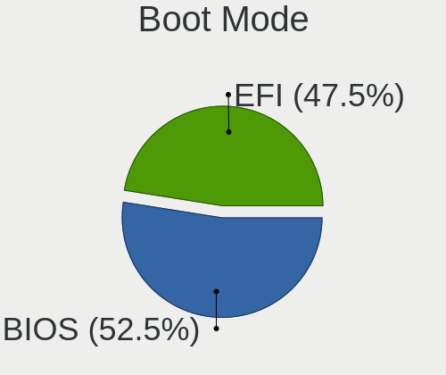
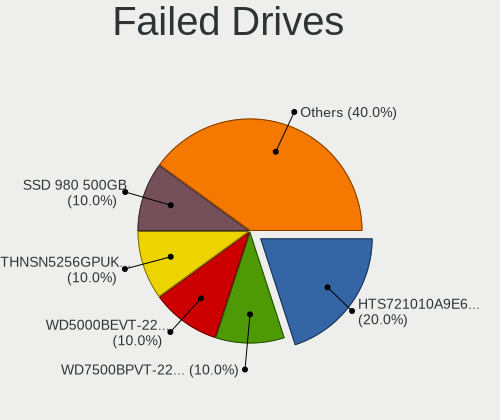

Ubuntu 22.04 - Tested Hardware & Statistics (Notebooks)
-------------------------------------------------------

A project to collect tested hardware configurations for Ubuntu 22.04.

Anyone can contribute to this report by the [hw-probe](https://github.com/linuxhw/hw-probe) tool:

    sudo -E hw-probe -all -upload

Please contribute! Especially if your hardware is rare.

Contents
--------

* [ Test Cases ](#test-cases)

* [ System ](#system)
  - [ Kernel                   ](#kernel)
  - [ Kernel Family            ](#kernel-family)
  - [ Kernel Major Ver.        ](#kernel-major-ver)
  - [ Arch                     ](#arch)
  - [ DE                       ](#de)
  - [ Display Server           ](#display-server)
  - [ Display Manager          ](#display-manager)
  - [ OS Lang                  ](#os-lang)
  - [ Boot Mode                ](#boot-mode)
  - [ Filesystem               ](#filesystem)
  - [ Part. scheme             ](#part-scheme)
  - [ Dual Boot with Linux/BSD ](#dual-boot-with-linuxbsd)
  - [ Dual Boot (Win)          ](#dual-boot-win)

* [ Board ](#board)
  - [ Vendor                   ](#vendor)
  - [ Model                    ](#model)
  - [ Model Family             ](#model-family)
  - [ MFG Year                 ](#mfg-year)
  - [ Form Factor              ](#form-factor)
  - [ Secure Boot              ](#secure-boot)
  - [ Coreboot                 ](#coreboot)
  - [ RAM Size                 ](#ram-size)
  - [ RAM Used                 ](#ram-used)
  - [ Total Drives             ](#total-drives)
  - [ Has CD-ROM               ](#has-cd-rom)
  - [ Has Ethernet             ](#has-ethernet)
  - [ Has WiFi                 ](#has-wifi)
  - [ Has Bluetooth            ](#has-bluetooth)

* [ Location ](#location)
  - [ Country                  ](#country)
  - [ City                     ](#city)

* [ Drives ](#drives)
  - [ Drive Vendor             ](#drive-vendor)
  - [ Drive Model              ](#drive-model)
  - [ HDD Vendor               ](#hdd-vendor)
  - [ SSD Vendor               ](#ssd-vendor)
  - [ Drive Kind               ](#drive-kind)
  - [ Drive Connector          ](#drive-connector)
  - [ Drive Size               ](#drive-size)
  - [ Space Total              ](#space-total)
  - [ Space Used               ](#space-used)
  - [ Malfunc. Drives          ](#malfunc-drives)
  - [ Malfunc. Drive Vendor    ](#malfunc-drive-vendor)
  - [ Malfunc. HDD Vendor      ](#malfunc-hdd-vendor)
  - [ Malfunc. Drive Kind      ](#malfunc-drive-kind)
  - [ Failed Drives            ](#failed-drives)
  - [ Failed Drive Vendor      ](#failed-drive-vendor)
  - [ Drive Status             ](#drive-status)

* [ Storage controller ](#storage-controller)
  - [ Storage Vendor           ](#storage-vendor)
  - [ Storage Model            ](#storage-model)
  - [ Storage Kind             ](#storage-kind)

* [ Processor ](#processor)
  - [ CPU Vendor               ](#cpu-vendor)
  - [ CPU Model                ](#cpu-model)
  - [ CPU Model Family         ](#cpu-model-family)
  - [ CPU Cores                ](#cpu-cores)
  - [ CPU Sockets              ](#cpu-sockets)
  - [ CPU Threads              ](#cpu-threads)
  - [ CPU Op-Modes             ](#cpu-op-modes)
  - [ CPU Microcode            ](#cpu-microcode)
  - [ CPU Microarch            ](#cpu-microarch)

* [ Graphics ](#graphics)
  - [ GPU Vendor               ](#gpu-vendor)
  - [ GPU Model                ](#gpu-model)
  - [ GPU Combo                ](#gpu-combo)
  - [ GPU Driver               ](#gpu-driver)
  - [ GPU Memory               ](#gpu-memory)

* [ Monitor ](#monitor)
  - [ Monitor Vendor           ](#monitor-vendor)
  - [ Monitor Model            ](#monitor-model)
  - [ Monitor Resolution       ](#monitor-resolution)
  - [ Monitor Diagonal         ](#monitor-diagonal)
  - [ Monitor Width            ](#monitor-width)
  - [ Aspect Ratio             ](#aspect-ratio)
  - [ Monitor Area             ](#monitor-area)
  - [ Pixel Density            ](#pixel-density)
  - [ Multiple Monitors        ](#multiple-monitors)

* [ Network ](#network)
  - [ Net Controller Vendor    ](#net-controller-vendor)
  - [ Net Controller Model     ](#net-controller-model)
  - [ Wireless Vendor          ](#wireless-vendor)
  - [ Wireless Model           ](#wireless-model)
  - [ Ethernet Vendor          ](#ethernet-vendor)
  - [ Ethernet Model           ](#ethernet-model)
  - [ Net Controller Kind      ](#net-controller-kind)
  - [ Used Controller          ](#used-controller)
  - [ NICs                     ](#nics)
  - [ IPv6                     ](#ipv6)

* [ Bluetooth ](#bluetooth)
  - [ Bluetooth Vendor         ](#bluetooth-vendor)
  - [ Bluetooth Model          ](#bluetooth-model)

* [ Sound ](#sound)
  - [ Sound Vendor             ](#sound-vendor)
  - [ Sound Model              ](#sound-model)

* [ Memory ](#memory)
  - [ Memory Vendor            ](#memory-vendor)
  - [ Memory Model             ](#memory-model)
  - [ Memory Kind              ](#memory-kind)
  - [ Memory Form Factor       ](#memory-form-factor)
  - [ Memory Size              ](#memory-size)
  - [ Memory Speed             ](#memory-speed)

* [ Printers & scanners ](#printers--scanners)
  - [ Printer Vendor           ](#printer-vendor)
  - [ Printer Model            ](#printer-model)
  - [ Scanner Vendor           ](#scanner-vendor)
  - [ Scanner Model            ](#scanner-model)

* [ Camera ](#camera)
  - [ Camera Vendor            ](#camera-vendor)
  - [ Camera Model             ](#camera-model)

* [ Security ](#security)
  - [ Fingerprint Vendor       ](#fingerprint-vendor)
  - [ Fingerprint Model        ](#fingerprint-model)
  - [ Chipcard Vendor          ](#chipcard-vendor)
  - [ Chipcard Model           ](#chipcard-model)

* [ Unsupported ](#unsupported)
  - [ Unsupported Devices      ](#unsupported-devices)
  - [ Unsupported Device Types ](#unsupported-device-types)

Test Cases
----------

Total: 3723

| Vendor        | Model                       | Probe                                                      | Date         |
|---------------|-----------------------------|------------------------------------------------------------|--------------|
| HP            | Laptop 15-dw1xxx            | [d8d5459ad6](https://linux-hardware.org/?probe=d8d5459ad6) | Dec 01, 2022 |
| AZW           | SEi                         | [3cd2f7f657](https://linux-hardware.org/?probe=3cd2f7f657) | Dec 01, 2022 |
| HP            | Laptop 15-dw1xxx            | [1dddd99280](https://linux-hardware.org/?probe=1dddd99280) | Dec 01, 2022 |
| Lenovo        | IdeaPad Gaming 3 15IAH7 ... | [fe9e8854c5](https://linux-hardware.org/?probe=fe9e8854c5) | Dec 01, 2022 |
| Samsung       | R540/R538/SA41/E452         | [afad3c8828](https://linux-hardware.org/?probe=afad3c8828) | Dec 01, 2022 |
| Positivo B... | VJFE53F11X-B0511H           | [24b1be97d6](https://linux-hardware.org/?probe=24b1be97d6) | Dec 01, 2022 |
| Positivo B... | VJFE53F11X-B0511H           | [a2e91cba31](https://linux-hardware.org/?probe=a2e91cba31) | Dec 01, 2022 |
| HP            | Notebook                    | [7c22b96a9a](https://linux-hardware.org/?probe=7c22b96a9a) | Dec 01, 2022 |
| Dell          | XPS 13 9343                 | [125fcd77b9](https://linux-hardware.org/?probe=125fcd77b9) | Dec 01, 2022 |
| HP            | EliteBook 8730w             | [fa27703043](https://linux-hardware.org/?probe=fa27703043) | Dec 01, 2022 |
| HP            | ENVY dv7                    | [1cef09f19a](https://linux-hardware.org/?probe=1cef09f19a) | Dec 01, 2022 |
| ASUSTek       | GL503VM                     | [dbd4aba670](https://linux-hardware.org/?probe=dbd4aba670) | Dec 01, 2022 |
| ASUSTek       | GL503VM                     | [3db38d22b3](https://linux-hardware.org/?probe=3db38d22b3) | Dec 01, 2022 |
| Lenovo        | ThinkPad T480S 20L8SBTD0... | [2d4a014ef1](https://linux-hardware.org/?probe=2d4a014ef1) | Dec 01, 2022 |
| Lenovo        | ThinkPad T480S 20L8SBTD0... | [e1cec664eb](https://linux-hardware.org/?probe=e1cec664eb) | Dec 01, 2022 |
| ASUSTek       | K52F                        | [4276cc2cb9](https://linux-hardware.org/?probe=4276cc2cb9) | Dec 01, 2022 |
| Dell          | Vostro 3480                 | [bf353a87c5](https://linux-hardware.org/?probe=bf353a87c5) | Dec 01, 2022 |
| W271ELQ       | Unknown                     | [ae170d1e81](https://linux-hardware.org/?probe=ae170d1e81) | Dec 01, 2022 |
| Lenovo        | ThinkPad L560 20F2S2UR02    | [29c5e0f7b1](https://linux-hardware.org/?probe=29c5e0f7b1) | Dec 01, 2022 |
| Dell          | Vostro 3578                 | [89161c2dee](https://linux-hardware.org/?probe=89161c2dee) | Dec 01, 2022 |
| Acer          | Aspire A315-21              | [7c3a371165](https://linux-hardware.org/?probe=7c3a371165) | Nov 30, 2022 |
| Acer          | Aspire A315-21              | [5f14327a56](https://linux-hardware.org/?probe=5f14327a56) | Nov 30, 2022 |
| Samsung       | 300E4A/300E5A/300E7A/343... | [5f53eff4a6](https://linux-hardware.org/?probe=5f53eff4a6) | Nov 30, 2022 |
| Standard      | Unknown                     | [723d9c3551](https://linux-hardware.org/?probe=723d9c3551) | Nov 30, 2022 |
| Dell          | Inspiron 15-3567            | [ee99c81e47](https://linux-hardware.org/?probe=ee99c81e47) | Nov 30, 2022 |
| Lenovo        | ThinkPad T470s W10DG 20J... | [645418a0dd](https://linux-hardware.org/?probe=645418a0dd) | Nov 30, 2022 |
| ASUSTek       | UX550VD                     | [a3f2aafbf1](https://linux-hardware.org/?probe=a3f2aafbf1) | Nov 30, 2022 |
| Packard Be... | EasyNote TE69CXP            | [919275eb73](https://linux-hardware.org/?probe=919275eb73) | Nov 30, 2022 |
| HP            | OMEN Laptop 15-en0xxx       | [c3d55f501c](https://linux-hardware.org/?probe=c3d55f501c) | Nov 30, 2022 |
| Dell          | Latitude 7390               | [7214cac96d](https://linux-hardware.org/?probe=7214cac96d) | Nov 30, 2022 |
| Dell          | XPS 15 9500                 | [f9215967d3](https://linux-hardware.org/?probe=f9215967d3) | Nov 30, 2022 |
| Lenovo        | ThinkPad T470p 20J7S1FR0... | [517347d2cf](https://linux-hardware.org/?probe=517347d2cf) | Nov 30, 2022 |
| Samsung       | 300E4A/300E5A/300E7A/343... | [aadb9ff1d4](https://linux-hardware.org/?probe=aadb9ff1d4) | Nov 30, 2022 |
| HP            | Laptop 14-dk1xxx            | [9dbd54884d](https://linux-hardware.org/?probe=9dbd54884d) | Nov 30, 2022 |
| ASUSTek       | VivoBook_ASUSLaptop X140... | [55d95654c4](https://linux-hardware.org/?probe=55d95654c4) | Nov 30, 2022 |
| Dell          | Inspiron 15-3552            | [e740b148c1](https://linux-hardware.org/?probe=e740b148c1) | Nov 30, 2022 |
| Apple         | MacBook4,1                  | [0866a64897](https://linux-hardware.org/?probe=0866a64897) | Nov 30, 2022 |
| Acer          | Nitro AN515-58              | [02f4319195](https://linux-hardware.org/?probe=02f4319195) | Nov 29, 2022 |
| Acer          | AO756                       | [c1ff6fe10c](https://linux-hardware.org/?probe=c1ff6fe10c) | Nov 29, 2022 |
| Acer          | Nitro AN515-58              | [77ad02b5bd](https://linux-hardware.org/?probe=77ad02b5bd) | Nov 29, 2022 |
| Dell          | Vostro 5470                 | [15c504a6ef](https://linux-hardware.org/?probe=15c504a6ef) | Nov 29, 2022 |
| Lenovo        | Legion 5 15IMH05H 82CF      | [adb0404576](https://linux-hardware.org/?probe=adb0404576) | Nov 29, 2022 |
| Dell          | Latitude E6410              | [d7abefea4b](https://linux-hardware.org/?probe=d7abefea4b) | Nov 29, 2022 |
| ASUSTek       | X756UVK                     | [93b549fb81](https://linux-hardware.org/?probe=93b549fb81) | Nov 29, 2022 |
| Lenovo        | ThinkPad X1 Carbon Gen 9... | [1f904e68af](https://linux-hardware.org/?probe=1f904e68af) | Nov 29, 2022 |
| Dell          | Latitude 5330               | [b8d907f2e8](https://linux-hardware.org/?probe=b8d907f2e8) | Nov 29, 2022 |
| Lenovo        | B590 20206                  | [5bec8860f3](https://linux-hardware.org/?probe=5bec8860f3) | Nov 29, 2022 |
| Dell          | Latitude 3500               | [de0731ac74](https://linux-hardware.org/?probe=de0731ac74) | Nov 29, 2022 |
| Lenovo        | IdeaPad S340-14IIL 81VV     | [2a4bb490d0](https://linux-hardware.org/?probe=2a4bb490d0) | Nov 29, 2022 |
| Lenovo        | IdeaPad S340-14IIL 81VV     | [a05b99b00e](https://linux-hardware.org/?probe=a05b99b00e) | Nov 29, 2022 |
| Lenovo        | ThinkBook 15 G3 ACL 21A4    | [ef6247e6fd](https://linux-hardware.org/?probe=ef6247e6fd) | Nov 28, 2022 |
| ASUSTek       | ASUS TUF Dash F15 FX517Z... | [972f6f4355](https://linux-hardware.org/?probe=972f6f4355) | Nov 28, 2022 |
| Acer          | Aspire 5820TG               | [61cab6d996](https://linux-hardware.org/?probe=61cab6d996) | Nov 28, 2022 |
| Acer          | Aspire 5820TG               | [1e64d9426d](https://linux-hardware.org/?probe=1e64d9426d) | Nov 28, 2022 |
| Acer          | Swift SF314-43              | [1a6c47ad0e](https://linux-hardware.org/?probe=1a6c47ad0e) | Nov 28, 2022 |
| Apple         | MacBookPro8,1               | [7ba1690c68](https://linux-hardware.org/?probe=7ba1690c68) | Nov 28, 2022 |
| Dell          | G3 3500                     | [291b53ea79](https://linux-hardware.org/?probe=291b53ea79) | Nov 28, 2022 |
| HP            | ProBook 640 G2              | [56ceffe338](https://linux-hardware.org/?probe=56ceffe338) | Nov 28, 2022 |
| ASUSTek       | X756UVK                     | [4745940cf9](https://linux-hardware.org/?probe=4745940cf9) | Nov 28, 2022 |
| Notebook      | L140PU                      | [8893420e06](https://linux-hardware.org/?probe=8893420e06) | Nov 28, 2022 |
| Acer          | Aspire 5742G                | [d5f03d47ba](https://linux-hardware.org/?probe=d5f03d47ba) | Nov 28, 2022 |
| HUAWEI        | MRC-WX0                     | [98f550465b](https://linux-hardware.org/?probe=98f550465b) | Nov 28, 2022 |
| Acer          | Aspire 5742G                | [e0701bc81d](https://linux-hardware.org/?probe=e0701bc81d) | Nov 28, 2022 |
| HP            | Pavilion Laptop 15-cw1xx... | [1f4c5bfc57](https://linux-hardware.org/?probe=1f4c5bfc57) | Nov 28, 2022 |
| Dell          | XPS 13 9370                 | [d353a1624b](https://linux-hardware.org/?probe=d353a1624b) | Nov 28, 2022 |
| PC Special... | NH5xAx                      | [8bd9aae635](https://linux-hardware.org/?probe=8bd9aae635) | Nov 28, 2022 |
| ASUSTek       | ZenBook UX325UA_UM325UA     | [c95bbb16de](https://linux-hardware.org/?probe=c95bbb16de) | Nov 28, 2022 |
| Dell          | XPS 15 7590                 | [8072eb50aa](https://linux-hardware.org/?probe=8072eb50aa) | Nov 28, 2022 |
| HP            | Stream Laptop 14-cb1xxx     | [1bf2bd6761](https://linux-hardware.org/?probe=1bf2bd6761) | Nov 28, 2022 |
| PC Special... | NH5xAx                      | [3be194cb8a](https://linux-hardware.org/?probe=3be194cb8a) | Nov 28, 2022 |
| HP            | EliteBook 8470w             | [7008753054](https://linux-hardware.org/?probe=7008753054) | Nov 28, 2022 |
| Lenovo        | ThinkPad E580 20KS001QMX    | [97fda88c7b](https://linux-hardware.org/?probe=97fda88c7b) | Nov 28, 2022 |
| ASUSTek       | S551LB                      | [d74127627f](https://linux-hardware.org/?probe=d74127627f) | Nov 28, 2022 |
| Lenovo        | ThinkPad E490 20N8000RUK    | [6816e8f5ca](https://linux-hardware.org/?probe=6816e8f5ca) | Nov 27, 2022 |
| Lenovo        | ThinkPad E490 20N8000RUK    | [06c690a0e1](https://linux-hardware.org/?probe=06c690a0e1) | Nov 27, 2022 |
| HP            | Laptop 14s-dq5xxx           | [e5164649e1](https://linux-hardware.org/?probe=e5164649e1) | Nov 27, 2022 |
| Dell          | XPS 13 9305                 | [c306dcfa4f](https://linux-hardware.org/?probe=c306dcfa4f) | Nov 27, 2022 |
| HP            | ProBook 5330m               | [3763f505a0](https://linux-hardware.org/?probe=3763f505a0) | Nov 27, 2022 |
| ASUSTek       | VivoBook_ASUSLaptop X412... | [2aba12235d](https://linux-hardware.org/?probe=2aba12235d) | Nov 27, 2022 |
| Acer          | AO756                       | [fa5c9df13a](https://linux-hardware.org/?probe=fa5c9df13a) | Nov 27, 2022 |
| Acer          | AO756                       | [d390d588fe](https://linux-hardware.org/?probe=d390d588fe) | Nov 27, 2022 |
| HUAWEI        | RLEF-XX                     | [bb5c736032](https://linux-hardware.org/?probe=bb5c736032) | Nov 27, 2022 |
| Lenovo        | ThinkBook 14 G2 ITL 20VD    | [2d1a576ee6](https://linux-hardware.org/?probe=2d1a576ee6) | Nov 27, 2022 |
| Dell          | G5 5587                     | [689db41249](https://linux-hardware.org/?probe=689db41249) | Nov 27, 2022 |
| Dell          | XPS 15 7590                 | [18b1ecf4fd](https://linux-hardware.org/?probe=18b1ecf4fd) | Nov 27, 2022 |
| Dell          | G7 7700                     | [16407c6485](https://linux-hardware.org/?probe=16407c6485) | Nov 27, 2022 |
| Apple         | MacBookAir6,2               | [8e266a1137](https://linux-hardware.org/?probe=8e266a1137) | Nov 27, 2022 |
| SmbiosType... | SmbiosType1_SystemProduc... | [fc54a7e10e](https://linux-hardware.org/?probe=fc54a7e10e) | Nov 27, 2022 |
| ASUSTek       | G75VX                       | [87ef485975](https://linux-hardware.org/?probe=87ef485975) | Nov 27, 2022 |
| Dell          | Vostro 3580                 | [350202deed](https://linux-hardware.org/?probe=350202deed) | Nov 27, 2022 |
| HP            | ProBook 440 G7              | [d923cda32c](https://linux-hardware.org/?probe=d923cda32c) | Nov 26, 2022 |
| HP            | ProBook 6470b               | [c8da54315e](https://linux-hardware.org/?probe=c8da54315e) | Nov 26, 2022 |
| ASUSTek       | U56E                        | [4222387904](https://linux-hardware.org/?probe=4222387904) | Nov 26, 2022 |
| Lenovo        | Y50-70 20378                | [57e4892065](https://linux-hardware.org/?probe=57e4892065) | Nov 26, 2022 |
| Acer          | Swift SFX14-41G             | [521cb4d847](https://linux-hardware.org/?probe=521cb4d847) | Nov 26, 2022 |
| Acer          | Aspire A315-58              | [df3e0f4b6c](https://linux-hardware.org/?probe=df3e0f4b6c) | Nov 26, 2022 |
| Acer          | Aspire A315-58              | [82ee1f1740](https://linux-hardware.org/?probe=82ee1f1740) | Nov 26, 2022 |
| MSI           | GE70 2OC\2OE                | [842781ccfc](https://linux-hardware.org/?probe=842781ccfc) | Nov 26, 2022 |
| HUAWEI        | KLVL-WXX9                   | [ce7815f106](https://linux-hardware.org/?probe=ce7815f106) | Nov 26, 2022 |
| MSI           | GL62M 7RDX                  | [1aa67b30d4](https://linux-hardware.org/?probe=1aa67b30d4) | Nov 26, 2022 |
| Lenovo        | V145-15AST 81MT             | [759ad3eb43](https://linux-hardware.org/?probe=759ad3eb43) | Nov 26, 2022 |
| HP            | G61                         | [314cbc992f](https://linux-hardware.org/?probe=314cbc992f) | Nov 26, 2022 |
| Lenovo        | ThinkPad X1 Carbon 5th 2... | [5a6ef91469](https://linux-hardware.org/?probe=5a6ef91469) | Nov 26, 2022 |
| ASUSTek       | U56E                        | [8b783ab1ac](https://linux-hardware.org/?probe=8b783ab1ac) | Nov 26, 2022 |
| System76      | Gazelle                     | [dd481baf69](https://linux-hardware.org/?probe=dd481baf69) | Nov 26, 2022 |
| Lenovo        | ThinkPad L13 20R3000FUK     | [c3ff5b014d](https://linux-hardware.org/?probe=c3ff5b014d) | Nov 26, 2022 |
| Sony          | SVP1121X9EB                 | [78df785a47](https://linux-hardware.org/?probe=78df785a47) | Nov 26, 2022 |
| HUAWEI        | HKD-WXX                     | [5271fa9ef9](https://linux-hardware.org/?probe=5271fa9ef9) | Nov 26, 2022 |
| HP            | Pavilion Power Laptop 15... | [913b35d3f0](https://linux-hardware.org/?probe=913b35d3f0) | Nov 25, 2022 |
| Lenovo        | ThinkPad T430 2349I62       | [ab0d49b5cd](https://linux-hardware.org/?probe=ab0d49b5cd) | Nov 25, 2022 |
| HUAWEI        | HVY-WXX9                    | [00d2cc22aa](https://linux-hardware.org/?probe=00d2cc22aa) | Nov 25, 2022 |
| ASUSTek       | F7SR                        | [ecdba533ea](https://linux-hardware.org/?probe=ecdba533ea) | Nov 25, 2022 |
| ASUSTek       | F7SR                        | [8102d8b361](https://linux-hardware.org/?probe=8102d8b361) | Nov 25, 2022 |
| Lenovo        | IdeaPad 3 15ALC6 82KU       | [86735d895f](https://linux-hardware.org/?probe=86735d895f) | Nov 25, 2022 |
| HP            | Presario CQ56               | [919fad0653](https://linux-hardware.org/?probe=919fad0653) | Nov 25, 2022 |
| ASUSTek       | X751MA                      | [15ea4b4462](https://linux-hardware.org/?probe=15ea4b4462) | Nov 25, 2022 |
| HP            | EliteBook 840 G6            | [a401adc095](https://linux-hardware.org/?probe=a401adc095) | Nov 25, 2022 |
| HP            | Pavilion 15                 | [b294971fc6](https://linux-hardware.org/?probe=b294971fc6) | Nov 25, 2022 |
| Dell          | Latitude 5410               | [1eeb98c3b0](https://linux-hardware.org/?probe=1eeb98c3b0) | Nov 25, 2022 |
| Acer          | Aspire VN7-791G             | [7664866053](https://linux-hardware.org/?probe=7664866053) | Nov 25, 2022 |
| Sony          | VGN-FE770G                  | [c59f41adb7](https://linux-hardware.org/?probe=c59f41adb7) | Nov 25, 2022 |
| HUAWEI        | KLVD-WXX9                   | [04b855bde5](https://linux-hardware.org/?probe=04b855bde5) | Nov 25, 2022 |
| Samsung       | 350V5C/351V5C/3540VC/344... | [0a9d327f59](https://linux-hardware.org/?probe=0a9d327f59) | Nov 25, 2022 |
| Samsung       | 350V5C/351V5C/3540VC/344... | [869a5a808f](https://linux-hardware.org/?probe=869a5a808f) | Nov 25, 2022 |
| Lenovo        | ThinkPad T560 20FJS3YN00    | [636921b46c](https://linux-hardware.org/?probe=636921b46c) | Nov 24, 2022 |
| Lenovo        | ThinkPad P17 Gen 2i 20YU... | [cd660d3210](https://linux-hardware.org/?probe=cd660d3210) | Nov 24, 2022 |
| Dell          | Inspiron 3585               | [33485dee6d](https://linux-hardware.org/?probe=33485dee6d) | Nov 24, 2022 |
| Avell High... | STORM TWO                   | [d8a406b26c](https://linux-hardware.org/?probe=d8a406b26c) | Nov 24, 2022 |
| Lenovo        | IdeaPad 320-15AST 80XV      | [b73b2c4c07](https://linux-hardware.org/?probe=b73b2c4c07) | Nov 24, 2022 |
| Lenovo        | ThinkPad X1 Nano Gen 2 2... | [4b6212908f](https://linux-hardware.org/?probe=4b6212908f) | Nov 24, 2022 |
| Lenovo        | ThinkPad X1 Nano Gen 2 2... | [69c89370b7](https://linux-hardware.org/?probe=69c89370b7) | Nov 24, 2022 |
| Lenovo        | ThinkPad T420s 41732BU      | [ac7791c167](https://linux-hardware.org/?probe=ac7791c167) | Nov 24, 2022 |
| Lenovo        | ThinkPad T580 20LAS01H00    | [3714ee0985](https://linux-hardware.org/?probe=3714ee0985) | Nov 24, 2022 |
| Acer          | Aspire A315-41              | [4408f2ceff](https://linux-hardware.org/?probe=4408f2ceff) | Nov 24, 2022 |
| ASUSTek       | K51AC                       | [0b2413e13c](https://linux-hardware.org/?probe=0b2413e13c) | Nov 24, 2022 |
| Razer         | Blade 15 Advanced Model ... | [60732590be](https://linux-hardware.org/?probe=60732590be) | Nov 24, 2022 |
| Dell          | Latitude E6320              | [81f633b550](https://linux-hardware.org/?probe=81f633b550) | Nov 24, 2022 |
| Toshiba       | IS 1442                     | [8a2d7b5a48](https://linux-hardware.org/?probe=8a2d7b5a48) | Nov 23, 2022 |
| Unknown       | Unknown                     | [d96c2be612](https://linux-hardware.org/?probe=d96c2be612) | Nov 23, 2022 |
| HUAWEI        | KLVD-WXX9                   | [97b1b927ba](https://linux-hardware.org/?probe=97b1b927ba) | Nov 23, 2022 |
| Dell          | XPS 9320                    | [d63a585507](https://linux-hardware.org/?probe=d63a585507) | Nov 23, 2022 |
| Lenovo        | IdeaPad 3 15ADA05 81W1      | [66fca8e108](https://linux-hardware.org/?probe=66fca8e108) | Nov 23, 2022 |
| Lenovo        | IdeaPad 5 15ITL05 82FG      | [a7f0189359](https://linux-hardware.org/?probe=a7f0189359) | Nov 23, 2022 |
| Dell          | Latitude D530               | [1403a8c938](https://linux-hardware.org/?probe=1403a8c938) | Nov 23, 2022 |
| Acer          | Aspire A315-57G             | [93dc021b03](https://linux-hardware.org/?probe=93dc021b03) | Nov 23, 2022 |
| Acer          | Aspire V3-772G              | [7ce85c6de5](https://linux-hardware.org/?probe=7ce85c6de5) | Nov 23, 2022 |
| Dell          | Latitude E6230              | [28b93e0f7c](https://linux-hardware.org/?probe=28b93e0f7c) | Nov 23, 2022 |
| Lenovo        | ThinkPad X250 20CLS21F00    | [dee6d2a740](https://linux-hardware.org/?probe=dee6d2a740) | Nov 23, 2022 |
| ASUSTek       | VivoBook_ASUSLaptop X760... | [028a796420](https://linux-hardware.org/?probe=028a796420) | Nov 23, 2022 |
| ASUSTek       | VivoBook_ASUSLaptop X760... | [c48ab2a2d5](https://linux-hardware.org/?probe=c48ab2a2d5) | Nov 23, 2022 |
| Lenovo        | ThinkBook 14 G2 ITL 20VD    | [2c077b8cde](https://linux-hardware.org/?probe=2c077b8cde) | Nov 23, 2022 |
| HP            | EliteBook 845 G8 Noteboo... | [6d217fbd52](https://linux-hardware.org/?probe=6d217fbd52) | Nov 23, 2022 |
| Lenovo        | ThinkPad X1 Carbon 4th 2... | [f1d8974d71](https://linux-hardware.org/?probe=f1d8974d71) | Nov 23, 2022 |
| Sony          | SVD1321L2EW                 | [2fcc5aa10a](https://linux-hardware.org/?probe=2fcc5aa10a) | Nov 23, 2022 |
| Sony          | SVT13126CYS                 | [4ac3d95e3a](https://linux-hardware.org/?probe=4ac3d95e3a) | Nov 23, 2022 |
| HP            | Laptop 14-fq0xxx            | [21e8e154d5](https://linux-hardware.org/?probe=21e8e154d5) | Nov 23, 2022 |
| Acer          | Nitro AN517-55              | [c36c99c55a](https://linux-hardware.org/?probe=c36c99c55a) | Nov 23, 2022 |
| Samsung       | RF511/RF411/RF711           | [db9c9330b7](https://linux-hardware.org/?probe=db9c9330b7) | Nov 23, 2022 |
| HP            | Pavilion Laptop 15-cs0xx... | [1f12ee6869](https://linux-hardware.org/?probe=1f12ee6869) | Nov 23, 2022 |
| HUAWEI        | NBLK-WAX9X                  | [fd8121fecd](https://linux-hardware.org/?probe=fd8121fecd) | Nov 22, 2022 |
| Acer          | Aspire A515-43              | [9c91ce23b5](https://linux-hardware.org/?probe=9c91ce23b5) | Nov 22, 2022 |
| Acer          | Aspire A515-57              | [374b408342](https://linux-hardware.org/?probe=374b408342) | Nov 22, 2022 |
| Lenovo        | IdeaPad 3 15ITL6 82MD       | [0fd3b230e0](https://linux-hardware.org/?probe=0fd3b230e0) | Nov 22, 2022 |
| Lenovo        | ThinkPad X1 Carbon Gen 9... | [7121172cc6](https://linux-hardware.org/?probe=7121172cc6) | Nov 22, 2022 |
| Timi          | TM1701                      | [3d9c04ccd6](https://linux-hardware.org/?probe=3d9c04ccd6) | Nov 22, 2022 |
| Lenovo        | ThinkPad T490 20N3S89D02    | [1d3c5d652a](https://linux-hardware.org/?probe=1d3c5d652a) | Nov 22, 2022 |
| HP            | ENVY dv6                    | [0d28d09c70](https://linux-hardware.org/?probe=0d28d09c70) | Nov 22, 2022 |
| HP            | EliteBook 8530w             | [0c1d6d2201](https://linux-hardware.org/?probe=0c1d6d2201) | Nov 22, 2022 |
| MSI           | Creator Z17 A12UHST         | [e36ab20d8c](https://linux-hardware.org/?probe=e36ab20d8c) | Nov 22, 2022 |
| MSI           | Creator Z17 A12UHST         | [014cf9f78d](https://linux-hardware.org/?probe=014cf9f78d) | Nov 22, 2022 |
| Acer          | Aspire A315-57G             | [fd41589a1a](https://linux-hardware.org/?probe=fd41589a1a) | Nov 22, 2022 |
| Lenovo        | IdeaPad Gaming 3 15ARH05... | [a90e09948e](https://linux-hardware.org/?probe=a90e09948e) | Nov 22, 2022 |
| Apple         | MacBook5,1                  | [f2ecb3f4a8](https://linux-hardware.org/?probe=f2ecb3f4a8) | Nov 22, 2022 |
| Acer          | Swift SF314-512             | [c47110d9a5](https://linux-hardware.org/?probe=c47110d9a5) | Nov 22, 2022 |
| Panasonic     | CF-193H101FW                | [ea4c2233bf](https://linux-hardware.org/?probe=ea4c2233bf) | Nov 22, 2022 |
| Apple         | MacBookPro11,5              | [52bcd3f8b9](https://linux-hardware.org/?probe=52bcd3f8b9) | Nov 22, 2022 |
| Alienware     | 15 R3                       | [7ea992fb7a](https://linux-hardware.org/?probe=7ea992fb7a) | Nov 22, 2022 |
| AZW           | BT3 PRO                     | [ee8fc8db42](https://linux-hardware.org/?probe=ee8fc8db42) | Nov 22, 2022 |
| HP            | EliteBook Folio 1040 G1     | [26ac531682](https://linux-hardware.org/?probe=26ac531682) | Nov 22, 2022 |
| HP            | ProBook 450 G1              | [c8d71bb807](https://linux-hardware.org/?probe=c8d71bb807) | Nov 22, 2022 |
| AZW           | BT3 PRO                     | [48047be395](https://linux-hardware.org/?probe=48047be395) | Nov 21, 2022 |
| Dell          | Inspiron 5548               | [8d8a193e7b](https://linux-hardware.org/?probe=8d8a193e7b) | Nov 21, 2022 |
| Dell          | Inspiron 3442               | [d9678fb5a7](https://linux-hardware.org/?probe=d9678fb5a7) | Nov 21, 2022 |
| HP            | Pavilion g7                 | [cecc9627ef](https://linux-hardware.org/?probe=cecc9627ef) | Nov 21, 2022 |
| Lenovo        | ThinkPad P1 Gen 4i 20Y30... | [16859cf0ca](https://linux-hardware.org/?probe=16859cf0ca) | Nov 21, 2022 |
| Dell          | Latitude 6430U              | [19b72ef7ba](https://linux-hardware.org/?probe=19b72ef7ba) | Nov 21, 2022 |
| HP            | EliteBook 820 G4            | [d4ed3112e5](https://linux-hardware.org/?probe=d4ed3112e5) | Nov 21, 2022 |
| Dell          | Latitude 9420               | [ddf8c8749c](https://linux-hardware.org/?probe=ddf8c8749c) | Nov 21, 2022 |
| Dell          | Latitude 5490               | [295073cd07](https://linux-hardware.org/?probe=295073cd07) | Nov 21, 2022 |
| HP            | Laptop 14s-fq0xxx           | [a94bd1fd5a](https://linux-hardware.org/?probe=a94bd1fd5a) | Nov 21, 2022 |
| Dell          | XPS 13 7390                 | [d5ff0e96dd](https://linux-hardware.org/?probe=d5ff0e96dd) | Nov 21, 2022 |
| Lenovo        | Legion 5 17IMH05H 81Y8      | [b74040cd21](https://linux-hardware.org/?probe=b74040cd21) | Nov 21, 2022 |
| Apple         | MacBookPro11,5              | [e80e97466d](https://linux-hardware.org/?probe=e80e97466d) | Nov 21, 2022 |
| Apple         | MacBookPro11,5              | [12799c9216](https://linux-hardware.org/?probe=12799c9216) | Nov 21, 2022 |
| TUXEDO        | Pulse 15 Gen1               | [b65ee83a19](https://linux-hardware.org/?probe=b65ee83a19) | Nov 21, 2022 |
| TUXEDO        | Pulse 15 Gen1               | [c8d395cdcc](https://linux-hardware.org/?probe=c8d395cdcc) | Nov 21, 2022 |
| ASUSTek       | VivoBook_ASUSLaptop X515... | [7ffd8149f4](https://linux-hardware.org/?probe=7ffd8149f4) | Nov 21, 2022 |
| HP            | EliteBook 820 G4            | [c565a2d0fc](https://linux-hardware.org/?probe=c565a2d0fc) | Nov 21, 2022 |
| Dell          | Latitude E6320              | [91ebf30a5c](https://linux-hardware.org/?probe=91ebf30a5c) | Nov 21, 2022 |
| MSI           | Stealth GS77 12UHS          | [462cb0ce56](https://linux-hardware.org/?probe=462cb0ce56) | Nov 21, 2022 |
| Lenovo        | IdeaPad 3 15ADA05 81W1      | [50c70cb811](https://linux-hardware.org/?probe=50c70cb811) | Nov 20, 2022 |
| Google        | Sasuke                      | [35330e59ad](https://linux-hardware.org/?probe=35330e59ad) | Nov 20, 2022 |
| Lenovo        | ThinkPad X1 Extreme Gen ... | [aaa2d66240](https://linux-hardware.org/?probe=aaa2d66240) | Nov 20, 2022 |
| Samsung       | 270E5J/2570EJ               | [f5b73b34c6](https://linux-hardware.org/?probe=f5b73b34c6) | Nov 20, 2022 |
| HUAWEI        | CREM-WXX9                   | [9630927dc1](https://linux-hardware.org/?probe=9630927dc1) | Nov 20, 2022 |
| HUAWEI        | NBLK-WAX9X                  | [3ecbc7acb4](https://linux-hardware.org/?probe=3ecbc7acb4) | Nov 20, 2022 |
| Lenovo        | ThinkPad P52 20M90017MX     | [65c874adbd](https://linux-hardware.org/?probe=65c874adbd) | Nov 20, 2022 |
| Samsung       | 950XCJ/951XCJ/950XCR        | [2bc3a22052](https://linux-hardware.org/?probe=2bc3a22052) | Nov 20, 2022 |
| Acer          | Swift SF314-58G             | [9e729e43a7](https://linux-hardware.org/?probe=9e729e43a7) | Nov 20, 2022 |
| HUAWEI        | HVY-WXX9                    | [2030d33f00](https://linux-hardware.org/?probe=2030d33f00) | Nov 20, 2022 |
| Dell          | XPS 13 7390                 | [52810e28da](https://linux-hardware.org/?probe=52810e28da) | Nov 20, 2022 |
| Dell          | Latitude E6520              | [855dc4dadd](https://linux-hardware.org/?probe=855dc4dadd) | Nov 20, 2022 |
| HP            | EliteBook 850 G4            | [30c7f00ee5](https://linux-hardware.org/?probe=30c7f00ee5) | Nov 20, 2022 |
| Acer          | Aspire 5742G                | [9c9af5a79e](https://linux-hardware.org/?probe=9c9af5a79e) | Nov 20, 2022 |
| MECER         | YA13Q20-DP_PRO              | [81cdfb4100](https://linux-hardware.org/?probe=81cdfb4100) | Nov 20, 2022 |
| Acer          | Aspire E1-571               | [35fc3411ec](https://linux-hardware.org/?probe=35fc3411ec) | Nov 20, 2022 |
| Toshiba       | TECRA R940                  | [0f231b600d](https://linux-hardware.org/?probe=0f231b600d) | Nov 20, 2022 |
| HP            | ProBook 445 G8 Notebook ... | [dfd1c98a18](https://linux-hardware.org/?probe=dfd1c98a18) | Nov 20, 2022 |
| Dell          | Latitude 5285               | [145341899a](https://linux-hardware.org/?probe=145341899a) | Nov 20, 2022 |
| Samsung       | RV411/RV511/E3511/S3511/... | [1253590f60](https://linux-hardware.org/?probe=1253590f60) | Nov 20, 2022 |
| Samsung       | 767XCL                      | [729f4f303e](https://linux-hardware.org/?probe=729f4f303e) | Nov 20, 2022 |
| ASUSTek       | X756UVK                     | [d95739c475](https://linux-hardware.org/?probe=d95739c475) | Nov 20, 2022 |
| Acer          | Aspire VN7-572G             | [314902c0f1](https://linux-hardware.org/?probe=314902c0f1) | Nov 20, 2022 |
| ASUSTek       | VivoBook_ASUSLaptop X415... | [c5ec7b9dcc](https://linux-hardware.org/?probe=c5ec7b9dcc) | Nov 20, 2022 |
| HP            | ZBook 15 G2                 | [5df677d667](https://linux-hardware.org/?probe=5df677d667) | Nov 20, 2022 |
| HP            | Pavilion dv6                | [012b257351](https://linux-hardware.org/?probe=012b257351) | Nov 20, 2022 |
| Lenovo        | IdeaPad 3 15IAU7 82RK       | [3c721e9203](https://linux-hardware.org/?probe=3c721e9203) | Nov 20, 2022 |
| Lenovo        | IdeaPad 3 15ITL6 82H8       | [8bd0cdff15](https://linux-hardware.org/?probe=8bd0cdff15) | Nov 19, 2022 |
| ASUSTek       | Zenbook UM6702RA_RM6702R... | [4ea8f7dbb0](https://linux-hardware.org/?probe=4ea8f7dbb0) | Nov 19, 2022 |
| HP            | Pavilion dv6                | [a7ca712256](https://linux-hardware.org/?probe=a7ca712256) | Nov 19, 2022 |
| Dell          | Precision 7740              | [4f8e2a6c24](https://linux-hardware.org/?probe=4f8e2a6c24) | Nov 19, 2022 |
| HP            | Pavilion dv6                | [571dc553f9](https://linux-hardware.org/?probe=571dc553f9) | Nov 19, 2022 |
| Apple         | MacBook5,1                  | [9311687e42](https://linux-hardware.org/?probe=9311687e42) | Nov 19, 2022 |
| HP            | Notebook                    | [2721a90e68](https://linux-hardware.org/?probe=2721a90e68) | Nov 19, 2022 |
| Apple         | MacBook4,1                  | [c2d79be90d](https://linux-hardware.org/?probe=c2d79be90d) | Nov 19, 2022 |
| Dell          | Inspiron 3537               | [b8d74d8e6f](https://linux-hardware.org/?probe=b8d74d8e6f) | Nov 19, 2022 |
| GPU Compan... | GWTC116-2                   | [2832277aea](https://linux-hardware.org/?probe=2832277aea) | Nov 19, 2022 |
| GPU Compan... | GWTC116-2                   | [1093c84975](https://linux-hardware.org/?probe=1093c84975) | Nov 19, 2022 |
| Lenovo        | ThinkPad E15 Gen 4 21EES... | [1572414802](https://linux-hardware.org/?probe=1572414802) | Nov 19, 2022 |
| Dell          | Inspiron 3593               | [f5c9f5e8e1](https://linux-hardware.org/?probe=f5c9f5e8e1) | Nov 19, 2022 |
| Acer          | Extensa 5220                | [0bf5f727ac](https://linux-hardware.org/?probe=0bf5f727ac) | Nov 19, 2022 |
| Apple         | MacBookPro8,2               | [6fb901efa3](https://linux-hardware.org/?probe=6fb901efa3) | Nov 19, 2022 |
| HP            | EliteBook 840 G6            | [1faf8e38b4](https://linux-hardware.org/?probe=1faf8e38b4) | Nov 18, 2022 |
| Dell          | Latitude 7300               | [5ff7502b3e](https://linux-hardware.org/?probe=5ff7502b3e) | Nov 18, 2022 |
| Dell          | Latitude 7300               | [5c7f8f6d8c](https://linux-hardware.org/?probe=5c7f8f6d8c) | Nov 18, 2022 |
| HP            | Pavilion 17                 | [ab34ec642d](https://linux-hardware.org/?probe=ab34ec642d) | Nov 18, 2022 |
| Timi          | TM1607                      | [a93d1611bb](https://linux-hardware.org/?probe=a93d1611bb) | Nov 18, 2022 |
| Lenovo        | IdeaPad S145-15AST 81N3     | [d22a7fff30](https://linux-hardware.org/?probe=d22a7fff30) | Nov 18, 2022 |
| Apple         | MacBookPro15,1              | [c5f8626928](https://linux-hardware.org/?probe=c5f8626928) | Nov 18, 2022 |
| Dell          | Precision 5510              | [a9467ec69d](https://linux-hardware.org/?probe=a9467ec69d) | Nov 18, 2022 |
| Acer          | Aspire S5-371               | [6274604555](https://linux-hardware.org/?probe=6274604555) | Nov 18, 2022 |
| MSI           | GS75 Stealth 8SF            | [cac9097f80](https://linux-hardware.org/?probe=cac9097f80) | Nov 18, 2022 |
| HUAWEI        | BOD-WXX9                    | [9984093912](https://linux-hardware.org/?probe=9984093912) | Nov 18, 2022 |
| Dell          | Inspiron 3541               | [2a6e669ccd](https://linux-hardware.org/?probe=2a6e669ccd) | Nov 18, 2022 |
| Lenovo        | ThinkPad T450 20BUS05B08    | [c73ccd5e36](https://linux-hardware.org/?probe=c73ccd5e36) | Nov 18, 2022 |
| ASUSTek       | X756UVK                     | [dfdd6c3ee2](https://linux-hardware.org/?probe=dfdd6c3ee2) | Nov 18, 2022 |
| Lenovo        | IdeaPad 320-15IKB 80YE      | [02c6e2e360](https://linux-hardware.org/?probe=02c6e2e360) | Nov 18, 2022 |
| Acer          | Aspire V5-573G              | [f58db71272](https://linux-hardware.org/?probe=f58db71272) | Nov 18, 2022 |
| Lenovo        | IdeaPad 320-15IKB 80YE      | [d4c27f1388](https://linux-hardware.org/?probe=d4c27f1388) | Nov 18, 2022 |
| Dell          | Inspiron N5110              | [1688df8c29](https://linux-hardware.org/?probe=1688df8c29) | Nov 18, 2022 |
| ASUSTek       | VivoBook_ASUSLaptop M760... | [c08218542c](https://linux-hardware.org/?probe=c08218542c) | Nov 18, 2022 |
| Dell          | Inspiron N5110              | [5bfb8e97b6](https://linux-hardware.org/?probe=5bfb8e97b6) | Nov 17, 2022 |
| ASUSTek       | ZenBook UX333FN_UX333FN     | [88336d65e7](https://linux-hardware.org/?probe=88336d65e7) | Nov 17, 2022 |
| Allview       | Allbook H                   | [4de72c8cba](https://linux-hardware.org/?probe=4de72c8cba) | Nov 17, 2022 |
| Samsung       | 270E5K/270E5Q/271E5K/257... | [f796cfccaa](https://linux-hardware.org/?probe=f796cfccaa) | Nov 17, 2022 |
| Lenovo        | IdeaPad S145-15IWL 81S9     | [873552cfae](https://linux-hardware.org/?probe=873552cfae) | Nov 17, 2022 |
| ASUSTek       | X442UA                      | [781e1c13ac](https://linux-hardware.org/?probe=781e1c13ac) | Nov 17, 2022 |
| System76      | Gazelle                     | [eaca9ddf02](https://linux-hardware.org/?probe=eaca9ddf02) | Nov 17, 2022 |
| Dell          | XPS 13 9310                 | [f65712c862](https://linux-hardware.org/?probe=f65712c862) | Nov 17, 2022 |
| HP            | Pavilion Laptop 14-ec0xx... | [0401b9e939](https://linux-hardware.org/?probe=0401b9e939) | Nov 17, 2022 |
| Dynabook E... | PORTABLECD2021              | [17a064a3c3](https://linux-hardware.org/?probe=17a064a3c3) | Nov 17, 2022 |
| MSI           | Prestige 14 A12SC           | [008c444627](https://linux-hardware.org/?probe=008c444627) | Nov 17, 2022 |
| Lenovo        | IdeaPad 500-15ISK 80NT      | [d3d2afd2c3](https://linux-hardware.org/?probe=d3d2afd2c3) | Nov 17, 2022 |
| Lenovo        | ThinkPad L560 20F2S2UR02    | [5170b27e5c](https://linux-hardware.org/?probe=5170b27e5c) | Nov 17, 2022 |
| KOUZIRO       | KOUZIRONB                   | [5802e3e5d6](https://linux-hardware.org/?probe=5802e3e5d6) | Nov 17, 2022 |
| HP            | EliteBook 840 G4            | [943027284b](https://linux-hardware.org/?probe=943027284b) | Nov 17, 2022 |
| HP            | EliteBook 840 G7 Noteboo... | [3964f95a8c](https://linux-hardware.org/?probe=3964f95a8c) | Nov 17, 2022 |
| Mediacom      | FlexBook_edge13-M-FBE13     | [aa7f8583b6](https://linux-hardware.org/?probe=aa7f8583b6) | Nov 17, 2022 |
| TUXEDO        | Pulse 15 Gen1               | [7352c1f1ed](https://linux-hardware.org/?probe=7352c1f1ed) | Nov 17, 2022 |
| Dell          | Latitude 5420               | [72c303488d](https://linux-hardware.org/?probe=72c303488d) | Nov 17, 2022 |
| Mediacom      | FlexBook_edge13-M-FBE13     | [c15d4ee015](https://linux-hardware.org/?probe=c15d4ee015) | Nov 17, 2022 |
| Mediacom      | FlexBook_edge13-M-FBE13     | [b5106cb728](https://linux-hardware.org/?probe=b5106cb728) | Nov 17, 2022 |
| HP            | ZBook 14 G2                 | [c084bd4b99](https://linux-hardware.org/?probe=c084bd4b99) | Nov 17, 2022 |
| HP            | ZBook 14 G2                 | [e687234452](https://linux-hardware.org/?probe=e687234452) | Nov 17, 2022 |
| Lenovo        | IdeaPad 530S-15IKB 81EV     | [ca1def3570](https://linux-hardware.org/?probe=ca1def3570) | Nov 17, 2022 |
| Apple         | MacBookPro14,1              | [248fcb5f13](https://linux-hardware.org/?probe=248fcb5f13) | Nov 17, 2022 |
| HP            | ProBook 445 G8 Notebook ... | [7c8d905b3d](https://linux-hardware.org/?probe=7c8d905b3d) | Nov 17, 2022 |
| Acer          | Extensa 5220                | [8e9441be64](https://linux-hardware.org/?probe=8e9441be64) | Nov 17, 2022 |
| Toshiba       | IS 1413G                    | [7d7f4061fa](https://linux-hardware.org/?probe=7d7f4061fa) | Nov 17, 2022 |
| Toshiba       | IS 1413G                    | [d36317c3be](https://linux-hardware.org/?probe=d36317c3be) | Nov 17, 2022 |
| ASUSTek       | VivoBook_ASUSLaptop M760... | [4830cb0a27](https://linux-hardware.org/?probe=4830cb0a27) | Nov 17, 2022 |
| Lenovo        | ThinkPad T480s 20L8S34C0... | [87cbc6b719](https://linux-hardware.org/?probe=87cbc6b719) | Nov 17, 2022 |
| Dell          | Inspiron MM061              | [ff50122fcf](https://linux-hardware.org/?probe=ff50122fcf) | Nov 17, 2022 |
| Toshiba       | Satellite A200              | [5648565f20](https://linux-hardware.org/?probe=5648565f20) | Nov 17, 2022 |
| Toshiba       | Satellite A200              | [7c530443f0](https://linux-hardware.org/?probe=7c530443f0) | Nov 17, 2022 |
| Acer          | Aspire ES1-511              | [0754a5633d](https://linux-hardware.org/?probe=0754a5633d) | Nov 16, 2022 |
| Dynabook E... | PORTABLECD2021              | [5d138b93b6](https://linux-hardware.org/?probe=5d138b93b6) | Nov 16, 2022 |
| Dell          | Vostro 3300                 | [ae100dd7e2](https://linux-hardware.org/?probe=ae100dd7e2) | Nov 16, 2022 |
| Dell          | Latitude 5410               | [dd9eb324db](https://linux-hardware.org/?probe=dd9eb324db) | Nov 16, 2022 |
| Dell          | Vostro 3590                 | [67ffc3ab77](https://linux-hardware.org/?probe=67ffc3ab77) | Nov 16, 2022 |
| Dell          | Vostro 5490                 | [b19387a8f3](https://linux-hardware.org/?probe=b19387a8f3) | Nov 16, 2022 |
| Dell          | Precision 7560              | [0ee8814502](https://linux-hardware.org/?probe=0ee8814502) | Nov 16, 2022 |
| HP            | Pavilion g7                 | [256d553edb](https://linux-hardware.org/?probe=256d553edb) | Nov 16, 2022 |
| Dell          | Inspiron 15 3511            | [6521122f46](https://linux-hardware.org/?probe=6521122f46) | Nov 16, 2022 |
| ASUSTek       | X556UQK                     | [fb33c2bdea](https://linux-hardware.org/?probe=fb33c2bdea) | Nov 16, 2022 |
| Dell          | Inspiron 15 3511            | [68942d8309](https://linux-hardware.org/?probe=68942d8309) | Nov 16, 2022 |
| Lenovo        | Legion 5 Pro 16ARH7H 82R... | [c43362b7ad](https://linux-hardware.org/?probe=c43362b7ad) | Nov 16, 2022 |
| ASUSTek       | X556UQK                     | [b4f8d67230](https://linux-hardware.org/?probe=b4f8d67230) | Nov 16, 2022 |
| Dell          | Latitude E7270              | [00ee9dd59e](https://linux-hardware.org/?probe=00ee9dd59e) | Nov 16, 2022 |
| Positivo B... | VJFE44F11X-B2111H           | [070af1bd42](https://linux-hardware.org/?probe=070af1bd42) | Nov 16, 2022 |
| Clevo         | W240EU/W250EUQ/W270EUQ      | [71a871168d](https://linux-hardware.org/?probe=71a871168d) | Nov 15, 2022 |
| HONOR         | HYM-WXX                     | [5cf42c99ef](https://linux-hardware.org/?probe=5cf42c99ef) | Nov 15, 2022 |
| Dell          | Latitude E5470              | [ae3d91be5a](https://linux-hardware.org/?probe=ae3d91be5a) | Nov 15, 2022 |
| HONOR         | HYM-WXX                     | [a6812ad12e](https://linux-hardware.org/?probe=a6812ad12e) | Nov 15, 2022 |
| Fujitsu       | LIFEBOOK E557               | [a57972523b](https://linux-hardware.org/?probe=a57972523b) | Nov 15, 2022 |
| ASUSTek       | ROG Zephyrus G15 GA503RW... | [1cb724a4d5](https://linux-hardware.org/?probe=1cb724a4d5) | Nov 15, 2022 |
| Lenovo        | IdeaPad 5 15ITL05 82FG      | [49ac6f08f9](https://linux-hardware.org/?probe=49ac6f08f9) | Nov 15, 2022 |
| Acer          | Swift SF314-71              | [c1eca34f9c](https://linux-hardware.org/?probe=c1eca34f9c) | Nov 15, 2022 |
| HP            | ProBook 440 14 inch G9 N... | [700e2ffc46](https://linux-hardware.org/?probe=700e2ffc46) | Nov 15, 2022 |
| Lenovo        | IdeaPad 5 15IAL7 82SF       | [a0e1c9ecce](https://linux-hardware.org/?probe=a0e1c9ecce) | Nov 15, 2022 |
| Lenovo        | IdeaPad L340-17API 81LY     | [06e1e49d75](https://linux-hardware.org/?probe=06e1e49d75) | Nov 15, 2022 |
| Dell          | Latitude E7440              | [22aa972c86](https://linux-hardware.org/?probe=22aa972c86) | Nov 15, 2022 |
| Toshiba       | Satellite L775              | [cdf5bd8045](https://linux-hardware.org/?probe=cdf5bd8045) | Nov 15, 2022 |
| Lenovo        | IdeaPad 5 15ITL05 82FG      | [0007401910](https://linux-hardware.org/?probe=0007401910) | Nov 15, 2022 |
| MSI           | Modern 15 B11M              | [0ae136622d](https://linux-hardware.org/?probe=0ae136622d) | Nov 14, 2022 |
| Apple         | MacBookPro11,4              | [9028326508](https://linux-hardware.org/?probe=9028326508) | Nov 14, 2022 |
| Apple         | MacBookPro5,5               | [a35952fc68](https://linux-hardware.org/?probe=a35952fc68) | Nov 14, 2022 |
| MSI           | Prestige 15 A12SC           | [211fdda09b](https://linux-hardware.org/?probe=211fdda09b) | Nov 14, 2022 |
| Dell          | Inspiron 3584               | [c3fde80859](https://linux-hardware.org/?probe=c3fde80859) | Nov 14, 2022 |
| Sony          | VGN-NS21M_W                 | [b3f4aef7a4](https://linux-hardware.org/?probe=b3f4aef7a4) | Nov 14, 2022 |
| Samsung       | 530U3C/530U4C/532U3C        | [3e1d185e6d](https://linux-hardware.org/?probe=3e1d185e6d) | Nov 14, 2022 |
| HP            | EliteBook Revolve 810 G3    | [b90f41b5c4](https://linux-hardware.org/?probe=b90f41b5c4) | Nov 14, 2022 |
| MSI           | Modern 14 A10M              | [9708710429](https://linux-hardware.org/?probe=9708710429) | Nov 14, 2022 |
| HUAWEI        | BOM-WXX9                    | [c54708e797](https://linux-hardware.org/?probe=c54708e797) | Nov 14, 2022 |
| Dell          | Vostro 5470                 | [5b542891b7](https://linux-hardware.org/?probe=5b542891b7) | Nov 14, 2022 |
| HP            | Pavilion g7                 | [04ea10864b](https://linux-hardware.org/?probe=04ea10864b) | Nov 14, 2022 |
| Fujitsu       | LIFEBOOK U938               | [428ad6215c](https://linux-hardware.org/?probe=428ad6215c) | Nov 14, 2022 |
| Lenovo        | G510 20238                  | [99c1eee67d](https://linux-hardware.org/?probe=99c1eee67d) | Nov 14, 2022 |
| Lenovo        | ThinkPad T530 2359CTO       | [ddc4eaf057](https://linux-hardware.org/?probe=ddc4eaf057) | Nov 13, 2022 |
| Chuwi         | HeroBook Air                | [9749e5705a](https://linux-hardware.org/?probe=9749e5705a) | Nov 13, 2022 |
| HUAWEI        | NBLK-WAX9X                  | [e54df5cb0d](https://linux-hardware.org/?probe=e54df5cb0d) | Nov 13, 2022 |
| Dell          | Vostro 3578                 | [1fa1c16736](https://linux-hardware.org/?probe=1fa1c16736) | Nov 13, 2022 |
| UNOWHY        | Y13G012S4EI                 | [9a214b41ec](https://linux-hardware.org/?probe=9a214b41ec) | Nov 13, 2022 |
| HP            | Unknown                     | [1a144cae82](https://linux-hardware.org/?probe=1a144cae82) | Nov 13, 2022 |
| Alienware     | M17xR4                      | [9dbd88c02e](https://linux-hardware.org/?probe=9dbd88c02e) | Nov 13, 2022 |
| Lenovo        | IdeaPad S130-14IGM 81J2     | [62cbc0b03d](https://linux-hardware.org/?probe=62cbc0b03d) | Nov 13, 2022 |
| Lenovo        | IdeaPad S130-14IGM 81J2     | [305242c389](https://linux-hardware.org/?probe=305242c389) | Nov 13, 2022 |
| HUAWEI        | MACHD-WXX9                  | [91e169c039](https://linux-hardware.org/?probe=91e169c039) | Nov 13, 2022 |
| Acer          | Aspire A315-58              | [961b736faa](https://linux-hardware.org/?probe=961b736faa) | Nov 13, 2022 |
| HP            | EliteBook 850 G1            | [a83e2b1a92](https://linux-hardware.org/?probe=a83e2b1a92) | Nov 13, 2022 |
| ASUSTek       | VivoBook_ASUSLaptop X412... | [3f3280fa71](https://linux-hardware.org/?probe=3f3280fa71) | Nov 13, 2022 |
| Lenovo        | ThinkPad T14 Gen 1 20S0A... | [016d7c275d](https://linux-hardware.org/?probe=016d7c275d) | Nov 13, 2022 |
| ASUSTek       | UX410UAK                    | [6653b6c4a5](https://linux-hardware.org/?probe=6653b6c4a5) | Nov 13, 2022 |
| HP            | Pavilion Gaming Laptop 1... | [b966d9e8c9](https://linux-hardware.org/?probe=b966d9e8c9) | Nov 13, 2022 |
| Lenovo        | V15-IGL 82C3                | [bc0831aa5e](https://linux-hardware.org/?probe=bc0831aa5e) | Nov 13, 2022 |
| Lenovo        | V15-IGL 82C3                | [c4811dfc5e](https://linux-hardware.org/?probe=c4811dfc5e) | Nov 12, 2022 |
| Sony          | SVT1511M1ES                 | [2fd916d045](https://linux-hardware.org/?probe=2fd916d045) | Nov 12, 2022 |
| UNOWHY        | Y13G012S4EI                 | [51a7b4fca7](https://linux-hardware.org/?probe=51a7b4fca7) | Nov 12, 2022 |
| System76      | Oryx Pro                    | [5439d56b25](https://linux-hardware.org/?probe=5439d56b25) | Nov 12, 2022 |
| Acer          | aspire5740                  | [5218638790](https://linux-hardware.org/?probe=5218638790) | Nov 12, 2022 |
| Acer          | aspire5740                  | [ba3ea314f0](https://linux-hardware.org/?probe=ba3ea314f0) | Nov 12, 2022 |
| Lenovo        | ThinkPad E14 Gen 4 21EB0... | [e19fef63c9](https://linux-hardware.org/?probe=e19fef63c9) | Nov 12, 2022 |
| Dell          | XPS 13 9343                 | [fed6627c3e](https://linux-hardware.org/?probe=fed6627c3e) | Nov 12, 2022 |
| Timi          | TM1701                      | [5ce9b1bb84](https://linux-hardware.org/?probe=5ce9b1bb84) | Nov 12, 2022 |
| Lenovo        | ThinkPad T480s 20L7001HR... | [3a37eb3bdf](https://linux-hardware.org/?probe=3a37eb3bdf) | Nov 12, 2022 |
| Packard Be... | EasyNote LV11HC             | [244d508935](https://linux-hardware.org/?probe=244d508935) | Nov 12, 2022 |
| Lenovo        | ThinkPad X131e 3371AL2      | [174f3ef66b](https://linux-hardware.org/?probe=174f3ef66b) | Nov 12, 2022 |
| MSI           | Summit E16Flip A11UCT       | [57ac3af417](https://linux-hardware.org/?probe=57ac3af417) | Nov 12, 2022 |
| Lenovo        | ThinkPad X131e 3371AL2      | [2d4ac113ec](https://linux-hardware.org/?probe=2d4ac113ec) | Nov 12, 2022 |
| HP            | 15 Notebook PC              | [f1625a3969](https://linux-hardware.org/?probe=f1625a3969) | Nov 12, 2022 |
| Dell          | Precision 7760              | [89bd5c74fb](https://linux-hardware.org/?probe=89bd5c74fb) | Nov 12, 2022 |
| Sony          | VGN-CR31S_P                 | [ce99a279ca](https://linux-hardware.org/?probe=ce99a279ca) | Nov 11, 2022 |
| Dell          | Latitude E6540              | [e28c12e783](https://linux-hardware.org/?probe=e28c12e783) | Nov 11, 2022 |
| HP            | EliteBook 8460p             | [0bf7762382](https://linux-hardware.org/?probe=0bf7762382) | Nov 11, 2022 |
| HP            | Laptop 17-cp0xxx            | [484a22794f](https://linux-hardware.org/?probe=484a22794f) | Nov 11, 2022 |
| Dell          | Latitude E6440              | [7d35b21aae](https://linux-hardware.org/?probe=7d35b21aae) | Nov 11, 2022 |
| Lenovo        | V310-14ISK 80SX             | [0e0de3ee86](https://linux-hardware.org/?probe=0e0de3ee86) | Nov 11, 2022 |
| Apple         | MacBookPro14,1              | [2981b232db](https://linux-hardware.org/?probe=2981b232db) | Nov 11, 2022 |
| Lenovo        | 81VS                        | [fe442bef90](https://linux-hardware.org/?probe=fe442bef90) | Nov 11, 2022 |
| Lenovo        | 81VS                        | [82d3da4e42](https://linux-hardware.org/?probe=82d3da4e42) | Nov 11, 2022 |
| Dell          | Latitude E6420              | [70ebe12e06](https://linux-hardware.org/?probe=70ebe12e06) | Nov 11, 2022 |
| KOUZIRO       | KOUZIRONB                   | [16bf4c059c](https://linux-hardware.org/?probe=16bf4c059c) | Nov 11, 2022 |
| Dell          | Latitude 5590               | [bbb332cf90](https://linux-hardware.org/?probe=bbb332cf90) | Nov 11, 2022 |
| Gigabyte      | U24                         | [c0bf41df22](https://linux-hardware.org/?probe=c0bf41df22) | Nov 11, 2022 |
| HP            | EliteBook 820 G3            | [904ba7c436](https://linux-hardware.org/?probe=904ba7c436) | Nov 11, 2022 |
| Lenovo        | ThinkPad P53 20QNS00Y00     | [3ebec87cd1](https://linux-hardware.org/?probe=3ebec87cd1) | Nov 11, 2022 |
| HP            | Pavilion dv7                | [5b01559647](https://linux-hardware.org/?probe=5b01559647) | Nov 11, 2022 |
| Lenovo        | ThinkPad T14 Gen 3 21AHC... | [48f127b453](https://linux-hardware.org/?probe=48f127b453) | Nov 11, 2022 |
| HP            | 15                          | [417e49cdee](https://linux-hardware.org/?probe=417e49cdee) | Nov 11, 2022 |
| HP            | Laptop 15-da0xxx            | [bbf3d0b1ca](https://linux-hardware.org/?probe=bbf3d0b1ca) | Nov 11, 2022 |
| HP            | ProBook 450 G6              | [03b71f22e1](https://linux-hardware.org/?probe=03b71f22e1) | Nov 11, 2022 |
| Dell          | Latitude 7480               | [c75855bf16](https://linux-hardware.org/?probe=c75855bf16) | Nov 11, 2022 |
| ASUSTek       | ROG Zephyrus G15 GA503QR... | [bd41addcfd](https://linux-hardware.org/?probe=bd41addcfd) | Nov 11, 2022 |
| LG Electro... | 15Z970-E.BH91P1             | [347940efc3](https://linux-hardware.org/?probe=347940efc3) | Nov 11, 2022 |
| ASUSTek       | VivoBook_ASUSLaptop X513... | [5d2ae18b0a](https://linux-hardware.org/?probe=5d2ae18b0a) | Nov 10, 2022 |
| Dell          | XPS 15 7590                 | [d05d4d5371](https://linux-hardware.org/?probe=d05d4d5371) | Nov 10, 2022 |
| ASUSTek       | VivoBook_ASUSLaptop X513... | [51a3c87183](https://linux-hardware.org/?probe=51a3c87183) | Nov 10, 2022 |
| ASUSTek       | G750JM                      | [a56072cda3](https://linux-hardware.org/?probe=a56072cda3) | Nov 10, 2022 |
| Dell          | Inspiron 7520               | [8d1eaa5bf0](https://linux-hardware.org/?probe=8d1eaa5bf0) | Nov 10, 2022 |
| Notebook      | N13_N140ZU                  | [d923893d7d](https://linux-hardware.org/?probe=d923893d7d) | Nov 10, 2022 |
| Lenovo        | IdeaPad 3 15ALC6 82MF       | [fb2b32db6a](https://linux-hardware.org/?probe=fb2b32db6a) | Nov 10, 2022 |
| Dell          | Venue 11 Pro 7140           | [78a6cdf739](https://linux-hardware.org/?probe=78a6cdf739) | Nov 10, 2022 |
| HP            | Pavilion Laptop 14-dv2xx... | [4ff5cb368c](https://linux-hardware.org/?probe=4ff5cb368c) | Nov 10, 2022 |
| Acer          | Aspire A315-56              | [6c7663b7e0](https://linux-hardware.org/?probe=6c7663b7e0) | Nov 10, 2022 |
| ASUSTek       | N550JK                      | [befb8455f0](https://linux-hardware.org/?probe=befb8455f0) | Nov 10, 2022 |
| Dell          | Latitude E6420              | [4be923e459](https://linux-hardware.org/?probe=4be923e459) | Nov 10, 2022 |
| SHENZHEN Y... | A8S PRO                     | [354471ab24](https://linux-hardware.org/?probe=354471ab24) | Nov 10, 2022 |
| Lenovo        | IdeaPad L3 15IML05 81Y3     | [89839b84cb](https://linux-hardware.org/?probe=89839b84cb) | Nov 10, 2022 |
| RIZZEN        | NOVABOOK R40                | [84890252a6](https://linux-hardware.org/?probe=84890252a6) | Nov 10, 2022 |
| Samsung       | SP55S                       | [92ae1cf763](https://linux-hardware.org/?probe=92ae1cf763) | Nov 10, 2022 |
| MSI           | Stealth GS77 12UGS          | [bf125e16a2](https://linux-hardware.org/?probe=bf125e16a2) | Nov 10, 2022 |
| Lenovo        | ThinkPad T580 20LAS01H00    | [4d41c7236e](https://linux-hardware.org/?probe=4d41c7236e) | Nov 10, 2022 |
| Notebook      | NS5x_NS7xPU                 | [52b437b67f](https://linux-hardware.org/?probe=52b437b67f) | Nov 10, 2022 |
| ASUSTek       | ROG Strix G531GV_G531GV     | [cd4796484a](https://linux-hardware.org/?probe=cd4796484a) | Nov 10, 2022 |
| GreatWall     | TN140A2                     | [4bc596cd45](https://linux-hardware.org/?probe=4bc596cd45) | Nov 10, 2022 |
| Google        | Drallion                    | [7cb5922896](https://linux-hardware.org/?probe=7cb5922896) | Nov 10, 2022 |
| Dell          | G15 5511                    | [8a3246caed](https://linux-hardware.org/?probe=8a3246caed) | Nov 10, 2022 |
| Acer          | Aspire E5-571               | [4577f6db37](https://linux-hardware.org/?probe=4577f6db37) | Nov 10, 2022 |
| LG Electro... | 16Z90Q-G.AD78B              | [e5129b607e](https://linux-hardware.org/?probe=e5129b607e) | Nov 09, 2022 |
| Dell          | Latitude E7470              | [e80d2221f5](https://linux-hardware.org/?probe=e80d2221f5) | Nov 09, 2022 |
| ASUSTek       | ASUS TUF Gaming F17 FX70... | [e77f7ce44e](https://linux-hardware.org/?probe=e77f7ce44e) | Nov 09, 2022 |
| Apple         | MacBookPro8,1               | [04f638ebcf](https://linux-hardware.org/?probe=04f638ebcf) | Nov 09, 2022 |
| Apple         | MacBookPro8,1               | [aadd864fe5](https://linux-hardware.org/?probe=aadd864fe5) | Nov 09, 2022 |
| Dell          | Inspiron 14 Plus 7420       | [a996c06867](https://linux-hardware.org/?probe=a996c06867) | Nov 09, 2022 |
| HP            | Pavilion g7                 | [3a18145808](https://linux-hardware.org/?probe=3a18145808) | Nov 09, 2022 |
| HP            | Laptop 15-da0xxx            | [9a652cbcbd](https://linux-hardware.org/?probe=9a652cbcbd) | Nov 09, 2022 |
| ASUSTek       | G752VS                      | [d64b6e685f](https://linux-hardware.org/?probe=d64b6e685f) | Nov 09, 2022 |
| SHENZHEN Y... | A8S PRO                     | [e6b195843f](https://linux-hardware.org/?probe=e6b195843f) | Nov 09, 2022 |
| Acer          | Aspire A315-42              | [8f4c16021c](https://linux-hardware.org/?probe=8f4c16021c) | Nov 09, 2022 |
| Acer          | Aspire 1825PTZ              | [c2dc801a81](https://linux-hardware.org/?probe=c2dc801a81) | Nov 09, 2022 |
| Dell          | Vostro 5402                 | [cca85a282e](https://linux-hardware.org/?probe=cca85a282e) | Nov 09, 2022 |
| ASUSTek       | VivoBook_ASUSLaptop S540... | [9cdaa4c88b](https://linux-hardware.org/?probe=9cdaa4c88b) | Nov 09, 2022 |
| Dell          | Latitude 5420               | [2eba4932bf](https://linux-hardware.org/?probe=2eba4932bf) | Nov 09, 2022 |
| MSI           | Creator Z17 A12UHST         | [a3b1e0d746](https://linux-hardware.org/?probe=a3b1e0d746) | Nov 09, 2022 |
| HP            | Pavilion Laptop 14-ec0xx... | [94746f0b72](https://linux-hardware.org/?probe=94746f0b72) | Nov 09, 2022 |
| HP            | Pavilion Laptop 14-ec0xx... | [61bf21f7dd](https://linux-hardware.org/?probe=61bf21f7dd) | Nov 09, 2022 |
| HUAWEI        | BOHK-WAX9X                  | [eac572ee3d](https://linux-hardware.org/?probe=eac572ee3d) | Nov 09, 2022 |
| Samsung       | 275E4E/275E5E               | [0eba8cf68e](https://linux-hardware.org/?probe=0eba8cf68e) | Nov 09, 2022 |
| HP            | ProBook 6470b               | [bfe52d67a3](https://linux-hardware.org/?probe=bfe52d67a3) | Nov 09, 2022 |
| Alienware     | 17                          | [91358a0bec](https://linux-hardware.org/?probe=91358a0bec) | Nov 09, 2022 |
| Dell          | XPS 15 9560                 | [439ec3a470](https://linux-hardware.org/?probe=439ec3a470) | Nov 09, 2022 |
| ASUSTek       | UX305FA                     | [4bdd2e5e51](https://linux-hardware.org/?probe=4bdd2e5e51) | Nov 08, 2022 |
| MSI           | Stealth GS77 12UGS          | [ae6b308816](https://linux-hardware.org/?probe=ae6b308816) | Nov 08, 2022 |
| Dell          | Precision 5550              | [16b375ce77](https://linux-hardware.org/?probe=16b375ce77) | Nov 08, 2022 |
| Dell          | Precision 5550              | [1499c28fe9](https://linux-hardware.org/?probe=1499c28fe9) | Nov 08, 2022 |
| Unknown       | Unknown                     | [9247927a69](https://linux-hardware.org/?probe=9247927a69) | Nov 08, 2022 |
| Dell          | G5 5587                     | [972a2dcaa0](https://linux-hardware.org/?probe=972a2dcaa0) | Nov 08, 2022 |
| HP            | 625                         | [2d8090e61e](https://linux-hardware.org/?probe=2d8090e61e) | Nov 08, 2022 |
| HP            | EliteBook 840 G5            | [42648b9002](https://linux-hardware.org/?probe=42648b9002) | Nov 08, 2022 |
| HP            | EliteBook 840 G5            | [e18a4a504d](https://linux-hardware.org/?probe=e18a4a504d) | Nov 08, 2022 |
| Acer          | Aspire 7735                 | [6134256155](https://linux-hardware.org/?probe=6134256155) | Nov 08, 2022 |
| HP            | EliteBook 840 G8 Noteboo... | [a62bf9ed3b](https://linux-hardware.org/?probe=a62bf9ed3b) | Nov 08, 2022 |
| HP            | ZBook 15 G3                 | [a641c45d6b](https://linux-hardware.org/?probe=a641c45d6b) | Nov 08, 2022 |
| ASUSTek       | VivoBook E14 E402WAS        | [9fe97ad66f](https://linux-hardware.org/?probe=9fe97ad66f) | Nov 08, 2022 |
| HP            | Pavilion Laptop 14-dv2xx... | [bbc7236402](https://linux-hardware.org/?probe=bbc7236402) | Nov 08, 2022 |
| Lenovo        | ThinkBook 13s G2 ITL 20V... | [cb9f2f3d87](https://linux-hardware.org/?probe=cb9f2f3d87) | Nov 08, 2022 |
| Apple         | MacBookPro11,4              | [9b54aae918](https://linux-hardware.org/?probe=9b54aae918) | Nov 08, 2022 |
| Apple         | MacBookPro11,4              | [46e5fff8cf](https://linux-hardware.org/?probe=46e5fff8cf) | Nov 08, 2022 |
| Apple         | MacBookPro12,1              | [2b5899e483](https://linux-hardware.org/?probe=2b5899e483) | Nov 08, 2022 |
| Dell          | Precision 3571              | [9da55445b0](https://linux-hardware.org/?probe=9da55445b0) | Nov 08, 2022 |
| HP            | EliteBook 8540w             | [b373db743a](https://linux-hardware.org/?probe=b373db743a) | Nov 08, 2022 |
| HP            | EliteBook 8540w             | [6d246a753e](https://linux-hardware.org/?probe=6d246a753e) | Nov 08, 2022 |
| Dell          | Latitude E7470              | [2c04c69ac3](https://linux-hardware.org/?probe=2c04c69ac3) | Nov 08, 2022 |
| Lenovo        | IdeaPad Gaming 3 15ACH6 ... | [ba8145934d](https://linux-hardware.org/?probe=ba8145934d) | Nov 07, 2022 |
| Monster       | TULPAR T7 V21.7             | [1106dc2d92](https://linux-hardware.org/?probe=1106dc2d92) | Nov 07, 2022 |
| Acer          | Enduro EN314-51W            | [ed2102b338](https://linux-hardware.org/?probe=ed2102b338) | Nov 07, 2022 |
| MSI           | Creator Z17 A12UHST         | [891dbf2492](https://linux-hardware.org/?probe=891dbf2492) | Nov 07, 2022 |
| Schenker      | XMG NEO (M22)               | [b1abd017f3](https://linux-hardware.org/?probe=b1abd017f3) | Nov 07, 2022 |
| Samsung       | RV411/RV511/E3511/S3511/... | [a4bce0a93a](https://linux-hardware.org/?probe=a4bce0a93a) | Nov 07, 2022 |
| Dell          | Inspiron 5415               | [48edcdeec1](https://linux-hardware.org/?probe=48edcdeec1) | Nov 07, 2022 |
| Acer          | Aspire A515-52              | [ed07b564ec](https://linux-hardware.org/?probe=ed07b564ec) | Nov 07, 2022 |
| Google        | Grunt                       | [dc9067b4b6](https://linux-hardware.org/?probe=dc9067b4b6) | Nov 07, 2022 |
| Packard Be... | EasyNote TK85               | [8a4f5a2c29](https://linux-hardware.org/?probe=8a4f5a2c29) | Nov 07, 2022 |
| HP            | EliteBook 830 G5            | [25756ad3c1](https://linux-hardware.org/?probe=25756ad3c1) | Nov 07, 2022 |
| HP            | ENVY 17                     | [83906ebbfc](https://linux-hardware.org/?probe=83906ebbfc) | Nov 07, 2022 |
| Acer          | Nitro AN515-52              | [cbfa344eaa](https://linux-hardware.org/?probe=cbfa344eaa) | Nov 07, 2022 |
| HP            | Pavilion Laptop 15-cc1xx    | [b97ba1d3f0](https://linux-hardware.org/?probe=b97ba1d3f0) | Nov 07, 2022 |
| ASUSTek       | X55A                        | [6391006e3d](https://linux-hardware.org/?probe=6391006e3d) | Nov 07, 2022 |
| ASUSTek       | X55A                        | [ae4277aa87](https://linux-hardware.org/?probe=ae4277aa87) | Nov 07, 2022 |
| Dell          | Venue 11 Pro 7140           | [da4eb1c67f](https://linux-hardware.org/?probe=da4eb1c67f) | Nov 07, 2022 |
| HP            | ZBook 15 G6                 | [3339953a1e](https://linux-hardware.org/?probe=3339953a1e) | Nov 07, 2022 |
| Fujitsu       | LIFEBOOK A512               | [c479fc2cea](https://linux-hardware.org/?probe=c479fc2cea) | Nov 06, 2022 |
| Dell          | Latitude 3340               | [2c6380f259](https://linux-hardware.org/?probe=2c6380f259) | Nov 06, 2022 |
| MSI           | GF65 Thin 10UE              | [ec09d9e22e](https://linux-hardware.org/?probe=ec09d9e22e) | Nov 06, 2022 |
| ASUSTek       | VivoBook_ASUSLaptop X350... | [0c0bde7c74](https://linux-hardware.org/?probe=0c0bde7c74) | Nov 06, 2022 |
| Dell          | Latitude E6440              | [68593d9a9d](https://linux-hardware.org/?probe=68593d9a9d) | Nov 06, 2022 |
| Acer          | Aspire E5-553G              | [d62b0333d7](https://linux-hardware.org/?probe=d62b0333d7) | Nov 06, 2022 |
| Dell          | Inspiron 5515               | [fcb59bae39](https://linux-hardware.org/?probe=fcb59bae39) | Nov 06, 2022 |
| HUAWEI        | HN-WX9X                     | [4777921b9b](https://linux-hardware.org/?probe=4777921b9b) | Nov 06, 2022 |
| TUXEDO        | Pulse 15 Gen1               | [a37d4887e1](https://linux-hardware.org/?probe=a37d4887e1) | Nov 06, 2022 |
| HP            | 250 G8 Notebook PC          | [de8ffd02b1](https://linux-hardware.org/?probe=de8ffd02b1) | Nov 06, 2022 |
| HP            | Unknown                     | [aa28b92716](https://linux-hardware.org/?probe=aa28b92716) | Nov 06, 2022 |
| Samsung       | 350V5C/351V5C/3540VC/344... | [7e97bace0c](https://linux-hardware.org/?probe=7e97bace0c) | Nov 06, 2022 |
| Acer          | Aspire 4739Z                | [d3ef4a43db](https://linux-hardware.org/?probe=d3ef4a43db) | Nov 06, 2022 |
| Dell          | Inspiron 5515               | [001308a248](https://linux-hardware.org/?probe=001308a248) | Nov 06, 2022 |
| HP            | Laptop 15s-eq0xxx           | [ec4fd96563](https://linux-hardware.org/?probe=ec4fd96563) | Nov 06, 2022 |
| HP            | Laptop 15s-eq0xxx           | [4c9e9f49aa](https://linux-hardware.org/?probe=4c9e9f49aa) | Nov 06, 2022 |
| MSI           | MS-1688                     | [21dad91aac](https://linux-hardware.org/?probe=21dad91aac) | Nov 05, 2022 |
| Thomson       | NEO14A-4SL128               | [5f6993914c](https://linux-hardware.org/?probe=5f6993914c) | Nov 05, 2022 |
| HP            | Pavilion g7                 | [4ad4ed4c47](https://linux-hardware.org/?probe=4ad4ed4c47) | Nov 05, 2022 |
| HP            | Notebook                    | [49e26e62f7](https://linux-hardware.org/?probe=49e26e62f7) | Nov 05, 2022 |
| LG Electro... | 15Z990-V.AA78B              | [5ca4c426d8](https://linux-hardware.org/?probe=5ca4c426d8) | Nov 05, 2022 |
| Apple         | MacBookAir6,1               | [ecf7278f83](https://linux-hardware.org/?probe=ecf7278f83) | Nov 05, 2022 |
| Medion        | E6222                       | [5e8852fe27](https://linux-hardware.org/?probe=5e8852fe27) | Nov 05, 2022 |
| Medion        | E6222                       | [382425c8de](https://linux-hardware.org/?probe=382425c8de) | Nov 05, 2022 |
| Dell          | Latitude E5410              | [80819d6c1e](https://linux-hardware.org/?probe=80819d6c1e) | Nov 05, 2022 |
| Google        | Sasuke                      | [216a160b84](https://linux-hardware.org/?probe=216a160b84) | Nov 05, 2022 |
| Lenovo        | IdeaPad 330-15ARR 81D2      | [b74fb78620](https://linux-hardware.org/?probe=b74fb78620) | Nov 05, 2022 |
| ASUSTek       | ASUS TUF Gaming A15 FA50... | [8f3cf6499e](https://linux-hardware.org/?probe=8f3cf6499e) | Nov 05, 2022 |
| HP            | Stream 11 Pro               | [ff1118d35b](https://linux-hardware.org/?probe=ff1118d35b) | Nov 05, 2022 |
| HP            | EliteBook 840 G1            | [7d3eac2c7d](https://linux-hardware.org/?probe=7d3eac2c7d) | Nov 05, 2022 |
| HP            | Stream 11 Pro               | [0045507ded](https://linux-hardware.org/?probe=0045507ded) | Nov 05, 2022 |
| Samsung       | 700T1C                      | [c561c328b3](https://linux-hardware.org/?probe=c561c328b3) | Nov 05, 2022 |
| ASUSTek       | K56CA                       | [032fa97b2a](https://linux-hardware.org/?probe=032fa97b2a) | Nov 05, 2022 |
| Lenovo        | Z50-70 20354                | [0c65bd2797](https://linux-hardware.org/?probe=0c65bd2797) | Nov 05, 2022 |
| Lenovo        | ThinkPad E570 20H50078FR    | [156f337a82](https://linux-hardware.org/?probe=156f337a82) | Nov 05, 2022 |
| Lenovo        | IdeaPad 5 15ITL05 82FG      | [461ea330b9](https://linux-hardware.org/?probe=461ea330b9) | Nov 05, 2022 |
| Lenovo        | IdeaPad 5 15ITL05 82FG      | [fffcccb5c7](https://linux-hardware.org/?probe=fffcccb5c7) | Nov 05, 2022 |
| Dell          | Precision M4700             | [d4f03d4701](https://linux-hardware.org/?probe=d4f03d4701) | Nov 05, 2022 |
| Dell          | Latitude E6510              | [befb811cfe](https://linux-hardware.org/?probe=befb811cfe) | Nov 05, 2022 |
| Lenovo        | ThinkPad X270 20HN0014FR    | [94abd977de](https://linux-hardware.org/?probe=94abd977de) | Nov 04, 2022 |
| Apple         | MacBookPro16,2              | [ad1ae18c98](https://linux-hardware.org/?probe=ad1ae18c98) | Nov 04, 2022 |
| Acer          | Nitro AN515-44              | [03176fa010](https://linux-hardware.org/?probe=03176fa010) | Nov 04, 2022 |
| Dell          | G15 5511                    | [68f1e6d4f0](https://linux-hardware.org/?probe=68f1e6d4f0) | Nov 04, 2022 |
| Apple         | MacBookPro12,1              | [e63f3a94fa](https://linux-hardware.org/?probe=e63f3a94fa) | Nov 04, 2022 |
| HP            | Pavilion Gaming Laptop 1... | [bd3b4f723e](https://linux-hardware.org/?probe=bd3b4f723e) | Nov 04, 2022 |
| ASUSTek       | E200HA                      | [6a9cb1ae1d](https://linux-hardware.org/?probe=6a9cb1ae1d) | Nov 04, 2022 |
| HUAWEI        | BOM-WXX9                    | [d78a7bd1a3](https://linux-hardware.org/?probe=d78a7bd1a3) | Nov 04, 2022 |
| HP            | EliteBook 8560w             | [422545fa5b](https://linux-hardware.org/?probe=422545fa5b) | Nov 04, 2022 |
| HP            | ProBook 6470b               | [78aa59a89a](https://linux-hardware.org/?probe=78aa59a89a) | Nov 04, 2022 |
| ASUSTek       | ROG Strix G513IE_G513IE     | [1d1783ca36](https://linux-hardware.org/?probe=1d1783ca36) | Nov 04, 2022 |
| HUAWEI        | KLVL-WXX9                   | [17bac11f6f](https://linux-hardware.org/?probe=17bac11f6f) | Nov 04, 2022 |
| ASUSTek       | ROG Strix G513IE_G513IE     | [1333104aae](https://linux-hardware.org/?probe=1333104aae) | Nov 04, 2022 |
| HP            | 470 G7 Notebook PC          | [ae68dc3b2d](https://linux-hardware.org/?probe=ae68dc3b2d) | Nov 04, 2022 |
| HP            | ProBook 650 G2              | [713f71652e](https://linux-hardware.org/?probe=713f71652e) | Nov 04, 2022 |
| HP            | EliteBook 840 G7 Noteboo... | [d04fddb1cc](https://linux-hardware.org/?probe=d04fddb1cc) | Nov 04, 2022 |
| HP            | EliteBook 840 G7 Noteboo... | [9cb27611ff](https://linux-hardware.org/?probe=9cb27611ff) | Nov 04, 2022 |
| Lenovo        | ThinkPad X1 Carbon 5th 2... | [374292947f](https://linux-hardware.org/?probe=374292947f) | Nov 04, 2022 |
| Lenovo        | ThinkPad X1 Carbon 6th 2... | [55a11054db](https://linux-hardware.org/?probe=55a11054db) | Nov 04, 2022 |
| HP            | EliteBook 745 G2            | [6eca80dabf](https://linux-hardware.org/?probe=6eca80dabf) | Nov 04, 2022 |
| ASUSTek       | X751LB                      | [b9f1ea7699](https://linux-hardware.org/?probe=b9f1ea7699) | Nov 04, 2022 |
| ASUSTek       | X751LB                      | [e7334f33eb](https://linux-hardware.org/?probe=e7334f33eb) | Nov 04, 2022 |
| Lenovo        | ThinkPad Edge 0301GBG       | [8b50396928](https://linux-hardware.org/?probe=8b50396928) | Nov 04, 2022 |
| Lenovo        | IdeaPad 110-15ACL 80TJ      | [52a97560d7](https://linux-hardware.org/?probe=52a97560d7) | Nov 03, 2022 |
| HP            | ProBook 6470b               | [ea7c42479d](https://linux-hardware.org/?probe=ea7c42479d) | Nov 03, 2022 |
| HP            | Pavilion Notebook           | [caaca6d1f1](https://linux-hardware.org/?probe=caaca6d1f1) | Nov 03, 2022 |
| Acer          | Aspire 5732Z                | [7c6f7aa3e8](https://linux-hardware.org/?probe=7c6f7aa3e8) | Nov 03, 2022 |
| Lenovo        | ThinkPad T430s 23539KU      | [34d3046ea4](https://linux-hardware.org/?probe=34d3046ea4) | Nov 03, 2022 |
| Lenovo        | ThinkPad T430s 23539KU      | [ff4e869df2](https://linux-hardware.org/?probe=ff4e869df2) | Nov 03, 2022 |
| Lenovo        | IdeaPad 720S-13ARR 81BR     | [e037d4019e](https://linux-hardware.org/?probe=e037d4019e) | Nov 03, 2022 |
| Dell          | Precision 5520              | [a96e7097e1](https://linux-hardware.org/?probe=a96e7097e1) | Nov 03, 2022 |
| Lenovo        | IdeaPad 3 15ARE05 81W4      | [7dc3ed5f76](https://linux-hardware.org/?probe=7dc3ed5f76) | Nov 03, 2022 |
| HP            | EliteBook 865 16 inch G9... | [d1b0eff99b](https://linux-hardware.org/?probe=d1b0eff99b) | Nov 03, 2022 |
| Intel         | SandyBridge Platform        | [88c15d34e4](https://linux-hardware.org/?probe=88c15d34e4) | Nov 03, 2022 |
| Lenovo        | Yoga 900-13ISK 80MK         | [fe69e51efe](https://linux-hardware.org/?probe=fe69e51efe) | Nov 03, 2022 |
| Lenovo        | E41-25 81FS                 | [57df10cb95](https://linux-hardware.org/?probe=57df10cb95) | Nov 03, 2022 |
| Lenovo        | Yoga Slim 7 14ITL05 82A3    | [2d78dbce09](https://linux-hardware.org/?probe=2d78dbce09) | Nov 03, 2022 |
| MSI           | GF63 Thin 9SC               | [8465b2a3f1](https://linux-hardware.org/?probe=8465b2a3f1) | Nov 03, 2022 |
| Toshiba       | Satellite L55-B             | [ca03715db3](https://linux-hardware.org/?probe=ca03715db3) | Nov 03, 2022 |
| Lenovo        | IdeaPad Y700-15ISK 80NV     | [fe4a007f99](https://linux-hardware.org/?probe=fe4a007f99) | Nov 03, 2022 |
| Acer          | Aspire V5-573G              | [2bab719066](https://linux-hardware.org/?probe=2bab719066) | Nov 03, 2022 |
| Positivo      | Mobile                      | [f35235fdfa](https://linux-hardware.org/?probe=f35235fdfa) | Nov 03, 2022 |
| Positivo      | Mobile                      | [581c79bdee](https://linux-hardware.org/?probe=581c79bdee) | Nov 03, 2022 |
| Unknown       | Cherry Trail CR             | [0c0dcc0c23](https://linux-hardware.org/?probe=0c0dcc0c23) | Nov 03, 2022 |
| Dell          | Latitude E7250              | [0c36cbc6ca](https://linux-hardware.org/?probe=0c36cbc6ca) | Nov 03, 2022 |
| HP            | G62                         | [a00ba1aae7](https://linux-hardware.org/?probe=a00ba1aae7) | Nov 03, 2022 |
| HP            | Pavilion Gaming Laptop 1... | [020d8fd7e0](https://linux-hardware.org/?probe=020d8fd7e0) | Nov 03, 2022 |
| Lenovo        | ThinkPad Edge E530 3259M... | [2bca9d747b](https://linux-hardware.org/?probe=2bca9d747b) | Nov 03, 2022 |
| HP            | 250 G4                      | [ff497e0d4c](https://linux-hardware.org/?probe=ff497e0d4c) | Nov 02, 2022 |
| HP            | Laptop 15-db0xxx            | [14184ac3d9](https://linux-hardware.org/?probe=14184ac3d9) | Nov 02, 2022 |
| Lenovo        | G50-45 80E3                 | [d4f08c71a6](https://linux-hardware.org/?probe=d4f08c71a6) | Nov 02, 2022 |
| HP            | Pavilion Gaming Laptop      | [695b3d82a7](https://linux-hardware.org/?probe=695b3d82a7) | Nov 02, 2022 |
| HP            | Pavilion Gaming Laptop      | [9b9e55c471](https://linux-hardware.org/?probe=9b9e55c471) | Nov 02, 2022 |
| HP            | EliteBook 8460p             | [565ad502cc](https://linux-hardware.org/?probe=565ad502cc) | Nov 02, 2022 |
| Lenovo        | E41-25 81FS                 | [5d9743e91d](https://linux-hardware.org/?probe=5d9743e91d) | Nov 02, 2022 |
| Toshiba       | Satellite C70D-A            | [7a421ed810](https://linux-hardware.org/?probe=7a421ed810) | Nov 02, 2022 |
| Toshiba       | Satellite C70D-A            | [d82227846b](https://linux-hardware.org/?probe=d82227846b) | Nov 02, 2022 |
| Dell          | Latitude E5450              | [b39c12a9a4](https://linux-hardware.org/?probe=b39c12a9a4) | Nov 02, 2022 |
| HP            | ProBook 450 G8 Notebook ... | [44e281e52c](https://linux-hardware.org/?probe=44e281e52c) | Nov 02, 2022 |
| Lenovo        | Legion 5 Pro 16ITH6 82JF    | [09c2704bb0](https://linux-hardware.org/?probe=09c2704bb0) | Nov 02, 2022 |
| HP            | 625                         | [830c5c0d14](https://linux-hardware.org/?probe=830c5c0d14) | Nov 02, 2022 |
| HP            | 625                         | [4c627cab51](https://linux-hardware.org/?probe=4c627cab51) | Nov 02, 2022 |
| HP            | Pavilion x2 Detachable P... | [b4d63f4835](https://linux-hardware.org/?probe=b4d63f4835) | Nov 02, 2022 |
| Acer          | Aspire A315-54              | [1421a5a4e9](https://linux-hardware.org/?probe=1421a5a4e9) | Nov 02, 2022 |
| HP            | Pavilion Notebook           | [95d825cd94](https://linux-hardware.org/?probe=95d825cd94) | Nov 01, 2022 |
| Dell          | Precision 5520              | [e1a819ec3e](https://linux-hardware.org/?probe=e1a819ec3e) | Nov 01, 2022 |
| Lenovo        | ThinkPad L590 20Q7001KIX    | [c8e545615f](https://linux-hardware.org/?probe=c8e545615f) | Nov 01, 2022 |
| Acer          | Swift SF314-41              | [921b1a7ebf](https://linux-hardware.org/?probe=921b1a7ebf) | Nov 01, 2022 |
| ASUSTek       | VivoBook_ASUSLaptop M760... | [49d6eb853f](https://linux-hardware.org/?probe=49d6eb853f) | Nov 01, 2022 |
| ASUSTek       | VivoBook_ASUSLaptop M760... | [5de7efb403](https://linux-hardware.org/?probe=5de7efb403) | Nov 01, 2022 |
| ASUSTek       | X501A                       | [d5a34df414](https://linux-hardware.org/?probe=d5a34df414) | Nov 01, 2022 |
| ASUSTek       | VivoBook 15_ASUS Laptop ... | [6323d7e1b3](https://linux-hardware.org/?probe=6323d7e1b3) | Nov 01, 2022 |
| Dell          | Inspiron 15 3511            | [85c215eebf](https://linux-hardware.org/?probe=85c215eebf) | Nov 01, 2022 |
| Lenovo        | ThinkPad L14 Gen 2 20X2S... | [36d7199821](https://linux-hardware.org/?probe=36d7199821) | Nov 01, 2022 |
| Sony          | VPCZ12C5E                   | [b1e6524541](https://linux-hardware.org/?probe=b1e6524541) | Oct 31, 2022 |
| Lenovo        | IdeaPad S145-15API 81V7     | [973fc77891](https://linux-hardware.org/?probe=973fc77891) | Oct 31, 2022 |
| Dell          | Latitude E6330              | [51ded2feb1](https://linux-hardware.org/?probe=51ded2feb1) | Oct 31, 2022 |
| Dell          | Inspiron 3542               | [dcccad24af](https://linux-hardware.org/?probe=dcccad24af) | Oct 31, 2022 |
| Dell          | Vostro 7620                 | [2ccd56ee29](https://linux-hardware.org/?probe=2ccd56ee29) | Oct 31, 2022 |
| HP            | EliteBook 745 G2            | [0786ded6c8](https://linux-hardware.org/?probe=0786ded6c8) | Oct 31, 2022 |
| TUXEDO        | InfinityBook S 15 Gen6      | [92e9764aa0](https://linux-hardware.org/?probe=92e9764aa0) | Oct 31, 2022 |
| Acer          | Swift SF314-512             | [d6bf187cc9](https://linux-hardware.org/?probe=d6bf187cc9) | Oct 31, 2022 |
| Adlinktech    | SB-MLC                      | [203d95e012](https://linux-hardware.org/?probe=203d95e012) | Oct 31, 2022 |
| Lenovo        | ThinkBook 15 G2 ITL 20VE    | [451acdb910](https://linux-hardware.org/?probe=451acdb910) | Oct 31, 2022 |
| Sony          | SVT13118FXS                 | [13b4af9ec3](https://linux-hardware.org/?probe=13b4af9ec3) | Oct 31, 2022 |
| Dell          | Vostro 7620                 | [7f41a14301](https://linux-hardware.org/?probe=7f41a14301) | Oct 31, 2022 |
| ASUSTek       | VivoBook_ASUSLaptop X515... | [deac1b706f](https://linux-hardware.org/?probe=deac1b706f) | Oct 31, 2022 |
| Dell          | Vostro 7620                 | [00dae3fbc5](https://linux-hardware.org/?probe=00dae3fbc5) | Oct 31, 2022 |
| Lenovo        | ThinkPad Edge E530 3259M... | [aa1f78db58](https://linux-hardware.org/?probe=aa1f78db58) | Oct 31, 2022 |
| Lenovo        | ThinkPad Edge E530 3259M... | [26b5f59993](https://linux-hardware.org/?probe=26b5f59993) | Oct 31, 2022 |
| HP            | 14                          | [7611c14813](https://linux-hardware.org/?probe=7611c14813) | Oct 31, 2022 |
| Toshiba       | Satellite A200              | [296d9a0f38](https://linux-hardware.org/?probe=296d9a0f38) | Oct 31, 2022 |
| Toshiba       | Satellite A200              | [07a165b373](https://linux-hardware.org/?probe=07a165b373) | Oct 31, 2022 |
| Lenovo        | IdeaPad S145-15IWL 81S9     | [c8970ae94a](https://linux-hardware.org/?probe=c8970ae94a) | Oct 31, 2022 |
| Acer          | Nitro AN517-55              | [9653f093e1](https://linux-hardware.org/?probe=9653f093e1) | Oct 31, 2022 |
| Panasonic     | CF-19RDRCHH7                | [99e94a7708](https://linux-hardware.org/?probe=99e94a7708) | Oct 31, 2022 |
| ASUSTek       | K73SV                       | [d505f0c0d0](https://linux-hardware.org/?probe=d505f0c0d0) | Oct 30, 2022 |
| Lenovo        | ThinkPad X270 20HN0014FR    | [d6fc7c48a1](https://linux-hardware.org/?probe=d6fc7c48a1) | Oct 30, 2022 |
| Acer          | Swift SFX14-51G             | [6812d7cf22](https://linux-hardware.org/?probe=6812d7cf22) | Oct 30, 2022 |
| HP            | Laptop 15-da0xxx            | [b903c0e375](https://linux-hardware.org/?probe=b903c0e375) | Oct 30, 2022 |
| Lenovo        | IdeaPad 100S-14IBR 80R9     | [91d1732515](https://linux-hardware.org/?probe=91d1732515) | Oct 30, 2022 |
| Lenovo        | ThinkPad T510 4384WKU       | [86fee6e260](https://linux-hardware.org/?probe=86fee6e260) | Oct 30, 2022 |
| Lenovo        | ThinkPad P1 Gen 5 21DC00... | [910b452558](https://linux-hardware.org/?probe=910b452558) | Oct 30, 2022 |
| ASUSTek       | VivoBook_ASUS Laptop E40... | [cbdfd56f05](https://linux-hardware.org/?probe=cbdfd56f05) | Oct 30, 2022 |
| LG Electro... | 15Z980-HA76K                | [914156672d](https://linux-hardware.org/?probe=914156672d) | Oct 30, 2022 |
| Lenovo        | ThinkBook 15p 20V3          | [8dfb7265a9](https://linux-hardware.org/?probe=8dfb7265a9) | Oct 30, 2022 |
| Dell          | Latitude E6510              | [84a61bf436](https://linux-hardware.org/?probe=84a61bf436) | Oct 30, 2022 |
| HUAWEI        | KLVL-WXX9                   | [4e4e0ac802](https://linux-hardware.org/?probe=4e4e0ac802) | Oct 30, 2022 |
| HUAWEI        | KLVL-WXX9                   | [8887bce606](https://linux-hardware.org/?probe=8887bce606) | Oct 30, 2022 |
| GEO           | GeoBook3                    | [133a4460f6](https://linux-hardware.org/?probe=133a4460f6) | Oct 29, 2022 |
| Lenovo        | ThinkPad E14 Gen 3 20Y70... | [97425e2f52](https://linux-hardware.org/?probe=97425e2f52) | Oct 29, 2022 |
| HP            | Laptop 15-dw0xxx            | [f6b00cb10f](https://linux-hardware.org/?probe=f6b00cb10f) | Oct 29, 2022 |
| Dell          | Vostro 3500                 | [53754d84e7](https://linux-hardware.org/?probe=53754d84e7) | Oct 29, 2022 |
| Toshiba       | Satellite L50-A-1D6         | [77f308d89c](https://linux-hardware.org/?probe=77f308d89c) | Oct 29, 2022 |
| Lenovo        | ThinkPad T510 43145GG       | [d1e2bf7f33](https://linux-hardware.org/?probe=d1e2bf7f33) | Oct 29, 2022 |
| Dell          | Latitude E6510              | [b346d71347](https://linux-hardware.org/?probe=b346d71347) | Oct 29, 2022 |
| ASUSTek       | ASUS TUF Gaming F15 FX50... | [b8cfddfcbf](https://linux-hardware.org/?probe=b8cfddfcbf) | Oct 29, 2022 |
| HP            | Victus by Laptop 16-d1xx... | [c2d1799732](https://linux-hardware.org/?probe=c2d1799732) | Oct 29, 2022 |
| Dell          | Precision 3570              | [fb016d8d01](https://linux-hardware.org/?probe=fb016d8d01) | Oct 29, 2022 |
| HP            | EliteBook 830 G7 Noteboo... | [063675c104](https://linux-hardware.org/?probe=063675c104) | Oct 29, 2022 |
| HP            | OMEN by Laptop 15-dc1xxx    | [20d95ce78c](https://linux-hardware.org/?probe=20d95ce78c) | Oct 29, 2022 |
| Lenovo        | ThinkPad T480s 20L8S4PR1... | [d99f500b00](https://linux-hardware.org/?probe=d99f500b00) | Oct 29, 2022 |
| HP            | Laptop 15s-eq2xxx           | [dbd930e552](https://linux-hardware.org/?probe=dbd930e552) | Oct 29, 2022 |
| Lenovo        | IdeaPad 3 15IIL05 81WE      | [d152b0a56c](https://linux-hardware.org/?probe=d152b0a56c) | Oct 29, 2022 |
| Lenovo        | Legion Y740-17ICHg 81HH     | [ea1c9e069e](https://linux-hardware.org/?probe=ea1c9e069e) | Oct 29, 2022 |
| Lenovo        | IdeaPad 3 15ITL6 82H8       | [27dfa8687b](https://linux-hardware.org/?probe=27dfa8687b) | Oct 29, 2022 |
| AXIOO         | Mybook 14H                  | [f8a7c19640](https://linux-hardware.org/?probe=f8a7c19640) | Oct 29, 2022 |
| HP            | Pavilion dv6                | [6406b8b769](https://linux-hardware.org/?probe=6406b8b769) | Oct 29, 2022 |
| HP            | Pavilion dv6                | [7873dfb4cf](https://linux-hardware.org/?probe=7873dfb4cf) | Oct 29, 2022 |
| Medion        | X682X                       | [f05dd25a08](https://linux-hardware.org/?probe=f05dd25a08) | Oct 29, 2022 |
| Dell          | Precision 5750              | [9b9addd3b7](https://linux-hardware.org/?probe=9b9addd3b7) | Oct 29, 2022 |
| Lenovo        | ThinkPad X1 Carbon 7th 2... | [2ceb11d7b3](https://linux-hardware.org/?probe=2ceb11d7b3) | Oct 29, 2022 |
| Lenovo        | ThinkPad X1 Carbon 7th 2... | [5c3d640129](https://linux-hardware.org/?probe=5c3d640129) | Oct 29, 2022 |
| HP            | Laptop 15-dw3xxx            | [99ac55823d](https://linux-hardware.org/?probe=99ac55823d) | Oct 29, 2022 |
| HUAWEI        | BOD-WXX9                    | [880d3ba9c9](https://linux-hardware.org/?probe=880d3ba9c9) | Oct 29, 2022 |
| Dell          | Latitude 5531               | [cdea65fd5c](https://linux-hardware.org/?probe=cdea65fd5c) | Oct 29, 2022 |
| ASUSTek       | K53SV                       | [4ead64f80f](https://linux-hardware.org/?probe=4ead64f80f) | Oct 28, 2022 |
| IP3 Tech      | AP1                         | [0562a6a46d](https://linux-hardware.org/?probe=0562a6a46d) | Oct 28, 2022 |
| Lenovo        | IdeaPad 500-15ACZ 80K4      | [c079764998](https://linux-hardware.org/?probe=c079764998) | Oct 28, 2022 |
| Lenovo        | IdeaPad 500-15ACZ 80K4      | [5ef9b4213f](https://linux-hardware.org/?probe=5ef9b4213f) | Oct 28, 2022 |
| Dell          | XPS 13 9310                 | [7205cfe7b4](https://linux-hardware.org/?probe=7205cfe7b4) | Oct 28, 2022 |
| Toshiba       | Satellite C75D-B            | [4f644b7d3b](https://linux-hardware.org/?probe=4f644b7d3b) | Oct 28, 2022 |
| HP            | Pavilion Laptop 15-eh2xx... | [f9238c2035](https://linux-hardware.org/?probe=f9238c2035) | Oct 28, 2022 |
| Lenovo        | ThinkPad T420 4236NUG       | [d0e3fa9699](https://linux-hardware.org/?probe=d0e3fa9699) | Oct 28, 2022 |
| IP3 Tech      | AP1                         | [2a9c0ff1c5](https://linux-hardware.org/?probe=2a9c0ff1c5) | Oct 28, 2022 |
| Tactus        | GeoBook 110                 | [aad56b27f0](https://linux-hardware.org/?probe=aad56b27f0) | Oct 28, 2022 |
| Lenovo        | ThinkPad T560 20FHCTO1WW    | [05ff2d32fa](https://linux-hardware.org/?probe=05ff2d32fa) | Oct 28, 2022 |
| Lenovo        | ThinkPad T560 20FHCTO1WW    | [403a99d8b2](https://linux-hardware.org/?probe=403a99d8b2) | Oct 28, 2022 |
| Acer          | Aspire A315-58              | [7870d9b047](https://linux-hardware.org/?probe=7870d9b047) | Oct 28, 2022 |
| HUAWEI        | BOM-WXX9                    | [203ac0880d](https://linux-hardware.org/?probe=203ac0880d) | Oct 28, 2022 |
| MSI           | Stealth GS66 12UGS          | [98b47019d1](https://linux-hardware.org/?probe=98b47019d1) | Oct 28, 2022 |
| MSI           | GF63 Thin 11UD              | [0084d271e4](https://linux-hardware.org/?probe=0084d271e4) | Oct 28, 2022 |
| ASUSTek       | ROG Zephyrus M16 GU603HM... | [3b67700f14](https://linux-hardware.org/?probe=3b67700f14) | Oct 28, 2022 |
| Compaq        | Presario 21 VerX            | [97ee92b9d1](https://linux-hardware.org/?probe=97ee92b9d1) | Oct 28, 2022 |
| Dell          | Inspiron 15 3511            | [7cc13c49e2](https://linux-hardware.org/?probe=7cc13c49e2) | Oct 28, 2022 |
| Dell          | XPS 13 9305                 | [20bf043d6f](https://linux-hardware.org/?probe=20bf043d6f) | Oct 28, 2022 |
| Apple         | MacBookPro11,5              | [fc35e765fd](https://linux-hardware.org/?probe=fc35e765fd) | Oct 28, 2022 |
| MSI           | Katana GF66 11UC            | [83088617d3](https://linux-hardware.org/?probe=83088617d3) | Oct 28, 2022 |
| Dell          | Inspiron 3542               | [6c979bdf58](https://linux-hardware.org/?probe=6c979bdf58) | Oct 27, 2022 |
| HP            | 255 G7 Notebook PC          | [8cf00ceef5](https://linux-hardware.org/?probe=8cf00ceef5) | Oct 27, 2022 |
| Dell          | Latitude E6530              | [71b2df6eff](https://linux-hardware.org/?probe=71b2df6eff) | Oct 27, 2022 |
| Toshiba       | Satellite L300              | [60618ba137](https://linux-hardware.org/?probe=60618ba137) | Oct 27, 2022 |
| PC Special... | Recoil II                   | [9ec5a6ef20](https://linux-hardware.org/?probe=9ec5a6ef20) | Oct 27, 2022 |
| Lenovo        | G710 20252                  | [d15bee47c4](https://linux-hardware.org/?probe=d15bee47c4) | Oct 27, 2022 |
| PC Special... | Recoil II                   | [38ec5a7708](https://linux-hardware.org/?probe=38ec5a7708) | Oct 27, 2022 |
| Lenovo        | IdeaPad 320-14IKB 80YF      | [fe1166a134](https://linux-hardware.org/?probe=fe1166a134) | Oct 27, 2022 |
| Lenovo        | IdeaPad 320-14IKB 80YF      | [b35b1298a8](https://linux-hardware.org/?probe=b35b1298a8) | Oct 27, 2022 |
| HP            | Laptop 15-da0xxx            | [efdb76f667](https://linux-hardware.org/?probe=efdb76f667) | Oct 27, 2022 |
| ASUSTek       | VivoBook_ASUSLaptop M140... | [0a0922ed82](https://linux-hardware.org/?probe=0a0922ed82) | Oct 27, 2022 |
| MSI           | GE66 Raider 10UE            | [334d883dd3](https://linux-hardware.org/?probe=334d883dd3) | Oct 27, 2022 |
| Dell          | Latitude 5310               | [10b8371dbd](https://linux-hardware.org/?probe=10b8371dbd) | Oct 27, 2022 |
| Fujitsu       | LIFEBOOK AH530              | [a3f55b1301](https://linux-hardware.org/?probe=a3f55b1301) | Oct 27, 2022 |
| HP            | ZBook Fury 15.6 inch G8 ... | [f95081e76e](https://linux-hardware.org/?probe=f95081e76e) | Oct 27, 2022 |
| Fujitsu       | LIFEBOOK AH530              | [285a7d17e3](https://linux-hardware.org/?probe=285a7d17e3) | Oct 27, 2022 |
| HP            | EliteBook 830 G7 Noteboo... | [0fcfd33f95](https://linux-hardware.org/?probe=0fcfd33f95) | Oct 27, 2022 |
| Lenovo        | ThinkPad L590 20Q7001HGE    | [187544b911](https://linux-hardware.org/?probe=187544b911) | Oct 27, 2022 |
| ASUSTek       | ASUS EXPERTBOOK B1400CEP... | [9564d50ef8](https://linux-hardware.org/?probe=9564d50ef8) | Oct 27, 2022 |
| Acer          | Aspire 5750G                | [b51a20d480](https://linux-hardware.org/?probe=b51a20d480) | Oct 27, 2022 |
| HP            | EliteBook 840 G3            | [fdfd74a1ac](https://linux-hardware.org/?probe=fdfd74a1ac) | Oct 27, 2022 |
| MSI           | GL75 Leopard 10SFK          | [c05a05a275](https://linux-hardware.org/?probe=c05a05a275) | Oct 27, 2022 |
| Lenovo        | B590 20206                  | [8a8967999b](https://linux-hardware.org/?probe=8a8967999b) | Oct 27, 2022 |
| Lenovo        | ThinkPad E15 Gen 2 20TD0... | [4386ec3fb8](https://linux-hardware.org/?probe=4386ec3fb8) | Oct 27, 2022 |
| HP            | Pavilion Laptop 15-eh1xx... | [0d705b0971](https://linux-hardware.org/?probe=0d705b0971) | Oct 26, 2022 |
| Avell High... | A60 MUV                     | [ccdf105523](https://linux-hardware.org/?probe=ccdf105523) | Oct 26, 2022 |
| Dell          | Latitude E6530              | [c271a351aa](https://linux-hardware.org/?probe=c271a351aa) | Oct 26, 2022 |
| ASUSTek       | X555LAB                     | [44d47f5024](https://linux-hardware.org/?probe=44d47f5024) | Oct 26, 2022 |
| Dell          | Inspiron 7773               | [34d97b7ea2](https://linux-hardware.org/?probe=34d97b7ea2) | Oct 26, 2022 |
| Lenovo        | Legion S7 15IMH5 82BC       | [7654e5f9c4](https://linux-hardware.org/?probe=7654e5f9c4) | Oct 26, 2022 |
| Dell          | Inspiron 7773               | [c2cff54e7c](https://linux-hardware.org/?probe=c2cff54e7c) | Oct 26, 2022 |
| HP            | 240 G8 Notebook PC          | [25765f4a76](https://linux-hardware.org/?probe=25765f4a76) | Oct 26, 2022 |
| Dell          | Vostro 7620                 | [90f96ae099](https://linux-hardware.org/?probe=90f96ae099) | Oct 26, 2022 |
| ASUSTek       | X510UQ                      | [8907b3e019](https://linux-hardware.org/?probe=8907b3e019) | Oct 26, 2022 |
| HUAWEI        | HKD-WXX                     | [2ff7652d3a](https://linux-hardware.org/?probe=2ff7652d3a) | Oct 26, 2022 |
| Dell          | Latitude E6440              | [81a4c0f5d5](https://linux-hardware.org/?probe=81a4c0f5d5) | Oct 26, 2022 |
| HP            | Laptop 15-da0xxx            | [ed1b801fcd](https://linux-hardware.org/?probe=ed1b801fcd) | Oct 26, 2022 |
| Dell          | Latitude 7320               | [f249267def](https://linux-hardware.org/?probe=f249267def) | Oct 26, 2022 |
| Dell          | XPS 13 9360                 | [e0c3407d30](https://linux-hardware.org/?probe=e0c3407d30) | Oct 26, 2022 |
| Lenovo        | ThinkPad T450 20BUS0S902    | [1115da2433](https://linux-hardware.org/?probe=1115da2433) | Oct 26, 2022 |
| MSI           | Stealth GS66 12UH           | [3c985bb814](https://linux-hardware.org/?probe=3c985bb814) | Oct 26, 2022 |
| MSI           | Stealth GS66 12UH           | [336132b016](https://linux-hardware.org/?probe=336132b016) | Oct 26, 2022 |
| Lenovo        | 100w Gen 3 82J0             | [2554c81cce](https://linux-hardware.org/?probe=2554c81cce) | Oct 26, 2022 |
| Dell          | XPS 13 9305                 | [6062baa35c](https://linux-hardware.org/?probe=6062baa35c) | Oct 26, 2022 |
| HP            | ProBook 650 G2              | [7848c6d520](https://linux-hardware.org/?probe=7848c6d520) | Oct 26, 2022 |
| Lenovo        | Legion S7 15ACH6 82K8       | [082e572642](https://linux-hardware.org/?probe=082e572642) | Oct 26, 2022 |
| HP            | Pavilion Laptop 15-cc1xx    | [a977f9c3e9](https://linux-hardware.org/?probe=a977f9c3e9) | Oct 26, 2022 |
| HP            | Laptop 17t-cn200            | [179c1e53a9](https://linux-hardware.org/?probe=179c1e53a9) | Oct 26, 2022 |
| Lenovo        | ThinkPad E15 20RD001QFE     | [cc9f8c3aad](https://linux-hardware.org/?probe=cc9f8c3aad) | Oct 26, 2022 |
| Samsung       | 870Z5E/880Z5E/680Z5E        | [8ebb941ac6](https://linux-hardware.org/?probe=8ebb941ac6) | Oct 26, 2022 |
| Samsung       | 340XAA/350XAA/550XAA        | [562c9438d1](https://linux-hardware.org/?probe=562c9438d1) | Oct 25, 2022 |
| ASUSTek       | ROG Zephyrus G14 GA401QC... | [ae3d3abdf0](https://linux-hardware.org/?probe=ae3d3abdf0) | Oct 25, 2022 |
| ASUSTek       | ZenBook UX333FN_UX333FN     | [a128f79c0a](https://linux-hardware.org/?probe=a128f79c0a) | Oct 25, 2022 |
| ASUSTek       | K55VJ                       | [eac363d110](https://linux-hardware.org/?probe=eac363d110) | Oct 25, 2022 |
| ASUSTek       | VivoBook E14 E402WAS        | [eadb224c05](https://linux-hardware.org/?probe=eadb224c05) | Oct 25, 2022 |
| Apple         | MacBook5,1                  | [da04330684](https://linux-hardware.org/?probe=da04330684) | Oct 25, 2022 |
| Lenovo        | V15-IGL 82C3                | [264fcfd9f1](https://linux-hardware.org/?probe=264fcfd9f1) | Oct 25, 2022 |
| Dell          | Precision M6800             | [6c15780d7a](https://linux-hardware.org/?probe=6c15780d7a) | Oct 25, 2022 |
| HP            | ENVY 15                     | [faf3ff2256](https://linux-hardware.org/?probe=faf3ff2256) | Oct 25, 2022 |
| Dell          | XPS 15 9500                 | [8260478f31](https://linux-hardware.org/?probe=8260478f31) | Oct 25, 2022 |
| ALLDOCUBE     | i1402A                      | [22c255e8cd](https://linux-hardware.org/?probe=22c255e8cd) | Oct 25, 2022 |
| HP            | ZBook 15 G5                 | [0cb3fb3efc](https://linux-hardware.org/?probe=0cb3fb3efc) | Oct 25, 2022 |
| Lenovo        | ThinkPad T490 20N2001YUS    | [61b5a3092b](https://linux-hardware.org/?probe=61b5a3092b) | Oct 25, 2022 |
| ASUSTek       | ASUS TUF Gaming A15 FA50... | [09d3217ce4](https://linux-hardware.org/?probe=09d3217ce4) | Oct 25, 2022 |
| LG Electro... | 17Z90N-V.AA55D              | [bf40de3f5a](https://linux-hardware.org/?probe=bf40de3f5a) | Oct 25, 2022 |
| ASUSTek       | UX430UAR                    | [07d56a833e](https://linux-hardware.org/?probe=07d56a833e) | Oct 25, 2022 |
| MSI           | Creator Z17 A12UHST         | [18df556ca1](https://linux-hardware.org/?probe=18df556ca1) | Oct 25, 2022 |
| Lenovo        | ThinkPad X1 Nano Gen 1 2... | [491477817a](https://linux-hardware.org/?probe=491477817a) | Oct 25, 2022 |
| Dell          | Precision 3530              | [8d806f9e53](https://linux-hardware.org/?probe=8d806f9e53) | Oct 25, 2022 |
| Lenovo        | IdeaPad S340-15API 81NC     | [f8aa3a7277](https://linux-hardware.org/?probe=f8aa3a7277) | Oct 25, 2022 |
| Lenovo        | ThinkPad P1 20MD000NGE      | [561f09ba0f](https://linux-hardware.org/?probe=561f09ba0f) | Oct 25, 2022 |
| Lenovo        | IdeaPad S340-15API 81NC     | [86b8ce83b2](https://linux-hardware.org/?probe=86b8ce83b2) | Oct 25, 2022 |
| ASUSTek       | ZenBook UX333FN_UX333FN     | [ec7f3834d1](https://linux-hardware.org/?probe=ec7f3834d1) | Oct 25, 2022 |
| Lenovo        | ThinkPad X1 Extreme 2nd ... | [28c38a498d](https://linux-hardware.org/?probe=28c38a498d) | Oct 25, 2022 |
| Lenovo        | ThinkPad T490s 20NYS6FL0... | [ef0cad4118](https://linux-hardware.org/?probe=ef0cad4118) | Oct 25, 2022 |
| HP            | Laptop 15-dw0xxx            | [4e87fd9438](https://linux-hardware.org/?probe=4e87fd9438) | Oct 25, 2022 |
| HUAWEI        | KLVD-WXX9                   | [e9ce57f1c1](https://linux-hardware.org/?probe=e9ce57f1c1) | Oct 25, 2022 |
| HP            | Laptop 17-ak0xx             | [09e77bbc9a](https://linux-hardware.org/?probe=09e77bbc9a) | Oct 25, 2022 |
| Lenovo        | ThinkPad T60 1952F75        | [a6f536ca3d](https://linux-hardware.org/?probe=a6f536ca3d) | Oct 25, 2022 |
| Lenovo        | ThinkPad T60 1952F75        | [813bd112f8](https://linux-hardware.org/?probe=813bd112f8) | Oct 25, 2022 |
| Dell          | XPS 15 9500                 | [f827f47265](https://linux-hardware.org/?probe=f827f47265) | Oct 25, 2022 |
| Dell          | XPS 9315                    | [c18dd688a1](https://linux-hardware.org/?probe=c18dd688a1) | Oct 25, 2022 |
| ASUSTek       | X555LI                      | [fe6b4aa2a6](https://linux-hardware.org/?probe=fe6b4aa2a6) | Oct 25, 2022 |
| Dell          | Latitude 5480               | [0b8576ce3b](https://linux-hardware.org/?probe=0b8576ce3b) | Oct 25, 2022 |
| HUAWEI        | KLVD-WXX9                   | [1bbbcd4843](https://linux-hardware.org/?probe=1bbbcd4843) | Oct 24, 2022 |
| Dell          | Inspiron 16 7610            | [96ae3c2941](https://linux-hardware.org/?probe=96ae3c2941) | Oct 24, 2022 |
| MSI           | GE63 Raider RGB 8RE         | [0b3580c5fe](https://linux-hardware.org/?probe=0b3580c5fe) | Oct 24, 2022 |
| Notebook      | PCX0DX                      | [e29790dc3c](https://linux-hardware.org/?probe=e29790dc3c) | Oct 24, 2022 |
| ASUSTek       | VivoBook_ASUS Laptop E21... | [9b7ac9b23e](https://linux-hardware.org/?probe=9b7ac9b23e) | Oct 24, 2022 |
| HP            | Pavilion Notebook           | [d953ededc3](https://linux-hardware.org/?probe=d953ededc3) | Oct 24, 2022 |
| HP            | Laptop 17-ak0xx             | [88796bbb2b](https://linux-hardware.org/?probe=88796bbb2b) | Oct 24, 2022 |
| Dell          | Vostro 3501                 | [df16ec68c3](https://linux-hardware.org/?probe=df16ec68c3) | Oct 24, 2022 |
| MSI           | Stealth 15M B12UE           | [a6190e6271](https://linux-hardware.org/?probe=a6190e6271) | Oct 24, 2022 |
| HUAWEI        | NBLK-WAX9X                  | [22a138a507](https://linux-hardware.org/?probe=22a138a507) | Oct 24, 2022 |
| HUAWEI        | MateBook D                  | [b219f88756](https://linux-hardware.org/?probe=b219f88756) | Oct 24, 2022 |
| Monster       | TULPAR T7                   | [5d01101cee](https://linux-hardware.org/?probe=5d01101cee) | Oct 24, 2022 |
| Dell          | Vostro 3501                 | [996a5a3b8d](https://linux-hardware.org/?probe=996a5a3b8d) | Oct 24, 2022 |
| LG Electro... | 15Z90N-HA76K                | [7805c272fb](https://linux-hardware.org/?probe=7805c272fb) | Oct 24, 2022 |
| Dell          | Inspiron 3505               | [891f846aac](https://linux-hardware.org/?probe=891f846aac) | Oct 24, 2022 |
| Dell          | Latitude 7490               | [63d27972e4](https://linux-hardware.org/?probe=63d27972e4) | Oct 24, 2022 |
| K.A.Techno... | TM1                         | [48166b8360](https://linux-hardware.org/?probe=48166b8360) | Oct 23, 2022 |
| Toshiba       | Satellite C50-B             | [a9041efc75](https://linux-hardware.org/?probe=a9041efc75) | Oct 23, 2022 |
| Sony          | VGN-SZ3XP_C                 | [72f83141a0](https://linux-hardware.org/?probe=72f83141a0) | Oct 23, 2022 |
| Lenovo        | ThinkPad L15 Gen 1 20U70... | [b5315c133f](https://linux-hardware.org/?probe=b5315c133f) | Oct 23, 2022 |
| Mustek        | Z140C                       | [9188dbd3a5](https://linux-hardware.org/?probe=9188dbd3a5) | Oct 23, 2022 |
| Chuwi         | CoreBook X                  | [bc31018b26](https://linux-hardware.org/?probe=bc31018b26) | Oct 23, 2022 |
| Lenovo        | IdeaPad 110-15ACL 80TJ      | [e2e9f1a6e7](https://linux-hardware.org/?probe=e2e9f1a6e7) | Oct 23, 2022 |
| ASUSTek       | VivoBook_ASUSLaptop X513... | [9a104497e3](https://linux-hardware.org/?probe=9a104497e3) | Oct 23, 2022 |
| ASUSTek       | VivoBook_ASUSLaptop X513... | [bea9c6b47b](https://linux-hardware.org/?probe=bea9c6b47b) | Oct 23, 2022 |
| HP            | Laptop 15-da0xxx            | [4e299308f5](https://linux-hardware.org/?probe=4e299308f5) | Oct 23, 2022 |
| Lenovo        | G505s 20255                 | [cff2326042](https://linux-hardware.org/?probe=cff2326042) | Oct 23, 2022 |
| Notebook      | W650EH                      | [6bb1a8b1f1](https://linux-hardware.org/?probe=6bb1a8b1f1) | Oct 23, 2022 |
| Unknown       | Unknown                     | [05da6717ed](https://linux-hardware.org/?probe=05da6717ed) | Oct 23, 2022 |
| HP            | OMEN by Laptop 17-ck0xxx    | [34f4204ae8](https://linux-hardware.org/?probe=34f4204ae8) | Oct 23, 2022 |
| GEO           | GeoBook 140                 | [e97f8024f4](https://linux-hardware.org/?probe=e97f8024f4) | Oct 22, 2022 |
| Acer          | Aspire A315-58              | [e5b07599e3](https://linux-hardware.org/?probe=e5b07599e3) | Oct 22, 2022 |
| HP            | Laptop 14-dk1xxx            | [65efc061c0](https://linux-hardware.org/?probe=65efc061c0) | Oct 22, 2022 |
| Acer          | Aspire 5733                 | [ef561df926](https://linux-hardware.org/?probe=ef561df926) | Oct 22, 2022 |
| Samsung       | 305E4A/305E5A/305E7A        | [77bbf74390](https://linux-hardware.org/?probe=77bbf74390) | Oct 22, 2022 |
| Samsung       | 305E4A/305E5A/305E7A        | [acbf2e94c1](https://linux-hardware.org/?probe=acbf2e94c1) | Oct 22, 2022 |
| Dell          | Latitude E6440              | [030896045a](https://linux-hardware.org/?probe=030896045a) | Oct 22, 2022 |
| HP            | Pavilion g6                 | [55a5d78e1c](https://linux-hardware.org/?probe=55a5d78e1c) | Oct 22, 2022 |
| HP            | EliteBook 8540w             | [093b0de584](https://linux-hardware.org/?probe=093b0de584) | Oct 22, 2022 |
| Lenovo        | ThinkPad L470 W10DG 20JV... | [f460f8dc4e](https://linux-hardware.org/?probe=f460f8dc4e) | Oct 22, 2022 |
| GEO           | GeoBook 140                 | [bbbe5e0fca](https://linux-hardware.org/?probe=bbbe5e0fca) | Oct 22, 2022 |
| Dell          | Precision 3561              | [dcf74e5715](https://linux-hardware.org/?probe=dcf74e5715) | Oct 22, 2022 |
| ASUSTek       | X705UAP                     | [97de42a1ec](https://linux-hardware.org/?probe=97de42a1ec) | Oct 22, 2022 |
| ASUSTek       | ZenBook UX534FAC_UX534FA    | [928997f65c](https://linux-hardware.org/?probe=928997f65c) | Oct 22, 2022 |
| Samsung       | R519/R719                   | [da6668197e](https://linux-hardware.org/?probe=da6668197e) | Oct 22, 2022 |
| Lenovo        | ThinkPad L580 20LW0010GE    | [99da3e6f09](https://linux-hardware.org/?probe=99da3e6f09) | Oct 22, 2022 |
| Lenovo        | IdeaPad 3 15ALC6 82KU       | [57bfd1e0e9](https://linux-hardware.org/?probe=57bfd1e0e9) | Oct 22, 2022 |
| Lenovo        | ThinkPad P52 20M90017MX     | [8f3fdb4d9c](https://linux-hardware.org/?probe=8f3fdb4d9c) | Oct 22, 2022 |
| Lenovo        | IdeaPad 5 15ALC05 82LN      | [66fae864f2](https://linux-hardware.org/?probe=66fae864f2) | Oct 22, 2022 |
| Apple         | MacBookPro14,1              | [2a02bdc30d](https://linux-hardware.org/?probe=2a02bdc30d) | Oct 22, 2022 |
| HP            | ENVY m6                     | [815a490c76](https://linux-hardware.org/?probe=815a490c76) | Oct 22, 2022 |
| Lenovo        | ThinkPad X270 W10DG 20K6... | [c097316857](https://linux-hardware.org/?probe=c097316857) | Oct 22, 2022 |
| Lenovo        | IdeaPad 5 15ALC05 82LN      | [eaff8befe8](https://linux-hardware.org/?probe=eaff8befe8) | Oct 22, 2022 |
| Lenovo        | ThinkPad SL500 27463ZG      | [88a93e44f9](https://linux-hardware.org/?probe=88a93e44f9) | Oct 22, 2022 |
| Unknown       | Unknown                     | [51af31314f](https://linux-hardware.org/?probe=51af31314f) | Oct 22, 2022 |
| Lenovo        | ThinkPad T430 2347BT4       | [c3576df0c7](https://linux-hardware.org/?probe=c3576df0c7) | Oct 22, 2022 |
| Lenovo        | ThinkPad T480s 20L7CTO1W... | [df42ee1916](https://linux-hardware.org/?probe=df42ee1916) | Oct 22, 2022 |
| HP            | 2000                        | [0aa2a7b078](https://linux-hardware.org/?probe=0aa2a7b078) | Oct 22, 2022 |
| Dell          | Precision 3561              | [f514228295](https://linux-hardware.org/?probe=f514228295) | Oct 22, 2022 |
| Sony          | VPCEH3QFX                   | [def39e1ddd](https://linux-hardware.org/?probe=def39e1ddd) | Oct 21, 2022 |
| Lenovo        | ThinkPad E15 Gen 3 20YG0... | [8eebebb58f](https://linux-hardware.org/?probe=8eebebb58f) | Oct 21, 2022 |
| Acer          | Aspire A715-41G             | [afb2836a23](https://linux-hardware.org/?probe=afb2836a23) | Oct 21, 2022 |
| HP            | 15                          | [937cf874b0](https://linux-hardware.org/?probe=937cf874b0) | Oct 21, 2022 |
| HP            | Pavilion Notebook           | [2900a3fd5d](https://linux-hardware.org/?probe=2900a3fd5d) | Oct 21, 2022 |
| Lenovo        | Legion 5 15ACH6 82JW        | [f5af95bb9a](https://linux-hardware.org/?probe=f5af95bb9a) | Oct 21, 2022 |
| Lenovo        | Legion 5 15ACH6 82JW        | [5def3f5324](https://linux-hardware.org/?probe=5def3f5324) | Oct 21, 2022 |
| Radxa         | ROCK Pi X v1.4              | [133d713246](https://linux-hardware.org/?probe=133d713246) | Oct 21, 2022 |
| Lenovo        | IdeaPad 5 15ALC05 82LN      | [bfdfd5d11e](https://linux-hardware.org/?probe=bfdfd5d11e) | Oct 21, 2022 |
| Lenovo        | ThinkPad X1 Carbon 6th 2... | [98928036d5](https://linux-hardware.org/?probe=98928036d5) | Oct 21, 2022 |
| HP            | EliteBook 830 G8 Noteboo... | [47ca27793e](https://linux-hardware.org/?probe=47ca27793e) | Oct 21, 2022 |
| Unknown       | CZ-17                       | [37035fb17f](https://linux-hardware.org/?probe=37035fb17f) | Oct 21, 2022 |
| Acer          | Extensa 215-52              | [aaf7209d03](https://linux-hardware.org/?probe=aaf7209d03) | Oct 21, 2022 |
| HP            | ENVY m6                     | [d11f002c16](https://linux-hardware.org/?probe=d11f002c16) | Oct 21, 2022 |
| HP            | Laptop 15-da0xxx            | [f4510d3faa](https://linux-hardware.org/?probe=f4510d3faa) | Oct 21, 2022 |
| Dell          | Studio 1558                 | [b31ff30942](https://linux-hardware.org/?probe=b31ff30942) | Oct 21, 2022 |
| System76      | Galago Pro                  | [459c28f149](https://linux-hardware.org/?probe=459c28f149) | Oct 21, 2022 |
| Dell          | XPS 15 9570                 | [85dd4861a0](https://linux-hardware.org/?probe=85dd4861a0) | Oct 21, 2022 |
| HP            | OMEN by Laptop 17-ck0xxx    | [0ed2f15c34](https://linux-hardware.org/?probe=0ed2f15c34) | Oct 21, 2022 |
| Lenovo        | V110-15IAP 80TG             | [68a04f2544](https://linux-hardware.org/?probe=68a04f2544) | Oct 20, 2022 |
| HP            | Pavilion Gaming Laptop 1... | [f07691d6b1](https://linux-hardware.org/?probe=f07691d6b1) | Oct 20, 2022 |
| ASUSTek       | VivoBook_ASUSLaptop X509... | [7c284b1dfd](https://linux-hardware.org/?probe=7c284b1dfd) | Oct 20, 2022 |
| Dell          | Latitude E6500              | [1f99367f55](https://linux-hardware.org/?probe=1f99367f55) | Oct 20, 2022 |
| HP            | Laptop 15-db0xxx            | [c9962923a9](https://linux-hardware.org/?probe=c9962923a9) | Oct 20, 2022 |
| Alienware     | x15 R2                      | [39d9f7988a](https://linux-hardware.org/?probe=39d9f7988a) | Oct 20, 2022 |
| HP            | ENVY TS 15                  | [b27ee147cf](https://linux-hardware.org/?probe=b27ee147cf) | Oct 20, 2022 |
| Apple         | MacBookPro15,2              | [dac94a562a](https://linux-hardware.org/?probe=dac94a562a) | Oct 20, 2022 |
| HP            | ENVY Notebook               | [162bd58a21](https://linux-hardware.org/?probe=162bd58a21) | Oct 20, 2022 |
| HP            | Unknown                     | [3b5effbcc5](https://linux-hardware.org/?probe=3b5effbcc5) | Oct 20, 2022 |
| Positivo      | C4120F                      | [92338290da](https://linux-hardware.org/?probe=92338290da) | Oct 20, 2022 |
| HP            | Laptop 14-dk1xxx            | [cac272451b](https://linux-hardware.org/?probe=cac272451b) | Oct 20, 2022 |
| A-DATA Tec... | XENIA 14                    | [c8a0b8e94f](https://linux-hardware.org/?probe=c8a0b8e94f) | Oct 20, 2022 |
| Dell          | Latitude 5420               | [a6ef44d08a](https://linux-hardware.org/?probe=a6ef44d08a) | Oct 20, 2022 |
| Lenovo        | ThinkPad E590 20NB002BMB    | [4b272ef951](https://linux-hardware.org/?probe=4b272ef951) | Oct 20, 2022 |
| ASUSTek       | K54C                        | [124cad3faf](https://linux-hardware.org/?probe=124cad3faf) | Oct 20, 2022 |
| Razer x La... | TensorBook (late 2021)      | [fef9e26716](https://linux-hardware.org/?probe=fef9e26716) | Oct 20, 2022 |
| Lenovo        | ThinkPad E14 Gen 2 20TA0... | [238c40d2e4](https://linux-hardware.org/?probe=238c40d2e4) | Oct 19, 2022 |
| Acer          | Swift SFX14-41G             | [7c689396eb](https://linux-hardware.org/?probe=7c689396eb) | Oct 19, 2022 |
| Acer          | Swift SFX14-41G             | [357ad9257d](https://linux-hardware.org/?probe=357ad9257d) | Oct 19, 2022 |
| ASUSTek       | X555LF                      | [76a0525b50](https://linux-hardware.org/?probe=76a0525b50) | Oct 19, 2022 |
| Dell          | Latitude 7300               | [5674456b5d](https://linux-hardware.org/?probe=5674456b5d) | Oct 19, 2022 |
| Toshiba       | Satellite L300              | [ccd5c1a1d7](https://linux-hardware.org/?probe=ccd5c1a1d7) | Oct 19, 2022 |
| Lenovo        | ThinkPad E15 Gen 2 20TD0... | [9aea214116](https://linux-hardware.org/?probe=9aea214116) | Oct 19, 2022 |
| HP            | 620                         | [263e2a0ba9](https://linux-hardware.org/?probe=263e2a0ba9) | Oct 19, 2022 |
| MSI           | Creator Z17 A12UHST         | [5d65b94f2b](https://linux-hardware.org/?probe=5d65b94f2b) | Oct 19, 2022 |
| ASUSTek       | VivoBook_ASUSLaptop X421... | [3b87b259c8](https://linux-hardware.org/?probe=3b87b259c8) | Oct 19, 2022 |
| ASUSTek       | VivoBook_ASUSLaptop X421... | [e438393dca](https://linux-hardware.org/?probe=e438393dca) | Oct 19, 2022 |
| HP            | ENVY Notebook               | [5f45a29925](https://linux-hardware.org/?probe=5f45a29925) | Oct 19, 2022 |
| HP            | ProBook 440 G2              | [9f40520008](https://linux-hardware.org/?probe=9f40520008) | Oct 19, 2022 |
| Acer          | Aspire V3-772G              | [b901145ed0](https://linux-hardware.org/?probe=b901145ed0) | Oct 19, 2022 |
| Notebook      | NS50_70MU                   | [2df95e6892](https://linux-hardware.org/?probe=2df95e6892) | Oct 19, 2022 |
| Acer          | Aspire A315-21              | [3b8ac4e243](https://linux-hardware.org/?probe=3b8ac4e243) | Oct 19, 2022 |
| Acer          | Aspire V5-132P              | [420ad7ac8c](https://linux-hardware.org/?probe=420ad7ac8c) | Oct 19, 2022 |
| HP            | Pavilion Laptop 15-eh2xx... | [127f1add13](https://linux-hardware.org/?probe=127f1add13) | Oct 18, 2022 |
| HP            | 620                         | [ad17206515](https://linux-hardware.org/?probe=ad17206515) | Oct 18, 2022 |
| Dell          | Inspiron 3520               | [a6631e1118](https://linux-hardware.org/?probe=a6631e1118) | Oct 18, 2022 |
| HUAWEI        | NBM-WXX9                    | [fec0dd03d5](https://linux-hardware.org/?probe=fec0dd03d5) | Oct 18, 2022 |
| MSI           | Katana GF66 11UE            | [0e2d9432e1](https://linux-hardware.org/?probe=0e2d9432e1) | Oct 18, 2022 |
| HP            | EliteBook 850 G2            | [79a8b3d707](https://linux-hardware.org/?probe=79a8b3d707) | Oct 18, 2022 |
| Toshiba       | Satellite L300              | [5c7a54a7ad](https://linux-hardware.org/?probe=5c7a54a7ad) | Oct 18, 2022 |
| Insyde        | WindTab89                   | [8eb81874bb](https://linux-hardware.org/?probe=8eb81874bb) | Oct 18, 2022 |
| Dell          | Latitude 7300               | [c9bc03da26](https://linux-hardware.org/?probe=c9bc03da26) | Oct 18, 2022 |
| HP            | ZBook 14 G2                 | [fde830d956](https://linux-hardware.org/?probe=fde830d956) | Oct 18, 2022 |
| Acer          | Aspire V3-772G              | [8231c6e6ef](https://linux-hardware.org/?probe=8231c6e6ef) | Oct 18, 2022 |
| Lenovo        | ThinkPad T490 20N2S29E00    | [dd61a6ea26](https://linux-hardware.org/?probe=dd61a6ea26) | Oct 18, 2022 |
| HP            | Pavilion Notebook           | [462a0f1d13](https://linux-hardware.org/?probe=462a0f1d13) | Oct 18, 2022 |
| HP            | Pavilion Laptop 15-eg0xx... | [2c47736da1](https://linux-hardware.org/?probe=2c47736da1) | Oct 18, 2022 |
| Lenovo        | ThinkPad T14 Gen 2a 20XK... | [f5eec71426](https://linux-hardware.org/?probe=f5eec71426) | Oct 18, 2022 |
| EVOO          | EV-C-116-7                  | [ff4216edcd](https://linux-hardware.org/?probe=ff4216edcd) | Oct 18, 2022 |
| HP            | Pavilion dv7                | [4c6edfec3e](https://linux-hardware.org/?probe=4c6edfec3e) | Oct 18, 2022 |
| HP            | Pavilion dv7                | [22031176a8](https://linux-hardware.org/?probe=22031176a8) | Oct 18, 2022 |
| Dell          | Latitude 5421               | [77cbc2b788](https://linux-hardware.org/?probe=77cbc2b788) | Oct 18, 2022 |
| Lenovo        | ThinkPad T480s 20L7CTO1W... | [9f41760316](https://linux-hardware.org/?probe=9f41760316) | Oct 18, 2022 |
| HP            | Pavilion g7                 | [fd7f103176](https://linux-hardware.org/?probe=fd7f103176) | Oct 17, 2022 |
| HP            | 250 G5 Notebook PC          | [e8e0acd06e](https://linux-hardware.org/?probe=e8e0acd06e) | Oct 17, 2022 |
| Dell          | Vostro 14-3468              | [c0958ba47f](https://linux-hardware.org/?probe=c0958ba47f) | Oct 17, 2022 |
| Dell          | Inspiron 1545               | [2f82a1bbaa](https://linux-hardware.org/?probe=2f82a1bbaa) | Oct 17, 2022 |
| ASUSTek       | ZenBook 13 UX331FAL_UX33... | [3e8ca06ac6](https://linux-hardware.org/?probe=3e8ca06ac6) | Oct 17, 2022 |
| Dell          | Latitude 7212 Rugged Ext... | [0a38646448](https://linux-hardware.org/?probe=0a38646448) | Oct 17, 2022 |
| Lenovo        | G500 20236                  | [e38bd0cb56](https://linux-hardware.org/?probe=e38bd0cb56) | Oct 17, 2022 |
| Lenovo        | ThinkBook 15 G2 ITL 20VE    | [bbff53957f](https://linux-hardware.org/?probe=bbff53957f) | Oct 17, 2022 |
| Dell          | Inspiron 7720               | [1117fe6b9e](https://linux-hardware.org/?probe=1117fe6b9e) | Oct 17, 2022 |
| GEO           | GeoBook 120                 | [fe063a61a7](https://linux-hardware.org/?probe=fe063a61a7) | Oct 17, 2022 |
| ASUSTek       | VivoBook_ASUSLaptop X415... | [18893915f3](https://linux-hardware.org/?probe=18893915f3) | Oct 17, 2022 |
| HP            | EliteBook 845 G7 Noteboo... | [0a8148f3b5](https://linux-hardware.org/?probe=0a8148f3b5) | Oct 17, 2022 |
| Dell          | Latitude 7480               | [8d55df4648](https://linux-hardware.org/?probe=8d55df4648) | Oct 17, 2022 |
| HP            | 255 G3                      | [a6ef9f4649](https://linux-hardware.org/?probe=a6ef9f4649) | Oct 17, 2022 |
| Dell          | Latitude E7250              | [f7089d8635](https://linux-hardware.org/?probe=f7089d8635) | Oct 17, 2022 |
| HP            | Pavilion g6                 | [c19a6241e1](https://linux-hardware.org/?probe=c19a6241e1) | Oct 17, 2022 |
| HP            | EliteBook 840 G7 Noteboo... | [b8dbd1daf9](https://linux-hardware.org/?probe=b8dbd1daf9) | Oct 17, 2022 |
| HP            | ZBook 15                    | [6926e1a3c0](https://linux-hardware.org/?probe=6926e1a3c0) | Oct 17, 2022 |
| HP            | Pavilion Gaming Laptop 1... | [8ebbbf93e4](https://linux-hardware.org/?probe=8ebbbf93e4) | Oct 17, 2022 |
| ASUSTek       | GL552VW                     | [a49ebeea02](https://linux-hardware.org/?probe=a49ebeea02) | Oct 17, 2022 |
| Lenovo        | ThinkPad X240 20AMS4AW00    | [b3de6f312b](https://linux-hardware.org/?probe=b3de6f312b) | Oct 17, 2022 |
| Dell          | Inspiron 3541               | [858e5b974b](https://linux-hardware.org/?probe=858e5b974b) | Oct 17, 2022 |
| Lenovo        | ThinkPad L15 Gen 2a 20X7... | [98238459e4](https://linux-hardware.org/?probe=98238459e4) | Oct 17, 2022 |
| Samsung       | R430/P430/R480              | [c2f91318fe](https://linux-hardware.org/?probe=c2f91318fe) | Oct 17, 2022 |
| HP            | Laptop 15-ef2xxx            | [d8372069b0](https://linux-hardware.org/?probe=d8372069b0) | Oct 16, 2022 |
| Lenovo        | IdeaPad S145-15IGM 81WT     | [81cec7c137](https://linux-hardware.org/?probe=81cec7c137) | Oct 16, 2022 |
| HP            | ENVY dv6                    | [7fdc87c798](https://linux-hardware.org/?probe=7fdc87c798) | Oct 16, 2022 |
| Lenovo        | IdeaPad S145-15IGM 81WT     | [2d843ba905](https://linux-hardware.org/?probe=2d843ba905) | Oct 16, 2022 |
| HP            | ENVY dv6                    | [db457a0ffc](https://linux-hardware.org/?probe=db457a0ffc) | Oct 16, 2022 |
| Positivo      | AT300i                      | [02190f570b](https://linux-hardware.org/?probe=02190f570b) | Oct 16, 2022 |
| Sony          | SVE1712C1EW                 | [d4f9a0d03b](https://linux-hardware.org/?probe=d4f9a0d03b) | Oct 16, 2022 |
| Dell          | Inspiron 13-7359            | [11b411f3c5](https://linux-hardware.org/?probe=11b411f3c5) | Oct 16, 2022 |
| HUAWEI        | BOD-WXX9                    | [cf556bb7f7](https://linux-hardware.org/?probe=cf556bb7f7) | Oct 16, 2022 |
| Apple         | MacBookAir6,1               | [2438851671](https://linux-hardware.org/?probe=2438851671) | Oct 16, 2022 |
| HUAWEI        | BOD-WXX9                    | [a8a52af0f4](https://linux-hardware.org/?probe=a8a52af0f4) | Oct 16, 2022 |
| ASUSTek       | VivoBook_ASUSLaptop K340... | [82ab4c516a](https://linux-hardware.org/?probe=82ab4c516a) | Oct 16, 2022 |
| MSI           | Stealth GS66 12UGS          | [10f52ac957](https://linux-hardware.org/?probe=10f52ac957) | Oct 16, 2022 |
| Acer          | Aspire E5-575G              | [4aff854065](https://linux-hardware.org/?probe=4aff854065) | Oct 16, 2022 |
| Timi          | Mi NoteBook Pro             | [dbdd6179c7](https://linux-hardware.org/?probe=dbdd6179c7) | Oct 16, 2022 |
| Dell          | Latitude 3520               | [f556b42181](https://linux-hardware.org/?probe=f556b42181) | Oct 16, 2022 |
| Lenovo        | ThinkPad T510 43495KG       | [4668319862](https://linux-hardware.org/?probe=4668319862) | Oct 16, 2022 |
| Mustek        | Z140C                       | [02a81c2c1f](https://linux-hardware.org/?probe=02a81c2c1f) | Oct 16, 2022 |
| UNOWHY        | Y13G011S4EI                 | [c210cda35b](https://linux-hardware.org/?probe=c210cda35b) | Oct 16, 2022 |
| Dell          | Inspiron N4010              | [742bc1f2eb](https://linux-hardware.org/?probe=742bc1f2eb) | Oct 16, 2022 |
| MSI           | Modern 15 A5M               | [6459e3fedb](https://linux-hardware.org/?probe=6459e3fedb) | Oct 16, 2022 |
| A-DATA Tec... | XENIAXe15TI7G11GXELX        | [87cf4b398b](https://linux-hardware.org/?probe=87cf4b398b) | Oct 16, 2022 |
| Lenovo        | ThinkPad 11e 20ED001HUS     | [3c26d95ed7](https://linux-hardware.org/?probe=3c26d95ed7) | Oct 16, 2022 |
| HP            | Laptop 15-db0xxx            | [2880d58cb7](https://linux-hardware.org/?probe=2880d58cb7) | Oct 16, 2022 |
| MSI           | Modern 15 A5M               | [5192a80499](https://linux-hardware.org/?probe=5192a80499) | Oct 16, 2022 |
| Dell          | Latitude E6430              | [3119285bf0](https://linux-hardware.org/?probe=3119285bf0) | Oct 16, 2022 |
| LG Electro... | 17Z95P-K.ADE9U1             | [6a926f9477](https://linux-hardware.org/?probe=6a926f9477) | Oct 15, 2022 |
| Samsung       | 700T1C                      | [b0b2e6712c](https://linux-hardware.org/?probe=b0b2e6712c) | Oct 15, 2022 |
| ASUSTek       | VivoBook_ASUSLaptop X415... | [a318dbfcc9](https://linux-hardware.org/?probe=a318dbfcc9) | Oct 15, 2022 |
| ASUSTek       | X580VD                      | [59ecc7da84](https://linux-hardware.org/?probe=59ecc7da84) | Oct 15, 2022 |
| Lenovo        | IdeaPad 110-15IBR 80T7      | [ee67e90b5f](https://linux-hardware.org/?probe=ee67e90b5f) | Oct 15, 2022 |
| ASUSTek       | X540LA                      | [1680f919c8](https://linux-hardware.org/?probe=1680f919c8) | Oct 15, 2022 |
| Acer          | AOD257                      | [41a717913c](https://linux-hardware.org/?probe=41a717913c) | Oct 15, 2022 |
| Lenovo        | ThinkPad X230 2325CF6       | [622d37f892](https://linux-hardware.org/?probe=622d37f892) | Oct 15, 2022 |
| Lenovo        | Yoga Slim 7 14ARE05 82A2    | [cce0f23c1a](https://linux-hardware.org/?probe=cce0f23c1a) | Oct 15, 2022 |
| TUXEDO        | InfinityBook_Pro13_14_v4    | [ba752883e7](https://linux-hardware.org/?probe=ba752883e7) | Oct 15, 2022 |
| Fujitsu       | LIFEBOOK E754               | [4a2e6b2db6](https://linux-hardware.org/?probe=4a2e6b2db6) | Oct 15, 2022 |
| Acer          | Nitro AN515-44              | [8e16d67f02](https://linux-hardware.org/?probe=8e16d67f02) | Oct 15, 2022 |
| A-DATA Tec... | XENIA 14                    | [85f4236c50](https://linux-hardware.org/?probe=85f4236c50) | Oct 15, 2022 |
| ASUSTek       | VivoBook 15_ASUS Laptop ... | [a360479032](https://linux-hardware.org/?probe=a360479032) | Oct 15, 2022 |
| HUAWEI        | CREM-WXX9                   | [3edd19f985](https://linux-hardware.org/?probe=3edd19f985) | Oct 15, 2022 |
| Intel         | SandyBridge Platform        | [3cc3d23297](https://linux-hardware.org/?probe=3cc3d23297) | Oct 14, 2022 |
| ASUSTek       | X555UA                      | [f0adae0aba](https://linux-hardware.org/?probe=f0adae0aba) | Oct 14, 2022 |
| Lenovo        | IdeaPad S145-15IWL 81S9     | [19d249aa9c](https://linux-hardware.org/?probe=19d249aa9c) | Oct 14, 2022 |
| Dell          | Latitude E4310              | [318726cca9](https://linux-hardware.org/?probe=318726cca9) | Oct 14, 2022 |
| Lenovo        | Legion 5 15ACH6H 82JU       | [b5cfcb5d6c](https://linux-hardware.org/?probe=b5cfcb5d6c) | Oct 14, 2022 |
| TUXEDO        | Pulse 15 Gen1               | [e93bd87f1b](https://linux-hardware.org/?probe=e93bd87f1b) | Oct 14, 2022 |
| Lenovo        | Legion 5 15ACH6H 82JU       | [a65b043bb7](https://linux-hardware.org/?probe=a65b043bb7) | Oct 14, 2022 |
| Toshiba       | Satellite C70-B             | [610178423d](https://linux-hardware.org/?probe=610178423d) | Oct 14, 2022 |
| MSI           | GE63 Raider RGB 8RE         | [094801b1ee](https://linux-hardware.org/?probe=094801b1ee) | Oct 14, 2022 |
| Lenovo        | B40-70 80F3                 | [491ba5984a](https://linux-hardware.org/?probe=491ba5984a) | Oct 14, 2022 |
| Acer          | Aspire A515-45              | [f5f09c5dd6](https://linux-hardware.org/?probe=f5f09c5dd6) | Oct 14, 2022 |
| Acer          | Aspire A515-45              | [8b3d048a4b](https://linux-hardware.org/?probe=8b3d048a4b) | Oct 14, 2022 |
| Lenovo        | B40-70 80F3                 | [d22d4118a7](https://linux-hardware.org/?probe=d22d4118a7) | Oct 14, 2022 |
| HP            | ENVY 15                     | [09bfbadebe](https://linux-hardware.org/?probe=09bfbadebe) | Oct 14, 2022 |
| Acer          | Aspire 5820TG               | [21ed56e447](https://linux-hardware.org/?probe=21ed56e447) | Oct 14, 2022 |
| Lenovo        | Z50-75 80EC                 | [b36e579d37](https://linux-hardware.org/?probe=b36e579d37) | Oct 14, 2022 |
| Dell          | XPS 13 9305                 | [0bc0bf85be](https://linux-hardware.org/?probe=0bc0bf85be) | Oct 14, 2022 |
| Lenovo        | IdeaPad Slim 1-14AST-05 ... | [a64b309cc1](https://linux-hardware.org/?probe=a64b309cc1) | Oct 14, 2022 |
| Lenovo        | IdeaPad Slim 1-14AST-05 ... | [aa84357510](https://linux-hardware.org/?probe=aa84357510) | Oct 14, 2022 |
| Lenovo        | IdeaPad 3 17ITL6 82H9       | [82bb539c72](https://linux-hardware.org/?probe=82bb539c72) | Oct 14, 2022 |
| HP            | Pavilion dv6000 (RG266UA... | [1601ca9a83](https://linux-hardware.org/?probe=1601ca9a83) | Oct 14, 2022 |
| MSI           | GV72 7RE                    | [84941aaa84](https://linux-hardware.org/?probe=84941aaa84) | Oct 14, 2022 |
| Dell          | Inspiron 3543               | [25556b5183](https://linux-hardware.org/?probe=25556b5183) | Oct 14, 2022 |
| Dell          | XPS 15 9570                 | [07b0072cfb](https://linux-hardware.org/?probe=07b0072cfb) | Oct 14, 2022 |
| Dell          | Latitude E6400              | [3516901ea0](https://linux-hardware.org/?probe=3516901ea0) | Oct 14, 2022 |
| ASUSTek       | N53Jf                       | [a6a5cdbf04](https://linux-hardware.org/?probe=a6a5cdbf04) | Oct 13, 2022 |
| Lenovo        | G500s 20245                 | [61539bde5e](https://linux-hardware.org/?probe=61539bde5e) | Oct 13, 2022 |
| ASUSTek       | VivoBook_ASUSLaptop X340... | [144c6cf207](https://linux-hardware.org/?probe=144c6cf207) | Oct 13, 2022 |
| HP            | Pavilion dv7                | [ff54530690](https://linux-hardware.org/?probe=ff54530690) | Oct 13, 2022 |
| ASUSTek       | VivoBook 15_ASUS Laptop ... | [72e2c65863](https://linux-hardware.org/?probe=72e2c65863) | Oct 13, 2022 |
| ASUSTek       | VivoBook_ASUSLaptop X340... | [61c8063781](https://linux-hardware.org/?probe=61c8063781) | Oct 13, 2022 |
| Dell          | XPS 15 9550                 | [00d5f7c4b1](https://linux-hardware.org/?probe=00d5f7c4b1) | Oct 13, 2022 |
| Unknown       | Unknown                     | [2fa12ac832](https://linux-hardware.org/?probe=2fa12ac832) | Oct 13, 2022 |
| Lenovo        | ThinkPad X1 Carbon 4th 2... | [d1c1c4adea](https://linux-hardware.org/?probe=d1c1c4adea) | Oct 13, 2022 |
| Fujitsu       | LIFEBOOK E752               | [b4b93e4c15](https://linux-hardware.org/?probe=b4b93e4c15) | Oct 13, 2022 |
| Samsung       | 300E5M/300E5L               | [f8eae084ac](https://linux-hardware.org/?probe=f8eae084ac) | Oct 13, 2022 |
| Dell          | Precision 5550              | [c98624cbd4](https://linux-hardware.org/?probe=c98624cbd4) | Oct 13, 2022 |
| Dell          | Inspiron 5567               | [754608b701](https://linux-hardware.org/?probe=754608b701) | Oct 13, 2022 |
| Dell          | Latitude 5300               | [30d4b7fb75](https://linux-hardware.org/?probe=30d4b7fb75) | Oct 13, 2022 |
| Dell          | Inspiron 3505               | [04147466b3](https://linux-hardware.org/?probe=04147466b3) | Oct 13, 2022 |
| Lenovo        | ThinkPad X1 Carbon 6th 2... | [b604d02690](https://linux-hardware.org/?probe=b604d02690) | Oct 13, 2022 |
| Apple         | MacBookPro15,2              | [0efd118ac1](https://linux-hardware.org/?probe=0efd118ac1) | Oct 13, 2022 |

...

See full list of test cases in the file [Test_Cases.md](</Dist/Ubuntu_22.04/Notebook/Test_Cases.md>).

System
------

Kernel
------

Version of the Linux kernel

| Version               | Notebooks | Percent |
|-----------------------|-----------|---------|
| 5.15.0-52-generic     | 357       | 11.93%  |
| 5.15.0-48-generic     | 290       | 9.69%   |
| 5.15.0-47-generic     | 251       | 8.39%   |
| 5.15.0-46-generic     | 229       | 7.65%   |
| 5.15.0-43-generic     | 216       | 7.22%   |
| 5.15.0-53-generic     | 187       | 6.25%   |
| 5.15.0-25-generic     | 178       | 5.95%   |
| 5.15.0-27-generic     | 175       | 5.85%   |
| 5.15.0-41-generic     | 163       | 5.45%   |
| 5.15.0-40-generic     | 156       | 5.21%   |
| 5.15.0-50-generic     | 143       | 4.78%   |
| 5.15.0-33-generic     | 107       | 3.58%   |
| 5.15.0-30-generic     | 87        | 2.91%   |
| 5.15.0-39-generic     | 73        | 2.44%   |
| 5.15.0-37-generic     | 57        | 1.9%    |
| 5.15.0-35-generic     | 46        | 1.54%   |
| 5.15.0-23-generic     | 21        | 0.7%    |
| 5.15.0-18-generic     | 13        | 0.43%   |
| 5.15.0-54-generic     | 7         | 0.23%   |
| 5.15.0-28-generic     | 7         | 0.23%   |
| 5.15.0-17-generic     | 7         | 0.23%   |
| 5.19.0-051900-generic | 6         | 0.2%    |
| 5.17.0-051700-generic | 6         | 0.2%    |
| 5.19.5-051905-generic | 5         | 0.17%   |
| 5.18.0-051800-generic | 5         | 0.17%   |
| 5.15.0-56-generic     | 5         | 0.17%   |
| 5.15.0-22-generic     | 5         | 0.17%   |
| 5.13.0-19-generic     | 5         | 0.17%   |
| 6.0.0-060000-generic  | 4         | 0.13%   |
| 5.17.1-051701-generic | 4         | 0.13%   |
| 5.17.0-1019-oem       | 4         | 0.13%   |
| 5.17.0-1016-oem       | 4         | 0.13%   |
| 5.17.0-1012-oem       | 4         | 0.13%   |
| 5.15.0-32-generic     | 4         | 0.13%   |
| 5.17.9-051709-generic | 3         | 0.1%    |
| 5.17.5-051705-generic | 3         | 0.1%    |
| 5.17.2-051702-generic | 3         | 0.1%    |
| 5.17.0-1021-oem       | 3         | 0.1%    |
| 5.17.0-1020-oem       | 3         | 0.1%    |
| 5.15.0-36-generic     | 3         | 0.1%    |

Kernel Family
-------------

Linux kernel without a distro release

| Version | Notebooks | Percent |
|---------|-----------|---------|
| 5.15.0  | 2661      | 93.6%   |
| 5.17.0  | 41        | 1.44%   |
| 5.14.0  | 13        | 0.46%   |
| 5.13.0  | 11        | 0.39%   |
| 5.19.0  | 9         | 0.32%   |
| 5.18.0  | 9         | 0.32%   |
| 6.0.0   | 8         | 0.28%   |
| 5.17.1  | 6         | 0.21%   |
| 5.19.5  | 5         | 0.18%   |
| 5.17.5  | 4         | 0.14%   |
| 5.18.8  | 3         | 0.11%   |
| 5.17.9  | 3         | 0.11%   |
| 5.17.8  | 3         | 0.11%   |
| 5.17.2  | 3         | 0.11%   |
| 5.16.0  | 3         | 0.11%   |
| 6.1.0   | 2         | 0.07%   |
| 6.0.6   | 2         | 0.07%   |
| 5.4.0   | 2         | 0.07%   |
| 5.19.3  | 2         | 0.07%   |
| 5.19.11 | 2         | 0.07%   |
| 5.18.6  | 2         | 0.07%   |
| 5.18.15 | 2         | 0.07%   |
| 5.17.6  | 2         | 0.07%   |
| 5.17.4  | 2         | 0.07%   |
| 5.17.11 | 2         | 0.07%   |
| 5.13.19 | 2         | 0.07%   |
| 5.11.0  | 2         | 0.07%   |
| 6.0.9   | 1         | 0.04%   |
| 6.0.8   | 1         | 0.04%   |
| 6.0.7   | 1         | 0.04%   |
| 6.0.5   | 1         | 0.04%   |
| 6.0.3   | 1         | 0.04%   |
| 6.0.2   | 1         | 0.04%   |
| 6.0     | 1         | 0.04%   |
| 5.8.0   | 1         | 0.04%   |
| 5.19.2  | 1         | 0.04%   |
| 5.19.13 | 1         | 0.04%   |
| 5.19.1  | 1         | 0.04%   |
| 5.18.4  | 1         | 0.04%   |
| 5.18.3  | 1         | 0.04%   |

Kernel Major Ver.
-----------------

Linux kernel major version

| Version | Notebooks | Percent |
|---------|-----------|---------|
| 5.15    | 2673      | 94.12%  |
| 5.17    | 67        | 2.36%   |
| 5.18    | 23        | 0.81%   |
| 5.19    | 21        | 0.74%   |
| 6.0     | 16        | 0.56%   |
| 5.14    | 13        | 0.46%   |
| 5.13    | 13        | 0.46%   |
| 5.16    | 5         | 0.18%   |
| 6.1     | 2         | 0.07%   |
| 5.4     | 2         | 0.07%   |
| 5.11    | 2         | 0.07%   |
| 6       | 1         | 0.04%   |
| 5.8     | 1         | 0.04%   |
| 5.10    | 1         | 0.04%   |

Arch
----

OS architecture (x86_64, i586, etc.)

| Name    | Notebooks | Percent |
|---------|-----------|---------|
| x86_64  | 2828      | 99.96%  |
| aarch64 | 1         | 0.04%   |

DE
--

Desktop Environment

| Name              | Notebooks | Percent |
|-------------------|-----------|---------|
| GNOME             | 2720      | 95.94%  |
| Unknown           | 68        | 2.4%    |
| GNOME Flashback   | 16        | 0.56%   |
| X-Cinnamon        | 11        | 0.39%   |
| i3                | 7         | 0.25%   |
| Cinnamon          | 4         | 0.14%   |
| GNOME Classic     | 3         | 0.11%   |
| awesome           | 3         | 0.11%   |
| Yaru:ubuntu:GNOME | 1         | 0.04%   |
| GNUstep           | 1         | 0.04%   |
| dwm               | 1         | 0.04%   |

Display Server
--------------

X11 or Wayland

| Name    | Notebooks | Percent |
|---------|-----------|---------|
| Wayland | 1940      | 67.88%  |
| X11     | 852       | 29.81%  |
| Unknown | 39        | 1.36%   |
| Tty     | 27        | 0.94%   |

Display Manager
---------------

SDDM, LightDM, etc.

| Name    | Notebooks | Percent |
|---------|-----------|---------|
| GDM3    | 2603      | 91.72%  |
| Unknown | 165       | 5.81%   |
| LightDM | 45        | 1.59%   |
| GDM     | 13        | 0.46%   |
| SDDM    | 10        | 0.35%   |
| XDM     | 1         | 0.04%   |
| SLiM    | 1         | 0.04%   |

OS Lang
-------

Language

| Lang    | Notebooks | Percent |
|---------|-----------|---------|
| en_US   | 1332      | 47.03%  |
| de_DE   | 195       | 6.89%   |
| fr_FR   | 140       | 4.94%   |
| en_GB   | 132       | 4.66%   |
| pt_BR   | 127       | 4.48%   |
| it_IT   | 104       | 3.67%   |
| en_IN   | 101       | 3.57%   |
| es_ES   | 79        | 2.79%   |
| ru_RU   | 68        | 2.4%    |
| pl_PL   | 52        | 1.84%   |
| en_CA   | 45        | 1.59%   |
| en_AU   | 34        | 1.2%    |
| zh_CN   | 28        | 0.99%   |
| nl_NL   | 21        | 0.74%   |
| hu_HU   | 21        | 0.74%   |
| en_ZA   | 21        | 0.74%   |
| es_AR   | 19        | 0.67%   |
| C       | 18        | 0.64%   |
| pt_PT   | 17        | 0.6%    |
| es_MX   | 16        | 0.56%   |
| de_AT   | 16        | 0.56%   |
| tr_TR   | 15        | 0.53%   |
| cs_CZ   | 15        | 0.53%   |
| Unknown | 14        | 0.49%   |
| es_CO   | 12        | 0.42%   |
| da_DK   | 11        | 0.39%   |
| fr_BE   | 10        | 0.35%   |
| en_PH   | 10        | 0.35%   |
| sv_SE   | 9         | 0.32%   |
| ro_RO   | 8         | 0.28%   |
| fi_FI   | 8         | 0.28%   |
| de_CH   | 8         | 0.28%   |
| nb_NO   | 7         | 0.25%   |
| ko_KR   | 7         | 0.25%   |
| es_CL   | 7         | 0.25%   |
| en_NZ   | 7         | 0.25%   |
| en_IL   | 7         | 0.25%   |
| ja_JP   | 6         | 0.21%   |
| en_IE   | 6         | 0.21%   |
| en_HK   | 6         | 0.21%   |

Boot Mode
---------

EFI or BIOS

| Mode | Notebooks | Percent |
|------|-----------|---------|
| BIOS | 1578      | 55.49%  |
| EFI  | 1266      | 44.51%  |

Filesystem
----------

Type of filesystem

| Type    | Notebooks | Percent |
|---------|-----------|---------|
| Ext4    | 2622      | 92.49%  |
| Overlay | 87        | 3.07%   |
| Zfs     | 81        | 2.86%   |
| Btrfs   | 26        | 0.92%   |
| Xfs     | 6         | 0.21%   |
| Ext3    | 6         | 0.21%   |
| Ext2    | 6         | 0.21%   |
| XXX4    | 1         | 0.04%   |

Part. scheme
------------

Scheme of partitioning

| Type    | Notebooks | Percent |
|---------|-----------|---------|
| GPT     | 1593      | 55.58%  |
| Unknown | 1126      | 39.29%  |
| MBR     | 147       | 5.13%   |

Dual Boot with Linux/BSD
------------------------

Hosting more than one Linux/BSD

| Dual boot | Notebooks | Percent |
|-----------|-----------|---------|
| No        | 2634      | 92.58%  |
| Yes       | 211       | 7.42%   |

Dual Boot (Win)
---------------

Hosting Linux and Windows

| Dual boot | Notebooks | Percent |
|-----------|-----------|---------|
| No        | 1807      | 63.6%   |
| Yes       | 1034      | 36.4%   |

Board
-----

Vendor
------

Motherboard manufacturer

| Name                   | Notebooks | Percent |
|------------------------|-----------|---------|
| Lenovo                 | 578       | 20.43%  |
| Hewlett-Packard        | 523       | 18.49%  |
| Dell                   | 495       | 17.5%   |
| ASUSTek Computer       | 292       | 10.32%  |
| Acer                   | 216       | 7.64%   |
| MSI                    | 78        | 2.76%   |
| HUAWEI                 | 77        | 2.72%   |
| Apple                  | 76        | 2.69%   |
| Toshiba                | 62        | 2.19%   |
| Samsung Electronics    | 47        | 1.66%   |
| Sony                   | 30        | 1.06%   |
| Alienware              | 19        | 0.67%   |
| Unknown                | 18        | 0.64%   |
| Timi                   | 17        | 0.6%    |
| Notebook               | 16        | 0.57%   |
| Google                 | 16        | 0.57%   |
| Positivo               | 15        | 0.53%   |
| Medion                 | 14        | 0.49%   |
| LG Electronics         | 14        | 0.49%   |
| Fujitsu                | 13        | 0.46%   |
| Chuwi                  | 13        | 0.46%   |
| Packard Bell           | 11        | 0.39%   |
| System76               | 9         | 0.32%   |
| Avell High Performance | 9         | 0.32%   |
| TUXEDO                 | 7         | 0.25%   |
| Razer                  | 7         | 0.25%   |
| Gigabyte Technology    | 6         | 0.21%   |
| AZW                    | 6         | 0.21%   |
| PC Specialist          | 5         | 0.18%   |
| Panasonic              | 5         | 0.18%   |
| Monster                | 5         | 0.18%   |
| GPU Company            | 5         | 0.18%   |
| Gateway                | 5         | 0.18%   |
| Teclast                | 4         | 0.14%   |
| Jumper                 | 4         | 0.14%   |
| HONOR                  | 4         | 0.14%   |
| Framework              | 4         | 0.14%   |
| AMI                    | 4         | 0.14%   |
| A-DATA Technology      | 4         | 0.14%   |
| Schenker               | 3         | 0.11%   |

Model
-----

Motherboard model

| Name                                | Notebooks | Percent |
|-------------------------------------|-----------|---------|
| Unknown                             | 27        | 0.95%   |
| HP Notebook                         | 12        | 0.42%   |
| Dell Latitude 5420                  | 11        | 0.39%   |
| HUAWEI HVY-WXX9                     | 10        | 0.35%   |
| HP Pavilion Notebook                | 10        | 0.35%   |
| HP Pavilion g6                      | 10        | 0.35%   |
| HUAWEI BOM-WXX9                     | 9         | 0.32%   |
| HP Pavilion g7                      | 9         | 0.32%   |
| HUAWEI NBLK-WAX9X                   | 8         | 0.28%   |
| HP Pavilion 15                      | 8         | 0.28%   |
| Dell XPS 15 9500                    | 8         | 0.28%   |
| Dell XPS 15 7590                    | 8         | 0.28%   |
| Dell Latitude E6510                 | 8         | 0.28%   |
| HP Pavilion dv6                     | 7         | 0.25%   |
| HP EliteBook 840 G8 Notebook PC     | 7         | 0.25%   |
| HP EliteBook 840 G1                 | 7         | 0.25%   |
| HP 15                               | 7         | 0.25%   |
| Dell XPS 15 9520                    | 7         | 0.25%   |
| Apple MacBookPro14,1                | 7         | 0.25%   |
| Acer Aspire E5-571                  | 7         | 0.25%   |
| HUAWEI BOD-WXX9                     | 6         | 0.21%   |
| HP Laptop 15-db0xxx                 | 6         | 0.21%   |
| HP EliteBook 840 G3                 | 6         | 0.21%   |
| Dell XPS 15 9570                    | 6         | 0.21%   |
| Dell XPS 13 9305                    | 6         | 0.21%   |
| Alienware x17 R2                    | 6         | 0.21%   |
| Acer Swift SF314-43                 | 6         | 0.21%   |
| Timi TM1701                         | 5         | 0.18%   |
| Samsung 350V5C/351V5C/3540VC/3440VC | 5         | 0.18%   |
| Lenovo Z50-75 80EC                  | 5         | 0.18%   |
| Lenovo ThinkBook 15 G3 ACL 21A4     | 5         | 0.18%   |
| Lenovo ThinkBook 15 G2 ITL 20VE     | 5         | 0.18%   |
| Lenovo ThinkBook 14 G2 ITL 20VD     | 5         | 0.18%   |
| Lenovo IdeaPad 5 14ITL05 82FE       | 5         | 0.18%   |
| Lenovo IdeaPad 5 14ALC05 82LM       | 5         | 0.18%   |
| HUAWEI BOHK-WAX9X                   | 5         | 0.18%   |
| HUAWEI BOHB-WAX9                    | 5         | 0.18%   |
| HP ProBook 650 G1                   | 5         | 0.18%   |
| HP ProBook 440 G8 Notebook PC       | 5         | 0.18%   |
| HP Pavilion dv7                     | 5         | 0.18%   |

Model Family
------------

Motherboard model prefix

| Name                  | Notebooks | Percent |
|-----------------------|-----------|---------|
| Lenovo ThinkPad       | 268       | 9.47%   |
| Dell Latitude         | 168       | 5.94%   |
| Lenovo IdeaPad        | 150       | 5.3%    |
| Acer Aspire           | 144       | 5.09%   |
| Dell Inspiron         | 133       | 4.7%    |
| HP Pavilion           | 108       | 3.82%   |
| HP EliteBook          | 100       | 3.53%   |
| HP ProBook            | 82        | 2.9%    |
| Dell XPS              | 81        | 2.86%   |
| HP Laptop             | 75        | 2.65%   |
| ASUS VivoBook         | 75        | 2.65%   |
| Toshiba Satellite     | 49        | 1.73%   |
| Dell Precision        | 45        | 1.59%   |
| Dell Vostro           | 40        | 1.41%   |
| ASUS ROG              | 33        | 1.17%   |
| Lenovo ThinkBook      | 32        | 1.13%   |
| Lenovo Legion         | 32        | 1.13%   |
| Acer Swift            | 31        | 1.1%    |
| HP ZBook              | 27        | 0.95%   |
| Unknown               | 27        | 0.95%   |
| HP ENVY               | 26        | 0.92%   |
| ASUS ZenBook          | 26        | 0.92%   |
| ASUS ASUS             | 21        | 0.74%   |
| Acer Nitro            | 19        | 0.67%   |
| HP Notebook           | 13        | 0.46%   |
| Fujitsu LIFEBOOK      | 13        | 0.46%   |
| MSI Stealth           | 12        | 0.42%   |
| Packard Bell EasyNote | 11        | 0.39%   |
| Lenovo Yoga           | 11        | 0.39%   |
| HP 15                 | 11        | 0.39%   |
| Apple MacBookPro11    | 11        | 0.39%   |
| HUAWEI HVY-WXX9       | 10        | 0.35%   |
| HP OMEN               | 10        | 0.35%   |
| HP 255                | 10        | 0.35%   |
| HP 250                | 10        | 0.35%   |
| Dell G15              | 10        | 0.35%   |
| MSI Modern            | 9         | 0.32%   |
| HUAWEI BOM-WXX9       | 9         | 0.32%   |
| MSI Prestige          | 8         | 0.28%   |
| HUAWEI NBLK-WAX9X     | 8         | 0.28%   |

MFG Year
--------

Motherboard manufacture year

| Year    | Notebooks | Percent |
|---------|-----------|---------|
| 2021    | 478       | 16.9%   |
| 2020    | 378       | 13.36%  |
| 2019    | 263       | 9.3%    |
| 2018    | 225       | 7.95%   |
| 2022    | 182       | 6.43%   |
| 2013    | 178       | 6.29%   |
| 2017    | 171       | 6.04%   |
| 2012    | 158       | 5.59%   |
| 2014    | 156       | 5.51%   |
| 2011    | 149       | 5.27%   |
| 2015    | 125       | 4.42%   |
| 2016    | 118       | 4.17%   |
| 2010    | 113       | 3.99%   |
| 2008    | 59        | 2.09%   |
| 2009    | 46        | 1.63%   |
| 2007    | 19        | 0.67%   |
| 2006    | 7         | 0.25%   |
| Unknown | 4         | 0.14%   |

Form Factor
-----------

Physical design of the computer

| Name     | Notebooks | Percent |
|----------|-----------|---------|
| Notebook | 2829      | 100%    |

Secure Boot
-----------

Enabled or disabled

| State    | Notebooks | Percent |
|----------|-----------|---------|
| Disabled | 2431      | 85.63%  |
| Enabled  | 408       | 14.37%  |

Coreboot
--------

Have coreboot on board

| Used | Notebooks | Percent |
|------|-----------|---------|
| No   | 2807      | 99.22%  |
| Yes  | 22        | 0.78%   |

RAM Size
--------

Total RAM memory

| Size in GB  | Notebooks | Percent |
|-------------|-----------|---------|
| 4.01-8.0    | 865       | 30.54%  |
| 16.01-24.0  | 610       | 21.54%  |
| 3.01-4.0    | 487       | 17.2%   |
| 8.01-16.0   | 455       | 16.07%  |
| 32.01-64.0  | 231       | 8.16%   |
| 1.01-2.0    | 64        | 2.26%   |
| 64.01-256.0 | 54        | 1.91%   |
| 24.01-32.0  | 46        | 1.62%   |
| 2.01-3.0    | 20        | 0.71%   |

RAM Used
--------

Used RAM memory

| Used GB    | Notebooks | Percent |
|------------|-----------|---------|
| 2.01-3.0   | 933       | 31.97%  |
| 1.01-2.0   | 828       | 28.38%  |
| 4.01-8.0   | 506       | 17.34%  |
| 3.01-4.0   | 473       | 16.21%  |
| 8.01-16.0  | 131       | 4.49%   |
| 0.51-1.0   | 20        | 0.69%   |
| 16.01-24.0 | 16        | 0.55%   |
| 24.01-32.0 | 6         | 0.21%   |
| 0.01-0.5   | 3         | 0.1%    |
| 32.01-64.0 | 2         | 0.07%   |

Total Drives
------------

Number of drives on board

| Drives | Notebooks | Percent |
|--------|-----------|---------|
| 1      | 2183      | 76.87%  |
| 2      | 580       | 20.42%  |
| 3      | 49        | 1.73%   |
| 0      | 20        | 0.7%    |
| 4      | 6         | 0.21%   |
| 7      | 1         | 0.04%   |
| 5      | 1         | 0.04%   |

Has CD-ROM
----------

Has CD-ROM on board

| Presented | Notebooks | Percent |
|-----------|-----------|---------|
| No        | 2034      | 71.82%  |
| Yes       | 798       | 28.18%  |

Has Ethernet
------------

Has Ethernet on board

| Presented | Notebooks | Percent |
|-----------|-----------|---------|
| Yes       | 2113      | 74.61%  |
| No        | 719       | 25.39%  |

Has WiFi
--------

Has WiFi module

| Presented | Notebooks | Percent |
|-----------|-----------|---------|
| Yes       | 2785      | 98.44%  |
| No        | 44        | 1.56%   |

Has Bluetooth
-------------

Has Bluetooth module

| Presented | Notebooks | Percent |
|-----------|-----------|---------|
| Yes       | 2340      | 82.19%  |
| No        | 507       | 17.81%  |

Location
--------

Country
-------

Geographic location (country)

| Country      | Notebooks | Percent |
|--------------|-----------|---------|
| USA          | 447       | 15.76%  |
| Germany      | 256       | 9.03%   |
| Italy        | 172       | 6.06%   |
| France       | 171       | 6.03%   |
| Brazil       | 165       | 5.82%   |
| India        | 117       | 4.13%   |
| UK           | 107       | 3.77%   |
| Russia       | 107       | 3.77%   |
| Poland       | 83        | 2.93%   |
| Spain        | 81        | 2.86%   |
| Netherlands  | 60        | 2.12%   |
| Canada       | 52        | 1.83%   |
| Turkey       | 44        | 1.55%   |
| Hungary      | 41        | 1.45%   |
| Mexico       | 37        | 1.3%    |
| Sweden       | 36        | 1.27%   |
| Argentina    | 36        | 1.27%   |
| Portugal     | 34        | 1.2%    |
| China        | 31        | 1.09%   |
| Austria      | 31        | 1.09%   |
| Romania      | 30        | 1.06%   |
| Australia    | 30        | 1.06%   |
| Belgium      | 28        | 0.99%   |
| Czechia      | 25        | 0.88%   |
| Switzerland  | 24        | 0.85%   |
| Indonesia    | 24        | 0.85%   |
| Finland      | 23        | 0.81%   |
| South Africa | 22        | 0.78%   |
| Greece       | 22        | 0.78%   |
| Denmark      | 21        | 0.74%   |
| Colombia     | 21        | 0.74%   |
| Egypt        | 18        | 0.63%   |
| Bulgaria     | 16        | 0.56%   |
| Ukraine      | 15        | 0.53%   |
| Taiwan       | 15        | 0.53%   |
| Norway       | 15        | 0.53%   |
| Chile        | 15        | 0.53%   |
| Pakistan     | 14        | 0.49%   |
| Iran         | 14        | 0.49%   |
| Serbia       | 12        | 0.42%   |

City
----

Geographic location (city)

| City           | Notebooks | Percent |
|----------------|-----------|---------|
| Milan          | 32        | 1.11%   |
| Moscow         | 30        | 1.04%   |
| Berlin         | 29        | 1.01%   |
| Paris          | 24        | 0.83%   |
| Budapest       | 23        | 0.8%    |
| Warsaw         | 20        | 0.69%   |
| Madrid         | 19        | 0.66%   |
| St Petersburg  | 18        | 0.62%   |
| Vienna         | 17        | 0.59%   |
| Sao Paulo      | 17        | 0.59%   |
| Istanbul       | 17        | 0.59%   |
| Rome           | 15        | 0.52%   |
| Helsinki       | 15        | 0.52%   |
| Cape Town      | 13        | 0.45%   |
| Los Angeles    | 12        | 0.42%   |
| Rio de Janeiro | 11        | 0.38%   |
| Barcelona      | 11        | 0.38%   |
| Sydney         | 10        | 0.35%   |
| Singapore      | 10        | 0.35%   |
| Munich         | 10        | 0.35%   |
| London         | 10        | 0.35%   |
| Lisbon         | 10        | 0.35%   |
| Bucharest      | 10        | 0.35%   |
| Bengaluru      | 10        | 0.35%   |
| Ankara         | 10        | 0.35%   |
| Yangon         | 9         | 0.31%   |
| Stockholm      | 9         | 0.31%   |
| Prague         | 9         | 0.31%   |
| Oslo           | 9         | 0.31%   |
| Nairobi        | 9         | 0.31%   |
| Mumbai         | 9         | 0.31%   |
| Mexico City    | 9         | 0.31%   |
| Jakarta        | 9         | 0.31%   |
| Fortaleza      | 9         | 0.31%   |
| Curitiba       | 9         | 0.31%   |
| Athens         | 9         | 0.31%   |
| Wroclaw        | 8         | 0.28%   |
| Taipei         | 8         | 0.28%   |
| Santiago       | 8         | 0.28%   |
| Hamburg        | 8         | 0.28%   |

Drives
------

Drive Vendor
------------

Hard drive vendors

| Vendor                         | Notebooks | Drives | Percent |
|--------------------------------|-----------|--------|---------|
| Samsung Electronics            | 591       | 687    | 17.49%  |
| WDC                            | 341       | 374    | 10.09%  |
| Seagate                        | 279       | 312    | 8.26%   |
| Toshiba                        | 221       | 237    | 6.54%   |
| SanDisk                        | 216       | 244    | 6.39%   |
| SK hynix                       | 188       | 196    | 5.56%   |
| Kingston                       | 174       | 188    | 5.15%   |
| Unknown                        | 161       | 181    | 4.76%   |
| Micron Technology              | 131       | 136    | 3.88%   |
| Intel                          | 119       | 149    | 3.52%   |
| Crucial                        | 106       | 113    | 3.14%   |
| HGST                           | 86        | 90     | 2.55%   |
| KIOXIA                         | 73        | 75     | 2.16%   |
| Hitachi                        | 73        | 81     | 2.16%   |
| Apple                          | 47        | 55     | 1.39%   |
| A-DATA Technology              | 47        | 54     | 1.39%   |
| Phison                         | 44        | 50     | 1.3%    |
| Unknown                        | 37        | 37     | 1.09%   |
| Silicon Motion                 | 22        | 25     | 0.65%   |
| LITEON                         | 22        | 23     | 0.65%   |
| Intenso                        | 19        | 24     | 0.56%   |
| China                          | 19        | 22     | 0.56%   |
| Netac                          | 15        | 16     | 0.44%   |
| PNY                            | 14        | 16     | 0.41%   |
| SPCC                           | 13        | 14     | 0.38%   |
| GOODRAM                        | 12        | 13     | 0.36%   |
| Transcend                      | 11        | 12     | 0.33%   |
| UMIS                           | 10        | 10     | 0.3%    |
| Micron/Crucial Technology      | 10        | 11     | 0.3%    |
| Hewlett-Packard                | 10        | 12     | 0.3%    |
| Patriot                        | 9         | 10     | 0.27%   |
| LITEONIT                       | 9         | 11     | 0.27%   |
| Kingston Technology Company    | 9         | 10     | 0.27%   |
| Fujitsu                        | 9         | 10     | 0.27%   |
| Phison Electronics             | 8         | 8      | 0.24%   |
| BIWIN                          | 8         | 8      | 0.24%   |
| SSSTC                          | 7         | 7      | 0.21%   |
| Solid State Storage Technology | 7         | 7      | 0.21%   |
| Solid State Storage            | 7         | 8      | 0.21%   |
| Gigabyte Technology            | 7         | 8      | 0.21%   |

Drive Model
-----------

Hard drive models

| Model                                             | Notebooks | Percent |
|---------------------------------------------------|-----------|---------|
| Seagate ST1000LM035-1RK172 1TB                    | 45        | 1.29%   |
| Samsung NVMe SSD Drive 512GB                      | 38        | 1.09%   |
| Seagate ST1000LM024 HN-M101MBB 1TB                | 37        | 1.06%   |
| Unknown                                           | 37        | 1.06%   |
| Toshiba MQ01ABD100 1TB                            | 34        | 0.97%   |
| Toshiba MQ04ABF100 1TB                            | 32        | 0.92%   |
| Kingston SA400S37240G 240GB SSD                   | 32        | 0.92%   |
| Samsung NVMe SSD Controller SM981/PM981/PM983 1TB | 25        | 0.72%   |
| Unknown MMC Card  32GB                            | 23        | 0.66%   |
| Seagate ST9500325AS 500GB                         | 22        | 0.63%   |
| Samsung SM963 2.5" NVMe PCIe SSD 256GB            | 22        | 0.63%   |
| HGST HTS721010A9E630 1TB                          | 22        | 0.63%   |
| SanDisk NVMe SSD Drive 512GB                      | 21        | 0.6%    |
| Crucial CT500MX500SSD1 500GB                      | 21        | 0.6%    |
| Samsung NVMe SSD Drive 1024GB                     | 20        | 0.57%   |
| Toshiba MQ01ABF050 500GB                          | 19        | 0.54%   |
| Seagate ST500LT012-1DG142 500GB                   | 19        | 0.54%   |
| Phison 311CD0512GB                                | 19        | 0.54%   |
| Unknown MMC Card  64GB                            | 17        | 0.49%   |
| SanDisk NVMe SSD Drive 256GB                      | 17        | 0.49%   |
| Samsung SSD 860 EVO 500GB                         | 16        | 0.46%   |
| Kingston SA400S37480G 480GB SSD                   | 16        | 0.46%   |
| Kingston SA400S37120G 120GB SSD                   | 15        | 0.43%   |
| HGST HTS545050A7E680 500GB                        | 15        | 0.43%   |
| HGST HTS541010A9E680 1TB                          | 15        | 0.43%   |
| WDC WD10SPZX-21Z10T0 1TB                          | 14        | 0.4%    |
| SK hynix NVMe SSD Drive 512GB                     | 14        | 0.4%    |
| Samsung MZALQ512HALU-000L2 512GB                  | 14        | 0.4%    |
| Micron NVMe SSD Drive 512GB                       | 14        | 0.4%    |
| Intel SSDPEKNW512G8 512GB                         | 14        | 0.4%    |
| Intel SSDPEKNU512GZ 512GB                         | 14        | 0.4%    |
| Crucial CT1000MX500SSD1 1TB                       | 14        | 0.4%    |
| WDC WD10JPVX-22JC3T0 1TB                          | 13        | 0.37%   |
| Sandisk WD Blue SN550 NVMe SSD 1TB                | 12        | 0.34%   |
| SanDisk NVMe SSD Drive 1TB                        | 12        | 0.34%   |
| Samsung SSD 980 PRO 1TB                           | 12        | 0.34%   |
| Samsung SSD 970 EVO Plus 1TB                      | 12        | 0.34%   |
| Samsung SSD 850 EVO 500GB                         | 12        | 0.34%   |
| Samsung MZVLB1T0HBLR-000L2 1TB                    | 12        | 0.34%   |
| Micron 3400_MTFDKBA1T0TFH 1TB                     | 12        | 0.34%   |

HDD Vendor
----------

Hard disk drive vendors

| Vendor              | Notebooks | Drives | Percent |
|---------------------|-----------|--------|---------|
| Seagate             | 265       | 295    | 32.68%  |
| WDC                 | 193       | 208    | 23.8%   |
| Toshiba             | 147       | 151    | 18.13%  |
| HGST                | 86        | 90     | 10.6%   |
| Hitachi             | 72        | 80     | 8.88%   |
| Samsung Electronics | 17        | 20     | 2.1%    |
| Unknown             | 11        | 12     | 1.36%   |
| Fujitsu             | 9         | 10     | 1.11%   |
| Apple               | 3         | 3      | 0.37%   |
| ASMedia             | 2         | 2      | 0.25%   |
| USB3.0              | 1         | 1      | 0.12%   |
| USB                 | 1         | 1      | 0.12%   |
| StoreJet            | 1         | 1      | 0.12%   |
| SAGE                | 1         | 1      | 0.12%   |
| Intenso             | 1         | 1      | 0.12%   |
| ASMT                | 1         | 1      | 0.12%   |

SSD Vendor
----------

Solid state drive vendors

| Vendor              | Notebooks | Drives | Percent |
|---------------------|-----------|--------|---------|
| Samsung Electronics | 187       | 206    | 19.56%  |
| Kingston            | 117       | 130    | 12.24%  |
| SanDisk             | 99        | 114    | 10.36%  |
| Crucial             | 94        | 100    | 9.83%   |
| WDC                 | 59        | 63     | 6.17%   |
| Micron Technology   | 34        | 35     | 3.56%   |
| SK hynix            | 31        | 35     | 3.24%   |
| Apple               | 24        | 25     | 2.51%   |
| A-DATA Technology   | 23        | 25     | 2.41%   |
| LITEON              | 20        | 21     | 2.09%   |
| China               | 18        | 20     | 1.88%   |
| Intel               | 17        | 17     | 1.78%   |
| Netac               | 15        | 16     | 1.57%   |
| SPCC                | 13        | 14     | 1.36%   |
| PNY                 | 13        | 15     | 1.36%   |
| Toshiba             | 12        | 13     | 1.26%   |
| GOODRAM             | 12        | 13     | 1.26%   |
| Unknown             | 12        | 12     | 1.26%   |
| Intenso             | 11        | 13     | 1.15%   |
| Transcend           | 9         | 10     | 0.94%   |
| Patriot             | 9         | 10     | 0.94%   |
| LITEONIT            | 9         | 11     | 0.94%   |
| BIWIN               | 7         | 7      | 0.73%   |
| Hewlett-Packard     | 6         | 8      | 0.63%   |
| Teclast             | 4         | 5      | 0.42%   |
| Seagate             | 4         | 4      | 0.42%   |
| OCZ                 | 4         | 4      | 0.42%   |
| Lexar               | 4         | 4      | 0.42%   |
| KingSpec            | 4         | 4      | 0.42%   |
| Gigabyte Technology | 4         | 4      | 0.42%   |
| Corsair             | 4         | 4      | 0.42%   |
| BHT                 | 4         | 5      | 0.42%   |
| Apacer              | 4         | 4      | 0.42%   |
| SSSTC               | 3         | 3      | 0.31%   |
| Plextor             | 3         | 3      | 0.31%   |
| FORESEE             | 3         | 3      | 0.31%   |
| Verbatim            | 2         | 2      | 0.21%   |
| Team                | 2         | 2      | 0.21%   |
| ShiJi               | 2         | 2      | 0.21%   |
| Phison              | 2         | 2      | 0.21%   |

Drive Kind
----------

HDD or SSD

| Kind    | Notebooks | Drives | Percent |
|---------|-----------|--------|---------|
| NVMe    | 1331      | 1566   | 40.93%  |
| SSD     | 902       | 1045   | 27.74%  |
| HDD     | 791       | 877    | 24.32%  |
| MMC     | 174       | 197    | 5.35%   |
| Unknown | 54        | 60     | 1.66%   |

Drive Connector
---------------

SATA, SAS, NVMe, etc.

| Type | Notebooks | Drives | Percent |
|------|-----------|--------|---------|
| SATA | 1536      | 1869   | 48.89%  |
| NVMe | 1323      | 1552   | 42.11%  |
| MMC  | 174       | 197    | 5.54%   |
| SAS  | 109       | 127    | 3.47%   |

Drive Size
----------

Size of hard drive

| Size in TB | Notebooks | Drives | Percent |
|------------|-----------|--------|---------|
| 0.01-0.5   | 1102      | 1286   | 65.79%  |
| 0.51-1.0   | 519       | 576    | 30.99%  |
| 1.01-2.0   | 38        | 42     | 2.27%   |
| 4.01-10.0  | 9         | 10     | 0.54%   |
| 3.01-4.0   | 3         | 3      | 0.18%   |
| 2.01-3.0   | 3         | 4      | 0.18%   |
| 10.01-20.0 | 1         | 1      | 0.06%   |

Space Total
-----------

Amount of disk space available on the file system

| Size in GB     | Notebooks | Percent |
|----------------|-----------|---------|
| 101-250        | 911       | 31.75%  |
| 251-500        | 824       | 28.72%  |
| 501-1000       | 462       | 16.1%   |
| 51-100         | 170       | 5.93%   |
| 1-20           | 158       | 5.51%   |
| 1001-2000      | 135       | 4.71%   |
| 21-50          | 121       | 4.22%   |
| More than 3000 | 37        | 1.29%   |
| 2001-3000      | 30        | 1.05%   |
| Unknown        | 21        | 0.73%   |

Space Used
----------

Amount of used disk space

| Used GB        | Notebooks | Percent |
|----------------|-----------|---------|
| 1-20           | 1139      | 39.06%  |
| 21-50          | 602       | 20.64%  |
| 51-100         | 433       | 14.85%  |
| 101-250        | 376       | 12.89%  |
| 251-500        | 188       | 6.45%   |
| 501-1000       | 101       | 3.46%   |
| 1001-2000      | 36        | 1.23%   |
| Unknown        | 21        | 0.72%   |
| More than 3000 | 14        | 0.48%   |
| 2001-3000      | 6         | 0.21%   |

Malfunc. Drives
---------------

Drive models with a malfunction

| Model                                    | Notebooks | Drives | Percent |
|------------------------------------------|-----------|--------|---------|
| Seagate ST1000LM024 HN-M101MBB 1TB       | 6         | 7      | 4.62%   |
| Toshiba MQ01ABD100 1TB                   | 4         | 4      | 3.08%   |
| SK hynix BC711 HFM512GD3JX013N 512GB     | 4         | 4      | 3.08%   |
| Seagate ST9500325AS 500GB                | 4         | 4      | 3.08%   |
| Seagate ST1000LM035-1RK172 1TB           | 4         | 4      | 3.08%   |
| HGST HTS541010A9E680 1TB                 | 4         | 4      | 3.08%   |
| Seagate ST500LT012-9WS142 500GB          | 3         | 3      | 2.31%   |
| Seagate ST1000LM014-1EJ164 1TB           | 3         | 4      | 2.31%   |
| HGST HTS545050A7E680 500GB               | 3         | 3      | 2.31%   |
| WDC WDS240G2G0A-00JH30 240GB SSD         | 2         | 2      | 1.54%   |
| Seagate ST9500420AS 500GB                | 2         | 2      | 1.54%   |
| Seagate ST1000LM014-SSHD-8GB             | 2         | 2      | 1.54%   |
| HGST HTS725050A7E630 500GB               | 2         | 2      | 1.54%   |
| HGST HTS721010A9E630 1TB                 | 2         | 2      | 1.54%   |
| HGST HTS541075A9E680 752GB               | 2         | 2      | 1.54%   |
| WDC WDS480G2G0A-00JH30 480GB SSD         | 1         | 1      | 0.77%   |
| WDC WDS120G2G0A-00JH30 120GB SSD         | 1         | 1      | 0.77%   |
| WDC WD7500BPKT-22PK4T0 752GB             | 1         | 1      | 0.77%   |
| WDC WD5000LPVX-22V0TT0 500GB             | 1         | 1      | 0.77%   |
| WDC WD5000LPCX-60VHAT0 500GB             | 1         | 1      | 0.77%   |
| WDC WD5000BEVT-60ZAT1 500GB              | 1         | 1      | 0.77%   |
| WDC WD5000BEVT-00A0RT0 500GB             | 1         | 1      | 0.77%   |
| WDC WD3200BPVT-16JJ5T0 320GB             | 1         | 1      | 0.77%   |
| WDC WD3200BEKT-60V5T1 320GB              | 1         | 1      | 0.77%   |
| WDC WD2500BEKT-75A25T0 250GB             | 1         | 2      | 0.77%   |
| WDC WD10SPZX-24Z10 1TB                   | 1         | 1      | 0.77%   |
| WDC WD10SPZX-21Z10T0 1TB                 | 1         | 2      | 0.77%   |
| WDC WD10JPVX-60JC3T1 1TB                 | 1         | 1      | 0.77%   |
| WDC WD10JPVX-60JC3T0 1TB                 | 1         | 1      | 0.77%   |
| WDC WD10JPVX-22JC3T0 1TB                 | 1         | 1      | 0.77%   |
| WDC WD10JPVX-00JC3T0 1TB                 | 1         | 1      | 0.77%   |
| WDC WD10JPCX-24UE4T0 1TB                 | 1         | 1      | 0.77%   |
| WDC PC SA530 SDATN8Y-256G-1006 256GB SSD | 1         | 1      | 0.77%   |
| WALRAM SSD 256GB                         | 1         | 1      | 0.77%   |
| VISIPRO SSD 256GB                        | 1         | 1      | 0.77%   |
| Toshiba MQ01ABF050 500GB                 | 1         | 1      | 0.77%   |
| Toshiba MQ01ABF032 320GB                 | 1         | 1      | 0.77%   |
| Toshiba MQ01ABD075 752GB                 | 1         | 1      | 0.77%   |
| Toshiba MQ01ABD050 500GB                 | 1         | 1      | 0.77%   |
| Toshiba MK6465GSX 640GB                  | 1         | 1      | 0.77%   |

Malfunc. Drive Vendor
---------------------

Vendors of faulty drives

| Vendor              | Notebooks | Drives | Percent |
|---------------------|-----------|--------|---------|
| Seagate             | 30        | 32     | 23.08%  |
| WDC                 | 20        | 22     | 15.38%  |
| HGST                | 16        | 16     | 12.31%  |
| Toshiba             | 13        | 13     | 10%     |
| SK hynix            | 11        | 11     | 8.46%   |
| Hitachi             | 9         | 9      | 6.92%   |
| Samsung Electronics | 5         | 5      | 3.85%   |
| SanDisk             | 4         | 4      | 3.08%   |
| Micron Technology   | 4         | 4      | 3.08%   |
| A-DATA Technology   | 4         | 4      | 3.08%   |
| LITEON              | 3         | 3      | 2.31%   |
| Intel               | 2         | 2      | 1.54%   |
| Crucial             | 2         | 2      | 1.54%   |
| WALRAM              | 1         | 1      | 0.77%   |
| VISIPRO             | 1         | 1      | 0.77%   |
| tecmiyo             | 1         | 1      | 0.77%   |
| Kingston            | 1         | 2      | 0.77%   |
| Intenso             | 1         | 1      | 0.77%   |
| Fujitsu             | 1         | 1      | 0.77%   |
| Corsair             | 1         | 1      | 0.77%   |

Malfunc. HDD Vendor
-------------------

Vendors of faulty HDD drives

| Vendor              | Notebooks | Drives | Percent |
|---------------------|-----------|--------|---------|
| Seagate             | 30        | 32     | 35.29%  |
| HGST                | 16        | 16     | 18.82%  |
| WDC                 | 15        | 17     | 17.65%  |
| Toshiba             | 12        | 12     | 14.12%  |
| Hitachi             | 9         | 9      | 10.59%  |
| Samsung Electronics | 2         | 2      | 2.35%   |
| Fujitsu             | 1         | 1      | 1.18%   |

Malfunc. Drive Kind
-------------------

Kinds of faulty drives

| Kind | Notebooks | Drives | Percent |
|------|-----------|--------|---------|
| HDD  | 85        | 89     | 65.38%  |
| SSD  | 32        | 33     | 24.62%  |
| NVMe | 13        | 13     | 10%     |

Failed Drives
-------------

Failed drive models

| Model                                                           | Notebooks | Drives | Percent |
|-----------------------------------------------------------------|-----------|--------|---------|
| WDC WD5000BEVT-22A0RT0 500GB                                    | 1         | 1      | 33.33%  |
| Samsung Electronics NVMe SSD Controller SM961/PM961/SM963 250GB | 1         | 1      | 33.33%  |
| HGST HTS721010A9E630 1TB                                        | 1         | 1      | 33.33%  |

Failed Drive Vendor
-------------------

Failed drive vendors

| Vendor              | Notebooks | Drives | Percent |
|---------------------|-----------|--------|---------|
| WDC                 | 1         | 1      | 33.33%  |
| Samsung Electronics | 1         | 1      | 33.33%  |
| HGST                | 1         | 1      | 33.33%  |

Drive Status
------------

Number of failed and malfunc. drives

| Status   | Notebooks | Drives | Percent |
|----------|-----------|--------|---------|
| Detected | 1690      | 2282   | 57.7%   |
| Works    | 1107      | 1325   | 37.79%  |
| Malfunc  | 129       | 135    | 4.4%    |
| Failed   | 3         | 3      | 0.1%    |

Storage controller
------------------

Storage Vendor
--------------

Storage controller vendors

| Vendor                               | Notebooks | Percent |
|--------------------------------------|-----------|---------|
| Intel                                | 1827      | 52.53%  |
| Samsung Electronics                  | 417       | 11.99%  |
| AMD                                  | 325       | 9.34%   |
| SanDisk                              | 199       | 5.72%   |
| SK hynix                             | 150       | 4.31%   |
| Micron Technology                    | 96        | 2.76%   |
| Toshiba America Info Systems         | 72        | 2.07%   |
| Kingston Technology Company          | 66        | 1.9%    |
| KIOXIA                               | 64        | 1.84%   |
| Phison Electronics                   | 54        | 1.55%   |
| Silicon Motion                       | 32        | 0.92%   |
| ADATA Technology                     | 29        | 0.83%   |
| Micron/Crucial Technology            | 23        | 0.66%   |
| Solid State Storage Technology       | 21        | 0.6%    |
| Apple                                | 18        | 0.52%   |
| Union Memory (Shenzhen)              | 17        | 0.49%   |
| Nvidia                               | 14        | 0.4%    |
| Marvell Technology Group             | 10        | 0.29%   |
| Realtek Semiconductor                | 7         | 0.2%    |
| Yangtze Memory Technologies          | 6         | 0.17%   |
| Lite-On Technology                   | 6         | 0.17%   |
| Seagate Technology                   | 4         | 0.12%   |
| Lenovo                               | 4         | 0.12%   |
| MAXIO Technology (Hangzhou)          | 3         | 0.09%   |
| ASMedia Technology                   | 3         | 0.09%   |
| Shenzhen Longsys Electronics         | 2         | 0.06%   |
| Biwin Storage Technology             | 2         | 0.06%   |
| Zhaoxin                              | 1         | 0.03%   |
| Transcend                            | 1         | 0.03%   |
| Silicon Integrated Systems [SiS]     | 1         | 0.03%   |
| Ramaxel Technology(Shenzhen) Limited | 1         | 0.03%   |
| JMicron Technology                   | 1         | 0.03%   |
| INNOGRIT                             | 1         | 0.03%   |
| Unknown                              | 1         | 0.03%   |

Storage Model
-------------

Storage controller models

| Model                                                                          | Notebooks | Percent |
|--------------------------------------------------------------------------------|-----------|---------|
| AMD FCH SATA Controller [AHCI mode]                                            | 295       | 8.04%   |
| Intel Sunrise Point-LP SATA Controller [AHCI mode]                             | 223       | 6.08%   |
| Intel Volume Management Device NVMe RAID Controller                            | 205       | 5.59%   |
| Intel 7 Series Chipset Family 6-port SATA Controller [AHCI mode]               | 171       | 4.66%   |
| Intel 82801 Mobile SATA Controller [RAID mode]                                 | 161       | 4.39%   |
| Samsung NVMe SSD Controller SM981/PM981/PM983                                  | 152       | 4.14%   |
| Samsung NVMe SSD Controller 980                                                | 128       | 3.49%   |
| Intel 6 Series/C200 Series Chipset Family 6 port Mobile SATA AHCI Controller   | 106       | 2.89%   |
| Micron Non-Volatile memory controller                                          | 96        | 2.62%   |
| Intel 8 Series SATA Controller 1 [AHCI mode]                                   | 96        | 2.62%   |
| Intel Wildcat Point-LP SATA Controller [AHCI Mode]                             | 82        | 2.24%   |
| Samsung NVMe SSD Controller PM9A1/PM9A3/980PRO                                 | 79        | 2.15%   |
| SK hynix Gold P31/PC711 NVMe Solid State Drive                                 | 78        | 2.13%   |
| Intel 8 Series/C220 Series Chipset Family 6-port SATA Controller 1 [AHCI mode] | 78        | 2.13%   |
| Intel Cannon Lake Mobile PCH SATA AHCI Controller                              | 70        | 1.91%   |
| Intel Celeron/Pentium Silver Processor SATA Controller                         | 67        | 1.83%   |
| Intel Tiger Lake-LP SATA Controller                                            | 64        | 1.74%   |
| KIOXIA NVMe SSD Controller BG4                                                 | 54        | 1.47%   |
| SanDisk WD Blue SN550 NVMe SSD                                                 | 52        | 1.42%   |
| Intel 82801IBM/IEM (ICH9M/ICH9M-E) 4 port SATA Controller [AHCI mode]          | 52        | 1.42%   |
| Intel 5 Series/3400 Series Chipset 4 port SATA AHCI Controller                 | 50        | 1.36%   |
| Intel Comet Lake SATA AHCI Controller                                          | 48        | 1.31%   |
| Intel Non-Volatile memory controller                                           | 47        | 1.28%   |
| SanDisk WD Black SN750 / PC SN730 NVMe SSD                                     | 41        | 1.12%   |
| SanDisk Non-Volatile memory controller                                         | 39        | 1.06%   |
| Samsung NVMe SSD Controller SM961/PM961/SM963                                  | 37        | 1.01%   |
| Intel Cannon Point-LP SATA Controller [AHCI Mode]                              | 37        | 1.01%   |
| Phison PS5013 E13 NVMe Controller                                              | 36        | 0.98%   |
| Intel SSD 660P Series                                                          | 36        | 0.98%   |
| Intel Ice Lake-LP SATA Controller [AHCI mode]                                  | 35        | 0.95%   |
| Intel 5 Series/3400 Series Chipset 6 port SATA AHCI Controller                 | 35        | 0.95%   |
| SK hynix Non-Volatile memory controller                                        | 31        | 0.85%   |
| Intel HM170/QM170 Chipset SATA Controller [AHCI Mode]                          | 30        | 0.82%   |
| Toshiba America Info Systems XG6 NVMe SSD Controller                           | 28        | 0.76%   |
| Intel Celeron N3350/Pentium N4200/Atom E3900 Series SATA AHCI Controller       | 28        | 0.76%   |
| Intel Atom Processor E3800 Series SATA AHCI Controller                         | 27        | 0.74%   |
| Intel 82801HM/HEM (ICH8M/ICH8M-E) IDE Controller                               | 26        | 0.71%   |
| Intel 400 Series Chipset Family SATA AHCI Controller                           | 26        | 0.71%   |
| Intel 82801HM/HEM (ICH8M/ICH8M-E) SATA Controller [AHCI mode]                  | 25        | 0.68%   |
| Intel 500 Series Chipset Family SATA AHCI Controller                           | 25        | 0.68%   |

Storage Kind
------------

Kind of storage controller (IDE, SATA, NVMe, SAS, ...)

| Kind | Notebooks | Percent |
|------|-----------|---------|
| SATA | 1796      | 50.38%  |
| NVMe | 1319      | 37%     |
| RAID | 370       | 10.38%  |
| IDE  | 80        | 2.24%   |

Processor
---------

CPU Vendor
----------

Processor vendors

| Vendor       | Notebooks | Percent |
|--------------|-----------|---------|
| Intel        | 2283      | 80.7%   |
| AMD          | 544       | 19.23%  |
| Phytium      | 1         | 0.04%   |
| CentaurHauls | 1         | 0.04%   |

CPU Model
---------

Processor models

| Model                                         | Notebooks | Percent |
|-----------------------------------------------|-----------|---------|
| Intel 11th Gen Core i7-1165G7 @ 2.80GHz       | 78        | 2.76%   |
| Intel 11th Gen Core i5-1135G7 @ 2.40GHz       | 78        | 2.76%   |
| Intel Core i7-8550U CPU @ 1.80GHz             | 51        | 1.8%    |
| Intel Core i5-8250U CPU @ 1.60GHz             | 43        | 1.52%   |
| Intel 11th Gen Core i7-11800H @ 2.30GHz       | 42        | 1.48%   |
| Intel Core i5-10210U CPU @ 1.60GHz            | 41        | 1.45%   |
| AMD Ryzen 5 5500U with Radeon Graphics        | 40        | 1.41%   |
| AMD Ryzen 5 3500U with Radeon Vega Mobile Gfx | 38        | 1.34%   |
| Intel Core i5-8265U CPU @ 1.60GHz             | 34        | 1.2%    |
| Intel Core i5-1035G1 CPU @ 1.00GHz            | 34        | 1.2%    |
| AMD Ryzen 7 5700U with Radeon Graphics        | 34        | 1.2%    |
| Intel Celeron N4020 CPU @ 1.10GHz             | 33        | 1.17%   |
| Intel 12th Gen Core i7-12700H                 | 33        | 1.17%   |
| Intel Core i5-7200U CPU @ 2.50GHz             | 32        | 1.13%   |
| Intel Core i7-8565U CPU @ 1.80GHz             | 30        | 1.06%   |
| Intel Core i5-6200U CPU @ 2.30GHz             | 30        | 1.06%   |
| Intel Core i5-5200U CPU @ 2.20GHz             | 30        | 1.06%   |
| Intel Core i7-10750H CPU @ 2.60GHz            | 29        | 1.03%   |
| Intel Core i7-10510U CPU @ 1.80GHz            | 29        | 1.03%   |
| Intel Core i5-6300U CPU @ 2.40GHz             | 28        | 0.99%   |
| AMD Ryzen 7 5800H with Radeon Graphics        | 28        | 0.99%   |
| Intel Core i7-8750H CPU @ 2.20GHz             | 27        | 0.95%   |
| Intel Core i7-9750H CPU @ 2.60GHz             | 25        | 0.88%   |
| Intel Core i5-3210M CPU @ 2.50GHz             | 25        | 0.88%   |
| Intel Core i5-4210U CPU @ 1.70GHz             | 22        | 0.78%   |
| Intel 11th Gen Core i7-1185G7 @ 3.00GHz       | 20        | 0.71%   |
| Intel Core i7-7700HQ CPU @ 2.80GHz            | 19        | 0.67%   |
| Intel Core i3-1005G1 CPU @ 1.20GHz            | 19        | 0.67%   |
| AMD Ryzen 7 4800H with Radeon Graphics        | 19        | 0.67%   |
| Intel Core i5-4200U CPU @ 1.60GHz             | 18        | 0.64%   |
| Intel Celeron CPU N3350 @ 1.10GHz             | 18        | 0.64%   |
| Intel Core i7-8650U CPU @ 1.90GHz             | 17        | 0.6%    |
| Intel Celeron N4000 CPU @ 1.10GHz             | 17        | 0.6%    |
| Intel Core i7-7500U CPU @ 2.70GHz             | 16        | 0.57%   |
| Intel Core i5-3230M CPU @ 2.60GHz             | 16        | 0.57%   |
| Intel Core i3-5005U CPU @ 2.00GHz             | 16        | 0.57%   |
| AMD Ryzen 5 4600H with Radeon Graphics        | 16        | 0.57%   |
| Intel Core i7-5500U CPU @ 2.40GHz             | 15        | 0.53%   |
| Intel Core i5-7300U CPU @ 2.60GHz             | 15        | 0.53%   |
| Intel Core i5-2520M CPU @ 2.50GHz             | 15        | 0.53%   |

CPU Model Family
----------------

Processor model prefix

| Model                          | Notebooks | Percent |
|--------------------------------|-----------|---------|
| Intel Core i5                  | 676       | 23.9%   |
| Intel Core i7                  | 580       | 20.5%   |
| Other                          | 445       | 15.73%  |
| Intel Core i3                  | 198       | 7%      |
| Intel Celeron                  | 171       | 6.04%   |
| AMD Ryzen 5                    | 154       | 5.44%   |
| AMD Ryzen 7                    | 139       | 4.91%   |
| Intel Core 2 Duo               | 69        | 2.44%   |
| Intel Pentium                  | 59        | 2.09%   |
| AMD A6                         | 32        | 1.13%   |
| AMD Ryzen 9                    | 29        | 1.03%   |
| AMD Ryzen 3                    | 29        | 1.03%   |
| Intel Atom                     | 27        | 0.95%   |
| AMD A8                         | 20        | 0.71%   |
| AMD A4                         | 19        | 0.67%   |
| AMD A10                        | 18        | 0.64%   |
| Intel Core i9                  | 16        | 0.57%   |
| AMD Ryzen 7 PRO                | 14        | 0.49%   |
| Intel Pentium Dual-Core        | 13        | 0.46%   |
| AMD E2                         | 12        | 0.42%   |
| Intel Pentium Dual             | 10        | 0.35%   |
| AMD Athlon                     | 8         | 0.28%   |
| Intel Xeon                     | 7         | 0.25%   |
| Intel Core 2                   | 7         | 0.25%   |
| Intel Pentium Silver           | 6         | 0.21%   |
| AMD Ryzen 5 PRO                | 6         | 0.21%   |
| AMD E1                         | 6         | 0.21%   |
| AMD E                          | 6         | 0.21%   |
| Intel Genuine                  | 5         | 0.18%   |
| Intel Core m3                  | 4         | 0.14%   |
| AMD FX                         | 4         | 0.14%   |
| AMD Athlon II                  | 4         | 0.14%   |
| Intel Core M                   | 3         | 0.11%   |
| AMD Turion 64 X2 Mobile        | 3         | 0.11%   |
| AMD Athlon II Dual-Core        | 3         | 0.11%   |
| AMD A12                        | 3         | 0.11%   |
| Intel Pentium Gold             | 2         | 0.07%   |
| AMD V140                       | 2         | 0.07%   |
| AMD Turion X2 Dual-Core Mobile | 2         | 0.07%   |
| AMD Phenom II                  | 2         | 0.07%   |

CPU Cores
---------

Number of processor cores

| Number | Notebooks | Percent |
|--------|-----------|---------|
| 2      | 1231      | 43.5%   |
| 4      | 975       | 34.45%  |
| 8      | 255       | 9.01%   |
| 6      | 227       | 8.02%   |
| 14     | 65        | 2.3%    |
| 12     | 29        | 1.02%   |
| 10     | 22        | 0.78%   |
| 1      | 21        | 0.74%   |
| 5      | 2         | 0.07%   |
| 3      | 2         | 0.07%   |
| 16     | 1         | 0.04%   |

CPU Sockets
-----------

Number of sockets

| Number | Notebooks | Percent |
|--------|-----------|---------|
| 1      | 2829      | 100%    |

CPU Threads
-----------

Threads per core (Hyper-Threading)

| Number | Notebooks | Percent |
|--------|-----------|---------|
| 2      | 2258      | 79.79%  |
| 1      | 572       | 20.21%  |

CPU Op-Modes
------------

CPU Operation Modes (32-bit, 64-bit)

| Op mode        | Notebooks | Percent |
|----------------|-----------|---------|
| 32-bit, 64-bit | 2828      | 99.96%  |
| Unknown        | 1         | 0.04%   |

CPU Microcode
-------------

Microcode number

| Number     | Notebooks | Percent |
|------------|-----------|---------|
| Unknown    | 1463      | 51.01%  |
| 0x806c1    | 158       | 5.51%   |
| 0x806ec    | 100       | 3.49%   |
| 0x806ea    | 81        | 2.82%   |
| 0x906a3    | 71        | 2.48%   |
| 0x306a9    | 69        | 2.41%   |
| 0x0a50000c | 63        | 2.2%    |
| 0x906ea    | 50        | 1.74%   |
| 0x806e9    | 45        | 1.57%   |
| 0x206a7    | 45        | 1.57%   |
| 0x08608103 | 45        | 1.57%   |
| 0x306d4    | 44        | 1.53%   |
| 0x806d1    | 43        | 1.5%    |
| 0xa0652    | 41        | 1.43%   |
| 0x40651    | 40        | 1.39%   |
| 0x406e3    | 36        | 1.26%   |
| 0x706e5    | 34        | 1.19%   |
| 0x706a8    | 33        | 1.15%   |
| 0x306c3    | 31        | 1.08%   |
| 0x08108109 | 31        | 1.08%   |
| 0x08600106 | 26        | 0.91%   |
| 0x20655    | 19        | 0.66%   |
| 0x906a4    | 16        | 0.56%   |
| 0x08600104 | 15        | 0.52%   |
| 0x706a1    | 14        | 0.49%   |
| 0x06006705 | 14        | 0.49%   |
| 0x906e9    | 13        | 0.45%   |
| 0x906ed    | 12        | 0.42%   |
| 0x806eb    | 12        | 0.42%   |
| 0x1067a    | 12        | 0.42%   |
| 0x08108102 | 12        | 0.42%   |
| 0x20652    | 11        | 0.38%   |
| 0x506c9    | 10        | 0.35%   |
| 0x06001119 | 9         | 0.31%   |
| 0x6fd      | 8         | 0.28%   |
| 0x30678    | 8         | 0.28%   |
| 0x08608102 | 8         | 0.28%   |
| 0x506e3    | 7         | 0.24%   |
| 0x406c4    | 6         | 0.21%   |
| 0x40661    | 6         | 0.21%   |

CPU Microarch
-------------

Microarchitecture

| Name             | Notebooks | Percent |
|------------------|-----------|---------|
| KabyLake         | 557       | 19.68%  |
| TigerLake        | 241       | 8.51%   |
| Haswell          | 202       | 7.14%   |
| IvyBridge        | 172       | 6.08%   |
| Unknown          | 166       | 5.86%   |
| SandyBridge      | 154       | 5.44%   |
| Skylake          | 126       | 4.45%   |
| IceLake          | 110       | 3.89%   |
| Zen 3            | 103       | 3.64%   |
| Broadwell        | 102       | 3.6%    |
| Westmere         | 93        | 3.29%   |
| Zen+             | 89        | 3.14%   |
| Alderlake Hybrid | 87        | 3.07%   |
| Silvermont       | 80        | 2.83%   |
| Zen 2            | 78        | 2.76%   |
| Goldmont plus    | 73        | 2.58%   |
| Penryn           | 72        | 2.54%   |
| CometLake        | 68        | 2.4%    |
| Excavator        | 55        | 1.94%   |
| Core             | 39        | 1.38%   |
| Goldmont         | 30        | 1.06%   |
| Puma             | 23        | 0.81%   |
| Piledriver       | 17        | 0.6%    |
| Zen              | 15        | 0.53%   |
| K10              | 15        | 0.53%   |
| Bobcat           | 12        | 0.42%   |
| Steamroller      | 10        | 0.35%   |
| K10 Llano        | 9         | 0.32%   |
| Nehalem          | 8         | 0.28%   |
| Jaguar           | 8         | 0.28%   |
| K8 Hammer        | 6         | 0.21%   |
| K8 & K10 hybrid  | 5         | 0.18%   |
| Tremont          | 4         | 0.14%   |
| Bonnell          | 2         | 0.07%   |

Graphics
--------

GPU Vendor
----------

Vendors of graphics cards

| Vendor                           | Notebooks | Percent |
|----------------------------------|-----------|---------|
| Intel                            | 2135      | 58.64%  |
| Nvidia                           | 809       | 22.22%  |
| AMD                              | 695       | 19.09%  |
| Zhaoxin                          | 1         | 0.03%   |
| Silicon Integrated Systems [SiS] | 1         | 0.03%   |

GPU Model
---------

Graphics card models

| Model                                                                                    | Notebooks | Percent |
|------------------------------------------------------------------------------------------|-----------|---------|
| Intel TigerLake-LP GT2 [Iris Xe Graphics]                                                | 222       | 6%      |
| Intel 3rd Gen Core processor Graphics Controller                                         | 159       | 4.3%    |
| Intel 2nd Generation Core Processor Family Integrated Graphics Controller                | 142       | 3.84%   |
| Intel UHD Graphics 620                                                                   | 133       | 3.59%   |
| Intel Haswell-ULT Integrated Graphics Controller                                         | 106       | 2.86%   |
| AMD Picasso/Raven 2 [Radeon Vega Series / Radeon Vega Mobile Series]                     | 94        | 2.54%   |
| Intel Alder Lake-P Integrated Graphics Controller                                        | 93        | 2.51%   |
| Intel Skylake GT2 [HD Graphics 520]                                                      | 90        | 2.43%   |
| Intel CometLake-U GT2 [UHD Graphics]                                                     | 89        | 2.41%   |
| Intel CoffeeLake-H GT2 [UHD Graphics 630]                                                | 89        | 2.41%   |
| Intel WhiskeyLake-U GT2 [UHD Graphics 620]                                               | 87        | 2.35%   |
| Intel HD Graphics 620                                                                    | 86        | 2.32%   |
| Intel HD Graphics 5500                                                                   | 86        | 2.32%   |
| AMD Cezanne [Radeon Vega Series / Radeon Vega Mobile Series]                             | 84        | 2.27%   |
| Intel 4th Gen Core Processor Integrated Graphics Controller                              | 81        | 2.19%   |
| AMD Lucienne                                                                             | 81        | 2.19%   |
| AMD Renoir                                                                               | 73        | 1.97%   |
| Intel TigerLake-H GT1 [UHD Graphics]                                                     | 67        | 1.81%   |
| Intel GeminiLake [UHD Graphics 600]                                                      | 67        | 1.81%   |
| Intel Core Processor Integrated Graphics Controller                                      | 59        | 1.59%   |
| Nvidia GA106M [GeForce RTX 3060 Mobile / Max-Q]                                          | 57        | 1.54%   |
| Intel CometLake-H GT2 [UHD Graphics]                                                     | 56        | 1.51%   |
| Intel Iris Plus Graphics G1 (Ice Lake)                                                   | 53        | 1.43%   |
| AMD Stoney [Radeon R2/R3/R4/R5 Graphics]                                                 | 45        | 1.22%   |
| Intel Mobile 4 Series Chipset Integrated Graphics Controller                             | 42        | 1.14%   |
| Intel Atom/Celeron/Pentium Processor x5-E8000/J3xxx/N3xxx Integrated Graphics Controller | 42        | 1.14%   |
| Nvidia GA107M [GeForce RTX 3050 Mobile]                                                  | 38        | 1.03%   |
| Intel Atom Processor Z36xxx/Z37xxx Series Graphics & Display                             | 38        | 1.03%   |
| Nvidia GA107M [GeForce RTX 3050 Ti Mobile]                                               | 30        | 0.81%   |
| Intel HD Graphics 500                                                                    | 27        | 0.73%   |
| AMD Sun XT [Radeon HD 8670A/8670M/8690M / R5 M330 / M430 / Radeon 520 Mobile]            | 27        | 0.73%   |
| Nvidia TU117M [GeForce GTX 1650 Mobile / Max-Q]                                          | 26        | 0.7%    |
| Intel HD Graphics 630                                                                    | 25        | 0.68%   |
| Nvidia GF117M [GeForce 610M/710M/810M/820M / GT 620M/625M/630M/720M]                     | 24        | 0.65%   |
| Nvidia GP108M [GeForce MX150]                                                            | 23        | 0.62%   |
| Nvidia GP107M [GeForce GTX 1050 Mobile]                                                  | 23        | 0.62%   |
| Intel Mobile GM965/GL960 Integrated Graphics Controller (secondary)                      | 20        | 0.54%   |
| Intel Mobile GM965/GL960 Integrated Graphics Controller (primary)                        | 20        | 0.54%   |
| Nvidia GP107M [GeForce GTX 1050 Ti Mobile]                                               | 19        | 0.51%   |
| Intel HD Graphics 530                                                                    | 19        | 0.51%   |

GPU Combo
---------

Combinations of graphics cards

| Name           | Notebooks | Percent |
|----------------|-----------|---------|
| 1 x Intel      | 1393      | 49.21%  |
| Intel + Nvidia | 622       | 21.97%  |
| 1 x AMD        | 476       | 16.81%  |
| 1 x Nvidia     | 112       | 3.96%   |
| Intel + AMD    | 112       | 3.96%   |
| AMD + Nvidia   | 74        | 2.61%   |
| 2 x AMD        | 33        | 1.17%   |
| Other          | 6         | 0.21%   |
| 2 x Nvidia     | 1         | 0.04%   |
| 1 x Zhaoxin    | 1         | 0.04%   |
| 1 x SiS        | 1         | 0.04%   |

GPU Driver
----------

Free vs proprietary

| Driver      | Notebooks | Percent |
|-------------|-----------|---------|
| Free        | 2322      | 81.82%  |
| Proprietary | 465       | 16.38%  |
| Unknown     | 51        | 1.8%    |

GPU Memory
----------

Total video memory

| Size in GB | Notebooks | Percent |
|------------|-----------|---------|
| Unknown    | 2321      | 81.55%  |
| 1.01-2.0   | 166       | 5.83%   |
| 0.01-0.5   | 163       | 5.73%   |
| 0.51-1.0   | 89        | 3.13%   |
| 3.01-4.0   | 66        | 2.32%   |
| 5.01-6.0   | 22        | 0.77%   |
| 7.01-8.0   | 13        | 0.46%   |
| 2.01-3.0   | 4         | 0.14%   |
| 8.01-16.0  | 2         | 0.07%   |

Monitor
-------

Monitor Vendor
--------------

Monitor vendors

| Vendor                  | Notebooks | Percent |
|-------------------------|-----------|---------|
| AU Optronics            | 623       | 18.68%  |
| BOE                     | 560       | 16.79%  |
| Chimei Innolux          | 443       | 13.28%  |
| LG Display              | 417       | 12.5%   |
| Samsung Electronics     | 328       | 9.83%   |
| Sharp                   | 114       | 3.42%   |
| Dell                    | 91        | 2.73%   |
| Goldstar                | 85        | 2.55%   |
| Apple                   | 77        | 2.31%   |
| Lenovo                  | 59        | 1.77%   |
| PANDA                   | 54        | 1.62%   |
| Chi Mei Optoelectronics | 51        | 1.53%   |
| Hewlett-Packard         | 42        | 1.26%   |
| Acer                    | 33        | 0.99%   |
| Philips                 | 31        | 0.93%   |
| InfoVision              | 29        | 0.87%   |
| CSO                     | 28        | 0.84%   |
| BenQ                    | 26        | 0.78%   |
| AOC                     | 24        | 0.72%   |
| Iiyama                  | 20        | 0.6%    |
| Ancor Communications    | 18        | 0.54%   |
| Sony                    | 13        | 0.39%   |
| LG Philips              | 13        | 0.39%   |
| ASUSTek Computer        | 13        | 0.39%   |
| ViewSonic               | 8         | 0.24%   |
| TMX                     | 8         | 0.24%   |
| CPT                     | 8         | 0.24%   |
| Toshiba                 | 7         | 0.21%   |
| HannStar                | 6         | 0.18%   |
| Sceptre Tech            | 5         | 0.15%   |
| Panasonic               | 5         | 0.15%   |
| Fujitsu Siemens         | 5         | 0.15%   |
| STA                     | 4         | 0.12%   |
| SLD                     | 4         | 0.12%   |
| SGT                     | 4         | 0.12%   |
| MSI                     | 4         | 0.12%   |
| Mi                      | 4         | 0.12%   |
| Vizio                   | 3         | 0.09%   |
| Pixio                   | 3         | 0.09%   |
| JDI                     | 3         | 0.09%   |

Monitor Model
-------------

Monitor models

| Model                                                                    | Notebooks | Percent |
|--------------------------------------------------------------------------|-----------|---------|
| Chimei Innolux LCD Monitor CMN15F5 1920x1080 344x193mm 15.5-inch         | 28        | 0.83%   |
| Samsung Electronics LCD Monitor SEC5441 1366x768 344x194mm 15.5-inch     | 27        | 0.8%    |
| Chimei Innolux LCD Monitor CMN14D4 1920x1080 309x173mm 13.9-inch         | 22        | 0.65%   |
| LG Display LCD Monitor LGD02DC 1366x768 344x194mm 15.5-inch              | 20        | 0.59%   |
| BOE LCD Monitor BOE0872 1920x1080 344x194mm 15.5-inch                    | 19        | 0.56%   |
| AU Optronics LCD Monitor AUO38ED 1920x1080 344x193mm 15.5-inch           | 19        | 0.56%   |
| AU Optronics LCD Monitor AUO21ED 1920x1080 344x193mm 15.5-inch           | 19        | 0.56%   |
| Chimei Innolux LCD Monitor CMN15DB 1366x768 344x193mm 15.5-inch          | 18        | 0.53%   |
| AU Optronics LCD Monitor AUO26EC 1366x768 344x193mm 15.5-inch            | 17        | 0.5%    |
| Chimei Innolux LCD Monitor CMN15E6 1366x768 344x193mm 15.5-inch          | 16        | 0.47%   |
| AU Optronics LCD Monitor AUO403D 1920x1080 309x173mm 13.9-inch           | 13        | 0.39%   |
| PANDA LCD Monitor NCP004D 1920x1080 344x194mm 15.5-inch                  | 12        | 0.36%   |
| BOE LCD Monitor BOE0878 1920x1080 355x200mm 16.0-inch                    | 12        | 0.36%   |
| AU Optronics LCD Monitor AUO61ED 1920x1080 344x193mm 15.5-inch           | 12        | 0.36%   |
| Lenovo LCD Monitor LEN40BA 1920x1080 344x194mm 15.5-inch                 | 11        | 0.33%   |
| Goldstar LG ULTRAWIDE GSM59F1 2560x1080 670x280mm 28.6-inch              | 11        | 0.33%   |
| Goldstar FULL HD GSM5B55 1920x1080 480x270mm 21.7-inch                   | 11        | 0.33%   |
| BOE LCD Monitor BOE0893 2160x1440 296x197mm 14.0-inch                    | 11        | 0.33%   |
| LG Display LCD Monitor LGD033A 1366x768 344x194mm 15.5-inch              | 10        | 0.3%    |
| Chimei Innolux LCD Monitor CMN15C4 1920x1080 344x193mm 15.5-inch         | 10        | 0.3%    |
| BOE LCD Monitor BOE0877 1920x1080 309x173mm 13.9-inch                    | 10        | 0.3%    |
| AU Optronics LCD Monitor AUO71EC 1366x768 344x193mm 15.5-inch            | 10        | 0.3%    |
| Sharp LCD Monitor SHP14D0 3840x2400 336x210mm 15.6-inch                  | 9         | 0.27%   |
| Chi Mei Optoelectronics LCD Monitor CMO15A7 1366x768 344x193mm 15.5-inch | 9         | 0.27%   |
| BOE LCD Monitor BOE0812 1920x1080 344x194mm 15.5-inch                    | 9         | 0.27%   |
| BOE LCD Monitor BOE0700 1920x1080 344x194mm 15.5-inch                    | 9         | 0.27%   |
| BOE LCD Monitor BOE06A4 1366x768 344x194mm 15.5-inch                     | 9         | 0.27%   |
| AU Optronics LCD Monitor AUOAF90 1920x1080 344x193mm 15.5-inch           | 9         | 0.27%   |
| LG Display LCD Monitor LGD05E5 1920x1080 344x194mm 15.5-inch             | 8         | 0.24%   |
| Chimei Innolux LCD Monitor CMN151E 1920x1080 344x193mm 15.5-inch         | 8         | 0.24%   |
| Chimei Innolux LCD Monitor CMN1404 1920x1080 309x173mm 13.9-inch         | 8         | 0.24%   |
| BOE LCD Monitor BOE08D7 1920x1080 309x174mm 14.0-inch                    | 8         | 0.24%   |
| AU Optronics LCD Monitor AUO70EC 1366x768 344x193mm 15.5-inch            | 8         | 0.24%   |
| AU Optronics LCD Monitor AUO5B2D 1920x1080 293x162mm 13.2-inch           | 8         | 0.24%   |
| AU Optronics LCD Monitor AUO40EC 1366x768 344x193mm 15.5-inch            | 8         | 0.24%   |
| AU Optronics LCD Monitor AUO408D 1920x1080 309x174mm 14.0-inch           | 8         | 0.24%   |
| AU Optronics LCD Monitor AUO23ED 1920x1080 344x194mm 15.5-inch           | 8         | 0.24%   |
| AU Optronics LCD Monitor AUO22EC 1366x768 344x193mm 15.5-inch            | 8         | 0.24%   |
| AU Optronics LCD Monitor AUO133D 1920x1080 309x173mm 13.9-inch           | 8         | 0.24%   |
| AU Optronics LCD Monitor AUO10EC 1366x768 344x193mm 15.5-inch            | 8         | 0.24%   |

Monitor Resolution
------------------

Monitor screen resolution

| Resolution         | Notebooks | Percent |
|--------------------|-----------|---------|
| 1920x1080 (FHD)    | 1431      | 46.06%  |
| 1366x768 (WXGA)    | 798       | 25.68%  |
| 1600x900 (HD+)     | 151       | 4.86%   |
| 3840x2160 (4K)     | 140       | 4.51%   |
| 2560x1440 (QHD)    | 104       | 3.35%   |
| 1920x1200 (WUXGA)  | 71        | 2.29%   |
| 1280x800 (WXGA)    | 70        | 2.25%   |
| 2560x1600          | 55        | 1.77%   |
| 2880x1800          | 37        | 1.19%   |
| 1440x900 (WXGA+)   | 35        | 1.13%   |
| 3840x2400          | 29        | 0.93%   |
| 2560x1080          | 26        | 0.84%   |
| 3440x1440          | 22        | 0.71%   |
| 1680x1050 (WSXGA+) | 22        | 0.71%   |
| 2160x1440          | 21        | 0.68%   |
| 1280x1024 (SXGA)   | 13        | 0.42%   |
| 1360x768           | 8         | 0.26%   |
| 3200x1800 (QHD+)   | 7         | 0.23%   |
| 3840x1080          | 6         | 0.19%   |
| 3072x1920          | 6         | 0.19%   |
| 2520x1680          | 6         | 0.19%   |
| 2256x1504          | 5         | 0.16%   |
| 1920x540           | 5         | 0.16%   |
| 3456x2160          | 4         | 0.13%   |
| 3000x2000          | 4         | 0.13%   |
| 3200x2000          | 3         | 0.1%    |
| 2240x1400          | 3         | 0.1%    |
| 2160x1350          | 2         | 0.06%   |
| 1920x1280          | 2         | 0.06%   |
| 1600x1200          | 2         | 0.06%   |
| 1400x1050          | 2         | 0.06%   |
| 1280x720 (HD)      | 2         | 0.06%   |
| 1024x768 (XGA)     | 2         | 0.06%   |
| 1024x600           | 2         | 0.06%   |
| Unknown            | 2         | 0.06%   |
| 6400x2160          | 1         | 0.03%   |
| 3840x1600          | 1         | 0.03%   |
| 3840x1200          | 1         | 0.03%   |
| 2944x1080          | 1         | 0.03%   |
| 2304x1440          | 1         | 0.03%   |

Monitor Diagonal
----------------

Diagonal size in inches

| Inches  | Notebooks | Percent |
|---------|-----------|---------|
| 15      | 1382      | 41.45%  |
| 13      | 467       | 14.01%  |
| 14      | 426       | 12.78%  |
| 17      | 239       | 7.17%   |
| 27      | 119       | 3.57%   |
| 24      | 114       | 3.42%   |
| 23      | 83        | 2.49%   |
| 21      | 76        | 2.28%   |
| 16      | 71        | 2.13%   |
| 12      | 56        | 1.68%   |
| 11      | 56        | 1.68%   |
| 34      | 46        | 1.38%   |
| 31      | 33        | 0.99%   |
| 18      | 21        | 0.63%   |
| Unknown | 18        | 0.54%   |
| 22      | 14        | 0.42%   |
| 84      | 12        | 0.36%   |
| 20      | 12        | 0.36%   |
| 19      | 12        | 0.36%   |
| 10      | 9         | 0.27%   |
| 54      | 8         | 0.24%   |
| 26      | 8         | 0.24%   |
| 72      | 7         | 0.21%   |
| 28      | 5         | 0.15%   |
| 43      | 4         | 0.12%   |
| 40      | 4         | 0.12%   |
| 32      | 4         | 0.12%   |
| 65      | 3         | 0.09%   |
| 49      | 3         | 0.09%   |
| 48      | 3         | 0.09%   |
| 74      | 2         | 0.06%   |
| 47      | 2         | 0.06%   |
| 46      | 2         | 0.06%   |
| 37      | 2         | 0.06%   |
| 29      | 2         | 0.06%   |
| 25      | 2         | 0.06%   |
| 69      | 1         | 0.03%   |
| 52      | 1         | 0.03%   |
| 42      | 1         | 0.03%   |
| 38      | 1         | 0.03%   |

Monitor Width
-------------

Physical width

| Width in mm | Notebooks | Percent |
|-------------|-----------|---------|
| 301-350     | 2052      | 62.01%  |
| 201-300     | 361       | 10.91%  |
| 351-400     | 293       | 8.85%   |
| 501-600     | 291       | 8.79%   |
| 401-500     | 131       | 3.96%   |
| 601-700     | 54        | 1.63%   |
| 701-800     | 50        | 1.51%   |
| 1001-1500   | 23        | 0.7%    |
| 1501-2000   | 22        | 0.66%   |
| Unknown     | 18        | 0.54%   |
| 801-900     | 9         | 0.27%   |
| 901-1000    | 4         | 0.12%   |
| 101-200     | 1         | 0.03%   |

Aspect Ratio
------------

Proportional relationship between the width and the height

| Ratio   | Notebooks | Percent |
|---------|-----------|---------|
| 16/9    | 2434      | 83.61%  |
| 16/10   | 348       | 11.95%  |
| 21/9    | 50        | 1.72%   |
| 3/2     | 42        | 1.44%   |
| 4/3     | 11        | 0.38%   |
| 5/4     | 7         | 0.24%   |
| Unknown | 7         | 0.24%   |
| 32/9    | 5         | 0.17%   |
| 6/5     | 3         | 0.1%    |
| 3.73    | 1         | 0.03%   |
| 3.20    | 1         | 0.03%   |
| 2.12    | 1         | 0.03%   |
| 0.62    | 1         | 0.03%   |

Monitor Area
------------

Area in inch

| Area in inch | Notebooks | Percent |
|----------------|-----------|---------|
| 101-110        | 1387      | 41.69%  |
| 81-90          | 709       | 21.31%  |
| 201-250        | 223       | 6.7%    |
| 121-130        | 212       | 6.37%   |
| 71-80          | 182       | 5.47%   |
| 301-350        | 127       | 3.82%   |
| 351-500        | 88        | 2.65%   |
| 111-120        | 58        | 1.74%   |
| 51-60          | 56        | 1.68%   |
| 61-70          | 51        | 1.53%   |
| 151-200        | 47        | 1.41%   |
| 251-300        | 42        | 1.26%   |
| More than 1000 | 35        | 1.05%   |
| 131-140        | 25        | 0.75%   |
| 141-150        | 22        | 0.66%   |
| 501-1000       | 21        | 0.63%   |
| Unknown        | 18        | 0.54%   |
| 91-100         | 14        | 0.42%   |
| 41-50          | 9         | 0.27%   |
| 1-40           | 1         | 0.03%   |

Pixel Density
-------------

Pixels per inch

| Density       | Notebooks | Percent |
|---------------|-----------|---------|
| 121-160       | 1385      | 42.46%  |
| 101-120       | 905       | 27.74%  |
| 51-100        | 484       | 14.84%  |
| 161-240       | 311       | 9.53%   |
| More than 240 | 129       | 3.95%   |
| 1-50          | 30        | 0.92%   |
| Unknown       | 18        | 0.55%   |

Multiple Monitors
-----------------

Total monitors connected

| Total | Notebooks | Percent |
|-------|-----------|---------|
| 1     | 2219      | 77.7%   |
| 2     | 495       | 17.33%  |
| 3     | 68        | 2.38%   |
| 0     | 65        | 2.28%   |
| 4     | 8         | 0.28%   |
| 6     | 1         | 0.04%   |

Network
-------

Net Controller Vendor
---------------------

Controller vendors

| Vendor                            | Notebooks | Percent |
|-----------------------------------|-----------|---------|
| Intel                             | 1547      | 35.2%   |
| Realtek Semiconductor             | 1534      | 34.9%   |
| Qualcomm Atheros                  | 539       | 12.26%  |
| Broadcom                          | 231       | 5.26%   |
| MediaTek                          | 98        | 2.23%   |
| Broadcom Limited                  | 63        | 1.43%   |
| ASIX Electronics                  | 38        | 0.86%   |
| Ralink                            | 33        | 0.75%   |
| TP-Link                           | 31        | 0.71%   |
| DisplayLink                       | 24        | 0.55%   |
| Marvell Technology Group          | 23        | 0.52%   |
| Dell                              | 19        | 0.43%   |
| Samsung Electronics               | 17        | 0.39%   |
| Ralink Technology                 | 16        | 0.36%   |
| Lenovo                            | 16        | 0.36%   |
| NetGear                           | 14        | 0.32%   |
| Qualcomm                          | 13        | 0.3%    |
| Xiaomi                            | 11        | 0.25%   |
| Hewlett-Packard                   | 11        | 0.25%   |
| Sierra Wireless                   | 9         | 0.2%    |
| Nvidia                            | 9         | 0.2%    |
| OPPO Electronics                  | 8         | 0.18%   |
| Apple                             | 8         | 0.18%   |
| JMicron Technology                | 7         | 0.16%   |
| ICS Advent                        | 7         | 0.16%   |
| Qualcomm Atheros Communications   | 6         | 0.14%   |
| Huawei Technologies               | 6         | 0.14%   |
| Motorola PCS                      | 5         | 0.11%   |
| Google                            | 5         | 0.11%   |
| Fibocom                           | 5         | 0.11%   |
| U-Blox                            | 4         | 0.09%   |
| Toshiba                           | 4         | 0.09%   |
| Ericsson Business Mobile Networks | 4         | 0.09%   |
| D-Link                            | 4         | 0.09%   |
| Edimax Technology                 | 3         | 0.07%   |
| Arduino SA                        | 3         | 0.07%   |
| ZTE WCDMA Technologies MSM        | 1         | 0.02%   |
| U.S. Robotics                     | 1         | 0.02%   |
| TRENDnet                          | 1         | 0.02%   |
| Spreadtrum Communications         | 1         | 0.02%   |

Net Controller Model
--------------------

Controller models

| Model                                                             | Notebooks | Percent |
|-------------------------------------------------------------------|-----------|---------|
| Realtek RTL8111/8168/8411 PCI Express Gigabit Ethernet Controller | 845       | 16.21%  |
| Realtek RTL810xE PCI Express Fast Ethernet controller             | 219       | 4.2%    |
| Intel Wi-Fi 6 AX201                                               | 182       | 3.49%   |
| Intel Wi-Fi 6 AX200                                               | 153       | 2.93%   |
| Realtek RTL8153 Gigabit Ethernet Adapter                          | 148       | 2.84%   |
| Intel Wireless 8265 / 8275                                        | 118       | 2.26%   |
| Realtek RTL8821CE 802.11ac PCIe Wireless Network Adapter          | 117       | 2.24%   |
| Qualcomm Atheros QCA9377 802.11ac Wireless Network Adapter        | 113       | 2.17%   |
| Qualcomm Atheros QCA9565 / AR9565 Wireless Network Adapter        | 108       | 2.07%   |
| Intel Alder Lake-P PCH CNVi WiFi                                  | 105       | 2.01%   |
| Realtek RTL8822CE 802.11ac PCIe Wireless Network Adapter          | 103       | 1.98%   |
| Intel Wireless 7265                                               | 76        | 1.46%   |
| Qualcomm Atheros AR9485 Wireless Network Adapter                  | 75        | 1.44%   |
| Intel Wireless 7260                                               | 74        | 1.42%   |
| Intel Comet Lake PCH-LP CNVi WiFi                                 | 74        | 1.42%   |
| Intel 82579LM Gigabit Network Connection (Lewisville)             | 73        | 1.4%    |
| MediaTek MT7921 802.11ax PCI Express Wireless Network Adapter     | 72        | 1.38%   |
| Intel Wireless 8260                                               | 66        | 1.27%   |
| Qualcomm Atheros QCA6174 802.11ac Wireless Network Adapter        | 65        | 1.25%   |
| Intel Ethernet Connection (4) I219-LM                             | 57        | 1.09%   |
| Qualcomm Atheros AR9285 Wireless Network Adapter (PCI-Express)    | 55        | 1.06%   |
| Intel Comet Lake PCH CNVi WiFi                                    | 54        | 1.04%   |
| Intel Cannon Point-LP CNVi [Wireless-AC]                          | 48        | 0.92%   |
| Intel Cannon Lake PCH CNVi WiFi                                   | 48        | 0.92%   |
| Intel Wi-Fi 6 AX210/AX211/AX411 160MHz                            | 43        | 0.82%   |
| Intel Tiger Lake PCH CNVi WiFi                                    | 38        | 0.73%   |
| Intel Centrino Advanced-N 6205 [Taylor Peak]                      | 38        | 0.73%   |
| Broadcom BCM4313 802.11bgn Wireless Network Adapter               | 38        | 0.73%   |
| Realtek RTL8723BE PCIe Wireless Network Adapter                   | 37        | 0.71%   |
| Intel Wireless 3165                                               | 35        | 0.67%   |
| Intel Ice Lake-LP PCH CNVi WiFi                                   | 35        | 0.67%   |
| ASIX AX88179 Gigabit Ethernet                                     | 35        | 0.67%   |
| Intel Ethernet Connection I219-LM                                 | 34        | 0.65%   |
| Intel 82577LM Gigabit Network Connection                          | 34        | 0.65%   |
| Intel Wireless 3160                                               | 32        | 0.61%   |
| Intel Dual Band Wireless-AC 3165 Plus Bluetooth                   | 31        | 0.59%   |
| Realtek RTL8125 2.5GbE Controller                                 | 30        | 0.58%   |
| Intel Centrino Wireless-N 2230                                    | 30        | 0.58%   |
| Realtek RTL8852AE 802.11ax PCIe Wireless Network Adapter          | 28        | 0.54%   |
| Intel Wireless-AC 9260                                            | 28        | 0.54%   |

Wireless Vendor
---------------

Wireless vendors

| Vendor                          | Notebooks | Percent |
|---------------------------------|-----------|---------|
| Intel                           | 1476      | 50.77%  |
| Realtek Semiconductor           | 494       | 16.99%  |
| Qualcomm Atheros                | 466       | 16.03%  |
| Broadcom                        | 188       | 6.47%   |
| MediaTek                        | 91        | 3.13%   |
| Broadcom Limited                | 44        | 1.51%   |
| Ralink                          | 33        | 1.14%   |
| TP-Link                         | 24        | 0.83%   |
| Ralink Technology               | 16        | 0.55%   |
| NetGear                         | 13        | 0.45%   |
| Dell                            | 13        | 0.45%   |
| Sierra Wireless                 | 9         | 0.31%   |
| Qualcomm                        | 9         | 0.31%   |
| Hewlett-Packard                 | 7         | 0.24%   |
| Qualcomm Atheros Communications | 6         | 0.21%   |
| Fibocom                         | 5         | 0.17%   |
| D-Link                          | 4         | 0.14%   |
| Edimax Technology               | 3         | 0.1%    |
| U.S. Robotics                   | 1         | 0.03%   |
| TRENDnet                        | 1         | 0.03%   |
| Quectel Wireless Solutions      | 1         | 0.03%   |
| Linksys                         | 1         | 0.03%   |
| IMC Networks                    | 1         | 0.03%   |
| D-Link System                   | 1         | 0.03%   |

Wireless Model
--------------

Wireless models

| Model                                                          | Notebooks | Percent |
|----------------------------------------------------------------|-----------|---------|
| Intel Wi-Fi 6 AX201                                            | 182       | 6.21%   |
| Intel Wi-Fi 6 AX200                                            | 153       | 5.22%   |
| Intel Wireless 8265 / 8275                                     | 118       | 4.03%   |
| Realtek RTL8821CE 802.11ac PCIe Wireless Network Adapter       | 117       | 3.99%   |
| Qualcomm Atheros QCA9377 802.11ac Wireless Network Adapter     | 113       | 3.86%   |
| Qualcomm Atheros QCA9565 / AR9565 Wireless Network Adapter     | 108       | 3.69%   |
| Intel Alder Lake-P PCH CNVi WiFi                               | 105       | 3.58%   |
| Realtek RTL8822CE 802.11ac PCIe Wireless Network Adapter       | 103       | 3.52%   |
| Intel Wireless 7265                                            | 76        | 2.59%   |
| Qualcomm Atheros AR9485 Wireless Network Adapter               | 75        | 2.56%   |
| Intel Wireless 7260                                            | 74        | 2.53%   |
| Intel Comet Lake PCH-LP CNVi WiFi                              | 74        | 2.53%   |
| MediaTek MT7921 802.11ax PCI Express Wireless Network Adapter  | 72        | 2.46%   |
| Intel Wireless 8260                                            | 66        | 2.25%   |
| Qualcomm Atheros QCA6174 802.11ac Wireless Network Adapter     | 65        | 2.22%   |
| Qualcomm Atheros AR9285 Wireless Network Adapter (PCI-Express) | 55        | 1.88%   |
| Intel Comet Lake PCH CNVi WiFi                                 | 54        | 1.84%   |
| Intel Cannon Point-LP CNVi [Wireless-AC]                       | 48        | 1.64%   |
| Intel Cannon Lake PCH CNVi WiFi                                | 48        | 1.64%   |
| Intel Wi-Fi 6 AX210/AX211/AX411 160MHz                         | 43        | 1.47%   |
| Intel Tiger Lake PCH CNVi WiFi                                 | 38        | 1.3%    |
| Intel Centrino Advanced-N 6205 [Taylor Peak]                   | 38        | 1.3%    |
| Broadcom BCM4313 802.11bgn Wireless Network Adapter            | 38        | 1.3%    |
| Realtek RTL8723BE PCIe Wireless Network Adapter                | 37        | 1.26%   |
| Intel Wireless 3165                                            | 35        | 1.19%   |
| Intel Ice Lake-LP PCH CNVi WiFi                                | 35        | 1.19%   |
| Intel Wireless 3160                                            | 32        | 1.09%   |
| Intel Dual Band Wireless-AC 3165 Plus Bluetooth                | 31        | 1.06%   |
| Intel Centrino Wireless-N 2230                                 | 30        | 1.02%   |
| Realtek RTL8852AE 802.11ax PCIe Wireless Network Adapter       | 28        | 0.96%   |
| Intel Wireless-AC 9260                                         | 28        | 0.96%   |
| Broadcom BCM43142 802.11b/g/n                                  | 27        | 0.92%   |
| Realtek RTL8822BE 802.11a/b/g/n/ac WiFi adapter                | 24        | 0.82%   |
| Intel Centrino Ultimate-N 6300                                 | 24        | 0.82%   |
| Realtek RTL8723DE Wireless Network Adapter                     | 23        | 0.79%   |
| Realtek RTL8188CE 802.11b/g/n WiFi Adapter                     | 23        | 0.79%   |
| Realtek Realtek Network controller                             | 22        | 0.75%   |
| Realtek 802.11n WLAN Adapter                                   | 21        | 0.72%   |
| Ralink RT3290 Wireless 802.11n 1T/1R PCIe                      | 21        | 0.72%   |
| Intel Centrino Advanced-N 6200                                 | 20        | 0.68%   |

Ethernet Vendor
---------------

Ethernet vendors

| Vendor                                 | Notebooks | Percent |
|----------------------------------------|-----------|---------|
| Realtek Semiconductor                  | 1286      | 58.08%  |
| Intel                                  | 501       | 22.63%  |
| Qualcomm Atheros                       | 123       | 5.56%   |
| Broadcom                               | 80        | 3.61%   |
| ASIX Electronics                       | 38        | 1.72%   |
| DisplayLink                            | 24        | 1.08%   |
| Marvell Technology Group               | 23        | 1.04%   |
| Broadcom Limited                       | 20        | 0.9%    |
| Samsung Electronics                    | 17        | 0.77%   |
| Lenovo                                 | 16        | 0.72%   |
| Xiaomi                                 | 11        | 0.5%    |
| Nvidia                                 | 9         | 0.41%   |
| OPPO Electronics                       | 8         | 0.36%   |
| Apple                                  | 8         | 0.36%   |
| TP-Link                                | 7         | 0.32%   |
| MediaTek                               | 7         | 0.32%   |
| JMicron Technology                     | 7         | 0.32%   |
| ICS Advent                             | 7         | 0.32%   |
| Google                                 | 5         | 0.23%   |
| Qualcomm                               | 4         | 0.18%   |
| Motorola PCS                           | 3         | 0.14%   |
| Huawei Technologies                    | 3         | 0.14%   |
| ZTE WCDMA Technologies MSM             | 1         | 0.05%   |
| Spreadtrum Communications              | 1         | 0.05%   |
| Sony Ericsson Mobile Communications AB | 1         | 0.05%   |
| Silicon Integrated Systems [SiS]       | 1         | 0.05%   |
| OnePlus Technology (Shenzhen)          | 1         | 0.05%   |
| NetGear                                | 1         | 0.05%   |
| HMD Global                             | 1         | 0.05%   |

Ethernet Model
--------------

Ethernet models

| Model                                                             | Notebooks | Percent |
|-------------------------------------------------------------------|-----------|---------|
| Realtek RTL8111/8168/8411 PCI Express Gigabit Ethernet Controller | 845       | 37.62%  |
| Realtek RTL810xE PCI Express Fast Ethernet controller             | 219       | 9.75%   |
| Realtek RTL8153 Gigabit Ethernet Adapter                          | 148       | 6.59%   |
| Intel 82579LM Gigabit Network Connection (Lewisville)             | 73        | 3.25%   |
| Intel Ethernet Connection (4) I219-LM                             | 57        | 2.54%   |
| ASIX AX88179 Gigabit Ethernet                                     | 35        | 1.56%   |
| Intel Ethernet Connection I219-LM                                 | 34        | 1.51%   |
| Intel 82577LM Gigabit Network Connection                          | 34        | 1.51%   |
| Realtek RTL8125 2.5GbE Controller                                 | 30        | 1.34%   |
| Intel Ethernet Connection I218-LM                                 | 27        | 1.2%    |
| Intel Ethernet Connection (3) I218-LM                             | 24        | 1.07%   |
| Qualcomm Atheros AR8151 v2.0 Gigabit Ethernet                     | 23        | 1.02%   |
| Intel Ethernet Connection (7) I219-LM                             | 22        | 0.98%   |
| Broadcom NetLink BCM57785 Gigabit Ethernet PCIe                   | 22        | 0.98%   |
| Realtek Killer E3000 2.5GbE Controller                            | 21        | 0.93%   |
| Intel Ethernet Connection (4) I219-V                              | 21        | 0.93%   |
| Intel Ethernet Connection I217-LM                                 | 20        | 0.89%   |
| Realtek RTL8152 Fast Ethernet Adapter                             | 18        | 0.8%    |
| Realtek Killer E2600 Gigabit Ethernet Controller                  | 17        | 0.76%   |
| Qualcomm Atheros QCA8171 Gigabit Ethernet                         | 16        | 0.71%   |
| Intel Ethernet Connection (6) I219-V                              | 16        | 0.71%   |
| Intel Ethernet Connection (13) I219-LM                            | 15        | 0.67%   |
| Samsung Galaxy series, misc. (tethering mode)                     | 13        | 0.58%   |
| Intel Ethernet Connection (6) I219-LM                             | 13        | 0.58%   |
| Intel 82567LM Gigabit Network Connection                          | 13        | 0.58%   |
| Broadcom NetXtreme BCM57765 Gigabit Ethernet PCIe                 | 13        | 0.58%   |
| Broadcom NetLink BCM57780 Gigabit Ethernet PCIe                   | 13        | 0.58%   |
| Qualcomm Atheros AR8162 Fast Ethernet                             | 12        | 0.53%   |
| Qualcomm Atheros AR8131 Gigabit Ethernet                          | 11        | 0.49%   |
| Intel Ethernet Connection (2) I219-LM                             | 11        | 0.49%   |
| Intel Ethernet Connection (13) I219-V                             | 11        | 0.49%   |
| Intel 82579V Gigabit Network Connection                           | 11        | 0.49%   |
| Xiaomi Mi/Redmi series (RNDIS)                                    | 10        | 0.45%   |
| Qualcomm Atheros QCA8172 Fast Ethernet                            | 10        | 0.45%   |
| DisplayLink Dell Universal Dock D6000                             | 10        | 0.45%   |
| Broadcom Limited NetLink BCM57780 Gigabit Ethernet PCIe           | 10        | 0.45%   |
| Realtek Realtek Ethernet controller                               | 9         | 0.4%    |
| Qualcomm Atheros Killer E2500 Gigabit Ethernet Controller         | 9         | 0.4%    |
| Qualcomm Atheros Killer E220x Gigabit Ethernet Controller         | 9         | 0.4%    |
| Intel Ethernet Connection I217-V                                  | 9         | 0.4%    |

Net Controller Kind
-------------------

Ethernet, WiFi or modem

| Kind     | Notebooks | Percent |
|----------|-----------|---------|
| WiFi     | 2787      | 56.54%  |
| Ethernet | 2106      | 42.73%  |
| Modem    | 31        | 0.63%   |
| Unknown  | 5         | 0.1%    |

Used Controller
---------------

Currently used network controller

| Kind     | Notebooks | Percent |
|----------|-----------|---------|
| WiFi     | 2348      | 78.45%  |
| Ethernet | 645       | 21.55%  |

NICs
----

Total network controllers on board

| Total | Notebooks | Percent |
|-------|-----------|---------|
| 2     | 1848      | 65.32%  |
| 1     | 915       | 32.34%  |
| 0     | 52        | 1.84%   |
| 3     | 14        | 0.49%   |

IPv6
----

IPv6 vs IPv4

| Used | Notebooks | Percent |
|------|-----------|---------|
| No   | 2051      | 71.99%  |
| Yes  | 798       | 28.01%  |

Bluetooth
---------

Bluetooth Vendor
----------------

Controller vendors

| Vendor                          | Notebooks | Percent |
|---------------------------------|-----------|---------|
| Intel                           | 1255      | 53.22%  |
| Realtek Semiconductor           | 281       | 11.92%  |
| Qualcomm Atheros Communications | 193       | 8.18%   |
| IMC Networks                    | 124       | 5.26%   |
| Lite-On Technology              | 97        | 4.11%   |
| Foxconn / Hon Hai               | 87        | 3.69%   |
| Broadcom                        | 84        | 3.56%   |
| Apple                           | 54        | 2.29%   |
| Realtek                         | 38        | 1.61%   |
| Dell                            | 35        | 1.48%   |
| Cambridge Silicon Radio         | 22        | 0.93%   |
| Ralink                          | 21        | 0.89%   |
| Toshiba                         | 19        | 0.81%   |
| Hewlett-Packard                 | 16        | 0.68%   |
| Ralink Technology               | 6         | 0.25%   |
| Alps Electric                   | 6         | 0.25%   |
| ASUSTek Computer                | 5         | 0.21%   |
| Foxconn International           | 4         | 0.17%   |
| Askey Computer                  | 3         | 0.13%   |
| MediaTek                        | 2         | 0.08%   |
| USI                             | 1         | 0.04%   |
| TP-Link                         | 1         | 0.04%   |
| Opticis                         | 1         | 0.04%   |
| Mobile Action Technology        | 1         | 0.04%   |
| Micro Star International        | 1         | 0.04%   |
| Integrated System Solution      | 1         | 0.04%   |

Bluetooth Model
---------------

Controller models

| Model                                               | Notebooks | Percent |
|-----------------------------------------------------|-----------|---------|
| Intel Bluetooth wireless interface                  | 401       | 16.99%  |
| Intel AX201 Bluetooth                               | 324       | 13.73%  |
| Realtek Bluetooth Radio                             | 202       | 8.56%   |
| Intel Bluetooth 9460/9560 Jefferson Peak (JfP)      | 167       | 7.08%   |
| Intel AX200 Bluetooth                               | 151       | 6.4%    |
| Qualcomm Atheros  Bluetooth Device                  | 98        | 4.15%   |
| Intel Bluetooth Device                              | 84        | 3.56%   |
| Realtek  Bluetooth 4.2 Adapter                      | 61        | 2.58%   |
| Intel Centrino Bluetooth Wireless Transceiver       | 44        | 1.86%   |
| Intel AX210 Bluetooth                               | 42        | 1.78%   |
| IMC Networks Wireless_Device                        | 42        | 1.78%   |
| Realtek Bluetooth Radio                             | 38        | 1.61%   |
| Lite-On Qualcomm Atheros QCA9377 Bluetooth          | 38        | 1.61%   |
| IMC Networks Bluetooth Radio                        | 37        | 1.57%   |
| Qualcomm Atheros AR3012 Bluetooth 4.0               | 35        | 1.48%   |
| Apple Bluetooth Host Controller                     | 32        | 1.36%   |
| Foxconn / Hon Hai Wireless_Device                   | 30        | 1.27%   |
| Foxconn / Hon Hai Bluetooth Device                  | 29        | 1.23%   |
| IMC Networks Bluetooth Device                       | 24        | 1.02%   |
| Intel Wireless-AC 9260 Bluetooth Adapter            | 23        | 0.97%   |
| Cambridge Silicon Radio Bluetooth Dongle (HCI mode) | 22        | 0.93%   |
| Ralink RT3290 Bluetooth                             | 21        | 0.89%   |
| Qualcomm Atheros QCA61x4 Bluetooth 4.0              | 20        | 0.85%   |
| Lite-On Bluetooth Device                            | 19        | 0.81%   |
| Apple Bluetooth USB Host Controller                 | 18        | 0.76%   |
| Qualcomm Atheros AR3011 Bluetooth                   | 15        | 0.64%   |
| Lite-On Atheros AR3012 Bluetooth                    | 15        | 0.64%   |
| Qualcomm Atheros AR9462 Bluetooth                   | 13        | 0.55%   |
| Realtek RTL8723B Bluetooth                          | 12        | 0.51%   |
| Lite-On Wireless_Device                             | 12        | 0.51%   |
| Intel Wireless-AC 3168 Bluetooth                    | 12        | 0.51%   |
| Broadcom HP Portable SoftSailing                    | 12        | 0.51%   |
| HP Broadcom 2070 Bluetooth Combo                    | 11        | 0.47%   |
| Dell BCM20702A0 Bluetooth Module                    | 11        | 0.47%   |
| Dell DW375 Bluetooth Module                         | 10        | 0.42%   |
| Broadcom BCM20702 Bluetooth 4.0 [ThinkPad]          | 10        | 0.42%   |
| Broadcom BCM2045B (BDC-2.1)                         | 9         | 0.38%   |
| Toshiba Bluetooth Device                            | 8         | 0.34%   |
| Intel Centrino Advanced-N 6230 Bluetooth adapter    | 8         | 0.34%   |
| IMC Networks Atheros AR3012 Bluetooth 4.0 Adapter   | 8         | 0.34%   |

Sound
-----

Sound Vendor
------------

Sound card vendors

| Vendor                                       | Notebooks | Percent |
|----------------------------------------------|-----------|---------|
| Intel                                        | 2243      | 63.98%  |
| AMD                                          | 595       | 16.97%  |
| Nvidia                                       | 439       | 12.52%  |
| Realtek Semiconductor                        | 20        | 0.57%   |
| C-Media Electronics                          | 20        | 0.57%   |
| Logitech                                     | 17        | 0.48%   |
| Plantronics                                  | 15        | 0.43%   |
| Lenovo                                       | 15        | 0.43%   |
| GN Netcom                                    | 15        | 0.43%   |
| Hewlett-Packard                              | 12        | 0.34%   |
| Apple                                        | 12        | 0.34%   |
| Corsair                                      | 10        | 0.29%   |
| JMTek                                        | 8         | 0.23%   |
| Texas Instruments                            | 5         | 0.14%   |
| Razer USA                                    | 5         | 0.14%   |
| Creative Technology                          | 5         | 0.14%   |
| SteelSeries ApS                              | 4         | 0.11%   |
| Kingston Technology                          | 4         | 0.11%   |
| WL80                                         | 3         | 0.09%   |
| JBL                                          | 3         | 0.09%   |
| DCMT Technology                              | 3         | 0.09%   |
| BEHRINGER International                      | 3         | 0.09%   |
| ASUSTek Computer                             | 3         | 0.09%   |
| XMOS                                         | 2         | 0.06%   |
| Sony                                         | 2         | 0.06%   |
| Sennheiser Communications                    | 2         | 0.06%   |
| RODE Microphones                             | 2         | 0.06%   |
| OPPO Electronics                             | 2         | 0.06%   |
| Huawei Technologies                          | 2         | 0.06%   |
| Google                                       | 2         | 0.06%   |
| Generalplus Technology                       | 2         | 0.06%   |
| FIFINE Microphones                           | 2         | 0.06%   |
| Conexant Systems                             | 2         | 0.06%   |
| Zoran Co. Personal Media Division (Nogatech) | 1         | 0.03%   |
| Zhaoxin                                      | 1         | 0.03%   |
| X-TENSIONS                                   | 1         | 0.03%   |
| Thesycon Systemsoftware & Consulting         | 1         | 0.03%   |
| Syntek                                       | 1         | 0.03%   |
| Silicon Integrated Systems [SiS]             | 1         | 0.03%   |
| SAVITECH                                     | 1         | 0.03%   |

Sound Model
-----------

Sound card models

| Model                                                                                             | Notebooks | Percent |
|---------------------------------------------------------------------------------------------------|-----------|---------|
| AMD Family 17h/19h HD Audio Controller                                                            | 354       | 8.29%   |
| Intel Sunrise Point-LP HD Audio                                                                   | 335       | 7.85%   |
| Intel Tiger Lake-LP Smart Sound Technology Audio Controller                                       | 241       | 5.64%   |
| AMD Renoir Radeon High Definition Audio Controller                                                | 228       | 5.34%   |
| Intel 7 Series/C216 Chipset Family High Definition Audio Controller                               | 203       | 4.75%   |
| Intel 6 Series/C200 Series Chipset Family High Definition Audio Controller                        | 122       | 2.86%   |
| Intel Alder Lake PCH-P High Definition Audio Controller                                           | 115       | 2.69%   |
| Intel Haswell-ULT HD Audio Controller                                                             | 109       | 2.55%   |
| Intel 8 Series HD Audio Controller                                                                | 109       | 2.55%   |
| Intel Broadwell-U Audio Controller                                                                | 102       | 2.39%   |
| Intel 5 Series/3400 Series Chipset High Definition Audio                                          | 100       | 2.34%   |
| Intel Cannon Point-LP High Definition Audio Controller                                            | 99        | 2.32%   |
| AMD Raven/Raven2/Fenghuang HDMI/DP Audio Controller                                               | 99        | 2.32%   |
| Intel Wildcat Point-LP High Definition Audio Controller                                           | 98        | 2.3%    |
| Intel Cannon Lake PCH cAVS                                                                        | 98        | 2.3%    |
| Intel Comet Lake PCH-LP cAVS                                                                      | 96        | 2.25%   |
| Intel 8 Series/C220 Series Chipset High Definition Audio Controller                               | 95        | 2.22%   |
| Intel Xeon E3-1200 v3/4th Gen Core Processor HD Audio Controller                                  | 77        | 1.8%    |
| Intel Celeron/Pentium Silver Processor High Definition Audio                                      | 73        | 1.71%   |
| AMD FCH Azalia Controller                                                                         | 73        | 1.71%   |
| Intel Tiger Lake-H HD Audio Controller                                                            | 71        | 1.66%   |
| Intel Ice Lake-LP Smart Sound Technology Audio Controller                                         | 66        | 1.55%   |
| Intel Comet Lake PCH cAVS                                                                         | 63        | 1.48%   |
| Intel 82801I (ICH9 Family) HD Audio Controller                                                    | 63        | 1.48%   |
| Nvidia GA106 High Definition Audio Controller                                                     | 56        | 1.31%   |
| AMD Family 15h (Models 60h-6fh) Audio Controller                                                  | 54        | 1.26%   |
| Nvidia Audio device                                                                               | 48        | 1.12%   |
| Nvidia GA104 High Definition Audio Controller                                                     | 46        | 1.08%   |
| AMD High Definition Audio Controller                                                              | 45        | 1.05%   |
| Nvidia TU107 GeForce GTX 1650 High Definition Audio Controller                                    | 44        | 1.03%   |
| AMD Kabini HDMI/DP Audio                                                                          | 41        | 0.96%   |
| Nvidia GF108 High Definition Audio Controller                                                     | 36        | 0.84%   |
| Nvidia TU106 High Definition Audio Controller                                                     | 35        | 0.82%   |
| Intel Atom Processor Z36xxx/Z37xxx Series High Definition Audio Controller                        | 33        | 0.77%   |
| Intel 82801H (ICH8 Family) HD Audio Controller                                                    | 31        | 0.73%   |
| Nvidia GP107GL High Definition Audio Controller                                                   | 30        | 0.7%    |
| Intel Celeron N3350/Pentium N4200/Atom E3900 Series Audio Cluster                                 | 29        | 0.68%   |
| Intel CM238 HD Audio Controller                                                                   | 28        | 0.66%   |
| AMD SBx00 Azalia (Intel HDA)                                                                      | 27        | 0.63%   |
| Intel Atom/Celeron/Pentium Processor x5-E8000/J3xxx/N3xxx Series High Definition Audio Controller | 25        | 0.59%   |

Memory
------

Memory Vendor
-------------

Memory module vendors

| Vendor              | Notebooks | Percent |
|---------------------|-----------|---------|
| Samsung Electronics | 576       | 31.27%  |
| SK hynix            | 455       | 24.7%   |
| Micron Technology   | 242       | 13.14%  |
| Kingston            | 131       | 7.11%   |
| Crucial             | 77        | 4.18%   |
| Unknown             | 59        | 3.2%    |
| Unknown (ABCD)      | 42        | 2.28%   |
| Ramaxel Technology  | 40        | 2.17%   |
| A-DATA Technology   | 39        | 2.12%   |
| Nanya Technology    | 25        | 1.36%   |
| Smart               | 17        | 0.92%   |
| Unknown             | 17        | 0.92%   |
| Corsair             | 16        | 0.87%   |
| Elpida              | 14        | 0.76%   |
| Team                | 10        | 0.54%   |
| G.Skill             | 10        | 0.54%   |
| Patriot             | 8         | 0.43%   |
| GOODRAM             | 5         | 0.27%   |
| Smart Brazil        | 4         | 0.22%   |
| ChangXin Memory     | 4         | 0.22%   |
| Transcend           | 3         | 0.16%   |
| Goldkey             | 3         | 0.16%   |
| Avant               | 3         | 0.16%   |
| ASint Technology    | 3         | 0.16%   |
| Wilk                | 2         | 0.11%   |
| Qimonda             | 2         | 0.11%   |
| PNY                 | 2         | 0.11%   |
| Neo Forza           | 2         | 0.11%   |
| Kllisre             | 2         | 0.11%   |
| Hikvision           | 2         | 0.11%   |
| fef5                | 2         | 0.11%   |
| CSX                 | 2         | 0.11%   |
| AMD                 | 2         | 0.11%   |
| Unknown (CB83)      | 1         | 0.05%   |
| Unknown (8A5D)      | 1         | 0.05%   |
| Unknown (768A)      | 1         | 0.05%   |
| Unknown (0x0080)    | 1         | 0.05%   |
| Unknown (08C8)      | 1         | 0.05%   |
| Toshiba             | 1         | 0.05%   |
| Timetec             | 1         | 0.05%   |

Memory Model
------------

Memory module models

| Model                                                            | Notebooks | Percent |
|------------------------------------------------------------------|-----------|---------|
| Samsung RAM M471A1G44AB0-CWE 8GB SODIMM DDR4 3200MT/s            | 49        | 2.56%   |
| Unknown (ABCD) RAM 123456789012345678 2GB SODIMM LPDDR4 2400MT/s | 41        | 2.14%   |
| SK hynix RAM HMAA1GS6CJR6N-XN 8GB SODIMM DDR4 3200MT/s           | 28        | 1.46%   |
| SK hynix RAM HMA81GS6AFR8N-UH 8GB SODIMM DDR4 2667MT/s           | 23        | 1.2%    |
| Samsung RAM M471A5244CB0-CTD 4GB SODIMM DDR4 3266MT/s            | 22        | 1.15%   |
| Samsung RAM M471A1K43DB1-CWE 8192MB SODIMM DDR4 3200MT/s         | 20        | 1.04%   |
| Micron RAM 4ATF1G64HZ-3G2E1 8GB Row Of Chips DDR4 3200MT/s       | 19        | 0.99%   |
| Samsung RAM M471B5173DB0-YK0 4096MB SODIMM DDR3 1600MT/s         | 18        | 0.94%   |
| Samsung RAM M471A5244CB0-CWE 4096MB SODIMM DDR4 3200MT/s         | 17        | 0.89%   |
| Samsung RAM M471A1G44BB0-CWE 8GB SODIMM DDR4 3200MT/s            | 17        | 0.89%   |
| Micron RAM 4ATF1G64HZ-3G2E1 8GB SODIMM DDR4 3200MT/s             | 17        | 0.89%   |
| Unknown                                                          | 17        | 0.89%   |
| Samsung RAM M471A1K43EB1-CWE 8GB SODIMM DDR4 3200MT/s            | 16        | 0.84%   |
| SK hynix RAM HMT351S6CFR8C-PB 4GB SODIMM DDR3 1600MT/s           | 15        | 0.78%   |
| SK hynix RAM HMA851S6AFR6N-UH 4GB SODIMM DDR4 2667MT/s           | 15        | 0.78%   |
| Samsung RAM M471A1K43CB1-CTD 8GB SODIMM DDR4 2667MT/s            | 15        | 0.78%   |
| Samsung RAM M471A1G44AB0-CWE 8GB Row Of Chips DDR4 3200MT/s      | 15        | 0.78%   |
| Samsung RAM M471A1K43BB1-CRC 8GB SODIMM DDR4 2667MT/s            | 14        | 0.73%   |
| SK hynix RAM HMAA2GS6CJR8N-XN 16GB SODIMM DDR4 3200MT/s          | 13        | 0.68%   |
| SK hynix RAM HMA851S6CJR6N-VK 4GB SODIMM DDR4 2667MT/s           | 13        | 0.68%   |
| SK hynix RAM HMA81GS6DJR8N-XN 8GB SODIMM DDR4 3200MT/s           | 13        | 0.68%   |
| Samsung RAM M471B5173QH0-YK0 4GB SODIMM DDR3 1600MT/s            | 13        | 0.68%   |
| SK hynix RAM HMCG78MEBSA095N 16GB SODIMM DDR5 4800MT/s           | 12        | 0.63%   |
| SK hynix RAM HMAA1GS6CJR6N-XN 8GB Row Of Chips DDR4 3200MT/s     | 12        | 0.63%   |
| SK hynix RAM HMA81GS6JJR8N-VK 8GB SODIMM DDR4 2667MT/s           | 12        | 0.63%   |
| Samsung RAM Module 16GB SODIMM DDR4 2667MT/s                     | 12        | 0.63%   |
| Samsung RAM M471B1G73DB0-YK0 8GB SODIMM DDR3 1600MT/s            | 12        | 0.63%   |
| Samsung RAM M471A1K43DB1-CTD 8GB SODIMM DDR4 2667MT/s            | 12        | 0.63%   |
| Samsung RAM M471A1K43CB1-CRC 8GB SODIMM DDR4 2667MT/s            | 12        | 0.63%   |
| SK hynix RAM HMT451S6BFR8A-PB 4GB SODIMM DDR3 1600MT/s           | 11        | 0.57%   |
| SK hynix RAM HMT451S6AFR8A-PB 4GB SODIMM DDR3 1600MT/s           | 11        | 0.57%   |
| SK hynix RAM HMT41GS6BFR8A-PB 8GB SODIMM DDR3 1600MT/s           | 11        | 0.57%   |
| Samsung RAM Module 16GB SODIMM DDR4 3200MT/s                     | 11        | 0.57%   |
| Samsung RAM M471A2K43DB1-CWE 16GB SODIMM DDR4 3200MT/s           | 11        | 0.57%   |
| Micron RAM 4ATF51264HZ-2G6E1 4GB SODIMM DDR4 2667MT/s            | 11        | 0.57%   |
| SK hynix RAM HMA81GS6CJR8N-VK 8GB SODIMM DDR4 2667MT/s           | 10        | 0.52%   |
| Samsung RAM M471A5244CB0-CTD 4GB Row Of Chips DDR4 2667MT/s      | 10        | 0.52%   |
| SK hynix RAM H9CCNNNCLGALAR-NVD 8GB Row Of Chips LPDDR3 2133MT/s | 9         | 0.47%   |
| Samsung RAM M471B5273DH0-CH9 4GB SODIMM DDR3 1334MT/s            | 9         | 0.47%   |
| Samsung RAM M471B5173EB0-YK0 4GB SODIMM DDR3 1600MT/s            | 9         | 0.47%   |

Memory Kind
-----------

Memory module kinds

| Kind    | Notebooks | Percent |
|---------|-----------|---------|
| DDR4    | 878       | 56.17%  |
| DDR3    | 359       | 22.97%  |
| LPDDR4  | 145       | 9.28%   |
| LPDDR3  | 66        | 4.22%   |
| DDR5    | 49        | 3.13%   |
| DDR2    | 22        | 1.41%   |
| LPDDR5  | 17        | 1.09%   |
| SDRAM   | 12        | 0.77%   |
| Unknown | 12        | 0.77%   |
| DDR     | 2         | 0.13%   |
| DRAM    | 1         | 0.06%   |

Memory Form Factor
------------------

Physical design of the memory module

| Name         | Notebooks | Percent |
|--------------|-----------|---------|
| SODIMM       | 1311      | 83.03%  |
| Row Of Chips | 247       | 15.64%  |
| Unknown      | 10        | 0.63%   |
| Chip         | 6         | 0.38%   |
| DIMM         | 5         | 0.32%   |

Memory Size
-----------

Memory module size

| Size  | Notebooks | Percent |
|-------|-----------|---------|
| 8192  | 717       | 42.48%  |
| 4096  | 472       | 27.96%  |
| 16384 | 287       | 17%     |
| 2048  | 122       | 7.23%   |
| 32768 | 69        | 4.09%   |
| 1024  | 19        | 1.13%   |
| 6144  | 2         | 0.12%   |

Memory Speed
------------

Memory module speed

| Speed   | Notebooks | Percent |
|---------|-----------|---------|
| 3200    | 456       | 27.35%  |
| 2667    | 351       | 21.06%  |
| 1600    | 274       | 16.44%  |
| 2400    | 141       | 8.46%   |
| 2133    | 81        | 4.86%   |
| 4267    | 58        | 3.48%   |
| 4800    | 54        | 3.24%   |
| 1334    | 52        | 3.12%   |
| 1333    | 29        | 1.74%   |
| 3266    | 22        | 1.32%   |
| 6400    | 20        | 1.2%    |
| 1867    | 20        | 1.2%    |
| 4266    | 17        | 1.02%   |
| 667     | 15        | 0.9%    |
| 1067    | 14        | 0.84%   |
| Unknown | 14        | 0.84%   |
| 4199    | 10        | 0.6%    |
| 1066    | 8         | 0.48%   |
| 2933    | 7         | 0.42%   |
| 8400    | 6         | 0.36%   |
| 3733    | 4         | 0.24%   |
| 800     | 4         | 0.24%   |
| 1866    | 3         | 0.18%   |
| 2048    | 2         | 0.12%   |
| 533     | 2         | 0.12%   |
| 2666    | 1         | 0.06%   |
| 975     | 1         | 0.06%   |
| 333     | 1         | 0.06%   |

Printers & scanners
-------------------

Printer Vendor
--------------

Printer device vendors

| Vendor              | Notebooks | Percent |
|---------------------|-----------|---------|
| Hewlett-Packard     | 11        | 39.29%  |
| Canon               | 6         | 21.43%  |
| Brother Industries  | 6         | 21.43%  |
| Samsung Electronics | 2         | 7.14%   |
| STMicroelectronics  | 1         | 3.57%   |
| Seiko Epson         | 1         | 3.57%   |
| Unknown             | 1         | 3.57%   |

Printer Model
-------------

Printer device models

| Model                              | Notebooks | Percent |
|------------------------------------|-----------|---------|
| HP DeskJet 2700 series             | 2         | 7.14%   |
| HP DeskJet 2300 series             | 2         | 7.14%   |
| Brother DCP-1510                   | 2         | 7.14%   |
| STMicroelectronics USB Printer P   | 1         | 3.57%   |
| Seiko Epson L3110 Series           | 1         | 3.57%   |
| Samsung ML-1610 Mono Laser Printer | 1         | 3.57%   |
| Samsung C43x Series                | 1         | 3.57%   |
| HP Officejet 4630 series           | 1         | 3.57%   |
| HP LaserJet M14-M17                | 1         | 3.57%   |
| HP LaserJet 1300                   | 1         | 3.57%   |
| HP LaserJet 1020                   | 1         | 3.57%   |
| HP LaserJet 1018                   | 1         | 3.57%   |
| HP Laser 107a                      | 1         | 3.57%   |
| HP DeskJet 2620 All-in-One Printer | 1         | 3.57%   |
| Canon PIXMA MX330                  | 1         | 3.57%   |
| Canon PIXMA MG2900 Series          | 1         | 3.57%   |
| Canon MF633C/635C                  | 1         | 3.57%   |
| Canon MF3110                       | 1         | 3.57%   |
| Canon LBP6030w/6018w               | 1         | 3.57%   |
| Canon LBP2900                      | 1         | 3.57%   |
| Brother MFC-L2710DN series         | 1         | 3.57%   |
| Brother MFC-L2700DW                | 1         | 3.57%   |
| Brother DCP-L2510D series          | 1         | 3.57%   |
| Brother DCP-J132W                  | 1         | 3.57%   |
| Unknown                            | 1         | 3.57%   |

Scanner Vendor
--------------

Scanner device vendors

| Vendor          | Notebooks | Percent |
|-----------------|-----------|---------|
| Canon           | 2         | 50%     |
| Seiko Epson     | 1         | 25%     |
| Hewlett-Packard | 1         | 25%     |

Scanner Model
-------------

Scanner device models

| Model                        | Notebooks | Percent |
|------------------------------|-----------|---------|
| Seiko Epson ES-D200 [GT-S50] | 1         | 25%     |
| HP OfficeJet 6110            | 1         | 25%     |
| Canon CanoScan LIDE 25       | 1         | 25%     |
| Canon CanoScan 4200F         | 1         | 25%     |

Camera
------

Camera Vendor
-------------

Camera device vendors

| Vendor                                 | Notebooks | Percent |
|----------------------------------------|-----------|---------|
| Chicony Electronics                    | 527       | 20.43%  |
| IMC Networks                           | 296       | 11.47%  |
| Microdia                               | 275       | 10.66%  |
| Realtek Semiconductor                  | 210       | 8.14%   |
| Acer                                   | 206       | 7.98%   |
| Quanta                                 | 173       | 6.71%   |
| Sunplus Innovation Technology          | 171       | 6.63%   |
| Cheng Uei Precision Industry (Foxlink) | 110       | 4.26%   |
| Syntek                                 | 74        | 2.87%   |
| Suyin                                  | 72        | 2.79%   |
| Luxvisions Innotech Limited            | 66        | 2.56%   |
| Lite-On Technology                     | 53        | 2.05%   |
| Apple                                  | 46        | 1.78%   |
| Logitech                               | 37        | 1.43%   |
| Silicon Motion                         | 33        | 1.28%   |
| Alcor Micro                            | 29        | 1.12%   |
| Samsung Electronics                    | 24        | 0.93%   |
| Ricoh                                  | 20        | 0.78%   |
| Sonix Technology                       | 16        | 0.62%   |
| Lenovo                                 | 14        | 0.54%   |
| USB Camera                             | 12        | 0.47%   |
| SunplusIT                              | 12        | 0.47%   |
| ALi                                    | 12        | 0.47%   |
| Primax Electronics                     | 11        | 0.43%   |
| Importek                               | 10        | 0.39%   |
| Z-Star Microelectronics                | 8         | 0.31%   |
| DJKANA19IDX53W                         | 7         | 0.27%   |
| Y Media                                | 6         | 0.23%   |
| Unknown                                | 5         | 0.19%   |
| Sunplus Technology                     | 4         | 0.16%   |
| Intel                                  | 4         | 0.16%   |
| Unknown                                | 3         | 0.12%   |
| OmniVision Technologies                | 3         | 0.12%   |
| Microsoft                              | 3         | 0.12%   |
| LG Electronics                         | 2         | 0.08%   |
| Jieli Technology                       | 2         | 0.08%   |
| Guillemot                              | 2         | 0.08%   |
| Goodong                                | 2         | 0.08%   |
| DigiTech                               | 2         | 0.08%   |
| Creative Technology                    | 2         | 0.08%   |

Camera Model
------------

Camera device models

| Model                                               | Notebooks | Percent |
|-----------------------------------------------------|-----------|---------|
| Microdia Integrated_Webcam_HD                       | 150       | 5.77%   |
| Chicony Integrated Camera                           | 125       | 4.81%   |
| IMC Networks Integrated Camera                      | 74        | 2.85%   |
| IMC Networks USB2.0 HD UVC WebCam                   | 73        | 2.81%   |
| Realtek Integrated_Webcam_HD                        | 71        | 2.73%   |
| Acer Integrated Camera                              | 66        | 2.54%   |
| Chicony HD Webcam                                   | 58        | 2.23%   |
| Sunplus Integrated_Webcam_HD                        | 57        | 2.19%   |
| Syntek Integrated Camera                            | 45        | 1.73%   |
| IMC Networks USB2.0 VGA UVC WebCam                  | 36        | 1.39%   |
| Chicony HP HD Camera                                | 34        | 1.31%   |
| Quanta HD User Facing                               | 29        | 1.12%   |
| Realtek USB Camera                                  | 27        | 1.04%   |
| Quanta HP HD Camera                                 | 27        | 1.04%   |
| IMC Networks HD Camera                              | 26        | 1%      |
| Samsung Galaxy series, misc. (MTP mode)             | 24        | 0.92%   |
| Sunplus HD WebCam                                   | 22        | 0.85%   |
| Quanta HP TrueVision HD Camera                      | 21        | 0.81%   |
| Acer Lenovo EasyCamera                              | 21        | 0.81%   |
| Chicony TOSHIBA Web Camera - HD                     | 20        | 0.77%   |
| Chicony HD User Facing                              | 19        | 0.73%   |
| Acer HD Webcam                                      | 19        | 0.73%   |
| Realtek Integrated Webcam                           | 18        | 0.69%   |
| Luxvisions Innotech Limited HP HD Camera            | 18        | 0.69%   |
| Chicony HP TrueVision HD Camera                     | 18        | 0.69%   |
| Luxvisions Innotech Limited Integrated Camera       | 17        | 0.65%   |
| Chicony USB2.0 Camera                               | 17        | 0.65%   |
| Cheng Uei Precision Industry (Foxlink) HP HD Camera | 17        | 0.65%   |
| Quanta HD WebCam                                    | 16        | 0.62%   |
| Microdia Integrated Webcam                          | 16        | 0.62%   |
| Luxvisions Innotech Limited HP TrueVision HD Camera | 16        | 0.62%   |
| Lite-On HP HD Webcam                                | 16        | 0.62%   |
| Alcor Micro USB 2.0 Camera                          | 16        | 0.62%   |
| Acer SunplusIT Integrated Camera                    | 16        | 0.62%   |
| Suyin HP Truevision HD                              | 15        | 0.58%   |
| Quanta HP Wide Vision HD Camera                     | 15        | 0.58%   |
| Lite-On Integrated Camera                           | 15        | 0.58%   |
| Acer HD Camera                                      | 15        | 0.58%   |
| Syntek Lenovo EasyCamera                            | 14        | 0.54%   |
| Sonix USB2.0 HD UVC WebCam                          | 14        | 0.54%   |

Security
--------

Fingerprint Vendor
------------------

Fingerprint sensor vendors

| Vendor                             | Notebooks | Percent |
|------------------------------------|-----------|---------|
| Validity Sensors                   | 179       | 30.08%  |
| Synaptics                          | 155       | 26.05%  |
| Shenzhen Goodix Technology         | 150       | 25.21%  |
| Elan Microelectronics              | 46        | 7.73%   |
| Upek                               | 20        | 3.36%   |
| AuthenTec                          | 19        | 3.19%   |
| LighTuning Technology              | 16        | 2.69%   |
| Realtek USB2.0 Finger Print Bridge | 3         | 0.5%    |
| STMicroelectronics                 | 2         | 0.34%   |
| Focal-systems.Corp                 | 2         | 0.34%   |
| Samsung Electronics                | 1         | 0.17%   |
| HOLTEK                             | 1         | 0.17%   |
| DigitalPersona                     | 1         | 0.17%   |

Fingerprint Model
-----------------

Fingerprint sensor models

| Model                                                                      | Notebooks | Percent |
|----------------------------------------------------------------------------|-----------|---------|
| Shenzhen Goodix  Fingerprint Device                                        | 109       | 18.32%  |
| Validity Sensors VFS495 Fingerprint Reader                                 | 55        | 9.24%   |
| Unknown                                                                    | 47        | 7.9%    |
| Synaptics Prometheus MIS Touch Fingerprint Reader                          | 39        | 6.55%   |
| Elan ELAN:ARM-M4                                                           | 29        | 4.87%   |
| Synaptics Metallica MIS Touch Fingerprint Reader                           | 27        | 4.54%   |
| Shenzhen Goodix FingerPrint                                                | 21        | 3.53%   |
| Shenzhen Goodix Fingerprint Reader                                         | 20        | 3.36%   |
| Upek Biometric Touchchip/Touchstrip Fingerprint Sensor                     | 18        | 3.03%   |
| Elan ELAN:Fingerprint                                                      | 17        | 2.86%   |
| Validity Sensors VFS5011 Fingerprint Reader                                | 15        | 2.52%   |
| Validity Sensors Synaptics WBDI                                            | 15        | 2.52%   |
| Synaptics  FS7604 Touch Fingerprint Sensor with PurePrint                  | 15        | 2.52%   |
| Validity Sensors VFS471 Fingerprint Reader                                 | 14        | 2.35%   |
| Validity Sensors VFS491                                                    | 13        | 2.18%   |
| Synaptics  VFS7552 Touch Fingerprint Sensor with PurePrint                 | 13        | 2.18%   |
| Validity Sensors VFS 5011 fingerprint sensor                               | 12        | 2.02%   |
| Validity Sensors Synaptics VFS7552 Touch Fingerprint Sensor with PurePrint | 12        | 2.02%   |
| Validity Sensors Fingerprint scanner                                       | 11        | 1.85%   |
| Synaptics Metallica MOH Touch Fingerprint Reader                           | 9         | 1.51%   |
| LighTuning EgisTec Touch Fingerprint Sensor                                | 9         | 1.51%   |
| AuthenTec Fingerprint Sensor                                               | 8         | 1.34%   |
| Validity Sensors VFS7500 Touch Fingerprint Sensor                          | 7         | 1.18%   |
| Validity Sensors Swipe Fingerprint Sensor                                  | 7         | 1.18%   |
| Validity Sensors VFS451 Fingerprint Reader                                 | 6         | 1.01%   |
| LighTuning ES603 Swipe Fingerprint Sensor                                  | 5         | 0.84%   |
| AuthenTec AES2810                                                          | 5         | 0.84%   |
| Synaptics  WBDI                                                            | 4         | 0.67%   |
| AuthenTec AES1600                                                          | 4         | 0.67%   |
| Validity Sensors VFS7552 Touch Fingerprint Sensor                          | 3         | 0.5%    |
| Validity Sensors VFS Fingerprint sensor                                    | 3         | 0.5%    |
| Realtek USB2.0 Finger Print Bridge FocalTech Fingerprint Device            | 3         | 0.5%    |
| Validity Sensors VFS301 Fingerprint Reader                                 | 2         | 0.34%   |
| Validity Sensors VFS300 Fingerprint Reader                                 | 2         | 0.34%   |
| Validity Sensors Synaptics VFS7552 Touch Fingerprint Sensor                | 2         | 0.34%   |
| Upek TCS5B Fingerprint sensor                                              | 2         | 0.34%   |
| STMicroelectronics Fingerprint Reader                                      | 2         | 0.34%   |
| LighTuning Fingerprint Reader                                              | 2         | 0.34%   |
| Focal-systems.Corp FT9201Fingerprint.                                      | 2         | 0.34%   |
| AuthenTec AES2501 Fingerprint Sensor                                       | 2         | 0.34%   |

Chipcard Vendor
---------------

Chipcard module vendors

| Vendor                    | Notebooks | Percent |
|---------------------------|-----------|---------|
| Broadcom                  | 125       | 58.69%  |
| Alcor Micro               | 57        | 26.76%  |
| Gemalto (was Gemplus)     | 8         | 3.76%   |
| Upek                      | 7         | 3.29%   |
| O2 Micro                  | 5         | 2.35%   |
| Lenovo                    | 3         | 1.41%   |
| Watchdata                 | 1         | 0.47%   |
| SCM Microsystems          | 1         | 0.47%   |
| Reiner SCT Kartensysteme  | 1         | 0.47%   |
| OmniKey                   | 1         | 0.47%   |
| NXP Semiconductors        | 1         | 0.47%   |
| C3PO                      | 1         | 0.47%   |
| Aladdin Knowledge Systems | 1         | 0.47%   |
| Aktiv                     | 1         | 0.47%   |

Chipcard Model
--------------

Chipcard module models

| Model                                                                        | Notebooks | Percent |
|------------------------------------------------------------------------------|-----------|---------|
| Alcor Micro AU9540 Smartcard Reader                                          | 57        | 26.76%  |
| Broadcom 58200                                                               | 46        | 21.6%   |
| Broadcom BCM5880 Secure Applications Processor                               | 36        | 16.9%   |
| Broadcom 5880                                                                | 28        | 13.15%  |
| Broadcom BCM5880 Secure Applications Processor with fingerprint swipe sensor | 15        | 7.04%   |
| Upek TouchChip Fingerprint Coprocessor (WBF advanced mode)                   | 7         | 3.29%   |
| Gemalto (was Gemplus) GemPC Twin SmartCard Reader                            | 6         | 2.82%   |
| O2 Micro OZ776 CCID Smartcard Reader                                         | 5         | 2.35%   |
| Lenovo Integrated Smart Card Reader                                          | 3         | 1.41%   |
| Watchdata USB Key                                                            | 1         | 0.47%   |
| SCM Microsystems SCR331-LC1 / SCR3310 SmartCard Reader                       | 1         | 0.47%   |
| Reiner SCT Kartensysteme cyberJack RFID basis contactless smartcard reader   | 1         | 0.47%   |
| OmniKey CardMan 4321                                                         | 1         | 0.47%   |
| NXP Semiconductors PR533                                                     | 1         | 0.47%   |
| Gemalto (was Gemplus) GemPC Key SmartCard Reader                             | 1         | 0.47%   |
| Gemalto (was Gemplus) Compact Smart Card Reader Writer                       | 1         | 0.47%   |
| C3PO LTC31v2                                                                 | 1         | 0.47%   |
| Aladdin Knowledge Systems Token JC                                           | 1         | 0.47%   |
| Aktiv Rutoken lite                                                           | 1         | 0.47%   |

Unsupported
-----------

Unsupported Devices
-------------------

Total unsupported devices on board

| Total | Notebooks | Percent |
|-------|-----------|---------|
| 0     | 1670      | 58.56%  |
| 1     | 935       | 32.78%  |
| 2     | 224       | 7.85%   |
| 3     | 17        | 0.6%    |
| 5     | 2         | 0.07%   |
| 4     | 2         | 0.07%   |
| 7     | 1         | 0.04%   |
| 6     | 1         | 0.04%   |

Unsupported Device Types
------------------------

Types of unsupported devices

| Type                     | Notebooks | Percent |
|--------------------------|-----------|---------|
| Fingerprint reader       | 581       | 40.6%   |
| Graphics card            | 296       | 20.68%  |
| Chipcard                 | 199       | 13.91%  |
| Net/wireless             | 120       | 8.39%   |
| Camera                   | 83        | 5.8%    |
| Multimedia controller    | 52        | 3.63%   |
| Bluetooth                | 39        | 2.73%   |
| Sound                    | 20        | 1.4%    |
| Storage                  | 14        | 0.98%   |
| Card reader              | 10        | 0.7%    |
| Communication controller | 8         | 0.56%   |
| Net/ethernet             | 5         | 0.35%   |
| Network                  | 4         | 0.28%   |

