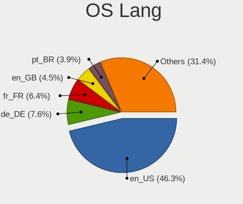
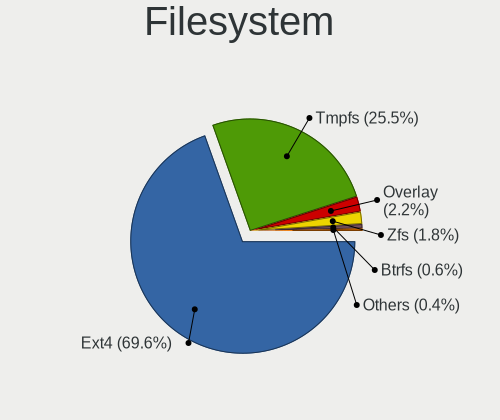
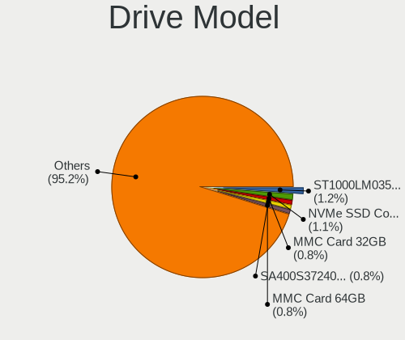

Ubuntu 22.04 - Tested Hardware & Statistics (Notebooks)
-------------------------------------------------------

A project to collect tested hardware configurations for Ubuntu 22.04.

Anyone can contribute to this report by the [hw-probe](https://github.com/linuxhw/hw-probe) tool:

    sudo -E hw-probe -all -upload

Please contribute! Especially if your hardware is rare.

Contents
--------

* [ Test Cases ](#test-cases)

* [ System ](#system)
  - [ Kernel                   ](#kernel)
  - [ Kernel Family            ](#kernel-family)
  - [ Kernel Major Ver.        ](#kernel-major-ver)
  - [ Arch                     ](#arch)
  - [ DE                       ](#de)
  - [ Display Server           ](#display-server)
  - [ Display Manager          ](#display-manager)
  - [ OS Lang                  ](#os-lang)
  - [ Boot Mode                ](#boot-mode)
  - [ Filesystem               ](#filesystem)
  - [ Part. scheme             ](#part-scheme)
  - [ Dual Boot with Linux/BSD ](#dual-boot-with-linuxbsd)
  - [ Dual Boot (Win)          ](#dual-boot-win)

* [ Board ](#board)
  - [ Vendor                   ](#vendor)
  - [ Model                    ](#model)
  - [ Model Family             ](#model-family)
  - [ MFG Year                 ](#mfg-year)
  - [ Form Factor              ](#form-factor)
  - [ Secure Boot              ](#secure-boot)
  - [ Coreboot                 ](#coreboot)
  - [ RAM Size                 ](#ram-size)
  - [ RAM Used                 ](#ram-used)
  - [ Total Drives             ](#total-drives)
  - [ Has CD-ROM               ](#has-cd-rom)
  - [ Has Ethernet             ](#has-ethernet)
  - [ Has WiFi                 ](#has-wifi)
  - [ Has Bluetooth            ](#has-bluetooth)

* [ Location ](#location)
  - [ Country                  ](#country)
  - [ City                     ](#city)

* [ Drives ](#drives)
  - [ Drive Vendor             ](#drive-vendor)
  - [ Drive Model              ](#drive-model)
  - [ HDD Vendor               ](#hdd-vendor)
  - [ SSD Vendor               ](#ssd-vendor)
  - [ Drive Kind               ](#drive-kind)
  - [ Drive Connector          ](#drive-connector)
  - [ Drive Size               ](#drive-size)
  - [ Space Total              ](#space-total)
  - [ Space Used               ](#space-used)
  - [ Malfunc. Drives          ](#malfunc-drives)
  - [ Malfunc. Drive Vendor    ](#malfunc-drive-vendor)
  - [ Malfunc. HDD Vendor      ](#malfunc-hdd-vendor)
  - [ Malfunc. Drive Kind      ](#malfunc-drive-kind)
  - [ Failed Drives            ](#failed-drives)
  - [ Failed Drive Vendor      ](#failed-drive-vendor)
  - [ Drive Status             ](#drive-status)

* [ Storage controller ](#storage-controller)
  - [ Storage Vendor           ](#storage-vendor)
  - [ Storage Model            ](#storage-model)
  - [ Storage Kind             ](#storage-kind)

* [ Processor ](#processor)
  - [ CPU Vendor               ](#cpu-vendor)
  - [ CPU Model                ](#cpu-model)
  - [ CPU Model Family         ](#cpu-model-family)
  - [ CPU Cores                ](#cpu-cores)
  - [ CPU Sockets              ](#cpu-sockets)
  - [ CPU Threads              ](#cpu-threads)
  - [ CPU Op-Modes             ](#cpu-op-modes)
  - [ CPU Microcode            ](#cpu-microcode)
  - [ CPU Microarch            ](#cpu-microarch)

* [ Graphics ](#graphics)
  - [ GPU Vendor               ](#gpu-vendor)
  - [ GPU Model                ](#gpu-model)
  - [ GPU Combo                ](#gpu-combo)
  - [ GPU Driver               ](#gpu-driver)
  - [ GPU Memory               ](#gpu-memory)

* [ Monitor ](#monitor)
  - [ Monitor Vendor           ](#monitor-vendor)
  - [ Monitor Model            ](#monitor-model)
  - [ Monitor Resolution       ](#monitor-resolution)
  - [ Monitor Diagonal         ](#monitor-diagonal)
  - [ Monitor Width            ](#monitor-width)
  - [ Aspect Ratio             ](#aspect-ratio)
  - [ Monitor Area             ](#monitor-area)
  - [ Pixel Density            ](#pixel-density)
  - [ Multiple Monitors        ](#multiple-monitors)

* [ Network ](#network)
  - [ Net Controller Vendor    ](#net-controller-vendor)
  - [ Net Controller Model     ](#net-controller-model)
  - [ Wireless Vendor          ](#wireless-vendor)
  - [ Wireless Model           ](#wireless-model)
  - [ Ethernet Vendor          ](#ethernet-vendor)
  - [ Ethernet Model           ](#ethernet-model)
  - [ Net Controller Kind      ](#net-controller-kind)
  - [ Used Controller          ](#used-controller)
  - [ NICs                     ](#nics)
  - [ IPv6                     ](#ipv6)

* [ Bluetooth ](#bluetooth)
  - [ Bluetooth Vendor         ](#bluetooth-vendor)
  - [ Bluetooth Model          ](#bluetooth-model)

* [ Sound ](#sound)
  - [ Sound Vendor             ](#sound-vendor)
  - [ Sound Model              ](#sound-model)

* [ Memory ](#memory)
  - [ Memory Vendor            ](#memory-vendor)
  - [ Memory Model             ](#memory-model)
  - [ Memory Kind              ](#memory-kind)
  - [ Memory Form Factor       ](#memory-form-factor)
  - [ Memory Size              ](#memory-size)
  - [ Memory Speed             ](#memory-speed)

* [ Printers & scanners ](#printers--scanners)
  - [ Printer Vendor           ](#printer-vendor)
  - [ Printer Model            ](#printer-model)
  - [ Scanner Vendor           ](#scanner-vendor)
  - [ Scanner Model            ](#scanner-model)

* [ Camera ](#camera)
  - [ Camera Vendor            ](#camera-vendor)
  - [ Camera Model             ](#camera-model)

* [ Security ](#security)
  - [ Fingerprint Vendor       ](#fingerprint-vendor)
  - [ Fingerprint Model        ](#fingerprint-model)
  - [ Chipcard Vendor          ](#chipcard-vendor)
  - [ Chipcard Model           ](#chipcard-model)

* [ Unsupported ](#unsupported)
  - [ Unsupported Devices      ](#unsupported-devices)
  - [ Unsupported Device Types ](#unsupported-device-types)

Test Cases
----------

Total: 4266

| Vendor        | Model                       | Probe                                                      | Date         |
|---------------|-----------------------------|------------------------------------------------------------|--------------|
| Lenovo        | ThinkPad T410 2537DH6       | [23c0cbbe94](https://linux-hardware.org/?probe=23c0cbbe94) | Dec 31, 2022 |
| HP            | Pavilion dv6                | [30ec83dbd4](https://linux-hardware.org/?probe=30ec83dbd4) | Dec 31, 2022 |
| Notebook      | PB50_70RF,RD,RC             | [d1f655b9b1](https://linux-hardware.org/?probe=d1f655b9b1) | Dec 31, 2022 |
| Acer          | Aspire V3-571G              | [273f6722e0](https://linux-hardware.org/?probe=273f6722e0) | Dec 31, 2022 |
| Lenovo        | ThinkPad T14 Gen 2i 20W0... | [632515014d](https://linux-hardware.org/?probe=632515014d) | Dec 31, 2022 |
| Lenovo        | ThinkPad E470 20H2A02NBR    | [18827f3f77](https://linux-hardware.org/?probe=18827f3f77) | Dec 31, 2022 |
| HP            | Laptop 15-db0xxx            | [375dccca30](https://linux-hardware.org/?probe=375dccca30) | Dec 31, 2022 |
| Fujitsu       | LIFEBOOK U772               | [3ecdad230a](https://linux-hardware.org/?probe=3ecdad230a) | Dec 31, 2022 |
| Acer          | Aspire E5-575G              | [db40dc530a](https://linux-hardware.org/?probe=db40dc530a) | Dec 31, 2022 |
| Lenovo        | ThinkPad L470 20J5S0Y700    | [9e54ccbafa](https://linux-hardware.org/?probe=9e54ccbafa) | Dec 31, 2022 |
| Lenovo        | ThinkPad Edge E545 20B2S... | [c83f51d7d9](https://linux-hardware.org/?probe=c83f51d7d9) | Dec 31, 2022 |
| Acer          | Aspire E5-521               | [d9b5e3cfc3](https://linux-hardware.org/?probe=d9b5e3cfc3) | Dec 31, 2022 |
| Lenovo        | ThinkPad T480 20L6S29E0A    | [82168627b7](https://linux-hardware.org/?probe=82168627b7) | Dec 31, 2022 |
| Acer          | Aspire 8943G                | [dd6e590470](https://linux-hardware.org/?probe=dd6e590470) | Dec 30, 2022 |
| HP            | Laptop 17-cn1xxx            | [dde4bcd574](https://linux-hardware.org/?probe=dde4bcd574) | Dec 30, 2022 |
| Acer          | Aspire R7-371T              | [057e717cb7](https://linux-hardware.org/?probe=057e717cb7) | Dec 30, 2022 |
| Alienware     | x17 R2                      | [f213236189](https://linux-hardware.org/?probe=f213236189) | Dec 30, 2022 |
| Samsung       | 3570R/370R/470R/450R/510... | [465d2da36b](https://linux-hardware.org/?probe=465d2da36b) | Dec 30, 2022 |
| ASUSTek       | ZenBook UX425EA_UX425EA     | [4c8f1bd9d4](https://linux-hardware.org/?probe=4c8f1bd9d4) | Dec 30, 2022 |
| Unknown       | Unknown                     | [86dcc5a2ff](https://linux-hardware.org/?probe=86dcc5a2ff) | Dec 30, 2022 |
| Lenovo        | ThinkPad X1 Carbon Gen 8... | [80abf89bc6](https://linux-hardware.org/?probe=80abf89bc6) | Dec 30, 2022 |
| ASUSTek       | ASUS EXPERTBOOK B9400CEA... | [8b0b7eb91a](https://linux-hardware.org/?probe=8b0b7eb91a) | Dec 30, 2022 |
| Toshiba       | Satellite C850-1GL          | [f6f61f1841](https://linux-hardware.org/?probe=f6f61f1841) | Dec 30, 2022 |
| Toshiba       | Satellite C850-1GL          | [796edd73f6](https://linux-hardware.org/?probe=796edd73f6) | Dec 30, 2022 |
| Lenovo        | IdeaPad 110-15IBR 80T7      | [ceb89aefed](https://linux-hardware.org/?probe=ceb89aefed) | Dec 30, 2022 |
| System76      | Oryx Pro                    | [dcc09f8dc5](https://linux-hardware.org/?probe=dcc09f8dc5) | Dec 30, 2022 |
| HP            | 431 Notebook                | [6a8d323e0c](https://linux-hardware.org/?probe=6a8d323e0c) | Dec 30, 2022 |
| Lenovo        | ThinkPad X240 20AMS1J60B    | [1d8fcd4a75](https://linux-hardware.org/?probe=1d8fcd4a75) | Dec 30, 2022 |
| HP            | Laptop 17-by0xxx            | [0da7f8e1d5](https://linux-hardware.org/?probe=0da7f8e1d5) | Dec 30, 2022 |
| HP            | EliteBook 745 G5            | [d819dbd901](https://linux-hardware.org/?probe=d819dbd901) | Dec 30, 2022 |
| Apple         | MacBookPro11,3              | [87d0f67d84](https://linux-hardware.org/?probe=87d0f67d84) | Dec 30, 2022 |
| Dell          | Latitude 9420               | [3c43afbd50](https://linux-hardware.org/?probe=3c43afbd50) | Dec 29, 2022 |
| HP            | 255 G8 Notebook PC          | [05209e0503](https://linux-hardware.org/?probe=05209e0503) | Dec 29, 2022 |
| Acer          | Swift SF314-57G             | [9d71d087d8](https://linux-hardware.org/?probe=9d71d087d8) | Dec 29, 2022 |
| Acer          | Aspire A517-51              | [d6e1d87869](https://linux-hardware.org/?probe=d6e1d87869) | Dec 29, 2022 |
| Dell          | Inspiron 3583               | [35f6da18cc](https://linux-hardware.org/?probe=35f6da18cc) | Dec 29, 2022 |
| HP            | 250 G8 Notebook PC          | [754ba4696d](https://linux-hardware.org/?probe=754ba4696d) | Dec 29, 2022 |
| Toshiba       | Satellite A305              | [b27112a271](https://linux-hardware.org/?probe=b27112a271) | Dec 29, 2022 |
| Toshiba       | Satellite A305              | [a955e57ba0](https://linux-hardware.org/?probe=a955e57ba0) | Dec 29, 2022 |
| Toshiba       | Satellite C870-13V          | [5ad370d470](https://linux-hardware.org/?probe=5ad370d470) | Dec 29, 2022 |
| HP            | ProBook 450 G7              | [ca7468f975](https://linux-hardware.org/?probe=ca7468f975) | Dec 29, 2022 |
| HP            | Pavilion Gaming Laptop 1... | [23d1e04f4c](https://linux-hardware.org/?probe=23d1e04f4c) | Dec 29, 2022 |
| AMI           | Intel                       | [b4f7a84546](https://linux-hardware.org/?probe=b4f7a84546) | Dec 29, 2022 |
| HP            | Laptop 17-cp0xxx            | [7f54c2425b](https://linux-hardware.org/?probe=7f54c2425b) | Dec 29, 2022 |
| Lenovo        | IdeaPad S130-11IGM 81J1     | [2b646304f0](https://linux-hardware.org/?probe=2b646304f0) | Dec 29, 2022 |
| Dell          | Latitude 3420               | [eb6d4c6921](https://linux-hardware.org/?probe=eb6d4c6921) | Dec 29, 2022 |
| Lenovo        | Z50-70 20354                | [7b8f5e4379](https://linux-hardware.org/?probe=7b8f5e4379) | Dec 29, 2022 |
| Lenovo        | G50-70 20351                | [6ece20ec58](https://linux-hardware.org/?probe=6ece20ec58) | Dec 29, 2022 |
| HP            | ProBook 430 G1              | [217bb0ea0f](https://linux-hardware.org/?probe=217bb0ea0f) | Dec 29, 2022 |
| Dell          | Latitude E6420              | [9733c425b6](https://linux-hardware.org/?probe=9733c425b6) | Dec 29, 2022 |
| HP            | Laptop 15-dw0xxx            | [b851f7bcfc](https://linux-hardware.org/?probe=b851f7bcfc) | Dec 29, 2022 |
| HP            | EliteBook 2560p             | [e0c82de440](https://linux-hardware.org/?probe=e0c82de440) | Dec 29, 2022 |
| Fujitsu       | LIFEBOOK E736               | [8d54484965](https://linux-hardware.org/?probe=8d54484965) | Dec 29, 2022 |
| Lenovo        | V14-IIL 82C4                | [9b77a1e3f3](https://linux-hardware.org/?probe=9b77a1e3f3) | Dec 29, 2022 |
| Lenovo        | ThinkPad X1 Carbon 6th 2... | [499c91958a](https://linux-hardware.org/?probe=499c91958a) | Dec 29, 2022 |
| Notebook      | W65_67SZ                    | [cbebefb520](https://linux-hardware.org/?probe=cbebefb520) | Dec 29, 2022 |
| Acer          | Aspire A315-41              | [09c901fe98](https://linux-hardware.org/?probe=09c901fe98) | Dec 29, 2022 |
| Apple         | MacBookPro15,2              | [e5a7b5b5be](https://linux-hardware.org/?probe=e5a7b5b5be) | Dec 28, 2022 |
| HP            | Pavilion Laptop 15-eg0xx... | [b915fc0d47](https://linux-hardware.org/?probe=b915fc0d47) | Dec 28, 2022 |
| Lenovo        | ThinkPad E480 20KQS13M00    | [fb7e2874d3](https://linux-hardware.org/?probe=fb7e2874d3) | Dec 28, 2022 |
| HP            | OMEN Laptop 15-en1xxx       | [9e95d6a4ac](https://linux-hardware.org/?probe=9e95d6a4ac) | Dec 28, 2022 |
| System76      | Bonobo Extreme              | [cedfb426df](https://linux-hardware.org/?probe=cedfb426df) | Dec 28, 2022 |
| HP            | Pavilion Laptop 15-cs3xx... | [7f33845279](https://linux-hardware.org/?probe=7f33845279) | Dec 28, 2022 |
| System76      | Bonobo Extreme              | [1b6caec010](https://linux-hardware.org/?probe=1b6caec010) | Dec 28, 2022 |
| GPU Compan... | GWTN116-3                   | [73323d3bad](https://linux-hardware.org/?probe=73323d3bad) | Dec 28, 2022 |
| GPU Compan... | GWTN116-3                   | [bcad5903ae](https://linux-hardware.org/?probe=bcad5903ae) | Dec 28, 2022 |
| ASUSTek       | Zenbook UM5302TA_UM5302T... | [74c1f3a4c2](https://linux-hardware.org/?probe=74c1f3a4c2) | Dec 28, 2022 |
| Alienware     | x17 R2                      | [5a7ea2683a](https://linux-hardware.org/?probe=5a7ea2683a) | Dec 28, 2022 |
| Lenovo        | V14-IIL 82C4                | [58825656f9](https://linux-hardware.org/?probe=58825656f9) | Dec 28, 2022 |
| HP            | 240 G6 Notebook PC          | [b593030fef](https://linux-hardware.org/?probe=b593030fef) | Dec 28, 2022 |
| HP            | 240 G6 Notebook PC          | [27e4ff648f](https://linux-hardware.org/?probe=27e4ff648f) | Dec 28, 2022 |
| Lenovo        | G580 20157                  | [bfefa4ee83](https://linux-hardware.org/?probe=bfefa4ee83) | Dec 28, 2022 |
| Toshiba       | Satellite C55-C             | [2966924363](https://linux-hardware.org/?probe=2966924363) | Dec 28, 2022 |
| Toshiba       | Satellite C55-C             | [f3e27d230f](https://linux-hardware.org/?probe=f3e27d230f) | Dec 28, 2022 |
| ASUSTek       | G73Jh                       | [e406daa47c](https://linux-hardware.org/?probe=e406daa47c) | Dec 28, 2022 |
| HP            | EliteBook 8570p             | [268f34635a](https://linux-hardware.org/?probe=268f34635a) | Dec 28, 2022 |
| Lenovo        | G580 20157                  | [39f72fea9c](https://linux-hardware.org/?probe=39f72fea9c) | Dec 28, 2022 |
| HP            | Compaq Presario CQ60        | [f3f1a02bce](https://linux-hardware.org/?probe=f3f1a02bce) | Dec 28, 2022 |
| HP            | Compaq Presario CQ60        | [b1f32ea75c](https://linux-hardware.org/?probe=b1f32ea75c) | Dec 28, 2022 |
| HP            | ENVY Laptop 13-ba1xxx       | [c25b644aca](https://linux-hardware.org/?probe=c25b644aca) | Dec 28, 2022 |
| Lenovo        | IdeaPad L340-17API 81LY     | [f4df1b165b](https://linux-hardware.org/?probe=f4df1b165b) | Dec 28, 2022 |
| HP            | Laptop 14-fq0xxx            | [e020678b51](https://linux-hardware.org/?probe=e020678b51) | Dec 28, 2022 |
| Lenovo        | 100-14IBY 80R7              | [92b2614ac2](https://linux-hardware.org/?probe=92b2614ac2) | Dec 28, 2022 |
| Lenovo        | Y50-70 20378                | [e232c2de6d](https://linux-hardware.org/?probe=e232c2de6d) | Dec 28, 2022 |
| Samsung       | 550XDA                      | [6d744c7602](https://linux-hardware.org/?probe=6d744c7602) | Dec 28, 2022 |
| Samsung       | 550XDA                      | [b463fa7a54](https://linux-hardware.org/?probe=b463fa7a54) | Dec 28, 2022 |
| Dell          | Latitude E7450              | [b641b13d8a](https://linux-hardware.org/?probe=b641b13d8a) | Dec 28, 2022 |
| Lenovo        | G555 0873                   | [f705d0146a](https://linux-hardware.org/?probe=f705d0146a) | Dec 27, 2022 |
| ASUSTek       | K52Je                       | [28cac9b262](https://linux-hardware.org/?probe=28cac9b262) | Dec 27, 2022 |
| Acer          | Swift SFX14-51G             | [16c5f2a610](https://linux-hardware.org/?probe=16c5f2a610) | Dec 27, 2022 |
| HUAWEI        | BOD-WXX9                    | [d196b92cff](https://linux-hardware.org/?probe=d196b92cff) | Dec 27, 2022 |
| Acer          | Aspire E5-574               | [15e48d4c24](https://linux-hardware.org/?probe=15e48d4c24) | Dec 27, 2022 |
| Teclast       | F15Plus 2                   | [71564a5900](https://linux-hardware.org/?probe=71564a5900) | Dec 27, 2022 |
| Teclast       | F15Plus 2                   | [4d10c4922e](https://linux-hardware.org/?probe=4d10c4922e) | Dec 27, 2022 |
| Acer          | Aspire 5741                 | [22540f4247](https://linux-hardware.org/?probe=22540f4247) | Dec 27, 2022 |
| Acer          | Aspire 5741                 | [b47449f70f](https://linux-hardware.org/?probe=b47449f70f) | Dec 27, 2022 |
| Toshiba       | Satellite A305              | [a9d9fd5efa](https://linux-hardware.org/?probe=a9d9fd5efa) | Dec 27, 2022 |
| Acer          | Predator PH317-56           | [b74460d91c](https://linux-hardware.org/?probe=b74460d91c) | Dec 27, 2022 |
| ASUSTek       | K43E                        | [530e44f9c6](https://linux-hardware.org/?probe=530e44f9c6) | Dec 27, 2022 |
| Schenker      | VISION 15 (SVS15E21)        | [9409e9bfce](https://linux-hardware.org/?probe=9409e9bfce) | Dec 27, 2022 |
| ASUSTek       | X550VXK                     | [039600625a](https://linux-hardware.org/?probe=039600625a) | Dec 27, 2022 |
| Dell          | Vostro 5490                 | [d32b30987a](https://linux-hardware.org/?probe=d32b30987a) | Dec 27, 2022 |
| MACHENIKE     | Machcreator-16              | [682c068af0](https://linux-hardware.org/?probe=682c068af0) | Dec 27, 2022 |
| HUAWEI        | NBLK-WAX9X                  | [292ef79b8a](https://linux-hardware.org/?probe=292ef79b8a) | Dec 27, 2022 |
| Samsung       | SP55S                       | [ce8b6d3fdb](https://linux-hardware.org/?probe=ce8b6d3fdb) | Dec 27, 2022 |
| Samsung       | SP55S                       | [f0d13bbd0d](https://linux-hardware.org/?probe=f0d13bbd0d) | Dec 27, 2022 |
| Lenovo        | ThinkPad X1 Carbon Gen 1... | [e5cd9613f9](https://linux-hardware.org/?probe=e5cd9613f9) | Dec 27, 2022 |
| Samsung       | 300E5M/300E5L               | [669e014ee6](https://linux-hardware.org/?probe=669e014ee6) | Dec 27, 2022 |
| MSI           | MS-7A34                     | [4668f06370](https://linux-hardware.org/?probe=4668f06370) | Dec 26, 2022 |
| Medion        | P6640                       | [0787385a0f](https://linux-hardware.org/?probe=0787385a0f) | Dec 26, 2022 |
| ASUSTek       | VivoBook_ASUSLaptop K340... | [ee7b1d707c](https://linux-hardware.org/?probe=ee7b1d707c) | Dec 26, 2022 |
| HP            | OMEN by Laptop 16-c0xxx     | [3111141139](https://linux-hardware.org/?probe=3111141139) | Dec 26, 2022 |
| Timi          | A18R                        | [83f858038d](https://linux-hardware.org/?probe=83f858038d) | Dec 26, 2022 |
| ASUSTek       | X75A1                       | [5a5ee8db71](https://linux-hardware.org/?probe=5a5ee8db71) | Dec 26, 2022 |
| Dynabook      | Satellite Pro C50-J         | [9b26454313](https://linux-hardware.org/?probe=9b26454313) | Dec 26, 2022 |
| Dynabook      | Satellite Pro C50-J         | [ee842c64a3](https://linux-hardware.org/?probe=ee842c64a3) | Dec 26, 2022 |
| Dell          | XPS 15 9510                 | [394fe96894](https://linux-hardware.org/?probe=394fe96894) | Dec 26, 2022 |
| Acer          | Swift SF314-43              | [f7c9b3538e](https://linux-hardware.org/?probe=f7c9b3538e) | Dec 26, 2022 |
| Lenovo        | IdeaPad 1 14IGL7 82V6       | [27d5cfbc7b](https://linux-hardware.org/?probe=27d5cfbc7b) | Dec 26, 2022 |
| Notebook      | N7x0WU                      | [9eee40dd50](https://linux-hardware.org/?probe=9eee40dd50) | Dec 26, 2022 |
| ASUSTek       | K52Je                       | [dc13c122ed](https://linux-hardware.org/?probe=dc13c122ed) | Dec 26, 2022 |
| ASUSTek       | X751MA                      | [f63581c721](https://linux-hardware.org/?probe=f63581c721) | Dec 26, 2022 |
| Lenovo        | Legion 5 15IAH7H 82RB       | [e47f890444](https://linux-hardware.org/?probe=e47f890444) | Dec 26, 2022 |
| Lenovo        | Legion 5 15IAH7H 82RB       | [c288ade12d](https://linux-hardware.org/?probe=c288ade12d) | Dec 26, 2022 |
| Toshiba       | Satellite A305              | [75a4a25c93](https://linux-hardware.org/?probe=75a4a25c93) | Dec 26, 2022 |
| ASUSTek       | ZenBook S UX391UA           | [5004189ba4](https://linux-hardware.org/?probe=5004189ba4) | Dec 26, 2022 |
| Acer          | Swift SF314-51              | [bfdd69d192](https://linux-hardware.org/?probe=bfdd69d192) | Dec 25, 2022 |
| Dell          | XPS 13 7390                 | [9131496b00](https://linux-hardware.org/?probe=9131496b00) | Dec 25, 2022 |
| ASUSTek       | VivoBook_ASUSLaptop K340... | [7c8560a87e](https://linux-hardware.org/?probe=7c8560a87e) | Dec 25, 2022 |
| Toshiba       | Satellite C850-1C8          | [eab4ef74de](https://linux-hardware.org/?probe=eab4ef74de) | Dec 25, 2022 |
| HP            | ProBook 450 G1              | [26c346f0ab](https://linux-hardware.org/?probe=26c346f0ab) | Dec 25, 2022 |
| Lenovo        | ThinkPad T470 W10DG 20JN... | [08af6df0dd](https://linux-hardware.org/?probe=08af6df0dd) | Dec 25, 2022 |
| Toshiba       | Satellite C850-1C8          | [1e47b54431](https://linux-hardware.org/?probe=1e47b54431) | Dec 25, 2022 |
| HP            | ENVY 17                     | [f3458ee7d5](https://linux-hardware.org/?probe=f3458ee7d5) | Dec 25, 2022 |
| Lenovo        | ThinkPad X1 Carbon 5th 2... | [faba7b00c6](https://linux-hardware.org/?probe=faba7b00c6) | Dec 25, 2022 |
| HP            | ENVY Notebook               | [16af8b4da3](https://linux-hardware.org/?probe=16af8b4da3) | Dec 25, 2022 |
| Acer          | Aspire 5739G                | [0d3bd3f3ec](https://linux-hardware.org/?probe=0d3bd3f3ec) | Dec 25, 2022 |
| ASUSTek       | ROG Strix G713IC_G713IC     | [72fa60782d](https://linux-hardware.org/?probe=72fa60782d) | Dec 25, 2022 |
| Dell          | Latitude 5521               | [32d3e87886](https://linux-hardware.org/?probe=32d3e87886) | Dec 25, 2022 |
| Lenovo        | ThinkPad E585 20KVS06F00    | [8c3bdcc48c](https://linux-hardware.org/?probe=8c3bdcc48c) | Dec 25, 2022 |
| Framework     | Laptop (12th Gen Intel C... | [daebafedd8](https://linux-hardware.org/?probe=daebafedd8) | Dec 25, 2022 |
| Acer          | Nitro AN515-31              | [249f50d430](https://linux-hardware.org/?probe=249f50d430) | Dec 25, 2022 |
| Toshiba       | PORTEGE Z930                | [4a77067c41](https://linux-hardware.org/?probe=4a77067c41) | Dec 25, 2022 |
| Lenovo        | ThinkPad T450 20BUS3GN01    | [e88a11d2bb](https://linux-hardware.org/?probe=e88a11d2bb) | Dec 25, 2022 |
| Dell          | Inspiron 5567               | [46d23963c9](https://linux-hardware.org/?probe=46d23963c9) | Dec 25, 2022 |
| HP            | Pavilion g4                 | [a5d26c4498](https://linux-hardware.org/?probe=a5d26c4498) | Dec 24, 2022 |
| UMAX          | VisionBook 14Wa Pro         | [7eb49ce0ab](https://linux-hardware.org/?probe=7eb49ce0ab) | Dec 24, 2022 |
| Dell          | Vostro 3500                 | [0d59e2b098](https://linux-hardware.org/?probe=0d59e2b098) | Dec 24, 2022 |
| Dell          | Vostro 3501                 | [2bd2de39fb](https://linux-hardware.org/?probe=2bd2de39fb) | Dec 24, 2022 |
| Acer          | Swift SF314-43              | [b1c3a71567](https://linux-hardware.org/?probe=b1c3a71567) | Dec 24, 2022 |
| HP            | Pavilion Laptop 15-cc5xx    | [337ee988ae](https://linux-hardware.org/?probe=337ee988ae) | Dec 24, 2022 |
| Dell          | Latitude 3380               | [e4847d5b1f](https://linux-hardware.org/?probe=e4847d5b1f) | Dec 24, 2022 |
| UMAX          | VisionBook 14Wa Pro         | [4123115ef0](https://linux-hardware.org/?probe=4123115ef0) | Dec 24, 2022 |
| Lenovo        | IdeaPad C340-14API 81N6     | [5e589fb2d1](https://linux-hardware.org/?probe=5e589fb2d1) | Dec 24, 2022 |
| Lenovo        | ThinkPad X61s 7667WHE       | [d689ae23a7](https://linux-hardware.org/?probe=d689ae23a7) | Dec 24, 2022 |
| Toshiba       | dynabook T351/34CBJ         | [281bf4e6a7](https://linux-hardware.org/?probe=281bf4e6a7) | Dec 24, 2022 |
| Lenovo        | ThinkPad L470 20J5S0Y700    | [9ce4138a3b](https://linux-hardware.org/?probe=9ce4138a3b) | Dec 24, 2022 |
| Alienware     | m15 R7                      | [4e33480c8a](https://linux-hardware.org/?probe=4e33480c8a) | Dec 24, 2022 |
| System76      | Pangolin                    | [1c936bfe04](https://linux-hardware.org/?probe=1c936bfe04) | Dec 24, 2022 |
| Dell          | Latitude E6540              | [5df6345cd7](https://linux-hardware.org/?probe=5df6345cd7) | Dec 24, 2022 |
| ASUSTek       | ROG Zephyrus G14 GA401QE... | [dab48b870c](https://linux-hardware.org/?probe=dab48b870c) | Dec 23, 2022 |
| Lenovo        | G505s 20255                 | [2a0fc9ecc3](https://linux-hardware.org/?probe=2a0fc9ecc3) | Dec 23, 2022 |
| Dell          | Inspiron 15 5510            | [d53469cd41](https://linux-hardware.org/?probe=d53469cd41) | Dec 23, 2022 |
| Dell          | Inspiron 15 5510            | [9ddf91aa1b](https://linux-hardware.org/?probe=9ddf91aa1b) | Dec 23, 2022 |
| ASUSTek       | G73Sw                       | [3f4336472e](https://linux-hardware.org/?probe=3f4336472e) | Dec 23, 2022 |
| HP            | EliteBook 840 G5            | [05ab61864f](https://linux-hardware.org/?probe=05ab61864f) | Dec 23, 2022 |
| MSI           | Pulse GL76 12UEK            | [9ca4075241](https://linux-hardware.org/?probe=9ca4075241) | Dec 23, 2022 |
| MSI           | Pulse GL76 12UEK            | [099b612c13](https://linux-hardware.org/?probe=099b612c13) | Dec 23, 2022 |
| Acer          | Predator PH315-54           | [84bdb8f2eb](https://linux-hardware.org/?probe=84bdb8f2eb) | Dec 23, 2022 |
| Notebook      | P64_HJ,HK1                  | [26a548a6f3](https://linux-hardware.org/?probe=26a548a6f3) | Dec 23, 2022 |
| Lenovo        | Legion Y540-15IRH-PG0 81... | [c47eaa75b3](https://linux-hardware.org/?probe=c47eaa75b3) | Dec 23, 2022 |
| HONOR         | BBR-WAX9                    | [19909aa86b](https://linux-hardware.org/?probe=19909aa86b) | Dec 23, 2022 |
| Acer          | Aspire 5050                 | [5d1026f74d](https://linux-hardware.org/?probe=5d1026f74d) | Dec 23, 2022 |
| HP            | ProBook 440 G7              | [33a03f23cc](https://linux-hardware.org/?probe=33a03f23cc) | Dec 23, 2022 |
| Dell          | Vostro 3460                 | [92a850ae45](https://linux-hardware.org/?probe=92a850ae45) | Dec 23, 2022 |
| Timi          | TM1701                      | [2f28d7e2dc](https://linux-hardware.org/?probe=2f28d7e2dc) | Dec 23, 2022 |
| Dell          | Vostro 3460                 | [b7a0d95962](https://linux-hardware.org/?probe=b7a0d95962) | Dec 23, 2022 |
| Timi          | TM1701                      | [dfb4f8774f](https://linux-hardware.org/?probe=dfb4f8774f) | Dec 23, 2022 |
| Dell          | Inspiron 1546               | [7812af7998](https://linux-hardware.org/?probe=7812af7998) | Dec 23, 2022 |
| Hometech      | Alfa 420C                   | [9dcf2c28b3](https://linux-hardware.org/?probe=9dcf2c28b3) | Dec 23, 2022 |
| Lenovo        | ThinkPad T480 20L6S3F41E    | [ce682eacb7](https://linux-hardware.org/?probe=ce682eacb7) | Dec 23, 2022 |
| HP            | Pavilion Laptop 15-cc5xx    | [9ce6c07b4b](https://linux-hardware.org/?probe=9ce6c07b4b) | Dec 23, 2022 |
| Hometech      | Alfa 420C                   | [5a4f33dd7b](https://linux-hardware.org/?probe=5a4f33dd7b) | Dec 22, 2022 |
| Lenovo        | G50-80 80E5                 | [194eee0657](https://linux-hardware.org/?probe=194eee0657) | Dec 22, 2022 |
| Toshiba       | TECRA R940                  | [939e438746](https://linux-hardware.org/?probe=939e438746) | Dec 22, 2022 |
| Acer          | Swift SF314-57G             | [53678dec76](https://linux-hardware.org/?probe=53678dec76) | Dec 22, 2022 |
| Sony          | VPCEB36GM                   | [5aba4d1d5f](https://linux-hardware.org/?probe=5aba4d1d5f) | Dec 22, 2022 |
| HP            | ENVY 15                     | [3c07c09a25](https://linux-hardware.org/?probe=3c07c09a25) | Dec 22, 2022 |
| ASUSTek       | VivoBook_ASUSLaptop K340... | [9462031346](https://linux-hardware.org/?probe=9462031346) | Dec 22, 2022 |
| HP            | Pavilion Gaming Laptop 1... | [b221e3103a](https://linux-hardware.org/?probe=b221e3103a) | Dec 22, 2022 |
| HP            | EliteBook 850 G8 Noteboo... | [5b645cbd36](https://linux-hardware.org/?probe=5b645cbd36) | Dec 22, 2022 |
| Dell          | Vostro 5490                 | [2d85a576e1](https://linux-hardware.org/?probe=2d85a576e1) | Dec 22, 2022 |
| HP            | ProBook 440 G8 Notebook ... | [2d50f93c7f](https://linux-hardware.org/?probe=2d50f93c7f) | Dec 22, 2022 |
| LTD Delovo... | EVE 14 C414 ES4060EW        | [9f1751d2e5](https://linux-hardware.org/?probe=9f1751d2e5) | Dec 22, 2022 |
| HP            | ProBook 440 G8 Notebook ... | [dac438be55](https://linux-hardware.org/?probe=dac438be55) | Dec 22, 2022 |
| Razer         | Blade 17 (2022) - RZ09-0... | [f244715ee3](https://linux-hardware.org/?probe=f244715ee3) | Dec 22, 2022 |
| HP            | Pavilion dv6                | [ef639be49a](https://linux-hardware.org/?probe=ef639be49a) | Dec 22, 2022 |
| Razer         | Blade 17 (2022) - RZ09-0... | [2ebd48d256](https://linux-hardware.org/?probe=2ebd48d256) | Dec 22, 2022 |
| Gateway       | NV78                        | [6733e081fc](https://linux-hardware.org/?probe=6733e081fc) | Dec 22, 2022 |
| Dell          | Latitude E7450              | [16cc0bdbc4](https://linux-hardware.org/?probe=16cc0bdbc4) | Dec 22, 2022 |
| Dell          | Latitude E7450              | [df0790836c](https://linux-hardware.org/?probe=df0790836c) | Dec 22, 2022 |
| Dell          | Vostro 3500                 | [a50ec1e677](https://linux-hardware.org/?probe=a50ec1e677) | Dec 22, 2022 |
| Razer         | Blade 17 (2022) - RZ09-0... | [d6f3d14b20](https://linux-hardware.org/?probe=d6f3d14b20) | Dec 22, 2022 |
| Dell          | Inspiron 5590               | [4e4cf63a0a](https://linux-hardware.org/?probe=4e4cf63a0a) | Dec 22, 2022 |
| Monster       | ABRA A5 V18.1               | [d151d1eb82](https://linux-hardware.org/?probe=d151d1eb82) | Dec 21, 2022 |
| Dell          | XPS 13 9370                 | [982f470134](https://linux-hardware.org/?probe=982f470134) | Dec 21, 2022 |
| Apple         | MacBook5,1                  | [d565332e52](https://linux-hardware.org/?probe=d565332e52) | Dec 21, 2022 |
| Dell          | Latitude E5410              | [969f85bfc3](https://linux-hardware.org/?probe=969f85bfc3) | Dec 21, 2022 |
| HP            | Stream 11 Pro               | [39775c36e3](https://linux-hardware.org/?probe=39775c36e3) | Dec 21, 2022 |
| HP            | Stream Laptop 14-ax0XX      | [7ddd963f2f](https://linux-hardware.org/?probe=7ddd963f2f) | Dec 21, 2022 |
| HP            | Laptop 15s-eq1xxx           | [fd0cb86f82](https://linux-hardware.org/?probe=fd0cb86f82) | Dec 21, 2022 |
| Dell          | G15 5515                    | [e222bc4dfc](https://linux-hardware.org/?probe=e222bc4dfc) | Dec 21, 2022 |
| ASUSTek       | Zenbook UX3402ZA_Q409ZA     | [39b80964ba](https://linux-hardware.org/?probe=39b80964ba) | Dec 21, 2022 |
| ASUSTek       | VivoBook_ASUSLaptop K340... | [7eb6658e3a](https://linux-hardware.org/?probe=7eb6658e3a) | Dec 21, 2022 |
| Lenovo        | ThinkPad T460s 20F9A02PC... | [da548ee1cb](https://linux-hardware.org/?probe=da548ee1cb) | Dec 21, 2022 |
| Haier         | Y11C                        | [cc9a03834f](https://linux-hardware.org/?probe=cc9a03834f) | Dec 21, 2022 |
| HP            | ZBook 15v G5                | [e2056b0bdd](https://linux-hardware.org/?probe=e2056b0bdd) | Dec 21, 2022 |
| Dell          | Latitude 3380               | [808c693271](https://linux-hardware.org/?probe=808c693271) | Dec 20, 2022 |
| ASUSTek       | S551LB                      | [5e48f71064](https://linux-hardware.org/?probe=5e48f71064) | Dec 20, 2022 |
| Dell          | XPS 17 9700                 | [069abc91a3](https://linux-hardware.org/?probe=069abc91a3) | Dec 20, 2022 |
| ASUSTek       | VivoBook_ASUSLaptop K340... | [7a14c8194f](https://linux-hardware.org/?probe=7a14c8194f) | Dec 20, 2022 |
| Lenovo        | ThinkPad P14s Gen 1 20Y1... | [c0f4dfeb74](https://linux-hardware.org/?probe=c0f4dfeb74) | Dec 20, 2022 |
| Positivo      | Master N8340                | [643f2e00e0](https://linux-hardware.org/?probe=643f2e00e0) | Dec 20, 2022 |
| ASUSTek       | TUF Gaming FX505GE          | [094e72dc22](https://linux-hardware.org/?probe=094e72dc22) | Dec 20, 2022 |
| Acer          | Predator PH315-54           | [c291063360](https://linux-hardware.org/?probe=c291063360) | Dec 20, 2022 |
| Lenovo        | ThinkBook 15 G3 ACL 21A4    | [422faa5041](https://linux-hardware.org/?probe=422faa5041) | Dec 20, 2022 |
| Lenovo        | Legion 7 16IAX7 82TD        | [46e5d4fe56](https://linux-hardware.org/?probe=46e5d4fe56) | Dec 20, 2022 |
| Lenovo        | ThinkPad L14 Gen 1 20U50... | [37513092d6](https://linux-hardware.org/?probe=37513092d6) | Dec 20, 2022 |
| Dell          | Inspiron 15 5510            | [e1d9b06871](https://linux-hardware.org/?probe=e1d9b06871) | Dec 20, 2022 |
| HP            | Unknown                     | [84f5cfd0cf](https://linux-hardware.org/?probe=84f5cfd0cf) | Dec 20, 2022 |
| ASUSTek       | VivoBook_ASUSLaptop X421... | [4fbc0ddbd5](https://linux-hardware.org/?probe=4fbc0ddbd5) | Dec 20, 2022 |
| Dell          | XPS 15 9510                 | [870c784f85](https://linux-hardware.org/?probe=870c784f85) | Dec 20, 2022 |
| Acer          | Aspire A515-51              | [29af4c3712](https://linux-hardware.org/?probe=29af4c3712) | Dec 20, 2022 |
| Acer          | Extensa 5230                | [0cfe897a2b](https://linux-hardware.org/?probe=0cfe897a2b) | Dec 20, 2022 |
| HP            | EliteBook 745 G5            | [71137f0f0a](https://linux-hardware.org/?probe=71137f0f0a) | Dec 20, 2022 |
| Dell          | Inspiron 5720               | [a5dc05fb3d](https://linux-hardware.org/?probe=a5dc05fb3d) | Dec 20, 2022 |
| HUAWEI        | NBD-WXX9                    | [1fec8c22dc](https://linux-hardware.org/?probe=1fec8c22dc) | Dec 20, 2022 |
| Dell          | G5 5505                     | [dbb7472e3e](https://linux-hardware.org/?probe=dbb7472e3e) | Dec 20, 2022 |
| Unknown       | Unknown                     | [56781f9824](https://linux-hardware.org/?probe=56781f9824) | Dec 19, 2022 |
| ASUSTek       | VivoBook_ASUSLaptop M340... | [90d4affad3](https://linux-hardware.org/?probe=90d4affad3) | Dec 19, 2022 |
| HP            | Pavilion Laptop 15-cc5xx    | [9c7ebefdc6](https://linux-hardware.org/?probe=9c7ebefdc6) | Dec 19, 2022 |
| MSI           | CreatorPro Z17 A12UKST      | [6b97aacdf0](https://linux-hardware.org/?probe=6b97aacdf0) | Dec 19, 2022 |
| Acer          | Aspire A715-72G             | [8e15fef839](https://linux-hardware.org/?probe=8e15fef839) | Dec 19, 2022 |
| Dell          | Inspiron 11-3168            | [d71732c038](https://linux-hardware.org/?probe=d71732c038) | Dec 19, 2022 |
| ASUSTek       | VivoBook_ASUSLaptop M340... | [3e4b608419](https://linux-hardware.org/?probe=3e4b608419) | Dec 19, 2022 |
| Dell          | Latitude 5521               | [3d3be9c8e9](https://linux-hardware.org/?probe=3d3be9c8e9) | Dec 19, 2022 |
| ASUSTek       | X75VC                       | [a16ed79c3d](https://linux-hardware.org/?probe=a16ed79c3d) | Dec 19, 2022 |
| ASUSTek       | X550MD                      | [16f09c5918](https://linux-hardware.org/?probe=16f09c5918) | Dec 19, 2022 |
| Sony          | VPCF23S1E                   | [4ab362e83b](https://linux-hardware.org/?probe=4ab362e83b) | Dec 19, 2022 |
| Sony          | VPCF23S1E                   | [b62decbb3f](https://linux-hardware.org/?probe=b62decbb3f) | Dec 19, 2022 |
| ASUSTek       | Q400A                       | [8f8b00d1d6](https://linux-hardware.org/?probe=8f8b00d1d6) | Dec 19, 2022 |
| Acer          | Extensa 5230                | [dfe70c9fdc](https://linux-hardware.org/?probe=dfe70c9fdc) | Dec 19, 2022 |
| HP            | Pavilion Laptop 15-cc5xx    | [b7b07d0c82](https://linux-hardware.org/?probe=b7b07d0c82) | Dec 19, 2022 |
| Lenovo        | Y720-15IKB 80VR             | [96dcb47ba1](https://linux-hardware.org/?probe=96dcb47ba1) | Dec 18, 2022 |
| Lenovo        | ThinkPad T450 20BUS0QT02    | [439cd38614](https://linux-hardware.org/?probe=439cd38614) | Dec 18, 2022 |
| ASUSTek       | N750JK                      | [8d876c21b0](https://linux-hardware.org/?probe=8d876c21b0) | Dec 18, 2022 |
| HP            | 255 15.6 inch G9 Noteboo... | [145cf4199f](https://linux-hardware.org/?probe=145cf4199f) | Dec 18, 2022 |
| ASUSTek       | N750JK                      | [71575f3d8c](https://linux-hardware.org/?probe=71575f3d8c) | Dec 18, 2022 |
| HP            | 255 15.6 inch G9 Noteboo... | [ecdb6b63ee](https://linux-hardware.org/?probe=ecdb6b63ee) | Dec 18, 2022 |
| HP            | OMEN by Laptop 16-c0xxx     | [19908d4085](https://linux-hardware.org/?probe=19908d4085) | Dec 18, 2022 |
| Acer          | Aspire V3-772G              | [706c85a543](https://linux-hardware.org/?probe=706c85a543) | Dec 18, 2022 |
| Acer          | Aspire V3-772G              | [038b09e27b](https://linux-hardware.org/?probe=038b09e27b) | Dec 18, 2022 |
| HP            | ProBook 4720s               | [cd684d5dbe](https://linux-hardware.org/?probe=cd684d5dbe) | Dec 18, 2022 |
| Lenovo        | ThinkPad Edge E531 68852... | [24affad285](https://linux-hardware.org/?probe=24affad285) | Dec 18, 2022 |
| HP            | EliteBook 850 G3            | [72eccc0663](https://linux-hardware.org/?probe=72eccc0663) | Dec 18, 2022 |
| ASUSTek       | VivoBook_ASUSLaptop X570... | [83887c3224](https://linux-hardware.org/?probe=83887c3224) | Dec 18, 2022 |
| ASUSTek       | ROG Zephyrus S17 GX701LW... | [31609e8e56](https://linux-hardware.org/?probe=31609e8e56) | Dec 18, 2022 |
| HUAWEI        | NBD-WXX9                    | [b0a4a9919c](https://linux-hardware.org/?probe=b0a4a9919c) | Dec 18, 2022 |
| HP            | 245 G6 Notebook PC          | [b679a6163d](https://linux-hardware.org/?probe=b679a6163d) | Dec 18, 2022 |
| HP            | Pavilion Laptop 14-ec0xx... | [08e38b2be9](https://linux-hardware.org/?probe=08e38b2be9) | Dec 18, 2022 |
| Dell          | XPS 15 9520                 | [b9b1f8140b](https://linux-hardware.org/?probe=b9b1f8140b) | Dec 18, 2022 |
| HP            | 15                          | [95f40991cc](https://linux-hardware.org/?probe=95f40991cc) | Dec 18, 2022 |
| Acer          | Aspire 5739G                | [0cf9fc6ba8](https://linux-hardware.org/?probe=0cf9fc6ba8) | Dec 17, 2022 |
| ASUSTek       | K50IE                       | [5681babfa5](https://linux-hardware.org/?probe=5681babfa5) | Dec 17, 2022 |
| ASUSTek       | ZenBook UX425UAZ_UM425UA... | [b2b93008c3](https://linux-hardware.org/?probe=b2b93008c3) | Dec 17, 2022 |
| HP            | EliteBook 840 G3            | [3e518355b6](https://linux-hardware.org/?probe=3e518355b6) | Dec 17, 2022 |
| HP            | EliteBook 840 G3            | [eccd29cfac](https://linux-hardware.org/?probe=eccd29cfac) | Dec 17, 2022 |
| ASUSTek       | VivoBook_ASUSLaptop M350... | [39de5a5168](https://linux-hardware.org/?probe=39de5a5168) | Dec 17, 2022 |
| Notebook      | PC5x_7xHP_HR_HS             | [7a528ca531](https://linux-hardware.org/?probe=7a528ca531) | Dec 17, 2022 |
| Google        | Cyan                        | [df6e213ea7](https://linux-hardware.org/?probe=df6e213ea7) | Dec 17, 2022 |
| ASUSTek       | VivoBook_ASUSLaptop X712... | [f878370f3d](https://linux-hardware.org/?probe=f878370f3d) | Dec 17, 2022 |
| Google        | Cyan                        | [b0872d0327](https://linux-hardware.org/?probe=b0872d0327) | Dec 17, 2022 |
| ASUSTek       | VivoBook_ASUSLaptop X571... | [f6e6cfc7b3](https://linux-hardware.org/?probe=f6e6cfc7b3) | Dec 17, 2022 |
| Acer          | Aspire A315-41G             | [8641a184ad](https://linux-hardware.org/?probe=8641a184ad) | Dec 17, 2022 |
| Toshiba       | Satellite C50D-A-12M        | [fa522940dd](https://linux-hardware.org/?probe=fa522940dd) | Dec 17, 2022 |
| GPD           | G1619-04                    | [0859fa80c8](https://linux-hardware.org/?probe=0859fa80c8) | Dec 17, 2022 |
| HP            | Pavilion Laptop 15-cc5xx    | [88afc15b1a](https://linux-hardware.org/?probe=88afc15b1a) | Dec 17, 2022 |
| Foxconn       | Kangaroo Mobile Desktop     | [4e847b4a36](https://linux-hardware.org/?probe=4e847b4a36) | Dec 17, 2022 |
| Acer          | Aspire V3-771               | [f8468e696e](https://linux-hardware.org/?probe=f8468e696e) | Dec 17, 2022 |
| Acer          | Aspire V3-771               | [4b9551aa0e](https://linux-hardware.org/?probe=4b9551aa0e) | Dec 17, 2022 |
| Apple         | MacBookPro8,1               | [a30cdfc558](https://linux-hardware.org/?probe=a30cdfc558) | Dec 16, 2022 |
| ASUSTek       | X550CC                      | [045064bd18](https://linux-hardware.org/?probe=045064bd18) | Dec 16, 2022 |
| Digibras      | US41II1                     | [6b1d584ff8](https://linux-hardware.org/?probe=6b1d584ff8) | Dec 16, 2022 |
| HP            | EliteBook 8460p             | [f11100a29e](https://linux-hardware.org/?probe=f11100a29e) | Dec 16, 2022 |
| Acer          | Predator PH315-55           | [01ba4c7b4a](https://linux-hardware.org/?probe=01ba4c7b4a) | Dec 16, 2022 |
| Dell          | Latitude 7420               | [60f07d5a45](https://linux-hardware.org/?probe=60f07d5a45) | Dec 16, 2022 |
| Acer          | Predator PH315-55           | [e2297c201d](https://linux-hardware.org/?probe=e2297c201d) | Dec 16, 2022 |
| Dell          | Inspiron 3442               | [3b5142322b](https://linux-hardware.org/?probe=3b5142322b) | Dec 16, 2022 |
| Lenovo        | Flex 2-15                   | [38670ac27c](https://linux-hardware.org/?probe=38670ac27c) | Dec 16, 2022 |
| Acer          | AO756                       | [ebc4d7cfcb](https://linux-hardware.org/?probe=ebc4d7cfcb) | Dec 16, 2022 |
| HP            | Laptop 15q-bu0xx            | [d291ab8cf8](https://linux-hardware.org/?probe=d291ab8cf8) | Dec 16, 2022 |
| Dell          | Inspiron 5502               | [66635e6315](https://linux-hardware.org/?probe=66635e6315) | Dec 16, 2022 |
| Acer          | Nitro AN517-54              | [cb963df304](https://linux-hardware.org/?probe=cb963df304) | Dec 16, 2022 |
| MSI           | Modern 14 B4MW              | [19e6ba206d](https://linux-hardware.org/?probe=19e6ba206d) | Dec 16, 2022 |
| Lenovo        | Legion S7 15ACH6 82K8       | [a12207ff89](https://linux-hardware.org/?probe=a12207ff89) | Dec 16, 2022 |
| Lenovo        | ThinkBook 13x G2 IAP 21A... | [45e62da63d](https://linux-hardware.org/?probe=45e62da63d) | Dec 16, 2022 |
| Google        | Careena                     | [7309bde937](https://linux-hardware.org/?probe=7309bde937) | Dec 16, 2022 |
| LG Electro... | 14ZB90Q-G.AAC6U1            | [3e99087eee](https://linux-hardware.org/?probe=3e99087eee) | Dec 16, 2022 |
| Razer         | Blade 17 (2022) - RZ09-0... | [7fe46a2bae](https://linux-hardware.org/?probe=7fe46a2bae) | Dec 16, 2022 |
| Lenovo        | G40-30 80FY                 | [b9184a9ade](https://linux-hardware.org/?probe=b9184a9ade) | Dec 16, 2022 |
| Dell          | Inspiron N5110              | [b333e1030f](https://linux-hardware.org/?probe=b333e1030f) | Dec 16, 2022 |
| HP            | EliteBook 840 G5            | [2c57417bdf](https://linux-hardware.org/?probe=2c57417bdf) | Dec 16, 2022 |
| Apple         | MacBookAir7,1               | [facc218586](https://linux-hardware.org/?probe=facc218586) | Dec 15, 2022 |
| Lenovo        | ThinkBook 15 G2 ARE 20VG    | [e8b0c03cb9](https://linux-hardware.org/?probe=e8b0c03cb9) | Dec 15, 2022 |
| Fujitsu       | LIFEBOOK E734               | [ff5206e8e0](https://linux-hardware.org/?probe=ff5206e8e0) | Dec 15, 2022 |
| Toshiba       | IS 1442                     | [c028a09103](https://linux-hardware.org/?probe=c028a09103) | Dec 15, 2022 |
| Dell          | Latitude E6430              | [1da4bd3e02](https://linux-hardware.org/?probe=1da4bd3e02) | Dec 15, 2022 |
| Lenovo        | ThinkPad P14s Gen 3 21J6... | [7aab463e8e](https://linux-hardware.org/?probe=7aab463e8e) | Dec 15, 2022 |
| Samsung       | 530U3C/530U4C/532U3C        | [87f99a0bb2](https://linux-hardware.org/?probe=87f99a0bb2) | Dec 15, 2022 |
| Lenovo        | IdeaPad 330-17IKB 81DK      | [5d47df0d10](https://linux-hardware.org/?probe=5d47df0d10) | Dec 15, 2022 |
| Dell          | G15 5511                    | [8454bbb59e](https://linux-hardware.org/?probe=8454bbb59e) | Dec 15, 2022 |
| Dell          | Latitude 3420               | [a6c668f4a2](https://linux-hardware.org/?probe=a6c668f4a2) | Dec 15, 2022 |
| Lenovo        | ThinkPad X1 Carbon Gen 9... | [888e6092a6](https://linux-hardware.org/?probe=888e6092a6) | Dec 15, 2022 |
| HP            | EliteBook 830 G6            | [5248ee7dbe](https://linux-hardware.org/?probe=5248ee7dbe) | Dec 15, 2022 |
| HP            | EliteBook 830 G7 Noteboo... | [3403282c8c](https://linux-hardware.org/?probe=3403282c8c) | Dec 15, 2022 |
| Lenovo        | ThinkPad T15p Gen 3 21DA... | [36afd57275](https://linux-hardware.org/?probe=36afd57275) | Dec 14, 2022 |
| Acer          | Aspire ES1-512              | [302ea6f1dd](https://linux-hardware.org/?probe=302ea6f1dd) | Dec 14, 2022 |
| Dell          | XPS 9320                    | [8f7e2157bf](https://linux-hardware.org/?probe=8f7e2157bf) | Dec 14, 2022 |
| Dell          | Latitude E7240              | [c47fc4fadf](https://linux-hardware.org/?probe=c47fc4fadf) | Dec 14, 2022 |
| ASUSTek       | VivoBook_ASUSLaptop X509... | [c84a4ee6f2](https://linux-hardware.org/?probe=c84a4ee6f2) | Dec 14, 2022 |
| Samsung       | 300E5E/300E4E/300E5V/300... | [37c6f8c548](https://linux-hardware.org/?probe=37c6f8c548) | Dec 14, 2022 |
| Lenovo        | ThinkPad Edge 0301GBG       | [a48e9c810c](https://linux-hardware.org/?probe=a48e9c810c) | Dec 14, 2022 |
| Lenovo        | IdeaPadFlex 10 20324        | [2499d7057e](https://linux-hardware.org/?probe=2499d7057e) | Dec 14, 2022 |
| Insyde        | G0975                       | [1f4823542d](https://linux-hardware.org/?probe=1f4823542d) | Dec 14, 2022 |
| MSI           | GF63 Thin 9SC               | [e8dcf65234](https://linux-hardware.org/?probe=e8dcf65234) | Dec 14, 2022 |
| HP            | EliteBook 745 G5            | [7c6e344c2a](https://linux-hardware.org/?probe=7c6e344c2a) | Dec 14, 2022 |
| Toshiba       | PORTEGE R830                | [0d5af64ca4](https://linux-hardware.org/?probe=0d5af64ca4) | Dec 14, 2022 |
| HP            | EliteBook 6930p             | [327f863380](https://linux-hardware.org/?probe=327f863380) | Dec 14, 2022 |
| Dell          | Vostro 14 5410              | [d858d468cc](https://linux-hardware.org/?probe=d858d468cc) | Dec 14, 2022 |
| Acer          | Aspire A517-52              | [35df49c1d1](https://linux-hardware.org/?probe=35df49c1d1) | Dec 14, 2022 |
| Alienware     | 15 R4                       | [f365266667](https://linux-hardware.org/?probe=f365266667) | Dec 14, 2022 |
| Lenovo        | B50-30 20382                | [e2ecbddf15](https://linux-hardware.org/?probe=e2ecbddf15) | Dec 14, 2022 |
| Unknown       | Unknown                     | [7c8c0bd933](https://linux-hardware.org/?probe=7c8c0bd933) | Dec 13, 2022 |
| Dell          | Latitude 7350               | [31c0d1eddf](https://linux-hardware.org/?probe=31c0d1eddf) | Dec 13, 2022 |
| Dell          | Latitude 7350               | [f47ad85de3](https://linux-hardware.org/?probe=f47ad85de3) | Dec 13, 2022 |
| Dell          | Inspiron 3421               | [dc2518bc90](https://linux-hardware.org/?probe=dc2518bc90) | Dec 13, 2022 |
| Toshiba       | ENCORE 2 WT10-A             | [46ee1e42cf](https://linux-hardware.org/?probe=46ee1e42cf) | Dec 13, 2022 |
| ASUSTek       | X705UAP                     | [8080afc7d4](https://linux-hardware.org/?probe=8080afc7d4) | Dec 13, 2022 |
| Acer          | Nitro AN515-58              | [9c13949220](https://linux-hardware.org/?probe=9c13949220) | Dec 13, 2022 |
| Notebook      | NL40_50ZU                   | [8e0e4867f8](https://linux-hardware.org/?probe=8e0e4867f8) | Dec 13, 2022 |
| MSI           | Stealth GS77 12UGS          | [255ab7b26d](https://linux-hardware.org/?probe=255ab7b26d) | Dec 13, 2022 |
| Acer          | Aspire A514-54              | [6aa836cfc6](https://linux-hardware.org/?probe=6aa836cfc6) | Dec 13, 2022 |
| MSI           | Stealth GS77 12UGS          | [dbb9f0d299](https://linux-hardware.org/?probe=dbb9f0d299) | Dec 13, 2022 |
| Dell          | Studio 1747                 | [f2feefe033](https://linux-hardware.org/?probe=f2feefe033) | Dec 13, 2022 |
| HP            | Pavilion g6                 | [1120db45a3](https://linux-hardware.org/?probe=1120db45a3) | Dec 13, 2022 |
| GPD           | G1619-04                    | [d263576c0f](https://linux-hardware.org/?probe=d263576c0f) | Dec 12, 2022 |
| Dell          | Inspiron 3442               | [4b44d6e506](https://linux-hardware.org/?probe=4b44d6e506) | Dec 12, 2022 |
| Acer          | Aspire 5742G                | [ee22896cd2](https://linux-hardware.org/?probe=ee22896cd2) | Dec 12, 2022 |
| HUAWEI        | MDZ-WXX9X                   | [ec151dcc1e](https://linux-hardware.org/?probe=ec151dcc1e) | Dec 12, 2022 |
| Acer          | Aspire 7750                 | [9f0f4a8510](https://linux-hardware.org/?probe=9f0f4a8510) | Dec 12, 2022 |
| MSI           | Creator Z17 A12UHST         | [61685b4f1a](https://linux-hardware.org/?probe=61685b4f1a) | Dec 12, 2022 |
| Acer          | Aspire 7750                 | [f7577f248a](https://linux-hardware.org/?probe=f7577f248a) | Dec 12, 2022 |
| Dell          | Latitude 5501               | [1a06a1c5e3](https://linux-hardware.org/?probe=1a06a1c5e3) | Dec 12, 2022 |
| HP            | Laptop 17-cn2xxx            | [ae215a07f7](https://linux-hardware.org/?probe=ae215a07f7) | Dec 12, 2022 |
| Dell          | Inspiron 3793               | [0aecc9e3c9](https://linux-hardware.org/?probe=0aecc9e3c9) | Dec 12, 2022 |
| Dell          | Latitude 5430               | [b439d1e1a4](https://linux-hardware.org/?probe=b439d1e1a4) | Dec 12, 2022 |
| Dell          | Latitude 5501               | [bfb65fea9d](https://linux-hardware.org/?probe=bfb65fea9d) | Dec 12, 2022 |
| Lenovo        | ThinkPad T14 Gen 1 20UDS... | [b518609312](https://linux-hardware.org/?probe=b518609312) | Dec 12, 2022 |
| Lenovo        | ThinkPad T14 Gen 1 20UDS... | [f815a2e4a3](https://linux-hardware.org/?probe=f815a2e4a3) | Dec 12, 2022 |
| ASUSTek       | X75VC                       | [45efd7615d](https://linux-hardware.org/?probe=45efd7615d) | Dec 12, 2022 |
| HP            | 255 G5 Notebook PC          | [3504b137ee](https://linux-hardware.org/?probe=3504b137ee) | Dec 12, 2022 |
| Dell          | Inspiron 5459               | [d9cc4844ac](https://linux-hardware.org/?probe=d9cc4844ac) | Dec 12, 2022 |
| HP            | ProBook 6560b               | [78dfb8c378](https://linux-hardware.org/?probe=78dfb8c378) | Dec 12, 2022 |
| Lenovo        | ThinkPad P15s Gen 1 20T4... | [dba940474a](https://linux-hardware.org/?probe=dba940474a) | Dec 12, 2022 |
| Positivo B... | VJFE44F11X-B2111H           | [903b25c77f](https://linux-hardware.org/?probe=903b25c77f) | Dec 12, 2022 |
| ASUSTek       | GL752VW                     | [05c7382806](https://linux-hardware.org/?probe=05c7382806) | Dec 11, 2022 |
| ASUSTek       | VivoBook_ASUSLaptop X421... | [be36edb132](https://linux-hardware.org/?probe=be36edb132) | Dec 11, 2022 |
| ASUSTek       | VivoBook_ASUSLaptop X421... | [491b8d0b8f](https://linux-hardware.org/?probe=491b8d0b8f) | Dec 11, 2022 |
| Acer          | Aspire A515-55              | [9451601259](https://linux-hardware.org/?probe=9451601259) | Dec 11, 2022 |
| Lenovo        | ThinkPad P17 Gen 2i 20YU... | [c68d83cbe9](https://linux-hardware.org/?probe=c68d83cbe9) | Dec 11, 2022 |
| Unknown       | Unknown                     | [bde36454f9](https://linux-hardware.org/?probe=bde36454f9) | Dec 11, 2022 |
| Acer          | Aspire A315-56              | [aa4c9c448c](https://linux-hardware.org/?probe=aa4c9c448c) | Dec 11, 2022 |
| Lenovo        | ThinkPad P17 Gen 2i 20YU... | [eaba83d221](https://linux-hardware.org/?probe=eaba83d221) | Dec 11, 2022 |
| HP            | 620                         | [65ef44647a](https://linux-hardware.org/?probe=65ef44647a) | Dec 11, 2022 |
| HP            | Laptop 15-bw0xx             | [5f885c41a0](https://linux-hardware.org/?probe=5f885c41a0) | Dec 11, 2022 |
| HP            | EliteBook 8470p             | [4cd5a9cce3](https://linux-hardware.org/?probe=4cd5a9cce3) | Dec 11, 2022 |
| Lenovo        | IdeaPad 3 15IIL05 81WE      | [b463c25c4d](https://linux-hardware.org/?probe=b463c25c4d) | Dec 11, 2022 |
| Lenovo        | IdeaPad 3 15IIL05 81WE      | [1c80b48ea0](https://linux-hardware.org/?probe=1c80b48ea0) | Dec 11, 2022 |
| Dell          | Inspiron 7537               | [890f5f6529](https://linux-hardware.org/?probe=890f5f6529) | Dec 11, 2022 |
| ASUSTek       | N75SF                       | [4d1916b6ca](https://linux-hardware.org/?probe=4d1916b6ca) | Dec 11, 2022 |
| Alienware     | m17 R2                      | [76a2c6b1ca](https://linux-hardware.org/?probe=76a2c6b1ca) | Dec 11, 2022 |
| ASUSTek       | ZenBook UX325EA_UX325EA     | [6e2cf6514a](https://linux-hardware.org/?probe=6e2cf6514a) | Dec 10, 2022 |
| Lenovo        | ThinkPad T14 Gen 1 20S1S... | [b56d83f25b](https://linux-hardware.org/?probe=b56d83f25b) | Dec 10, 2022 |
| Lenovo        | G710                        | [e1c54d8bc8](https://linux-hardware.org/?probe=e1c54d8bc8) | Dec 10, 2022 |
| Lenovo        | G710                        | [b2231f4343](https://linux-hardware.org/?probe=b2231f4343) | Dec 10, 2022 |
| HUAWEI        | CREM-WXX9                   | [8b8b7600f2](https://linux-hardware.org/?probe=8b8b7600f2) | Dec 10, 2022 |
| Lenovo        | ThinkBook 15-IIL 20SM       | [83b02f1ffb](https://linux-hardware.org/?probe=83b02f1ffb) | Dec 10, 2022 |
| HUAWEI        | BOHB-WAX9                   | [573736f441](https://linux-hardware.org/?probe=573736f441) | Dec 10, 2022 |
| Lenovo        | ThinkPad E14 Gen 4 21EBC... | [bec3d9e1e0](https://linux-hardware.org/?probe=bec3d9e1e0) | Dec 10, 2022 |
| HP            | EliteBook 745 G5            | [d89f0b2141](https://linux-hardware.org/?probe=d89f0b2141) | Dec 10, 2022 |
| HUAWEI        | CREM-WXX9                   | [f02aa7b2d8](https://linux-hardware.org/?probe=f02aa7b2d8) | Dec 10, 2022 |
| HP            | Pavilion Laptop 14-ec0xx... | [8008043900](https://linux-hardware.org/?probe=8008043900) | Dec 10, 2022 |
| ASUSTek       | ASUS TUF Gaming A15 FA50... | [26e2759694](https://linux-hardware.org/?probe=26e2759694) | Dec 10, 2022 |
| Lenovo        | V15-IGL 82C3                | [ec71643183](https://linux-hardware.org/?probe=ec71643183) | Dec 09, 2022 |
| Lenovo        | V15-IGL 82C3                | [aa2fd0b3bc](https://linux-hardware.org/?probe=aa2fd0b3bc) | Dec 09, 2022 |
| Toshiba       | Satellite C70-C-11L         | [8de407e526](https://linux-hardware.org/?probe=8de407e526) | Dec 09, 2022 |
| Samsung       | 270E5K                      | [9164b7d324](https://linux-hardware.org/?probe=9164b7d324) | Dec 09, 2022 |
| Toshiba       | Satellite C855-1W4          | [19149f22c5](https://linux-hardware.org/?probe=19149f22c5) | Dec 09, 2022 |
| Dell          | Vostro 3400                 | [ae397c1347](https://linux-hardware.org/?probe=ae397c1347) | Dec 09, 2022 |
| Fujitsu       | LIFEBOOK E752               | [f325091065](https://linux-hardware.org/?probe=f325091065) | Dec 09, 2022 |
| Acer          | Aspire 5742G                | [869e2a9671](https://linux-hardware.org/?probe=869e2a9671) | Dec 09, 2022 |
| Dell          | Latitude E6420              | [acd81c73d0](https://linux-hardware.org/?probe=acd81c73d0) | Dec 09, 2022 |
| HP            | OMEN by Laptop 16-c0xxx     | [d7b8344d86](https://linux-hardware.org/?probe=d7b8344d86) | Dec 09, 2022 |
| Unknown       | Unknown                     | [d737aa3978](https://linux-hardware.org/?probe=d737aa3978) | Dec 09, 2022 |
| Lenovo        | ThinkPad L590 20Q700AWBM    | [ff0997b72a](https://linux-hardware.org/?probe=ff0997b72a) | Dec 09, 2022 |
| Acer          | Unknown                     | [b4eea49cf7](https://linux-hardware.org/?probe=b4eea49cf7) | Dec 09, 2022 |
| Dell          | Precision M4800             | [7a8e8ece92](https://linux-hardware.org/?probe=7a8e8ece92) | Dec 09, 2022 |
| Samsung       | 270E5G/270E5U               | [93075de512](https://linux-hardware.org/?probe=93075de512) | Dec 08, 2022 |
| HP            | Pavilion Laptop 15-eg1xx... | [970f8e990b](https://linux-hardware.org/?probe=970f8e990b) | Dec 08, 2022 |
| Dell          | XPS 15 9520                 | [097bee2404](https://linux-hardware.org/?probe=097bee2404) | Dec 08, 2022 |
| HP            | Pavilion Laptop 15-eg1xx... | [0e7da55713](https://linux-hardware.org/?probe=0e7da55713) | Dec 08, 2022 |
| Lenovo        | ThinkPad X1 Carbon Gen 9... | [aebce6bc5f](https://linux-hardware.org/?probe=aebce6bc5f) | Dec 08, 2022 |
| Digibras      | US41II1                     | [b4651a173e](https://linux-hardware.org/?probe=b4651a173e) | Dec 08, 2022 |
| HP            | EliteBook 840 G8 Noteboo... | [7a6ba7238f](https://linux-hardware.org/?probe=7a6ba7238f) | Dec 08, 2022 |
| Dell          | Vostro 3500                 | [9d46a5fb80](https://linux-hardware.org/?probe=9d46a5fb80) | Dec 08, 2022 |
| Lenovo        | ThinkPad E490 20N8000UMZ    | [15ca126de2](https://linux-hardware.org/?probe=15ca126de2) | Dec 08, 2022 |
| Lenovo        | ThinkPad E490 20N8000UMZ    | [eef6c9c624](https://linux-hardware.org/?probe=eef6c9c624) | Dec 08, 2022 |
| ASUSTek       | X55A                        | [283ef64c76](https://linux-hardware.org/?probe=283ef64c76) | Dec 08, 2022 |
| Dell          | Precision 3560              | [a8fb3d38db](https://linux-hardware.org/?probe=a8fb3d38db) | Dec 08, 2022 |
| Unknown       | Unknown                     | [2a7d6d1541](https://linux-hardware.org/?probe=2a7d6d1541) | Dec 08, 2022 |
| Fujitsu       | FARQ06001                   | [232f343630](https://linux-hardware.org/?probe=232f343630) | Dec 08, 2022 |
| HUAWEI        | HKD-WXX                     | [a7b446df37](https://linux-hardware.org/?probe=a7b446df37) | Dec 08, 2022 |
| HP            | Pavilion Gaming Laptop 1... | [4c7a6feb83](https://linux-hardware.org/?probe=4c7a6feb83) | Dec 08, 2022 |
| HP            | x360 310 G1 PC              | [297806eac9](https://linux-hardware.org/?probe=297806eac9) | Dec 08, 2022 |
| Google        | Glimmer                     | [ad4b3f5575](https://linux-hardware.org/?probe=ad4b3f5575) | Dec 08, 2022 |
| Dell          | XPS 13 7390                 | [d01478d161](https://linux-hardware.org/?probe=d01478d161) | Dec 07, 2022 |
| HP            | Pavilion Gaming Laptop 1... | [57373e16ba](https://linux-hardware.org/?probe=57373e16ba) | Dec 07, 2022 |
| Digibras      | US41II1                     | [eafbffa1b4](https://linux-hardware.org/?probe=eafbffa1b4) | Dec 07, 2022 |
| Google        | Sasuke                      | [527f49b0ae](https://linux-hardware.org/?probe=527f49b0ae) | Dec 07, 2022 |
| HP            | Pavilion 17                 | [fa9fae08f8](https://linux-hardware.org/?probe=fa9fae08f8) | Dec 07, 2022 |
| HP            | Laptop 15-dy5xxx            | [12676c4b5b](https://linux-hardware.org/?probe=12676c4b5b) | Dec 07, 2022 |
| Lenovo        | ThinkPad L14 Gen 2a 20X6... | [b7171256c0](https://linux-hardware.org/?probe=b7171256c0) | Dec 07, 2022 |
| Google        | Sasuke                      | [5bd0b833cb](https://linux-hardware.org/?probe=5bd0b833cb) | Dec 07, 2022 |
| HP            | EliteBook 8530p             | [bffa0ab8f4](https://linux-hardware.org/?probe=bffa0ab8f4) | Dec 07, 2022 |
| HP            | OMEN by Laptop 16-c0xxx     | [cd83a085ba](https://linux-hardware.org/?probe=cd83a085ba) | Dec 07, 2022 |
| HP            | ProBook 450 G0              | [01e7f95a23](https://linux-hardware.org/?probe=01e7f95a23) | Dec 07, 2022 |
| HP            | ProBook 450 G0              | [c3b6c86431](https://linux-hardware.org/?probe=c3b6c86431) | Dec 07, 2022 |
| HP            | EliteBook 8540p             | [1c0ff5bf47](https://linux-hardware.org/?probe=1c0ff5bf47) | Dec 07, 2022 |
| HP            | EliteBook 8540p             | [9cf475f84e](https://linux-hardware.org/?probe=9cf475f84e) | Dec 07, 2022 |
| Dell          | Latitude 5490               | [5ee7cf0137](https://linux-hardware.org/?probe=5ee7cf0137) | Dec 07, 2022 |
| Lenovo        | ThinkPad T510 4349AF5       | [a7d8d66fb7](https://linux-hardware.org/?probe=a7d8d66fb7) | Dec 07, 2022 |
| HP            | 255 G8 Notebook PC          | [020ef58a08](https://linux-hardware.org/?probe=020ef58a08) | Dec 06, 2022 |
| Dell          | Latitude E7440              | [9a859c9a5d](https://linux-hardware.org/?probe=9a859c9a5d) | Dec 06, 2022 |
| Dell          | Latitude 5421               | [f310b80613](https://linux-hardware.org/?probe=f310b80613) | Dec 06, 2022 |
| Dell          | Latitude E7440              | [63b84a9439](https://linux-hardware.org/?probe=63b84a9439) | Dec 06, 2022 |
| MSI           | Prestige 14 A12UC           | [91ff66867b](https://linux-hardware.org/?probe=91ff66867b) | Dec 06, 2022 |
| Matsushita... | CF-52GUNBX2B                | [b0fcd5c69a](https://linux-hardware.org/?probe=b0fcd5c69a) | Dec 06, 2022 |
| HP            | EliteBook 8570p             | [056abaad2b](https://linux-hardware.org/?probe=056abaad2b) | Dec 06, 2022 |
| MSI           | Prestige 14 A11SCX          | [2b5a2c145c](https://linux-hardware.org/?probe=2b5a2c145c) | Dec 06, 2022 |
| Dell          | Inspiron 5720               | [dd85298414](https://linux-hardware.org/?probe=dd85298414) | Dec 06, 2022 |
| Notebook      | NV4XMB,ME,MZ                | [5dbb484356](https://linux-hardware.org/?probe=5dbb484356) | Dec 06, 2022 |
| Dell          | Latitude 5414               | [0633a76b17](https://linux-hardware.org/?probe=0633a76b17) | Dec 06, 2022 |
| Dell          | Latitude 14 Rugged (5404... | [7850a16a1b](https://linux-hardware.org/?probe=7850a16a1b) | Dec 06, 2022 |
| Dell          | Latitude 5414               | [aaa1536fcb](https://linux-hardware.org/?probe=aaa1536fcb) | Dec 06, 2022 |
| ASUSTek       | ROG Zephyrus G15 GA503RW... | [92f4bd5ee1](https://linux-hardware.org/?probe=92f4bd5ee1) | Dec 06, 2022 |
| Teclast       | F7 Plus                     | [5e155a318e](https://linux-hardware.org/?probe=5e155a318e) | Dec 06, 2022 |
| Packard Be... | EasyNote TS11HR             | [cd166beede](https://linux-hardware.org/?probe=cd166beede) | Dec 06, 2022 |
| HP            | EliteBook 840 G8 Noteboo... | [02130c9bbb](https://linux-hardware.org/?probe=02130c9bbb) | Dec 06, 2022 |
| HP            | EliteBook 840 G8 Noteboo... | [eaf904a47a](https://linux-hardware.org/?probe=eaf904a47a) | Dec 06, 2022 |
| HP            | ProBook 440 G8 Notebook ... | [a35bac4078](https://linux-hardware.org/?probe=a35bac4078) | Dec 06, 2022 |
| HP            | ProBook 450 G5              | [ca7c94fec3](https://linux-hardware.org/?probe=ca7c94fec3) | Dec 06, 2022 |
| Acer          | Aspire A315-42              | [68f683d29e](https://linux-hardware.org/?probe=68f683d29e) | Dec 06, 2022 |
| ASUSTek       | X555UA                      | [75c6db07ac](https://linux-hardware.org/?probe=75c6db07ac) | Dec 06, 2022 |
| ASUSTek       | VivoBook S13 X330UA         | [d01d1e9652](https://linux-hardware.org/?probe=d01d1e9652) | Dec 06, 2022 |
| Dell          | Inspiron 3421               | [9af2847ac7](https://linux-hardware.org/?probe=9af2847ac7) | Dec 06, 2022 |
| HP            | 15 Notebook PC              | [4c7a592f71](https://linux-hardware.org/?probe=4c7a592f71) | Dec 05, 2022 |
| Lenovo        | ThinkPad T440s 20ARS2A50... | [082e17aab7](https://linux-hardware.org/?probe=082e17aab7) | Dec 05, 2022 |
| Dell          | G15 5511                    | [999ed53283](https://linux-hardware.org/?probe=999ed53283) | Dec 05, 2022 |
| Lenovo        | ThinkPad E15 Gen 2 20TD0... | [302b36a67e](https://linux-hardware.org/?probe=302b36a67e) | Dec 05, 2022 |
| Gigabyte      | U24                         | [dbe62c503d](https://linux-hardware.org/?probe=dbe62c503d) | Dec 05, 2022 |
| Acer          | Aspire 5742G                | [da82fb083d](https://linux-hardware.org/?probe=da82fb083d) | Dec 05, 2022 |
| Apple         | MacBookPro6,1               | [137dd6d1ba](https://linux-hardware.org/?probe=137dd6d1ba) | Dec 05, 2022 |
| Toshiba       | Satellite L50-B             | [5bbe558b2f](https://linux-hardware.org/?probe=5bbe558b2f) | Dec 05, 2022 |
| Lenovo        | Yoga Slim 9 14ITL5 82D1     | [f90956a720](https://linux-hardware.org/?probe=f90956a720) | Dec 05, 2022 |
| MSI           | Prestige 14 A11SCX          | [ca5bc5dfe6](https://linux-hardware.org/?probe=ca5bc5dfe6) | Dec 05, 2022 |
| Dell          | Vostro 5502                 | [862097a47c](https://linux-hardware.org/?probe=862097a47c) | Dec 05, 2022 |
| Acer          | Aspire A515-56              | [9cb1b48840](https://linux-hardware.org/?probe=9cb1b48840) | Dec 05, 2022 |
| Acer          | Aspire A515-56              | [5108572656](https://linux-hardware.org/?probe=5108572656) | Dec 05, 2022 |
| Medion        | P6640                       | [69564ba63a](https://linux-hardware.org/?probe=69564ba63a) | Dec 05, 2022 |
| MSI           | GF63 Thin 9SC               | [5ae5166847](https://linux-hardware.org/?probe=5ae5166847) | Dec 05, 2022 |
| MSI           | GF63 Thin 9SC               | [1a52a1c699](https://linux-hardware.org/?probe=1a52a1c699) | Dec 05, 2022 |
| Medion        | P6640                       | [b80a41d8e0](https://linux-hardware.org/?probe=b80a41d8e0) | Dec 05, 2022 |
| HP            | Stream Laptop 14-cb1xxx     | [bac2abc9d8](https://linux-hardware.org/?probe=bac2abc9d8) | Dec 05, 2022 |
| Razer         | Blade 15 (2022) - RZ09-0... | [93f5a61855](https://linux-hardware.org/?probe=93f5a61855) | Dec 05, 2022 |
| HP            | EliteBook 8470p             | [ad0f79e874](https://linux-hardware.org/?probe=ad0f79e874) | Dec 05, 2022 |
| Apple         | MacBookPro10,1              | [d321abafcd](https://linux-hardware.org/?probe=d321abafcd) | Dec 05, 2022 |
| Acer          | Aspire E5-573               | [30f8bd2ae9](https://linux-hardware.org/?probe=30f8bd2ae9) | Dec 04, 2022 |
| HP            | x360 310 G1 PC              | [b15b39727b](https://linux-hardware.org/?probe=b15b39727b) | Dec 04, 2022 |
| Razer         | Blade 15 (2022) - RZ09-0... | [978594fe2f](https://linux-hardware.org/?probe=978594fe2f) | Dec 04, 2022 |
| MSI           | Creator Z17 A12UHST         | [afbbf473b9](https://linux-hardware.org/?probe=afbbf473b9) | Dec 04, 2022 |
| ASUSTek       | P43E                        | [c21502af00](https://linux-hardware.org/?probe=c21502af00) | Dec 04, 2022 |
| MSI           | Modern 14 B4MW              | [897f477f2d](https://linux-hardware.org/?probe=897f477f2d) | Dec 04, 2022 |
| MSI           | Modern 14 B4MW              | [9f512598e2](https://linux-hardware.org/?probe=9f512598e2) | Dec 04, 2022 |
| HP            | ENVY dv7                    | [8e8b9ecfb6](https://linux-hardware.org/?probe=8e8b9ecfb6) | Dec 04, 2022 |
| Acer          | TravelMate 5742             | [f4487c6ad5](https://linux-hardware.org/?probe=f4487c6ad5) | Dec 04, 2022 |
| Acer          | Aspire V5-471G              | [10a6f30aeb](https://linux-hardware.org/?probe=10a6f30aeb) | Dec 04, 2022 |
| Acer          | Aspire V5-471G              | [725404aadb](https://linux-hardware.org/?probe=725404aadb) | Dec 04, 2022 |
| HP            | Pavilion Laptop 15-cc5xx    | [1b05c93a34](https://linux-hardware.org/?probe=1b05c93a34) | Dec 04, 2022 |
| HP            | 247 G8                      | [f7cc5f6544](https://linux-hardware.org/?probe=f7cc5f6544) | Dec 04, 2022 |
| HP            | Stream Laptop 11-ak0xxx     | [92e8cef068](https://linux-hardware.org/?probe=92e8cef068) | Dec 04, 2022 |
| Acer          | Aspire A514-53              | [f0c20f1a0a](https://linux-hardware.org/?probe=f0c20f1a0a) | Dec 04, 2022 |
| HP            | 15                          | [132fad5c38](https://linux-hardware.org/?probe=132fad5c38) | Dec 04, 2022 |
| Fujitsu       | LIFEBOOK E544               | [bd465999ee](https://linux-hardware.org/?probe=bd465999ee) | Dec 04, 2022 |
| Lenovo        | ThinkBook 15 G3 ACL 21A4    | [7a5f820cf4](https://linux-hardware.org/?probe=7a5f820cf4) | Dec 03, 2022 |
| Acer          | Aspire 5820TG               | [f1ba906a03](https://linux-hardware.org/?probe=f1ba906a03) | Dec 03, 2022 |
| Acer          | Aspire 5820TG               | [ff1d00ce49](https://linux-hardware.org/?probe=ff1d00ce49) | Dec 03, 2022 |
| ASUSTek       | K501UW                      | [1571941805](https://linux-hardware.org/?probe=1571941805) | Dec 03, 2022 |
| Dell          | Latitude 3420               | [23e8b890d2](https://linux-hardware.org/?probe=23e8b890d2) | Dec 03, 2022 |
| HP            | Pavilion g7                 | [115e11c6da](https://linux-hardware.org/?probe=115e11c6da) | Dec 03, 2022 |
| ASUSTek       | X541NA                      | [9da9a87b5b](https://linux-hardware.org/?probe=9da9a87b5b) | Dec 03, 2022 |
| HP            | EliteBook 820 G4            | [b0437249b0](https://linux-hardware.org/?probe=b0437249b0) | Dec 03, 2022 |
| Dell          | Inspiron 5565               | [b5b4441f98](https://linux-hardware.org/?probe=b5b4441f98) | Dec 03, 2022 |
| Lenovo        | ThinkPad E15 Gen 2 20TD0... | [e44ba4a41b](https://linux-hardware.org/?probe=e44ba4a41b) | Dec 03, 2022 |
| Star Labs     | StarLite                    | [d4cf1b0cd0](https://linux-hardware.org/?probe=d4cf1b0cd0) | Dec 03, 2022 |
| Google        | Voxel rev3                  | [b64ebf7db7](https://linux-hardware.org/?probe=b64ebf7db7) | Dec 03, 2022 |
| Samsung       | 530U3C/530U4C/532U3C        | [91edd3827d](https://linux-hardware.org/?probe=91edd3827d) | Dec 02, 2022 |
| Acer          | Nitro AN515-46              | [7bdc87a5cc](https://linux-hardware.org/?probe=7bdc87a5cc) | Dec 02, 2022 |
| Acer          | Nitro AN515-46              | [d17ff52554](https://linux-hardware.org/?probe=d17ff52554) | Dec 02, 2022 |
| HP            | EliteBook 865 16 inch G9... | [33b77409e5](https://linux-hardware.org/?probe=33b77409e5) | Dec 02, 2022 |
| Acer          | Aspire E5-471               | [3e9c2f0201](https://linux-hardware.org/?probe=3e9c2f0201) | Dec 02, 2022 |
| Acer          | Aspire 5250                 | [c3aa7eddf5](https://linux-hardware.org/?probe=c3aa7eddf5) | Dec 02, 2022 |
| HP            | Laptop 15-da0xxx            | [f6d1014498](https://linux-hardware.org/?probe=f6d1014498) | Dec 02, 2022 |
| HP            | ProBook 6560b               | [c62ff16666](https://linux-hardware.org/?probe=c62ff16666) | Dec 02, 2022 |
| Acer          | Aspire A514-53              | [07ff06f360](https://linux-hardware.org/?probe=07ff06f360) | Dec 02, 2022 |
| Lenovo        | ThinkPad T15 Gen 1 20S60... | [2b1a977b21](https://linux-hardware.org/?probe=2b1a977b21) | Dec 02, 2022 |
| Dell          | Latitude E5440              | [07a63e0662](https://linux-hardware.org/?probe=07a63e0662) | Dec 02, 2022 |
| Acer          | Swift SF314-510G            | [b66322960d](https://linux-hardware.org/?probe=b66322960d) | Dec 02, 2022 |
| ASUSTek       | VivoBook_ASUSLaptop X512... | [c19e5b9f4b](https://linux-hardware.org/?probe=c19e5b9f4b) | Dec 02, 2022 |
| Lenovo        | ThinkPad T61 6463WAP        | [e11baa0e49](https://linux-hardware.org/?probe=e11baa0e49) | Dec 02, 2022 |
| MSI           | GF75 Thin 10UEK             | [3f994419c5](https://linux-hardware.org/?probe=3f994419c5) | Dec 01, 2022 |
| Lenovo        | Legion 7 16ITHg6 82K6       | [736030840c](https://linux-hardware.org/?probe=736030840c) | Dec 01, 2022 |
| HUAWEI        | BOHB-WAX9                   | [3d64de28f5](https://linux-hardware.org/?probe=3d64de28f5) | Dec 01, 2022 |
| HP            | ENVY dv7                    | [60e3263ce2](https://linux-hardware.org/?probe=60e3263ce2) | Dec 01, 2022 |
| HP            | Laptop 15-dw1xxx            | [d8d5459ad6](https://linux-hardware.org/?probe=d8d5459ad6) | Dec 01, 2022 |
| AZW           | SEi                         | [3cd2f7f657](https://linux-hardware.org/?probe=3cd2f7f657) | Dec 01, 2022 |
| HP            | Laptop 15-dw1xxx            | [1dddd99280](https://linux-hardware.org/?probe=1dddd99280) | Dec 01, 2022 |
| Lenovo        | IdeaPad Gaming 3 15IAH7 ... | [fe9e8854c5](https://linux-hardware.org/?probe=fe9e8854c5) | Dec 01, 2022 |
| Samsung       | R540/R538/SA41/E452         | [afad3c8828](https://linux-hardware.org/?probe=afad3c8828) | Dec 01, 2022 |
| Positivo B... | VJFE53F11X-B0511H           | [24b1be97d6](https://linux-hardware.org/?probe=24b1be97d6) | Dec 01, 2022 |
| Positivo B... | VJFE53F11X-B0511H           | [a2e91cba31](https://linux-hardware.org/?probe=a2e91cba31) | Dec 01, 2022 |
| HP            | Notebook                    | [7c22b96a9a](https://linux-hardware.org/?probe=7c22b96a9a) | Dec 01, 2022 |
| Dell          | XPS 13 9343                 | [125fcd77b9](https://linux-hardware.org/?probe=125fcd77b9) | Dec 01, 2022 |
| HP            | EliteBook 8730w             | [fa27703043](https://linux-hardware.org/?probe=fa27703043) | Dec 01, 2022 |
| HP            | ENVY dv7                    | [1cef09f19a](https://linux-hardware.org/?probe=1cef09f19a) | Dec 01, 2022 |
| ASUSTek       | GL503VM                     | [dbd4aba670](https://linux-hardware.org/?probe=dbd4aba670) | Dec 01, 2022 |
| ASUSTek       | GL503VM                     | [3db38d22b3](https://linux-hardware.org/?probe=3db38d22b3) | Dec 01, 2022 |
| Lenovo        | ThinkPad T480S 20L8SBTD0... | [2d4a014ef1](https://linux-hardware.org/?probe=2d4a014ef1) | Dec 01, 2022 |
| Lenovo        | ThinkPad T480S 20L8SBTD0... | [e1cec664eb](https://linux-hardware.org/?probe=e1cec664eb) | Dec 01, 2022 |
| ASUSTek       | K52F                        | [4276cc2cb9](https://linux-hardware.org/?probe=4276cc2cb9) | Dec 01, 2022 |
| Dell          | Vostro 3480                 | [bf353a87c5](https://linux-hardware.org/?probe=bf353a87c5) | Dec 01, 2022 |
| W271ELQ       | Unknown                     | [ae170d1e81](https://linux-hardware.org/?probe=ae170d1e81) | Dec 01, 2022 |
| Lenovo        | ThinkPad L560 20F2S2UR02    | [29c5e0f7b1](https://linux-hardware.org/?probe=29c5e0f7b1) | Dec 01, 2022 |
| Dell          | Vostro 3578                 | [89161c2dee](https://linux-hardware.org/?probe=89161c2dee) | Dec 01, 2022 |
| Acer          | Aspire A315-21              | [7c3a371165](https://linux-hardware.org/?probe=7c3a371165) | Nov 30, 2022 |
| Acer          | Aspire A315-21              | [5f14327a56](https://linux-hardware.org/?probe=5f14327a56) | Nov 30, 2022 |
| Samsung       | 300E4A/300E5A/300E7A/343... | [5f53eff4a6](https://linux-hardware.org/?probe=5f53eff4a6) | Nov 30, 2022 |
| Standard      | Unknown                     | [723d9c3551](https://linux-hardware.org/?probe=723d9c3551) | Nov 30, 2022 |
| Dell          | Inspiron 15-3567            | [ee99c81e47](https://linux-hardware.org/?probe=ee99c81e47) | Nov 30, 2022 |
| Lenovo        | ThinkPad T470s W10DG 20J... | [645418a0dd](https://linux-hardware.org/?probe=645418a0dd) | Nov 30, 2022 |
| ASUSTek       | UX550VD                     | [a3f2aafbf1](https://linux-hardware.org/?probe=a3f2aafbf1) | Nov 30, 2022 |
| Packard Be... | EasyNote TE69CXP            | [919275eb73](https://linux-hardware.org/?probe=919275eb73) | Nov 30, 2022 |
| HP            | OMEN Laptop 15-en0xxx       | [c3d55f501c](https://linux-hardware.org/?probe=c3d55f501c) | Nov 30, 2022 |
| Dell          | Latitude 7390               | [7214cac96d](https://linux-hardware.org/?probe=7214cac96d) | Nov 30, 2022 |
| Dell          | XPS 15 9500                 | [f9215967d3](https://linux-hardware.org/?probe=f9215967d3) | Nov 30, 2022 |
| Lenovo        | ThinkPad T470p 20J7S1FR0... | [517347d2cf](https://linux-hardware.org/?probe=517347d2cf) | Nov 30, 2022 |
| Samsung       | 300E4A/300E5A/300E7A/343... | [aadb9ff1d4](https://linux-hardware.org/?probe=aadb9ff1d4) | Nov 30, 2022 |
| HP            | Laptop 14-dk1xxx            | [9dbd54884d](https://linux-hardware.org/?probe=9dbd54884d) | Nov 30, 2022 |
| ASUSTek       | VivoBook_ASUSLaptop X140... | [55d95654c4](https://linux-hardware.org/?probe=55d95654c4) | Nov 30, 2022 |
| Dell          | Inspiron 15-3552            | [e740b148c1](https://linux-hardware.org/?probe=e740b148c1) | Nov 30, 2022 |
| Apple         | MacBook4,1                  | [0866a64897](https://linux-hardware.org/?probe=0866a64897) | Nov 30, 2022 |
| Acer          | Nitro AN515-58              | [02f4319195](https://linux-hardware.org/?probe=02f4319195) | Nov 29, 2022 |
| Acer          | AO756                       | [c1ff6fe10c](https://linux-hardware.org/?probe=c1ff6fe10c) | Nov 29, 2022 |
| Acer          | Nitro AN515-58              | [77ad02b5bd](https://linux-hardware.org/?probe=77ad02b5bd) | Nov 29, 2022 |
| Dell          | Vostro 5470                 | [15c504a6ef](https://linux-hardware.org/?probe=15c504a6ef) | Nov 29, 2022 |
| Lenovo        | Legion 5 15IMH05H 82CF      | [adb0404576](https://linux-hardware.org/?probe=adb0404576) | Nov 29, 2022 |
| Dell          | Latitude E6410              | [d7abefea4b](https://linux-hardware.org/?probe=d7abefea4b) | Nov 29, 2022 |
| ASUSTek       | X756UVK                     | [93b549fb81](https://linux-hardware.org/?probe=93b549fb81) | Nov 29, 2022 |
| Lenovo        | ThinkPad X1 Carbon Gen 9... | [1f904e68af](https://linux-hardware.org/?probe=1f904e68af) | Nov 29, 2022 |
| Dell          | Latitude 5330               | [b8d907f2e8](https://linux-hardware.org/?probe=b8d907f2e8) | Nov 29, 2022 |
| Lenovo        | B590 20206                  | [5bec8860f3](https://linux-hardware.org/?probe=5bec8860f3) | Nov 29, 2022 |
| Dell          | Latitude 3500               | [de0731ac74](https://linux-hardware.org/?probe=de0731ac74) | Nov 29, 2022 |
| Lenovo        | IdeaPad S340-14IIL 81VV     | [2a4bb490d0](https://linux-hardware.org/?probe=2a4bb490d0) | Nov 29, 2022 |
| Lenovo        | IdeaPad S340-14IIL 81VV     | [a05b99b00e](https://linux-hardware.org/?probe=a05b99b00e) | Nov 29, 2022 |
| Lenovo        | ThinkBook 15 G3 ACL 21A4    | [ef6247e6fd](https://linux-hardware.org/?probe=ef6247e6fd) | Nov 28, 2022 |
| ASUSTek       | ASUS TUF Dash F15 FX517Z... | [972f6f4355](https://linux-hardware.org/?probe=972f6f4355) | Nov 28, 2022 |
| Acer          | Aspire 5820TG               | [61cab6d996](https://linux-hardware.org/?probe=61cab6d996) | Nov 28, 2022 |
| Acer          | Aspire 5820TG               | [1e64d9426d](https://linux-hardware.org/?probe=1e64d9426d) | Nov 28, 2022 |
| Acer          | Swift SF314-43              | [1a6c47ad0e](https://linux-hardware.org/?probe=1a6c47ad0e) | Nov 28, 2022 |
| Apple         | MacBookPro8,1               | [7ba1690c68](https://linux-hardware.org/?probe=7ba1690c68) | Nov 28, 2022 |
| Dell          | G3 3500                     | [291b53ea79](https://linux-hardware.org/?probe=291b53ea79) | Nov 28, 2022 |
| HP            | ProBook 640 G2              | [56ceffe338](https://linux-hardware.org/?probe=56ceffe338) | Nov 28, 2022 |
| ASUSTek       | X756UVK                     | [4745940cf9](https://linux-hardware.org/?probe=4745940cf9) | Nov 28, 2022 |
| Notebook      | L140PU                      | [8893420e06](https://linux-hardware.org/?probe=8893420e06) | Nov 28, 2022 |
| Acer          | Aspire 5742G                | [d5f03d47ba](https://linux-hardware.org/?probe=d5f03d47ba) | Nov 28, 2022 |
| HUAWEI        | MRC-WX0                     | [98f550465b](https://linux-hardware.org/?probe=98f550465b) | Nov 28, 2022 |
| Acer          | Aspire 5742G                | [e0701bc81d](https://linux-hardware.org/?probe=e0701bc81d) | Nov 28, 2022 |
| HP            | Pavilion Laptop 15-cw1xx... | [1f4c5bfc57](https://linux-hardware.org/?probe=1f4c5bfc57) | Nov 28, 2022 |
| Dell          | XPS 13 9370                 | [d353a1624b](https://linux-hardware.org/?probe=d353a1624b) | Nov 28, 2022 |
| PC Special... | NH5xAx                      | [8bd9aae635](https://linux-hardware.org/?probe=8bd9aae635) | Nov 28, 2022 |
| ASUSTek       | ZenBook UX325UA_UM325UA     | [c95bbb16de](https://linux-hardware.org/?probe=c95bbb16de) | Nov 28, 2022 |
| Dell          | XPS 15 7590                 | [8072eb50aa](https://linux-hardware.org/?probe=8072eb50aa) | Nov 28, 2022 |
| HP            | Stream Laptop 14-cb1xxx     | [1bf2bd6761](https://linux-hardware.org/?probe=1bf2bd6761) | Nov 28, 2022 |
| PC Special... | NH5xAx                      | [3be194cb8a](https://linux-hardware.org/?probe=3be194cb8a) | Nov 28, 2022 |
| HP            | EliteBook 8470w             | [7008753054](https://linux-hardware.org/?probe=7008753054) | Nov 28, 2022 |
| Lenovo        | ThinkPad E580 20KS001QMX    | [97fda88c7b](https://linux-hardware.org/?probe=97fda88c7b) | Nov 28, 2022 |
| ASUSTek       | S551LB                      | [d74127627f](https://linux-hardware.org/?probe=d74127627f) | Nov 28, 2022 |
| Lenovo        | ThinkPad E490 20N8000RUK    | [6816e8f5ca](https://linux-hardware.org/?probe=6816e8f5ca) | Nov 27, 2022 |
| Lenovo        | ThinkPad E490 20N8000RUK    | [06c690a0e1](https://linux-hardware.org/?probe=06c690a0e1) | Nov 27, 2022 |
| HP            | Laptop 14s-dq5xxx           | [e5164649e1](https://linux-hardware.org/?probe=e5164649e1) | Nov 27, 2022 |
| Dell          | XPS 13 9305                 | [c306dcfa4f](https://linux-hardware.org/?probe=c306dcfa4f) | Nov 27, 2022 |
| HP            | ProBook 5330m               | [3763f505a0](https://linux-hardware.org/?probe=3763f505a0) | Nov 27, 2022 |
| ASUSTek       | VivoBook_ASUSLaptop X412... | [2aba12235d](https://linux-hardware.org/?probe=2aba12235d) | Nov 27, 2022 |
| Acer          | AO756                       | [fa5c9df13a](https://linux-hardware.org/?probe=fa5c9df13a) | Nov 27, 2022 |
| Acer          | AO756                       | [d390d588fe](https://linux-hardware.org/?probe=d390d588fe) | Nov 27, 2022 |
| HUAWEI        | RLEF-XX                     | [bb5c736032](https://linux-hardware.org/?probe=bb5c736032) | Nov 27, 2022 |
| Lenovo        | ThinkBook 14 G2 ITL 20VD    | [2d1a576ee6](https://linux-hardware.org/?probe=2d1a576ee6) | Nov 27, 2022 |
| Dell          | G5 5587                     | [689db41249](https://linux-hardware.org/?probe=689db41249) | Nov 27, 2022 |
| Dell          | XPS 15 7590                 | [18b1ecf4fd](https://linux-hardware.org/?probe=18b1ecf4fd) | Nov 27, 2022 |
| Dell          | G7 7700                     | [16407c6485](https://linux-hardware.org/?probe=16407c6485) | Nov 27, 2022 |
| Apple         | MacBookAir6,2               | [8e266a1137](https://linux-hardware.org/?probe=8e266a1137) | Nov 27, 2022 |
| SmbiosType... | SmbiosType1_SystemProduc... | [fc54a7e10e](https://linux-hardware.org/?probe=fc54a7e10e) | Nov 27, 2022 |
| ASUSTek       | G75VX                       | [87ef485975](https://linux-hardware.org/?probe=87ef485975) | Nov 27, 2022 |
| Dell          | Vostro 3580                 | [350202deed](https://linux-hardware.org/?probe=350202deed) | Nov 27, 2022 |
| HP            | ProBook 440 G7              | [d923cda32c](https://linux-hardware.org/?probe=d923cda32c) | Nov 26, 2022 |
| HP            | ProBook 6470b               | [c8da54315e](https://linux-hardware.org/?probe=c8da54315e) | Nov 26, 2022 |
| ASUSTek       | U56E                        | [4222387904](https://linux-hardware.org/?probe=4222387904) | Nov 26, 2022 |
| Lenovo        | Y50-70 20378                | [57e4892065](https://linux-hardware.org/?probe=57e4892065) | Nov 26, 2022 |
| Acer          | Swift SFX14-41G             | [521cb4d847](https://linux-hardware.org/?probe=521cb4d847) | Nov 26, 2022 |
| Acer          | Aspire A315-58              | [df3e0f4b6c](https://linux-hardware.org/?probe=df3e0f4b6c) | Nov 26, 2022 |
| Acer          | Aspire A315-58              | [82ee1f1740](https://linux-hardware.org/?probe=82ee1f1740) | Nov 26, 2022 |
| MSI           | GE70 2OC\2OE                | [842781ccfc](https://linux-hardware.org/?probe=842781ccfc) | Nov 26, 2022 |
| HUAWEI        | KLVL-WXX9                   | [ce7815f106](https://linux-hardware.org/?probe=ce7815f106) | Nov 26, 2022 |
| MSI           | GL62M 7RDX                  | [1aa67b30d4](https://linux-hardware.org/?probe=1aa67b30d4) | Nov 26, 2022 |
| Lenovo        | V145-15AST 81MT             | [759ad3eb43](https://linux-hardware.org/?probe=759ad3eb43) | Nov 26, 2022 |
| HP            | G61                         | [314cbc992f](https://linux-hardware.org/?probe=314cbc992f) | Nov 26, 2022 |
| Lenovo        | ThinkPad X1 Carbon 5th 2... | [5a6ef91469](https://linux-hardware.org/?probe=5a6ef91469) | Nov 26, 2022 |
| ASUSTek       | U56E                        | [8b783ab1ac](https://linux-hardware.org/?probe=8b783ab1ac) | Nov 26, 2022 |
| System76      | Gazelle                     | [dd481baf69](https://linux-hardware.org/?probe=dd481baf69) | Nov 26, 2022 |
| Lenovo        | ThinkPad L13 20R3000FUK     | [c3ff5b014d](https://linux-hardware.org/?probe=c3ff5b014d) | Nov 26, 2022 |
| Sony          | SVP1121X9EB                 | [78df785a47](https://linux-hardware.org/?probe=78df785a47) | Nov 26, 2022 |
| HUAWEI        | HKD-WXX                     | [5271fa9ef9](https://linux-hardware.org/?probe=5271fa9ef9) | Nov 26, 2022 |
| HP            | Pavilion Power Laptop 15... | [913b35d3f0](https://linux-hardware.org/?probe=913b35d3f0) | Nov 25, 2022 |
| Lenovo        | ThinkPad T430 2349I62       | [ab0d49b5cd](https://linux-hardware.org/?probe=ab0d49b5cd) | Nov 25, 2022 |
| HUAWEI        | HVY-WXX9                    | [00d2cc22aa](https://linux-hardware.org/?probe=00d2cc22aa) | Nov 25, 2022 |
| ASUSTek       | F7SR                        | [ecdba533ea](https://linux-hardware.org/?probe=ecdba533ea) | Nov 25, 2022 |
| ASUSTek       | F7SR                        | [8102d8b361](https://linux-hardware.org/?probe=8102d8b361) | Nov 25, 2022 |
| Lenovo        | IdeaPad 3 15ALC6 82KU       | [86735d895f](https://linux-hardware.org/?probe=86735d895f) | Nov 25, 2022 |
| HP            | Presario CQ56               | [919fad0653](https://linux-hardware.org/?probe=919fad0653) | Nov 25, 2022 |
| ASUSTek       | X751MA                      | [15ea4b4462](https://linux-hardware.org/?probe=15ea4b4462) | Nov 25, 2022 |
| HP            | EliteBook 840 G6            | [a401adc095](https://linux-hardware.org/?probe=a401adc095) | Nov 25, 2022 |
| HP            | Pavilion 15                 | [b294971fc6](https://linux-hardware.org/?probe=b294971fc6) | Nov 25, 2022 |
| Dell          | Latitude 5410               | [1eeb98c3b0](https://linux-hardware.org/?probe=1eeb98c3b0) | Nov 25, 2022 |
| Acer          | Aspire VN7-791G             | [7664866053](https://linux-hardware.org/?probe=7664866053) | Nov 25, 2022 |
| Sony          | VGN-FE770G                  | [c59f41adb7](https://linux-hardware.org/?probe=c59f41adb7) | Nov 25, 2022 |
| HUAWEI        | KLVD-WXX9                   | [04b855bde5](https://linux-hardware.org/?probe=04b855bde5) | Nov 25, 2022 |
| Samsung       | 350V5C/351V5C/3540VC/344... | [0a9d327f59](https://linux-hardware.org/?probe=0a9d327f59) | Nov 25, 2022 |
| Samsung       | 350V5C/351V5C/3540VC/344... | [869a5a808f](https://linux-hardware.org/?probe=869a5a808f) | Nov 25, 2022 |
| Lenovo        | ThinkPad T560 20FJS3YN00    | [636921b46c](https://linux-hardware.org/?probe=636921b46c) | Nov 24, 2022 |
| Lenovo        | ThinkPad P17 Gen 2i 20YU... | [cd660d3210](https://linux-hardware.org/?probe=cd660d3210) | Nov 24, 2022 |
| Dell          | Inspiron 3585               | [33485dee6d](https://linux-hardware.org/?probe=33485dee6d) | Nov 24, 2022 |
| Avell High... | STORM TWO                   | [d8a406b26c](https://linux-hardware.org/?probe=d8a406b26c) | Nov 24, 2022 |
| Lenovo        | IdeaPad 320-15AST 80XV      | [b73b2c4c07](https://linux-hardware.org/?probe=b73b2c4c07) | Nov 24, 2022 |
| Lenovo        | ThinkPad X1 Nano Gen 2 2... | [4b6212908f](https://linux-hardware.org/?probe=4b6212908f) | Nov 24, 2022 |
| Lenovo        | ThinkPad X1 Nano Gen 2 2... | [69c89370b7](https://linux-hardware.org/?probe=69c89370b7) | Nov 24, 2022 |
| Lenovo        | ThinkPad T420s 41732BU      | [ac7791c167](https://linux-hardware.org/?probe=ac7791c167) | Nov 24, 2022 |
| Lenovo        | ThinkPad T580 20LAS01H00    | [3714ee0985](https://linux-hardware.org/?probe=3714ee0985) | Nov 24, 2022 |
| Acer          | Aspire A315-41              | [4408f2ceff](https://linux-hardware.org/?probe=4408f2ceff) | Nov 24, 2022 |
| ASUSTek       | K51AC                       | [0b2413e13c](https://linux-hardware.org/?probe=0b2413e13c) | Nov 24, 2022 |
| Razer         | Blade 15 Advanced Model ... | [60732590be](https://linux-hardware.org/?probe=60732590be) | Nov 24, 2022 |
| Dell          | Latitude E6320              | [81f633b550](https://linux-hardware.org/?probe=81f633b550) | Nov 24, 2022 |
| Toshiba       | IS 1442                     | [8a2d7b5a48](https://linux-hardware.org/?probe=8a2d7b5a48) | Nov 23, 2022 |
| Unknown       | Unknown                     | [d96c2be612](https://linux-hardware.org/?probe=d96c2be612) | Nov 23, 2022 |
| HUAWEI        | KLVD-WXX9                   | [97b1b927ba](https://linux-hardware.org/?probe=97b1b927ba) | Nov 23, 2022 |
| Dell          | XPS 9320                    | [d63a585507](https://linux-hardware.org/?probe=d63a585507) | Nov 23, 2022 |
| Lenovo        | IdeaPad 3 15ADA05 81W1      | [66fca8e108](https://linux-hardware.org/?probe=66fca8e108) | Nov 23, 2022 |
| Lenovo        | IdeaPad 5 15ITL05 82FG      | [a7f0189359](https://linux-hardware.org/?probe=a7f0189359) | Nov 23, 2022 |
| Dell          | Latitude D530               | [1403a8c938](https://linux-hardware.org/?probe=1403a8c938) | Nov 23, 2022 |
| Acer          | Aspire A315-57G             | [93dc021b03](https://linux-hardware.org/?probe=93dc021b03) | Nov 23, 2022 |
| Acer          | Aspire V3-772G              | [7ce85c6de5](https://linux-hardware.org/?probe=7ce85c6de5) | Nov 23, 2022 |
| Dell          | Latitude E6230              | [28b93e0f7c](https://linux-hardware.org/?probe=28b93e0f7c) | Nov 23, 2022 |
| Lenovo        | ThinkPad X250 20CLS21F00    | [dee6d2a740](https://linux-hardware.org/?probe=dee6d2a740) | Nov 23, 2022 |
| ASUSTek       | VivoBook_ASUSLaptop X760... | [028a796420](https://linux-hardware.org/?probe=028a796420) | Nov 23, 2022 |
| ASUSTek       | VivoBook_ASUSLaptop X760... | [c48ab2a2d5](https://linux-hardware.org/?probe=c48ab2a2d5) | Nov 23, 2022 |
| Lenovo        | ThinkBook 14 G2 ITL 20VD    | [2c077b8cde](https://linux-hardware.org/?probe=2c077b8cde) | Nov 23, 2022 |
| HP            | EliteBook 845 G8 Noteboo... | [6d217fbd52](https://linux-hardware.org/?probe=6d217fbd52) | Nov 23, 2022 |
| Lenovo        | ThinkPad X1 Carbon 4th 2... | [f1d8974d71](https://linux-hardware.org/?probe=f1d8974d71) | Nov 23, 2022 |
| Sony          | SVD1321L2EW                 | [2fcc5aa10a](https://linux-hardware.org/?probe=2fcc5aa10a) | Nov 23, 2022 |
| Sony          | SVT13126CYS                 | [4ac3d95e3a](https://linux-hardware.org/?probe=4ac3d95e3a) | Nov 23, 2022 |
| HP            | Laptop 14-fq0xxx            | [21e8e154d5](https://linux-hardware.org/?probe=21e8e154d5) | Nov 23, 2022 |
| Acer          | Nitro AN517-55              | [c36c99c55a](https://linux-hardware.org/?probe=c36c99c55a) | Nov 23, 2022 |
| Samsung       | RF511/RF411/RF711           | [db9c9330b7](https://linux-hardware.org/?probe=db9c9330b7) | Nov 23, 2022 |
| HP            | Pavilion Laptop 15-cs0xx... | [1f12ee6869](https://linux-hardware.org/?probe=1f12ee6869) | Nov 23, 2022 |
| HUAWEI        | NBLK-WAX9X                  | [fd8121fecd](https://linux-hardware.org/?probe=fd8121fecd) | Nov 22, 2022 |
| Acer          | Aspire A515-43              | [9c91ce23b5](https://linux-hardware.org/?probe=9c91ce23b5) | Nov 22, 2022 |
| Acer          | Aspire A515-57              | [374b408342](https://linux-hardware.org/?probe=374b408342) | Nov 22, 2022 |
| Lenovo        | IdeaPad 3 15ITL6 82MD       | [0fd3b230e0](https://linux-hardware.org/?probe=0fd3b230e0) | Nov 22, 2022 |
| Lenovo        | ThinkPad X1 Carbon Gen 9... | [7121172cc6](https://linux-hardware.org/?probe=7121172cc6) | Nov 22, 2022 |
| Timi          | TM1701                      | [3d9c04ccd6](https://linux-hardware.org/?probe=3d9c04ccd6) | Nov 22, 2022 |
| Lenovo        | ThinkPad T490 20N3S89D02    | [1d3c5d652a](https://linux-hardware.org/?probe=1d3c5d652a) | Nov 22, 2022 |
| HP            | ENVY dv6                    | [0d28d09c70](https://linux-hardware.org/?probe=0d28d09c70) | Nov 22, 2022 |
| HP            | EliteBook 8530w             | [0c1d6d2201](https://linux-hardware.org/?probe=0c1d6d2201) | Nov 22, 2022 |
| MSI           | Creator Z17 A12UHST         | [e36ab20d8c](https://linux-hardware.org/?probe=e36ab20d8c) | Nov 22, 2022 |
| MSI           | Creator Z17 A12UHST         | [014cf9f78d](https://linux-hardware.org/?probe=014cf9f78d) | Nov 22, 2022 |
| Acer          | Aspire A315-57G             | [fd41589a1a](https://linux-hardware.org/?probe=fd41589a1a) | Nov 22, 2022 |
| Lenovo        | IdeaPad Gaming 3 15ARH05... | [a90e09948e](https://linux-hardware.org/?probe=a90e09948e) | Nov 22, 2022 |
| Apple         | MacBook5,1                  | [f2ecb3f4a8](https://linux-hardware.org/?probe=f2ecb3f4a8) | Nov 22, 2022 |
| Acer          | Swift SF314-512             | [c47110d9a5](https://linux-hardware.org/?probe=c47110d9a5) | Nov 22, 2022 |
| Panasonic     | CF-193H101FW                | [ea4c2233bf](https://linux-hardware.org/?probe=ea4c2233bf) | Nov 22, 2022 |
| Apple         | MacBookPro11,5              | [52bcd3f8b9](https://linux-hardware.org/?probe=52bcd3f8b9) | Nov 22, 2022 |
| Alienware     | 15 R3                       | [7ea992fb7a](https://linux-hardware.org/?probe=7ea992fb7a) | Nov 22, 2022 |
| AZW           | BT3 PRO                     | [ee8fc8db42](https://linux-hardware.org/?probe=ee8fc8db42) | Nov 22, 2022 |
| HP            | EliteBook Folio 1040 G1     | [26ac531682](https://linux-hardware.org/?probe=26ac531682) | Nov 22, 2022 |
| HP            | ProBook 450 G1              | [c8d71bb807](https://linux-hardware.org/?probe=c8d71bb807) | Nov 22, 2022 |
| AZW           | BT3 PRO                     | [48047be395](https://linux-hardware.org/?probe=48047be395) | Nov 21, 2022 |
| Dell          | Inspiron 5548               | [8d8a193e7b](https://linux-hardware.org/?probe=8d8a193e7b) | Nov 21, 2022 |
| Dell          | Inspiron 3442               | [d9678fb5a7](https://linux-hardware.org/?probe=d9678fb5a7) | Nov 21, 2022 |
| HP            | Pavilion g7                 | [cecc9627ef](https://linux-hardware.org/?probe=cecc9627ef) | Nov 21, 2022 |
| Lenovo        | ThinkPad P1 Gen 4i 20Y30... | [16859cf0ca](https://linux-hardware.org/?probe=16859cf0ca) | Nov 21, 2022 |
| Dell          | Latitude 6430U              | [19b72ef7ba](https://linux-hardware.org/?probe=19b72ef7ba) | Nov 21, 2022 |
| HP            | EliteBook 820 G4            | [d4ed3112e5](https://linux-hardware.org/?probe=d4ed3112e5) | Nov 21, 2022 |
| Dell          | Latitude 9420               | [ddf8c8749c](https://linux-hardware.org/?probe=ddf8c8749c) | Nov 21, 2022 |
| Dell          | Latitude 5490               | [295073cd07](https://linux-hardware.org/?probe=295073cd07) | Nov 21, 2022 |
| HP            | Laptop 14s-fq0xxx           | [a94bd1fd5a](https://linux-hardware.org/?probe=a94bd1fd5a) | Nov 21, 2022 |
| Dell          | XPS 13 7390                 | [d5ff0e96dd](https://linux-hardware.org/?probe=d5ff0e96dd) | Nov 21, 2022 |
| Lenovo        | Legion 5 17IMH05H 81Y8      | [b74040cd21](https://linux-hardware.org/?probe=b74040cd21) | Nov 21, 2022 |
| Apple         | MacBookPro11,5              | [e80e97466d](https://linux-hardware.org/?probe=e80e97466d) | Nov 21, 2022 |
| Apple         | MacBookPro11,5              | [12799c9216](https://linux-hardware.org/?probe=12799c9216) | Nov 21, 2022 |
| TUXEDO        | Pulse 15 Gen1               | [b65ee83a19](https://linux-hardware.org/?probe=b65ee83a19) | Nov 21, 2022 |
| TUXEDO        | Pulse 15 Gen1               | [c8d395cdcc](https://linux-hardware.org/?probe=c8d395cdcc) | Nov 21, 2022 |
| ASUSTek       | VivoBook_ASUSLaptop X515... | [7ffd8149f4](https://linux-hardware.org/?probe=7ffd8149f4) | Nov 21, 2022 |
| HP            | EliteBook 820 G4            | [c565a2d0fc](https://linux-hardware.org/?probe=c565a2d0fc) | Nov 21, 2022 |
| Dell          | Latitude E6320              | [91ebf30a5c](https://linux-hardware.org/?probe=91ebf30a5c) | Nov 21, 2022 |
| MSI           | Stealth GS77 12UHS          | [462cb0ce56](https://linux-hardware.org/?probe=462cb0ce56) | Nov 21, 2022 |
| Lenovo        | IdeaPad 3 15ADA05 81W1      | [50c70cb811](https://linux-hardware.org/?probe=50c70cb811) | Nov 20, 2022 |
| Google        | Sasuke                      | [35330e59ad](https://linux-hardware.org/?probe=35330e59ad) | Nov 20, 2022 |
| Lenovo        | ThinkPad X1 Extreme Gen ... | [aaa2d66240](https://linux-hardware.org/?probe=aaa2d66240) | Nov 20, 2022 |
| Samsung       | 270E5J/2570EJ               | [f5b73b34c6](https://linux-hardware.org/?probe=f5b73b34c6) | Nov 20, 2022 |
| HUAWEI        | CREM-WXX9                   | [9630927dc1](https://linux-hardware.org/?probe=9630927dc1) | Nov 20, 2022 |
| HUAWEI        | NBLK-WAX9X                  | [3ecbc7acb4](https://linux-hardware.org/?probe=3ecbc7acb4) | Nov 20, 2022 |
| Lenovo        | ThinkPad P52 20M90017MX     | [65c874adbd](https://linux-hardware.org/?probe=65c874adbd) | Nov 20, 2022 |
| Samsung       | 950XCJ/951XCJ/950XCR        | [2bc3a22052](https://linux-hardware.org/?probe=2bc3a22052) | Nov 20, 2022 |
| Acer          | Swift SF314-58G             | [9e729e43a7](https://linux-hardware.org/?probe=9e729e43a7) | Nov 20, 2022 |
| HUAWEI        | HVY-WXX9                    | [2030d33f00](https://linux-hardware.org/?probe=2030d33f00) | Nov 20, 2022 |
| Dell          | XPS 13 7390                 | [52810e28da](https://linux-hardware.org/?probe=52810e28da) | Nov 20, 2022 |
| Dell          | Latitude E6520              | [855dc4dadd](https://linux-hardware.org/?probe=855dc4dadd) | Nov 20, 2022 |
| HP            | EliteBook 850 G4            | [30c7f00ee5](https://linux-hardware.org/?probe=30c7f00ee5) | Nov 20, 2022 |
| Acer          | Aspire 5742G                | [9c9af5a79e](https://linux-hardware.org/?probe=9c9af5a79e) | Nov 20, 2022 |
| MECER         | YA13Q20-DP_PRO              | [81cdfb4100](https://linux-hardware.org/?probe=81cdfb4100) | Nov 20, 2022 |
| Acer          | Aspire E1-571               | [35fc3411ec](https://linux-hardware.org/?probe=35fc3411ec) | Nov 20, 2022 |
| Toshiba       | TECRA R940                  | [0f231b600d](https://linux-hardware.org/?probe=0f231b600d) | Nov 20, 2022 |
| HP            | ProBook 445 G8 Notebook ... | [dfd1c98a18](https://linux-hardware.org/?probe=dfd1c98a18) | Nov 20, 2022 |
| Dell          | Latitude 5285               | [145341899a](https://linux-hardware.org/?probe=145341899a) | Nov 20, 2022 |
| Samsung       | RV411/RV511/E3511/S3511/... | [1253590f60](https://linux-hardware.org/?probe=1253590f60) | Nov 20, 2022 |
| Samsung       | 767XCL                      | [729f4f303e](https://linux-hardware.org/?probe=729f4f303e) | Nov 20, 2022 |
| ASUSTek       | X756UVK                     | [d95739c475](https://linux-hardware.org/?probe=d95739c475) | Nov 20, 2022 |
| Acer          | Aspire VN7-572G             | [314902c0f1](https://linux-hardware.org/?probe=314902c0f1) | Nov 20, 2022 |
| ASUSTek       | VivoBook_ASUSLaptop X415... | [c5ec7b9dcc](https://linux-hardware.org/?probe=c5ec7b9dcc) | Nov 20, 2022 |
| HP            | ZBook 15 G2                 | [5df677d667](https://linux-hardware.org/?probe=5df677d667) | Nov 20, 2022 |
| HP            | Pavilion dv6                | [012b257351](https://linux-hardware.org/?probe=012b257351) | Nov 20, 2022 |
| Lenovo        | IdeaPad 3 15IAU7 82RK       | [3c721e9203](https://linux-hardware.org/?probe=3c721e9203) | Nov 20, 2022 |
| Lenovo        | IdeaPad 3 15ITL6 82H8       | [8bd0cdff15](https://linux-hardware.org/?probe=8bd0cdff15) | Nov 19, 2022 |
| ASUSTek       | Zenbook UM6702RA_RM6702R... | [4ea8f7dbb0](https://linux-hardware.org/?probe=4ea8f7dbb0) | Nov 19, 2022 |
| HP            | Pavilion dv6                | [a7ca712256](https://linux-hardware.org/?probe=a7ca712256) | Nov 19, 2022 |
| Dell          | Precision 7740              | [4f8e2a6c24](https://linux-hardware.org/?probe=4f8e2a6c24) | Nov 19, 2022 |
| HP            | Pavilion dv6                | [571dc553f9](https://linux-hardware.org/?probe=571dc553f9) | Nov 19, 2022 |
| Apple         | MacBook5,1                  | [9311687e42](https://linux-hardware.org/?probe=9311687e42) | Nov 19, 2022 |
| HP            | Notebook                    | [2721a90e68](https://linux-hardware.org/?probe=2721a90e68) | Nov 19, 2022 |
| Apple         | MacBook4,1                  | [c2d79be90d](https://linux-hardware.org/?probe=c2d79be90d) | Nov 19, 2022 |
| Dell          | Inspiron 3537               | [b8d74d8e6f](https://linux-hardware.org/?probe=b8d74d8e6f) | Nov 19, 2022 |
| GPU Compan... | GWTC116-2                   | [2832277aea](https://linux-hardware.org/?probe=2832277aea) | Nov 19, 2022 |
| GPU Compan... | GWTC116-2                   | [1093c84975](https://linux-hardware.org/?probe=1093c84975) | Nov 19, 2022 |
| Lenovo        | ThinkPad E15 Gen 4 21EES... | [1572414802](https://linux-hardware.org/?probe=1572414802) | Nov 19, 2022 |
| Dell          | Inspiron 3593               | [f5c9f5e8e1](https://linux-hardware.org/?probe=f5c9f5e8e1) | Nov 19, 2022 |
| Acer          | Extensa 5220                | [0bf5f727ac](https://linux-hardware.org/?probe=0bf5f727ac) | Nov 19, 2022 |
| Apple         | MacBookPro8,2               | [6fb901efa3](https://linux-hardware.org/?probe=6fb901efa3) | Nov 19, 2022 |
| HP            | EliteBook 840 G6            | [1faf8e38b4](https://linux-hardware.org/?probe=1faf8e38b4) | Nov 18, 2022 |
| Dell          | Latitude 7300               | [5ff7502b3e](https://linux-hardware.org/?probe=5ff7502b3e) | Nov 18, 2022 |
| Dell          | Latitude 7300               | [5c7f8f6d8c](https://linux-hardware.org/?probe=5c7f8f6d8c) | Nov 18, 2022 |
| HP            | Pavilion 17                 | [ab34ec642d](https://linux-hardware.org/?probe=ab34ec642d) | Nov 18, 2022 |
| Timi          | TM1607                      | [a93d1611bb](https://linux-hardware.org/?probe=a93d1611bb) | Nov 18, 2022 |
| Lenovo        | IdeaPad S145-15AST 81N3     | [d22a7fff30](https://linux-hardware.org/?probe=d22a7fff30) | Nov 18, 2022 |
| Apple         | MacBookPro15,1              | [c5f8626928](https://linux-hardware.org/?probe=c5f8626928) | Nov 18, 2022 |
| Dell          | Precision 5510              | [a9467ec69d](https://linux-hardware.org/?probe=a9467ec69d) | Nov 18, 2022 |
| Acer          | Aspire S5-371               | [6274604555](https://linux-hardware.org/?probe=6274604555) | Nov 18, 2022 |
| MSI           | GS75 Stealth 8SF            | [cac9097f80](https://linux-hardware.org/?probe=cac9097f80) | Nov 18, 2022 |
| HUAWEI        | BOD-WXX9                    | [9984093912](https://linux-hardware.org/?probe=9984093912) | Nov 18, 2022 |
| Dell          | Inspiron 3541               | [2a6e669ccd](https://linux-hardware.org/?probe=2a6e669ccd) | Nov 18, 2022 |
| Lenovo        | ThinkPad T450 20BUS05B08    | [c73ccd5e36](https://linux-hardware.org/?probe=c73ccd5e36) | Nov 18, 2022 |
| ASUSTek       | X756UVK                     | [dfdd6c3ee2](https://linux-hardware.org/?probe=dfdd6c3ee2) | Nov 18, 2022 |
| Lenovo        | IdeaPad 320-15IKB 80YE      | [02c6e2e360](https://linux-hardware.org/?probe=02c6e2e360) | Nov 18, 2022 |
| Acer          | Aspire V5-573G              | [f58db71272](https://linux-hardware.org/?probe=f58db71272) | Nov 18, 2022 |
| Lenovo        | IdeaPad 320-15IKB 80YE      | [d4c27f1388](https://linux-hardware.org/?probe=d4c27f1388) | Nov 18, 2022 |
| Dell          | Inspiron N5110              | [1688df8c29](https://linux-hardware.org/?probe=1688df8c29) | Nov 18, 2022 |
| ASUSTek       | VivoBook_ASUSLaptop M760... | [c08218542c](https://linux-hardware.org/?probe=c08218542c) | Nov 18, 2022 |
| Dell          | Inspiron N5110              | [5bfb8e97b6](https://linux-hardware.org/?probe=5bfb8e97b6) | Nov 17, 2022 |
| ASUSTek       | ZenBook UX333FN_UX333FN     | [88336d65e7](https://linux-hardware.org/?probe=88336d65e7) | Nov 17, 2022 |
| Allview       | Allbook H                   | [4de72c8cba](https://linux-hardware.org/?probe=4de72c8cba) | Nov 17, 2022 |
| Samsung       | 270E5K/270E5Q/271E5K/257... | [f796cfccaa](https://linux-hardware.org/?probe=f796cfccaa) | Nov 17, 2022 |
| Lenovo        | IdeaPad S145-15IWL 81S9     | [873552cfae](https://linux-hardware.org/?probe=873552cfae) | Nov 17, 2022 |
| ASUSTek       | X442UA                      | [781e1c13ac](https://linux-hardware.org/?probe=781e1c13ac) | Nov 17, 2022 |
| System76      | Gazelle                     | [eaca9ddf02](https://linux-hardware.org/?probe=eaca9ddf02) | Nov 17, 2022 |
| Dell          | XPS 13 9310                 | [f65712c862](https://linux-hardware.org/?probe=f65712c862) | Nov 17, 2022 |
| HP            | Pavilion Laptop 14-ec0xx... | [0401b9e939](https://linux-hardware.org/?probe=0401b9e939) | Nov 17, 2022 |
| Dynabook E... | PORTABLECD2021              | [17a064a3c3](https://linux-hardware.org/?probe=17a064a3c3) | Nov 17, 2022 |
| MSI           | Prestige 14 A12SC           | [008c444627](https://linux-hardware.org/?probe=008c444627) | Nov 17, 2022 |
| Lenovo        | IdeaPad 500-15ISK 80NT      | [d3d2afd2c3](https://linux-hardware.org/?probe=d3d2afd2c3) | Nov 17, 2022 |
| Lenovo        | ThinkPad L560 20F2S2UR02    | [5170b27e5c](https://linux-hardware.org/?probe=5170b27e5c) | Nov 17, 2022 |
| KOUZIRO       | KOUZIRONB                   | [5802e3e5d6](https://linux-hardware.org/?probe=5802e3e5d6) | Nov 17, 2022 |
| HP            | EliteBook 840 G4            | [943027284b](https://linux-hardware.org/?probe=943027284b) | Nov 17, 2022 |
| HP            | EliteBook 840 G7 Noteboo... | [3964f95a8c](https://linux-hardware.org/?probe=3964f95a8c) | Nov 17, 2022 |
| Mediacom      | FlexBook_edge13-M-FBE13     | [aa7f8583b6](https://linux-hardware.org/?probe=aa7f8583b6) | Nov 17, 2022 |
| TUXEDO        | Pulse 15 Gen1               | [7352c1f1ed](https://linux-hardware.org/?probe=7352c1f1ed) | Nov 17, 2022 |
| Dell          | Latitude 5420               | [72c303488d](https://linux-hardware.org/?probe=72c303488d) | Nov 17, 2022 |
| Mediacom      | FlexBook_edge13-M-FBE13     | [c15d4ee015](https://linux-hardware.org/?probe=c15d4ee015) | Nov 17, 2022 |
| Mediacom      | FlexBook_edge13-M-FBE13     | [b5106cb728](https://linux-hardware.org/?probe=b5106cb728) | Nov 17, 2022 |
| HP            | ZBook 14 G2                 | [c084bd4b99](https://linux-hardware.org/?probe=c084bd4b99) | Nov 17, 2022 |
| HP            | ZBook 14 G2                 | [e687234452](https://linux-hardware.org/?probe=e687234452) | Nov 17, 2022 |
| Lenovo        | IdeaPad 530S-15IKB 81EV     | [ca1def3570](https://linux-hardware.org/?probe=ca1def3570) | Nov 17, 2022 |
| Apple         | MacBookPro14,1              | [248fcb5f13](https://linux-hardware.org/?probe=248fcb5f13) | Nov 17, 2022 |
| HP            | ProBook 445 G8 Notebook ... | [7c8d905b3d](https://linux-hardware.org/?probe=7c8d905b3d) | Nov 17, 2022 |
| Acer          | Extensa 5220                | [8e9441be64](https://linux-hardware.org/?probe=8e9441be64) | Nov 17, 2022 |
| Toshiba       | IS 1413G                    | [7d7f4061fa](https://linux-hardware.org/?probe=7d7f4061fa) | Nov 17, 2022 |
| Toshiba       | IS 1413G                    | [d36317c3be](https://linux-hardware.org/?probe=d36317c3be) | Nov 17, 2022 |
| ASUSTek       | VivoBook_ASUSLaptop M760... | [4830cb0a27](https://linux-hardware.org/?probe=4830cb0a27) | Nov 17, 2022 |
| Lenovo        | ThinkPad T480s 20L8S34C0... | [87cbc6b719](https://linux-hardware.org/?probe=87cbc6b719) | Nov 17, 2022 |
| Dell          | Inspiron MM061              | [ff50122fcf](https://linux-hardware.org/?probe=ff50122fcf) | Nov 17, 2022 |
| Toshiba       | Satellite A200              | [5648565f20](https://linux-hardware.org/?probe=5648565f20) | Nov 17, 2022 |
| Toshiba       | Satellite A200              | [7c530443f0](https://linux-hardware.org/?probe=7c530443f0) | Nov 17, 2022 |
| Acer          | Aspire ES1-511              | [0754a5633d](https://linux-hardware.org/?probe=0754a5633d) | Nov 16, 2022 |
| Dynabook E... | PORTABLECD2021              | [5d138b93b6](https://linux-hardware.org/?probe=5d138b93b6) | Nov 16, 2022 |
| Dell          | Vostro 3300                 | [ae100dd7e2](https://linux-hardware.org/?probe=ae100dd7e2) | Nov 16, 2022 |
| Dell          | Latitude 5410               | [dd9eb324db](https://linux-hardware.org/?probe=dd9eb324db) | Nov 16, 2022 |
| Dell          | Vostro 3590                 | [67ffc3ab77](https://linux-hardware.org/?probe=67ffc3ab77) | Nov 16, 2022 |
| Dell          | Vostro 5490                 | [b19387a8f3](https://linux-hardware.org/?probe=b19387a8f3) | Nov 16, 2022 |
| Dell          | Precision 7560              | [0ee8814502](https://linux-hardware.org/?probe=0ee8814502) | Nov 16, 2022 |
| HP            | Pavilion g7                 | [256d553edb](https://linux-hardware.org/?probe=256d553edb) | Nov 16, 2022 |
| Dell          | Inspiron 15 3511            | [6521122f46](https://linux-hardware.org/?probe=6521122f46) | Nov 16, 2022 |
| ASUSTek       | X556UQK                     | [fb33c2bdea](https://linux-hardware.org/?probe=fb33c2bdea) | Nov 16, 2022 |
| Dell          | Inspiron 15 3511            | [68942d8309](https://linux-hardware.org/?probe=68942d8309) | Nov 16, 2022 |
| Lenovo        | Legion 5 Pro 16ARH7H 82R... | [c43362b7ad](https://linux-hardware.org/?probe=c43362b7ad) | Nov 16, 2022 |
| ASUSTek       | X556UQK                     | [b4f8d67230](https://linux-hardware.org/?probe=b4f8d67230) | Nov 16, 2022 |
| Dell          | Latitude E7270              | [00ee9dd59e](https://linux-hardware.org/?probe=00ee9dd59e) | Nov 16, 2022 |
| Positivo B... | VJFE44F11X-B2111H           | [070af1bd42](https://linux-hardware.org/?probe=070af1bd42) | Nov 16, 2022 |
| Clevo         | W240EU/W250EUQ/W270EUQ      | [71a871168d](https://linux-hardware.org/?probe=71a871168d) | Nov 15, 2022 |
| HONOR         | HYM-WXX                     | [5cf42c99ef](https://linux-hardware.org/?probe=5cf42c99ef) | Nov 15, 2022 |
| Dell          | Latitude E5470              | [ae3d91be5a](https://linux-hardware.org/?probe=ae3d91be5a) | Nov 15, 2022 |
| HONOR         | HYM-WXX                     | [a6812ad12e](https://linux-hardware.org/?probe=a6812ad12e) | Nov 15, 2022 |
| Fujitsu       | LIFEBOOK E557               | [a57972523b](https://linux-hardware.org/?probe=a57972523b) | Nov 15, 2022 |
| ASUSTek       | ROG Zephyrus G15 GA503RW... | [1cb724a4d5](https://linux-hardware.org/?probe=1cb724a4d5) | Nov 15, 2022 |
| Lenovo        | IdeaPad 5 15ITL05 82FG      | [49ac6f08f9](https://linux-hardware.org/?probe=49ac6f08f9) | Nov 15, 2022 |
| Acer          | Swift SF314-71              | [c1eca34f9c](https://linux-hardware.org/?probe=c1eca34f9c) | Nov 15, 2022 |
| HP            | ProBook 440 14 inch G9 N... | [700e2ffc46](https://linux-hardware.org/?probe=700e2ffc46) | Nov 15, 2022 |
| Lenovo        | IdeaPad 5 15IAL7 82SF       | [a0e1c9ecce](https://linux-hardware.org/?probe=a0e1c9ecce) | Nov 15, 2022 |
| Lenovo        | IdeaPad L340-17API 81LY     | [06e1e49d75](https://linux-hardware.org/?probe=06e1e49d75) | Nov 15, 2022 |
| Dell          | Latitude E7440              | [22aa972c86](https://linux-hardware.org/?probe=22aa972c86) | Nov 15, 2022 |
| Toshiba       | Satellite L775              | [cdf5bd8045](https://linux-hardware.org/?probe=cdf5bd8045) | Nov 15, 2022 |
| Lenovo        | IdeaPad 5 15ITL05 82FG      | [0007401910](https://linux-hardware.org/?probe=0007401910) | Nov 15, 2022 |
| MSI           | Modern 15 B11M              | [0ae136622d](https://linux-hardware.org/?probe=0ae136622d) | Nov 14, 2022 |
| Apple         | MacBookPro11,4              | [9028326508](https://linux-hardware.org/?probe=9028326508) | Nov 14, 2022 |
| Apple         | MacBookPro5,5               | [a35952fc68](https://linux-hardware.org/?probe=a35952fc68) | Nov 14, 2022 |
| MSI           | Prestige 15 A12SC           | [211fdda09b](https://linux-hardware.org/?probe=211fdda09b) | Nov 14, 2022 |
| Dell          | Inspiron 3584               | [c3fde80859](https://linux-hardware.org/?probe=c3fde80859) | Nov 14, 2022 |
| Sony          | VGN-NS21M_W                 | [b3f4aef7a4](https://linux-hardware.org/?probe=b3f4aef7a4) | Nov 14, 2022 |
| Samsung       | 530U3C/530U4C/532U3C        | [3e1d185e6d](https://linux-hardware.org/?probe=3e1d185e6d) | Nov 14, 2022 |
| HP            | EliteBook Revolve 810 G3    | [b90f41b5c4](https://linux-hardware.org/?probe=b90f41b5c4) | Nov 14, 2022 |
| MSI           | Modern 14 A10M              | [9708710429](https://linux-hardware.org/?probe=9708710429) | Nov 14, 2022 |
| HUAWEI        | BOM-WXX9                    | [c54708e797](https://linux-hardware.org/?probe=c54708e797) | Nov 14, 2022 |
| Dell          | Vostro 5470                 | [5b542891b7](https://linux-hardware.org/?probe=5b542891b7) | Nov 14, 2022 |
| HP            | Pavilion g7                 | [04ea10864b](https://linux-hardware.org/?probe=04ea10864b) | Nov 14, 2022 |
| Fujitsu       | LIFEBOOK U938               | [428ad6215c](https://linux-hardware.org/?probe=428ad6215c) | Nov 14, 2022 |
| Lenovo        | G510 20238                  | [99c1eee67d](https://linux-hardware.org/?probe=99c1eee67d) | Nov 14, 2022 |
| Lenovo        | ThinkPad T530 2359CTO       | [ddc4eaf057](https://linux-hardware.org/?probe=ddc4eaf057) | Nov 13, 2022 |
| Chuwi         | HeroBook Air                | [9749e5705a](https://linux-hardware.org/?probe=9749e5705a) | Nov 13, 2022 |
| HUAWEI        | NBLK-WAX9X                  | [e54df5cb0d](https://linux-hardware.org/?probe=e54df5cb0d) | Nov 13, 2022 |
| Dell          | Vostro 3578                 | [1fa1c16736](https://linux-hardware.org/?probe=1fa1c16736) | Nov 13, 2022 |
| UNOWHY        | Y13G012S4EI                 | [9a214b41ec](https://linux-hardware.org/?probe=9a214b41ec) | Nov 13, 2022 |
| HP            | Unknown                     | [1a144cae82](https://linux-hardware.org/?probe=1a144cae82) | Nov 13, 2022 |
| Alienware     | M17xR4                      | [9dbd88c02e](https://linux-hardware.org/?probe=9dbd88c02e) | Nov 13, 2022 |
| Lenovo        | IdeaPad S130-14IGM 81J2     | [62cbc0b03d](https://linux-hardware.org/?probe=62cbc0b03d) | Nov 13, 2022 |
| Lenovo        | IdeaPad S130-14IGM 81J2     | [305242c389](https://linux-hardware.org/?probe=305242c389) | Nov 13, 2022 |
| HUAWEI        | MACHD-WXX9                  | [91e169c039](https://linux-hardware.org/?probe=91e169c039) | Nov 13, 2022 |
| Acer          | Aspire A315-58              | [961b736faa](https://linux-hardware.org/?probe=961b736faa) | Nov 13, 2022 |
| HP            | EliteBook 850 G1            | [a83e2b1a92](https://linux-hardware.org/?probe=a83e2b1a92) | Nov 13, 2022 |
| ASUSTek       | VivoBook_ASUSLaptop X412... | [3f3280fa71](https://linux-hardware.org/?probe=3f3280fa71) | Nov 13, 2022 |
| Lenovo        | ThinkPad T14 Gen 1 20S0A... | [016d7c275d](https://linux-hardware.org/?probe=016d7c275d) | Nov 13, 2022 |
| ASUSTek       | UX410UAK                    | [6653b6c4a5](https://linux-hardware.org/?probe=6653b6c4a5) | Nov 13, 2022 |
| HP            | Pavilion Gaming Laptop 1... | [b966d9e8c9](https://linux-hardware.org/?probe=b966d9e8c9) | Nov 13, 2022 |
| Lenovo        | V15-IGL 82C3                | [bc0831aa5e](https://linux-hardware.org/?probe=bc0831aa5e) | Nov 13, 2022 |
| Lenovo        | V15-IGL 82C3                | [c4811dfc5e](https://linux-hardware.org/?probe=c4811dfc5e) | Nov 12, 2022 |
| Sony          | SVT1511M1ES                 | [2fd916d045](https://linux-hardware.org/?probe=2fd916d045) | Nov 12, 2022 |
| UNOWHY        | Y13G012S4EI                 | [51a7b4fca7](https://linux-hardware.org/?probe=51a7b4fca7) | Nov 12, 2022 |
| System76      | Oryx Pro                    | [5439d56b25](https://linux-hardware.org/?probe=5439d56b25) | Nov 12, 2022 |
| Acer          | aspire5740                  | [5218638790](https://linux-hardware.org/?probe=5218638790) | Nov 12, 2022 |
| Acer          | aspire5740                  | [ba3ea314f0](https://linux-hardware.org/?probe=ba3ea314f0) | Nov 12, 2022 |
| Lenovo        | ThinkPad E14 Gen 4 21EB0... | [e19fef63c9](https://linux-hardware.org/?probe=e19fef63c9) | Nov 12, 2022 |
| Dell          | XPS 13 9343                 | [fed6627c3e](https://linux-hardware.org/?probe=fed6627c3e) | Nov 12, 2022 |
| Timi          | TM1701                      | [5ce9b1bb84](https://linux-hardware.org/?probe=5ce9b1bb84) | Nov 12, 2022 |
| Lenovo        | ThinkPad T480s 20L7001HR... | [3a37eb3bdf](https://linux-hardware.org/?probe=3a37eb3bdf) | Nov 12, 2022 |
| Packard Be... | EasyNote LV11HC             | [244d508935](https://linux-hardware.org/?probe=244d508935) | Nov 12, 2022 |
| Lenovo        | ThinkPad X131e 3371AL2      | [174f3ef66b](https://linux-hardware.org/?probe=174f3ef66b) | Nov 12, 2022 |
| MSI           | Summit E16Flip A11UCT       | [57ac3af417](https://linux-hardware.org/?probe=57ac3af417) | Nov 12, 2022 |
| Lenovo        | ThinkPad X131e 3371AL2      | [2d4ac113ec](https://linux-hardware.org/?probe=2d4ac113ec) | Nov 12, 2022 |
| HP            | 15 Notebook PC              | [f1625a3969](https://linux-hardware.org/?probe=f1625a3969) | Nov 12, 2022 |
| Dell          | Precision 7760              | [89bd5c74fb](https://linux-hardware.org/?probe=89bd5c74fb) | Nov 12, 2022 |
| Sony          | VGN-CR31S_P                 | [ce99a279ca](https://linux-hardware.org/?probe=ce99a279ca) | Nov 11, 2022 |
| Dell          | Latitude E6540              | [e28c12e783](https://linux-hardware.org/?probe=e28c12e783) | Nov 11, 2022 |
| HP            | EliteBook 8460p             | [0bf7762382](https://linux-hardware.org/?probe=0bf7762382) | Nov 11, 2022 |
| HP            | Laptop 17-cp0xxx            | [484a22794f](https://linux-hardware.org/?probe=484a22794f) | Nov 11, 2022 |
| Dell          | Latitude E6440              | [7d35b21aae](https://linux-hardware.org/?probe=7d35b21aae) | Nov 11, 2022 |
| Lenovo        | V310-14ISK 80SX             | [0e0de3ee86](https://linux-hardware.org/?probe=0e0de3ee86) | Nov 11, 2022 |
| Apple         | MacBookPro14,1              | [2981b232db](https://linux-hardware.org/?probe=2981b232db) | Nov 11, 2022 |
| Lenovo        | 81VS                        | [fe442bef90](https://linux-hardware.org/?probe=fe442bef90) | Nov 11, 2022 |
| Lenovo        | 81VS                        | [82d3da4e42](https://linux-hardware.org/?probe=82d3da4e42) | Nov 11, 2022 |
| Dell          | Latitude E6420              | [70ebe12e06](https://linux-hardware.org/?probe=70ebe12e06) | Nov 11, 2022 |
| KOUZIRO       | KOUZIRONB                   | [16bf4c059c](https://linux-hardware.org/?probe=16bf4c059c) | Nov 11, 2022 |
| Dell          | Latitude 5590               | [bbb332cf90](https://linux-hardware.org/?probe=bbb332cf90) | Nov 11, 2022 |
| Gigabyte      | U24                         | [c0bf41df22](https://linux-hardware.org/?probe=c0bf41df22) | Nov 11, 2022 |
| HP            | EliteBook 820 G3            | [904ba7c436](https://linux-hardware.org/?probe=904ba7c436) | Nov 11, 2022 |
| Lenovo        | ThinkPad P53 20QNS00Y00     | [3ebec87cd1](https://linux-hardware.org/?probe=3ebec87cd1) | Nov 11, 2022 |
| HP            | Pavilion dv7                | [5b01559647](https://linux-hardware.org/?probe=5b01559647) | Nov 11, 2022 |
| Lenovo        | ThinkPad T14 Gen 3 21AHC... | [48f127b453](https://linux-hardware.org/?probe=48f127b453) | Nov 11, 2022 |
| HP            | 15                          | [417e49cdee](https://linux-hardware.org/?probe=417e49cdee) | Nov 11, 2022 |
| HP            | Laptop 15-da0xxx            | [bbf3d0b1ca](https://linux-hardware.org/?probe=bbf3d0b1ca) | Nov 11, 2022 |
| HP            | ProBook 450 G6              | [03b71f22e1](https://linux-hardware.org/?probe=03b71f22e1) | Nov 11, 2022 |
| Dell          | Latitude 7480               | [c75855bf16](https://linux-hardware.org/?probe=c75855bf16) | Nov 11, 2022 |
| ASUSTek       | ROG Zephyrus G15 GA503QR... | [bd41addcfd](https://linux-hardware.org/?probe=bd41addcfd) | Nov 11, 2022 |
| LG Electro... | 15Z970-E.BH91P1             | [347940efc3](https://linux-hardware.org/?probe=347940efc3) | Nov 11, 2022 |
| ASUSTek       | VivoBook_ASUSLaptop X513... | [5d2ae18b0a](https://linux-hardware.org/?probe=5d2ae18b0a) | Nov 10, 2022 |
| Dell          | XPS 15 7590                 | [d05d4d5371](https://linux-hardware.org/?probe=d05d4d5371) | Nov 10, 2022 |
| ASUSTek       | VivoBook_ASUSLaptop X513... | [51a3c87183](https://linux-hardware.org/?probe=51a3c87183) | Nov 10, 2022 |
| ASUSTek       | G750JM                      | [a56072cda3](https://linux-hardware.org/?probe=a56072cda3) | Nov 10, 2022 |
| Dell          | Inspiron 7520               | [8d1eaa5bf0](https://linux-hardware.org/?probe=8d1eaa5bf0) | Nov 10, 2022 |
| Notebook      | N13_N140ZU                  | [d923893d7d](https://linux-hardware.org/?probe=d923893d7d) | Nov 10, 2022 |
| Lenovo        | IdeaPad 3 15ALC6 82MF       | [fb2b32db6a](https://linux-hardware.org/?probe=fb2b32db6a) | Nov 10, 2022 |
| Dell          | Venue 11 Pro 7140           | [78a6cdf739](https://linux-hardware.org/?probe=78a6cdf739) | Nov 10, 2022 |
| HP            | Pavilion Laptop 14-dv2xx... | [4ff5cb368c](https://linux-hardware.org/?probe=4ff5cb368c) | Nov 10, 2022 |
| Acer          | Aspire A315-56              | [6c7663b7e0](https://linux-hardware.org/?probe=6c7663b7e0) | Nov 10, 2022 |
| ASUSTek       | N550JK                      | [befb8455f0](https://linux-hardware.org/?probe=befb8455f0) | Nov 10, 2022 |
| Dell          | Latitude E6420              | [4be923e459](https://linux-hardware.org/?probe=4be923e459) | Nov 10, 2022 |
| SHENZHEN Y... | A8S PRO                     | [354471ab24](https://linux-hardware.org/?probe=354471ab24) | Nov 10, 2022 |
| Lenovo        | IdeaPad L3 15IML05 81Y3     | [89839b84cb](https://linux-hardware.org/?probe=89839b84cb) | Nov 10, 2022 |
| RIZZEN        | NOVABOOK R40                | [84890252a6](https://linux-hardware.org/?probe=84890252a6) | Nov 10, 2022 |
| Samsung       | SP55S                       | [92ae1cf763](https://linux-hardware.org/?probe=92ae1cf763) | Nov 10, 2022 |
| MSI           | Stealth GS77 12UGS          | [bf125e16a2](https://linux-hardware.org/?probe=bf125e16a2) | Nov 10, 2022 |
| Lenovo        | ThinkPad T580 20LAS01H00    | [4d41c7236e](https://linux-hardware.org/?probe=4d41c7236e) | Nov 10, 2022 |
| Notebook      | NS5x_NS7xPU                 | [52b437b67f](https://linux-hardware.org/?probe=52b437b67f) | Nov 10, 2022 |
| ASUSTek       | ROG Strix G531GV_G531GV     | [cd4796484a](https://linux-hardware.org/?probe=cd4796484a) | Nov 10, 2022 |
| GreatWall     | TN140A2                     | [4bc596cd45](https://linux-hardware.org/?probe=4bc596cd45) | Nov 10, 2022 |
| Google        | Drallion                    | [7cb5922896](https://linux-hardware.org/?probe=7cb5922896) | Nov 10, 2022 |
| Dell          | G15 5511                    | [8a3246caed](https://linux-hardware.org/?probe=8a3246caed) | Nov 10, 2022 |
| Acer          | Aspire E5-571               | [4577f6db37](https://linux-hardware.org/?probe=4577f6db37) | Nov 10, 2022 |
| LG Electro... | 16Z90Q-G.AD78B              | [e5129b607e](https://linux-hardware.org/?probe=e5129b607e) | Nov 09, 2022 |
| Dell          | Latitude E7470              | [e80d2221f5](https://linux-hardware.org/?probe=e80d2221f5) | Nov 09, 2022 |
| ASUSTek       | ASUS TUF Gaming F17 FX70... | [e77f7ce44e](https://linux-hardware.org/?probe=e77f7ce44e) | Nov 09, 2022 |
| Apple         | MacBookPro8,1               | [04f638ebcf](https://linux-hardware.org/?probe=04f638ebcf) | Nov 09, 2022 |
| Apple         | MacBookPro8,1               | [aadd864fe5](https://linux-hardware.org/?probe=aadd864fe5) | Nov 09, 2022 |
| Dell          | Inspiron 14 Plus 7420       | [a996c06867](https://linux-hardware.org/?probe=a996c06867) | Nov 09, 2022 |
| HP            | Pavilion g7                 | [3a18145808](https://linux-hardware.org/?probe=3a18145808) | Nov 09, 2022 |
| HP            | Laptop 15-da0xxx            | [9a652cbcbd](https://linux-hardware.org/?probe=9a652cbcbd) | Nov 09, 2022 |
| ASUSTek       | G752VS                      | [d64b6e685f](https://linux-hardware.org/?probe=d64b6e685f) | Nov 09, 2022 |
| SHENZHEN Y... | A8S PRO                     | [e6b195843f](https://linux-hardware.org/?probe=e6b195843f) | Nov 09, 2022 |
| Acer          | Aspire A315-42              | [8f4c16021c](https://linux-hardware.org/?probe=8f4c16021c) | Nov 09, 2022 |
| Acer          | Aspire 1825PTZ              | [c2dc801a81](https://linux-hardware.org/?probe=c2dc801a81) | Nov 09, 2022 |
| Dell          | Vostro 5402                 | [cca85a282e](https://linux-hardware.org/?probe=cca85a282e) | Nov 09, 2022 |
| ASUSTek       | VivoBook_ASUSLaptop S540... | [9cdaa4c88b](https://linux-hardware.org/?probe=9cdaa4c88b) | Nov 09, 2022 |
| Dell          | Latitude 5420               | [2eba4932bf](https://linux-hardware.org/?probe=2eba4932bf) | Nov 09, 2022 |
| MSI           | Creator Z17 A12UHST         | [a3b1e0d746](https://linux-hardware.org/?probe=a3b1e0d746) | Nov 09, 2022 |
| HP            | Pavilion Laptop 14-ec0xx... | [94746f0b72](https://linux-hardware.org/?probe=94746f0b72) | Nov 09, 2022 |
| HP            | Pavilion Laptop 14-ec0xx... | [61bf21f7dd](https://linux-hardware.org/?probe=61bf21f7dd) | Nov 09, 2022 |
| HUAWEI        | BOHK-WAX9X                  | [eac572ee3d](https://linux-hardware.org/?probe=eac572ee3d) | Nov 09, 2022 |
| Samsung       | 275E4E/275E5E               | [0eba8cf68e](https://linux-hardware.org/?probe=0eba8cf68e) | Nov 09, 2022 |
| HP            | ProBook 6470b               | [bfe52d67a3](https://linux-hardware.org/?probe=bfe52d67a3) | Nov 09, 2022 |
| Alienware     | 17                          | [91358a0bec](https://linux-hardware.org/?probe=91358a0bec) | Nov 09, 2022 |
| Dell          | XPS 15 9560                 | [439ec3a470](https://linux-hardware.org/?probe=439ec3a470) | Nov 09, 2022 |
| ASUSTek       | UX305FA                     | [4bdd2e5e51](https://linux-hardware.org/?probe=4bdd2e5e51) | Nov 08, 2022 |
| MSI           | Stealth GS77 12UGS          | [ae6b308816](https://linux-hardware.org/?probe=ae6b308816) | Nov 08, 2022 |
| Dell          | Precision 5550              | [16b375ce77](https://linux-hardware.org/?probe=16b375ce77) | Nov 08, 2022 |
| Dell          | Precision 5550              | [1499c28fe9](https://linux-hardware.org/?probe=1499c28fe9) | Nov 08, 2022 |
| Unknown       | Unknown                     | [9247927a69](https://linux-hardware.org/?probe=9247927a69) | Nov 08, 2022 |
| Dell          | G5 5587                     | [972a2dcaa0](https://linux-hardware.org/?probe=972a2dcaa0) | Nov 08, 2022 |
| HP            | 625                         | [2d8090e61e](https://linux-hardware.org/?probe=2d8090e61e) | Nov 08, 2022 |
| HP            | EliteBook 840 G5            | [42648b9002](https://linux-hardware.org/?probe=42648b9002) | Nov 08, 2022 |
| HP            | EliteBook 840 G5            | [e18a4a504d](https://linux-hardware.org/?probe=e18a4a504d) | Nov 08, 2022 |
| Acer          | Aspire 7735                 | [6134256155](https://linux-hardware.org/?probe=6134256155) | Nov 08, 2022 |
| HP            | EliteBook 840 G8 Noteboo... | [a62bf9ed3b](https://linux-hardware.org/?probe=a62bf9ed3b) | Nov 08, 2022 |
| HP            | ZBook 15 G3                 | [a641c45d6b](https://linux-hardware.org/?probe=a641c45d6b) | Nov 08, 2022 |
| ASUSTek       | VivoBook E14 E402WAS        | [9fe97ad66f](https://linux-hardware.org/?probe=9fe97ad66f) | Nov 08, 2022 |
| HP            | Pavilion Laptop 14-dv2xx... | [bbc7236402](https://linux-hardware.org/?probe=bbc7236402) | Nov 08, 2022 |
| Lenovo        | ThinkBook 13s G2 ITL 20V... | [cb9f2f3d87](https://linux-hardware.org/?probe=cb9f2f3d87) | Nov 08, 2022 |
| Apple         | MacBookPro11,4              | [9b54aae918](https://linux-hardware.org/?probe=9b54aae918) | Nov 08, 2022 |
| Apple         | MacBookPro11,4              | [46e5fff8cf](https://linux-hardware.org/?probe=46e5fff8cf) | Nov 08, 2022 |

...

See full list of test cases in the file [Test_Cases.md](</Dist/Ubuntu_22.04/Notebook/Test_Cases.md>).

System
------

Kernel
------

Version of the Linux kernel

| Version               | Notebooks | Percent |
|-----------------------|-----------|---------|
| 5.15.0-52-generic     | 363       | 10.62%  |
| 5.15.0-56-generic     | 343       | 10.04%  |
| 5.15.0-48-generic     | 291       | 8.52%   |
| 5.15.0-47-generic     | 251       | 7.35%   |
| 5.15.0-43-generic     | 234       | 6.85%   |
| 5.15.0-46-generic     | 231       | 6.76%   |
| 5.15.0-53-generic     | 206       | 6.03%   |
| 5.15.0-25-generic     | 178       | 5.21%   |
| 5.15.0-27-generic     | 175       | 5.12%   |
| 5.15.0-41-generic     | 163       | 4.77%   |
| 5.15.0-40-generic     | 156       | 4.57%   |
| 5.15.0-50-generic     | 143       | 4.18%   |
| 5.15.0-33-generic     | 107       | 3.13%   |
| 5.15.0-30-generic     | 87        | 2.55%   |
| 5.15.0-39-generic     | 73        | 2.14%   |
| 5.15.0-37-generic     | 57        | 1.67%   |
| 5.15.0-35-generic     | 46        | 1.35%   |
| 5.15.0-57-generic     | 27        | 0.79%   |
| 5.15.0-23-generic     | 21        | 0.61%   |
| 5.15.0-18-generic     | 13        | 0.38%   |
| 5.15.0-54-generic     | 7         | 0.2%    |
| 5.15.0-28-generic     | 7         | 0.2%    |
| 5.15.0-17-generic     | 7         | 0.2%    |
| 5.19.0-051900-generic | 6         | 0.18%   |
| 5.17.0-1019-oem       | 6         | 0.18%   |
| 5.17.0-051700-generic | 6         | 0.18%   |
| 5.13.0-19-generic     | 6         | 0.18%   |
| 5.19.5-051905-generic | 5         | 0.15%   |
| 5.18.0-051800-generic | 5         | 0.15%   |
| 5.15.0-22-generic     | 5         | 0.15%   |
| 6.0.9-060009-generic  | 4         | 0.12%   |
| 6.0.0-060000-generic  | 4         | 0.12%   |
| 5.17.1-051701-generic | 4         | 0.12%   |
| 5.17.0-1016-oem       | 4         | 0.12%   |
| 5.17.0-1012-oem       | 4         | 0.12%   |
| 5.15.0-32-generic     | 4         | 0.12%   |
| 5.17.9-051709-generic | 3         | 0.09%   |
| 5.17.5-051705-generic | 3         | 0.09%   |
| 5.17.2-051702-generic | 3         | 0.09%   |
| 5.17.0-1021-oem       | 3         | 0.09%   |

Kernel Family
-------------

Linux kernel without a distro release

| Version | Notebooks | Percent |
|---------|-----------|---------|
| 5.15.0  | 3036      | 93.91%  |
| 5.17.0  | 44        | 1.36%   |
| 5.14.0  | 16        | 0.49%   |
| 5.13.0  | 12        | 0.37%   |
| 6.0.0   | 9         | 0.28%   |
| 5.19.0  | 9         | 0.28%   |
| 5.18.0  | 9         | 0.28%   |
| 5.17.1  | 6         | 0.19%   |
| 5.19.5  | 5         | 0.15%   |
| 6.0.9   | 4         | 0.12%   |
| 5.17.5  | 4         | 0.12%   |
| 6.0.6   | 3         | 0.09%   |
| 5.18.8  | 3         | 0.09%   |
| 5.17.9  | 3         | 0.09%   |
| 5.17.8  | 3         | 0.09%   |
| 5.17.2  | 3         | 0.09%   |
| 5.16.0  | 3         | 0.09%   |
| 5.13.19 | 3         | 0.09%   |
| 6.1.0   | 2         | 0.06%   |
| 5.4.0   | 2         | 0.06%   |
| 5.19.3  | 2         | 0.06%   |
| 5.19.11 | 2         | 0.06%   |
| 5.18.6  | 2         | 0.06%   |
| 5.18.19 | 2         | 0.06%   |
| 5.18.15 | 2         | 0.06%   |
| 5.17.6  | 2         | 0.06%   |
| 5.17.4  | 2         | 0.06%   |
| 5.17.11 | 2         | 0.06%   |
| 5.11.0  | 2         | 0.06%   |
| 6.0.8   | 1         | 0.03%   |
| 6.0.7   | 1         | 0.03%   |
| 6.0.5   | 1         | 0.03%   |
| 6.0.3   | 1         | 0.03%   |
| 6.0.2   | 1         | 0.03%   |
| 6.0     | 1         | 0.03%   |
| 5.8.0   | 1         | 0.03%   |
| 5.19.2  | 1         | 0.03%   |
| 5.19.13 | 1         | 0.03%   |
| 5.19.1  | 1         | 0.03%   |
| 5.18.4  | 1         | 0.03%   |

Kernel Major Ver.
-----------------

Linux kernel major version

| Version | Notebooks | Percent |
|---------|-----------|---------|
| 5.15    | 3048      | 94.37%  |
| 5.17    | 70        | 2.17%   |
| 5.18    | 25        | 0.77%   |
| 6.0     | 21        | 0.65%   |
| 5.19    | 21        | 0.65%   |
| 5.14    | 16        | 0.5%    |
| 5.13    | 15        | 0.46%   |
| 5.16    | 5         | 0.15%   |
| 6.1     | 2         | 0.06%   |
| 5.4     | 2         | 0.06%   |
| 5.11    | 2         | 0.06%   |
| 6       | 1         | 0.03%   |
| 5.8     | 1         | 0.03%   |
| 5.10    | 1         | 0.03%   |

Arch
----

OS architecture (x86_64, i586, etc.)

| Name    | Notebooks | Percent |
|---------|-----------|---------|
| x86_64  | 3216      | 99.97%  |
| aarch64 | 1         | 0.03%   |

DE
--

Desktop Environment

| Name              | Notebooks | Percent |
|-------------------|-----------|---------|
| GNOME             | 3101      | 96.16%  |
| Unknown           | 74        | 2.29%   |
| GNOME Flashback   | 16        | 0.5%    |
| X-Cinnamon        | 12        | 0.37%   |
| i3                | 7         | 0.22%   |
| GNOME Classic     | 4         | 0.12%   |
| Cinnamon          | 4         | 0.12%   |
| awesome           | 3         | 0.09%   |
| Yaru:ubuntu:GNOME | 1         | 0.03%   |
| sway              | 1         | 0.03%   |
| GNUstep           | 1         | 0.03%   |
| dwm               | 1         | 0.03%   |

Display Server
--------------

X11 or Wayland

| Name    | Notebooks | Percent |
|---------|-----------|---------|
| Wayland | 2219      | 68.23%  |
| X11     | 956       | 29.4%   |
| Unknown | 45        | 1.38%   |
| Tty     | 32        | 0.98%   |

Display Manager
---------------

SDDM, LightDM, etc.

| Name    | Notebooks | Percent |
|---------|-----------|---------|
| GDM3    | 2972      | 92.04%  |
| Unknown | 181       | 5.61%   |
| LightDM | 47        | 1.46%   |
| GDM     | 14        | 0.43%   |
| SDDM    | 12        | 0.37%   |
| SLiM    | 2         | 0.06%   |
| XDM     | 1         | 0.03%   |

OS Lang
-------

Language

| Lang    | Notebooks | Percent |
|---------|-----------|---------|
| en_US   | 1513      | 46.94%  |
| de_DE   | 227       | 7.04%   |
| fr_FR   | 168       | 5.21%   |
| en_GB   | 155       | 4.81%   |
| pt_BR   | 146       | 4.53%   |
| en_IN   | 116       | 3.6%    |
| it_IT   | 110       | 3.41%   |
| es_ES   | 89        | 2.76%   |
| ru_RU   | 83        | 2.58%   |
| en_CA   | 57        | 1.77%   |
| pl_PL   | 55        | 1.71%   |
| en_AU   | 36        | 1.12%   |
| zh_CN   | 30        | 0.93%   |
| nl_NL   | 24        | 0.74%   |
| en_ZA   | 23        | 0.71%   |
| C       | 22        | 0.68%   |
| hu_HU   | 21        | 0.65%   |
| cs_CZ   | 20        | 0.62%   |
| es_AR   | 19        | 0.59%   |
| es_MX   | 18        | 0.56%   |
| de_AT   | 18        | 0.56%   |
| pt_PT   | 17        | 0.53%   |
| tr_TR   | 16        | 0.5%    |
| Unknown | 15        | 0.47%   |
| es_CO   | 12        | 0.37%   |
| da_DK   | 12        | 0.37%   |
| en_PH   | 11        | 0.34%   |
| sv_SE   | 10        | 0.31%   |
| fr_BE   | 10        | 0.31%   |
| de_CH   | 10        | 0.31%   |
| ro_RO   | 9         | 0.28%   |
| en_NZ   | 9         | 0.28%   |
| nb_NO   | 8         | 0.25%   |
| ko_KR   | 8         | 0.25%   |
| ja_JP   | 8         | 0.25%   |
| fi_FI   | 8         | 0.25%   |
| es_CL   | 8         | 0.25%   |
| en_IL   | 8         | 0.25%   |
| en_IE   | 6         | 0.19%   |
| en_HK   | 6         | 0.19%   |

Boot Mode
---------

EFI or BIOS

| Mode | Notebooks | Percent |
|------|-----------|---------|
| BIOS | 1803      | 55.67%  |
| EFI  | 1436      | 44.33%  |

Filesystem
----------

Type of filesystem

| Type    | Notebooks | Percent |
|---------|-----------|---------|
| Ext4    | 2991      | 92.8%   |
| Overlay | 95        | 2.95%   |
| Zfs     | 86        | 2.67%   |
| Btrfs   | 31        | 0.96%   |
| Xfs     | 7         | 0.22%   |
| Ext3    | 6         | 0.19%   |
| Ext2    | 6         | 0.19%   |
| XXX4    | 1         | 0.03%   |

Part. scheme
------------

Scheme of partitioning

| Type    | Notebooks | Percent |
|---------|-----------|---------|
| GPT     | 1930      | 59.18%  |
| Unknown | 1139      | 34.93%  |
| MBR     | 192       | 5.89%   |

Dual Boot with Linux/BSD
------------------------

Hosting more than one Linux/BSD

| Dual boot | Notebooks | Percent |
|-----------|-----------|---------|
| No        | 2999      | 92.68%  |
| Yes       | 237       | 7.32%   |

Dual Boot (Win)
---------------

Hosting Linux and Windows

| Dual boot | Notebooks | Percent |
|-----------|-----------|---------|
| No        | 2052      | 63.51%  |
| Yes       | 1179      | 36.49%  |

Board
-----

Vendor
------

Motherboard manufacturer

| Name                   | Notebooks | Percent |
|------------------------|-----------|---------|
| Lenovo                 | 647       | 20.11%  |
| Hewlett-Packard        | 599       | 18.62%  |
| Dell                   | 557       | 17.31%  |
| ASUSTek Computer       | 335       | 10.41%  |
| Acer                   | 255       | 7.93%   |
| MSI                    | 87        | 2.7%    |
| Apple                  | 83        | 2.58%   |
| HUAWEI                 | 82        | 2.55%   |
| Toshiba                | 73        | 2.27%   |
| Samsung Electronics    | 55        | 1.71%   |
| Sony                   | 32        | 0.99%   |
| Alienware              | 24        | 0.75%   |
| Notebook               | 23        | 0.71%   |
| Unknown                | 23        | 0.71%   |
| Timi                   | 19        | 0.59%   |
| Google                 | 19        | 0.59%   |
| Fujitsu                | 18        | 0.56%   |
| Positivo               | 16        | 0.5%    |
| Medion                 | 15        | 0.47%   |
| LG Electronics         | 15        | 0.47%   |
| Chuwi                  | 13        | 0.4%    |
| Packard Bell           | 12        | 0.37%   |
| System76               | 11        | 0.34%   |
| Razer                  | 11        | 0.34%   |
| Avell High Performance | 9         | 0.28%   |
| TUXEDO                 | 7         | 0.22%   |
| Teclast                | 6         | 0.19%   |
| Monster                | 6         | 0.19%   |
| GPU Company            | 6         | 0.19%   |
| Gigabyte Technology    | 6         | 0.19%   |
| Gateway                | 6         | 0.19%   |
| AZW                    | 6         | 0.19%   |
| PC Specialist          | 5         | 0.16%   |
| Panasonic              | 5         | 0.16%   |
| HONOR                  | 5         | 0.16%   |
| Framework              | 5         | 0.16%   |
| AMI                    | 5         | 0.16%   |
| Schenker               | 4         | 0.12%   |
| Jumper                 | 4         | 0.12%   |
| A-DATA Technology      | 4         | 0.12%   |

Model
-----

Motherboard model

| Name                                | Notebooks | Percent |
|-------------------------------------|-----------|---------|
| Unknown                             | 34        | 1.06%   |
| HP Notebook                         | 12        | 0.37%   |
| HP Pavilion g6                      | 11        | 0.34%   |
| Dell Latitude 5420                  | 11        | 0.34%   |
| HUAWEI HVY-WXX9                     | 10        | 0.31%   |
| HP Pavilion Notebook                | 10        | 0.31%   |
| HP EliteBook 840 G8 Notebook PC     | 10        | 0.31%   |
| HUAWEI BOM-WXX9                     | 9         | 0.28%   |
| HP Pavilion g7                      | 9         | 0.28%   |
| HP 15                               | 9         | 0.28%   |
| Dell XPS 15 9520                    | 9         | 0.28%   |
| HUAWEI NBLK-WAX9X                   | 8         | 0.25%   |
| HP Pavilion dv6                     | 8         | 0.25%   |
| HP Pavilion 15                      | 8         | 0.25%   |
| Dell XPS 15 9500                    | 8         | 0.25%   |
| Dell XPS 15 7590                    | 8         | 0.25%   |
| Dell Latitude E6510                 | 8         | 0.25%   |
| Alienware x17 R2                    | 8         | 0.25%   |
| Lenovo ThinkBook 15 G3 ACL 21A4     | 7         | 0.22%   |
| HUAWEI BOD-WXX9                     | 7         | 0.22%   |
| HP ProBook 440 G8 Notebook PC       | 7         | 0.22%   |
| HP EliteBook 8470p                  | 7         | 0.22%   |
| HP EliteBook 840 G5                 | 7         | 0.22%   |
| HP EliteBook 840 G3                 | 7         | 0.22%   |
| HP EliteBook 840 G1                 | 7         | 0.22%   |
| Dell Vostro 3500                    | 7         | 0.22%   |
| Apple MacBookPro14,1                | 7         | 0.22%   |
| Acer Swift SF314-43                 | 7         | 0.22%   |
| Acer Aspire E5-571                  | 7         | 0.22%   |
| Timi TM1701                         | 6         | 0.19%   |
| HUAWEI BOHB-WAX9                    | 6         | 0.19%   |
| HP ProBook 6560b                    | 6         | 0.19%   |
| HP Laptop 15-db0xxx                 | 6         | 0.19%   |
| HP Laptop 15-da0xxx                 | 6         | 0.19%   |
| Dell XPS 15 9570                    | 6         | 0.19%   |
| Dell XPS 13 9370                    | 6         | 0.19%   |
| Dell XPS 13 9305                    | 6         | 0.19%   |
| Dell XPS 13 7390                    | 6         | 0.19%   |
| Samsung 350V5C/351V5C/3540VC/3440VC | 5         | 0.16%   |
| Lenovo Z50-75 80EC                  | 5         | 0.16%   |

Model Family
------------

Motherboard model prefix

| Name                  | Notebooks | Percent |
|-----------------------|-----------|---------|
| Lenovo ThinkPad       | 306       | 9.51%   |
| Dell Latitude         | 190       | 5.91%   |
| Acer Aspire           | 169       | 5.25%   |
| Lenovo IdeaPad        | 155       | 4.82%   |
| Dell Inspiron         | 151       | 4.69%   |
| HP EliteBook          | 120       | 3.73%   |
| HP Pavilion           | 118       | 3.67%   |
| HP ProBook            | 91        | 2.83%   |
| Dell XPS              | 88        | 2.74%   |
| HP Laptop             | 86        | 2.67%   |
| ASUS VivoBook         | 85        | 2.64%   |
| Toshiba Satellite     | 57        | 1.77%   |
| Dell Vostro           | 50        | 1.55%   |
| Dell Precision        | 46        | 1.43%   |
| Lenovo ThinkBook      | 37        | 1.15%   |
| Lenovo Legion         | 37        | 1.15%   |
| ASUS ROG              | 36        | 1.12%   |
| Acer Swift            | 35        | 1.09%   |
| Unknown               | 34        | 1.06%   |
| ASUS Zenbook          | 32        | 0.99%   |
| HP ENVY               | 30        | 0.93%   |
| HP ZBook              | 28        | 0.87%   |
| ASUS ASUS             | 23        | 0.71%   |
| Acer Nitro            | 23        | 0.71%   |
| Fujitsu LIFEBOOK      | 17        | 0.53%   |
| HP OMEN               | 15        | 0.47%   |
| MSI Stealth           | 13        | 0.4%    |
| HP Notebook           | 13        | 0.4%    |
| HP 255                | 13        | 0.4%    |
| HP 15                 | 13        | 0.4%    |
| Dell G15              | 13        | 0.4%    |
| Packard Bell EasyNote | 12        | 0.37%   |
| Lenovo Yoga           | 12        | 0.37%   |
| Apple MacBookPro11    | 12        | 0.37%   |
| Razer Blade           | 11        | 0.34%   |
| HP 250                | 11        | 0.34%   |
| MSI Prestige          | 10        | 0.31%   |
| MSI Modern            | 10        | 0.31%   |
| HUAWEI HVY-WXX9       | 10        | 0.31%   |
| HUAWEI BOM-WXX9       | 9         | 0.28%   |

MFG Year
--------

Motherboard manufacture year

| Year    | Notebooks | Percent |
|---------|-----------|---------|
| 2021    | 538       | 16.72%  |
| 2020    | 420       | 13.06%  |
| 2019    | 298       | 9.26%   |
| 2018    | 248       | 7.71%   |
| 2022    | 225       | 6.99%   |
| 2013    | 208       | 6.47%   |
| 2017    | 192       | 5.97%   |
| 2012    | 180       | 5.6%    |
| 2014    | 175       | 5.44%   |
| 2011    | 171       | 5.32%   |
| 2015    | 145       | 4.51%   |
| 2016    | 133       | 4.13%   |
| 2010    | 132       | 4.1%    |
| 2008    | 66        | 2.05%   |
| 2009    | 53        | 1.65%   |
| 2007    | 21        | 0.65%   |
| 2006    | 8         | 0.25%   |
| Unknown | 4         | 0.12%   |

Form Factor
-----------

Physical design of the computer

| Name     | Notebooks | Percent |
|----------|-----------|---------|
| Notebook | 3217      | 100%    |

Secure Boot
-----------

Enabled or disabled

| State    | Notebooks | Percent |
|----------|-----------|---------|
| Disabled | 2770      | 85.79%  |
| Enabled  | 459       | 14.21%  |

Coreboot
--------

Have coreboot on board

| Used | Notebooks | Percent |
|------|-----------|---------|
| No   | 3192      | 99.22%  |
| Yes  | 25        | 0.78%   |

RAM Size
--------

Total RAM memory

| Size in GB  | Notebooks | Percent |
|-------------|-----------|---------|
| 4.01-8.0    | 985       | 30.56%  |
| 16.01-24.0  | 689       | 21.38%  |
| 3.01-4.0    | 548       | 17%     |
| 8.01-16.0   | 516       | 16.01%  |
| 32.01-64.0  | 277       | 8.59%   |
| 1.01-2.0    | 69        | 2.14%   |
| 64.01-256.0 | 60        | 1.86%   |
| 24.01-32.0  | 54        | 1.68%   |
| 2.01-3.0    | 23        | 0.71%   |
| 0.51-1.0    | 2         | 0.06%   |

RAM Used
--------

Used RAM memory

| Used GB    | Notebooks | Percent |
|------------|-----------|---------|
| 2.01-3.0   | 1072      | 32.3%   |
| 1.01-2.0   | 920       | 27.72%  |
| 4.01-8.0   | 583       | 17.57%  |
| 3.01-4.0   | 535       | 16.12%  |
| 8.01-16.0  | 156       | 4.7%    |
| 0.51-1.0   | 25        | 0.75%   |
| 16.01-24.0 | 16        | 0.48%   |
| 24.01-32.0 | 7         | 0.21%   |
| 0.01-0.5   | 3         | 0.09%   |
| 32.01-64.0 | 2         | 0.06%   |

Total Drives
------------

Number of drives on board

| Drives | Notebooks | Percent |
|--------|-----------|---------|
| 1      | 2473      | 76.49%  |
| 2      | 672       | 20.79%  |
| 3      | 59        | 1.82%   |
| 0      | 20        | 0.62%   |
| 4      | 7         | 0.22%   |
| 7      | 1         | 0.03%   |
| 5      | 1         | 0.03%   |

Has CD-ROM
----------

Has CD-ROM on board

| Presented | Notebooks | Percent |
|-----------|-----------|---------|
| No        | 2311      | 71.73%  |
| Yes       | 911       | 28.27%  |

Has Ethernet
------------

Has Ethernet on board

| Presented | Notebooks | Percent |
|-----------|-----------|---------|
| Yes       | 2423      | 75.25%  |
| No        | 797       | 24.75%  |

Has WiFi
--------

Has WiFi module

| Presented | Notebooks | Percent |
|-----------|-----------|---------|
| Yes       | 3167      | 98.45%  |
| No        | 50        | 1.55%   |

Has Bluetooth
-------------

Has Bluetooth module

| Presented | Notebooks | Percent |
|-----------|-----------|---------|
| Yes       | 2666      | 82.28%  |
| No        | 574       | 17.72%  |

Location
--------

Country
-------

Geographic location (country)

| Country      | Notebooks | Percent |
|--------------|-----------|---------|
| USA          | 509       | 15.78%  |
| Germany      | 301       | 9.33%   |
| France       | 208       | 6.45%   |
| Brazil       | 189       | 5.86%   |
| Italy        | 181       | 5.61%   |
| India        | 133       | 4.12%   |
| Russia       | 123       | 3.81%   |
| UK           | 119       | 3.69%   |
| Spain        | 96        | 2.98%   |
| Poland       | 93        | 2.88%   |
| Netherlands  | 66        | 2.05%   |
| Canada       | 65        | 2.02%   |
| Turkey       | 49        | 1.52%   |
| Sweden       | 44        | 1.36%   |
| Mexico       | 44        | 1.36%   |
| Hungary      | 42        | 1.3%    |
| Austria      | 37        | 1.15%   |
| Argentina    | 37        | 1.15%   |
| Portugal     | 35        | 1.09%   |
| Romania      | 34        | 1.05%   |
| Czechia      | 33        | 1.02%   |
| China        | 33        | 1.02%   |
| Australia    | 32        | 0.99%   |
| Belgium      | 31        | 0.96%   |
| Switzerland  | 29        | 0.9%    |
| Indonesia    | 29        | 0.9%    |
| Greece       | 26        | 0.81%   |
| South Africa | 24        | 0.74%   |
| Finland      | 23        | 0.71%   |
| Denmark      | 23        | 0.71%   |
| Colombia     | 23        | 0.71%   |
| Egypt        | 20        | 0.62%   |
| Bulgaria     | 19        | 0.59%   |
| Norway       | 17        | 0.53%   |
| Iran         | 17        | 0.53%   |
| Chile        | 17        | 0.53%   |
| Taiwan       | 16        | 0.5%    |
| Ukraine      | 15        | 0.47%   |
| Serbia       | 15        | 0.47%   |
| Pakistan     | 15        | 0.47%   |

City
----

Geographic location (city)

| City           | Notebooks | Percent |
|----------------|-----------|---------|
| Moscow         | 35        | 1.07%   |
| Milan          | 33        | 1%      |
| Berlin         | 33        | 1%      |
| Paris          | 30        | 0.91%   |
| Madrid         | 24        | 0.73%   |
| Warsaw         | 23        | 0.7%    |
| Budapest       | 23        | 0.7%    |
| Vienna         | 21        | 0.64%   |
| St Petersburg  | 21        | 0.64%   |
| Rome           | 18        | 0.55%   |
| Istanbul       | 18        | 0.55%   |
| Sao Paulo      | 17        | 0.52%   |
| Helsinki       | 15        | 0.46%   |
| Cape Town      | 14        | 0.43%   |
| Rio de Janeiro | 13        | 0.4%    |
| Los Angeles    | 13        | 0.4%    |
| Barcelona      | 13        | 0.4%    |
| Prague         | 12        | 0.37%   |
| Munich         | 12        | 0.37%   |
| London         | 12        | 0.37%   |
| Bengaluru      | 12        | 0.37%   |
| Ankara         | 12        | 0.37%   |
| Lisbon         | 11        | 0.33%   |
| Hamburg        | 11        | 0.33%   |
| Bucharest      | 11        | 0.33%   |
| Yangon         | 10        | 0.3%    |
| Wroclaw        | 10        | 0.3%    |
| Tehran         | 10        | 0.3%    |
| Sydney         | 10        | 0.3%    |
| Stockholm      | 10        | 0.3%    |
| Singapore      | 10        | 0.3%    |
| Nairobi        | 10        | 0.3%    |
| Mumbai         | 10        | 0.3%    |
| Mexico City    | 10        | 0.3%    |
| Jakarta        | 10        | 0.3%    |
| Denver         | 10        | 0.3%    |
| Curitiba       | 10        | 0.3%    |
| Chennai        | 10        | 0.3%    |
| Belgrade       | 10        | 0.3%    |
| Athens         | 10        | 0.3%    |

Drives
------

Drive Vendor
------------

Hard drive vendors

| Vendor                         | Notebooks | Drives | Percent |
|--------------------------------|-----------|--------|---------|
| Samsung Electronics            | 682       | 794    | 17.71%  |
| WDC                            | 385       | 426    | 10%     |
| Seagate                        | 314       | 356    | 8.16%   |
| Toshiba                        | 249       | 268    | 6.47%   |
| Sandisk                        | 246       | 278    | 6.39%   |
| SK hynix                       | 214       | 224    | 5.56%   |
| Kingston                       | 199       | 215    | 5.17%   |
| Unknown                        | 185       | 215    | 4.81%   |
| Micron Technology              | 148       | 157    | 3.84%   |
| Intel                          | 142       | 175    | 3.69%   |
| Crucial                        | 118       | 127    | 3.06%   |
| HGST                           | 93        | 99     | 2.42%   |
| KIOXIA                         | 86        | 88     | 2.23%   |
| Hitachi                        | 86        | 94     | 2.23%   |
| A-DATA Technology              | 57        | 64     | 1.48%   |
| Apple                          | 51        | 59     | 1.32%   |
| Phison                         | 46        | 52     | 1.19%   |
| Unknown                        | 40        | 41     | 1.04%   |
| Silicon Motion                 | 24        | 28     | 0.62%   |
| LITEON                         | 24        | 26     | 0.62%   |
| China                          | 23        | 26     | 0.6%    |
| Intenso                        | 21        | 28     | 0.55%   |
| SPCC                           | 17        | 19     | 0.44%   |
| PNY                            | 17        | 21     | 0.44%   |
| Netac                          | 15        | 16     | 0.39%   |
| Transcend                      | 12        | 13     | 0.31%   |
| Micron/Crucial Technology      | 12        | 13     | 0.31%   |
| Kingston Technology Company    | 12        | 14     | 0.31%   |
| GOODRAM                        | 12        | 13     | 0.31%   |
| Hewlett-Packard                | 11        | 13     | 0.29%   |
| UMIS                           | 10        | 10     | 0.26%   |
| SSSTC                          | 10        | 10     | 0.26%   |
| Phison Electronics             | 10        | 10     | 0.26%   |
| Fujitsu                        | 10        | 11     | 0.26%   |
| Patriot                        | 9         | 10     | 0.23%   |
| LITEONIT                       | 9         | 11     | 0.23%   |
| Solid State Storage Technology | 8         | 9      | 0.21%   |
| Solid State Storage            | 8         | 10     | 0.21%   |
| Gigabyte Technology            | 8         | 9      | 0.21%   |
| BIWIN                          | 8         | 8      | 0.21%   |

Drive Model
-----------

Hard drive models

| Model                                               | Notebooks | Percent |
|-----------------------------------------------------|-----------|---------|
| Seagate ST1000LM035-1RK172 1TB                      | 46        | 1.16%   |
| Toshiba MQ01ABD100 1TB                              | 40        | 1%      |
| Unknown                                             | 40        | 1%      |
| Seagate ST1000LM024 HN-M101MBB 1TB                  | 39        | 0.98%   |
| Samsung NVMe SSD Drive 512GB                        | 38        | 0.95%   |
| Samsung NVMe SSD Controller SM981/PM981/PM983 500GB | 36        | 0.9%    |
| Kingston SA400S37240G 240GB SSD                     | 36        | 0.9%    |
| Toshiba MQ04ABF100 1TB                              | 35        | 0.88%   |
| Unknown MMC Card  32GB                              | 28        | 0.7%    |
| Seagate ST9500325AS 500GB                           | 23        | 0.58%   |
| HGST HTS721010A9E630 1TB                            | 23        | 0.58%   |
| Unknown MMC Card  64GB                              | 22        | 0.55%   |
| Samsung SM963 2.5" NVMe PCIe SSD 256GB              | 22        | 0.55%   |
| Seagate ST500LT012-1DG142 500GB                     | 21        | 0.53%   |
| SanDisk NVMe SSD Drive 512GB                        | 21        | 0.53%   |
| Phison 311CD0512GB                                  | 21        | 0.53%   |
| Crucial CT500MX500SSD1 500GB                        | 21        | 0.53%   |
| Toshiba MQ01ABF050 500GB                            | 20        | 0.5%    |
| Samsung NVMe SSD Drive 1024GB                       | 20        | 0.5%    |
| SanDisk NVMe SSD Drive 256GB                        | 18        | 0.45%   |
| Samsung SSD 860 EVO 500GB                           | 18        | 0.45%   |
| KIOXIA KBG40ZNS512G NVMe 512GB                      | 17        | 0.43%   |
| Kingston SA400S37480G 480GB SSD                     | 17        | 0.43%   |
| Samsung SSD 850 EVO 500GB                           | 16        | 0.4%    |
| Samsung MZALQ512HALU-000L2 512GB                    | 16        | 0.4%    |
| Kingston SA400S37120G 120GB SSD                     | 16        | 0.4%    |
| Intel SSDPEKNU512GZ 512GB                           | 16        | 0.4%    |
| HGST HTS541010A9E680 1TB                            | 16        | 0.4%    |
| WDC WD10SPZX-21Z10T0 1TB                            | 15        | 0.38%   |
| WDC WD10JPVX-22JC3T0 1TB                            | 15        | 0.38%   |
| Intel SSDPEKNW512G8 512GB                           | 15        | 0.38%   |
| HGST HTS545050A7E680 500GB                          | 15        | 0.38%   |
| Crucial CT240BX500SSD1 240GB                        | 15        | 0.38%   |
| Crucial CT1000MX500SSD1 1TB                         | 15        | 0.38%   |
| SK hynix NVMe SSD Drive 512GB                       | 14        | 0.35%   |
| Sandisk WD Blue SN550 NVMe SSD 500GB                | 14        | 0.35%   |
| Samsung SSD 970 EVO Plus 1TB                        | 14        | 0.35%   |
| Samsung NVMe SSD Controller PM9A1/PM9A3/980PRO 2TB  | 14        | 0.35%   |
| Micron NVMe SSD Drive 512GB                         | 14        | 0.35%   |
| Sandisk WD Black SN750 / PC SN730 NVMe SSD 512GB    | 13        | 0.33%   |

HDD Vendor
----------

Hard disk drive vendors

| Vendor              | Notebooks | Drives | Percent |
|---------------------|-----------|--------|---------|
| Seagate             | 299       | 337    | 32.61%  |
| WDC                 | 216       | 234    | 23.56%  |
| Toshiba             | 167       | 173    | 18.21%  |
| HGST                | 93        | 99     | 10.14%  |
| Hitachi             | 85        | 93     | 9.27%   |
| Samsung Electronics | 19        | 23     | 2.07%   |
| Unknown             | 13        | 14     | 1.42%   |
| Fujitsu             | 10        | 11     | 1.09%   |
| Apple               | 4         | 4      | 0.44%   |
| USB3.0              | 2         | 2      | 0.22%   |
| ASMedia             | 2         | 2      | 0.22%   |
| USB                 | 1         | 1      | 0.11%   |
| StoreJet            | 1         | 1      | 0.11%   |
| SAGE                | 1         | 1      | 0.11%   |
| MARSHAL             | 1         | 1      | 0.11%   |
| Intenso             | 1         | 1      | 0.11%   |
| HGST HTS            | 1         | 1      | 0.11%   |
| ASMT                | 1         | 1      | 0.11%   |

SSD Vendor
----------

Solid state drive vendors

| Vendor              | Notebooks | Drives | Percent |
|---------------------|-----------|--------|---------|
| Samsung Electronics | 220       | 242    | 20.18%  |
| Kingston            | 132       | 146    | 12.11%  |
| SanDisk             | 114       | 132    | 10.46%  |
| Crucial             | 102       | 110    | 9.36%   |
| WDC                 | 71        | 77     | 6.51%   |
| Micron Technology   | 40        | 41     | 3.67%   |
| SK hynix            | 36        | 40     | 3.3%    |
| A-DATA Technology   | 26        | 28     | 2.39%   |
| Apple               | 25        | 26     | 2.29%   |
| LITEON              | 22        | 24     | 2.02%   |
| China               | 22        | 24     | 2.02%   |
| Intel               | 19        | 20     | 1.74%   |
| SPCC                | 17        | 19     | 1.56%   |
| Toshiba             | 15        | 17     | 1.38%   |
| PNY                 | 15        | 18     | 1.38%   |
| Netac               | 15        | 16     | 1.38%   |
| Unknown             | 14        | 14     | 1.28%   |
| GOODRAM             | 12        | 13     | 1.1%    |
| Intenso             | 11        | 13     | 1.01%   |
| Transcend           | 10        | 11     | 0.92%   |
| Patriot             | 9         | 10     | 0.83%   |
| LITEONIT            | 9         | 11     | 0.83%   |
| Hewlett-Packard     | 7         | 9      | 0.64%   |
| BIWIN               | 7         | 7      | 0.64%   |
| Teclast             | 5         | 6      | 0.46%   |
| KingSpec            | 5         | 5      | 0.46%   |
| Gigabyte Technology | 5         | 5      | 0.46%   |
| Team                | 4         | 4      | 0.37%   |
| SSSTC               | 4         | 4      | 0.37%   |
| Seagate             | 4         | 5      | 0.37%   |
| OCZ                 | 4         | 4      | 0.37%   |
| Lexar               | 4         | 4      | 0.37%   |
| Corsair             | 4         | 4      | 0.37%   |
| BHT                 | 4         | 5      | 0.37%   |
| Apacer              | 4         | 4      | 0.37%   |
| Verbatim            | 3         | 3      | 0.28%   |
| Plextor             | 3         | 3      | 0.28%   |
| FORESEE             | 3         | 3      | 0.28%   |
| Vaseky              | 2         | 2      | 0.18%   |
| Unknown             | 2         | 2      | 0.18%   |

Drive Kind
----------

HDD or SSD

| Kind    | Notebooks | Drives | Percent |
|---------|-----------|--------|---------|
| NVMe    | 1528      | 1796   | 41.15%  |
| SSD     | 1032      | 1196   | 27.79%  |
| HDD     | 892       | 999    | 24.02%  |
| MMC     | 195       | 227    | 5.25%   |
| Unknown | 66        | 74     | 1.78%   |

Drive Connector
---------------

SATA, SAS, NVMe, etc.

| Type | Notebooks | Drives | Percent |
|------|-----------|--------|---------|
| SATA | 1736      | 2126   | 48.42%  |
| NVMe | 1520      | 1783   | 42.4%   |
| MMC  | 195       | 227    | 5.44%   |
| SAS  | 134       | 156    | 3.74%   |

Drive Size
----------

Size of hard drive

| Size in TB | Notebooks | Drives | Percent |
|------------|-----------|--------|---------|
| 0.01-0.5   | 1244      | 1458   | 65.47%  |
| 0.51-1.0   | 593       | 666    | 31.21%  |
| 1.01-2.0   | 42        | 47     | 2.21%   |
| 4.01-10.0  | 10        | 12     | 0.53%   |
| 3.01-4.0   | 9         | 9      | 0.47%   |
| 2.01-3.0   | 1         | 2      | 0.05%   |
| 10.01-20.0 | 1         | 1      | 0.05%   |

Space Total
-----------

Amount of disk space available on the file system

| Size in GB     | Notebooks | Percent |
|----------------|-----------|---------|
| 101-250        | 1026      | 31.46%  |
| 251-500        | 955       | 29.29%  |
| 501-1000       | 527       | 16.16%  |
| 51-100         | 194       | 5.95%   |
| 1-20           | 168       | 5.15%   |
| 1001-2000      | 151       | 4.63%   |
| 21-50          | 142       | 4.35%   |
| More than 3000 | 43        | 1.32%   |
| 2001-3000      | 33        | 1.01%   |
| Unknown        | 22        | 0.67%   |

Space Used
----------

Amount of used disk space

| Used GB        | Notebooks | Percent |
|----------------|-----------|---------|
| 1-20           | 1276      | 38.39%  |
| 21-50          | 690       | 20.76%  |
| 51-100         | 491       | 14.77%  |
| 101-250        | 450       | 13.54%  |
| 251-500        | 219       | 6.59%   |
| 501-1000       | 112       | 3.37%   |
| 1001-2000      | 43        | 1.29%   |
| Unknown        | 22        | 0.66%   |
| More than 3000 | 15        | 0.45%   |
| 2001-3000      | 6         | 0.18%   |

Malfunc. Drives
---------------

Drive models with a malfunction

| Model                                    | Notebooks | Drives | Percent |
|------------------------------------------|-----------|--------|---------|
| Seagate ST1000LM024 HN-M101MBB 1TB       | 6         | 7      | 4.23%   |
| Toshiba MQ01ABD100 1TB                   | 5         | 5      | 3.52%   |
| SK hynix BC711 HFM512GD3JX013N 512GB     | 4         | 4      | 2.82%   |
| Seagate ST9500325AS 500GB                | 4         | 4      | 2.82%   |
| Seagate ST1000LM035-1RK172 1TB           | 4         | 4      | 2.82%   |
| HGST HTS541010A9E680 1TB                 | 4         | 4      | 2.82%   |
| Seagate ST500LT012-9WS142 500GB          | 3         | 3      | 2.11%   |
| Seagate ST1000LM014-1EJ164 1TB           | 3         | 4      | 2.11%   |
| HGST HTS725050A7E630 500GB               | 3         | 3      | 2.11%   |
| HGST HTS545050A7E680 500GB               | 3         | 3      | 2.11%   |
| WDC WDS240G2G0A-00JH30 240GB SSD         | 2         | 2      | 1.41%   |
| Seagate ST9500420AS 500GB                | 2         | 2      | 1.41%   |
| Seagate ST500LT012-1DG142 500GB          | 2         | 2      | 1.41%   |
| Seagate ST1000LM014-SSHD-8GB             | 2         | 2      | 1.41%   |
| Hitachi HTS543232A7A384 320GB            | 2         | 2      | 1.41%   |
| HGST HTS721010A9E630 1TB                 | 2         | 2      | 1.41%   |
| HGST HTS541075A9E680 752GB               | 2         | 2      | 1.41%   |
| WDC WDS480G2G0A-00JH30 480GB SSD         | 1         | 1      | 0.7%    |
| WDC WDS120G2G0A-00JH30 120GB SSD         | 1         | 1      | 0.7%    |
| WDC WD7500BPKT-22PK4T0 752GB             | 1         | 1      | 0.7%    |
| WDC WD5000LPVX-22V0TT0 500GB             | 1         | 1      | 0.7%    |
| WDC WD5000LPCX-60VHAT0 500GB             | 1         | 1      | 0.7%    |
| WDC WD5000BEVT-60ZAT1 500GB              | 1         | 1      | 0.7%    |
| WDC WD5000BEVT-00A0RT0 500GB             | 1         | 1      | 0.7%    |
| WDC WD3200BPVT-16JJ5T0 320GB             | 1         | 1      | 0.7%    |
| WDC WD3200BEKT-60V5T1 320GB              | 1         | 1      | 0.7%    |
| WDC WD2500BEKT-75A25T0 250GB             | 1         | 2      | 0.7%    |
| WDC WD10SPZX-24Z10 1TB                   | 1         | 1      | 0.7%    |
| WDC WD10SPZX-21Z10T0 1TB                 | 1         | 2      | 0.7%    |
| WDC WD10JPVX-60JC3T1 1TB                 | 1         | 1      | 0.7%    |
| WDC WD10JPVX-60JC3T0 1TB                 | 1         | 1      | 0.7%    |
| WDC WD10JPVX-22JC3T0 1TB                 | 1         | 1      | 0.7%    |
| WDC WD10JPVX-00JC3T0 1TB                 | 1         | 1      | 0.7%    |
| WDC WD10JPCX-24UE4T0 1TB                 | 1         | 1      | 0.7%    |
| WDC PC SA530 SDATN8Y-256G-1006 256GB SSD | 1         | 1      | 0.7%    |
| WALRAM SSD 256GB                         | 1         | 1      | 0.7%    |
| VISIPRO SSD 256GB                        | 1         | 1      | 0.7%    |
| Toshiba MQ01ABF050 500GB                 | 1         | 1      | 0.7%    |
| Toshiba MQ01ABF032 320GB                 | 1         | 1      | 0.7%    |
| Toshiba MQ01ABD075 752GB                 | 1         | 1      | 0.7%    |

Malfunc. Drive Vendor
---------------------

Vendors of faulty drives

| Vendor              | Notebooks | Drives | Percent |
|---------------------|-----------|--------|---------|
| Seagate             | 32        | 34     | 22.54%  |
| WDC                 | 20        | 22     | 14.08%  |
| HGST                | 17        | 17     | 11.97%  |
| Toshiba             | 15        | 15     | 10.56%  |
| SK hynix            | 12        | 12     | 8.45%   |
| Hitachi             | 11        | 11     | 7.75%   |
| Samsung Electronics | 6         | 6      | 4.23%   |
| SanDisk             | 4         | 4      | 2.82%   |
| Micron Technology   | 4         | 4      | 2.82%   |
| A-DATA Technology   | 4         | 4      | 2.82%   |
| LITEON              | 3         | 3      | 2.11%   |
| Intel               | 2         | 2      | 1.41%   |
| Crucial             | 2         | 2      | 1.41%   |
| WALRAM              | 1         | 1      | 0.7%    |
| VISIPRO             | 1         | 1      | 0.7%    |
| tecmiyo             | 1         | 1      | 0.7%    |
| ShiJi               | 1         | 1      | 0.7%    |
| RX7                 | 1         | 1      | 0.7%    |
| Kingston            | 1         | 2      | 0.7%    |
| Intenso             | 1         | 1      | 0.7%    |
| Fujitsu             | 1         | 1      | 0.7%    |
| Corsair             | 1         | 1      | 0.7%    |
| Apple               | 1         | 1      | 0.7%    |

Malfunc. HDD Vendor
-------------------

Vendors of faulty HDD drives

| Vendor              | Notebooks | Drives | Percent |
|---------------------|-----------|--------|---------|
| Seagate             | 32        | 34     | 34.41%  |
| HGST                | 17        | 17     | 18.28%  |
| WDC                 | 15        | 17     | 16.13%  |
| Toshiba             | 14        | 14     | 15.05%  |
| Hitachi             | 11        | 11     | 11.83%  |
| Samsung Electronics | 2         | 2      | 2.15%   |
| Fujitsu             | 1         | 1      | 1.08%   |
| Apple               | 1         | 1      | 1.08%   |

Malfunc. Drive Kind
-------------------

Kinds of faulty drives

| Kind | Notebooks | Drives | Percent |
|------|-----------|--------|---------|
| HDD  | 93        | 97     | 65.49%  |
| SSD  | 33        | 34     | 23.24%  |
| NVMe | 16        | 16     | 11.27%  |

Failed Drives
-------------

Failed drive models

| Model                                                           | Notebooks | Drives | Percent |
|-----------------------------------------------------------------|-----------|--------|---------|
| WDC WD7500BPVT-22HXZT1 752GB                                    | 1         | 1      | 25%     |
| WDC WD5000BEVT-22A0RT0 500GB                                    | 1         | 1      | 25%     |
| Samsung Electronics NVMe SSD Controller SM961/PM961/SM963 256GB | 1         | 1      | 25%     |
| HGST HTS721010A9E630 1TB                                        | 1         | 1      | 25%     |

Failed Drive Vendor
-------------------

Failed drive vendors

| Vendor              | Notebooks | Drives | Percent |
|---------------------|-----------|--------|---------|
| WDC                 | 2         | 2      | 50%     |
| Samsung Electronics | 1         | 1      | 25%     |
| HGST                | 1         | 1      | 25%     |

Drive Status
------------

Number of failed and malfunc. drives

| Status   | Notebooks | Drives | Percent |
|----------|-----------|--------|---------|
| Detected | 1937      | 2630   | 57.98%  |
| Works    | 1259      | 1511   | 37.68%  |
| Malfunc  | 141       | 147    | 4.22%   |
| Failed   | 4         | 4      | 0.12%   |

Storage controller
------------------

Storage Vendor
--------------

Storage controller vendors

| Vendor                               | Notebooks | Percent |
|--------------------------------------|-----------|---------|
| Intel                                | 2089      | 52.73%  |
| Samsung Electronics                  | 479       | 12.09%  |
| AMD                                  | 360       | 9.09%   |
| SanDisk                              | 223       | 5.63%   |
| SK hynix                             | 170       | 4.29%   |
| Micron Technology                    | 108       | 2.73%   |
| Toshiba America Info Systems         | 78        | 1.97%   |
| Kingston Technology Company          | 78        | 1.97%   |
| KIOXIA                               | 76        | 1.92%   |
| Phison Electronics                   | 59        | 1.49%   |
| Silicon Motion                       | 37        | 0.93%   |
| ADATA Technology                     | 35        | 0.88%   |
| Micron/Crucial Technology            | 29        | 0.73%   |
| Solid State Storage Technology       | 27        | 0.68%   |
| Apple                                | 20        | 0.5%    |
| Union Memory (Shenzhen)              | 18        | 0.45%   |
| Nvidia                               | 16        | 0.4%    |
| Marvell Technology Group             | 11        | 0.28%   |
| Realtek Semiconductor                | 8         | 0.2%    |
| Yangtze Memory Technologies          | 6         | 0.15%   |
| Lite-On Technology                   | 6         | 0.15%   |
| Lenovo                               | 5         | 0.13%   |
| Seagate Technology                   | 4         | 0.1%    |
| MAXIO Technology (Hangzhou)          | 4         | 0.1%    |
| Shenzhen Longsys Electronics         | 3         | 0.08%   |
| ASMedia Technology                   | 3         | 0.08%   |
| Transcend                            | 2         | 0.05%   |
| Biwin Storage Technology             | 2         | 0.05%   |
| Zhaoxin                              | 1         | 0.03%   |
| Silicon Integrated Systems [SiS]     | 1         | 0.03%   |
| Ramaxel Technology(Shenzhen) Limited | 1         | 0.03%   |
| JMicron Technology                   | 1         | 0.03%   |
| INNOGRIT                             | 1         | 0.03%   |
| Unknown                              | 1         | 0.03%   |

Storage Model
-------------

Storage controller models

| Model                                                                          | Notebooks | Percent |
|--------------------------------------------------------------------------------|-----------|---------|
| AMD FCH SATA Controller [AHCI mode]                                            | 324       | 7.74%   |
| Intel Sunrise Point-LP SATA Controller [AHCI mode]                             | 249       | 5.95%   |
| Intel Volume Management Device NVMe RAID Controller                            | 242       | 5.78%   |
| Intel 7 Series Chipset Family 6-port SATA Controller [AHCI mode]               | 204       | 4.88%   |
| Intel 82801 Mobile SATA Controller [RAID mode]                                 | 182       | 4.35%   |
| Samsung NVMe SSD Controller SM981/PM981/PM983                                  | 176       | 4.21%   |
| Samsung NVMe SSD Controller 980                                                | 145       | 3.47%   |
| Intel 6 Series/C200 Series Chipset Family 6 port Mobile SATA AHCI Controller   | 121       | 2.89%   |
| Intel 8 Series SATA Controller 1 [AHCI mode]                                   | 110       | 2.63%   |
| Micron Non-Volatile memory controller                                          | 108       | 2.58%   |
| Samsung NVMe SSD Controller PM9A1/PM9A3/980PRO                                 | 96        | 2.29%   |
| Intel Wildcat Point-LP SATA Controller [AHCI Mode]                             | 90        | 2.15%   |
| SK hynix Gold P31/PC711 NVMe Solid State Drive                                 | 88        | 2.1%    |
| Intel 8 Series/C220 Series Chipset Family 6-port SATA Controller 1 [AHCI mode] | 85        | 2.03%   |
| Intel Cannon Lake Mobile PCH SATA AHCI Controller                              | 78        | 1.86%   |
| Intel Celeron/Pentium Silver Processor SATA Controller                         | 77        | 1.84%   |
| Intel Tiger Lake-LP SATA Controller                                            | 75        | 1.79%   |
| KIOXIA NVMe SSD Controller BG4                                                 | 64        | 1.53%   |
| Intel 82801IBM/IEM (ICH9M/ICH9M-E) 4 port SATA Controller [AHCI mode]          | 61        | 1.46%   |
| Intel 5 Series/3400 Series Chipset 4 port SATA AHCI Controller                 | 58        | 1.39%   |
| SanDisk WD Blue SN550 NVMe SSD                                                 | 57        | 1.36%   |
| Intel Non-Volatile memory controller                                           | 56        | 1.34%   |
| Intel Comet Lake SATA AHCI Controller                                          | 56        | 1.34%   |
| SanDisk Non-Volatile memory controller                                         | 47        | 1.12%   |
| SanDisk WD Black SN750 / PC SN730 NVMe SSD                                     | 46        | 1.1%    |
| Intel SSD 660P Series                                                          | 43        | 1.03%   |
| Intel Ice Lake-LP SATA Controller [AHCI mode]                                  | 42        | 1%      |
| Phison PS5013 E13 NVMe Controller                                              | 41        | 0.98%   |
| Intel 5 Series/3400 Series Chipset 6 port SATA AHCI Controller                 | 40        | 0.96%   |
| Samsung NVMe SSD Controller SM961/PM961/SM963                                  | 39        | 0.93%   |
| Intel Cannon Point-LP SATA Controller [AHCI Mode]                              | 39        | 0.93%   |
| Intel Atom Processor E3800 Series SATA AHCI Controller                         | 36        | 0.86%   |
| SK hynix Non-Volatile memory controller                                        | 34        | 0.81%   |
| Intel HM170/QM170 Chipset SATA Controller [AHCI Mode]                          | 34        | 0.81%   |
| Toshiba America Info Systems XG6 NVMe SSD Controller                           | 33        | 0.79%   |
| Intel 500 Series Chipset Family SATA AHCI Controller                           | 32        | 0.76%   |
| Intel Celeron N3350/Pentium N4200/Atom E3900 Series SATA AHCI Controller       | 31        | 0.74%   |
| Kingston Company Company Non-Volatile memory controller                        | 29        | 0.69%   |
| Intel 82801HM/HEM (ICH8M/ICH8M-E) IDE Controller                               | 28        | 0.67%   |
| Solid State Storage Non-Volatile memory controller                             | 27        | 0.65%   |

Storage Kind
------------

Kind of storage controller (IDE, SATA, NVMe, SAS, ...)

| Kind | Notebooks | Percent |
|------|-----------|---------|
| SATA | 2038      | 50.11%  |
| NVMe | 1513      | 37.2%   |
| RAID | 427       | 10.5%   |
| IDE  | 89        | 2.19%   |

Processor
---------

CPU Vendor
----------

Processor vendors

| Vendor       | Notebooks | Percent |
|--------------|-----------|---------|
| Intel        | 2607      | 81.04%  |
| AMD          | 608       | 18.9%   |
| Phytium      | 1         | 0.03%   |
| CentaurHauls | 1         | 0.03%   |

CPU Model
---------

Processor models

| Model                                         | Notebooks | Percent |
|-----------------------------------------------|-----------|---------|
| Intel 11th Gen Core i7-1165G7 @ 2.80GHz       | 96        | 2.98%   |
| Intel 11th Gen Core i5-1135G7 @ 2.40GHz       | 91        | 2.83%   |
| Intel Core i7-8550U CPU @ 1.80GHz             | 57        | 1.77%   |
| Intel Core i5-8250U CPU @ 1.60GHz             | 48        | 1.49%   |
| Intel 11th Gen Core i7-11800H @ 2.30GHz       | 47        | 1.46%   |
| Intel Core i5-10210U CPU @ 1.60GHz            | 43        | 1.34%   |
| AMD Ryzen 5 5500U with Radeon Graphics        | 43        | 1.34%   |
| Intel 12th Gen Core i7-12700H                 | 40        | 1.24%   |
| Intel Core i5-1035G1 CPU @ 1.00GHz            | 39        | 1.21%   |
| AMD Ryzen 5 3500U with Radeon Vega Mobile Gfx | 39        | 1.21%   |
| Intel Celeron N4020 CPU @ 1.10GHz             | 38        | 1.18%   |
| AMD Ryzen 7 5700U with Radeon Graphics        | 38        | 1.18%   |
| Intel Core i5-7200U CPU @ 2.50GHz             | 37        | 1.15%   |
| Intel Core i7-10510U CPU @ 1.80GHz            | 36        | 1.12%   |
| Intel Core i5-8265U CPU @ 1.60GHz             | 35        | 1.09%   |
| AMD Ryzen 7 5800H with Radeon Graphics        | 35        | 1.09%   |
| Intel Core i7-8565U CPU @ 1.80GHz             | 33        | 1.03%   |
| Intel Core i7-10750H CPU @ 2.60GHz            | 31        | 0.96%   |
| Intel Core i5-6200U CPU @ 2.30GHz             | 31        | 0.96%   |
| Intel Core i5-5200U CPU @ 2.20GHz             | 31        | 0.96%   |
| Intel Core i7-9750H CPU @ 2.60GHz             | 29        | 0.9%    |
| Intel Core i7-8750H CPU @ 2.20GHz             | 29        | 0.9%    |
| Intel Core i5-6300U CPU @ 2.40GHz             | 29        | 0.9%    |
| Intel Core i5-3210M CPU @ 2.50GHz             | 28        | 0.87%   |
| Intel Core i3-1005G1 CPU @ 1.20GHz            | 24        | 0.75%   |
| Intel 11th Gen Core i7-1185G7 @ 3.00GHz       | 24        | 0.75%   |
| Intel Core i5-4210U CPU @ 1.70GHz             | 23        | 0.71%   |
| Intel Core i7-8650U CPU @ 1.90GHz             | 21        | 0.65%   |
| Intel Core i7-7700HQ CPU @ 2.80GHz            | 21        | 0.65%   |
| AMD Ryzen 7 4800H with Radeon Graphics        | 20        | 0.62%   |
| Intel Core i5-4200U CPU @ 1.60GHz             | 19        | 0.59%   |
| Intel Celeron CPU N3350 @ 1.10GHz             | 19        | 0.59%   |
| Intel Core i5-3230M CPU @ 2.60GHz             | 18        | 0.56%   |
| Intel 12th Gen Core i9-12900H                 | 18        | 0.56%   |
| Intel Core i7-7500U CPU @ 2.70GHz             | 17        | 0.53%   |
| Intel Core i7-5500U CPU @ 2.40GHz             | 17        | 0.53%   |
| Intel Core i5-3320M CPU @ 2.60GHz             | 17        | 0.53%   |
| Intel Core i3-5005U CPU @ 2.00GHz             | 17        | 0.53%   |
| Intel Core i3-3110M CPU @ 2.40GHz             | 17        | 0.53%   |
| Intel Celeron N4000 CPU @ 1.10GHz             | 17        | 0.53%   |

CPU Model Family
----------------

Processor model prefix

| Model                          | Notebooks | Percent |
|--------------------------------|-----------|---------|
| Intel Core i5                  | 747       | 23.22%  |
| Intel Core i7                  | 653       | 20.3%   |
| Other                          | 530       | 16.47%  |
| Intel Core i3                  | 235       | 7.3%    |
| Intel Celeron                  | 197       | 6.12%   |
| AMD Ryzen 5                    | 166       | 5.16%   |
| AMD Ryzen 7                    | 160       | 4.97%   |
| Intel Core 2 Duo               | 79        | 2.46%   |
| Intel Pentium                  | 70        | 2.18%   |
| AMD Ryzen 3                    | 35        | 1.09%   |
| AMD A6                         | 33        | 1.03%   |
| AMD Ryzen 9                    | 32        | 0.99%   |
| Intel Atom                     | 31        | 0.96%   |
| AMD A8                         | 22        | 0.68%   |
| AMD Ryzen 7 PRO                | 20        | 0.62%   |
| AMD A4                         | 20        | 0.62%   |
| AMD A10                        | 19        | 0.59%   |
| Intel Core i9                  | 17        | 0.53%   |
| Intel Pentium Dual-Core        | 16        | 0.5%    |
| AMD E2                         | 14        | 0.44%   |
| Intel Pentium Dual             | 10        | 0.31%   |
| AMD Athlon                     | 9         | 0.28%   |
| Intel Xeon                     | 8         | 0.25%   |
| Intel Pentium Silver           | 7         | 0.22%   |
| Intel Core 2                   | 7         | 0.22%   |
| AMD Ryzen 5 PRO                | 7         | 0.22%   |
| AMD E1                         | 7         | 0.22%   |
| AMD E                          | 7         | 0.22%   |
| Intel Genuine                  | 5         | 0.16%   |
| Intel Core m3                  | 5         | 0.16%   |
| Intel Core M                   | 4         | 0.12%   |
| AMD FX                         | 4         | 0.12%   |
| AMD Athlon II                  | 4         | 0.12%   |
| AMD Turion 64 X2 Mobile        | 3         | 0.09%   |
| AMD Athlon X2                  | 3         | 0.09%   |
| AMD Athlon II Dual-Core        | 3         | 0.09%   |
| AMD A12                        | 3         | 0.09%   |
| Intel Pentium Gold             | 2         | 0.06%   |
| AMD V140                       | 2         | 0.06%   |
| AMD Turion X2 Dual-Core Mobile | 2         | 0.06%   |

CPU Cores
---------

Number of processor cores

| Number | Notebooks | Percent |
|--------|-----------|---------|
| 2      | 1390      | 43.19%  |
| 4      | 1118      | 34.74%  |
| 8      | 292       | 9.07%   |
| 6      | 245       | 7.61%   |
| 14     | 83        | 2.58%   |
| 12     | 35        | 1.09%   |
| 10     | 26        | 0.81%   |
| 1      | 23        | 0.71%   |
| 16     | 2         | 0.06%   |
| 5      | 2         | 0.06%   |
| 3      | 2         | 0.06%   |

CPU Sockets
-----------

Number of sockets

| Number | Notebooks | Percent |
|--------|-----------|---------|
| 1      | 3217      | 100%    |

CPU Threads
-----------

Threads per core (Hyper-Threading)

| Number | Notebooks | Percent |
|--------|-----------|---------|
| 2      | 2567      | 79.77%  |
| 1      | 651       | 20.23%  |

CPU Op-Modes
------------

CPU Operation Modes (32-bit, 64-bit)

| Op mode        | Notebooks | Percent |
|----------------|-----------|---------|
| 32-bit, 64-bit | 3216      | 99.97%  |
| Unknown        | 1         | 0.03%   |

CPU Microcode
-------------

Microcode number

| Number     | Notebooks | Percent |
|------------|-----------|---------|
| Unknown    | 1676      | 51.3%   |
| 0x806c1    | 183       | 5.6%    |
| 0x806ec    | 110       | 3.37%   |
| 0x806ea    | 91        | 2.79%   |
| 0x906a3    | 86        | 2.63%   |
| 0x306a9    | 79        | 2.42%   |
| 0x0a50000c | 68        | 2.08%   |
| 0x906ea    | 55        | 1.68%   |
| 0x206a7    | 52        | 1.59%   |
| 0x806d1    | 50        | 1.53%   |
| 0x08608103 | 50        | 1.53%   |
| 0x306d4    | 49        | 1.5%    |
| 0x40651    | 48        | 1.47%   |
| 0x806e9    | 47        | 1.44%   |
| 0xa0652    | 43        | 1.32%   |
| 0x406e3    | 41        | 1.25%   |
| 0x706e5    | 38        | 1.16%   |
| 0x706a8    | 37        | 1.13%   |
| 0x306c3    | 34        | 1.04%   |
| 0x08108109 | 31        | 0.95%   |
| 0x08600106 | 30        | 0.92%   |
| 0x20655    | 22        | 0.67%   |
| 0x906a4    | 18        | 0.55%   |
| 0x08600104 | 16        | 0.49%   |
| 0x906ed    | 15        | 0.46%   |
| 0x906e9    | 15        | 0.46%   |
| 0x706a1    | 15        | 0.46%   |
| 0x30678    | 15        | 0.46%   |
| 0x06006705 | 15        | 0.46%   |
| 0x806eb    | 13        | 0.4%    |
| 0x1067a    | 13        | 0.4%    |
| 0x20652    | 12        | 0.37%   |
| 0x08108102 | 12        | 0.37%   |
| 0x506c9    | 11        | 0.34%   |
| 0x06001119 | 9         | 0.28%   |
| 0x806c2    | 8         | 0.24%   |
| 0x6fd      | 8         | 0.24%   |
| 0x506e3    | 8         | 0.24%   |
| 0x406c4    | 8         | 0.24%   |
| 0x0a404102 | 8         | 0.24%   |

CPU Microarch
-------------

Microarchitecture

| Name             | Notebooks | Percent |
|------------------|-----------|---------|
| KabyLake         | 617       | 19.16%  |
| TigerLake        | 286       | 8.88%   |
| Haswell          | 229       | 7.11%   |
| IvyBridge        | 202       | 6.27%   |
| Unknown          | 197       | 6.12%   |
| SandyBridge      | 176       | 5.46%   |
| Skylake          | 142       | 4.41%   |
| Icelake          | 129       | 4%      |
| Zen 3            | 117       | 3.63%   |
| Broadwell        | 112       | 3.48%   |
| Alderlake Hybrid | 105       | 3.26%   |
| Westmere         | 104       | 3.23%   |
| Silvermont       | 98        | 3.04%   |
| Zen+             | 95        | 2.95%   |
| Zen 2            | 86        | 2.67%   |
| Goldmont plus    | 84        | 2.61%   |
| Penryn           | 82        | 2.55%   |
| CometLake        | 72        | 2.24%   |
| Excavator        | 59        | 1.83%   |
| Core             | 43        | 1.33%   |
| Goldmont         | 33        | 1.02%   |
| Puma             | 25        | 0.78%   |
| Zen              | 22        | 0.68%   |
| Piledriver       | 19        | 0.59%   |
| K10              | 17        | 0.53%   |
| Bobcat           | 14        | 0.43%   |
| Steamroller      | 10        | 0.31%   |
| Nehalem          | 10        | 0.31%   |
| K10 Llano        | 9         | 0.28%   |
| Jaguar           | 8         | 0.25%   |
| K8 Hammer        | 7         | 0.22%   |
| K8 & K10 hybrid  | 6         | 0.19%   |
| Tremont          | 4         | 0.12%   |
| Bonnell          | 2         | 0.06%   |

Graphics
--------

GPU Vendor
----------

Vendors of graphics cards

| Vendor                           | Notebooks | Percent |
|----------------------------------|-----------|---------|
| Intel                            | 2439      | 58.87%  |
| Nvidia                           | 923       | 22.28%  |
| AMD                              | 779       | 18.8%   |
| Zhaoxin                          | 1         | 0.02%   |
| Silicon Integrated Systems [SiS] | 1         | 0.02%   |

GPU Model
---------

Graphics card models

| Model                                                                                    | Notebooks | Percent |
|------------------------------------------------------------------------------------------|-----------|---------|
| Intel TigerLake-LP GT2 [Iris Xe Graphics]                                                | 264       | 6.27%   |
| Intel 3rd Gen Core processor Graphics Controller                                         | 186       | 4.42%   |
| Intel 2nd Generation Core Processor Family Integrated Graphics Controller                | 162       | 3.85%   |
| Intel UHD Graphics 620                                                                   | 150       | 3.56%   |
| Intel Haswell-ULT Integrated Graphics Controller                                         | 123       | 2.92%   |
| Intel Alder Lake-P Integrated Graphics Controller                                        | 117       | 2.78%   |
| Intel Skylake GT2 [HD Graphics 520]                                                      | 103       | 2.45%   |
| Intel CometLake-U GT2 [UHD Graphics]                                                     | 101       | 2.4%    |
| Intel CoffeeLake-H GT2 [UHD Graphics 630]                                                | 100       | 2.37%   |
| AMD Picasso/Raven 2 [Radeon Vega Series / Radeon Vega Mobile Series]                     | 100       | 2.37%   |
| AMD Cezanne [Radeon Vega Series / Radeon Vega Mobile Series]                             | 97        | 2.3%    |
| Intel HD Graphics 620                                                                    | 94        | 2.23%   |
| Intel HD Graphics 5500                                                                   | 94        | 2.23%   |
| Intel WhiskeyLake-U GT2 [UHD Graphics 620]                                               | 92        | 2.18%   |
| AMD Lucienne                                                                             | 91        | 2.16%   |
| Intel 4th Gen Core Processor Integrated Graphics Controller                              | 90        | 2.14%   |
| AMD Renoir                                                                               | 81        | 1.92%   |
| Intel TigerLake-H GT1 [UHD Graphics]                                                     | 77        | 1.83%   |
| Intel GeminiLake [UHD Graphics 600]                                                      | 77        | 1.83%   |
| Nvidia GA106M [GeForce RTX 3060 Mobile / Max-Q]                                          | 68        | 1.61%   |
| Intel Core Processor Integrated Graphics Controller                                      | 66        | 1.57%   |
| Intel Iris Plus Graphics G1 (Ice Lake)                                                   | 63        | 1.5%    |
| Intel CometLake-H GT2 [UHD Graphics]                                                     | 59        | 1.4%    |
| Intel Atom/Celeron/Pentium Processor x5-E8000/J3xxx/N3xxx Integrated Graphics Controller | 49        | 1.16%   |
| Intel Atom Processor Z36xxx/Z37xxx Series Graphics & Display                             | 49        | 1.16%   |
| Intel Mobile 4 Series Chipset Integrated Graphics Controller                             | 48        | 1.14%   |
| AMD Stoney [Radeon R2/R3/R4/R5 Graphics]                                                 | 48        | 1.14%   |
| Nvidia GA107M [GeForce RTX 3050 Mobile]                                                  | 45        | 1.07%   |
| Nvidia GA107M [GeForce RTX 3050 Ti Mobile]                                               | 36        | 0.85%   |
| Nvidia GF117M [GeForce 610M/710M/810M/820M / GT 620M/625M/630M/720M]                     | 33        | 0.78%   |
| Nvidia TU117M [GeForce GTX 1650 Mobile / Max-Q]                                          | 31        | 0.74%   |
| Intel HD Graphics 500                                                                    | 30        | 0.71%   |
| AMD Sun XT [Radeon HD 8670A/8670M/8690M / R5 M330 / M430 / Radeon 520 Mobile]            | 28        | 0.66%   |
| Intel HD Graphics 630                                                                    | 27        | 0.64%   |
| Nvidia GP108M [GeForce MX150]                                                            | 25        | 0.59%   |
| Nvidia GP107M [GeForce GTX 1050 Mobile]                                                  | 24        | 0.57%   |
| Intel Mobile GM965/GL960 Integrated Graphics Controller (secondary)                      | 23        | 0.55%   |
| Intel Mobile GM965/GL960 Integrated Graphics Controller (primary)                        | 23        | 0.55%   |
| AMD Topaz XT [Radeon R7 M260/M265 / M340/M360 / M440/M445 / 530/535 / 620/625 Mobile]    | 23        | 0.55%   |
| AMD Rembrandt [Radeon 680M]                                                              | 23        | 0.55%   |

GPU Combo
---------

Combinations of graphics cards

| Name           | Notebooks | Percent |
|----------------|-----------|---------|
| 1 x Intel      | 1594      | 49.52%  |
| Intel + Nvidia | 711       | 22.09%  |
| 1 x AMD        | 530       | 16.46%  |
| 1 x Nvidia     | 125       | 3.88%   |
| Intel + AMD    | 124       | 3.85%   |
| AMD + Nvidia   | 86        | 2.67%   |
| 2 x AMD        | 39        | 1.21%   |
| Other          | 6         | 0.19%   |
| 2 x Nvidia     | 1         | 0.03%   |
| 2 x Intel      | 1         | 0.03%   |
| 1 x Zhaoxin    | 1         | 0.03%   |
| 1 x SiS        | 1         | 0.03%   |

GPU Driver
----------

Free vs proprietary

| Driver      | Notebooks | Percent |
|-------------|-----------|---------|
| Free        | 2652      | 82.11%  |
| Proprietary | 523       | 16.19%  |
| Unknown     | 55        | 1.7%    |

GPU Memory
----------

Total video memory

| Size in GB | Notebooks | Percent |
|------------|-----------|---------|
| Unknown    | 2646      | 81.69%  |
| 1.01-2.0   | 193       | 5.96%   |
| 0.01-0.5   | 183       | 5.65%   |
| 0.51-1.0   | 99        | 3.06%   |
| 3.01-4.0   | 71        | 2.19%   |
| 5.01-6.0   | 24        | 0.74%   |
| 7.01-8.0   | 14        | 0.43%   |
| 2.01-3.0   | 5         | 0.15%   |
| 8.01-16.0  | 4         | 0.12%   |

Monitor
-------

Monitor Vendor
--------------

Monitor vendors

| Vendor                  | Notebooks | Percent |
|-------------------------|-----------|---------|
| AU Optronics            | 717       | 18.87%  |
| BOE                     | 640       | 16.84%  |
| Chimei Innolux          | 509       | 13.39%  |
| LG Display              | 474       | 12.47%  |
| Samsung Electronics     | 364       | 9.58%   |
| Sharp                   | 124       | 3.26%   |
| Dell                    | 110       | 2.89%   |
| Goldstar                | 95        | 2.5%    |
| Apple                   | 84        | 2.21%   |
| Lenovo                  | 64        | 1.68%   |
| Chi Mei Optoelectronics | 62        | 1.63%   |
| PANDA                   | 61        | 1.61%   |
| Hewlett-Packard         | 53        | 1.39%   |
| Philips                 | 34        | 0.89%   |
| InfoVision              | 34        | 0.89%   |
| Acer                    | 34        | 0.89%   |
| CSO                     | 33        | 0.87%   |
| AOC                     | 28        | 0.74%   |
| BenQ                    | 27        | 0.71%   |
| Iiyama                  | 23        | 0.61%   |
| Ancor Communications    | 23        | 0.61%   |
| LG Philips              | 15        | 0.39%   |
| ASUSTek Computer        | 14        | 0.37%   |
| Sony                    | 13        | 0.34%   |
| ViewSonic               | 10        | 0.26%   |
| CPT                     | 9         | 0.24%   |
| TMX                     | 8         | 0.21%   |
| Toshiba                 | 7         | 0.18%   |
| MSI                     | 7         | 0.18%   |
| Sceptre Tech            | 6         | 0.16%   |
| Panasonic               | 6         | 0.16%   |
| HannStar                | 6         | 0.16%   |
| STA                     | 5         | 0.13%   |
| SGT                     | 5         | 0.13%   |
| Mi                      | 5         | 0.13%   |
| Fujitsu Siemens         | 5         | 0.13%   |
| Vizio                   | 4         | 0.11%   |
| SLD                     | 4         | 0.11%   |
| Pixio                   | 4         | 0.11%   |
| JDI                     | 4         | 0.11%   |

Monitor Model
-------------

Monitor models

| Model                                                                    | Notebooks | Percent |
|--------------------------------------------------------------------------|-----------|---------|
| Chimei Innolux LCD Monitor CMN15F5 1920x1080 344x193mm 15.5-inch         | 32        | 0.83%   |
| Samsung Electronics LCD Monitor SEC5441 1366x768 344x194mm 15.5-inch     | 27        | 0.7%    |
| Chimei Innolux LCD Monitor CMN14D4 1920x1080 309x173mm 13.9-inch         | 24        | 0.62%   |
| AU Optronics LCD Monitor AUO21ED 1920x1080 344x193mm 15.5-inch           | 23        | 0.6%    |
| BOE LCD Monitor BOE0872 1920x1080 344x194mm 15.5-inch                    | 22        | 0.57%   |
| AU Optronics LCD Monitor AUO38ED 1920x1080 344x193mm 15.5-inch           | 22        | 0.57%   |
| LG Display LCD Monitor LGD02DC 1366x768 344x194mm 15.5-inch              | 21        | 0.55%   |
| Chimei Innolux LCD Monitor CMN15DB 1366x768 344x193mm 15.5-inch          | 18        | 0.47%   |
| AU Optronics LCD Monitor AUO26EC 1366x768 344x193mm 15.5-inch            | 18        | 0.47%   |
| AU Optronics LCD Monitor AUO403D 1920x1080 309x173mm 13.9-inch           | 17        | 0.44%   |
| Chimei Innolux LCD Monitor CMN15E6 1366x768 344x193mm 15.5-inch          | 16        | 0.42%   |
| AU Optronics LCD Monitor AUO61ED 1920x1080 344x194mm 15.5-inch           | 14        | 0.36%   |
| PANDA LCD Monitor NCP004D 1920x1080 344x194mm 15.5-inch                  | 13        | 0.34%   |
| LG Display LCD Monitor LGD033A 1366x768 344x194mm 15.5-inch              | 13        | 0.34%   |
| Lenovo LCD Monitor LEN40BA 1920x1080 344x194mm 15.5-inch                 | 13        | 0.34%   |
| BOE LCD Monitor BOE0878 1920x1080 355x200mm 16.0-inch                    | 12        | 0.31%   |
| BOE LCD Monitor BOE0812 1920x1080 344x194mm 15.5-inch                    | 12        | 0.31%   |
| AU Optronics LCD Monitor AUO71EC 1366x768 344x193mm 15.5-inch            | 12        | 0.31%   |
| Goldstar ULTRAWIDE GSM59F1 2560x1080 798x334mm 34.1-inch                 | 11        | 0.29%   |
| Goldstar FULL HD GSM5B55 1920x1080 480x270mm 21.7-inch                   | 11        | 0.29%   |
| BOE LCD Monitor BOE0893 2160x1440 296x197mm 14.0-inch                    | 11        | 0.29%   |
| AU Optronics LCD Monitor AUO22EC 1366x768 344x193mm 15.5-inch            | 11        | 0.29%   |
| Chimei Innolux LCD Monitor CMN15C4 1920x1080 344x193mm 15.5-inch         | 10        | 0.26%   |
| Chimei Innolux LCD Monitor CMN14D5 1920x1080 309x173mm 13.9-inch         | 10        | 0.26%   |
| Chi Mei Optoelectronics LCD Monitor CMO15A7 1366x768 344x193mm 15.5-inch | 10        | 0.26%   |
| BOE LCD Monitor BOE0877 1920x1080 309x173mm 13.9-inch                    | 10        | 0.26%   |
| BOE LCD Monitor BOE06A4 1366x768 344x194mm 15.5-inch                     | 10        | 0.26%   |
| Sharp LCD Monitor SHP14D0 3840x2400 336x210mm 15.6-inch                  | 9         | 0.23%   |
| Samsung Electronics LCD Monitor SDC4171 2880x1800 302x189mm 14.0-inch    | 9         | 0.23%   |
| Chimei Innolux LCD Monitor CMN15E7 1920x1080 344x193mm 15.5-inch         | 9         | 0.23%   |
| Chimei Innolux LCD Monitor CMN1404 1920x1080 309x173mm 13.9-inch         | 9         | 0.23%   |
| BOE LCD Monitor BOE097D 1920x1080 344x194mm 15.5-inch                    | 9         | 0.23%   |
| BOE LCD Monitor BOE08D7 1920x1080 309x174mm 14.0-inch                    | 9         | 0.23%   |
| BOE LCD Monitor BOE0700 1920x1080 344x194mm 15.5-inch                    | 9         | 0.23%   |
| AU Optronics LCD Monitor AUOAF90 1920x1080 344x193mm 15.5-inch           | 9         | 0.23%   |
| AU Optronics LCD Monitor AUO70EC 1366x768 344x193mm 15.5-inch            | 9         | 0.23%   |
| AU Optronics LCD Monitor AUO40EC 1366x768 344x193mm 15.5-inch            | 9         | 0.23%   |
| AU Optronics LCD Monitor AUO408D 1920x1080 309x174mm 14.0-inch           | 9         | 0.23%   |
| AU Optronics LCD Monitor AUO20EC 1366x768 344x193mm 15.5-inch            | 9         | 0.23%   |
| AU Optronics LCD Monitor AUO133D 1920x1080 309x173mm 13.9-inch           | 9         | 0.23%   |

Monitor Resolution
------------------

Monitor screen resolution

| Resolution         | Notebooks | Percent |
|--------------------|-----------|---------|
| 1920x1080 (FHD)    | 1627      | 46.1%   |
| 1366x768 (WXGA)    | 909       | 25.76%  |
| 1600x900 (HD+)     | 173       | 4.9%    |
| 3840x2160 (4K)     | 157       | 4.45%   |
| 2560x1440 (QHD)    | 122       | 3.46%   |
| 1920x1200 (WUXGA)  | 89        | 2.52%   |
| 1280x800 (WXGA)    | 78        | 2.21%   |
| 2560x1600          | 63        | 1.79%   |
| 2880x1800          | 43        | 1.22%   |
| 1440x900 (WXGA+)   | 38        | 1.08%   |
| 3840x2400          | 30        | 0.85%   |
| 2560x1080          | 27        | 0.77%   |
| 3440x1440          | 25        | 0.71%   |
| 1680x1050 (WSXGA+) | 24        | 0.68%   |
| 2160x1440          | 21        | 0.6%    |
| 1280x1024 (SXGA)   | 13        | 0.37%   |
| 1360x768           | 9         | 0.26%   |
| 3200x1800 (QHD+)   | 7         | 0.2%    |
| 2520x1680          | 7         | 0.2%    |
| 3840x1080          | 6         | 0.17%   |
| 3072x1920          | 6         | 0.17%   |
| 2256x1504          | 6         | 0.17%   |
| 1920x540           | 6         | 0.17%   |
| 3000x2000          | 5         | 0.14%   |
| 3456x2160          | 4         | 0.11%   |
| 3200x2000          | 3         | 0.09%   |
| 2240x1400          | 3         | 0.09%   |
| 1024x768 (XGA)     | 3         | 0.09%   |
| Unknown            | 3         | 0.09%   |
| 2160x1350          | 2         | 0.06%   |
| 1920x1280          | 2         | 0.06%   |
| 1600x1200          | 2         | 0.06%   |
| 1400x1050          | 2         | 0.06%   |
| 1280x720 (HD)      | 2         | 0.06%   |
| 1024x600           | 2         | 0.06%   |
| 6400x2160          | 1         | 0.03%   |
| 5760x1080          | 1         | 0.03%   |
| 3840x1600          | 1         | 0.03%   |
| 3840x1200          | 1         | 0.03%   |
| 2944x1080          | 1         | 0.03%   |

Monitor Diagonal
----------------

Diagonal size in inches

| Inches  | Notebooks | Percent |
|---------|-----------|---------|
| 15      | 1543      | 40.65%  |
| 13      | 534       | 14.07%  |
| 14      | 495       | 13.04%  |
| 17      | 282       | 7.43%   |
| 27      | 139       | 3.66%   |
| 24      | 132       | 3.48%   |
| 23      | 99        | 2.61%   |
| 21      | 86        | 2.27%   |
| 16      | 81        | 2.13%   |
| 11      | 65        | 1.71%   |
| 12      | 60        | 1.58%   |
| 34      | 50        | 1.32%   |
| 31      | 40        | 1.05%   |
| 18      | 26        | 0.68%   |
| Unknown | 22        | 0.58%   |
| 22      | 14        | 0.37%   |
| 19      | 14        | 0.37%   |
| 84      | 13        | 0.34%   |
| 20      | 12        | 0.32%   |
| 10      | 11        | 0.29%   |
| 26      | 10        | 0.26%   |
| 54      | 8         | 0.21%   |
| 72      | 7         | 0.18%   |
| 28      | 6         | 0.16%   |
| 25      | 6         | 0.16%   |
| 40      | 5         | 0.13%   |
| 32      | 5         | 0.13%   |
| 43      | 4         | 0.11%   |
| 65      | 3         | 0.08%   |
| 49      | 3         | 0.08%   |
| 48      | 3         | 0.08%   |
| 74      | 2         | 0.05%   |
| 47      | 2         | 0.05%   |
| 46      | 2         | 0.05%   |
| 37      | 2         | 0.05%   |
| 29      | 2         | 0.05%   |
| 69      | 1         | 0.03%   |
| 52      | 1         | 0.03%   |
| 42      | 1         | 0.03%   |
| 38      | 1         | 0.03%   |

Monitor Width
-------------

Physical width

| Width in mm | Notebooks | Percent |
|-------------|-----------|---------|
| 301-350     | 2333      | 61.93%  |
| 201-300     | 396       | 10.51%  |
| 501-600     | 345       | 9.16%   |
| 351-400     | 342       | 9.08%   |
| 401-500     | 147       | 3.9%    |
| 601-700     | 65        | 1.73%   |
| 701-800     | 55        | 1.46%   |
| 1501-2000   | 23        | 0.61%   |
| 1001-1500   | 23        | 0.61%   |
| Unknown     | 22        | 0.58%   |
| 801-900     | 10        | 0.27%   |
| 901-1000    | 4         | 0.11%   |
| 101-200     | 2         | 0.05%   |

Aspect Ratio
------------

Proportional relationship between the width and the height

| Ratio   | Notebooks | Percent |
|---------|-----------|---------|
| 16/9    | 2771      | 83.87%  |
| 16/10   | 393       | 11.89%  |
| 21/9    | 54        | 1.63%   |
| 3/2     | 46        | 1.39%   |
| 4/3     | 11        | 0.33%   |
| 5/4     | 8         | 0.24%   |
| Unknown | 8         | 0.24%   |
| 32/9    | 5         | 0.15%   |
| 6/5     | 3         | 0.09%   |
| 3.73    | 1         | 0.03%   |
| 3.20    | 1         | 0.03%   |
| 2.12    | 1         | 0.03%   |
| 2.00    | 1         | 0.03%   |
| 0.62    | 1         | 0.03%   |

Monitor Area
------------

Area in inch

| Area in inch | Notebooks | Percent |
|----------------|-----------|---------|
| 101-110        | 1551      | 40.93%  |
| 81-90          | 831       | 21.93%  |
| 201-250        | 257       | 6.78%   |
| 121-130        | 252       | 6.65%   |
| 71-80          | 197       | 5.2%    |
| 301-350        | 147       | 3.88%   |
| 351-500        | 101       | 2.67%   |
| 51-60          | 65        | 1.72%   |
| 111-120        | 63        | 1.66%   |
| 61-70          | 55        | 1.45%   |
| 251-300        | 55        | 1.45%   |
| 151-200        | 51        | 1.35%   |
| More than 1000 | 36        | 0.95%   |
| 131-140        | 28        | 0.74%   |
| 141-150        | 27        | 0.71%   |
| 501-1000       | 22        | 0.58%   |
| Unknown        | 22        | 0.58%   |
| 91-100         | 16        | 0.42%   |
| 41-50          | 12        | 0.32%   |
| 1-40           | 1         | 0.03%   |

Pixel Density
-------------

Pixels per inch

| Density       | Notebooks | Percent |
|---------------|-----------|---------|
| 121-160       | 1583      | 42.67%  |
| 101-120       | 1036      | 27.92%  |
| 51-100        | 549       | 14.8%   |
| 161-240       | 346       | 9.33%   |
| More than 240 | 143       | 3.85%   |
| 1-50          | 31        | 0.84%   |
| Unknown       | 22        | 0.59%   |

Multiple Monitors
-----------------

Total monitors connected

| Total | Notebooks | Percent |
|-------|-----------|---------|
| 1     | 2517      | 77.47%  |
| 2     | 569       | 17.51%  |
| 3     | 79        | 2.43%   |
| 0     | 75        | 2.31%   |
| 4     | 8         | 0.25%   |
| 6     | 1         | 0.03%   |

Network
-------

Net Controller Vendor
---------------------

Controller vendors

| Vendor                            | Notebooks | Percent |
|-----------------------------------|-----------|---------|
| Intel                             | 1775      | 35.37%  |
| Realtek Semiconductor             | 1761      | 35.09%  |
| Qualcomm Atheros                  | 615       | 12.25%  |
| Broadcom                          | 259       | 5.16%   |
| MediaTek                          | 111       | 2.21%   |
| Broadcom Limited                  | 72        | 1.43%   |
| ASIX Electronics                  | 40        | 0.8%    |
| Ralink                            | 37        | 0.74%   |
| TP-Link                           | 34        | 0.68%   |
| DisplayLink                       | 28        | 0.56%   |
| Marvell Technology Group          | 24        | 0.48%   |
| Samsung Electronics               | 21        | 0.42%   |
| Lenovo                            | 20        | 0.4%    |
| Dell                              | 20        | 0.4%    |
| NetGear                           | 17        | 0.34%   |
| Ralink Technology                 | 16        | 0.32%   |
| Qualcomm                          | 14        | 0.28%   |
| Xiaomi                            | 12        | 0.24%   |
| Hewlett-Packard                   | 12        | 0.24%   |
| Sierra Wireless                   | 10        | 0.2%    |
| Nvidia                            | 10        | 0.2%    |
| OPPO Electronics                  | 8         | 0.16%   |
| JMicron Technology                | 8         | 0.16%   |
| ICS Advent                        | 8         | 0.16%   |
| Huawei Technologies               | 8         | 0.16%   |
| Apple                             | 8         | 0.16%   |
| Qualcomm Atheros Communications   | 7         | 0.14%   |
| Motorola PCS                      | 6         | 0.12%   |
| Ericsson Business Mobile Networks | 6         | 0.12%   |
| U-Blox                            | 5         | 0.1%    |
| Google                            | 5         | 0.1%    |
| Fibocom                           | 5         | 0.1%    |
| Toshiba                           | 4         | 0.08%   |
| Edimax Technology                 | 4         | 0.08%   |
| D-Link                            | 4         | 0.08%   |
| Arduino SA                        | 3         | 0.06%   |
| ZTE WCDMA Technologies MSM        | 1         | 0.02%   |
| U.S. Robotics                     | 1         | 0.02%   |
| TRENDnet                          | 1         | 0.02%   |
| Spreadtrum Communications         | 1         | 0.02%   |

Net Controller Model
--------------------

Controller models

| Model                                                             | Notebooks | Percent |
|-------------------------------------------------------------------|-----------|---------|
| Realtek RTL8111/8168/8411 PCI Express Gigabit Ethernet Controller | 980       | 16.47%  |
| Realtek RTL810xE PCI Express Fast Ethernet controller             | 253       | 4.25%   |
| Intel Wi-Fi 6 AX201                                               | 220       | 3.7%    |
| Realtek RTL8153 Gigabit Ethernet Adapter                          | 171       | 2.87%   |
| Intel Wi-Fi 6 AX200                                               | 169       | 2.84%   |
| Intel Wireless 8265 / 8275                                        | 135       | 2.27%   |
| Intel Alder Lake-P PCH CNVi WiFi                                  | 130       | 2.18%   |
| Realtek RTL8821CE 802.11ac PCIe Wireless Network Adapter          | 129       | 2.17%   |
| Qualcomm Atheros QCA9377 802.11ac Wireless Network Adapter        | 127       | 2.13%   |
| Qualcomm Atheros QCA9565 / AR9565 Wireless Network Adapter        | 124       | 2.08%   |
| Realtek RTL8822CE 802.11ac PCIe Wireless Network Adapter          | 108       | 1.82%   |
| Intel Wireless 7265                                               | 87        | 1.46%   |
| Intel Wireless 7260                                               | 86        | 1.45%   |
| Intel Comet Lake PCH-LP CNVi WiFi                                 | 86        | 1.45%   |
| MediaTek MT7921 802.11ax PCI Express Wireless Network Adapter     | 83        | 1.39%   |
| Intel 82579LM Gigabit Network Connection (Lewisville)             | 83        | 1.39%   |
| Qualcomm Atheros AR9485 Wireless Network Adapter                  | 82        | 1.38%   |
| Qualcomm Atheros QCA6174 802.11ac Wireless Network Adapter        | 74        | 1.24%   |
| Intel Wireless 8260                                               | 73        | 1.23%   |
| Intel Ethernet Connection (4) I219-LM                             | 63        | 1.06%   |
| Qualcomm Atheros AR9285 Wireless Network Adapter (PCI-Express)    | 62        | 1.04%   |
| Intel Comet Lake PCH CNVi WiFi                                    | 57        | 0.96%   |
| Intel Cannon Lake PCH CNVi WiFi                                   | 56        | 0.94%   |
| Intel Cannon Point-LP CNVi [Wireless-AC]                          | 50        | 0.84%   |
| Intel Tiger Lake PCH CNVi WiFi                                    | 47        | 0.79%   |
| Intel Wi-Fi 6 AX210/AX211/AX411 160MHz                            | 46        | 0.77%   |
| Intel Ice Lake-LP PCH CNVi WiFi                                   | 43        | 0.72%   |
| Broadcom BCM4313 802.11bgn Wireless Network Adapter               | 43        | 0.72%   |
| Intel Centrino Advanced-N 6205 [Taylor Peak]                      | 42        | 0.71%   |
| Intel Wireless 3165                                               | 41        | 0.69%   |
| Realtek RTL8723BE PCIe Wireless Network Adapter                   | 40        | 0.67%   |
| Intel Ethernet Connection I219-LM                                 | 39        | 0.66%   |
| Broadcom BCM43142 802.11b/g/n                                     | 38        | 0.64%   |
| Realtek RTL8125 2.5GbE Controller                                 | 37        | 0.62%   |
| Intel 82577LM Gigabit Network Connection                          | 37        | 0.62%   |
| Intel Wireless 3160                                               | 36        | 0.61%   |
| ASIX AX88179 Gigabit Ethernet                                     | 36        | 0.61%   |
| Intel Centrino Wireless-N 2230                                    | 35        | 0.59%   |
| Realtek 802.11n WLAN Adapter                                      | 34        | 0.57%   |
| Realtek RTL8852AE 802.11ax PCIe Wireless Network Adapter          | 33        | 0.55%   |

Wireless Vendor
---------------

Wireless vendors

| Vendor                          | Notebooks | Percent |
|---------------------------------|-----------|---------|
| Intel                           | 1698      | 51.5%   |
| Realtek Semiconductor           | 544       | 16.5%   |
| Qualcomm Atheros                | 529       | 16.04%  |
| Broadcom                        | 211       | 6.4%    |
| MediaTek                        | 104       | 3.15%   |
| Broadcom Limited                | 49        | 1.49%   |
| Ralink                          | 37        | 1.12%   |
| TP-Link                         | 25        | 0.76%   |
| Ralink Technology               | 16        | 0.49%   |
| NetGear                         | 16        | 0.49%   |
| Dell                            | 14        | 0.42%   |
| Sierra Wireless                 | 10        | 0.3%    |
| Qualcomm                        | 10        | 0.3%    |
| Qualcomm Atheros Communications | 7         | 0.21%   |
| Hewlett-Packard                 | 6         | 0.18%   |
| Fibocom                         | 5         | 0.15%   |
| Edimax Technology               | 4         | 0.12%   |
| D-Link                          | 4         | 0.12%   |
| U.S. Robotics                   | 1         | 0.03%   |
| TRENDnet                        | 1         | 0.03%   |
| Quectel Wireless Solutions      | 1         | 0.03%   |
| Microsoft                       | 1         | 0.03%   |
| Linksys                         | 1         | 0.03%   |
| IMC Networks                    | 1         | 0.03%   |
| I-O Data Device                 | 1         | 0.03%   |
| D-Link System                   | 1         | 0.03%   |

Wireless Model
--------------

Wireless models

| Model                                                          | Notebooks | Percent |
|----------------------------------------------------------------|-----------|---------|
| Intel Wi-Fi 6 AX201                                            | 220       | 6.62%   |
| Intel Wi-Fi 6 AX200                                            | 169       | 5.09%   |
| Intel Wireless 8265 / 8275                                     | 135       | 4.07%   |
| Intel Alder Lake-P PCH CNVi WiFi                               | 130       | 3.91%   |
| Realtek RTL8821CE 802.11ac PCIe Wireless Network Adapter       | 129       | 3.88%   |
| Qualcomm Atheros QCA9377 802.11ac Wireless Network Adapter     | 127       | 3.82%   |
| Qualcomm Atheros QCA9565 / AR9565 Wireless Network Adapter     | 124       | 3.73%   |
| Realtek RTL8822CE 802.11ac PCIe Wireless Network Adapter       | 108       | 3.25%   |
| Intel Wireless 7265                                            | 87        | 2.62%   |
| Intel Wireless 7260                                            | 86        | 2.59%   |
| Intel Comet Lake PCH-LP CNVi WiFi                              | 86        | 2.59%   |
| MediaTek MT7921 802.11ax PCI Express Wireless Network Adapter  | 83        | 2.5%    |
| Qualcomm Atheros AR9485 Wireless Network Adapter               | 82        | 2.47%   |
| Qualcomm Atheros QCA6174 802.11ac Wireless Network Adapter     | 74        | 2.23%   |
| Intel Wireless 8260                                            | 73        | 2.2%    |
| Qualcomm Atheros AR9285 Wireless Network Adapter (PCI-Express) | 62        | 1.87%   |
| Intel Comet Lake PCH CNVi WiFi                                 | 57        | 1.72%   |
| Intel Cannon Lake PCH CNVi WiFi                                | 56        | 1.69%   |
| Intel Cannon Point-LP CNVi [Wireless-AC]                       | 50        | 1.51%   |
| Intel Tiger Lake PCH CNVi WiFi                                 | 47        | 1.42%   |
| Intel Wi-Fi 6 AX210/AX211/AX411 160MHz                         | 46        | 1.39%   |
| Intel Ice Lake-LP PCH CNVi WiFi                                | 43        | 1.29%   |
| Broadcom BCM4313 802.11bgn Wireless Network Adapter            | 43        | 1.29%   |
| Intel Centrino Advanced-N 6205 [Taylor Peak]                   | 42        | 1.26%   |
| Intel Wireless 3165                                            | 41        | 1.23%   |
| Realtek RTL8723BE PCIe Wireless Network Adapter                | 40        | 1.2%    |
| Broadcom BCM43142 802.11b/g/n                                  | 38        | 1.14%   |
| Intel Wireless 3160                                            | 36        | 1.08%   |
| Intel Centrino Wireless-N 2230                                 | 35        | 1.05%   |
| Realtek 802.11n WLAN Adapter                                   | 34        | 1.02%   |
| Realtek RTL8852AE 802.11ax PCIe Wireless Network Adapter       | 33        | 0.99%   |
| Intel Dual Band Wireless-AC 3165 Plus Bluetooth                | 32        | 0.96%   |
| Intel Wireless-AC 9260                                         | 30        | 0.9%    |
| Realtek RTL8723DE Wireless Network Adapter                     | 28        | 0.84%   |
| Intel Centrino Ultimate-N 6300                                 | 28        | 0.84%   |
| Realtek RTL8188CE 802.11b/g/n WiFi Adapter                     | 27        | 0.81%   |
| Realtek RTL8822BE 802.11a/b/g/n/ac WiFi adapter                | 26        | 0.78%   |
| Realtek Realtek Network controller                             | 25        | 0.75%   |
| Intel Centrino Advanced-N 6200                                 | 24        | 0.72%   |
| Ralink RT3290 Wireless 802.11n 1T/1R PCIe                      | 23        | 0.69%   |

Ethernet Vendor
---------------

Ethernet vendors

| Vendor                                 | Notebooks | Percent |
|----------------------------------------|-----------|---------|
| Realtek Semiconductor                  | 1493      | 58.69%  |
| Intel                                  | 565       | 22.21%  |
| Qualcomm Atheros                       | 144       | 5.66%   |
| Broadcom                               | 89        | 3.5%    |
| ASIX Electronics                       | 40        | 1.57%   |
| DisplayLink                            | 28        | 1.1%    |
| Marvell Technology Group               | 24        | 0.94%   |
| Broadcom Limited                       | 24        | 0.94%   |
| Samsung Electronics                    | 21        | 0.83%   |
| Lenovo                                 | 20        | 0.79%   |
| Xiaomi                                 | 12        | 0.47%   |
| Nvidia                                 | 10        | 0.39%   |
| TP-Link                                | 9         | 0.35%   |
| OPPO Electronics                       | 8         | 0.31%   |
| JMicron Technology                     | 8         | 0.31%   |
| ICS Advent                             | 8         | 0.31%   |
| Apple                                  | 8         | 0.31%   |
| MediaTek                               | 7         | 0.28%   |
| Google                                 | 5         | 0.2%    |
| Qualcomm                               | 4         | 0.16%   |
| Motorola PCS                           | 4         | 0.16%   |
| Huawei Technologies                    | 4         | 0.16%   |
| Hewlett-Packard                        | 2         | 0.08%   |
| ZTE WCDMA Technologies MSM             | 1         | 0.04%   |
| Spreadtrum Communications              | 1         | 0.04%   |
| Sony Ericsson Mobile Communications AB | 1         | 0.04%   |
| Silicon Integrated Systems [SiS]       | 1         | 0.04%   |
| OnePlus Technology (Shenzhen)          | 1         | 0.04%   |
| NetGear                                | 1         | 0.04%   |
| HMD Global                             | 1         | 0.04%   |

Ethernet Model
--------------

Ethernet models

| Model                                                             | Notebooks | Percent |
|-------------------------------------------------------------------|-----------|---------|
| Realtek RTL8111/8168/8411 PCI Express Gigabit Ethernet Controller | 980       | 37.88%  |
| Realtek RTL810xE PCI Express Fast Ethernet controller             | 253       | 9.78%   |
| Realtek RTL8153 Gigabit Ethernet Adapter                          | 171       | 6.61%   |
| Intel 82579LM Gigabit Network Connection (Lewisville)             | 83        | 3.21%   |
| Intel Ethernet Connection (4) I219-LM                             | 63        | 2.44%   |
| Intel Ethernet Connection I219-LM                                 | 39        | 1.51%   |
| Realtek RTL8125 2.5GbE Controller                                 | 37        | 1.43%   |
| Intel 82577LM Gigabit Network Connection                          | 37        | 1.43%   |
| ASIX AX88179 Gigabit Ethernet                                     | 36        | 1.39%   |
| Intel Ethernet Connection I218-LM                                 | 33        | 1.28%   |
| Qualcomm Atheros AR8151 v2.0 Gigabit Ethernet                     | 29        | 1.12%   |
| Intel Ethernet Connection (3) I218-LM                             | 27        | 1.04%   |
| Realtek Killer E3000 2.5GbE Controller                            | 26        | 1.01%   |
| Intel Ethernet Connection (7) I219-LM                             | 24        | 0.93%   |
| Realtek Killer E2600 Gigabit Ethernet Controller                  | 23        | 0.89%   |
| Intel Ethernet Connection (4) I219-V                              | 23        | 0.89%   |
| Broadcom NetLink BCM57785 Gigabit Ethernet PCIe                   | 23        | 0.89%   |
| Realtek RTL8152 Fast Ethernet Adapter                             | 22        | 0.85%   |
| Intel Ethernet Connection I217-LM                                 | 22        | 0.85%   |
| Intel Ethernet Connection (6) I219-V                              | 17        | 0.66%   |
| Qualcomm Atheros QCA8171 Gigabit Ethernet                         | 16        | 0.62%   |
| Intel 82567LM Gigabit Network Connection                          | 16        | 0.62%   |
| Samsung Galaxy series, misc. (tethering mode)                     | 15        | 0.58%   |
| Intel Ethernet Connection (13) I219-LM                            | 15        | 0.58%   |
| Intel Ethernet Connection (6) I219-LM                             | 14        | 0.54%   |
| Broadcom NetXtreme BCM57765 Gigabit Ethernet PCIe                 | 14        | 0.54%   |
| Broadcom NetLink BCM57780 Gigabit Ethernet PCIe                   | 14        | 0.54%   |
| Qualcomm Atheros AR8162 Fast Ethernet                             | 13        | 0.5%    |
| Qualcomm Atheros AR8131 Gigabit Ethernet                          | 13        | 0.5%    |
| Intel Ethernet Connection (13) I219-V                             | 13        | 0.5%    |
| Intel 82579V Gigabit Network Connection                           | 13        | 0.5%    |
| Qualcomm Atheros QCA8172 Fast Ethernet                            | 12        | 0.46%   |
| Qualcomm Atheros AR8161 Gigabit Ethernet                          | 12        | 0.46%   |
| Intel Ethernet Connection (2) I219-LM                             | 12        | 0.46%   |
| Intel Ethernet Connection (10) I219-LM                            | 12        | 0.46%   |
| Broadcom Limited NetLink BCM57780 Gigabit Ethernet PCIe           | 12        | 0.46%   |
| Intel Ethernet Connection (16) I219-LM                            | 11        | 0.43%   |
| Intel Ethernet Connection (14) I219-LM                            | 11        | 0.43%   |
| Xiaomi Mi/Redmi series (RNDIS)                                    | 10        | 0.39%   |
| Qualcomm Atheros Killer E2500 Gigabit Ethernet Controller         | 10        | 0.39%   |

Net Controller Kind
-------------------

Ethernet, WiFi or modem

| Kind     | Notebooks | Percent |
|----------|-----------|---------|
| WiFi     | 3169      | 56.35%  |
| Ethernet | 2415      | 42.94%  |
| Modem    | 35        | 0.62%   |
| Unknown  | 5         | 0.09%   |

Used Controller
---------------

Currently used network controller

| Kind     | Notebooks | Percent |
|----------|-----------|---------|
| WiFi     | 2665      | 78.57%  |
| Ethernet | 727       | 21.43%  |

NICs
----

Total network controllers on board

| Total | Notebooks | Percent |
|-------|-----------|---------|
| 2     | 2122      | 65.96%  |
| 1     | 1019      | 31.68%  |
| 0     | 57        | 1.77%   |
| 3     | 19        | 0.59%   |

IPv6
----

IPv6 vs IPv4

| Used | Notebooks | Percent |
|------|-----------|---------|
| No   | 2316      | 71.44%  |
| Yes  | 926       | 28.56%  |

Bluetooth
---------

Bluetooth Vendor
----------------

Controller vendors

| Vendor                          | Notebooks | Percent |
|---------------------------------|-----------|---------|
| Intel                           | 1444      | 53.8%   |
| Realtek Semiconductor           | 315       | 11.74%  |
| Qualcomm Atheros Communications | 221       | 8.23%   |
| IMC Networks                    | 137       | 5.1%    |
| Lite-On Technology              | 113       | 4.21%   |
| Foxconn / Hon Hai               | 98        | 3.65%   |
| Broadcom                        | 92        | 3.43%   |
| Apple                           | 60        | 2.24%   |
| Realtek                         | 38        | 1.42%   |
| Dell                            | 36        | 1.34%   |
| Cambridge Silicon Radio         | 25        | 0.93%   |
| Ralink                          | 23        | 0.86%   |
| Hewlett-Packard                 | 22        | 0.82%   |
| Toshiba                         | 20        | 0.75%   |
| Ralink Technology               | 7         | 0.26%   |
| Foxconn International           | 7         | 0.26%   |
| ASUSTek Computer                | 6         | 0.22%   |
| Alps Electric                   | 6         | 0.22%   |
| Askey Computer                  | 3         | 0.11%   |
| USI                             | 2         | 0.07%   |
| MediaTek                        | 2         | 0.07%   |
| TP-Link                         | 1         | 0.04%   |
| Opticis                         | 1         | 0.04%   |
| Mobile Action Technology        | 1         | 0.04%   |
| Micro Star International        | 1         | 0.04%   |
| Integrated System Solution      | 1         | 0.04%   |
| Fujitsu Siemens Computers       | 1         | 0.04%   |
| Edimax Technology               | 1         | 0.04%   |

Bluetooth Model
---------------

Controller models

| Model                                               | Notebooks | Percent |
|-----------------------------------------------------|-----------|---------|
| Intel Bluetooth wireless interface                  | 454       | 16.9%   |
| Intel AX201 Bluetooth                               | 381       | 14.18%  |
| Realtek Bluetooth Radio                             | 223       | 8.3%    |
| Intel Bluetooth 9460/9560 Jefferson Peak (JfP)      | 192       | 7.15%   |
| Intel AX200 Bluetooth                               | 166       | 6.18%   |
| Qualcomm Atheros  Bluetooth Device                  | 113       | 4.21%   |
| Intel Bluetooth Device                              | 108       | 4.02%   |
| Realtek  Bluetooth 4.2 Adapter                      | 72        | 2.68%   |
| Intel Centrino Bluetooth Wireless Transceiver       | 52        | 1.94%   |
| IMC Networks Wireless_Device                        | 50        | 1.86%   |
| Intel AX210 Bluetooth                               | 45        | 1.68%   |
| Lite-On Qualcomm Atheros QCA9377 Bluetooth          | 43        | 1.6%    |
| Qualcomm Atheros AR3012 Bluetooth 4.0               | 42        | 1.56%   |
| IMC Networks Bluetooth Radio                        | 40        | 1.49%   |
| Realtek Bluetooth Radio                             | 38        | 1.41%   |
| Apple Bluetooth Host Controller                     | 37        | 1.38%   |
| Foxconn / Hon Hai Wireless_Device                   | 34        | 1.27%   |
| Foxconn / Hon Hai Bluetooth Device                  | 33        | 1.23%   |
| Intel Wireless-AC 9260 Bluetooth Adapter            | 25        | 0.93%   |
| IMC Networks Bluetooth Device                       | 25        | 0.93%   |
| Cambridge Silicon Radio Bluetooth Dongle (HCI mode) | 25        | 0.93%   |
| Ralink RT3290 Bluetooth                             | 23        | 0.86%   |
| Qualcomm Atheros QCA61x4 Bluetooth 4.0              | 23        | 0.86%   |
| Lite-On Bluetooth Device                            | 23        | 0.86%   |
| Apple Bluetooth USB Host Controller                 | 19        | 0.71%   |
| Qualcomm Atheros AR3011 Bluetooth                   | 18        | 0.67%   |
| Lite-On Atheros AR3012 Bluetooth                    | 18        | 0.67%   |
| HP Broadcom 2070 Bluetooth Combo                    | 15        | 0.56%   |
| Broadcom HP Portable SoftSailing                    | 14        | 0.52%   |
| Realtek RTL8723B Bluetooth                          | 13        | 0.48%   |
| Qualcomm Atheros AR9462 Bluetooth                   | 13        | 0.48%   |
| Lite-On Wireless_Device                             | 13        | 0.48%   |
| Intel Wireless-AC 3168 Bluetooth                    | 13        | 0.48%   |
| Dell DW375 Bluetooth Module                         | 11        | 0.41%   |
| Dell BCM20702A0 Bluetooth Module                    | 11        | 0.41%   |
| Broadcom BCM20702 Bluetooth 4.0 [ThinkPad]          | 10        | 0.37%   |
| Intel Centrino Advanced-N 6230 Bluetooth adapter    | 9         | 0.34%   |
| Broadcom BCM2070 Bluetooth 2.1 + EDR                | 9         | 0.34%   |
| Broadcom BCM2045B (BDC-2.1)                         | 9         | 0.34%   |
| Toshiba Bluetooth Device                            | 8         | 0.3%    |

Sound
-----

Sound Vendor
------------

Sound card vendors

| Vendor                                       | Notebooks | Percent |
|----------------------------------------------|-----------|---------|
| Intel                                        | 2561      | 64.01%  |
| AMD                                          | 668       | 16.7%   |
| Nvidia                                       | 504       | 12.6%   |
| Realtek Semiconductor                        | 24        | 0.6%    |
| C-Media Electronics                          | 22        | 0.55%   |
| Logitech                                     | 20        | 0.5%    |
| GN Netcom                                    | 20        | 0.5%    |
| Lenovo                                       | 19        | 0.47%   |
| Plantronics                                  | 16        | 0.4%    |
| Hewlett-Packard                              | 15        | 0.37%   |
| Apple                                        | 14        | 0.35%   |
| JMTek                                        | 11        | 0.27%   |
| Corsair                                      | 10        | 0.25%   |
| Texas Instruments                            | 8         | 0.2%    |
| Kingston Technology                          | 6         | 0.15%   |
| Razer USA                                    | 5         | 0.12%   |
| Creative Technology                          | 5         | 0.12%   |
| SteelSeries ApS                              | 4         | 0.1%    |
| KTMicro                                      | 4         | 0.1%    |
| Sony                                         | 3         | 0.07%   |
| RODE Microphones                             | 3         | 0.07%   |
| JBL                                          | 3         | 0.07%   |
| BR25                                         | 3         | 0.07%   |
| BEHRINGER International                      | 3         | 0.07%   |
| ASUSTek Computer                             | 3         | 0.07%   |
| XMOS                                         | 2         | 0.05%   |
| Sennheiser Communications                    | 2         | 0.05%   |
| OPPO Electronics                             | 2         | 0.05%   |
| Microsoft                                    | 2         | 0.05%   |
| Huawei Technologies                          | 2         | 0.05%   |
| Google                                       | 2         | 0.05%   |
| Generalplus Technology                       | 2         | 0.05%   |
| DSEA A/S                                     | 2         | 0.05%   |
| Conexant Systems                             | 2         | 0.05%   |
| Zoran Co. Personal Media Division (Nogatech) | 1         | 0.02%   |
| Zhaoxin                                      | 1         | 0.02%   |
| X-TENSIONS                                   | 1         | 0.02%   |
| Unknown (ABC)                                | 1         | 0.02%   |
| Thesycon Systemsoftware & Consulting         | 1         | 0.02%   |
| Syntek                                       | 1         | 0.02%   |

Sound Model
-----------

Sound card models

| Model                                                                                             | Notebooks | Percent |
|---------------------------------------------------------------------------------------------------|-----------|---------|
| AMD Family 17h/19h HD Audio Controller                                                            | 403       | 8.3%    |
| Intel Sunrise Point-LP HD Audio                                                                   | 376       | 7.74%   |
| Intel Tiger Lake-LP Smart Sound Technology Audio Controller                                       | 286       | 5.89%   |
| AMD Renoir Radeon High Definition Audio Controller                                                | 257       | 5.29%   |
| Intel 7 Series/C216 Chipset Family High Definition Audio Controller                               | 239       | 4.92%   |
| Intel Alder Lake PCH-P High Definition Audio Controller                                           | 143       | 2.94%   |
| Intel 6 Series/C200 Series Chipset Family High Definition Audio Controller                        | 138       | 2.84%   |
| Intel Haswell-ULT HD Audio Controller                                                             | 126       | 2.59%   |
| Intel 8 Series HD Audio Controller                                                                | 126       | 2.59%   |
| Intel 5 Series/3400 Series Chipset High Definition Audio                                          | 113       | 2.33%   |
| Intel Broadwell-U Audio Controller                                                                | 112       | 2.31%   |
| Intel Cannon Lake PCH cAVS                                                                        | 111       | 2.29%   |
| AMD Raven/Raven2/Fenghuang HDMI/DP Audio Controller                                               | 110       | 2.26%   |
| Intel Comet Lake PCH-LP cAVS                                                                      | 109       | 2.24%   |
| Intel Wildcat Point-LP High Definition Audio Controller                                           | 107       | 2.2%    |
| Intel Cannon Point-LP High Definition Audio Controller                                            | 105       | 2.16%   |
| Intel 8 Series/C220 Series Chipset High Definition Audio Controller                               | 105       | 2.16%   |
| Intel Xeon E3-1200 v3/4th Gen Core Processor HD Audio Controller                                  | 86        | 1.77%   |
| Intel Celeron/Pentium Silver Processor High Definition Audio                                      | 84        | 1.73%   |
| Intel Tiger Lake-H HD Audio Controller                                                            | 81        | 1.67%   |
| Intel Ice Lake-LP Smart Sound Technology Audio Controller                                         | 78        | 1.61%   |
| AMD FCH Azalia Controller                                                                         | 78        | 1.61%   |
| Intel 82801I (ICH9 Family) HD Audio Controller                                                    | 72        | 1.48%   |
| Nvidia GA106 High Definition Audio Controller                                                     | 67        | 1.38%   |
| Intel Comet Lake PCH cAVS                                                                         | 66        | 1.36%   |
| Nvidia Audio device                                                                               | 62        | 1.28%   |
| AMD Family 15h (Models 60h-6fh) Audio Controller                                                  | 57        | 1.17%   |
| Nvidia GA104 High Definition Audio Controller                                                     | 53        | 1.09%   |
| AMD High Definition Audio Controller                                                              | 48        | 0.99%   |
| Nvidia TU107 GeForce GTX 1650 High Definition Audio Controller                                    | 47        | 0.97%   |
| AMD Kabini HDMI/DP Audio                                                                          | 44        | 0.91%   |
| Intel Atom Processor Z36xxx/Z37xxx Series High Definition Audio Controller                        | 43        | 0.89%   |
| Nvidia GF108 High Definition Audio Controller                                                     | 40        | 0.82%   |
| Nvidia TU106 High Definition Audio Controller                                                     | 39        | 0.8%    |
| Nvidia GP107GL High Definition Audio Controller                                                   | 35        | 0.72%   |
| Intel 82801H (ICH8 Family) HD Audio Controller                                                    | 34        | 0.7%    |
| Intel Celeron N3350/Pentium N4200/Atom E3900 Series Audio Cluster                                 | 32        | 0.66%   |
| AMD SBx00 Azalia (Intel HDA)                                                                      | 31        | 0.64%   |
| Intel CM238 HD Audio Controller                                                                   | 30        | 0.62%   |
| Intel Atom/Celeron/Pentium Processor x5-E8000/J3xxx/N3xxx Series High Definition Audio Controller | 29        | 0.6%    |

Memory
------

Memory Vendor
-------------

Memory module vendors

| Vendor              | Notebooks | Percent |
|---------------------|-----------|---------|
| Samsung Electronics | 654       | 31.29%  |
| SK hynix            | 514       | 24.59%  |
| Micron Technology   | 268       | 12.82%  |
| Kingston            | 150       | 7.18%   |
| Crucial             | 96        | 4.59%   |
| Unknown             | 68        | 3.25%   |
| Unknown (ABCD)      | 47        | 2.25%   |
| Ramaxel Technology  | 43        | 2.06%   |
| A-DATA Technology   | 43        | 2.06%   |
| Nanya Technology    | 29        | 1.39%   |
| Corsair             | 20        | 0.96%   |
| Unknown             | 20        | 0.96%   |
| Smart               | 19        | 0.91%   |
| Elpida              | 17        | 0.81%   |
| G.Skill             | 12        | 0.57%   |
| Team                | 11        | 0.53%   |
| Patriot             | 8         | 0.38%   |
| GOODRAM             | 5         | 0.24%   |
| Smart Brazil        | 4         | 0.19%   |
| Goldkey             | 4         | 0.19%   |
| ChangXin Memory     | 4         | 0.19%   |
| Transcend           | 3         | 0.14%   |
| PNY                 | 3         | 0.14%   |
| Neo Forza           | 3         | 0.14%   |
| Avant               | 3         | 0.14%   |
| ASint Technology    | 3         | 0.14%   |
| Wilk                | 2         | 0.1%    |
| Unknown (768A)      | 2         | 0.1%    |
| Qimonda             | 2         | 0.1%    |
| Kllisre             | 2         | 0.1%    |
| Hikvision           | 2         | 0.1%    |
| fef5                | 2         | 0.1%    |
| CSX                 | 2         | 0.1%    |
| AMD                 | 2         | 0.1%    |
| Unknown (CB83)      | 1         | 0.05%   |
| Unknown (8A5D)      | 1         | 0.05%   |
| Unknown (0x0080)    | 1         | 0.05%   |
| Unknown (08C8)      | 1         | 0.05%   |
| Toshiba             | 1         | 0.05%   |
| Timetec             | 1         | 0.05%   |

Memory Model
------------

Memory module models

| Model                                                            | Notebooks | Percent |
|------------------------------------------------------------------|-----------|---------|
| Samsung RAM M471A1G44AB0-CWE 8GB SODIMM DDR4 3200MT/s            | 53        | 2.44%   |
| Unknown (ABCD) RAM 123456789012345678 2GB SODIMM LPDDR4 2400MT/s | 46        | 2.11%   |
| SK hynix RAM HMAA1GS6CJR6N-XN 8GB SODIMM DDR4 3200MT/s           | 31        | 1.42%   |
| SK hynix RAM HMA81GS6AFR8N-UH 8GB SODIMM DDR4 2667MT/s           | 24        | 1.1%    |
| Samsung RAM M471A5244CB0-CTD 4GB SODIMM DDR4 3266MT/s            | 24        | 1.1%    |
| Samsung RAM M471A1K43DB1-CWE 8GB SODIMM DDR4 3200MT/s            | 22        | 1.01%   |
| Micron RAM 4ATF1G64HZ-3G2E1 8GB Row Of Chips DDR4 3200MT/s       | 21        | 0.97%   |
| Samsung RAM M471A5244CB0-CWE 4GB SODIMM DDR4 3200MT/s            | 20        | 0.92%   |
| Unknown                                                          | 20        | 0.92%   |
| Samsung RAM M471B5173DB0-YK0 4GB SODIMM DDR3 1600MT/s            | 19        | 0.87%   |
| Samsung RAM M471A1K43EB1-CWE 8GB SODIMM DDR4 3200MT/s            | 19        | 0.87%   |
| Samsung RAM M471B5173QH0-YK0 4GB SODIMM DDR3 1600MT/s            | 18        | 0.83%   |
| Samsung RAM M471A1G44BB0-CWE 8GB SODIMM DDR4 3200MT/s            | 18        | 0.83%   |
| SK hynix RAM HMT351S6CFR8C-PB 4GB SODIMM DDR3 1600MT/s           | 17        | 0.78%   |
| Micron RAM 4ATF1G64HZ-3G2E1 8GB SODIMM DDR4 3200MT/s             | 17        | 0.78%   |
| SK hynix RAM HMA851S6AFR6N-UH 2GB SODIMM LPDDR4 2667MT/s         | 16        | 0.74%   |
| Samsung RAM M471A1K43CB1-CTD 8GB SODIMM DDR4 2667MT/s            | 16        | 0.74%   |
| SK hynix RAM HMA81GS6DJR8N-XN 8GB SODIMM DDR4 3200MT/s           | 15        | 0.69%   |
| Samsung RAM Module 16GB SODIMM DDR4 2667MT/s                     | 15        | 0.69%   |
| Samsung RAM M471A1K43CB1-CRC 8GB SODIMM DDR4 2667MT/s            | 15        | 0.69%   |
| Samsung RAM M471A1K43BB1-CRC 8192MB SODIMM DDR4 2667MT/s         | 15        | 0.69%   |
| Samsung RAM M471A1G44AB0-CWE 8GB Row Of Chips DDR4 3200MT/s      | 15        | 0.69%   |
| SK hynix RAM HMT451S6AFR8A-PB 4GB SODIMM DDR3 1600MT/s           | 14        | 0.64%   |
| SK hynix RAM HMCG78MEBSA095N 16GB SODIMM DDR5 4800MT/s           | 14        | 0.64%   |
| SK hynix RAM HMAA2GS6CJR8N-XN 16GB SODIMM DDR4 3200MT/s          | 14        | 0.64%   |
| SK hynix RAM HMAA1GS6CJR6N-XN 8GB Row Of Chips DDR4 3200MT/s     | 14        | 0.64%   |
| Samsung RAM M471A2K43DB1-CWE 16GB SODIMM DDR4 3200MT/s           | 14        | 0.64%   |
| SK hynix RAM HMA851S6CJR6N-VK 4GB SODIMM DDR4 2667MT/s           | 13        | 0.6%    |
| SK hynix RAM HMA81GS6JJR8N-VK 8GB SODIMM DDR4 2667MT/s           | 13        | 0.6%    |
| Samsung RAM M471B1G73DB0-YK0 8GB SODIMM DDR3 1600MT/s            | 13        | 0.6%    |
| Samsung RAM M471A1K43DB1-CTD 8GB SODIMM DDR4 2667MT/s            | 13        | 0.6%    |
| SK hynix RAM HMT41GS6BFR8A-PB 8GB SODIMM DDR3 1600MT/s           | 12        | 0.55%   |
| SK hynix RAM HMA81GS6CJR8N-VK 8GB SODIMM DDR4 2667MT/s           | 12        | 0.55%   |
| Samsung RAM Module 16GB SODIMM DDR4 3200MT/s                     | 12        | 0.55%   |
| Micron RAM 4ATF51264HZ-2G6E1 4GB SODIMM DDR4 2667MT/s            | 12        | 0.55%   |
| SK hynix RAM HMT451S6BFR8A-PB 4GB SODIMM DDR3 1600MT/s           | 11        | 0.51%   |
| Samsung RAM M471B5273DH0-CH9 4096MB SODIMM DDR3 1334MT/s         | 11        | 0.51%   |
| SK hynix RAM H9CCNNNCLGALAR-NVD 8GB Row Of Chips LPDDR3 2133MT/s | 10        | 0.46%   |
| Samsung RAM M471B5173EB0-YK0 4GB SODIMM DDR3 1600MT/s            | 10        | 0.46%   |
| Samsung RAM M471A5244CB0-CTD 4GB Row Of Chips DDR4 2667MT/s      | 10        | 0.46%   |

Memory Kind
-----------

Memory module kinds

| Kind    | Notebooks | Percent |
|---------|-----------|---------|
| DDR4    | 990       | 55.74%  |
| DDR3    | 413       | 23.25%  |
| LPDDR4  | 160       | 9.01%   |
| LPDDR3  | 73        | 4.11%   |
| DDR5    | 66        | 3.72%   |
| DDR2    | 24        | 1.35%   |
| LPDDR5  | 21        | 1.18%   |
| SDRAM   | 14        | 0.79%   |
| Unknown | 12        | 0.68%   |
| DDR     | 2         | 0.11%   |
| DRAM    | 1         | 0.06%   |

Memory Form Factor
------------------

Physical design of the memory module

| Name         | Notebooks | Percent |
|--------------|-----------|---------|
| SODIMM       | 1501      | 83.71%  |
| Row Of Chips | 268       | 14.95%  |
| Unknown      | 10        | 0.56%   |
| Chip         | 8         | 0.45%   |
| DIMM         | 6         | 0.33%   |

Memory Size
-----------

Memory module size

| Size  | Notebooks | Percent |
|-------|-----------|---------|
| 8192  | 810       | 42.3%   |
| 4096  | 528       | 27.57%  |
| 16384 | 340       | 17.75%  |
| 2048  | 135       | 7.05%   |
| 32768 | 78        | 4.07%   |
| 1024  | 22        | 1.15%   |
| 6144  | 2         | 0.1%    |

Memory Speed
------------

Memory module speed

| Speed   | Notebooks | Percent |
|---------|-----------|---------|
| 3200    | 514       | 27.2%   |
| 2667    | 395       | 20.9%   |
| 1600    | 318       | 16.83%  |
| 2400    | 155       | 8.2%    |
| 2133    | 90        | 4.76%   |
| 4800    | 71        | 3.76%   |
| 4267    | 65        | 3.44%   |
| 1334    | 58        | 3.07%   |
| 1333    | 32        | 1.69%   |
| 6400    | 24        | 1.27%   |
| 3266    | 24        | 1.27%   |
| 1867    | 22        | 1.16%   |
| 4266    | 19        | 1.01%   |
| Unknown | 16        | 0.85%   |
| 1067    | 15        | 0.79%   |
| 667     | 15        | 0.79%   |
| 4199    | 11        | 0.58%   |
| 8400    | 8         | 0.42%   |
| 1066    | 8         | 0.42%   |
| 2933    | 7         | 0.37%   |
| 800     | 5         | 0.26%   |
| 3733    | 4         | 0.21%   |
| 2048    | 3         | 0.16%   |
| 1866    | 3         | 0.16%   |
| 975     | 2         | 0.11%   |
| 533     | 2         | 0.11%   |
| 2666    | 1         | 0.05%   |
| 1200    | 1         | 0.05%   |
| 933     | 1         | 0.05%   |
| 333     | 1         | 0.05%   |

Printers & scanners
-------------------

Printer Vendor
--------------

Printer device vendors

| Vendor              | Notebooks | Percent |
|---------------------|-----------|---------|
| Hewlett-Packard     | 13        | 37.14%  |
| Brother Industries  | 7         | 20%     |
| Canon               | 6         | 17.14%  |
| Samsung Electronics | 3         | 8.57%   |
| Seiko Epson         | 2         | 5.71%   |
| Xerox               | 1         | 2.86%   |
| STMicroelectronics  | 1         | 2.86%   |
| Kyocera             | 1         | 2.86%   |
| Unknown             | 1         | 2.86%   |

Printer Model
-------------

Printer device models

| Model                                | Notebooks | Percent |
|--------------------------------------|-----------|---------|
| HP DeskJet 2300 series               | 3         | 8.57%   |
| HP DeskJet 2700 series               | 2         | 5.71%   |
| Brother DCP-1510                     | 2         | 5.71%   |
| Xerox Phaser 3260                    | 1         | 2.86%   |
| STMicroelectronics USB Printer P     | 1         | 2.86%   |
| Seiko Epson XP-4100 Series           | 1         | 2.86%   |
| Seiko Epson L3110 Series             | 1         | 2.86%   |
| Samsung ML-216x Series Laser Printer | 1         | 2.86%   |
| Samsung ML-1610 Mono Laser Printer   | 1         | 2.86%   |
| Samsung C43x Series                  | 1         | 2.86%   |
| Kyocera FS-1116MFP                   | 1         | 2.86%   |
| HP Officejet 4630 series             | 1         | 2.86%   |
| HP LaserJet M14-M17                  | 1         | 2.86%   |
| HP LaserJet 1300                     | 1         | 2.86%   |
| HP LaserJet 1020                     | 1         | 2.86%   |
| HP LaserJet 1018                     | 1         | 2.86%   |
| HP Laser 107a                        | 1         | 2.86%   |
| HP DeskJet 2620 All-in-One Printer   | 1         | 2.86%   |
| HP Color LaserJet CP1215             | 1         | 2.86%   |
| Canon PIXMA MX330                    | 1         | 2.86%   |
| Canon PIXMA MG2900 Series            | 1         | 2.86%   |
| Canon MF633C/635C                    | 1         | 2.86%   |
| Canon MF3110                         | 1         | 2.86%   |
| Canon LBP6030w/6018w                 | 1         | 2.86%   |
| Canon LBP2900                        | 1         | 2.86%   |
| Brother MFC-L2710DN series           | 1         | 2.86%   |
| Brother MFC-L2700DW                  | 1         | 2.86%   |
| Brother HL-L2360D series             | 1         | 2.86%   |
| Brother DCP-L2510D series            | 1         | 2.86%   |
| Brother DCP-J132W                    | 1         | 2.86%   |
| Unknown                              | 1         | 2.86%   |

Scanner Vendor
--------------

Scanner device vendors

| Vendor          | Notebooks | Percent |
|-----------------|-----------|---------|
| Canon           | 2         | 50%     |
| Seiko Epson     | 1         | 25%     |
| Hewlett-Packard | 1         | 25%     |

Scanner Model
-------------

Scanner device models

| Model                        | Notebooks | Percent |
|------------------------------|-----------|---------|
| Seiko Epson ES-D200 [GT-S50] | 1         | 25%     |
| HP OfficeJet 6110            | 1         | 25%     |
| Canon CanoScan LIDE 25       | 1         | 25%     |
| Canon CanoScan 4200F         | 1         | 25%     |

Camera
------

Camera Vendor
-------------

Camera device vendors

| Vendor                                 | Notebooks | Percent |
|----------------------------------------|-----------|---------|
| Chicony Electronics                    | 606       | 20.65%  |
| IMC Networks                           | 336       | 11.45%  |
| Microdia                               | 318       | 10.83%  |
| Realtek Semiconductor                  | 235       | 8.01%   |
| Acer                                   | 227       | 7.73%   |
| Quanta                                 | 200       | 6.81%   |
| Sunplus Innovation Technology          | 192       | 6.54%   |
| Cheng Uei Precision Industry (Foxlink) | 123       | 4.19%   |
| Syntek                                 | 82        | 2.79%   |
| Suyin                                  | 79        | 2.69%   |
| Luxvisions Innotech Limited            | 73        | 2.49%   |
| Lite-On Technology                     | 64        | 2.18%   |
| Apple                                  | 55        | 1.87%   |
| Logitech                               | 39        | 1.33%   |
| Silicon Motion                         | 37        | 1.26%   |
| Alcor Micro                            | 34        | 1.16%   |
| Samsung Electronics                    | 27        | 0.92%   |
| Ricoh                                  | 20        | 0.68%   |
| Sonix Technology                       | 17        | 0.58%   |
| Lenovo                                 | 15        | 0.51%   |
| USB Camera                             | 13        | 0.44%   |
| Primax Electronics                     | 13        | 0.44%   |
| DJJHFA1BIF5595                         | 13        | 0.44%   |
| ALi                                    | 13        | 0.44%   |
| SunplusIT                              | 12        | 0.41%   |
| Importek                               | 10        | 0.34%   |
| Z-Star Microelectronics                | 8         | 0.27%   |
| Y Media                                | 6         | 0.2%    |
| Unknown                                | 5         | 0.17%   |
| Unknown                                | 4         | 0.14%   |
| Sunplus Technology                     | 4         | 0.14%   |
| Microsoft                              | 4         | 0.14%   |
| Intel                                  | 4         | 0.14%   |
| OmniVision Technologies                | 3         | 0.1%    |
| LG Electronics                         | 3         | 0.1%    |
| Jieli Technology                       | 3         | 0.1%    |
| ShineTech                              | 2         | 0.07%   |
| OYT Tech                               | 2         | 0.07%   |
| Guillemot                              | 2         | 0.07%   |
| Goodong                                | 2         | 0.07%   |

Camera Model
------------

Camera device models

| Model                                               | Notebooks | Percent |
|-----------------------------------------------------|-----------|---------|
| Microdia Integrated_Webcam_HD                       | 175       | 5.92%   |
| Chicony Integrated Camera                           | 137       | 4.64%   |
| IMC Networks USB2.0 HD UVC WebCam                   | 86        | 2.91%   |
| Realtek Integrated_Webcam_HD                        | 84        | 2.84%   |
| IMC Networks Integrated Camera                      | 84        | 2.84%   |
| Acer Integrated Camera                              | 73        | 2.47%   |
| Chicony HD WebCam                                   | 69        | 2.34%   |
| Sunplus Integrated_Webcam_HD                        | 61        | 2.06%   |
| Syntek Integrated Camera                            | 48        | 1.62%   |
| IMC Networks USB2.0 VGA UVC WebCam                  | 40        | 1.35%   |
| Chicony HP HD Camera                                | 38        | 1.29%   |
| Quanta HD User Facing                               | 31        | 1.05%   |
| Quanta HP HD Camera                                 | 30        | 1.02%   |
| IMC Networks HD Camera                              | 28        | 0.95%   |
| Samsung Galaxy A5 (MTP)                             | 27        | 0.91%   |
| Quanta HP TrueVision HD Camera                      | 25        | 0.85%   |
| Chicony HD User Facing                              | 25        | 0.85%   |
| Sunplus HD WebCam                                   | 24        | 0.81%   |
| Chicony TOSHIBA Web Camera - HD                     | 24        | 0.81%   |
| Acer Lenovo EasyCamera                              | 23        | 0.78%   |
| Realtek USB Camera                                  | 22        | 0.74%   |
| Luxvisions Innotech Limited Integrated Camera       | 21        | 0.71%   |
| Chicony HP TrueVision HD Camera                     | 21        | 0.71%   |
| Acer HD Webcam                                      | 21        | 0.71%   |
| Realtek Integrated Webcam                           | 19        | 0.64%   |
| Microdia USB 2.0 Camera                             | 19        | 0.64%   |
| Microdia Integrated Webcam                          | 19        | 0.64%   |
| Luxvisions Innotech Limited HP TrueVision HD Camera | 19        | 0.64%   |
| Lite-On Integrated Camera                           | 19        | 0.64%   |
| Chicony USB2.0 Camera                               | 19        | 0.64%   |
| Acer SunplusIT Integrated Camera                    | 19        | 0.64%   |
| Syntek Lenovo EasyCamera                            | 18        | 0.61%   |
| Quanta HP Wide Vision HD Camera                     | 18        | 0.61%   |
| Quanta HD Webcam                                    | 18        | 0.61%   |
| Cheng Uei Precision Industry (Foxlink) Webcam       | 18        | 0.61%   |
| Apple iPhone5/5C/5S/6                               | 18        | 0.61%   |
| Alcor Micro USB 2.0 Camera                          | 18        | 0.61%   |
| Chicony USB2.0 HD UVC WebCam                        | 17        | 0.58%   |
| Chicony HP Wide Vision HD Camera                    | 17        | 0.58%   |
| Acer HD Camera                                      | 17        | 0.58%   |

Security
--------

Fingerprint Vendor
------------------

Fingerprint sensor vendors

| Vendor                             | Notebooks | Percent |
|------------------------------------|-----------|---------|
| Validity Sensors                   | 200       | 30.08%  |
| Synaptics                          | 176       | 26.47%  |
| Shenzhen Goodix Technology         | 159       | 23.91%  |
| Elan Microelectronics              | 52        | 7.82%   |
| AuthenTec                          | 24        | 3.61%   |
| Upek                               | 21        | 3.16%   |
| LighTuning Technology              | 19        | 2.86%   |
| STMicroelectronics                 | 4         | 0.6%    |
| Realtek USB2.0 Finger Print Bridge | 4         | 0.6%    |
| Focal-systems.Corp                 | 3         | 0.45%   |
| Samsung Electronics                | 1         | 0.15%   |
| HOLTEK                             | 1         | 0.15%   |
| DigitalPersona                     | 1         | 0.15%   |

Fingerprint Model
-----------------

Fingerprint sensor models

| Model                                                                      | Notebooks | Percent |
|----------------------------------------------------------------------------|-----------|---------|
| Shenzhen Goodix  Fingerprint Device                                        | 115       | 17.29%  |
| Validity Sensors VFS495 Fingerprint Reader                                 | 58        | 8.72%   |
| Unknown                                                                    | 56        | 8.42%   |
| Synaptics Prometheus MIS Touch Fingerprint Reader                          | 45        | 6.77%   |
| Elan ELAN:ARM-M4                                                           | 33        | 4.96%   |
| Synaptics Metallica MIS Touch Fingerprint Reader                           | 30        | 4.51%   |
| Shenzhen Goodix Fingerprint Reader                                         | 22        | 3.31%   |
| Shenzhen Goodix FingerPrint                                                | 22        | 3.31%   |
| Upek Biometric Touchchip/Touchstrip Fingerprint Sensor                     | 19        | 2.86%   |
| Elan ELAN:Fingerprint                                                      | 19        | 2.86%   |
| Validity Sensors VFS5011 Fingerprint Reader                                | 18        | 2.71%   |
| Validity Sensors Synaptics VFS7552 Touch Fingerprint Sensor with PurePrint | 17        | 2.56%   |
| Validity Sensors VFS471 Fingerprint Reader                                 | 16        | 2.41%   |
| Validity Sensors Synaptics WBDI                                            | 16        | 2.41%   |
| Synaptics  FS7604 Touch Fingerprint Sensor with PurePrint                  | 16        | 2.41%   |
| Validity Sensors VFS491                                                    | 15        | 2.26%   |
| Synaptics  VFS7552 Touch Fingerprint Sensor with PurePrint                 | 14        | 2.11%   |
| Validity Sensors VFS 5011 fingerprint sensor                               | 12        | 1.8%    |
| Validity Sensors Fingerprint scanner                                       | 11        | 1.65%   |
| LighTuning EgisTec Touch Fingerprint Sensor                                | 11        | 1.65%   |
| Synaptics Metallica MOH Touch Fingerprint Reader                           | 10        | 1.5%    |
| AuthenTec Fingerprint Sensor                                               | 10        | 1.5%    |
| Validity Sensors Swipe Fingerprint Sensor                                  | 9         | 1.35%   |
| Validity Sensors VFS7500 Touch Fingerprint Sensor                          | 8         | 1.2%    |
| Validity Sensors VFS451 Fingerprint Reader                                 | 8         | 1.2%    |
| AuthenTec AES2810                                                          | 7         | 1.05%   |
| LighTuning ES603 Swipe Fingerprint Sensor                                  | 5         | 0.75%   |
| Synaptics  WBDI                                                            | 4         | 0.6%    |
| STMicroelectronics Fingerprint Reader                                      | 4         | 0.6%    |
| Realtek USB2.0 Finger Print Bridge FocalTech Fingerprint Device            | 4         | 0.6%    |
| AuthenTec AES1600                                                          | 4         | 0.6%    |
| Validity Sensors VFS7552 Touch Fingerprint Sensor                          | 3         | 0.45%   |
| Validity Sensors VFS Fingerprint sensor                                    | 3         | 0.45%   |
| LighTuning Fingerprint Reader                                              | 3         | 0.45%   |
| Focal-systems.Corp FT9201Fingerprint.                                      | 3         | 0.45%   |
| AuthenTec AES2501 Fingerprint Sensor                                       | 3         | 0.45%   |
| Validity Sensors VFS301 Fingerprint Reader                                 | 2         | 0.3%    |
| Validity Sensors VFS300 Fingerprint Reader                                 | 2         | 0.3%    |
| Validity Sensors Synaptics VFS7552 Touch Fingerprint Sensor                | 2         | 0.3%    |
| Upek TCS5B Fingerprint sensor                                              | 2         | 0.3%    |

Chipcard Vendor
---------------

Chipcard module vendors

| Vendor                    | Notebooks | Percent |
|---------------------------|-----------|---------|
| Broadcom                  | 138       | 58.72%  |
| Alcor Micro               | 63        | 26.81%  |
| Gemalto (was Gemplus)     | 8         | 3.4%    |
| Upek                      | 7         | 2.98%   |
| O2 Micro                  | 7         | 2.98%   |
| Lenovo                    | 3         | 1.28%   |
| Watchdata                 | 1         | 0.43%   |
| SCM Microsystems          | 1         | 0.43%   |
| Reiner SCT Kartensysteme  | 1         | 0.43%   |
| OmniKey                   | 1         | 0.43%   |
| NXP Semiconductors        | 1         | 0.43%   |
| Chicony Electronics       | 1         | 0.43%   |
| C3PO                      | 1         | 0.43%   |
| Aladdin Knowledge Systems | 1         | 0.43%   |
| Aktiv                     | 1         | 0.43%   |

Chipcard Model
--------------

Chipcard module models

| Model                                                                        | Notebooks | Percent |
|------------------------------------------------------------------------------|-----------|---------|
| Alcor Micro AU9540 Smartcard Reader                                          | 63        | 26.81%  |
| Broadcom 58200                                                               | 51        | 21.7%   |
| Broadcom BCM5880 Secure Applications Processor                               | 39        | 16.6%   |
| Broadcom 5880                                                                | 29        | 12.34%  |
| Broadcom BCM5880 Secure Applications Processor with fingerprint swipe sensor | 19        | 8.09%   |
| Upek TouchChip Fingerprint Coprocessor (WBF advanced mode)                   | 7         | 2.98%   |
| O2 Micro OZ776 CCID Smartcard Reader                                         | 7         | 2.98%   |
| Gemalto (was Gemplus) GemPC Twin SmartCard Reader                            | 6         | 2.55%   |
| Lenovo Integrated Smart Card Reader                                          | 3         | 1.28%   |
| Watchdata USB Key                                                            | 1         | 0.43%   |
| SCM Microsystems SCR331-LC1 / SCR3310 SmartCard Reader                       | 1         | 0.43%   |
| Reiner SCT Kartensysteme cyberJack RFID basis contactless smartcard reader   | 1         | 0.43%   |
| OmniKey CardMan 4321                                                         | 1         | 0.43%   |
| NXP Semiconductors PR533                                                     | 1         | 0.43%   |
| Gemalto (was Gemplus) GemPC Key SmartCard Reader                             | 1         | 0.43%   |
| Gemalto (was Gemplus) Compact Smart Card Reader Writer                       | 1         | 0.43%   |
| Chicony Electronics HP Skylab USB Smartcard Keyboard                         | 1         | 0.43%   |
| C3PO LTC31v2                                                                 | 1         | 0.43%   |
| Aladdin Knowledge Systems Token JC                                           | 1         | 0.43%   |
| Aktiv Rutoken lite                                                           | 1         | 0.43%   |

Unsupported
-----------

Unsupported Devices
-------------------

Total unsupported devices on board

| Total | Notebooks | Percent |
|-------|-----------|---------|
| 0     | 1911      | 58.93%  |
| 1     | 1048      | 32.32%  |
| 2     | 254       | 7.83%   |
| 3     | 24        | 0.74%   |
| 5     | 2         | 0.06%   |
| 4     | 2         | 0.06%   |
| 7     | 1         | 0.03%   |
| 6     | 1         | 0.03%   |

Unsupported Device Types
------------------------

Types of unsupported devices

| Type                     | Notebooks | Percent |
|--------------------------|-----------|---------|
| Fingerprint reader       | 650       | 40.02%  |
| Graphics card            | 352       | 21.67%  |
| Chipcard                 | 220       | 13.55%  |
| Net/wireless             | 135       | 8.31%   |
| Camera                   | 94        | 5.79%   |
| Multimedia controller    | 55        | 3.39%   |
| Bluetooth                | 42        | 2.59%   |
| Sound                    | 21        | 1.29%   |
| Storage                  | 18        | 1.11%   |
| Card reader              | 15        | 0.92%   |
| Communication controller | 9         | 0.55%   |
| Net/ethernet             | 7         | 0.43%   |
| Network                  | 5         | 0.31%   |
| Flash memory             | 1         | 0.06%   |

