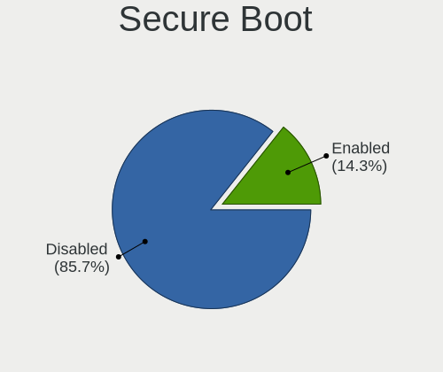
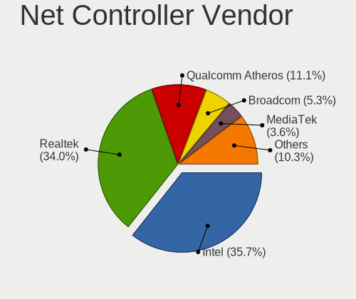

Ubuntu 22.04 - Tested Hardware & Statistics (Notebooks)
-------------------------------------------------------

A project to collect tested hardware configurations for Ubuntu 22.04.

Anyone can contribute to this report by the [hw-probe](https://github.com/linuxhw/hw-probe) tool:

    sudo -E hw-probe -all -upload

Please contribute! Especially if your hardware is rare.

Contents
--------

* [ Test Cases ](#test-cases)

* [ System ](#system)
  - [ Kernel                   ](#kernel)
  - [ Kernel Family            ](#kernel-family)
  - [ Kernel Major Ver.        ](#kernel-major-ver)
  - [ Arch                     ](#arch)
  - [ DE                       ](#de)
  - [ Display Server           ](#display-server)
  - [ Display Manager          ](#display-manager)
  - [ OS Lang                  ](#os-lang)
  - [ Boot Mode                ](#boot-mode)
  - [ Filesystem               ](#filesystem)
  - [ Part. scheme             ](#part-scheme)
  - [ Dual Boot with Linux/BSD ](#dual-boot-with-linuxbsd)
  - [ Dual Boot (Win)          ](#dual-boot-win)

* [ Board ](#board)
  - [ Vendor                   ](#vendor)
  - [ Model                    ](#model)
  - [ Model Family             ](#model-family)
  - [ MFG Year                 ](#mfg-year)
  - [ Form Factor              ](#form-factor)
  - [ Secure Boot              ](#secure-boot)
  - [ Coreboot                 ](#coreboot)
  - [ RAM Size                 ](#ram-size)
  - [ RAM Used                 ](#ram-used)
  - [ Total Drives             ](#total-drives)
  - [ Has CD-ROM               ](#has-cd-rom)
  - [ Has Ethernet             ](#has-ethernet)
  - [ Has WiFi                 ](#has-wifi)
  - [ Has Bluetooth            ](#has-bluetooth)

* [ Location ](#location)
  - [ Country                  ](#country)
  - [ City                     ](#city)

* [ Drives ](#drives)
  - [ Drive Vendor             ](#drive-vendor)
  - [ Drive Model              ](#drive-model)
  - [ HDD Vendor               ](#hdd-vendor)
  - [ SSD Vendor               ](#ssd-vendor)
  - [ Drive Kind               ](#drive-kind)
  - [ Drive Connector          ](#drive-connector)
  - [ Drive Size               ](#drive-size)
  - [ Space Total              ](#space-total)
  - [ Space Used               ](#space-used)
  - [ Malfunc. Drives          ](#malfunc-drives)
  - [ Malfunc. Drive Vendor    ](#malfunc-drive-vendor)
  - [ Malfunc. HDD Vendor      ](#malfunc-hdd-vendor)
  - [ Malfunc. Drive Kind      ](#malfunc-drive-kind)
  - [ Failed Drives            ](#failed-drives)
  - [ Failed Drive Vendor      ](#failed-drive-vendor)
  - [ Drive Status             ](#drive-status)

* [ Storage controller ](#storage-controller)
  - [ Storage Vendor           ](#storage-vendor)
  - [ Storage Model            ](#storage-model)
  - [ Storage Kind             ](#storage-kind)

* [ Processor ](#processor)
  - [ CPU Vendor               ](#cpu-vendor)
  - [ CPU Model                ](#cpu-model)
  - [ CPU Model Family         ](#cpu-model-family)
  - [ CPU Cores                ](#cpu-cores)
  - [ CPU Sockets              ](#cpu-sockets)
  - [ CPU Threads              ](#cpu-threads)
  - [ CPU Op-Modes             ](#cpu-op-modes)
  - [ CPU Microcode            ](#cpu-microcode)
  - [ CPU Microarch            ](#cpu-microarch)

* [ Graphics ](#graphics)
  - [ GPU Vendor               ](#gpu-vendor)
  - [ GPU Model                ](#gpu-model)
  - [ GPU Combo                ](#gpu-combo)
  - [ GPU Driver               ](#gpu-driver)
  - [ GPU Memory               ](#gpu-memory)

* [ Monitor ](#monitor)
  - [ Monitor Vendor           ](#monitor-vendor)
  - [ Monitor Model            ](#monitor-model)
  - [ Monitor Resolution       ](#monitor-resolution)
  - [ Monitor Diagonal         ](#monitor-diagonal)
  - [ Monitor Width            ](#monitor-width)
  - [ Aspect Ratio             ](#aspect-ratio)
  - [ Monitor Area             ](#monitor-area)
  - [ Pixel Density            ](#pixel-density)
  - [ Multiple Monitors        ](#multiple-monitors)

* [ Network ](#network)
  - [ Net Controller Vendor    ](#net-controller-vendor)
  - [ Net Controller Model     ](#net-controller-model)
  - [ Wireless Vendor          ](#wireless-vendor)
  - [ Wireless Model           ](#wireless-model)
  - [ Ethernet Vendor          ](#ethernet-vendor)
  - [ Ethernet Model           ](#ethernet-model)
  - [ Net Controller Kind      ](#net-controller-kind)
  - [ Used Controller          ](#used-controller)
  - [ NICs                     ](#nics)
  - [ IPv6                     ](#ipv6)

* [ Bluetooth ](#bluetooth)
  - [ Bluetooth Vendor         ](#bluetooth-vendor)
  - [ Bluetooth Model          ](#bluetooth-model)

* [ Sound ](#sound)
  - [ Sound Vendor             ](#sound-vendor)
  - [ Sound Model              ](#sound-model)

* [ Memory ](#memory)
  - [ Memory Vendor            ](#memory-vendor)
  - [ Memory Model             ](#memory-model)
  - [ Memory Kind              ](#memory-kind)
  - [ Memory Form Factor       ](#memory-form-factor)
  - [ Memory Size              ](#memory-size)
  - [ Memory Speed             ](#memory-speed)

* [ Printers & scanners ](#printers--scanners)
  - [ Printer Vendor           ](#printer-vendor)
  - [ Printer Model            ](#printer-model)
  - [ Scanner Vendor           ](#scanner-vendor)
  - [ Scanner Model            ](#scanner-model)

* [ Camera ](#camera)
  - [ Camera Vendor            ](#camera-vendor)
  - [ Camera Model             ](#camera-model)

* [ Security ](#security)
  - [ Fingerprint Vendor       ](#fingerprint-vendor)
  - [ Fingerprint Model        ](#fingerprint-model)
  - [ Chipcard Vendor          ](#chipcard-vendor)
  - [ Chipcard Model           ](#chipcard-model)

* [ Unsupported ](#unsupported)
  - [ Unsupported Devices      ](#unsupported-devices)
  - [ Unsupported Device Types ](#unsupported-device-types)

Test Cases
----------

Total: 249

| Vendor        | Model                       | Probe                                                      | Date         |
|---------------|-----------------------------|------------------------------------------------------------|--------------|
| ASUSTek       | PU551LA                     | [19e1b6041b](https://linux-hardware.org/?probe=19e1b6041b) | May 01, 2022 |
| Sony          | SVE1513R1EB                 | [59a46c5857](https://linux-hardware.org/?probe=59a46c5857) | Apr 30, 2022 |
| Lenovo        | G700 20251                  | [94272db5ec](https://linux-hardware.org/?probe=94272db5ec) | Apr 30, 2022 |
| Alienware     | x17 R2                      | [d78db966bc](https://linux-hardware.org/?probe=d78db966bc) | Apr 30, 2022 |
| Dell          | Vostro 1720                 | [bc8f50b9fb](https://linux-hardware.org/?probe=bc8f50b9fb) | Apr 30, 2022 |
| Dell          | Vostro 1720                 | [56cc7a9a54](https://linux-hardware.org/?probe=56cc7a9a54) | Apr 30, 2022 |
| Lenovo        | 81VS                        | [1ff46f7cdc](https://linux-hardware.org/?probe=1ff46f7cdc) | Apr 30, 2022 |
| Lenovo        | 81VS                        | [ea23b0e852](https://linux-hardware.org/?probe=ea23b0e852) | Apr 30, 2022 |
| Dell          | System XPS L502X            | [77e1846d8d](https://linux-hardware.org/?probe=77e1846d8d) | Apr 30, 2022 |
| Lenovo        | IdeaPad Flex-14API 81SS     | [f5d70fb9d3](https://linux-hardware.org/?probe=f5d70fb9d3) | Apr 30, 2022 |
| Itautec       | Infoway w7535               | [ac87d9e508](https://linux-hardware.org/?probe=ac87d9e508) | Apr 30, 2022 |
| HUAWEI        | HVY-WXX9                    | [d7913302d5](https://linux-hardware.org/?probe=d7913302d5) | Apr 30, 2022 |
| Dell          | G7 7700                     | [462862ed56](https://linux-hardware.org/?probe=462862ed56) | Apr 30, 2022 |
| Toshiba       | Dakar10FW8                  | [fbe2aaac31](https://linux-hardware.org/?probe=fbe2aaac31) | Apr 30, 2022 |
| Lenovo        | ThinkBook 14 G2 ARE 20VF    | [b6cbc6e523](https://linux-hardware.org/?probe=b6cbc6e523) | Apr 30, 2022 |
| NSX           | SB1402                      | [c9d79a4fe5](https://linux-hardware.org/?probe=c9d79a4fe5) | Apr 30, 2022 |
| ASUSTek       | X550VC                      | [16223d208e](https://linux-hardware.org/?probe=16223d208e) | Apr 30, 2022 |
| HP            | ProBook 440 G8 Notebook ... | [a7fe3cb0f6](https://linux-hardware.org/?probe=a7fe3cb0f6) | Apr 30, 2022 |
| Lenovo        | G40-70 80GA                 | [fcd20cb250](https://linux-hardware.org/?probe=fcd20cb250) | Apr 30, 2022 |
| HP            | ProBook 4520s               | [60eab2c6c5](https://linux-hardware.org/?probe=60eab2c6c5) | Apr 30, 2022 |
| Dell          | Latitude 9420               | [4ba28afe84](https://linux-hardware.org/?probe=4ba28afe84) | Apr 30, 2022 |
| Lenovo        | ThinkBook 15 G2 ITL 20VE    | [1abef3591b](https://linux-hardware.org/?probe=1abef3591b) | Apr 30, 2022 |
| Lenovo        | IdeaPad 5 14ITL05 82FE      | [51625474b7](https://linux-hardware.org/?probe=51625474b7) | Apr 30, 2022 |
| Acer          | Aspire A315-23              | [865091bbc1](https://linux-hardware.org/?probe=865091bbc1) | Apr 30, 2022 |
| Acer          | Aspire A315-23              | [5ee29c3982](https://linux-hardware.org/?probe=5ee29c3982) | Apr 30, 2022 |
| HP            | Laptop 17-by3xxx            | [087399e252](https://linux-hardware.org/?probe=087399e252) | Apr 30, 2022 |
| Lenovo        | ThinkPad L15 Gen 1 20U4S... | [55e76f131d](https://linux-hardware.org/?probe=55e76f131d) | Apr 30, 2022 |
| HP            | 255 G6 Notebook PC          | [f639c7c8f5](https://linux-hardware.org/?probe=f639c7c8f5) | Apr 29, 2022 |
| HP            | ZBook 15 G5                 | [aac5097e2a](https://linux-hardware.org/?probe=aac5097e2a) | Apr 29, 2022 |
| HP            | ENVY Laptop 15-ep0xxx       | [96dbfb494e](https://linux-hardware.org/?probe=96dbfb494e) | Apr 29, 2022 |
| Sony          | SVE1513R1EB                 | [d1e0096b2d](https://linux-hardware.org/?probe=d1e0096b2d) | Apr 29, 2022 |
| HP            | EliteBook 8570w             | [e6f47edf47](https://linux-hardware.org/?probe=e6f47edf47) | Apr 29, 2022 |
| Toshiba       | Satellite P50-B-103         | [6df44e9098](https://linux-hardware.org/?probe=6df44e9098) | Apr 29, 2022 |
| Lenovo        | ThinkPad T450 20BV001YMS    | [f38b762c83](https://linux-hardware.org/?probe=f38b762c83) | Apr 29, 2022 |
| Lenovo        | Yoga S740-14IIL 81RS        | [6affdcee0f](https://linux-hardware.org/?probe=6affdcee0f) | Apr 29, 2022 |
| HP            | ENVY dv7                    | [dbd8feaee0](https://linux-hardware.org/?probe=dbd8feaee0) | Apr 29, 2022 |
| Lenovo        | ThinkPad T470 W10DG 20JN... | [e7ca44864b](https://linux-hardware.org/?probe=e7ca44864b) | Apr 29, 2022 |
| Dell          | Inspiron 7400               | [0c0af6919d](https://linux-hardware.org/?probe=0c0af6919d) | Apr 29, 2022 |
| Teclast       | F7 Plus                     | [8096cf3295](https://linux-hardware.org/?probe=8096cf3295) | Apr 29, 2022 |
| HP            | EliteBook 840 G1            | [411c79850c](https://linux-hardware.org/?probe=411c79850c) | Apr 29, 2022 |
| Acer          | Aspire A515-54              | [4ff968ef61](https://linux-hardware.org/?probe=4ff968ef61) | Apr 28, 2022 |
| Dell          | Precision 7510              | [afaea67857](https://linux-hardware.org/?probe=afaea67857) | Apr 28, 2022 |
| Dell          | Inspiron 7400               | [8e5289a5e7](https://linux-hardware.org/?probe=8e5289a5e7) | Apr 28, 2022 |
| Dell          | Inspiron 3505               | [1f6bbce46b](https://linux-hardware.org/?probe=1f6bbce46b) | Apr 28, 2022 |
| Apple         | MacBook3,1                  | [5c90931c74](https://linux-hardware.org/?probe=5c90931c74) | Apr 28, 2022 |
| Lenovo        | IdeaPad 320S-14IKB 80X4     | [06ef070e40](https://linux-hardware.org/?probe=06ef070e40) | Apr 28, 2022 |
| Lenovo        | IdeaPad 320S-14IKB 80X4     | [8ef803f8c9](https://linux-hardware.org/?probe=8ef803f8c9) | Apr 28, 2022 |
| Dell          | Latitude 5420               | [26abde11eb](https://linux-hardware.org/?probe=26abde11eb) | Apr 28, 2022 |
| Toshiba       | Satellite C855              | [703a704f72](https://linux-hardware.org/?probe=703a704f72) | Apr 28, 2022 |
| Lenovo        | Z50-75 80EC                 | [3e88e21f3c](https://linux-hardware.org/?probe=3e88e21f3c) | Apr 28, 2022 |
| Toshiba       | Satellite Pro S500          | [eb4ae51e74](https://linux-hardware.org/?probe=eb4ae51e74) | Apr 27, 2022 |
| Acer          | Aspire E1-570               | [efcd6be006](https://linux-hardware.org/?probe=efcd6be006) | Apr 27, 2022 |
| Dell          | Inspiron N4010              | [820098c075](https://linux-hardware.org/?probe=820098c075) | Apr 27, 2022 |
| Apple         | MacBook3,1                  | [c7da3d4c4f](https://linux-hardware.org/?probe=c7da3d4c4f) | Apr 27, 2022 |
| Dell          | Inspiron N4010              | [4d84b677ae](https://linux-hardware.org/?probe=4d84b677ae) | Apr 27, 2022 |
| Dell          | Latitude E6510              | [10d60e00c2](https://linux-hardware.org/?probe=10d60e00c2) | Apr 27, 2022 |
| Samsung       | 350V5C/351V5C/3540VC/344... | [6e793edd01](https://linux-hardware.org/?probe=6e793edd01) | Apr 27, 2022 |
| Dell          | Inspiron 5415               | [5edac5d5a6](https://linux-hardware.org/?probe=5edac5d5a6) | Apr 27, 2022 |
| Dell          | Latitude E6520              | [1ca407a69f](https://linux-hardware.org/?probe=1ca407a69f) | Apr 27, 2022 |
| Noblex        | N14WD21                     | [a8a7a4e1d5](https://linux-hardware.org/?probe=a8a7a4e1d5) | Apr 27, 2022 |
| Lenovo        | ThinkPad X250 20CLS52P0F    | [a4d291ccda](https://linux-hardware.org/?probe=a4d291ccda) | Apr 27, 2022 |
| Lenovo        | IdeaPad Gaming 3 15IMH05... | [a696a35961](https://linux-hardware.org/?probe=a696a35961) | Apr 27, 2022 |
| Dell          | Inspiron 3583               | [8f10e59515](https://linux-hardware.org/?probe=8f10e59515) | Apr 27, 2022 |
| Lenovo        | ThinkPad T470 W10DG 20JN... | [87cc990d93](https://linux-hardware.org/?probe=87cc990d93) | Apr 27, 2022 |
| Acer          | Aspire 5750G                | [3a96bf8237](https://linux-hardware.org/?probe=3a96bf8237) | Apr 27, 2022 |
| Lenovo        | ThinkPad T430u 335337G      | [31bc958302](https://linux-hardware.org/?probe=31bc958302) | Apr 26, 2022 |
| Lenovo        | ThinkPad T430u 335337G      | [8446691cb3](https://linux-hardware.org/?probe=8446691cb3) | Apr 26, 2022 |
| Lenovo        | Legion 5 15ACH6 82JW        | [3b4a331875](https://linux-hardware.org/?probe=3b4a331875) | Apr 26, 2022 |
| Dell          | Inspiron 3583               | [bca722d45d](https://linux-hardware.org/?probe=bca722d45d) | Apr 26, 2022 |
| HP            | 255 G8 Notebook PC          | [17ccf19b71](https://linux-hardware.org/?probe=17ccf19b71) | Apr 26, 2022 |
| Lenovo        | ThinkPad L490 20Q5002GPG    | [9e591226b7](https://linux-hardware.org/?probe=9e591226b7) | Apr 26, 2022 |
| Lenovo        | ThinkPad P15v Gen 1 20TQ... | [bd827295e5](https://linux-hardware.org/?probe=bd827295e5) | Apr 26, 2022 |
| Dell          | G15 5510                    | [5126d58147](https://linux-hardware.org/?probe=5126d58147) | Apr 26, 2022 |
| Dell          | G15 5510                    | [ef1787abc5](https://linux-hardware.org/?probe=ef1787abc5) | Apr 25, 2022 |
| Lenovo        | ThinkPad X230 2324GA7       | [a5138b511d](https://linux-hardware.org/?probe=a5138b511d) | Apr 25, 2022 |
| Lenovo        | ThinkPad P15v Gen 1 20TQ... | [9e7c80a9d0](https://linux-hardware.org/?probe=9e7c80a9d0) | Apr 25, 2022 |
| Lenovo        | ThinkPad L15 Gen 2 20X3C... | [3fcb247b21](https://linux-hardware.org/?probe=3fcb247b21) | Apr 25, 2022 |
| Timi          | RedmiBook Pro 15S           | [07ccc93cd4](https://linux-hardware.org/?probe=07ccc93cd4) | Apr 25, 2022 |
| MSI           | GF65 Thin 10UE              | [b099b2ab43](https://linux-hardware.org/?probe=b099b2ab43) | Apr 25, 2022 |
| MSI           | GF65 Thin 10UE              | [79fc46c6f0](https://linux-hardware.org/?probe=79fc46c6f0) | Apr 25, 2022 |
| HP            | ProBook 4520s               | [1621eddc70](https://linux-hardware.org/?probe=1621eddc70) | Apr 25, 2022 |
| HP            | OMEN by Laptop 15-ce0xx     | [8694f28b60](https://linux-hardware.org/?probe=8694f28b60) | Apr 25, 2022 |
| HP            | EliteBook 845 G7 Noteboo... | [1b1bf8dddf](https://linux-hardware.org/?probe=1b1bf8dddf) | Apr 25, 2022 |
| ASUSTek       | VivoBook_ASUSLaptop M350... | [4c3bf947f5](https://linux-hardware.org/?probe=4c3bf947f5) | Apr 25, 2022 |
| HP            | EliteBook 830 G5            | [17f9b4e988](https://linux-hardware.org/?probe=17f9b4e988) | Apr 25, 2022 |
| Apple         | MacBookAir6,2               | [fe067fc3d4](https://linux-hardware.org/?probe=fe067fc3d4) | Apr 25, 2022 |
| Apple         | MacBookAir6,2               | [fb26f3ab65](https://linux-hardware.org/?probe=fb26f3ab65) | Apr 25, 2022 |
| AMI           | Intel                       | [87e32073a4](https://linux-hardware.org/?probe=87e32073a4) | Apr 24, 2022 |
| Sony          | VPCEH25FM                   | [bceedddb01](https://linux-hardware.org/?probe=bceedddb01) | Apr 24, 2022 |
| Acer          | Aspire A515-56G             | [492dd679be](https://linux-hardware.org/?probe=492dd679be) | Apr 24, 2022 |
| Lenovo        | IdeaPad L340-15IRH Gamin... | [54aa68a653](https://linux-hardware.org/?probe=54aa68a653) | Apr 24, 2022 |
| Acer          | Aspire A515-56G             | [5fc4dbeaad](https://linux-hardware.org/?probe=5fc4dbeaad) | Apr 24, 2022 |
| ASUSTek       | X550CC                      | [4f77777c97](https://linux-hardware.org/?probe=4f77777c97) | Apr 24, 2022 |
| HP            | ProBook 430 G1              | [52259207bb](https://linux-hardware.org/?probe=52259207bb) | Apr 24, 2022 |
| HP            | 255 G6 Notebook PC          | [ad390bd7b7](https://linux-hardware.org/?probe=ad390bd7b7) | Apr 24, 2022 |
| Avell High... | C65 MOB                     | [b8e185c194](https://linux-hardware.org/?probe=b8e185c194) | Apr 24, 2022 |
| Medion        | E7220                       | [c2d7457304](https://linux-hardware.org/?probe=c2d7457304) | Apr 23, 2022 |
| Dell          | Latitude 5290               | [e373cb6fa1](https://linux-hardware.org/?probe=e373cb6fa1) | Apr 23, 2022 |
| ASUSTek       | VivoBook_ASUS Laptop X50... | [a551ef1ec7](https://linux-hardware.org/?probe=a551ef1ec7) | Apr 23, 2022 |
| Lenovo        | ThinkPad E15 Gen 2 20TDS... | [59a49b2d04](https://linux-hardware.org/?probe=59a49b2d04) | Apr 23, 2022 |
| ASUSTek       | K46CA                       | [e762eba391](https://linux-hardware.org/?probe=e762eba391) | Apr 23, 2022 |
| Dell          | Inspiron N5110              | [30209dbcd1](https://linux-hardware.org/?probe=30209dbcd1) | Apr 23, 2022 |
| Dell          | Latitude 5580               | [cbd7aaec4a](https://linux-hardware.org/?probe=cbd7aaec4a) | Apr 23, 2022 |
| Chuwi         | Unknown                     | [96105ecbb2](https://linux-hardware.org/?probe=96105ecbb2) | Apr 23, 2022 |
| Lenovo        | ThinkPad P50 20EQS64N1N     | [c3d792a237](https://linux-hardware.org/?probe=c3d792a237) | Apr 23, 2022 |
| ASUSTek       | VivoBook_ASUS Laptop X50... | [fd6718859d](https://linux-hardware.org/?probe=fd6718859d) | Apr 23, 2022 |
| Timi          | RedmiBook 14-APCS           | [32cb202a0e](https://linux-hardware.org/?probe=32cb202a0e) | Apr 22, 2022 |
| Samsung       | 300E4C/300E5C/300E7C        | [f3e50d22aa](https://linux-hardware.org/?probe=f3e50d22aa) | Apr 22, 2022 |
| Positivo      | W942SW_SW1                  | [36b0510bae](https://linux-hardware.org/?probe=36b0510bae) | Apr 22, 2022 |
| HONOR         | NBD-WXX9                    | [135c98b96d](https://linux-hardware.org/?probe=135c98b96d) | Apr 22, 2022 |
| Samsung       | 300E4C/300E5C/300E7C        | [d90f38b2ad](https://linux-hardware.org/?probe=d90f38b2ad) | Apr 22, 2022 |
| Acer          | Aspire A515-45              | [377315649e](https://linux-hardware.org/?probe=377315649e) | Apr 22, 2022 |
| MSI           | Stealth GS77 12UGS          | [cd1bc2095f](https://linux-hardware.org/?probe=cd1bc2095f) | Apr 22, 2022 |
| Dell          | XPS 15 7590                 | [f2680af572](https://linux-hardware.org/?probe=f2680af572) | Apr 22, 2022 |
| Lenovo        | IdeaPad 330-15IKB 81DE      | [8abbc8a322](https://linux-hardware.org/?probe=8abbc8a322) | Apr 22, 2022 |
| HUAWEI        | HVY-WXX9                    | [3320719d25](https://linux-hardware.org/?probe=3320719d25) | Apr 22, 2022 |
| MSI           | Stealth GS77 12UGS          | [33afc70a54](https://linux-hardware.org/?probe=33afc70a54) | Apr 22, 2022 |
| HP            | EliteBook 830 G5            | [6061f1cd1e](https://linux-hardware.org/?probe=6061f1cd1e) | Apr 22, 2022 |
| Acer          | Swift SF314-42              | [b0dc5471af](https://linux-hardware.org/?probe=b0dc5471af) | Apr 22, 2022 |
| Lenovo        | IdeaPad 5 Pro 16ACH6 82L... | [35e11e3e60](https://linux-hardware.org/?probe=35e11e3e60) | Apr 22, 2022 |
| Lenovo        | IdeaPadFlex 15 20309        | [6dac014a49](https://linux-hardware.org/?probe=6dac014a49) | Apr 22, 2022 |
| Lenovo        | IdeaPad 500S-13ISK 80Q2     | [4548a301f8](https://linux-hardware.org/?probe=4548a301f8) | Apr 22, 2022 |
| Lenovo        | IdeaPad 3 17ITL6 82H9       | [8f132efef2](https://linux-hardware.org/?probe=8f132efef2) | Apr 21, 2022 |
| Acer          | Aspire 7530G                | [710b429d94](https://linux-hardware.org/?probe=710b429d94) | Apr 21, 2022 |
| HP            | EliteBook 840 G5            | [0f748e86d4](https://linux-hardware.org/?probe=0f748e86d4) | Apr 21, 2022 |
| HUAWEI        | CREM-WXX9                   | [2a7742c460](https://linux-hardware.org/?probe=2a7742c460) | Apr 21, 2022 |
| HP            | EliteBook 840 G5            | [58a8282067](https://linux-hardware.org/?probe=58a8282067) | Apr 21, 2022 |
| Dell          | XPS 15 7590                 | [5266d4c66b](https://linux-hardware.org/?probe=5266d4c66b) | Apr 21, 2022 |
| Dell          | XPS 15 7590                 | [70d107a754](https://linux-hardware.org/?probe=70d107a754) | Apr 21, 2022 |
| ASUSTek       | G550JK                      | [6d291b9c9c](https://linux-hardware.org/?probe=6d291b9c9c) | Apr 21, 2022 |
| ASUSTek       | X450LA                      | [997a83a67c](https://linux-hardware.org/?probe=997a83a67c) | Apr 20, 2022 |
| Acer          | Swift SF314-42              | [a8af23856d](https://linux-hardware.org/?probe=a8af23856d) | Apr 20, 2022 |
| Intel         | W7650                       | [edb281c81e](https://linux-hardware.org/?probe=edb281c81e) | Apr 20, 2022 |
| Dell          | Latitude 3410               | [d932874d9c](https://linux-hardware.org/?probe=d932874d9c) | Apr 19, 2022 |
| Lenovo        | B575e 36852EG               | [8f5e5f427a](https://linux-hardware.org/?probe=8f5e5f427a) | Apr 18, 2022 |
| ASUSTek       | G771JW                      | [9b04178e4d](https://linux-hardware.org/?probe=9b04178e4d) | Apr 18, 2022 |
| Lenovo        | B575e 36852EG               | [4731516b58](https://linux-hardware.org/?probe=4731516b58) | Apr 18, 2022 |
| Lenovo        | ThinkBook 14 G3 ACL 21A2    | [3faf048414](https://linux-hardware.org/?probe=3faf048414) | Apr 18, 2022 |
| Lenovo        | Z50-70 20354                | [e693d05883](https://linux-hardware.org/?probe=e693d05883) | Apr 17, 2022 |
| Lenovo        | ThinkBook 14p Gen 2 20YN    | [800aefa57e](https://linux-hardware.org/?probe=800aefa57e) | Apr 16, 2022 |
| MSI           | GF63 8RD                    | [287e344d0e](https://linux-hardware.org/?probe=287e344d0e) | Apr 16, 2022 |
| ASUSTek       | VivoBook_ASUSLaptop X421... | [a0ad75fa4b](https://linux-hardware.org/?probe=a0ad75fa4b) | Apr 16, 2022 |
| Google        | Phaser360                   | [ab97623a21](https://linux-hardware.org/?probe=ab97623a21) | Apr 16, 2022 |
| Acer          | Swift SF315-52              | [90c143abed](https://linux-hardware.org/?probe=90c143abed) | Apr 16, 2022 |
| Timi          | A34                         | [ff24fc7e19](https://linux-hardware.org/?probe=ff24fc7e19) | Apr 15, 2022 |
| Sony          | VGN-NS38E_S                 | [1b8177c97a](https://linux-hardware.org/?probe=1b8177c97a) | Apr 14, 2022 |
| Lenovo        | Legion R7000 2020 82B6      | [260c012f44](https://linux-hardware.org/?probe=260c012f44) | Apr 14, 2022 |
| System76      | Serval WS                   | [f02bcd64a2](https://linux-hardware.org/?probe=f02bcd64a2) | Apr 14, 2022 |
| PC Special... | PCx0Dx                      | [6b0f05bf07](https://linux-hardware.org/?probe=6b0f05bf07) | Apr 13, 2022 |
| Lenovo        | Legion 5P 15ARH05H 82GU     | [a31cc5eb3b](https://linux-hardware.org/?probe=a31cc5eb3b) | Apr 13, 2022 |
| Multilaser    | M11W                        | [4be432c77a](https://linux-hardware.org/?probe=4be432c77a) | Apr 13, 2022 |
| Lenovo        | IdeaPad 330S-15IKB 81F5     | [fecdd237a4](https://linux-hardware.org/?probe=fecdd237a4) | Apr 11, 2022 |
| Apple         | MacBookPro14,1              | [1d1ff81694](https://linux-hardware.org/?probe=1d1ff81694) | Apr 11, 2022 |
| Lenovo        | IdeaPad 5 Pro 14ACN6 82L... | [ce0316a106](https://linux-hardware.org/?probe=ce0316a106) | Apr 10, 2022 |
| ASUSTek       | ROG Zephyrus G15 GA502IV... | [0def0def83](https://linux-hardware.org/?probe=0def0def83) | Apr 09, 2022 |
| HP            | 840 G6                      | [7f8b25d480](https://linux-hardware.org/?probe=7f8b25d480) | Apr 09, 2022 |
| Toshiba       | Satellite L50-A             | [9a4f7c7381](https://linux-hardware.org/?probe=9a4f7c7381) | Apr 09, 2022 |
| Toshiba       | Satellite L50-A             | [ce1ec01972](https://linux-hardware.org/?probe=ce1ec01972) | Apr 09, 2022 |
| Lenovo        | ThinkPad S1 Yoga 12 20DK... | [2240b6c593](https://linux-hardware.org/?probe=2240b6c593) | Apr 09, 2022 |
| Lenovo        | ThinkPad L14 Gen 2 20X10... | [1f799cdbef](https://linux-hardware.org/?probe=1f799cdbef) | Apr 09, 2022 |
| Apple         | MacBookPro14,1              | [470a09fc31](https://linux-hardware.org/?probe=470a09fc31) | Apr 09, 2022 |
| Lenovo        | Yoga Slim 7-14ARE05 82A2    | [ae77218dcf](https://linux-hardware.org/?probe=ae77218dcf) | Apr 07, 2022 |
| HP            | EliteBook 840 G8 Noteboo... | [8ab4c1618d](https://linux-hardware.org/?probe=8ab4c1618d) | Apr 07, 2022 |
| Acer          | Nitro AN515-42              | [322440c462](https://linux-hardware.org/?probe=322440c462) | Apr 06, 2022 |
| HUAWEI        | CREM-WXX9                   | [6d57ed5e10](https://linux-hardware.org/?probe=6d57ed5e10) | Apr 06, 2022 |
| HP            | 840 G6                      | [76665316f7](https://linux-hardware.org/?probe=76665316f7) | Apr 06, 2022 |
| Dell          | G5 5590                     | [86d53d1c79](https://linux-hardware.org/?probe=86d53d1c79) | Apr 06, 2022 |
| Framework     | Laptop                      | [59a51973bb](https://linux-hardware.org/?probe=59a51973bb) | Apr 05, 2022 |
| Medion        | E15303                      | [21bdec99bb](https://linux-hardware.org/?probe=21bdec99bb) | Apr 05, 2022 |
| Lenovo        | ThinkPad E495 20NEA00QUS    | [d9cbb34331](https://linux-hardware.org/?probe=d9cbb34331) | Apr 04, 2022 |
| Lenovo        | ThinkPad E495 20NEA00QUS    | [062e604ef0](https://linux-hardware.org/?probe=062e604ef0) | Apr 04, 2022 |
| Lenovo        | ThinkPad P1 Gen 4i 20Y30... | [43ff476479](https://linux-hardware.org/?probe=43ff476479) | Apr 03, 2022 |
| Samsung       | R580/R590                   | [0b95325a5e](https://linux-hardware.org/?probe=0b95325a5e) | Apr 03, 2022 |
| Lenovo        | IdeaPad 5 Pro 14ACN6 82L... | [bdb683ff40](https://linux-hardware.org/?probe=bdb683ff40) | Apr 03, 2022 |
| ASUSTek       | ROG Zephyrus G14 GA401IH... | [ad5d38e378](https://linux-hardware.org/?probe=ad5d38e378) | Apr 02, 2022 |
| Lenovo        | IdeaPad 5 Pro 14ACN6 82L... | [e380073189](https://linux-hardware.org/?probe=e380073189) | Apr 02, 2022 |
| HP            | Pavilion Laptop 14-ce2xx... | [d103b2cb25](https://linux-hardware.org/?probe=d103b2cb25) | Apr 02, 2022 |
| Dell          | Inspiron N5110              | [eba4514371](https://linux-hardware.org/?probe=eba4514371) | Apr 01, 2022 |
| HUAWEI        | MACH-WX9                    | [a799c6c916](https://linux-hardware.org/?probe=a799c6c916) | Apr 01, 2022 |
| Dell          | Inspiron N5110              | [606eb17f56](https://linux-hardware.org/?probe=606eb17f56) | Apr 01, 2022 |
| Dell          | Inspiron N5110              | [6b0cd44dbb](https://linux-hardware.org/?probe=6b0cd44dbb) | Apr 01, 2022 |
| Alienware     | M11x                        | [f83c01bb34](https://linux-hardware.org/?probe=f83c01bb34) | Apr 01, 2022 |
| Avell High... | A70 MOB                     | [9e095642f0](https://linux-hardware.org/?probe=9e095642f0) | Apr 01, 2022 |
| Dell          | Inspiron 3501               | [a14dde61dc](https://linux-hardware.org/?probe=a14dde61dc) | Apr 01, 2022 |
| HUAWEI        | CREM-WXX9                   | [858142c2ab](https://linux-hardware.org/?probe=858142c2ab) | Apr 01, 2022 |
| Lenovo        | IdeaPad 5 14ITL05 82FE      | [ceee79344c](https://linux-hardware.org/?probe=ceee79344c) | Mar 31, 2022 |
| HUAWEI        | CREM-WXX9                   | [83b60423e1](https://linux-hardware.org/?probe=83b60423e1) | Mar 30, 2022 |
| HP            | 250 G4                      | [69a3535c1a](https://linux-hardware.org/?probe=69a3535c1a) | Mar 30, 2022 |
| HUAWEI        | CREM-WXX9                   | [4626f2aeab](https://linux-hardware.org/?probe=4626f2aeab) | Mar 29, 2022 |
| MSI           | GP76 Leopard 11UG           | [93a6b587c2](https://linux-hardware.org/?probe=93a6b587c2) | Mar 29, 2022 |
| Lenovo        | ThinkBook 15 G3 ACL 21A4    | [30c09eec3b](https://linux-hardware.org/?probe=30c09eec3b) | Mar 28, 2022 |
| HUAWEI        | CREM-WXX9                   | [dbdd71e8b8](https://linux-hardware.org/?probe=dbdd71e8b8) | Mar 28, 2022 |
| Dell          | XPS 17 9710                 | [ecf7b98552](https://linux-hardware.org/?probe=ecf7b98552) | Mar 28, 2022 |
| Lenovo        | ThinkPad T14s Gen 2a 20X... | [0e93a8600c](https://linux-hardware.org/?probe=0e93a8600c) | Mar 27, 2022 |
| Lenovo        | IdeaPad 5 Pro 14ACN6 82L... | [e5b0f5c259](https://linux-hardware.org/?probe=e5b0f5c259) | Mar 27, 2022 |
| HUAWEI        | MACH-WX9                    | [64e505d8d7](https://linux-hardware.org/?probe=64e505d8d7) | Mar 26, 2022 |
| Lenovo        | IdeaPad 5 Pro 14ACN6 82L... | [01e83234d9](https://linux-hardware.org/?probe=01e83234d9) | Mar 26, 2022 |
| Lenovo        | IdeaPad 5 Pro 14ACN6 82L... | [4fb374e78b](https://linux-hardware.org/?probe=4fb374e78b) | Mar 25, 2022 |
| HP            | EliteBook 840 G3            | [f06216a521](https://linux-hardware.org/?probe=f06216a521) | Mar 24, 2022 |
| HP            | Pavilion x2 Detachable      | [a82a2739a8](https://linux-hardware.org/?probe=a82a2739a8) | Mar 22, 2022 |
| Lenovo        | Z50-70 20354                | [b03762a80b](https://linux-hardware.org/?probe=b03762a80b) | Mar 22, 2022 |
| Framework     | Laptop                      | [b8fcafa943](https://linux-hardware.org/?probe=b8fcafa943) | Mar 20, 2022 |
| GPU Compan... | GWTC116-2                   | [3c0450f79e](https://linux-hardware.org/?probe=3c0450f79e) | Mar 12, 2022 |
| ASUSTek       | ROG Zephyrus G14 GA401IH... | [1c22760a82](https://linux-hardware.org/?probe=1c22760a82) | Mar 12, 2022 |
| MSI           | Creator Z16 A11UET          | [1804e5eb77](https://linux-hardware.org/?probe=1804e5eb77) | Mar 09, 2022 |
| ASUSTek       | ROG Zephyrus M16 GU603ZW... | [9fd12bdd29](https://linux-hardware.org/?probe=9fd12bdd29) | Mar 06, 2022 |
| HUAWEI        | BOHB-WAX9                   | [915ca09de4](https://linux-hardware.org/?probe=915ca09de4) | Mar 05, 2022 |
| Toshiba       | Satellite C70D-A            | [c7dfd52f76](https://linux-hardware.org/?probe=c7dfd52f76) | Mar 05, 2022 |
| HP            | ZBook 15 G5                 | [f86a14c16d](https://linux-hardware.org/?probe=f86a14c16d) | Mar 05, 2022 |
| ASUSTek       | ROG Zephyrus M16 GU603ZW... | [206f3a7c01](https://linux-hardware.org/?probe=206f3a7c01) | Mar 02, 2022 |
| HP            | Presario CQ42               | [de34294599](https://linux-hardware.org/?probe=de34294599) | Feb 27, 2022 |
| Shanghai Z... | ZXE CRB                     | [7fe4a3390b](https://linux-hardware.org/?probe=7fe4a3390b) | Feb 25, 2022 |
| Timi          | TM1709                      | [16e699bea8](https://linux-hardware.org/?probe=16e699bea8) | Feb 25, 2022 |
| ASUSTek       | ROG Zephyrus M16 GU603HE... | [076c8f6e01](https://linux-hardware.org/?probe=076c8f6e01) | Feb 23, 2022 |
| ASUSTek       | ROG Zephyrus M16 GU603HE... | [85c09f63f0](https://linux-hardware.org/?probe=85c09f63f0) | Feb 23, 2022 |
| Acer          | Aspire A517-52              | [52976ad94b](https://linux-hardware.org/?probe=52976ad94b) | Feb 23, 2022 |
| MSI           | Stealth GS66 12UHS          | [bb8ef51c23](https://linux-hardware.org/?probe=bb8ef51c23) | Feb 17, 2022 |
| Lenovo        | ThinkPad E15 Gen 2 20TES... | [da103e44c5](https://linux-hardware.org/?probe=da103e44c5) | Feb 17, 2022 |
| HP            | 620                         | [bd89b469e4](https://linux-hardware.org/?probe=bd89b469e4) | Feb 14, 2022 |
| HP            | Pavilion 15                 | [9246e37578](https://linux-hardware.org/?probe=9246e37578) | Feb 09, 2022 |
| ASUSTek       | K52Je                       | [e1010983cf](https://linux-hardware.org/?probe=e1010983cf) | Feb 09, 2022 |
| Dell          | Latitude 3330               | [c3b39f74b4](https://linux-hardware.org/?probe=c3b39f74b4) | Jan 31, 2022 |
| ASUSTek       | ROG Zephyrus G15 GA502IU... | [0a04b2d1b1](https://linux-hardware.org/?probe=0a04b2d1b1) | Jan 31, 2022 |
| HP            | 15                          | [81961b52a9](https://linux-hardware.org/?probe=81961b52a9) | Jan 29, 2022 |
| HP            | ProBook 445 G7              | [bceca55120](https://linux-hardware.org/?probe=bceca55120) | Jan 23, 2022 |
| ASUSTek       | ASUS TUF Gaming F17 FX70... | [2de98fb4d8](https://linux-hardware.org/?probe=2de98fb4d8) | Jan 22, 2022 |
| HP            | ProBook 650 G5              | [111cb6822e](https://linux-hardware.org/?probe=111cb6822e) | Jan 21, 2022 |
| HP            | Pavilion Laptop 14-dv1xx... | [e092fc4b26](https://linux-hardware.org/?probe=e092fc4b26) | Jan 20, 2022 |
| HP            | ZBook Power 15.6 inch G8... | [245123d0a8](https://linux-hardware.org/?probe=245123d0a8) | Jan 20, 2022 |
| Dell          | Latitude E6510              | [c0d3a6c31a](https://linux-hardware.org/?probe=c0d3a6c31a) | Jan 16, 2022 |
| Google        | Kefka                       | [e62fa3eea6](https://linux-hardware.org/?probe=e62fa3eea6) | Jan 10, 2022 |
| Timi          | RedmiBook Pro 15S           | [034079628f](https://linux-hardware.org/?probe=034079628f) | Jan 07, 2022 |
| Lenovo        | ThinkPad T400 2768WGB       | [ac0e3dfe29](https://linux-hardware.org/?probe=ac0e3dfe29) | Jan 07, 2022 |
| HP            | ENVY Laptop 13-ad1xx        | [666b0b18f5](https://linux-hardware.org/?probe=666b0b18f5) | Dec 30, 2021 |
| MSI           | GT73VR 6RE                  | [0f41e5dd07](https://linux-hardware.org/?probe=0f41e5dd07) | Dec 28, 2021 |
| Lenovo        | Legion 7 16ACHg6 82N6       | [be79b3cd82](https://linux-hardware.org/?probe=be79b3cd82) | Dec 26, 2021 |
| Lenovo        | Flex 2-15 20405             | [ccc85b0783](https://linux-hardware.org/?probe=ccc85b0783) | Dec 13, 2021 |
| MSI           | Modern 15 A11MU             | [34b31c53cd](https://linux-hardware.org/?probe=34b31c53cd) | Dec 07, 2021 |
| Toshiba       | PORTEGE Z10T-A              | [5257d76a92](https://linux-hardware.org/?probe=5257d76a92) | Dec 05, 2021 |
| HP            | Laptop 15s-fq1xxx           | [f219ee63ff](https://linux-hardware.org/?probe=f219ee63ff) | Nov 30, 2021 |
| HP            | Laptop 15s-fq1xxx           | [3199d159a4](https://linux-hardware.org/?probe=3199d159a4) | Nov 30, 2021 |
| Lenovo        | Flex 2-15 20405             | [d191e3f97f](https://linux-hardware.org/?probe=d191e3f97f) | Nov 22, 2021 |
| Lenovo        | Flex 2-15 20405             | [6381b11078](https://linux-hardware.org/?probe=6381b11078) | Nov 22, 2021 |
| ASUSTek       | X58L                        | [c3df58b13b](https://linux-hardware.org/?probe=c3df58b13b) | Nov 10, 2021 |
| ASUSTek       | X58L                        | [e1425f037e](https://linux-hardware.org/?probe=e1425f037e) | Nov 10, 2021 |
| ASUSTek       | X58L                        | [f64ba3a9e4](https://linux-hardware.org/?probe=f64ba3a9e4) | Nov 10, 2021 |
| Dell          | Inspiron 1464               | [26f50eb4a8](https://linux-hardware.org/?probe=26f50eb4a8) | Nov 06, 2021 |
| Dell          | Inspiron 11 - 3147          | [6b1a282c17](https://linux-hardware.org/?probe=6b1a282c17) | Nov 05, 2021 |
| Dell          | Inspiron 1464               | [4063779d5a](https://linux-hardware.org/?probe=4063779d5a) | Nov 01, 2021 |

System
------

Kernel
------

Version of the Linux kernel

| Version                     | Notebooks | Percent |
|-----------------------------|-----------|---------|
| 5.15.0-25-generic           | 77        | 39.09%  |
| 5.15.0-27-generic           | 47        | 23.86%  |
| 5.15.0-23-generic           | 20        | 10.15%  |
| 5.15.0-18-generic           | 12        | 6.09%   |
| 5.15.0-17-generic           | 7         | 3.55%   |
| 5.13.0-19-generic           | 5         | 2.54%   |
| 5.15.0-22-generic           | 4         | 2.03%   |
| 5.17.4-051704-generic       | 2         | 1.02%   |
| 5.17.2-051702-generic       | 2         | 1.02%   |
| 5.17.0-051700-generic       | 2         | 1.02%   |
| 5.18.0-051800rc1-generic    | 1         | 0.51%   |
| 5.17.0-1003-oem             | 1         | 0.51%   |
| 5.17.0-051700rc5-lowlatency | 1         | 0.51%   |
| 5.16.11-76051611-generic    | 1         | 0.51%   |
| 5.16.0-051600-generic       | 1         | 0.51%   |
| 5.15.6-051506-generic       | 1         | 0.51%   |
| 5.15.36-051536-generic      | 1         | 0.51%   |
| 5.15.17-xanmod2             | 1         | 0.51%   |
| 5.15.15-76051515-generic    | 1         | 0.51%   |
| 5.15.12-051512-generic      | 1         | 0.51%   |
| 5.15.11-051511-generic      | 1         | 0.51%   |
| 5.15.10-051510-generic      | 1         | 0.51%   |
| 5.15.0-27-lowlatency        | 1         | 0.51%   |
| 5.15.0-14-generic           | 1         | 0.51%   |
| 5.15.0-13-generic           | 1         | 0.51%   |
| 5.15.0-12-generic           | 1         | 0.51%   |
| 5.15.0-11-generic           | 1         | 0.51%   |
| 5.13.19                     | 1         | 0.51%   |
| 5.13.0-35-generic           | 1         | 0.51%   |

Kernel Family
-------------

Linux kernel without a distro release

| Version | Notebooks | Percent |
|---------|-----------|---------|
| 5.15.0  | 170       | 87.18%  |
| 5.13.0  | 6         | 3.08%   |
| 5.17.0  | 4         | 2.05%   |
| 5.17.4  | 2         | 1.03%   |
| 5.17.2  | 2         | 1.03%   |
| 5.18.0  | 1         | 0.51%   |
| 5.16.11 | 1         | 0.51%   |
| 5.16.0  | 1         | 0.51%   |
| 5.15.6  | 1         | 0.51%   |
| 5.15.36 | 1         | 0.51%   |
| 5.15.17 | 1         | 0.51%   |
| 5.15.15 | 1         | 0.51%   |
| 5.15.12 | 1         | 0.51%   |
| 5.15.11 | 1         | 0.51%   |
| 5.15.10 | 1         | 0.51%   |
| 5.13.19 | 1         | 0.51%   |

Kernel Major Ver.
-----------------

Linux kernel major version

| Version | Notebooks | Percent |
|---------|-----------|---------|
| 5.15    | 177       | 90.77%  |
| 5.17    | 8         | 4.1%    |
| 5.13    | 7         | 3.59%   |
| 5.16    | 2         | 1.03%   |
| 5.18    | 1         | 0.51%   |

Arch
----

OS architecture (x86_64, i586, etc.)

| Name   | Notebooks | Percent |
|--------|-----------|---------|
| x86_64 | 194       | 100%    |

DE
--

Desktop Environment

| Name              | Notebooks | Percent |
|-------------------|-----------|---------|
| GNOME             | 186       | 94.9%   |
| Unknown           | 6         | 3.06%   |
| Yaru:ubuntu:GNOME | 1         | 0.51%   |
| Unity             | 1         | 0.51%   |
| GNUstep           | 1         | 0.51%   |
| Cinnamon          | 1         | 0.51%   |

Display Server
--------------

X11 or Wayland

| Name    | Notebooks | Percent |
|---------|-----------|---------|
| Wayland | 122       | 62.24%  |
| X11     | 67        | 34.18%  |
| Tty     | 5         | 2.55%   |
| Unknown | 2         | 1.02%   |

Display Manager
---------------

SDDM, LightDM, etc.

| Name    | Notebooks | Percent |
|---------|-----------|---------|
| GDM3    | 167       | 85.64%  |
| Unknown | 25        | 12.82%  |
| GDM     | 2         | 1.03%   |
| LightDM | 1         | 0.51%   |

OS Lang
-------

Language

| Lang    | Notebooks | Percent |
|---------|-----------|---------|
| en_US   | 99        | 51.03%  |
| de_DE   | 11        | 5.67%   |
| pt_BR   | 10        | 5.15%   |
| en_IN   | 9         | 4.64%   |
| fr_FR   | 8         | 4.12%   |
| it_IT   | 7         | 3.61%   |
| en_GB   | 7         | 3.61%   |
| zh_CN   | 5         | 2.58%   |
| en_CA   | 5         | 2.58%   |
| pl_PL   | 4         | 2.06%   |
| ru_RU   | 3         | 1.55%   |
| es_ES   | 3         | 1.55%   |
| en_AU   | 3         | 1.55%   |
| hu_HU   | 2         | 1.03%   |
| fi_FI   | 2         | 1.03%   |
| es_MX   | 2         | 1.03%   |
| en_IL   | 2         | 1.03%   |
| da_DK   | 2         | 1.03%   |
| tr_TR   | 1         | 0.52%   |
| ro_RO   | 1         | 0.52%   |
| pt_PT   | 1         | 0.52%   |
| es_PE   | 1         | 0.52%   |
| es_EC   | 1         | 0.52%   |
| es_AR   | 1         | 0.52%   |
| en_ZA   | 1         | 0.52%   |
| en_SG   | 1         | 0.52%   |
| de_IT   | 1         | 0.52%   |
| Unknown | 1         | 0.52%   |

Boot Mode
---------

EFI or BIOS

| Mode | Notebooks | Percent |
|------|-----------|---------|
| BIOS | 104       | 53.61%  |
| EFI  | 90        | 46.39%  |

Filesystem
----------

Type of filesystem

| Type    | Notebooks | Percent |
|---------|-----------|---------|
| Ext4    | 179       | 92.27%  |
| Overlay | 8         | 4.12%   |
| Zfs     | 4         | 2.06%   |
| Btrfs   | 2         | 1.03%   |
| Xfs     | 1         | 0.52%   |

Part. scheme
------------

Scheme of partitioning

| Type    | Notebooks | Percent |
|---------|-----------|---------|
| Unknown | 106       | 54.64%  |
| GPT     | 83        | 42.78%  |
| MBR     | 5         | 2.58%   |

Dual Boot with Linux/BSD
------------------------

Hosting more than one Linux/BSD

| Dual boot | Notebooks | Percent |
|-----------|-----------|---------|
| No        | 175       | 90.21%  |
| Yes       | 19        | 9.79%   |

Dual Boot (Win)
---------------

Hosting Linux and Windows

| Dual boot | Notebooks | Percent |
|-----------|-----------|---------|
| No        | 121       | 62.05%  |
| Yes       | 74        | 37.95%  |

Board
-----

Vendor
------

Motherboard manufacturer

| Name                           | Notebooks | Percent |
|--------------------------------|-----------|---------|
| Lenovo                         | 49        | 25.26%  |
| Hewlett-Packard                | 33        | 17.01%  |
| Dell                           | 27        | 13.92%  |
| ASUSTek Computer               | 17        | 8.76%   |
| Acer                           | 11        | 5.67%   |
| MSI                            | 8         | 4.12%   |
| Toshiba                        | 7         | 3.61%   |
| HUAWEI                         | 5         | 2.58%   |
| Timi                           | 4         | 2.06%   |
| Sony                           | 3         | 1.55%   |
| Samsung Electronics            | 3         | 1.55%   |
| Apple                          | 3         | 1.55%   |
| Medion                         | 2         | 1.03%   |
| Google                         | 2         | 1.03%   |
| Framework                      | 2         | 1.03%   |
| Avell High Performance         | 2         | 1.03%   |
| Alienware                      | 2         | 1.03%   |
| Teclast                        | 1         | 0.52%   |
| System76                       | 1         | 0.52%   |
| Shanghai Zhaoxin Semiconductor | 1         | 0.52%   |
| Positivo                       | 1         | 0.52%   |
| PC Specialist                  | 1         | 0.52%   |
| NSX                            | 1         | 0.52%   |
| Noblex                         | 1         | 0.52%   |
| Multilaser                     | 1         | 0.52%   |
| Itautec                        | 1         | 0.52%   |
| Intel                          | 1         | 0.52%   |
| HONOR                          | 1         | 0.52%   |
| GPU Company                    | 1         | 0.52%   |
| Chuwi                          | 1         | 0.52%   |
| AMI                            | 1         | 0.52%   |

Model
-----

Motherboard model

| Name                                   | Notebooks | Percent |
|----------------------------------------|-----------|---------|
| Lenovo Z50-70 20354                    | 2         | 1.03%   |
| Lenovo IdeaPad 5 14ITL05 82FE          | 2         | 1.03%   |
| HUAWEI HVY-WXX9                        | 2         | 1.03%   |
| HP ZBook 15 G5                         | 2         | 1.03%   |
| HP 255 G6 Notebook PC                  | 2         | 1.03%   |
| Framework Laptop                       | 2         | 1.03%   |
| Dell XPS 15 7590                       | 2         | 1.03%   |
| Dell Latitude E6510                    | 2         | 1.03%   |
| Dell G15 5510                          | 2         | 1.03%   |
| Toshiba Satellite Pro S500             | 1         | 0.52%   |
| Toshiba Satellite P50-B-103            | 1         | 0.52%   |
| Toshiba Satellite L50-A                | 1         | 0.52%   |
| Toshiba Satellite C855                 | 1         | 0.52%   |
| Toshiba Satellite C70D-A               | 1         | 0.52%   |
| Toshiba PORTEGE Z10T-A                 | 1         | 0.52%   |
| Toshiba Dakar10FW8                     | 1         | 0.52%   |
| Timi TM1709                            | 1         | 0.52%   |
| Timi RedmiBook Pro 15S                 | 1         | 0.52%   |
| Timi RedmiBook 14-APCS                 | 1         | 0.52%   |
| Timi A34                               | 1         | 0.52%   |
| Teclast F7 Plus                        | 1         | 0.52%   |
| System76 Serval WS                     | 1         | 0.52%   |
| Sony VPCEH25FM                         | 1         | 0.52%   |
| Sony VGN-NS38E_S                       | 1         | 0.52%   |
| Sony SVE1513R1EB                       | 1         | 0.52%   |
| Shanghai Zhaoxin ZXE CRB               | 1         | 0.52%   |
| Samsung R580/R590                      | 1         | 0.52%   |
| Samsung 350V5C/351V5C/3540VC/3440VC    | 1         | 0.52%   |
| Samsung 300E4C/300E5C/300E7C           | 1         | 0.52%   |
| Positivo W942SW_SW1                    | 1         | 0.52%   |
| PC Specialist PCx0Dx                   | 1         | 0.52%   |
| NSX SB1402                             | 1         | 0.52%   |
| Noblex N14WD21                         | 1         | 0.52%   |
| Multilaser M11W                        | 1         | 0.52%   |
| MSI Stealth GS77 12UGS                 | 1         | 0.52%   |
| MSI Stealth GS66 12UHS                 | 1         | 0.52%   |
| MSI Modern 15 A11MU                    | 1         | 0.52%   |
| MSI GT73VR 6RE                         | 1         | 0.52%   |
| MSI GP76 Leopard 11UG                  | 1         | 0.52%   |
| MSI GF65 Thin 10UE                     | 1         | 0.52%   |
| MSI GF63 8RD                           | 1         | 0.52%   |
| MSI Creator Z16 A11UET                 | 1         | 0.52%   |
| Medion E7220                           | 1         | 0.52%   |
| Medion E15303                          | 1         | 0.52%   |
| Lenovo Z50-75 80EC                     | 1         | 0.52%   |
| Lenovo Yoga Slim 7-14ARE05 82A2        | 1         | 0.52%   |
| Lenovo Yoga S740-14IIL 81RS            | 1         | 0.52%   |
| Lenovo ThinkPad X250 20CLS52P0F        | 1         | 0.52%   |
| Lenovo ThinkPad X230 2324GA7           | 1         | 0.52%   |
| Lenovo ThinkPad T470 W10DG 20JNS0CN00  | 1         | 0.52%   |
| Lenovo ThinkPad T470 W10DG 20JNS02S00  | 1         | 0.52%   |
| Lenovo ThinkPad T450 20BV001YMS        | 1         | 0.52%   |
| Lenovo ThinkPad T430u 335337G          | 1         | 0.52%   |
| Lenovo ThinkPad T14s Gen 2a 20XF004WUS | 1         | 0.52%   |
| Lenovo ThinkPad S1 Yoga 12 20DKS0EU00  | 1         | 0.52%   |
| Lenovo ThinkPad P50 20EQS64N1N         | 1         | 0.52%   |
| Lenovo ThinkPad P15v Gen 1 20TQ003BGE  | 1         | 0.52%   |
| Lenovo ThinkPad P1 Gen 4i 20Y3004KUS   | 1         | 0.52%   |
| Lenovo ThinkPad L490 20Q5002GPG        | 1         | 0.52%   |
| Lenovo ThinkPad L15 Gen 2 20X3CTO1WW   | 1         | 0.52%   |

Model Family
------------

Motherboard model prefix

| Name                 | Notebooks | Percent |
|----------------------|-----------|---------|
| Lenovo ThinkPad      | 17        | 8.76%   |
| Lenovo IdeaPad       | 12        | 6.19%   |
| Dell Latitude        | 9         | 4.64%   |
| Dell Inspiron        | 9         | 4.64%   |
| Acer Aspire          | 8         | 4.12%   |
| HP EliteBook         | 7         | 3.61%   |
| Toshiba Satellite    | 5         | 2.58%   |
| Lenovo ThinkBook     | 5         | 2.58%   |
| HP ProBook           | 5         | 2.58%   |
| ASUS ROG             | 5         | 2.58%   |
| Lenovo Legion        | 4         | 2.06%   |
| HP Pavilion          | 4         | 2.06%   |
| HP ZBook             | 3         | 1.55%   |
| HP ENVY              | 3         | 1.55%   |
| HP 255               | 3         | 1.55%   |
| ASUS VivoBook        | 3         | 1.55%   |
| Timi RedmiBook       | 2         | 1.03%   |
| MSI Stealth          | 2         | 1.03%   |
| Lenovo Z50-70        | 2         | 1.03%   |
| Lenovo Yoga          | 2         | 1.03%   |
| HUAWEI HVY-WXX9      | 2         | 1.03%   |
| HP Laptop            | 2         | 1.03%   |
| Framework Laptop     | 2         | 1.03%   |
| Dell XPS             | 2         | 1.03%   |
| Dell G15             | 2         | 1.03%   |
| Acer Swift           | 2         | 1.03%   |
| Toshiba PORTEGE      | 1         | 0.52%   |
| Toshiba Dakar10FW8   | 1         | 0.52%   |
| Timi TM1709          | 1         | 0.52%   |
| Timi A34             | 1         | 0.52%   |
| Teclast F7           | 1         | 0.52%   |
| System76 Serval      | 1         | 0.52%   |
| Sony VPCEH25FM       | 1         | 0.52%   |
| Sony VGN-NS38E       | 1         | 0.52%   |
| Sony SVE1513R1EB     | 1         | 0.52%   |
| Shanghai Zhaoxin ZXE | 1         | 0.52%   |
| Samsung R580         | 1         | 0.52%   |
| Samsung 350V5C       | 1         | 0.52%   |
| Samsung 300E4C       | 1         | 0.52%   |
| Positivo W942SW      | 1         | 0.52%   |
| PC Specialist PCx0Dx | 1         | 0.52%   |
| NSX SB1402           | 1         | 0.52%   |
| Noblex N14WD21       | 1         | 0.52%   |
| Multilaser M11W      | 1         | 0.52%   |
| MSI Modern           | 1         | 0.52%   |
| MSI GT73VR           | 1         | 0.52%   |
| MSI GP76             | 1         | 0.52%   |
| MSI GF65             | 1         | 0.52%   |
| MSI GF63             | 1         | 0.52%   |
| MSI Creator          | 1         | 0.52%   |
| Medion E7220         | 1         | 0.52%   |
| Medion E15303        | 1         | 0.52%   |
| Lenovo Z50-75        | 1         | 0.52%   |
| Lenovo IdeaPadFlex   | 1         | 0.52%   |
| Lenovo G700          | 1         | 0.52%   |
| Lenovo G40-70        | 1         | 0.52%   |
| Lenovo Flex          | 1         | 0.52%   |
| Lenovo B575e         | 1         | 0.52%   |
| Lenovo 81VS          | 1         | 0.52%   |
| Itautec Infoway      | 1         | 0.52%   |

MFG Year
--------

Motherboard manufacture year

| Year    | Notebooks | Percent |
|---------|-----------|---------|
| 2021    | 45        | 23.2%   |
| 2020    | 37        | 19.07%  |
| 2013    | 18        | 9.28%   |
| 2019    | 14        | 7.22%   |
| 2018    | 13        | 6.7%    |
| 2014    | 11        | 5.67%   |
| 2010    | 11        | 5.67%   |
| 2017    | 10        | 5.15%   |
| 2015    | 7         | 3.61%   |
| 2012    | 7         | 3.61%   |
| 2011    | 7         | 3.61%   |
| 2008    | 5         | 2.58%   |
| 2022    | 4         | 2.06%   |
| 2016    | 2         | 1.03%   |
| 2009    | 2         | 1.03%   |
| Unknown | 1         | 0.52%   |

Form Factor
-----------

Physical design of the computer

| Name     | Notebooks | Percent |
|----------|-----------|---------|
| Notebook | 194       | 100%    |

Secure Boot
-----------

Enabled or disabled

| State    | Notebooks | Percent |
|----------|-----------|---------|
| Disabled | 166       | 85.57%  |
| Enabled  | 28        | 14.43%  |

Coreboot
--------

Have coreboot on board

| Used | Notebooks | Percent |
|------|-----------|---------|
| No   | 192       | 98.97%  |
| Yes  | 2         | 1.03%   |

RAM Size
--------

Total RAM memory

| Size in GB  | Notebooks | Percent |
|-------------|-----------|---------|
| 4.01-8.0    | 58        | 29.9%   |
| 8.01-16.0   | 37        | 19.07%  |
| 16.01-24.0  | 35        | 18.04%  |
| 3.01-4.0    | 29        | 14.95%  |
| 32.01-64.0  | 15        | 7.73%   |
| 64.01-256.0 | 9         | 4.64%   |
| 24.01-32.0  | 5         | 2.58%   |
| 2.01-3.0    | 3         | 1.55%   |
| 1.01-2.0    | 3         | 1.55%   |

RAM Used
--------

Used RAM memory

| Used GB    | Notebooks | Percent |
|------------|-----------|---------|
| 2.01-3.0   | 62        | 31.63%  |
| 1.01-2.0   | 58        | 29.59%  |
| 4.01-8.0   | 36        | 18.37%  |
| 3.01-4.0   | 31        | 15.82%  |
| 8.01-16.0  | 3         | 1.53%   |
| 0.01-0.5   | 2         | 1.02%   |
| 32.01-64.0 | 1         | 0.51%   |
| 24.01-32.0 | 1         | 0.51%   |
| 16.01-24.0 | 1         | 0.51%   |
| 0.51-1.0   | 1         | 0.51%   |

Total Drives
------------

Number of drives on board

| Drives | Notebooks | Percent |
|--------|-----------|---------|
| 1      | 151       | 77.84%  |
| 2      | 38        | 19.59%  |
| 3      | 3         | 1.55%   |
| 0      | 2         | 1.03%   |

Has CD-ROM
----------

Has CD-ROM on board

| Presented | Notebooks | Percent |
|-----------|-----------|---------|
| No        | 144       | 74.23%  |
| Yes       | 50        | 25.77%  |

Has Ethernet
------------

Has Ethernet on board

| Presented | Notebooks | Percent |
|-----------|-----------|---------|
| Yes       | 143       | 73.71%  |
| No        | 51        | 26.29%  |

Has WiFi
--------

Has WiFi module

| Presented | Notebooks | Percent |
|-----------|-----------|---------|
| Yes       | 192       | 98.97%  |
| No        | 2         | 1.03%   |

Has Bluetooth
-------------

Has Bluetooth module

| Presented | Notebooks | Percent |
|-----------|-----------|---------|
| Yes       | 170       | 87.18%  |
| No        | 25        | 12.82%  |

Location
--------

Country
-------

Geographic location (country)

| Country      | Notebooks | Percent |
|--------------|-----------|---------|
| USA          | 33        | 17.01%  |
| Germany      | 15        | 7.73%   |
| Brazil       | 15        | 7.73%   |
| France       | 13        | 6.7%    |
| Italy        | 12        | 6.19%   |
| India        | 10        | 5.15%   |
| Russia       | 8         | 4.12%   |
| China        | 8         | 4.12%   |
| UK           | 6         | 3.09%   |
| Poland       | 6         | 3.09%   |
| Romania      | 5         | 2.58%   |
| Spain        | 4         | 2.06%   |
| Netherlands  | 4         | 2.06%   |
| Mexico       | 4         | 2.06%   |
| Finland      | 4         | 2.06%   |
| Canada       | 4         | 2.06%   |
| Turkey       | 3         | 1.55%   |
| Australia    | 3         | 1.55%   |
| Argentina    | 3         | 1.55%   |
| Vietnam      | 2         | 1.03%   |
| Thailand     | 2         | 1.03%   |
| Taiwan       | 2         | 1.03%   |
| Sweden       | 2         | 1.03%   |
| Portugal     | 2         | 1.03%   |
| Pakistan     | 2         | 1.03%   |
| Israel       | 2         | 1.03%   |
| Hungary      | 2         | 1.03%   |
| Egypt        | 2         | 1.03%   |
| Denmark      | 2         | 1.03%   |
| Uzbekistan   | 1         | 0.52%   |
| Ukraine      | 1         | 0.52%   |
| South Korea  | 1         | 0.52%   |
| South Africa | 1         | 0.52%   |
| Slovenia     | 1         | 0.52%   |
| Singapore    | 1         | 0.52%   |
| Peru         | 1         | 0.52%   |
| Nepal        | 1         | 0.52%   |
| Myanmar      | 1         | 0.52%   |
| Indonesia    | 1         | 0.52%   |
| Ecuador      | 1         | 0.52%   |
| Colombia     | 1         | 0.52%   |
| Chile        | 1         | 0.52%   |
| Benin        | 1         | 0.52%   |

City
----

Geographic location (city)

| City                     | Notebooks | Percent |
|--------------------------|-----------|---------|
| St Petersburg            | 3         | 1.54%   |
| Moscow                   | 3         | 1.54%   |
| Warsaw                   | 2         | 1.03%   |
| Tel Aviv                 | 2         | 1.03%   |
| Sydney                   | 2         | 1.03%   |
| Rio de Janeiro           | 2         | 1.03%   |
| Moses Lake               | 2         | 1.03%   |
| Lisbon                   | 2         | 1.03%   |
| Kunming                  | 2         | 1.03%   |
| Helsinki                 | 2         | 1.03%   |
| Curitiba                 | 2         | 1.03%   |
| Chennai                  | 2         | 1.03%   |
| Chandigarh               | 2         | 1.03%   |
| Budapest                 | 2         | 1.03%   |
| Bolzano                  | 2         | 1.03%   |
| Boeschepe                | 2         | 1.03%   |
| Yangon                   | 1         | 0.51%   |
| Worms                    | 1         | 0.51%   |
| Wolverhampton            | 1         | 0.51%   |
| Windsor                  | 1         | 0.51%   |
| Wiesbaden                | 1         | 0.51%   |
| Wichita                  | 1         | 0.51%   |
| Wettringen               | 1         | 0.51%   |
| Wake Forest              | 1         | 0.51%   |
| Vng Tu               | 1         | 0.51%   |
| Venado Tuerto            | 1         | 0.51%   |
| Vedano al Lambro         | 1         | 0.51%   |
| Vechelde                 | 1         | 0.51%   |
| rmqi                 | 1         | 0.51%   |
| Turku                    | 1         | 0.51%   |
| Tubarao                  | 1         | 0.51%   |
| Tres Cantos              | 1         | 0.51%   |
| Toluca                   | 1         | 0.51%   |
| Timioara               | 1         | 0.51%   |
| The Hague                | 1         | 0.51%   |
| Taoyuan District         | 1         | 0.51%   |
| Tampere                  | 1         | 0.51%   |
| Tampa                    | 1         | 0.51%   |
| Taipei                   | 1         | 0.51%   |
| Swansea                  | 1         | 0.51%   |
| Skawina                  | 1         | 0.51%   |
| Singapore                | 1         | 0.51%   |
| Siegen                   | 1         | 0.51%   |
| Seward                   | 1         | 0.51%   |
| Santiago                 | 1         | 0.51%   |
| San Martino Buon Albergo | 1         | 0.51%   |
| San Francisco            | 1         | 0.51%   |
| Samarkand                | 1         | 0.51%   |
| Salt Lake City           | 1         | 0.51%   |
| Saint-Dizier             | 1         | 0.51%   |
| Rome                     | 1         | 0.51%   |
| Rogers                   | 1         | 0.51%   |
| Rockford                 | 1         | 0.51%   |
| Richland Center          | 1         | 0.51%   |
| Reia                 | 1         | 0.51%   |
| Rennes                   | 1         | 0.51%   |
| Renchen                  | 1         | 0.51%   |
| Pune                     | 1         | 0.51%   |
| Porto Seguro             | 1         | 0.51%   |
| Porto Alegre             | 1         | 0.51%   |

Drives
------

Drive Vendor
------------

Hard drive vendors

| Vendor                      | Notebooks | Drives | Percent |
|-----------------------------|-----------|--------|---------|
| Samsung Electronics         | 49        | 55     | 22.07%  |
| WDC                         | 21        | 23     | 9.46%   |
| Seagate                     | 21        | 22     | 9.46%   |
| SK Hynix                    | 16        | 16     | 7.21%   |
| SanDisk                     | 14        | 14     | 6.31%   |
| Unknown                     | 12        | 13     | 5.41%   |
| Kingston                    | 10        | 10     | 4.5%    |
| Intel                       | 10        | 11     | 4.5%    |
| Toshiba                     | 9         | 10     | 4.05%   |
| Hitachi                     | 9         | 9      | 4.05%   |
| Micron Technology           | 8         | 9      | 3.6%    |
| KIOXIA                      | 5         | 5      | 2.25%   |
| Crucial                     | 4         | 4      | 1.8%    |
| HGST                        | 3         | 3      | 1.35%   |
| A-DATA Technology           | 3         | 3      | 1.35%   |
| YMTC                        | 2         | 2      | 0.9%    |
| PNY                         | 2         | 2      | 0.9%    |
| China                       | 2         | 2      | 0.9%    |
| Apple                       | 2         | 2      | 0.9%    |
| ADATA Technology            | 2         | 3      | 0.9%    |
| Unknown                     | 2         | 2      | 0.9%    |
| SPCC                        | 1         | 1      | 0.45%   |
| PLEXTOR                     | 1         | 1      | 0.45%   |
| Phison                      | 1         | 2      | 0.45%   |
| OSCOO                       | 1         | 1      | 0.45%   |
| OEM                         | 1         | 1      | 0.45%   |
| OCZ                         | 1         | 1      | 0.45%   |
| Netac                       | 1         | 1      | 0.45%   |
| MAXIO Technology (Hangzhou) | 1         | 1      | 0.45%   |
| LITEON                      | 1         | 1      | 0.45%   |
| KLEVV                       | 1         | 1      | 0.45%   |
| KIOXIA-EXCERIA              | 1         | 1      | 0.45%   |
| Inateck                     | 1         | 1      | 0.45%   |
| HS-SSD-E100N                | 1         | 1      | 0.45%   |
| Hewlett-Packard             | 1         | 1      | 0.45%   |
| GEO                         | 1         | 1      | 0.45%   |
| BIWIN                       | 1         | 1      | 0.45%   |

Drive Model
-----------

Hard drive models

| Model                                | Notebooks | Percent |
|--------------------------------------|-----------|---------|
| Samsung NVMe SSD Drive 512GB         | 7         | 3.07%   |
| SK Hynix NVMe SSD Drive 512GB        | 4         | 1.75%   |
| Samsung NVMe SSD Drive 256GB         | 4         | 1.75%   |
| SK Hynix NVMe SSD Drive 256GB        | 3         | 1.32%   |
| Seagate ST1000LM024 HN-M101MBB 1TB   | 3         | 1.32%   |
| Sandisk NVMe SSD Drive 512GB         | 3         | 1.32%   |
| Samsung NVMe SSD Drive 1024GB        | 3         | 1.32%   |
| Samsung MZALQ512HALU-000L2 512GB     | 3         | 1.32%   |
| Intel NVMe SSD Drive 512GB           | 3         | 1.32%   |
| YMTC PC005 512GB                     | 2         | 0.88%   |
| Unknown SD/MMC/MS PRO 16GB           | 2         | 0.88%   |
| Unknown MMC Card  16GB               | 2         | 0.88%   |
| Toshiba NVMe SSD Drive 512GB         | 2         | 0.88%   |
| Seagate ST9500420AS 500GB            | 2         | 0.88%   |
| Seagate ST500LM030-2E717D 500GB      | 2         | 0.88%   |
| Seagate ST500LM012 HN-M500MBB 500GB  | 2         | 0.88%   |
| Seagate ST1000LM035-1RK172 1TB       | 2         | 0.88%   |
| Samsung SSD 970 EVO Plus 1TB         | 2         | 0.88%   |
| Samsung SSD 850 EVO 500GB            | 2         | 0.88%   |
| Samsung MZVLB1T0HBLR-000L2 1TB       | 2         | 0.88%   |
| Samsung HM501II 500GB                | 2         | 0.88%   |
| Micron NVMe SSD Drive 1024GB         | 2         | 0.88%   |
| Micron 2210_MTFDHBA512QFD 512GB      | 2         | 0.88%   |
| KIOXIA NVMe SSD Drive 256GB          | 2         | 0.88%   |
| Intel SSDPEKNU512GZH 512GB           | 2         | 0.88%   |
| HGST HTS545050A7E680 500GB           | 2         | 0.88%   |
| Crucial CT1000MX500SSD1 1TB          | 2         | 0.88%   |
| Unknown                              | 2         | 0.88%   |
| WDC WDS480G2G0A-00JH30 480GB SSD     | 1         | 0.44%   |
| WDC WDS240G2G0B-00EPW0 240GB SSD     | 1         | 0.44%   |
| WDC WDS240G2G0A-00JH30 240GB SSD     | 1         | 0.44%   |
| WDC WDS128G2G0B-00EPW0 128GB SSD     | 1         | 0.44%   |
| WDC WDS100T2B0C-00PXH0 1TB           | 1         | 0.44%   |
| WDC WDS100T1X0E-00AFY0 1TB           | 1         | 0.44%   |
| WDC WDBNCE0010PNC 1TB SSD            | 1         | 0.44%   |
| WDC WD5000LPVT-00G33T0 500GB         | 1         | 0.44%   |
| WDC WD3200BPVT-75JJ5T0 320GB         | 1         | 0.44%   |
| WDC WD3200BEKT-60V5T1 320GB          | 1         | 0.44%   |
| WDC WD10SPZX-75Z10T3 1TB             | 1         | 0.44%   |
| WDC WD10SPCX-24HWST1 1TB             | 1         | 0.44%   |
| WDC WD10JPVX-60JC3T0 1TB             | 1         | 0.44%   |
| WDC PC SN810 SDCPNRZ-2T00-1032 2TB   | 1         | 0.44%   |
| WDC PC SN810 NVMe 1024GB             | 1         | 0.44%   |
| WDC PC SN730 SDBPNTY-512G-1027 512GB | 1         | 0.44%   |
| WDC PC SN730 SDBPNTY-512G            | 1         | 0.44%   |
| WDC PC SN730 SDBPNTY-1T00-1101 1TB   | 1         | 0.44%   |
| WDC PC SN530 SDBPNPZ-512G-1027 512GB | 1         | 0.44%   |
| WDC PC SN530 SDBPNPZ-512G-1002 512GB | 1         | 0.44%   |
| WDC PC SN530 NVMe 256GB              | 1         | 0.44%   |
| WDC PC SN520 SDAPNUW-256G-1006 256GB | 1         | 0.44%   |
| Unknown SDU1  7GB                    | 1         | 0.44%   |
| Unknown SC128  128GB                 | 1         | 0.44%   |
| Unknown SA16G  16GB                  | 1         | 0.44%   |
| Unknown NVMe SSD Drive 512GB         | 1         | 0.44%   |
| Unknown MMC64G  64GB                 | 1         | 0.44%   |
| Unknown MMC Card  32GB               | 1         | 0.44%   |
| Unknown DA4032  32GB                 | 1         | 0.44%   |
| Unknown Biwin  64GB                  | 1         | 0.44%   |
| Toshiba NVMe SSD Drive 1TB           | 1         | 0.44%   |
| Toshiba MQ04ABF100 1TB               | 1         | 0.44%   |

HDD Vendor
----------

Hard disk drive vendors

| Vendor              | Notebooks | Drives | Percent |
|---------------------|-----------|--------|---------|
| Seagate             | 21        | 22     | 42%     |
| Hitachi             | 9         | 9      | 18%     |
| WDC                 | 6         | 7      | 12%     |
| Samsung Electronics | 5         | 5      | 10%     |
| Toshiba             | 4         | 4      | 8%      |
| HGST                | 3         | 3      | 6%      |
| Unknown             | 2         | 2      | 4%      |

SSD Vendor
----------

Solid state drive vendors

| Vendor              | Notebooks | Drives | Percent |
|---------------------|-----------|--------|---------|
| Samsung Electronics | 10        | 10     | 18.87%  |
| SanDisk             | 8         | 8      | 15.09%  |
| WDC                 | 5         | 5      | 9.43%   |
| Crucial             | 4         | 4      | 7.55%   |
| Kingston            | 3         | 3      | 5.66%   |
| A-DATA Technology   | 3         | 3      | 5.66%   |
| Micron Technology   | 2         | 2      | 3.77%   |
| Intel               | 2         | 2      | 3.77%   |
| China               | 2         | 2      | 3.77%   |
| Apple               | 2         | 2      | 3.77%   |
| SPCC                | 1         | 1      | 1.89%   |
| SK Hynix            | 1         | 1      | 1.89%   |
| PNY                 | 1         | 1      | 1.89%   |
| PLEXTOR             | 1         | 1      | 1.89%   |
| OCZ                 | 1         | 1      | 1.89%   |
| Netac               | 1         | 1      | 1.89%   |
| LITEON              | 1         | 1      | 1.89%   |
| KLEVV               | 1         | 1      | 1.89%   |
| KIOXIA-EXCERIA      | 1         | 1      | 1.89%   |
| Hewlett-Packard     | 1         | 1      | 1.89%   |
| BIWIN               | 1         | 1      | 1.89%   |
| Unknown             | 1         | 1      | 1.89%   |

Drive Kind
----------

HDD or SSD

| Kind    | Notebooks | Drives | Percent |
|---------|-----------|--------|---------|
| NVMe    | 105       | 117    | 48.17%  |
| SSD     | 50        | 53     | 22.94%  |
| HDD     | 49        | 52     | 22.48%  |
| MMC     | 10        | 11     | 4.59%   |
| Unknown | 4         | 4      | 1.83%   |

Drive Connector
---------------

SATA, SAS, NVMe, etc.

| Type | Notebooks | Drives | Percent |
|------|-----------|--------|---------|
| NVMe | 104       | 116    | 48.6%   |
| SATA | 94        | 104    | 43.93%  |
| MMC  | 10        | 11     | 4.67%   |
| SAS  | 6         | 6      | 2.8%    |

Drive Size
----------

Size of hard drive

| Size in TB | Notebooks | Drives | Percent |
|------------|-----------|--------|---------|
| 0.01-0.5   | 72        | 78     | 74.23%  |
| 0.51-1.0   | 23        | 25     | 23.71%  |
| 1.01-2.0   | 2         | 2      | 2.06%   |

Space Total
-----------

Amount of disk space available on the file system

| Size in GB     | Notebooks | Percent |
|----------------|-----------|---------|
| 101-250        | 63        | 32.31%  |
| 251-500        | 51        | 26.15%  |
| 501-1000       | 30        | 15.38%  |
| 1-20           | 14        | 7.18%   |
| 51-100         | 13        | 6.67%   |
| 1001-2000      | 11        | 5.64%   |
| 21-50          | 7         | 3.59%   |
| More than 3000 | 4         | 2.05%   |
| 2001-3000      | 1         | 0.51%   |
| Unknown        | 1         | 0.51%   |

Space Used
----------

Amount of used disk space

| Used GB        | Notebooks | Percent |
|----------------|-----------|---------|
| 1-20           | 82        | 41.62%  |
| 21-50          | 40        | 20.3%   |
| 51-100         | 29        | 14.72%  |
| 101-250        | 24        | 12.18%  |
| 251-500        | 8         | 4.06%   |
| 501-1000       | 8         | 4.06%   |
| More than 3000 | 2         | 1.02%   |
| 1001-2000      | 2         | 1.02%   |
| 2001-3000      | 1         | 0.51%   |
| Unknown        | 1         | 0.51%   |

Malfunc. Drives
---------------

Drive models with a malfunction

| Model                                               | Notebooks | Drives | Percent |
|-----------------------------------------------------|-----------|--------|---------|
| Seagate ST1000LM024 HN-M101MBB 1TB                  | 2         | 3      | 13.33%  |
| WDC WD3200BEKT-60V5T1 320GB                         | 1         | 1      | 6.67%   |
| WDC WD10JPVX-60JC3T0 1TB                            | 1         | 1      | 6.67%   |
| Toshiba MQ01ABF032 320GB                            | 1         | 1      | 6.67%   |
| Seagate ST9500420AS 500GB                           | 1         | 1      | 6.67%   |
| Seagate ST9500325AS 500GB                           | 1         | 1      | 6.67%   |
| Seagate ST9320325AS 320GB                           | 1         | 1      | 6.67%   |
| Seagate ST320LM001 HN-M320MBB 320GB                 | 1         | 1      | 6.67%   |
| Samsung Electronics HM160HI 160GB                   | 1         | 1      | 6.67%   |
| Samsung Electronics HM121HI 120GB                   | 1         | 1      | 6.67%   |
| Micron Technology MTFDDAK256TBN-1AR1ZABHA 256GB SSD | 1         | 1      | 6.67%   |
| LITEON CV8-8E128-HP 128GB SSD                       | 1         | 1      | 6.67%   |
| Hitachi HTS543232L9A300 320GB                       | 1         | 1      | 6.67%   |
| HGST HTS545050A7E680 500GB                          | 1         | 1      | 6.67%   |

Malfunc. Drive Vendor
---------------------

Vendors of faulty drives

| Vendor              | Notebooks | Drives | Percent |
|---------------------|-----------|--------|---------|
| Seagate             | 6         | 7      | 40%     |
| WDC                 | 2         | 2      | 13.33%  |
| Samsung Electronics | 2         | 2      | 13.33%  |
| Toshiba             | 1         | 1      | 6.67%   |
| Micron Technology   | 1         | 1      | 6.67%   |
| LITEON              | 1         | 1      | 6.67%   |
| Hitachi             | 1         | 1      | 6.67%   |
| HGST                | 1         | 1      | 6.67%   |

Malfunc. HDD Vendor
-------------------

Vendors of faulty HDD drives

| Vendor              | Notebooks | Drives | Percent |
|---------------------|-----------|--------|---------|
| Seagate             | 6         | 7      | 46.15%  |
| WDC                 | 2         | 2      | 15.38%  |
| Samsung Electronics | 2         | 2      | 15.38%  |
| Toshiba             | 1         | 1      | 7.69%   |
| Hitachi             | 1         | 1      | 7.69%   |
| HGST                | 1         | 1      | 7.69%   |

Malfunc. Drive Kind
-------------------

Kinds of faulty drives

| Kind | Notebooks | Drives | Percent |
|------|-----------|--------|---------|
| HDD  | 13        | 14     | 86.67%  |
| SSD  | 2         | 2      | 13.33%  |

Failed Drives
-------------

Failed drive models

Zero info for selected period =(

Failed Drive Vendor
-------------------

Failed drive vendors

Zero info for selected period =(

Drive Status
------------

Number of failed and malfunc. drives

| Status   | Notebooks | Drives | Percent |
|----------|-----------|--------|---------|
| Detected | 112       | 139    | 56.28%  |
| Works    | 72        | 82     | 36.18%  |
| Malfunc  | 15        | 16     | 7.54%   |

Storage controller
------------------

Storage Vendor
--------------

Storage controller vendors

| Vendor                       | Notebooks | Percent |
|------------------------------|-----------|---------|
| Intel                        | 116       | 46.4%   |
| Samsung Electronics          | 37        | 14.8%   |
| AMD                          | 32        | 12.8%   |
| Sandisk                      | 16        | 6.4%    |
| SK Hynix                     | 15        | 6%      |
| Kingston Technology Company  | 7         | 2.8%    |
| Micron Technology            | 6         | 2.4%    |
| KIOXIA                       | 6         | 2.4%    |
| Toshiba America Info Systems | 3         | 1.2%    |
| Yangtze Memory Technologies  | 2         | 0.8%    |
| Shenzhen Longsys Electronics | 2         | 0.8%    |
| Phison Electronics           | 2         | 0.8%    |
| ADATA Technology             | 2         | 0.8%    |
| Zhaoxin                      | 1         | 0.4%    |
| Nvidia                       | 1         | 0.4%    |
| MAXIO Technology (Hangzhou)  | 1         | 0.4%    |
| Marvell Technology Group     | 1         | 0.4%    |

Storage Model
-------------

Storage controller models

| Model                                                                            | Notebooks | Percent |
|----------------------------------------------------------------------------------|-----------|---------|
| AMD FCH SATA Controller [AHCI mode]                                              | 32        | 12.08%  |
| Samsung NVMe SSD Controller SM981/PM981/PM983                                    | 12        | 4.53%   |
| Intel 8 Series SATA Controller 1 [AHCI mode]                                     | 12        | 4.53%   |
| Intel Volume Management Device NVMe RAID Controller                              | 11        | 4.15%   |
| Intel 82801 Mobile SATA Controller [RAID mode]                                   | 11        | 4.15%   |
| Intel 7 Series Chipset Family 6-port SATA Controller [AHCI mode]                 | 11        | 4.15%   |
| Samsung NVMe SSD Controller 980                                                  | 10        | 3.77%   |
| Intel Sunrise Point-LP SATA Controller [AHCI mode]                               | 10        | 3.77%   |
| Samsung NVMe SSD Controller PM9A1/PM9A3/980PRO                                   | 7         | 2.64%   |
| Intel Cannon Lake Mobile PCH SATA AHCI Controller                                | 7         | 2.64%   |
| SK Hynix Gold P31 SSD                                                            | 6         | 2.26%   |
| Sandisk WD Black SN750 / PC SN730 NVMe SSD                                       | 6         | 2.26%   |
| Samsung NVMe SSD Controller SM961/PM961/SM963                                    | 6         | 2.26%   |
| Micron Non-Volatile memory controller                                            | 6         | 2.26%   |
| Intel 6 Series/C200 Series Chipset Family 6 port Mobile SATA AHCI Controller     | 6         | 2.26%   |
| SK Hynix BC511                                                                   | 5         | 1.89%   |
| KIOXIA Non-Volatile memory controller                                            | 5         | 1.89%   |
| Intel Tiger Lake-LP SATA Controller [AHCI mode]                                  | 5         | 1.89%   |
| Intel 5 Series/3400 Series Chipset 4 port SATA AHCI Controller                   | 5         | 1.89%   |
| Kingston Company Company Non-Volatile memory controller                          | 4         | 1.51%   |
| Intel SSD 660P Series                                                            | 4         | 1.51%   |
| Intel Non-Volatile memory controller                                             | 4         | 1.51%   |
| Intel 8 Series/C220 Series Chipset Family 6-port SATA Controller 1 [AHCI mode]   | 4         | 1.51%   |
| Sandisk WD PC SN810 / Black SN850 NVMe SSD                                       | 3         | 1.13%   |
| Sandisk WD Blue SN550 NVMe SSD                                                   | 3         | 1.13%   |
| Intel Wildcat Point-LP SATA Controller [AHCI Mode]                               | 3         | 1.13%   |
| Intel Q170/Q150/B150/H170/H110/Z170/CM236 Chipset SATA Controller [AHCI Mode]    | 3         | 1.13%   |
| Intel Comet Lake SATA AHCI Controller                                            | 3         | 1.13%   |
| Intel Celeron/Pentium Silver Processor SATA Controller                           | 3         | 1.13%   |
| Intel 82801IBM/IEM (ICH9M/ICH9M-E) 4 port SATA Controller [AHCI mode]            | 3         | 1.13%   |
| Intel 82801HM/HEM (ICH8M/ICH8M-E) SATA Controller [AHCI mode]                    | 3         | 1.13%   |
| Intel 82801HM/HEM (ICH8M/ICH8M-E) IDE Controller                                 | 3         | 1.13%   |
| Yangtze Memory Non-Volatile memory controller                                    | 2         | 0.75%   |
| SK Hynix Non-Volatile memory controller                                          | 2         | 0.75%   |
| SK Hynix BC501 NVMe Solid State Drive                                            | 2         | 0.75%   |
| Sandisk Non-Volatile memory controller                                           | 2         | 0.75%   |
| Samsung NVMe SSD Controller SM951/PM951                                          | 2         | 0.75%   |
| Phison E12 NVMe Controller                                                       | 2         | 0.75%   |
| Kingston Company A2000 NVMe SSD                                                  | 2         | 0.75%   |
| Intel Celeron N3350/Pentium N4200/Atom E3900 Series SATA AHCI Controller         | 2         | 0.75%   |
| Intel Cannon Point-LP SATA Controller [AHCI Mode]                                | 2         | 0.75%   |
| Intel 7 Series Chipset Family 4-port SATA Controller [IDE mode]                  | 2         | 0.75%   |
| Intel 7 Series Chipset Family 2-port SATA Controller [IDE mode]                  | 2         | 0.75%   |
| Intel 500 Series Chipset Family SATA AHCI Controller                             | 2         | 0.75%   |
| Intel 5 Series/3400 Series Chipset 6 port SATA AHCI Controller                   | 2         | 0.75%   |
| Intel 400 Series Chipset Family SATA AHCI Controller                             | 2         | 0.75%   |
| ADATA Non-Volatile memory controller                                             | 2         | 0.75%   |
| Zhaoxin ZX-100/ZX-200/ZX-E StorX AHCI Controller                                 | 1         | 0.38%   |
| Toshiba America Info Systems XG6 NVMe SSD Controller                             | 1         | 0.38%   |
| Toshiba America Info Systems Toshiba America Info Non-Volatile memory controller | 1         | 0.38%   |
| Toshiba America Info Systems BG3 NVMe SSD Controller                             | 1         | 0.38%   |
| Shenzhen Longsys SM2263EN/SM2263XT-based OEM SSD                                 | 1         | 0.38%   |
| Shenzhen Longsys Electronics Non-Volatile memory controller                      | 1         | 0.38%   |
| Sandisk WD Blue SN500 / PC SN520 NVMe SSD                                        | 1         | 0.38%   |
| Sandisk WD Black 2018/SN750 / PC SN720 NVMe SSD                                  | 1         | 0.38%   |
| Nvidia nForce SATA Controller                                                    | 1         | 0.38%   |
| MAXIO (Hangzhou) NVMe SSD Controller MAP1202                                     | 1         | 0.38%   |
| Marvell Group 88SS9183 PCIe SSD Controller                                       | 1         | 0.38%   |
| KIOXIA NVMe SSD                                                                  | 1         | 0.38%   |
| Kingston Company OM3PDP3 NVMe SSD                                                | 1         | 0.38%   |

Storage Kind
------------

Kind of storage controller (IDE, SATA, NVMe, SAS, ...)

| Kind | Notebooks | Percent |
|------|-----------|---------|
| SATA | 126       | 48.84%  |
| NVMe | 103       | 39.92%  |
| RAID | 22        | 8.53%   |
| IDE  | 7         | 2.71%   |

Processor
---------

CPU Vendor
----------

Processor vendors

| Vendor       | Notebooks | Percent |
|--------------|-----------|---------|
| Intel        | 149       | 76.8%   |
| AMD          | 44        | 22.68%  |
| CentaurHauls | 1         | 0.52%   |

CPU Model
---------

Processor models

| Model                                         | Notebooks | Percent |
|-----------------------------------------------|-----------|---------|
| Intel 11th Gen Core i5-1135G7 @ 2.40GHz       | 8         | 4.12%   |
| Intel 11th Gen Core i7-1165G7 @ 2.80GHz       | 7         | 3.61%   |
| Intel 11th Gen Core i7-11800H @ 2.30GHz       | 5         | 2.58%   |
| AMD Ryzen 5 3500U with Radeon Vega Mobile Gfx | 5         | 2.58%   |
| Intel Core i5-8250U CPU @ 1.60GHz             | 4         | 2.06%   |
| AMD Ryzen 5 5500U with Radeon Graphics        | 4         | 2.06%   |
| Intel Core i7-9750H CPU @ 2.60GHz             | 3         | 1.55%   |
| Intel Core i7-10870H CPU @ 2.20GHz            | 3         | 1.55%   |
| Intel Core i5-6300U CPU @ 2.40GHz             | 3         | 1.55%   |
| Intel Core i5-5300U CPU @ 2.30GHz             | 3         | 1.55%   |
| Intel Core i5-10210U CPU @ 1.60GHz            | 3         | 1.55%   |
| Intel Core i3-2330M CPU @ 2.20GHz             | 3         | 1.55%   |
| Intel 12th Gen Core i7-12700H                 | 3         | 1.55%   |
| AMD Ryzen 7 5800H with Radeon Graphics        | 3         | 1.55%   |
| AMD Ryzen 7 4800HS with Radeon Graphics       | 3         | 1.55%   |
| AMD Ryzen 5 5600H with Radeon Graphics        | 3         | 1.55%   |
| AMD Ryzen 5 4500U with Radeon Graphics        | 3         | 1.55%   |
| Intel Pentium CPU B970 @ 2.30GHz              | 2         | 1.03%   |
| Intel Core i7-8565U CPU @ 1.80GHz             | 2         | 1.03%   |
| Intel Core i7-8550U CPU @ 1.80GHz             | 2         | 1.03%   |
| Intel Core i7-4510U CPU @ 2.00GHz             | 2         | 1.03%   |
| Intel Core i7-3630QM CPU @ 2.40GHz            | 2         | 1.03%   |
| Intel Core i7-10750H CPU @ 2.60GHz            | 2         | 1.03%   |
| Intel Core i5-6200U CPU @ 2.30GHz             | 2         | 1.03%   |
| Intel Core i5-4200U CPU @ 1.60GHz             | 2         | 1.03%   |
| Intel Core i5-3317U CPU @ 1.70GHz             | 2         | 1.03%   |
| Intel Core i5-3230M CPU @ 2.60GHz             | 2         | 1.03%   |
| Intel Core i3-8130U CPU @ 2.20GHz             | 2         | 1.03%   |
| Intel Core i3-4005U CPU @ 1.70GHz             | 2         | 1.03%   |
| Intel Core i3-3217U CPU @ 1.80GHz             | 2         | 1.03%   |
| Intel Core i3-1005G1 CPU @ 1.20GHz            | 2         | 1.03%   |
| Intel Core i3 CPU M 380 @ 2.53GHz             | 2         | 1.03%   |
| Intel Core i3 CPU M 370 @ 2.40GHz             | 2         | 1.03%   |
| Intel Core 2 Duo CPU T7500 @ 2.20GHz          | 2         | 1.03%   |
| Intel Celeron N4020 CPU @ 1.10GHz             | 2         | 1.03%   |
| Intel 11th Gen Core i7-1185G7 @ 3.00GHz       | 2         | 1.03%   |
| AMD Ryzen 7 4800H with Radeon Graphics        | 2         | 1.03%   |
| AMD Ryzen 7 4700U with Radeon Graphics        | 2         | 1.03%   |
| AMD Ryzen 5 4600H with Radeon Graphics        | 2         | 1.03%   |
| AMD Ryzen 5 2500U with Radeon Vega Mobile Gfx | 2         | 1.03%   |
| Intel Xeon CPU E3-1535M v5 @ 2.90GHz          | 1         | 0.52%   |
| Intel Pentium Dual-Core CPU T4200 @ 2.00GHz   | 1         | 0.52%   |
| Intel Pentium Dual CPU T3200 @ 2.00GHz        | 1         | 0.52%   |
| Intel Pentium CPU 2117U @ 1.80GHz             | 1         | 0.52%   |
| Intel Pentium 3558U @ 1.70GHz                 | 1         | 0.52%   |
| Intel Genuine CPU U7300 @ 1.30GHz             | 1         | 0.52%   |
| Intel Core i7-9750HF CPU @ 2.60GHz            | 1         | 0.52%   |
| Intel Core i7-8850H CPU @ 2.60GHz             | 1         | 0.52%   |
| Intel Core i7-8750H CPU @ 2.20GHz             | 1         | 0.52%   |
| Intel Core i7-8665U CPU @ 1.90GHz             | 1         | 0.52%   |
| Intel Core i7-6820HQ CPU @ 2.70GHz            | 1         | 0.52%   |
| Intel Core i7-6820HK CPU @ 2.70GHz            | 1         | 0.52%   |
| Intel Core i7-4720HQ CPU @ 2.60GHz            | 1         | 0.52%   |
| Intel Core i7-4700MQ CPU @ 2.40GHz            | 1         | 0.52%   |
| Intel Core i7-4700HQ CPU @ 2.40GHz            | 1         | 0.52%   |
| Intel Core i7-4500U CPU @ 1.80GHz             | 1         | 0.52%   |
| Intel Core i7-3612QM CPU @ 2.10GHz            | 1         | 0.52%   |
| Intel Core i7-2630QM CPU @ 2.00GHz            | 1         | 0.52%   |
| Intel Core i7-10875H CPU @ 2.30GHz            | 1         | 0.52%   |
| Intel Core i7-1065G7 CPU @ 1.30GHz            | 1         | 0.52%   |

CPU Model Family
----------------

Processor model prefix

| Model                          | Notebooks | Percent |
|--------------------------------|-----------|---------|
| Intel Core i5                  | 42        | 21.65%  |
| Other                          | 35        | 18.04%  |
| Intel Core i7                  | 31        | 15.98%  |
| Intel Core i3                  | 21        | 10.82%  |
| AMD Ryzen 5                    | 21        | 10.82%  |
| AMD Ryzen 7                    | 12        | 6.19%   |
| Intel Celeron                  | 7         | 3.61%   |
| Intel Pentium                  | 4         | 2.06%   |
| Intel Core 2 Duo               | 4         | 2.06%   |
| Intel Atom                     | 3         | 1.55%   |
| AMD Ryzen 7 PRO                | 2         | 1.03%   |
| AMD A6                         | 2         | 1.03%   |
| Intel Xeon                     | 1         | 0.52%   |
| Intel Pentium Dual-Core        | 1         | 0.52%   |
| Intel Pentium Dual             | 1         | 0.52%   |
| Intel Genuine                  | 1         | 0.52%   |
| AMD Turion X2 Dual-Core Mobile | 1         | 0.52%   |
| AMD Ryzen 9                    | 1         | 0.52%   |
| AMD FX                         | 1         | 0.52%   |
| AMD E2                         | 1         | 0.52%   |
| AMD A4                         | 1         | 0.52%   |
| AMD A10                        | 1         | 0.52%   |

CPU Cores
---------

Number of processor cores

| Number | Notebooks | Percent |
|--------|-----------|---------|
| 2      | 76        | 39.18%  |
| 4      | 65        | 33.51%  |
| 8      | 26        | 13.4%   |
| 6      | 23        | 11.86%  |
| 14     | 4         | 2.06%   |

CPU Sockets
-----------

Number of sockets

| Number | Notebooks | Percent |
|--------|-----------|---------|
| 1      | 194       | 100%    |

CPU Threads
-----------

Threads per core (Hyper-Threading)

| Number | Notebooks | Percent |
|--------|-----------|---------|
| 2      | 158       | 81.44%  |
| 1      | 36        | 18.56%  |

CPU Op-Modes
------------

CPU Operation Modes (32-bit, 64-bit)

| Op mode        | Notebooks | Percent |
|----------------|-----------|---------|
| 32-bit, 64-bit | 194       | 100%    |

CPU Microcode
-------------

Microcode number

| Number     | Notebooks | Percent |
|------------|-----------|---------|
| Unknown    | 95        | 48.72%  |
| 0x806c1    | 16        | 8.21%   |
| 0x306a9    | 9         | 4.62%   |
| 0x806ea    | 6         | 3.08%   |
| 0x0a50000c | 6         | 3.08%   |
| 0x806ec    | 5         | 2.56%   |
| 0x08600106 | 5         | 2.56%   |
| 0x906ea    | 4         | 2.05%   |
| 0x906a3    | 4         | 2.05%   |
| 0x40651    | 4         | 2.05%   |
| 0x08108109 | 4         | 2.05%   |
| 0xa0652    | 3         | 1.54%   |
| 0x806d1    | 3         | 1.54%   |
| 0x20655    | 3         | 1.54%   |
| 0x08600104 | 3         | 1.54%   |
| 0x706e5    | 2         | 1.03%   |
| 0x406e3    | 2         | 1.03%   |
| 0x1067a    | 2         | 1.03%   |
| 0x906ed    | 1         | 0.51%   |
| 0x806e9    | 1         | 0.51%   |
| 0x806c2    | 1         | 0.51%   |
| 0x706a8    | 1         | 0.51%   |
| 0x6fd      | 1         | 0.51%   |
| 0x6fa      | 1         | 0.51%   |
| 0x506c9    | 1         | 0.51%   |
| 0x306d4    | 1         | 0.51%   |
| 0x306c3    | 1         | 0.51%   |
| 0x206a7    | 1         | 0.51%   |
| 0x08701013 | 1         | 0.51%   |
| 0x08608103 | 1         | 0.51%   |
| 0x08608102 | 1         | 0.51%   |
| 0x0810100b | 1         | 0.51%   |
| 0x08101007 | 1         | 0.51%   |
| 0x06006705 | 1         | 0.51%   |
| 0x06003106 | 1         | 0.51%   |
| 0x06001119 | 1         | 0.51%   |
| 0x02000032 | 1         | 0.51%   |

CPU Microarch
-------------

Microarchitecture

| Name             | Notebooks | Percent |
|------------------|-----------|---------|
| KabyLake         | 28        | 14.43%  |
| TigerLake        | 21        | 10.82%  |
| Haswell          | 17        | 8.76%   |
| Zen 2            | 14        | 7.22%   |
| IvyBridge        | 13        | 6.7%    |
| Zen 3            | 10        | 5.15%   |
| Unknown          | 10        | 5.15%   |
| Westmere         | 9         | 4.64%   |
| SandyBridge      | 9         | 4.64%   |
| Skylake          | 8         | 4.12%   |
| CometLake        | 8         | 4.12%   |
| Icelake          | 7         | 3.61%   |
| Zen+             | 6         | 3.09%   |
| Silvermont       | 4         | 2.06%   |
| Penryn           | 4         | 2.06%   |
| Goldmont plus    | 4         | 2.06%   |
| Alderlake Hybrid | 4         | 2.06%   |
| Excavator        | 3         | 1.55%   |
| Core             | 3         | 1.55%   |
| Broadwell        | 3         | 1.55%   |
| Zen              | 2         | 1.03%   |
| Goldmont         | 2         | 1.03%   |
| Steamroller      | 1         | 0.52%   |
| Piledriver       | 1         | 0.52%   |
| K8 & K10 hybrid  | 1         | 0.52%   |
| Jaguar           | 1         | 0.52%   |
| Bobcat           | 1         | 0.52%   |

Graphics
--------

GPU Vendor
----------

Vendors of graphics cards

| Vendor  | Notebooks | Percent |
|---------|-----------|---------|
| Intel   | 139       | 56.05%  |
| Nvidia  | 61        | 24.6%   |
| AMD     | 47        | 18.95%  |
| Zhaoxin | 1         | 0.4%    |

GPU Model
---------

Graphics card models

| Model                                                                                    | Notebooks | Percent |
|------------------------------------------------------------------------------------------|-----------|---------|
| Intel TigerLake-LP GT2 [Iris Xe Graphics]                                                | 20        | 7.91%   |
| Intel Haswell-ULT Integrated Graphics Controller                                         | 12        | 4.74%   |
| Intel 3rd Gen Core processor Graphics Controller                                         | 11        | 4.35%   |
| AMD Renoir                                                                               | 11        | 4.35%   |
| AMD Cezanne                                                                              | 10        | 3.95%   |
| Intel UHD Graphics 620                                                                   | 9         | 3.56%   |
| Intel 2nd Generation Core Processor Family Integrated Graphics Controller                | 9         | 3.56%   |
| Intel TigerLake-H GT1 [UHD Graphics]                                                     | 8         | 3.16%   |
| Intel CometLake-H GT2 [UHD Graphics]                                                     | 8         | 3.16%   |
| Intel Core Processor Integrated Graphics Controller                                      | 6         | 2.37%   |
| AMD Picasso/Raven 2 [Radeon Vega Series / Radeon Vega Mobile Series]                     | 6         | 2.37%   |
| Nvidia GF117M [GeForce 610M/710M/810M/820M / GT 620M/625M/630M/720M]                     | 5         | 1.98%   |
| Nvidia GA106M [GeForce RTX 3060 Mobile / Max-Q]                                          | 5         | 1.98%   |
| Intel WhiskeyLake-U GT2 [UHD Graphics 620]                                               | 5         | 1.98%   |
| Intel Skylake GT2 [HD Graphics 520]                                                      | 5         | 1.98%   |
| Intel GeminiLake [UHD Graphics 600]                                                      | 4         | 1.58%   |
| Intel CometLake-U GT2 [UHD Graphics]                                                     | 4         | 1.58%   |
| Intel CoffeeLake-H GT2 [UHD Graphics 630]                                                | 4         | 1.58%   |
| Intel Alder Lake-P Integrated Graphics Controller                                        | 4         | 1.58%   |
| Intel 4th Gen Core Processor Integrated Graphics Controller                              | 4         | 1.58%   |
| AMD Lucienne                                                                             | 4         | 1.58%   |
| Nvidia TU117M                                                                            | 3         | 1.19%   |
| Nvidia GA104M [GeForce RTX 3080 Mobile / Max-Q 8GB/16GB]                                 | 3         | 1.19%   |
| Intel Mobile GM965/GL960 Integrated Graphics Controller (secondary)                      | 3         | 1.19%   |
| Intel Mobile GM965/GL960 Integrated Graphics Controller (primary)                        | 3         | 1.19%   |
| Intel Mobile 4 Series Chipset Integrated Graphics Controller                             | 3         | 1.19%   |
| Intel Iris Plus Graphics G1 (Ice Lake)                                                   | 3         | 1.19%   |
| Intel HD Graphics 5500                                                                   | 3         | 1.19%   |
| Intel Atom/Celeron/Pentium Processor x5-E8000/J3xxx/N3xxx Integrated Graphics Controller | 3         | 1.19%   |
| AMD Stoney [Radeon R2/R3/R4/R5 Graphics]                                                 | 3         | 1.19%   |
| Nvidia TU117M [GeForce GTX 1650 Mobile / Max-Q]                                          | 2         | 0.79%   |
| Nvidia TU106M [GeForce RTX 2070 Mobile / Max-Q Refresh]                                  | 2         | 0.79%   |
| Nvidia TU106M [GeForce RTX 2060 Mobile]                                                  | 2         | 0.79%   |
| Nvidia GP108M [GeForce MX250]                                                            | 2         | 0.79%   |
| Nvidia GP107M [GeForce MX350]                                                            | 2         | 0.79%   |
| Nvidia GP107GLM [Quadro P1000 Mobile]                                                    | 2         | 0.79%   |
| Nvidia GA107M [GeForce RTX 3050 Ti Mobile]                                               | 2         | 0.79%   |
| Nvidia GA104M [GeForce RTX 3070 Mobile / Max-Q]                                          | 2         | 0.79%   |
| Nvidia GA104 [Geforce RTX 3070 Ti Laptop GPU]                                            | 2         | 0.79%   |
| AMD Raven Ridge [Radeon Vega Series / Radeon Vega Mobile Series]                         | 2         | 0.79%   |
| Zhaoxin ZX-E C-960 GPU                                                                   | 1         | 0.4%    |
| Nvidia TU117M [GeForce MX450]                                                            | 1         | 0.4%    |
| Nvidia TU117M [GeForce GTX 1650 Ti Mobile]                                               | 1         | 0.4%    |
| Nvidia TU117GLM [T600 Mobile]                                                            | 1         | 0.4%    |
| Nvidia TU116M [GeForce GTX 1660 Ti Mobile]                                               | 1         | 0.4%    |
| Nvidia TU106M [GeForce RTX 2060 Max-Q]                                                   | 1         | 0.4%    |
| Nvidia GT216M [GeForce GT 330M]                                                          | 1         | 0.4%    |
| Nvidia GT215M [GeForce GT 335M]                                                          | 1         | 0.4%    |
| Nvidia GP108M [GeForce MX150]                                                            | 1         | 0.4%    |
| Nvidia GP107M [GeForce GTX 1050 Ti Max-Q]                                                | 1         | 0.4%    |
| Nvidia GP107M [GeForce GTX 1050 3 GB Max-Q]                                              | 1         | 0.4%    |
| Nvidia GP104BM [GeForce GTX 1070 Mobile]                                                 | 1         | 0.4%    |
| Nvidia GM108M [GeForce MX110]                                                            | 1         | 0.4%    |
| Nvidia GM107M [GeForce GTX 960M]                                                         | 1         | 0.4%    |
| Nvidia GM107GLM [Quadro M2000M]                                                          | 1         | 0.4%    |
| Nvidia GM107GLM [Quadro M1000M]                                                          | 1         | 0.4%    |
| Nvidia GK208M [GeForce GT 740M]                                                          | 1         | 0.4%    |
| Nvidia GK208M [GeForce GT 720M]                                                          | 1         | 0.4%    |
| Nvidia GK107M [GeForce GT 650M]                                                          | 1         | 0.4%    |
| Nvidia GK107GLM [Quadro K1000M]                                                          | 1         | 0.4%    |

GPU Combo
---------

Combinations of graphics cards

| Name           | Notebooks | Percent |
|----------------|-----------|---------|
| 1 x Intel      | 90        | 46.39%  |
| Intel + Nvidia | 43        | 22.16%  |
| 1 x AMD        | 36        | 18.56%  |
| 1 x Nvidia     | 11        | 5.67%   |
| AMD + Nvidia   | 6         | 3.09%   |
| Intel + AMD    | 4         | 2.06%   |
| Other          | 1         | 0.52%   |
| 2 x Nvidia     | 1         | 0.52%   |
| 2 x AMD        | 1         | 0.52%   |
| 1 x Zhaoxin    | 1         | 0.52%   |

GPU Driver
----------

Free vs proprietary

| Driver      | Notebooks | Percent |
|-------------|-----------|---------|
| Free        | 152       | 78.35%  |
| Proprietary | 41        | 21.13%  |
| Unknown     | 1         | 0.52%   |

GPU Memory
----------

Total video memory

| Size in GB | Notebooks | Percent |
|------------|-----------|---------|
| Unknown    | 153       | 78.46%  |
| 1.01-2.0   | 17        | 8.72%   |
| 0.01-0.5   | 12        | 6.15%   |
| 3.01-4.0   | 6         | 3.08%   |
| 0.51-1.0   | 4         | 2.05%   |
| 7.01-8.0   | 2         | 1.03%   |
| 5.01-6.0   | 1         | 0.51%   |

Monitor
-------

Monitor Vendor
--------------

Monitor vendors

| Vendor                  | Notebooks | Percent |
|-------------------------|-----------|---------|
| BOE                     | 50        | 22.42%  |
| AU Optronics            | 43        | 19.28%  |
| Chimei Innolux          | 26        | 11.66%  |
| LG Display              | 22        | 9.87%   |
| Samsung Electronics     | 19        | 8.52%   |
| Dell                    | 8         | 3.59%   |
| PANDA                   | 5         | 2.24%   |
| Goldstar                | 5         | 2.24%   |
| Sharp                   | 4         | 1.79%   |
| CSO                     | 4         | 1.79%   |
| BenQ                    | 4         | 1.79%   |
| AOC                     | 4         | 1.79%   |
| InfoVision              | 3         | 1.35%   |
| Apple                   | 3         | 1.35%   |
| Sony                    | 2         | 0.9%    |
| InnoLux Display         | 2         | 0.9%    |
| Hewlett-Packard         | 2         | 0.9%    |
| Chi Mei Optoelectronics | 2         | 0.9%    |
| Acer                    | 2         | 0.9%    |
| TMX                     | 1         | 0.45%   |
| STA                     | 1         | 0.45%   |
| Philips                 | 1         | 0.45%   |
| OEM                     | 1         | 0.45%   |
| Microstep               | 1         | 0.45%   |
| LG Philips              | 1         | 0.45%   |
| Lenovo                  | 1         | 0.45%   |
| JDI                     | 1         | 0.45%   |
| HUAWEI                  | 1         | 0.45%   |
| Daewoo                  | 1         | 0.45%   |
| CPT                     | 1         | 0.45%   |
| CHD                     | 1         | 0.45%   |
| Ancor Communications    | 1         | 0.45%   |

Monitor Model
-------------

Monitor models

| Model                                                                   | Notebooks | Percent |
|-------------------------------------------------------------------------|-----------|---------|
| Chimei Innolux LCD Monitor CMN15F5 1920x1080 344x193mm 15.5-inch        | 3         | 1.34%   |
| Samsung Electronics LCD Monitor SEC5441 1366x768 309x174mm 14.0-inch    | 2         | 0.89%   |
| Chimei Innolux LCD Monitor CMN15E3 1920x1080 344x193mm 15.5-inch        | 2         | 0.89%   |
| Chimei Innolux LCD Monitor CMN15AB 1366x768 344x194mm 15.5-inch         | 2         | 0.89%   |
| BOE LCD Monitor BOE095F 2256x1504 285x190mm 13.5-inch                   | 2         | 0.89%   |
| BOE LCD Monitor BOE08C6 1920x1080 344x194mm 15.5-inch                   | 2         | 0.89%   |
| BOE LCD Monitor BOE0878 1920x1080 355x200mm 16.0-inch                   | 2         | 0.89%   |
| BOE LCD Monitor BOE07CB 1920x1080 344x193mm 15.5-inch                   | 2         | 0.89%   |
| BOE LCD Monitor BOE0700 1920x1080 344x194mm 15.5-inch                   | 2         | 0.89%   |
| AU Optronics LCD Monitor AUO683D 1920x1080 309x174mm 14.0-inch          | 2         | 0.89%   |
| AU Optronics LCD Monitor AUO2E8D 1920x1080 344x194mm 15.5-inch          | 2         | 0.89%   |
| AU Optronics LCD Monitor AUO21ED 1920x1080 344x194mm 15.5-inch          | 2         | 0.89%   |
| TMX TL156MDMP01-0 TMX1560 3200x2000 336x210mm 15.6-inch                 | 1         | 0.45%   |
| STA XR140EA1T STA0450 1366x768 310x174mm 14.0-inch                      | 1         | 0.45%   |
| Sony TV SNY5703 1920x1080                                               | 1         | 0.45%   |
| Sony TV SNY2903 1360x768                                                | 1         | 0.45%   |
| Sharp LQ173M1JW05 SHP14EC 1920x1080 382x215mm 17.3-inch                 | 1         | 0.45%   |
| Sharp LQ156M1JW16 SHP14F4 1920x1080 344x194mm 15.5-inch                 | 1         | 0.45%   |
| Sharp LCD Monitor SHP1542 1920x1080 309x174mm 14.0-inch                 | 1         | 0.45%   |
| Sharp LCD Monitor SHP14BA 1920x1080 344x194mm 15.5-inch                 | 1         | 0.45%   |
| Samsung Electronics SMB1930N SAM0632 1360x768 410x230mm 18.5-inch       | 1         | 0.45%   |
| Samsung Electronics S22E450 SAM0C91 1920x1080 477x268mm 21.5-inch       | 1         | 0.45%   |
| Samsung Electronics S22D300 SAM0B3F 1920x1080 477x268mm 21.5-inch       | 1         | 0.45%   |
| Samsung Electronics LCD Monitor SEC504B 1600x900 382x215mm 17.3-inch    | 1         | 0.45%   |
| Samsung Electronics LCD Monitor SEC4256 1600x900 382x215mm 17.3-inch    | 1         | 0.45%   |
| Samsung Electronics LCD Monitor SEC3842 1366x768 309x174mm 14.0-inch    | 1         | 0.45%   |
| Samsung Electronics LCD Monitor SEC3245 1366x768 344x194mm 15.5-inch    | 1         | 0.45%   |
| Samsung Electronics LCD Monitor SEC3152 1366x768 344x194mm 15.5-inch    | 1         | 0.45%   |
| Samsung Electronics LCD Monitor SDCA029 3840x2160 344x194mm 15.5-inch   | 1         | 0.45%   |
| Samsung Electronics LCD Monitor SDC4C51 1366x768 344x194mm 15.5-inch    | 1         | 0.45%   |
| Samsung Electronics LCD Monitor SDC4951 1366x768 344x194mm 15.5-inch    | 1         | 0.45%   |
| Samsung Electronics LCD Monitor SDC4161 1920x1080 344x194mm 15.5-inch   | 1         | 0.45%   |
| Samsung Electronics LCD Monitor SDC4147 1366x768 344x194mm 15.5-inch    | 1         | 0.45%   |
| Samsung Electronics LCD Monitor SDC3147 1920x1080 276x155mm 12.5-inch   | 1         | 0.45%   |
| Samsung Electronics LCD Monitor SAM7016 3840x2160 1872x1053mm 84.6-inch | 1         | 0.45%   |
| Samsung Electronics LCD Monitor SAM0B60 1920x1080 887x500mm 40.1-inch   | 1         | 0.45%   |
| Samsung Electronics LCD Monitor SAM07C0 1920x1080 480x270mm 21.7-inch   | 1         | 0.45%   |
| Philips PHL 245E1 PHLC20B 2560x1440 527x296mm 23.8-inch                 | 1         | 0.45%   |
| PANDA LCD Monitor NCP005C 2560x1600 302x189mm 14.0-inch                 | 1         | 0.45%   |
| PANDA LCD Monitor NCP0056 1920x1080 309x174mm 14.0-inch                 | 1         | 0.45%   |
| PANDA LCD Monitor NCP0050 1920x1080 309x174mm 14.0-inch                 | 1         | 0.45%   |
| PANDA LCD Monitor NCP004A 1920x1080 309x174mm 14.0-inch                 | 1         | 0.45%   |
| PANDA LCD Monitor NCP002D 1920x1080 344x194mm 15.5-inch                 | 1         | 0.45%   |
| OEM 32W_LCD_TV OEM3700 1920x540                                         | 1         | 0.45%   |
| Microstep LCD Monitor Optix AG32CQ                                      | 1         | 0.45%   |
| LG Philips LCD Monitor LPLA103 1440x900 367x230mm 17.1-inch             | 1         | 0.45%   |
| LG Display LCD Monitor LGD06F5 1920x1080 344x194mm 15.5-inch            | 1         | 0.45%   |
| LG Display LCD Monitor LGD06AA 3840x2400 344x215mm 16.0-inch            | 1         | 0.45%   |
| LG Display LCD Monitor LGD0671 1920x1080 382x215mm 17.3-inch            | 1         | 0.45%   |
| LG Display LCD Monitor LGD0659 2560x1600 312x195mm 14.5-inch            | 1         | 0.45%   |
| LG Display LCD Monitor LGD0657 1920x1080 344x194mm 15.5-inch            | 1         | 0.45%   |
| LG Display LCD Monitor LGD063C 1920x1080 309x174mm 14.0-inch            | 1         | 0.45%   |
| LG Display LCD Monitor LGD0625 1920x1080 344x194mm 15.5-inch            | 1         | 0.45%   |
| LG Display LCD Monitor LGD05F6 1920x1080 309x174mm 14.0-inch            | 1         | 0.45%   |
| LG Display LCD Monitor LGD05F3 1920x1080 309x174mm 14.0-inch            | 1         | 0.45%   |
| LG Display LCD Monitor LGD05D8 1920x1080 344x194mm 15.5-inch            | 1         | 0.45%   |
| LG Display LCD Monitor LGD059D 1920x1080 309x174mm 14.0-inch            | 1         | 0.45%   |
| LG Display LCD Monitor LGD0563 1920x1080 344x194mm 15.5-inch            | 1         | 0.45%   |
| LG Display LCD Monitor LGD054C 1920x1080 276x156mm 12.5-inch            | 1         | 0.45%   |
| LG Display LCD Monitor LGD048C 1920x1080 294x165mm 13.3-inch            | 1         | 0.45%   |

Monitor Resolution
------------------

Monitor screen resolution

| Resolution         | Notebooks | Percent |
|--------------------|-----------|---------|
| 1920x1080 (FHD)    | 108       | 51.18%  |
| 1366x768 (WXGA)    | 45        | 21.33%  |
| 3840x2160 (4K)     | 10        | 4.74%   |
| 1600x900 (HD+)     | 9         | 4.27%   |
| 2560x1600          | 6         | 2.84%   |
| 2560x1440 (QHD)    | 6         | 2.84%   |
| 1440x900 (WXGA+)   | 3         | 1.42%   |
| 1280x800 (WXGA)    | 3         | 1.42%   |
| 1280x1024 (SXGA)   | 3         | 1.42%   |
| 2880x1800          | 2         | 0.95%   |
| 2560x1080          | 2         | 0.95%   |
| 2256x1504          | 2         | 0.95%   |
| 6400x2160          | 1         | 0.47%   |
| 3840x2400          | 1         | 0.47%   |
| 3440x1440          | 1         | 0.47%   |
| 3200x2000          | 1         | 0.47%   |
| 3000x2000          | 1         | 0.47%   |
| 2520x1680          | 1         | 0.47%   |
| 2240x1400          | 1         | 0.47%   |
| 1920x540           | 1         | 0.47%   |
| 1920x1200 (WUXGA)  | 1         | 0.47%   |
| 1680x1050 (WSXGA+) | 1         | 0.47%   |
| 1360x768           | 1         | 0.47%   |
| Unknown            | 1         | 0.47%   |

Monitor Diagonal
----------------

Diagonal size in inches

| Inches  | Notebooks | Percent |
|---------|-----------|---------|
| 15      | 81        | 36.49%  |
| 14      | 36        | 16.22%  |
| 13      | 28        | 12.61%  |
| 17      | 20        | 9.01%   |
| 21      | 9         | 4.05%   |
| 16      | 8         | 3.6%    |
| 24      | 7         | 3.15%   |
| 27      | 6         | 2.7%    |
| 12      | 5         | 2.25%   |
| 11      | 5         | 2.25%   |
| 34      | 3         | 1.35%   |
| 72      | 2         | 0.9%    |
| 23      | 2         | 0.9%    |
| 84      | 1         | 0.45%   |
| 54      | 1         | 0.45%   |
| 40      | 1         | 0.45%   |
| 33      | 1         | 0.45%   |
| 22      | 1         | 0.45%   |
| 20      | 1         | 0.45%   |
| 19      | 1         | 0.45%   |
| 18      | 1         | 0.45%   |
| 10      | 1         | 0.45%   |
| Unknown | 1         | 0.45%   |

Monitor Width
-------------

Physical width

| Width in mm | Notebooks | Percent |
|-------------|-----------|---------|
| 301-350     | 137       | 62.27%  |
| 201-300     | 24        | 10.91%  |
| 351-400     | 21        | 9.55%   |
| 501-600     | 15        | 6.82%   |
| 401-500     | 13        | 5.91%   |
| 701-800     | 4         | 1.82%   |
| 1501-2000   | 3         | 1.36%   |
| 801-900     | 1         | 0.45%   |
| 1001-1500   | 1         | 0.45%   |
| Unknown     | 1         | 0.45%   |

Aspect Ratio
------------

Proportional relationship between the width and the height

| Ratio   | Notebooks | Percent |
|---------|-----------|---------|
| 16/9    | 165       | 83.76%  |
| 16/10   | 21        | 10.66%  |
| 3/2     | 4         | 2.03%   |
| 5/4     | 3         | 1.52%   |
| 21/9    | 3         | 1.52%   |
| Unknown | 1         | 0.51%   |

Monitor Area
------------

Area in inch

| Area in inch | Notebooks | Percent |
|----------------|-----------|---------|
| 101-110        | 83        | 37.39%  |
| 81-90          | 57        | 25.68%  |
| 121-130        | 16        | 7.21%   |
| 201-250        | 12        | 5.41%   |
| 151-200        | 7         | 3.15%   |
| 71-80          | 6         | 2.7%    |
| 301-350        | 6         | 2.7%    |
| 111-120        | 6         | 2.7%    |
| 61-70          | 5         | 2.25%   |
| 51-60          | 5         | 2.25%   |
| More than 1000 | 4         | 1.8%    |
| 351-500        | 4         | 1.8%    |
| 141-150        | 4         | 1.8%    |
| 251-300        | 2         | 0.9%    |
| 41-50          | 1         | 0.45%   |
| 131-140        | 1         | 0.45%   |
| 501-1000       | 1         | 0.45%   |
| 91-100         | 1         | 0.45%   |
| Unknown        | 1         | 0.45%   |

Pixel Density
-------------

Pixels per inch

| Density       | Notebooks | Percent |
|---------------|-----------|---------|
| 121-160       | 105       | 48.17%  |
| 101-120       | 47        | 21.56%  |
| 51-100        | 31        | 14.22%  |
| 161-240       | 23        | 10.55%  |
| More than 240 | 8         | 3.67%   |
| 1-50          | 3         | 1.38%   |
| Unknown       | 1         | 0.46%   |

Multiple Monitors
-----------------

Total monitors connected

| Total | Notebooks | Percent |
|-------|-----------|---------|
| 1     | 151       | 77.44%  |
| 2     | 35        | 17.95%  |
| 0     | 7         | 3.59%   |
| 3     | 2         | 1.03%   |

Network
-------

Net Controller Vendor
---------------------

Controller vendors

| Vendor                   | Notebooks | Percent |
|--------------------------|-----------|---------|
| Intel                    | 117       | 38.36%  |
| Realtek Semiconductor    | 110       | 36.07%  |
| Qualcomm Atheros         | 41        | 13.44%  |
| Broadcom                 | 13        | 4.26%   |
| MEDIATEK                 | 5         | 1.64%   |
| Ralink                   | 3         | 0.98%   |
| Marvell Technology Group | 3         | 0.98%   |
| Broadcom Limited         | 3         | 0.98%   |
| JMicron Technology       | 2         | 0.66%   |
| ASIX Electronics         | 2         | 0.66%   |
| Sierra Wireless          | 1         | 0.33%   |
| Samsung Electronics      | 1         | 0.33%   |
| Qualcomm                 | 1         | 0.33%   |
| Lego Group               | 1         | 0.33%   |
| Hewlett-Packard          | 1         | 0.33%   |
| Fibocom                  | 1         | 0.33%   |

Net Controller Model
--------------------

Controller models

| Model                                                             | Notebooks | Percent |
|-------------------------------------------------------------------|-----------|---------|
| Realtek RTL8111/8168/8411 PCI Express Gigabit Ethernet Controller | 59        | 17.1%   |
| Intel Wi-Fi 6 AX200                                               | 22        | 6.38%   |
| Intel Wi-Fi 6 AX201                                               | 15        | 4.35%   |
| Realtek RTL810xE PCI Express Fast Ethernet controller             | 10        | 2.9%    |
| Realtek RTL8153 Gigabit Ethernet Adapter                          | 8         | 2.32%   |
| Qualcomm Atheros QCA9565 / AR9565 Wireless Network Adapter        | 8         | 2.32%   |
| Realtek RTL8821CE 802.11ac PCIe Wireless Network Adapter          | 7         | 2.03%   |
| Intel Wireless 7265                                               | 7         | 2.03%   |
| Intel Comet Lake PCH CNVi WiFi                                    | 7         | 2.03%   |
| Qualcomm Atheros QCA6174 802.11ac Wireless Network Adapter        | 6         | 1.74%   |
| Qualcomm Atheros AR9485 Wireless Network Adapter                  | 6         | 1.74%   |
| Intel Wireless 8265 / 8275                                        | 6         | 1.74%   |
| Intel Wi-Fi 6 AX210/AX211/AX411 160MHz                            | 6         | 1.74%   |
| Qualcomm Atheros AR9285 Wireless Network Adapter (PCI-Express)    | 5         | 1.45%   |
| MEDIATEK MT7921 802.11ax PCI Express Wireless Network Adapter     | 5         | 1.45%   |
| Intel Wireless 8260                                               | 5         | 1.45%   |
| Intel Wireless 7260                                               | 5         | 1.45%   |
| Intel Cannon Lake PCH CNVi WiFi                                   | 5         | 1.45%   |
| Realtek RTL8852AE 802.11ax PCIe Wireless Network Adapter          | 4         | 1.16%   |
| Realtek RTL8822CE 802.11ac PCIe Wireless Network Adapter          | 4         | 1.16%   |
| Realtek RTL8125 2.5GbE Controller                                 | 4         | 1.16%   |
| Qualcomm Atheros QCA9377 802.11ac Wireless Network Adapter        | 4         | 1.16%   |
| Intel Alder Lake-P PCH CNVi WiFi                                  | 4         | 1.16%   |
| Intel 82579LM Gigabit Network Connection (Lewisville)             | 4         | 1.16%   |
| Broadcom BCM4313 802.11bgn Wireless Network Adapter               | 4         | 1.16%   |
| Realtek RTL8188CE 802.11b/g/n WiFi Adapter                        | 3         | 0.87%   |
| Realtek Killer E3000 2.5GbE Controller                            | 3         | 0.87%   |
| Qualcomm Atheros QCA8171 Gigabit Ethernet                         | 3         | 0.87%   |
| Qualcomm Atheros AR8162 Fast Ethernet                             | 3         | 0.87%   |
| Intel Wireless 3165                                               | 3         | 0.87%   |
| Intel Tiger Lake PCH CNVi WiFi                                    | 3         | 0.87%   |
| Intel Ethernet Connection (4) I219-LM                             | 3         | 0.87%   |
| Realtek RTL8723BE PCIe Wireless Network Adapter                   | 2         | 0.58%   |
| Realtek RTL8188EE Wireless Network Adapter                        | 2         | 0.58%   |
| Realtek Realtek Ethernet controller                               | 2         | 0.58%   |
| Realtek Killer E2600 Gigabit Ethernet Controller                  | 2         | 0.58%   |
| Realtek Killer E2500 Gigabit Ethernet Controller                  | 2         | 0.58%   |
| Realtek 802.11n WLAN Adapter                                      | 2         | 0.58%   |
| Ralink RT3290 Wireless 802.11n 1T/1R PCIe                         | 2         | 0.58%   |
| Qualcomm Atheros AR928X Wireless Network Adapter (PCI-Express)    | 2         | 0.58%   |
| JMicron JMC250 PCI Express Gigabit Ethernet Controller            | 2         | 0.58%   |
| Intel Wireless-AC 9260                                            | 2         | 0.58%   |
| Intel Ethernet Connection I219-LM                                 | 2         | 0.58%   |
| Intel Ethernet Connection (7) I219-LM                             | 2         | 0.58%   |
| Intel Ethernet Connection (6) I219-LM                             | 2         | 0.58%   |
| Intel Ethernet Connection (3) I218-LM                             | 2         | 0.58%   |
| Intel Ethernet Connection (2) I219-LM                             | 2         | 0.58%   |
| Intel Ethernet Connection (13) I219-V                             | 2         | 0.58%   |
| Intel Dual Band Wireless-AC 3168NGW [Stone Peak]                  | 2         | 0.58%   |
| Intel Dual Band Wireless-AC 3165 Plus Bluetooth                   | 2         | 0.58%   |
| Intel Comet Lake PCH-LP CNVi WiFi                                 | 2         | 0.58%   |
| Intel Centrino Wireless-N 2230                                    | 2         | 0.58%   |
| Intel Centrino Wireless-N 1030 [Rainbow Peak]                     | 2         | 0.58%   |
| Intel Centrino Advanced-N 6205 [Taylor Peak]                      | 2         | 0.58%   |
| Intel Cannon Point-LP CNVi [Wireless-AC]                          | 2         | 0.58%   |
| Intel 82577LM Gigabit Network Connection                          | 2         | 0.58%   |
| Broadcom Limited BCM4312 802.11b/g LP-PHY                         | 2         | 0.58%   |
| Broadcom BCM43224 802.11a/b/g/n                                   | 2         | 0.58%   |
| Broadcom BCM43142 802.11b/g/n                                     | 2         | 0.58%   |
| ASIX AX88179 Gigabit Ethernet                                     | 2         | 0.58%   |

Wireless Vendor
---------------

Wireless vendors

| Vendor                | Notebooks | Percent |
|-----------------------|-----------|---------|
| Intel                 | 109       | 55.61%  |
| Qualcomm Atheros      | 31        | 15.82%  |
| Realtek Semiconductor | 30        | 15.31%  |
| Broadcom              | 11        | 5.61%   |
| MEDIATEK              | 5         | 2.55%   |
| Ralink                | 3         | 1.53%   |
| Broadcom Limited      | 3         | 1.53%   |
| Sierra Wireless       | 1         | 0.51%   |
| Qualcomm              | 1         | 0.51%   |
| Hewlett-Packard       | 1         | 0.51%   |
| Fibocom               | 1         | 0.51%   |

Wireless Model
--------------

Wireless models

| Model                                                          | Notebooks | Percent |
|----------------------------------------------------------------|-----------|---------|
| Intel Wi-Fi 6 AX200                                            | 22        | 11.17%  |
| Intel Wi-Fi 6 AX201                                            | 15        | 7.61%   |
| Qualcomm Atheros QCA9565 / AR9565 Wireless Network Adapter     | 8         | 4.06%   |
| Realtek RTL8821CE 802.11ac PCIe Wireless Network Adapter       | 7         | 3.55%   |
| Intel Wireless 7265                                            | 7         | 3.55%   |
| Intel Comet Lake PCH CNVi WiFi                                 | 7         | 3.55%   |
| Qualcomm Atheros QCA6174 802.11ac Wireless Network Adapter     | 6         | 3.05%   |
| Qualcomm Atheros AR9485 Wireless Network Adapter               | 6         | 3.05%   |
| Intel Wireless 8265 / 8275                                     | 6         | 3.05%   |
| Intel Wi-Fi 6 AX210/AX211/AX411 160MHz                         | 6         | 3.05%   |
| Qualcomm Atheros AR9285 Wireless Network Adapter (PCI-Express) | 5         | 2.54%   |
| MEDIATEK MT7921 802.11ax PCI Express Wireless Network Adapter  | 5         | 2.54%   |
| Intel Wireless 8260                                            | 5         | 2.54%   |
| Intel Wireless 7260                                            | 5         | 2.54%   |
| Intel Cannon Lake PCH CNVi WiFi                                | 5         | 2.54%   |
| Realtek RTL8852AE 802.11ax PCIe Wireless Network Adapter       | 4         | 2.03%   |
| Realtek RTL8822CE 802.11ac PCIe Wireless Network Adapter       | 4         | 2.03%   |
| Qualcomm Atheros QCA9377 802.11ac Wireless Network Adapter     | 4         | 2.03%   |
| Intel Alder Lake-P PCH CNVi WiFi                               | 4         | 2.03%   |
| Broadcom BCM4313 802.11bgn Wireless Network Adapter            | 4         | 2.03%   |
| Realtek RTL8188CE 802.11b/g/n WiFi Adapter                     | 3         | 1.52%   |
| Intel Wireless 3165                                            | 3         | 1.52%   |
| Intel Tiger Lake PCH CNVi WiFi                                 | 3         | 1.52%   |
| Realtek RTL8723BE PCIe Wireless Network Adapter                | 2         | 1.02%   |
| Realtek RTL8188EE Wireless Network Adapter                     | 2         | 1.02%   |
| Realtek 802.11n WLAN Adapter                                   | 2         | 1.02%   |
| Ralink RT3290 Wireless 802.11n 1T/1R PCIe                      | 2         | 1.02%   |
| Qualcomm Atheros AR928X Wireless Network Adapter (PCI-Express) | 2         | 1.02%   |
| Intel Wireless-AC 9260                                         | 2         | 1.02%   |
| Intel Dual Band Wireless-AC 3168NGW [Stone Peak]               | 2         | 1.02%   |
| Intel Dual Band Wireless-AC 3165 Plus Bluetooth                | 2         | 1.02%   |
| Intel Comet Lake PCH-LP CNVi WiFi                              | 2         | 1.02%   |
| Intel Centrino Wireless-N 2230                                 | 2         | 1.02%   |
| Intel Centrino Wireless-N 1030 [Rainbow Peak]                  | 2         | 1.02%   |
| Intel Centrino Advanced-N 6205 [Taylor Peak]                   | 2         | 1.02%   |
| Intel Cannon Point-LP CNVi [Wireless-AC]                       | 2         | 1.02%   |
| Broadcom Limited BCM4312 802.11b/g LP-PHY                      | 2         | 1.02%   |
| Broadcom BCM43224 802.11a/b/g/n                                | 2         | 1.02%   |
| Broadcom BCM43142 802.11b/g/n                                  | 2         | 1.02%   |
| Sierra Wireless EM7305                                         | 1         | 0.51%   |
| Realtek RTL88x2bu [AC1200 Techkey]                             | 1         | 0.51%   |
| Realtek RTL8822BE 802.11a/b/g/n/ac WiFi adapter                | 1         | 0.51%   |
| Realtek RTL8821AE 802.11ac PCIe Wireless Network Adapter       | 1         | 0.51%   |
| Realtek RTL8192EE PCIe Wireless Network Adapter                | 1         | 0.51%   |
| Realtek RTL8191SEvA Wireless LAN Controller                    | 1         | 0.51%   |
| Realtek RTL8188EUS 802.11n Wireless Network Adapter            | 1         | 0.51%   |
| Realtek RTL8187B Wireless 802.11g 54Mbps Network Adapter       | 1         | 0.51%   |
| Ralink RT3090 Wireless 802.11n 1T/1R PCIe                      | 1         | 0.51%   |
| Qualcomm QCNFA765 Wireless Network Adapter                     | 1         | 0.51%   |
| Intel Wireless 3160                                            | 1         | 0.51%   |
| Intel Ice Lake-LP PCH CNVi WiFi                                | 1         | 0.51%   |
| Intel Gemini Lake PCH CNVi WiFi                                | 1         | 0.51%   |
| Intel Centrino Ultimate-N 6300                                 | 1         | 0.51%   |
| Intel Centrino Advanced-N + WiMAX 6250 [Kilmer Peak]           | 1         | 0.51%   |
| HP lt4112 Gobi 4G Module Network Device                        | 1         | 0.51%   |
| Fibocom L830-EB-00 LTE WWAN Modem                              | 1         | 0.51%   |
| Broadcom Limited BCM4360 802.11ac Wireless Network Adapter     | 1         | 0.51%   |
| Broadcom BCM4350 802.11ac Wireless Network Adapter             | 1         | 0.51%   |
| Broadcom BCM43227 802.11b/g/n                                  | 1         | 0.51%   |
| Broadcom BCM4321 802.11a/b/g/n                                 | 1         | 0.51%   |

Ethernet Vendor
---------------

Ethernet vendors

| Vendor                   | Notebooks | Percent |
|--------------------------|-----------|---------|
| Realtek Semiconductor    | 89        | 61.38%  |
| Intel                    | 33        | 22.76%  |
| Qualcomm Atheros         | 12        | 8.28%   |
| Marvell Technology Group | 3         | 2.07%   |
| Broadcom                 | 3         | 2.07%   |
| JMicron Technology       | 2         | 1.38%   |
| ASIX Electronics         | 2         | 1.38%   |
| Samsung Electronics      | 1         | 0.69%   |

Ethernet Model
--------------

Ethernet models

| Model                                                                          | Notebooks | Percent |
|--------------------------------------------------------------------------------|-----------|---------|
| Realtek RTL8111/8168/8411 PCI Express Gigabit Ethernet Controller              | 59        | 40.14%  |
| Realtek RTL810xE PCI Express Fast Ethernet controller                          | 10        | 6.8%    |
| Realtek RTL8153 Gigabit Ethernet Adapter                                       | 8         | 5.44%   |
| Realtek RTL8125 2.5GbE Controller                                              | 4         | 2.72%   |
| Intel 82579LM Gigabit Network Connection (Lewisville)                          | 4         | 2.72%   |
| Realtek Killer E3000 2.5GbE Controller                                         | 3         | 2.04%   |
| Qualcomm Atheros QCA8171 Gigabit Ethernet                                      | 3         | 2.04%   |
| Qualcomm Atheros AR8162 Fast Ethernet                                          | 3         | 2.04%   |
| Intel Ethernet Connection (4) I219-LM                                          | 3         | 2.04%   |
| Realtek Realtek Ethernet controller                                            | 2         | 1.36%   |
| Realtek Killer E2600 Gigabit Ethernet Controller                               | 2         | 1.36%   |
| Realtek Killer E2500 Gigabit Ethernet Controller                               | 2         | 1.36%   |
| JMicron JMC250 PCI Express Gigabit Ethernet Controller                         | 2         | 1.36%   |
| Intel Ethernet Connection I219-LM                                              | 2         | 1.36%   |
| Intel Ethernet Connection (7) I219-LM                                          | 2         | 1.36%   |
| Intel Ethernet Connection (6) I219-LM                                          | 2         | 1.36%   |
| Intel Ethernet Connection (3) I218-LM                                          | 2         | 1.36%   |
| Intel Ethernet Connection (2) I219-LM                                          | 2         | 1.36%   |
| Intel Ethernet Connection (13) I219-V                                          | 2         | 1.36%   |
| Intel 82577LM Gigabit Network Connection                                       | 2         | 1.36%   |
| ASIX AX88179 Gigabit Ethernet                                                  | 2         | 1.36%   |
| Samsung Galaxy series, misc. (tethering mode)                                  | 1         | 0.68%   |
| Realtek RTL-8100/8101L/8139 PCI Fast Ethernet Adapter                          | 1         | 0.68%   |
| Qualcomm Atheros QCA8172 Fast Ethernet                                         | 1         | 0.68%   |
| Qualcomm Atheros Killer E2400 Gigabit Ethernet Controller                      | 1         | 0.68%   |
| Qualcomm Atheros AR8161 Gigabit Ethernet                                       | 1         | 0.68%   |
| Qualcomm Atheros AR8152 v1.1 Fast Ethernet                                     | 1         | 0.68%   |
| Qualcomm Atheros AR8151 v2.0 Gigabit Ethernet                                  | 1         | 0.68%   |
| Qualcomm Atheros AR8132 Fast Ethernet                                          | 1         | 0.68%   |
| Marvell Group Yukon Optima 88E8059 [PCIe Gigabit Ethernet Controller with AVB] | 1         | 0.68%   |
| Marvell Group 88E8058 PCI-E Gigabit Ethernet Controller                        | 1         | 0.68%   |
| Marvell Group 88E8055 PCI-E Gigabit Ethernet Controller                        | 1         | 0.68%   |
| Intel WiMAX Connection 2400m                                                   | 1         | 0.68%   |
| Intel Ethernet Connection I219-V                                               | 1         | 0.68%   |
| Intel Ethernet Connection I218-V                                               | 1         | 0.68%   |
| Intel Ethernet Connection I218-LM                                              | 1         | 0.68%   |
| Intel Ethernet Connection I217-V                                               | 1         | 0.68%   |
| Intel Ethernet Connection (6) I219-V                                           | 1         | 0.68%   |
| Intel Ethernet Connection (4) I219-V                                           | 1         | 0.68%   |
| Intel Ethernet Connection (14) I219-V                                          | 1         | 0.68%   |
| Intel Ethernet Connection (13) I219-LM                                         | 1         | 0.68%   |
| Intel Ethernet Connection (11) I219-LM                                         | 1         | 0.68%   |
| Intel Ethernet Connection (10) I219-LM                                         | 1         | 0.68%   |
| Intel 82577LC Gigabit Network Connection                                       | 1         | 0.68%   |
| Broadcom NetXtreme BCM57786 Gigabit Ethernet PCIe                              | 1         | 0.68%   |
| Broadcom NetXtreme BCM5764M Gigabit Ethernet PCIe                              | 1         | 0.68%   |
| Broadcom NetLink BCM57785 Gigabit Ethernet PCIe                                | 1         | 0.68%   |

Net Controller Kind
-------------------

Ethernet, WiFi or modem

| Kind     | Notebooks | Percent |
|----------|-----------|---------|
| WiFi     | 192       | 57.14%  |
| Ethernet | 143       | 42.56%  |
| Modem    | 1         | 0.3%    |

Used Controller
---------------

Currently used network controller

| Kind     | Notebooks | Percent |
|----------|-----------|---------|
| WiFi     | 171       | 77.73%  |
| Ethernet | 49        | 22.27%  |

NICs
----

Total network controllers on board

| Total | Notebooks | Percent |
|-------|-----------|---------|
| 2     | 133       | 68.56%  |
| 1     | 58        | 29.9%   |
| 0     | 3         | 1.55%   |

IPv6
----

IPv6 vs IPv4

| Used | Notebooks | Percent |
|------|-----------|---------|
| No   | 142       | 72.82%  |
| Yes  | 53        | 27.18%  |

Bluetooth
---------

Bluetooth Vendor
----------------

Controller vendors

| Vendor                          | Notebooks | Percent |
|---------------------------------|-----------|---------|
| Intel                           | 104       | 61.18%  |
| Realtek Semiconductor           | 16        | 9.41%   |
| Qualcomm Atheros Communications | 16        | 9.41%   |
| IMC Networks                    | 7         | 4.12%   |
| Lite-On Technology              | 5         | 2.94%   |
| Foxconn / Hon Hai               | 5         | 2.94%   |
| Broadcom                        | 4         | 2.35%   |
| Toshiba                         | 2         | 1.18%   |
| Ralink                          | 2         | 1.18%   |
| Dell                            | 2         | 1.18%   |
| Apple                           | 2         | 1.18%   |
| Realtek                         | 1         | 0.59%   |
| Ralink Technology               | 1         | 0.59%   |
| Opticis                         | 1         | 0.59%   |
| Foxconn International           | 1         | 0.59%   |
| Cambridge Silicon Radio         | 1         | 0.59%   |

Bluetooth Model
---------------

Controller models

| Model                                               | Notebooks | Percent |
|-----------------------------------------------------|-----------|---------|
| Intel Bluetooth Device                              | 29        | 17.06%  |
| Intel Bluetooth wireless interface                  | 28        | 16.47%  |
| Intel AX200 Bluetooth                               | 22        | 12.94%  |
| Realtek Bluetooth Radio                             | 11        | 6.47%   |
| Intel Bluetooth 9460/9560 Jefferson Peak (JfP)      | 11        | 6.47%   |
| Qualcomm Atheros AR3012 Bluetooth 4.0               | 6         | 3.53%   |
| Intel AX210 Bluetooth                               | 6         | 3.53%   |
| Qualcomm Atheros  Bluetooth Device                  | 5         | 2.94%   |
| Qualcomm Atheros QCA61x4 Bluetooth 4.0              | 3         | 1.76%   |
| Lite-On Bluetooth Device                            | 3         | 1.76%   |
| IMC Networks Bluetooth Radio                        | 3         | 1.76%   |
| Realtek  Bluetooth 4.2 Adapter                      | 2         | 1.18%   |
| Ralink RT3290 Bluetooth                             | 2         | 1.18%   |
| Intel Wireless-AC 9260 Bluetooth Adapter            | 2         | 1.18%   |
| Intel Wireless-AC 3168 Bluetooth                    | 2         | 1.18%   |
| Intel Centrino Bluetooth Wireless Transceiver       | 2         | 1.18%   |
| Intel Centrino Advanced-N 6230 Bluetooth adapter    | 2         | 1.18%   |
| IMC Networks Wireless_Device                        | 2         | 1.18%   |
| IMC Networks Atheros AR3012 Bluetooth 4.0 Adapter   | 2         | 1.18%   |
| Foxconn / Hon Hai Wireless_Device                   | 2         | 1.18%   |
| Dell Wireless 365 Bluetooth                         | 2         | 1.18%   |
| Toshiba Integrated Bluetooth HCI                    | 1         | 0.59%   |
| Toshiba Bluetooth Device                            | 1         | 0.59%   |
| Realtek RTL8822BE Bluetooth 4.2 Adapter             | 1         | 0.59%   |
| Realtek RTL8723B Bluetooth                          | 1         | 0.59%   |
| Realtek Bluetooth 5.1 Radio                         | 1         | 0.59%   |
| Realtek Bluetooth Radio                             | 1         | 0.59%   |
| Ralink Motorola BC4 Bluetooth 3.0+HS Adapter        | 1         | 0.59%   |
| Qualcomm Atheros AR3012 Bluetooth                   | 1         | 0.59%   |
| Qualcomm Atheros AR3011 Bluetooth                   | 1         | 0.59%   |
| Opticis Bluetooth Radio                             | 1         | 0.59%   |
| Lite-On Wireless_Device                             | 1         | 0.59%   |
| Lite-On Atheros AR3012 Bluetooth                    | 1         | 0.59%   |
| Foxconn International BCM43142A0 Bluetooth module   | 1         | 0.59%   |
| Foxconn / Hon Hai Bluetooth USB Host Controller     | 1         | 0.59%   |
| Foxconn / Hon Hai Bluetooth Device                  | 1         | 0.59%   |
| Foxconn / Hon Hai Acer Module                       | 1         | 0.59%   |
| Cambridge Silicon Radio Bluetooth Dongle (HCI mode) | 1         | 0.59%   |
| Broadcom HP Portable SoftSailing                    | 1         | 0.59%   |
| Broadcom BCM43142A0 Bluetooth 4.0                   | 1         | 0.59%   |
| Broadcom BCM20702 Bluetooth 4.0 [ThinkPad]          | 1         | 0.59%   |
| Broadcom BCM2070 Bluetooth 2.1 + EDR                | 1         | 0.59%   |
| Apple Bluetooth USB Host Controller                 | 1         | 0.59%   |
| Apple Bluetooth HCI                                 | 1         | 0.59%   |

Sound
-----

Sound Vendor
------------

Sound card vendors

| Vendor              | Notebooks | Percent |
|---------------------|-----------|---------|
| Intel               | 146       | 59.84%  |
| AMD                 | 46        | 18.85%  |
| Nvidia              | 41        | 16.8%   |
| Zhaoxin             | 1         | 0.41%   |
| XMOS                | 1         | 0.41%   |
| SteelSeries ApS     | 1         | 0.41%   |
| Samsung Electronics | 1         | 0.41%   |
| Logitech            | 1         | 0.41%   |
| GN Netcom           | 1         | 0.41%   |
| FIFINE Microphones  | 1         | 0.41%   |
| Creative Technology | 1         | 0.41%   |
| Corsair             | 1         | 0.41%   |
| C-Media Electronics | 1         | 0.41%   |
| Audio-Technica      | 1         | 0.41%   |

Sound Model
-----------

Sound card models

| Model                                                                                             | Notebooks | Percent |
|---------------------------------------------------------------------------------------------------|-----------|---------|
| AMD Family 17h/19h HD Audio Controller                                                            | 33        | 10.96%  |
| AMD Renoir Radeon High Definition Audio Controller                                                | 23        | 7.64%   |
| Intel Tiger Lake-LP Smart Sound Technology Audio Controller                                       | 21        | 6.98%   |
| Intel Sunrise Point-LP HD Audio                                                                   | 16        | 5.32%   |
| Intel 7 Series/C216 Chipset Family High Definition Audio Controller                               | 15        | 4.98%   |
| Intel Haswell-ULT HD Audio Controller                                                             | 13        | 4.32%   |
| Intel 8 Series HD Audio Controller                                                                | 13        | 4.32%   |
| Nvidia Audio device                                                                               | 9         | 2.99%   |
| Intel 5 Series/3400 Series Chipset High Definition Audio                                          | 9         | 2.99%   |
| Nvidia GA104 High Definition Audio Controller                                                     | 8         | 2.66%   |
| Intel Tiger Lake-H HD Audio Controller                                                            | 8         | 2.66%   |
| Intel Comet Lake PCH cAVS                                                                         | 8         | 2.66%   |
| AMD Raven/Raven2/Fenghuang HDMI/DP Audio Controller                                               | 8         | 2.66%   |
| Intel Cannon Lake PCH cAVS                                                                        | 7         | 2.33%   |
| Intel 6 Series/C200 Series Chipset Family High Definition Audio Controller                        | 7         | 2.33%   |
| Nvidia TU106 High Definition Audio Controller                                                     | 5         | 1.66%   |
| Intel Cannon Point-LP High Definition Audio Controller                                            | 5         | 1.66%   |
| Nvidia TU107 GeForce GTX 1650 High Definition Audio Controller                                    | 4         | 1.33%   |
| Intel Xeon E3-1200 v3/4th Gen Core Processor HD Audio Controller                                  | 4         | 1.33%   |
| Intel Ice Lake-LP Smart Sound Technology Audio Controller                                         | 4         | 1.33%   |
| Intel Comet Lake PCH-LP cAVS                                                                      | 4         | 1.33%   |
| Intel Celeron/Pentium Silver Processor High Definition Audio                                      | 4         | 1.33%   |
| Intel Alder Lake PCH-P High Definition Audio Controller                                           | 4         | 1.33%   |
| Intel 82801I (ICH9 Family) HD Audio Controller                                                    | 4         | 1.33%   |
| Intel 8 Series/C220 Series Chipset High Definition Audio Controller                               | 4         | 1.33%   |
| AMD FCH Azalia Controller                                                                         | 4         | 1.33%   |
| Nvidia GP107GL High Definition Audio Controller                                                   | 3         | 1%      |
| Intel Wildcat Point-LP High Definition Audio Controller                                           | 3         | 1%      |
| Intel Broadwell-U Audio Controller                                                                | 3         | 1%      |
| Intel 82801H (ICH8 Family) HD Audio Controller                                                    | 3         | 1%      |
| AMD High Definition Audio Controller                                                              | 3         | 1%      |
| AMD Family 15h (Models 60h-6fh) Audio Controller                                                  | 3         | 1%      |
| Nvidia GM107 High Definition Audio Controller [GeForce 940MX]                                     | 2         | 0.66%   |
| Nvidia GF108 High Definition Audio Controller                                                     | 2         | 0.66%   |
| Intel 100 Series/C230 Series Chipset Family HD Audio Controller                                   | 2         | 0.66%   |
| Zhaoxin ZX-E High Definition Audio Controller                                                     | 1         | 0.33%   |
| Zhaoxin ZX-100/ZX-D/ZX-E High Definition Audio Controller                                         | 1         | 0.33%   |
| XMOS iFi (by AMR) HD USB Audio                                                                    | 1         | 0.33%   |
| SteelSeries ApS SteelSeries Arctis 7                                                              | 1         | 0.33%   |
| Samsung Electronics USBC Headset                                                                  | 1         | 0.33%   |
| Nvidia TU116 High Definition Audio Controller                                                     | 1         | 0.33%   |
| Nvidia MCP72XE/MCP72P/MCP78U/MCP78S High Definition Audio                                         | 1         | 0.33%   |
| Nvidia High Definition Audio Controller                                                           | 1         | 0.33%   |
| Nvidia GT216 HDMI Audio Controller                                                                | 1         | 0.33%   |
| Nvidia GP104 High Definition Audio Controller                                                     | 1         | 0.33%   |
| Nvidia GK208 HDMI/DP Audio Controller                                                             | 1         | 0.33%   |
| Nvidia GK107 HDMI Audio Controller                                                                | 1         | 0.33%   |
| Nvidia GF119 HDMI Audio Controller                                                                | 1         | 0.33%   |
| Logitech G433 Gaming Headset                                                                      | 1         | 0.33%   |
| Intel CM238 HD Audio Controller                                                                   | 1         | 0.33%   |
| Intel Celeron N3350/Pentium N4200/Atom E3900 Series Audio Cluster                                 | 1         | 0.33%   |
| Intel Atom/Celeron/Pentium Processor x5-E8000/J3xxx/N3xxx Series Low Power Engine Audio           | 1         | 0.33%   |
| Intel Atom/Celeron/Pentium Processor x5-E8000/J3xxx/N3xxx Series High Definition Audio Controller | 1         | 0.33%   |
| Intel Atom Processor Z36xxx/Z37xxx Series High Definition Audio Controller                        | 1         | 0.33%   |
| GN Netcom Jabra Link 370                                                                          | 1         | 0.33%   |
| FIFINE Microphones FIFINE K670 Microphone                                                         | 1         | 0.33%   |
| Creative Technology Sound Blaster Premium HD [SBX]                                                | 1         | 0.33%   |
| Corsair HS80 RGB Wireless Gaming Receiver                                                         | 1         | 0.33%   |
| C-Media Electronics Audio Adapter (Unitek Y-247A)                                                 | 1         | 0.33%   |
| Audio-Technica AT2005USB                                                                          | 1         | 0.33%   |

Memory
------

Memory Vendor
-------------

Memory module vendors

| Vendor              | Notebooks | Percent |
|---------------------|-----------|---------|
| Samsung Electronics | 41        | 31.78%  |
| SK Hynix            | 26        | 20.16%  |
| Micron Technology   | 21        | 16.28%  |
| Ramaxel Technology  | 7         | 5.43%   |
| Kingston            | 6         | 4.65%   |
| Crucial             | 5         | 3.88%   |
| Unknown             | 3         | 2.33%   |
| Corsair             | 3         | 2.33%   |
| Unknown (ABCD)      | 2         | 1.55%   |
| Team                | 2         | 1.55%   |
| Smart               | 2         | 1.55%   |
| Nanya Technology    | 2         | 1.55%   |
| A-DATA Technology   | 2         | 1.55%   |
| Shenzhen WODPOSIT   | 1         | 0.78%   |
| PNY                 | 1         | 0.78%   |
| Multilaser          | 1         | 0.78%   |
| GOODRAM             | 1         | 0.78%   |
| G.Skill             | 1         | 0.78%   |
| Elpida              | 1         | 0.78%   |
| ASint Technology    | 1         | 0.78%   |

Memory Model
------------

Memory module models

| Model                                                            | Notebooks | Percent |
|------------------------------------------------------------------|-----------|---------|
| Samsung RAM M471A1G44AB0-CWE 8GB Row Of Chips DDR4 3200MT/s      | 4         | 2.94%   |
| Micron RAM 4ATF1G64HZ-3G2E1 8GB Row Of Chips DDR4 3200MT/s       | 4         | 2.94%   |
| SK Hynix RAM HMA851S6CJR6N-VK 4GB SODIMM DDR4 2667MT/s           | 3         | 2.21%   |
| Samsung RAM M471B5173DB0-YK0 4096MB SODIMM DDR3 1600MT/s         | 3         | 2.21%   |
| Samsung RAM M471A1K43DB1-CTD 8GB SODIMM DDR4 2667MT/s            | 3         | 2.21%   |
| Unknown RAM Module 2GB SODIMM DDR2 667MT/s                       | 2         | 1.47%   |
| Unknown RAM Module 1GB SODIMM DDR2 667MT/s                       | 2         | 1.47%   |
| Unknown (ABCD) RAM 123456789012345678 3GB SODIMM LPDDR4 2400MT/s | 2         | 1.47%   |
| SK Hynix RAM HMT451S6AFR8A-PB 4GB SODIMM DDR3 1600MT/s           | 2         | 1.47%   |
| SK Hynix RAM HMT351S6CFR8C-PB 4GB SODIMM DDR3 1600MT/s           | 2         | 1.47%   |
| SK Hynix RAM HMAA1GS6CJR6N-XN 8GB SODIMM DDR4 3200MT/s           | 2         | 1.47%   |
| Samsung RAM Module 16GB SODIMM DDR4 2667MT/s                     | 2         | 1.47%   |
| Samsung RAM M471B5773CHS-CH9 2GB SODIMM DDR3 4199MT/s            | 2         | 1.47%   |
| Samsung RAM M471A5244CB0-CTD 4096MB SODIMM DDR4 3266MT/s         | 2         | 1.47%   |
| Samsung RAM M471A1K43DB1-CWE 8192MB SODIMM DDR4 3200MT/s         | 2         | 1.47%   |
| Samsung RAM M471A1G44AB0-CWE 8192MB SODIMM DDR4 3200MT/s         | 2         | 1.47%   |
| Samsung RAM M425R2GA3BB0-CQKOD 16GB SODIMM 4800MT/s              | 2         | 1.47%   |
| Ramaxel RAM RMSA3260NA78HAF-2666 8GB SODIMM DDR4 2667MT/s        | 2         | 1.47%   |
| Micron RAM 4ATF51264HZ-3G2J1 4GB SODIMM DDR4 3200MT/s            | 2         | 1.47%   |
| Micron RAM 16KTF51264HZ-1G6M1 4096MB SODIMM DDR3 1600MT/s        | 2         | 1.47%   |
| Unknown RAM Module 2GB SODIMM DDR2                               | 1         | 0.74%   |
| Team RAM TEAMGROUP-SD4-3200 16GB SODIMM DDR4 3200MT/s            | 1         | 0.74%   |
| Team RAM TEAMGROUP-SD4-2666 8GB SODIMM DDR4 2667MT/s             | 1         | 0.74%   |
| Smart RAM SH564128FH8NZQNSCG 4GB SODIMM DDR3 1600MT/s            | 1         | 0.74%   |
| Smart RAM SH564128FH8NZPHSCR 4GB SODIMM DDR3 1333MT/s            | 1         | 0.74%   |
| SK Hynix RAM Module 8GB SODIMM DDR4 2667MT/s                     | 1         | 0.74%   |
| SK Hynix RAM Module 2GB DDR3 1600MT/s                            | 1         | 0.74%   |
| SK Hynix RAM Module 16GB SODIMM DDR4 3200MT/s                    | 1         | 0.74%   |
| SK Hynix RAM HMT425S6AFR6A-PB 2GB SODIMM DDR3 1600MT/s           | 1         | 0.74%   |
| SK Hynix RAM HMT325S6BFR8C-H9 2GB SODIMM DDR3 1600MT/s           | 1         | 0.74%   |
| SK Hynix RAM HMCG88MEBSA092N 32GB SODIMM 4800MT/s                | 1         | 0.74%   |
| SK Hynix RAM HMAB2GS6AMR6N-XN 16GB SODIMM DDR4 3200MT/s          | 1         | 0.74%   |
| SK Hynix RAM HMAA4GS6AJR8N-XN 32GB SODIMM DDR4 3200MT/s          | 1         | 0.74%   |
| SK Hynix RAM HMAA2GS6CJR8N-XN 16384MB SODIMM DDR4 3200MT/s       | 1         | 0.74%   |
| SK Hynix RAM HMAA1GS6CMR6N-VK 8GB SODIMM DDR4 2667MT/s           | 1         | 0.74%   |
| SK Hynix RAM HMAA1GS6CJR6N-XN 8GB Row Of Chips DDR4 3200MT/s     | 1         | 0.74%   |
| SK Hynix RAM HMA851S6CJR6N-XN 4GB Row Of Chips DDR4 3200MT/s     | 1         | 0.74%   |
| SK Hynix RAM HMA851S6CJR6N-VK 4GB Row Of Chips DDR4 1866MT/s     | 1         | 0.74%   |
| SK Hynix RAM HMA851S6CJR6N-UH 4GB SODIMM DDR4 2400MT/s           | 1         | 0.74%   |
| SK Hynix RAM HMA81GS6JJR8N-VK 8GB SODIMM DDR4 2667MT/s           | 1         | 0.74%   |
| SK Hynix RAM HMA81GS6DJR8N-XN 8GB SODIMM DDR4 3200MT/s           | 1         | 0.74%   |
| SK Hynix RAM HMA81GS6AFR8N-UH 8GB SODIMM DDR4 2667MT/s           | 1         | 0.74%   |
| SK Hynix RAM HCNNNCPMMLXR-NEE 2GB Row Of Chips LPDDR4 4267MT/s   | 1         | 0.74%   |
| Shenzhen WODPOSIT RAM Module 8GB SODIMM DDR4 2666MT/s            | 1         | 0.74%   |
| Samsung RAM UBE3D4AA-MGCR 8GB Row Of Chips LPDDR4 4267MT/s       | 1         | 0.74%   |
| Samsung RAM Module 32GB SODIMM DDR4 3200MT/s                     | 1         | 0.74%   |
| Samsung RAM Module 32GB SODIMM DDR4 2400MT/s                     | 1         | 0.74%   |
| Samsung RAM Module 16GB SODIMM DDR4 3200MT/s                     | 1         | 0.74%   |
| Samsung RAM M471B5673FH0-CH9 2048MB SODIMM DDR3 1334MT/s         | 1         | 0.74%   |
| Samsung RAM M471B5173QH0-YK0 4GB SODIMM DDR3 1600MT/s            | 1         | 0.74%   |
| Samsung RAM M471B5173EB0-YK0 4GB SODIMM DDR3 1600MT/s            | 1         | 0.74%   |
| Samsung RAM M471B1G73QH0-YK0 8GB SODIMM DDR3 1600MT/s            | 1         | 0.74%   |
| Samsung RAM M471B1G73EB0-YK0 8192MB SODIMM DDR3 1600MT/s         | 1         | 0.74%   |
| Samsung RAM M471B1G73DB0-YK0 8GB SODIMM DDR3 1600MT/s            | 1         | 0.74%   |
| Samsung RAM M471A4G43AB1-CWE 32GB SODIMM DDR4 3200MT/s           | 1         | 0.74%   |
| Samsung RAM M471A2K43DB1-CTD 16GB SODIMM DDR4 2667MT/s           | 1         | 0.74%   |
| Samsung RAM M471A2G43AB2-CWE 16GB SODIMM DDR4 3200MT/s           | 1         | 0.74%   |
| Samsung RAM M471A1K43EB1-CWE 8GB SODIMM DDR4 3200MT/s            | 1         | 0.74%   |
| Samsung RAM M471A1K43CB1-CWE 8192MB SODIMM DDR4 3200MT/s         | 1         | 0.74%   |
| Samsung RAM M471A1K43CB1-CRC 8GB SODIMM DDR4 2667MT/s            | 1         | 0.74%   |

Memory Kind
-----------

Memory module kinds

| Kind    | Notebooks | Percent |
|---------|-----------|---------|
| DDR4    | 67        | 61.47%  |
| DDR3    | 23        | 21.1%   |
| LPDDR4  | 6         | 5.5%    |
| DDR2    | 4         | 3.67%   |
| Unknown | 4         | 3.67%   |
| LPDDR3  | 3         | 2.75%   |
| SDRAM   | 2         | 1.83%   |

Memory Form Factor
------------------

Physical design of the memory module

| Name         | Notebooks | Percent |
|--------------|-----------|---------|
| SODIMM       | 90        | 81.82%  |
| Row Of Chips | 19        | 17.27%  |
| Unknown      | 1         | 0.91%   |

Memory Size
-----------

Memory module size

| Size  | Notebooks | Percent |
|-------|-----------|---------|
| 8192  | 50        | 40%     |
| 4096  | 32        | 25.6%   |
| 16384 | 16        | 12.8%   |
| 32768 | 12        | 9.6%    |
| 2048  | 12        | 9.6%    |
| 1024  | 2         | 1.6%    |
| 6144  | 1         | 0.8%    |

Memory Speed
------------

Memory module speed

| Speed   | Notebooks | Percent |
|---------|-----------|---------|
| 3200    | 42        | 35.59%  |
| 2667    | 22        | 18.64%  |
| 1600    | 20        | 16.95%  |
| 1334    | 5         | 4.24%   |
| 4800    | 4         | 3.39%   |
| 2400    | 4         | 3.39%   |
| 4267    | 3         | 2.54%   |
| 4199    | 2         | 1.69%   |
| 3266    | 2         | 1.69%   |
| 2133    | 2         | 1.69%   |
| 1867    | 2         | 1.69%   |
| 667     | 2         | 1.69%   |
| 4266    | 1         | 0.85%   |
| 2933    | 1         | 0.85%   |
| 2666    | 1         | 0.85%   |
| 1866    | 1         | 0.85%   |
| 1333    | 1         | 0.85%   |
| 1067    | 1         | 0.85%   |
| 800     | 1         | 0.85%   |
| Unknown | 1         | 0.85%   |

Printers & scanners
-------------------

Printer Vendor
--------------

Printer device vendors

| Vendor | Notebooks | Percent |
|--------|-----------|---------|
| Canon  | 1         | 100%    |

Printer Model
-------------

Printer device models

| Model        | Notebooks | Percent |
|--------------|-----------|---------|
| Canon MF3110 | 1         | 100%    |

Scanner Vendor
--------------

Scanner device vendors

Zero info for selected period =(

Scanner Model
-------------

Scanner device models

Zero info for selected period =(

Camera
------

Camera Vendor
-------------

Camera device vendors

| Vendor                                 | Notebooks | Percent |
|----------------------------------------|-----------|---------|
| Chicony Electronics                    | 39        | 22.94%  |
| Acer                                   | 20        | 11.76%  |
| Microdia                               | 17        | 10%     |
| IMC Networks                           | 17        | 10%     |
| Quanta                                 | 14        | 8.24%   |
| Realtek Semiconductor                  | 10        | 5.88%   |
| Cheng Uei Precision Industry (Foxlink) | 9         | 5.29%   |
| Sunplus Innovation Technology          | 8         | 4.71%   |
| Syntek                                 | 6         | 3.53%   |
| Luxvisions Innotech Limited            | 6         | 3.53%   |
| Lite-On Technology                     | 3         | 1.76%   |
| Importek                               | 3         | 1.76%   |
| Alcor Micro                            | 3         | 1.76%   |
| Suyin                                  | 2         | 1.18%   |
| Silicon Motion                         | 2         | 1.18%   |
| Z-Star Microelectronics                | 1         | 0.59%   |
| Y Media                                | 1         | 0.59%   |
| USB Camera                             | 1         | 0.59%   |
| Sonix Technology                       | 1         | 0.59%   |
| ShineTech                              | 1         | 0.59%   |
| Samsung Electronics                    | 1         | 0.59%   |
| Ricoh                                  | 1         | 0.59%   |
| Primax Electronics                     | 1         | 0.59%   |
| Intel                                  | 1         | 0.59%   |
| Creative Technology                    | 1         | 0.59%   |
| Apple                                  | 1         | 0.59%   |

Camera Model
------------

Camera device models

| Model                                                        | Notebooks | Percent |
|--------------------------------------------------------------|-----------|---------|
| Chicony Integrated Camera                                    | 14        | 8.19%   |
| Microdia Integrated_Webcam_HD                                | 11        | 6.43%   |
| Acer Integrated Camera                                       | 7         | 4.09%   |
| IMC Networks Integrated Camera                               | 6         | 3.51%   |
| Syntek Lenovo EasyCamera                                     | 5         | 2.92%   |
| Quanta HD User Facing                                        | 5         | 2.92%   |
| Chicony HP HD Camera                                         | 5         | 2.92%   |
| Realtek Integrated_Webcam_HD                                 | 4         | 2.34%   |
| IMC Networks USB2.0 HD UVC WebCam                            | 4         | 2.34%   |
| Chicony HD WebCam                                            | 4         | 2.34%   |
| Quanta HP HD Camera                                          | 3         | 1.75%   |
| IMC Networks HD Camera                                       | 3         | 1.75%   |
| Chicony USB2.0 HD UVC WebCam                                 | 3         | 1.75%   |
| Chicony TOSHIBA Web Camera - HD                              | 3         | 1.75%   |
| Cheng Uei Precision Industry (Foxlink) Webcam                | 3         | 1.75%   |
| Alcor Micro USB 2.0 Web Camera                               | 3         | 1.75%   |
| Silicon Motion WebCam SC-13HDL11939N                         | 2         | 1.17%   |
| Microdia 1.3 MPixel Integrated Webcam                        | 2         | 1.17%   |
| Luxvisions Innotech Limited HP TrueVision HD Camera          | 2         | 1.17%   |
| Importek TOSHIBA Web Camera - HD                             | 2         | 1.17%   |
| Cheng Uei Precision Industry (Foxlink) XiaoMi USB 2.0 Webcam | 2         | 1.17%   |
| Acer Lenovo Integrated Webcam                                | 2         | 1.17%   |
| Acer Lenovo EasyCamera                                       | 2         | 1.17%   |
| Acer HD Camera                                               | 2         | 1.17%   |
| Acer BisonCam, NB Pro                                        | 2         | 1.17%   |
| Z-Star WebCam SCB-1900N                                      | 1         | 0.58%   |
| Y Media USB Camera                                           | 1         | 0.58%   |
| USB Camera USB Camera                                        | 1         | 0.58%   |
| Syntek Integrated Camera                                     | 1         | 0.58%   |
| Suyin HP Webcam-101                                          | 1         | 0.58%   |
| Suyin Acer/HP Integrated Webcam [CN0314]                     | 1         | 0.58%   |
| Sunplus XiaoMi USB 2.0 Webcam                                | 1         | 0.58%   |
| Sunplus SPCA2087 PC Camera                                   | 1         | 0.58%   |
| Sunplus Live Camera                                          | 1         | 0.58%   |
| Sunplus Laptop_Integrated_Webcam_HD                          | 1         | 0.58%   |
| Sunplus Laptop_Integrated_Webcam_FHD                         | 1         | 0.58%   |
| Sunplus Integrated_Webcam_HD                                 | 1         | 0.58%   |
| Sunplus Dell HD Webcam                                       | 1         | 0.58%   |
| Sunplus 1.3M HD WebCam                                       | 1         | 0.58%   |
| Sonix USB2.0 HD UVC WebCam                                   | 1         | 0.58%   |
| ShineTech HD Camera                                          | 1         | 0.58%   |
| Samsung Galaxy A5 (MTP)                                      | 1         | 0.58%   |
| Ricoh HD Webcam                                              | 1         | 0.58%   |
| Realtek USB2.0 HD UVC WebCam                                 | 1         | 0.58%   |
| Realtek Laptop Camera                                        | 1         | 0.58%   |
| Realtek Integrated Webcam                                    | 1         | 0.58%   |
| Realtek HP Wide Vision HD Camera                             | 1         | 0.58%   |
| Realtek HP Webcam                                            | 1         | 0.58%   |
| Realtek HP "Truevision HD" laptop camera                     | 1         | 0.58%   |
| Quanta VGA WebCam                                            | 1         | 0.58%   |
| Quanta ov9734_techfront_camera                               | 1         | 0.58%   |
| Quanta Laptop_Integrated_Webcam_2HDM                         | 1         | 0.58%   |
| Quanta HP Wide Vision HD Camera                              | 1         | 0.58%   |
| Quanta HP Webcam                                             | 1         | 0.58%   |
| Quanta HD WebCam                                             | 1         | 0.58%   |
| Primax HP HD Webcam [Fixed]                                  | 1         | 0.58%   |
| Microdia Webcam Vitade AF                                    | 1         | 0.58%   |
| Microdia Sonix Integrated Webcam                             | 1         | 0.58%   |
| Microdia Laptop_Integrated_Webcam_1.3M                       | 1         | 0.58%   |
| Microdia HP Integrated Webcam                                | 1         | 0.58%   |

Security
--------

Fingerprint Vendor
------------------

Fingerprint sensor vendors

| Vendor                     | Notebooks | Percent |
|----------------------------|-----------|---------|
| Shenzhen Goodix Technology | 12        | 32.43%  |
| Validity Sensors           | 11        | 29.73%  |
| Synaptics                  | 8         | 21.62%  |
| LighTuning Technology      | 2         | 5.41%   |
| Elan Microelectronics      | 2         | 5.41%   |
| Upek                       | 1         | 2.7%    |
| AuthenTec                  | 1         | 2.7%    |

Fingerprint Model
-----------------

Fingerprint sensor models

| Model                                                                      | Notebooks | Percent |
|----------------------------------------------------------------------------|-----------|---------|
| Shenzhen Goodix  Fingerprint Device                                        | 10        | 27.03%  |
| Validity Sensors Synaptics VFS7552 Touch Fingerprint Sensor with PurePrint | 4         | 10.81%  |
| Unknown                                                                    | 4         | 10.81%  |
| Validity Sensors VFS495 Fingerprint Reader                                 | 2         | 5.41%   |
| Synaptics  VFS7552 Touch Fingerprint Sensor with PurePrint                 | 2         | 5.41%   |
| Shenzhen Goodix Fingerprint Reader                                         | 2         | 5.41%   |
| Validity Sensors VFS7500 Touch Fingerprint Sensor                          | 1         | 2.7%    |
| Validity Sensors VFS491                                                    | 1         | 2.7%    |
| Validity Sensors VFS 5011 fingerprint sensor                               | 1         | 2.7%    |
| Validity Sensors Synaptics WBDI                                            | 1         | 2.7%    |
| Validity Sensors Fingerprint scanner                                       | 1         | 2.7%    |
| Upek Biometric Touchchip/Touchstrip Fingerprint Sensor                     | 1         | 2.7%    |
| Synaptics  FS7604 Touch Fingerprint Sensor with PurePrint                  | 1         | 2.7%    |
| Synaptics Prometheus MIS Touch Fingerprint Reader                          | 1         | 2.7%    |
| LighTuning ES603 Swipe Fingerprint Sensor                                  | 1         | 2.7%    |
| LighTuning EgisTec Touch Fingerprint Sensor                                | 1         | 2.7%    |
| Elan ELAN:Fingerprint                                                      | 1         | 2.7%    |
| Elan ELAN:ARM-M4                                                           | 1         | 2.7%    |
| AuthenTec Fingerprint Sensor                                               | 1         | 2.7%    |

Chipcard Vendor
---------------

Chipcard module vendors

| Vendor      | Notebooks | Percent |
|-------------|-----------|---------|
| Broadcom    | 7         | 58.33%  |
| Alcor Micro | 5         | 41.67%  |

Chipcard Model
--------------

Chipcard module models

| Model                                                                        | Notebooks | Percent |
|------------------------------------------------------------------------------|-----------|---------|
| Alcor Micro AU9540 Smartcard Reader                                          | 5         | 41.67%  |
| Broadcom BCM5880 Secure Applications Processor                               | 3         | 25%     |
| Broadcom 58200                                                               | 2         | 16.67%  |
| Broadcom BCM5880 Secure Applications Processor with fingerprint swipe sensor | 1         | 8.33%   |
| Broadcom 5880                                                                | 1         | 8.33%   |

Unsupported
-----------

Unsupported Devices
-------------------

Total unsupported devices on board

| Total | Notebooks | Percent |
|-------|-----------|---------|
| 0     | 122       | 62.56%  |
| 1     | 55        | 28.21%  |
| 2     | 18        | 9.23%   |

Unsupported Device Types
------------------------

Types of unsupported devices

| Type                  | Notebooks | Percent |
|-----------------------|-----------|---------|
| Fingerprint reader    | 37        | 42.53%  |
| Graphics card         | 13        | 14.94%  |
| Chipcard              | 11        | 12.64%  |
| Multimedia controller | 7         | 8.05%   |
| Camera                | 6         | 6.9%    |
| Net/wireless          | 5         | 5.75%   |
| Sound                 | 3         | 3.45%   |
| Storage               | 2         | 2.3%    |
| Bluetooth             | 2         | 2.3%    |
| Network               | 1         | 1.15%   |

