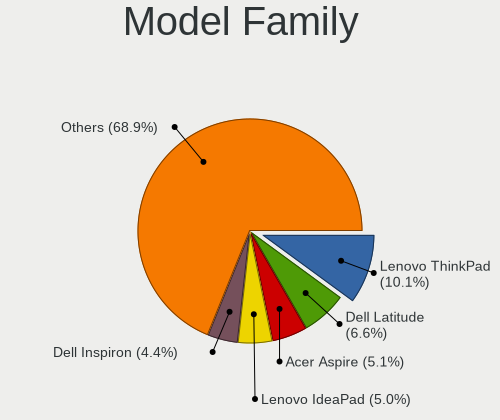

Ubuntu 22.04 - Tested Hardware & Statistics (Notebooks)
-------------------------------------------------------

A project to collect tested hardware configurations for Ubuntu 22.04.

Anyone can contribute to this report by the [hw-probe](https://github.com/linuxhw/hw-probe) tool:

    sudo -E hw-probe -all -upload

Please contribute! Especially if your hardware is rare.

Contents
--------

* [ Test Cases ](#test-cases)

* [ System ](#system)
  - [ Kernel                   ](#kernel)
  - [ Kernel Family            ](#kernel-family)
  - [ Kernel Major Ver.        ](#kernel-major-ver)
  - [ Arch                     ](#arch)
  - [ DE                       ](#de)
  - [ Display Server           ](#display-server)
  - [ Display Manager          ](#display-manager)
  - [ OS Lang                  ](#os-lang)
  - [ Boot Mode                ](#boot-mode)
  - [ Filesystem               ](#filesystem)
  - [ Part. scheme             ](#part-scheme)
  - [ Dual Boot with Linux/BSD ](#dual-boot-with-linuxbsd)
  - [ Dual Boot (Win)          ](#dual-boot-win)

* [ Board ](#board)
  - [ Vendor                   ](#vendor)
  - [ Model                    ](#model)
  - [ Model Family             ](#model-family)
  - [ MFG Year                 ](#mfg-year)
  - [ Form Factor              ](#form-factor)
  - [ Secure Boot              ](#secure-boot)
  - [ Coreboot                 ](#coreboot)
  - [ RAM Size                 ](#ram-size)
  - [ RAM Used                 ](#ram-used)
  - [ Total Drives             ](#total-drives)
  - [ Has CD-ROM               ](#has-cd-rom)
  - [ Has Ethernet             ](#has-ethernet)
  - [ Has WiFi                 ](#has-wifi)
  - [ Has Bluetooth            ](#has-bluetooth)

* [ Location ](#location)
  - [ Country                  ](#country)
  - [ City                     ](#city)

* [ Drives ](#drives)
  - [ Drive Vendor             ](#drive-vendor)
  - [ Drive Model              ](#drive-model)
  - [ HDD Vendor               ](#hdd-vendor)
  - [ SSD Vendor               ](#ssd-vendor)
  - [ Drive Kind               ](#drive-kind)
  - [ Drive Connector          ](#drive-connector)
  - [ Drive Size               ](#drive-size)
  - [ Space Total              ](#space-total)
  - [ Space Used               ](#space-used)
  - [ Malfunc. Drives          ](#malfunc-drives)
  - [ Malfunc. Drive Vendor    ](#malfunc-drive-vendor)
  - [ Malfunc. HDD Vendor      ](#malfunc-hdd-vendor)
  - [ Malfunc. Drive Kind      ](#malfunc-drive-kind)
  - [ Failed Drives            ](#failed-drives)
  - [ Failed Drive Vendor      ](#failed-drive-vendor)
  - [ Drive Status             ](#drive-status)

* [ Storage controller ](#storage-controller)
  - [ Storage Vendor           ](#storage-vendor)
  - [ Storage Model            ](#storage-model)
  - [ Storage Kind             ](#storage-kind)

* [ Processor ](#processor)
  - [ CPU Vendor               ](#cpu-vendor)
  - [ CPU Model                ](#cpu-model)
  - [ CPU Model Family         ](#cpu-model-family)
  - [ CPU Cores                ](#cpu-cores)
  - [ CPU Sockets              ](#cpu-sockets)
  - [ CPU Threads              ](#cpu-threads)
  - [ CPU Op-Modes             ](#cpu-op-modes)
  - [ CPU Microcode            ](#cpu-microcode)
  - [ CPU Microarch            ](#cpu-microarch)

* [ Graphics ](#graphics)
  - [ GPU Vendor               ](#gpu-vendor)
  - [ GPU Model                ](#gpu-model)
  - [ GPU Combo                ](#gpu-combo)
  - [ GPU Driver               ](#gpu-driver)
  - [ GPU Memory               ](#gpu-memory)

* [ Monitor ](#monitor)
  - [ Monitor Vendor           ](#monitor-vendor)
  - [ Monitor Model            ](#monitor-model)
  - [ Monitor Resolution       ](#monitor-resolution)
  - [ Monitor Diagonal         ](#monitor-diagonal)
  - [ Monitor Width            ](#monitor-width)
  - [ Aspect Ratio             ](#aspect-ratio)
  - [ Monitor Area             ](#monitor-area)
  - [ Pixel Density            ](#pixel-density)
  - [ Multiple Monitors        ](#multiple-monitors)

* [ Network ](#network)
  - [ Net Controller Vendor    ](#net-controller-vendor)
  - [ Net Controller Model     ](#net-controller-model)
  - [ Wireless Vendor          ](#wireless-vendor)
  - [ Wireless Model           ](#wireless-model)
  - [ Ethernet Vendor          ](#ethernet-vendor)
  - [ Ethernet Model           ](#ethernet-model)
  - [ Net Controller Kind      ](#net-controller-kind)
  - [ Used Controller          ](#used-controller)
  - [ NICs                     ](#nics)
  - [ IPv6                     ](#ipv6)

* [ Bluetooth ](#bluetooth)
  - [ Bluetooth Vendor         ](#bluetooth-vendor)
  - [ Bluetooth Model          ](#bluetooth-model)

* [ Sound ](#sound)
  - [ Sound Vendor             ](#sound-vendor)
  - [ Sound Model              ](#sound-model)

* [ Memory ](#memory)
  - [ Memory Vendor            ](#memory-vendor)
  - [ Memory Model             ](#memory-model)
  - [ Memory Kind              ](#memory-kind)
  - [ Memory Form Factor       ](#memory-form-factor)
  - [ Memory Size              ](#memory-size)
  - [ Memory Speed             ](#memory-speed)

* [ Printers & scanners ](#printers--scanners)
  - [ Printer Vendor           ](#printer-vendor)
  - [ Printer Model            ](#printer-model)
  - [ Scanner Vendor           ](#scanner-vendor)
  - [ Scanner Model            ](#scanner-model)

* [ Camera ](#camera)
  - [ Camera Vendor            ](#camera-vendor)
  - [ Camera Model             ](#camera-model)

* [ Security ](#security)
  - [ Fingerprint Vendor       ](#fingerprint-vendor)
  - [ Fingerprint Model        ](#fingerprint-model)
  - [ Chipcard Vendor          ](#chipcard-vendor)
  - [ Chipcard Model           ](#chipcard-model)

* [ Unsupported ](#unsupported)
  - [ Unsupported Devices      ](#unsupported-devices)
  - [ Unsupported Device Types ](#unsupported-device-types)

Test Cases
----------

Total: 13871

| Vendor        | Model                       | Probe                                                      | Date         |
|---------------|-----------------------------|------------------------------------------------------------|--------------|
| Toshiba       | Satellite C670-14M          | [9e54cf257c](https://linux-hardware.org/?probe=9e54cf257c) | Jan 05, 2025 |
| Medion        | P15648                      | [e4b0850870](https://linux-hardware.org/?probe=e4b0850870) | Jan 05, 2025 |
| ASUSTek       | G75VW                       | [ff570669d5](https://linux-hardware.org/?probe=ff570669d5) | Jan 04, 2025 |
| HP            | 15                          | [8542f54ea5](https://linux-hardware.org/?probe=8542f54ea5) | Jan 03, 2025 |
| Acer          | Aspire A115-32              | [c3f625776f](https://linux-hardware.org/?probe=c3f625776f) | Jan 03, 2025 |
| Lenovo        | ThinkPad T540p 20BE00B2M... | [d3fdfbc445](https://linux-hardware.org/?probe=d3fdfbc445) | Jan 03, 2025 |
| Unknown       | Unknown                     | [4a568ea48d](https://linux-hardware.org/?probe=4a568ea48d) | Jan 03, 2025 |
| HP            | EliteBook 840 G2            | [54ab368174](https://linux-hardware.org/?probe=54ab368174) | Jan 03, 2025 |
| ASUSTek       | UL50Vg                      | [6305475a87](https://linux-hardware.org/?probe=6305475a87) | Jan 03, 2025 |
| Fujitsu       | LIFEBOOK UH572              | [5625a23ef5](https://linux-hardware.org/?probe=5625a23ef5) | Jan 02, 2025 |
| ASUSTek       | Vivobook Go E1504FA         | [8e5f1ab7d6](https://linux-hardware.org/?probe=8e5f1ab7d6) | Jan 02, 2025 |
| Acer          | Aspire E5-575G              | [bea4bbd29a](https://linux-hardware.org/?probe=bea4bbd29a) | Jan 02, 2025 |
| System76      | Lemur Pro                   | [6eae77b375](https://linux-hardware.org/?probe=6eae77b375) | Jan 02, 2025 |
| Acer          | Aspire E5-575G              | [131ac42ca5](https://linux-hardware.org/?probe=131ac42ca5) | Jan 01, 2025 |
| Acer          | Swift SF314-52G             | [77f207d738](https://linux-hardware.org/?probe=77f207d738) | Jan 01, 2025 |
| ASUSTek       | K93SM                       | [de80ff2a02](https://linux-hardware.org/?probe=de80ff2a02) | Jan 01, 2025 |
| Lenovo        | G50-30 80G0                 | [f9d8f3d7a1](https://linux-hardware.org/?probe=f9d8f3d7a1) | Jan 01, 2025 |
| Apple         | MacBookPro12,1              | [1340d405bf](https://linux-hardware.org/?probe=1340d405bf) | Jan 01, 2025 |
| Apple         | MacBookPro9,2               | [319272bf03](https://linux-hardware.org/?probe=319272bf03) | Jan 01, 2025 |
| Samsung       | 370E4K                      | [ba2171b4e3](https://linux-hardware.org/?probe=ba2171b4e3) | Dec 31, 2024 |
| Dell          | Vostro 13 5310              | [b7f2eb4035](https://linux-hardware.org/?probe=b7f2eb4035) | Dec 31, 2024 |
| BOSGAME       | DNB20 series                | [7c23d0edba](https://linux-hardware.org/?probe=7c23d0edba) | Dec 31, 2024 |
| HP            | Victus by Gaming Laptop ... | [779320377b](https://linux-hardware.org/?probe=779320377b) | Dec 31, 2024 |
| ASUSTek       | VivoBook_ASUSLaptop X170... | [cba1e94ceb](https://linux-hardware.org/?probe=cba1e94ceb) | Dec 30, 2024 |
| Lenovo        | G50-70 20351                | [493dd462e8](https://linux-hardware.org/?probe=493dd462e8) | Dec 29, 2024 |
| HUAWEI        | BOD-WXX9                    | [94c62e3b8b](https://linux-hardware.org/?probe=94c62e3b8b) | Dec 29, 2024 |
| Apple         | MacBookAir7,2               | [fcda8f7b53](https://linux-hardware.org/?probe=fcda8f7b53) | Dec 28, 2024 |
| Apple         | MacBookAir7,2               | [218f4af079](https://linux-hardware.org/?probe=218f4af079) | Dec 28, 2024 |
| ASUSTek       | VivoBook_ASUSLaptop X160... | [ed184eaff9](https://linux-hardware.org/?probe=ed184eaff9) | Dec 28, 2024 |
| HUAWEI        | KLVF-XX                     | [647fb3b2cf](https://linux-hardware.org/?probe=647fb3b2cf) | Dec 27, 2024 |
| Lenovo        | ThinkPad E460 20ET0014US    | [9ee6c676eb](https://linux-hardware.org/?probe=9ee6c676eb) | Dec 27, 2024 |
| Dell          | Vostro 15 3510              | [318022f8d5](https://linux-hardware.org/?probe=318022f8d5) | Dec 27, 2024 |
| Lenovo        | ThinkPad T440p 20AN0069U... | [0574e44035](https://linux-hardware.org/?probe=0574e44035) | Dec 27, 2024 |
| Dell          | Latitude E6230              | [cd5bf9b8fb](https://linux-hardware.org/?probe=cd5bf9b8fb) | Dec 26, 2024 |
| Apple         | MacBookPro9,2               | [c7b700cc18](https://linux-hardware.org/?probe=c7b700cc18) | Dec 26, 2024 |
| BOSGAME       | DNB20 series                | [ce3d8499eb](https://linux-hardware.org/?probe=ce3d8499eb) | Dec 26, 2024 |
| ASUSTek       | UX305CA                     | [73bb2289d6](https://linux-hardware.org/?probe=73bb2289d6) | Dec 25, 2024 |
| Monster       | ABRA A7 V11.2               | [762b2b2071](https://linux-hardware.org/?probe=762b2b2071) | Dec 25, 2024 |
| HP            | Pavilion Laptop 15-eh2xx... | [f4697e3485](https://linux-hardware.org/?probe=f4697e3485) | Dec 25, 2024 |
| HUAWEI        | BOM-WXX9                    | [030b263131](https://linux-hardware.org/?probe=030b263131) | Dec 25, 2024 |
| Acer          | Aspire ES1-531              | [c09e9c415c](https://linux-hardware.org/?probe=c09e9c415c) | Dec 25, 2024 |
| ASUSTek       | UX305CA                     | [88a69fd398](https://linux-hardware.org/?probe=88a69fd398) | Dec 24, 2024 |
| Lenovo        | ThinkBook 16 G6 IRL 21KH    | [48353373ae](https://linux-hardware.org/?probe=48353373ae) | Dec 24, 2024 |
| ASUSTek       | M51Sn                       | [3292249251](https://linux-hardware.org/?probe=3292249251) | Dec 24, 2024 |
| Lenovo        | G585 2181                   | [0004a20215](https://linux-hardware.org/?probe=0004a20215) | Dec 24, 2024 |
| HUAWEI        | NBLB-WAX9N                  | [6524a2db9e](https://linux-hardware.org/?probe=6524a2db9e) | Dec 23, 2024 |
| Dell          | Latitude 5510               | [fefb1eb9c3](https://linux-hardware.org/?probe=fefb1eb9c3) | Dec 23, 2024 |
| Samsung       | 370E4K                      | [b2200db0dc](https://linux-hardware.org/?probe=b2200db0dc) | Dec 23, 2024 |
| HP            | ProBook 4730s               | [0b185e0e1f](https://linux-hardware.org/?probe=0b185e0e1f) | Dec 23, 2024 |
| Samsung       | 370E4K                      | [6c1eff379e](https://linux-hardware.org/?probe=6c1eff379e) | Dec 23, 2024 |
| HP            | ProBook 4730s               | [03483a3212](https://linux-hardware.org/?probe=03483a3212) | Dec 22, 2024 |
| Fujitsu       | LIFEBOOK E734               | [2009db3bc5](https://linux-hardware.org/?probe=2009db3bc5) | Dec 22, 2024 |
| Lenovo        | ThinkPad A285 20MXS0AE00    | [ab309a9eb4](https://linux-hardware.org/?probe=ab309a9eb4) | Dec 22, 2024 |
| Dell          | Inspiron 7591               | [640a616ad8](https://linux-hardware.org/?probe=640a616ad8) | Dec 22, 2024 |
| Lenovo        | ThinkPad T410 2518R8G       | [03e23c615f](https://linux-hardware.org/?probe=03e23c615f) | Dec 21, 2024 |
| Maibenben     | MaiBook M                   | [5cb09d638e](https://linux-hardware.org/?probe=5cb09d638e) | Dec 21, 2024 |
| ASUSTek       | ROG Strix G512LU_G512LU     | [914e64e86c](https://linux-hardware.org/?probe=914e64e86c) | Dec 20, 2024 |
| Dell          | Inspiron 3442               | [cfc2614cfb](https://linux-hardware.org/?probe=cfc2614cfb) | Dec 20, 2024 |
| Notebook      | W65_67SH                    | [a04f4e7b2a](https://linux-hardware.org/?probe=a04f4e7b2a) | Dec 20, 2024 |
| ASUSTek       | ROG Strix G731GT_GL731GT    | [5b4fa92a70](https://linux-hardware.org/?probe=5b4fa92a70) | Dec 20, 2024 |
| Acer          | Aspire 4820TG               | [d8ed5c82aa](https://linux-hardware.org/?probe=d8ed5c82aa) | Dec 19, 2024 |
| Dell          | Precision 5690              | [df5aa6cbe1](https://linux-hardware.org/?probe=df5aa6cbe1) | Dec 19, 2024 |
| BOSGAME       | DNB20 series                | [113645b0bb](https://linux-hardware.org/?probe=113645b0bb) | Dec 19, 2024 |
| ASUSTek       | X555LB                      | [ff9a109d64](https://linux-hardware.org/?probe=ff9a109d64) | Dec 18, 2024 |
| Lenovo        | Z50-70 20354                | [8f484e94de](https://linux-hardware.org/?probe=8f484e94de) | Dec 18, 2024 |
| Acer          | Aspire 5750G                | [f4a8bd7c14](https://linux-hardware.org/?probe=f4a8bd7c14) | Dec 17, 2024 |
| HP            | 550                         | [c401aa1e31](https://linux-hardware.org/?probe=c401aa1e31) | Dec 17, 2024 |
| Dell          | XPS 13 9340                 | [914be0c9e8](https://linux-hardware.org/?probe=914be0c9e8) | Dec 17, 2024 |
| Acer          | Aspire A515-57              | [c09f54f867](https://linux-hardware.org/?probe=c09f54f867) | Dec 17, 2024 |
| Lenovo        | Legion 5 Pro 16ACH6H 82J... | [1db1f1c585](https://linux-hardware.org/?probe=1db1f1c585) | Dec 17, 2024 |
| Lenovo        | LOQ 15APH8 82XT             | [428715e96d](https://linux-hardware.org/?probe=428715e96d) | Dec 17, 2024 |
| Lenovo        | LOQ 15APH8 82XT             | [46f8c1934d](https://linux-hardware.org/?probe=46f8c1934d) | Dec 17, 2024 |
| ASUSTek       | ZenBook UX325EA_UX325EA     | [12be2072af](https://linux-hardware.org/?probe=12be2072af) | Dec 16, 2024 |
| Dell          | G15 5530                    | [348b21d35f](https://linux-hardware.org/?probe=348b21d35f) | Dec 16, 2024 |
| HP            | 550                         | [4890cb5e06](https://linux-hardware.org/?probe=4890cb5e06) | Dec 16, 2024 |
| ASUSTek       | ZenBook UX435EA_UX435EA     | [55b8b860be](https://linux-hardware.org/?probe=55b8b860be) | Dec 16, 2024 |
| Lenovo        | IdeaPad 3 15ITL6 82H8       | [8bef0b6a5c](https://linux-hardware.org/?probe=8bef0b6a5c) | Dec 16, 2024 |
| Lenovo        | ThinkPad P14s Gen 1 20S4... | [6f50478831](https://linux-hardware.org/?probe=6f50478831) | Dec 16, 2024 |
| Acer          | TravelMate P653-M           | [433663f1d2](https://linux-hardware.org/?probe=433663f1d2) | Dec 16, 2024 |
| Fujitsu       | LIFEBOOK E734               | [1fe6aaa34e](https://linux-hardware.org/?probe=1fe6aaa34e) | Dec 16, 2024 |
| HP            | Victus by Gaming Laptop ... | [3f73630b78](https://linux-hardware.org/?probe=3f73630b78) | Dec 15, 2024 |
| HP            | Notebook                    | [c84a2c0827](https://linux-hardware.org/?probe=c84a2c0827) | Dec 15, 2024 |
| Apple         | MacBookPro9,2               | [ac5dad0554](https://linux-hardware.org/?probe=ac5dad0554) | Dec 15, 2024 |
| Dell          | Latitude 7280               | [8ed58033ee](https://linux-hardware.org/?probe=8ed58033ee) | Dec 14, 2024 |
| ASUSTek       | ASUS Vivobook S 16 M5606... | [7babd755f8](https://linux-hardware.org/?probe=7babd755f8) | Dec 14, 2024 |
| Toshiba       | Satellite C50D-A-12M        | [2d76f9c438](https://linux-hardware.org/?probe=2d76f9c438) | Dec 13, 2024 |
| HP            | EliteBook 840 G1            | [bd27b16177](https://linux-hardware.org/?probe=bd27b16177) | Dec 13, 2024 |
| HP            | Pavilion dm4                | [74c6e0eb54](https://linux-hardware.org/?probe=74c6e0eb54) | Dec 12, 2024 |
| Dell          | Latitude 7490               | [14889ddf55](https://linux-hardware.org/?probe=14889ddf55) | Dec 12, 2024 |
| ASUSTek       | ASUS Vivobook S 16 M5606... | [b3ea15c92e](https://linux-hardware.org/?probe=b3ea15c92e) | Dec 12, 2024 |
| Notebook      | NL40_50CU                   | [17bfb4311c](https://linux-hardware.org/?probe=17bfb4311c) | Dec 11, 2024 |
| Dell          | G15 5530                    | [f2e8fbbc50](https://linux-hardware.org/?probe=f2e8fbbc50) | Dec 10, 2024 |
| Lenovo        | ThinkPad X1 Extreme Gen2... | [280acb4797](https://linux-hardware.org/?probe=280acb4797) | Dec 10, 2024 |
| HP            | Folio 13 - 2000             | [267f773f15](https://linux-hardware.org/?probe=267f773f15) | Dec 10, 2024 |
| HP            | Pavilion Gaming Laptop 1... | [125266fa30](https://linux-hardware.org/?probe=125266fa30) | Dec 09, 2024 |
| ASUSTek       | VivoBook_ASUSLaptop K360... | [8169d4ab51](https://linux-hardware.org/?probe=8169d4ab51) | Dec 09, 2024 |
| Dell          | Latitude 7280               | [7b850c81c1](https://linux-hardware.org/?probe=7b850c81c1) | Dec 08, 2024 |
| HP            | Laptop 17z-cp300            | [af630a7da9](https://linux-hardware.org/?probe=af630a7da9) | Dec 08, 2024 |
| Dell          | Precision 7530              | [0548741152](https://linux-hardware.org/?probe=0548741152) | Dec 07, 2024 |
| HP            | Laptop 14s-dq3xxx           | [dd50a8ad3b](https://linux-hardware.org/?probe=dd50a8ad3b) | Dec 07, 2024 |
| HP            | Laptop 14s-dq3xxx           | [3b9ccf4f6d](https://linux-hardware.org/?probe=3b9ccf4f6d) | Dec 07, 2024 |
| Packard Be... | EasyNote TS11HR             | [9be4f893aa](https://linux-hardware.org/?probe=9be4f893aa) | Dec 07, 2024 |
| Dell          | Latitude 3520               | [cffdf7964b](https://linux-hardware.org/?probe=cffdf7964b) | Dec 06, 2024 |
| Lenovo        | ThinkBook 16 G6 ABP 21KK    | [5a22a76102](https://linux-hardware.org/?probe=5a22a76102) | Dec 06, 2024 |
| Gateway       | NV79C                       | [5995d6bf0f](https://linux-hardware.org/?probe=5995d6bf0f) | Dec 06, 2024 |
| Dell          | Latitude D830               | [137bc0a643](https://linux-hardware.org/?probe=137bc0a643) | Dec 06, 2024 |
| Dell          | Inspiron 7773               | [b2bf3b5b8a](https://linux-hardware.org/?probe=b2bf3b5b8a) | Dec 06, 2024 |
| Lenovo        | ThinkBook 16 G6 IRL 21KH    | [6f2a2ee5c7](https://linux-hardware.org/?probe=6f2a2ee5c7) | Dec 05, 2024 |
| Samsung       | 530U3C/530U4C/532U3C        | [aaecf0d069](https://linux-hardware.org/?probe=aaecf0d069) | Dec 05, 2024 |
| HP            | Notebook                    | [0171dcd515](https://linux-hardware.org/?probe=0171dcd515) | Dec 04, 2024 |
| HP            | Notebook                    | [b9a4b1639e](https://linux-hardware.org/?probe=b9a4b1639e) | Dec 04, 2024 |
| Lenovo        | IdeaPad 320-15IAP 80XR      | [27ffa8dde9](https://linux-hardware.org/?probe=27ffa8dde9) | Dec 04, 2024 |
| Lenovo        | B560 43308VG                | [dc77ba16df](https://linux-hardware.org/?probe=dc77ba16df) | Dec 04, 2024 |
| HP            | Laptop 15-fc0xxx            | [02e6943db4](https://linux-hardware.org/?probe=02e6943db4) | Dec 03, 2024 |
| HP            | Pavilion Laptop 15t-eg30... | [eea03d6bb5](https://linux-hardware.org/?probe=eea03d6bb5) | Dec 03, 2024 |
| Dell          | Vostro 1500                 | [2b6441b829](https://linux-hardware.org/?probe=2b6441b829) | Dec 03, 2024 |
| Dell          | Precision 5540              | [9e16a34662](https://linux-hardware.org/?probe=9e16a34662) | Dec 03, 2024 |
| Samsung       | 550XDA                      | [f698576590](https://linux-hardware.org/?probe=f698576590) | Dec 03, 2024 |
| Lenovo        | ThinkBook 14-IIL 20SL       | [c6443bd0c5](https://linux-hardware.org/?probe=c6443bd0c5) | Dec 03, 2024 |
| Dell          | Latitude 5540               | [671915a3df](https://linux-hardware.org/?probe=671915a3df) | Dec 02, 2024 |
| Dell          | Latitude E7250              | [a02e607413](https://linux-hardware.org/?probe=a02e607413) | Dec 02, 2024 |
| Razer         | Blade 17 (2022) - RZ09-0... | [84343acca8](https://linux-hardware.org/?probe=84343acca8) | Dec 02, 2024 |
| Dell          | Precision 5690              | [e52f8d92d4](https://linux-hardware.org/?probe=e52f8d92d4) | Dec 02, 2024 |
| HP            | Laptop 15-da0xxx            | [c352e2fd24](https://linux-hardware.org/?probe=c352e2fd24) | Dec 02, 2024 |
| Dell          | Inspiron 15-3567            | [fffcdca9f4](https://linux-hardware.org/?probe=fffcdca9f4) | Dec 01, 2024 |
| Lenovo        | Z50-70 20354                | [18d0728c77](https://linux-hardware.org/?probe=18d0728c77) | Dec 01, 2024 |
| ASUSTek       | X751MD                      | [c659c9a57c](https://linux-hardware.org/?probe=c659c9a57c) | Dec 01, 2024 |
| Lenovo        | IdeaPad 3 15ADA05 81W1      | [5b0a65bb7c](https://linux-hardware.org/?probe=5b0a65bb7c) | Dec 01, 2024 |
| Dell          | Latitude E7470              | [ac991cd0b2](https://linux-hardware.org/?probe=ac991cd0b2) | Nov 30, 2024 |
| Lenovo        | ThinkBook 15 20VE           | [c33fad56a0](https://linux-hardware.org/?probe=c33fad56a0) | Nov 30, 2024 |
| Lenovo        | ThinkPad P53 20QN001FUS     | [7638dfbea7](https://linux-hardware.org/?probe=7638dfbea7) | Nov 30, 2024 |
| HP            | Pavilion Laptop 15-cs3xx... | [e395b7e749](https://linux-hardware.org/?probe=e395b7e749) | Nov 30, 2024 |
| HP            | ProBook 450 G2              | [72abd853a1](https://linux-hardware.org/?probe=72abd853a1) | Nov 28, 2024 |
| Acer          | Aspire E5-576G              | [66f3dc8d70](https://linux-hardware.org/?probe=66f3dc8d70) | Nov 27, 2024 |
| ASUSTek       | VivoBook_ASUSLaptop K360... | [68e95f2aff](https://linux-hardware.org/?probe=68e95f2aff) | Nov 27, 2024 |
| Dell          | Latitude E6420              | [f38a40bedf](https://linux-hardware.org/?probe=f38a40bedf) | Nov 27, 2024 |
| ASUSTek       | ASUS TUF Gaming F15 FX50... | [097217bba2](https://linux-hardware.org/?probe=097217bba2) | Nov 26, 2024 |
| HONOR         | BRI-XX                      | [2c9acc0634](https://linux-hardware.org/?probe=2c9acc0634) | Nov 26, 2024 |
| HP            | Pavilion 17                 | [16a7e6215b](https://linux-hardware.org/?probe=16a7e6215b) | Nov 26, 2024 |
| Lenovo        | ThinkPad X1 Carbon Gen 9... | [7d10950e55](https://linux-hardware.org/?probe=7d10950e55) | Nov 26, 2024 |
| Acer          | Aspire 5739G                | [3e6fa419ef](https://linux-hardware.org/?probe=3e6fa419ef) | Nov 25, 2024 |
| Apple         | MacBookPro15,3              | [b2950a6acc](https://linux-hardware.org/?probe=b2950a6acc) | Nov 25, 2024 |
| Apple         | MacBookPro15,3              | [35e53fb246](https://linux-hardware.org/?probe=35e53fb246) | Nov 25, 2024 |
| Acer          | Swift SFG14-41              | [60a881fd19](https://linux-hardware.org/?probe=60a881fd19) | Nov 25, 2024 |
| AXIOO         | Hype 5 G12                  | [c05b80051b](https://linux-hardware.org/?probe=c05b80051b) | Nov 25, 2024 |
| Acer          | Aspire VN7-593G             | [ad4e2f6625](https://linux-hardware.org/?probe=ad4e2f6625) | Nov 24, 2024 |
| HP            | Pavilion Laptop 14-ce0xx... | [82c29653d5](https://linux-hardware.org/?probe=82c29653d5) | Nov 23, 2024 |
| Acer          | Aspire VN7-593G             | [bec6c0b737](https://linux-hardware.org/?probe=bec6c0b737) | Nov 23, 2024 |
| Dell          | G3 3590                     | [06181baaa8](https://linux-hardware.org/?probe=06181baaa8) | Nov 23, 2024 |
| Entroware     | Hybris                      | [7efe43ff53](https://linux-hardware.org/?probe=7efe43ff53) | Nov 23, 2024 |
| LG Electro... | 16Z90P-G.AA75A              | [c441597519](https://linux-hardware.org/?probe=c441597519) | Nov 23, 2024 |
| Alienware     | M11xR3                      | [a2b355d751](https://linux-hardware.org/?probe=a2b355d751) | Nov 23, 2024 |
| HP            | ZBook 14 G2                 | [82774b98d1](https://linux-hardware.org/?probe=82774b98d1) | Nov 22, 2024 |
| Lenovo        | ThinkPad E16 Gen 2 21M5C... | [07a826ec9b](https://linux-hardware.org/?probe=07a826ec9b) | Nov 22, 2024 |
| ASUSTek       | N56JN                       | [e8cb7952c8](https://linux-hardware.org/?probe=e8cb7952c8) | Nov 22, 2024 |
| HP            | Notebook                    | [dc1055fc34](https://linux-hardware.org/?probe=dc1055fc34) | Nov 21, 2024 |
| Dell          | Latitude 7490               | [51f1937c76](https://linux-hardware.org/?probe=51f1937c76) | Nov 21, 2024 |
| Lenovo        | ThinkPad T480 20L5A023HK    | [c52db1921e](https://linux-hardware.org/?probe=c52db1921e) | Nov 21, 2024 |
| HP            | EliteBook 8470p             | [c9f78cd582](https://linux-hardware.org/?probe=c9f78cd582) | Nov 21, 2024 |
| Dell          | Latitude E7470              | [cd9674e3ee](https://linux-hardware.org/?probe=cd9674e3ee) | Nov 21, 2024 |
| Dell          | Latitude E7470              | [ddce26d0f0](https://linux-hardware.org/?probe=ddce26d0f0) | Nov 21, 2024 |
| Dell          | G15 5530                    | [0b025aca7b](https://linux-hardware.org/?probe=0b025aca7b) | Nov 20, 2024 |
| Dell          | Latitude 7300               | [f4e36dc49a](https://linux-hardware.org/?probe=f4e36dc49a) | Nov 20, 2024 |
| Dell          | Latitude 7300               | [9d34bce80e](https://linux-hardware.org/?probe=9d34bce80e) | Nov 20, 2024 |
| ASUSTek       | ZenBook UX325EA_UX325EA     | [7a54d6e427](https://linux-hardware.org/?probe=7a54d6e427) | Nov 20, 2024 |
| Dell          | Latitude 3420               | [a2738a5c7c](https://linux-hardware.org/?probe=a2738a5c7c) | Nov 20, 2024 |
| Dell          | Inspiron 7591               | [850f3ea624](https://linux-hardware.org/?probe=850f3ea624) | Nov 20, 2024 |
| Lenovo        | ThinkPad P51 W10DG 20MNS... | [03998f5148](https://linux-hardware.org/?probe=03998f5148) | Nov 19, 2024 |
| Lenovo        | ThinkPad P50 20EQS3FS00     | [a4e3b80ed2](https://linux-hardware.org/?probe=a4e3b80ed2) | Nov 19, 2024 |
| eMachines     | E527                        | [8551ba8117](https://linux-hardware.org/?probe=8551ba8117) | Nov 19, 2024 |
| Olivetti      | OLIBOOK PX5-XXXAES          | [2b7a1152c0](https://linux-hardware.org/?probe=2b7a1152c0) | Nov 19, 2024 |
| Clevo         | W270HU                      | [1b9d20b809](https://linux-hardware.org/?probe=1b9d20b809) | Nov 19, 2024 |
| Lenovo        | ThinkPad E14 20RAS13J00     | [7a8cc3c5a4](https://linux-hardware.org/?probe=7a8cc3c5a4) | Nov 19, 2024 |
| HP            | G62                         | [04508940c2](https://linux-hardware.org/?probe=04508940c2) | Nov 19, 2024 |
| HP            | G62                         | [ab81cd1692](https://linux-hardware.org/?probe=ab81cd1692) | Nov 19, 2024 |
| Apple         | MacBookPro8,2               | [dc8ce6dbd4](https://linux-hardware.org/?probe=dc8ce6dbd4) | Nov 18, 2024 |
| HP            | EliteBook 840 14 inch G1... | [3781e48de2](https://linux-hardware.org/?probe=3781e48de2) | Nov 18, 2024 |
| Lenovo        | ThinkPad E14 Gen 4 21E30... | [9f1e8708e9](https://linux-hardware.org/?probe=9f1e8708e9) | Nov 18, 2024 |
| Lenovo        | ThinkPad T14 Gen 1 20S1S... | [e6d1c043d2](https://linux-hardware.org/?probe=e6d1c043d2) | Nov 17, 2024 |
| Apple         | MacBookAir6,2               | [459885a26f](https://linux-hardware.org/?probe=459885a26f) | Nov 17, 2024 |
| Apple         | MacBook5,1                  | [973b44f478](https://linux-hardware.org/?probe=973b44f478) | Nov 17, 2024 |
| HP            | ProBook 6560b               | [92e074cd1b](https://linux-hardware.org/?probe=92e074cd1b) | Nov 17, 2024 |
| TUXEDO        | InfinityBook Pro 14 Gen6    | [00d2e6e80c](https://linux-hardware.org/?probe=00d2e6e80c) | Nov 17, 2024 |
| Lenovo        | IdeaPad N580                | [ecdd0e048f](https://linux-hardware.org/?probe=ecdd0e048f) | Nov 17, 2024 |
| Lenovo        | IdeaPad N580                | [fc286a4178](https://linux-hardware.org/?probe=fc286a4178) | Nov 17, 2024 |
| Google        | Astronaut                   | [62e938b2bb](https://linux-hardware.org/?probe=62e938b2bb) | Nov 16, 2024 |
| Google        | Astronaut                   | [2da0307fea](https://linux-hardware.org/?probe=2da0307fea) | Nov 16, 2024 |
| HP            | EliteBook 840 G6            | [013364c2a0](https://linux-hardware.org/?probe=013364c2a0) | Nov 15, 2024 |
| ASUSTek       | K55VD                       | [3dccf0becb](https://linux-hardware.org/?probe=3dccf0becb) | Nov 15, 2024 |
| HP            | EliteBook 840 G3            | [3344edc109](https://linux-hardware.org/?probe=3344edc109) | Nov 15, 2024 |
| Apple         | MacBook5,1                  | [846e661f87](https://linux-hardware.org/?probe=846e661f87) | Nov 15, 2024 |
| Lenovo        | Legion 5 Pro 16ACH6H 82J... | [b4ec08b540](https://linux-hardware.org/?probe=b4ec08b540) | Nov 15, 2024 |
| Fujitsu       | LIFEBOOK U727               | [0c0e1567a8](https://linux-hardware.org/?probe=0c0e1567a8) | Nov 14, 2024 |
| HP            | ZBook Firefly 14 inch G9... | [08244ca4ee](https://linux-hardware.org/?probe=08244ca4ee) | Nov 14, 2024 |
| Acer          | Aspire V3-772G              | [72d434eb03](https://linux-hardware.org/?probe=72d434eb03) | Nov 14, 2024 |
| HP            | EliteBook 840 14 inch G1... | [333961be54](https://linux-hardware.org/?probe=333961be54) | Nov 14, 2024 |
| HP            | Laptop 15-db0xxx            | [660923eef0](https://linux-hardware.org/?probe=660923eef0) | Nov 14, 2024 |
| GPU Compan... | GWTC51427                   | [564c6457d2](https://linux-hardware.org/?probe=564c6457d2) | Nov 14, 2024 |
| GPU Compan... | GWTC51427                   | [167dd94e5a](https://linux-hardware.org/?probe=167dd94e5a) | Nov 13, 2024 |
| Lenovo        | ThinkPad T14 Gen 1 20UES... | [be79f50c9e](https://linux-hardware.org/?probe=be79f50c9e) | Nov 13, 2024 |
| Acer          | Aspire A515-56              | [c9c09f75b4](https://linux-hardware.org/?probe=c9c09f75b4) | Nov 13, 2024 |
| Dell          | Latitude 7300               | [4afea027f2](https://linux-hardware.org/?probe=4afea027f2) | Nov 12, 2024 |
| Dell          | Latitude 7310               | [6b3e5aa3ba](https://linux-hardware.org/?probe=6b3e5aa3ba) | Nov 12, 2024 |
| HP            | ENVY 15                     | [6d630249f1](https://linux-hardware.org/?probe=6d630249f1) | Nov 11, 2024 |
| Lenovo        | ThinkBook 15p Gen 2 21B1    | [67f6d7f5f9](https://linux-hardware.org/?probe=67f6d7f5f9) | Nov 11, 2024 |
| Samsung       | 940XFG                      | [262a845d6d](https://linux-hardware.org/?probe=262a845d6d) | Nov 11, 2024 |
| HP            | ENVY 15                     | [909857c64c](https://linux-hardware.org/?probe=909857c64c) | Nov 11, 2024 |
| ASUSTek       | VivoBook_ASUSLaptop X512... | [5f31e2e5a1](https://linux-hardware.org/?probe=5f31e2e5a1) | Nov 11, 2024 |
| ASUSTek       | ROG Strix G731GT_GL731GT    | [cca5e7d15f](https://linux-hardware.org/?probe=cca5e7d15f) | Nov 11, 2024 |
| ASUSTek       | VivoBook_ASUSLaptop M370... | [c950828dde](https://linux-hardware.org/?probe=c950828dde) | Nov 11, 2024 |
| Acer          | Extensa 5620                | [3ce6a80956](https://linux-hardware.org/?probe=3ce6a80956) | Nov 10, 2024 |
| Acer          | Extensa 5620                | [2aadd1b426](https://linux-hardware.org/?probe=2aadd1b426) | Nov 10, 2024 |
| Notebook      | N9x0TC                      | [7fa3ba4a7a](https://linux-hardware.org/?probe=7fa3ba4a7a) | Nov 10, 2024 |
| ASUSTek       | X551CA                      | [32c5d62c2c](https://linux-hardware.org/?probe=32c5d62c2c) | Nov 10, 2024 |
| HP            | ENVY dv7                    | [a8c70cfd15](https://linux-hardware.org/?probe=a8c70cfd15) | Nov 09, 2024 |
| HP            | ENVY dv7                    | [b7621c1a53](https://linux-hardware.org/?probe=b7621c1a53) | Nov 09, 2024 |
| Dell          | Inspiron 7591               | [f571fee698](https://linux-hardware.org/?probe=f571fee698) | Nov 09, 2024 |
| ASUSTek       | X551CA                      | [6816290e91](https://linux-hardware.org/?probe=6816290e91) | Nov 09, 2024 |
| HP            | 15 Notebook PC              | [831b3ca2c3](https://linux-hardware.org/?probe=831b3ca2c3) | Nov 09, 2024 |
| Lenovo        | IdeaPad Gaming 3 15IHU6 ... | [64c612c343](https://linux-hardware.org/?probe=64c612c343) | Nov 08, 2024 |
| Dell          | Precision 5760              | [99386322c7](https://linux-hardware.org/?probe=99386322c7) | Nov 08, 2024 |
| Toshiba       | Satellite C660              | [efca38e06f](https://linux-hardware.org/?probe=efca38e06f) | Nov 08, 2024 |
| HP            | ZBook Fury 15.6 inch G8 ... | [e7b30179ed](https://linux-hardware.org/?probe=e7b30179ed) | Nov 08, 2024 |
| ASUSTek       | X550ZE                      | [f4bb873e76](https://linux-hardware.org/?probe=f4bb873e76) | Nov 08, 2024 |
| Lenovo        | G710 20252                  | [21fcbba836](https://linux-hardware.org/?probe=21fcbba836) | Nov 07, 2024 |
| ASUSTek       | ASUS Vivobook S 16 S5606... | [c967424ce9](https://linux-hardware.org/?probe=c967424ce9) | Nov 07, 2024 |
| Dell          | Precision 3480              | [f07700913a](https://linux-hardware.org/?probe=f07700913a) | Nov 07, 2024 |
| Lenovo        | Legion 5 17ACH6 82K0        | [4a0a116a98](https://linux-hardware.org/?probe=4a0a116a98) | Nov 06, 2024 |
| Dell          | Vostro 5502                 | [583457132e](https://linux-hardware.org/?probe=583457132e) | Nov 06, 2024 |
| Lenovo        | G710 20252                  | [b9f017cc72](https://linux-hardware.org/?probe=b9f017cc72) | Nov 06, 2024 |
| Medion        | P6816                       | [e2adfb86c4](https://linux-hardware.org/?probe=e2adfb86c4) | Nov 05, 2024 |
| HP            | EliteBook 640 14 inch G1... | [60c3fb08a0](https://linux-hardware.org/?probe=60c3fb08a0) | Nov 05, 2024 |
| Acer          | Aspire A515-52              | [5466d381ed](https://linux-hardware.org/?probe=5466d381ed) | Nov 04, 2024 |
| Samsung       | 340XAA/350XAA/550XAA        | [b846b291d3](https://linux-hardware.org/?probe=b846b291d3) | Nov 04, 2024 |
| Dell          | Latitude 3540               | [a479cc9719](https://linux-hardware.org/?probe=a479cc9719) | Nov 04, 2024 |
| Lenovo        | Y520-15IKBN 80WK            | [ea5b4996f5](https://linux-hardware.org/?probe=ea5b4996f5) | Nov 04, 2024 |
| Notebook      | NL40_50CU                   | [30ed349589](https://linux-hardware.org/?probe=30ed349589) | Nov 03, 2024 |
| Lenovo        | ThinkPad X230 Tablet 343... | [be9e0a8358](https://linux-hardware.org/?probe=be9e0a8358) | Nov 03, 2024 |
| Toshiba       | Satellite L850              | [fc40c7d71c](https://linux-hardware.org/?probe=fc40c7d71c) | Nov 03, 2024 |
| Lenovo        | ThinkPad E14 Gen 4 21E30... | [2f6eabb514](https://linux-hardware.org/?probe=2f6eabb514) | Nov 03, 2024 |
| Lenovo        | ThinkPad SL410 2842F7U      | [f4579ee264](https://linux-hardware.org/?probe=f4579ee264) | Nov 03, 2024 |
| Dell          | Inspiron 15 7000 Gaming     | [2c46dc0007](https://linux-hardware.org/?probe=2c46dc0007) | Nov 03, 2024 |
| Dell          | Inspiron 15 7000 Gaming     | [f924749be2](https://linux-hardware.org/?probe=f924749be2) | Nov 03, 2024 |
| HP            | Victus by Gaming Laptop ... | [b90fc163ef](https://linux-hardware.org/?probe=b90fc163ef) | Nov 03, 2024 |
| Lenovo        | ThinkPad P52 20M9S1QS00     | [fd716d5a78](https://linux-hardware.org/?probe=fd716d5a78) | Nov 02, 2024 |
| Acer          | Aspire E1-570               | [b378ece4e6](https://linux-hardware.org/?probe=b378ece4e6) | Oct 31, 2024 |
| Dell          | G5 5587                     | [0b3033fff7](https://linux-hardware.org/?probe=0b3033fff7) | Oct 31, 2024 |
| TECNO Mobi... | MEGABOOK T15DA              | [b3c26d52a8](https://linux-hardware.org/?probe=b3c26d52a8) | Oct 31, 2024 |
| Lenovo        | ThinkPad T460 20FNA06ACD    | [f74faac599](https://linux-hardware.org/?probe=f74faac599) | Oct 31, 2024 |
| Lenovo        | ThinkPad T460 20FNA06ACD    | [2444611c6c](https://linux-hardware.org/?probe=2444611c6c) | Oct 31, 2024 |
| HUAWEI        | NBD-WXX9                    | [3f98ffc684](https://linux-hardware.org/?probe=3f98ffc684) | Oct 31, 2024 |
| Medion        | P7624                       | [9e7fdd9c57](https://linux-hardware.org/?probe=9e7fdd9c57) | Oct 31, 2024 |
| TANSHI        | Medio Series                | [22034cb75a](https://linux-hardware.org/?probe=22034cb75a) | Oct 31, 2024 |
| Dell          | Latitude E6420              | [ba00de1a36](https://linux-hardware.org/?probe=ba00de1a36) | Oct 30, 2024 |
| Acer          | Aspire E5-523G              | [6a3b1eb7c5](https://linux-hardware.org/?probe=6a3b1eb7c5) | Oct 30, 2024 |
| Acer          | Aspire E5-523G              | [c467005761](https://linux-hardware.org/?probe=c467005761) | Oct 30, 2024 |
| Dell          | Latitude E7240              | [94f15ef6ab](https://linux-hardware.org/?probe=94f15ef6ab) | Oct 30, 2024 |
| Apple         | MacBookAir7,2               | [2e4980216d](https://linux-hardware.org/?probe=2e4980216d) | Oct 29, 2024 |
| Mediacom      | SmartBook 146               | [65219b2865](https://linux-hardware.org/?probe=65219b2865) | Oct 29, 2024 |
| Olivetti      | OLIBOOK PX5-XXXAES          | [a7dee1803e](https://linux-hardware.org/?probe=a7dee1803e) | Oct 29, 2024 |
| Dell          | Vostro 3550                 | [2dfbdb4cc3](https://linux-hardware.org/?probe=2dfbdb4cc3) | Oct 29, 2024 |
| Acer          | Aspire A515-57              | [fb730abfef](https://linux-hardware.org/?probe=fb730abfef) | Oct 29, 2024 |
| Lenovo        | ThinkPad T14 Gen 3 21AH0... | [63f850cb07](https://linux-hardware.org/?probe=63f850cb07) | Oct 29, 2024 |
| Dell          | Vostro 3550                 | [a488480949](https://linux-hardware.org/?probe=a488480949) | Oct 29, 2024 |
| ASUSTek       | TUF Gaming FX504GD_FX80G... | [b832baec89](https://linux-hardware.org/?probe=b832baec89) | Oct 29, 2024 |
| Acer          | Aspire 5336                 | [134306528c](https://linux-hardware.org/?probe=134306528c) | Oct 28, 2024 |
| Lenovo        | ThinkPad T540p 20BFS1QE0... | [864093dd81](https://linux-hardware.org/?probe=864093dd81) | Oct 28, 2024 |
| Lenovo        | ThinkPad X13 Gen 4 21J3C... | [3d56cceb9e](https://linux-hardware.org/?probe=3d56cceb9e) | Oct 28, 2024 |
| Dell          | Precision 5510              | [6d7ecc06d2](https://linux-hardware.org/?probe=6d7ecc06d2) | Oct 28, 2024 |
| ASUSTek       | Zenbook UX3402ZA_UX3402Z... | [7619571919](https://linux-hardware.org/?probe=7619571919) | Oct 27, 2024 |
| Lenovo        | ThinkBook 14 G6 ABP 21KJ    | [096528a92b](https://linux-hardware.org/?probe=096528a92b) | Oct 27, 2024 |
| ASUSTek       | N552VX                      | [125f09bd6b](https://linux-hardware.org/?probe=125f09bd6b) | Oct 27, 2024 |
| Lenovo        | ThinkPad P14s Gen 2a 21A... | [f57dd2c60b](https://linux-hardware.org/?probe=f57dd2c60b) | Oct 27, 2024 |
| Lenovo        | ThinkPad 20U8S20200         | [d61740e01b](https://linux-hardware.org/?probe=d61740e01b) | Oct 27, 2024 |
| ASUSTek       | VivoBook_ASUSLaptop X415... | [7cbafd2cd7](https://linux-hardware.org/?probe=7cbafd2cd7) | Oct 26, 2024 |
| HP            | EliteBook 640 14 inch G1... | [4fd62e953d](https://linux-hardware.org/?probe=4fd62e953d) | Oct 26, 2024 |
| HP            | Pavilion dv6000 (RG364UA... | [fba75ec590](https://linux-hardware.org/?probe=fba75ec590) | Oct 26, 2024 |
| HP            | EliteBook 830 G8 Noteboo... | [01fa28d19a](https://linux-hardware.org/?probe=01fa28d19a) | Oct 25, 2024 |
| Dell          | Latitude 7520               | [954410c10a](https://linux-hardware.org/?probe=954410c10a) | Oct 25, 2024 |
| ASUSTek       | VivoBook_ASUSLaptop X150... | [45a740a773](https://linux-hardware.org/?probe=45a740a773) | Oct 25, 2024 |
| HP            | EliteBook Folio 9470m       | [1b1ee0dcb8](https://linux-hardware.org/?probe=1b1ee0dcb8) | Oct 24, 2024 |
| Lenovo        | ThinkBook 15 G2 ITL 20VE    | [2264ba28f3](https://linux-hardware.org/?probe=2264ba28f3) | Oct 24, 2024 |
| HP            | ProBook 640 G8 Notebook ... | [233ef06f43](https://linux-hardware.org/?probe=233ef06f43) | Oct 24, 2024 |
| ASUSTek       | UX303UB                     | [14619c281d](https://linux-hardware.org/?probe=14619c281d) | Oct 23, 2024 |
| MSI           | Prestige 13Evo A13M         | [44ba69e924](https://linux-hardware.org/?probe=44ba69e924) | Oct 23, 2024 |
| Lenovo        | ThinkPad X250 20CLS3320C    | [66c0507882](https://linux-hardware.org/?probe=66c0507882) | Oct 23, 2024 |
| Acer          | Extensa 215-55              | [97036f4c91](https://linux-hardware.org/?probe=97036f4c91) | Oct 22, 2024 |
| Dell          | XPS 13 9340                 | [cbda962c33](https://linux-hardware.org/?probe=cbda962c33) | Oct 22, 2024 |
| Lenovo        | IdeaPad 3 14ALC6 82KT       | [88089aea01](https://linux-hardware.org/?probe=88089aea01) | Oct 21, 2024 |
| Lenovo        | ThinkPad T420 4236W9P       | [25a5b7315a](https://linux-hardware.org/?probe=25a5b7315a) | Oct 21, 2024 |
| GPU Compan... | GGNC51518                   | [b267b34e26](https://linux-hardware.org/?probe=b267b34e26) | Oct 21, 2024 |
| Dell          | Latitude 5310               | [fe94159d92](https://linux-hardware.org/?probe=fe94159d92) | Oct 20, 2024 |
| Apple         | MacBook5,1                  | [1f032ae465](https://linux-hardware.org/?probe=1f032ae465) | Oct 20, 2024 |
| Lenovo        | ThinkPad T430 2349F72       | [4d17a343b8](https://linux-hardware.org/?probe=4d17a343b8) | Oct 20, 2024 |
| Lenovo        | G50-45 80E3                 | [9a5372b833](https://linux-hardware.org/?probe=9a5372b833) | Oct 20, 2024 |
| HP            | EliteBook 840 G2            | [1cad2c1f05](https://linux-hardware.org/?probe=1cad2c1f05) | Oct 20, 2024 |
| Dell          | Inspiron 5437               | [3bc123ae62](https://linux-hardware.org/?probe=3bc123ae62) | Oct 19, 2024 |
| Sony          | VPCEH3N6E                   | [ac7ff64e8e](https://linux-hardware.org/?probe=ac7ff64e8e) | Oct 19, 2024 |
| Avell         | A52 HYB NEW                 | [625d67538f](https://linux-hardware.org/?probe=625d67538f) | Oct 19, 2024 |
| Lenovo        | IdeaPad Slim 3 15AMN8 82... | [a5369540c2](https://linux-hardware.org/?probe=a5369540c2) | Oct 18, 2024 |
| HP            | ProBook 650 G4              | [2b82d1ddab](https://linux-hardware.org/?probe=2b82d1ddab) | Oct 18, 2024 |
| HP            | ProBook 650 G4              | [b0d567acfc](https://linux-hardware.org/?probe=b0d567acfc) | Oct 18, 2024 |
| Lenovo        | ThinkPad T14s Gen 2i 20W... | [bf4364a524](https://linux-hardware.org/?probe=bf4364a524) | Oct 18, 2024 |
| ASUSTek       | ZenBook UX434FLC_UX433FL... | [c4a9610593](https://linux-hardware.org/?probe=c4a9610593) | Oct 18, 2024 |
| Lenovo        | ThinkPad T440p 20AWS07F0... | [afb498e0cd](https://linux-hardware.org/?probe=afb498e0cd) | Oct 18, 2024 |
| HP            | EliteBook 850 G5            | [d890bc333d](https://linux-hardware.org/?probe=d890bc333d) | Oct 17, 2024 |
| ASUSTek       | X550ZA                      | [df0d93389f](https://linux-hardware.org/?probe=df0d93389f) | Oct 17, 2024 |
| Lenovo        | ThinkBook 15 G2 ITL 20VE    | [5820bd151b](https://linux-hardware.org/?probe=5820bd151b) | Oct 17, 2024 |
| Dell          | Vostro 3520                 | [f872a97890](https://linux-hardware.org/?probe=f872a97890) | Oct 16, 2024 |
| Lenovo        | ThinkPad P15s Gen 2i 20W... | [fa8a6774f1](https://linux-hardware.org/?probe=fa8a6774f1) | Oct 16, 2024 |
| Dell          | Precision 5680              | [ea110640b3](https://linux-hardware.org/?probe=ea110640b3) | Oct 16, 2024 |
| Lenovo        | ThinkBook 15p Gen 2 21B1    | [fbedf8c14c](https://linux-hardware.org/?probe=fbedf8c14c) | Oct 16, 2024 |
| Lenovo        | ThinkPad T520 42435GG       | [e1ebb88182](https://linux-hardware.org/?probe=e1ebb88182) | Oct 16, 2024 |
| HP            | Pavilion dm4                | [d0b7c568a6](https://linux-hardware.org/?probe=d0b7c568a6) | Oct 15, 2024 |
| ASUSTek       | X556UQK                     | [58a249714c](https://linux-hardware.org/?probe=58a249714c) | Oct 15, 2024 |
| Dell          | Latitude 5490               | [4c35ed41b5](https://linux-hardware.org/?probe=4c35ed41b5) | Oct 15, 2024 |
| WINGS         | Nuvobook pro                | [88aac00297](https://linux-hardware.org/?probe=88aac00297) | Oct 15, 2024 |
| Acer          | Aspire A315-21              | [775692a124](https://linux-hardware.org/?probe=775692a124) | Oct 15, 2024 |
| Lenovo        | Legion Pro 5 16IRX8 82WK    | [c2c9df0692](https://linux-hardware.org/?probe=c2c9df0692) | Oct 15, 2024 |
| HP            | EliteBook 840 G2            | [76ef7c1a25](https://linux-hardware.org/?probe=76ef7c1a25) | Oct 15, 2024 |
| Dell          | Inspiron 15 3520            | [3731e9c89a](https://linux-hardware.org/?probe=3731e9c89a) | Oct 15, 2024 |
| Samsung       | 300E5EV/300E4EV/270E5EV/... | [0df65229e7](https://linux-hardware.org/?probe=0df65229e7) | Oct 14, 2024 |
| HP            | Pavilion Laptop 15-eh1xx... | [d2a7008bf5](https://linux-hardware.org/?probe=d2a7008bf5) | Oct 14, 2024 |
| Schenker      | XMG NEO (E24)               | [44953bcd95](https://linux-hardware.org/?probe=44953bcd95) | Oct 14, 2024 |
| Lenovo        | ThinkPad T420 4236W9P       | [676dd2d194](https://linux-hardware.org/?probe=676dd2d194) | Oct 14, 2024 |
| Dell          | Latitude 5440               | [d138b315bf](https://linux-hardware.org/?probe=d138b315bf) | Oct 14, 2024 |
| HP            | EliteBook 840 G8 Noteboo... | [f49b7f8dc4](https://linux-hardware.org/?probe=f49b7f8dc4) | Oct 14, 2024 |
| HP            | EliteBook 830 G8 Noteboo... | [170c2f4b48](https://linux-hardware.org/?probe=170c2f4b48) | Oct 14, 2024 |
| Dell          | Latitude 7300               | [3378116445](https://linux-hardware.org/?probe=3378116445) | Oct 14, 2024 |
| Lenovo        | ThinkPad P50 20EQS3FS00     | [db43dd398a](https://linux-hardware.org/?probe=db43dd398a) | Oct 14, 2024 |
| HP            | ProBook 650 G1              | [0d8f006ff0](https://linux-hardware.org/?probe=0d8f006ff0) | Oct 14, 2024 |
| Acer          | Aspire ES1-512              | [72f340ea9e](https://linux-hardware.org/?probe=72f340ea9e) | Oct 13, 2024 |
| Lenovo        | ThinkPad P50 20EQS3FS00     | [80b91ee338](https://linux-hardware.org/?probe=80b91ee338) | Oct 13, 2024 |
| Lenovo        | ThinkPad P50 20EQS3FS00     | [3beb269230](https://linux-hardware.org/?probe=3beb269230) | Oct 13, 2024 |
| Timi          | TM1701                      | [831d041bf4](https://linux-hardware.org/?probe=831d041bf4) | Oct 13, 2024 |
| HP            | 250 G4                      | [0bc4a73563](https://linux-hardware.org/?probe=0bc4a73563) | Oct 13, 2024 |
| Dell          | Inspiron 5391               | [95dbc4c9eb](https://linux-hardware.org/?probe=95dbc4c9eb) | Oct 13, 2024 |
| Dell          | Inspiron 5391               | [c533b0bf2f](https://linux-hardware.org/?probe=c533b0bf2f) | Oct 13, 2024 |
| Lenovo        | G50-45 80E3                 | [aa5ade9c31](https://linux-hardware.org/?probe=aa5ade9c31) | Oct 12, 2024 |
| Dell          | XPS 13 7390                 | [60234b39a9](https://linux-hardware.org/?probe=60234b39a9) | Oct 11, 2024 |
| MECHREVO      | WUJIE14 PRO                 | [8ae202abaa](https://linux-hardware.org/?probe=8ae202abaa) | Oct 11, 2024 |
| Dell          | Inspiron 13-5378            | [5bfbf2e01e](https://linux-hardware.org/?probe=5bfbf2e01e) | Oct 11, 2024 |
| MSI           | CX420/CX420 MX              | [0b0e48a33a](https://linux-hardware.org/?probe=0b0e48a33a) | Oct 11, 2024 |
| MSI           | CX420/CX420 MX              | [9629b8daa3](https://linux-hardware.org/?probe=9629b8daa3) | Oct 11, 2024 |
| Dell          | XPS 13 9370                 | [18ee3f300c](https://linux-hardware.org/?probe=18ee3f300c) | Oct 11, 2024 |
| Acer          | Swift SF314-512             | [43c1da6093](https://linux-hardware.org/?probe=43c1da6093) | Oct 11, 2024 |
| ASUSTek       | VivoBook_ASUSLaptop X512... | [673290af73](https://linux-hardware.org/?probe=673290af73) | Oct 11, 2024 |
| HP            | Pavilion dv7                | [88d14b96c2](https://linux-hardware.org/?probe=88d14b96c2) | Oct 10, 2024 |
| Lenovo        | IdeaPad Slim 1-14AST-05 ... | [22b89f33b2](https://linux-hardware.org/?probe=22b89f33b2) | Oct 10, 2024 |
| ASUSTek       | Zenbook UM6702RA_RM6702R... | [f3ba7890e9](https://linux-hardware.org/?probe=f3ba7890e9) | Oct 10, 2024 |
| Lenovo        | ThinkPad T14s Gen 2i 20W... | [add46924f1](https://linux-hardware.org/?probe=add46924f1) | Oct 10, 2024 |
| HP            | Notebook                    | [9b4f294b5a](https://linux-hardware.org/?probe=9b4f294b5a) | Oct 10, 2024 |
| HP            | Notebook                    | [f679ad478f](https://linux-hardware.org/?probe=f679ad478f) | Oct 10, 2024 |
| ASUSTek       | ROG Zephyrus G14 GA402XZ... | [bdfad7f253](https://linux-hardware.org/?probe=bdfad7f253) | Oct 09, 2024 |
| Dell          | Latitude D630               | [ef1d491182](https://linux-hardware.org/?probe=ef1d491182) | Oct 08, 2024 |
| Dell          | Latitude E6540              | [c6635fa1dd](https://linux-hardware.org/?probe=c6635fa1dd) | Oct 08, 2024 |
| Lenovo        | G50-80 80E5                 | [898660517b](https://linux-hardware.org/?probe=898660517b) | Oct 08, 2024 |
| Apple         | MacBookPro11,1              | [7d61f2702c](https://linux-hardware.org/?probe=7d61f2702c) | Oct 08, 2024 |
| HP            | Laptop 15-db1xxx            | [7777c1ac48](https://linux-hardware.org/?probe=7777c1ac48) | Oct 08, 2024 |
| Lenovo        | ThinkPad X13s Gen 1 21BY... | [1d3b9c5e3d](https://linux-hardware.org/?probe=1d3b9c5e3d) | Oct 08, 2024 |
| Olivetti      | OLIBOOK PX5-XXXAES          | [58e11958a2](https://linux-hardware.org/?probe=58e11958a2) | Oct 07, 2024 |
| Lenovo        | ThinkPad L14 Gen 4 21H6S... | [8ecd473a83](https://linux-hardware.org/?probe=8ecd473a83) | Oct 07, 2024 |
| Lenovo        | IdeaPad Slim 1-14AST-05 ... | [947a9dce93](https://linux-hardware.org/?probe=947a9dce93) | Oct 07, 2024 |
| Acer          | Nitro ANV15-41              | [40cfbd1ca1](https://linux-hardware.org/?probe=40cfbd1ca1) | Oct 07, 2024 |
| Dell          | Inspiron 3521               | [046119d49c](https://linux-hardware.org/?probe=046119d49c) | Oct 07, 2024 |
| Acer          | Extensa 215-55              | [3e68dd3b93](https://linux-hardware.org/?probe=3e68dd3b93) | Oct 07, 2024 |
| Lenovo        | ThinkPad X230 23252S4       | [c7d18158d4](https://linux-hardware.org/?probe=c7d18158d4) | Oct 06, 2024 |
| ASUSTek       | VivoBook_ASUSLaptop X512... | [4010b8ca8d](https://linux-hardware.org/?probe=4010b8ca8d) | Oct 06, 2024 |
| Lenovo        | ThinkPad T420 4236W9P       | [d55aedf9d2](https://linux-hardware.org/?probe=d55aedf9d2) | Oct 06, 2024 |
| Dell          | Inspiron 3580               | [e71d6571fb](https://linux-hardware.org/?probe=e71d6571fb) | Oct 06, 2024 |
| HUAWEI        | WRTD-WXX9                   | [b0429b8af0](https://linux-hardware.org/?probe=b0429b8af0) | Oct 06, 2024 |
| Alienware     | M11xR3                      | [c7e78bc700](https://linux-hardware.org/?probe=c7e78bc700) | Oct 06, 2024 |
| ASUSTek       | X555DG                      | [c602f86121](https://linux-hardware.org/?probe=c602f86121) | Oct 06, 2024 |
| ASUSTek       | X555LD                      | [1e26a9aee1](https://linux-hardware.org/?probe=1e26a9aee1) | Oct 05, 2024 |
| Timi          | Mi NoteBook Ultra           | [de4f512319](https://linux-hardware.org/?probe=de4f512319) | Oct 05, 2024 |
| HP            | EliteBook 840 G2            | [f5bb6216b9](https://linux-hardware.org/?probe=f5bb6216b9) | Oct 05, 2024 |
| Acer          | Aspire ES1-524              | [4fae9427ac](https://linux-hardware.org/?probe=4fae9427ac) | Oct 05, 2024 |
| ASUSTek       | ASUS TUF Gaming F15 FX50... | [dd0fe502ab](https://linux-hardware.org/?probe=dd0fe502ab) | Oct 04, 2024 |
| ASUSTek       | ASUS TUF Gaming F15 FX50... | [372bdc8f2b](https://linux-hardware.org/?probe=372bdc8f2b) | Oct 04, 2024 |
| Unknown       | Unknown                     | [60c82b77c4](https://linux-hardware.org/?probe=60c82b77c4) | Oct 04, 2024 |
| Notebook      | W65_W67RZ                   | [5c9fecb639](https://linux-hardware.org/?probe=5c9fecb639) | Oct 04, 2024 |
| HP            | EliteBook 850 G7 Noteboo... | [ecd87f632a](https://linux-hardware.org/?probe=ecd87f632a) | Oct 04, 2024 |
| Lenovo        | ThinkPad X230 Tablet 343... | [546009c551](https://linux-hardware.org/?probe=546009c551) | Oct 04, 2024 |
| Framework     | Laptop 16 (AMD Ryzen 704... | [cc51cc1dfe](https://linux-hardware.org/?probe=cc51cc1dfe) | Oct 03, 2024 |
| Lenovo        | Legion Pro 7 16IRX8H 82W... | [1f0d3132f6](https://linux-hardware.org/?probe=1f0d3132f6) | Oct 03, 2024 |
| HP            | EliteBook 840 G1            | [ce808338c2](https://linux-hardware.org/?probe=ce808338c2) | Oct 03, 2024 |
| Dell          | Latitude 7300               | [d8d77e5804](https://linux-hardware.org/?probe=d8d77e5804) | Oct 02, 2024 |
| Lenovo        | Legion Y9000P IAH7H 82RF    | [797a2c8fd3](https://linux-hardware.org/?probe=797a2c8fd3) | Oct 02, 2024 |
| ASUSTek       | VivoBook_ASUSLaptop M760... | [3768a1a315](https://linux-hardware.org/?probe=3768a1a315) | Oct 02, 2024 |
| Lenovo        | ThinkPad P16 Gen 2 21FBS... | [4916c0fb7b](https://linux-hardware.org/?probe=4916c0fb7b) | Oct 01, 2024 |
| ASUSTek       | ASUS Vivobook Pro 15 N65... | [4b1fe1b108](https://linux-hardware.org/?probe=4b1fe1b108) | Oct 01, 2024 |
| Lenovo        | ThinkBook 14 G2 ITL 20VD    | [41c810d757](https://linux-hardware.org/?probe=41c810d757) | Oct 01, 2024 |
| Dell          | Latitude 5400               | [47a7720c7f](https://linux-hardware.org/?probe=47a7720c7f) | Oct 01, 2024 |
| Dell          | Pro Rugged 14 RB14250       | [084f72322d](https://linux-hardware.org/?probe=084f72322d) | Oct 01, 2024 |
| Dell          | Pro Rugged 14 RB14250       | [95d87f584c](https://linux-hardware.org/?probe=95d87f584c) | Oct 01, 2024 |
| HP            | EliteBook 840 G4            | [fafdd4fa44](https://linux-hardware.org/?probe=fafdd4fa44) | Oct 01, 2024 |
| Dell          | Latitude 5450               | [6699e9f0cd](https://linux-hardware.org/?probe=6699e9f0cd) | Oct 01, 2024 |
| Acer          | Aspire A314-23P             | [d620d3c718](https://linux-hardware.org/?probe=d620d3c718) | Oct 01, 2024 |
| Acer          | Aspire A314-23P             | [71ebf39163](https://linux-hardware.org/?probe=71ebf39163) | Oct 01, 2024 |
| ASUSTek       | X551CA                      | [a81efba7dd](https://linux-hardware.org/?probe=a81efba7dd) | Oct 01, 2024 |
| ASUSTek       | X550LD                      | [d6db07e064](https://linux-hardware.org/?probe=d6db07e064) | Oct 01, 2024 |
| Medion        | P6670 MD99960               | [b4528ac515](https://linux-hardware.org/?probe=b4528ac515) | Oct 01, 2024 |
| ASUSTek       | X550LD                      | [665e5b86d1](https://linux-hardware.org/?probe=665e5b86d1) | Sep 30, 2024 |
| Lenovo        | ThinkPad T15p Gen 3 21DB... | [4dbc9611db](https://linux-hardware.org/?probe=4dbc9611db) | Sep 30, 2024 |
| Dell          | XPS 15 9570                 | [ecc075f4d3](https://linux-hardware.org/?probe=ecc075f4d3) | Sep 30, 2024 |
| ASUSTek       | VivoBook_ASUSLaptop K360... | [9f529a2db2](https://linux-hardware.org/?probe=9f529a2db2) | Sep 30, 2024 |
| Dell          | Latitude E6430              | [39e185dc5c](https://linux-hardware.org/?probe=39e185dc5c) | Sep 30, 2024 |
| Dell          | Latitude 5400               | [aed978d78a](https://linux-hardware.org/?probe=aed978d78a) | Sep 30, 2024 |
| HP            | Laptop 15s-fq5xxx           | [f54033549b](https://linux-hardware.org/?probe=f54033549b) | Sep 29, 2024 |
| Lenovo        | ThinkPad E15 Gen 3 20YG0... | [0c5a3e0352](https://linux-hardware.org/?probe=0c5a3e0352) | Sep 29, 2024 |
| Packard Be... | EasyNote LM98               | [57cb2df498](https://linux-hardware.org/?probe=57cb2df498) | Sep 29, 2024 |
| HP            | Pavilion Laptop 15-cs0xx... | [2e5daca506](https://linux-hardware.org/?probe=2e5daca506) | Sep 29, 2024 |
| Notebook      | NLxxPUx                     | [72f90857d6](https://linux-hardware.org/?probe=72f90857d6) | Sep 29, 2024 |
| HP            | ProBook 455 15.6 inch G9... | [419b735523](https://linux-hardware.org/?probe=419b735523) | Sep 28, 2024 |
| Lenovo        | ThinkPad T540p 20BE00B2M... | [e4db3b06ec](https://linux-hardware.org/?probe=e4db3b06ec) | Sep 28, 2024 |
| Lenovo        | ThinkPad X131e 336799U      | [56973fd14d](https://linux-hardware.org/?probe=56973fd14d) | Sep 28, 2024 |
| Unknown       | Unknown                     | [abb898be4f](https://linux-hardware.org/?probe=abb898be4f) | Sep 28, 2024 |
| Lenovo        | ThinkPad T440s 20AQ007SM... | [4d2337d8a2](https://linux-hardware.org/?probe=4d2337d8a2) | Sep 28, 2024 |
| Lenovo        | Legion R9000P ARX8 82WM     | [be47c3dc9a](https://linux-hardware.org/?probe=be47c3dc9a) | Sep 28, 2024 |
| Lenovo        | ThinkPad T490 20N3S7BC02    | [750b7dab86](https://linux-hardware.org/?probe=750b7dab86) | Sep 28, 2024 |
| Acer          | Aspire A315-51              | [603e00f852](https://linux-hardware.org/?probe=603e00f852) | Sep 28, 2024 |
| MSI           | GF63 8RC                    | [c253b7d772](https://linux-hardware.org/?probe=c253b7d772) | Sep 27, 2024 |
| Lenovo        | ThinkPad T540p 20BE00B2M... | [98e08946d2](https://linux-hardware.org/?probe=98e08946d2) | Sep 27, 2024 |
| Lenovo        | ThinkPad T480s 20L8S3SW0... | [b5fe4330fe](https://linux-hardware.org/?probe=b5fe4330fe) | Sep 27, 2024 |
| ASUSTek       | X551CA                      | [6351930333](https://linux-hardware.org/?probe=6351930333) | Sep 27, 2024 |
| Dell          | Latitude 5310               | [8b86547f14](https://linux-hardware.org/?probe=8b86547f14) | Sep 27, 2024 |
| HP            | ZBook Fury 15.6 inch G8 ... | [0866ef7c95](https://linux-hardware.org/?probe=0866ef7c95) | Sep 27, 2024 |
| Alienware     | m18 R2                      | [51332eaf8a](https://linux-hardware.org/?probe=51332eaf8a) | Sep 27, 2024 |
| Entroware     | Hybris                      | [88fefc8c4a](https://linux-hardware.org/?probe=88fefc8c4a) | Sep 26, 2024 |
| HP            | Pavilion g7                 | [7b0ba395dd](https://linux-hardware.org/?probe=7b0ba395dd) | Sep 26, 2024 |
| Dell          | Latitude 5521               | [85ca9a0f61](https://linux-hardware.org/?probe=85ca9a0f61) | Sep 26, 2024 |
| Lenovo        | ThinkPad X1 Carbon Gen 9... | [1574fed9a6](https://linux-hardware.org/?probe=1574fed9a6) | Sep 26, 2024 |
| Apple         | MacBookAir8,1               | [4d0e8f41a2](https://linux-hardware.org/?probe=4d0e8f41a2) | Sep 26, 2024 |
| Notebook      | NS5x_NS7xAU                 | [824533bbf1](https://linux-hardware.org/?probe=824533bbf1) | Sep 26, 2024 |
| Acer          | Aspire A515-57              | [bf1b6afe52](https://linux-hardware.org/?probe=bf1b6afe52) | Sep 25, 2024 |
| Sony          | VGN-NS38E_S                 | [db875e0eb6](https://linux-hardware.org/?probe=db875e0eb6) | Sep 25, 2024 |
| Dell          | Latitude 5521               | [a7e48ba76b](https://linux-hardware.org/?probe=a7e48ba76b) | Sep 25, 2024 |
| ASUSTek       | GL553VD                     | [5b45923481](https://linux-hardware.org/?probe=5b45923481) | Sep 25, 2024 |
| HP            | EliteBook 840 G7 Noteboo... | [a3d3c6f4bd](https://linux-hardware.org/?probe=a3d3c6f4bd) | Sep 25, 2024 |
| HP            | ProBook 455 15.6 inch G9... | [cc24678dec](https://linux-hardware.org/?probe=cc24678dec) | Sep 25, 2024 |
| HP            | EliteBook 640 14 inch G1... | [1a56c410de](https://linux-hardware.org/?probe=1a56c410de) | Sep 24, 2024 |
| HP            | 250 15.6 inch G10           | [db8204e75f](https://linux-hardware.org/?probe=db8204e75f) | Sep 24, 2024 |
| ASUSTek       | X555LD                      | [d78c7b2f91](https://linux-hardware.org/?probe=d78c7b2f91) | Sep 24, 2024 |
| Dell          | Precision 5550              | [bf5c196e01](https://linux-hardware.org/?probe=bf5c196e01) | Sep 24, 2024 |
| HUAWEI        | KLVL-WXX9                   | [d48faf5e31](https://linux-hardware.org/?probe=d48faf5e31) | Sep 23, 2024 |
| Samsung       | 350V5C/350V5X/350V4C/350... | [1a476e389a](https://linux-hardware.org/?probe=1a476e389a) | Sep 23, 2024 |
| Lenovo        | LOQ 15IRX9 83DV             | [0fc0afe81f](https://linux-hardware.org/?probe=0fc0afe81f) | Sep 23, 2024 |
| Razer         | Blade 15 Advanced Model ... | [61b7158fe5](https://linux-hardware.org/?probe=61b7158fe5) | Sep 23, 2024 |
| ASUSTek       | X550JX                      | [ed8b9a0c40](https://linux-hardware.org/?probe=ed8b9a0c40) | Sep 23, 2024 |
| Dell          | Vostro 15-3568              | [acf78179a3](https://linux-hardware.org/?probe=acf78179a3) | Sep 22, 2024 |
| Panasonic     | CF-SX3JDHCS                 | [cd02ae3c91](https://linux-hardware.org/?probe=cd02ae3c91) | Sep 22, 2024 |
| ASUSTek       | GL553VD                     | [ec59f74422](https://linux-hardware.org/?probe=ec59f74422) | Sep 22, 2024 |
| Dell          | Latitude 5400               | [3f3b6f9f7f](https://linux-hardware.org/?probe=3f3b6f9f7f) | Sep 22, 2024 |
| Acer          | Aspire VN7-572G             | [f709d78a17](https://linux-hardware.org/?probe=f709d78a17) | Sep 22, 2024 |
| Acer          | Aspire VN7-572G             | [3ee3c01d3e](https://linux-hardware.org/?probe=3ee3c01d3e) | Sep 22, 2024 |
| Samsung       | 350V5C/350V5X/350V4C/350... | [95ff9e205d](https://linux-hardware.org/?probe=95ff9e205d) | Sep 22, 2024 |
| Dell          | Latitude 5400               | [e7c6a8f796](https://linux-hardware.org/?probe=e7c6a8f796) | Sep 22, 2024 |
| Dell          | G15 5511                    | [6a2f8850d2](https://linux-hardware.org/?probe=6a2f8850d2) | Sep 22, 2024 |
| ASUSTek       | ASUS TUF Gaming F15 FX50... | [7ba2e967ea](https://linux-hardware.org/?probe=7ba2e967ea) | Sep 22, 2024 |
| Lenovo        | Y520-15IKBN 80WK            | [b381422479](https://linux-hardware.org/?probe=b381422479) | Sep 22, 2024 |
| Dell          | Inspiron 3583               | [2083897ba0](https://linux-hardware.org/?probe=2083897ba0) | Sep 22, 2024 |
| ASUSTek       | VivoBook_ASUSLaptop X160... | [87a9f12a18](https://linux-hardware.org/?probe=87a9f12a18) | Sep 21, 2024 |
| Gateway       | NV53A                       | [cdcfe1639c](https://linux-hardware.org/?probe=cdcfe1639c) | Sep 21, 2024 |
| Dell          | Latitude 7450               | [dc7ae63ea3](https://linux-hardware.org/?probe=dc7ae63ea3) | Sep 21, 2024 |
| Packard Be... | EasyNote TS11HR             | [975cf5098d](https://linux-hardware.org/?probe=975cf5098d) | Sep 21, 2024 |
| Acer          | Extensa 215-55              | [6d55582351](https://linux-hardware.org/?probe=6d55582351) | Sep 20, 2024 |
| Medion        | Akoya P7631                 | [2748deb1d2](https://linux-hardware.org/?probe=2748deb1d2) | Sep 20, 2024 |
| HP            | Victus by Gaming Laptop ... | [033d4545e2](https://linux-hardware.org/?probe=033d4545e2) | Sep 20, 2024 |
| Acer          | Aspire AV15-53P             | [89949b40ab](https://linux-hardware.org/?probe=89949b40ab) | Sep 20, 2024 |
| Lenovo        | G710 20252                  | [18b2132abd](https://linux-hardware.org/?probe=18b2132abd) | Sep 20, 2024 |
| Dell          | Inspiron 3737               | [d232424c4e](https://linux-hardware.org/?probe=d232424c4e) | Sep 20, 2024 |
| Notebook      | W65_67SC                    | [db7afe2e6b](https://linux-hardware.org/?probe=db7afe2e6b) | Sep 20, 2024 |
| Dell          | Latitude 5400               | [cb2d06ed2d](https://linux-hardware.org/?probe=cb2d06ed2d) | Sep 19, 2024 |
| Dell          | Latitude 5400               | [5ef40070a5](https://linux-hardware.org/?probe=5ef40070a5) | Sep 19, 2024 |
| HP            | Pavilion Laptop 14-bf0xx    | [50f4a3104a](https://linux-hardware.org/?probe=50f4a3104a) | Sep 19, 2024 |
| Dell          | Inspiron 7577               | [e2c637e67b](https://linux-hardware.org/?probe=e2c637e67b) | Sep 18, 2024 |
| Dell          | Latitude 7390               | [90063dd1b7](https://linux-hardware.org/?probe=90063dd1b7) | Sep 18, 2024 |
| Lenovo        | ThinkPad X1 Carbon Gen 9... | [50aae83871](https://linux-hardware.org/?probe=50aae83871) | Sep 18, 2024 |
| Acer          | Predator PH315-54           | [564294d680](https://linux-hardware.org/?probe=564294d680) | Sep 16, 2024 |
| HP            | EliteBook 830 G6            | [d37ef9ed03](https://linux-hardware.org/?probe=d37ef9ed03) | Sep 16, 2024 |
| ASUSTek       | ASUS EXPERTBOOK B1402CBA    | [b7672a1e76](https://linux-hardware.org/?probe=b7672a1e76) | Sep 16, 2024 |
| Acer          | Aspire V5-571P              | [e717f7e021](https://linux-hardware.org/?probe=e717f7e021) | Sep 16, 2024 |
| Lenovo        | ThinkPad E16 Gen 1 21JT0... | [a0f34c0b29](https://linux-hardware.org/?probe=a0f34c0b29) | Sep 16, 2024 |
| Lenovo        | ThinkPad E16 Gen 1 21JT0... | [6ed1ada004](https://linux-hardware.org/?probe=6ed1ada004) | Sep 16, 2024 |
| Positivo      | C8256AI-15                  | [6450ee18ce](https://linux-hardware.org/?probe=6450ee18ce) | Sep 15, 2024 |
| ASUSTek       | VivoBook_ASUSLaptop X515... | [d9d99bf965](https://linux-hardware.org/?probe=d9d99bf965) | Sep 15, 2024 |
| Lenovo        | IdeaPad 3 15ITL6 82H8       | [38796c7bbb](https://linux-hardware.org/?probe=38796c7bbb) | Sep 15, 2024 |
| Dell          | G3 3579                     | [1786c1ecdd](https://linux-hardware.org/?probe=1786c1ecdd) | Sep 15, 2024 |
| MSI           | GF63 Thin 10SCXR            | [3c67243640](https://linux-hardware.org/?probe=3c67243640) | Sep 15, 2024 |
| Lenovo        | IdeaPad 3 15ITL6 82H8       | [a369256243](https://linux-hardware.org/?probe=a369256243) | Sep 14, 2024 |
| Lenovo        | IdeaPad 3 15ITL6 82H8       | [b202a66ec3](https://linux-hardware.org/?probe=b202a66ec3) | Sep 14, 2024 |
| Entroware     | Hybris                      | [50dd2e4e97](https://linux-hardware.org/?probe=50dd2e4e97) | Sep 14, 2024 |
| Sony          | VPCEE41FX                   | [e12686de01](https://linux-hardware.org/?probe=e12686de01) | Sep 14, 2024 |
| Lenovo        | Legion Pro 7 16IRX8H 82W... | [485b781073](https://linux-hardware.org/?probe=485b781073) | Sep 14, 2024 |
| Dell          | Inspiron 14 5440            | [744bdd1981](https://linux-hardware.org/?probe=744bdd1981) | Sep 14, 2024 |
| Maibenben     | X-Treme Typhoon Series      | [8aa9938026](https://linux-hardware.org/?probe=8aa9938026) | Sep 13, 2024 |
| Acer          | Aspire A515-57              | [c1cd353567](https://linux-hardware.org/?probe=c1cd353567) | Sep 13, 2024 |
| Dell          | Inspiron 3593               | [fd31f9fa22](https://linux-hardware.org/?probe=fd31f9fa22) | Sep 13, 2024 |
| Lenovo        | LOQ 15AHP9 83DX             | [25617a4eb3](https://linux-hardware.org/?probe=25617a4eb3) | Sep 13, 2024 |
| ASUSTek       | ASUS EXPERTBOOK B9400CEA... | [761bf5e1bc](https://linux-hardware.org/?probe=761bf5e1bc) | Sep 13, 2024 |
| ASUSTek       | TUF Gaming FX505DD_FX505... | [850467d8e8](https://linux-hardware.org/?probe=850467d8e8) | Sep 13, 2024 |
| HP            | Laptop 15s-fq2xxx           | [67be603ab9](https://linux-hardware.org/?probe=67be603ab9) | Sep 13, 2024 |
| Dell          | XPS 13 9340                 | [c19a911d52](https://linux-hardware.org/?probe=c19a911d52) | Sep 13, 2024 |
| ASUSTek       | ROG Zephyrus M16 GU603ZM... | [0464949c73](https://linux-hardware.org/?probe=0464949c73) | Sep 13, 2024 |
| Lenovo        | ThinkPad T14s Gen 1 20UH... | [3f7683d720](https://linux-hardware.org/?probe=3f7683d720) | Sep 13, 2024 |
| Dell          | Latitude 5410               | [3d8734794a](https://linux-hardware.org/?probe=3d8734794a) | Sep 12, 2024 |
| Lenovo        | ThinkPad P50 20EQS3FS00     | [b45b1641df](https://linux-hardware.org/?probe=b45b1641df) | Sep 12, 2024 |
| HP            | ProBook 450 G6              | [ed21adf4e2](https://linux-hardware.org/?probe=ed21adf4e2) | Sep 12, 2024 |
| Dell          | Precision 5530              | [0b8302bb7d](https://linux-hardware.org/?probe=0b8302bb7d) | Sep 12, 2024 |
| HP            | EliteBook 840 G5            | [94be8e0e90](https://linux-hardware.org/?probe=94be8e0e90) | Sep 12, 2024 |
| ASUSTek       | X541NA                      | [19201cf285](https://linux-hardware.org/?probe=19201cf285) | Sep 12, 2024 |
| HP            | Laptop 15-db0xxx            | [98dd12cddc](https://linux-hardware.org/?probe=98dd12cddc) | Sep 12, 2024 |
| Dell          | Latitude 5310               | [96dff33ea9](https://linux-hardware.org/?probe=96dff33ea9) | Sep 12, 2024 |
| ASUSTek       | VivoBook_ASUSLaptop K650... | [4034406d70](https://linux-hardware.org/?probe=4034406d70) | Sep 12, 2024 |
| Acer          | Aspire ES1-511              | [7fbda8367f](https://linux-hardware.org/?probe=7fbda8367f) | Sep 12, 2024 |
| ASUSTek       | ET2040I                     | [a82548ff01](https://linux-hardware.org/?probe=a82548ff01) | Sep 11, 2024 |
| ASUSTek       | X205TA                      | [e429eaae85](https://linux-hardware.org/?probe=e429eaae85) | Sep 11, 2024 |
| ASUSTek       | ASUS TUF Gaming A15 FA50... | [3dee7cffac](https://linux-hardware.org/?probe=3dee7cffac) | Sep 11, 2024 |
| Acer          | TravelMate 6292             | [3d3430f24a](https://linux-hardware.org/?probe=3d3430f24a) | Sep 11, 2024 |
| Dell          | Latitude 7490               | [2a6a30424b](https://linux-hardware.org/?probe=2a6a30424b) | Sep 11, 2024 |
| Dell          | Precision 3510              | [ca3b1617f9](https://linux-hardware.org/?probe=ca3b1617f9) | Sep 11, 2024 |
| Dell          | Precision 5480              | [afae911341](https://linux-hardware.org/?probe=afae911341) | Sep 11, 2024 |
| MSI           | PL62 7RC                    | [2ec8ea7a02](https://linux-hardware.org/?probe=2ec8ea7a02) | Sep 11, 2024 |
| Lenovo        | Legion Pro 5 16ARX8 82WM    | [03a4958257](https://linux-hardware.org/?probe=03a4958257) | Sep 11, 2024 |
| HP            | 2000                        | [9748b491a9](https://linux-hardware.org/?probe=9748b491a9) | Sep 11, 2024 |
| Lenovo        | ThinkPad X1 Extreme 20MF... | [0d6f0b1194](https://linux-hardware.org/?probe=0d6f0b1194) | Sep 10, 2024 |
| Dell          | Latitude 5521               | [c439ca494a](https://linux-hardware.org/?probe=c439ca494a) | Sep 10, 2024 |
| Lenovo        | IdeaPad 1 15ADA7 82R1       | [fb1ef66210](https://linux-hardware.org/?probe=fb1ef66210) | Sep 10, 2024 |
| System76      | Galago Pro                  | [d0e41e3a21](https://linux-hardware.org/?probe=d0e41e3a21) | Sep 10, 2024 |
| Lenovo        | ThinkPad T14 Gen 2a 20XK... | [d62929e2ad](https://linux-hardware.org/?probe=d62929e2ad) | Sep 10, 2024 |
| Lenovo        | ThinkPad X230 Tablet 343... | [36236e010b](https://linux-hardware.org/?probe=36236e010b) | Sep 10, 2024 |
| HP            | ProBook 440 G3              | [d3d00715d8](https://linux-hardware.org/?probe=d3d00715d8) | Sep 10, 2024 |
| ASUSTek       | FX503VD                     | [e58f35e135](https://linux-hardware.org/?probe=e58f35e135) | Sep 09, 2024 |
| HP            | ENVY 15                     | [ed066f75e1](https://linux-hardware.org/?probe=ed066f75e1) | Sep 09, 2024 |
| Toshiba       | Satellite L650              | [8957799b27](https://linux-hardware.org/?probe=8957799b27) | Sep 09, 2024 |
| Dell          | XPS 15 9570                 | [777100cae1](https://linux-hardware.org/?probe=777100cae1) | Sep 09, 2024 |
| Lenovo        | ThinkPad X220 4290EC5       | [2e46412186](https://linux-hardware.org/?probe=2e46412186) | Sep 09, 2024 |
| Dell          | XPS 9315                    | [a44bb80795](https://linux-hardware.org/?probe=a44bb80795) | Sep 09, 2024 |
| MSI           | Prestige 13Evo A13M         | [a3ebf39881](https://linux-hardware.org/?probe=a3ebf39881) | Sep 09, 2024 |
| Apple         | MacBookPro5,5               | [21e725ce12](https://linux-hardware.org/?probe=21e725ce12) | Sep 09, 2024 |
| Apple         | MacBookPro14,1              | [0c526382bc](https://linux-hardware.org/?probe=0c526382bc) | Sep 08, 2024 |
| HP            | ENVY Notebook               | [6b2db121eb](https://linux-hardware.org/?probe=6b2db121eb) | Sep 08, 2024 |
| Apple         | MacBookAir5,1               | [1f5216c05b](https://linux-hardware.org/?probe=1f5216c05b) | Sep 08, 2024 |
| Lenovo        | ThinkPad X220 4290EC5       | [3295f8a130](https://linux-hardware.org/?probe=3295f8a130) | Sep 08, 2024 |
| HP            | 250 G6 Notebook PC          | [8d1892c0e6](https://linux-hardware.org/?probe=8d1892c0e6) | Sep 08, 2024 |
| ASUSTek       | N61Jv                       | [7eadd2be5e](https://linux-hardware.org/?probe=7eadd2be5e) | Sep 08, 2024 |
| Dell          | G15 5510                    | [34f7ec6b03](https://linux-hardware.org/?probe=34f7ec6b03) | Sep 08, 2024 |
| HP            | Laptop 15s-du1xxx           | [278c041b98](https://linux-hardware.org/?probe=278c041b98) | Sep 08, 2024 |
| Apple         | MacBookPro9,2               | [acabaf4c3d](https://linux-hardware.org/?probe=acabaf4c3d) | Sep 08, 2024 |
| Toshiba       | NB305                       | [333e7c6277](https://linux-hardware.org/?probe=333e7c6277) | Sep 08, 2024 |
| Dell          | Latitude 5310               | [bc6b54c956](https://linux-hardware.org/?probe=bc6b54c956) | Sep 07, 2024 |
| Dell          | Inspiron 15 7000 Gaming     | [f12c5f1a0e](https://linux-hardware.org/?probe=f12c5f1a0e) | Sep 07, 2024 |
| ASUSTek       | VivoBook_ASUSLaptop K350... | [2492ec75c5](https://linux-hardware.org/?probe=2492ec75c5) | Sep 07, 2024 |
| Lenovo        | ThinkPad X131e 336799U      | [2b4d321c44](https://linux-hardware.org/?probe=2b4d321c44) | Sep 07, 2024 |
| Lenovo        | ThinkPad R61 8918DFG        | [0402004a59](https://linux-hardware.org/?probe=0402004a59) | Sep 06, 2024 |
| Lenovo        | ThinkPad P50 20EQS2AA12     | [751b558011](https://linux-hardware.org/?probe=751b558011) | Sep 06, 2024 |
| ASUSTek       | X555LD                      | [932cbd6310](https://linux-hardware.org/?probe=932cbd6310) | Sep 06, 2024 |
| ASUSTek       | K75VM                       | [f9f69948b3](https://linux-hardware.org/?probe=f9f69948b3) | Sep 06, 2024 |
| ASUSTek       | ROG Strix G513IC_G513IC     | [b0493e9066](https://linux-hardware.org/?probe=b0493e9066) | Sep 06, 2024 |
| HP            | ProBook 450 G2              | [144957cdb2](https://linux-hardware.org/?probe=144957cdb2) | Sep 06, 2024 |
| HP            | EliteBook 2570p             | [782ad1d45a](https://linux-hardware.org/?probe=782ad1d45a) | Sep 05, 2024 |
| ASUSTek       | X555YI                      | [1eb7e6e293](https://linux-hardware.org/?probe=1eb7e6e293) | Sep 05, 2024 |
| Lenovo        | ThinkPad L13 Gen 4 21FNC... | [b72c630435](https://linux-hardware.org/?probe=b72c630435) | Sep 04, 2024 |
| Dell          | Precision 7760              | [dcee20a8fd](https://linux-hardware.org/?probe=dcee20a8fd) | Sep 04, 2024 |
| Dell          | Latitude 5410               | [bca93a5a5a](https://linux-hardware.org/?probe=bca93a5a5a) | Sep 04, 2024 |
| HUAWEI        | KLVD-WXX9                   | [e94b5b899a](https://linux-hardware.org/?probe=e94b5b899a) | Sep 04, 2024 |
| Lenovo        | IdeaPad Y580 20132          | [a8eb08ad01](https://linux-hardware.org/?probe=a8eb08ad01) | Sep 04, 2024 |
| Lenovo        | G50-80 80E5                 | [41a20eec85](https://linux-hardware.org/?probe=41a20eec85) | Sep 04, 2024 |
| Dell          | Precision 7550              | [dbe52df41e](https://linux-hardware.org/?probe=dbe52df41e) | Sep 04, 2024 |
| Lenovo        | ThinkBook 14-IIL 20SL       | [f17487b135](https://linux-hardware.org/?probe=f17487b135) | Sep 03, 2024 |
| Acer          | Aspire E5-571               | [75556b65ba](https://linux-hardware.org/?probe=75556b65ba) | Sep 03, 2024 |
| ASUSTek       | VivoBook_ASUSLaptop X435... | [872003152e](https://linux-hardware.org/?probe=872003152e) | Sep 03, 2024 |
| HP            | ProBook 4530s               | [a906c66f0b](https://linux-hardware.org/?probe=a906c66f0b) | Sep 03, 2024 |
| HP            | ProBook 4530s               | [80374b6450](https://linux-hardware.org/?probe=80374b6450) | Sep 03, 2024 |
| Lenovo        | G50-45 80E3                 | [3bf1aef8c4](https://linux-hardware.org/?probe=3bf1aef8c4) | Sep 02, 2024 |
| Lenovo        | G50-45 80E3                 | [a2a2d7c1af](https://linux-hardware.org/?probe=a2a2d7c1af) | Sep 02, 2024 |
| Lenovo        | ThinkPad W530 24384KU       | [586787763d](https://linux-hardware.org/?probe=586787763d) | Sep 02, 2024 |
| Acer          | Aspire E1-572               | [ddac2a5179](https://linux-hardware.org/?probe=ddac2a5179) | Sep 02, 2024 |
| Lenovo        | Flex 2-15 20405             | [4745c4a5ff](https://linux-hardware.org/?probe=4745c4a5ff) | Sep 02, 2024 |
| HP            | ZBook Power 15.6 inch G8... | [d8b60dcb98](https://linux-hardware.org/?probe=d8b60dcb98) | Sep 02, 2024 |
| Lenovo        | ThinkBook 15p Gen 2 21B1    | [1537eb5784](https://linux-hardware.org/?probe=1537eb5784) | Sep 02, 2024 |
| Apple         | MacBookPro14,1              | [d428e40422](https://linux-hardware.org/?probe=d428e40422) | Sep 02, 2024 |
| HP            | EliteBook 845 G8 Noteboo... | [40d37b3956](https://linux-hardware.org/?probe=40d37b3956) | Sep 01, 2024 |
| Dell          | XPS 13 9340                 | [603ca9d077](https://linux-hardware.org/?probe=603ca9d077) | Sep 01, 2024 |
| HP            | EliteBook 840 G7 Noteboo... | [f50e74ffd4](https://linux-hardware.org/?probe=f50e74ffd4) | Sep 01, 2024 |
| ASUSTek       | X550JX                      | [3e6e47761d](https://linux-hardware.org/?probe=3e6e47761d) | Sep 01, 2024 |
| Dell          | Vostro 5620                 | [12c8ec58e5](https://linux-hardware.org/?probe=12c8ec58e5) | Aug 31, 2024 |
| HUAWEI        | BoDE-WXX9                   | [b46a295567](https://linux-hardware.org/?probe=b46a295567) | Aug 31, 2024 |
| Packard Be... | EasyNote TE69BM             | [adeeefb303](https://linux-hardware.org/?probe=adeeefb303) | Aug 31, 2024 |
| ASUSTek       | ASUS Vivobook S 16 S5606... | [088c823b60](https://linux-hardware.org/?probe=088c823b60) | Aug 31, 2024 |
| MSI           | PE72 7RD                    | [814e967494](https://linux-hardware.org/?probe=814e967494) | Aug 31, 2024 |
| HP            | EliteBook 850 G5            | [a8047158de](https://linux-hardware.org/?probe=a8047158de) | Aug 31, 2024 |
| Dell          | Inspiron 3721               | [9dae43606c](https://linux-hardware.org/?probe=9dae43606c) | Aug 31, 2024 |
| HP            | ProBook 430 G8 Notebook ... | [499e909c33](https://linux-hardware.org/?probe=499e909c33) | Aug 31, 2024 |
| ASUSTek       | ZenBook UX434FQV_UX434FQ    | [3c8fddc945](https://linux-hardware.org/?probe=3c8fddc945) | Aug 31, 2024 |
| Lenovo        | ThinkPad E15 Gen 2 20T80... | [1e6412c54a](https://linux-hardware.org/?probe=1e6412c54a) | Aug 31, 2024 |
| Lenovo        | ThinkBook 15-IIL 20SM       | [861bc0069f](https://linux-hardware.org/?probe=861bc0069f) | Aug 30, 2024 |
| ASUSTek       | X55A                        | [ad36220a0c](https://linux-hardware.org/?probe=ad36220a0c) | Aug 30, 2024 |
| Lenovo        | MIIX 700-121SK 80QL         | [b9f6c771a3](https://linux-hardware.org/?probe=b9f6c771a3) | Aug 29, 2024 |
| Dell          | Latitude E6430              | [ec1cc3a7ee](https://linux-hardware.org/?probe=ec1cc3a7ee) | Aug 29, 2024 |
| Lenovo        | LOQ 15IRH8 82XV             | [a61907a79f](https://linux-hardware.org/?probe=a61907a79f) | Aug 29, 2024 |
| Lenovo        | MIIX 700-121SK 80QL         | [321ae8cf1a](https://linux-hardware.org/?probe=321ae8cf1a) | Aug 29, 2024 |
| ASUSTek       | VivoBook_ASUSLaptop X160... | [d290bcd98c](https://linux-hardware.org/?probe=d290bcd98c) | Aug 29, 2024 |
| HP            | EliteBook 840 G3            | [cd36835fcb](https://linux-hardware.org/?probe=cd36835fcb) | Aug 29, 2024 |
| Lenovo        | ThinkPad P43s 20RHS00100    | [742fcb32bd](https://linux-hardware.org/?probe=742fcb32bd) | Aug 29, 2024 |
| Dell          | Inspiron 15 5518            | [ca63eb0a22](https://linux-hardware.org/?probe=ca63eb0a22) | Aug 29, 2024 |
| Lenovo        | ThinkPad P1 Gen 5 21DDS2... | [2b8befb851](https://linux-hardware.org/?probe=2b8befb851) | Aug 29, 2024 |
| HP            | 250 G6 Notebook PC          | [44fa3e3b9e](https://linux-hardware.org/?probe=44fa3e3b9e) | Aug 29, 2024 |
| TUXEDO        | Stellaris Slim 15 AMD Ge... | [9d40f651be](https://linux-hardware.org/?probe=9d40f651be) | Aug 28, 2024 |
| Dell          | Latitude E6510              | [58f0284471](https://linux-hardware.org/?probe=58f0284471) | Aug 28, 2024 |
| Dell          | Latitude 5310               | [77dd128cef](https://linux-hardware.org/?probe=77dd128cef) | Aug 28, 2024 |
| Dell          | Inspiron 5567               | [bff56c0bb1](https://linux-hardware.org/?probe=bff56c0bb1) | Aug 28, 2024 |
| HP            | EliteBook 855 G8 Noteboo... | [14bc92ddca](https://linux-hardware.org/?probe=14bc92ddca) | Aug 28, 2024 |
| TUXEDO        | Book XC1711                 | [985553ae76](https://linux-hardware.org/?probe=985553ae76) | Aug 28, 2024 |
| Lenovo        | ThinkBook 16 G6 ABP 21KK    | [66f386246a](https://linux-hardware.org/?probe=66f386246a) | Aug 28, 2024 |
| Lenovo        | ThinkBook 16 G6 ABP 21KK    | [5818156e32](https://linux-hardware.org/?probe=5818156e32) | Aug 28, 2024 |
| Dell          | Latitude E5570              | [740e50504d](https://linux-hardware.org/?probe=740e50504d) | Aug 28, 2024 |
| HP            | ENVY 15                     | [f3189d905d](https://linux-hardware.org/?probe=f3189d905d) | Aug 28, 2024 |
| Alienware     | m15                         | [94dc593dc0](https://linux-hardware.org/?probe=94dc593dc0) | Aug 28, 2024 |
| Dell          | Latitude 7430               | [361d6e718b](https://linux-hardware.org/?probe=361d6e718b) | Aug 28, 2024 |
| Lenovo        | ThinkPad X1 Carbon Gen 9... | [cb37d72216](https://linux-hardware.org/?probe=cb37d72216) | Aug 28, 2024 |
| HP            | EliteBook 850 G7 Noteboo... | [70f47a99a4](https://linux-hardware.org/?probe=70f47a99a4) | Aug 28, 2024 |
| ASUSTek       | VivoBook_ASUSLaptop X160... | [76e22bbf10](https://linux-hardware.org/?probe=76e22bbf10) | Aug 28, 2024 |
| Lenovo        | ThinkBook 16p Gen 4 21J8    | [66abd812b2](https://linux-hardware.org/?probe=66abd812b2) | Aug 28, 2024 |
| Dell          | Inspiron 7537               | [75a1e25d77](https://linux-hardware.org/?probe=75a1e25d77) | Aug 28, 2024 |
| ASUSTek       | ASUS TUF Gaming F17 FX70... | [caa9426f01](https://linux-hardware.org/?probe=caa9426f01) | Aug 28, 2024 |
| Eii           | WSA116                      | [26c7b125f7](https://linux-hardware.org/?probe=26c7b125f7) | Aug 27, 2024 |
| Acer          | Aspire A515-45              | [ec51172fcf](https://linux-hardware.org/?probe=ec51172fcf) | Aug 27, 2024 |
| Lenovo        | ThinkPad X260 20F5S0NV00    | [471dab4a49](https://linux-hardware.org/?probe=471dab4a49) | Aug 27, 2024 |
| Medion        | E7216                       | [e251fe9272](https://linux-hardware.org/?probe=e251fe9272) | Aug 26, 2024 |
| Dell          | XPS 15 9530                 | [b3e354f739](https://linux-hardware.org/?probe=b3e354f739) | Aug 26, 2024 |
| Lenovo        | ThinkPad T440 20B7S1C600    | [cbee0581ad](https://linux-hardware.org/?probe=cbee0581ad) | Aug 26, 2024 |
| Lenovo        | ThinkPad T440 20B7S1C600    | [49b6fa9210](https://linux-hardware.org/?probe=49b6fa9210) | Aug 26, 2024 |
| HP            | 240 G6 Notebook PC          | [bfdddf9760](https://linux-hardware.org/?probe=bfdddf9760) | Aug 26, 2024 |
| Lenovo        | ThinkPad P43s 20RHS00100    | [1bf97e6c73](https://linux-hardware.org/?probe=1bf97e6c73) | Aug 26, 2024 |
| Dell          | G15 5510                    | [914077aed0](https://linux-hardware.org/?probe=914077aed0) | Aug 26, 2024 |
| Dell          | Inspiron 3543               | [0e3c53dad6](https://linux-hardware.org/?probe=0e3c53dad6) | Aug 26, 2024 |
| Dell          | Inspiron 3543               | [df4df3b6ff](https://linux-hardware.org/?probe=df4df3b6ff) | Aug 26, 2024 |
| HP            | EliteBook 830 G8 Noteboo... | [0c0416ca1e](https://linux-hardware.org/?probe=0c0416ca1e) | Aug 26, 2024 |
| Dell          | G15 5530                    | [601308044e](https://linux-hardware.org/?probe=601308044e) | Aug 26, 2024 |
| Dell          | Latitude E7440              | [86020e73b7](https://linux-hardware.org/?probe=86020e73b7) | Aug 26, 2024 |
| Dell          | G15 5510                    | [3de8708cf1](https://linux-hardware.org/?probe=3de8708cf1) | Aug 25, 2024 |
| Toshiba       | Satellite Pro C50-A-1E4     | [948af4a150](https://linux-hardware.org/?probe=948af4a150) | Aug 25, 2024 |
| HP            | EliteBook 840 G1            | [da0a33fa31](https://linux-hardware.org/?probe=da0a33fa31) | Aug 25, 2024 |
| Acer          | Aspire A325-51              | [f201d44896](https://linux-hardware.org/?probe=f201d44896) | Aug 25, 2024 |
| Acer          | Aspire A325-51              | [8adf5d0a48](https://linux-hardware.org/?probe=8adf5d0a48) | Aug 25, 2024 |
| MSI           | GV62 8RE                    | [ef4da35648](https://linux-hardware.org/?probe=ef4da35648) | Aug 25, 2024 |
| Acer          | TravelMate P414-52          | [f1a981cb7c](https://linux-hardware.org/?probe=f1a981cb7c) | Aug 25, 2024 |
| HP            | EliteBook 2540p             | [b2aed3e8dd](https://linux-hardware.org/?probe=b2aed3e8dd) | Aug 25, 2024 |
| Dell          | Latitude 3410               | [d6d8aa3d7b](https://linux-hardware.org/?probe=d6d8aa3d7b) | Aug 24, 2024 |
| Lenovo        | IdeaPad Gaming 3 15ARH05... | [0fe297be4c](https://linux-hardware.org/?probe=0fe297be4c) | Aug 24, 2024 |
| HP            | Laptop 15s-fq5xxx           | [9c52f53f72](https://linux-hardware.org/?probe=9c52f53f72) | Aug 24, 2024 |
| Dell          | Precision 3480              | [e9938a725c](https://linux-hardware.org/?probe=e9938a725c) | Aug 24, 2024 |
| Lenovo        | IdeaPad Flex-14API 81SS     | [bc0dd56782](https://linux-hardware.org/?probe=bc0dd56782) | Aug 24, 2024 |
| Acer          | Aspire ES1-511              | [e5d660c213](https://linux-hardware.org/?probe=e5d660c213) | Aug 23, 2024 |
| Lenovo        | ThinkPad T16 Gen 2 21HJS... | [7e9d780332](https://linux-hardware.org/?probe=7e9d780332) | Aug 23, 2024 |
| Gigabyte      | G5 KF                       | [0e5c227ff1](https://linux-hardware.org/?probe=0e5c227ff1) | Aug 23, 2024 |
| Lenovo        | ThinkPad T460s 20FAS31A0... | [39c4e62d41](https://linux-hardware.org/?probe=39c4e62d41) | Aug 23, 2024 |
| Acer          | Aspire 8943G                | [b281adbc19](https://linux-hardware.org/?probe=b281adbc19) | Aug 23, 2024 |
| Dell          | G15 5520                    | [db544d3ed5](https://linux-hardware.org/?probe=db544d3ed5) | Aug 23, 2024 |
| Dell          | Precision 7760              | [d4eac98edf](https://linux-hardware.org/?probe=d4eac98edf) | Aug 23, 2024 |
| Lenovo        | ThinkPad T14 Gen 2a 20XL... | [ae8644f6f3](https://linux-hardware.org/?probe=ae8644f6f3) | Aug 22, 2024 |
| ASUSTek       | Zenbook UX3402ZA_UX3402Z... | [3938561e8d](https://linux-hardware.org/?probe=3938561e8d) | Aug 22, 2024 |
| ASUSTek       | ROG Zephyrus G16 GU605MI... | [cea20417a6](https://linux-hardware.org/?probe=cea20417a6) | Aug 22, 2024 |
| HP            | EliteBook 840 G4            | [14078db5b0](https://linux-hardware.org/?probe=14078db5b0) | Aug 22, 2024 |
| Positivo      | H14CU02                     | [7177758034](https://linux-hardware.org/?probe=7177758034) | Aug 22, 2024 |
| Apple         | MacBookAir6,2               | [2bb8624608](https://linux-hardware.org/?probe=2bb8624608) | Aug 21, 2024 |
| HP            | ProBook 6560b               | [efff91b4d4](https://linux-hardware.org/?probe=efff91b4d4) | Aug 21, 2024 |
| HP            | EliteBook 840 G4            | [c504b23e22](https://linux-hardware.org/?probe=c504b23e22) | Aug 21, 2024 |
| ASUSTek       | VivoBook 17_ASUS Laptop ... | [cd82361727](https://linux-hardware.org/?probe=cd82361727) | Aug 21, 2024 |
| ASUSTek       | VivoBook_ASUSLaptop M350... | [5381170302](https://linux-hardware.org/?probe=5381170302) | Aug 21, 2024 |
| Lenovo        | Y50-70 20378                | [25aa249f71](https://linux-hardware.org/?probe=25aa249f71) | Aug 21, 2024 |
| Lenovo        | ThinkPad S1 Yoga 12 20DL... | [7cc387b502](https://linux-hardware.org/?probe=7cc387b502) | Aug 21, 2024 |
| Lenovo        | ThinkPad T470s W10DG 20J... | [bc3ec6c9e4](https://linux-hardware.org/?probe=bc3ec6c9e4) | Aug 20, 2024 |
| Dell          | Precision 5490              | [fa00da7264](https://linux-hardware.org/?probe=fa00da7264) | Aug 20, 2024 |
| HP            | Stream 11 Pro G2 Noteboo... | [3ac063068c](https://linux-hardware.org/?probe=3ac063068c) | Aug 20, 2024 |
| Toshiba       | TECRA Z40-A                 | [24e6b94f55](https://linux-hardware.org/?probe=24e6b94f55) | Aug 20, 2024 |
| HP            | Laptop 14-dg0xxx            | [ef85d2699e](https://linux-hardware.org/?probe=ef85d2699e) | Aug 19, 2024 |
| HP            | Stream 11 Pro G2 Noteboo... | [21b18ad982](https://linux-hardware.org/?probe=21b18ad982) | Aug 19, 2024 |
| Olivetti      | OLIBOOK PX5-XXXAES          | [14c7341793](https://linux-hardware.org/?probe=14c7341793) | Aug 19, 2024 |
| Lenovo        | ThinkPad X1 Carbon Gen 1... | [1a73b78fa4](https://linux-hardware.org/?probe=1a73b78fa4) | Aug 19, 2024 |
| HP            | Dragonfly 13.5 inch G4 N... | [2a72cf79ee](https://linux-hardware.org/?probe=2a72cf79ee) | Aug 19, 2024 |
| HP            | Laptop 17-bs0xx             | [831a484c0d](https://linux-hardware.org/?probe=831a484c0d) | Aug 19, 2024 |
| HP            | ZBook 15u G5                | [c3e1dd7041](https://linux-hardware.org/?probe=c3e1dd7041) | Aug 19, 2024 |
| Lenovo        | IdeaPad 3 15ITL6 82H8       | [5a5474a9d8](https://linux-hardware.org/?probe=5a5474a9d8) | Aug 19, 2024 |
| HUAWEI        | BOHB-WAX9                   | [1f84172e15](https://linux-hardware.org/?probe=1f84172e15) | Aug 19, 2024 |
| Lenovo        | ThinkPad T440p 20AWA02M0... | [37adaec870](https://linux-hardware.org/?probe=37adaec870) | Aug 19, 2024 |
| ASUSTek       | X555LD                      | [e2974ebad6](https://linux-hardware.org/?probe=e2974ebad6) | Aug 19, 2024 |
| Lenovo        | IdeaPad Gaming 3 15ACH6 ... | [9036a54202](https://linux-hardware.org/?probe=9036a54202) | Aug 19, 2024 |
| Lenovo        | ThinkPad E14 20RAS0KX00     | [ada714905a](https://linux-hardware.org/?probe=ada714905a) | Aug 19, 2024 |
| HP            | ENVY dv6                    | [862e0fa7c4](https://linux-hardware.org/?probe=862e0fa7c4) | Aug 19, 2024 |
| Acer          | Aspire E1-531               | [e46c24b970](https://linux-hardware.org/?probe=e46c24b970) | Aug 19, 2024 |
| ASUSTek       | ASUS EXPERTBOOK L2402CYA... | [a8bd6d5797](https://linux-hardware.org/?probe=a8bd6d5797) | Aug 18, 2024 |
| HP            | 250 G3                      | [d7f83a467a](https://linux-hardware.org/?probe=d7f83a467a) | Aug 18, 2024 |
| HP            | ProBook 650 G1              | [65fd8b02fc](https://linux-hardware.org/?probe=65fd8b02fc) | Aug 18, 2024 |
| Gateway       | NV53A                       | [ed7a73dcb1](https://linux-hardware.org/?probe=ed7a73dcb1) | Aug 18, 2024 |
| Lenovo        | ThinkPad T15 Gen 2i 20W4... | [7d65fd4c11](https://linux-hardware.org/?probe=7d65fd4c11) | Aug 18, 2024 |
| Panasonic     | CF-54-2                     | [d910c83116](https://linux-hardware.org/?probe=d910c83116) | Aug 18, 2024 |
| ASUSTek       | VivoBook_ASUSLaptop K360... | [8a2fda7948](https://linux-hardware.org/?probe=8a2fda7948) | Aug 18, 2024 |
| Fujitsu       | LIFEBOOK S710               | [adf4824035](https://linux-hardware.org/?probe=adf4824035) | Aug 18, 2024 |
| HUAWEI        | BOHK-WAX9X                  | [90072c9587](https://linux-hardware.org/?probe=90072c9587) | Aug 18, 2024 |
| Lenovo        | IdeaPad 530S-14IKB 81EU     | [0c38e6b246](https://linux-hardware.org/?probe=0c38e6b246) | Aug 17, 2024 |
| Dell          | Vostro 3520                 | [8dfe5a0087](https://linux-hardware.org/?probe=8dfe5a0087) | Aug 17, 2024 |
| HP            | EliteBook 2570p             | [59a661ec33](https://linux-hardware.org/?probe=59a661ec33) | Aug 17, 2024 |
| HP            | 250 G3                      | [f8db5cefe8](https://linux-hardware.org/?probe=f8db5cefe8) | Aug 17, 2024 |
| ASUSTek       | ASUS EXPERTBOOK B2502CVA... | [056e9025bf](https://linux-hardware.org/?probe=056e9025bf) | Aug 17, 2024 |
| Acer          | TravelMate 7730G            | [aaa3932eba](https://linux-hardware.org/?probe=aaa3932eba) | Aug 17, 2024 |
| ASUSTek       | VivoBook_ASUSLaptop X160... | [f255c7443d](https://linux-hardware.org/?probe=f255c7443d) | Aug 17, 2024 |
| PEAQ          | PNB S1415-I1A2 S            | [eb9ea3137d](https://linux-hardware.org/?probe=eb9ea3137d) | Aug 16, 2024 |
| HP            | Pavilion Notebook           | [6afb0b816f](https://linux-hardware.org/?probe=6afb0b816f) | Aug 16, 2024 |
| Dell          | Latitude 7450               | [0b724ddee9](https://linux-hardware.org/?probe=0b724ddee9) | Aug 16, 2024 |
| Dell          | Inspiron 5547               | [9fa2e46e1b](https://linux-hardware.org/?probe=9fa2e46e1b) | Aug 16, 2024 |
| Dell          | XPS 13 9305                 | [e3bb39a459](https://linux-hardware.org/?probe=e3bb39a459) | Aug 16, 2024 |
| ASUSTek       | UX31A                       | [3ac4d4c85f](https://linux-hardware.org/?probe=3ac4d4c85f) | Aug 16, 2024 |
| ASUSTek       | UX31A                       | [d0b3cfb2e3](https://linux-hardware.org/?probe=d0b3cfb2e3) | Aug 16, 2024 |
| Dell          | Precision 3561              | [348468921e](https://linux-hardware.org/?probe=348468921e) | Aug 16, 2024 |
| ASUSTek       | VivoBook_ASUSLaptop X415... | [0b49e3d246](https://linux-hardware.org/?probe=0b49e3d246) | Aug 16, 2024 |
| Apple         | MacBookPro8,2               | [71bae1f3f6](https://linux-hardware.org/?probe=71bae1f3f6) | Aug 16, 2024 |
| Apple         | MacBookPro8,2               | [acd6239144](https://linux-hardware.org/?probe=acd6239144) | Aug 16, 2024 |
| Lenovo        | G50-70 20351                | [d076181f00](https://linux-hardware.org/?probe=d076181f00) | Aug 16, 2024 |
| Dell          | Inspiron 15 7000 Gaming     | [7e79e1e988](https://linux-hardware.org/?probe=7e79e1e988) | Aug 15, 2024 |
| Dell          | Latitude 7450               | [026b635e52](https://linux-hardware.org/?probe=026b635e52) | Aug 15, 2024 |
| HP            | ProBook 450 G2              | [bdd5722f10](https://linux-hardware.org/?probe=bdd5722f10) | Aug 15, 2024 |
| ASUSTek       | K53U                        | [daa3b8c4c4](https://linux-hardware.org/?probe=daa3b8c4c4) | Aug 15, 2024 |
| Lenovo        | IdeaPad Gaming 3 15ACH6 ... | [625bb8784e](https://linux-hardware.org/?probe=625bb8784e) | Aug 15, 2024 |
| Lenovo        | IdeaPad Gaming 3 15ACH6 ... | [19095098a9](https://linux-hardware.org/?probe=19095098a9) | Aug 15, 2024 |
| Sony          | VPCF13M1E                   | [e302b83b96](https://linux-hardware.org/?probe=e302b83b96) | Aug 15, 2024 |
| Lenovo        | Legion Pro 7 16ARX8H 82W... | [3aedd5ce70](https://linux-hardware.org/?probe=3aedd5ce70) | Aug 15, 2024 |
| Sony          | VPCF13M1E                   | [8246a3511d](https://linux-hardware.org/?probe=8246a3511d) | Aug 15, 2024 |
| Sony          | VPCF13M1E                   | [1bbd220f91](https://linux-hardware.org/?probe=1bbd220f91) | Aug 15, 2024 |
| Acer          | Aspire A515-52              | [d4a0f1dabc](https://linux-hardware.org/?probe=d4a0f1dabc) | Aug 15, 2024 |
| Lenovo        | ThinkPad L14 Gen 3 21C2S... | [f80bb9feb6](https://linux-hardware.org/?probe=f80bb9feb6) | Aug 15, 2024 |
| HP            | Victus by Gaming Laptop ... | [36caa8a819](https://linux-hardware.org/?probe=36caa8a819) | Aug 14, 2024 |
| HP            | ENVY Laptop 17-cr1xxx       | [b1900cea3d](https://linux-hardware.org/?probe=b1900cea3d) | Aug 14, 2024 |
| Lenovo        | ThinkBook 15-IIL 20SM       | [bd1d99fbca](https://linux-hardware.org/?probe=bd1d99fbca) | Aug 14, 2024 |
| HP            | ProBook 4540s               | [005b166fb5](https://linux-hardware.org/?probe=005b166fb5) | Aug 14, 2024 |
| ASUSTek       | K54HR                       | [97ecb55434](https://linux-hardware.org/?probe=97ecb55434) | Aug 14, 2024 |
| GPU Compan... | GWTC71427                   | [593684d5c6](https://linux-hardware.org/?probe=593684d5c6) | Aug 14, 2024 |
| ASUSTek       | VivoBook_ASUSLaptop K360... | [d3b1fb1bb3](https://linux-hardware.org/?probe=d3b1fb1bb3) | Aug 14, 2024 |
| Lenovo        | ThinkBook 16p Gen 4 21J8    | [a9333f8734](https://linux-hardware.org/?probe=a9333f8734) | Aug 14, 2024 |
| Lenovo        | ThinkBook 16p Gen 4 21J8    | [4cb408849b](https://linux-hardware.org/?probe=4cb408849b) | Aug 14, 2024 |
| Lenovo        | ThinkPad T14 Gen 4 21HES... | [dee4dd1d81](https://linux-hardware.org/?probe=dee4dd1d81) | Aug 14, 2024 |
| Medion        | Akoya E7226T                | [0c6aa84b5d](https://linux-hardware.org/?probe=0c6aa84b5d) | Aug 13, 2024 |
| Lenovo        | ThinkBook 15-IIL 20SM       | [4bcbeb1791](https://linux-hardware.org/?probe=4bcbeb1791) | Aug 13, 2024 |
| HP            | Pavilion 17                 | [d6d4c99ccf](https://linux-hardware.org/?probe=d6d4c99ccf) | Aug 13, 2024 |
| HP            | ENVY Laptop 17-cr1xxx       | [950a0adb67](https://linux-hardware.org/?probe=950a0adb67) | Aug 13, 2024 |
| Acer          | Aspire 5920                 | [1b5159d873](https://linux-hardware.org/?probe=1b5159d873) | Aug 13, 2024 |
| ASUSTek       | X205TA                      | [5df840aaf9](https://linux-hardware.org/?probe=5df840aaf9) | Aug 13, 2024 |
| ASUSTek       | K54HR                       | [840ca0e8e6](https://linux-hardware.org/?probe=840ca0e8e6) | Aug 13, 2024 |
| Dell          | Latitude 7450               | [70b1ad6bf2](https://linux-hardware.org/?probe=70b1ad6bf2) | Aug 13, 2024 |
| Dell          | G5 5590                     | [82fd62c39c](https://linux-hardware.org/?probe=82fd62c39c) | Aug 13, 2024 |
| HP            | ProBook 6470b               | [01aa420cc9](https://linux-hardware.org/?probe=01aa420cc9) | Aug 13, 2024 |
| HP            | ProBook 6470b               | [58080f1221](https://linux-hardware.org/?probe=58080f1221) | Aug 13, 2024 |
| HP            | Pavilion g6                 | [dbce8c60d7](https://linux-hardware.org/?probe=dbce8c60d7) | Aug 13, 2024 |
| Acer          | Predator PH315-52           | [06245f5b64](https://linux-hardware.org/?probe=06245f5b64) | Aug 13, 2024 |
| HP            | 255 G6 Notebook PC          | [4c21812738](https://linux-hardware.org/?probe=4c21812738) | Aug 13, 2024 |
| ASUSTek       | X205TA                      | [ca378f2c7a](https://linux-hardware.org/?probe=ca378f2c7a) | Aug 13, 2024 |
| ASUSTek       | ASUS TUF Gaming A16 FA61... | [ac95e09d3d](https://linux-hardware.org/?probe=ac95e09d3d) | Aug 13, 2024 |
| Dell          | Latitude E5530 non-vPro     | [fdaad0b267](https://linux-hardware.org/?probe=fdaad0b267) | Aug 12, 2024 |
| Dell          | Latitude E5530 non-vPro     | [31a1141ada](https://linux-hardware.org/?probe=31a1141ada) | Aug 12, 2024 |
| Lenovo        | ThinkBook 15 G2 ARE 20VG    | [edc07c317e](https://linux-hardware.org/?probe=edc07c317e) | Aug 12, 2024 |
| Lenovo        | ThinkPad P16s Gen 2 21HK... | [09936acd6f](https://linux-hardware.org/?probe=09936acd6f) | Aug 12, 2024 |
| Acer          | Aspire A315-33              | [e54bb1e3c8](https://linux-hardware.org/?probe=e54bb1e3c8) | Aug 11, 2024 |
| HUAWEI        | BOHK-WAX9X                  | [0f74198db8](https://linux-hardware.org/?probe=0f74198db8) | Aug 11, 2024 |
| Lenovo        | G50-70 20351                | [5ed76d1753](https://linux-hardware.org/?probe=5ed76d1753) | Aug 11, 2024 |
| ASUSTek       | K72Jk                       | [4ed0fca8d2](https://linux-hardware.org/?probe=4ed0fca8d2) | Aug 11, 2024 |
| Medion        | E6214                       | [11c9b2b222](https://linux-hardware.org/?probe=11c9b2b222) | Aug 11, 2024 |
| Lenovo        | Legion 5 15ACH6 82JW        | [1e58fea72e](https://linux-hardware.org/?probe=1e58fea72e) | Aug 11, 2024 |
| Google        | Meep                        | [43cfa09f57](https://linux-hardware.org/?probe=43cfa09f57) | Aug 11, 2024 |
| ASUSTek       | ZenBook UX482EGR_UX482EG... | [afbd01fc33](https://linux-hardware.org/?probe=afbd01fc33) | Aug 10, 2024 |
| BOSGAME       | DNB20 series                | [6a0ed8e745](https://linux-hardware.org/?probe=6a0ed8e745) | Aug 10, 2024 |
| ASUSTek       | X555LD                      | [63f59f2601](https://linux-hardware.org/?probe=63f59f2601) | Aug 10, 2024 |
| Lenovo        | ThinkPad X1 Carbon 7th 2... | [d69e71ce01](https://linux-hardware.org/?probe=d69e71ce01) | Aug 10, 2024 |
| AZW           | GT-R                        | [d487b5ab4b](https://linux-hardware.org/?probe=d487b5ab4b) | Aug 10, 2024 |
| Lenovo        | Legion Pro 5 16IRX8 82WK    | [0f72fe23c6](https://linux-hardware.org/?probe=0f72fe23c6) | Aug 10, 2024 |
| Dell          | Latitude E7250              | [a05eb7c6a9](https://linux-hardware.org/?probe=a05eb7c6a9) | Aug 10, 2024 |
| Lenovo        | IdeaPad 320-15ABR 80XS      | [e6a0f283c9](https://linux-hardware.org/?probe=e6a0f283c9) | Aug 10, 2024 |
| HP            | Split 13 x2 PC              | [3c86a9b9b8](https://linux-hardware.org/?probe=3c86a9b9b8) | Aug 10, 2024 |
| ASUSTek       | ZenBook UX425JA_UX425JA     | [26aa0dc00c](https://linux-hardware.org/?probe=26aa0dc00c) | Aug 10, 2024 |
| Dell          | Latitude 7450               | [af12e08482](https://linux-hardware.org/?probe=af12e08482) | Aug 09, 2024 |
| Toshiba       | Satellite C655              | [1b938a50c4](https://linux-hardware.org/?probe=1b938a50c4) | Aug 09, 2024 |
| Dell          | Latitude E6420              | [6529a936ac](https://linux-hardware.org/?probe=6529a936ac) | Aug 09, 2024 |
| Toshiba       | Satellite C655              | [d6c120d689](https://linux-hardware.org/?probe=d6c120d689) | Aug 09, 2024 |
| Google        | Meep                        | [775c761ed0](https://linux-hardware.org/?probe=775c761ed0) | Aug 09, 2024 |
| Gateway       | NV54 Series                 | [5d5a0e08e3](https://linux-hardware.org/?probe=5d5a0e08e3) | Aug 09, 2024 |
| AMI           | PC1068                      | [c4eb235653](https://linux-hardware.org/?probe=c4eb235653) | Aug 09, 2024 |
| Lenovo        | B50-70 20384                | [028adb4ab6](https://linux-hardware.org/?probe=028adb4ab6) | Aug 08, 2024 |
| HP            | Laptop 15-fd0xxx            | [d088c58e33](https://linux-hardware.org/?probe=d088c58e33) | Aug 08, 2024 |
| Dell          | Latitude 5530               | [6c06384551](https://linux-hardware.org/?probe=6c06384551) | Aug 08, 2024 |
| Lenovo        | IdeaPad 3 15ITL6 82H8       | [6fa6cc0f64](https://linux-hardware.org/?probe=6fa6cc0f64) | Aug 08, 2024 |
| ASUSTek       | E402SA                      | [d98a550384](https://linux-hardware.org/?probe=d98a550384) | Aug 08, 2024 |
| Toshiba       | Satellite L850              | [80bf318b30](https://linux-hardware.org/?probe=80bf318b30) | Aug 08, 2024 |
| HP            | Laptop 15-dy2xxx            | [75fd801e34](https://linux-hardware.org/?probe=75fd801e34) | Aug 08, 2024 |
| Apple         | MacBookPro14,1              | [b9e995b301](https://linux-hardware.org/?probe=b9e995b301) | Aug 08, 2024 |
| HP            | OMEN by Laptop 17t-ck000    | [8426f0e738](https://linux-hardware.org/?probe=8426f0e738) | Aug 07, 2024 |
| Lenovo        | B590 20206                  | [28e0a61e11](https://linux-hardware.org/?probe=28e0a61e11) | Aug 07, 2024 |
| Dell          | Latitude 7490               | [5902632aa7](https://linux-hardware.org/?probe=5902632aa7) | Aug 06, 2024 |
| Dell          | Latitude 7490               | [11737a0a64](https://linux-hardware.org/?probe=11737a0a64) | Aug 06, 2024 |
| HP            | Laptop 15-dy2xxx            | [aa1780ce11](https://linux-hardware.org/?probe=aa1780ce11) | Aug 06, 2024 |
| Dell          | XPS 15 7590                 | [c830207c4e](https://linux-hardware.org/?probe=c830207c4e) | Aug 05, 2024 |
| Medion        | P6816                       | [71b7e816b2](https://linux-hardware.org/?probe=71b7e816b2) | Aug 05, 2024 |
| Apple         | MacBookAir8,2               | [45ff608372](https://linux-hardware.org/?probe=45ff608372) | Aug 05, 2024 |
| Sony          | VPCEH1L0E                   | [b6126492d1](https://linux-hardware.org/?probe=b6126492d1) | Aug 05, 2024 |
| HP            | EliteBook 850 G5            | [bedf65be2b](https://linux-hardware.org/?probe=bedf65be2b) | Aug 05, 2024 |
| HUAWEI        | BOHK-WAX9X                  | [559e5c2452](https://linux-hardware.org/?probe=559e5c2452) | Aug 05, 2024 |
| HUAWEI        | BOHK-WAX9X                  | [a86ff0f330](https://linux-hardware.org/?probe=a86ff0f330) | Aug 05, 2024 |
| Compal        | PCW20                       | [12fd6e45c1](https://linux-hardware.org/?probe=12fd6e45c1) | Aug 05, 2024 |
| HP            | OMEN by Gaming Laptop 16... | [1026aa944a](https://linux-hardware.org/?probe=1026aa944a) | Aug 04, 2024 |
| MSI           | PS42 Modern 8MO             | [be40d900fe](https://linux-hardware.org/?probe=be40d900fe) | Aug 04, 2024 |
| HP            | ZBook Firefly 16 inch G1... | [d67b7a8159](https://linux-hardware.org/?probe=d67b7a8159) | Aug 04, 2024 |
| HP            | ZBook Firefly 16 inch G1... | [4f7505fae7](https://linux-hardware.org/?probe=4f7505fae7) | Aug 04, 2024 |
| Acer          | Nitro AN515-47              | [f34d977fe6](https://linux-hardware.org/?probe=f34d977fe6) | Aug 04, 2024 |
| Acer          | Aspire E1-570               | [0c2a6a220a](https://linux-hardware.org/?probe=0c2a6a220a) | Aug 03, 2024 |
| HP            | Folio 13                    | [acc83586e8](https://linux-hardware.org/?probe=acc83586e8) | Aug 03, 2024 |
| Acer          | Aspire 5738                 | [a66d532e8d](https://linux-hardware.org/?probe=a66d532e8d) | Aug 02, 2024 |
| HP            | EliteBook 830 G5            | [0eb2a6c9e7](https://linux-hardware.org/?probe=0eb2a6c9e7) | Aug 02, 2024 |
| ASUSTek       | X542URR                     | [fc12ea2e03](https://linux-hardware.org/?probe=fc12ea2e03) | Aug 02, 2024 |
| Dell          | Inspiron 3543               | [dffd5cdba3](https://linux-hardware.org/?probe=dffd5cdba3) | Aug 02, 2024 |
| Dell          | G15 5530                    | [95c89ca596](https://linux-hardware.org/?probe=95c89ca596) | Aug 02, 2024 |
| Dell          | G15 5530                    | [f0df1387f3](https://linux-hardware.org/?probe=f0df1387f3) | Aug 02, 2024 |
| HP            | Compaq 6720s                | [c87610c4eb](https://linux-hardware.org/?probe=c87610c4eb) | Aug 02, 2024 |
| Lenovo        | G50-80 80L0                 | [5a0b49994f](https://linux-hardware.org/?probe=5a0b49994f) | Aug 01, 2024 |
| Dell          | Latitude E7470              | [33a56ec09e](https://linux-hardware.org/?probe=33a56ec09e) | Aug 01, 2024 |
| System76      | Pangolin                    | [fa16a0260e](https://linux-hardware.org/?probe=fa16a0260e) | Aug 01, 2024 |
| ASUSTek       | VivoBook_ASUSLaptop K660... | [124cc3b310](https://linux-hardware.org/?probe=124cc3b310) | Aug 01, 2024 |
| Dell          | XPS 13 9300                 | [ba70115a51](https://linux-hardware.org/?probe=ba70115a51) | Aug 01, 2024 |
| HP            | ProBook 440 G2              | [e23de3f2b2](https://linux-hardware.org/?probe=e23de3f2b2) | Aug 01, 2024 |
| Lenovo        | ThinkPad T420s 4174HR1      | [3836202a29](https://linux-hardware.org/?probe=3836202a29) | Aug 01, 2024 |
| Lenovo        | ThinkPad T470s 20HGS22K0... | [3f031296f2](https://linux-hardware.org/?probe=3f031296f2) | Jul 31, 2024 |
| Dell          | Inspiron 5458               | [05268c8052](https://linux-hardware.org/?probe=05268c8052) | Jul 31, 2024 |
| HP            | ProBook 455 G7              | [2a4ae50b00](https://linux-hardware.org/?probe=2a4ae50b00) | Jul 31, 2024 |
| HP            | ProBook 455 G7              | [d0dec9c74e](https://linux-hardware.org/?probe=d0dec9c74e) | Jul 31, 2024 |
| HUAWEI        | NBD-WXX9                    | [d2845c0dd6](https://linux-hardware.org/?probe=d2845c0dd6) | Jul 31, 2024 |
| Lenovo        | Legion Pro 5 16IRX8 82WK    | [0ab43095e2](https://linux-hardware.org/?probe=0ab43095e2) | Jul 31, 2024 |
| Apple         | MacBookAir6,2               | [907de9bf40](https://linux-hardware.org/?probe=907de9bf40) | Jul 30, 2024 |
| Lenovo        | ThinkPad T480s 20L8002XM... | [5a1984e44d](https://linux-hardware.org/?probe=5a1984e44d) | Jul 30, 2024 |
| Lenovo        | ThinkPad X1 Carbon 6th 2... | [bccc15962b](https://linux-hardware.org/?probe=bccc15962b) | Jul 30, 2024 |
| Samsung       | 550XCJ/550XCR               | [150b6268c8](https://linux-hardware.org/?probe=150b6268c8) | Jul 29, 2024 |
| Dell          | Inspiron 15 3530            | [9ea10af9b1](https://linux-hardware.org/?probe=9ea10af9b1) | Jul 29, 2024 |
| ASUSTek       | X555LD                      | [b812632ca4](https://linux-hardware.org/?probe=b812632ca4) | Jul 29, 2024 |
| ASUSTek       | VivoBook_ASUSLaptop X160... | [627469d92a](https://linux-hardware.org/?probe=627469d92a) | Jul 29, 2024 |
| ASUSTek       | VivoBook_ASUSLaptop X160... | [25501ada77](https://linux-hardware.org/?probe=25501ada77) | Jul 29, 2024 |
| Dell          | Inspiron 15-3573            | [c0b930486d](https://linux-hardware.org/?probe=c0b930486d) | Jul 29, 2024 |
| HP            | Notebook                    | [5624ada989](https://linux-hardware.org/?probe=5624ada989) | Jul 29, 2024 |
| ASUSTek       | VivoBook_ASUSLaptop M740... | [71278f0ac9](https://linux-hardware.org/?probe=71278f0ac9) | Jul 29, 2024 |
| Dell          | Vostro 3578                 | [c7238c32a7](https://linux-hardware.org/?probe=c7238c32a7) | Jul 29, 2024 |
| Acer          | Aspire 5738                 | [2e72dc261e](https://linux-hardware.org/?probe=2e72dc261e) | Jul 28, 2024 |
| Dell          | Latitude 5591               | [c5a5a8b1b8](https://linux-hardware.org/?probe=c5a5a8b1b8) | Jul 28, 2024 |
| Sony          | SVS13A25PBS                 | [2c872b7d2c](https://linux-hardware.org/?probe=2c872b7d2c) | Jul 28, 2024 |
| Medion        | P6816                       | [c7e220395c](https://linux-hardware.org/?probe=c7e220395c) | Jul 27, 2024 |
| Framework     | Laptop                      | [ac0e9cb32c](https://linux-hardware.org/?probe=ac0e9cb32c) | Jul 27, 2024 |
| Acer          | Swift SF314-52              | [d2560c0a66](https://linux-hardware.org/?probe=d2560c0a66) | Jul 26, 2024 |
| Lenovo        | Legion 5 15IMH05 82AU       | [a44c4ca6c4](https://linux-hardware.org/?probe=a44c4ca6c4) | Jul 26, 2024 |
| Lenovo        | IdeaPad S340-15IWL 81N8     | [34d7c3cb6c](https://linux-hardware.org/?probe=34d7c3cb6c) | Jul 26, 2024 |
| Avell High... | A70 MOB                     | [e2268495b7](https://linux-hardware.org/?probe=e2268495b7) | Jul 26, 2024 |
| Sony          | SVS13A25PBS                 | [d50fdcb1b0](https://linux-hardware.org/?probe=d50fdcb1b0) | Jul 26, 2024 |
| Lenovo        | G500 20236                  | [6d210003a9](https://linux-hardware.org/?probe=6d210003a9) | Jul 26, 2024 |
| Acer          | Aspire E5-523G              | [3330b5c2d6](https://linux-hardware.org/?probe=3330b5c2d6) | Jul 26, 2024 |
| Acer          | Nitro AN515-54              | [0d317e0b45](https://linux-hardware.org/?probe=0d317e0b45) | Jul 26, 2024 |
| Lenovo        | ThinkPad X1 Carbon Gen 9... | [dcc2f02ee8](https://linux-hardware.org/?probe=dcc2f02ee8) | Jul 26, 2024 |
| Samsung       | Q210                        | [d67b2789e3](https://linux-hardware.org/?probe=d67b2789e3) | Jul 26, 2024 |
| Fujitsu       | LIFEBOOK E754               | [33b35025e2](https://linux-hardware.org/?probe=33b35025e2) | Jul 26, 2024 |
| Acer          | Aspire A315-59              | [1dfe36ecd9](https://linux-hardware.org/?probe=1dfe36ecd9) | Jul 26, 2024 |
| Lenovo        | G580 20150                  | [9e97fc13bd](https://linux-hardware.org/?probe=9e97fc13bd) | Jul 26, 2024 |
| ASUSTek       | X553MA                      | [8bf3dc59a2](https://linux-hardware.org/?probe=8bf3dc59a2) | Jul 25, 2024 |
| Apple         | MacBookPro5,5               | [0cbc11f934](https://linux-hardware.org/?probe=0cbc11f934) | Jul 25, 2024 |
| Lenovo        | ThinkPad X1 Carbon Gen 1... | [75748267b4](https://linux-hardware.org/?probe=75748267b4) | Jul 25, 2024 |
| Acer          | Nitro AN515-54              | [77a18061c9](https://linux-hardware.org/?probe=77a18061c9) | Jul 25, 2024 |
| Fujitsu       | LIFEBOOK E754               | [68fe5761a4](https://linux-hardware.org/?probe=68fe5761a4) | Jul 25, 2024 |
| Dell          | Latitude 5330               | [431d8d82c9](https://linux-hardware.org/?probe=431d8d82c9) | Jul 24, 2024 |
| Toshiba       | Satellite L675              | [4a6b63ad00](https://linux-hardware.org/?probe=4a6b63ad00) | Jul 24, 2024 |
| Lenovo        | ThinkPad T450 20BUS0VH08    | [1abbe0b97a](https://linux-hardware.org/?probe=1abbe0b97a) | Jul 24, 2024 |
| HP            | ProBook 440 G3              | [2bb0d4150f](https://linux-hardware.org/?probe=2bb0d4150f) | Jul 24, 2024 |
| Dell          | Latitude 7440               | [661175db26](https://linux-hardware.org/?probe=661175db26) | Jul 24, 2024 |
| HP            | ProBook 440 G7              | [aafd504745](https://linux-hardware.org/?probe=aafd504745) | Jul 24, 2024 |
| Lenovo        | Legion 5 17IMH05 82B3       | [ddab685cb8](https://linux-hardware.org/?probe=ddab685cb8) | Jul 24, 2024 |
| HP            | EliteBook 745 G2            | [8a0c34a11d](https://linux-hardware.org/?probe=8a0c34a11d) | Jul 24, 2024 |
| Maibenben     | Typhoon Series              | [ee7f87cb98](https://linux-hardware.org/?probe=ee7f87cb98) | Jul 24, 2024 |
| Gateway       | NE56R                       | [b91c0fa89b](https://linux-hardware.org/?probe=b91c0fa89b) | Jul 24, 2024 |
| ASUSTek       | GL553VE                     | [d89d19eac2](https://linux-hardware.org/?probe=d89d19eac2) | Jul 23, 2024 |
| Dell          | Latitude 5290 2-in-1        | [bb3ecd5736](https://linux-hardware.org/?probe=bb3ecd5736) | Jul 23, 2024 |
| Notebook      | NLx0MU                      | [40d2dd5516](https://linux-hardware.org/?probe=40d2dd5516) | Jul 23, 2024 |
| Dell          | Latitude 5420               | [3ac923be04](https://linux-hardware.org/?probe=3ac923be04) | Jul 23, 2024 |
| Notebook      | NLx0MU                      | [fd8bc2b3fc](https://linux-hardware.org/?probe=fd8bc2b3fc) | Jul 23, 2024 |
| Dell          | Latitude 5420               | [89d2b9d5b2](https://linux-hardware.org/?probe=89d2b9d5b2) | Jul 23, 2024 |
| Lenovo        | ThinkPad E15 Gen 2 20TD0... | [4ccd848092](https://linux-hardware.org/?probe=4ccd848092) | Jul 23, 2024 |
| Lenovo        | IdeaPad S400U VIUS3         | [ff057efab2](https://linux-hardware.org/?probe=ff057efab2) | Jul 23, 2024 |
| ASUSTek       | VivoBook_ASUSLaptop X512... | [d54b80cd10](https://linux-hardware.org/?probe=d54b80cd10) | Jul 22, 2024 |
| VANT          | AGILE_v2                    | [ac3495cfba](https://linux-hardware.org/?probe=ac3495cfba) | Jul 22, 2024 |
| HP            | Split 13 x2 PC              | [749dbd5d36](https://linux-hardware.org/?probe=749dbd5d36) | Jul 22, 2024 |
| MSI           | Unknown                     | [4b4e40df91](https://linux-hardware.org/?probe=4b4e40df91) | Jul 22, 2024 |
| Intel         | powered classmate PC        | [6186007b81](https://linux-hardware.org/?probe=6186007b81) | Jul 21, 2024 |
| Lenovo        | ThinkPad X1 Carbon Gen 1... | [5bba8a12be](https://linux-hardware.org/?probe=5bba8a12be) | Jul 21, 2024 |
| Acer          | Predator PH16-72            | [9b5a82b671](https://linux-hardware.org/?probe=9b5a82b671) | Jul 21, 2024 |
| Lenovo        | Legion 5 Pro 16ACH6H 82J... | [df439076a6](https://linux-hardware.org/?probe=df439076a6) | Jul 21, 2024 |
| Lenovo        | Legion Y530-15ICH 81FV      | [51bb4145a3](https://linux-hardware.org/?probe=51bb4145a3) | Jul 21, 2024 |
| HP            | EliteBook 840 G3            | [7d9330f136](https://linux-hardware.org/?probe=7d9330f136) | Jul 21, 2024 |
| Dell          | Latitude E6430              | [99ef00f0cc](https://linux-hardware.org/?probe=99ef00f0cc) | Jul 21, 2024 |
| Acer          | Swift SF314-43              | [5b55cbc48b](https://linux-hardware.org/?probe=5b55cbc48b) | Jul 21, 2024 |
| Lenovo        | ThinkPad T470 20HES6HC00    | [5d0c414a3d](https://linux-hardware.org/?probe=5d0c414a3d) | Jul 20, 2024 |
| Lenovo        | G50-80 80E5                 | [d00f259046](https://linux-hardware.org/?probe=d00f259046) | Jul 20, 2024 |
| Lenovo        | ThinkPad T480 20L6S52C0L    | [fca13041d5](https://linux-hardware.org/?probe=fca13041d5) | Jul 20, 2024 |
| HP            | EliteBook 2540p             | [bd479f8114](https://linux-hardware.org/?probe=bd479f8114) | Jul 20, 2024 |
| Toshiba       | Satellite C850-C010         | [903cf22463](https://linux-hardware.org/?probe=903cf22463) | Jul 20, 2024 |
| Toshiba       | Satellite C850-C010         | [94ab3f5efb](https://linux-hardware.org/?probe=94ab3f5efb) | Jul 20, 2024 |
| Timi          | A7S                         | [731b981fc4](https://linux-hardware.org/?probe=731b981fc4) | Jul 19, 2024 |
| Dell          | Latitude E5420              | [b7ff049926](https://linux-hardware.org/?probe=b7ff049926) | Jul 19, 2024 |
| Acer          | Aspire A515-57              | [0d90694a2e](https://linux-hardware.org/?probe=0d90694a2e) | Jul 18, 2024 |
| ASUSTek       | X556UAM                     | [fe20c3472e](https://linux-hardware.org/?probe=fe20c3472e) | Jul 18, 2024 |
| Google        | Cyan                        | [2718652ef9](https://linux-hardware.org/?probe=2718652ef9) | Jul 18, 2024 |
| HP            | 250 G6 Notebook PC          | [3945d1cf18](https://linux-hardware.org/?probe=3945d1cf18) | Jul 18, 2024 |
| HP            | 250 G6 Notebook PC          | [7fc991536e](https://linux-hardware.org/?probe=7fc991536e) | Jul 18, 2024 |
| Fujitsu       | FMVA42CW                    | [5ee0019cae](https://linux-hardware.org/?probe=5ee0019cae) | Jul 18, 2024 |
| Lenovo        | ThinkPad X1 Carbon 6th 2... | [a4df648e26](https://linux-hardware.org/?probe=a4df648e26) | Jul 17, 2024 |
| Dell          | Latitude E6230              | [49a877be66](https://linux-hardware.org/?probe=49a877be66) | Jul 17, 2024 |
| Dell          | Latitude E6230              | [804f26874d](https://linux-hardware.org/?probe=804f26874d) | Jul 17, 2024 |
| Acer          | Aspire E1-570               | [a2e6abf14a](https://linux-hardware.org/?probe=a2e6abf14a) | Jul 17, 2024 |
| SPA CONDOR    | P401                        | [bb7d750281](https://linux-hardware.org/?probe=bb7d750281) | Jul 17, 2024 |
| Dell          | XPS 9320                    | [4661111086](https://linux-hardware.org/?probe=4661111086) | Jul 17, 2024 |
| Lenovo        | ThinkPad X1 Carbon 7th 2... | [15ddacce79](https://linux-hardware.org/?probe=15ddacce79) | Jul 17, 2024 |
| HP            | EliteBook 840 G2            | [af219f9ab4](https://linux-hardware.org/?probe=af219f9ab4) | Jul 17, 2024 |
| Lenovo        | IdeaPad 320-15IKB 80YH      | [6e0d43723a](https://linux-hardware.org/?probe=6e0d43723a) | Jul 17, 2024 |
| Toshiba       | TECRA R950                  | [cc1743ae14](https://linux-hardware.org/?probe=cc1743ae14) | Jul 17, 2024 |
| HP            | Notebook                    | [308c168e0c](https://linux-hardware.org/?probe=308c168e0c) | Jul 16, 2024 |
| Dell          | Latitude 7440               | [11f78bffe8](https://linux-hardware.org/?probe=11f78bffe8) | Jul 16, 2024 |
| Medion        | WIM2210                     | [0fc93b06b8](https://linux-hardware.org/?probe=0fc93b06b8) | Jul 16, 2024 |
| Apple         | MacBookPro12,1              | [ab74f8d29b](https://linux-hardware.org/?probe=ab74f8d29b) | Jul 15, 2024 |
| ASUSTek       | VivoBook_ASUSLaptop X170... | [5352be789a](https://linux-hardware.org/?probe=5352be789a) | Jul 15, 2024 |
| HP            | EliteBook 830 13 inch G1... | [ab7440ce73](https://linux-hardware.org/?probe=ab7440ce73) | Jul 15, 2024 |
| HP            | Pavilion Laptop 15-cs0xx... | [d512ac275e](https://linux-hardware.org/?probe=d512ac275e) | Jul 14, 2024 |
| HP            | Pavilion Laptop 15-eh0xx... | [2923a6dfb0](https://linux-hardware.org/?probe=2923a6dfb0) | Jul 14, 2024 |
| Lenovo        | IdeaPad 330S-15ARR 81FB     | [b65e276830](https://linux-hardware.org/?probe=b65e276830) | Jul 14, 2024 |
| Lenovo        | IdeaPad 330S-15ARR 81FB     | [f36a4e3f4e](https://linux-hardware.org/?probe=f36a4e3f4e) | Jul 14, 2024 |
| Apple         | MacBookPro12,1              | [ff621f7b1b](https://linux-hardware.org/?probe=ff621f7b1b) | Jul 13, 2024 |
| Packard Be... | EasyNote TE11BZ             | [7c441e17a9](https://linux-hardware.org/?probe=7c441e17a9) | Jul 13, 2024 |
| Acer          | Aspire 5520                 | [d5416b0af9](https://linux-hardware.org/?probe=d5416b0af9) | Jul 13, 2024 |
| ASUSTek       | X555BP                      | [61b239da43](https://linux-hardware.org/?probe=61b239da43) | Jul 13, 2024 |
| Toshiba       | Satellite C55-C             | [ac3912d7ee](https://linux-hardware.org/?probe=ac3912d7ee) | Jul 13, 2024 |
| HP            | Pavilion Laptop 15-cw0xx... | [b518a0f0b8](https://linux-hardware.org/?probe=b518a0f0b8) | Jul 13, 2024 |
| Lenovo        | Z50-70 20354                | [e54bb6906a](https://linux-hardware.org/?probe=e54bb6906a) | Jul 13, 2024 |
| Lenovo        | ThinkPad E495 20NES02N00    | [693fc60eb1](https://linux-hardware.org/?probe=693fc60eb1) | Jul 13, 2024 |
| ASUSTek       | X555BP                      | [d35be2903b](https://linux-hardware.org/?probe=d35be2903b) | Jul 13, 2024 |
| Dell          | Precision 7680              | [14aefc3689](https://linux-hardware.org/?probe=14aefc3689) | Jul 12, 2024 |
| ASUSTek       | Vivobook Go E1504FA_E150... | [cdb84752bb](https://linux-hardware.org/?probe=cdb84752bb) | Jul 12, 2024 |
| Lenovo        | G50-70 20351                | [e58422e1b4](https://linux-hardware.org/?probe=e58422e1b4) | Jul 12, 2024 |
| ASUSTek       | N61Ja                       | [d84f30b1ac](https://linux-hardware.org/?probe=d84f30b1ac) | Jul 11, 2024 |
| Dell          | Latitude 3410               | [3b5ac3046c](https://linux-hardware.org/?probe=3b5ac3046c) | Jul 11, 2024 |
| Acer          | Aspire ES1-531              | [c2f3d5573c](https://linux-hardware.org/?probe=c2f3d5573c) | Jul 11, 2024 |
| ASUSTek       | X542URR                     | [865ff968f2](https://linux-hardware.org/?probe=865ff968f2) | Jul 11, 2024 |
| Notebook      | PCx0Dx                      | [28657ad64e](https://linux-hardware.org/?probe=28657ad64e) | Jul 10, 2024 |
| ASUSTek       | Vivobook Go E1504FA_E150... | [bd768ea0d4](https://linux-hardware.org/?probe=bd768ea0d4) | Jul 10, 2024 |
| MSI           | GE60 2OC\2OE                | [28f77d68b2](https://linux-hardware.org/?probe=28f77d68b2) | Jul 09, 2024 |
| HP            | Pavilion g7                 | [931ae0b47a](https://linux-hardware.org/?probe=931ae0b47a) | Jul 09, 2024 |
| HP            | EliteBook 745 G2            | [e2059621ba](https://linux-hardware.org/?probe=e2059621ba) | Jul 09, 2024 |
| Dell          | Latitude 3410               | [f51c187e0a](https://linux-hardware.org/?probe=f51c187e0a) | Jul 09, 2024 |
| Lenovo        | LOQ 15IRH8 82XV             | [2e6c1c359a](https://linux-hardware.org/?probe=2e6c1c359a) | Jul 09, 2024 |
| HUAWEI        | NDZ-WXX9                    | [806f7742fb](https://linux-hardware.org/?probe=806f7742fb) | Jul 09, 2024 |
| HP            | Pavilion Gaming Laptop 8... | [17deef7f0a](https://linux-hardware.org/?probe=17deef7f0a) | Jul 09, 2024 |
| ASUSTek       | VivoBook_ASUSLaptop X512... | [89bd38729a](https://linux-hardware.org/?probe=89bd38729a) | Jul 09, 2024 |
| Dell          | G7 7588                     | [b9ef0053d8](https://linux-hardware.org/?probe=b9ef0053d8) | Jul 09, 2024 |
| Dell          | G7 7588                     | [07df75e695](https://linux-hardware.org/?probe=07df75e695) | Jul 09, 2024 |
| Unknown       | Unknown                     | [9889dcb7d9](https://linux-hardware.org/?probe=9889dcb7d9) | Jul 08, 2024 |
| Lenovo        | ThinkPad T520 4242RY5       | [7b566b7f88](https://linux-hardware.org/?probe=7b566b7f88) | Jul 08, 2024 |
| Acer          | Extensa 215-55              | [b4160cd408](https://linux-hardware.org/?probe=b4160cd408) | Jul 08, 2024 |
| Lenovo        | ThinkPad E16 Gen 2 21MBC... | [377b4b89f3](https://linux-hardware.org/?probe=377b4b89f3) | Jul 08, 2024 |
| Lenovo        | ThinkPad L14 Gen 1 20U10... | [8916667e20](https://linux-hardware.org/?probe=8916667e20) | Jul 08, 2024 |
| HP            | ZBook Studio G5             | [618f062fc4](https://linux-hardware.org/?probe=618f062fc4) | Jul 08, 2024 |
| Lenovo        | ThinkPad P14s Gen 3 21AL... | [f7e47a19b0](https://linux-hardware.org/?probe=f7e47a19b0) | Jul 08, 2024 |
| TECNO         | MEGABOOK T1                 | [18d994529b](https://linux-hardware.org/?probe=18d994529b) | Jul 08, 2024 |
| HP            | Laptop 15s-fq2xxx           | [4e0d33434c](https://linux-hardware.org/?probe=4e0d33434c) | Jul 08, 2024 |
| Dell          | Latitude 5440               | [d2345051fa](https://linux-hardware.org/?probe=d2345051fa) | Jul 08, 2024 |
| ASUSTek       | VivoBook_ASUSLaptop X513... | [10cffd9c95](https://linux-hardware.org/?probe=10cffd9c95) | Jul 08, 2024 |
| Acer          | Predator PHN16-71           | [ca2d81b4cd](https://linux-hardware.org/?probe=ca2d81b4cd) | Jul 08, 2024 |
| Chuwi         | CoreBook XPro               | [cd823c45aa](https://linux-hardware.org/?probe=cd823c45aa) | Jul 08, 2024 |
| ASUSTek       | VivoBook_ASUSLaptop K360... | [e72b46be95](https://linux-hardware.org/?probe=e72b46be95) | Jul 08, 2024 |
| HP            | 635                         | [6f552bde49](https://linux-hardware.org/?probe=6f552bde49) | Jul 08, 2024 |
| MSI           | Katana A17 AI B8VG          | [0fbaa237fb](https://linux-hardware.org/?probe=0fbaa237fb) | Jul 08, 2024 |
| Acer          | Aspire E5-575G              | [9a73198d70](https://linux-hardware.org/?probe=9a73198d70) | Jul 07, 2024 |
| Acer          | Aspire E5-571G              | [838e577c37](https://linux-hardware.org/?probe=838e577c37) | Jul 07, 2024 |
| ASUSTek       | 1015P                       | [5351b09d15](https://linux-hardware.org/?probe=5351b09d15) | Jul 07, 2024 |
| HP            | ZBook 17 G3                 | [94ceb88919](https://linux-hardware.org/?probe=94ceb88919) | Jul 07, 2024 |
| Dell          | G7 7588                     | [c5cdee78bb](https://linux-hardware.org/?probe=c5cdee78bb) | Jul 07, 2024 |
| HP            | EliteBook 840 G3            | [5f2562a66e](https://linux-hardware.org/?probe=5f2562a66e) | Jul 07, 2024 |
| Apple         | MacBook5,1                  | [3874e45b79](https://linux-hardware.org/?probe=3874e45b79) | Jul 07, 2024 |
| Lenovo        | ThinkPad T450s 20BWS0P80... | [8ac7ca2cd0](https://linux-hardware.org/?probe=8ac7ca2cd0) | Jul 07, 2024 |
| Samsung       | N150P/N210P/N220P           | [71f46b1616](https://linux-hardware.org/?probe=71f46b1616) | Jul 06, 2024 |
| HP            | Compaq CQ58                 | [06e8fd63ee](https://linux-hardware.org/?probe=06e8fd63ee) | Jul 06, 2024 |
| ASUSTek       | UX430UA                     | [74700ffbaa](https://linux-hardware.org/?probe=74700ffbaa) | Jul 06, 2024 |
| HUAWEI        | BOHB-WAX9                   | [d400b020cd](https://linux-hardware.org/?probe=d400b020cd) | Jul 06, 2024 |
| HUAWEI        | BOHB-WAX9                   | [d0b2a57747](https://linux-hardware.org/?probe=d0b2a57747) | Jul 06, 2024 |
| HP            | Laptop 15s-eq2xxx           | [544408f18b](https://linux-hardware.org/?probe=544408f18b) | Jul 06, 2024 |
| Lenovo        | ThinkPad T470s W10DG 20J... | [2f1f6fb1dd](https://linux-hardware.org/?probe=2f1f6fb1dd) | Jul 06, 2024 |
| HUAWEI        | BOHB-WAX9                   | [dfdbb17908](https://linux-hardware.org/?probe=dfdbb17908) | Jul 06, 2024 |
| Lenovo        | ThinkPad W541 20EF0020MN    | [302903fcd9](https://linux-hardware.org/?probe=302903fcd9) | Jul 06, 2024 |
| Dell          | Precision 5570              | [97b81f728a](https://linux-hardware.org/?probe=97b81f728a) | Jul 06, 2024 |
| DukaPC        | Notebook                    | [663f76e509](https://linux-hardware.org/?probe=663f76e509) | Jul 06, 2024 |
| DukaPC        | Notebook                    | [92320431fc](https://linux-hardware.org/?probe=92320431fc) | Jul 06, 2024 |
| HP            | Pavilion dv3500             | [02e4160f0f](https://linux-hardware.org/?probe=02e4160f0f) | Jul 06, 2024 |
| Dell          | Inspiron 3531               | [76485bd2b3](https://linux-hardware.org/?probe=76485bd2b3) | Jul 05, 2024 |
| Dell          | XPS 9320                    | [495c0f3055](https://linux-hardware.org/?probe=495c0f3055) | Jul 05, 2024 |
| Apple         | MacBookPro7,1               | [e2655a6645](https://linux-hardware.org/?probe=e2655a6645) | Jul 05, 2024 |

...

See full list of test cases in the file [Test_Cases.md](</Dist/Ubuntu_22.04/Notebook/Test_Cases.md>).

System
------

Kernel
------

Version of the Linux kernel

| Version           | Notebooks | Percent |
|-------------------|-----------|---------|
| 6.2.0-26-generic  | 463       | 4.2%    |
| 5.15.0-56-generic | 421       | 3.82%   |
| 5.15.0-52-generic | 375       | 3.4%    |
| 5.15.0-58-generic | 346       | 3.14%   |
| 5.19.0-32-generic | 329       | 2.99%   |
| 5.15.0-43-generic | 301       | 2.73%   |
| 5.15.0-48-generic | 293       | 2.66%   |
| 5.19.0-35-generic | 282       | 2.56%   |
| 6.2.0-39-generic  | 269       | 2.44%   |
| 5.15.0-47-generic | 254       | 2.31%   |
| 6.2.0-37-generic  | 244       | 2.21%   |
| 5.19.0-41-generic | 241       | 2.19%   |
| 5.15.0-46-generic | 235       | 2.13%   |
| 6.2.0-36-generic  | 233       | 2.11%   |
| 5.19.0-46-generic | 230       | 2.09%   |
| 5.15.0-53-generic | 212       | 1.92%   |
| 6.2.0-34-generic  | 211       | 1.92%   |
| 6.5.0-26-generic  | 207       | 1.88%   |
| 5.15.0-25-generic | 199       | 1.81%   |
| 5.19.0-38-generic | 198       | 1.8%    |
| 6.5.0-14-generic  | 188       | 1.71%   |
| 6.8.0-40-generic  | 186       | 1.69%   |
| 6.2.0-33-generic  | 184       | 1.67%   |
| 5.15.0-27-generic | 174       | 1.58%   |
| 6.2.0-32-generic  | 172       | 1.56%   |
| 5.15.0-41-generic | 167       | 1.52%   |
| 6.5.0-35-generic  | 166       | 1.51%   |
| 6.5.0-28-generic  | 162       | 1.47%   |
| 5.19.0-43-generic | 157       | 1.43%   |
| 5.15.0-40-generic | 157       | 1.43%   |
| 6.2.0-35-generic  | 147       | 1.33%   |
| 5.15.0-50-generic | 145       | 1.32%   |
| 6.5.0-15-generic  | 134       | 1.22%   |
| 6.5.0-21-generic  | 129       | 1.17%   |
| 5.15.0-60-generic | 126       | 1.14%   |
| 6.5.0-18-generic  | 124       | 1.13%   |
| 6.5.0-41-generic  | 117       | 1.06%   |
| 5.19.0-45-generic | 116       | 1.05%   |
| 5.15.0-33-generic | 108       | 0.98%   |
| 6.5.0-25-generic  | 106       | 0.96%   |

Kernel Family
-------------

Linux kernel without a distro release

| Version | Notebooks | Percent |
|---------|-----------|---------|
| 5.15.0  | 4182      | 40.42%  |
| 6.2.0   | 1911      | 18.47%  |
| 5.19.0  | 1736      | 16.78%  |
| 6.5.0   | 1609      | 15.55%  |
| 6.8.0   | 438       | 4.23%   |
| 5.17.0  | 65        | 0.63%   |
| 6.1.0   | 54        | 0.52%   |
| 5.14.0  | 34        | 0.33%   |
| 6.0.0   | 22        | 0.21%   |
| 5.13.0  | 15        | 0.14%   |
| 6.4.0   | 9         | 0.09%   |
| 6.2.11  | 9         | 0.09%   |
| 5.18.0  | 9         | 0.09%   |
| 6.3.1   | 8         | 0.08%   |
| 5.17.1  | 8         | 0.08%   |
| 5.19.5  | 7         | 0.07%   |
| 6.2.2   | 6         | 0.06%   |
| 6.0.9   | 6         | 0.06%   |
| 5.4.0   | 6         | 0.06%   |
| 6.4.6   | 5         | 0.05%   |
| 6.2.8   | 5         | 0.05%   |
| 5.17.5  | 5         | 0.05%   |
| 6.9.3   | 4         | 0.04%   |
| 6.7.0   | 4         | 0.04%   |
| 6.5.7   | 4         | 0.04%   |
| 6.4.11  | 4         | 0.04%   |
| 6.4.10  | 4         | 0.04%   |
| 6.2.10  | 4         | 0.04%   |
| 6.0.6   | 4         | 0.04%   |
| 5.13.19 | 4         | 0.04%   |
| 6.8.7   | 3         | 0.03%   |
| 6.6.0   | 3         | 0.03%   |
| 6.5.1   | 3         | 0.03%   |
| 6.4.3   | 3         | 0.03%   |
| 6.3.7   | 3         | 0.03%   |
| 6.3.3   | 3         | 0.03%   |
| 6.2.9   | 3         | 0.03%   |
| 6.2.6   | 3         | 0.03%   |
| 6.2.12  | 3         | 0.03%   |
| 6.2.1   | 3         | 0.03%   |

Kernel Major Ver.
-----------------

Linux kernel major version

| Version | Notebooks | Percent |
|---------|-----------|---------|
| 5.15    | 4199      | 40.61%  |
| 6.2     | 1950      | 18.86%  |
| 5.19    | 1753      | 16.95%  |
| 6.5     | 1624      | 15.71%  |
| 6.8     | 443       | 4.28%   |
| 5.17    | 94        | 0.91%   |
| 6.1     | 68        | 0.66%   |
| 6.0     | 40        | 0.39%   |
| 5.14    | 35        | 0.34%   |
| 6.4     | 27        | 0.26%   |
| 5.18    | 25        | 0.24%   |
| 5.13    | 19        | 0.18%   |
| 6.3     | 16        | 0.15%   |
| 6.6     | 9         | 0.09%   |
| 6.9     | 8         | 0.08%   |
| 6.7     | 8         | 0.08%   |
| 5.4     | 6         | 0.06%   |
| 5.16    | 5         | 0.05%   |
| 6.12    | 2         | 0.02%   |
| 6.10    | 2         | 0.02%   |
| 5.11    | 2         | 0.02%   |
| 5.10    | 2         | 0.02%   |
| 6       | 1         | 0.01%   |
| 5.8     | 1         | 0.01%   |
| Unknown | 1         | 0.01%   |

Arch
----

OS architecture (x86_64, i586, etc.)

| Name    | Notebooks | Percent |
|---------|-----------|---------|
| x86_64  | 9723      | 99.97%  |
| aarch64 | 3         | 0.03%   |

DE
--

Desktop Environment

| Name              | Notebooks | Percent |
|-------------------|-----------|---------|
| GNOME             | 9354      | 95.97%  |
| Unknown           | 205       | 2.1%    |
| X-Cinnamon        | 66        | 0.68%   |
| GNOME Flashback   | 41        | 0.42%   |
| Enlightenment     | 21        | 0.22%   |
| i3                | 20        | 0.21%   |
| GNOME Classic     | 10        | 0.1%    |
| Cinnamon          | 7         | 0.07%   |
| sway              | 5         | 0.05%   |
| awesome           | 4         | 0.04%   |
| Pantheon          | 2         | 0.02%   |
| i3-with-shmlog    | 2         | 0.02%   |
| dwm               | 2         | 0.02%   |
| Yoyo              | 1         | 0.01%   |
| Yaru:ubuntu:GNOME | 1         | 0.01%   |
| xsession          | 1         | 0.01%   |
| ratflow           | 1         | 0.01%   |
| openbox           | 1         | 0.01%   |
| Lubuntu           | 1         | 0.01%   |
| GNUstep           | 1         | 0.01%   |
| fluxbox           | 1         | 0.01%   |

Display Server
--------------

X11 or Wayland

| Name    | Notebooks | Percent |
|---------|-----------|---------|
| Wayland | 6718      | 67.61%  |
| X11     | 2925      | 29.44%  |
| Unknown | 210       | 2.11%   |
| Tty     | 84        | 0.85%   |

Display Manager
---------------

SDDM, LightDM, etc.

| Name            | Notebooks | Percent |
|-----------------|-----------|---------|
| GDM3            | 9002      | 92.09%  |
| Unknown         | 567       | 5.8%    |
| LightDM         | 126       | 1.29%   |
| GDM             | 36        | 0.37%   |
| SDDM            | 35        | 0.36%   |
| SLiM            | 6         | 0.06%   |
| XDM             | 2         | 0.02%   |
| KODI-STANDALONE | 1         | 0.01%   |

OS Lang
-------

Language

| Lang    | Notebooks | Percent |
|---------|-----------|---------|
| en_US   | 4520      | 46.27%  |
| de_DE   | 739       | 7.57%   |
| fr_FR   | 625       | 6.4%    |
| en_GB   | 439       | 4.49%   |
| pt_BR   | 380       | 3.89%   |
| en_IN   | 350       | 3.58%   |
| it_IT   | 311       | 3.18%   |
| ru_RU   | 291       | 2.98%   |
| es_ES   | 250       | 2.56%   |
| en_CA   | 207       | 2.12%   |
| pl_PL   | 128       | 1.31%   |
| en_AU   | 119       | 1.22%   |
| Unknown | 96        | 0.98%   |
| nl_NL   | 89        | 0.91%   |
| zh_CN   | 81        | 0.83%   |
| es_MX   | 74        | 0.76%   |
| C       | 63        | 0.64%   |
| hu_HU   | 61        | 0.62%   |
| es_AR   | 55        | 0.56%   |
| en_ZA   | 55        | 0.56%   |
| cs_CZ   | 51        | 0.52%   |
| pt_PT   | 49        | 0.5%    |
| tr_TR   | 48        | 0.49%   |
| es_CO   | 39        | 0.4%    |
| sv_SE   | 38        | 0.39%   |
| en_PH   | 34        | 0.35%   |
| de_AT   | 34        | 0.35%   |
| en_NZ   | 28        | 0.29%   |
| en_IL   | 27        | 0.28%   |
| fr_BE   | 25        | 0.26%   |
| de_CH   | 25        | 0.26%   |
| da_DK   | 25        | 0.26%   |
| fi_FI   | 24        | 0.25%   |
| es_CL   | 23        | 0.24%   |
| ja_JP   | 22        | 0.23%   |
| nb_NO   | 21        | 0.21%   |
| ro_RO   | 18        | 0.18%   |
| en_IE   | 18        | 0.18%   |
| el_GR   | 17        | 0.17%   |
| en_NG   | 16        | 0.16%   |

Boot Mode
---------

EFI or BIOS

| Mode | Notebooks | Percent |
|------|-----------|---------|
| BIOS | 5178      | 52.49%  |
| EFI  | 4687      | 47.51%  |

Filesystem
----------

Type of filesystem

| Type    | Notebooks | Percent |
|---------|-----------|---------|
| Ext4    | 6932      | 69.56%  |
| Tmpfs   | 2539      | 25.48%  |
| Overlay | 219       | 2.2%    |
| Zfs     | 177       | 1.78%   |
| Btrfs   | 62        | 0.62%   |
| Xfs     | 16        | 0.16%   |
| Ext2    | 10        | 0.1%    |
| Ext3    | 9         | 0.09%   |
| XXX4    | 1         | 0.01%   |
| Unknown | 1         | 0.01%   |

Part. scheme
------------

Scheme of partitioning

| Type    | Notebooks | Percent |
|---------|-----------|---------|
| GPT     | 7717      | 78.23%  |
| Unknown | 1433      | 14.53%  |
| MBR     | 715       | 7.25%   |

Dual Boot with Linux/BSD
------------------------

Hosting more than one Linux/BSD

| Dual boot | Notebooks | Percent |
|-----------|-----------|---------|
| No        | 9032      | 92.15%  |
| Yes       | 769       | 7.85%   |

Dual Boot (Win)
---------------

Hosting Linux and Windows

| Dual boot | Notebooks | Percent |
|-----------|-----------|---------|
| No        | 6317      | 64.43%  |
| Yes       | 3488      | 35.57%  |

Board
-----

Vendor
------

Motherboard manufacturer

| Name                   | Notebooks | Percent |
|------------------------|-----------|---------|
| Lenovo                 | 1994      | 20.5%   |
| Hewlett-Packard        | 1726      | 17.75%  |
| Dell                   | 1711      | 17.59%  |
| ASUSTek Computer       | 1089      | 11.2%   |
| Acer                   | 746       | 7.67%   |
| Apple                  | 305       | 3.14%   |
| MSI                    | 248       | 2.55%   |
| HUAWEI                 | 241       | 2.48%   |
| Toshiba                | 202       | 2.08%   |
| Samsung Electronics    | 140       | 1.44%   |
| Sony                   | 91        | 0.94%   |
| Notebook               | 81        | 0.83%   |
| Unknown                | 74        | 0.76%   |
| Google                 | 72        | 0.74%   |
| Fujitsu                | 68        | 0.7%    |
| Timi                   | 54        | 0.56%   |
| Medion                 | 54        | 0.56%   |
| Alienware              | 48        | 0.49%   |
| Positivo               | 35        | 0.36%   |
| Packard Bell           | 31        | 0.32%   |
| LG Electronics         | 30        | 0.31%   |
| TUXEDO                 | 29        | 0.3%    |
| Chuwi                  | 26        | 0.27%   |
| Framework              | 25        | 0.26%   |
| HONOR                  | 23        | 0.24%   |
| System76               | 22        | 0.23%   |
| Panasonic              | 21        | 0.22%   |
| Gigabyte Technology    | 19        | 0.2%    |
| Gateway                | 19        | 0.2%    |
| Avell High Performance | 17        | 0.17%   |
| Razer                  | 16        | 0.16%   |
| GPU Company            | 14        | 0.14%   |
| AMI                    | 14        | 0.14%   |
| Teclast                | 12        | 0.12%   |
| Monster                | 12        | 0.12%   |
| Schenker               | 11        | 0.11%   |
| AZW                    | 11        | 0.11%   |
| Intel                  | 10        | 0.1%    |
| Clevo                  | 10        | 0.1%    |
| UNOWHY                 | 9         | 0.09%   |

Model
-----

Motherboard model

| Name                            | Notebooks | Percent |
|---------------------------------|-----------|---------|
| Unknown                         | 100       | 1.03%   |
| HP Notebook                     | 53        | 0.54%   |
| HP Pavilion Notebook            | 30        | 0.31%   |
| HP Pavilion dv6                 | 28        | 0.29%   |
| HP EliteBook 840 G3             | 27        | 0.28%   |
| Dell Latitude 5420              | 26        | 0.27%   |
| HUAWEI BOM-WXX9                 | 25        | 0.26%   |
| HP Pavilion 15                  | 25        | 0.26%   |
| HP Pavilion g6                  | 24        | 0.25%   |
| HUAWEI NBLB-WAX9N               | 23        | 0.24%   |
| HUAWEI BOD-WXX9                 | 23        | 0.24%   |
| HP EliteBook 840 G5             | 23        | 0.24%   |
| HP 15                           | 22        | 0.23%   |
| Lenovo ThinkBook 15 G2 ITL 20VE | 20        | 0.21%   |
| HUAWEI BOHB-WAX9                | 20        | 0.21%   |
| HP Pavilion dv7                 | 20        | 0.21%   |
| Dell XPS 15 9500                | 20        | 0.21%   |
| Dell XPS 13 9370                | 20        | 0.21%   |
| HUAWEI HVY-WXX9                 | 19        | 0.2%    |
| Dell XPS 15 9520                | 19        | 0.2%    |
| Dell XPS 15 7590                | 19        | 0.2%    |
| Apple MacBookPro9,2             | 19        | 0.2%    |
| HP EliteBook 840 G8 Notebook PC | 18        | 0.19%   |
| Dell XPS 9320                   | 18        | 0.19%   |
| Dell Latitude E6420             | 18        | 0.19%   |
| HP Pavilion g7                  | 17        | 0.17%   |
| Dell XPS 15 9570                | 17        | 0.17%   |
| Dell Latitude 7490              | 17        | 0.17%   |
| Apple MacBookPro8,2             | 17        | 0.17%   |
| HP Laptop 15-db0xxx             | 16        | 0.16%   |
| HP Laptop 15-da0xxx             | 16        | 0.16%   |
| HP EliteBook 8470p              | 16        | 0.16%   |
| Dell Latitude E7470             | 16        | 0.16%   |
| Apple MacBookPro8,1             | 16        | 0.16%   |
| HP ProBook 650 G1               | 15        | 0.15%   |
| Dell XPS 13 9380                | 15        | 0.15%   |
| Apple MacBookAir6,2             | 15        | 0.15%   |
| Acer Aspire E5-571              | 15        | 0.15%   |
| Lenovo IdeaPad 3 15ITL6 82H8    | 14        | 0.14%   |
| HP Pavilion 17                  | 14        | 0.14%   |

Model Family
------------

Motherboard model prefix

| Name                  | Notebooks | Percent |
|-----------------------|-----------|---------|
| Lenovo ThinkPad       | 978       | 10.06%  |
| Dell Latitude         | 644       | 6.62%   |
| Acer Aspire           | 497       | 5.11%   |
| Lenovo IdeaPad        | 483       | 4.97%   |
| Dell Inspiron         | 426       | 4.38%   |
| HP Pavilion           | 353       | 3.63%   |
| HP EliteBook          | 333       | 3.42%   |
| ASUS VivoBook         | 328       | 3.37%   |
| HP ProBook            | 255       | 2.62%   |
| HP Laptop             | 246       | 2.53%   |
| Dell XPS              | 241       | 2.48%   |
| Dell Precision        | 170       | 1.75%   |
| Toshiba Satellite     | 163       | 1.68%   |
| Dell Vostro           | 123       | 1.26%   |
| Lenovo ThinkBook      | 122       | 1.25%   |
| Lenovo Legion         | 118       | 1.21%   |
| ASUS ZenBook          | 111       | 1.14%   |
| ASUS ROG              | 102       | 1.05%   |
| Unknown               | 100       | 1.03%   |
| ASUS ASUS             | 92        | 0.95%   |
| HP ZBook              | 90        | 0.93%   |
| Acer Swift            | 76        | 0.78%   |
| Acer Nitro            | 68        | 0.7%    |
| HP ENVY               | 64        | 0.66%   |
| Fujitsu LIFEBOOK      | 57        | 0.59%   |
| HP Notebook           | 54        | 0.56%   |
| Dell G15              | 45        | 0.46%   |
| HP OMEN               | 40        | 0.41%   |
| Apple MacBookPro11    | 40        | 0.41%   |
| Lenovo Yoga           | 39        | 0.4%    |
| HP 250                | 39        | 0.4%    |
| HP 255                | 36        | 0.37%   |
| Apple MacBookPro8     | 35        | 0.36%   |
| HP Compaq             | 32        | 0.33%   |
| Acer Predator         | 30        | 0.31%   |
| MSI Modern            | 29        | 0.3%    |
| HP 15                 | 29        | 0.3%    |
| Acer TravelMate       | 29        | 0.3%    |
| MSI Katana            | 28        | 0.29%   |
| Packard Bell EasyNote | 27        | 0.28%   |

MFG Year
--------

Motherboard manufacture year

| Year    | Notebooks | Percent |
|---------|-----------|---------|
| 2021    | 1394      | 14.33%  |
| 2020    | 1039      | 10.68%  |
| 2022    | 905       | 9.3%    |
| 2019    | 781       | 8.03%   |
| 2018    | 675       | 6.94%   |
| 2013    | 599       | 6.16%   |
| 2017    | 572       | 5.88%   |
| 2012    | 566       | 5.82%   |
| 2011    | 520       | 5.35%   |
| 2014    | 475       | 4.88%   |
| 2023    | 471       | 4.84%   |
| 2016    | 433       | 4.45%   |
| 2015    | 422       | 4.34%   |
| 2010    | 340       | 3.5%    |
| 2008    | 200       | 2.06%   |
| 2009    | 162       | 1.67%   |
| 2007    | 87        | 0.89%   |
| 2024    | 52        | 0.53%   |
| 2006    | 25        | 0.26%   |
| Unknown | 8         | 0.08%   |

Form Factor
-----------

Physical design of the computer

| Name     | Notebooks | Percent |
|----------|-----------|---------|
| Notebook | 9726      | 100%    |

Secure Boot
-----------

Enabled or disabled

| State    | Notebooks | Percent |
|----------|-----------|---------|
| Disabled | 8392      | 85.67%  |
| Enabled  | 1404      | 14.33%  |

Coreboot
--------

Have coreboot on board

| Used | Notebooks | Percent |
|------|-----------|---------|
| No   | 9634      | 99.05%  |
| Yes  | 92        | 0.95%   |

RAM Size
--------

Total RAM memory

| Size in GB  | Notebooks | Percent |
|-------------|-----------|---------|
| 4.01-8.0    | 2906      | 29.7%   |
| 16.01-24.0  | 2053      | 20.98%  |
| 8.01-16.0   | 1703      | 17.41%  |
| 3.01-4.0    | 1494      | 15.27%  |
| 32.01-64.0  | 1009      | 10.31%  |
| 24.01-32.0  | 187       | 1.91%   |
| 64.01-256.0 | 183       | 1.87%   |
| 1.01-2.0    | 163       | 1.67%   |
| 2.01-3.0    | 82        | 0.84%   |
| 0.51-1.0    | 4         | 0.04%   |

RAM Used
--------

Used RAM memory

| Used GB    | Notebooks | Percent |
|------------|-----------|---------|
| 2.01-3.0   | 3230      | 31.05%  |
| 1.01-2.0   | 2596      | 24.96%  |
| 4.01-8.0   | 2005      | 19.28%  |
| 3.01-4.0   | 1784      | 17.15%  |
| 8.01-16.0  | 594       | 5.71%   |
| 16.01-24.0 | 79        | 0.76%   |
| 0.51-1.0   | 75        | 0.72%   |
| 24.01-32.0 | 23        | 0.22%   |
| 32.01-64.0 | 8         | 0.08%   |
| 0.01-0.5   | 8         | 0.08%   |

Total Drives
------------

Number of drives on board

| Drives | Notebooks | Percent |
|--------|-----------|---------|
| 1      | 7596      | 77.23%  |
| 2      | 1976      | 20.09%  |
| 3      | 172       | 1.75%   |
| 0      | 59        | 0.6%    |
| 4      | 26        | 0.26%   |
| 5      | 4         | 0.04%   |
| 7      | 2         | 0.02%   |

Has CD-ROM
----------

Has CD-ROM on board

| Presented | Notebooks | Percent |
|-----------|-----------|---------|
| No        | 7201      | 73.82%  |
| Yes       | 2554      | 26.18%  |

Has Ethernet
------------

Has Ethernet on board

| Presented | Notebooks | Percent |
|-----------|-----------|---------|
| Yes       | 7357      | 75.36%  |
| No        | 2405      | 24.64%  |

Has WiFi
--------

Has WiFi module

| Presented | Notebooks | Percent |
|-----------|-----------|---------|
| Yes       | 9506      | 97.67%  |
| No        | 227       | 2.33%   |

Has Bluetooth
-------------

Has Bluetooth module

| Presented | Notebooks | Percent |
|-----------|-----------|---------|
| Yes       | 8185      | 83.51%  |
| No        | 1616      | 16.49%  |

Location
--------

Country
-------

Geographic location (country)

| Country      | Notebooks | Percent |
|--------------|-----------|---------|
| USA          | 1448      | 14.81%  |
| Germany      | 992       | 10.15%  |
| France       | 758       | 7.75%   |
| Brazil       | 535       | 5.47%   |
| Italy        | 456       | 4.66%   |
| Russia       | 426       | 4.36%   |
| India        | 402       | 4.11%   |
| UK           | 352       | 3.6%    |
| Spain        | 324       | 3.31%   |
| Poland       | 254       | 2.6%    |
| Canada       | 253       | 2.59%   |
| Netherlands  | 226       | 2.31%   |
| Mexico       | 149       | 1.52%   |
| Turkey       | 147       | 1.5%    |
| Sweden       | 119       | 1.22%   |
| Australia    | 116       | 1.19%   |
| Hungary      | 107       | 1.09%   |
| Argentina    | 106       | 1.08%   |
| Czechia      | 102       | 1.04%   |
| Portugal     | 101       | 1.03%   |
| China        | 100       | 1.02%   |
| Belgium      | 97        | 0.99%   |
| Switzerland  | 92        | 0.94%   |
| Romania      | 92        | 0.94%   |
| Austria      | 82        | 0.84%   |
| Colombia     | 77        | 0.79%   |
| Indonesia    | 74        | 0.76%   |
| Greece       | 69        | 0.71%   |
| South Africa | 61        | 0.62%   |
| Finland      | 61        | 0.62%   |
| Norway       | 60        | 0.61%   |
| Bulgaria     | 60        | 0.61%   |
| Denmark      | 55        | 0.56%   |
| Egypt        | 54        | 0.55%   |
| Iran         | 51        | 0.52%   |
| Chile        | 49        | 0.5%    |
| Philippines  | 43        | 0.44%   |
| Vietnam      | 42        | 0.43%   |
| Pakistan     | 42        | 0.43%   |
| Japan        | 42        | 0.43%   |

City
----

Geographic location (city)

| City              | Notebooks | Percent |
|-------------------|-----------|---------|
| Paris             | 126       | 1.23%   |
| Moscow            | 116       | 1.14%   |
| Berlin            | 104       | 1.02%   |
| Milan             | 72        | 0.7%    |
| St Petersburg     | 71        | 0.69%   |
| Rome              | 65        | 0.64%   |
| Warsaw            | 63        | 0.62%   |
| Sao Paulo         | 63        | 0.62%   |
| Madrid            | 61        | 0.6%    |
| Istanbul          | 55        | 0.54%   |
| Budapest          | 54        | 0.53%   |
| Bengaluru         | 54        | 0.53%   |
| Munich            | 50        | 0.49%   |
| Barcelona         | 49        | 0.48%   |
| Vienna            | 47        | 0.46%   |
| Amsterdam         | 41        | 0.4%    |
| Rio de Janeiro    | 40        | 0.39%   |
| Toronto           | 38        | 0.37%   |
| Hamburg           | 38        | 0.37%   |
| Sydney            | 37        | 0.36%   |
| Bogot           | 36        | 0.35%   |
| Chennai           | 35        | 0.34%   |
| Athens            | 35        | 0.34%   |
| Prague            | 34        | 0.33%   |
| Nairobi           | 33        | 0.32%   |
| Helsinki          | 33        | 0.32%   |
| Tehran            | 32        | 0.31%   |
| Melbourne         | 32        | 0.31%   |
| Sofia             | 31        | 0.3%    |
| Mexico City       | 31        | 0.3%    |
| Delhi             | 31        | 0.3%    |
| Los Angeles       | 30        | 0.29%   |
| London            | 29        | 0.28%   |
| Frankfurt am Main | 29        | 0.28%   |
| Ankara            | 29        | 0.28%   |
| Stockholm         | 28        | 0.27%   |
| New York          | 28        | 0.27%   |
| Lisbon            | 27        | 0.26%   |
| Zagreb            | 26        | 0.25%   |
| Santiago          | 26        | 0.25%   |

Drives
------

Drive Vendor
------------

Hard drive vendors

| Vendor                      | Notebooks | Drives | Percent |
|-----------------------------|-----------|--------|---------|
| Samsung Electronics         | 2010      | 2444   | 17.28%  |
| WDC                         | 1066      | 1264   | 9.16%   |
| Seagate                     | 881       | 1056   | 7.57%   |
| SanDisk                     | 781       | 951    | 6.71%   |
| Toshiba                     | 702       | 808    | 6.04%   |
| SK hynix                    | 665       | 763    | 5.72%   |
| Kingston                    | 575       | 657    | 4.94%   |
| Unknown                     | 550       | 684    | 4.73%   |
| Micron Technology           | 536       | 599    | 4.61%   |
| Intel                       | 469       | 591    | 4.03%   |
| Crucial                     | 363       | 451    | 3.12%   |
| KIOXIA                      | 293       | 332    | 2.52%   |
| HGST                        | 244       | 301    | 2.1%    |
| Hitachi                     | 216       | 278    | 1.86%   |
| Apple                       | 186       | 232    | 1.6%    |
| A-DATA Technology           | 155       | 177    | 1.33%   |
| China                       | 101       | 118    | 0.87%   |
| Phison                      | 98        | 112    | 0.84%   |
| Unknown                     | 96        | 108    | 0.83%   |
| Kingston Technology Company | 86        | 102    | 0.74%   |
| Silicon Motion              | 77        | 91     | 0.66%   |
| LITEON                      | 73        | 79     | 0.63%   |
| Phison Electronics          | 60        | 66     | 0.52%   |
| Intenso                     | 57        | 77     | 0.49%   |
| Netac                       | 53        | 65     | 0.46%   |
| SPCC                        | 49        | 59     | 0.42%   |
| Micron/Crucial Technology   | 49        | 53     | 0.42%   |
| PNY                         | 48        | 56     | 0.41%   |
| ADATA Technology            | 40        | 48     | 0.34%   |
| Transcend                   | 35        | 44     | 0.3%    |
| SSSTC                       | 34        | 36     | 0.29%   |
| Fujitsu                     | 33        | 40     | 0.28%   |
| GOODRAM                     | 32        | 36     | 0.28%   |
| JMicron Technology          | 29        | 34     | 0.25%   |
| LITEONIT                    | 28        | 38     | 0.24%   |
| Team                        | 27        | 31     | 0.23%   |
| UMIS                        | 26        | 29     | 0.22%   |
| MAXIO Technology (Hangzhou) | 25        | 26     | 0.21%   |
| Lexar                       | 25        | 34     | 0.21%   |
| Gigabyte Technology         | 25        | 28     | 0.21%   |

Drive Model
-----------

Hard drive models

| Model                                                | Notebooks | Percent |
|------------------------------------------------------|-----------|---------|
| Seagate ST1000LM035-1RK172 1TB                       | 142       | 1.19%   |
| Samsung NVMe SSD Controller SM981/PM981/PM983 512GB  | 134       | 1.12%   |
| Unknown MMC Card  32GB                               | 101       | 0.84%   |
| Kingston SA400S37240G 240GB SSD                      | 99        | 0.83%   |
| Unknown MMC Card  64GB                               | 98        | 0.82%   |
| Samsung NVMe SSD Controller PM9A1/PM9A3/980PRO 512GB | 98        | 0.82%   |
| Unknown                                              | 96        | 0.8%    |
| Seagate ST1000LM024 HN-M101MBB 1TB                   | 93        | 0.78%   |
| Toshiba MQ04ABF100 1TB                               | 91        | 0.76%   |
| Toshiba MQ01ABD100 1TB                               | 91        | 0.76%   |
| Intel SSDPEKNU512GZ 512GB                            | 90        | 0.75%   |
| SanDisk NVMe SSD Drive 512GB                         | 71        | 0.59%   |
| Kingston SA400S37480G 480GB SSD                      | 66        | 0.55%   |
| Toshiba MQ01ABF050 500GB                             | 64        | 0.53%   |
| Seagate ST500LT012-1DG142 500GB                      | 63        | 0.53%   |
| SanDisk NVMe SSD Drive 1TB                           | 61        | 0.51%   |
| HGST HTS721010A9E630 1TB                             | 60        | 0.5%    |
| Samsung SSD 860 EVO 500GB                            | 59        | 0.49%   |
| Sandisk WD Blue SN550 NVMe SSD 256GB                 | 57        | 0.48%   |
| Sandisk WD Black SN750 / PC SN730 NVMe SSD 512GB     | 57        | 0.48%   |
| Seagate ST9500325AS 500GB                            | 55        | 0.46%   |
| Crucial CT500MX500SSD1 500GB                         | 55        | 0.46%   |
| Unknown MMC Card  128GB                              | 54        | 0.45%   |
| Micron 2450_MTFDKBA512TFK 512GB                      | 52        | 0.43%   |
| Intel SSD 660P Series 1024GB                         | 52        | 0.43%   |
| KIOXIA KBG40ZNS512G NVMe 512GB                       | 47        | 0.39%   |
| Crucial CT240BX500SSD1 240GB                         | 46        | 0.38%   |
| Phison 311CD0512GB                                   | 45        | 0.38%   |
| HGST HTS545050A7E680 500GB                           | 44        | 0.37%   |
| HGST HTS541010A9E680 1TB                             | 44        | 0.37%   |
| Samsung MZVL21T0HCLR-00B00 1TB                       | 41        | 0.34%   |
| Kingston SA400S37120G 120GB SSD                      | 41        | 0.34%   |
| Samsung SSD 980 1TB                                  | 40        | 0.33%   |
| Samsung MZALQ512HALU-000L2 512GB                     | 39        | 0.33%   |
| Samsung NVMe SSD Drive 512GB                         | 38        | 0.32%   |
| Samsung NVMe SSD Controller SM961/PM961/SM963 256GB  | 38        | 0.32%   |
| KIOXIA KBG40ZNV512G 512GB                            | 37        | 0.31%   |
| Samsung SSD 850 EVO 500GB                            | 36        | 0.3%    |
| Samsung SSD 850 EVO 250GB                            | 34        | 0.28%   |
| Intel SSDPEKNW512G8 512GB                            | 34        | 0.28%   |

HDD Vendor
----------

Hard disk drive vendors

| Vendor              | Notebooks | Drives | Percent |
|---------------------|-----------|--------|---------|
| Seagate             | 845       | 1009   | 32.69%  |
| WDC                 | 617       | 736    | 23.87%  |
| Toshiba             | 465       | 527    | 17.99%  |
| HGST                | 244       | 301    | 9.44%   |
| Hitachi             | 215       | 277    | 8.32%   |
| Samsung Electronics | 48        | 55     | 1.86%   |
| Unknown             | 34        | 42     | 1.32%   |
| Fujitsu             | 33        | 40     | 1.28%   |
| JMicron Technology  | 19        | 20     | 0.74%   |
| SABRENT             | 13        | 13     | 0.5%    |
| Apple               | 9         | 10     | 0.35%   |
| External            | 8         | 16     | 0.31%   |
| ASMT                | 7         | 7      | 0.27%   |
| Intenso             | 6         | 6      | 0.23%   |
| TO Exter            | 4         | 4      | 0.15%   |
| USB                 | 3         | 3      | 0.12%   |
| ASMedia             | 3         | 5      | 0.12%   |
| StoreJet            | 2         | 2      | 0.08%   |
| SAGE                | 2         | 2      | 0.08%   |
| USB3.0              | 1         | 1      | 0.04%   |
| Shenzhen            | 1         | 2      | 0.04%   |
| MARSHAL             | 1         | 1      | 0.04%   |
| LaCie               | 1         | 1      | 0.04%   |
| Initio              | 1         | 1      | 0.04%   |
| Inateck             | 1         | 1      | 0.04%   |
| HGST HTS            | 1         | 2      | 0.04%   |
| Hewlett-Packard     | 1         | 1      | 0.04%   |

SSD Vendor
----------

Solid state drive vendors

| Vendor              | Notebooks | Drives | Percent |
|---------------------|-----------|--------|---------|
| Samsung Electronics | 662       | 814    | 20.28%  |
| Kingston            | 393       | 457    | 12.04%  |
| SanDisk             | 306       | 385    | 9.37%   |
| Crucial             | 297       | 374    | 9.1%    |
| WDC                 | 164       | 197    | 5.02%   |
| SK hynix            | 109       | 127    | 3.34%   |
| Micron Technology   | 102       | 114    | 3.12%   |
| China               | 97        | 109    | 2.97%   |
| Apple               | 93        | 106    | 2.85%   |
| Intel               | 84        | 102    | 2.57%   |
| A-DATA Technology   | 81        | 86     | 2.48%   |
| LITEON              | 68        | 74     | 2.08%   |
| Toshiba             | 61        | 67     | 1.87%   |
| Netac               | 48        | 58     | 1.47%   |
| SPCC                | 45        | 55     | 1.38%   |
| PNY                 | 43        | 50     | 1.32%   |
| Unknown             | 35        | 38     | 1.07%   |
| Intenso             | 33        | 45     | 1.01%   |
| Transcend           | 30        | 38     | 0.92%   |
| GOODRAM             | 29        | 33     | 0.89%   |
| LITEONIT            | 28        | 38     | 0.86%   |
| Team                | 22        | 25     | 0.67%   |
| Patriot             | 22        | 24     | 0.67%   |
| Lexar               | 18        | 26     | 0.55%   |
| Gigabyte Technology | 16        | 16     | 0.49%   |
| KingSpec            | 15        | 15     | 0.46%   |
| Hewlett-Packard     | 13        | 24     | 0.4%    |
| Teclast             | 12        | 14     | 0.37%   |
| OCZ                 | 11        | 11     | 0.34%   |
| Emtec               | 11        | 14     | 0.34%   |
| Apacer              | 11        | 11     | 0.34%   |
| BHT                 | 10        | 14     | 0.31%   |
| KIOXIA-EXCERIA      | 9         | 12     | 0.28%   |
| Seagate             | 8         | 10     | 0.25%   |
| Phison              | 8         | 14     | 0.25%   |
| BIWIN               | 8         | 8      | 0.25%   |
| Verbatim            | 7         | 7      | 0.21%   |
| Corsair             | 7         | 7      | 0.21%   |
| Indilinx            | 6         | 6      | 0.18%   |
| FORESEE             | 6         | 7      | 0.18%   |

Drive Kind
----------

HDD or SSD

| Kind    | Notebooks | Drives | Percent |
|---------|-----------|--------|---------|
| NVMe    | 4858      | 5970   | 43.53%  |
| SSD     | 3082      | 3905   | 27.62%  |
| HDD     | 2511      | 3085   | 22.5%   |
| MMC     | 532       | 666    | 4.77%   |
| Unknown | 177       | 227    | 1.59%   |

Drive Connector
---------------

SATA, SAS, NVMe, etc.

| Type | Notebooks | Drives | Percent |
|------|-----------|--------|---------|
| SATA | 5039      | 6738   | 46.62%  |
| NVMe | 4844      | 5936   | 44.81%  |
| MMC  | 532       | 666    | 4.92%   |
| SAS  | 394       | 513    | 3.65%   |

Drive Size
----------

Size of hard drive

| Size in TB | Notebooks | Drives | Percent |
|------------|-----------|--------|---------|
| 0.01-0.5   | 3573      | 4567   | 64.26%  |
| 0.51-1.0   | 1743      | 2127   | 31.35%  |
| 1.01-2.0   | 190       | 228    | 3.42%   |
| 3.01-4.0   | 25        | 26     | 0.45%   |
| 4.01-10.0  | 18        | 26     | 0.32%   |
| 10.01-20.0 | 8         | 8      | 0.14%   |
| 2.01-3.0   | 3         | 8      | 0.05%   |

Space Total
-----------

Amount of disk space available on the file system

| Size in GB     | Notebooks | Percent |
|----------------|-----------|---------|
| 251-500        | 3032      | 30.36%  |
| 101-250        | 3019      | 30.23%  |
| 501-1000       | 1702      | 17.04%  |
| 51-100         | 615       | 6.16%   |
| 1001-2000      | 487       | 4.88%   |
| 1-20           | 461       | 4.62%   |
| 21-50          | 334       | 3.34%   |
| More than 3000 | 123       | 1.23%   |
| Unknown        | 109       | 1.09%   |
| 2001-3000      | 104       | 1.04%   |

Space Used
----------

Amount of used disk space

| Used GB        | Notebooks | Percent |
|----------------|-----------|---------|
| 1-20           | 3395      | 32.81%  |
| 21-50          | 2389      | 23.09%  |
| 101-250        | 1565      | 15.12%  |
| 51-100         | 1562      | 15.09%  |
| 251-500        | 778       | 7.52%   |
| 501-1000       | 371       | 3.59%   |
| 1001-2000      | 116       | 1.12%   |
| Unknown        | 109       | 1.05%   |
| More than 3000 | 38        | 0.37%   |
| 2001-3000      | 25        | 0.24%   |

Malfunc. Drives
---------------

Drive models with a malfunction

| Model                                 | Notebooks | Drives | Percent |
|---------------------------------------|-----------|--------|---------|
| Seagate ST1000LM035-1RK172 1TB        | 15        | 15     | 3.61%   |
| Seagate ST1000LM024 HN-M101MBB 1TB    | 12        | 13     | 2.88%   |
| Toshiba MQ01ABD100 1TB                | 10        | 10     | 2.4%    |
| Seagate ST9500325AS 500GB             | 10        | 10     | 2.4%    |
| HGST HTS541010A9E680 1TB              | 8         | 8      | 1.92%   |
| Toshiba MQ04ABF100 1TB                | 7         | 7      | 1.68%   |
| SK hynix BC711 HFM512GD3JX013N 512GB  | 7         | 7      | 1.68%   |
| HGST HTS725050A7E630 500GB            | 6         | 6      | 1.44%   |
| Seagate ST500LT012-9WS142 500GB       | 5         | 5      | 1.2%    |
| Seagate ST500LT012-1DG142 500GB       | 5         | 5      | 1.2%    |
| Seagate ST1000LX015-1U7172 1TB        | 5         | 5      | 1.2%    |
| Seagate ST1000LM014-SSHD-8GB          | 5         | 5      | 1.2%    |
| Seagate ST1000LM014-1EJ164 1TB        | 5         | 6      | 1.2%    |
| HGST HTS721010A9E630 1TB              | 5         | 5      | 1.2%    |
| HGST HTS545050A7E680 500GB            | 5         | 5      | 1.2%    |
| Toshiba MQ01ABF050 500GB              | 4         | 4      | 0.96%   |
| SK hynix HFS256G39TND-N210A 256GB SSD | 4         | 4      | 0.96%   |
| Seagate ST9320325AS 320GB             | 4         | 4      | 0.96%   |
| Seagate ST500LM012 HN-M500MBB 500GB   | 4         | 5      | 0.96%   |
| HGST HTS541075A9E680 752GB            | 4         | 4      | 0.96%   |
| WDC WDS240G2G0A-00JH30 240GB SSD      | 3         | 3      | 0.72%   |
| WDC WD10JPVX-60JC3T0 1TB              | 3         | 3      | 0.72%   |
| WDC WD10JPCX-24UE4T0 1TB              | 3         | 3      | 0.72%   |
| Toshiba MQ01ABD050 500GB              | 3         | 3      | 0.72%   |
| SK hynix BC711 HFM256GD3JX013N 256GB  | 3         | 4      | 0.72%   |
| Seagate ST500LM021-1KJ152 500GB       | 3         | 3      | 0.72%   |
| Seagate ST1000LM049-2GH172 1TB        | 3         | 3      | 0.72%   |
| SanDisk SSD PLUS 240GB                | 3         | 5      | 0.72%   |
| SanDisk SD9SN8W-128G-1006 128GB SSD   | 3         | 3      | 0.72%   |
| Intel SSDSCKKF256G8H 256GB            | 3         | 3      | 0.72%   |
| Hitachi HTS547564A9E384 640GB         | 3         | 3      | 0.72%   |
| Hitachi HTS547550A9E384 500GB         | 3         | 3      | 0.72%   |
| Hitachi HTS545050A7E380 500GB         | 3         | 3      | 0.72%   |
| Hitachi HTS543232A7A384 320GB         | 3         | 3      | 0.72%   |
| HGST HTS545050A7E380 500GB            | 3         | 3      | 0.72%   |
| Crucial CT525MX300SSD1 528GB          | 3         | 3      | 0.72%   |
| WDC WD5000LPVX-22V0TT0 500GB          | 2         | 2      | 0.48%   |
| WDC WD5000LPCX-60VHAT0 500GB          | 2         | 2      | 0.48%   |
| WDC WD3200BEKT-60V5T1 320GB           | 2         | 2      | 0.48%   |
| WDC WD10SPZX-60Z10T0 1TB              | 2         | 2      | 0.48%   |

Malfunc. Drive Vendor
---------------------

Vendors of faulty drives

| Vendor              | Notebooks | Drives | Percent |
|---------------------|-----------|--------|---------|
| Seagate             | 92        | 97     | 22.17%  |
| WDC                 | 56        | 62     | 13.49%  |
| Toshiba             | 42        | 43     | 10.12%  |
| SK hynix            | 36        | 38     | 8.67%   |
| HGST                | 35        | 35     | 8.43%   |
| Hitachi             | 26        | 27     | 6.27%   |
| SanDisk             | 17        | 20     | 4.1%    |
| Intel               | 16        | 16     | 3.86%   |
| Samsung Electronics | 15        | 15     | 3.61%   |
| Micron Technology   | 13        | 13     | 3.13%   |
| Kingston            | 10        | 11     | 2.41%   |
| Crucial             | 9         | 11     | 2.17%   |
| LITEON              | 7         | 8      | 1.69%   |
| A-DATA Technology   | 5         | 7      | 1.2%    |
| China               | 4         | 4      | 0.96%   |
| Apple               | 3         | 3      | 0.72%   |
| Netac               | 2         | 2      | 0.48%   |
| Fujitsu             | 2         | 2      | 0.48%   |
| Unknown             | 2         | 3      | 0.48%   |
| WALRAM              | 1         | 1      | 0.24%   |
| VISIPRO             | 1         | 1      | 0.24%   |
| Transcend           | 1         | 1      | 0.24%   |
| tecmiyo             | 1         | 1      | 0.24%   |
| Teclast             | 1         | 1      | 0.24%   |
| SSSTC               | 1         | 1      | 0.24%   |
| ShiJi               | 1         | 1      | 0.24%   |
| SABRENT             | 1         | 1      | 0.24%   |
| RX7                 | 1         | 1      | 0.24%   |
| Phison              | 1         | 1      | 0.24%   |
| Patriot             | 1         | 1      | 0.24%   |
| OCZ                 | 1         | 1      | 0.24%   |
| LITEONIT            | 1         | 1      | 0.24%   |
| Lexar               | 1         | 1      | 0.24%   |
| Lenovo              | 1         | 1      | 0.24%   |
| KingSpec            | 1         | 1      | 0.24%   |
| JMicron Technology  | 1         | 1      | 0.24%   |
| Intenso             | 1         | 1      | 0.24%   |
| Hypertec            | 1         | 1      | 0.24%   |
| HS-SSD-E100         | 1         | 1      | 0.24%   |
| HS-SSD-C160         | 1         | 1      | 0.24%   |

Malfunc. HDD Vendor
-------------------

Vendors of faulty HDD drives

| Vendor              | Notebooks | Drives | Percent |
|---------------------|-----------|--------|---------|
| Seagate             | 92        | 97     | 37.25%  |
| WDC                 | 43        | 47     | 17.41%  |
| Toshiba             | 40        | 41     | 16.19%  |
| HGST                | 35        | 35     | 14.17%  |
| Hitachi             | 26        | 27     | 10.53%  |
| Samsung Electronics | 6         | 6      | 2.43%   |
| Fujitsu             | 2         | 2      | 0.81%   |
| SABRENT             | 1         | 1      | 0.4%    |
| JMicron Technology  | 1         | 1      | 0.4%    |
| Apple               | 1         | 1      | 0.4%    |

Malfunc. Drive Kind
-------------------

Kinds of faulty drives

| Kind | Notebooks | Drives | Percent |
|------|-----------|--------|---------|
| HDD  | 245       | 258    | 59.47%  |
| SSD  | 127       | 139    | 30.83%  |
| NVMe | 40        | 44     | 9.71%   |

Failed Drives
-------------

Failed drive models

| Model                                                           | Notebooks | Drives | Percent |
|-----------------------------------------------------------------|-----------|--------|---------|
| HGST HTS721010A9E630 1TB                                        | 2         | 2      | 20%     |
| WDC WD7500BPVT-22HXZT1 752GB                                    | 1         | 1      | 10%     |
| WDC WD5000BEVT-22A0RT0 500GB                                    | 1         | 1      | 10%     |
| Toshiba THNSN5256GPUK NVMe 256GB                                | 1         | 1      | 10%     |
| Samsung Electronics SSD 980 500GB                               | 1         | 1      | 10%     |
| Samsung Electronics NVMe SSD Controller SM961/PM961/SM963 256GB | 1         | 1      | 10%     |
| Hitachi HTS727575A9E364 752GB                                   | 1         | 1      | 10%     |
| Crucial M4-CT256M4SSD3 256GB                                    | 1         | 1      | 10%     |
| A-DATA Technology SX8200PNP 256GB                               | 1         | 1      | 10%     |

Failed Drive Vendor
-------------------

Failed drive vendors

| Vendor              | Notebooks | Drives | Percent |
|---------------------|-----------|--------|---------|
| WDC                 | 2         | 2      | 20%     |
| Samsung Electronics | 2         | 2      | 20%     |
| HGST                | 2         | 2      | 20%     |
| Toshiba             | 1         | 1      | 10%     |
| Hitachi             | 1         | 1      | 10%     |
| Crucial             | 1         | 1      | 10%     |
| A-DATA Technology   | 1         | 1      | 10%     |

Drive Status
------------

Number of failed and malfunc. drives

| Status   | Notebooks | Drives | Percent |
|----------|-----------|--------|---------|
| Detected | 5594      | 8267   | 55.13%  |
| Works    | 4137      | 5133   | 40.77%  |
| Malfunc  | 404       | 441    | 3.98%   |
| Failed   | 10        | 10     | 0.1%    |
| Fixed    | 1         | 1      | 0.01%   |
| Limited  | 1         | 1      | 0.01%   |

Storage controller
------------------

Storage Vendor
--------------

Storage controller vendors

| Vendor                                  | Notebooks | Percent |
|-----------------------------------------|-----------|---------|
| Intel                                   | 6262      | 51.88%  |
| Samsung Electronics                     | 1377      | 11.41%  |
| AMD                                     | 969       | 8.03%   |
| SanDisk                                 | 747       | 6.19%   |
| SK hynix                                | 544       | 4.51%   |
| Micron Technology                       | 435       | 3.6%    |
| KIOXIA                                  | 271       | 2.25%   |
| Kingston Technology Company             | 265       | 2.2%    |
| Toshiba America Info Systems            | 210       | 1.74%   |
| Phison Electronics                      | 172       | 1.43%   |
| Micron/Crucial Technology               | 116       | 0.96%   |
| Silicon Motion                          | 107       | 0.89%   |
| ADATA Technology                        | 106       | 0.88%   |
| Apple                                   | 80        | 0.66%   |
| Solid State Storage Technology          | 61        | 0.51%   |
| Nvidia                                  | 60        | 0.5%    |
| Union Memory (Shenzhen)                 | 44        | 0.36%   |
| MAXIO Technology (Hangzhou)             | 37        | 0.31%   |
| Yangtze Memory Technologies             | 31        | 0.26%   |
| Shenzhen Longsys Electronics            | 30        | 0.25%   |
| Marvell Technology Group                | 26        | 0.22%   |
| Realtek Semiconductor                   | 24        | 0.2%    |
| Solidigm                                | 15        | 0.12%   |
| Lenovo                                  | 15        | 0.12%   |
| Lite-On Technology                      | 12        | 0.1%    |
| Seagate Technology                      | 7         | 0.06%   |
| Shenzhen Unionmemory Information System | 5         | 0.04%   |
| Biwin Storage Technology                | 5         | 0.04%   |
| ASMedia Technology                      | 5         | 0.04%   |
| Unknown                                 | 5         | 0.04%   |
| Netac Technology                        | 4         | 0.03%   |
| Transcend                               | 3         | 0.02%   |
| Silicon Integrated Systems [SiS]        | 3         | 0.02%   |
| Ramaxel Technology(Shenzhen) Limited    | 3         | 0.02%   |
| Jiangsu Huacun Elec.                    | 3         | 0.02%   |
| INNOGRIT                                | 3         | 0.02%   |
| Shenzhen Shichuangyi Electronics        | 2         | 0.02%   |
| Zhaoxin                                 | 1         | 0.01%   |
| Silicon Image                           | 1         | 0.01%   |
| O2 Micro                                | 1         | 0.01%   |

Storage Model
-------------

Storage controller models

| Model                                                                          | Notebooks | Percent |
|--------------------------------------------------------------------------------|-----------|---------|
| AMD FCH SATA Controller [AHCI mode]                                            | 869       | 6.8%    |
| Intel Sunrise Point-LP SATA Controller [AHCI mode]                             | 738       | 5.77%   |
| Intel Volume Management Device NVMe RAID Controller                            | 679       | 5.31%   |
| Intel 7 Series Chipset Family 6-port SATA Controller [AHCI mode]               | 551       | 4.31%   |
| Intel 82801 Mobile SATA Controller [RAID mode]                                 | 550       | 4.3%    |
| Samsung NVMe SSD Controller SM981/PM981/PM983                                  | 429       | 3.36%   |
| Intel 6 Series/C200 Series Chipset Family 6 port Mobile SATA AHCI Controller   | 398       | 3.11%   |
| Samsung NVMe SSD Controller 980 (DRAM-less)                                    | 386       | 3.02%   |
| Intel 8 Series SATA Controller 1 [AHCI mode]                                   | 314       | 2.46%   |
| Samsung NVMe SSD Controller PM9A1/PM9A3/980PRO                                 | 306       | 2.39%   |
| SK hynix Gold P31/BC711/PC711 NVMe Solid State Drive                           | 246       | 1.92%   |
| Intel Wildcat Point-LP SATA Controller [AHCI Mode]                             | 241       | 1.89%   |
| Intel Tiger Lake-LP SATA Controller                                            | 240       | 1.88%   |
| Intel Cannon Lake Mobile PCH SATA AHCI Controller                              | 222       | 1.74%   |
| Intel 8 Series/C220 Series Chipset Family 6-port SATA Controller 1 [AHCI mode] | 222       | 1.74%   |
| Intel Comet Lake SATA AHCI Controller                                          | 198       | 1.55%   |
| Intel Celeron/Pentium Silver Processor SATA Controller                         | 195       | 1.53%   |
| Intel SSD 670p Series [Keystone Harbor]                                        | 185       | 1.45%   |
| KIOXIA NVMe SSD Controller BG4 (DRAM-less)                                     | 174       | 1.36%   |
| Intel 5 Series/3400 Series Chipset 4 port SATA AHCI Controller                 | 163       | 1.28%   |
| SanDisk Extreme Pro / WD Black SN750 / PC SN730 / Red SN700 NVMe SSD           | 155       | 1.21%   |
| Intel 82801IBM/IEM (ICH9M/ICH9M-E) 4 port SATA Controller [AHCI mode]          | 151       | 1.18%   |
| SanDisk Ultra 3D / WD PC SN530, IX SN530, Blue SN550 NVMe SSD (DRAM-less)      | 137       | 1.07%   |
| Intel Alder Lake-P SATA AHCI Controller                                        | 130       | 1.02%   |
| Micron 2450 NVMe SSD [HendrixV] (DRAM-less)                                    | 123       | 0.96%   |
| Intel SSD 660P Series                                                          | 120       | 0.94%   |
| Intel HM170/QM170 Chipset SATA Controller [AHCI Mode]                          | 120       | 0.94%   |
| Intel Cannon Point-LP SATA Controller [AHCI Mode]                              | 119       | 0.93%   |
| Intel Volume Management Device NVMe RAID Controller Intel Corporation          | 111       | 0.87%   |
| Intel 5 Series/3400 Series Chipset 6 port SATA AHCI Controller                 | 108       | 0.84%   |
| Samsung NVMe SSD Controller SM961/PM961/SM963                                  | 103       | 0.81%   |
| Intel 400 Series Chipset Family SATA AHCI Controller                           | 102       | 0.8%    |
| Toshiba America Info Systems XG6 NVMe SSD Controller                           | 96        | 0.75%   |
| Phison PS5013-E13 PCIe3 NVMe Controller (DRAM-less)                            | 96        | 0.75%   |
| Intel Ice Lake-LP SATA Controller [AHCI mode]                                  | 95        | 0.74%   |
| Intel Tiger Lake SATA AHCI Controller                                          | 92        | 0.72%   |
| Micron 3400 NVMe SSD [Hendrix]                                                 | 88        | 0.69%   |
| Intel 82801HM/HEM (ICH8M/ICH8M-E) IDE Controller                               | 88        | 0.69%   |
| Intel Atom Processor E3800 Series SATA AHCI Controller                         | 85        | 0.66%   |
| Intel Celeron N3350/Pentium N4200/Atom E3900 Series SATA AHCI Controller       | 81        | 0.63%   |

Storage Kind
------------

Kind of storage controller (IDE, SATA, NVMe, SAS, ...)

| Kind | Notebooks | Percent |
|------|-----------|---------|
| SATA | 5902      | 47.61%  |
| NVMe | 4832      | 38.98%  |
| RAID | 1367      | 11.03%  |
| IDE  | 296       | 2.39%   |

Processor
---------

CPU Vendor
----------

Processor vendors

| Vendor       | Notebooks | Percent |
|--------------|-----------|---------|
| Intel        | 7917      | 81.4%   |
| AMD          | 1803      | 18.54%  |
| CentaurHauls | 3         | 0.03%   |
| Phytium      | 2         | 0.02%   |
| ARM          | 1         | 0.01%   |

CPU Model
---------

Processor models

| Model                                         | Notebooks | Percent |
|-----------------------------------------------|-----------|---------|
| Intel 11th Gen Core i5-1135G7 @ 2.40GHz       | 250       | 2.57%   |
| Intel 11th Gen Core i7-1165G7 @ 2.80GHz       | 232       | 2.38%   |
| Intel Core i7-8550U CPU @ 1.80GHz             | 146       | 1.5%    |
| AMD Ryzen 5 5500U with Radeon Graphics        | 134       | 1.38%   |
| Intel Core i5-8250U CPU @ 1.60GHz             | 129       | 1.33%   |
| Intel Core i5-10210U CPU @ 1.60GHz            | 129       | 1.33%   |
| Intel 12th Gen Core i7-12700H                 | 117       | 1.2%    |
| Intel Core i7-10510U CPU @ 1.80GHz            | 115       | 1.18%   |
| Intel Core i5-7200U CPU @ 2.50GHz             | 114       | 1.17%   |
| Intel Core i5-8265U CPU @ 1.60GHz             | 105       | 1.08%   |
| Intel Core i5-6300U CPU @ 2.40GHz             | 104       | 1.07%   |
| Intel Core i5-6200U CPU @ 2.30GHz             | 103       | 1.06%   |
| Intel 11th Gen Core i7-11800H @ 2.30GHz       | 100       | 1.03%   |
| Intel Celeron N4020 CPU @ 1.10GHz             | 99        | 1.02%   |
| AMD Ryzen 7 5800H with Radeon Graphics        | 94        | 0.97%   |
| Intel Core i7-10750H CPU @ 2.60GHz            | 93        | 0.96%   |
| AMD Ryzen 7 5700U with Radeon Graphics        | 89        | 0.91%   |
| Intel Core i7-8565U CPU @ 1.80GHz             | 88        | 0.9%    |
| Intel Core i5-1035G1 CPU @ 1.00GHz            | 88        | 0.9%    |
| AMD Ryzen 5 3500U with Radeon Vega Mobile Gfx | 85        | 0.87%   |
| Intel Core i7-8750H CPU @ 2.20GHz             | 84        | 0.86%   |
| Intel Core i7-9750H CPU @ 2.60GHz             | 81        | 0.83%   |
| Intel Core i5-3210M CPU @ 2.50GHz             | 77        | 0.79%   |
| Intel Core i7-7700HQ CPU @ 2.80GHz            | 75        | 0.77%   |
| Intel 12th Gen Core i5-1235U                  | 75        | 0.77%   |
| Intel Core i5-5200U CPU @ 2.20GHz             | 73        | 0.75%   |
| Intel 12th Gen Core i7-1255U                  | 69        | 0.71%   |
| Intel 12th Gen Core i7-1260P                  | 66        | 0.68%   |
| Intel Core i7-8650U CPU @ 1.90GHz             | 64        | 0.66%   |
| Intel Core i5-4210U CPU @ 1.70GHz             | 61        | 0.63%   |
| Intel 11th Gen Core i3-1115G4 @ 3.00GHz       | 61        | 0.63%   |
| Intel 11th Gen Core i7-1185G7 @ 3.00GHz       | 59        | 0.61%   |
| Intel Core i5-2520M CPU @ 2.50GHz             | 58        | 0.6%    |
| Intel Celeron CPU N3350 @ 1.10GHz             | 58        | 0.6%    |
| Intel Core i7-7500U CPU @ 2.70GHz             | 57        | 0.59%   |
| AMD Ryzen 5 5600H with Radeon Graphics        | 55        | 0.57%   |
| Intel Core i5-3320M CPU @ 2.60GHz             | 53        | 0.54%   |
| AMD Ryzen 7 4800H with Radeon Graphics        | 53        | 0.54%   |
| Intel Core i7-6700HQ CPU @ 2.60GHz            | 51        | 0.52%   |
| Intel Core i5-5300U CPU @ 2.30GHz             | 51        | 0.52%   |

CPU Model Family
----------------

Processor model prefix

| Model                   | Notebooks | Percent |
|-------------------------|-----------|---------|
| Intel Core i5           | 2210      | 22.72%  |
| Intel Core i7           | 1953      | 20.08%  |
| Other                   | 1863      | 19.15%  |
| Intel Core i3           | 665       | 6.84%   |
| AMD Ryzen 5             | 519       | 5.34%   |
| Intel Celeron           | 515       | 5.29%   |
| AMD Ryzen 7             | 494       | 5.08%   |
| Intel Core 2 Duo        | 238       | 2.45%   |
| Intel Pentium           | 189       | 1.94%   |
| AMD Ryzen 9             | 89        | 0.91%   |
| AMD Ryzen 3             | 86        | 0.88%   |
| Intel Atom              | 83        | 0.85%   |
| AMD A6                  | 77        | 0.79%   |
| AMD Ryzen 7 PRO         | 74        | 0.76%   |
| AMD A8                  | 66        | 0.68%   |
| AMD A4                  | 51        | 0.52%   |
| AMD A10                 | 51        | 0.52%   |
| Intel Pentium Dual-Core | 40        | 0.41%   |
| Intel Core i9           | 39        | 0.4%    |
| AMD E2                  | 34        | 0.35%   |
| Intel Core              | 28        | 0.29%   |
| AMD Ryzen 5 PRO         | 28        | 0.29%   |
| AMD E1                  | 26        | 0.27%   |
| Intel Pentium Silver    | 25        | 0.26%   |
| Intel Pentium Dual      | 24        | 0.25%   |
| AMD Athlon              | 24        | 0.25%   |
| Intel Xeon              | 23        | 0.24%   |
| AMD E                   | 22        | 0.23%   |
| Intel Core 2            | 20        | 0.21%   |
| AMD Turion 64 X2 Mobile | 15        | 0.15%   |
| Intel Core m3           | 12        | 0.12%   |
| Intel Core M            | 12        | 0.12%   |
| AMD Athlon II           | 12        | 0.12%   |
| AMD A12                 | 11        | 0.11%   |
| Intel Genuine           | 10        | 0.1%    |
| AMD Phenom II           | 8         | 0.08%   |
| Intel Celeron Dual-Core | 7         | 0.07%   |
| Intel Core m5           | 6         | 0.06%   |
| AMD FX                  | 6         | 0.06%   |
| Intel Pentium Gold      | 5         | 0.05%   |

CPU Cores
---------

Number of processor cores

| Number | Notebooks | Percent |
|--------|-----------|---------|
| 2      | 3955      | 40.66%  |
| 4      | 3206      | 32.96%  |
| 8      | 873       | 8.98%   |
| 6      | 776       | 7.98%   |
| 14     | 290       | 2.98%   |
| 10     | 273       | 2.81%   |
| 12     | 202       | 2.08%   |
| 1      | 60        | 0.62%   |
| 16     | 46        | 0.47%   |
| 24     | 32        | 0.33%   |
| 5      | 5         | 0.05%   |
| 3      | 5         | 0.05%   |
| 20     | 4         | 0.04%   |

CPU Sockets
-----------

Number of sockets

| Number | Notebooks | Percent |
|--------|-----------|---------|
| 1      | 9726      | 100%    |

CPU Threads
-----------

Threads per core (Hyper-Threading)

| Number | Notebooks | Percent |
|--------|-----------|---------|
| 2      | 7819      | 80.31%  |
| 1      | 1917      | 19.69%  |

CPU Op-Modes
------------

CPU Operation Modes (32-bit, 64-bit)

| Op mode        | Notebooks | Percent |
|----------------|-----------|---------|
| 32-bit, 64-bit | 9725      | 99.99%  |
| Unknown        | 1         | 0.01%   |

CPU Microcode
-------------

Microcode number

| Number     | Notebooks | Percent |
|------------|-----------|---------|
| Unknown    | 6509      | 65.47%  |
| 0x806c1    | 325       | 3.27%   |
| 0x806ec    | 227       | 2.28%   |
| 0x0a50000c | 171       | 1.72%   |
| 0x906a3    | 166       | 1.67%   |
| 0x806ea    | 158       | 1.59%   |
| 0x306a9    | 144       | 1.45%   |
| 0x08608103 | 129       | 1.3%    |
| 0x206a7    | 115       | 1.16%   |
| 0x906ea    | 97        | 0.98%   |
| 0x406e3    | 92        | 0.93%   |
| 0x40651    | 91        | 0.92%   |
| 0x306d4    | 88        | 0.89%   |
| 0xa0652    | 87        | 0.88%   |
| 0x806d1    | 85        | 0.85%   |
| 0x806e9    | 82        | 0.82%   |
| 0x08600106 | 80        | 0.8%    |
| 0x0a50000d | 76        | 0.76%   |
| 0x706e5    | 74        | 0.74%   |
| 0x08108109 | 73        | 0.73%   |
| 0x306c3    | 65        | 0.65%   |
| 0x706a8    | 63        | 0.63%   |
| 0x906a4    | 61        | 0.61%   |
| 0x20655    | 44        | 0.44%   |
| 0x0a404102 | 44        | 0.44%   |
| 0x906e9    | 36        | 0.36%   |
| 0x506e3    | 31        | 0.31%   |
| 0x806eb    | 30        | 0.3%    |
| 0x08108102 | 30        | 0.3%    |
| 0x1067a    | 29        | 0.29%   |
| 0x08600104 | 29        | 0.29%   |
| 0x30678    | 28        | 0.28%   |
| 0x06006705 | 28        | 0.28%   |
| 0x906ed    | 25        | 0.25%   |
| 0x506c9    | 25        | 0.25%   |
| 0x706a1    | 22        | 0.22%   |
| 0x08608102 | 22        | 0.22%   |
| 0xb06a2    | 18        | 0.18%   |
| 0x806c2    | 18        | 0.18%   |
| 0x0a704103 | 18        | 0.18%   |

CPU Microarch
-------------

Microarchitecture

| Name              | Notebooks | Percent |
|-------------------|-----------|---------|
| KabyLake          | 1805      | 18.52%  |
| Unknown           | 842       | 8.64%   |
| TigerLake         | 760       | 7.8%    |
| Haswell           | 654       | 6.71%   |
| Alderlake Hybrid  | 582       | 5.97%   |
| IvyBridge         | 573       | 5.88%   |
| SandyBridge       | 542       | 5.56%   |
| Skylake           | 502       | 5.15%   |
| Zen 3             | 404       | 4.14%   |
| Icelake           | 329       | 3.38%   |
| Broadwell         | 305       | 3.13%   |
| Westmere          | 281       | 2.88%   |
| Silvermont        | 245       | 2.51%   |
| Penryn            | 228       | 2.34%   |
| CometLake         | 225       | 2.31%   |
| Zen 2             | 221       | 2.27%   |
| Goldmont plus     | 221       | 2.27%   |
| Zen+              | 215       | 2.21%   |
| Excavator         | 146       | 1.5%    |
| Core              | 125       | 1.28%   |
| Goldmont          | 92        | 0.94%   |
| Puma              | 75        | 0.77%   |
| Zen               | 52        | 0.53%   |
| Piledriver        | 51        | 0.52%   |
| Bobcat            | 47        | 0.48%   |
| K10               | 37        | 0.38%   |
| Jaguar            | 34        | 0.35%   |
| K8 Hammer         | 26        | 0.27%   |
| Nehalem           | 24        | 0.25%   |
| K10 Llano         | 24        | 0.25%   |
| Steamroller       | 18        | 0.18%   |
| Meteorlake Hybrid | 18        | 0.18%   |
| K8 & K10 hybrid   | 17        | 0.17%   |
| Tremont           | 15        | 0.15%   |
| Bonnell           | 9         | 0.09%   |
| Gracemont         | 4         | 0.04%   |

Graphics
--------

GPU Vendor
----------

Vendors of graphics cards

| Vendor                           | Notebooks | Percent |
|----------------------------------|-----------|---------|
| Intel                            | 7406      | 59.19%  |
| Nvidia                           | 2822      | 22.55%  |
| AMD                              | 2281      | 18.23%  |
| Zhaoxin                          | 3         | 0.02%   |
| Silicon Integrated Systems [SiS] | 1         | 0.01%   |

GPU Model
---------

Graphics card models

| Model                                                                                    | Notebooks | Percent |
|------------------------------------------------------------------------------------------|-----------|---------|
| Intel TigerLake-LP GT2 [Iris Xe Graphics]                                                | 683       | 5.37%   |
| Intel 3rd Gen Core processor Graphics Controller                                         | 530       | 4.17%   |
| Intel 2nd Generation Core Processor Family Integrated Graphics Controller                | 490       | 3.85%   |
| Intel UHD Graphics 620                                                                   | 408       | 3.21%   |
| Intel Haswell-ULT Integrated Graphics Controller                                         | 366       | 2.88%   |
| Intel Skylake GT2 [HD Graphics 520]                                                      | 336       | 2.64%   |
| Intel CometLake-U GT2 [UHD Graphics]                                                     | 331       | 2.6%    |
| Intel Alder Lake-P GT2 [Iris Xe Graphics]                                                | 319       | 2.51%   |
| Intel HD Graphics 620                                                                    | 283       | 2.23%   |
| Intel WhiskeyLake-U GT2 [UHD Graphics 620]                                               | 267       | 2.1%    |
| Intel CoffeeLake-H GT2 [UHD Graphics 630]                                                | 267       | 2.1%    |
| AMD Cezanne [Radeon Vega Series / Radeon Vega Mobile Series]                             | 263       | 2.07%   |
| Intel HD Graphics 5500                                                                   | 245       | 1.93%   |
| AMD Lucienne                                                                             | 243       | 1.91%   |
| Intel 4th Gen Core Processor Integrated Graphics Controller                              | 239       | 1.88%   |
| AMD Picasso/Raven 2 [Radeon Vega Series / Radeon Vega Mobile Series]                     | 226       | 1.78%   |
| AMD Renoir [Radeon Vega Series / Radeon Vega Mobile Series]                              | 210       | 1.65%   |
| Intel GeminiLake [UHD Graphics 600]                                                      | 201       | 1.58%   |
| Intel CometLake-H GT2 [UHD Graphics]                                                     | 190       | 1.49%   |
| Intel TigerLake-H GT1 [UHD Graphics]                                                     | 187       | 1.47%   |
| Intel Core Processor Integrated Graphics Controller                                      | 185       | 1.46%   |
| Nvidia TU117M [GeForce GTX 1650 Mobile / Max-Q]                                          | 183       | 1.44%   |
| Intel Raptor Lake-P [Iris Xe Graphics]                                                   | 179       | 1.41%   |
| Nvidia GA106M [GeForce RTX 3060 Mobile / Max-Q]                                          | 168       | 1.32%   |
| Nvidia GA107M [GeForce RTX 3050 Mobile]                                                  | 135       | 1.06%   |
| Intel Iris Plus Graphics G1 (Ice Lake)                                                   | 134       | 1.05%   |
| Intel Alder Lake-UP3 GT2 [Iris Xe Graphics]                                              | 128       | 1.01%   |
| Intel Atom/Celeron/Pentium Processor x5-E8000/J3xxx/N3xxx Integrated Graphics Controller | 126       | 0.99%   |
| AMD Barcelo                                                                              | 124       | 0.98%   |
| Intel Atom Processor Z36xxx/Z37xxx Series Graphics & Display                             | 119       | 0.94%   |
| Intel Mobile 4 Series Chipset Integrated Graphics Controller                             | 113       | 0.89%   |
| AMD Stoney [Radeon R2/R3/R4/R5 Graphics]                                                 | 102       | 0.8%    |
| Intel HD Graphics 630                                                                    | 98        | 0.77%   |
| AMD Rembrandt [Radeon 680M]                                                              | 96        | 0.76%   |
| Intel HD Graphics 530                                                                    | 94        | 0.74%   |
| Nvidia GA107M [GeForce RTX 3050 Ti Mobile]                                               | 91        | 0.72%   |
| Intel HD Graphics 500                                                                    | 82        | 0.64%   |
| Nvidia GF117M [GeForce 610M/710M/810M/820M / GT 620M/625M/630M/720M]                     | 80        | 0.63%   |
| Nvidia GP107M [GeForce GTX 1050 Mobile]                                                  | 78        | 0.61%   |
| Intel Tiger Lake-LP GT2 [UHD Graphics G4]                                                | 73        | 0.57%   |

GPU Combo
---------

Combinations of graphics cards

| Name                     | Notebooks | Percent |
|--------------------------|-----------|---------|
| 1 x Intel                | 4894      | 50.28%  |
| Intel + Nvidia           | 2142      | 22.01%  |
| 1 x AMD                  | 1531      | 15.73%  |
| 1 x Nvidia               | 388       | 3.99%   |
| Intel + AMD              | 341       | 3.5%    |
| AMD + Nvidia             | 290       | 2.98%   |
| 2 x AMD                  | 117       | 1.2%    |
| Other                    | 21        | 0.22%   |
| 2 x Nvidia               | 4         | 0.04%   |
| 1 x Zhaoxin              | 3         | 0.03%   |
| 2 x Intel                | 1         | 0.01%   |
| 1 x SiS                  | 1         | 0.01%   |
| Intel + AMD + 1 x Nvidia | 1         | 0.01%   |

GPU Driver
----------

Free vs proprietary

| Driver      | Notebooks | Percent |
|-------------|-----------|---------|
| Free        | 7954      | 81.04%  |
| Proprietary | 1554      | 15.83%  |
| Unknown     | 307       | 3.13%   |

GPU Memory
----------

Total video memory

| Size in GB | Notebooks | Percent |
|------------|-----------|---------|
| Unknown    | 8081      | 82.29%  |
| 0.01-0.5   | 639       | 6.51%   |
| 1.01-2.0   | 477       | 4.86%   |
| 0.51-1.0   | 253       | 2.58%   |
| 3.01-4.0   | 234       | 2.38%   |
| 5.01-6.0   | 71        | 0.72%   |
| 7.01-8.0   | 43        | 0.44%   |
| 2.01-3.0   | 12        | 0.12%   |
| 8.01-16.0  | 10        | 0.1%    |

Monitor
-------

Monitor Vendor
--------------

Monitor vendors

| Vendor                  | Notebooks | Percent |
|-------------------------|-----------|---------|
| AU Optronics            | 2085      | 18.1%   |
| BOE                     | 1903      | 16.52%  |
| Chimei Innolux          | 1590      | 13.8%   |
| LG Display              | 1407      | 12.21%  |
| Samsung Electronics     | 1057      | 9.18%   |
| Dell                    | 371       | 3.22%   |
| Sharp                   | 317       | 2.75%   |
| Apple                   | 298       | 2.59%   |
| Goldstar                | 263       | 2.28%   |
| PANDA                   | 200       | 1.74%   |
| Lenovo                  | 185       | 1.61%   |
| Chi Mei Optoelectronics | 178       | 1.55%   |
| Hewlett-Packard         | 168       | 1.46%   |
| InfoVision              | 117       | 1.02%   |
| Acer                    | 116       | 1.01%   |
| CSO                     | 110       | 0.95%   |
| AOC                     | 105       | 0.91%   |
| Philips                 | 100       | 0.87%   |
| BenQ                    | 85        | 0.74%   |
| Iiyama                  | 74        | 0.64%   |
| Ancor Communications    | 68        | 0.59%   |
| ASUSTek Computer        | 56        | 0.49%   |
| Sony                    | 48        | 0.42%   |
| LG Philips              | 47        | 0.41%   |
| ViewSonic               | 40        | 0.35%   |
| TMX                     | 38        | 0.33%   |
| Mi                      | 24        | 0.21%   |
| Toshiba                 | 23        | 0.2%    |
| Panasonic               | 23        | 0.2%    |
| MSI                     | 23        | 0.2%    |
| CPT                     | 21        | 0.18%   |
| HKC                     | 18        | 0.16%   |
| Sceptre Tech            | 15        | 0.13%   |
| HannStar                | 13        | 0.11%   |
| KDC                     | 12        | 0.1%    |
| Fujitsu Siemens         | 12        | 0.1%    |
| Vizio                   | 11        | 0.1%    |
| Vestel Elektronik       | 11        | 0.1%    |
| NEC Computers           | 11        | 0.1%    |
| SLD                     | 10        | 0.09%   |

Monitor Model
-------------

Monitor models

| Model                                                                    | Notebooks | Percent |
|--------------------------------------------------------------------------|-----------|---------|
| Chimei Innolux LCD Monitor CMN15F5 1920x1080 344x193mm 15.5-inch         | 97        | 0.83%   |
| Chimei Innolux LCD Monitor CMN15E7 1920x1080 344x193mm 15.5-inch         | 75        | 0.64%   |
| Chimei Innolux LCD Monitor CMN14D4 1920x1080 309x173mm 13.9-inch         | 74        | 0.63%   |
| BOE LCD Monitor BOE0872 1920x1080 344x194mm 15.5-inch                    | 74        | 0.63%   |
| AU Optronics LCD Monitor AUO38ED 1920x1080 344x193mm 15.5-inch           | 73        | 0.62%   |
| AU Optronics LCD Monitor AUO21ED 1920x1080 344x193mm 15.5-inch           | 53        | 0.45%   |
| Samsung Electronics LCD Monitor SEC5441 1280x800 286x179mm 13.3-inch     | 51        | 0.44%   |
| Chimei Innolux LCD Monitor CMN1521 1920x1080 344x193mm 15.5-inch         | 47        | 0.4%    |
| PANDA LCD Monitor NCP004D 1920x1080 344x194mm 15.5-inch                  | 46        | 0.39%   |
| LG Display LCD Monitor LGD02DC 1366x768 344x194mm 15.5-inch              | 46        | 0.39%   |
| Chimei Innolux LCD Monitor CMN15DB 1366x768 344x193mm 15.5-inch          | 46        | 0.39%   |
| BOE LCD Monitor BOE0877 1920x1080 309x173mm 13.9-inch                    | 43        | 0.37%   |
| AU Optronics LCD Monitor AUO403D 1920x1080 309x174mm 14.0-inch           | 43        | 0.37%   |
| Chimei Innolux LCD Monitor CMN15E6 1366x768 344x193mm 15.5-inch          | 42        | 0.36%   |
| Samsung Electronics LCD Monitor SDC4161 1920x1080 344x194mm 15.5-inch    | 40        | 0.34%   |
| AU Optronics LCD Monitor AUO26EC 1366x768 344x193mm 15.5-inch            | 40        | 0.34%   |
| AU Optronics LCD Monitor AUO61ED 1920x1080 344x194mm 15.5-inch           | 39        | 0.33%   |
| Samsung Electronics LCD Monitor SDC4171 2880x1800 302x189mm 14.0-inch    | 35        | 0.3%    |
| LG Display LCD Monitor LGD033A 1366x768 340x190mm 15.3-inch              | 35        | 0.3%    |
| BOE LCD Monitor BOE0812 1920x1080 344x194mm 15.5-inch                    | 35        | 0.3%    |
| AU Optronics LCD Monitor AUOAF90 1920x1080 344x193mm 15.5-inch           | 35        | 0.3%    |
| AU Optronics LCD Monitor AUO71EC 1366x768 344x193mm 15.5-inch            | 35        | 0.3%    |
| Chimei Innolux LCD Monitor CMN15E8 1920x1080 344x193mm 15.5-inch         | 33        | 0.28%   |
| AU Optronics LCD Monitor AUO22EC 1366x768 344x193mm 15.5-inch            | 33        | 0.28%   |
| Lenovo LCD Monitor LEN40BA 1920x1080 344x194mm 15.5-inch                 | 30        | 0.26%   |
| Chi Mei Optoelectronics LCD Monitor CMO15A7 1366x768 344x193mm 15.5-inch | 30        | 0.26%   |
| BOE LCD Monitor BOE0893 2160x1440 296x197mm 14.0-inch                    | 30        | 0.26%   |
| Chimei Innolux LCD Monitor CMN14E5 1920x1080 309x173mm 13.9-inch         | 29        | 0.25%   |
| Chimei Innolux LCD Monitor CMN14D5 1920x1080 309x173mm 13.9-inch         | 28        | 0.24%   |
| BOE LCD Monitor BOE06A4 1366x768 344x194mm 15.5-inch                     | 27        | 0.23%   |
| AU Optronics LCD Monitor AUO20EC 1366x768 344x193mm 15.5-inch            | 27        | 0.23%   |
| AU Optronics LCD Monitor AUO10EC 1366x768 344x193mm 15.5-inch            | 27        | 0.23%   |
| Chimei Innolux LCD Monitor CMN140A 1920x1080 309x173mm 13.9-inch         | 26        | 0.22%   |
| AU Optronics LCD Monitor AUOE48D 1920x1080 344x194mm 15.5-inch           | 26        | 0.22%   |
| LG Display LCD Monitor LGD05E5 1920x1080 344x194mm 15.5-inch             | 25        | 0.21%   |
| Chimei Innolux LCD Monitor CMN15C4 1920x1080 344x193mm 15.5-inch         | 25        | 0.21%   |
| BOE LCD Monitor BOE0747 1920x1080 344x194mm 15.5-inch                    | 25        | 0.21%   |
| AU Optronics LCD Monitor AUO45EC 1366x768 344x193mm 15.5-inch            | 25        | 0.21%   |
| AU Optronics LCD Monitor AUO2E3C 1366x768 309x173mm 13.9-inch            | 25        | 0.21%   |
| AU Optronics LCD Monitor AUO123D 1920x1080 309x173mm 13.9-inch           | 25        | 0.21%   |

Monitor Resolution
------------------

Monitor screen resolution

| Resolution         | Notebooks | Percent |
|--------------------|-----------|---------|
| 1920x1080 (FHD)    | 5015      | 46.76%  |
| 1366x768 (WXGA)    | 2474      | 23.07%  |
| 1600x900 (HD+)     | 505       | 4.71%   |
| 3840x2160 (4K)     | 439       | 4.09%   |
| 1920x1200 (WUXGA)  | 410       | 3.82%   |
| 2560x1440 (QHD)    | 377       | 3.51%   |
| 2560x1600          | 248       | 2.31%   |
| 1280x800 (WXGA)    | 220       | 2.05%   |
| 2880x1800          | 157       | 1.46%   |
| 1440x900 (WXGA+)   | 121       | 1.13%   |
| 1680x1050 (WSXGA+) | 93        | 0.87%   |
| 3840x2400          | 87        | 0.81%   |
| 3440x1440          | 75        | 0.7%    |
| 2560x1080          | 71        | 0.66%   |
| 2160x1440          | 55        | 0.51%   |
| 1280x1024 (SXGA)   | 39        | 0.36%   |
| 3200x1800 (QHD+)   | 26        | 0.24%   |
| 2256x1504          | 26        | 0.24%   |
| 3200x2000          | 25        | 0.23%   |
| 1360x768           | 22        | 0.21%   |
| 1920x540           | 19        | 0.18%   |
| 2880x1620          | 18        | 0.17%   |
| 2520x1680          | 17        | 0.16%   |
| 3840x1080          | 16        | 0.15%   |
| 2240x1400          | 16        | 0.15%   |
| 3072x1920          | 15        | 0.14%   |
| 1920x1280          | 14        | 0.13%   |
| 3000x2000          | 13        | 0.12%   |
| 3456x2160          | 12        | 0.11%   |
| 1024x600           | 9         | 0.08%   |
| 2304x1440          | 8         | 0.07%   |
| 1680x945           | 8         | 0.07%   |
| 1024x768 (XGA)     | 7         | 0.07%   |
| Unknown            | 7         | 0.07%   |
| 1280x720 (HD)      | 6         | 0.06%   |
| 3840x1600          | 5         | 0.05%   |
| 2288x1287          | 5         | 0.05%   |
| 1600x2560          | 5         | 0.05%   |
| 1600x1200          | 4         | 0.04%   |
| 3840x1100          | 3         | 0.03%   |

Monitor Diagonal
----------------

Diagonal size in inches

| Inches  | Notebooks | Percent |
|---------|-----------|---------|
| 15      | 4521      | 39.23%  |
| 13      | 1610      | 13.97%  |
| 14      | 1476      | 12.81%  |
| 17      | 771       | 6.69%   |
| 27      | 461       | 4%      |
| 24      | 453       | 3.93%   |
| 16      | 371       | 3.22%   |
| 23      | 298       | 2.59%   |
| 21      | 257       | 2.23%   |
| 12      | 207       | 1.8%    |
| 11      | 167       | 1.45%   |
| 31      | 159       | 1.38%   |
| 34      | 133       | 1.15%   |
| 18      | 83        | 0.72%   |
| Unknown | 67        | 0.58%   |
| 22      | 49        | 0.43%   |
| 19      | 48        | 0.42%   |
| 20      | 46        | 0.4%    |
| 40      | 37        | 0.32%   |
| 54      | 33        | 0.29%   |
| 84      | 31        | 0.27%   |
| 10      | 30        | 0.26%   |
| 72      | 28        | 0.24%   |
| 32      | 27        | 0.23%   |
| 28      | 20        | 0.17%   |
| 26      | 14        | 0.12%   |
| 48      | 13        | 0.11%   |
| 25      | 12        | 0.1%    |
| 86      | 10        | 0.09%   |
| 37      | 8         | 0.07%   |
| 49      | 7         | 0.06%   |
| 43      | 7         | 0.06%   |
| 52      | 6         | 0.05%   |
| 29      | 6         | 0.05%   |
| 65      | 5         | 0.04%   |
| 46      | 5         | 0.04%   |
| 35      | 5         | 0.04%   |
| 47      | 4         | 0.03%   |
| 42      | 4         | 0.03%   |
| 38      | 4         | 0.03%   |

Monitor Width
-------------

Physical width

| Width in mm    | Notebooks | Percent |
|----------------|-----------|---------|
| 301-350        | 7032      | 61.55%  |
| 201-300        | 1198      | 10.49%  |
| 501-600        | 1111      | 9.73%   |
| 351-400        | 925       | 8.1%    |
| 401-500        | 458       | 4.01%   |
| 601-700        | 236       | 2.07%   |
| 701-800        | 162       | 1.42%   |
| 1001-1500      | 91        | 0.8%    |
| Unknown        | 67        | 0.59%   |
| 1501-2000      | 66        | 0.58%   |
| 801-900        | 57        | 0.5%    |
| 901-1000       | 12        | 0.11%   |
| 101-200        | 4         | 0.04%   |
| More than 2000 | 3         | 0.03%   |
| 1-100          | 2         | 0.02%   |

Aspect Ratio
------------

Proportional relationship between the width and the height

| Ratio   | Notebooks | Percent |
|---------|-----------|---------|
| 16/9    | 8157      | 81.5%   |
| 16/10   | 1401      | 14%     |
| 21/9    | 156       | 1.56%   |
| 3/2     | 152       | 1.52%   |
| 5/4     | 35        | 0.35%   |
| Unknown | 31        | 0.31%   |
| 4/3     | 22        | 0.22%   |
| 32/9    | 21        | 0.21%   |
| 0.56    | 10        | 0.1%    |
| 0.62    | 4         | 0.04%   |
| 6/5     | 3         | 0.03%   |
| 3.73    | 3         | 0.03%   |
| 3.40    | 3         | 0.03%   |
| 1.00    | 3         | 0.03%   |
| 3.33    | 1         | 0.01%   |
| 3.20    | 1         | 0.01%   |
| 2.12    | 1         | 0.01%   |
| 2.00    | 1         | 0.01%   |
| 1.96    | 1         | 0.01%   |
| 0.89    | 1         | 0.01%   |
| 0.67    | 1         | 0.01%   |

Monitor Area
------------

Area in inch

| Area in inch | Notebooks | Percent |
|----------------|-----------|---------|
| 101-110        | 4515      | 39.3%   |
| 81-90          | 2493      | 21.7%   |
| 201-250        | 849       | 7.39%   |
| 121-130        | 679       | 5.91%   |
| 71-80          | 579       | 5.04%   |
| 301-350        | 473       | 4.12%   |
| 111-120        | 344       | 2.99%   |
| 351-500        | 338       | 2.94%   |
| 61-70          | 191       | 1.66%   |
| 51-60          | 170       | 1.48%   |
| 151-200        | 155       | 1.35%   |
| 251-300        | 141       | 1.23%   |
| More than 1000 | 132       | 1.15%   |
| 141-150        | 96        | 0.84%   |
| 501-1000       | 90        | 0.78%   |
| 131-140        | 84        | 0.73%   |
| Unknown        | 67        | 0.58%   |
| 91-100         | 56        | 0.49%   |
| 41-50          | 31        | 0.27%   |
| 1-40           | 5         | 0.04%   |

Pixel Density
-------------

Pixels per inch

| Density       | Notebooks | Percent |
|---------------|-----------|---------|
| 121-160       | 4871      | 43.31%  |
| 101-120       | 2947      | 26.2%   |
| 51-100        | 1709      | 15.19%  |
| 161-240       | 1135      | 10.09%  |
| More than 240 | 399       | 3.55%   |
| 1-50          | 120       | 1.07%   |
| Unknown       | 67        | 0.6%    |

Multiple Monitors
-----------------

Total monitors connected

| Total | Notebooks | Percent |
|-------|-----------|---------|
| 1     | 7552      | 76.16%  |
| 2     | 1814      | 18.29%  |
| 0     | 274       | 2.76%   |
| 3     | 251       | 2.53%   |
| 4     | 21        | 0.21%   |
| 5     | 3         | 0.03%   |
| 6     | 1         | 0.01%   |

Network
-------

Net Controller Vendor
---------------------

Controller vendors

| Vendor                            | Notebooks | Percent |
|-----------------------------------|-----------|---------|
| Intel                             | 5387      | 35.66%  |
| Realtek Semiconductor             | 5135      | 33.99%  |
| Qualcomm Atheros                  | 1680      | 11.12%  |
| Broadcom                          | 806       | 5.33%   |
| MediaTek                          | 538       | 3.56%   |
| Broadcom Limited                  | 195       | 1.29%   |
| ASIX Electronics                  | 141       | 0.93%   |
| TP-Link                           | 109       | 0.72%   |
| Ralink                            | 105       | 0.69%   |
| Marvell Technology Group          | 93        | 0.62%   |
| DisplayLink                       | 73        | 0.48%   |
| Samsung Electronics               | 67        | 0.44%   |
| Dell                              | 62        | 0.41%   |
| Qualcomm                          | 58        | 0.38%   |
| Sierra Wireless                   | 56        | 0.37%   |
| Ralink Technology                 | 50        | 0.33%   |
| Lenovo                            | 48        | 0.32%   |
| Xiaomi                            | 45        | 0.3%    |
| Nvidia                            | 44        | 0.29%   |
| Ericsson Business Mobile Networks | 38        | 0.25%   |
| Hewlett-Packard                   | 34        | 0.23%   |
| NetGear                           | 29        | 0.19%   |
| Apple                             | 26        | 0.17%   |
| JMicron Technology                | 24        | 0.16%   |
| OPPO Electronics                  | 22        | 0.15%   |
| Huawei Technologies               | 22        | 0.15%   |
| ICS Advent                        | 19        | 0.13%   |
| Google                            | 19        | 0.13%   |
| D-Link                            | 14        | 0.09%   |
| Qualcomm Atheros Communications   | 13        | 0.09%   |
| Motorola PCS                      | 13        | 0.09%   |
| Fibocom                           | 12        | 0.08%   |
| U-Blox                            | 10        | 0.07%   |
| Edimax Technology                 | 10        | 0.07%   |
| Arduino SA                        | 7         | 0.05%   |
| Qualcomm Technologies             | 5         | 0.03%   |
| D-Link System                     | 5         | 0.03%   |
| ASUSTek Computer                  | 5         | 0.03%   |
| ZTE WCDMA Technologies MSM        | 4         | 0.03%   |
| Toshiba                           | 4         | 0.03%   |

Net Controller Model
--------------------

Controller models

| Model                                                                  | Notebooks | Percent |
|------------------------------------------------------------------------|-----------|---------|
| Realtek RTL8111/8168/8211/8411 PCI Express Gigabit Ethernet Controller | 2931      | 16.22%  |
| Realtek RTL810xE PCI Express Fast Ethernet controller                  | 701       | 3.88%   |
| Intel Wi-Fi 6 AX201                                                    | 588       | 3.25%   |
| Realtek RTL8153 Gigabit Ethernet Adapter                               | 546       | 3.02%   |
| Intel Alder Lake-P PCH CNVi WiFi                                       | 473       | 2.62%   |
| Intel Wireless 8265 / 8275                                             | 417       | 2.31%   |
| Intel Wi-Fi 6 AX200                                                    | 363       | 2.01%   |
| Realtek RTL8821CE 802.11ac PCIe Wireless Network Adapter               | 331       | 1.83%   |
| Realtek RTL8822CE 802.11ac PCIe Wireless Network Adapter               | 320       | 1.77%   |
| Qualcomm Atheros QCA9377 802.11ac Wireless Network Adapter             | 314       | 1.74%   |
| Qualcomm Atheros QCA9565 / AR9565 Wireless Network Adapter             | 301       | 1.67%   |
| MediaTek MT7921 802.11ax PCI Express Wireless Network Adapter          | 290       | 1.61%   |
| Intel Comet Lake PCH-LP CNVi WiFi                                      | 276       | 1.53%   |
| Intel Wireless 7265                                                    | 269       | 1.49%   |
| Intel 82579LM Gigabit Network Connection (Lewisville)                  | 269       | 1.49%   |
| Intel Wireless 8260                                                    | 252       | 1.39%   |
| Intel Wireless 7260                                                    | 232       | 1.28%   |
| Qualcomm Atheros AR9485 Wireless Network Adapter                       | 226       | 1.25%   |
| Qualcomm Atheros QCA6174 802.11ac Wireless Network Adapter             | 216       | 1.2%    |
| Intel Ethernet Connection (4) I219-LM                                  | 192       | 1.06%   |
| Qualcomm Atheros AR9285 Wireless Network Adapter (PCI-Express)         | 188       | 1.04%   |
| Intel Centrino Advanced-N 6205 [Taylor Peak]                           | 181       | 1%      |
| Intel Comet Lake PCH CNVi WiFi                                         | 177       | 0.98%   |
| Intel Cannon Point-LP CNVi [Wireless-AC]                               | 157       | 0.87%   |
| Intel Raptor Lake PCH CNVi WiFi                                        | 151       | 0.84%   |
| Intel Cannon Lake PCH CNVi WiFi                                        | 150       | 0.83%   |
| Intel Wireless 3165                                                    | 144       | 0.8%    |
| Intel Tiger Lake PCH CNVi WiFi                                         | 137       | 0.76%   |
| Broadcom BCM4313 802.11bgn Wireless Network Adapter                    | 132       | 0.73%   |
| Intel Ethernet Connection I219-LM                                      | 131       | 0.73%   |
| ASIX AX88179 Gigabit Ethernet                                          | 128       | 0.71%   |
| Realtek RTL8852BE PCIe 802.11ax Wireless Network Controller            | 127       | 0.7%    |
| Realtek RTL8723BE PCIe Wireless Network Adapter                        | 121       | 0.67%   |
| MediaTek MT7922 802.11ax PCI Express Wireless Network Adapter          | 119       | 0.66%   |
| Intel Wi-Fi 6E(802.11ax) AX210/AX1675* 2x2 [Typhoon Peak]              | 118       | 0.65%   |
| Broadcom BCM43142 802.11b/g/n                                          | 117       | 0.65%   |
| Intel Ice Lake-LP PCH CNVi WiFi                                        | 113       | 0.63%   |
| Realtek RTL8852AE 802.11ax PCIe Wireless Network Adapter               | 95        | 0.53%   |
| Intel Ethernet Connection I218-LM                                      | 91        | 0.5%    |
| Realtek RTL8125 2.5GbE Controller                                      | 89        | 0.49%   |

Wireless Vendor
---------------

Wireless vendors

| Vendor                          | Notebooks | Percent |
|---------------------------------|-----------|---------|
| Intel                           | 5153      | 51.79%  |
| Realtek Semiconductor           | 1577      | 15.85%  |
| Qualcomm Atheros                | 1433      | 14.4%   |
| Broadcom                        | 647       | 6.5%    |
| MediaTek                        | 482       | 4.84%   |
| Broadcom Limited                | 144       | 1.45%   |
| Ralink                          | 105       | 1.06%   |
| TP-Link                         | 89        | 0.89%   |
| Sierra Wireless                 | 56        | 0.56%   |
| Ralink Technology               | 50        | 0.5%    |
| Qualcomm                        | 46        | 0.46%   |
| Dell                            | 42        | 0.42%   |
| NetGear                         | 28        | 0.28%   |
| Hewlett-Packard                 | 14        | 0.14%   |
| Qualcomm Atheros Communications | 13        | 0.13%   |
| D-Link                          | 13        | 0.13%   |
| Fibocom                         | 12        | 0.12%   |
| Edimax Technology               | 10        | 0.1%    |
| Qualcomm Technologies           | 5         | 0.05%   |
| D-Link System                   | 5         | 0.05%   |
| Linksys                         | 4         | 0.04%   |
| ASUSTek Computer                | 3         | 0.03%   |
| TRENDnet                        | 2         | 0.02%   |
| Belkin Components               | 2         | 0.02%   |
| ZyXEL Communications            | 1         | 0.01%   |
| U.S. Robotics                   | 1         | 0.01%   |
| Senao                           | 1         | 0.01%   |
| Qcom                            | 1         | 0.01%   |
| Microsoft                       | 1         | 0.01%   |
| Mercucys                        | 1         | 0.01%   |
| Marvell Technology Group        | 1         | 0.01%   |
| IMC Networks                    | 1         | 0.01%   |
| I-O Data Device                 | 1         | 0.01%   |
| Guillemot                       | 1         | 0.01%   |
| Fujitsu Siemens Computers       | 1         | 0.01%   |
| Elecom                          | 1         | 0.01%   |
| Accton Technology               | 1         | 0.01%   |
| AboCom Systems                  | 1         | 0.01%   |
| 3Com                            | 1         | 0.01%   |

Wireless Model
--------------

Wireless models

| Model                                                          | Notebooks | Percent |
|----------------------------------------------------------------|-----------|---------|
| Intel Wi-Fi 6 AX201                                            | 588       | 5.87%   |
| Intel Alder Lake-P PCH CNVi WiFi                               | 466       | 4.65%   |
| Intel Wireless 8265 / 8275                                     | 417       | 4.17%   |
| Intel Wi-Fi 6 AX200                                            | 363       | 3.63%   |
| Realtek RTL8821CE 802.11ac PCIe Wireless Network Adapter       | 331       | 3.31%   |
| Realtek RTL8822CE 802.11ac PCIe Wireless Network Adapter       | 320       | 3.2%    |
| Qualcomm Atheros QCA9377 802.11ac Wireless Network Adapter     | 314       | 3.14%   |
| Qualcomm Atheros QCA9565 / AR9565 Wireless Network Adapter     | 301       | 3.01%   |
| MediaTek MT7921 802.11ax PCI Express Wireless Network Adapter  | 290       | 2.9%    |
| Intel Comet Lake PCH-LP CNVi WiFi                              | 276       | 2.76%   |
| Intel Wireless 7265                                            | 269       | 2.69%   |
| Intel Wireless 8260                                            | 252       | 2.52%   |
| Intel Wireless 7260                                            | 232       | 2.32%   |
| Qualcomm Atheros AR9485 Wireless Network Adapter               | 226       | 2.26%   |
| Qualcomm Atheros QCA6174 802.11ac Wireless Network Adapter     | 216       | 2.16%   |
| Qualcomm Atheros AR9285 Wireless Network Adapter (PCI-Express) | 188       | 1.88%   |
| Intel Centrino Advanced-N 6205 [Taylor Peak]                   | 181       | 1.81%   |
| Intel Comet Lake PCH CNVi WiFi                                 | 177       | 1.77%   |
| Intel Cannon Point-LP CNVi [Wireless-AC]                       | 157       | 1.57%   |
| Intel Raptor Lake PCH CNVi WiFi                                | 151       | 1.51%   |
| Intel Cannon Lake PCH CNVi WiFi                                | 150       | 1.5%    |
| Intel Wireless 3165                                            | 144       | 1.44%   |
| Intel Tiger Lake PCH CNVi WiFi                                 | 137       | 1.37%   |
| Broadcom BCM4313 802.11bgn Wireless Network Adapter            | 132       | 1.32%   |
| Realtek RTL8723BE PCIe Wireless Network Adapter                | 121       | 1.21%   |
| Realtek RTL8852BE PCIe 802.11ax Wireless Network Controller    | 118       | 1.18%   |
| Intel Wi-Fi 6E(802.11ax) AX210/AX1675* 2x2 [Typhoon Peak]      | 118       | 1.18%   |
| Broadcom BCM43142 802.11b/g/n                                  | 117       | 1.17%   |
| Intel Ice Lake-LP PCH CNVi WiFi                                | 113       | 1.13%   |
| Realtek RTL8852AE 802.11ax PCIe Wireless Network Adapter       | 95        | 0.95%   |
| Realtek RTL8188CE 802.11b/g/n WiFi Adapter                     | 84        | 0.84%   |
| MediaTek Wi-Fi 6E MT7902 Wireless Network Adapter              | 81        | 0.81%   |
| Intel Wireless 3160                                            | 81        | 0.81%   |
| Intel Dual Band Wireless-AC 3165 Plus Bluetooth                | 80        | 0.8%    |
| MediaTek MT7922 802.11ax PCI Express Wireless Network Adapter  | 75        | 0.75%   |
| Intel Wi-Fi 5(802.11ac) Wireless-AC 9x6x [Thunder Peak]        | 73        | 0.73%   |
| Intel Centrino Ultimate-N 6300                                 | 73        | 0.73%   |
| Intel Centrino Wireless-N 2230                                 | 72        | 0.72%   |
| Qualcomm Atheros AR9462 Wireless Network Adapter               | 68        | 0.68%   |
| Intel Centrino Advanced-N 6235                                 | 67        | 0.67%   |

Ethernet Vendor
---------------

Ethernet vendors

| Vendor                                 | Notebooks | Percent |
|----------------------------------------|-----------|---------|
| Realtek Semiconductor                  | 4396      | 56.62%  |
| Intel                                  | 1858      | 23.93%  |
| Qualcomm Atheros                       | 415       | 5.35%   |
| Broadcom                               | 286       | 3.68%   |
| ASIX Electronics                       | 141       | 1.82%   |
| Marvell Technology Group               | 92        | 1.18%   |
| DisplayLink                            | 73        | 0.94%   |
| MediaTek                               | 56        | 0.72%   |
| Broadcom Limited                       | 54        | 0.7%    |
| Samsung Electronics                    | 50        | 0.64%   |
| Lenovo                                 | 47        | 0.61%   |
| Xiaomi                                 | 45        | 0.58%   |
| Nvidia                                 | 44        | 0.57%   |
| Apple                                  | 26        | 0.33%   |
| JMicron Technology                     | 24        | 0.31%   |
| OPPO Electronics                       | 22        | 0.28%   |
| TP-Link                                | 20        | 0.26%   |
| ICS Advent                             | 19        | 0.24%   |
| Google                                 | 19        | 0.24%   |
| Motorola PCS                           | 13        | 0.17%   |
| Qualcomm                               | 12        | 0.15%   |
| Huawei Technologies                    | 12        | 0.15%   |
| Hewlett-Packard                        | 9         | 0.12%   |
| Silicon Integrated Systems [SiS]       | 3         | 0.04%   |
| OnePlus Technology (Shenzhen)          | 3         | 0.04%   |
| Microchip Technology                   | 3         | 0.04%   |
| Spreadtrum Communications              | 2         | 0.03%   |
| Netchip Technology                     | 2         | 0.03%   |
| HMD Global                             | 2         | 0.03%   |
| ASUSTek Computer                       | 2         | 0.03%   |
| ZTE WCDMA Technologies MSM             | 1         | 0.01%   |
| vivo                                   | 1         | 0.01%   |
| TP-Link Corporation Limited.           | 1         | 0.01%   |
| Suzhou Motorcomm Electronic Technology | 1         | 0.01%   |
| Sony Ericsson Mobile Communications AB | 1         | 0.01%   |
| Research In Motion                     | 1         | 0.01%   |
| Prolific Technology                    | 1         | 0.01%   |
| NetGear                                | 1         | 0.01%   |
| LG Electronics                         | 1         | 0.01%   |
| Digitech Systems                       | 1         | 0.01%   |

Ethernet Model
--------------

Ethernet models

| Model                                                                  | Notebooks | Percent |
|------------------------------------------------------------------------|-----------|---------|
| Realtek RTL8111/8168/8211/8411 PCI Express Gigabit Ethernet Controller | 2931      | 37.14%  |
| Realtek RTL810xE PCI Express Fast Ethernet controller                  | 701       | 8.88%   |
| Realtek RTL8153 Gigabit Ethernet Adapter                               | 546       | 6.92%   |
| Intel 82579LM Gigabit Network Connection (Lewisville)                  | 269       | 3.41%   |
| Intel Ethernet Connection (4) I219-LM                                  | 192       | 2.43%   |
| Intel Ethernet Connection I219-LM                                      | 131       | 1.66%   |
| ASIX AX88179 Gigabit Ethernet                                          | 128       | 1.62%   |
| Intel Ethernet Connection I218-LM                                      | 91        | 1.15%   |
| Realtek RTL8125 2.5GbE Controller                                      | 89        | 1.13%   |
| Intel Ethernet Connection I217-LM                                      | 87        | 1.1%    |
| Intel 82577LM Gigabit Network Connection                               | 87        | 1.1%    |
| Intel Ethernet Connection (3) I218-LM                                  | 80        | 1.01%   |
| Qualcomm Atheros AR8151 v2.0 Gigabit Ethernet                          | 78        | 0.99%   |
| Realtek Killer E2600 GbE Controller                                    | 76        | 0.96%   |
| Intel Ethernet Connection (16) I219-V                                  | 63        | 0.8%    |
| Intel Ethernet Connection (4) I219-V                                   | 62        | 0.79%   |
| Broadcom NetLink BCM57785 Gigabit Ethernet PCIe                        | 60        | 0.76%   |
| Broadcom NetXtreme BCM57765 Gigabit Ethernet PCIe                      | 55        | 0.7%    |
| Intel Ethernet Connection (7) I219-LM                                  | 52        | 0.66%   |
| Intel Ethernet Connection (13) I219-V                                  | 52        | 0.66%   |
| Realtek RTL8152 Fast Ethernet Adapter                                  | 51        | 0.65%   |
| Samsung Galaxy series, misc. (tethering mode)                          | 49        | 0.62%   |
| Intel Ethernet Connection (6) I219-LM                                  | 49        | 0.62%   |
| Intel Ethernet Connection (6) I219-V                                   | 48        | 0.61%   |
| Intel Ethernet Connection (2) I219-LM                                  | 48        | 0.61%   |
| Qualcomm Atheros QCA8171 Gigabit Ethernet                              | 47        | 0.6%    |
| Intel Ethernet Connection (16) I219-LM                                 | 47        | 0.6%    |
| Realtek Killer E3000 2.5GbE Controller                                 | 45        | 0.57%   |
| MediaTek MT7922 802.11ax PCI Express Wireless Network Adapter          | 44        | 0.56%   |
| Intel Ethernet Connection I219-V                                       | 41        | 0.52%   |
| Qualcomm Atheros AR8161 Gigabit Ethernet                               | 40        | 0.51%   |
| Intel Ethernet Connection (13) I219-LM                                 | 39        | 0.49%   |
| Intel Ethernet Connection (10) I219-V                                  | 39        | 0.49%   |
| Broadcom NetLink BCM57780 Gigabit Ethernet PCIe                        | 38        | 0.48%   |
| Qualcomm Atheros AR8162 Fast Ethernet                                  | 37        | 0.47%   |
| Intel 82579V Gigabit Network Connection                                | 37        | 0.47%   |
| Xiaomi Mi/Redmi series (RNDIS)                                         | 36        | 0.46%   |
| Qualcomm Atheros AR8131 Gigabit Ethernet                               | 36        | 0.46%   |
| Intel Ethernet Connection (10) I219-LM                                 | 36        | 0.46%   |
| Intel Ethernet Connection (14) I219-LM                                 | 32        | 0.41%   |

Net Controller Kind
-------------------

Ethernet, WiFi or modem

| Kind     | Notebooks | Percent |
|----------|-----------|---------|
| WiFi     | 9507      | 55.96%  |
| Ethernet | 7320      | 43.09%  |
| Modem    | 146       | 0.86%   |
| Unknown  | 15        | 0.09%   |

Used Controller
---------------

Currently used network controller

| Kind     | Notebooks | Percent |
|----------|-----------|---------|
| WiFi     | 8087      | 78.37%  |
| Ethernet | 2230      | 21.61%  |
| Modem    | 2         | 0.02%   |

NICs
----

Total network controllers on board

| Total | Notebooks | Percent |
|-------|-----------|---------|
| 2     | 6423      | 66.01%  |
| 1     | 3084      | 31.69%  |
| 0     | 154       | 1.58%   |
| 3     | 70        | 0.72%   |

IPv6
----

IPv6 vs IPv4

| Used | Notebooks | Percent |
|------|-----------|---------|
| No   | 6802      | 68.78%  |
| Yes  | 3087      | 31.22%  |

Bluetooth
---------

Bluetooth Vendor
----------------

Controller vendors

| Vendor                          | Notebooks | Percent |
|---------------------------------|-----------|---------|
| Intel                           | 4397      | 53.38%  |
| Realtek Semiconductor           | 925       | 11.23%  |
| Qualcomm Atheros Communications | 602       | 7.31%   |
| IMC Networks                    | 495       | 6.01%   |
| Foxconn / Hon Hai               | 363       | 4.41%   |
| Lite-On Technology              | 316       | 3.84%   |
| Broadcom                        | 283       | 3.44%   |
| Apple                           | 223       | 2.71%   |
| Dell                            | 107       | 1.3%    |
| Realtek                         | 99        | 1.2%    |
| Hewlett-Packard                 | 75        | 0.91%   |
| Cambridge Silicon Radio         | 71        | 0.86%   |
| Ralink                          | 59        | 0.72%   |
| Toshiba                         | 50        | 0.61%   |
| MediaTek                        | 36        | 0.44%   |
| ASUSTek Computer                | 24        | 0.29%   |
| USI                             | 19        | 0.23%   |
| Alps Electric                   | 18        | 0.22%   |
| Foxconn International           | 16        | 0.19%   |
| Ralink Technology               | 13        | 0.16%   |
| TP-Link                         | 8         | 0.1%    |
| Opticis                         | 8         | 0.1%    |
| Askey Computer                  | 8         | 0.1%    |
| Taiyo Yuden                     | 3         | 0.04%   |
| Micro Star International        | 3         | 0.04%   |
| Integrated System Solution      | 3         | 0.04%   |
| Smart Modular Technologies      | 2         | 0.02%   |
| Edimax Technology               | 2         | 0.02%   |
| Chicony Electronics             | 2         | 0.02%   |
| Roper                           | 1         | 0.01%   |
| Qcom                            | 1         | 0.01%   |
| Mobile Action Technology        | 1         | 0.01%   |
| Marvell Semiconductor           | 1         | 0.01%   |
| Fujitsu Siemens Computers       | 1         | 0.01%   |
| Fujitsu                         | 1         | 0.01%   |
| Dynex                           | 1         | 0.01%   |

Bluetooth Model
---------------

Controller models

| Model                                               | Notebooks | Percent |
|-----------------------------------------------------|-----------|---------|
| Intel Bluetooth wireless interface                  | 1358      | 16.47%  |
| Intel AX201 Bluetooth                               | 1169      | 14.18%  |
| Intel Bluetooth 9460/9560 Jefferson Peak (JfP)      | 606       | 7.35%   |
| Realtek Bluetooth Radio                             | 595       | 7.22%   |
| Intel AX211 Bluetooth                               | 501       | 6.08%   |
| Intel AX200 Bluetooth                               | 356       | 4.32%   |
| Qualcomm Atheros  Bluetooth Device                  | 310       | 3.76%   |
| IMC Networks Wireless_Device                        | 251       | 3.04%   |
| Realtek  Bluetooth 4.2 Adapter                      | 165       | 2%      |
| Apple Bluetooth Host Controller                     | 134       | 1.63%   |
| Intel Centrino Bluetooth Wireless Transceiver       | 125       | 1.52%   |
| IMC Networks Bluetooth Radio                        | 122       | 1.48%   |
| Intel AX210 Bluetooth                               | 111       | 1.35%   |
| Foxconn / Hon Hai Bluetooth Device                  | 103       | 1.25%   |
| Realtek Bluetooth Radio                             | 99        | 1.2%    |
| Lite-On Qualcomm Atheros QCA9377 Bluetooth          | 93        | 1.13%   |
| Qualcomm Atheros AR3012 Bluetooth 4.0               | 86        | 1.04%   |
| Foxconn / Hon Hai MediaTek Bluetooth Adapter        | 84        | 1.02%   |
| Realtek 802.11ac WLAN Adapter                       | 82        | 0.99%   |
| Cambridge Silicon Radio Bluetooth Dongle (HCI mode) | 71        | 0.86%   |
| Foxconn / Hon Hai Wireless_Device                   | 70        | 0.85%   |
| Apple Bluetooth USB Host Controller                 | 70        | 0.85%   |
| Qualcomm Atheros QCA61x4 Bluetooth 4.0              | 69        | 0.84%   |
| Qualcomm Atheros AR3011 Bluetooth                   | 67        | 0.81%   |
| Intel Wireless-AC 9260 Bluetooth Adapter            | 64        | 0.78%   |
| IMC Networks Bluetooth Device                       | 64        | 0.78%   |
| Lite-On Bluetooth Device                            | 63        | 0.76%   |
| Lite-On Wireless_Device                             | 60        | 0.73%   |
| Intel Wireless-AC 3168 Bluetooth                    | 60        | 0.73%   |
| Ralink RT3290 Bluetooth                             | 59        | 0.72%   |
| Lite-On Atheros AR3012 Bluetooth                    | 53        | 0.64%   |
| HP Broadcom 2070 Bluetooth Combo                    | 47        | 0.57%   |
| Broadcom BCM2045B (BDC-2.1)                         | 47        | 0.57%   |
| Dell DW375 Bluetooth Module                         | 40        | 0.49%   |
| Qualcomm Atheros AR9462 Bluetooth                   | 38        | 0.46%   |
| MediaTek Wireless_Device                            | 36        | 0.44%   |
| Intel Centrino Advanced-N 6230 Bluetooth adapter    | 36        | 0.44%   |
| Broadcom BCM20702 Bluetooth 4.0 [ThinkPad]          | 36        | 0.44%   |
| Broadcom HP Portable SoftSailing                    | 31        | 0.38%   |
| Realtek RTL8723B Bluetooth                          | 30        | 0.36%   |

Sound
-----

Sound Vendor
------------

Sound card vendors

| Vendor                           | Notebooks | Percent |
|----------------------------------|-----------|---------|
| Intel                            | 7779      | 63.85%  |
| AMD                              | 1999      | 16.41%  |
| Nvidia                           | 1564      | 12.84%  |
| Logitech                         | 70        | 0.57%   |
| Realtek Semiconductor            | 68        | 0.56%   |
| GN Netcom                        | 65        | 0.53%   |
| C-Media Electronics              | 65        | 0.53%   |
| Hewlett-Packard                  | 63        | 0.52%   |
| Lenovo                           | 60        | 0.49%   |
| Apple                            | 57        | 0.47%   |
| Plantronics                      | 40        | 0.33%   |
| JMTek                            | 30        | 0.25%   |
| Generalplus Technology           | 22        | 0.18%   |
| Razer USA                        | 18        | 0.15%   |
| Corsair                          | 18        | 0.15%   |
| Texas Instruments                | 17        | 0.14%   |
| Kingston Technology              | 17        | 0.14%   |
| ASUSTek Computer                 | 15        | 0.12%   |
| DSEA A/S                         | 14        | 0.11%   |
| Creative Technology              | 13        | 0.11%   |
| SteelSeries ApS                  | 11        | 0.09%   |
| Focusrite-Novation               | 10        | 0.08%   |
| Sony                             | 9         | 0.07%   |
| Jieli Technology                 | 9         | 0.07%   |
| KTMicro                          | 8         | 0.07%   |
| Dell                             | 7         | 0.06%   |
| BEHRINGER International          | 7         | 0.06%   |
| Tenx Technology                  | 5         | 0.04%   |
| Sennheiser Communications        | 5         | 0.04%   |
| RODE Microphones                 | 5         | 0.04%   |
| Samsung Electronics              | 4         | 0.03%   |
| OPPO Electronics                 | 4         | 0.03%   |
| Microsoft                        | 4         | 0.03%   |
| Google                           | 4         | 0.03%   |
| Conexant Systems                 | 4         | 0.03%   |
| Zhaoxin                          | 3         | 0.02%   |
| Turtle Beach                     | 3         | 0.02%   |
| Syntek                           | 3         | 0.02%   |
| Silicon Integrated Systems [SiS] | 3         | 0.02%   |
| Native Instruments               | 3         | 0.02%   |

Sound Model
-----------

Sound card models

| Model                                                                      | Notebooks | Percent |
|----------------------------------------------------------------------------|-----------|---------|
| AMD Family 17h/19h/1ah HD Audio Controller                                 | 1249      | 8.52%   |
| Intel Sunrise Point-LP HD Audio                                            | 1120      | 7.64%   |
| AMD Renoir Radeon High Definition Audio Controller                         | 762       | 5.2%    |
| Intel Tiger Lake-LP Smart Sound Technology Audio Controller                | 759       | 5.18%   |
| Intel 7 Series/C216 Chipset Family High Definition Audio Controller        | 659       | 4.5%    |
| Intel Alder Lake PCH-P High Definition Audio Controller                    | 580       | 3.96%   |
| Intel 6 Series/C200 Series Chipset Family High Definition Audio Controller | 454       | 3.1%    |
| Intel 8 Series HD Audio Controller                                         | 373       | 2.54%   |
| Intel Haswell-ULT HD Audio Controller                                      | 371       | 2.53%   |
| Intel Comet Lake PCH-LP cAVS                                               | 351       | 2.39%   |
| Intel Broadwell-U Audio Controller                                         | 305       | 2.08%   |
| Intel 5 Series/3400 Series Chipset High Definition Audio                   | 304       | 2.07%   |
| Intel Cannon Point-LP High Definition Audio Controller                     | 300       | 2.05%   |
| Intel Wildcat Point-LP High Definition Audio Controller                    | 297       | 2.03%   |
| Intel Cannon Lake PCH cAVS                                                 | 295       | 2.01%   |
| Intel 8 Series/C220 Series Chipset High Definition Audio Controller        | 284       | 1.94%   |
| AMD Raven/Raven2/Fenghuang HDMI/DP Audio Controller                        | 245       | 1.67%   |
| Intel Xeon E3-1200 v3/4th Gen Core Processor HD Audio Controller           | 227       | 1.55%   |
| Intel Celeron/Pentium Silver Processor High Definition Audio               | 222       | 1.51%   |
| AMD FCH Azalia Controller                                                  | 222       | 1.51%   |
| Intel Comet Lake PCH cAVS                                                  | 209       | 1.43%   |
| Intel Raptor Lake-P/U/H cAVS                                               | 206       | 1.41%   |
| Intel Ice Lake-LP Smart Sound Technology Audio Controller                  | 201       | 1.37%   |
| Intel Tiger Lake-H HD Audio Controller                                     | 199       | 1.36%   |
| Intel 82801I (ICH9 Family) HD Audio Controller                             | 182       | 1.24%   |
| Nvidia TU107 GeForce GTX 1650 High Definition Audio Controller             | 173       | 1.18%   |
| AMD Rembrandt Radeon High Definition Audio Controller                      | 169       | 1.15%   |
| Nvidia GA106 High Definition Audio Controller                              | 164       | 1.12%   |
| AMD Kabini HDMI/DP Audio                                                   | 153       | 1.04%   |
| Nvidia GA107 High Definition Audio Controller                              | 147       | 1%      |
| AMD Family 15h (Models 60h-6fh) Audio Controller                           | 142       | 0.97%   |
| Nvidia GA104 High Definition Audio Controller                              | 124       | 0.85%   |
| Intel CM238 HD Audio Controller                                            | 118       | 0.8%    |
| Intel 100 Series/C230 Series Chipset Family HD Audio Controller            | 118       | 0.8%    |
| Nvidia GF108 High Definition Audio Controller                              | 106       | 0.72%   |
| Intel Atom Processor Z36xxx/Z37xxx Series High Definition Audio Controller | 101       | 0.69%   |
| Intel 82801H (ICH8 Family) HD Audio Controller                             | 101       | 0.69%   |
| AMD High Definition Audio Controller                                       | 101       | 0.69%   |
| Nvidia GP107GL High Definition Audio Controller                            | 98        | 0.67%   |
| Nvidia TU106 High Definition Audio Controller                              | 96        | 0.65%   |

Memory
------

Memory Vendor
-------------

Memory module vendors

| Vendor              | Notebooks | Percent |
|---------------------|-----------|---------|
| Samsung Electronics | 2038      | 30.84%  |
| SK hynix            | 1542      | 23.34%  |
| Micron Technology   | 961       | 14.54%  |
| Kingston            | 469       | 7.1%    |
| Crucial             | 323       | 4.89%   |
| Unknown             | 201       | 3.04%   |
| A-DATA Technology   | 159       | 2.41%   |
| Ramaxel Technology  | 120       | 1.82%   |
| Unknown (ABCD)      | 118       | 1.79%   |
| Unknown             | 97        | 1.47%   |
| Elpida              | 69        | 1.04%   |
| Nanya Technology    | 63        | 0.95%   |
| Corsair             | 59        | 0.89%   |
| Smart               | 44        | 0.67%   |
| G.Skill             | 42        | 0.64%   |
| Team                | 32        | 0.48%   |
| Transcend           | 19        | 0.29%   |
| Patriot             | 17        | 0.26%   |
| ChangXin Memory     | 17        | 0.26%   |
| GOODRAM             | 14        | 0.21%   |
| Smart Brazil        | 13        | 0.2%    |
| PNY                 | 8         | 0.12%   |
| Apacer              | 8         | 0.12%   |
| Teikon              | 7         | 0.11%   |
| Goldkey             | 7         | 0.11%   |
| Neo Forza           | 6         | 0.09%   |
| fef5                | 6         | 0.09%   |
| ASint Technology    | 6         | 0.09%   |
| AMD                 | 6         | 0.09%   |
| 8CFD000080AD        | 6         | 0.09%   |
| Timetec             | 5         | 0.08%   |
| SHARETRONIC         | 5         | 0.08%   |
| Wilk                | 4         | 0.06%   |
| Hikvision           | 4         | 0.06%   |
| ff                  | 4         | 0.06%   |
| Avant               | 4         | 0.06%   |
| 4ea5                | 4         | 0.06%   |
| Unknown (8AD6)      | 3         | 0.05%   |
| Unknown (768A)      | 3         | 0.05%   |
| Unknown (0x0C26)    | 3         | 0.05%   |

Memory Model
------------

Memory module models

| Model                                                            | Notebooks | Percent |
|------------------------------------------------------------------|-----------|---------|
| Samsung RAM M471A1G44AB0-CWE 8GB SODIMM DDR4 3200MT/s            | 132       | 1.91%   |
| Unknown (ABCD) RAM 123456789012345678 2GB SODIMM LPDDR3 2400MT/s | 108       | 1.56%   |
| Samsung RAM M471A1K43EB1-CWE 8GB SODIMM DDR4 3200MT/s            | 102       | 1.48%   |
| Unknown                                                          | 97        | 1.4%    |
| SK hynix RAM HMAA1GS6CJR6N-XN 8GB SODIMM DDR4 3200MT/s           | 94        | 1.36%   |
| Samsung RAM M471A1G44BB0-CWE 8GB SODIMM DDR4 3200MT/s            | 85        | 1.23%   |
| Samsung RAM M471A1K43DB1-CWE 8GB SODIMM DDR4 3200MT/s            | 67        | 0.97%   |
| SK hynix RAM HMA81GS6AFR8N-UH 8GB SODIMM DDR4 2667MT/s           | 65        | 0.94%   |
| Samsung RAM M471A5244CB0-CWE 4096MB SODIMM DDR4 3200MT/s         | 59        | 0.85%   |
| Micron RAM 4ATF1G64HZ-3G2F1 8GB SODIMM DDR4 3200MT/s             | 59        | 0.85%   |
| Samsung RAM M471A5244CB0-CTD 4GB SODIMM DDR4 3266MT/s            | 58        | 0.84%   |
| SK hynix RAM HMA81GS6DJR8N-XN 8GB SODIMM DDR4 3200MT/s           | 56        | 0.81%   |
| Samsung RAM M471A1G44AB0-CWE 8GB Row Of Chips DDR4 3200MT/s      | 56        | 0.81%   |
| Samsung RAM M471A1K43CB1-CRC 8GB SODIMM DDR4 2667MT/s            | 53        | 0.77%   |
| Micron RAM 4ATF1G64HZ-3G2E1 8GB Row Of Chips DDR4 3200MT/s       | 51        | 0.74%   |
| Micron RAM 8ATF1G64HZ-3G2R1 8GB SODIMM DDR4 3200MT/s             | 48        | 0.69%   |
| SK hynix RAM HMAA1GS6CJR6N-XN 8GB Row Of Chips DDR4 3200MT/s     | 47        | 0.68%   |
| Samsung RAM M471B5173DB0-YK0 4GB SODIMM DDR3 1600MT/s            | 45        | 0.65%   |
| SK hynix RAM HMT351S6CFR8C-PB 4GB SODIMM DDR3 1600MT/s           | 44        | 0.64%   |
| Samsung RAM M471A1K43DB1-CTD 8GB SODIMM DDR4 2667MT/s            | 44        | 0.64%   |
| SK hynix RAM HMT41GS6BFR8A-PB 8GB SODIMM DDR3 1600MT/s           | 41        | 0.59%   |
| Micron RAM 4ATF1G64HZ-3G2E1 8GB SODIMM DDR4 3200MT/s             | 41        | 0.59%   |
| Samsung RAM M471B5273DH0-CH9 4GB SODIMM DDR3 1334MT/s            | 39        | 0.56%   |
| Samsung RAM M471A1K43BB1-CRC 8GB SODIMM DDR4 2667MT/s            | 39        | 0.56%   |
| Samsung RAM M471B5173QH0-YK0 4GB SODIMM DDR3 1600MT/s            | 38        | 0.55%   |
| Samsung RAM M471A1K43CB1-CTD 8GB SODIMM DDR4 2667MT/s            | 38        | 0.55%   |
| SK hynix RAM HMAA2GS6CJR8N-XN 16GB SODIMM DDR4 3200MT/s          | 37        | 0.54%   |
| Samsung RAM M471B1G73QH0-YK0 8GB SODIMM DDR3 1600MT/s            | 37        | 0.54%   |
| SK hynix RAM HMA81GS6JJR8N-VK 8GB SODIMM DDR4 2667MT/s           | 36        | 0.52%   |
| Samsung RAM M471B1G73DB0-YK0 8GB SODIMM DDR3 1600MT/s            | 34        | 0.49%   |
| SK hynix RAM HMT451S6AFR8A-PB 4GB SODIMM DDR3 1600MT/s           | 33        | 0.48%   |
| Samsung RAM M471A5244CB0-CRC 4GB SODIMM DDR4 2667MT/s            | 33        | 0.48%   |
| SK hynix RAM HMT451S6BFR8A-PB 4096MB SODIMM DDR3 1600MT/s        | 32        | 0.46%   |
| SK hynix RAM HMA851S6AFR6N-UH 4GB SODIMM DDR4 2667MT/s           | 32        | 0.46%   |
| Samsung RAM Module 16GB SODIMM DDR4 3200MT/s                     | 32        | 0.46%   |
| Samsung RAM M471A2K43DB1-CWE 16GB SODIMM DDR4 3200MT/s           | 32        | 0.46%   |
| Samsung RAM M425R1GB4BB0-CQKOL 8GB SODIMM DDR5 4800MT/s          | 32        | 0.46%   |
| Samsung RAM M471B5273CH0-CH9 4GB SODIMM DDR3 1334MT/s            | 31        | 0.45%   |
| Samsung RAM M471B5173EB0-YK0 4GB SODIMM DDR3 1600MT/s            | 31        | 0.45%   |
| Samsung RAM M471A2G43AB2-CWE 16GB SODIMM DDR4 3200MT/s           | 30        | 0.43%   |

Memory Kind
-----------

Memory module kinds

| Kind    | Notebooks | Percent |
|---------|-----------|---------|
| DDR4    | 3109      | 55.33%  |
| DDR3    | 1191      | 21.2%   |
| LPDDR4  | 448       | 7.97%   |
| DDR5    | 308       | 5.48%   |
| LPDDR5  | 231       | 4.11%   |
| LPDDR3  | 200       | 3.56%   |
| DDR2    | 68        | 1.21%   |
| SDRAM   | 37        | 0.66%   |
| Unknown | 21        | 0.37%   |
| DDR     | 5         | 0.09%   |
| DRAM    | 1         | 0.02%   |

Memory Form Factor
------------------

Physical design of the memory module

| Name            | Notebooks | Percent |
|-----------------|-----------|---------|
| SODIMM          | 4669      | 82.07%  |
| Row Of Chips    | 923       | 16.22%  |
| Unknown         | 45        | 0.79%   |
| Chip            | 25        | 0.44%   |
| DIMM            | 21        | 0.37%   |
| Proprietary Car | 6         | 0.11%   |

Memory Size
-----------

Memory module size

| Size   | Notebooks | Percent |
|--------|-----------|---------|
| 8192   | 2678      | 43.89%  |
| 4096   | 1430      | 23.44%  |
| 16384  | 1270      | 20.82%  |
| 2048   | 360       | 5.9%    |
| 32768  | 270       | 4.43%   |
| 1024   | 81        | 1.33%   |
| 6144   | 4         | 0.07%   |
| 12288  | 3         | 0.05%   |
| 65536  | 2         | 0.03%   |
| 131072 | 1         | 0.02%   |
| 3072   | 1         | 0.02%   |
| 1536   | 1         | 0.02%   |

Memory Speed
------------

Memory module speed

| Speed   | Notebooks | Percent |
|---------|-----------|---------|
| 3200    | 1796      | 30.08%  |
| 2667    | 1113      | 18.64%  |
| 1600    | 882       | 14.77%  |
| 2400    | 434       | 7.27%   |
| 2133    | 292       | 4.89%   |
| 4800    | 235       | 3.94%   |
| 6400    | 186       | 3.12%   |
| 1334    | 180       | 3.01%   |
| 4267    | 177       | 2.96%   |
| 1333    | 107       | 1.79%   |
| 5600    | 78        | 1.31%   |
| 3266    | 58        | 0.97%   |
| 1867    | 56        | 0.94%   |
| 4266    | 50        | 0.84%   |
| Unknown | 43        | 0.72%   |
| 1067    | 41        | 0.69%   |
| 667     | 40        | 0.67%   |
| 3733    | 31        | 0.52%   |
| 4199    | 28        | 0.47%   |
| 7500    | 21        | 0.35%   |
| 8400    | 19        | 0.32%   |
| 1066    | 15        | 0.25%   |
| 800     | 15        | 0.25%   |
| 7467    | 12        | 0.2%    |
| 2933    | 11        | 0.18%   |
| 5500    | 9         | 0.15%   |
| 2048    | 7         | 0.12%   |
| 975     | 5         | 0.08%   |
| 533     | 5         | 0.08%   |
| 8533    | 4         | 0.07%   |
| 1866    | 4         | 0.07%   |
| 333     | 4         | 0.07%   |
| 5200    | 2         | 0.03%   |
| 8600    | 1         | 0.02%   |
| 3000    | 1         | 0.02%   |
| 2800    | 1         | 0.02%   |
| 2666    | 1         | 0.02%   |
| 2267    | 1         | 0.02%   |
| 1800    | 1         | 0.02%   |
| 1777    | 1         | 0.02%   |

Printers & scanners
-------------------

Printer Vendor
--------------

Printer device vendors

| Vendor              | Notebooks | Percent |
|---------------------|-----------|---------|
| Hewlett-Packard     | 32        | 33.68%  |
| Canon               | 21        | 22.11%  |
| Brother Industries  | 15        | 15.79%  |
| Seiko Epson         | 11        | 11.58%  |
| Samsung Electronics | 7         | 7.37%   |
| STMicroelectronics  | 2         | 2.11%   |
| Xiaomi              | 1         | 1.05%   |
| Xerox               | 1         | 1.05%   |
| QinHeng Electronics | 1         | 1.05%   |
| Kyocera             | 1         | 1.05%   |
| Dymo-CoStar         | 1         | 1.05%   |
| Dell                | 1         | 1.05%   |
| Unknown             | 1         | 1.05%   |

Printer Model
-------------

Printer device models

| Model                                                     | Notebooks | Percent |
|-----------------------------------------------------------|-----------|---------|
| HP DeskJet 2300 series                                    | 4         | 4.17%   |
| HP DeskJet 2700 series                                    | 3         | 3.13%   |
| HP LaserJet 1020                                          | 2         | 2.08%   |
| HP LaserJet 1018                                          | 2         | 2.08%   |
| HP HP LaserJet M14-M17                                    | 2         | 2.08%   |
| HP Color LaserJet CP1215                                  | 2         | 2.08%   |
| Brother DCP-1510                                          | 2         | 2.08%   |
| Xiaomi MiMouse 2                                          | 1         | 1.04%   |
| Xerox Phaser 3260                                         | 1         | 1.04%   |
| STMicroelectronics YICHIP3121 Virtual ComPort in FS Mode  | 1         | 1.04%   |
| STMicroelectronics LED badge -- mini LED display -- 11x44 | 1         | 1.04%   |
| Seiko Epson XP-4100 Series                                | 1         | 1.04%   |
| Seiko Epson XP-211 214 216 Series                         | 1         | 1.04%   |
| Seiko Epson WF-3520 Series                                | 1         | 1.04%   |
| Seiko Epson USB2.0 Printer                                | 1         | 1.04%   |
| Seiko Epson Stylus NX230/SX235W Series                    | 1         | 1.04%   |
| Seiko Epson L360 Series                                   | 1         | 1.04%   |
| Seiko Epson L3110 Series                                  | 1         | 1.04%   |
| Seiko Epson FX-2190IIN                                    | 1         | 1.04%   |
| Seiko Epson ET-4700 Series                                | 1         | 1.04%   |
| Seiko Epson ET-2600 Series                                | 1         | 1.04%   |
| Seiko Epson Artisan 1430 Series                           | 1         | 1.04%   |
| Samsung Phaser 3120                                       | 1         | 1.04%   |
| Samsung ML-216x Series Laser Printer                      | 1         | 1.04%   |
| Samsung ML-1670 Series                                    | 1         | 1.04%   |
| Samsung ML-1610 Mono Laser Printer                        | 1         | 1.04%   |
| Samsung M2020 Series                                      | 1         | 1.04%   |
| Samsung CLX-3180 Series                                   | 1         | 1.04%   |
| Samsung C43x Series                                       | 1         | 1.04%   |
| QinHeng CH340S                                            | 1         | 1.04%   |
| Kyocera FS-1116MFP                                        | 1         | 1.04%   |
| HP Smart Tank 580-590 series                              | 1         | 1.04%   |
| HP OfficeJet 5600 (USBHUB)                                | 1         | 1.04%   |
| HP Officejet 4630 series                                  | 1         | 1.04%   |
| HP Officejet 4500 G510n-z                                 | 1         | 1.04%   |
| HP LaserJet P1102                                         | 1         | 1.04%   |
| HP LaserJet M207-M212                                     | 1         | 1.04%   |
| HP LaserJet CP 1025                                       | 1         | 1.04%   |
| HP LaserJet 4250                                          | 1         | 1.04%   |
| HP LaserJet 400 M401n                                     | 1         | 1.04%   |

Scanner Vendor
--------------

Scanner device vendors

| Vendor                      | Notebooks | Percent |
|-----------------------------|-----------|---------|
| Canon                       | 4         | 30.77%  |
| Seiko Epson                 | 3         | 23.08%  |
| Hewlett-Packard             | 3         | 23.08%  |
| Mustek Systems              | 1         | 7.69%   |
| KYE Systems (Mouse Systems) | 1         | 7.69%   |
| AGFA-Gevaert NV             | 1         | 7.69%   |

Scanner Model
-------------

Scanner device models

| Model                                               | Notebooks | Percent |
|-----------------------------------------------------|-----------|---------|
| Seiko Epson GT-F520/GT-F570 [Perfection 3590 PHOTO] | 1         | 7.69%   |
| Seiko Epson GT-7300U [Perfection 1260/1260 PHOTO]   | 1         | 7.69%   |
| Seiko Epson ES-D200 [GT-S50]                        | 1         | 7.69%   |
| Mustek Systems BearPaw 2448 CU Pro                  | 1         | 7.69%   |
| KYE Systems (Mouse Systems) ColorPage-SF600         | 1         | 7.69%   |
| HP Scanjet Professional 1000 Mobile Scanner         | 1         | 7.69%   |
| HP ScanJet 7400c                                    | 1         | 7.69%   |
| HP OfficeJet 6110                                   | 1         | 7.69%   |
| Canon CanoScan LIDE 25                              | 1         | 7.69%   |
| Canon CanoScan LiDE 110                             | 1         | 7.69%   |
| Canon CanoScan LiDE 100                             | 1         | 7.69%   |
| Canon CanoScan 4200F                                | 1         | 7.69%   |
| AGFA-Gevaert NV SnapScan 1212U (?)                  | 1         | 7.69%   |

Camera
------

Camera Vendor
-------------

Camera device vendors

| Vendor                                 | Notebooks | Percent |
|----------------------------------------|-----------|---------|
| Chicony Electronics                    | 1892      | 21.12%  |
| IMC Networks                           | 993       | 11.08%  |
| Microdia                               | 873       | 9.74%   |
| Realtek Semiconductor                  | 730       | 8.15%   |
| Quanta                                 | 596       | 6.65%   |
| Sunplus Innovation Technology          | 549       | 6.13%   |
| Bison Electronics                      | 518       | 5.78%   |
| Cheng Uei Precision Industry (Foxlink) | 365       | 4.07%   |
| Luxvisions Innotech Limited            | 301       | 3.36%   |
| Suyin                                  | 228       | 2.54%   |
| Syntek                                 | 226       | 2.52%   |
| Apple                                  | 217       | 2.42%   |
| Lite-On Technology                     | 197       | 2.2%    |
| Acer                                   | 172       | 1.92%   |
| Logitech                               | 130       | 1.45%   |
| Sonix Technology                       | 127       | 1.42%   |
| Silicon Motion                         | 95        | 1.06%   |
| Alcor Micro                            | 89        | 0.99%   |
| Samsung Electronics                    | 65        | 0.73%   |
| Ricoh                                  | 61        | 0.68%   |
| SunplusIT                              | 59        | 0.66%   |
| Shinetech                              | 44        | 0.49%   |
| icSpring                               | 39        | 0.44%   |
| Lenovo                                 | 33        | 0.37%   |
| Primax Electronics                     | 31        | 0.35%   |
| Importek                               | 31        | 0.35%   |
| ALi                                    | 27        | 0.3%    |
| Z-Star Microelectronics                | 20        | 0.22%   |
| Y Media                                | 19        | 0.21%   |
| Microsoft                              | 13        | 0.15%   |
| Sunplus Technology                     | 12        | 0.13%   |
| OmniVision Technologies                | 12        | 0.13%   |
| Unknown                                | 11        | 0.12%   |
| DigiTech                               | 10        | 0.11%   |
| Shine-optics                           | 9         | 0.1%    |
| Intel                                  | 9         | 0.1%    |
| kingcome                               | 7         | 0.08%   |
| USB Camera CS                          | 5         | 0.06%   |
| Unknown                                | 5         | 0.06%   |
| Shenzhen Kingcome Optoelectronic       | 5         | 0.06%   |

Camera Model
------------

Camera device models

| Model                                               | Notebooks | Percent |
|-----------------------------------------------------|-----------|---------|
| Microdia Integrated_Webcam_HD                       | 479       | 5.32%   |
| Chicony Integrated Camera                           | 455       | 5.05%   |
| IMC Networks USB2.0 HD UVC WebCam                   | 313       | 3.48%   |
| Realtek Integrated_Webcam_HD                        | 279       | 3.1%    |
| IMC Networks Integrated Camera                      | 257       | 2.86%   |
| Sunplus Integrated_Webcam_HD                        | 160       | 1.78%   |
| Bison Integrated Camera                             | 153       | 1.7%    |
| Syntek Integrated Camera                            | 151       | 1.68%   |
| Chicony HD Webcam                                   | 148       | 1.64%   |
| Chicony HP HD Camera                                | 115       | 1.28%   |
| IMC Networks HD Camera                              | 92        | 1.02%   |
| IMC Networks USB2.0 VGA UVC WebCam                  | 91        | 1.01%   |
| Quanta HD User Facing                               | 89        | 0.99%   |
| Quanta HP HD Camera                                 | 86        | 0.96%   |
| Luxvisions Innotech Limited Integrated Camera       | 82        | 0.91%   |
| Bison HD Webcam                                     | 79        | 0.88%   |
| Sunplus HD WebCam                                   | 77        | 0.86%   |
| Apple iPhone 5/5C/5S/6/SE/7/8/X/XR                  | 75        | 0.83%   |
| Sonix USB2.0 HD UVC WebCam                          | 70        | 0.78%   |
| Chicony HP TrueVision HD Camera                     | 69        | 0.77%   |
| Quanta ACER HD User Facing                          | 68        | 0.76%   |
| Quanta HP TrueVision HD Camera                      | 66        | 0.73%   |
| Luxvisions Innotech Limited HP TrueVision HD Camera | 66        | 0.73%   |
| Samsung Galaxy series, misc. (MTP mode)             | 65        | 0.72%   |
| Lite-On Integrated Camera                           | 64        | 0.71%   |
| Acer Integrated Camera                              | 64        | 0.71%   |
| Chicony TOSHIBA Web Camera - HD                     | 63        | 0.7%    |
| Microdia Integrated_Webcam_FHD                      | 62        | 0.69%   |
| Luxvisions Innotech Limited HP HD Camera            | 60        | 0.67%   |
| Chicony HD User Facing                              | 59        | 0.66%   |
| Chicony USB2.0 HD UVC WebCam                        | 58        | 0.64%   |
| Chicony HP TrueVision HD                            | 55        | 0.61%   |
| Microdia Integrated Webcam                          | 54        | 0.6%    |
| Apple FaceTime HD Camera                            | 54        | 0.6%    |
| Acer BisonCam,NB Pro                                | 53        | 0.59%   |
| Realtek USB Camera                                  | 51        | 0.57%   |
| Chicony HP Wide Vision HD Camera                    | 50        | 0.56%   |
| Bison SunplusIT Integrated Camera                   | 47        | 0.52%   |
| Apple Built-in iSight                               | 47        | 0.52%   |
| Suyin HP Truevision HD                              | 46        | 0.51%   |

Security
--------

Fingerprint Vendor
------------------

Fingerprint sensor vendors

| Vendor                             | Notebooks | Percent |
|------------------------------------|-----------|---------|
| Validity Sensors                   | 568       | 30.05%  |
| Synaptics                          | 537       | 28.41%  |
| Shenzhen Goodix Technology         | 396       | 20.95%  |
| Elan Microelectronics              | 140       | 7.41%   |
| Upek                               | 64        | 3.39%   |
| AuthenTec                          | 59        | 3.12%   |
| LighTuning Technology              | 46        | 2.43%   |
| Realtek USB2.0 Finger Print Bridge | 34        | 1.8%    |
| STMicroelectronics                 | 12        | 0.63%   |
| Focal-systems.Corp                 | 11        | 0.58%   |
| Samsung Electronics                | 8         | 0.42%   |
| FocalTech                          | 6         | 0.32%   |
| HOLTEK                             | 4         | 0.21%   |
| GDMicroelectronics                 | 3         | 0.16%   |
| Next Biometrics                    | 1         | 0.05%   |
| DigitalPersona                     | 1         | 0.05%   |

Fingerprint Model
-----------------

Fingerprint sensor models

| Model                                                                      | Notebooks | Percent |
|----------------------------------------------------------------------------|-----------|---------|
| Shenzhen Goodix  Fingerprint Device                                        | 295       | 15.6%   |
| Validity Sensors VFS495 Fingerprint Reader                                 | 150       | 7.93%   |
| Synaptics Prometheus MIS Touch Fingerprint Reader                          | 145       | 7.67%   |
| Elan ELAN:ARM-M4                                                           | 79        | 4.18%   |
| Synaptics FS7604 Touch Fingerprint Sensor with PurePrint                   | 72        | 3.81%   |
| Synaptics Metallica MIS Touch Fingerprint Reader                           | 69        | 3.65%   |
| Upek Biometric Touchchip/Touchstrip Fingerprint Sensor                     | 58        | 3.07%   |
| Shenzhen Goodix FingerPrint                                                | 52        | 2.75%   |
| Elan ELAN:Fingerprint                                                      | 51        | 2.7%    |
| Validity Sensors VFS471 Fingerprint Reader                                 | 49        | 2.59%   |
| Validity Sensors VFS 5011 fingerprint sensor                               | 49        | 2.59%   |
| Shenzhen Goodix Fingerprint Reader                                         | 49        | 2.59%   |
| Validity Sensors Synaptics WBDI                                            | 48        | 2.54%   |
| Validity Sensors VFS5011 Fingerprint Reader                                | 45        | 2.38%   |
| Validity Sensors Synaptics VFS7552 Touch Fingerprint Sensor with PurePrint | 40        | 2.12%   |
| Synaptics  FS7604 Touch Fingerprint Sensor with PurePrint                  | 37        | 1.96%   |
| Validity Sensors VFS491                                                    | 35        | 1.85%   |
| Validity Sensors Fingerprint scanner                                       | 35        | 1.85%   |
| Synaptics UWP WBDI Device                                                  | 35        | 1.85%   |
| Synaptics Prometheus Fingerprint Reader                                    | 34        | 1.8%    |
| Realtek USB2.0 Finger Print Bridge FocalTech Fingerprint Device            | 34        | 1.8%    |
| Synaptics WBDI Fingerprint Reader USB 086                                  | 31        | 1.64%   |
| Synaptics Metallica MOH Touch Fingerprint Reader                           | 29        | 1.53%   |
| Synaptics Fingerprint reader [HP G6]                                       | 28        | 1.48%   |
| Validity Sensors Swipe Fingerprint Sensor                                  | 27        | 1.43%   |
| Validity Sensors VFS7500 Touch Fingerprint Sensor                          | 24        | 1.27%   |
| Validity Sensors VFS451 Fingerprint Reader                                 | 24        | 1.27%   |
| LighTuning EgisTec Touch Fingerprint Sensor                                | 24        | 1.27%   |
| AuthenTec Fingerprint Sensor                                               | 21        | 1.11%   |
| Synaptics WBDI                                                             | 18        | 0.95%   |
| LighTuning ES603 Swipe Fingerprint Sensor                                  | 16        | 0.85%   |
| Validity Sensors VFS301 Fingerprint Reader                                 | 15        | 0.79%   |
| AuthenTec AES2501 Fingerprint Sensor                                       | 13        | 0.69%   |
| STMicroelectronics Fingerprint Reader                                      | 12        | 0.63%   |
| Unknown                                                                    | 12        | 0.63%   |
| Focal-systems.Corp FT9201Fingerprint.                                  | 11        | 0.58%   |
| Elan WBF Fingerprint Sensor                                                | 10        | 0.53%   |
| AuthenTec AES2810                                                          | 10        | 0.53%   |
| Validity Sensors VFS Fingerprint sensor                                    | 9         | 0.48%   |
| Synaptics UWP WBDI                                                         | 8         | 0.42%   |

Chipcard Vendor
---------------

Chipcard module vendors

| Vendor                    | Notebooks | Percent |
|---------------------------|-----------|---------|
| Broadcom                  | 451       | 56.38%  |
| Alcor Micro               | 212       | 26.5%   |
| O2 Micro                  | 41        | 5.13%   |
| Upek                      | 28        | 3.5%    |
| Lenovo                    | 20        | 2.5%    |
| Gemalto (was Gemplus)     | 11        | 1.38%   |
| SCM Microsystems          | 6         | 0.75%   |
| Yubico.com                | 4         | 0.5%    |
| Giesecke & Devrient       | 4         | 0.5%    |
| Aladdin Knowledge Systems | 4         | 0.5%    |
| OmniKey                   | 3         | 0.38%   |
| Chicony Electronics       | 3         | 0.38%   |
| Watchdata                 | 2         | 0.25%   |
| Reiner SCT Kartensysteme  | 2         | 0.25%   |
| Realtek Semiconductor     | 2         | 0.25%   |
| CHERRY                    | 2         | 0.25%   |
| NXP Semiconductors        | 1         | 0.13%   |
| Fujitsu Siemens Computers | 1         | 0.13%   |
| C3PO                      | 1         | 0.13%   |
| Aktiv                     | 1         | 0.13%   |
| Advanced Card Systems     | 1         | 0.13%   |

Chipcard Model
--------------

Chipcard module models

| Model                                                                        | Notebooks | Percent |
|------------------------------------------------------------------------------|-----------|---------|
| Alcor Micro AU9540 Smartcard Reader                                          | 212       | 26.5%   |
| Broadcom 58200                                                               | 171       | 21.38%  |
| Broadcom 5880                                                                | 112       | 14%     |
| Broadcom BCM5880 Secure Applications Processor                               | 109       | 13.63%  |
| Broadcom BCM5880 Secure Applications Processor with fingerprint swipe sensor | 58        | 7.25%   |
| O2 Micro OZ776 CCID Smartcard Reader                                         | 36        | 4.5%    |
| Upek TouchChip Fingerprint Coprocessor (WBF advanced mode)                   | 28        | 3.5%    |
| Lenovo Integrated Smart Card Reader                                          | 20        | 2.5%    |
| Gemalto (was Gemplus) GemPC Twin SmartCard Reader                            | 8         | 1%      |
| O2 Micro Oz776 SmartCard Reader                                              | 5         | 0.63%   |
| Yubico.com Yubikey 4/5 U2F+CCID                                              | 4         | 0.5%    |
| SCM Microsystems SCR331-LC1 / SCR3310 SmartCard Reader                       | 4         | 0.5%    |
| Aladdin Knowledge Systems Token JC                                           | 4         | 0.5%    |
| Chicony Electronics HP Skylab USB Smartcard Keyboard                         | 3         | 0.38%   |
| Watchdata USB Key                                                            | 2         | 0.25%   |
| Reiner SCT Kartensysteme cyberJack RFID basis contactless smartcard reader   | 2         | 0.25%   |
| Realtek Semiconductor Smart Card Reader Interface                            | 2         | 0.25%   |
| Giesecke & Devrient StarSign CUT S                                           | 2         | 0.25%   |
| Giesecke & Devrient StarSign CUT                                             | 2         | 0.25%   |
| Gemalto (was Gemplus) Compact Smart Card Reader Writer                       | 2         | 0.25%   |
| CHERRY SmartCard Reader Keyboard KC 1000 SC                                  | 2         | 0.25%   |
| SCM Microsystems uTrust FIDO2 Security Key                                   | 1         | 0.13%   |
| SCM Microsystems SCR3340 - ExpressCard54 Smart Card Reader                   | 1         | 0.13%   |
| OmniKey CardMan 5022                                                         | 1         | 0.13%   |
| OmniKey CardMan 4321                                                         | 1         | 0.13%   |
| OmniKey CardMan 3121 (HID Technologies)                                      | 1         | 0.13%   |
| NXP Semiconductors PR533                                                     | 1         | 0.13%   |
| Gemalto (was Gemplus) GemPC Key SmartCard Reader                             | 1         | 0.13%   |
| Fujitsu Siemens Computers Keyboard KB SCR                                    | 1         | 0.13%   |
| C3PO LTC31v2                                                                 | 1         | 0.13%   |
| Broadcom BCM5880 Secure Applications Processor with fingerprint touch sensor | 1         | 0.13%   |
| Aktiv Rutoken lite                                                           | 1         | 0.13%   |
| Advanced Card Systems ACR122U                                                | 1         | 0.13%   |

Unsupported
-----------

Unsupported Devices
-------------------

Total unsupported devices on board

| Total | Notebooks | Percent |
|-------|-----------|---------|
| 0     | 5616      | 56.75%  |
| 1     | 3384      | 34.2%   |
| 2     | 778       | 7.86%   |
| 3     | 93        | 0.94%   |
| 4     | 8         | 0.08%   |
| 9     | 5         | 0.05%   |
| 5     | 5         | 0.05%   |
| 8     | 2         | 0.02%   |
| 7     | 2         | 0.02%   |
| 6     | 2         | 0.02%   |
| 10    | 1         | 0.01%   |

Unsupported Device Types
------------------------

Types of unsupported devices

| Type                     | Notebooks | Percent |
|--------------------------|-----------|---------|
| Fingerprint reader       | 1850      | 35.35%  |
| Graphics card            | 1221      | 23.33%  |
| Chipcard                 | 752       | 14.37%  |
| Net/wireless             | 417       | 7.97%   |
| Camera                   | 366       | 6.99%   |
| Multimedia controller    | 213       | 4.07%   |
| Bluetooth                | 129       | 2.46%   |
| Sound                    | 75        | 1.43%   |
| Storage                  | 72        | 1.38%   |
| Card reader              | 49        | 0.94%   |
| Net/ethernet             | 31        | 0.59%   |
| Communication controller | 31        | 0.59%   |
| Network                  | 21        | 0.4%    |
| Flash memory             | 4         | 0.08%   |
| Modem                    | 2         | 0.04%   |
| Wireless                 | 1         | 0.02%   |

