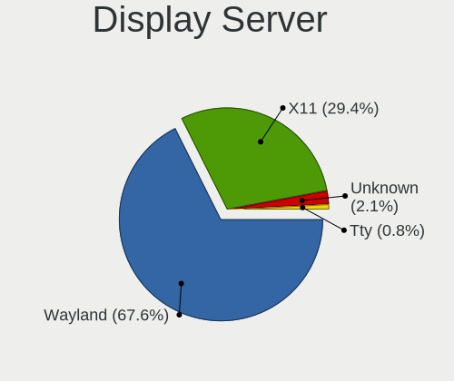
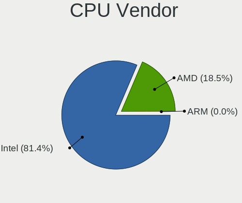
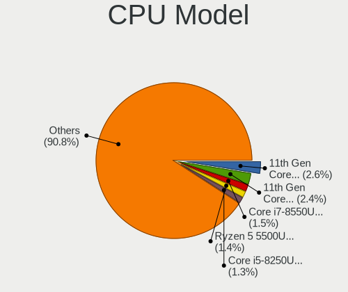

Ubuntu 22.04 - Tested Hardware & Statistics (Notebooks)
-------------------------------------------------------

A project to collect tested hardware configurations for Ubuntu 22.04.

Anyone can contribute to this report by the [hw-probe](https://github.com/linuxhw/hw-probe) tool:

    sudo -E hw-probe -all -upload

Please contribute! Especially if your hardware is rare.

Contents
--------

* [ Test Cases ](#test-cases)

* [ System ](#system)
  - [ Kernel                   ](#kernel)
  - [ Kernel Family            ](#kernel-family)
  - [ Kernel Major Ver.        ](#kernel-major-ver)
  - [ Arch                     ](#arch)
  - [ DE                       ](#de)
  - [ Display Server           ](#display-server)
  - [ Display Manager          ](#display-manager)
  - [ OS Lang                  ](#os-lang)
  - [ Boot Mode                ](#boot-mode)
  - [ Filesystem               ](#filesystem)
  - [ Part. scheme             ](#part-scheme)
  - [ Dual Boot with Linux/BSD ](#dual-boot-with-linuxbsd)
  - [ Dual Boot (Win)          ](#dual-boot-win)

* [ Board ](#board)
  - [ Vendor                   ](#vendor)
  - [ Model                    ](#model)
  - [ Model Family             ](#model-family)
  - [ MFG Year                 ](#mfg-year)
  - [ Form Factor              ](#form-factor)
  - [ Secure Boot              ](#secure-boot)
  - [ Coreboot                 ](#coreboot)
  - [ RAM Size                 ](#ram-size)
  - [ RAM Used                 ](#ram-used)
  - [ Total Drives             ](#total-drives)
  - [ Has CD-ROM               ](#has-cd-rom)
  - [ Has Ethernet             ](#has-ethernet)
  - [ Has WiFi                 ](#has-wifi)
  - [ Has Bluetooth            ](#has-bluetooth)

* [ Location ](#location)
  - [ Country                  ](#country)
  - [ City                     ](#city)

* [ Drives ](#drives)
  - [ Drive Vendor             ](#drive-vendor)
  - [ Drive Model              ](#drive-model)
  - [ HDD Vendor               ](#hdd-vendor)
  - [ SSD Vendor               ](#ssd-vendor)
  - [ Drive Kind               ](#drive-kind)
  - [ Drive Connector          ](#drive-connector)
  - [ Drive Size               ](#drive-size)
  - [ Space Total              ](#space-total)
  - [ Space Used               ](#space-used)
  - [ Malfunc. Drives          ](#malfunc-drives)
  - [ Malfunc. Drive Vendor    ](#malfunc-drive-vendor)
  - [ Malfunc. HDD Vendor      ](#malfunc-hdd-vendor)
  - [ Malfunc. Drive Kind      ](#malfunc-drive-kind)
  - [ Failed Drives            ](#failed-drives)
  - [ Failed Drive Vendor      ](#failed-drive-vendor)
  - [ Drive Status             ](#drive-status)

* [ Storage controller ](#storage-controller)
  - [ Storage Vendor           ](#storage-vendor)
  - [ Storage Model            ](#storage-model)
  - [ Storage Kind             ](#storage-kind)

* [ Processor ](#processor)
  - [ CPU Vendor               ](#cpu-vendor)
  - [ CPU Model                ](#cpu-model)
  - [ CPU Model Family         ](#cpu-model-family)
  - [ CPU Cores                ](#cpu-cores)
  - [ CPU Sockets              ](#cpu-sockets)
  - [ CPU Threads              ](#cpu-threads)
  - [ CPU Op-Modes             ](#cpu-op-modes)
  - [ CPU Microcode            ](#cpu-microcode)
  - [ CPU Microarch            ](#cpu-microarch)

* [ Graphics ](#graphics)
  - [ GPU Vendor               ](#gpu-vendor)
  - [ GPU Model                ](#gpu-model)
  - [ GPU Combo                ](#gpu-combo)
  - [ GPU Driver               ](#gpu-driver)
  - [ GPU Memory               ](#gpu-memory)

* [ Monitor ](#monitor)
  - [ Monitor Vendor           ](#monitor-vendor)
  - [ Monitor Model            ](#monitor-model)
  - [ Monitor Resolution       ](#monitor-resolution)
  - [ Monitor Diagonal         ](#monitor-diagonal)
  - [ Monitor Width            ](#monitor-width)
  - [ Aspect Ratio             ](#aspect-ratio)
  - [ Monitor Area             ](#monitor-area)
  - [ Pixel Density            ](#pixel-density)
  - [ Multiple Monitors        ](#multiple-monitors)

* [ Network ](#network)
  - [ Net Controller Vendor    ](#net-controller-vendor)
  - [ Net Controller Model     ](#net-controller-model)
  - [ Wireless Vendor          ](#wireless-vendor)
  - [ Wireless Model           ](#wireless-model)
  - [ Ethernet Vendor          ](#ethernet-vendor)
  - [ Ethernet Model           ](#ethernet-model)
  - [ Net Controller Kind      ](#net-controller-kind)
  - [ Used Controller          ](#used-controller)
  - [ NICs                     ](#nics)
  - [ IPv6                     ](#ipv6)

* [ Bluetooth ](#bluetooth)
  - [ Bluetooth Vendor         ](#bluetooth-vendor)
  - [ Bluetooth Model          ](#bluetooth-model)

* [ Sound ](#sound)
  - [ Sound Vendor             ](#sound-vendor)
  - [ Sound Model              ](#sound-model)

* [ Memory ](#memory)
  - [ Memory Vendor            ](#memory-vendor)
  - [ Memory Model             ](#memory-model)
  - [ Memory Kind              ](#memory-kind)
  - [ Memory Form Factor       ](#memory-form-factor)
  - [ Memory Size              ](#memory-size)
  - [ Memory Speed             ](#memory-speed)

* [ Printers & scanners ](#printers--scanners)
  - [ Printer Vendor           ](#printer-vendor)
  - [ Printer Model            ](#printer-model)
  - [ Scanner Vendor           ](#scanner-vendor)
  - [ Scanner Model            ](#scanner-model)

* [ Camera ](#camera)
  - [ Camera Vendor            ](#camera-vendor)
  - [ Camera Model             ](#camera-model)

* [ Security ](#security)
  - [ Fingerprint Vendor       ](#fingerprint-vendor)
  - [ Fingerprint Model        ](#fingerprint-model)
  - [ Chipcard Vendor          ](#chipcard-vendor)
  - [ Chipcard Model           ](#chipcard-model)

* [ Unsupported ](#unsupported)
  - [ Unsupported Devices      ](#unsupported-devices)
  - [ Unsupported Device Types ](#unsupported-device-types)

Test Cases
----------

Total: 5441

| Vendor        | Model                       | Probe                                                      | Date         |
|---------------|-----------------------------|------------------------------------------------------------|--------------|
| HP            | Pavilion dv6                | [c937edbfcd](https://linux-hardware.org/?probe=c937edbfcd) | Mar 01, 2023 |
| HP            | Pavilion 14                 | [ae0e65f5d1](https://linux-hardware.org/?probe=ae0e65f5d1) | Feb 28, 2023 |
| TCL Commun... | 8090                        | [d1f86443c7](https://linux-hardware.org/?probe=d1f86443c7) | Feb 28, 2023 |
| Dell          | Latitude 5420               | [0596aff5c4](https://linux-hardware.org/?probe=0596aff5c4) | Feb 28, 2023 |
| Alienware     | 15 R2                       | [f242145858](https://linux-hardware.org/?probe=f242145858) | Feb 28, 2023 |
| HP            | Pavilion dv7                | [e40593f800](https://linux-hardware.org/?probe=e40593f800) | Feb 28, 2023 |
| Timi          | RedmiBook 16                | [2d713931d2](https://linux-hardware.org/?probe=2d713931d2) | Feb 28, 2023 |
| Lenovo        | IdeaPad 3 15ABA7 82RN       | [d8b58a8ea1](https://linux-hardware.org/?probe=d8b58a8ea1) | Feb 28, 2023 |
| Alienware     | 15 R2                       | [5e29609544](https://linux-hardware.org/?probe=5e29609544) | Feb 28, 2023 |
| HP            | ENVY Laptop 17-ch1xxx       | [b518eb9925](https://linux-hardware.org/?probe=b518eb9925) | Feb 28, 2023 |
| Dell          | Latitude 5400               | [00cd14a724](https://linux-hardware.org/?probe=00cd14a724) | Feb 28, 2023 |
| Lenovo        | ThinkPad X1 Carbon Gen 8... | [76645fa513](https://linux-hardware.org/?probe=76645fa513) | Feb 28, 2023 |
| HP            | EliteBook 830 G5            | [b82fdfbe47](https://linux-hardware.org/?probe=b82fdfbe47) | Feb 28, 2023 |
| Dell          | G5 5590                     | [75f2235434](https://linux-hardware.org/?probe=75f2235434) | Feb 28, 2023 |
| ASUSTek       | ROG Zephyrus G14 GA401QM... | [7b7df086e0](https://linux-hardware.org/?probe=7b7df086e0) | Feb 28, 2023 |
| Apple         | MacBookPro5,5               | [e20478d60e](https://linux-hardware.org/?probe=e20478d60e) | Feb 28, 2023 |
| ASUSTek       | K52Je                       | [03857fde28](https://linux-hardware.org/?probe=03857fde28) | Feb 28, 2023 |
| Timi          | TM1701                      | [ab658664bb](https://linux-hardware.org/?probe=ab658664bb) | Feb 28, 2023 |
| Lenovo        | Yoga710-14ISK 80TY          | [756e003316](https://linux-hardware.org/?probe=756e003316) | Feb 28, 2023 |
| Dell          | Inspiron 15 3511            | [99462eae5e](https://linux-hardware.org/?probe=99462eae5e) | Feb 28, 2023 |
| HP            | Pavilion Laptop 15-cc5xx    | [4a5d167c96](https://linux-hardware.org/?probe=4a5d167c96) | Feb 28, 2023 |
| Alienware     | x15 R2                      | [f0335542ce](https://linux-hardware.org/?probe=f0335542ce) | Feb 28, 2023 |
| HP            | Pavilion dv7                | [1dbb82f9ff](https://linux-hardware.org/?probe=1dbb82f9ff) | Feb 28, 2023 |
| AZW           | SEi                         | [6d0814dc9f](https://linux-hardware.org/?probe=6d0814dc9f) | Feb 28, 2023 |
| Lenovo        | ThinkPad S1 Yoga 20C0S23... | [3cd99ed8f4](https://linux-hardware.org/?probe=3cd99ed8f4) | Feb 28, 2023 |
| Dell          | Latitude E7470              | [51deaef7a0](https://linux-hardware.org/?probe=51deaef7a0) | Feb 28, 2023 |
| HP            | ProBook 430 G6              | [a184aa7141](https://linux-hardware.org/?probe=a184aa7141) | Feb 27, 2023 |
| Dell          | Inspiron 5537               | [25fa030105](https://linux-hardware.org/?probe=25fa030105) | Feb 27, 2023 |
| HP            | Laptop 15t-dy200            | [3ea4171270](https://linux-hardware.org/?probe=3ea4171270) | Feb 27, 2023 |
| Lenovo        | ThinkPad T460s 20FAS55Q1... | [815b6ea9f2](https://linux-hardware.org/?probe=815b6ea9f2) | Feb 27, 2023 |
| Dell          | Inspiron 3537               | [78f270b35a](https://linux-hardware.org/?probe=78f270b35a) | Feb 27, 2023 |
| Dell          | Latitude E4310              | [2b2255a5b4](https://linux-hardware.org/?probe=2b2255a5b4) | Feb 27, 2023 |
| ASUSTek       | FX503VD                     | [46954919f7](https://linux-hardware.org/?probe=46954919f7) | Feb 27, 2023 |
| Dell          | Latitude 7420               | [d3af27a0ac](https://linux-hardware.org/?probe=d3af27a0ac) | Feb 27, 2023 |
| Acer          | Aspire E1-531               | [a52b94c2d5](https://linux-hardware.org/?probe=a52b94c2d5) | Feb 27, 2023 |
| Dell          | Inspiron 3537               | [bb1ffc3498](https://linux-hardware.org/?probe=bb1ffc3498) | Feb 27, 2023 |
| UMAX          | VisionBook-N12R             | [2477ae9a0e](https://linux-hardware.org/?probe=2477ae9a0e) | Feb 27, 2023 |
| HP            | Pavilion m6                 | [1e9d802ab6](https://linux-hardware.org/?probe=1e9d802ab6) | Feb 27, 2023 |
| ASUSTek       | FX503VD                     | [60e1742e7e](https://linux-hardware.org/?probe=60e1742e7e) | Feb 27, 2023 |
| Apple         | MacBookAir4,2               | [a9605bf85e](https://linux-hardware.org/?probe=a9605bf85e) | Feb 27, 2023 |
| HP            | Pavilion m6                 | [0d35b0b080](https://linux-hardware.org/?probe=0d35b0b080) | Feb 27, 2023 |
| Acer          | Aspire F5-573G              | [ce2bc0c00d](https://linux-hardware.org/?probe=ce2bc0c00d) | Feb 27, 2023 |
| Dell          | XPS L521X                   | [f9598ce828](https://linux-hardware.org/?probe=f9598ce828) | Feb 27, 2023 |
| Dell          | Latitude E6430              | [b75c4a18b3](https://linux-hardware.org/?probe=b75c4a18b3) | Feb 27, 2023 |
| Lenovo        | G50-80 80L0                 | [19727a16be](https://linux-hardware.org/?probe=19727a16be) | Feb 26, 2023 |
| Acer          | Aspire V3-772G              | [83dce8f92d](https://linux-hardware.org/?probe=83dce8f92d) | Feb 26, 2023 |
| Acer          | Predator PT515-51           | [b5da2905fb](https://linux-hardware.org/?probe=b5da2905fb) | Feb 26, 2023 |
| HP            | Pavilion Laptop 15-cc5xx    | [13f87401ca](https://linux-hardware.org/?probe=13f87401ca) | Feb 26, 2023 |
| ASUSTek       | ASUS TUF Gaming F15 FX50... | [e763fc25e7](https://linux-hardware.org/?probe=e763fc25e7) | Feb 26, 2023 |
| HP            | Pavilion dv7                | [3d8c3db030](https://linux-hardware.org/?probe=3d8c3db030) | Feb 26, 2023 |
| HONOR         | BBR-WAX9                    | [3fe348fb3f](https://linux-hardware.org/?probe=3fe348fb3f) | Feb 26, 2023 |
| HP            | 250 15.6 inch G9 Noteboo... | [2cea6ee649](https://linux-hardware.org/?probe=2cea6ee649) | Feb 26, 2023 |
| Lenovo        | 3000 N200 0769EAG           | [28056b6929](https://linux-hardware.org/?probe=28056b6929) | Feb 26, 2023 |
| Dell          | Latitude 7350               | [a8bbed94ce](https://linux-hardware.org/?probe=a8bbed94ce) | Feb 26, 2023 |
| HP            | ProBook 430 G4              | [05a6a84b50](https://linux-hardware.org/?probe=05a6a84b50) | Feb 26, 2023 |
| Lenovo        | ThinkPad T420 4236EJ3       | [d0b043c11b](https://linux-hardware.org/?probe=d0b043c11b) | Feb 26, 2023 |
| HP            | ENVY 17                     | [dea1551bf3](https://linux-hardware.org/?probe=dea1551bf3) | Feb 26, 2023 |
| Gigabyte      | MMLP5AP-00                  | [eb5ca5bb8d](https://linux-hardware.org/?probe=eb5ca5bb8d) | Feb 26, 2023 |
| HP            | ENVY 17                     | [0f347a1b6c](https://linux-hardware.org/?probe=0f347a1b6c) | Feb 26, 2023 |
| Dell          | Latitude E7250              | [db6ac786ef](https://linux-hardware.org/?probe=db6ac786ef) | Feb 26, 2023 |
| Lenovo        | ThinkPad E490 20N8000XRT    | [b9e64d9f86](https://linux-hardware.org/?probe=b9e64d9f86) | Feb 26, 2023 |
| ASUSTek       | TUF Gaming FX705DT_FX705... | [8a3c646d1f](https://linux-hardware.org/?probe=8a3c646d1f) | Feb 26, 2023 |
| Dell          | Latitude E6420              | [b35fdc2f10](https://linux-hardware.org/?probe=b35fdc2f10) | Feb 26, 2023 |
| HP            | Pavilion 14                 | [c9b9f213b5](https://linux-hardware.org/?probe=c9b9f213b5) | Feb 26, 2023 |
| Intel         | HuronRiver Platform         | [2168c2bb5c](https://linux-hardware.org/?probe=2168c2bb5c) | Feb 26, 2023 |
| Dell          | G15 5520                    | [d68c28ea8d](https://linux-hardware.org/?probe=d68c28ea8d) | Feb 26, 2023 |
| Lenovo        | G500 20236                  | [93f09b28d6](https://linux-hardware.org/?probe=93f09b28d6) | Feb 26, 2023 |
| Lenovo        | G500 20236                  | [51bd5c9f21](https://linux-hardware.org/?probe=51bd5c9f21) | Feb 26, 2023 |
| Lenovo        | ThinkPad T430s 235368U      | [58a8ada163](https://linux-hardware.org/?probe=58a8ada163) | Feb 26, 2023 |
| HP            | EliteBook 745 G3            | [8cee2ac27a](https://linux-hardware.org/?probe=8cee2ac27a) | Feb 26, 2023 |
| Toshiba       | Satellite C660D             | [d5e4af2957](https://linux-hardware.org/?probe=d5e4af2957) | Feb 26, 2023 |
| HP            | Notebook                    | [4a72575c17](https://linux-hardware.org/?probe=4a72575c17) | Feb 25, 2023 |
| HP            | 250 15.6 inch G9 Noteboo... | [84750f9d96](https://linux-hardware.org/?probe=84750f9d96) | Feb 25, 2023 |
| Acer          | Aspire V3-571G              | [b02e34a7f9](https://linux-hardware.org/?probe=b02e34a7f9) | Feb 25, 2023 |
| Acer          | Aspire ES1-521              | [e5f0a23afd](https://linux-hardware.org/?probe=e5f0a23afd) | Feb 25, 2023 |
| Apple         | MacBookPro7,1               | [7505d49d88](https://linux-hardware.org/?probe=7505d49d88) | Feb 25, 2023 |
| Apple         | MacBook5,1                  | [fbb2478f8c](https://linux-hardware.org/?probe=fbb2478f8c) | Feb 25, 2023 |
| HP            | ProBook 430 G4              | [0a2c7cca00](https://linux-hardware.org/?probe=0a2c7cca00) | Feb 25, 2023 |
| Lenovo        | ThinkPad X220 4290EC5       | [d72d87e4ae](https://linux-hardware.org/?probe=d72d87e4ae) | Feb 25, 2023 |
| Dell          | Inspiron 3420               | [e13f9bfc8f](https://linux-hardware.org/?probe=e13f9bfc8f) | Feb 25, 2023 |
| Lenovo        | IdeaPad 3 15ALC6 82MF       | [af95b24466](https://linux-hardware.org/?probe=af95b24466) | Feb 25, 2023 |
| ASUSTek       | VivoBook_ASUSLaptop M350... | [22cf774ac0](https://linux-hardware.org/?probe=22cf774ac0) | Feb 25, 2023 |
| Dell          | Vostro 3501                 | [ed459712f6](https://linux-hardware.org/?probe=ed459712f6) | Feb 25, 2023 |
| HP            | Pavilion Laptop 14-ec0xx... | [7b59cbd067](https://linux-hardware.org/?probe=7b59cbd067) | Feb 25, 2023 |
| HUAWEI        | NBLK-WAX9X                  | [2978ec71b8](https://linux-hardware.org/?probe=2978ec71b8) | Feb 25, 2023 |
| BESSTAR Te... | X400                        | [e1c05e0782](https://linux-hardware.org/?probe=e1c05e0782) | Feb 25, 2023 |
| Dell          | Inspiron 5537               | [0496ce1146](https://linux-hardware.org/?probe=0496ce1146) | Feb 25, 2023 |
| Dell          | Inspiron 5537               | [cb4b91f80c](https://linux-hardware.org/?probe=cb4b91f80c) | Feb 25, 2023 |
| HP            | Pavilion Aero Laptop 13-... | [af87e6ea4c](https://linux-hardware.org/?probe=af87e6ea4c) | Feb 25, 2023 |
| HP            | EliteBook 840 14 inch G9... | [9c0775a106](https://linux-hardware.org/?probe=9c0775a106) | Feb 25, 2023 |
| Hampoo        | I2W6_AP135 Reserved         | [c5cdb97c5b](https://linux-hardware.org/?probe=c5cdb97c5b) | Feb 25, 2023 |
| Lenovo        | Legion Y530-15ICH 81FV      | [0b239fec52](https://linux-hardware.org/?probe=0b239fec52) | Feb 25, 2023 |
| Apple         | MacBookPro16,2              | [c4cab43483](https://linux-hardware.org/?probe=c4cab43483) | Feb 25, 2023 |
| Lenovo        | ThinkPad X270 W10DG 20K5... | [c2c5da60c3](https://linux-hardware.org/?probe=c2c5da60c3) | Feb 25, 2023 |
| HP            | 15                          | [04741afb27](https://linux-hardware.org/?probe=04741afb27) | Feb 25, 2023 |
| HP            | Pavilion Laptop 15-cd0xx    | [dfb5281dfb](https://linux-hardware.org/?probe=dfb5281dfb) | Feb 25, 2023 |
| Sony          | VPCCW13FB                   | [1772a3987b](https://linux-hardware.org/?probe=1772a3987b) | Feb 25, 2023 |
| ASUSTek       | ZenBook UX425QA_UM425QA     | [02608a8288](https://linux-hardware.org/?probe=02608a8288) | Feb 25, 2023 |
| Hampoo        | I2W6_AP135 Reserved         | [976a29944a](https://linux-hardware.org/?probe=976a29944a) | Feb 25, 2023 |
| Lenovo        | IdeaPad 5 15IAL7 82SF       | [12d979b047](https://linux-hardware.org/?probe=12d979b047) | Feb 25, 2023 |
| ASUSTek       | ZenBook UX425EA_UX425EA     | [f0fa613cd2](https://linux-hardware.org/?probe=f0fa613cd2) | Feb 25, 2023 |
| Sony          | VGN-FZ31M                   | [6b830e36f1](https://linux-hardware.org/?probe=6b830e36f1) | Feb 25, 2023 |
| HP            | EliteBook 840 Aero G8 No... | [f24e6a55c4](https://linux-hardware.org/?probe=f24e6a55c4) | Feb 24, 2023 |
| HP            | Laptop 17-by2xxx            | [d6a91a338c](https://linux-hardware.org/?probe=d6a91a338c) | Feb 24, 2023 |
| Lenovo        | IdeaPad 3 15ALC6 82MF       | [d3354bd88c](https://linux-hardware.org/?probe=d3354bd88c) | Feb 24, 2023 |
| Lenovo        | IdeaPad Z580                | [cf2ff6c04b](https://linux-hardware.org/?probe=cf2ff6c04b) | Feb 24, 2023 |
| ASUSTek       | VivoBook_ASUSLaptop M650... | [d99e163be6](https://linux-hardware.org/?probe=d99e163be6) | Feb 24, 2023 |
| Dell          | Inspiron 3793               | [8e85683aae](https://linux-hardware.org/?probe=8e85683aae) | Feb 24, 2023 |
| Fujitsu       | LIFEBOOK U749               | [ba7cdc6018](https://linux-hardware.org/?probe=ba7cdc6018) | Feb 24, 2023 |
| Lenovo        | ThinkPad T470s 20HGS0AE0... | [7f8c9de1aa](https://linux-hardware.org/?probe=7f8c9de1aa) | Feb 24, 2023 |
| Acer          | Aspire A315-23              | [e0fcd4e578](https://linux-hardware.org/?probe=e0fcd4e578) | Feb 24, 2023 |
| Lenovo        | ThinkPad T495s 20QJS0GG0... | [6186149a54](https://linux-hardware.org/?probe=6186149a54) | Feb 24, 2023 |
| Chuwi         | HeroBook Air                | [8daed679c2](https://linux-hardware.org/?probe=8daed679c2) | Feb 24, 2023 |
| Acer          | Aspire E1-531               | [4526585d29](https://linux-hardware.org/?probe=4526585d29) | Feb 24, 2023 |
| HP            | EliteBook 840 14 inch G9... | [8ce6b54b09](https://linux-hardware.org/?probe=8ce6b54b09) | Feb 24, 2023 |
| HP            | Pavilion Notebook           | [fee146aaa1](https://linux-hardware.org/?probe=fee146aaa1) | Feb 24, 2023 |
| Toshiba       | Satellite A205              | [07e63c8b75](https://linux-hardware.org/?probe=07e63c8b75) | Feb 24, 2023 |
| Toshiba       | Satellite L775D             | [d8b2acd038](https://linux-hardware.org/?probe=d8b2acd038) | Feb 24, 2023 |
| HP            | EliteBook 840 G2            | [f1fa3164f9](https://linux-hardware.org/?probe=f1fa3164f9) | Feb 24, 2023 |
| ASUSTek       | ROG Strix G713RM_G713RM     | [4f7bbbdd28](https://linux-hardware.org/?probe=4f7bbbdd28) | Feb 24, 2023 |
| HP            | 250 15.6 inch G9 Noteboo... | [cddc383ff9](https://linux-hardware.org/?probe=cddc383ff9) | Feb 23, 2023 |
| ASUSTek       | ROG GU501GM                 | [5f0eaa8696](https://linux-hardware.org/?probe=5f0eaa8696) | Feb 23, 2023 |
| Dell          | Vostro 3700                 | [a37b20471b](https://linux-hardware.org/?probe=a37b20471b) | Feb 23, 2023 |
| Acer          | Aspire SW3-013              | [771b90caaa](https://linux-hardware.org/?probe=771b90caaa) | Feb 23, 2023 |
| Lenovo        | ThinkPad P70 20ESS2J700     | [5a94dfa289](https://linux-hardware.org/?probe=5a94dfa289) | Feb 23, 2023 |
| Dell          | Inspiron N5010              | [5b4def0870](https://linux-hardware.org/?probe=5b4def0870) | Feb 23, 2023 |
| MSI           | MS-7C02                     | [e2cdf5625c](https://linux-hardware.org/?probe=e2cdf5625c) | Feb 23, 2023 |
| ASUSTek       | X441UA                      | [cd870fc3d3](https://linux-hardware.org/?probe=cd870fc3d3) | Feb 23, 2023 |
| Dell          | XPS 9320                    | [94e7c2d282](https://linux-hardware.org/?probe=94e7c2d282) | Feb 23, 2023 |
| MSI           | MS-7C02                     | [bfbb3aab2c](https://linux-hardware.org/?probe=bfbb3aab2c) | Feb 23, 2023 |
| MSI           | GF75 Thin 10SCXK            | [a64a363f58](https://linux-hardware.org/?probe=a64a363f58) | Feb 23, 2023 |
| MSI           | GF75 Thin 10SCXK            | [3647a78d88](https://linux-hardware.org/?probe=3647a78d88) | Feb 23, 2023 |
| Lenovo        | IdeaPad S340-15API 81NC     | [d03f3a8806](https://linux-hardware.org/?probe=d03f3a8806) | Feb 23, 2023 |
| Lenovo        | IdeaPad S340-15API 81NC     | [ca79eee760](https://linux-hardware.org/?probe=ca79eee760) | Feb 23, 2023 |
| Lenovo        | ThinkPad P70 20ESS2J700     | [869614f52a](https://linux-hardware.org/?probe=869614f52a) | Feb 23, 2023 |
| Acer          | TravelMate P253             | [b99414b6de](https://linux-hardware.org/?probe=b99414b6de) | Feb 23, 2023 |
| Dell          | XPS 13 9370                 | [8923d5940e](https://linux-hardware.org/?probe=8923d5940e) | Feb 23, 2023 |
| Sony          | SVE15125CBW                 | [5b173518b5](https://linux-hardware.org/?probe=5b173518b5) | Feb 22, 2023 |
| Sony          | SVE15125CBW                 | [107bd5b235](https://linux-hardware.org/?probe=107bd5b235) | Feb 22, 2023 |
| Dell          | XPS 13 9370                 | [452bd46c01](https://linux-hardware.org/?probe=452bd46c01) | Feb 22, 2023 |
| Apple         | MacBookPro8,2               | [fd4b8d6419](https://linux-hardware.org/?probe=fd4b8d6419) | Feb 22, 2023 |
| Dell          | XPS 13 9370                 | [fe78ef8424](https://linux-hardware.org/?probe=fe78ef8424) | Feb 22, 2023 |
| Toshiba       | Satellite L655              | [2b16b06c7f](https://linux-hardware.org/?probe=2b16b06c7f) | Feb 22, 2023 |
| Lenovo        | ThinkPad X230 2325EJ0       | [3a2c22e22b](https://linux-hardware.org/?probe=3a2c22e22b) | Feb 22, 2023 |
| Lenovo        | Flex 2-14 20404             | [49445991dc](https://linux-hardware.org/?probe=49445991dc) | Feb 22, 2023 |
| Samsung       | 760XDA                      | [efa040a93f](https://linux-hardware.org/?probe=efa040a93f) | Feb 22, 2023 |
| Samsung       | 760XDA                      | [1ba36d420d](https://linux-hardware.org/?probe=1ba36d420d) | Feb 22, 2023 |
| Dell          | Precision M4800             | [9fb203c728](https://linux-hardware.org/?probe=9fb203c728) | Feb 22, 2023 |
| Notebook      | NS50_70MU                   | [a213ec0ba4](https://linux-hardware.org/?probe=a213ec0ba4) | Feb 22, 2023 |
| Lenovo        | G50-80 80E5                 | [51b83f1e27](https://linux-hardware.org/?probe=51b83f1e27) | Feb 22, 2023 |
| Dell          | Inspiron 3583               | [ad766a4190](https://linux-hardware.org/?probe=ad766a4190) | Feb 22, 2023 |
| Lenovo        | ThinkPad X230 2325EJ0       | [06c8604990](https://linux-hardware.org/?probe=06c8604990) | Feb 22, 2023 |
| Lenovo        | Legion 5 15ACH6H 82JU       | [7380033a44](https://linux-hardware.org/?probe=7380033a44) | Feb 22, 2023 |
| Dell          | Latitude 3189               | [3a9dc7e02c](https://linux-hardware.org/?probe=3a9dc7e02c) | Feb 22, 2023 |
| HP            | EliteBook 830 G5            | [a5f65720f5](https://linux-hardware.org/?probe=a5f65720f5) | Feb 22, 2023 |
| ASUSTek       | VivoBook_ASUSLaptop X515... | [8110c575e9](https://linux-hardware.org/?probe=8110c575e9) | Feb 22, 2023 |
| Acer          | Swift SF514-54T             | [ebbff689ba](https://linux-hardware.org/?probe=ebbff689ba) | Feb 22, 2023 |
| Notebook      | N8xEJEK                     | [1548ea7cab](https://linux-hardware.org/?probe=1548ea7cab) | Feb 21, 2023 |
| Notebook      | N8xEJEK                     | [a8a28d6f2b](https://linux-hardware.org/?probe=a8a28d6f2b) | Feb 21, 2023 |
| HP            | Laptop 15-da2xxx            | [76cbc7df6d](https://linux-hardware.org/?probe=76cbc7df6d) | Feb 21, 2023 |
| Chuwi         | CoreBook XPro               | [c1f8c947d4](https://linux-hardware.org/?probe=c1f8c947d4) | Feb 21, 2023 |
| HP            | Pavilion Laptop 15-eh1xx... | [dc6a6f7872](https://linux-hardware.org/?probe=dc6a6f7872) | Feb 21, 2023 |
| Dell          | Latitude E5570              | [47a066467a](https://linux-hardware.org/?probe=47a066467a) | Feb 21, 2023 |
| Lenovo        | ThinkPad P15v Gen 3 21D9... | [da461191e8](https://linux-hardware.org/?probe=da461191e8) | Feb 21, 2023 |
| Avell High... | 1513                        | [0b46cb6de1](https://linux-hardware.org/?probe=0b46cb6de1) | Feb 21, 2023 |
| Dell          | Latitude 5580               | [91567566be](https://linux-hardware.org/?probe=91567566be) | Feb 21, 2023 |
| ASUSTek       | ZenBook UX393EA_UX393EA     | [546763e7aa](https://linux-hardware.org/?probe=546763e7aa) | Feb 21, 2023 |
| BESSTAR Te... | X400                        | [f7f9004058](https://linux-hardware.org/?probe=f7f9004058) | Feb 21, 2023 |
| Lenovo        | ThinkPad X1 Extreme Gen ... | [5d62c279d2](https://linux-hardware.org/?probe=5d62c279d2) | Feb 21, 2023 |
| Dell          | Latitude 5430               | [69fd82c453](https://linux-hardware.org/?probe=69fd82c453) | Feb 21, 2023 |
| ECS           | SF20PA2                     | [f0ad83686f](https://linux-hardware.org/?probe=f0ad83686f) | Feb 21, 2023 |
| Lenovo        | ThinkPad S430 336457G       | [3a525ce932](https://linux-hardware.org/?probe=3a525ce932) | Feb 21, 2023 |
| Lenovo        | ThinkPad S430 336457G       | [f845d181ec](https://linux-hardware.org/?probe=f845d181ec) | Feb 20, 2023 |
| Lenovo        | IdeaPad 3 15ALC6 82KU       | [da5050e2f8](https://linux-hardware.org/?probe=da5050e2f8) | Feb 20, 2023 |
| Lenovo        | ThinkPad T410s 2924W3S      | [24081de7f1](https://linux-hardware.org/?probe=24081de7f1) | Feb 20, 2023 |
| Dell          | Latitude 7300               | [65690f7efc](https://linux-hardware.org/?probe=65690f7efc) | Feb 20, 2023 |
| Lenovo        | ThinkPad P14s Gen 2a 21A... | [008d5e19e1](https://linux-hardware.org/?probe=008d5e19e1) | Feb 20, 2023 |
| Lenovo        | ThinkPad Edge E540 20C60... | [cd5dcaaf88](https://linux-hardware.org/?probe=cd5dcaaf88) | Feb 20, 2023 |
| Dell          | Precision M4800             | [8f41cc730e](https://linux-hardware.org/?probe=8f41cc730e) | Feb 20, 2023 |
| Lenovo        | B570e HuronRiver Platfor... | [3ddfaa902f](https://linux-hardware.org/?probe=3ddfaa902f) | Feb 20, 2023 |
| Lenovo        | ThinkPad E550 20DF004TGE    | [f6cf4e902d](https://linux-hardware.org/?probe=f6cf4e902d) | Feb 20, 2023 |
| HP            | Laptop 14-dq1xxx            | [37c6221f28](https://linux-hardware.org/?probe=37c6221f28) | Feb 20, 2023 |
| Samsung       | 535U3C                      | [ec173f014b](https://linux-hardware.org/?probe=ec173f014b) | Feb 20, 2023 |
| Dell          | Latitude E6320              | [0b5bcfefc5](https://linux-hardware.org/?probe=0b5bcfefc5) | Feb 20, 2023 |
| Lenovo        | ThinkPad E495 20NEA001GE    | [87857c46e9](https://linux-hardware.org/?probe=87857c46e9) | Feb 20, 2023 |
| HP            | ZBook Firefly 14 inch G9... | [12bb4f91ae](https://linux-hardware.org/?probe=12bb4f91ae) | Feb 20, 2023 |
| HP            | ZBook Firefly 14 inch G9... | [a4404180b7](https://linux-hardware.org/?probe=a4404180b7) | Feb 20, 2023 |
| HP            | ProBook 440 G4              | [d495b4eb1e](https://linux-hardware.org/?probe=d495b4eb1e) | Feb 20, 2023 |
| HP            | Pavilion dv7                | [21e9d5e341](https://linux-hardware.org/?probe=21e9d5e341) | Feb 20, 2023 |
| Dell          | XPS 15 9570                 | [248fb5acc6](https://linux-hardware.org/?probe=248fb5acc6) | Feb 20, 2023 |
| HP            | 15 Notebook PC              | [c5256638eb](https://linux-hardware.org/?probe=c5256638eb) | Feb 20, 2023 |
| Dell          | Inspiron 3793               | [760270eadc](https://linux-hardware.org/?probe=760270eadc) | Feb 19, 2023 |
| Toshiba       | Satellite L655              | [a5124a64e6](https://linux-hardware.org/?probe=a5124a64e6) | Feb 19, 2023 |
| HP            | Compaq Presario CQ42        | [001f2f1a86](https://linux-hardware.org/?probe=001f2f1a86) | Feb 19, 2023 |
| Acer          | Aspire A515-51G             | [ca537a9b24](https://linux-hardware.org/?probe=ca537a9b24) | Feb 19, 2023 |
| Acer          | Aspire A515-51G             | [d5dbc5770a](https://linux-hardware.org/?probe=d5dbc5770a) | Feb 19, 2023 |
| Dell          | Inspiron 7520               | [1489b9779a](https://linux-hardware.org/?probe=1489b9779a) | Feb 19, 2023 |
| Sony          | VPCCB16FG                   | [0a6224bcc3](https://linux-hardware.org/?probe=0a6224bcc3) | Feb 19, 2023 |
| Dell          | XPS M1530                   | [c2f2509941](https://linux-hardware.org/?probe=c2f2509941) | Feb 19, 2023 |
| Dell          | XPS 15 9520                 | [631e48a0e5](https://linux-hardware.org/?probe=631e48a0e5) | Feb 19, 2023 |
| Dell          | Precision 3510              | [b20156e847](https://linux-hardware.org/?probe=b20156e847) | Feb 19, 2023 |
| Dell          | Vostro 5502                 | [49252b4695](https://linux-hardware.org/?probe=49252b4695) | Feb 19, 2023 |
| HP            | ProBook 440 G7              | [9caa421a49](https://linux-hardware.org/?probe=9caa421a49) | Feb 19, 2023 |
| ASUSTek       | VivoBook 15_ASUS Laptop ... | [faa600d8e5](https://linux-hardware.org/?probe=faa600d8e5) | Feb 19, 2023 |
| HP            | 2000                        | [5fae52af82](https://linux-hardware.org/?probe=5fae52af82) | Feb 19, 2023 |
| HP            | ProBook 440 G4              | [f6372e6b96](https://linux-hardware.org/?probe=f6372e6b96) | Feb 19, 2023 |
| HP            | Laptop 14-dq2xxx            | [83bef528a7](https://linux-hardware.org/?probe=83bef528a7) | Feb 19, 2023 |
| Dell          | Latitude E6320              | [467b45072e](https://linux-hardware.org/?probe=467b45072e) | Feb 19, 2023 |
| Core Innov... | CLT1564                     | [5a2d99678f](https://linux-hardware.org/?probe=5a2d99678f) | Feb 19, 2023 |
| Apple         | MacBookPro9,2               | [baa725d110](https://linux-hardware.org/?probe=baa725d110) | Feb 19, 2023 |
| Core Innov... | CLT1564                     | [6802e51afd](https://linux-hardware.org/?probe=6802e51afd) | Feb 19, 2023 |
| Lenovo        | ThinkPad X61 7673D13        | [b5399b39de](https://linux-hardware.org/?probe=b5399b39de) | Feb 19, 2023 |
| Dell          | Inspiron 15-3567            | [c2e0245ec5](https://linux-hardware.org/?probe=c2e0245ec5) | Feb 19, 2023 |
| HP            | 240 G8 Notebook PC          | [4a31ad70ba](https://linux-hardware.org/?probe=4a31ad70ba) | Feb 19, 2023 |
| ASUSTek       | VivoBook_ASUSLaptop X712... | [29d880eac0](https://linux-hardware.org/?probe=29d880eac0) | Feb 19, 2023 |
| Lenovo        | ThinkBook 15 G2 ITL 20VE    | [1104c148d1](https://linux-hardware.org/?probe=1104c148d1) | Feb 19, 2023 |
| Dell          | Latitude E6320              | [8110ff7717](https://linux-hardware.org/?probe=8110ff7717) | Feb 19, 2023 |
| Dell          | Precision M4800             | [d19947e42e](https://linux-hardware.org/?probe=d19947e42e) | Feb 19, 2023 |
| MSI           | Katana GF66 11UC            | [ef6f60f0a8](https://linux-hardware.org/?probe=ef6f60f0a8) | Feb 19, 2023 |
| Mediacom      | SmartBook 14 FullHD - SB... | [eb9f3822a0](https://linux-hardware.org/?probe=eb9f3822a0) | Feb 18, 2023 |
| Lenovo        | G770 1037                   | [2897d93885](https://linux-hardware.org/?probe=2897d93885) | Feb 18, 2023 |
| ASUSTek       | VivoBook_ASUSLaptop X515... | [9978dc62b3](https://linux-hardware.org/?probe=9978dc62b3) | Feb 18, 2023 |
| HP            | Notebook                    | [047fd0d69e](https://linux-hardware.org/?probe=047fd0d69e) | Feb 18, 2023 |
| Fujitsu       | STYLISTIC Q704              | [9d36ad089c](https://linux-hardware.org/?probe=9d36ad089c) | Feb 18, 2023 |
| ASUSTek       | VivoBook_ASUSLaptop X513... | [84d8598da2](https://linux-hardware.org/?probe=84d8598da2) | Feb 18, 2023 |
| Dell          | G7 7588                     | [caf1cd6176](https://linux-hardware.org/?probe=caf1cd6176) | Feb 18, 2023 |
| HP            | OMEN by Laptop 15-dh0xxx    | [cadd20aaff](https://linux-hardware.org/?probe=cadd20aaff) | Feb 18, 2023 |
| Dell          | Latitude E6520              | [b04c6e8984](https://linux-hardware.org/?probe=b04c6e8984) | Feb 18, 2023 |
| Schenker      | XMG CORE 17(M20, GTX 165... | [abf7c4c33c](https://linux-hardware.org/?probe=abf7c4c33c) | Feb 18, 2023 |
| HUAWEI        | BOHB-WAX9                   | [387aa81d4c](https://linux-hardware.org/?probe=387aa81d4c) | Feb 18, 2023 |
| HUAWEI        | BOHB-WAX9                   | [ebaa8145e1](https://linux-hardware.org/?probe=ebaa8145e1) | Feb 18, 2023 |
| Dell          | Latitude 3520               | [8df8f4c6fc](https://linux-hardware.org/?probe=8df8f4c6fc) | Feb 18, 2023 |
| MSI           | Raider GE76 12UGS           | [041cf0d3d8](https://linux-hardware.org/?probe=041cf0d3d8) | Feb 18, 2023 |
| MSI           | Raider GE76 12UGS           | [20dc6d6c5c](https://linux-hardware.org/?probe=20dc6d6c5c) | Feb 18, 2023 |
| HP            | EliteBook 8440p             | [24e71c037b](https://linux-hardware.org/?probe=24e71c037b) | Feb 18, 2023 |
| Dell          | Inspiron 5579               | [ba48a0f893](https://linux-hardware.org/?probe=ba48a0f893) | Feb 18, 2023 |
| Toshiba       | Satellite Pro L300          | [c2168db120](https://linux-hardware.org/?probe=c2168db120) | Feb 18, 2023 |
| Dell          | Inspiron 5575               | [aaa83a4af0](https://linux-hardware.org/?probe=aaa83a4af0) | Feb 18, 2023 |
| Dell          | Inspiron 5575               | [18b6274238](https://linux-hardware.org/?probe=18b6274238) | Feb 18, 2023 |
| Unknown       | Unknown                     | [ec840e7d97](https://linux-hardware.org/?probe=ec840e7d97) | Feb 18, 2023 |
| Lenovo        | ThinkPad P15 Gen 1 20ST0... | [3886d9287f](https://linux-hardware.org/?probe=3886d9287f) | Feb 17, 2023 |
| Lenovo        | ThinkPad P15 Gen 1 20ST0... | [1b401aa3cf](https://linux-hardware.org/?probe=1b401aa3cf) | Feb 17, 2023 |
| HP            | Pavilion Gaming Laptop 1... | [764c7eaffe](https://linux-hardware.org/?probe=764c7eaffe) | Feb 17, 2023 |
| ASUSTek       | K501UW                      | [6d64083839](https://linux-hardware.org/?probe=6d64083839) | Feb 17, 2023 |
| HP            | Pavilion Laptop 15-eh1xx... | [dfa8cae135](https://linux-hardware.org/?probe=dfa8cae135) | Feb 17, 2023 |
| Lenovo        | ThinkPad X201 3680A27       | [b84fe99b8a](https://linux-hardware.org/?probe=b84fe99b8a) | Feb 17, 2023 |
| Dell          | Latitude 3420               | [bbe23c0a58](https://linux-hardware.org/?probe=bbe23c0a58) | Feb 17, 2023 |
| HP            | Pavilion Gaming Laptop 1... | [0cd82bf0c0](https://linux-hardware.org/?probe=0cd82bf0c0) | Feb 17, 2023 |
| Fujitsu       | LIFEBOOK E736               | [60cf64693e](https://linux-hardware.org/?probe=60cf64693e) | Feb 17, 2023 |
| HP            | Pavilion dv7                | [5fd9a2f9c5](https://linux-hardware.org/?probe=5fd9a2f9c5) | Feb 17, 2023 |
| Acer          | Aspire E5-571G              | [7a47fab9f3](https://linux-hardware.org/?probe=7a47fab9f3) | Feb 17, 2023 |
| Dell          | Latitude 5300               | [371d693177](https://linux-hardware.org/?probe=371d693177) | Feb 17, 2023 |
| Dell          | Latitude 5300               | [323f21bb1e](https://linux-hardware.org/?probe=323f21bb1e) | Feb 17, 2023 |
| Dell          | Latitude 5300               | [ca02606bea](https://linux-hardware.org/?probe=ca02606bea) | Feb 17, 2023 |
| Lenovo        | ThinkPad T14 Gen 1 20S00... | [02d91d3f00](https://linux-hardware.org/?probe=02d91d3f00) | Feb 17, 2023 |
| HP            | EliteBook 840 G8 Noteboo... | [fcbec20556](https://linux-hardware.org/?probe=fcbec20556) | Feb 17, 2023 |
| ASUSTek       | K501UX                      | [4663e9136a](https://linux-hardware.org/?probe=4663e9136a) | Feb 17, 2023 |
| Lenovo        | ThinkPad T430s 235368U      | [70741e8808](https://linux-hardware.org/?probe=70741e8808) | Feb 17, 2023 |
| Dell          | Latitude E7240              | [fb6daef60c](https://linux-hardware.org/?probe=fb6daef60c) | Feb 17, 2023 |
| Lenovo        | ThinkPad E14 Gen 4 21E30... | [4e0e31fd72](https://linux-hardware.org/?probe=4e0e31fd72) | Feb 17, 2023 |
| ASUSTek       | VivoBook_ASUS Laptop E40... | [74621881b6](https://linux-hardware.org/?probe=74621881b6) | Feb 17, 2023 |
| HP            | 15 Notebook PC              | [4a502b4e1d](https://linux-hardware.org/?probe=4a502b4e1d) | Feb 17, 2023 |
| Lenovo        | IdeaPad Z585 20152          | [e03f8ffaf1](https://linux-hardware.org/?probe=e03f8ffaf1) | Feb 17, 2023 |
| Lenovo        | ThinkPad X220 4291ZD8       | [9dbad47bf0](https://linux-hardware.org/?probe=9dbad47bf0) | Feb 16, 2023 |
| Apple         | MacBookAir6,1               | [c96e404e3f](https://linux-hardware.org/?probe=c96e404e3f) | Feb 16, 2023 |
| HP            | EliteBook 840 G5            | [fb9eb2345d](https://linux-hardware.org/?probe=fb9eb2345d) | Feb 16, 2023 |
| Toshiba       | Satellite C50D-A-10E        | [85f5db38b7](https://linux-hardware.org/?probe=85f5db38b7) | Feb 16, 2023 |
| Dell          | Latitude 7480               | [1a6c8a3c5f](https://linux-hardware.org/?probe=1a6c8a3c5f) | Feb 16, 2023 |
| Dell          | Inspiron 3583               | [9200702bb7](https://linux-hardware.org/?probe=9200702bb7) | Feb 16, 2023 |
| HP            | EliteBook 2570p             | [4fe16ec4fe](https://linux-hardware.org/?probe=4fe16ec4fe) | Feb 16, 2023 |
| Lenovo        | ThinkPad T14 Gen 3 21AH0... | [3f21ded506](https://linux-hardware.org/?probe=3f21ded506) | Feb 16, 2023 |
| ASUSTek       | K501UW                      | [7857666504](https://linux-hardware.org/?probe=7857666504) | Feb 16, 2023 |
| MSI           | Creator Z17 A12UHST         | [a70040c510](https://linux-hardware.org/?probe=a70040c510) | Feb 16, 2023 |
| ASUSTek       | Zenbook UX3402ZA_Q409ZA     | [af928b3ac7](https://linux-hardware.org/?probe=af928b3ac7) | Feb 16, 2023 |
| Timi          | RedmiBook Pro 14S           | [5c807c8516](https://linux-hardware.org/?probe=5c807c8516) | Feb 16, 2023 |
| Dell          | Latitude 7490               | [796443d889](https://linux-hardware.org/?probe=796443d889) | Feb 16, 2023 |
| Lenovo        | Legion Y530-15ICH 81FV      | [66218c2375](https://linux-hardware.org/?probe=66218c2375) | Feb 16, 2023 |
| Lenovo        | ThinkBook 14-IIL 20SL       | [cec962a8f4](https://linux-hardware.org/?probe=cec962a8f4) | Feb 16, 2023 |
| Lenovo        | Y430P 20435                 | [da3030daae](https://linux-hardware.org/?probe=da3030daae) | Feb 16, 2023 |
| Lenovo        | IdeaPad 5 Pro 16ACH6 82L... | [0e694f49fe](https://linux-hardware.org/?probe=0e694f49fe) | Feb 16, 2023 |
| HP            | Stream Notebook PC 14       | [ba59b583d2](https://linux-hardware.org/?probe=ba59b583d2) | Feb 16, 2023 |
| Lenovo        | ThinkBook 15 G4 IAP 21DJ    | [b30708ce75](https://linux-hardware.org/?probe=b30708ce75) | Feb 15, 2023 |
| Lenovo        | ThinkPad P1 Gen 4i 20Y3S... | [580215c6bb](https://linux-hardware.org/?probe=580215c6bb) | Feb 15, 2023 |
| HP            | EliteBook 850 G8 Noteboo... | [aa3655a17e](https://linux-hardware.org/?probe=aa3655a17e) | Feb 15, 2023 |
| HUAWEI        | BOD-WXX9                    | [514bbe20b5](https://linux-hardware.org/?probe=514bbe20b5) | Feb 15, 2023 |
| ASUSTek       | VivoBook_ASUSLaptop X421... | [f6e519323b](https://linux-hardware.org/?probe=f6e519323b) | Feb 15, 2023 |
| Fujitsu Si... | LIFEBOOK E8310              | [eac9c046ac](https://linux-hardware.org/?probe=eac9c046ac) | Feb 15, 2023 |
| Unknown       | Unknown                     | [7fd524ac5b](https://linux-hardware.org/?probe=7fd524ac5b) | Feb 15, 2023 |
| ASUSTek       | X553MA                      | [56ee76d678](https://linux-hardware.org/?probe=56ee76d678) | Feb 15, 2023 |
| Fujitsu Si... | LIFEBOOK E8310              | [3717c2476f](https://linux-hardware.org/?probe=3717c2476f) | Feb 15, 2023 |
| ASUSTek       | X553MA                      | [1f8387dde4](https://linux-hardware.org/?probe=1f8387dde4) | Feb 15, 2023 |
| ASUSTek       | K501UW                      | [45e719d7c0](https://linux-hardware.org/?probe=45e719d7c0) | Feb 15, 2023 |
| HP            | OMEN by Laptop              | [849a50c7fd](https://linux-hardware.org/?probe=849a50c7fd) | Feb 15, 2023 |
| HP            | ENVY 17                     | [7700a1f6ef](https://linux-hardware.org/?probe=7700a1f6ef) | Feb 15, 2023 |
| Acer          | Nitro AN517-52              | [c320f9d360](https://linux-hardware.org/?probe=c320f9d360) | Feb 15, 2023 |
| HP            | ENVY 17                     | [484c95f203](https://linux-hardware.org/?probe=484c95f203) | Feb 15, 2023 |
| Samsung       | 530U3BI/530U4BI/530U4BH     | [44e18a0f72](https://linux-hardware.org/?probe=44e18a0f72) | Feb 15, 2023 |
| Samsung       | SP55S                       | [0b125a359a](https://linux-hardware.org/?probe=0b125a359a) | Feb 15, 2023 |
| HUAWEI        | KLVL-WXX9                   | [a4f13f23ce](https://linux-hardware.org/?probe=a4f13f23ce) | Feb 15, 2023 |
| Apple         | MacBookPro10,2              | [178ef8e028](https://linux-hardware.org/?probe=178ef8e028) | Feb 15, 2023 |
| Samsung       | 730U3E/740U3E               | [9763d78500](https://linux-hardware.org/?probe=9763d78500) | Feb 15, 2023 |
| Lenovo        | IdeaPad 3 15ALC6 82MF       | [e42ed53dcf](https://linux-hardware.org/?probe=e42ed53dcf) | Feb 15, 2023 |
| HP            | Laptop 14-dq2xxx            | [54f7f241bf](https://linux-hardware.org/?probe=54f7f241bf) | Feb 15, 2023 |
| Acer          | Aspire A315-33              | [38a92c4ace](https://linux-hardware.org/?probe=38a92c4ace) | Feb 15, 2023 |
| Lenovo        | IdeaPad Z585 20152          | [bc95a7befb](https://linux-hardware.org/?probe=bc95a7befb) | Feb 15, 2023 |
| HP            | Laptop 14-dq2xxx            | [8fc284c3b5](https://linux-hardware.org/?probe=8fc284c3b5) | Feb 15, 2023 |
| Lenovo        | Yoga S740-14IIL 81RS        | [e2720c14b7](https://linux-hardware.org/?probe=e2720c14b7) | Feb 15, 2023 |
| HP            | Notebook                    | [88703a5913](https://linux-hardware.org/?probe=88703a5913) | Feb 15, 2023 |
| HP            | Laptop 15-dw3xxx            | [5dbb939c28](https://linux-hardware.org/?probe=5dbb939c28) | Feb 15, 2023 |
| Apple         | MacBookPro10,2              | [6650047151](https://linux-hardware.org/?probe=6650047151) | Feb 15, 2023 |
| Lenovo        | ThinkPad A485 20MVS0C300    | [269420c3fe](https://linux-hardware.org/?probe=269420c3fe) | Feb 15, 2023 |
| MSI           | GE60 2OC\2OD\2OE            | [1a8f01fabe](https://linux-hardware.org/?probe=1a8f01fabe) | Feb 15, 2023 |
| HP            | 250 G6 Notebook PC          | [a1c5081488](https://linux-hardware.org/?probe=a1c5081488) | Feb 14, 2023 |
| Acer          | Predator G3-572             | [410a9aae8c](https://linux-hardware.org/?probe=410a9aae8c) | Feb 14, 2023 |
| Lenovo        | ThinkPad P15 Gen 1 20ST0... | [3039ccd4b0](https://linux-hardware.org/?probe=3039ccd4b0) | Feb 14, 2023 |
| HP            | Pavilion Gaming Laptop 1... | [247ab26b54](https://linux-hardware.org/?probe=247ab26b54) | Feb 14, 2023 |
| HP            | 14                          | [38554cf215](https://linux-hardware.org/?probe=38554cf215) | Feb 14, 2023 |
| Lenovo        | IdeaPad 330-15AST 81D6      | [6cda8724a4](https://linux-hardware.org/?probe=6cda8724a4) | Feb 14, 2023 |
| Lenovo        | ThinkPad X1 Carbon Gen 9... | [85ad798500](https://linux-hardware.org/?probe=85ad798500) | Feb 14, 2023 |
| Fujitsu       | FMVU14003                   | [0101f48644](https://linux-hardware.org/?probe=0101f48644) | Feb 14, 2023 |
| Dell          | Latitude E6420              | [bf4ea90e58](https://linux-hardware.org/?probe=bf4ea90e58) | Feb 14, 2023 |
| Dell          | XPS 13 9370                 | [4b81995ab0](https://linux-hardware.org/?probe=4b81995ab0) | Feb 14, 2023 |
| HP            | EliteBook 8570w             | [0d16c9013f](https://linux-hardware.org/?probe=0d16c9013f) | Feb 14, 2023 |
| Lenovo        | IdeaPad 5 Pro 16ARH7 82S... | [8ba717ec45](https://linux-hardware.org/?probe=8ba717ec45) | Feb 13, 2023 |
| Thomson       | N17V3C4WH128                | [57eacd1a37](https://linux-hardware.org/?probe=57eacd1a37) | Feb 13, 2023 |
| Acer          | Extensa 5220                | [87682be3fd](https://linux-hardware.org/?probe=87682be3fd) | Feb 13, 2023 |
| Acer          | Swift SF114-33              | [14cd72be0e](https://linux-hardware.org/?probe=14cd72be0e) | Feb 13, 2023 |
| Timi          | TM1613                      | [ce33c5c02e](https://linux-hardware.org/?probe=ce33c5c02e) | Feb 13, 2023 |
| Dell          | Latitude E6320              | [32ad32fb45](https://linux-hardware.org/?probe=32ad32fb45) | Feb 13, 2023 |
| Sony          | VPCCW23FX                   | [e252f11a47](https://linux-hardware.org/?probe=e252f11a47) | Feb 13, 2023 |
| Sony          | VPCCW23FX                   | [e39b62323e](https://linux-hardware.org/?probe=e39b62323e) | Feb 13, 2023 |
| ASUSTek       | X553MA                      | [ac4aeb4356](https://linux-hardware.org/?probe=ac4aeb4356) | Feb 13, 2023 |
| Sony          | VPCF13M1E                   | [4700e4a0c6](https://linux-hardware.org/?probe=4700e4a0c6) | Feb 13, 2023 |
| ASUSTek       | T100HAN                     | [dc44ec25dc](https://linux-hardware.org/?probe=dc44ec25dc) | Feb 13, 2023 |
| Dell          | Latitude 3410               | [7ccc73c7bf](https://linux-hardware.org/?probe=7ccc73c7bf) | Feb 13, 2023 |
| Acer          | TravelMate P215-53          | [7c1423b767](https://linux-hardware.org/?probe=7c1423b767) | Feb 13, 2023 |
| Dell          | Latitude 3410               | [374ddffec8](https://linux-hardware.org/?probe=374ddffec8) | Feb 13, 2023 |
| Pegatron      | H36ST                       | [2b0e74ca00](https://linux-hardware.org/?probe=2b0e74ca00) | Feb 13, 2023 |
| HP            | EliteBook 840 G5            | [2d99eeaca6](https://linux-hardware.org/?probe=2d99eeaca6) | Feb 13, 2023 |
| ASUSTek       | X556UQ                      | [b2f1a951a1](https://linux-hardware.org/?probe=b2f1a951a1) | Feb 13, 2023 |
| Lenovo        | ThinkPad X220 4290CTO       | [1e9debee03](https://linux-hardware.org/?probe=1e9debee03) | Feb 13, 2023 |
| HP            | ZBook Firefly 15 inch G8... | [5091f3fec7](https://linux-hardware.org/?probe=5091f3fec7) | Feb 13, 2023 |
| HP            | Pavilion Laptop 15-cc5xx    | [ec5a60f94f](https://linux-hardware.org/?probe=ec5a60f94f) | Feb 13, 2023 |
| Dell          | Latitude 5414               | [ded684adbe](https://linux-hardware.org/?probe=ded684adbe) | Feb 13, 2023 |
| Dell          | Latitude E5410              | [d724e9bb4d](https://linux-hardware.org/?probe=d724e9bb4d) | Feb 13, 2023 |
| Panasonic     | CF-C2CCEZXCM                | [c435502e6e](https://linux-hardware.org/?probe=c435502e6e) | Feb 13, 2023 |
| Acer          | Aspire 5349                 | [8407710a28](https://linux-hardware.org/?probe=8407710a28) | Feb 12, 2023 |
| Framework     | Laptop                      | [9a122792c7](https://linux-hardware.org/?probe=9a122792c7) | Feb 12, 2023 |
| Lenovo        | ThinkPad X260 20F5S8JT00    | [856bc9371a](https://linux-hardware.org/?probe=856bc9371a) | Feb 12, 2023 |
| Toshiba       | Satellite L510              | [706759d61d](https://linux-hardware.org/?probe=706759d61d) | Feb 12, 2023 |
| HP            | 14                          | [610e26434d](https://linux-hardware.org/?probe=610e26434d) | Feb 12, 2023 |
| Acer          | Swift SF514-51              | [16e29cd411](https://linux-hardware.org/?probe=16e29cd411) | Feb 12, 2023 |
| Acer          | Swift SF514-51              | [4f13a044da](https://linux-hardware.org/?probe=4f13a044da) | Feb 12, 2023 |
| Panasonic     | CF-C2CCEZXCM                | [3a0ce0730a](https://linux-hardware.org/?probe=3a0ce0730a) | Feb 12, 2023 |
| Lenovo        | IdeaPad Gaming 3 15IMH05... | [4c191fe9c2](https://linux-hardware.org/?probe=4c191fe9c2) | Feb 12, 2023 |
| ASUSTek       | VivoBook_ASUSLaptop X760... | [96dfdd671c](https://linux-hardware.org/?probe=96dfdd671c) | Feb 12, 2023 |
| Dell          | Latitude E7470              | [9b58106fd6](https://linux-hardware.org/?probe=9b58106fd6) | Feb 12, 2023 |
| TUXEDO        | Pulse 14 Gen1               | [f9865dfb5b](https://linux-hardware.org/?probe=f9865dfb5b) | Feb 12, 2023 |
| Lenovo        | ThinkPad T540p 20BFA183A... | [2705e3d0c5](https://linux-hardware.org/?probe=2705e3d0c5) | Feb 12, 2023 |
| Unknown       | Unknown                     | [e28dc371df](https://linux-hardware.org/?probe=e28dc371df) | Feb 12, 2023 |
| Dell          | Inspiron 5737               | [35062dd963](https://linux-hardware.org/?probe=35062dd963) | Feb 12, 2023 |
| ASUSTek       | ZenBook UX431DA_UM431DA     | [3982ec4e74](https://linux-hardware.org/?probe=3982ec4e74) | Feb 12, 2023 |
| Apple         | MacBookPro13,3              | [29ad514920](https://linux-hardware.org/?probe=29ad514920) | Feb 11, 2023 |
| Toshiba       | Satellite Pro C850-10N      | [d45ac3e79c](https://linux-hardware.org/?probe=d45ac3e79c) | Feb 11, 2023 |
| HP            | 15 Notebook PC              | [1bfd430898](https://linux-hardware.org/?probe=1bfd430898) | Feb 11, 2023 |
| Micro Elec... | MG-VCP2-17A3070T            | [36512228a1](https://linux-hardware.org/?probe=36512228a1) | Feb 11, 2023 |
| Lenovo        | ThinkPad T440p 20AW007QM... | [7a74052d7c](https://linux-hardware.org/?probe=7a74052d7c) | Feb 11, 2023 |
| HP            | 15 Notebook PC              | [807a099da1](https://linux-hardware.org/?probe=807a099da1) | Feb 11, 2023 |
| MSI           | Prestige 15 A12UD           | [9688180ef7](https://linux-hardware.org/?probe=9688180ef7) | Feb 11, 2023 |
| HP            | 15                          | [162c6f9186](https://linux-hardware.org/?probe=162c6f9186) | Feb 11, 2023 |
| Acer          | Nitro AN517-52              | [0df307b097](https://linux-hardware.org/?probe=0df307b097) | Feb 11, 2023 |
| ASUSTek       | K52F                        | [6820e56394](https://linux-hardware.org/?probe=6820e56394) | Feb 11, 2023 |
| Toshiba       | TECRA R850                  | [d3f5128132](https://linux-hardware.org/?probe=d3f5128132) | Feb 11, 2023 |
| HP            | Laptop 15-dw3xxx            | [04f66764c7](https://linux-hardware.org/?probe=04f66764c7) | Feb 11, 2023 |
| Lenovo        | IdeaPad Gaming 3 15IMH05... | [70643a8be9](https://linux-hardware.org/?probe=70643a8be9) | Feb 11, 2023 |
| Apple         | MacBookPro5,4               | [b7e924b0cd](https://linux-hardware.org/?probe=b7e924b0cd) | Feb 11, 2023 |
| Lenovo        | ThinkPad T470s W10DG 20J... | [c9f0a04fcf](https://linux-hardware.org/?probe=c9f0a04fcf) | Feb 10, 2023 |
| Lenovo        | ThinkPad T480s 20L7001PF... | [f6d2fc27d1](https://linux-hardware.org/?probe=f6d2fc27d1) | Feb 10, 2023 |
| Acer          | Aspire V5-122               | [99fd12250b](https://linux-hardware.org/?probe=99fd12250b) | Feb 10, 2023 |
| HP            | Laptop 14s-fq0xxx           | [eb1f7dfd26](https://linux-hardware.org/?probe=eb1f7dfd26) | Feb 10, 2023 |
| Dell          | Precision M4700             | [74f62c6131](https://linux-hardware.org/?probe=74f62c6131) | Feb 10, 2023 |
| BANGHO        | GM-15Z11 GF1650 i5          | [6cdb04950c](https://linux-hardware.org/?probe=6cdb04950c) | Feb 10, 2023 |
| Lenovo        | IdeaPad 320-17IKB 80XM      | [a830b15868](https://linux-hardware.org/?probe=a830b15868) | Feb 10, 2023 |
| HP            | 250 G4                      | [1c2413a114](https://linux-hardware.org/?probe=1c2413a114) | Feb 10, 2023 |
| Dell          | Precision M4700             | [797b766595](https://linux-hardware.org/?probe=797b766595) | Feb 10, 2023 |
| ASUSTek       | GL552VW                     | [c9ed530a00](https://linux-hardware.org/?probe=c9ed530a00) | Feb 10, 2023 |
| Google        | Droid                       | [33dbb43623](https://linux-hardware.org/?probe=33dbb43623) | Feb 10, 2023 |
| Lenovo        | ThinkPad L15 Gen 1 20U3S... | [ad0b876d84](https://linux-hardware.org/?probe=ad0b876d84) | Feb 10, 2023 |
| Teclast       | F15S                        | [951ded8432](https://linux-hardware.org/?probe=951ded8432) | Feb 10, 2023 |
| Timi          | Mi NoteBook Pro             | [34e8df3dea](https://linux-hardware.org/?probe=34e8df3dea) | Feb 10, 2023 |
| HP            | EliteBook 840 14 inch G9... | [40c7c2e40b](https://linux-hardware.org/?probe=40c7c2e40b) | Feb 10, 2023 |
| ASUSTek       | ASUS TUF Gaming A15 FA50... | [e2661330b8](https://linux-hardware.org/?probe=e2661330b8) | Feb 10, 2023 |
| Lenovo        | ThinkPad X1 Carbon Gen 9... | [501effae28](https://linux-hardware.org/?probe=501effae28) | Feb 10, 2023 |
| HP            | Notebook                    | [17664bf689](https://linux-hardware.org/?probe=17664bf689) | Feb 10, 2023 |
| Lenovo        | ThinkPad T15 Gen 2i 20W4... | [2643447783](https://linux-hardware.org/?probe=2643447783) | Feb 10, 2023 |
| ASUSTek       | VivoBook_ASUSLaptop E410... | [0c03e3d9f6](https://linux-hardware.org/?probe=0c03e3d9f6) | Feb 10, 2023 |
| HP            | Pavilion Laptop 15-eg2xx... | [c4ba4f3bc6](https://linux-hardware.org/?probe=c4ba4f3bc6) | Feb 10, 2023 |
| HP            | Pavilion Laptop 15-eg2xx... | [812df42bc4](https://linux-hardware.org/?probe=812df42bc4) | Feb 10, 2023 |
| Acer          | Aspire 4739Z                | [cc795627da](https://linux-hardware.org/?probe=cc795627da) | Feb 10, 2023 |
| Samsung       | 535U3C                      | [66946352ce](https://linux-hardware.org/?probe=66946352ce) | Feb 10, 2023 |
| HP            | EliteBook 840 14 inch G9... | [ddd47ed4b7](https://linux-hardware.org/?probe=ddd47ed4b7) | Feb 10, 2023 |
| HP            | Victus by Laptop 16-e0xx... | [16d6cdad97](https://linux-hardware.org/?probe=16d6cdad97) | Feb 09, 2023 |
| HP            | ENVY 17                     | [0cbb03092e](https://linux-hardware.org/?probe=0cbb03092e) | Feb 09, 2023 |
| Timi          | TM1701                      | [b3015735e6](https://linux-hardware.org/?probe=b3015735e6) | Feb 09, 2023 |
| Lenovo        | ThinkPad E14 Gen 2 20TA0... | [353bd3a5b2](https://linux-hardware.org/?probe=353bd3a5b2) | Feb 09, 2023 |
| Acer          | TravelMate P215-53          | [f3eb8a2592](https://linux-hardware.org/?probe=f3eb8a2592) | Feb 09, 2023 |
| HP            | OMEN Laptop 15-en1xxx       | [5da4717c82](https://linux-hardware.org/?probe=5da4717c82) | Feb 09, 2023 |
| HP            | EliteBook Folio 1040 G3     | [3209372a9d](https://linux-hardware.org/?probe=3209372a9d) | Feb 09, 2023 |
| Dell          | G3 3579                     | [4721b18608](https://linux-hardware.org/?probe=4721b18608) | Feb 09, 2023 |
| Dell          | Inspiron 7460               | [2c17efbcd7](https://linux-hardware.org/?probe=2c17efbcd7) | Feb 09, 2023 |
| Lenovo        | IdeaPad 3 15ADA05 81W1      | [a77dd320a8](https://linux-hardware.org/?probe=a77dd320a8) | Feb 09, 2023 |
| MSI           | Creator Z17 A12UHST         | [8885828bb8](https://linux-hardware.org/?probe=8885828bb8) | Feb 09, 2023 |
| Lenovo        | ThinkPad P53s 20N6CTO1WW    | [6b74ce317f](https://linux-hardware.org/?probe=6b74ce317f) | Feb 09, 2023 |
| Dell          | Precision 5570              | [52cd3af211](https://linux-hardware.org/?probe=52cd3af211) | Feb 09, 2023 |
| HP            | 2000                        | [4efa73f02b](https://linux-hardware.org/?probe=4efa73f02b) | Feb 09, 2023 |
| Lenovo        | ThinkPad T440 20B7S06N00    | [689f67186c](https://linux-hardware.org/?probe=689f67186c) | Feb 09, 2023 |
| Lenovo        | IdeaPad 5 14IAL7 82SD       | [86297e5638](https://linux-hardware.org/?probe=86297e5638) | Feb 09, 2023 |
| Acer          | Predator PH315-55           | [452c65c04b](https://linux-hardware.org/?probe=452c65c04b) | Feb 09, 2023 |
| HP            | 2000                        | [1c7db18eff](https://linux-hardware.org/?probe=1c7db18eff) | Feb 09, 2023 |
| Lenovo        | ThinkPad L512 2550WC7       | [8b8efe2813](https://linux-hardware.org/?probe=8b8efe2813) | Feb 09, 2023 |
| HP            | ProBook 640 G2              | [8d3d7dd25e](https://linux-hardware.org/?probe=8d3d7dd25e) | Feb 09, 2023 |
| Dell          | Vostro 1500                 | [a7acdb0855](https://linux-hardware.org/?probe=a7acdb0855) | Feb 08, 2023 |
| Sony          | VGN-NS38E_S                 | [891c180950](https://linux-hardware.org/?probe=891c180950) | Feb 08, 2023 |
| Lenovo        | ThinkBook 15 G2 ITL 20VE    | [f8de6e450a](https://linux-hardware.org/?probe=f8de6e450a) | Feb 08, 2023 |
| Lenovo        | IdeaPad 3 15IML05 82BS      | [74f2ac0aeb](https://linux-hardware.org/?probe=74f2ac0aeb) | Feb 08, 2023 |
| HP            | Laptop 15-dw3xxx            | [6a29b69b32](https://linux-hardware.org/?probe=6a29b69b32) | Feb 08, 2023 |
| ASUSTek       | VivoBook_ASUSLaptop X421... | [f6276d350a](https://linux-hardware.org/?probe=f6276d350a) | Feb 08, 2023 |
| Lenovo        | IdeaPad Gaming 3 15IMH05... | [ce71e8ab61](https://linux-hardware.org/?probe=ce71e8ab61) | Feb 08, 2023 |
| HP            | EliteBook Folio 1040 G3     | [fa77bac136](https://linux-hardware.org/?probe=fa77bac136) | Feb 08, 2023 |
| Fujitsu       | LIFEBOOK U7411              | [fcd6a27cd6](https://linux-hardware.org/?probe=fcd6a27cd6) | Feb 08, 2023 |
| Lenovo        | IdeaPad 300-15ISK 80Q7      | [534e91923b](https://linux-hardware.org/?probe=534e91923b) | Feb 08, 2023 |
| Lenovo        | Yoga 3 Pro-1370 80HE        | [842956e023](https://linux-hardware.org/?probe=842956e023) | Feb 08, 2023 |
| Google        | Grunt                       | [84ecb8aaf1](https://linux-hardware.org/?probe=84ecb8aaf1) | Feb 08, 2023 |
| Infinix       | INBOOK X2 GEN11             | [afcd0ead29](https://linux-hardware.org/?probe=afcd0ead29) | Feb 08, 2023 |
| Infinix       | INBOOK X2 GEN11             | [45686da556](https://linux-hardware.org/?probe=45686da556) | Feb 08, 2023 |
| ASUSTek       | VivoBook_ASUSLaptop X350... | [b07e05a4ed](https://linux-hardware.org/?probe=b07e05a4ed) | Feb 08, 2023 |
| Dell          | G15 5515                    | [3b0208199f](https://linux-hardware.org/?probe=3b0208199f) | Feb 08, 2023 |
| Samsung       | 950XED                      | [3e940be7c6](https://linux-hardware.org/?probe=3e940be7c6) | Feb 08, 2023 |
| Lenovo        | Y520-15IKBN 80WK            | [e1fc422565](https://linux-hardware.org/?probe=e1fc422565) | Feb 08, 2023 |
| Toshiba       | Satellite L735              | [99f282862c](https://linux-hardware.org/?probe=99f282862c) | Feb 08, 2023 |
| ASUSTek       | ROG Zephyrus G14 GA401QE... | [b82ad16853](https://linux-hardware.org/?probe=b82ad16853) | Feb 08, 2023 |
| ASUSTek       | ROG Zephyrus G14 GA401QE... | [76dd43711a](https://linux-hardware.org/?probe=76dd43711a) | Feb 08, 2023 |
| Lenovo        | IdeaPad 5 Pro 16ACH6 82L... | [30db5b00f4](https://linux-hardware.org/?probe=30db5b00f4) | Feb 08, 2023 |
| Lenovo        | IdeaPad 5 Pro 16ACH6 82L... | [e9fac81aa1](https://linux-hardware.org/?probe=e9fac81aa1) | Feb 08, 2023 |
| Lenovo        | IdeaPad 5 Pro 16ACH6 82L... | [0e4bbcc317](https://linux-hardware.org/?probe=0e4bbcc317) | Feb 07, 2023 |
| ASUSTek       | K55A                        | [3faca30fb5](https://linux-hardware.org/?probe=3faca30fb5) | Feb 07, 2023 |
| MSI           | GX70 3CC                    | [c9abc5f038](https://linux-hardware.org/?probe=c9abc5f038) | Feb 07, 2023 |
| Medion        | E6234                       | [3599c03a1c](https://linux-hardware.org/?probe=3599c03a1c) | Feb 07, 2023 |
| ASUSTek       | TUF Gaming FX505DU_FX505... | [0713732442](https://linux-hardware.org/?probe=0713732442) | Feb 07, 2023 |
| Notebook      | NL5xNU                      | [b7fb43ba75](https://linux-hardware.org/?probe=b7fb43ba75) | Feb 07, 2023 |
| HP            | Pavilion Gaming Laptop 1... | [234f1c81c2](https://linux-hardware.org/?probe=234f1c81c2) | Feb 07, 2023 |
| Lenovo        | ThinkPad T430 2347G7G       | [925017105d](https://linux-hardware.org/?probe=925017105d) | Feb 07, 2023 |
| Dell          | Latitude E6520              | [c9c89084e8](https://linux-hardware.org/?probe=c9c89084e8) | Feb 07, 2023 |
| HP            | 2000                        | [efa0cc6bff](https://linux-hardware.org/?probe=efa0cc6bff) | Feb 07, 2023 |
| Lenovo        | Legion 5 Pro 16ITH6H 82J... | [a1549a7701](https://linux-hardware.org/?probe=a1549a7701) | Feb 07, 2023 |
| Packard Be... | SJV50MV                     | [930ac749ca](https://linux-hardware.org/?probe=930ac749ca) | Feb 07, 2023 |
| TUXEDO        | Pulse 15 Gen2               | [203b42b148](https://linux-hardware.org/?probe=203b42b148) | Feb 07, 2023 |
| Dell          | Precision M4800             | [267039959b](https://linux-hardware.org/?probe=267039959b) | Feb 07, 2023 |
| HP            | EliteBook 8460p             | [311514a737](https://linux-hardware.org/?probe=311514a737) | Feb 07, 2023 |
| Lenovo        | IdeaPad 320-15IKB 81BG      | [307d491fc8](https://linux-hardware.org/?probe=307d491fc8) | Feb 07, 2023 |
| Lenovo        | ThinkBook 13s G2 ITL 20V... | [fa97fe509b](https://linux-hardware.org/?probe=fa97fe509b) | Feb 07, 2023 |
| ASUSTek       | X705UA                      | [cc59e95283](https://linux-hardware.org/?probe=cc59e95283) | Feb 07, 2023 |
| Tactus        | GeoBook 140                 | [cffb78b471](https://linux-hardware.org/?probe=cffb78b471) | Feb 07, 2023 |
| ASUSTek       | X705UA                      | [25188e7cfa](https://linux-hardware.org/?probe=25188e7cfa) | Feb 07, 2023 |
| Lenovo        | ThinkPad P51 20HH0002ZA     | [db1061d4db](https://linux-hardware.org/?probe=db1061d4db) | Feb 07, 2023 |
| MSI           | S12T 3M/S12 3M              | [787543930a](https://linux-hardware.org/?probe=787543930a) | Feb 07, 2023 |
| ASUSTek       | X556UQ                      | [8521058f7c](https://linux-hardware.org/?probe=8521058f7c) | Feb 07, 2023 |
| HP            | 250 G5 Notebook PC          | [91b05d223a](https://linux-hardware.org/?probe=91b05d223a) | Feb 07, 2023 |
| MSI           | GT72 6QE                    | [bd02e4c770](https://linux-hardware.org/?probe=bd02e4c770) | Feb 07, 2023 |
| MSI           | GT72 6QE                    | [43a7194d4b](https://linux-hardware.org/?probe=43a7194d4b) | Feb 07, 2023 |
| Lenovo        | IdeaPad S340-15IIL 81VW     | [f7c5e9e498](https://linux-hardware.org/?probe=f7c5e9e498) | Feb 06, 2023 |
| Google        | Phaser360                   | [1ca89d2ba2](https://linux-hardware.org/?probe=1ca89d2ba2) | Feb 06, 2023 |
| Dell          | Latitude 3520               | [d7569fa081](https://linux-hardware.org/?probe=d7569fa081) | Feb 06, 2023 |
| ASUSTek       | K72JT                       | [9620d41f62](https://linux-hardware.org/?probe=9620d41f62) | Feb 06, 2023 |
| Dell          | Latitude E6320              | [6d1fe4f041](https://linux-hardware.org/?probe=6d1fe4f041) | Feb 06, 2023 |
| Lenovo        | ThinkPad T510 4349AF5       | [5d737e59ae](https://linux-hardware.org/?probe=5d737e59ae) | Feb 06, 2023 |
| Lenovo        | IdeaPad 510S-14ISK 80TK     | [a1f33b7267](https://linux-hardware.org/?probe=a1f33b7267) | Feb 06, 2023 |
| Irbis         | NB143                       | [ab3b895f6e](https://linux-hardware.org/?probe=ab3b895f6e) | Feb 06, 2023 |
| Lenovo        | ThinkPad T490s 20NX002HU... | [b5fea78b50](https://linux-hardware.org/?probe=b5fea78b50) | Feb 06, 2023 |
| Lenovo        | IdeaPad 510S-14ISK 80TK     | [5ae73f08c5](https://linux-hardware.org/?probe=5ae73f08c5) | Feb 06, 2023 |
| Machcreato... | 14                          | [2fd1f39db5](https://linux-hardware.org/?probe=2fd1f39db5) | Feb 06, 2023 |
| ASUSTek       | ZenBook UX425UG_Q408UG      | [6ebe1835fe](https://linux-hardware.org/?probe=6ebe1835fe) | Feb 06, 2023 |
| HP            | Pavilion Laptop 14-dv1xx... | [fcd4f7a01a](https://linux-hardware.org/?probe=fcd4f7a01a) | Feb 06, 2023 |
| Lenovo        | ThinkPad T490 20N3S11B0V    | [3b35d51bfb](https://linux-hardware.org/?probe=3b35d51bfb) | Feb 06, 2023 |
| Dell          | Latitude 5520               | [e9782f4262](https://linux-hardware.org/?probe=e9782f4262) | Feb 06, 2023 |
| Dell          | Latitude 7480               | [850e6ed168](https://linux-hardware.org/?probe=850e6ed168) | Feb 06, 2023 |
| System76      | Lemur                       | [1d1b2b225f](https://linux-hardware.org/?probe=1d1b2b225f) | Feb 06, 2023 |
| Notebook      | NLx0MU                      | [9a05c88c59](https://linux-hardware.org/?probe=9a05c88c59) | Feb 06, 2023 |
| Google        | Akemi                       | [34b368075f](https://linux-hardware.org/?probe=34b368075f) | Feb 06, 2023 |
| HP            | 2000                        | [314142237a](https://linux-hardware.org/?probe=314142237a) | Feb 06, 2023 |
| HP            | 15 Notebook PC              | [1f81c7fc69](https://linux-hardware.org/?probe=1f81c7fc69) | Feb 06, 2023 |
| Acer          | Aspire E5-571               | [a50f302f00](https://linux-hardware.org/?probe=a50f302f00) | Feb 06, 2023 |
| Dell          | Inspiron 5593               | [6c09a62b19](https://linux-hardware.org/?probe=6c09a62b19) | Feb 06, 2023 |
| Lenovo        | ThinkBook 14-IIL 20SL       | [d9401dac6d](https://linux-hardware.org/?probe=d9401dac6d) | Feb 05, 2023 |
| HP            | EliteBook Folio 1040 G3     | [67d2b1fd55](https://linux-hardware.org/?probe=67d2b1fd55) | Feb 05, 2023 |
| ASUSTek       | N55SF                       | [5b81cbed5f](https://linux-hardware.org/?probe=5b81cbed5f) | Feb 05, 2023 |
| Dell          | G15 5510                    | [41bbdf84c2](https://linux-hardware.org/?probe=41bbdf84c2) | Feb 05, 2023 |
| HP            | ProBook 430 G3              | [f23e88d6a1](https://linux-hardware.org/?probe=f23e88d6a1) | Feb 05, 2023 |
| Apple         | MacBookPro11,5              | [3407774ba7](https://linux-hardware.org/?probe=3407774ba7) | Feb 05, 2023 |
| HP            | Pavilion 10 TS              | [522345a482](https://linux-hardware.org/?probe=522345a482) | Feb 05, 2023 |
| HP            | OMEN by Laptop 16-c0xxx     | [b6333de3ab](https://linux-hardware.org/?probe=b6333de3ab) | Feb 05, 2023 |
| Unknown       | Unknown                     | [a1d5804885](https://linux-hardware.org/?probe=a1d5804885) | Feb 05, 2023 |
| Unknown       | Unknown                     | [73ace1ae6c](https://linux-hardware.org/?probe=73ace1ae6c) | Feb 05, 2023 |
| ASUSTek       | TUF Gaming FX504GE_FX80G... | [400b29056d](https://linux-hardware.org/?probe=400b29056d) | Feb 05, 2023 |
| Google        | Akemi                       | [8a5ee40d58](https://linux-hardware.org/?probe=8a5ee40d58) | Feb 05, 2023 |
| Dell          | Latitude 7490               | [b8ecfb712c](https://linux-hardware.org/?probe=b8ecfb712c) | Feb 05, 2023 |
| Dell          | Latitude 7490               | [aa51c3690f](https://linux-hardware.org/?probe=aa51c3690f) | Feb 05, 2023 |
| Lenovo        | ThinkBook 13s-IWL 20R9      | [66c0635cd4](https://linux-hardware.org/?probe=66c0635cd4) | Feb 05, 2023 |
| Lenovo        | Legion S7 15ACH6 82K8       | [cd175d0d0a](https://linux-hardware.org/?probe=cd175d0d0a) | Feb 05, 2023 |
| ASUSTek       | UX32LN                      | [5b16a4a572](https://linux-hardware.org/?probe=5b16a4a572) | Feb 05, 2023 |
| Lenovo        | IdeaPad Y580                | [f396fdb21f](https://linux-hardware.org/?probe=f396fdb21f) | Feb 05, 2023 |
| Lenovo        | ThinkPad T580 20L90024GE    | [56ca260fb1](https://linux-hardware.org/?probe=56ca260fb1) | Feb 05, 2023 |
| Google        | Coral                       | [cb8a412211](https://linux-hardware.org/?probe=cb8a412211) | Feb 05, 2023 |
| MSI           | GE620/GE620DX/FX620DX/FX... | [e9082b6ebf](https://linux-hardware.org/?probe=e9082b6ebf) | Feb 04, 2023 |
| Dell          | Inspiron 5570               | [6e8ab1a5cb](https://linux-hardware.org/?probe=6e8ab1a5cb) | Feb 04, 2023 |
| HP            | 255 G7 Notebook PC          | [cbec062cd5](https://linux-hardware.org/?probe=cbec062cd5) | Feb 04, 2023 |
| HP            | Laptop 15-dw1xxx            | [452216b5ed](https://linux-hardware.org/?probe=452216b5ed) | Feb 04, 2023 |
| HP            | EliteBook 840 G4            | [61e7932855](https://linux-hardware.org/?probe=61e7932855) | Feb 04, 2023 |
| HP            | EliteBook 840 G4            | [8db1be52dc](https://linux-hardware.org/?probe=8db1be52dc) | Feb 04, 2023 |
| Fujitsu       | LIFEBOOK E736               | [a8fea59f32](https://linux-hardware.org/?probe=a8fea59f32) | Feb 04, 2023 |
| HP            | Laptop 15-dw1xxx            | [f265a0e81e](https://linux-hardware.org/?probe=f265a0e81e) | Feb 04, 2023 |
| Dell          | Vostro 3550                 | [4f1125bc93](https://linux-hardware.org/?probe=4f1125bc93) | Feb 04, 2023 |
| Lenovo        | G510 20238                  | [a385ff6f36](https://linux-hardware.org/?probe=a385ff6f36) | Feb 04, 2023 |
| Packard Be... | SJV50MV                     | [ff862a12ae](https://linux-hardware.org/?probe=ff862a12ae) | Feb 04, 2023 |
| Fujitsu       | LIFEBOOK E736               | [67c2139481](https://linux-hardware.org/?probe=67c2139481) | Feb 04, 2023 |
| Dell          | Inspiron 5593               | [e08416e7a9](https://linux-hardware.org/?probe=e08416e7a9) | Feb 04, 2023 |
| Lenovo        | IdeaPad Gaming 3 15IMH05... | [b3eac5c97d](https://linux-hardware.org/?probe=b3eac5c97d) | Feb 04, 2023 |
| Lenovo        | G780 2182                   | [217d487f92](https://linux-hardware.org/?probe=217d487f92) | Feb 04, 2023 |
| Apple         | MacBookPro16,2              | [03da047c21](https://linux-hardware.org/?probe=03da047c21) | Feb 04, 2023 |
| Dell          | Inspiron 15-3567            | [7659183894](https://linux-hardware.org/?probe=7659183894) | Feb 04, 2023 |
| Acer          | Aspire V3-574G              | [5ce729f67f](https://linux-hardware.org/?probe=5ce729f67f) | Feb 04, 2023 |
| HP            | Pavilion dv6700             | [d3755b3636](https://linux-hardware.org/?probe=d3755b3636) | Feb 04, 2023 |
| Dell          | Precision M4600             | [a0d6749416](https://linux-hardware.org/?probe=a0d6749416) | Feb 04, 2023 |
| Lenovo        | Legion 5 15IMH05 82AU       | [c20b6ee7d2](https://linux-hardware.org/?probe=c20b6ee7d2) | Feb 04, 2023 |
| HP            | OMEN by Laptop              | [330da24dc9](https://linux-hardware.org/?probe=330da24dc9) | Feb 04, 2023 |
| Dell          | Inspiron 15 5510            | [4af8568b93](https://linux-hardware.org/?probe=4af8568b93) | Feb 03, 2023 |
| Dell          | XPS 9320                    | [596347688a](https://linux-hardware.org/?probe=596347688a) | Feb 03, 2023 |
| Toshiba       | Satellite L550              | [4fe84fc9ec](https://linux-hardware.org/?probe=4fe84fc9ec) | Feb 03, 2023 |
| Dell          | XPS 13 9380                 | [495ff876cf](https://linux-hardware.org/?probe=495ff876cf) | Feb 03, 2023 |
| HP            | OMEN by Laptop              | [922ee5ede0](https://linux-hardware.org/?probe=922ee5ede0) | Feb 03, 2023 |
| HP            | Laptop 15-db0xxx            | [6ff5d8109e](https://linux-hardware.org/?probe=6ff5d8109e) | Feb 03, 2023 |
| Lenovo        | IdeaPad 510S-14ISK 80TK     | [86667a843f](https://linux-hardware.org/?probe=86667a843f) | Feb 03, 2023 |
| Lenovo        | ThinkPad L15 Gen 3 21C7C... | [e23aca8e4b](https://linux-hardware.org/?probe=e23aca8e4b) | Feb 03, 2023 |
| Dell          | G3 3500                     | [a25e0c9862](https://linux-hardware.org/?probe=a25e0c9862) | Feb 03, 2023 |
| Toshiba       | Satellite Pro S500          | [9274080d89](https://linux-hardware.org/?probe=9274080d89) | Feb 03, 2023 |
| Unknown       | Unknown                     | [8a95ab4f06](https://linux-hardware.org/?probe=8a95ab4f06) | Feb 03, 2023 |
| HP            | Laptop 14s-fq2xxx           | [f63797ea26](https://linux-hardware.org/?probe=f63797ea26) | Feb 03, 2023 |
| Lenovo        | ThinkPad P53 20QNCTO1WW     | [cc7e8a75d3](https://linux-hardware.org/?probe=cc7e8a75d3) | Feb 03, 2023 |
| Acer          | Aspire V3-571G              | [b7b8a9927a](https://linux-hardware.org/?probe=b7b8a9927a) | Feb 03, 2023 |
| Dell          | Latitude 5480               | [da9f98059c](https://linux-hardware.org/?probe=da9f98059c) | Feb 03, 2023 |
| HP            | Pavilion Laptop 15-cc1xx    | [d693442f27](https://linux-hardware.org/?probe=d693442f27) | Feb 03, 2023 |
| HP            | ProBook 6560b               | [a66e882be4](https://linux-hardware.org/?probe=a66e882be4) | Feb 03, 2023 |
| Lenovo        | B50-30 80ES                 | [3fb480c029](https://linux-hardware.org/?probe=3fb480c029) | Feb 03, 2023 |
| Acer          | Aspire 8935G                | [44ab3ebac0](https://linux-hardware.org/?probe=44ab3ebac0) | Feb 03, 2023 |
| Samsung       | 530U3C/530U4C/532U3C        | [b82450078c](https://linux-hardware.org/?probe=b82450078c) | Feb 03, 2023 |
| HUAWEI        | BOM-WXX9                    | [9b453ade5b](https://linux-hardware.org/?probe=9b453ade5b) | Feb 03, 2023 |
| HP            | Laptop 17-by2xxx            | [6cbed82b57](https://linux-hardware.org/?probe=6cbed82b57) | Feb 03, 2023 |
| Dell          | Latitude 5420               | [019540839e](https://linux-hardware.org/?probe=019540839e) | Feb 03, 2023 |
| HUAWEI        | BOM-WXX9                    | [2d0b0d4330](https://linux-hardware.org/?probe=2d0b0d4330) | Feb 02, 2023 |
| Lenovo        | ThinkBook 15 G2 ITL 20VE    | [03540bd8e5](https://linux-hardware.org/?probe=03540bd8e5) | Feb 02, 2023 |
| Lenovo        | IdeaPad 510S-14ISK 80TK     | [a6584159ac](https://linux-hardware.org/?probe=a6584159ac) | Feb 02, 2023 |
| HP            | OMEN by Laptop              | [3bcca39276](https://linux-hardware.org/?probe=3bcca39276) | Feb 02, 2023 |
| HP            | Laptop 15-da0xxx            | [21227757d0](https://linux-hardware.org/?probe=21227757d0) | Feb 02, 2023 |
| Toshiba       | Satellite L50D-B            | [457faa2485](https://linux-hardware.org/?probe=457faa2485) | Feb 02, 2023 |
| Unknown       | Unknown                     | [d1da7498da](https://linux-hardware.org/?probe=d1da7498da) | Feb 02, 2023 |
| Notebook      | NL5xNU                      | [8bec95eb42](https://linux-hardware.org/?probe=8bec95eb42) | Feb 02, 2023 |
| HP            | OMEN by Laptop              | [1651e1e5af](https://linux-hardware.org/?probe=1651e1e5af) | Feb 02, 2023 |
| Alienware     | M14xR2                      | [d7e3d61744](https://linux-hardware.org/?probe=d7e3d61744) | Feb 02, 2023 |
| Dell          | Latitude 3400               | [c954aad23a](https://linux-hardware.org/?probe=c954aad23a) | Feb 02, 2023 |
| Apple         | MacBookPro6,2               | [2375b37957](https://linux-hardware.org/?probe=2375b37957) | Feb 02, 2023 |
| Acer          | Aspire VN7-592G             | [a313fa3b83](https://linux-hardware.org/?probe=a313fa3b83) | Feb 02, 2023 |
| Dell          | Vostro 3550                 | [17a4a2e5fd](https://linux-hardware.org/?probe=17a4a2e5fd) | Feb 02, 2023 |
| Dell          | XPS 13 9380                 | [3609dd4352](https://linux-hardware.org/?probe=3609dd4352) | Feb 02, 2023 |
| HUAWEI        | KLVD-WXX9                   | [6546c6e279](https://linux-hardware.org/?probe=6546c6e279) | Feb 02, 2023 |
| HP            | Pavilion Gaming Laptop 1... | [73230e9490](https://linux-hardware.org/?probe=73230e9490) | Feb 02, 2023 |
| Dell          | Precision M6800             | [ca822058b9](https://linux-hardware.org/?probe=ca822058b9) | Feb 02, 2023 |
| HP            | Victus by Laptop 16-e0xx... | [5c0569a417](https://linux-hardware.org/?probe=5c0569a417) | Feb 02, 2023 |
| Acer          | Aspire A515-56              | [5ccded6685](https://linux-hardware.org/?probe=5ccded6685) | Feb 02, 2023 |
| Framework     | Laptop                      | [7a49bc3cd5](https://linux-hardware.org/?probe=7a49bc3cd5) | Feb 02, 2023 |
| SmbiosType... | SmbiosType1_SystemProduc... | [721bc8fb78](https://linux-hardware.org/?probe=721bc8fb78) | Feb 02, 2023 |
| Toshiba       | Satellite Pro S500          | [19a2c05804](https://linux-hardware.org/?probe=19a2c05804) | Feb 02, 2023 |
| Lenovo        | Yoga 3 Pro-1370 80HE        | [ac6a930ffc](https://linux-hardware.org/?probe=ac6a930ffc) | Feb 02, 2023 |
| Apple         | MacBookPro15,2              | [7c17db143e](https://linux-hardware.org/?probe=7c17db143e) | Feb 01, 2023 |
| MSI           | GF63 8RD                    | [2b4a96c03d](https://linux-hardware.org/?probe=2b4a96c03d) | Feb 01, 2023 |
| MSI           | GF63 8RD                    | [5b208256b0](https://linux-hardware.org/?probe=5b208256b0) | Feb 01, 2023 |
| Lenovo        | IdeaPad 5 14ARE05 81YM      | [e477495ef6](https://linux-hardware.org/?probe=e477495ef6) | Feb 01, 2023 |
| MSI           | Stealth GS66 12UGS          | [aeb57895a4](https://linux-hardware.org/?probe=aeb57895a4) | Feb 01, 2023 |
| Dell          | Inspiron 5566               | [b2dd8d93c7](https://linux-hardware.org/?probe=b2dd8d93c7) | Feb 01, 2023 |
| Dell          | Latitude 5430               | [2afa57d0fa](https://linux-hardware.org/?probe=2afa57d0fa) | Feb 01, 2023 |
| Lenovo        | ThinkPad X220 4286CTO       | [465114aa14](https://linux-hardware.org/?probe=465114aa14) | Feb 01, 2023 |
| Dell          | Vostro 3500                 | [fa4104f438](https://linux-hardware.org/?probe=fa4104f438) | Feb 01, 2023 |
| Dell          | Vostro 3500                 | [ec80fcb8a5](https://linux-hardware.org/?probe=ec80fcb8a5) | Feb 01, 2023 |
| HUAWEI        | BOHK-WAX9X                  | [07b498f669](https://linux-hardware.org/?probe=07b498f669) | Feb 01, 2023 |
| Dell          | Inspiron 15-3567            | [2f6f4bc8c7](https://linux-hardware.org/?probe=2f6f4bc8c7) | Feb 01, 2023 |
| Lenovo        | ThinkPad X270 20HMS0T000    | [e9854b7cf8](https://linux-hardware.org/?probe=e9854b7cf8) | Feb 01, 2023 |
| Apple         | MacBookPro11,1              | [44f90bc9ab](https://linux-hardware.org/?probe=44f90bc9ab) | Feb 01, 2023 |
| HP            | Presario CQ57               | [0e34caefa3](https://linux-hardware.org/?probe=0e34caefa3) | Feb 01, 2023 |
| Dell          | Inspiron 15-7579            | [b5bd231bf3](https://linux-hardware.org/?probe=b5bd231bf3) | Jan 31, 2023 |
| ASUSTek       | VivoBook_ASUSLaptop X150... | [e2ad5b033f](https://linux-hardware.org/?probe=e2ad5b033f) | Jan 31, 2023 |
| Dell          | G3 3500                     | [4b519ab8a8](https://linux-hardware.org/?probe=4b519ab8a8) | Jan 31, 2023 |
| Timi          | TM1701                      | [a474c92380](https://linux-hardware.org/?probe=a474c92380) | Jan 31, 2023 |
| Dell          | XPS 13 7390                 | [5479d8c85b](https://linux-hardware.org/?probe=5479d8c85b) | Jan 31, 2023 |
| HP            | Laptop 15-bw0xx             | [b7fce61d74](https://linux-hardware.org/?probe=b7fce61d74) | Jan 31, 2023 |
| Dell          | XPS 13 9370                 | [cd12cbdc16](https://linux-hardware.org/?probe=cd12cbdc16) | Jan 31, 2023 |
| Lenovo        | ThinkPad E15 Gen 2 20T9S... | [51d249d102](https://linux-hardware.org/?probe=51d249d102) | Jan 31, 2023 |
| ASUSTek       | VivoBook_ASUSLaptop M340... | [cd9b7d5796](https://linux-hardware.org/?probe=cd9b7d5796) | Jan 31, 2023 |
| Dell          | XPS 15 9570                 | [896d7f2fbd](https://linux-hardware.org/?probe=896d7f2fbd) | Jan 31, 2023 |
| Timi          | A34R                        | [18ab422614](https://linux-hardware.org/?probe=18ab422614) | Jan 31, 2023 |
| HP            | EliteBook 840 G2            | [bf4741c8ad](https://linux-hardware.org/?probe=bf4741c8ad) | Jan 31, 2023 |
| Dell          | Latitude 7410               | [fd07971a70](https://linux-hardware.org/?probe=fd07971a70) | Jan 31, 2023 |
| Lenovo        | ThinkPad P15 Gen 2i 20YQ... | [ea48b6870c](https://linux-hardware.org/?probe=ea48b6870c) | Jan 31, 2023 |
| Google        | Casta                       | [db372f6a5f](https://linux-hardware.org/?probe=db372f6a5f) | Jan 31, 2023 |
| System76      | Lemur                       | [6dac0a5b94](https://linux-hardware.org/?probe=6dac0a5b94) | Jan 31, 2023 |
| Acer          | Aspire E5-571               | [615ee3d3fd](https://linux-hardware.org/?probe=615ee3d3fd) | Jan 31, 2023 |
| Lenovo        | ThinkPad P51 20HJS0BR00     | [6c05048c9d](https://linux-hardware.org/?probe=6c05048c9d) | Jan 31, 2023 |
| Acer          | Aspire E5-571               | [6498b44bcc](https://linux-hardware.org/?probe=6498b44bcc) | Jan 31, 2023 |
| Lenovo        | ThinkPad T430 2349A44       | [9f8528c5da](https://linux-hardware.org/?probe=9f8528c5da) | Jan 31, 2023 |
| Lenovo        | ThinkPad L540 20AVCTO1WW    | [d08beb0c26](https://linux-hardware.org/?probe=d08beb0c26) | Jan 31, 2023 |
| Apple         | MacBookPro14,2              | [ff0dfe765e](https://linux-hardware.org/?probe=ff0dfe765e) | Jan 31, 2023 |
| Toshiba       | Satellite U845W             | [6735a45763](https://linux-hardware.org/?probe=6735a45763) | Jan 30, 2023 |
| Lenovo        | ThinkPad P50 20EN0013US     | [d3bf9fe9e3](https://linux-hardware.org/?probe=d3bf9fe9e3) | Jan 30, 2023 |
| Acer          | Predator PH315-52           | [457b7cf5f0](https://linux-hardware.org/?probe=457b7cf5f0) | Jan 30, 2023 |
| HP            | Notebook                    | [fc93f8e357](https://linux-hardware.org/?probe=fc93f8e357) | Jan 30, 2023 |
| Acer          | Aspire V3-772G              | [fce1ba6f6b](https://linux-hardware.org/?probe=fce1ba6f6b) | Jan 30, 2023 |
| Sony          | VPCCB16FG                   | [837588c9eb](https://linux-hardware.org/?probe=837588c9eb) | Jan 30, 2023 |
| HP            | ProBook 4720s               | [b6edbaeae1](https://linux-hardware.org/?probe=b6edbaeae1) | Jan 30, 2023 |
| Acer          | Aspire M5-581TG             | [970a402846](https://linux-hardware.org/?probe=970a402846) | Jan 30, 2023 |
| Acer          | Aspire M5-581TG             | [c2d425d254](https://linux-hardware.org/?probe=c2d425d254) | Jan 30, 2023 |
| HUAWEI        | BOHB-WAX9                   | [f4916a0bd5](https://linux-hardware.org/?probe=f4916a0bd5) | Jan 30, 2023 |
| Dell          | Latitude 5480               | [ee87ac218f](https://linux-hardware.org/?probe=ee87ac218f) | Jan 30, 2023 |
| Dell          | Latitude 5480               | [3cbac640e1](https://linux-hardware.org/?probe=3cbac640e1) | Jan 30, 2023 |
| HP            | Compaq CQ58                 | [63dfd6ca48](https://linux-hardware.org/?probe=63dfd6ca48) | Jan 30, 2023 |
| Toshiba       | PORTEGE X30-E               | [01f74415b0](https://linux-hardware.org/?probe=01f74415b0) | Jan 30, 2023 |
| HP            | 15                          | [409a15bdf3](https://linux-hardware.org/?probe=409a15bdf3) | Jan 30, 2023 |
| HP            | ENVY Laptop 13-ah1xxx       | [360756b46a](https://linux-hardware.org/?probe=360756b46a) | Jan 30, 2023 |
| Dell          | Precision 5560              | [c994bfa3a7](https://linux-hardware.org/?probe=c994bfa3a7) | Jan 30, 2023 |
| Dell          | Latitude E6520              | [81717ed3df](https://linux-hardware.org/?probe=81717ed3df) | Jan 30, 2023 |
| Lenovo        | ThinkPad T480 20L5001KAU    | [4b7046e26c](https://linux-hardware.org/?probe=4b7046e26c) | Jan 30, 2023 |
| Dell          | XPS 13 9380                 | [ec00530842](https://linux-hardware.org/?probe=ec00530842) | Jan 30, 2023 |
| Lenovo        | ThinkPad T480 20L5000UUS    | [d356c9846a](https://linux-hardware.org/?probe=d356c9846a) | Jan 30, 2023 |
| Lenovo        | IdeaPad S145-15IWL 81S9     | [1c62beb905](https://linux-hardware.org/?probe=1c62beb905) | Jan 29, 2023 |
| Lenovo        | IdeaPad 320-15ISK 80XH      | [7bc88d72f0](https://linux-hardware.org/?probe=7bc88d72f0) | Jan 29, 2023 |
| HP            | Laptop 15-dy2xxx            | [97e6b9cb60](https://linux-hardware.org/?probe=97e6b9cb60) | Jan 29, 2023 |
| HP            | Laptop 15-dy2xxx            | [e5e795e7a2](https://linux-hardware.org/?probe=e5e795e7a2) | Jan 29, 2023 |
| Sony          | VPCCB16FG                   | [7307480466](https://linux-hardware.org/?probe=7307480466) | Jan 29, 2023 |
| Google        | Lillipup                    | [194cec66f5](https://linux-hardware.org/?probe=194cec66f5) | Jan 29, 2023 |
| Lenovo        | ThinkPad T420 4236PN3       | [3b5c51e8b8](https://linux-hardware.org/?probe=3b5c51e8b8) | Jan 29, 2023 |
| HUAWEI        | BOHB-WAX9                   | [ee6b0e54f7](https://linux-hardware.org/?probe=ee6b0e54f7) | Jan 29, 2023 |
| HP            | ZBook 14 G2                 | [4b1e1bc7e1](https://linux-hardware.org/?probe=4b1e1bc7e1) | Jan 29, 2023 |
| Apple         | MacBookPro5,5               | [678b6fa5f6](https://linux-hardware.org/?probe=678b6fa5f6) | Jan 29, 2023 |
| Lenovo        | IdeaPad 510-15ISK 80SR      | [debdb8208f](https://linux-hardware.org/?probe=debdb8208f) | Jan 29, 2023 |
| Lenovo        | IdeaPad 100-15IBD 80QQ      | [84c2710911](https://linux-hardware.org/?probe=84c2710911) | Jan 29, 2023 |
| HP            | ProBook 4520s               | [6a16110b08](https://linux-hardware.org/?probe=6a16110b08) | Jan 29, 2023 |
| HP            | ProBook 4520s               | [e973aeb114](https://linux-hardware.org/?probe=e973aeb114) | Jan 29, 2023 |
| HP            | Pavilion Sleekbook 15       | [d17dc00a8a](https://linux-hardware.org/?probe=d17dc00a8a) | Jan 29, 2023 |
| ASUSTek       | ASUS TUF Gaming F15 FX50... | [90644628b4](https://linux-hardware.org/?probe=90644628b4) | Jan 29, 2023 |
| HP            | Laptop 14-fq0xxx            | [0b7bcda17a](https://linux-hardware.org/?probe=0b7bcda17a) | Jan 29, 2023 |
| Timi          | RedmiBook Pro 15S           | [21cf912e1c](https://linux-hardware.org/?probe=21cf912e1c) | Jan 29, 2023 |
| Dell          | Inspiron 5520               | [c869e74605](https://linux-hardware.org/?probe=c869e74605) | Jan 29, 2023 |
| HP            | EliteBook 8460p             | [caedc4c130](https://linux-hardware.org/?probe=caedc4c130) | Jan 29, 2023 |
| HP            | Pavilion dv6                | [1e739ddc0d](https://linux-hardware.org/?probe=1e739ddc0d) | Jan 29, 2023 |
| HP            | Laptop 15-da0xxx            | [959a9a17dd](https://linux-hardware.org/?probe=959a9a17dd) | Jan 29, 2023 |
| System76      | Lemur                       | [a6fc9167f7](https://linux-hardware.org/?probe=a6fc9167f7) | Jan 29, 2023 |
| Alienware     | x15 R2                      | [51bb7a8c39](https://linux-hardware.org/?probe=51bb7a8c39) | Jan 29, 2023 |
| Dell          | Precision 7510              | [4f56174991](https://linux-hardware.org/?probe=4f56174991) | Jan 29, 2023 |
| Timi          | TM1703                      | [6bb85263a7](https://linux-hardware.org/?probe=6bb85263a7) | Jan 29, 2023 |
| ASUSTek       | X550LB                      | [9590dd2f30](https://linux-hardware.org/?probe=9590dd2f30) | Jan 28, 2023 |
| Lenovo        | G550 2958                   | [8bee986aca](https://linux-hardware.org/?probe=8bee986aca) | Jan 28, 2023 |
| Dell          | XPS 13 9380                 | [ed99ed692d](https://linux-hardware.org/?probe=ed99ed692d) | Jan 28, 2023 |
| Dell          | Latitude 7280               | [358f4c431f](https://linux-hardware.org/?probe=358f4c431f) | Jan 28, 2023 |
| Dell          | Latitude 7280               | [903e0489c4](https://linux-hardware.org/?probe=903e0489c4) | Jan 28, 2023 |
| HP            | Pavilion dv6                | [ce950f0a28](https://linux-hardware.org/?probe=ce950f0a28) | Jan 28, 2023 |
| Dell          | Inspiron 5570               | [17a8246044](https://linux-hardware.org/?probe=17a8246044) | Jan 28, 2023 |
| Lenovo        | ThinkPad T480 20L6SF8C00    | [4ab453f835](https://linux-hardware.org/?probe=4ab453f835) | Jan 28, 2023 |
| ASUSTek       | X555QA                      | [8eec8468fb](https://linux-hardware.org/?probe=8eec8468fb) | Jan 28, 2023 |
| Dell          | Inspiron 1521               | [8fcde91462](https://linux-hardware.org/?probe=8fcde91462) | Jan 28, 2023 |
| ASUSTek       | X751LB                      | [54094ae0a7](https://linux-hardware.org/?probe=54094ae0a7) | Jan 28, 2023 |
| Lenovo        | G550 2958                   | [a50b0e3645](https://linux-hardware.org/?probe=a50b0e3645) | Jan 28, 2023 |
| HP            | EliteBook 840 G3            | [f9446c0c08](https://linux-hardware.org/?probe=f9446c0c08) | Jan 28, 2023 |
| Lenovo        | IdeaPad Flex-14API 81SS     | [d99ff3dbe8](https://linux-hardware.org/?probe=d99ff3dbe8) | Jan 28, 2023 |
| Lenovo        | ThinkBook 14 G2 ITL 20VD    | [b33f2d5606](https://linux-hardware.org/?probe=b33f2d5606) | Jan 28, 2023 |
| Unknown       | Unknown                     | [b4270378b4](https://linux-hardware.org/?probe=b4270378b4) | Jan 27, 2023 |
| HP            | EliteBook 8530w             | [f395c475c9](https://linux-hardware.org/?probe=f395c475c9) | Jan 27, 2023 |
| Sony          | SVE1512H1EB                 | [9f9b853849](https://linux-hardware.org/?probe=9f9b853849) | Jan 27, 2023 |
| Sony          | SVE1512H1EB                 | [a1f75687bc](https://linux-hardware.org/?probe=a1f75687bc) | Jan 27, 2023 |
| MSI           | Prestige 14Evo A12M         | [17f4098b36](https://linux-hardware.org/?probe=17f4098b36) | Jan 27, 2023 |
| ASUSTek       | K73E                        | [66e0036452](https://linux-hardware.org/?probe=66e0036452) | Jan 27, 2023 |
| ASUSTek       | K73E                        | [91f049a01d](https://linux-hardware.org/?probe=91f049a01d) | Jan 27, 2023 |
| HP            | ProBook 445 G7              | [d0b5bf560a](https://linux-hardware.org/?probe=d0b5bf560a) | Jan 27, 2023 |
| ASUSTek       | ROG Strix G733CX_G733CX     | [a0c1ab03da](https://linux-hardware.org/?probe=a0c1ab03da) | Jan 27, 2023 |
| Dell          | Latitude E6430              | [ac467a864d](https://linux-hardware.org/?probe=ac467a864d) | Jan 27, 2023 |
| ASUSTek       | VivoBook_ASUSLaptop K340... | [37059de5b7](https://linux-hardware.org/?probe=37059de5b7) | Jan 27, 2023 |
| Acer          | Aspire ES1-571              | [c35f2771dc](https://linux-hardware.org/?probe=c35f2771dc) | Jan 27, 2023 |
| Lenovo        | ThinkBook 14 G3 ACL 21A2    | [77a6b88d58](https://linux-hardware.org/?probe=77a6b88d58) | Jan 27, 2023 |
| Dell          | Latitude E7470              | [42ace80c0b](https://linux-hardware.org/?probe=42ace80c0b) | Jan 27, 2023 |
| Acer          | Aspire A515-57G             | [f5492fbdaa](https://linux-hardware.org/?probe=f5492fbdaa) | Jan 27, 2023 |
| HP            | ProBook 450 G7              | [4582f041bc](https://linux-hardware.org/?probe=4582f041bc) | Jan 27, 2023 |
| Acer          | Aspire E5-571               | [cef03beca8](https://linux-hardware.org/?probe=cef03beca8) | Jan 27, 2023 |
| HP            | Laptop 17-cp0xxx            | [55477da159](https://linux-hardware.org/?probe=55477da159) | Jan 27, 2023 |
| HP            | ENVY Laptop 13-ba0xxx       | [e4544fb59a](https://linux-hardware.org/?probe=e4544fb59a) | Jan 27, 2023 |
| Gateway       | T-1620                      | [595ce5493d](https://linux-hardware.org/?probe=595ce5493d) | Jan 27, 2023 |
| Compaq        | 430                         | [069fa715b9](https://linux-hardware.org/?probe=069fa715b9) | Jan 27, 2023 |
| Dell          | XPS 13 9305                 | [c0468fe8fd](https://linux-hardware.org/?probe=c0468fe8fd) | Jan 27, 2023 |
| MSI           | Prestige 14Evo A12M         | [3638a1774c](https://linux-hardware.org/?probe=3638a1774c) | Jan 27, 2023 |
| ASUSTek       | ZenBook UX425UA_UM425UA     | [af3748a4f0](https://linux-hardware.org/?probe=af3748a4f0) | Jan 26, 2023 |
| Dell          | XPS 17 9700                 | [72161736bf](https://linux-hardware.org/?probe=72161736bf) | Jan 26, 2023 |
| Dell          | Latitude E6420              | [9837928212](https://linux-hardware.org/?probe=9837928212) | Jan 26, 2023 |
| HP            | 255 G8 Notebook PC          | [fdcee64754](https://linux-hardware.org/?probe=fdcee64754) | Jan 26, 2023 |
| HP            | 255 G8 Notebook PC          | [814fe54dc5](https://linux-hardware.org/?probe=814fe54dc5) | Jan 26, 2023 |
| ASUSTek       | Zenbook UX5401ZAS_UX5401... | [de8222900d](https://linux-hardware.org/?probe=de8222900d) | Jan 26, 2023 |
| Gigabyte      | Sabre 15                    | [3ad57e9198](https://linux-hardware.org/?probe=3ad57e9198) | Jan 26, 2023 |
| Fujitsu       | LIFEBOOK E752               | [2fc97553ae](https://linux-hardware.org/?probe=2fc97553ae) | Jan 26, 2023 |
| Lenovo        | ThinkPad L490 20Q5002GPG    | [a9567dc72b](https://linux-hardware.org/?probe=a9567dc72b) | Jan 26, 2023 |
| Packard Be... | EasyNote TS44HR             | [2902a743da](https://linux-hardware.org/?probe=2902a743da) | Jan 26, 2023 |
| HP            | ProBook 440 G5              | [af59cf3cd3](https://linux-hardware.org/?probe=af59cf3cd3) | Jan 26, 2023 |
| ASUSTek       | VivoBook_ASUSLaptop E210... | [c89c0bb61f](https://linux-hardware.org/?probe=c89c0bb61f) | Jan 26, 2023 |
| Dell          | Inspiron 15 5510            | [babedb5bbc](https://linux-hardware.org/?probe=babedb5bbc) | Jan 26, 2023 |
| Apple         | MacBook5,1                  | [b7759508d9](https://linux-hardware.org/?probe=b7759508d9) | Jan 26, 2023 |
| Apple         | MacBook5,1                  | [72f2c3fddc](https://linux-hardware.org/?probe=72f2c3fddc) | Jan 26, 2023 |
| HP            | Laptop 17-by2xxx            | [556e92dc41](https://linux-hardware.org/?probe=556e92dc41) | Jan 26, 2023 |
| Lenovo        | ThinkPad T16 Gen 1 21BVC... | [912583a548](https://linux-hardware.org/?probe=912583a548) | Jan 26, 2023 |
| Dell          | Precision 7510              | [6323693228](https://linux-hardware.org/?probe=6323693228) | Jan 26, 2023 |
| ASUSTek       | X550CL                      | [e98a955b1a](https://linux-hardware.org/?probe=e98a955b1a) | Jan 26, 2023 |
| Dell          | Inspiron 7577               | [4dded574d3](https://linux-hardware.org/?probe=4dded574d3) | Jan 25, 2023 |
| HP            | 250 15.6 inch G9 Noteboo... | [e030231e2c](https://linux-hardware.org/?probe=e030231e2c) | Jan 25, 2023 |
| HP            | Laptop 14-dq2xxx            | [f308688189](https://linux-hardware.org/?probe=f308688189) | Jan 25, 2023 |
| Timi          | Redmi Book Pro 15 2022      | [b89ee82de7](https://linux-hardware.org/?probe=b89ee82de7) | Jan 25, 2023 |
| HP            | ProBook 6460b               | [81a1748477](https://linux-hardware.org/?probe=81a1748477) | Jan 25, 2023 |
| HP            | Pavilion Laptop 15-eh1xx... | [f4e06ff0b2](https://linux-hardware.org/?probe=f4e06ff0b2) | Jan 25, 2023 |
| Lenovo        | IdeaPad Z500 20202          | [e589b4bd78](https://linux-hardware.org/?probe=e589b4bd78) | Jan 25, 2023 |
| ASUSTek       | TUF Gaming FX505DY_FX505... | [148b797f1a](https://linux-hardware.org/?probe=148b797f1a) | Jan 25, 2023 |
| ASUSTek       | TUF Gaming FX505DT_FX505... | [bd58d910f7](https://linux-hardware.org/?probe=bd58d910f7) | Jan 25, 2023 |
| HP            | Pavilion g7                 | [e96f30194b](https://linux-hardware.org/?probe=e96f30194b) | Jan 25, 2023 |
| HP            | Pavilion Gaming Laptop 1... | [30b373aafe](https://linux-hardware.org/?probe=30b373aafe) | Jan 25, 2023 |
| TUXEDO        | Unknown                     | [ebdbb886bc](https://linux-hardware.org/?probe=ebdbb886bc) | Jan 25, 2023 |
| Lenovo        | IdeaPad 3 15ITL6 82H8       | [07d5199d1c](https://linux-hardware.org/?probe=07d5199d1c) | Jan 25, 2023 |
| Acer          | Aspire A515-57G             | [2b83e8779f](https://linux-hardware.org/?probe=2b83e8779f) | Jan 25, 2023 |
| Dell          | Latitude E6520              | [baf618d1a1](https://linux-hardware.org/?probe=baf618d1a1) | Jan 25, 2023 |
| Acer          | Aspire A515-57G             | [cc3599afd2](https://linux-hardware.org/?probe=cc3599afd2) | Jan 24, 2023 |
| Dell          | Latitude E6520              | [615879d5e9](https://linux-hardware.org/?probe=615879d5e9) | Jan 24, 2023 |
| MSI           | CX700ND/CX70 0NF/CX70 0N... | [dad68fd07f](https://linux-hardware.org/?probe=dad68fd07f) | Jan 24, 2023 |
| Apple         | MacBookPro5,4               | [4bdccd0680](https://linux-hardware.org/?probe=4bdccd0680) | Jan 24, 2023 |
| MSI           | CX700ND/CX70 0NF/CX70 0N... | [b61b0f981e](https://linux-hardware.org/?probe=b61b0f981e) | Jan 24, 2023 |
| MSI           | GP66 Leopard 11UG           | [4e628cc332](https://linux-hardware.org/?probe=4e628cc332) | Jan 24, 2023 |
| Dell          | Precision 5570              | [2bde8abafe](https://linux-hardware.org/?probe=2bde8abafe) | Jan 24, 2023 |
| Lenovo        | IdeaPad S340-15IWL 81N8     | [5df97c3eb1](https://linux-hardware.org/?probe=5df97c3eb1) | Jan 24, 2023 |
| ASUSTek       | X555QA                      | [f981af502a](https://linux-hardware.org/?probe=f981af502a) | Jan 24, 2023 |
| Lenovo        | Legion 5 Pro 16ACH6H 82J... | [055d033d99](https://linux-hardware.org/?probe=055d033d99) | Jan 24, 2023 |
| Dell          | Latitude 5580               | [34ebeee5d4](https://linux-hardware.org/?probe=34ebeee5d4) | Jan 24, 2023 |
| HP            | Laptop 14-dq2xxx            | [9a930173a0](https://linux-hardware.org/?probe=9a930173a0) | Jan 24, 2023 |
| ASUSTek       | TUF Gaming FX505DT_FX505... | [65b6391803](https://linux-hardware.org/?probe=65b6391803) | Jan 24, 2023 |
| Acer          | Aspire V5-431               | [abf4a51513](https://linux-hardware.org/?probe=abf4a51513) | Jan 24, 2023 |
| Dell          | Precision 7510              | [bf8b996b99](https://linux-hardware.org/?probe=bf8b996b99) | Jan 24, 2023 |
| Acer          | Aspire V5-431               | [3da8ac521c](https://linux-hardware.org/?probe=3da8ac521c) | Jan 23, 2023 |
| Lenovo        | ThinkPad T540p 20BE00AKZ... | [c4a4bd6895](https://linux-hardware.org/?probe=c4a4bd6895) | Jan 23, 2023 |
| Lenovo        | IdeaPad Y510P 20217         | [97ca64cad1](https://linux-hardware.org/?probe=97ca64cad1) | Jan 23, 2023 |
| HP            | ENVY 15                     | [c1b400b6e6](https://linux-hardware.org/?probe=c1b400b6e6) | Jan 23, 2023 |
| Dell          | Inspiron 3542               | [0eb0b40b2b](https://linux-hardware.org/?probe=0eb0b40b2b) | Jan 23, 2023 |
| MSI           | Stealth GS66 12UH           | [9e79dca70b](https://linux-hardware.org/?probe=9e79dca70b) | Jan 23, 2023 |
| Dell          | Inspiron 7537               | [9181895f24](https://linux-hardware.org/?probe=9181895f24) | Jan 23, 2023 |
| HP            | OMEN by Laptop 16-b0xxx     | [e1eeca8eab](https://linux-hardware.org/?probe=e1eeca8eab) | Jan 23, 2023 |
| HP            | Pavilion Laptop 14-dv1xx... | [2194886c52](https://linux-hardware.org/?probe=2194886c52) | Jan 23, 2023 |
| HP            | EliteBook 840 G4            | [459ab8ae3d](https://linux-hardware.org/?probe=459ab8ae3d) | Jan 23, 2023 |
| Dell          | Latitude 7420               | [dc99eb6c92](https://linux-hardware.org/?probe=dc99eb6c92) | Jan 23, 2023 |
| Alienware     | 15 R4                       | [8833335118](https://linux-hardware.org/?probe=8833335118) | Jan 23, 2023 |
| Acer          | AO722                       | [85f48171a2](https://linux-hardware.org/?probe=85f48171a2) | Jan 23, 2023 |
| Acer          | Aspire E5-576               | [df3e660090](https://linux-hardware.org/?probe=df3e660090) | Jan 23, 2023 |
| HP            | Pavilion Laptop 15-eg2xx... | [adcd91409c](https://linux-hardware.org/?probe=adcd91409c) | Jan 23, 2023 |
| Alienware     | m15 R7                      | [e57302bf60](https://linux-hardware.org/?probe=e57302bf60) | Jan 23, 2023 |
| HP            | Pavilion Laptop 15-eg2xx... | [e2fd85407d](https://linux-hardware.org/?probe=e2fd85407d) | Jan 23, 2023 |
| HP            | Laptop 15-dw0xxx            | [8460e3552a](https://linux-hardware.org/?probe=8460e3552a) | Jan 22, 2023 |
| HP            | EliteBook 840 G5            | [5ad0221a16](https://linux-hardware.org/?probe=5ad0221a16) | Jan 22, 2023 |
| Acer          | Aspire A515-51              | [5195423178](https://linux-hardware.org/?probe=5195423178) | Jan 22, 2023 |
| Lenovo        | IdeaPad 700-15ISK 80RU      | [b37f2fcaba](https://linux-hardware.org/?probe=b37f2fcaba) | Jan 22, 2023 |
| Lenovo        | IdeaPad 700-15ISK 80RU      | [0e29c1dd04](https://linux-hardware.org/?probe=0e29c1dd04) | Jan 22, 2023 |
| HP            | ProBook 430 G2              | [24a0f33638](https://linux-hardware.org/?probe=24a0f33638) | Jan 22, 2023 |
| Dell          | Latitude 5520               | [a3541758f7](https://linux-hardware.org/?probe=a3541758f7) | Jan 22, 2023 |
| Lenovo        | ThinkPad E580 20KTS0TF00    | [395d565464](https://linux-hardware.org/?probe=395d565464) | Jan 22, 2023 |
| Dell          | Inspiron 3521               | [2189958490](https://linux-hardware.org/?probe=2189958490) | Jan 22, 2023 |
| Dell          | XPS 15 9520                 | [893ebdd842](https://linux-hardware.org/?probe=893ebdd842) | Jan 22, 2023 |
| Lenovo        | ThinkPad X220 4291CZ6       | [44370bfe99](https://linux-hardware.org/?probe=44370bfe99) | Jan 22, 2023 |
| Acer          | Aspire A515-55G             | [7a4e781669](https://linux-hardware.org/?probe=7a4e781669) | Jan 22, 2023 |
| ASUSTek       | X540UA                      | [39f992a141](https://linux-hardware.org/?probe=39f992a141) | Jan 22, 2023 |
| Apple         | MacBookPro9,2               | [ffa1f65eeb](https://linux-hardware.org/?probe=ffa1f65eeb) | Jan 22, 2023 |
| HP            | EliteBook 8470p             | [601dd342aa](https://linux-hardware.org/?probe=601dd342aa) | Jan 22, 2023 |
| HP            | Laptop 17-cp0xxx            | [7e1fa9aaf3](https://linux-hardware.org/?probe=7e1fa9aaf3) | Jan 22, 2023 |
| ASUSTek       | G750JM                      | [8cb76e0d6d](https://linux-hardware.org/?probe=8cb76e0d6d) | Jan 22, 2023 |
| Dell          | Latitude 5400               | [97ee7b50ee](https://linux-hardware.org/?probe=97ee7b50ee) | Jan 22, 2023 |
| Dell          | G15 5510                    | [7cee6347e3](https://linux-hardware.org/?probe=7cee6347e3) | Jan 22, 2023 |
| Lenovo        | IdeaPad 3 15ALC6 82MF       | [697fbcd8d1](https://linux-hardware.org/?probe=697fbcd8d1) | Jan 22, 2023 |
| ASUSTek       | UX303LN                     | [60f8946cdf](https://linux-hardware.org/?probe=60f8946cdf) | Jan 21, 2023 |
| Lenovo        | Yoga 700-14ISK 80QD         | [4e07ace043](https://linux-hardware.org/?probe=4e07ace043) | Jan 21, 2023 |
| ASUSTek       | UX303LN                     | [846e3df466](https://linux-hardware.org/?probe=846e3df466) | Jan 21, 2023 |
| Dell          | Latitude E5570              | [565e8c64f1](https://linux-hardware.org/?probe=565e8c64f1) | Jan 21, 2023 |
| Lenovo        | IdeaPad 1 14ADA05 82GW      | [d971cd0912](https://linux-hardware.org/?probe=d971cd0912) | Jan 21, 2023 |
| Toshiba       | Satellite Pro C850-10L      | [c1de4d0e2b](https://linux-hardware.org/?probe=c1de4d0e2b) | Jan 21, 2023 |
| Acer          | Swift SF314-57G             | [ae9de10584](https://linux-hardware.org/?probe=ae9de10584) | Jan 21, 2023 |
| Apple         | MacBookPro8,1               | [fa1f3d8e3b](https://linux-hardware.org/?probe=fa1f3d8e3b) | Jan 21, 2023 |
| Acer          | Aspire E5-575G              | [d020dd93e4](https://linux-hardware.org/?probe=d020dd93e4) | Jan 21, 2023 |
| HP            | Laptop 17-cp0xxx            | [1ada8c14a9](https://linux-hardware.org/?probe=1ada8c14a9) | Jan 21, 2023 |
| Wortmann      | 1220583_1470086             | [10016e75a1](https://linux-hardware.org/?probe=10016e75a1) | Jan 21, 2023 |
| Lenovo        | IdeaPad 5 15ARE05 81YQ      | [fe4b24bf26](https://linux-hardware.org/?probe=fe4b24bf26) | Jan 21, 2023 |
| HP            | Laptop 15s-eq3xxx           | [d2d30c8d6f](https://linux-hardware.org/?probe=d2d30c8d6f) | Jan 21, 2023 |
| Dell          | XPS 15 9520                 | [330a3844cb](https://linux-hardware.org/?probe=330a3844cb) | Jan 21, 2023 |
| Lenovo        | IdeaPad Z400 20201          | [9e49dc44eb](https://linux-hardware.org/?probe=9e49dc44eb) | Jan 21, 2023 |
| Dell          | Inspiron 3442               | [bb63f70764](https://linux-hardware.org/?probe=bb63f70764) | Jan 21, 2023 |
| Dell          | Inspiron 3442               | [5973a7db86](https://linux-hardware.org/?probe=5973a7db86) | Jan 21, 2023 |
| Dell          | Latitude 5501               | [72581be7e7](https://linux-hardware.org/?probe=72581be7e7) | Jan 21, 2023 |
| Lenovo        | ThinkPad P52s 20LBCTO1WW    | [e0b197c0c4](https://linux-hardware.org/?probe=e0b197c0c4) | Jan 21, 2023 |
| ASUSTek       | GL553VD                     | [eeea0542b8](https://linux-hardware.org/?probe=eeea0542b8) | Jan 21, 2023 |
| Dell          | XPS 13 9310                 | [5d606f2c60](https://linux-hardware.org/?probe=5d606f2c60) | Jan 21, 2023 |
| Lenovo        | IdeaPad 3 14ITL6 82H7       | [940d192ea9](https://linux-hardware.org/?probe=940d192ea9) | Jan 20, 2023 |
| Dell          | XPS 13 7390                 | [97b14c6835](https://linux-hardware.org/?probe=97b14c6835) | Jan 20, 2023 |
| Dell          | Inspiron 13-5368            | [4e74651840](https://linux-hardware.org/?probe=4e74651840) | Jan 20, 2023 |
| Acer          | Aspire A114-31              | [b341182acd](https://linux-hardware.org/?probe=b341182acd) | Jan 20, 2023 |
| ASUSTek       | ROG Zephyrus G14 GA401IV... | [1332c6c11a](https://linux-hardware.org/?probe=1332c6c11a) | Jan 20, 2023 |
| MSI           | CR650                       | [3d3a46f5c6](https://linux-hardware.org/?probe=3d3a46f5c6) | Jan 20, 2023 |
| MSI           | CR650                       | [7d3b1f25c4](https://linux-hardware.org/?probe=7d3b1f25c4) | Jan 20, 2023 |
| Acer          | Swift SF314-71              | [9cee6edc8e](https://linux-hardware.org/?probe=9cee6edc8e) | Jan 20, 2023 |
| Dell          | Latitude 7410               | [488f794ad5](https://linux-hardware.org/?probe=488f794ad5) | Jan 20, 2023 |
| Dell          | Vostro 3400                 | [c158cd6095](https://linux-hardware.org/?probe=c158cd6095) | Jan 20, 2023 |
| Dell          | Inspiron 14 5410            | [beaa2fdddb](https://linux-hardware.org/?probe=beaa2fdddb) | Jan 20, 2023 |
| Samsung       | 350V5C/351V5C/3540VC/344... | [9cb7b18b35](https://linux-hardware.org/?probe=9cb7b18b35) | Jan 20, 2023 |
| Samsung       | 350V5C/351V5C/3540VC/344... | [95e7b7d833](https://linux-hardware.org/?probe=95e7b7d833) | Jan 20, 2023 |
| HP            | Laptop 15s-eq3xxx           | [07cf342b4f](https://linux-hardware.org/?probe=07cf342b4f) | Jan 20, 2023 |
| Timi          | TM1613                      | [dc9bf9e792](https://linux-hardware.org/?probe=dc9bf9e792) | Jan 20, 2023 |
| Lenovo        | ThinkBook 15 G2 ITL 20VE    | [ccf1934924](https://linux-hardware.org/?probe=ccf1934924) | Jan 20, 2023 |
| ASUSTek       | X555QA                      | [cd42f89819](https://linux-hardware.org/?probe=cd42f89819) | Jan 20, 2023 |
| HP            | Laptop 15s-eq3xxx           | [78791e5b9e](https://linux-hardware.org/?probe=78791e5b9e) | Jan 20, 2023 |
| Acer          | Predator PH315-55           | [b628a46957](https://linux-hardware.org/?probe=b628a46957) | Jan 20, 2023 |
| ASUSTek       | ROG Strix G533QS_G533QS     | [105b2daa8e](https://linux-hardware.org/?probe=105b2daa8e) | Jan 20, 2023 |
| Lenovo        | ThinkPad T480 20L5000UUS    | [d3e44e2970](https://linux-hardware.org/?probe=d3e44e2970) | Jan 20, 2023 |
| Dell          | Latitude E5570              | [6e05683356](https://linux-hardware.org/?probe=6e05683356) | Jan 20, 2023 |
| Dell          | Latitude E7450              | [c5ae2acc97](https://linux-hardware.org/?probe=c5ae2acc97) | Jan 20, 2023 |
| Lenovo        | ThinkPad T420s 41732BU      | [fb42067a32](https://linux-hardware.org/?probe=fb42067a32) | Jan 20, 2023 |
| Acer          | Aspire A515-54              | [db5bd0e34e](https://linux-hardware.org/?probe=db5bd0e34e) | Jan 19, 2023 |
| HP            | Laptop 15-bs1xx             | [76689345ef](https://linux-hardware.org/?probe=76689345ef) | Jan 19, 2023 |
| Fujitsu       | LIFEBOOK A3511              | [873a521bf5](https://linux-hardware.org/?probe=873a521bf5) | Jan 19, 2023 |
| Dell          | Inspiron 3505               | [86defcfb4f](https://linux-hardware.org/?probe=86defcfb4f) | Jan 19, 2023 |
| Schenker      | XMG PRO (Early 2021)        | [5b7b3243b0](https://linux-hardware.org/?probe=5b7b3243b0) | Jan 19, 2023 |
| MSI           | Creator Z17 A12UHST         | [1fd7f0acb7](https://linux-hardware.org/?probe=1fd7f0acb7) | Jan 19, 2023 |
| Acer          | Aspire VN7-591G             | [9476823c0b](https://linux-hardware.org/?probe=9476823c0b) | Jan 19, 2023 |
| Apple         | MacBook5,2                  | [433209f43d](https://linux-hardware.org/?probe=433209f43d) | Jan 19, 2023 |
| Medion        | X781X                       | [d574c9c53c](https://linux-hardware.org/?probe=d574c9c53c) | Jan 19, 2023 |
| Dell          | Latitude E6510              | [4b10c4532e](https://linux-hardware.org/?probe=4b10c4532e) | Jan 19, 2023 |
| Dell          | Latitude E6510              | [6b8112e4c1](https://linux-hardware.org/?probe=6b8112e4c1) | Jan 19, 2023 |
| Sony          | VPCCA15FX                   | [41138327da](https://linux-hardware.org/?probe=41138327da) | Jan 19, 2023 |
| Lenovo        | IdeaPad 3 15ITL6 82H8       | [f91b43d7d7](https://linux-hardware.org/?probe=f91b43d7d7) | Jan 19, 2023 |
| Apple         | MacBookPro5,2               | [8e71a8746d](https://linux-hardware.org/?probe=8e71a8746d) | Jan 19, 2023 |
| Apple         | MacBook8,1                  | [17e254a9ec](https://linux-hardware.org/?probe=17e254a9ec) | Jan 19, 2023 |
| HP            | Stream Laptop 14-ax0XX      | [8825aa1329](https://linux-hardware.org/?probe=8825aa1329) | Jan 19, 2023 |
| Apple         | MacBookPro8,1               | [997cce8284](https://linux-hardware.org/?probe=997cce8284) | Jan 19, 2023 |
| Acer          | Aspire A114-31              | [30698dacda](https://linux-hardware.org/?probe=30698dacda) | Jan 19, 2023 |
| ASUSTek       | UX32VD                      | [7851952137](https://linux-hardware.org/?probe=7851952137) | Jan 18, 2023 |
| Dell          | Inspiron 3442               | [04fe55a1a1](https://linux-hardware.org/?probe=04fe55a1a1) | Jan 18, 2023 |
| Gigabyte      | P15FV5                      | [5a03ba32c0](https://linux-hardware.org/?probe=5a03ba32c0) | Jan 18, 2023 |
| Notebook      | W65_67SJ                    | [8628d6f752](https://linux-hardware.org/?probe=8628d6f752) | Jan 18, 2023 |
| Dell          | Latitude 5510               | [c9738f8691](https://linux-hardware.org/?probe=c9738f8691) | Jan 18, 2023 |
| Dell          | Inspiron 7537               | [95cc108754](https://linux-hardware.org/?probe=95cc108754) | Jan 18, 2023 |
| Lenovo        | ThinkPad T470s 20HGS36U0... | [37fd07b937](https://linux-hardware.org/?probe=37fd07b937) | Jan 18, 2023 |
| HUAWEI        | BOD-WXX9                    | [0d3da58e45](https://linux-hardware.org/?probe=0d3da58e45) | Jan 18, 2023 |
| Dell          | Precision M6800             | [62d01a5b26](https://linux-hardware.org/?probe=62d01a5b26) | Jan 18, 2023 |
| ASUSTek       | K53TA                       | [a56a3691e9](https://linux-hardware.org/?probe=a56a3691e9) | Jan 18, 2023 |
| Lenovo        | IdeaPad 3 15ALC6 82MF       | [3f0d644eaf](https://linux-hardware.org/?probe=3f0d644eaf) | Jan 18, 2023 |
| Dell          | Precision M6800             | [09e31ee1c8](https://linux-hardware.org/?probe=09e31ee1c8) | Jan 18, 2023 |
| HP            | Pavilion Laptop 15-cc5xx    | [c52e64925e](https://linux-hardware.org/?probe=c52e64925e) | Jan 18, 2023 |
| Dell          | Latitude 5530               | [f9325236bb](https://linux-hardware.org/?probe=f9325236bb) | Jan 17, 2023 |
| Dell          | Latitude 5530               | [fafa35ef88](https://linux-hardware.org/?probe=fafa35ef88) | Jan 17, 2023 |
| HP            | 255 G8 Notebook PC          | [e96d7dfab6](https://linux-hardware.org/?probe=e96d7dfab6) | Jan 17, 2023 |
| Samsung       | RV415/RV515/E3415           | [8612e64617](https://linux-hardware.org/?probe=8612e64617) | Jan 17, 2023 |
| Dell          | Latitude E6540              | [eaaf255ed2](https://linux-hardware.org/?probe=eaaf255ed2) | Jan 17, 2023 |
| Apple         | MacBookPro8,1               | [da481ceeb8](https://linux-hardware.org/?probe=da481ceeb8) | Jan 17, 2023 |
| Lenovo        | V330-14IKB 81B0             | [140f1537e2](https://linux-hardware.org/?probe=140f1537e2) | Jan 17, 2023 |
| HP            | Laptop 15s-eq1xxx           | [62fc20fe3e](https://linux-hardware.org/?probe=62fc20fe3e) | Jan 17, 2023 |
| HP            | Unknown                     | [fedf225852](https://linux-hardware.org/?probe=fedf225852) | Jan 17, 2023 |
| Dell          | Latitude 5521               | [cfe9e36a5e](https://linux-hardware.org/?probe=cfe9e36a5e) | Jan 17, 2023 |
| Digibras      | NH4CU03                     | [cd9cdce064](https://linux-hardware.org/?probe=cd9cdce064) | Jan 17, 2023 |
| Samsung       | 350V5C/351V5C/3540VC/344... | [8026c0d5b2](https://linux-hardware.org/?probe=8026c0d5b2) | Jan 17, 2023 |
| Acer          | Aspire V3-571G              | [84bce1ebbb](https://linux-hardware.org/?probe=84bce1ebbb) | Jan 17, 2023 |
| Dell          | XPS 9320                    | [bd7346b7c2](https://linux-hardware.org/?probe=bd7346b7c2) | Jan 17, 2023 |
| HP            | ZBook 14 G2                 | [d501532972](https://linux-hardware.org/?probe=d501532972) | Jan 17, 2023 |
| Dell          | Latitude E6420              | [8aba0b46b8](https://linux-hardware.org/?probe=8aba0b46b8) | Jan 17, 2023 |
| HP            | Pavilion Laptop 15-cc5xx    | [1ae3485568](https://linux-hardware.org/?probe=1ae3485568) | Jan 17, 2023 |
| HP            | Unknown                     | [8b89da1da5](https://linux-hardware.org/?probe=8b89da1da5) | Jan 17, 2023 |
| Dell          | Inspiron 3521               | [2d46e86664](https://linux-hardware.org/?probe=2d46e86664) | Jan 17, 2023 |
| Lenovo        | ThinkPad E14 Gen 2 20T60... | [5169fb5013](https://linux-hardware.org/?probe=5169fb5013) | Jan 17, 2023 |
| ASUSTek       | VivoBook_ASUSLaptop X510... | [a602bcd50a](https://linux-hardware.org/?probe=a602bcd50a) | Jan 17, 2023 |
| Dell          | Inspiron 3583               | [69e87b6d65](https://linux-hardware.org/?probe=69e87b6d65) | Jan 17, 2023 |
| HP            | Laptop 15s-eq1xxx           | [9e3506397c](https://linux-hardware.org/?probe=9e3506397c) | Jan 17, 2023 |
| Acer          | Aspire A515-52              | [fdc8429b4f](https://linux-hardware.org/?probe=fdc8429b4f) | Jan 16, 2023 |
| Dell          | Inspiron 3521               | [da7f445f06](https://linux-hardware.org/?probe=da7f445f06) | Jan 16, 2023 |
| Dell          | XPS 17 9720                 | [edb39e6e0f](https://linux-hardware.org/?probe=edb39e6e0f) | Jan 16, 2023 |
| HP            | EliteBook 840 G6            | [5a622c4769](https://linux-hardware.org/?probe=5a622c4769) | Jan 16, 2023 |
| HP            | Pavilion Notebook           | [b31a0e1b3e](https://linux-hardware.org/?probe=b31a0e1b3e) | Jan 16, 2023 |
| ASUSTek       | P43E                        | [2685c35f77](https://linux-hardware.org/?probe=2685c35f77) | Jan 16, 2023 |
| HP            | ProBook 430 G3              | [a320b048f1](https://linux-hardware.org/?probe=a320b048f1) | Jan 16, 2023 |
| HUAWEI        | BOD-WXX9                    | [c854a01151](https://linux-hardware.org/?probe=c854a01151) | Jan 16, 2023 |
| HP            | ProBook 430 G3              | [68edfcd96a](https://linux-hardware.org/?probe=68edfcd96a) | Jan 16, 2023 |
| Framework     | Laptop                      | [cb22e14309](https://linux-hardware.org/?probe=cb22e14309) | Jan 16, 2023 |
| Google        | Banon                       | [6bb3ed04f9](https://linux-hardware.org/?probe=6bb3ed04f9) | Jan 16, 2023 |
| HP            | Victus by Laptop 16-d0xx... | [a8ab10ee00](https://linux-hardware.org/?probe=a8ab10ee00) | Jan 16, 2023 |
| Lenovo        | ThinkPad T14 Gen 2i 20W0... | [3891575263](https://linux-hardware.org/?probe=3891575263) | Jan 16, 2023 |
| Samsung       | R530/R730/P530              | [e6752958eb](https://linux-hardware.org/?probe=e6752958eb) | Jan 16, 2023 |
| HP            | Pavilion Laptop 15-ck0xx    | [360173820c](https://linux-hardware.org/?probe=360173820c) | Jan 16, 2023 |
| Apple         | MacBookPro15,1              | [8382d0f8eb](https://linux-hardware.org/?probe=8382d0f8eb) | Jan 16, 2023 |
| Apple         | MacBookPro15,1              | [314c5ba951](https://linux-hardware.org/?probe=314c5ba951) | Jan 16, 2023 |
| HP            | ProBook 650 G4              | [340bddf38d](https://linux-hardware.org/?probe=340bddf38d) | Jan 16, 2023 |
| Lenovo        | ThinkPad SL500 2746A18      | [5535380e6c](https://linux-hardware.org/?probe=5535380e6c) | Jan 16, 2023 |
| HP            | Laptop 17-ak0xx             | [f68cfc34ab](https://linux-hardware.org/?probe=f68cfc34ab) | Jan 15, 2023 |
| Acer          | TravelMate P253             | [8f2246679e](https://linux-hardware.org/?probe=8f2246679e) | Jan 15, 2023 |
| Lenovo        | IdeaPad 5 15ITL05 82FG      | [fb0b3500da](https://linux-hardware.org/?probe=fb0b3500da) | Jan 15, 2023 |
| HP            | EliteBook 8460p             | [3bc61d7363](https://linux-hardware.org/?probe=3bc61d7363) | Jan 15, 2023 |
| Dell          | Latitude E5550              | [ccbb0c484f](https://linux-hardware.org/?probe=ccbb0c484f) | Jan 15, 2023 |
| Dell          | Latitude E5550              | [28471496b4](https://linux-hardware.org/?probe=28471496b4) | Jan 15, 2023 |
| HP            | Pavilion x2 Detachable      | [aa28cfacc3](https://linux-hardware.org/?probe=aa28cfacc3) | Jan 15, 2023 |
| Lenovo        | ThinkBook 15-IIL 20SM       | [63449ba8a3](https://linux-hardware.org/?probe=63449ba8a3) | Jan 15, 2023 |
| HP            | Pavilion x2 Detachable      | [5f9aaa4add](https://linux-hardware.org/?probe=5f9aaa4add) | Jan 15, 2023 |
| HP            | ZBook 14 G2                 | [239512c0c1](https://linux-hardware.org/?probe=239512c0c1) | Jan 15, 2023 |
| HP            | ProBook 6560b               | [ac20c40cf5](https://linux-hardware.org/?probe=ac20c40cf5) | Jan 15, 2023 |
| HP            | ProBook 6560b               | [076db0a934](https://linux-hardware.org/?probe=076db0a934) | Jan 15, 2023 |
| HP            | Laptop 17-bs0xx             | [9836c3d7c3](https://linux-hardware.org/?probe=9836c3d7c3) | Jan 15, 2023 |
| ASUSTek       | VivoBook_ASUSLaptop M340... | [bb339afa44](https://linux-hardware.org/?probe=bb339afa44) | Jan 15, 2023 |
| HP            | Pavilion dv7                | [b3cbaccd13](https://linux-hardware.org/?probe=b3cbaccd13) | Jan 15, 2023 |
| Dell          | Latitude 14 Rugged (5404... | [74bf687e30](https://linux-hardware.org/?probe=74bf687e30) | Jan 15, 2023 |
| HP            | Pavilion dv7                | [08bbff061e](https://linux-hardware.org/?probe=08bbff061e) | Jan 15, 2023 |
| Framework     | Laptop                      | [d7dd081a85](https://linux-hardware.org/?probe=d7dd081a85) | Jan 15, 2023 |
| Toshiba       | Satellite L70-B             | [8ca911b4fc](https://linux-hardware.org/?probe=8ca911b4fc) | Jan 15, 2023 |
| Dell          | XPS 13 9370                 | [5b26575c52](https://linux-hardware.org/?probe=5b26575c52) | Jan 15, 2023 |
| HP            | Laptop 17-cp0xxx            | [bdd76f68c8](https://linux-hardware.org/?probe=bdd76f68c8) | Jan 15, 2023 |
| HP            | 250 G3                      | [717fbc7972](https://linux-hardware.org/?probe=717fbc7972) | Jan 15, 2023 |
| HP            | Laptop 17-cp0xxx            | [e7ecd8c99e](https://linux-hardware.org/?probe=e7ecd8c99e) | Jan 15, 2023 |
| Samsung       | 305E4A/305E5A/305E7A        | [9527eef253](https://linux-hardware.org/?probe=9527eef253) | Jan 15, 2023 |
| Apple         | MacBookPro9,2               | [003c03a597](https://linux-hardware.org/?probe=003c03a597) | Jan 15, 2023 |
| Lenovo        | ThinkPad P50 20EQS1DC00     | [90d74fe43b](https://linux-hardware.org/?probe=90d74fe43b) | Jan 15, 2023 |
| HP            | Pavilion Laptop 15-cc5xx    | [3956da48cf](https://linux-hardware.org/?probe=3956da48cf) | Jan 15, 2023 |
| ASUSTek       | VivoBook_ASUSLaptop M340... | [295ef21c8b](https://linux-hardware.org/?probe=295ef21c8b) | Jan 15, 2023 |
| ASUSTek       | X510UQR                     | [2fb1d0a04c](https://linux-hardware.org/?probe=2fb1d0a04c) | Jan 14, 2023 |
| Acer          | Swift SFX16-52G             | [c8b31b22f8](https://linux-hardware.org/?probe=c8b31b22f8) | Jan 14, 2023 |
| Dell          | Inspiron 15 7510            | [67f4d14824](https://linux-hardware.org/?probe=67f4d14824) | Jan 14, 2023 |
| Apple         | MacBookPro5,5               | [77d37c245a](https://linux-hardware.org/?probe=77d37c245a) | Jan 14, 2023 |
| HP            | ZBook 15 G2                 | [cac34c1652](https://linux-hardware.org/?probe=cac34c1652) | Jan 14, 2023 |
| HP            | Pavilion g7                 | [38bfacf170](https://linux-hardware.org/?probe=38bfacf170) | Jan 14, 2023 |
| Lenovo        | ThinkPad E15 Gen 3 20YG0... | [88a24616cc](https://linux-hardware.org/?probe=88a24616cc) | Jan 14, 2023 |
| HP            | EliteBook 840 14 inch G9... | [1f30a57359](https://linux-hardware.org/?probe=1f30a57359) | Jan 14, 2023 |
| Acer          | Aspire 4750                 | [c05f45c326](https://linux-hardware.org/?probe=c05f45c326) | Jan 14, 2023 |
| Dell          | XPS 15 7590                 | [f860fd0273](https://linux-hardware.org/?probe=f860fd0273) | Jan 14, 2023 |
| Dell          | Latitude E6420              | [e7c4823aee](https://linux-hardware.org/?probe=e7c4823aee) | Jan 14, 2023 |
| HP            | Notebook                    | [e242059a08](https://linux-hardware.org/?probe=e242059a08) | Jan 14, 2023 |
| Lenovo        | ThinkPad X1 Carbon Gen 9... | [791416d4a6](https://linux-hardware.org/?probe=791416d4a6) | Jan 14, 2023 |
| ASUSTek       | X580VD                      | [4a8060c1cc](https://linux-hardware.org/?probe=4a8060c1cc) | Jan 13, 2023 |
| ASUSTek       | VivoBook_ASUSLaptop X150... | [6f39a15710](https://linux-hardware.org/?probe=6f39a15710) | Jan 13, 2023 |
| Dell          | XPS 9320                    | [b8de11c93d](https://linux-hardware.org/?probe=b8de11c93d) | Jan 13, 2023 |
| Packard Be... | EasyNote TK87               | [f1c4c8b89e](https://linux-hardware.org/?probe=f1c4c8b89e) | Jan 13, 2023 |
| Samsung       | 530XBB                      | [99a0fe43da](https://linux-hardware.org/?probe=99a0fe43da) | Jan 13, 2023 |
| Dell          | Vostro 3550                 | [3f68ef3681](https://linux-hardware.org/?probe=3f68ef3681) | Jan 13, 2023 |
| Dell          | Latitude 3490               | [facb8b4852](https://linux-hardware.org/?probe=facb8b4852) | Jan 13, 2023 |
| Acer          | Aspire 8735                 | [67d31c7012](https://linux-hardware.org/?probe=67d31c7012) | Jan 13, 2023 |
| ASUSTek       | ASUS TUF Gaming F15 FX50... | [73ca27df51](https://linux-hardware.org/?probe=73ca27df51) | Jan 13, 2023 |
| HP            | ZBook Studio G4             | [67168cc8a9](https://linux-hardware.org/?probe=67168cc8a9) | Jan 13, 2023 |
| Lenovo        | ThinkPad T480s 20L7001VG... | [b9ba7cc580](https://linux-hardware.org/?probe=b9ba7cc580) | Jan 13, 2023 |
| Dell          | Latitude 7390               | [cc5d8632f5](https://linux-hardware.org/?probe=cc5d8632f5) | Jan 13, 2023 |
| Lenovo        | ThinkPad T16 Gen 1 21CHC... | [b3fed0d61d](https://linux-hardware.org/?probe=b3fed0d61d) | Jan 13, 2023 |
| Apple         | MacBookAir4,1               | [7b8d494edb](https://linux-hardware.org/?probe=7b8d494edb) | Jan 13, 2023 |
| Lenovo        | IdeaPad Gaming 3 16IAH7 ... | [7c116ff037](https://linux-hardware.org/?probe=7c116ff037) | Jan 13, 2023 |
| Dell          | Precision 3551              | [66d483ea58](https://linux-hardware.org/?probe=66d483ea58) | Jan 13, 2023 |
| Acer          | Aspire 5810T                | [a39184ad9b](https://linux-hardware.org/?probe=a39184ad9b) | Jan 13, 2023 |
| Dell          | XPS 13 9380                 | [ece6bd7a3c](https://linux-hardware.org/?probe=ece6bd7a3c) | Jan 13, 2023 |
| Acer          | Aspire 5810T                | [ccc420a65a](https://linux-hardware.org/?probe=ccc420a65a) | Jan 13, 2023 |
| Dell          | Latitude 7390               | [a8ee39edc5](https://linux-hardware.org/?probe=a8ee39edc5) | Jan 13, 2023 |
| Sony          | VPCEH3N6E                   | [15129f4c39](https://linux-hardware.org/?probe=15129f4c39) | Jan 12, 2023 |
| System76      | Bonobo Extreme              | [38c8cf8148](https://linux-hardware.org/?probe=38c8cf8148) | Jan 12, 2023 |
| System76      | Bonobo Extreme              | [d2eaa6b727](https://linux-hardware.org/?probe=d2eaa6b727) | Jan 12, 2023 |
| MSI           | GE70 2QD                    | [8dce1e9fdd](https://linux-hardware.org/?probe=8dce1e9fdd) | Jan 12, 2023 |
| Google        | Sasuke                      | [7241244512](https://linux-hardware.org/?probe=7241244512) | Jan 12, 2023 |
| MSI           | Raider GE66 12UHS           | [dc6fc59dfa](https://linux-hardware.org/?probe=dc6fc59dfa) | Jan 12, 2023 |
| Lenovo        | Y520-15IKBN 80WK            | [219ffa8cfd](https://linux-hardware.org/?probe=219ffa8cfd) | Jan 12, 2023 |
| Lenovo        | Y520-15IKBN 80WK            | [552d9fd542](https://linux-hardware.org/?probe=552d9fd542) | Jan 12, 2023 |
| Lenovo        | G770 1037                   | [da21020be1](https://linux-hardware.org/?probe=da21020be1) | Jan 12, 2023 |
| Lenovo        | ThinkBook 14 G2 ITL 20VD    | [606cb1231b](https://linux-hardware.org/?probe=606cb1231b) | Jan 12, 2023 |
| Sony          | VPCEH3N6E                   | [c10a0ccff5](https://linux-hardware.org/?probe=c10a0ccff5) | Jan 12, 2023 |
| Lenovo        | ThinkPad T440p 20AW005BG... | [4e5eb618a2](https://linux-hardware.org/?probe=4e5eb618a2) | Jan 12, 2023 |
| Dell          | XPS 17 9700                 | [09f6a754d6](https://linux-hardware.org/?probe=09f6a754d6) | Jan 12, 2023 |
| Lenovo        | ThinkPad T470s W10DG 20J... | [566725e667](https://linux-hardware.org/?probe=566725e667) | Jan 12, 2023 |
| HP            | EliteBook 830 G5            | [6a11a77a53](https://linux-hardware.org/?probe=6a11a77a53) | Jan 12, 2023 |
| HP            | EliteBook 830 G5            | [09f51f5cd3](https://linux-hardware.org/?probe=09f51f5cd3) | Jan 12, 2023 |
| Lenovo        | Legion 7 16ACHg6 82N6       | [82ca2971d9](https://linux-hardware.org/?probe=82ca2971d9) | Jan 12, 2023 |
| HP            | EliteBook 8460p             | [00780c7a70](https://linux-hardware.org/?probe=00780c7a70) | Jan 11, 2023 |
| Dell          | Inspiron 3583               | [6081f3b43a](https://linux-hardware.org/?probe=6081f3b43a) | Jan 11, 2023 |
| Dell          | Inspiron 3583               | [e2c3a94f39](https://linux-hardware.org/?probe=e2c3a94f39) | Jan 11, 2023 |
| Lenovo        | IdeaPad Gaming 3 16IAH7 ... | [4606ff1dab](https://linux-hardware.org/?probe=4606ff1dab) | Jan 11, 2023 |
| HP            | ZBook Fury 15.6 inch G8 ... | [3965f2f9f4](https://linux-hardware.org/?probe=3965f2f9f4) | Jan 11, 2023 |
| ASUSTek       | N552VX                      | [7697ff8cb4](https://linux-hardware.org/?probe=7697ff8cb4) | Jan 11, 2023 |
| HP            | Laptop 17-cp0xxx            | [85090e6ae7](https://linux-hardware.org/?probe=85090e6ae7) | Jan 11, 2023 |
| Dell          | Latitude 7420               | [4ce659b05d](https://linux-hardware.org/?probe=4ce659b05d) | Jan 11, 2023 |
| Lenovo        | IdeaPad 110-15ACL 80TJ      | [e5773ce5f8](https://linux-hardware.org/?probe=e5773ce5f8) | Jan 11, 2023 |
| ASUSTek       | X550VX                      | [b325ae9a48](https://linux-hardware.org/?probe=b325ae9a48) | Jan 11, 2023 |
| ASUSTek       | ASUS TUF Gaming F15 FX50... | [b828defe64](https://linux-hardware.org/?probe=b828defe64) | Jan 11, 2023 |
| Google        | Sasuke                      | [99ba2827e0](https://linux-hardware.org/?probe=99ba2827e0) | Jan 10, 2023 |
| HP            | EliteBook 840 G8 Noteboo... | [28df55cca2](https://linux-hardware.org/?probe=28df55cca2) | Jan 10, 2023 |
| HP            | EliteBook 8460p             | [54eaec4178](https://linux-hardware.org/?probe=54eaec4178) | Jan 10, 2023 |
| Dell          | XPS 15 9500                 | [69b3403f94](https://linux-hardware.org/?probe=69b3403f94) | Jan 10, 2023 |

...

See full list of test cases in the file [Test_Cases.md](</Dist/Ubuntu_22.04/Notebook/Test_Cases.md>).

System
------

Kernel
------

Version of the Linux kernel

| Version               | Notebooks | Percent |
|-----------------------|-----------|---------|
| 5.15.0-56-generic     | 419       | 9.72%   |
| 5.15.0-52-generic     | 368       | 8.54%   |
| 5.15.0-58-generic     | 340       | 7.89%   |
| 5.15.0-48-generic     | 291       | 6.75%   |
| 5.15.0-43-generic     | 277       | 6.43%   |
| 5.15.0-47-generic     | 253       | 5.87%   |
| 5.15.0-46-generic     | 232       | 5.38%   |
| 5.15.0-53-generic     | 211       | 4.9%    |
| 5.15.0-25-generic     | 182       | 4.22%   |
| 5.15.0-27-generic     | 175       | 4.06%   |
| 5.15.0-41-generic     | 166       | 3.85%   |
| 5.19.0-32-generic     | 162       | 3.76%   |
| 5.15.0-40-generic     | 156       | 3.62%   |
| 5.15.0-50-generic     | 144       | 3.34%   |
| 5.15.0-60-generic     | 118       | 2.74%   |
| 5.15.0-33-generic     | 108       | 2.51%   |
| 5.15.0-57-generic     | 102       | 2.37%   |
| 5.15.0-30-generic     | 87        | 2.02%   |
| 5.15.0-39-generic     | 73        | 1.69%   |
| 5.15.0-37-generic     | 57        | 1.32%   |
| 5.15.0-35-generic     | 46        | 1.07%   |
| 5.15.0-23-generic     | 21        | 0.49%   |
| 5.15.0-18-generic     | 13        | 0.3%    |
| 5.15.0-59-generic     | 11        | 0.26%   |
| 5.17.0-1019-oem       | 7         | 0.16%   |
| 5.15.0-54-generic     | 7         | 0.16%   |
| 5.15.0-28-generic     | 7         | 0.16%   |
| 5.15.0-17-generic     | 7         | 0.16%   |
| 6.0.9-060009-generic  | 6         | 0.14%   |
| 5.19.5-051905-generic | 6         | 0.14%   |
| 5.19.0-051900-generic | 6         | 0.14%   |
| 5.17.0-051700-generic | 6         | 0.14%   |
| 5.13.0-19-generic     | 6         | 0.14%   |
| 5.18.0-051800-generic | 5         | 0.12%   |
| 5.17.1-051701-generic | 5         | 0.12%   |
| 5.15.0-22-generic     | 5         | 0.12%   |
| 6.0.0-060000-generic  | 4         | 0.09%   |
| 5.17.0-1021-oem       | 4         | 0.09%   |
| 5.17.0-1020-oem       | 4         | 0.09%   |
| 5.17.0-1016-oem       | 4         | 0.09%   |

Kernel Family
-------------

Linux kernel without a distro release

| Version | Notebooks | Percent |
|---------|-----------|---------|
| 5.15.0  | 3672      | 90.27%  |
| 5.19.0  | 172       | 4.23%   |
| 5.17.0  | 50        | 1.23%   |
| 5.14.0  | 19        | 0.47%   |
| 6.0.0   | 13        | 0.32%   |
| 5.13.0  | 13        | 0.32%   |
| 5.18.0  | 9         | 0.22%   |
| 5.19.5  | 7         | 0.17%   |
| 5.17.1  | 7         | 0.17%   |
| 6.1.0   | 6         | 0.15%   |
| 6.0.9   | 6         | 0.15%   |
| 6.0.6   | 4         | 0.1%    |
| 5.17.5  | 4         | 0.1%    |
| 5.4.0   | 3         | 0.07%   |
| 5.18.8  | 3         | 0.07%   |
| 5.17.9  | 3         | 0.07%   |
| 5.17.8  | 3         | 0.07%   |
| 5.17.2  | 3         | 0.07%   |
| 5.16.0  | 3         | 0.07%   |
| 5.13.19 | 3         | 0.07%   |
| 6.1.12  | 2         | 0.05%   |
| 6.0.7   | 2         | 0.05%   |
| 5.19.3  | 2         | 0.05%   |
| 5.19.11 | 2         | 0.05%   |
| 5.18.6  | 2         | 0.05%   |
| 5.18.19 | 2         | 0.05%   |
| 5.18.15 | 2         | 0.05%   |
| 5.17.6  | 2         | 0.05%   |
| 5.17.4  | 2         | 0.05%   |
| 5.17.11 | 2         | 0.05%   |
| 5.11.0  | 2         | 0.05%   |
| 6.2.1   | 1         | 0.02%   |
| 6.1.9   | 1         | 0.02%   |
| 6.1.7   | 1         | 0.02%   |
| 6.1.6   | 1         | 0.02%   |
| 6.1.4   | 1         | 0.02%   |
| 6.1.11  | 1         | 0.02%   |
| 6.0.8   | 1         | 0.02%   |
| 6.0.5   | 1         | 0.02%   |
| 6.0.3   | 1         | 0.02%   |

Kernel Major Ver.
-----------------

Linux kernel major version

| Version | Notebooks | Percent |
|---------|-----------|---------|
| 5.15    | 3684      | 90.65%  |
| 5.19    | 186       | 4.58%   |
| 5.17    | 77        | 1.89%   |
| 6.0     | 30        | 0.74%   |
| 5.18    | 25        | 0.62%   |
| 5.14    | 19        | 0.47%   |
| 5.13    | 16        | 0.39%   |
| 6.1     | 13        | 0.32%   |
| 5.16    | 5         | 0.12%   |
| 5.4     | 3         | 0.07%   |
| 5.11    | 2         | 0.05%   |
| 6.2     | 1         | 0.02%   |
| 6       | 1         | 0.02%   |
| 5.8     | 1         | 0.02%   |
| 5.10    | 1         | 0.02%   |

Arch
----

OS architecture (x86_64, i586, etc.)

| Name    | Notebooks | Percent |
|---------|-----------|---------|
| x86_64  | 4028      | 99.98%  |
| aarch64 | 1         | 0.02%   |

DE
--

Desktop Environment

| Name              | Notebooks | Percent |
|-------------------|-----------|---------|
| GNOME             | 3886      | 96.26%  |
| Unknown           | 83        | 2.06%   |
| GNOME Flashback   | 22        | 0.54%   |
| X-Cinnamon        | 20        | 0.5%    |
| i3                | 9         | 0.22%   |
| GNOME Classic     | 4         | 0.1%    |
| Cinnamon          | 4         | 0.1%    |
| awesome           | 3         | 0.07%   |
| sway              | 2         | 0.05%   |
| Yaru:ubuntu:GNOME | 1         | 0.02%   |
| GNUstep           | 1         | 0.02%   |
| fluxbox           | 1         | 0.02%   |
| dwm               | 1         | 0.02%   |

Display Server
--------------

X11 or Wayland

| Name    | Notebooks | Percent |
|---------|-----------|---------|
| Wayland | 2798      | 68.63%  |
| X11     | 1181      | 28.97%  |
| Unknown | 62        | 1.52%   |
| Tty     | 36        | 0.88%   |

Display Manager
---------------

SDDM, LightDM, etc.

| Name    | Notebooks | Percent |
|---------|-----------|---------|
| GDM3    | 3742      | 92.56%  |
| Unknown | 216       | 5.34%   |
| LightDM | 53        | 1.31%   |
| GDM     | 15        | 0.37%   |
| SDDM    | 14        | 0.35%   |
| SLiM    | 2         | 0.05%   |
| XDM     | 1         | 0.02%   |

OS Lang
-------

Language

| Lang    | Notebooks | Percent |
|---------|-----------|---------|
| en_US   | 1905      | 47.15%  |
| de_DE   | 300       | 7.43%   |
| fr_FR   | 218       | 5.4%    |
| en_GB   | 197       | 4.88%   |
| pt_BR   | 169       | 4.18%   |
| it_IT   | 138       | 3.42%   |
| en_IN   | 136       | 3.37%   |
| ru_RU   | 109       | 2.7%    |
| es_ES   | 105       | 2.6%    |
| en_CA   | 84        | 2.08%   |
| pl_PL   | 66        | 1.63%   |
| en_AU   | 43        | 1.06%   |
| zh_CN   | 35        | 0.87%   |
| nl_NL   | 34        | 0.84%   |
| hu_HU   | 28        | 0.69%   |
| en_ZA   | 27        | 0.67%   |
| cs_CZ   | 26        | 0.64%   |
| es_MX   | 25        | 0.62%   |
| C       | 25        | 0.62%   |
| es_AR   | 22        | 0.54%   |
| Unknown | 21        | 0.52%   |
| tr_TR   | 20        | 0.5%    |
| de_AT   | 20        | 0.5%    |
| pt_PT   | 18        | 0.45%   |
| es_CO   | 17        | 0.42%   |
| en_PH   | 15        | 0.37%   |
| en_NZ   | 14        | 0.35%   |
| sv_SE   | 13        | 0.32%   |
| de_CH   | 12        | 0.3%    |
| da_DK   | 12        | 0.3%    |
| fr_BE   | 11        | 0.27%   |
| ro_RO   | 10        | 0.25%   |
| fi_FI   | 10        | 0.25%   |
| en_IL   | 10        | 0.25%   |
| nb_NO   | 9         | 0.22%   |
| ja_JP   | 9         | 0.22%   |
| ko_KR   | 8         | 0.2%    |
| es_CL   | 8         | 0.2%    |
| en_NG   | 6         | 0.15%   |
| en_IE   | 6         | 0.15%   |

Boot Mode
---------

EFI or BIOS

| Mode | Notebooks | Percent |
|------|-----------|---------|
| BIOS | 2260      | 55.69%  |
| EFI  | 1798      | 44.31%  |

Filesystem
----------

Type of filesystem

| Type    | Notebooks | Percent |
|---------|-----------|---------|
| Ext4    | 3766      | 93.26%  |
| Overlay | 110       | 2.72%   |
| Zfs     | 102       | 2.53%   |
| Btrfs   | 37        | 0.92%   |
| Xfs     | 7         | 0.17%   |
| Ext3    | 7         | 0.17%   |
| Ext2    | 7         | 0.17%   |
| XXX4    | 1         | 0.02%   |
| Tmpfs   | 1         | 0.02%   |

Part. scheme
------------

Scheme of partitioning

| Type    | Notebooks | Percent |
|---------|-----------|---------|
| GPT     | 2644      | 64.66%  |
| Unknown | 1167      | 28.54%  |
| MBR     | 278       | 6.8%    |

Dual Boot with Linux/BSD
------------------------

Hosting more than one Linux/BSD

| Dual boot | Notebooks | Percent |
|-----------|-----------|---------|
| No        | 3748      | 92.45%  |
| Yes       | 306       | 7.55%   |

Dual Boot (Win)
---------------

Hosting Linux and Windows

| Dual boot | Notebooks | Percent |
|-----------|-----------|---------|
| No        | 2583      | 63.81%  |
| Yes       | 1465      | 36.19%  |

Board
-----

Vendor
------

Motherboard manufacturer

| Name                   | Notebooks | Percent |
|------------------------|-----------|---------|
| Lenovo                 | 817       | 20.28%  |
| Hewlett-Packard        | 755       | 18.74%  |
| Dell                   | 712       | 17.67%  |
| ASUSTek Computer       | 415       | 10.3%   |
| Acer                   | 316       | 7.84%   |
| Apple                  | 112       | 2.78%   |
| MSI                    | 107       | 2.66%   |
| HUAWEI                 | 92        | 2.28%   |
| Toshiba                | 89        | 2.21%   |
| Samsung Electronics    | 64        | 1.59%   |
| Sony                   | 39        | 0.97%   |
| Timi                   | 31        | 0.77%   |
| Alienware              | 31        | 0.77%   |
| Notebook               | 30        | 0.74%   |
| Unknown                | 30        | 0.74%   |
| Google                 | 27        | 0.67%   |
| Fujitsu                | 26        | 0.65%   |
| LG Electronics         | 17        | 0.42%   |
| Positivo               | 16        | 0.4%    |
| Medion                 | 16        | 0.4%    |
| Packard Bell           | 15        | 0.37%   |
| Chuwi                  | 15        | 0.37%   |
| System76               | 12        | 0.3%    |
| Razer                  | 11        | 0.27%   |
| TUXEDO                 | 10        | 0.25%   |
| Avell High Performance | 10        | 0.25%   |
| Gigabyte Technology    | 9         | 0.22%   |
| Teclast                | 7         | 0.17%   |
| Gateway                | 7         | 0.17%   |
| Framework              | 7         | 0.17%   |
| AZW                    | 7         | 0.17%   |
| Schenker               | 6         | 0.15%   |
| Panasonic              | 6         | 0.15%   |
| Monster                | 6         | 0.15%   |
| HONOR                  | 6         | 0.15%   |
| GPU Company            | 6         | 0.15%   |
| PC Specialist          | 5         | 0.12%   |
| AMI                    | 5         | 0.12%   |
| A-DATA Technology      | 5         | 0.12%   |
| Jumper                 | 4         | 0.1%    |

Model
-----

Motherboard model

| Name                            | Notebooks | Percent |
|---------------------------------|-----------|---------|
| Unknown                         | 43        | 1.07%   |
| HP Notebook                     | 19        | 0.47%   |
| Dell Latitude 5420              | 14        | 0.35%   |
| HP Pavilion Notebook            | 12        | 0.3%    |
| HP EliteBook 840 G8 Notebook PC | 12        | 0.3%    |
| HP 15                           | 12        | 0.3%    |
| Dell XPS 15 9520                | 12        | 0.3%    |
| HP Pavilion g6                  | 11        | 0.27%   |
| HP Pavilion dv6                 | 11        | 0.27%   |
| HUAWEI HVY-WXX9                 | 10        | 0.25%   |
| HUAWEI BOM-WXX9                 | 10        | 0.25%   |
| HP Pavilion g7                  | 10        | 0.25%   |
| HP Pavilion dv7                 | 10        | 0.25%   |
| HP EliteBook 840 G5             | 10        | 0.25%   |
| HP EliteBook 840 G3             | 10        | 0.25%   |
| Dell XPS 13 9370                | 10        | 0.25%   |
| Timi TM1701                     | 9         | 0.22%   |
| Lenovo ThinkBook 15 G2 ITL 20VE | 9         | 0.22%   |
| HUAWEI NBLK-WAX9X               | 9         | 0.22%   |
| HUAWEI BOD-WXX9                 | 9         | 0.22%   |
| Dell XPS 15 9500                | 9         | 0.22%   |
| Dell XPS 15 7590                | 9         | 0.22%   |
| Dell XPS 13 9380                | 9         | 0.22%   |
| Dell Latitude E6510             | 9         | 0.22%   |
| Dell Latitude E6420             | 9         | 0.22%   |
| Acer Aspire E5-571              | 9         | 0.22%   |
| HUAWEI BOHB-WAX9                | 8         | 0.2%    |
| HP Pavilion 15                  | 8         | 0.2%    |
| HP Laptop 15-da0xxx             | 8         | 0.2%    |
| HP EliteBook 8470p              | 8         | 0.2%    |
| HP EliteBook 8460p              | 8         | 0.2%    |
| Dell XPS 15 9570                | 8         | 0.2%    |
| Dell XPS 13 7390                | 8         | 0.2%    |
| Dell Vostro 3500                | 8         | 0.2%    |
| Dell Latitude E7470             | 8         | 0.2%    |
| Alienware x17 R2                | 8         | 0.2%    |
| Lenovo ThinkBook 15 G3 ACL 21A4 | 7         | 0.17%   |
| Lenovo ThinkBook 14 G2 ITL 20VD | 7         | 0.17%   |
| Lenovo IdeaPad 3 15ALC6 82MF    | 7         | 0.17%   |
| HP ProBook 6560b                | 7         | 0.17%   |

Model Family
------------

Motherboard model prefix

| Name                  | Notebooks | Percent |
|-----------------------|-----------|---------|
| Lenovo ThinkPad       | 392       | 9.73%   |
| Dell Latitude         | 252       | 6.25%   |
| Acer Aspire           | 213       | 5.29%   |
| Lenovo IdeaPad        | 197       | 4.89%   |
| Dell Inspiron         | 183       | 4.54%   |
| HP EliteBook          | 151       | 3.75%   |
| HP Pavilion           | 148       | 3.67%   |
| Dell XPS              | 118       | 2.93%   |
| HP ProBook            | 112       | 2.78%   |
| HP Laptop             | 107       | 2.66%   |
| ASUS VivoBook         | 103       | 2.56%   |
| Toshiba Satellite     | 71        | 1.76%   |
| Dell Precision        | 60        | 1.49%   |
| Dell Vostro           | 58        | 1.44%   |
| Lenovo ThinkBook      | 50        | 1.24%   |
| ASUS ROG              | 44        | 1.09%   |
| Lenovo Legion         | 43        | 1.07%   |
| Unknown               | 43        | 1.07%   |
| ASUS ZenBook          | 41        | 1.02%   |
| Acer Swift            | 40        | 0.99%   |
| HP ZBook              | 36        | 0.89%   |
| HP ENVY               | 35        | 0.87%   |
| ASUS ASUS             | 28        | 0.69%   |
| Acer Nitro            | 25        | 0.62%   |
| Fujitsu LIFEBOOK      | 23        | 0.57%   |
| HP OMEN               | 21        | 0.52%   |
| HP Notebook           | 20        | 0.5%    |
| HP 15                 | 18        | 0.45%   |
| Dell G15              | 18        | 0.45%   |
| HP 250                | 17        | 0.42%   |
| MSI Stealth           | 15        | 0.37%   |
| Lenovo Yoga           | 15        | 0.37%   |
| HP 255                | 15        | 0.37%   |
| Packard Bell EasyNote | 14        | 0.35%   |
| Apple MacBookPro8     | 13        | 0.32%   |
| Apple MacBookPro11    | 13        | 0.32%   |
| MSI Prestige          | 12        | 0.3%    |
| ASUS TUF              | 12        | 0.3%    |
| Acer Predator         | 12        | 0.3%    |
| Razer Blade           | 11        | 0.27%   |

MFG Year
--------

Motherboard manufacture year

| Year    | Notebooks | Percent |
|---------|-----------|---------|
| 2021    | 658       | 16.33%  |
| 2020    | 501       | 12.43%  |
| 2019    | 370       | 9.18%   |
| 2018    | 307       | 7.62%   |
| 2022    | 298       | 7.4%    |
| 2013    | 259       | 6.43%   |
| 2017    | 248       | 6.16%   |
| 2012    | 232       | 5.76%   |
| 2011    | 230       | 5.71%   |
| 2014    | 208       | 5.16%   |
| 2015    | 184       | 4.57%   |
| 2016    | 182       | 4.52%   |
| 2010    | 160       | 3.97%   |
| 2008    | 80        | 1.99%   |
| 2009    | 72        | 1.79%   |
| 2007    | 27        | 0.67%   |
| 2006    | 8         | 0.2%    |
| Unknown | 4         | 0.1%    |
| 2023    | 1         | 0.02%   |

Form Factor
-----------

Physical design of the computer

| Name     | Notebooks | Percent |
|----------|-----------|---------|
| Notebook | 4029      | 100%    |

Secure Boot
-----------

Enabled or disabled

| State    | Notebooks | Percent |
|----------|-----------|---------|
| Disabled | 3488      | 86.21%  |
| Enabled  | 558       | 13.79%  |

Coreboot
--------

Have coreboot on board

| Used | Notebooks | Percent |
|------|-----------|---------|
| No   | 3996      | 99.18%  |
| Yes  | 33        | 0.82%   |

RAM Size
--------

Total RAM memory

| Size in GB  | Notebooks | Percent |
|-------------|-----------|---------|
| 4.01-8.0    | 1228      | 30.41%  |
| 16.01-24.0  | 882       | 21.84%  |
| 3.01-4.0    | 679       | 16.82%  |
| 8.01-16.0   | 638       | 15.8%   |
| 32.01-64.0  | 353       | 8.74%   |
| 1.01-2.0    | 83        | 2.06%   |
| 64.01-256.0 | 78        | 1.93%   |
| 24.01-32.0  | 65        | 1.61%   |
| 2.01-3.0    | 30        | 0.74%   |
| 0.51-1.0    | 2         | 0.05%   |

RAM Used
--------

Used RAM memory

| Used GB    | Notebooks | Percent |
|------------|-----------|---------|
| 2.01-3.0   | 1346      | 32.17%  |
| 1.01-2.0   | 1177      | 28.13%  |
| 4.01-8.0   | 741       | 17.71%  |
| 3.01-4.0   | 653       | 15.61%  |
| 8.01-16.0  | 199       | 4.76%   |
| 0.51-1.0   | 31        | 0.74%   |
| 16.01-24.0 | 22        | 0.53%   |
| 24.01-32.0 | 9         | 0.22%   |
| 32.01-64.0 | 3         | 0.07%   |
| 0.01-0.5   | 3         | 0.07%   |

Total Drives
------------

Number of drives on board

| Drives | Notebooks | Percent |
|--------|-----------|---------|
| 1      | 3113      | 76.77%  |
| 2      | 834       | 20.57%  |
| 3      | 69        | 1.7%    |
| 0      | 30        | 0.74%   |
| 4      | 7         | 0.17%   |
| 7      | 1         | 0.02%   |
| 5      | 1         | 0.02%   |

Has CD-ROM
----------

Has CD-ROM on board

| Presented | Notebooks | Percent |
|-----------|-----------|---------|
| No        | 2886      | 71.47%  |
| Yes       | 1152      | 28.53%  |

Has Ethernet
------------

Has Ethernet on board

| Presented | Notebooks | Percent |
|-----------|-----------|---------|
| Yes       | 3054      | 75.71%  |
| No        | 980       | 24.29%  |

Has WiFi
--------

Has WiFi module

| Presented | Notebooks | Percent |
|-----------|-----------|---------|
| Yes       | 3946      | 97.94%  |
| No        | 83        | 2.06%   |

Has Bluetooth
-------------

Has Bluetooth module

| Presented | Notebooks | Percent |
|-----------|-----------|---------|
| Yes       | 3338      | 82.24%  |
| No        | 721       | 17.76%  |

Location
--------

Country
-------

Geographic location (country)

| Country      | Notebooks | Percent |
|--------------|-----------|---------|
| USA          | 636       | 15.74%  |
| Germany      | 399       | 9.87%   |
| France       | 266       | 6.58%   |
| Brazil       | 225       | 5.57%   |
| Italy        | 215       | 5.32%   |
| UK           | 156       | 3.86%   |
| Russia       | 155       | 3.84%   |
| India        | 154       | 3.81%   |
| Poland       | 120       | 2.97%   |
| Spain        | 119       | 2.94%   |
| Canada       | 96        | 2.38%   |
| Netherlands  | 93        | 2.3%    |
| Turkey       | 65        | 1.61%   |
| Mexico       | 56        | 1.39%   |
| Sweden       | 51        | 1.26%   |
| Hungary      | 51        | 1.26%   |
| Argentina    | 45        | 1.11%   |
| Austria      | 44        | 1.09%   |
| Czechia      | 43        | 1.06%   |
| Romania      | 41        | 1.01%   |
| Australia    | 40        | 0.99%   |
| Portugal     | 39        | 0.97%   |
| Belgium      | 38        | 0.94%   |
| Switzerland  | 37        | 0.92%   |
| China        | 37        | 0.92%   |
| Indonesia    | 35        | 0.87%   |
| Greece       | 33        | 0.82%   |
| Colombia     | 31        | 0.77%   |
| South Africa | 28        | 0.69%   |
| Finland      | 28        | 0.69%   |
| Denmark      | 27        | 0.67%   |
| Bulgaria     | 22        | 0.54%   |
| Iran         | 21        | 0.52%   |
| Egypt        | 21        | 0.52%   |
| Ukraine      | 20        | 0.49%   |
| Taiwan       | 20        | 0.49%   |
| Chile        | 20        | 0.49%   |
| Norway       | 19        | 0.47%   |
| Serbia       | 18        | 0.45%   |
| New Zealand  | 18        | 0.45%   |

City
----

Geographic location (city)

| City              | Notebooks | Percent |
|-------------------|-----------|---------|
| Moscow            | 42        | 1.01%   |
| Berlin            | 41        | 0.99%   |
| Paris             | 38        | 0.92%   |
| Milan             | 37        | 0.89%   |
| St Petersburg     | 32        | 0.77%   |
| Warsaw            | 31        | 0.75%   |
| Madrid            | 27        | 0.65%   |
| Budapest          | 26        | 0.63%   |
| Vienna            | 25        | 0.6%    |
| Istanbul          | 24        | 0.58%   |
| Rome              | 22        | 0.53%   |
| Sao Paulo         | 20        | 0.48%   |
| Barcelona         | 18        | 0.43%   |
| London            | 17        | 0.41%   |
| Helsinki          | 17        | 0.41%   |
| Prague            | 16        | 0.39%   |
| Nairobi           | 16        | 0.39%   |
| Munich            | 16        | 0.39%   |
| Bengaluru         | 16        | 0.39%   |
| Rio de Janeiro    | 15        | 0.36%   |
| Cape Town         | 15        | 0.36%   |
| Los Angeles       | 14        | 0.34%   |
| Hamburg           | 14        | 0.34%   |
| Denver            | 14        | 0.34%   |
| Athens            | 14        | 0.34%   |
| Ankara            | 14        | 0.34%   |
| Wroclaw           | 13        | 0.31%   |
| Sydney            | 13        | 0.31%   |
| Frankfurt am Main | 13        | 0.31%   |
| Bucharest         | 13        | 0.31%   |
| Bogot           | 13        | 0.31%   |
| Stockholm         | 12        | 0.29%   |
| Mexico City       | 12        | 0.29%   |
| Jakarta           | 12        | 0.29%   |
| Belgrade          | 12        | 0.29%   |
| Tehran            | 11        | 0.27%   |
| Sofia             | 11        | 0.27%   |
| Singapore         | 11        | 0.27%   |
| Mumbai            | 11        | 0.27%   |
| Lisbon            | 11        | 0.27%   |

Drives
------

Drive Vendor
------------

Hard drive vendors

| Vendor                         | Notebooks | Drives | Percent |
|--------------------------------|-----------|--------|---------|
| Samsung Electronics            | 854       | 996    | 17.8%   |
| WDC                            | 482       | 539    | 10.04%  |
| Seagate                        | 408       | 469    | 8.5%    |
| Toshiba                        | 309       | 334    | 6.44%   |
| SanDisk                        | 306       | 354    | 6.38%   |
| SK hynix                       | 259       | 274    | 5.4%    |
| Kingston                       | 244       | 271    | 5.08%   |
| Unknown                        | 235       | 276    | 4.9%    |
| Micron Technology              | 189       | 199    | 3.94%   |
| Intel                          | 172       | 212    | 3.58%   |
| Crucial                        | 143       | 159    | 2.98%   |
| KIOXIA                         | 115       | 123    | 2.4%    |
| Hitachi                        | 112       | 125    | 2.33%   |
| HGST                           | 109       | 117    | 2.27%   |
| A-DATA Technology              | 68        | 76     | 1.42%   |
| Apple                          | 61        | 70     | 1.27%   |
| Phison                         | 54        | 60     | 1.13%   |
| Unknown                        | 44        | 45     | 0.92%   |
| LITEON                         | 32        | 34     | 0.67%   |
| China                          | 32        | 36     | 0.67%   |
| Silicon Motion                 | 27        | 31     | 0.56%   |
| Intenso                        | 25        | 32     | 0.52%   |
| SPCC                           | 23        | 26     | 0.48%   |
| Netac                          | 21        | 23     | 0.44%   |
| PNY                            | 19        | 23     | 0.4%    |
| Micron/Crucial Technology      | 16        | 17     | 0.33%   |
| Kingston Technology Company    | 16        | 19     | 0.33%   |
| Transcend                      | 15        | 16     | 0.31%   |
| Phison Electronics             | 15        | 15     | 0.31%   |
| Fujitsu                        | 15        | 16     | 0.31%   |
| SSSTC                          | 14        | 16     | 0.29%   |
| GOODRAM                        | 14        | 15     | 0.29%   |
| LITEONIT                       | 13        | 16     | 0.27%   |
| Hewlett-Packard                | 12        | 15     | 0.25%   |
| ADATA Technology               | 12        | 16     | 0.25%   |
| Patriot                        | 11        | 12     | 0.23%   |
| UMIS                           | 10        | 10     | 0.21%   |
| Solid State Storage            | 10        | 12     | 0.21%   |
| Team                           | 8         | 9      | 0.17%   |
| Solid State Storage Technology | 8         | 9      | 0.17%   |

Drive Model
-----------

Hard drive models

| Model                                                | Notebooks | Percent |
|------------------------------------------------------|-----------|---------|
| Seagate ST1000LM035-1RK172 1TB                       | 62        | 1.25%   |
| Samsung NVMe SSD Controller SM981/PM981/PM983 250GB  | 57        | 1.15%   |
| Seagate ST1000LM024 HN-M101MBB 1TB                   | 47        | 0.95%   |
| Toshiba MQ01ABD100 1TB                               | 46        | 0.93%   |
| Toshiba MQ04ABF100 1TB                               | 44        | 0.89%   |
| Unknown                                              | 44        | 0.89%   |
| Kingston SA400S37240G 240GB SSD                      | 42        | 0.85%   |
| Unknown MMC Card  64GB                               | 38        | 0.77%   |
| Samsung NVMe SSD Drive 512GB                         | 38        | 0.77%   |
| Unknown MMC Card  32GB                               | 36        | 0.73%   |
| Seagate ST9500325AS 500GB                            | 29        | 0.59%   |
| HGST HTS721010A9E630 1TB                             | 27        | 0.54%   |
| Toshiba MQ01ABF050 500GB                             | 26        | 0.52%   |
| Seagate ST500LT012-1DG142 500GB                      | 25        | 0.5%    |
| Samsung SSD 860 EVO 500GB                            | 25        | 0.5%    |
| Samsung NVMe SSD Controller PM9A1/PM9A3/980PRO 960GB | 25        | 0.5%    |
| Phison 311CD0512GB                                   | 25        | 0.5%    |
| Crucial CT500MX500SSD1 500GB                         | 25        | 0.5%    |
| SanDisk NVMe SSD Drive 512GB                         | 24        | 0.48%   |
| Samsung MZALQ512HALU-000L2 512GB                     | 24        | 0.48%   |
| Kingston SA400S37480G 480GB SSD                      | 23        | 0.46%   |
| Samsung SM963 2.5" NVMe PCIe SSD 256GB               | 22        | 0.44%   |
| KIOXIA KBG40ZNS512G NVMe 512GB                       | 22        | 0.44%   |
| HGST HTS545050A7E680 500GB                           | 21        | 0.42%   |
| Crucial CT240BX500SSD1 240GB                         | 21        | 0.42%   |
| Samsung NVMe SSD Drive 1024GB                        | 20        | 0.4%    |
| Crucial CT1000MX500SSD1 1TB                          | 20        | 0.4%    |
| Sandisk WD Blue SN550 NVMe SSD 1TB                   | 19        | 0.38%   |
| SanDisk NVMe SSD Drive 256GB                         | 19        | 0.38%   |
| Intel SSDPEKNU512GZ 512GB                            | 19        | 0.38%   |
| HGST HTS541010A9E680 1TB                             | 19        | 0.38%   |
| WDC WD10JPVX-22JC3T0 1TB                             | 18        | 0.36%   |
| Samsung SSD 850 EVO 500GB                            | 18        | 0.36%   |
| WDC WD10SPZX-21Z10T0 1TB                             | 17        | 0.34%   |
| Unknown MMC Card  128GB                              | 17        | 0.34%   |
| Sandisk WD Black SN750 / PC SN730 NVMe SSD 512GB     | 17        | 0.34%   |
| Samsung SSD 970 EVO Plus 1TB                         | 17        | 0.34%   |
| Kingston SA400S37120G 120GB SSD                      | 17        | 0.34%   |
| Intel SSD 660P Series 1024GB                         | 17        | 0.34%   |
| Unknown SD/MMC/MS PRO 16GB                           | 16        | 0.32%   |

HDD Vendor
----------

Hard disk drive vendors

| Vendor              | Notebooks | Drives | Percent |
|---------------------|-----------|--------|---------|
| Seagate             | 391       | 446    | 33.39%  |
| WDC                 | 275       | 300    | 23.48%  |
| Toshiba             | 203       | 213    | 17.34%  |
| Hitachi             | 111       | 124    | 9.48%   |
| HGST                | 109       | 117    | 9.31%   |
| Samsung Electronics | 25        | 30     | 2.13%   |
| Unknown             | 17        | 19     | 1.45%   |
| Fujitsu             | 15        | 16     | 1.28%   |
| SABRENT             | 6         | 6      | 0.51%   |
| Apple               | 4         | 4      | 0.34%   |
| USB3.0              | 2         | 2      | 0.17%   |
| JMicron Technology  | 2         | 2      | 0.17%   |
| Intenso             | 2         | 2      | 0.17%   |
| ASMT                | 2         | 2      | 0.17%   |
| ASMedia             | 2         | 2      | 0.17%   |
| USB                 | 1         | 1      | 0.09%   |
| StoreJet            | 1         | 1      | 0.09%   |
| SAGE                | 1         | 1      | 0.09%   |
| MARSHAL             | 1         | 1      | 0.09%   |
| HGST HTS            | 1         | 2      | 0.09%   |

SSD Vendor
----------

Solid state drive vendors

| Vendor              | Notebooks | Drives | Percent |
|---------------------|-----------|--------|---------|
| Samsung Electronics | 276       | 304    | 20.29%  |
| Kingston            | 164       | 187    | 12.06%  |
| SanDisk             | 144       | 171    | 10.59%  |
| Crucial             | 125       | 138    | 9.19%   |
| WDC                 | 87        | 98     | 6.4%    |
| Micron Technology   | 47        | 49     | 3.46%   |
| SK hynix            | 42        | 49     | 3.09%   |
| China               | 31        | 34     | 2.28%   |
| A-DATA Technology   | 31        | 33     | 2.28%   |
| LITEON              | 30        | 32     | 2.21%   |
| Intel               | 28        | 30     | 2.06%   |
| Apple               | 28        | 29     | 2.06%   |
| SPCC                | 22        | 25     | 1.62%   |
| Toshiba             | 21        | 23     | 1.54%   |
| Netac               | 21        | 22     | 1.54%   |
| PNY                 | 17        | 20     | 1.25%   |
| Unknown             | 16        | 16     | 1.18%   |
| Intenso             | 14        | 16     | 1.03%   |
| Transcend           | 13        | 14     | 0.96%   |
| LITEONIT            | 13        | 16     | 0.96%   |
| GOODRAM             | 13        | 14     | 0.96%   |
| Patriot             | 11        | 12     | 0.81%   |
| Hewlett-Packard     | 8         | 11     | 0.59%   |
| Team                | 7         | 7      | 0.51%   |
| OCZ                 | 7         | 7      | 0.51%   |
| BIWIN               | 7         | 7      | 0.51%   |
| Teclast             | 6         | 7      | 0.44%   |
| KingSpec            | 6         | 6      | 0.44%   |
| Apacer              | 6         | 6      | 0.44%   |
| Gigabyte Technology | 5         | 5      | 0.37%   |
| BHT                 | 5         | 6      | 0.37%   |
| SSSTC               | 4         | 5      | 0.29%   |
| Seagate             | 4         | 6      | 0.29%   |
| Plextor             | 4         | 4      | 0.29%   |
| Lexar               | 4         | 4      | 0.29%   |
| Corsair             | 4         | 4      | 0.29%   |
| Verbatim            | 3         | 3      | 0.22%   |
| KIOXIA-EXCERIA      | 3         | 5      | 0.22%   |
| FORESEE             | 3         | 3      | 0.22%   |
| Emtec               | 3         | 3      | 0.22%   |

Drive Kind
----------

HDD or SSD

| Kind    | Notebooks | Drives | Percent |
|---------|-----------|--------|---------|
| NVMe    | 1890      | 2229   | 40.79%  |
| SSD     | 1289      | 1513   | 27.82%  |
| HDD     | 1137      | 1291   | 24.54%  |
| MMC     | 241       | 283    | 5.2%    |
| Unknown | 77        | 88     | 1.66%   |

Drive Connector
---------------

SATA, SAS, NVMe, etc.

| Type | Notebooks | Drives | Percent |
|------|-----------|--------|---------|
| SATA | 2189      | 2712   | 48.94%  |
| NVMe | 1886      | 2222   | 42.16%  |
| MMC  | 241       | 283    | 5.39%   |
| SAS  | 157       | 187    | 3.51%   |

Drive Size
----------

Size of hard drive

| Size in TB | Notebooks | Drives | Percent |
|------------|-----------|--------|---------|
| 0.01-0.5   | 1566      | 1856   | 65.39%  |
| 0.51-1.0   | 748       | 853    | 31.23%  |
| 1.01-2.0   | 60        | 69     | 2.51%   |
| 4.01-10.0  | 9         | 12     | 0.38%   |
| 3.01-4.0   | 8         | 8      | 0.33%   |
| 2.01-3.0   | 4         | 6      | 0.17%   |

Space Total
-----------

Amount of disk space available on the file system

| Size in GB     | Notebooks | Percent |
|----------------|-----------|---------|
| 101-250        | 1298      | 31.74%  |
| 251-500        | 1187      | 29.02%  |
| 501-1000       | 682       | 16.67%  |
| 51-100         | 237       | 5.79%   |
| 1-20           | 203       | 4.96%   |
| 1001-2000      | 192       | 4.69%   |
| 21-50          | 171       | 4.18%   |
| More than 3000 | 49        | 1.2%    |
| 2001-3000      | 39        | 0.95%   |
| Unknown        | 32        | 0.78%   |

Space Used
----------

Amount of used disk space

| Used GB        | Notebooks | Percent |
|----------------|-----------|---------|
| 1-20           | 1578      | 37.69%  |
| 21-50          | 900       | 21.5%   |
| 51-100         | 608       | 14.52%  |
| 101-250        | 580       | 13.85%  |
| 251-500        | 267       | 6.38%   |
| 501-1000       | 149       | 3.56%   |
| 1001-2000      | 48        | 1.15%   |
| Unknown        | 32        | 0.76%   |
| More than 3000 | 17        | 0.41%   |
| 2001-3000      | 8         | 0.19%   |

Malfunc. Drives
---------------

Drive models with a malfunction

| Model                                | Notebooks | Drives | Percent |
|--------------------------------------|-----------|--------|---------|
| Seagate ST1000LM035-1RK172 1TB       | 6         | 6      | 3.41%   |
| Seagate ST1000LM024 HN-M101MBB 1TB   | 6         | 7      | 3.41%   |
| Toshiba MQ01ABD100 1TB               | 5         | 5      | 2.84%   |
| SK hynix BC711 HFM512GD3JX013N 512GB | 5         | 5      | 2.84%   |
| Seagate ST9500325AS 500GB            | 5         | 5      | 2.84%   |
| HGST HTS541010A9E680 1TB             | 4         | 4      | 2.27%   |
| Seagate ST500LT012-9WS142 500GB      | 3         | 3      | 1.7%    |
| Seagate ST500LT012-1DG142 500GB      | 3         | 3      | 1.7%    |
| Seagate ST1000LM014-1EJ164 1TB       | 3         | 4      | 1.7%    |
| Hitachi HTS543232A7A384 320GB        | 3         | 3      | 1.7%    |
| HGST HTS725050A7E630 500GB           | 3         | 3      | 1.7%    |
| HGST HTS545050A7E680 500GB           | 3         | 3      | 1.7%    |
| WDC WDS240G2G0A-00JH30 240GB SSD     | 2         | 2      | 1.14%   |
| WDC WD10JPVX-60JC3T0 1TB             | 2         | 2      | 1.14%   |
| Toshiba MQ01ABD050 500GB             | 2         | 2      | 1.14%   |
| Seagate ST9500420AS 500GB            | 2         | 2      | 1.14%   |
| Seagate ST9320325AS 320GB            | 2         | 2      | 1.14%   |
| Seagate ST1000LX015-1U7172 1TB       | 2         | 2      | 1.14%   |
| Seagate ST1000LM014-SSHD-8GB         | 2         | 2      | 1.14%   |
| Intel SSDSC2BF180A5L 180GB           | 2         | 2      | 1.14%   |
| Hitachi HTS545050A7E380 500GB        | 2         | 2      | 1.14%   |
| HGST HTS721010A9E630 1TB             | 2         | 2      | 1.14%   |
| HGST HTS541075A9E680 752GB           | 2         | 2      | 1.14%   |
| Crucial CT275MX300SSD4 275GB         | 2         | 2      | 1.14%   |
| WDC WDS480G2G0A-00JH30 480GB SSD     | 1         | 1      | 0.57%   |
| WDC WDS120G2G0A-00JH30 120GB SSD     | 1         | 1      | 0.57%   |
| WDC WD7500BPVT-24HXZT3 752GB         | 1         | 1      | 0.57%   |
| WDC WD7500BPKT-22PK4T0 752GB         | 1         | 1      | 0.57%   |
| WDC WD5000LPVX-22V0TT0 500GB         | 1         | 1      | 0.57%   |
| WDC WD5000LPCX-60VHAT0 500GB         | 1         | 1      | 0.57%   |
| WDC WD5000BEVT-60ZAT1 500GB          | 1         | 1      | 0.57%   |
| WDC WD5000BEVT-00A0RT0 500GB         | 1         | 1      | 0.57%   |
| WDC WD3200BPVT-16JJ5T0 320GB         | 1         | 1      | 0.57%   |
| WDC WD3200BEKT-60V5T1 320GB          | 1         | 1      | 0.57%   |
| WDC WD2500BEKT-75A25T0 250GB         | 1         | 2      | 0.57%   |
| WDC WD10SPZX-60Z10T0 1TB             | 1         | 1      | 0.57%   |
| WDC WD10SPZX-24Z10 1TB               | 1         | 1      | 0.57%   |
| WDC WD10SPZX-21Z10T0 1TB             | 1         | 2      | 0.57%   |
| WDC WD10JPVX-60JC3T1 1TB             | 1         | 1      | 0.57%   |
| WDC WD10JPVX-22JC3T0 1TB             | 1         | 1      | 0.57%   |

Malfunc. Drive Vendor
---------------------

Vendors of faulty drives

| Vendor              | Notebooks | Drives | Percent |
|---------------------|-----------|--------|---------|
| Seagate             | 42        | 45     | 24%     |
| WDC                 | 24        | 26     | 13.71%  |
| Toshiba             | 19        | 20     | 10.86%  |
| HGST                | 17        | 17     | 9.71%   |
| SK hynix            | 14        | 14     | 8%      |
| Hitachi             | 14        | 15     | 8%      |
| Samsung Electronics | 10        | 10     | 5.71%   |
| Micron Technology   | 5         | 5      | 2.86%   |
| SanDisk             | 4         | 5      | 2.29%   |
| A-DATA Technology   | 4         | 4      | 2.29%   |
| LITEON              | 3         | 3      | 1.71%   |
| Intel               | 3         | 3      | 1.71%   |
| Crucial             | 3         | 3      | 1.71%   |
| Kingston            | 2         | 3      | 1.14%   |
| WALRAM              | 1         | 1      | 0.57%   |
| VISIPRO             | 1         | 1      | 0.57%   |
| tecmiyo             | 1         | 1      | 0.57%   |
| ShiJi               | 1         | 1      | 0.57%   |
| RX7                 | 1         | 1      | 0.57%   |
| KingSpec            | 1         | 1      | 0.57%   |
| Intenso             | 1         | 1      | 0.57%   |
| HS-SSD-E100         | 1         | 1      | 0.57%   |
| Fujitsu             | 1         | 1      | 0.57%   |
| Corsair             | 1         | 1      | 0.57%   |
| Apple               | 1         | 1      | 0.57%   |

Malfunc. HDD Vendor
-------------------

Vendors of faulty HDD drives

| Vendor              | Notebooks | Drives | Percent |
|---------------------|-----------|--------|---------|
| Seagate             | 42        | 45     | 36.84%  |
| WDC                 | 18        | 20     | 15.79%  |
| Toshiba             | 18        | 19     | 15.79%  |
| HGST                | 17        | 17     | 14.91%  |
| Hitachi             | 14        | 15     | 12.28%  |
| Samsung Electronics | 3         | 3      | 2.63%   |
| Fujitsu             | 1         | 1      | 0.88%   |
| Apple               | 1         | 1      | 0.88%   |

Malfunc. Drive Kind
-------------------

Kinds of faulty drives

| Kind | Notebooks | Drives | Percent |
|------|-----------|--------|---------|
| HDD  | 114       | 121    | 65.14%  |
| SSD  | 43        | 45     | 24.57%  |
| NVMe | 18        | 18     | 10.29%  |

Failed Drives
-------------

Failed drive models

| Model                                                           | Notebooks | Drives | Percent |
|-----------------------------------------------------------------|-----------|--------|---------|
| WDC WD7500BPVT-22HXZT1 752GB                                    | 1         | 1      | 20%     |
| WDC WD5000BEVT-22A0RT0 500GB                                    | 1         | 1      | 20%     |
| Samsung Electronics NVMe SSD Controller SM961/PM961/SM963 512GB | 1         | 1      | 20%     |
| HGST HTS721010A9E630 1TB                                        | 1         | 1      | 20%     |
| Crucial M4-CT256M4SSD3 256GB                                    | 1         | 1      | 20%     |

Failed Drive Vendor
-------------------

Failed drive vendors

| Vendor              | Notebooks | Drives | Percent |
|---------------------|-----------|--------|---------|
| WDC                 | 2         | 2      | 40%     |
| Samsung Electronics | 1         | 1      | 20%     |
| HGST                | 1         | 1      | 20%     |
| Crucial             | 1         | 1      | 20%     |

Drive Status
------------

Number of failed and malfunc. drives

| Status   | Notebooks | Drives | Percent |
|----------|-----------|--------|---------|
| Detected | 2420      | 3293   | 57.88%  |
| Works    | 1583      | 1922   | 37.86%  |
| Malfunc  | 173       | 184    | 4.14%   |
| Failed   | 5         | 5      | 0.12%   |

Storage controller
------------------

Storage Vendor
--------------

Storage controller vendors

| Vendor                               | Notebooks | Percent |
|--------------------------------------|-----------|---------|
| Intel                                | 2626      | 53%     |
| Samsung Electronics                  | 594       | 11.99%  |
| AMD                                  | 445       | 8.98%   |
| SanDisk                              | 278       | 5.61%   |
| SK hynix                             | 208       | 4.2%    |
| Micron Technology                    | 142       | 2.87%   |
| KIOXIA                               | 107       | 2.16%   |
| Toshiba America Info Systems         | 95        | 1.92%   |
| Kingston Technology Company          | 95        | 1.92%   |
| Phison Electronics                   | 71        | 1.43%   |
| ADATA Technology                     | 46        | 0.93%   |
| Silicon Motion                       | 43        | 0.87%   |
| Micron/Crucial Technology            | 35        | 0.71%   |
| Solid State Storage Technology       | 33        | 0.67%   |
| Nvidia                               | 26        | 0.52%   |
| Apple                                | 26        | 0.52%   |
| Union Memory (Shenzhen)              | 18        | 0.36%   |
| Marvell Technology Group             | 12        | 0.24%   |
| Realtek Semiconductor                | 8         | 0.16%   |
| Yangtze Memory Technologies          | 6         | 0.12%   |
| Shenzhen Longsys Electronics         | 6         | 0.12%   |
| Lite-On Technology                   | 6         | 0.12%   |
| Seagate Technology                   | 5         | 0.1%    |
| Lenovo                               | 5         | 0.1%    |
| MAXIO Technology (Hangzhou)          | 4         | 0.08%   |
| ASMedia Technology                   | 3         | 0.06%   |
| Transcend                            | 2         | 0.04%   |
| Biwin Storage Technology             | 2         | 0.04%   |
| Unknown                              | 2         | 0.04%   |
| Zhaoxin                              | 1         | 0.02%   |
| Silicon Integrated Systems [SiS]     | 1         | 0.02%   |
| Ramaxel Technology(Shenzhen) Limited | 1         | 0.02%   |
| Netac Technology                     | 1         | 0.02%   |
| JMicron Technology                   | 1         | 0.02%   |
| INNOGRIT                             | 1         | 0.02%   |

Storage Model
-------------

Storage controller models

| Model                                                                          | Notebooks | Percent |
|--------------------------------------------------------------------------------|-----------|---------|
| AMD FCH SATA Controller [AHCI mode]                                            | 399       | 7.62%   |
| Intel Sunrise Point-LP SATA Controller [AHCI mode]                             | 315       | 6.02%   |
| Intel Volume Management Device NVMe RAID Controller                            | 296       | 5.66%   |
| Intel 7 Series Chipset Family 6-port SATA Controller [AHCI mode]               | 246       | 4.7%    |
| Intel 82801 Mobile SATA Controller [RAID mode]                                 | 243       | 4.64%   |
| Samsung NVMe SSD Controller SM981/PM981/PM983                                  | 218       | 4.17%   |
| Samsung NVMe SSD Controller 980                                                | 176       | 3.36%   |
| Intel 6 Series/C200 Series Chipset Family 6 port Mobile SATA AHCI Controller   | 167       | 3.19%   |
| Micron Non-Volatile memory controller                                          | 142       | 2.71%   |
| Intel 8 Series SATA Controller 1 [AHCI mode]                                   | 134       | 2.56%   |
| Samsung NVMe SSD Controller PM9A1/PM9A3/980PRO                                 | 121       | 2.31%   |
| Intel 8 Series/C220 Series Chipset Family 6-port SATA Controller 1 [AHCI mode] | 112       | 2.14%   |
| SK hynix Gold P31/PC711 NVMe Solid State Drive                                 | 109       | 2.08%   |
| Intel Wildcat Point-LP SATA Controller [AHCI Mode]                             | 105       | 2.01%   |
| Intel Cannon Lake Mobile PCH SATA AHCI Controller                              | 95        | 1.82%   |
| Intel Tiger Lake-LP SATA Controller                                            | 93        | 1.78%   |
| Intel Celeron/Pentium Silver Processor SATA Controller                         | 91        | 1.74%   |
| KIOXIA NVMe SSD Controller BG4                                                 | 84        | 1.61%   |
| Intel 82801IBM/IEM (ICH9M/ICH9M-E) 4 port SATA Controller [AHCI mode]          | 74        | 1.41%   |
| Intel Comet Lake SATA AHCI Controller                                          | 68        | 1.3%    |
| Intel 5 Series/3400 Series Chipset 4 port SATA AHCI Controller                 | 68        | 1.3%    |
| SanDisk WD Blue SN550 NVMe SSD                                                 | 63        | 1.2%    |
| Intel Non-Volatile memory controller                                           | 62        | 1.18%   |
| SanDisk Non-Volatile memory controller                                         | 61        | 1.17%   |
| SanDisk WD Black SN750 / PC SN730 NVMe SSD                                     | 60        | 1.15%   |
| Samsung NVMe SSD Controller SM961/PM961/SM963                                  | 56        | 1.07%   |
| Intel SSD 660P Series                                                          | 54        | 1.03%   |
| Intel HM170/QM170 Chipset SATA Controller [AHCI Mode]                          | 51        | 0.97%   |
| Intel Cannon Point-LP SATA Controller [AHCI Mode]                              | 51        | 0.97%   |
| Intel 5 Series/3400 Series Chipset 6 port SATA AHCI Controller                 | 50        | 0.96%   |
| Intel Ice Lake-LP SATA Controller [AHCI mode]                                  | 49        | 0.94%   |
| Phison PS5013 E13 NVMe Controller                                              | 47        | 0.9%    |
| Intel Atom Processor E3800 Series SATA AHCI Controller                         | 42        | 0.8%    |
| Intel Celeron N3350/Pentium N4200/Atom E3900 Series SATA AHCI Controller       | 41        | 0.78%   |
| Toshiba America Info Systems XG6 NVMe SSD Controller                           | 40        | 0.76%   |
| Kingston Company Company Non-Volatile memory controller                        | 38        | 0.73%   |
| Intel 500 Series Chipset Family SATA AHCI Controller                           | 38        | 0.73%   |
| Intel 400 Series Chipset Family SATA AHCI Controller                           | 37        | 0.71%   |
| Intel 82801HM/HEM (ICH8M/ICH8M-E) IDE Controller                               | 36        | 0.69%   |
| Intel 82801HM/HEM (ICH8M/ICH8M-E) SATA Controller [AHCI mode]                  | 34        | 0.65%   |

Storage Kind
------------

Kind of storage controller (IDE, SATA, NVMe, SAS, ...)

| Kind | Notebooks | Percent |
|------|-----------|---------|
| SATA | 2549      | 50.12%  |
| NVMe | 1880      | 36.96%  |
| RAID | 543       | 10.68%  |
| IDE  | 114       | 2.24%   |

Processor
---------

CPU Vendor
----------

Processor vendors

| Vendor       | Notebooks | Percent |
|--------------|-----------|---------|
| Intel        | 3291      | 81.68%  |
| AMD          | 736       | 18.27%  |
| Phytium      | 1         | 0.02%   |
| CentaurHauls | 1         | 0.02%   |

CPU Model
---------

Processor models

| Model                                         | Notebooks | Percent |
|-----------------------------------------------|-----------|---------|
| Intel 11th Gen Core i7-1165G7 @ 2.80GHz       | 116       | 2.88%   |
| Intel 11th Gen Core i5-1135G7 @ 2.40GHz       | 111       | 2.76%   |
| Intel Core i7-8550U CPU @ 1.80GHz             | 70        | 1.74%   |
| Intel Core i5-8250U CPU @ 1.60GHz             | 63        | 1.56%   |
| AMD Ryzen 5 5500U with Radeon Graphics        | 54        | 1.34%   |
| Intel Core i5-10210U CPU @ 1.60GHz            | 53        | 1.32%   |
| Intel 11th Gen Core i7-11800H @ 2.30GHz       | 53        | 1.32%   |
| Intel 12th Gen Core i7-12700H                 | 51        | 1.27%   |
| Intel Core i5-7200U CPU @ 2.50GHz             | 49        | 1.22%   |
| Intel Celeron N4020 CPU @ 1.10GHz             | 47        | 1.17%   |
| Intel Core i7-8565U CPU @ 1.80GHz             | 46        | 1.14%   |
| Intel Core i5-1035G1 CPU @ 1.00GHz            | 46        | 1.14%   |
| Intel Core i5-8265U CPU @ 1.60GHz             | 45        | 1.12%   |
| AMD Ryzen 5 3500U with Radeon Vega Mobile Gfx | 45        | 1.12%   |
| Intel Core i5-6200U CPU @ 2.30GHz             | 44        | 1.09%   |
| AMD Ryzen 7 5800H with Radeon Graphics        | 43        | 1.07%   |
| AMD Ryzen 7 5700U with Radeon Graphics        | 43        | 1.07%   |
| Intel Core i7-8750H CPU @ 2.20GHz             | 41        | 1.02%   |
| Intel Core i5-6300U CPU @ 2.40GHz             | 41        | 1.02%   |
| Intel Core i7-10510U CPU @ 1.80GHz            | 40        | 0.99%   |
| Intel Core i7-10750H CPU @ 2.60GHz            | 37        | 0.92%   |
| Intel Core i5-5200U CPU @ 2.20GHz             | 35        | 0.87%   |
| Intel Core i7-9750H CPU @ 2.60GHz             | 34        | 0.84%   |
| Intel Core i5-3210M CPU @ 2.50GHz             | 33        | 0.82%   |
| Intel 11th Gen Core i7-1185G7 @ 3.00GHz       | 33        | 0.82%   |
| Intel Core i5-2520M CPU @ 2.50GHz             | 30        | 0.74%   |
| Intel Celeron CPU N3350 @ 1.10GHz             | 30        | 0.74%   |
| Intel Core i7-7700HQ CPU @ 2.80GHz            | 29        | 0.72%   |
| Intel Core i5-4210U CPU @ 1.70GHz             | 28        | 0.69%   |
| Intel Core i3-1005G1 CPU @ 1.20GHz            | 26        | 0.65%   |
| Intel Core i5-3320M CPU @ 2.60GHz             | 24        | 0.6%    |
| Intel Core i7-8650U CPU @ 1.90GHz             | 23        | 0.57%   |
| Intel Core i7-7500U CPU @ 2.70GHz             | 23        | 0.57%   |
| Intel Core i5-7300U CPU @ 2.60GHz             | 23        | 0.57%   |
| Intel 12th Gen Core i7-1260P                  | 23        | 0.57%   |
| Intel Core i5-4200U CPU @ 1.60GHz             | 22        | 0.55%   |
| Intel Celeron N4000 CPU @ 1.10GHz             | 22        | 0.55%   |
| AMD Ryzen 7 4800H with Radeon Graphics        | 22        | 0.55%   |
| Intel Core i7-6700HQ CPU @ 2.60GHz            | 21        | 0.52%   |
| Intel Core i7-5500U CPU @ 2.40GHz             | 21        | 0.52%   |

CPU Model Family
----------------

Processor model prefix

| Model                   | Notebooks | Percent |
|-------------------------|-----------|---------|
| Intel Core i5           | 950       | 23.58%  |
| Intel Core i7           | 840       | 20.85%  |
| Other                   | 668       | 16.58%  |
| Intel Core i3           | 286       | 7.1%    |
| Intel Celeron           | 244       | 6.06%   |
| AMD Ryzen 5             | 200       | 4.96%   |
| AMD Ryzen 7             | 191       | 4.74%   |
| Intel Core 2 Duo        | 103       | 2.56%   |
| Intel Pentium           | 85        | 2.11%   |
| AMD Ryzen 9             | 41        | 1.02%   |
| AMD Ryzen 3             | 40        | 0.99%   |
| AMD A6                  | 38        | 0.94%   |
| Intel Atom              | 37        | 0.92%   |
| AMD A8                  | 30        | 0.74%   |
| AMD Ryzen 7 PRO         | 25        | 0.62%   |
| AMD A4                  | 25        | 0.62%   |
| AMD A10                 | 21        | 0.52%   |
| Intel Pentium Dual-Core | 20        | 0.5%    |
| Intel Core i9           | 19        | 0.47%   |
| AMD E2                  | 17        | 0.42%   |
| Intel Pentium Dual      | 12        | 0.3%    |
| AMD E1                  | 11        | 0.27%   |
| AMD Athlon              | 11        | 0.27%   |
| AMD E                   | 10        | 0.25%   |
| Intel Xeon              | 9         | 0.22%   |
| Intel Pentium Silver    | 8         | 0.2%    |
| AMD Ryzen 5 PRO         | 8         | 0.2%    |
| Intel Core 2            | 7         | 0.17%   |
| Intel Genuine           | 6         | 0.15%   |
| Intel Core M            | 6         | 0.15%   |
| Intel Core m3           | 5         | 0.12%   |
| AMD A12                 | 5         | 0.12%   |
| AMD Turion 64 X2 Mobile | 4         | 0.1%    |
| AMD Phenom II           | 4         | 0.1%    |
| AMD FX                  | 4         | 0.1%    |
| AMD Athlon II           | 4         | 0.1%    |
| Intel Celeron Dual-Core | 3         | 0.07%   |
| AMD Athlon X2           | 3         | 0.07%   |
| AMD Athlon II Dual-Core | 3         | 0.07%   |
| AMD Athlon 64 X2        | 3         | 0.07%   |

CPU Cores
---------

Number of processor cores

| Number | Notebooks | Percent |
|--------|-----------|---------|
| 2      | 1741      | 43.2%   |
| 4      | 1410      | 34.99%  |
| 8      | 349       | 8.66%   |
| 6      | 303       | 7.52%   |
| 14     | 101       | 2.51%   |
| 12     | 52        | 1.29%   |
| 10     | 40        | 0.99%   |
| 1      | 26        | 0.65%   |
| 16     | 3         | 0.07%   |
| 3      | 3         | 0.07%   |
| 5      | 2         | 0.05%   |

CPU Sockets
-----------

Number of sockets

| Number | Notebooks | Percent |
|--------|-----------|---------|
| 1      | 4029      | 100%    |

CPU Threads
-----------

Threads per core (Hyper-Threading)

| Number | Notebooks | Percent |
|--------|-----------|---------|
| 2      | 3215      | 79.76%  |
| 1      | 816       | 20.24%  |

CPU Op-Modes
------------

CPU Operation Modes (32-bit, 64-bit)

| Op mode        | Notebooks | Percent |
|----------------|-----------|---------|
| 32-bit, 64-bit | 4028      | 99.98%  |
| Unknown        | 1         | 0.02%   |

CPU Microcode
-------------

Microcode number

| Number     | Notebooks | Percent |
|------------|-----------|---------|
| Unknown    | 2102      | 51.37%  |
| 0x806c1    | 226       | 5.52%   |
| 0x806ec    | 138       | 3.37%   |
| 0x806ea    | 111       | 2.71%   |
| 0x906a3    | 110       | 2.69%   |
| 0x306a9    | 99        | 2.42%   |
| 0x0a50000c | 79        | 1.93%   |
| 0x206a7    | 68        | 1.66%   |
| 0x906ea    | 67        | 1.64%   |
| 0x806d1    | 61        | 1.49%   |
| 0x08608103 | 61        | 1.49%   |
| 0x40651    | 60        | 1.47%   |
| 0x806e9    | 58        | 1.42%   |
| 0x306d4    | 58        | 1.42%   |
| 0x406e3    | 57        | 1.39%   |
| 0xa0652    | 54        | 1.32%   |
| 0x706e5    | 49        | 1.2%    |
| 0x706a8    | 46        | 1.12%   |
| 0x306c3    | 45        | 1.1%    |
| 0x08108109 | 38        | 0.93%   |
| 0x08600106 | 33        | 0.81%   |
| 0x20655    | 28        | 0.68%   |
| 0x906a4    | 27        | 0.66%   |
| 0x906e9    | 23        | 0.56%   |
| 0x806eb    | 20        | 0.49%   |
| 0x506e3    | 20        | 0.49%   |
| 0x506c9    | 19        | 0.46%   |
| 0x30678    | 18        | 0.44%   |
| 0x08600104 | 18        | 0.44%   |
| 0x906ed    | 17        | 0.42%   |
| 0x706a1    | 16        | 0.39%   |
| 0x1067a    | 16        | 0.39%   |
| 0x06006705 | 15        | 0.37%   |
| 0x08108102 | 14        | 0.34%   |
| 0x806c2    | 13        | 0.32%   |
| 0x20652    | 13        | 0.32%   |
| 0x06001119 | 11        | 0.27%   |
| 0x6fd      | 10        | 0.24%   |
| 0x0a404101 | 10        | 0.24%   |
| 0x0810100b | 10        | 0.24%   |

CPU Microarch
-------------

Microarchitecture

| Name             | Notebooks | Percent |
|------------------|-----------|---------|
| KabyLake         | 776       | 19.24%  |
| TigerLake        | 352       | 8.73%   |
| Haswell          | 286       | 7.09%   |
| IvyBridge        | 251       | 6.22%   |
| Unknown          | 246       | 6.1%    |
| SandyBridge      | 236       | 5.85%   |
| Skylake          | 199       | 4.93%   |
| IceLake          | 159       | 3.94%   |
| Zen 3            | 143       | 3.55%   |
| Alderlake Hybrid | 138       | 3.42%   |
| Broadwell        | 129       | 3.2%    |
| Westmere         | 128       | 3.17%   |
| Silvermont       | 121       | 3%      |
| Zen+             | 116       | 2.88%   |
| Penryn           | 108       | 2.68%   |
| Goldmont plus    | 101       | 2.5%    |
| Zen 2            | 100       | 2.48%   |
| CometLake        | 92        | 2.28%   |
| Excavator        | 66        | 1.64%   |
| Core             | 50        | 1.24%   |
| Goldmont         | 46        | 1.14%   |
| Puma             | 31        | 0.77%   |
| Zen              | 26        | 0.64%   |
| Piledriver       | 26        | 0.64%   |
| Bobcat           | 21        | 0.52%   |
| K10              | 19        | 0.47%   |
| Jaguar           | 13        | 0.32%   |
| K10 Llano        | 12        | 0.3%    |
| Steamroller      | 11        | 0.27%   |
| Nehalem          | 10        | 0.25%   |
| K8 Hammer        | 9         | 0.22%   |
| K8 & K10 hybrid  | 6         | 0.15%   |
| Tremont          | 4         | 0.1%    |
| Bonnell          | 2         | 0.05%   |

Graphics
--------

GPU Vendor
----------

Vendors of graphics cards

| Vendor                           | Notebooks | Percent |
|----------------------------------|-----------|---------|
| Intel                            | 3079      | 59.15%  |
| Nvidia                           | 1171      | 22.5%   |
| AMD                              | 953       | 18.31%  |
| Zhaoxin                          | 1         | 0.02%   |
| Silicon Integrated Systems [SiS] | 1         | 0.02%   |

GPU Model
---------

Graphics card models

| Model                                                                                    | Notebooks | Percent |
|------------------------------------------------------------------------------------------|-----------|---------|
| Intel TigerLake-LP GT2 [Iris Xe Graphics]                                                | 326       | 6.16%   |
| Intel 3rd Gen Core processor Graphics Controller                                         | 231       | 4.37%   |
| Intel 2nd Generation Core Processor Family Integrated Graphics Controller                | 219       | 4.14%   |
| Intel UHD Graphics 620                                                                   | 185       | 3.5%    |
| Intel Alder Lake-P Integrated Graphics Controller                                        | 152       | 2.87%   |
| Intel Haswell-ULT Integrated Graphics Controller                                         | 151       | 2.85%   |
| Intel Skylake GT2 [HD Graphics 520]                                                      | 140       | 2.65%   |
| Intel CometLake-U GT2 [UHD Graphics]                                                     | 125       | 2.36%   |
| Intel HD Graphics 620                                                                    | 124       | 2.34%   |
| Intel CoffeeLake-H GT2 [UHD Graphics 630]                                                | 122       | 2.31%   |
| AMD Picasso/Raven 2 [Radeon Vega Series / Radeon Vega Mobile Series]                     | 122       | 2.31%   |
| Intel WhiskeyLake-U GT2 [UHD Graphics 620]                                               | 119       | 2.25%   |
| AMD Cezanne [Radeon Vega Series / Radeon Vega Mobile Series]                             | 117       | 2.21%   |
| Intel 4th Gen Core Processor Integrated Graphics Controller                              | 116       | 2.19%   |
| Intel HD Graphics 5500                                                                   | 109       | 2.06%   |
| AMD Lucienne                                                                             | 108       | 2.04%   |
| AMD Renoir                                                                               | 94        | 1.78%   |
| Intel TigerLake-H GT1 [UHD Graphics]                                                     | 93        | 1.76%   |
| Intel GeminiLake [UHD Graphics 600]                                                      | 93        | 1.76%   |
| Intel Core Processor Integrated Graphics Controller                                      | 84        | 1.59%   |
| Nvidia GA106M [GeForce RTX 3060 Mobile / Max-Q]                                          | 80        | 1.51%   |
| Intel CometLake-H GT2 [UHD Graphics]                                                     | 77        | 1.46%   |
| Intel Iris Plus Graphics G1 (Ice Lake)                                                   | 72        | 1.36%   |
| Intel Atom/Celeron/Pentium Processor x5-E8000/J3xxx/N3xxx Integrated Graphics Controller | 65        | 1.23%   |
| Intel Mobile 4 Series Chipset Integrated Graphics Controller                             | 57        | 1.08%   |
| Intel Atom Processor Z36xxx/Z37xxx Series Graphics & Display                             | 56        | 1.06%   |
| Nvidia GA107M [GeForce RTX 3050 Mobile]                                                  | 52        | 0.98%   |
| AMD Stoney [Radeon R2/R3/R4/R5 Graphics]                                                 | 52        | 0.98%   |
| Nvidia GA107M [GeForce RTX 3050 Ti Mobile]                                               | 44        | 0.83%   |
| Nvidia TU117M [GeForce GTX 1650 Mobile / Max-Q]                                          | 42        | 0.79%   |
| Intel HD Graphics 500                                                                    | 42        | 0.79%   |
| Nvidia GF117M [GeForce 610M/710M/810M/820M / GT 620M/625M/630M/720M]                     | 39        | 0.74%   |
| Intel HD Graphics 630                                                                    | 39        | 0.74%   |
| Intel HD Graphics 530                                                                    | 35        | 0.66%   |
| Nvidia GP107M [GeForce GTX 1050 Mobile]                                                  | 34        | 0.64%   |
| AMD Sun XT [Radeon HD 8670A/8670M/8690M / R5 M330 / M430 / Radeon 520 Mobile]            | 33        | 0.62%   |
| Nvidia GP107M [GeForce GTX 1050 Ti Mobile]                                               | 29        | 0.55%   |
| AMD Rembrandt [Radeon 680M]                                                              | 29        | 0.55%   |
| Nvidia GP108M [GeForce MX150]                                                            | 28        | 0.53%   |
| Intel Mobile GM965/GL960 Integrated Graphics Controller (secondary)                      | 28        | 0.53%   |

GPU Combo
---------

Combinations of graphics cards

| Name           | Notebooks | Percent |
|----------------|-----------|---------|
| 1 x Intel      | 2009      | 49.84%  |
| Intel + Nvidia | 901       | 22.35%  |
| 1 x AMD        | 634       | 15.73%  |
| 1 x Nvidia     | 155       | 3.85%   |
| Intel + AMD    | 155       | 3.85%   |
| AMD + Nvidia   | 113       | 2.8%    |
| 2 x AMD        | 50        | 1.24%   |
| Other          | 9         | 0.22%   |
| 2 x Nvidia     | 2         | 0.05%   |
| 2 x Intel      | 1         | 0.02%   |
| 1 x Zhaoxin    | 1         | 0.02%   |
| 1 x SiS        | 1         | 0.02%   |

GPU Driver
----------

Free vs proprietary

| Driver      | Notebooks | Percent |
|-------------|-----------|---------|
| Free        | 3325      | 82.18%  |
| Proprietary | 649       | 16.04%  |
| Unknown     | 72        | 1.78%   |

GPU Memory
----------

Total video memory

| Size in GB | Notebooks | Percent |
|------------|-----------|---------|
| Unknown    | 3330      | 82.16%  |
| 1.01-2.0   | 237       | 5.85%   |
| 0.01-0.5   | 218       | 5.38%   |
| 0.51-1.0   | 122       | 3.01%   |
| 3.01-4.0   | 88        | 2.17%   |
| 5.01-6.0   | 28        | 0.69%   |
| 7.01-8.0   | 19        | 0.47%   |
| 2.01-3.0   | 6         | 0.15%   |
| 8.01-16.0  | 5         | 0.12%   |

Monitor
-------

Monitor Vendor
--------------

Monitor vendors

| Vendor                  | Notebooks | Percent |
|-------------------------|-----------|---------|
| AU Optronics            | 882       | 18.57%  |
| BOE                     | 798       | 16.8%   |
| Chimei Innolux          | 624       | 13.14%  |
| LG Display              | 612       | 12.89%  |
| Samsung Electronics     | 446       | 9.39%   |
| Sharp                   | 156       | 3.28%   |
| Dell                    | 148       | 3.12%   |
| Goldstar                | 116       | 2.44%   |
| Apple                   | 111       | 2.34%   |
| PANDA                   | 80        | 1.68%   |
| Lenovo                  | 79        | 1.66%   |
| Chi Mei Optoelectronics | 76        | 1.6%    |
| Hewlett-Packard         | 66        | 1.39%   |
| InfoVision              | 43        | 0.91%   |
| Acer                    | 40        | 0.84%   |
| Philips                 | 39        | 0.82%   |
| CSO                     | 37        | 0.78%   |
| AOC                     | 36        | 0.76%   |
| BenQ                    | 32        | 0.67%   |
| Ancor Communications    | 32        | 0.67%   |
| Iiyama                  | 29        | 0.61%   |
| Sony                    | 18        | 0.38%   |
| ASUSTek Computer        | 18        | 0.38%   |
| LG Philips              | 17        | 0.36%   |
| TMX                     | 13        | 0.27%   |
| CPT                     | 13        | 0.27%   |
| ViewSonic               | 12        | 0.25%   |
| MSI                     | 8         | 0.17%   |
| Vizio                   | 7         | 0.15%   |
| Toshiba                 | 7         | 0.15%   |
| Panasonic               | 7         | 0.15%   |
| Fujitsu Siemens         | 7         | 0.15%   |
| Sceptre Tech            | 6         | 0.13%   |
| Mi                      | 6         | 0.13%   |
| HannStar                | 6         | 0.13%   |
| Vestel Elektronik       | 5         | 0.11%   |
| STA                     | 5         | 0.11%   |
| SGT                     | 5         | 0.11%   |
| Eizo                    | 5         | 0.11%   |
| SLD                     | 4         | 0.08%   |

Monitor Model
-------------

Monitor models

| Model                                                                    | Notebooks | Percent |
|--------------------------------------------------------------------------|-----------|---------|
| Chimei Innolux LCD Monitor CMN15F5 1920x1080 344x193mm 15.5-inch         | 37        | 0.77%   |
| Samsung Electronics LCD Monitor SEC5441 1366x768 293x165mm 13.2-inch     | 33        | 0.69%   |
| AU Optronics LCD Monitor AUO38ED 1920x1080 344x193mm 15.5-inch           | 31        | 0.65%   |
| Chimei Innolux LCD Monitor CMN14D4 1920x1080 309x173mm 13.9-inch         | 29        | 0.6%    |
| LG Display LCD Monitor LGD02DC 1366x768 344x194mm 15.5-inch              | 28        | 0.58%   |
| AU Optronics LCD Monitor AUO21ED 1920x1080 344x193mm 15.5-inch           | 27        | 0.56%   |
| BOE LCD Monitor BOE0872 1920x1080 344x194mm 15.5-inch                    | 26        | 0.54%   |
| AU Optronics LCD Monitor AUO26EC 1366x768 344x193mm 15.5-inch            | 22        | 0.46%   |
| Chimei Innolux LCD Monitor CMN15DB 1366x768 344x193mm 15.5-inch          | 19        | 0.4%    |
| AU Optronics LCD Monitor AUO403D 1920x1080 309x173mm 13.9-inch           | 19        | 0.4%    |
| AU Optronics LCD Monitor AUO61ED 1920x1080 344x193mm 15.5-inch           | 18        | 0.37%   |
| PANDA LCD Monitor NCP004D 1920x1080 344x194mm 15.5-inch                  | 17        | 0.35%   |
| LG Display LCD Monitor LGD033A 1366x768 344x194mm 15.5-inch              | 17        | 0.35%   |
| Lenovo LCD Monitor LEN40BA 1920x1080 344x194mm 15.5-inch                 | 17        | 0.35%   |
| Chimei Innolux LCD Monitor CMN15E6 1366x768 344x193mm 15.5-inch          | 17        | 0.35%   |
| Chimei Innolux LCD Monitor CMN15E7 1920x1080 344x193mm 15.5-inch         | 15        | 0.31%   |
| Chimei Innolux LCD Monitor CMN14D5 1920x1080 309x173mm 13.9-inch         | 15        | 0.31%   |
| BOE LCD Monitor BOE0812 1920x1080 344x194mm 15.5-inch                    | 15        | 0.31%   |
| AU Optronics LCD Monitor AUO71EC 1366x768 344x193mm 15.5-inch            | 15        | 0.31%   |
| Chi Mei Optoelectronics LCD Monitor CMO15A7 1366x768 344x193mm 15.5-inch | 14        | 0.29%   |
| BOE LCD Monitor BOE0893 2160x1440 296x197mm 14.0-inch                    | 14        | 0.29%   |
| BOE LCD Monitor BOE0700 1920x1080 344x194mm 15.5-inch                    | 14        | 0.29%   |
| Chimei Innolux LCD Monitor CMN15C4 1920x1080 344x193mm 15.5-inch         | 13        | 0.27%   |
| AU Optronics LCD Monitor AUO22EC 1366x768 344x193mm 15.5-inch            | 13        | 0.27%   |
| Goldstar FULL HD GSM5B55 1920x1080 480x270mm 21.7-inch                   | 12        | 0.25%   |
| Chimei Innolux LCD Monitor CMN140A 1920x1080 309x173mm 13.9-inch         | 12        | 0.25%   |
| BOE LCD Monitor BOE0878 1920x1080 355x200mm 16.0-inch                    | 12        | 0.25%   |
| BOE LCD Monitor BOE0747 1920x1080 344x194mm 15.5-inch                    | 12        | 0.25%   |
| BOE LCD Monitor BOE0687 1920x1080 344x193mm 15.5-inch                    | 12        | 0.25%   |
| AU Optronics LCD Monitor AUO5B2D 1920x1080 293x162mm 13.2-inch           | 12        | 0.25%   |
| Samsung Electronics LCD Monitor SDC4171 2880x1800 302x189mm 14.0-inch    | 11        | 0.23%   |
| LG Display LCD Monitor LGD05E5 1920x1080 344x194mm 15.5-inch             | 11        | 0.23%   |
| LG Display LCD Monitor LGD027A 1600x900 382x215mm 17.3-inch              | 11        | 0.23%   |
| Goldstar ULTRAWIDE GSM59F1 2560x1080 798x334mm 34.1-inch                 | 11        | 0.23%   |
| BOE LCD Monitor BOE097D 1920x1080 344x194mm 15.5-inch                    | 11        | 0.23%   |
| BOE LCD Monitor BOE0877 1920x1080 309x173mm 13.9-inch                    | 11        | 0.23%   |
| AU Optronics LCD Monitor AUO40EC 1366x768 344x193mm 15.5-inch            | 11        | 0.23%   |
| AU Optronics LCD Monitor AUO20EC 1366x768 344x193mm 15.5-inch            | 11        | 0.23%   |
| AU Optronics LCD Monitor AUO10EC 1366x768 344x193mm 15.5-inch            | 11        | 0.23%   |
| Sharp LCD Monitor SHP14D0 3840x2400 336x210mm 15.6-inch                  | 10        | 0.21%   |

Monitor Resolution
------------------

Monitor screen resolution

| Resolution         | Notebooks | Percent |
|--------------------|-----------|---------|
| 1920x1080 (FHD)    | 2050      | 46.32%  |
| 1366x768 (WXGA)    | 1116      | 25.21%  |
| 1600x900 (HD+)     | 220       | 4.97%   |
| 3840x2160 (4K)     | 194       | 4.38%   |
| 2560x1440 (QHD)    | 159       | 3.59%   |
| 1920x1200 (WUXGA)  | 111       | 2.51%   |
| 1280x800 (WXGA)    | 101       | 2.28%   |
| 2560x1600          | 84        | 1.9%    |
| 2880x1800          | 49        | 1.11%   |
| 1440x900 (WXGA+)   | 47        | 1.06%   |
| 3840x2400          | 37        | 0.84%   |
| 1680x1050 (WSXGA+) | 37        | 0.84%   |
| 2560x1080          | 35        | 0.79%   |
| 3440x1440          | 31        | 0.7%    |
| 2160x1440          | 24        | 0.54%   |
| 1280x1024 (SXGA)   | 17        | 0.38%   |
| 1360x768           | 11        | 0.25%   |
| 3200x1800 (QHD+)   | 9         | 0.2%    |
| 2256x1504          | 8         | 0.18%   |
| 3840x1080          | 7         | 0.16%   |
| 3456x2160          | 7         | 0.16%   |
| 2520x1680          | 7         | 0.16%   |
| 3072x1920          | 6         | 0.14%   |
| 1920x540           | 6         | 0.14%   |
| 3200x2000          | 5         | 0.11%   |
| 3000x2000          | 5         | 0.11%   |
| Unknown            | 5         | 0.11%   |
| 1024x768 (XGA)     | 4         | 0.09%   |
| 2240x1400          | 3         | 0.07%   |
| 3840x1600          | 2         | 0.05%   |
| 2304x1440          | 2         | 0.05%   |
| 2160x1350          | 2         | 0.05%   |
| 1920x1280          | 2         | 0.05%   |
| 1680x945           | 2         | 0.05%   |
| 1600x1200          | 2         | 0.05%   |
| 1400x1050          | 2         | 0.05%   |
| 1280x720 (HD)      | 2         | 0.05%   |
| 1024x600           | 2         | 0.05%   |
| 6400x2160          | 1         | 0.02%   |
| 5760x1080          | 1         | 0.02%   |

Monitor Diagonal
----------------

Diagonal size in inches

| Inches  | Notebooks | Percent |
|---------|-----------|---------|
| 15      | 1918      | 40.42%  |
| 13      | 698       | 14.71%  |
| 14      | 601       | 12.67%  |
| 17      | 345       | 7.27%   |
| 27      | 176       | 3.71%   |
| 24      | 167       | 3.52%   |
| 23      | 126       | 2.66%   |
| 21      | 98        | 2.07%   |
| 16      | 98        | 2.07%   |
| 12      | 82        | 1.73%   |
| 11      | 75        | 1.58%   |
| 34      | 61        | 1.29%   |
| 31      | 47        | 0.99%   |
| 18      | 32        | 0.67%   |
| Unknown | 29        | 0.61%   |
| 22      | 23        | 0.48%   |
| 19      | 19        | 0.4%    |
| 84      | 16        | 0.34%   |
| 20      | 15        | 0.32%   |
| 40      | 13        | 0.27%   |
| 72      | 12        | 0.25%   |
| 10      | 12        | 0.25%   |
| 54      | 11        | 0.23%   |
| 26      | 10        | 0.21%   |
| 28      | 8         | 0.17%   |
| 25      | 8         | 0.17%   |
| 32      | 6         | 0.13%   |
| 43      | 5         | 0.11%   |
| 65      | 4         | 0.08%   |
| 49      | 3         | 0.06%   |
| 48      | 3         | 0.06%   |
| 46      | 3         | 0.06%   |
| 38      | 3         | 0.06%   |
| 37      | 3         | 0.06%   |
| 29      | 3         | 0.06%   |
| 74      | 2         | 0.04%   |
| 47      | 2         | 0.04%   |
| 35      | 2         | 0.04%   |
| 69      | 1         | 0.02%   |
| 52      | 1         | 0.02%   |

Monitor Width
-------------

Physical width

| Width in mm | Notebooks | Percent |
|-------------|-----------|---------|
| 301-350     | 2901      | 61.61%  |
| 201-300     | 510       | 10.83%  |
| 501-600     | 437       | 9.28%   |
| 351-400     | 419       | 8.9%    |
| 401-500     | 179       | 3.8%    |
| 601-700     | 79        | 1.68%   |
| 701-800     | 67        | 1.42%   |
| 1501-2000   | 31        | 0.66%   |
| Unknown     | 29        | 0.62%   |
| 1001-1500   | 28        | 0.59%   |
| 801-900     | 22        | 0.47%   |
| 901-1000    | 5         | 0.11%   |
| 101-200     | 2         | 0.04%   |

Aspect Ratio
------------

Proportional relationship between the width and the height

| Ratio   | Notebooks | Percent |
|---------|-----------|---------|
| 16/9    | 3465      | 83.61%  |
| 16/10   | 503       | 12.14%  |
| 21/9    | 71        | 1.71%   |
| 3/2     | 53        | 1.28%   |
| Unknown | 14        | 0.34%   |
| 4/3     | 13        | 0.31%   |
| 5/4     | 12        | 0.29%   |
| 32/9    | 5         | 0.12%   |
| 6/5     | 3         | 0.07%   |
| 3.73    | 1         | 0.02%   |
| 3.20    | 1         | 0.02%   |
| 2.12    | 1         | 0.02%   |
| 2.00    | 1         | 0.02%   |
| 0.62    | 1         | 0.02%   |

Monitor Area
------------

Area in inch

| Area in inch | Notebooks | Percent |
|----------------|-----------|---------|
| 101-110        | 1927      | 40.69%  |
| 81-90          | 1034      | 21.83%  |
| 201-250        | 326       | 6.88%   |
| 121-130        | 312       | 6.59%   |
| 71-80          | 266       | 5.62%   |
| 301-350        | 184       | 3.89%   |
| 351-500        | 121       | 2.55%   |
| 111-120        | 78        | 1.65%   |
| 61-70          | 75        | 1.58%   |
| 51-60          | 75        | 1.58%   |
| 251-300        | 72        | 1.52%   |
| 151-200        | 60        | 1.27%   |
| More than 1000 | 47        | 0.99%   |
| 501-1000       | 35        | 0.74%   |
| 141-150        | 34        | 0.72%   |
| 131-140        | 30        | 0.63%   |
| Unknown        | 29        | 0.61%   |
| 91-100         | 17        | 0.36%   |
| 41-50          | 13        | 0.27%   |
| 1-40           | 1         | 0.02%   |

Pixel Density
-------------

Pixels per inch

| Density       | Notebooks | Percent |
|---------------|-----------|---------|
| 121-160       | 1980      | 42.67%  |
| 101-120       | 1285      | 27.69%  |
| 51-100        | 691       | 14.89%  |
| 161-240       | 439       | 9.46%   |
| More than 240 | 178       | 3.84%   |
| 1-50          | 38        | 0.82%   |
| Unknown       | 29        | 0.63%   |

Multiple Monitors
-----------------

Total monitors connected

| Total | Notebooks | Percent |
|-------|-----------|---------|
| 1     | 3157      | 77.47%  |
| 2     | 709       | 17.4%   |
| 3     | 101       | 2.48%   |
| 0     | 99        | 2.43%   |
| 4     | 8         | 0.2%    |
| 6     | 1         | 0.02%   |

Network
-------

Net Controller Vendor
---------------------

Controller vendors

| Vendor                                 | Notebooks | Percent |
|----------------------------------------|-----------|---------|
| Intel                                  | 2242      | 35.68%  |
| Realtek Semiconductor                  | 2186      | 34.79%  |
| Qualcomm Atheros                       | 763       | 12.14%  |
| Broadcom                               | 337       | 5.36%   |
| MediaTek                               | 136       | 2.16%   |
| Broadcom Limited                       | 87        | 1.38%   |
| ASIX Electronics                       | 52        | 0.83%   |
| Ralink                                 | 50        | 0.8%    |
| TP-Link                                | 41        | 0.65%   |
| DisplayLink                            | 33        | 0.53%   |
| Marvell Technology Group               | 31        | 0.49%   |
| Dell                                   | 28        | 0.45%   |
| Samsung Electronics                    | 25        | 0.4%    |
| Lenovo                                 | 23        | 0.37%   |
| Nvidia                                 | 19        | 0.3%    |
| NetGear                                | 18        | 0.29%   |
| Ralink Technology                      | 17        | 0.27%   |
| Qualcomm                               | 17        | 0.27%   |
| Sierra Wireless                        | 15        | 0.24%   |
| Hewlett-Packard                        | 14        | 0.22%   |
| Xiaomi                                 | 13        | 0.21%   |
| JMicron Technology                     | 11        | 0.18%   |
| Ericsson Business Mobile Networks      | 11        | 0.18%   |
| Qualcomm Atheros Communications        | 10        | 0.16%   |
| ICS Advent                             | 10        | 0.16%   |
| Huawei Technologies                    | 9         | 0.14%   |
| OPPO                                   | 8         | 0.13%   |
| Apple                                  | 8         | 0.13%   |
| Google                                 | 7         | 0.11%   |
| Motorola PCS                           | 6         | 0.1%    |
| Fibocom                                | 6         | 0.1%    |
| U-Blox                                 | 5         | 0.08%   |
| Edimax Technology                      | 5         | 0.08%   |
| Toshiba                                | 4         | 0.06%   |
| D-Link                                 | 4         | 0.06%   |
| Arduino SA                             | 4         | 0.06%   |
| Sony Ericsson Mobile Communications AB | 2         | 0.03%   |
| OnePlus Technology (Shenzhen)          | 2         | 0.03%   |
| HMD Global                             | 2         | 0.03%   |
| Dresden Elektronik                     | 2         | 0.03%   |

Net Controller Model
--------------------

Controller models

| Model                                                             | Notebooks | Percent |
|-------------------------------------------------------------------|-----------|---------|
| Realtek RTL8111/8168/8411 PCI Express Gigabit Ethernet Controller | 1219      | 16.32%  |
| Realtek RTL810xE PCI Express Fast Ethernet controller             | 321       | 4.3%    |
| Intel Wi-Fi 6 AX201                                               | 268       | 3.59%   |
| Realtek RTL8153 Gigabit Ethernet Adapter                          | 214       | 2.87%   |
| Intel Wi-Fi 6 AX200                                               | 198       | 2.65%   |
| Intel Wireless 8265 / 8275                                        | 182       | 2.44%   |
| Intel Alder Lake-P PCH CNVi WiFi                                  | 172       | 2.3%    |
| Realtek RTL8821CE 802.11ac PCIe Wireless Network Adapter          | 150       | 2.01%   |
| Qualcomm Atheros QCA9565 / AR9565 Wireless Network Adapter        | 150       | 2.01%   |
| Qualcomm Atheros QCA9377 802.11ac Wireless Network Adapter        | 150       | 2.01%   |
| Realtek RTL8822CE 802.11ac PCIe Wireless Network Adapter          | 134       | 1.79%   |
| Intel 82579LM Gigabit Network Connection (Lewisville)             | 118       | 1.58%   |
| Intel Wireless 7265                                               | 110       | 1.47%   |
| Intel Wireless 7260                                               | 108       | 1.45%   |
| Intel Comet Lake PCH-LP CNVi WiFi                                 | 104       | 1.39%   |
| Qualcomm Atheros QCA6174 802.11ac Wireless Network Adapter        | 103       | 1.38%   |
| MediaTek MT7921 802.11ax PCI Express Wireless Network Adapter     | 102       | 1.37%   |
| Qualcomm Atheros AR9485 Wireless Network Adapter                  | 100       | 1.34%   |
| Intel Wireless 8260                                               | 99        | 1.33%   |
| Intel Ethernet Connection (4) I219-LM                             | 80        | 1.07%   |
| Qualcomm Atheros AR9285 Wireless Network Adapter (PCI-Express)    | 78        | 1.04%   |
| Intel Comet Lake PCH CNVi WiFi                                    | 73        | 0.98%   |
| Intel Cannon Point-LP CNVi [Wireless-AC]                          | 68        | 0.91%   |
| Intel Cannon Lake PCH CNVi WiFi                                   | 68        | 0.91%   |
| Intel Centrino Advanced-N 6205 [Taylor Peak]                      | 64        | 0.86%   |
| Broadcom BCM4313 802.11bgn Wireless Network Adapter               | 59        | 0.79%   |
| Intel Tiger Lake PCH CNVi WiFi                                    | 58        | 0.78%   |
| Intel Wireless 3165                                               | 55        | 0.74%   |
| Intel Wi-Fi 6 AX210/AX211/AX411 160MHz                            | 55        | 0.74%   |
| Intel Ethernet Connection I219-LM                                 | 55        | 0.74%   |
| Intel Ice Lake-LP PCH CNVi WiFi                                   | 51        | 0.68%   |
| ASIX AX88179 Gigabit Ethernet                                     | 48        | 0.64%   |
| Realtek RTL8723BE PCIe Wireless Network Adapter                   | 47        | 0.63%   |
| Broadcom BCM43142 802.11b/g/n                                     | 47        | 0.63%   |
| Realtek RTL8852AE 802.11ax PCIe Wireless Network Adapter          | 44        | 0.59%   |
| Realtek RTL8125 2.5GbE Controller                                 | 43        | 0.58%   |
| Intel Centrino Wireless-N 2230                                    | 43        | 0.58%   |
| Intel 82577LM Gigabit Network Connection                          | 43        | 0.58%   |
| Intel Dual Band Wireless-AC 3165 Plus Bluetooth                   | 41        | 0.55%   |
| Intel Wireless 3160                                               | 40        | 0.54%   |

Wireless Vendor
---------------

Wireless vendors

| Vendor                            | Notebooks | Percent |
|-----------------------------------|-----------|---------|
| Intel                             | 2143      | 52.09%  |
| Realtek Semiconductor             | 676       | 16.43%  |
| Qualcomm Atheros                  | 655       | 15.92%  |
| Broadcom                          | 278       | 6.76%   |
| MediaTek                          | 102       | 2.48%   |
| Broadcom Limited                  | 57        | 1.39%   |
| Ralink                            | 50        | 1.22%   |
| TP-Link                           | 31        | 0.75%   |
| Dell                              | 18        | 0.44%   |
| Ralink Technology                 | 17        | 0.41%   |
| NetGear                           | 17        | 0.41%   |
| Sierra Wireless                   | 15        | 0.36%   |
| Qualcomm                          | 12        | 0.29%   |
| Qualcomm Atheros Communications   | 10        | 0.24%   |
| Hewlett-Packard                   | 6         | 0.15%   |
| Fibocom                           | 6         | 0.15%   |
| Edimax Technology                 | 5         | 0.12%   |
| Ericsson Business Mobile Networks | 4         | 0.1%    |
| D-Link                            | 4         | 0.1%    |
| U.S. Robotics                     | 1         | 0.02%   |
| TRENDnet                          | 1         | 0.02%   |
| Quectel Wireless Solutions        | 1         | 0.02%   |
| Microsoft                         | 1         | 0.02%   |
| Linksys                           | 1         | 0.02%   |
| IMC Networks                      | 1         | 0.02%   |
| I-O Data Device                   | 1         | 0.02%   |
| D-Link System                     | 1         | 0.02%   |

Wireless Model
--------------

Wireless models

| Model                                                          | Notebooks | Percent |
|----------------------------------------------------------------|-----------|---------|
| Intel Wi-Fi 6 AX201                                            | 268       | 6.47%   |
| Intel Wi-Fi 6 AX200                                            | 198       | 4.78%   |
| Intel Wireless 8265 / 8275                                     | 182       | 4.39%   |
| Intel Alder Lake-P PCH CNVi WiFi                               | 172       | 4.15%   |
| Realtek RTL8821CE 802.11ac PCIe Wireless Network Adapter       | 150       | 3.62%   |
| Qualcomm Atheros QCA9565 / AR9565 Wireless Network Adapter     | 150       | 3.62%   |
| Qualcomm Atheros QCA9377 802.11ac Wireless Network Adapter     | 150       | 3.62%   |
| Realtek RTL8822CE 802.11ac PCIe Wireless Network Adapter       | 134       | 3.23%   |
| Intel Wireless 7265                                            | 110       | 2.66%   |
| Intel Wireless 7260                                            | 108       | 2.61%   |
| Intel Comet Lake PCH-LP CNVi WiFi                              | 104       | 2.51%   |
| Qualcomm Atheros QCA6174 802.11ac Wireless Network Adapter     | 103       | 2.49%   |
| Qualcomm Atheros AR9485 Wireless Network Adapter               | 100       | 2.41%   |
| Intel Wireless 8260                                            | 99        | 2.39%   |
| Qualcomm Atheros AR9285 Wireless Network Adapter (PCI-Express) | 78        | 1.88%   |
| MediaTek MT7921 802.11ax PCI Express Wireless Network Adapter  | 76        | 1.83%   |
| Intel Comet Lake PCH CNVi WiFi                                 | 73        | 1.76%   |
| Intel Cannon Point-LP CNVi [Wireless-AC]                       | 68        | 1.64%   |
| Intel Cannon Lake PCH CNVi WiFi                                | 68        | 1.64%   |
| Intel Centrino Advanced-N 6205 [Taylor Peak]                   | 64        | 1.54%   |
| Broadcom BCM4313 802.11bgn Wireless Network Adapter            | 59        | 1.42%   |
| Intel Tiger Lake PCH CNVi WiFi                                 | 58        | 1.4%    |
| Intel Wireless 3165                                            | 55        | 1.33%   |
| Intel Wi-Fi 6 AX210/AX211/AX411 160MHz                         | 55        | 1.33%   |
| Intel Ice Lake-LP PCH CNVi WiFi                                | 51        | 1.23%   |
| Realtek RTL8723BE PCIe Wireless Network Adapter                | 47        | 1.13%   |
| Broadcom BCM43142 802.11b/g/n                                  | 47        | 1.13%   |
| Realtek RTL8852AE 802.11ax PCIe Wireless Network Adapter       | 44        | 1.06%   |
| Intel Centrino Wireless-N 2230                                 | 43        | 1.04%   |
| Intel Dual Band Wireless-AC 3165 Plus Bluetooth                | 41        | 0.99%   |
| Intel Wireless 3160                                            | 40        | 0.97%   |
| Intel Wireless-AC 9260                                         | 36        | 0.87%   |
| Realtek RTL8188CE 802.11b/g/n WiFi Adapter                     | 35        | 0.84%   |
| Intel Centrino Ultimate-N 6300                                 | 35        | 0.84%   |
| Realtek Realtek Network controller                             | 33        | 0.8%    |
| Realtek RTL8822BE 802.11a/b/g/n/ac WiFi adapter                | 32        | 0.77%   |
| Realtek RTL8723DE Wireless Network Adapter                     | 32        | 0.77%   |
| Qualcomm Atheros AR9462 Wireless Network Adapter               | 31        | 0.75%   |
| Intel Centrino Advanced-N 6200                                 | 29        | 0.7%    |
| Realtek 802.11n WLAN Adapter                                   | 28        | 0.68%   |

Ethernet Vendor
---------------

Ethernet vendors

| Vendor                                 | Notebooks | Percent |
|----------------------------------------|-----------|---------|
| Realtek Semiconductor                  | 1860      | 57.62%  |
| Intel                                  | 729       | 22.58%  |
| Qualcomm Atheros                       | 182       | 5.64%   |
| Broadcom                               | 113       | 3.5%    |
| ASIX Electronics                       | 52        | 1.61%   |
| MediaTek                               | 34        | 1.05%   |
| DisplayLink                            | 33        | 1.02%   |
| Broadcom Limited                       | 32        | 0.99%   |
| Marvell Technology Group               | 31        | 0.96%   |
| Samsung Electronics                    | 25        | 0.77%   |
| Lenovo                                 | 23        | 0.71%   |
| Nvidia                                 | 19        | 0.59%   |
| Xiaomi                                 | 13        | 0.4%    |
| JMicron Technology                     | 11        | 0.34%   |
| TP-Link                                | 10        | 0.31%   |
| ICS Advent                             | 10        | 0.31%   |
| OPPO                                   | 8         | 0.25%   |
| Apple                                  | 8         | 0.25%   |
| Google                                 | 7         | 0.22%   |
| Qualcomm                               | 5         | 0.15%   |
| Huawei Technologies                    | 5         | 0.15%   |
| Motorola PCS                           | 4         | 0.12%   |
| Hewlett-Packard                        | 3         | 0.09%   |
| OnePlus Technology (Shenzhen)          | 2         | 0.06%   |
| HMD Global                             | 2         | 0.06%   |
| ZTE WCDMA Technologies MSM             | 1         | 0.03%   |
| Spreadtrum Communications              | 1         | 0.03%   |
| Sony Ericsson Mobile Communications AB | 1         | 0.03%   |
| Silicon Integrated Systems [SiS]       | 1         | 0.03%   |
| NetGear                                | 1         | 0.03%   |
| Netchip Technology                     | 1         | 0.03%   |
| LG Electronics                         | 1         | 0.03%   |

Ethernet Model
--------------

Ethernet models

| Model                                                             | Notebooks | Percent |
|-------------------------------------------------------------------|-----------|---------|
| Realtek RTL8111/8168/8411 PCI Express Gigabit Ethernet Controller | 1219      | 37.22%  |
| Realtek RTL810xE PCI Express Fast Ethernet controller             | 321       | 9.8%    |
| Realtek RTL8153 Gigabit Ethernet Adapter                          | 214       | 6.53%   |
| Intel 82579LM Gigabit Network Connection (Lewisville)             | 118       | 3.6%    |
| Intel Ethernet Connection (4) I219-LM                             | 80        | 2.44%   |
| Intel Ethernet Connection I219-LM                                 | 55        | 1.68%   |
| ASIX AX88179 Gigabit Ethernet                                     | 48        | 1.47%   |
| Realtek RTL8125 2.5GbE Controller                                 | 43        | 1.31%   |
| Intel 82577LM Gigabit Network Connection                          | 43        | 1.31%   |
| Intel Ethernet Connection I218-LM                                 | 38        | 1.16%   |
| Qualcomm Atheros AR8151 v2.0 Gigabit Ethernet                     | 35        | 1.07%   |
| Realtek Killer E3000 2.5GbE Controller                            | 32        | 0.98%   |
| Intel Ethernet Connection I217-LM                                 | 32        | 0.98%   |
| Intel Ethernet Connection (4) I219-V                              | 32        | 0.98%   |
| Intel Ethernet Connection (3) I218-LM                             | 30        | 0.92%   |
| Broadcom NetLink BCM57785 Gigabit Ethernet PCIe                   | 30        | 0.92%   |
| Realtek Killer E2600 Gigabit Ethernet Controller                  | 27        | 0.82%   |
| MediaTek MT7921 802.11ax PCI Express Wireless Network Adapter     | 26        | 0.79%   |
| Intel Ethernet Connection (7) I219-LM                             | 26        | 0.79%   |
| Realtek RTL8152 Fast Ethernet Adapter                             | 24        | 0.73%   |
| Qualcomm Atheros QCA8171 Gigabit Ethernet                         | 22        | 0.67%   |
| Intel Ethernet Connection (6) I219-V                              | 21        | 0.64%   |
| Intel Ethernet Connection (13) I219-LM                            | 21        | 0.64%   |
| Broadcom NetXtreme BCM57765 Gigabit Ethernet PCIe                 | 20        | 0.61%   |
| Samsung Galaxy series, misc. (tethering mode)                     | 19        | 0.58%   |
| Intel Ethernet Connection (6) I219-LM                             | 18        | 0.55%   |
| Intel Ethernet Connection (2) I219-LM                             | 17        | 0.52%   |
| Intel 82567LM Gigabit Network Connection                          | 17        | 0.52%   |
| Qualcomm Atheros AR8152 v2.0 Fast Ethernet                        | 16        | 0.49%   |
| Qualcomm Atheros AR8131 Gigabit Ethernet                          | 16        | 0.49%   |
| Nvidia MCP79 Ethernet                                             | 16        | 0.49%   |
| Intel Ethernet Connection (16) I219-LM                            | 16        | 0.49%   |
| Intel Ethernet Connection (13) I219-V                             | 16        | 0.49%   |
| Qualcomm Atheros AR8162 Fast Ethernet                             | 15        | 0.46%   |
| Intel 82579V Gigabit Network Connection                           | 15        | 0.46%   |
| Broadcom NetLink BCM57780 Gigabit Ethernet PCIe                   | 15        | 0.46%   |
| Broadcom Limited NetLink BCM57780 Gigabit Ethernet PCIe           | 15        | 0.46%   |
| Qualcomm Atheros QCA8172 Fast Ethernet                            | 14        | 0.43%   |
| Qualcomm Atheros AR8161 Gigabit Ethernet                          | 14        | 0.43%   |
| Intel Ethernet Connection (10) I219-LM                            | 14        | 0.43%   |

Net Controller Kind
-------------------

Ethernet, WiFi or modem

| Kind     | Notebooks | Percent |
|----------|-----------|---------|
| WiFi     | 3949      | 56.09%  |
| Ethernet | 3043      | 43.22%  |
| Modem    | 43        | 0.61%   |
| Unknown  | 6         | 0.09%   |

Used Controller
---------------

Currently used network controller

| Kind     | Notebooks | Percent |
|----------|-----------|---------|
| WiFi     | 3331      | 78.17%  |
| Ethernet | 930       | 21.83%  |

NICs
----

Total network controllers on board

| Total | Notebooks | Percent |
|-------|-----------|---------|
| 2     | 2683      | 66.59%  |
| 1     | 1252      | 31.07%  |
| 0     | 68        | 1.69%   |
| 3     | 26        | 0.65%   |

IPv6
----

IPv6 vs IPv4

| Used | Notebooks | Percent |
|------|-----------|---------|
| No   | 2874      | 70.77%  |
| Yes  | 1187      | 29.23%  |

Bluetooth
---------

Bluetooth Vendor
----------------

Controller vendors

| Vendor                          | Notebooks | Percent |
|---------------------------------|-----------|---------|
| Intel                           | 1813      | 53.94%  |
| Realtek Semiconductor           | 378       | 11.25%  |
| Qualcomm Atheros Communications | 270       | 8.03%   |
| IMC Networks                    | 178       | 5.3%    |
| Lite-On Technology              | 139       | 4.14%   |
| Foxconn / Hon Hai               | 132       | 3.93%   |
| Broadcom                        | 119       | 3.54%   |
| Apple                           | 82        | 2.44%   |
| Dell                            | 52        | 1.55%   |
| Realtek                         | 43        | 1.28%   |
| Ralink                          | 28        | 0.83%   |
| Hewlett-Packard                 | 27        | 0.8%    |
| Cambridge Silicon Radio         | 27        | 0.8%    |
| Toshiba                         | 22        | 0.65%   |
| ASUSTek Computer                | 11        | 0.33%   |
| Foxconn International           | 9         | 0.27%   |
| Ralink Technology               | 8         | 0.24%   |
| Alps Electric                   | 7         | 0.21%   |
| Opticis                         | 3         | 0.09%   |
| Askey Computer                  | 3         | 0.09%   |
| USI                             | 2         | 0.06%   |
| MediaTek                        | 2         | 0.06%   |
| TP-Link                         | 1         | 0.03%   |
| Mobile Action Technology        | 1         | 0.03%   |
| Micro Star International        | 1         | 0.03%   |
| Integrated System Solution      | 1         | 0.03%   |
| Fujitsu Siemens Computers       | 1         | 0.03%   |
| Edimax Technology               | 1         | 0.03%   |

Bluetooth Model
---------------

Controller models

| Model                                               | Notebooks | Percent |
|-----------------------------------------------------|-----------|---------|
| Intel Bluetooth wireless interface                  | 588       | 17.48%  |
| Intel AX201 Bluetooth                               | 472       | 14.04%  |
| Realtek Bluetooth Radio                             | 266       | 7.91%   |
| Intel Bluetooth 9460/9560 Jefferson Peak (JfP)      | 232       | 6.9%    |
| Intel AX200 Bluetooth                               | 195       | 5.8%    |
| Intel Bluetooth Device                              | 144       | 4.28%   |
| Qualcomm Atheros  Bluetooth Device                  | 140       | 4.16%   |
| Realtek  Bluetooth 4.2 Adapter                      | 84        | 2.5%    |
| IMC Networks Wireless_Device                        | 66        | 1.96%   |
| Intel Centrino Bluetooth Wireless Transceiver       | 64        | 1.9%    |
| Intel AX210 Bluetooth                               | 52        | 1.55%   |
| Apple Bluetooth Host Controller                     | 52        | 1.55%   |
| Lite-On Qualcomm Atheros QCA9377 Bluetooth          | 51        | 1.52%   |
| IMC Networks Bluetooth Radio                        | 51        | 1.52%   |
| Foxconn / Hon Hai Bluetooth Device                  | 46        | 1.37%   |
| Qualcomm Atheros AR3012 Bluetooth 4.0               | 45        | 1.34%   |
| Realtek 802.11ac WLAN Adapter                       | 40        | 1.19%   |
| Foxconn / Hon Hai Wireless_Device                   | 39        | 1.16%   |
| Qualcomm Atheros QCA61x4 Bluetooth 4.0              | 32        | 0.95%   |
| Intel Wireless-AC 9260 Bluetooth Adapter            | 31        | 0.92%   |
| IMC Networks Bluetooth Device                       | 30        | 0.89%   |
| Lite-On Bluetooth Device                            | 29        | 0.86%   |
| Ralink RT3290 Bluetooth                             | 28        | 0.83%   |
| Cambridge Silicon Radio Bluetooth Dongle (HCI mode) | 27        | 0.8%    |
| Lite-On Atheros AR3012 Bluetooth                    | 25        | 0.74%   |
| Intel Wireless-AC 3168 Bluetooth                    | 23        | 0.68%   |
| Apple Bluetooth USB Host Controller                 | 23        | 0.68%   |
| Qualcomm Atheros AR3011 Bluetooth                   | 21        | 0.62%   |
| Dell DW375 Bluetooth Module                         | 21        | 0.62%   |
| Qualcomm Atheros AR9462 Bluetooth                   | 18        | 0.54%   |
| HP Broadcom 2070 Bluetooth Combo                    | 18        | 0.54%   |
| Lite-On Wireless_Device                             | 16        | 0.48%   |
| Broadcom HP Portable SoftSailing                    | 16        | 0.48%   |
| Broadcom BCM2045B (BDC-2.1)                         | 15        | 0.45%   |
| Realtek RTL8723B Bluetooth                          | 14        | 0.42%   |
| Dell BCM20702A0 Bluetooth Module                    | 14        | 0.42%   |
| Broadcom BCM20702 Bluetooth 4.0 [ThinkPad]          | 14        | 0.42%   |
| Intel Centrino Advanced-N 6230 Bluetooth adapter    | 13        | 0.39%   |
| Broadcom BCM2070 Bluetooth 2.1 + EDR                | 12        | 0.36%   |
| Foxconn / Hon Hai BCM20702A0                        | 11        | 0.33%   |

Sound
-----

Sound Vendor
------------

Sound card vendors

| Vendor                                       | Notebooks | Percent |
|----------------------------------------------|-----------|---------|
| Intel                                        | 3229      | 64.12%  |
| AMD                                          | 821       | 16.3%   |
| Nvidia                                       | 641       | 12.73%  |
| Realtek Semiconductor                        | 30        | 0.6%    |
| C-Media Electronics                          | 29        | 0.58%   |
| Logitech                                     | 27        | 0.54%   |
| Lenovo                                       | 25        | 0.5%    |
| GN Netcom                                    | 24        | 0.48%   |
| Plantronics                                  | 22        | 0.44%   |
| Hewlett-Packard                              | 21        | 0.42%   |
| Apple                                        | 19        | 0.38%   |
| JMTek                                        | 11        | 0.22%   |
| Corsair                                      | 11        | 0.22%   |
| Texas Instruments                            | 10        | 0.2%    |
| Kingston Technology                          | 10        | 0.2%    |
| Creative Technology                          | 7         | 0.14%   |
| Generalplus Technology                       | 6         | 0.12%   |
| Razer USA                                    | 5         | 0.1%    |
| DSEA A/S                                     | 5         | 0.1%    |
| DCMT Technology                              | 5         | 0.1%    |
| ASUSTek Computer                             | 5         | 0.1%    |
| SteelSeries ApS                              | 4         | 0.08%   |
| RODE Microphones                             | 4         | 0.08%   |
| Jieli Technology                             | 4         | 0.08%   |
| Sony                                         | 3         | 0.06%   |
| JBL                                          | 3         | 0.06%   |
| BEHRINGER International                      | 3         | 0.06%   |
| Zoran Co. Personal Media Division (Nogatech) | 2         | 0.04%   |
| XMOS                                         | 2         | 0.04%   |
| Syntek                                       | 2         | 0.04%   |
| Sennheiser Communications                    | 2         | 0.04%   |
| OPPO Electronics                             | 2         | 0.04%   |
| Microsoft                                    | 2         | 0.04%   |
| Huawei Technologies                          | 2         | 0.04%   |
| Google                                       | 2         | 0.04%   |
| Dell                                         | 2         | 0.04%   |
| Conexant Systems                             | 2         | 0.04%   |
| Zhaoxin                                      | 1         | 0.02%   |
| Yamaha                                       | 1         | 0.02%   |
| X-TENSIONS                                   | 1         | 0.02%   |

Sound Model
-----------

Sound card models

| Model                                                                                             | Notebooks | Percent |
|---------------------------------------------------------------------------------------------------|-----------|---------|
| AMD Family 17h/19h HD Audio Controller                                                            | 489       | 8.05%   |
| Intel Sunrise Point-LP HD Audio                                                                   | 484       | 7.97%   |
| Intel Tiger Lake-LP Smart Sound Technology Audio Controller                                       | 352       | 5.8%    |
| AMD Renoir Radeon High Definition Audio Controller                                                | 306       | 5.04%   |
| Intel 7 Series/C216 Chipset Family High Definition Audio Controller                               | 294       | 4.84%   |
| Intel Alder Lake PCH-P High Definition Audio Controller                                           | 195       | 3.21%   |
| Intel 6 Series/C200 Series Chipset Family High Definition Audio Controller                        | 192       | 3.16%   |
| Intel Haswell-ULT HD Audio Controller                                                             | 154       | 2.54%   |
| Intel 8 Series HD Audio Controller                                                                | 154       | 2.54%   |
| Intel 5 Series/3400 Series Chipset High Definition Audio                                          | 137       | 2.26%   |
| Intel Comet Lake PCH-LP cAVS                                                                      | 134       | 2.21%   |
| Intel Cannon Point-LP High Definition Audio Controller                                            | 134       | 2.21%   |
| Intel Cannon Lake PCH cAVS                                                                        | 134       | 2.21%   |
| Intel 8 Series/C220 Series Chipset High Definition Audio Controller                               | 134       | 2.21%   |
| AMD Raven/Raven2/Fenghuang HDMI/DP Audio Controller                                               | 130       | 2.14%   |
| Intel Broadwell-U Audio Controller                                                                | 129       | 2.12%   |
| Intel Wildcat Point-LP High Definition Audio Controller                                           | 124       | 2.04%   |
| Intel Xeon E3-1200 v3/4th Gen Core Processor HD Audio Controller                                  | 109       | 1.8%    |
| AMD FCH Azalia Controller                                                                         | 102       | 1.68%   |
| Intel Celeron/Pentium Silver Processor High Definition Audio                                      | 101       | 1.66%   |
| Intel Tiger Lake-H HD Audio Controller                                                            | 98        | 1.61%   |
| Intel Ice Lake-LP Smart Sound Technology Audio Controller                                         | 94        | 1.55%   |
| Intel 82801I (ICH9 Family) HD Audio Controller                                                    | 87        | 1.43%   |
| Intel Comet Lake PCH cAVS                                                                         | 85        | 1.4%    |
| Nvidia GA106 High Definition Audio Controller                                                     | 79        | 1.3%    |
| Nvidia Audio device                                                                               | 69        | 1.14%   |
| Nvidia GA104 High Definition Audio Controller                                                     | 68        | 1.12%   |
| Nvidia TU107 GeForce GTX 1650 High Definition Audio Controller                                    | 66        | 1.09%   |
| AMD Family 15h (Models 60h-6fh) Audio Controller                                                  | 64        | 1.05%   |
| AMD Kabini HDMI/DP Audio                                                                          | 58        | 0.96%   |
| AMD High Definition Audio Controller                                                              | 52        | 0.86%   |
| Nvidia TU106 High Definition Audio Controller                                                     | 50        | 0.82%   |
| Nvidia GF108 High Definition Audio Controller                                                     | 49        | 0.81%   |
| Intel Atom Processor Z36xxx/Z37xxx Series High Definition Audio Controller                        | 49        | 0.81%   |
| Intel Celeron N3350/Pentium N4200/Atom E3900 Series Audio Cluster                                 | 45        | 0.74%   |
| Intel 100 Series/C230 Series Chipset Family HD Audio Controller                                   | 45        | 0.74%   |
| Nvidia GP107GL High Definition Audio Controller                                                   | 44        | 0.72%   |
| Intel CM238 HD Audio Controller                                                                   | 43        | 0.71%   |
| Intel 82801H (ICH8 Family) HD Audio Controller                                                    | 42        | 0.69%   |
| Intel Atom/Celeron/Pentium Processor x5-E8000/J3xxx/N3xxx Series High Definition Audio Controller | 41        | 0.68%   |

Memory
------

Memory Vendor
-------------

Memory module vendors

| Vendor              | Notebooks | Percent |
|---------------------|-----------|---------|
| Samsung Electronics | 820       | 31.43%  |
| SK hynix            | 635       | 24.34%  |
| Micron Technology   | 340       | 13.03%  |
| Kingston            | 191       | 7.32%   |
| Crucial             | 120       | 4.6%    |
| Unknown             | 85        | 3.26%   |
| Unknown (ABCD)      | 56        | 2.15%   |
| Ramaxel Technology  | 55        | 2.11%   |
| A-DATA Technology   | 53        | 2.03%   |
| Nanya Technology    | 37        | 1.42%   |
| Unknown             | 25        | 0.96%   |
| Corsair             | 23        | 0.88%   |
| Elpida              | 22        | 0.84%   |
| Smart               | 21        | 0.8%    |
| G.Skill             | 16        | 0.61%   |
| Team                | 11        | 0.42%   |
| Patriot             | 8         | 0.31%   |
| Smart Brazil        | 6         | 0.23%   |
| Goldkey             | 6         | 0.23%   |
| Transcend           | 5         | 0.19%   |
| GOODRAM             | 5         | 0.19%   |
| ChangXin Memory     | 5         | 0.19%   |
| Wilk                | 4         | 0.15%   |
| PNY                 | 3         | 0.11%   |
| Neo Forza           | 3         | 0.11%   |
| fef5                | 3         | 0.11%   |
| Avant               | 3         | 0.11%   |
| ASint Technology    | 3         | 0.11%   |
| Unknown (768A)      | 2         | 0.08%   |
| Toshiba             | 2         | 0.08%   |
| SHARETRONIC         | 2         | 0.08%   |
| Qimonda             | 2         | 0.08%   |
| OM Nanotech         | 2         | 0.08%   |
| Kllisre             | 2         | 0.08%   |
| Hikvision           | 2         | 0.08%   |
| CSX                 | 2         | 0.08%   |
| Apacer              | 2         | 0.08%   |
| AMD                 | 2         | 0.08%   |
| Unknown (CB83)      | 1         | 0.04%   |
| Unknown (8AD6)      | 1         | 0.04%   |

Memory Model
------------

Memory module models

| Model                                                            | Notebooks | Percent |
|------------------------------------------------------------------|-----------|---------|
| Samsung RAM M471A1G44AB0-CWE 8GB SODIMM DDR4 3200MT/s            | 63        | 2.31%   |
| Unknown (ABCD) RAM 123456789012345678 2GB SODIMM LPDDR4 2400MT/s | 53        | 1.94%   |
| Samsung RAM M471A5244CB0-CTD 4GB SODIMM DDR4 3266MT/s            | 32        | 1.17%   |
| SK hynix RAM HMA81GS6AFR8N-UH 8GB SODIMM DDR4 2667MT/s           | 29        | 1.06%   |
| Samsung RAM M471A1K43DB1-CWE 8GB SODIMM DDR4 3200MT/s            | 26        | 0.95%   |
| Unknown                                                          | 25        | 0.92%   |
| SK hynix RAM HMA81GS6DJR8N-XN 8GB SODIMM DDR4 3200MT/s           | 24        | 0.88%   |
| Samsung RAM M471A5244CB0-CWE 4GB SODIMM DDR4 3200MT/s            | 24        | 0.88%   |
| Samsung RAM M471B5173DB0-YK0 4GB SODIMM DDR3 1600MT/s            | 23        | 0.84%   |
| Samsung RAM M471A1K43EB1-CWE 8GB SODIMM DDR4 3200MT/s            | 23        | 0.84%   |
| Samsung RAM M471A1G44AB0-CWE 8GB Row Of Chips DDR4 3200MT/s      | 23        | 0.84%   |
| Samsung RAM M471A1K43BB1-CRC 8GB SODIMM DDR4 2667MT/s            | 22        | 0.81%   |
| Micron RAM 4ATF1G64HZ-3G2E1 8GB Row Of Chips DDR4 3200MT/s       | 22        | 0.81%   |
| SK hynix RAM HMT351S6CFR8C-PB 4GB SODIMM DDR3 1600MT/s           | 21        | 0.77%   |
| Samsung RAM M471B5173QH0-YK0 4GB SODIMM DDR3 1600MT/s            | 20        | 0.73%   |
| Samsung RAM M471A1K43CB1-CRC 8GB SODIMM DDR4 2667MT/s            | 20        | 0.73%   |
| Samsung RAM M471A1G44BB0-CWE 8GB SODIMM DDR4 3200MT/s            | 20        | 0.73%   |
| SK hynix RAM HMAA1GS6CJR6N-XN 8GB Row Of Chips DDR4 3200MT/s     | 19        | 0.7%    |
| SK hynix RAM HMAA1GS6CJR6N-XN 8192MB SODIMM DDR4 3200MT/s        | 19        | 0.7%    |
| SK hynix RAM HMT451S6AFR8A-PB 4GB SODIMM DDR3 1600MT/s           | 18        | 0.66%   |
| SK hynix RAM HMA851S6AFR6N-UH 4GB SODIMM DDR4 2667MT/s           | 18        | 0.66%   |
| Samsung RAM M471A2K43DB1-CWE 16GB SODIMM DDR4 3200MT/s           | 18        | 0.66%   |
| Samsung RAM M471A1K43DB1-CTD 8GB SODIMM DDR4 2667MT/s            | 18        | 0.66%   |
| Micron RAM 4ATF1G64HZ-3G2E1 8GB SODIMM DDR4 3200MT/s             | 18        | 0.66%   |
| Samsung RAM M471A1K43CB1-CTD 8GB SODIMM DDR4 2667MT/s            | 17        | 0.62%   |
| SK hynix RAM HMAA1GS6CJR6N-XN 8GB SODIMM DDR4 3200MT/s           | 16        | 0.59%   |
| SK hynix RAM HMA81GS6CJR8N-VK 8GB SODIMM DDR4 2667MT/s           | 16        | 0.59%   |
| Samsung RAM Module 16GB SODIMM DDR4 2667MT/s                     | 16        | 0.59%   |
| Samsung RAM M471B5273DH0-CH9 4GB SODIMM DDR3 1334MT/s            | 16        | 0.59%   |
| Samsung RAM M471B1G73DB0-YK0 8192MB SODIMM DDR3 1600MT/s         | 16        | 0.59%   |
| Micron RAM 4ATF51264HZ-2G6E1 4GB SODIMM DDR4 2667MT/s            | 16        | 0.59%   |
| SK hynix RAM HMCG78MEBSA095N 16GB SODIMM DDR5 4800MT/s           | 15        | 0.55%   |
| SK hynix RAM HMAA2GS6CJR8N-XN 16GB SODIMM DDR4 3200MT/s          | 15        | 0.55%   |
| SK hynix RAM HMA81GS6JJR8N-VK 8GB SODIMM DDR4 2667MT/s           | 15        | 0.55%   |
| SK hynix RAM H9CCNNNCLGALAR-NVD 8GB Row Of Chips LPDDR3 2133MT/s | 15        | 0.55%   |
| Samsung RAM M471B5173EB0-YK0 4GB SODIMM DDR3 1600MT/s            | 15        | 0.55%   |
| SK hynix RAM HMT41GS6BFR8A-PB 8GB SODIMM DDR3 1600MT/s           | 14        | 0.51%   |
| SK hynix RAM HMA851S6CJR6N-VK 4GB SODIMM DDR4 2667MT/s           | 14        | 0.51%   |
| Samsung RAM Module 16GB SODIMM DDR4 3200MT/s                     | 14        | 0.51%   |
| Samsung RAM M471B5273CH0-CH9 4GB SODIMM DDR3 1334MT/s            | 13        | 0.48%   |

Memory Kind
-----------

Memory module kinds

| Kind    | Notebooks | Percent |
|---------|-----------|---------|
| DDR4    | 1232      | 55.52%  |
| DDR3    | 524       | 23.61%  |
| LPDDR4  | 200       | 9.01%   |
| LPDDR3  | 88        | 3.97%   |
| DDR5    | 84        | 3.79%   |
| LPDDR5  | 33        | 1.49%   |
| DDR2    | 28        | 1.26%   |
| SDRAM   | 17        | 0.77%   |
| Unknown | 10        | 0.45%   |
| DDR     | 2         | 0.09%   |
| DRAM    | 1         | 0.05%   |

Memory Form Factor
------------------

Physical design of the memory module

| Name         | Notebooks | Percent |
|--------------|-----------|---------|
| SODIMM       | 1872      | 83.46%  |
| Row Of Chips | 338       | 15.07%  |
| Unknown      | 15        | 0.67%   |
| Chip         | 10        | 0.45%   |
| DIMM         | 8         | 0.36%   |

Memory Size
-----------

Memory module size

| Size  | Notebooks | Percent |
|-------|-----------|---------|
| 8192  | 1024      | 42.65%  |
| 4096  | 654       | 27.24%  |
| 16384 | 427       | 17.78%  |
| 2048  | 169       | 7.04%   |
| 32768 | 93        | 3.87%   |
| 1024  | 31        | 1.29%   |
| 6144  | 2         | 0.08%   |
| 1536  | 1         | 0.04%   |

Memory Speed
------------

Memory module speed

| Speed   | Notebooks | Percent |
|---------|-----------|---------|
| 3200    | 646       | 27.33%  |
| 2667    | 481       | 20.35%  |
| 1600    | 403       | 17.05%  |
| 2400    | 193       | 8.16%   |
| 2133    | 117       | 4.95%   |
| 4800    | 90        | 3.81%   |
| 4267    | 79        | 3.34%   |
| 1334    | 75        | 3.17%   |
| 1333    | 47        | 1.99%   |
| 6400    | 34        | 1.44%   |
| 3266    | 32        | 1.35%   |
| 1867    | 25        | 1.06%   |
| 4266    | 22        | 0.93%   |
| Unknown | 19        | 0.8%    |
| 1067    | 17        | 0.72%   |
| 667     | 16        | 0.68%   |
| 4199    | 13        | 0.55%   |
| 8400    | 10        | 0.42%   |
| 1066    | 10        | 0.42%   |
| 3733    | 7         | 0.3%    |
| 2933    | 6         | 0.25%   |
| 800     | 6         | 0.25%   |
| 2048    | 4         | 0.17%   |
| 1866    | 3         | 0.13%   |
| 975     | 2         | 0.08%   |
| 533     | 2         | 0.08%   |
| 333     | 2         | 0.08%   |
| 2666    | 1         | 0.04%   |
| 1200    | 1         | 0.04%   |
| 933     | 1         | 0.04%   |

Printers & scanners
-------------------

Printer Vendor
--------------

Printer device vendors

| Vendor              | Notebooks | Percent |
|---------------------|-----------|---------|
| Hewlett-Packard     | 15        | 38.46%  |
| Canon               | 8         | 20.51%  |
| Brother Industries  | 7         | 17.95%  |
| Samsung Electronics | 3         | 7.69%   |
| Seiko Epson         | 2         | 5.13%   |
| Xerox               | 1         | 2.56%   |
| STMicroelectronics  | 1         | 2.56%   |
| Kyocera             | 1         | 2.56%   |
| Unknown             | 1         | 2.56%   |

Printer Model
-------------

Printer device models

| Model                                | Notebooks | Percent |
|--------------------------------------|-----------|---------|
| HP DeskJet 2300 series               | 3         | 7.5%    |
| HP DeskJet 2700 series               | 2         | 5%      |
| Brother DCP-1510                     | 2         | 5%      |
| Xerox Phaser 3260                    | 1         | 2.5%    |
| STMicroelectronics USB Printer P     | 1         | 2.5%    |
| Seiko Epson XP-4100 Series           | 1         | 2.5%    |
| Seiko Epson L3110 Series             | 1         | 2.5%    |
| Samsung ML-216x Series Laser Printer | 1         | 2.5%    |
| Samsung ML-1610 Mono Laser Printer   | 1         | 2.5%    |
| Samsung C43x Series                  | 1         | 2.5%    |
| Kyocera FS-1116MFP                   | 1         | 2.5%    |
| HP Officejet 4630 series             | 1         | 2.5%    |
| HP Officejet 4500 G510n-z            | 1         | 2.5%    |
| HP LaserJet M14-M17                  | 1         | 2.5%    |
| HP LaserJet 4250                     | 1         | 2.5%    |
| HP LaserJet 1300                     | 1         | 2.5%    |
| HP LaserJet 1020                     | 1         | 2.5%    |
| HP LaserJet 1018                     | 1         | 2.5%    |
| HP Laser 107w                        | 1         | 2.5%    |
| HP DeskJet 2620 All-in-One Printer   | 1         | 2.5%    |
| HP Color LaserJet CP1215             | 1         | 2.5%    |
| HP color LaserJet 5550               | 1         | 2.5%    |
| Canon SELPHY CP400                   | 1         | 2.5%    |
| Canon PIXMA MX330                    | 1         | 2.5%    |
| Canon PIXMA MG2900 Series            | 1         | 2.5%    |
| Canon MF633C/635C                    | 1         | 2.5%    |
| Canon MF4100 series                  | 1         | 2.5%    |
| Canon MF3110                         | 1         | 2.5%    |
| Canon LBP6030w/6018w                 | 1         | 2.5%    |
| Canon LBP2900                        | 1         | 2.5%    |
| Brother MFC-L2710DN series           | 1         | 2.5%    |
| Brother MFC-L2700DW                  | 1         | 2.5%    |
| Brother HL-L2360D series             | 1         | 2.5%    |
| Brother DCP-L2510D series            | 1         | 2.5%    |
| Brother DCP-J132W                    | 1         | 2.5%    |
| Unknown                              | 1         | 2.5%    |

Scanner Vendor
--------------

Scanner device vendors

| Vendor          | Notebooks | Percent |
|-----------------|-----------|---------|
| Seiko Epson     | 2         | 40%     |
| Canon           | 2         | 40%     |
| Hewlett-Packard | 1         | 20%     |

Scanner Model
-------------

Scanner device models

| Model                                             | Notebooks | Percent |
|---------------------------------------------------|-----------|---------|
| Seiko Epson GT-7300U [Perfection 1260/1260 PHOTO] | 1         | 20%     |
| Seiko Epson ES-D200 [GT-S50]                      | 1         | 20%     |
| HP OfficeJet 6110                                 | 1         | 20%     |
| Canon CanoScan LIDE 25                            | 1         | 20%     |
| Canon CanoScan 4200F                              | 1         | 20%     |

Camera
------

Camera Vendor
-------------

Camera device vendors

| Vendor                                 | Notebooks | Percent |
|----------------------------------------|-----------|---------|
| Chicony Electronics                    | 781       | 21.21%  |
| IMC Networks                           | 407       | 11.05%  |
| Microdia                               | 393       | 10.67%  |
| Realtek Semiconductor                  | 294       | 7.98%   |
| Acer                                   | 269       | 7.3%    |
| Quanta                                 | 249       | 6.76%   |
| Sunplus Innovation Technology          | 245       | 6.65%   |
| Cheng Uei Precision Industry (Foxlink) | 159       | 4.32%   |
| Luxvisions Innotech Limited            | 103       | 2.8%    |
| Syntek                                 | 100       | 2.72%   |
| Suyin                                  | 96        | 2.61%   |
| Lite-On Technology                     | 83        | 2.25%   |
| Apple                                  | 83        | 2.25%   |
| Logitech                               | 47        | 1.28%   |
| Silicon Motion                         | 43        | 1.17%   |
| Alcor Micro                            | 43        | 1.17%   |
| Samsung Electronics                    | 28        | 0.76%   |
| Ricoh                                  | 27        | 0.73%   |
| Sonix Technology                       | 25        | 0.68%   |
| icSpring                               | 20        | 0.54%   |
| Lenovo                                 | 17        | 0.46%   |
| SunplusIT                              | 16        | 0.43%   |
| Primax Electronics                     | 16        | 0.43%   |
| ALi                                    | 14        | 0.38%   |
| Importek                               | 12        | 0.33%   |
| DLEQNA19IFK6G2                         | 10        | 0.27%   |
| Z-Star Microelectronics                | 9         | 0.24%   |
| Y Media                                | 7         | 0.19%   |
| Microsoft                              | 7         | 0.19%   |
| Bison Electronics                      | 6         | 0.16%   |
| OmniVision Technologies                | 5         | 0.14%   |
| Unknown                                | 5         | 0.14%   |
| Unknown                                | 4         | 0.11%   |
| Sunplus Technology                     | 4         | 0.11%   |
| Intel                                  | 4         | 0.11%   |
| LG Electronics                         | 3         | 0.08%   |
| Jieli Technology                       | 3         | 0.08%   |
| DigiTech                               | 3         | 0.08%   |
| Xiaomi                                 | 2         | 0.05%   |
| WaveRider Communications               | 2         | 0.05%   |

Camera Model
------------

Camera device models

| Model                                         | Notebooks | Percent |
|-----------------------------------------------|-----------|---------|
| Microdia Integrated_Webcam_HD                 | 220       | 5.94%   |
| Chicony Integrated Camera                     | 175       | 4.72%   |
| IMC Networks USB2.0 HD UVC WebCam             | 107       | 2.89%   |
| Realtek Integrated_Webcam_HD                  | 106       | 2.86%   |
| IMC Networks Integrated Camera                | 105       | 2.83%   |
| Chicony HD WebCam                             | 92        | 2.48%   |
| Acer Integrated Camera                        | 79        | 2.13%   |
| Sunplus Integrated_Webcam_HD                  | 75        | 2.02%   |
| Syntek Integrated Camera                      | 61        | 1.65%   |
| Chicony HP HD Camera                          | 46        | 1.24%   |
| IMC Networks USB2.0 VGA UVC WebCam            | 45        | 1.21%   |
| Quanta HD User Facing                         | 37        | 1%      |
| Quanta HP HD Camera                           | 36        | 0.97%   |
| Sunplus HD WebCam                             | 34        | 0.92%   |
| IMC Networks HD Camera                        | 34        | 0.92%   |
| Quanta HP TrueVision HD Camera                | 30        | 0.81%   |
| Chicony TOSHIBA Web Camera - HD               | 29        | 0.78%   |
| Chicony HD User Facing                        | 29        | 0.78%   |
| Samsung Galaxy A5 (MTP)                       | 28        | 0.76%   |
| Quanta HP Wide Vision HD Camera               | 26        | 0.7%    |
| Luxvisions Innotech Limited HP HD Camera      | 26        | 0.7%    |
| Chicony HP Wide Vision HD Camera              | 25        | 0.67%   |
| Apple iPhone 5/5C/5S/6/SE                     | 25        | 0.67%   |
| Acer Lenovo EasyCamera                        | 25        | 0.67%   |
| Realtek Integrated Webcam                     | 24        | 0.65%   |
| Luxvisions Innotech Limited Integrated Camera | 24        | 0.65%   |
| Chicony HP Truevision HD                      | 24        | 0.65%   |
| Cheng Uei Precision Industry (Foxlink) Webcam | 24        | 0.65%   |
| Acer SunplusIT Integrated Camera              | 24        | 0.65%   |
| Microdia Integrated Webcam                    | 23        | 0.62%   |
| Lite-On Integrated Camera                     | 23        | 0.62%   |
| Acer BisonCam,NB Pro                          | 23        | 0.62%   |
| Realtek USB Camera                            | 22        | 0.59%   |
| Chicony USB2.0 Camera                         | 22        | 0.59%   |
| Chicony Integrated Camera (1280x720@30)       | 22        | 0.59%   |
| Chicony HP Truevision HD camera               | 22        | 0.59%   |
| Apple Built-in iSight                         | 22        | 0.59%   |
| Acer HD Webcam                                | 22        | 0.59%   |
| Sonix USB2.0 HD UVC WebCam                    | 21        | 0.57%   |
| Quanta HD Webcam                              | 21        | 0.57%   |

Security
--------

Fingerprint Vendor
------------------

Fingerprint sensor vendors

| Vendor                             | Notebooks | Percent |
|------------------------------------|-----------|---------|
| Validity Sensors                   | 249       | 30.04%  |
| Synaptics                          | 231       | 27.86%  |
| Shenzhen Goodix Technology         | 181       | 21.83%  |
| Elan Microelectronics              | 72        | 8.69%   |
| Upek                               | 27        | 3.26%   |
| AuthenTec                          | 27        | 3.26%   |
| LighTuning Technology              | 23        | 2.77%   |
| Realtek USB2.0 Finger Print Bridge | 7         | 0.84%   |
| STMicroelectronics                 | 5         | 0.6%    |
| Focal-systems.Corp                 | 3         | 0.36%   |
| Samsung Electronics                | 2         | 0.24%   |
| HOLTEK                             | 1         | 0.12%   |
| DigitalPersona                     | 1         | 0.12%   |

Fingerprint Model
-----------------

Fingerprint sensor models

| Model                                                                      | Notebooks | Percent |
|----------------------------------------------------------------------------|-----------|---------|
| Shenzhen Goodix  Fingerprint Device                                        | 132       | 15.92%  |
| Unknown                                                                    | 82        | 9.89%   |
| Validity Sensors VFS495 Fingerprint Reader                                 | 71        | 8.56%   |
| Synaptics Prometheus MIS Touch Fingerprint Reader                          | 58        | 7%      |
| Elan ELAN:ARM-M4                                                           | 43        | 5.19%   |
| Synaptics Metallica MIS Touch Fingerprint Reader                           | 37        | 4.46%   |
| Elan ELAN:Fingerprint                                                      | 29        | 3.5%    |
| Shenzhen Goodix FingerPrint                                                | 26        | 3.14%   |
| Upek Biometric Touchchip/Touchstrip Fingerprint Sensor                     | 25        | 3.02%   |
| Validity Sensors Synaptics VFS7552 Touch Fingerprint Sensor with PurePrint | 23        | 2.77%   |
| Shenzhen Goodix Fingerprint Reader                                         | 23        | 2.77%   |
| Validity Sensors VFS471 Fingerprint Reader                                 | 22        | 2.65%   |
| Validity Sensors VFS5011 Fingerprint Reader                                | 20        | 2.41%   |
| Validity Sensors Synaptics WBDI                                            | 19        | 2.29%   |
| Synaptics  FS7604 Touch Fingerprint Sensor with PurePrint                  | 18        | 2.17%   |
| Validity Sensors VFS491                                                    | 17        | 2.05%   |
| Validity Sensors Fingerprint scanner                                       | 16        | 1.93%   |
| Synaptics  VFS7552 Touch Fingerprint Sensor with PurePrint                 | 15        | 1.81%   |
| Validity Sensors VFS 5011 fingerprint sensor                               | 13        | 1.57%   |
| Synaptics Metallica MOH Touch Fingerprint Reader                           | 13        | 1.57%   |
| LighTuning EgisTec Touch Fingerprint Sensor                                | 13        | 1.57%   |
| Validity Sensors VFS7500 Touch Fingerprint Sensor                          | 12        | 1.45%   |
| Validity Sensors Swipe Fingerprint Sensor                                  | 12        | 1.45%   |
| AuthenTec Fingerprint Sensor                                               | 12        | 1.45%   |
| Validity Sensors VFS451 Fingerprint Reader                                 | 9         | 1.09%   |
| Realtek USB2.0 Finger Print Bridge FocalTech Fingerprint Device            | 7         | 0.84%   |
| AuthenTec AES2810                                                          | 7         | 0.84%   |
| LighTuning ES603 Swipe Fingerprint Sensor                                  | 6         | 0.72%   |
| Synaptics  WBDI                                                            | 5         | 0.6%    |
| STMicroelectronics Fingerprint Reader                                      | 5         | 0.6%    |
| Validity Sensors VFS301 Fingerprint Reader                                 | 4         | 0.48%   |
| LighTuning Fingerprint Reader                                              | 4         | 0.48%   |
| AuthenTec AES2501 Fingerprint Sensor                                       | 4         | 0.48%   |
| AuthenTec AES1600                                                          | 4         | 0.48%   |
| Validity Sensors VFS7552 Touch Fingerprint Sensor                          | 3         | 0.36%   |
| Validity Sensors VFS300 Fingerprint Reader                                 | 3         | 0.36%   |
| Validity Sensors VFS Fingerprint sensor                                    | 3         | 0.36%   |
| Focal-systems.Corp FT9201Fingerprint.                                      | 3         | 0.36%   |
| Validity Sensors Synaptics VFS7552 Touch Fingerprint Sensor                | 2         | 0.24%   |
| Upek TCS5B Fingerprint sensor                                              | 2         | 0.24%   |

Chipcard Vendor
---------------

Chipcard module vendors

| Vendor                    | Notebooks | Percent |
|---------------------------|-----------|---------|
| Broadcom                  | 184       | 58.04%  |
| Alcor Micro               | 88        | 27.76%  |
| O2 Micro                  | 10        | 3.15%   |
| Upek                      | 9         | 2.84%   |
| Gemalto (was Gemplus)     | 8         | 2.52%   |
| Lenovo                    | 4         | 1.26%   |
| Watchdata                 | 2         | 0.63%   |
| SCM Microsystems          | 2         | 0.63%   |
| Chicony Electronics       | 2         | 0.63%   |
| Aladdin Knowledge Systems | 2         | 0.63%   |
| Reiner SCT Kartensysteme  | 1         | 0.32%   |
| OmniKey                   | 1         | 0.32%   |
| NXP Semiconductors        | 1         | 0.32%   |
| Fujitsu Siemens Computers | 1         | 0.32%   |
| C3PO                      | 1         | 0.32%   |
| Aktiv                     | 1         | 0.32%   |

Chipcard Model
--------------

Chipcard module models

| Model                                                                        | Notebooks | Percent |
|------------------------------------------------------------------------------|-----------|---------|
| Alcor Micro AU9540 Smartcard Reader                                          | 88        | 27.76%  |
| Broadcom 58200                                                               | 65        | 20.5%   |
| Broadcom BCM5880 Secure Applications Processor                               | 56        | 17.67%  |
| Broadcom 5880                                                                | 39        | 12.3%   |
| Broadcom BCM5880 Secure Applications Processor with fingerprint swipe sensor | 24        | 7.57%   |
| O2 Micro OZ776 CCID Smartcard Reader                                         | 10        | 3.15%   |
| Upek TouchChip Fingerprint Coprocessor (WBF advanced mode)                   | 9         | 2.84%   |
| Gemalto (was Gemplus) GemPC Twin SmartCard Reader                            | 6         | 1.89%   |
| Lenovo Integrated Smart Card Reader                                          | 4         | 1.26%   |
| Watchdata USB Key                                                            | 2         | 0.63%   |
| SCM Microsystems SCR331-LC1 / SCR3310 SmartCard Reader                       | 2         | 0.63%   |
| Chicony Electronics HP Skylab USB Smartcard Keyboard                         | 2         | 0.63%   |
| Aladdin Knowledge Systems Token JC                                           | 2         | 0.63%   |
| Reiner SCT Kartensysteme cyberJack RFID basis contactless smartcard reader   | 1         | 0.32%   |
| OmniKey CardMan 4321                                                         | 1         | 0.32%   |
| NXP Semiconductors PR533                                                     | 1         | 0.32%   |
| Gemalto (was Gemplus) GemPC Key SmartCard Reader                             | 1         | 0.32%   |
| Gemalto (was Gemplus) Compact Smart Card Reader Writer                       | 1         | 0.32%   |
| Fujitsu Siemens Computers Keyboard KB SCR                                    | 1         | 0.32%   |
| C3PO LTC31v2                                                                 | 1         | 0.32%   |
| Aktiv Rutoken lite                                                           | 1         | 0.32%   |

Unsupported
-----------

Unsupported Devices
-------------------

Total unsupported devices on board

| Total | Notebooks | Percent |
|-------|-----------|---------|
| 0     | 2346      | 57.67%  |
| 1     | 1355      | 33.31%  |
| 2     | 324       | 7.96%   |
| 3     | 35        | 0.86%   |
| 5     | 3         | 0.07%   |
| 4     | 2         | 0.05%   |
| 9     | 1         | 0.02%   |
| 7     | 1         | 0.02%   |
| 6     | 1         | 0.02%   |

Unsupported Device Types
------------------------

Types of unsupported devices

| Type                     | Notebooks | Percent |
|--------------------------|-----------|---------|
| Fingerprint reader       | 812       | 38.45%  |
| Graphics card            | 482       | 22.82%  |
| Chipcard                 | 297       | 14.06%  |
| Net/wireless             | 171       | 8.1%    |
| Camera                   | 117       | 5.54%   |
| Multimedia controller    | 70        | 3.31%   |
| Bluetooth                | 55        | 2.6%    |
| Storage                  | 28        | 1.33%   |
| Sound                    | 28        | 1.33%   |
| Card reader              | 20        | 0.95%   |
| Communication controller | 12        | 0.57%   |
| Net/ethernet             | 11        | 0.52%   |
| Network                  | 8         | 0.38%   |
| Flash memory             | 1         | 0.05%   |

