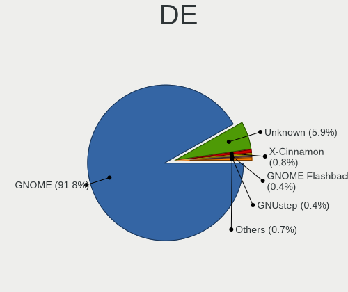
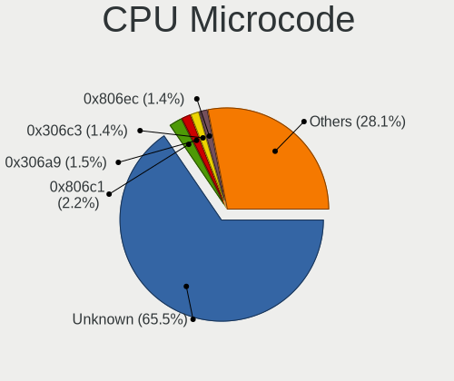
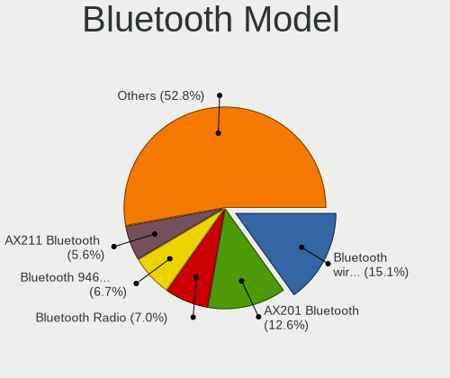

Ubuntu 22.04 - Tested Hardware & Statistics
-------------------------------------------

A project to collect tested hardware configurations for Ubuntu 22.04.

Anyone can contribute to this report by the [hw-probe](https://github.com/linuxhw/hw-probe) tool:

    sudo -E hw-probe -all -upload

Please contribute! Especially if your hardware is rare.

This is a report for all computer types. See also reports for [desktops](/Dist/Ubuntu_22.04/Desktop/README.md) and [notebooks](/Dist/Ubuntu_22.04/Notebook/README.md).

Contents
--------

* [ Test Cases ](#test-cases)

* [ System ](#system)
  - [ Kernel                   ](#kernel)
  - [ Kernel Family            ](#kernel-family)
  - [ Kernel Major Ver.        ](#kernel-major-ver)
  - [ Arch                     ](#arch)
  - [ DE                       ](#de)
  - [ Display Server           ](#display-server)
  - [ Display Manager          ](#display-manager)
  - [ OS Lang                  ](#os-lang)
  - [ Boot Mode                ](#boot-mode)
  - [ Filesystem               ](#filesystem)
  - [ Part. scheme             ](#part-scheme)
  - [ Dual Boot with Linux/BSD ](#dual-boot-with-linuxbsd)
  - [ Dual Boot (Win)          ](#dual-boot-win)

* [ Board ](#board)
  - [ Vendor                   ](#vendor)
  - [ Model                    ](#model)
  - [ Model Family             ](#model-family)
  - [ MFG Year                 ](#mfg-year)
  - [ Form Factor              ](#form-factor)
  - [ Secure Boot              ](#secure-boot)
  - [ Coreboot                 ](#coreboot)
  - [ RAM Size                 ](#ram-size)
  - [ RAM Used                 ](#ram-used)
  - [ Total Drives             ](#total-drives)
  - [ Has CD-ROM               ](#has-cd-rom)
  - [ Has Ethernet             ](#has-ethernet)
  - [ Has WiFi                 ](#has-wifi)
  - [ Has Bluetooth            ](#has-bluetooth)

* [ Location ](#location)
  - [ Country                  ](#country)
  - [ City                     ](#city)

* [ Drives ](#drives)
  - [ Drive Vendor             ](#drive-vendor)
  - [ Drive Model              ](#drive-model)
  - [ HDD Vendor               ](#hdd-vendor)
  - [ SSD Vendor               ](#ssd-vendor)
  - [ Drive Kind               ](#drive-kind)
  - [ Drive Connector          ](#drive-connector)
  - [ Drive Size               ](#drive-size)
  - [ Space Total              ](#space-total)
  - [ Space Used               ](#space-used)
  - [ Malfunc. Drives          ](#malfunc-drives)
  - [ Malfunc. Drive Vendor    ](#malfunc-drive-vendor)
  - [ Malfunc. HDD Vendor      ](#malfunc-hdd-vendor)
  - [ Malfunc. Drive Kind      ](#malfunc-drive-kind)
  - [ Failed Drives            ](#failed-drives)
  - [ Failed Drive Vendor      ](#failed-drive-vendor)
  - [ Drive Status             ](#drive-status)

* [ Storage controller ](#storage-controller)
  - [ Storage Vendor           ](#storage-vendor)
  - [ Storage Model            ](#storage-model)
  - [ Storage Kind             ](#storage-kind)

* [ Processor ](#processor)
  - [ CPU Vendor               ](#cpu-vendor)
  - [ CPU Model                ](#cpu-model)
  - [ CPU Model Family         ](#cpu-model-family)
  - [ CPU Cores                ](#cpu-cores)
  - [ CPU Sockets              ](#cpu-sockets)
  - [ CPU Threads              ](#cpu-threads)
  - [ CPU Op-Modes             ](#cpu-op-modes)
  - [ CPU Microcode            ](#cpu-microcode)
  - [ CPU Microarch            ](#cpu-microarch)

* [ Graphics ](#graphics)
  - [ GPU Vendor               ](#gpu-vendor)
  - [ GPU Model                ](#gpu-model)
  - [ GPU Combo                ](#gpu-combo)
  - [ GPU Driver               ](#gpu-driver)
  - [ GPU Memory               ](#gpu-memory)

* [ Monitor ](#monitor)
  - [ Monitor Vendor           ](#monitor-vendor)
  - [ Monitor Model            ](#monitor-model)
  - [ Monitor Resolution       ](#monitor-resolution)
  - [ Monitor Diagonal         ](#monitor-diagonal)
  - [ Monitor Width            ](#monitor-width)
  - [ Aspect Ratio             ](#aspect-ratio)
  - [ Monitor Area             ](#monitor-area)
  - [ Pixel Density            ](#pixel-density)
  - [ Multiple Monitors        ](#multiple-monitors)

* [ Network ](#network)
  - [ Net Controller Vendor    ](#net-controller-vendor)
  - [ Net Controller Model     ](#net-controller-model)
  - [ Wireless Vendor          ](#wireless-vendor)
  - [ Wireless Model           ](#wireless-model)
  - [ Ethernet Vendor          ](#ethernet-vendor)
  - [ Ethernet Model           ](#ethernet-model)
  - [ Net Controller Kind      ](#net-controller-kind)
  - [ Used Controller          ](#used-controller)
  - [ NICs                     ](#nics)
  - [ IPv6                     ](#ipv6)

* [ Bluetooth ](#bluetooth)
  - [ Bluetooth Vendor         ](#bluetooth-vendor)
  - [ Bluetooth Model          ](#bluetooth-model)

* [ Sound ](#sound)
  - [ Sound Vendor             ](#sound-vendor)
  - [ Sound Model              ](#sound-model)

* [ Memory ](#memory)
  - [ Memory Vendor            ](#memory-vendor)
  - [ Memory Model             ](#memory-model)
  - [ Memory Kind              ](#memory-kind)
  - [ Memory Form Factor       ](#memory-form-factor)
  - [ Memory Size              ](#memory-size)
  - [ Memory Speed             ](#memory-speed)

* [ Printers & scanners ](#printers--scanners)
  - [ Printer Vendor           ](#printer-vendor)
  - [ Printer Model            ](#printer-model)
  - [ Scanner Vendor           ](#scanner-vendor)
  - [ Scanner Model            ](#scanner-model)

* [ Camera ](#camera)
  - [ Camera Vendor            ](#camera-vendor)
  - [ Camera Model             ](#camera-model)

* [ Security ](#security)
  - [ Fingerprint Vendor       ](#fingerprint-vendor)
  - [ Fingerprint Model        ](#fingerprint-model)
  - [ Chipcard Vendor          ](#chipcard-vendor)
  - [ Chipcard Model           ](#chipcard-model)

* [ Unsupported ](#unsupported)
  - [ Unsupported Devices      ](#unsupported-devices)
  - [ Unsupported Device Types ](#unsupported-device-types)

Test Cases
----------

Total: 3635

| Vendor        | Model                       | Form-Factor | Probe                                                      | Date         |
|---------------|-----------------------------|-------------|------------------------------------------------------------|--------------|
| Dell          | XPS 13 7390 2-in-1          | Convertible | [269a75d1cd](https://linux-hardware.org/?probe=269a75d1cd) | Sep 01, 2022 |
| Dell          | XPS 13 7390 2-in-1          | Convertible | [d6d616d620](https://linux-hardware.org/?probe=d6d616d620) | Sep 01, 2022 |
| Lenovo        | ThinkPad T14 Gen 2i 20W1... | Notebook    | [12abd434b5](https://linux-hardware.org/?probe=12abd434b5) | Sep 01, 2022 |
| Acer          | Aspire TC-605               | Desktop     | [5ff2a41fcd](https://linux-hardware.org/?probe=5ff2a41fcd) | Sep 01, 2022 |
| Dell          | 0R6PCT A01                  | Desktop     | [02af50752e](https://linux-hardware.org/?probe=02af50752e) | Sep 01, 2022 |
| Lenovo        | SHARKBAY 31900058 STD       | Desktop     | [f113f959b7](https://linux-hardware.org/?probe=f113f959b7) | Sep 01, 2022 |
| Acer          | Aspire TC-605               | Desktop     | [fdc6b95d8b](https://linux-hardware.org/?probe=fdc6b95d8b) | Sep 01, 2022 |
| Dell          | Inspiron 7591 2n1           | Convertible | [b963be56f5](https://linux-hardware.org/?probe=b963be56f5) | Sep 01, 2022 |
| Dell          | 042P49 A02                  | Desktop     | [3b1c07d561](https://linux-hardware.org/?probe=3b1c07d561) | Sep 01, 2022 |
| Dell          | Latitude 5521               | Notebook    | [dcf7869cf6](https://linux-hardware.org/?probe=dcf7869cf6) | Sep 01, 2022 |
| Dell          | 07PXPY A04                  | Server      | [f0b9cd86ef](https://linux-hardware.org/?probe=f0b9cd86ef) | Sep 01, 2022 |
| Lenovo        | ThinkBook 14 G2 ITL 20VD    | Notebook    | [02ec70b604](https://linux-hardware.org/?probe=02ec70b604) | Sep 01, 2022 |
| Lenovo        | ThinkPad T400 6474W7T       | Notebook    | [f9a9b12b37](https://linux-hardware.org/?probe=f9a9b12b37) | Sep 01, 2022 |
| Intel         | D34010WYB H14771-304        | Desktop     | [47d9609ba8](https://linux-hardware.org/?probe=47d9609ba8) | Sep 01, 2022 |
| HP            | Laptop 15-db0xxx            | Notebook    | [de848d928c](https://linux-hardware.org/?probe=de848d928c) | Sep 01, 2022 |
| Lenovo        | ThinkPad P15 Gen 1 20STC... | Notebook    | [0a5a3fa67e](https://linux-hardware.org/?probe=0a5a3fa67e) | Sep 01, 2022 |
| Intel         | D34010WYB H14771-304        | Desktop     | [fd34481bf8](https://linux-hardware.org/?probe=fd34481bf8) | Sep 01, 2022 |
| Casper        | NIRVANA NOTEBOOK            | Notebook    | [7a5978071e](https://linux-hardware.org/?probe=7a5978071e) | Sep 01, 2022 |
| Avell High... | C62 MOB                     | Notebook    | [ab93c1f314](https://linux-hardware.org/?probe=ab93c1f314) | Sep 01, 2022 |
| Gigabyte      | H81M-WW                     | Desktop     | [2a56f256a3](https://linux-hardware.org/?probe=2a56f256a3) | Sep 01, 2022 |
| Notebook      | NL40_50CU                   | Notebook    | [af0da080ec](https://linux-hardware.org/?probe=af0da080ec) | Sep 01, 2022 |
| Dell          | Latitude 3340               | Notebook    | [d64525742a](https://linux-hardware.org/?probe=d64525742a) | Sep 01, 2022 |
| Dell          | Latitude 3340               | Notebook    | [b9d472b965](https://linux-hardware.org/?probe=b9d472b965) | Sep 01, 2022 |
| ASUSTek       | ZenBook UX431DA_UM431DA     | Notebook    | [cc30fbdce2](https://linux-hardware.org/?probe=cc30fbdce2) | Sep 01, 2022 |
| LG Electro... | 14Z990-V.AP72B              | Notebook    | [8c67c188a1](https://linux-hardware.org/?probe=8c67c188a1) | Sep 01, 2022 |
| Gigabyte      | X150M-PRO ECC-CF            | Desktop     | [6db003ed3a](https://linux-hardware.org/?probe=6db003ed3a) | Sep 01, 2022 |
| Lenovo        | ThinkPad T400 6474W7T       | Notebook    | [b52974ac00](https://linux-hardware.org/?probe=b52974ac00) | Sep 01, 2022 |
| Dell          | 0WPG9H A00                  | All in one  | [67aeed6eb1](https://linux-hardware.org/?probe=67aeed6eb1) | Sep 01, 2022 |
| Dell          | 0WPG9H A00                  | All in one  | [b1b4bd6ce0](https://linux-hardware.org/?probe=b1b4bd6ce0) | Sep 01, 2022 |
| Gigabyte      | X150M-PRO ECC-CF            | Desktop     | [2f21cd30ff](https://linux-hardware.org/?probe=2f21cd30ff) | Sep 01, 2022 |
| Apple         | Mac-FFE5EF870D7BA81A iMa... | All in one  | [52f8474c3a](https://linux-hardware.org/?probe=52f8474c3a) | Sep 01, 2022 |
| Dell          | Latitude 5591               | Notebook    | [b860997149](https://linux-hardware.org/?probe=b860997149) | Sep 01, 2022 |
| HP            | ProBook 6460b               | Notebook    | [a0e3db2eed](https://linux-hardware.org/?probe=a0e3db2eed) | Sep 01, 2022 |
| Samsung       | 950XEE                      | Notebook    | [454b67dd88](https://linux-hardware.org/?probe=454b67dd88) | Sep 01, 2022 |
| Acer          | Aspire E5-571               | Notebook    | [7759e41b1d](https://linux-hardware.org/?probe=7759e41b1d) | Sep 01, 2022 |
| Lenovo        | 36D5 SDK0J40700 WIN 3258... | Desktop     | [87dfd12899](https://linux-hardware.org/?probe=87dfd12899) | Sep 01, 2022 |
| HP            | OMEN by Laptop 15-ce0xx     | Notebook    | [85d4f11486](https://linux-hardware.org/?probe=85d4f11486) | Sep 01, 2022 |
| HP            | EliteBook 840 G2            | Notebook    | [4da3485e34](https://linux-hardware.org/?probe=4da3485e34) | Sep 01, 2022 |
| HP            | ENVY Laptop 13-ba1xxx       | Notebook    | [5a4e2225a8](https://linux-hardware.org/?probe=5a4e2225a8) | Sep 01, 2022 |
| HP            | G42                         | Notebook    | [a79b07fcd0](https://linux-hardware.org/?probe=a79b07fcd0) | Sep 01, 2022 |
| HP            | ENVY Laptop 15-ep0xxx       | Notebook    | [93ff04a07b](https://linux-hardware.org/?probe=93ff04a07b) | Sep 01, 2022 |
| MSI           | B450M-A PRO MAX             | Desktop     | [6462d2370f](https://linux-hardware.org/?probe=6462d2370f) | Aug 31, 2022 |
| Dell          | Latitude 7390               | Notebook    | [571b195a12](https://linux-hardware.org/?probe=571b195a12) | Aug 31, 2022 |
| ASUSTek       | PRIME H510T2/CSM            | Desktop     | [12033c4a8b](https://linux-hardware.org/?probe=12033c4a8b) | Aug 31, 2022 |
| Dell          | Latitude 7390               | Notebook    | [3c3f6114f6](https://linux-hardware.org/?probe=3c3f6114f6) | Aug 31, 2022 |
| HP            | Laptop 15-db0xxx            | Notebook    | [42879ce5cf](https://linux-hardware.org/?probe=42879ce5cf) | Aug 31, 2022 |
| Raspberry ... | Raspberry Pi 400 Rev 1.0    | Soc         | [4d1339ef49](https://linux-hardware.org/?probe=4d1339ef49) | Aug 31, 2022 |
| HP            | Laptop 15-db0xxx            | Notebook    | [3c7e97b769](https://linux-hardware.org/?probe=3c7e97b769) | Aug 31, 2022 |
| HP            | 1906                        | Desktop     | [a23cef9946](https://linux-hardware.org/?probe=a23cef9946) | Aug 31, 2022 |
| Acer          | Aspire V3-571G              | Notebook    | [8f4a2b603a](https://linux-hardware.org/?probe=8f4a2b603a) | Aug 31, 2022 |
| HP            | 81B4                        | Desktop     | [b81985e04e](https://linux-hardware.org/?probe=b81985e04e) | Aug 31, 2022 |
| Raspberry ... | Raspberry Pi                | Soc         | [dea44e447f](https://linux-hardware.org/?probe=dea44e447f) | Aug 31, 2022 |
| Toshiba       | Satellite Pro L500          | Notebook    | [7f523718cf](https://linux-hardware.org/?probe=7f523718cf) | Aug 31, 2022 |
| Raspberry ... | Raspberry Pi                | Soc         | [a4fc4ad9e3](https://linux-hardware.org/?probe=a4fc4ad9e3) | Aug 31, 2022 |
| Pegatron      | 2AB6                        | Desktop     | [c4ca3989e0](https://linux-hardware.org/?probe=c4ca3989e0) | Aug 31, 2022 |
| Dell          | Latitude 7280               | Notebook    | [e71e9350b4](https://linux-hardware.org/?probe=e71e9350b4) | Aug 31, 2022 |
| HP            | EliteBook 840 G8 Noteboo... | Notebook    | [4808984401](https://linux-hardware.org/?probe=4808984401) | Aug 31, 2022 |
| Gigabyte      | P85-D3                      | Desktop     | [71ce0b707c](https://linux-hardware.org/?probe=71ce0b707c) | Aug 31, 2022 |
| ASUSTek       | Z170-K                      | Desktop     | [544582fd23](https://linux-hardware.org/?probe=544582fd23) | Aug 31, 2022 |
| Lenovo        | ThinkPad L14 Gen 1 20U5S... | Notebook    | [eb79e6b28e](https://linux-hardware.org/?probe=eb79e6b28e) | Aug 31, 2022 |
| OEM           | Intel H81                   | Desktop     | [4b45e6dc61](https://linux-hardware.org/?probe=4b45e6dc61) | Aug 31, 2022 |
| MSI           | Z390-A PRO                  | Desktop     | [368eff381c](https://linux-hardware.org/?probe=368eff381c) | Aug 31, 2022 |
| ASRock        | Z77 Pro4-M                  | Desktop     | [d7c9a106e7](https://linux-hardware.org/?probe=d7c9a106e7) | Aug 31, 2022 |
| HUAWEI        | HVY-WXX9                    | Notebook    | [193310218d](https://linux-hardware.org/?probe=193310218d) | Aug 31, 2022 |
| Samsung       | RV410/RV510/S3510/E3510     | Notebook    | [d36b7bb077](https://linux-hardware.org/?probe=d36b7bb077) | Aug 31, 2022 |
| HUAWEI        | CREF-XX                     | Notebook    | [4ea2674cd8](https://linux-hardware.org/?probe=4ea2674cd8) | Aug 31, 2022 |
| ASRock        | B550M-ITX/ac                | Desktop     | [685e484cbd](https://linux-hardware.org/?probe=685e484cbd) | Aug 31, 2022 |
| Lenovo        | ThinkPad P43s 20RJS0D100    | Notebook    | [afbf0f6021](https://linux-hardware.org/?probe=afbf0f6021) | Aug 31, 2022 |
| HP            | Presario F500 (GM639LA#A... | Notebook    | [7323caa631](https://linux-hardware.org/?probe=7323caa631) | Aug 31, 2022 |
| Dell          | Vostro 3550                 | Notebook    | [c26bf23cdd](https://linux-hardware.org/?probe=c26bf23cdd) | Aug 31, 2022 |
| ASUSTek       | PRIME X299-DELUXE           | Desktop     | [a76390d5fc](https://linux-hardware.org/?probe=a76390d5fc) | Aug 31, 2022 |
| Dell          | Inspiron 5502               | Notebook    | [1bb776feab](https://linux-hardware.org/?probe=1bb776feab) | Aug 31, 2022 |
| Lenovo        | V15-IIL 82C5                | Notebook    | [2a9e478284](https://linux-hardware.org/?probe=2a9e478284) | Aug 30, 2022 |
| Lenovo        | ThinkPad Edge E530 62724... | Notebook    | [87cad1c0b0](https://linux-hardware.org/?probe=87cad1c0b0) | Aug 30, 2022 |
| Apple         | Mac-F22C86C8                | Mini pc     | [76046f5112](https://linux-hardware.org/?probe=76046f5112) | Aug 30, 2022 |
| Apple         | Mac-F22C86C8                | Mini pc     | [95c8025613](https://linux-hardware.org/?probe=95c8025613) | Aug 30, 2022 |
| Foxconn       | 2AAF                        | Desktop     | [a23b1b0822](https://linux-hardware.org/?probe=a23b1b0822) | Aug 30, 2022 |
| Gigabyte      | B550 AORUS ELITE AX V2      | Desktop     | [98e0a08e65](https://linux-hardware.org/?probe=98e0a08e65) | Aug 30, 2022 |
| Lenovo        | ThinkBook 14s Yoga ITL 2... | Convertible | [cee29232ee](https://linux-hardware.org/?probe=cee29232ee) | Aug 30, 2022 |
| Avell High... | B.ON                        | Notebook    | [dbc18dad43](https://linux-hardware.org/?probe=dbc18dad43) | Aug 30, 2022 |
| HP            | Pavilion Gaming Laptop 1... | Notebook    | [20da9d42a4](https://linux-hardware.org/?probe=20da9d42a4) | Aug 30, 2022 |
| ASUSTek       | ET2410                      | All in one  | [3cd48cf0ed](https://linux-hardware.org/?probe=3cd48cf0ed) | Aug 30, 2022 |
| Lenovo        | ThinkPad L512 259756M       | Notebook    | [3990fcfeed](https://linux-hardware.org/?probe=3990fcfeed) | Aug 30, 2022 |
| Dell          | XPS 15 9570                 | Notebook    | [6c35aeda10](https://linux-hardware.org/?probe=6c35aeda10) | Aug 30, 2022 |
| Lenovo        | ThinkPad T490s 20NYS4HL0... | Notebook    | [273e5229a4](https://linux-hardware.org/?probe=273e5229a4) | Aug 30, 2022 |
| AMI           | Intel                       | Convertible | [0e6916718e](https://linux-hardware.org/?probe=0e6916718e) | Aug 30, 2022 |
| HP            | Pavilion Gaming Laptop 1... | Notebook    | [11efd3dbe0](https://linux-hardware.org/?probe=11efd3dbe0) | Aug 30, 2022 |
| ASUSTek       | ROG STRIX B550-I GAMING     | Desktop     | [2fd4ef02b3](https://linux-hardware.org/?probe=2fd4ef02b3) | Aug 30, 2022 |
| Supermicro    | X11SSL-F                    | Server      | [252e3549cd](https://linux-hardware.org/?probe=252e3549cd) | Aug 30, 2022 |
| Supermicro    | X11SSL-F                    | Server      | [b10d7755ee](https://linux-hardware.org/?probe=b10d7755ee) | Aug 30, 2022 |
| HP            | EliteBook 840 G2            | Notebook    | [5ba91d8167](https://linux-hardware.org/?probe=5ba91d8167) | Aug 30, 2022 |
| HP            | EliteBook 840 G1            | Notebook    | [23d73aa95c](https://linux-hardware.org/?probe=23d73aa95c) | Aug 30, 2022 |
| Supermicro    | X11SSM-F                    | Server      | [a43842b263](https://linux-hardware.org/?probe=a43842b263) | Aug 30, 2022 |
| Dell          | Inspiron 7506 2n1           | Convertible | [aa9aef8014](https://linux-hardware.org/?probe=aa9aef8014) | Aug 30, 2022 |
| ASUSTek       | GL552JX                     | Notebook    | [d477c2cd47](https://linux-hardware.org/?probe=d477c2cd47) | Aug 30, 2022 |
| HP            | EliteBook 840 G2            | Notebook    | [bed3be5142](https://linux-hardware.org/?probe=bed3be5142) | Aug 30, 2022 |
| HP            | EliteBook 840 G2            | Notebook    | [b588415d06](https://linux-hardware.org/?probe=b588415d06) | Aug 30, 2022 |
| Lenovo        | ThinkPad T470 20HES3370A    | Notebook    | [3b1630e4bc](https://linux-hardware.org/?probe=3b1630e4bc) | Aug 30, 2022 |
| Lenovo        | ThinkPad E15 Gen 3 20YG0... | Notebook    | [6393abc859](https://linux-hardware.org/?probe=6393abc859) | Aug 30, 2022 |
| Dell          | Latitude 5520               | Notebook    | [26434099b3](https://linux-hardware.org/?probe=26434099b3) | Aug 30, 2022 |
| HP            | EliteBook 830 G6            | Notebook    | [897046248f](https://linux-hardware.org/?probe=897046248f) | Aug 30, 2022 |
| Dell          | Inspiron 5502               | Notebook    | [28a1dd084e](https://linux-hardware.org/?probe=28a1dd084e) | Aug 30, 2022 |
| Dell          | Inspiron 5502               | Notebook    | [df0098010e](https://linux-hardware.org/?probe=df0098010e) | Aug 30, 2022 |
| Raspberry ... | Raspberry Pi                | Soc         | [d075972bed](https://linux-hardware.org/?probe=d075972bed) | Aug 30, 2022 |
| Raspberry ... | Raspberry Pi 4 Model B      | Soc         | [133dfe9b9e](https://linux-hardware.org/?probe=133dfe9b9e) | Aug 30, 2022 |
| Apple         | Mac-65CE76090165799A iMa... | All in one  | [47049b9a6a](https://linux-hardware.org/?probe=47049b9a6a) | Aug 30, 2022 |
| ASRockRack    | ROMED8-2T                   | Desktop     | [a034a83f72](https://linux-hardware.org/?probe=a034a83f72) | Aug 30, 2022 |
| Dell          | 0J3C2F A00                  | Desktop     | [276ac60713](https://linux-hardware.org/?probe=276ac60713) | Aug 30, 2022 |
| Chuwi         | GemiBook                    | Notebook    | [abca00f582](https://linux-hardware.org/?probe=abca00f582) | Aug 30, 2022 |
| HP            | 2B38                        | Desktop     | [40428ed239](https://linux-hardware.org/?probe=40428ed239) | Aug 30, 2022 |
| ASUSTek       | K501LX                      | Notebook    | [993e5d9848](https://linux-hardware.org/?probe=993e5d9848) | Aug 29, 2022 |
| ASUSTek       | PRIME B450-PLUS             | Desktop     | [a01239fd83](https://linux-hardware.org/?probe=a01239fd83) | Aug 29, 2022 |
| Apple         | MacBookPro7,1               | Notebook    | [a879fb8249](https://linux-hardware.org/?probe=a879fb8249) | Aug 29, 2022 |
| Lenovo        | Bantry CRB SDK0J40709 WI... | Desktop     | [4ba4105869](https://linux-hardware.org/?probe=4ba4105869) | Aug 29, 2022 |
| HP            | 304Ah                       | Desktop     | [3f370524f3](https://linux-hardware.org/?probe=3f370524f3) | Aug 29, 2022 |
| HP            | 18E5                        | Desktop     | [c40ab0e3e3](https://linux-hardware.org/?probe=c40ab0e3e3) | Aug 29, 2022 |
| HP            | ProLiant MicroServer Gen... | Desktop     | [b613af8e42](https://linux-hardware.org/?probe=b613af8e42) | Aug 29, 2022 |
| Lenovo        | ThinkPad X1 Carbon 6th 2... | Notebook    | [636a7f710c](https://linux-hardware.org/?probe=636a7f710c) | Aug 29, 2022 |
| Dell          | Latitude E5450              | Notebook    | [9dad9e784f](https://linux-hardware.org/?probe=9dad9e784f) | Aug 29, 2022 |
| Lenovo        | MAHOBAY NO DPK              | Desktop     | [2d013c60ed](https://linux-hardware.org/?probe=2d013c60ed) | Aug 29, 2022 |
| MSI           | MAG B550 TORPEDO            | Desktop     | [58f0ba95c3](https://linux-hardware.org/?probe=58f0ba95c3) | Aug 29, 2022 |
| Monster       | Huma H5 V3.2                | Notebook    | [ea050f24db](https://linux-hardware.org/?probe=ea050f24db) | Aug 29, 2022 |
| Fujitsu       | LIFEBOOK E746               | Notebook    | [5b0eba15c2](https://linux-hardware.org/?probe=5b0eba15c2) | Aug 29, 2022 |
| ASRock        | A320M-DVS R4.0              | Desktop     | [5140e742a9](https://linux-hardware.org/?probe=5140e742a9) | Aug 29, 2022 |
| Gigabyte      | B550 AORUS ELITE AX V2      | Desktop     | [81bc767d5b](https://linux-hardware.org/?probe=81bc767d5b) | Aug 29, 2022 |
| Apple         | MacBookPro11,4              | Notebook    | [dc1f806296](https://linux-hardware.org/?probe=dc1f806296) | Aug 29, 2022 |
| HP            | ProBook 440 14 inch G9 N... | Notebook    | [0a08f13779](https://linux-hardware.org/?probe=0a08f13779) | Aug 29, 2022 |
| Dell          | 0HY9JP A01                  | Desktop     | [b87b0407d9](https://linux-hardware.org/?probe=b87b0407d9) | Aug 29, 2022 |
| System76      | Galago Pro                  | Notebook    | [df2c4ae77c](https://linux-hardware.org/?probe=df2c4ae77c) | Aug 29, 2022 |
| Dell          | 05XGC8 A01                  | Desktop     | [73ac4cc88d](https://linux-hardware.org/?probe=73ac4cc88d) | Aug 29, 2022 |
| Dell          | 0HY9JP A01                  | Desktop     | [fbb579a5d6](https://linux-hardware.org/?probe=fbb579a5d6) | Aug 29, 2022 |
| ASUSTek       | X553MA                      | Notebook    | [108e0c7803](https://linux-hardware.org/?probe=108e0c7803) | Aug 29, 2022 |
| HP            | ZBook 15u G4                | Notebook    | [39f4830019](https://linux-hardware.org/?probe=39f4830019) | Aug 28, 2022 |
| Lenovo        | G50-45 80E3                 | Notebook    | [239e5612ee](https://linux-hardware.org/?probe=239e5612ee) | Aug 28, 2022 |
| Lenovo        | 3110 SDK0J40697 WIN 3305... | All in one  | [cde94f0c8e](https://linux-hardware.org/?probe=cde94f0c8e) | Aug 28, 2022 |
| Panasonic     | CF-30KTPAZAE                | Notebook    | [61a8f4a768](https://linux-hardware.org/?probe=61a8f4a768) | Aug 28, 2022 |
| Dell          | 0HY9JP A00                  | Desktop     | [811e87f60b](https://linux-hardware.org/?probe=811e87f60b) | Aug 28, 2022 |
| Lenovo        | IdeaPad 320-14ISK 80XG      | Notebook    | [8fac02d016](https://linux-hardware.org/?probe=8fac02d016) | Aug 28, 2022 |
| Dell          | 0NW6H5 A00                  | Desktop     | [40a706292c](https://linux-hardware.org/?probe=40a706292c) | Aug 28, 2022 |
| HP            | ZBook 15u G4                | Notebook    | [2115d02bfd](https://linux-hardware.org/?probe=2115d02bfd) | Aug 28, 2022 |
| Lenovo        | IdeaPad 320-14ISK 80XG      | Notebook    | [d281087322](https://linux-hardware.org/?probe=d281087322) | Aug 28, 2022 |
| Lenovo        | IdeaPad C340-14API 81N6     | Notebook    | [c8c04ce5db](https://linux-hardware.org/?probe=c8c04ce5db) | Aug 28, 2022 |
| ASRock        | B450M Pro4                  | Desktop     | [8f0f345242](https://linux-hardware.org/?probe=8f0f345242) | Aug 28, 2022 |
| Dell          | Latitude E7470              | Notebook    | [568c9bfd40](https://linux-hardware.org/?probe=568c9bfd40) | Aug 28, 2022 |
| Dell          | Inspiron 3543               | Notebook    | [68d1385b7e](https://linux-hardware.org/?probe=68d1385b7e) | Aug 28, 2022 |
| MSI           | B450M PRO-M2 MAX            | Desktop     | [5e6e789346](https://linux-hardware.org/?probe=5e6e789346) | Aug 28, 2022 |
| Pegatron      | IPMSB-GS                    | Desktop     | [9edb57e041](https://linux-hardware.org/?probe=9edb57e041) | Aug 28, 2022 |
| Microtech     | CoreBook                    | Notebook    | [7507a104b7](https://linux-hardware.org/?probe=7507a104b7) | Aug 28, 2022 |
| Dell          | Inspiron N5010              | Notebook    | [1a76248bf8](https://linux-hardware.org/?probe=1a76248bf8) | Aug 28, 2022 |
| Apple         | Mac-65CE76090165799A iMa... | All in one  | [dd47181665](https://linux-hardware.org/?probe=dd47181665) | Aug 28, 2022 |
| ASUSTek       | B85M-E                      | Desktop     | [a0f47aaaa7](https://linux-hardware.org/?probe=a0f47aaaa7) | Aug 28, 2022 |
| Gigabyte      | F2A68HM-S1                  | Desktop     | [420036f4d6](https://linux-hardware.org/?probe=420036f4d6) | Aug 28, 2022 |
| Dell          | 020M3P A00                  | Desktop     | [424ea42e17](https://linux-hardware.org/?probe=424ea42e17) | Aug 28, 2022 |
| Dell          | OptiPlex 3020M              | Desktop     | [84f424cfb7](https://linux-hardware.org/?probe=84f424cfb7) | Aug 28, 2022 |
| Alienware     | 15                          | Notebook    | [f85646920a](https://linux-hardware.org/?probe=f85646920a) | Aug 28, 2022 |
| HP            | Spectre x360 Convertible... | Convertible | [58b2139536](https://linux-hardware.org/?probe=58b2139536) | Aug 27, 2022 |
| Lenovo        | ThinkPad L440 20ASS3A300    | Notebook    | [fbf3d4a87a](https://linux-hardware.org/?probe=fbf3d4a87a) | Aug 27, 2022 |
| Lenovo        | SHARKBAY NOK                | Desktop     | [8571fd0486](https://linux-hardware.org/?probe=8571fd0486) | Aug 27, 2022 |
| Lenovo        | ThinkBook 13s-IWL 20R9      | Notebook    | [98bb5817f6](https://linux-hardware.org/?probe=98bb5817f6) | Aug 27, 2022 |
| HP            | ENVY x360 Convertible 15... | Convertible | [b592ce837a](https://linux-hardware.org/?probe=b592ce837a) | Aug 27, 2022 |
| HP            | Pavilion Notebook           | Notebook    | [0e4eab04c0](https://linux-hardware.org/?probe=0e4eab04c0) | Aug 27, 2022 |
| HP            | Pavilion Notebook           | Notebook    | [65e832cb2f](https://linux-hardware.org/?probe=65e832cb2f) | Aug 27, 2022 |
| ASUSTek       | VivoBook_ASUSLaptop X512... | Notebook    | [65f638768e](https://linux-hardware.org/?probe=65f638768e) | Aug 27, 2022 |
| Raspberry ... | Raspberry Pi                | Soc         | [acfe0dfffa](https://linux-hardware.org/?probe=acfe0dfffa) | Aug 27, 2022 |
| Alienware     | M14xR1                      | Notebook    | [498d5f5254](https://linux-hardware.org/?probe=498d5f5254) | Aug 27, 2022 |
| Acer          | Nitro AN515-57              | Notebook    | [decd7daef2](https://linux-hardware.org/?probe=decd7daef2) | Aug 27, 2022 |
| BESSTAR Te... | X400                        | Notebook    | [ab70086ae7](https://linux-hardware.org/?probe=ab70086ae7) | Aug 27, 2022 |
| Raspberry ... | Raspberry Pi                | Soc         | [717302bb55](https://linux-hardware.org/?probe=717302bb55) | Aug 27, 2022 |
| HP            | 3647h                       | Desktop     | [c83122d4d4](https://linux-hardware.org/?probe=c83122d4d4) | Aug 27, 2022 |
| Dell          | 0G3HR7 A00                  | Desktop     | [500cf5a2b4](https://linux-hardware.org/?probe=500cf5a2b4) | Aug 27, 2022 |
| Dell          | 0G3HR7 A00                  | Desktop     | [f9671d44ad](https://linux-hardware.org/?probe=f9671d44ad) | Aug 27, 2022 |
| HP            | Pavilion Gaming Laptop 1... | Notebook    | [f4d9682f50](https://linux-hardware.org/?probe=f4d9682f50) | Aug 27, 2022 |
| Lenovo        | IdeaPadFlex 5 14ITL05 82... | Convertible | [1c87349faa](https://linux-hardware.org/?probe=1c87349faa) | Aug 27, 2022 |
| BESSTAR Te... | X400                        | Notebook    | [f8d3611cf0](https://linux-hardware.org/?probe=f8d3611cf0) | Aug 27, 2022 |
| Acer          | Nitro AN515-54              | Notebook    | [975f6a801d](https://linux-hardware.org/?probe=975f6a801d) | Aug 27, 2022 |
| HP            | Unknown                     | Notebook    | [9b22ce41e3](https://linux-hardware.org/?probe=9b22ce41e3) | Aug 27, 2022 |
| Dell          | Inspiron 7506 2n1           | Convertible | [198a8130dc](https://linux-hardware.org/?probe=198a8130dc) | Aug 27, 2022 |
| Lenovo        | YangTian V340-15-IIL 81X... | Notebook    | [f26ee3814c](https://linux-hardware.org/?probe=f26ee3814c) | Aug 27, 2022 |
| Fujitsu       | LIFEBOOK A530               | Notebook    | [5534f20f99](https://linux-hardware.org/?probe=5534f20f99) | Aug 27, 2022 |
| Fujitsu       | LIFEBOOK A530               | Notebook    | [df9aa3eab2](https://linux-hardware.org/?probe=df9aa3eab2) | Aug 27, 2022 |
| HP            | 18E7                        | Desktop     | [613d55d0e9](https://linux-hardware.org/?probe=613d55d0e9) | Aug 27, 2022 |
| Lenovo        | ThinkPad E14 Gen 4 21E4C... | Notebook    | [cf1b2ff13c](https://linux-hardware.org/?probe=cf1b2ff13c) | Aug 27, 2022 |
| Dell          | XPS 15 9575                 | Convertible | [e18118bf63](https://linux-hardware.org/?probe=e18118bf63) | Aug 27, 2022 |
| Intel         | DH87RL AAG74240-401         | Desktop     | [814718547c](https://linux-hardware.org/?probe=814718547c) | Aug 27, 2022 |
| Lenovo        | ThinkPad X1 Tablet Gen 3... | Tablet      | [87f6fccf0a](https://linux-hardware.org/?probe=87f6fccf0a) | Aug 27, 2022 |
| MSI           | MPG Z690 FORCE WIFI         | Desktop     | [e476312c10](https://linux-hardware.org/?probe=e476312c10) | Aug 27, 2022 |
| Dell          | 020M3P A00                  | Desktop     | [fea059fea0](https://linux-hardware.org/?probe=fea059fea0) | Aug 27, 2022 |
| Apple         | Mac-F22C86C8                | Mini pc     | [818b7e0b19](https://linux-hardware.org/?probe=818b7e0b19) | Aug 27, 2022 |
| Apple         | Mac-F22C86C8                | Mini pc     | [df8598d6f6](https://linux-hardware.org/?probe=df8598d6f6) | Aug 27, 2022 |
| Positivo      | C14CR01                     | Notebook    | [bb9a4c427a](https://linux-hardware.org/?probe=bb9a4c427a) | Aug 27, 2022 |
| ASUSTek       | PRIME H310M-E R2.0          | Desktop     | [43fdfb3cf8](https://linux-hardware.org/?probe=43fdfb3cf8) | Aug 27, 2022 |
| ASUSTek       | PRIME H310M-E R2.0          | Desktop     | [a1f434a97c](https://linux-hardware.org/?probe=a1f434a97c) | Aug 27, 2022 |
| Gigabyte      | GA-78LMT-USB3               | Desktop     | [04474401fc](https://linux-hardware.org/?probe=04474401fc) | Aug 26, 2022 |
| ASRock        | B450M-HDV R4.0              | Desktop     | [a180ab604a](https://linux-hardware.org/?probe=a180ab604a) | Aug 26, 2022 |
| speedmaste... | E131x series                | Notebook    | [69d287c029](https://linux-hardware.org/?probe=69d287c029) | Aug 26, 2022 |
| Dell          | Latitude E6510              | Notebook    | [846791d8b9](https://linux-hardware.org/?probe=846791d8b9) | Aug 26, 2022 |
| Foxconn       | A6VMX 0A                    | Desktop     | [f31fcbf60d](https://linux-hardware.org/?probe=f31fcbf60d) | Aug 26, 2022 |
| Gigabyte      | Z390 AORUS PRO WIFI-CF      | Desktop     | [d0e8962ad5](https://linux-hardware.org/?probe=d0e8962ad5) | Aug 26, 2022 |
| HP            | 8299                        | Desktop     | [37b30a10c2](https://linux-hardware.org/?probe=37b30a10c2) | Aug 26, 2022 |
| Dell          | Vostro 1520                 | Notebook    | [b51f7dfba6](https://linux-hardware.org/?probe=b51f7dfba6) | Aug 26, 2022 |
| Intel         | D2550MUD2 AAG81497-700      | Desktop     | [a181512016](https://linux-hardware.org/?probe=a181512016) | Aug 26, 2022 |
| HP            | Pavilion Laptop 15-cd0xx    | Notebook    | [62ce95ce9c](https://linux-hardware.org/?probe=62ce95ce9c) | Aug 26, 2022 |
| Biostar       | B660MX-E                    | Desktop     | [4fa9d132c2](https://linux-hardware.org/?probe=4fa9d132c2) | Aug 26, 2022 |
| Lenovo        | ThinkPad T440p 20AW007QM... | Notebook    | [b24bbedfc1](https://linux-hardware.org/?probe=b24bbedfc1) | Aug 26, 2022 |
| Apple         | MacBookPro9,2               | Notebook    | [49b01e516c](https://linux-hardware.org/?probe=49b01e516c) | Aug 26, 2022 |
| ASUSTek       | P8Z68-V LE                  | Desktop     | [9839e8eeff](https://linux-hardware.org/?probe=9839e8eeff) | Aug 26, 2022 |
| ASUSTek       | P8H77-V LE                  | Desktop     | [4bd2fabdc7](https://linux-hardware.org/?probe=4bd2fabdc7) | Aug 26, 2022 |
| ASUSTek       | S551LB                      | Notebook    | [efd20dadd0](https://linux-hardware.org/?probe=efd20dadd0) | Aug 26, 2022 |
| Acer          | Aspire A315-34              | Notebook    | [d71a1ce240](https://linux-hardware.org/?probe=d71a1ce240) | Aug 26, 2022 |
| Timi          | Redmi Book Pro 14 2022      | Notebook    | [3f61df6540](https://linux-hardware.org/?probe=3f61df6540) | Aug 26, 2022 |
| Raspberry ... | Raspberry Pi                | Soc         | [28ebe8cc1f](https://linux-hardware.org/?probe=28ebe8cc1f) | Aug 25, 2022 |
| Intel         | DQ965GF AAD41676-601        | Desktop     | [a163a7fc6d](https://linux-hardware.org/?probe=a163a7fc6d) | Aug 25, 2022 |
| Lenovo        | ThinkPad P14s Gen 2a 21A... | Notebook    | [83377b24dc](https://linux-hardware.org/?probe=83377b24dc) | Aug 25, 2022 |
| Foxconn       | P35A01                      | Desktop     | [fa220f1ce6](https://linux-hardware.org/?probe=fa220f1ce6) | Aug 25, 2022 |
| Dell          | 0YXT71 A03                  | Desktop     | [176c458f3a](https://linux-hardware.org/?probe=176c458f3a) | Aug 25, 2022 |
| Lenovo        | IdeaPad 330-15IKB 81DE      | Notebook    | [cbae91bec7](https://linux-hardware.org/?probe=cbae91bec7) | Aug 25, 2022 |
| Gateway       | NV53A                       | Notebook    | [618b8506e2](https://linux-hardware.org/?probe=618b8506e2) | Aug 25, 2022 |
| Lenovo        | ThinkPad P14s Gen 2a 21A... | Notebook    | [d2e2d5484c](https://linux-hardware.org/?probe=d2e2d5484c) | Aug 25, 2022 |
| Dell          | 027W48 A03                  | All in one  | [f8b5c9dc29](https://linux-hardware.org/?probe=f8b5c9dc29) | Aug 25, 2022 |
| HUAWEI        | BOM-WXX9                    | Notebook    | [06ba6b75b4](https://linux-hardware.org/?probe=06ba6b75b4) | Aug 25, 2022 |
| Lenovo        | ThinkPad L490 20Q5S0LF00    | Notebook    | [3c1287dfd2](https://linux-hardware.org/?probe=3c1287dfd2) | Aug 25, 2022 |
| Gigabyte      | X58A-UD3R                   | Desktop     | [3ab6c59d4f](https://linux-hardware.org/?probe=3ab6c59d4f) | Aug 25, 2022 |
| Dell          | Inspiron N5010              | Notebook    | [f4862a3793](https://linux-hardware.org/?probe=f4862a3793) | Aug 25, 2022 |
| Foxconn       | 2ABF                        | Desktop     | [b19844ee21](https://linux-hardware.org/?probe=b19844ee21) | Aug 25, 2022 |
| Dell          | Inspiron 5459               | Notebook    | [398f6d4b78](https://linux-hardware.org/?probe=398f6d4b78) | Aug 25, 2022 |
| HP            | ProBook 430 G5              | Notebook    | [6a7db587c7](https://linux-hardware.org/?probe=6a7db587c7) | Aug 25, 2022 |
| Dell          | 0GY6Y8 A03                  | Desktop     | [cb1949a84c](https://linux-hardware.org/?probe=cb1949a84c) | Aug 25, 2022 |
| Toshiba       | PORTEGE Z10t-A              | Notebook    | [ba23396754](https://linux-hardware.org/?probe=ba23396754) | Aug 25, 2022 |
| MSI           | MAG B550 TOMAHAWK           | Desktop     | [a380176da4](https://linux-hardware.org/?probe=a380176da4) | Aug 25, 2022 |
| Dell          | XPS 15 9560                 | Notebook    | [28323e5398](https://linux-hardware.org/?probe=28323e5398) | Aug 25, 2022 |
| ASUSTek       | P81IJ                       | Notebook    | [7ab324abea](https://linux-hardware.org/?probe=7ab324abea) | Aug 25, 2022 |
| Lenovo        | ThinkPad L440 20ASS3A300    | Notebook    | [09feb7053d](https://linux-hardware.org/?probe=09feb7053d) | Aug 25, 2022 |
| HP            | ZBook 15u G4                | Notebook    | [dcdc803214](https://linux-hardware.org/?probe=dcdc803214) | Aug 24, 2022 |
| Raspberry ... | Raspberry Pi                | Soc         | [d658a9bc25](https://linux-hardware.org/?probe=d658a9bc25) | Aug 24, 2022 |
| ASUSTek       | ProArt StudioBook W700G3... | Notebook    | [72f873111c](https://linux-hardware.org/?probe=72f873111c) | Aug 24, 2022 |
| HP            | Pavilion Notebook           | Notebook    | [70ca4aae12](https://linux-hardware.org/?probe=70ca4aae12) | Aug 24, 2022 |
| Linx          | LINX1010B                   | Notebook    | [07194b77d4](https://linux-hardware.org/?probe=07194b77d4) | Aug 24, 2022 |
| Lenovo        | IdeaPad S540-15IML D 81N... | Notebook    | [a0c40a81ec](https://linux-hardware.org/?probe=a0c40a81ec) | Aug 24, 2022 |
| Lenovo        | Yoga C940-14IIL 81Q9        | Convertible | [f2d59ff085](https://linux-hardware.org/?probe=f2d59ff085) | Aug 24, 2022 |
| ECS           | Asterope3                   | Desktop     | [624bd10b6f](https://linux-hardware.org/?probe=624bd10b6f) | Aug 24, 2022 |
| HUAWEI        | NBLB-WAX9N                  | Notebook    | [69281b6cc3](https://linux-hardware.org/?probe=69281b6cc3) | Aug 24, 2022 |
| HP            | 255 G6 Notebook PC          | Notebook    | [a476ba5a83](https://linux-hardware.org/?probe=a476ba5a83) | Aug 24, 2022 |
| Dell          | Inspiron 3543               | Notebook    | [000b034e01](https://linux-hardware.org/?probe=000b034e01) | Aug 24, 2022 |
| HP            | ENVY x360 Convertible 13... | Convertible | [994866ad01](https://linux-hardware.org/?probe=994866ad01) | Aug 24, 2022 |
| Dell          | 073MMW A03                  | Desktop     | [b41e0fcad5](https://linux-hardware.org/?probe=b41e0fcad5) | Aug 24, 2022 |
| Packard Be... | EasyNote LJ65               | Notebook    | [dcd6540e36](https://linux-hardware.org/?probe=dcd6540e36) | Aug 24, 2022 |
| ASUSTek       | PRIME A320M-K               | Desktop     | [a096217ea3](https://linux-hardware.org/?probe=a096217ea3) | Aug 24, 2022 |
| ASUSTek       | H61M-K                      | Desktop     | [26c9be116e](https://linux-hardware.org/?probe=26c9be116e) | Aug 24, 2022 |
| Lenovo        | IdeaPad 5 14ALC05 82LM      | Notebook    | [421ab76c43](https://linux-hardware.org/?probe=421ab76c43) | Aug 24, 2022 |
| HP            | 1905                        | Desktop     | [6693a2b3c7](https://linux-hardware.org/?probe=6693a2b3c7) | Aug 24, 2022 |
| Dell          | Inspiron 5402               | Notebook    | [936ea503c8](https://linux-hardware.org/?probe=936ea503c8) | Aug 24, 2022 |
| Lenovo        | Legion Y540-15IRH-PG0 81... | Notebook    | [c7d603acb8](https://linux-hardware.org/?probe=c7d603acb8) | Aug 24, 2022 |
| Dell          | 0F5C5X A00                  | Desktop     | [5e62f9adde](https://linux-hardware.org/?probe=5e62f9adde) | Aug 24, 2022 |
| HP            | ProBook 430 G8 Notebook ... | Notebook    | [17260bd4fb](https://linux-hardware.org/?probe=17260bd4fb) | Aug 24, 2022 |
| Lenovo        | ThinkPad X1 Tablet Gen 3... | Tablet      | [7895013304](https://linux-hardware.org/?probe=7895013304) | Aug 24, 2022 |
| Dell          | 0200DY A03                  | Desktop     | [9da770b898](https://linux-hardware.org/?probe=9da770b898) | Aug 24, 2022 |
| Toshiba       | Satellite C55-B             | Notebook    | [eaabc96ff1](https://linux-hardware.org/?probe=eaabc96ff1) | Aug 24, 2022 |
| Gigabyte      | GA-MA770T-UD3               | Desktop     | [4ed5107048](https://linux-hardware.org/?probe=4ed5107048) | Aug 24, 2022 |
| Lenovo        | ThinkPad X1 Yoga 2nd 20J... | Convertible | [3df60311dc](https://linux-hardware.org/?probe=3df60311dc) | Aug 24, 2022 |
| Lenovo        | V330-15IKB 81AX             | Notebook    | [c3ddddae2c](https://linux-hardware.org/?probe=c3ddddae2c) | Aug 24, 2022 |
| Acer          | Predator G3620              | Desktop     | [b79ed7b47b](https://linux-hardware.org/?probe=b79ed7b47b) | Aug 23, 2022 |
| Raspberry ... | Raspberry Pi                | Soc         | [c42643096a](https://linux-hardware.org/?probe=c42643096a) | Aug 23, 2022 |
| Apple         | Mac-F22C86C8                | Mini pc     | [f7b5d18cbe](https://linux-hardware.org/?probe=f7b5d18cbe) | Aug 23, 2022 |
| ASUSTek       | M5A97 R2.0                  | Desktop     | [fdc1bb0c75](https://linux-hardware.org/?probe=fdc1bb0c75) | Aug 23, 2022 |
| ASUSTek       | PRIME B450-PLUS             | Desktop     | [6e5a434d0d](https://linux-hardware.org/?probe=6e5a434d0d) | Aug 23, 2022 |
| Dell          | 0WR7PY A03                  | Desktop     | [1dd7e73006](https://linux-hardware.org/?probe=1dd7e73006) | Aug 23, 2022 |
| Dell          | 0WR7PY A03                  | Desktop     | [071889c1b4](https://linux-hardware.org/?probe=071889c1b4) | Aug 23, 2022 |
| Apple         | MacBookPro16,2              | Notebook    | [3c6266b13d](https://linux-hardware.org/?probe=3c6266b13d) | Aug 23, 2022 |
| Packard Be... | EasyNote LJ65               | Notebook    | [6493743ace](https://linux-hardware.org/?probe=6493743ace) | Aug 23, 2022 |
| Dell          | Precision M4800             | Notebook    | [dbe7bfeb57](https://linux-hardware.org/?probe=dbe7bfeb57) | Aug 23, 2022 |
| Dell          | Precision M4800             | Notebook    | [b8edb4a562](https://linux-hardware.org/?probe=b8edb4a562) | Aug 23, 2022 |
| HP            | Stream 11 Pro               | Notebook    | [de889aa178](https://linux-hardware.org/?probe=de889aa178) | Aug 23, 2022 |
| MSI           | B450-A PRO MAX              | Desktop     | [47257deb9b](https://linux-hardware.org/?probe=47257deb9b) | Aug 23, 2022 |
| HP            | Pavilion g6                 | Notebook    | [ae65121050](https://linux-hardware.org/?probe=ae65121050) | Aug 23, 2022 |
| Lenovo        | 14w 81MQ000JUS              | Notebook    | [3866b50e6e](https://linux-hardware.org/?probe=3866b50e6e) | Aug 23, 2022 |
| HP            | Laptop 15s-eq0xxx           | Notebook    | [29db41fc1b](https://linux-hardware.org/?probe=29db41fc1b) | Aug 23, 2022 |
| Dell          | Vostro 5481                 | Notebook    | [749e6c3622](https://linux-hardware.org/?probe=749e6c3622) | Aug 23, 2022 |
| TEKNOSERVI... | PORTATIL TTL 15             | Notebook    | [054d000bb1](https://linux-hardware.org/?probe=054d000bb1) | Aug 23, 2022 |
| ASUSTek       | X556UF                      | Notebook    | [23316377ee](https://linux-hardware.org/?probe=23316377ee) | Aug 23, 2022 |
| HP            | EliteBook 8470p             | Notebook    | [0b017b90c9](https://linux-hardware.org/?probe=0b017b90c9) | Aug 23, 2022 |
| Lenovo        | Legion 5 15IMH05H 81Y6      | Notebook    | [62db26b1b4](https://linux-hardware.org/?probe=62db26b1b4) | Aug 23, 2022 |
| Raspberry ... | Raspberry Pi                | Soc         | [65b569c23c](https://linux-hardware.org/?probe=65b569c23c) | Aug 23, 2022 |
| Lenovo        | IdeaPad 3 15ITL6 82H8       | Notebook    | [284d2fd5c1](https://linux-hardware.org/?probe=284d2fd5c1) | Aug 23, 2022 |
| Acer          | Aspire E5-571               | Notebook    | [659e36b0ed](https://linux-hardware.org/?probe=659e36b0ed) | Aug 23, 2022 |
| ASRock        | G41M-VS3                    | Desktop     | [97772a7cb6](https://linux-hardware.org/?probe=97772a7cb6) | Aug 23, 2022 |
| Dell          | Latitude D630               | Notebook    | [be9c4025cb](https://linux-hardware.org/?probe=be9c4025cb) | Aug 23, 2022 |
| Lenovo        | Legion 5 15IMH05H 81Y6      | Notebook    | [b008c35b2b](https://linux-hardware.org/?probe=b008c35b2b) | Aug 23, 2022 |
| Gigabyte      | MP32-AR1-00 01010101        | Server      | [a704238781](https://linux-hardware.org/?probe=a704238781) | Aug 23, 2022 |
| ASRock        | B450 Gaming-ITX/ac          | Desktop     | [fca17b512f](https://linux-hardware.org/?probe=fca17b512f) | Aug 23, 2022 |
| ASUSTek       | VivoBook_ASUSLaptop X515... | Notebook    | [3c41ecc4e0](https://linux-hardware.org/?probe=3c41ecc4e0) | Aug 23, 2022 |
| HP            | Spectre x360 Convertible... | Convertible | [e2f0008c16](https://linux-hardware.org/?probe=e2f0008c16) | Aug 23, 2022 |
| Pegatron      | E60                         | Desktop     | [c1aba90f51](https://linux-hardware.org/?probe=c1aba90f51) | Aug 23, 2022 |
| Gigabyte      | 970A-DS3P                   | Desktop     | [79bc344d85](https://linux-hardware.org/?probe=79bc344d85) | Aug 23, 2022 |
| HP            | EliteBook x360 1030 G4      | Convertible | [5e11bd516d](https://linux-hardware.org/?probe=5e11bd516d) | Aug 23, 2022 |
| Samsung       | 340XAA/350XAA/550XAA        | Notebook    | [323faca611](https://linux-hardware.org/?probe=323faca611) | Aug 22, 2022 |
| Dell          | Inspiron 7506 2n1           | Convertible | [d38d8273b0](https://linux-hardware.org/?probe=d38d8273b0) | Aug 22, 2022 |
| HP            | Compaq nc6400 (EH522AV)     | Notebook    | [1c583ce5d2](https://linux-hardware.org/?probe=1c583ce5d2) | Aug 22, 2022 |
| ASUSTek       | P5Q-PRO                     | Desktop     | [622dac7a01](https://linux-hardware.org/?probe=622dac7a01) | Aug 22, 2022 |
| Samsung       | RV411/RV511/E3511/S3511/... | Notebook    | [ee5962ca1e](https://linux-hardware.org/?probe=ee5962ca1e) | Aug 22, 2022 |
| ASUSTek       | PRIME H410M-E               | Desktop     | [5270930555](https://linux-hardware.org/?probe=5270930555) | Aug 22, 2022 |
| Lenovo        | ThinkPad X230 23252UG       | Notebook    | [149419b2df](https://linux-hardware.org/?probe=149419b2df) | Aug 22, 2022 |
| Raspberry ... | Raspberry Pi                | Soc         | [5a185ff469](https://linux-hardware.org/?probe=5a185ff469) | Aug 22, 2022 |
| Lenovo        | B570e 476022G               | Notebook    | [ad4a4c25d5](https://linux-hardware.org/?probe=ad4a4c25d5) | Aug 22, 2022 |
| Lenovo        | ThinkPad X230 23252UG       | Notebook    | [09505ab893](https://linux-hardware.org/?probe=09505ab893) | Aug 22, 2022 |
| ASRock        | A320M-HDV R4.0              | Desktop     | [3cca56dc74](https://linux-hardware.org/?probe=3cca56dc74) | Aug 22, 2022 |
| HUAWEI        | NBD-WXX9                    | Notebook    | [4391428197](https://linux-hardware.org/?probe=4391428197) | Aug 22, 2022 |
| HP            | EliteBook 840 G8 Noteboo... | Notebook    | [2aa681b773](https://linux-hardware.org/?probe=2aa681b773) | Aug 22, 2022 |
| HP            | EliteBook 840 G8 Noteboo... | Notebook    | [a51a82210b](https://linux-hardware.org/?probe=a51a82210b) | Aug 22, 2022 |
| Dell          | 0J3C2F A00                  | Desktop     | [0ff24f8d0a](https://linux-hardware.org/?probe=0ff24f8d0a) | Aug 22, 2022 |
| Intel         | H61                         | Desktop     | [f2a42b45ca](https://linux-hardware.org/?probe=f2a42b45ca) | Aug 22, 2022 |
| ASUSTek       | A78M-E                      | Desktop     | [594e3ae5f4](https://linux-hardware.org/?probe=594e3ae5f4) | Aug 22, 2022 |
| Acer          | Aspire 5741G                | Notebook    | [dfa9c7ced0](https://linux-hardware.org/?probe=dfa9c7ced0) | Aug 22, 2022 |
| Dell          | Latitude E7240              | Notebook    | [4adf6ab444](https://linux-hardware.org/?probe=4adf6ab444) | Aug 22, 2022 |
| MSI           | 2A9C                        | Desktop     | [4f15bcded6](https://linux-hardware.org/?probe=4f15bcded6) | Aug 22, 2022 |
| HP            | ProBook 440 G8 Notebook ... | Notebook    | [6fcc3e058d](https://linux-hardware.org/?probe=6fcc3e058d) | Aug 22, 2022 |
| HP            | EliteBook 8440p             | Notebook    | [f85ff90a58](https://linux-hardware.org/?probe=f85ff90a58) | Aug 22, 2022 |
| HP            | EliteBook 8440p             | Notebook    | [3842f0e711](https://linux-hardware.org/?probe=3842f0e711) | Aug 22, 2022 |
| Unknown       | Unknown                     | All in one  | [da8e3c67be](https://linux-hardware.org/?probe=da8e3c67be) | Aug 22, 2022 |
| ASUSTek       | P5B SE                      | Desktop     | [f8291aad0a](https://linux-hardware.org/?probe=f8291aad0a) | Aug 22, 2022 |
| Lenovo        | ThinkPad E580 20KS0009AD    | Notebook    | [ba4d785a29](https://linux-hardware.org/?probe=ba4d785a29) | Aug 22, 2022 |
| ASUSTek       | Pro WS WRX80E-SAGE SE WI... | Desktop     | [a332f284ab](https://linux-hardware.org/?probe=a332f284ab) | Aug 22, 2022 |
| Toshiba       | Satellite L875D             | Notebook    | [45ed0eb61a](https://linux-hardware.org/?probe=45ed0eb61a) | Aug 22, 2022 |
| Acer          | Aspire E1-410               | Notebook    | [e7d78093ba](https://linux-hardware.org/?probe=e7d78093ba) | Aug 22, 2022 |
| Dell          | Latitude E6500              | Notebook    | [defd0003bc](https://linux-hardware.org/?probe=defd0003bc) | Aug 22, 2022 |
| Acer          | Aspire E1-410               | Notebook    | [d2ba4edba4](https://linux-hardware.org/?probe=d2ba4edba4) | Aug 22, 2022 |
| Dell          | 0427JK A00                  | Desktop     | [8f6a2c8d0b](https://linux-hardware.org/?probe=8f6a2c8d0b) | Aug 22, 2022 |
| Dell          | 0PC5F7 A01                  | Desktop     | [141b155ee9](https://linux-hardware.org/?probe=141b155ee9) | Aug 22, 2022 |
| ASUSTek       | VivoBook_ASUSLaptop X760... | Notebook    | [f1fa32b507](https://linux-hardware.org/?probe=f1fa32b507) | Aug 22, 2022 |
| ASUSTek       | X540NA                      | Notebook    | [1fa4b8b58a](https://linux-hardware.org/?probe=1fa4b8b58a) | Aug 21, 2022 |
| Dell          | Latitude 5490               | Notebook    | [a37eabe03f](https://linux-hardware.org/?probe=a37eabe03f) | Aug 21, 2022 |
| ASUSTek       | X540NA                      | Notebook    | [e9bcb08163](https://linux-hardware.org/?probe=e9bcb08163) | Aug 21, 2022 |
| Dell          | 0T1D10 A01                  | Desktop     | [8c4bf9344a](https://linux-hardware.org/?probe=8c4bf9344a) | Aug 21, 2022 |
| HP            | ENVY x360 2-in-1 Laptop ... | Convertible | [29b391197a](https://linux-hardware.org/?probe=29b391197a) | Aug 21, 2022 |
| Dell          | Inspiron 3583               | Notebook    | [d9ab8accea](https://linux-hardware.org/?probe=d9ab8accea) | Aug 21, 2022 |
| Dell          | Inspiron 3583               | Notebook    | [6ff066abac](https://linux-hardware.org/?probe=6ff066abac) | Aug 21, 2022 |
| MSI           | GE60 0NC/GE60 0ND           | Notebook    | [838dcef1f9](https://linux-hardware.org/?probe=838dcef1f9) | Aug 21, 2022 |
| HP            | Laptop 17-bs0xx             | Notebook    | [3dda19880c](https://linux-hardware.org/?probe=3dda19880c) | Aug 21, 2022 |
| Dell          | XPS 13 9370                 | Notebook    | [79d380d4af](https://linux-hardware.org/?probe=79d380d4af) | Aug 21, 2022 |
| Dell          | XPS 13 9350                 | Notebook    | [e663637449](https://linux-hardware.org/?probe=e663637449) | Aug 21, 2022 |
| ASUSTek       | X556UF                      | Notebook    | [9630e2d4f5](https://linux-hardware.org/?probe=9630e2d4f5) | Aug 21, 2022 |
| HP            | ENVY x360 2-in-1 Laptop ... | Convertible | [f08f69a177](https://linux-hardware.org/?probe=f08f69a177) | Aug 21, 2022 |
| Shuttle       | FS81                        | Desktop     | [4c3be1b1a6](https://linux-hardware.org/?probe=4c3be1b1a6) | Aug 21, 2022 |
| HP            | 3047h                       | Desktop     | [4b36895c4f](https://linux-hardware.org/?probe=4b36895c4f) | Aug 21, 2022 |
| Samsung       | R519/R719                   | Notebook    | [c0720d7924](https://linux-hardware.org/?probe=c0720d7924) | Aug 21, 2022 |
| Dell          | G5 5587                     | Notebook    | [327f035c11](https://linux-hardware.org/?probe=327f035c11) | Aug 21, 2022 |
| ASUSTek       | Zenbook UM5401QA_UM5401Q... | Notebook    | [1380621999](https://linux-hardware.org/?probe=1380621999) | Aug 21, 2022 |
| Unknown       | X79A                        | Desktop     | [5c545069e2](https://linux-hardware.org/?probe=5c545069e2) | Aug 21, 2022 |
| ASUSTek       | B150M-A                     | Desktop     | [0dac247b92](https://linux-hardware.org/?probe=0dac247b92) | Aug 21, 2022 |
| ASUSTek       | K53SD                       | Notebook    | [1b2c4f25a7](https://linux-hardware.org/?probe=1b2c4f25a7) | Aug 21, 2022 |
| Samsung       | 550P5C/550P7C               | Notebook    | [75f94f8fa5](https://linux-hardware.org/?probe=75f94f8fa5) | Aug 21, 2022 |
| Dell          | Inspiron 5447               | Notebook    | [aa44fba5de](https://linux-hardware.org/?probe=aa44fba5de) | Aug 21, 2022 |
| Biostar       | G31-M7 TE                   | Desktop     | [aaacebef4a](https://linux-hardware.org/?probe=aaacebef4a) | Aug 21, 2022 |
| OEM           | G41 775 ICH7 8712           | Desktop     | [71bfa72a22](https://linux-hardware.org/?probe=71bfa72a22) | Aug 21, 2022 |
| ASUSTek       | ZenBook UX431DA_UM431DA     | Notebook    | [2e77015116](https://linux-hardware.org/?probe=2e77015116) | Aug 21, 2022 |
| Dell          | Inspiron 1520               | Notebook    | [052b6ab02c](https://linux-hardware.org/?probe=052b6ab02c) | Aug 21, 2022 |
| ASUSTek       | ZenBook UX534FTC_UX534FT    | Notebook    | [d4a7a111a7](https://linux-hardware.org/?probe=d4a7a111a7) | Aug 21, 2022 |
| Samsung       | 550P5C/550P7C               | Notebook    | [c369daf6b0](https://linux-hardware.org/?probe=c369daf6b0) | Aug 21, 2022 |
| Timi          | TM1701                      | Notebook    | [4591dee526](https://linux-hardware.org/?probe=4591dee526) | Aug 21, 2022 |
| Dell          | 09M8Y8 A02                  | Desktop     | [0fbe4d3ee0](https://linux-hardware.org/?probe=0fbe4d3ee0) | Aug 21, 2022 |
| Dell          | Latitude 5420               | Notebook    | [e8ccf9922e](https://linux-hardware.org/?probe=e8ccf9922e) | Aug 21, 2022 |
| Dell          | Latitude 5420               | Notebook    | [f44e5a1241](https://linux-hardware.org/?probe=f44e5a1241) | Aug 21, 2022 |
| Dell          | Inspiron 5447               | Notebook    | [21d9982f20](https://linux-hardware.org/?probe=21d9982f20) | Aug 21, 2022 |
| Gigabyte      | Z370 AORUS Gaming K3-CF     | Desktop     | [8047eeecb4](https://linux-hardware.org/?probe=8047eeecb4) | Aug 20, 2022 |
| HP            | ENVY x360 Convertible 13... | Convertible | [e4869235d8](https://linux-hardware.org/?probe=e4869235d8) | Aug 20, 2022 |
| ASRock        | H310CM-DVS                  | Desktop     | [17f6682bf3](https://linux-hardware.org/?probe=17f6682bf3) | Aug 20, 2022 |
| MSI           | A55M-E33                    | Desktop     | [80d29c4f23](https://linux-hardware.org/?probe=80d29c4f23) | Aug 20, 2022 |
| ASUSTek       | VivoBook_ASUSLaptop X415... | Notebook    | [342bd47a5a](https://linux-hardware.org/?probe=342bd47a5a) | Aug 20, 2022 |
| ASUSTek       | Maximus III GENE            | Desktop     | [9cbc8d9f88](https://linux-hardware.org/?probe=9cbc8d9f88) | Aug 20, 2022 |
| ASUSTek       | N56VZ                       | Notebook    | [e9e40a7df5](https://linux-hardware.org/?probe=e9e40a7df5) | Aug 20, 2022 |
| HP            | Pavilion dv6                | Notebook    | [5d8ca491cf](https://linux-hardware.org/?probe=5d8ca491cf) | Aug 20, 2022 |
| HP            | 15                          | Notebook    | [4d736aca15](https://linux-hardware.org/?probe=4d736aca15) | Aug 20, 2022 |
| MSI           | GS65 Stealth Thin 8RE       | Notebook    | [90aed4d5d1](https://linux-hardware.org/?probe=90aed4d5d1) | Aug 20, 2022 |
| Supermicro    | X10DRT-PT                   | Desktop     | [748c44c44c](https://linux-hardware.org/?probe=748c44c44c) | Aug 20, 2022 |
| Toshiba       | PORTEGE M780                | Notebook    | [8b7e72c5d9](https://linux-hardware.org/?probe=8b7e72c5d9) | Aug 20, 2022 |
| ASUSTek       | A88X-PRO                    | Desktop     | [f3eacd2075](https://linux-hardware.org/?probe=f3eacd2075) | Aug 20, 2022 |
| ASUSTek       | ROG STRIX B450-F GAMING     | Desktop     | [1f85d6a1b9](https://linux-hardware.org/?probe=1f85d6a1b9) | Aug 20, 2022 |
| Dell          | Latitude E6430              | Notebook    | [30a702dcec](https://linux-hardware.org/?probe=30a702dcec) | Aug 20, 2022 |
| MSI           | Boston                      | Desktop     | [4a10f122a2](https://linux-hardware.org/?probe=4a10f122a2) | Aug 19, 2022 |
| HP            | Compaq 6730b (KE718AV)      | Notebook    | [2bb0221a17](https://linux-hardware.org/?probe=2bb0221a17) | Aug 19, 2022 |
| Apple         | Mac-F22C86C8                | Mini pc     | [83bdc1ea13](https://linux-hardware.org/?probe=83bdc1ea13) | Aug 19, 2022 |
| Unknown       | Unknown                     | Notebook    | [937afb80d6](https://linux-hardware.org/?probe=937afb80d6) | Aug 19, 2022 |
| HUAWEI        | NBD-WXX9                    | Notebook    | [b7c760ecee](https://linux-hardware.org/?probe=b7c760ecee) | Aug 19, 2022 |
| ASUSTek       | VivoBook_ASUSLaptop X421... | Notebook    | [87fcf5d702](https://linux-hardware.org/?probe=87fcf5d702) | Aug 19, 2022 |
| Dell          | 0RY206                      | Desktop     | [faf3aaf7b6](https://linux-hardware.org/?probe=faf3aaf7b6) | Aug 19, 2022 |
| HP            | 8184 X4                     | Desktop     | [2dcf653d17](https://linux-hardware.org/?probe=2dcf653d17) | Aug 19, 2022 |
| HP            | 8184 X4                     | Desktop     | [080aadafd7](https://linux-hardware.org/?probe=080aadafd7) | Aug 19, 2022 |
| ASUSTek       | F2A55                       | Desktop     | [fbeb34e877](https://linux-hardware.org/?probe=fbeb34e877) | Aug 19, 2022 |
| Dell          | 0WR7PY A03                  | Desktop     | [81f6e6a93d](https://linux-hardware.org/?probe=81f6e6a93d) | Aug 19, 2022 |
| Lenovo        | V110-15IAP 80TG             | Notebook    | [65bb270b4e](https://linux-hardware.org/?probe=65bb270b4e) | Aug 19, 2022 |
| HP            | 1497                        | Desktop     | [580e1a6efe](https://linux-hardware.org/?probe=580e1a6efe) | Aug 19, 2022 |
| MSI           | Z77A-G45                    | Desktop     | [ff3c734303](https://linux-hardware.org/?probe=ff3c734303) | Aug 19, 2022 |
| HP            | Laptop 14s-fq1xxx           | Notebook    | [61f9640136](https://linux-hardware.org/?probe=61f9640136) | Aug 19, 2022 |
| Lenovo        | 3100 SDK0J40700 WIN 3258... | Desktop     | [d39161dc13](https://linux-hardware.org/?probe=d39161dc13) | Aug 19, 2022 |
| Lenovo        | ThinkPad X1 Carbon 4th 2... | Notebook    | [bdb88a532f](https://linux-hardware.org/?probe=bdb88a532f) | Aug 19, 2022 |
| HP            | ElitePad 1000 G2            | Notebook    | [ed06ba603c](https://linux-hardware.org/?probe=ed06ba603c) | Aug 19, 2022 |
| Lenovo        | ThinkPad X13 Gen 1 20UFS... | Notebook    | [8834646a81](https://linux-hardware.org/?probe=8834646a81) | Aug 19, 2022 |
| Acer          | Aspire E5-475               | Notebook    | [f21f1687d5](https://linux-hardware.org/?probe=f21f1687d5) | Aug 19, 2022 |
| Acer          | Aspire E5-475               | Notebook    | [04b38f1dfd](https://linux-hardware.org/?probe=04b38f1dfd) | Aug 19, 2022 |
| ASUSTek       | A88XM-E                     | Desktop     | [04d716a25d](https://linux-hardware.org/?probe=04d716a25d) | Aug 19, 2022 |
| Gigabyte      | B450 GAMING X               | Desktop     | [699e2fb2ee](https://linux-hardware.org/?probe=699e2fb2ee) | Aug 19, 2022 |
| HP            | Laptop 15-da0xxx            | Notebook    | [7a9624c968](https://linux-hardware.org/?probe=7a9624c968) | Aug 19, 2022 |
| Acer          | Aspire E5-571               | Notebook    | [12371a2f0b](https://linux-hardware.org/?probe=12371a2f0b) | Aug 19, 2022 |
| LattePanda    | Delta CDJQ-BI-7-S70GR200... | Desktop     | [78e2d2b06a](https://linux-hardware.org/?probe=78e2d2b06a) | Aug 19, 2022 |
| LattePanda    | Delta CDJQ-BI-7-S70GR200... | Desktop     | [8720690695](https://linux-hardware.org/?probe=8720690695) | Aug 19, 2022 |
| Dell          | Inspiron 5535               | Notebook    | [b62b002b47](https://linux-hardware.org/?probe=b62b002b47) | Aug 19, 2022 |
| ASUSTek       | ROG STRIX B450-F GAMING     | Desktop     | [ccea67d380](https://linux-hardware.org/?probe=ccea67d380) | Aug 19, 2022 |
| Dell          | Latitude E6410              | Notebook    | [3304a70394](https://linux-hardware.org/?probe=3304a70394) | Aug 19, 2022 |
| Compaq        | Presario 21 VerX            | Notebook    | [97aa39b2ca](https://linux-hardware.org/?probe=97aa39b2ca) | Aug 19, 2022 |
| ASUSTek       | X99-A/USB                   | Desktop     | [4bfbe43f55](https://linux-hardware.org/?probe=4bfbe43f55) | Aug 19, 2022 |
| ASUSTek       | X99-A/USB                   | Desktop     | [b723cf0362](https://linux-hardware.org/?probe=b723cf0362) | Aug 19, 2022 |
| Intel         | X79M-S                      | Desktop     | [b6746f7b8d](https://linux-hardware.org/?probe=b6746f7b8d) | Aug 18, 2022 |
| ASUSTek       | VivoBook_ASUSLaptop X509... | Notebook    | [f9ec8eaac3](https://linux-hardware.org/?probe=f9ec8eaac3) | Aug 18, 2022 |
| Acer          | Veriton X2631G V:1.0        | Desktop     | [de98920808](https://linux-hardware.org/?probe=de98920808) | Aug 18, 2022 |
| ASUSTek       | ROG STRIX B550-F GAMING     | Desktop     | [6d2502dc07](https://linux-hardware.org/?probe=6d2502dc07) | Aug 18, 2022 |
| Sony          | VPCEB1S1E                   | Notebook    | [45dbb67d02](https://linux-hardware.org/?probe=45dbb67d02) | Aug 18, 2022 |
| Intel         | D54250WYK H13922-302        | Desktop     | [ba78bd360c](https://linux-hardware.org/?probe=ba78bd360c) | Aug 18, 2022 |
| Gigabyte      | Z370 HD3P-CF                | Desktop     | [410c71e7ef](https://linux-hardware.org/?probe=410c71e7ef) | Aug 18, 2022 |
| Dell          | Inspiron 7570               | Notebook    | [7d353117aa](https://linux-hardware.org/?probe=7d353117aa) | Aug 18, 2022 |
| Dell          | Inspiron 7570               | Notebook    | [10609a18a8](https://linux-hardware.org/?probe=10609a18a8) | Aug 18, 2022 |
| Apple         | MacBookAir6,2               | Notebook    | [f27c089486](https://linux-hardware.org/?probe=f27c089486) | Aug 18, 2022 |
| HP            | Stream 11 Pro               | Notebook    | [76b11a4ddb](https://linux-hardware.org/?probe=76b11a4ddb) | Aug 18, 2022 |
| MSI           | Katana GF66 11UG            | Notebook    | [74da710e26](https://linux-hardware.org/?probe=74da710e26) | Aug 18, 2022 |
| HP            | ENVY x360 Convertible 13... | Convertible | [4817b02964](https://linux-hardware.org/?probe=4817b02964) | Aug 18, 2022 |
| HP            | ProBook 640 G4              | Notebook    | [d4da530f4b](https://linux-hardware.org/?probe=d4da530f4b) | Aug 18, 2022 |
| MSI           | 760GM-P23                   | Desktop     | [42245b8fc8](https://linux-hardware.org/?probe=42245b8fc8) | Aug 18, 2022 |
| Dell          | Inspiron 7506 2n1           | Convertible | [5f96308609](https://linux-hardware.org/?probe=5f96308609) | Aug 18, 2022 |
| ASUSTek       | ZenBook UX434FAC_UX433FA... | Notebook    | [a3da16034e](https://linux-hardware.org/?probe=a3da16034e) | Aug 18, 2022 |
| Lenovo        | G50-80 80E5                 | Notebook    | [1a392021c7](https://linux-hardware.org/?probe=1a392021c7) | Aug 18, 2022 |
| ASUSTek       | ZenBook UX425IA_UM425IA     | Notebook    | [2bf774fae7](https://linux-hardware.org/?probe=2bf774fae7) | Aug 18, 2022 |
| Lenovo        | ThinkPad X1 Carbon 6th 2... | Notebook    | [c32d69a956](https://linux-hardware.org/?probe=c32d69a956) | Aug 18, 2022 |
| Dynabook      | Satellite Pro C50-G-10M     | Notebook    | [92acf22491](https://linux-hardware.org/?probe=92acf22491) | Aug 18, 2022 |
| Dynabook      | Satellite Pro C50-G-10M     | Notebook    | [f1c882f6f9](https://linux-hardware.org/?probe=f1c882f6f9) | Aug 18, 2022 |
| ASUSTek       | Z97-E                       | Desktop     | [aa95967c03](https://linux-hardware.org/?probe=aa95967c03) | Aug 18, 2022 |
| Lenovo        | IdeaPad 5 15IIL05 81YK      | Notebook    | [658569ca5e](https://linux-hardware.org/?probe=658569ca5e) | Aug 18, 2022 |
| Acer          | Aspire E5-471G              | Notebook    | [3179053060](https://linux-hardware.org/?probe=3179053060) | Aug 18, 2022 |
| Acer          | TMP255-M                    | Notebook    | [ec78f44540](https://linux-hardware.org/?probe=ec78f44540) | Aug 18, 2022 |
| Acer          | TMP255-M                    | Notebook    | [b0bf845535](https://linux-hardware.org/?probe=b0bf845535) | Aug 18, 2022 |
| MSI           | MPG Z690 FORCE WIFI         | Desktop     | [df94820d80](https://linux-hardware.org/?probe=df94820d80) | Aug 18, 2022 |
| ASUSTek       | ProArt B660-CREATOR D4      | Desktop     | [f9f180ac3a](https://linux-hardware.org/?probe=f9f180ac3a) | Aug 18, 2022 |
| ASUSTek       | PRIME Z590M-PLUS            | Desktop     | [bd7c6f361d](https://linux-hardware.org/?probe=bd7c6f361d) | Aug 18, 2022 |
| Intel         | Unknown                     | Desktop     | [23f3bdae8a](https://linux-hardware.org/?probe=23f3bdae8a) | Aug 18, 2022 |
| Packard Be... | EasyNote TJ65               | Notebook    | [df3b457c00](https://linux-hardware.org/?probe=df3b457c00) | Aug 18, 2022 |
| Intel         | NUC11PABi3 M11790-305       | Mini pc     | [ee575cbed5](https://linux-hardware.org/?probe=ee575cbed5) | Aug 18, 2022 |
| Lenovo        | G580 20150                  | Notebook    | [3c18536e95](https://linux-hardware.org/?probe=3c18536e95) | Aug 18, 2022 |
| Apple         | MacBookPro8,2               | Notebook    | [5200949f98](https://linux-hardware.org/?probe=5200949f98) | Aug 18, 2022 |
| HP            | ENVY x360 Convertible 13... | Convertible | [b5963af4aa](https://linux-hardware.org/?probe=b5963af4aa) | Aug 17, 2022 |
| Lenovo        | Yoga 6 13ALC6 82ND          | Convertible | [5016bc91a3](https://linux-hardware.org/?probe=5016bc91a3) | Aug 17, 2022 |
| Dell          | 0FDY5C A00                  | Desktop     | [4cd1658b87](https://linux-hardware.org/?probe=4cd1658b87) | Aug 17, 2022 |
| HP            | EliteBook 8470p             | Notebook    | [8f5ed294e7](https://linux-hardware.org/?probe=8f5ed294e7) | Aug 17, 2022 |
| HP            | Laptop 14-cm0xxx            | Notebook    | [e6b2ec9760](https://linux-hardware.org/?probe=e6b2ec9760) | Aug 17, 2022 |
| HP            | ENVY x360 Convertible 13... | Convertible | [9b0baef94d](https://linux-hardware.org/?probe=9b0baef94d) | Aug 17, 2022 |
| Acer          | Aspire E1-431               | Notebook    | [d4132b425f](https://linux-hardware.org/?probe=d4132b425f) | Aug 17, 2022 |
| Dell          | Inspiron 7520               | Notebook    | [96349ba82a](https://linux-hardware.org/?probe=96349ba82a) | Aug 17, 2022 |
| ASUSTek       | X556UQ                      | Notebook    | [cc792932e6](https://linux-hardware.org/?probe=cc792932e6) | Aug 17, 2022 |
| Apple         | Mac-F2208EC8                | Mini pc     | [15ff0db2e3](https://linux-hardware.org/?probe=15ff0db2e3) | Aug 17, 2022 |
| Lenovo        | IdeaPad 3 15ALC6 82KU       | Notebook    | [e9d1b72a88](https://linux-hardware.org/?probe=e9d1b72a88) | Aug 17, 2022 |
| Lenovo        | IdeaPad Gaming 3 15IHU6 ... | Notebook    | [f3731f8754](https://linux-hardware.org/?probe=f3731f8754) | Aug 17, 2022 |
| HP            | Laptop 15-dw3xxx            | Notebook    | [f0d245ec0f](https://linux-hardware.org/?probe=f0d245ec0f) | Aug 17, 2022 |
| Dell          | XPS 15 9560                 | Notebook    | [d971bbde47](https://linux-hardware.org/?probe=d971bbde47) | Aug 17, 2022 |
| Dell          | XPS 15 9520                 | Notebook    | [7e75c31235](https://linux-hardware.org/?probe=7e75c31235) | Aug 17, 2022 |
| ASUSTek       | P7H55-M                     | Desktop     | [7596762e80](https://linux-hardware.org/?probe=7596762e80) | Aug 17, 2022 |
| HUAWEI        | NBLB-WAX9N                  | Notebook    | [9003287b49](https://linux-hardware.org/?probe=9003287b49) | Aug 17, 2022 |
| Foxconn       | 2ABF                        | Desktop     | [eaea01215e](https://linux-hardware.org/?probe=eaea01215e) | Aug 17, 2022 |
| Packard Be... | EasyNote TS11HR             | Notebook    | [9d82dca288](https://linux-hardware.org/?probe=9d82dca288) | Aug 17, 2022 |
| ASUSTek       | UX461UN                     | Convertible | [da2ae510f9](https://linux-hardware.org/?probe=da2ae510f9) | Aug 17, 2022 |
| Toshiba       | Satellite C870-1F3          | Notebook    | [6738afe025](https://linux-hardware.org/?probe=6738afe025) | Aug 17, 2022 |
| Dell          | G15 5515                    | Notebook    | [3a7c8ea452](https://linux-hardware.org/?probe=3a7c8ea452) | Aug 17, 2022 |
| Dell          | 00V62H A01                  | Desktop     | [34b4c61308](https://linux-hardware.org/?probe=34b4c61308) | Aug 17, 2022 |
| Toshiba       | Satellite C55-A             | Notebook    | [b5108145be](https://linux-hardware.org/?probe=b5108145be) | Aug 17, 2022 |
| Toshiba       | Satellite C55-A             | Notebook    | [0db7961f5a](https://linux-hardware.org/?probe=0db7961f5a) | Aug 17, 2022 |
| Lenovo        | SHARKBAY SDK0E50510 WIN     | Desktop     | [8911aeaaaf](https://linux-hardware.org/?probe=8911aeaaaf) | Aug 17, 2022 |
| ASUSTek       | T101HA                      | Tablet      | [8e32248e29](https://linux-hardware.org/?probe=8e32248e29) | Aug 17, 2022 |
| Dell          | Latitude 7400               | Notebook    | [7f870ac8c2](https://linux-hardware.org/?probe=7f870ac8c2) | Aug 17, 2022 |
| HP            | ProBook 4440s               | Notebook    | [5f3b887159](https://linux-hardware.org/?probe=5f3b887159) | Aug 17, 2022 |
| Dell          | 0RY206                      | Desktop     | [5dd1ce5c96](https://linux-hardware.org/?probe=5dd1ce5c96) | Aug 17, 2022 |
| ASUSTek       | K72Jr                       | Notebook    | [604b0356b1](https://linux-hardware.org/?probe=604b0356b1) | Aug 17, 2022 |
| Gigabyte      | Z590 UD AC                  | Desktop     | [5ee622e6da](https://linux-hardware.org/?probe=5ee622e6da) | Aug 17, 2022 |
| MSI           | MPG Z390M GAMING EDGE AC    | Desktop     | [d81b4dec2a](https://linux-hardware.org/?probe=d81b4dec2a) | Aug 17, 2022 |
| Dell          | 0WPG9H A00                  | All in one  | [87ba9f4be1](https://linux-hardware.org/?probe=87ba9f4be1) | Aug 17, 2022 |
| Lenovo        | ThinkPad X1 Carbon 3rd 2... | Notebook    | [dcfef0a5d7](https://linux-hardware.org/?probe=dcfef0a5d7) | Aug 17, 2022 |
| Acer          | Aspire TC-885 V:1.1         | Desktop     | [1ab8003e04](https://linux-hardware.org/?probe=1ab8003e04) | Aug 17, 2022 |
| Acer          | Aspire TC-885 V:1.1         | Desktop     | [2a3c6446e5](https://linux-hardware.org/?probe=2a3c6446e5) | Aug 17, 2022 |
| Acer          | Veriton X2631G V:1.0        | Desktop     | [a7af0ea5e7](https://linux-hardware.org/?probe=a7af0ea5e7) | Aug 17, 2022 |
| HP            | Compaq 6720s                | Notebook    | [bf767707b2](https://linux-hardware.org/?probe=bf767707b2) | Aug 17, 2022 |
| MSI           | MAG B660M MORTAR WIFI DD... | Desktop     | [56ba58f5d0](https://linux-hardware.org/?probe=56ba58f5d0) | Aug 16, 2022 |
| Dell          | 0U880P A00                  | Desktop     | [926c7c752c](https://linux-hardware.org/?probe=926c7c752c) | Aug 16, 2022 |
| Dell          | 0U880P A00                  | Desktop     | [bce1a6b1fd](https://linux-hardware.org/?probe=bce1a6b1fd) | Aug 16, 2022 |
| Medion        | E3215 MD60929               | Convertible | [b154551278](https://linux-hardware.org/?probe=b154551278) | Aug 16, 2022 |
| HP            | ProBook 455 G8 Notebook ... | Notebook    | [96c0510005](https://linux-hardware.org/?probe=96c0510005) | Aug 16, 2022 |
| Lenovo        | 370A SDK0J40700 WIN 3258... | Desktop     | [ed6155d213](https://linux-hardware.org/?probe=ed6155d213) | Aug 16, 2022 |
| ASUSTek       | P7H55-M                     | Desktop     | [bbcdb246aa](https://linux-hardware.org/?probe=bbcdb246aa) | Aug 16, 2022 |
| HP            | OMEN by Laptop 15-dc1xxx    | Notebook    | [364ebb944a](https://linux-hardware.org/?probe=364ebb944a) | Aug 16, 2022 |
| HP            | 1497                        | Desktop     | [c0b6759020](https://linux-hardware.org/?probe=c0b6759020) | Aug 16, 2022 |
| Notebook      | NS5x_NS7xPU                 | Notebook    | [9c61455acb](https://linux-hardware.org/?probe=9c61455acb) | Aug 16, 2022 |
| Lenovo        | ThinkBook 16p Gen 2 20YM    | Notebook    | [2b746c613f](https://linux-hardware.org/?probe=2b746c613f) | Aug 16, 2022 |
| Samsung       | SP55S                       | Notebook    | [da13a56b12](https://linux-hardware.org/?probe=da13a56b12) | Aug 16, 2022 |
| HP            | Spectre x360 Convertible... | Convertible | [1e2a8c815e](https://linux-hardware.org/?probe=1e2a8c815e) | Aug 16, 2022 |
| Lenovo        | G50-80 80E5                 | Notebook    | [112c52fe0c](https://linux-hardware.org/?probe=112c52fe0c) | Aug 16, 2022 |
| ASUSTek       | VivoBook_ASUSLaptop X415... | Notebook    | [b9e32d8f94](https://linux-hardware.org/?probe=b9e32d8f94) | Aug 16, 2022 |
| HP            | Stream Laptop 14-ax0XX      | Notebook    | [a6b5ac708a](https://linux-hardware.org/?probe=a6b5ac708a) | Aug 16, 2022 |
| Notebook      | NS5x_NS7xPU                 | Notebook    | [9f6a6e3775](https://linux-hardware.org/?probe=9f6a6e3775) | Aug 16, 2022 |
| Apple         | MacBookPro9,2               | Notebook    | [565bb62364](https://linux-hardware.org/?probe=565bb62364) | Aug 16, 2022 |
| Gigabyte      | B660M DS3H AX DDR4          | Desktop     | [171a797c22](https://linux-hardware.org/?probe=171a797c22) | Aug 16, 2022 |
| Gigabyte      | B660M DS3H AX DDR4          | Desktop     | [f882fcbe3a](https://linux-hardware.org/?probe=f882fcbe3a) | Aug 16, 2022 |
| HP            | Pavilion g6                 | Notebook    | [ddc9a7396e](https://linux-hardware.org/?probe=ddc9a7396e) | Aug 16, 2022 |
| HP            | Pavilion g6                 | Notebook    | [ef1cbed5a4](https://linux-hardware.org/?probe=ef1cbed5a4) | Aug 16, 2022 |
| Intel         | B75                         | Desktop     | [8eb918ea53](https://linux-hardware.org/?probe=8eb918ea53) | Aug 16, 2022 |
| Lenovo        | IdeaPad 130-15AST 81H5      | Notebook    | [c62eb0135b](https://linux-hardware.org/?probe=c62eb0135b) | Aug 15, 2022 |
| Lenovo        | ThinkPad T470s 20HFCTO1W... | Notebook    | [4d5eb5e332](https://linux-hardware.org/?probe=4d5eb5e332) | Aug 15, 2022 |
| VALE          | Notebook Classic C170       | Notebook    | [e1563aa775](https://linux-hardware.org/?probe=e1563aa775) | Aug 15, 2022 |
| ASUSTek       | PRIME B450-PLUS             | Desktop     | [d01ce7811a](https://linux-hardware.org/?probe=d01ce7811a) | Aug 15, 2022 |
| Gigabyte      | B75M-D3V                    | Desktop     | [cdea2e0afd](https://linux-hardware.org/?probe=cdea2e0afd) | Aug 15, 2022 |
| Gigabyte      | B75M-D3V                    | Desktop     | [87f8cc8553](https://linux-hardware.org/?probe=87f8cc8553) | Aug 15, 2022 |
| ASRock        | H55M                        | Desktop     | [8d0bd0d2d2](https://linux-hardware.org/?probe=8d0bd0d2d2) | Aug 15, 2022 |
| MSI           | MAG B560 TORPEDO            | Desktop     | [4a2ce50049](https://linux-hardware.org/?probe=4a2ce50049) | Aug 15, 2022 |
| ASUSTek       | Z87-PLUS                    | Desktop     | [63d41691ef](https://linux-hardware.org/?probe=63d41691ef) | Aug 15, 2022 |
| Samsung       | 350V5C/351V5C/3540VC/344... | Notebook    | [88fc37216d](https://linux-hardware.org/?probe=88fc37216d) | Aug 15, 2022 |
| HP            | ENVY x360 Convertible 15... | Convertible | [a8bf15f161](https://linux-hardware.org/?probe=a8bf15f161) | Aug 15, 2022 |
| ASUSTek       | X501A1                      | Notebook    | [d021969767](https://linux-hardware.org/?probe=d021969767) | Aug 15, 2022 |
| HP            | 1495                        | Desktop     | [34b69b08b1](https://linux-hardware.org/?probe=34b69b08b1) | Aug 15, 2022 |
| MSI           | A320M-A PRO MAX             | Desktop     | [bf211d4e64](https://linux-hardware.org/?probe=bf211d4e64) | Aug 15, 2022 |
| ASUSTek       | ROG Zephyrus G14 GA401II... | Notebook    | [6c757dee54](https://linux-hardware.org/?probe=6c757dee54) | Aug 15, 2022 |
| Dell          | Precision 3571              | Notebook    | [ba2a6f6d10](https://linux-hardware.org/?probe=ba2a6f6d10) | Aug 15, 2022 |
| HP            | 1495                        | Desktop     | [1ace6c9868](https://linux-hardware.org/?probe=1ace6c9868) | Aug 15, 2022 |
| HP            | 1495                        | Desktop     | [af820eee7e](https://linux-hardware.org/?probe=af820eee7e) | Aug 15, 2022 |
| Dell          | Latitude 3510               | Notebook    | [97e3f5102d](https://linux-hardware.org/?probe=97e3f5102d) | Aug 15, 2022 |
| HP            | 1495                        | Desktop     | [6db4307c50](https://linux-hardware.org/?probe=6db4307c50) | Aug 15, 2022 |
| HP            | ProBook 450 G3              | Notebook    | [b359d6e711](https://linux-hardware.org/?probe=b359d6e711) | Aug 15, 2022 |
| HP            | 1495                        | Desktop     | [c122ce06ab](https://linux-hardware.org/?probe=c122ce06ab) | Aug 15, 2022 |
| ASUSTek       | GL552VW                     | Notebook    | [ae85f68d58](https://linux-hardware.org/?probe=ae85f68d58) | Aug 15, 2022 |
| Lenovo        | Legion 5 17ACH6H 82JY       | Notebook    | [ffe1757df5](https://linux-hardware.org/?probe=ffe1757df5) | Aug 15, 2022 |
| HP            | Pavilion Laptop 15-eh1xx... | Notebook    | [caf6393a95](https://linux-hardware.org/?probe=caf6393a95) | Aug 15, 2022 |
| ASUSTek       | Z170 PRO GAMING             | Desktop     | [3d2bd6d842](https://linux-hardware.org/?probe=3d2bd6d842) | Aug 15, 2022 |
| HP            | 0B4Ch D                     | Desktop     | [98ea1068a3](https://linux-hardware.org/?probe=98ea1068a3) | Aug 15, 2022 |
| Dell          | Latitude 5531               | Notebook    | [4697382760](https://linux-hardware.org/?probe=4697382760) | Aug 15, 2022 |
| Dell          | Precision 3571              | Notebook    | [0aefc564d4](https://linux-hardware.org/?probe=0aefc564d4) | Aug 15, 2022 |
| ASUSTek       | P7H55-M                     | Desktop     | [5106d4eda8](https://linux-hardware.org/?probe=5106d4eda8) | Aug 15, 2022 |
| Lenovo        | 3098 0B98401 WIN            | Desktop     | [769802c689](https://linux-hardware.org/?probe=769802c689) | Aug 15, 2022 |
| ASUSTek       | Pro WS WRX80E-SAGE SE WI... | Desktop     | [e322338b55](https://linux-hardware.org/?probe=e322338b55) | Aug 15, 2022 |
| MACHINIST     | X99-K9 V2.0                 | Desktop     | [9193936bdf](https://linux-hardware.org/?probe=9193936bdf) | Aug 15, 2022 |
| Apple         | MacBookPro15,1              | Notebook    | [ce03a2383e](https://linux-hardware.org/?probe=ce03a2383e) | Aug 15, 2022 |
| ASUSTek       | M3A79-T DELUXE              | Desktop     | [6d42c46a57](https://linux-hardware.org/?probe=6d42c46a57) | Aug 15, 2022 |
| ASUSTek       | ROG Flow Z13 GZ301ZC_GZ3... | Tablet      | [c0c3232fad](https://linux-hardware.org/?probe=c0c3232fad) | Aug 15, 2022 |
| Notebook      | NS5x_NS7xPU                 | Notebook    | [b85f9a8cfd](https://linux-hardware.org/?probe=b85f9a8cfd) | Aug 15, 2022 |
| ASUSTek       | TUF H370-PRO GAMING         | Desktop     | [5cd8255ceb](https://linux-hardware.org/?probe=5cd8255ceb) | Aug 15, 2022 |
| ASUSTek       | ROG Flow Z13 GZ301ZC_GZ3... | Tablet      | [76550f7aef](https://linux-hardware.org/?probe=76550f7aef) | Aug 15, 2022 |
| HP            | 2AFB                        | Desktop     | [7d4ca16239](https://linux-hardware.org/?probe=7d4ca16239) | Aug 15, 2022 |
| Apple         | MacBook4,1                  | Notebook    | [1c9628e804](https://linux-hardware.org/?probe=1c9628e804) | Aug 15, 2022 |
| Apple         | MacBookPro15,1              | Notebook    | [cb10c34587](https://linux-hardware.org/?probe=cb10c34587) | Aug 15, 2022 |
| Dell          | 0RY206                      | Desktop     | [b6288fd6c7](https://linux-hardware.org/?probe=b6288fd6c7) | Aug 14, 2022 |
| HP            | Laptop 15-da1xxx            | Notebook    | [dd375c139f](https://linux-hardware.org/?probe=dd375c139f) | Aug 14, 2022 |
| Dell          | 0J3C2F A00                  | Desktop     | [3574cfa833](https://linux-hardware.org/?probe=3574cfa833) | Aug 14, 2022 |
| Packard Be... | EasyNote TS11HR             | Notebook    | [837159c07a](https://linux-hardware.org/?probe=837159c07a) | Aug 14, 2022 |
| ASUSTek       | ProArt Z690-CREATOR WIFI    | Desktop     | [3bdf8d4582](https://linux-hardware.org/?probe=3bdf8d4582) | Aug 14, 2022 |
| MSI           | Z170A PC MATE               | Desktop     | [97f14bc24c](https://linux-hardware.org/?probe=97f14bc24c) | Aug 14, 2022 |
| Acer          | Aspire XC-605               | Desktop     | [125a8c791a](https://linux-hardware.org/?probe=125a8c791a) | Aug 14, 2022 |
| ASUSTek       | ROG STRIX X570-E GAMING     | Desktop     | [bd26ce6aa4](https://linux-hardware.org/?probe=bd26ce6aa4) | Aug 14, 2022 |
| Lenovo        | G50-80 80E5                 | Notebook    | [29724f5a3f](https://linux-hardware.org/?probe=29724f5a3f) | Aug 14, 2022 |
| Timi          | TM1701                      | Notebook    | [f54a2ca3bc](https://linux-hardware.org/?probe=f54a2ca3bc) | Aug 14, 2022 |
| MSI           | Alpha 15 A3DD               | Notebook    | [fd548daf00](https://linux-hardware.org/?probe=fd548daf00) | Aug 14, 2022 |
| ASUSTek       | T101HA                      | Tablet      | [9374a96d80](https://linux-hardware.org/?probe=9374a96d80) | Aug 14, 2022 |
| HP            | Pavilion Laptop 15-eh2xx... | Notebook    | [da2935226c](https://linux-hardware.org/?probe=da2935226c) | Aug 14, 2022 |
| ASUSTek       | T101HA                      | Tablet      | [33c14d0936](https://linux-hardware.org/?probe=33c14d0936) | Aug 14, 2022 |
| ASUSTek       | H61M-A/BR                   | Desktop     | [4443a6c129](https://linux-hardware.org/?probe=4443a6c129) | Aug 14, 2022 |
| ASUSTek       | H61M-A/BR                   | Desktop     | [082a5297bd](https://linux-hardware.org/?probe=082a5297bd) | Aug 14, 2022 |
| HP            | EliteBook 840 G3            | Notebook    | [81b8b0400d](https://linux-hardware.org/?probe=81b8b0400d) | Aug 14, 2022 |
| Lenovo        | G50-80 80E5                 | Notebook    | [132a476896](https://linux-hardware.org/?probe=132a476896) | Aug 14, 2022 |
| Lenovo        | ThinkPad E550 20DF0040CA    | Notebook    | [0f657d4798](https://linux-hardware.org/?probe=0f657d4798) | Aug 14, 2022 |
| Notebook      | NL40_50CU                   | Notebook    | [dc6838dde5](https://linux-hardware.org/?probe=dc6838dde5) | Aug 14, 2022 |
| Pegatron      | 2A94                        | Desktop     | [81b0cdd377](https://linux-hardware.org/?probe=81b0cdd377) | Aug 14, 2022 |
| Acer          | Aspire V5-471PG             | Notebook    | [c91dcf26c8](https://linux-hardware.org/?probe=c91dcf26c8) | Aug 14, 2022 |
| Dell          | Latitude 5531               | Notebook    | [aaac45c3dd](https://linux-hardware.org/?probe=aaac45c3dd) | Aug 14, 2022 |
| ASRock        | B450M Pro4                  | Desktop     | [ac9e2d3187](https://linux-hardware.org/?probe=ac9e2d3187) | Aug 14, 2022 |
| Lenovo        | V130-15IKB 81HN             | Notebook    | [b479c93d90](https://linux-hardware.org/?probe=b479c93d90) | Aug 14, 2022 |
| HP            | 1493                        | Desktop     | [e5d0f16bbc](https://linux-hardware.org/?probe=e5d0f16bbc) | Aug 14, 2022 |
| Timi          | TM1701                      | Notebook    | [dc4d12ca83](https://linux-hardware.org/?probe=dc4d12ca83) | Aug 14, 2022 |
| Acer          | Nitro AN515-42              | Notebook    | [f4626d5fde](https://linux-hardware.org/?probe=f4626d5fde) | Aug 14, 2022 |
| Lenovo        | Y520-15IKBN 80WK            | Notebook    | [66a759db9c](https://linux-hardware.org/?probe=66a759db9c) | Aug 14, 2022 |
| Lenovo        | IdeaPad S540-13IML 81XA     | Notebook    | [9ee2e85959](https://linux-hardware.org/?probe=9ee2e85959) | Aug 14, 2022 |
| Gigabyte      | Z77M-D3H                    | Desktop     | [15633ed7b1](https://linux-hardware.org/?probe=15633ed7b1) | Aug 14, 2022 |
| Lenovo        | IdeaPad 5 14ITL05 82FE      | Notebook    | [fa12e95e32](https://linux-hardware.org/?probe=fa12e95e32) | Aug 14, 2022 |
| HP            | 2B2E A01                    | All in one  | [c7d0240c1a](https://linux-hardware.org/?probe=c7d0240c1a) | Aug 14, 2022 |
| Intel         | NUC7i5DNB J57626-504        | Mini pc     | [ca49e91e2c](https://linux-hardware.org/?probe=ca49e91e2c) | Aug 14, 2022 |
| HP            | 2B2E A01                    | All in one  | [06966a5844](https://linux-hardware.org/?probe=06966a5844) | Aug 14, 2022 |
| A-DATA Tec... | XENIA 14                    | Notebook    | [51cc14cc1f](https://linux-hardware.org/?probe=51cc14cc1f) | Aug 14, 2022 |
| ASUSTek       | N53SN                       | Notebook    | [6cb4ac4247](https://linux-hardware.org/?probe=6cb4ac4247) | Aug 14, 2022 |
| HUAWEI        | BOHK-WAX9X                  | Notebook    | [e7783dda18](https://linux-hardware.org/?probe=e7783dda18) | Aug 13, 2022 |
| Lenovo        | HASWELLREFRESHDT 3190005... | All in one  | [80f0ca82d9](https://linux-hardware.org/?probe=80f0ca82d9) | Aug 13, 2022 |
| ASUSTek       | B85M-G                      | Desktop     | [c92d457cd6](https://linux-hardware.org/?probe=c92d457cd6) | Aug 13, 2022 |
| HP            | ProBook 640 G1              | Notebook    | [7f8289a8f3](https://linux-hardware.org/?probe=7f8289a8f3) | Aug 13, 2022 |
| HP            | 470 G7 Notebook PC          | Notebook    | [adae536639](https://linux-hardware.org/?probe=adae536639) | Aug 13, 2022 |
| HP            | 470 G7 Notebook PC          | Notebook    | [5a319a7a29](https://linux-hardware.org/?probe=5a319a7a29) | Aug 13, 2022 |
| Dell          | 0KP561                      | Desktop     | [38f01be008](https://linux-hardware.org/?probe=38f01be008) | Aug 13, 2022 |
| Dell          | 0KP561                      | Desktop     | [293f6f95bb](https://linux-hardware.org/?probe=293f6f95bb) | Aug 13, 2022 |
| BESSTAR Te... | X400                        | Notebook    | [b6dcf79292](https://linux-hardware.org/?probe=b6dcf79292) | Aug 13, 2022 |
| HP            | Pavilion 15                 | Notebook    | [a5ef05aaff](https://linux-hardware.org/?probe=a5ef05aaff) | Aug 13, 2022 |
| MSI           | MAG B660M MORTAR WIFI       | Desktop     | [4e1b75908c](https://linux-hardware.org/?probe=4e1b75908c) | Aug 13, 2022 |
| HP            | ENVY x360 2-in-1 Laptop ... | Convertible | [1c0320fab5](https://linux-hardware.org/?probe=1c0320fab5) | Aug 13, 2022 |
| MSI           | MPG Z690 FORCE WIFI         | Desktop     | [73af2996db](https://linux-hardware.org/?probe=73af2996db) | Aug 13, 2022 |
| MSI           | MPG Z690 FORCE WIFI         | Desktop     | [144b7c2cf1](https://linux-hardware.org/?probe=144b7c2cf1) | Aug 13, 2022 |
| Dell          | 04YP6J A01                  | Desktop     | [c402ff86c1](https://linux-hardware.org/?probe=c402ff86c1) | Aug 13, 2022 |
| Lenovo        | Yoga Duet 7 13ITL6 82MA     | Tablet      | [acf8952e47](https://linux-hardware.org/?probe=acf8952e47) | Aug 13, 2022 |
| ASUSTek       | PRIME A320M-K               | Desktop     | [44f3f1991f](https://linux-hardware.org/?probe=44f3f1991f) | Aug 13, 2022 |
| Apple         | MacBookPro16,1              | Notebook    | [720b74b4f8](https://linux-hardware.org/?probe=720b74b4f8) | Aug 13, 2022 |
| Acer          | Nitro AN515-42              | Notebook    | [ca0a82cb87](https://linux-hardware.org/?probe=ca0a82cb87) | Aug 13, 2022 |
| ASUSTek       | TUF Gaming FX505DT_FX505... | Notebook    | [298cf4b527](https://linux-hardware.org/?probe=298cf4b527) | Aug 13, 2022 |
| Samsung       | 300E5M/300E5L               | Notebook    | [e39c1b59a6](https://linux-hardware.org/?probe=e39c1b59a6) | Aug 13, 2022 |
| Acer          | Aspire V5-471PG             | Notebook    | [5c2d9bf35f](https://linux-hardware.org/?probe=5c2d9bf35f) | Aug 13, 2022 |
| Dell          | Inspiron 1545               | Notebook    | [039ac79042](https://linux-hardware.org/?probe=039ac79042) | Aug 13, 2022 |
| Acer          | Aspire E5-575               | Notebook    | [60580d80c4](https://linux-hardware.org/?probe=60580d80c4) | Aug 13, 2022 |
| Toshiba       | PORTEGE M780                | Notebook    | [b7304a84fd](https://linux-hardware.org/?probe=b7304a84fd) | Aug 13, 2022 |
| Lenovo        | IdeaPad 330S-15AST 81F9     | Notebook    | [0f367345a0](https://linux-hardware.org/?probe=0f367345a0) | Aug 12, 2022 |
| HUAWEI        | HVY-WXX9                    | Notebook    | [1caa3886f8](https://linux-hardware.org/?probe=1caa3886f8) | Aug 12, 2022 |
| Dell          | 0DFRFW A01                  | Desktop     | [9e59d35488](https://linux-hardware.org/?probe=9e59d35488) | Aug 12, 2022 |
| Dell          | 08GMV7 A00                  | All in one  | [d796aac0eb](https://linux-hardware.org/?probe=d796aac0eb) | Aug 12, 2022 |
| Dell          | 08GMV7 A00                  | All in one  | [40803a469b](https://linux-hardware.org/?probe=40803a469b) | Aug 12, 2022 |
| HP            | Laptop 15-bs0xx             | Notebook    | [3e63b30226](https://linux-hardware.org/?probe=3e63b30226) | Aug 12, 2022 |
| Dell          | 0KWVT8 A02                  | Desktop     | [248a425322](https://linux-hardware.org/?probe=248a425322) | Aug 12, 2022 |
| HP            | Pavilion Gaming Laptop 1... | Notebook    | [73a3d7c1cf](https://linux-hardware.org/?probe=73a3d7c1cf) | Aug 12, 2022 |
| HP            | 15                          | Notebook    | [30a35c4e04](https://linux-hardware.org/?probe=30a35c4e04) | Aug 12, 2022 |
| Lenovo        | IdeaPad 3 15ADA05 81W1      | Notebook    | [f8a6209b06](https://linux-hardware.org/?probe=f8a6209b06) | Aug 12, 2022 |
| Lenovo        | ThinkPad T490s 20NYS79X0... | Notebook    | [5fe4fba501](https://linux-hardware.org/?probe=5fe4fba501) | Aug 12, 2022 |
| Lenovo        | IdeaPad 1 15ALC7 82R4       | Notebook    | [db6af6dbfc](https://linux-hardware.org/?probe=db6af6dbfc) | Aug 12, 2022 |
| Dell          | 0DFRFW A01                  | Desktop     | [4a9c41e3fd](https://linux-hardware.org/?probe=4a9c41e3fd) | Aug 12, 2022 |
| BESSTAR Te... | X400                        | Notebook    | [e8424e153d](https://linux-hardware.org/?probe=e8424e153d) | Aug 12, 2022 |
| HP            | 255 G6 Notebook PC          | Notebook    | [d53db96c14](https://linux-hardware.org/?probe=d53db96c14) | Aug 12, 2022 |
| ASRock        | B450M Pro4                  | Desktop     | [57c63e8fb9](https://linux-hardware.org/?probe=57c63e8fb9) | Aug 12, 2022 |
| HP            | 255 G6 Notebook PC          | Notebook    | [1eaceda85f](https://linux-hardware.org/?probe=1eaceda85f) | Aug 12, 2022 |
| ASUSTek       | ZenBook UX534FAC            | Notebook    | [419660b78b](https://linux-hardware.org/?probe=419660b78b) | Aug 12, 2022 |
| HP            | 304Ah                       | Desktop     | [bc1242ecf9](https://linux-hardware.org/?probe=bc1242ecf9) | Aug 12, 2022 |
| HP            | 304Ah                       | Desktop     | [82db2a1b27](https://linux-hardware.org/?probe=82db2a1b27) | Aug 12, 2022 |
| Intel         | NUC6i5SYB H81131-502        | Mini pc     | [0b62c9a78f](https://linux-hardware.org/?probe=0b62c9a78f) | Aug 12, 2022 |
| Dell          | 07PR60 A02                  | Desktop     | [7ed59c8c10](https://linux-hardware.org/?probe=7ed59c8c10) | Aug 12, 2022 |
| HP            | ProBook 6570b               | Notebook    | [335eb52112](https://linux-hardware.org/?probe=335eb52112) | Aug 12, 2022 |
| ASUSTek       | VivoBook_ASUSLaptop X509... | Notebook    | [0c3e294d06](https://linux-hardware.org/?probe=0c3e294d06) | Aug 12, 2022 |
| BESSTAR Te... | TH50                        | Desktop     | [03159c112c](https://linux-hardware.org/?probe=03159c112c) | Aug 12, 2022 |
| Lenovo        | ThinkPad T580 20L9S14S00    | Notebook    | [aa4b21b3a7](https://linux-hardware.org/?probe=aa4b21b3a7) | Aug 12, 2022 |
| Notebook      | NS5x_NS7xPU                 | Notebook    | [ee9c6679ca](https://linux-hardware.org/?probe=ee9c6679ca) | Aug 12, 2022 |
| ASUSTek       | A88X-PRO                    | Desktop     | [b7d681fafd](https://linux-hardware.org/?probe=b7d681fafd) | Aug 12, 2022 |
| ASUSTek       | PRIME A320M-K               | Desktop     | [1f75df3828](https://linux-hardware.org/?probe=1f75df3828) | Aug 12, 2022 |
| ASUSTek       | P8H61-M LX3 R2.0            | Desktop     | [98cc4a3075](https://linux-hardware.org/?probe=98cc4a3075) | Aug 12, 2022 |
| Lenovo        | ThinkCentre A58 76117MG     | Desktop     | [d55fd9912c](https://linux-hardware.org/?probe=d55fd9912c) | Aug 12, 2022 |
| Intel         | NUC6i5SYB H81131-502        | Mini pc     | [2487f351d2](https://linux-hardware.org/?probe=2487f351d2) | Aug 12, 2022 |
| Gigabyte      | Z270-Gaming K3              | Desktop     | [792065e2eb](https://linux-hardware.org/?probe=792065e2eb) | Aug 12, 2022 |
| Gigabyte      | Z270-Gaming K3              | Desktop     | [9f4802971d](https://linux-hardware.org/?probe=9f4802971d) | Aug 12, 2022 |
| HUAWEI        | CREM-WXX9                   | Notebook    | [dbdcafa667](https://linux-hardware.org/?probe=dbdcafa667) | Aug 11, 2022 |
| Pegatron      | IPMSB-GS                    | Desktop     | [7d2cd4cc35](https://linux-hardware.org/?probe=7d2cd4cc35) | Aug 11, 2022 |
| Pegatron      | IPMSB-GS                    | Desktop     | [7e2bf60517](https://linux-hardware.org/?probe=7e2bf60517) | Aug 11, 2022 |
| Apple         | MacBookPro11,3              | Notebook    | [1091d27582](https://linux-hardware.org/?probe=1091d27582) | Aug 11, 2022 |
| Dell          | 04YP6J A01                  | Desktop     | [43257ffabd](https://linux-hardware.org/?probe=43257ffabd) | Aug 11, 2022 |
| sunxi         | OrangePi 3 (DT)             | Soc         | [1ae0dd5221](https://linux-hardware.org/?probe=1ae0dd5221) | Aug 11, 2022 |
| HP            | ProBook 450 G5              | Notebook    | [846e1d6c9f](https://linux-hardware.org/?probe=846e1d6c9f) | Aug 11, 2022 |
| Lenovo        | ThinkStation C20 4263BA7    | Desktop     | [e5e5d0d3a3](https://linux-hardware.org/?probe=e5e5d0d3a3) | Aug 11, 2022 |
| Lenovo        | ThinkStation C20 4263BA7    | Desktop     | [93ecf84dcf](https://linux-hardware.org/?probe=93ecf84dcf) | Aug 11, 2022 |
| Dell          | XPS 9320                    | Notebook    | [2c76534231](https://linux-hardware.org/?probe=2c76534231) | Aug 11, 2022 |
| Avell High... | B.ON                        | Notebook    | [b057c64850](https://linux-hardware.org/?probe=b057c64850) | Aug 11, 2022 |
| Foxconn       | 45GM/45CM/45CM-S            | Desktop     | [a6b418356a](https://linux-hardware.org/?probe=a6b418356a) | Aug 11, 2022 |
| Dell          | Inspiron 7506 2n1           | Convertible | [68fb0ca2f9](https://linux-hardware.org/?probe=68fb0ca2f9) | Aug 11, 2022 |
| Pegatron      | Benicia                     | Desktop     | [8b8224cb4b](https://linux-hardware.org/?probe=8b8224cb4b) | Aug 11, 2022 |
| Dell          | Inspiron 3584               | Notebook    | [3ba16dc3e1](https://linux-hardware.org/?probe=3ba16dc3e1) | Aug 11, 2022 |
| ASUSTek       | ZenBook UX435EG_UX435EG     | Notebook    | [4360427600](https://linux-hardware.org/?probe=4360427600) | Aug 11, 2022 |
| MSI           | Z170A GAMING PRO CARBON     | Desktop     | [3cfba5bad8](https://linux-hardware.org/?probe=3cfba5bad8) | Aug 11, 2022 |
| HP            | Stream Notebook PC 13       | Notebook    | [09b81bbcc4](https://linux-hardware.org/?probe=09b81bbcc4) | Aug 11, 2022 |
| MSI           | Modern 14 A10RB             | Notebook    | [9979c66e3e](https://linux-hardware.org/?probe=9979c66e3e) | Aug 11, 2022 |
| Lenovo        | ThinkPad Edge E530 62724... | Notebook    | [53ad80ce0d](https://linux-hardware.org/?probe=53ad80ce0d) | Aug 11, 2022 |
| ASUSTek       | M5A78L-M LX/BR              | Desktop     | [c66de39c4c](https://linux-hardware.org/?probe=c66de39c4c) | Aug 11, 2022 |
| ASUSTek       | X510UR                      | Notebook    | [3faeed2cc1](https://linux-hardware.org/?probe=3faeed2cc1) | Aug 11, 2022 |
| Notebook      | PD5x_7xPNP_PNN_PNT          | Notebook    | [4a34f7697a](https://linux-hardware.org/?probe=4a34f7697a) | Aug 11, 2022 |
| ASUSTek       | H170M-PLUS/BR               | Desktop     | [d081204e0a](https://linux-hardware.org/?probe=d081204e0a) | Aug 10, 2022 |
| ASRock        | G41M-VS3                    | Desktop     | [4185ab0f97](https://linux-hardware.org/?probe=4185ab0f97) | Aug 10, 2022 |
| ASUSTek       | ZenBook UX431DA_UM431DA     | Notebook    | [8b0ede5e40](https://linux-hardware.org/?probe=8b0ede5e40) | Aug 10, 2022 |
| Dell          | Inspiron 7306 2n1           | Convertible | [b749c9712e](https://linux-hardware.org/?probe=b749c9712e) | Aug 10, 2022 |
| Dell          | Precision 5530              | Notebook    | [08137fb7ea](https://linux-hardware.org/?probe=08137fb7ea) | Aug 10, 2022 |
| Lenovo        | ThinkBook 15 G3 ACL 21A4    | Notebook    | [bd5bfb000b](https://linux-hardware.org/?probe=bd5bfb000b) | Aug 10, 2022 |
| Sony          | VPCYB20AL                   | Notebook    | [f886e2ff98](https://linux-hardware.org/?probe=f886e2ff98) | Aug 10, 2022 |
| Dell          | Latitude E7450              | Notebook    | [3992650626](https://linux-hardware.org/?probe=3992650626) | Aug 10, 2022 |
| Unknown       | Unknown                     | Desktop     | [dc354e0b4f](https://linux-hardware.org/?probe=dc354e0b4f) | Aug 10, 2022 |
| Lenovo        | IdeaPad S145-15IWL 81S9     | Notebook    | [3151f7847e](https://linux-hardware.org/?probe=3151f7847e) | Aug 10, 2022 |
| HP            | EliteBook 840 G8 Noteboo... | Notebook    | [0f33fa05f5](https://linux-hardware.org/?probe=0f33fa05f5) | Aug 10, 2022 |
| Lenovo        | SHARKBAY NOK                | Desktop     | [9a77cf2f22](https://linux-hardware.org/?probe=9a77cf2f22) | Aug 10, 2022 |
| Dell          | XPS 9320                    | Notebook    | [f1ce1578ed](https://linux-hardware.org/?probe=f1ce1578ed) | Aug 10, 2022 |
| Dell          | Inspiron 5523               | Notebook    | [6a6928a8a5](https://linux-hardware.org/?probe=6a6928a8a5) | Aug 10, 2022 |
| Fujitsu       | D3162-A1 S26361-D3162-A1    | Desktop     | [2696ad6f3e](https://linux-hardware.org/?probe=2696ad6f3e) | Aug 10, 2022 |
| HP            | 2000                        | Notebook    | [f933964387](https://linux-hardware.org/?probe=f933964387) | Aug 10, 2022 |
| HUAWEI        | MACHR-WX9                   | Notebook    | [19f2f18728](https://linux-hardware.org/?probe=19f2f18728) | Aug 10, 2022 |
| ASUSTek       | PRIME B450M-K               | Desktop     | [ed054f1da7](https://linux-hardware.org/?probe=ed054f1da7) | Aug 10, 2022 |
| Dell          | XPS 15 9575                 | Convertible | [1d0bc04c70](https://linux-hardware.org/?probe=1d0bc04c70) | Aug 10, 2022 |
| MSI           | Creator 15 A11UE            | Notebook    | [9685c95f42](https://linux-hardware.org/?probe=9685c95f42) | Aug 09, 2022 |
| ASUSTek       | Q524UQK                     | Convertible | [245546a99a](https://linux-hardware.org/?probe=245546a99a) | Aug 09, 2022 |
| Lenovo        | V330-15IKB 81AX             | Notebook    | [39922e64f8](https://linux-hardware.org/?probe=39922e64f8) | Aug 09, 2022 |
| ASUSTek       | ASUS TUF Gaming A15 FA50... | Notebook    | [364f2e0a23](https://linux-hardware.org/?probe=364f2e0a23) | Aug 09, 2022 |
| Lenovo        | ThinkPad T460p 20FWCTO1W... | Notebook    | [2ac0968200](https://linux-hardware.org/?probe=2ac0968200) | Aug 09, 2022 |
| ASUSTek       | ASUS TUF Dash F15 FX516P... | Notebook    | [63a6df97b9](https://linux-hardware.org/?probe=63a6df97b9) | Aug 09, 2022 |
| ASUSTek       | TUF Gaming X570-PLUS        | Desktop     | [e54e09e3cf](https://linux-hardware.org/?probe=e54e09e3cf) | Aug 09, 2022 |
| HUAWEI        | KLVC-WXX9                   | Notebook    | [fa0e4ba168](https://linux-hardware.org/?probe=fa0e4ba168) | Aug 09, 2022 |
| ASUSTek       | PRIME B450M-A               | Desktop     | [d5ddfb6210](https://linux-hardware.org/?probe=d5ddfb6210) | Aug 09, 2022 |
| HP            | Pavilion g6                 | Notebook    | [4b6fc67f06](https://linux-hardware.org/?probe=4b6fc67f06) | Aug 09, 2022 |
| ASUSTek       | TUF Gaming X570-PLUS        | Desktop     | [5a84fd5a16](https://linux-hardware.org/?probe=5a84fd5a16) | Aug 09, 2022 |
| Dell          | 088DT1 A01                  | Desktop     | [eab28163ce](https://linux-hardware.org/?probe=eab28163ce) | Aug 09, 2022 |
| Dell          | Inspiron 5593               | Notebook    | [1b59fcaefb](https://linux-hardware.org/?probe=1b59fcaefb) | Aug 09, 2022 |
| SHARKBAY      | Unknown                     | Desktop     | [a35fff735f](https://linux-hardware.org/?probe=a35fff735f) | Aug 09, 2022 |
| Lenovo        | IdeaPad S340-14API 81NB     | Notebook    | [8a7ce6e755](https://linux-hardware.org/?probe=8a7ce6e755) | Aug 09, 2022 |
| HP            | Laptop 15-dy1xxx            | Notebook    | [38d16fe95a](https://linux-hardware.org/?probe=38d16fe95a) | Aug 09, 2022 |
| Dell          | Latitude 5531               | Notebook    | [64998a7d5a](https://linux-hardware.org/?probe=64998a7d5a) | Aug 09, 2022 |
| Acer          | Nitro AN515-54              | Notebook    | [bb2e5a2390](https://linux-hardware.org/?probe=bb2e5a2390) | Aug 09, 2022 |
| Gigabyte      | X58A-UD3R                   | Desktop     | [a2a0eab4fb](https://linux-hardware.org/?probe=a2a0eab4fb) | Aug 09, 2022 |
| Gigabyte      | X58A-UD3R                   | Desktop     | [fa0d5bccf4](https://linux-hardware.org/?probe=fa0d5bccf4) | Aug 09, 2022 |
| ASUSTek       | ROG Zephyrus G15 GA503RM... | Notebook    | [e4be834b9b](https://linux-hardware.org/?probe=e4be834b9b) | Aug 09, 2022 |
| ASUSTek       | ROG Zephyrus G15 GA503RM... | Notebook    | [032e3470a6](https://linux-hardware.org/?probe=032e3470a6) | Aug 09, 2022 |
| Dell          | XPS 15 9575                 | Convertible | [4b08e69fe2](https://linux-hardware.org/?probe=4b08e69fe2) | Aug 09, 2022 |
| ASUSTek       | VivoBook 15_ASUS Laptop ... | Notebook    | [9a06c0c10c](https://linux-hardware.org/?probe=9a06c0c10c) | Aug 09, 2022 |
| Dell          | Inspiron 7370               | Notebook    | [17d8e571fa](https://linux-hardware.org/?probe=17d8e571fa) | Aug 08, 2022 |
| MSI           | Creator 15 A11UE            | Notebook    | [45702835fc](https://linux-hardware.org/?probe=45702835fc) | Aug 08, 2022 |
| Intel         | NUC11TNBi3 M11908-403       | Mini pc     | [8e83a5b7d3](https://linux-hardware.org/?probe=8e83a5b7d3) | Aug 08, 2022 |
| ASUSTek       | PN52                        | Mini pc     | [3fbc687842](https://linux-hardware.org/?probe=3fbc687842) | Aug 08, 2022 |
| Lenovo        | IdeaPad 3 15ITL6 82H8       | Notebook    | [114ada270e](https://linux-hardware.org/?probe=114ada270e) | Aug 08, 2022 |
| ASUSTek       | A88XM-E                     | Desktop     | [f496954b96](https://linux-hardware.org/?probe=f496954b96) | Aug 08, 2022 |
| ASRock        | H55M-LE                     | Desktop     | [841c63de14](https://linux-hardware.org/?probe=841c63de14) | Aug 08, 2022 |
| ASRock        | N68-VGS3 FX                 | Desktop     | [18d8a04343](https://linux-hardware.org/?probe=18d8a04343) | Aug 08, 2022 |
| Dell          | XPS 15 9520                 | Notebook    | [50420ea12f](https://linux-hardware.org/?probe=50420ea12f) | Aug 08, 2022 |
| ASUSTek       | X540NA                      | Notebook    | [c37ee0a700](https://linux-hardware.org/?probe=c37ee0a700) | Aug 08, 2022 |
| ASUSTek       | A88XM-E                     | Desktop     | [84dcf54ab8](https://linux-hardware.org/?probe=84dcf54ab8) | Aug 08, 2022 |
| Fujitsu       | LIFEBOOK E5412              | Notebook    | [daa7780efb](https://linux-hardware.org/?probe=daa7780efb) | Aug 08, 2022 |
| Acer          | Aspire A315-56              | Notebook    | [742452483f](https://linux-hardware.org/?probe=742452483f) | Aug 08, 2022 |
| MSI           | A320M-A PRO MAX             | Desktop     | [9ee274e581](https://linux-hardware.org/?probe=9ee274e581) | Aug 08, 2022 |
| Dell          | Inspiron 5447               | Notebook    | [65b4e485ad](https://linux-hardware.org/?probe=65b4e485ad) | Aug 08, 2022 |
| Lenovo        | ThinkPad E15 Gen 2 20TD0... | Notebook    | [21e646de39](https://linux-hardware.org/?probe=21e646de39) | Aug 08, 2022 |
| Dell          | Inspiron 7506 2n1           | Convertible | [2d13239cc9](https://linux-hardware.org/?probe=2d13239cc9) | Aug 08, 2022 |
| Lenovo        | MAHOBAY NOK                 | Desktop     | [6018df068b](https://linux-hardware.org/?probe=6018df068b) | Aug 08, 2022 |
| MSI           | MS-AA1511 20                | All in one  | [71c47135fc](https://linux-hardware.org/?probe=71c47135fc) | Aug 08, 2022 |
| ASUSTek       | ROG STRIX Z390-E GAMING     | Desktop     | [7b8b4b5616](https://linux-hardware.org/?probe=7b8b4b5616) | Aug 08, 2022 |
| Lenovo        | Yoga C640-13IML 81UE        | Convertible | [681326262a](https://linux-hardware.org/?probe=681326262a) | Aug 08, 2022 |
| ASUSTek       | TUF Gaming X570-PRO WIFI... | Desktop     | [2d41c9a29f](https://linux-hardware.org/?probe=2d41c9a29f) | Aug 08, 2022 |
| Apple         | MacBookPro14,1              | Notebook    | [7115af1c63](https://linux-hardware.org/?probe=7115af1c63) | Aug 08, 2022 |
| Framework     | Laptop                      | Notebook    | [c52019fe10](https://linux-hardware.org/?probe=c52019fe10) | Aug 07, 2022 |
| HP            | ProBook 440 G8 Notebook ... | Notebook    | [dff2dcd497](https://linux-hardware.org/?probe=dff2dcd497) | Aug 07, 2022 |
| MSI           | CR70 2M/CX70 2OC/CX70 2O... | Notebook    | [023d68a796](https://linux-hardware.org/?probe=023d68a796) | Aug 07, 2022 |
| Timi          | RedmiBook 16                | Notebook    | [d1e515a491](https://linux-hardware.org/?probe=d1e515a491) | Aug 07, 2022 |
| Foxconn       | 2ACA                        | Desktop     | [2ede4f1763](https://linux-hardware.org/?probe=2ede4f1763) | Aug 07, 2022 |
| ASUSTek       | VivoBook 15_ASUS Laptop ... | Notebook    | [977159d1d8](https://linux-hardware.org/?probe=977159d1d8) | Aug 07, 2022 |
| HP            | Pavilion g6                 | Notebook    | [aa437aea14](https://linux-hardware.org/?probe=aa437aea14) | Aug 07, 2022 |
| ASUSTek       | ROG Flow X16 GV601RM_GV6... | Convertible | [a35a597a1d](https://linux-hardware.org/?probe=a35a597a1d) | Aug 07, 2022 |
| Dell          | Latitude 9420               | Convertible | [b88831e338](https://linux-hardware.org/?probe=b88831e338) | Aug 07, 2022 |
| ASUSTek       | N56VZ                       | Notebook    | [3ee621b609](https://linux-hardware.org/?probe=3ee621b609) | Aug 07, 2022 |
| Alienware     | 0PGRP5 A01                  | Desktop     | [305bf6182f](https://linux-hardware.org/?probe=305bf6182f) | Aug 07, 2022 |
| Gigabyte      | A320M-S2H-CF                | Desktop     | [5ddb15f201](https://linux-hardware.org/?probe=5ddb15f201) | Aug 07, 2022 |
| MSI           | Vector GP66 12UH            | Notebook    | [561191fa0e](https://linux-hardware.org/?probe=561191fa0e) | Aug 07, 2022 |
| Acer          | Aspire A315-41              | Notebook    | [6a9c811ea3](https://linux-hardware.org/?probe=6a9c811ea3) | Aug 07, 2022 |
| HP            | Pavilion g6                 | Notebook    | [7543f383ad](https://linux-hardware.org/?probe=7543f383ad) | Aug 07, 2022 |
| ASUSTek       | Rampage V EXTREME           | Desktop     | [d04d31476f](https://linux-hardware.org/?probe=d04d31476f) | Aug 07, 2022 |
| Apple         | Mac-77F17D7DA9285301 iMa... | All in one  | [13d91a1ee2](https://linux-hardware.org/?probe=13d91a1ee2) | Aug 07, 2022 |
| ASUSTek       | TUF Gaming B450M-PRO S      | Desktop     | [3b8f0ef40a](https://linux-hardware.org/?probe=3b8f0ef40a) | Aug 07, 2022 |
| ASUSTek       | ROG Strix G533ZW_G533ZW     | Notebook    | [8f7ef1d997](https://linux-hardware.org/?probe=8f7ef1d997) | Aug 07, 2022 |
| ASUSTek       | ROG Strix G533ZW_G533ZW     | Notebook    | [ffab2b901d](https://linux-hardware.org/?probe=ffab2b901d) | Aug 07, 2022 |
| Raspberry ... | Raspberry Pi 4 Model B R... | Soc         | [a58ef799e8](https://linux-hardware.org/?probe=a58ef799e8) | Aug 07, 2022 |
| Raspberry ... | Raspberry Pi                | Soc         | [7d0b258b93](https://linux-hardware.org/?probe=7d0b258b93) | Aug 07, 2022 |
| MSI           | MAG X570S TOMAHAWK MAX W... | Desktop     | [61e317887a](https://linux-hardware.org/?probe=61e317887a) | Aug 07, 2022 |
| HUAWEI        | KLVD-WXX9                   | Notebook    | [ba034abead](https://linux-hardware.org/?probe=ba034abead) | Aug 07, 2022 |
| Lenovo        | ThinkPad X1 Carbon Gen 9... | Notebook    | [8e2366679b](https://linux-hardware.org/?probe=8e2366679b) | Aug 07, 2022 |
| Lenovo        | ThinkPad Twist 33477RG      | Notebook    | [9b826e7361](https://linux-hardware.org/?probe=9b826e7361) | Aug 07, 2022 |
| AZW           | GT-R                        | Notebook    | [5d6effabbd](https://linux-hardware.org/?probe=5d6effabbd) | Aug 06, 2022 |
| AZW           | GT-R                        | Notebook    | [c121b194be](https://linux-hardware.org/?probe=c121b194be) | Aug 06, 2022 |
| Dell          | XPS 13 9310                 | Notebook    | [7e9a6b9e85](https://linux-hardware.org/?probe=7e9a6b9e85) | Aug 06, 2022 |
| Intel         | NUC5PPYB H76558-107         | Mini pc     | [d3c3e4cc31](https://linux-hardware.org/?probe=d3c3e4cc31) | Aug 06, 2022 |
| HP            | 255 G6 Notebook PC          | Notebook    | [de1dd136e8](https://linux-hardware.org/?probe=de1dd136e8) | Aug 06, 2022 |
| Apple         | MacBookPro11,5              | Notebook    | [968cdd1444](https://linux-hardware.org/?probe=968cdd1444) | Aug 06, 2022 |
| AZW           | GTR V01                     | Mini pc     | [f809689834](https://linux-hardware.org/?probe=f809689834) | Aug 06, 2022 |
| AZW           | GTR V01                     | Mini pc     | [d1bc4fbc89](https://linux-hardware.org/?probe=d1bc4fbc89) | Aug 06, 2022 |
| MSI           | 2A9C                        | Desktop     | [e279622ca6](https://linux-hardware.org/?probe=e279622ca6) | Aug 06, 2022 |
| TrekStor      | Notebook Slim S130          | Notebook    | [d2c7e85bf4](https://linux-hardware.org/?probe=d2c7e85bf4) | Aug 06, 2022 |
| Acer          | Aspire V3-372T              | Notebook    | [9dc2882992](https://linux-hardware.org/?probe=9dc2882992) | Aug 06, 2022 |
| ASUSTek       | Rampage V EXTREME           | Desktop     | [000a2985cc](https://linux-hardware.org/?probe=000a2985cc) | Aug 06, 2022 |
| Dell          | 0VHWTR A02                  | Desktop     | [61b30cfde0](https://linux-hardware.org/?probe=61b30cfde0) | Aug 06, 2022 |
| HP            | Notebook                    | Notebook    | [d9806ef95e](https://linux-hardware.org/?probe=d9806ef95e) | Aug 06, 2022 |
| Dell          | Precision 3570              | Notebook    | [fd1c9b5ad9](https://linux-hardware.org/?probe=fd1c9b5ad9) | Aug 06, 2022 |
| Lenovo        | ThinkPad T540p 20BFA06P0... | Notebook    | [2f51f6572f](https://linux-hardware.org/?probe=2f51f6572f) | Aug 06, 2022 |
| Dell          | Inspiron 15-3567            | Notebook    | [2ac3b9a2f1](https://linux-hardware.org/?probe=2ac3b9a2f1) | Aug 06, 2022 |
| Positivo      | Mobile                      | Notebook    | [017b8eeb6b](https://linux-hardware.org/?probe=017b8eeb6b) | Aug 06, 2022 |
| Positivo      | Mobile                      | Notebook    | [fe169d2119](https://linux-hardware.org/?probe=fe169d2119) | Aug 06, 2022 |
| Gigabyte      | F2A55M-S1                   | Desktop     | [cf3ed2131f](https://linux-hardware.org/?probe=cf3ed2131f) | Aug 06, 2022 |
| ASUSTek       | ZenBook UX435EG_UX435EG     | Notebook    | [969a86f47b](https://linux-hardware.org/?probe=969a86f47b) | Aug 06, 2022 |
| Lenovo        | ThinkPad W541 20EGS19S00    | Notebook    | [74fd80fb86](https://linux-hardware.org/?probe=74fd80fb86) | Aug 06, 2022 |
| Acer          | Swift SF314-511             | Notebook    | [39b2c17704](https://linux-hardware.org/?probe=39b2c17704) | Aug 06, 2022 |
| HP            | ZBook 15 G5 QEB19B          | Notebook    | [16b73fe45d](https://linux-hardware.org/?probe=16b73fe45d) | Aug 06, 2022 |
| Toshiba       | Satellite C55-A             | Notebook    | [08591d01e0](https://linux-hardware.org/?probe=08591d01e0) | Aug 06, 2022 |
| ASUSTek       | B85M-G                      | Desktop     | [616c57c367](https://linux-hardware.org/?probe=616c57c367) | Aug 06, 2022 |
| Dell          | Latitude 5520               | Notebook    | [33888d0477](https://linux-hardware.org/?probe=33888d0477) | Aug 06, 2022 |
| Acer          | Aspire 5742                 | Notebook    | [b1ec54ce80](https://linux-hardware.org/?probe=b1ec54ce80) | Aug 05, 2022 |
| ASUSTek       | M4A88T-V EVO/USB3           | Desktop     | [cb4144185f](https://linux-hardware.org/?probe=cb4144185f) | Aug 05, 2022 |
| ASUSTek       | M4A88T-V EVO/USB3           | Desktop     | [157246e96d](https://linux-hardware.org/?probe=157246e96d) | Aug 05, 2022 |
| BESSTAR Te... | Cherry Trail CR             | Mini pc     | [367e76e916](https://linux-hardware.org/?probe=367e76e916) | Aug 05, 2022 |
| Fujitsu Si... | MS-7504VP-PV                | Desktop     | [03f6cbc20a](https://linux-hardware.org/?probe=03f6cbc20a) | Aug 05, 2022 |
| Google        | Phaser360                   | Notebook    | [9f3c85a1bc](https://linux-hardware.org/?probe=9f3c85a1bc) | Aug 05, 2022 |
| Google        | Phaser360                   | Notebook    | [6b98625e69](https://linux-hardware.org/?probe=6b98625e69) | Aug 05, 2022 |
| ASUSTek       | ZenBook UX435EG_UX435EG     | Notebook    | [d336fed4fb](https://linux-hardware.org/?probe=d336fed4fb) | Aug 05, 2022 |
| Acer          | Aspire M3-581TG             | Notebook    | [5c73e4c75b](https://linux-hardware.org/?probe=5c73e4c75b) | Aug 05, 2022 |
| Gigabyte      | B550 GAMING X V2            | Desktop     | [5e1b4032ae](https://linux-hardware.org/?probe=5e1b4032ae) | Aug 05, 2022 |
| Pegatron      | 2AED                        | Desktop     | [8edd69e862](https://linux-hardware.org/?probe=8edd69e862) | Aug 05, 2022 |
| MSI           | 2A9C                        | Desktop     | [d125bcbfe9](https://linux-hardware.org/?probe=d125bcbfe9) | Aug 05, 2022 |
| Microsoft     | Surface Laptop Studio       | Tablet      | [7da8247e84](https://linux-hardware.org/?probe=7da8247e84) | Aug 05, 2022 |
| HP            | EliteBook 845 G7 Noteboo... | Notebook    | [32172c2866](https://linux-hardware.org/?probe=32172c2866) | Aug 05, 2022 |
| Dell          | 0V0D45 A01                  | All in one  | [7d2f0e045d](https://linux-hardware.org/?probe=7d2f0e045d) | Aug 05, 2022 |
| HP            | Pavilion Notebook           | Notebook    | [705f31df94](https://linux-hardware.org/?probe=705f31df94) | Aug 05, 2022 |
| MSI           | Creator Z17 A12UHST         | Notebook    | [ccbb6bb183](https://linux-hardware.org/?probe=ccbb6bb183) | Aug 05, 2022 |
| Lenovo        | ThinkPad E14 Gen 3 20YDS... | Notebook    | [4c2c7e2d33](https://linux-hardware.org/?probe=4c2c7e2d33) | Aug 05, 2022 |
| Lenovo        | ThinkPad T460s 20FAS16J0... | Notebook    | [f3d3d0eb8f](https://linux-hardware.org/?probe=f3d3d0eb8f) | Aug 05, 2022 |
| Lenovo        | IdeaPad 120S-14IAP 81A5     | Notebook    | [a284074100](https://linux-hardware.org/?probe=a284074100) | Aug 05, 2022 |
| ASUSTek       | ASUS TUF Gaming A15 FA50... | Notebook    | [209cd4bc66](https://linux-hardware.org/?probe=209cd4bc66) | Aug 05, 2022 |
| Raspberry ... | Raspberry Pi 4 Model B R... | Soc         | [2323f659dd](https://linux-hardware.org/?probe=2323f659dd) | Aug 05, 2022 |
| Acer          | Nitro AN515-52              | Notebook    | [8b737740c3](https://linux-hardware.org/?probe=8b737740c3) | Aug 05, 2022 |
| Foxconn       | ALOE X3                     | Desktop     | [abcfa46aae](https://linux-hardware.org/?probe=abcfa46aae) | Aug 05, 2022 |
| Gigabyte      | H61M-D2-B3                  | Desktop     | [e477bf9f83](https://linux-hardware.org/?probe=e477bf9f83) | Aug 05, 2022 |
| ASUSTek       | ROG Strix G513QY_G513QY     | Notebook    | [96a3fde20d](https://linux-hardware.org/?probe=96a3fde20d) | Aug 05, 2022 |
| ASUSTek       | ROG Strix G513QY_G513QY     | Notebook    | [ed1d208252](https://linux-hardware.org/?probe=ed1d208252) | Aug 05, 2022 |
| Lenovo        | ThinkPad E15 Gen 2 20T80... | Notebook    | [9edf66f0ec](https://linux-hardware.org/?probe=9edf66f0ec) | Aug 05, 2022 |
| Lenovo        | ThinkPad T440s 20AR003SM... | Notebook    | [e835f1eca5](https://linux-hardware.org/?probe=e835f1eca5) | Aug 04, 2022 |
| HP            | ProBook 4440s               | Notebook    | [cb7b9336ac](https://linux-hardware.org/?probe=cb7b9336ac) | Aug 04, 2022 |
| ASUSTek       | PRIME B360-PLUS             | Desktop     | [e0129903ae](https://linux-hardware.org/?probe=e0129903ae) | Aug 04, 2022 |
| ASUSTek       | VivoBook_ASUSLaptop TP42... | Convertible | [a10d9772f9](https://linux-hardware.org/?probe=a10d9772f9) | Aug 04, 2022 |
| Lenovo        | ThinkPad E15 Gen 4 21E6C... | Notebook    | [ea83ab47fe](https://linux-hardware.org/?probe=ea83ab47fe) | Aug 04, 2022 |
| Gigabyte      | GA-990X-Gaming SLI-CF       | Desktop     | [eb168cff15](https://linux-hardware.org/?probe=eb168cff15) | Aug 04, 2022 |
| Lenovo        | IdeaPad Y410P 20216         | Notebook    | [ac44b0735b](https://linux-hardware.org/?probe=ac44b0735b) | Aug 04, 2022 |
| HP            | 3398                        | Desktop     | [447e644ae1](https://linux-hardware.org/?probe=447e644ae1) | Aug 04, 2022 |
| ASUSTek       | VivoBook_ASUS Laptop X50... | Notebook    | [e2545a7011](https://linux-hardware.org/?probe=e2545a7011) | Aug 04, 2022 |
| HP            | 3398                        | Desktop     | [07655b848a](https://linux-hardware.org/?probe=07655b848a) | Aug 04, 2022 |
| Unknown       | Unknown                     | Other       | [8330cc179c](https://linux-hardware.org/?probe=8330cc179c) | Aug 04, 2022 |
| Dell          | Inspiron 5559               | Notebook    | [3e02305524](https://linux-hardware.org/?probe=3e02305524) | Aug 04, 2022 |
| HP            | 82A2                        | Desktop     | [1db2ba3636](https://linux-hardware.org/?probe=1db2ba3636) | Aug 04, 2022 |
| HUAWEI        | BOHB-WAX9                   | Notebook    | [fcc8ebfb00](https://linux-hardware.org/?probe=fcc8ebfb00) | Aug 04, 2022 |
| Lenovo        | ThinkBook 16 G4+ ARA 21D... | Notebook    | [28eaeed6dd](https://linux-hardware.org/?probe=28eaeed6dd) | Aug 04, 2022 |
| HP            | 8054                        | Desktop     | [888466c84e](https://linux-hardware.org/?probe=888466c84e) | Aug 04, 2022 |
| Dell          | 0HGFJM A00                  | Desktop     | [b1011ae242](https://linux-hardware.org/?probe=b1011ae242) | Aug 04, 2022 |
| ASUSTek       | PRIME B450M-A               | Desktop     | [fc5ee0d2f9](https://linux-hardware.org/?probe=fc5ee0d2f9) | Aug 04, 2022 |
| Lenovo        | SDK0E50510 WIN              | Desktop     | [e43f32d47e](https://linux-hardware.org/?probe=e43f32d47e) | Aug 04, 2022 |
| Toshiba       | Satellite U840              | Notebook    | [5ebf9417bf](https://linux-hardware.org/?probe=5ebf9417bf) | Aug 04, 2022 |
| Apple         | MacBookAir7,2               | Notebook    | [3e5f261f2a](https://linux-hardware.org/?probe=3e5f261f2a) | Aug 04, 2022 |
| Google        | Dratini                     | Notebook    | [e61c92a95b](https://linux-hardware.org/?probe=e61c92a95b) | Aug 04, 2022 |
| Foxconn       | 45GM/45CM/45CM-S            | Desktop     | [3d64e8f950](https://linux-hardware.org/?probe=3d64e8f950) | Aug 04, 2022 |
| Dell          | Latitude E7470              | Notebook    | [16fd81987c](https://linux-hardware.org/?probe=16fd81987c) | Aug 04, 2022 |
| Dell          | Latitude 5420               | Notebook    | [d4717e9bb1](https://linux-hardware.org/?probe=d4717e9bb1) | Aug 04, 2022 |
| Acer          | Aspire C27-962              | All in one  | [47144dc3ba](https://linux-hardware.org/?probe=47144dc3ba) | Aug 04, 2022 |
| Apple         | MacBookPro11,3              | Notebook    | [debdaa7876](https://linux-hardware.org/?probe=debdaa7876) | Aug 04, 2022 |
| Apple         | MacBookAir7,2               | Notebook    | [ea623ea5b4](https://linux-hardware.org/?probe=ea623ea5b4) | Aug 04, 2022 |
| Dell          | Inspiron 3558               | Notebook    | [febed4db37](https://linux-hardware.org/?probe=febed4db37) | Aug 04, 2022 |
| MSI           | H110M PRO-VH                | Desktop     | [8bdd8d91db](https://linux-hardware.org/?probe=8bdd8d91db) | Aug 04, 2022 |
| Sony          | VPCCW13FB                   | Notebook    | [34db85d2d4](https://linux-hardware.org/?probe=34db85d2d4) | Aug 04, 2022 |
| ASUSTek       | CROSSHAIR V FORMULA-Z       | Desktop     | [26a2956fd0](https://linux-hardware.org/?probe=26a2956fd0) | Aug 04, 2022 |
| Star Labs     | LabTop                      | Notebook    | [a32c7d706c](https://linux-hardware.org/?probe=a32c7d706c) | Aug 03, 2022 |
| HUAWEI        | NBLBZ-WAX9N                 | Notebook    | [0aa70716b7](https://linux-hardware.org/?probe=0aa70716b7) | Aug 03, 2022 |
| ASUSTek       | Zenbook UM3402YA_UM3402Y... | Notebook    | [277b793b7c](https://linux-hardware.org/?probe=277b793b7c) | Aug 03, 2022 |
| Lenovo        | Yoga 900-13ISK 80MK         | Notebook    | [1d0650ff70](https://linux-hardware.org/?probe=1d0650ff70) | Aug 03, 2022 |
| HUAWEI        | BOHB-WAX9                   | Notebook    | [76087f7441](https://linux-hardware.org/?probe=76087f7441) | Aug 03, 2022 |
| Lenovo        | 3714 SDK0J40700 WIN 3258... | Desktop     | [e5afdebd04](https://linux-hardware.org/?probe=e5afdebd04) | Aug 03, 2022 |
| HP            | ZBook 15 G3                 | Notebook    | [06e06f9c67](https://linux-hardware.org/?probe=06e06f9c67) | Aug 03, 2022 |
| Dell          | Latitude E6500              | Notebook    | [5beb896e02](https://linux-hardware.org/?probe=5beb896e02) | Aug 03, 2022 |
| Lenovo        | ThinkPad E14 Gen 4 21ECS... | Notebook    | [8f934de8ef](https://linux-hardware.org/?probe=8f934de8ef) | Aug 03, 2022 |
| Dell          | Latitude E7440              | Notebook    | [4d132a5fd7](https://linux-hardware.org/?probe=4d132a5fd7) | Aug 03, 2022 |
| MSI           | Creator Z17 A12UHST         | Notebook    | [87533b4847](https://linux-hardware.org/?probe=87533b4847) | Aug 03, 2022 |
| Teclast       | F15 Plus                    | Notebook    | [c816a74a84](https://linux-hardware.org/?probe=c816a74a84) | Aug 03, 2022 |
| HP            | EliteBook x360 1030 G2      | Convertible | [6fca25a5b1](https://linux-hardware.org/?probe=6fca25a5b1) | Aug 03, 2022 |
| Timi          | TM1701                      | Notebook    | [5b62dea22f](https://linux-hardware.org/?probe=5b62dea22f) | Aug 03, 2022 |
| Timi          | TM1701                      | Notebook    | [cddc7cb825](https://linux-hardware.org/?probe=cddc7cb825) | Aug 03, 2022 |
| Lenovo        | ThinkPad E15 Gen 3 20YJ0... | Notebook    | [4302e59af6](https://linux-hardware.org/?probe=4302e59af6) | Aug 03, 2022 |
| HP            | 625                         | Notebook    | [1c59a9a3d3](https://linux-hardware.org/?probe=1c59a9a3d3) | Aug 03, 2022 |
| HP            | 625                         | Notebook    | [02db8f5852](https://linux-hardware.org/?probe=02db8f5852) | Aug 03, 2022 |
| Gigabyte      | Z77P-D3                     | Desktop     | [216f67b619](https://linux-hardware.org/?probe=216f67b619) | Aug 03, 2022 |
| Supermicro    | X7DCL                       | Desktop     | [4b841e9401](https://linux-hardware.org/?probe=4b841e9401) | Aug 03, 2022 |
| Dell          | 0KW626                      | Desktop     | [629c1c7800](https://linux-hardware.org/?probe=629c1c7800) | Aug 03, 2022 |
| Dell          | XPS 15 9560                 | Notebook    | [82b1c0b54f](https://linux-hardware.org/?probe=82b1c0b54f) | Aug 03, 2022 |
| MSI           | Stealth GS77 12UGS          | Notebook    | [7502f1d760](https://linux-hardware.org/?probe=7502f1d760) | Aug 03, 2022 |
| Intel         | NUC10i7FNB M38062-307       | Mini pc     | [e44b41ac10](https://linux-hardware.org/?probe=e44b41ac10) | Aug 03, 2022 |
| HP            | ENVY Laptop 13-ba1xxx       | Notebook    | [7497e54b50](https://linux-hardware.org/?probe=7497e54b50) | Aug 03, 2022 |
| Sony          | VPCCW13FB                   | Notebook    | [2d36ec46e0](https://linux-hardware.org/?probe=2d36ec46e0) | Aug 03, 2022 |
| Dell          | Latitude E6500              | Notebook    | [0407131fba](https://linux-hardware.org/?probe=0407131fba) | Aug 02, 2022 |
| ASUSTek       | M5A97                       | Desktop     | [e5b05f8e39](https://linux-hardware.org/?probe=e5b05f8e39) | Aug 02, 2022 |
| Dell          | Inspiron 5547               | Notebook    | [cd42712c4c](https://linux-hardware.org/?probe=cd42712c4c) | Aug 02, 2022 |
| HP            | EliteBook x360 1030 G2      | Convertible | [a43bd517bb](https://linux-hardware.org/?probe=a43bd517bb) | Aug 02, 2022 |
| Acer          | Veriton X2631G V:1.0        | Desktop     | [182bfa1039](https://linux-hardware.org/?probe=182bfa1039) | Aug 02, 2022 |
| Dell          | Inspiron 5547               | Notebook    | [be6e34d630](https://linux-hardware.org/?probe=be6e34d630) | Aug 02, 2022 |
| Lenovo        | Legion 5 15IMH05H 81Y6      | Notebook    | [882cec3541](https://linux-hardware.org/?probe=882cec3541) | Aug 02, 2022 |
| HP            | ProBook 440 G1              | Notebook    | [fc4f66c2de](https://linux-hardware.org/?probe=fc4f66c2de) | Aug 02, 2022 |
| ASUSTek       | TUF Gaming FX505DT_FX505... | Notebook    | [0c0aec3e36](https://linux-hardware.org/?probe=0c0aec3e36) | Aug 02, 2022 |
| Acer          | Aspire E5-771G              | Notebook    | [b9ae819b8a](https://linux-hardware.org/?probe=b9ae819b8a) | Aug 02, 2022 |
| HP            | 3047h                       | Desktop     | [a8301b8155](https://linux-hardware.org/?probe=a8301b8155) | Aug 02, 2022 |
| MSI           | Modern 14 A10RB             | Notebook    | [abf1fcf08b](https://linux-hardware.org/?probe=abf1fcf08b) | Aug 02, 2022 |
| HP            | Pavilion Laptop 15-eg0xx... | Notebook    | [91581d4ecd](https://linux-hardware.org/?probe=91581d4ecd) | Aug 02, 2022 |
| HUAWEI        | BOHB-WAX9                   | Notebook    | [6d65ac3351](https://linux-hardware.org/?probe=6d65ac3351) | Aug 02, 2022 |
| Lenovo        | 314F SDK0Q40112 WIN 3305... | Desktop     | [e906976bea](https://linux-hardware.org/?probe=e906976bea) | Aug 02, 2022 |
| HP            | Notebook                    | Notebook    | [8bfc6db465](https://linux-hardware.org/?probe=8bfc6db465) | Aug 02, 2022 |
| Dell          | 0GY6Y8 A03                  | Desktop     | [bd49c779fa](https://linux-hardware.org/?probe=bd49c779fa) | Aug 02, 2022 |
| Acer          | Predator PO3-620            | Desktop     | [ff0507688f](https://linux-hardware.org/?probe=ff0507688f) | Aug 02, 2022 |
| Lenovo        | MAHOBAY NOK                 | Desktop     | [049607c94a](https://linux-hardware.org/?probe=049607c94a) | Aug 02, 2022 |
| Dell          | 0GY6Y8 A03                  | Desktop     | [09ba22e06b](https://linux-hardware.org/?probe=09ba22e06b) | Aug 02, 2022 |
| Dell          | XPS 13 9360                 | Notebook    | [f34ae117a3](https://linux-hardware.org/?probe=f34ae117a3) | Aug 02, 2022 |
| Dell          | 027W48 A03                  | All in one  | [33056a2d18](https://linux-hardware.org/?probe=33056a2d18) | Aug 02, 2022 |
| Acer          | FIH57                       | Desktop     | [eec3e58c8c](https://linux-hardware.org/?probe=eec3e58c8c) | Aug 02, 2022 |
| Acer          | Veriton X2631G V:1.0        | Desktop     | [e63e46c5a4](https://linux-hardware.org/?probe=e63e46c5a4) | Aug 02, 2022 |
| ASUSTek       | ZenBook UX482EAR_UX482EA... | Notebook    | [716563c78c](https://linux-hardware.org/?probe=716563c78c) | Aug 02, 2022 |
| HUAWEI        | BOD-WXX9                    | Notebook    | [7fdd86e71f](https://linux-hardware.org/?probe=7fdd86e71f) | Aug 01, 2022 |
| HP            | Elite x2 1012 G1            | Notebook    | [52002fd1e6](https://linux-hardware.org/?probe=52002fd1e6) | Aug 01, 2022 |
| ASUSTek       | M5A99FX PRO R2.0            | Desktop     | [42cb82f584](https://linux-hardware.org/?probe=42cb82f584) | Aug 01, 2022 |
| Gigabyte      | A320M-S2H V2-CF             | Desktop     | [8e83e6141d](https://linux-hardware.org/?probe=8e83e6141d) | Aug 01, 2022 |
| Alienware     | 04VWF2 A02                  | Desktop     | [a877f0aa97](https://linux-hardware.org/?probe=a877f0aa97) | Aug 01, 2022 |
| Dell          | XPS 15 7590                 | Notebook    | [8a4cc1f177](https://linux-hardware.org/?probe=8a4cc1f177) | Aug 01, 2022 |
| Dell          | Latitude E6500              | Notebook    | [012df8dc46](https://linux-hardware.org/?probe=012df8dc46) | Aug 01, 2022 |
| Dell          | 0P096C A01                  | Desktop     | [11bc1115f2](https://linux-hardware.org/?probe=11bc1115f2) | Aug 01, 2022 |
| Dell          | XPS 13 9380                 | Notebook    | [d4524b40db](https://linux-hardware.org/?probe=d4524b40db) | Aug 01, 2022 |
| Dell          | Latitude E6500              | Notebook    | [5cbd654078](https://linux-hardware.org/?probe=5cbd654078) | Aug 01, 2022 |
| Lenovo        | ThinkPad X1 Carbon 6th 2... | Notebook    | [ef6649eea3](https://linux-hardware.org/?probe=ef6649eea3) | Aug 01, 2022 |
| HP            | Spectre                     | Convertible | [65226ddc27](https://linux-hardware.org/?probe=65226ddc27) | Aug 01, 2022 |
| ASUSTek       | ROG Strix G713RM_G713RM     | Notebook    | [41b26f984c](https://linux-hardware.org/?probe=41b26f984c) | Aug 01, 2022 |
| Lenovo        | ThinkPad E14 Gen 3 20Y70... | Notebook    | [110c94eb72](https://linux-hardware.org/?probe=110c94eb72) | Aug 01, 2022 |
| HP            | 3646h                       | Desktop     | [7988eaa5e3](https://linux-hardware.org/?probe=7988eaa5e3) | Aug 01, 2022 |
| Acer          | Aspire 5560                 | Notebook    | [d5b8ae56fd](https://linux-hardware.org/?probe=d5b8ae56fd) | Aug 01, 2022 |
| MSI           | MEG X570 UNIFY              | Desktop     | [9be9a3e83b](https://linux-hardware.org/?probe=9be9a3e83b) | Aug 01, 2022 |
| ASUSTek       | GL553VE                     | Notebook    | [d67cc48957](https://linux-hardware.org/?probe=d67cc48957) | Aug 01, 2022 |
| Dell          | XPS 13 9380                 | Notebook    | [75f131a86a](https://linux-hardware.org/?probe=75f131a86a) | Aug 01, 2022 |
| QIYIDA        | X99-H9 V2.0                 | Desktop     | [e1fa8ab12b](https://linux-hardware.org/?probe=e1fa8ab12b) | Aug 01, 2022 |
| Positivo      | Q232A                       | Notebook    | [da99b8ab1e](https://linux-hardware.org/?probe=da99b8ab1e) | Aug 01, 2022 |
| Positivo      | Q232A                       | Notebook    | [7d860e8f5d](https://linux-hardware.org/?probe=7d860e8f5d) | Aug 01, 2022 |
| ASUSTek       | M2A-VM                      | Desktop     | [4b1dabbf52](https://linux-hardware.org/?probe=4b1dabbf52) | Aug 01, 2022 |
| PCWare        | IPMH61R1                    | Desktop     | [0843909534](https://linux-hardware.org/?probe=0843909534) | Aug 01, 2022 |
| Lenovo        | ThinkPad E590 20NB0032CD    | Notebook    | [502b0eeb39](https://linux-hardware.org/?probe=502b0eeb39) | Aug 01, 2022 |
| Lenovo        | ThinkPad E555 20DHCTO1WW    | Notebook    | [c376def8c9](https://linux-hardware.org/?probe=c376def8c9) | Aug 01, 2022 |
| HP            | EliteBook x360 1030 G4      | Convertible | [29295c7c8e](https://linux-hardware.org/?probe=29295c7c8e) | Aug 01, 2022 |
| HP            | EliteBook x360 1030 G4      | Convertible | [a56b47616c](https://linux-hardware.org/?probe=a56b47616c) | Aug 01, 2022 |
| Acer          | Aspire E5-576               | Notebook    | [a31ceb9a36](https://linux-hardware.org/?probe=a31ceb9a36) | Jul 31, 2022 |
| Raspberry ... | Raspberry Pi                | Soc         | [d058d6504b](https://linux-hardware.org/?probe=d058d6504b) | Jul 31, 2022 |
| Sony          | VPCCW13FB                   | Notebook    | [453d0f75cc](https://linux-hardware.org/?probe=453d0f75cc) | Jul 31, 2022 |
| Apple         | Mac-F221BEC8                | Desktop     | [13cbc87486](https://linux-hardware.org/?probe=13cbc87486) | Jul 31, 2022 |
| HP            | OMEN Notebook               | Notebook    | [a31203500e](https://linux-hardware.org/?probe=a31203500e) | Jul 31, 2022 |
| Gigabyte      | H81M-DS2V                   | Desktop     | [0645ed0b9e](https://linux-hardware.org/?probe=0645ed0b9e) | Jul 31, 2022 |
| HP            | Pavilion dv2000 (RQ116PA... | Notebook    | [c6ce2d4317](https://linux-hardware.org/?probe=c6ce2d4317) | Jul 31, 2022 |
| Gigabyte      | H81M-DS2V                   | Desktop     | [f5e17ecf3d](https://linux-hardware.org/?probe=f5e17ecf3d) | Jul 31, 2022 |
| ASUSTek       | E200HA                      | Notebook    | [86ef744d76](https://linux-hardware.org/?probe=86ef744d76) | Jul 31, 2022 |
| HP            | Pavilion dv2000 (RQ116PA... | Notebook    | [eca5fa0c39](https://linux-hardware.org/?probe=eca5fa0c39) | Jul 31, 2022 |
| PCWare        | IPMH61R1                    | Desktop     | [7da7204a12](https://linux-hardware.org/?probe=7da7204a12) | Jul 31, 2022 |
| Lenovo        | Yoga C640-13IML LTE 81XL    | Convertible | [ba38f82ab8](https://linux-hardware.org/?probe=ba38f82ab8) | Jul 31, 2022 |
| HP            | Pavilion Laptop 15-cd0xx    | Notebook    | [b3dc6e72d5](https://linux-hardware.org/?probe=b3dc6e72d5) | Jul 31, 2022 |
| Dell          | XPS 15 9520                 | Notebook    | [ca95b48036](https://linux-hardware.org/?probe=ca95b48036) | Jul 31, 2022 |
| Fujitsu       | LIFEBOOK E754               | Notebook    | [7875967525](https://linux-hardware.org/?probe=7875967525) | Jul 31, 2022 |
| Fujitsu       | LIFEBOOK E754               | Notebook    | [14be18819f](https://linux-hardware.org/?probe=14be18819f) | Jul 31, 2022 |
| Dell          | XPS 15 9520                 | Notebook    | [4a7830a606](https://linux-hardware.org/?probe=4a7830a606) | Jul 31, 2022 |
| HP            | OMEN Notebook               | Notebook    | [74803dd358](https://linux-hardware.org/?probe=74803dd358) | Jul 31, 2022 |
| HP            | Laptop 15s-eq2xxx           | Notebook    | [e6ccfdf23c](https://linux-hardware.org/?probe=e6ccfdf23c) | Jul 31, 2022 |
| HP            | Notebook                    | Notebook    | [2268ecaee2](https://linux-hardware.org/?probe=2268ecaee2) | Jul 31, 2022 |
| HP            | 2AF7                        | Desktop     | [da51487005](https://linux-hardware.org/?probe=da51487005) | Jul 31, 2022 |
| HP            | Pavilion Laptop 15-cd0xx    | Notebook    | [521b86d8af](https://linux-hardware.org/?probe=521b86d8af) | Jul 31, 2022 |
| ASUSTek       | TUF Gaming X570-PLUS        | Desktop     | [22b4bcc010](https://linux-hardware.org/?probe=22b4bcc010) | Jul 31, 2022 |
| HP            | 3646h                       | Desktop     | [443cfc9c15](https://linux-hardware.org/?probe=443cfc9c15) | Jul 31, 2022 |
| Gigabyte      | F2A68HM-H                   | Desktop     | [047d3c88ad](https://linux-hardware.org/?probe=047d3c88ad) | Jul 31, 2022 |
| ASUSTek       | N53SN                       | Notebook    | [efcc58fd20](https://linux-hardware.org/?probe=efcc58fd20) | Jul 30, 2022 |
| ASUSTek       | M5A78L-M/USB3               | Desktop     | [16f64b6f1a](https://linux-hardware.org/?probe=16f64b6f1a) | Jul 30, 2022 |
| ASUSTek       | M4N68T-M-LE-V2              | Desktop     | [7cc8e19d03](https://linux-hardware.org/?probe=7cc8e19d03) | Jul 30, 2022 |
| Dell          | CS24-TY                     | Server      | [c307dd98ff](https://linux-hardware.org/?probe=c307dd98ff) | Jul 30, 2022 |
| HP            | EliteBook 8460p             | Notebook    | [c9ce430b56](https://linux-hardware.org/?probe=c9ce430b56) | Jul 30, 2022 |
| Acer          | FIH57                       | Desktop     | [a6b9d91f36](https://linux-hardware.org/?probe=a6b9d91f36) | Jul 30, 2022 |
| ASRock        | Z390 Extreme4               | Desktop     | [670d8c5f1e](https://linux-hardware.org/?probe=670d8c5f1e) | Jul 30, 2022 |
| Gigabyte      | H81M-HD3                    | Desktop     | [0f83741c2e](https://linux-hardware.org/?probe=0f83741c2e) | Jul 30, 2022 |
| Acer          | ConceptD CN315-71P          | Notebook    | [c7ed484a1f](https://linux-hardware.org/?probe=c7ed484a1f) | Jul 30, 2022 |
| ASRock        | Z390 Extreme4               | Desktop     | [8130877fa3](https://linux-hardware.org/?probe=8130877fa3) | Jul 30, 2022 |
| HP            | Notebook                    | Notebook    | [ac46775f8b](https://linux-hardware.org/?probe=ac46775f8b) | Jul 30, 2022 |
| Acer          | Aspire A515-57G             | Notebook    | [a44d178033](https://linux-hardware.org/?probe=a44d178033) | Jul 30, 2022 |
| ASUSTek       | M5A78L-M/USB3               | Desktop     | [f6ecfb2a51](https://linux-hardware.org/?probe=f6ecfb2a51) | Jul 30, 2022 |
| ASUSTek       | M5A78L-M/USB3               | Desktop     | [7ceff6f032](https://linux-hardware.org/?probe=7ceff6f032) | Jul 30, 2022 |
| Alienware     | 0PGRP5 A01                  | Desktop     | [7c0915ec41](https://linux-hardware.org/?probe=7c0915ec41) | Jul 30, 2022 |
| Dell          | Precision 5550              | Notebook    | [e11d4be493](https://linux-hardware.org/?probe=e11d4be493) | Jul 30, 2022 |
| Apple         | MacBookPro14,1              | Notebook    | [a6cba0b6de](https://linux-hardware.org/?probe=a6cba0b6de) | Jul 29, 2022 |
| MSI           | MAG X570S TOMAHAWK MAX W... | Desktop     | [82d0a7ace6](https://linux-hardware.org/?probe=82d0a7ace6) | Jul 29, 2022 |
| HP            | ENVY Laptop 17-ce1xxx       | Notebook    | [3f1e6ca5cb](https://linux-hardware.org/?probe=3f1e6ca5cb) | Jul 29, 2022 |
| Positivo      | C4128E-S                    | Notebook    | [03150bf5fa](https://linux-hardware.org/?probe=03150bf5fa) | Jul 29, 2022 |
| Intel         | NUC11TNBv7 M76890-405       | Mini pc     | [9bc1ed9531](https://linux-hardware.org/?probe=9bc1ed9531) | Jul 29, 2022 |
| ASRock        | Z97 Pro4                    | Desktop     | [0db03812df](https://linux-hardware.org/?probe=0db03812df) | Jul 29, 2022 |
| Lenovo        | IdeaPad 5 Pro 16ACH6 82L... | Notebook    | [4fa56bac04](https://linux-hardware.org/?probe=4fa56bac04) | Jul 29, 2022 |
| ASUSTek       | P6T DELUXE V2               | Desktop     | [3c18081f88](https://linux-hardware.org/?probe=3c18081f88) | Jul 29, 2022 |
| HP            | 1497                        | Desktop     | [1f72cc333a](https://linux-hardware.org/?probe=1f72cc333a) | Jul 29, 2022 |
| ASUSTek       | ROG STRIX B550-F GAMING     | Desktop     | [51893f2237](https://linux-hardware.org/?probe=51893f2237) | Jul 29, 2022 |
| Intel         | H61                         | Desktop     | [7bb7deaca9](https://linux-hardware.org/?probe=7bb7deaca9) | Jul 29, 2022 |
| Lenovo        | ThinkPad X270 W10DG 20K5... | Notebook    | [8abcb43cb6](https://linux-hardware.org/?probe=8abcb43cb6) | Jul 29, 2022 |
| HP            | Pavilion Aero Laptop 13-... | Notebook    | [74626c2a4d](https://linux-hardware.org/?probe=74626c2a4d) | Jul 29, 2022 |
| Intel         | IS80 V117                   | Notebook    | [cf45970313](https://linux-hardware.org/?probe=cf45970313) | Jul 29, 2022 |
| Lenovo        | ThinkPad T540p 20BFA06P0... | Notebook    | [824d231d52](https://linux-hardware.org/?probe=824d231d52) | Jul 29, 2022 |
| Gigabyte      | Z170XP-SLI-CF               | Desktop     | [5a12531bf9](https://linux-hardware.org/?probe=5a12531bf9) | Jul 29, 2022 |
| Lenovo        | ThinkPad E565 20EY000CUS    | Notebook    | [f8e7f7acc4](https://linux-hardware.org/?probe=f8e7f7acc4) | Jul 29, 2022 |
| ASUSTek       | P5G41T-M LX2/BR             | Desktop     | [e84f999c94](https://linux-hardware.org/?probe=e84f999c94) | Jul 29, 2022 |
| Dell          | 0UW457 A03                  | Desktop     | [b09d9907b9](https://linux-hardware.org/?probe=b09d9907b9) | Jul 29, 2022 |
| Lenovo        | ThinkPad P17 Gen 2i 20YU... | Notebook    | [9996781aa7](https://linux-hardware.org/?probe=9996781aa7) | Jul 29, 2022 |
| HP            | 3647h                       | Desktop     | [321f75b5a1](https://linux-hardware.org/?probe=321f75b5a1) | Jul 29, 2022 |
| Dell          | Inspiron 3501               | Notebook    | [be3c46490f](https://linux-hardware.org/?probe=be3c46490f) | Jul 29, 2022 |
| ASUSTek       | PRIME B450M-K               | Desktop     | [aa77364c9c](https://linux-hardware.org/?probe=aa77364c9c) | Jul 29, 2022 |
| Toshiba       | Satellite U840              | Notebook    | [c3f00f5b90](https://linux-hardware.org/?probe=c3f00f5b90) | Jul 29, 2022 |
| Linx          | LINX1010B                   | Notebook    | [60a5211d09](https://linux-hardware.org/?probe=60a5211d09) | Jul 28, 2022 |
| ASRock        | H77M-ITX                    | Desktop     | [ca0d4b7108](https://linux-hardware.org/?probe=ca0d4b7108) | Jul 28, 2022 |
| Dell          | Latitude 5590               | Notebook    | [ab7d6b9f02](https://linux-hardware.org/?probe=ab7d6b9f02) | Jul 28, 2022 |
| ASUSTek       | Pro B560M-C                 | Desktop     | [c4a4fed104](https://linux-hardware.org/?probe=c4a4fed104) | Jul 28, 2022 |
| Dell          | Inspiron 7348               | Notebook    | [5d6e6f5c03](https://linux-hardware.org/?probe=5d6e6f5c03) | Jul 28, 2022 |
| MSI           | MEG X570 ACE                | Desktop     | [c2741e6f43](https://linux-hardware.org/?probe=c2741e6f43) | Jul 28, 2022 |
| ASUSTek       | Pro B560M-C                 | Desktop     | [61c0b1285b](https://linux-hardware.org/?probe=61c0b1285b) | Jul 28, 2022 |
| HP            | Spectre x360 Convertible... | Convertible | [526233f774](https://linux-hardware.org/?probe=526233f774) | Jul 28, 2022 |
| HP            | Laptop 15-da0xxx            | Notebook    | [76490ed70b](https://linux-hardware.org/?probe=76490ed70b) | Jul 28, 2022 |
| MSI           | B250M PRO-VDH               | Desktop     | [737604edb6](https://linux-hardware.org/?probe=737604edb6) | Jul 28, 2022 |
| A14CR         | Unknown                     | Notebook    | [6315deeec1](https://linux-hardware.org/?probe=6315deeec1) | Jul 28, 2022 |
| Lenovo        | IdeaPad 5 Pro 16ARH7 82S... | Notebook    | [0342de9530](https://linux-hardware.org/?probe=0342de9530) | Jul 28, 2022 |
| ASUSTek       | Z97-C                       | Desktop     | [e292699b1c](https://linux-hardware.org/?probe=e292699b1c) | Jul 28, 2022 |
| Gigabyte      | X570 AORUS ELITE            | Desktop     | [db241f583d](https://linux-hardware.org/?probe=db241f583d) | Jul 28, 2022 |
| Dell          | Latitude E7470              | Notebook    | [9f4d55071c](https://linux-hardware.org/?probe=9f4d55071c) | Jul 28, 2022 |
| Gigabyte      | B85-HD3                     | Desktop     | [ca37936b6f](https://linux-hardware.org/?probe=ca37936b6f) | Jul 28, 2022 |
| Lenovo        | ThinkPad T15g Gen 2i 20Y... | Notebook    | [387255a978](https://linux-hardware.org/?probe=387255a978) | Jul 28, 2022 |
| Lenovo        | ThinkPad P50 20EQS2J900     | Notebook    | [87bc2728b0](https://linux-hardware.org/?probe=87bc2728b0) | Jul 28, 2022 |
| Dell          | Latitude 3350               | Notebook    | [adea850f9f](https://linux-hardware.org/?probe=adea850f9f) | Jul 28, 2022 |
| Gigabyte      | GA-970A-UD3                 | Desktop     | [62b86d61af](https://linux-hardware.org/?probe=62b86d61af) | Jul 28, 2022 |
| MSI           | B450 TOMAHAWK MAX           | Desktop     | [df54f79195](https://linux-hardware.org/?probe=df54f79195) | Jul 28, 2022 |
| Dell          | Latitude 3350               | Notebook    | [2d5e7ae919](https://linux-hardware.org/?probe=2d5e7ae919) | Jul 28, 2022 |
| HP            | Pavilion 15                 | Notebook    | [512f5ada4a](https://linux-hardware.org/?probe=512f5ada4a) | Jul 28, 2022 |
| ASUSTek       | P8H67-M LE                  | Desktop     | [08af503a5a](https://linux-hardware.org/?probe=08af503a5a) | Jul 28, 2022 |
| HP            | Pavilion 15                 | Notebook    | [b74fec46a0](https://linux-hardware.org/?probe=b74fec46a0) | Jul 28, 2022 |
| Lenovo        | IdeaPad 5 Pro 16ARH7 82S... | Notebook    | [e3c3370769](https://linux-hardware.org/?probe=e3c3370769) | Jul 28, 2022 |
| ASUSTek       | VC65                        | Desktop     | [b43ad009f1](https://linux-hardware.org/?probe=b43ad009f1) | Jul 28, 2022 |
| Apple         | MacBookPro11,3              | Notebook    | [e4d5f5d092](https://linux-hardware.org/?probe=e4d5f5d092) | Jul 28, 2022 |
| GPU Compan... | GWTN141-10                  | Notebook    | [acc16b54d2](https://linux-hardware.org/?probe=acc16b54d2) | Jul 28, 2022 |
| GPU Compan... | GWTN141-10                  | Notebook    | [38c3ffc86a](https://linux-hardware.org/?probe=38c3ffc86a) | Jul 28, 2022 |
| Dell          | Inspiron 7706 2n1           | Convertible | [8338ef5b67](https://linux-hardware.org/?probe=8338ef5b67) | Jul 28, 2022 |
| Foxconn       | ALOE X3                     | Desktop     | [dd3dd847b8](https://linux-hardware.org/?probe=dd3dd847b8) | Jul 28, 2022 |
| Dell          | Inspiron 7706 2n1           | Convertible | [9cc862e267](https://linux-hardware.org/?probe=9cc862e267) | Jul 28, 2022 |
| Lenovo        | IdeaPad 320-15IKB 80YH      | Notebook    | [0439161423](https://linux-hardware.org/?probe=0439161423) | Jul 28, 2022 |
| ASUSTek       | N53SN                       | Notebook    | [2e35ef4a8a](https://linux-hardware.org/?probe=2e35ef4a8a) | Jul 28, 2022 |
| MSI           | GF63 Thin 9SC               | Notebook    | [323db48d16](https://linux-hardware.org/?probe=323db48d16) | Jul 27, 2022 |
| Supermicro    | X11SSE-F                    | Mini pc     | [8dc6b94cbd](https://linux-hardware.org/?probe=8dc6b94cbd) | Jul 27, 2022 |
| Dell          | Latitude D830               | Notebook    | [59dd23cfcb](https://linux-hardware.org/?probe=59dd23cfcb) | Jul 27, 2022 |
| ASUSTek       | Pro B560M-C                 | Desktop     | [d8b47ea062](https://linux-hardware.org/?probe=d8b47ea062) | Jul 27, 2022 |
| Dell          | Inspiron 7791 2n1           | Convertible | [bd8bf191fd](https://linux-hardware.org/?probe=bd8bf191fd) | Jul 27, 2022 |
| Lenovo        | ThinkPad T440 20B7S3UD00    | Notebook    | [a24d38402a](https://linux-hardware.org/?probe=a24d38402a) | Jul 27, 2022 |
| PCWare        | IPMH61R1                    | Desktop     | [18610dd9f0](https://linux-hardware.org/?probe=18610dd9f0) | Jul 27, 2022 |
| Supermicro    | X11SSE-F                    | Mini pc     | [9b8c296eb2](https://linux-hardware.org/?probe=9b8c296eb2) | Jul 27, 2022 |
| Lenovo        | V145-15AST 81MT             | Notebook    | [ee800b1d9e](https://linux-hardware.org/?probe=ee800b1d9e) | Jul 27, 2022 |
| Apple         | Mac-F221BEC8                | Desktop     | [98461afcdb](https://linux-hardware.org/?probe=98461afcdb) | Jul 27, 2022 |
| Apple         | Mac-F221BEC8                | Desktop     | [703ce95e74](https://linux-hardware.org/?probe=703ce95e74) | Jul 27, 2022 |
| HP            | 8054                        | Desktop     | [3b76696319](https://linux-hardware.org/?probe=3b76696319) | Jul 27, 2022 |
| Lenovo        | SHARKBAY 0B98401 PRO        | Desktop     | [55318bcefe](https://linux-hardware.org/?probe=55318bcefe) | Jul 27, 2022 |
| Acer          | Aspire XC-830               | Desktop     | [3f67091cd9](https://linux-hardware.org/?probe=3f67091cd9) | Jul 27, 2022 |
| MSI           | X79A-GD45 Plus              | Desktop     | [5496428dac](https://linux-hardware.org/?probe=5496428dac) | Jul 27, 2022 |
| Lenovo        | Legion R9000P2021H 82JQ     | Notebook    | [2ed7d049e7](https://linux-hardware.org/?probe=2ed7d049e7) | Jul 27, 2022 |
| Raspberry ... | Raspberry Pi                | Soc         | [a13d9afead](https://linux-hardware.org/?probe=a13d9afead) | Jul 27, 2022 |
| Acer          | Aspire XC-830               | Desktop     | [21032de7c0](https://linux-hardware.org/?probe=21032de7c0) | Jul 27, 2022 |
| Apple         | MacBookPro11,3              | Notebook    | [664f9fe49b](https://linux-hardware.org/?probe=664f9fe49b) | Jul 27, 2022 |
| MSI           | 2A9C                        | Desktop     | [de5a8c7ecd](https://linux-hardware.org/?probe=de5a8c7ecd) | Jul 27, 2022 |
| Dell          | XPS 17 9720                 | Notebook    | [5f7787d9e3](https://linux-hardware.org/?probe=5f7787d9e3) | Jul 27, 2022 |
| Gigabyte      | H410M S2 V3                 | Desktop     | [29d5401a6b](https://linux-hardware.org/?probe=29d5401a6b) | Jul 27, 2022 |
| ASRock        | B550 Phantom Gaming 4/ac    | Desktop     | [0648778462](https://linux-hardware.org/?probe=0648778462) | Jul 26, 2022 |
| Avell High... | B.ON                        | Notebook    | [182df5e0c6](https://linux-hardware.org/?probe=182df5e0c6) | Jul 26, 2022 |
| Lenovo        | IdeaPad 1 15ALC7 82R4       | Notebook    | [45a7d95010](https://linux-hardware.org/?probe=45a7d95010) | Jul 26, 2022 |
| ASRock        | B550 Phantom Gaming 4/ac    | Desktop     | [1e2e0882a8](https://linux-hardware.org/?probe=1e2e0882a8) | Jul 26, 2022 |
| Huanan        | X99-F8                      | Desktop     | [3ba1885fb4](https://linux-hardware.org/?probe=3ba1885fb4) | Jul 26, 2022 |
| HP            | Spectre x360 Convertible... | Convertible | [50504c3c58](https://linux-hardware.org/?probe=50504c3c58) | Jul 26, 2022 |
| Gigabyte      | Z370N WIFI-CF               | Desktop     | [eb3c3fceb3](https://linux-hardware.org/?probe=eb3c3fceb3) | Jul 26, 2022 |
| Timi          | Mi Laptop Air 12.5          | Notebook    | [52764ae22f](https://linux-hardware.org/?probe=52764ae22f) | Jul 26, 2022 |
| Lenovo        | ThinkPad E550 20DF0040CA    | Notebook    | [f54dc4ee78](https://linux-hardware.org/?probe=f54dc4ee78) | Jul 26, 2022 |
| Lenovo        | ThinkPad E14 Gen 2 20TAS... | Notebook    | [f9203ffeed](https://linux-hardware.org/?probe=f9203ffeed) | Jul 26, 2022 |
| ASRock        | H77M-ITX                    | Desktop     | [78a53c9be0](https://linux-hardware.org/?probe=78a53c9be0) | Jul 26, 2022 |
| Acer          | FIH57                       | Desktop     | [f351802c52](https://linux-hardware.org/?probe=f351802c52) | Jul 26, 2022 |
| ASRock        | H77M-ITX                    | Desktop     | [8c749dd7e6](https://linux-hardware.org/?probe=8c749dd7e6) | Jul 26, 2022 |
| Lenovo        | ThinkPad P1 Gen 4i 20Y30... | Notebook    | [fda3911bdb](https://linux-hardware.org/?probe=fda3911bdb) | Jul 26, 2022 |
| A-DATA Tec... | XENIAXe15TI7G11GXELX        | Notebook    | [a2c2f04e29](https://linux-hardware.org/?probe=a2c2f04e29) | Jul 26, 2022 |
| HP            | 870C                        | Desktop     | [b88964a379](https://linux-hardware.org/?probe=b88964a379) | Jul 26, 2022 |
| Toshiba       | IS 1413G                    | Notebook    | [adfacec492](https://linux-hardware.org/?probe=adfacec492) | Jul 26, 2022 |
| ASUSTek       | VivoBook_ASUSLaptop X760... | Notebook    | [6ae47baf6d](https://linux-hardware.org/?probe=6ae47baf6d) | Jul 26, 2022 |
| Dell          | XPS 13 7390 2-in-1          | Convertible | [4a3b630b27](https://linux-hardware.org/?probe=4a3b630b27) | Jul 26, 2022 |
| Dell          | XPS 13 7390 2-in-1          | Convertible | [793c5e80d4](https://linux-hardware.org/?probe=793c5e80d4) | Jul 26, 2022 |
| Apple         | Mac-F2268DC8                | All in one  | [bd290ac251](https://linux-hardware.org/?probe=bd290ac251) | Jul 26, 2022 |
| ASUSTek       | TUF Gaming A520M-PLUS WI... | Desktop     | [b61b6b5fa5](https://linux-hardware.org/?probe=b61b6b5fa5) | Jul 26, 2022 |
| HP            | 339A                        | Desktop     | [39d7b3c457](https://linux-hardware.org/?probe=39d7b3c457) | Jul 26, 2022 |
| Dell          | XPS 15 9520                 | Notebook    | [007bab123f](https://linux-hardware.org/?probe=007bab123f) | Jul 26, 2022 |
| Dell          | XPS 15 9520                 | Notebook    | [b45acaf9b7](https://linux-hardware.org/?probe=b45acaf9b7) | Jul 26, 2022 |
| Medion        | MS-7800                     | Desktop     | [cb2ef643bb](https://linux-hardware.org/?probe=cb2ef643bb) | Jul 26, 2022 |
| Acer          | FIH57                       | Desktop     | [df3c42e452](https://linux-hardware.org/?probe=df3c42e452) | Jul 25, 2022 |
| HUAWEI        | HLYL-WXX9                   | Notebook    | [338fa23f66](https://linux-hardware.org/?probe=338fa23f66) | Jul 25, 2022 |
| Acer          | Aspire 5251                 | Notebook    | [5b1dba6e1e](https://linux-hardware.org/?probe=5b1dba6e1e) | Jul 25, 2022 |
| HP            | 18E9                        | Desktop     | [8514b39779](https://linux-hardware.org/?probe=8514b39779) | Jul 25, 2022 |
| ASUSTek       | X550ZA                      | Notebook    | [00126a3052](https://linux-hardware.org/?probe=00126a3052) | Jul 25, 2022 |
| Lenovo        | M4400s 20282                | Notebook    | [b47bce191a](https://linux-hardware.org/?probe=b47bce191a) | Jul 25, 2022 |
| Medion        | MS-7797                     | Desktop     | [9ad7252b8a](https://linux-hardware.org/?probe=9ad7252b8a) | Jul 25, 2022 |
| ASUSTek       | ROG Strix G533ZM_G533ZM     | Notebook    | [f47a0ecbf5](https://linux-hardware.org/?probe=f47a0ecbf5) | Jul 25, 2022 |
| Gigabyte      | AORUS 17 XE4                | Notebook    | [0bddb42774](https://linux-hardware.org/?probe=0bddb42774) | Jul 25, 2022 |
| Lenovo        | ThinkPad E550 20DF0040CA    | Notebook    | [276e2a32dc](https://linux-hardware.org/?probe=276e2a32dc) | Jul 25, 2022 |
| GMKtec        | NucBox5                     | Notebook    | [d51a4aaa8d](https://linux-hardware.org/?probe=d51a4aaa8d) | Jul 25, 2022 |
| Positivo      | C14CU51                     | Notebook    | [1bc38897f0](https://linux-hardware.org/?probe=1bc38897f0) | Jul 25, 2022 |
| MSI           | X470 GAMING PLUS MAX        | Desktop     | [fe6b7362b8](https://linux-hardware.org/?probe=fe6b7362b8) | Jul 25, 2022 |
| HP            | ENVY x360 Convertible 15... | Convertible | [145e9978af](https://linux-hardware.org/?probe=145e9978af) | Jul 24, 2022 |
| Dell          | Precision 5550              | Notebook    | [c385488cf1](https://linux-hardware.org/?probe=c385488cf1) | Jul 24, 2022 |
| ASUSTek       | X550JX                      | Notebook    | [52fba9d147](https://linux-hardware.org/?probe=52fba9d147) | Jul 24, 2022 |
| Dell          | G15 5515                    | Notebook    | [2d7ddd400c](https://linux-hardware.org/?probe=2d7ddd400c) | Jul 24, 2022 |
| ASUSTek       | ROG Zephyrus G15 GA503QM... | Notebook    | [e902922ed5](https://linux-hardware.org/?probe=e902922ed5) | Jul 24, 2022 |
| ASUSTek       | Maximus VII HERO            | Desktop     | [b44ef13187](https://linux-hardware.org/?probe=b44ef13187) | Jul 24, 2022 |
| HP            | 3646h                       | Desktop     | [65d1da3eba](https://linux-hardware.org/?probe=65d1da3eba) | Jul 24, 2022 |
| Medion        | MS-7800                     | Desktop     | [320071c9a0](https://linux-hardware.org/?probe=320071c9a0) | Jul 24, 2022 |
| Dell          | Inspiron 3537               | Notebook    | [df25f468ef](https://linux-hardware.org/?probe=df25f468ef) | Jul 24, 2022 |
| Dell          | Inspiron 3537               | Notebook    | [acc1cd1dcf](https://linux-hardware.org/?probe=acc1cd1dcf) | Jul 24, 2022 |
| ASUSTek       | X751MA                      | Notebook    | [4986a5eabc](https://linux-hardware.org/?probe=4986a5eabc) | Jul 24, 2022 |
| ASUSTek       | GL702VI                     | Notebook    | [7bb350de7e](https://linux-hardware.org/?probe=7bb350de7e) | Jul 24, 2022 |
| HP            | EliteBook 2530p             | Notebook    | [894cec649e](https://linux-hardware.org/?probe=894cec649e) | Jul 24, 2022 |
| Dell          | 0KV3RP A00                  | Desktop     | [be029b4d99](https://linux-hardware.org/?probe=be029b4d99) | Jul 24, 2022 |
| ASRock        | H81M-HDS                    | Desktop     | [b3f2310571](https://linux-hardware.org/?probe=b3f2310571) | Jul 24, 2022 |
| Monster       | ABRA A5 V16.6               | Notebook    | [d26a2b3f0a](https://linux-hardware.org/?probe=d26a2b3f0a) | Jul 24, 2022 |
| Toshiba       | Satellite C650D             | Notebook    | [50e201ffd2](https://linux-hardware.org/?probe=50e201ffd2) | Jul 24, 2022 |
| MSI           | MPG Z390 GAMING EDGE AC     | Desktop     | [903908877a](https://linux-hardware.org/?probe=903908877a) | Jul 24, 2022 |
| Dell          | Latitude E5570              | Notebook    | [fa3d675cde](https://linux-hardware.org/?probe=fa3d675cde) | Jul 24, 2022 |
| HP            | Laptop 15-db1xxx            | Notebook    | [7c0eb9b401](https://linux-hardware.org/?probe=7c0eb9b401) | Jul 24, 2022 |
| Lenovo        | ThinkPad E14 Gen 3 20YDS... | Notebook    | [7ffde486ac](https://linux-hardware.org/?probe=7ffde486ac) | Jul 24, 2022 |
| Dell          | 042P49 A02                  | Desktop     | [85391d674c](https://linux-hardware.org/?probe=85391d674c) | Jul 24, 2022 |
| ASUSTek       | Zephyrus G GU502DU_GA502... | Notebook    | [6d61fa0728](https://linux-hardware.org/?probe=6d61fa0728) | Jul 24, 2022 |
| ASUSTek       | VivoBook_ASUSLaptop X515... | Notebook    | [f84af529bb](https://linux-hardware.org/?probe=f84af529bb) | Jul 24, 2022 |
| Microsoft     | Surface Book 3              | Tablet      | [7fb6130238](https://linux-hardware.org/?probe=7fb6130238) | Jul 24, 2022 |
| HP            | Pavilion Aero Laptop 13-... | Notebook    | [a58ae4eb60](https://linux-hardware.org/?probe=a58ae4eb60) | Jul 24, 2022 |
| Acer          | Nitro AN515-55              | Notebook    | [b121274e4f](https://linux-hardware.org/?probe=b121274e4f) | Jul 23, 2022 |
| XDO.AI        | Pantera Pico PC             | Desktop     | [e29f39ad9e](https://linux-hardware.org/?probe=e29f39ad9e) | Jul 23, 2022 |
| Dell          | Inspiron 7300 2n1           | Convertible | [37f63145ef](https://linux-hardware.org/?probe=37f63145ef) | Jul 23, 2022 |
| NEC Comput... | PC-VJ24LLZCB                | Notebook    | [9b0955cfe2](https://linux-hardware.org/?probe=9b0955cfe2) | Jul 23, 2022 |
| Dell          | 08WKV3 A00                  | Desktop     | [894cbd512c](https://linux-hardware.org/?probe=894cbd512c) | Jul 23, 2022 |
| Raspberry ... | Raspberry Pi 4 Model B R... | Soc         | [cb5c6c9e06](https://linux-hardware.org/?probe=cb5c6c9e06) | Jul 23, 2022 |
| HP            | Laptop 14q-bu1xx            | Notebook    | [7fa58abd22](https://linux-hardware.org/?probe=7fa58abd22) | Jul 23, 2022 |
| HP            | EliteBook 840 G4            | Notebook    | [d8d889ef85](https://linux-hardware.org/?probe=d8d889ef85) | Jul 23, 2022 |
| ASUSTek       | P5QPL-AM                    | Desktop     | [79113b8782](https://linux-hardware.org/?probe=79113b8782) | Jul 23, 2022 |
| AZW           | SEi                         | Desktop     | [e2d04ac048](https://linux-hardware.org/?probe=e2d04ac048) | Jul 23, 2022 |
| ASUSTek       | M5A78L-M/USB3               | Desktop     | [4b3a55fc55](https://linux-hardware.org/?probe=4b3a55fc55) | Jul 23, 2022 |
| ASUSTek       | M5A99FX PRO R2.0            | Desktop     | [7d3501365a](https://linux-hardware.org/?probe=7d3501365a) | Jul 23, 2022 |
| Dell          | Inspiron 13-7378            | Notebook    | [757d6a8cd5](https://linux-hardware.org/?probe=757d6a8cd5) | Jul 23, 2022 |
| Raspberry ... | Raspberry Pi                | Soc         | [e935ae37ec](https://linux-hardware.org/?probe=e935ae37ec) | Jul 23, 2022 |
| Raspberry ... | Raspberry Pi                | Soc         | [7c33656745](https://linux-hardware.org/?probe=7c33656745) | Jul 23, 2022 |
| HP            | EliteBook 8540w             | Notebook    | [3a29c1db1d](https://linux-hardware.org/?probe=3a29c1db1d) | Jul 23, 2022 |
| Dell          | Inspiron 13-7378            | Notebook    | [3fed26243d](https://linux-hardware.org/?probe=3fed26243d) | Jul 23, 2022 |
| Lenovo        | IdeaPad 330-15IKB 81FD      | Notebook    | [6b6a156202](https://linux-hardware.org/?probe=6b6a156202) | Jul 23, 2022 |
| ASUSTek       | PRIME B450M-A               | Desktop     | [b0e3bc86bc](https://linux-hardware.org/?probe=b0e3bc86bc) | Jul 23, 2022 |
| ASUSTek       | PRIME B450M-A               | Desktop     | [8288af270f](https://linux-hardware.org/?probe=8288af270f) | Jul 23, 2022 |
| ASUSTek       | GL702VI                     | Notebook    | [ca8b9fbf8f](https://linux-hardware.org/?probe=ca8b9fbf8f) | Jul 22, 2022 |
| HP            | 2B2B                        | Desktop     | [14cefcf857](https://linux-hardware.org/?probe=14cefcf857) | Jul 22, 2022 |
| Gigabyte      | Z690I A ULTRA PLUS D4       | Desktop     | [453b2cce27](https://linux-hardware.org/?probe=453b2cce27) | Jul 22, 2022 |
| Dell          | XPS 15 9500                 | Notebook    | [51963194e9](https://linux-hardware.org/?probe=51963194e9) | Jul 22, 2022 |
| Gigabyte      | GA-78LMT-USB3 R2            | Desktop     | [a57ab4e2dc](https://linux-hardware.org/?probe=a57ab4e2dc) | Jul 22, 2022 |
| Samsung       | 930MBE                      | Convertible | [b84a912d4c](https://linux-hardware.org/?probe=b84a912d4c) | Jul 22, 2022 |
| ASUSTek       | BU201LA                     | Notebook    | [0b78bea31f](https://linux-hardware.org/?probe=0b78bea31f) | Jul 22, 2022 |
| Gigabyte      | X570 I AORUS PRO WIFI       | Desktop     | [f383b92a53](https://linux-hardware.org/?probe=f383b92a53) | Jul 22, 2022 |
| MSI           | A78M-E45 V2                 | Desktop     | [c5007c5729](https://linux-hardware.org/?probe=c5007c5729) | Jul 22, 2022 |
| Lenovo        | ThinkPad W541 20EGS1TB00    | Notebook    | [899b18b07f](https://linux-hardware.org/?probe=899b18b07f) | Jul 22, 2022 |
| Dell          | Latitude 5420               | Notebook    | [eecbd6aeec](https://linux-hardware.org/?probe=eecbd6aeec) | Jul 22, 2022 |
| ASUSTek       | P7H55-M LX                  | Desktop     | [3e14a0baf3](https://linux-hardware.org/?probe=3e14a0baf3) | Jul 22, 2022 |
| Packard Be... | EasyNote TE11BZ             | Notebook    | [e1099c5342](https://linux-hardware.org/?probe=e1099c5342) | Jul 22, 2022 |
| Shuttle       | FH67H                       | Desktop     | [fe77bc1ab0](https://linux-hardware.org/?probe=fe77bc1ab0) | Jul 22, 2022 |
| HP            | EliteBook x360 1040 G8 N... | Convertible | [d4a0fd9637](https://linux-hardware.org/?probe=d4a0fd9637) | Jul 22, 2022 |
| ASUSTek       | VivoBook_ASUSLaptop X509... | Notebook    | [edfabf845b](https://linux-hardware.org/?probe=edfabf845b) | Jul 22, 2022 |
| Dell          | Latitude E6420              | Notebook    | [07a671ae31](https://linux-hardware.org/?probe=07a671ae31) | Jul 22, 2022 |
| Dell          | Precision 3561              | Notebook    | [ca88539127](https://linux-hardware.org/?probe=ca88539127) | Jul 22, 2022 |
| Apple         | Mac-35C5E08120C7EEAF Mac... | Mini pc     | [0e16e20d09](https://linux-hardware.org/?probe=0e16e20d09) | Jul 22, 2022 |
| Toshiba       | Satellite Pro L500          | Notebook    | [5dd6e66215](https://linux-hardware.org/?probe=5dd6e66215) | Jul 22, 2022 |
| Dell          | Inspiron 3505               | Notebook    | [5bec1168d0](https://linux-hardware.org/?probe=5bec1168d0) | Jul 22, 2022 |
| Dell          | Vostro 1400                 | Notebook    | [3c76ef94e8](https://linux-hardware.org/?probe=3c76ef94e8) | Jul 22, 2022 |
| Unknown       | Unknown                     | Notebook    | [fdd0edb248](https://linux-hardware.org/?probe=fdd0edb248) | Jul 22, 2022 |
| HP            | OMEN by Gaming Laptop 16... | Notebook    | [1a0ea0050f](https://linux-hardware.org/?probe=1a0ea0050f) | Jul 22, 2022 |
| Acer          | ConceptD CN315-71P          | Notebook    | [2723b19c18](https://linux-hardware.org/?probe=2723b19c18) | Jul 22, 2022 |
| Lenovo        | IdeaPad 3 17ALC6 82KV       | Notebook    | [82252d7530](https://linux-hardware.org/?probe=82252d7530) | Jul 22, 2022 |
| Samsung       | 270E5K/270E5Q/271E5K/257... | Notebook    | [2c8cd53533](https://linux-hardware.org/?probe=2c8cd53533) | Jul 22, 2022 |
| Dell          | XPS 15 9510                 | Notebook    | [6b6e8fd2da](https://linux-hardware.org/?probe=6b6e8fd2da) | Jul 21, 2022 |
| Dell          | Latitude 3190 2-in-1        | Convertible | [dce15b4c00](https://linux-hardware.org/?probe=dce15b4c00) | Jul 21, 2022 |
| HUAWEI        | NBLK-WAX9X                  | Notebook    | [83a8a7c32d](https://linux-hardware.org/?probe=83a8a7c32d) | Jul 21, 2022 |
| HP            | ProBook x360 435 G8 Note... | Convertible | [b008042a10](https://linux-hardware.org/?probe=b008042a10) | Jul 21, 2022 |
| ASUSTek       | N53SV                       | Notebook    | [635f096b70](https://linux-hardware.org/?probe=635f096b70) | Jul 21, 2022 |
| Lenovo        | IdeaPad 3 17ALC6 82KV       | Notebook    | [078e9ebcfa](https://linux-hardware.org/?probe=078e9ebcfa) | Jul 21, 2022 |
| Gigabyte      | Z97-D3H-CF                  | Desktop     | [07be23439c](https://linux-hardware.org/?probe=07be23439c) | Jul 21, 2022 |
| Google        | Peppy                       | Notebook    | [3bfdae8e5e](https://linux-hardware.org/?probe=3bfdae8e5e) | Jul 21, 2022 |
| Dell          | Precision 7560              | Notebook    | [c76f72f8c7](https://linux-hardware.org/?probe=c76f72f8c7) | Jul 21, 2022 |
| Lenovo        | ThinkPad E15 Gen 2 20TDS... | Notebook    | [b0a8b9eb01](https://linux-hardware.org/?probe=b0a8b9eb01) | Jul 21, 2022 |
| Lenovo        | ThinkPad E580 20KSS0GK01    | Notebook    | [b2d902cbc6](https://linux-hardware.org/?probe=b2d902cbc6) | Jul 21, 2022 |
| Dell          | Latitude 7490               | Notebook    | [9b66106776](https://linux-hardware.org/?probe=9b66106776) | Jul 21, 2022 |
| Samsung       | 750XED                      | Notebook    | [546562ffbb](https://linux-hardware.org/?probe=546562ffbb) | Jul 21, 2022 |
| Schenker      | XMG CORE 17(M20, GTX 165... | Notebook    | [c63392708b](https://linux-hardware.org/?probe=c63392708b) | Jul 21, 2022 |
| Dell          | Latitude E7250              | Notebook    | [5fdb8cad05](https://linux-hardware.org/?probe=5fdb8cad05) | Jul 21, 2022 |
| Pegatron      | Benicia                     | Desktop     | [f197aeb457](https://linux-hardware.org/?probe=f197aeb457) | Jul 21, 2022 |
| Lenovo        | G50-80 80E5                 | Notebook    | [08eac34b26](https://linux-hardware.org/?probe=08eac34b26) | Jul 20, 2022 |
| Teclast       | F15 Plus                    | Notebook    | [d77f56c032](https://linux-hardware.org/?probe=d77f56c032) | Jul 20, 2022 |
| Unknown       | T3 MRD                      | Desktop     | [afbe55b100](https://linux-hardware.org/?probe=afbe55b100) | Jul 20, 2022 |
| Acer          | Aspire K50-20               | Notebook    | [1f4543c39e](https://linux-hardware.org/?probe=1f4543c39e) | Jul 20, 2022 |
| Dell          | Latitude 3420               | Notebook    | [07c70a9430](https://linux-hardware.org/?probe=07c70a9430) | Jul 20, 2022 |
| Acer          | Aspire K50-20               | Notebook    | [3f0e68ecf5](https://linux-hardware.org/?probe=3f0e68ecf5) | Jul 20, 2022 |
| AZW           | SEi                         | Notebook    | [55109c037b](https://linux-hardware.org/?probe=55109c037b) | Jul 20, 2022 |
| ASUSTek       | TUF Gaming B550M-PLUS WI... | Desktop     | [7e6502be7c](https://linux-hardware.org/?probe=7e6502be7c) | Jul 20, 2022 |
| ASUSTek       | A88X-PRO                    | Desktop     | [a9fb1104e7](https://linux-hardware.org/?probe=a9fb1104e7) | Jul 20, 2022 |
| Dell          | Latitude 9420               | Convertible | [c12c412f89](https://linux-hardware.org/?probe=c12c412f89) | Jul 20, 2022 |
| ASRock        | B450 Pro4                   | Desktop     | [7037061aed](https://linux-hardware.org/?probe=7037061aed) | Jul 20, 2022 |
| Dell          | XPS 15 9500                 | Notebook    | [6886cd26f5](https://linux-hardware.org/?probe=6886cd26f5) | Jul 20, 2022 |
| HP            | EliteBook 855 G8 Noteboo... | Notebook    | [c000bcc566](https://linux-hardware.org/?probe=c000bcc566) | Jul 20, 2022 |
| Acer          | EQ45M                       | Desktop     | [53a74d39e4](https://linux-hardware.org/?probe=53a74d39e4) | Jul 20, 2022 |
| ASUSTek       | A88X-PRO                    | Desktop     | [400c3cee0d](https://linux-hardware.org/?probe=400c3cee0d) | Jul 20, 2022 |
| Lenovo        | IdeaPadFlex 5 14ALC05 82... | Convertible | [d2f9952337](https://linux-hardware.org/?probe=d2f9952337) | Jul 20, 2022 |
| GHIA          | Notebook                    | Notebook    | [2193ab1cd3](https://linux-hardware.org/?probe=2193ab1cd3) | Jul 20, 2022 |
| ASUSTek       | CM6330_CM6630_CM6730_CM6... | Desktop     | [d88edfec1f](https://linux-hardware.org/?probe=d88edfec1f) | Jul 20, 2022 |
| Raspberry ... | Raspberry Pi                | Soc         | [34bfbe89d9](https://linux-hardware.org/?probe=34bfbe89d9) | Jul 20, 2022 |
| AMI           | Intel                       | Notebook    | [2cc77b0777](https://linux-hardware.org/?probe=2cc77b0777) | Jul 20, 2022 |
| Gigabyte      | AERO 15 XD                  | Notebook    | [771779a0fb](https://linux-hardware.org/?probe=771779a0fb) | Jul 20, 2022 |
| Lenovo        | ThinkPad X240 20AMS0PB11    | Notebook    | [a6e3ee128e](https://linux-hardware.org/?probe=a6e3ee128e) | Jul 20, 2022 |
| Acer          | Aspire ES1-531              | Notebook    | [45be1164f5](https://linux-hardware.org/?probe=45be1164f5) | Jul 19, 2022 |
| Dell          | Inspiron 5447               | Notebook    | [a0b16f7a10](https://linux-hardware.org/?probe=a0b16f7a10) | Jul 19, 2022 |
| Dell          | Inspiron 5447               | Notebook    | [e5b80a7f5e](https://linux-hardware.org/?probe=e5b80a7f5e) | Jul 19, 2022 |
| Dell          | Inspiron 5558               | Notebook    | [c20f045904](https://linux-hardware.org/?probe=c20f045904) | Jul 19, 2022 |
| Huanan        | X99-TF V2.0                 | Desktop     | [4217957e12](https://linux-hardware.org/?probe=4217957e12) | Jul 19, 2022 |
| Acer          | Aspire 5742G                | Notebook    | [832c41d36c](https://linux-hardware.org/?probe=832c41d36c) | Jul 19, 2022 |
| HP            | Spectre x360 Convertible... | Convertible | [02dc1da7dc](https://linux-hardware.org/?probe=02dc1da7dc) | Jul 19, 2022 |
| Apple         | MacBookAir7,2               | Notebook    | [5ac0670954](https://linux-hardware.org/?probe=5ac0670954) | Jul 19, 2022 |
| Medion        | MS-7797                     | Desktop     | [68faff0dba](https://linux-hardware.org/?probe=68faff0dba) | Jul 19, 2022 |
| Dell          | Latitude 3450               | Notebook    | [970985b513](https://linux-hardware.org/?probe=970985b513) | Jul 19, 2022 |
| Lenovo        | ThinkPad T14 Gen 1 20S1S... | Notebook    | [94d45277af](https://linux-hardware.org/?probe=94d45277af) | Jul 19, 2022 |
| Lenovo        | 370A SDK0J40700 WIN 3258... | Desktop     | [2c81e24a1a](https://linux-hardware.org/?probe=2c81e24a1a) | Jul 19, 2022 |
| Lenovo        | 370A SDK0J40700 WIN 3258... | Desktop     | [290d973b31](https://linux-hardware.org/?probe=290d973b31) | Jul 19, 2022 |
| HUAWEI        | HVY-WXX9                    | Notebook    | [b3073d8188](https://linux-hardware.org/?probe=b3073d8188) | Jul 19, 2022 |
| Avell High... | B.ON                        | Notebook    | [6bd67d621f](https://linux-hardware.org/?probe=6bd67d621f) | Jul 19, 2022 |
| ASUSTek       | X556UQK                     | Notebook    | [2ddc53797a](https://linux-hardware.org/?probe=2ddc53797a) | Jul 19, 2022 |
| ASUSTek       | VivoBook_ASUSLaptop X515... | Notebook    | [1b97d31fb6](https://linux-hardware.org/?probe=1b97d31fb6) | Jul 19, 2022 |
| MSI           | Z77A-G43                    | Desktop     | [56afef1d13](https://linux-hardware.org/?probe=56afef1d13) | Jul 19, 2022 |
| Lenovo        | 81VS                        | Notebook    | [03a3d3c58b](https://linux-hardware.org/?probe=03a3d3c58b) | Jul 19, 2022 |
| ASUSTek       | CM6330_CM6630_CM6730_CM6... | Desktop     | [f32b12f921](https://linux-hardware.org/?probe=f32b12f921) | Jul 19, 2022 |
| Dell          | 0CRH6C A02                  | Desktop     | [e324e6a67b](https://linux-hardware.org/?probe=e324e6a67b) | Jul 18, 2022 |
| ASUSTek       | ASUS TUF Gaming F15 FX50... | Notebook    | [a6b8e7dd03](https://linux-hardware.org/?probe=a6b8e7dd03) | Jul 18, 2022 |
| ASUSTek       | X555QA                      | Notebook    | [a34b1c5684](https://linux-hardware.org/?probe=a34b1c5684) | Jul 18, 2022 |
| Dell          | Precision 3561              | Notebook    | [7dfa6ede1e](https://linux-hardware.org/?probe=7dfa6ede1e) | Jul 18, 2022 |
| HP            | EliteBook 855 G8 Noteboo... | Notebook    | [7af8f86704](https://linux-hardware.org/?probe=7af8f86704) | Jul 18, 2022 |
| HP            | ProBook 450 G3              | Notebook    | [96c65556bb](https://linux-hardware.org/?probe=96c65556bb) | Jul 18, 2022 |
| Lenovo        | ThinkPad T440 20B7S1QQ1P    | Notebook    | [b8220c7bb8](https://linux-hardware.org/?probe=b8220c7bb8) | Jul 18, 2022 |
| Sony          | VPCEA1C5E                   | Notebook    | [4592d973d6](https://linux-hardware.org/?probe=4592d973d6) | Jul 18, 2022 |
| HP            | ProBook 450 G5              | Notebook    | [47c85dbefd](https://linux-hardware.org/?probe=47c85dbefd) | Jul 18, 2022 |
| Acer          | Swift SF314-42              | Notebook    | [b4d21f89ed](https://linux-hardware.org/?probe=b4d21f89ed) | Jul 18, 2022 |
| ASUSTek       | M4A88T-M                    | Desktop     | [57ed9f00c7](https://linux-hardware.org/?probe=57ed9f00c7) | Jul 18, 2022 |
| HP            | 82C0                        | Mini pc     | [c35b1db9a1](https://linux-hardware.org/?probe=c35b1db9a1) | Jul 18, 2022 |
| ASUSTek       | M4A88T-M                    | Desktop     | [f99189e2d0](https://linux-hardware.org/?probe=f99189e2d0) | Jul 18, 2022 |
| PCPartner     | MILANO-P Rev.00             | Desktop     | [1b6d72c5ac](https://linux-hardware.org/?probe=1b6d72c5ac) | Jul 18, 2022 |
| HP            | Pavilion g7                 | Notebook    | [5129e33508](https://linux-hardware.org/?probe=5129e33508) | Jul 18, 2022 |
| Intel         | NUC11TNBi3 M11908-403       | Mini pc     | [97de1889a5](https://linux-hardware.org/?probe=97de1889a5) | Jul 18, 2022 |
| Gigabyte      | A320M-H-CF                  | Desktop     | [5bdae5b8f7](https://linux-hardware.org/?probe=5bdae5b8f7) | Jul 18, 2022 |
| Lenovo        | ThinkPad E15 Gen 3 20YJC... | Notebook    | [ce2df1e866](https://linux-hardware.org/?probe=ce2df1e866) | Jul 18, 2022 |
| Intel         | X79M-S                      | Desktop     | [225309497e](https://linux-hardware.org/?probe=225309497e) | Jul 18, 2022 |
| Intel         | X79M-S                      | Desktop     | [d788e4c74d](https://linux-hardware.org/?probe=d788e4c74d) | Jul 18, 2022 |
| Lenovo        | Aptio CRB SDK0F82993 WIN    | Mini pc     | [ba6f405592](https://linux-hardware.org/?probe=ba6f405592) | Jul 18, 2022 |
| Lenovo        | IdeaPad Gaming 3 15IMH05... | Notebook    | [5510f2d904](https://linux-hardware.org/?probe=5510f2d904) | Jul 18, 2022 |
| HP            | Laptop 15-dy2xxx            | Notebook    | [5f048b2be1](https://linux-hardware.org/?probe=5f048b2be1) | Jul 18, 2022 |
| ASUSTek       | WS X299 SAGE                | Desktop     | [acb31e0818](https://linux-hardware.org/?probe=acb31e0818) | Jul 18, 2022 |
| Fujitsu       | LIFEBOOK AH512              | Notebook    | [de59ca3757](https://linux-hardware.org/?probe=de59ca3757) | Jul 17, 2022 |
| Dell          | Vostro 3500                 | Notebook    | [27a7c25204](https://linux-hardware.org/?probe=27a7c25204) | Jul 17, 2022 |
| ASUSTek       | VivoBook_ASUSLaptop X512... | Notebook    | [75990d47d7](https://linux-hardware.org/?probe=75990d47d7) | Jul 17, 2022 |
| Acer          | Swift SF314-43              | Notebook    | [61b8fb7c41](https://linux-hardware.org/?probe=61b8fb7c41) | Jul 17, 2022 |
| Dell          | Inspiron 15 3511            | Notebook    | [257823caa8](https://linux-hardware.org/?probe=257823caa8) | Jul 17, 2022 |
| Gigabyte      | Z97X-Gaming 3               | Desktop     | [ec770759cd](https://linux-hardware.org/?probe=ec770759cd) | Jul 17, 2022 |
| Gigabyte      | AB350-Gaming 3-CF           | Desktop     | [325fbd84e9](https://linux-hardware.org/?probe=325fbd84e9) | Jul 17, 2022 |
| HUAWEI        | HVY-WXX9                    | Notebook    | [5bf07dadc2](https://linux-hardware.org/?probe=5bf07dadc2) | Jul 17, 2022 |
| Dell          | Latitude 7390               | Notebook    | [fca3ed2ef5](https://linux-hardware.org/?probe=fca3ed2ef5) | Jul 17, 2022 |
| Lenovo        | IdeaPadFlex 5 14IIL05 81... | Convertible | [672bba3723](https://linux-hardware.org/?probe=672bba3723) | Jul 17, 2022 |
| ASUSTek       | N73SV                       | Notebook    | [db493240aa](https://linux-hardware.org/?probe=db493240aa) | Jul 17, 2022 |
| Lenovo        | Legion 5 15ACH6H 82JU       | Notebook    | [fb9a47e37f](https://linux-hardware.org/?probe=fb9a47e37f) | Jul 17, 2022 |
| ASUSTek       | N751JK                      | Notebook    | [4a614fcc98](https://linux-hardware.org/?probe=4a614fcc98) | Jul 17, 2022 |
| Dell          | Latitude 5420               | Notebook    | [fb08361409](https://linux-hardware.org/?probe=fb08361409) | Jul 17, 2022 |
| ASRock        | H310CM-HDV                  | Desktop     | [5cad17641f](https://linux-hardware.org/?probe=5cad17641f) | Jul 17, 2022 |
| ASUSTek       | VivoBook_ASUSLaptop X515... | Notebook    | [5089cb3d81](https://linux-hardware.org/?probe=5089cb3d81) | Jul 17, 2022 |
| Toshiba       | PORTEGE R930                | Notebook    | [0e8e3b5a24](https://linux-hardware.org/?probe=0e8e3b5a24) | Jul 17, 2022 |
| ASUSTek       | X510UAR                     | Notebook    | [56298c2c32](https://linux-hardware.org/?probe=56298c2c32) | Jul 17, 2022 |
| ASUSTek       | Z170-K                      | Desktop     | [094ba7059b](https://linux-hardware.org/?probe=094ba7059b) | Jul 16, 2022 |
| Acer          | Nitro AN515-55              | Notebook    | [c9e61ec6c4](https://linux-hardware.org/?probe=c9e61ec6c4) | Jul 16, 2022 |
| Dell          | Latitude 7480               | Notebook    | [bca86186a4](https://linux-hardware.org/?probe=bca86186a4) | Jul 16, 2022 |
| ZOTAC         | ZBOX-PI335                  | Mini pc     | [b23ac4acf0](https://linux-hardware.org/?probe=b23ac4acf0) | Jul 16, 2022 |
| Gigabyte      | P55-USB3                    | Desktop     | [a974b4bb92](https://linux-hardware.org/?probe=a974b4bb92) | Jul 16, 2022 |
| HP            | ZBook Firefly 15 G7 Mobi... | Notebook    | [8f556b89fc](https://linux-hardware.org/?probe=8f556b89fc) | Jul 16, 2022 |
| MSI           | MPG Z690 FORCE WIFI         | Desktop     | [88f3a17986](https://linux-hardware.org/?probe=88f3a17986) | Jul 16, 2022 |
| Dell          | Latitude E6510              | Notebook    | [42fcd7f8c8](https://linux-hardware.org/?probe=42fcd7f8c8) | Jul 16, 2022 |
| Acer          | Aspire A317-53              | Notebook    | [020dfc5580](https://linux-hardware.org/?probe=020dfc5580) | Jul 16, 2022 |
| Acer          | Aspire A317-53              | Notebook    | [d8838cbae7](https://linux-hardware.org/?probe=d8838cbae7) | Jul 16, 2022 |
| Raspberry ... | Raspberry Pi 4 Model B R... | Soc         | [9b474187be](https://linux-hardware.org/?probe=9b474187be) | Jul 16, 2022 |
| HUAWEI        | CREM-WXX9                   | Notebook    | [01c6a390fe](https://linux-hardware.org/?probe=01c6a390fe) | Jul 16, 2022 |
| HP            | Laptop 15-gw0xxx            | Notebook    | [a7f15d1696](https://linux-hardware.org/?probe=a7f15d1696) | Jul 16, 2022 |
| Lenovo        | IdeaPadFlex 5 14IIL05 81... | Convertible | [79168ebd0b](https://linux-hardware.org/?probe=79168ebd0b) | Jul 16, 2022 |
| ASUSTek       | PRIME H610M-E D4            | Desktop     | [66fe37549d](https://linux-hardware.org/?probe=66fe37549d) | Jul 16, 2022 |
| HP            | EliteBook 850 G6            | Notebook    | [26ea1094c8](https://linux-hardware.org/?probe=26ea1094c8) | Jul 16, 2022 |
| Lenovo        | IdeaPad 330-15IKB 81FE      | Notebook    | [79b4ccf8b3](https://linux-hardware.org/?probe=79b4ccf8b3) | Jul 16, 2022 |
| Lenovo        | IdeaPad 330-15IKB 81FE      | Notebook    | [99f294736d](https://linux-hardware.org/?probe=99f294736d) | Jul 16, 2022 |
| ASRock        | H61M-GS                     | Desktop     | [a653521268](https://linux-hardware.org/?probe=a653521268) | Jul 16, 2022 |
| ASRock        | H61M-GS                     | Desktop     | [1d2de44667](https://linux-hardware.org/?probe=1d2de44667) | Jul 16, 2022 |
| ASUSTek       | G752VY                      | Notebook    | [c6ec6114a4](https://linux-hardware.org/?probe=c6ec6114a4) | Jul 16, 2022 |
| Dell          | Vostro 3700                 | Notebook    | [2b7a37d662](https://linux-hardware.org/?probe=2b7a37d662) | Jul 16, 2022 |
| Dell          | XPS 13 9380                 | Notebook    | [f253678639](https://linux-hardware.org/?probe=f253678639) | Jul 16, 2022 |
| ASUSTek       | ROG Zephyrus G14 GA401QM... | Notebook    | [970aa6e4a8](https://linux-hardware.org/?probe=970aa6e4a8) | Jul 16, 2022 |
| Dell          | Inspiron 5577               | Notebook    | [54fda2d2bc](https://linux-hardware.org/?probe=54fda2d2bc) | Jul 16, 2022 |
| ASUSTek       | ROG STRIX X299-E GAMING ... | Desktop     | [710cf5ff0e](https://linux-hardware.org/?probe=710cf5ff0e) | Jul 16, 2022 |
| Apple         | MacBookPro14,3              | Notebook    | [8ebe778d86](https://linux-hardware.org/?probe=8ebe778d86) | Jul 16, 2022 |
| ASUSTek       | P8H61-M LX2                 | Desktop     | [4b2f1f5d39](https://linux-hardware.org/?probe=4b2f1f5d39) | Jul 16, 2022 |
| HP            | Notebook                    | Notebook    | [8ef9afa771](https://linux-hardware.org/?probe=8ef9afa771) | Jul 16, 2022 |
| Lenovo        | IdeaPad Gaming 3 15IHU6 ... | Notebook    | [3884be1bc0](https://linux-hardware.org/?probe=3884be1bc0) | Jul 15, 2022 |
| Apple         | MacBookPro8,3               | Notebook    | [1a8945938d](https://linux-hardware.org/?probe=1a8945938d) | Jul 15, 2022 |
| Acer          | FIH57                       | Desktop     | [ea25a3cc88](https://linux-hardware.org/?probe=ea25a3cc88) | Jul 15, 2022 |
| Supermicro    | X10DRH-CT                   | Desktop     | [bcf5e02acd](https://linux-hardware.org/?probe=bcf5e02acd) | Jul 15, 2022 |
| MSI           | Creator Z17 A12UHST         | Notebook    | [ef0c958c66](https://linux-hardware.org/?probe=ef0c958c66) | Jul 15, 2022 |
| Lenovo        | ThinkPad T470s W10DG 20J... | Notebook    | [41c6118825](https://linux-hardware.org/?probe=41c6118825) | Jul 15, 2022 |
| Avell High... | B.ON                        | Notebook    | [54cb0cfd97](https://linux-hardware.org/?probe=54cb0cfd97) | Jul 15, 2022 |
| Lenovo        | ThinkPad T570 W10DG 20JX... | Notebook    | [24c803a5fc](https://linux-hardware.org/?probe=24c803a5fc) | Jul 15, 2022 |
| Raspberry ... | Raspberry Pi 4 Model B R... | Soc         | [00dca5c97f](https://linux-hardware.org/?probe=00dca5c97f) | Jul 15, 2022 |
| ASUSTek       | H81M-E                      | Desktop     | [a227b89fef](https://linux-hardware.org/?probe=a227b89fef) | Jul 15, 2022 |
| Samsung       | 750XED                      | Notebook    | [eb7c27f7ff](https://linux-hardware.org/?probe=eb7c27f7ff) | Jul 15, 2022 |
| Samsung       | 760XDA                      | Notebook    | [2e6c4cc51e](https://linux-hardware.org/?probe=2e6c4cc51e) | Jul 15, 2022 |
| Samsung       | 760XDA                      | Notebook    | [f1c9bdd913](https://linux-hardware.org/?probe=f1c9bdd913) | Jul 15, 2022 |
| Lenovo        | ThinkPad T14 Gen 2i 20W0... | Notebook    | [179267a713](https://linux-hardware.org/?probe=179267a713) | Jul 15, 2022 |
| Raspberry ... | Raspberry Pi 4 Model B R... | Soc         | [eb1699d1b3](https://linux-hardware.org/?probe=eb1699d1b3) | Jul 15, 2022 |
| Lenovo        | 7033EW4                     | Desktop     | [e471fc8ecd](https://linux-hardware.org/?probe=e471fc8ecd) | Jul 15, 2022 |
| Lenovo        | IdeaPad 3 15IIL05 Ua 81W... | Notebook    | [513e2ede59](https://linux-hardware.org/?probe=513e2ede59) | Jul 15, 2022 |
| Acer          | ConceptD CN315-71P          | Notebook    | [de83d4ef43](https://linux-hardware.org/?probe=de83d4ef43) | Jul 15, 2022 |
| Intel         | D54250WYK H13922-304        | Desktop     | [2ea167ab24](https://linux-hardware.org/?probe=2ea167ab24) | Jul 15, 2022 |
| Apple         | MacBookPro14,3              | Notebook    | [35855733a4](https://linux-hardware.org/?probe=35855733a4) | Jul 15, 2022 |
| Acer          | Aspire A515-57G             | Notebook    | [43a9aeb04d](https://linux-hardware.org/?probe=43a9aeb04d) | Jul 15, 2022 |
| Dell          | 042P49 A02                  | Desktop     | [bb5748e226](https://linux-hardware.org/?probe=bb5748e226) | Jul 15, 2022 |
| Fanless Mi... | Rev JSL1                    | Mini pc     | [4d57e57019](https://linux-hardware.org/?probe=4d57e57019) | Jul 15, 2022 |
| ASUSTek       | SABERTOOTH Z77              | Desktop     | [48c1d4e141](https://linux-hardware.org/?probe=48c1d4e141) | Jul 15, 2022 |
| Acer          | ConceptD CN315-71P          | Notebook    | [01e6c30eff](https://linux-hardware.org/?probe=01e6c30eff) | Jul 15, 2022 |
| Lenovo        | ThinkPad T440 20B7S1QQ1P    | Notebook    | [01fae3a07c](https://linux-hardware.org/?probe=01fae3a07c) | Jul 15, 2022 |
| Lenovo        | IdeaPad Gaming 3 15IHU6 ... | Notebook    | [e992a45818](https://linux-hardware.org/?probe=e992a45818) | Jul 15, 2022 |
| Toshiba       | Satellite C50-A             | Notebook    | [1e9ec46863](https://linux-hardware.org/?probe=1e9ec46863) | Jul 15, 2022 |
| Lenovo        | ThinkCentre M58p 6234F73    | Desktop     | [c5695a430f](https://linux-hardware.org/?probe=c5695a430f) | Jul 15, 2022 |
| Lenovo        | ThinkCentre M58p 6234F73    | Desktop     | [0a0ad06ece](https://linux-hardware.org/?probe=0a0ad06ece) | Jul 15, 2022 |
| Fusion5       | S14+                        | Notebook    | [64668fa44f](https://linux-hardware.org/?probe=64668fa44f) | Jul 15, 2022 |
| Gigabyte      | X570S AORUS MASTER          | Desktop     | [14a754a395](https://linux-hardware.org/?probe=14a754a395) | Jul 14, 2022 |
| ASRock        | A55M-VS                     | Desktop     | [844ac53526](https://linux-hardware.org/?probe=844ac53526) | Jul 14, 2022 |
| ASRock        | A55M-VS                     | Desktop     | [3b8f491017](https://linux-hardware.org/?probe=3b8f491017) | Jul 14, 2022 |
| Apple         | MacBookPro6,1               | Notebook    | [31e791b52a](https://linux-hardware.org/?probe=31e791b52a) | Jul 14, 2022 |
| ASUSTek       | ASUS TUF Gaming F15 FX50... | Notebook    | [46ef1a2cd6](https://linux-hardware.org/?probe=46ef1a2cd6) | Jul 14, 2022 |
| Teclast       | TbooK 10 S                  | Tablet      | [127f1fa76a](https://linux-hardware.org/?probe=127f1fa76a) | Jul 14, 2022 |
| ASUSTek       | H81M-E                      | Desktop     | [e1ef49be7d](https://linux-hardware.org/?probe=e1ef49be7d) | Jul 14, 2022 |
| Lenovo        | ThinkPad T430 2342A19       | Notebook    | [54c99c7f2f](https://linux-hardware.org/?probe=54c99c7f2f) | Jul 14, 2022 |
| Acer          | Aspire E5-571               | Notebook    | [9cd0caeff2](https://linux-hardware.org/?probe=9cd0caeff2) | Jul 14, 2022 |
| Gigabyte      | 990FXA-UD5                  | Desktop     | [7797840c50](https://linux-hardware.org/?probe=7797840c50) | Jul 14, 2022 |
| Lenovo        | V145-15AST 81MT             | Notebook    | [8b3e5af205](https://linux-hardware.org/?probe=8b3e5af205) | Jul 14, 2022 |
| Lenovo        | IdeaPad 3 15ITL6 82H8       | Notebook    | [cf41c08ea5](https://linux-hardware.org/?probe=cf41c08ea5) | Jul 14, 2022 |
| Lenovo        | IdeaPad 3 15ITL6 82H8       | Notebook    | [d651eb1f7d](https://linux-hardware.org/?probe=d651eb1f7d) | Jul 14, 2022 |
| Lenovo        | IdeaPad 3 15ITL6 82H8       | Notebook    | [b04b2741a0](https://linux-hardware.org/?probe=b04b2741a0) | Jul 14, 2022 |
| MSI           | MS-B0621 100                | All in one  | [2884f81fa1](https://linux-hardware.org/?probe=2884f81fa1) | Jul 14, 2022 |
| Dell          | Inspiron 16 Plus 7620       | Notebook    | [73be4f7864](https://linux-hardware.org/?probe=73be4f7864) | Jul 14, 2022 |
| HP            | Notebook -15q-bu004tu       | Notebook    | [b15814c3b1](https://linux-hardware.org/?probe=b15814c3b1) | Jul 14, 2022 |
| Acer          | Aspire A315-41              | Notebook    | [366f3c9611](https://linux-hardware.org/?probe=366f3c9611) | Jul 14, 2022 |
| Acer          | Aspire A315-41              | Notebook    | [27f2c99f99](https://linux-hardware.org/?probe=27f2c99f99) | Jul 14, 2022 |
| ASRockRack    | ROMED8-2T                   | Desktop     | [e56577e7d4](https://linux-hardware.org/?probe=e56577e7d4) | Jul 14, 2022 |
| Gigabyte      | GA-MA785GT-UD3H             | Desktop     | [a4f5723ada](https://linux-hardware.org/?probe=a4f5723ada) | Jul 14, 2022 |
| ASRockRack    | ROMED8-2T                   | Desktop     | [d0bfc3e9d3](https://linux-hardware.org/?probe=d0bfc3e9d3) | Jul 14, 2022 |
| Lenovo        | IdeaPad 5 Pro 16IHU6 82L... | Notebook    | [bad418e134](https://linux-hardware.org/?probe=bad418e134) | Jul 14, 2022 |
| Dell          | Latitude E6420              | Notebook    | [fadad1be46](https://linux-hardware.org/?probe=fadad1be46) | Jul 14, 2022 |
| Acer          | Aspire R3-131T              | Notebook    | [f4efe63bf8](https://linux-hardware.org/?probe=f4efe63bf8) | Jul 13, 2022 |
| Acer          | Aspire R3-131T              | Notebook    | [a06c4e1f6b](https://linux-hardware.org/?probe=a06c4e1f6b) | Jul 13, 2022 |
| Avell High... | B.ON                        | Notebook    | [1e954ba2ad](https://linux-hardware.org/?probe=1e954ba2ad) | Jul 13, 2022 |
| Dell          | 0W2F8G A01                  | Desktop     | [77f2181e08](https://linux-hardware.org/?probe=77f2181e08) | Jul 13, 2022 |
| ASUSTek       | X99-A                       | Desktop     | [6db5d85e5c](https://linux-hardware.org/?probe=6db5d85e5c) | Jul 13, 2022 |
| MSI           | B450 TOMAHAWK               | Desktop     | [6cf3eeb7fc](https://linux-hardware.org/?probe=6cf3eeb7fc) | Jul 13, 2022 |
| HP            | ProBook 650 G1              | Notebook    | [a9ad150187](https://linux-hardware.org/?probe=a9ad150187) | Jul 13, 2022 |
| Lenovo        | ThinkPad Yoga 370 20JJS0... | Convertible | [2fad1ca594](https://linux-hardware.org/?probe=2fad1ca594) | Jul 13, 2022 |
| HP            | ProBook 650 G1              | Notebook    | [780f5c575e](https://linux-hardware.org/?probe=780f5c575e) | Jul 13, 2022 |
| HP            | EliteBook 2560p             | Notebook    | [444a7e921c](https://linux-hardware.org/?probe=444a7e921c) | Jul 13, 2022 |
| Raspberry ... | Raspberry Pi                | Soc         | [f0952d8c25](https://linux-hardware.org/?probe=f0952d8c25) | Jul 13, 2022 |
| Dell          | Inspiron 11 - 3147          | Notebook    | [983f95105e](https://linux-hardware.org/?probe=983f95105e) | Jul 13, 2022 |
| Lenovo        | V15-IIL 82C5                | Notebook    | [fc969f7c75](https://linux-hardware.org/?probe=fc969f7c75) | Jul 13, 2022 |
| Raspberry ... | Raspberry Pi                | Soc         | [cdb2b8784c](https://linux-hardware.org/?probe=cdb2b8784c) | Jul 13, 2022 |
| HP            | EliteBook 840 G2            | Notebook    | [c4e14fe01a](https://linux-hardware.org/?probe=c4e14fe01a) | Jul 13, 2022 |
| ASUSTek       | ROG STRIX B450-F GAMING     | Desktop     | [37890b5158](https://linux-hardware.org/?probe=37890b5158) | Jul 13, 2022 |
| ASUSTek       | PRIME X470-PRO              | Desktop     | [0e195b05bf](https://linux-hardware.org/?probe=0e195b05bf) | Jul 13, 2022 |
| Lenovo        | ThinkPad E15 Gen 2 20TD0... | Notebook    | [fc99c10d57](https://linux-hardware.org/?probe=fc99c10d57) | Jul 13, 2022 |
| HP            | ZBook Fury 15.6 inch G8 ... | Notebook    | [baa6fdeed9](https://linux-hardware.org/?probe=baa6fdeed9) | Jul 13, 2022 |
| Apple         | Mac-F65AE981FFA204ED Mac... | Mini pc     | [f1d3c3a192](https://linux-hardware.org/?probe=f1d3c3a192) | Jul 13, 2022 |
| Intel         | NUC8i5INB K29935-402        | Mini pc     | [27d189d77f](https://linux-hardware.org/?probe=27d189d77f) | Jul 13, 2022 |
| MSI           | A320M PRO-VH PLUS           | Desktop     | [e007a2fbc2](https://linux-hardware.org/?probe=e007a2fbc2) | Jul 13, 2022 |
| HP            | Notebook                    | Notebook    | [1358a12fdf](https://linux-hardware.org/?probe=1358a12fdf) | Jul 13, 2022 |
| Lenovo        | IdeaPad 320S-14IKB 81BN     | Notebook    | [cde5f69fef](https://linux-hardware.org/?probe=cde5f69fef) | Jul 13, 2022 |
| Apple         | MacBookPro15,1              | Notebook    | [42d81e0803](https://linux-hardware.org/?probe=42d81e0803) | Jul 13, 2022 |
| HP            | ENVY m7 Notebook            | Notebook    | [4709f46402](https://linux-hardware.org/?probe=4709f46402) | Jul 13, 2022 |
| Raspberry ... | Raspberry Pi                | Soc         | [b9a2f1e689](https://linux-hardware.org/?probe=b9a2f1e689) | Jul 13, 2022 |
| Raspberry ... | Raspberry Pi                | Soc         | [eee027faf1](https://linux-hardware.org/?probe=eee027faf1) | Jul 13, 2022 |
| HP            | 2B17                        | Desktop     | [c9481d00f3](https://linux-hardware.org/?probe=c9481d00f3) | Jul 13, 2022 |
| Intel         | D34010WYK H14771-304        | Desktop     | [3fe93a38f6](https://linux-hardware.org/?probe=3fe93a38f6) | Jul 13, 2022 |
| Dell          | 07KY25 A00                  | Desktop     | [14e0ab8eb2](https://linux-hardware.org/?probe=14e0ab8eb2) | Jul 13, 2022 |
| Lenovo        | V15-IIL 82C5                | Notebook    | [c9842baa35](https://linux-hardware.org/?probe=c9842baa35) | Jul 12, 2022 |
| Acer          | EQ45M                       | Desktop     | [22911b2564](https://linux-hardware.org/?probe=22911b2564) | Jul 12, 2022 |
| Lenovo        | ThinkPad E480 20KQ000EBR    | Notebook    | [399639e6a0](https://linux-hardware.org/?probe=399639e6a0) | Jul 12, 2022 |
| Toshiba       | TECRA R940                  | Notebook    | [ae9720d59b](https://linux-hardware.org/?probe=ae9720d59b) | Jul 12, 2022 |
| ASUSTek       | ROG Zephyrus G15 GA502IV... | Notebook    | [5f3670ea60](https://linux-hardware.org/?probe=5f3670ea60) | Jul 12, 2022 |
| ASUSTek       | TUF Gaming FX705DT_FX705... | Notebook    | [1d5a0f6177](https://linux-hardware.org/?probe=1d5a0f6177) | Jul 12, 2022 |
| Gigabyte      | A520M S2H                   | Desktop     | [52aab7f65b](https://linux-hardware.org/?probe=52aab7f65b) | Jul 12, 2022 |
| ASUSTek       | TUF Gaming X570-PLUS        | Desktop     | [43e78c262a](https://linux-hardware.org/?probe=43e78c262a) | Jul 12, 2022 |
| ASUSTek       | TUF Gaming X570-PLUS        | Desktop     | [063f846aad](https://linux-hardware.org/?probe=063f846aad) | Jul 12, 2022 |
| Dell          | Latitude E6530              | Notebook    | [aa6cd1337f](https://linux-hardware.org/?probe=aa6cd1337f) | Jul 12, 2022 |
| Dell          | Latitude E6410              | Notebook    | [cde668d556](https://linux-hardware.org/?probe=cde668d556) | Jul 12, 2022 |
| Dell          | Latitude E6410              | Notebook    | [a15b38ef5e](https://linux-hardware.org/?probe=a15b38ef5e) | Jul 12, 2022 |
| HP            | 2B2B                        | Desktop     | [3254e734a5](https://linux-hardware.org/?probe=3254e734a5) | Jul 12, 2022 |
| Lenovo        | G50-30 80G0                 | Notebook    | [4de601fe45](https://linux-hardware.org/?probe=4de601fe45) | Jul 12, 2022 |
| Raspberry ... | Raspberry Pi                | Soc         | [6621c08a1e](https://linux-hardware.org/?probe=6621c08a1e) | Jul 12, 2022 |
| Intel         | D34010WYK H14771-304        | Desktop     | [26c70348e9](https://linux-hardware.org/?probe=26c70348e9) | Jul 12, 2022 |
| ASUSTek       | N53SV                       | Notebook    | [2af75f4744](https://linux-hardware.org/?probe=2af75f4744) | Jul 12, 2022 |
| Lenovo        | MAHOBAY NO DPK              | Desktop     | [37ee80d118](https://linux-hardware.org/?probe=37ee80d118) | Jul 11, 2022 |
| ASUSTek       | T101HA                      | Tablet      | [9711445846](https://linux-hardware.org/?probe=9711445846) | Jul 11, 2022 |
| ASUSTek       | T101HA                      | Tablet      | [4a70930dcf](https://linux-hardware.org/?probe=4a70930dcf) | Jul 11, 2022 |
| MSI           | MAG X570S TORPEDO MAX       | Desktop     | [80de38308d](https://linux-hardware.org/?probe=80de38308d) | Jul 11, 2022 |
| Dell          | Inspiron 7306 2n1           | Convertible | [863df811a5](https://linux-hardware.org/?probe=863df811a5) | Jul 11, 2022 |
| MSI           | Prestige 14Evo A11M         | Notebook    | [292a5032e3](https://linux-hardware.org/?probe=292a5032e3) | Jul 11, 2022 |
| Lenovo        | MAHOBAY NO DPK              | Desktop     | [1a80abdbf2](https://linux-hardware.org/?probe=1a80abdbf2) | Jul 11, 2022 |
| HP            | Pavilion 15                 | Notebook    | [2bfb2ba391](https://linux-hardware.org/?probe=2bfb2ba391) | Jul 11, 2022 |
| Acer          | Aspire E5-553               | Notebook    | [e7cdc97a90](https://linux-hardware.org/?probe=e7cdc97a90) | Jul 11, 2022 |
| ASUSTek       | P5LD2                       | Desktop     | [933399f6f5](https://linux-hardware.org/?probe=933399f6f5) | Jul 11, 2022 |
| Lenovo        | IdeaPad 3 15IIL05 81WE      | Notebook    | [41b46c06f1](https://linux-hardware.org/?probe=41b46c06f1) | Jul 11, 2022 |
| MSI           | H81M-P33                    | Desktop     | [05099f85ea](https://linux-hardware.org/?probe=05099f85ea) | Jul 11, 2022 |
| Acer          | Aspire M3920                | Desktop     | [9b12bf66ac](https://linux-hardware.org/?probe=9b12bf66ac) | Jul 11, 2022 |
| Lenovo        | ThinkPad P15s Gen 1 20T4... | Notebook    | [718dc2177b](https://linux-hardware.org/?probe=718dc2177b) | Jul 11, 2022 |
| Jumper        | EZbook                      | Notebook    | [4b0935af93](https://linux-hardware.org/?probe=4b0935af93) | Jul 11, 2022 |
| AWOW          | NY41                        | Mini pc     | [a08b96a066](https://linux-hardware.org/?probe=a08b96a066) | Jul 11, 2022 |
| Dell          | Vostro 3525                 | Notebook    | [2174c6314a](https://linux-hardware.org/?probe=2174c6314a) | Jul 11, 2022 |
| Dell          | Vostro 3525                 | Notebook    | [ff38c8714c](https://linux-hardware.org/?probe=ff38c8714c) | Jul 11, 2022 |
| YANYU         | EPIC-C19                    | Desktop     | [5bda78db57](https://linux-hardware.org/?probe=5bda78db57) | Jul 11, 2022 |
| ASUSTek       | VivoBook_ASUSLaptop X409... | Notebook    | [1755faf164](https://linux-hardware.org/?probe=1755faf164) | Jul 11, 2022 |
| HP            | Laptop 15-ef1xxx            | Notebook    | [b6a7451086](https://linux-hardware.org/?probe=b6a7451086) | Jul 11, 2022 |
| AWOW          | NY41                        | Mini pc     | [330ebff5e1](https://linux-hardware.org/?probe=330ebff5e1) | Jul 11, 2022 |
| Positivo      | C14CU51                     | Notebook    | [5888159062](https://linux-hardware.org/?probe=5888159062) | Jul 11, 2022 |
| Dell          | Latitude E6330              | Notebook    | [2bfc958793](https://linux-hardware.org/?probe=2bfc958793) | Jul 11, 2022 |
| ASUSTek       | VivoBook_ASUSLaptop X515... | Notebook    | [3ac0019f4e](https://linux-hardware.org/?probe=3ac0019f4e) | Jul 11, 2022 |
| Apple         | Mac-F22C86C8                | Mini pc     | [44a7d0bb16](https://linux-hardware.org/?probe=44a7d0bb16) | Jul 11, 2022 |
| Dell          | Inspiron 1520               | Notebook    | [23b309a911](https://linux-hardware.org/?probe=23b309a911) | Jul 10, 2022 |
| Microsoft     | Surface Pro 2               | Tablet      | [ae0184c434](https://linux-hardware.org/?probe=ae0184c434) | Jul 10, 2022 |
| HP            | 0B4Ch D                     | Desktop     | [f49fb95b26](https://linux-hardware.org/?probe=f49fb95b26) | Jul 10, 2022 |
| Acer          | FIH57                       | Desktop     | [b052eec1d0](https://linux-hardware.org/?probe=b052eec1d0) | Jul 10, 2022 |
| Dell          | 09M8Y8 A02                  | Desktop     | [b4f3b56350](https://linux-hardware.org/?probe=b4f3b56350) | Jul 10, 2022 |
| Lenovo        | IdeaPad 330-15ARR 81D2      | Notebook    | [f3de47ac1f](https://linux-hardware.org/?probe=f3de47ac1f) | Jul 10, 2022 |
| Sony          | SVE1513R1EB                 | Notebook    | [9d74a4a9cb](https://linux-hardware.org/?probe=9d74a4a9cb) | Jul 10, 2022 |
| ASUSTek       | UX310UAK                    | Notebook    | [2574834337](https://linux-hardware.org/?probe=2574834337) | Jul 10, 2022 |
| Sony          | VPCYB20AL                   | Notebook    | [c9645d6952](https://linux-hardware.org/?probe=c9645d6952) | Jul 10, 2022 |
| Acer          | Nitro N50-610               | Desktop     | [48c007b4e2](https://linux-hardware.org/?probe=48c007b4e2) | Jul 10, 2022 |
| Gigabyte      | AB350M-Gaming 3-CF          | Desktop     | [978d27ca8b](https://linux-hardware.org/?probe=978d27ca8b) | Jul 10, 2022 |
| Gigabyte      | AB350M-Gaming 3-CF          | Desktop     | [3209c50980](https://linux-hardware.org/?probe=3209c50980) | Jul 10, 2022 |
| ASUSTek       | UX310UAK                    | Notebook    | [9cc9bae948](https://linux-hardware.org/?probe=9cc9bae948) | Jul 10, 2022 |
| Lenovo        | V340-17IWL 81RG             | Notebook    | [c2a9e04e5e](https://linux-hardware.org/?probe=c2a9e04e5e) | Jul 10, 2022 |
| Dell          | Latitude 5420               | Notebook    | [1cc724cf75](https://linux-hardware.org/?probe=1cc724cf75) | Jul 10, 2022 |
| HP            | Pavilion dv7                | Notebook    | [0dcf6b98e8](https://linux-hardware.org/?probe=0dcf6b98e8) | Jul 10, 2022 |
| HP            | ProBook 470 G2              | Notebook    | [318374978e](https://linux-hardware.org/?probe=318374978e) | Jul 10, 2022 |
| Microsoft     | Surface Pro 2               | Tablet      | [42158587b1](https://linux-hardware.org/?probe=42158587b1) | Jul 10, 2022 |
| Medion        | H81H3-EM2                   | Desktop     | [fbe5cf60f0](https://linux-hardware.org/?probe=fbe5cf60f0) | Jul 10, 2022 |
| HP            | ProBook 4740s               | Notebook    | [18ff2d02bd](https://linux-hardware.org/?probe=18ff2d02bd) | Jul 10, 2022 |
| Dell          | Venue 11 Pro 7130 MS        | Notebook    | [a42903b516](https://linux-hardware.org/?probe=a42903b516) | Jul 10, 2022 |
| Dell          | Venue 11 Pro 7130 MS        | Notebook    | [404e81318c](https://linux-hardware.org/?probe=404e81318c) | Jul 10, 2022 |
| HUAWEI        | NBLK-WAX9X                  | Notebook    | [6ed9abc24e](https://linux-hardware.org/?probe=6ed9abc24e) | Jul 10, 2022 |
| Unknown       | Unknown                     | Notebook    | [2a33e52de4](https://linux-hardware.org/?probe=2a33e52de4) | Jul 10, 2022 |
| Dell          | Inspiron 16 7610            | Notebook    | [25dce193df](https://linux-hardware.org/?probe=25dce193df) | Jul 10, 2022 |
| Gigabyte      | PH67A-D3-B3                 | Desktop     | [5ccd729440](https://linux-hardware.org/?probe=5ccd729440) | Jul 10, 2022 |
| ASUSTek       | VivoBook_ASUSLaptop X513... | Notebook    | [ab7a7b0d04](https://linux-hardware.org/?probe=ab7a7b0d04) | Jul 10, 2022 |
| Lenovo        | ThinkPad T470s 20HFCTO1W... | Notebook    | [2894597236](https://linux-hardware.org/?probe=2894597236) | Jul 10, 2022 |
| Gigabyte      | X570 I AORUS PRO WIFI       | Notebook    | [e621e42c4c](https://linux-hardware.org/?probe=e621e42c4c) | Jul 10, 2022 |
| Unknown       | Unknown                     | Notebook    | [ca41cf88fc](https://linux-hardware.org/?probe=ca41cf88fc) | Jul 10, 2022 |
| Apple         | Mac-F221BEC8                | Desktop     | [2efb274f31](https://linux-hardware.org/?probe=2efb274f31) | Jul 10, 2022 |
| Lenovo        | V14-ADA 82C6                | Notebook    | [bad44ee029](https://linux-hardware.org/?probe=bad44ee029) | Jul 10, 2022 |
| BANGHO        | W240HU/W250HUQ              | Notebook    | [4f064a8dbc](https://linux-hardware.org/?probe=4f064a8dbc) | Jul 10, 2022 |
| Lenovo        | MAHOBAY NO DPK              | Desktop     | [cbe2ceab3e](https://linux-hardware.org/?probe=cbe2ceab3e) | Jul 10, 2022 |
| Lenovo        | 318D                        | All in one  | [6c8aa85c66](https://linux-hardware.org/?probe=6c8aa85c66) | Jul 10, 2022 |
| Lenovo        | 30D2 SDK0J40697 WIN 3305... | Desktop     | [f5d291204f](https://linux-hardware.org/?probe=f5d291204f) | Jul 10, 2022 |
| Dell          | G15 5511                    | Notebook    | [78d96f0cd9](https://linux-hardware.org/?probe=78d96f0cd9) | Jul 10, 2022 |
| HP            | 250 G5 Notebook PC          | Notebook    | [fff2d717b1](https://linux-hardware.org/?probe=fff2d717b1) | Jul 09, 2022 |
| MSI           | Prestige 14Evo A11M         | Notebook    | [670abf3d2b](https://linux-hardware.org/?probe=670abf3d2b) | Jul 09, 2022 |
| MSI           | MPG Z690 FORCE WIFI         | Desktop     | [d1eaa06cd9](https://linux-hardware.org/?probe=d1eaa06cd9) | Jul 09, 2022 |
| ABIT          | IP35-E                      | Desktop     | [797026a126](https://linux-hardware.org/?probe=797026a126) | Jul 09, 2022 |
| ABIT          | IP35-E                      | Desktop     | [e217f62c10](https://linux-hardware.org/?probe=e217f62c10) | Jul 09, 2022 |
| HUAWEI        | KLVL-WXXW                   | Notebook    | [0e5d573899](https://linux-hardware.org/?probe=0e5d573899) | Jul 09, 2022 |
| ASUSTek       | TUF Gaming Z690-PLUS WIF... | Desktop     | [e5316b7d72](https://linux-hardware.org/?probe=e5316b7d72) | Jul 09, 2022 |
| Sony          | VAIO                        | All in one  | [c06597ffc8](https://linux-hardware.org/?probe=c06597ffc8) | Jul 09, 2022 |
| Unknown       | Unknown                     | Desktop     | [e7dfa60f77](https://linux-hardware.org/?probe=e7dfa60f77) | Jul 09, 2022 |
| ASUSTek       | VivoBook_ASUSLaptop X512... | Notebook    | [7881b7d351](https://linux-hardware.org/?probe=7881b7d351) | Jul 09, 2022 |
| ASUSTek       | TUF Gaming Z690-PLUS WIF... | Desktop     | [3df269fec9](https://linux-hardware.org/?probe=3df269fec9) | Jul 09, 2022 |
| Dell          | Inspiron 3537               | Notebook    | [36305f7936](https://linux-hardware.org/?probe=36305f7936) | Jul 09, 2022 |
| Gigabyte      | Z390 AORUS ULTRA-CF         | Desktop     | [8ac6704c06](https://linux-hardware.org/?probe=8ac6704c06) | Jul 09, 2022 |
| Gigabyte      | Z690 UD DDR4                | Desktop     | [bcec55fd41](https://linux-hardware.org/?probe=bcec55fd41) | Jul 09, 2022 |
| HP            | Laptop 14s-fq0xxx           | Notebook    | [5a009407d9](https://linux-hardware.org/?probe=5a009407d9) | Jul 09, 2022 |
| Lenovo        | IdeaPad 305-15IBD 80NJ      | Notebook    | [95ff55839b](https://linux-hardware.org/?probe=95ff55839b) | Jul 09, 2022 |
| Acer          | Aspire E1-410               | Notebook    | [109c532d9c](https://linux-hardware.org/?probe=109c532d9c) | Jul 09, 2022 |
| Toshiba       | Satellite L655              | Notebook    | [d8990c4f88](https://linux-hardware.org/?probe=d8990c4f88) | Jul 09, 2022 |
| HP            | 805E                        | All in one  | [c7570f51e8](https://linux-hardware.org/?probe=c7570f51e8) | Jul 09, 2022 |
| Lenovo        | ThinkPad T570 W10DG 20JX... | Notebook    | [b9c939b2e2](https://linux-hardware.org/?probe=b9c939b2e2) | Jul 09, 2022 |
| Lenovo        | ThinkPad T570 W10DG 20JX... | Notebook    | [88cc242e02](https://linux-hardware.org/?probe=88cc242e02) | Jul 09, 2022 |
| ASUSTek       | VivoBook_ASUSLaptop X409... | Notebook    | [b3cdd2b6f6](https://linux-hardware.org/?probe=b3cdd2b6f6) | Jul 09, 2022 |
| HP            | Spectre x360 Convertible... | Convertible | [77d876ae39](https://linux-hardware.org/?probe=77d876ae39) | Jul 09, 2022 |
| Pegatron      | 2AC3                        | Desktop     | [e1d3204cf2](https://linux-hardware.org/?probe=e1d3204cf2) | Jul 09, 2022 |
| HP            | EliteBook 840 G1            | Notebook    | [57517e2dc2](https://linux-hardware.org/?probe=57517e2dc2) | Jul 09, 2022 |
| Lenovo        | ThinkBook 14-IIL 20SL       | Notebook    | [54187f60f4](https://linux-hardware.org/?probe=54187f60f4) | Jul 09, 2022 |
| Lenovo        | IdeaPad Gaming 3 15IMH05... | Notebook    | [977cf239f9](https://linux-hardware.org/?probe=977cf239f9) | Jul 08, 2022 |
| HP            | Laptop 15-ef1xxx            | Notebook    | [264b084b00](https://linux-hardware.org/?probe=264b084b00) | Jul 08, 2022 |
| Lenovo        | ThinkPad R61 8932FJG        | Notebook    | [d783a022b3](https://linux-hardware.org/?probe=d783a022b3) | Jul 08, 2022 |
| ASUSTek       | VivoBook_ASUSLaptop X705... | Notebook    | [82ddcf66ec](https://linux-hardware.org/?probe=82ddcf66ec) | Jul 08, 2022 |
| Gigabyte      | 970A-DS3P                   | Desktop     | [75f0ca97b8](https://linux-hardware.org/?probe=75f0ca97b8) | Jul 08, 2022 |
| ASRock        | A320M-HDV R4.0              | Desktop     | [4f7f102599](https://linux-hardware.org/?probe=4f7f102599) | Jul 08, 2022 |
| ASUSTek       | ZenBook UX434FLC_UX434FL    | Notebook    | [99172a6e6f](https://linux-hardware.org/?probe=99172a6e6f) | Jul 08, 2022 |
| Acer          | Aspire 5736Z                | Notebook    | [81cc040232](https://linux-hardware.org/?probe=81cc040232) | Jul 08, 2022 |
| ASUSTek       | TUF Gaming B560-PLUS WIF... | Desktop     | [d66a60be9a](https://linux-hardware.org/?probe=d66a60be9a) | Jul 08, 2022 |
| ECS           | H110M4-C23                  | Desktop     | [4a4af6d2e9](https://linux-hardware.org/?probe=4a4af6d2e9) | Jul 08, 2022 |
| MSI           | H510M PRO-E                 | Desktop     | [560e81bb64](https://linux-hardware.org/?probe=560e81bb64) | Jul 08, 2022 |
| MSI           | H510M PRO-E                 | Desktop     | [4f57a8d7f4](https://linux-hardware.org/?probe=4f57a8d7f4) | Jul 08, 2022 |
| HP            | 212B                        | Desktop     | [f5972124a5](https://linux-hardware.org/?probe=f5972124a5) | Jul 08, 2022 |
| HP            | 212B                        | Desktop     | [c6b1d18aec](https://linux-hardware.org/?probe=c6b1d18aec) | Jul 08, 2022 |
| Raspberry ... | Raspberry Pi                | Soc         | [27c1dae829](https://linux-hardware.org/?probe=27c1dae829) | Jul 08, 2022 |
| Apple         | MacBookPro15,1              | Notebook    | [8526010078](https://linux-hardware.org/?probe=8526010078) | Jul 08, 2022 |
| MSI           | 2A9C                        | Desktop     | [40457980de](https://linux-hardware.org/?probe=40457980de) | Jul 08, 2022 |
| ASRock        | G41M-VS3                    | Desktop     | [fe19bb609e](https://linux-hardware.org/?probe=fe19bb609e) | Jul 08, 2022 |
| ASRock        | G41M-VS3                    | Desktop     | [8dc2d34c99](https://linux-hardware.org/?probe=8dc2d34c99) | Jul 08, 2022 |
| Samsung       | 305V4A/305V5A/3415VA        | Notebook    | [bcb40b4a21](https://linux-hardware.org/?probe=bcb40b4a21) | Jul 08, 2022 |
| Alienware     | m15 R7                      | Notebook    | [4eb6ee73e4](https://linux-hardware.org/?probe=4eb6ee73e4) | Jul 07, 2022 |
| ASUSTek       | T102HA                      | Tablet      | [02a8803d9a](https://linux-hardware.org/?probe=02a8803d9a) | Jul 07, 2022 |
| MSI           | Z590-A PRO                  | Desktop     | [45155c9045](https://linux-hardware.org/?probe=45155c9045) | Jul 07, 2022 |
| MSI           | Z590-A PRO                  | Desktop     | [2685bc5f4f](https://linux-hardware.org/?probe=2685bc5f4f) | Jul 07, 2022 |
| ASUSTek       | PRIME Z590-P                | Desktop     | [53fbdec1df](https://linux-hardware.org/?probe=53fbdec1df) | Jul 07, 2022 |
| Dell          | Inspiron 3583               | Notebook    | [f413588311](https://linux-hardware.org/?probe=f413588311) | Jul 07, 2022 |
| Dell          | XPS 15 9500                 | Notebook    | [f59cdbcb8d](https://linux-hardware.org/?probe=f59cdbcb8d) | Jul 07, 2022 |
| Dell          | XPS 15 9500                 | Notebook    | [36c7cff92d](https://linux-hardware.org/?probe=36c7cff92d) | Jul 07, 2022 |
| ASUSTek       | Pro H510M-C                 | Desktop     | [f991c1fba8](https://linux-hardware.org/?probe=f991c1fba8) | Jul 07, 2022 |
| ASUSTek       | Pro H510M-C                 | Desktop     | [a5f338ae1a](https://linux-hardware.org/?probe=a5f338ae1a) | Jul 07, 2022 |
| Dell          | Inspiron 7306 2n1           | Convertible | [28a19510b7](https://linux-hardware.org/?probe=28a19510b7) | Jul 07, 2022 |
| Dell          | Inspiron 7506 2n1           | Convertible | [e7b50d1fdf](https://linux-hardware.org/?probe=e7b50d1fdf) | Jul 07, 2022 |
| ASUSTek       | X542UQR                     | Notebook    | [04cc10b779](https://linux-hardware.org/?probe=04cc10b779) | Jul 07, 2022 |
| ASUSTek       | STRIX Z270F GAMING          | Desktop     | [758112a61d](https://linux-hardware.org/?probe=758112a61d) | Jul 07, 2022 |
| Dell          | Latitude 7480               | Notebook    | [1a973cec94](https://linux-hardware.org/?probe=1a973cec94) | Jul 07, 2022 |
| Dell          | Latitude 7480               | Notebook    | [8f2db74749](https://linux-hardware.org/?probe=8f2db74749) | Jul 07, 2022 |
| ASUSTek       | ROG ZENITH II EXTREME AL... | Desktop     | [50dc2b8c60](https://linux-hardware.org/?probe=50dc2b8c60) | Jul 07, 2022 |
| MSI           | X470 GAMING PRO             | Desktop     | [b94f3f8031](https://linux-hardware.org/?probe=b94f3f8031) | Jul 07, 2022 |
| HP            | EliteBook 840 G1            | Notebook    | [acf48e8ab1](https://linux-hardware.org/?probe=acf48e8ab1) | Jul 07, 2022 |
| HP            | 18E7                        | Desktop     | [68781cd22f](https://linux-hardware.org/?probe=68781cd22f) | Jul 07, 2022 |
| HP            | ProBook x360 440 G1         | Convertible | [54bc7bba30](https://linux-hardware.org/?probe=54bc7bba30) | Jul 07, 2022 |
| Dell          | 0FKVT5 A01                  | Desktop     | [8f61264039](https://linux-hardware.org/?probe=8f61264039) | Jul 07, 2022 |
| Dell          | 0FKVT5 A01                  | Desktop     | [de88b169a1](https://linux-hardware.org/?probe=de88b169a1) | Jul 07, 2022 |
| Intel         | DG35EC AAE29266-205         | Desktop     | [5b90bd12c7](https://linux-hardware.org/?probe=5b90bd12c7) | Jul 07, 2022 |
| Intel         | DG35EC AAE29266-205         | Desktop     | [9c2136e4eb](https://linux-hardware.org/?probe=9c2136e4eb) | Jul 07, 2022 |
| Dell          | Latitude D531               | Notebook    | [008236dd11](https://linux-hardware.org/?probe=008236dd11) | Jul 07, 2022 |
| LG Electro... | 14ZT980-L.AM11U             | Notebook    | [ed8f6f3569](https://linux-hardware.org/?probe=ed8f6f3569) | Jul 07, 2022 |
| ASUSTek       | PRIME B450M-A               | Desktop     | [a3548b2397](https://linux-hardware.org/?probe=a3548b2397) | Jul 06, 2022 |
| Lenovo        | ThinkPad X1 Carbon Gen 1... | Notebook    | [6606cb7d46](https://linux-hardware.org/?probe=6606cb7d46) | Jul 06, 2022 |
| ASUSTek       | G53JW                       | Notebook    | [2090800f5c](https://linux-hardware.org/?probe=2090800f5c) | Jul 06, 2022 |
| Lenovo        | Aptio CRB SDK0F82993 WIN    | Mini pc     | [dcbdde4fdf](https://linux-hardware.org/?probe=dcbdde4fdf) | Jul 06, 2022 |
| HP            | EliteBook 840 G1            | Notebook    | [55239d353e](https://linux-hardware.org/?probe=55239d353e) | Jul 06, 2022 |
| Gigabyte      | B660M AORUS PRO AX DDR4     | Desktop     | [21f58df6b0](https://linux-hardware.org/?probe=21f58df6b0) | Jul 06, 2022 |
| MSI           | MS-AA71                     | All in one  | [4e7d1d05d6](https://linux-hardware.org/?probe=4e7d1d05d6) | Jul 06, 2022 |
| HP            | EliteBook 850 G1            | Notebook    | [1a2485b399](https://linux-hardware.org/?probe=1a2485b399) | Jul 06, 2022 |
| Raspberry ... | Raspberry Pi                | Soc         | [9d5cc656da](https://linux-hardware.org/?probe=9d5cc656da) | Jul 06, 2022 |
| Dell          | Precision 5520              | Notebook    | [6e0069c450](https://linux-hardware.org/?probe=6e0069c450) | Jul 06, 2022 |
| Fanless Mi... | Rev JSL1                    | Mini pc     | [f188f66d12](https://linux-hardware.org/?probe=f188f66d12) | Jul 06, 2022 |
| MSI           | MPG B560I GAMING EDGE WI... | Desktop     | [ebaa969297](https://linux-hardware.org/?probe=ebaa969297) | Jul 06, 2022 |
| HP            | 870C                        | Desktop     | [17993cf668](https://linux-hardware.org/?probe=17993cf668) | Jul 06, 2022 |
| HP            | EliteBook 840 G5            | Notebook    | [6eca49476a](https://linux-hardware.org/?probe=6eca49476a) | Jul 06, 2022 |
| Samsung       | 300E4A/300E5A/300E7A/343... | Notebook    | [a78014db07](https://linux-hardware.org/?probe=a78014db07) | Jul 06, 2022 |
| Lenovo        | C315 10038                  | Notebook    | [62fdbe3d73](https://linux-hardware.org/?probe=62fdbe3d73) | Jul 06, 2022 |
| Toshiba       | Satellite Pro S500          | Notebook    | [cb61224ec8](https://linux-hardware.org/?probe=cb61224ec8) | Jul 06, 2022 |
| Dell          | Latitude 7490               | Notebook    | [b456bca385](https://linux-hardware.org/?probe=b456bca385) | Jul 06, 2022 |
| Toshiba       | PORTEGE Z930                | Notebook    | [292aa38957](https://linux-hardware.org/?probe=292aa38957) | Jul 05, 2022 |
| Google        | Candy                       | Notebook    | [c9d2cff4cd](https://linux-hardware.org/?probe=c9d2cff4cd) | Jul 05, 2022 |
| Toshiba       | PORTEGE Z930                | Notebook    | [4df74c5b84](https://linux-hardware.org/?probe=4df74c5b84) | Jul 05, 2022 |
| ASUSTek       | P5GC-MX                     | Desktop     | [a3ec66a255](https://linux-hardware.org/?probe=a3ec66a255) | Jul 05, 2022 |
| Razer         | Blade 15 (2022) - RZ09-0... | Notebook    | [3997cbeaa7](https://linux-hardware.org/?probe=3997cbeaa7) | Jul 05, 2022 |
| Alienware     | x17 R2                      | Notebook    | [1ab946220b](https://linux-hardware.org/?probe=1ab946220b) | Jul 05, 2022 |
| Chuwi         | LarkBox Pro                 | Mini pc     | [8e4a14c19c](https://linux-hardware.org/?probe=8e4a14c19c) | Jul 05, 2022 |
| Toshiba       | Satellite L350              | Notebook    | [0991e50be1](https://linux-hardware.org/?probe=0991e50be1) | Jul 05, 2022 |
| Dell          | Inspiron 3537               | Notebook    | [bfe2aed3aa](https://linux-hardware.org/?probe=bfe2aed3aa) | Jul 05, 2022 |
| Acer          | FIH57                       | Desktop     | [75895f96b9](https://linux-hardware.org/?probe=75895f96b9) | Jul 05, 2022 |
| MSI           | GS65 Stealth Thin 8RF       | Notebook    | [fb6e1047d3](https://linux-hardware.org/?probe=fb6e1047d3) | Jul 05, 2022 |
| Microsoft     | Surface Pro 6               | Tablet      | [b264ce6ae7](https://linux-hardware.org/?probe=b264ce6ae7) | Jul 05, 2022 |
| Gigabyte      | H110M-S2H-CF                | Desktop     | [e400d050db](https://linux-hardware.org/?probe=e400d050db) | Jul 05, 2022 |
| Lenovo        | IdeaPad S340-14IIL 81VV     | Notebook    | [c7c8a9031c](https://linux-hardware.org/?probe=c7c8a9031c) | Jul 05, 2022 |
| Acer          | ConceptD CN315-71P          | Notebook    | [76d6073818](https://linux-hardware.org/?probe=76d6073818) | Jul 05, 2022 |
| HP            | 3646h                       | Desktop     | [36c53efdac](https://linux-hardware.org/?probe=36c53efdac) | Jul 05, 2022 |
| Toshiba       | KIRA                        | Notebook    | [142283a7ac](https://linux-hardware.org/?probe=142283a7ac) | Jul 05, 2022 |
| HP            | 3646h                       | Desktop     | [675a46eda3](https://linux-hardware.org/?probe=675a46eda3) | Jul 05, 2022 |
| ASUSTek       | G550JK                      | Notebook    | [ab366fcbe6](https://linux-hardware.org/?probe=ab366fcbe6) | Jul 05, 2022 |
| Google        | Candy                       | Notebook    | [f238084845](https://linux-hardware.org/?probe=f238084845) | Jul 05, 2022 |
| HP            | 3648h                       | Desktop     | [4d9ef6de51](https://linux-hardware.org/?probe=4d9ef6de51) | Jul 05, 2022 |
| Lenovo        | ThinkBook 14-IIL 20SL       | Notebook    | [ff169d8f9d](https://linux-hardware.org/?probe=ff169d8f9d) | Jul 05, 2022 |
| MSI           | Z170-A PRO                  | Desktop     | [24a76119e1](https://linux-hardware.org/?probe=24a76119e1) | Jul 04, 2022 |
| Dell          | 07KY25 A01                  | Desktop     | [35ac60e264](https://linux-hardware.org/?probe=35ac60e264) | Jul 04, 2022 |
| Lenovo        | IdeaPad Y510P 20217         | Notebook    | [697729549b](https://linux-hardware.org/?probe=697729549b) | Jul 04, 2022 |
| Shuttle       | FS61                        | Desktop     | [43d79d98be](https://linux-hardware.org/?probe=43d79d98be) | Jul 04, 2022 |
| Positivo      | DC8CR01TV POSITIVO          | All in one  | [36f69dfd5f](https://linux-hardware.org/?probe=36f69dfd5f) | Jul 04, 2022 |
| Dell          | XPS 13 7390                 | Notebook    | [c5155b28a7](https://linux-hardware.org/?probe=c5155b28a7) | Jul 04, 2022 |
| Toshiba       | Satellite P50-A-12P         | Notebook    | [6fc4be2ae8](https://linux-hardware.org/?probe=6fc4be2ae8) | Jul 04, 2022 |
| Lenovo        | Legion 5 17ACH6 82K0        | Notebook    | [2afdf76afd](https://linux-hardware.org/?probe=2afdf76afd) | Jul 04, 2022 |
| Lenovo        | Legion 5 17ACH6 82K0        | Notebook    | [be7fd47ea1](https://linux-hardware.org/?probe=be7fd47ea1) | Jul 04, 2022 |
| Raspberry ... | Raspberry Pi                | Soc         | [e5e39adae8](https://linux-hardware.org/?probe=e5e39adae8) | Jul 04, 2022 |
| Apple         | MacBookAir6,2               | Notebook    | [072608d8d8](https://linux-hardware.org/?probe=072608d8d8) | Jul 04, 2022 |
| ASUSTek       | ASUS TUF Dash F15 FX516P... | Notebook    | [dee20b535f](https://linux-hardware.org/?probe=dee20b535f) | Jul 04, 2022 |
| Timi          | TM1613                      | Notebook    | [6d3f245289](https://linux-hardware.org/?probe=6d3f245289) | Jul 04, 2022 |
| Lenovo        | IdeaPad 510-15IKB 80SV      | Notebook    | [e8bc566971](https://linux-hardware.org/?probe=e8bc566971) | Jul 04, 2022 |
| Lenovo        | Z40-70 80E6                 | Notebook    | [39acb88627](https://linux-hardware.org/?probe=39acb88627) | Jul 04, 2022 |
| Lenovo        | Z40-70 80E6                 | Notebook    | [9dd807f08d](https://linux-hardware.org/?probe=9dd807f08d) | Jul 04, 2022 |
| Gigabyte      | B450 AORUS ELITE            | Desktop     | [5c8477b1a3](https://linux-hardware.org/?probe=5c8477b1a3) | Jul 04, 2022 |
| HP            | EliteBook 840 G4            | Notebook    | [342facf96e](https://linux-hardware.org/?probe=342facf96e) | Jul 04, 2022 |
| Acer          | Predator PT516-52s          | Notebook    | [3992d41a65](https://linux-hardware.org/?probe=3992d41a65) | Jul 04, 2022 |
| ASUSTek       | ROG ZENITH II EXTREME AL... | Desktop     | [6f75b1c1e4](https://linux-hardware.org/?probe=6f75b1c1e4) | Jul 04, 2022 |
| HP            | 470 G7 Notebook PC          | Notebook    | [49d49283d6](https://linux-hardware.org/?probe=49d49283d6) | Jul 04, 2022 |
| Lenovo        | ThinkBook 14 G4 IAP 21DH    | Notebook    | [ad60f0abf2](https://linux-hardware.org/?probe=ad60f0abf2) | Jul 04, 2022 |
| Dell          | Latitude 7280               | Notebook    | [5333012df2](https://linux-hardware.org/?probe=5333012df2) | Jul 04, 2022 |
| Dell          | Inspiron 7306 2n1           | Convertible | [71a102cd02](https://linux-hardware.org/?probe=71a102cd02) | Jul 04, 2022 |
| Dell          | Inspiron 7306 2n1           | Convertible | [61de4b6c7b](https://linux-hardware.org/?probe=61de4b6c7b) | Jul 04, 2022 |
| MSI           | 970A SLI Krait Edition      | Desktop     | [3199c023cb](https://linux-hardware.org/?probe=3199c023cb) | Jul 04, 2022 |
| Novatech      | C141WP-I5HS                 | Notebook    | [c487164618](https://linux-hardware.org/?probe=c487164618) | Jul 04, 2022 |
| Gigabyte      | X570 AORUS ULTRA            | Desktop     | [c76805b11f](https://linux-hardware.org/?probe=c76805b11f) | Jul 04, 2022 |
| Unknown       | Unknown                     | Notebook    | [df0722af87](https://linux-hardware.org/?probe=df0722af87) | Jul 04, 2022 |
| HP            | 18E7                        | Desktop     | [39c3a381f4](https://linux-hardware.org/?probe=39c3a381f4) | Jul 04, 2022 |
| Dell          | Latitude 7520               | Notebook    | [531ccedcf2](https://linux-hardware.org/?probe=531ccedcf2) | Jul 04, 2022 |
| Raspberry ... | Raspberry Pi                | Soc         | [04c22ac6ed](https://linux-hardware.org/?probe=04c22ac6ed) | Jul 03, 2022 |
| Linx          | LINX1010B                   | Notebook    | [ae94ac08d9](https://linux-hardware.org/?probe=ae94ac08d9) | Jul 03, 2022 |
| Dell          | Vostro 5568                 | Notebook    | [c3e4fb87d2](https://linux-hardware.org/?probe=c3e4fb87d2) | Jul 03, 2022 |
| HP            | ZBook 14 G2                 | Notebook    | [557028fe6a](https://linux-hardware.org/?probe=557028fe6a) | Jul 03, 2022 |
| ASUSTek       | K401UQK                     | Notebook    | [5540b74d09](https://linux-hardware.org/?probe=5540b74d09) | Jul 03, 2022 |
| ASUSTek       | K401UQK                     | Notebook    | [c793608515](https://linux-hardware.org/?probe=c793608515) | Jul 03, 2022 |
| Timi          | TM1613                      | Notebook    | [38d9919cfd](https://linux-hardware.org/?probe=38d9919cfd) | Jul 03, 2022 |
| Dell          | Inspiron N5040              | Notebook    | [2459fb8d6e](https://linux-hardware.org/?probe=2459fb8d6e) | Jul 03, 2022 |
| Lenovo        | SHARKBAY NOK                | Desktop     | [15088a414c](https://linux-hardware.org/?probe=15088a414c) | Jul 03, 2022 |
| Dell          | Latitude E7450              | Notebook    | [33c3831e59](https://linux-hardware.org/?probe=33c3831e59) | Jul 03, 2022 |
| Dell          | Inspiron 3501               | Notebook    | [6b6b2abba6](https://linux-hardware.org/?probe=6b6b2abba6) | Jul 03, 2022 |
| HP            | ENVY dv7                    | Notebook    | [75393deb26](https://linux-hardware.org/?probe=75393deb26) | Jul 03, 2022 |
| ASUSTek       | M5A99X EVO                  | Desktop     | [f0c71f2614](https://linux-hardware.org/?probe=f0c71f2614) | Jul 03, 2022 |
| MSI           | B450M BAZOOKA V2            | Desktop     | [bded0a2071](https://linux-hardware.org/?probe=bded0a2071) | Jul 03, 2022 |
| Acer          | Aspire XC-1660G V:1.1       | Desktop     | [2a709f4166](https://linux-hardware.org/?probe=2a709f4166) | Jul 03, 2022 |
| Dell          | Inspiron N5040              | Notebook    | [81e318d1d5](https://linux-hardware.org/?probe=81e318d1d5) | Jul 03, 2022 |
| Acer          | Aspire TC-280               | Desktop     | [7322461b76](https://linux-hardware.org/?probe=7322461b76) | Jul 03, 2022 |
| Lenovo        | ThinkPad E470 20H1007MPB    | Notebook    | [7a20748cc1](https://linux-hardware.org/?probe=7a20748cc1) | Jul 03, 2022 |
| Raspberry ... | Raspberry Pi                | Soc         | [90fa3b3c0f](https://linux-hardware.org/?probe=90fa3b3c0f) | Jul 03, 2022 |
| HP            | 8643 SMVB                   | Desktop     | [66de926a3d](https://linux-hardware.org/?probe=66de926a3d) | Jul 03, 2022 |
| Dell          | XPS 13 7390                 | Notebook    | [00370cb2ff](https://linux-hardware.org/?probe=00370cb2ff) | Jul 03, 2022 |
| ASUSTek       | ROG Flow X13 GV301RE_GV3... | Convertible | [457aa90e64](https://linux-hardware.org/?probe=457aa90e64) | Jul 02, 2022 |
| ASUSTek       | B85M-G R2.0                 | Desktop     | [ab0751d062](https://linux-hardware.org/?probe=ab0751d062) | Jul 02, 2022 |
| Lenovo        | IdeaPad Z460 0913           | Notebook    | [90ea533adb](https://linux-hardware.org/?probe=90ea533adb) | Jul 02, 2022 |
| ASUSTek       | ROG STRIX B550-F GAMING     | Desktop     | [6fa5768750](https://linux-hardware.org/?probe=6fa5768750) | Jul 02, 2022 |
| Medion        | MS-7797                     | Desktop     | [0fa607f9a5](https://linux-hardware.org/?probe=0fa607f9a5) | Jul 02, 2022 |
| Dell          | 0D28YY A03                  | Desktop     | [de2bbc9ab0](https://linux-hardware.org/?probe=de2bbc9ab0) | Jul 02, 2022 |
| MSI           | Z170A GAMING M7             | Desktop     | [a0d37a0b9f](https://linux-hardware.org/?probe=a0d37a0b9f) | Jul 02, 2022 |
| Dell          | Latitude E6330              | Notebook    | [a4616b3d97](https://linux-hardware.org/?probe=a4616b3d97) | Jul 02, 2022 |
| Acer          | Aspire A515-54G             | Notebook    | [c0975c6877](https://linux-hardware.org/?probe=c0975c6877) | Jul 02, 2022 |
| Gigabyte      | H81M-S                      | Desktop     | [4a6acd9191](https://linux-hardware.org/?probe=4a6acd9191) | Jul 02, 2022 |
| AXDIA Inte... | WINPAD 12                   | Notebook    | [c263197569](https://linux-hardware.org/?probe=c263197569) | Jul 02, 2022 |
| Jumper        | EZbook                      | Notebook    | [5e7336ee93](https://linux-hardware.org/?probe=5e7336ee93) | Jul 02, 2022 |
| Lenovo        | IdeaPad Z460 0913           | Notebook    | [2d50c0ffab](https://linux-hardware.org/?probe=2d50c0ffab) | Jul 02, 2022 |
| Apple         | Mac-F221BEC8                | Desktop     | [564950d244](https://linux-hardware.org/?probe=564950d244) | Jul 02, 2022 |
| Acer          | Aspire TC-280               | Desktop     | [0e497c1c13](https://linux-hardware.org/?probe=0e497c1c13) | Jul 02, 2022 |
| Apple         | Mac-AA95B1DDAB278B95 iMa... | All in one  | [9fd7dc8784](https://linux-hardware.org/?probe=9fd7dc8784) | Jul 02, 2022 |
| Fujitsu       | D3162-A1 S26361-D3162-A1    | Desktop     | [dbeb1565c1](https://linux-hardware.org/?probe=dbeb1565c1) | Jul 02, 2022 |
| Sony          | SVE1513R1EB                 | Notebook    | [d352a1c731](https://linux-hardware.org/?probe=d352a1c731) | Jul 02, 2022 |
| Foxconn       | ALOE X3                     | Desktop     | [754758d432](https://linux-hardware.org/?probe=754758d432) | Jul 02, 2022 |
| ASRock        | N68-VS3 UCC                 | Desktop     | [dd43bf961c](https://linux-hardware.org/?probe=dd43bf961c) | Jul 02, 2022 |
| Dell          | Latitude 3190 2-in-1        | Convertible | [39684e88bc](https://linux-hardware.org/?probe=39684e88bc) | Jul 02, 2022 |
| Acer          | Aspire A515-54G             | Notebook    | [92d695d6be](https://linux-hardware.org/?probe=92d695d6be) | Jul 02, 2022 |
| Fujitsu       | D3162-A1 S26361-D3162-A1    | Desktop     | [060a34b3a1](https://linux-hardware.org/?probe=060a34b3a1) | Jul 01, 2022 |
| Fujitsu       | D3162-A1 S26361-D3162-A1    | Desktop     | [630bb92cd8](https://linux-hardware.org/?probe=630bb92cd8) | Jul 01, 2022 |
| Apple         | Mac-27ADBB7B4CEE8E61 iMa... | All in one  | [b78c848494](https://linux-hardware.org/?probe=b78c848494) | Jul 01, 2022 |
| MSI           | Z390 GAM PRO CARB AC        | Desktop     | [a55ab11db7](https://linux-hardware.org/?probe=a55ab11db7) | Jul 01, 2022 |
| Dell          | 042P49 A02                  | Desktop     | [110e5da723](https://linux-hardware.org/?probe=110e5da723) | Jul 01, 2022 |
| Apple         | Mac-27ADBB7B4CEE8E61 iMa... | All in one  | [f0c4468694](https://linux-hardware.org/?probe=f0c4468694) | Jul 01, 2022 |
| Dell          | Inspiron 1501               | Notebook    | [f6efa72c1f](https://linux-hardware.org/?probe=f6efa72c1f) | Jul 01, 2022 |
| Intel         | DX58SO AAE29331-703         | Desktop     | [3b22974574](https://linux-hardware.org/?probe=3b22974574) | Jul 01, 2022 |
| Medion        | MS-7797                     | Desktop     | [01ff2f8272](https://linux-hardware.org/?probe=01ff2f8272) | Jul 01, 2022 |
| ASUSTek       | M5A78L LE                   | Desktop     | [19dbe00e60](https://linux-hardware.org/?probe=19dbe00e60) | Jul 01, 2022 |
| HP            | 805D                        | Desktop     | [3610332b9c](https://linux-hardware.org/?probe=3610332b9c) | Jul 01, 2022 |
| Dell          | 042P49 A02                  | Desktop     | [169b7b8c30](https://linux-hardware.org/?probe=169b7b8c30) | Jul 01, 2022 |
| Toshiba       | Satellite L350              | Notebook    | [06df7a6c59](https://linux-hardware.org/?probe=06df7a6c59) | Jul 01, 2022 |
| Gigabyte      | H81M-S2PH                   | Desktop     | [cc62a478ac](https://linux-hardware.org/?probe=cc62a478ac) | Jul 01, 2022 |
| HP            | Laptop 15s-fq1xxx           | Notebook    | [bd9caa15d5](https://linux-hardware.org/?probe=bd9caa15d5) | Jul 01, 2022 |
| Lenovo        | ThinkPad T480 20L5000UUS    | Notebook    | [60c86ea9e1](https://linux-hardware.org/?probe=60c86ea9e1) | Jul 01, 2022 |
| Toshiba       | Satellite L350              | Notebook    | [49c8c1b96a](https://linux-hardware.org/?probe=49c8c1b96a) | Jul 01, 2022 |
| Lenovo        | Z70-80 80FG                 | Notebook    | [eaf34443c7](https://linux-hardware.org/?probe=eaf34443c7) | Jul 01, 2022 |
| Lenovo        | IdeaPad 510-15IKB 80SV      | Notebook    | [0532069637](https://linux-hardware.org/?probe=0532069637) | Jul 01, 2022 |
| Lenovo        | V110-15IAP 80TG             | Notebook    | [05d0271371](https://linux-hardware.org/?probe=05d0271371) | Jul 01, 2022 |
| Gigabyte      | Z97X-Gaming 3               | Desktop     | [9b8bb163d3](https://linux-hardware.org/?probe=9b8bb163d3) | Jul 01, 2022 |
| Dell          | XPS 15 9520                 | Notebook    | [ca7efa311a](https://linux-hardware.org/?probe=ca7efa311a) | Jul 01, 2022 |
| Lenovo        | V110-15IAP 80TG             | Notebook    | [23519c6427](https://linux-hardware.org/?probe=23519c6427) | Jul 01, 2022 |
| Timi          | Mi NoteBook Ultra           | Notebook    | [0364230bc7](https://linux-hardware.org/?probe=0364230bc7) | Jul 01, 2022 |
| ASUSTek       | N43JQ                       | Notebook    | [d73f714472](https://linux-hardware.org/?probe=d73f714472) | Jul 01, 2022 |
| ECS           | A780GM-A                    | Desktop     | [2cea4325e9](https://linux-hardware.org/?probe=2cea4325e9) | Jul 01, 2022 |
| Lenovo        | Z70-80 80FG                 | Notebook    | [de5734cbe0](https://linux-hardware.org/?probe=de5734cbe0) | Jul 01, 2022 |
| Lenovo        | Z70-80 80FG                 | Notebook    | [dd8c266ad2](https://linux-hardware.org/?probe=dd8c266ad2) | Jul 01, 2022 |
| Raspberry ... | Raspberry Pi 4 Model B R... | Soc         | [d83a0aa24f](https://linux-hardware.org/?probe=d83a0aa24f) | Jul 01, 2022 |
| Raspberry ... | Raspberry Pi 4 Model B R... | Soc         | [7ffd41ce5c](https://linux-hardware.org/?probe=7ffd41ce5c) | Jul 01, 2022 |
| Timi          | RedmiBook 14 II             | Notebook    | [bf58ea7c43](https://linux-hardware.org/?probe=bf58ea7c43) | Jul 01, 2022 |
| Timi          | RedmiBook 14 II             | Notebook    | [4c7e17e7ba](https://linux-hardware.org/?probe=4c7e17e7ba) | Jul 01, 2022 |
| HUAWEI        | NBM-WXX9                    | Notebook    | [6ed674f77e](https://linux-hardware.org/?probe=6ed674f77e) | Jul 01, 2022 |
| Dell          | Latitude E5430 non-vPro     | Notebook    | [ae786e567a](https://linux-hardware.org/?probe=ae786e567a) | Jun 30, 2022 |
| Dell          | Latitude E5430 non-vPro     | Notebook    | [c4942af0bc](https://linux-hardware.org/?probe=c4942af0bc) | Jun 30, 2022 |
| Lenovo        | IdeaPad 5 Pro 14ACN6 82L... | Notebook    | [54f7fcc588](https://linux-hardware.org/?probe=54f7fcc588) | Jun 30, 2022 |
| Unknown       | Unknown                     | Desktop     | [1de34d9bf9](https://linux-hardware.org/?probe=1de34d9bf9) | Jun 30, 2022 |
| HP            | Laptop 15s-du2xxx           | Notebook    | [13e85826c2](https://linux-hardware.org/?probe=13e85826c2) | Jun 30, 2022 |
| HP            | Laptop 15s-du2xxx           | Notebook    | [bb4df4398e](https://linux-hardware.org/?probe=bb4df4398e) | Jun 30, 2022 |
| Dell          | XPS 15 9520                 | Notebook    | [0cb6549f23](https://linux-hardware.org/?probe=0cb6549f23) | Jun 30, 2022 |
| Apple         | MacBookAir3,2               | Notebook    | [ee189c9ba2](https://linux-hardware.org/?probe=ee189c9ba2) | Jun 30, 2022 |
| HP            | Laptop 14s-dk0xxx           | Notebook    | [97d88d7e00](https://linux-hardware.org/?probe=97d88d7e00) | Jun 30, 2022 |
| Dell          | Inspiron 7572               | Notebook    | [a6c34895e2](https://linux-hardware.org/?probe=a6c34895e2) | Jun 30, 2022 |
| Apple         | MacBookPro12,1              | Notebook    | [3cec3cffbb](https://linux-hardware.org/?probe=3cec3cffbb) | Jun 30, 2022 |
| Dell          | Inspiron 5521               | Notebook    | [e9948fff52](https://linux-hardware.org/?probe=e9948fff52) | Jun 30, 2022 |
| Apple         | MacBookPro12,1              | Notebook    | [bac4b49e55](https://linux-hardware.org/?probe=bac4b49e55) | Jun 30, 2022 |
| Dell          | Latitude E5430 non-vPro     | Notebook    | [c4ef403aed](https://linux-hardware.org/?probe=c4ef403aed) | Jun 30, 2022 |
| Acer          | Swift SF314-43              | Notebook    | [14f9c7d4c5](https://linux-hardware.org/?probe=14f9c7d4c5) | Jun 29, 2022 |
| Lenovo        | ThinkPad E14 Gen 3 20Y70... | Notebook    | [03854f8307](https://linux-hardware.org/?probe=03854f8307) | Jun 29, 2022 |
| Lenovo        | Z70-80 80FG                 | Notebook    | [bef849e3d1](https://linux-hardware.org/?probe=bef849e3d1) | Jun 29, 2022 |
| Lenovo        | ThinkPad T470 20HES2141Z    | Notebook    | [53010a4be8](https://linux-hardware.org/?probe=53010a4be8) | Jun 29, 2022 |
| Lenovo        | ThinkPad T470 20HES2141Z    | Notebook    | [8e9c8e62b1](https://linux-hardware.org/?probe=8e9c8e62b1) | Jun 29, 2022 |
| ASUSTek       | ROG STRIX Z370-E GAMING     | Desktop     | [349dc94a13](https://linux-hardware.org/?probe=349dc94a13) | Jun 29, 2022 |
| MSI           | MEG Z490 UNIFY              | Desktop     | [2c7a50869d](https://linux-hardware.org/?probe=2c7a50869d) | Jun 29, 2022 |
| HP            | Pavilion dm1                | Notebook    | [927f5b38e0](https://linux-hardware.org/?probe=927f5b38e0) | Jun 29, 2022 |
| Dell          | 0M5DCD A00                  | Desktop     | [7ff0a3f172](https://linux-hardware.org/?probe=7ff0a3f172) | Jun 29, 2022 |
| Dell          | 0M5DCD A00                  | Desktop     | [483d6a9299](https://linux-hardware.org/?probe=483d6a9299) | Jun 29, 2022 |
| Intel         | NUC11PABi5 K90634-305       | Mini pc     | [d409d12ee2](https://linux-hardware.org/?probe=d409d12ee2) | Jun 29, 2022 |
| Lenovo        | MAHOBAY NOK                 | Desktop     | [20a14662e8](https://linux-hardware.org/?probe=20a14662e8) | Jun 29, 2022 |
| Toshiba       | Satellite C850-1NU          | Notebook    | [2b83cb161e](https://linux-hardware.org/?probe=2b83cb161e) | Jun 29, 2022 |
| Dell          | Inspiron 5405               | Notebook    | [73ec2d1277](https://linux-hardware.org/?probe=73ec2d1277) | Jun 29, 2022 |
| MSI           | MPG Z390I GAMING EDGE AC    | Desktop     | [389293962a](https://linux-hardware.org/?probe=389293962a) | Jun 29, 2022 |
| ASUSTek       | B85M-E                      | Desktop     | [2423d184c0](https://linux-hardware.org/?probe=2423d184c0) | Jun 29, 2022 |
| Lenovo        | IdeaPad Flex-14API 81SS     | Notebook    | [828f0b9ef1](https://linux-hardware.org/?probe=828f0b9ef1) | Jun 29, 2022 |
| HP            | ENVY dv7                    | Notebook    | [9f64d5f095](https://linux-hardware.org/?probe=9f64d5f095) | Jun 29, 2022 |
| Apple         | Mac-27ADBB7B4CEE8E61 iMa... | All in one  | [cdc234e3d9](https://linux-hardware.org/?probe=cdc234e3d9) | Jun 29, 2022 |
| HP            | Laptop 17-ca1xxx            | Notebook    | [10620fe30b](https://linux-hardware.org/?probe=10620fe30b) | Jun 29, 2022 |
| Apple         | Mac-27ADBB7B4CEE8E61 iMa... | All in one  | [a6420a89b6](https://linux-hardware.org/?probe=a6420a89b6) | Jun 29, 2022 |
| ASUSTek       | P5LD2                       | Desktop     | [4fdebc2b9c](https://linux-hardware.org/?probe=4fdebc2b9c) | Jun 29, 2022 |
| ASRock        | B550M-ITX/ac                | Desktop     | [01614433d5](https://linux-hardware.org/?probe=01614433d5) | Jun 29, 2022 |
| Toshiba       | Satellite L755D             | Notebook    | [87bdccce5e](https://linux-hardware.org/?probe=87bdccce5e) | Jun 29, 2022 |
| ASUSTek       | P5LD2                       | Desktop     | [c7f67d9347](https://linux-hardware.org/?probe=c7f67d9347) | Jun 29, 2022 |
| ASUSTek       | PRO H410M-C                 | Desktop     | [9f705aea75](https://linux-hardware.org/?probe=9f705aea75) | Jun 29, 2022 |
| Acer          | Aspire 5740                 | Notebook    | [1db26fc575](https://linux-hardware.org/?probe=1db26fc575) | Jun 29, 2022 |
| Dell          | 0D24M8 A00                  | Desktop     | [1588270a58](https://linux-hardware.org/?probe=1588270a58) | Jun 29, 2022 |
| Toshiba       | Satellite M305              | Notebook    | [0f42d5a8ef](https://linux-hardware.org/?probe=0f42d5a8ef) | Jun 29, 2022 |
| Acer          | Aspire 5740                 | Notebook    | [44a72b9a94](https://linux-hardware.org/?probe=44a72b9a94) | Jun 29, 2022 |
| Lenovo        | IdeaPad 100S-14IBR 80R9     | Notebook    | [e8d42a5f3b](https://linux-hardware.org/?probe=e8d42a5f3b) | Jun 29, 2022 |
| ASUSTek       | CROSSHAIR V FORMULA-Z       | Desktop     | [d59692d648](https://linux-hardware.org/?probe=d59692d648) | Jun 29, 2022 |
| Dell          | Inspiron 11 - 3147          | Notebook    | [82e2b1519c](https://linux-hardware.org/?probe=82e2b1519c) | Jun 29, 2022 |
| Dell          | Inspiron 11 - 3147          | Notebook    | [c661afa5d3](https://linux-hardware.org/?probe=c661afa5d3) | Jun 29, 2022 |
| MSI           | Stealth GS66 12UGS          | Notebook    | [8c8ad7136d](https://linux-hardware.org/?probe=8c8ad7136d) | Jun 29, 2022 |
| ASUSTek       | ROG STRIX X570-E GAMING     | Desktop     | [5873a7a8dd](https://linux-hardware.org/?probe=5873a7a8dd) | Jun 29, 2022 |
| Apple         | Mac-AA95B1DDAB278B95 iMa... | All in one  | [37e3958fbc](https://linux-hardware.org/?probe=37e3958fbc) | Jun 29, 2022 |
| MSI           | H110M GAMING                | Desktop     | [e33051cbd0](https://linux-hardware.org/?probe=e33051cbd0) | Jun 28, 2022 |
| System76      | Bonobo Extreme              | Notebook    | [8872466072](https://linux-hardware.org/?probe=8872466072) | Jun 28, 2022 |
| Dell          | Inspiron 5570               | Notebook    | [bb61360dae](https://linux-hardware.org/?probe=bb61360dae) | Jun 28, 2022 |
| Dell          | Inspiron 5570               | Notebook    | [4119b5740c](https://linux-hardware.org/?probe=4119b5740c) | Jun 28, 2022 |
| HP            | Laptop 15-da2xxx            | Notebook    | [cb262785dc](https://linux-hardware.org/?probe=cb262785dc) | Jun 28, 2022 |
| HP            | Laptop 15-da2xxx            | Notebook    | [5efb0cb1c5](https://linux-hardware.org/?probe=5efb0cb1c5) | Jun 28, 2022 |
| Dell          | 0TP406                      | Desktop     | [4f0f2b2e05](https://linux-hardware.org/?probe=4f0f2b2e05) | Jun 28, 2022 |
| Acer          | Aspire A515-51G             | Notebook    | [4178b8c79f](https://linux-hardware.org/?probe=4178b8c79f) | Jun 28, 2022 |
| Acer          | Aspire A515-51G             | Notebook    | [1571a4ab8e](https://linux-hardware.org/?probe=1571a4ab8e) | Jun 28, 2022 |
| Dell          | XPS 13 9300                 | Notebook    | [8ecea7fce7](https://linux-hardware.org/?probe=8ecea7fce7) | Jun 28, 2022 |
| HP            | ENVY dv7                    | Notebook    | [00ce30e950](https://linux-hardware.org/?probe=00ce30e950) | Jun 28, 2022 |
| HP            | ENVY x360 Convertible 15... | Convertible | [7877597b47](https://linux-hardware.org/?probe=7877597b47) | Jun 28, 2022 |
| HP            | 340S G7                     | Notebook    | [6695a6a5ed](https://linux-hardware.org/?probe=6695a6a5ed) | Jun 28, 2022 |
| Acer          | H81-M1                      | Desktop     | [9ddfb2ec8d](https://linux-hardware.org/?probe=9ddfb2ec8d) | Jun 28, 2022 |
| Dell          | XPS 13 9310 2-in-1          | Convertible | [d2034a53b8](https://linux-hardware.org/?probe=d2034a53b8) | Jun 28, 2022 |
| ASUSTek       | VivoBook_ASUSLaptop E410... | Notebook    | [464a37068f](https://linux-hardware.org/?probe=464a37068f) | Jun 28, 2022 |
| Apple         | MacBookPro12,1              | Notebook    | [ed7338a47a](https://linux-hardware.org/?probe=ed7338a47a) | Jun 28, 2022 |
| Raspberry ... | Raspberry Pi                | Soc         | [e841ca8572](https://linux-hardware.org/?probe=e841ca8572) | Jun 28, 2022 |
| Login Info... | LOG-MB47II7                 | Notebook    | [332f799fe9](https://linux-hardware.org/?probe=332f799fe9) | Jun 28, 2022 |
| HP            | Pavilion TS 14              | Notebook    | [f851b6a57b](https://linux-hardware.org/?probe=f851b6a57b) | Jun 28, 2022 |
| Dell          | 0TT740 A00                  | Server      | [14defa3569](https://linux-hardware.org/?probe=14defa3569) | Jun 27, 2022 |
| HP            | Pavilion 15                 | Notebook    | [468a953a80](https://linux-hardware.org/?probe=468a953a80) | Jun 27, 2022 |
| HP            | 0B4Ch D                     | Desktop     | [6e28eeb447](https://linux-hardware.org/?probe=6e28eeb447) | Jun 27, 2022 |
| Lenovo        | IdeaPad 330-17IKB 81DK      | Notebook    | [2304f26a21](https://linux-hardware.org/?probe=2304f26a21) | Jun 27, 2022 |
| Intel         | NUC6i7KYB H90766-402        | Mini pc     | [8e03a02104](https://linux-hardware.org/?probe=8e03a02104) | Jun 27, 2022 |
| HP            | 805E                        | All in one  | [efbad579d1](https://linux-hardware.org/?probe=efbad579d1) | Jun 27, 2022 |
| Dell          | Latitude 7480               | Notebook    | [87a2e9762f](https://linux-hardware.org/?probe=87a2e9762f) | Jun 27, 2022 |
| Dell          | Latitude E5570              | Notebook    | [ea7aa4f4ab](https://linux-hardware.org/?probe=ea7aa4f4ab) | Jun 27, 2022 |
| Dell          | 0RF703                      | Desktop     | [7b1a5ddcb6](https://linux-hardware.org/?probe=7b1a5ddcb6) | Jun 27, 2022 |
| HP            | Pavilion 15                 | Notebook    | [9e7a0c1889](https://linux-hardware.org/?probe=9e7a0c1889) | Jun 27, 2022 |
| Lenovo        | G550 20023                  | Notebook    | [0a2aa10fd1](https://linux-hardware.org/?probe=0a2aa10fd1) | Jun 27, 2022 |
| Intel         | NUC11PABi5 K90634-305       | Mini pc     | [30672ab543](https://linux-hardware.org/?probe=30672ab543) | Jun 27, 2022 |
| Dell          | G3 3500                     | Notebook    | [0df1b9607c](https://linux-hardware.org/?probe=0df1b9607c) | Jun 27, 2022 |
| Gigabyte      | RC14UD                      | Notebook    | [1f3a4dad7a](https://linux-hardware.org/?probe=1f3a4dad7a) | Jun 27, 2022 |
| Dell          | Latitude 5510               | Notebook    | [06199cdfe6](https://linux-hardware.org/?probe=06199cdfe6) | Jun 27, 2022 |
| ASRock        | 970 Pro3 R2.0               | Desktop     | [ba2f829e73](https://linux-hardware.org/?probe=ba2f829e73) | Jun 27, 2022 |
| Dell          | 051FJ8 A02                  | Desktop     | [5b997790f1](https://linux-hardware.org/?probe=5b997790f1) | Jun 27, 2022 |
| Lenovo        | ThinkPad E14 Gen 2 20TA0... | Notebook    | [6491230956](https://linux-hardware.org/?probe=6491230956) | Jun 27, 2022 |
| Lenovo        | IdeaPad 330-17IKB 81DK      | Notebook    | [850cc358f4](https://linux-hardware.org/?probe=850cc358f4) | Jun 27, 2022 |
| Fujitsu       | LIFEBOOK U938               | Notebook    | [c959653e4f](https://linux-hardware.org/?probe=c959653e4f) | Jun 27, 2022 |
| Lenovo        | ThinkPad X1 Carbon 4th 2... | Notebook    | [aa51c70192](https://linux-hardware.org/?probe=aa51c70192) | Jun 27, 2022 |
| Fujitsu       | LIFEBOOK U938               | Notebook    | [be4fb4ad71](https://linux-hardware.org/?probe=be4fb4ad71) | Jun 27, 2022 |
| Raspberry ... | Raspberry Pi                | Soc         | [cd22036876](https://linux-hardware.org/?probe=cd22036876) | Jun 27, 2022 |
| MSI           | MPG Z390 GAMING PLUS        | Desktop     | [3d575e19b6](https://linux-hardware.org/?probe=3d575e19b6) | Jun 27, 2022 |
| MSI           | B450M-A PRO MAX             | Desktop     | [666f9678a5](https://linux-hardware.org/?probe=666f9678a5) | Jun 27, 2022 |
| Lenovo        | ThinkPad X230 2325U5P       | Notebook    | [5b8770aaf7](https://linux-hardware.org/?probe=5b8770aaf7) | Jun 27, 2022 |
| Lenovo        | ThinkPad X230 2325U5P       | Notebook    | [d80f5059d2](https://linux-hardware.org/?probe=d80f5059d2) | Jun 27, 2022 |
| Lenovo        | ThinkPad X230 2325U5P       | Notebook    | [89b9650228](https://linux-hardware.org/?probe=89b9650228) | Jun 27, 2022 |
| Lenovo        | YB1-X91F                    | Convertible | [0a0f43a4af](https://linux-hardware.org/?probe=0a0f43a4af) | Jun 27, 2022 |
| ASUSTek       | P8B75-M LE                  | Desktop     | [48cbc869da](https://linux-hardware.org/?probe=48cbc869da) | Jun 27, 2022 |
| ASUSTek       | P8B75-M LE                  | Desktop     | [ea31080862](https://linux-hardware.org/?probe=ea31080862) | Jun 27, 2022 |
| Dell          | Precision M3800             | Notebook    | [95a0805f35](https://linux-hardware.org/?probe=95a0805f35) | Jun 27, 2022 |
| MSI           | Z590-A PRO                  | Desktop     | [1adcde94c5](https://linux-hardware.org/?probe=1adcde94c5) | Jun 26, 2022 |
| MSI           | Z590-A PRO                  | Desktop     | [18d6fda695](https://linux-hardware.org/?probe=18d6fda695) | Jun 26, 2022 |
| Apple         | Mac-F65AE981FFA204ED Mac... | Mini pc     | [3c116356e3](https://linux-hardware.org/?probe=3c116356e3) | Jun 26, 2022 |
| MSI           | H55M-E33                    | Desktop     | [035cfe1a5b](https://linux-hardware.org/?probe=035cfe1a5b) | Jun 26, 2022 |
| LG Electro... | 14T90N-VR56K                | Convertible | [22f978c26c](https://linux-hardware.org/?probe=22f978c26c) | Jun 26, 2022 |
| Fujitsu       | LIFEBOOK E752               | Notebook    | [8ddfe8d07b](https://linux-hardware.org/?probe=8ddfe8d07b) | Jun 26, 2022 |
| IBM           | 00AM527                     | Server      | [8af3a08c43](https://linux-hardware.org/?probe=8af3a08c43) | Jun 26, 2022 |
| MSI           | B450M PRO-M2                | Desktop     | [516abfbea1](https://linux-hardware.org/?probe=516abfbea1) | Jun 26, 2022 |
| MSI           | B450M-A PRO MAX             | Desktop     | [aa9757e958](https://linux-hardware.org/?probe=aa9757e958) | Jun 26, 2022 |
| Medion        | S6445 MD61351               | Notebook    | [c99e2d656f](https://linux-hardware.org/?probe=c99e2d656f) | Jun 26, 2022 |
| Medion        | S6445 MD61351               | Notebook    | [d0e2e3232c](https://linux-hardware.org/?probe=d0e2e3232c) | Jun 26, 2022 |
| ASUSTek       | P8Z68-V LX                  | Desktop     | [5935ab812a](https://linux-hardware.org/?probe=5935ab812a) | Jun 26, 2022 |
| ASUSTek       | X510UNR                     | Notebook    | [d5f3803a24](https://linux-hardware.org/?probe=d5f3803a24) | Jun 26, 2022 |
| Dell          | Inspiron 3580               | Notebook    | [dfab1b501e](https://linux-hardware.org/?probe=dfab1b501e) | Jun 26, 2022 |
| MSI           | PRO Z690-A                  | Desktop     | [34a2f4f726](https://linux-hardware.org/?probe=34a2f4f726) | Jun 26, 2022 |
| Dell          | Inspiron 7506 2n1           | Convertible | [b65aaee9eb](https://linux-hardware.org/?probe=b65aaee9eb) | Jun 26, 2022 |
| Raspberry ... | Raspberry Pi                | Soc         | [af50fdf3b9](https://linux-hardware.org/?probe=af50fdf3b9) | Jun 26, 2022 |
| Microsoft     | Surface Pro 3               | Tablet      | [800f6f5802](https://linux-hardware.org/?probe=800f6f5802) | Jun 26, 2022 |
| ASUSTek       | P8H61-I                     | Desktop     | [15b8beca14](https://linux-hardware.org/?probe=15b8beca14) | Jun 26, 2022 |
| Lenovo        | Yoga 6 13ALC6 82ND          | Convertible | [7436c506a2](https://linux-hardware.org/?probe=7436c506a2) | Jun 26, 2022 |
| Acer          | Swift SF314-512             | Notebook    | [510f23fce0](https://linux-hardware.org/?probe=510f23fce0) | Jun 26, 2022 |
| Lenovo        | SKYBAY SDK0J40697 WIN 33... | All in one  | [f2d64b50fc](https://linux-hardware.org/?probe=f2d64b50fc) | Jun 26, 2022 |
| Dell          | 0HD5W2 A01                  | Desktop     | [9f87421952](https://linux-hardware.org/?probe=9f87421952) | Jun 26, 2022 |
| ASUSTek       | ASUS EXPERTBOOK B9450FA_... | Notebook    | [88681cbb38](https://linux-hardware.org/?probe=88681cbb38) | Jun 26, 2022 |
| Dell          | 0VD92X A00                  | Desktop     | [5082bf92e9](https://linux-hardware.org/?probe=5082bf92e9) | Jun 26, 2022 |
| MSI           | A78M-E45 V2                 | Desktop     | [e4cd6586b4](https://linux-hardware.org/?probe=e4cd6586b4) | Jun 26, 2022 |
| HP            | Pavilion Laptop 15-eh1xx... | Notebook    | [e006119954](https://linux-hardware.org/?probe=e006119954) | Jun 26, 2022 |
| Gigabyte      | X570 GAMING X               | Desktop     | [b66ac35391](https://linux-hardware.org/?probe=b66ac35391) | Jun 26, 2022 |
| Samsung       | 300E5K/300E5Q               | Notebook    | [6fdcfe2be7](https://linux-hardware.org/?probe=6fdcfe2be7) | Jun 26, 2022 |
| Acer          | TravelMate P214-53          | Notebook    | [d93da606dc](https://linux-hardware.org/?probe=d93da606dc) | Jun 26, 2022 |
| Samsung       | 300E5K/300E5Q               | Notebook    | [1b7010c05b](https://linux-hardware.org/?probe=1b7010c05b) | Jun 26, 2022 |
| Acer          | Aspire E5-571G              | Notebook    | [f8c41984c9](https://linux-hardware.org/?probe=f8c41984c9) | Jun 25, 2022 |
| ASUSTek       | Pro WS WRX80E-SAGE SE WI... | Desktop     | [f440505698](https://linux-hardware.org/?probe=f440505698) | Jun 25, 2022 |
| MSI           | Stealth GS66 12UHS          | Notebook    | [4cee5507af](https://linux-hardware.org/?probe=4cee5507af) | Jun 25, 2022 |
| Chuwi         | GemiBook Pro                | Notebook    | [160062e69a](https://linux-hardware.org/?probe=160062e69a) | Jun 25, 2022 |
| Dell          | Inspiron 7506 2n1           | Convertible | [9421b03b9e](https://linux-hardware.org/?probe=9421b03b9e) | Jun 25, 2022 |
| MSI           | H81M-P33                    | Desktop     | [9ba6c64800](https://linux-hardware.org/?probe=9ba6c64800) | Jun 25, 2022 |
| Lenovo        | ThinkPad X1 Carbon 5th 2... | Notebook    | [044be44d33](https://linux-hardware.org/?probe=044be44d33) | Jun 25, 2022 |
| Lenovo        | IdeaPad S540-14API 81NH     | Notebook    | [8f9e6e12b1](https://linux-hardware.org/?probe=8f9e6e12b1) | Jun 25, 2022 |
| HP            | EliteBook 8740w             | Notebook    | [3d88d48a84](https://linux-hardware.org/?probe=3d88d48a84) | Jun 25, 2022 |
| Lenovo        | G570 20079                  | Notebook    | [5ec853b08c](https://linux-hardware.org/?probe=5ec853b08c) | Jun 25, 2022 |
| GPU Compan... | GWTC116-2                   | Notebook    | [c90d6bd560](https://linux-hardware.org/?probe=c90d6bd560) | Jun 25, 2022 |
| GPU Compan... | GWTC116-2                   | Notebook    | [52404c379f](https://linux-hardware.org/?probe=52404c379f) | Jun 25, 2022 |
| ASUSTek       | TUF Gaming X570-PLUS_BR     | Desktop     | [8f2b511688](https://linux-hardware.org/?probe=8f2b511688) | Jun 25, 2022 |
| ASUSTek       | TUF Gaming X570-PLUS_BR     | Desktop     | [ace55b44d7](https://linux-hardware.org/?probe=ace55b44d7) | Jun 25, 2022 |
| HP            | Pavilion dv7                | Notebook    | [a0c6c78c33](https://linux-hardware.org/?probe=a0c6c78c33) | Jun 25, 2022 |
| Lenovo        | ThinkPad E14 Gen 2 20TBS... | Notebook    | [0adc011c8b](https://linux-hardware.org/?probe=0adc011c8b) | Jun 24, 2022 |
| Lenovo        | 3714 SDK0J40700 WIN 3258... | Desktop     | [1be22bc8af](https://linux-hardware.org/?probe=1be22bc8af) | Jun 24, 2022 |
| HP            | ZBook 15 G5 QEB19A          | Notebook    | [87a3d94edb](https://linux-hardware.org/?probe=87a3d94edb) | Jun 24, 2022 |
| HP            | ZBook 15 G5 QEB19A          | Notebook    | [09b12eda27](https://linux-hardware.org/?probe=09b12eda27) | Jun 24, 2022 |
| HUAWEI        | BOD-WXX9                    | Notebook    | [d306afd176](https://linux-hardware.org/?probe=d306afd176) | Jun 24, 2022 |
| MSI           | Z370 GAMING PRO CARBON      | Desktop     | [57660d8f0f](https://linux-hardware.org/?probe=57660d8f0f) | Jun 24, 2022 |
| HUAWEI        | BOD-WXX9                    | Notebook    | [f3742fcee5](https://linux-hardware.org/?probe=f3742fcee5) | Jun 24, 2022 |
| ASUSTek       | PRIME X570-P                | Desktop     | [fc1716de1f](https://linux-hardware.org/?probe=fc1716de1f) | Jun 24, 2022 |
| ASUSTek       | PRIME X570-P                | Desktop     | [785ec99ee8](https://linux-hardware.org/?probe=785ec99ee8) | Jun 24, 2022 |
| Gigabyte      | A520M S2H                   | Desktop     | [094c3f1e98](https://linux-hardware.org/?probe=094c3f1e98) | Jun 24, 2022 |
| Dell          | Vostro 15 3515              | Notebook    | [93427bd0bf](https://linux-hardware.org/?probe=93427bd0bf) | Jun 24, 2022 |
| Samsung       | 300E5EV/300E4EV/270E5EV/... | Notebook    | [ce17a478c3](https://linux-hardware.org/?probe=ce17a478c3) | Jun 24, 2022 |
| Dell          | 0KW626                      | Desktop     | [ceb37aeba1](https://linux-hardware.org/?probe=ceb37aeba1) | Jun 24, 2022 |
| Dell          | XPS 13 9370                 | Notebook    | [b1447080a3](https://linux-hardware.org/?probe=b1447080a3) | Jun 24, 2022 |
| Intel         | X79G V2.x                   | Desktop     | [67b2e27895](https://linux-hardware.org/?probe=67b2e27895) | Jun 24, 2022 |
| HP            | Pavilion dv7                | Notebook    | [334a6079e5](https://linux-hardware.org/?probe=334a6079e5) | Jun 24, 2022 |
| Acer          | Aspire A315-23              | Notebook    | [45c9b081c5](https://linux-hardware.org/?probe=45c9b081c5) | Jun 24, 2022 |
| ASUSTek       | X99-DELUXE                  | Desktop     | [34e3aad338](https://linux-hardware.org/?probe=34e3aad338) | Jun 24, 2022 |
| HP            | 2AF7                        | Desktop     | [86ecfeb9e2](https://linux-hardware.org/?probe=86ecfeb9e2) | Jun 24, 2022 |
| Dell          | 018D1Y A00                  | Desktop     | [8344a8b783](https://linux-hardware.org/?probe=8344a8b783) | Jun 24, 2022 |
| ASUSTek       | X411UN                      | Notebook    | [d4543f64dc](https://linux-hardware.org/?probe=d4543f64dc) | Jun 24, 2022 |
| Foxconn       | 2AB1                        | Desktop     | [389a1d6185](https://linux-hardware.org/?probe=389a1d6185) | Jun 23, 2022 |
| Dell          | 0MGK50 A02                  | Desktop     | [eca7a31c46](https://linux-hardware.org/?probe=eca7a31c46) | Jun 23, 2022 |
| Sony          | VPCEH2J1E                   | Notebook    | [7dde3ae196](https://linux-hardware.org/?probe=7dde3ae196) | Jun 23, 2022 |
| Dell          | 0MGK50 A02                  | Desktop     | [134bf128f7](https://linux-hardware.org/?probe=134bf128f7) | Jun 23, 2022 |
| Medion        | Erazer P6661 MD60303        | Notebook    | [a678044765](https://linux-hardware.org/?probe=a678044765) | Jun 23, 2022 |
| Medion        | Erazer P6661 MD60303        | Notebook    | [babd561a16](https://linux-hardware.org/?probe=babd561a16) | Jun 23, 2022 |
| Dell          | Inspiron 3580               | Notebook    | [22c8672cea](https://linux-hardware.org/?probe=22c8672cea) | Jun 23, 2022 |
| congatec      | conga-MA5 B.2               | Mini pc     | [a49c763e59](https://linux-hardware.org/?probe=a49c763e59) | Jun 23, 2022 |
| HP            | EliteBook 8540w             | Notebook    | [b2d1469a45](https://linux-hardware.org/?probe=b2d1469a45) | Jun 23, 2022 |
| ASRock        | Z590M-ITX/ax                | Desktop     | [263e8a50af](https://linux-hardware.org/?probe=263e8a50af) | Jun 23, 2022 |
| Gigabyte      | X570S AORUS MASTER          | Desktop     | [95d5b870bb](https://linux-hardware.org/?probe=95d5b870bb) | Jun 23, 2022 |
| Lenovo        | ThinkPad E15 Gen 2 20TD0... | Notebook    | [b7d2767b67](https://linux-hardware.org/?probe=b7d2767b67) | Jun 23, 2022 |
| HP            | EliteBook 8470p             | Notebook    | [f9895656b6](https://linux-hardware.org/?probe=f9895656b6) | Jun 23, 2022 |
| MSI           | GE76 Raider 10UH            | Notebook    | [77ef5acb4c](https://linux-hardware.org/?probe=77ef5acb4c) | Jun 23, 2022 |
| HP            | EliteBook 8470p             | Notebook    | [2e2bcb63d7](https://linux-hardware.org/?probe=2e2bcb63d7) | Jun 23, 2022 |
| Sony          | SVS1312J3EW                 | Notebook    | [95e0cb21c4](https://linux-hardware.org/?probe=95e0cb21c4) | Jun 23, 2022 |
| ASUSTek       | ROG STRIX Z590-E GAMING ... | Desktop     | [3cfb6f7ee5](https://linux-hardware.org/?probe=3cfb6f7ee5) | Jun 23, 2022 |
| Dell          | XPS 15 7590                 | Notebook    | [28b27f6df4](https://linux-hardware.org/?probe=28b27f6df4) | Jun 23, 2022 |
| ASUSTek       | ROG Zephyrus G15 GA503RW... | Notebook    | [43a27bb2dd](https://linux-hardware.org/?probe=43a27bb2dd) | Jun 23, 2022 |
| Apple         | MacBookPro11,1              | Notebook    | [58bec264ab](https://linux-hardware.org/?probe=58bec264ab) | Jun 23, 2022 |
| Dell          | 0C1GJ7 A00                  | All in one  | [c812a957cf](https://linux-hardware.org/?probe=c812a957cf) | Jun 23, 2022 |
| HP            | Laptop 15-dy1xxx            | Notebook    | [00b3a0e19d](https://linux-hardware.org/?probe=00b3a0e19d) | Jun 23, 2022 |
| ASUSTek       | VivoBook_ASUSLaptop X510... | Notebook    | [5188bfb9d3](https://linux-hardware.org/?probe=5188bfb9d3) | Jun 23, 2022 |
| Lenovo        | ThinkPad T460s 20F90076U... | Notebook    | [f6a965ff8c](https://linux-hardware.org/?probe=f6a965ff8c) | Jun 22, 2022 |
| Lenovo        | IdeaPad S510p 20298         | Notebook    | [3ddae75872](https://linux-hardware.org/?probe=3ddae75872) | Jun 22, 2022 |
| Dell          | Precision M4500             | Notebook    | [e41b9f3386](https://linux-hardware.org/?probe=e41b9f3386) | Jun 22, 2022 |
| Lenovo        | MAHOBAY                     | Desktop     | [8f7a233327](https://linux-hardware.org/?probe=8f7a233327) | Jun 22, 2022 |
| ASUSTek       | ROG Zephyrus G15 GA503RW... | Notebook    | [f993d31672](https://linux-hardware.org/?probe=f993d31672) | Jun 22, 2022 |
| Teclast       | F7S                         | Notebook    | [dba66e9d34](https://linux-hardware.org/?probe=dba66e9d34) | Jun 22, 2022 |
| Dell          | 0W2F8G A01                  | Desktop     | [447653d4f2](https://linux-hardware.org/?probe=447653d4f2) | Jun 22, 2022 |
| Dell          | 0W2F8G A01                  | Desktop     | [4610c38358](https://linux-hardware.org/?probe=4610c38358) | Jun 22, 2022 |
| Lenovo        | V15-ADA 82C7                | Notebook    | [98350f1274](https://linux-hardware.org/?probe=98350f1274) | Jun 22, 2022 |
| Dell          | Inspiron 14 5425            | Notebook    | [16e98704b5](https://linux-hardware.org/?probe=16e98704b5) | Jun 22, 2022 |
| Toshiba       | Satellite Pro L500          | Notebook    | [e745bcf24b](https://linux-hardware.org/?probe=e745bcf24b) | Jun 22, 2022 |
| ASUSTek       | P6T WS PRO                  | Desktop     | [9899337065](https://linux-hardware.org/?probe=9899337065) | Jun 22, 2022 |
| Lenovo        | ThinkPad T495 20NKS01W06    | Notebook    | [d1a1093555](https://linux-hardware.org/?probe=d1a1093555) | Jun 22, 2022 |
| HP            | Pavilion 15                 | Notebook    | [18a1195bbc](https://linux-hardware.org/?probe=18a1195bbc) | Jun 22, 2022 |
| Gigabyte      | GA-MA790FXT-UD5P            | Desktop     | [e4116b95a2](https://linux-hardware.org/?probe=e4116b95a2) | Jun 22, 2022 |
| Microsoft     | Surface Laptop 3            | Tablet      | [d5098cc011](https://linux-hardware.org/?probe=d5098cc011) | Jun 22, 2022 |
| Dell          | 042P49 A01                  | Desktop     | [836efa773c](https://linux-hardware.org/?probe=836efa773c) | Jun 22, 2022 |
| Dell          | 042P49 A01                  | Desktop     | [380b66353e](https://linux-hardware.org/?probe=380b66353e) | Jun 21, 2022 |
| HP            | ProBook 645 G1              | Notebook    | [1157ee7e3a](https://linux-hardware.org/?probe=1157ee7e3a) | Jun 21, 2022 |
| MSI           | A320M-A PRO                 | Desktop     | [1f3b17165b](https://linux-hardware.org/?probe=1f3b17165b) | Jun 21, 2022 |
| Toshiba       | PORTEGE X20W-E              | Convertible | [20cf9d2706](https://linux-hardware.org/?probe=20cf9d2706) | Jun 21, 2022 |
| HP            | 3395                        | All in one  | [ae7ed1946d](https://linux-hardware.org/?probe=ae7ed1946d) | Jun 21, 2022 |
| ASRock        | H81M-VG4                    | Desktop     | [f9f9db00a7](https://linux-hardware.org/?probe=f9f9db00a7) | Jun 21, 2022 |
| Acer          | Aspire X1700                | Desktop     | [6a67f8cba0](https://linux-hardware.org/?probe=6a67f8cba0) | Jun 21, 2022 |
| HP            | 0AA0h                       | Desktop     | [ccc94e1725](https://linux-hardware.org/?probe=ccc94e1725) | Jun 21, 2022 |
| Gigabyte      | M68MT-S2                    | Desktop     | [c52b07844d](https://linux-hardware.org/?probe=c52b07844d) | Jun 21, 2022 |
| Gigabyte      | M68MT-S2                    | Desktop     | [31f786c1ff](https://linux-hardware.org/?probe=31f786c1ff) | Jun 21, 2022 |
| eMachines     | eMG420                      | Notebook    | [bcbb4fab5b](https://linux-hardware.org/?probe=bcbb4fab5b) | Jun 21, 2022 |
| Samsung       | Galaxy Book 12              | Tablet      | [01839134d7](https://linux-hardware.org/?probe=01839134d7) | Jun 21, 2022 |
| Lenovo        | IdeaPad 500-15ISK 80NT      | Notebook    | [d4896fb036](https://linux-hardware.org/?probe=d4896fb036) | Jun 21, 2022 |
| ASUSTek       | ROG G703GXR_G703GXR         | Notebook    | [34dd35ae85](https://linux-hardware.org/?probe=34dd35ae85) | Jun 21, 2022 |
| MSI           | B250I GAMING PRO AC         | Desktop     | [280d4af2d2](https://linux-hardware.org/?probe=280d4af2d2) | Jun 21, 2022 |
| MSI           | B250I GAMING PRO AC         | Desktop     | [c90adf6d43](https://linux-hardware.org/?probe=c90adf6d43) | Jun 21, 2022 |
| Acer          | Aspire A315-41              | Notebook    | [00a254b4ff](https://linux-hardware.org/?probe=00a254b4ff) | Jun 21, 2022 |
| Gigabyte      | B660M GAMING DDR4           | Desktop     | [80ecbe8684](https://linux-hardware.org/?probe=80ecbe8684) | Jun 21, 2022 |
| Gigabyte      | B450M DS3H WIFI V2-CF       | Desktop     | [37f7936cd9](https://linux-hardware.org/?probe=37f7936cd9) | Jun 21, 2022 |
| Dell          | 0VD92X A00                  | Desktop     | [d0edbadf25](https://linux-hardware.org/?probe=d0edbadf25) | Jun 21, 2022 |
| ASUSTek       | Q87M-E                      | Desktop     | [9f37139898](https://linux-hardware.org/?probe=9f37139898) | Jun 21, 2022 |
| Lenovo        | IdeaPad 5 15ITL05 82FG      | Notebook    | [6eb841aab1](https://linux-hardware.org/?probe=6eb841aab1) | Jun 21, 2022 |
| HP            | ZBook Firefly 15 G7 Mobi... | Notebook    | [36fdd87ff3](https://linux-hardware.org/?probe=36fdd87ff3) | Jun 21, 2022 |
| Dell          | 0TP406                      | Desktop     | [3798b45f67](https://linux-hardware.org/?probe=3798b45f67) | Jun 20, 2022 |
| HUAWEI        | BOD-WXX9                    | Notebook    | [b0d232a3c9](https://linux-hardware.org/?probe=b0d232a3c9) | Jun 20, 2022 |
| MSI           | A78M-E45 V2                 | Desktop     | [97b9d51036](https://linux-hardware.org/?probe=97b9d51036) | Jun 20, 2022 |
| Lenovo        | ThinkPad X1 Extreme Gen ... | Notebook    | [6d9cd593ce](https://linux-hardware.org/?probe=6d9cd593ce) | Jun 20, 2022 |
| Dell          | Vostro 3490                 | Notebook    | [c203985c20](https://linux-hardware.org/?probe=c203985c20) | Jun 20, 2022 |
| GPU Compan... | GWTC116-2                   | Notebook    | [bafe5e1b83](https://linux-hardware.org/?probe=bafe5e1b83) | Jun 20, 2022 |
| Dell          | Vostro 3490                 | Notebook    | [e0968d0d2b](https://linux-hardware.org/?probe=e0968d0d2b) | Jun 20, 2022 |
| Samsung       | 300E5EV/300E4EV/270E5EV/... | Notebook    | [926b001aa9](https://linux-hardware.org/?probe=926b001aa9) | Jun 20, 2022 |
| MSI           | Creator X299                | Desktop     | [279caedd2f](https://linux-hardware.org/?probe=279caedd2f) | Jun 20, 2022 |
| Acer          | Aspire A315-41              | Notebook    | [4ca3721cbb](https://linux-hardware.org/?probe=4ca3721cbb) | Jun 20, 2022 |
| Lenovo        | G50-80 80E5                 | Notebook    | [d4aa7ef4a3](https://linux-hardware.org/?probe=d4aa7ef4a3) | Jun 20, 2022 |
| Dell          | Vostro 1720                 | Notebook    | [8ef7de0a23](https://linux-hardware.org/?probe=8ef7de0a23) | Jun 20, 2022 |
| ASUSTek       | X555LJ                      | Notebook    | [ee2a9b3c87](https://linux-hardware.org/?probe=ee2a9b3c87) | Jun 20, 2022 |
| Raspberry ... | Raspberry Pi 4 Model B R... | Soc         | [eeadb7465a](https://linux-hardware.org/?probe=eeadb7465a) | Jun 20, 2022 |
| Dell          | Vostro 1720                 | Notebook    | [d8e7c4c263](https://linux-hardware.org/?probe=d8e7c4c263) | Jun 20, 2022 |
| ASUSTek       | X450CC                      | Notebook    | [4d5fb8a789](https://linux-hardware.org/?probe=4d5fb8a789) | Jun 20, 2022 |
| ASUSTek       | X450CC                      | Notebook    | [9f7b97f22f](https://linux-hardware.org/?probe=9f7b97f22f) | Jun 20, 2022 |
| Lenovo        | Legion 7 16ACHg6 82N6       | Notebook    | [c434fdda77](https://linux-hardware.org/?probe=c434fdda77) | Jun 20, 2022 |
| Dell          | Vostro 14-3468              | Notebook    | [1f0ee8f5fd](https://linux-hardware.org/?probe=1f0ee8f5fd) | Jun 20, 2022 |
| Acer          | Predator G3-572             | Notebook    | [10466efc20](https://linux-hardware.org/?probe=10466efc20) | Jun 20, 2022 |
| MSI           | A320M-A PRO                 | Desktop     | [8cecec73c6](https://linux-hardware.org/?probe=8cecec73c6) | Jun 19, 2022 |
| Lenovo        | IdeaPad 330-15AST 81D6      | Notebook    | [90f4bec7db](https://linux-hardware.org/?probe=90f4bec7db) | Jun 19, 2022 |
| ASUSTek       | CROSSHAIR VI HERO           | Desktop     | [2a4d1c8a0b](https://linux-hardware.org/?probe=2a4d1c8a0b) | Jun 19, 2022 |
| Lenovo        | ThinkPad S1 Yoga 12 20DK... | Notebook    | [f23b75e3ca](https://linux-hardware.org/?probe=f23b75e3ca) | Jun 19, 2022 |
| HP            | EliteBook 820 G3            | Notebook    | [4eadb7ee17](https://linux-hardware.org/?probe=4eadb7ee17) | Jun 19, 2022 |
| Lenovo        | IdeaPadFlex 5 14ALC05 82... | Convertible | [ca99d59ddb](https://linux-hardware.org/?probe=ca99d59ddb) | Jun 19, 2022 |
| Intel         | NUC7i5BNB J31144-309        | Mini pc     | [c63264dd83](https://linux-hardware.org/?probe=c63264dd83) | Jun 19, 2022 |
| Apple         | Mac-42FD25EABCABB274 iMa... | All in one  | [d04b14aef0](https://linux-hardware.org/?probe=d04b14aef0) | Jun 19, 2022 |
| Gigabyte      | 965P-S3                     | Desktop     | [0beb9ce480](https://linux-hardware.org/?probe=0beb9ce480) | Jun 19, 2022 |
| HP            | Spectre x360 Convertible... | Convertible | [e53eec31f7](https://linux-hardware.org/?probe=e53eec31f7) | Jun 19, 2022 |
| Gigabyte      | Z87X-UD3H-CF                | Desktop     | [4c91d4b394](https://linux-hardware.org/?probe=4c91d4b394) | Jun 19, 2022 |
| Gigabyte      | Z87X-UD3H-CF                | Desktop     | [571829be67](https://linux-hardware.org/?probe=571829be67) | Jun 19, 2022 |
| ASUSTek       | X99-A/USB                   | Desktop     | [d9808cc5aa](https://linux-hardware.org/?probe=d9808cc5aa) | Jun 19, 2022 |
| HP            | ProBook 4440s               | Notebook    | [14d2048e71](https://linux-hardware.org/?probe=14d2048e71) | Jun 19, 2022 |
| ASUSTek       | TUF Gaming FX504GD_FX80G... | Notebook    | [4b10fd12ae](https://linux-hardware.org/?probe=4b10fd12ae) | Jun 19, 2022 |
| ASUSTek       | T100HAN                     | Notebook    | [9e58d9ae77](https://linux-hardware.org/?probe=9e58d9ae77) | Jun 19, 2022 |
| HP            | Laptop 14-ck0xxx            | Notebook    | [234a9c1523](https://linux-hardware.org/?probe=234a9c1523) | Jun 18, 2022 |
| HUAWEI        | WRTD-WXX9                   | Notebook    | [15d402e40c](https://linux-hardware.org/?probe=15d402e40c) | Jun 18, 2022 |
| Dell          | G5 5587                     | Notebook    | [9f2ca6b48b](https://linux-hardware.org/?probe=9f2ca6b48b) | Jun 18, 2022 |
| HUAWEI        | CREM-WXX9                   | Notebook    | [da5eba7c85](https://linux-hardware.org/?probe=da5eba7c85) | Jun 18, 2022 |
| Dell          | 09M8Y8 A02                  | Desktop     | [a029173d31](https://linux-hardware.org/?probe=a029173d31) | Jun 18, 2022 |
| Acer          | Aspire X3950                | Desktop     | [7a70838628](https://linux-hardware.org/?probe=7a70838628) | Jun 18, 2022 |
| Dell          | 0XHGV1 A00                  | Desktop     | [aeb1a92366](https://linux-hardware.org/?probe=aeb1a92366) | Jun 18, 2022 |
| MSI           | A320M-A PRO MAX             | Desktop     | [50149d3df0](https://linux-hardware.org/?probe=50149d3df0) | Jun 18, 2022 |
| ASUSTek       | ROG Zephyrus G14 GA401QM... | Notebook    | [65359ef780](https://linux-hardware.org/?probe=65359ef780) | Jun 18, 2022 |
| MSI           | Creator Z16 A11UET          | Notebook    | [0a6d214b2e](https://linux-hardware.org/?probe=0a6d214b2e) | Jun 18, 2022 |
| ASUSTek       | CROSSHAIR VI HERO           | Desktop     | [3e7ce078c6](https://linux-hardware.org/?probe=3e7ce078c6) | Jun 18, 2022 |
| HP            | EliteBook 840 G4            | Notebook    | [d42c64a985](https://linux-hardware.org/?probe=d42c64a985) | Jun 18, 2022 |
| Lenovo        | ThinkPad S1 Yoga 12 20DK... | Notebook    | [8f2740e70e](https://linux-hardware.org/?probe=8f2740e70e) | Jun 18, 2022 |
| ASUSTek       | N53SV                       | Notebook    | [444af845ca](https://linux-hardware.org/?probe=444af845ca) | Jun 18, 2022 |
| Dell          | Latitude E5470              | Notebook    | [e18ba2b5d7](https://linux-hardware.org/?probe=e18ba2b5d7) | Jun 18, 2022 |
| Gigabyte      | H61M-DS2                    | Desktop     | [866ee7a33b](https://linux-hardware.org/?probe=866ee7a33b) | Jun 18, 2022 |
| Intel         | NUC8BEB J72692-306          | Mini pc     | [5448ad3e33](https://linux-hardware.org/?probe=5448ad3e33) | Jun 18, 2022 |
| Lenovo        | ThinkPad E15 Gen 3 20YHS... | Notebook    | [a56ff0b014](https://linux-hardware.org/?probe=a56ff0b014) | Jun 18, 2022 |
| Acer          | ConceptD CN315-71P          | Notebook    | [66d09f029f](https://linux-hardware.org/?probe=66d09f029f) | Jun 18, 2022 |
| Lenovo        | ThinkPad E490 20N8S01H00    | Notebook    | [7f96502192](https://linux-hardware.org/?probe=7f96502192) | Jun 18, 2022 |
| Gigabyte      | F2A68HM-H                   | Desktop     | [3adcbf0255](https://linux-hardware.org/?probe=3adcbf0255) | Jun 18, 2022 |
| ASRock        | G41M-GS                     | Desktop     | [9167934132](https://linux-hardware.org/?probe=9167934132) | Jun 18, 2022 |
| ASUSTek       | VivoBook_ASUSLaptop X510... | Notebook    | [f76be8391b](https://linux-hardware.org/?probe=f76be8391b) | Jun 18, 2022 |
| ASUSTek       | H110M-CS/BR                 | Desktop     | [35cfc3daf7](https://linux-hardware.org/?probe=35cfc3daf7) | Jun 18, 2022 |
| HP            | Pavilion dv7                | Notebook    | [7b7e3113e0](https://linux-hardware.org/?probe=7b7e3113e0) | Jun 17, 2022 |
| MSI           | Z270 GAMING PRO CARBON      | Desktop     | [63e3deaaf4](https://linux-hardware.org/?probe=63e3deaaf4) | Jun 17, 2022 |
| Gigabyte      | M68MT-S2                    | Desktop     | [570c3b2345](https://linux-hardware.org/?probe=570c3b2345) | Jun 17, 2022 |
| HP            | ProBook 430 G8 Notebook ... | Notebook    | [e9494c5d21](https://linux-hardware.org/?probe=e9494c5d21) | Jun 17, 2022 |
| ASUSTek       | H110M-CS/BR                 | Desktop     | [47e88dae48](https://linux-hardware.org/?probe=47e88dae48) | Jun 17, 2022 |
| Dell          | Latitude 5310               | Notebook    | [d34d939bae](https://linux-hardware.org/?probe=d34d939bae) | Jun 17, 2022 |
| Dell          | Inspiron 7590               | Notebook    | [2e4fc22b64](https://linux-hardware.org/?probe=2e4fc22b64) | Jun 17, 2022 |
| Lenovo        | ThinkPad E15 Gen 3 20YHS... | Notebook    | [9481bad179](https://linux-hardware.org/?probe=9481bad179) | Jun 17, 2022 |
| MSI           | MPG X570S EDGE MAX WIFI     | Desktop     | [f5d7a0bba4](https://linux-hardware.org/?probe=f5d7a0bba4) | Jun 17, 2022 |
| Dell          | Latitude E7440              | Notebook    | [4faafe71fa](https://linux-hardware.org/?probe=4faafe71fa) | Jun 17, 2022 |
| HP            | 1998                        | Desktop     | [86d621451f](https://linux-hardware.org/?probe=86d621451f) | Jun 17, 2022 |
| ASUSTek       | P8H67-M LE                  | Desktop     | [d52a1b8eea](https://linux-hardware.org/?probe=d52a1b8eea) | Jun 17, 2022 |
| HUAWEI        | CREM-WXX9                   | Notebook    | [e1bada171a](https://linux-hardware.org/?probe=e1bada171a) | Jun 17, 2022 |
| HP            | 8184 X4                     | Desktop     | [e2f24b580b](https://linux-hardware.org/?probe=e2f24b580b) | Jun 17, 2022 |
| Dell          | 0KRC95 A00                  | Desktop     | [c47403b875](https://linux-hardware.org/?probe=c47403b875) | Jun 17, 2022 |
| HUAWEI        | BOM-WXX9                    | Notebook    | [afc1d78a8f](https://linux-hardware.org/?probe=afc1d78a8f) | Jun 17, 2022 |
| Microsoft     | Surface Book 2              | Tablet      | [bda6d42323](https://linux-hardware.org/?probe=bda6d42323) | Jun 17, 2022 |
| Raspberry ... | Raspberry Pi                | Soc         | [14ddb3f22e](https://linux-hardware.org/?probe=14ddb3f22e) | Jun 17, 2022 |
| HP            | 8184 X4                     | Desktop     | [668438d39e](https://linux-hardware.org/?probe=668438d39e) | Jun 17, 2022 |
| HUAWEI        | CREM-WXX9                   | Notebook    | [14e28bc7f9](https://linux-hardware.org/?probe=14e28bc7f9) | Jun 17, 2022 |
| HP            | Laptop 17-cp0xxx            | Notebook    | [124d4a2353](https://linux-hardware.org/?probe=124d4a2353) | Jun 17, 2022 |
| HP            | Laptop 15-da0xxx            | Notebook    | [9182c204be](https://linux-hardware.org/?probe=9182c204be) | Jun 17, 2022 |
| Dell          | Precision 7760              | Notebook    | [f80762d743](https://linux-hardware.org/?probe=f80762d743) | Jun 17, 2022 |
| ASUSTek       | ZenBook Q406DA              | Convertible | [1674f72bb9](https://linux-hardware.org/?probe=1674f72bb9) | Jun 17, 2022 |
| Acer          | Predator PT315-52           | Notebook    | [32cac99918](https://linux-hardware.org/?probe=32cac99918) | Jun 16, 2022 |
| MSI           | B450-A PRO MAX              | Desktop     | [24ecffb555](https://linux-hardware.org/?probe=24ecffb555) | Jun 16, 2022 |
| ASUSTek       | VivoBook_ASUS Laptop X50... | Notebook    | [70d6947d54](https://linux-hardware.org/?probe=70d6947d54) | Jun 16, 2022 |
| Lenovo        | 3148 SDK0J40709 WIN 3259... | Desktop     | [475e980cb3](https://linux-hardware.org/?probe=475e980cb3) | Jun 16, 2022 |
| Apple         | MacBookPro8,2               | Notebook    | [15eb6c4eb1](https://linux-hardware.org/?probe=15eb6c4eb1) | Jun 16, 2022 |
| Lenovo        | ThinkBook 15 G3 ACL 21A4    | Notebook    | [7331d28044](https://linux-hardware.org/?probe=7331d28044) | Jun 16, 2022 |
| Acer          | ConceptD CN315-71P          | Notebook    | [9b162f339b](https://linux-hardware.org/?probe=9b162f339b) | Jun 16, 2022 |
| Lenovo        | Yoga C740-15IML 81TD        | Convertible | [8916654d1b](https://linux-hardware.org/?probe=8916654d1b) | Jun 16, 2022 |
| Lenovo        | 30D9 SDK0J40705 WIN 3425... | Desktop     | [63ba339f77](https://linux-hardware.org/?probe=63ba339f77) | Jun 16, 2022 |
| HP            | Pavilion Notebook           | Notebook    | [8f1d8fcd39](https://linux-hardware.org/?probe=8f1d8fcd39) | Jun 16, 2022 |
| MSI           | B450M PRO-M2 MAX            | Desktop     | [f005c585bd](https://linux-hardware.org/?probe=f005c585bd) | Jun 16, 2022 |
| ASUSTek       | VivoBook_ASUSLaptop X350... | Notebook    | [6ebb8676bf](https://linux-hardware.org/?probe=6ebb8676bf) | Jun 16, 2022 |
| Lenovo        | IdeaPad 5 14ALC05 82LM      | Notebook    | [e21faf995b](https://linux-hardware.org/?probe=e21faf995b) | Jun 16, 2022 |
| Gigabyte      | B560M DS3H AC               | Desktop     | [f0b95571fd](https://linux-hardware.org/?probe=f0b95571fd) | Jun 16, 2022 |
| HP            | Stream Laptop 14-cb1xxx     | Notebook    | [ae0f4dd18b](https://linux-hardware.org/?probe=ae0f4dd18b) | Jun 16, 2022 |
| HP            | Stream Laptop 14-cb1xxx     | Notebook    | [71b772c834](https://linux-hardware.org/?probe=71b772c834) | Jun 16, 2022 |
| Dell          | Precision 5540              | Notebook    | [860282ced4](https://linux-hardware.org/?probe=860282ced4) | Jun 16, 2022 |
| Fujitsu       | D2759 S26361-D2759-A13 W... | Server      | [2fc93b52d1](https://linux-hardware.org/?probe=2fc93b52d1) | Jun 16, 2022 |
| ITI LIMITE... | SMAASH XU3i                 | Desktop     | [549a55efdf](https://linux-hardware.org/?probe=549a55efdf) | Jun 16, 2022 |
| BESSTAR Te... | VB9                         | All in one  | [86eb6842e1](https://linux-hardware.org/?probe=86eb6842e1) | Jun 16, 2022 |
| ITI LIMITE... | SMAASH XU3i                 | Desktop     | [693d81e1a3](https://linux-hardware.org/?probe=693d81e1a3) | Jun 16, 2022 |
| Chuwi         | GemiBook Pro                | Notebook    | [ba5ab976e2](https://linux-hardware.org/?probe=ba5ab976e2) | Jun 16, 2022 |
| Chuwi         | GemiBook Pro                | Notebook    | [d2b608c230](https://linux-hardware.org/?probe=d2b608c230) | Jun 16, 2022 |
| Dell          | Inspiron 7506 2n1           | Convertible | [5fcd2432a0](https://linux-hardware.org/?probe=5fcd2432a0) | Jun 16, 2022 |
| HP            | 3031h                       | Desktop     | [00080c0264](https://linux-hardware.org/?probe=00080c0264) | Jun 16, 2022 |
| ASUSTek       | PRIME X570-P                | Desktop     | [4dc736e2b5](https://linux-hardware.org/?probe=4dc736e2b5) | Jun 16, 2022 |
| Google        | Lick                        | Notebook    | [4afa3f3535](https://linux-hardware.org/?probe=4afa3f3535) | Jun 16, 2022 |
| Lenovo        | 102F SDK0E50510 WIN 2625... | Desktop     | [35c05116d1](https://linux-hardware.org/?probe=35c05116d1) | Jun 16, 2022 |
| Unknown       | Unknown                     | Notebook    | [2c6bf60a83](https://linux-hardware.org/?probe=2c6bf60a83) | Jun 16, 2022 |
| ASUSTek       | ROG CROSSHAIR VIII DARK ... | Desktop     | [e8f85ab771](https://linux-hardware.org/?probe=e8f85ab771) | Jun 16, 2022 |
| MSI           | A78M-E45 V2                 | Desktop     | [86394fa5df](https://linux-hardware.org/?probe=86394fa5df) | Jun 16, 2022 |
| HP            | Pavilion Notebook           | Notebook    | [5e7d518df1](https://linux-hardware.org/?probe=5e7d518df1) | Jun 16, 2022 |
| MSI           | MPG B550I GAMING EDGE MA... | Desktop     | [69b95cc638](https://linux-hardware.org/?probe=69b95cc638) | Jun 16, 2022 |
| HP            | Stream Laptop 11-y0XX       | Notebook    | [1ab0513045](https://linux-hardware.org/?probe=1ab0513045) | Jun 15, 2022 |
| Nvidia        | MCP73                       | Desktop     | [4af86ef214](https://linux-hardware.org/?probe=4af86ef214) | Jun 15, 2022 |
| Nvidia        | MCP73                       | Desktop     | [bc4b2de5bc](https://linux-hardware.org/?probe=bc4b2de5bc) | Jun 15, 2022 |
| Gigabyte      | M68MT-S2                    | Desktop     | [ded75509fb](https://linux-hardware.org/?probe=ded75509fb) | Jun 15, 2022 |
| ASUSTek       | VivoBook_ASUSLaptop X740... | Notebook    | [1e88796016](https://linux-hardware.org/?probe=1e88796016) | Jun 15, 2022 |
| Dell          | Latitude E6410              | Notebook    | [6194911b41](https://linux-hardware.org/?probe=6194911b41) | Jun 15, 2022 |
| Dell          | Vostro 3525                 | Notebook    | [97e8f44feb](https://linux-hardware.org/?probe=97e8f44feb) | Jun 15, 2022 |
| Lenovo        | 3148 SDK0J40709 WIN 3259... | Desktop     | [8d5ba3c58c](https://linux-hardware.org/?probe=8d5ba3c58c) | Jun 15, 2022 |
| Chuwi         | Hi10 pro tablet             | Tablet      | [c9fee22a4e](https://linux-hardware.org/?probe=c9fee22a4e) | Jun 15, 2022 |
| ASUSTek       | CROSSHAIR VI HERO           | Desktop     | [8bf8ec8bd0](https://linux-hardware.org/?probe=8bf8ec8bd0) | Jun 15, 2022 |
| Acer          | Aspire X1400                | Desktop     | [a90701fd86](https://linux-hardware.org/?probe=a90701fd86) | Jun 15, 2022 |
| MSI           | B550M PRO-VDH               | Desktop     | [9916ed24a9](https://linux-hardware.org/?probe=9916ed24a9) | Jun 15, 2022 |
| Notebook      | PB50_70DFx,DDx              | Notebook    | [21206dd6bf](https://linux-hardware.org/?probe=21206dd6bf) | Jun 14, 2022 |
| ASUSTek       | PRIME A320M-K               | Desktop     | [c8dfb12509](https://linux-hardware.org/?probe=c8dfb12509) | Jun 14, 2022 |
| Medion        | B460H6-EM                   | Desktop     | [b2d8ad91a9](https://linux-hardware.org/?probe=b2d8ad91a9) | Jun 14, 2022 |
| Dell          | Latitude E6430s             | Notebook    | [a1043bd5bf](https://linux-hardware.org/?probe=a1043bd5bf) | Jun 14, 2022 |
| Dell          | 0VD92X A00                  | Desktop     | [4f3e4e102f](https://linux-hardware.org/?probe=4f3e4e102f) | Jun 14, 2022 |
| HUAWEI        | BOHB-WAX9                   | Notebook    | [850d5001c5](https://linux-hardware.org/?probe=850d5001c5) | Jun 14, 2022 |
| Dell          | 0VD92X A00                  | Desktop     | [550ed4b1c0](https://linux-hardware.org/?probe=550ed4b1c0) | Jun 14, 2022 |
| ASUSTek       | K50AB                       | Notebook    | [7cb494bd03](https://linux-hardware.org/?probe=7cb494bd03) | Jun 14, 2022 |
| Dell          | 0VD92X A00                  | Desktop     | [e6e0165682](https://linux-hardware.org/?probe=e6e0165682) | Jun 14, 2022 |
| HP            | ProBook 430 G6              | Notebook    | [c7b3318ac4](https://linux-hardware.org/?probe=c7b3318ac4) | Jun 14, 2022 |
| Lenovo        | V15-IIL 82C5                | Notebook    | [bf09de57ad](https://linux-hardware.org/?probe=bf09de57ad) | Jun 14, 2022 |
| ASUSTek       | F2A55-M                     | Desktop     | [845c94e939](https://linux-hardware.org/?probe=845c94e939) | Jun 14, 2022 |
| MSI           | A78M-E45 V2                 | Desktop     | [a2d26ab800](https://linux-hardware.org/?probe=a2d26ab800) | Jun 14, 2022 |
| ASUSTek       | P9X79 PRO                   | Desktop     | [6643e636b5](https://linux-hardware.org/?probe=6643e636b5) | Jun 14, 2022 |
| HP            | Spectre x360 Convertible... | Convertible | [b1b05bb0eb](https://linux-hardware.org/?probe=b1b05bb0eb) | Jun 14, 2022 |
| Lenovo        | IdeaPad Z460 0913           | Notebook    | [8e6757afda](https://linux-hardware.org/?probe=8e6757afda) | Jun 14, 2022 |
| ASUSTek       | ASUS TUF Dash F15 FX516P... | Notebook    | [5b6f3d52c5](https://linux-hardware.org/?probe=5b6f3d52c5) | Jun 14, 2022 |
| Lenovo        | IdeaPad Z460 0913           | Notebook    | [40b40205cd](https://linux-hardware.org/?probe=40b40205cd) | Jun 14, 2022 |
| Avell High... | B.ON                        | Notebook    | [dc7a4710c5](https://linux-hardware.org/?probe=dc7a4710c5) | Jun 14, 2022 |
| MSI           | H81M-E33                    | Desktop     | [d6180859a8](https://linux-hardware.org/?probe=d6180859a8) | Jun 14, 2022 |
| Lenovo        | IdeaPad 700-17ISK 80RV      | Notebook    | [ba10f6ee4f](https://linux-hardware.org/?probe=ba10f6ee4f) | Jun 14, 2022 |
| Google        | sentry                      | Notebook    | [15c61aaa04](https://linux-hardware.org/?probe=15c61aaa04) | Jun 14, 2022 |
| Gigabyte      | Z87X-UD3H-CF                | Desktop     | [aeb975478b](https://linux-hardware.org/?probe=aeb975478b) | Jun 14, 2022 |
| ASUSTek       | F2A55-M                     | Desktop     | [3cf5e25cca](https://linux-hardware.org/?probe=3cf5e25cca) | Jun 14, 2022 |
| Lenovo        | 312D SDK0J40697 WIN 3305... | Mini pc     | [848f1d55c8](https://linux-hardware.org/?probe=848f1d55c8) | Jun 14, 2022 |
| ASUSTek       | VivoBook_ASUSLaptop E410... | Notebook    | [31cc15c58b](https://linux-hardware.org/?probe=31cc15c58b) | Jun 14, 2022 |
| Apple         | MacBookPro11,1              | Notebook    | [57b90afcda](https://linux-hardware.org/?probe=57b90afcda) | Jun 14, 2022 |
| Samsung       | 935QDB                      | Convertible | [a140a593c5](https://linux-hardware.org/?probe=a140a593c5) | Jun 14, 2022 |
| HP            | EliteBook 850 G8 Noteboo... | Notebook    | [6b697edde2](https://linux-hardware.org/?probe=6b697edde2) | Jun 14, 2022 |
| Acer          | Aspire 7738                 | Notebook    | [39646d89f1](https://linux-hardware.org/?probe=39646d89f1) | Jun 14, 2022 |
| Intel         | DH67BL AAG10189-211         | Desktop     | [15cb74d079](https://linux-hardware.org/?probe=15cb74d079) | Jun 13, 2022 |
| ASUSTek       | PRIME H310M-E               | Desktop     | [f0e0fc8360](https://linux-hardware.org/?probe=f0e0fc8360) | Jun 13, 2022 |
| ASUSTek       | TUF Gaming X570-PLUS        | Desktop     | [36bf4dc378](https://linux-hardware.org/?probe=36bf4dc378) | Jun 13, 2022 |
| Apple         | MacBookPro11,1              | Notebook    | [d40967b111](https://linux-hardware.org/?probe=d40967b111) | Jun 13, 2022 |
| ASRock        | B75M-DGS R2.0               | Desktop     | [457047ad06](https://linux-hardware.org/?probe=457047ad06) | Jun 13, 2022 |
| Lenovo        | ThinkPad X201 4492BT6       | Notebook    | [d9b6635c28](https://linux-hardware.org/?probe=d9b6635c28) | Jun 13, 2022 |
| Acer          | Veriton X2631G V:1.0        | Desktop     | [8f7cca461c](https://linux-hardware.org/?probe=8f7cca461c) | Jun 13, 2022 |
| Lenovo        | ThinkPad X201 4492BT6       | Notebook    | [f2a221c48b](https://linux-hardware.org/?probe=f2a221c48b) | Jun 13, 2022 |
| Lenovo        | ThinkPad T470s W10DG 20J... | Notebook    | [0ac0a212e0](https://linux-hardware.org/?probe=0ac0a212e0) | Jun 13, 2022 |
| Toshiba       | Satellite C655              | Notebook    | [e0d79b002e](https://linux-hardware.org/?probe=e0d79b002e) | Jun 13, 2022 |
| HP            | ENVY m6                     | Notebook    | [f8a6325caa](https://linux-hardware.org/?probe=f8a6325caa) | Jun 13, 2022 |
| Samsung       | 930QDB                      | Convertible | [1028196372](https://linux-hardware.org/?probe=1028196372) | Jun 13, 2022 |
| congatec      | conga-PA7 A.0               | Mini pc     | [e0c6234f77](https://linux-hardware.org/?probe=e0c6234f77) | Jun 13, 2022 |
| HP            | Pavilion Laptop 14-dv1xx... | Notebook    | [7aaeea9280](https://linux-hardware.org/?probe=7aaeea9280) | Jun 13, 2022 |
| ASUSTek       | F2A55-M                     | Desktop     | [e6a15fe5a4](https://linux-hardware.org/?probe=e6a15fe5a4) | Jun 13, 2022 |
| ASUSTek       | PRO H410M-C                 | Desktop     | [055ed7de1b](https://linux-hardware.org/?probe=055ed7de1b) | Jun 13, 2022 |
| MSI           | Bravo 17 A4DDR              | Notebook    | [916ce4be3b](https://linux-hardware.org/?probe=916ce4be3b) | Jun 13, 2022 |
| Dell          | Vostro 3500                 | Notebook    | [cd4a50586f](https://linux-hardware.org/?probe=cd4a50586f) | Jun 13, 2022 |
| Dell          | Vostro 3500                 | Notebook    | [ab6653d9a1](https://linux-hardware.org/?probe=ab6653d9a1) | Jun 13, 2022 |
| Lenovo        | IdeaPad 330-15AST 81D6      | Notebook    | [e9bb69a4bd](https://linux-hardware.org/?probe=e9bb69a4bd) | Jun 13, 2022 |
| Lenovo        | IdeaPad 330-15AST 81D6      | Notebook    | [a577ed815b](https://linux-hardware.org/?probe=a577ed815b) | Jun 13, 2022 |
| ASUSTek       | P5KPL/1600                  | Desktop     | [0c6a9f5dff](https://linux-hardware.org/?probe=0c6a9f5dff) | Jun 13, 2022 |
| ASUSTek       | P5KPL/1600                  | Desktop     | [aeec9e715d](https://linux-hardware.org/?probe=aeec9e715d) | Jun 13, 2022 |
| Microsoft     | Surface Book 3              | Tablet      | [45cdadbdb0](https://linux-hardware.org/?probe=45cdadbdb0) | Jun 13, 2022 |
| ASUSTek       | Q550LF                      | Notebook    | [d484b61500](https://linux-hardware.org/?probe=d484b61500) | Jun 13, 2022 |
| Dell          | Inspiron 14 5410            | Notebook    | [51223823bd](https://linux-hardware.org/?probe=51223823bd) | Jun 13, 2022 |
| ASUSTek       | Q550LF                      | Notebook    | [8849df72cf](https://linux-hardware.org/?probe=8849df72cf) | Jun 13, 2022 |
| Monster       | HUMA H5 V2.2                | Notebook    | [062a54a327](https://linux-hardware.org/?probe=062a54a327) | Jun 13, 2022 |
| Apple         | MacBookPro8,2               | Notebook    | [9773f14f9b](https://linux-hardware.org/?probe=9773f14f9b) | Jun 12, 2022 |
| Apple         | MacBookPro8,2               | Notebook    | [99d8f8ebb4](https://linux-hardware.org/?probe=99d8f8ebb4) | Jun 12, 2022 |
| Lenovo        | IdeaPad Slim 1-14AST-05 ... | Notebook    | [fa3f4da9a8](https://linux-hardware.org/?probe=fa3f4da9a8) | Jun 12, 2022 |
| Apple         | MacBookPro14,1              | Notebook    | [4b6c230717](https://linux-hardware.org/?probe=4b6c230717) | Jun 12, 2022 |
| HP            | Notebook                    | Notebook    | [3862d56f64](https://linux-hardware.org/?probe=3862d56f64) | Jun 12, 2022 |
| Lenovo        | ThinkPad T440s 20AQ007SM... | Notebook    | [d4bfcc2d6d](https://linux-hardware.org/?probe=d4bfcc2d6d) | Jun 12, 2022 |
| Lenovo        | ThinkPad E14 Gen 4 21ECS... | Notebook    | [b35f8d011f](https://linux-hardware.org/?probe=b35f8d011f) | Jun 12, 2022 |
| Daten Tecn... | DT02-M4                     | Notebook    | [3b6da08af2](https://linux-hardware.org/?probe=3b6da08af2) | Jun 12, 2022 |
| ASRock        | B460M Pro4                  | Desktop     | [603eff18a0](https://linux-hardware.org/?probe=603eff18a0) | Jun 12, 2022 |
| Intel         | DH61CR AAG14064-207         | Desktop     | [a840bbb5a3](https://linux-hardware.org/?probe=a840bbb5a3) | Jun 12, 2022 |
| Dell          | 0XHGV1 A00                  | Desktop     | [6eec9d17a5](https://linux-hardware.org/?probe=6eec9d17a5) | Jun 12, 2022 |
| Gigabyte      | 970A-DS3P                   | Desktop     | [d22ca1b39a](https://linux-hardware.org/?probe=d22ca1b39a) | Jun 12, 2022 |
| Inter Sale... | NID-11125DE                 | Notebook    | [6dee31bf20](https://linux-hardware.org/?probe=6dee31bf20) | Jun 12, 2022 |
| ASUSTek       | ROG STRIX X570-E GAMING ... | Desktop     | [38bf9d2a7b](https://linux-hardware.org/?probe=38bf9d2a7b) | Jun 12, 2022 |
| ASUSTek       | F2A55-M                     | Desktop     | [8f99758eb8](https://linux-hardware.org/?probe=8f99758eb8) | Jun 12, 2022 |
| Dell          | Vostro 1500                 | Notebook    | [748a8a831b](https://linux-hardware.org/?probe=748a8a831b) | Jun 12, 2022 |
| Intel         | DB75EN AAG39650-400         | Desktop     | [5fa7614020](https://linux-hardware.org/?probe=5fa7614020) | Jun 12, 2022 |
| HP            | 3396                        | Desktop     | [4c0f1563a7](https://linux-hardware.org/?probe=4c0f1563a7) | Jun 12, 2022 |
| MSI           | A68HM-E33 V2                | Desktop     | [b473ea12dc](https://linux-hardware.org/?probe=b473ea12dc) | Jun 12, 2022 |
| Gigabyte      | 970A-DS3P                   | Desktop     | [a3ca1ea153](https://linux-hardware.org/?probe=a3ca1ea153) | Jun 12, 2022 |
| HP            | ProBook 450 G0              | Notebook    | [34d266accd](https://linux-hardware.org/?probe=34d266accd) | Jun 12, 2022 |
| Raspberry ... | Raspberry Pi 400 Rev 1.0    | Soc         | [29f82fbdc3](https://linux-hardware.org/?probe=29f82fbdc3) | Jun 12, 2022 |
| Raspberry ... | Raspberry Pi 400 Rev 1.0    | Soc         | [54b1c230d3](https://linux-hardware.org/?probe=54b1c230d3) | Jun 12, 2022 |
| Unknown       | X99-GT                      | Desktop     | [6a36412f6d](https://linux-hardware.org/?probe=6a36412f6d) | Jun 12, 2022 |
| Lenovo        | IdeaPad 3 14IIL05 81WD      | Notebook    | [bd97975917](https://linux-hardware.org/?probe=bd97975917) | Jun 12, 2022 |
| HP            | EliteBook 8540w             | Notebook    | [e608a37bdf](https://linux-hardware.org/?probe=e608a37bdf) | Jun 12, 2022 |
| HP            | EliteBook 8540w             | Notebook    | [9a6d5b6597](https://linux-hardware.org/?probe=9a6d5b6597) | Jun 12, 2022 |
| Dell          | XPS 13 9380                 | Notebook    | [af2362a1e4](https://linux-hardware.org/?probe=af2362a1e4) | Jun 12, 2022 |
| HP            | ElitePad 1000 G2            | Notebook    | [9ff02a8c0c](https://linux-hardware.org/?probe=9ff02a8c0c) | Jun 12, 2022 |
| HP            | ElitePad 1000 G2            | Notebook    | [9273aa4844](https://linux-hardware.org/?probe=9273aa4844) | Jun 12, 2022 |
| Lenovo        | ThinkPad X1 Carbon 7th 2... | Notebook    | [6db07f5434](https://linux-hardware.org/?probe=6db07f5434) | Jun 11, 2022 |
| ASUSTek       | H170M-PLUS                  | Desktop     | [416fd6d121](https://linux-hardware.org/?probe=416fd6d121) | Jun 11, 2022 |
| Biostar       | B450MX-S                    | Desktop     | [be9e9c5a99](https://linux-hardware.org/?probe=be9e9c5a99) | Jun 11, 2022 |
| MSI           | P65 Creator 9SE             | Notebook    | [da30629803](https://linux-hardware.org/?probe=da30629803) | Jun 11, 2022 |
| ASUSTek       | Zenbook UM3402YA_UM3402Y... | Notebook    | [4a8b021e76](https://linux-hardware.org/?probe=4a8b021e76) | Jun 11, 2022 |
| Dell          | Inspiron 15-3567            | Notebook    | [ad093b7b31](https://linux-hardware.org/?probe=ad093b7b31) | Jun 11, 2022 |
| Gigabyte      | B450M DS3H-CF               | Desktop     | [d07617dd7a](https://linux-hardware.org/?probe=d07617dd7a) | Jun 11, 2022 |
| Microsoft     | Surface Go                  | Tablet      | [fb6db84371](https://linux-hardware.org/?probe=fb6db84371) | Jun 11, 2022 |
| Dell          | Inspiron 16 7610            | Notebook    | [9967260c3c](https://linux-hardware.org/?probe=9967260c3c) | Jun 11, 2022 |
| HP            | OMEN Laptop 15-en1xxx       | Notebook    | [cae8181e7d](https://linux-hardware.org/?probe=cae8181e7d) | Jun 11, 2022 |
| HP            | 255 G8 Notebook PC          | Notebook    | [b31c452186](https://linux-hardware.org/?probe=b31c452186) | Jun 11, 2022 |
| Pegatron      | 2AC3                        | Desktop     | [a93743e1a0](https://linux-hardware.org/?probe=a93743e1a0) | Jun 11, 2022 |
| congatec      | conga-MA5 B.2               | Mini pc     | [0415226162](https://linux-hardware.org/?probe=0415226162) | Jun 11, 2022 |
| Dell          | Vostro 1720                 | Notebook    | [c2d78fc426](https://linux-hardware.org/?probe=c2d78fc426) | Jun 11, 2022 |
| Sony          | SVE1711C5E                  | Notebook    | [2123c26290](https://linux-hardware.org/?probe=2123c26290) | Jun 11, 2022 |
| Lenovo        | IdeaPad S340-14IIL 81VV     | Notebook    | [5e7659e141](https://linux-hardware.org/?probe=5e7659e141) | Jun 11, 2022 |
| ASUSTek       | CROSSHAIR VI HERO           | Desktop     | [a3dcf1b0d6](https://linux-hardware.org/?probe=a3dcf1b0d6) | Jun 11, 2022 |
| ASUSTek       | ROG Strix G533QS_G533QS     | Notebook    | [0f2467dc08](https://linux-hardware.org/?probe=0f2467dc08) | Jun 11, 2022 |
| Dell          | Inspiron 14 5410            | Notebook    | [4f422725bc](https://linux-hardware.org/?probe=4f422725bc) | Jun 11, 2022 |
| Acer          | Veriton X2631G V:1.0        | Desktop     | [943f097be0](https://linux-hardware.org/?probe=943f097be0) | Jun 11, 2022 |
| HP            | ENVY x360 Convertible 15... | Convertible | [12471a5b0e](https://linux-hardware.org/?probe=12471a5b0e) | Jun 10, 2022 |
| ASUSTek       | X556UAK                     | Notebook    | [a6a1a232ac](https://linux-hardware.org/?probe=a6a1a232ac) | Jun 10, 2022 |
| AVITA         | NE14A2                      | Notebook    | [3ac292714a](https://linux-hardware.org/?probe=3ac292714a) | Jun 10, 2022 |
| Razer         | Blade                       | Notebook    | [df8f6881a7](https://linux-hardware.org/?probe=df8f6881a7) | Jun 10, 2022 |
| Acer          | Swift SF314-43              | Notebook    | [56258106c4](https://linux-hardware.org/?probe=56258106c4) | Jun 10, 2022 |
| Unknown       | G41                         | Desktop     | [04e03cb3d5](https://linux-hardware.org/?probe=04e03cb3d5) | Jun 10, 2022 |
| Lenovo        | ThinkServer TS140           | Desktop     | [23515284b5](https://linux-hardware.org/?probe=23515284b5) | Jun 10, 2022 |
| ASUSTek       | P5B-Deluxe                  | Desktop     | [eb7ee3a693](https://linux-hardware.org/?probe=eb7ee3a693) | Jun 10, 2022 |
| ASUSTek       | M5A99X EVO                  | Desktop     | [e54c226fed](https://linux-hardware.org/?probe=e54c226fed) | Jun 10, 2022 |
| Lenovo        | ThinkBook 14 G2 ITL 20VD    | Notebook    | [ffd6243fea](https://linux-hardware.org/?probe=ffd6243fea) | Jun 10, 2022 |
| ASUSTek       | CROSSHAIR VI HERO           | Desktop     | [f00af11f1c](https://linux-hardware.org/?probe=f00af11f1c) | Jun 10, 2022 |
| ASUSTek       | PRIME X570-P                | Desktop     | [1e73a95e9e](https://linux-hardware.org/?probe=1e73a95e9e) | Jun 10, 2022 |
| HP            | Stream 11 Pro               | Notebook    | [c41b9d6ea0](https://linux-hardware.org/?probe=c41b9d6ea0) | Jun 10, 2022 |
| ASUSTek       | P5Q                         | Desktop     | [df07364c28](https://linux-hardware.org/?probe=df07364c28) | Jun 10, 2022 |
| Dell          | 0XHGV1 A00                  | Desktop     | [0de2a3f1a0](https://linux-hardware.org/?probe=0de2a3f1a0) | Jun 10, 2022 |
| ASUSTek       | SABERTOOTH 990FX R2.0       | Desktop     | [238e30f096](https://linux-hardware.org/?probe=238e30f096) | Jun 10, 2022 |
| Foxconn       | 2AB7                        | Desktop     | [339721d187](https://linux-hardware.org/?probe=339721d187) | Jun 10, 2022 |
| ASUSTek       | CROSSHAIR V FORMULA-Z       | Desktop     | [9deff6136b](https://linux-hardware.org/?probe=9deff6136b) | Jun 10, 2022 |
| Acer          | Swift SF314-43              | Notebook    | [2a3a49ac86](https://linux-hardware.org/?probe=2a3a49ac86) | Jun 10, 2022 |
| Raspberry ... | Raspberry Pi                | Soc         | [8b02f3e420](https://linux-hardware.org/?probe=8b02f3e420) | Jun 10, 2022 |
| Gigabyte      | H61M-DS2                    | Desktop     | [e202a8662f](https://linux-hardware.org/?probe=e202a8662f) | Jun 10, 2022 |
| MSI           | Katana GF66 11UD            | Notebook    | [61c5f26bf8](https://linux-hardware.org/?probe=61c5f26bf8) | Jun 10, 2022 |
| Apple         | Mac-F2268DAE                | All in one  | [8cef4990b1](https://linux-hardware.org/?probe=8cef4990b1) | Jun 10, 2022 |
| ASUSTek       | ZenBook UX325EA_UX325EA     | Notebook    | [eb4a496e95](https://linux-hardware.org/?probe=eb4a496e95) | Jun 09, 2022 |
| ASUSTek       | ZenBook UX325EA_UX325EA     | Notebook    | [24b293410c](https://linux-hardware.org/?probe=24b293410c) | Jun 09, 2022 |
| HP            | OMEN by Laptop 16-c0xxx     | Notebook    | [d29d3120fb](https://linux-hardware.org/?probe=d29d3120fb) | Jun 09, 2022 |
| Gigabyte      | GA-990FXA-UD5               | Desktop     | [b33d07af6c](https://linux-hardware.org/?probe=b33d07af6c) | Jun 09, 2022 |
| ASUSTek       | E502NA                      | Notebook    | [d65dd8fc52](https://linux-hardware.org/?probe=d65dd8fc52) | Jun 09, 2022 |
| Dell          | 0XCR8D A03                  | Desktop     | [7b5fb1809b](https://linux-hardware.org/?probe=7b5fb1809b) | Jun 09, 2022 |
| ASUSTek       | E502NA                      | Notebook    | [d3d64dcb5b](https://linux-hardware.org/?probe=d3d64dcb5b) | Jun 09, 2022 |
| Dell          | 06JWJY A01                  | Desktop     | [d4675eb5c0](https://linux-hardware.org/?probe=d4675eb5c0) | Jun 09, 2022 |
| Dell          | 0XCR8D A03                  | Desktop     | [08cc695028](https://linux-hardware.org/?probe=08cc695028) | Jun 09, 2022 |
| HUAWEI        | BOM-WXX9                    | Notebook    | [ed3f107ae1](https://linux-hardware.org/?probe=ed3f107ae1) | Jun 09, 2022 |
| Gigabyte      | AB350-Gaming-CF             | Desktop     | [bda08758b5](https://linux-hardware.org/?probe=bda08758b5) | Jun 09, 2022 |
| MSI           | A55M-E33                    | Desktop     | [388ba5e3dd](https://linux-hardware.org/?probe=388ba5e3dd) | Jun 09, 2022 |
| HP            | ProBook 450 G6              | Notebook    | [898eff4fae](https://linux-hardware.org/?probe=898eff4fae) | Jun 09, 2022 |
| HP            | EliteBook 845 G7 Noteboo... | Notebook    | [c450ce865f](https://linux-hardware.org/?probe=c450ce865f) | Jun 09, 2022 |
| Dell          | XPS 13 9305                 | Notebook    | [e373d39f20](https://linux-hardware.org/?probe=e373d39f20) | Jun 09, 2022 |
| MSI           | Prestige 15 A12UD           | Notebook    | [b431907e86](https://linux-hardware.org/?probe=b431907e86) | Jun 09, 2022 |
| Lenovo        | G50-30 80G0                 | Notebook    | [063ed87d63](https://linux-hardware.org/?probe=063ed87d63) | Jun 09, 2022 |
| ASUSTek       | ROG CROSSHAIR VIII DARK ... | Desktop     | [6d195af721](https://linux-hardware.org/?probe=6d195af721) | Jun 09, 2022 |
| HP            | Stream 11 Pro               | Notebook    | [dad1114af5](https://linux-hardware.org/?probe=dad1114af5) | Jun 09, 2022 |
| Lenovo        | ThinkPad P50 20EN001PUS     | Notebook    | [52ef9383a4](https://linux-hardware.org/?probe=52ef9383a4) | Jun 09, 2022 |
| Gigabyte      | 970A-UD3P                   | Desktop     | [7e45eef7ba](https://linux-hardware.org/?probe=7e45eef7ba) | Jun 09, 2022 |
| Acer          | Aspire 5732Z                | Notebook    | [b9a30cba65](https://linux-hardware.org/?probe=b9a30cba65) | Jun 08, 2022 |
| Dell          | G7 7588                     | Notebook    | [fee04ee1cb](https://linux-hardware.org/?probe=fee04ee1cb) | Jun 08, 2022 |
| Acer          | Aspire 5749Z                | Notebook    | [d7020510e2](https://linux-hardware.org/?probe=d7020510e2) | Jun 08, 2022 |
| Lenovo        | ThinkPad X1 Carbon 4th 2... | Notebook    | [6d9c3da618](https://linux-hardware.org/?probe=6d9c3da618) | Jun 08, 2022 |
| Acer          | Aspire C24-865              | All in one  | [232cfe0afa](https://linux-hardware.org/?probe=232cfe0afa) | Jun 08, 2022 |
| MSI           | MAG B550M MORTAR            | Desktop     | [40c1095611](https://linux-hardware.org/?probe=40c1095611) | Jun 08, 2022 |
| Lenovo        | ThinkPad T530 2359CTO       | Notebook    | [80f593be1b](https://linux-hardware.org/?probe=80f593be1b) | Jun 08, 2022 |
| ASUSTek       | ASUS TUF Gaming F17 FX70... | Notebook    | [7e3c31382f](https://linux-hardware.org/?probe=7e3c31382f) | Jun 08, 2022 |
| ASUSTek       | PRIME B350M-A               | Desktop     | [d5f5af27dc](https://linux-hardware.org/?probe=d5f5af27dc) | Jun 08, 2022 |
| Fujitsu       | D2990-A1 S26361-D2990-A1    | Desktop     | [36d73de92c](https://linux-hardware.org/?probe=36d73de92c) | Jun 08, 2022 |
| Acer          | Swift SF314-42              | Notebook    | [5af5c89f5e](https://linux-hardware.org/?probe=5af5c89f5e) | Jun 08, 2022 |
| Acer          | Predator PH317-52           | Notebook    | [fe23e710a3](https://linux-hardware.org/?probe=fe23e710a3) | Jun 08, 2022 |
| Gigabyte      | RC14UD                      | Notebook    | [0abbc978f1](https://linux-hardware.org/?probe=0abbc978f1) | Jun 08, 2022 |
| Lenovo        | ThinkPad X240 20AMS4XT01    | Notebook    | [3be7b8370b](https://linux-hardware.org/?probe=3be7b8370b) | Jun 08, 2022 |
| Alienware     | x17 R2                      | Notebook    | [78b867a06e](https://linux-hardware.org/?probe=78b867a06e) | Jun 08, 2022 |
| Lenovo        | Yoga 530-14ARR 81H9         | Convertible | [8d1b1965e1](https://linux-hardware.org/?probe=8d1b1965e1) | Jun 08, 2022 |
| Gigabyte      | F2A55M-HD2                  | Desktop     | [19e1ff0736](https://linux-hardware.org/?probe=19e1ff0736) | Jun 08, 2022 |
| Sony          | VPCCA15FG                   | Notebook    | [d155f5ee52](https://linux-hardware.org/?probe=d155f5ee52) | Jun 08, 2022 |
| Acer          | Swift SF313-53              | Notebook    | [68dff2bc8e](https://linux-hardware.org/?probe=68dff2bc8e) | Jun 08, 2022 |
| Google        | Cyan                        | Notebook    | [8000f8c752](https://linux-hardware.org/?probe=8000f8c752) | Jun 08, 2022 |
| Standard      | Unknown                     | Notebook    | [1806e7f770](https://linux-hardware.org/?probe=1806e7f770) | Jun 08, 2022 |
| HP            | 1998                        | Desktop     | [362416dfc1](https://linux-hardware.org/?probe=362416dfc1) | Jun 08, 2022 |
| Dell          | Inspiron 5458               | Notebook    | [39ebbf309c](https://linux-hardware.org/?probe=39ebbf309c) | Jun 08, 2022 |
| Acer          | Aspire 5732Z                | Notebook    | [3c14a5bf10](https://linux-hardware.org/?probe=3c14a5bf10) | Jun 08, 2022 |
| Acer          | Aspire E5-521               | Notebook    | [62f3062226](https://linux-hardware.org/?probe=62f3062226) | Jun 08, 2022 |
| Dell          | Inspiron 3583               | Notebook    | [c9368800c7](https://linux-hardware.org/?probe=c9368800c7) | Jun 08, 2022 |
| Acer          | Veriton X2631G V:1.0        | Desktop     | [0c5963ea95](https://linux-hardware.org/?probe=0c5963ea95) | Jun 07, 2022 |
| Alienware     | m15                         | Notebook    | [0e4b4aaefa](https://linux-hardware.org/?probe=0e4b4aaefa) | Jun 07, 2022 |
| Lenovo        | ThinkPad L15 Gen 2 20X30... | Notebook    | [82222c1913](https://linux-hardware.org/?probe=82222c1913) | Jun 07, 2022 |
| ASUSTek       | UL50Vg                      | Notebook    | [04b9e14817](https://linux-hardware.org/?probe=04b9e14817) | Jun 07, 2022 |
| HP            | 8433 11                     | Desktop     | [fa4c4f5c0e](https://linux-hardware.org/?probe=fa4c4f5c0e) | Jun 07, 2022 |
| MSI           | B550-A PRO                  | Desktop     | [13c7b714dc](https://linux-hardware.org/?probe=13c7b714dc) | Jun 07, 2022 |
| Gigabyte      | F2A68HM-S1                  | Desktop     | [017e41e32c](https://linux-hardware.org/?probe=017e41e32c) | Jun 07, 2022 |
| Lenovo        | Legion 5 15IMH05H 81Y6      | Notebook    | [bdb3bbe37f](https://linux-hardware.org/?probe=bdb3bbe37f) | Jun 07, 2022 |
| Dell          | Inspiron 3505               | Notebook    | [9ae6cc8594](https://linux-hardware.org/?probe=9ae6cc8594) | Jun 07, 2022 |
| Gigabyte      | Z390 M GAMING-CF            | Desktop     | [c443fc775b](https://linux-hardware.org/?probe=c443fc775b) | Jun 07, 2022 |
| Dell          | 0C1GJ7 A00                  | All in one  | [d67bb7d7c0](https://linux-hardware.org/?probe=d67bb7d7c0) | Jun 07, 2022 |
| Gigabyte      | Z690 AORUS MASTER           | Desktop     | [9ab2042d74](https://linux-hardware.org/?probe=9ab2042d74) | Jun 07, 2022 |
| ASRock        | H55M                        | Desktop     | [058eceb951](https://linux-hardware.org/?probe=058eceb951) | Jun 07, 2022 |
| Lenovo        | ThinkPad X1 Carbon Gen 9... | Notebook    | [1c8e5b49d3](https://linux-hardware.org/?probe=1c8e5b49d3) | Jun 07, 2022 |
| Dell          | XPS 13 9380                 | Notebook    | [6a14acf011](https://linux-hardware.org/?probe=6a14acf011) | Jun 07, 2022 |
| Dell          | XPS 13 9380                 | Notebook    | [0fbc627b7e](https://linux-hardware.org/?probe=0fbc627b7e) | Jun 07, 2022 |
| Acer          | Aspire A515-51              | Notebook    | [e19276f596](https://linux-hardware.org/?probe=e19276f596) | Jun 07, 2022 |
| Panasonic     | CF-52VDA131M                | Notebook    | [aa40370193](https://linux-hardware.org/?probe=aa40370193) | Jun 07, 2022 |
| ASUSTek       | PRO H410M-C                 | Desktop     | [fa1a1d1431](https://linux-hardware.org/?probe=fa1a1d1431) | Jun 07, 2022 |
| Raspberry ... | Raspberry Pi 4 Model B R... | Soc         | [1eff494eb2](https://linux-hardware.org/?probe=1eff494eb2) | Jun 07, 2022 |
| Raspberry ... | Raspberry Pi 4 Model B R... | Soc         | [0ef635f153](https://linux-hardware.org/?probe=0ef635f153) | Jun 07, 2022 |
| Lenovo        | ThinkPad T580 20L9S14S00    | Notebook    | [a8c7fc9c3a](https://linux-hardware.org/?probe=a8c7fc9c3a) | Jun 07, 2022 |
| Gigabyte      | B85M-D2V                    | Desktop     | [fabaa25753](https://linux-hardware.org/?probe=fabaa25753) | Jun 07, 2022 |
| Lenovo        | ThinkBook 15 G3 ACL 21A4    | Notebook    | [3160d1890a](https://linux-hardware.org/?probe=3160d1890a) | Jun 07, 2022 |
| Dell          | Inspiron N4050              | Notebook    | [ee7e6966f5](https://linux-hardware.org/?probe=ee7e6966f5) | Jun 07, 2022 |
| Lenovo        | ThinkPad E14 20RA0011RT     | Notebook    | [3a26a66b9b](https://linux-hardware.org/?probe=3a26a66b9b) | Jun 07, 2022 |
| HP            | Notebook                    | Notebook    | [e0d3324088](https://linux-hardware.org/?probe=e0d3324088) | Jun 06, 2022 |
| Lenovo        | ThinkPad L380 Yoga 20M8S... | Convertible | [4f16983817](https://linux-hardware.org/?probe=4f16983817) | Jun 06, 2022 |
| HP            | Pavilion Laptop 15-eh2xx... | Notebook    | [15884c96c2](https://linux-hardware.org/?probe=15884c96c2) | Jun 06, 2022 |
| ASUSTek       | VivoBook_ASUSLaptop M760... | Notebook    | [09d190612b](https://linux-hardware.org/?probe=09d190612b) | Jun 06, 2022 |
| Toshiba       | Satellite C850D-115         | Notebook    | [35f95dcc1c](https://linux-hardware.org/?probe=35f95dcc1c) | Jun 06, 2022 |
| Notebook      | NS50MU                      | Notebook    | [d54906a6c5](https://linux-hardware.org/?probe=d54906a6c5) | Jun 06, 2022 |
| Dell          | Inspiron One 2320           | All in one  | [7e982d03dc](https://linux-hardware.org/?probe=7e982d03dc) | Jun 06, 2022 |
| MSI           | H510I PRO WIFI              | Desktop     | [7cb5b3fd8a](https://linux-hardware.org/?probe=7cb5b3fd8a) | Jun 06, 2022 |
| Lenovo        | Legion 5 15IMH05 82AU       | Notebook    | [cd7bc92bcd](https://linux-hardware.org/?probe=cd7bc92bcd) | Jun 06, 2022 |
| Shuttle       | FS61                        | Desktop     | [4f4bd19a2d](https://linux-hardware.org/?probe=4f4bd19a2d) | Jun 06, 2022 |
| ASUSTek       | PRIME B365M-K               | Desktop     | [0cf459f0db](https://linux-hardware.org/?probe=0cf459f0db) | Jun 06, 2022 |
| Dell          | Inspiron 15 3515            | Notebook    | [c1aa502d9d](https://linux-hardware.org/?probe=c1aa502d9d) | Jun 06, 2022 |
| Dell          | Inspiron 15 3515            | Notebook    | [14f8f1c91b](https://linux-hardware.org/?probe=14f8f1c91b) | Jun 06, 2022 |
| Notebook      | NS50MU                      | Notebook    | [bf6d177bf1](https://linux-hardware.org/?probe=bf6d177bf1) | Jun 06, 2022 |
| Intel         | H61                         | Desktop     | [8178c4da07](https://linux-hardware.org/?probe=8178c4da07) | Jun 06, 2022 |
| Lenovo        | ThinkPad E15 Gen 2 20TD0... | Notebook    | [91abfe378e](https://linux-hardware.org/?probe=91abfe378e) | Jun 06, 2022 |
| MSI           | A68HM-E33                   | Desktop     | [0c4686ca42](https://linux-hardware.org/?probe=0c4686ca42) | Jun 06, 2022 |
| Dell          | 0C2XKD A01                  | Desktop     | [e82c37f339](https://linux-hardware.org/?probe=e82c37f339) | Jun 06, 2022 |
| Dell          | Inspiron 3583               | Notebook    | [40a0e3f1a6](https://linux-hardware.org/?probe=40a0e3f1a6) | Jun 06, 2022 |
| ASUSTek       | Q87M-E                      | Desktop     | [3c8c0d1998](https://linux-hardware.org/?probe=3c8c0d1998) | Jun 06, 2022 |
| Dell          | Inspiron 3583               | Notebook    | [3d3fc96968](https://linux-hardware.org/?probe=3d3fc96968) | Jun 06, 2022 |
| GPU Compan... | GWTN156-11                  | Notebook    | [3923104fee](https://linux-hardware.org/?probe=3923104fee) | Jun 06, 2022 |
| Raspberry ... | Raspberry Pi                | Soc         | [a061dd483a](https://linux-hardware.org/?probe=a061dd483a) | Jun 05, 2022 |
| HP            | Laptop 15-db0xxx            | Notebook    | [e5998cb70e](https://linux-hardware.org/?probe=e5998cb70e) | Jun 05, 2022 |
| HP            | ProBook 6570b               | Notebook    | [4b8265532d](https://linux-hardware.org/?probe=4b8265532d) | Jun 05, 2022 |
| Intel         | NUC11PABi5 K90634-305       | Mini pc     | [475335a422](https://linux-hardware.org/?probe=475335a422) | Jun 05, 2022 |
| MSI           | A320M-A PRO                 | Desktop     | [488a6e3259](https://linux-hardware.org/?probe=488a6e3259) | Jun 05, 2022 |
| Gigabyte      | GA-E7AUM-DS2H               | Desktop     | [0dd5791ff8](https://linux-hardware.org/?probe=0dd5791ff8) | Jun 05, 2022 |
| Dell          | 0200DY A01                  | Desktop     | [00f49d760b](https://linux-hardware.org/?probe=00f49d760b) | Jun 05, 2022 |
| Gigabyte      | GA-E7AUM-DS2H               | Desktop     | [1b7a237b9b](https://linux-hardware.org/?probe=1b7a237b9b) | Jun 05, 2022 |
| Acer          | Aspire A315-21              | Notebook    | [43ba232aa8](https://linux-hardware.org/?probe=43ba232aa8) | Jun 05, 2022 |
| Dell          | G7 7588                     | Notebook    | [b3081f079f](https://linux-hardware.org/?probe=b3081f079f) | Jun 05, 2022 |
| INET          | Z12B                        | Mini pc     | [c6362e368b](https://linux-hardware.org/?probe=c6362e368b) | Jun 05, 2022 |
| Dell          | 0HHV7N A00                  | Desktop     | [45bdcd9b5c](https://linux-hardware.org/?probe=45bdcd9b5c) | Jun 05, 2022 |
| Inventec      | Dell Wyse Thin Client De... | Mini pc     | [8a23fb3b25](https://linux-hardware.org/?probe=8a23fb3b25) | Jun 05, 2022 |
| Samsung       | RF510/RF410/RF710           | Notebook    | [0747526a1c](https://linux-hardware.org/?probe=0747526a1c) | Jun 05, 2022 |
| Raspberry ... | Raspberry Pi                | Soc         | [e36025a8c6](https://linux-hardware.org/?probe=e36025a8c6) | Jun 05, 2022 |
| HP            | 805E                        | All in one  | [68c1d719ea](https://linux-hardware.org/?probe=68c1d719ea) | Jun 05, 2022 |
| Dell          | 0C3YXR A00                  | Desktop     | [5c72365ea3](https://linux-hardware.org/?probe=5c72365ea3) | Jun 05, 2022 |
| Intel         | NUC11TNBi7 M11895-402       | Mini pc     | [4b972d5b22](https://linux-hardware.org/?probe=4b972d5b22) | Jun 05, 2022 |
| Gigabyte      | Z690 AORUS ELITE AX         | Desktop     | [4760e98a1c](https://linux-hardware.org/?probe=4760e98a1c) | Jun 05, 2022 |
| ASUSTek       | X550JX                      | Notebook    | [05094a5491](https://linux-hardware.org/?probe=05094a5491) | Jun 05, 2022 |
| Dell          | 0K3CM7 A00                  | Desktop     | [d90f0bb618](https://linux-hardware.org/?probe=d90f0bb618) | Jun 05, 2022 |
| ASUSTek       | K53TK                       | Notebook    | [3d9406cb79](https://linux-hardware.org/?probe=3d9406cb79) | Jun 05, 2022 |
| MSI           | B460M-A PRO                 | Desktop     | [c858bede94](https://linux-hardware.org/?probe=c858bede94) | Jun 05, 2022 |
| HP            | EliteBook 8540w             | Notebook    | [241652096d](https://linux-hardware.org/?probe=241652096d) | Jun 05, 2022 |
| Gigabyte      | GA-990FXA-UD3               | Desktop     | [e636b14f58](https://linux-hardware.org/?probe=e636b14f58) | Jun 05, 2022 |
| ASUSTek       | M5A97 R2.0                  | Desktop     | [07468743a9](https://linux-hardware.org/?probe=07468743a9) | Jun 04, 2022 |
| IP3 Tech      | KN1-NB133                   | Notebook    | [88a8285f6d](https://linux-hardware.org/?probe=88a8285f6d) | Jun 04, 2022 |
| GPU Compan... | GWTN156-11                  | Notebook    | [3593ab268c](https://linux-hardware.org/?probe=3593ab268c) | Jun 04, 2022 |
| MSI           | B85M-E45                    | Desktop     | [4446978a6f](https://linux-hardware.org/?probe=4446978a6f) | Jun 04, 2022 |
| HP            | Laptop 15-bs1xx             | Notebook    | [e579d912d0](https://linux-hardware.org/?probe=e579d912d0) | Jun 04, 2022 |
| MSI           | H510I PRO WIFI              | Desktop     | [39d9bd396f](https://linux-hardware.org/?probe=39d9bd396f) | Jun 04, 2022 |
| Razer         | Blade 15 (2022) - RZ09-0... | Notebook    | [1c0171143f](https://linux-hardware.org/?probe=1c0171143f) | Jun 04, 2022 |
| Shuttle       | DS10U                       | Desktop     | [f2d2634abd](https://linux-hardware.org/?probe=f2d2634abd) | Jun 04, 2022 |
| ASRock        | 870 Extreme3                | Desktop     | [e93db26e8c](https://linux-hardware.org/?probe=e93db26e8c) | Jun 04, 2022 |
| Positivo      | C4120F-AX                   | Notebook    | [3d98e9959e](https://linux-hardware.org/?probe=3d98e9959e) | Jun 04, 2022 |
| Gigabyte      | Z590 VISION G               | Desktop     | [c91b17ed23](https://linux-hardware.org/?probe=c91b17ed23) | Jun 04, 2022 |
| Lenovo        | 318D                        | All in one  | [266c9dd651](https://linux-hardware.org/?probe=266c9dd651) | Jun 04, 2022 |
| Medion        | E6222                       | Notebook    | [a3d392b7ee](https://linux-hardware.org/?probe=a3d392b7ee) | Jun 04, 2022 |
| Dell          | Inspiron 3584               | Notebook    | [843797dc80](https://linux-hardware.org/?probe=843797dc80) | Jun 04, 2022 |
| Acer          | Aspire C24-865              | All in one  | [62cdbbbf11](https://linux-hardware.org/?probe=62cdbbbf11) | Jun 04, 2022 |
| Medion        | E6222                       | Notebook    | [97812075bf](https://linux-hardware.org/?probe=97812075bf) | Jun 04, 2022 |
| HUAWEI        | NBLB-WAX9N                  | Notebook    | [3dd8394bb5](https://linux-hardware.org/?probe=3dd8394bb5) | Jun 04, 2022 |
| Lenovo        | IdeaPadFlex 5 14ALC05 82... | Convertible | [81e667b442](https://linux-hardware.org/?probe=81e667b442) | Jun 04, 2022 |
| Lenovo        | ThinkPad P15 Gen 2i 20YQ... | Notebook    | [57e7433cc5](https://linux-hardware.org/?probe=57e7433cc5) | Jun 04, 2022 |
| Biostar       | G41U3G                      | Desktop     | [40d72e8d4a](https://linux-hardware.org/?probe=40d72e8d4a) | Jun 04, 2022 |
| ASUSTek       | PRIME A320M-K               | Desktop     | [5d311a66dc](https://linux-hardware.org/?probe=5d311a66dc) | Jun 04, 2022 |
| HP            | 15                          | Notebook    | [b256b9e839](https://linux-hardware.org/?probe=b256b9e839) | Jun 04, 2022 |
| Lenovo        | ThinkPad P14s Gen 2a 21A... | Notebook    | [41f2ca65e1](https://linux-hardware.org/?probe=41f2ca65e1) | Jun 04, 2022 |
| Dell          | Precision 7740              | Notebook    | [641a9a19f4](https://linux-hardware.org/?probe=641a9a19f4) | Jun 04, 2022 |
| Biostar       | G41U3G                      | Desktop     | [d3eb0d0a63](https://linux-hardware.org/?probe=d3eb0d0a63) | Jun 03, 2022 |
| Acer          | Swift SF314-42              | Notebook    | [8816abcee8](https://linux-hardware.org/?probe=8816abcee8) | Jun 03, 2022 |
| HP            | Notebook                    | Notebook    | [7fdb15a4cc](https://linux-hardware.org/?probe=7fdb15a4cc) | Jun 03, 2022 |
| Supermicro    | X10SBA-LA                   | Desktop     | [4b46c69e08](https://linux-hardware.org/?probe=4b46c69e08) | Jun 03, 2022 |
| Acer          | Swift SF314-42              | Notebook    | [fbfcffd093](https://linux-hardware.org/?probe=fbfcffd093) | Jun 03, 2022 |
| HP            | ProBook 450 G0              | Notebook    | [b3399223ef](https://linux-hardware.org/?probe=b3399223ef) | Jun 03, 2022 |
| ASUSTek       | ROG Zephyrus G15 GA502IV... | Notebook    | [cae8761200](https://linux-hardware.org/?probe=cae8761200) | Jun 03, 2022 |
| Lenovo        | ThinkPad T430 2349LTU       | Notebook    | [2c80cec3c3](https://linux-hardware.org/?probe=2c80cec3c3) | Jun 03, 2022 |
| MSI           | MPG Z390I GAMING EDGE AC    | Desktop     | [a31e1dac27](https://linux-hardware.org/?probe=a31e1dac27) | Jun 03, 2022 |
| ASUSTek       | P8B75-M LE                  | Desktop     | [72008ba457](https://linux-hardware.org/?probe=72008ba457) | Jun 03, 2022 |
| MSI           | A68HM-P33                   | Desktop     | [9dbbf2c6ec](https://linux-hardware.org/?probe=9dbbf2c6ec) | Jun 03, 2022 |
| Jumper        | EZpad                       | Notebook    | [60f1126e6b](https://linux-hardware.org/?probe=60f1126e6b) | Jun 03, 2022 |
| Acer          | Aspire A515-51              | Notebook    | [fe3077da22](https://linux-hardware.org/?probe=fe3077da22) | Jun 03, 2022 |
| Acer          | Aspire A515-51              | Notebook    | [da6a60caab](https://linux-hardware.org/?probe=da6a60caab) | Jun 03, 2022 |
| MSI           | B75MA-E33                   | Desktop     | [cba34d6021](https://linux-hardware.org/?probe=cba34d6021) | Jun 03, 2022 |
| ASUSTek       | Zenbook UM3402YA_UM3402Y... | Notebook    | [ac88b5f927](https://linux-hardware.org/?probe=ac88b5f927) | Jun 03, 2022 |
| MSI           | A68HM-P33                   | Desktop     | [0590463974](https://linux-hardware.org/?probe=0590463974) | Jun 03, 2022 |
| MSI           | A68HM-P33 V2                | Desktop     | [ff55b171ff](https://linux-hardware.org/?probe=ff55b171ff) | Jun 03, 2022 |
| Dell          | Inspiron 7506 2n1           | Convertible | [7785918028](https://linux-hardware.org/?probe=7785918028) | Jun 03, 2022 |
| ASUSTek       | B85M-G                      | Desktop     | [68e585cb49](https://linux-hardware.org/?probe=68e585cb49) | Jun 03, 2022 |
| HP            | ProBook 470 G1              | Notebook    | [ea56369709](https://linux-hardware.org/?probe=ea56369709) | Jun 03, 2022 |
| ASUSTek       | TUF Gaming Z590-PLUS WIF... | Desktop     | [eccf357f9f](https://linux-hardware.org/?probe=eccf357f9f) | Jun 03, 2022 |
| Gigabyte      | Z590 VISION G               | Desktop     | [a2a510d9dd](https://linux-hardware.org/?probe=a2a510d9dd) | Jun 03, 2022 |
| ASUSTek       | ROG STRIX X570-E GAMING     | Desktop     | [051dd28c75](https://linux-hardware.org/?probe=051dd28c75) | Jun 03, 2022 |
| Lenovo        | S21e-20 80M4                | Notebook    | [f58679fbe0](https://linux-hardware.org/?probe=f58679fbe0) | Jun 03, 2022 |
| Lenovo        | S21e-20 80M4                | Notebook    | [e33c821418](https://linux-hardware.org/?probe=e33c821418) | Jun 03, 2022 |
| Gigabyte      | H81M-S1                     | Desktop     | [3210714de1](https://linux-hardware.org/?probe=3210714de1) | Jun 03, 2022 |
| Gigabyte      | H81M-S1                     | Desktop     | [9b01043ab8](https://linux-hardware.org/?probe=9b01043ab8) | Jun 03, 2022 |
| HP            | Pavilion g7                 | Notebook    | [4b91aeb69b](https://linux-hardware.org/?probe=4b91aeb69b) | Jun 03, 2022 |
| ASUSTek       | X411UN                      | Notebook    | [70d24e4237](https://linux-hardware.org/?probe=70d24e4237) | Jun 02, 2022 |
| ASRock        | 760GM-HDV                   | Desktop     | [b72f6362e5](https://linux-hardware.org/?probe=b72f6362e5) | Jun 02, 2022 |
| LG Electro... | Z360-GH6SK                  | Notebook    | [cb91c2c2bd](https://linux-hardware.org/?probe=cb91c2c2bd) | Jun 02, 2022 |
| Lenovo        | IdeaPad L340-15API 81LW     | Notebook    | [b47b9118af](https://linux-hardware.org/?probe=b47b9118af) | Jun 02, 2022 |
| MSI           | B450M-A PRO MAX             | Desktop     | [86be2de304](https://linux-hardware.org/?probe=86be2de304) | Jun 02, 2022 |
| ASUSTek       | B85M-G                      | Desktop     | [c0273d93b6](https://linux-hardware.org/?probe=c0273d93b6) | Jun 02, 2022 |
| MSI           | B450M-A PRO MAX             | Desktop     | [979e6b0d13](https://linux-hardware.org/?probe=979e6b0d13) | Jun 02, 2022 |
| ASUSTek       | H110M-K                     | Desktop     | [e85b6e752d](https://linux-hardware.org/?probe=e85b6e752d) | Jun 02, 2022 |
| ASUSTek       | H81M-K                      | Desktop     | [3fc80d0ef1](https://linux-hardware.org/?probe=3fc80d0ef1) | Jun 02, 2022 |
| MSI           | A68HM-P33                   | Desktop     | [a47c89c432](https://linux-hardware.org/?probe=a47c89c432) | Jun 02, 2022 |
| HP            | ProBook 4720s               | Notebook    | [686dfdc2c0](https://linux-hardware.org/?probe=686dfdc2c0) | Jun 02, 2022 |
| MSI           | A68HM-P33                   | Desktop     | [6cb525598b](https://linux-hardware.org/?probe=6cb525598b) | Jun 02, 2022 |
| Lenovo        | V330-14ARR 81B1             | Notebook    | [dad2acbf49](https://linux-hardware.org/?probe=dad2acbf49) | Jun 02, 2022 |
| Lenovo        | CRESCENTBAY 31900058 WIN... | All in one  | [e6d1adfce1](https://linux-hardware.org/?probe=e6d1adfce1) | Jun 02, 2022 |
| Gigabyte      | Z87X-UD3H-CF                | Desktop     | [238f6ecead](https://linux-hardware.org/?probe=238f6ecead) | Jun 02, 2022 |
| Dell          | G15 5515                    | Notebook    | [24ddbd70dc](https://linux-hardware.org/?probe=24ddbd70dc) | Jun 02, 2022 |
| ASUSTek       | TUF Z270 MARK 2             | Desktop     | [c8c6c6ca29](https://linux-hardware.org/?probe=c8c6c6ca29) | Jun 02, 2022 |
| ASUSTek       | PRIME A320M-K               | Desktop     | [2a7bfa492d](https://linux-hardware.org/?probe=2a7bfa492d) | Jun 02, 2022 |
| HP            | ProBook 450 G0              | Notebook    | [ac99467383](https://linux-hardware.org/?probe=ac99467383) | Jun 02, 2022 |
| Gigabyte      | Z690 UD DDR4                | Desktop     | [17a0805ec2](https://linux-hardware.org/?probe=17a0805ec2) | Jun 02, 2022 |
| Lenovo        | IdeaPadFlex 5 14IIL05 81... | Convertible | [34a1b11f96](https://linux-hardware.org/?probe=34a1b11f96) | Jun 02, 2022 |
| Raspberry ... | Raspberry Pi                | Soc         | [8cb57b5006](https://linux-hardware.org/?probe=8cb57b5006) | Jun 02, 2022 |
| HP            | ProBook 4720s               | Notebook    | [6bb3cec68c](https://linux-hardware.org/?probe=6bb3cec68c) | Jun 02, 2022 |
| EVOO          | EV-C-116-7                  | Notebook    | [1955955afc](https://linux-hardware.org/?probe=1955955afc) | Jun 02, 2022 |
| Acer          | Aspire A315-58              | Notebook    | [b63e54900e](https://linux-hardware.org/?probe=b63e54900e) | Jun 02, 2022 |
| ASUSTek       | PRIME Z690-P WIFI           | Desktop     | [bfd781966f](https://linux-hardware.org/?probe=bfd781966f) | Jun 02, 2022 |
| ASUSTek       | S550CA                      | Notebook    | [e683ab1965](https://linux-hardware.org/?probe=e683ab1965) | Jun 02, 2022 |
| Avell High... | 1513                        | Notebook    | [d2088a55fb](https://linux-hardware.org/?probe=d2088a55fb) | Jun 02, 2022 |
| ASRock        | 760GM-HDV                   | Desktop     | [e116b2ed29](https://linux-hardware.org/?probe=e116b2ed29) | Jun 01, 2022 |
| Avell High... | B.ON                        | Notebook    | [25890a0c50](https://linux-hardware.org/?probe=25890a0c50) | Jun 01, 2022 |
| ASUSTek       | UL50Vg                      | Notebook    | [0a520c949f](https://linux-hardware.org/?probe=0a520c949f) | Jun 01, 2022 |
| Lenovo        | Yoga Duet 7 13ITL6 82MA     | Tablet      | [1fb17fc133](https://linux-hardware.org/?probe=1fb17fc133) | Jun 01, 2022 |
| Lenovo        | Yoga Duet 7 13ITL6 82MA     | Tablet      | [c4e901c3a6](https://linux-hardware.org/?probe=c4e901c3a6) | Jun 01, 2022 |
| Dell          | Precision 3560              | Notebook    | [61a40987bb](https://linux-hardware.org/?probe=61a40987bb) | Jun 01, 2022 |
| Lenovo        | ThinkPad L412 0553A13       | Notebook    | [5eaab81b28](https://linux-hardware.org/?probe=5eaab81b28) | Jun 01, 2022 |
| Lenovo        | ThinkPad L412 0553A13       | Notebook    | [3468475871](https://linux-hardware.org/?probe=3468475871) | Jun 01, 2022 |
| Lenovo        | ThinkPad E420 1141E9G       | Notebook    | [48b5588cbd](https://linux-hardware.org/?probe=48b5588cbd) | Jun 01, 2022 |
| MSI           | MPG Z390I GAMING EDGE AC    | Desktop     | [db32f9ad3e](https://linux-hardware.org/?probe=db32f9ad3e) | Jun 01, 2022 |
| Dynabook      | Satellite Pro C50-G-10G     | Notebook    | [a4d02be05d](https://linux-hardware.org/?probe=a4d02be05d) | Jun 01, 2022 |
| HP            | Spectre x360 Convertible... | Convertible | [7afe9ceac7](https://linux-hardware.org/?probe=7afe9ceac7) | Jun 01, 2022 |
| MSI           | Z77A-G41                    | Desktop     | [8a43bd2e75](https://linux-hardware.org/?probe=8a43bd2e75) | Jun 01, 2022 |
| Gigabyte      | F2A55M-HD2                  | Desktop     | [cb731e1ef2](https://linux-hardware.org/?probe=cb731e1ef2) | Jun 01, 2022 |
| MSI           | A68HM-E33                   | Desktop     | [c784c88156](https://linux-hardware.org/?probe=c784c88156) | Jun 01, 2022 |
| MSI           | A68HM-P33                   | Desktop     | [cf1188fed4](https://linux-hardware.org/?probe=cf1188fed4) | Jun 01, 2022 |
| Gigabyte      | B150M-D2V DDR3-CF           | Desktop     | [915fbaa0ea](https://linux-hardware.org/?probe=915fbaa0ea) | Jun 01, 2022 |
| ASUSTek       | Z170-P                      | Desktop     | [4684599a3a](https://linux-hardware.org/?probe=4684599a3a) | Jun 01, 2022 |
| ASRock        | H81M-DG4                    | Desktop     | [45dbfa155f](https://linux-hardware.org/?probe=45dbfa155f) | Jun 01, 2022 |
| ASUSTek       | STRIX B250H GAMING          | Desktop     | [9f28088790](https://linux-hardware.org/?probe=9f28088790) | Jun 01, 2022 |
| Prestigio     | PSB141C04CGP                | Notebook    | [4fa2ee47c0](https://linux-hardware.org/?probe=4fa2ee47c0) | Jun 01, 2022 |
| Razer         | Blade 17 (Mid 2021) - RZ... | Notebook    | [929a363cba](https://linux-hardware.org/?probe=929a363cba) | Jun 01, 2022 |
| Lenovo        | ThinkPad E14 Gen 3 20YFC... | Notebook    | [ac0d3882ca](https://linux-hardware.org/?probe=ac0d3882ca) | Jun 01, 2022 |
| Alienware     | 0XJKKD A00                  | Desktop     | [ae3a750f2e](https://linux-hardware.org/?probe=ae3a750f2e) | Jun 01, 2022 |
| Intel         | DP67BG AAG10491-305         | Desktop     | [714722d24b](https://linux-hardware.org/?probe=714722d24b) | Jun 01, 2022 |
| Lenovo        | IdeaPad Y700-15ISK 80NV     | Notebook    | [d12c2f9f7c](https://linux-hardware.org/?probe=d12c2f9f7c) | Jun 01, 2022 |
| Lenovo        | ThinkPad T440s 20ARS29U0... | Notebook    | [50de8ad2e9](https://linux-hardware.org/?probe=50de8ad2e9) | Jun 01, 2022 |
| Acer          | Swift SF314-42              | Notebook    | [f4906f3799](https://linux-hardware.org/?probe=f4906f3799) | Jun 01, 2022 |
| MSI           | B250M BAZOOKA               | Desktop     | [45d3300158](https://linux-hardware.org/?probe=45d3300158) | Jun 01, 2022 |
| Dell          | 0NK5PH A00                  | Desktop     | [960e8817bf](https://linux-hardware.org/?probe=960e8817bf) | Jun 01, 2022 |
| Unknown       | SKYBAY                      | Desktop     | [88ef811c4d](https://linux-hardware.org/?probe=88ef811c4d) | May 31, 2022 |
| HP            | Laptop 15s-fq1xxx           | Notebook    | [08fe1f2d0f](https://linux-hardware.org/?probe=08fe1f2d0f) | May 31, 2022 |
| ASUSTek       | ROG Strix G533QS_G533QS     | Notebook    | [7099867859](https://linux-hardware.org/?probe=7099867859) | May 31, 2022 |
| Maibenben     | XiaoMai5                    | Notebook    | [db343bc7eb](https://linux-hardware.org/?probe=db343bc7eb) | May 31, 2022 |
| HP            | ProBook 470 G1              | Notebook    | [ef73457d51](https://linux-hardware.org/?probe=ef73457d51) | May 31, 2022 |
| Dell          | Inspiron 14 7420 2-in-1     | Notebook    | [131a117ca2](https://linux-hardware.org/?probe=131a117ca2) | May 31, 2022 |
| Pegatron      | 2AED                        | Desktop     | [67df0b1c08](https://linux-hardware.org/?probe=67df0b1c08) | May 31, 2022 |
| Dell          | XPS 13 9310                 | Notebook    | [726e3b4cd7](https://linux-hardware.org/?probe=726e3b4cd7) | May 31, 2022 |
| Dell          | Inspiron 5520               | Notebook    | [199523cb84](https://linux-hardware.org/?probe=199523cb84) | May 31, 2022 |
| Samsung       | RF511/RF411/RF711           | Notebook    | [ddafd23ad4](https://linux-hardware.org/?probe=ddafd23ad4) | May 31, 2022 |
| Raspberry ... | Raspberry Pi                | Soc         | [989b41f386](https://linux-hardware.org/?probe=989b41f386) | May 31, 2022 |
| Dell          | 07WP95 A02                  | Desktop     | [65ae31976a](https://linux-hardware.org/?probe=65ae31976a) | May 31, 2022 |
| Dell          | 0200DY A01                  | Desktop     | [0d7be8de90](https://linux-hardware.org/?probe=0d7be8de90) | May 31, 2022 |
| MSI           | B450-A PRO MAX              | Desktop     | [72484e859d](https://linux-hardware.org/?probe=72484e859d) | May 31, 2022 |
| Dell          | 0200DY A01                  | Desktop     | [c3c585ba02](https://linux-hardware.org/?probe=c3c585ba02) | May 31, 2022 |
| ASUSTek       | N550JV                      | Notebook    | [37af34e2e7](https://linux-hardware.org/?probe=37af34e2e7) | May 31, 2022 |
| Unknown       | Unknown                     | Desktop     | [c2d6d647d8](https://linux-hardware.org/?probe=c2d6d647d8) | May 31, 2022 |
| HUAWEI        | BOM-WXX9                    | Notebook    | [0d21170323](https://linux-hardware.org/?probe=0d21170323) | May 31, 2022 |
| ASUSTek       | G73Jh                       | Notebook    | [b7db998ac4](https://linux-hardware.org/?probe=b7db998ac4) | May 31, 2022 |
| MSI           | B450-A PRO MAX              | Desktop     | [9f7d224ed7](https://linux-hardware.org/?probe=9f7d224ed7) | May 31, 2022 |
| ASUSTek       | N550JV                      | Notebook    | [2652284f1a](https://linux-hardware.org/?probe=2652284f1a) | May 31, 2022 |
| HP            | EliteBook 2560p             | Notebook    | [4ad762abcb](https://linux-hardware.org/?probe=4ad762abcb) | May 31, 2022 |
| ASUSTek       | ROG Strix G533QS_G533QS     | Notebook    | [aeb3a20df7](https://linux-hardware.org/?probe=aeb3a20df7) | May 31, 2022 |
| ASUSTek       | Rampage V EDITION 10        | Desktop     | [ab6fb60b96](https://linux-hardware.org/?probe=ab6fb60b96) | May 31, 2022 |
| ASUSTek       | H81M-A                      | Desktop     | [d24672a3cd](https://linux-hardware.org/?probe=d24672a3cd) | May 31, 2022 |
| Intel         | DP67BG AAG10491-305         | Desktop     | [966ab11802](https://linux-hardware.org/?probe=966ab11802) | May 31, 2022 |
| Toshiba       | Satellite C850D-115         | Notebook    | [fca373e327](https://linux-hardware.org/?probe=fca373e327) | May 31, 2022 |
| Gigabyte      | Q35M-S2                     | Desktop     | [7ef3498226](https://linux-hardware.org/?probe=7ef3498226) | May 30, 2022 |
| Dell          | Inspiron 5491 2n1           | Convertible | [652f774655](https://linux-hardware.org/?probe=652f774655) | May 30, 2022 |
| HP            | Spectre 13 x2 PC            | Notebook    | [9b67243691](https://linux-hardware.org/?probe=9b67243691) | May 30, 2022 |
| Dell          | Latitude 7400               | Notebook    | [685a5a8006](https://linux-hardware.org/?probe=685a5a8006) | May 30, 2022 |
| HP            | Pavilion Laptop 15-cw1xx... | Notebook    | [be0f84abb3](https://linux-hardware.org/?probe=be0f84abb3) | May 30, 2022 |
| Toshiba       | Satellite C50D-B            | Notebook    | [ce4eb9abc2](https://linux-hardware.org/?probe=ce4eb9abc2) | May 30, 2022 |
| ASRock        | 870 Extreme3                | Desktop     | [7e2000d3a1](https://linux-hardware.org/?probe=7e2000d3a1) | May 30, 2022 |
| Dell          | Inspiron MM061              | Notebook    | [904ddbbbb1](https://linux-hardware.org/?probe=904ddbbbb1) | May 30, 2022 |
| Lenovo        | ThinkPad E14 Gen 3 20YFC... | Notebook    | [784e1ca4cc](https://linux-hardware.org/?probe=784e1ca4cc) | May 30, 2022 |
| HP            | ENVY Laptop 15-ep1xxx       | Notebook    | [e6145c7453](https://linux-hardware.org/?probe=e6145c7453) | May 30, 2022 |
| Gigabyte      | Z87X-UD3H-CF                | Desktop     | [b0e96de917](https://linux-hardware.org/?probe=b0e96de917) | May 30, 2022 |
| ASUSTek       | PRO H410M-C                 | Desktop     | [c40635b66e](https://linux-hardware.org/?probe=c40635b66e) | May 30, 2022 |
| HP            | Spectre x360 Convertible... | Convertible | [6b394ac051](https://linux-hardware.org/?probe=6b394ac051) | May 30, 2022 |
| Unknown       | Unknown                     | Desktop     | [59d0634230](https://linux-hardware.org/?probe=59d0634230) | May 30, 2022 |
| Gigabyte      | Z87X-UD3H-CF                | Desktop     | [b4f73129a2](https://linux-hardware.org/?probe=b4f73129a2) | May 30, 2022 |
| HP            | Spectre x360 Convertible... | Convertible | [5766b308a7](https://linux-hardware.org/?probe=5766b308a7) | May 30, 2022 |
| HP            | 8711                        | Mini pc     | [e6822ab801](https://linux-hardware.org/?probe=e6822ab801) | May 30, 2022 |
| Lenovo        | IdeaPad Z480                | Notebook    | [b1cf8ca505](https://linux-hardware.org/?probe=b1cf8ca505) | May 30, 2022 |
| ASUSTek       | M5A78L LE                   | Desktop     | [44e2ec7714](https://linux-hardware.org/?probe=44e2ec7714) | May 30, 2022 |
| ASUSTek       | X99-E-10G WS                | Desktop     | [83e525ca4e](https://linux-hardware.org/?probe=83e525ca4e) | May 30, 2022 |
| ECS           | MCP61M-M3                   | Desktop     | [b785b68657](https://linux-hardware.org/?probe=b785b68657) | May 29, 2022 |
| Acer          | Aspire A515-51              | Notebook    | [4c1c5915bc](https://linux-hardware.org/?probe=4c1c5915bc) | May 29, 2022 |
| Lenovo        | IdeaPad 330-17IKB 81DK      | Notebook    | [84f8bf29fd](https://linux-hardware.org/?probe=84f8bf29fd) | May 29, 2022 |
| Acer          | Aspire A515-51              | Notebook    | [443f0579bb](https://linux-hardware.org/?probe=443f0579bb) | May 29, 2022 |
| ASUSTek       | ROG CROSSHAIR VIII HERO     | Desktop     | [0b83e8fa79](https://linux-hardware.org/?probe=0b83e8fa79) | May 29, 2022 |
| Chuwi         | GemiBook                    | Notebook    | [432c1135b8](https://linux-hardware.org/?probe=432c1135b8) | May 29, 2022 |
| Dell          | Inspiron 3420               | Notebook    | [2e79e10052](https://linux-hardware.org/?probe=2e79e10052) | May 29, 2022 |
| Lenovo        | ThinkPad T480s 20L8S34C0... | Notebook    | [c272fc283f](https://linux-hardware.org/?probe=c272fc283f) | May 29, 2022 |
| Intel         | DQ35JO AAD82085-803         | Desktop     | [40429e6d9a](https://linux-hardware.org/?probe=40429e6d9a) | May 29, 2022 |
| HUAWEI        | HLYL-WXX9                   | Notebook    | [b1670ac481](https://linux-hardware.org/?probe=b1670ac481) | May 29, 2022 |
| HUAWEI        | HLYL-WXX9                   | Notebook    | [4fec6454b4](https://linux-hardware.org/?probe=4fec6454b4) | May 29, 2022 |
| Biostar       | G41U3G                      | Desktop     | [1c6caef665](https://linux-hardware.org/?probe=1c6caef665) | May 29, 2022 |
| MSI           | H510I PRO WIFI              | Desktop     | [b4b8c3db64](https://linux-hardware.org/?probe=b4b8c3db64) | May 29, 2022 |
| HP            | Pavilion g6                 | Notebook    | [a82494e1f3](https://linux-hardware.org/?probe=a82494e1f3) | May 29, 2022 |
| Samsung       | RV410/RV510/S3510/E3510     | Notebook    | [d7800ffe07](https://linux-hardware.org/?probe=d7800ffe07) | May 29, 2022 |
| Lenovo        | ThinkPad T440s 20AQ007SM... | Notebook    | [6e41ef26bf](https://linux-hardware.org/?probe=6e41ef26bf) | May 29, 2022 |
| ASUSTek       | PRO H410M-C                 | Desktop     | [bcca466c5e](https://linux-hardware.org/?probe=bcca466c5e) | May 29, 2022 |
| ASUSTek       | ROG STRIX B450-F GAMING ... | Desktop     | [c11ae8de66](https://linux-hardware.org/?probe=c11ae8de66) | May 29, 2022 |
| Gigabyte      | Z87X-UD3H-CF                | Desktop     | [c1dd2cf1be](https://linux-hardware.org/?probe=c1dd2cf1be) | May 29, 2022 |
| Gigabyte      | Z87X-UD3H-CF                | Desktop     | [0df520da7e](https://linux-hardware.org/?probe=0df520da7e) | May 29, 2022 |
| ASUSTek       | UX360CA                     | Notebook    | [63fac2dc9b](https://linux-hardware.org/?probe=63fac2dc9b) | May 29, 2022 |
| ASUSTek       | PRO H410M-C                 | Desktop     | [b83d80f5d2](https://linux-hardware.org/?probe=b83d80f5d2) | May 29, 2022 |
| Lenovo        | Legion S7 15ACH6 82K8       | Notebook    | [10ade1b182](https://linux-hardware.org/?probe=10ade1b182) | May 29, 2022 |
| HP            | Pavilion Laptop 15t-eg10... | Notebook    | [e24b789c03](https://linux-hardware.org/?probe=e24b789c03) | May 29, 2022 |
| ASUSTek       | 970 PRO GAMING/AURA         | Desktop     | [7fd1e065eb](https://linux-hardware.org/?probe=7fd1e065eb) | May 29, 2022 |
| Lenovo        | IdeaPad 320-15AST 80XV      | Notebook    | [55dfdf01c6](https://linux-hardware.org/?probe=55dfdf01c6) | May 29, 2022 |
| Acer          | Swift SF314-43              | Notebook    | [44b220163b](https://linux-hardware.org/?probe=44b220163b) | May 28, 2022 |
| Shuttle       | FS81                        | Desktop     | [756f86d9fc](https://linux-hardware.org/?probe=756f86d9fc) | May 28, 2022 |
| Acer          | Veriton X2631G V:1.0        | Desktop     | [3c144d36f0](https://linux-hardware.org/?probe=3c144d36f0) | May 28, 2022 |
| Dell          | XPS 13 9380                 | Notebook    | [7220b6a007](https://linux-hardware.org/?probe=7220b6a007) | May 28, 2022 |
| Dell          | XPS 13 9380                 | Notebook    | [962defa2c3](https://linux-hardware.org/?probe=962defa2c3) | May 28, 2022 |
| Pegatron      | 2ACF                        | Desktop     | [bd97a6b3dd](https://linux-hardware.org/?probe=bd97a6b3dd) | May 28, 2022 |
| ASUSTek       | H110M-K                     | Desktop     | [9ff7306bbd](https://linux-hardware.org/?probe=9ff7306bbd) | May 28, 2022 |
| Gigabyte      | B150M-D3H-CF                | Desktop     | [e5fdf1083f](https://linux-hardware.org/?probe=e5fdf1083f) | May 28, 2022 |
| ASUSTek       | TUF Gaming X570-PLUS        | Desktop     | [c0399b42b7](https://linux-hardware.org/?probe=c0399b42b7) | May 28, 2022 |
| Lenovo        | ThinkPad P14s Gen 2a 21A... | Notebook    | [61cbe48681](https://linux-hardware.org/?probe=61cbe48681) | May 28, 2022 |
| HP            | ProBook 650 G1              | Notebook    | [b32a949b01](https://linux-hardware.org/?probe=b32a949b01) | May 28, 2022 |
| ASUSTek       | ROG Strix G513QY_G513QY     | Notebook    | [ee508ca972](https://linux-hardware.org/?probe=ee508ca972) | May 28, 2022 |
| HP            | Pavilion dv8                | Notebook    | [e2e28a055e](https://linux-hardware.org/?probe=e2e28a055e) | May 28, 2022 |
| HP            | ProBook 450 G0              | Notebook    | [0086280448](https://linux-hardware.org/?probe=0086280448) | May 28, 2022 |
| Raspberry ... | Raspberry Pi                | Soc         | [87b4d5df31](https://linux-hardware.org/?probe=87b4d5df31) | May 28, 2022 |
| HP            | 15                          | Notebook    | [d44aca33f7](https://linux-hardware.org/?probe=d44aca33f7) | May 28, 2022 |
| ASUSTek       | Zenbook UM3402YA_UM3402Y... | Notebook    | [1a31d93797](https://linux-hardware.org/?probe=1a31d93797) | May 28, 2022 |
| Google        | Phaser360                   | Notebook    | [1795c158e4](https://linux-hardware.org/?probe=1795c158e4) | May 28, 2022 |
| Lenovo        | SHARKBAY SDK0E50510 PRO     | Desktop     | [1094233e96](https://linux-hardware.org/?probe=1094233e96) | May 28, 2022 |
| Dell          | 0C2XKD A01                  | Desktop     | [2aaa53dd85](https://linux-hardware.org/?probe=2aaa53dd85) | May 28, 2022 |
| Gigabyte      | AB350-Gaming-CF             | Desktop     | [5458522367](https://linux-hardware.org/?probe=5458522367) | May 28, 2022 |
| MSI           | MPG X570 GAMING EDGE WIF... | Desktop     | [ce112fb9d2](https://linux-hardware.org/?probe=ce112fb9d2) | May 28, 2022 |
| Gigabyte      | X570 AORUS MASTER           | Desktop     | [bd7aea9bfd](https://linux-hardware.org/?probe=bd7aea9bfd) | May 28, 2022 |
| Intel         | Greencity                   | Server      | [841df68a54](https://linux-hardware.org/?probe=841df68a54) | May 28, 2022 |
| Acer          | Veriton X2631G V:1.0        | Desktop     | [26e26a3995](https://linux-hardware.org/?probe=26e26a3995) | May 28, 2022 |
| HP            | Pavilion dv6000 (GP639EA... | Notebook    | [3a472b96d3](https://linux-hardware.org/?probe=3a472b96d3) | May 27, 2022 |
| MSI           | B450 TOMAHAWK               | Desktop     | [2651c1881a](https://linux-hardware.org/?probe=2651c1881a) | May 27, 2022 |
| HP            | Pavilion dv6000 (GP639EA... | Notebook    | [7f3e3aada0](https://linux-hardware.org/?probe=7f3e3aada0) | May 27, 2022 |
| Dell          | 0GXM1W A02                  | Desktop     | [8e0891e3c7](https://linux-hardware.org/?probe=8e0891e3c7) | May 27, 2022 |
| Dell          | Inspiron 5521               | Notebook    | [84cc31cb32](https://linux-hardware.org/?probe=84cc31cb32) | May 27, 2022 |
| HP            | Pavilion Laptop 15-eh0xx... | Notebook    | [0000ab45a7](https://linux-hardware.org/?probe=0000ab45a7) | May 27, 2022 |
| Dell          | 09KPNV A01                  | Desktop     | [b98a471ead](https://linux-hardware.org/?probe=b98a471ead) | May 27, 2022 |
| Dell          | 09KPNV A01                  | Desktop     | [44162ea497](https://linux-hardware.org/?probe=44162ea497) | May 27, 2022 |
| ASUSTek       | P5G41T-M LX                 | Desktop     | [5dbf3199e0](https://linux-hardware.org/?probe=5dbf3199e0) | May 27, 2022 |
| Dell          | XPS 13 9305                 | Notebook    | [5dc9e065e3](https://linux-hardware.org/?probe=5dc9e065e3) | May 27, 2022 |
| Lenovo        | ThinkPad T580 20L9CTO1WW    | Notebook    | [397d64e10c](https://linux-hardware.org/?probe=397d64e10c) | May 27, 2022 |
| ASUSTek       | CROSSHAIR VI HERO           | Desktop     | [f5beaba229](https://linux-hardware.org/?probe=f5beaba229) | May 27, 2022 |
| ASUSTek       | CROSSHAIR VI HERO           | Desktop     | [2624ebd3a1](https://linux-hardware.org/?probe=2624ebd3a1) | May 27, 2022 |
| ASUSTek       | VivoBook_ASUSLaptop TP40... | Convertible | [41529bd0e1](https://linux-hardware.org/?probe=41529bd0e1) | May 27, 2022 |
| Medion        | S6421 MD60703               | Notebook    | [9fffed019c](https://linux-hardware.org/?probe=9fffed019c) | May 27, 2022 |
| Lenovo        | ThinkPad T580 20L9CTO1WW    | Notebook    | [a74cc1410a](https://linux-hardware.org/?probe=a74cc1410a) | May 27, 2022 |
| ASUSTek       | VivoBook_ASUSLaptop TP40... | Convertible | [da6bd78cdb](https://linux-hardware.org/?probe=da6bd78cdb) | May 27, 2022 |
| ASUSTek       | B150-PLUS                   | Desktop     | [bdcda1dabc](https://linux-hardware.org/?probe=bdcda1dabc) | May 27, 2022 |
| Gigabyte      | Z590 VISION G               | Desktop     | [586d86827b](https://linux-hardware.org/?probe=586d86827b) | May 27, 2022 |
| Dell          | 0YJPT1 A00                  | Desktop     | [b122151e55](https://linux-hardware.org/?probe=b122151e55) | May 27, 2022 |
| Apple         | Mac-AA95B1DDAB278B95 iMa... | All in one  | [3fdbd67fa3](https://linux-hardware.org/?probe=3fdbd67fa3) | May 27, 2022 |
| Lenovo        | ThinkPad T580 20L9S14S00    | Notebook    | [63bc3a2ce5](https://linux-hardware.org/?probe=63bc3a2ce5) | May 27, 2022 |
| Dell          | Inspiron 15 3510            | Notebook    | [860cd7b1f5](https://linux-hardware.org/?probe=860cd7b1f5) | May 27, 2022 |
| Dell          | Inspiron 15 3510            | Notebook    | [3d9ff1d25f](https://linux-hardware.org/?probe=3d9ff1d25f) | May 27, 2022 |
| Gigabyte      | Z77X-UD3H                   | Desktop     | [0cf6ee749e](https://linux-hardware.org/?probe=0cf6ee749e) | May 27, 2022 |
| ASUSTek       | STRIKER II FORMULA          | Desktop     | [f10aecd449](https://linux-hardware.org/?probe=f10aecd449) | May 27, 2022 |
| ASUSTek       | STRIKER II FORMULA          | Desktop     | [df37e5c694](https://linux-hardware.org/?probe=df37e5c694) | May 27, 2022 |
| Dell          | Inspiron One 2320           | All in one  | [82b5a900c4](https://linux-hardware.org/?probe=82b5a900c4) | May 27, 2022 |
| HUAWEI        | NBM-WXX9                    | Notebook    | [d7adff5a41](https://linux-hardware.org/?probe=d7adff5a41) | May 27, 2022 |
| Lenovo        | IdeaPad 5 14ALC05 82LM      | Notebook    | [8a4d6e798d](https://linux-hardware.org/?probe=8a4d6e798d) | May 26, 2022 |
| Dell          | 02P9X9 A05                  | Server      | [495ed7a7a4](https://linux-hardware.org/?probe=495ed7a7a4) | May 26, 2022 |
| Fujitsu       | D2759 S26361-D2759-A13 W... | Server      | [b4cf75e580](https://linux-hardware.org/?probe=b4cf75e580) | May 26, 2022 |
| Alienware     | 15 R3                       | Notebook    | [84df370117](https://linux-hardware.org/?probe=84df370117) | May 26, 2022 |
| Dell          | 0MY171 A01                  | Desktop     | [9500786a21](https://linux-hardware.org/?probe=9500786a21) | May 26, 2022 |
| Gateway       | NV57H                       | Notebook    | [75c484ec74](https://linux-hardware.org/?probe=75c484ec74) | May 26, 2022 |
| Lenovo        | ThinkPad L490 20Q5002GPG    | Notebook    | [9e1d2f7e8a](https://linux-hardware.org/?probe=9e1d2f7e8a) | May 26, 2022 |
| ASUSTek       | PRIME X570-P                | Desktop     | [3774c9e6e6](https://linux-hardware.org/?probe=3774c9e6e6) | May 26, 2022 |
| Lenovo        | Yoga 530-14ARR 81H9         | Convertible | [d4b6f36ee5](https://linux-hardware.org/?probe=d4b6f36ee5) | May 26, 2022 |
| Lenovo        | Yoga 530-14ARR 81H9         | Convertible | [22ce653e17](https://linux-hardware.org/?probe=22ce653e17) | May 26, 2022 |
| Dell          | Inspiron 3420               | Notebook    | [a3509450fc](https://linux-hardware.org/?probe=a3509450fc) | May 26, 2022 |
| Dell          | Inspiron 3420               | Notebook    | [63592b1c26](https://linux-hardware.org/?probe=63592b1c26) | May 26, 2022 |
| MSI           | A320M-A PRO MAX             | Desktop     | [f1ccdbbba4](https://linux-hardware.org/?probe=f1ccdbbba4) | May 26, 2022 |
| ASUSTek       | PN50                        | Mini pc     | [60a16a0a17](https://linux-hardware.org/?probe=60a16a0a17) | May 26, 2022 |
| HP            | ProBook 650 G1              | Notebook    | [1e3cb9027d](https://linux-hardware.org/?probe=1e3cb9027d) | May 26, 2022 |
| ASUSTek       | PRIME X570-P                | Desktop     | [f52de609a0](https://linux-hardware.org/?probe=f52de609a0) | May 26, 2022 |
| Panasonic     | CF53-4                      | Notebook    | [5ca3312ac9](https://linux-hardware.org/?probe=5ca3312ac9) | May 26, 2022 |
| ASUSTek       | PRO H410M-C                 | Desktop     | [e38c676047](https://linux-hardware.org/?probe=e38c676047) | May 26, 2022 |
| Acer          | TravelMate 5742Z            | Notebook    | [fd6407ece1](https://linux-hardware.org/?probe=fd6407ece1) | May 26, 2022 |
| Gigabyte      | GA-E7AUM-DS2H               | Desktop     | [9f18dbe621](https://linux-hardware.org/?probe=9f18dbe621) | May 26, 2022 |
| HP            | Pavilion tx2500             | Notebook    | [4f5faea87f](https://linux-hardware.org/?probe=4f5faea87f) | May 26, 2022 |
| ASRock        | Z270 Gaming K6              | Desktop     | [fbf8e08024](https://linux-hardware.org/?probe=fbf8e08024) | May 25, 2022 |
| HP            | ZBook 15 G5                 | Notebook    | [4f083f0d35](https://linux-hardware.org/?probe=4f083f0d35) | May 25, 2022 |
| Dell          | Inspiron 5521               | Notebook    | [69cec459af](https://linux-hardware.org/?probe=69cec459af) | May 25, 2022 |
| Acer          | Nitro AN515-54              | Notebook    | [4c0609eff4](https://linux-hardware.org/?probe=4c0609eff4) | May 25, 2022 |
| Lenovo        | IdeaPad S540-15IWL GTX 8... | Notebook    | [cff9e3245c](https://linux-hardware.org/?probe=cff9e3245c) | May 25, 2022 |
| Lenovo        | ThinkPad S1 Yoga 12 20DK... | Notebook    | [fc05deca82](https://linux-hardware.org/?probe=fc05deca82) | May 25, 2022 |
| Dell          | Vostro 15 3515              | Notebook    | [6a41815a3a](https://linux-hardware.org/?probe=6a41815a3a) | May 25, 2022 |
| Acer          | Aspire C24-865              | All in one  | [c0215bd100](https://linux-hardware.org/?probe=c0215bd100) | May 25, 2022 |
| Lenovo        | 30D9 SDK0J40705 WIN 3425... | Desktop     | [9d9a7dc189](https://linux-hardware.org/?probe=9d9a7dc189) | May 25, 2022 |
| Positivo      | AT510                       | Notebook    | [2845c5ebd6](https://linux-hardware.org/?probe=2845c5ebd6) | May 25, 2022 |
| ASRock        | AB350M Pro4                 | Desktop     | [dd39f18241](https://linux-hardware.org/?probe=dd39f18241) | May 25, 2022 |
| HP            | Pavilion Gaming Laptop 1... | Notebook    | [74796bddc6](https://linux-hardware.org/?probe=74796bddc6) | May 25, 2022 |
| Alienware     | m15 R7                      | Notebook    | [d8155181ec](https://linux-hardware.org/?probe=d8155181ec) | May 25, 2022 |
| Fujitsu       | D2628-C1 S26361-D2628-C1    | Desktop     | [200070a992](https://linux-hardware.org/?probe=200070a992) | May 25, 2022 |
| HP            | Pavilion Laptop 15-eh2xx... | Notebook    | [364356854c](https://linux-hardware.org/?probe=364356854c) | May 25, 2022 |
| HP            | EliteBook 850 G6            | Notebook    | [25e4d08ac2](https://linux-hardware.org/?probe=25e4d08ac2) | May 25, 2022 |
| Gigabyte      | G31M-S2C                    | Desktop     | [5251ce0950](https://linux-hardware.org/?probe=5251ce0950) | May 25, 2022 |
| HP            | Notebook                    | Notebook    | [87460a83e8](https://linux-hardware.org/?probe=87460a83e8) | May 25, 2022 |
| Gigabyte      | Z77X-UD3H                   | Desktop     | [0d439f9812](https://linux-hardware.org/?probe=0d439f9812) | May 25, 2022 |
| Lenovo        | V15 G2 ITL 82KB             | Notebook    | [afa36e649d](https://linux-hardware.org/?probe=afa36e649d) | May 25, 2022 |
| Dell          | 0DT029 A00                  | Desktop     | [17b19530f5](https://linux-hardware.org/?probe=17b19530f5) | May 25, 2022 |
| ASUSTek       | ROG Strix G512LU_G512LU     | Notebook    | [24b9b9fc85](https://linux-hardware.org/?probe=24b9b9fc85) | May 25, 2022 |
| ASUSTek       | ROG Strix G512LU_G512LU     | Notebook    | [7d581f520f](https://linux-hardware.org/?probe=7d581f520f) | May 25, 2022 |
| HP            | 250 G8 Notebook PC          | Notebook    | [cee3591bcd](https://linux-hardware.org/?probe=cee3591bcd) | May 25, 2022 |
| ASUSTek       | TUF Gaming X570-PLUS        | Desktop     | [a649429f59](https://linux-hardware.org/?probe=a649429f59) | May 25, 2022 |
| AMI           | Intel                       | Notebook    | [6f43f8000f](https://linux-hardware.org/?probe=6f43f8000f) | May 25, 2022 |
| Acer          | TravelMate 8372             | Notebook    | [fda4340056](https://linux-hardware.org/?probe=fda4340056) | May 25, 2022 |
| Dell          | Vostro 3590                 | Notebook    | [911d4f5b0c](https://linux-hardware.org/?probe=911d4f5b0c) | May 25, 2022 |
| Dell          | Vostro 3590                 | Notebook    | [84edfb2984](https://linux-hardware.org/?probe=84edfb2984) | May 24, 2022 |
| Dell          | 096JG8 A01                  | Desktop     | [51aaf4adcd](https://linux-hardware.org/?probe=51aaf4adcd) | May 24, 2022 |
| HUAWEI        | NBLK-WAX9X                  | Notebook    | [0517751353](https://linux-hardware.org/?probe=0517751353) | May 24, 2022 |
| HP            | Laptop 14-fq0xxx            | Notebook    | [cce2c3d087](https://linux-hardware.org/?probe=cce2c3d087) | May 24, 2022 |
| Raspberry ... | Raspberry Pi                | Soc         | [62974af203](https://linux-hardware.org/?probe=62974af203) | May 24, 2022 |
| Intel         | NUC6i5SYB H81131-503        | Mini pc     | [c00f6e1b2a](https://linux-hardware.org/?probe=c00f6e1b2a) | May 24, 2022 |
| HP            | Laptop 14-fq0xxx            | Notebook    | [a26b5f2e62](https://linux-hardware.org/?probe=a26b5f2e62) | May 24, 2022 |
| Dell          | 0WG864                      | Desktop     | [5bda6fbb3a](https://linux-hardware.org/?probe=5bda6fbb3a) | May 24, 2022 |
| HP            | ZBook 15 G5                 | Notebook    | [fea70c6484](https://linux-hardware.org/?probe=fea70c6484) | May 24, 2022 |
| LG Electro... | 17Z90N-V.AA77G              | Notebook    | [701a55dbe1](https://linux-hardware.org/?probe=701a55dbe1) | May 24, 2022 |
| Gigabyte      | P55-UD3L                    | Desktop     | [256b5355c3](https://linux-hardware.org/?probe=256b5355c3) | May 24, 2022 |
| Dell          | 0HY9JP A01                  | Desktop     | [4107e267d7](https://linux-hardware.org/?probe=4107e267d7) | May 24, 2022 |
| Dell          | Latitude 5420               | Notebook    | [28c0f1ba96](https://linux-hardware.org/?probe=28c0f1ba96) | May 24, 2022 |
| Lenovo        | IdeaPad 330S-14IKB 81F4     | Notebook    | [7e4dbd239c](https://linux-hardware.org/?probe=7e4dbd239c) | May 24, 2022 |
| LG Electro... | 15Z95P-P.AAE8U1             | Notebook    | [b6f94c26a6](https://linux-hardware.org/?probe=b6f94c26a6) | May 24, 2022 |
| MSI           | Prestige 15 A11SCS          | Notebook    | [2433529434](https://linux-hardware.org/?probe=2433529434) | May 24, 2022 |
| Toshiba       | Satellite Pro U400          | Notebook    | [4aeeca648d](https://linux-hardware.org/?probe=4aeeca648d) | May 24, 2022 |
| Medion        | P7649 MD60817               | Notebook    | [afcecb3b4e](https://linux-hardware.org/?probe=afcecb3b4e) | May 24, 2022 |
| Allview       | Allbook H                   | Notebook    | [9ea4897c6b](https://linux-hardware.org/?probe=9ea4897c6b) | May 24, 2022 |
| ASUSTek       | Zenbook UM3402YA_UM3402Y... | Notebook    | [9f202f07cd](https://linux-hardware.org/?probe=9f202f07cd) | May 24, 2022 |
| HP            | EliteBook 845 G8 Noteboo... | Notebook    | [ddd705ecaf](https://linux-hardware.org/?probe=ddd705ecaf) | May 24, 2022 |
| Gigabyte      | Z590 VISION G               | Desktop     | [1158b31567](https://linux-hardware.org/?probe=1158b31567) | May 24, 2022 |
| Dell          | Latitude E7470              | Notebook    | [b01633e1ae](https://linux-hardware.org/?probe=b01633e1ae) | May 24, 2022 |
| Apple         | MacBookPro8,2               | Notebook    | [764a660c33](https://linux-hardware.org/?probe=764a660c33) | May 24, 2022 |
| Dell          | Inspiron 5557               | Notebook    | [1b07902e70](https://linux-hardware.org/?probe=1b07902e70) | May 24, 2022 |
| Raspberry ... | Raspberry Pi                | Soc         | [0656adeb11](https://linux-hardware.org/?probe=0656adeb11) | May 24, 2022 |
| ASUSTek       | Zephyrus G GU502DU_GA502... | Notebook    | [bd95cdf1cd](https://linux-hardware.org/?probe=bd95cdf1cd) | May 24, 2022 |
| Unknown       | Aspire E                    | Notebook    | [d437b15b97](https://linux-hardware.org/?probe=d437b15b97) | May 24, 2022 |
| Lenovo        | IdeaPad 5 Pro 16IHU6 82L... | Notebook    | [322f05198a](https://linux-hardware.org/?probe=322f05198a) | May 24, 2022 |
| Unknown       | Aspire E                    | Notebook    | [f46b38824f](https://linux-hardware.org/?probe=f46b38824f) | May 24, 2022 |
| Dell          | Vostro 3550                 | Notebook    | [eb16993291](https://linux-hardware.org/?probe=eb16993291) | May 24, 2022 |
| Dell          | Vostro 3550                 | Notebook    | [b40dbcb6e4](https://linux-hardware.org/?probe=b40dbcb6e4) | May 23, 2022 |
| Dell          | XPS 15 9560                 | Notebook    | [7152b312be](https://linux-hardware.org/?probe=7152b312be) | May 23, 2022 |
| MSI           | H97M-G43                    | Desktop     | [4c1e9752b6](https://linux-hardware.org/?probe=4c1e9752b6) | May 23, 2022 |
| ASUSTek       | N550JV                      | Notebook    | [7b3acdb5ac](https://linux-hardware.org/?probe=7b3acdb5ac) | May 23, 2022 |
| Dell          | Latitude E7470              | Notebook    | [815dbb114b](https://linux-hardware.org/?probe=815dbb114b) | May 23, 2022 |
| Lenovo        | IdeaPad 330-15IKB 81FD      | Notebook    | [77ff0216c6](https://linux-hardware.org/?probe=77ff0216c6) | May 23, 2022 |
| ASUSTek       | PRIME B660M-A AC D4         | Desktop     | [286688e46b](https://linux-hardware.org/?probe=286688e46b) | May 23, 2022 |
| Intel         | NUC8BEB J72692-310          | Mini pc     | [8dccf1be64](https://linux-hardware.org/?probe=8dccf1be64) | May 23, 2022 |
| Dell          | 02P9X9 A05                  | Server      | [9c274b7318](https://linux-hardware.org/?probe=9c274b7318) | May 23, 2022 |
| ASRock        | 970 Pro3 R2.0               | Desktop     | [afeae78ecd](https://linux-hardware.org/?probe=afeae78ecd) | May 23, 2022 |
| Apple         | Mac-F65AE981FFA204ED Mac... | Mini pc     | [70b5e91823](https://linux-hardware.org/?probe=70b5e91823) | May 23, 2022 |
| Shuttle       | FS110                       | Desktop     | [d1147263be](https://linux-hardware.org/?probe=d1147263be) | May 23, 2022 |
| Fujitsu       | D2759 S26361-D2759-A13 W... | Server      | [f5aefeb81c](https://linux-hardware.org/?probe=f5aefeb81c) | May 23, 2022 |
| Raspberry ... | Raspberry Pi                | Soc         | [86440c2017](https://linux-hardware.org/?probe=86440c2017) | May 23, 2022 |
| ASUSTek       | ROG Zephyrus G14 GA401QM... | Notebook    | [43a374c1d4](https://linux-hardware.org/?probe=43a374c1d4) | May 23, 2022 |
| Raspberry ... | Raspberry Pi 4 Model B R... | Soc         | [80ccb1775d](https://linux-hardware.org/?probe=80ccb1775d) | May 23, 2022 |
| Intel         | H55                         | Desktop     | [8dd80b1c9d](https://linux-hardware.org/?probe=8dd80b1c9d) | May 23, 2022 |
| ASUSTek       | PRIME A320M-K               | Desktop     | [be78ab6334](https://linux-hardware.org/?probe=be78ab6334) | May 23, 2022 |
| ASUSTek       | PRIME A320M-K               | Desktop     | [c21c66647d](https://linux-hardware.org/?probe=c21c66647d) | May 23, 2022 |
| Raspberry ... | Raspberry Pi 4 Model B R... | Soc         | [b58e8317a1](https://linux-hardware.org/?probe=b58e8317a1) | May 23, 2022 |
| ASUSTek       | PRO H410M-C                 | Desktop     | [a700df310a](https://linux-hardware.org/?probe=a700df310a) | May 23, 2022 |
| Intel         | H55                         | Desktop     | [c383403505](https://linux-hardware.org/?probe=c383403505) | May 23, 2022 |
| Gigabyte      | X99-UD4-CF                  | Desktop     | [f5ff0b74e4](https://linux-hardware.org/?probe=f5ff0b74e4) | May 23, 2022 |
| Dell          | Inspiron M5030              | Notebook    | [e59616f367](https://linux-hardware.org/?probe=e59616f367) | May 23, 2022 |
| Gigabyte      | X99-UD4-CF                  | Desktop     | [9678842f4f](https://linux-hardware.org/?probe=9678842f4f) | May 23, 2022 |
| Gigabyte      | Z390 UD                     | Desktop     | [d49bf6427c](https://linux-hardware.org/?probe=d49bf6427c) | May 23, 2022 |
| Supermicro    | C9Z390-CG-IW                | Server      | [8648fc0825](https://linux-hardware.org/?probe=8648fc0825) | May 23, 2022 |
| MSI           | 2AE0                        | Desktop     | [ea14a764bb](https://linux-hardware.org/?probe=ea14a764bb) | May 22, 2022 |
| Dell          | Inspiron 15-3552            | Notebook    | [a97b4f8a75](https://linux-hardware.org/?probe=a97b4f8a75) | May 22, 2022 |
| Lenovo        | Yoga 7 14ITL5 82BH          | Convertible | [9020ffe67d](https://linux-hardware.org/?probe=9020ffe67d) | May 22, 2022 |
| Acer          | Swift SF314-54              | Notebook    | [fc1233f258](https://linux-hardware.org/?probe=fc1233f258) | May 22, 2022 |
| Intel         | NUC6i5SYB H81131-503        | Mini pc     | [594e42160c](https://linux-hardware.org/?probe=594e42160c) | May 22, 2022 |
| Apple         | MacBookPro11,4              | Notebook    | [1f931afa11](https://linux-hardware.org/?probe=1f931afa11) | May 22, 2022 |
| Lenovo        | V14-IIL 82C4                | Notebook    | [1ca9184b98](https://linux-hardware.org/?probe=1ca9184b98) | May 22, 2022 |
| Gigabyte      | AB350M-DS3H-CF              | Desktop     | [ee04d8165a](https://linux-hardware.org/?probe=ee04d8165a) | May 22, 2022 |
| Toshiba       | Satellite L755D             | Notebook    | [3614e30a7e](https://linux-hardware.org/?probe=3614e30a7e) | May 22, 2022 |
| Lenovo        | IdeaPad 700-15ISK 80RU      | Notebook    | [8949bc2cf8](https://linux-hardware.org/?probe=8949bc2cf8) | May 22, 2022 |
| Lenovo        | ThinkPad T530 2359CTO       | Notebook    | [277734b1fe](https://linux-hardware.org/?probe=277734b1fe) | May 22, 2022 |
| Lenovo        | Yoga C740-14IML 81TC        | Convertible | [e7c21e067a](https://linux-hardware.org/?probe=e7c21e067a) | May 22, 2022 |
| Lenovo        | Yoga C740-14IML 81TC        | Convertible | [8ed772fb1d](https://linux-hardware.org/?probe=8ed772fb1d) | May 22, 2022 |
| Gigabyte      | Z690 UD DDR4                | Desktop     | [85ec601970](https://linux-hardware.org/?probe=85ec601970) | May 22, 2022 |
| Lenovo        | Yoga Slim 9 14ITL5 82D1     | Notebook    | [d728114b9b](https://linux-hardware.org/?probe=d728114b9b) | May 22, 2022 |
| ASRock        | 760GM-HDV                   | Desktop     | [a7c99d7f14](https://linux-hardware.org/?probe=a7c99d7f14) | May 22, 2022 |
| Fujitsu       | D2628-C1 S26361-D2628-C1    | Desktop     | [70c677bafe](https://linux-hardware.org/?probe=70c677bafe) | May 22, 2022 |
| ASRock        | 760GM-HDV                   | Desktop     | [a37dd040cc](https://linux-hardware.org/?probe=a37dd040cc) | May 22, 2022 |
| Gigabyte      | Z690 UD DDR4                | Desktop     | [1ceb70430f](https://linux-hardware.org/?probe=1ceb70430f) | May 22, 2022 |
| MSI           | Z97 GAMING 3                | Desktop     | [495bcbd710](https://linux-hardware.org/?probe=495bcbd710) | May 22, 2022 |
| Lenovo        | ThinkBook 14-IML 20RV       | Notebook    | [6f5d1c9f06](https://linux-hardware.org/?probe=6f5d1c9f06) | May 22, 2022 |
| Lenovo        | ThinkPad T530 2359CTO       | Notebook    | [9a7b6da037](https://linux-hardware.org/?probe=9a7b6da037) | May 22, 2022 |
| Raspberry ... | Raspberry Pi 4 Model B R... | Soc         | [5ecfcfab7b](https://linux-hardware.org/?probe=5ecfcfab7b) | May 22, 2022 |
| Lenovo        | ThinkPad X1 Carbon 6th 2... | Notebook    | [ae7670331c](https://linux-hardware.org/?probe=ae7670331c) | May 22, 2022 |
| Acer          | Aspire C24-865              | All in one  | [98c5c2fbfd](https://linux-hardware.org/?probe=98c5c2fbfd) | May 22, 2022 |
| Lenovo        | G780 2182                   | Notebook    | [4ba22e506c](https://linux-hardware.org/?probe=4ba22e506c) | May 22, 2022 |
| Lenovo        | Yoga 7 14ITL5 82BH          | Convertible | [a1d48698b0](https://linux-hardware.org/?probe=a1d48698b0) | May 22, 2022 |
| Shuttle       | FS110                       | Desktop     | [4845946b59](https://linux-hardware.org/?probe=4845946b59) | May 22, 2022 |
| Apple         | MacBookPro5,5               | Notebook    | [8d2abc6eb8](https://linux-hardware.org/?probe=8d2abc6eb8) | May 22, 2022 |
| Lenovo        | ThinkBook 14-IML 20RV       | Notebook    | [6f780776df](https://linux-hardware.org/?probe=6f780776df) | May 22, 2022 |
| Dell          | G15 5510                    | Notebook    | [0ca1f736f9](https://linux-hardware.org/?probe=0ca1f736f9) | May 22, 2022 |
| HP            | Laptop 15-bs0xx             | Notebook    | [40e9bdb15d](https://linux-hardware.org/?probe=40e9bdb15d) | May 22, 2022 |
| HP            | 18E4                        | Desktop     | [e8bc371de1](https://linux-hardware.org/?probe=e8bc371de1) | May 22, 2022 |
| Lenovo        | ThinkBook 14-IML 20RV       | Notebook    | [6e46286500](https://linux-hardware.org/?probe=6e46286500) | May 21, 2022 |
| Apple         | Mac-35C5E08120C7EEAF Mac... | Mini pc     | [722a69de0d](https://linux-hardware.org/?probe=722a69de0d) | May 21, 2022 |
| Dell          | Latitude E7470              | Notebook    | [9a6c29a243](https://linux-hardware.org/?probe=9a6c29a243) | May 21, 2022 |
| MSI           | MAG X570S TOMAHAWK MAX W... | Desktop     | [5f03a4b52d](https://linux-hardware.org/?probe=5f03a4b52d) | May 21, 2022 |
| Gigabyte      | G41MT-D3                    | Desktop     | [aac14b5554](https://linux-hardware.org/?probe=aac14b5554) | May 21, 2022 |
| HP            | Pavilion g6                 | Notebook    | [3b904a10e3](https://linux-hardware.org/?probe=3b904a10e3) | May 21, 2022 |
| Toshiba       | Satellite L655              | Notebook    | [3ea531093a](https://linux-hardware.org/?probe=3ea531093a) | May 21, 2022 |
| ASRock        | AB350M-HDV R3.0             | Desktop     | [01fcce62c6](https://linux-hardware.org/?probe=01fcce62c6) | May 21, 2022 |
| Gigabyte      | G41MT-D3                    | Desktop     | [6763ad45ce](https://linux-hardware.org/?probe=6763ad45ce) | May 21, 2022 |
| MSI           | CX61 2PC                    | Notebook    | [0efd671877](https://linux-hardware.org/?probe=0efd671877) | May 21, 2022 |
| HP            | Pavilion g6                 | Notebook    | [e165a36a31](https://linux-hardware.org/?probe=e165a36a31) | May 21, 2022 |
| Intel         | NUC8BEB J72693-309          | Mini pc     | [ecc465abb8](https://linux-hardware.org/?probe=ecc465abb8) | May 21, 2022 |
| Dell          | Inspiron 5521               | Notebook    | [59c909c05e](https://linux-hardware.org/?probe=59c909c05e) | May 21, 2022 |
| ASUSTek       | VivoBook_ASUSLaptop M350... | Notebook    | [f1f75187e1](https://linux-hardware.org/?probe=f1f75187e1) | May 21, 2022 |
| Lenovo        | ThinkPad X1 Carbon Gen 9... | Notebook    | [62486fe8d6](https://linux-hardware.org/?probe=62486fe8d6) | May 21, 2022 |
| ASUSTek       | Crosshair IV Formula        | Desktop     | [d6c9df82c6](https://linux-hardware.org/?probe=d6c9df82c6) | May 21, 2022 |
| Lenovo        | IdeaPadFlex 5 14ALC05 82... | Convertible | [da6b66b74f](https://linux-hardware.org/?probe=da6b66b74f) | May 21, 2022 |
| ASUSTek       | M5A99X EVO R2.0             | Desktop     | [cedcf3fa98](https://linux-hardware.org/?probe=cedcf3fa98) | May 21, 2022 |
| ASUSTek       | M5A99X EVO R2.0             | Desktop     | [72560a6e0c](https://linux-hardware.org/?probe=72560a6e0c) | May 21, 2022 |
| Lenovo        | ThinkPad X1 Carbon Gen 9... | Notebook    | [f0f481f187](https://linux-hardware.org/?probe=f0f481f187) | May 21, 2022 |
| Acer          | Swift SF514-54T             | Notebook    | [29b06de977](https://linux-hardware.org/?probe=29b06de977) | May 21, 2022 |
| HP            | Notebook                    | Notebook    | [a1be02b2d6](https://linux-hardware.org/?probe=a1be02b2d6) | May 21, 2022 |
| Dell          | Inspiron 3541               | Notebook    | [9869bcac0c](https://linux-hardware.org/?probe=9869bcac0c) | May 21, 2022 |
| HP            | Laptop 15-dw3xxx            | Notebook    | [dad32d6137](https://linux-hardware.org/?probe=dad32d6137) | May 21, 2022 |
| HP            | Laptop 15-dw3xxx            | Notebook    | [395e3badb3](https://linux-hardware.org/?probe=395e3badb3) | May 21, 2022 |
| HP            | 18E4                        | Desktop     | [e567895819](https://linux-hardware.org/?probe=e567895819) | May 21, 2022 |
| Lenovo        | IdeaPadFlex 5 14ITL05 82... | Convertible | [6d384d3502](https://linux-hardware.org/?probe=6d384d3502) | May 21, 2022 |
| Lenovo        | IdeaPadFlex 5 14ITL05 82... | Convertible | [aa4b76df10](https://linux-hardware.org/?probe=aa4b76df10) | May 21, 2022 |
| ASUSTek       | N550JV                      | Notebook    | [8a1f2ffc65](https://linux-hardware.org/?probe=8a1f2ffc65) | May 20, 2022 |
| ASUSTek       | N550JV                      | Notebook    | [286611f4de](https://linux-hardware.org/?probe=286611f4de) | May 20, 2022 |
| ASUSTek       | P7H55-M LX                  | Desktop     | [72a96fc8a3](https://linux-hardware.org/?probe=72a96fc8a3) | May 20, 2022 |
| Entroware     | Triton                      | Notebook    | [2bfa3e5cc8](https://linux-hardware.org/?probe=2bfa3e5cc8) | May 20, 2022 |
| Raspberry ... | Raspberry Pi                | Soc         | [3af76337a4](https://linux-hardware.org/?probe=3af76337a4) | May 20, 2022 |
| MSI           | Stealth GS66 12UE           | Notebook    | [98bccdf1f2](https://linux-hardware.org/?probe=98bccdf1f2) | May 20, 2022 |
| Raspberry ... | Raspberry Pi                | Soc         | [f644b30d69](https://linux-hardware.org/?probe=f644b30d69) | May 20, 2022 |
| HP            | Laptop 15-dw2xxx            | Notebook    | [1e441cdd81](https://linux-hardware.org/?probe=1e441cdd81) | May 20, 2022 |
| HP            | Laptop 15-dw2xxx            | Notebook    | [12b3ea9a8b](https://linux-hardware.org/?probe=12b3ea9a8b) | May 20, 2022 |
| Acer          | Aspire C24-865              | All in one  | [97f59bfda5](https://linux-hardware.org/?probe=97f59bfda5) | May 20, 2022 |
| Lenovo        | ThinkPad L13 Yoga Gen 2a... | Notebook    | [59279fc1ba](https://linux-hardware.org/?probe=59279fc1ba) | May 20, 2022 |
| Lenovo        | ThinkPad E15 Gen 3 20YG0... | Notebook    | [20309ca84a](https://linux-hardware.org/?probe=20309ca84a) | May 20, 2022 |
| Fujitsu       | D2628-C1 S26361-D2628-C1    | Desktop     | [73c9c54bb6](https://linux-hardware.org/?probe=73c9c54bb6) | May 20, 2022 |
| Medion        | H81H3-EM2                   | Desktop     | [ba616a92bf](https://linux-hardware.org/?probe=ba616a92bf) | May 20, 2022 |
| Acer          | Z2621G                      | All in one  | [139c780029](https://linux-hardware.org/?probe=139c780029) | May 20, 2022 |
| Fujitsu       | D2628-C1 S26361-D2628-C1    | Desktop     | [7dcdef576a](https://linux-hardware.org/?probe=7dcdef576a) | May 20, 2022 |
| Alienware     | x17 R2                      | Notebook    | [019dbb46a4](https://linux-hardware.org/?probe=019dbb46a4) | May 20, 2022 |
| ASUSTek       | VivoBook_ASUSLaptop M740... | Notebook    | [4d2d33c41c](https://linux-hardware.org/?probe=4d2d33c41c) | May 20, 2022 |
| ASUSTek       | ROG STRIX X299-E GAMING     | Desktop     | [162c85f06d](https://linux-hardware.org/?probe=162c85f06d) | May 20, 2022 |
| Gigabyte      | Z590 VISION G               | Desktop     | [6e7143bfd4](https://linux-hardware.org/?probe=6e7143bfd4) | May 20, 2022 |
| Raspberry ... | Raspberry Pi                | Soc         | [a69b44dedb](https://linux-hardware.org/?probe=a69b44dedb) | May 20, 2022 |
| Gigabyte      | Z77X-UP7                    | Desktop     | [8b4b27f72d](https://linux-hardware.org/?probe=8b4b27f72d) | May 20, 2022 |
| Lenovo        | ThinkPad X1 Carbon 4th 2... | Notebook    | [e876753143](https://linux-hardware.org/?probe=e876753143) | May 20, 2022 |
| Dell          | 09M8Y8 A01                  | Desktop     | [f4894739f4](https://linux-hardware.org/?probe=f4894739f4) | May 20, 2022 |
| HP            | EliteBook 850 G6            | Notebook    | [1b672f1faa](https://linux-hardware.org/?probe=1b672f1faa) | May 20, 2022 |
| HP            | Laptop 15-bs0xx             | Notebook    | [5c989cad8d](https://linux-hardware.org/?probe=5c989cad8d) | May 20, 2022 |
| HP            | EliteBook 850 G6            | Notebook    | [d2232927a7](https://linux-hardware.org/?probe=d2232927a7) | May 20, 2022 |
| ASUSTek       | VivoBook_ASUSLaptop X515... | Notebook    | [586933cfe0](https://linux-hardware.org/?probe=586933cfe0) | May 20, 2022 |
| HP            | ZBook Studio 16.0 inch G... | Notebook    | [7b11b85bc2](https://linux-hardware.org/?probe=7b11b85bc2) | May 19, 2022 |
| HP            | 8767 A                      | Desktop     | [a1b50431fa](https://linux-hardware.org/?probe=a1b50431fa) | May 19, 2022 |
| HP            | Pavilion Gaming Laptop 1... | Notebook    | [342929d56c](https://linux-hardware.org/?probe=342929d56c) | May 19, 2022 |
| HP            | Spectre x360 Convertible... | Convertible | [7a5744012f](https://linux-hardware.org/?probe=7a5744012f) | May 19, 2022 |
| MSI           | MPG B550I GAMING EDGE MA... | Desktop     | [407d3e4f43](https://linux-hardware.org/?probe=407d3e4f43) | May 19, 2022 |
| ASUSTek       | ZenBook UX333FA_UX333FA     | Notebook    | [9f4f14ebd1](https://linux-hardware.org/?probe=9f4f14ebd1) | May 19, 2022 |
| Microsoft     | Surface Pro 4               | Tablet      | [bdc2dbdba3](https://linux-hardware.org/?probe=bdc2dbdba3) | May 19, 2022 |
| Intel         | ChiefRiver                  | Desktop     | [8e4aca2b1f](https://linux-hardware.org/?probe=8e4aca2b1f) | May 19, 2022 |
| Intel         | ChiefRiver                  | Desktop     | [4d38806404](https://linux-hardware.org/?probe=4d38806404) | May 19, 2022 |
| ASUSTek       | TUF Gaming B450-PLUS II     | Desktop     | [6a9166ca20](https://linux-hardware.org/?probe=6a9166ca20) | May 19, 2022 |
| Dell          | Inspiron 7506 2n1           | Convertible | [dd7489603b](https://linux-hardware.org/?probe=dd7489603b) | May 19, 2022 |
| Lenovo        | Yoga 730-13IKB 81CT         | Convertible | [e05dd4d3f6](https://linux-hardware.org/?probe=e05dd4d3f6) | May 19, 2022 |
| Apple         | Mac-F65AE981FFA204ED Mac... | Mini pc     | [d5712e1976](https://linux-hardware.org/?probe=d5712e1976) | May 19, 2022 |
| Acer          | Swift SF314-42              | Notebook    | [6ea1e6d50a](https://linux-hardware.org/?probe=6ea1e6d50a) | May 19, 2022 |
| MSI           | Prestige 14 A12UC           | Notebook    | [189b62a372](https://linux-hardware.org/?probe=189b62a372) | May 19, 2022 |
| Apple         | MacBookPro5,5               | Notebook    | [af3a0c021a](https://linux-hardware.org/?probe=af3a0c021a) | May 19, 2022 |
| HP            | 8924 0100                   | All in one  | [67c69eba1d](https://linux-hardware.org/?probe=67c69eba1d) | May 19, 2022 |
| HP            | 8924 0100                   | All in one  | [496b64fffa](https://linux-hardware.org/?probe=496b64fffa) | May 19, 2022 |
| HP            | 250 G4 Notebook PC          | Notebook    | [1472f65ca0](https://linux-hardware.org/?probe=1472f65ca0) | May 19, 2022 |
| SLIMBOOK      | PROX14-10                   | Notebook    | [b0d5e9b290](https://linux-hardware.org/?probe=b0d5e9b290) | May 19, 2022 |
| ZoomSmart     | A8006                       | Tablet      | [2db4f5f5ff](https://linux-hardware.org/?probe=2db4f5f5ff) | May 19, 2022 |
| Dell          | Vostro 3500                 | Notebook    | [d30a648e90](https://linux-hardware.org/?probe=d30a648e90) | May 19, 2022 |
| Dell          | Inspiron 7506 2n1           | Convertible | [6d97ad191a](https://linux-hardware.org/?probe=6d97ad191a) | May 19, 2022 |
| Samsung       | 930QDB                      | Convertible | [42c8637cfa](https://linux-hardware.org/?probe=42c8637cfa) | May 19, 2022 |
| Dell          | 0HY9JP A01                  | Desktop     | [d845952849](https://linux-hardware.org/?probe=d845952849) | May 19, 2022 |
| Dell          | Inspiron 5565               | Notebook    | [d5a8629a31](https://linux-hardware.org/?probe=d5a8629a31) | May 19, 2022 |
| Gigabyte      | AX370M-DS3H-CF              | Desktop     | [39fb6cd4e3](https://linux-hardware.org/?probe=39fb6cd4e3) | May 19, 2022 |
| Acer          | Swift SF314-52              | Notebook    | [4c199417ea](https://linux-hardware.org/?probe=4c199417ea) | May 19, 2022 |
| MSI           | B450M PRO-VDH MAX           | Desktop     | [b2eceeef6d](https://linux-hardware.org/?probe=b2eceeef6d) | May 19, 2022 |
| Lenovo        | ThinkPad T490 20N2005VMX    | Notebook    | [736bd1ab68](https://linux-hardware.org/?probe=736bd1ab68) | May 18, 2022 |
| Alienware     | m15                         | Notebook    | [88f12bc13a](https://linux-hardware.org/?probe=88f12bc13a) | May 18, 2022 |
| ASUSTek       | PRIME B360M-D               | Desktop     | [6a00f5f597](https://linux-hardware.org/?probe=6a00f5f597) | May 18, 2022 |
| Lenovo        | ThinkPad T490 20N2005VMX    | Notebook    | [6c41f73e8a](https://linux-hardware.org/?probe=6c41f73e8a) | May 18, 2022 |
| Dell          | Vostro 15 3515              | Notebook    | [90d9ac6bf3](https://linux-hardware.org/?probe=90d9ac6bf3) | May 18, 2022 |
| ASUSTek       | Zenbook UX3402ZA_UX3402Z... | Convertible | [6aea229376](https://linux-hardware.org/?probe=6aea229376) | May 18, 2022 |
| ECS           | GF7050VT-M5                 | Desktop     | [485f780320](https://linux-hardware.org/?probe=485f780320) | May 18, 2022 |
| ASUSTek       | M5A88-V EVO                 | Desktop     | [ab5a307891](https://linux-hardware.org/?probe=ab5a307891) | May 18, 2022 |
| Dell          | Latitude 5400               | Notebook    | [402603a522](https://linux-hardware.org/?probe=402603a522) | May 18, 2022 |
| ASUSTek       | PRIME B450M-K               | Desktop     | [54f3323bd2](https://linux-hardware.org/?probe=54f3323bd2) | May 18, 2022 |
| Microsoft     | Surface 3                   | Tablet      | [37b1a8f178](https://linux-hardware.org/?probe=37b1a8f178) | May 18, 2022 |
| Raspberry ... | Raspberry Pi 4 Model B R... | Soc         | [57610c67ba](https://linux-hardware.org/?probe=57610c67ba) | May 18, 2022 |
| Lenovo        | ThinkBook 14 G2 ITL 20VD    | Notebook    | [1ef52e97fa](https://linux-hardware.org/?probe=1ef52e97fa) | May 18, 2022 |
| MSI           | MPG B550 GAMING EDGE WIF... | Desktop     | [eaea352b1a](https://linux-hardware.org/?probe=eaea352b1a) | May 18, 2022 |
| Foxconn       | 2ADA                        | Desktop     | [60579b7d68](https://linux-hardware.org/?probe=60579b7d68) | May 18, 2022 |
| Lenovo        | V145-15AST 81MT             | Notebook    | [badf4d0a88](https://linux-hardware.org/?probe=badf4d0a88) | May 18, 2022 |
| Gigabyte      | Z370 AORUS ULTRA GAMING-... | Desktop     | [ea23b1fec2](https://linux-hardware.org/?probe=ea23b1fec2) | May 18, 2022 |
| Lenovo        | ThinkPad T490 20N2CTO1WW    | Notebook    | [9ff24e3f8b](https://linux-hardware.org/?probe=9ff24e3f8b) | May 18, 2022 |
| MSI           | A320M-A PRO MAX             | Desktop     | [13bacdb7b6](https://linux-hardware.org/?probe=13bacdb7b6) | May 18, 2022 |
| ASRock        | FM2A68M-DG3+                | Desktop     | [a1b9d7e608](https://linux-hardware.org/?probe=a1b9d7e608) | May 18, 2022 |
| ASUSTek       | X555LD                      | Notebook    | [66a07f5e71](https://linux-hardware.org/?probe=66a07f5e71) | May 18, 2022 |
| ASUSTek       | PRIME B450M-K               | Desktop     | [1dba88e243](https://linux-hardware.org/?probe=1dba88e243) | May 18, 2022 |
| ASUSTek       | X555LD                      | Notebook    | [3856a337bb](https://linux-hardware.org/?probe=3856a337bb) | May 18, 2022 |
| ASUSTek       | F2A85-M PRO                 | Desktop     | [99e949c3e8](https://linux-hardware.org/?probe=99e949c3e8) | May 18, 2022 |
| Dell          | 0HN7XN A00                  | Desktop     | [6fba9a10da](https://linux-hardware.org/?probe=6fba9a10da) | May 18, 2022 |
| ASUSTek       | P8H61 PRO                   | Desktop     | [87a148ac90](https://linux-hardware.org/?probe=87a148ac90) | May 18, 2022 |
| ASUSTek       | PRIME A320M-K               | Desktop     | [cb6038cd9b](https://linux-hardware.org/?probe=cb6038cd9b) | May 18, 2022 |
| Acer          | Aspire 5250                 | Notebook    | [7ca9e60266](https://linux-hardware.org/?probe=7ca9e60266) | May 17, 2022 |
| HP            | Pavilion Notebook           | Notebook    | [2b8318661b](https://linux-hardware.org/?probe=2b8318661b) | May 17, 2022 |
| Lenovo        | Yoga Duet 7 13ITL6 82MA     | Tablet      | [625d790cde](https://linux-hardware.org/?probe=625d790cde) | May 17, 2022 |
| Acer          | Aspire one 1-431            | Notebook    | [216bdf2075](https://linux-hardware.org/?probe=216bdf2075) | May 17, 2022 |
| MSI           | Stealth GS66 12UGS          | Notebook    | [f92e29b330](https://linux-hardware.org/?probe=f92e29b330) | May 17, 2022 |
| HP            | ProBook 430 G1              | Notebook    | [5fee96836d](https://linux-hardware.org/?probe=5fee96836d) | May 17, 2022 |
| ASUSTek       | VivoBook 15 ASUS Laptop ... | Notebook    | [1bce5b14e3](https://linux-hardware.org/?probe=1bce5b14e3) | May 17, 2022 |
| Lenovo        | ThinkPad X1 Carbon 6th 2... | Notebook    | [a76c24b01b](https://linux-hardware.org/?probe=a76c24b01b) | May 17, 2022 |
| ASUSTek       | A8N32-SLI-Deluxe            | Desktop     | [78a9ab4d15](https://linux-hardware.org/?probe=78a9ab4d15) | May 17, 2022 |
| Acer          | Aspire A515-51G             | Notebook    | [9a945a6cf5](https://linux-hardware.org/?probe=9a945a6cf5) | May 17, 2022 |
| Apple         | MacBookPro11,4              | Notebook    | [8bf515d1d3](https://linux-hardware.org/?probe=8bf515d1d3) | May 17, 2022 |
| HP            | Pavilion x360 Convertibl... | Convertible | [ac086e77c6](https://linux-hardware.org/?probe=ac086e77c6) | May 17, 2022 |
| Dell          | XPS 15 9570                 | Notebook    | [ce6b14cd55](https://linux-hardware.org/?probe=ce6b14cd55) | May 17, 2022 |
| Dell          | XPS 13 9370                 | Notebook    | [6459eab7e8](https://linux-hardware.org/?probe=6459eab7e8) | May 17, 2022 |
| HP            | 8924 0100                   | All in one  | [ba5d4617f9](https://linux-hardware.org/?probe=ba5d4617f9) | May 17, 2022 |
| Lenovo        | SDK0F82993 WIN              | All in one  | [39c4df81a2](https://linux-hardware.org/?probe=39c4df81a2) | May 17, 2022 |
| Lenovo        | ThinkPad X1 Yoga 4th 20Q... | Convertible | [2886b99972](https://linux-hardware.org/?probe=2886b99972) | May 17, 2022 |
| Dell          | Inspiron 5735               | Notebook    | [b678e46de2](https://linux-hardware.org/?probe=b678e46de2) | May 17, 2022 |
| ASRock        | 970M Pro3                   | Desktop     | [f08826b5b4](https://linux-hardware.org/?probe=f08826b5b4) | May 17, 2022 |
| Lenovo        | Legion 5 15ACH6A 82NW       | Notebook    | [e0697c999e](https://linux-hardware.org/?probe=e0697c999e) | May 17, 2022 |
| Toshiba       | Satellite L655              | Notebook    | [7709c37037](https://linux-hardware.org/?probe=7709c37037) | May 17, 2022 |
| Microsoft     | Surface Book 3              | Tablet      | [343a0ed611](https://linux-hardware.org/?probe=343a0ed611) | May 17, 2022 |
| Acer          | Aspire one 1-431            | Notebook    | [33b2da3e70](https://linux-hardware.org/?probe=33b2da3e70) | May 17, 2022 |
| Acer          | Aspire V3-571G              | Notebook    | [e7e00fe579](https://linux-hardware.org/?probe=e7e00fe579) | May 17, 2022 |
| Dell          | Precision 5560              | Notebook    | [f7b7c1b7ac](https://linux-hardware.org/?probe=f7b7c1b7ac) | May 17, 2022 |
| Toshiba       | Satellite L655              | Notebook    | [1d12d6b59a](https://linux-hardware.org/?probe=1d12d6b59a) | May 17, 2022 |
| Lenovo        | ThinkPad T480 20L6S14Y01    | Notebook    | [d3f3fff089](https://linux-hardware.org/?probe=d3f3fff089) | May 16, 2022 |
| Raspberry ... | Raspberry Pi                | Soc         | [e3bdbed050](https://linux-hardware.org/?probe=e3bdbed050) | May 16, 2022 |
| Raspberry ... | Raspberry Pi                | Soc         | [097aa719da](https://linux-hardware.org/?probe=097aa719da) | May 16, 2022 |
| HP            | Laptop 15s-eq3xxx           | Notebook    | [2298d45b84](https://linux-hardware.org/?probe=2298d45b84) | May 16, 2022 |
| HP            | 22F8                        | Desktop     | [70f6561c5c](https://linux-hardware.org/?probe=70f6561c5c) | May 16, 2022 |
| ASUSTek       | ROG Zephyrus G14 GA401QM... | Notebook    | [031c2ec486](https://linux-hardware.org/?probe=031c2ec486) | May 16, 2022 |
| ASUSTek       | ROG Zephyrus G14 GA401QM... | Notebook    | [d4f9f894b6](https://linux-hardware.org/?probe=d4f9f894b6) | May 16, 2022 |
| Lenovo        | ThinkPad X1 Carbon 4th 2... | Notebook    | [1454db93a0](https://linux-hardware.org/?probe=1454db93a0) | May 16, 2022 |
| Teclast       | F15 Plus                    | Notebook    | [1163da6e09](https://linux-hardware.org/?probe=1163da6e09) | May 16, 2022 |
| Dell          | Inspiron 15-3567            | Notebook    | [6d5340f5fa](https://linux-hardware.org/?probe=6d5340f5fa) | May 16, 2022 |
| Lenovo        | V14-ADA 82C6                | Notebook    | [5f3fea62ab](https://linux-hardware.org/?probe=5f3fea62ab) | May 16, 2022 |
| Lenovo        | G580 2189                   | Notebook    | [e7de790c8a](https://linux-hardware.org/?probe=e7de790c8a) | May 16, 2022 |
| MSI           | Summit E13FlipEvo A11MT     | Notebook    | [2b5c24c068](https://linux-hardware.org/?probe=2b5c24c068) | May 16, 2022 |
| Dell          | Inspiron 5570               | Notebook    | [faf97fa9a0](https://linux-hardware.org/?probe=faf97fa9a0) | May 16, 2022 |
| Chuwi         | GemiBook Pro                | Notebook    | [b9b65db051](https://linux-hardware.org/?probe=b9b65db051) | May 16, 2022 |
| ASUSTek       | PRO H410M-C                 | Desktop     | [1b0cb5afca](https://linux-hardware.org/?probe=1b0cb5afca) | May 16, 2022 |
| Alienware     | x17 R2                      | Notebook    | [b755419e26](https://linux-hardware.org/?probe=b755419e26) | May 16, 2022 |
| Raspberry ... | Raspberry Pi                | Soc         | [915b4b3bf1](https://linux-hardware.org/?probe=915b4b3bf1) | May 16, 2022 |
| HP            | ZBook 15 G6                 | Notebook    | [6c433b3b60](https://linux-hardware.org/?probe=6c433b3b60) | May 16, 2022 |
| Gigabyte      | G1.Sniper B5-CF             | Desktop     | [3bf7390ce3](https://linux-hardware.org/?probe=3bf7390ce3) | May 16, 2022 |
| ASUSTek       | M3N78 PRO                   | Desktop     | [246f442b9b](https://linux-hardware.org/?probe=246f442b9b) | May 15, 2022 |
| MSI           | Alpha 15 A4DEK              | Notebook    | [71b7fc78c3](https://linux-hardware.org/?probe=71b7fc78c3) | May 15, 2022 |
| Gigabyte      | Z690 UD DDR4                | Desktop     | [e2ed8b47c2](https://linux-hardware.org/?probe=e2ed8b47c2) | May 15, 2022 |
| Dell          | 02P9X9 A05                  | Server      | [ecd211b72b](https://linux-hardware.org/?probe=ecd211b72b) | May 15, 2022 |
| Dell          | 02P9X9 A05                  | Server      | [182b2c11c5](https://linux-hardware.org/?probe=182b2c11c5) | May 15, 2022 |
| Alienware     | m15                         | Notebook    | [1cadce5105](https://linux-hardware.org/?probe=1cadce5105) | May 15, 2022 |
| MSI           | GS73VR 7RG                  | Notebook    | [3815425b08](https://linux-hardware.org/?probe=3815425b08) | May 15, 2022 |
| Dell          | XPS 15 9570                 | Notebook    | [7de7df5240](https://linux-hardware.org/?probe=7de7df5240) | May 15, 2022 |
| Dell          | Latitude E5420              | Notebook    | [12b3efbfad](https://linux-hardware.org/?probe=12b3efbfad) | May 15, 2022 |
| Dell          | Latitude E5420              | Notebook    | [f6050892da](https://linux-hardware.org/?probe=f6050892da) | May 15, 2022 |
| ASRock        | 970 Pro3 R2.0               | Desktop     | [5ad0b4a6c6](https://linux-hardware.org/?probe=5ad0b4a6c6) | May 15, 2022 |
| Acer          | Aspire E5-571               | Notebook    | [99976087b6](https://linux-hardware.org/?probe=99976087b6) | May 15, 2022 |
| Acer          | H57M01                      | Desktop     | [9116ecebcb](https://linux-hardware.org/?probe=9116ecebcb) | May 15, 2022 |
| MSI           | GX60 1AC                    | Notebook    | [5d29d3316a](https://linux-hardware.org/?probe=5d29d3316a) | May 15, 2022 |
| MSI           | MAG X570S TOMAHAWK MAX W... | Desktop     | [d4e303b92c](https://linux-hardware.org/?probe=d4e303b92c) | May 15, 2022 |
| Acer          | Aspire E5-571               | Notebook    | [8eff9fb0c8](https://linux-hardware.org/?probe=8eff9fb0c8) | May 15, 2022 |
| Gigabyte      | H110M-S2-CF                 | Desktop     | [a2fa413622](https://linux-hardware.org/?probe=a2fa413622) | May 15, 2022 |
| ASUSTek       | M3N78 PRO                   | Desktop     | [af5eec886b](https://linux-hardware.org/?probe=af5eec886b) | May 15, 2022 |
| ASUSTek       | TUF Gaming X570-PLUS        | Desktop     | [021f95ce24](https://linux-hardware.org/?probe=021f95ce24) | May 15, 2022 |
| ASUSTek       | TUF Gaming X570-PLUS        | Desktop     | [9ce2f8b28b](https://linux-hardware.org/?probe=9ce2f8b28b) | May 15, 2022 |
| TUXEDO        | P95_HR                      | Notebook    | [05d8136964](https://linux-hardware.org/?probe=05d8136964) | May 15, 2022 |
| Gigabyte      | PH67A-D3-B3                 | Desktop     | [e819cbe6f7](https://linux-hardware.org/?probe=e819cbe6f7) | May 15, 2022 |
| Toshiba       | Satellite L50-A-115         | Notebook    | [186b630cd2](https://linux-hardware.org/?probe=186b630cd2) | May 15, 2022 |
| Samsung       | 340XAA/350XAA/550XAA        | Notebook    | [3d2e586d03](https://linux-hardware.org/?probe=3d2e586d03) | May 15, 2022 |
| ASRock        | 970M Pro3                   | Desktop     | [5f67a595f4](https://linux-hardware.org/?probe=5f67a595f4) | May 15, 2022 |
| ASUSTek       | Z170I PRO GAMING            | Desktop     | [a58685906f](https://linux-hardware.org/?probe=a58685906f) | May 15, 2022 |
| HP            | Laptop 15-bs1xx             | Notebook    | [d247cf55a1](https://linux-hardware.org/?probe=d247cf55a1) | May 15, 2022 |
| ASUSTek       | K52De                       | Notebook    | [83206ce723](https://linux-hardware.org/?probe=83206ce723) | May 14, 2022 |
| MSI           | PRO Z690-A DDR4             | Desktop     | [5ce4d54b58](https://linux-hardware.org/?probe=5ce4d54b58) | May 14, 2022 |
| Intel         | NUC11DBBi7 M17027-402       | Mini pc     | [eb66ae7323](https://linux-hardware.org/?probe=eb66ae7323) | May 14, 2022 |
| ASUSTek       | ROG Strix G733QS_G733QS     | Notebook    | [b28d047360](https://linux-hardware.org/?probe=b28d047360) | May 14, 2022 |
| MSI           | MPG X570 GAMING PLUS        | Desktop     | [d7f98d5384](https://linux-hardware.org/?probe=d7f98d5384) | May 14, 2022 |
| ASUSTek       | ROG Strix G733QS_G733QS     | Notebook    | [36ccfac84d](https://linux-hardware.org/?probe=36ccfac84d) | May 14, 2022 |
| Lenovo        | ThinkPad T500 2241W2B       | Notebook    | [2bd7b2d9a4](https://linux-hardware.org/?probe=2bd7b2d9a4) | May 14, 2022 |
| LG Electro... | 15Z990-HA50K                | Notebook    | [e5cf57d2f4](https://linux-hardware.org/?probe=e5cf57d2f4) | May 14, 2022 |
| Gigabyte      | X570S AORUS MASTER          | Desktop     | [b061586ff0](https://linux-hardware.org/?probe=b061586ff0) | May 14, 2022 |
| Gigabyte      | PH67A-D3-B3                 | Desktop     | [a292b16ff7](https://linux-hardware.org/?probe=a292b16ff7) | May 14, 2022 |
| ASUSTek       | ROG Zephyrus G14 GA401QM... | Notebook    | [0f4e4f3887](https://linux-hardware.org/?probe=0f4e4f3887) | May 14, 2022 |
| Lenovo        | IdeaPad Flex-14IWL 81SQ     | Convertible | [5fec8110f3](https://linux-hardware.org/?probe=5fec8110f3) | May 14, 2022 |
| Lenovo        | ThinkPad L14 Gen 2 20X10... | Notebook    | [bf7abc840c](https://linux-hardware.org/?probe=bf7abc840c) | May 14, 2022 |
| ASUSTek       | Z97-P                       | Desktop     | [3fc95850aa](https://linux-hardware.org/?probe=3fc95850aa) | May 14, 2022 |
| Lenovo        | ThinkPad E15 Gen 2 20TD0... | Notebook    | [d4ea8d2b79](https://linux-hardware.org/?probe=d4ea8d2b79) | May 14, 2022 |
| ASUSTek       | ROG STRIX Z690-E GAMING ... | Desktop     | [975e7a6b47](https://linux-hardware.org/?probe=975e7a6b47) | May 14, 2022 |
| Acer          | H57M01                      | Desktop     | [42100344af](https://linux-hardware.org/?probe=42100344af) | May 14, 2022 |
| ASUSTek       | N73SV                       | Notebook    | [062b80185f](https://linux-hardware.org/?probe=062b80185f) | May 14, 2022 |
| Intel         | NUC8BEB J72692-306          | Mini pc     | [a9c9d7da8d](https://linux-hardware.org/?probe=a9c9d7da8d) | May 14, 2022 |
| Lenovo        | ThinkPad L14 Gen 2 20X10... | Notebook    | [107ca55bd4](https://linux-hardware.org/?probe=107ca55bd4) | May 14, 2022 |
| Intel         | X99 V1.0                    | Desktop     | [554b088978](https://linux-hardware.org/?probe=554b088978) | May 14, 2022 |
| Lenovo        | IdeaPad 5 14ITL05 82FE      | Notebook    | [1090b6739e](https://linux-hardware.org/?probe=1090b6739e) | May 14, 2022 |
| Lenovo        | IdeaPad L340-15IWL 81LG     | Notebook    | [4fe9787a82](https://linux-hardware.org/?probe=4fe9787a82) | May 14, 2022 |
| Dell          | Vostro 3500                 | Notebook    | [f784f7eb95](https://linux-hardware.org/?probe=f784f7eb95) | May 14, 2022 |
| Toshiba       | IS 1413G                    | Notebook    | [6c320568d0](https://linux-hardware.org/?probe=6c320568d0) | May 14, 2022 |
| HUAWEI        | MACH-WX9                    | Notebook    | [6af47b6a1c](https://linux-hardware.org/?probe=6af47b6a1c) | May 14, 2022 |
| Chuwi         | CoreBox                     | Mini pc     | [f367f3bb66](https://linux-hardware.org/?probe=f367f3bb66) | May 14, 2022 |
| Raspberry ... | Raspberry Pi 4 Model B R... | Soc         | [eab2c9895a](https://linux-hardware.org/?probe=eab2c9895a) | May 14, 2022 |
| Lenovo        | Legion Y7000P 2019 81Q5     | Notebook    | [2b7a0725f0](https://linux-hardware.org/?probe=2b7a0725f0) | May 14, 2022 |
| Raspberry ... | Raspberry Pi 4 Model B R... | Soc         | [eab6a0ee2a](https://linux-hardware.org/?probe=eab6a0ee2a) | May 14, 2022 |
| HP            | Pavilion g7                 | Notebook    | [d08c014458](https://linux-hardware.org/?probe=d08c014458) | May 14, 2022 |
| Samsung       | 270E5J/2570EJ               | Notebook    | [3eaceb3a18](https://linux-hardware.org/?probe=3eaceb3a18) | May 14, 2022 |
| Samsung       | 270E5J/2570EJ               | Notebook    | [1fbf8759b0](https://linux-hardware.org/?probe=1fbf8759b0) | May 14, 2022 |
| Lenovo        | IdeaPad 320-15AST 80XV      | Notebook    | [4316b121b1](https://linux-hardware.org/?probe=4316b121b1) | May 14, 2022 |
| Lenovo        | ThinkPad X1 Yoga 2nd 20J... | Convertible | [37e8088329](https://linux-hardware.org/?probe=37e8088329) | May 14, 2022 |
| Toshiba       | Satellite L45-B             | Notebook    | [7f46e36f35](https://linux-hardware.org/?probe=7f46e36f35) | May 14, 2022 |
| Toshiba       | Satellite L45-B             | Notebook    | [81b3317aa8](https://linux-hardware.org/?probe=81b3317aa8) | May 14, 2022 |
| Acer          | Aspire R5-571T              | Notebook    | [4d1362123c](https://linux-hardware.org/?probe=4d1362123c) | May 14, 2022 |
| Dell          | Inspiron 7380               | Notebook    | [ce19144efb](https://linux-hardware.org/?probe=ce19144efb) | May 14, 2022 |
| Samsung       | 940X5N                      | Convertible | [5464750288](https://linux-hardware.org/?probe=5464750288) | May 13, 2022 |
| Acer          | Veriton M670G               | Desktop     | [a583d3a342](https://linux-hardware.org/?probe=a583d3a342) | May 13, 2022 |
| ASUSTek       | VivoBook_ASUSLaptop X705... | Notebook    | [58f371c0d7](https://linux-hardware.org/?probe=58f371c0d7) | May 13, 2022 |
| Gigabyte      | X58A-UD3R                   | Desktop     | [0e9a009c11](https://linux-hardware.org/?probe=0e9a009c11) | May 13, 2022 |
| Apple         | MacBookPro13,2              | Notebook    | [5693f5ee45](https://linux-hardware.org/?probe=5693f5ee45) | May 13, 2022 |
| Dell          | XPS 15 9510                 | Notebook    | [836b9e0442](https://linux-hardware.org/?probe=836b9e0442) | May 13, 2022 |
| Intel         | NUC11PABi5 K90634-305       | Mini pc     | [8af018aabb](https://linux-hardware.org/?probe=8af018aabb) | May 13, 2022 |
| MSI           | B550M PRO-VDH               | Desktop     | [fd15b34806](https://linux-hardware.org/?probe=fd15b34806) | May 13, 2022 |
| Shuttle       | DS10U                       | Desktop     | [2f2acb55e9](https://linux-hardware.org/?probe=2f2acb55e9) | May 13, 2022 |
| HP            | 250 G4 Notebook PC          | Notebook    | [996bc01199](https://linux-hardware.org/?probe=996bc01199) | May 13, 2022 |
| Acer          | Aspire C24-865              | All in one  | [b164e17b68](https://linux-hardware.org/?probe=b164e17b68) | May 13, 2022 |
| Sony          | VPCEH1M0E                   | Notebook    | [eefe7eee06](https://linux-hardware.org/?probe=eefe7eee06) | May 13, 2022 |
| HP            | ProBook 470 G1              | Notebook    | [06030eee20](https://linux-hardware.org/?probe=06030eee20) | May 13, 2022 |
| AVITA         | NS14A8                      | Notebook    | [bc86f7a17e](https://linux-hardware.org/?probe=bc86f7a17e) | May 13, 2022 |
| ASUSTek       | X551MA                      | Notebook    | [6a39b7b0da](https://linux-hardware.org/?probe=6a39b7b0da) | May 13, 2022 |
| Chuwi         | GemiBook Pro                | Notebook    | [4bc9a160a1](https://linux-hardware.org/?probe=4bc9a160a1) | May 13, 2022 |
| Intel         | NUC11DBBi7 M17027-402       | Mini pc     | [bf859bebee](https://linux-hardware.org/?probe=bf859bebee) | May 13, 2022 |
| ASUSTek       | ROG Zephyrus G14 GA401QM... | Notebook    | [6251446c92](https://linux-hardware.org/?probe=6251446c92) | May 13, 2022 |
| Dell          | G3 3779                     | Notebook    | [c1da54a43b](https://linux-hardware.org/?probe=c1da54a43b) | May 13, 2022 |
| Intel         | DH67BL AAG10189-210         | Desktop     | [2340d530cd](https://linux-hardware.org/?probe=2340d530cd) | May 13, 2022 |
| HP            | Spectre x360 Convertible... | Convertible | [40cc6f33b5](https://linux-hardware.org/?probe=40cc6f33b5) | May 13, 2022 |
| Gigabyte      | X58A-UD3R                   | Desktop     | [ed659a9633](https://linux-hardware.org/?probe=ed659a9633) | May 13, 2022 |
| ASUSTek       | VivoBook_ASUSLaptop X415... | Notebook    | [f7d3a9220c](https://linux-hardware.org/?probe=f7d3a9220c) | May 13, 2022 |
| ASUSTek       | ROG STRIX X570-F GAMING     | Desktop     | [3fe223176c](https://linux-hardware.org/?probe=3fe223176c) | May 13, 2022 |
| Acer          | Aspire X3400                | Desktop     | [9dd76b4599](https://linux-hardware.org/?probe=9dd76b4599) | May 13, 2022 |
| Intel         | NUC11DBBi7 M17027-402       | Mini pc     | [70ec843de0](https://linux-hardware.org/?probe=70ec843de0) | May 13, 2022 |
| Acer          | Aspire X3400                | Desktop     | [b590b149fc](https://linux-hardware.org/?probe=b590b149fc) | May 13, 2022 |
| HP            | Pavilion 17                 | Notebook    | [60fbd20766](https://linux-hardware.org/?probe=60fbd20766) | May 13, 2022 |
| ASUSTek       | VivoBook_ASUSLaptop E410... | Notebook    | [24d4683d52](https://linux-hardware.org/?probe=24d4683d52) | May 13, 2022 |
| Raspberry ... | Raspberry Pi                | Soc         | [ff2faf9bb7](https://linux-hardware.org/?probe=ff2faf9bb7) | May 13, 2022 |
| Lenovo        | Yoga C640-13IML 81UE        | Convertible | [235beb3d5f](https://linux-hardware.org/?probe=235beb3d5f) | May 13, 2022 |
| Raspberry ... | Raspberry Pi                | Soc         | [7d7287d1b8](https://linux-hardware.org/?probe=7d7287d1b8) | May 13, 2022 |
| Lenovo        | ThinkPad T420s 4170CTO      | Notebook    | [4e58c3e210](https://linux-hardware.org/?probe=4e58c3e210) | May 13, 2022 |
| Dell          | Latitude 3400               | Notebook    | [caa5d59cbd](https://linux-hardware.org/?probe=caa5d59cbd) | May 13, 2022 |
| ASUSTek       | ROG Strix G533QS_G533QS     | Notebook    | [a2abab3a72](https://linux-hardware.org/?probe=a2abab3a72) | May 13, 2022 |
| ASUSTek       | ROG STRIX B550-F GAMING     | Desktop     | [a2e10758ca](https://linux-hardware.org/?probe=a2e10758ca) | May 13, 2022 |
| Dell          | Inspiron 3541               | Notebook    | [7873185850](https://linux-hardware.org/?probe=7873185850) | May 12, 2022 |
| Dell          | 0773VG A02                  | Desktop     | [0743f4573d](https://linux-hardware.org/?probe=0743f4573d) | May 12, 2022 |
| ASUSTek       | ASUS TUF Gaming F15 FX50... | Notebook    | [5ea934bd19](https://linux-hardware.org/?probe=5ea934bd19) | May 12, 2022 |
| Raspberry ... | Raspberry Pi 4 Model B R... | Soc         | [8e854926e0](https://linux-hardware.org/?probe=8e854926e0) | May 12, 2022 |
| Apple         | MacBookPro8,1               | Notebook    | [f3ad419505](https://linux-hardware.org/?probe=f3ad419505) | May 12, 2022 |
| ASUSTek       | ROG Strix G533QS_G533QS     | Notebook    | [1c358bb926](https://linux-hardware.org/?probe=1c358bb926) | May 12, 2022 |
| ASUSTek       | ZenBook UX325EA_UX325EA     | Notebook    | [2e7753a944](https://linux-hardware.org/?probe=2e7753a944) | May 12, 2022 |
| Dell          | 0HY9JP A01                  | Desktop     | [0026740e3f](https://linux-hardware.org/?probe=0026740e3f) | May 12, 2022 |
| TUXEDO        | N2x0WU                      | Notebook    | [b70a08c999](https://linux-hardware.org/?probe=b70a08c999) | May 12, 2022 |
| HP            | EliteBook 840 G3            | Notebook    | [4d2b2c6a3c](https://linux-hardware.org/?probe=4d2b2c6a3c) | May 12, 2022 |
| Dell          | Inspiron 1525               | Notebook    | [a9e9868b12](https://linux-hardware.org/?probe=a9e9868b12) | May 12, 2022 |
| Alienware     | x17 R2                      | Notebook    | [0a81fc619e](https://linux-hardware.org/?probe=0a81fc619e) | May 12, 2022 |
| MSI           | GF63 Thin 9SCSR             | Notebook    | [a80ef1636d](https://linux-hardware.org/?probe=a80ef1636d) | May 12, 2022 |
| Acer          | Nitro AN515-55              | Notebook    | [eaefbf2773](https://linux-hardware.org/?probe=eaefbf2773) | May 12, 2022 |
| HP            | ZBook 15 G6                 | Notebook    | [a4ce7187a6](https://linux-hardware.org/?probe=a4ce7187a6) | May 12, 2022 |
| Shuttle       | FH87                        | Desktop     | [42cb5c0ef7](https://linux-hardware.org/?probe=42cb5c0ef7) | May 12, 2022 |
| MSI           | MPG B550 GAMING EDGE WIF... | Desktop     | [91404c39c7](https://linux-hardware.org/?probe=91404c39c7) | May 12, 2022 |
| Dell          | Latitude 5520               | Notebook    | [927a4b0ed0](https://linux-hardware.org/?probe=927a4b0ed0) | May 12, 2022 |
| Toshiba       | IS 1413G                    | Notebook    | [d4fa91d7b4](https://linux-hardware.org/?probe=d4fa91d7b4) | May 12, 2022 |
| ASUSTek       | P8H61                       | Desktop     | [d2b843c446](https://linux-hardware.org/?probe=d2b843c446) | May 12, 2022 |
| Inventec      | Dell Wyse Thin Client De... | Mini pc     | [ac2dfe7138](https://linux-hardware.org/?probe=ac2dfe7138) | May 12, 2022 |
| Raspberry ... | Raspberry Pi                | Soc         | [debbc95647](https://linux-hardware.org/?probe=debbc95647) | May 12, 2022 |
| HP            | 0AECh D                     | Desktop     | [68adfe0740](https://linux-hardware.org/?probe=68adfe0740) | May 12, 2022 |
| Gigabyte      | B450 AORUS PRO-CF           | Desktop     | [578328d0b5](https://linux-hardware.org/?probe=578328d0b5) | May 12, 2022 |
| Acer          | Swift SF514-55T             | Notebook    | [02cae91736](https://linux-hardware.org/?probe=02cae91736) | May 12, 2022 |
| HP            | ZBook Power 15.6 inch G8... | Notebook    | [c195f80f3c](https://linux-hardware.org/?probe=c195f80f3c) | May 12, 2022 |
| Chuwi         | MiniBook X                  | Notebook    | [541609a32e](https://linux-hardware.org/?probe=541609a32e) | May 12, 2022 |
| Unknown       | Unknown                     | Desktop     | [7931f8191f](https://linux-hardware.org/?probe=7931f8191f) | May 11, 2022 |
| Unknown       | Unknown                     | Desktop     | [271a8ba23e](https://linux-hardware.org/?probe=271a8ba23e) | May 11, 2022 |
| HP            | Pavilion dv6                | Notebook    | [9e5da14b9f](https://linux-hardware.org/?probe=9e5da14b9f) | May 11, 2022 |
| Raspberry ... | Raspberry Pi                | Soc         | [a6f3293aea](https://linux-hardware.org/?probe=a6f3293aea) | May 11, 2022 |
| Lenovo        | ThinkPad L380 Yoga 20M70... | Notebook    | [dd8a564470](https://linux-hardware.org/?probe=dd8a564470) | May 11, 2022 |
| MSI           | Z97S SLI Krait Edition      | Desktop     | [861cbb7b6e](https://linux-hardware.org/?probe=861cbb7b6e) | May 11, 2022 |
| MSI           | B450 TOMAHAWK MAX II        | Desktop     | [14f5c24c81](https://linux-hardware.org/?probe=14f5c24c81) | May 11, 2022 |
| Unknown       | Unknown                     | Notebook    | [c01cff4387](https://linux-hardware.org/?probe=c01cff4387) | May 11, 2022 |
| ASUSTek       | K54LY                       | Notebook    | [9e60c12b38](https://linux-hardware.org/?probe=9e60c12b38) | May 11, 2022 |
| Dell          | 0WMJ54 A00                  | Desktop     | [393406b0e8](https://linux-hardware.org/?probe=393406b0e8) | May 11, 2022 |
| Gigabyte      | Z590 VISION G               | Desktop     | [0e12a4aa26](https://linux-hardware.org/?probe=0e12a4aa26) | May 11, 2022 |
| Intel         | B75                         | Desktop     | [d2a9132d48](https://linux-hardware.org/?probe=d2a9132d48) | May 11, 2022 |
| Dell          | 0F96C8 A00                  | All in one  | [b0e5c67fda](https://linux-hardware.org/?probe=b0e5c67fda) | May 11, 2022 |
| Sony          | SVE1513R1EB                 | Notebook    | [c378efbd3d](https://linux-hardware.org/?probe=c378efbd3d) | May 11, 2022 |
| HUAWEI        | KLVL-WXX9                   | Notebook    | [62c6121a76](https://linux-hardware.org/?probe=62c6121a76) | May 11, 2022 |
| HP            | Pavilion Aero Laptop 13-... | Notebook    | [dae406c3b6](https://linux-hardware.org/?probe=dae406c3b6) | May 11, 2022 |
| ASUSTek       | H61M-K                      | Desktop     | [64f2ed4df2](https://linux-hardware.org/?probe=64f2ed4df2) | May 11, 2022 |
| ASUSTek       | ROG Zephyrus G14 GA401QC... | Notebook    | [7286fd4e36](https://linux-hardware.org/?probe=7286fd4e36) | May 11, 2022 |
| HP            | 15                          | Notebook    | [c54400b509](https://linux-hardware.org/?probe=c54400b509) | May 11, 2022 |
| Google        | Rabbid                      | Notebook    | [2cabce6789](https://linux-hardware.org/?probe=2cabce6789) | May 10, 2022 |
| ASUSTek       | ASUS TUF Gaming A15 FA50... | Notebook    | [65e46938b9](https://linux-hardware.org/?probe=65e46938b9) | May 10, 2022 |
| Raspberry ... | Raspberry Pi                | Soc         | [26e3806b59](https://linux-hardware.org/?probe=26e3806b59) | May 10, 2022 |
| Lenovo        | ThinkBook 14s Yoga ITL 2... | Convertible | [718b76a026](https://linux-hardware.org/?probe=718b76a026) | May 10, 2022 |
| Apple         | Mac-27ADBB7B4CEE8E61 iMa... | All in one  | [5b6165bc68](https://linux-hardware.org/?probe=5b6165bc68) | May 10, 2022 |
| Dell          | Precision 5750              | Notebook    | [11e888b7d9](https://linux-hardware.org/?probe=11e888b7d9) | May 10, 2022 |
| HP            | 2000                        | Notebook    | [d0e74bfff6](https://linux-hardware.org/?probe=d0e74bfff6) | May 10, 2022 |
| ASUSTek       | ROG Zephyrus G14 GA401QM... | Notebook    | [ce3addb8a4](https://linux-hardware.org/?probe=ce3addb8a4) | May 10, 2022 |
| ASRock        | B550 Steel Legend           | Desktop     | [a940d31b37](https://linux-hardware.org/?probe=a940d31b37) | May 10, 2022 |
| ASUSTek       | PRIME Z690M-HZ              | Desktop     | [74862d462d](https://linux-hardware.org/?probe=74862d462d) | May 10, 2022 |
| HP            | EliteBook 840 G8 Noteboo... | Notebook    | [47b730f9bd](https://linux-hardware.org/?probe=47b730f9bd) | May 10, 2022 |
| Toshiba       | PORTEGE Z930                | Notebook    | [fff817aea6](https://linux-hardware.org/?probe=fff817aea6) | May 10, 2022 |
| Gigabyte      | H97N                        | Desktop     | [21f1bf0f0c](https://linux-hardware.org/?probe=21f1bf0f0c) | May 10, 2022 |
| HP            | ProLiant DL380p Gen8        | Server      | [b9afe34b9a](https://linux-hardware.org/?probe=b9afe34b9a) | May 10, 2022 |
| Lenovo        | MIIX 320-10ICR 80XF         | Tablet      | [3d0817538d](https://linux-hardware.org/?probe=3d0817538d) | May 10, 2022 |
| HP            | ProBook 450 G8 Notebook ... | Notebook    | [02925e8fac](https://linux-hardware.org/?probe=02925e8fac) | May 10, 2022 |
| Raspberry ... | Raspberry Pi                | Soc         | [0c00ea5df7](https://linux-hardware.org/?probe=0c00ea5df7) | May 10, 2022 |
| Raspberry ... | Raspberry Pi 4 Model B R... | Soc         | [ec67204e7c](https://linux-hardware.org/?probe=ec67204e7c) | May 10, 2022 |
| HP            | Pavilion Laptop 15z-cw10... | Notebook    | [67b3694f6a](https://linux-hardware.org/?probe=67b3694f6a) | May 10, 2022 |
| Lenovo        | Legion S7 15ACH6 82K8       | Notebook    | [37806600f2](https://linux-hardware.org/?probe=37806600f2) | May 10, 2022 |
| HP            | ZBook 15 G3                 | Notebook    | [82bbcd17e8](https://linux-hardware.org/?probe=82bbcd17e8) | May 10, 2022 |
| Raspberry ... | Raspberry Pi                | Soc         | [66e2cf708d](https://linux-hardware.org/?probe=66e2cf708d) | May 10, 2022 |
| Otazak        | iPC45                       | Convertible | [a4918ca165](https://linux-hardware.org/?probe=a4918ca165) | May 10, 2022 |
| ASRock        | J4105B-ITX                  | Desktop     | [6e507d9a68](https://linux-hardware.org/?probe=6e507d9a68) | May 09, 2022 |
| ECS           | A68M-C4DL                   | Desktop     | [b8c60cf7a0](https://linux-hardware.org/?probe=b8c60cf7a0) | May 09, 2022 |
| Gigabyte      | X570 AORUS MASTER           | Desktop     | [05b7c2c72c](https://linux-hardware.org/?probe=05b7c2c72c) | May 09, 2022 |
| Gigabyte      | X570 AORUS MASTER           | Desktop     | [a9e6ecf483](https://linux-hardware.org/?probe=a9e6ecf483) | May 09, 2022 |
| ASUSTek       | PRIME Z690M-HZ              | Desktop     | [7987b700d5](https://linux-hardware.org/?probe=7987b700d5) | May 09, 2022 |
| HP            | Laptop 15s-eq2xxx           | Notebook    | [ae80aa69fe](https://linux-hardware.org/?probe=ae80aa69fe) | May 09, 2022 |

...

See full list of test cases in the file [Test_Cases.md](</Dist/Ubuntu_22.04/All/Test_Cases.md>).

System
------

Kernel
------

Version of the Linux kernel

| Version                  | Computers | Percent |
|--------------------------|-----------|---------|
| 5.15.0-46-generic        | 371       | 13.11%  |
| 5.15.0-27-generic        | 308       | 10.88%  |
| 5.15.0-40-generic        | 279       | 9.86%   |
| 5.15.0-25-generic        | 279       | 9.86%   |
| 5.15.0-41-generic        | 270       | 9.54%   |
| 5.15.0-43-generic        | 233       | 8.23%   |
| 5.15.0-33-generic        | 177       | 6.25%   |
| 5.15.0-30-generic        | 155       | 5.48%   |
| 5.15.0-39-generic        | 131       | 4.63%   |
| 5.15.0-37-generic        | 109       | 3.85%   |
| 5.15.0-35-generic        | 100       | 3.53%   |
| 5.15.0-47-generic        | 47        | 1.66%   |
| 5.15.0-23-generic        | 37        | 1.31%   |
| 5.15.0-18-generic        | 26        | 0.92%   |
| 5.15.0-1006-raspi        | 16        | 0.57%   |
| 5.15.0-32-generic        | 13        | 0.46%   |
| 5.15.0-28-generic        | 12        | 0.42%   |
| 5.15.0-1011-raspi        | 12        | 0.42%   |
| 5.13.0-19-generic        | 12        | 0.42%   |
| 5.15.0-1012-raspi        | 10        | 0.35%   |
| 5.15.0-22-generic        | 9         | 0.32%   |
| 5.15.0-1005-raspi        | 9         | 0.32%   |
| 5.15.0-17-generic        | 8         | 0.28%   |
| 5.15.0-1013-raspi        | 8         | 0.28%   |
| 5.17.0-051700-generic    | 7         | 0.25%   |
| 5.19.0-051900-generic    | 6         | 0.21%   |
| 5.18.0-051800-generic    | 5         | 0.18%   |
| 5.17.1-051701-generic    | 5         | 0.18%   |
| 5.17.0-1014-oem          | 5         | 0.18%   |
| 5.17.0-1013-oem          | 5         | 0.18%   |
| 5.15.0-1008-raspi        | 5         | 0.18%   |
| 5.17.9-051709-generic    | 4         | 0.14%   |
| 5.17.2-051702-generic    | 4         | 0.14%   |
| 5.17.0-1012-oem          | 4         | 0.14%   |
| 5.17.0-1003-oem          | 4         | 0.14%   |
| 5.19.3-051903-generic    | 3         | 0.11%   |
| 5.17.8-051708-generic    | 3         | 0.11%   |
| 5.17.6-051706-generic    | 3         | 0.11%   |
| 5.17.5-051705-generic    | 3         | 0.11%   |
| 5.17.4-051704-generic    | 3         | 0.11%   |
| 5.15.0-48-generic        | 3         | 0.11%   |
| 5.15.0-45-generic        | 3         | 0.11%   |
| 5.15.0-40-lowlatency     | 3         | 0.11%   |
| 5.15.0-36-generic        | 3         | 0.11%   |
| 5.18.8-t2                | 2         | 0.07%   |
| 5.18.8-051808-generic    | 2         | 0.07%   |
| 5.18.3-051803-generic    | 2         | 0.07%   |
| 5.18.15-051815-generic   | 2         | 0.07%   |
| 5.18.12-051812-generic   | 2         | 0.07%   |
| 5.18.0-051800rc1-generic | 2         | 0.07%   |
| 5.17.11-051711-generic   | 2         | 0.07%   |
| 5.17.0-1006-oem          | 2         | 0.07%   |
| 5.17.0-1004-oem          | 2         | 0.07%   |
| 5.16.0-051600-generic    | 2         | 0.07%   |
| 5.15.13-051513-generic   | 2         | 0.07%   |
| 5.15.0-37-lowlatency     | 2         | 0.07%   |
| 5.15.0-27-lowlatency     | 2         | 0.07%   |
| 5.14.0-1036-oem          | 2         | 0.07%   |
| 5.8.0-53-generic         | 1         | 0.04%   |
| 5.4.0-faked              | 1         | 0.04%   |

Kernel Family
-------------

Linux kernel without a distro release

| Version  | Computers | Percent |
|----------|-----------|---------|
| 5.15.0   | 2522      | 93.72%  |
| 5.17.0   | 37        | 1.37%   |
| 5.13.0   | 22        | 0.82%   |
| 5.18.0   | 10        | 0.37%   |
| 5.19.0   | 8         | 0.3%    |
| 5.14.0   | 6         | 0.22%   |
| 5.17.9   | 5         | 0.19%   |
| 5.17.5   | 5         | 0.19%   |
| 5.17.1   | 5         | 0.19%   |
| 5.18.8   | 4         | 0.15%   |
| 5.17.8   | 4         | 0.15%   |
| 5.17.2   | 4         | 0.15%   |
| 5.19.3   | 3         | 0.11%   |
| 5.18.1   | 3         | 0.11%   |
| 5.17.6   | 3         | 0.11%   |
| 5.17.4   | 3         | 0.11%   |
| 5.16.0   | 3         | 0.11%   |
| 5.18.6   | 2         | 0.07%   |
| 5.18.3   | 2         | 0.07%   |
| 5.18.15  | 2         | 0.07%   |
| 5.18.12  | 2         | 0.07%   |
| 5.18.10  | 2         | 0.07%   |
| 5.17.7   | 2         | 0.07%   |
| 5.17.15  | 2         | 0.07%   |
| 5.17.11  | 2         | 0.07%   |
| 5.15.13  | 2         | 0.07%   |
| 5.8.0    | 1         | 0.04%   |
| 5.4.0    | 1         | 0.04%   |
| 5.18.9   | 1         | 0.04%   |
| 5.18.4   | 1         | 0.04%   |
| 5.18.2   | 1         | 0.04%   |
| 5.18.16  | 1         | 0.04%   |
| 5.18.13  | 1         | 0.04%   |
| 5.18.11  | 1         | 0.04%   |
| 5.17.14  | 1         | 0.04%   |
| 5.16.2   | 1         | 0.04%   |
| 5.16.11  | 1         | 0.04%   |
| 5.15.60  | 1         | 0.04%   |
| 5.15.6   | 1         | 0.04%   |
| 5.15.55  | 1         | 0.04%   |
| 5.15.48  | 1         | 0.04%   |
| 5.15.39  | 1         | 0.04%   |
| 5.15.36  | 1         | 0.04%   |
| 5.15.17  | 1         | 0.04%   |
| 5.15.15  | 1         | 0.04%   |
| 5.15.12  | 1         | 0.04%   |
| 5.15.11  | 1         | 0.04%   |
| 5.15.10  | 1         | 0.04%   |
| 5.13.19  | 1         | 0.04%   |
| 5.11.0   | 1         | 0.04%   |
| 5.10.121 | 1         | 0.04%   |
| 3.16.85  | 1         | 0.04%   |

Kernel Major Ver.
-----------------

Linux kernel major version

| Version | Computers | Percent |
|---------|-----------|---------|
| 5.15    | 2533      | 94.3%   |
| 5.17    | 72        | 2.68%   |
| 5.18    | 31        | 1.15%   |
| 5.13    | 23        | 0.86%   |
| 5.19    | 11        | 0.41%   |
| 5.14    | 6         | 0.22%   |
| 5.16    | 5         | 0.19%   |
| 5.8     | 1         | 0.04%   |
| 5.4     | 1         | 0.04%   |
| 5.11    | 1         | 0.04%   |
| 5.10    | 1         | 0.04%   |
| 3.16    | 1         | 0.04%   |

Arch
----

OS architecture (x86_64, i586, etc.)

| Name    | Computers | Percent |
|---------|-----------|---------|
| x86_64  | 2614      | 97.76%  |
| aarch64 | 60        | 2.24%   |

DE
--

Desktop Environment

| Name              | Computers | Percent |
|-------------------|-----------|---------|
| GNOME             | 2518      | 93.96%  |
| Unknown           | 106       | 3.96%   |
| X-Cinnamon        | 19        | 0.71%   |
| Unity             | 11        | 0.41%   |
| GNOME Flashback   | 10        | 0.37%   |
| GNOME Classic     | 5         | 0.19%   |
| i3                | 4         | 0.15%   |
| Cinnamon          | 3         | 0.11%   |
| Yaru:ubuntu:GNOME | 1         | 0.04%   |
| GNUstep           | 1         | 0.04%   |
| dwm               | 1         | 0.04%   |
| awesome           | 1         | 0.04%   |

Display Server
--------------

X11 or Wayland

| Name    | Computers | Percent |
|---------|-----------|---------|
| Wayland | 1710      | 63.19%  |
| X11     | 889       | 32.85%  |
| Tty     | 65        | 2.4%    |
| Unknown | 42        | 1.55%   |

Display Manager
---------------

SDDM, LightDM, etc.

| Name    | Computers | Percent |
|---------|-----------|---------|
| GDM3    | 2405      | 89.71%  |
| Unknown | 211       | 7.87%   |
| LightDM | 40        | 1.49%   |
| GDM     | 12        | 0.45%   |
| SDDM    | 10        | 0.37%   |
| SLiM    | 2         | 0.07%   |
| XDM     | 1         | 0.04%   |

OS Lang
-------

Language

| Lang    | Computers | Percent |
|---------|-----------|---------|
| en_US   | 1241      | 46.38%  |
| de_DE   | 198       | 7.4%    |
| fr_FR   | 137       | 5.12%   |
| en_GB   | 137       | 5.12%   |
| pt_BR   | 114       | 4.26%   |
| en_IN   | 78        | 2.91%   |
| es_ES   | 73        | 2.73%   |
| ru_RU   | 65        | 2.43%   |
| it_IT   | 57        | 2.13%   |
| en_CA   | 54        | 2.02%   |
| en_AU   | 47        | 1.76%   |
| pl_PL   | 39        | 1.46%   |
| C       | 31        | 1.16%   |
| cs_CZ   | 29        | 1.08%   |
| nl_NL   | 24        | 0.9%    |
| zh_CN   | 23        | 0.86%   |
| pt_PT   | 19        | 0.71%   |
| sv_SE   | 17        | 0.64%   |
| es_AR   | 17        | 0.64%   |
| ja_JP   | 15        | 0.56%   |
| hu_HU   | 15        | 0.56%   |
| tr_TR   | 13        | 0.49%   |
| en_ZA   | 13        | 0.49%   |
| de_CH   | 13        | 0.49%   |
| Unknown | 13        | 0.49%   |
| es_MX   | 12        | 0.45%   |
| da_DK   | 12        | 0.45%   |
| fi_FI   | 11        | 0.41%   |
| de_AT   | 11        | 0.41%   |
| en_PH   | 10        | 0.37%   |
| fr_BE   | 9         | 0.34%   |
| en_NZ   | 9         | 0.34%   |
| es_CL   | 7         | 0.26%   |
| en_IL   | 7         | 0.26%   |
| nb_NO   | 6         | 0.22%   |
| ko_KR   | 6         | 0.22%   |
| en_SG   | 6         | 0.22%   |
| en_HK   | 6         | 0.22%   |
| el_GR   | 6         | 0.22%   |
| zh_TW   | 5         | 0.19%   |
| fr_CA   | 5         | 0.19%   |
| es_CO   | 5         | 0.19%   |
| sk_SK   | 4         | 0.15%   |
| ro_RO   | 4         | 0.15%   |
| nl_BE   | 4         | 0.15%   |
| es_PE   | 4         | 0.15%   |
| es_EC   | 4         | 0.15%   |
| bg_BG   | 4         | 0.15%   |
| sl_SI   | 3         | 0.11%   |
| ru_UA   | 3         | 0.11%   |
| hr_HR   | 3         | 0.11%   |
| es_CR   | 3         | 0.11%   |
| en_IE   | 3         | 0.11%   |
| ca_ES   | 3         | 0.11%   |
| en_NG   | 2         | 0.07%   |
| uk_UA   | 1         | 0.04%   |
| th_TH   | 1         | 0.04%   |
| lv_LV   | 1         | 0.04%   |
| lt_LT   | 1         | 0.04%   |
| hy_AM   | 1         | 0.04%   |

Boot Mode
---------

EFI or BIOS

| Mode | Computers | Percent |
|------|-----------|---------|
| BIOS | 1619      | 60.21%  |
| EFI  | 1070      | 39.79%  |

Filesystem
----------

Type of filesystem

| Type    | Computers | Percent |
|---------|-----------|---------|
| Ext4    | 2477      | 92.43%  |
| Overlay | 74        | 2.76%   |
| Zfs     | 71        | 2.65%   |
| Btrfs   | 35        | 1.31%   |
| Xfs     | 14        | 0.52%   |
| Ext2    | 5         | 0.19%   |
| Ext3    | 3         | 0.11%   |
| Unknown | 1         | 0.04%   |

Part. scheme
------------

Scheme of partitioning

| Type    | Computers | Percent |
|---------|-----------|---------|
| Unknown | 1620      | 60.43%  |
| GPT     | 999       | 37.26%  |
| MBR     | 62        | 2.31%   |

Dual Boot with Linux/BSD
------------------------

Hosting more than one Linux/BSD

| Dual boot | Computers | Percent |
|-----------|-----------|---------|
| No        | 2369      | 88.17%  |
| Yes       | 318       | 11.83%  |

Dual Boot (Win)
---------------

Hosting Linux and Windows

| Dual boot | Computers | Percent |
|-----------|-----------|---------|
| No        | 1687      | 62.64%  |
| Yes       | 1006      | 37.36%  |

Board
-----

Vendor
------

Motherboard manufacturer

| Name                    | Computers | Percent |
|-------------------------|-----------|---------|
| ASUSTek Computer        | 395       | 14.77%  |
| Lenovo                  | 391       | 14.62%  |
| Dell                    | 380       | 14.21%  |
| Hewlett-Packard         | 376       | 14.06%  |
| MSI                     | 171       | 6.39%   |
| Gigabyte Technology     | 137       | 5.12%   |
| Acer                    | 135       | 5.05%   |
| Apple                   | 66        | 2.47%   |
| Raspberry Pi Foundation | 56        | 2.09%   |
| ASRock                  | 54        | 2.02%   |
| Intel                   | 53        | 1.98%   |
| HUAWEI                  | 39        | 1.46%   |
| Toshiba                 | 38        | 1.42%   |
| Samsung Electronics     | 28        | 1.05%   |
| Unknown                 | 23        | 0.86%   |
| Alienware               | 18        | 0.67%   |
| Medion                  | 16        | 0.6%    |
| Fujitsu                 | 15        | 0.56%   |
| Sony                    | 14        | 0.52%   |
| Timi                    | 13        | 0.49%   |
| Microsoft               | 13        | 0.49%   |
| Google                  | 12        | 0.45%   |
| Supermicro              | 11        | 0.41%   |
| Positivo                | 11        | 0.41%   |
| Foxconn                 | 11        | 0.41%   |
| Pegatron                | 10        | 0.37%   |
| Shuttle                 | 9         | 0.34%   |
| Chuwi                   | 9         | 0.34%   |
| LG Electronics          | 8         | 0.3%    |
| Avell High Performance  | 7         | 0.26%   |
| Packard Bell            | 6         | 0.22%   |
| Notebook                | 6         | 0.22%   |
| ECS                     | 6         | 0.22%   |
| AMI                     | 6         | 0.22%   |
| Teclast                 | 5         | 0.19%   |
| Biostar                 | 5         | 0.19%   |
| BESSTAR Tech            | 5         | 0.19%   |
| Razer                   | 4         | 0.15%   |
| Huanan                  | 4         | 0.15%   |
| GPU Company             | 4         | 0.15%   |
| Gateway                 | 4         | 0.15%   |
| Framework               | 4         | 0.15%   |
| System76                | 3         | 0.11%   |
| Panasonic               | 3         | 0.11%   |
| Monster                 | 3         | 0.11%   |
| Jumper                  | 3         | 0.11%   |
| congatec                | 3         | 0.11%   |
| AZW                     | 3         | 0.11%   |
| TUXEDO                  | 2         | 0.07%   |
| TrekStor                | 2         | 0.07%   |
| PC Specialist           | 2         | 0.07%   |
| OEM                     | 2         | 0.07%   |
| Inventec                | 2         | 0.07%   |
| Dynabook                | 2         | 0.07%   |
| AVITA                   | 2         | 0.07%   |
| ASRockRack              | 2         | 0.07%   |
| A-DATA Technology       | 2         | 0.07%   |
| ZOTAC                   | 1         | 0.04%   |
| YANYU                   | 1         | 0.04%   |
| XDO.AI                  | 1         | 0.04%   |

Model
-----

Motherboard model

| Name                                  | Computers | Percent |
|---------------------------------------|-----------|---------|
| RPi Raspberry Pi                      | 41        | 1.53%   |
| Unknown                               | 29        | 1.08%   |
| ASUS All Series                       | 25        | 0.93%   |
| MSI MS-7721                           | 12        | 0.45%   |
| Dell OptiPlex 7010                    | 9         | 0.34%   |
| HP Notebook                           | 8         | 0.3%    |
| MSI MS-7C52                           | 7         | 0.26%   |
| HP Pavilion g6                        | 7         | 0.26%   |
| Dell Latitude 5420                    | 7         | 0.26%   |
| ASUS PRIME A320M-K                    | 7         | 0.26%   |
| HUAWEI HVY-WXX9                       | 6         | 0.22%   |
| HP Pavilion 15                        | 6         | 0.22%   |
| Dell XPS 15 9520                      | 6         | 0.22%   |
| Dell OptiPlex 790                     | 6         | 0.22%   |
| Alienware x17 R2                      | 6         | 0.22%   |
| RPi Raspberry Pi 4 Model B Rev 1.4    | 5         | 0.19%   |
| RPi Raspberry Pi 4 Model B Rev 1.2    | 5         | 0.19%   |
| Intel H61                             | 5         | 0.19%   |
| HP Pavilion Notebook                  | 5         | 0.19%   |
| HP EliteBook 840 G8 Notebook PC       | 5         | 0.19%   |
| HP 15                                 | 5         | 0.19%   |
| Dell XPS 13 9380                      | 5         | 0.19%   |
| Dell OptiPlex 9020                    | 5         | 0.19%   |
| Dell Latitude E6510                   | 5         | 0.19%   |
| ASUS TUF Gaming X570-PLUS             | 5         | 0.19%   |
| Acer Swift SF314-42                   | 5         | 0.19%   |
| Acer Aspire E5-571                    | 5         | 0.19%   |
| Supermicro Super Server               | 4         | 0.15%   |
| MSI MS-7C91                           | 4         | 0.15%   |
| MSI MS-7C02                           | 4         | 0.15%   |
| MSI MS-7B84                           | 4         | 0.15%   |
| Lenovo ThinkBook 15 G3 ACL 21A4       | 4         | 0.15%   |
| Lenovo IdeaPadFlex 5 14ALC05 82HU     | 4         | 0.15%   |
| Lenovo IdeaPad 5 14ITL05 82FE         | 4         | 0.15%   |
| HUAWEI BOM-WXX9                       | 4         | 0.15%   |
| HP EliteBook 840 G1                   | 4         | 0.15%   |
| Framework Laptop                      | 4         | 0.15%   |
| Dell XPS 15 9560                      | 4         | 0.15%   |
| Dell XPS 15 7590                      | 4         | 0.15%   |
| Dell OptiPlex 3020                    | 4         | 0.15%   |
| Dell OptiPlex 3010                    | 4         | 0.15%   |
| Dell Inspiron 7306 2n1                | 4         | 0.15%   |
| ASUS ROG Zephyrus G14 GA401QM_GA401QM | 4         | 0.15%   |
| ASUS ROG STRIX B550-F GAMING          | 4         | 0.15%   |
| ASUS Pro WS WRX80E-SAGE SE WIFI       | 4         | 0.15%   |
| Apple MacPro5,1                       | 4         | 0.15%   |
| Apple MacBookPro14,1                  | 4         | 0.15%   |
| AMI Intel                             | 4         | 0.15%   |
| Acer Swift SF314-43                   | 4         | 0.15%   |
| Timi TM1701                           | 3         | 0.11%   |
| MSI MS-7D54                           | 3         | 0.11%   |
| MSI MS-7D42                           | 3         | 0.11%   |
| MSI MS-7C92                           | 3         | 0.11%   |
| MSI MS-7C37                           | 3         | 0.11%   |
| MSI MS-7C35                           | 3         | 0.11%   |
| MSI MS-7B79                           | 3         | 0.11%   |
| MSI MS-7A38                           | 3         | 0.11%   |
| MSI MS-7817                           | 3         | 0.11%   |
| Lenovo Yoga Duet 7 13ITL6 82MA        | 3         | 0.11%   |
| Lenovo V15-IIL 82C5                   | 3         | 0.11%   |

Model Family
------------

Motherboard model prefix

| Name                  | Computers | Percent |
|-----------------------|-----------|---------|
| Lenovo ThinkPad       | 148       | 5.53%   |
| Dell Inspiron         | 105       | 3.93%   |
| Acer Aspire           | 85        | 3.18%   |
| Lenovo IdeaPad        | 84        | 3.14%   |
| Dell Latitude         | 82        | 3.07%   |
| HP Pavilion           | 59        | 2.21%   |
| Dell OptiPlex         | 59        | 2.21%   |
| RPi Raspberry         | 56        | 2.09%   |
| Dell XPS              | 51        | 1.91%   |
| ASUS ROG              | 51        | 1.91%   |
| HP EliteBook          | 49        | 1.83%   |
| HP ProBook            | 46        | 1.72%   |
| HP Laptop             | 46        | 1.72%   |
| ASUS VivoBook         | 40        | 1.5%    |
| Dell Precision        | 34        | 1.27%   |
| ASUS PRIME            | 34        | 1.27%   |
| Unknown               | 29        | 1.08%   |
| Toshiba Satellite     | 27        | 1.01%   |
| HP ENVY               | 25        | 0.93%   |
| ASUS All              | 25        | 0.93%   |
| HP Compaq             | 24        | 0.9%    |
| Dell Vostro           | 23        | 0.86%   |
| Lenovo ThinkCentre    | 21        | 0.79%   |
| ASUS TUF              | 21        | 0.79%   |
| Lenovo ThinkBook      | 19        | 0.71%   |
| Lenovo Yoga           | 18        | 0.67%   |
| Lenovo Legion         | 17        | 0.64%   |
| HP ZBook              | 17        | 0.64%   |
| Acer Swift            | 17        | 0.64%   |
| ASUS ZenBook          | 16        | 0.6%    |
| HP Spectre            | 14        | 0.52%   |
| Microsoft Surface     | 13        | 0.49%   |
| ASUS ASUS             | 13        | 0.49%   |
| MSI MS-7721           | 12        | 0.45%   |
| Lenovo IdeaPadFlex    | 12        | 0.45%   |
| HP EliteDesk          | 12        | 0.45%   |
| Acer Nitro            | 12        | 0.45%   |
| HP Notebook           | 9         | 0.34%   |
| Gigabyte X570         | 9         | 0.34%   |
| ASUS Pro              | 8         | 0.3%    |
| Toshiba PORTEGE       | 7         | 0.26%   |
| MSI MS-7C52           | 7         | 0.26%   |
| HP OMEN               | 7         | 0.26%   |
| Fujitsu LIFEBOOK      | 7         | 0.26%   |
| ASUS CROSSHAIR        | 7         | 0.26%   |
| Apple MacBookPro11    | 7         | 0.26%   |
| MSI Stealth           | 6         | 0.22%   |
| HUAWEI HVY-WXX9       | 6         | 0.22%   |
| HP Stream             | 6         | 0.22%   |
| HP ProDesk            | 6         | 0.22%   |
| Dell G15              | 6         | 0.22%   |
| Alienware x17         | 6         | 0.22%   |
| Acer Predator         | 6         | 0.22%   |
| Packard Bell EasyNote | 5         | 0.19%   |
| MSI Creator           | 5         | 0.19%   |
| Intel H61             | 5         | 0.19%   |
| HP 255                | 5         | 0.19%   |
| HP 15                 | 5         | 0.19%   |
| Gigabyte Z390         | 5         | 0.19%   |
| ASUS M5A97            | 5         | 0.19%   |

MFG Year
--------

Motherboard manufacture year

| Year    | Computers | Percent |
|---------|-----------|---------|
| 2021    | 395       | 14.77%  |
| 2020    | 314       | 11.74%  |
| 2019    | 260       | 9.72%   |
| 2018    | 205       | 7.67%   |
| 2013    | 178       | 6.66%   |
| 2017    | 165       | 6.17%   |
| 2012    | 165       | 6.17%   |
| 2014    | 157       | 5.87%   |
| 2011    | 132       | 4.94%   |
| 2015    | 131       | 4.9%    |
| 2010    | 125       | 4.67%   |
| 2022    | 124       | 4.64%   |
| 2016    | 108       | 4.04%   |
| Unknown | 61        | 2.28%   |
| 2009    | 60        | 2.24%   |
| 2008    | 57        | 2.13%   |
| 2007    | 27        | 1.01%   |
| 2006    | 8         | 0.3%    |
| 2005    | 2         | 0.07%   |

Form Factor
-----------

Physical design of the computer

| Name           | Computers | Percent |
|----------------|-----------|---------|
| Notebook       | 1487      | 55.61%  |
| Desktop        | 873       | 32.65%  |
| Convertible    | 114       | 4.26%   |
| System on chip | 59        | 2.21%   |
| Mini pc        | 53        | 1.98%   |
| All in one     | 41        | 1.53%   |
| Tablet         | 28        | 1.05%   |
| Server         | 19        | 0.71%   |

Secure Boot
-----------

Enabled or disabled

| State    | Computers | Percent |
|----------|-----------|---------|
| Disabled | 2403      | 89.56%  |
| Enabled  | 280       | 10.44%  |

Coreboot
--------

Have coreboot on board

| Used | Computers | Percent |
|------|-----------|---------|
| No   | 2661      | 99.51%  |
| Yes  | 13        | 0.49%   |

RAM Size
--------

Total RAM memory

| Size in GB      | Computers | Percent |
|-----------------|-----------|---------|
| 4.01-8.0        | 695       | 25.91%  |
| 16.01-24.0      | 628       | 23.42%  |
| 8.01-16.0       | 454       | 16.93%  |
| 3.01-4.0        | 409       | 15.25%  |
| 32.01-64.0      | 279       | 10.4%   |
| 64.01-256.0     | 93        | 3.47%   |
| 1.01-2.0        | 50        | 1.86%   |
| 24.01-32.0      | 49        | 1.83%   |
| 2.01-3.0        | 18        | 0.67%   |
| More than 256.0 | 6         | 0.22%   |
| 0.51-1.0        | 1         | 0.04%   |

RAM Used
--------

Used RAM memory

| Used GB    | Computers | Percent |
|------------|-----------|---------|
| 1.01-2.0   | 868       | 31.36%  |
| 2.01-3.0   | 842       | 30.42%  |
| 4.01-8.0   | 448       | 16.18%  |
| 3.01-4.0   | 429       | 15.5%   |
| 8.01-16.0  | 107       | 3.87%   |
| 0.51-1.0   | 38        | 1.37%   |
| 0.01-0.5   | 14        | 0.51%   |
| 16.01-24.0 | 12        | 0.43%   |
| 24.01-32.0 | 6         | 0.22%   |
| 32.01-64.0 | 4         | 0.14%   |

Total Drives
------------

Number of drives on board

| Drives | Computers | Percent |
|--------|-----------|---------|
| 1      | 1675      | 62.15%  |
| 2      | 636       | 23.6%   |
| 3      | 179       | 6.64%   |
| 4      | 75        | 2.78%   |
| 0      | 41        | 1.52%   |
| 5      | 40        | 1.48%   |
| 6      | 20        | 0.74%   |
| 7      | 9         | 0.33%   |
| 8      | 8         | 0.3%    |
| 13     | 3         | 0.11%   |
| 11     | 3         | 0.11%   |
| 9      | 3         | 0.11%   |
| 20     | 1         | 0.04%   |
| 12     | 1         | 0.04%   |
| 10     | 1         | 0.04%   |

Has CD-ROM
----------

Has CD-ROM on board

| Presented | Computers | Percent |
|-----------|-----------|---------|
| No        | 1845      | 68.79%  |
| Yes       | 837       | 31.21%  |

Has Ethernet
------------

Has Ethernet on board

| Presented | Computers | Percent |
|-----------|-----------|---------|
| Yes       | 2112      | 78.86%  |
| No        | 566       | 21.14%  |

Has WiFi
--------

Has WiFi module

| Presented | Computers | Percent |
|-----------|-----------|---------|
| Yes       | 2105      | 78.63%  |
| No        | 572       | 21.37%  |

Has Bluetooth
-------------

Has Bluetooth module

| Presented | Computers | Percent |
|-----------|-----------|---------|
| Yes       | 1747      | 64.97%  |
| No        | 942       | 35.03%  |

Location
--------

Country
-------

Geographic location (country)

| Country      | Computers | Percent |
|--------------|-----------|---------|
| USA          | 535       | 19.99%  |
| Germany      | 255       | 9.53%   |
| France       | 151       | 5.64%   |
| Brazil       | 145       | 5.42%   |
| UK           | 121       | 4.52%   |
| Russia       | 115       | 4.3%    |
| India        | 89        | 3.32%   |
| Italy        | 84        | 3.14%   |
| Canada       | 70        | 2.61%   |
| Spain        | 67        | 2.5%    |
| Poland       | 61        | 2.28%   |
| Netherlands  | 59        | 2.2%    |
| Australia    | 50        | 1.87%   |
| Sweden       | 44        | 1.64%   |
| Czechia      | 38        | 1.42%   |
| Argentina    | 38        | 1.42%   |
| Turkey       | 35        | 1.31%   |
| Mexico       | 30        | 1.12%   |
| Finland      | 29        | 1.08%   |
| Austria      | 29        | 1.08%   |
| Switzerland  | 28        | 1.05%   |
| Hungary      | 28        | 1.05%   |
| Belgium      | 25        | 0.93%   |
| Portugal     | 23        | 0.86%   |
| China        | 22        | 0.82%   |
| Romania      | 21        | 0.78%   |
| Japan        | 21        | 0.78%   |
| Denmark      | 18        | 0.67%   |
| Bulgaria     | 17        | 0.64%   |
| Norway       | 16        | 0.6%    |
| Indonesia    | 16        | 0.6%    |
| Taiwan       | 15        | 0.56%   |
| South Africa | 15        | 0.56%   |
| Greece       | 15        | 0.56%   |
| Pakistan     | 13        | 0.49%   |
| New Zealand  | 13        | 0.49%   |
| Chile        | 13        | 0.49%   |
| South Korea  | 12        | 0.45%   |
| Singapore    | 12        | 0.45%   |
| Ukraine      | 11        | 0.41%   |
| Philippines  | 11        | 0.41%   |
| Colombia     | 11        | 0.41%   |
| Myanmar      | 10        | 0.37%   |
| Hong Kong    | 10        | 0.37%   |
| Thailand     | 9         | 0.34%   |
| Serbia       | 9         | 0.34%   |
| Iran         | 9         | 0.34%   |
| Egypt        | 9         | 0.34%   |
| Slovenia     | 8         | 0.3%    |
| Peru         | 8         | 0.3%    |
| Israel       | 8         | 0.3%    |
| Croatia      | 8         | 0.3%    |
| Malaysia     | 7         | 0.26%   |
| Costa Rica   | 7         | 0.26%   |
| Slovakia     | 6         | 0.22%   |
| Nepal        | 6         | 0.22%   |
| Ecuador      | 6         | 0.22%   |
| Saudi Arabia | 5         | 0.19%   |
| Puerto Rico  | 5         | 0.19%   |
| Morocco      | 5         | 0.19%   |

City
----

Geographic location (city)

| City           | Computers | Percent |
|----------------|-----------|---------|
| Berlin         | 28        | 1.03%   |
| Moscow         | 26        | 0.96%   |
| Cheboksary     | 23        | 0.85%   |
| Sydney         | 21        | 0.77%   |
| Helsinki       | 21        | 0.77%   |
| Sao Paulo      | 18        | 0.66%   |
| Paris          | 18        | 0.66%   |
| Prague         | 16        | 0.59%   |
| Istanbul       | 16        | 0.59%   |
| Budapest       | 16        | 0.59%   |
| Warsaw         | 15        | 0.55%   |
| St Petersburg  | 15        | 0.55%   |
| Madrid         | 15        | 0.55%   |
| Vienna         | 14        | 0.52%   |
| Milan          | 14        | 0.52%   |
| Dallas         | 13        | 0.48%   |
| Singapore      | 11        | 0.41%   |
| San Jos      | 11        | 0.41%   |
| Athens         | 11        | 0.41%   |
| Santiago       | 10        | 0.37%   |
| New York       | 10        | 0.37%   |
| Yangon         | 9         | 0.33%   |
| Munich         | 9         | 0.33%   |
| Buenos Aires   | 9         | 0.33%   |
| Barcelona      | 9         | 0.33%   |
| Amsterdam      | 9         | 0.33%   |
| Stuttgart      | 8         | 0.29%   |
| Sofia          | 8         | 0.29%   |
| Rome           | 8         | 0.29%   |
| London         | 8         | 0.29%   |
| Jakarta        | 8         | 0.29%   |
| Jacksonville   | 8         | 0.29%   |
| Debica         | 8         | 0.29%   |
| Curitiba       | 8         | 0.29%   |
| Bucharest      | 8         | 0.29%   |
| Brisbane       | 8         | 0.29%   |
| Atlanta        | 8         | 0.29%   |
| Zurich         | 7         | 0.26%   |
| Zagreb         | 7         | 0.26%   |
| Taipei         | 7         | 0.26%   |
| Novosibirsk    | 7         | 0.26%   |
| Leipzig        | 7         | 0.26%   |
| Fortaleza      | 7         | 0.26%   |
| Central        | 7         | 0.26%   |
| Ankara         | 7         | 0.26%   |
| Wroclaw        | 6         | 0.22%   |
| Toronto        | 6         | 0.22%   |
| Stockholm      | 6         | 0.22%   |
| Rio de Janeiro | 6         | 0.22%   |
| Portland       | 6         | 0.22%   |
| Perth          | 6         | 0.22%   |
| Mexico City    | 6         | 0.22%   |
| Melbourne      | 6         | 0.22%   |
| Indore         | 6         | 0.22%   |
| Houston        | 6         | 0.22%   |
| Gothenburg     | 6         | 0.22%   |
| Cape Town      | 6         | 0.22%   |
| Belgrade       | 6         | 0.22%   |
| Auckland       | 6         | 0.22%   |
| Yerevan        | 5         | 0.18%   |

Drives
------

Drive Vendor
------------

Hard drive vendors

| Vendor                      | Computers | Drives | Percent |
|-----------------------------|-----------|--------|---------|
| Samsung Electronics         | 606       | 786    | 16.35%  |
| WDC                         | 496       | 736    | 13.38%  |
| Seagate                     | 474       | 652    | 12.79%  |
| Toshiba                     | 226       | 271    | 6.1%    |
| Kingston                    | 200       | 233    | 5.4%    |
| SanDisk                     | 194       | 232    | 5.23%   |
| Unknown                     | 156       | 192    | 4.21%   |
| SK hynix                    | 150       | 160    | 4.05%   |
| Crucial                     | 122       | 141    | 3.29%   |
| Intel                       | 103       | 145    | 2.78%   |
| Hitachi                     | 96        | 106    | 2.59%   |
| Micron Technology           | 89        | 99     | 2.4%    |
| HGST                        | 68        | 81     | 1.83%   |
| Phison                      | 54        | 70     | 1.46%   |
| KIOXIA                      | 53        | 58     | 1.43%   |
| A-DATA Technology           | 46        | 53     | 1.24%   |
| Unknown                     | 40        | 41     | 1.08%   |
| Apple                       | 39        | 48     | 1.05%   |
| China                       | 28        | 31     | 0.76%   |
| Silicon Motion              | 24        | 28     | 0.65%   |
| Intenso                     | 22        | 27     | 0.59%   |
| PNY                         | 21        | 26     | 0.57%   |
| SPCC                        | 20        | 21     | 0.54%   |
| OCZ                         | 17        | 29     | 0.46%   |
| Netac                       | 14        | 16     | 0.38%   |
| Micron/Crucial Technology   | 14        | 18     | 0.38%   |
| Transcend                   | 12        | 13     | 0.32%   |
| Hewlett-Packard             | 11        | 31     | 0.3%    |
| Corsair                     | 11        | 11     | 0.3%    |
| LITEON                      | 10        | 10     | 0.27%   |
| Gigabyte Technology         | 10        | 12     | 0.27%   |
| Lexar                       | 9         | 9      | 0.24%   |
| XPG                         | 8         | 9      | 0.22%   |
| Team                        | 8         | 14     | 0.22%   |
| JMicron Technology          | 8         | 8      | 0.22%   |
| UMIS                        | 7         | 8      | 0.19%   |
| Maxtor                      | 7         | 8      | 0.19%   |
| GOODRAM                     | 7         | 8      | 0.19%   |
| FORESEE                     | 7         | 7      | 0.19%   |
| Union Memory (Shenzhen)     | 6         | 6      | 0.16%   |
| Plextor                     | 6         | 6      | 0.16%   |
| Patriot                     | 6         | 6      | 0.16%   |
| Apacer                      | 6         | 6      | 0.16%   |
| SABRENT                     | 5         | 6      | 0.13%   |
| Realtek Semiconductor       | 5         | 5      | 0.13%   |
| KingSpec                    | 5         | 5      | 0.13%   |
| BIWIN                       | 5         | 5      | 0.13%   |
| ADATA Technology            | 5         | 6      | 0.13%   |
| YMTC                        | 4         | 4      | 0.11%   |
| Teclast                     | 4         | 5      | 0.11%   |
| MAXIO Technology (Hangzhou) | 4         | 4      | 0.11%   |
| LITEONIT                    | 4         | 4      | 0.11%   |
| KIOXIA-EXCERIA              | 4         | 6      | 0.11%   |
| KingFast                    | 4         | 4      | 0.11%   |
| Fujitsu                     | 4         | 4      | 0.11%   |
| Dogfish                     | 4         | 5      | 0.11%   |
| ASMT                        | 4         | 5      | 0.11%   |
| WALRAM                      | 3         | 3      | 0.08%   |
| USB3.0                      | 3         | 3      | 0.08%   |
| SSK                         | 3         | 4      | 0.08%   |

Drive Model
-----------

Hard drive models

| Model                                   | Computers | Percent |
|-----------------------------------------|-----------|---------|
| Samsung NVMe SSD Drive 512GB            | 43        | 1.04%   |
| Unknown                                 | 40        | 0.97%   |
| Kingston SA400S37240G 240GB SSD         | 33        | 0.8%    |
| Samsung NVMe SSD Drive 1TB              | 30        | 0.73%   |
| Seagate ST1000LM024 HN-M101MBB 1TB      | 29        | 0.7%    |
| SanDisk NVMe SSD Drive 1TB              | 27        | 0.65%   |
| Seagate ST500DM002-1BD142 500GB         | 26        | 0.63%   |
| Samsung SSD 860 EVO 500GB               | 26        | 0.63%   |
| Seagate ST1000LM035-1RK172 1TB          | 25        | 0.61%   |
| Samsung SSD 850 EVO 500GB               | 25        | 0.61%   |
| Toshiba VT180 240GB SSD                 | 23        | 0.56%   |
| Toshiba MQ04ABF100 1TB                  | 23        | 0.56%   |
| Toshiba MQ01ABD100 1TB                  | 23        | 0.56%   |
| Samsung NVMe SSD Drive 256GB            | 23        | 0.56%   |
| Seagate ST1000DM010-2EP102 1TB          | 22        | 0.53%   |
| Samsung SM963 2.5" NVMe PCIe SSD 1024GB | 22        | 0.53%   |
| Crucial CT500MX500SSD1 500GB            | 22        | 0.53%   |
| Crucial CT1000MX500SSD1 1TB             | 22        | 0.53%   |
| Toshiba DT01ACA050 500GB                | 21        | 0.51%   |
| Seagate ST2000DM008-2FR102 2TB          | 21        | 0.51%   |
| SanDisk NVMe SSD Drive 256GB            | 20        | 0.48%   |
| Samsung SSD 980 PRO 1TB                 | 20        | 0.48%   |
| Samsung SSD 850 EVO 250GB               | 20        | 0.48%   |
| Intel NVMe SSD Drive 512GB              | 20        | 0.48%   |
| SanDisk NVMe SSD Drive 512GB            | 19        | 0.46%   |
| Kingston SA400S37480G 480GB SSD         | 19        | 0.46%   |
| Kingston SA400S37120G 120GB SSD         | 19        | 0.46%   |
| Micron NVMe SSD Drive 512GB             | 18        | 0.44%   |
| Seagate ST500LT012-1DG142 500GB         | 17        | 0.41%   |
| Unknown SD/MMC/MS PRO 128GB             | 16        | 0.39%   |
| Samsung SSD 980 1TB                     | 16        | 0.39%   |
| Samsung SSD 970 EVO Plus 500GB          | 16        | 0.39%   |
| HGST HTS721010A9E630 1TB                | 15        | 0.36%   |
| Crucial CT480BX500SSD1 480GB            | 15        | 0.36%   |
| Unknown MMC Card  32GB                  | 14        | 0.34%   |
| SK hynix NVMe SSD Drive 256GB           | 14        | 0.34%   |
| SanDisk NVMe SSD Drive 500GB            | 14        | 0.34%   |
| Samsung NVMe SSD Drive 500GB            | 14        | 0.34%   |
| Seagate ST9500325AS 500GB               | 13        | 0.32%   |
| Seagate ST1000DM003-1ER162 1TB          | 13        | 0.32%   |
| Seagate ST1000DM003-1CH162 1TB          | 13        | 0.32%   |
| Samsung SSD 970 EVO Plus 1TB            | 13        | 0.32%   |
| Samsung SSD 860 EVO 1TB                 | 13        | 0.32%   |
| Toshiba HDWD110 1TB                     | 12        | 0.29%   |
| Toshiba DT01ACA100 1TB                  | 12        | 0.29%   |
| WDC WDS240G2G0A-00JH30 240GB SSD        | 11        | 0.27%   |
| SK hynix NVMe SSD Drive 512GB           | 11        | 0.27%   |
| Seagate Expansion 500GB                 | 11        | 0.27%   |
| Phison 311CD0512GB                      | 11        | 0.27%   |
| Kingston NVMe SSD Drive 512GB           | 11        | 0.27%   |
| HGST HTS545050A7E680 500GB              | 11        | 0.27%   |
| HGST HTS541010A9E680 1TB                | 11        | 0.27%   |
| WDC WD10SPZX-21Z10T0 1TB                | 10        | 0.24%   |
| WDC WD10EZEX-08WN4A0 1TB                | 10        | 0.24%   |
| Toshiba MQ01ABF050 500GB                | 10        | 0.24%   |
| SK hynix NVMe SSD Drive 1024GB          | 10        | 0.24%   |
| Seagate ST2000LM007-1R8174 2TB          | 10        | 0.24%   |
| Seagate ST2000DM001-1ER164 2TB          | 10        | 0.24%   |
| Kingston SV300S37A120G 120GB SSD        | 10        | 0.24%   |
| Crucial CT240BX500SSD1 240GB            | 10        | 0.24%   |

HDD Vendor
----------

Hard disk drive vendors

| Vendor              | Computers | Drives | Percent |
|---------------------|-----------|--------|---------|
| Seagate             | 457       | 629    | 36.18%  |
| WDC                 | 366       | 565    | 28.98%  |
| Toshiba             | 161       | 184    | 12.75%  |
| Hitachi             | 95        | 105    | 7.52%   |
| HGST                | 68        | 81     | 5.38%   |
| Samsung Electronics | 48        | 62     | 3.8%    |
| Unknown             | 18        | 26     | 1.43%   |
| Apple               | 14        | 17     | 1.11%   |
| Maxtor              | 6         | 7      | 0.48%   |
| SABRENT             | 5         | 6      | 0.4%    |
| Intenso             | 5         | 6      | 0.4%    |
| Fujitsu             | 4         | 4      | 0.32%   |
| ASMT                | 3         | 4      | 0.24%   |
| USB3.0              | 2         | 2      | 0.16%   |
| Hewlett-Packard     | 2         | 20     | 0.16%   |
| WD MediaMax         | 1         | 1      | 0.08%   |
| USB                 | 1         | 1      | 0.08%   |
| StoreJet            | 1         | 1      | 0.08%   |
| SAGE                | 1         | 1      | 0.08%   |
| IBM-ESXS            | 1         | 1      | 0.08%   |
| HPE                 | 1         | 1      | 0.08%   |
| External            | 1         | 1      | 0.08%   |
| ExcelStor           | 1         | 1      | 0.08%   |
| DAS                 | 1         | 3      | 0.08%   |

SSD Vendor
----------

Solid state drive vendors

| Vendor              | Computers | Drives | Percent |
|---------------------|-----------|--------|---------|
| Samsung Electronics | 231       | 273    | 20.59%  |
| Kingston            | 145       | 173    | 12.92%  |
| Crucial             | 113       | 131    | 10.07%  |
| SanDisk             | 94        | 116    | 8.38%   |
| WDC                 | 70        | 79     | 6.24%   |
| Toshiba             | 39        | 41     | 3.48%   |
| A-DATA Technology   | 31        | 35     | 2.76%   |
| Micron Technology   | 27        | 31     | 2.41%   |
| China               | 27        | 30     | 2.41%   |
| SK hynix            | 26        | 29     | 2.32%   |
| Intel               | 21        | 23     | 1.87%   |
| SPCC                | 19        | 20     | 1.69%   |
| PNY                 | 18        | 23     | 1.6%    |
| OCZ                 | 15        | 15     | 1.34%   |
| Apple               | 15        | 16     | 1.34%   |
| Unknown             | 15        | 16     | 1.34%   |
| Netac               | 13        | 15     | 1.16%   |
| Intenso             | 13        | 16     | 1.16%   |
| Transcend           | 10        | 11     | 0.89%   |
| LITEON              | 10        | 10     | 0.89%   |
| Lexar               | 9         | 9      | 0.8%    |
| Hewlett-Packard     | 7         | 9      | 0.62%   |
| GOODRAM             | 7         | 8      | 0.62%   |
| FORESEE             | 7         | 7      | 0.62%   |
| Corsair             | 7         | 7      | 0.62%   |
| Team                | 6         | 11     | 0.53%   |
| Patriot             | 6         | 6      | 0.53%   |
| Gigabyte Technology | 6         | 7      | 0.53%   |
| Plextor             | 5         | 5      | 0.45%   |
| KingSpec            | 5         | 5      | 0.45%   |
| JMicron Technology  | 5         | 5      | 0.45%   |
| Apacer              | 5         | 5      | 0.45%   |
| Teclast             | 4         | 5      | 0.36%   |
| Phison              | 4         | 4      | 0.36%   |
| LITEONIT            | 4         | 4      | 0.36%   |
| Dogfish             | 4         | 5      | 0.36%   |
| BIWIN               | 4         | 4      | 0.36%   |
| Seagate             | 3         | 3      | 0.27%   |
| Mushkin             | 3         | 3      | 0.27%   |
| KIOXIA-EXCERIA      | 3         | 5      | 0.27%   |
| KingDian            | 3         | 3      | 0.27%   |
| Emtec               | 3         | 3      | 0.27%   |
| Verbatim            | 2         | 2      | 0.18%   |
| S3+                 | 2         | 2      | 0.18%   |
| OWC                 | 2         | 2      | 0.18%   |
| M4-CT128            | 2         | 2      | 0.18%   |
| Londisk             | 2         | 3      | 0.18%   |
| Leven               | 2         | 2      | 0.18%   |
| LDLC                | 2         | 2      | 0.18%   |
| KLEVV               | 2         | 4      | 0.18%   |
| INTEL SS            | 2         | 2      | 0.18%   |
| BHT                 | 2         | 2      | 0.18%   |
| Argon               | 2         | 2      | 0.18%   |
| XrayDisk            | 1         | 1      | 0.09%   |
| WDC WDBN            | 1         | 1      | 0.09%   |
| WDC WDB             | 1         | 1      | 0.09%   |
| WALRAM              | 1         | 1      | 0.09%   |
| W800S               | 1         | 1      | 0.09%   |
| ViperTeq            | 1         | 1      | 0.09%   |
| Vaseky              | 1         | 1      | 0.09%   |

Drive Kind
----------

HDD or SSD

| Kind    | Computers | Drives | Percent |
|---------|-----------|--------|---------|
| NVMe    | 1090      | 1392   | 32.26%  |
| HDD     | 1069      | 1729   | 31.64%  |
| SSD     | 988       | 1290   | 29.24%  |
| MMC     | 163       | 194    | 4.82%   |
| Unknown | 69        | 80     | 2.04%   |

Drive Connector
---------------

SATA, SAS, NVMe, etc.

| Type | Computers | Drives | Percent |
|------|-----------|--------|---------|
| SATA | 1673      | 2890   | 54.23%  |
| NVMe | 1086      | 1386   | 35.2%   |
| SAS  | 163       | 215    | 5.28%   |
| MMC  | 163       | 194    | 5.28%   |

Drive Size
----------

Size of hard drive

| Size in TB | Computers | Drives | Percent |
|------------|-----------|--------|---------|
| 0.01-0.5   | 1206      | 1633   | 55.83%  |
| 0.51-1.0   | 643       | 829    | 29.77%  |
| 1.01-2.0   | 171       | 283    | 7.92%   |
| 3.01-4.0   | 56        | 81     | 2.59%   |
| 4.01-10.0  | 46        | 120    | 2.13%   |
| 2.01-3.0   | 27        | 34     | 1.25%   |
| 10.01-20.0 | 11        | 39     | 0.51%   |

Space Total
-----------

Amount of disk space available on the file system

| Size in GB     | Computers | Percent |
|----------------|-----------|---------|
| 101-250        | 760       | 27.94%  |
| 251-500        | 694       | 25.51%  |
| 501-1000       | 457       | 16.8%   |
| 1001-2000      | 192       | 7.06%   |
| 51-100         | 163       | 5.99%   |
| 1-20           | 142       | 5.22%   |
| More than 3000 | 121       | 4.45%   |
| 21-50          | 108       | 3.97%   |
| 2001-3000      | 66        | 2.43%   |
| Unknown        | 17        | 0.63%   |

Space Used
----------

Amount of used disk space

| Used GB        | Computers | Percent |
|----------------|-----------|---------|
| 1-20           | 1157      | 41.97%  |
| 21-50          | 509       | 18.46%  |
| 51-100         | 340       | 12.33%  |
| 101-250        | 310       | 11.24%  |
| 251-500        | 176       | 6.38%   |
| 501-1000       | 108       | 3.92%   |
| 1001-2000      | 66        | 2.39%   |
| More than 3000 | 48        | 1.74%   |
| 2001-3000      | 24        | 0.87%   |
| Unknown        | 17        | 0.62%   |
| 0              | 2         | 0.07%   |

Malfunc. Drives
---------------

Drive models with a malfunction

| Model                                          | Computers | Drives | Percent |
|------------------------------------------------|-----------|--------|---------|
| Seagate ST1000LM024 HN-M101MBB 1TB             | 5         | 6      | 3.27%   |
| Seagate ST9500325AS 500GB                      | 4         | 4      | 2.61%   |
| Toshiba MQ01ABD100 1TB                         | 3         | 3      | 1.96%   |
| Seagate ST500LT012-9WS142 500GB                | 3         | 3      | 1.96%   |
| Seagate ST500DM002-1BD142 500GB                | 3         | 3      | 1.96%   |
| HGST HTS545050A7E680 500GB                     | 3         | 3      | 1.96%   |
| WDC WD5000AAKX-08ERMA0 500GB                   | 2         | 2      | 1.31%   |
| WDC WD40EFRX-68WT0N0 4TB                       | 2         | 3      | 1.31%   |
| WDC WD10JPVX-22JC3T0 1TB                       | 2         | 2      | 1.31%   |
| WDC WD10EZEX-22MFCA0 1TB                       | 2         | 2      | 1.31%   |
| Toshiba MK6465GSX 640GB                        | 2         | 2      | 1.31%   |
| SK hynix BC711 HFM512GD3JX013N 512GB           | 2         | 2      | 1.31%   |
| Seagate ST1000DM003-1CH162 1TB                 | 2         | 2      | 1.31%   |
| Micron Technology 1100_MTFDDAV512TBN 512GB SSD | 2         | 2      | 1.31%   |
| Micron Technology 1100_MTFDDAK512TBN 512GB SSD | 2         | 2      | 1.31%   |
| Kingston SV300S37A120G 120GB SSD               | 2         | 3      | 1.31%   |
| Hitachi HDS721010CLA332 1TB                    | 2         | 2      | 1.31%   |
| HGST HTS541010A7E630 1TB                       | 2         | 2      | 1.31%   |
| WDC WDS480G2G0A-00JH30 480GB SSD               | 1         | 1      | 0.65%   |
| WDC WDS240G2G0A-00JH30 240GB SSD               | 1         | 1      | 0.65%   |
| WDC WDS120G2G0A-00JH30 120GB SSD               | 1         | 1      | 0.65%   |
| WDC WD7500BPKT-22PK4T0 752GB                   | 1         | 1      | 0.65%   |
| WDC WD75 00BPVT-16HXZ 752GB                    | 1         | 1      | 0.65%   |
| WDC WD6400BEVT-60A0RT0 640GB                   | 1         | 1      | 0.65%   |
| WDC WD6002FZWX-00GBGB0 6TB                     | 1         | 1      | 0.65%   |
| WDC WD5000LPVX-22V0TT0 500GB                   | 1         | 1      | 0.65%   |
| WDC WD5000LPCX-60VHAT0 500GB                   | 1         | 1      | 0.65%   |
| WDC WD5000BEVT-00A0RT0 500GB                   | 1         | 1      | 0.65%   |
| WDC WD5000AAKS-65V0A0 500GB                    | 1         | 1      | 0.65%   |
| WDC WD40PURZ-85TTDY0 4TB                       | 1         | 1      | 0.65%   |
| WDC WD4003FZEX-00Z4SA0 4TB                     | 1         | 2      | 0.65%   |
| WDC WD3200BPVT-16JJ5T0 320GB                   | 1         | 1      | 0.65%   |
| WDC WD3200BEKT-60V5T1 320GB                    | 1         | 1      | 0.65%   |
| WDC WD2500BEKT-75A25T0 250GB                   | 1         | 1      | 0.65%   |
| WDC WD20EARX-008FB0 2TB                        | 1         | 2      | 0.65%   |
| WDC WD10SPZX-21Z10T0 1TB                       | 1         | 2      | 0.65%   |
| WDC WD10PURX-64D85Y0 1TB                       | 1         | 1      | 0.65%   |
| WDC WD10JPVX-60JC3T1 1TB                       | 1         | 1      | 0.65%   |
| WDC WD10JPVX-60JC3T0 1TB                       | 1         | 1      | 0.65%   |
| WDC WD10JPVX-00JC3T0 1TB                       | 1         | 1      | 0.65%   |
| WDC WD10JPCX-24UE4T0 1TB                       | 1         | 1      | 0.65%   |
| WDC WD10EFRX-68FYTN0 1TB                       | 1         | 1      | 0.65%   |
| WDC WD10EARX-00N0YB0 1TB                       | 1         | 1      | 0.65%   |
| WDC WD10EARS-00Y5B1 1TB                        | 1         | 1      | 0.65%   |
| WDC WD1003FBYX-01Y7B1 1TB                      | 1         | 1      | 0.65%   |
| WDC PC SA530 SDATN8Y-256G-1006 256GB SSD       | 1         | 1      | 0.65%   |
| Toshiba MQ01ABF032 320GB                       | 1         | 1      | 0.65%   |
| Toshiba MK5065GSX 500GB                        | 1         | 1      | 0.65%   |
| Toshiba MK3255GSXF 320GB                       | 1         | 1      | 0.65%   |
| Toshiba DT01ACA100 1TB                         | 1         | 1      | 0.65%   |
| SK hynix SC210 2.5 7MM 128GB SSD               | 1         | 1      | 0.65%   |
| SK hynix HFS128G3AMNM-1010A 128GB SSD          | 1         | 1      | 0.65%   |
| SK hynix BC501 HFM256GDJTNG-8310A 256GB        | 1         | 1      | 0.65%   |
| Seagate ST9500420AS 500GB                      | 1         | 1      | 0.65%   |
| Seagate ST9320325AS 320GB                      | 1         | 1      | 0.65%   |
| Seagate ST750LM022 HN-M750MBB 752GB            | 1         | 1      | 0.65%   |
| Seagate ST4000VX007-2DT166 4TB                 | 1         | 1      | 0.65%   |
| Seagate ST3750640NS 752GB                      | 1         | 2      | 0.65%   |
| Seagate ST3250823AS 250GB                      | 1         | 1      | 0.65%   |
| Seagate ST3250410AS 250GB                      | 1         | 1      | 0.65%   |

Malfunc. Drive Vendor
---------------------

Vendors of faulty drives

| Vendor              | Computers | Drives | Percent |
|---------------------|-----------|--------|---------|
| Seagate             | 36        | 38     | 23.68%  |
| WDC                 | 35        | 40     | 23.03%  |
| Samsung Electronics | 12        | 13     | 7.89%   |
| Hitachi             | 11        | 11     | 7.24%   |
| HGST                | 11        | 13     | 7.24%   |
| Toshiba             | 9         | 9      | 5.92%   |
| Micron Technology   | 7         | 7      | 4.61%   |
| SK hynix            | 5         | 5      | 3.29%   |
| Kingston            | 5         | 6      | 3.29%   |
| SanDisk             | 4         | 4      | 2.63%   |
| Intel               | 3         | 3      | 1.97%   |
| A-DATA Technology   | 3         | 3      | 1.97%   |
| Maxtor              | 2         | 2      | 1.32%   |
| LITEONIT            | 2         | 2      | 1.32%   |
| Apple               | 2         | 4      | 1.32%   |
| PNY                 | 1         | 1      | 0.66%   |
| OCZ                 | 1         | 1      | 0.66%   |
| LITEON              | 1         | 1      | 0.66%   |
| Intenso             | 1         | 1      | 0.66%   |
| Crucial             | 1         | 1      | 0.66%   |

Malfunc. HDD Vendor
-------------------

Vendors of faulty HDD drives

| Vendor              | Computers | Drives | Percent |
|---------------------|-----------|--------|---------|
| Seagate             | 36        | 38     | 33.03%  |
| WDC                 | 31        | 36     | 28.44%  |
| Hitachi             | 11        | 11     | 10.09%  |
| HGST                | 11        | 13     | 10.09%  |
| Toshiba             | 9         | 9      | 8.26%   |
| Samsung Electronics | 7         | 7      | 6.42%   |
| Maxtor              | 2         | 2      | 1.83%   |
| Apple               | 2         | 4      | 1.83%   |

Malfunc. Drive Kind
-------------------

Kinds of faulty drives

| Kind | Computers | Drives | Percent |
|------|-----------|--------|---------|
| HDD  | 105       | 120    | 70.95%  |
| SSD  | 34        | 35     | 22.97%  |
| NVMe | 9         | 10     | 6.08%   |

Failed Drives
-------------

Failed drive models

Zero info for selected period =(

Failed Drive Vendor
-------------------

Failed drive vendors

Zero info for selected period =(

Drive Status
------------

Number of failed and malfunc. drives

| Status   | Computers | Drives | Percent |
|----------|-----------|--------|---------|
| Detected | 1670      | 3004   | 59.58%  |
| Works    | 993       | 1516   | 35.43%  |
| Malfunc  | 140       | 165    | 4.99%   |

Storage controller
------------------

Storage Vendor
--------------

Storage controller vendors

| Vendor                         | Computers | Percent |
|--------------------------------|-----------|---------|
| Intel                          | 1697      | 49.66%  |
| AMD                            | 456       | 13.35%  |
| Samsung Electronics            | 381       | 11.15%  |
| SanDisk                        | 168       | 4.92%   |
| SK hynix                       | 120       | 3.51%   |
| Micron Technology              | 61        | 1.79%   |
| Phison Electronics             | 60        | 1.76%   |
| Kingston Technology Company    | 56        | 1.64%   |
| ASMedia Technology             | 48        | 1.4%    |
| Toshiba America Info Systems   | 47        | 1.38%   |
| KIOXIA                         | 47        | 1.38%   |
| Marvell Technology Group       | 37        | 1.08%   |
| Nvidia                         | 35        | 1.02%   |
| Silicon Motion                 | 32        | 0.94%   |
| JMicron Technology             | 24        | 0.7%    |
| Micron/Crucial Technology      | 23        | 0.67%   |
| ADATA Technology               | 20        | 0.59%   |
| LSI Logic / Symbios Logic      | 15        | 0.44%   |
| Union Memory (Shenzhen)        | 12        | 0.35%   |
| Realtek Semiconductor          | 11        | 0.32%   |
| Apple                          | 8         | 0.23%   |
| Seagate Technology             | 7         | 0.2%    |
| Silicon Image                  | 6         | 0.18%   |
| Yangtze Memory Technologies    | 5         | 0.15%   |
| VIA Technologies               | 5         | 0.15%   |
| Solid State Storage Technology | 5         | 0.15%   |
| MAXIO Technology (Hangzhou)    | 4         | 0.12%   |
| Unknown                        | 3         | 0.09%   |
| Shenzhen Longsys Electronics   | 3         | 0.09%   |
| Lenovo                         | 3         | 0.09%   |
| Broadcom / LSI                 | 3         | 0.09%   |
| OCZ Technology Group           | 2         | 0.06%   |
| Lite-On Technology             | 2         | 0.06%   |
| Hewlett-Packard                | 2         | 0.06%   |
| Zhaoxin                        | 1         | 0.03%   |
| Lite-On IT Corp. / Plextor     | 1         | 0.03%   |
| Integrated Technology Express  | 1         | 0.03%   |
| HighPoint Technologies         | 1         | 0.03%   |
| Chelsio Communications         | 1         | 0.03%   |
| Biwin Storage Technology       | 1         | 0.03%   |
| Areca Technology               | 1         | 0.03%   |
| Adaptec                        | 1         | 0.03%   |
| 3ware                          | 1         | 0.03%   |

Storage Model
-------------

Storage controller models

| Model                                                                                   | Computers | Percent |
|-----------------------------------------------------------------------------------------|-----------|---------|
| AMD FCH SATA Controller [AHCI mode]                                                     | 323       | 8.47%   |
| Samsung NVMe SSD Controller SM981/PM981/PM983                                           | 147       | 3.86%   |
| Intel Sunrise Point-LP SATA Controller [AHCI mode]                                      | 139       | 3.65%   |
| Intel Volume Management Device NVMe RAID Controller                                     | 131       | 3.44%   |
| Intel 8 Series/C220 Series Chipset Family 6-port SATA Controller 1 [AHCI mode]          | 126       | 3.31%   |
| Samsung NVMe SSD Controller 980                                                         | 109       | 2.86%   |
| Intel 82801 Mobile SATA Controller [RAID mode]                                          | 100       | 2.62%   |
| Intel 7 Series Chipset Family 6-port SATA Controller [AHCI mode]                        | 100       | 2.62%   |
| Samsung NVMe SSD Controller PM9A1/PM9A3/980PRO                                          | 74        | 1.94%   |
| Intel Q170/Q150/B150/H170/H110/Z170/CM236 Chipset SATA Controller [AHCI Mode]           | 66        | 1.73%   |
| Intel 8 Series SATA Controller 1 [AHCI mode]                                            | 64        | 1.68%   |
| SK hynix Gold P31 SSD                                                                   | 60        | 1.57%   |
| Micron Non-Volatile memory controller                                                   | 60        | 1.57%   |
| Intel 6 Series/C200 Series Chipset Family 6 port Desktop SATA AHCI Controller           | 56        | 1.47%   |
| Intel 6 Series/C200 Series Chipset Family 6 port Mobile SATA AHCI Controller            | 52        | 1.36%   |
| AMD SB7x0/SB8x0/SB9x0 SATA Controller [AHCI mode]                                       | 52        | 1.36%   |
| Intel Celeron/Pentium Silver Processor SATA Controller                                  | 50        | 1.31%   |
| AMD 400 Series Chipset SATA Controller                                                  | 49        | 1.29%   |
| ASMedia ASM1062 Serial ATA Controller                                                   | 45        | 1.18%   |
| Intel SATA Controller [RAID mode]                                                       | 42        | 1.1%    |
| SanDisk WD Blue SN550 NVMe SSD                                                          | 40        | 1.05%   |
| Intel Wildcat Point-LP SATA Controller [AHCI Mode]                                      | 40        | 1.05%   |
| Intel Comet Lake SATA AHCI Controller                                                   | 40        | 1.05%   |
| Samsung NVMe SSD Controller SM961/PM961/SM963                                           | 39        | 1.02%   |
| Intel 7 Series/C210 Series Chipset Family 6-port SATA Controller [AHCI mode]            | 39        | 1.02%   |
| Intel Tiger Lake-LP SATA Controller                                                     | 38        | 1%      |
| Intel 500 Series Chipset Family SATA AHCI Controller                                    | 38        | 1%      |
| KIOXIA NVMe SSD Controller BG4                                                          | 37        | 0.97%   |
| Intel Non-Volatile memory controller                                                    | 37        | 0.97%   |
| Intel Cannon Lake Mobile PCH SATA AHCI Controller                                       | 37        | 0.97%   |
| SanDisk Non-Volatile memory controller                                                  | 36        | 0.94%   |
| AMD SB7x0/SB8x0/SB9x0 IDE Controller                                                    | 35        | 0.92%   |
| Intel Cannon Point-LP SATA Controller [AHCI Mode]                                       | 32        | 0.84%   |
| SanDisk WD Black SN750 / PC SN730 NVMe SSD                                              | 31        | 0.81%   |
| Intel 200 Series PCH SATA controller [AHCI mode]                                        | 30        | 0.79%   |
| Intel SSD 660P Series                                                                   | 28        | 0.73%   |
| Intel 5 Series/3400 Series Chipset 4 port SATA AHCI Controller                          | 28        | 0.73%   |
| AMD 500 Series Chipset SATA Controller                                                  | 28        | 0.73%   |
| Intel 5 Series/3400 Series Chipset 6 port SATA AHCI Controller                          | 27        | 0.71%   |
| Silicon Motion SM2263EN/SM2263XT SSD Controller                                         | 26        | 0.68%   |
| SanDisk WD PC SN810 / Black SN850 NVMe SSD                                              | 26        | 0.68%   |
| Intel NM10/ICH7 Family SATA Controller [IDE mode]                                       | 25        | 0.66%   |
| Intel Celeron N3350/Pentium N4200/Atom E3900 Series SATA AHCI Controller                | 25        | 0.66%   |
| Phison PS5013 E13 NVMe Controller                                                       | 24        | 0.63%   |
| Intel Cannon Lake PCH SATA AHCI Controller                                              | 24        | 0.63%   |
| Intel 400 Series Chipset Family SATA AHCI Controller                                    | 24        | 0.63%   |
| Intel Alder Lake-S PCH SATA Controller [AHCI Mode]                                      | 23        | 0.6%    |
| Intel 82801IBM/IEM (ICH9M/ICH9M-E) 4 port SATA Controller [AHCI mode]                   | 23        | 0.6%    |
| Intel 82801G (ICH7 Family) IDE Controller                                               | 23        | 0.6%    |
| Kingston Company Company Non-Volatile memory controller                                 | 22        | 0.58%   |
| Intel 6 Series/C200 Series Chipset Family Desktop SATA Controller (IDE mode, ports 4-5) | 22        | 0.58%   |
| Intel 6 Series/C200 Series Chipset Family Desktop SATA Controller (IDE mode, ports 0-3) | 22        | 0.58%   |
| SK hynix BC511                                                                          | 21        | 0.55%   |
| AMD FCH SATA Controller D                                                               | 21        | 0.55%   |
| Toshiba America Info Systems XG6 NVMe SSD Controller                                    | 20        | 0.52%   |
| AMD SB7x0/SB8x0/SB9x0 SATA Controller [IDE mode]                                        | 20        | 0.52%   |
| Intel Ice Lake-LP SATA Controller [AHCI mode]                                           | 19        | 0.5%    |
| Intel HM170/QM170 Chipset SATA Controller [AHCI Mode]                                   | 19        | 0.5%    |
| Intel Atom Processor E3800 Series SATA AHCI Controller                                  | 19        | 0.5%    |
| Phison E12 NVMe Controller                                                              | 18        | 0.47%   |

Storage Kind
------------

Kind of storage controller (IDE, SATA, NVMe, SAS, ...)

| Kind | Computers | Percent |
|------|-----------|---------|
| SATA | 1775      | 51.98%  |
| NVMe | 1083      | 31.71%  |
| RAID | 304       | 8.9%    |
| IDE  | 236       | 6.91%   |
| SAS  | 11        | 0.32%   |
| SCSI | 6         | 0.18%   |

Processor
---------

CPU Vendor
----------

Processor vendors

| Vendor       | Computers | Percent |
|--------------|-----------|---------|
| Intel        | 2007      | 75.06%  |
| AMD          | 606       | 22.66%  |
| ARM          | 59        | 2.21%   |
| QUALCOMM     | 1         | 0.04%   |
| CentaurHauls | 1         | 0.04%   |

CPU Model
---------

Processor models

| Model                                         | Computers | Percent |
|-----------------------------------------------|-----------|---------|
| Intel 11th Gen Core i7-1165G7 @ 2.80GHz       | 73        | 2.73%   |
| ARM Processor                                 | 59        | 2.21%   |
| Intel 11th Gen Core i5-1135G7 @ 2.40GHz       | 47        | 1.76%   |
| Intel Core i7-8550U CPU @ 1.80GHz             | 35        | 1.31%   |
| Intel Core i5-8250U CPU @ 1.60GHz             | 32        | 1.2%    |
| AMD Ryzen 5 5500U with Radeon Graphics        | 28        | 1.05%   |
| Intel Core i7-10510U CPU @ 1.80GHz            | 24        | 0.9%    |
| Intel Core i5-1035G1 CPU @ 1.00GHz            | 24        | 0.9%    |
| Intel Core i5-10210U CPU @ 1.60GHz            | 24        | 0.9%    |
| Intel Core i5-8265U CPU @ 1.60GHz             | 23        | 0.86%   |
| Intel 11th Gen Core i7-11800H @ 2.30GHz       | 23        | 0.86%   |
| Intel Core i5-7200U CPU @ 2.50GHz             | 21        | 0.79%   |
| AMD Ryzen 5 3500U with Radeon Vega Mobile Gfx | 21        | 0.79%   |
| Intel Core i5-6200U CPU @ 2.30GHz             | 20        | 0.75%   |
| Intel Core i7-1065G7 CPU @ 1.30GHz            | 19        | 0.71%   |
| AMD Ryzen 7 5700U with Radeon Graphics        | 18        | 0.67%   |
| AMD Ryzen 5 3600 6-Core Processor             | 18        | 0.67%   |
| Intel Celeron N4020 CPU @ 1.10GHz             | 17        | 0.64%   |
| AMD Ryzen 7 5800H with Radeon Graphics        | 17        | 0.64%   |
| Intel Core i7-9750H CPU @ 2.60GHz             | 16        | 0.6%    |
| Intel Core i7-8750H CPU @ 2.20GHz             | 16        | 0.6%    |
| Intel Core i7-8565U CPU @ 1.80GHz             | 16        | 0.6%    |
| Intel Core i5-3210M CPU @ 2.50GHz             | 16        | 0.6%    |
| Intel 12th Gen Core i7-12700H                 | 16        | 0.6%    |
| Intel Core i5-5200U CPU @ 2.20GHz             | 15        | 0.56%   |
| Intel Celeron CPU N3350 @ 1.10GHz             | 15        | 0.56%   |
| Intel Core i7-2600 CPU @ 3.40GHz              | 14        | 0.52%   |
| Intel Core i7-10750H CPU @ 2.60GHz            | 14        | 0.52%   |
| Intel Core i5-6300U CPU @ 2.40GHz             | 14        | 0.52%   |
| Intel Core i5-4460 CPU @ 3.20GHz              | 14        | 0.52%   |
| Intel 11th Gen Core i7-1185G7 @ 3.00GHz       | 14        | 0.52%   |
| Intel Core i5-3470 CPU @ 3.20GHz              | 13        | 0.49%   |
| AMD Ryzen 5 5600X 6-Core Processor            | 13        | 0.49%   |
| AMD Ryzen 5 4500U with Radeon Graphics        | 13        | 0.49%   |
| Intel Core i7-7500U CPU @ 2.70GHz             | 12        | 0.45%   |
| Intel Core i5-4200U CPU @ 1.60GHz             | 12        | 0.45%   |
| Intel Core i7-7700HQ CPU @ 2.80GHz            | 11        | 0.41%   |
| Intel Core i7-4770 CPU @ 3.40GHz              | 11        | 0.41%   |
| Intel Atom x5-Z8350 CPU @ 1.44GHz             | 11        | 0.41%   |
| AMD Ryzen 5 2600 Six-Core Processor           | 11        | 0.41%   |
| Intel Core i5-7300U CPU @ 2.60GHz             | 10        | 0.37%   |
| Intel Core i5-4210U CPU @ 1.70GHz             | 10        | 0.37%   |
| Intel Core i5-3230M CPU @ 2.60GHz             | 10        | 0.37%   |
| Intel Core i3-1005G1 CPU @ 1.20GHz            | 10        | 0.37%   |
| Intel Celeron J4125 CPU @ 2.00GHz             | 10        | 0.37%   |
| AMD Ryzen 7 4700U with Radeon Graphics        | 10        | 0.37%   |
| AMD Ryzen 7 3700X 8-Core Processor            | 10        | 0.37%   |
| AMD FX-8350 Eight-Core Processor              | 10        | 0.37%   |
| Intel Core i7-8665U CPU @ 1.90GHz             | 9         | 0.34%   |
| Intel Core i7-6700K CPU @ 4.00GHz             | 9         | 0.34%   |
| Intel Core i7-4790 CPU @ 3.60GHz              | 9         | 0.34%   |
| Intel Core i7-4510U CPU @ 2.00GHz             | 9         | 0.34%   |
| Intel Core i5-4300U CPU @ 1.90GHz             | 9         | 0.34%   |
| Intel Core 2 Duo CPU E8400 @ 3.00GHz          | 9         | 0.34%   |
| Intel 12th Gen Core i9-12900HK                | 9         | 0.34%   |
| Intel 12th Gen Core i9-12900H                 | 9         | 0.34%   |
| Intel 11th Gen Core i3-1115G4 @ 3.00GHz       | 9         | 0.34%   |
| AMD Ryzen 5 5600H with Radeon Graphics        | 9         | 0.34%   |
| Intel Core i7-8650U CPU @ 1.90GHz             | 8         | 0.3%    |
| Intel Core i7-4790K CPU @ 4.00GHz             | 8         | 0.3%    |

CPU Model Family
----------------

Processor model prefix

| Model                          | Computers | Percent |
|--------------------------------|-----------|---------|
| Intel Core i5                  | 571       | 21.35%  |
| Intel Core i7                  | 478       | 17.88%  |
| Other                          | 381       | 14.25%  |
| Intel Core i3                  | 199       | 7.44%   |
| AMD Ryzen 5                    | 167       | 6.25%   |
| Intel Celeron                  | 140       | 5.24%   |
| AMD Ryzen 7                    | 125       | 4.67%   |
| Intel Xeon                     | 73        | 2.73%   |
| Intel Core 2 Duo               | 68        | 2.54%   |
| Intel Pentium                  | 54        | 2.02%   |
| AMD Ryzen 9                    | 38        | 1.42%   |
| AMD FX                         | 36        | 1.35%   |
| AMD Ryzen 3                    | 28        | 1.05%   |
| AMD A10                        | 27        | 1.01%   |
| AMD A6                         | 23        | 0.86%   |
| Intel Atom                     | 22        | 0.82%   |
| Intel Core 2 Quad              | 20        | 0.75%   |
| AMD A8                         | 19        | 0.71%   |
| AMD A4                         | 19        | 0.71%   |
| Intel Pentium Dual-Core        | 16        | 0.6%    |
| Intel Core i9                  | 16        | 0.6%    |
| AMD Phenom II X4               | 14        | 0.52%   |
| AMD Ryzen 7 PRO                | 13        | 0.49%   |
| AMD Athlon                     | 10        | 0.37%   |
| Intel Pentium Dual             | 9         | 0.34%   |
| AMD Ryzen 5 PRO                | 8         | 0.3%    |
| Intel Core 2                   | 7         | 0.26%   |
| Intel Pentium Silver           | 6         | 0.22%   |
| AMD Phenom II X6               | 6         | 0.22%   |
| AMD Athlon II X2               | 6         | 0.22%   |
| AMD Ryzen Threadripper         | 5         | 0.19%   |
| AMD E2                         | 5         | 0.19%   |
| AMD Athlon 64 X2               | 5         | 0.19%   |
| Intel Genuine                  | 4         | 0.15%   |
| AMD E                          | 4         | 0.15%   |
| Intel Pentium Gold             | 3         | 0.11%   |
| Intel Pentium 4                | 3         | 0.11%   |
| AMD GX                         | 3         | 0.11%   |
| AMD EPYC                       | 3         | 0.11%   |
| AMD E1                         | 3         | 0.11%   |
| AMD Athlon II X4               | 3         | 0.11%   |
| AMD Athlon II                  | 3         | 0.11%   |
| Intel Core m3                  | 2         | 0.07%   |
| AMD Turion X2 Dual-Core Mobile | 2         | 0.07%   |
| AMD Phenom II X2               | 2         | 0.07%   |
| AMD Phenom II                  | 2         | 0.07%   |
| AMD Phenom                     | 2         | 0.07%   |
| AMD Athlon II X3               | 2         | 0.07%   |
| AMD Athlon 64                  | 2         | 0.07%   |
| AMD A12                        | 2         | 0.07%   |
| QUALCOMM AArch64               | 1         | 0.04%   |
| Intel Core m5                  | 1         | 0.04%   |
| Intel Core M                   | 1         | 0.04%   |
| Intel Core 2 Extreme           | 1         | 0.04%   |
| Intel Celeron D                | 1         | 0.04%   |
| AMD V140                       | 1         | 0.04%   |
| AMD V120                       | 1         | 0.04%   |
| AMD Turion 64 X2 Mobile        | 1         | 0.04%   |
| AMD Turion 64 Mobile           | 1         | 0.04%   |
| AMD Sempron                    | 1         | 0.04%   |

CPU Cores
---------

Number of processor cores

| Number  | Computers | Percent |
|---------|-----------|---------|
| 4       | 1084      | 40.52%  |
| 2       | 904       | 33.79%  |
| 6       | 273       | 10.21%  |
| 8       | 239       | 8.93%   |
| 14      | 40        | 1.5%    |
| 12      | 40        | 1.5%    |
| 1       | 28        | 1.05%   |
| 16      | 24        | 0.9%    |
| 10      | 15        | 0.56%   |
| 3       | 10        | 0.37%   |
| Unknown | 9         | 0.34%   |
| 64      | 2         | 0.07%   |
| 32      | 2         | 0.07%   |
| 28      | 2         | 0.07%   |
| 80      | 1         | 0.04%   |
| 24      | 1         | 0.04%   |
| 5       | 1         | 0.04%   |

CPU Sockets
-----------

Number of sockets

| Number  | Computers | Percent |
|---------|-----------|---------|
| 1       | 2642      | 98.8%   |
| 2       | 23        | 0.86%   |
| Unknown | 9         | 0.34%   |

CPU Threads
-----------

Threads per core (Hyper-Threading)

| Number  | Computers | Percent |
|---------|-----------|---------|
| 2       | 1887      | 70.57%  |
| 1       | 778       | 29.09%  |
| Unknown | 9         | 0.34%   |

CPU Op-Modes
------------

CPU Operation Modes (32-bit, 64-bit)

| Op mode        | Computers | Percent |
|----------------|-----------|---------|
| 32-bit, 64-bit | 2622      | 98.06%  |
| Unknown        | 51        | 1.91%   |
| 64-bit         | 1         | 0.04%   |

CPU Microcode
-------------

Microcode number

| Number     | Computers | Percent |
|------------|-----------|---------|
| Unknown    | 1501      | 55.37%  |
| 0x806c1    | 119       | 4.39%   |
| 0x306a9    | 69        | 2.55%   |
| 0x806ec    | 61        | 2.25%   |
| 0x306c3    | 54        | 1.99%   |
| 0x0a50000c | 53        | 1.95%   |
| 0x806ea    | 49        | 1.81%   |
| 0x206a7    | 43        | 1.59%   |
| 0x906ea    | 41        | 1.51%   |
| 0x906a3    | 41        | 1.51%   |
| 0x906e9    | 29        | 1.07%   |
| 0x806e9    | 29        | 1.07%   |
| 0x706e5    | 29        | 1.07%   |
| 0x40651    | 27        | 1%      |
| 0x506e3    | 26        | 0.96%   |
| 0x08608103 | 25        | 0.92%   |
| 0x806d1    | 24        | 0.89%   |
| 0x706a8    | 24        | 0.89%   |
| 0x08108109 | 23        | 0.85%   |
| 0x406e3    | 22        | 0.81%   |
| 0x1067a    | 22        | 0.81%   |
| 0x306d4    | 20        | 0.74%   |
| 0xa0652    | 18        | 0.66%   |
| 0x08701021 | 17        | 0.63%   |
| 0x08600106 | 16        | 0.59%   |
| 0x806eb    | 13        | 0.48%   |
| 0x20655    | 12        | 0.44%   |
| 0x06003106 | 12        | 0.44%   |
| 0x06001119 | 12        | 0.44%   |
| 0x0a201016 | 11        | 0.41%   |
| 0x08600104 | 11        | 0.41%   |
| 0xa0653    | 10        | 0.37%   |
| 0x706a1    | 10        | 0.37%   |
| 0x06006705 | 9         | 0.33%   |
| 0x06000852 | 9         | 0.33%   |
| 0x010000c8 | 9         | 0.33%   |
| 0x90672    | 8         | 0.3%    |
| 0x306f2    | 8         | 0.3%    |
| 0x08108102 | 8         | 0.3%    |
| 0x906ed    | 7         | 0.26%   |
| 0x506c9    | 7         | 0.26%   |
| 0xa0655    | 6         | 0.22%   |
| 0x6fd      | 6         | 0.22%   |
| 0x506ca    | 6         | 0.22%   |
| 0x106a5    | 6         | 0.22%   |
| 0xa0671    | 5         | 0.18%   |
| 0x0a50000b | 5         | 0.18%   |
| 0x08701013 | 5         | 0.18%   |
| 0x0810100b | 5         | 0.18%   |
| 0x0800820d | 5         | 0.18%   |
| 0x906ec    | 4         | 0.15%   |
| 0x906c0    | 4         | 0.15%   |
| 0x406c4    | 4         | 0.15%   |
| 0x406c3    | 4         | 0.15%   |
| 0x40661    | 4         | 0.15%   |
| 0x306e4    | 4         | 0.15%   |
| 0x30678    | 4         | 0.15%   |
| 0x20652    | 4         | 0.15%   |
| 0x0a404101 | 4         | 0.15%   |
| 0x0600611a | 4         | 0.15%   |

CPU Microarch
-------------

Microarchitecture

| Name             | Computers | Percent |
|------------------|-----------|---------|
| KabyLake         | 425       | 15.89%  |
| Haswell          | 245       | 9.16%   |
| Unknown          | 181       | 6.77%   |
| TigerLake        | 176       | 6.58%   |
| IvyBridge        | 176       | 6.58%   |
| SandyBridge      | 138       | 5.16%   |
| Skylake          | 132       | 4.94%   |
| Zen 3            | 120       | 4.49%   |
| Zen 2            | 107       | 4%      |
| Penryn           | 96        | 3.59%   |
| IceLake          | 87        | 3.25%   |
| Zen+             | 80        | 2.99%   |
| Westmere         | 77        | 2.88%   |
| CometLake        | 66        | 2.47%   |
| Silvermont       | 62        | 2.32%   |
| Broadwell        | 58        | 2.17%   |
| Piledriver       | 55        | 2.06%   |
| Goldmont plus    | 55        | 2.06%   |
| Alderlake Hybrid | 53        | 1.98%   |
| K10              | 42        | 1.57%   |
| Excavator        | 38        | 1.42%   |
| Core             | 38        | 1.42%   |
| Zen              | 34        | 1.27%   |
| Nehalem          | 26        | 0.97%   |
| Goldmont         | 26        | 0.97%   |
| Steamroller      | 20        | 0.75%   |
| Puma             | 14        | 0.52%   |
| Bobcat           | 10        | 0.37%   |
| K8 Hammer        | 9         | 0.34%   |
| K10 Llano        | 7         | 0.26%   |
| Tremont          | 5         | 0.19%   |
| Bulldozer        | 5         | 0.19%   |
| NetBurst         | 4         | 0.15%   |
| K8 & K10 hybrid  | 4         | 0.15%   |
| Jaguar           | 2         | 0.07%   |
| Bonnell          | 1         | 0.04%   |

Graphics
--------

GPU Vendor
----------

Vendors of graphics cards

| Vendor                                       | Computers | Percent |
|----------------------------------------------|-----------|---------|
| Intel                                        | 1592      | 50.68%  |
| Nvidia                                       | 848       | 27%     |
| AMD                                          | 672       | 21.39%  |
| ASPEED Technology                            | 14        | 0.45%   |
| Matrox Electronics Systems                   | 11        | 0.35%   |
| ATI Technologies                             | 2         | 0.06%   |
| Zhaoxin                                      | 1         | 0.03%   |
| XGI Technology (eXtreme Graphics Innovation) | 1         | 0.03%   |

GPU Model
---------

Graphics card models

| Model                                                                                    | Computers | Percent |
|------------------------------------------------------------------------------------------|-----------|---------|
| Intel TigerLake-LP GT2 [Iris Xe Graphics]                                                | 163       | 5.11%   |
| Intel 2nd Generation Core Processor Family Integrated Graphics Controller                | 100       | 3.13%   |
| Intel 3rd Gen Core processor Graphics Controller                                         | 95        | 2.98%   |
| Intel UHD Graphics 620                                                                   | 87        | 2.73%   |
| Intel Haswell-ULT Integrated Graphics Controller                                         | 70        | 2.19%   |
| AMD Cezanne                                                                              | 69        | 2.16%   |
| Intel Xeon E3-1200 v3/4th Gen Core Processor Integrated Graphics Controller              | 62        | 1.94%   |
| AMD Picasso/Raven 2 [Radeon Vega Series / Radeon Vega Mobile Series]                     | 61        | 1.91%   |
| Intel CometLake-U GT2 [UHD Graphics]                                                     | 58        | 1.82%   |
| Intel HD Graphics 620                                                                    | 56        | 1.76%   |
| Intel WhiskeyLake-U GT2 [UHD Graphics 620]                                               | 54        | 1.69%   |
| Intel Skylake GT2 [HD Graphics 520]                                                      | 52        | 1.63%   |
| AMD Renoir                                                                               | 51        | 1.6%    |
| AMD Lucienne                                                                             | 50        | 1.57%   |
| Intel GeminiLake [UHD Graphics 600]                                                      | 49        | 1.54%   |
| Intel Alder Lake-P Integrated Graphics Controller                                        | 49        | 1.54%   |
| Intel CoffeeLake-H GT2 [UHD Graphics 630]                                                | 45        | 1.41%   |
| Intel TigerLake-H GT1 [UHD Graphics]                                                     | 41        | 1.29%   |
| Intel HD Graphics 5500                                                                   | 39        | 1.22%   |
| Intel HD Graphics 530                                                                    | 37        | 1.16%   |
| Intel Atom/Celeron/Pentium Processor x5-E8000/J3xxx/N3xxx Integrated Graphics Controller | 36        | 1.13%   |
| Intel 4th Gen Core Processor Integrated Graphics Controller                              | 36        | 1.13%   |
| Intel Iris Plus Graphics G1 (Ice Lake)                                                   | 34        | 1.07%   |
| Nvidia GA106M [GeForce RTX 3060 Mobile / Max-Q]                                          | 33        | 1.03%   |
| Intel Core Processor Integrated Graphics Controller                                      | 33        | 1.03%   |
| Intel HD Graphics 630                                                                    | 31        | 0.97%   |
| AMD Ellesmere [Radeon RX 470/480/570/570X/580/580X/590]                                  | 31        | 0.97%   |
| Intel CometLake-H GT2 [UHD Graphics]                                                     | 30        | 0.94%   |
| Intel Xeon E3-1200 v2/3rd Gen Core processor Graphics Controller                         | 28        | 0.88%   |
| Intel Atom Processor Z36xxx/Z37xxx Series Graphics & Display                             | 26        | 0.82%   |
| AMD Stoney [Radeon R2/R3/R4/R5 Graphics]                                                 | 25        | 0.78%   |
| Intel HD Graphics 500                                                                    | 24        | 0.75%   |
| Intel 4 Series Chipset Integrated Graphics Controller                                    | 23        | 0.72%   |
| Intel Iris Plus Graphics G7                                                              | 22        | 0.69%   |
| Nvidia GF117M [GeForce 610M/710M/810M/820M / GT 620M/625M/630M/720M]                     | 20        | 0.63%   |
| Nvidia GA107M [GeForce RTX 3050 Mobile]                                                  | 19        | 0.6%    |
| Intel Mobile 4 Series Chipset Integrated Graphics Controller                             | 19        | 0.6%    |
| Nvidia GA107M [GeForce RTX 3050 Ti Mobile]                                               | 18        | 0.56%   |
| AMD Sun XT [Radeon HD 8670A/8670M/8690M / R5 M330 / M430 / Radeon 520 Mobile]            | 18        | 0.56%   |
| Nvidia TU117M [GeForce GTX 1650 Mobile / Max-Q]                                          | 17        | 0.53%   |
| Nvidia GP107 [GeForce GTX 1050 Ti]                                                       | 17        | 0.53%   |
| Intel CometLake-S GT2 [UHD Graphics 630]                                                 | 17        | 0.53%   |
| Nvidia GK208B [GeForce GT 730]                                                           | 16        | 0.5%    |
| Intel 4th Generation Core Processor Family Integrated Graphics Controller                | 16        | 0.5%    |
| AMD Raven Ridge [Radeon Vega Series / Radeon Vega Mobile Series]                         | 15        | 0.47%   |
| ASPEED Technology ASPEED Graphics Family                                                 | 14        | 0.44%   |
| AMD Kaveri [Radeon R7 Graphics]                                                          | 14        | 0.44%   |
| Nvidia GP108M [GeForce MX150]                                                            | 13        | 0.41%   |
| Nvidia GK208B [GeForce GT 710]                                                           | 13        | 0.41%   |
| Intel Mobile GM965/GL960 Integrated Graphics Controller (secondary)                      | 13        | 0.41%   |
| Intel Mobile GM965/GL960 Integrated Graphics Controller (primary)                        | 13        | 0.41%   |
| Intel AlderLake-S GT1                                                                    | 13        | 0.41%   |
| AMD Topaz XT [Radeon R7 M260/M265 / M340/M360 / M440/M445 / 530/535 / 620/625 Mobile]    | 13        | 0.41%   |
| Nvidia TU117M                                                                            | 12        | 0.38%   |
| Intel Tiger Lake UHD Graphics                                                            | 12        | 0.38%   |
| Intel CoffeeLake-S GT2 [UHD Graphics 630]                                                | 12        | 0.38%   |
| AMD Lexa PRO [Radeon 540/540X/550/550X / RX 540X/550/550X]                               | 12        | 0.38%   |
| AMD Baffin [Radeon RX 460/560D / Pro 450/455/460/555/555X/560/560X]                      | 12        | 0.38%   |
| Nvidia GP108M [GeForce MX250]                                                            | 11        | 0.34%   |
| Nvidia GP108 [GeForce GT 1030]                                                           | 11        | 0.34%   |

GPU Combo
---------

Combinations of graphics cards

| Name                     | Computers | Percent |
|--------------------------|-----------|---------|
| 1 x Intel                | 1116      | 41.66%  |
| 1 x AMD                  | 529       | 19.75%  |
| 1 x Nvidia               | 411       | 15.34%  |
| Intel + Nvidia           | 375       | 14%     |
| Intel + AMD              | 69        | 2.58%   |
| Other                    | 66        | 2.46%   |
| AMD + Nvidia             | 51        | 1.9%    |
| 2 x AMD                  | 26        | 0.97%   |
| 1 x ASPEED               | 11        | 0.41%   |
| 1 x Matrox               | 9         | 0.34%   |
| 2 x Nvidia               | 7         | 0.26%   |
| Nvidia + ASPEED          | 3         | 0.11%   |
| Nvidia + Matrox          | 2         | 0.07%   |
| 2 x Intel                | 1         | 0.04%   |
| 1 x Zhaoxin              | 1         | 0.04%   |
| 1 x XGI                  | 1         | 0.04%   |
| Intel + AMD + 1 x Nvidia | 1         | 0.04%   |

GPU Driver
----------

Free vs proprietary

| Driver      | Computers | Percent |
|-------------|-----------|---------|
| Free        | 2023      | 75.37%  |
| Proprietary | 513       | 19.11%  |
| Unknown     | 148       | 5.51%   |

GPU Memory
----------

Total video memory

| Size in GB | Computers | Percent |
|------------|-----------|---------|
| Unknown    | 2137      | 79.44%  |
| 1.01-2.0   | 160       | 5.95%   |
| 0.01-0.5   | 126       | 4.68%   |
| 0.51-1.0   | 92        | 3.42%   |
| 3.01-4.0   | 74        | 2.75%   |
| 7.01-8.0   | 47        | 1.75%   |
| 5.01-6.0   | 28        | 1.04%   |
| 8.01-16.0  | 15        | 0.56%   |
| 2.01-3.0   | 6         | 0.22%   |
| 4.01-5.0   | 4         | 0.15%   |
| 16.01-24.0 | 1         | 0.04%   |

Monitor
-------

Monitor Vendor
--------------

Monitor vendors

| Vendor                  | Computers | Percent |
|-------------------------|-----------|---------|
| AU Optronics            | 378       | 12.87%  |
| Samsung Electronics     | 347       | 11.82%  |
| BOE                     | 319       | 10.87%  |
| Chimei Innolux          | 238       | 8.11%   |
| LG Display              | 235       | 8%      |
| Dell                    | 168       | 5.72%   |
| Goldstar                | 151       | 5.14%   |
| Hewlett-Packard         | 87        | 2.96%   |
| Sharp                   | 75        | 2.55%   |
| BenQ                    | 75        | 2.55%   |
| Acer                    | 73        | 2.49%   |
| Philips                 | 66        | 2.25%   |
| Ancor Communications    | 58        | 1.98%   |
| Lenovo                  | 57        | 1.94%   |
| Apple                   | 53        | 1.81%   |
| AOC                     | 51        | 1.74%   |
| PANDA                   | 40        | 1.36%   |
| ViewSonic               | 30        | 1.02%   |
| ASUSTek Computer        | 27        | 0.92%   |
| Sony                    | 25        | 0.85%   |
| InfoVision              | 22        | 0.75%   |
| Chi Mei Optoelectronics | 22        | 0.75%   |
| Iiyama                  | 20        | 0.68%   |
| CSO                     | 18        | 0.61%   |
| Unknown                 | 14        | 0.48%   |
| LG Electronics          | 13        | 0.44%   |
| Sceptre Tech            | 11        | 0.37%   |
| Fujitsu Siemens         | 11        | 0.37%   |
| Panasonic               | 10        | 0.34%   |
| Eizo                    | 9         | 0.31%   |
| Vizio                   | 8         | 0.27%   |
| NEC Computers           | 8         | 0.27%   |
| Toshiba                 | 7         | 0.24%   |
| RTK                     | 7         | 0.24%   |
| HannStar                | 7         | 0.24%   |
| Vestel Elektronik       | 6         | 0.2%    |
| MStar                   | 6         | 0.2%    |
| MSI                     | 6         | 0.2%    |
| LG Philips              | 6         | 0.2%    |
| CPT                     | 6         | 0.2%    |
| Unknown (XXX)           | 5         | 0.17%   |
| Onkyo                   | 5         | 0.17%   |
| HKC                     | 5         | 0.17%   |
| Gigabyte Technology     | 5         | 0.17%   |
| Unknown                 | 5         | 0.17%   |
| TMX                     | 4         | 0.14%   |
| STA                     | 4         | 0.14%   |
| Medion                  | 4         | 0.14%   |
| Insignia                | 4         | 0.14%   |
| ___                     | 3         | 0.1%    |
| Xiaomi                  | 3         | 0.1%    |
| Pixio                   | 3         | 0.1%    |
| OEM                     | 3         | 0.1%    |
| Mi                      | 3         | 0.1%    |
| HUAWEI                  | 3         | 0.1%    |
| Hitachi                 | 3         | 0.1%    |
| CHD                     | 3         | 0.1%    |
| Wacom                   | 2         | 0.07%   |
| Unknown (ADA)           | 2         | 0.07%   |
| SLD                     | 2         | 0.07%   |

Monitor Model
-------------

Monitor models

| Model                                                                  | Computers | Percent |
|------------------------------------------------------------------------|-----------|---------|
| BenQ GL2460 BNQ78CE 1920x1080 531x299mm 24.0-inch                      | 17        | 0.56%   |
| Chimei Innolux LCD Monitor CMN15F5 1920x1080 344x193mm 15.5-inch       | 15        | 0.5%    |
| Samsung Electronics LCD Monitor SEC5441 1366x768 344x194mm 15.5-inch   | 14        | 0.46%   |
| Goldstar FULL HD GSM5B55 1920x1080 480x270mm 21.7-inch                 | 14        | 0.46%   |
| AU Optronics LCD Monitor AUO21ED 1920x1080 344x193mm 15.5-inch         | 13        | 0.43%   |
| Chimei Innolux LCD Monitor CMN14D4 1920x1080 309x173mm 13.9-inch       | 12        | 0.4%    |
| AU Optronics LCD Monitor AUO38ED 1920x1080 344x193mm 15.5-inch         | 12        | 0.4%    |
| AU Optronics LCD Monitor AUO26EC 1366x768 344x193mm 15.5-inch          | 12        | 0.4%    |
| Chimei Innolux LCD Monitor CMN15DB 1366x768 344x193mm 15.5-inch        | 11        | 0.36%   |
| Samsung Electronics C24F390 SAM0D2C 1920x1080 520x290mm 23.4-inch      | 10        | 0.33%   |
| PANDA LCD Monitor NCP004D 1920x1080 344x194mm 15.5-inch                | 9         | 0.3%    |
| Philips 247EL PHLC084 1920x1080 521x293mm 23.5-inch                    | 8         | 0.27%   |
| LG Display LCD Monitor LGD02DC 1366x768 344x194mm 15.5-inch            | 8         | 0.27%   |
| Goldstar ULTRAWIDE GSM59F1 2560x1080 673x284mm 28.8-inch               | 8         | 0.27%   |
| Chimei Innolux LCD Monitor CMN15C4 1920x1080 344x193mm 15.5-inch       | 8         | 0.27%   |
| Chimei Innolux LCD Monitor CMN1406 1920x1080 309x173mm 13.9-inch       | 8         | 0.27%   |
| BOE LCD Monitor BOE0872 1920x1080 344x194mm 15.5-inch                  | 8         | 0.27%   |
| Samsung Electronics S24F350 SAM0D20 1920x1080 521x293mm 23.5-inch      | 7         | 0.23%   |
| Goldstar LCD Monitor GSM5AB8 1920x1080 480x270mm 21.7-inch             | 7         | 0.23%   |
| Chimei Innolux LCD Monitor CMN15E6 1366x768 344x193mm 15.5-inch        | 7         | 0.23%   |
| BOE LCD Monitor BOE0877 1920x1080 309x173mm 13.9-inch                  | 7         | 0.23%   |
| AU Optronics LCD Monitor AUO61ED 1920x1080 344x193mm 15.5-inch         | 7         | 0.23%   |
| Vestel Elektronik 50UHD_LCD_TV VES3700 3840x2160 1872x1053mm 84.6-inch | 6         | 0.2%    |
| Philips PHL 223V5 PHLC0CF 1920x1080 477x268mm 21.5-inch                | 6         | 0.2%    |
| LG Display LCD Monitor LGD033A 1366x768 344x194mm 15.5-inch            | 6         | 0.2%    |
| BOE LCD Monitor BOE08D7 1920x1080 309x174mm 14.0-inch                  | 6         | 0.2%    |
| BOE LCD Monitor BOE0878 1920x1080 355x200mm 16.0-inch                  | 6         | 0.2%    |
| BOE LCD Monitor BOE0812 1920x1080 344x194mm 15.5-inch                  | 6         | 0.2%    |
| BOE LCD Monitor BOE06A4 1366x768 344x194mm 15.5-inch                   | 6         | 0.2%    |
| AU Optronics LCD Monitor AUO71EC 1366x768 344x193mm 15.5-inch          | 6         | 0.2%    |
| AU Optronics LCD Monitor AUO45EC 1366x768 344x193mm 15.5-inch          | 6         | 0.2%    |
| AU Optronics LCD Monitor AUO40EC 1366x768 344x193mm 15.5-inch          | 6         | 0.2%    |
| Ancor Communications VE248 ACI2494 1920x1080 531x299mm 24.0-inch       | 6         | 0.2%    |
| Sharp LCD Monitor SHP14BA 1920x1080 344x194mm 15.5-inch                | 5         | 0.17%   |
| Sharp LCD Monitor SHP14AD 3840x2160 294x165mm 13.3-inch                | 5         | 0.17%   |
| Samsung Electronics LCD Monitor SEC3358 1280x800 331x207mm 15.4-inch   | 5         | 0.17%   |
| Samsung Electronics C27F390 SAM0D32 1920x1080 600x340mm 27.2-inch      | 5         | 0.17%   |
| MStar Demo MST0030 1920x540 708x398mm 32.0-inch                        | 5         | 0.17%   |
| LG Display LCD Monitor LGD0521 1920x1080 309x174mm 14.0-inch           | 5         | 0.17%   |
| Lenovo LCD Monitor LEN40BA 1920x1080 344x194mm 15.5-inch               | 5         | 0.17%   |
| Goldstar Ultra HD GSM5B09 3840x2160 600x340mm 27.2-inch                | 5         | 0.17%   |
| Goldstar HDR WFHD GSM7714 2560x1080 798x334mm 34.1-inch                | 5         | 0.17%   |
| Goldstar HDR 4K GSM7706 3840x2160 600x340mm 27.2-inch                  | 5         | 0.17%   |
| Chimei Innolux LCD Monitor CMN15AB 1366x768 344x193mm 15.5-inch        | 5         | 0.17%   |
| Chimei Innolux LCD Monitor CMN151E 1920x1080 344x193mm 15.5-inch       | 5         | 0.17%   |
| Chimei Innolux LCD Monitor CMN14FF 1920x1080 309x173mm 13.9-inch       | 5         | 0.17%   |
| Chimei Innolux LCD Monitor CMN14D5 1920x1080 309x173mm 13.9-inch       | 5         | 0.17%   |
| BOE LCD Monitor BOE097D 1920x1080 344x194mm 15.5-inch                  | 5         | 0.17%   |
| BOE LCD Monitor BOE095F 2256x1504 285x190mm 13.5-inch                  | 5         | 0.17%   |
| BOE LCD Monitor BOE0747 1920x1080 344x194mm 15.5-inch                  | 5         | 0.17%   |
| BOE LCD Monitor BOE06F2 1920x1080 309x173mm 13.9-inch                  | 5         | 0.17%   |
| BOE LCD Monitor BOE0687 1920x1080 344x193mm 15.5-inch                  | 5         | 0.17%   |
| BenQ GW2480 BNQ78E7 1920x1080 527x296mm 23.8-inch                      | 5         | 0.17%   |
| AU Optronics LCD Monitor AUO70EC 1366x768 344x193mm 15.5-inch          | 5         | 0.17%   |
| AU Optronics LCD Monitor AUO683D 1920x1080 309x174mm 14.0-inch         | 5         | 0.17%   |
| AU Optronics LCD Monitor AUO408D 1920x1080 309x174mm 14.0-inch         | 5         | 0.17%   |
| AU Optronics LCD Monitor AUO403D 1920x1080 309x173mm 13.9-inch         | 5         | 0.17%   |
| AU Optronics LCD Monitor AUO2B2B 3840x2160 293x165mm 13.2-inch         | 5         | 0.17%   |
| AU Optronics LCD Monitor AUO22EC 1366x768 344x193mm 15.5-inch          | 5         | 0.17%   |
| AU Optronics LCD Monitor AUO20EC 1366x768 344x193mm 15.5-inch          | 5         | 0.17%   |

Monitor Resolution
------------------

Monitor screen resolution

| Resolution         | Computers | Percent |
|--------------------|-----------|---------|
| 1920x1080 (FHD)    | 1334      | 48.02%  |
| 1366x768 (WXGA)    | 447       | 16.09%  |
| 3840x2160 (4K)     | 229       | 8.24%   |
| 2560x1440 (QHD)    | 128       | 4.61%   |
| 1600x900 (HD+)     | 103       | 3.71%   |
| 1920x1200 (WUXGA)  | 61        | 2.2%    |
| 1280x1024 (SXGA)   | 60        | 2.16%   |
| 1680x1050 (WSXGA+) | 55        | 1.98%   |
| 1440x900 (WXGA+)   | 50        | 1.8%    |
| 2560x1600          | 38        | 1.37%   |
| 1280x800 (WXGA)    | 31        | 1.12%   |
| 2560x1080          | 29        | 1.04%   |
| 3440x1440          | 28        | 1.01%   |
| 2880x1800          | 22        | 0.79%   |
| 1360x768           | 20        | 0.72%   |
| 3840x2400          | 16        | 0.58%   |
| 1920x540           | 14        | 0.5%    |
| 3840x1080          | 10        | 0.36%   |
| Unknown            | 10        | 0.36%   |
| 2160x1440          | 9         | 0.32%   |
| 2256x1504          | 7         | 0.25%   |
| 1024x768 (XGA)     | 7         | 0.25%   |
| 1280x720 (HD)      | 6         | 0.22%   |
| 2288x1287          | 5         | 0.18%   |
| 2048x1152          | 5         | 0.18%   |
| 3456x2160          | 4         | 0.14%   |
| 2736x1824          | 4         | 0.14%   |
| 3200x1800 (QHD+)   | 3         | 0.11%   |
| 3072x1920          | 3         | 0.11%   |
| 3000x2000          | 3         | 0.11%   |
| 2520x1680          | 3         | 0.11%   |
| 2160x1350          | 3         | 0.11%   |
| 1600x1200          | 3         | 0.11%   |
| 1400x1050          | 3         | 0.11%   |
| 3200x2000          | 2         | 0.07%   |
| 720x480            | 1         | 0.04%   |
| 6400x2160          | 1         | 0.04%   |
| 5760x2160          | 1         | 0.04%   |
| 4480x1440          | 1         | 0.04%   |
| 4480x1080          | 1         | 0.04%   |
| 4080x2058          | 1         | 0.04%   |
| 3840x2560          | 1         | 0.04%   |
| 3840x1600          | 1         | 0.04%   |
| 3840x1200          | 1         | 0.04%   |
| 3360x1080          | 1         | 0.04%   |
| 3240x2160          | 1         | 0.04%   |
| 2464x900           | 1         | 0.04%   |
| 2400x1600          | 1         | 0.04%   |
| 2240x1400          | 1         | 0.04%   |
| 2048x1536          | 1         | 0.04%   |
| 1920x800           | 1         | 0.04%   |
| 1920x515           | 1         | 0.04%   |
| 1920x2160          | 1         | 0.04%   |
| 1920x1280          | 1         | 0.04%   |
| 1800x1200          | 1         | 0.04%   |
| 1280x960           | 1         | 0.04%   |
| 1280x768           | 1         | 0.04%   |
| 1080x1920          | 1         | 0.04%   |

Monitor Diagonal
----------------

Diagonal size in inches

| Inches  | Computers | Percent |
|---------|-----------|---------|
| 15      | 775       | 26.4%   |
| 13      | 311       | 10.59%  |
| 14      | 255       | 8.69%   |
| 27      | 219       | 7.46%   |
| 24      | 192       | 6.54%   |
| 23      | 190       | 6.47%   |
| 21      | 159       | 5.42%   |
| 17      | 157       | 5.35%   |
| Unknown | 74        | 2.52%   |
| 31      | 62        | 2.11%   |
| 19      | 58        | 1.98%   |
| 34      | 47        | 1.6%    |
| 22      | 44        | 1.5%    |
| 16      | 41        | 1.4%    |
| 18      | 36        | 1.23%   |
| 12      | 36        | 1.23%   |
| 20      | 33        | 1.12%   |
| 11      | 31        | 1.06%   |
| 84      | 27        | 0.92%   |
| 32      | 27        | 0.92%   |
| 72      | 17        | 0.58%   |
| 54      | 17        | 0.58%   |
| 26      | 13        | 0.44%   |
| 40      | 10        | 0.34%   |
| 43      | 9         | 0.31%   |
| 28      | 9         | 0.31%   |
| 25      | 9         | 0.31%   |
| 52      | 8         | 0.27%   |
| 65      | 7         | 0.24%   |
| 46      | 7         | 0.24%   |
| 48      | 6         | 0.2%    |
| 42      | 6         | 0.2%    |
| 37      | 5         | 0.17%   |
| 10      | 5         | 0.17%   |
| 142     | 4         | 0.14%   |
| 55      | 4         | 0.14%   |
| 29      | 4         | 0.14%   |
| 75      | 2         | 0.07%   |
| 57      | 2         | 0.07%   |
| 49      | 2         | 0.07%   |
| 33      | 2         | 0.07%   |
| 7       | 2         | 0.07%   |
| 100     | 1         | 0.03%   |
| 86      | 1         | 0.03%   |
| 74      | 1         | 0.03%   |
| 64      | 1         | 0.03%   |
| 63      | 1         | 0.03%   |
| 61      | 1         | 0.03%   |
| 50      | 1         | 0.03%   |
| 47      | 1         | 0.03%   |
| 41      | 1         | 0.03%   |
| 36      | 1         | 0.03%   |
| 35      | 1         | 0.03%   |
| 30      | 1         | 0.03%   |

Monitor Width
-------------

Physical width

| Width in mm    | Computers | Percent |
|----------------|-----------|---------|
| 301-350        | 1209      | 41.69%  |
| 501-600        | 567       | 19.55%  |
| 401-500        | 303       | 10.45%  |
| 201-300        | 241       | 8.31%   |
| 351-400        | 184       | 6.34%   |
| 601-700        | 101       | 3.48%   |
| 701-800        | 76        | 2.62%   |
| Unknown        | 74        | 2.55%   |
| 1001-1500      | 59        | 2.03%   |
| 1501-2000      | 48        | 1.66%   |
| 801-900        | 16        | 0.55%   |
| 901-1000       | 15        | 0.52%   |
| More than 2000 | 5         | 0.17%   |
| 101-200        | 2         | 0.07%   |

Aspect Ratio
------------

Proportional relationship between the width and the height

| Ratio   | Computers | Percent |
|---------|-----------|---------|
| 16/9    | 2090      | 79.77%  |
| 16/10   | 293       | 11.18%  |
| 5/4     | 54        | 2.06%   |
| 21/9    | 54        | 2.06%   |
| Unknown | 49        | 1.87%   |
| 3/2     | 39        | 1.49%   |
| 4/3     | 21        | 0.8%    |
| 32/9    | 10        | 0.38%   |
| 6/5     | 4         | 0.15%   |
| 1.00    | 4         | 0.15%   |
| 3.73    | 1         | 0.04%   |
| 3.20    | 1         | 0.04%   |

Monitor Area
------------

Area in inch

| Area in inch | Computers | Percent |
|----------------|-----------|---------|
| 101-110        | 772       | 26.57%  |
| 201-250        | 465       | 16%     |
| 81-90          | 428       | 14.73%  |
| 301-350        | 233       | 8.02%   |
| 71-80          | 142       | 4.89%   |
| 351-500        | 140       | 4.82%   |
| 151-200        | 140       | 4.82%   |
| 121-130        | 114       | 3.92%   |
| More than 1000 | 96        | 3.3%    |
| Unknown        | 74        | 2.55%   |
| 251-300        | 68        | 2.34%   |
| 141-150        | 58        | 2%      |
| 501-1000       | 49        | 1.69%   |
| 111-120        | 35        | 1.2%    |
| 51-60          | 31        | 1.07%   |
| 61-70          | 29        | 1%      |
| 131-140        | 17        | 0.58%   |
| 91-100         | 8         | 0.28%   |
| 41-50          | 5         | 0.17%   |
| 1-40           | 2         | 0.07%   |

Pixel Density
-------------

Pixels per inch

| Density       | Computers | Percent |
|---------------|-----------|---------|
| 121-160       | 852       | 29.91%  |
| 51-100        | 837       | 29.38%  |
| 101-120       | 656       | 23.03%  |
| 161-240       | 241       | 8.46%   |
| More than 240 | 100       | 3.51%   |
| 1-50          | 89        | 3.12%   |
| Unknown       | 74        | 2.6%    |

Multiple Monitors
-----------------

Total monitors connected

| Total | Computers | Percent |
|-------|-----------|---------|
| 1     | 2065      | 76.48%  |
| 2     | 446       | 16.52%  |
| 0     | 138       | 5.11%   |
| 3     | 44        | 1.63%   |
| 4     | 7         | 0.26%   |

Network
-------

Net Controller Vendor
---------------------

Controller vendors

| Vendor                                 | Computers | Percent |
|----------------------------------------|-----------|---------|
| Realtek Semiconductor                  | 1443      | 37.1%   |
| Intel                                  | 1360      | 34.97%  |
| Qualcomm Atheros                       | 368       | 9.46%   |
| Broadcom                               | 167       | 4.29%   |
| MediaTek                               | 74        | 1.9%    |
| Broadcom Limited                       | 47        | 1.21%   |
| Ralink                                 | 41        | 1.05%   |
| Ralink Technology                      | 36        | 0.93%   |
| TP-Link                                | 31        | 0.8%    |
| Marvell Technology Group               | 29        | 0.75%   |
| Nvidia                                 | 26        | 0.67%   |
| ASIX Electronics                       | 25        | 0.64%   |
| Samsung Electronics                    | 15        | 0.39%   |
| Microsoft                              | 15        | 0.39%   |
| DisplayLink                            | 15        | 0.39%   |
| Xiaomi                                 | 14        | 0.36%   |
| NetGear                                | 11        | 0.28%   |
| Lenovo                                 | 11        | 0.28%   |
| Sierra Wireless                        | 9         | 0.23%   |
| ICS Advent                             | 9         | 0.23%   |
| JMicron Technology                     | 8         | 0.21%   |
| ASUSTek Computer                       | 8         | 0.21%   |
| Aquantia                               | 8         | 0.21%   |
| OPPO Electronics                       | 7         | 0.18%   |
| Qualcomm Atheros Communications        | 5         | 0.13%   |
| Qualcomm                               | 5         | 0.13%   |
| Motorola PCS                           | 5         | 0.13%   |
| Huawei Technologies                    | 5         | 0.13%   |
| D-Link System                          | 5         | 0.13%   |
| D-Link                                 | 5         | 0.13%   |
| Hewlett-Packard                        | 4         | 0.1%    |
| Google                                 | 4         | 0.1%    |
| Dell                                   | 4         | 0.1%    |
| Apple                                  | 4         | 0.1%    |
| U-Blox                                 | 3         | 0.08%   |
| Toshiba                                | 3         | 0.08%   |
| Sony Ericsson Mobile Communications AB | 3         | 0.08%   |
| Mellanox Technologies                  | 3         | 0.08%   |
| IMC Networks                           | 3         | 0.08%   |
| Ericsson Business Mobile Networks      | 3         | 0.08%   |
| Edimax Technology                      | 3         | 0.08%   |
| Sigma Designs                          | 2         | 0.05%   |
| Microchip Technology                   | 2         | 0.05%   |
| Linksys                                | 2         | 0.05%   |
| Encore Electronics                     | 2         | 0.05%   |
| Arduino SA                             | 2         | 0.05%   |
| Wilocity                               | 1         | 0.03%   |
| VIA Technologies                       | 1         | 0.03%   |
| U.S. Robotics                          | 1         | 0.03%   |
| TRENDnet                               | 1         | 0.03%   |
| Systec                                 | 1         | 0.03%   |
| Sundance Technology Inc / IC Plus      | 1         | 0.03%   |
| STMicroelectronics                     | 1         | 0.03%   |
| Sitecom Europe                         | 1         | 0.03%   |
| SEGGER                                 | 1         | 0.03%   |
| Sagem                                  | 1         | 0.03%   |
| Realtek                                | 1         | 0.03%   |
| Raspberry Pi                           | 1         | 0.03%   |
| Quectel Wireless Solutions             | 1         | 0.03%   |
| QLogic                                 | 1         | 0.03%   |

Net Controller Model
--------------------

Controller models

| Model                                                             | Computers | Percent |
|-------------------------------------------------------------------|-----------|---------|
| Realtek RTL8111/8168/8411 PCI Express Gigabit Ethernet Controller | 915       | 20.09%  |
| Realtek RTL810xE PCI Express Fast Ethernet controller             | 138       | 3.03%   |
| Intel Wi-Fi 6 AX200                                               | 138       | 3.03%   |
| Intel Wi-Fi 6 AX201                                               | 137       | 3.01%   |
| Realtek RTL8153 Gigabit Ethernet Adapter                          | 80        | 1.76%   |
| Intel Wireless 8265 / 8275                                        | 80        | 1.76%   |
| Realtek RTL8125 2.5GbE Controller                                 | 75        | 1.65%   |
| Realtek RTL8822CE 802.11ac PCIe Wireless Network Adapter          | 69        | 1.51%   |
| Realtek RTL8821CE 802.11ac PCIe Wireless Network Adapter          | 69        | 1.51%   |
| Intel 82579LM Gigabit Network Connection (Lewisville)             | 69        | 1.51%   |
| Qualcomm Atheros QCA9565 / AR9565 Wireless Network Adapter        | 67        | 1.47%   |
| Qualcomm Atheros QCA9377 802.11ac Wireless Network Adapter        | 65        | 1.43%   |
| Intel Wi-Fi 6 AX210/AX211/AX411 160MHz                            | 58        | 1.27%   |
| Qualcomm Atheros QCA6174 802.11ac Wireless Network Adapter        | 52        | 1.14%   |
| Intel Alder Lake-P PCH CNVi WiFi                                  | 52        | 1.14%   |
| Intel Wireless 7265                                               | 50        | 1.1%    |
| Intel Wireless 7260                                               | 48        | 1.05%   |
| Intel Comet Lake PCH-LP CNVi WiFi                                 | 47        | 1.03%   |
| MediaTek MT7921 802.11ax PCI Express Wireless Network Adapter     | 45        | 0.99%   |
| Intel Wireless 8260                                               | 45        | 0.99%   |
| Intel I211 Gigabit Network Connection                             | 43        | 0.94%   |
| Intel Comet Lake PCH CNVi WiFi                                    | 39        | 0.86%   |
| Intel Ice Lake-LP PCH CNVi WiFi                                   | 37        | 0.81%   |
| Intel Cannon Point-LP CNVi [Wireless-AC]                          | 37        | 0.81%   |
| Qualcomm Atheros AR9485 Wireless Network Adapter                  | 36        | 0.79%   |
| Intel Cannon Lake PCH CNVi WiFi                                   | 36        | 0.79%   |
| Qualcomm Atheros AR9285 Wireless Network Adapter (PCI-Express)    | 34        | 0.75%   |
| Intel Ethernet Connection I217-LM                                 | 33        | 0.72%   |
| Intel Wireless 3165                                               | 31        | 0.68%   |
| Intel Ethernet Connection (2) I219-V                              | 31        | 0.68%   |
| Intel Tiger Lake PCH CNVi WiFi                                    | 29        | 0.64%   |
| Intel Ethernet Controller I225-V                                  | 29        | 0.64%   |
| Realtek RTL8723BE PCIe Wireless Network Adapter                   | 28        | 0.61%   |
| Intel Ethernet Connection (4) I219-LM                             | 28        | 0.61%   |
| Realtek RTL88x2bu [AC1200 Techkey]                                | 27        | 0.59%   |
| Realtek RTL8188EUS 802.11n Wireless Network Adapter               | 25        | 0.55%   |
| Intel Ethernet Connection (2) I219-LM                             | 23        | 0.5%    |
| Intel Dual Band Wireless-AC 3165 Plus Bluetooth                   | 22        | 0.48%   |
| Intel Wireless-AC 9260                                            | 21        | 0.46%   |
| Intel Centrino Advanced-N 6205 [Taylor Peak]                      | 21        | 0.46%   |
| ASIX AX88179 Gigabit Ethernet                                     | 21        | 0.46%   |
| Realtek RTL8852AE 802.11ax PCIe Wireless Network Adapter          | 20        | 0.44%   |
| Intel Centrino Wireless-N 2230                                    | 20        | 0.44%   |
| Intel Ethernet Connection I217-V                                  | 19        | 0.42%   |
| Intel 82579V Gigabit Network Connection                           | 19        | 0.42%   |
| Realtek RTL8188CE 802.11b/g/n WiFi Adapter                        | 18        | 0.4%    |
| Intel Ethernet Connection I219-LM                                 | 18        | 0.4%    |
| Intel Dual Band Wireless-AC 3168NGW [Stone Peak]                  | 18        | 0.4%    |
| Realtek RTL8822BE 802.11a/b/g/n/ac WiFi adapter                   | 17        | 0.37%   |
| Realtek RTL8188EE Wireless Network Adapter                        | 17        | 0.37%   |
| Realtek Killer E3000 2.5GbE Controller                            | 17        | 0.37%   |
| Realtek 802.11ac NIC                                              | 17        | 0.37%   |
| Broadcom BCM4360 802.11ac Wireless Network Adapter                | 17        | 0.37%   |
| Broadcom BCM4313 802.11bgn Wireless Network Adapter               | 17        | 0.37%   |
| Realtek RTL8723DE Wireless Network Adapter                        | 16        | 0.35%   |
| Intel Wireless 3160                                               | 16        | 0.35%   |
| Intel Ethernet Connection I218-LM                                 | 16        | 0.35%   |
| Intel Ethernet Connection (7) I219-V                              | 16        | 0.35%   |
| Intel Ethernet Connection (6) I219-V                              | 15        | 0.33%   |
| Intel 82574L Gigabit Network Connection                           | 15        | 0.33%   |

Wireless Vendor
---------------

Wireless vendors

| Vendor                            | Computers | Percent |
|-----------------------------------|-----------|---------|
| Intel                             | 1078      | 48.91%  |
| Realtek Semiconductor             | 416       | 18.87%  |
| Qualcomm Atheros                  | 300       | 13.61%  |
| Broadcom                          | 115       | 5.22%   |
| MediaTek                          | 67        | 3.04%   |
| Ralink                            | 41        | 1.86%   |
| Ralink Technology                 | 36        | 1.63%   |
| Broadcom Limited                  | 33        | 1.5%    |
| TP-Link                           | 30        | 1.36%   |
| Microsoft                         | 12        | 0.54%   |
| NetGear                           | 11        | 0.5%    |
| ASUSTek Computer                  | 8         | 0.36%   |
| Sierra Wireless                   | 7         | 0.32%   |
| Qualcomm Atheros Communications   | 5         | 0.23%   |
| Marvell Technology Group          | 5         | 0.23%   |
| D-Link System                     | 5         | 0.23%   |
| D-Link                            | 5         | 0.23%   |
| Dell                              | 4         | 0.18%   |
| IMC Networks                      | 3         | 0.14%   |
| Edimax Technology                 | 3         | 0.14%   |
| Linksys                           | 2         | 0.09%   |
| Hewlett-Packard                   | 2         | 0.09%   |
| Encore Electronics                | 2         | 0.09%   |
| Wilocity                          | 1         | 0.05%   |
| U.S. Robotics                     | 1         | 0.05%   |
| TRENDnet                          | 1         | 0.05%   |
| Sitecom Europe                    | 1         | 0.05%   |
| Sagem                             | 1         | 0.05%   |
| Realtek                           | 1         | 0.05%   |
| Quectel Wireless Solutions        | 1         | 0.05%   |
| Qualcomm                          | 1         | 0.05%   |
| Philips (or NXP)                  | 1         | 0.05%   |
| Micro Star International          | 1         | 0.05%   |
| Fibocom                           | 1         | 0.05%   |
| Ericsson Business Mobile Networks | 1         | 0.05%   |
| Belkin Components                 | 1         | 0.05%   |
| AVM                               | 1         | 0.05%   |

Wireless Model
--------------

Wireless models

| Model                                                          | Computers | Percent |
|----------------------------------------------------------------|-----------|---------|
| Intel Wi-Fi 6 AX200                                            | 138       | 6.21%   |
| Intel Wi-Fi 6 AX201                                            | 137       | 6.17%   |
| Intel Wireless 8265 / 8275                                     | 80        | 3.6%    |
| Realtek RTL8822CE 802.11ac PCIe Wireless Network Adapter       | 69        | 3.11%   |
| Realtek RTL8821CE 802.11ac PCIe Wireless Network Adapter       | 69        | 3.11%   |
| Qualcomm Atheros QCA9565 / AR9565 Wireless Network Adapter     | 67        | 3.02%   |
| Qualcomm Atheros QCA9377 802.11ac Wireless Network Adapter     | 65        | 2.93%   |
| Intel Wi-Fi 6 AX210/AX211/AX411 160MHz                         | 58        | 2.61%   |
| Qualcomm Atheros QCA6174 802.11ac Wireless Network Adapter     | 52        | 2.34%   |
| Intel Alder Lake-P PCH CNVi WiFi                               | 52        | 2.34%   |
| Intel Wireless 7265                                            | 50        | 2.25%   |
| Intel Wireless 7260                                            | 48        | 2.16%   |
| Intel Comet Lake PCH-LP CNVi WiFi                              | 47        | 2.12%   |
| MediaTek MT7921 802.11ax PCI Express Wireless Network Adapter  | 45        | 2.03%   |
| Intel Wireless 8260                                            | 45        | 2.03%   |
| Intel Comet Lake PCH CNVi WiFi                                 | 39        | 1.76%   |
| Intel Ice Lake-LP PCH CNVi WiFi                                | 37        | 1.67%   |
| Intel Cannon Point-LP CNVi [Wireless-AC]                       | 37        | 1.67%   |
| Qualcomm Atheros AR9485 Wireless Network Adapter               | 36        | 1.62%   |
| Intel Cannon Lake PCH CNVi WiFi                                | 36        | 1.62%   |
| Qualcomm Atheros AR9285 Wireless Network Adapter (PCI-Express) | 34        | 1.53%   |
| Intel Wireless 3165                                            | 31        | 1.4%    |
| Intel Tiger Lake PCH CNVi WiFi                                 | 29        | 1.31%   |
| Realtek RTL8723BE PCIe Wireless Network Adapter                | 28        | 1.26%   |
| Realtek RTL88x2bu [AC1200 Techkey]                             | 27        | 1.22%   |
| Realtek RTL8188EUS 802.11n Wireless Network Adapter            | 25        | 1.13%   |
| Intel Dual Band Wireless-AC 3165 Plus Bluetooth                | 22        | 0.99%   |
| Intel Wireless-AC 9260                                         | 21        | 0.95%   |
| Intel Centrino Advanced-N 6205 [Taylor Peak]                   | 21        | 0.95%   |
| Realtek RTL8852AE 802.11ax PCIe Wireless Network Adapter       | 20        | 0.9%    |
| Intel Centrino Wireless-N 2230                                 | 20        | 0.9%    |
| Realtek RTL8188CE 802.11b/g/n WiFi Adapter                     | 18        | 0.81%   |
| Intel Dual Band Wireless-AC 3168NGW [Stone Peak]               | 18        | 0.81%   |
| Realtek RTL8822BE 802.11a/b/g/n/ac WiFi adapter                | 17        | 0.77%   |
| Realtek RTL8188EE Wireless Network Adapter                     | 17        | 0.77%   |
| Realtek 802.11ac NIC                                           | 17        | 0.77%   |
| Broadcom BCM4360 802.11ac Wireless Network Adapter             | 17        | 0.77%   |
| Broadcom BCM4313 802.11bgn Wireless Network Adapter            | 17        | 0.77%   |
| Realtek RTL8723DE Wireless Network Adapter                     | 16        | 0.72%   |
| Intel Wireless 3160                                            | 16        | 0.72%   |
| Ralink RT3290 Wireless 802.11n 1T/1R PCIe                      | 14        | 0.63%   |
| Qualcomm Atheros AR9462 Wireless Network Adapter               | 14        | 0.63%   |
| Realtek 802.11n WLAN Adapter                                   | 13        | 0.59%   |
| Broadcom Limited BCM4360 802.11ac Wireless Network Adapter     | 13        | 0.59%   |
| Ralink MT7601U Wireless Adapter                                | 12        | 0.54%   |
| Intel Gemini Lake PCH CNVi WiFi                                | 12        | 0.54%   |
| Broadcom BCM43142 802.11b/g/n                                  | 12        | 0.54%   |
| Realtek Realtek Network controller                             | 11        | 0.5%    |
| Intel Centrino Advanced-N 6235                                 | 11        | 0.5%    |
| Intel Alder Lake-S PCH CNVi WiFi                               | 11        | 0.5%    |
| Broadcom BCM4331 802.11a/b/g/n                                 | 11        | 0.5%    |
| Qualcomm Atheros AR928X Wireless Network Adapter (PCI-Express) | 10        | 0.45%   |
| Qualcomm Atheros AR9287 Wireless Network Adapter (PCI-Express) | 10        | 0.45%   |
| Realtek RTL8188FTV 802.11b/g/n 1T1R 2.4G WLAN Adapter          | 9         | 0.41%   |
| Ralink RT5390 Wireless 802.11n 1T/1R PCIe                      | 9         | 0.41%   |
| Microsoft XBOX ACC                                             | 9         | 0.41%   |
| Broadcom BCM43602 802.11ac Wireless LAN SoC                    | 9         | 0.41%   |
| Broadcom BCM43228 802.11a/b/g/n                                | 9         | 0.41%   |
| Realtek RTL8821AE 802.11ac PCIe Wireless Network Adapter       | 8         | 0.36%   |
| MediaTek MT7921K (RZ608) Wi-Fi 6E 80MHz                        | 8         | 0.36%   |

Ethernet Vendor
---------------

Ethernet vendors

| Vendor                                 | Computers | Percent |
|----------------------------------------|-----------|---------|
| Realtek Semiconductor                  | 1242      | 55.22%  |
| Intel                                  | 603       | 26.81%  |
| Qualcomm Atheros                       | 96        | 4.27%   |
| Broadcom                               | 85        | 3.78%   |
| Nvidia                                 | 26        | 1.16%   |
| ASIX Electronics                       | 25        | 1.11%   |
| Marvell Technology Group               | 24        | 1.07%   |
| Samsung Electronics                    | 15        | 0.67%   |
| DisplayLink                            | 15        | 0.67%   |
| Broadcom Limited                       | 15        | 0.67%   |
| Xiaomi                                 | 14        | 0.62%   |
| Lenovo                                 | 11        | 0.49%   |
| ICS Advent                             | 9         | 0.4%    |
| JMicron Technology                     | 8         | 0.36%   |
| Aquantia                               | 8         | 0.36%   |
| OPPO Electronics                       | 7         | 0.31%   |
| MediaTek                               | 7         | 0.31%   |
| Qualcomm                               | 4         | 0.18%   |
| Huawei Technologies                    | 4         | 0.18%   |
| Google                                 | 4         | 0.18%   |
| Apple                                  | 4         | 0.18%   |
| Sony Ericsson Mobile Communications AB | 3         | 0.13%   |
| Microsoft                              | 3         | 0.13%   |
| Sierra Wireless                        | 2         | 0.09%   |
| Motorola PCS                           | 2         | 0.09%   |
| Mellanox Technologies                  | 2         | 0.09%   |
| VIA Technologies                       | 1         | 0.04%   |
| TP-Link                                | 1         | 0.04%   |
| Sundance Technology Inc / IC Plus      | 1         | 0.04%   |
| QLogic                                 | 1         | 0.04%   |
| LG Electronics                         | 1         | 0.04%   |
| Insyde Software                        | 1         | 0.04%   |
| IBM                                    | 1         | 0.04%   |
| HMD Global                             | 1         | 0.04%   |
| Hewlett-Packard                        | 1         | 0.04%   |
| Chelsio Communications                 | 1         | 0.04%   |
| American Megatrends                    | 1         | 0.04%   |

Ethernet Model
--------------

Ethernet models

| Model                                                             | Computers | Percent |
|-------------------------------------------------------------------|-----------|---------|
| Realtek RTL8111/8168/8411 PCI Express Gigabit Ethernet Controller | 915       | 39.8%   |
| Realtek RTL810xE PCI Express Fast Ethernet controller             | 138       | 6%      |
| Realtek RTL8153 Gigabit Ethernet Adapter                          | 80        | 3.48%   |
| Realtek RTL8125 2.5GbE Controller                                 | 75        | 3.26%   |
| Intel 82579LM Gigabit Network Connection (Lewisville)             | 69        | 3%      |
| Intel I211 Gigabit Network Connection                             | 43        | 1.87%   |
| Intel Ethernet Connection I217-LM                                 | 33        | 1.44%   |
| Intel Ethernet Connection (2) I219-V                              | 31        | 1.35%   |
| Intel Ethernet Controller I225-V                                  | 29        | 1.26%   |
| Intel Ethernet Connection (4) I219-LM                             | 28        | 1.22%   |
| Intel Ethernet Connection (2) I219-LM                             | 23        | 1%      |
| ASIX AX88179 Gigabit Ethernet                                     | 21        | 0.91%   |
| Intel Ethernet Connection I217-V                                  | 19        | 0.83%   |
| Intel 82579V Gigabit Network Connection                           | 19        | 0.83%   |
| Intel Ethernet Connection I219-LM                                 | 18        | 0.78%   |
| Realtek Killer E3000 2.5GbE Controller                            | 17        | 0.74%   |
| Intel Ethernet Connection I218-LM                                 | 16        | 0.7%    |
| Intel Ethernet Connection (7) I219-V                              | 16        | 0.7%    |
| Intel Ethernet Connection (6) I219-V                              | 15        | 0.65%   |
| Intel 82574L Gigabit Network Connection                           | 15        | 0.65%   |
| Broadcom NetXtreme BCM57766 Gigabit Ethernet PCIe                 | 15        | 0.65%   |
| Qualcomm Atheros AR8151 v2.0 Gigabit Ethernet                     | 14        | 0.61%   |
| Intel Ethernet Connection (4) I219-V                              | 14        | 0.61%   |
| Intel 82577LM Gigabit Network Connection                          | 14        | 0.61%   |
| Realtek Killer E2600 Gigabit Ethernet Controller                  | 13        | 0.57%   |
| Intel I210 Gigabit Network Connection                             | 13        | 0.57%   |
| Intel Ethernet Connection (7) I219-LM                             | 13        | 0.57%   |
| Xiaomi Mi/Redmi series (RNDIS)                                    | 12        | 0.52%   |
| Intel Ethernet Connection (2) I218-V                              | 12        | 0.52%   |
| Intel 82567LM-3 Gigabit Network Connection                        | 12        | 0.52%   |
| Samsung Galaxy series, misc. (tethering mode)                     | 11        | 0.48%   |
| Qualcomm Atheros Killer E220x Gigabit Ethernet Controller         | 11        | 0.48%   |
| Qualcomm Atheros AR8152 v2.0 Fast Ethernet                        | 10        | 0.43%   |
| Intel Ethernet Connection (6) I219-LM                             | 10        | 0.43%   |
| Intel Ethernet Connection (3) I218-LM                             | 10        | 0.43%   |
| Intel Ethernet Connection (13) I219-V                             | 10        | 0.43%   |
| Intel Ethernet Connection (13) I219-LM                            | 10        | 0.43%   |
| Broadcom NetXtreme BCM5764M Gigabit Ethernet PCIe                 | 10        | 0.43%   |
| Realtek RTL8152 Fast Ethernet Adapter                             | 9         | 0.39%   |
| Qualcomm Atheros QCA8171 Gigabit Ethernet                         | 9         | 0.39%   |
| Qualcomm Atheros AR8161 Gigabit Ethernet                          | 9         | 0.39%   |
| Intel Ethernet Connection (14) I219-V                             | 9         | 0.39%   |
| Qualcomm Atheros AR8162 Fast Ethernet                             | 8         | 0.35%   |
| Qualcomm Atheros AR8131 Gigabit Ethernet                          | 8         | 0.35%   |
| Nvidia MCP79 Ethernet                                             | 8         | 0.35%   |
| Nvidia MCP61 Ethernet                                             | 8         | 0.35%   |
| Broadcom NetXtreme BCM57765 Gigabit Ethernet PCIe                 | 8         | 0.35%   |
| Broadcom NetLink BCM57785 Gigabit Ethernet PCIe                   | 8         | 0.35%   |
| Broadcom NetLink BCM57780 Gigabit Ethernet PCIe                   | 8         | 0.35%   |
| Qualcomm Atheros Killer E2400 Gigabit Ethernet Controller         | 7         | 0.3%    |
| OPPO 9R                                                           | 7         | 0.3%    |
| JMicron JMC250 PCI Express Gigabit Ethernet Controller            | 7         | 0.3%    |
| Intel Ethernet Controller X550                                    | 7         | 0.3%    |
| Intel Ethernet Connection I218-V                                  | 7         | 0.3%    |
| Intel Ethernet Connection (5) I219-LM                             | 7         | 0.3%    |
| Intel Ethernet Connection (14) I219-LM                            | 7         | 0.3%    |
| ICS Advent DM9601 Fast Ethernet Adapter                           | 7         | 0.3%    |
| Realtek RTL-8100/8101L/8139 PCI Fast Ethernet Adapter             | 6         | 0.26%   |
| Qualcomm Atheros Killer E2500 Gigabit Ethernet Controller         | 6         | 0.26%   |
| Marvell Group 88E8056 PCI-E Gigabit Ethernet Controller           | 6         | 0.26%   |

Net Controller Kind
-------------------

Ethernet, WiFi or modem

| Kind     | Computers | Percent |
|----------|-----------|---------|
| WiFi     | 2106      | 49.66%  |
| Ethernet | 2103      | 49.59%  |
| Modem    | 26        | 0.61%   |
| Unknown  | 6         | 0.14%   |

Used Controller
---------------

Currently used network controller

| Kind     | Computers | Percent |
|----------|-----------|---------|
| WiFi     | 1623      | 59.36%  |
| Ethernet | 1111      | 40.64%  |

NICs
----

Total network controllers on board

| Total | Computers | Percent |
|-------|-----------|---------|
| 2     | 1346      | 50.32%  |
| 1     | 1156      | 43.21%  |
| 0     | 95        | 3.55%   |
| 3     | 65        | 2.43%   |
| 4     | 10        | 0.37%   |
| 5     | 2         | 0.07%   |
| 8     | 1         | 0.04%   |

IPv6
----

IPv6 vs IPv4

| Used | Computers | Percent |
|------|-----------|---------|
| No   | 1905      | 70.77%  |
| Yes  | 787       | 29.23%  |

Bluetooth
---------

Bluetooth Vendor
----------------

Controller vendors

| Vendor                          | Computers | Percent |
|---------------------------------|-----------|---------|
| Intel                           | 942       | 53.55%  |
| Realtek Semiconductor           | 191       | 10.86%  |
| Qualcomm Atheros Communications | 127       | 7.22%   |
| IMC Networks                    | 89        | 5.06%   |
| Cambridge Silicon Radio         | 79        | 4.49%   |
| Lite-On Technology              | 54        | 3.07%   |
| Apple                           | 53        | 3.01%   |
| Foxconn / Hon Hai               | 52        | 2.96%   |
| Broadcom                        | 51        | 2.9%    |
| ASUSTek Computer                | 19        | 1.08%   |
| Realtek                         | 17        | 0.97%   |
| Dell                            | 16        | 0.91%   |
| Ralink                          | 14        | 0.8%    |
| Toshiba                         | 9         | 0.51%   |
| MediaTek                        | 8         | 0.45%   |
| Marvell Semiconductor           | 6         | 0.34%   |
| Ralink Technology               | 4         | 0.23%   |
| Hewlett-Packard                 | 4         | 0.23%   |
| TP-Link                         | 3         | 0.17%   |
| Logitech                        | 3         | 0.17%   |
| Foxconn International           | 3         | 0.17%   |
| Belkin Components               | 3         | 0.17%   |
| Mobile Action Technology        | 2         | 0.11%   |
| Edimax Technology               | 2         | 0.11%   |
| Alps Electric                   | 2         | 0.11%   |
| TRENDnet                        | 1         | 0.06%   |
| Opticis                         | 1         | 0.06%   |
| Micro Star International        | 1         | 0.06%   |
| Integrated System Solution      | 1         | 0.06%   |
| Askey Computer                  | 1         | 0.06%   |
| Unknown                         | 1         | 0.06%   |

Bluetooth Model
---------------

Controller models

| Model                                                 | Computers | Percent |
|-------------------------------------------------------|-----------|---------|
| Intel Bluetooth wireless interface                    | 270       | 15.34%  |
| Intel AX201 Bluetooth                                 | 246       | 13.98%  |
| Realtek Bluetooth Radio                               | 143       | 8.13%   |
| Intel AX200 Bluetooth                                 | 128       | 7.27%   |
| Intel Bluetooth 9460/9560 Jefferson Peak (JfP)        | 127       | 7.22%   |
| Cambridge Silicon Radio Bluetooth Dongle (HCI mode)   | 79        | 4.49%   |
| Qualcomm Atheros  Bluetooth Device                    | 59        | 3.35%   |
| Intel AX210 Bluetooth                                 | 54        | 3.07%   |
| Intel Bluetooth Device                                | 51        | 2.9%    |
| Realtek  Bluetooth 4.2 Adapter                        | 33        | 1.88%   |
| IMC Networks Bluetooth Radio                          | 32        | 1.82%   |
| Intel Centrino Bluetooth Wireless Transceiver         | 28        | 1.59%   |
| IMC Networks Wireless_Device                          | 27        | 1.53%   |
| Lite-On Qualcomm Atheros QCA9377 Bluetooth            | 23        | 1.31%   |
| Apple Bluetooth USB Host Controller                   | 23        | 1.31%   |
| Foxconn / Hon Hai Wireless_Device                     | 21        | 1.19%   |
| Apple Bluetooth Host Controller                       | 21        | 1.19%   |
| Qualcomm Atheros AR3012 Bluetooth 4.0                 | 19        | 1.08%   |
| IMC Networks Bluetooth Device                         | 19        | 1.08%   |
| Qualcomm Atheros QCA61x4 Bluetooth 4.0                | 18        | 1.02%   |
| Foxconn / Hon Hai Bluetooth Device                    | 18        | 1.02%   |
| Realtek Bluetooth Radio                               | 17        | 0.97%   |
| Intel Wireless-AC 9260 Bluetooth Adapter              | 16        | 0.91%   |
| Intel Wireless-AC 3168 Bluetooth                      | 16        | 0.91%   |
| Ralink RT3290 Bluetooth                               | 14        | 0.8%    |
| Broadcom BCM20702A0 Bluetooth 4.0                     | 14        | 0.8%    |
| Qualcomm Atheros AR3011 Bluetooth                     | 13        | 0.74%   |
| Lite-On Bluetooth Device                              | 11        | 0.63%   |
| Realtek RTL8723B Bluetooth                            | 10        | 0.57%   |
| Lite-On Atheros AR3012 Bluetooth                      | 10        | 0.57%   |
| Qualcomm Atheros AR9462 Bluetooth                     | 8         | 0.45%   |
| MediaTek Wireless_Device                              | 8         | 0.45%   |
| Apple Built-in Bluetooth 2.0+EDR HCI                  | 7         | 0.4%    |
| Intel Centrino Advanced-N 6230 Bluetooth adapter      | 6         | 0.34%   |
| Broadcom HP Portable SoftSailing                      | 6         | 0.34%   |
| Qualcomm Atheros AR3012 Bluetooth                     | 5         | 0.28%   |
| Lite-On Wireless_Device                               | 5         | 0.28%   |
| IMC Networks Atheros AR3012 Bluetooth 4.0 Adapter     | 5         | 0.28%   |
| Dell DW375 Bluetooth Module                           | 5         | 0.28%   |
| Broadcom BCM20702 Bluetooth 4.0 [ThinkPad]            | 5         | 0.28%   |
| ASUS Broadcom BCM20702A0 Bluetooth                    | 5         | 0.28%   |
| ASUS ASUS USB-BT500                                   | 5         | 0.28%   |
| Toshiba Bluetooth Device                              | 4         | 0.23%   |
| Marvell Bluetooth and Wireless LAN Composite          | 4         | 0.23%   |
| Dell Wireless 365 Bluetooth                           | 4         | 0.23%   |
| Broadcom HP Portable Bumble Bee                       | 4         | 0.23%   |
| Broadcom BCM43142A0 Bluetooth 4.0                     | 4         | 0.23%   |
| TP-Link UB500 Adapter                                 | 3         | 0.17%   |
| Realtek RTL8822BE Bluetooth 4.2 Adapter               | 3         | 0.17%   |
| Realtek RTL8821A Bluetooth                            | 3         | 0.17%   |
| Logitech BT Mini-Receiver (HCI mode)                  | 3         | 0.17%   |
| IMC Networks Bluetooth USB Host Controller            | 3         | 0.17%   |
| HP Bluetooth 2.0 Interface [Broadcom BCM2045]         | 3         | 0.17%   |
| Foxconn International BCM43142A0 Bluetooth module     | 3         | 0.17%   |
| Dell BCM20702A0 Bluetooth Module                      | 3         | 0.17%   |
| Broadcom BCM2070 Bluetooth 2.1 + EDR                  | 3         | 0.17%   |
| ASUS Broadcom BCM20702 Single-Chip Bluetooth 4.0 + LE | 3         | 0.17%   |
| ASUS Bluetooth Radio                                  | 3         | 0.17%   |
| Toshiba RT Bluetooth Radio                            | 2         | 0.11%   |
| Toshiba Integrated Bluetooth HCI                      | 2         | 0.11%   |

Sound
-----

Sound Vendor
------------

Sound card vendors

| Vendor                                       | Computers | Percent |
|----------------------------------------------|-----------|---------|
| Intel                                        | 1928      | 54.63%  |
| AMD                                          | 720       | 20.4%   |
| Nvidia                                       | 597       | 16.92%  |
| C-Media Electronics                          | 42        | 1.19%   |
| Logitech                                     | 19        | 0.54%   |
| GN Netcom                                    | 17        | 0.48%   |
| Creative Labs                                | 15        | 0.43%   |
| Lenovo                                       | 12        | 0.34%   |
| Corsair                                      | 11        | 0.31%   |
| Plantronics                                  | 10        | 0.28%   |
| Texas Instruments                            | 9         | 0.26%   |
| SteelSeries ApS                              | 8         | 0.23%   |
| JMTek                                        | 8         | 0.23%   |
| Razer USA                                    | 7         | 0.2%    |
| Hewlett-Packard                              | 7         | 0.2%    |
| Apple                                        | 7         | 0.2%    |
| Kingston Technology                          | 6         | 0.17%   |
| Generalplus Technology                       | 6         | 0.17%   |
| ASUSTek Computer                             | 6         | 0.17%   |
| Realtek Semiconductor                        | 5         | 0.14%   |
| Micro Star International                     | 5         | 0.14%   |
| Creative Technology                          | 5         | 0.14%   |
| Zoran Co. Personal Media Division (Nogatech) | 4         | 0.11%   |
| Focusrite-Novation                           | 4         | 0.11%   |
| XMOS                                         | 3         | 0.09%   |
| BEHRINGER International                      | 3         | 0.09%   |
| Astro Gaming                                 | 3         | 0.09%   |
| Syntek                                       | 2         | 0.06%   |
| Sennheiser Communications                    | 2         | 0.06%   |
| RODE Microphones                             | 2         | 0.06%   |
| PreSonus Audio Electronics                   | 2         | 0.06%   |
| Medeli Electronics                           | 2         | 0.06%   |
| M-Audio                                      | 2         | 0.06%   |
| JBL                                          | 2         | 0.06%   |
| Huawei Technologies                          | 2         | 0.06%   |
| Giga-Byte Technology                         | 2         | 0.06%   |
| Elite Silicon                                | 2         | 0.06%   |
| Dell                                         | 2         | 0.06%   |
| Blue Microphones                             | 2         | 0.06%   |
| Unknown                                      | 2         | 0.06%   |
| Zhaoxin                                      | 1         | 0.03%   |
| Xilinx                                       | 1         | 0.03%   |
| Turtle Beach                                 | 1         | 0.03%   |
| Thesycon Systemsoftware & Consulting         | 1         | 0.03%   |
| Sony                                         | 1         | 0.03%   |
| SAVITECH                                     | 1         | 0.03%   |
| Samsung Electronics                          | 1         | 0.03%   |
| Orbbec 3D Technology International           | 1         | 0.03%   |
| ONN                                          | 1         | 0.03%   |
| No brand                                     | 1         | 0.03%   |
| Nektar                                       | 1         | 0.03%   |
| Native Instruments                           | 1         | 0.03%   |
| Nam Tai E&E Products                         | 1         | 0.03%   |
| Microsoft                                    | 1         | 0.03%   |
| Lautsprecher Teufel                          | 1         | 0.03%   |
| KORG                                         | 1         | 0.03%   |
| JOUNIVO                                      | 1         | 0.03%   |
| Google                                       | 1         | 0.03%   |
| Goldvish                                     | 1         | 0.03%   |
| Fry's Electronics                            | 1         | 0.03%   |

Sound Model
-----------

Sound card models

| Model                                                                      | Computers | Percent |
|----------------------------------------------------------------------------|-----------|---------|
| AMD Family 17h/19h HD Audio Controller                                     | 259       | 6.16%   |
| Intel Sunrise Point-LP HD Audio                                            | 214       | 5.09%   |
| Intel Tiger Lake-LP Smart Sound Technology Audio Controller                | 176       | 4.19%   |
| AMD Renoir Radeon High Definition Audio Controller                         | 169       | 4.02%   |
| Intel 7 Series/C216 Chipset Family High Definition Audio Controller        | 164       | 3.9%    |
| Intel 8 Series/C220 Series Chipset High Definition Audio Controller        | 143       | 3.4%    |
| Intel 6 Series/C200 Series Chipset Family High Definition Audio Controller | 134       | 3.19%   |
| Intel Xeon E3-1200 v3/4th Gen Core Processor HD Audio Controller           | 107       | 2.55%   |
| AMD Starship/Matisse HD Audio Controller                                   | 89        | 2.12%   |
| Intel Cannon Lake PCH cAVS                                                 | 79        | 1.88%   |
| AMD SBx00 Azalia (Intel HDA)                                               | 75        | 1.78%   |
| Intel 5 Series/3400 Series Chipset High Definition Audio                   | 74        | 1.76%   |
| AMD FCH Azalia Controller                                                  | 74        | 1.76%   |
| Intel Haswell-ULT HD Audio Controller                                      | 73        | 1.74%   |
| Intel 8 Series HD Audio Controller                                         | 72        | 1.71%   |
| Intel 100 Series/C230 Series Chipset Family HD Audio Controller            | 71        | 1.69%   |
| AMD Raven/Raven2/Fenghuang HDMI/DP Audio Controller                        | 71        | 1.69%   |
| Intel Cannon Point-LP High Definition Audio Controller                     | 65        | 1.55%   |
| Intel Comet Lake PCH-LP cAVS                                               | 62        | 1.48%   |
| Intel Tiger Lake-H HD Audio Controller                                     | 58        | 1.38%   |
| Intel Ice Lake-LP Smart Sound Technology Audio Controller                  | 56        | 1.33%   |
| Intel Alder Lake PCH-P High Definition Audio Controller                    | 56        | 1.33%   |
| Intel Celeron/Pentium Silver Processor High Definition Audio               | 55        | 1.31%   |
| Intel Broadwell-U Audio Controller                                         | 52        | 1.24%   |
| Intel Wildcat Point-LP High Definition Audio Controller                    | 50        | 1.19%   |
| Nvidia GA106 High Definition Audio Controller                              | 44        | 1.05%   |
| Nvidia GA104 High Definition Audio Controller                              | 43        | 1.02%   |
| Intel Comet Lake PCH cAVS                                                  | 43        | 1.02%   |
| Nvidia TU107 GeForce GTX 1650 High Definition Audio Controller             | 39        | 0.93%   |
| Intel 200 Series PCH HD Audio                                              | 38        | 0.9%    |
| Nvidia GF108 High Definition Audio Controller                              | 37        | 0.88%   |
| AMD Family 15h (Models 60h-6fh) Audio Controller                           | 37        | 0.88%   |
| Nvidia GP107GL High Definition Audio Controller                            | 36        | 0.86%   |
| Intel 82801I (ICH9 Family) HD Audio Controller                             | 36        | 0.86%   |
| Nvidia GK208 HDMI/DP Audio Controller                                      | 35        | 0.83%   |
| AMD Family 17h (Models 00h-0fh) HD Audio Controller                        | 33        | 0.79%   |
| AMD Ellesmere HDMI Audio [Radeon RX 470/480 / 570/580/590]                 | 31        | 0.74%   |
| Intel 82801JI (ICH10 Family) HD Audio Controller                           | 29        | 0.69%   |
| Intel NM10/ICH7 Family High Definition Audio Controller                    | 28        | 0.67%   |
| AMD Oland/Hainan/Cape Verde/Pitcairn HDMI Audio [Radeon HD 7000 Series]    | 27        | 0.64%   |
| Nvidia High Definition Audio Controller                                    | 26        | 0.62%   |
| Nvidia GP104 High Definition Audio Controller                              | 26        | 0.62%   |
| AMD Kabini HDMI/DP Audio                                                   | 26        | 0.62%   |
| Nvidia TU116 High Definition Audio Controller                              | 25        | 0.59%   |
| Nvidia Audio device                                                        | 25        | 0.59%   |
| AMD High Definition Audio Controller                                       | 25        | 0.59%   |
| Intel 82801H (ICH8 Family) HD Audio Controller                             | 24        | 0.57%   |
| AMD Baffin HDMI/DP Audio [Radeon RX 550 640SP / RX 560/560X]               | 24        | 0.57%   |
| Nvidia TU106 High Definition Audio Controller                              | 23        | 0.55%   |
| Intel Celeron N3350/Pentium N4200/Atom E3900 Series Audio Cluster          | 23        | 0.55%   |
| Intel Atom Processor Z36xxx/Z37xxx Series High Definition Audio Controller | 23        | 0.55%   |
| Nvidia GK107 HDMI Audio Controller                                         | 22        | 0.52%   |
| Intel Alder Lake-S HD Audio Controller                                     | 22        | 0.52%   |
| Nvidia GM107 High Definition Audio Controller [GeForce 940MX]              | 21        | 0.5%    |
| AMD Kaveri HDMI/DP Audio Controller                                        | 20        | 0.48%   |
| AMD Trinity HDMI Audio Controller                                          | 19        | 0.45%   |
| AMD Navi 10 HDMI Audio                                                     | 19        | 0.45%   |
| AMD Cedar HDMI Audio [Radeon HD 5400/6300/7300 Series]                     | 19        | 0.45%   |
| Nvidia GP106 High Definition Audio Controller                              | 18        | 0.43%   |
| Nvidia GA102 High Definition Audio Controller                              | 18        | 0.43%   |

Memory
------

Memory Vendor
-------------

Memory module vendors

| Vendor                                  | Computers | Percent |
|-----------------------------------------|-----------|---------|
| Samsung Electronics                     | 405       | 25.73%  |
| SK hynix                                | 311       | 19.76%  |
| Micron Technology                       | 200       | 12.71%  |
| Kingston                                | 155       | 9.85%   |
| Crucial                                 | 83        | 5.27%   |
| Corsair                                 | 81        | 5.15%   |
| Unknown                                 | 78        | 4.96%   |
| G.Skill                                 | 40        | 2.54%   |
| A-DATA Technology                       | 34        | 2.16%   |
| Unknown (ABCD)                          | 30        | 1.91%   |
| Ramaxel Technology                      | 25        | 1.59%   |
| Team                                    | 16        | 1.02%   |
| Patriot                                 | 12        | 0.76%   |
| Smart                                   | 11        | 0.7%    |
| Unknown                                 | 11        | 0.7%    |
| Nanya Technology                        | 10        | 0.64%   |
| Elpida                                  | 9         | 0.57%   |
| GOODRAM                                 | 6         | 0.38%   |
| PNY                                     | 4         | 0.25%   |
| KETECH                                  | 4         | 0.25%   |
| Hewlett-Packard                         | 4         | 0.25%   |
| Transcend                               | 3         | 0.19%   |
| GeIL                                    | 3         | 0.19%   |
| Undefi                                  | 2         | 0.13%   |
| Kllisre                                 | 2         | 0.13%   |
| Kingmax                                 | 2         | 0.13%   |
| Avant                                   | 2         | 0.13%   |
| ASint Technology                        | 2         | 0.13%   |
| AMD                                     | 2         | 0.13%   |
| ZION                                    | 1         | 0.06%   |
| Wilk                                    | 1         | 0.06%   |
| V-Color                                 | 1         | 0.06%   |
| Unknown (768A)                          | 1         | 0.06%   |
| Unknown (000080B3802C)                  | 1         | 0.06%   |
| Unifosa                                 | 1         | 0.06%   |
| Timetec                                 | 1         | 0.06%   |
| Teikon                                  | 1         | 0.06%   |
| Super Talent                            | 1         | 0.06%   |
| Smart Brazil                            | 1         | 0.06%   |
| Silicon Power Computer & Communications | 1         | 0.06%   |
| Silicon Power                           | 1         | 0.06%   |
| Shenzhen WODPOSIT                       | 1         | 0.06%   |
| SanMax                                  | 1         | 0.06%   |
| Qumo                                    | 1         | 0.06%   |
| Qimonda                                 | 1         | 0.06%   |
| OM Nanotech                             | 1         | 0.06%   |
| Multilaser                              | 1         | 0.06%   |
| KLEVV                                   | 1         | 0.06%   |
| fef5                                    | 1         | 0.06%   |
| Exceleram                               | 1         | 0.06%   |
| Essencore Limited                       | 1         | 0.06%   |
| CSX                                     | 1         | 0.06%   |
| ChangXin Memory                         | 1         | 0.06%   |
| Carry                                   | 1         | 0.06%   |
| Apacer                                  | 1         | 0.06%   |
| Ankowall                                | 1         | 0.06%   |

Memory Model
------------

Memory module models

| Model                                                               | Computers | Percent |
|---------------------------------------------------------------------|-----------|---------|
| Samsung RAM M471A1G44AB0-CWE 8GB SODIMM DDR4 3200MT/s               | 27        | 1.63%   |
| Unknown (ABCD) RAM 123456789012345678 2048MB SODIMM LPDDR4 2400MT/s | 25        | 1.51%   |
| Samsung RAM M471A5244CB0-CTD 4096MB SODIMM DDR4 3266MT/s            | 17        | 1.03%   |
| SK hynix RAM HMAA1GS6CJR6N-XN 8GB SODIMM DDR4 3200MT/s              | 14        | 0.85%   |
| SK hynix RAM HMA81GS6AFR8N-UH 8GB SODIMM DDR4 2667MT/s              | 14        | 0.85%   |
| Micron RAM 4ATF1G64HZ-3G2E1 8GB SODIMM DDR4 3200MT/s                | 14        | 0.85%   |
| Micron RAM 4ATF1G64HZ-3G2E1 8GB Row Of Chips DDR4 3200MT/s          | 14        | 0.85%   |
| SK hynix RAM HMT351S6CFR8C-PB 4GB SODIMM DDR3 1600MT/s              | 13        | 0.79%   |
| Samsung RAM M471A1K43EB1-CWE 8GB SODIMM DDR4 3200MT/s               | 13        | 0.79%   |
| Samsung RAM M471A1K43CB1-CTD 8GB SODIMM DDR4 2667MT/s               | 13        | 0.79%   |
| Samsung RAM M471A1G44AB0-CWE 8GB Row Of Chips DDR4 3200MT/s         | 12        | 0.73%   |
| Samsung RAM M471B5173DB0-YK0 4096MB SODIMM DDR3 1600MT/s            | 11        | 0.67%   |
| Unknown                                                             | 11        | 0.67%   |
| Samsung RAM M471A1K43DB1-CWE 8GB SODIMM DDR4 3200MT/s               | 10        | 0.6%    |
| Samsung RAM M471A1G44BB0-CWE 8192MB SODIMM DDR4 3200MT/s            | 10        | 0.6%    |
| Micron RAM 4ATF51264HZ-2G6E1 4GB SODIMM DDR4 2667MT/s               | 10        | 0.6%    |
| SK hynix RAM HMA851S6CJR6N-VK 4GB SODIMM DDR4 2667MT/s              | 9         | 0.54%   |
| SK hynix RAM HMA851S6AFR6N-UH 4GB SODIMM DDR4 2667MT/s              | 9         | 0.54%   |
| SK hynix RAM HMA81GS6DJR8N-XN 8GB SODIMM DDR4 3200MT/s              | 9         | 0.54%   |
| Samsung RAM M471B5173QH0-YK0 4GB SODIMM DDR3 1600MT/s               | 9         | 0.54%   |
| Micron RAM 8ATF1G64HZ-3G2J1 8GB SODIMM DDR4 3200MT/s                | 9         | 0.54%   |
| Corsair RAM CMK16GX4M2B3200C16 8GB DIMM DDR4 3600MT/s               | 9         | 0.54%   |
| Samsung RAM M471A5244CB0-CWE 4GB SODIMM DDR4 3200MT/s               | 8         | 0.48%   |
| Samsung RAM M471A1K43BB1-CRC 8GB SODIMM DDR4 2667MT/s               | 8         | 0.48%   |
| SK hynix RAM HMAA2GS6CJR8N-XN 16GB SODIMM DDR4 3200MT/s             | 7         | 0.42%   |
| Samsung RAM M471B1G73DB0-YK0 8GB SODIMM DDR3 1600MT/s               | 7         | 0.42%   |
| Samsung RAM M471A5244CB0-CRC 4GB SODIMM DDR4 2667MT/s               | 7         | 0.42%   |
| Samsung RAM M471A1K43DB1-CTD 8GB SODIMM DDR4 2667MT/s               | 7         | 0.42%   |
| SK hynix RAM Module 4GB SODIMM DDR3 1600MT/s                        | 6         | 0.36%   |
| SK hynix RAM HMT451S6BFR8A-PB 4GB SODIMM DDR3 1600MT/s              | 6         | 0.36%   |
| SK hynix RAM HMT41GS6BFR8A-PB 8GB SODIMM DDR3 1600MT/s              | 6         | 0.36%   |
| SK hynix RAM HMCG78MEBSA095N 16GB SODIMM 4800MT/s                   | 6         | 0.36%   |
| SK hynix RAM HMA81GS6JJR8N-VK 8GB SODIMM DDR4 2667MT/s              | 6         | 0.36%   |
| SK hynix RAM HMA81GS6CJR8N-VK 8GB SODIMM DDR4 2667MT/s              | 6         | 0.36%   |
| SK hynix RAM HCNNNCPMMLXR-NEE 2GB Row Of Chips LPDDR4 4267MT/s      | 6         | 0.36%   |
| Samsung RAM Module 16GB SODIMM DDR4 3200MT/s                        | 6         | 0.36%   |
| Samsung RAM Module 16GB SODIMM DDR4 2667MT/s                        | 6         | 0.36%   |
| Samsung RAM M471B5173EB0-YK0 4GB SODIMM DDR3 1600MT/s               | 6         | 0.36%   |
| Samsung RAM M471B1G73QH0-YK0 8GB SODIMM DDR3 1600MT/s               | 6         | 0.36%   |
| Samsung RAM M471A1G44AB0-CTD 8GB SODIMM DDR4 2667MT/s               | 6         | 0.36%   |
| Samsung RAM K4EBE304EB-EGCG 8GB Row Of Chips LPDDR3 2133MT/s        | 6         | 0.36%   |
| Micron RAM 4ATF51264HZ-2G3B1 4GB SODIMM DDR4 2400MT/s               | 6         | 0.36%   |
| Micron RAM 4ATF1G64HZ-3G2E2 8GB SODIMM DDR4 3200MT/s                | 6         | 0.36%   |
| Unknown RAM Module 8GB DIMM DDR3 1600MT/s                           | 5         | 0.3%    |
| Unknown RAM Module 4GB DIMM 1333MT/s                                | 5         | 0.3%    |
| Unknown RAM Module 2GB Row Of Chips LPDDR4 4267MT/s                 | 5         | 0.3%    |
| Unknown (ABCD) RAM 123456789012345678 1GB DIMM DDR3 2400MT/s        | 5         | 0.3%    |
| SK hynix RAM Module 8GB SODIMM DDR3 1600MT/s                        | 5         | 0.3%    |
| SK hynix RAM HMAA4GS6AJR8N-XN 32GB SODIMM DDR4 3200MT/s             | 5         | 0.3%    |
| SK hynix RAM HMAA1GS6CJR6N-XN 8GB Row Of Chips DDR4 3200MT/s        | 5         | 0.3%    |
| SK hynix RAM HMA851S6CJR6N-XN 4GB Row Of Chips DDR4 3200MT/s        | 5         | 0.3%    |
| SK hynix RAM HCNNNFAMMLXR-NEE 4GB Row Of Chips LPDDR4 4267MT/s      | 5         | 0.3%    |
| Samsung RAM UBE3D4AA-MGCR 2GB Row Of Chips LPDDR4 4267MT/s          | 5         | 0.3%    |
| Samsung RAM Module 8GB SODIMM DDR4 3200MT/s                         | 5         | 0.3%    |
| Samsung RAM M471B5273DH0-CK0 4GB SODIMM DDR3 1600MT/s               | 5         | 0.3%    |
| Samsung RAM M471A2G43AB2-CWE 16384MB SODIMM DDR4 3200MT/s           | 5         | 0.3%    |
| Samsung RAM M471A1K43CB1-CRC 8GB SODIMM DDR4 2667MT/s               | 5         | 0.3%    |
| Samsung RAM M425R4GA3BB0-CQKOD 32GB SODIMM 4800MT/s                 | 5         | 0.3%    |
| Samsung RAM K4A8G165WC-BCTD 4GB SODIMM DDR4 2667MT/s                | 5         | 0.3%    |
| Samsung RAM K4A8G165WC-BCTD 4GB Row Of Chips DDR4 2667MT/s          | 5         | 0.3%    |

Memory Kind
-----------

Memory module kinds

| Kind    | Computers | Percent |
|---------|-----------|---------|
| DDR4    | 752       | 55.17%  |
| DDR3    | 339       | 24.87%  |
| LPDDR4  | 116       | 8.51%   |
| Unknown | 50        | 3.67%   |
| LPDDR3  | 40        | 2.93%   |
| DDR2    | 25        | 1.83%   |
| SDRAM   | 20        | 1.47%   |
| DDR5    | 12        | 0.88%   |
| LPDDR5  | 4         | 0.29%   |
| DDR     | 3         | 0.22%   |
| DRAM    | 2         | 0.15%   |

Memory Form Factor
------------------

Physical design of the memory module

| Name         | Computers | Percent |
|--------------|-----------|---------|
| SODIMM       | 815       | 59.88%  |
| DIMM         | 360       | 26.45%  |
| Row Of Chips | 173       | 12.71%  |
| Unknown      | 7         | 0.51%   |
| Chip         | 3         | 0.22%   |
| FB-DIMM      | 2         | 0.15%   |
| RIMM         | 1         | 0.07%   |

Memory Size
-----------

Memory module size

| Size   | Computers | Percent |
|--------|-----------|---------|
| 8192   | 596       | 40.57%  |
| 4096   | 424       | 28.86%  |
| 16384  | 243       | 16.54%  |
| 2048   | 109       | 7.42%   |
| 32768  | 73        | 4.97%   |
| 1024   | 19        | 1.29%   |
| 65536  | 2         | 0.14%   |
| 6144   | 2         | 0.14%   |
| 131072 | 1         | 0.07%   |

Memory Speed
------------

Memory module speed

| Speed   | Computers | Percent |
|---------|-----------|---------|
| 3200    | 337       | 22.91%  |
| 1600    | 242       | 16.45%  |
| 2667    | 240       | 16.32%  |
| 2400    | 129       | 8.77%   |
| 2133    | 79        | 5.37%   |
| 1333    | 64        | 4.35%   |
| 4267    | 51        | 3.47%   |
| 3600    | 43        | 2.92%   |
| 4800    | 38        | 2.58%   |
| 1867    | 24        | 1.63%   |
| 1334    | 20        | 1.36%   |
| 1067    | 18        | 1.22%   |
| 3266    | 17        | 1.16%   |
| 667     | 17        | 1.16%   |
| Unknown | 14        | 0.95%   |
| 4266    | 11        | 0.75%   |
| 3466    | 10        | 0.68%   |
| 2933    | 10        | 0.68%   |
| 800     | 10        | 0.68%   |
| 3000    | 9         | 0.61%   |
| 2666    | 9         | 0.61%   |
| 1066    | 9         | 0.61%   |
| 6400    | 7         | 0.48%   |
| 1800    | 7         | 0.48%   |
| 4199    | 5         | 0.34%   |
| 3733    | 5         | 0.34%   |
| 1866    | 5         | 0.34%   |
| 8400    | 4         | 0.27%   |
| 3400    | 4         | 0.27%   |
| 4000    | 3         | 0.2%    |
| 2800    | 3         | 0.2%    |
| 2000    | 3         | 0.2%    |
| 5600    | 2         | 0.14%   |
| 3467    | 2         | 0.14%   |
| 2733    | 2         | 0.14%   |
| 1400    | 2         | 0.14%   |
| 533     | 2         | 0.14%   |
| 400     | 2         | 0.14%   |
| 4600    | 1         | 0.07%   |
| 4333    | 1         | 0.07%   |
| 4040    | 1         | 0.07%   |
| 3666    | 1         | 0.07%   |
| 3100    | 1         | 0.07%   |
| 3066    | 1         | 0.07%   |
| 2934    | 1         | 0.07%   |
| 2200    | 1         | 0.07%   |
| 2134    | 1         | 0.07%   |
| 2048    | 1         | 0.07%   |
| 975     | 1         | 0.07%   |
| 333     | 1         | 0.07%   |

Printers & scanners
-------------------

Printer Vendor
--------------

Printer device vendors

| Vendor                | Computers | Percent |
|-----------------------|-----------|---------|
| Hewlett-Packard       | 21        | 38.18%  |
| Brother Industries    | 11        | 20%     |
| Samsung Electronics   | 9         | 16.36%  |
| Canon                 | 8         | 14.55%  |
| Seiko Epson           | 3         | 5.45%   |
| STMicroelectronics    | 1         | 1.82%   |
| Prolific Technology   | 1         | 1.82%   |
| Lexmark International | 1         | 1.82%   |

Printer Model
-------------

Printer device models

| Model                                                 | Computers | Percent |
|-------------------------------------------------------|-----------|---------|
| Samsung Composite Device                              | 3         | 5.36%   |
| HP DeskJet 1110 series                                | 2         | 3.57%   |
| Brother DCP-1510                                      | 2         | 3.57%   |
| STMicroelectronics USB Printer P                      | 1         | 1.79%   |
| Seiko Epson L3110 Series                              | 1         | 1.79%   |
| Seiko Epson L220 Series                               | 1         | 1.79%   |
| Seiko Epson ET-2720 Series                            | 1         | 1.79%   |
| Samsung SCX-4600 Series                               | 1         | 1.79%   |
| Samsung ML-216x Series Laser Printer                  | 1         | 1.79%   |
| Samsung M267x 287x Series                             | 1         | 1.79%   |
| Samsung M2070 Series                                  | 1         | 1.79%   |
| Samsung C48x Series Color Laser Multifunction Printer | 1         | 1.79%   |
| Samsung C43x Series                                   | 1         | 1.79%   |
| Prolific PL2305 Parallel Port                         | 1         | 1.79%   |
| Lexmark International B2442dw                         | 1         | 1.79%   |
| HP Smart Tank 7000 series                             | 1         | 1.79%   |
| HP Officejet Pro 8630                                 | 1         | 1.79%   |
| HP OfficeJet 8700                                     | 1         | 1.79%   |
| HP OfficeJet 5600 (USBHUB)                            | 1         | 1.79%   |
| HP OfficeJet 5500 series                              | 1         | 1.79%   |
| HP Officejet 4500 G510n-z                             | 1         | 1.79%   |
| HP OfficeJet 3830 series                              | 1         | 1.79%   |
| HP LaserJet Professional P1102w                       | 1         | 1.79%   |
| HP LaserJet Pro M428f-M429f                           | 1         | 1.79%   |
| HP LaserJet P1005                                     | 1         | 1.79%   |
| HP LaserJet M14-M17                                   | 1         | 1.79%   |
| HP LaserJet 1320                                      | 1         | 1.79%   |
| HP LaserJet 1018                                      | 1         | 1.79%   |
| HP ENVY 6000 series                                   | 1         | 1.79%   |
| HP ENVY 4500 series                                   | 1         | 1.79%   |
| HP DeskJet 2700 series                                | 1         | 1.79%   |
| HP DeskJet 2620 All-in-One Printer                    | 1         | 1.79%   |
| HP DeskJet 2300 series                                | 1         | 1.79%   |
| HP DeskJet 2130 series                                | 1         | 1.79%   |
| Canon TS3100 series                                   | 1         | 1.79%   |
| Canon PIXMA MG2900 Series                             | 1         | 1.79%   |
| Canon PIXMA MG2500 Series                             | 1         | 1.79%   |
| Canon PIXMA iP3000x Printer                           | 1         | 1.79%   |
| Canon MF632C/634C                                     | 1         | 1.79%   |
| Canon MF4410                                          | 1         | 1.79%   |
| Canon MF4320-4350                                     | 1         | 1.79%   |
| Canon MF3110                                          | 1         | 1.79%   |
| Canon iR2004/2204 UFRII LT                            | 1         | 1.79%   |
| Brother MFC-L2700DW                                   | 1         | 1.79%   |
| Brother MFC-J5335DW                                   | 1         | 1.79%   |
| Brother MFC-J485DW                                    | 1         | 1.79%   |
| Brother HL-5340 series                                | 1         | 1.79%   |
| Brother HL-52x0 series                                | 1         | 1.79%   |
| Brother HL-2240 series                                | 1         | 1.79%   |
| Brother HL-2030 Laser Printer                         | 1         | 1.79%   |
| Brother HL-1440 Laser Printer                         | 1         | 1.79%   |
| Brother HL-1200 series                                | 1         | 1.79%   |

Scanner Vendor
--------------

Scanner device vendors

| Vendor      | Computers | Percent |
|-------------|-----------|---------|
| Canon       | 6         | 75%     |
| Seiko Epson | 2         | 25%     |

Scanner Model
-------------

Scanner device models

| Model                                              | Computers | Percent |
|----------------------------------------------------|-----------|---------|
| Seiko Epson GT-X770 [Perfection V500]              | 1         | 12.5%   |
| Seiko Epson GT-8400UF [Perfection 1670/1670 PHOTO] | 1         | 12.5%   |
| Canon CanoScan LIDE 25                             | 1         | 12.5%   |
| Canon CanoScan LiDE 220                            | 1         | 12.5%   |
| Canon CanoScan LiDE 200                            | 1         | 12.5%   |
| Canon CanoScan LiDE 110                            | 1         | 12.5%   |
| Canon CanoScan LiDE 100                            | 1         | 12.5%   |
| Canon CanoScan 4200F                               | 1         | 12.5%   |

Camera
------

Camera Vendor
-------------

Camera device vendors

| Vendor                                 | Computers | Percent |
|----------------------------------------|-----------|---------|
| Chicony Electronics                    | 310       | 18.29%  |
| IMC Networks                           | 175       | 10.32%  |
| Microdia                               | 162       | 9.56%   |
| Realtek Semiconductor                  | 130       | 7.67%   |
| Acer                                   | 120       | 7.08%   |
| Quanta                                 | 107       | 6.31%   |
| Sunplus Innovation Technology          | 97        | 5.72%   |
| Logitech                               | 86        | 5.07%   |
| Cheng Uei Precision Industry (Foxlink) | 58        | 3.42%   |
| Syntek                                 | 57        | 3.36%   |
| Luxvisions Innotech Limited            | 47        | 2.77%   |
| Apple                                  | 46        | 2.71%   |
| Suyin                                  | 42        | 2.48%   |
| Lite-On Technology                     | 34        | 2.01%   |
| Alcor Micro                            | 23        | 1.36%   |
| Samsung Electronics                    | 19        | 1.12%   |
| Microsoft                              | 19        | 1.12%   |
| Silicon Motion                         | 18        | 1.06%   |
| Sonix Technology                       | 12        | 0.71%   |
| Ricoh                                  | 11        | 0.65%   |
| Z-Star Microelectronics                | 8         | 0.47%   |
| Importek                               | 8         | 0.47%   |
| ALi                                    | 7         | 0.41%   |
| SunplusIT                              | 6         | 0.35%   |
| icSpring                               | 6         | 0.35%   |
| Generalplus Technology                 | 6         | 0.35%   |
| Unknown                                | 5         | 0.29%   |
| Razer USA                              | 4         | 0.24%   |
| Intel                                  | 4         | 0.24%   |
| Creative Technology                    | 4         | 0.24%   |
| ARC International                      | 4         | 0.24%   |
| Trust                                  | 3         | 0.18%   |
| Primax Electronics                     | 3         | 0.18%   |
| Lenovo                                 | 3         | 0.18%   |
| Guillemot                              | 3         | 0.18%   |
| Y Media                                | 2         | 0.12%   |
| webcam                                 | 2         | 0.12%   |
| Pixart Imaging                         | 2         | 0.12%   |
| OmniVision Technologies                | 2         | 0.12%   |
| MacroSilicon                           | 2         | 0.12%   |
| KYE Systems (Mouse Systems)            | 2         | 0.12%   |
| Jieli Technology                       | 2         | 0.12%   |
| Hewlett-Packard                        | 2         | 0.12%   |
| GEMBIRD                                | 2         | 0.12%   |
| Cubeternet                             | 2         | 0.12%   |
| YGTek                                  | 1         | 0.06%   |
| WCM_USB                                | 1         | 0.06%   |
| WaveRider Communications               | 1         | 0.06%   |
| Tobii Technology AB                    | 1         | 0.06%   |
| Sunplus Technology                     | 1         | 0.06%   |
| Sony                                   | 1         | 0.06%   |
| ShineTech                              | 1         | 0.06%   |
| Panasonic (Matsushita)                 | 1         | 0.06%   |
| OYT TECH                               | 1         | 0.06%   |
| Nebraska Furniture Mart                | 1         | 0.06%   |
| Magic Control Technology               | 1         | 0.06%   |
| lihappe8                               | 1         | 0.06%   |
| LG Electronics                         | 1         | 0.06%   |
| IPEVO                                  | 1         | 0.06%   |
| Huawei Technologies                    | 1         | 0.06%   |

Camera Model
------------

Camera device models

| Model                                                | Computers | Percent |
|------------------------------------------------------|-----------|---------|
| Microdia Integrated_Webcam_HD                        | 94        | 5.49%   |
| Chicony Integrated Camera                            | 83        | 4.85%   |
| Realtek Integrated_Webcam_HD                         | 49        | 2.86%   |
| IMC Networks USB2.0 HD UVC WebCam                    | 44        | 2.57%   |
| IMC Networks Integrated Camera                       | 43        | 2.51%   |
| Acer Integrated Camera                               | 39        | 2.28%   |
| Syntek Integrated Camera                             | 32        | 1.87%   |
| Sunplus Integrated_Webcam_HD                         | 30        | 1.75%   |
| Chicony HD Webcam                                    | 27        | 1.58%   |
| Logitech HD Pro Webcam C920                          | 24        | 1.4%    |
| Chicony HP HD Camera                                 | 22        | 1.29%   |
| Samsung Galaxy series, misc. (MTP mode)              | 19        | 1.11%   |
| Quanta HD User Facing                                | 19        | 1.11%   |
| IMC Networks USB2.0 VGA UVC WebCam                   | 19        | 1.11%   |
| IMC Networks HD Camera                               | 18        | 1.05%   |
| Apple iPhone 5/5C/5S/6/SE                            | 18        | 1.05%   |
| Quanta HP HD Camera                                  | 16        | 0.93%   |
| Chicony TOSHIBA Web Camera - HD                      | 16        | 0.93%   |
| Luxvisions Innotech Limited Integrated Camera        | 15        | 0.88%   |
| Cheng Uei Precision Industry (Foxlink) Webcam        | 15        | 0.88%   |
| Quanta HP TrueVision HD Camera                       | 14        | 0.82%   |
| Logitech Webcam C270                                 | 13        | 0.76%   |
| Microdia Webcam Vitade AF                            | 12        | 0.7%    |
| Apple FaceTime HD Camera (Built-in)                  | 12        | 0.7%    |
| Realtek USB Camera                                   | 11        | 0.64%   |
| Luxvisions Innotech Limited HP HD Camera             | 11        | 0.64%   |
| Lite-On Integrated Camera                            | 11        | 0.64%   |
| Lite-On HP HD Webcam                                 | 11        | 0.64%   |
| Chicony HD User Facing                               | 11        | 0.64%   |
| Alcor Micro USB 2.0 Camera                           | 11        | 0.64%   |
| Acer Lenovo EasyCamera                               | 11        | 0.64%   |
| Syntek Lenovo EasyCamera                             | 10        | 0.58%   |
| Suyin HP TrueVision HD                               | 10        | 0.58%   |
| Sunplus Depstech webcam MIC                          | 10        | 0.58%   |
| Realtek Integrated Webcam                            | 10        | 0.58%   |
| Luxvisions Innotech Limited HP Wide Vision HD Camera | 10        | 0.58%   |
| Logitech C922 Pro Stream Webcam                      | 10        | 0.58%   |
| IMC Networks HP TrueVision HD Camera                 | 10        | 0.58%   |
| Acer HD Webcam                                       | 10        | 0.58%   |
| Sunplus HD WebCam                                    | 9         | 0.53%   |
| Sonix USB2.0 HD UVC WebCam                           | 9         | 0.53%   |
| Realtek HD WebCam                                    | 9         | 0.53%   |
| Quanta HP Wide Vision HD Camera                      | 9         | 0.53%   |
| Quanta HD Webcam                                     | 9         | 0.53%   |
| Chicony USB2.0 VGA UVC WebCam                        | 9         | 0.53%   |
| Chicony HP TrueVision HD Camera                      | 9         | 0.53%   |
| Syntek EasyCamera                                    | 8         | 0.47%   |
| Quanta HD Camera                                     | 8         | 0.47%   |
| Chicony USB2.0 HD UVC WebCam                         | 8         | 0.47%   |
| Chicony HP Wide Vision HD Camera                     | 8         | 0.47%   |
| Acer HD Camera                                       | 8         | 0.47%   |
| Acer BisonCam, NB Pro                                | 8         | 0.47%   |
| Microdia USB 2.0 Camera                              | 7         | 0.41%   |
| Luxvisions Innotech Limited HP TrueVision HD Camera  | 7         | 0.41%   |
| Logitech HD Webcam C525                              | 7         | 0.41%   |
| IMC Networks USB2.0 HD IR UVC WebCam                 | 7         | 0.41%   |
| Chicony Integrated Camera (1280x720@30)              | 7         | 0.41%   |
| Apple FaceTime HD Camera                             | 7         | 0.41%   |
| Apple Built-in iSight                                | 7         | 0.41%   |
| Acer SunplusIT Integrated Camera                     | 7         | 0.41%   |

Security
--------

Fingerprint Vendor
------------------

Fingerprint sensor vendors

| Vendor                     | Computers | Percent |
|----------------------------|-----------|---------|
| Synaptics                  | 111       | 31.01%  |
| Validity Sensors           | 99        | 27.65%  |
| Shenzhen Goodix Technology | 85        | 23.74%  |
| Elan Microelectronics      | 27        | 7.54%   |
| LighTuning Technology      | 12        | 3.35%   |
| AuthenTec                  | 12        | 3.35%   |
| Upek                       | 6         | 1.68%   |
| STMicroelectronics         | 1         | 0.28%   |
| Samsung Electronics        | 1         | 0.28%   |
| HOLTEK                     | 1         | 0.28%   |
| Focal-systems.Corp         | 1         | 0.28%   |
| DigitalPersona             | 1         | 0.28%   |
| Dell                       | 1         | 0.28%   |

Fingerprint Model
-----------------

Fingerprint sensor models

| Model                                                                      | Computers | Percent |
|----------------------------------------------------------------------------|-----------|---------|
| Shenzhen Goodix  FingerPrint Device                                        | 59        | 16.48%  |
| Unknown                                                                    | 52        | 14.53%  |
| Validity Sensors VFS495 Fingerprint Reader                                 | 30        | 8.38%   |
| Synaptics Prometheus MIS Touch Fingerprint Reader                          | 22        | 6.15%   |
| Shenzhen Goodix Fingerprint Reader                                         | 18        | 5.03%   |
| Elan ELAN:ARM-M4                                                           | 17        | 4.75%   |
| Validity Sensors Synaptics WBDI                                            | 12        | 3.35%   |
| Synaptics  VFS7552 Touch Fingerprint Sensor with PurePrint                 | 10        | 2.79%   |
| Validity Sensors Synaptics VFS7552 Touch Fingerprint Sensor with PurePrint | 9         | 2.51%   |
| Synaptics  FS7604 Touch Fingerprint Sensor with PurePrint                  | 9         | 2.51%   |
| Elan ELAN:Fingerprint                                                      | 9         | 2.51%   |
| Validity Sensors VFS 5011 fingerprint sensor                               | 8         | 2.23%   |
| Synaptics Metallica MIS Touch Fingerprint Reader                           | 8         | 2.23%   |
| Shenzhen Goodix FingerPrint                                                | 8         | 2.23%   |
| Validity Sensors VFS491                                                    | 7         | 1.96%   |
| Validity Sensors Fingerprint scanner                                       | 7         | 1.96%   |
| Validity Sensors VFS7500 Touch Fingerprint Sensor                          | 6         | 1.68%   |
| LighTuning EgisTec Touch Fingerprint Sensor                                | 6         | 1.68%   |
| AuthenTec Fingerprint Sensor                                               | 6         | 1.68%   |
| Upek Biometric Touchchip/Touchstrip Fingerprint Sensor                     | 5         | 1.4%    |
| Synaptics Metallica MOH Touch Fingerprint Reader                           | 5         | 1.4%    |
| Synaptics  WBDI                                                            | 4         | 1.12%   |
| Validity Sensors VFS7552 Touch Fingerprint Sensor                          | 3         | 0.84%   |
| Validity Sensors VFS5011 Fingerprint Reader                                | 3         | 0.84%   |
| Validity Sensors VFS471 Fingerprint Reader                                 | 3         | 0.84%   |
| Validity Sensors VFS451 Fingerprint Reader                                 | 3         | 0.84%   |
| Validity Sensors Synaptics VFS7552 Touch Fingerprint Sensor                | 3         | 0.84%   |
| LighTuning ES603 Swipe Fingerprint Sensor                                  | 3         | 0.84%   |
| AuthenTec AES1600                                                          | 3         | 0.84%   |
| Validity Sensors VFS300 Fingerprint Reader                                 | 2         | 0.56%   |
| LighTuning Fingerprint Reader                                              | 2         | 0.56%   |
| AuthenTec AES2810                                                          | 2         | 0.56%   |
| Validity Sensors VFS301 Fingerprint Reader                                 | 1         | 0.28%   |
| Validity Sensors VFS Fingerprint sensor                                    | 1         | 0.28%   |
| Validity Sensors Swipe Fingerprint Sensor                                  | 1         | 0.28%   |
| Upek TCS5B Fingerprint sensor                                              | 1         | 0.28%   |
| Synaptics WBDI Device                                                      | 1         | 0.28%   |
| STMicroelectronics Fingerprint Reader                                      | 1         | 0.28%   |
| Samsung Fingerprint Device                                                 | 1         | 0.28%   |
| LighTuning Fingerprint Sensor                                              | 1         | 0.28%   |
| HOLTEK FocalTech Fingerprint Device                                        | 1         | 0.28%   |
| Focal-systems.Corp FT9201Fingerprint.                                      | 1         | 0.28%   |
| Elan fingerprint sensor [FeinTech FPS00200]                                | 1         | 0.28%   |
| DigitalPersona Fingerprint Reader                                          | 1         | 0.28%   |
| Dell MS819 Wired Mouse With Fingerprint Reader                             | 1         | 0.28%   |
| AuthenTec AES2501 Fingerprint Sensor                                       | 1         | 0.28%   |

Chipcard Vendor
---------------

Chipcard module vendors

| Vendor                    | Computers | Percent |
|---------------------------|-----------|---------|
| Broadcom                  | 59        | 57.28%  |
| Alcor Micro               | 25        | 24.27%  |
| Upek                      | 4         | 3.88%   |
| O2 Micro                  | 4         | 3.88%   |
| Gemalto (was Gemplus)     | 4         | 3.88%   |
| SCM Microsystems          | 2         | 1.94%   |
| Realtek Semiconductor     | 1         | 0.97%   |
| OmniKey                   | 1         | 0.97%   |
| NXP Semiconductors        | 1         | 0.97%   |
| Lenovo                    | 1         | 0.97%   |
| Aladdin Knowledge Systems | 1         | 0.97%   |

Chipcard Model
--------------

Chipcard module models

| Model                                                                        | Computers | Percent |
|------------------------------------------------------------------------------|-----------|---------|
| Alcor Micro AU9540 Smartcard Reader                                          | 25        | 24.27%  |
| Broadcom 58200                                                               | 24        | 23.3%   |
| Broadcom BCM5880 Secure Applications Processor                               | 14        | 13.59%  |
| Broadcom 5880                                                                | 14        | 13.59%  |
| Broadcom BCM5880 Secure Applications Processor with fingerprint swipe sensor | 7         | 6.8%    |
| Upek TouchChip Fingerprint Coprocessor (WBF advanced mode)                   | 4         | 3.88%   |
| O2 Micro OZ776 CCID Smartcard Reader                                         | 4         | 3.88%   |
| Gemalto (was Gemplus) GemPC Twin SmartCard Reader                            | 3         | 2.91%   |
| SCM Microsystems SCR331-LC1 / SCR3310 SmartCard Reader                       | 2         | 1.94%   |
| Realtek Semiconductor Smart Card Reader Interface                            | 1         | 0.97%   |
| OmniKey CardMan 4321                                                         | 1         | 0.97%   |
| NXP Semiconductors PR533                                                     | 1         | 0.97%   |
| Lenovo Integrated Smart Card Reader                                          | 1         | 0.97%   |
| Gemalto (was Gemplus) GemPC Key SmartCard Reader                             | 1         | 0.97%   |
| Aladdin Knowledge Systems Token JC                                           | 1         | 0.97%   |

Unsupported
-----------

Unsupported Devices
-------------------

Total unsupported devices on board

| Total | Computers | Percent |
|-------|-----------|---------|
| 0     | 1830      | 67.85%  |
| 1     | 706       | 26.18%  |
| 2     | 141       | 5.23%   |
| 3     | 16        | 0.59%   |
| 5     | 2         | 0.07%   |
| 7     | 1         | 0.04%   |
| 4     | 1         | 0.04%   |

Unsupported Device Types
------------------------

Types of unsupported devices

| Type                     | Computers | Percent |
|--------------------------|-----------|---------|
| Fingerprint reader       | 352       | 34.65%  |
| Graphics card            | 241       | 23.72%  |
| Net/wireless             | 109       | 10.73%  |
| Chipcard                 | 97        | 9.55%   |
| Camera                   | 49        | 4.82%   |
| Multimedia controller    | 45        | 4.43%   |
| Bluetooth                | 32        | 3.15%   |
| Sound                    | 22        | 2.17%   |
| Unassigned class         | 21        | 2.07%   |
| Communication controller | 19        | 1.87%   |
| Storage                  | 9         | 0.89%   |
| Card reader              | 9         | 0.89%   |
| Network                  | 4         | 0.39%   |
| Storage/raid             | 3         | 0.3%    |
| Net/ethernet             | 3         | 0.3%    |
| Dvb card                 | 1         | 0.1%    |

