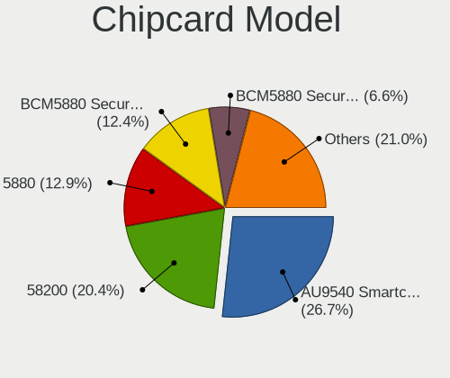

Ubuntu 22.04 - Tested Hardware & Statistics
-------------------------------------------

A project to collect tested hardware configurations for Ubuntu 22.04.

Anyone can contribute to this report by the [hw-probe](https://github.com/linuxhw/hw-probe) tool:

    sudo -E hw-probe -all -upload

Please contribute! Especially if your hardware is rare.

This is a report for all computer types. See also reports for [desktops](/Dist/Ubuntu_22.04/Desktop/README.md) and [notebooks](/Dist/Ubuntu_22.04/Notebook/README.md).

Contents
--------

* [ Test Cases ](#test-cases)

* [ System ](#system)
  - [ Kernel                   ](#kernel)
  - [ Kernel Family            ](#kernel-family)
  - [ Kernel Major Ver.        ](#kernel-major-ver)
  - [ Arch                     ](#arch)
  - [ DE                       ](#de)
  - [ Display Server           ](#display-server)
  - [ Display Manager          ](#display-manager)
  - [ OS Lang                  ](#os-lang)
  - [ Boot Mode                ](#boot-mode)
  - [ Filesystem               ](#filesystem)
  - [ Part. scheme             ](#part-scheme)
  - [ Dual Boot with Linux/BSD ](#dual-boot-with-linuxbsd)
  - [ Dual Boot (Win)          ](#dual-boot-win)

* [ Board ](#board)
  - [ Vendor                   ](#vendor)
  - [ Model                    ](#model)
  - [ Model Family             ](#model-family)
  - [ MFG Year                 ](#mfg-year)
  - [ Form Factor              ](#form-factor)
  - [ Secure Boot              ](#secure-boot)
  - [ Coreboot                 ](#coreboot)
  - [ RAM Size                 ](#ram-size)
  - [ RAM Used                 ](#ram-used)
  - [ Total Drives             ](#total-drives)
  - [ Has CD-ROM               ](#has-cd-rom)
  - [ Has Ethernet             ](#has-ethernet)
  - [ Has WiFi                 ](#has-wifi)
  - [ Has Bluetooth            ](#has-bluetooth)

* [ Location ](#location)
  - [ Country                  ](#country)
  - [ City                     ](#city)

* [ Drives ](#drives)
  - [ Drive Vendor             ](#drive-vendor)
  - [ Drive Model              ](#drive-model)
  - [ HDD Vendor               ](#hdd-vendor)
  - [ SSD Vendor               ](#ssd-vendor)
  - [ Drive Kind               ](#drive-kind)
  - [ Drive Connector          ](#drive-connector)
  - [ Drive Size               ](#drive-size)
  - [ Space Total              ](#space-total)
  - [ Space Used               ](#space-used)
  - [ Malfunc. Drives          ](#malfunc-drives)
  - [ Malfunc. Drive Vendor    ](#malfunc-drive-vendor)
  - [ Malfunc. HDD Vendor      ](#malfunc-hdd-vendor)
  - [ Malfunc. Drive Kind      ](#malfunc-drive-kind)
  - [ Failed Drives            ](#failed-drives)
  - [ Failed Drive Vendor      ](#failed-drive-vendor)
  - [ Drive Status             ](#drive-status)

* [ Storage controller ](#storage-controller)
  - [ Storage Vendor           ](#storage-vendor)
  - [ Storage Model            ](#storage-model)
  - [ Storage Kind             ](#storage-kind)

* [ Processor ](#processor)
  - [ CPU Vendor               ](#cpu-vendor)
  - [ CPU Model                ](#cpu-model)
  - [ CPU Model Family         ](#cpu-model-family)
  - [ CPU Cores                ](#cpu-cores)
  - [ CPU Sockets              ](#cpu-sockets)
  - [ CPU Threads              ](#cpu-threads)
  - [ CPU Op-Modes             ](#cpu-op-modes)
  - [ CPU Microcode            ](#cpu-microcode)
  - [ CPU Microarch            ](#cpu-microarch)

* [ Graphics ](#graphics)
  - [ GPU Vendor               ](#gpu-vendor)
  - [ GPU Model                ](#gpu-model)
  - [ GPU Combo                ](#gpu-combo)
  - [ GPU Driver               ](#gpu-driver)
  - [ GPU Memory               ](#gpu-memory)

* [ Monitor ](#monitor)
  - [ Monitor Vendor           ](#monitor-vendor)
  - [ Monitor Model            ](#monitor-model)
  - [ Monitor Resolution       ](#monitor-resolution)
  - [ Monitor Diagonal         ](#monitor-diagonal)
  - [ Monitor Width            ](#monitor-width)
  - [ Aspect Ratio             ](#aspect-ratio)
  - [ Monitor Area             ](#monitor-area)
  - [ Pixel Density            ](#pixel-density)
  - [ Multiple Monitors        ](#multiple-monitors)

* [ Network ](#network)
  - [ Net Controller Vendor    ](#net-controller-vendor)
  - [ Net Controller Model     ](#net-controller-model)
  - [ Wireless Vendor          ](#wireless-vendor)
  - [ Wireless Model           ](#wireless-model)
  - [ Ethernet Vendor          ](#ethernet-vendor)
  - [ Ethernet Model           ](#ethernet-model)
  - [ Net Controller Kind      ](#net-controller-kind)
  - [ Used Controller          ](#used-controller)
  - [ NICs                     ](#nics)
  - [ IPv6                     ](#ipv6)

* [ Bluetooth ](#bluetooth)
  - [ Bluetooth Vendor         ](#bluetooth-vendor)
  - [ Bluetooth Model          ](#bluetooth-model)

* [ Sound ](#sound)
  - [ Sound Vendor             ](#sound-vendor)
  - [ Sound Model              ](#sound-model)

* [ Memory ](#memory)
  - [ Memory Vendor            ](#memory-vendor)
  - [ Memory Model             ](#memory-model)
  - [ Memory Kind              ](#memory-kind)
  - [ Memory Form Factor       ](#memory-form-factor)
  - [ Memory Size              ](#memory-size)
  - [ Memory Speed             ](#memory-speed)

* [ Printers & scanners ](#printers--scanners)
  - [ Printer Vendor           ](#printer-vendor)
  - [ Printer Model            ](#printer-model)
  - [ Scanner Vendor           ](#scanner-vendor)
  - [ Scanner Model            ](#scanner-model)

* [ Camera ](#camera)
  - [ Camera Vendor            ](#camera-vendor)
  - [ Camera Model             ](#camera-model)

* [ Security ](#security)
  - [ Fingerprint Vendor       ](#fingerprint-vendor)
  - [ Fingerprint Model        ](#fingerprint-model)
  - [ Chipcard Vendor          ](#chipcard-vendor)
  - [ Chipcard Model           ](#chipcard-model)

* [ Unsupported ](#unsupported)
  - [ Unsupported Devices      ](#unsupported-devices)
  - [ Unsupported Device Types ](#unsupported-device-types)

Test Cases
----------

Total: 15963

| Vendor        | Model                       | Form-Factor | Probe                                                      | Date         |
|---------------|-----------------------------|-------------|------------------------------------------------------------|--------------|
| HP            | ProBook 650 G8 Notebook ... | Notebook    | [b11a7b69f0](https://linux-hardware.org/?probe=b11a7b69f0) | Sep 07, 2023 |
| Lenovo        | Legion Y7000P IRH8 82YA     | Notebook    | [9ebc45f613](https://linux-hardware.org/?probe=9ebc45f613) | Sep 07, 2023 |
| Apple         | MacBookPro8,1               | Notebook    | [f913de368f](https://linux-hardware.org/?probe=f913de368f) | Sep 07, 2023 |
| ASUSTek       | X453MA                      | Notebook    | [c48759c297](https://linux-hardware.org/?probe=c48759c297) | Sep 07, 2023 |
| Apple         | MacBookPro8,1               | Notebook    | [423b8d7135](https://linux-hardware.org/?probe=423b8d7135) | Sep 07, 2023 |
| Lenovo        | IdeaPad 530S-14IKB 81EU     | Notebook    | [0ca7d43ae9](https://linux-hardware.org/?probe=0ca7d43ae9) | Sep 07, 2023 |
| MSI           | MAG B550 TOMAHAWK           | Desktop     | [f8453df937](https://linux-hardware.org/?probe=f8453df937) | Sep 07, 2023 |
| Dell          | Precision M6800             | Notebook    | [b50e95f460](https://linux-hardware.org/?probe=b50e95f460) | Sep 07, 2023 |
| Lenovo        | G565 20071                  | Notebook    | [786aafb0e9](https://linux-hardware.org/?probe=786aafb0e9) | Sep 07, 2023 |
| Unknown       | Unknown                     | Desktop     | [59544c398a](https://linux-hardware.org/?probe=59544c398a) | Sep 07, 2023 |
| Dell          | Inspiron 1525               | Notebook    | [6b0747dcb4](https://linux-hardware.org/?probe=6b0747dcb4) | Sep 07, 2023 |
| HP            | 0B4Ch D                     | Desktop     | [1a2a0eef04](https://linux-hardware.org/?probe=1a2a0eef04) | Sep 06, 2023 |
| Dell          | Inspiron 1525               | Notebook    | [56a481c501](https://linux-hardware.org/?probe=56a481c501) | Sep 06, 2023 |
| HP            | 0B4Ch D                     | Desktop     | [e6c990ad64](https://linux-hardware.org/?probe=e6c990ad64) | Sep 06, 2023 |
| ASUSTek       | ZenBook Pro Duo UX582LR_... | Notebook    | [b2ba03726a](https://linux-hardware.org/?probe=b2ba03726a) | Sep 06, 2023 |
| realme        | RMNBXXXX                    | Notebook    | [6783f1d181](https://linux-hardware.org/?probe=6783f1d181) | Sep 06, 2023 |
| Apple         | MacBookAir8,2               | Notebook    | [e9e8da1eea](https://linux-hardware.org/?probe=e9e8da1eea) | Sep 06, 2023 |
| Dell          | Latitude E5450              | Notebook    | [1478760d8c](https://linux-hardware.org/?probe=1478760d8c) | Sep 06, 2023 |
| HP            | Pavilion Notebook           | Notebook    | [50777cde40](https://linux-hardware.org/?probe=50777cde40) | Sep 06, 2023 |
| realme        | RMNBXXXX                    | Notebook    | [9370483c5f](https://linux-hardware.org/?probe=9370483c5f) | Sep 06, 2023 |
| Sony          | VGN-AW41MF_H                | Notebook    | [d3a3262a6e](https://linux-hardware.org/?probe=d3a3262a6e) | Sep 06, 2023 |
| ASUSTek       | ROG STRIX B550-A GAMING     | Desktop     | [9d45d79cb0](https://linux-hardware.org/?probe=9d45d79cb0) | Sep 06, 2023 |
| Lenovo        | ThinkPad P1 20MD0014UK      | Notebook    | [428c816118](https://linux-hardware.org/?probe=428c816118) | Sep 06, 2023 |
| Dell          | Latitude 3520               | Notebook    | [0fa236983e](https://linux-hardware.org/?probe=0fa236983e) | Sep 06, 2023 |
| Gigabyte      | B650 AORUS ELITE AX         | Desktop     | [97bacd8975](https://linux-hardware.org/?probe=97bacd8975) | Sep 06, 2023 |
| ASUSTek       | P8H77-M                     | Desktop     | [ebc8d3e851](https://linux-hardware.org/?probe=ebc8d3e851) | Sep 06, 2023 |
| ASUSTek       | VivoBook_ASUSLaptop X571... | Notebook    | [2505f514b1](https://linux-hardware.org/?probe=2505f514b1) | Sep 06, 2023 |
| Supermicro    | X8DTU                       | Server      | [ceac91ff5e](https://linux-hardware.org/?probe=ceac91ff5e) | Sep 06, 2023 |
| Lenovo        | ThinkPad X380 Yoga 20LJS... | Convertible | [19d11f7098](https://linux-hardware.org/?probe=19d11f7098) | Sep 06, 2023 |
| Unknown       | Unknown                     | Desktop     | [c4829899c3](https://linux-hardware.org/?probe=c4829899c3) | Sep 06, 2023 |
| Intel         | H81                         | Desktop     | [5a16cea30a](https://linux-hardware.org/?probe=5a16cea30a) | Sep 06, 2023 |
| DFI           | CH960                       | Desktop     | [f0caeeeae0](https://linux-hardware.org/?probe=f0caeeeae0) | Sep 06, 2023 |
| ASUSTek       | B150M-PLUS                  | Desktop     | [a5a6f0acfb](https://linux-hardware.org/?probe=a5a6f0acfb) | Sep 06, 2023 |
| HP            | Elite x2 1012 G2            | Tablet      | [659838923d](https://linux-hardware.org/?probe=659838923d) | Sep 06, 2023 |
| HP            | Elite x2 1012 G2            | Tablet      | [1c4301b1ba](https://linux-hardware.org/?probe=1c4301b1ba) | Sep 06, 2023 |
| Supermicro    | X9DRW                       | Server      | [8108cf6d57](https://linux-hardware.org/?probe=8108cf6d57) | Sep 06, 2023 |
| Supermicro    | X9DRW                       | Desktop     | [01d640708d](https://linux-hardware.org/?probe=01d640708d) | Sep 06, 2023 |
| TUXEDO        | Unknown                     | Notebook    | [1e6c412d84](https://linux-hardware.org/?probe=1e6c412d84) | Sep 06, 2023 |
| HP            | ENVY x360 Convertible 13... | Convertible | [b1f7a8316d](https://linux-hardware.org/?probe=b1f7a8316d) | Sep 06, 2023 |
| ASUSTek       | ROG STRIX B550-F GAMING ... | Desktop     | [586f1d2fa7](https://linux-hardware.org/?probe=586f1d2fa7) | Sep 06, 2023 |
| Dell          | 0VNP2H A00                  | Desktop     | [04e5805a67](https://linux-hardware.org/?probe=04e5805a67) | Sep 06, 2023 |
| VALE          | Notebook Classic C140       | Notebook    | [c2e792fccf](https://linux-hardware.org/?probe=c2e792fccf) | Sep 06, 2023 |
| VALE          | Notebook Classic C140       | Notebook    | [fb00b74b14](https://linux-hardware.org/?probe=fb00b74b14) | Sep 06, 2023 |
| VALE          | Notebook Classic C140       | Notebook    | [675a9e9b79](https://linux-hardware.org/?probe=675a9e9b79) | Sep 06, 2023 |
| Acer          | Aspire 5733Z                | Notebook    | [bc3d42d633](https://linux-hardware.org/?probe=bc3d42d633) | Sep 06, 2023 |
| MSI           | MPG X570 GAMING PLUS        | Desktop     | [f04f6fc2a6](https://linux-hardware.org/?probe=f04f6fc2a6) | Sep 06, 2023 |
| Dell          | G3 3500                     | Notebook    | [5da26d2241](https://linux-hardware.org/?probe=5da26d2241) | Sep 06, 2023 |
| ASUSTek       | VivoBook_ASUSLaptop K650... | Notebook    | [f50ce96f55](https://linux-hardware.org/?probe=f50ce96f55) | Sep 06, 2023 |
| Sony          | SVE1712C5E                  | Notebook    | [a5c77b2450](https://linux-hardware.org/?probe=a5c77b2450) | Sep 06, 2023 |
| HP            | ENVY x360 Convertible 13... | Convertible | [79328b47d8](https://linux-hardware.org/?probe=79328b47d8) | Sep 05, 2023 |
| ASUSTek       | X99-DELUXE                  | Desktop     | [0035cdf446](https://linux-hardware.org/?probe=0035cdf446) | Sep 05, 2023 |
| Sony          | SVE1712C5E                  | Notebook    | [f864c8e44a](https://linux-hardware.org/?probe=f864c8e44a) | Sep 05, 2023 |
| ASUSTek       | ROG Strix G713PV_G713PV     | Notebook    | [cac93ead6f](https://linux-hardware.org/?probe=cac93ead6f) | Sep 05, 2023 |
| ASRock        | N68C-S UCC                  | Desktop     | [c2e1fe7134](https://linux-hardware.org/?probe=c2e1fe7134) | Sep 05, 2023 |
| Lenovo        | Legion 5 Pro 16IAH7H 82R... | Notebook    | [9d86c0f6e5](https://linux-hardware.org/?probe=9d86c0f6e5) | Sep 05, 2023 |
| Lenovo        | IdeaPad 310-15ISK 80SM      | Notebook    | [a17f1582d4](https://linux-hardware.org/?probe=a17f1582d4) | Sep 05, 2023 |
| HUAWEI        | BoDE-WXX9                   | Notebook    | [06a65572fe](https://linux-hardware.org/?probe=06a65572fe) | Sep 05, 2023 |
| Gateway       | NE56R                       | Notebook    | [be83386f4d](https://linux-hardware.org/?probe=be83386f4d) | Sep 05, 2023 |
| DFI           | CH960                       | Desktop     | [29c9bcf1ed](https://linux-hardware.org/?probe=29c9bcf1ed) | Sep 05, 2023 |
| ASUSTek       | SABERTOOTH X58              | Desktop     | [9139773ff9](https://linux-hardware.org/?probe=9139773ff9) | Sep 05, 2023 |
| Dell          | Precision 7740              | Notebook    | [392ca47879](https://linux-hardware.org/?probe=392ca47879) | Sep 05, 2023 |
| HP            | EliteBook 845 14 inch G9... | Notebook    | [30bf3f1f45](https://linux-hardware.org/?probe=30bf3f1f45) | Sep 05, 2023 |
| ASUSTek       | PRIME B450M-GAMING/BR       | Desktop     | [190675e9f1](https://linux-hardware.org/?probe=190675e9f1) | Sep 05, 2023 |
| Lenovo        | IdeaPad 320-15IKB 81BG      | Notebook    | [5728a3a48b](https://linux-hardware.org/?probe=5728a3a48b) | Sep 05, 2023 |
| Lenovo        | IdeaPad 320-15IKB 81BG      | Notebook    | [fdecc11aba](https://linux-hardware.org/?probe=fdecc11aba) | Sep 05, 2023 |
| Notebook      | NL5xNU                      | Notebook    | [306dab3d42](https://linux-hardware.org/?probe=306dab3d42) | Sep 05, 2023 |
| Dell          | Precision 7670              | Notebook    | [41bb07b203](https://linux-hardware.org/?probe=41bb07b203) | Sep 05, 2023 |
| Dell          | 0PTTT9 A01                  | Desktop     | [2c7accd18e](https://linux-hardware.org/?probe=2c7accd18e) | Sep 05, 2023 |
| Lenovo        | Legion Y7000P IRH8 82YA     | Notebook    | [235e80247e](https://linux-hardware.org/?probe=235e80247e) | Sep 05, 2023 |
| Toshiba       | Satellite L455D             | Notebook    | [1d49ff24ad](https://linux-hardware.org/?probe=1d49ff24ad) | Sep 05, 2023 |
| Apple         | MacBookPro16,3              | Notebook    | [7f61d6c898](https://linux-hardware.org/?probe=7f61d6c898) | Sep 05, 2023 |
| Dell          | 073MMW A02                  | Desktop     | [5b5728ae8d](https://linux-hardware.org/?probe=5b5728ae8d) | Sep 05, 2023 |
| AZW           | MINI S                      | Desktop     | [a2a1414ea6](https://linux-hardware.org/?probe=a2a1414ea6) | Sep 05, 2023 |
| HP            | EliteBook 8470p             | Notebook    | [a658addd87](https://linux-hardware.org/?probe=a658addd87) | Sep 05, 2023 |
| Apple         | MacBookPro16,2              | Notebook    | [b47ac62db2](https://linux-hardware.org/?probe=b47ac62db2) | Sep 05, 2023 |
| Lenovo        | ThinkPad L380 Yoga 20M70... | Convertible | [245441c639](https://linux-hardware.org/?probe=245441c639) | Sep 05, 2023 |
| HP            | ProBook 6550b               | Notebook    | [5881531377](https://linux-hardware.org/?probe=5881531377) | Sep 05, 2023 |
| Supermicro    | X9DRW                       | Server      | [0276a103dd](https://linux-hardware.org/?probe=0276a103dd) | Sep 05, 2023 |
| ASUSTek       | M4A785-M                    | Desktop     | [0e073fb229](https://linux-hardware.org/?probe=0e073fb229) | Sep 05, 2023 |
| HONOR         | BRN-FXX                     | Notebook    | [381e87228c](https://linux-hardware.org/?probe=381e87228c) | Sep 04, 2023 |
| MSI           | B350 GAMING PRO CARBON      | Desktop     | [c2257ed5b8](https://linux-hardware.org/?probe=c2257ed5b8) | Sep 04, 2023 |
| ASUSTek       | PRIME B450M-GAMING/BR       | Desktop     | [bcd06888e4](https://linux-hardware.org/?probe=bcd06888e4) | Sep 04, 2023 |
| MSI           | Boston                      | Desktop     | [5e1b8aa70b](https://linux-hardware.org/?probe=5e1b8aa70b) | Sep 04, 2023 |
| Gigabyte      | Z390 AORUS PRO-CF           | Desktop     | [a9321ea88e](https://linux-hardware.org/?probe=a9321ea88e) | Sep 04, 2023 |
| ASUSTek       | ProArt X670E-CREATOR WIF... | Desktop     | [cda189c68a](https://linux-hardware.org/?probe=cda189c68a) | Sep 04, 2023 |
| HP            | ZBook 15 G2                 | Notebook    | [18d9c74d60](https://linux-hardware.org/?probe=18d9c74d60) | Sep 04, 2023 |
| HP            | EliteBook 8470p             | Notebook    | [5cb02e099f](https://linux-hardware.org/?probe=5cb02e099f) | Sep 04, 2023 |
| MSI           | Boston                      | Desktop     | [5ad763345c](https://linux-hardware.org/?probe=5ad763345c) | Sep 04, 2023 |
| HP            | Pavilion dv9500             | Notebook    | [653fbbb509](https://linux-hardware.org/?probe=653fbbb509) | Sep 04, 2023 |
| TUXEDO        | Pulse 15 Gen2               | Notebook    | [3dd77a8c87](https://linux-hardware.org/?probe=3dd77a8c87) | Sep 04, 2023 |
| Samsung       | 950XED                      | Notebook    | [3d8ba5a34c](https://linux-hardware.org/?probe=3d8ba5a34c) | Sep 04, 2023 |
| Supermicro    | X8DTT                       | Server      | [1dbd818a95](https://linux-hardware.org/?probe=1dbd818a95) | Sep 04, 2023 |
| Dell          | Vostro 15 5510              | Notebook    | [7223b751c4](https://linux-hardware.org/?probe=7223b751c4) | Sep 04, 2023 |
| HP            | ProLiant DL360 Gen9         | Server      | [5a772c1cbf](https://linux-hardware.org/?probe=5a772c1cbf) | Sep 04, 2023 |
| HP            | ProLiant DL360 Gen9         | Server      | [bbcfaaaaed](https://linux-hardware.org/?probe=bbcfaaaaed) | Sep 04, 2023 |
| Medion        | H110H4-EM                   | Desktop     | [e4752c330e](https://linux-hardware.org/?probe=e4752c330e) | Sep 04, 2023 |
| Dell          | 06X1TJ A00                  | Desktop     | [f24368d776](https://linux-hardware.org/?probe=f24368d776) | Sep 04, 2023 |
| Dell          | 06X1TJ A00                  | Desktop     | [f4fbaa8dd1](https://linux-hardware.org/?probe=f4fbaa8dd1) | Sep 04, 2023 |
| Lenovo        | ThinkPad X260 20F5S2WX0R    | Notebook    | [cb338af601](https://linux-hardware.org/?probe=cb338af601) | Sep 04, 2023 |
| Gigabyte      | B360HD3                     | Desktop     | [1242798344](https://linux-hardware.org/?probe=1242798344) | Sep 04, 2023 |
| ASUSTek       | VM42                        | Desktop     | [2869496e53](https://linux-hardware.org/?probe=2869496e53) | Sep 04, 2023 |
| Dell          | 05WNJ2 A02                  | Server      | [7b59f7f1d7](https://linux-hardware.org/?probe=7b59f7f1d7) | Sep 04, 2023 |
| ASUSTek       | K73SV                       | Notebook    | [7d3f9fa0e5](https://linux-hardware.org/?probe=7d3f9fa0e5) | Sep 04, 2023 |
| Dell          | Precision 3581              | Notebook    | [739b270d83](https://linux-hardware.org/?probe=739b270d83) | Sep 04, 2023 |
| HP            | 250 15.6 inch G9 Noteboo... | Notebook    | [5128231fd7](https://linux-hardware.org/?probe=5128231fd7) | Sep 04, 2023 |
| Dynabook      | G83/HS                      | Notebook    | [9db149b715](https://linux-hardware.org/?probe=9db149b715) | Sep 04, 2023 |
| Toshiba       | dynabook VC72/M             | Convertible | [988d354b55](https://linux-hardware.org/?probe=988d354b55) | Sep 04, 2023 |
| Acer          | Veriton S2680G              | Desktop     | [e1fdce5232](https://linux-hardware.org/?probe=e1fdce5232) | Sep 04, 2023 |
| ASUSTek       | VivoBook_ASUSLaptop M160... | Notebook    | [ea096b699b](https://linux-hardware.org/?probe=ea096b699b) | Sep 04, 2023 |
| Acer          | Aspire A314-35              | Notebook    | [6edc4e910d](https://linux-hardware.org/?probe=6edc4e910d) | Sep 04, 2023 |
| Acer          | Aspire E1-572               | Notebook    | [5801580f1f](https://linux-hardware.org/?probe=5801580f1f) | Sep 04, 2023 |
| MSI           | Prestige 14Evo A12M         | Notebook    | [68bea64ed6](https://linux-hardware.org/?probe=68bea64ed6) | Sep 04, 2023 |
| HP            | ENVY 14 SPECTRE             | Notebook    | [1f0a26899c](https://linux-hardware.org/?probe=1f0a26899c) | Sep 04, 2023 |
| ECS           | Nettle2                     | Desktop     | [8492f01e46](https://linux-hardware.org/?probe=8492f01e46) | Sep 04, 2023 |
| ASUSTek       | SABERTOOTH X58              | Desktop     | [edc8896f06](https://linux-hardware.org/?probe=edc8896f06) | Sep 04, 2023 |
| ASRock        | A520M-HDV                   | Desktop     | [8da6b89260](https://linux-hardware.org/?probe=8da6b89260) | Sep 04, 2023 |
| ASUSTek       | M5A78L-M/USB3               | Desktop     | [15826e3d9e](https://linux-hardware.org/?probe=15826e3d9e) | Sep 04, 2023 |
| Samsung       | RV415                       | Notebook    | [dc6aa3101f](https://linux-hardware.org/?probe=dc6aa3101f) | Sep 03, 2023 |
| ASUSTek       | TUF Gaming X670E-PLUS       | Desktop     | [0eff1074a1](https://linux-hardware.org/?probe=0eff1074a1) | Sep 03, 2023 |
| HP            | 240 G3                      | Notebook    | [24381b91f7](https://linux-hardware.org/?probe=24381b91f7) | Sep 03, 2023 |
| HUAWEI        | BOM-WXX9                    | Notebook    | [6b895a5320](https://linux-hardware.org/?probe=6b895a5320) | Sep 03, 2023 |
| Intel         | S5500BC E25124-456          | Server      | [f7e5a67d41](https://linux-hardware.org/?probe=f7e5a67d41) | Sep 03, 2023 |
| ASUSTek       | ASUSLaptop_Q540VJ           | Notebook    | [39ed316bb6](https://linux-hardware.org/?probe=39ed316bb6) | Sep 03, 2023 |
| Gigabyte      | B550M DS3H                  | Desktop     | [b8a2b22a6c](https://linux-hardware.org/?probe=b8a2b22a6c) | Sep 03, 2023 |
| AMI           | Aptio CRB                   | Mini pc     | [e9512e994e](https://linux-hardware.org/?probe=e9512e994e) | Sep 03, 2023 |
| IP3 Techno... | ARN59P                      | Notebook    | [493a986305](https://linux-hardware.org/?probe=493a986305) | Sep 03, 2023 |
| AMI           | Aptio CRB                   | Mini pc     | [235744f7fa](https://linux-hardware.org/?probe=235744f7fa) | Sep 03, 2023 |
| Dell          | Latitude E6400              | Notebook    | [88a04ab4b8](https://linux-hardware.org/?probe=88a04ab4b8) | Sep 03, 2023 |
| Dell          | Latitude E6400              | Notebook    | [56cc7d7a27](https://linux-hardware.org/?probe=56cc7d7a27) | Sep 03, 2023 |
| Samsung       | R510/P510                   | Notebook    | [fa457144d5](https://linux-hardware.org/?probe=fa457144d5) | Sep 03, 2023 |
| ASUSTek       | M5A97 EVO R2.0              | Desktop     | [493d16ff67](https://linux-hardware.org/?probe=493d16ff67) | Sep 03, 2023 |
| Dell          | Latitude 5490               | Notebook    | [392d7335ed](https://linux-hardware.org/?probe=392d7335ed) | Sep 03, 2023 |
| Acer          | Swift SF314-42              | Notebook    | [89dcb5988f](https://linux-hardware.org/?probe=89dcb5988f) | Sep 03, 2023 |
| ASUSTek       | PRIME X470-PRO              | Desktop     | [35e2cffa7f](https://linux-hardware.org/?probe=35e2cffa7f) | Sep 03, 2023 |
| Apple         | Mac-27ADBB7B4CEE8E61 iMa... | All in one  | [c6a4b0aca9](https://linux-hardware.org/?probe=c6a4b0aca9) | Sep 03, 2023 |
| HP            | EliteBook 850 G3            | Notebook    | [0778936f6b](https://linux-hardware.org/?probe=0778936f6b) | Sep 03, 2023 |
| Acer          | Swift SF314-42              | Notebook    | [8552bc9508](https://linux-hardware.org/?probe=8552bc9508) | Sep 03, 2023 |
| Apple         | MacBookPro8,1               | Notebook    | [6cbaac077e](https://linux-hardware.org/?probe=6cbaac077e) | Sep 03, 2023 |
| Unknown       | Unknown                     | Notebook    | [8585671bfb](https://linux-hardware.org/?probe=8585671bfb) | Sep 03, 2023 |
| Unknown       | Unknown                     | Notebook    | [8d7616fae8](https://linux-hardware.org/?probe=8d7616fae8) | Sep 03, 2023 |
| Dell          | XPS 15 9570                 | Notebook    | [9607f36921](https://linux-hardware.org/?probe=9607f36921) | Sep 03, 2023 |
| HP            | Pavilion dv4                | Notebook    | [8d183fb271](https://linux-hardware.org/?probe=8d183fb271) | Sep 03, 2023 |
| Samsung       | Galaxy Book 12 LTE          | Tablet      | [1e52631ae6](https://linux-hardware.org/?probe=1e52631ae6) | Sep 03, 2023 |
| Dell          | XPS 15 9570                 | Notebook    | [72c5c271b6](https://linux-hardware.org/?probe=72c5c271b6) | Sep 03, 2023 |
| Apple         | MacBookAir5,1               | Notebook    | [57bb5d91ab](https://linux-hardware.org/?probe=57bb5d91ab) | Sep 03, 2023 |
| AZW           | U59                         | Desktop     | [98e1e109a5](https://linux-hardware.org/?probe=98e1e109a5) | Sep 03, 2023 |
| Lenovo        | IdeaPad Gaming 3 16ARH7 ... | Notebook    | [13ea608a94](https://linux-hardware.org/?probe=13ea608a94) | Sep 03, 2023 |
| Intel         | DG31PR AAD97573-301         | Desktop     | [359e7817c3](https://linux-hardware.org/?probe=359e7817c3) | Sep 03, 2023 |
| Lenovo        | IdeaPad 300-15ISK 80Q7      | Notebook    | [5f73c55303](https://linux-hardware.org/?probe=5f73c55303) | Sep 03, 2023 |
| Gigabyte      | Z690 AORUS ELITE DDR4       | Desktop     | [7e7d27d9f2](https://linux-hardware.org/?probe=7e7d27d9f2) | Sep 03, 2023 |
| Acer          | Aspire E1-572               | Notebook    | [e91fdf4fbe](https://linux-hardware.org/?probe=e91fdf4fbe) | Sep 03, 2023 |
| Lenovo        | IdeaPad Flex-14API 81SS     | Notebook    | [b9c93a8c15](https://linux-hardware.org/?probe=b9c93a8c15) | Sep 03, 2023 |
| VALE          | Notebook Classic C140       | Notebook    | [05b3dfb69a](https://linux-hardware.org/?probe=05b3dfb69a) | Sep 03, 2023 |
| ASRock        | Z77 Extreme4                | Desktop     | [1115c7ff24](https://linux-hardware.org/?probe=1115c7ff24) | Sep 03, 2023 |
| ASUSTek       | X55A                        | Notebook    | [1ba0e59208](https://linux-hardware.org/?probe=1ba0e59208) | Sep 03, 2023 |
| HP            | Pavilion Laptop 15-eh1xx... | Notebook    | [e04761c470](https://linux-hardware.org/?probe=e04761c470) | Sep 03, 2023 |
| Lenovo        | IdeaPad S540-13IML 81XA     | Notebook    | [246a993eb7](https://linux-hardware.org/?probe=246a993eb7) | Sep 02, 2023 |
| Gigabyte      | P67A-UD3P-B3                | Desktop     | [cf62b3f40c](https://linux-hardware.org/?probe=cf62b3f40c) | Sep 02, 2023 |
| Unknown       | Unknown                     | Notebook    | [c72be678a2](https://linux-hardware.org/?probe=c72be678a2) | Sep 02, 2023 |
| HP            | Laptop 15s-eq3xxx           | Notebook    | [399abaa799](https://linux-hardware.org/?probe=399abaa799) | Sep 02, 2023 |
| ASUSTek       | PRIME B760M-A WIFI D4       | Desktop     | [f2eccf0aa8](https://linux-hardware.org/?probe=f2eccf0aa8) | Sep 02, 2023 |
| MSI           | MAG B650M MORTAR WIFI       | Desktop     | [1b5109eb83](https://linux-hardware.org/?probe=1b5109eb83) | Sep 02, 2023 |
| ASUSTek       | Acacia                      | Desktop     | [78b7252269](https://linux-hardware.org/?probe=78b7252269) | Sep 02, 2023 |
| Lenovo        | SDK0E50510 WIN              | Desktop     | [84cd7c1a93](https://linux-hardware.org/?probe=84cd7c1a93) | Sep 02, 2023 |
| Dell          | Latitude 5500               | Notebook    | [77e18d6323](https://linux-hardware.org/?probe=77e18d6323) | Sep 02, 2023 |
| ASUSTek       | ROG Maximus XII EXTREME     | Desktop     | [7cfd1c36d1](https://linux-hardware.org/?probe=7cfd1c36d1) | Sep 02, 2023 |
| Intel         | NUC11PABi7 M68262-501       | Mini pc     | [59677d7116](https://linux-hardware.org/?probe=59677d7116) | Sep 02, 2023 |
| Lenovo        | ThinkPad T520 42435JG       | Notebook    | [aad827567e](https://linux-hardware.org/?probe=aad827567e) | Sep 02, 2023 |
| ASRock        | Z370M Pro4                  | Desktop     | [b50da6446a](https://linux-hardware.org/?probe=b50da6446a) | Sep 02, 2023 |
| Lenovo        | V130-15IGM 81HL             | Notebook    | [aa1ec8baed](https://linux-hardware.org/?probe=aa1ec8baed) | Sep 02, 2023 |
| Lenovo        | V130-15IGM 81HL             | Notebook    | [38371fb896](https://linux-hardware.org/?probe=38371fb896) | Sep 02, 2023 |
| Samsung       | 530XBB                      | Notebook    | [30365848c4](https://linux-hardware.org/?probe=30365848c4) | Sep 02, 2023 |
| ASUSTek       | SABERTOOTH X58              | Desktop     | [0c99b66fde](https://linux-hardware.org/?probe=0c99b66fde) | Sep 02, 2023 |
| Dell          | Latitude 7400               | Notebook    | [c98434cc21](https://linux-hardware.org/?probe=c98434cc21) | Sep 02, 2023 |
| ASUSTek       | H110M-R                     | Desktop     | [ab9746582a](https://linux-hardware.org/?probe=ab9746582a) | Sep 02, 2023 |
| ASUSTek       | H110M-R                     | Desktop     | [091c787432](https://linux-hardware.org/?probe=091c787432) | Sep 02, 2023 |
| Apple         | MacBookPro11,1              | Notebook    | [edca0e0264](https://linux-hardware.org/?probe=edca0e0264) | Sep 02, 2023 |
| Lenovo        | ThinkPad W510 438923U       | Notebook    | [b0648eccac](https://linux-hardware.org/?probe=b0648eccac) | Sep 02, 2023 |
| Lenovo        | SHARKBAY NOK                | Desktop     | [6fb1aaaab8](https://linux-hardware.org/?probe=6fb1aaaab8) | Sep 02, 2023 |
| Sony          | SVE1513I4E                  | Notebook    | [a1009ff0be](https://linux-hardware.org/?probe=a1009ff0be) | Sep 02, 2023 |
| Dell          | 06X1TJ A00                  | Desktop     | [ef4c22cc94](https://linux-hardware.org/?probe=ef4c22cc94) | Sep 01, 2023 |
| Toshiba       | Satellite C660              | Notebook    | [d3c3b72e39](https://linux-hardware.org/?probe=d3c3b72e39) | Sep 01, 2023 |
| Pegatron      | 2AD5                        | Desktop     | [644b70347e](https://linux-hardware.org/?probe=644b70347e) | Sep 01, 2023 |
| MSI           | MPG Z390 GAMING PLUS        | Desktop     | [2c9f663c14](https://linux-hardware.org/?probe=2c9f663c14) | Sep 01, 2023 |
| Acer          | Aspire 7740                 | Notebook    | [1ab9e5eddb](https://linux-hardware.org/?probe=1ab9e5eddb) | Sep 01, 2023 |
| MSI           | MAG Z790 TOMAHAWK WIFI      | Desktop     | [da16406c15](https://linux-hardware.org/?probe=da16406c15) | Sep 01, 2023 |
| Apple         | Mac-27ADBB7B4CEE8E61 iMa... | All in one  | [bb0b1a142a](https://linux-hardware.org/?probe=bb0b1a142a) | Sep 01, 2023 |
| MSI           | A320M PRO-M2 V2             | Desktop     | [35a0110255](https://linux-hardware.org/?probe=35a0110255) | Sep 01, 2023 |
| HP            | 82F1                        | Desktop     | [2b601bfc6a](https://linux-hardware.org/?probe=2b601bfc6a) | Sep 01, 2023 |
| HP            | 82F1                        | Desktop     | [fe3e193418](https://linux-hardware.org/?probe=fe3e193418) | Sep 01, 2023 |
| libre-comp... | aml-s905x-cc                | Soc         | [a4356f45fe](https://linux-hardware.org/?probe=a4356f45fe) | Sep 01, 2023 |
| Dell          | Inspiron 15 3511            | Notebook    | [d2f04fdc9e](https://linux-hardware.org/?probe=d2f04fdc9e) | Sep 01, 2023 |
| ASRock        | B450M-HDV                   | Desktop     | [3b02e0db71](https://linux-hardware.org/?probe=3b02e0db71) | Sep 01, 2023 |
| Lenovo        | ThinkPad P14s Gen 2i 20V... | Notebook    | [aefedc3b34](https://linux-hardware.org/?probe=aefedc3b34) | Sep 01, 2023 |
| HP            | EliteBook 840 G3            | Notebook    | [929ae155ea](https://linux-hardware.org/?probe=929ae155ea) | Sep 01, 2023 |
| ASUSTek       | P5Q SE                      | Desktop     | [288078e39e](https://linux-hardware.org/?probe=288078e39e) | Sep 01, 2023 |
| Acer          | Veriton S2680G              | Desktop     | [17206d19f9](https://linux-hardware.org/?probe=17206d19f9) | Sep 01, 2023 |
| HP            | ENVY x360 Convertible 13... | Convertible | [ba837274bd](https://linux-hardware.org/?probe=ba837274bd) | Sep 01, 2023 |
| HP            | EliteBook 840 G8 Noteboo... | Notebook    | [d4335c9520](https://linux-hardware.org/?probe=d4335c9520) | Sep 01, 2023 |
| Sony          | SVE1513I4E                  | Notebook    | [404c008e41](https://linux-hardware.org/?probe=404c008e41) | Sep 01, 2023 |
| Lenovo        | Legion R9000P2021H 82JQ     | Notebook    | [1e7179e4f0](https://linux-hardware.org/?probe=1e7179e4f0) | Sep 01, 2023 |
| Dell          | 00V62H A01                  | Desktop     | [f3c99a0cc5](https://linux-hardware.org/?probe=f3c99a0cc5) | Sep 01, 2023 |
| Intel         | NUC11PABi7 K90104-302       | Mini pc     | [4cb96ee770](https://linux-hardware.org/?probe=4cb96ee770) | Sep 01, 2023 |
| Dell          | 09KPNV A01                  | Desktop     | [2d7e76e864](https://linux-hardware.org/?probe=2d7e76e864) | Sep 01, 2023 |
| Dell          | Vostro 3550                 | Notebook    | [c9431922ba](https://linux-hardware.org/?probe=c9431922ba) | Sep 01, 2023 |
| Toshiba       | Satellite P55t-C            | Notebook    | [3dd1896d54](https://linux-hardware.org/?probe=3dd1896d54) | Sep 01, 2023 |
| Dell          | Inspiron 5579               | Notebook    | [14fa68270f](https://linux-hardware.org/?probe=14fa68270f) | Sep 01, 2023 |
| Lenovo        | ThinkPad T440p 20AWS1BL0... | Notebook    | [f1e1512fc9](https://linux-hardware.org/?probe=f1e1512fc9) | Sep 01, 2023 |
| Unknown       | Orange Pi 5 Plus            | Soc         | [d675d2e459](https://linux-hardware.org/?probe=d675d2e459) | Sep 01, 2023 |
| ASUSTek       | PRIME B550M-A AC            | Desktop     | [da19202792](https://linux-hardware.org/?probe=da19202792) | Sep 01, 2023 |
| HP            | ZBook 15                    | Notebook    | [8a20670725](https://linux-hardware.org/?probe=8a20670725) | Sep 01, 2023 |
| ASUSTek       | PRIME B550M-A AC            | Desktop     | [e65f42e0d6](https://linux-hardware.org/?probe=e65f42e0d6) | Sep 01, 2023 |
| Maxtang       | BYT30                       | Desktop     | [6f7fa1fde6](https://linux-hardware.org/?probe=6f7fa1fde6) | Aug 31, 2023 |
| Lenovo        | NOK                         | Desktop     | [3b2d750004](https://linux-hardware.org/?probe=3b2d750004) | Aug 31, 2023 |
| HUAWEI        | MACH-WX9                    | Notebook    | [6f761aa23b](https://linux-hardware.org/?probe=6f761aa23b) | Aug 31, 2023 |
| HP            | EliteBook 840 G2            | Notebook    | [53bcd4ec72](https://linux-hardware.org/?probe=53bcd4ec72) | Aug 31, 2023 |
| Lenovo        | NOK                         | Desktop     | [0e10fff36a](https://linux-hardware.org/?probe=0e10fff36a) | Aug 31, 2023 |
| Lenovo        | ThinkPad X390 Yoga 20NQS... | Convertible | [b2b8a6ed8b](https://linux-hardware.org/?probe=b2b8a6ed8b) | Aug 31, 2023 |
| Lenovo        | ThinkPad X390 Yoga 20NQS... | Convertible | [aeb2ecfe12](https://linux-hardware.org/?probe=aeb2ecfe12) | Aug 31, 2023 |
| HP            | EliteBook 840 G3            | Notebook    | [3411b788bc](https://linux-hardware.org/?probe=3411b788bc) | Aug 31, 2023 |
| Lenovo        | IdeaPad 300-15ISK 80Q7      | Notebook    | [b900fd0bc7](https://linux-hardware.org/?probe=b900fd0bc7) | Aug 31, 2023 |
| HP            | ProBook 4530s               | Notebook    | [09fddaab4d](https://linux-hardware.org/?probe=09fddaab4d) | Aug 31, 2023 |
| Dell          | Latitude 7340               | Notebook    | [d6d1df94f5](https://linux-hardware.org/?probe=d6d1df94f5) | Aug 31, 2023 |
| TYAN Compu... | S8030GM2NE                  | Server      | [f20796c492](https://linux-hardware.org/?probe=f20796c492) | Aug 31, 2023 |
| HUAWEI        | MACHD-WXX9                  | Notebook    | [2e74e88e2f](https://linux-hardware.org/?probe=2e74e88e2f) | Aug 31, 2023 |
| Lenovo        | ThinkPad X220 4290EC5       | Notebook    | [d75bd4dfbd](https://linux-hardware.org/?probe=d75bd4dfbd) | Aug 31, 2023 |
| MACHINIST     | E5-D8-MAX V1.0              | Desktop     | [339734178a](https://linux-hardware.org/?probe=339734178a) | Aug 31, 2023 |
| TYAN Compu... | S8030GM2NE                  | Server      | [434c880abf](https://linux-hardware.org/?probe=434c880abf) | Aug 31, 2023 |
| Dell          | 0M5DCD A00                  | Desktop     | [dbc3edd473](https://linux-hardware.org/?probe=dbc3edd473) | Aug 31, 2023 |
| HP            | 3115m                       | Notebook    | [85325be2ba](https://linux-hardware.org/?probe=85325be2ba) | Aug 31, 2023 |
| Dell          | 0D6H9T A00                  | Desktop     | [9830dce088](https://linux-hardware.org/?probe=9830dce088) | Aug 31, 2023 |
| Lenovo        | ThinkPad T470s 20HGS0PA0... | Notebook    | [89caf6d252](https://linux-hardware.org/?probe=89caf6d252) | Aug 31, 2023 |
| MSI           | Thin GF63 12VE              | Notebook    | [0615d252af](https://linux-hardware.org/?probe=0615d252af) | Aug 31, 2023 |
| HP            | ProBook 455 15.6 inch G9... | Notebook    | [ae4d140b96](https://linux-hardware.org/?probe=ae4d140b96) | Aug 31, 2023 |
| Apple         | MacBookPro10,1              | Notebook    | [7741e9850b](https://linux-hardware.org/?probe=7741e9850b) | Aug 31, 2023 |
| ASUSTek       | ROG Strix G733PZ_G733PZ     | Notebook    | [33b5107930](https://linux-hardware.org/?probe=33b5107930) | Aug 31, 2023 |
| ASUSTek       | P5N-E SLI                   | Desktop     | [04688c03ea](https://linux-hardware.org/?probe=04688c03ea) | Aug 31, 2023 |
| ASUSTek       | P8B75-M                     | Desktop     | [4f8c86072b](https://linux-hardware.org/?probe=4f8c86072b) | Aug 31, 2023 |
| HP            | 89B5 A                      | Desktop     | [1364f50166](https://linux-hardware.org/?probe=1364f50166) | Aug 31, 2023 |
| Dell          | XPS 15 7590                 | Notebook    | [b423b914f7](https://linux-hardware.org/?probe=b423b914f7) | Aug 30, 2023 |
| Dell          | G15 5530                    | Notebook    | [1027c8fe19](https://linux-hardware.org/?probe=1027c8fe19) | Aug 30, 2023 |
| HP            | 82B4                        | Desktop     | [28155e6336](https://linux-hardware.org/?probe=28155e6336) | Aug 30, 2023 |
| HP            | ProLiant DL360 Gen9         | Server      | [10444e1cd3](https://linux-hardware.org/?probe=10444e1cd3) | Aug 30, 2023 |
| Supermicro    | X9DRW                       | Server      | [6b931a0ef2](https://linux-hardware.org/?probe=6b931a0ef2) | Aug 30, 2023 |
| Supermicro    | X9DRW                       | Desktop     | [a71700e059](https://linux-hardware.org/?probe=a71700e059) | Aug 30, 2023 |
| Alienware     | 0PGRP5 A02                  | Desktop     | [9a95d4ab16](https://linux-hardware.org/?probe=9a95d4ab16) | Aug 30, 2023 |
| HUAWEI        | BOM-WXX9                    | Notebook    | [ea587f2b2e](https://linux-hardware.org/?probe=ea587f2b2e) | Aug 30, 2023 |
| Lenovo        | ThinkPad T440s 20AQ007SM... | Notebook    | [0a55847393](https://linux-hardware.org/?probe=0a55847393) | Aug 30, 2023 |
| ASUSTek       | TUF Z270 MARK 2             | Desktop     | [2d74d46701](https://linux-hardware.org/?probe=2d74d46701) | Aug 30, 2023 |
| Supermicro    | X8DTT                       | Server      | [d1c898358d](https://linux-hardware.org/?probe=d1c898358d) | Aug 30, 2023 |
| Supermicro    | X9DRW                       | Desktop     | [1ff3234fa5](https://linux-hardware.org/?probe=1ff3234fa5) | Aug 30, 2023 |
| ASUSTek       | P8P67 PRO                   | Desktop     | [3740c90267](https://linux-hardware.org/?probe=3740c90267) | Aug 30, 2023 |
| ASRock        | B450M-HDV                   | Desktop     | [047f752404](https://linux-hardware.org/?probe=047f752404) | Aug 30, 2023 |
| Gigabyte      | EP35-DS3                    | Desktop     | [c317e9aa3a](https://linux-hardware.org/?probe=c317e9aa3a) | Aug 30, 2023 |
| Toshiba       | Satellite P50-B-113         | Notebook    | [a9f21477c8](https://linux-hardware.org/?probe=a9f21477c8) | Aug 30, 2023 |
| HP            | ZBook 15 G3                 | Notebook    | [d88312e34b](https://linux-hardware.org/?probe=d88312e34b) | Aug 30, 2023 |
| HP            | ZBook 15 G3                 | Notebook    | [7943c070cc](https://linux-hardware.org/?probe=7943c070cc) | Aug 30, 2023 |
| Dell          | Vostro 3550                 | Notebook    | [f120556c56](https://linux-hardware.org/?probe=f120556c56) | Aug 30, 2023 |
| ASUSTek       | ROG Strix G731GT_GL731GT    | Notebook    | [aac7eeec4e](https://linux-hardware.org/?probe=aac7eeec4e) | Aug 30, 2023 |
| HP            | EliteBook 840 G2            | Notebook    | [4f3d3f12a4](https://linux-hardware.org/?probe=4f3d3f12a4) | Aug 30, 2023 |
| Lenovo        | ThinkPad X1 Extreme Gen ... | Notebook    | [15c048cb00](https://linux-hardware.org/?probe=15c048cb00) | Aug 30, 2023 |
| Sony          | VGN-C15TP_W                 | Notebook    | [591d0b778e](https://linux-hardware.org/?probe=591d0b778e) | Aug 30, 2023 |
| Apple         | MacBookPro9,2               | Notebook    | [76805c8b77](https://linux-hardware.org/?probe=76805c8b77) | Aug 30, 2023 |
| ASUSTek       | M5A97 R2.0                  | Desktop     | [c1514e209a](https://linux-hardware.org/?probe=c1514e209a) | Aug 30, 2023 |
| Intel         | DH67CL AAG10212-206         | Desktop     | [e3f4b109ff](https://linux-hardware.org/?probe=e3f4b109ff) | Aug 30, 2023 |
| Apple         | MacBookPro9,2               | Notebook    | [cc6b5178f0](https://linux-hardware.org/?probe=cc6b5178f0) | Aug 30, 2023 |
| HUAWEI        | KLVD-WXX9                   | Notebook    | [98262b8471](https://linux-hardware.org/?probe=98262b8471) | Aug 30, 2023 |
| Pegatron      | 2AB6                        | Desktop     | [ed71da8f69](https://linux-hardware.org/?probe=ed71da8f69) | Aug 29, 2023 |
| Dell          | 0XHGV1 A01                  | Desktop     | [a5f30ecf01](https://linux-hardware.org/?probe=a5f30ecf01) | Aug 29, 2023 |
| Intel         | NUC11PABi7 K90104-302       | Mini pc     | [92492caa13](https://linux-hardware.org/?probe=92492caa13) | Aug 29, 2023 |
| HP            | 83EE                        | Desktop     | [d558afff67](https://linux-hardware.org/?probe=d558afff67) | Aug 29, 2023 |
| Lenovo        | ThinkPad W541 20EGS0N00H    | Notebook    | [ed94f8b9b9](https://linux-hardware.org/?probe=ed94f8b9b9) | Aug 29, 2023 |
| HP            | Stream Laptop 11-ak0xxx     | Notebook    | [64686e9027](https://linux-hardware.org/?probe=64686e9027) | Aug 29, 2023 |
| Supermicro    | X11DPG-QTA                  | Server      | [f2f86694d8](https://linux-hardware.org/?probe=f2f86694d8) | Aug 29, 2023 |
| HP            | Pavilion g6                 | Notebook    | [b1836fb080](https://linux-hardware.org/?probe=b1836fb080) | Aug 29, 2023 |
| HONOR         | NMH-WCX9                    | Notebook    | [6e4b12a41e](https://linux-hardware.org/?probe=6e4b12a41e) | Aug 29, 2023 |
| Lenovo        | ThinkPad E14 Gen 3 20Y70... | Notebook    | [8c492a4b3d](https://linux-hardware.org/?probe=8c492a4b3d) | Aug 29, 2023 |
| Huanan        | X99-4MT V1.0                | Desktop     | [b1ebbd0661](https://linux-hardware.org/?probe=b1ebbd0661) | Aug 29, 2023 |
| Colorful T... | CVN X570M GAMING PRO V14    | Desktop     | [187d930341](https://linux-hardware.org/?probe=187d930341) | Aug 29, 2023 |
| ASUSTek       | X550LD                      | Notebook    | [b866599fbc](https://linux-hardware.org/?probe=b866599fbc) | Aug 29, 2023 |
| HP            | Dragonfly 13.5 inch G4 N... | Notebook    | [9450749b35](https://linux-hardware.org/?probe=9450749b35) | Aug 29, 2023 |
| Gigabyte      | Z390 AORUS PRO WIFI-CF      | Desktop     | [2b9741ce87](https://linux-hardware.org/?probe=2b9741ce87) | Aug 29, 2023 |
| Dell          | 0KWVT8 A03                  | Desktop     | [04ee67e1ad](https://linux-hardware.org/?probe=04ee67e1ad) | Aug 29, 2023 |
| ASUSTek       | ROG Zephyrus G14 GA401IH... | Notebook    | [bf8f795045](https://linux-hardware.org/?probe=bf8f795045) | Aug 29, 2023 |
| Lenovo        | IdeaPad Gaming 3 15IAH7 ... | Notebook    | [d6bca74de6](https://linux-hardware.org/?probe=d6bca74de6) | Aug 29, 2023 |
| Apple         | MacBookPro11,3              | Notebook    | [561b652278](https://linux-hardware.org/?probe=561b652278) | Aug 29, 2023 |
| HP            | 255 G2                      | Notebook    | [23bf2dd515](https://linux-hardware.org/?probe=23bf2dd515) | Aug 29, 2023 |
| HP            | Pavilion x360 m3 Convert... | Convertible | [072a35b927](https://linux-hardware.org/?probe=072a35b927) | Aug 29, 2023 |
| Dell          | 0GXM1W A01                  | Desktop     | [00207aee12](https://linux-hardware.org/?probe=00207aee12) | Aug 29, 2023 |
| HP            | Pavilion x360 m3 Convert... | Convertible | [f52ec15364](https://linux-hardware.org/?probe=f52ec15364) | Aug 29, 2023 |
| MSI           | MAG B460M BAZOOKA           | Desktop     | [dcd9ab0f79](https://linux-hardware.org/?probe=dcd9ab0f79) | Aug 29, 2023 |
| HP            | 8448 1000                   | All in one  | [a2aff5eaa7](https://linux-hardware.org/?probe=a2aff5eaa7) | Aug 29, 2023 |
| Acer          | Aspire 5742                 | Notebook    | [9bbb56c640](https://linux-hardware.org/?probe=9bbb56c640) | Aug 29, 2023 |
| Sony          | VPCEA36FX                   | Notebook    | [174aefbf35](https://linux-hardware.org/?probe=174aefbf35) | Aug 29, 2023 |
| HP            | Pavilion Laptop 15t-eg30... | Notebook    | [aa2e067c2d](https://linux-hardware.org/?probe=aa2e067c2d) | Aug 29, 2023 |
| ASUSTek       | X580VD                      | Notebook    | [c8bed4c7e6](https://linux-hardware.org/?probe=c8bed4c7e6) | Aug 29, 2023 |
| Lenovo        | IdeaPad Slim 3 14ABR8 82... | Notebook    | [4fa3f56511](https://linux-hardware.org/?probe=4fa3f56511) | Aug 29, 2023 |
| Lenovo        | IdeaPad Slim 3 14ABR8 82... | Notebook    | [9bf240bf4d](https://linux-hardware.org/?probe=9bf240bf4d) | Aug 29, 2023 |
| Gigabyte      | X470 AORUS ULTRA GAMING-... | Desktop     | [d97cedcf3c](https://linux-hardware.org/?probe=d97cedcf3c) | Aug 28, 2023 |
| HP            | ZBook 14 G2                 | Notebook    | [e56fcd0532](https://linux-hardware.org/?probe=e56fcd0532) | Aug 28, 2023 |
| Gigabyte      | B550 AORUS ELITE AX V2      | Desktop     | [fe9f235c26](https://linux-hardware.org/?probe=fe9f235c26) | Aug 28, 2023 |
| Lenovo        | Legion 5 Pro 16ACH6H 82J... | Notebook    | [87b94b4ea0](https://linux-hardware.org/?probe=87b94b4ea0) | Aug 28, 2023 |
| Intel         | DX79SR AAG57199-200         | Desktop     | [418a709636](https://linux-hardware.org/?probe=418a709636) | Aug 28, 2023 |
| MSI           | Katana GF66 12UGS           | Notebook    | [ca352a81f4](https://linux-hardware.org/?probe=ca352a81f4) | Aug 28, 2023 |
| HP            | Pavilion g6                 | Notebook    | [8d874b796c](https://linux-hardware.org/?probe=8d874b796c) | Aug 28, 2023 |
| HP            | Pavilion g6                 | Notebook    | [42bade556f](https://linux-hardware.org/?probe=42bade556f) | Aug 28, 2023 |
| ASUSTek       | K401UB                      | Notebook    | [14a7bf0f59](https://linux-hardware.org/?probe=14a7bf0f59) | Aug 28, 2023 |
| AZW           | GK mini                     | Mini pc     | [64b25422b0](https://linux-hardware.org/?probe=64b25422b0) | Aug 28, 2023 |
| Dell          | Latitude E7240              | Notebook    | [1eab9b5f8d](https://linux-hardware.org/?probe=1eab9b5f8d) | Aug 28, 2023 |
| Lenovo        | Legion 5 15ACH6H 82JU       | Notebook    | [dfb8d0f76b](https://linux-hardware.org/?probe=dfb8d0f76b) | Aug 28, 2023 |
| HP            | 630                         | Notebook    | [4a94779668](https://linux-hardware.org/?probe=4a94779668) | Aug 28, 2023 |
| Supermicro    | X8DAH                       | Server      | [212e13684b](https://linux-hardware.org/?probe=212e13684b) | Aug 28, 2023 |
| Supermicro    | X8DTU                       | Server      | [cd21e7a0c4](https://linux-hardware.org/?probe=cd21e7a0c4) | Aug 28, 2023 |
| Supermicro    | X8DTU                       | Server      | [92730a1996](https://linux-hardware.org/?probe=92730a1996) | Aug 28, 2023 |
| Supermicro    | X10DRU-i+                   | Server      | [3883cc4a8a](https://linux-hardware.org/?probe=3883cc4a8a) | Aug 28, 2023 |
| Supermicro    | X10DRU-i+                   | Server      | [d79a840057](https://linux-hardware.org/?probe=d79a840057) | Aug 28, 2023 |
| Supermicro    | X8DTL                       | Server      | [7b9e15fe6a](https://linux-hardware.org/?probe=7b9e15fe6a) | Aug 28, 2023 |
| Supermicro    | X8DTU                       | Server      | [6d0fc7c8d2](https://linux-hardware.org/?probe=6d0fc7c8d2) | Aug 28, 2023 |
| Supermicro    | X8DTT                       | Server      | [d16e11aed8](https://linux-hardware.org/?probe=d16e11aed8) | Aug 28, 2023 |
| Acer          | Aspire TC-330               | Desktop     | [d8182593c2](https://linux-hardware.org/?probe=d8182593c2) | Aug 28, 2023 |
| Dell          | XPS 15 7590                 | Notebook    | [9abe07288a](https://linux-hardware.org/?probe=9abe07288a) | Aug 28, 2023 |
| ASUSTek       | PRIME B360-PLUS             | Desktop     | [f54073855c](https://linux-hardware.org/?probe=f54073855c) | Aug 28, 2023 |
| ASUSTek       | PRIME B360-PLUS             | Desktop     | [4bcfe8de49](https://linux-hardware.org/?probe=4bcfe8de49) | Aug 28, 2023 |
| HP            | 83EF                        | Desktop     | [05c3bcb04f](https://linux-hardware.org/?probe=05c3bcb04f) | Aug 28, 2023 |
| ASUSTek       | Maximus VII RANGER          | Desktop     | [79803f8898](https://linux-hardware.org/?probe=79803f8898) | Aug 28, 2023 |
| Raspberry ... | Raspberry Pi 4 Model B R... | Soc         | [8b3456ba84](https://linux-hardware.org/?probe=8b3456ba84) | Aug 28, 2023 |
| ASRock        | AM1B-M                      | Desktop     | [d35e6acf9a](https://linux-hardware.org/?probe=d35e6acf9a) | Aug 28, 2023 |
| Gigabyte      | B560 DS3H AC-Y1             | Desktop     | [1838cb8b9f](https://linux-hardware.org/?probe=1838cb8b9f) | Aug 28, 2023 |
| Toshiba       | Satellite Pro C70-C         | Notebook    | [eb9fbb104c](https://linux-hardware.org/?probe=eb9fbb104c) | Aug 28, 2023 |
| HP            | Spectre x360 Convertible    | Convertible | [b483fa27b9](https://linux-hardware.org/?probe=b483fa27b9) | Aug 28, 2023 |
| Apple         | Mac-F4238CC8 PVT            | All in one  | [89044ad89b](https://linux-hardware.org/?probe=89044ad89b) | Aug 28, 2023 |
| Apple         | MacBookPro16,2              | Notebook    | [65408b783f](https://linux-hardware.org/?probe=65408b783f) | Aug 28, 2023 |
| Dell          | 00V62H A01                  | Desktop     | [714c46e2fd](https://linux-hardware.org/?probe=714c46e2fd) | Aug 28, 2023 |
| HP            | 15 Notebook PC              | Notebook    | [bb75fbb42b](https://linux-hardware.org/?probe=bb75fbb42b) | Aug 28, 2023 |
| HP            | Laptop 15-ef0xxx            | Notebook    | [b948af0216](https://linux-hardware.org/?probe=b948af0216) | Aug 27, 2023 |
| Dell          | Latitude E5470              | Notebook    | [582c495a92](https://linux-hardware.org/?probe=582c495a92) | Aug 27, 2023 |
| Dell          | Latitude E5470              | Notebook    | [63816a7b5f](https://linux-hardware.org/?probe=63816a7b5f) | Aug 27, 2023 |
| Dell          | Inspiron 5590               | Notebook    | [5036ce79f9](https://linux-hardware.org/?probe=5036ce79f9) | Aug 27, 2023 |
| Lenovo        | ThinkPad X270 W10DG 20K6... | Notebook    | [9fcb646019](https://linux-hardware.org/?probe=9fcb646019) | Aug 27, 2023 |
| Lenovo        | ThinkPad X270 W10DG 20K6... | Notebook    | [9ce11e1efa](https://linux-hardware.org/?probe=9ce11e1efa) | Aug 27, 2023 |
| Intel         | X79 (INTEL Xeon E5/Corei... | Desktop     | [c9935dab6b](https://linux-hardware.org/?probe=c9935dab6b) | Aug 27, 2023 |
| Dell          | Precision M4700             | Notebook    | [c65acacce9](https://linux-hardware.org/?probe=c65acacce9) | Aug 27, 2023 |
| Dell          | 0XHGV1 A01                  | Desktop     | [d03180d370](https://linux-hardware.org/?probe=d03180d370) | Aug 27, 2023 |
| ASUSTek       | VivoBook_ASUSLaptop M350... | Notebook    | [67a80738c9](https://linux-hardware.org/?probe=67a80738c9) | Aug 27, 2023 |
| Packard Be... | IMEDIA S3730                | Desktop     | [88e192b5f0](https://linux-hardware.org/?probe=88e192b5f0) | Aug 27, 2023 |
| HP            | Pavilion Laptop 14-ec0xx... | Notebook    | [be9aaf7726](https://linux-hardware.org/?probe=be9aaf7726) | Aug 27, 2023 |
| Lenovo        | ThinkPad L14 Gen 4 21H5C... | Notebook    | [96b559d5d6](https://linux-hardware.org/?probe=96b559d5d6) | Aug 27, 2023 |
| Notebook      | NHx0EH_EJ_EK                | Notebook    | [a37b52dfbe](https://linux-hardware.org/?probe=a37b52dfbe) | Aug 27, 2023 |
| Gigabyte      | H110M-S2-CF                 | Desktop     | [08f577f854](https://linux-hardware.org/?probe=08f577f854) | Aug 27, 2023 |
| ASUSTek       | Zenbook UM3402YAR_UM3402... | Notebook    | [3f7455be45](https://linux-hardware.org/?probe=3f7455be45) | Aug 27, 2023 |
| ASRock        | X399 Taichi                 | Desktop     | [3d8f7e9e00](https://linux-hardware.org/?probe=3d8f7e9e00) | Aug 27, 2023 |
| MSI           | MPG Z490 GAMING EDGE WIF... | Desktop     | [d03d50ea3c](https://linux-hardware.org/?probe=d03d50ea3c) | Aug 27, 2023 |
| HUAWEI        | HN-WX9X                     | Notebook    | [d526f12390](https://linux-hardware.org/?probe=d526f12390) | Aug 27, 2023 |
| Dell          | Studio 1737                 | Notebook    | [8e668fe167](https://linux-hardware.org/?probe=8e668fe167) | Aug 27, 2023 |
| ASUSTek       | PRIME A320M-K               | Desktop     | [9a571d0670](https://linux-hardware.org/?probe=9a571d0670) | Aug 27, 2023 |
| Dell          | Latitude 14 Rugged (5404... | Notebook    | [c96c172d03](https://linux-hardware.org/?probe=c96c172d03) | Aug 27, 2023 |
| ASUSTek       | VivoBook_ASUSLaptop X513... | Notebook    | [cb258d3cc3](https://linux-hardware.org/?probe=cb258d3cc3) | Aug 27, 2023 |
| ASUSTek       | Zenbook UX3402VA_UX3402V... | Notebook    | [173b99bf55](https://linux-hardware.org/?probe=173b99bf55) | Aug 27, 2023 |
| Lenovo        | IdeaPad 320-15IKB 81BG      | Notebook    | [e165507af8](https://linux-hardware.org/?probe=e165507af8) | Aug 27, 2023 |
| Lenovo        | IdeaPad 320-15IKB 81BG      | Notebook    | [329d960437](https://linux-hardware.org/?probe=329d960437) | Aug 27, 2023 |
| Dell          | Precision M4700             | Notebook    | [8f4eef8a36](https://linux-hardware.org/?probe=8f4eef8a36) | Aug 27, 2023 |
| Dell          | Latitude 7390               | Notebook    | [8b97344f0a](https://linux-hardware.org/?probe=8b97344f0a) | Aug 27, 2023 |
| ATOPNUC       | MA90                        | Mini pc     | [3d024df7cc](https://linux-hardware.org/?probe=3d024df7cc) | Aug 27, 2023 |
| HP            | Pavilion x360 Convertibl... | Convertible | [93df8f4352](https://linux-hardware.org/?probe=93df8f4352) | Aug 27, 2023 |
| Dell          | Inspiron 16 Plus 7620       | Notebook    | [4a3a5eb408](https://linux-hardware.org/?probe=4a3a5eb408) | Aug 27, 2023 |
| Google        | Nautilus                    | Notebook    | [3f96b35cae](https://linux-hardware.org/?probe=3f96b35cae) | Aug 26, 2023 |
| HP            | Laptop 14-em0xxx            | Notebook    | [b59ee89595](https://linux-hardware.org/?probe=b59ee89595) | Aug 26, 2023 |
| Lenovo        | IdeaPad Y700-15ISK 80NV     | Notebook    | [14605463c1](https://linux-hardware.org/?probe=14605463c1) | Aug 26, 2023 |
| Microsoft     | Surface Pro 3               | Tablet      | [dfc08f880c](https://linux-hardware.org/?probe=dfc08f880c) | Aug 26, 2023 |
| Panasonic     | CF53-4                      | Notebook    | [6228d53ef2](https://linux-hardware.org/?probe=6228d53ef2) | Aug 26, 2023 |
| MSI           | H110I PRO                   | Desktop     | [49da08efbd](https://linux-hardware.org/?probe=49da08efbd) | Aug 26, 2023 |
| Positivo      | CHT14B                      | Notebook    | [81a8519b9e](https://linux-hardware.org/?probe=81a8519b9e) | Aug 26, 2023 |
| Acer          | Aspire V5-471P              | Notebook    | [fcbacf6769](https://linux-hardware.org/?probe=fcbacf6769) | Aug 26, 2023 |
| Packard Be... | IMEDIA S3730                | Desktop     | [fc3a889045](https://linux-hardware.org/?probe=fc3a889045) | Aug 26, 2023 |
| Lenovo        | IdeaPad Y700-15ISK 80NV     | Notebook    | [738c091241](https://linux-hardware.org/?probe=738c091241) | Aug 26, 2023 |
| Dell          | 088DT1 A01                  | Desktop     | [b69a80ea82](https://linux-hardware.org/?probe=b69a80ea82) | Aug 26, 2023 |
| HP            | 1905                        | Desktop     | [c1758c3a05](https://linux-hardware.org/?probe=c1758c3a05) | Aug 26, 2023 |
| ASUSTek       | PRIME B650M-A WIFI          | Desktop     | [6a55471f69](https://linux-hardware.org/?probe=6a55471f69) | Aug 26, 2023 |
| HP            | EliteBook 850 G1            | Notebook    | [4f74cc24e0](https://linux-hardware.org/?probe=4f74cc24e0) | Aug 26, 2023 |
| Acer          | Aspire E1-570               | Notebook    | [6c8db1b4dd](https://linux-hardware.org/?probe=6c8db1b4dd) | Aug 26, 2023 |
| HUAWEI        | KLVL-WXXW                   | Notebook    | [5e7257145a](https://linux-hardware.org/?probe=5e7257145a) | Aug 26, 2023 |
| HP            | Compaq 6710b (GE822PA#AB... | Notebook    | [134d0685ff](https://linux-hardware.org/?probe=134d0685ff) | Aug 26, 2023 |
| HUAWEI        | BOD-WXX9                    | Notebook    | [8f033793a9](https://linux-hardware.org/?probe=8f033793a9) | Aug 26, 2023 |
| HUAWEI        | BOD-WXX9                    | Notebook    | [0e107ac9bb](https://linux-hardware.org/?probe=0e107ac9bb) | Aug 26, 2023 |
| Lenovo        | SHARKBAY SDK0E50510 PRO     | Desktop     | [6a38c0266f](https://linux-hardware.org/?probe=6a38c0266f) | Aug 26, 2023 |
| Acer          | Aspire E1-531               | Notebook    | [1a1924897a](https://linux-hardware.org/?probe=1a1924897a) | Aug 26, 2023 |
| Acer          | Aspire A515-56              | Notebook    | [53b787dc90](https://linux-hardware.org/?probe=53b787dc90) | Aug 26, 2023 |
| Lenovo        | IdeaPad 3 15ITL6 82H8       | Notebook    | [0140ea0642](https://linux-hardware.org/?probe=0140ea0642) | Aug 26, 2023 |
| HP            | ProBook x360 435 G7         | Convertible | [127d78aea0](https://linux-hardware.org/?probe=127d78aea0) | Aug 26, 2023 |
| Lenovo        | IdeaPad L340-15IRH Gamin... | Notebook    | [6496a666d7](https://linux-hardware.org/?probe=6496a666d7) | Aug 26, 2023 |
| Acer          | Aspire TC-780               | Desktop     | [70d914b85a](https://linux-hardware.org/?probe=70d914b85a) | Aug 26, 2023 |
| Unknown       | Unknown                     | Desktop     | [e78b6b1077](https://linux-hardware.org/?probe=e78b6b1077) | Aug 26, 2023 |
| Dell          | 03NVJ6 A01                  | Desktop     | [6bbb1d2e62](https://linux-hardware.org/?probe=6bbb1d2e62) | Aug 26, 2023 |
| Dell          | 03NVJ6 A01                  | Desktop     | [ccfb67648a](https://linux-hardware.org/?probe=ccfb67648a) | Aug 26, 2023 |
| Samsung       | 300E5K/300E5Q               | Notebook    | [f0f9f25268](https://linux-hardware.org/?probe=f0f9f25268) | Aug 26, 2023 |
| Samsung       | 300E5K/300E5Q               | Notebook    | [95aa33fc09](https://linux-hardware.org/?probe=95aa33fc09) | Aug 26, 2023 |
| Notebook      | NL4x_NL5xLU                 | Notebook    | [22c5b125e0](https://linux-hardware.org/?probe=22c5b125e0) | Aug 25, 2023 |
| ASUSTek       | K53SD                       | Notebook    | [a8bb2fa11d](https://linux-hardware.org/?probe=a8bb2fa11d) | Aug 25, 2023 |
| ASUSTek       | PRIME B450M-A II            | Desktop     | [607925cb89](https://linux-hardware.org/?probe=607925cb89) | Aug 25, 2023 |
| HP            | Laptop 15-bs0xx             | Notebook    | [7a522c6b71](https://linux-hardware.org/?probe=7a522c6b71) | Aug 25, 2023 |
| MSI           | B150 GAMING M3              | Desktop     | [5a1ef4b710](https://linux-hardware.org/?probe=5a1ef4b710) | Aug 25, 2023 |
| ASUSTek       | PRIME X370-PRO              | Desktop     | [fd03f60906](https://linux-hardware.org/?probe=fd03f60906) | Aug 25, 2023 |
| ASUSTek       | X99-DELUXE                  | Desktop     | [d4d9345d6f](https://linux-hardware.org/?probe=d4d9345d6f) | Aug 25, 2023 |
| Acer          | Aspire V3-571               | Notebook    | [376d5e8a22](https://linux-hardware.org/?probe=376d5e8a22) | Aug 25, 2023 |
| HUAWEI        | HN-WX9X                     | Notebook    | [95ff13464e](https://linux-hardware.org/?probe=95ff13464e) | Aug 25, 2023 |
| Lenovo        | ThinkPad L580 20LXS1D100    | Notebook    | [f30a161506](https://linux-hardware.org/?probe=f30a161506) | Aug 25, 2023 |
| ASUSTek       | H97I-PLUS                   | Desktop     | [2c9e75e34a](https://linux-hardware.org/?probe=2c9e75e34a) | Aug 25, 2023 |
| Dell          | Latitude 5590               | Notebook    | [57e6618c1f](https://linux-hardware.org/?probe=57e6618c1f) | Aug 25, 2023 |
| Dell          | Latitude 5590               | Notebook    | [7e84349262](https://linux-hardware.org/?probe=7e84349262) | Aug 25, 2023 |
| Dell          | Precision 5480              | Notebook    | [c4f1e9b39b](https://linux-hardware.org/?probe=c4f1e9b39b) | Aug 25, 2023 |
| Timi          | A34R                        | Notebook    | [f2998bab84](https://linux-hardware.org/?probe=f2998bab84) | Aug 25, 2023 |
| Raspberry ... | Raspberry Pi 4 Model B R... | Soc         | [ae2d6ab9fd](https://linux-hardware.org/?probe=ae2d6ab9fd) | Aug 25, 2023 |
| HP            | Notebook                    | Notebook    | [c3ae6b2ed1](https://linux-hardware.org/?probe=c3ae6b2ed1) | Aug 25, 2023 |
| Gigabyte      | GA-770TA-UD3                | Desktop     | [6bd78c519f](https://linux-hardware.org/?probe=6bd78c519f) | Aug 25, 2023 |
| HP            | Laptop 15s-fq4xxx           | Notebook    | [e2c530b9fd](https://linux-hardware.org/?probe=e2c530b9fd) | Aug 25, 2023 |
| Dell          | XPS 17 9700                 | Notebook    | [93fec269da](https://linux-hardware.org/?probe=93fec269da) | Aug 25, 2023 |
| HP            | ENVY x360 Convertible 13... | Convertible | [282429187d](https://linux-hardware.org/?probe=282429187d) | Aug 25, 2023 |
| HP            | Pavilion Laptop 15-cc5xx    | Notebook    | [1bdd23422a](https://linux-hardware.org/?probe=1bdd23422a) | Aug 25, 2023 |
| Lenovo        | ThinkPad L15 Gen 1 20U8S... | Notebook    | [bb854d7896](https://linux-hardware.org/?probe=bb854d7896) | Aug 25, 2023 |
| Gigabyte      | Z170X-Gaming 7              | Desktop     | [3ddae42f27](https://linux-hardware.org/?probe=3ddae42f27) | Aug 25, 2023 |
| Microsoft     | Surface Pro 3               | Tablet      | [3b3b6c16a0](https://linux-hardware.org/?probe=3b3b6c16a0) | Aug 25, 2023 |
| Sony          | VPCCW23FX                   | Notebook    | [e58afa3312](https://linux-hardware.org/?probe=e58afa3312) | Aug 25, 2023 |
| Microsoft     | Surface Pro 3               | Tablet      | [34a73b6b37](https://linux-hardware.org/?probe=34a73b6b37) | Aug 25, 2023 |
| Unknown       | Unknown                     | Desktop     | [1ebb1de535](https://linux-hardware.org/?probe=1ebb1de535) | Aug 25, 2023 |
| Dell          | 0CRWCR A01                  | All in one  | [a3d8a29e32](https://linux-hardware.org/?probe=a3d8a29e32) | Aug 25, 2023 |
| Dell          | XPS 15 9520                 | Notebook    | [16aa1ac3af](https://linux-hardware.org/?probe=16aa1ac3af) | Aug 25, 2023 |
| Dell          | Vostro 5470                 | Notebook    | [2e62ce7973](https://linux-hardware.org/?probe=2e62ce7973) | Aug 25, 2023 |
| ASRock        | A320M-HDV R4.0              | Desktop     | [ccc34d5a51](https://linux-hardware.org/?probe=ccc34d5a51) | Aug 25, 2023 |
| Sony          | VGN-C15TP_W                 | Notebook    | [a63433e04d](https://linux-hardware.org/?probe=a63433e04d) | Aug 25, 2023 |
| ASUSTek       | P5G41T-M LX                 | Desktop     | [a45010b5bb](https://linux-hardware.org/?probe=a45010b5bb) | Aug 25, 2023 |
| ASRock        | AM1B-M                      | Desktop     | [fe8df93529](https://linux-hardware.org/?probe=fe8df93529) | Aug 25, 2023 |
| Lenovo        | ThinkPad W530 2447GW3       | Notebook    | [3438523e90](https://linux-hardware.org/?probe=3438523e90) | Aug 25, 2023 |
| Acer          | Aspire 5742                 | Notebook    | [7d896ad750](https://linux-hardware.org/?probe=7d896ad750) | Aug 24, 2023 |
| Dell          | 0P096C A01                  | Desktop     | [3efa99668a](https://linux-hardware.org/?probe=3efa99668a) | Aug 24, 2023 |
| Lenovo        | ThinkPad W530 2447GW3       | Notebook    | [72d1d1be0b](https://linux-hardware.org/?probe=72d1d1be0b) | Aug 24, 2023 |
| Dell          | 0P096C A01                  | Desktop     | [1f67d435b7](https://linux-hardware.org/?probe=1f67d435b7) | Aug 24, 2023 |
| Gigabyte      | H61M-S1                     | Desktop     | [09db81cde4](https://linux-hardware.org/?probe=09db81cde4) | Aug 24, 2023 |
| Gigabyte      | P35-DS3R                    | Desktop     | [798717deb6](https://linux-hardware.org/?probe=798717deb6) | Aug 24, 2023 |
| Acer          | Aspire XC-705               | Desktop     | [abb2a529c7](https://linux-hardware.org/?probe=abb2a529c7) | Aug 24, 2023 |
| ASRock        | B550M Pro4                  | Desktop     | [6554eecc36](https://linux-hardware.org/?probe=6554eecc36) | Aug 24, 2023 |
| Acer          | Aspire XC-705               | Desktop     | [1e42c10a2f](https://linux-hardware.org/?probe=1e42c10a2f) | Aug 24, 2023 |
| ASUSTek       | TUF Gaming FX505DY_FX505... | Notebook    | [0b3afd5dce](https://linux-hardware.org/?probe=0b3afd5dce) | Aug 24, 2023 |
| HP            | 0A9Ch                       | Desktop     | [f5d07e235d](https://linux-hardware.org/?probe=f5d07e235d) | Aug 24, 2023 |
| Dell          | Inspiron 5770               | Notebook    | [caecc0c140](https://linux-hardware.org/?probe=caecc0c140) | Aug 24, 2023 |
| Dell          | Inspiron 5770               | Notebook    | [0aaf8b7985](https://linux-hardware.org/?probe=0aaf8b7985) | Aug 24, 2023 |
| Lenovo        | IdeaPad C340-14IML 81TK     | Convertible | [5f24139652](https://linux-hardware.org/?probe=5f24139652) | Aug 24, 2023 |
| Dell          | Inspiron 7572               | Notebook    | [84f4498af0](https://linux-hardware.org/?probe=84f4498af0) | Aug 24, 2023 |
| HP            | Spectre x360 Convertible    | Convertible | [18a531aaaf](https://linux-hardware.org/?probe=18a531aaaf) | Aug 24, 2023 |
| Acer          | Iconia Tab W500             | Tablet      | [ac15cca834](https://linux-hardware.org/?probe=ac15cca834) | Aug 24, 2023 |
| HP            | 1497                        | Desktop     | [8bb03862e2](https://linux-hardware.org/?probe=8bb03862e2) | Aug 24, 2023 |
| Mediacom      | GTZS                        | Notebook    | [8b40b2b9fc](https://linux-hardware.org/?probe=8b40b2b9fc) | Aug 24, 2023 |
| HP            | ZBook Fury 15 G7 Mobile ... | Notebook    | [a2b21f0903](https://linux-hardware.org/?probe=a2b21f0903) | Aug 24, 2023 |
| Apple         | MacBookAir8,1               | Notebook    | [a1a9178606](https://linux-hardware.org/?probe=a1a9178606) | Aug 24, 2023 |
| HP            | 1589                        | Desktop     | [cd1492c33d](https://linux-hardware.org/?probe=cd1492c33d) | Aug 24, 2023 |
| HP            | ZBook 14 G2                 | Notebook    | [d3efd68f2f](https://linux-hardware.org/?probe=d3efd68f2f) | Aug 24, 2023 |
| Lenovo        | ThinkPad T16 Gen 1 21BV0... | Notebook    | [3d7ba31c2a](https://linux-hardware.org/?probe=3d7ba31c2a) | Aug 24, 2023 |
| Dell          | Latitude 3520               | Notebook    | [92ef936c86](https://linux-hardware.org/?probe=92ef936c86) | Aug 24, 2023 |
| Gigabyte      | Z390 AORUS PRO WIFI-CF      | Desktop     | [8b76616574](https://linux-hardware.org/?probe=8b76616574) | Aug 24, 2023 |
| Lenovo        | ThinkPad T430 2347DS4       | Notebook    | [cbaaad3882](https://linux-hardware.org/?probe=cbaaad3882) | Aug 24, 2023 |
| Lenovo        | 103D SDK0J40697 WIN 3305... | Desktop     | [18fdc0c2a2](https://linux-hardware.org/?probe=18fdc0c2a2) | Aug 24, 2023 |
| Supermicro    | X10DRU-i+                   | Server      | [ca7dfec56f](https://linux-hardware.org/?probe=ca7dfec56f) | Aug 24, 2023 |
| Supermicro    | X10DRU-i+                   | Server      | [14a41c3719](https://linux-hardware.org/?probe=14a41c3719) | Aug 24, 2023 |
| Supermicro    | X10DRU-i+                   | Server      | [a60dcbf314](https://linux-hardware.org/?probe=a60dcbf314) | Aug 24, 2023 |
| Supermicro    | X10DRU-i+                   | Server      | [a8b60e35a5](https://linux-hardware.org/?probe=a8b60e35a5) | Aug 24, 2023 |
| Supermicro    | X10DRU-i+                   | Server      | [1e1f8d3969](https://linux-hardware.org/?probe=1e1f8d3969) | Aug 24, 2023 |
| Supermicro    | X10DRU-i+                   | Server      | [bcd724308d](https://linux-hardware.org/?probe=bcd724308d) | Aug 24, 2023 |
| Supermicro    | X10DRU-i+                   | Server      | [28cc19809a](https://linux-hardware.org/?probe=28cc19809a) | Aug 24, 2023 |
| ASUSTek       | M5A78L-M LX3                | Desktop     | [b96cc7270e](https://linux-hardware.org/?probe=b96cc7270e) | Aug 24, 2023 |
| ASUSTek       | K73SV                       | Notebook    | [d366a928cc](https://linux-hardware.org/?probe=d366a928cc) | Aug 24, 2023 |
| ASUSTek       | ROG STRIX B550-F GAMING ... | Desktop     | [c63d6cfab0](https://linux-hardware.org/?probe=c63d6cfab0) | Aug 24, 2023 |
| Lenovo        | Legion Y7000P IRH8 82YA     | Notebook    | [4b21c7c00f](https://linux-hardware.org/?probe=4b21c7c00f) | Aug 24, 2023 |
| HP            | EliteBook 840 G1            | Notebook    | [1bae9647d1](https://linux-hardware.org/?probe=1bae9647d1) | Aug 24, 2023 |
| Dell          | Inspiron 5748               | Notebook    | [ea2d298b05](https://linux-hardware.org/?probe=ea2d298b05) | Aug 24, 2023 |
| AZW           | SER V1.0                    | Mini pc     | [967160a534](https://linux-hardware.org/?probe=967160a534) | Aug 24, 2023 |
| ASUSTek       | ROG Maximus XII FORMULA     | Desktop     | [69df93b6b4](https://linux-hardware.org/?probe=69df93b6b4) | Aug 24, 2023 |
| ASUSTek       | ROG Maximus XII FORMULA     | Desktop     | [8cd328af00](https://linux-hardware.org/?probe=8cd328af00) | Aug 24, 2023 |
| Dell          | Precision 5680              | Notebook    | [3ef7298733](https://linux-hardware.org/?probe=3ef7298733) | Aug 24, 2023 |
| MSI           | H110I PRO                   | Desktop     | [12891f2138](https://linux-hardware.org/?probe=12891f2138) | Aug 24, 2023 |
| Dell          | Precision 3561              | Notebook    | [610fa14d3a](https://linux-hardware.org/?probe=610fa14d3a) | Aug 24, 2023 |
| Gigabyte      | AB350M-DS3H V2-CF           | Desktop     | [083700ba74](https://linux-hardware.org/?probe=083700ba74) | Aug 23, 2023 |
| ASUSTek       | PN52                        | Mini pc     | [97d1d3f664](https://linux-hardware.org/?probe=97d1d3f664) | Aug 23, 2023 |
| ASUSTek       | P7H55-USB3                  | Desktop     | [86ca529583](https://linux-hardware.org/?probe=86ca529583) | Aug 23, 2023 |
| Gigabyte      | A520M DS3H                  | Desktop     | [f8990a10d8](https://linux-hardware.org/?probe=f8990a10d8) | Aug 23, 2023 |
| Gigabyte      | A520M DS3H                  | Desktop     | [a09e28d1d6](https://linux-hardware.org/?probe=a09e28d1d6) | Aug 23, 2023 |
| Pegatron      | 2AC2                        | Desktop     | [7b0af9060e](https://linux-hardware.org/?probe=7b0af9060e) | Aug 23, 2023 |
| Lenovo        | IdeaPad 320-15ISK 80XH      | Notebook    | [5bddf6d37d](https://linux-hardware.org/?probe=5bddf6d37d) | Aug 23, 2023 |
| HUAWEI        | BOM-WXX9                    | Notebook    | [061ecf9479](https://linux-hardware.org/?probe=061ecf9479) | Aug 23, 2023 |
| ASUSTek       | EX-A320M-GAMING             | Desktop     | [a28ee4ea6b](https://linux-hardware.org/?probe=a28ee4ea6b) | Aug 23, 2023 |
| MSI           | GP72 6QF                    | Notebook    | [3afc91a639](https://linux-hardware.org/?probe=3afc91a639) | Aug 23, 2023 |
| TUXEDO        | Pulse 15 Gen2               | Notebook    | [da78ac9e8e](https://linux-hardware.org/?probe=da78ac9e8e) | Aug 23, 2023 |
| MiTAC         | PD10EHI                     | Desktop     | [972fe64be0](https://linux-hardware.org/?probe=972fe64be0) | Aug 23, 2023 |
| HP            | EliteBook 8440p             | Notebook    | [89e74082d8](https://linux-hardware.org/?probe=89e74082d8) | Aug 23, 2023 |
| HP            | Laptop 17-cp2xxx            | Notebook    | [e2a5a3b1d0](https://linux-hardware.org/?probe=e2a5a3b1d0) | Aug 23, 2023 |
| Lenovo        | ThinkPad Yoga 14 20FY000... | Convertible | [f2285e1033](https://linux-hardware.org/?probe=f2285e1033) | Aug 23, 2023 |
| AMI           | Aptio CRB                   | Mini pc     | [4f0b15f8e2](https://linux-hardware.org/?probe=4f0b15f8e2) | Aug 23, 2023 |
| ASRock        | 990FX Killer                | Desktop     | [20a65c4f0d](https://linux-hardware.org/?probe=20a65c4f0d) | Aug 23, 2023 |
| HP            | ENVY x360 Convertible 15... | Convertible | [1483ef8b53](https://linux-hardware.org/?probe=1483ef8b53) | Aug 23, 2023 |
| Lenovo        | IdeaPadFlex 5 14ARE05 81... | Convertible | [c58a917e49](https://linux-hardware.org/?probe=c58a917e49) | Aug 23, 2023 |
| ASUSTek       | PRIME A320M-K               | Desktop     | [824c7b257e](https://linux-hardware.org/?probe=824c7b257e) | Aug 23, 2023 |
| ASRock        | TRX40 Creator               | Desktop     | [6c3b3d9727](https://linux-hardware.org/?probe=6c3b3d9727) | Aug 23, 2023 |
| MSI           | PRO Z690-A WIFI DDR4        | Desktop     | [3a0ddb0171](https://linux-hardware.org/?probe=3a0ddb0171) | Aug 23, 2023 |
| Dell          | 0M858N A01                  | Desktop     | [f8f62c1afb](https://linux-hardware.org/?probe=f8f62c1afb) | Aug 23, 2023 |
| ASUSTek       | Pro WS WRX80E-SAGE SE WI... | Desktop     | [2bb217b4df](https://linux-hardware.org/?probe=2bb217b4df) | Aug 23, 2023 |
| Dell          | Inspiron 1525               | Notebook    | [6c4e1108c1](https://linux-hardware.org/?probe=6c4e1108c1) | Aug 23, 2023 |
| Acer          | TravelMate 7730G            | Notebook    | [e286f4c997](https://linux-hardware.org/?probe=e286f4c997) | Aug 23, 2023 |
| ASUSTek       | ROG Zephyrus G14 GA401IH... | Notebook    | [df9818b791](https://linux-hardware.org/?probe=df9818b791) | Aug 23, 2023 |
| Supermicro    | X10DRG-Q                    | Desktop     | [45ef204e3e](https://linux-hardware.org/?probe=45ef204e3e) | Aug 23, 2023 |
| FriendlyEl... | NanoPi R2S                  | Soc         | [9777892665](https://linux-hardware.org/?probe=9777892665) | Aug 23, 2023 |
| Lenovo        | 300e 2nd Gen 82GK           | Convertible | [b0df126062](https://linux-hardware.org/?probe=b0df126062) | Aug 23, 2023 |
| Yadro Clie... | KVADRA LE15T                | Notebook    | [985b61f2b2](https://linux-hardware.org/?probe=985b61f2b2) | Aug 23, 2023 |
| ASRock        | H310CM-ITX/ac               | Desktop     | [5725adebf5](https://linux-hardware.org/?probe=5725adebf5) | Aug 22, 2023 |
| HP            | Pavilion dm4                | Notebook    | [36ad86af35](https://linux-hardware.org/?probe=36ad86af35) | Aug 22, 2023 |
| HP            | Laptop 17-cp3xxx            | Notebook    | [d5c63b82fb](https://linux-hardware.org/?probe=d5c63b82fb) | Aug 22, 2023 |
| Gigabyte      | 990FXA-UD5                  | Desktop     | [5e141011cd](https://linux-hardware.org/?probe=5e141011cd) | Aug 22, 2023 |
| Dell          | XPS 15 9500                 | Notebook    | [23474c1faa](https://linux-hardware.org/?probe=23474c1faa) | Aug 22, 2023 |
| COLORFUL      | X15 XS 22                   | Notebook    | [2e8aa13f76](https://linux-hardware.org/?probe=2e8aa13f76) | Aug 22, 2023 |
| Apple         | MacBookAir6,2               | Notebook    | [ec3c1320fd](https://linux-hardware.org/?probe=ec3c1320fd) | Aug 22, 2023 |
| Acer          | Swift SF314-512             | Notebook    | [fce52ede18](https://linux-hardware.org/?probe=fce52ede18) | Aug 22, 2023 |
| ASUSTek       | ROG STRIX X670E-E GAMING... | Desktop     | [80c67a4432](https://linux-hardware.org/?probe=80c67a4432) | Aug 22, 2023 |
| Fujitsu       | D3162-A1 S26361-D3162-A1    | Desktop     | [888f62077c](https://linux-hardware.org/?probe=888f62077c) | Aug 22, 2023 |
| Dell          | 06D7TR A00                  | Desktop     | [6e44011ff7](https://linux-hardware.org/?probe=6e44011ff7) | Aug 22, 2023 |
| HUAWEI        | BoDE-WXX9                   | Notebook    | [d23fefd908](https://linux-hardware.org/?probe=d23fefd908) | Aug 22, 2023 |
| Dell          | 06D7TR A00                  | Desktop     | [f80faa8301](https://linux-hardware.org/?probe=f80faa8301) | Aug 22, 2023 |
| HUAWEI        | BOD-WXX9                    | Notebook    | [a1d2ccf421](https://linux-hardware.org/?probe=a1d2ccf421) | Aug 22, 2023 |
| ASUSTek       | Pro WS X570-ACE             | Desktop     | [236b200fd8](https://linux-hardware.org/?probe=236b200fd8) | Aug 22, 2023 |
| ASUSTek       | Pro WS X570-ACE             | Desktop     | [16d770ddb1](https://linux-hardware.org/?probe=16d770ddb1) | Aug 22, 2023 |
| Lenovo        | ThinkPad T470s 20HGS09L2... | Notebook    | [55974065ac](https://linux-hardware.org/?probe=55974065ac) | Aug 22, 2023 |
| Acer          | Aspire E1-531               | Notebook    | [ca5348bd31](https://linux-hardware.org/?probe=ca5348bd31) | Aug 22, 2023 |
| Dell          | Precision M4800             | Notebook    | [195210825b](https://linux-hardware.org/?probe=195210825b) | Aug 22, 2023 |
| HP            | 8448 1000                   | All in one  | [4b9736d63b](https://linux-hardware.org/?probe=4b9736d63b) | Aug 22, 2023 |
| Lenovo        | Yoga 7 14ITL5 82BH          | Convertible | [dfa9d2ddd8](https://linux-hardware.org/?probe=dfa9d2ddd8) | Aug 22, 2023 |
| Supermicro    | X10DRG-Q                    | Desktop     | [ea3995e7d5](https://linux-hardware.org/?probe=ea3995e7d5) | Aug 22, 2023 |
| GMKtec        | NucBox K2                   | Desktop     | [3cc85b0145](https://linux-hardware.org/?probe=3cc85b0145) | Aug 22, 2023 |
| Intel         | X79G V2.x                   | Desktop     | [658431c5b8](https://linux-hardware.org/?probe=658431c5b8) | Aug 22, 2023 |
| HP            | 845A                        | Desktop     | [4a8699daad](https://linux-hardware.org/?probe=4a8699daad) | Aug 22, 2023 |
| Dell          | 088DT1 A01                  | Desktop     | [15020bffbb](https://linux-hardware.org/?probe=15020bffbb) | Aug 22, 2023 |
| Lenovo        | ThinkPad E490 20N8001BUS    | Notebook    | [85d80ec89f](https://linux-hardware.org/?probe=85d80ec89f) | Aug 22, 2023 |
| Apple         | MacBookPro11,4              | Notebook    | [11416c14af](https://linux-hardware.org/?probe=11416c14af) | Aug 22, 2023 |
| Dynabook      | Satellite Pro C50-E-11F     | Notebook    | [b8955c7cf1](https://linux-hardware.org/?probe=b8955c7cf1) | Aug 22, 2023 |
| Dell          | Latitude E7270              | Notebook    | [9eaaeb2503](https://linux-hardware.org/?probe=9eaaeb2503) | Aug 22, 2023 |
| HP            | 18E5                        | Desktop     | [c17629e422](https://linux-hardware.org/?probe=c17629e422) | Aug 22, 2023 |
| Touch Dyna... | D93 V1.0                    | All in one  | [bb02f5ba31](https://linux-hardware.org/?probe=bb02f5ba31) | Aug 22, 2023 |
| Touch Dyna... | D93 V1.0                    | All in one  | [33990ece5e](https://linux-hardware.org/?probe=33990ece5e) | Aug 21, 2023 |
| HP            | Pavilion Gaming Laptop 1... | Notebook    | [1b985f59a1](https://linux-hardware.org/?probe=1b985f59a1) | Aug 21, 2023 |
| HP            | Pavilion 15                 | Notebook    | [383fdac352](https://linux-hardware.org/?probe=383fdac352) | Aug 21, 2023 |
| HP            | Pavilion dv9500             | Notebook    | [d5cc7639c3](https://linux-hardware.org/?probe=d5cc7639c3) | Aug 21, 2023 |
| Apple         | Mac-F221BEC8                | Desktop     | [907a1d574b](https://linux-hardware.org/?probe=907a1d574b) | Aug 21, 2023 |
| Medion        | Akoya P7818                 | Notebook    | [770447675e](https://linux-hardware.org/?probe=770447675e) | Aug 21, 2023 |
| ASUSTek       | P8H61-I R2.0                | Desktop     | [510cd25b0e](https://linux-hardware.org/?probe=510cd25b0e) | Aug 21, 2023 |
| HP            | 18E7                        | Desktop     | [49957c261d](https://linux-hardware.org/?probe=49957c261d) | Aug 21, 2023 |
| Intel         | X99                         | Desktop     | [785fcd2a1d](https://linux-hardware.org/?probe=785fcd2a1d) | Aug 21, 2023 |
| Intel         | X99                         | Desktop     | [b54ecfbbc3](https://linux-hardware.org/?probe=b54ecfbbc3) | Aug 21, 2023 |
| Acer          | TravelMate P215-52G         | Notebook    | [e8673e8d9c](https://linux-hardware.org/?probe=e8673e8d9c) | Aug 21, 2023 |
| Shuttle       | FH170                       | Desktop     | [f96106ab4c](https://linux-hardware.org/?probe=f96106ab4c) | Aug 21, 2023 |
| Lenovo        | ThinkBook 15 G3 ACL 21A4    | Notebook    | [7975d95ea8](https://linux-hardware.org/?probe=7975d95ea8) | Aug 21, 2023 |
| Timi          | TM1703                      | Notebook    | [cf53d04c5f](https://linux-hardware.org/?probe=cf53d04c5f) | Aug 21, 2023 |
| Apple         | Mac-FFE5EF870D7BA81A iMa... | All in one  | [33e8c204b0](https://linux-hardware.org/?probe=33e8c204b0) | Aug 21, 2023 |
| Acer          | Swift SF314-512             | Notebook    | [9cd3fa37a0](https://linux-hardware.org/?probe=9cd3fa37a0) | Aug 21, 2023 |
| Acer          | Aspire 5755G                | Notebook    | [e1a9713e26](https://linux-hardware.org/?probe=e1a9713e26) | Aug 21, 2023 |
| Dell          | Inspiron 16 Plus 7620       | Notebook    | [b15b51b481](https://linux-hardware.org/?probe=b15b51b481) | Aug 21, 2023 |
| HP            | 212B                        | Desktop     | [ee20bd40d8](https://linux-hardware.org/?probe=ee20bd40d8) | Aug 21, 2023 |
| Lenovo        | xxxx IdeaCentre A300        | All in one  | [988ed124ee](https://linux-hardware.org/?probe=988ed124ee) | Aug 21, 2023 |
| Dell          | 0VNM11 A00                  | Desktop     | [e448e177d3](https://linux-hardware.org/?probe=e448e177d3) | Aug 21, 2023 |
| Dell          | 088DT1 A01                  | Desktop     | [762f9cfed0](https://linux-hardware.org/?probe=762f9cfed0) | Aug 21, 2023 |
| Medion        | Akoya THE TOUCH 10          | Notebook    | [c121ae9a76](https://linux-hardware.org/?probe=c121ae9a76) | Aug 21, 2023 |
| Lenovo        | ThinkPad T430 2349UKM       | Notebook    | [ad27162219](https://linux-hardware.org/?probe=ad27162219) | Aug 21, 2023 |
| ASUSTek       | ROG STRIX B650E-I GAMING... | Desktop     | [f19c5a2bde](https://linux-hardware.org/?probe=f19c5a2bde) | Aug 21, 2023 |
| Dell          | Latitude E7440              | Notebook    | [edae1bc7d3](https://linux-hardware.org/?probe=edae1bc7d3) | Aug 21, 2023 |
| Google        | Shyvana                     | Notebook    | [eb07bd67db](https://linux-hardware.org/?probe=eb07bd67db) | Aug 21, 2023 |
| Acer          | Aspire A515-56              | Notebook    | [4253b4a27e](https://linux-hardware.org/?probe=4253b4a27e) | Aug 21, 2023 |
| HP            | Pavilion Laptop 15-cc5xx    | Notebook    | [d39c6a5d81](https://linux-hardware.org/?probe=d39c6a5d81) | Aug 21, 2023 |
| Lenovo        | ThinkPad X220 42902WU       | Notebook    | [9fd887dc27](https://linux-hardware.org/?probe=9fd887dc27) | Aug 21, 2023 |
| IP3 Tech      | GB3B                        | Mini pc     | [4a31e00b81](https://linux-hardware.org/?probe=4a31e00b81) | Aug 21, 2023 |
| Lenovo        | ThinkPad X230 23243VG       | Notebook    | [be77bad24e](https://linux-hardware.org/?probe=be77bad24e) | Aug 21, 2023 |
| Acer          | Aspire 7750G                | Notebook    | [0bf0d8e338](https://linux-hardware.org/?probe=0bf0d8e338) | Aug 21, 2023 |
| ASUSTek       | ASUSLaptop_Q540VJ           | Notebook    | [3e90075bb2](https://linux-hardware.org/?probe=3e90075bb2) | Aug 20, 2023 |
| Pegatron      | A15                         | Notebook    | [624757036f](https://linux-hardware.org/?probe=624757036f) | Aug 20, 2023 |
| ASUSTek       | Benicia                     | Desktop     | [29f90f4d18](https://linux-hardware.org/?probe=29f90f4d18) | Aug 20, 2023 |
| Apple         | Mac-AA95B1DDAB278B95 iMa... | All in one  | [2e8e2ad7f5](https://linux-hardware.org/?probe=2e8e2ad7f5) | Aug 20, 2023 |
| Dell          | Inspiron 15 3520            | Notebook    | [bd2639e592](https://linux-hardware.org/?probe=bd2639e592) | Aug 20, 2023 |
| MSI           | MAG B550M MORTAR            | Desktop     | [1c177ea7e4](https://linux-hardware.org/?probe=1c177ea7e4) | Aug 20, 2023 |
| Apple         | MacBookPro13,3              | Notebook    | [7b2cc4a14c](https://linux-hardware.org/?probe=7b2cc4a14c) | Aug 20, 2023 |
| Intel         | D915GAV AAC64134-400        | Desktop     | [c7cad9e093](https://linux-hardware.org/?probe=c7cad9e093) | Aug 20, 2023 |
| FriendlyEl... | NanoPi R2S                  | Soc         | [e8ae8c047f](https://linux-hardware.org/?probe=e8ae8c047f) | Aug 20, 2023 |
| FriendlyEl... | NanoPi R2S                  | Soc         | [992f8472ce](https://linux-hardware.org/?probe=992f8472ce) | Aug 20, 2023 |
| ASUSTek       | ROG CROSSHAIR VIII HERO     | Desktop     | [f8f877ce04](https://linux-hardware.org/?probe=f8f877ce04) | Aug 20, 2023 |
| Unknown       | Orange Pi 5 Plus            | Soc         | [d2d0a35161](https://linux-hardware.org/?probe=d2d0a35161) | Aug 20, 2023 |
| HP            | 250 G8 Notebook PC          | Notebook    | [41462b9338](https://linux-hardware.org/?probe=41462b9338) | Aug 20, 2023 |
| Fujitsu       | D3430-A1 S26361-D3430-A1    | Desktop     | [9f7605c000](https://linux-hardware.org/?probe=9f7605c000) | Aug 20, 2023 |
| Lenovo        | Legion R9000P2021H 82JQ     | Notebook    | [30f233a018](https://linux-hardware.org/?probe=30f233a018) | Aug 20, 2023 |
| Unknown       | Orange Pi 5 Plus            | Soc         | [09b4672dc1](https://linux-hardware.org/?probe=09b4672dc1) | Aug 20, 2023 |
| ASUSTek       | P8H61-M LE/USB3             | Desktop     | [49289df595](https://linux-hardware.org/?probe=49289df595) | Aug 20, 2023 |
| HP            | Pavilion g6                 | Notebook    | [45830a7769](https://linux-hardware.org/?probe=45830a7769) | Aug 20, 2023 |
| Acer          | Aspire V3-771               | Notebook    | [ccbacb7123](https://linux-hardware.org/?probe=ccbacb7123) | Aug 20, 2023 |
| Dell          | Vostro 15 5510              | Notebook    | [10dca460fd](https://linux-hardware.org/?probe=10dca460fd) | Aug 20, 2023 |
| HP            | Pavilion g6                 | Notebook    | [d4ba2c046d](https://linux-hardware.org/?probe=d4ba2c046d) | Aug 20, 2023 |
| Apple         | Mac-AA95B1DDAB278B95 iMa... | All in one  | [e182ba305d](https://linux-hardware.org/?probe=e182ba305d) | Aug 20, 2023 |
| ASUSTek       | ROG Strix G712LU            | Notebook    | [7fd51c6d4d](https://linux-hardware.org/?probe=7fd51c6d4d) | Aug 20, 2023 |
| Gigabyte      | B550M DS3H                  | Desktop     | [b50e7eb542](https://linux-hardware.org/?probe=b50e7eb542) | Aug 20, 2023 |
| HUAWEI        | BOD-WXX9                    | Notebook    | [a3dc3ffc3b](https://linux-hardware.org/?probe=a3dc3ffc3b) | Aug 20, 2023 |
| HP            | 339A                        | Desktop     | [fe5a02e559](https://linux-hardware.org/?probe=fe5a02e559) | Aug 20, 2023 |
| Dell          | XPS 13 9365                 | Convertible | [3e81047335](https://linux-hardware.org/?probe=3e81047335) | Aug 20, 2023 |
| Lenovo        | IdeaPad 3 15ABA7 82RN       | Notebook    | [8838204e5f](https://linux-hardware.org/?probe=8838204e5f) | Aug 20, 2023 |
| ASUSTek       | PRIME H370M-PLUS            | Desktop     | [73ae467f5d](https://linux-hardware.org/?probe=73ae467f5d) | Aug 20, 2023 |
| HP            | ProBook x360 435 G7         | Convertible | [c10d5b11d1](https://linux-hardware.org/?probe=c10d5b11d1) | Aug 19, 2023 |
| ASUSTek       | ZenBook UX425UAZ_UM425UA... | Notebook    | [681310709d](https://linux-hardware.org/?probe=681310709d) | Aug 19, 2023 |
| HP            | 158A                        | Desktop     | [ba0211611f](https://linux-hardware.org/?probe=ba0211611f) | Aug 19, 2023 |
| HP            | 158A                        | Desktop     | [25e8725a35](https://linux-hardware.org/?probe=25e8725a35) | Aug 19, 2023 |
| Lenovo        | xxxx IdeaCentre A300        | All in one  | [402e225e25](https://linux-hardware.org/?probe=402e225e25) | Aug 19, 2023 |
| HUAWEI        | BOD-WXX9                    | Notebook    | [dc1060bc0d](https://linux-hardware.org/?probe=dc1060bc0d) | Aug 19, 2023 |
| HUAWEI        | BOD-WXX9                    | Notebook    | [74c4c66eba](https://linux-hardware.org/?probe=74c4c66eba) | Aug 19, 2023 |
| ASUSTek       | X510UQ                      | Notebook    | [169472a4fa](https://linux-hardware.org/?probe=169472a4fa) | Aug 19, 2023 |
| Unknown       | Unknown                     | Desktop     | [c642878288](https://linux-hardware.org/?probe=c642878288) | Aug 19, 2023 |
| HP            | 8446                        | All in one  | [9d508328d5](https://linux-hardware.org/?probe=9d508328d5) | Aug 19, 2023 |
| Toshiba       | Satellite Pro A50-C         | Notebook    | [ed71bba366](https://linux-hardware.org/?probe=ed71bba366) | Aug 19, 2023 |
| Lenovo        | ThinkPad E470 20H2S0XB00    | Notebook    | [517d8c57d2](https://linux-hardware.org/?probe=517d8c57d2) | Aug 19, 2023 |
| HP            | Pavilion Gaming Laptop 1... | Notebook    | [a665e45380](https://linux-hardware.org/?probe=a665e45380) | Aug 19, 2023 |
| Dell          | Precision 7740              | Notebook    | [e386da5d08](https://linux-hardware.org/?probe=e386da5d08) | Aug 19, 2023 |
| Lenovo        | Legion Y7000P IRH8 82YA     | Notebook    | [70062471e2](https://linux-hardware.org/?probe=70062471e2) | Aug 19, 2023 |
| Dell          | Inspiron 5447               | Notebook    | [07a24f8880](https://linux-hardware.org/?probe=07a24f8880) | Aug 19, 2023 |
| ASRock        | B450M Pro4                  | Desktop     | [12ec49f019](https://linux-hardware.org/?probe=12ec49f019) | Aug 19, 2023 |
| HUAWEI        | BoDE-WXX9                   | Notebook    | [0a747fe196](https://linux-hardware.org/?probe=0a747fe196) | Aug 19, 2023 |
| Acer          | Aspire A715-51G             | Notebook    | [19ecc69fc4](https://linux-hardware.org/?probe=19ecc69fc4) | Aug 19, 2023 |
| HP            | 255 G8 Notebook PC          | Notebook    | [79af5911ee](https://linux-hardware.org/?probe=79af5911ee) | Aug 19, 2023 |
| ASUSTek       | VivoBook_ASUSLaptop M160... | Notebook    | [1f1ce97787](https://linux-hardware.org/?probe=1f1ce97787) | Aug 19, 2023 |
| Apple         | MacBookAir6,2               | Notebook    | [d172fc10d8](https://linux-hardware.org/?probe=d172fc10d8) | Aug 19, 2023 |
| Lenovo        | ThinkPad T420 4177Q5U       | Notebook    | [28a17aaa12](https://linux-hardware.org/?probe=28a17aaa12) | Aug 19, 2023 |
| Acer          | Aspire A515-56              | Notebook    | [97a87f1178](https://linux-hardware.org/?probe=97a87f1178) | Aug 19, 2023 |
| Dell          | Latitude E6330              | Notebook    | [7e196f2365](https://linux-hardware.org/?probe=7e196f2365) | Aug 19, 2023 |
| ASRock        | B550M-ITX/ac                | Desktop     | [53a81617e7](https://linux-hardware.org/?probe=53a81617e7) | Aug 19, 2023 |
| HP            | 2000                        | Notebook    | [650a9a885c](https://linux-hardware.org/?probe=650a9a885c) | Aug 19, 2023 |
| Samsung       | 300E5M/300E5L               | Notebook    | [e625280525](https://linux-hardware.org/?probe=e625280525) | Aug 19, 2023 |
| HUAWEI        | FRD-WX9                     | Notebook    | [678a3a9328](https://linux-hardware.org/?probe=678a3a9328) | Aug 19, 2023 |
| Lenovo        | ThinkPad T450 20BUS5W000    | Notebook    | [cb1eebf517](https://linux-hardware.org/?probe=cb1eebf517) | Aug 19, 2023 |
| Lenovo        | ThinkPad T450 20BUS5W000    | Notebook    | [87d16e9431](https://linux-hardware.org/?probe=87d16e9431) | Aug 19, 2023 |
| HP            | 255 G4 Notebook PC          | Notebook    | [fddebe6ccb](https://linux-hardware.org/?probe=fddebe6ccb) | Aug 19, 2023 |
| HPE           | ProLiant MicroServer Gen... | Desktop     | [467b1475ec](https://linux-hardware.org/?probe=467b1475ec) | Aug 19, 2023 |
| Lenovo        | Legion Y530-15ICH 81FV      | Notebook    | [f5751cb101](https://linux-hardware.org/?probe=f5751cb101) | Aug 19, 2023 |
| Lenovo        | Legion Y530-15ICH 81FV      | Notebook    | [800ad97443](https://linux-hardware.org/?probe=800ad97443) | Aug 19, 2023 |
| Toshiba       | Satellite C870-19R          | Notebook    | [f351a7a707](https://linux-hardware.org/?probe=f351a7a707) | Aug 19, 2023 |
| Supermicro    | X8DTU                       | Server      | [e29948351c](https://linux-hardware.org/?probe=e29948351c) | Aug 18, 2023 |
| Dell          | 0CT017                      | Desktop     | [3bb33d455c](https://linux-hardware.org/?probe=3bb33d455c) | Aug 18, 2023 |
| Timi          | RedmiBook Pro 14S           | Notebook    | [323664ecb8](https://linux-hardware.org/?probe=323664ecb8) | Aug 18, 2023 |
| Lenovo        | ThinkPad P1 Gen 2 20QTCT... | Notebook    | [0c47627604](https://linux-hardware.org/?probe=0c47627604) | Aug 18, 2023 |
| Dell          | Precision M4700             | Notebook    | [50cb31f3c0](https://linux-hardware.org/?probe=50cb31f3c0) | Aug 18, 2023 |
| Dell          | Inspiron 5570               | Notebook    | [ba1391d85a](https://linux-hardware.org/?probe=ba1391d85a) | Aug 18, 2023 |
| Dell          | Latitude 5420               | Notebook    | [6a758f4880](https://linux-hardware.org/?probe=6a758f4880) | Aug 18, 2023 |
| Dell          | 06X1TJ A00                  | Desktop     | [e0a9b4c86f](https://linux-hardware.org/?probe=e0a9b4c86f) | Aug 18, 2023 |
| Gigabyte      | H77N-WIFI                   | Desktop     | [687a84cc8b](https://linux-hardware.org/?probe=687a84cc8b) | Aug 18, 2023 |
| Dell          | Latitude 7300               | Notebook    | [607cb8c677](https://linux-hardware.org/?probe=607cb8c677) | Aug 18, 2023 |
| Infinix       | INBOOK X1 NEO               | Notebook    | [bb08f7158b](https://linux-hardware.org/?probe=bb08f7158b) | Aug 18, 2023 |
| Gigabyte      | Z77-D3H                     | Desktop     | [49d0f197aa](https://linux-hardware.org/?probe=49d0f197aa) | Aug 18, 2023 |
| Supermicro    | X10DRi-T4+                  | Desktop     | [2d10353983](https://linux-hardware.org/?probe=2d10353983) | Aug 18, 2023 |
| Toshiba       | Satellite C870-19R          | Notebook    | [f906e0ccdb](https://linux-hardware.org/?probe=f906e0ccdb) | Aug 18, 2023 |
| HP            | EliteBook 2540p             | Notebook    | [dc150253e5](https://linux-hardware.org/?probe=dc150253e5) | Aug 18, 2023 |
| ASUSTek       | M5A78L-M PLUS/USB3          | Desktop     | [024d9028bb](https://linux-hardware.org/?probe=024d9028bb) | Aug 18, 2023 |
| Apple         | Mac-F2218FA9                | All in one  | [74c9a0d8cd](https://linux-hardware.org/?probe=74c9a0d8cd) | Aug 18, 2023 |
| ASUSTek       | ROG STRIX Z390-E GAMING     | Desktop     | [92ae579bec](https://linux-hardware.org/?probe=92ae579bec) | Aug 18, 2023 |
| HUAWEI        | NBLB-WAX9N                  | Notebook    | [6fb9870620](https://linux-hardware.org/?probe=6fb9870620) | Aug 18, 2023 |
| MSI           | Katana GF76 11UD            | Notebook    | [17bc04111e](https://linux-hardware.org/?probe=17bc04111e) | Aug 17, 2023 |
| HP            | 255 15.6 inch G9 Noteboo... | Notebook    | [fb2095ddea](https://linux-hardware.org/?probe=fb2095ddea) | Aug 17, 2023 |
| HP            | EliteBook 8540p             | Notebook    | [ab0d47228c](https://linux-hardware.org/?probe=ab0d47228c) | Aug 17, 2023 |
| ASUSTek       | X75VD                       | Notebook    | [b07665aa45](https://linux-hardware.org/?probe=b07665aa45) | Aug 17, 2023 |
| Dell          | Latitude 5420               | Notebook    | [4656cc9656](https://linux-hardware.org/?probe=4656cc9656) | Aug 17, 2023 |
| ASUSTek       | ROG Zephyrus M16 GU603HM... | Notebook    | [d3eadf71c1](https://linux-hardware.org/?probe=d3eadf71c1) | Aug 17, 2023 |
| Supermicro    | X8DTU                       | Server      | [2633eb78a6](https://linux-hardware.org/?probe=2633eb78a6) | Aug 17, 2023 |
| Supermicro    | X9DRW                       | Desktop     | [eb0dd75419](https://linux-hardware.org/?probe=eb0dd75419) | Aug 17, 2023 |
| Gateway       | FX6840                      | Desktop     | [b0b3962785](https://linux-hardware.org/?probe=b0b3962785) | Aug 17, 2023 |
| Dell          | 0CT017                      | Desktop     | [5f628eeffa](https://linux-hardware.org/?probe=5f628eeffa) | Aug 17, 2023 |
| Supermicro    | X8DTU                       | Server      | [16c5e53f8a](https://linux-hardware.org/?probe=16c5e53f8a) | Aug 17, 2023 |
| Supermicro    | X9DRW                       | Server      | [e8f79a0ff8](https://linux-hardware.org/?probe=e8f79a0ff8) | Aug 17, 2023 |
| Supermicro    | X8DTL                       | Server      | [860b0959e6](https://linux-hardware.org/?probe=860b0959e6) | Aug 17, 2023 |
| Supermicro    | X8DTU                       | Server      | [696b0ae5a9](https://linux-hardware.org/?probe=696b0ae5a9) | Aug 17, 2023 |
| Supermicro    | X8DTT                       | Server      | [3991283a38](https://linux-hardware.org/?probe=3991283a38) | Aug 17, 2023 |
| Dell          | 0YP74G A00                  | All in one  | [bcbe597c6d](https://linux-hardware.org/?probe=bcbe597c6d) | Aug 17, 2023 |
| Lenovo        | ThinkPad T490 20N3S79M38    | Notebook    | [cb5346a558](https://linux-hardware.org/?probe=cb5346a558) | Aug 17, 2023 |
| Lenovo        | ThinkPad T490 20N3S79M38    | Notebook    | [4bfb2c68ca](https://linux-hardware.org/?probe=4bfb2c68ca) | Aug 17, 2023 |
| ASUSTek       | F2A55-M LK                  | Desktop     | [c2acb99219](https://linux-hardware.org/?probe=c2acb99219) | Aug 17, 2023 |
| MSI           | Cyborg 15 A12VF             | Notebook    | [b80142953c](https://linux-hardware.org/?probe=b80142953c) | Aug 17, 2023 |
| MSI           | Cyborg 15 A12VF             | Notebook    | [1ba4da3bec](https://linux-hardware.org/?probe=1ba4da3bec) | Aug 17, 2023 |
| Dell          | 0HN7XN A01                  | Desktop     | [6376619639](https://linux-hardware.org/?probe=6376619639) | Aug 17, 2023 |
| MeLE          | Rev GMLR1                   | Mini pc     | [eba93bad6a](https://linux-hardware.org/?probe=eba93bad6a) | Aug 17, 2023 |
| Schenker      | XMG CORE 15(M20, RTX 206... | Notebook    | [81dcd4b2dd](https://linux-hardware.org/?probe=81dcd4b2dd) | Aug 17, 2023 |
| Lenovo        | IdeaPad 110-15ACL 80TJ      | Notebook    | [dbee57dbed](https://linux-hardware.org/?probe=dbee57dbed) | Aug 17, 2023 |
| Acer          | Aspire E5-571               | Notebook    | [8a924c30e6](https://linux-hardware.org/?probe=8a924c30e6) | Aug 17, 2023 |
| Apple         | Mac-27AD2F918AE68F61 Mac... | Desktop     | [2dcf46780c](https://linux-hardware.org/?probe=2dcf46780c) | Aug 17, 2023 |
| Intel         | NUC5i5RYB H40999-502        | Mini pc     | [507f2bea7c](https://linux-hardware.org/?probe=507f2bea7c) | Aug 17, 2023 |
| Fujitsu       | D2828-A2 S26361-D2828-A2    | Desktop     | [bfc46e751d](https://linux-hardware.org/?probe=bfc46e751d) | Aug 17, 2023 |
| ASUSTek       | VivoBook_ASUSLaptop K350... | Notebook    | [145e7ceb96](https://linux-hardware.org/?probe=145e7ceb96) | Aug 16, 2023 |
| MSI           | H310M PRO-M2 PLUS           | Desktop     | [e4fe24b00a](https://linux-hardware.org/?probe=e4fe24b00a) | Aug 16, 2023 |
| HP            | Notebook                    | Notebook    | [dd8c90afbe](https://linux-hardware.org/?probe=dd8c90afbe) | Aug 16, 2023 |
| ASUSTek       | UX331UA                     | Notebook    | [b48511c64c](https://linux-hardware.org/?probe=b48511c64c) | Aug 16, 2023 |
| Unknown       | V00                         | Mini pc     | [f1e480adbe](https://linux-hardware.org/?probe=f1e480adbe) | Aug 16, 2023 |
| HP            | Pavilion g7                 | Notebook    | [403fee3152](https://linux-hardware.org/?probe=403fee3152) | Aug 16, 2023 |
| Lenovo        | ThinkBook 14-IIL 20SL       | Notebook    | [3a916bde7d](https://linux-hardware.org/?probe=3a916bde7d) | Aug 16, 2023 |
| Gigabyte      | X570S AERO G                | Desktop     | [e5618417ed](https://linux-hardware.org/?probe=e5618417ed) | Aug 16, 2023 |
| Toshiba       | Satellite C660              | Notebook    | [8bc67959d1](https://linux-hardware.org/?probe=8bc67959d1) | Aug 16, 2023 |
| Dell          | XPS 9320                    | Notebook    | [f9d12ed2ff](https://linux-hardware.org/?probe=f9d12ed2ff) | Aug 16, 2023 |
| Supermicro    | X8DTU                       | Server      | [674ea9e9f1](https://linux-hardware.org/?probe=674ea9e9f1) | Aug 16, 2023 |
| ASUSTek       | M3A76-CM                    | Desktop     | [031a6edf78](https://linux-hardware.org/?probe=031a6edf78) | Aug 16, 2023 |
| ASUSTek       | PRIME X670-P WIFI           | Desktop     | [12f64c8222](https://linux-hardware.org/?probe=12f64c8222) | Aug 16, 2023 |
| ASUSTek       | F2A55-M LK                  | Desktop     | [e14c769e1b](https://linux-hardware.org/?probe=e14c769e1b) | Aug 16, 2023 |
| HP            | Pavilion dv6                | Notebook    | [ee8c1f96e8](https://linux-hardware.org/?probe=ee8c1f96e8) | Aug 16, 2023 |
| Dell          | Latitude 7300               | Notebook    | [07c0414596](https://linux-hardware.org/?probe=07c0414596) | Aug 16, 2023 |
| MSI           | Katana GF66 11UC            | Notebook    | [927eacb30f](https://linux-hardware.org/?probe=927eacb30f) | Aug 16, 2023 |
| HP            | Notebook                    | Notebook    | [bc495ab997](https://linux-hardware.org/?probe=bc495ab997) | Aug 16, 2023 |
| HP            | EliteBook 830 G5            | Notebook    | [9dee158ae4](https://linux-hardware.org/?probe=9dee158ae4) | Aug 16, 2023 |
| Dell          | XPS 13 9370                 | Notebook    | [987d48d494](https://linux-hardware.org/?probe=987d48d494) | Aug 16, 2023 |
| Schenker      | XMG CORE 15(M20, RTX 206... | Notebook    | [ca4998e0fe](https://linux-hardware.org/?probe=ca4998e0fe) | Aug 16, 2023 |
| ASUSTek       | ZenBook Pro Duo UX582ZM_... | Notebook    | [b3f31fbc53](https://linux-hardware.org/?probe=b3f31fbc53) | Aug 16, 2023 |
| ASRock        | Z270 Killer SLI             | Desktop     | [10d0229ef0](https://linux-hardware.org/?probe=10d0229ef0) | Aug 16, 2023 |
| Huanan        | X99-F8 GAMING V5.0          | Desktop     | [25279b238a](https://linux-hardware.org/?probe=25279b238a) | Aug 16, 2023 |
| Lenovo        | IdeaPad Y510P 20217         | Notebook    | [859e36f237](https://linux-hardware.org/?probe=859e36f237) | Aug 16, 2023 |
| Dell          | Precision 5520              | Notebook    | [0516c33229](https://linux-hardware.org/?probe=0516c33229) | Aug 16, 2023 |
| Dell          | Precision 5520              | Notebook    | [b9a35fa791](https://linux-hardware.org/?probe=b9a35fa791) | Aug 16, 2023 |
| Lenovo        | ThinkPad T495s 20QJ001MG... | Notebook    | [3ac30cf2d0](https://linux-hardware.org/?probe=3ac30cf2d0) | Aug 16, 2023 |
| Samsung       | RC530/RC730                 | Notebook    | [f9ce7b0ef5](https://linux-hardware.org/?probe=f9ce7b0ef5) | Aug 15, 2023 |
| Dell          | Latitude 7390               | Notebook    | [1eb393619c](https://linux-hardware.org/?probe=1eb393619c) | Aug 15, 2023 |
| Samsung       | RC530/RC730                 | Notebook    | [86f3ddda0c](https://linux-hardware.org/?probe=86f3ddda0c) | Aug 15, 2023 |
| Dell          | 0WR7PY A03                  | Desktop     | [91509a6450](https://linux-hardware.org/?probe=91509a6450) | Aug 15, 2023 |
| AMI           | Aptio CRB                   | Mini pc     | [1be68b93d4](https://linux-hardware.org/?probe=1be68b93d4) | Aug 15, 2023 |
| ASRock        | EP2C602                     | Desktop     | [26c37b5dfa](https://linux-hardware.org/?probe=26c37b5dfa) | Aug 15, 2023 |
| ASUSTek       | ROG STRIX B660-F GAMING ... | Desktop     | [2412623eac](https://linux-hardware.org/?probe=2412623eac) | Aug 15, 2023 |
| Apple         | Mac-63001698E7A34814 iMa... | All in one  | [de166e8654](https://linux-hardware.org/?probe=de166e8654) | Aug 15, 2023 |
| HP            | Laptop 15-da0xxx            | Notebook    | [9ec3d164a6](https://linux-hardware.org/?probe=9ec3d164a6) | Aug 15, 2023 |
| HP            | Laptop 15-da0xxx            | Notebook    | [7f32d40a19](https://linux-hardware.org/?probe=7f32d40a19) | Aug 15, 2023 |
| Supermicro    | X9DRW                       | Desktop     | [0fdb533afb](https://linux-hardware.org/?probe=0fdb533afb) | Aug 15, 2023 |
| Apple         | Mac-63001698E7A34814 iMa... | All in one  | [b2f8b7afb0](https://linux-hardware.org/?probe=b2f8b7afb0) | Aug 15, 2023 |
| HP            | OMEN by Gaming Laptop 16... | Notebook    | [253750d7f8](https://linux-hardware.org/?probe=253750d7f8) | Aug 15, 2023 |
| Lenovo        | IdeaPad 520S-14IKB 81BL     | Notebook    | [a69ad2f7b8](https://linux-hardware.org/?probe=a69ad2f7b8) | Aug 15, 2023 |
| Panasonic     | CF-31BAAAZ2M                | Notebook    | [cb0bd3b9b9](https://linux-hardware.org/?probe=cb0bd3b9b9) | Aug 15, 2023 |
| Alienware     | 0XJKKD A01                  | Desktop     | [1b0f880002](https://linux-hardware.org/?probe=1b0f880002) | Aug 15, 2023 |
| Sony          | VPCEH3N6E                   | Notebook    | [884688ddbf](https://linux-hardware.org/?probe=884688ddbf) | Aug 15, 2023 |
| Lenovo        | ThinkPad T14s Gen 3 21BS... | Notebook    | [ac119d72bb](https://linux-hardware.org/?probe=ac119d72bb) | Aug 15, 2023 |
| ASUSTek       | PRIME H510M-K               | Desktop     | [b0c33014c5](https://linux-hardware.org/?probe=b0c33014c5) | Aug 15, 2023 |
| Gigabyte      | Z270M-D3H-CF                | Desktop     | [74d96ec17a](https://linux-hardware.org/?probe=74d96ec17a) | Aug 15, 2023 |
| Gigabyte      | Z270M-D3H-CF                | Desktop     | [8e4f3bf14e](https://linux-hardware.org/?probe=8e4f3bf14e) | Aug 15, 2023 |
| ASUSTek       | PRIME H510M-K               | Desktop     | [4b88db67fc](https://linux-hardware.org/?probe=4b88db67fc) | Aug 15, 2023 |
| MSI           | Katana GF76 11UD            | Notebook    | [31beedbfba](https://linux-hardware.org/?probe=31beedbfba) | Aug 15, 2023 |
| Lenovo        | Legion Y740-15IRH 81UF      | Notebook    | [2b0ec42ffb](https://linux-hardware.org/?probe=2b0ec42ffb) | Aug 15, 2023 |
| HP            | Pavilion Laptop 15-eh1xx... | Notebook    | [dd9b3b469e](https://linux-hardware.org/?probe=dd9b3b469e) | Aug 15, 2023 |
| Apple         | Mac-27AD2F918AE68F61 Mac... | Desktop     | [5002915fe5](https://linux-hardware.org/?probe=5002915fe5) | Aug 15, 2023 |
| Lenovo        | Yoga 700-14ISK 80QD         | Notebook    | [71360c6f07](https://linux-hardware.org/?probe=71360c6f07) | Aug 15, 2023 |
| Alienware     | 0CPDXD A00                  | Desktop     | [d732dfbf3b](https://linux-hardware.org/?probe=d732dfbf3b) | Aug 15, 2023 |
| Acer          | Aspire A315-33              | Notebook    | [19221dff96](https://linux-hardware.org/?probe=19221dff96) | Aug 15, 2023 |
| Apple         | MacBookAir6,2               | Notebook    | [18060bdbd7](https://linux-hardware.org/?probe=18060bdbd7) | Aug 14, 2023 |
| HP            | 3047h                       | Desktop     | [4c2aba9453](https://linux-hardware.org/?probe=4c2aba9453) | Aug 14, 2023 |
| Gigabyte      | Z97M-DS3H                   | Desktop     | [69deac32bd](https://linux-hardware.org/?probe=69deac32bd) | Aug 14, 2023 |
| ASUSTek       | P8B75-M                     | Desktop     | [aa3414ebdc](https://linux-hardware.org/?probe=aa3414ebdc) | Aug 14, 2023 |
| MSI           | MS-7380                     | Desktop     | [519b55fb5d](https://linux-hardware.org/?probe=519b55fb5d) | Aug 14, 2023 |
| Acer          | Aspire A515-57G             | Notebook    | [5a2c741f84](https://linux-hardware.org/?probe=5a2c741f84) | Aug 14, 2023 |
| Dell          | XPS 13 9343                 | Notebook    | [41bbf2a956](https://linux-hardware.org/?probe=41bbf2a956) | Aug 14, 2023 |
| Lenovo        | ThinkPad E15 Gen 4 21ED0... | Notebook    | [8a3dc0d427](https://linux-hardware.org/?probe=8a3dc0d427) | Aug 14, 2023 |
| Lenovo        | ThinkPad X1 Carbon Gen 8... | Notebook    | [c7669273cb](https://linux-hardware.org/?probe=c7669273cb) | Aug 14, 2023 |
| Gigabyte      | P35-DS3R                    | Desktop     | [4bb45d75da](https://linux-hardware.org/?probe=4bb45d75da) | Aug 14, 2023 |
| HP            | ENVY x360 Convertible 15... | Convertible | [f2d80896de](https://linux-hardware.org/?probe=f2d80896de) | Aug 14, 2023 |
| ASRock        | EP2C602                     | Desktop     | [c152c5a2f9](https://linux-hardware.org/?probe=c152c5a2f9) | Aug 14, 2023 |
| ASUSTek       | TUF Gaming FX705DY_FX705... | Notebook    | [4062060fba](https://linux-hardware.org/?probe=4062060fba) | Aug 14, 2023 |
| Gigabyte      | Z390 AORUS PRO WIFI-CF      | Desktop     | [9dcf480eb8](https://linux-hardware.org/?probe=9dcf480eb8) | Aug 14, 2023 |
| ASUSTek       | X99-A II                    | Desktop     | [4587b7ff26](https://linux-hardware.org/?probe=4587b7ff26) | Aug 14, 2023 |
| HP            | 0AACh                       | Desktop     | [f65fb50f69](https://linux-hardware.org/?probe=f65fb50f69) | Aug 14, 2023 |
| Dell          | 03015M A01                  | Server      | [82a456951b](https://linux-hardware.org/?probe=82a456951b) | Aug 14, 2023 |
| Lenovo        | IdeaPadFlex 5 14ITL05 82... | Convertible | [0ecb69efbc](https://linux-hardware.org/?probe=0ecb69efbc) | Aug 14, 2023 |
| Dell          | 0D24M8 A01                  | Desktop     | [042b081b3c](https://linux-hardware.org/?probe=042b081b3c) | Aug 14, 2023 |
| Positivo      | N1250                       | Notebook    | [8c1d1f89f7](https://linux-hardware.org/?probe=8c1d1f89f7) | Aug 14, 2023 |
| Positivo      | N1250                       | Notebook    | [17ce4f01a7](https://linux-hardware.org/?probe=17ce4f01a7) | Aug 14, 2023 |
| libre-comp... | roc-rk3328-cc               | Soc         | [2f14686c41](https://linux-hardware.org/?probe=2f14686c41) | Aug 14, 2023 |
| Dell          | Latitude E5570              | Notebook    | [46b35ff7e0](https://linux-hardware.org/?probe=46b35ff7e0) | Aug 14, 2023 |
| ASUSTek       | VivoBook_ASUSLaptop X515... | Notebook    | [15b52f0cde](https://linux-hardware.org/?probe=15b52f0cde) | Aug 14, 2023 |
| Gigabyte      | Z77-D3H                     | Desktop     | [94fe342785](https://linux-hardware.org/?probe=94fe342785) | Aug 14, 2023 |
| Gigabyte      | B450M GAMING                | Desktop     | [495c01f301](https://linux-hardware.org/?probe=495c01f301) | Aug 14, 2023 |
| Dell          | Inspiron 15-7568            | Notebook    | [f9341607f1](https://linux-hardware.org/?probe=f9341607f1) | Aug 14, 2023 |
| ASRock        | H71M-DGS                    | Desktop     | [c200c4f848](https://linux-hardware.org/?probe=c200c4f848) | Aug 14, 2023 |
| Acer          | Aspire E1-571               | Notebook    | [0afd683e48](https://linux-hardware.org/?probe=0afd683e48) | Aug 13, 2023 |
| Tactus        | GeoBook 110                 | Notebook    | [b6897622f2](https://linux-hardware.org/?probe=b6897622f2) | Aug 13, 2023 |
| Dell          | Latitude E6520              | Notebook    | [4dea72e249](https://linux-hardware.org/?probe=4dea72e249) | Aug 13, 2023 |
| Dell          | Inspiron 3593               | Notebook    | [2b41347ea6](https://linux-hardware.org/?probe=2b41347ea6) | Aug 13, 2023 |
| ASUSTek       | PRIME X670-P WIFI           | Desktop     | [1de4045fb5](https://linux-hardware.org/?probe=1de4045fb5) | Aug 13, 2023 |
| Lenovo        | ThinkPad 10 20C10024UK      | Tablet      | [874a9bfe43](https://linux-hardware.org/?probe=874a9bfe43) | Aug 13, 2023 |
| Lenovo        | ThinkPad 10 20C10024UK      | Tablet      | [a76cb3b7ef](https://linux-hardware.org/?probe=a76cb3b7ef) | Aug 13, 2023 |
| Dell          | XPS 13 7390                 | Notebook    | [f4e6886bd8](https://linux-hardware.org/?probe=f4e6886bd8) | Aug 13, 2023 |
| Intel         | Alder Lake-H PCH E1.0G      | Desktop     | [ffc38858d0](https://linux-hardware.org/?probe=ffc38858d0) | Aug 13, 2023 |
| Intel         | Alder Lake-H PCH E1.0G      | Desktop     | [4737e7eee7](https://linux-hardware.org/?probe=4737e7eee7) | Aug 13, 2023 |
| Lenovo        | IdeaPadFlex 5 14ITL05 82... | Convertible | [6fbaeffc1d](https://linux-hardware.org/?probe=6fbaeffc1d) | Aug 13, 2023 |
| HP            | Pavilion Laptop 15-cc5xx    | Notebook    | [49d9838f26](https://linux-hardware.org/?probe=49d9838f26) | Aug 13, 2023 |
| Dell          | Latitude E7450              | Notebook    | [9d787db93a](https://linux-hardware.org/?probe=9d787db93a) | Aug 13, 2023 |
| ASUSTek       | TUF Gaming B550-PLUS        | Desktop     | [8a4aefedae](https://linux-hardware.org/?probe=8a4aefedae) | Aug 13, 2023 |
| Dell          | 0VNM11 A00                  | Desktop     | [71cd1ddbf5](https://linux-hardware.org/?probe=71cd1ddbf5) | Aug 13, 2023 |
| Allview       | Allbook H                   | Notebook    | [1a8e5e7f8f](https://linux-hardware.org/?probe=1a8e5e7f8f) | Aug 13, 2023 |
| Novatech      | 15.6 nSpire Laptop          | Notebook    | [cd8b4a2836](https://linux-hardware.org/?probe=cd8b4a2836) | Aug 13, 2023 |
| Acer          | Predator G5-793             | Notebook    | [bb25759563](https://linux-hardware.org/?probe=bb25759563) | Aug 13, 2023 |
| Lenovo        | ThinkPad X1 Tablet Gen 2... | Tablet      | [aa5cd42803](https://linux-hardware.org/?probe=aa5cd42803) | Aug 13, 2023 |
| Medion        | Akoya THE TOUCH 10          | Notebook    | [488c1edd8d](https://linux-hardware.org/?probe=488c1edd8d) | Aug 13, 2023 |
| MSI           | GF63 Thin 10SC              | Notebook    | [f98e22f722](https://linux-hardware.org/?probe=f98e22f722) | Aug 13, 2023 |
| Acer          | Aspire 7560G                | Notebook    | [a4a5ddf1b0](https://linux-hardware.org/?probe=a4a5ddf1b0) | Aug 13, 2023 |
| MSI           | Katana GF66 11UD            | Notebook    | [e7e9bfd605](https://linux-hardware.org/?probe=e7e9bfd605) | Aug 13, 2023 |
| Lenovo        | V130-15IKB 81HN             | Notebook    | [ca2c61168c](https://linux-hardware.org/?probe=ca2c61168c) | Aug 13, 2023 |
| Lenovo        | IdeaPad 1 14ALC7 82R3       | Notebook    | [0766dc4b96](https://linux-hardware.org/?probe=0766dc4b96) | Aug 13, 2023 |
| Lenovo        | IdeaPad 1 14ALC7 82R3       | Notebook    | [6480e1b649](https://linux-hardware.org/?probe=6480e1b649) | Aug 13, 2023 |
| Dell          | XPS M1530                   | Notebook    | [f2cc56bc67](https://linux-hardware.org/?probe=f2cc56bc67) | Aug 13, 2023 |
| Dell          | Inspiron 5537               | Notebook    | [d978d063e8](https://linux-hardware.org/?probe=d978d063e8) | Aug 13, 2023 |
| ASRock        | 970 Extreme3 R2.0           | Desktop     | [cf233e5568](https://linux-hardware.org/?probe=cf233e5568) | Aug 13, 2023 |
| HP            | Elite Dragonfly             | Convertible | [b9d3efd655](https://linux-hardware.org/?probe=b9d3efd655) | Aug 13, 2023 |
| ASRock        | X300M-STX                   | Desktop     | [dc72ce1b47](https://linux-hardware.org/?probe=dc72ce1b47) | Aug 13, 2023 |
| HP            | EliteBook 8560w             | Notebook    | [dfdde7225d](https://linux-hardware.org/?probe=dfdde7225d) | Aug 13, 2023 |
| MSI           | A78M-E45                    | Desktop     | [2affb76a98](https://linux-hardware.org/?probe=2affb76a98) | Aug 13, 2023 |
| Acer          | Aspire 5750G                | Notebook    | [009242b925](https://linux-hardware.org/?probe=009242b925) | Aug 13, 2023 |
| Acer          | Aspire 7520                 | Notebook    | [7e84fe60a8](https://linux-hardware.org/?probe=7e84fe60a8) | Aug 13, 2023 |
| Intel         | H55                         | Desktop     | [9eb68ebabb](https://linux-hardware.org/?probe=9eb68ebabb) | Aug 13, 2023 |
| Gigabyte      | 990FXA-UD5                  | Desktop     | [e4f4812b8c](https://linux-hardware.org/?probe=e4f4812b8c) | Aug 13, 2023 |
| ASRock        | B550M-C                     | Desktop     | [69cda8cb24](https://linux-hardware.org/?probe=69cda8cb24) | Aug 12, 2023 |
| Dell          | 08NPPY A00                  | Desktop     | [e15632468b](https://linux-hardware.org/?probe=e15632468b) | Aug 12, 2023 |
| Lenovo        | G505s 20255                 | Notebook    | [9e0052d329](https://linux-hardware.org/?probe=9e0052d329) | Aug 12, 2023 |
| HP            | OMEN by Laptop 15-dc1xxx    | Notebook    | [bb650e1dd2](https://linux-hardware.org/?probe=bb650e1dd2) | Aug 12, 2023 |
| Lenovo        | ThinkPad T490 20N3S8FN0F    | Notebook    | [cff61d75ae](https://linux-hardware.org/?probe=cff61d75ae) | Aug 12, 2023 |
| Samsung       | 730QED                      | Convertible | [c6bb6c3646](https://linux-hardware.org/?probe=c6bb6c3646) | Aug 12, 2023 |
| Apple         | Mac-F2268DAE                | All in one  | [6fdc79e1c7](https://linux-hardware.org/?probe=6fdc79e1c7) | Aug 12, 2023 |
| Lenovo        | Yoga 910-13IKB 80VF         | Convertible | [b8c62e2fe3](https://linux-hardware.org/?probe=b8c62e2fe3) | Aug 12, 2023 |
| ASUSTek       | ROG Strix G512LW_G512LW     | Notebook    | [4ba417ade2](https://linux-hardware.org/?probe=4ba417ade2) | Aug 12, 2023 |
| HP            | ZBook Studio x360 G5        | Convertible | [b499b34ebf](https://linux-hardware.org/?probe=b499b34ebf) | Aug 12, 2023 |
| ASUSTek       | Z170-K                      | Desktop     | [689401dab4](https://linux-hardware.org/?probe=689401dab4) | Aug 12, 2023 |
| BANGHO        | BES T5                      | Notebook    | [9631e13d8b](https://linux-hardware.org/?probe=9631e13d8b) | Aug 12, 2023 |
| MSI           | B450M PRO-VDH MAX           | Desktop     | [151c51f46f](https://linux-hardware.org/?probe=151c51f46f) | Aug 12, 2023 |
| HP            | Pavilion Gaming Laptop 1... | Notebook    | [4404dc3287](https://linux-hardware.org/?probe=4404dc3287) | Aug 12, 2023 |
| Alienware     | x16 R1                      | Notebook    | [889b7e32ff](https://linux-hardware.org/?probe=889b7e32ff) | Aug 12, 2023 |
| HP            | ProBook 6560b               | Notebook    | [01c0e5d78c](https://linux-hardware.org/?probe=01c0e5d78c) | Aug 12, 2023 |
| ASUSTek       | PRIME B550-PLUS             | Desktop     | [a4f97e45f1](https://linux-hardware.org/?probe=a4f97e45f1) | Aug 12, 2023 |
| ECS           | H61H2-M6                    | Desktop     | [b9b9ef9f84](https://linux-hardware.org/?probe=b9b9ef9f84) | Aug 12, 2023 |
| HP            | OMEN by Laptop 15-dc1xxx    | Notebook    | [fb024a9374](https://linux-hardware.org/?probe=fb024a9374) | Aug 12, 2023 |
| HP            | OMEN by Laptop 15-dc1xxx    | Notebook    | [398f85e94a](https://linux-hardware.org/?probe=398f85e94a) | Aug 12, 2023 |
| Toshiba       | Satellite C50D-A-13G        | Notebook    | [e1a3542078](https://linux-hardware.org/?probe=e1a3542078) | Aug 12, 2023 |
| MSI           | P67A-GD65                   | Desktop     | [1024e95ca9](https://linux-hardware.org/?probe=1024e95ca9) | Aug 12, 2023 |
| Fujitsu       | D2990-A1 S26361-D2990-A1    | Desktop     | [ae7ae594f1](https://linux-hardware.org/?probe=ae7ae594f1) | Aug 12, 2023 |
| Apple         | Mac-F2218EA9                | All in one  | [63861067de](https://linux-hardware.org/?probe=63861067de) | Aug 12, 2023 |
| Gigabyte      | Z390 AORUS PRO WIFI-CF      | Desktop     | [7298d533c9](https://linux-hardware.org/?probe=7298d533c9) | Aug 12, 2023 |
| Gigabyte      | Z390 AORUS PRO WIFI-CF      | Desktop     | [13e0e622f3](https://linux-hardware.org/?probe=13e0e622f3) | Aug 12, 2023 |
| HP            | 0A04h                       | Desktop     | [61b0d9bc15](https://linux-hardware.org/?probe=61b0d9bc15) | Aug 12, 2023 |
| Fujitsu       | JIQ87Y                      | Desktop     | [b11d99014e](https://linux-hardware.org/?probe=b11d99014e) | Aug 12, 2023 |
| ASUSTek       | H81M-PLUS                   | Desktop     | [af419fe003](https://linux-hardware.org/?probe=af419fe003) | Aug 12, 2023 |
| ASUSTek       | H81M-PLUS                   | Desktop     | [16cd37e4fe](https://linux-hardware.org/?probe=16cd37e4fe) | Aug 12, 2023 |
| Dell          | 0Y2MRG A00                  | Desktop     | [04ce264a3e](https://linux-hardware.org/?probe=04ce264a3e) | Aug 12, 2023 |
| Dell          | G3 3579                     | Notebook    | [09ba53e3c1](https://linux-hardware.org/?probe=09ba53e3c1) | Aug 12, 2023 |
| Intel         | DG31PR AAE58249-301         | Desktop     | [28bc891b6d](https://linux-hardware.org/?probe=28bc891b6d) | Aug 12, 2023 |
| Intel         | NUC11PABi7 M68262-501       | Mini pc     | [422a91a4eb](https://linux-hardware.org/?probe=422a91a4eb) | Aug 12, 2023 |
| HP            | Pavilion g7                 | Notebook    | [325b804863](https://linux-hardware.org/?probe=325b804863) | Aug 12, 2023 |
| ASUSTek       | T200TA                      | Notebook    | [24d6504b2c](https://linux-hardware.org/?probe=24d6504b2c) | Aug 12, 2023 |
| Intel         | DG31PR AAE58249-301         | Desktop     | [3050db3fbf](https://linux-hardware.org/?probe=3050db3fbf) | Aug 12, 2023 |
| HP            | Laptop 15-dy2xxx            | Notebook    | [bc66f59ac5](https://linux-hardware.org/?probe=bc66f59ac5) | Aug 12, 2023 |
| Microsoft     | Surface Pro 4               | Tablet      | [2b46218f49](https://linux-hardware.org/?probe=2b46218f49) | Aug 11, 2023 |
| Microsoft     | Surface Pro 4               | Tablet      | [77714a2920](https://linux-hardware.org/?probe=77714a2920) | Aug 11, 2023 |
| MSI           | Boston                      | Desktop     | [62ad275a7d](https://linux-hardware.org/?probe=62ad275a7d) | Aug 11, 2023 |
| Apple         | Mac-F2268DAE                | All in one  | [b4a67f9e6d](https://linux-hardware.org/?probe=b4a67f9e6d) | Aug 11, 2023 |
| HP            | EliteBook 840 14 inch G1... | Notebook    | [73b7fc1fc9](https://linux-hardware.org/?probe=73b7fc1fc9) | Aug 11, 2023 |
| Acer          | Aspire F5-573G              | Notebook    | [019f3a6d1f](https://linux-hardware.org/?probe=019f3a6d1f) | Aug 11, 2023 |
| MSI           | Boston                      | Desktop     | [a34a89c083](https://linux-hardware.org/?probe=a34a89c083) | Aug 11, 2023 |
| Intel         | B75                         | Desktop     | [17641de345](https://linux-hardware.org/?probe=17641de345) | Aug 11, 2023 |
| Acer          | Extensa 215-55              | Notebook    | [aea9ada5e8](https://linux-hardware.org/?probe=aea9ada5e8) | Aug 11, 2023 |
| ASUSTek       | ROG STRIX X570-E GAMING     | Desktop     | [483fc71762](https://linux-hardware.org/?probe=483fc71762) | Aug 11, 2023 |
| Dell          | Latitude E6430              | Notebook    | [79f523548b](https://linux-hardware.org/?probe=79f523548b) | Aug 11, 2023 |
| Dell          | Latitude E6330              | Notebook    | [b3081e041e](https://linux-hardware.org/?probe=b3081e041e) | Aug 11, 2023 |
| Dell          | Latitude E6430              | Notebook    | [fd3c9b15f8](https://linux-hardware.org/?probe=fd3c9b15f8) | Aug 11, 2023 |
| Unknown       | Unknown                     | Desktop     | [62ef56dbab](https://linux-hardware.org/?probe=62ef56dbab) | Aug 11, 2023 |
| Lenovo        | ThinkPad L520 5017BW5       | Notebook    | [1a9bbdc058](https://linux-hardware.org/?probe=1a9bbdc058) | Aug 11, 2023 |
| Dell          | G15 5520                    | Notebook    | [3bec284af8](https://linux-hardware.org/?probe=3bec284af8) | Aug 11, 2023 |
| ASRock        | B450M Pro4                  | Desktop     | [65d55091fa](https://linux-hardware.org/?probe=65d55091fa) | Aug 11, 2023 |
| ASUSTek       | VivoBook_ASUSLaptop M140... | Notebook    | [a4a009cd79](https://linux-hardware.org/?probe=a4a009cd79) | Aug 11, 2023 |
| Intel         | D915GEV AAC63667-501        | Desktop     | [4d65f6d8fa](https://linux-hardware.org/?probe=4d65f6d8fa) | Aug 11, 2023 |
| HP            | ProLiant DL360 Gen9         | Server      | [262bb059eb](https://linux-hardware.org/?probe=262bb059eb) | Aug 11, 2023 |
| Acer          | Extensa 215-55              | Notebook    | [036866525c](https://linux-hardware.org/?probe=036866525c) | Aug 11, 2023 |
| Gigabyte      | B85M-D2V                    | Desktop     | [d8d7d7bad7](https://linux-hardware.org/?probe=d8d7d7bad7) | Aug 11, 2023 |
| ASRock        | B550M-ITX/ac                | Desktop     | [e6624cc619](https://linux-hardware.org/?probe=e6624cc619) | Aug 11, 2023 |
| ASUSTek       | PRIME X670-P WIFI           | Desktop     | [7d31344218](https://linux-hardware.org/?probe=7d31344218) | Aug 11, 2023 |
| Dell          | 0HY9JP A01                  | Desktop     | [48d92d85c7](https://linux-hardware.org/?probe=48d92d85c7) | Aug 11, 2023 |
| Acer          | Aspire ES1-111M             | Notebook    | [3c7140c389](https://linux-hardware.org/?probe=3c7140c389) | Aug 11, 2023 |
| Intel Clie... | LAPQC71A                    | Notebook    | [c87bff1d43](https://linux-hardware.org/?probe=c87bff1d43) | Aug 11, 2023 |
| Acer          | Aspire G7713                | Desktop     | [cb79bdce06](https://linux-hardware.org/?probe=cb79bdce06) | Aug 11, 2023 |
| Fujitsu       | LIFEBOOK S762               | Notebook    | [1ced8ae4d0](https://linux-hardware.org/?probe=1ced8ae4d0) | Aug 11, 2023 |
| Fujitsu       | LIFEBOOK S762               | Notebook    | [cb0b5cbd5d](https://linux-hardware.org/?probe=cb0b5cbd5d) | Aug 11, 2023 |
| Gigabyte      | Z77-D3H                     | Desktop     | [e71fc09944](https://linux-hardware.org/?probe=e71fc09944) | Aug 11, 2023 |
| MSI           | Creator Z16 A11UET          | Notebook    | [7883e9a69d](https://linux-hardware.org/?probe=7883e9a69d) | Aug 11, 2023 |
| ASUSTek       | PRIME H510M-K               | Desktop     | [3c239efc46](https://linux-hardware.org/?probe=3c239efc46) | Aug 11, 2023 |
| AZW           | Green G4 10                 | Desktop     | [a574280172](https://linux-hardware.org/?probe=a574280172) | Aug 11, 2023 |
| MSI           | MS-7380                     | Desktop     | [584074ca03](https://linux-hardware.org/?probe=584074ca03) | Aug 11, 2023 |
| Lenovo        | B50-70 20384                | Notebook    | [607103b8f5](https://linux-hardware.org/?probe=607103b8f5) | Aug 11, 2023 |
| Alienware     | Area-51 R2                  | Desktop     | [07a6f57292](https://linux-hardware.org/?probe=07a6f57292) | Aug 11, 2023 |
| TYAN Compu... | S8030GM2NE                  | Server      | [bc9cacebe8](https://linux-hardware.org/?probe=bc9cacebe8) | Aug 11, 2023 |
| Intel         | NUC8v5PNB K59997-403        | Mini pc     | [24a49fba6d](https://linux-hardware.org/?probe=24a49fba6d) | Aug 11, 2023 |
| Google        | Bobba360                    | Notebook    | [128700115a](https://linux-hardware.org/?probe=128700115a) | Aug 10, 2023 |
| Gigabyte      | GA-78LMT-USB3               | Desktop     | [6a1d87f2aa](https://linux-hardware.org/?probe=6a1d87f2aa) | Aug 10, 2023 |
| ASUSTek       | P8P67 PRO                   | Desktop     | [c0d6900ba3](https://linux-hardware.org/?probe=c0d6900ba3) | Aug 10, 2023 |
| Lenovo        | G40-45 80E1                 | Notebook    | [d6f18c79f6](https://linux-hardware.org/?probe=d6f18c79f6) | Aug 10, 2023 |
| TYAN Compu... | S8030GM2NE                  | Server      | [99458c04da](https://linux-hardware.org/?probe=99458c04da) | Aug 10, 2023 |
| Fujitsu Si... | G31T-M2 V3.02               | Desktop     | [1c32da7aed](https://linux-hardware.org/?probe=1c32da7aed) | Aug 10, 2023 |
| Lenovo        | ThinkStation S30 056848U    | Desktop     | [e6bc23d815](https://linux-hardware.org/?probe=e6bc23d815) | Aug 10, 2023 |
| HUAWEI        | KLVD-WXX9                   | Notebook    | [19cadaab1b](https://linux-hardware.org/?probe=19cadaab1b) | Aug 10, 2023 |
| Lenovo        | ThinkPad E14 20RA0076US     | Notebook    | [ab98272b50](https://linux-hardware.org/?probe=ab98272b50) | Aug 10, 2023 |
| Gateway       | MD7309U                     | Notebook    | [18dbacfdab](https://linux-hardware.org/?probe=18dbacfdab) | Aug 10, 2023 |
| HP            | OMEN by Laptop 15-dc1xxx    | Notebook    | [9627b6d632](https://linux-hardware.org/?probe=9627b6d632) | Aug 10, 2023 |
| ASUSTek       | VivoBook_ASUSLaptop M350... | Notebook    | [ffa9b97bf7](https://linux-hardware.org/?probe=ffa9b97bf7) | Aug 10, 2023 |
| HP            | OMEN by Laptop 15-dc1xxx    | Notebook    | [099d1ac0de](https://linux-hardware.org/?probe=099d1ac0de) | Aug 10, 2023 |
| BANGHO        | MAX L5                      | Notebook    | [4661b7a0f7](https://linux-hardware.org/?probe=4661b7a0f7) | Aug 10, 2023 |
| Avell High... | A70 HYB                     | Notebook    | [9b03ae1cd3](https://linux-hardware.org/?probe=9b03ae1cd3) | Aug 10, 2023 |
| ASUSTek       | ROG STRIX B650-A GAMING ... | Desktop     | [6bf6a38fba](https://linux-hardware.org/?probe=6bf6a38fba) | Aug 10, 2023 |
| HP            | Pavilion Laptop 14-dv2xx... | Notebook    | [479f066821](https://linux-hardware.org/?probe=479f066821) | Aug 10, 2023 |
| Avell         | A70 ION                     | Notebook    | [b71c176ce3](https://linux-hardware.org/?probe=b71c176ce3) | Aug 10, 2023 |
| Gigabyte      | H270N-WIFI-CF               | Desktop     | [bd9c532bbc](https://linux-hardware.org/?probe=bd9c532bbc) | Aug 10, 2023 |
| Dell          | 04YP6J A02                  | Desktop     | [5d5ce952b3](https://linux-hardware.org/?probe=5d5ce952b3) | Aug 10, 2023 |
| Gigabyte      | B560M DS3H                  | Desktop     | [96d3419a5f](https://linux-hardware.org/?probe=96d3419a5f) | Aug 10, 2023 |
| Lenovo        | ThinkBook 14-IIL 20SL       | Notebook    | [e323e9cd7e](https://linux-hardware.org/?probe=e323e9cd7e) | Aug 10, 2023 |
| Gigabyte      | Z390 AORUS ULTRA-CF         | Desktop     | [5264c46571](https://linux-hardware.org/?probe=5264c46571) | Aug 10, 2023 |
| YANYU         | EPIC-C57                    | Desktop     | [6d42c0f9af](https://linux-hardware.org/?probe=6d42c0f9af) | Aug 10, 2023 |
| Dell          | XPS L421X                   | Notebook    | [ba412a439b](https://linux-hardware.org/?probe=ba412a439b) | Aug 10, 2023 |
| MSI           | A320M PRO-VD/S              | Desktop     | [7f7c988470](https://linux-hardware.org/?probe=7f7c988470) | Aug 10, 2023 |
| Gigabyte      | Z390 AORUS PRO WIFI-CF      | Desktop     | [307c7bbe9c](https://linux-hardware.org/?probe=307c7bbe9c) | Aug 10, 2023 |
| Google        | Kindred                     | Notebook    | [a45439e295](https://linux-hardware.org/?probe=a45439e295) | Aug 10, 2023 |
| HP            | Pavilion Laptop 14-dv1xx... | Notebook    | [385c88301b](https://linux-hardware.org/?probe=385c88301b) | Aug 10, 2023 |
| Dell          | Vostro 3501                 | Notebook    | [d606f83745](https://linux-hardware.org/?probe=d606f83745) | Aug 10, 2023 |
| Gateway       | NV57H                       | Notebook    | [826aaf5dd8](https://linux-hardware.org/?probe=826aaf5dd8) | Aug 10, 2023 |
| Lenovo        | ThinkPad E15 20RD0086UE     | Notebook    | [cb8ad3e0fc](https://linux-hardware.org/?probe=cb8ad3e0fc) | Aug 10, 2023 |
| Acer          | Aspire V3-571G              | Notebook    | [6c4354fa1c](https://linux-hardware.org/?probe=6c4354fa1c) | Aug 10, 2023 |
| Dell          | 0JP3NX A01                  | Desktop     | [a9c4812d66](https://linux-hardware.org/?probe=a9c4812d66) | Aug 09, 2023 |
| ASUSTek       | PRIME Z270-A                | Desktop     | [a6eabbbfef](https://linux-hardware.org/?probe=a6eabbbfef) | Aug 09, 2023 |
| Siragon       | MN-50                       | Notebook    | [8eafa43cb5](https://linux-hardware.org/?probe=8eafa43cb5) | Aug 09, 2023 |
| MSI           | 970 GAMING                  | Desktop     | [a499728742](https://linux-hardware.org/?probe=a499728742) | Aug 09, 2023 |
| ASUSTek       | VivoBook_ASUSLaptop X321... | Notebook    | [204b2fa0a0](https://linux-hardware.org/?probe=204b2fa0a0) | Aug 09, 2023 |
| Lenovo        | V145-15AST 81MT             | Notebook    | [304b175b3c](https://linux-hardware.org/?probe=304b175b3c) | Aug 09, 2023 |
| Toshiba       | Satellite C70D-B            | Notebook    | [ac775a3228](https://linux-hardware.org/?probe=ac775a3228) | Aug 09, 2023 |
| Supermicro    | X10DRU-i+                   | Server      | [6ea2dae05b](https://linux-hardware.org/?probe=6ea2dae05b) | Aug 09, 2023 |
| Supermicro    | X10DRU-i+                   | Server      | [1c9d71f553](https://linux-hardware.org/?probe=1c9d71f553) | Aug 09, 2023 |
| Supermicro    | X10DRU-i+                   | Server      | [47da29a7a0](https://linux-hardware.org/?probe=47da29a7a0) | Aug 09, 2023 |
| Supermicro    | X10DRU-i+                   | Server      | [d464f66e20](https://linux-hardware.org/?probe=d464f66e20) | Aug 09, 2023 |
| Supermicro    | X10DRU-i+                   | Server      | [9f725868e8](https://linux-hardware.org/?probe=9f725868e8) | Aug 09, 2023 |
| Supermicro    | X10DRU-i+                   | Server      | [dd82024730](https://linux-hardware.org/?probe=dd82024730) | Aug 09, 2023 |
| Supermicro    | X10DRU-i+                   | Server      | [11d70c86e3](https://linux-hardware.org/?probe=11d70c86e3) | Aug 09, 2023 |
| Supermicro    | X10DRU-i+                   | Server      | [1b3e4092b5](https://linux-hardware.org/?probe=1b3e4092b5) | Aug 09, 2023 |
| Supermicro    | X10DRU-i+                   | Server      | [92f521b3e8](https://linux-hardware.org/?probe=92f521b3e8) | Aug 09, 2023 |
| Supermicro    | X10DRU-i+                   | Server      | [e6cc7a97b6](https://linux-hardware.org/?probe=e6cc7a97b6) | Aug 09, 2023 |
| Dell          | 0WR7PY A03                  | Desktop     | [b97d54f6d8](https://linux-hardware.org/?probe=b97d54f6d8) | Aug 09, 2023 |
| Supermicro    | X9SRE/X9SRE-3F/X9SRi/X9S... | Server      | [52ff19e47c](https://linux-hardware.org/?probe=52ff19e47c) | Aug 09, 2023 |
| ASUSTek       | ASUS TUF Gaming F17 FX70... | Notebook    | [bf81bbf7b4](https://linux-hardware.org/?probe=bf81bbf7b4) | Aug 09, 2023 |
| Gigabyte      | B150M-D3H DDR3-CF           | Desktop     | [5df6fee2f9](https://linux-hardware.org/?probe=5df6fee2f9) | Aug 09, 2023 |
| ASRock        | H77M-ITX                    | Desktop     | [01dc3bfc4b](https://linux-hardware.org/?probe=01dc3bfc4b) | Aug 09, 2023 |
| Google        | Bobba360                    | Notebook    | [fa4a78b024](https://linux-hardware.org/?probe=fa4a78b024) | Aug 09, 2023 |
| Lenovo        | ThinkPad X1 Yoga Gen 6 2... | Convertible | [bb7891de93](https://linux-hardware.org/?probe=bb7891de93) | Aug 09, 2023 |
| Medion        | Akoya THE TOUCH 10          | Notebook    | [d45603bb4e](https://linux-hardware.org/?probe=d45603bb4e) | Aug 09, 2023 |
| HP            | 894D                        | Desktop     | [e1c397df93](https://linux-hardware.org/?probe=e1c397df93) | Aug 09, 2023 |
| Lenovo        | Legion 5 15ACH6 82JW        | Notebook    | [5bd12768fa](https://linux-hardware.org/?probe=5bd12768fa) | Aug 09, 2023 |
| Toshiba       | Satellite C70D-B            | Notebook    | [e3f3b2fcfb](https://linux-hardware.org/?probe=e3f3b2fcfb) | Aug 09, 2023 |
| HP            | ENVY x360 2-in-1 Laptop ... | Convertible | [37b2f22e1f](https://linux-hardware.org/?probe=37b2f22e1f) | Aug 09, 2023 |
| MSI           | A78M-E45                    | Desktop     | [d39f224497](https://linux-hardware.org/?probe=d39f224497) | Aug 09, 2023 |
| HP            | EliteBook 830 G8 Noteboo... | Notebook    | [5e79da69ed](https://linux-hardware.org/?probe=5e79da69ed) | Aug 09, 2023 |
| Dell          | Latitude 5520               | Notebook    | [478f0a6a07](https://linux-hardware.org/?probe=478f0a6a07) | Aug 09, 2023 |
| HP            | EliteBook 830 G8 Noteboo... | Notebook    | [c761edfea1](https://linux-hardware.org/?probe=c761edfea1) | Aug 09, 2023 |
| Dell          | XPS 15 9520                 | Notebook    | [0620b6b11a](https://linux-hardware.org/?probe=0620b6b11a) | Aug 09, 2023 |
| MSI           | 970 GAMING                  | Desktop     | [4751920c96](https://linux-hardware.org/?probe=4751920c96) | Aug 09, 2023 |
| HP            | EliteBook 8470p             | Notebook    | [16acf13ed8](https://linux-hardware.org/?probe=16acf13ed8) | Aug 09, 2023 |
| Lenovo        | 30C1                        | Desktop     | [dda7ed4e8b](https://linux-hardware.org/?probe=dda7ed4e8b) | Aug 09, 2023 |
| HP            | EliteBook 2540p             | Notebook    | [2a02492c01](https://linux-hardware.org/?probe=2a02492c01) | Aug 09, 2023 |
| Dell          | Precision 3551              | Notebook    | [a9b776ade0](https://linux-hardware.org/?probe=a9b776ade0) | Aug 09, 2023 |
| HP            | EliteBook 2540p             | Notebook    | [509b979b88](https://linux-hardware.org/?probe=509b979b88) | Aug 09, 2023 |
| Dell          | 02YYK5 A00                  | Desktop     | [14382141e9](https://linux-hardware.org/?probe=14382141e9) | Aug 09, 2023 |
| HP            | EliteBook 8560w             | Notebook    | [ea34946fbd](https://linux-hardware.org/?probe=ea34946fbd) | Aug 09, 2023 |
| Toshiba       | Satellite C55-C             | Notebook    | [199924c140](https://linux-hardware.org/?probe=199924c140) | Aug 09, 2023 |
| HP            | ENVY Laptop 17-ch0xxx       | Notebook    | [01fe285324](https://linux-hardware.org/?probe=01fe285324) | Aug 09, 2023 |
| Toshiba       | Satellite C55-C             | Notebook    | [324b952d6b](https://linux-hardware.org/?probe=324b952d6b) | Aug 09, 2023 |
| ASUSTek       | ET2011A 0405                | All in one  | [a236196a29](https://linux-hardware.org/?probe=a236196a29) | Aug 08, 2023 |
| ASUSTek       | N56VJ                       | Notebook    | [d552e1a450](https://linux-hardware.org/?probe=d552e1a450) | Aug 08, 2023 |
| BANGHO        | MAX L5                      | Notebook    | [b21781af81](https://linux-hardware.org/?probe=b21781af81) | Aug 08, 2023 |
| MSI           | MAG B760 TOMAHAWK WIFI      | Desktop     | [64fbeeca5e](https://linux-hardware.org/?probe=64fbeeca5e) | Aug 08, 2023 |
| HP            | EliteBook 820 G1            | Notebook    | [62889fd683](https://linux-hardware.org/?probe=62889fd683) | Aug 08, 2023 |
| Lenovo        | ThinkPad X1 Yoga Gen 6 2... | Convertible | [c86462ba1b](https://linux-hardware.org/?probe=c86462ba1b) | Aug 08, 2023 |
| Lenovo        | ThinkPad P50 20EQS0T800     | Notebook    | [8316628b28](https://linux-hardware.org/?probe=8316628b28) | Aug 08, 2023 |
| Supermicro    | X10DRU-i+                   | Server      | [42b79d59b6](https://linux-hardware.org/?probe=42b79d59b6) | Aug 08, 2023 |
| Supermicro    | X10DRU-i+                   | Server      | [0503a83389](https://linux-hardware.org/?probe=0503a83389) | Aug 08, 2023 |
| Supermicro    | X10DRU-i+                   | Server      | [29e048b78b](https://linux-hardware.org/?probe=29e048b78b) | Aug 08, 2023 |
| Supermicro    | X10DRU-i+                   | Server      | [9183ba34b1](https://linux-hardware.org/?probe=9183ba34b1) | Aug 08, 2023 |
| Lenovo        | ThinkPad P50 20EQS0T800     | Notebook    | [05d33f11b5](https://linux-hardware.org/?probe=05d33f11b5) | Aug 08, 2023 |
| Supermicro    | X10DRU-i+                   | Server      | [f07e24722e](https://linux-hardware.org/?probe=f07e24722e) | Aug 08, 2023 |
| Supermicro    | X10DRU-i+                   | Server      | [f26c990dc3](https://linux-hardware.org/?probe=f26c990dc3) | Aug 08, 2023 |
| Notebook      | W65_W67RZ1                  | Notebook    | [ab4b3c8f47](https://linux-hardware.org/?probe=ab4b3c8f47) | Aug 08, 2023 |
| Supermicro    | X10DRU-i+                   | Server      | [f190fa8e05](https://linux-hardware.org/?probe=f190fa8e05) | Aug 08, 2023 |
| Supermicro    | X10DRU-i+                   | Server      | [183e9d899a](https://linux-hardware.org/?probe=183e9d899a) | Aug 08, 2023 |
| Supermicro    | X10DRU-i+                   | Server      | [33d78efc8a](https://linux-hardware.org/?probe=33d78efc8a) | Aug 08, 2023 |
| Supermicro    | X10DRU-i+                   | Server      | [7053bcfeac](https://linux-hardware.org/?probe=7053bcfeac) | Aug 08, 2023 |
| Fujitsu       | D2990-A1 S26361-D2990-A1    | Desktop     | [c48e0220d8](https://linux-hardware.org/?probe=c48e0220d8) | Aug 08, 2023 |
| Intel         | D33217GKE G76540-203        | Desktop     | [fa0fbda262](https://linux-hardware.org/?probe=fa0fbda262) | Aug 08, 2023 |
| HP            | ZBook 14 G2                 | Notebook    | [c52b1e963f](https://linux-hardware.org/?probe=c52b1e963f) | Aug 08, 2023 |
| HP            | ProBook 445 G8 Notebook ... | Notebook    | [f69459e15a](https://linux-hardware.org/?probe=f69459e15a) | Aug 08, 2023 |
| Dell          | Latitude 7440               | Notebook    | [0cfa45fbd8](https://linux-hardware.org/?probe=0cfa45fbd8) | Aug 08, 2023 |
| Intel         | D33217GKE G76540-203        | Desktop     | [f75916b7c7](https://linux-hardware.org/?probe=f75916b7c7) | Aug 08, 2023 |
| Lenovo        | ThinkPad T14 Gen 2a 20XL... | Notebook    | [4148b505d6](https://linux-hardware.org/?probe=4148b505d6) | Aug 08, 2023 |
| Dell          | Latitude 7440               | Notebook    | [e476a3e532](https://linux-hardware.org/?probe=e476a3e532) | Aug 08, 2023 |
| Dell          | Latitude E7450              | Notebook    | [a426887b24](https://linux-hardware.org/?probe=a426887b24) | Aug 08, 2023 |
| HP            | ZBook 14 G2                 | Notebook    | [211978450c](https://linux-hardware.org/?probe=211978450c) | Aug 08, 2023 |
| HP            | ZBook 14 G2                 | Notebook    | [23dd3e572c](https://linux-hardware.org/?probe=23dd3e572c) | Aug 08, 2023 |
| Supermicro    | X11DDW-L                    | Server      | [d6fe66b73c](https://linux-hardware.org/?probe=d6fe66b73c) | Aug 08, 2023 |
| Supermicro    | X9DRW                       | Server      | [007ab23cd1](https://linux-hardware.org/?probe=007ab23cd1) | Aug 08, 2023 |
| Lenovo        | Bantry CRB SDK0E50510 WI... | Desktop     | [6ffda81a5e](https://linux-hardware.org/?probe=6ffda81a5e) | Aug 08, 2023 |
| HP            | ProLiant DL360 Gen9         | Server      | [d292db651b](https://linux-hardware.org/?probe=d292db651b) | Aug 08, 2023 |
| Dell          | Latitude 5540               | Notebook    | [08c875f58b](https://linux-hardware.org/?probe=08c875f58b) | Aug 08, 2023 |
| HP            | 2129                        | Desktop     | [f005bdb494](https://linux-hardware.org/?probe=f005bdb494) | Aug 08, 2023 |

...

See full list of test cases in the file [Test_Cases.md](</Dist/Ubuntu_22.04/All/Test_Cases.md>).

System
------

Kernel
------

Version of the Linux kernel

| Version           | Computers | Percent |
|-------------------|-----------|---------|
| 5.15.0-56-generic | 786       | 6.34%   |
| 5.15.0-52-generic | 679       | 5.48%   |
| 5.15.0-58-generic | 641       | 5.17%   |
| 5.15.0-43-generic | 550       | 4.44%   |
| 5.19.0-32-generic | 535       | 4.32%   |
| 5.19.0-35-generic | 529       | 4.27%   |
| 5.15.0-48-generic | 528       | 4.26%   |
| 5.15.0-47-generic | 490       | 3.96%   |
| 6.2.0-26-generic  | 479       | 3.87%   |
| 5.19.0-41-generic | 451       | 3.64%   |
| 5.19.0-46-generic | 412       | 3.33%   |
| 5.15.0-46-generic | 407       | 3.29%   |
| 5.15.0-53-generic | 392       | 3.16%   |
| 5.19.0-38-generic | 381       | 3.08%   |
| 5.15.0-25-generic | 335       | 2.7%    |
| 5.15.0-27-generic | 308       | 2.49%   |
| 5.19.0-43-generic | 286       | 2.31%   |
| 5.15.0-40-generic | 282       | 2.28%   |
| 5.15.0-41-generic | 279       | 2.25%   |
| 5.15.0-50-generic | 242       | 1.95%   |
| 5.15.0-60-generic | 239       | 1.93%   |
| 5.19.0-45-generic | 202       | 1.63%   |
| 5.15.0-57-generic | 202       | 1.63%   |
| 5.15.0-33-generic | 178       | 1.44%   |
| 5.19.0-40-generic | 169       | 1.36%   |
| 5.15.0-30-generic | 157       | 1.27%   |
| 5.19.0-50-generic | 152       | 1.23%   |
| 5.15.0-39-generic | 135       | 1.09%   |
| 5.19.0-42-generic | 131       | 1.06%   |
| 5.15.0-69-generic | 124       | 1%      |
| 6.2.0-31-generic  | 107       | 0.86%   |
| 5.15.0-37-generic | 107       | 0.86%   |
| 5.15.0-35-generic | 101       | 0.82%   |
| 5.15.0-67-generic | 96        | 0.77%   |
| 5.15.0-71-generic | 61        | 0.49%   |
| 6.2.0-32-generic  | 51        | 0.41%   |
| 5.15.0-76-generic | 50        | 0.4%    |
| 5.15.0-78-generic | 41        | 0.33%   |
| 5.15.0-23-generic | 37        | 0.3%    |
| 5.15.0-73-generic | 32        | 0.26%   |

Kernel Family
-------------

Linux kernel without a distro release

| Version  | Computers | Percent |
|----------|-----------|---------|
| 5.15.0   | 7246      | 62.89%  |
| 5.19.0   | 3054      | 26.51%  |
| 6.2.0    | 647       | 5.62%   |
| 5.17.0   | 88        | 0.76%   |
| 5.14.0   | 36        | 0.31%   |
| 6.0.0    | 32        | 0.28%   |
| 5.13.0   | 29        | 0.25%   |
| 6.1.0    | 28        | 0.24%   |
| 5.18.0   | 17        | 0.15%   |
| 5.19.5   | 11        | 0.1%    |
| 6.2.11   | 10        | 0.09%   |
| 6.0.9    | 9         | 0.08%   |
| 6.4.0    | 8         | 0.07%   |
| 5.17.5   | 8         | 0.07%   |
| 5.17.1   | 8         | 0.07%   |
| 6.3.1    | 7         | 0.06%   |
| 6.2.8    | 7         | 0.06%   |
| 6.2.2    | 7         | 0.06%   |
| 6.2.10   | 7         | 0.06%   |
| 5.10.110 | 7         | 0.06%   |
| 6.0.1    | 5         | 0.04%   |
| 5.4.0    | 5         | 0.04%   |
| 5.18.10  | 5         | 0.04%   |
| 5.17.9   | 5         | 0.04%   |
| 5.10.160 | 5         | 0.04%   |
| 6.4.3    | 4         | 0.03%   |
| 6.4.10   | 4         | 0.03%   |
| 6.3.3    | 4         | 0.03%   |
| 6.2.9    | 4         | 0.03%   |
| 6.2.6    | 4         | 0.03%   |
| 6.2.1    | 4         | 0.03%   |
| 6.1.12   | 4         | 0.03%   |
| 6.1.11   | 4         | 0.03%   |
| 6.0.6    | 4         | 0.03%   |
| 5.19.17  | 4         | 0.03%   |
| 5.18.8   | 4         | 0.03%   |
| 5.17.8   | 4         | 0.03%   |
| 5.17.2   | 4         | 0.03%   |
| 5.17.15  | 4         | 0.03%   |
| 5.16.0   | 4         | 0.03%   |

Kernel Major Ver.
-----------------

Linux kernel major version

| Version | Computers | Percent |
|---------|-----------|---------|
| 5.15    | 7270      | 63.16%  |
| 5.19    | 3079      | 26.75%  |
| 6.2     | 698       | 6.06%   |
| 5.17    | 130       | 1.13%   |
| 6.0     | 65        | 0.56%   |
| 6.1     | 61        | 0.53%   |
| 5.18    | 44        | 0.38%   |
| 5.14    | 36        | 0.31%   |
| 5.13    | 33        | 0.29%   |
| 6.4     | 29        | 0.25%   |
| 6.3     | 20        | 0.17%   |
| 5.10    | 17        | 0.15%   |
| 5.4     | 7         | 0.06%   |
| 5.16    | 7         | 0.06%   |
| 6.5     | 4         | 0.03%   |
| 5.8     | 3         | 0.03%   |
| 5.11    | 3         | 0.03%   |
| 6       | 1         | 0.01%   |
| 4.9     | 1         | 0.01%   |
| 3.16    | 1         | 0.01%   |
| Unknown | 1         | 0.01%   |

Arch
----

OS architecture (x86_64, i586, etc.)

| Name    | Computers | Percent |
|---------|-----------|---------|
| x86_64  | 10991     | 98.98%  |
| aarch64 | 105       | 0.95%   |
| armv7l  | 7         | 0.06%   |
| Unknown | 1         | 0.01%   |

DE
--

Desktop Environment

| Name              | Computers | Percent |
|-------------------|-----------|---------|
| GNOME             | 10353     | 93.06%  |
| Unknown           | 497       | 4.47%   |
| X-Cinnamon        | 90        | 0.81%   |
| GNUstep           | 73        | 0.66%   |
| GNOME Flashback   | 52        | 0.47%   |
| GNOME Classic     | 17        | 0.15%   |
| i3                | 16        | 0.14%   |
| sway              | 5         | 0.04%   |
| Cinnamon          | 5         | 0.04%   |
| awesome           | 4         | 0.04%   |
| Enlightenment     | 2         | 0.02%   |
| dwm               | 2         | 0.02%   |
| Yaru:ubuntu:GNOME | 1         | 0.01%   |
| xsession          | 1         | 0.01%   |
| ubuntu=GNOME      | 1         | 0.01%   |
| ubuntu            | 1         | 0.01%   |
| ratflow           | 1         | 0.01%   |
| Pantheon          | 1         | 0.01%   |
| INPT              | 1         | 0.01%   |
| i3-with-shmlog    | 1         | 0.01%   |
| fluxbox           | 1         | 0.01%   |

Display Server
--------------

X11 or Wayland

| Name    | Computers | Percent |
|---------|-----------|---------|
| Wayland | 7057      | 62.42%  |
| X11     | 3578      | 31.65%  |
| Tty     | 373       | 3.3%    |
| Unknown | 297       | 2.63%   |
| Web     | 1         | 0.01%   |

Display Manager
---------------

SDDM, LightDM, etc.

| Name    | Computers | Percent |
|---------|-----------|---------|
| GDM3    | 9935      | 89.1%   |
| Unknown | 891       | 7.99%   |
| LightDM | 233       | 2.09%   |
| GDM     | 43        | 0.39%   |
| SDDM    | 36        | 0.32%   |
| SLiM    | 10        | 0.09%   |
| XDM     | 1         | 0.01%   |
| LXDM    | 1         | 0.01%   |

OS Lang
-------

Language

| Lang    | Computers | Percent |
|---------|-----------|---------|
| en_US   | 5155      | 46.28%  |
| de_DE   | 920       | 8.26%   |
| fr_FR   | 652       | 5.85%   |
| en_GB   | 553       | 4.96%   |
| pt_BR   | 416       | 3.73%   |
| it_IT   | 352       | 3.16%   |
| en_IN   | 306       | 2.75%   |
| ru_RU   | 285       | 2.56%   |
| en_CA   | 264       | 2.37%   |
| es_ES   | 246       | 2.21%   |
| C       | 168       | 1.51%   |
| en_AU   | 163       | 1.46%   |
| pl_PL   | 139       | 1.25%   |
| nl_NL   | 111       | 1%      |
| Unknown | 93        | 0.83%   |
| es_MX   | 81        | 0.73%   |
| zh_CN   | 80        | 0.72%   |
| cs_CZ   | 75        | 0.67%   |
| hu_HU   | 64        | 0.57%   |
| es_AR   | 63        | 0.57%   |
| sv_SE   | 59        | 0.53%   |
| en_ZA   | 57        | 0.51%   |
| de_AT   | 54        | 0.48%   |
| ja_JP   | 45        | 0.4%    |
| pt_PT   | 44        | 0.4%    |
| tr_TR   | 39        | 0.35%   |
| de_CH   | 37        | 0.33%   |
| en_NZ   | 36        | 0.32%   |
| en_PH   | 34        | 0.31%   |
| es_CO   | 33        | 0.3%    |
| fi_FI   | 32        | 0.29%   |
| fr_BE   | 28        | 0.25%   |
| ko_KR   | 26        | 0.23%   |
| el_GR   | 23        | 0.21%   |
| es_CL   | 22        | 0.2%    |
| en_HK   | 22        | 0.2%    |
| en_IL   | 21        | 0.19%   |
| nb_NO   | 20        | 0.18%   |
| da_DK   | 20        | 0.18%   |
| fr_CA   | 18        | 0.16%   |

Boot Mode
---------

EFI or BIOS

| Mode | Computers | Percent |
|------|-----------|---------|
| BIOS | 6667      | 59.37%  |
| EFI  | 4563      | 40.63%  |

Filesystem
----------

Type of filesystem

| Type          | Computers | Percent |
|---------------|-----------|---------|
| Ext4          | 9136      | 80.51%  |
| Tmpfs         | 1427      | 12.57%  |
| Overlay       | 359       | 3.16%   |
| Zfs           | 242       | 2.13%   |
| Btrfs         | 115       | 1.01%   |
| Xfs           | 37        | 0.33%   |
| Ext2          | 15        | 0.13%   |
| Ext3          | 9         | 0.08%   |
| Unknown       | 4         | 0.04%   |
| XXXX          | 1         | 0.01%   |
| XXX4          | 1         | 0.01%   |
| Jfs           | 1         | 0.01%   |
| Fuse.snapfuse | 1         | 0.01%   |

Part. scheme
------------

Scheme of partitioning

| Type    | Computers | Percent |
|---------|-----------|---------|
| GPT     | 7915      | 69.69%  |
| Unknown | 2498      | 22%     |
| MBR     | 944       | 8.31%   |

Dual Boot with Linux/BSD
------------------------

Hosting more than one Linux/BSD

| Dual boot | Computers | Percent |
|-----------|-----------|---------|
| No        | 9884      | 88.19%  |
| Yes       | 1324      | 11.81%  |

Dual Boot (Win)
---------------

Hosting Linux and Windows

| Dual boot | Computers | Percent |
|-----------|-----------|---------|
| No        | 7001      | 62.53%  |
| Yes       | 4196      | 37.47%  |

Board
-----

Vendor
------

Motherboard manufacturer

| Name                    | Computers | Percent |
|-------------------------|-----------|---------|
| ASUSTek Computer        | 1676      | 15.1%   |
| Hewlett-Packard         | 1605      | 14.46%  |
| Dell                    | 1571      | 14.15%  |
| Lenovo                  | 1558      | 14.03%  |
| MSI                     | 625       | 5.63%   |
| Gigabyte Technology     | 586       | 5.28%   |
| Acer                    | 562       | 5.06%   |
| Apple                   | 328       | 2.95%   |
| ASRock                  | 299       | 2.69%   |
| Intel                   | 212       | 1.91%   |
| HUAWEI                  | 153       | 1.38%   |
| Toshiba                 | 131       | 1.18%   |
| Samsung Electronics     | 115       | 1.04%   |
| Unknown                 | 110       | 0.99%   |
| Fujitsu                 | 107       | 0.96%   |
| Supermicro              | 80        | 0.72%   |
| Raspberry Pi Foundation | 78        | 0.7%    |
| Medion                  | 66        | 0.59%   |
| Sony                    | 63        | 0.57%   |
| Notebook                | 54        | 0.49%   |
| Microsoft               | 53        | 0.48%   |
| Alienware               | 52        | 0.47%   |
| Google                  | 44        | 0.4%    |
| Timi                    | 43        | 0.39%   |
| Pegatron                | 39        | 0.35%   |
| Positivo                | 35        | 0.32%   |
| AZW                     | 35        | 0.32%   |
| Packard Bell            | 32        | 0.29%   |
| Chuwi                   | 32        | 0.29%   |
| Foxconn                 | 29        | 0.26%   |
| Biostar                 | 27        | 0.24%   |
| LG Electronics          | 26        | 0.23%   |
| Gateway                 | 24        | 0.22%   |
| ECS                     | 23        | 0.21%   |
| BESSTAR Tech            | 20        | 0.18%   |
| TUXEDO                  | 19        | 0.17%   |
| Shuttle                 | 19        | 0.17%   |
| AMI                     | 19        | 0.17%   |
| System76                | 16        | 0.14%   |
| HONOR                   | 15        | 0.14%   |

Model
-----

Motherboard model

| Name                            | Computers | Percent |
|---------------------------------|-----------|---------|
| Unknown                         | 134       | 1.21%   |
| ASUS All Series                 | 94        | 0.85%   |
| RPi Raspberry Pi                | 49        | 0.44%   |
| Dell OptiPlex 7010              | 32        | 0.29%   |
| Dell OptiPlex 9020              | 30        | 0.27%   |
| HP Notebook                     | 29        | 0.26%   |
| ASUS PRIME A320M-K              | 26        | 0.23%   |
| Supermicro Super Server         | 23        | 0.21%   |
| ASUS TUF Gaming X570-PLUS       | 23        | 0.21%   |
| Dell Latitude 5420              | 20        | 0.18%   |
| MSI MS-7C37                     | 19        | 0.17%   |
| MSI MS-7721                     | 19        | 0.17%   |
| Dell OptiPlex 3020              | 19        | 0.17%   |
| HP Pavilion Notebook            | 18        | 0.16%   |
| ASUS PRIME Z590-P               | 18        | 0.16%   |
| HUAWEI BOD-WXX9                 | 17        | 0.15%   |
| HP Pavilion g6                  | 17        | 0.15%   |
| HP Pavilion dv6                 | 17        | 0.15%   |
| Dell XPS 15 9520                | 17        | 0.15%   |
| MSI MS-7C91                     | 16        | 0.14%   |
| HUAWEI HVY-WXX9                 | 16        | 0.14%   |
| Dell OptiPlex 790               | 16        | 0.14%   |
| HUAWEI BOM-WXX9                 | 15        | 0.14%   |
| HP Pavilion dv7                 | 15        | 0.14%   |
| HP Pavilion 15                  | 15        | 0.14%   |
| HP EliteBook 840 G8 Notebook PC | 15        | 0.14%   |
| HP EliteBook 840 G3             | 15        | 0.14%   |
| HP 15                           | 15        | 0.14%   |
| ASUS ROG STRIX B550-F GAMING    | 15        | 0.14%   |
| HP EliteBook 840 G5             | 14        | 0.13%   |
| Dell XPS 15 9500                | 14        | 0.13%   |
| Dell OptiPlex 7050              | 14        | 0.13%   |
| Dell OptiPlex 3050              | 14        | 0.13%   |
| ASUS PRIME X570-PRO             | 14        | 0.13%   |
| ASUS PRIME B550M-A              | 14        | 0.13%   |
| HUAWEI NBLB-WAX9N               | 13        | 0.12%   |
| HP EliteBook 8470p              | 13        | 0.12%   |
| HP Compaq 8200 Elite SFF PC     | 13        | 0.12%   |
| Dell XPS 15 7590                | 13        | 0.12%   |
| Dell OptiPlex 990               | 13        | 0.12%   |

Model Family
------------

Motherboard model prefix

| Name               | Computers | Percent |
|--------------------|-----------|---------|
| Lenovo ThinkPad    | 653       | 5.88%   |
| Dell Latitude      | 385       | 3.47%   |
| Acer Aspire        | 374       | 3.37%   |
| Dell Inspiron      | 331       | 2.98%   |
| Lenovo IdeaPad     | 304       | 2.74%   |
| Dell OptiPlex      | 266       | 2.4%    |
| HP Pavilion        | 260       | 2.34%   |
| HP EliteBook       | 226       | 2.04%   |
| ASUS PRIME         | 221       | 1.99%   |
| Dell XPS           | 202       | 1.82%   |
| ASUS ROG           | 201       | 1.81%   |
| ASUS VivoBook      | 191       | 1.72%   |
| HP ProBook         | 170       | 1.53%   |
| Dell Precision     | 166       | 1.5%    |
| HP Laptop          | 158       | 1.42%   |
| Unknown            | 134       | 1.21%   |
| HP Compaq          | 114       | 1.03%   |
| ASUS TUF           | 111       | 1%      |
| Toshiba Satellite  | 103       | 0.93%   |
| HP ENVY            | 101       | 0.91%   |
| Dell Vostro        | 95        | 0.86%   |
| ASUS All           | 94        | 0.85%   |
| Lenovo ThinkCentre | 90        | 0.81%   |
| RPi Raspberry      | 78        | 0.7%    |
| Lenovo ThinkBook   | 73        | 0.66%   |
| Lenovo Yoga        | 71        | 0.64%   |
| Lenovo Legion      | 71        | 0.64%   |
| ASUS ZenBook       | 70        | 0.63%   |
| HP ZBook           | 58        | 0.52%   |
| Microsoft Surface  | 53        | 0.48%   |
| HP EliteDesk       | 53        | 0.48%   |
| ASUS ASUS          | 50        | 0.45%   |
| Acer Swift         | 49        | 0.44%   |
| Acer Nitro         | 43        | 0.39%   |
| HP ProDesk         | 41        | 0.37%   |
| Dell PowerEdge     | 39        | 0.35%   |
| Lenovo IdeaPadFlex | 38        | 0.34%   |
| HP Spectre         | 38        | 0.34%   |
| Fujitsu ESPRIMO    | 38        | 0.34%   |
| Fujitsu LIFEBOOK   | 34        | 0.31%   |

MFG Year
--------

Motherboard manufacture year

| Year    | Computers | Percent |
|---------|-----------|---------|
| 2021    | 1423      | 12.82%  |
| 2020    | 1177      | 10.6%   |
| 2019    | 928       | 8.36%   |
| 2018    | 884       | 7.96%   |
| 2022    | 878       | 7.91%   |
| 2012    | 739       | 6.66%   |
| 2013    | 733       | 6.6%    |
| 2017    | 660       | 5.94%   |
| 2011    | 648       | 5.84%   |
| 2014    | 605       | 5.45%   |
| 2015    | 558       | 5.03%   |
| 2016    | 487       | 4.39%   |
| 2010    | 450       | 4.05%   |
| 2009    | 287       | 2.58%   |
| 2008    | 244       | 2.2%    |
| 2023    | 127       | 1.14%   |
| 2007    | 116       | 1.04%   |
| Unknown | 114       | 1.03%   |
| 2006    | 38        | 0.34%   |
| 2005    | 6         | 0.05%   |
| 2004    | 1         | 0.01%   |

Form Factor
-----------

Physical design of the computer

| Name           | Computers | Percent |
|----------------|-----------|---------|
| Notebook       | 6065      | 54.62%  |
| Desktop        | 3865      | 34.81%  |
| Convertible    | 375       | 3.38%   |
| Mini pc        | 226       | 2.04%   |
| All in one     | 182       | 1.64%   |
| Server         | 170       | 1.53%   |
| Tablet         | 111       | 1%      |
| System on chip | 109       | 0.98%   |

Secure Boot
-----------

Enabled or disabled

| State    | Computers | Percent |
|----------|-----------|---------|
| Disabled | 10022     | 89.83%  |
| Enabled  | 1135      | 10.17%  |

Coreboot
--------

Have coreboot on board

| Used | Computers | Percent |
|------|-----------|---------|
| No   | 11047     | 99.5%   |
| Yes  | 56        | 0.5%    |

RAM Size
--------

Total RAM memory

| Size in GB      | Computers | Percent |
|-----------------|-----------|---------|
| 4.01-8.0        | 2764      | 24.74%  |
| 16.01-24.0      | 2580      | 23.09%  |
| 8.01-16.0       | 1860      | 16.65%  |
| 3.01-4.0        | 1619      | 14.49%  |
| 32.01-64.0      | 1340      | 11.99%  |
| 64.01-256.0     | 454       | 4.06%   |
| 24.01-32.0      | 227       | 2.03%   |
| 1.01-2.0        | 181       | 1.62%   |
| 2.01-3.0        | 86        | 0.77%   |
| More than 256.0 | 48        | 0.43%   |
| 0.51-1.0        | 10        | 0.09%   |
| 0.01-0.5        | 2         | 0.02%   |
| Unknown         | 1         | 0.01%   |

RAM Used
--------

Used RAM memory

| Used GB     | Computers | Percent |
|-------------|-----------|---------|
| 2.01-3.0    | 3661      | 31.13%  |
| 1.01-2.0    | 3298      | 28.05%  |
| 4.01-8.0    | 2033      | 17.29%  |
| 3.01-4.0    | 1823      | 15.5%   |
| 8.01-16.0   | 589       | 5.01%   |
| 0.51-1.0    | 170       | 1.45%   |
| 16.01-24.0  | 77        | 0.65%   |
| 0.01-0.5    | 52        | 0.44%   |
| 24.01-32.0  | 31        | 0.26%   |
| 32.01-64.0  | 19        | 0.16%   |
| 64.01-256.0 | 5         | 0.04%   |
| Unknown     | 1         | 0.01%   |

Total Drives
------------

Number of drives on board

| Drives | Computers | Percent |
|--------|-----------|---------|
| 1      | 7106      | 62.98%  |
| 2      | 2661      | 23.58%  |
| 3      | 730       | 6.47%   |
| 4      | 326       | 2.89%   |
| 5      | 148       | 1.31%   |
| 0      | 121       | 1.07%   |
| 6      | 72        | 0.64%   |
| 7      | 47        | 0.42%   |
| 8      | 19        | 0.17%   |
| 9      | 15        | 0.13%   |
| 11     | 14        | 0.12%   |
| 10     | 7         | 0.06%   |
| 13     | 5         | 0.04%   |
| 12     | 3         | 0.03%   |
| 25     | 2         | 0.02%   |
| 40     | 1         | 0.01%   |
| 38     | 1         | 0.01%   |
| 27     | 1         | 0.01%   |
| 26     | 1         | 0.01%   |
| 20     | 1         | 0.01%   |
| 17     | 1         | 0.01%   |
| 14     | 1         | 0.01%   |

Has CD-ROM
----------

Has CD-ROM on board

| Presented | Computers | Percent |
|-----------|-----------|---------|
| No        | 7621      | 68.36%  |
| Yes       | 3528      | 31.64%  |

Has Ethernet
------------

Has Ethernet on board

| Presented | Computers | Percent |
|-----------|-----------|---------|
| Yes       | 9100      | 81.82%  |
| No        | 2022      | 18.18%  |

Has WiFi
--------

Has WiFi module

| Presented | Computers | Percent |
|-----------|-----------|---------|
| Yes       | 8603      | 77.25%  |
| No        | 2533      | 22.75%  |

Has Bluetooth
-------------

Has Bluetooth module

| Presented | Computers | Percent |
|-----------|-----------|---------|
| Yes       | 7100      | 63.52%  |
| No        | 4077      | 36.48%  |

Location
--------

Country
-------

Geographic location (country)

| Country      | Computers | Percent |
|--------------|-----------|---------|
| USA          | 2116      | 18.99%  |
| Germany      | 1174      | 10.54%  |
| France       | 758       | 6.8%    |
| Brazil       | 581       | 5.22%   |
| Italy        | 475       | 4.26%   |
| UK           | 474       | 4.25%   |
| Russia       | 463       | 4.16%   |
| India        | 340       | 3.05%   |
| Canada       | 335       | 3.01%   |
| Spain        | 300       | 2.69%   |
| Netherlands  | 255       | 2.29%   |
| Poland       | 250       | 2.24%   |
| Switzerland  | 223       | 2%      |
| Australia    | 171       | 1.54%   |
| Sweden       | 149       | 1.34%   |
| Mexico       | 149       | 1.34%   |
| Czechia      | 119       | 1.07%   |
| Turkey       | 118       | 1.06%   |
| Austria      | 117       | 1.05%   |
| Argentina    | 114       | 1.02%   |
| Belgium      | 113       | 1.01%   |
| Hungary      | 104       | 0.93%   |
| China        | 96        | 0.86%   |
| Portugal     | 84        | 0.75%   |
| Romania      | 82        | 0.74%   |
| Greece       | 82        | 0.74%   |
| Finland      | 79        | 0.71%   |
| Japan        | 75        | 0.67%   |
| Indonesia    | 71        | 0.64%   |
| South Africa | 63        | 0.57%   |
| Colombia     | 61        | 0.55%   |
| Denmark      | 58        | 0.52%   |
| Bulgaria     | 58        | 0.52%   |
| South Korea  | 52        | 0.47%   |
| Norway       | 52        | 0.47%   |
| Serbia       | 46        | 0.41%   |
| New Zealand  | 46        | 0.41%   |
| Chile        | 45        | 0.4%    |
| Iran         | 44        | 0.39%   |
| Pakistan     | 41        | 0.37%   |

City
----

Geographic location (city)

| City              | Computers | Percent |
|-------------------|-----------|---------|
| Moscow            | 153       | 1.33%   |
| Berlin            | 114       | 0.99%   |
| Paris             | 112       | 0.97%   |
| Zurich            | 106       | 0.92%   |
| Milan             | 82        | 0.71%   |
| Madrid            | 75        | 0.65%   |
| St Petersburg     | 68        | 0.59%   |
| Vienna            | 66        | 0.57%   |
| Sao Paulo         | 62        | 0.54%   |
| Sydney            | 61        | 0.53%   |
| Warsaw            | 59        | 0.51%   |
| Budapest          | 53        | 0.46%   |
| Rome              | 52        | 0.45%   |
| Istanbul          | 48        | 0.42%   |
| Prague            | 47        | 0.41%   |
| Hamburg           | 47        | 0.41%   |
| Munich            | 46        | 0.4%    |
| Rio de Janeiro    | 45        | 0.39%   |
| New York          | 45        | 0.39%   |
| Bengaluru         | 43        | 0.37%   |
| Helsinki          | 42        | 0.36%   |
| Athens            | 42        | 0.36%   |
| Toronto           | 41        | 0.36%   |
| Amsterdam         | 41        | 0.36%   |
| Los Angeles       | 40        | 0.35%   |
| London            | 39        | 0.34%   |
| Barcelona         | 38        | 0.33%   |
| Melbourne         | 37        | 0.32%   |
| Stockholm         | 35        | 0.3%    |
| Singapore         | 34        | 0.29%   |
| Frankfurt am Main | 34        | 0.29%   |
| Tehran            | 31        | 0.27%   |
| Sofia             | 31        | 0.27%   |
| Seattle           | 31        | 0.27%   |
| Belgrade          | 31        | 0.27%   |
| Bogot           | 29        | 0.25%   |
| San Jose          | 28        | 0.24%   |
| Mexico City       | 28        | 0.24%   |
| Dallas            | 28        | 0.24%   |
| Dublin            | 27        | 0.23%   |

Drives
------

Drive Vendor
------------

Hard drive vendors

| Vendor                      | Computers | Drives | Percent |
|-----------------------------|-----------|--------|---------|
| Samsung Electronics         | 2540      | 3445   | 16.41%  |
| WDC                         | 2033      | 3050   | 13.14%  |
| Seagate                     | 1949      | 2864   | 12.59%  |
| SanDisk                     | 878       | 1109   | 5.67%   |
| Toshiba                     | 871       | 1045   | 5.63%   |
| Kingston                    | 844       | 1003   | 5.45%   |
| Unknown                     | 602       | 764    | 3.89%   |
| Crucial                     | 545       | 742    | 3.52%   |
| SK hynix                    | 515       | 573    | 3.33%   |
| Intel                       | 452       | 591    | 2.92%   |
| Hitachi                     | 388       | 485    | 2.51%   |
| Micron Technology           | 373       | 426    | 2.41%   |
| HGST                        | 248       | 309    | 1.6%    |
| KIOXIA                      | 224       | 259    | 1.45%   |
| A-DATA Technology           | 216       | 255    | 1.4%    |
| Apple                       | 172       | 207    | 1.11%   |
| China                       | 143       | 166    | 0.92%   |
| Phison                      | 115       | 137    | 0.74%   |
| Unknown                     | 111       | 118    | 0.72%   |
| Silicon Motion              | 104       | 128    | 0.67%   |
| Phison Electronics          | 98        | 126    | 0.63%   |
| Micron/Crucial Technology   | 93        | 114    | 0.6%    |
| Intenso                     | 93        | 118    | 0.6%    |
| Kingston Technology Company | 92        | 108    | 0.59%   |
| PNY                         | 88        | 100    | 0.57%   |
| SPCC                        | 86        | 120    | 0.56%   |
| LITEON                      | 64        | 70     | 0.41%   |
| Fujitsu                     | 53        | 97     | 0.34%   |
| Netac                       | 48        | 56     | 0.31%   |
| Transcend                   | 45        | 48     | 0.29%   |
| Patriot                     | 43        | 50     | 0.28%   |
| Gigabyte Technology         | 43        | 53     | 0.28%   |
| Hewlett-Packard             | 42        | 127    | 0.27%   |
| OCZ                         | 41        | 59     | 0.26%   |
| Team                        | 40        | 53     | 0.26%   |
| ADATA Technology            | 39        | 50     | 0.25%   |
| JMicron Technology          | 37        | 40     | 0.24%   |
| Lexar                       | 36        | 39     | 0.23%   |
| Maxtor                      | 32        | 43     | 0.21%   |
| KingSpec                    | 32        | 33     | 0.21%   |

Drive Model
-----------

Hard drive models

| Model                                                 | Computers | Percent |
|-------------------------------------------------------|-----------|---------|
| Samsung NVMe SSD Controller SM981/PM981/PM983 500GB   | 199       | 1.18%   |
| Kingston SA400S37240G 240GB SSD                       | 167       | 0.99%   |
| Unknown                                               | 111       | 0.66%   |
| Seagate ST1000LM035-1RK172 1TB                        | 107       | 0.63%   |
| Kingston SA400S37480G 480GB SSD                       | 106       | 0.63%   |
| Seagate ST1000DM010-2EP102 1TB                        | 103       | 0.61%   |
| Seagate ST500DM002-1BD142 500GB                       | 102       | 0.6%    |
| Samsung SSD 860 EVO 500GB                             | 101       | 0.6%    |
| Samsung SSD 850 EVO 500GB                             | 98        | 0.58%   |
| Unknown MMC Card  64GB                                | 94        | 0.56%   |
| Samsung NVMe SSD Controller PM9A1/PM9A3/980PRO 1024GB | 94        | 0.56%   |
| Seagate ST2000DM008-2FR102 2TB                        | 92        | 0.54%   |
| Samsung SSD 850 EVO 250GB                             | 90        | 0.53%   |
| Unknown MMC Card  32GB                                | 88        | 0.52%   |
| Seagate ST1000LM024 HN-M101MBB 1TB                    | 86        | 0.51%   |
| Toshiba MQ01ABD100 1TB                                | 81        | 0.48%   |
| Crucial CT500MX500SSD1 500GB                          | 80        | 0.47%   |
| Samsung SSD 980 PRO 1TB                               | 79        | 0.47%   |
| Toshiba MQ04ABF100 1TB                                | 71        | 0.42%   |
| Crucial CT240BX500SSD1 240GB                          | 70        | 0.41%   |
| Kingston SA400S37120G 120GB SSD                       | 68        | 0.4%    |
| Crucial CT1000MX500SSD1 1TB                           | 68        | 0.4%    |
| Unknown SD/MMC/MS PRO 1GB                             | 65        | 0.38%   |
| SanDisk NVMe SSD Drive 1TB                            | 65        | 0.38%   |
| Samsung SSD 980 1TB                                   | 65        | 0.38%   |
| Sandisk WD Blue SN550 NVMe SSD 250GB                  | 58        | 0.34%   |
| Micron/Crucial P2 NVMe PCIe SSD 1TB                   | 57        | 0.34%   |
| Unknown MMC Card  128GB                               | 56        | 0.33%   |
| Seagate ST1000DM003-1CH162 1TB                        | 55        | 0.32%   |
| Sandisk WD Black SN750 / PC SN730 NVMe SSD 1024GB     | 55        | 0.32%   |
| Toshiba MQ01ABF050 500GB                              | 54        | 0.32%   |
| HGST HTS721010A9E630 1TB                              | 53        | 0.31%   |
| Toshiba DT01ACA100 1TB                                | 52        | 0.31%   |
| Seagate ST500LT012-1DG142 500GB                       | 52        | 0.31%   |
| Seagate ST4000DM004-2CV104 4TB                        | 52        | 0.31%   |
| Samsung SSD 970 EVO Plus 1TB                          | 52        | 0.31%   |
| Samsung NVMe SSD Drive 512GB                          | 50        | 0.3%    |
| WDC WD10EZEX-08WN4A0 1TB                              | 48        | 0.28%   |
| Samsung NVMe SSD Controller SM961/PM961/SM963 1024GB  | 48        | 0.28%   |
| Intel SSDPEKNU512GZ 512GB                             | 48        | 0.28%   |

HDD Vendor
----------

Hard disk drive vendors

| Vendor              | Computers | Drives | Percent |
|---------------------|-----------|--------|---------|
| Seagate             | 1891      | 2770   | 36.3%   |
| WDC                 | 1545      | 2396   | 29.65%  |
| Toshiba             | 615       | 734    | 11.8%   |
| Hitachi             | 385       | 482    | 7.39%   |
| HGST                | 248       | 305    | 4.76%   |
| Samsung Electronics | 204       | 283    | 3.92%   |
| Unknown             | 73        | 91     | 1.4%    |
| Fujitsu             | 53        | 97     | 1.02%   |
| Apple               | 50        | 57     | 0.96%   |
| Maxtor              | 26        | 34     | 0.5%    |
| SABRENT             | 21        | 25     | 0.4%    |
| Intenso             | 19        | 21     | 0.36%   |
| ASMT                | 10        | 18     | 0.19%   |
| USB3.0              | 8         | 9      | 0.15%   |
| Hewlett-Packard     | 8         | 45     | 0.15%   |
| External            | 7         | 13     | 0.13%   |
| WD MediaMax         | 4         | 4      | 0.08%   |
| USB                 | 4         | 4      | 0.08%   |
| SSK                 | 4         | 5      | 0.08%   |
| LaCie               | 4         | 5      | 0.08%   |
| ASMedia             | 4         | 4      | 0.08%   |
| Inateck             | 3         | 3      | 0.06%   |
| StoreJet            | 2         | 2      | 0.04%   |
| SAGE                | 2         | 2      | 0.04%   |
| HPE                 | 2         | 3      | 0.04%   |
| HGST HTS            | 2         | 3      | 0.04%   |
| ExcelStor           | 2         | 2      | 0.04%   |
| RSH-339             | 1         | 1      | 0.02%   |
| QUANTUM             | 1         | 1      | 0.02%   |
| PHD 3.0             | 1         | 1      | 0.02%   |
| Min Yi U            | 1         | 2      | 0.02%   |
| MARVELL             | 1         | 1      | 0.02%   |
| MARSHAL             | 1         | 1      | 0.02%   |
| Lenovo              | 1         | 2      | 0.02%   |
| JMicron Technology  | 1         | 1      | 0.02%   |
| Initio              | 1         | 1      | 0.02%   |
| IBM-ESXS            | 1         | 1      | 0.02%   |
| DellEMC             | 1         | 8      | 0.02%   |
| DELLBOSS            | 1         | 1      | 0.02%   |
| DAS                 | 1         | 3      | 0.02%   |

SSD Vendor
----------

Solid state drive vendors

| Vendor              | Computers | Drives | Percent |
|---------------------|-----------|--------|---------|
| Samsung Electronics | 1015      | 1307   | 21.35%  |
| Kingston            | 633       | 761    | 13.31%  |
| Crucial             | 482       | 660    | 10.14%  |
| SanDisk             | 410       | 533    | 8.62%   |
| WDC                 | 272       | 339    | 5.72%   |
| A-DATA Technology   | 147       | 174    | 3.09%   |
| China               | 140       | 158    | 2.94%   |
| Intel               | 137       | 163    | 2.88%   |
| SK hynix            | 95        | 116    | 2%      |
| Micron Technology   | 95        | 115    | 2%      |
| Toshiba             | 94        | 107    | 1.98%   |
| PNY                 | 79        | 90     | 1.66%   |
| SPCC                | 78        | 111    | 1.64%   |
| LITEON              | 60        | 66     | 1.26%   |
| Apple               | 60        | 64     | 1.26%   |
| Intenso             | 53        | 70     | 1.11%   |
| Netac               | 43        | 50     | 0.9%    |
| Transcend           | 42        | 45     | 0.88%   |
| Patriot             | 42        | 49     | 0.88%   |
| OCZ                 | 39        | 45     | 0.82%   |
| Unknown             | 38        | 39     | 0.8%    |
| Team                | 36        | 47     | 0.76%   |
| KingSpec            | 31        | 32     | 0.65%   |
| GOODRAM             | 30        | 38     | 0.63%   |
| Gigabyte Technology | 30        | 39     | 0.63%   |
| JMicron Technology  | 27        | 28     | 0.57%   |
| Lexar               | 26        | 29     | 0.55%   |
| Hewlett-Packard     | 26        | 44     | 0.55%   |
| LITEONIT            | 25        | 32     | 0.53%   |
| Apacer              | 24        | 24     | 0.5%    |
| Corsair             | 21        | 23     | 0.44%   |
| Seagate             | 15        | 19     | 0.32%   |
| ASMT                | 15        | 26     | 0.32%   |
| FORESEE             | 14        | 14     | 0.29%   |
| Emtec               | 14        | 15     | 0.29%   |
| Teclast             | 13        | 14     | 0.27%   |
| Fanxiang            | 11        | 14     | 0.23%   |
| Verbatim            | 10        | 11     | 0.21%   |
| Plextor             | 10        | 10     | 0.21%   |
| BIWIN               | 8         | 8      | 0.17%   |

Drive Kind
----------

HDD or SSD

| Kind    | Computers | Drives | Percent |
|---------|-----------|--------|---------|
| NVMe    | 4597      | 5929   | 32.58%  |
| HDD     | 4422      | 7442   | 31.34%  |
| SSD     | 4256      | 5893   | 30.16%  |
| MMC     | 556       | 686    | 3.94%   |
| Unknown | 280       | 411    | 1.98%   |

Drive Connector
---------------

SATA, SAS, NVMe, etc.

| Type | Computers | Drives | Percent |
|------|-----------|--------|---------|
| SATA | 7093      | 12753  | 54.98%  |
| NVMe | 4592      | 5907   | 35.59%  |
| SAS  | 661       | 1015   | 5.12%   |
| MMC  | 556       | 686    | 4.31%   |

Drive Size
----------

Size of hard drive

| Size in TB | Computers | Drives | Percent |
|------------|-----------|--------|---------|
| 0.01-0.5   | 4972      | 7118   | 54.73%  |
| 0.51-1.0   | 2712      | 3789   | 29.85%  |
| 1.01-2.0   | 786       | 1213   | 8.65%   |
| 3.01-4.0   | 257       | 416    | 2.83%   |
| 4.01-10.0  | 176       | 432    | 1.94%   |
| 2.01-3.0   | 128       | 191    | 1.41%   |
| 10.01-20.0 | 52        | 175    | 0.57%   |
| 0          | 1         | 1      | 0.01%   |

Space Total
-----------

Amount of disk space available on the file system

| Size in GB     | Computers | Percent |
|----------------|-----------|---------|
| 101-250        | 3221      | 28.24%  |
| 251-500        | 2887      | 25.31%  |
| 501-1000       | 1901      | 16.67%  |
| 1001-2000      | 804       | 7.05%   |
| 51-100         | 673       | 5.9%    |
| 1-20           | 531       | 4.66%   |
| More than 3000 | 513       | 4.5%    |
| 21-50          | 387       | 3.39%   |
| 2001-3000      | 289       | 2.53%   |
| Unknown        | 200       | 1.75%   |

Space Used
----------

Amount of used disk space

| Used GB        | Computers | Percent |
|----------------|-----------|---------|
| 1-20           | 4103      | 35.02%  |
| 21-50          | 2409      | 20.56%  |
| 51-100         | 1557      | 13.29%  |
| 101-250        | 1508      | 12.87%  |
| 251-500        | 850       | 7.26%   |
| 501-1000       | 526       | 4.49%   |
| 1001-2000      | 266       | 2.27%   |
| More than 3000 | 207       | 1.77%   |
| Unknown        | 200       | 1.71%   |
| 2001-3000      | 88        | 0.75%   |
| 0              | 2         | 0.02%   |

Malfunc. Drives
---------------

Drive models with a malfunction

| Model                                 | Computers | Drives | Percent |
|---------------------------------------|-----------|--------|---------|
| Seagate ST500DM002-1BD142 500GB       | 9         | 9      | 1.36%   |
| Seagate ST1000LM035-1RK172 1TB        | 9         | 9      | 1.36%   |
| WDC WD40EFRX-68WT0N0 4TB              | 8         | 10     | 1.21%   |
| Seagate ST1000LM024 HN-M101MBB 1TB    | 8         | 11     | 1.21%   |
| Toshiba MQ01ABD100 1TB                | 7         | 7      | 1.06%   |
| Seagate ST9500325AS 500GB             | 7         | 7      | 1.06%   |
| SK hynix BC711 HFM512GD3JX013N 512GB  | 6         | 6      | 0.91%   |
| HGST HTS541010A9E680 1TB              | 6         | 6      | 0.91%   |
| Seagate ST500LT012-9WS142 500GB       | 5         | 5      | 0.76%   |
| Seagate ST1000LM014-1EJ164 1TB        | 5         | 6      | 0.76%   |
| SanDisk SSD PLUS 480GB                | 5         | 5      | 0.76%   |
| Kingston SV300S37A120G 120GB SSD      | 5         | 6      | 0.76%   |
| WDC WD10JPVX-60JC3T0 1TB              | 4         | 4      | 0.61%   |
| WDC WD10EARS-00Y5B1 1TB               | 4         | 5      | 0.61%   |
| Toshiba MQ04ABF100 1TB                | 4         | 4      | 0.61%   |
| Seagate ST500LT012-1DG142 500GB       | 4         | 4      | 0.61%   |
| Seagate ST3500418AS 500GB             | 4         | 5      | 0.61%   |
| Seagate ST2000DM001-1CH164 2TB        | 4         | 4      | 0.61%   |
| Seagate ST1000LX015-1U7172 1TB        | 4         | 4      | 0.61%   |
| Seagate ST1000DM003-1CH162 1TB        | 4         | 5      | 0.61%   |
| Samsung Electronics SSD 970 EVO 500GB | 4         | 4      | 0.61%   |
| Samsung Electronics SSD 870 EVO 1TB   | 4         | 4      | 0.61%   |
| Kingston SA400S37240G 240GB SSD       | 4         | 4      | 0.61%   |
| Hitachi HTS545050A7E380 500GB         | 4         | 4      | 0.61%   |
| Hitachi HTS543232A7A384 320GB         | 4         | 4      | 0.61%   |
| HGST HTS725050A7E630 500GB            | 4         | 4      | 0.61%   |
| HGST HTS721010A9E630 1TB              | 4         | 5      | 0.61%   |
| WDC WDS240G2G0A-00JH30 240GB SSD      | 3         | 3      | 0.45%   |
| WDC WD5000AAKX-08ERMA0 500GB          | 3         | 3      | 0.45%   |
| WDC WD5000AAKX-00ERMA0 500GB          | 3         | 4      | 0.45%   |
| WDC WD10JPCX-24UE4T0 1TB              | 3         | 3      | 0.45%   |
| WDC WD10EZEX-21M2NA0 1TB              | 3         | 3      | 0.45%   |
| Toshiba DT01ACA050 500GB              | 3         | 3      | 0.45%   |
| SK hynix HFS256G39TND-N210A 256GB SSD | 3         | 3      | 0.45%   |
| Seagate ST9320325AS 320GB             | 3         | 3      | 0.45%   |
| Seagate ST500LM021-1KJ152 500GB       | 3         | 3      | 0.45%   |
| Seagate ST3250310AS 250GB             | 3         | 3      | 0.45%   |
| Seagate ST1000LM014-SSHD-8GB          | 3         | 3      | 0.45%   |
| SanDisk SSD PLUS 1000GB               | 3         | 4      | 0.45%   |
| Samsung Electronics SSD 870 EVO 500GB | 3         | 3      | 0.45%   |

Malfunc. Drive Vendor
---------------------

Vendors of faulty drives

| Vendor              | Computers | Drives | Percent |
|---------------------|-----------|--------|---------|
| Seagate             | 151       | 179    | 23.23%  |
| WDC                 | 145       | 171    | 22.31%  |
| Samsung Electronics | 57        | 63     | 8.77%   |
| Toshiba             | 46        | 53     | 7.08%   |
| Hitachi             | 44        | 45     | 6.77%   |
| SK hynix            | 29        | 29     | 4.46%   |
| Intel               | 26        | 27     | 4%      |
| HGST                | 25        | 27     | 3.85%   |
| SanDisk             | 19        | 22     | 2.92%   |
| Kingston            | 16        | 18     | 2.46%   |
| Micron Technology   | 14        | 20     | 2.15%   |
| Crucial             | 12        | 14     | 1.85%   |
| A-DATA Technology   | 10        | 11     | 1.54%   |
| China               | 6         | 6      | 0.92%   |
| Maxtor              | 5         | 6      | 0.77%   |
| LITEON              | 5         | 5      | 0.77%   |
| Apple               | 5         | 7      | 0.77%   |
| LITEONIT            | 4         | 4      | 0.62%   |
| Intenso             | 3         | 3      | 0.46%   |
| Netac               | 2         | 3      | 0.31%   |
| LDLC                | 2         | 2      | 0.31%   |
| KingSpec            | 2         | 2      | 0.31%   |
| YS                  | 1         | 1      | 0.15%   |
| XPG                 | 1         | 1      | 0.15%   |
| WD MediaMax         | 1         | 1      | 0.15%   |
| WALRAM              | 1         | 1      | 0.15%   |
| VISIPRO             | 1         | 1      | 0.15%   |
| tecmiyo             | 1         | 1      | 0.15%   |
| SSSTC               | 1         | 1      | 0.15%   |
| Silicon Motion      | 1         | 1      | 0.15%   |
| ShiJi               | 1         | 1      | 0.15%   |
| RX7                 | 1         | 1      | 0.15%   |
| PNY                 | 1         | 1      | 0.15%   |
| Patriot             | 1         | 1      | 0.15%   |
| OCZ                 | 1         | 1      | 0.15%   |
| Mushkin             | 1         | 1      | 0.15%   |
| Lenovo              | 1         | 1      | 0.15%   |
| HS-SSD-E100         | 1         | 1      | 0.15%   |
| Gigabyte Technology | 1         | 1      | 0.15%   |
| Fujitsu             | 1         | 1      | 0.15%   |

Malfunc. HDD Vendor
-------------------

Vendors of faulty HDD drives

| Vendor              | Computers | Drives | Percent |
|---------------------|-----------|--------|---------|
| Seagate             | 151       | 179    | 34.95%  |
| WDC                 | 134       | 160    | 31.02%  |
| Hitachi             | 44        | 45     | 10.19%  |
| Toshiba             | 43        | 50     | 9.95%   |
| HGST                | 25        | 27     | 5.79%   |
| Samsung Electronics | 24        | 27     | 5.56%   |
| Maxtor              | 5         | 6      | 1.16%   |
| Apple               | 4         | 6      | 0.93%   |
| WD MediaMax         | 1         | 1      | 0.23%   |
| Fujitsu             | 1         | 1      | 0.23%   |

Malfunc. Drive Kind
-------------------

Kinds of faulty drives

| Kind | Computers | Drives | Percent |
|------|-----------|--------|---------|
| HDD  | 412       | 502    | 65.4%   |
| SSD  | 165       | 181    | 26.19%  |
| NVMe | 53        | 56     | 8.41%   |

Failed Drives
-------------

Failed drive models

| Model                                                            | Computers | Drives | Percent |
|------------------------------------------------------------------|-----------|--------|---------|
| Samsung Electronics SSD 980 500GB                                | 2         | 2      | 14.29%  |
| WDC WD800BB-00FJA0 80GB                                          | 1         | 1      | 7.14%   |
| WDC WD7500BPVT-22HXZT1 752GB                                     | 1         | 1      | 7.14%   |
| WDC WD5000BEVT-22A0RT0 500GB                                     | 1         | 1      | 7.14%   |
| WDC WD3200AAJS-22VWA0 320GB                                      | 1         | 1      | 7.14%   |
| Seagate ST3500630AS 500GB                                        | 1         | 1      | 7.14%   |
| Seagate ST3300657SS 304GB                                        | 1         | 2      | 7.14%   |
| Samsung Electronics SSD 960 EVO 250GB                            | 1         | 1      | 7.14%   |
| Samsung Electronics NVMe SSD Controller SM961/PM961/SM963 1024GB | 1         | 1      | 7.14%   |
| Intel SSDPEKKW256G7 256GB                                        | 1         | 1      | 7.14%   |
| HGST HTS721010A9E630 1TB                                         | 1         | 1      | 7.14%   |
| Hewlett-Packard EF0450FARMV 450GB                                | 1         | 4      | 7.14%   |
| Crucial M4-CT256M4SSD3 256GB                                     | 1         | 1      | 7.14%   |

Failed Drive Vendor
-------------------

Failed drive vendors

| Vendor              | Computers | Drives | Percent |
|---------------------|-----------|--------|---------|
| WDC                 | 4         | 4      | 28.57%  |
| Samsung Electronics | 4         | 4      | 28.57%  |
| Seagate             | 2         | 3      | 14.29%  |
| Intel               | 1         | 1      | 7.14%   |
| HGST                | 1         | 1      | 7.14%   |
| Hewlett-Packard     | 1         | 4      | 7.14%   |
| Crucial             | 1         | 1      | 7.14%   |

Drive Status
------------

Number of failed and malfunc. drives

| Status   | Computers | Drives | Percent |
|----------|-----------|--------|---------|
| Detected | 6881      | 12989  | 58.6%   |
| Works    | 4244      | 6614   | 36.14%  |
| Malfunc  | 602       | 739    | 5.13%   |
| Failed   | 14        | 18     | 0.12%   |
| Fixed    | 1         | 1      | 0.01%   |

Storage controller
------------------

Storage Vendor
--------------

Storage controller vendors

| Vendor                                  | Computers | Percent |
|-----------------------------------------|-----------|---------|
| Intel                                   | 7190      | 49.52%  |
| AMD                                     | 1898      | 13.07%  |
| Samsung Electronics                     | 1504      | 10.36%  |
| SanDisk                                 | 719       | 4.95%   |
| SK hynix                                | 410       | 2.82%   |
| Kingston Technology Company             | 307       | 2.11%   |
| Micron Technology                       | 280       | 1.93%   |
| Phison Electronics                      | 236       | 1.63%   |
| ASMedia Technology                      | 229       | 1.58%   |
| KIOXIA                                  | 217       | 1.49%   |
| Toshiba America Info Systems            | 193       | 1.33%   |
| Micron/Crucial Technology               | 160       | 1.1%    |
| Marvell Technology Group                | 143       | 0.98%   |
| Nvidia                                  | 137       | 0.94%   |
| Silicon Motion                          | 136       | 0.94%   |
| JMicron Technology                      | 109       | 0.75%   |
| ADATA Technology                        | 108       | 0.74%   |
| LSI Logic / Symbios Logic               | 74        | 0.51%   |
| Apple                                   | 60        | 0.41%   |
| Solid State Storage Technology          | 55        | 0.38%   |
| Broadcom / LSI                          | 48        | 0.33%   |
| Union Memory (Shenzhen)                 | 38        | 0.26%   |
| Realtek Semiconductor                   | 33        | 0.23%   |
| MAXIO Technology (Hangzhou)             | 30        | 0.21%   |
| Shenzhen Longsys Electronics            | 22        | 0.15%   |
| Hewlett-Packard                         | 21        | 0.14%   |
| Seagate Technology                      | 20        | 0.14%   |
| Adaptec                                 | 20        | 0.14%   |
| Silicon Image                           | 18        | 0.12%   |
| Yangtze Memory Technologies             | 16        | 0.11%   |
| VIA Technologies                        | 15        | 0.1%    |
| Lite-On Technology                      | 13        | 0.09%   |
| Lenovo                                  | 8         | 0.06%   |
| INNOGRIT                                | 8         | 0.06%   |
| Transcend                               | 4         | 0.03%   |
| Shenzhen Unionmemory Information System | 4         | 0.03%   |
| Biwin Storage Technology                | 4         | 0.03%   |
| Unknown                                 | 4         | 0.03%   |
| Solidigm                                | 3         | 0.02%   |
| Silicon Integrated Systems [SiS]        | 2         | 0.01%   |

Storage Model
-------------

Storage controller models

| Model                                                                          | Computers | Percent |
|--------------------------------------------------------------------------------|-----------|---------|
| AMD FCH SATA Controller [AHCI mode]                                            | 1290      | 7.92%   |
| Samsung NVMe SSD Controller SM981/PM981/PM983                                  | 573       | 3.52%   |
| Intel Volume Management Device NVMe RAID Controller                            | 545       | 3.35%   |
| Intel Sunrise Point-LP SATA Controller [AHCI mode]                             | 542       | 3.33%   |
| Intel 8 Series/C220 Series Chipset Family 6-port SATA Controller 1 [AHCI mode] | 498       | 3.06%   |
| Intel 7 Series Chipset Family 6-port SATA Controller [AHCI mode]               | 397       | 2.44%   |
| Samsung NVMe SSD Controller 980                                                | 381       | 2.34%   |
| Intel 82801 Mobile SATA Controller [RAID mode]                                 | 373       | 2.29%   |
| Samsung NVMe SSD Controller PM9A1/PM9A3/980PRO                                 | 340       | 2.09%   |
| Intel Q170/Q150/B150/H170/H110/Z170/CM236 Chipset SATA Controller [AHCI Mode]  | 266       | 1.63%   |
| Intel 6 Series/C200 Series Chipset Family 6 port Mobile SATA AHCI Controller   | 260       | 1.6%    |
| Intel 8 Series SATA Controller 1 [AHCI mode]                                   | 228       | 1.4%    |
| Intel SATA Controller [RAID mode]                                              | 224       | 1.38%   |
| Intel 6 Series/C200 Series Chipset Family 6 port Desktop SATA AHCI Controller  | 223       | 1.37%   |
| Intel Celeron/Pentium Silver Processor SATA Controller                         | 213       | 1.31%   |
| AMD 400 Series Chipset SATA Controller                                         | 210       | 1.29%   |
| ASMedia ASM1062 Serial ATA Controller                                          | 205       | 1.26%   |
| SK hynix Gold P31/BC711/PC711 NVMe Solid State Drive                           | 201       | 1.23%   |
| Intel Comet Lake SATA AHCI Controller                                          | 187       | 1.15%   |
| AMD 500 Series Chipset SATA Controller                                         | 184       | 1.13%   |
| Intel 7 Series/C210 Series Chipset Family 6-port SATA Controller [AHCI mode]   | 181       | 1.11%   |
| AMD SB7x0/SB8x0/SB9x0 SATA Controller [AHCI mode]                              | 180       | 1.11%   |
| Intel 200 Series PCH SATA controller [AHCI mode]                               | 177       | 1.09%   |
| Intel Tiger Lake-LP SATA Controller                                            | 173       | 1.06%   |
| Intel Wildcat Point-LP SATA Controller [AHCI Mode]                             | 170       | 1.04%   |
| KIOXIA NVMe SSD Controller BG4 (DRAM-less)                                     | 165       | 1.01%   |
| AMD SB7x0/SB8x0/SB9x0 IDE Controller                                           | 164       | 1.01%   |
| SanDisk WD Blue SN550 NVMe SSD                                                 | 148       | 0.91%   |
| Intel Cannon Lake Mobile PCH SATA AHCI Controller                              | 148       | 0.91%   |
| Samsung NVMe SSD Controller SM961/PM961/SM963                                  | 142       | 0.87%   |
| SanDisk WD Black SN750 / PC SN730 NVMe SSD                                     | 139       | 0.85%   |
| Intel Cannon Lake PCH SATA AHCI Controller                                     | 136       | 0.84%   |
| Intel 5 Series/3400 Series Chipset 6 port SATA AHCI Controller                 | 130       | 0.8%    |
| Intel 500 Series Chipset Family SATA AHCI Controller                           | 115       | 0.71%   |
| AMD SB7x0/SB8x0/SB9x0 SATA Controller [IDE mode]                               | 114       | 0.7%    |
| Intel 82801IBM/IEM (ICH9M/ICH9M-E) 4 port SATA Controller [AHCI mode]          | 108       | 0.66%   |
| Intel 5 Series/3400 Series Chipset 4 port SATA AHCI Controller                 | 108       | 0.66%   |
| Intel Alder Lake-S PCH SATA Controller [AHCI Mode]                             | 107       | 0.66%   |
| Intel SSD 670p Series [Keystone Harbor]                                        | 106       | 0.65%   |
| Intel SSD 660P Series                                                          | 106       | 0.65%   |

Storage Kind
------------

Kind of storage controller (IDE, SATA, NVMe, SAS, ...)

| Kind | Computers | Percent |
|------|-----------|---------|
| SATA | 7585      | 51.93%  |
| NVMe | 4588      | 31.41%  |
| RAID | 1339      | 9.17%   |
| IDE  | 972       | 6.66%   |
| SAS  | 90        | 0.62%   |
| SCSI | 31        | 0.21%   |

Processor
---------

CPU Vendor
----------

Processor vendors

| Vendor       | Computers | Percent |
|--------------|-----------|---------|
| Intel        | 8500      | 76.55%  |
| AMD          | 2491      | 22.43%  |
| ARM          | 111       | 1%      |
| Phytium      | 1         | 0.01%   |
| CentaurHauls | 1         | 0.01%   |

CPU Model
---------

Processor models

| Model                                         | Computers | Percent |
|-----------------------------------------------|-----------|---------|
| Intel 11th Gen Core i7-1165G7 @ 2.80GHz       | 208       | 1.87%   |
| Intel 11th Gen Core i5-1135G7 @ 2.40GHz       | 197       | 1.77%   |
| Intel Core i7-8550U CPU @ 1.80GHz             | 116       | 1.04%   |
| ARM Processor                                 | 104       | 0.94%   |
| AMD Ryzen 5 5500U with Radeon Graphics        | 101       | 0.91%   |
| Intel Core i5-8250U CPU @ 1.60GHz             | 96        | 0.86%   |
| Intel Core i7-10510U CPU @ 1.80GHz            | 90        | 0.81%   |
| Intel Core i5-10210U CPU @ 1.60GHz            | 90        | 0.81%   |
| Intel 12th Gen Core i7-12700H                 | 90        | 0.81%   |
| Intel Core i5-7200U CPU @ 2.50GHz             | 83        | 0.75%   |
| Intel Celeron N4020 CPU @ 1.10GHz             | 81        | 0.73%   |
| AMD Ryzen 7 5700U with Radeon Graphics        | 80        | 0.72%   |
| AMD Ryzen 7 5800H with Radeon Graphics        | 77        | 0.69%   |
| Intel Core i7-8565U CPU @ 1.80GHz             | 76        | 0.68%   |
| Intel Core i5-8265U CPU @ 1.60GHz             | 74        | 0.67%   |
| Intel Core i5-6300U CPU @ 2.40GHz             | 72        | 0.65%   |
| Intel Core i5-1035G1 CPU @ 1.00GHz            | 71        | 0.64%   |
| Intel 11th Gen Core i7-11800H @ 2.30GHz       | 71        | 0.64%   |
| Intel Core i5-6200U CPU @ 2.30GHz             | 69        | 0.62%   |
| AMD Ryzen 5 3600 6-Core Processor             | 68        | 0.61%   |
| Intel Core i7-10750H CPU @ 2.60GHz            | 66        | 0.59%   |
| AMD Ryzen 5 3500U with Radeon Vega Mobile Gfx | 65        | 0.58%   |
| Intel Core i5-3210M CPU @ 2.50GHz             | 60        | 0.54%   |
| Intel 11th Gen Core i7-1185G7 @ 3.00GHz       | 59        | 0.53%   |
| Intel Core i5-3470 CPU @ 3.20GHz              | 58        | 0.52%   |
| Intel 12th Gen Core i7-1260P                  | 56        | 0.5%    |
| Intel Core i5-5200U CPU @ 2.20GHz             | 55        | 0.49%   |
| Intel Core i7-8750H CPU @ 2.20GHz             | 53        | 0.48%   |
| Intel Core i7-9750H CPU @ 2.60GHz             | 52        | 0.47%   |
| Intel Celeron CPU N3350 @ 1.10GHz             | 51        | 0.46%   |
| Intel 12th Gen Core i7-1255U                  | 51        | 0.46%   |
| Intel Core i7-1065G7 CPU @ 1.30GHz            | 49        | 0.44%   |
| AMD Ryzen 5 5600X 6-Core Processor            | 49        | 0.44%   |
| Intel Core i7-8650U CPU @ 1.90GHz             | 47        | 0.42%   |
| Intel Core i7-3770 CPU @ 3.40GHz              | 46        | 0.41%   |
| Intel 11th Gen Core i3-1115G4 @ 3.00GHz       | 46        | 0.41%   |
| Intel Core i5-7300U CPU @ 2.60GHz             | 45        | 0.4%    |
| Intel Core i5-2400 CPU @ 3.10GHz              | 45        | 0.4%    |
| Intel Atom x5-Z8350 CPU @ 1.44GHz             | 45        | 0.4%    |
| AMD Ryzen 7 5800X 8-Core Processor            | 45        | 0.4%    |

CPU Model Family
----------------

Processor model prefix

| Model                   | Computers | Percent |
|-------------------------|-----------|---------|
| Intel Core i5           | 2397      | 21.57%  |
| Intel Core i7           | 1973      | 17.76%  |
| Other                   | 1583      | 14.25%  |
| Intel Core i3           | 779       | 7.01%   |
| AMD Ryzen 5             | 658       | 5.92%   |
| Intel Celeron           | 557       | 5.01%   |
| AMD Ryzen 7             | 553       | 4.98%   |
| Intel Xeon              | 402       | 3.62%   |
| Intel Core 2 Duo        | 263       | 2.37%   |
| Intel Pentium           | 224       | 2.02%   |
| AMD Ryzen 9             | 206       | 1.85%   |
| AMD FX                  | 131       | 1.18%   |
| AMD Ryzen 3             | 117       | 1.05%   |
| Intel Atom              | 97        | 0.87%   |
| Intel Core 2 Quad       | 86        | 0.77%   |
| AMD A6                  | 83        | 0.75%   |
| AMD A8                  | 76        | 0.68%   |
| AMD A10                 | 76        | 0.68%   |
| Intel Pentium Dual-Core | 65        | 0.59%   |
| Intel Core i9           | 65        | 0.59%   |
| AMD A4                  | 53        | 0.48%   |
| AMD Ryzen 7 PRO         | 46        | 0.41%   |
| AMD Phenom II X4        | 37        | 0.33%   |
| AMD Ryzen Threadripper  | 34        | 0.31%   |
| AMD Athlon              | 33        | 0.3%    |
| AMD Athlon II X2        | 32        | 0.29%   |
| AMD Ryzen 5 PRO         | 31        | 0.28%   |
| Intel Core 2            | 29        | 0.26%   |
| Intel Pentium Dual      | 28        | 0.25%   |
| Intel Pentium Silver    | 27        | 0.24%   |
| AMD E2                  | 27        | 0.24%   |
| AMD Athlon 64 X2        | 23        | 0.21%   |
| AMD E1                  | 21        | 0.19%   |
| AMD E                   | 20        | 0.18%   |
| AMD Phenom II X6        | 17        | 0.15%   |
| AMD Athlon II X4        | 17        | 0.15%   |
| AMD Sempron             | 13        | 0.12%   |
| Intel Pentium Gold      | 12        | 0.11%   |
| Intel Genuine           | 12        | 0.11%   |
| AMD Phenom II X2        | 11        | 0.1%    |

CPU Cores
---------

Number of processor cores

| Number  | Computers | Percent |
|---------|-----------|---------|
| 4       | 4191      | 37.72%  |
| 2       | 3662      | 32.96%  |
| 6       | 1141      | 10.27%  |
| 8       | 1028      | 9.25%   |
| 12      | 311       | 2.8%    |
| 14      | 180       | 1.62%   |
| 10      | 159       | 1.43%   |
| 16      | 145       | 1.3%    |
| 1       | 99        | 0.89%   |
| 3       | 55        | 0.49%   |
| 24      | 31        | 0.28%   |
| Unknown | 29        | 0.26%   |
| 28      | 23        | 0.21%   |
| 32      | 14        | 0.13%   |
| 20      | 12        | 0.11%   |
| 18      | 6         | 0.05%   |
| 64      | 5         | 0.04%   |
| 48      | 4         | 0.04%   |
| 44      | 4         | 0.04%   |
| 40      | 3         | 0.03%   |
| 128     | 2         | 0.02%   |
| 104     | 2         | 0.02%   |
| 36      | 2         | 0.02%   |
| 5       | 2         | 0.02%   |
| 80      | 1         | 0.01%   |
| 52      | 1         | 0.01%   |

CPU Sockets
-----------

Number of sockets

| Number  | Computers | Percent |
|---------|-----------|---------|
| 1       | 10869     | 97.88%  |
| 2       | 202       | 1.82%   |
| Unknown | 29        | 0.26%   |
| 4       | 3         | 0.03%   |
| 3       | 1         | 0.01%   |

CPU Threads
-----------

Threads per core (Hyper-Threading)

| Number  | Computers | Percent |
|---------|-----------|---------|
| 2       | 7845      | 70.58%  |
| 1       | 3239      | 29.14%  |
| Unknown | 29        | 0.26%   |
| 6       | 1         | 0.01%   |
| 4       | 1         | 0.01%   |

CPU Op-Modes
------------

CPU Operation Modes (32-bit, 64-bit)

| Op mode        | Computers | Percent |
|----------------|-----------|---------|
| 32-bit, 64-bit | 11033     | 99.35%  |
| Unknown        | 67        | 0.6%    |
| 64-bit         | 5         | 0.05%   |

CPU Microcode
-------------

Microcode number

| Number     | Computers | Percent |
|------------|-----------|---------|
| Unknown    | 6339      | 55.82%  |
| 0x806c1    | 386       | 3.4%    |
| 0x306a9    | 249       | 2.19%   |
| 0x806ec    | 235       | 2.07%   |
| 0x306c3    | 226       | 1.99%   |
| 0x206a7    | 198       | 1.74%   |
| 0x806ea    | 182       | 1.6%    |
| 0x906a3    | 170       | 1.5%    |
| 0x906ea    | 163       | 1.44%   |
| 0x0a50000c | 150       | 1.32%   |
| 0x506e3    | 133       | 1.17%   |
| 0x08608103 | 109       | 0.96%   |
| 0x906e9    | 106       | 0.93%   |
| 0x806e9    | 100       | 0.88%   |
| 0x406e3    | 100       | 0.88%   |
| 0x40651    | 99        | 0.87%   |
| 0x706e5    | 93        | 0.82%   |
| 0x306d4    | 89        | 0.78%   |
| 0x706a8    | 86        | 0.76%   |
| 0xa0652    | 85        | 0.75%   |
| 0x806d1    | 82        | 0.72%   |
| 0x08108109 | 80        | 0.7%    |
| 0x08600106 | 74        | 0.65%   |
| 0x08701021 | 67        | 0.59%   |
| 0x1067a    | 66        | 0.58%   |
| 0x906a4    | 65        | 0.57%   |
| 0x906ed    | 55        | 0.48%   |
| 0x20655    | 52        | 0.46%   |
| 0x90672    | 46        | 0.41%   |
| 0x0a50000d | 46        | 0.41%   |
| 0x806eb    | 40        | 0.35%   |
| 0x306f2    | 39        | 0.34%   |
| 0x0a201016 | 38        | 0.33%   |
| 0xa0653    | 36        | 0.32%   |
| 0x506c9    | 36        | 0.32%   |
| 0x0a20120a | 36        | 0.32%   |
| 0xa0671    | 35        | 0.31%   |
| 0x0800820d | 35        | 0.31%   |
| 0x406f1    | 34        | 0.3%    |
| 0x30678    | 34        | 0.3%    |

CPU Microarch
-------------

Microarchitecture

| Name             | Computers | Percent |
|------------------|-----------|---------|
| KabyLake         | 1732      | 15.57%  |
| Haswell          | 984       | 8.85%   |
| Unknown          | 787       | 7.08%   |
| IvyBridge        | 741       | 6.66%   |
| SandyBridge      | 660       | 5.93%   |
| TigerLake        | 636       | 5.72%   |
| Skylake          | 609       | 5.48%   |
| Zen 3            | 526       | 4.73%   |
| Zen 2            | 401       | 3.61%   |
| Alderlake Hybrid | 362       | 3.25%   |
| Penryn           | 358       | 3.22%   |
| Westmere         | 332       | 2.98%   |
| Zen+             | 304       | 2.73%   |
| Icelake          | 303       | 2.72%   |
| CometLake        | 278       | 2.5%    |
| Broadwell        | 268       | 2.41%   |
| Silvermont       | 244       | 2.19%   |
| Goldmont plus    | 231       | 2.08%   |
| Piledriver       | 199       | 1.79%   |
| K10              | 169       | 1.52%   |
| Core             | 169       | 1.52%   |
| Zen              | 144       | 1.29%   |
| Excavator        | 122       | 1.1%    |
| Nehalem          | 108       | 0.97%   |
| Goldmont         | 102       | 0.92%   |
| Puma             | 60        | 0.54%   |
| Steamroller      | 55        | 0.49%   |
| K8 Hammer        | 49        | 0.44%   |
| Bobcat           | 46        | 0.41%   |
| Jaguar           | 29        | 0.26%   |
| Tremont          | 27        | 0.24%   |
| Bulldozer        | 26        | 0.23%   |
| K10 Llano        | 25        | 0.22%   |
| NetBurst         | 13        | 0.12%   |
| K8 & K10 hybrid  | 13        | 0.12%   |
| Bonnell          | 9         | 0.08%   |
| Sapphire Rapids  | 1         | 0.01%   |
| Gracemont        | 1         | 0.01%   |

Graphics
--------

GPU Vendor
----------

Vendors of graphics cards

| Vendor                                       | Computers | Percent |
|----------------------------------------------|-----------|---------|
| Intel                                        | 6656      | 50.48%  |
| Nvidia                                       | 3612      | 27.39%  |
| AMD                                          | 2723      | 20.65%  |
| Matrox Electronics Systems                   | 109       | 0.83%   |
| ASPEED Technology                            | 73        | 0.55%   |
| ATI Technologies                             | 7         | 0.05%   |
| Zhaoxin                                      | 1         | 0.01%   |
| XGI Technology (eXtreme Graphics Innovation) | 1         | 0.01%   |
| VIA Technologies                             | 1         | 0.01%   |
| Silicon Integrated Systems [SiS]             | 1         | 0.01%   |
| Huawei Technologies                          | 1         | 0.01%   |

GPU Model
---------

Graphics card models

| Model                                                                                    | Computers | Percent |
|------------------------------------------------------------------------------------------|-----------|---------|
| Intel TigerLake-LP GT2 [Iris Xe Graphics]                                                | 573       | 4.28%   |
| Intel 2nd Generation Core Processor Family Integrated Graphics Controller                | 482       | 3.6%    |
| Intel 3rd Gen Core processor Graphics Controller                                         | 371       | 2.77%   |
| Intel UHD Graphics 620                                                                   | 304       | 2.27%   |
| Intel Alder Lake-P Integrated Graphics Controller                                        | 268       | 2%      |
| Intel Haswell-ULT Integrated Graphics Controller                                         | 259       | 1.93%   |
| AMD Cezanne [Radeon Vega Series / Radeon Vega Mobile Series]                             | 252       | 1.88%   |
| Intel Xeon E3-1200 v3/4th Gen Core Processor Integrated Graphics Controller              | 242       | 1.81%   |
| Intel CometLake-U GT2 [UHD Graphics]                                                     | 238       | 1.78%   |
| Intel Skylake GT2 [HD Graphics 520]                                                      | 237       | 1.77%   |
| Intel HD Graphics 620                                                                    | 222       | 1.66%   |
| AMD Picasso/Raven 2 [Radeon Vega Series / Radeon Vega Mobile Series]                     | 221       | 1.65%   |
| Intel GeminiLake [UHD Graphics 600]                                                      | 207       | 1.54%   |
| Intel WhiskeyLake-U GT2 [UHD Graphics 620]                                               | 198       | 1.48%   |
| AMD Lucienne                                                                             | 194       | 1.45%   |
| Intel HD Graphics 530                                                                    | 186       | 1.39%   |
| AMD Renoir                                                                               | 181       | 1.35%   |
| Intel CoffeeLake-H GT2 [UHD Graphics 630]                                                | 180       | 1.34%   |
| Intel HD Graphics 5500                                                                   | 164       | 1.22%   |
| Intel 4th Gen Core Processor Integrated Graphics Controller                              | 160       | 1.19%   |
| Intel Core Processor Integrated Graphics Controller                                      | 154       | 1.15%   |
| Intel HD Graphics 630                                                                    | 134       | 1%      |
| Intel TigerLake-H GT1 [UHD Graphics]                                                     | 131       | 0.98%   |
| Intel Atom/Celeron/Pentium Processor x5-E8000/J3xxx/N3xxx Integrated Graphics Controller | 131       | 0.98%   |
| Intel CometLake-H GT2 [UHD Graphics]                                                     | 130       | 0.97%   |
| Intel Xeon E3-1200 v2/3rd Gen Core processor Graphics Controller                         | 128       | 0.96%   |
| AMD Ellesmere [Radeon RX 470/480/570/570X/580/580X/590]                                  | 128       | 0.96%   |
| Nvidia GA106M [GeForce RTX 3060 Mobile / Max-Q]                                          | 121       | 0.9%    |
| Intel Atom Processor Z36xxx/Z37xxx Series Graphics & Display                             | 113       | 0.84%   |
| Intel CoffeeLake-S GT2 [UHD Graphics 630]                                                | 111       | 0.83%   |
| Intel Iris Plus Graphics G1 (Ice Lake)                                                   | 106       | 0.79%   |
| Intel HD Graphics 500                                                                    | 88        | 0.66%   |
| Nvidia GA107M [GeForce RTX 3050 Mobile]                                                  | 87        | 0.65%   |
| Nvidia GK208B [GeForce GT 710]                                                           | 84        | 0.63%   |
| Intel Mobile 4 Series Chipset Integrated Graphics Controller                             | 78        | 0.58%   |
| AMD Stoney [Radeon R2/R3/R4/R5 Graphics]                                                 | 78        | 0.58%   |
| Nvidia TU117M [GeForce GTX 1650 Mobile / Max-Q]                                          | 74        | 0.55%   |
| Intel Alder Lake-UP3 GT2 [Iris Xe Graphics]                                              | 74        | 0.55%   |
| Nvidia GA107M [GeForce RTX 3050 Ti Mobile]                                               | 73        | 0.54%   |
| ASPEED Technology ASPEED Graphics Family                                                 | 73        | 0.54%   |

GPU Combo
---------

Combinations of graphics cards

| Name                     | Computers | Percent |
|--------------------------|-----------|---------|
| 1 x Intel                | 4762      | 42.74%  |
| 1 x AMD                  | 2117      | 19%     |
| 1 x Nvidia               | 1828      | 16.41%  |
| Intel + Nvidia           | 1488      | 13.36%  |
| Intel + AMD              | 253       | 2.27%   |
| AMD + Nvidia             | 233       | 2.09%   |
| Other                    | 123       | 1.1%    |
| 2 x AMD                  | 112       | 1.01%   |
| 1 x Matrox               | 94        | 0.84%   |
| 1 x ASPEED               | 53        | 0.48%   |
| 2 x Nvidia               | 28        | 0.25%   |
| Nvidia + ASPEED          | 16        | 0.14%   |
| Nvidia + Matrox          | 10        | 0.09%   |
| AMD + Matrox             | 5         | 0.04%   |
| AMD + ASPEED             | 3         | 0.03%   |
| 2 x Intel                | 2         | 0.02%   |
| Intel + AMD + 1 x Nvidia | 2         | 0.02%   |
| 3 x AMD                  | 1         | 0.01%   |
| 2 x Nvidia + 1 x ASPEED  | 1         | 0.01%   |
| 1 x Zhaoxin              | 1         | 0.01%   |
| 1 x XGI                  | 1         | 0.01%   |
| 1 x VIA                  | 1         | 0.01%   |
| 1 x SiS                  | 1         | 0.01%   |
| 1 x Intel + 3 x Nvidia   | 1         | 0.01%   |
| Intel + 2 x Nvidia       | 1         | 0.01%   |
| Intel + 2 x AMD          | 1         | 0.01%   |
| Intel + AMD + 3 x Nvidia | 1         | 0.01%   |
| 1 x Huawei Technologies  | 1         | 0.01%   |
| AMD + 2 x Nvidia         | 1         | 0.01%   |

GPU Driver
----------

Free vs proprietary

| Driver      | Computers | Percent |
|-------------|-----------|---------|
| Free        | 8635      | 77%     |
| Proprietary | 2071      | 18.47%  |
| Unknown     | 508       | 4.53%   |

GPU Memory
----------

Total video memory

| Size in GB | Computers | Percent |
|------------|-----------|---------|
| Unknown    | 8884      | 79.19%  |
| 1.01-2.0   | 590       | 5.26%   |
| 0.01-0.5   | 550       | 4.9%    |
| 0.51-1.0   | 360       | 3.21%   |
| 3.01-4.0   | 331       | 2.95%   |
| 7.01-8.0   | 217       | 1.93%   |
| 5.01-6.0   | 110       | 0.98%   |
| 8.01-16.0  | 100       | 0.89%   |
| 2.01-3.0   | 41        | 0.37%   |
| 16.01-24.0 | 29        | 0.26%   |
| 4.01-5.0   | 6         | 0.05%   |

Monitor
-------

Monitor Vendor
--------------

Monitor vendors

| Vendor                  | Computers | Percent |
|-------------------------|-----------|---------|
| Samsung Electronics     | 1483      | 12.31%  |
| AU Optronics            | 1381      | 11.46%  |
| BOE                     | 1276      | 10.59%  |
| Chimei Innolux          | 1024      | 8.5%    |
| LG Display              | 956       | 7.94%   |
| Dell                    | 750       | 6.23%   |
| Goldstar                | 568       | 4.72%   |
| Hewlett-Packard         | 420       | 3.49%   |
| Acer                    | 362       | 3.01%   |
| Apple                   | 275       | 2.28%   |
| AOC                     | 261       | 2.17%   |
| Sharp                   | 254       | 2.11%   |
| BenQ                    | 247       | 2.05%   |
| Philips                 | 241       | 2%      |
| Lenovo                  | 212       | 1.76%   |
| Ancor Communications    | 208       | 1.73%   |
| Iiyama                  | 136       | 1.13%   |
| PANDA                   | 132       | 1.1%    |
| Chi Mei Optoelectronics | 122       | 1.01%   |
| ASUSTek Computer        | 114       | 0.95%   |
| ViewSonic               | 108       | 0.9%    |
| Sony                    | 99        | 0.82%   |
| InfoVision              | 95        | 0.79%   |
| CSO                     | 72        | 0.6%    |
| Vizio                   | 51        | 0.42%   |
| Panasonic               | 49        | 0.41%   |
| MSI                     | 44        | 0.37%   |
| Fujitsu Siemens         | 41        | 0.34%   |
| Sceptre Tech            | 39        | 0.32%   |
| Eizo                    | 38        | 0.32%   |
| NEC Computers           | 36        | 0.3%    |
| LG Electronics          | 33        | 0.27%   |
| Unknown                 | 32        | 0.27%   |
| Toshiba                 | 32        | 0.27%   |
| Mi                      | 27        | 0.22%   |
| TMX                     | 26        | 0.22%   |
| RTK                     | 26        | 0.22%   |
| LG Philips              | 26        | 0.22%   |
| HannStar                | 26        | 0.22%   |
| Medion                  | 24        | 0.2%    |

Monitor Model
-------------

Monitor models

| Model                                                                    | Computers | Percent |
|--------------------------------------------------------------------------|-----------|---------|
| Chimei Innolux LCD Monitor CMN15F5 1920x1080 344x193mm 15.5-inch         | 55        | 0.44%   |
| Chimei Innolux LCD Monitor CMN14D4 1920x1080 309x173mm 13.9-inch         | 55        | 0.44%   |
| BOE LCD Monitor BOE0872 1920x1080 344x194mm 15.5-inch                    | 45        | 0.36%   |
| AU Optronics LCD Monitor AUO21ED 1920x1080 344x193mm 15.5-inch           | 41        | 0.33%   |
| AU Optronics LCD Monitor AUO38ED 1920x1080 344x193mm 15.5-inch           | 40        | 0.32%   |
| Samsung Electronics LCD Monitor SEC5441 1280x800 331x207mm 15.4-inch     | 38        | 0.31%   |
| LG Display LCD Monitor LGD02DC 1366x768 344x194mm 15.5-inch              | 35        | 0.28%   |
| Chimei Innolux LCD Monitor CMN15E7 1920x1080 344x193mm 15.5-inch         | 34        | 0.27%   |
| Goldstar FULL HD GSM5B55 1920x1080 480x270mm 21.7-inch                   | 33        | 0.27%   |
| AU Optronics LCD Monitor AUO403D 1920x1080 309x173mm 13.9-inch           | 32        | 0.26%   |
| Samsung Electronics S24F350 SAM0D20 1920x1080 521x293mm 23.5-inch        | 30        | 0.24%   |
| AU Optronics LCD Monitor AUO26EC 1366x768 344x193mm 15.5-inch            | 30        | 0.24%   |
| PANDA LCD Monitor NCP004D 1920x1080 344x194mm 15.5-inch                  | 29        | 0.23%   |
| Chimei Innolux LCD Monitor CMN15DB 1366x768 344x193mm 15.5-inch          | 29        | 0.23%   |
| Samsung Electronics C24F390 SAM0D2C 1920x1080 521x293mm 23.5-inch        | 27        | 0.22%   |
| Chimei Innolux LCD Monitor CMN15E6 1366x768 344x193mm 15.5-inch          | 27        | 0.22%   |
| Chimei Innolux LCD Monitor CMN1406 1920x1080 309x173mm 13.9-inch         | 25        | 0.2%    |
| BOE LCD Monitor BOE0812 1920x1080 344x194mm 15.5-inch                    | 25        | 0.2%    |
| Samsung Electronics C27F390 SAM0D32 1920x1080 598x336mm 27.0-inch        | 24        | 0.19%   |
| BenQ GL2460 BNQ78CE 1920x1080 531x299mm 24.0-inch                        | 24        | 0.19%   |
| LG Display LCD Monitor LGD033A 1366x768 344x194mm 15.5-inch              | 23        | 0.19%   |
| Goldstar ULTRAWIDE GSM59F1 2560x1080 673x284mm 28.8-inch                 | 23        | 0.19%   |
| Samsung Electronics LCD Monitor SDC4171 2880x1800 302x189mm 14.0-inch    | 22        | 0.18%   |
| Lenovo LCD Monitor LEN40BA 1920x1080 344x194mm 15.5-inch                 | 22        | 0.18%   |
| Dell U2412M DELA07A 1920x1200 518x324mm 24.1-inch                        | 22        | 0.18%   |
| Chimei Innolux LCD Monitor CMN1521 1920x1080 344x193mm 15.5-inch         | 22        | 0.18%   |
| Chi Mei Optoelectronics LCD Monitor CMO15A7 1366x768 344x193mm 15.5-inch | 22        | 0.18%   |
| BOE LCD Monitor BOE0877 1920x1080 309x173mm 13.9-inch                    | 22        | 0.18%   |
| AU Optronics LCD Monitor AUOAF90 1920x1080 344x193mm 15.5-inch           | 22        | 0.18%   |
| AOC 24G2W1G4 AOC2402 1920x1080 527x296mm 23.8-inch                       | 22        | 0.18%   |
| Goldstar IPS FULLHD GSM5AB8 1920x1080 480x270mm 21.7-inch                | 21        | 0.17%   |
| BOE LCD Monitor BOE0893 2160x1440 296x197mm 14.0-inch                    | 21        | 0.17%   |
| Unknown                                                                  | 21        | 0.17%   |
| Vestel Elektronik 40W_LCD_TV VES3700 1920x540                            | 20        | 0.16%   |
| AU Optronics LCD Monitor AUO71EC 1366x768 344x193mm 15.5-inch            | 20        | 0.16%   |
| Goldstar Ultra HD GSM5B09 3840x2160 600x340mm 27.2-inch                  | 19        | 0.15%   |
| BOE LCD Monitor BOE0878 1920x1080 355x200mm 16.0-inch                    | 19        | 0.15%   |
| Goldstar HDR WFHD GSM7714 2560x1080 798x334mm 34.1-inch                  | 18        | 0.15%   |
| Goldstar HDR 4K GSM7706 3840x2160 600x340mm 27.2-inch                    | 18        | 0.15%   |
| Dell P2419H DELD0DA 1920x1080 527x296mm 23.8-inch                        | 18        | 0.15%   |

Monitor Resolution
------------------

Monitor screen resolution

| Resolution         | Computers | Percent |
|--------------------|-----------|---------|
| 1920x1080 (FHD)    | 5400      | 47.13%  |
| 1366x768 (WXGA)    | 1791      | 15.63%  |
| 3840x2160 (4K)     | 839       | 7.32%   |
| 2560x1440 (QHD)    | 558       | 4.87%   |
| 1600x900 (HD+)     | 467       | 4.08%   |
| 1920x1200 (WUXGA)  | 343       | 2.99%   |
| 1680x1050 (WSXGA+) | 258       | 2.25%   |
| 1280x1024 (SXGA)   | 248       | 2.16%   |
| 1440x900 (WXGA+)   | 206       | 1.8%    |
| 2560x1600          | 167       | 1.46%   |
| 1280x800 (WXGA)    | 154       | 1.34%   |
| 3440x1440          | 123       | 1.07%   |
| 2560x1080          | 115       | 1%      |
| 2880x1800          | 95        | 0.83%   |
| 1360x768           | 75        | 0.65%   |
| 3840x2400          | 63        | 0.55%   |
| Unknown            | 58        | 0.51%   |
| 1920x540           | 56        | 0.49%   |
| 2160x1440          | 50        | 0.44%   |
| 3840x1080          | 40        | 0.35%   |
| 1024x768 (XGA)     | 35        | 0.31%   |
| 1280x720 (HD)      | 25        | 0.22%   |
| 1600x1200          | 21        | 0.18%   |
| 2736x1824          | 17        | 0.15%   |
| 3840x1600          | 16        | 0.14%   |
| 2256x1504          | 16        | 0.14%   |
| 3200x1800 (QHD+)   | 14        | 0.12%   |
| 1920x1280          | 14        | 0.12%   |
| 3000x2000          | 13        | 0.11%   |
| 2288x1287          | 12        | 0.1%    |
| 3200x2000          | 11        | 0.1%    |
| 3072x1920          | 10        | 0.09%   |
| 2880x1620          | 10        | 0.09%   |
| 2520x1680          | 10        | 0.09%   |
| 3456x2160          | 9         | 0.08%   |
| 2160x1350          | 7         | 0.06%   |
| 2048x1152          | 7         | 0.06%   |
| 1400x1050          | 7         | 0.06%   |
| 1280x960           | 7         | 0.06%   |
| 3840x1200          | 6         | 0.05%   |

Monitor Diagonal
----------------

Diagonal size in inches

| Inches  | Computers | Percent |
|---------|-----------|---------|
| 15      | 3016      | 25.04%  |
| 13      | 1204      | 9.99%   |
| 14      | 1001      | 8.31%   |
| 27      | 926       | 7.69%   |
| 24      | 874       | 7.25%   |
| 23      | 769       | 6.38%   |
| 21      | 645       | 5.35%   |
| 17      | 641       | 5.32%   |
| Unknown | 334       | 2.77%   |
| 31      | 300       | 2.49%   |
| 19      | 286       | 2.37%   |
| 34      | 195       | 1.62%   |
| 16      | 190       | 1.58%   |
| 18      | 178       | 1.48%   |
| 20      | 175       | 1.45%   |
| 22      | 165       | 1.37%   |
| 12      | 162       | 1.34%   |
| 11      | 130       | 1.08%   |
| 84      | 105       | 0.87%   |
| 32      | 80        | 0.66%   |
| 72      | 71        | 0.59%   |
| 40      | 71        | 0.59%   |
| 54      | 63        | 0.52%   |
| 25      | 47        | 0.39%   |
| 26      | 44        | 0.37%   |
| 28      | 38        | 0.32%   |
| 10      | 29        | 0.24%   |
| 46      | 24        | 0.2%    |
| 37      | 23        | 0.19%   |
| 65      | 22        | 0.18%   |
| 42      | 22        | 0.18%   |
| 29      | 21        | 0.17%   |
| 52      | 20        | 0.17%   |
| 43      | 20        | 0.17%   |
| 48      | 17        | 0.14%   |
| 49      | 14        | 0.12%   |
| 36      | 14        | 0.12%   |
| 35      | 12        | 0.1%    |
| 38      | 9         | 0.07%   |
| 39      | 7         | 0.06%   |

Monitor Width
-------------

Physical width

| Width in mm    | Computers | Percent |
|----------------|-----------|---------|
| 301-350        | 4741      | 39.91%  |
| 501-600        | 2419      | 20.36%  |
| 401-500        | 1303      | 10.97%  |
| 201-300        | 984       | 8.28%   |
| 351-400        | 771       | 6.49%   |
| 601-700        | 461       | 3.88%   |
| Unknown        | 334       | 2.81%   |
| 701-800        | 296       | 2.49%   |
| 1001-1500      | 199       | 1.68%   |
| 1501-2000      | 193       | 1.62%   |
| 801-900        | 121       | 1.02%   |
| 901-1000       | 45        | 0.38%   |
| More than 2000 | 7         | 0.06%   |
| 101-200        | 6         | 0.05%   |

Aspect Ratio
------------

Proportional relationship between the width and the height

| Ratio   | Computers | Percent |
|---------|-----------|---------|
| 16/9    | 8368      | 77.51%  |
| 16/10   | 1368      | 12.67%  |
| 21/9    | 248       | 2.3%    |
| Unknown | 245       | 2.27%   |
| 5/4     | 239       | 2.21%   |
| 3/2     | 165       | 1.53%   |
| 4/3     | 84        | 0.78%   |
| 32/9    | 36        | 0.33%   |
| 6/5     | 15        | 0.14%   |
| 1.00    | 8         | 0.07%   |
| 2.12    | 3         | 0.03%   |
| 2.00    | 3         | 0.03%   |
| 3.40    | 2         | 0.02%   |
| 3.20    | 2         | 0.02%   |
| 1.96    | 2         | 0.02%   |
| 0.62    | 2         | 0.02%   |
| 0.56    | 2         | 0.02%   |
| 3.73    | 1         | 0.01%   |
| 3.33    | 1         | 0.01%   |
| 0.89    | 1         | 0.01%   |
| 0.75    | 1         | 0.01%   |

Monitor Area
------------

Area in inch

| Area in inch | Computers | Percent |
|----------------|-----------|---------|
| 101-110        | 3010      | 25.17%  |
| 201-250        | 1936      | 16.19%  |
| 81-90          | 1677      | 14.02%  |
| 301-350        | 968       | 8.09%   |
| 151-200        | 659       | 5.51%   |
| 351-500        | 624       | 5.22%   |
| 71-80          | 527       | 4.41%   |
| 121-130        | 466       | 3.9%    |
| More than 1000 | 347       | 2.9%    |
| 251-300        | 342       | 2.86%   |
| Unknown        | 334       | 2.79%   |
| 141-150        | 264       | 2.21%   |
| 501-1000       | 219       | 1.83%   |
| 111-120        | 174       | 1.46%   |
| 61-70          | 138       | 1.15%   |
| 51-60          | 135       | 1.13%   |
| 131-140        | 67        | 0.56%   |
| 91-100         | 39        | 0.33%   |
| 41-50          | 27        | 0.23%   |
| 1-40           | 5         | 0.04%   |

Pixel Density
-------------

Pixels per inch

| Density       | Computers | Percent |
|---------------|-----------|---------|
| 51-100        | 3657      | 31.41%  |
| 121-160       | 3378      | 29.02%  |
| 101-120       | 2665      | 22.89%  |
| 161-240       | 969       | 8.32%   |
| More than 240 | 342       | 2.94%   |
| Unknown       | 334       | 2.87%   |
| 1-50          | 297       | 2.55%   |

Multiple Monitors
-----------------

Total monitors connected

| Total | Computers | Percent |
|-------|-----------|---------|
| 1     | 8495      | 75.37%  |
| 2     | 1855      | 16.46%  |
| 0     | 671       | 5.95%   |
| 3     | 223       | 1.98%   |
| 4     | 22        | 0.2%    |
| 5     | 3         | 0.03%   |
| 6     | 2         | 0.02%   |

Network
-------

Net Controller Vendor
---------------------

Controller vendors

| Vendor                            | Computers | Percent |
|-----------------------------------|-----------|---------|
| Intel                             | 5808      | 35.56%  |
| Realtek Semiconductor             | 5800      | 35.51%  |
| Qualcomm Atheros                  | 1462      | 8.95%   |
| Broadcom                          | 876       | 5.36%   |
| MediaTek                          | 362       | 2.22%   |
| TP-Link                           | 182       | 1.11%   |
| Broadcom Limited                  | 180       | 1.1%    |
| Ralink Technology                 | 145       | 0.89%   |
| Ralink                            | 133       | 0.81%   |
| Marvell Technology Group          | 130       | 0.8%    |
| ASIX Electronics                  | 122       | 0.75%   |
| Nvidia                            | 111       | 0.68%   |
| Samsung Electronics               | 74        | 0.45%   |
| DisplayLink                       | 67        | 0.41%   |
| NetGear                           | 57        | 0.35%   |
| Xiaomi                            | 47        | 0.29%   |
| Aquantia                          | 46        | 0.28%   |
| Dell                              | 44        | 0.27%   |
| Qualcomm                          | 42        | 0.26%   |
| Sierra Wireless                   | 40        | 0.24%   |
| Qualcomm Atheros Communications   | 37        | 0.23%   |
| Microsoft                         | 36        | 0.22%   |
| Lenovo                            | 31        | 0.19%   |
| D-Link System                     | 27        | 0.17%   |
| D-Link                            | 26        | 0.16%   |
| Ericsson Business Mobile Networks | 23        | 0.14%   |
| Apple                             | 23        | 0.14%   |
| JMicron Technology                | 22        | 0.13%   |
| Hewlett-Packard                   | 22        | 0.13%   |
| Huawei Technologies               | 20        | 0.12%   |
| Edimax Technology                 | 20        | 0.12%   |
| OPPO Electronics                  | 19        | 0.12%   |
| Linksys                           | 17        | 0.1%    |
| ICS Advent                        | 17        | 0.1%    |
| Google                            | 17        | 0.1%    |
| ASUSTek Computer                  | 17        | 0.1%    |
| Motorola PCS                      | 11        | 0.07%   |
| IMC Networks                      | 11        | 0.07%   |
| Mellanox Technologies             | 10        | 0.06%   |
| Fibocom                           | 9         | 0.06%   |

Net Controller Model
--------------------

Controller models

| Model                                                             | Computers | Percent |
|-------------------------------------------------------------------|-----------|---------|
| Realtek RTL8111/8168/8411 PCI Express Gigabit Ethernet Controller | 3745      | 19.48%  |
| Realtek RTL810xE PCI Express Fast Ethernet controller             | 509       | 2.65%   |
| Intel Wi-Fi 6 AX201                                               | 497       | 2.59%   |
| Intel Wi-Fi 6 AX200                                               | 456       | 2.37%   |
| Realtek RTL8153 Gigabit Ethernet Adapter                          | 390       | 2.03%   |
| Intel 82579LM Gigabit Network Connection (Lewisville)             | 365       | 1.9%    |
| Intel Wireless 8265 / 8275                                        | 353       | 1.84%   |
| Realtek RTL8125 2.5GbE Controller                                 | 341       | 1.77%   |
| Intel Alder Lake-P PCH CNVi WiFi                                  | 325       | 1.69%   |
| Realtek RTL8821CE 802.11ac PCIe Wireless Network Adapter          | 258       | 1.34%   |
| Realtek RTL8822CE 802.11ac PCIe Wireless Network Adapter          | 246       | 1.28%   |
| Qualcomm Atheros QCA9377 802.11ac Wireless Network Adapter        | 235       | 1.22%   |
| Qualcomm Atheros QCA9565 / AR9565 Wireless Network Adapter        | 229       | 1.19%   |
| Intel Wireless 7265                                               | 220       | 1.14%   |
| Intel I211 Gigabit Network Connection                             | 199       | 1.04%   |
| Intel Comet Lake PCH-LP CNVi WiFi                                 | 196       | 1.02%   |
| MediaTek MT7921 802.11ax PCI Express Wireless Network Adapter     | 192       | 1%      |
| Intel Ethernet Connection I217-LM                                 | 192       | 1%      |
| Qualcomm Atheros QCA6174 802.11ac Wireless Network Adapter        | 188       | 0.98%   |
| Qualcomm Atheros AR9485 Wireless Network Adapter                  | 184       | 0.96%   |
| Intel Wireless 8260                                               | 182       | 0.95%   |
| Intel Wireless 7260                                               | 181       | 0.94%   |
| Intel Wi-Fi 6 AX210/AX211/AX411 160MHz                            | 171       | 0.89%   |
| Intel Ethernet Controller I225-V                                  | 170       | 0.88%   |
| Intel Comet Lake PCH CNVi WiFi                                    | 151       | 0.79%   |
| Intel Wireless 3165                                               | 144       | 0.75%   |
| Intel Ethernet Connection (2) I219-V                              | 140       | 0.73%   |
| Intel Cannon Lake PCH CNVi WiFi                                   | 138       | 0.72%   |
| Intel Cannon Point-LP CNVi [Wireless-AC]                          | 136       | 0.71%   |
| Intel Ethernet Connection (4) I219-LM                             | 128       | 0.67%   |
| Qualcomm Atheros AR9285 Wireless Network Adapter (PCI-Express)    | 120       | 0.62%   |
| Intel Centrino Advanced-N 6205 [Taylor Peak]                      | 116       | 0.6%    |
| Intel Dual Band Wireless-AC 3168NGW [Stone Peak]                  | 109       | 0.57%   |
| ASIX AX88179 Gigabit Ethernet                                     | 109       | 0.57%   |
| Intel Tiger Lake PCH CNVi WiFi                                    | 106       | 0.55%   |
| Intel Ice Lake-LP PCH CNVi WiFi                                   | 106       | 0.55%   |
| Realtek 802.11ac NIC                                              | 101       | 0.53%   |
| Intel 82579V Gigabit Network Connection                           | 101       | 0.53%   |
| Intel Ethernet Connection (2) I219-LM                             | 99        | 0.52%   |
| Intel Wireless-AC 9260                                            | 93        | 0.48%   |

Wireless Vendor
---------------

Wireless vendors

| Vendor                                | Computers | Percent |
|---------------------------------------|-----------|---------|
| Intel                                 | 4359      | 48.26%  |
| Realtek Semiconductor                 | 1580      | 17.49%  |
| Qualcomm Atheros                      | 1184      | 13.11%  |
| Broadcom                              | 567       | 6.28%   |
| MediaTek                              | 345       | 3.82%   |
| TP-Link                               | 165       | 1.83%   |
| Ralink Technology                     | 145       | 1.61%   |
| Ralink                                | 133       | 1.47%   |
| Broadcom Limited                      | 122       | 1.35%   |
| NetGear                               | 56        | 0.62%   |
| Sierra Wireless                       | 40        | 0.44%   |
| Qualcomm Atheros Communications       | 37        | 0.41%   |
| Microsoft                             | 30        | 0.33%   |
| Marvell Technology Group              | 29        | 0.32%   |
| Qualcomm                              | 27        | 0.3%    |
| Dell                                  | 26        | 0.29%   |
| D-Link                                | 25        | 0.28%   |
| D-Link System                         | 22        | 0.24%   |
| Edimax Technology                     | 20        | 0.22%   |
| ASUSTek Computer                      | 16        | 0.18%   |
| Linksys                               | 15        | 0.17%   |
| IMC Networks                          | 11        | 0.12%   |
| Fibocom                               | 9         | 0.1%    |
| Hewlett-Packard                       | 7         | 0.08%   |
| Ericsson Business Mobile Networks     | 7         | 0.08%   |
| Belkin Components                     | 7         | 0.08%   |
| Sitecom Europe                        | 6         | 0.07%   |
| AVM                                   | 5         | 0.06%   |
| ZyDAS                                 | 4         | 0.04%   |
| Wilocity                              | 4         | 0.04%   |
| TRENDnet                              | 3         | 0.03%   |
| Micro Star International              | 3         | 0.03%   |
| Mercucys                              | 3         | 0.03%   |
| Guillemot                             | 2         | 0.02%   |
| Gemtek                                | 2         | 0.02%   |
| Encore Electronics                    | 2         | 0.02%   |
| BUFFALO                               | 2         | 0.02%   |
| 802.11g Adapter [Linksys WUSB54GC v3] | 2         | 0.02%   |
| Wacom                                 | 1         | 0.01%   |
| U.S. Robotics                         | 1         | 0.01%   |

Wireless Model
--------------

Wireless models

| Model                                                          | Computers | Percent |
|----------------------------------------------------------------|-----------|---------|
| Intel Wi-Fi 6 AX201                                            | 497       | 5.46%   |
| Intel Wi-Fi 6 AX200                                            | 456       | 5.01%   |
| Intel Wireless 8265 / 8275                                     | 353       | 3.88%   |
| Intel Alder Lake-P PCH CNVi WiFi                               | 325       | 3.57%   |
| Realtek RTL8821CE 802.11ac PCIe Wireless Network Adapter       | 258       | 2.83%   |
| Realtek RTL8822CE 802.11ac PCIe Wireless Network Adapter       | 246       | 2.7%    |
| Qualcomm Atheros QCA9377 802.11ac Wireless Network Adapter     | 235       | 2.58%   |
| Qualcomm Atheros QCA9565 / AR9565 Wireless Network Adapter     | 229       | 2.52%   |
| Intel Wireless 7265                                            | 220       | 2.42%   |
| Intel Comet Lake PCH-LP CNVi WiFi                              | 196       | 2.15%   |
| MediaTek MT7921 802.11ax PCI Express Wireless Network Adapter  | 192       | 2.11%   |
| Qualcomm Atheros QCA6174 802.11ac Wireless Network Adapter     | 188       | 2.06%   |
| Qualcomm Atheros AR9485 Wireless Network Adapter               | 184       | 2.02%   |
| Intel Wireless 8260                                            | 182       | 2%      |
| Intel Wireless 7260                                            | 181       | 1.99%   |
| Intel Wi-Fi 6 AX210/AX211/AX411 160MHz                         | 171       | 1.88%   |
| Intel Comet Lake PCH CNVi WiFi                                 | 151       | 1.66%   |
| Intel Wireless 3165                                            | 144       | 1.58%   |
| Intel Cannon Lake PCH CNVi WiFi                                | 138       | 1.52%   |
| Intel Cannon Point-LP CNVi [Wireless-AC]                       | 136       | 1.49%   |
| Qualcomm Atheros AR9285 Wireless Network Adapter (PCI-Express) | 120       | 1.32%   |
| Intel Centrino Advanced-N 6205 [Taylor Peak]                   | 116       | 1.27%   |
| Intel Dual Band Wireless-AC 3168NGW [Stone Peak]               | 109       | 1.2%    |
| Intel Tiger Lake PCH CNVi WiFi                                 | 106       | 1.16%   |
| Intel Ice Lake-LP PCH CNVi WiFi                                | 106       | 1.16%   |
| Realtek 802.11ac NIC                                           | 101       | 1.11%   |
| Intel Wireless-AC 9260                                         | 93        | 1.02%   |
| Realtek RTL88x2bu [AC1200 Techkey]                             | 87        | 0.96%   |
| Broadcom BCM4313 802.11bgn Wireless Network Adapter            | 87        | 0.96%   |
| Realtek RTL8188EUS 802.11n Wireless Network Adapter            | 85        | 0.93%   |
| Realtek RTL8852AE 802.11ax PCIe Wireless Network Adapter       | 83        | 0.91%   |
| Realtek RTL8723BE PCIe Wireless Network Adapter                | 83        | 0.91%   |
| MediaTek MT7922 802.11ax PCI Express Wireless Network Adapter  | 78        | 0.86%   |
| Broadcom BCM43142 802.11b/g/n                                  | 76        | 0.83%   |
| Realtek RTL8852BE PCIe 802.11ax Wireless Network Controller    | 72        | 0.79%   |
| Intel Dual Band Wireless-AC 3165 Plus Bluetooth                | 70        | 0.77%   |
| Qualcomm Atheros AR9462 Wireless Network Adapter               | 64        | 0.7%    |
| Intel Wireless 3160                                            | 64        | 0.7%    |
| Realtek RTL8188CE 802.11b/g/n WiFi Adapter                     | 59        | 0.65%   |
| Realtek RTL8822BE 802.11a/b/g/n/ac WiFi adapter                | 58        | 0.64%   |

Ethernet Vendor
---------------

Ethernet vendors

| Vendor                                 | Computers | Percent |
|----------------------------------------|-----------|---------|
| Realtek Semiconductor                  | 5085      | 52.36%  |
| Intel                                  | 2866      | 29.51%  |
| Broadcom                               | 451       | 4.64%   |
| Qualcomm Atheros                       | 403       | 4.15%   |
| ASIX Electronics                       | 122       | 1.26%   |
| Nvidia                                 | 111       | 1.14%   |
| Marvell Technology Group               | 101       | 1.04%   |
| Samsung Electronics                    | 74        | 0.76%   |
| DisplayLink                            | 67        | 0.69%   |
| Broadcom Limited                       | 61        | 0.63%   |
| Xiaomi                                 | 47        | 0.48%   |
| Aquantia                               | 46        | 0.47%   |
| Lenovo                                 | 31        | 0.32%   |
| JMicron Technology                     | 22        | 0.23%   |
| Apple                                  | 22        | 0.23%   |
| OPPO Electronics                       | 19        | 0.2%    |
| TP-Link                                | 17        | 0.18%   |
| ICS Advent                             | 17        | 0.18%   |
| Google                                 | 16        | 0.16%   |
| MediaTek                               | 15        | 0.15%   |
| Qualcomm                               | 14        | 0.14%   |
| Huawei Technologies                    | 12        | 0.12%   |
| Motorola PCS                           | 7         | 0.07%   |
| Hewlett-Packard                        | 6         | 0.06%   |
| ZTE WCDMA Technologies MSM             | 5         | 0.05%   |
| VIA Technologies                       | 5         | 0.05%   |
| Microsoft                              | 5         | 0.05%   |
| IBM                                    | 5         | 0.05%   |
| Dell                                   | 5         | 0.05%   |
| D-Link System                          | 5         | 0.05%   |
| Mellanox Technologies                  | 4         | 0.04%   |
| Insyde Software                        | 4         | 0.04%   |
| Chelsio Communications                 | 4         | 0.04%   |
| Sony Ericsson Mobile Communications AB | 3         | 0.03%   |
| Tehuti Networks                        | 2         | 0.02%   |
| Sundance Technology Inc / IC Plus      | 2         | 0.02%   |
| Spreadtrum Communications              | 2         | 0.02%   |
| Silicon Integrated Systems [SiS]       | 2         | 0.02%   |
| OnePlus Technology (Shenzhen)          | 2         | 0.02%   |
| Linksys                                | 2         | 0.02%   |

Ethernet Model
--------------

Ethernet models

| Model                                                             | Computers | Percent |
|-------------------------------------------------------------------|-----------|---------|
| Realtek RTL8111/8168/8411 PCI Express Gigabit Ethernet Controller | 3745      | 37.59%  |
| Realtek RTL810xE PCI Express Fast Ethernet controller             | 509       | 5.11%   |
| Realtek RTL8153 Gigabit Ethernet Adapter                          | 390       | 3.91%   |
| Intel 82579LM Gigabit Network Connection (Lewisville)             | 365       | 3.66%   |
| Realtek RTL8125 2.5GbE Controller                                 | 341       | 3.42%   |
| Intel I211 Gigabit Network Connection                             | 199       | 2%      |
| Intel Ethernet Connection I217-LM                                 | 192       | 1.93%   |
| Intel Ethernet Controller I225-V                                  | 170       | 1.71%   |
| Intel Ethernet Connection (2) I219-V                              | 140       | 1.41%   |
| Intel Ethernet Connection (4) I219-LM                             | 128       | 1.28%   |
| ASIX AX88179 Gigabit Ethernet                                     | 109       | 1.09%   |
| Intel 82579V Gigabit Network Connection                           | 101       | 1.01%   |
| Intel Ethernet Connection (2) I219-LM                             | 99        | 0.99%   |
| Intel Ethernet Connection I219-LM                                 | 93        | 0.93%   |
| Intel Ethernet Connection (7) I219-V                              | 79        | 0.79%   |
| Intel Ethernet Connection I217-V                                  | 67        | 0.67%   |
| Qualcomm Atheros AR8151 v2.0 Gigabit Ethernet                     | 66        | 0.66%   |
| Intel Ethernet Connection (7) I219-LM                             | 66        | 0.66%   |
| Broadcom NetXtreme BCM57766 Gigabit Ethernet PCIe                 | 66        | 0.66%   |
| Intel 82577LM Gigabit Network Connection                          | 63        | 0.63%   |
| Intel Ethernet Connection I218-LM                                 | 61        | 0.61%   |
| Intel I210 Gigabit Network Connection                             | 57        | 0.57%   |
| Realtek Killer E2600 Gigabit Ethernet Controller                  | 56        | 0.56%   |
| Broadcom NetXtreme BCM57765 Gigabit Ethernet PCIe                 | 56        | 0.56%   |
| Intel Ethernet Connection (6) I219-V                              | 55        | 0.55%   |
| Intel 82574L Gigabit Network Connection                           | 55        | 0.55%   |
| Qualcomm Atheros Killer E220x Gigabit Ethernet Controller         | 54        | 0.54%   |
| Intel Ethernet Connection (4) I219-V                              | 54        | 0.54%   |
| Samsung Galaxy series, misc. (tethering mode)                     | 53        | 0.53%   |
| Broadcom NetLink BCM57785 Gigabit Ethernet PCIe                   | 49        | 0.49%   |
| Intel Ethernet Connection (3) I218-LM                             | 48        | 0.48%   |
| Intel Ethernet Connection (2) I218-V                              | 48        | 0.48%   |
| Realtek Killer E3000 2.5GbE Controller                            | 45        | 0.45%   |
| Intel I350 Gigabit Network Connection                             | 44        | 0.44%   |
| Broadcom NetXtreme BCM5764M Gigabit Ethernet PCIe                 | 43        | 0.43%   |
| Realtek RTL8152 Fast Ethernet Adapter                             | 41        | 0.41%   |
| Qualcomm Atheros AR8161 Gigabit Ethernet                          | 41        | 0.41%   |
| Intel Ethernet Connection (5) I219-LM                             | 41        | 0.41%   |
| Qualcomm Atheros QCA8171 Gigabit Ethernet                         | 40        | 0.4%    |
| Qualcomm Atheros Killer E2400 Gigabit Ethernet Controller         | 38        | 0.38%   |

Net Controller Kind
-------------------

Ethernet, WiFi or modem

| Kind     | Computers | Percent |
|----------|-----------|---------|
| Ethernet | 9079      | 50.91%  |
| WiFi     | 8606      | 48.26%  |
| Modem    | 116       | 0.65%   |
| Unknown  | 33        | 0.19%   |

Used Controller
---------------

Currently used network controller

| Kind     | Computers | Percent |
|----------|-----------|---------|
| WiFi     | 6704      | 58.07%  |
| Ethernet | 4840      | 41.92%  |
| Unknown  | 1         | 0.01%   |

NICs
----

Total network controllers on board

| Total | Computers | Percent |
|-------|-----------|---------|
| 2     | 5727      | 51.46%  |
| 1     | 4783      | 42.98%  |
| 3     | 252       | 2.26%   |
| 0     | 250       | 2.25%   |
| 4     | 87        | 0.78%   |
| 5     | 14        | 0.13%   |
| 8     | 4         | 0.04%   |
| 6     | 4         | 0.04%   |
| 10    | 3         | 0.03%   |
| 7     | 2         | 0.02%   |
| 12    | 1         | 0.01%   |
| 9     | 1         | 0.01%   |

IPv6
----

IPv6 vs IPv4

| Used | Computers | Percent |
|------|-----------|---------|
| No   | 7727      | 68.9%   |
| Yes  | 3487      | 31.1%   |

Bluetooth
---------

Bluetooth Vendor
----------------

Controller vendors

| Vendor                          | Computers | Percent |
|---------------------------------|-----------|---------|
| Intel                           | 3797      | 52.88%  |
| Realtek Semiconductor           | 737       | 10.26%  |
| Qualcomm Atheros Communications | 464       | 6.46%   |
| IMC Networks                    | 334       | 4.65%   |
| Cambridge Silicon Radio         | 305       | 4.25%   |
| Apple                           | 259       | 3.61%   |
| Broadcom                        | 246       | 3.43%   |
| Foxconn / Hon Hai               | 245       | 3.41%   |
| Lite-On Technology              | 225       | 3.13%   |
| ASUSTek Computer                | 93        | 1.3%    |
| Dell                            | 73        | 1.02%   |
| Realtek                         | 65        | 0.91%   |
| MediaTek                        | 52        | 0.72%   |
| Hewlett-Packard                 | 50        | 0.7%    |
| Ralink                          | 38        | 0.53%   |
| Toshiba                         | 34        | 0.47%   |
| Marvell Semiconductor           | 32        | 0.45%   |
| TP-Link                         | 24        | 0.33%   |
| Alps Electric                   | 16        | 0.22%   |
| Foxconn International           | 11        | 0.15%   |
| Ralink Technology               | 10        | 0.14%   |
| USI                             | 8         | 0.11%   |
| Belkin Components               | 7         | 0.1%    |
| Micro Star International        | 6         | 0.08%   |
| Opticis                         | 5         | 0.07%   |
| Logitech                        | 5         | 0.07%   |
| Integrated System Solution      | 5         | 0.07%   |
| Edimax Technology               | 5         | 0.07%   |
| Askey Computer                  | 5         | 0.07%   |
| Unknown                         | 3         | 0.04%   |
| Mobile Action Technology        | 2         | 0.03%   |
| Dynex                           | 2         | 0.03%   |
| D-Link System                   | 2         | 0.03%   |
| Conwise Technology              | 2         | 0.03%   |
| TRENDnet                        | 1         | 0.01%   |
| Taiyo Yuden                     | 1         | 0.01%   |
| Smart Modular Technologies      | 1         | 0.01%   |
| Roper                           | 1         | 0.01%   |
| Qcom                            | 1         | 0.01%   |
| Primax Electronics              | 1         | 0.01%   |

Bluetooth Model
---------------

Controller models

| Model                                               | Computers | Percent |
|-----------------------------------------------------|-----------|---------|
| Intel Bluetooth wireless interface                  | 1127      | 15.68%  |
| Intel AX201 Bluetooth                               | 958       | 13.33%  |
| Realtek Bluetooth Radio                             | 566       | 7.88%   |
| Intel Bluetooth 9460/9560 Jefferson Peak (JfP)      | 496       | 6.9%    |
| Intel AX200 Bluetooth                               | 426       | 5.93%   |
| Intel Bluetooth Device                              | 420       | 5.84%   |
| Cambridge Silicon Radio Bluetooth Dongle (HCI mode) | 305       | 4.24%   |
| Qualcomm Atheros  Bluetooth Device                  | 229       | 3.19%   |
| Intel AX210 Bluetooth                               | 165       | 2.3%    |
| Realtek  Bluetooth 4.2 Adapter                      | 136       | 1.89%   |
| IMC Networks Wireless_Device                        | 125       | 1.74%   |
| Apple Bluetooth Host Controller                     | 123       | 1.71%   |
| IMC Networks Bluetooth Radio                        | 104       | 1.45%   |
| Intel Centrino Bluetooth Wireless Transceiver       | 97        | 1.35%   |
| Intel Wireless-AC 9260 Bluetooth Adapter            | 88        | 1.22%   |
| Foxconn / Hon Hai Bluetooth Device                  | 71        | 0.99%   |
| Lite-On Qualcomm Atheros QCA9377 Bluetooth          | 69        | 0.96%   |
| Qualcomm Atheros QCA61x4 Bluetooth 4.0              | 68        | 0.95%   |
| Apple Bluetooth USB Host Controller                 | 67        | 0.93%   |
| Qualcomm Atheros AR3012 Bluetooth 4.0               | 63        | 0.88%   |
| IMC Networks Bluetooth Device                       | 61        | 0.85%   |
| Realtek 802.11ac WLAN Adapter                       | 55        | 0.77%   |
| MediaTek Wireless_Device                            | 52        | 0.72%   |
| Foxconn / Hon Hai MediaTek Bluetooth Adapter        | 51        | 0.71%   |
| Lite-On Bluetooth Device                            | 50        | 0.7%    |
| Apple Built-in Bluetooth 2.0+EDR HCI                | 48        | 0.67%   |
| Foxconn / Hon Hai Wireless_Device                   | 47        | 0.65%   |
| Qualcomm Atheros AR3011 Bluetooth                   | 46        | 0.64%   |
| Lite-On Atheros AR3012 Bluetooth                    | 42        | 0.58%   |
| Broadcom BCM20702A0 Bluetooth 4.0                   | 41        | 0.57%   |
| Ralink RT3290 Bluetooth                             | 38        | 0.53%   |
| Lite-On Wireless_Device                             | 36        | 0.5%    |
| Qualcomm Atheros AR9462 Bluetooth                   | 32        | 0.45%   |
| HP Broadcom 2070 Bluetooth Combo                    | 31        | 0.43%   |
| ASUS ASUS USB-BT500                                 | 31        | 0.43%   |
| Broadcom BCM2045B (BDC-2.1)                         | 28        | 0.39%   |
| Dell DW375 Bluetooth Module                         | 26        | 0.36%   |
| Broadcom BCM20702 Bluetooth 4.0 [ThinkPad]          | 25        | 0.35%   |
| TP-Link UB5A Adapter                                | 24        | 0.33%   |
| Intel Centrino Advanced-N 6230 Bluetooth adapter    | 24        | 0.33%   |

Sound
-----

Sound Vendor
------------

Sound card vendors

| Vendor                                       | Computers | Percent |
|----------------------------------------------|-----------|---------|
| Intel                                        | 8105      | 53.55%  |
| AMD                                          | 2969      | 19.62%  |
| Nvidia                                       | 2648      | 17.49%  |
| C-Media Electronics                          | 187       | 1.24%   |
| Logitech                                     | 114       | 0.75%   |
| GN Netcom                                    | 75        | 0.5%    |
| Creative Labs                                | 63        | 0.42%   |
| Realtek Semiconductor                        | 57        | 0.38%   |
| ASUSTek Computer                             | 55        | 0.36%   |
| Apple                                        | 51        | 0.34%   |
| Hewlett-Packard                              | 44        | 0.29%   |
| JMTek                                        | 43        | 0.28%   |
| Plantronics                                  | 42        | 0.28%   |
| Lenovo                                       | 40        | 0.26%   |
| Texas Instruments                            | 39        | 0.26%   |
| Generalplus Technology                       | 39        | 0.26%   |
| Kingston Technology                          | 36        | 0.24%   |
| Razer USA                                    | 32        | 0.21%   |
| Micro Star International                     | 31        | 0.2%    |
| Corsair                                      | 30        | 0.2%    |
| Creative Technology                          | 27        | 0.18%   |
| Focusrite-Novation                           | 26        | 0.17%   |
| SteelSeries ApS                              | 25        | 0.17%   |
| Sennheiser Communications                    | 16        | 0.11%   |
| Zoran Co. Personal Media Division (Nogatech) | 12        | 0.08%   |
| Dell                                         | 12        | 0.08%   |
| Sony                                         | 11        | 0.07%   |
| Jieli Technology                             | 11        | 0.07%   |
| Tenx Technology                              | 10        | 0.07%   |
| DSEA A/S                                     | 10        | 0.07%   |
| Blue Microphones                             | 9         | 0.06%   |
| Giga-Byte Technology                         | 8         | 0.05%   |
| DCMT Technology                              | 8         | 0.05%   |
| VIA Technologies                             | 7         | 0.05%   |
| RODE Microphones                             | 7         | 0.05%   |
| Microsoft                                    | 7         | 0.05%   |
| M-Audio                                      | 7         | 0.05%   |
| BEHRINGER International                      | 7         | 0.05%   |
| KTMicro                                      | 6         | 0.04%   |
| Conexant Systems                             | 6         | 0.04%   |

Sound Model
-----------

Sound card models

| Model                                                                      | Computers | Percent |
|----------------------------------------------------------------------------|-----------|---------|
| AMD Family 17h/19h HD Audio Controller                                     | 1071      | 6.01%   |
| Intel Sunrise Point-LP HD Audio                                            | 856       | 4.8%    |
| Intel 7 Series/C216 Chipset Family High Definition Audio Controller        | 684       | 3.84%   |
| AMD Renoir Radeon High Definition Audio Controller                         | 650       | 3.65%   |
| Intel Tiger Lake-LP Smart Sound Technology Audio Controller                | 634       | 3.56%   |
| Intel 6 Series/C200 Series Chipset Family High Definition Audio Controller | 603       | 3.38%   |
| Intel 8 Series/C220 Series Chipset High Definition Audio Controller        | 578       | 3.24%   |
| Intel Xeon E3-1200 v3/4th Gen Core Processor HD Audio Controller           | 421       | 2.36%   |
| AMD Starship/Matisse HD Audio Controller                                   | 400       | 2.24%   |
| Intel Alder Lake PCH-P High Definition Audio Controller                    | 387       | 2.17%   |
| Intel Cannon Lake PCH cAVS                                                 | 360       | 2.02%   |
| Intel 5 Series/3400 Series Chipset High Definition Audio                   | 317       | 1.78%   |
| Intel 100 Series/C230 Series Chipset Family HD Audio Controller            | 307       | 1.72%   |
| AMD SBx00 Azalia (Intel HDA)                                               | 303       | 1.7%    |
| AMD FCH Azalia Controller                                                  | 281       | 1.58%   |
| AMD Raven/Raven2/Fenghuang HDMI/DP Audio Controller                        | 271       | 1.52%   |
| Intel Haswell-ULT HD Audio Controller                                      | 264       | 1.48%   |
| Intel 8 Series HD Audio Controller                                         | 263       | 1.48%   |
| Intel Comet Lake PCH-LP cAVS                                               | 248       | 1.39%   |
| Intel Cannon Point-LP High Definition Audio Controller                     | 242       | 1.36%   |
| Intel Celeron/Pentium Silver Processor High Definition Audio               | 231       | 1.3%    |
| Intel Broadwell-U Audio Controller                                         | 212       | 1.19%   |
| Intel 200 Series PCH HD Audio                                              | 209       | 1.17%   |
| Intel Tiger Lake-H HD Audio Controller                                     | 208       | 1.17%   |
| Intel Wildcat Point-LP High Definition Audio Controller                    | 196       | 1.1%    |
| Intel Comet Lake PCH cAVS                                                  | 186       | 1.04%   |
| Nvidia GA106 High Definition Audio Controller                              | 182       | 1.02%   |
| Nvidia GA104 High Definition Audio Controller                              | 180       | 1.01%   |
| Intel 82801I (ICH9 Family) HD Audio Controller                             | 176       | 0.99%   |
| Nvidia GP107GL High Definition Audio Controller                            | 174       | 0.98%   |
| Intel Ice Lake-LP Smart Sound Technology Audio Controller                  | 161       | 0.9%    |
| Nvidia Audio device                                                        | 157       | 0.88%   |
| Nvidia GK208 HDMI/DP Audio Controller                                      | 156       | 0.88%   |
| Nvidia TU107 GeForce GTX 1650 High Definition Audio Controller             | 149       | 0.84%   |
| AMD Family 17h (Models 00h-0fh) HD Audio Controller                        | 147       | 0.82%   |
| AMD Ellesmere HDMI Audio [Radeon RX 470/480 / 570/580/590]                 | 137       | 0.77%   |
| Nvidia TU106 High Definition Audio Controller                              | 128       | 0.72%   |
| Nvidia High Definition Audio Controller                                    | 125       | 0.7%    |
| Nvidia GF108 High Definition Audio Controller                              | 122       | 0.68%   |
| AMD Kabini HDMI/DP Audio                                                   | 122       | 0.68%   |

Memory
------

Memory Vendor
-------------

Memory module vendors

| Vendor                                  | Computers | Percent |
|-----------------------------------------|-----------|---------|
| Samsung Electronics                     | 1678      | 24.82%  |
| SK hynix                                | 1301      | 19.24%  |
| Micron Technology                       | 774       | 11.45%  |
| Kingston                                | 730       | 10.8%   |
| Crucial                                 | 397       | 5.87%   |
| Corsair                                 | 356       | 5.27%   |
| Unknown                                 | 321       | 4.75%   |
| G.Skill                                 | 196       | 2.9%    |
| A-DATA Technology                       | 156       | 2.31%   |
| Unknown (ABCD)                          | 112       | 1.66%   |
| Ramaxel Technology                      | 102       | 1.51%   |
| Unknown                                 | 79        | 1.17%   |
| Nanya Technology                        | 63        | 0.93%   |
| Team                                    | 56        | 0.83%   |
| Elpida                                  | 47        | 0.7%    |
| Smart                                   | 39        | 0.58%   |
| Patriot                                 | 34        | 0.5%    |
| Transcend                               | 21        | 0.31%   |
| Hewlett-Packard                         | 17        | 0.25%   |
| GOODRAM                                 | 17        | 0.25%   |
| Apacer                                  | 13        | 0.19%   |
| ChangXin Memory                         | 12        | 0.18%   |
| PNY                                     | 11        | 0.16%   |
| AMD                                     | 11        | 0.16%   |
| Smart Brazil                            | 10        | 0.15%   |
| Avant                                   | 9         | 0.13%   |
| Silicon Power                           | 8         | 0.12%   |
| ASint Technology                        | 8         | 0.12%   |
| Timetec                                 | 7         | 0.1%    |
| Neo Forza                               | 7         | 0.1%    |
| Goldkey                                 | 7         | 0.1%    |
| Teikon                                  | 5         | 0.07%   |
| KLEVV                                   | 5         | 0.07%   |
| GeIL                                    | 5         | 0.07%   |
| Wilk                                    | 4         | 0.06%   |
| Silicon Power Computer & Communications | 4         | 0.06%   |
| Patriot Memory (PDP Systems)            | 4         | 0.06%   |
| Netac                                   | 4         | 0.06%   |
| KETECH                                  | 4         | 0.06%   |
| Innodisk                                | 4         | 0.06%   |

Memory Model
------------

Memory module models

| Model                                                            | Computers | Percent |
|------------------------------------------------------------------|-----------|---------|
| Samsung RAM M471A1G44AB0-CWE 8GB SODIMM DDR4 3200MT/s            | 98        | 1.37%   |
| Unknown (ABCD) RAM 123456789012345678 4GB SODIMM LPDDR4 2400MT/s | 82        | 1.15%   |
| Unknown                                                          | 79        | 1.11%   |
| SK hynix RAM HMAA1GS6CJR6N-XN 8GB SODIMM DDR4 3200MT/s           | 64        | 0.9%    |
| Samsung RAM M471A1K43EB1-CWE 8GB SODIMM DDR4 3200MT/s            | 62        | 0.87%   |
| Samsung RAM M471A5244CB0-CWE 4GB SODIMM DDR4 3200MT/s            | 52        | 0.73%   |
| SK hynix RAM HMA81GS6AFR8N-UH 8GB SODIMM DDR4 2667MT/s           | 49        | 0.69%   |
| Samsung RAM M471A5244CB0-CTD 4GB SODIMM DDR4 3266MT/s            | 48        | 0.67%   |
| SK hynix RAM HMA81GS6DJR8N-XN 8GB SODIMM DDR4 3200MT/s           | 45        | 0.63%   |
| Samsung RAM M471A1K43DB1-CWE 8GB SODIMM DDR4 3200MT/s            | 44        | 0.62%   |
| Samsung RAM M471A1G44AB0-CWE 8GB Row Of Chips DDR4 3200MT/s      | 44        | 0.62%   |
| Samsung RAM M471B5173DB0-YK0 4GB SODIMM DDR3 1600MT/s            | 41        | 0.57%   |
| Samsung RAM M471A1G44BB0-CWE 8GB SODIMM DDR4 3200MT/s            | 40        | 0.56%   |
| Micron RAM 4ATF1G64HZ-3G2E1 8GB Row Of Chips DDR4 3200MT/s       | 40        | 0.56%   |
| Samsung RAM M471A1K43CB1-CTD 8GB SODIMM DDR4 2667MT/s            | 35        | 0.49%   |
| Samsung RAM M471A1K43BB1-CRC 8GB SODIMM DDR4 2667MT/s            | 35        | 0.49%   |
| SK hynix RAM HMT351S6CFR8C-PB 4GB SODIMM DDR3 1600MT/s           | 34        | 0.48%   |
| SK hynix RAM HMAA1GS6CJR6N-XN 8GB Row Of Chips DDR4 3200MT/s     | 32        | 0.45%   |
| Samsung RAM M471A1K43CB1-CRC 8GB SODIMM DDR4 2667MT/s            | 32        | 0.45%   |
| Samsung RAM M471A1K43DB1-CTD 8GB SODIMM DDR4 2667MT/s            | 31        | 0.43%   |
| Micron RAM 8ATF1G64HZ-3G2R1 8GB SODIMM DDR4 3200MT/s             | 31        | 0.43%   |
| Unknown (ABCD) RAM 123456789012345678 2GB DIMM LPDDR4 2400MT/s   | 30        | 0.42%   |
| Micron RAM 4ATF1G64HZ-3G2E1 8GB SODIMM DDR4 3200MT/s             | 30        | 0.42%   |
| SK hynix RAM HMT451S6BFR8A-PB 4GB SODIMM DDR3 1600MT/s           | 28        | 0.39%   |
| Samsung RAM M471B5173QH0-YK0 4GB SODIMM DDR3 1600MT/s            | 28        | 0.39%   |
| SK hynix RAM HMA851S6AFR6N-UH 4GB SODIMM DDR4 2667MT/s           | 25        | 0.35%   |
| Samsung RAM M471B5173EB0-YK0 4GB SODIMM DDR3 1600MT/s            | 25        | 0.35%   |
| Samsung RAM M471B1G73QH0-YK0 8GB SODIMM DDR3 1867MT/s            | 25        | 0.35%   |
| SK hynix RAM HMA851S6CJR6N-VK 4GB SODIMM DDR4 2667MT/s           | 24        | 0.34%   |
| Samsung RAM M471B5273DH0-CH9 4GB SODIMM DDR3 1334MT/s            | 24        | 0.34%   |
| Samsung RAM M471A2K43DB1-CWE 16GB SODIMM DDR4 3200MT/s           | 24        | 0.34%   |
| SK hynix RAM HMT451S6AFR8A-PB 4GB SODIMM DDR3 1600MT/s           | 23        | 0.32%   |
| SK hynix RAM HMA81GS6JJR8N-VK 8GB SODIMM DDR4 2667MT/s           | 23        | 0.32%   |
| SK hynix RAM HMA81GS6CJR8N-VK 8GB SODIMM DDR4 2667MT/s           | 23        | 0.32%   |
| SK hynix RAM H9CCNNNCLGALAR-NVD 8GB Row Of Chips LPDDR3 2133MT/s | 23        | 0.32%   |
| SK hynix RAM HMA851S6DJR6N-XN 4GB SODIMM DDR4 3200MT/s           | 22        | 0.31%   |
| Samsung RAM Module 16GB SODIMM DDR4 3200MT/s                     | 22        | 0.31%   |
| Samsung RAM M471B5273CH0-CH9 4GB SODIMM DDR3 1334MT/s            | 22        | 0.31%   |
| Samsung RAM M471B1G73DB0-YK0 8GB SODIMM DDR3 1600MT/s            | 22        | 0.31%   |
| Samsung RAM M471A5244CB0-CRC 4GB SODIMM DDR4 2667MT/s            | 22        | 0.31%   |

Memory Kind
-----------

Memory module kinds

| Kind         | Computers | Percent |
|--------------|-----------|---------|
| DDR4         | 3220      | 54.82%  |
| DDR3         | 1472      | 25.06%  |
| LPDDR4       | 397       | 6.76%   |
| DDR5         | 224       | 3.81%   |
| LPDDR3       | 176       | 3%      |
| DDR2         | 98        | 1.67%   |
| Unknown      | 90        | 1.53%   |
| LPDDR5       | 89        | 1.52%   |
| SDRAM        | 82        | 1.4%    |
| DDR          | 17        | 0.29%   |
| DRAM         | 8         | 0.14%   |
| DDR2 FB-DIMM | 1         | 0.02%   |

Memory Form Factor
------------------

Physical design of the memory module

| Name            | Computers | Percent |
|-----------------|-----------|---------|
| SODIMM          | 3320      | 56.45%  |
| DIMM            | 1788      | 30.4%   |
| Row Of Chips    | 707       | 12.02%  |
| Unknown         | 27        | 0.46%   |
| Chip            | 24        | 0.41%   |
| RIMM            | 9         | 0.15%   |
| FB-DIMM         | 4         | 0.07%   |
| Proprietary Car | 2         | 0.03%   |

Memory Size
-----------

Memory module size

| Size   | Computers | Percent |
|--------|-----------|---------|
| 8192   | 2626      | 41.56%  |
| 4096   | 1494      | 23.64%  |
| 16384  | 1291      | 20.43%  |
| 2048   | 456       | 7.22%   |
| 32768  | 337       | 5.33%   |
| 1024   | 93        | 1.47%   |
| 65536  | 13        | 0.21%   |
| 6144   | 3         | 0.05%   |
| 131072 | 2         | 0.03%   |
| 512    | 2         | 0.03%   |
| 12288  | 1         | 0.02%   |
| 1536   | 1         | 0.02%   |

Memory Speed
------------

Memory module speed

| Speed   | Computers | Percent |
|---------|-----------|---------|
| 3200    | 1486      | 23.65%  |
| 1600    | 979       | 15.58%  |
| 2667    | 922       | 14.68%  |
| 2400    | 518       | 8.25%   |
| 2133    | 311       | 4.95%   |
| 1333    | 311       | 4.95%   |
| 4800    | 182       | 2.9%    |
| 4267    | 167       | 2.66%   |
| 3600    | 145       | 2.31%   |
| 1334    | 121       | 1.93%   |
| 1867    | 116       | 1.85%   |
| 6400    | 98        | 1.56%   |
| 3266    | 60        | 0.96%   |
| 667     | 59        | 0.94%   |
| 800     | 58        | 0.92%   |
| 3000    | 51        | 0.81%   |
| 3733    | 48        | 0.76%   |
| 1067    | 46        | 0.73%   |
| 2666    | 44        | 0.7%    |
| Unknown | 44        | 0.7%    |
| 2933    | 37        | 0.59%   |
| 1066    | 37        | 0.59%   |
| 4266    | 31        | 0.49%   |
| 1800    | 31        | 0.49%   |
| 3800    | 28        | 0.45%   |
| 1866    | 27        | 0.43%   |
| 3400    | 25        | 0.4%    |
| 3533    | 23        | 0.37%   |
| 4199    | 20        | 0.32%   |
| 8400    | 14        | 0.22%   |
| 5600    | 14        | 0.22%   |
| 3534    | 13        | 0.21%   |
| 5200    | 11        | 0.18%   |
| 3666    | 11        | 0.18%   |
| 3466    | 11        | 0.18%   |
| 2800    | 11        | 0.18%   |
| 3500    | 9         | 0.14%   |
| 2048    | 9         | 0.14%   |
| 3866    | 8         | 0.13%   |
| 2000    | 8         | 0.13%   |

Printers & scanners
-------------------

Printer Vendor
--------------

Printer device vendors

| Vendor                 | Computers | Percent |
|------------------------|-----------|---------|
| Hewlett-Packard        | 90        | 33.96%  |
| Brother Industries     | 56        | 21.13%  |
| Canon                  | 38        | 14.34%  |
| Samsung Electronics    | 26        | 9.81%   |
| Seiko Epson            | 25        | 9.43%   |
| STMicroelectronics     | 4         | 1.51%   |
| QinHeng Electronics    | 3         | 1.13%   |
| Prolific Technology    | 3         | 1.13%   |
| Lexmark International  | 3         | 1.13%   |
| Kyocera                | 3         | 1.13%   |
| Dymo-CoStar            | 3         | 1.13%   |
| Zebra                  | 1         | 0.38%   |
| Xiaomi                 | 1         | 0.38%   |
| Xerox                  | 1         | 0.38%   |
| Pantum                 | 1         | 0.38%   |
| Oki Data               | 1         | 0.38%   |
| Fuji Xerox             | 1         | 0.38%   |
| Dell                   | 1         | 0.38%   |
| Custom Engineering SPA | 1         | 0.38%   |
| BESTEASY               | 1         | 0.38%   |
| Apple                  | 1         | 0.38%   |
| Unknown                | 1         | 0.38%   |

Printer Model
-------------

Printer device models

| Model                                                     | Computers | Percent |
|-----------------------------------------------------------|-----------|---------|
| HP DeskJet 2300 series                                    | 6         | 2.22%   |
| HP DeskJet 2700 series                                    | 5         | 1.85%   |
| HP DeskJet 2130 series                                    | 5         | 1.85%   |
| Seiko Epson L360 Series                                   | 4         | 1.48%   |
| STMicroelectronics LED badge -- mini LED display -- 11x44 | 3         | 1.11%   |
| Seiko Epson ET-2720 Series                                | 3         | 1.11%   |
| Samsung ML-216x Series Laser Printer                      | 3         | 1.11%   |
| Samsung Composite Device                                  | 3         | 1.11%   |
| QinHeng CH340S                                            | 3         | 1.11%   |
| Prolific PL2305 Parallel Port                             | 3         | 1.11%   |
| HP OfficeJet 5600 (USBHUB)                                | 3         | 1.11%   |
| HP Officejet 4500 G510n-z                                 | 3         | 1.11%   |
| HP OfficeJet 3830 series                                  | 3         | 1.11%   |
| HP LaserJet M14-M17                                       | 3         | 1.11%   |
| HP LaserJet 4250                                          | 3         | 1.11%   |
| HP DeskJet 2600 series                                    | 3         | 1.11%   |
| Canon PIXMA MG2500 Series                                 | 3         | 1.11%   |
| Canon LBP2900                                             | 3         | 1.11%   |
| Brother Printer                                           | 3         | 1.11%   |
| Brother HL-1440 Laser Printer                             | 3         | 1.11%   |
| Seiko Epson XP-2100 Series                                | 2         | 0.74%   |
| Seiko Epson L3110 Series                                  | 2         | 0.74%   |
| Seiko Epson ET-2810 Series                                | 2         | 0.74%   |
| Samsung SCX-472x Series                                   | 2         | 0.74%   |
| Samsung M2070 Series                                      | 2         | 0.74%   |
| Samsung C460 Series                                       | 2         | 0.74%   |
| Samsung C43x Series                                       | 2         | 0.74%   |
| HP OfficeJet Pro 8020 series                              | 2         | 0.74%   |
| HP LaserJet P1005                                         | 2         | 0.74%   |
| HP LaserJet M203-M206                                     | 2         | 0.74%   |
| HP LaserJet 3015                                          | 2         | 0.74%   |
| HP LaserJet 1020                                          | 2         | 0.74%   |
| HP ENVY 6000 series                                       | 2         | 0.74%   |
| HP DeskJet 4100 series                                    | 2         | 0.74%   |
| HP DeskJet 3700 series                                    | 2         | 0.74%   |
| HP DeskJet 3630 series                                    | 2         | 0.74%   |
| HP DeskJet 1110 series                                    | 2         | 0.74%   |
| HP Color LaserJet CP1215                                  | 2         | 0.74%   |
| Dymo-CoStar LabelWriter 400                               | 2         | 0.74%   |
| Canon TS3100 series                                       | 2         | 0.74%   |

Scanner Vendor
--------------

Scanner device vendors

| Vendor                      | Computers | Percent |
|-----------------------------|-----------|---------|
| Canon                       | 25        | 54.35%  |
| Seiko Epson                 | 10        | 21.74%  |
| Hewlett-Packard             | 7         | 15.22%  |
| Mustek Systems              | 1         | 2.17%   |
| KYE Systems (Mouse Systems) | 1         | 2.17%   |
| AGFA-Gevaert NV             | 1         | 2.17%   |
| Acer Peripherals (now BenQ) | 1         | 2.17%   |

Scanner Model
-------------

Scanner device models

| Model                                                    | Computers | Percent |
|----------------------------------------------------------|-----------|---------|
| Canon CanoScan LiDE 120                                  | 5         | 10.87%  |
| Canon CanoScan LiDE 110                                  | 4         | 8.7%    |
| Canon CanoScan LiDE 100                                  | 4         | 8.7%    |
| Seiko Epson GT-F520/GT-F570 [Perfection 3590 PHOTO]      | 2         | 4.35%   |
| Canon CanoScan LIDE 25                                   | 2         | 4.35%   |
| Canon CanoScan LiDE 220                                  | 2         | 4.35%   |
| Canon CanoScan 4200F                                     | 2         | 4.35%   |
| Seiko Epson GT-X770 [Perfection V500]                    | 1         | 2.17%   |
| Seiko Epson GT-F700 [Perfection V350]                    | 1         | 2.17%   |
| Seiko Epson GT-F500/GT-F550 [Perfection 2480/2580 PHOTO] | 1         | 2.17%   |
| Seiko Epson GT-8400UF [Perfection 1670/1670 PHOTO]       | 1         | 2.17%   |
| Seiko Epson GT-8300UF [Perfection 1660 PHOTO]            | 1         | 2.17%   |
| Seiko Epson GT-7700U [Perfection 1240U]                  | 1         | 2.17%   |
| Seiko Epson GT-7300U [Perfection 1260/1260 PHOTO]        | 1         | 2.17%   |
| Seiko Epson ES-D200 [GT-S50]                             | 1         | 2.17%   |
| Mustek Systems BearPaw 2448 CU Pro                       | 1         | 2.17%   |
| KYE Systems (Mouse Systems) ColorPage-SF600              | 1         | 2.17%   |
| HP Scanjet N6010                                         | 1         | 2.17%   |
| HP ScanJet G4010                                         | 1         | 2.17%   |
| HP Scanjet G2710                                         | 1         | 2.17%   |
| HP ScanJet 4850C/4890C                                   | 1         | 2.17%   |
| HP ScanJet 3970c                                         | 1         | 2.17%   |
| HP ScanJet 3400cse                                       | 1         | 2.17%   |
| HP OfficeJet 6110                                        | 1         | 2.17%   |
| Canon CanoScan N670U/N676U/LiDE 20                       | 1         | 2.17%   |
| Canon CanoScan N1240U/LiDE 30                            | 1         | 2.17%   |
| Canon CanoScan LiDE 50/LiDE 35/LiDE 40                   | 1         | 2.17%   |
| Canon CanoScan LiDE 200                                  | 1         | 2.17%   |
| Canon CanoScan 9000F Mark II                             | 1         | 2.17%   |
| Canon CanoScan 1220U                                     | 1         | 2.17%   |
| AGFA-Gevaert NV SnapScan 1212U (?)                       | 1         | 2.17%   |
| Acer Peripherals (now BenQ) Benq 5000                    | 1         | 2.17%   |

Camera
------

Camera Vendor
-------------

Camera device vendors

| Vendor                                 | Computers | Percent |
|----------------------------------------|-----------|---------|
| Chicony Electronics                    | 1285      | 18.65%  |
| IMC Networks                           | 682       | 9.9%    |
| Microdia                               | 645       | 9.36%   |
| Realtek Semiconductor                  | 504       | 7.32%   |
| Sunplus Innovation Technology          | 416       | 6.04%   |
| Quanta                                 | 416       | 6.04%   |
| Bison Electronics                      | 383       | 5.56%   |
| Logitech                               | 359       | 5.21%   |
| Apple                                  | 255       | 3.7%    |
| Cheng Uei Precision Industry (Foxlink) | 251       | 3.64%   |
| Luxvisions Innotech Limited            | 185       | 2.69%   |
| Syntek                                 | 184       | 2.67%   |
| Suyin                                  | 157       | 2.28%   |
| Lite-On Technology                     | 136       | 1.97%   |
| Acer                                   | 80        | 1.16%   |
| Microsoft                              | 79        | 1.15%   |
| Samsung Electronics                    | 78        | 1.13%   |
| Alcor Micro                            | 72        | 1.05%   |
| Silicon Motion                         | 69        | 1%      |
| Sonix Technology                       | 63        | 0.91%   |
| SunplusIT                              | 46        | 0.67%   |
| Ricoh                                  | 44        | 0.64%   |
| Z-Star Microelectronics                | 34        | 0.49%   |
| Generalplus Technology                 | 27        | 0.39%   |
| Lenovo                                 | 24        | 0.35%   |
| icSpring                               | 24        | 0.35%   |
| Importek                               | 22        | 0.32%   |
| Primax Electronics                     | 21        | 0.3%    |
| ARC International                      | 21        | 0.3%    |
| Y Media                                | 16        | 0.23%   |
| ALi                                    | 16        | 0.23%   |
| Trust                                  | 11        | 0.16%   |
| Sunplus Technology                     | 11        | 0.16%   |
| Creative Technology                    | 11        | 0.16%   |
| Razer USA                              | 9         | 0.13%   |
| OmniVision Technologies                | 9         | 0.13%   |
| Jieli Technology                       | 9         | 0.13%   |
| 2M UVC CAMERA                          | 9         | 0.13%   |
| MacroSilicon                           | 8         | 0.12%   |
| GEMBIRD                                | 8         | 0.12%   |

Camera Model
------------

Camera device models

| Model                                               | Computers | Percent |
|-----------------------------------------------------|-----------|---------|
| Microdia Integrated_Webcam_HD                       | 317       | 4.56%   |
| Chicony Integrated Camera                           | 285       | 4.1%    |
| IMC Networks USB2.0 HD UVC WebCam                   | 202       | 2.9%    |
| Realtek Integrated_Webcam_HD                        | 191       | 2.74%   |
| IMC Networks Integrated Camera                      | 183       | 2.63%   |
| Bison Integrated Camera                             | 143       | 2.05%   |
| Syntek Integrated Camera                            | 128       | 1.84%   |
| Sunplus Integrated_Webcam_HD                        | 109       | 1.57%   |
| Chicony HD WebCam                                   | 100       | 1.44%   |
| Logitech Webcam C270                                | 84        | 1.21%   |
| Chicony HP HD Camera                                | 84        | 1.21%   |
| Apple FaceTime HD Camera (Built-in)                 | 80        | 1.15%   |
| Samsung Galaxy series, misc. (MTP mode)             | 76        | 1.09%   |
| Apple iPhone 5/5C/5S/6/SE/7/8/X                     | 75        | 1.08%   |
| Logitech HD Pro Webcam C920                         | 73        | 1.05%   |
| IMC Networks USB2.0 VGA UVC WebCam                  | 68        | 0.98%   |
| Quanta HP HD Camera                                 | 60        | 0.86%   |
| Quanta HD User Facing                               | 60        | 0.86%   |
| Apple Built-in iSight                               | 60        | 0.86%   |
| Sunplus HD WebCam                                   | 59        | 0.85%   |
| IMC Networks HD Camera                              | 52        | 0.75%   |
| Quanta HP TrueVision HD Camera                      | 49        | 0.7%    |
| Bison HD Webcam                                     | 48        | 0.69%   |
| Chicony HP Wide Vision HD Camera                    | 47        | 0.68%   |
| Microdia Webcam Vitade AF                           | 46        | 0.66%   |
| Luxvisions Innotech Limited Integrated Camera       | 45        | 0.65%   |
| Lite-On Integrated Camera                           | 45        | 0.65%   |
| Quanta HP Wide Vision HD Camera                     | 44        | 0.63%   |
| Luxvisions Innotech Limited HP TrueVision HD Camera | 44        | 0.63%   |
| Chicony TOSHIBA Web Camera - HD                     | 43        | 0.62%   |
| Chicony USB2.0 Camera                               | 42        | 0.6%    |
| Chicony HP TrueVision HD Camera                     | 41        | 0.59%   |
| Chicony HD User Facing                              | 40        | 0.57%   |
| Realtek USB Camera                                  | 38        | 0.55%   |
| Microdia Integrated Webcam                          | 36        | 0.52%   |
| Luxvisions Innotech Limited HP HD Camera            | 36        | 0.52%   |
| Logitech C922 Pro Stream Webcam                     | 35        | 0.5%    |
| Suyin HP Truevision HD                              | 34        | 0.49%   |
| Quanta ACER HD User Facing                          | 34        | 0.49%   |
| Chicony USB2.0 HD UVC WebCam                        | 34        | 0.49%   |

Security
--------

Fingerprint Vendor
------------------

Fingerprint sensor vendors

| Vendor                             | Computers | Percent |
|------------------------------------|-----------|---------|
| Synaptics                          | 424       | 29.92%  |
| Validity Sensors                   | 416       | 29.36%  |
| Shenzhen Goodix Technology         | 298       | 21.03%  |
| Elan Microelectronics              | 111       | 7.83%   |
| Upek                               | 43        | 3.03%   |
| AuthenTec                          | 40        | 2.82%   |
| LighTuning Technology              | 31        | 2.19%   |
| Realtek USB2.0 Finger Print Bridge | 23        | 1.62%   |
| STMicroelectronics                 | 8         | 0.56%   |
| Samsung Electronics                | 8         | 0.56%   |
| Focal-systems.Corp                 | 5         | 0.35%   |
| HOLTEK                             | 3         | 0.21%   |
| GDMicroelectronics                 | 2         | 0.14%   |
| DigitalPersona                     | 2         | 0.14%   |
| Dell                               | 2         | 0.14%   |
| Microsoft                          | 1         | 0.07%   |

Fingerprint Model
-----------------

Fingerprint sensor models

| Model                                                                      | Computers | Percent |
|----------------------------------------------------------------------------|-----------|---------|
| Shenzhen Goodix  Fingerprint Device                                        | 201       | 14.18%  |
| Validity Sensors VFS495 Fingerprint Reader                                 | 106       | 7.48%   |
| Synaptics Prometheus MIS Touch Fingerprint Reader                          | 99        | 6.99%   |
| Elan ELAN:ARM-M4                                                           | 68        | 4.8%    |
| Shenzhen Goodix Fingerprint Reader                                         | 61        | 4.3%    |
| Synaptics Metallica MIS Touch Fingerprint Reader                           | 52        | 3.67%   |
| Validity Sensors Synaptics WBDI                                            | 43        | 3.03%   |
| Synaptics UWP WBDI                                                         | 42        | 2.96%   |
| Upek Biometric Touchchip/Touchstrip Fingerprint Sensor                     | 38        | 2.68%   |
| Synaptics WBDI                                                             | 38        | 2.68%   |
| Synaptics FS7604 Touch Fingerprint Sensor with PurePrint                   | 38        | 2.68%   |
| Shenzhen Goodix FingerPrint                                                | 36        | 2.54%   |
| Validity Sensors Synaptics VFS7552 Touch Fingerprint Sensor with PurePrint | 35        | 2.47%   |
| Elan ELAN:Fingerprint                                                      | 35        | 2.47%   |
| Validity Sensors VFS5011 Fingerprint Reader                                | 33        | 2.33%   |
| Synaptics  FS7604 Touch Fingerprint Sensor with PurePrint                  | 32        | 2.26%   |
| Validity Sensors VFS471 Fingerprint Reader                                 | 31        | 2.19%   |
| Validity Sensors VFS 5011 fingerprint sensor                               | 26        | 1.83%   |
| Synaptics WBDI Fingerprint Reader USB 086                                  | 25        | 1.76%   |
| Validity Sensors VFS491                                                    | 24        | 1.69%   |
| Validity Sensors Fingerprint scanner                                       | 23        | 1.62%   |
| Realtek USB2.0 Finger Print Bridge FocalTech Fingerprint Device            | 23        | 1.62%   |
| Validity Sensors VFS451 Fingerprint Reader                                 | 20        | 1.41%   |
| Synaptics UWP WBDI Device                                                  | 20        | 1.41%   |
| Validity Sensors VFS7500 Touch Fingerprint Sensor                          | 19        | 1.34%   |
| Synaptics Metallica MOH Touch Fingerprint Reader                           | 19        | 1.34%   |
| Synaptics Fingerprint reader [HP G6]                                       | 19        | 1.34%   |
| Synaptics  WBDI                                                            | 18        | 1.27%   |
| Validity Sensors Swipe Fingerprint Sensor                                  | 17        | 1.2%    |
| LighTuning EgisTec Touch Fingerprint Sensor                                | 16        | 1.13%   |
| AuthenTec Fingerprint Sensor                                               | 16        | 1.13%   |
| Validity Sensors Synaptics VFS7552 Touch Fingerprint Sensor                | 12        | 0.85%   |
| Validity Sensors VFS301 Fingerprint Reader                                 | 10        | 0.71%   |
| Unknown                                                                    | 10        | 0.71%   |
| STMicroelectronics Fingerprint Reader                                      | 8         | 0.56%   |
| AuthenTec AES2810                                                          | 8         | 0.56%   |
| AuthenTec AES2501 Fingerprint Sensor                                       | 8         | 0.56%   |
| LighTuning ES603 Swipe Fingerprint Sensor                                  | 7         | 0.49%   |
| Elan WBF Fingerprint Sensor                                                | 7         | 0.49%   |
| Validity Sensors VFS7552 Touch Fingerprint Sensor                          | 6         | 0.42%   |

Chipcard Vendor
---------------

Chipcard module vendors

| Vendor                    | Computers | Percent |
|---------------------------|-----------|---------|
| Broadcom                  | 285       | 53.67%  |
| Alcor Micro               | 136       | 25.61%  |
| O2 Micro                  | 22        | 4.14%   |
| Upek                      | 20        | 3.77%   |
| Gemalto (was Gemplus)     | 13        | 2.45%   |
| Lenovo                    | 10        | 1.88%   |
| SCM Microsystems          | 8         | 1.51%   |
| Advanced Card Systems     | 8         | 1.51%   |
| Chicony Electronics       | 5         | 0.94%   |
| Realtek Semiconductor     | 4         | 0.75%   |
| Cherry                    | 3         | 0.56%   |
| Aladdin Knowledge Systems | 3         | 0.56%   |
| Watchdata                 | 2         | 0.38%   |
| Reiner SCT Kartensysteme  | 2         | 0.38%   |
| OmniKey                   | 2         | 0.38%   |
| Giesecke & Devrient       | 2         | 0.38%   |
| Fujitsu Siemens Computers | 2         | 0.38%   |
| NXP Semiconductors        | 1         | 0.19%   |
| C3PO                      | 1         | 0.19%   |
| BIT4ID                    | 1         | 0.19%   |
| Aktiv                     | 1         | 0.19%   |

Chipcard Model
--------------

Chipcard module models

| Model                                                                        | Computers | Percent |
|------------------------------------------------------------------------------|-----------|---------|
| Alcor Micro AU9540 Smartcard Reader                                          | 135       | 25.42%  |
| Broadcom 58200                                                               | 106       | 19.96%  |
| Broadcom BCM5880 Secure Applications Processor                               | 79        | 14.88%  |
| Broadcom 5880                                                                | 65        | 12.24%  |
| Broadcom BCM5880 Secure Applications Processor with fingerprint swipe sensor | 35        | 6.59%   |
| Upek TouchChip Fingerprint Coprocessor (WBF advanced mode)                   | 20        | 3.77%   |
| O2 Micro OZ776 CCID Smartcard Reader                                         | 20        | 3.77%   |
| Gemalto (was Gemplus) GemPC Twin SmartCard Reader                            | 11        | 2.07%   |
| Lenovo Integrated Smart Card Reader                                          | 9         | 1.69%   |
| SCM Microsystems SCR331-LC1 / SCR3310 SmartCard Reader                       | 7         | 1.32%   |
| Chicony Electronics HP Skylab USB Smartcard Keyboard                         | 5         | 0.94%   |
| Realtek Semiconductor Smart Card Reader Interface                            | 4         | 0.75%   |
| Advanced Card Systems ACR38 SmartCard Reader                                 | 4         | 0.75%   |
| Cherry SmartCard Reader Keyboard KC 1000 SC                                  | 3         | 0.56%   |
| Aladdin Knowledge Systems Token JC                                           | 3         | 0.56%   |
| Watchdata USB Key                                                            | 2         | 0.38%   |
| Reiner SCT Kartensysteme cyberJack RFID basis contactless smartcard reader   | 2         | 0.38%   |
| O2 Micro Oz776 SmartCard Reader                                              | 2         | 0.38%   |
| Advanced Card Systems ACR122U                                                | 2         | 0.38%   |
| SCM Microsystems SCR3340 - ExpressCard54 Smart Card Reader                   | 1         | 0.19%   |
| OmniKey CardMan 4321                                                         | 1         | 0.19%   |
| OmniKey CardMan 3121 (HID Technologies)                                      | 1         | 0.19%   |
| NXP Semiconductors PR533                                                     | 1         | 0.19%   |
| Lenovo Smartcard Keyboard                                                    | 1         | 0.19%   |
| Giesecke & Devrient StarSign CUT S                                           | 1         | 0.19%   |
| Giesecke & Devrient StarSign CUT                                             | 1         | 0.19%   |
| Gemalto (was Gemplus) GemPC Key SmartCard Reader                             | 1         | 0.19%   |
| Gemalto (was Gemplus) Compact Smart Card Reader Writer                       | 1         | 0.19%   |
| Fujitsu Siemens Computers SmartCard Reader 2A                                | 1         | 0.19%   |
| Fujitsu Siemens Computers Keyboard KB SCR                                    | 1         | 0.19%   |
| C3PO LTC31v2                                                                 | 1         | 0.19%   |
| BIT4ID miniLector EVO                                                        | 1         | 0.19%   |
| Alcor Micro Watchdata W 1981                                                 | 1         | 0.19%   |
| Aktiv Rutoken lite                                                           | 1         | 0.19%   |
| Advanced Card Systems ACR39U                                                 | 1         | 0.19%   |
| Advanced Card Systems ACR1281 1S Dual Reader                                 | 1         | 0.19%   |

Unsupported
-----------

Unsupported Devices
-------------------

Total unsupported devices on board

| Total | Computers | Percent |
|-------|-----------|---------|
| 0     | 7507      | 66.68%  |
| 1     | 2974      | 26.41%  |
| 2     | 608       | 5.4%    |
| 3     | 108       | 0.96%   |
| 4     | 32        | 0.28%   |
| 5     | 14        | 0.12%   |
| 6     | 8         | 0.07%   |
| 8     | 4         | 0.04%   |
| 7     | 2         | 0.02%   |
| 10    | 1         | 0.01%   |
| 9     | 1         | 0.01%   |

Unsupported Device Types
------------------------

Types of unsupported devices

| Type                     | Computers | Percent |
|--------------------------|-----------|---------|
| Fingerprint reader       | 1388      | 30.06%  |
| Graphics card            | 1158      | 25.08%  |
| Chipcard                 | 490       | 10.61%  |
| Net/wireless             | 486       | 10.53%  |
| Camera                   | 232       | 5.02%   |
| Multimedia controller    | 164       | 3.55%   |
| Communication controller | 155       | 3.36%   |
| Unassigned class         | 142       | 3.08%   |
| Sound                    | 108       | 2.34%   |
| Bluetooth                | 98        | 2.12%   |
| Storage                  | 45        | 0.97%   |
| Net/ethernet             | 37        | 0.8%    |
| Card reader              | 36        | 0.78%   |
| Network                  | 30        | 0.65%   |
| Storage/raid             | 16        | 0.35%   |
| Dvb card                 | 7         | 0.15%   |
| Modem                    | 6         | 0.13%   |
| Storage/nvme             | 4         | 0.09%   |
| Storage/ata              | 4         | 0.09%   |
| Flash memory             | 3         | 0.06%   |
| Wireless                 | 2         | 0.04%   |
| Tv card                  | 2         | 0.04%   |
| Firewire controller      | 2         | 0.04%   |
| Unclassified device      | 1         | 0.02%   |
| Storage/ide              | 1         | 0.02%   |

