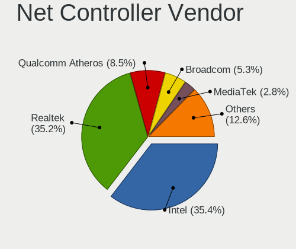
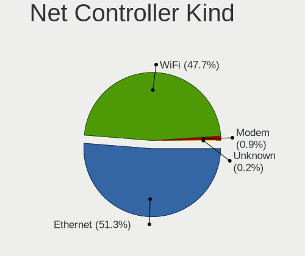

Ubuntu 22.04 - Tested Hardware & Statistics
-------------------------------------------

A project to collect tested hardware configurations for Ubuntu 22.04.

Anyone can contribute to this report by the [hw-probe](https://github.com/linuxhw/hw-probe) tool:

    sudo -E hw-probe -all -upload

Please contribute! Especially if your hardware is rare.

This is a report for all computer types. See also reports for [desktops](/Dist/Ubuntu_22.04/Desktop/README.md) and [notebooks](/Dist/Ubuntu_22.04/Notebook/README.md).

Contents
--------

* [ Test Cases ](#test-cases)

* [ System ](#system)
  - [ Kernel                   ](#kernel)
  - [ Kernel Family            ](#kernel-family)
  - [ Kernel Major Ver.        ](#kernel-major-ver)
  - [ Arch                     ](#arch)
  - [ DE                       ](#de)
  - [ Display Server           ](#display-server)
  - [ Display Manager          ](#display-manager)
  - [ OS Lang                  ](#os-lang)
  - [ Boot Mode                ](#boot-mode)
  - [ Filesystem               ](#filesystem)
  - [ Part. scheme             ](#part-scheme)
  - [ Dual Boot with Linux/BSD ](#dual-boot-with-linuxbsd)
  - [ Dual Boot (Win)          ](#dual-boot-win)

* [ Board ](#board)
  - [ Vendor                   ](#vendor)
  - [ Model                    ](#model)
  - [ Model Family             ](#model-family)
  - [ MFG Year                 ](#mfg-year)
  - [ Form Factor              ](#form-factor)
  - [ Secure Boot              ](#secure-boot)
  - [ Coreboot                 ](#coreboot)
  - [ RAM Size                 ](#ram-size)
  - [ RAM Used                 ](#ram-used)
  - [ Total Drives             ](#total-drives)
  - [ Has CD-ROM               ](#has-cd-rom)
  - [ Has Ethernet             ](#has-ethernet)
  - [ Has WiFi                 ](#has-wifi)
  - [ Has Bluetooth            ](#has-bluetooth)

* [ Location ](#location)
  - [ Country                  ](#country)
  - [ City                     ](#city)

* [ Drives ](#drives)
  - [ Drive Vendor             ](#drive-vendor)
  - [ Drive Model              ](#drive-model)
  - [ HDD Vendor               ](#hdd-vendor)
  - [ SSD Vendor               ](#ssd-vendor)
  - [ Drive Kind               ](#drive-kind)
  - [ Drive Connector          ](#drive-connector)
  - [ Drive Size               ](#drive-size)
  - [ Space Total              ](#space-total)
  - [ Space Used               ](#space-used)
  - [ Malfunc. Drives          ](#malfunc-drives)
  - [ Malfunc. Drive Vendor    ](#malfunc-drive-vendor)
  - [ Malfunc. HDD Vendor      ](#malfunc-hdd-vendor)
  - [ Malfunc. Drive Kind      ](#malfunc-drive-kind)
  - [ Failed Drives            ](#failed-drives)
  - [ Failed Drive Vendor      ](#failed-drive-vendor)
  - [ Drive Status             ](#drive-status)

* [ Storage controller ](#storage-controller)
  - [ Storage Vendor           ](#storage-vendor)
  - [ Storage Model            ](#storage-model)
  - [ Storage Kind             ](#storage-kind)

* [ Processor ](#processor)
  - [ CPU Vendor               ](#cpu-vendor)
  - [ CPU Model                ](#cpu-model)
  - [ CPU Model Family         ](#cpu-model-family)
  - [ CPU Cores                ](#cpu-cores)
  - [ CPU Sockets              ](#cpu-sockets)
  - [ CPU Threads              ](#cpu-threads)
  - [ CPU Op-Modes             ](#cpu-op-modes)
  - [ CPU Microcode            ](#cpu-microcode)
  - [ CPU Microarch            ](#cpu-microarch)

* [ Graphics ](#graphics)
  - [ GPU Vendor               ](#gpu-vendor)
  - [ GPU Model                ](#gpu-model)
  - [ GPU Combo                ](#gpu-combo)
  - [ GPU Driver               ](#gpu-driver)
  - [ GPU Memory               ](#gpu-memory)

* [ Monitor ](#monitor)
  - [ Monitor Vendor           ](#monitor-vendor)
  - [ Monitor Model            ](#monitor-model)
  - [ Monitor Resolution       ](#monitor-resolution)
  - [ Monitor Diagonal         ](#monitor-diagonal)
  - [ Monitor Width            ](#monitor-width)
  - [ Aspect Ratio             ](#aspect-ratio)
  - [ Monitor Area             ](#monitor-area)
  - [ Pixel Density            ](#pixel-density)
  - [ Multiple Monitors        ](#multiple-monitors)

* [ Network ](#network)
  - [ Net Controller Vendor    ](#net-controller-vendor)
  - [ Net Controller Model     ](#net-controller-model)
  - [ Wireless Vendor          ](#wireless-vendor)
  - [ Wireless Model           ](#wireless-model)
  - [ Ethernet Vendor          ](#ethernet-vendor)
  - [ Ethernet Model           ](#ethernet-model)
  - [ Net Controller Kind      ](#net-controller-kind)
  - [ Used Controller          ](#used-controller)
  - [ NICs                     ](#nics)
  - [ IPv6                     ](#ipv6)

* [ Bluetooth ](#bluetooth)
  - [ Bluetooth Vendor         ](#bluetooth-vendor)
  - [ Bluetooth Model          ](#bluetooth-model)

* [ Sound ](#sound)
  - [ Sound Vendor             ](#sound-vendor)
  - [ Sound Model              ](#sound-model)

* [ Memory ](#memory)
  - [ Memory Vendor            ](#memory-vendor)
  - [ Memory Model             ](#memory-model)
  - [ Memory Kind              ](#memory-kind)
  - [ Memory Form Factor       ](#memory-form-factor)
  - [ Memory Size              ](#memory-size)
  - [ Memory Speed             ](#memory-speed)

* [ Printers & scanners ](#printers--scanners)
  - [ Printer Vendor           ](#printer-vendor)
  - [ Printer Model            ](#printer-model)
  - [ Scanner Vendor           ](#scanner-vendor)
  - [ Scanner Model            ](#scanner-model)

* [ Camera ](#camera)
  - [ Camera Vendor            ](#camera-vendor)
  - [ Camera Model             ](#camera-model)

* [ Security ](#security)
  - [ Fingerprint Vendor       ](#fingerprint-vendor)
  - [ Fingerprint Model        ](#fingerprint-model)
  - [ Chipcard Vendor          ](#chipcard-vendor)
  - [ Chipcard Model           ](#chipcard-model)

* [ Unsupported ](#unsupported)
  - [ Unsupported Devices      ](#unsupported-devices)
  - [ Unsupported Device Types ](#unsupported-device-types)

Test Cases
----------

Total: 4773

| Vendor        | Model                       | Form-Factor | Probe                                                      | Date         |
|---------------|-----------------------------|-------------|------------------------------------------------------------|--------------|
| ASRock        | Z97 Anniversary             | Desktop     | [558ca4b56e](https://linux-hardware.org/?probe=558ca4b56e) | Oct 01, 2022 |
| MSI           | GF65 Thin 9SEXR             | Notebook    | [537828a21f](https://linux-hardware.org/?probe=537828a21f) | Oct 01, 2022 |
| Acer          | Aspire 5920G                | Notebook    | [9bd67cf4f9](https://linux-hardware.org/?probe=9bd67cf4f9) | Oct 01, 2022 |
| Sony          | VPCCA15FX                   | Notebook    | [5063ea411b](https://linux-hardware.org/?probe=5063ea411b) | Oct 01, 2022 |
| ASUSTek       | A78M-A                      | Desktop     | [5ad2e5f2a6](https://linux-hardware.org/?probe=5ad2e5f2a6) | Oct 01, 2022 |
| ASUSTek       | ROG STRIX B550-E GAMING     | Desktop     | [8a75a2c50b](https://linux-hardware.org/?probe=8a75a2c50b) | Oct 01, 2022 |
| Sony          | VPCCA15FX                   | Notebook    | [96eb3d8cf7](https://linux-hardware.org/?probe=96eb3d8cf7) | Oct 01, 2022 |
| MSI           | MAG B550 TOMAHAWK           | Desktop     | [a7268f8fba](https://linux-hardware.org/?probe=a7268f8fba) | Oct 01, 2022 |
| Lenovo        | V130-15IKB 81HN             | Notebook    | [44a4ed90e1](https://linux-hardware.org/?probe=44a4ed90e1) | Oct 01, 2022 |
| HUAWEI        | BOHK-WAX9X                  | Notebook    | [6525098252](https://linux-hardware.org/?probe=6525098252) | Oct 01, 2022 |
| Medion        | MS-7366                     | Desktop     | [c8138f4ffe](https://linux-hardware.org/?probe=c8138f4ffe) | Oct 01, 2022 |
| Medion        | MS-7366                     | Desktop     | [c25c10b259](https://linux-hardware.org/?probe=c25c10b259) | Oct 01, 2022 |
| Lenovo        | G400s VILG1                 | Notebook    | [e666344187](https://linux-hardware.org/?probe=e666344187) | Oct 01, 2022 |
| Acer          | Enduro EN314-51W            | Notebook    | [46782cf8f5](https://linux-hardware.org/?probe=46782cf8f5) | Oct 01, 2022 |
| Dell          | Latitude E5250              | Notebook    | [aeb221e727](https://linux-hardware.org/?probe=aeb221e727) | Oct 01, 2022 |
| Dell          | Latitude E5250              | Notebook    | [43f7cf1b59](https://linux-hardware.org/?probe=43f7cf1b59) | Oct 01, 2022 |
| MSI           | MAG B550 TOMAHAWK           | Desktop     | [151510a184](https://linux-hardware.org/?probe=151510a184) | Oct 01, 2022 |
| Lenovo        | ThinkPad SL500 27463ZG      | Notebook    | [34006e3b46](https://linux-hardware.org/?probe=34006e3b46) | Oct 01, 2022 |
| HP            | ProBook 430 G7              | Notebook    | [bf25686a1f](https://linux-hardware.org/?probe=bf25686a1f) | Oct 01, 2022 |
| MSI           | X370 GAMING PLUS            | Desktop     | [2aa92cb043](https://linux-hardware.org/?probe=2aa92cb043) | Oct 01, 2022 |
| Dell          | Latitude 5480               | Notebook    | [ec9593f051](https://linux-hardware.org/?probe=ec9593f051) | Oct 01, 2022 |
| Notebook      | W330SU2                     | Notebook    | [a5d5500584](https://linux-hardware.org/?probe=a5d5500584) | Oct 01, 2022 |
| HP            | Pavilion 17                 | Notebook    | [fa2e48904a](https://linux-hardware.org/?probe=fa2e48904a) | Oct 01, 2022 |
| ASUSTek       | M5A99X EVO                  | Desktop     | [4c5134b8fc](https://linux-hardware.org/?probe=4c5134b8fc) | Oct 01, 2022 |
| Lenovo        | Yoga C640-13IML 81UE        | Convertible | [9d5f38913b](https://linux-hardware.org/?probe=9d5f38913b) | Oct 01, 2022 |
| ASUSTek       | M4N72-E                     | Desktop     | [c1c308be2a](https://linux-hardware.org/?probe=c1c308be2a) | Oct 01, 2022 |
| ASUSTek       | P8Z68-V                     | Desktop     | [c6e67f7643](https://linux-hardware.org/?probe=c6e67f7643) | Oct 01, 2022 |
| ASRock        | Z77 Extreme3                | Desktop     | [c92633e1ee](https://linux-hardware.org/?probe=c92633e1ee) | Oct 01, 2022 |
| Lenovo        | IdeaPadFlex 5 14IIL05 81... | Convertible | [ee185c669a](https://linux-hardware.org/?probe=ee185c669a) | Oct 01, 2022 |
| ASRock        | Z77 Extreme3                | Desktop     | [ada9e56162](https://linux-hardware.org/?probe=ada9e56162) | Oct 01, 2022 |
| MSI           | Modern 14 A10M              | Notebook    | [571271ed93](https://linux-hardware.org/?probe=571271ed93) | Sep 30, 2022 |
| MSI           | A55M-E33                    | Desktop     | [13bd049f55](https://linux-hardware.org/?probe=13bd049f55) | Sep 30, 2022 |
| MSI           | Modern 14 A10M              | Notebook    | [9da1f3fe66](https://linux-hardware.org/?probe=9da1f3fe66) | Sep 30, 2022 |
| OEM           | Unknown                     | Desktop     | [e5a425c399](https://linux-hardware.org/?probe=e5a425c399) | Sep 30, 2022 |
| Dell          | Latitude 5530               | Notebook    | [43874dad6d](https://linux-hardware.org/?probe=43874dad6d) | Sep 30, 2022 |
| ASUSTek       | M5A78L LE                   | Desktop     | [1b2683c634](https://linux-hardware.org/?probe=1b2683c634) | Sep 30, 2022 |
| Microsoft     | Surface Pro 2               | Tablet      | [f9cf849f23](https://linux-hardware.org/?probe=f9cf849f23) | Sep 30, 2022 |
| Microsoft     | Surface Pro 2               | Tablet      | [6cf53adb30](https://linux-hardware.org/?probe=6cf53adb30) | Sep 30, 2022 |
| ASUSTek       | PHOENIX                     | Desktop     | [55d76f8846](https://linux-hardware.org/?probe=55d76f8846) | Sep 30, 2022 |
| ASUSTek       | PHOENIX                     | Desktop     | [6c28fed25f](https://linux-hardware.org/?probe=6c28fed25f) | Sep 30, 2022 |
| SANTECH       | NHx0EH_EJ_EK                | Notebook    | [01366bbeb7](https://linux-hardware.org/?probe=01366bbeb7) | Sep 30, 2022 |
| Dell          | Inspiron 7506 2n1           | Convertible | [659beda7e9](https://linux-hardware.org/?probe=659beda7e9) | Sep 30, 2022 |
| ASUSTek       | M5A78L LE                   | Desktop     | [8762386a2b](https://linux-hardware.org/?probe=8762386a2b) | Sep 30, 2022 |
| Gigabyte      | G41M-Combo                  | Desktop     | [aa49a31777](https://linux-hardware.org/?probe=aa49a31777) | Sep 30, 2022 |
| Apple         | MacBookPro9,2               | Notebook    | [87c9436154](https://linux-hardware.org/?probe=87c9436154) | Sep 30, 2022 |
| HP            | 83EF                        | Desktop     | [f508131396](https://linux-hardware.org/?probe=f508131396) | Sep 30, 2022 |
| HP            | Notebook                    | Notebook    | [a30c1af9a5](https://linux-hardware.org/?probe=a30c1af9a5) | Sep 30, 2022 |
| Acer          | Aspire E1-531               | Notebook    | [fbe026b995](https://linux-hardware.org/?probe=fbe026b995) | Sep 30, 2022 |
| ASUSTek       | Z170-P                      | Desktop     | [996d72bd1e](https://linux-hardware.org/?probe=996d72bd1e) | Sep 30, 2022 |
| ASUSTek       | Z170-P                      | Desktop     | [8394fca38a](https://linux-hardware.org/?probe=8394fca38a) | Sep 30, 2022 |
| ASUSTek       | EX-A320M-GAMING             | Desktop     | [33d5d34654](https://linux-hardware.org/?probe=33d5d34654) | Sep 30, 2022 |
| Pegatron      | IPMSB-GS                    | Desktop     | [5e38213b3b](https://linux-hardware.org/?probe=5e38213b3b) | Sep 30, 2022 |
| HP            | Pavilion dv5                | Notebook    | [9fd2d2169a](https://linux-hardware.org/?probe=9fd2d2169a) | Sep 30, 2022 |
| HP            | Pavilion dv5                | Notebook    | [1c42236e47](https://linux-hardware.org/?probe=1c42236e47) | Sep 30, 2022 |
| SIEMENS       | SIMATIC ITP1000             | Notebook    | [adbd7dbca6](https://linux-hardware.org/?probe=adbd7dbca6) | Sep 30, 2022 |
| Lenovo        | IdeaPad 5 Pro 16ARH7 82S... | Notebook    | [6bcbc9e08c](https://linux-hardware.org/?probe=6bcbc9e08c) | Sep 30, 2022 |
| NEC Comput... | PC-VRL21FB6S3R7             | Notebook    | [2001e2e28e](https://linux-hardware.org/?probe=2001e2e28e) | Sep 30, 2022 |
| ECS           | A320AM4-M3D/3.x/5.x         | Desktop     | [570ff509ac](https://linux-hardware.org/?probe=570ff509ac) | Sep 30, 2022 |
| ASUSTek       | ASUS EXPERTBOOK B1400CBA    | Notebook    | [4cad2a770c](https://linux-hardware.org/?probe=4cad2a770c) | Sep 30, 2022 |
| Lenovo        | ThinkPad T480s 20L7001YU... | Notebook    | [929514123f](https://linux-hardware.org/?probe=929514123f) | Sep 30, 2022 |
| ASUSTek       | TUF Gaming Z490-PLUS        | Desktop     | [2c08befa41](https://linux-hardware.org/?probe=2c08befa41) | Sep 30, 2022 |
| Acer          | Aspire E5-521               | Notebook    | [a55d68e93c](https://linux-hardware.org/?probe=a55d68e93c) | Sep 30, 2022 |
| Positivo      | POS-PIQ67CG POSITIVO        | Desktop     | [5cdce489b9](https://linux-hardware.org/?probe=5cdce489b9) | Sep 30, 2022 |
| Positivo      | POS-PIQ67CG POSITIVO        | Desktop     | [3bfbb3744e](https://linux-hardware.org/?probe=3bfbb3744e) | Sep 30, 2022 |
| HP            | 3398                        | Desktop     | [2f7b1d28b4](https://linux-hardware.org/?probe=2f7b1d28b4) | Sep 30, 2022 |
| Google        | Relm                        | Notebook    | [e440e5c1cc](https://linux-hardware.org/?probe=e440e5c1cc) | Sep 30, 2022 |
| HP            | 1496                        | Desktop     | [e89f06542b](https://linux-hardware.org/?probe=e89f06542b) | Sep 30, 2022 |
| Apple         | MacBookPro16,1              | Notebook    | [03f56ec19b](https://linux-hardware.org/?probe=03f56ec19b) | Sep 30, 2022 |
| Dell          | Inspiron 7591 2n1           | Convertible | [b2e6a0c4ee](https://linux-hardware.org/?probe=b2e6a0c4ee) | Sep 30, 2022 |
| Unknown       | 775VM8                      | Desktop     | [114c84d76c](https://linux-hardware.org/?probe=114c84d76c) | Sep 30, 2022 |
| Samsung       | R430/P430/R480              | Notebook    | [09795617ab](https://linux-hardware.org/?probe=09795617ab) | Sep 30, 2022 |
| Unknown       | 775VM8                      | Desktop     | [903649eae9](https://linux-hardware.org/?probe=903649eae9) | Sep 30, 2022 |
| MSI           | H110 PC MATE                | Desktop     | [ac97c636a5](https://linux-hardware.org/?probe=ac97c636a5) | Sep 30, 2022 |
| Gigabyte      | H61M-S2PV                   | Desktop     | [cd06f54882](https://linux-hardware.org/?probe=cd06f54882) | Sep 30, 2022 |
| Gigabyte      | H510M H                     | Desktop     | [51a7f36a69](https://linux-hardware.org/?probe=51a7f36a69) | Sep 29, 2022 |
| OEM           | Unknown                     | Desktop     | [21b3a0929b](https://linux-hardware.org/?probe=21b3a0929b) | Sep 29, 2022 |
| ASRock        | Q1900M                      | Desktop     | [e6804dc6b7](https://linux-hardware.org/?probe=e6804dc6b7) | Sep 29, 2022 |
| Lenovo        | G500s 20245                 | Notebook    | [b9001f7817](https://linux-hardware.org/?probe=b9001f7817) | Sep 29, 2022 |
| Toshiba       | TECRA M10                   | Notebook    | [64ad67c8e9](https://linux-hardware.org/?probe=64ad67c8e9) | Sep 29, 2022 |
| ASUSTek       | Zenbook UM3402YA_UM3402Y... | Notebook    | [36ad3c69ee](https://linux-hardware.org/?probe=36ad3c69ee) | Sep 29, 2022 |
| ASUSTek       | PHOENIX                     | Desktop     | [ea3a9cf5b4](https://linux-hardware.org/?probe=ea3a9cf5b4) | Sep 29, 2022 |
| ASUSTek       | Q534UXK                     | Convertible | [2908b05b92](https://linux-hardware.org/?probe=2908b05b92) | Sep 29, 2022 |
| Acer          | Aspire ES1-311              | Notebook    | [0f40a045a9](https://linux-hardware.org/?probe=0f40a045a9) | Sep 29, 2022 |
| ASUSTek       | TUF Gaming FX505DY_FX505... | Notebook    | [bd2dea6653](https://linux-hardware.org/?probe=bd2dea6653) | Sep 29, 2022 |
| ASUSTek       | M5A97 LE R2.0               | Desktop     | [e35b86c3b7](https://linux-hardware.org/?probe=e35b86c3b7) | Sep 29, 2022 |
| Gigabyte      | B75M-D3H                    | Desktop     | [a7d5bbb754](https://linux-hardware.org/?probe=a7d5bbb754) | Sep 29, 2022 |
| Gigabyte      | B75M-D3H                    | Desktop     | [5f261094bf](https://linux-hardware.org/?probe=5f261094bf) | Sep 29, 2022 |
| HP            | ZBook Firefly 15.6 inch ... | Notebook    | [be74c01cca](https://linux-hardware.org/?probe=be74c01cca) | Sep 29, 2022 |
| OEM           | Unknown                     | Desktop     | [68b7e03b06](https://linux-hardware.org/?probe=68b7e03b06) | Sep 29, 2022 |
| Acer          | Aspire A715-72G             | Notebook    | [8b7e129d4a](https://linux-hardware.org/?probe=8b7e129d4a) | Sep 29, 2022 |
| Lenovo        | ThinkPad P53 MWS 15.6 (Q... | Notebook    | [8990060646](https://linux-hardware.org/?probe=8990060646) | Sep 29, 2022 |
| ASUSTek       | P8Z68-V                     | Desktop     | [f0d1b90e89](https://linux-hardware.org/?probe=f0d1b90e89) | Sep 29, 2022 |
| Apple         | MacBookPro3,1               | Notebook    | [00f2a6e705](https://linux-hardware.org/?probe=00f2a6e705) | Sep 29, 2022 |
| Lenovo        | ThinkPad X1 Carbon 7th 2... | Notebook    | [54bc787611](https://linux-hardware.org/?probe=54bc787611) | Sep 29, 2022 |
| ASUSTek       | TUF Gaming B560M-PLUS WI... | Desktop     | [a686f595ee](https://linux-hardware.org/?probe=a686f595ee) | Sep 29, 2022 |
| Dell          | XPS 13 9370                 | Notebook    | [4e0be93d26](https://linux-hardware.org/?probe=4e0be93d26) | Sep 29, 2022 |
| ASUSTek       | Zenbook UM5401QAB_UM5401... | Notebook    | [3e92ba3812](https://linux-hardware.org/?probe=3e92ba3812) | Sep 29, 2022 |
| Dell          | Latitude E7250              | Notebook    | [bed2e025b0](https://linux-hardware.org/?probe=bed2e025b0) | Sep 29, 2022 |
| Dell          | 0G3HR7 A00                  | Desktop     | [547cffd8dd](https://linux-hardware.org/?probe=547cffd8dd) | Sep 29, 2022 |
| Lenovo        | IdeaPad 320-15IKB 81BG      | Notebook    | [82528435d8](https://linux-hardware.org/?probe=82528435d8) | Sep 29, 2022 |
| MSI           | Creator Z17 A12UHST         | Notebook    | [4b9249b9b0](https://linux-hardware.org/?probe=4b9249b9b0) | Sep 29, 2022 |
| HP            | ProBook 6560b               | Notebook    | [902ef8ef79](https://linux-hardware.org/?probe=902ef8ef79) | Sep 29, 2022 |
| ASUSTek       | PRO H410M-C                 | Desktop     | [2448bfc706](https://linux-hardware.org/?probe=2448bfc706) | Sep 29, 2022 |
| Razer         | Blade                       | Notebook    | [63a4e5f829](https://linux-hardware.org/?probe=63a4e5f829) | Sep 29, 2022 |
| HUAWEI        | HVY-WXX9                    | Notebook    | [4f2655de78](https://linux-hardware.org/?probe=4f2655de78) | Sep 29, 2022 |
| Acer          | Predator G6-710             | Desktop     | [12fd4575f7](https://linux-hardware.org/?probe=12fd4575f7) | Sep 29, 2022 |
| Sony          | VPCEH12FX                   | Notebook    | [037cda52fd](https://linux-hardware.org/?probe=037cda52fd) | Sep 29, 2022 |
| Dell          | 06D7TR A02                  | Desktop     | [7ad0e3e5f4](https://linux-hardware.org/?probe=7ad0e3e5f4) | Sep 29, 2022 |
| MSI           | Modern 14 A10M              | Notebook    | [5c5666fa97](https://linux-hardware.org/?probe=5c5666fa97) | Sep 29, 2022 |
| Lenovo        | 1031 SBB0J05441 WIN 3305... | Desktop     | [75c8af47c2](https://linux-hardware.org/?probe=75c8af47c2) | Sep 29, 2022 |
| Gigabyte      | Z370 HD3-CF                 | Desktop     | [715a83eaa1](https://linux-hardware.org/?probe=715a83eaa1) | Sep 29, 2022 |
| HUAWEI        | BOHK-WAX9X                  | Notebook    | [65f56cc48b](https://linux-hardware.org/?probe=65f56cc48b) | Sep 29, 2022 |
| Biostar       | H410MH S2                   | Desktop     | [b03e32f37d](https://linux-hardware.org/?probe=b03e32f37d) | Sep 29, 2022 |
| ASUSTek       | P8Z68-V                     | Desktop     | [36ff9b8bcb](https://linux-hardware.org/?probe=36ff9b8bcb) | Sep 29, 2022 |
| Lenovo        | ThinkPad X1C 5th W10DG 2... | Notebook    | [0cbacebb95](https://linux-hardware.org/?probe=0cbacebb95) | Sep 29, 2022 |
| Apple         | Mac-8ED6AF5B48C039E1 Mac... | Mini pc     | [4b12c8e9c1](https://linux-hardware.org/?probe=4b12c8e9c1) | Sep 29, 2022 |
| Sun Micros... | S39                         | Server      | [ed02f6a855](https://linux-hardware.org/?probe=ed02f6a855) | Sep 29, 2022 |
| Dell          | XPS 15 9570                 | Notebook    | [eb3798c367](https://linux-hardware.org/?probe=eb3798c367) | Sep 28, 2022 |
| ASUSTek       | VivoBook_ASUSLaptop X515... | Notebook    | [cd08dccca4](https://linux-hardware.org/?probe=cd08dccca4) | Sep 28, 2022 |
| Gigabyte      | F2A55M-DS2                  | Desktop     | [c17c689217](https://linux-hardware.org/?probe=c17c689217) | Sep 28, 2022 |
| Notebook      | PB50_70RF,RD,RC             | Notebook    | [d56e485c88](https://linux-hardware.org/?probe=d56e485c88) | Sep 28, 2022 |
| ASRock        | Z68 Pro3-M                  | Desktop     | [7ba6677453](https://linux-hardware.org/?probe=7ba6677453) | Sep 28, 2022 |
| Supermicro    | X10SRA-F                    | Server      | [a9aa07ef24](https://linux-hardware.org/?probe=a9aa07ef24) | Sep 28, 2022 |
| ASUSTek       | PN52                        | Mini pc     | [11f99758e6](https://linux-hardware.org/?probe=11f99758e6) | Sep 28, 2022 |
| Supermicro    | X10SRA-F                    | Server      | [2f41a520ed](https://linux-hardware.org/?probe=2f41a520ed) | Sep 28, 2022 |
| Medion        | MS-7707                     | Desktop     | [240ac993dc](https://linux-hardware.org/?probe=240ac993dc) | Sep 28, 2022 |
| MSI           | Z87-GD65 GAMING             | Desktop     | [fe6539c021](https://linux-hardware.org/?probe=fe6539c021) | Sep 28, 2022 |
| ASUSTek       | VivoBook 17_ASUS Laptop ... | Notebook    | [a3fc8eb1bc](https://linux-hardware.org/?probe=a3fc8eb1bc) | Sep 28, 2022 |
| Lenovo        | Legion S7 15IMH5 82BC       | Notebook    | [4ecc5d01c1](https://linux-hardware.org/?probe=4ecc5d01c1) | Sep 28, 2022 |
| Dell          | Latitude E7250              | Notebook    | [4bf6378dde](https://linux-hardware.org/?probe=4bf6378dde) | Sep 28, 2022 |
| Lenovo        | ThinkPad L15 Gen 1 20U4S... | Notebook    | [d5a4d2ae41](https://linux-hardware.org/?probe=d5a4d2ae41) | Sep 28, 2022 |
| Gigabyte      | B450 I AORUS PRO WIFI-CF    | Desktop     | [d5185ee60b](https://linux-hardware.org/?probe=d5185ee60b) | Sep 28, 2022 |
| Dell          | Latitude E5430 non-vPro     | Notebook    | [12e886f006](https://linux-hardware.org/?probe=12e886f006) | Sep 28, 2022 |
| Dell          | Vostro 15 3515              | Notebook    | [7e4413a053](https://linux-hardware.org/?probe=7e4413a053) | Sep 28, 2022 |
| Dell          | XPS 13 9350                 | Notebook    | [23142407b0](https://linux-hardware.org/?probe=23142407b0) | Sep 28, 2022 |
| ASUSTek       | M5A97 LE R2.0               | Desktop     | [f9e71e7e05](https://linux-hardware.org/?probe=f9e71e7e05) | Sep 28, 2022 |
| Lenovo        | IdeaPad 3 15ALC6 82MF       | Notebook    | [bbd715eb5a](https://linux-hardware.org/?probe=bbd715eb5a) | Sep 28, 2022 |
| Medion        | E6234                       | Notebook    | [19f1d7841e](https://linux-hardware.org/?probe=19f1d7841e) | Sep 28, 2022 |
| Lenovo        | ThinkPad P15v Gen 1 20TQ... | Notebook    | [a64f339e70](https://linux-hardware.org/?probe=a64f339e70) | Sep 28, 2022 |
| Dell          | Latitude 3410               | Notebook    | [82fe1556b6](https://linux-hardware.org/?probe=82fe1556b6) | Sep 28, 2022 |
| HP            | 18E5                        | Desktop     | [bcc9927d20](https://linux-hardware.org/?probe=bcc9927d20) | Sep 28, 2022 |
| Lenovo        | IdeaPad Z510 20287          | Notebook    | [78badcba3c](https://linux-hardware.org/?probe=78badcba3c) | Sep 28, 2022 |
| Lenovo        | ThinkBook 14 G3 ACL 21A2    | Notebook    | [9271d6a014](https://linux-hardware.org/?probe=9271d6a014) | Sep 28, 2022 |
| Apple         | MacBookPro9,2               | Notebook    | [6ea648bc51](https://linux-hardware.org/?probe=6ea648bc51) | Sep 28, 2022 |
| MSI           | 2A9Ch                       | Desktop     | [16d3df803b](https://linux-hardware.org/?probe=16d3df803b) | Sep 28, 2022 |
| MSI           | X570-A PRO                  | Desktop     | [345959e0ed](https://linux-hardware.org/?probe=345959e0ed) | Sep 28, 2022 |
| Dell          | Inspiron 7506 2n1           | Convertible | [650ccc1793](https://linux-hardware.org/?probe=650ccc1793) | Sep 28, 2022 |
| Apple         | Mac-27ADBB7B4CEE8E61 iMa... | All in one  | [8086625f5a](https://linux-hardware.org/?probe=8086625f5a) | Sep 28, 2022 |
| HP            | 212B                        | Desktop     | [38aa6e5478](https://linux-hardware.org/?probe=38aa6e5478) | Sep 28, 2022 |
| Dell          | Inspiron 7591 2n1           | Convertible | [cbe4496000](https://linux-hardware.org/?probe=cbe4496000) | Sep 28, 2022 |
| Acer          | Aspire E5-573               | Notebook    | [f7e628a5a1](https://linux-hardware.org/?probe=f7e628a5a1) | Sep 28, 2022 |
| Positivo      | S14CT01                     | Notebook    | [66e0c53646](https://linux-hardware.org/?probe=66e0c53646) | Sep 28, 2022 |
| Unknown       | Unknown                     | Notebook    | [3e450900da](https://linux-hardware.org/?probe=3e450900da) | Sep 28, 2022 |
| Apple         | MacBookPro15,2              | Notebook    | [2e6164b675](https://linux-hardware.org/?probe=2e6164b675) | Sep 28, 2022 |
| ASRock        | H61M-HVS                    | Desktop     | [660419ed49](https://linux-hardware.org/?probe=660419ed49) | Sep 27, 2022 |
| HP            | Pavilion Laptop 14-ce2xx... | Notebook    | [6eab6db53b](https://linux-hardware.org/?probe=6eab6db53b) | Sep 27, 2022 |
| HP            | 2AF7                        | Desktop     | [d6889fef8d](https://linux-hardware.org/?probe=d6889fef8d) | Sep 27, 2022 |
| ASUSTek       | PRIME X470-PRO              | Desktop     | [1bdf72d415](https://linux-hardware.org/?probe=1bdf72d415) | Sep 27, 2022 |
| Acer          | Aspire 5750G                | Notebook    | [f73c1084d0](https://linux-hardware.org/?probe=f73c1084d0) | Sep 27, 2022 |
| HP            | ProBook 450 G2              | Notebook    | [a9c7d575cd](https://linux-hardware.org/?probe=a9c7d575cd) | Sep 27, 2022 |
| ASRock        | B450 Pro4                   | Desktop     | [9053250a2c](https://linux-hardware.org/?probe=9053250a2c) | Sep 27, 2022 |
| HP            | ENVY x360 Convertible 13... | Convertible | [d5a3950c4e](https://linux-hardware.org/?probe=d5a3950c4e) | Sep 27, 2022 |
| ASUSTek       | PHOENIX                     | Desktop     | [3c5f24bbb1](https://linux-hardware.org/?probe=3c5f24bbb1) | Sep 27, 2022 |
| MSI           | B450M GAMING PLUS           | Desktop     | [265d059992](https://linux-hardware.org/?probe=265d059992) | Sep 27, 2022 |
| ASRock        | Z97 Anniversary             | Desktop     | [6132513116](https://linux-hardware.org/?probe=6132513116) | Sep 27, 2022 |
| ASRock        | X470 Gaming-ITX/ac          | Desktop     | [fdafecf7b0](https://linux-hardware.org/?probe=fdafecf7b0) | Sep 27, 2022 |
| Packard Be... | IMEDIA L4875 v1.0           | Desktop     | [bb57b80866](https://linux-hardware.org/?probe=bb57b80866) | Sep 27, 2022 |
| ASUSTek       | P5B-Deluxe                  | Desktop     | [cf179c716e](https://linux-hardware.org/?probe=cf179c716e) | Sep 27, 2022 |
| Medion        | MS-7707                     | Desktop     | [a88f6ba4da](https://linux-hardware.org/?probe=a88f6ba4da) | Sep 27, 2022 |
| ASUSTek       | VivoBook_ASUSLaptop X521... | Notebook    | [47acb38827](https://linux-hardware.org/?probe=47acb38827) | Sep 27, 2022 |
| Dell          | Precision 3561              | Notebook    | [77a4030052](https://linux-hardware.org/?probe=77a4030052) | Sep 27, 2022 |
| ASUSTek       | G73Jh                       | Notebook    | [e5405dd3d8](https://linux-hardware.org/?probe=e5405dd3d8) | Sep 27, 2022 |
| HUAWEI        | BOHK-WAX9X                  | Notebook    | [d0f8e8a0f6](https://linux-hardware.org/?probe=d0f8e8a0f6) | Sep 27, 2022 |
| Dell          | Latitude E7470              | Notebook    | [5bdc528b5a](https://linux-hardware.org/?probe=5bdc528b5a) | Sep 27, 2022 |
| Acer          | Spin SP314-53               | Convertible | [ce95ade177](https://linux-hardware.org/?probe=ce95ade177) | Sep 27, 2022 |
| Philco        | PNB14.1AC14S128W10          | Notebook    | [ee4bc98535](https://linux-hardware.org/?probe=ee4bc98535) | Sep 27, 2022 |
| Medion        | MS-7713                     | Desktop     | [36ca6b7f38](https://linux-hardware.org/?probe=36ca6b7f38) | Sep 27, 2022 |
| HP            | Pavilion 10 TS              | Notebook    | [28003748e6](https://linux-hardware.org/?probe=28003748e6) | Sep 27, 2022 |
| Gigabyte      | B450 I AORUS PRO WIFI-CF    | Desktop     | [9f85096ed9](https://linux-hardware.org/?probe=9f85096ed9) | Sep 27, 2022 |
| HP            | ENVY m7 Notebook            | Notebook    | [c2739df54b](https://linux-hardware.org/?probe=c2739df54b) | Sep 27, 2022 |
| HP            | 635                         | Notebook    | [0509987782](https://linux-hardware.org/?probe=0509987782) | Sep 27, 2022 |
| ASUSTek       | Z170-K                      | Desktop     | [5048b5bef9](https://linux-hardware.org/?probe=5048b5bef9) | Sep 27, 2022 |
| Lenovo        | ThinkPad T410 2537AT9       | Notebook    | [553490bb4c](https://linux-hardware.org/?probe=553490bb4c) | Sep 27, 2022 |
| HP            | ProBook 450 G2              | Notebook    | [2935c5bedd](https://linux-hardware.org/?probe=2935c5bedd) | Sep 27, 2022 |
| ASUSTek       | H97I-PLUS                   | Desktop     | [31036cd828](https://linux-hardware.org/?probe=31036cd828) | Sep 27, 2022 |
| Apple         | MacBookAir6,2               | Notebook    | [8c4c7f3dc1](https://linux-hardware.org/?probe=8c4c7f3dc1) | Sep 27, 2022 |
| ASUSTek       | H97I-PLUS                   | Desktop     | [fa2a23dff8](https://linux-hardware.org/?probe=fa2a23dff8) | Sep 27, 2022 |
| ASUSTek       | M5A97 PRO                   | Desktop     | [255a0a928a](https://linux-hardware.org/?probe=255a0a928a) | Sep 27, 2022 |
| Lenovo        | ThinkPad X270 W10DG 20K5... | Notebook    | [ae7c83bb37](https://linux-hardware.org/?probe=ae7c83bb37) | Sep 27, 2022 |
| Dell          | Inspiron 5570               | Notebook    | [3735a32f9e](https://linux-hardware.org/?probe=3735a32f9e) | Sep 27, 2022 |
| Intel         | NUC12WSBi7 M46422-302       | Mini pc     | [1b2f7b8972](https://linux-hardware.org/?probe=1b2f7b8972) | Sep 27, 2022 |
| Samsung       | R425/R525                   | Notebook    | [a5b0ee0a18](https://linux-hardware.org/?probe=a5b0ee0a18) | Sep 27, 2022 |
| Lenovo        | Legion S7 15ACH6 82K8       | Notebook    | [3aa314d706](https://linux-hardware.org/?probe=3aa314d706) | Sep 27, 2022 |
| Acer          | Aspire XC-830               | Desktop     | [c8ff01ad2e](https://linux-hardware.org/?probe=c8ff01ad2e) | Sep 27, 2022 |
| HP            | Laptop 17-cp0xxx            | Notebook    | [895fae1f2e](https://linux-hardware.org/?probe=895fae1f2e) | Sep 27, 2022 |
| Acer          | Aspire XC-830               | Desktop     | [4175b74d7a](https://linux-hardware.org/?probe=4175b74d7a) | Sep 27, 2022 |
| ASUSTek       | G73Jh                       | Notebook    | [ac96a56edf](https://linux-hardware.org/?probe=ac96a56edf) | Sep 27, 2022 |
| Lenovo        | ThinkPad T480s 20L8S6WP0... | Notebook    | [d0149ee0e2](https://linux-hardware.org/?probe=d0149ee0e2) | Sep 27, 2022 |
| Dell          | XPS 15 9500                 | Notebook    | [d9d87f101a](https://linux-hardware.org/?probe=d9d87f101a) | Sep 27, 2022 |
| Dell          | XPS 13 9310                 | Notebook    | [6f9bc0cdba](https://linux-hardware.org/?probe=6f9bc0cdba) | Sep 26, 2022 |
| Dell          | XPS 13 9310                 | Notebook    | [d65cd8309b](https://linux-hardware.org/?probe=d65cd8309b) | Sep 26, 2022 |
| Tactus        | GeoFlex 110                 | Convertible | [8d3efd7b21](https://linux-hardware.org/?probe=8d3efd7b21) | Sep 26, 2022 |
| Dell          | Latitude 5420               | Notebook    | [bd81c07917](https://linux-hardware.org/?probe=bd81c07917) | Sep 26, 2022 |
| Dell          | Inspiron 1525               | Notebook    | [42ea8221af](https://linux-hardware.org/?probe=42ea8221af) | Sep 26, 2022 |
| Dell          | 03NVJ6 A03                  | Desktop     | [2241dbc067](https://linux-hardware.org/?probe=2241dbc067) | Sep 26, 2022 |
| HUAWEI        | NBLB-WAX9N                  | Notebook    | [3acb168799](https://linux-hardware.org/?probe=3acb168799) | Sep 26, 2022 |
| Dell          | 03NVJ6 A03                  | Desktop     | [2deb1ce174](https://linux-hardware.org/?probe=2deb1ce174) | Sep 26, 2022 |
| HP            | EliteBook 850 G7 Noteboo... | Notebook    | [9a1514cc61](https://linux-hardware.org/?probe=9a1514cc61) | Sep 26, 2022 |
| HUAWEI        | NBLB-WAX9N                  | Notebook    | [fd7e096a4b](https://linux-hardware.org/?probe=fd7e096a4b) | Sep 26, 2022 |
| HP            | Unknown                     | Notebook    | [e8906c977c](https://linux-hardware.org/?probe=e8906c977c) | Sep 26, 2022 |
| Lenovo        | ThinkPad SL500 27463ZG      | Notebook    | [70860ec433](https://linux-hardware.org/?probe=70860ec433) | Sep 26, 2022 |
| ASUSTek       | X580VD                      | Notebook    | [378e1d3133](https://linux-hardware.org/?probe=378e1d3133) | Sep 26, 2022 |
| HP            | ProBook 650 G1              | Notebook    | [bdcb5090f0](https://linux-hardware.org/?probe=bdcb5090f0) | Sep 26, 2022 |
| Lenovo        | IdeaPad 3 14ADA05 81W0      | Notebook    | [e39766ed4d](https://linux-hardware.org/?probe=e39766ed4d) | Sep 26, 2022 |
| GIADA         | ChiefRiver Platform         | Notebook    | [d0f71cdc7f](https://linux-hardware.org/?probe=d0f71cdc7f) | Sep 26, 2022 |
| HP            | 0A9Ch                       | Desktop     | [2bf0c02966](https://linux-hardware.org/?probe=2bf0c02966) | Sep 26, 2022 |
| Foxconn       | Napa HP P/N                 | Desktop     | [15d8037255](https://linux-hardware.org/?probe=15d8037255) | Sep 26, 2022 |
| Foxconn       | Napa HP P/N                 | Desktop     | [ca0edb7c6a](https://linux-hardware.org/?probe=ca0edb7c6a) | Sep 26, 2022 |
| Lenovo        | ThinkPad X1 Carbon 6th 2... | Notebook    | [7c8030e423](https://linux-hardware.org/?probe=7c8030e423) | Sep 26, 2022 |
| Lenovo        | ThinkPad T480s 20L7001PI... | Notebook    | [31235a45b5](https://linux-hardware.org/?probe=31235a45b5) | Sep 26, 2022 |
| ASUSTek       | Z87-A                       | Desktop     | [3cdcc8b18d](https://linux-hardware.org/?probe=3cdcc8b18d) | Sep 26, 2022 |
| Lenovo        | ThinkPad T480 20L6SCWK00    | Notebook    | [60933ed48b](https://linux-hardware.org/?probe=60933ed48b) | Sep 26, 2022 |
| Acer          | Aspire A514-54              | Notebook    | [bab009e0b7](https://linux-hardware.org/?probe=bab009e0b7) | Sep 26, 2022 |
| Insyde        | WindTab89                   | Notebook    | [0073af9597](https://linux-hardware.org/?probe=0073af9597) | Sep 26, 2022 |
| Insyde        | WindTab89                   | Notebook    | [6935ebecaa](https://linux-hardware.org/?probe=6935ebecaa) | Sep 26, 2022 |
| ASUSTek       | M5A78L-M/USB3               | Desktop     | [d166d32749](https://linux-hardware.org/?probe=d166d32749) | Sep 26, 2022 |
| Dell          | Latitude 7420               | Notebook    | [0834411088](https://linux-hardware.org/?probe=0834411088) | Sep 26, 2022 |
| ASRock        | Z68 Pro3-M                  | Desktop     | [48400b0487](https://linux-hardware.org/?probe=48400b0487) | Sep 26, 2022 |
| Dell          | Latitude E7470              | Notebook    | [1dba765507](https://linux-hardware.org/?probe=1dba765507) | Sep 26, 2022 |
| Dell          | XPS 13 7390                 | Notebook    | [cfebe9461d](https://linux-hardware.org/?probe=cfebe9461d) | Sep 26, 2022 |
| Lenovo        | ThinkPad Edge E430 3254A... | Notebook    | [cb5f6f279b](https://linux-hardware.org/?probe=cb5f6f279b) | Sep 26, 2022 |
| Lenovo        | ThinkPad Edge E430 3254A... | Notebook    | [3f11c520e0](https://linux-hardware.org/?probe=3f11c520e0) | Sep 26, 2022 |
| ASUSTek       | K55VJ                       | Notebook    | [8e87d041c3](https://linux-hardware.org/?probe=8e87d041c3) | Sep 26, 2022 |
| Gigabyte      | B75M-D3V                    | Desktop     | [291b07ce5f](https://linux-hardware.org/?probe=291b07ce5f) | Sep 26, 2022 |
| HP            | 8710                        | Mini pc     | [fdd0fee41e](https://linux-hardware.org/?probe=fdd0fee41e) | Sep 26, 2022 |
| HP            | Spectre Pro x360 G2         | Notebook    | [d9248f7b2e](https://linux-hardware.org/?probe=d9248f7b2e) | Sep 26, 2022 |
| ASUSTek       | M5A78L-M/USB3               | Desktop     | [bce9addcca](https://linux-hardware.org/?probe=bce9addcca) | Sep 26, 2022 |
| Acer          | Aspire A515-55              | Notebook    | [a9ac678198](https://linux-hardware.org/?probe=a9ac678198) | Sep 26, 2022 |
| Acer          | Aspire A515-55              | Notebook    | [8e66a480f3](https://linux-hardware.org/?probe=8e66a480f3) | Sep 26, 2022 |
| MSI           | B560M PRO                   | Desktop     | [5949440926](https://linux-hardware.org/?probe=5949440926) | Sep 26, 2022 |
| Acer          | Aspire XC-603               | Desktop     | [efa89b9ac1](https://linux-hardware.org/?probe=efa89b9ac1) | Sep 26, 2022 |
| Dell          | Inspiron 11-3168            | Notebook    | [6b1d418929](https://linux-hardware.org/?probe=6b1d418929) | Sep 26, 2022 |
| MSI           | MPG Z690 FORCE WIFI         | Desktop     | [95da21d9a8](https://linux-hardware.org/?probe=95da21d9a8) | Sep 26, 2022 |
| Intel         | NUC5i3MYBE H47781-211       | Mini pc     | [ec2541f624](https://linux-hardware.org/?probe=ec2541f624) | Sep 26, 2022 |
| Gigabyte      | Z370 HD3-CF                 | Desktop     | [2a86fee784](https://linux-hardware.org/?probe=2a86fee784) | Sep 26, 2022 |
| Dell          | 00V62H A01                  | Desktop     | [43a06cb552](https://linux-hardware.org/?probe=43a06cb552) | Sep 26, 2022 |
| Samsung       | 670Z5E                      | Notebook    | [6bce247e38](https://linux-hardware.org/?probe=6bce247e38) | Sep 26, 2022 |
| Dell          | Inspiron 7506 2n1           | Convertible | [b40a3ea95f](https://linux-hardware.org/?probe=b40a3ea95f) | Sep 26, 2022 |
| AZW           | SEi                         | Notebook    | [ca815a2e20](https://linux-hardware.org/?probe=ca815a2e20) | Sep 26, 2022 |
| HP            | ProBook 6560b               | Notebook    | [96637a94a6](https://linux-hardware.org/?probe=96637a94a6) | Sep 25, 2022 |
| Jumper        | EZbook                      | Notebook    | [1af58cd7e7](https://linux-hardware.org/?probe=1af58cd7e7) | Sep 25, 2022 |
| ASUSTek       | G750JX                      | Notebook    | [4ce2831fac](https://linux-hardware.org/?probe=4ce2831fac) | Sep 25, 2022 |
| NSX           | Celeron 14                  | Notebook    | [b8fdb14beb](https://linux-hardware.org/?probe=b8fdb14beb) | Sep 25, 2022 |
| Positivo      | S14SL01                     | Notebook    | [a6b3c260f4](https://linux-hardware.org/?probe=a6b3c260f4) | Sep 25, 2022 |
| Protectli     | FW2B                        | Desktop     | [55ead162b2](https://linux-hardware.org/?probe=55ead162b2) | Sep 25, 2022 |
| Dell          | XPS 13 7390 2-in-1          | Convertible | [6ff36a4765](https://linux-hardware.org/?probe=6ff36a4765) | Sep 25, 2022 |
| NSX           | Celeron 14                  | Notebook    | [1d358a2828](https://linux-hardware.org/?probe=1d358a2828) | Sep 25, 2022 |
| Acer          | Aspire 3810T                | Notebook    | [de19c5a7e9](https://linux-hardware.org/?probe=de19c5a7e9) | Sep 25, 2022 |
| HP            | EliteBook 840 G3            | Notebook    | [2ad6238f03](https://linux-hardware.org/?probe=2ad6238f03) | Sep 25, 2022 |
| Acer          | P5WE0                       | Notebook    | [124f7bdd77](https://linux-hardware.org/?probe=124f7bdd77) | Sep 25, 2022 |
| Unknown       | A116C1_1                    | Notebook    | [470cd9917c](https://linux-hardware.org/?probe=470cd9917c) | Sep 25, 2022 |
| ASUSTek       | PRIME B350-PLUS             | Desktop     | [53c469011c](https://linux-hardware.org/?probe=53c469011c) | Sep 25, 2022 |
| HONOR         | BMH-WCX9                    | Notebook    | [49b0161bf0](https://linux-hardware.org/?probe=49b0161bf0) | Sep 25, 2022 |
| Lenovo        | IdeaPad3-15ADA05 81W1       | Notebook    | [d2192ee6f0](https://linux-hardware.org/?probe=d2192ee6f0) | Sep 25, 2022 |
| ASRock        | B550 Pro4                   | Desktop     | [d17f3c7447](https://linux-hardware.org/?probe=d17f3c7447) | Sep 25, 2022 |
| Packard Be... | IMEDIA L4875 v1.0           | Desktop     | [4ed673ff1a](https://linux-hardware.org/?probe=4ed673ff1a) | Sep 25, 2022 |
| Acer          | Swift SF314-71              | Notebook    | [3414420bc7](https://linux-hardware.org/?probe=3414420bc7) | Sep 25, 2022 |
| Apple         | Mac-F22C86C8                | Mini pc     | [675cc67ba8](https://linux-hardware.org/?probe=675cc67ba8) | Sep 25, 2022 |
| Apple         | Mac-F22C86C8                | Mini pc     | [ffedff132b](https://linux-hardware.org/?probe=ffedff132b) | Sep 25, 2022 |
| HP            | Pavilion x360 Convertibl... | Convertible | [3c87156766](https://linux-hardware.org/?probe=3c87156766) | Sep 25, 2022 |
| Positivo      | S14SL01                     | Notebook    | [e09fcd6e38](https://linux-hardware.org/?probe=e09fcd6e38) | Sep 25, 2022 |
| ASUSTek       | VivoBook_ASUSLaptop X515... | Notebook    | [3e5af3e86c](https://linux-hardware.org/?probe=3e5af3e86c) | Sep 25, 2022 |
| AMI           | Intel                       | Notebook    | [56de8f8b8a](https://linux-hardware.org/?probe=56de8f8b8a) | Sep 25, 2022 |
| HP            | 2B35                        | Desktop     | [724e0d61e3](https://linux-hardware.org/?probe=724e0d61e3) | Sep 25, 2022 |
| Dell          | Latitude 13                 | Notebook    | [28d623103e](https://linux-hardware.org/?probe=28d623103e) | Sep 25, 2022 |
| AMI           | Intel                       | Notebook    | [330585dcd8](https://linux-hardware.org/?probe=330585dcd8) | Sep 25, 2022 |
| Dell          | Inspiron 5570               | Notebook    | [6516021810](https://linux-hardware.org/?probe=6516021810) | Sep 25, 2022 |
| ASUSTek       | PRIME A320M-K               | Desktop     | [bc6b161dc9](https://linux-hardware.org/?probe=bc6b161dc9) | Sep 25, 2022 |
| ASRock        | B450M-HDV                   | Desktop     | [a1639d1654](https://linux-hardware.org/?probe=a1639d1654) | Sep 25, 2022 |
| Dell          | XPS 15 9500                 | Notebook    | [1095e2f7f0](https://linux-hardware.org/?probe=1095e2f7f0) | Sep 25, 2022 |
| HP            | ProBook 450 G5              | Notebook    | [262ff53f6a](https://linux-hardware.org/?probe=262ff53f6a) | Sep 25, 2022 |
| ASUSTek       | Pro WS WRX80E-SAGE SE WI... | Desktop     | [72e3bbaa93](https://linux-hardware.org/?probe=72e3bbaa93) | Sep 25, 2022 |
| Gigabyte      | A520M H                     | Desktop     | [acf2f9d381](https://linux-hardware.org/?probe=acf2f9d381) | Sep 25, 2022 |
| Avell High... | A70 MOB                     | Notebook    | [b867406b76](https://linux-hardware.org/?probe=b867406b76) | Sep 25, 2022 |
| Dell          | Inspiron 15 5510            | Notebook    | [cfda1aa63a](https://linux-hardware.org/?probe=cfda1aa63a) | Sep 25, 2022 |
| ASUSTek       | P8H61-M LX                  | Desktop     | [164f5bfea2](https://linux-hardware.org/?probe=164f5bfea2) | Sep 25, 2022 |
| Apple         | Mac-F65AE981FFA204ED Mac... | Mini pc     | [173834876c](https://linux-hardware.org/?probe=173834876c) | Sep 24, 2022 |
| Lenovo        | Yoga S730-13IWL 81J0        | Notebook    | [fee2b2d57e](https://linux-hardware.org/?probe=fee2b2d57e) | Sep 24, 2022 |
| HP            | 843B                        | Desktop     | [b811caca3b](https://linux-hardware.org/?probe=b811caca3b) | Sep 24, 2022 |
| HP            | 843B                        | Desktop     | [85d2c6fe18](https://linux-hardware.org/?probe=85d2c6fe18) | Sep 24, 2022 |
| Apple         | Mac-CFF7D910A743CAAF iMa... | All in one  | [b54c61bea2](https://linux-hardware.org/?probe=b54c61bea2) | Sep 24, 2022 |
| Acer          | Aspire E5-551               | Notebook    | [693dca23b3](https://linux-hardware.org/?probe=693dca23b3) | Sep 24, 2022 |
| HP            | Stream 11 Pro               | Notebook    | [01a4c35ec9](https://linux-hardware.org/?probe=01a4c35ec9) | Sep 24, 2022 |
| HP            | Stream 11 Pro               | Notebook    | [46b9ac9732](https://linux-hardware.org/?probe=46b9ac9732) | Sep 24, 2022 |
| HP            | Stream 11 Pro               | Notebook    | [e562c8160a](https://linux-hardware.org/?probe=e562c8160a) | Sep 24, 2022 |
| Dell          | 0PC5F7 A01                  | Desktop     | [d3735721af](https://linux-hardware.org/?probe=d3735721af) | Sep 24, 2022 |
| Samsung       | RV411/RV511/E3511/S3511/... | Notebook    | [118cf21173](https://linux-hardware.org/?probe=118cf21173) | Sep 24, 2022 |
| Apple         | Mac-F226BEC8 PVT            | All in one  | [08bd4079f4](https://linux-hardware.org/?probe=08bd4079f4) | Sep 24, 2022 |
| Dell          | Latitude 3410               | Notebook    | [ba10ea9fc5](https://linux-hardware.org/?probe=ba10ea9fc5) | Sep 24, 2022 |
| HP            | ProBook 440 14 inch G9 N... | Notebook    | [84d47822bf](https://linux-hardware.org/?probe=84d47822bf) | Sep 24, 2022 |
| HP            | ProBook 440 14 inch G9 N... | Notebook    | [3afd2e892b](https://linux-hardware.org/?probe=3afd2e892b) | Sep 24, 2022 |
| Lenovo        | ThinkPad E470 20H1004UIG    | Notebook    | [310337a455](https://linux-hardware.org/?probe=310337a455) | Sep 24, 2022 |
| Lenovo        | HASWELLREFRESHDT 3190005... | All in one  | [d4a7dbd124](https://linux-hardware.org/?probe=d4a7dbd124) | Sep 24, 2022 |
| Raspberry ... | Raspberry Pi 4 Model B R... | Soc         | [6f492f55c3](https://linux-hardware.org/?probe=6f492f55c3) | Sep 24, 2022 |
| Samsung       | RV411/RV511/E3511/S3511/... | Notebook    | [2322475867](https://linux-hardware.org/?probe=2322475867) | Sep 24, 2022 |
| Gigabyte      | AORUS 5 SE                  | Notebook    | [c188e2c5b5](https://linux-hardware.org/?probe=c188e2c5b5) | Sep 24, 2022 |
| Medion        | MS-7616                     | Desktop     | [72af7b904f](https://linux-hardware.org/?probe=72af7b904f) | Sep 24, 2022 |
| ASUSTek       | TUF Gaming B550-PLUS WIF... | Desktop     | [0daf5c5df5](https://linux-hardware.org/?probe=0daf5c5df5) | Sep 24, 2022 |
| MiTAC         | UltraPoint                  | Desktop     | [d7a35bf89c](https://linux-hardware.org/?probe=d7a35bf89c) | Sep 24, 2022 |
| ASUSTek       | X200MA                      | Notebook    | [753d8c4211](https://linux-hardware.org/?probe=753d8c4211) | Sep 24, 2022 |
| Dell          | G15 5515                    | Notebook    | [ae769dae75](https://linux-hardware.org/?probe=ae769dae75) | Sep 24, 2022 |
| ASUSTek       | VivoBook_ASUSLaptop X421... | Notebook    | [8f29c3dc10](https://linux-hardware.org/?probe=8f29c3dc10) | Sep 24, 2022 |
| Dell          | Vostro V131                 | Notebook    | [809655978a](https://linux-hardware.org/?probe=809655978a) | Sep 24, 2022 |
| Toshiba       | Satellite A305              | Notebook    | [d1ed6b20cf](https://linux-hardware.org/?probe=d1ed6b20cf) | Sep 24, 2022 |
| Toshiba       | Satellite A305              | Notebook    | [9e04fb330b](https://linux-hardware.org/?probe=9e04fb330b) | Sep 24, 2022 |
| HP            | EliteBook 850 G8 Noteboo... | Notebook    | [b01a9ac97f](https://linux-hardware.org/?probe=b01a9ac97f) | Sep 24, 2022 |
| HP            | 843B                        | Desktop     | [c1530c1c99](https://linux-hardware.org/?probe=c1530c1c99) | Sep 24, 2022 |
| Acer          | Swift SF315-52              | Notebook    | [b9e88a43d8](https://linux-hardware.org/?probe=b9e88a43d8) | Sep 24, 2022 |
| Lenovo        | ThinkPad X1 Yoga 1st 20F... | Convertible | [b77f4e7973](https://linux-hardware.org/?probe=b77f4e7973) | Sep 24, 2022 |
| Lenovo        | Yoga 7 16IAP7 82QG          | Convertible | [45f42656c3](https://linux-hardware.org/?probe=45f42656c3) | Sep 24, 2022 |
| Gigabyte      | Z270X-Ultra Gaming-CF       | Desktop     | [e0eae2efbd](https://linux-hardware.org/?probe=e0eae2efbd) | Sep 24, 2022 |
| ASUSTek       | P7H55D-M PRO                | Desktop     | [9ff56b2438](https://linux-hardware.org/?probe=9ff56b2438) | Sep 24, 2022 |
| ASUSTek       | TUF B450-PLUS GAMING        | Desktop     | [d603e07087](https://linux-hardware.org/?probe=d603e07087) | Sep 24, 2022 |
| ASUSTek       | P7H55D-M PRO                | Desktop     | [3ba342d57a](https://linux-hardware.org/?probe=3ba342d57a) | Sep 24, 2022 |
| HP            | ProLiant ML110 G7           | Desktop     | [716b4feed2](https://linux-hardware.org/?probe=716b4feed2) | Sep 24, 2022 |
| HP            | Laptop 15-da0xxx            | Notebook    | [da14d41e78](https://linux-hardware.org/?probe=da14d41e78) | Sep 24, 2022 |
| Gigabyte      | Z270P-D3-CF                 | Desktop     | [bdf21fb597](https://linux-hardware.org/?probe=bdf21fb597) | Sep 24, 2022 |
| Dell          | 0JP3NX A01                  | Desktop     | [03e5ac4a78](https://linux-hardware.org/?probe=03e5ac4a78) | Sep 24, 2022 |
| ASUSTek       | TUF B450-PLUS GAMING        | Desktop     | [a2ebf20cd0](https://linux-hardware.org/?probe=a2ebf20cd0) | Sep 24, 2022 |
| Dell          | G15 5515                    | Notebook    | [893c248dec](https://linux-hardware.org/?probe=893c248dec) | Sep 24, 2022 |
| Dell          | Latitude 5420               | Notebook    | [170a3248f6](https://linux-hardware.org/?probe=170a3248f6) | Sep 24, 2022 |
| Gigabyte      | H81M-H                      | Desktop     | [68c4f74a37](https://linux-hardware.org/?probe=68c4f74a37) | Sep 24, 2022 |
| Lenovo        | IdeaPad 5 14IIL05 81YH      | Notebook    | [9fbedd972e](https://linux-hardware.org/?probe=9fbedd972e) | Sep 24, 2022 |
| Gigabyte      | Z270X-Ultra Gaming-CF       | Desktop     | [165b95bd2c](https://linux-hardware.org/?probe=165b95bd2c) | Sep 24, 2022 |
| Gigabyte      | 970A-DS3P                   | Desktop     | [1e9a7dd793](https://linux-hardware.org/?probe=1e9a7dd793) | Sep 24, 2022 |
| Dell          | Latitude E6500              | Notebook    | [491ad19866](https://linux-hardware.org/?probe=491ad19866) | Sep 24, 2022 |
| MSI           | GF65 Thin 9SEXR             | Notebook    | [b6f7e58295](https://linux-hardware.org/?probe=b6f7e58295) | Sep 24, 2022 |
| HP            | ProBook 4530s               | Notebook    | [7c6fe43c69](https://linux-hardware.org/?probe=7c6fe43c69) | Sep 24, 2022 |
| MSI           | MPG X570 GAMING PLUS        | Desktop     | [fd43d92335](https://linux-hardware.org/?probe=fd43d92335) | Sep 23, 2022 |
| ASUSTek       | VivoBook_ASUSLaptop X421... | Notebook    | [0d4570c1d6](https://linux-hardware.org/?probe=0d4570c1d6) | Sep 23, 2022 |
| Dell          | Inspiron 15 5510            | Notebook    | [02787c733c](https://linux-hardware.org/?probe=02787c733c) | Sep 23, 2022 |
| Lenovo        | Legion R9000K2021H 82N6     | Notebook    | [d739547049](https://linux-hardware.org/?probe=d739547049) | Sep 23, 2022 |
| Acer          | Aspire E5-771G              | Notebook    | [39dc43058e](https://linux-hardware.org/?probe=39dc43058e) | Sep 23, 2022 |
| ASUSTek       | N750JV                      | Notebook    | [f69fe7dacf](https://linux-hardware.org/?probe=f69fe7dacf) | Sep 23, 2022 |
| Toshiba       | Satellite P205              | Notebook    | [2a1450578e](https://linux-hardware.org/?probe=2a1450578e) | Sep 23, 2022 |
| Dell          | Inspiron 15 5510            | Notebook    | [fe7ae61ecd](https://linux-hardware.org/?probe=fe7ae61ecd) | Sep 23, 2022 |
| Dell          | 0KWVT8 A02                  | Desktop     | [2e6e30cd8b](https://linux-hardware.org/?probe=2e6e30cd8b) | Sep 23, 2022 |
| Apple         | Mac-7BA5B2DFE22DDD8C Mac... | Mini pc     | [9a73e233b3](https://linux-hardware.org/?probe=9a73e233b3) | Sep 23, 2022 |
| HP            | ProBook 4530s               | Notebook    | [a533c17d9f](https://linux-hardware.org/?probe=a533c17d9f) | Sep 23, 2022 |
| Dell          | Inspiron 5566               | Notebook    | [4ed9eae431](https://linux-hardware.org/?probe=4ed9eae431) | Sep 23, 2022 |
| ASRock        | G31M-S                      | Desktop     | [76d9b33c76](https://linux-hardware.org/?probe=76d9b33c76) | Sep 23, 2022 |
| HP            | ENVY x360 Convertible 15... | Convertible | [8e7733ef46](https://linux-hardware.org/?probe=8e7733ef46) | Sep 23, 2022 |
| Toshiba       | Satellite P205              | Notebook    | [98e97d946a](https://linux-hardware.org/?probe=98e97d946a) | Sep 23, 2022 |
| NEC Comput... | PC-VK25LCZDM                | Notebook    | [97ab1f723e](https://linux-hardware.org/?probe=97ab1f723e) | Sep 23, 2022 |
| Gigabyte      | X570S AORUS ELITE AX        | Desktop     | [1553f6266c](https://linux-hardware.org/?probe=1553f6266c) | Sep 23, 2022 |
| Dell          | Latitude E6330              | Notebook    | [5f1a272734](https://linux-hardware.org/?probe=5f1a272734) | Sep 23, 2022 |
| Toshiba       | Satellite C850-F21B         | Notebook    | [6d336c1e89](https://linux-hardware.org/?probe=6d336c1e89) | Sep 23, 2022 |
| ASUSTek       | ET2410                      | All in one  | [6e7bdbde11](https://linux-hardware.org/?probe=6e7bdbde11) | Sep 23, 2022 |
| Toshiba       | Satellite C850-F21B         | Notebook    | [dc1e853bbf](https://linux-hardware.org/?probe=dc1e853bbf) | Sep 23, 2022 |
| HP            | EliteBook 2760p             | Notebook    | [7d71278ac4](https://linux-hardware.org/?probe=7d71278ac4) | Sep 23, 2022 |
| ASRock        | Z490 PG Velocita            | Desktop     | [eac045585b](https://linux-hardware.org/?probe=eac045585b) | Sep 23, 2022 |
| Acer          | Veriton N4680G              | Desktop     | [a68d3f20eb](https://linux-hardware.org/?probe=a68d3f20eb) | Sep 23, 2022 |
| ASUSTek       | PN52                        | Mini pc     | [deed57ec88](https://linux-hardware.org/?probe=deed57ec88) | Sep 23, 2022 |
| ASUSTek       | ROG Strix G513QM_G513QM     | Notebook    | [67ec6c656b](https://linux-hardware.org/?probe=67ec6c656b) | Sep 23, 2022 |
| HP            | EliteBook 840 G5            | Notebook    | [872eafe5f7](https://linux-hardware.org/?probe=872eafe5f7) | Sep 23, 2022 |
| ASUSTek       | Pro WS WRX80E-SAGE SE WI... | Desktop     | [45a8669840](https://linux-hardware.org/?probe=45a8669840) | Sep 23, 2022 |
| HP            | EliteBook 840 G5            | Notebook    | [68338b3080](https://linux-hardware.org/?probe=68338b3080) | Sep 23, 2022 |
| Acer          | TMP645-M                    | Notebook    | [83b27c389c](https://linux-hardware.org/?probe=83b27c389c) | Sep 23, 2022 |
| HP            | ENVY Laptop 15-ep1xxx       | Notebook    | [b2768e9e6d](https://linux-hardware.org/?probe=b2768e9e6d) | Sep 23, 2022 |
| Dell          | 0KV62T A01                  | Desktop     | [d8d21241de](https://linux-hardware.org/?probe=d8d21241de) | Sep 23, 2022 |
| Lenovo        | G500 20236                  | Notebook    | [0707ef3cf0](https://linux-hardware.org/?probe=0707ef3cf0) | Sep 23, 2022 |
| ASUSTek       | ET2410                      | All in one  | [6a0f20d0bf](https://linux-hardware.org/?probe=6a0f20d0bf) | Sep 23, 2022 |
| HP            | Pavilion 10 TS              | Notebook    | [1186e5b5d8](https://linux-hardware.org/?probe=1186e5b5d8) | Sep 23, 2022 |
| Gigabyte      | EX58-UD3R                   | Desktop     | [9b5329758f](https://linux-hardware.org/?probe=9b5329758f) | Sep 23, 2022 |
| HP            | 339A                        | Desktop     | [884e94fb23](https://linux-hardware.org/?probe=884e94fb23) | Sep 23, 2022 |
| HP            | 339A                        | Desktop     | [cd68752844](https://linux-hardware.org/?probe=cd68752844) | Sep 23, 2022 |
| Lenovo        | IdeaPad 330-15AST 81D6      | Notebook    | [3f9e2bb677](https://linux-hardware.org/?probe=3f9e2bb677) | Sep 23, 2022 |
| Lenovo        | IdeaPad 330-15AST 81D6      | Notebook    | [10103bf87f](https://linux-hardware.org/?probe=10103bf87f) | Sep 23, 2022 |
| HP            | ENVY Notebook               | Notebook    | [7335c99e6a](https://linux-hardware.org/?probe=7335c99e6a) | Sep 23, 2022 |
| HP            | 15 TS                       | Notebook    | [6577aa9bb8](https://linux-hardware.org/?probe=6577aa9bb8) | Sep 23, 2022 |
| Gigabyte      | B75M-D3H                    | Desktop     | [e7b218bc37](https://linux-hardware.org/?probe=e7b218bc37) | Sep 23, 2022 |
| MSI           | H110 PC MATE                | Desktop     | [006830e521](https://linux-hardware.org/?probe=006830e521) | Sep 23, 2022 |
| Lenovo        | ThinkPad X220 Tablet 429... | Notebook    | [845256127e](https://linux-hardware.org/?probe=845256127e) | Sep 23, 2022 |
| Lenovo        | 3098 SDK0E50510 WIN 2625... | Desktop     | [6458e6c55f](https://linux-hardware.org/?probe=6458e6c55f) | Sep 22, 2022 |
| HP            | Laptop 17-by2xxx            | Notebook    | [3e71e40ba0](https://linux-hardware.org/?probe=3e71e40ba0) | Sep 22, 2022 |
| HP            | Laptop 17-by2xxx            | Notebook    | [4af5f4bacc](https://linux-hardware.org/?probe=4af5f4bacc) | Sep 22, 2022 |
| HP            | 8309                        | Desktop     | [118f235878](https://linux-hardware.org/?probe=118f235878) | Sep 22, 2022 |
| ASRock        | A320M-DVS R4.0              | Desktop     | [0dca3e500c](https://linux-hardware.org/?probe=0dca3e500c) | Sep 22, 2022 |
| MSI           | X570-A PRO                  | Desktop     | [0306edc8ba](https://linux-hardware.org/?probe=0306edc8ba) | Sep 22, 2022 |
| Fujitsu Si... | P5LD2-FM-DH-VP              | Desktop     | [0c6cbcc99d](https://linux-hardware.org/?probe=0c6cbcc99d) | Sep 22, 2022 |
| MSI           | X570-A PRO                  | Desktop     | [56d6df17b5](https://linux-hardware.org/?probe=56d6df17b5) | Sep 22, 2022 |
| Gigabyte      | H110M-S2H DDR3-CF           | Desktop     | [fef79bcff4](https://linux-hardware.org/?probe=fef79bcff4) | Sep 22, 2022 |
| ASUSTek       | VM40B                       | Desktop     | [67cc53f766](https://linux-hardware.org/?probe=67cc53f766) | Sep 22, 2022 |
| ASUSTek       | VM40B                       | Desktop     | [229a66ae16](https://linux-hardware.org/?probe=229a66ae16) | Sep 22, 2022 |
| Dell          | 0478VN A00                  | Desktop     | [6a3572966a](https://linux-hardware.org/?probe=6a3572966a) | Sep 22, 2022 |
| Dell          | 0478VN A00                  | Desktop     | [fe270718e7](https://linux-hardware.org/?probe=fe270718e7) | Sep 22, 2022 |
| Lenovo        | Yoga 13sACN 2021 82CY       | Notebook    | [d374a74e0d](https://linux-hardware.org/?probe=d374a74e0d) | Sep 22, 2022 |
| Acer          | Aspire A515-55              | Notebook    | [fb1cce613c](https://linux-hardware.org/?probe=fb1cce613c) | Sep 22, 2022 |
| Acer          | Aspire 5750Z                | Notebook    | [38e1cc9153](https://linux-hardware.org/?probe=38e1cc9153) | Sep 22, 2022 |
| Fusion5       | S14                         | Notebook    | [9b3e06c4e4](https://linux-hardware.org/?probe=9b3e06c4e4) | Sep 22, 2022 |
| Acer          | Aspire 5750Z                | Notebook    | [b673d5cfe9](https://linux-hardware.org/?probe=b673d5cfe9) | Sep 22, 2022 |
| HP            | 255 G4 Notebook PC          | Notebook    | [655e2f4cb5](https://linux-hardware.org/?probe=655e2f4cb5) | Sep 22, 2022 |
| HP            | 8053                        | Desktop     | [d46ac6d7db](https://linux-hardware.org/?probe=d46ac6d7db) | Sep 22, 2022 |
| Dell          | 0YU822 A00                  | Desktop     | [034dbdc359](https://linux-hardware.org/?probe=034dbdc359) | Sep 22, 2022 |
| MSI           | GL63 9SDK                   | Notebook    | [83a78aa62b](https://linux-hardware.org/?probe=83a78aa62b) | Sep 22, 2022 |
| MSI           | GL63 9SDK                   | Notebook    | [a0ba440640](https://linux-hardware.org/?probe=a0ba440640) | Sep 22, 2022 |
| Dell          | XPS 9320                    | Notebook    | [6866f3105c](https://linux-hardware.org/?probe=6866f3105c) | Sep 22, 2022 |
| ASUSTek       | M5A99X EVO                  | Desktop     | [48f4738047](https://linux-hardware.org/?probe=48f4738047) | Sep 22, 2022 |
| HP            | ProBook 6475b               | Notebook    | [fd9242f579](https://linux-hardware.org/?probe=fd9242f579) | Sep 22, 2022 |
| ASUSTek       | G73Jh                       | Notebook    | [58b83fee74](https://linux-hardware.org/?probe=58b83fee74) | Sep 22, 2022 |
| ASUSTek       | M5A99X EVO                  | Desktop     | [a484071017](https://linux-hardware.org/?probe=a484071017) | Sep 22, 2022 |
| Gigabyte      | 990FXA-UD3                  | Desktop     | [5c2eac6d83](https://linux-hardware.org/?probe=5c2eac6d83) | Sep 22, 2022 |
| Dell          | Latitude 5501               | Notebook    | [f40716377a](https://linux-hardware.org/?probe=f40716377a) | Sep 22, 2022 |
| Lenovo        | SHARKBAY SDK0J40700 WIN     | Desktop     | [a4ab03ccc4](https://linux-hardware.org/?probe=a4ab03ccc4) | Sep 22, 2022 |
| AXIOO         | SlimBook 11                 | Notebook    | [c658e4f48c](https://linux-hardware.org/?probe=c658e4f48c) | Sep 22, 2022 |
| MSI           | Creator Z17 A12UHST         | Notebook    | [06c854fd7b](https://linux-hardware.org/?probe=06c854fd7b) | Sep 22, 2022 |
| Lenovo        | ThinkPad E595 20NFA000AU    | Notebook    | [a01352810a](https://linux-hardware.org/?probe=a01352810a) | Sep 22, 2022 |
| Acer          | Aspire E5-571               | Notebook    | [dc6bf82565](https://linux-hardware.org/?probe=dc6bf82565) | Sep 22, 2022 |
| Acer          | Veriton N4680G              | Desktop     | [5ed0ffde54](https://linux-hardware.org/?probe=5ed0ffde54) | Sep 22, 2022 |
| Gigabyte      | EP45-UD3R                   | Desktop     | [920bf9a750](https://linux-hardware.org/?probe=920bf9a750) | Sep 22, 2022 |
| HP            | 3647h                       | Desktop     | [7c54133b32](https://linux-hardware.org/?probe=7c54133b32) | Sep 22, 2022 |
| ASUSTek       | TUF Gaming X570-PLUS        | Desktop     | [581e08e365](https://linux-hardware.org/?probe=581e08e365) | Sep 22, 2022 |
| HP            | EliteBook 8560p             | Notebook    | [c018c3287e](https://linux-hardware.org/?probe=c018c3287e) | Sep 22, 2022 |
| ASUSTek       | G73Jh                       | Notebook    | [e40a8996c4](https://linux-hardware.org/?probe=e40a8996c4) | Sep 22, 2022 |
| Microsoft     | Surface Pro 3               | Tablet      | [30922cf93c](https://linux-hardware.org/?probe=30922cf93c) | Sep 22, 2022 |
| HP            | 15 Notebook PC              | Notebook    | [0643e29e9d](https://linux-hardware.org/?probe=0643e29e9d) | Sep 22, 2022 |
| HP            | 8245 001                    | All in one  | [81f625006b](https://linux-hardware.org/?probe=81f625006b) | Sep 22, 2022 |
| MSI           | H81M-P33                    | Desktop     | [05d5a24774](https://linux-hardware.org/?probe=05d5a24774) | Sep 22, 2022 |
| AMI           | Aptio CRB                   | Mini pc     | [b213ff6d2f](https://linux-hardware.org/?probe=b213ff6d2f) | Sep 22, 2022 |
| HP            | Laptop 15-da0xxx            | Notebook    | [d889f0c2ee](https://linux-hardware.org/?probe=d889f0c2ee) | Sep 22, 2022 |
| HONOR         | HLYL-WXX9                   | Notebook    | [1da06fd0ba](https://linux-hardware.org/?probe=1da06fd0ba) | Sep 21, 2022 |
| Dell          | Inspiron 5566               | Notebook    | [183f486a54](https://linux-hardware.org/?probe=183f486a54) | Sep 21, 2022 |
| MSI           | MAG B550 TOMAHAWK           | Desktop     | [3fd067abd9](https://linux-hardware.org/?probe=3fd067abd9) | Sep 21, 2022 |
| MSI           | 970A-G46                    | Desktop     | [e7f3600d16](https://linux-hardware.org/?probe=e7f3600d16) | Sep 21, 2022 |
| Dell          | Inspiron 7506 2n1           | Convertible | [2e20f8baab](https://linux-hardware.org/?probe=2e20f8baab) | Sep 21, 2022 |
| Dell          | 0D28YY A03                  | Desktop     | [24230f3e30](https://linux-hardware.org/?probe=24230f3e30) | Sep 21, 2022 |
| MSI           | 970A-G46                    | Desktop     | [425eb466e5](https://linux-hardware.org/?probe=425eb466e5) | Sep 21, 2022 |
| Acer          | Aspire E5-575G              | Notebook    | [cbbf373937](https://linux-hardware.org/?probe=cbbf373937) | Sep 21, 2022 |
| Gigabyte      | H310M H                     | Desktop     | [1ec0fcefa2](https://linux-hardware.org/?probe=1ec0fcefa2) | Sep 21, 2022 |
| Acer          | Aspire E5-575G              | Notebook    | [4482b2913a](https://linux-hardware.org/?probe=4482b2913a) | Sep 21, 2022 |
| ASUSTek       | M3N78-VM                    | Desktop     | [edaab96cde](https://linux-hardware.org/?probe=edaab96cde) | Sep 21, 2022 |
| Acer          | Aspire XC-830               | Desktop     | [6fc7e7025c](https://linux-hardware.org/?probe=6fc7e7025c) | Sep 21, 2022 |
| Lenovo        | IdeaPad 320-15IKB 80YH      | Notebook    | [74d69dbd69](https://linux-hardware.org/?probe=74d69dbd69) | Sep 21, 2022 |
| Gigabyte      | A520M H                     | Desktop     | [21407ce4a8](https://linux-hardware.org/?probe=21407ce4a8) | Sep 21, 2022 |
| ASUSTek       | A8N-SLI                     | Desktop     | [95d20defd7](https://linux-hardware.org/?probe=95d20defd7) | Sep 21, 2022 |
| ASUSTek       | M5A97 R2.0                  | Desktop     | [b35ec1a833](https://linux-hardware.org/?probe=b35ec1a833) | Sep 21, 2022 |
| ASUSTek       | PRIME B360-PLUS             | Desktop     | [49b3253936](https://linux-hardware.org/?probe=49b3253936) | Sep 21, 2022 |
| ASUSTek       | VivoBook_ASUSLaptop X350... | Notebook    | [7dc3fbcf76](https://linux-hardware.org/?probe=7dc3fbcf76) | Sep 21, 2022 |
| Huanan        | X99-TF                      | Desktop     | [657d78e891](https://linux-hardware.org/?probe=657d78e891) | Sep 21, 2022 |
| ASRock        | H81M-GL                     | Desktop     | [fe7e5bbc9c](https://linux-hardware.org/?probe=fe7e5bbc9c) | Sep 21, 2022 |
| HP            | Laptop 15-da0xxx            | Notebook    | [e234a2b52a](https://linux-hardware.org/?probe=e234a2b52a) | Sep 21, 2022 |
| HP            | 250 G8 Notebook PC          | Notebook    | [17945ad430](https://linux-hardware.org/?probe=17945ad430) | Sep 21, 2022 |
| Dell          | Precision 7550              | Notebook    | [347372a20a](https://linux-hardware.org/?probe=347372a20a) | Sep 21, 2022 |
| HUAWEI        | BOHB-WAX9                   | Notebook    | [982931b71f](https://linux-hardware.org/?probe=982931b71f) | Sep 21, 2022 |
| HP            | 250 G8 Notebook PC          | Notebook    | [49c7f8f204](https://linux-hardware.org/?probe=49c7f8f204) | Sep 21, 2022 |
| NU591         | 1.0                         | Desktop     | [6e29ae977f](https://linux-hardware.org/?probe=6e29ae977f) | Sep 21, 2022 |
| Acer          | Aspire E5-571               | Notebook    | [dddf15cbf5](https://linux-hardware.org/?probe=dddf15cbf5) | Sep 21, 2022 |
| Lenovo        | IdeaPad 100-15IBD 80QQ      | Notebook    | [98d21fb774](https://linux-hardware.org/?probe=98d21fb774) | Sep 21, 2022 |
| Acer          | Aspire E5-571               | Notebook    | [21404b14d1](https://linux-hardware.org/?probe=21404b14d1) | Sep 21, 2022 |
| HP            | 3647h                       | Desktop     | [64cc139cac](https://linux-hardware.org/?probe=64cc139cac) | Sep 21, 2022 |
| Gigabyte      | Z77-DS3H                    | Desktop     | [ea8ea96269](https://linux-hardware.org/?probe=ea8ea96269) | Sep 21, 2022 |
| Lenovo        | IdeaPad 520-15IKB 81BF      | Notebook    | [56bff32d34](https://linux-hardware.org/?probe=56bff32d34) | Sep 21, 2022 |
| ASRock        | Z77 Extreme3                | Desktop     | [deb21d492d](https://linux-hardware.org/?probe=deb21d492d) | Sep 21, 2022 |
| AZW           | GTR V01                     | Mini pc     | [f728c5436f](https://linux-hardware.org/?probe=f728c5436f) | Sep 21, 2022 |
| AZW           | GTR V01                     | Mini pc     | [84e12c0cf5](https://linux-hardware.org/?probe=84e12c0cf5) | Sep 21, 2022 |
| Lenovo        | ThinkPad W500 4061BC8       | Notebook    | [f2280ae816](https://linux-hardware.org/?probe=f2280ae816) | Sep 21, 2022 |
| HP            | 339A                        | Desktop     | [bc2a08f514](https://linux-hardware.org/?probe=bc2a08f514) | Sep 21, 2022 |
| Lenovo        | IdeaPad 300-15ISK 80Q7      | Notebook    | [c859bf5e24](https://linux-hardware.org/?probe=c859bf5e24) | Sep 21, 2022 |
| Medion        | E6220                       | Notebook    | [59b39f54d8](https://linux-hardware.org/?probe=59b39f54d8) | Sep 21, 2022 |
| Lenovo        | IdeaPadFlex 5 14ALC05 82... | Convertible | [ea0ab53cac](https://linux-hardware.org/?probe=ea0ab53cac) | Sep 21, 2022 |
| HP            | Pavilion g7                 | Notebook    | [a5f3f12174](https://linux-hardware.org/?probe=a5f3f12174) | Sep 20, 2022 |
| HP            | Laptop 15-da0xxx            | Notebook    | [a454bf3aa7](https://linux-hardware.org/?probe=a454bf3aa7) | Sep 20, 2022 |
| HP            | EliteBook 840 G2            | Notebook    | [030ce84327](https://linux-hardware.org/?probe=030ce84327) | Sep 20, 2022 |
| Lenovo        | ThinkBook 15-IIL 20SM       | Notebook    | [824c786d4b](https://linux-hardware.org/?probe=824c786d4b) | Sep 20, 2022 |
| Lenovo        | ThinkPad E15 Gen 2 20TD0... | Notebook    | [849246d9f3](https://linux-hardware.org/?probe=849246d9f3) | Sep 20, 2022 |
| HP            | ProBook 6560b               | Notebook    | [743f401352](https://linux-hardware.org/?probe=743f401352) | Sep 20, 2022 |
| HP            | EliteBook 840 G3            | Notebook    | [233ba928b8](https://linux-hardware.org/?probe=233ba928b8) | Sep 20, 2022 |
| Gigabyte      | GA-78LMT-S2                 | Desktop     | [5175ba7e7c](https://linux-hardware.org/?probe=5175ba7e7c) | Sep 20, 2022 |
| HP            | EliteBook 830 G5            | Notebook    | [5d6c1cd007](https://linux-hardware.org/?probe=5d6c1cd007) | Sep 20, 2022 |
| ASUSTek       | ASUS TUF Gaming A15 FA50... | Notebook    | [21c74278f8](https://linux-hardware.org/?probe=21c74278f8) | Sep 20, 2022 |
| ASUSTek       | M5A99X EVO                  | Desktop     | [c59de2d375](https://linux-hardware.org/?probe=c59de2d375) | Sep 20, 2022 |
| HP            | EliteBook 8760w             | Notebook    | [858fd4f09e](https://linux-hardware.org/?probe=858fd4f09e) | Sep 20, 2022 |
| ASUSTek       | M5A99X EVO                  | Desktop     | [c93edfa02c](https://linux-hardware.org/?probe=c93edfa02c) | Sep 20, 2022 |
| Lenovo        | SHARKBAY SDK0E50510 WIN     | Desktop     | [88b0561dbc](https://linux-hardware.org/?probe=88b0561dbc) | Sep 20, 2022 |
| Lenovo        | ThinkBook 15 G2 ITL 20VE    | Notebook    | [3e80cdec5b](https://linux-hardware.org/?probe=3e80cdec5b) | Sep 20, 2022 |
| Dell          | Latitude E4310              | Notebook    | [c77a454d4e](https://linux-hardware.org/?probe=c77a454d4e) | Sep 20, 2022 |
| Lenovo        | E50-80 80J2                 | Notebook    | [a399d96de2](https://linux-hardware.org/?probe=a399d96de2) | Sep 20, 2022 |
| Lenovo        | ThinkPad X380 Yoga 20LJS... | Convertible | [cd68ab1d7a](https://linux-hardware.org/?probe=cd68ab1d7a) | Sep 20, 2022 |
| Lenovo        | ThinkPad X380 Yoga 20LJS... | Convertible | [3623cbd8f5](https://linux-hardware.org/?probe=3623cbd8f5) | Sep 20, 2022 |
| Lenovo        | IdeaPad 5 15ARE05 81YQ      | Notebook    | [9d85bdedd3](https://linux-hardware.org/?probe=9d85bdedd3) | Sep 20, 2022 |
| Lenovo        | IdeaPad 520-15IKB 81BF      | Notebook    | [e91328a3c2](https://linux-hardware.org/?probe=e91328a3c2) | Sep 20, 2022 |
| Lenovo        | Yoga 7 14ACN6 82N7          | Convertible | [c6320d5d3c](https://linux-hardware.org/?probe=c6320d5d3c) | Sep 20, 2022 |
| MSI           | H410M-A PRO                 | Desktop     | [76c03610be](https://linux-hardware.org/?probe=76c03610be) | Sep 20, 2022 |
| Sony          | VPCEH12FX                   | Notebook    | [1728d15dbf](https://linux-hardware.org/?probe=1728d15dbf) | Sep 20, 2022 |
| ASUSTek       | PRIME B350-PLUS             | Desktop     | [0c7b33b15f](https://linux-hardware.org/?probe=0c7b33b15f) | Sep 20, 2022 |
| Apple         | Mac-77F17D7DA9285301 iMa... | All in one  | [da0b586e04](https://linux-hardware.org/?probe=da0b586e04) | Sep 20, 2022 |
| Dell          | 0D883F A06                  | Desktop     | [55f97310c8](https://linux-hardware.org/?probe=55f97310c8) | Sep 20, 2022 |
| Dell          | Latitude E4310              | Notebook    | [4e8bf046d8](https://linux-hardware.org/?probe=4e8bf046d8) | Sep 19, 2022 |
| LG Electro... | P530-K.AE23B                | Notebook    | [329f95e326](https://linux-hardware.org/?probe=329f95e326) | Sep 19, 2022 |
| LG Electro... | P530-K.AE23B                | Notebook    | [5891712135](https://linux-hardware.org/?probe=5891712135) | Sep 19, 2022 |
| Supermicro    | X10DRi                      | Server      | [d4c1473c33](https://linux-hardware.org/?probe=d4c1473c33) | Sep 19, 2022 |
| ASUSTek       | ROG CROSSHAIR VIII HERO     | Desktop     | [14fe25593d](https://linux-hardware.org/?probe=14fe25593d) | Sep 19, 2022 |
| ASUSTek       | ROG CROSSHAIR VIII HERO     | Desktop     | [952190141c](https://linux-hardware.org/?probe=952190141c) | Sep 19, 2022 |
| HP            | EliteBook 850 G3            | Notebook    | [7cfeb3607a](https://linux-hardware.org/?probe=7cfeb3607a) | Sep 19, 2022 |
| ASUSTek       | TUF Gaming X570-PLUS        | Desktop     | [92d0d41e58](https://linux-hardware.org/?probe=92d0d41e58) | Sep 19, 2022 |
| Samsung       | 300E5K/300E5Q               | Notebook    | [aaedf90f31](https://linux-hardware.org/?probe=aaedf90f31) | Sep 19, 2022 |
| Dell          | Latitude E6320              | Notebook    | [4995ae034f](https://linux-hardware.org/?probe=4995ae034f) | Sep 19, 2022 |
| Dell          | Latitude E6320              | Notebook    | [4bf59d7938](https://linux-hardware.org/?probe=4bf59d7938) | Sep 19, 2022 |
| Dell          | 0GX297                      | Desktop     | [57e334a0c2](https://linux-hardware.org/?probe=57e334a0c2) | Sep 19, 2022 |
| HP            | 82B4                        | Desktop     | [f4b85399b3](https://linux-hardware.org/?probe=f4b85399b3) | Sep 19, 2022 |
| Dell          | Latitude E6540              | Notebook    | [d13fb4e622](https://linux-hardware.org/?probe=d13fb4e622) | Sep 19, 2022 |
| ASUSTek       | UX490UA                     | Notebook    | [e953c29d50](https://linux-hardware.org/?probe=e953c29d50) | Sep 19, 2022 |
| Supermicro    | C7P67                       | Desktop     | [16bff71d62](https://linux-hardware.org/?probe=16bff71d62) | Sep 19, 2022 |
| Razer         | Blade 15 Base Model (Ear... | Notebook    | [6b6ad790c5](https://linux-hardware.org/?probe=6b6ad790c5) | Sep 19, 2022 |
| ASUSTek       | Z97-A                       | Desktop     | [d984474cba](https://linux-hardware.org/?probe=d984474cba) | Sep 19, 2022 |
| Lenovo        | Yoga 3 14 80JH              | Notebook    | [7b17bd93c0](https://linux-hardware.org/?probe=7b17bd93c0) | Sep 19, 2022 |
| Acer          | Aspire E5-553               | Notebook    | [5db637f345](https://linux-hardware.org/?probe=5db637f345) | Sep 19, 2022 |
| Acer          | Aspire E5-553               | Notebook    | [f0bbe89fe8](https://linux-hardware.org/?probe=f0bbe89fe8) | Sep 19, 2022 |
| HONOR         | HLYL-WXX9                   | Notebook    | [1f91c596f5](https://linux-hardware.org/?probe=1f91c596f5) | Sep 19, 2022 |
| Lenovo        | SHARKBAY SDK0J40700 WIN     | Desktop     | [1abf3ddee3](https://linux-hardware.org/?probe=1abf3ddee3) | Sep 19, 2022 |
| Foxconn       | 2ADA                        | Desktop     | [736a1c0eec](https://linux-hardware.org/?probe=736a1c0eec) | Sep 19, 2022 |
| Lenovo        | ThinkPad X1 Yoga Gen 6 2... | Convertible | [41ea04f0b5](https://linux-hardware.org/?probe=41ea04f0b5) | Sep 19, 2022 |
| Apple         | Mac-F22C86C8                | Mini pc     | [3ee25cf1e4](https://linux-hardware.org/?probe=3ee25cf1e4) | Sep 19, 2022 |
| ASRock        | AB350M-HDV                  | Desktop     | [22b753798c](https://linux-hardware.org/?probe=22b753798c) | Sep 19, 2022 |
| ASRock        | Z97 Anniversary             | Desktop     | [8c308a3e22](https://linux-hardware.org/?probe=8c308a3e22) | Sep 19, 2022 |
| ASUSTek       | M5A78L-M PLUS/USB3          | Desktop     | [908ad5ef27](https://linux-hardware.org/?probe=908ad5ef27) | Sep 19, 2022 |
| Lenovo        | ThinkPad L13 Yoga Gen 2 ... | Convertible | [e86bb2a6b9](https://linux-hardware.org/?probe=e86bb2a6b9) | Sep 19, 2022 |
| MSI           | Z370-A PRO                  | Desktop     | [43fbf9fec9](https://linux-hardware.org/?probe=43fbf9fec9) | Sep 19, 2022 |
| Gigabyte      | G41MT-S2P                   | Desktop     | [d8be5e602a](https://linux-hardware.org/?probe=d8be5e602a) | Sep 19, 2022 |
| HP            | 470 G7 Notebook PC          | Notebook    | [a9f6ad0c32](https://linux-hardware.org/?probe=a9f6ad0c32) | Sep 19, 2022 |
| Lenovo        | ThinkPad L13 Yoga Gen 2 ... | Convertible | [ee11b23627](https://linux-hardware.org/?probe=ee11b23627) | Sep 19, 2022 |
| MSI           | Z370-A PRO                  | Desktop     | [850e17ede5](https://linux-hardware.org/?probe=850e17ede5) | Sep 19, 2022 |
| Lenovo        | ThinkPad T14 Gen 3 21CF0... | Notebook    | [8bf0000c61](https://linux-hardware.org/?probe=8bf0000c61) | Sep 19, 2022 |
| ASUSTek       | TUF Gaming B550-PLUS        | Desktop     | [ca1b76cefe](https://linux-hardware.org/?probe=ca1b76cefe) | Sep 19, 2022 |
| Lenovo        | IdeaPad 320-15ISK 80XH      | Notebook    | [44afa82c4a](https://linux-hardware.org/?probe=44afa82c4a) | Sep 19, 2022 |
| Lenovo        | ThinkPad P14s Gen 1 20Y1... | Notebook    | [61cbfb879a](https://linux-hardware.org/?probe=61cbfb879a) | Sep 19, 2022 |
| Lenovo        | ThinkPad P14s Gen 1 20Y1... | Notebook    | [d2e3e6c9bb](https://linux-hardware.org/?probe=d2e3e6c9bb) | Sep 19, 2022 |
| Lenovo        | ThinkPad P14s Gen 1 20Y1... | Notebook    | [e404df9b2f](https://linux-hardware.org/?probe=e404df9b2f) | Sep 19, 2022 |
| Dell          | Inspiron 7577               | Notebook    | [fe5d00b2c8](https://linux-hardware.org/?probe=fe5d00b2c8) | Sep 19, 2022 |
| Lenovo        | ThinkPad E480 20KNA040CD    | Notebook    | [8cd233ffbb](https://linux-hardware.org/?probe=8cd233ffbb) | Sep 19, 2022 |
| HP            | 3647h                       | Desktop     | [63d5e6ee6a](https://linux-hardware.org/?probe=63d5e6ee6a) | Sep 19, 2022 |
| ASUSTek       | F2A85-V PRO                 | Desktop     | [943bb9e023](https://linux-hardware.org/?probe=943bb9e023) | Sep 19, 2022 |
| Acer          | Aspire A515-55              | Notebook    | [c932451f8e](https://linux-hardware.org/?probe=c932451f8e) | Sep 19, 2022 |
| Gigabyte      | H97M-D3H                    | Desktop     | [a63fe17f47](https://linux-hardware.org/?probe=a63fe17f47) | Sep 19, 2022 |
| ASUSTek       | M5A78L-M PLUS/USB3          | Desktop     | [25f87932c7](https://linux-hardware.org/?probe=25f87932c7) | Sep 19, 2022 |
| Lenovo        | IdeaPad 5 15IIL05 81YK      | Notebook    | [514dde2498](https://linux-hardware.org/?probe=514dde2498) | Sep 19, 2022 |
| Lenovo        | IdeaPad S145-15IWL 81S9     | Notebook    | [40629d6fbc](https://linux-hardware.org/?probe=40629d6fbc) | Sep 19, 2022 |
| ASUSTek       | Rampage II Extreme          | Desktop     | [c996a3c4dd](https://linux-hardware.org/?probe=c996a3c4dd) | Sep 19, 2022 |
| ASUSTek       | ASUS TUF Dash F15 FX516P... | Notebook    | [23f17e2f91](https://linux-hardware.org/?probe=23f17e2f91) | Sep 19, 2022 |
| MSI           | H61M-P23                    | Desktop     | [8719bdc05a](https://linux-hardware.org/?probe=8719bdc05a) | Sep 18, 2022 |
| MSI           | A68HM-E33                   | Desktop     | [2905913e7e](https://linux-hardware.org/?probe=2905913e7e) | Sep 18, 2022 |
| Dell          | Precision 5530              | Notebook    | [37520b086e](https://linux-hardware.org/?probe=37520b086e) | Sep 18, 2022 |
| HP            | Spectre x360 Convertible... | Convertible | [5f788d3e9e](https://linux-hardware.org/?probe=5f788d3e9e) | Sep 18, 2022 |
| Lenovo        | E50-80 80J2                 | Notebook    | [1a538a3132](https://linux-hardware.org/?probe=1a538a3132) | Sep 18, 2022 |
| Apple         | Mac-F22C86C8                | Mini pc     | [4eea730197](https://linux-hardware.org/?probe=4eea730197) | Sep 18, 2022 |
| Apple         | Mac-F22C86C8                | Mini pc     | [9e2454a5ab](https://linux-hardware.org/?probe=9e2454a5ab) | Sep 18, 2022 |
| Unknown       | Unknown                     | Notebook    | [fab82ec455](https://linux-hardware.org/?probe=fab82ec455) | Sep 18, 2022 |
| MSI           | Prestige 14Evo A11MO        | Notebook    | [9af5848173](https://linux-hardware.org/?probe=9af5848173) | Sep 18, 2022 |
| Chuwi         | GemiBook                    | Notebook    | [c6ec4f6320](https://linux-hardware.org/?probe=c6ec4f6320) | Sep 18, 2022 |
| Dell          | Studio 1737                 | Notebook    | [7218731367](https://linux-hardware.org/?probe=7218731367) | Sep 18, 2022 |
| ASUSTek       | P7H55-M LX/USB3             | Desktop     | [76eedbf647](https://linux-hardware.org/?probe=76eedbf647) | Sep 18, 2022 |
| Gigabyte      | 990FXA-UD3                  | Desktop     | [c9e0203e64](https://linux-hardware.org/?probe=c9e0203e64) | Sep 18, 2022 |
| ASUSTek       | P7H55-M LX/USB3             | Desktop     | [95015c9edb](https://linux-hardware.org/?probe=95015c9edb) | Sep 18, 2022 |
| Acer          | Aspire M3970                | Desktop     | [e366f1be3b](https://linux-hardware.org/?probe=e366f1be3b) | Sep 18, 2022 |
| Medion        | MS-7707                     | Desktop     | [df4472374c](https://linux-hardware.org/?probe=df4472374c) | Sep 18, 2022 |
| Medion        | MS-7707                     | Desktop     | [248b893ed4](https://linux-hardware.org/?probe=248b893ed4) | Sep 18, 2022 |
| Lenovo        | ThinkPad X1 Carbon 6th 2... | Notebook    | [465ce269fd](https://linux-hardware.org/?probe=465ce269fd) | Sep 18, 2022 |
| ASUSTek       | M4A785-M                    | Desktop     | [411449bc6d](https://linux-hardware.org/?probe=411449bc6d) | Sep 18, 2022 |
| Gigabyte      | 990FXA-UD3                  | Desktop     | [ea7d5b0424](https://linux-hardware.org/?probe=ea7d5b0424) | Sep 18, 2022 |
| ASUSTek       | X553MA                      | Notebook    | [28839dfd9e](https://linux-hardware.org/?probe=28839dfd9e) | Sep 18, 2022 |
| Lenovo        | ThinkStation D20 4158F76    | Desktop     | [d6b369855e](https://linux-hardware.org/?probe=d6b369855e) | Sep 18, 2022 |
| Gigabyte      | G31M-ES2L                   | Desktop     | [e074efb108](https://linux-hardware.org/?probe=e074efb108) | Sep 18, 2022 |
| ASUSTek       | VivoBook_ASUSLaptop X421... | Notebook    | [4aef09c37a](https://linux-hardware.org/?probe=4aef09c37a) | Sep 18, 2022 |
| ASRock        | 960GC-GS FX                 | Desktop     | [2432fca2f8](https://linux-hardware.org/?probe=2432fca2f8) | Sep 18, 2022 |
| ASUSTek       | PRIME B550M-K               | Desktop     | [b3cb8fc82e](https://linux-hardware.org/?probe=b3cb8fc82e) | Sep 18, 2022 |
| Acer          | Aspire A315-56              | Notebook    | [644bb082f4](https://linux-hardware.org/?probe=644bb082f4) | Sep 18, 2022 |
| Gigabyte      | G31M-ES2L                   | Desktop     | [4b8841b706](https://linux-hardware.org/?probe=4b8841b706) | Sep 18, 2022 |
| Samsung       | 670Z5E                      | Notebook    | [50758a53dd](https://linux-hardware.org/?probe=50758a53dd) | Sep 18, 2022 |
| Raspberry ... | Raspberry Pi                | Soc         | [9fe2edd08f](https://linux-hardware.org/?probe=9fe2edd08f) | Sep 18, 2022 |
| ASUSTek       | VivoBook_ASUSLaptop X513... | Notebook    | [daa76ef1c9](https://linux-hardware.org/?probe=daa76ef1c9) | Sep 18, 2022 |
| Acer          | Aspire V3-571               | Notebook    | [3f20a5e69d](https://linux-hardware.org/?probe=3f20a5e69d) | Sep 17, 2022 |
| ASUSTek       | VivoBook_ASUSLaptop X513... | Notebook    | [b0a2728114](https://linux-hardware.org/?probe=b0a2728114) | Sep 17, 2022 |
| Lenovo        | ThinkPad E490 20N8005AEQ    | Notebook    | [1de60a584a](https://linux-hardware.org/?probe=1de60a584a) | Sep 17, 2022 |
| ASUSTek       | M5A99X EVO                  | Desktop     | [5653a39e40](https://linux-hardware.org/?probe=5653a39e40) | Sep 17, 2022 |
| ASUSTek       | GA35DX                      | Desktop     | [c123fdbb81](https://linux-hardware.org/?probe=c123fdbb81) | Sep 17, 2022 |
| HP            | 0AECh D                     | Desktop     | [23adee752f](https://linux-hardware.org/?probe=23adee752f) | Sep 17, 2022 |
| Dell          | 0DJ7HC A00                  | Server      | [8936754ce4](https://linux-hardware.org/?probe=8936754ce4) | Sep 17, 2022 |
| Lenovo        | IdeaPad 5 14ALC05 82LM      | Notebook    | [8e5e19a8bd](https://linux-hardware.org/?probe=8e5e19a8bd) | Sep 17, 2022 |
| ASUSTek       | M5A78L-M PLUS/USB3          | Desktop     | [0e007748d1](https://linux-hardware.org/?probe=0e007748d1) | Sep 17, 2022 |
| HP            | 250 G8 Notebook PC          | Notebook    | [6dd18a5a96](https://linux-hardware.org/?probe=6dd18a5a96) | Sep 17, 2022 |
| ASUSTek       | K30AM-J                     | Desktop     | [c583746579](https://linux-hardware.org/?probe=c583746579) | Sep 17, 2022 |
| Dell          | Latitude 5520               | Notebook    | [3e023f86c9](https://linux-hardware.org/?probe=3e023f86c9) | Sep 17, 2022 |
| HP            | EliteBook 850 G3            | Notebook    | [2eee433657](https://linux-hardware.org/?probe=2eee433657) | Sep 17, 2022 |
| Gigabyte      | A320M-S2H-CF                | Desktop     | [90871c217b](https://linux-hardware.org/?probe=90871c217b) | Sep 17, 2022 |
| ASUSTek       | UX32VD                      | Notebook    | [324cafa8d2](https://linux-hardware.org/?probe=324cafa8d2) | Sep 17, 2022 |
| HUAWEI        | BOM-WXX9                    | Notebook    | [0c3d62f1c9](https://linux-hardware.org/?probe=0c3d62f1c9) | Sep 17, 2022 |
| ASUSTek       | P5B-Deluxe                  | Desktop     | [0b32a9e842](https://linux-hardware.org/?probe=0b32a9e842) | Sep 17, 2022 |
| MSI           | Boston                      | Desktop     | [b884bd8c03](https://linux-hardware.org/?probe=b884bd8c03) | Sep 17, 2022 |
| Teclast       | X4                          | Tablet      | [acfc04d7fa](https://linux-hardware.org/?probe=acfc04d7fa) | Sep 17, 2022 |
| Gigabyte      | Z77-DS3H                    | Desktop     | [b5a0c6309d](https://linux-hardware.org/?probe=b5a0c6309d) | Sep 17, 2022 |
| Gigabyte      | H97M-D3H                    | Desktop     | [aca70e9485](https://linux-hardware.org/?probe=aca70e9485) | Sep 17, 2022 |
| HP            | 3647h                       | Desktop     | [0e821515bd](https://linux-hardware.org/?probe=0e821515bd) | Sep 17, 2022 |
| Raspberry ... | Raspberry Pi                | Soc         | [886e00cfb2](https://linux-hardware.org/?probe=886e00cfb2) | Sep 17, 2022 |
| Acer          | Swift SF314-71              | Notebook    | [0c383a03ad](https://linux-hardware.org/?probe=0c383a03ad) | Sep 17, 2022 |
| ASUSTek       | H110M-K                     | Desktop     | [a15d189c98](https://linux-hardware.org/?probe=a15d189c98) | Sep 17, 2022 |
| Acer          | Aspire 5820TG               | Notebook    | [df263f4d0b](https://linux-hardware.org/?probe=df263f4d0b) | Sep 17, 2022 |
| Teclast       | X4                          | Tablet      | [2279670078](https://linux-hardware.org/?probe=2279670078) | Sep 17, 2022 |
| HP            | Laptop 15-db0xxx            | Notebook    | [c4a7f1814f](https://linux-hardware.org/?probe=c4a7f1814f) | Sep 16, 2022 |
| Gigabyte      | H270M-DS3H-CF               | Desktop     | [0f8111d187](https://linux-hardware.org/?probe=0f8111d187) | Sep 16, 2022 |
| HP            | 8768 A                      | Desktop     | [dd63bfb225](https://linux-hardware.org/?probe=dd63bfb225) | Sep 16, 2022 |
| Dell          | Vostro 15 3510              | Notebook    | [d70dc7ab47](https://linux-hardware.org/?probe=d70dc7ab47) | Sep 16, 2022 |
| Dell          | Vostro 15 3510              | Notebook    | [0bcb975501](https://linux-hardware.org/?probe=0bcb975501) | Sep 16, 2022 |
| Gigabyte      | Z97-D3H-CF                  | Desktop     | [4d7948b375](https://linux-hardware.org/?probe=4d7948b375) | Sep 16, 2022 |
| ASUSTek       | Zenbook UM5302TA_UM5302T... | Notebook    | [5b94d00557](https://linux-hardware.org/?probe=5b94d00557) | Sep 16, 2022 |
| ASUSTek       | PRIME B560M-A               | Desktop     | [fab04fe2c7](https://linux-hardware.org/?probe=fab04fe2c7) | Sep 16, 2022 |
| Dell          | XPS 17 9720                 | Notebook    | [88a30be903](https://linux-hardware.org/?probe=88a30be903) | Sep 16, 2022 |
| Lenovo        | ThinkPad P17 Gen 1 20SQS... | Notebook    | [e31f54dfa3](https://linux-hardware.org/?probe=e31f54dfa3) | Sep 16, 2022 |
| Gigabyte      | 970A-DS3P                   | Desktop     | [c362a2f06e](https://linux-hardware.org/?probe=c362a2f06e) | Sep 16, 2022 |
| Lenovo        | MAHOBAY Win8 Pro DPK TPG    | Desktop     | [07d731bb3e](https://linux-hardware.org/?probe=07d731bb3e) | Sep 16, 2022 |
| Dell          | 0X8582                      | Desktop     | [3498499960](https://linux-hardware.org/?probe=3498499960) | Sep 16, 2022 |
| HP            | EliteBook 855 G7 Noteboo... | Notebook    | [cf4e574788](https://linux-hardware.org/?probe=cf4e574788) | Sep 16, 2022 |
| Dell          | 0NC2VH A01                  | Desktop     | [cba8ef504c](https://linux-hardware.org/?probe=cba8ef504c) | Sep 16, 2022 |
| Biostar       | A10N-8800E                  | Desktop     | [4a06fb8bfa](https://linux-hardware.org/?probe=4a06fb8bfa) | Sep 16, 2022 |
| HP            | ZBook Firefly 14 inch G9... | Notebook    | [f543e0852f](https://linux-hardware.org/?probe=f543e0852f) | Sep 16, 2022 |
| Lenovo        | ThinkPad T440s 20ARS0CN1... | Notebook    | [2f9eaf5711](https://linux-hardware.org/?probe=2f9eaf5711) | Sep 16, 2022 |
| MSI           | MPG Z690 FORCE WIFI         | Desktop     | [8eab5a5824](https://linux-hardware.org/?probe=8eab5a5824) | Sep 16, 2022 |
| Acer          | Aspire A515-51              | Notebook    | [59811273b4](https://linux-hardware.org/?probe=59811273b4) | Sep 16, 2022 |
| ASUSTek       | CM6330_CM6630_CM6730_CM6... | Desktop     | [dbe024bea9](https://linux-hardware.org/?probe=dbe024bea9) | Sep 16, 2022 |
| ASUSTek       | CM6330_CM6630_CM6730_CM6... | Desktop     | [64f8beea8f](https://linux-hardware.org/?probe=64f8beea8f) | Sep 16, 2022 |
| Lenovo        | ThinkStation D20 4158F76    | Desktop     | [45a3f96ced](https://linux-hardware.org/?probe=45a3f96ced) | Sep 16, 2022 |
| Sony          | VPCF23EFX                   | Notebook    | [a1b5a72e1c](https://linux-hardware.org/?probe=a1b5a72e1c) | Sep 16, 2022 |
| System76      | Galago Pro                  | Notebook    | [8d6c6b18fd](https://linux-hardware.org/?probe=8d6c6b18fd) | Sep 16, 2022 |
| ASUSTek       | ROG STRIX B450-I GAMING     | Desktop     | [31f9854044](https://linux-hardware.org/?probe=31f9854044) | Sep 16, 2022 |
| HP            | ProBook 4340s               | Notebook    | [acca12f9d4](https://linux-hardware.org/?probe=acca12f9d4) | Sep 16, 2022 |
| Unknown       | Unknown                     | Notebook    | [d391ace7f8](https://linux-hardware.org/?probe=d391ace7f8) | Sep 16, 2022 |
| ASUSTek       | Z170-E                      | Desktop     | [80deeff510](https://linux-hardware.org/?probe=80deeff510) | Sep 16, 2022 |
| MSI           | A320M-A PRO MAX             | Desktop     | [eed790913e](https://linux-hardware.org/?probe=eed790913e) | Sep 16, 2022 |
| HP            | ENVY Laptop 13-ba0xxx       | Notebook    | [016a874005](https://linux-hardware.org/?probe=016a874005) | Sep 16, 2022 |
| Lenovo        | 30D2 SDK0J40705 WIN 3425... | Desktop     | [4d4809282a](https://linux-hardware.org/?probe=4d4809282a) | Sep 16, 2022 |
| Lenovo        | 30D2 SDK0J40705 WIN 3425... | Desktop     | [54588ca345](https://linux-hardware.org/?probe=54588ca345) | Sep 16, 2022 |
| ZMY           | D1500 Ver.A                 | Server      | [a99d672930](https://linux-hardware.org/?probe=a99d672930) | Sep 15, 2022 |
| Dell          | Latitude E6520              | Notebook    | [df5bdafb78](https://linux-hardware.org/?probe=df5bdafb78) | Sep 15, 2022 |
| Getac         | S410G2                      | Notebook    | [01ef66363e](https://linux-hardware.org/?probe=01ef66363e) | Sep 15, 2022 |
| Acer          | Aspire A515-51G             | Notebook    | [bc275a0476](https://linux-hardware.org/?probe=bc275a0476) | Sep 15, 2022 |
| Getac         | S410G2                      | Notebook    | [14c74d0b7e](https://linux-hardware.org/?probe=14c74d0b7e) | Sep 15, 2022 |
| HP            | Laptop 15s-fq1xxx           | Notebook    | [be467d8dfe](https://linux-hardware.org/?probe=be467d8dfe) | Sep 15, 2022 |
| HP            | Pavilion dv6                | Notebook    | [9c9c531c6b](https://linux-hardware.org/?probe=9c9c531c6b) | Sep 15, 2022 |
| Gigabyte      | Z97-D3H-CF                  | Desktop     | [1e4d0a6189](https://linux-hardware.org/?probe=1e4d0a6189) | Sep 15, 2022 |
| ASUSTek       | 1005PE                      | Notebook    | [683c42315f](https://linux-hardware.org/?probe=683c42315f) | Sep 15, 2022 |
| ASUSTek       | VivoBook E14 E402WAS        | Notebook    | [84dee7df6c](https://linux-hardware.org/?probe=84dee7df6c) | Sep 15, 2022 |
| ASUSTek       | CROSSHAIR V FORMULA-Z       | Desktop     | [68749016d1](https://linux-hardware.org/?probe=68749016d1) | Sep 15, 2022 |
| Chuwi         | Hi10 X                      | Tablet      | [d52ac897f4](https://linux-hardware.org/?probe=d52ac897f4) | Sep 15, 2022 |
| Chuwi         | CoreBook X                  | Notebook    | [e59a625390](https://linux-hardware.org/?probe=e59a625390) | Sep 15, 2022 |
| Dell          | Latitude 7480               | Notebook    | [a9432965f4](https://linux-hardware.org/?probe=a9432965f4) | Sep 15, 2022 |
| Acer          | Nitro AN517-55              | Notebook    | [a05e721ec9](https://linux-hardware.org/?probe=a05e721ec9) | Sep 15, 2022 |
| MSI           | Z370-A PRO                  | Desktop     | [d923c9e35f](https://linux-hardware.org/?probe=d923c9e35f) | Sep 15, 2022 |
| Samsung       | 350V5C/351V5C/3540VC/344... | Notebook    | [a49e02ebe7](https://linux-hardware.org/?probe=a49e02ebe7) | Sep 15, 2022 |
| Foxconn       | 2ADA                        | Desktop     | [812586d5e3](https://linux-hardware.org/?probe=812586d5e3) | Sep 15, 2022 |
| ASUSTek       | ROG CROSSHAIR VIII FORMU... | Desktop     | [805d4161a8](https://linux-hardware.org/?probe=805d4161a8) | Sep 15, 2022 |
| IP3 Tech      | GB3B                        | Mini pc     | [fc23b3a13b](https://linux-hardware.org/?probe=fc23b3a13b) | Sep 15, 2022 |
| ASUSTek       | ROG Zephyrus G14 GA402RJ... | Notebook    | [8574413795](https://linux-hardware.org/?probe=8574413795) | Sep 15, 2022 |
| Wortmann      | TERRA_PAD_1061              | Tablet      | [98e4f9fa2a](https://linux-hardware.org/?probe=98e4f9fa2a) | Sep 15, 2022 |
| HUAWEI        | HVY-WXX9                    | Notebook    | [000eb38ea7](https://linux-hardware.org/?probe=000eb38ea7) | Sep 15, 2022 |
| HP            | OMEN by Laptop              | Notebook    | [282afe0352](https://linux-hardware.org/?probe=282afe0352) | Sep 15, 2022 |
| Lenovo        | ThinkPad X1 Tablet Gen 2... | Tablet      | [9fcc670422](https://linux-hardware.org/?probe=9fcc670422) | Sep 15, 2022 |
| Medion        | E6234                       | Notebook    | [2ea41cb7ed](https://linux-hardware.org/?probe=2ea41cb7ed) | Sep 15, 2022 |
| ASUSTek       | TUF Gaming B550M-E          | Desktop     | [600ef31484](https://linux-hardware.org/?probe=600ef31484) | Sep 15, 2022 |
| HP            | Laptop 14s-dr2xxx           | Notebook    | [39163aba8a](https://linux-hardware.org/?probe=39163aba8a) | Sep 15, 2022 |
| AMI           | Cherry Trail CR             | Desktop     | [3519121da4](https://linux-hardware.org/?probe=3519121da4) | Sep 15, 2022 |
| ASUSTek       | Benicia                     | Desktop     | [f5f4102401](https://linux-hardware.org/?probe=f5f4102401) | Sep 15, 2022 |
| HP            | EliteBook 850 G3            | Notebook    | [f1e4aef2f2](https://linux-hardware.org/?probe=f1e4aef2f2) | Sep 15, 2022 |
| HP            | EliteBook 1040 G4           | Notebook    | [9b4136a781](https://linux-hardware.org/?probe=9b4136a781) | Sep 15, 2022 |
| ASUSTek       | VivoBook_ASUSLaptop X513... | Notebook    | [0737d49df2](https://linux-hardware.org/?probe=0737d49df2) | Sep 15, 2022 |
| Toshiba       | Satellite P50-B-11L         | Notebook    | [eba4212008](https://linux-hardware.org/?probe=eba4212008) | Sep 15, 2022 |
| ASUSTek       | H97I-PLUS                   | Desktop     | [5269bfb990](https://linux-hardware.org/?probe=5269bfb990) | Sep 14, 2022 |
| HP            | Pavilion Notebook           | Notebook    | [578cb93789](https://linux-hardware.org/?probe=578cb93789) | Sep 14, 2022 |
| Apple         | MacBook9,1                  | Notebook    | [ee115a214b](https://linux-hardware.org/?probe=ee115a214b) | Sep 14, 2022 |
| MSI           | B450-A PRO MAX              | Desktop     | [f1c8ae3891](https://linux-hardware.org/?probe=f1c8ae3891) | Sep 14, 2022 |
| ASUSTek       | X200CA                      | Notebook    | [6e71dffc7b](https://linux-hardware.org/?probe=6e71dffc7b) | Sep 14, 2022 |
| Dell          | Vostro 14-3468              | Notebook    | [fbe4062b6e](https://linux-hardware.org/?probe=fbe4062b6e) | Sep 14, 2022 |
| Dell          | 0WR7PY A02                  | Desktop     | [0a587d6fee](https://linux-hardware.org/?probe=0a587d6fee) | Sep 14, 2022 |
| Exo           | Smart XL4                   | Notebook    | [96f159b86f](https://linux-hardware.org/?probe=96f159b86f) | Sep 14, 2022 |
| Google        | Snappy                      | Notebook    | [e428dec368](https://linux-hardware.org/?probe=e428dec368) | Sep 14, 2022 |
| ASRock        | X470 Gaming-ITX/ac          | Desktop     | [f0a87cc2ef](https://linux-hardware.org/?probe=f0a87cc2ef) | Sep 14, 2022 |
| Gigabyte      | Z590 VISION G               | Desktop     | [ec15390099](https://linux-hardware.org/?probe=ec15390099) | Sep 14, 2022 |
| Dell          | Inspiron 15 3520            | Notebook    | [1d74f86789](https://linux-hardware.org/?probe=1d74f86789) | Sep 14, 2022 |
| Fujitsu       | D3162-A1 S26361-D3162-A1    | Desktop     | [e620df9580](https://linux-hardware.org/?probe=e620df9580) | Sep 14, 2022 |
| Dell          | Inspiron N5050              | Notebook    | [db02122f3d](https://linux-hardware.org/?probe=db02122f3d) | Sep 14, 2022 |
| HP            | EliteBook 840 G2            | Notebook    | [ca96e9bf9b](https://linux-hardware.org/?probe=ca96e9bf9b) | Sep 14, 2022 |
| Dell          | Latitude E6400              | Notebook    | [0c6b0c35e6](https://linux-hardware.org/?probe=0c6b0c35e6) | Sep 14, 2022 |
| Dell          | Latitude E6400              | Notebook    | [b4c9fcf4c3](https://linux-hardware.org/?probe=b4c9fcf4c3) | Sep 14, 2022 |
| BESSTAR Te... | T3 MRD                      | Notebook    | [0b03396c93](https://linux-hardware.org/?probe=0b03396c93) | Sep 14, 2022 |
| HP            | ProBook 440 G8 Notebook ... | Notebook    | [81d620ed2f](https://linux-hardware.org/?probe=81d620ed2f) | Sep 14, 2022 |
| Medion        | MS-7857                     | Desktop     | [98a978898c](https://linux-hardware.org/?probe=98a978898c) | Sep 14, 2022 |
| Medion        | MS-7857                     | Desktop     | [54237e3276](https://linux-hardware.org/?probe=54237e3276) | Sep 14, 2022 |
| ASUSTek       | M5A78L-M PLUS/USB3          | Desktop     | [64d4d4b3bc](https://linux-hardware.org/?probe=64d4d4b3bc) | Sep 14, 2022 |
| Intel         | NUC8BEB J72692-306          | Mini pc     | [140acd2c8a](https://linux-hardware.org/?probe=140acd2c8a) | Sep 14, 2022 |
| HP            | Laptop 15-db0xxx            | Notebook    | [3e082463a9](https://linux-hardware.org/?probe=3e082463a9) | Sep 14, 2022 |
| Dell          | Latitude 7300               | Notebook    | [9802315270](https://linux-hardware.org/?probe=9802315270) | Sep 14, 2022 |
| ASUSTek       | PRIME B250-PRO              | Desktop     | [98422dda65](https://linux-hardware.org/?probe=98422dda65) | Sep 14, 2022 |
| ASRock        | B450M Pro4-F                | Desktop     | [af402f9448](https://linux-hardware.org/?probe=af402f9448) | Sep 14, 2022 |
| Samsung       | 730QED                      | Convertible | [8e6df4946c](https://linux-hardware.org/?probe=8e6df4946c) | Sep 14, 2022 |
| Lanix         | AL V9                       | Notebook    | [03e7c7ece5](https://linux-hardware.org/?probe=03e7c7ece5) | Sep 14, 2022 |
| ASUSTek       | TUF Gaming X570-PLUS        | Desktop     | [039ae21470](https://linux-hardware.org/?probe=039ae21470) | Sep 14, 2022 |
| Apple         | MacBook9,1                  | Notebook    | [4748d72784](https://linux-hardware.org/?probe=4748d72784) | Sep 14, 2022 |
| Lenovo        | 1031 SBB0J05441 WIN 3305... | Desktop     | [f614aa6ae7](https://linux-hardware.org/?probe=f614aa6ae7) | Sep 14, 2022 |
| Lenovo        | 1031 SBB0J05441 WIN 3305... | Desktop     | [fc1d1cb3bc](https://linux-hardware.org/?probe=fc1d1cb3bc) | Sep 14, 2022 |
| Dell          | 0PC5F7 A03                  | Desktop     | [161958a208](https://linux-hardware.org/?probe=161958a208) | Sep 14, 2022 |
| Apple         | Mac-F226BEC8 PVT            | All in one  | [bad5b6606e](https://linux-hardware.org/?probe=bad5b6606e) | Sep 14, 2022 |
| Dell          | Latitude 7300               | Notebook    | [5d82c4da95](https://linux-hardware.org/?probe=5d82c4da95) | Sep 14, 2022 |
| Dell          | Inspiron 5593               | Notebook    | [f7b7c249be](https://linux-hardware.org/?probe=f7b7c249be) | Sep 14, 2022 |
| Dell          | 0HN7XN A01                  | Desktop     | [1bf2e6de0e](https://linux-hardware.org/?probe=1bf2e6de0e) | Sep 14, 2022 |
| ASUSTek       | ROG STRIX B450-F GAMING     | Desktop     | [4155fc10fa](https://linux-hardware.org/?probe=4155fc10fa) | Sep 14, 2022 |
| ASUSTek       | TUF Gaming Z590-PLUS WIF... | Desktop     | [848861f263](https://linux-hardware.org/?probe=848861f263) | Sep 13, 2022 |
| ASUSTek       | P5K-E                       | Desktop     | [ddac4b0175](https://linux-hardware.org/?probe=ddac4b0175) | Sep 13, 2022 |
| Chuwi         | GemiBook Pro                | Notebook    | [5b62dddb37](https://linux-hardware.org/?probe=5b62dddb37) | Sep 13, 2022 |
| HP            | Pavilion 17                 | Notebook    | [5d9be9b086](https://linux-hardware.org/?probe=5d9be9b086) | Sep 13, 2022 |
| iOTA          | Flo 360                     | Convertible | [4ec4159519](https://linux-hardware.org/?probe=4ec4159519) | Sep 13, 2022 |
| Dell          | Latitude E5550              | Notebook    | [90674e3069](https://linux-hardware.org/?probe=90674e3069) | Sep 13, 2022 |
| ASUSTek       | X750JB                      | Notebook    | [dd6137189b](https://linux-hardware.org/?probe=dd6137189b) | Sep 13, 2022 |
| ASUSTek       | ROG STRIX X570-E GAMING ... | Desktop     | [72655619f3](https://linux-hardware.org/?probe=72655619f3) | Sep 13, 2022 |
| Dell          | Precision 5550              | Notebook    | [82eebd67fd](https://linux-hardware.org/?probe=82eebd67fd) | Sep 13, 2022 |
| ASRock        | B450M Pro4                  | Desktop     | [9ad0fabe3d](https://linux-hardware.org/?probe=9ad0fabe3d) | Sep 13, 2022 |
| Lenovo        | IdeaPad S340-14API 81NB     | Notebook    | [423008d102](https://linux-hardware.org/?probe=423008d102) | Sep 13, 2022 |
| HP            | 3647h                       | Desktop     | [e94712a856](https://linux-hardware.org/?probe=e94712a856) | Sep 13, 2022 |
| Dell          | Inspiron N5050              | Notebook    | [c0f9d7bf4a](https://linux-hardware.org/?probe=c0f9d7bf4a) | Sep 13, 2022 |
| Sony          | SVE15127CAW                 | Notebook    | [3f21f2c6af](https://linux-hardware.org/?probe=3f21f2c6af) | Sep 13, 2022 |
| HP            | 3031h                       | Desktop     | [9312c20d49](https://linux-hardware.org/?probe=9312c20d49) | Sep 13, 2022 |
| Dell          | Latitude 7420               | Notebook    | [84f0ebcfea](https://linux-hardware.org/?probe=84f0ebcfea) | Sep 13, 2022 |
| ASUSTek       | Z97-A                       | Desktop     | [9de0254ab0](https://linux-hardware.org/?probe=9de0254ab0) | Sep 13, 2022 |
| Medion        | MS-7707                     | Desktop     | [68428aab84](https://linux-hardware.org/?probe=68428aab84) | Sep 13, 2022 |
| Lenovo        | ThinkBook 14 G2 ITL 20VD    | Notebook    | [c07c5b31f6](https://linux-hardware.org/?probe=c07c5b31f6) | Sep 13, 2022 |
| Positivo      | POS-PQ45AU                  | Desktop     | [0879f8d9ce](https://linux-hardware.org/?probe=0879f8d9ce) | Sep 13, 2022 |
| HUAWEI        | HVY-WXX9                    | Notebook    | [999cbe4e8f](https://linux-hardware.org/?probe=999cbe4e8f) | Sep 13, 2022 |
| HP            | Elite x2 1013 G3            | Tablet      | [25b64af3e9](https://linux-hardware.org/?probe=25b64af3e9) | Sep 13, 2022 |
| HP            | Laptop 15-db0xxx            | Notebook    | [5240fca99f](https://linux-hardware.org/?probe=5240fca99f) | Sep 13, 2022 |
| MSI           | Prestige 14 A11SCX          | Notebook    | [0c0264943f](https://linux-hardware.org/?probe=0c0264943f) | Sep 13, 2022 |
| ASRock        | Z170 Gaming K6+             | Desktop     | [39027cdb44](https://linux-hardware.org/?probe=39027cdb44) | Sep 13, 2022 |
| HP            | 3048h                       | Desktop     | [e25d0d8a10](https://linux-hardware.org/?probe=e25d0d8a10) | Sep 13, 2022 |
| Dell          | XPS 15 9510                 | Notebook    | [44be9b9134](https://linux-hardware.org/?probe=44be9b9134) | Sep 13, 2022 |
| ASUSTek       | ROG STRIX B660-A GAMING ... | Desktop     | [34c1beb103](https://linux-hardware.org/?probe=34c1beb103) | Sep 13, 2022 |
| ASUSTek       | ZenBook UX425EA_UX425EA     | Notebook    | [b6b3f2dce1](https://linux-hardware.org/?probe=b6b3f2dce1) | Sep 13, 2022 |
| ASUSTek       | X200LA                      | Notebook    | [e0947fe5c7](https://linux-hardware.org/?probe=e0947fe5c7) | Sep 13, 2022 |
| HP            | Pavilion Laptop 14-dv0xx... | Notebook    | [3e5c80e004](https://linux-hardware.org/?probe=3e5c80e004) | Sep 13, 2022 |
| MSI           | H110M PRO-VD PLUS           | Desktop     | [e61fe6932b](https://linux-hardware.org/?probe=e61fe6932b) | Sep 13, 2022 |
| Acer          | Aspire ES1-311              | Notebook    | [ee2f9a766c](https://linux-hardware.org/?probe=ee2f9a766c) | Sep 13, 2022 |
| ASUSTek       | Z170-P                      | Desktop     | [bec58f880f](https://linux-hardware.org/?probe=bec58f880f) | Sep 13, 2022 |
| ASUSTek       | Z170-P                      | Desktop     | [182bb36928](https://linux-hardware.org/?probe=182bb36928) | Sep 13, 2022 |
| ASUSTek       | VivoBook_ASUSLaptop X412... | Notebook    | [0e6413e94b](https://linux-hardware.org/?probe=0e6413e94b) | Sep 13, 2022 |
| Apple         | Mac-942B5BF58194151B        | All in one  | [93a5a7089c](https://linux-hardware.org/?probe=93a5a7089c) | Sep 13, 2022 |
| ASRock        | A320M-HDV R4.0              | Desktop     | [dc2c5a0bfb](https://linux-hardware.org/?probe=dc2c5a0bfb) | Sep 13, 2022 |
| HP            | 3647h                       | Desktop     | [c40ded9736](https://linux-hardware.org/?probe=c40ded9736) | Sep 13, 2022 |
| HP            | 3031h                       | Desktop     | [1bbfd867b0](https://linux-hardware.org/?probe=1bbfd867b0) | Sep 13, 2022 |
| ASRock        | B75M R2.0                   | Desktop     | [d1e62450d4](https://linux-hardware.org/?probe=d1e62450d4) | Sep 13, 2022 |
| ASUSTek       | M5A78L-M PLUS/USB3          | Desktop     | [ac722c6dcc](https://linux-hardware.org/?probe=ac722c6dcc) | Sep 13, 2022 |
| Toshiba       | Satellite A500              | Notebook    | [0d96df6375](https://linux-hardware.org/?probe=0d96df6375) | Sep 13, 2022 |
| Acer          | Aspire 7741                 | Notebook    | [a1375d3bb4](https://linux-hardware.org/?probe=a1375d3bb4) | Sep 13, 2022 |
| Dell          | Latitude 7420               | Notebook    | [211c7ab44c](https://linux-hardware.org/?probe=211c7ab44c) | Sep 12, 2022 |
| Alienware     | M14xR1                      | Notebook    | [a4064c0342](https://linux-hardware.org/?probe=a4064c0342) | Sep 12, 2022 |
| Alienware     | M14xR1                      | Notebook    | [b8a40ec999](https://linux-hardware.org/?probe=b8a40ec999) | Sep 12, 2022 |
| Dell          | Inspiron 15-3567            | Notebook    | [f062dd3ff8](https://linux-hardware.org/?probe=f062dd3ff8) | Sep 12, 2022 |
| Dell          | Vostro 7620                 | Notebook    | [dc7d444958](https://linux-hardware.org/?probe=dc7d444958) | Sep 12, 2022 |
| ASUSTek       | PHOENIX                     | Desktop     | [853cff5648](https://linux-hardware.org/?probe=853cff5648) | Sep 12, 2022 |
| MSI           | Z97M-G43                    | Desktop     | [706804a4e2](https://linux-hardware.org/?probe=706804a4e2) | Sep 12, 2022 |
| DFI           | HD631-Q87CRM                | Desktop     | [b7ed9b1d64](https://linux-hardware.org/?probe=b7ed9b1d64) | Sep 12, 2022 |
| Dell          | XPS 9315                    | Notebook    | [77ecec9e58](https://linux-hardware.org/?probe=77ecec9e58) | Sep 12, 2022 |
| HP            | 470 G7 Notebook PC          | Notebook    | [f1c4e72e54](https://linux-hardware.org/?probe=f1c4e72e54) | Sep 12, 2022 |
| Dell          | XPS 9315                    | Notebook    | [cfaae58ffa](https://linux-hardware.org/?probe=cfaae58ffa) | Sep 12, 2022 |
| HP            | Compaq Presario CQ40        | Notebook    | [3162a68bf5](https://linux-hardware.org/?probe=3162a68bf5) | Sep 12, 2022 |
| ASUSTek       | TUF Gaming X570-PLUS        | Desktop     | [864a5abac7](https://linux-hardware.org/?probe=864a5abac7) | Sep 12, 2022 |
| ASUSTek       | CROSSHAIR V FORMULA-Z       | Desktop     | [717942ca91](https://linux-hardware.org/?probe=717942ca91) | Sep 12, 2022 |
| HP            | Laptop 15-bw0xx             | Notebook    | [644ad9d55f](https://linux-hardware.org/?probe=644ad9d55f) | Sep 12, 2022 |
| System76      | Darter Pro                  | Notebook    | [d93179bdb4](https://linux-hardware.org/?probe=d93179bdb4) | Sep 12, 2022 |
| HP            | Compaq Presario CQ40        | Notebook    | [d764e72d74](https://linux-hardware.org/?probe=d764e72d74) | Sep 12, 2022 |
| Intel         | H61                         | Desktop     | [d805e24841](https://linux-hardware.org/?probe=d805e24841) | Sep 12, 2022 |
| ASUSTek       | UX32VD                      | Notebook    | [6a6e7e4207](https://linux-hardware.org/?probe=6a6e7e4207) | Sep 12, 2022 |
| Acer          | Aspire E5-575G              | Notebook    | [d5a0bdc1a9](https://linux-hardware.org/?probe=d5a0bdc1a9) | Sep 12, 2022 |
| Chuwi         | HeroBook Air                | Notebook    | [f944581a0f](https://linux-hardware.org/?probe=f944581a0f) | Sep 12, 2022 |
| ASUSTek       | TUF B450M-PLUS GAMING       | Desktop     | [743af62b4c](https://linux-hardware.org/?probe=743af62b4c) | Sep 12, 2022 |
| Lenovo        | ThinkPad X1 Carbon 6th 2... | Notebook    | [efc31007ac](https://linux-hardware.org/?probe=efc31007ac) | Sep 12, 2022 |
| HP            | ENVY Laptop 13-ba1xxx       | Notebook    | [326ab7b00a](https://linux-hardware.org/?probe=326ab7b00a) | Sep 12, 2022 |
| ASUSTek       | ROG STRIX Z690-F GAMING ... | Desktop     | [d2ed0e3000](https://linux-hardware.org/?probe=d2ed0e3000) | Sep 12, 2022 |
| Raspberry ... | Raspberry Pi 4 Model B R... | Soc         | [823924f975](https://linux-hardware.org/?probe=823924f975) | Sep 12, 2022 |
| Dell          | 0DJ7HC A00                  | Server      | [f1f5f678c8](https://linux-hardware.org/?probe=f1f5f678c8) | Sep 12, 2022 |
| Gigabyte      | X570 UD                     | Desktop     | [7e840fc9d0](https://linux-hardware.org/?probe=7e840fc9d0) | Sep 12, 2022 |
| MSI           | AM1I                        | Desktop     | [3278b971fd](https://linux-hardware.org/?probe=3278b971fd) | Sep 12, 2022 |
| Dell          | XPS 17 9710                 | Notebook    | [4b728bc447](https://linux-hardware.org/?probe=4b728bc447) | Sep 12, 2022 |
| Avell High... | B.ON                        | Notebook    | [f30bca74ab](https://linux-hardware.org/?probe=f30bca74ab) | Sep 12, 2022 |
| Acer          | Aspire A515-55              | Notebook    | [5a114e6867](https://linux-hardware.org/?probe=5a114e6867) | Sep 12, 2022 |
| Apple         | MacBook5,1                  | Notebook    | [be66df4eb9](https://linux-hardware.org/?probe=be66df4eb9) | Sep 12, 2022 |
| Hardkernel    | Odroid XU4                  | Soc         | [cebc8dae8f](https://linux-hardware.org/?probe=cebc8dae8f) | Sep 11, 2022 |
| Acer          | E415SM                      | Desktop     | [bc9ef15cab](https://linux-hardware.org/?probe=bc9ef15cab) | Sep 11, 2022 |
| ASUSTek       | Maximus VII GENE            | Desktop     | [3ae7faf18d](https://linux-hardware.org/?probe=3ae7faf18d) | Sep 11, 2022 |
| ASUSTek       | Maximus VII GENE            | Desktop     | [4f27034766](https://linux-hardware.org/?probe=4f27034766) | Sep 11, 2022 |
| Apple         | Mac-F221BEC8                | Desktop     | [f42abdfa94](https://linux-hardware.org/?probe=f42abdfa94) | Sep 11, 2022 |
| Acer          | E415SM                      | Desktop     | [4f8a53c667](https://linux-hardware.org/?probe=4f8a53c667) | Sep 11, 2022 |
| Dell          | 0KV62T A02                  | Desktop     | [129a142c44](https://linux-hardware.org/?probe=129a142c44) | Sep 11, 2022 |
| Apple         | Mac-F221BEC8                | Desktop     | [b719798d79](https://linux-hardware.org/?probe=b719798d79) | Sep 11, 2022 |
| Dell          | 0KV62T A02                  | Desktop     | [f509669af7](https://linux-hardware.org/?probe=f509669af7) | Sep 11, 2022 |
| ASUSTek       | X553MA                      | Notebook    | [32c5b56788](https://linux-hardware.org/?probe=32c5b56788) | Sep 11, 2022 |
| Dell          | 0VD92X A00                  | Desktop     | [2b699a677b](https://linux-hardware.org/?probe=2b699a677b) | Sep 11, 2022 |
| ASUSTek       | PRIME Z390-P                | Desktop     | [80a20ec3fe](https://linux-hardware.org/?probe=80a20ec3fe) | Sep 11, 2022 |
| HP            | Pavilion x360 Convertibl... | Convertible | [491242ea90](https://linux-hardware.org/?probe=491242ea90) | Sep 11, 2022 |
| Dell          | 0HD5W2 A01                  | Desktop     | [1bb8ad599d](https://linux-hardware.org/?probe=1bb8ad599d) | Sep 11, 2022 |
| HP            | ProBook 645 G3              | Notebook    | [0bd9070bee](https://linux-hardware.org/?probe=0bd9070bee) | Sep 11, 2022 |
| Pegatron      | Narra6                      | Desktop     | [a0793488f1](https://linux-hardware.org/?probe=a0793488f1) | Sep 11, 2022 |
| Gigabyte      | 970A-DS3P                   | Desktop     | [581cd5c8f3](https://linux-hardware.org/?probe=581cd5c8f3) | Sep 11, 2022 |
| Chuwi         | CoreBook X                  | Notebook    | [4f29128588](https://linux-hardware.org/?probe=4f29128588) | Sep 11, 2022 |
| HP            | 82B4                        | Desktop     | [855d078f26](https://linux-hardware.org/?probe=855d078f26) | Sep 11, 2022 |
| Dell          | Inspiron 7506 2n1           | Convertible | [b11be5ec0f](https://linux-hardware.org/?probe=b11be5ec0f) | Sep 11, 2022 |
| HP            | 82B4                        | Desktop     | [e39fbcb897](https://linux-hardware.org/?probe=e39fbcb897) | Sep 11, 2022 |
| Dell          | Inspiron 7506 2n1           | Convertible | [0a89389238](https://linux-hardware.org/?probe=0a89389238) | Sep 11, 2022 |
| HP            | Presario CQ56               | Notebook    | [ccc7d97678](https://linux-hardware.org/?probe=ccc7d97678) | Sep 11, 2022 |
| Fujitsu Si... | P5LD2-FM-DH-VP              | Desktop     | [ad6a16f658](https://linux-hardware.org/?probe=ad6a16f658) | Sep 11, 2022 |
| Dell          | 0F9NPY A02                  | Server      | [7c80f5ace7](https://linux-hardware.org/?probe=7c80f5ace7) | Sep 11, 2022 |
| Acer          | Aspire V3-771               | Notebook    | [044ee57b31](https://linux-hardware.org/?probe=044ee57b31) | Sep 11, 2022 |
| Dell          | 0GY6Y8 A03                  | Desktop     | [675c43f981](https://linux-hardware.org/?probe=675c43f981) | Sep 11, 2022 |
| Gigabyte      | G41MT-ES2L                  | Desktop     | [74ee0e38a3](https://linux-hardware.org/?probe=74ee0e38a3) | Sep 11, 2022 |
| Gigabyte      | Z77X-UP7                    | Desktop     | [3bdc70035e](https://linux-hardware.org/?probe=3bdc70035e) | Sep 11, 2022 |
| Raspberry ... | Raspberry Pi 4 Model B R... | Soc         | [77efb9691b](https://linux-hardware.org/?probe=77efb9691b) | Sep 11, 2022 |
| Lenovo        | Slim 7 ProX 14ARH7 82V2     | Notebook    | [d85e0f5222](https://linux-hardware.org/?probe=d85e0f5222) | Sep 11, 2022 |
| HP            | 245 G6                      | Notebook    | [9abb7c255d](https://linux-hardware.org/?probe=9abb7c255d) | Sep 11, 2022 |
| Samsung       | 305E4A/305E5A/305E7A        | Notebook    | [f8be9f1680](https://linux-hardware.org/?probe=f8be9f1680) | Sep 11, 2022 |
| ASUSTek       | M5A78L-M PLUS/USB3          | Desktop     | [aa4d90c7e7](https://linux-hardware.org/?probe=aa4d90c7e7) | Sep 11, 2022 |
| HP            | EliteBook 830 G7 Noteboo... | Notebook    | [2933ca56f3](https://linux-hardware.org/?probe=2933ca56f3) | Sep 11, 2022 |
| HP            | Laptop 17-bs0xx             | Notebook    | [512a6bd927](https://linux-hardware.org/?probe=512a6bd927) | Sep 11, 2022 |
| Raspberry ... | Raspberry Pi                | Soc         | [81653ec6fc](https://linux-hardware.org/?probe=81653ec6fc) | Sep 11, 2022 |
| Dell          | Latitude E6500              | Notebook    | [b80cc8553b](https://linux-hardware.org/?probe=b80cc8553b) | Sep 11, 2022 |
| ASUSTek       | PHOENIX                     | Desktop     | [c8bccb82ad](https://linux-hardware.org/?probe=c8bccb82ad) | Sep 10, 2022 |
| ASRock        | B75M R2.0                   | Desktop     | [a2c7fda288](https://linux-hardware.org/?probe=a2c7fda288) | Sep 10, 2022 |
| Raspberry ... | Raspberry Pi 4 Model B R... | Soc         | [d355d76b47](https://linux-hardware.org/?probe=d355d76b47) | Sep 10, 2022 |
| Dell          | 09M8Y8 A02                  | Desktop     | [216f2bf110](https://linux-hardware.org/?probe=216f2bf110) | Sep 10, 2022 |
| Toshiba       | IS 1413G                    | Notebook    | [fab48b6c15](https://linux-hardware.org/?probe=fab48b6c15) | Sep 10, 2022 |
| Acer          | Aspire ES1-411              | Notebook    | [6bbebcbcb1](https://linux-hardware.org/?probe=6bbebcbcb1) | Sep 10, 2022 |
| Chuwi         | UBook XPro                  | Notebook    | [b695b65d86](https://linux-hardware.org/?probe=b695b65d86) | Sep 10, 2022 |
| Dell          | Latitude E7240              | Notebook    | [2976e9106e](https://linux-hardware.org/?probe=2976e9106e) | Sep 10, 2022 |
| Lenovo        | ThinkPad L380 20M6S48000    | Notebook    | [74102b95cb](https://linux-hardware.org/?probe=74102b95cb) | Sep 10, 2022 |
| Acer          | Nitro AN517-55              | Notebook    | [5cd8a55e0f](https://linux-hardware.org/?probe=5cd8a55e0f) | Sep 10, 2022 |
| HP            | EliteBook 840 G1            | Notebook    | [e72b842ab6](https://linux-hardware.org/?probe=e72b842ab6) | Sep 10, 2022 |
| Lenovo        | ThinkPad X1 Carbon Gen 1... | Notebook    | [ab939db2c0](https://linux-hardware.org/?probe=ab939db2c0) | Sep 10, 2022 |
| ASUSTek       | ZenBook UX533FD_UX533FD     | Notebook    | [f9604390e8](https://linux-hardware.org/?probe=f9604390e8) | Sep 10, 2022 |
| Apple         | Mac-F226BEC8 PVT            | All in one  | [7208ed4b83](https://linux-hardware.org/?probe=7208ed4b83) | Sep 10, 2022 |
| HP            | Unknown                     | Notebook    | [5cf262a728](https://linux-hardware.org/?probe=5cf262a728) | Sep 10, 2022 |
| Lenovo        | 314F SDK0J40697 WIN 3305... | Desktop     | [0caf1e7324](https://linux-hardware.org/?probe=0caf1e7324) | Sep 10, 2022 |
| Dell          | Inspiron 7506 2n1           | Convertible | [7d11e9f228](https://linux-hardware.org/?probe=7d11e9f228) | Sep 10, 2022 |
| ASRock        | J3455B-ITX                  | Desktop     | [41d44c11cc](https://linux-hardware.org/?probe=41d44c11cc) | Sep 10, 2022 |
| Packard Be... | EasyNote MH36               | Notebook    | [32025f0e69](https://linux-hardware.org/?probe=32025f0e69) | Sep 10, 2022 |
| Acer          | Nitro AN517-55              | Notebook    | [16fa00177a](https://linux-hardware.org/?probe=16fa00177a) | Sep 10, 2022 |
| ASUSTek       | Maximus VII GENE            | Desktop     | [2097faef20](https://linux-hardware.org/?probe=2097faef20) | Sep 10, 2022 |
| HP            | 3647h                       | Desktop     | [a6a28c7e12](https://linux-hardware.org/?probe=a6a28c7e12) | Sep 10, 2022 |
| ASUSTek       | PRIME H270-PRO              | Desktop     | [4ad8216bf8](https://linux-hardware.org/?probe=4ad8216bf8) | Sep 10, 2022 |
| ASUSTek       | PRIME H270-PRO              | Desktop     | [bfaebac5d4](https://linux-hardware.org/?probe=bfaebac5d4) | Sep 10, 2022 |
| ASUSTek       | VivoBook_ASUSLaptop X421... | Notebook    | [c8ffb4c23b](https://linux-hardware.org/?probe=c8ffb4c23b) | Sep 10, 2022 |
| ASRock        | H370 Pro4                   | Desktop     | [f6b34cb2b6](https://linux-hardware.org/?probe=f6b34cb2b6) | Sep 10, 2022 |
| Alienware     | M14xR1                      | Notebook    | [ea2adf914b](https://linux-hardware.org/?probe=ea2adf914b) | Sep 10, 2022 |
| Dell          | Latitude 5520               | Notebook    | [909fc06073](https://linux-hardware.org/?probe=909fc06073) | Sep 10, 2022 |
| IBM           | 00D4062                     | Server      | [529b5c19b5](https://linux-hardware.org/?probe=529b5c19b5) | Sep 10, 2022 |
| ASUSTek       | Maximus VII GENE            | Desktop     | [4799406c7d](https://linux-hardware.org/?probe=4799406c7d) | Sep 10, 2022 |
| Dell          | Inspiron 5515               | Notebook    | [e0a7bbacb9](https://linux-hardware.org/?probe=e0a7bbacb9) | Sep 10, 2022 |
| Acer          | Aspire A314-22G             | Notebook    | [b6f9c0a0e7](https://linux-hardware.org/?probe=b6f9c0a0e7) | Sep 10, 2022 |
| Acer          | Aspire V3-472P              | Notebook    | [632117c524](https://linux-hardware.org/?probe=632117c524) | Sep 10, 2022 |
| Intel         | Unknown                     | Desktop     | [74059aa424](https://linux-hardware.org/?probe=74059aa424) | Sep 10, 2022 |
| Toshiba       | Satellite C55-C             | Notebook    | [c9b78bb640](https://linux-hardware.org/?probe=c9b78bb640) | Sep 10, 2022 |
| ASRock        | B450M Pro4                  | Desktop     | [9ce6958b9c](https://linux-hardware.org/?probe=9ce6958b9c) | Sep 09, 2022 |
| HUAWEI        | DRC-WXX                     | Tablet      | [57af13ca0e](https://linux-hardware.org/?probe=57af13ca0e) | Sep 09, 2022 |
| Dell          | 00V62H A01                  | Desktop     | [b0d7a2a7af](https://linux-hardware.org/?probe=b0d7a2a7af) | Sep 09, 2022 |
| Toshiba       | Satellite C70D-A            | Notebook    | [41e71a8271](https://linux-hardware.org/?probe=41e71a8271) | Sep 09, 2022 |
| Apple         | Mac-F42C88C8 Proto1         | Desktop     | [7c5a6e51dc](https://linux-hardware.org/?probe=7c5a6e51dc) | Sep 09, 2022 |
| HP            | ProBook 640 G1              | Notebook    | [e6c0d3de61](https://linux-hardware.org/?probe=e6c0d3de61) | Sep 09, 2022 |
| Gigabyte      | H110M-S2V-CF                | Desktop     | [944fa39fb6](https://linux-hardware.org/?probe=944fa39fb6) | Sep 09, 2022 |
| Intel         | X79G V2.x                   | Desktop     | [8efdbea978](https://linux-hardware.org/?probe=8efdbea978) | Sep 09, 2022 |
| Gigabyte      | H110M-S2V-CF                | Desktop     | [c716a6bba5](https://linux-hardware.org/?probe=c716a6bba5) | Sep 09, 2022 |
| Gateway       | NE56R                       | Notebook    | [c928861fb0](https://linux-hardware.org/?probe=c928861fb0) | Sep 09, 2022 |
| Dell          | Latitude 5531               | Notebook    | [66eac260ef](https://linux-hardware.org/?probe=66eac260ef) | Sep 09, 2022 |
| Avell High... | A70 MOB                     | Notebook    | [1cc84e9a0d](https://linux-hardware.org/?probe=1cc84e9a0d) | Sep 09, 2022 |
| ASUSTek       | ZenBook UX333FN_UX333FN     | Notebook    | [498a2244e4](https://linux-hardware.org/?probe=498a2244e4) | Sep 09, 2022 |
| ASUSTek       | VivoBook 15_ASUS Laptop ... | Notebook    | [d946b5e886](https://linux-hardware.org/?probe=d946b5e886) | Sep 09, 2022 |
| Lenovo        | 361A SDK0K17763 WIN         | Desktop     | [6d476dcc8c](https://linux-hardware.org/?probe=6d476dcc8c) | Sep 09, 2022 |
| MSI           | Z77A-G45                    | Desktop     | [e26581d20e](https://linux-hardware.org/?probe=e26581d20e) | Sep 09, 2022 |
| Dell          | Latitude 7490               | Notebook    | [189b1d9ab2](https://linux-hardware.org/?probe=189b1d9ab2) | Sep 09, 2022 |
| Fujitsu       | LIFEBOOK S760               | Notebook    | [d805aa67b2](https://linux-hardware.org/?probe=d805aa67b2) | Sep 09, 2022 |
| Dell          | Latitude E6230              | Notebook    | [30d4c452fe](https://linux-hardware.org/?probe=30d4c452fe) | Sep 09, 2022 |
| HP            | ProBook 450 G6              | Notebook    | [be18103b06](https://linux-hardware.org/?probe=be18103b06) | Sep 09, 2022 |
| Lenovo        | IdeaPadFlex 5 14ITL05 82... | Convertible | [e77359618c](https://linux-hardware.org/?probe=e77359618c) | Sep 09, 2022 |
| Lenovo        | ThinkBook 15p 20V3          | Notebook    | [e42f779622](https://linux-hardware.org/?probe=e42f779622) | Sep 09, 2022 |
| Lenovo        | 314F SDK0J40697 WIN 3305... | Desktop     | [06d3f051d1](https://linux-hardware.org/?probe=06d3f051d1) | Sep 09, 2022 |
| Acer          | Aspire 5715Z                | Notebook    | [614ae0addd](https://linux-hardware.org/?probe=614ae0addd) | Sep 09, 2022 |
| Lenovo        | ThinkPad T470 20HES3370A    | Notebook    | [5beda28487](https://linux-hardware.org/?probe=5beda28487) | Sep 09, 2022 |
| Acer          | Aspire A315-58              | Notebook    | [5af4c5d3e1](https://linux-hardware.org/?probe=5af4c5d3e1) | Sep 09, 2022 |
| HP            | ProBook 445 G7              | Notebook    | [0bff612c28](https://linux-hardware.org/?probe=0bff612c28) | Sep 09, 2022 |
| ASRock        | H77M                        | Desktop     | [354323cb34](https://linux-hardware.org/?probe=354323cb34) | Sep 09, 2022 |
| Gateway       | NE56R                       | Notebook    | [3167a59b9b](https://linux-hardware.org/?probe=3167a59b9b) | Sep 09, 2022 |
| ASUSTek       | X555LAB                     | Notebook    | [7d108d27ee](https://linux-hardware.org/?probe=7d108d27ee) | Sep 09, 2022 |
| ASUSTek       | Z87-K                       | Desktop     | [8051a7c1dc](https://linux-hardware.org/?probe=8051a7c1dc) | Sep 09, 2022 |
| ASRock        | B450M Pro4                  | Desktop     | [90b89510ba](https://linux-hardware.org/?probe=90b89510ba) | Sep 09, 2022 |
| Medion        | MS-7707                     | Desktop     | [b8489db42b](https://linux-hardware.org/?probe=b8489db42b) | Sep 08, 2022 |
| Lenovo        | IdeaPadFlex 5 14ITL05 82... | Convertible | [0796b79ff6](https://linux-hardware.org/?probe=0796b79ff6) | Sep 08, 2022 |
| HP            | ProBook 4540s               | Notebook    | [9769570360](https://linux-hardware.org/?probe=9769570360) | Sep 08, 2022 |
| HP            | ProBook 4540s               | Notebook    | [b99a74ee67](https://linux-hardware.org/?probe=b99a74ee67) | Sep 08, 2022 |
| Dell          | 00V62H A01                  | Desktop     | [ae1a9f37a7](https://linux-hardware.org/?probe=ae1a9f37a7) | Sep 08, 2022 |
| HP            | Pavilion Laptop 15-cs0xx... | Notebook    | [10829f6091](https://linux-hardware.org/?probe=10829f6091) | Sep 08, 2022 |
| ASRock        | B560 Steel Legend           | Desktop     | [1e26c1ce80](https://linux-hardware.org/?probe=1e26c1ce80) | Sep 08, 2022 |
| HP            | ENVY x360 Convertible 15... | Convertible | [3dc379cf8d](https://linux-hardware.org/?probe=3dc379cf8d) | Sep 08, 2022 |
| ASRock        | X570 Phantom Gaming 4       | Desktop     | [248f47cae7](https://linux-hardware.org/?probe=248f47cae7) | Sep 08, 2022 |
| Dell          | XPS 15 7590                 | Notebook    | [57cbaefc6e](https://linux-hardware.org/?probe=57cbaefc6e) | Sep 08, 2022 |
| Lenovo        | ThinkPad X1 Carbon 6th 2... | Notebook    | [4562797ebc](https://linux-hardware.org/?probe=4562797ebc) | Sep 08, 2022 |
| Acer          | Aspire 5736Z                | Notebook    | [820b817bff](https://linux-hardware.org/?probe=820b817bff) | Sep 08, 2022 |
| Raspberry ... | Raspberry Pi                | Soc         | [168b774a5b](https://linux-hardware.org/?probe=168b774a5b) | Sep 08, 2022 |
| Dell          | Inspiron 7506 2n1           | Convertible | [d6ffa39624](https://linux-hardware.org/?probe=d6ffa39624) | Sep 08, 2022 |
| Lenovo        | 361A SDK0K17763 WIN         | Desktop     | [aa113eb71b](https://linux-hardware.org/?probe=aa113eb71b) | Sep 08, 2022 |
| Lenovo        | B570e HuronRiver Platfor... | Notebook    | [c803fe67f3](https://linux-hardware.org/?probe=c803fe67f3) | Sep 08, 2022 |
| HP            | ProBook x360 435 G8 Note... | Convertible | [981690dafa](https://linux-hardware.org/?probe=981690dafa) | Sep 08, 2022 |
| HP            | ZBook 15                    | Notebook    | [89a1ed226b](https://linux-hardware.org/?probe=89a1ed226b) | Sep 08, 2022 |
| Gigabyte      | H110M-S2H DDR3-CF           | Desktop     | [4942b09228](https://linux-hardware.org/?probe=4942b09228) | Sep 08, 2022 |
| Acer          | Aspire 5920G                | Notebook    | [7dd567a644](https://linux-hardware.org/?probe=7dd567a644) | Sep 08, 2022 |
| SKIKK         | Standard                    | Notebook    | [3d7a0b8762](https://linux-hardware.org/?probe=3d7a0b8762) | Sep 08, 2022 |
| Notebook      | N350DW                      | Notebook    | [673f2961a0](https://linux-hardware.org/?probe=673f2961a0) | Sep 08, 2022 |
| Dell          | Inspiron 5537               | Notebook    | [871de5472c](https://linux-hardware.org/?probe=871de5472c) | Sep 08, 2022 |
| Dell          | Inspiron 5537               | Notebook    | [fad1689295](https://linux-hardware.org/?probe=fad1689295) | Sep 08, 2022 |
| Lenovo        | ThinkBook 14-IIL 20SL       | Notebook    | [6812b52b92](https://linux-hardware.org/?probe=6812b52b92) | Sep 08, 2022 |
| ASUSTek       | X553MA                      | Notebook    | [32edc5cfad](https://linux-hardware.org/?probe=32edc5cfad) | Sep 08, 2022 |
| ASUSTek       | P8Z68-V GEN3                | Desktop     | [677554ca4b](https://linux-hardware.org/?probe=677554ca4b) | Sep 08, 2022 |
| Dell          | Inspiron 3541               | Notebook    | [2cc868e8f0](https://linux-hardware.org/?probe=2cc868e8f0) | Sep 08, 2022 |
| HP            | 255 G7 Notebook PC          | Notebook    | [f826db042c](https://linux-hardware.org/?probe=f826db042c) | Sep 08, 2022 |
| Lenovo        | ThinkPad Edge E540 20C60... | Notebook    | [7cf6479781](https://linux-hardware.org/?probe=7cf6479781) | Sep 08, 2022 |
| Lenovo        | IdeaPad S540-15IWL GTX 8... | Notebook    | [6ee5358914](https://linux-hardware.org/?probe=6ee5358914) | Sep 08, 2022 |
| MSI           | GS65 Stealth 9SF            | Notebook    | [b7c0e9f507](https://linux-hardware.org/?probe=b7c0e9f507) | Sep 07, 2022 |
| MSI           | GS65 Stealth 9SF            | Notebook    | [d86e74ff07](https://linux-hardware.org/?probe=d86e74ff07) | Sep 07, 2022 |
| HP            | 15 Notebook PC              | Notebook    | [c67ce341c3](https://linux-hardware.org/?probe=c67ce341c3) | Sep 07, 2022 |
| HP            | 15 Notebook PC              | Notebook    | [bf046aa33d](https://linux-hardware.org/?probe=bf046aa33d) | Sep 07, 2022 |
| Acer          | Aspire 5920G                | Notebook    | [713102f9c1](https://linux-hardware.org/?probe=713102f9c1) | Sep 07, 2022 |
| HP            | Pavilion Laptop 15-eh2xx... | Notebook    | [4d677cc03a](https://linux-hardware.org/?probe=4d677cc03a) | Sep 07, 2022 |
| Dell          | Vostro 7620                 | Notebook    | [9f745ee182](https://linux-hardware.org/?probe=9f745ee182) | Sep 07, 2022 |
| ASUSTek       | ROG Zephyrus M16 GU603HR... | Notebook    | [63524aa492](https://linux-hardware.org/?probe=63524aa492) | Sep 07, 2022 |
| HP            | Spectre x360 2-in-1 Lapt... | Convertible | [2f4e7d54e0](https://linux-hardware.org/?probe=2f4e7d54e0) | Sep 07, 2022 |
| ASUSTek       | PRIME A320M-K               | Desktop     | [c750440eb3](https://linux-hardware.org/?probe=c750440eb3) | Sep 07, 2022 |
| HP            | Spectre x360 2-in-1 Lapt... | Convertible | [6d6c3a5320](https://linux-hardware.org/?probe=6d6c3a5320) | Sep 07, 2022 |
| MSI           | B250M PRO-VDH               | Desktop     | [6c5483e3f5](https://linux-hardware.org/?probe=6c5483e3f5) | Sep 07, 2022 |
| HP            | Laptop 15-dw0xxx            | Notebook    | [90908282f2](https://linux-hardware.org/?probe=90908282f2) | Sep 07, 2022 |
| MSI           | Z77IA-E53                   | Desktop     | [b906901dd1](https://linux-hardware.org/?probe=b906901dd1) | Sep 07, 2022 |
| MSI           | Z77IA-E53                   | Desktop     | [3f33f46a9f](https://linux-hardware.org/?probe=3f33f46a9f) | Sep 07, 2022 |
| ASUSTek       | P8Z68-V LX                  | Desktop     | [d5f8ee494a](https://linux-hardware.org/?probe=d5f8ee494a) | Sep 07, 2022 |
| Lenovo        | ThinkBook 15-IIL 20SM       | Notebook    | [72ba31c33a](https://linux-hardware.org/?probe=72ba31c33a) | Sep 07, 2022 |
| ASUSTek       | PRIME H370-PLUS             | Desktop     | [14a3a316d5](https://linux-hardware.org/?probe=14a3a316d5) | Sep 07, 2022 |
| Lenovo        | IdeaPad 5 Pro 16ACH6 82L... | Notebook    | [308047a7cb](https://linux-hardware.org/?probe=308047a7cb) | Sep 07, 2022 |
| HP            | ProBook 430 G6              | Notebook    | [99de13d37c](https://linux-hardware.org/?probe=99de13d37c) | Sep 07, 2022 |
| Lenovo        | Legion 5 15ARH05 82B5       | Notebook    | [c98348c9a3](https://linux-hardware.org/?probe=c98348c9a3) | Sep 07, 2022 |
| ASUSTek       | Zenbook UM5302TA_UM5302T... | Notebook    | [65d158746d](https://linux-hardware.org/?probe=65d158746d) | Sep 07, 2022 |
| HP            | 255 G7 Notebook PC          | Notebook    | [818e44087d](https://linux-hardware.org/?probe=818e44087d) | Sep 07, 2022 |
| Toshiba       | Satellite L635              | Notebook    | [6d0bbfb576](https://linux-hardware.org/?probe=6d0bbfb576) | Sep 07, 2022 |
| Gigabyte      | Z390 AORUS PRO WIFI-CF      | Desktop     | [f547e07cca](https://linux-hardware.org/?probe=f547e07cca) | Sep 07, 2022 |
| Positivo      | Smash                       | Notebook    | [0051f458c6](https://linux-hardware.org/?probe=0051f458c6) | Sep 07, 2022 |
| MSI           | A78M-E35                    | Desktop     | [d3b27051d5](https://linux-hardware.org/?probe=d3b27051d5) | Sep 07, 2022 |
| Raspberry ... | Raspberry Pi                | Soc         | [9d1652f80e](https://linux-hardware.org/?probe=9d1652f80e) | Sep 06, 2022 |
| Gigabyte      | H310M S2H                   | Desktop     | [9a5564db94](https://linux-hardware.org/?probe=9a5564db94) | Sep 06, 2022 |
| Toshiba       | Satellite NB10t-A-101       | Notebook    | [b824e1e3d5](https://linux-hardware.org/?probe=b824e1e3d5) | Sep 06, 2022 |
| Dell          | 0GY6Y8 A02                  | Desktop     | [10ac4ee2cb](https://linux-hardware.org/?probe=10ac4ee2cb) | Sep 06, 2022 |
| Gigabyte      | G41MT-S2                    | Desktop     | [1441e1783d](https://linux-hardware.org/?probe=1441e1783d) | Sep 06, 2022 |
| Lenovo        | V15 G2 ALC 82KD             | Notebook    | [7479eb6186](https://linux-hardware.org/?probe=7479eb6186) | Sep 06, 2022 |
| HP            | Laptop 15-dy1xxx            | Notebook    | [b5aa9dbddc](https://linux-hardware.org/?probe=b5aa9dbddc) | Sep 06, 2022 |
| Dell          | Inspiron N5010              | Notebook    | [b12a6d2146](https://linux-hardware.org/?probe=b12a6d2146) | Sep 06, 2022 |
| Gigabyte      | H110M-DS2-CF                | Desktop     | [ecc2f4c975](https://linux-hardware.org/?probe=ecc2f4c975) | Sep 06, 2022 |
| Dell          | Latitude 3340               | Notebook    | [ec720c63b1](https://linux-hardware.org/?probe=ec720c63b1) | Sep 06, 2022 |
| ASRock        | Q1900M                      | Desktop     | [05cf506f57](https://linux-hardware.org/?probe=05cf506f57) | Sep 06, 2022 |
| ASUSTek       | STRIKER II EXTREME          | Desktop     | [42e666abe1](https://linux-hardware.org/?probe=42e666abe1) | Sep 06, 2022 |
| Lenovo        | V145-15AST 81MT             | Notebook    | [90d59bf651](https://linux-hardware.org/?probe=90d59bf651) | Sep 06, 2022 |
| Dell          | Inspiron N5010              | Notebook    | [48a1236943](https://linux-hardware.org/?probe=48a1236943) | Sep 06, 2022 |
| Gigabyte      | H110M-S2H DDR3-CF           | Desktop     | [ad861a3bb2](https://linux-hardware.org/?probe=ad861a3bb2) | Sep 06, 2022 |
| Lenovo        | Legion 5 15ARH05H 82B1      | Notebook    | [4615004e85](https://linux-hardware.org/?probe=4615004e85) | Sep 06, 2022 |
| MSI           | MAG B460 TOMAHAWK           | Desktop     | [29eaefa02d](https://linux-hardware.org/?probe=29eaefa02d) | Sep 06, 2022 |
| Lenovo        | ThinkPad Edge E530c 3366... | Notebook    | [d20b550fd6](https://linux-hardware.org/?probe=d20b550fd6) | Sep 06, 2022 |
| HP            | 3047h                       | Desktop     | [006da2a93b](https://linux-hardware.org/?probe=006da2a93b) | Sep 06, 2022 |
| HP            | 843B                        | Desktop     | [55206c17b9](https://linux-hardware.org/?probe=55206c17b9) | Sep 06, 2022 |
| HP            | EliteBook 840 G1            | Notebook    | [1796a51c0c](https://linux-hardware.org/?probe=1796a51c0c) | Sep 06, 2022 |
| Dell          | Inspiron 3543               | Notebook    | [60a94af2ef](https://linux-hardware.org/?probe=60a94af2ef) | Sep 06, 2022 |
| ASUSTek       | P9X79 PRO                   | Desktop     | [7e53f87cc4](https://linux-hardware.org/?probe=7e53f87cc4) | Sep 06, 2022 |
| Dell          | XPS 15 9500                 | Notebook    | [0d66bc1b42](https://linux-hardware.org/?probe=0d66bc1b42) | Sep 06, 2022 |
| ASUSTek       | VivoBook_ASUSLaptop X515... | Notebook    | [b8200b36d4](https://linux-hardware.org/?probe=b8200b36d4) | Sep 06, 2022 |
| Toshiba       | Satellite L875D             | Notebook    | [3967661ea3](https://linux-hardware.org/?probe=3967661ea3) | Sep 06, 2022 |
| ASUSTek       | TUF Gaming B450M-PRO II     | Desktop     | [b1bdd1703e](https://linux-hardware.org/?probe=b1bdd1703e) | Sep 06, 2022 |
| Unknown       | Unknown                     | Desktop     | [b88c3e55b5](https://linux-hardware.org/?probe=b88c3e55b5) | Sep 06, 2022 |
| Unknown       | Unknown                     | Desktop     | [cc2c8ef4c8](https://linux-hardware.org/?probe=cc2c8ef4c8) | Sep 06, 2022 |
| Dell          | 048DY8 A01                  | Desktop     | [5e49734852](https://linux-hardware.org/?probe=5e49734852) | Sep 06, 2022 |
| Raspberry ... | Raspberry Pi                | Soc         | [1fd4585410](https://linux-hardware.org/?probe=1fd4585410) | Sep 06, 2022 |
| Acer          | Nitro AN517-55              | Notebook    | [a9da4ec109](https://linux-hardware.org/?probe=a9da4ec109) | Sep 06, 2022 |
| Gigabyte      | B560M DS3H V2               | Desktop     | [0612f13b64](https://linux-hardware.org/?probe=0612f13b64) | Sep 06, 2022 |
| Dell          | Precision M4700             | Notebook    | [1762d6d7b8](https://linux-hardware.org/?probe=1762d6d7b8) | Sep 05, 2022 |
| HP            | Pavilion g6                 | Notebook    | [770b1a8154](https://linux-hardware.org/?probe=770b1a8154) | Sep 05, 2022 |
| Dell          | Latitude E6540              | Notebook    | [cdc8e8c4b1](https://linux-hardware.org/?probe=cdc8e8c4b1) | Sep 05, 2022 |
| HP            | 0B4Ch D                     | Desktop     | [87c4023810](https://linux-hardware.org/?probe=87c4023810) | Sep 05, 2022 |
| Acer          | Swift SF314-43              | Notebook    | [57235f1260](https://linux-hardware.org/?probe=57235f1260) | Sep 05, 2022 |
| Acer          | Swift SF314-43              | Notebook    | [7d505ec2d3](https://linux-hardware.org/?probe=7d505ec2d3) | Sep 05, 2022 |
| Lenovo        | Yoga 6 13ALC6 82ND          | Convertible | [f7d314adb7](https://linux-hardware.org/?probe=f7d314adb7) | Sep 05, 2022 |
| ASUSTek       | KGPE-D16                    | Desktop     | [75e6c71399](https://linux-hardware.org/?probe=75e6c71399) | Sep 05, 2022 |
| Gigabyte      | H510M S2H V2                | Desktop     | [16567e6e92](https://linux-hardware.org/?probe=16567e6e92) | Sep 05, 2022 |
| Gigabyte      | Z690 UD DDR4                | Desktop     | [322fd169c2](https://linux-hardware.org/?probe=322fd169c2) | Sep 05, 2022 |
| HP            | ProBook 440 G8 Notebook ... | Notebook    | [3c578ac6c8](https://linux-hardware.org/?probe=3c578ac6c8) | Sep 05, 2022 |
| ASRock        | Q1900M                      | Desktop     | [6b53538e90](https://linux-hardware.org/?probe=6b53538e90) | Sep 05, 2022 |
| Lenovo        | ThinkPad X201 Tablet 298... | Notebook    | [cfaa6480e5](https://linux-hardware.org/?probe=cfaa6480e5) | Sep 05, 2022 |
| ASUSTek       | STRIKER II EXTREME          | Desktop     | [502995e6f3](https://linux-hardware.org/?probe=502995e6f3) | Sep 05, 2022 |
| Multilaser    | PC112                       | Convertible | [b4a0a8d399](https://linux-hardware.org/?probe=b4a0a8d399) | Sep 05, 2022 |

...

See full list of test cases in the file [Test_Cases.md](</Dist/Ubuntu_22.04/All/Test_Cases.md>).

System
------

Kernel
------

Version of the Linux kernel

| Version               | Computers | Percent |
|-----------------------|-----------|---------|
| 5.15.0-47-generic     | 477       | 12.95%  |
| 5.15.0-46-generic     | 387       | 10.51%  |
| 5.15.0-27-generic     | 307       | 8.34%   |
| 5.15.0-25-generic     | 285       | 7.74%   |
| 5.15.0-48-generic     | 284       | 7.71%   |
| 5.15.0-43-generic     | 283       | 7.69%   |
| 5.15.0-40-generic     | 278       | 7.55%   |
| 5.15.0-41-generic     | 272       | 7.39%   |
| 5.15.0-33-generic     | 176       | 4.78%   |
| 5.15.0-30-generic     | 156       | 4.24%   |
| 5.15.0-39-generic     | 131       | 3.56%   |
| 5.15.0-37-generic     | 109       | 2.96%   |
| 5.15.0-35-generic     | 100       | 2.72%   |
| 5.15.0-23-generic     | 37        | 1%      |
| 5.15.0-18-generic     | 26        | 0.71%   |
| 5.15.0-1006-raspi     | 16        | 0.43%   |
| 5.15.0-50-generic     | 14        | 0.38%   |
| 5.15.0-32-generic     | 13        | 0.35%   |
| 5.15.0-28-generic     | 12        | 0.33%   |
| 5.15.0-1011-raspi     | 12        | 0.33%   |
| 5.13.0-19-generic     | 12        | 0.33%   |
| 5.15.0-1013-raspi     | 11        | 0.3%    |
| 5.15.0-1012-raspi     | 11        | 0.3%    |
| 5.19.0-051900-generic | 9         | 0.24%   |
| 5.15.0-22-generic     | 9         | 0.24%   |
| 5.15.0-1005-raspi     | 9         | 0.24%   |
| 5.15.0-17-generic     | 8         | 0.22%   |
| 5.17.0-051700-generic | 7         | 0.19%   |
| 5.19.5-051905-generic | 6         | 0.16%   |
| 5.18.0-051800-generic | 6         | 0.16%   |
| 5.15.0-1014-raspi     | 6         | 0.16%   |
| 5.17.1-051701-generic | 5         | 0.14%   |
| 5.17.0-1014-oem       | 5         | 0.14%   |
| 5.17.0-1013-oem       | 5         | 0.14%   |
| 5.15.0-1008-raspi     | 5         | 0.14%   |
| 5.17.9-051709-generic | 4         | 0.11%   |
| 5.17.2-051702-generic | 4         | 0.11%   |
| 5.17.0-1016-oem       | 4         | 0.11%   |
| 5.17.0-1012-oem       | 4         | 0.11%   |
| 5.17.0-1003-oem       | 4         | 0.11%   |

Kernel Family
-------------

Linux kernel without a distro release

| Version | Computers | Percent |
|---------|-----------|---------|
| 5.15.0  | 3279      | 93.9%   |
| 5.17.0  | 47        | 1.35%   |
| 5.13.0  | 23        | 0.66%   |
| 5.19.0  | 11        | 0.32%   |
| 5.18.0  | 11        | 0.32%   |
| 5.14.0  | 11        | 0.32%   |
| 5.19.5  | 6         | 0.17%   |
| 6.0.0   | 5         | 0.14%   |
| 5.17.9  | 5         | 0.14%   |
| 5.17.5  | 5         | 0.14%   |
| 5.17.1  | 5         | 0.14%   |
| 5.18.8  | 4         | 0.11%   |
| 5.17.8  | 4         | 0.11%   |
| 5.17.2  | 4         | 0.11%   |
| 5.16.0  | 4         | 0.11%   |
| 5.19.3  | 3         | 0.09%   |
| 5.18.10 | 3         | 0.09%   |
| 5.18.1  | 3         | 0.09%   |
| 5.17.4  | 3         | 0.09%   |
| 5.19.11 | 2         | 0.06%   |
| 5.18.6  | 2         | 0.06%   |
| 5.18.3  | 2         | 0.06%   |
| 5.18.15 | 2         | 0.06%   |
| 5.18.12 | 2         | 0.06%   |
| 5.17.7  | 2         | 0.06%   |
| 5.17.6  | 2         | 0.06%   |
| 5.17.15 | 2         | 0.06%   |
| 5.17.11 | 2         | 0.06%   |
| 5.15.13 | 2         | 0.06%   |
| 5.13.19 | 2         | 0.06%   |
| 5.8.0   | 1         | 0.03%   |
| 5.4.196 | 1         | 0.03%   |
| 5.4.0   | 1         | 0.03%   |
| 5.19.6  | 1         | 0.03%   |
| 5.19.2  | 1         | 0.03%   |
| 5.19.10 | 1         | 0.03%   |
| 5.19.1  | 1         | 0.03%   |
| 5.18.9  | 1         | 0.03%   |
| 5.18.4  | 1         | 0.03%   |
| 5.18.2  | 1         | 0.03%   |

Kernel Major Ver.
-----------------

Linux kernel major version

| Version | Computers | Percent |
|---------|-----------|---------|
| 5.15    | 3292      | 94.43%  |
| 5.17    | 81        | 2.32%   |
| 5.18    | 33        | 0.95%   |
| 5.19    | 26        | 0.75%   |
| 5.13    | 25        | 0.72%   |
| 5.14    | 11        | 0.32%   |
| 5.16    | 7         | 0.2%    |
| 6.0     | 5         | 0.14%   |
| 5.4     | 2         | 0.06%   |
| 5.8     | 1         | 0.03%   |
| 5.11    | 1         | 0.03%   |
| 5.10    | 1         | 0.03%   |
| 3.16    | 1         | 0.03%   |

Arch
----

OS architecture (x86_64, i586, etc.)

| Name    | Computers | Percent |
|---------|-----------|---------|
| x86_64  | 3401      | 98.01%  |
| aarch64 | 68        | 1.96%   |
| armv7l  | 1         | 0.03%   |

DE
--

Desktop Environment

| Name              | Computers | Percent |
|-------------------|-----------|---------|
| GNOME             | 3281      | 94.39%  |
| Unknown           | 137       | 3.94%   |
| X-Cinnamon        | 23        | 0.66%   |
| GNOME Flashback   | 17        | 0.49%   |
| GNOME Classic     | 6         | 0.17%   |
| i3                | 5         | 0.14%   |
| Cinnamon          | 3         | 0.09%   |
| Yaru:ubuntu:GNOME | 1         | 0.03%   |
| GNUstep           | 1         | 0.03%   |
| dwm               | 1         | 0.03%   |
| awesome           | 1         | 0.03%   |

Display Server
--------------

X11 or Wayland

| Name    | Computers | Percent |
|---------|-----------|---------|
| Wayland | 2224      | 63.34%  |
| X11     | 1153      | 32.84%  |
| Tty     | 81        | 2.31%   |
| Unknown | 53        | 1.51%   |

Display Manager
---------------

SDDM, LightDM, etc.

| Name    | Computers | Percent |
|---------|-----------|---------|
| GDM3    | 3119      | 89.63%  |
| Unknown | 278       | 7.99%   |
| LightDM | 50        | 1.44%   |
| GDM     | 16        | 0.46%   |
| SDDM    | 14        | 0.4%    |
| SLiM    | 2         | 0.06%   |
| XDM     | 1         | 0.03%   |

OS Lang
-------

Language

| Lang    | Computers | Percent |
|---------|-----------|---------|
| en_US   | 1580      | 45.44%  |
| de_DE   | 287       | 8.25%   |
| en_GB   | 178       | 5.12%   |
| fr_FR   | 176       | 5.06%   |
| pt_BR   | 152       | 4.37%   |
| en_IN   | 102       | 2.93%   |
| it_IT   | 97        | 2.79%   |
| es_ES   | 90        | 2.59%   |
| ru_RU   | 79        | 2.27%   |
| en_CA   | 77        | 2.21%   |
| en_AU   | 59        | 1.7%    |
| pl_PL   | 54        | 1.55%   |
| C       | 35        | 1.01%   |
| cs_CZ   | 32        | 0.92%   |
| nl_NL   | 28        | 0.81%   |
| zh_CN   | 27        | 0.78%   |
| sv_SE   | 23        | 0.66%   |
| es_AR   | 22        | 0.63%   |
| pt_PT   | 21        | 0.6%    |
| hu_HU   | 21        | 0.6%    |
| es_MX   | 19        | 0.55%   |
| en_ZA   | 19        | 0.55%   |
| Unknown | 18        | 0.52%   |
| tr_TR   | 17        | 0.49%   |
| ja_JP   | 17        | 0.49%   |
| de_AT   | 16        | 0.46%   |
| de_CH   | 15        | 0.43%   |
| fr_BE   | 14        | 0.4%    |
| da_DK   | 13        | 0.37%   |
| en_PH   | 12        | 0.35%   |
| fi_FI   | 11        | 0.32%   |
| es_CL   | 9         | 0.26%   |
| en_NZ   | 9         | 0.26%   |
| ro_RO   | 8         | 0.23%   |
| fr_CA   | 8         | 0.23%   |
| en_IL   | 8         | 0.23%   |
| en_HK   | 8         | 0.23%   |
| el_GR   | 8         | 0.23%   |
| nb_NO   | 7         | 0.2%    |
| ko_KR   | 7         | 0.2%    |

Boot Mode
---------

EFI or BIOS

| Mode | Computers | Percent |
|------|-----------|---------|
| BIOS | 2139      | 61.34%  |
| EFI  | 1348      | 38.66%  |

Filesystem
----------

Type of filesystem

| Type    | Computers | Percent |
|---------|-----------|---------|
| Ext4    | 3220      | 92.61%  |
| Overlay | 100       | 2.88%   |
| Zfs     | 86        | 2.47%   |
| Btrfs   | 42        | 1.21%   |
| Xfs     | 17        | 0.49%   |
| Ext2    | 6         | 0.17%   |
| Ext3    | 5         | 0.14%   |
| Unknown | 1         | 0.03%   |

Part. scheme
------------

Scheme of partitioning

| Type    | Computers | Percent |
|---------|-----------|---------|
| Unknown | 2153      | 61.9%   |
| GPT     | 1240      | 35.65%  |
| MBR     | 85        | 2.44%   |

Dual Boot with Linux/BSD
------------------------

Hosting more than one Linux/BSD

| Dual boot | Computers | Percent |
|-----------|-----------|---------|
| No        | 3078      | 88.22%  |
| Yes       | 411       | 11.78%  |

Dual Boot (Win)
---------------

Hosting Linux and Windows

| Dual boot | Computers | Percent |
|-----------|-----------|---------|
| No        | 2170      | 62.14%  |
| Yes       | 1322      | 37.86%  |

Board
-----

Vendor
------

Motherboard manufacturer

| Name                    | Computers | Percent |
|-------------------------|-----------|---------|
| ASUSTek Computer        | 522       | 15.04%  |
| Hewlett-Packard         | 501       | 14.44%  |
| Lenovo                  | 498       | 14.35%  |
| Dell                    | 488       | 14.06%  |
| MSI                     | 207       | 5.97%   |
| Gigabyte Technology     | 187       | 5.39%   |
| Acer                    | 184       | 5.3%    |
| Apple                   | 86        | 2.48%   |
| ASRock                  | 81        | 2.33%   |
| Raspberry Pi Foundation | 65        | 1.87%   |
| Intel                   | 57        | 1.64%   |
| Toshiba                 | 50        | 1.44%   |
| HUAWEI                  | 48        | 1.38%   |
| Samsung Electronics     | 37        | 1.07%   |
| Unknown                 | 29        | 0.84%   |
| Medion                  | 24        | 0.69%   |
| Fujitsu                 | 19        | 0.55%   |
| Alienware               | 19        | 0.55%   |
| Sony                    | 18        | 0.52%   |
| Positivo                | 16        | 0.46%   |
| Chuwi                   | 16        | 0.46%   |
| Timi                    | 15        | 0.43%   |
| Microsoft               | 15        | 0.43%   |
| Supermicro              | 14        | 0.4%    |
| Google                  | 14        | 0.4%    |
| Foxconn                 | 13        | 0.37%   |
| Pegatron                | 11        | 0.32%   |
| Shuttle                 | 9         | 0.26%   |
| Notebook                | 9         | 0.26%   |
| LG Electronics          | 9         | 0.26%   |
| AMI                     | 9         | 0.26%   |
| Packard Bell            | 8         | 0.23%   |
| ECS                     | 7         | 0.2%    |
| Biostar                 | 7         | 0.2%    |
| BESSTAR Tech            | 7         | 0.2%    |
| Avell High Performance  | 7         | 0.2%    |
| Teclast                 | 6         | 0.17%   |
| Razer                   | 6         | 0.17%   |
| System76                | 5         | 0.14%   |
| Huanan                  | 5         | 0.14%   |

Model
-----

Motherboard model

| Name                               | Computers | Percent |
|------------------------------------|-----------|---------|
| RPi Raspberry Pi                   | 46        | 1.33%   |
| Unknown                            | 37        | 1.07%   |
| ASUS All Series                    | 32        | 0.92%   |
| MSI MS-7721                        | 14        | 0.4%    |
| Dell OptiPlex 7010                 | 11        | 0.32%   |
| HP Notebook                        | 9         | 0.26%   |
| ASUS TUF Gaming X570-PLUS          | 9         | 0.26%   |
| ASUS PRIME A320M-K                 | 9         | 0.26%   |
| MSI MS-7C52                        | 8         | 0.23%   |
| HUAWEI HVY-WXX9                    | 8         | 0.23%   |
| HP Pavilion g6                     | 8         | 0.23%   |
| Dell OptiPlex 9020                 | 8         | 0.23%   |
| Dell Latitude 5420                 | 8         | 0.23%   |
| RPi Raspberry Pi 4 Model B Rev 1.4 | 7         | 0.2%    |
| HP Pavilion 15                     | 7         | 0.2%    |
| Dell OptiPlex 790                  | 7         | 0.2%    |
| MSI MS-7C91                        | 6         | 0.17%   |
| MSI MS-7C37                        | 6         | 0.17%   |
| Intel H61                          | 6         | 0.17%   |
| HP Pavilion Notebook               | 6         | 0.17%   |
| HP EliteBook 840 G8 Notebook PC    | 6         | 0.17%   |
| HP EliteBook 840 G1                | 6         | 0.17%   |
| Dell XPS 15 9520                   | 6         | 0.17%   |
| ASRock B450M Pro4                  | 6         | 0.17%   |
| Alienware x17 R2                   | 6         | 0.17%   |
| Acer Aspire E5-571                 | 6         | 0.17%   |
| Timi TM1701                        | 5         | 0.14%   |
| RPi Raspberry Pi 4 Model B Rev 1.2 | 5         | 0.14%   |
| MSI MS-7817                        | 5         | 0.14%   |
| Lenovo IdeaPadFlex 5 14ITL05 82HS  | 5         | 0.14%   |
| Lenovo IdeaPadFlex 5 14ALC05 82HU  | 5         | 0.14%   |
| Lenovo IdeaPad 5 14ITL05 82FE      | 5         | 0.14%   |
| HUAWEI BOM-WXX9                    | 5         | 0.14%   |
| HP ProBook 440 G8 Notebook PC      | 5         | 0.14%   |
| HP EliteBook 840 G3                | 5         | 0.14%   |
| HP 15                              | 5         | 0.14%   |
| Dell XPS 15 9500                   | 5         | 0.14%   |
| Dell XPS 15 7590                   | 5         | 0.14%   |
| Dell XPS 13 9380                   | 5         | 0.14%   |
| Dell Latitude E7470                | 5         | 0.14%   |

Model Family
------------

Motherboard model prefix

| Name               | Computers | Percent |
|--------------------|-----------|---------|
| Lenovo ThinkPad    | 191       | 5.5%    |
| Dell Inspiron      | 127       | 3.66%   |
| Acer Aspire        | 120       | 3.46%   |
| Dell Latitude      | 116       | 3.34%   |
| Lenovo IdeaPad     | 106       | 3.05%   |
| HP Pavilion        | 77        | 2.22%   |
| Dell OptiPlex      | 74        | 2.13%   |
| HP EliteBook       | 67        | 1.93%   |
| HP ProBook         | 66        | 1.9%    |
| Dell XPS           | 66        | 1.9%    |
| RPi Raspberry      | 65        | 1.87%   |
| ASUS ROG           | 63        | 1.82%   |
| HP Laptop          | 57        | 1.64%   |
| ASUS VivoBook      | 50        | 1.44%   |
| ASUS PRIME         | 48        | 1.38%   |
| Dell Precision     | 43        | 1.24%   |
| Toshiba Satellite  | 38        | 1.1%    |
| Unknown            | 37        | 1.07%   |
| HP Compaq          | 35        | 1.01%   |
| ASUS TUF           | 35        | 1.01%   |
| HP ENVY            | 33        | 0.95%   |
| ASUS All           | 32        | 0.92%   |
| Lenovo ThinkBook   | 28        | 0.81%   |
| Dell Vostro        | 28        | 0.81%   |
| Lenovo Yoga        | 24        | 0.69%   |
| Lenovo ThinkCentre | 24        | 0.69%   |
| Lenovo Legion      | 22        | 0.63%   |
| ASUS ZenBook       | 22        | 0.63%   |
| Acer Swift         | 21        | 0.61%   |
| HP ZBook           | 20        | 0.58%   |
| HP Spectre         | 18        | 0.52%   |
| Lenovo IdeaPadFlex | 16        | 0.46%   |
| HP EliteDesk       | 16        | 0.46%   |
| ASUS ASUS          | 16        | 0.46%   |
| Microsoft Surface  | 15        | 0.43%   |
| MSI MS-7721        | 14        | 0.4%    |
| Acer Nitro         | 14        | 0.4%    |
| Gigabyte X570      | 11        | 0.32%   |
| HP Notebook        | 10        | 0.29%   |
| HP OMEN            | 9         | 0.26%   |

MFG Year
--------

Motherboard manufacture year

| Year    | Computers | Percent |
|---------|-----------|---------|
| 2021    | 492       | 14.18%  |
| 2020    | 405       | 11.67%  |
| 2019    | 320       | 9.22%   |
| 2018    | 281       | 8.1%    |
| 2013    | 232       | 6.69%   |
| 2012    | 215       | 6.2%    |
| 2017    | 208       | 5.99%   |
| 2014    | 208       | 5.99%   |
| 2011    | 193       | 5.56%   |
| 2015    | 169       | 4.87%   |
| 2022    | 164       | 4.73%   |
| 2010    | 158       | 4.55%   |
| 2016    | 140       | 4.03%   |
| 2008    | 83        | 2.39%   |
| 2009    | 77        | 2.22%   |
| Unknown | 71        | 2.05%   |
| 2007    | 37        | 1.07%   |
| 2006    | 13        | 0.37%   |
| 2005    | 4         | 0.12%   |

Form Factor
-----------

Physical design of the computer

| Name           | Computers | Percent |
|----------------|-----------|---------|
| Notebook       | 1922      | 55.39%  |
| Desktop        | 1160      | 33.43%  |
| Convertible    | 144       | 4.15%   |
| System on chip | 68        | 1.96%   |
| Mini pc        | 65        | 1.87%   |
| All in one     | 49        | 1.41%   |
| Tablet         | 36        | 1.04%   |
| Server         | 26        | 0.75%   |

Secure Boot
-----------

Enabled or disabled

| State    | Computers | Percent |
|----------|-----------|---------|
| Disabled | 3129      | 89.91%  |
| Enabled  | 351       | 10.09%  |

Coreboot
--------

Have coreboot on board

| Used | Computers | Percent |
|------|-----------|---------|
| No   | 3452      | 99.48%  |
| Yes  | 18        | 0.52%   |

RAM Size
--------

Total RAM memory

| Size in GB      | Computers | Percent |
|-----------------|-----------|---------|
| 4.01-8.0        | 883       | 25.39%  |
| 16.01-24.0      | 831       | 23.89%  |
| 8.01-16.0       | 588       | 16.91%  |
| 3.01-4.0        | 538       | 15.47%  |
| 32.01-64.0      | 360       | 10.35%  |
| 64.01-256.0     | 108       | 3.11%   |
| 1.01-2.0        | 75        | 2.16%   |
| 24.01-32.0      | 62        | 1.78%   |
| 2.01-3.0        | 23        | 0.66%   |
| More than 256.0 | 7         | 0.2%    |
| 0.51-1.0        | 3         | 0.09%   |

RAM Used
--------

Used RAM memory

| Used GB    | Computers | Percent |
|------------|-----------|---------|
| 1.01-2.0   | 1120      | 31.14%  |
| 2.01-3.0   | 1091      | 30.33%  |
| 4.01-8.0   | 580       | 16.12%  |
| 3.01-4.0   | 564       | 15.68%  |
| 8.01-16.0  | 148       | 4.11%   |
| 0.51-1.0   | 52        | 1.45%   |
| 0.01-0.5   | 16        | 0.44%   |
| 16.01-24.0 | 15        | 0.42%   |
| 24.01-32.0 | 7         | 0.19%   |
| 32.01-64.0 | 4         | 0.11%   |

Total Drives
------------

Number of drives on board

| Drives | Computers | Percent |
|--------|-----------|---------|
| 1      | 2181      | 62.31%  |
| 2      | 838       | 23.94%  |
| 3      | 226       | 6.46%   |
| 4      | 97        | 2.77%   |
| 0      | 51        | 1.46%   |
| 5      | 49        | 1.4%    |
| 6      | 25        | 0.71%   |
| 7      | 12        | 0.34%   |
| 8      | 8         | 0.23%   |
| 13     | 4         | 0.11%   |
| 11     | 3         | 0.09%   |
| 9      | 3         | 0.09%   |
| 20     | 1         | 0.03%   |
| 12     | 1         | 0.03%   |
| 10     | 1         | 0.03%   |

Has CD-ROM
----------

Has CD-ROM on board

| Presented | Computers | Percent |
|-----------|-----------|---------|
| No        | 2370      | 68.16%  |
| Yes       | 1107      | 31.84%  |

Has Ethernet
------------

Has Ethernet on board

| Presented | Computers | Percent |
|-----------|-----------|---------|
| Yes       | 2771      | 79.72%  |
| No        | 705       | 20.28%  |

Has WiFi
--------

Has WiFi module

| Presented | Computers | Percent |
|-----------|-----------|---------|
| Yes       | 2724      | 78.37%  |
| No        | 752       | 21.63%  |

Has Bluetooth
-------------

Has Bluetooth module

| Presented | Computers | Percent |
|-----------|-----------|---------|
| Yes       | 2242      | 64.24%  |
| No        | 1248      | 35.76%  |

Location
--------

Country
-------

Geographic location (country)

| Country      | Computers | Percent |
|--------------|-----------|---------|
| USA          | 676       | 19.45%  |
| Germany      | 353       | 10.16%  |
| France       | 192       | 5.53%   |
| Brazil       | 192       | 5.53%   |
| UK           | 157       | 4.52%   |
| Italy        | 142       | 4.09%   |
| Russia       | 136       | 3.91%   |
| India        | 116       | 3.34%   |
| Canada       | 97        | 2.79%   |
| Spain        | 91        | 2.62%   |
| Poland       | 83        | 2.39%   |
| Netherlands  | 75        | 2.16%   |
| Australia    | 60        | 1.73%   |
| Sweden       | 54        | 1.55%   |
| Argentina    | 46        | 1.32%   |
| Turkey       | 43        | 1.24%   |
| Czechia      | 42        | 1.21%   |
| Mexico       | 40        | 1.15%   |
| Switzerland  | 38        | 1.09%   |
| Hungary      | 38        | 1.09%   |
| Austria      | 37        | 1.06%   |
| Belgium      | 36        | 1.04%   |
| Finland      | 34        | 0.98%   |
| Portugal     | 30        | 0.86%   |
| Romania      | 28        | 0.81%   |
| Japan        | 26        | 0.75%   |
| China        | 26        | 0.75%   |
| South Africa | 22        | 0.63%   |
| Greece       | 20        | 0.58%   |
| Bulgaria     | 20        | 0.58%   |
| Norway       | 19        | 0.55%   |
| Denmark      | 19        | 0.55%   |
| Taiwan       | 18        | 0.52%   |
| Indonesia    | 18        | 0.52%   |
| Chile        | 17        | 0.49%   |
| Iran         | 16        | 0.46%   |
| Slovakia     | 15        | 0.43%   |
| Pakistan     | 15        | 0.43%   |
| Egypt        | 15        | 0.43%   |
| Ukraine      | 14        | 0.4%    |

City
----

Geographic location (city)

| City           | Computers | Percent |
|----------------|-----------|---------|
| Moscow         | 34        | 0.96%   |
| Berlin         | 32        | 0.91%   |
| Milan          | 25        | 0.71%   |
| Sydney         | 24        | 0.68%   |
| Paris          | 24        | 0.68%   |
| Helsinki       | 23        | 0.65%   |
| Cheboksary     | 23        | 0.65%   |
| Sao Paulo      | 22        | 0.62%   |
| Madrid         | 21        | 0.6%    |
| Istanbul       | 21        | 0.6%    |
| Budapest       | 20        | 0.57%   |
| Warsaw         | 19        | 0.54%   |
| Vienna         | 19        | 0.54%   |
| Prague         | 18        | 0.51%   |
| St Petersburg  | 16        | 0.45%   |
| Rome           | 14        | 0.4%    |
| Dallas         | 13        | 0.37%   |
| Athens         | 13        | 0.37%   |
| Singapore      | 12        | 0.34%   |
| Munich         | 12        | 0.34%   |
| London         | 12        | 0.34%   |
| San Jos      | 11        | 0.31%   |
| New York       | 11        | 0.31%   |
| Barcelona      | 11        | 0.31%   |
| Amsterdam      | 11        | 0.31%   |
| Toronto        | 10        | 0.28%   |
| Taipei         | 10        | 0.28%   |
| Stuttgart      | 10        | 0.28%   |
| Santiago       | 10        | 0.28%   |
| Buenos Aires   | 10        | 0.28%   |
| Bucharest      | 10        | 0.28%   |
| Bengaluru      | 10        | 0.28%   |
| Yangon         | 9         | 0.26%   |
| Tehran         | 9         | 0.26%   |
| Sofia          | 9         | 0.26%   |
| Rio de Janeiro | 9         | 0.26%   |
| Mexico City    | 9         | 0.26%   |
| Melbourne      | 9         | 0.26%   |
| Koice        | 9         | 0.26%   |
| Kolkata        | 9         | 0.26%   |

Drives
------

Drive Vendor
------------

Hard drive vendors

| Vendor                    | Computers | Drives | Percent |
|---------------------------|-----------|--------|---------|
| Samsung Electronics       | 780       | 1023   | 16.2%   |
| WDC                       | 657       | 948    | 13.65%  |
| Seagate                   | 615       | 833    | 12.78%  |
| Toshiba                   | 293       | 348    | 6.09%   |
| SanDisk                   | 262       | 310    | 5.44%   |
| Kingston                  | 262       | 300    | 5.44%   |
| Unknown                   | 200       | 242    | 4.15%   |
| SK hynix                  | 180       | 191    | 3.74%   |
| Crucial                   | 166       | 197    | 3.45%   |
| Intel                     | 131       | 184    | 2.72%   |
| Hitachi                   | 120       | 132    | 2.49%   |
| Micron Technology         | 106       | 115    | 2.2%    |
| HGST                      | 91        | 105    | 1.89%   |
| KIOXIA                    | 67        | 74     | 1.39%   |
| A-DATA Technology         | 63        | 74     | 1.31%   |
| Phison                    | 61        | 78     | 1.27%   |
| Apple                     | 49        | 59     | 1.02%   |
| Unknown                   | 47        | 48     | 0.98%   |
| China                     | 35        | 39     | 0.73%   |
| Intenso                   | 31        | 37     | 0.64%   |
| Silicon Motion            | 29        | 33     | 0.6%    |
| PNY                       | 29        | 35     | 0.6%    |
| SPCC                      | 25        | 27     | 0.52%   |
| Netac                     | 21        | 23     | 0.44%   |
| OCZ                       | 18        | 30     | 0.37%   |
| Transcend                 | 16        | 17     | 0.33%   |
| Micron/Crucial Technology | 16        | 21     | 0.33%   |
| LITEON                    | 16        | 17     | 0.33%   |
| Hewlett-Packard           | 15        | 35     | 0.31%   |
| Corsair                   | 15        | 16     | 0.31%   |
| Gigabyte Technology       | 14        | 16     | 0.29%   |
| Maxtor                    | 12        | 14     | 0.25%   |
| GOODRAM                   | 12        | 13     | 0.25%   |
| Lexar                     | 11        | 11     | 0.23%   |
| Patriot                   | 10        | 10     | 0.21%   |
| JMicron Technology        | 10        | 10     | 0.21%   |
| UMIS                      | 9         | 10     | 0.19%   |
| Team                      | 9         | 16     | 0.19%   |
| Phison Electronics        | 9         | 9      | 0.19%   |
| Apacer                    | 9         | 9      | 0.19%   |

Drive Model
-----------

Hard drive models

| Model                              | Computers | Percent |
|------------------------------------|-----------|---------|
| Samsung NVMe SSD Drive 512GB       | 49        | 0.92%   |
| Unknown                            | 47        | 0.88%   |
| Kingston SA400S37240G 240GB SSD    | 44        | 0.82%   |
| Seagate ST500DM002-1BD142 500GB    | 39        | 0.73%   |
| Samsung SSD 860 EVO 500GB          | 36        | 0.67%   |
| Seagate ST1000LM024 HN-M101MBB 1TB | 35        | 0.66%   |
| Seagate ST1000LM035-1RK172 1TB     | 34        | 0.64%   |
| Toshiba MQ01ABD100 1TB             | 33        | 0.62%   |
| Samsung NVMe SSD Drive 1TB         | 33        | 0.62%   |
| Samsung SSD 850 EVO 500GB          | 32        | 0.6%    |
| SanDisk NVMe SSD Drive 1TB         | 31        | 0.58%   |
| Samsung NVMe SSD Drive 256GB       | 29        | 0.54%   |
| Seagate ST1000DM010-2EP102 1TB     | 28        | 0.52%   |
| Samsung SSD 850 EVO 250GB          | 28        | 0.52%   |
| Crucial CT1000MX500SSD1 1TB        | 28        | 0.52%   |
| Seagate ST2000DM008-2FR102 2TB     | 27        | 0.51%   |
| Crucial CT500MX500SSD1 500GB       | 27        | 0.51%   |
| Kingston SA400S37480G 480GB SSD    | 26        | 0.49%   |
| Kingston SA400S37120G 120GB SSD    | 26        | 0.49%   |
| Toshiba MQ04ABF100 1TB             | 25        | 0.47%   |
| SanDisk NVMe SSD Drive 256GB       | 25        | 0.47%   |
| SanDisk NVMe SSD Drive 512GB       | 24        | 0.45%   |
| Samsung SSD 980 PRO 1TB            | 24        | 0.45%   |
| Toshiba VT180 240GB SSD            | 23        | 0.43%   |
| Samsung NVMe SSD Drive 1024GB      | 23        | 0.43%   |
| Unknown SD/MMC/MS PRO 2GB          | 22        | 0.41%   |
| Intel NVMe SSD Drive 512GB         | 22        | 0.41%   |
| Unknown MMC Card  32GB             | 21        | 0.39%   |
| Toshiba DT01ACA050 500GB           | 21        | 0.39%   |
| Seagate ST9500325AS 500GB          | 20        | 0.37%   |
| Samsung SSD 980 1TB                | 20        | 0.37%   |
| Seagate ST500LT012-1DG142 500GB    | 19        | 0.36%   |
| Seagate ST1000DM003-1CH162 1TB     | 19        | 0.36%   |
| Crucial CT480BX500SSD1 480GB       | 19        | 0.36%   |
| Crucial CT240BX500SSD1 240GB       | 19        | 0.36%   |
| Toshiba DT01ACA100 1TB             | 18        | 0.34%   |
| Samsung SSD 970 EVO Plus 1TB       | 18        | 0.34%   |
| Samsung SSD 860 EVO 1TB            | 18        | 0.34%   |
| Samsung NVMe SSD Drive 500GB       | 18        | 0.34%   |
| Micron NVMe SSD Drive 512GB        | 18        | 0.34%   |

HDD Vendor
----------

Hard disk drive vendors

| Vendor              | Computers | Drives | Percent |
|---------------------|-----------|--------|---------|
| Seagate             | 592       | 801    | 35.75%  |
| WDC                 | 491       | 729    | 29.65%  |
| Toshiba             | 215       | 246    | 12.98%  |
| Hitachi             | 119       | 131    | 7.19%   |
| HGST                | 91        | 105    | 5.5%    |
| Samsung Electronics | 67        | 85     | 4.05%   |
| Unknown             | 25        | 33     | 1.51%   |
| Apple               | 19        | 22     | 1.15%   |
| Maxtor              | 10        | 12     | 0.6%    |
| Fujitsu             | 6         | 6      | 0.36%   |
| Intenso             | 5         | 7      | 0.3%    |
| WD MediaMax         | 2         | 2      | 0.12%   |
| USB3.0              | 2         | 2      | 0.12%   |
| Hewlett-Packard     | 2         | 20     | 0.12%   |
| USB                 | 1         | 1      | 0.06%   |
| StoreJet            | 1         | 1      | 0.06%   |
| SAGE                | 1         | 1      | 0.06%   |
| IBM-ESXS            | 1         | 1      | 0.06%   |
| HPE                 | 1         | 1      | 0.06%   |
| External            | 1         | 1      | 0.06%   |
| ExcelStor           | 1         | 1      | 0.06%   |
| DAS                 | 1         | 3      | 0.06%   |
| ASMT                | 1         | 2      | 0.06%   |
| ASMedia             | 1         | 1      | 0.06%   |

SSD Vendor
----------

Solid state drive vendors

| Vendor              | Computers | Drives | Percent |
|---------------------|-----------|--------|---------|
| Samsung Electronics | 290       | 351    | 19.99%  |
| Kingston            | 189       | 220    | 13.03%  |
| Crucial             | 148       | 178    | 10.2%   |
| SanDisk             | 127       | 157    | 8.75%   |
| WDC                 | 89        | 104    | 6.13%   |
| Toshiba             | 44        | 46     | 3.03%   |
| A-DATA Technology   | 43        | 49     | 2.96%   |
| SK hynix            | 34        | 38     | 2.34%   |
| China               | 34        | 38     | 2.34%   |
| Micron Technology   | 33        | 36     | 2.27%   |
| Intel               | 31        | 33     | 2.14%   |
| PNY                 | 26        | 32     | 1.79%   |
| SPCC                | 23        | 24     | 1.59%   |
| Intenso             | 21        | 24     | 1.45%   |
| Netac               | 19        | 21     | 1.31%   |
| OCZ                 | 16        | 16     | 1.1%    |
| LITEON              | 16        | 17     | 1.1%    |
| Unknown             | 16        | 17     | 1.1%    |
| Apple               | 15        | 16     | 1.03%   |
| Transcend           | 14        | 15     | 0.96%   |
| GOODRAM             | 12        | 13     | 0.83%   |
| Lexar               | 11        | 11     | 0.76%   |
| Corsair             | 11        | 12     | 0.76%   |
| Patriot             | 10        | 10     | 0.69%   |
| Hewlett-Packard     | 10        | 12     | 0.69%   |
| Gigabyte Technology | 10        | 11     | 0.69%   |
| Team                | 7         | 13     | 0.48%   |
| FORESEE             | 7         | 7      | 0.48%   |
| Apacer              | 7         | 7      | 0.48%   |
| Teclast             | 6         | 7      | 0.41%   |
| KingSpec            | 6         | 6      | 0.41%   |
| Plextor             | 5         | 5      | 0.34%   |
| LITEONIT            | 5         | 5      | 0.34%   |
| BIWIN               | 5         | 5      | 0.34%   |
| Seagate             | 4         | 4      | 0.28%   |
| Phison              | 4         | 4      | 0.28%   |
| Emtec               | 4         | 4      | 0.28%   |
| Dogfish             | 4         | 6      | 0.28%   |
| ASMT                | 4         | 5      | 0.28%   |
| Verbatim            | 3         | 3      | 0.21%   |

Drive Kind
----------

HDD or SSD

| Kind    | Computers | Drives | Percent |
|---------|-----------|--------|---------|
| NVMe    | 1404      | 1787   | 31.99%  |
| HDD     | 1401      | 2214   | 31.92%  |
| SSD     | 1283      | 1677   | 29.23%  |
| MMC     | 204       | 240    | 4.65%   |
| Unknown | 97        | 111    | 2.21%   |

Drive Connector
---------------

SATA, SAS, NVMe, etc.

| Type | Computers | Drives | Percent |
|------|-----------|--------|---------|
| SATA | 2197      | 3764   | 55.08%  |
| NVMe | 1392      | 1767   | 34.9%   |
| MMC  | 204       | 240    | 5.11%   |
| SAS  | 196       | 258    | 4.91%   |

Drive Size
----------

Size of hard drive

| Size in TB | Computers | Drives | Percent |
|------------|-----------|--------|---------|
| 0.01-0.5   | 1571      | 2119   | 55.93%  |
| 0.51-1.0   | 847       | 1100   | 30.15%  |
| 1.01-2.0   | 223       | 350    | 7.94%   |
| 3.01-4.0   | 65        | 93     | 2.31%   |
| 4.01-10.0  | 52        | 131    | 1.85%   |
| 2.01-3.0   | 37        | 48     | 1.32%   |
| 10.01-20.0 | 14        | 50     | 0.5%    |

Space Total
-----------

Amount of disk space available on the file system

| Size in GB     | Computers | Percent |
|----------------|-----------|---------|
| 101-250        | 1009      | 28.56%  |
| 251-500        | 895       | 25.33%  |
| 501-1000       | 599       | 16.95%  |
| 1001-2000      | 237       | 6.71%   |
| 51-100         | 211       | 5.97%   |
| 1-20           | 179       | 5.07%   |
| More than 3000 | 149       | 4.22%   |
| 21-50          | 146       | 4.13%   |
| 2001-3000      | 82        | 2.32%   |
| Unknown        | 26        | 0.74%   |

Space Used
----------

Amount of used disk space

| Used GB        | Computers | Percent |
|----------------|-----------|---------|
| 1-20           | 1440      | 40.26%  |
| 21-50          | 680       | 19.01%  |
| 51-100         | 458       | 12.8%   |
| 101-250        | 416       | 11.63%  |
| 251-500        | 244       | 6.82%   |
| 501-1000       | 149       | 4.17%   |
| 1001-2000      | 78        | 2.18%   |
| More than 3000 | 58        | 1.62%   |
| 2001-3000      | 26        | 0.73%   |
| Unknown        | 26        | 0.73%   |
| 0              | 2         | 0.06%   |

Malfunc. Drives
---------------

Drive models with a malfunction

| Model                                          | Computers | Drives | Percent |
|------------------------------------------------|-----------|--------|---------|
| Seagate ST9500325AS 500GB                      | 5         | 5      | 2.43%   |
| Seagate ST1000LM024 HN-M101MBB 1TB             | 5         | 6      | 2.43%   |
| Toshiba MQ01ABD100 1TB                         | 4         | 4      | 1.94%   |
| Seagate ST500DM002-1BD142 500GB                | 4         | 4      | 1.94%   |
| Seagate ST500LT012-9WS142 500GB                | 3         | 3      | 1.46%   |
| Seagate ST1000LM035-1RK172 1TB                 | 3         | 3      | 1.46%   |
| HGST HTS545050A7E680 500GB                     | 3         | 3      | 1.46%   |
| WDC WDS240G2G0A-00JH30 240GB SSD               | 2         | 2      | 0.97%   |
| WDC WD5000AAKX-08ERMA0 500GB                   | 2         | 2      | 0.97%   |
| WDC WD5000AAKX-00ERMA0 500GB                   | 2         | 2      | 0.97%   |
| WDC WD40EFRX-68WT0N0 4TB                       | 2         | 3      | 0.97%   |
| WDC WD10JPVX-22JC3T0 1TB                       | 2         | 2      | 0.97%   |
| WDC WD10EZEX-22MFCA0 1TB                       | 2         | 2      | 0.97%   |
| Toshiba MK6465GSX 640GB                        | 2         | 2      | 0.97%   |
| SK hynix BC711 HFM512GD3JX013N 512GB           | 2         | 2      | 0.97%   |
| Seagate ST3320620AS 320GB                      | 2         | 2      | 0.97%   |
| Seagate ST1000LM014-SSHD-8GB                   | 2         | 2      | 0.97%   |
| Seagate ST1000LM014-1EJ164 1TB                 | 2         | 2      | 0.97%   |
| Seagate ST1000DM003-1CH162 1TB                 | 2         | 2      | 0.97%   |
| Micron Technology 1100_MTFDDAV512TBN 512GB SSD | 2         | 2      | 0.97%   |
| Micron Technology 1100_MTFDDAK512TBN 512GB SSD | 2         | 2      | 0.97%   |
| Micron Technology 1100 SATA 256GB SSD          | 2         | 2      | 0.97%   |
| Kingston SV300S37A120G 120GB SSD               | 2         | 3      | 0.97%   |
| Hitachi HDS721010CLA332 1TB                    | 2         | 2      | 0.97%   |
| HGST HTS541075A9E680 752GB                     | 2         | 2      | 0.97%   |
| HGST HTS541010A9E680 1TB                       | 2         | 2      | 0.97%   |
| HGST HTS541010A7E630 1TB                       | 2         | 2      | 0.97%   |
| YS SSD 128GB                                   | 1         | 1      | 0.49%   |
| WDC WDS480G2G0A-00JH30 480GB SSD               | 1         | 1      | 0.49%   |
| WDC WDS120G2G0A-00JH30 120GB SSD               | 1         | 1      | 0.49%   |
| WDC WD7500BPKT-22PK4T0 752GB                   | 1         | 1      | 0.49%   |
| WDC WD75 00BPVT-16HXZ 752GB                    | 1         | 1      | 0.49%   |
| WDC WD6400BEVT-60A0RT0 640GB                   | 1         | 1      | 0.49%   |
| WDC WD6400AAKS-00A7B2 640GB                    | 1         | 1      | 0.49%   |
| WDC WD6002FZWX-00GBGB0 6TB                     | 1         | 1      | 0.49%   |
| WDC WD5000LPVX-22V0TT0 500GB                   | 1         | 1      | 0.49%   |
| WDC WD5000LPCX-60VHAT0 500GB                   | 1         | 1      | 0.49%   |
| WDC WD5000BEVT-00A0RT0 500GB                   | 1         | 1      | 0.49%   |
| WDC WD5000AZLX-60K2TA0 500GB                   | 1         | 1      | 0.49%   |
| WDC WD5000AAKX-603CA0 500GB                    | 1         | 1      | 0.49%   |

Malfunc. Drive Vendor
---------------------

Vendors of faulty drives

| Vendor              | Computers | Drives | Percent |
|---------------------|-----------|--------|---------|
| Seagate             | 47        | 50     | 23.04%  |
| WDC                 | 46        | 53     | 22.55%  |
| Samsung Electronics | 15        | 16     | 7.35%   |
| Hitachi             | 14        | 14     | 6.86%   |
| HGST                | 14        | 16     | 6.86%   |
| Toshiba             | 13        | 13     | 6.37%   |
| SK hynix            | 8         | 8      | 3.92%   |
| Micron Technology   | 8         | 8      | 3.92%   |
| SanDisk             | 5         | 5      | 2.45%   |
| Kingston            | 5         | 6      | 2.45%   |
| Intel               | 5         | 5      | 2.45%   |
| A-DATA Technology   | 4         | 4      | 1.96%   |
| Maxtor              | 3         | 4      | 1.47%   |
| Crucial             | 3         | 4      | 1.47%   |
| Apple               | 3         | 5      | 1.47%   |
| LITEONIT            | 2         | 2      | 0.98%   |
| LITEON              | 2         | 2      | 0.98%   |
| Intenso             | 2         | 2      | 0.98%   |
| YS                  | 1         | 1      | 0.49%   |
| WD MediaMax         | 1         | 1      | 0.49%   |
| VISIPRO             | 1         | 1      | 0.49%   |
| PNY                 | 1         | 1      | 0.49%   |
| OCZ                 | 1         | 1      | 0.49%   |

Malfunc. HDD Vendor
-------------------

Vendors of faulty HDD drives

| Vendor              | Computers | Drives | Percent |
|---------------------|-----------|--------|---------|
| Seagate             | 47        | 50     | 32.87%  |
| WDC                 | 41        | 48     | 28.67%  |
| Hitachi             | 14        | 14     | 9.79%   |
| HGST                | 14        | 16     | 9.79%   |
| Toshiba             | 12        | 12     | 8.39%   |
| Samsung Electronics | 8         | 8      | 5.59%   |
| Maxtor              | 3         | 4      | 2.1%    |
| Apple               | 3         | 5      | 2.1%    |
| WD MediaMax         | 1         | 1      | 0.7%    |

Malfunc. Drive Kind
-------------------

Kinds of faulty drives

| Kind | Computers | Drives | Percent |
|------|-----------|--------|---------|
| HDD  | 138       | 158    | 69.35%  |
| SSD  | 49        | 51     | 24.62%  |
| NVMe | 12        | 13     | 6.03%   |

Failed Drives
-------------

Failed drive models

Zero info for selected period =(

Failed Drive Vendor
-------------------

Failed drive vendors

Zero info for selected period =(

Drive Status
------------

Number of failed and malfunc. drives

| Status   | Computers | Drives | Percent |
|----------|-----------|--------|---------|
| Detected | 2208      | 3929   | 60.73%  |
| Works    | 1239      | 1878   | 34.08%  |
| Malfunc  | 189       | 222    | 5.2%    |

Storage controller
------------------

Storage Vendor
--------------

Storage controller vendors

| Vendor                         | Computers | Percent |
|--------------------------------|-----------|---------|
| Intel                          | 2202      | 49.8%   |
| AMD                            | 599       | 13.55%  |
| Samsung Electronics            | 488       | 11.04%  |
| SanDisk                        | 221       | 5%      |
| SK hynix                       | 142       | 3.21%   |
| Kingston Technology Company    | 80        | 1.81%   |
| Phison Electronics             | 77        | 1.74%   |
| Micron Technology              | 72        | 1.63%   |
| ASMedia Technology             | 64        | 1.45%   |
| KIOXIA                         | 59        | 1.33%   |
| Toshiba America Info Systems   | 58        | 1.31%   |
| Nvidia                         | 47        | 1.06%   |
| Marvell Technology Group       | 45        | 1.02%   |
| Silicon Motion                 | 38        | 0.86%   |
| JMicron Technology             | 38        | 0.86%   |
| Micron/Crucial Technology      | 34        | 0.77%   |
| ADATA Technology               | 25        | 0.57%   |
| LSI Logic / Symbios Logic      | 17        | 0.38%   |
| Union Memory (Shenzhen)        | 14        | 0.32%   |
| Realtek Semiconductor          | 13        | 0.29%   |
| Apple                          | 13        | 0.29%   |
| Solid State Storage Technology | 12        | 0.27%   |
| Seagate Technology             | 9         | 0.2%    |
| Silicon Image                  | 7         | 0.16%   |
| Yangtze Memory Technologies    | 6         | 0.14%   |
| VIA Technologies               | 6         | 0.14%   |
| Lite-On Technology             | 5         | 0.11%   |
| Shenzhen Longsys Electronics   | 4         | 0.09%   |
| MAXIO Technology (Hangzhou)    | 4         | 0.09%   |
| Lenovo                         | 3         | 0.07%   |
| Broadcom / LSI                 | 3         | 0.07%   |
| Unknown                        | 2         | 0.05%   |
| OCZ Technology Group           | 2         | 0.05%   |
| Hewlett-Packard                | 2         | 0.05%   |
| Adaptec                        | 2         | 0.05%   |
| Zhaoxin                        | 1         | 0.02%   |
| Transcend                      | 1         | 0.02%   |
| Lite-On IT Corp. / Plextor     | 1         | 0.02%   |
| Integrated Technology Express  | 1         | 0.02%   |
| HighPoint Technologies         | 1         | 0.02%   |

Storage Model
-------------

Storage controller models

| Model                                                                          | Computers | Percent |
|--------------------------------------------------------------------------------|-----------|---------|
| AMD FCH SATA Controller [AHCI mode]                                            | 422       | 8.54%   |
| Samsung NVMe SSD Controller SM981/PM981/PM983                                  | 191       | 3.86%   |
| Intel Sunrise Point-LP SATA Controller [AHCI mode]                             | 177       | 3.58%   |
| Intel Volume Management Device NVMe RAID Controller                            | 172       | 3.48%   |
| Intel 8 Series/C220 Series Chipset Family 6-port SATA Controller 1 [AHCI mode] | 151       | 3.05%   |
| Samsung NVMe SSD Controller 980                                                | 146       | 2.95%   |
| Intel 82801 Mobile SATA Controller [RAID mode]                                 | 129       | 2.61%   |
| Intel 7 Series Chipset Family 6-port SATA Controller [AHCI mode]               | 128       | 2.59%   |
| Samsung NVMe SSD Controller PM9A1/PM9A3/980PRO                                 | 90        | 1.82%   |
| Intel Q170/Q150/B150/H170/H110/Z170/CM236 Chipset SATA Controller [AHCI Mode]  | 81        | 1.64%   |
| Intel 8 Series SATA Controller 1 [AHCI mode]                                   | 77        | 1.56%   |
| Intel 6 Series/C200 Series Chipset Family 6 port Desktop SATA AHCI Controller  | 75        | 1.52%   |
| Intel 6 Series/C200 Series Chipset Family 6 port Mobile SATA AHCI Controller   | 73        | 1.48%   |
| Micron Non-Volatile memory controller                                          | 71        | 1.44%   |
| AMD SB7x0/SB8x0/SB9x0 SATA Controller [AHCI mode]                              | 70        | 1.42%   |
| SK hynix Gold P31 SSD                                                          | 68        | 1.38%   |
| AMD 400 Series Chipset SATA Controller                                         | 68        | 1.38%   |
| Intel Celeron/Pentium Silver Processor SATA Controller                         | 63        | 1.27%   |
| ASMedia ASM1062 Serial ATA Controller                                          | 61        | 1.23%   |
| Intel Wildcat Point-LP SATA Controller [AHCI Mode]                             | 60        | 1.21%   |
| Intel SATA Controller [RAID mode]                                              | 60        | 1.21%   |
| Intel 7 Series/C210 Series Chipset Family 6-port SATA Controller [AHCI mode]   | 56        | 1.13%   |
| Intel Comet Lake SATA AHCI Controller                                          | 54        | 1.09%   |
| SanDisk WD Blue SN550 NVMe SSD                                                 | 52        | 1.05%   |
| Samsung NVMe SSD Controller SM961/PM961/SM963                                  | 50        | 1.01%   |
| Intel 500 Series Chipset Family SATA AHCI Controller                           | 50        | 1.01%   |
| KIOXIA NVMe SSD Controller BG4                                                 | 48        | 0.97%   |
| Intel Tiger Lake-LP SATA Controller                                            | 48        | 0.97%   |
| SanDisk Non-Volatile memory controller                                         | 47        | 0.95%   |
| AMD SB7x0/SB8x0/SB9x0 IDE Controller                                           | 47        | 0.95%   |
| Intel Non-Volatile memory controller                                           | 45        | 0.91%   |
| Intel Cannon Lake Mobile PCH SATA AHCI Controller                              | 44        | 0.89%   |
| SanDisk WD Black SN750 / PC SN730 NVMe SSD                                     | 41        | 0.83%   |
| Intel 200 Series PCH SATA controller [AHCI mode]                               | 40        | 0.81%   |
| Intel Cannon Point-LP SATA Controller [AHCI Mode]                              | 39        | 0.79%   |
| Intel 82801IBM/IEM (ICH9M/ICH9M-E) 4 port SATA Controller [AHCI mode]          | 38        | 0.77%   |
| AMD 500 Series Chipset SATA Controller                                         | 36        | 0.73%   |
| Intel NM10/ICH7 Family SATA Controller [IDE mode]                              | 35        | 0.71%   |
| Intel 5 Series/3400 Series Chipset 6 port SATA AHCI Controller                 | 35        | 0.71%   |
| Intel 5 Series/3400 Series Chipset 4 port SATA AHCI Controller                 | 35        | 0.71%   |

Storage Kind
------------

Kind of storage controller (IDE, SATA, NVMe, SAS, ...)

| Kind | Computers | Percent |
|------|-----------|---------|
| SATA | 2314      | 52.2%   |
| NVMe | 1390      | 31.36%  |
| RAID | 401       | 9.05%   |
| IDE  | 309       | 6.97%   |
| SAS  | 12        | 0.27%   |
| SCSI | 7         | 0.16%   |

Processor
---------

CPU Vendor
----------

Processor vendors

| Vendor       | Computers | Percent |
|--------------|-----------|---------|
| Intel        | 2608      | 75.16%  |
| AMD          | 792       | 22.82%  |
| ARM          | 69        | 1.99%   |
| CentaurHauls | 1         | 0.03%   |

CPU Model
---------

Processor models

| Model                                         | Computers | Percent |
|-----------------------------------------------|-----------|---------|
| Intel 11th Gen Core i7-1165G7 @ 2.80GHz       | 81        | 2.33%   |
| ARM Processor                                 | 68        | 1.96%   |
| Intel 11th Gen Core i5-1135G7 @ 2.40GHz       | 61        | 1.76%   |
| Intel Core i7-8550U CPU @ 1.80GHz             | 41        | 1.18%   |
| Intel Core i5-8250U CPU @ 1.60GHz             | 41        | 1.18%   |
| AMD Ryzen 5 5500U with Radeon Graphics        | 35        | 1.01%   |
| Intel Core i7-10510U CPU @ 1.80GHz            | 33        | 0.95%   |
| Intel Core i5-10210U CPU @ 1.60GHz            | 32        | 0.92%   |
| Intel Core i5-1035G1 CPU @ 1.00GHz            | 30        | 0.86%   |
| Intel Core i5-8265U CPU @ 1.60GHz             | 29        | 0.84%   |
| Intel 11th Gen Core i7-11800H @ 2.30GHz       | 28        | 0.81%   |
| Intel Core i5-7200U CPU @ 2.50GHz             | 27        | 0.78%   |
| AMD Ryzen 7 5700U with Radeon Graphics        | 27        | 0.78%   |
| AMD Ryzen 5 3500U with Radeon Vega Mobile Gfx | 27        | 0.78%   |
| Intel Core i5-6200U CPU @ 2.30GHz             | 25        | 0.72%   |
| Intel Core i7-1065G7 CPU @ 1.30GHz            | 23        | 0.66%   |
| Intel Core i5-5200U CPU @ 2.20GHz             | 22        | 0.63%   |
| AMD Ryzen 7 5800H with Radeon Graphics        | 22        | 0.63%   |
| AMD Ryzen 5 3600 6-Core Processor             | 22        | 0.63%   |
| Intel Core i7-9750H CPU @ 2.60GHz             | 21        | 0.61%   |
| Intel Core i7-8565U CPU @ 1.80GHz             | 21        | 0.61%   |
| Intel Core i7-10750H CPU @ 2.60GHz            | 21        | 0.61%   |
| Intel Core i5-3210M CPU @ 2.50GHz             | 21        | 0.61%   |
| Intel Celeron N4020 CPU @ 1.10GHz             | 21        | 0.61%   |
| Intel Celeron CPU N3350 @ 1.10GHz             | 21        | 0.61%   |
| Intel 12th Gen Core i7-12700H                 | 21        | 0.61%   |
| Intel 11th Gen Core i7-1185G7 @ 3.00GHz       | 21        | 0.61%   |
| Intel Core i5-6300U CPU @ 2.40GHz             | 20        | 0.58%   |
| Intel Core i5-3470 CPU @ 3.20GHz              | 20        | 0.58%   |
| Intel Core i7-8750H CPU @ 2.20GHz             | 17        | 0.49%   |
| Intel Core i7-2600 CPU @ 3.40GHz              | 17        | 0.49%   |
| AMD Ryzen 7 3700X 8-Core Processor            | 17        | 0.49%   |
| Intel Core i7-8650U CPU @ 1.90GHz             | 16        | 0.46%   |
| Intel Core i5-4460 CPU @ 3.20GHz              | 16        | 0.46%   |
| Intel Core i7-7500U CPU @ 2.70GHz             | 15        | 0.43%   |
| Intel Core i7-4770 CPU @ 3.40GHz              | 15        | 0.43%   |
| AMD Ryzen 7 4700U with Radeon Graphics        | 15        | 0.43%   |
| AMD Ryzen 5 5600X 6-Core Processor            | 15        | 0.43%   |
| Intel Core i5-4210U CPU @ 1.70GHz             | 14        | 0.4%    |
| Intel Core i5-4200U CPU @ 1.60GHz             | 14        | 0.4%    |

CPU Model Family
----------------

Processor model prefix

| Model                   | Computers | Percent |
|-------------------------|-----------|---------|
| Intel Core i5           | 752       | 21.67%  |
| Intel Core i7           | 603       | 17.38%  |
| Other                   | 476       | 13.72%  |
| Intel Core i3           | 260       | 7.49%   |
| AMD Ryzen 5             | 206       | 5.94%   |
| Intel Celeron           | 177       | 5.1%    |
| AMD Ryzen 7             | 172       | 4.96%   |
| Intel Xeon              | 95        | 2.74%   |
| Intel Core 2 Duo        | 92        | 2.65%   |
| Intel Pentium           | 76        | 2.19%   |
| AMD Ryzen 9             | 52        | 1.5%    |
| AMD FX                  | 48        | 1.38%   |
| AMD Ryzen 3             | 36        | 1.04%   |
| Intel Atom              | 32        | 0.92%   |
| AMD A10                 | 31        | 0.89%   |
| AMD A8                  | 27        | 0.78%   |
| AMD A6                  | 27        | 0.78%   |
| Intel Core 2 Quad       | 25        | 0.72%   |
| AMD A4                  | 25        | 0.72%   |
| Intel Pentium Dual-Core | 24        | 0.69%   |
| Intel Core i9           | 23        | 0.66%   |
| AMD Phenom II X4        | 19        | 0.55%   |
| AMD Ryzen 7 PRO         | 17        | 0.49%   |
| Intel Pentium Dual      | 14        | 0.4%    |
| Intel Core 2            | 11        | 0.32%   |
| AMD Ryzen 5 PRO         | 11        | 0.32%   |
| AMD Athlon              | 11        | 0.32%   |
| AMD E2                  | 9         | 0.26%   |
| AMD Athlon II X2        | 9         | 0.26%   |
| AMD Phenom II X6        | 8         | 0.23%   |
| Intel Pentium Silver    | 7         | 0.2%    |
| AMD Ryzen Threadripper  | 7         | 0.2%    |
| Intel Genuine           | 6         | 0.17%   |
| AMD Athlon II X4        | 6         | 0.17%   |
| Intel Pentium Gold      | 5         | 0.14%   |
| Intel Pentium 4         | 5         | 0.14%   |
| AMD E                   | 5         | 0.14%   |
| AMD Athlon 64 X2        | 5         | 0.14%   |
| Intel Core m3           | 3         | 0.09%   |
| AMD Phenom II X2        | 3         | 0.09%   |

CPU Cores
---------

Number of processor cores

| Number  | Computers | Percent |
|---------|-----------|---------|
| 4       | 1384      | 39.87%  |
| 2       | 1190      | 34.28%  |
| 6       | 350       | 10.08%  |
| 8       | 315       | 9.08%   |
| 12      | 58        | 1.67%   |
| 14      | 45        | 1.3%    |
| 1       | 41        | 1.18%   |
| 16      | 26        | 0.75%   |
| 10      | 25        | 0.72%   |
| 3       | 13        | 0.37%   |
| Unknown | 11        | 0.32%   |
| 32      | 4         | 0.12%   |
| 64      | 2         | 0.06%   |
| 28      | 2         | 0.06%   |
| 20      | 2         | 0.06%   |
| 80      | 1         | 0.03%   |
| 24      | 1         | 0.03%   |
| 5       | 1         | 0.03%   |

CPU Sockets
-----------

Number of sockets

| Number  | Computers | Percent |
|---------|-----------|---------|
| 1       | 3427      | 98.76%  |
| 2       | 32        | 0.92%   |
| Unknown | 11        | 0.32%   |

CPU Threads
-----------

Threads per core (Hyper-Threading)

| Number  | Computers | Percent |
|---------|-----------|---------|
| 2       | 2435      | 70.15%  |
| 1       | 1025      | 29.53%  |
| Unknown | 11        | 0.32%   |

CPU Op-Modes
------------

CPU Operation Modes (32-bit, 64-bit)

| Op mode        | Computers | Percent |
|----------------|-----------|---------|
| 32-bit, 64-bit | 3411      | 98.3%   |
| Unknown        | 58        | 1.67%   |
| 64-bit         | 1         | 0.03%   |

CPU Microcode
-------------

Microcode number

| Number     | Computers | Percent |
|------------|-----------|---------|
| Unknown    | 1978      | 56.19%  |
| 0x806c1    | 144       | 4.09%   |
| 0x306a9    | 88        | 2.5%    |
| 0x806ec    | 75        | 2.13%   |
| 0x806ea    | 72        | 2.05%   |
| 0x306c3    | 63        | 1.79%   |
| 0x206a7    | 60        | 1.7%    |
| 0x0a50000c | 59        | 1.68%   |
| 0x906ea    | 52        | 1.48%   |
| 0x906a3    | 45        | 1.28%   |
| 0x706e5    | 39        | 1.11%   |
| 0x906e9    | 34        | 0.97%   |
| 0x40651    | 34        | 0.97%   |
| 0x08608103 | 34        | 0.97%   |
| 0x806e9    | 32        | 0.91%   |
| 0x406e3    | 32        | 0.91%   |
| 0x506e3    | 30        | 0.85%   |
| 0x806d1    | 29        | 0.82%   |
| 0x706a8    | 29        | 0.82%   |
| 0x306d4    | 28        | 0.8%    |
| 0x08108109 | 28        | 0.8%    |
| 0xa0652    | 27        | 0.77%   |
| 0x1067a    | 26        | 0.74%   |
| 0x08701021 | 21        | 0.6%    |
| 0x08600106 | 21        | 0.6%    |
| 0x20655    | 16        | 0.45%   |
| 0x06001119 | 16        | 0.45%   |
| 0x08600104 | 15        | 0.43%   |
| 0xa0653    | 14        | 0.4%    |
| 0x806eb    | 14        | 0.4%    |
| 0x906ed    | 13        | 0.37%   |
| 0x0a201016 | 13        | 0.37%   |
| 0x06003106 | 13        | 0.37%   |
| 0x010000c8 | 13        | 0.37%   |
| 0x06000852 | 12        | 0.34%   |
| 0x706a1    | 11        | 0.31%   |
| 0x6fd      | 10        | 0.28%   |
| 0x06006705 | 10        | 0.28%   |
| 0x906a4    | 9         | 0.26%   |
| 0x90672    | 9         | 0.26%   |

CPU Microarch
-------------

Microarchitecture

| Name             | Computers | Percent |
|------------------|-----------|---------|
| KabyLake         | 548       | 15.79%  |
| Haswell          | 302       | 8.7%    |
| Unknown          | 232       | 6.68%   |
| IvyBridge        | 226       | 6.51%   |
| TigerLake        | 221       | 6.37%   |
| SandyBridge      | 196       | 5.65%   |
| Skylake          | 168       | 4.84%   |
| Zen 3            | 150       | 4.32%   |
| Zen 2            | 141       | 4.06%   |
| Penryn           | 130       | 3.75%   |
| Icelake          | 108       | 3.11%   |
| Zen+             | 102       | 2.94%   |
| Westmere         | 101       | 2.91%   |
| CometLake        | 89        | 2.56%   |
| Silvermont       | 87        | 2.51%   |
| Broadwell        | 85        | 2.45%   |
| Piledriver       | 75        | 2.16%   |
| Goldmont plus    | 68        | 1.96%   |
| Alderlake Hybrid | 63        | 1.82%   |
| K10              | 59        | 1.7%    |
| Core             | 56        | 1.61%   |
| Excavator        | 47        | 1.35%   |
| Zen              | 44        | 1.27%   |
| Goldmont         | 36        | 1.04%   |
| Nehalem          | 31        | 0.89%   |
| Steamroller      | 24        | 0.69%   |
| Puma             | 20        | 0.58%   |
| K8 Hammer        | 12        | 0.35%   |
| Bobcat           | 11        | 0.32%   |
| K10 Llano        | 9         | 0.26%   |
| NetBurst         | 8         | 0.23%   |
| Bulldozer        | 6         | 0.17%   |
| Tremont          | 5         | 0.14%   |
| Jaguar           | 5         | 0.14%   |
| K8 & K10 hybrid  | 4         | 0.12%   |
| Bonnell          | 2         | 0.06%   |

Graphics
--------

GPU Vendor
----------

Vendors of graphics cards

| Vendor                                       | Computers | Percent |
|----------------------------------------------|-----------|---------|
| Intel                                        | 2069      | 50.96%  |
| Nvidia                                       | 1094      | 26.95%  |
| AMD                                          | 861       | 21.21%  |
| ASPEED Technology                            | 18        | 0.44%   |
| Matrox Electronics Systems                   | 14        | 0.34%   |
| ATI Technologies                             | 2         | 0.05%   |
| Zhaoxin                                      | 1         | 0.02%   |
| XGI Technology (eXtreme Graphics Innovation) | 1         | 0.02%   |

GPU Model
---------

Graphics card models

| Model                                                                                    | Computers | Percent |
|------------------------------------------------------------------------------------------|-----------|---------|
| Intel TigerLake-LP GT2 [Iris Xe Graphics]                                                | 203       | 4.92%   |
| Intel 2nd Generation Core Processor Family Integrated Graphics Controller                | 140       | 3.39%   |
| Intel 3rd Gen Core processor Graphics Controller                                         | 120       | 2.91%   |
| Intel UHD Graphics 620                                                                   | 114       | 2.76%   |
| Intel Haswell-ULT Integrated Graphics Controller                                         | 84        | 2.04%   |
| AMD Cezanne                                                                              | 83        | 2.01%   |
| Intel Xeon E3-1200 v3/4th Gen Core Processor Integrated Graphics Controller              | 76        | 1.84%   |
| Intel CometLake-U GT2 [UHD Graphics]                                                     | 76        | 1.84%   |
| AMD Picasso/Raven 2 [Radeon Vega Series / Radeon Vega Mobile Series]                     | 76        | 1.84%   |
| Intel Skylake GT2 [HD Graphics 520]                                                      | 71        | 1.72%   |
| Intel HD Graphics 620                                                                    | 69        | 1.67%   |
| AMD Lucienne                                                                             | 68        | 1.65%   |
| Intel WhiskeyLake-U GT2 [UHD Graphics 620]                                               | 67        | 1.62%   |
| AMD Renoir                                                                               | 66        | 1.6%    |
| Intel HD Graphics 5500                                                                   | 62        | 1.5%    |
| Intel Alder Lake-P Integrated Graphics Controller                                        | 61        | 1.48%   |
| Intel GeminiLake [UHD Graphics 600]                                                      | 60        | 1.45%   |
| Intel CoffeeLake-H GT2 [UHD Graphics 630]                                                | 59        | 1.43%   |
| Intel Atom/Celeron/Pentium Processor x5-E8000/J3xxx/N3xxx Integrated Graphics Controller | 47        | 1.14%   |
| Intel 4th Gen Core Processor Integrated Graphics Controller                              | 47        | 1.14%   |
| Intel TigerLake-H GT1 [UHD Graphics]                                                     | 46        | 1.12%   |
| Intel HD Graphics 530                                                                    | 46        | 1.12%   |
| Intel Core Processor Integrated Graphics Controller                                      | 46        | 1.12%   |
| AMD Ellesmere [Radeon RX 470/480/570/570X/580/580X/590]                                  | 46        | 1.12%   |
| Intel Iris Plus Graphics G1 (Ice Lake)                                                   | 44        | 1.07%   |
| Intel CometLake-H GT2 [UHD Graphics]                                                     | 40        | 0.97%   |
| Intel Atom Processor Z36xxx/Z37xxx Series Graphics & Display                             | 40        | 0.97%   |
| Nvidia GA106M [GeForce RTX 3060 Mobile / Max-Q]                                          | 39        | 0.95%   |
| Intel HD Graphics 630                                                                    | 38        | 0.92%   |
| Intel Xeon E3-1200 v2/3rd Gen Core processor Graphics Controller                         | 36        | 0.87%   |
| Intel Mobile 4 Series Chipset Integrated Graphics Controller                             | 31        | 0.75%   |
| Intel HD Graphics 500                                                                    | 31        | 0.75%   |
| Intel 4 Series Chipset Integrated Graphics Controller                                    | 31        | 0.75%   |
| AMD Stoney [Radeon R2/R3/R4/R5 Graphics]                                                 | 31        | 0.75%   |
| Intel Iris Plus Graphics G7                                                              | 26        | 0.63%   |
| Nvidia GA107M [GeForce RTX 3050 Mobile]                                                  | 25        | 0.61%   |
| Nvidia GA107M [GeForce RTX 3050 Ti Mobile]                                               | 22        | 0.53%   |
| Intel CometLake-S GT2 [UHD Graphics 630]                                                 | 22        | 0.53%   |
| Intel CoffeeLake-S GT2 [UHD Graphics 630]                                                | 22        | 0.53%   |
| Nvidia GP107 [GeForce GTX 1050 Ti]                                                       | 21        | 0.51%   |

GPU Combo
---------

Combinations of graphics cards

| Name                     | Computers | Percent |
|--------------------------|-----------|---------|
| 1 x Intel                | 1480      | 42.58%  |
| 1 x AMD                  | 675       | 19.42%  |
| 1 x Nvidia               | 551       | 15.85%  |
| Intel + Nvidia           | 463       | 13.32%  |
| Intel + AMD              | 87        | 2.5%    |
| Other                    | 76        | 2.19%   |
| AMD + Nvidia             | 64        | 1.84%   |
| 2 x AMD                  | 34        | 0.98%   |
| 1 x ASPEED               | 12        | 0.35%   |
| 1 x Matrox               | 11        | 0.32%   |
| 2 x Nvidia               | 9         | 0.26%   |
| Nvidia + ASPEED          | 5         | 0.14%   |
| Nvidia + Matrox          | 2         | 0.06%   |
| 3 x AMD                  | 1         | 0.03%   |
| 2 x Intel                | 1         | 0.03%   |
| 1 x Zhaoxin              | 1         | 0.03%   |
| 1 x XGI                  | 1         | 0.03%   |
| Intel + AMD + 1 x Nvidia | 1         | 0.03%   |
| AMD + Matrox             | 1         | 0.03%   |
| AMD + ASPEED             | 1         | 0.03%   |

GPU Driver
----------

Free vs proprietary

| Driver      | Computers | Percent |
|-------------|-----------|---------|
| Free        | 2653      | 76.1%   |
| Proprietary | 658       | 18.88%  |
| Unknown     | 175       | 5.02%   |

GPU Memory
----------

Total video memory

| Size in GB | Computers | Percent |
|------------|-----------|---------|
| Unknown    | 2788      | 79.79%  |
| 1.01-2.0   | 205       | 5.87%   |
| 0.01-0.5   | 160       | 4.58%   |
| 0.51-1.0   | 117       | 3.35%   |
| 3.01-4.0   | 95        | 2.72%   |
| 7.01-8.0   | 59        | 1.69%   |
| 5.01-6.0   | 36        | 1.03%   |
| 8.01-16.0  | 19        | 0.54%   |
| 2.01-3.0   | 10        | 0.29%   |
| 4.01-5.0   | 4         | 0.11%   |
| 16.01-24.0 | 1         | 0.03%   |

Monitor
-------

Monitor Vendor
--------------

Monitor vendors

| Vendor                  | Computers | Percent |
|-------------------------|-----------|---------|
| AU Optronics            | 476       | 12.46%  |
| Samsung Electronics     | 461       | 12.07%  |
| BOE                     | 410       | 10.73%  |
| LG Display              | 310       | 8.12%   |
| Chimei Innolux          | 309       | 8.09%   |
| Dell                    | 217       | 5.68%   |
| Goldstar                | 195       | 5.1%    |
| Hewlett-Packard         | 120       | 3.14%   |
| Acer                    | 100       | 2.62%   |
| Sharp                   | 93        | 2.43%   |
| BenQ                    | 93        | 2.43%   |
| Philips                 | 83        | 2.17%   |
| Ancor Communications    | 78        | 2.04%   |
| Lenovo                  | 75        | 1.96%   |
| Apple                   | 71        | 1.86%   |
| AOC                     | 70        | 1.83%   |
| PANDA                   | 43        | 1.13%   |
| ViewSonic               | 37        | 0.97%   |
| ASUSTek Computer        | 36        | 0.94%   |
| Sony                    | 33        | 0.86%   |
| Chi Mei Optoelectronics | 32        | 0.84%   |
| InfoVision              | 29        | 0.76%   |
| Iiyama                  | 29        | 0.76%   |
| CSO                     | 25        | 0.65%   |
| Fujitsu Siemens         | 17        | 0.45%   |
| Unknown                 | 14        | 0.37%   |
| LG Electronics          | 14        | 0.37%   |
| Vizio                   | 13        | 0.34%   |
| Panasonic               | 12        | 0.31%   |
| Eizo                    | 12        | 0.31%   |
| Sceptre Tech            | 11        | 0.29%   |
| Unknown                 | 10        | 0.26%   |
| Toshiba                 | 9         | 0.24%   |
| RTK                     | 9         | 0.24%   |
| NEC Computers           | 9         | 0.24%   |
| LG Philips              | 8         | 0.21%   |
| HannStar                | 8         | 0.21%   |
| MStar                   | 7         | 0.18%   |
| Medion                  | 7         | 0.18%   |
| Hitachi                 | 7         | 0.18%   |

Monitor Model
-------------

Monitor models

| Model                                                                | Computers | Percent |
|----------------------------------------------------------------------|-----------|---------|
| Chimei Innolux LCD Monitor CMN15F5 1920x1080 344x193mm 15.5-inch     | 20        | 0.51%   |
| Samsung Electronics LCD Monitor SEC5441 1366x768 353x198mm 15.9-inch | 19        | 0.48%   |
| Goldstar FULL HD GSM5B55 1920x1080 480x270mm 21.7-inch               | 17        | 0.43%   |
| BenQ GL2460 BNQ78CE 1920x1080 531x299mm 24.0-inch                    | 17        | 0.43%   |
| AU Optronics LCD Monitor AUO21ED 1920x1080 344x193mm 15.5-inch       | 16        | 0.41%   |
| Chimei Innolux LCD Monitor CMN14D4 1920x1080 309x173mm 13.9-inch     | 15        | 0.38%   |
| Chimei Innolux LCD Monitor CMN15DB 1366x768 344x193mm 15.5-inch      | 14        | 0.36%   |
| AU Optronics LCD Monitor AUO26EC 1366x768 344x193mm 15.5-inch        | 14        | 0.36%   |
| LG Display LCD Monitor LGD02DC 1366x768 344x194mm 15.5-inch          | 12        | 0.31%   |
| Chimei Innolux LCD Monitor CMN1406 1920x1080 309x173mm 13.9-inch     | 12        | 0.31%   |
| AU Optronics LCD Monitor AUO38ED 1920x1080 344x193mm 15.5-inch       | 12        | 0.31%   |
| Samsung Electronics C24F390 SAM0D2C 1920x1080 521x293mm 23.5-inch    | 11        | 0.28%   |
| Goldstar ULTRAWIDE GSM59F1 2560x1080 673x284mm 28.8-inch             | 11        | 0.28%   |
| PANDA LCD Monitor NCP004D 1920x1080 344x194mm 15.5-inch              | 10        | 0.26%   |
| BOE LCD Monitor BOE0872 1920x1080 344x194mm 15.5-inch                | 10        | 0.26%   |
| Unknown                                                              | 10        | 0.26%   |
| BOE LCD Monitor BOE0878 1920x1080 355x200mm 16.0-inch                | 9         | 0.23%   |
| AU Optronics LCD Monitor AUO61ED 1920x1080 344x194mm 15.5-inch       | 9         | 0.23%   |
| AU Optronics LCD Monitor AUO403D 1920x1080 309x174mm 14.0-inch       | 9         | 0.23%   |
| Philips 247EL PHLC084 1920x1080 521x293mm 23.5-inch                  | 8         | 0.2%    |
| Lenovo LCD Monitor LEN40BA 1920x1080 344x194mm 15.5-inch             | 8         | 0.2%    |
| Goldstar IPS FULLHD GSM5AB8 1920x1080 480x270mm 21.7-inch            | 8         | 0.2%    |
| Dell U2412M DELA07A 1920x1200 518x324mm 24.1-inch                    | 8         | 0.2%    |
| Chimei Innolux LCD Monitor CMN15C4 1920x1080 344x193mm 15.5-inch     | 8         | 0.2%    |
| BOE LCD Monitor BOE0877 1920x1080 309x173mm 13.9-inch                | 8         | 0.2%    |
| BOE LCD Monitor BOE06A4 1366x768 344x194mm 15.5-inch                 | 8         | 0.2%    |
| Samsung Electronics S24F350 SAM0D20 1920x1080 521x293mm 23.5-inch    | 7         | 0.18%   |
| LG Display LCD Monitor LGD033A 1366x768 344x194mm 15.5-inch          | 7         | 0.18%   |
| Chimei Innolux LCD Monitor CMN15E6 1366x768 344x193mm 15.5-inch      | 7         | 0.18%   |
| Chimei Innolux LCD Monitor CMN15DC 1366x768 344x193mm 15.5-inch      | 7         | 0.18%   |
| Chimei Innolux LCD Monitor CMN151E 1920x1080 344x193mm 15.5-inch     | 7         | 0.18%   |
| Chimei Innolux LCD Monitor CMN14D5 1920x1080 309x173mm 13.9-inch     | 7         | 0.18%   |
| BOE LCD Monitor BOE0812 1920x1080 344x194mm 15.5-inch                | 7         | 0.18%   |
| BOE LCD Monitor BOE0747 1920x1080 344x194mm 15.5-inch                | 7         | 0.18%   |
| AU Optronics LCD Monitor AUO71EC 1366x768 344x193mm 15.5-inch        | 7         | 0.18%   |
| AU Optronics LCD Monitor AUO40EC 1366x768 344x193mm 15.5-inch        | 7         | 0.18%   |
| AU Optronics LCD Monitor AUO408D 1920x1080 309x174mm 14.0-inch       | 7         | 0.18%   |
| AU Optronics LCD Monitor AUO22EC 1366x768 344x193mm 15.5-inch        | 7         | 0.18%   |
| Vestel Elektronik 24W_LCD_TV VES3700 1920x1080 706x398mm 31.9-inch   | 6         | 0.15%   |
| Sharp LCD Monitor SHP14D0 3840x2400 336x210mm 15.6-inch              | 6         | 0.15%   |

Monitor Resolution
------------------

Monitor screen resolution

| Resolution         | Computers | Percent |
|--------------------|-----------|---------|
| 1920x1080 (FHD)    | 1717      | 47.31%  |
| 1366x768 (WXGA)    | 602       | 16.59%  |
| 3840x2160 (4K)     | 288       | 7.94%   |
| 2560x1440 (QHD)    | 164       | 4.52%   |
| 1600x900 (HD+)     | 129       | 3.55%   |
| 1920x1200 (WUXGA)  | 92        | 2.54%   |
| 1280x1024 (SXGA)   | 82        | 2.26%   |
| 1680x1050 (WSXGA+) | 78        | 2.15%   |
| 1440x900 (WXGA+)   | 65        | 1.79%   |
| 2560x1600          | 49        | 1.35%   |
| 1280x800 (WXGA)    | 48        | 1.32%   |
| 2560x1080          | 36        | 0.99%   |
| 3440x1440          | 34        | 0.94%   |
| 2880x1800          | 28        | 0.77%   |
| 1360x768           | 24        | 0.66%   |
| 3840x2400          | 21        | 0.58%   |
| 1920x540           | 19        | 0.52%   |
| 2160x1440          | 17        | 0.47%   |
| Unknown            | 14        | 0.39%   |
| 3840x1080          | 13        | 0.36%   |
| 1280x720 (HD)      | 10        | 0.28%   |
| 1024x768 (XGA)     | 8         | 0.22%   |
| 2288x1287          | 7         | 0.19%   |
| 2256x1504          | 7         | 0.19%   |
| 3072x1920          | 6         | 0.17%   |
| 3200x1800 (QHD+)   | 5         | 0.14%   |
| 3000x2000          | 5         | 0.14%   |
| 2048x1152          | 5         | 0.14%   |
| 3456x2160          | 4         | 0.11%   |
| 2736x1824          | 4         | 0.11%   |
| 1600x1200          | 4         | 0.11%   |
| 1280x960           | 4         | 0.11%   |
| 3200x2000          | 3         | 0.08%   |
| 2520x1680          | 3         | 0.08%   |
| 2160x1350          | 3         | 0.08%   |
| 1400x1050          | 3         | 0.08%   |
| 3840x1600          | 2         | 0.06%   |
| 3600x1080          | 2         | 0.06%   |
| 720x480            | 1         | 0.03%   |
| 6400x2160          | 1         | 0.03%   |

Monitor Diagonal
----------------

Diagonal size in inches

| Inches  | Computers | Percent |
|---------|-----------|---------|
| 15      | 999       | 26.14%  |
| 13      | 401       | 10.49%  |
| 14      | 331       | 8.66%   |
| 27      | 283       | 7.4%    |
| 24      | 279       | 7.3%    |
| 23      | 235       | 6.15%   |
| 21      | 198       | 5.18%   |
| 17      | 193       | 5.05%   |
| Unknown | 105       | 2.75%   |
| 19      | 88        | 2.3%    |
| 31      | 86        | 2.25%   |
| 34      | 59        | 1.54%   |
| 22      | 58        | 1.52%   |
| 16      | 52        | 1.36%   |
| 18      | 49        | 1.28%   |
| 12      | 48        | 1.26%   |
| 20      | 44        | 1.15%   |
| 11      | 42        | 1.1%    |
| 84      | 35        | 0.92%   |
| 32      | 29        | 0.76%   |
| 54      | 23        | 0.6%    |
| 72      | 21        | 0.55%   |
| 26      | 16        | 0.42%   |
| 25      | 12        | 0.31%   |
| 40      | 11        | 0.29%   |
| 28      | 11        | 0.29%   |
| 43      | 10        | 0.26%   |
| 65      | 9         | 0.24%   |
| 52      | 8         | 0.21%   |
| 10      | 8         | 0.21%   |
| 48      | 7         | 0.18%   |
| 42      | 7         | 0.18%   |
| 37      | 7         | 0.18%   |
| 29      | 7         | 0.18%   |
| 46      | 6         | 0.16%   |
| 49      | 5         | 0.13%   |
| 142     | 4         | 0.1%    |
| 55      | 4         | 0.1%    |
| 47      | 4         | 0.1%    |
| 64      | 3         | 0.08%   |

Monitor Width
-------------

Physical width

| Width in mm    | Computers | Percent |
|----------------|-----------|---------|
| 301-350        | 1556      | 41.27%  |
| 501-600        | 750       | 19.89%  |
| 401-500        | 391       | 10.37%  |
| 201-300        | 318       | 8.44%   |
| 351-400        | 238       | 6.31%   |
| 601-700        | 137       | 3.63%   |
| Unknown        | 105       | 2.79%   |
| 701-800        | 93        | 2.47%   |
| 1001-1500      | 76        | 2.02%   |
| 1501-2000      | 61        | 1.62%   |
| 801-900        | 19        | 0.5%    |
| 901-1000       | 17        | 0.45%   |
| More than 2000 | 5         | 0.13%   |
| 101-200        | 4         | 0.11%   |

Aspect Ratio
------------

Proportional relationship between the width and the height

| Ratio   | Computers | Percent |
|---------|-----------|---------|
| 16/9    | 2693      | 78.77%  |
| 16/10   | 407       | 11.9%   |
| 5/4     | 77        | 2.25%   |
| Unknown | 72        | 2.11%   |
| 21/9    | 68        | 1.99%   |
| 3/2     | 51        | 1.49%   |
| 4/3     | 25        | 0.73%   |
| 32/9    | 13        | 0.38%   |
| 6/5     | 6         | 0.18%   |
| 1.00    | 4         | 0.12%   |
| 3.73    | 1         | 0.03%   |
| 3.20    | 1         | 0.03%   |
| 0.62    | 1         | 0.03%   |

Monitor Area
------------

Area in inch

| Area in inch | Computers | Percent |
|----------------|-----------|---------|
| 101-110        | 997       | 26.35%  |
| 201-250        | 603       | 15.94%  |
| 81-90          | 551       | 14.56%  |
| 301-350        | 299       | 7.9%    |
| 151-200        | 195       | 5.15%   |
| 71-80          | 184       | 4.86%   |
| 351-500        | 183       | 4.84%   |
| 121-130        | 138       | 3.65%   |
| More than 1000 | 122       | 3.22%   |
| Unknown        | 105       | 2.77%   |
| 251-300        | 101       | 2.67%   |
| 141-150        | 77        | 2.03%   |
| 501-1000       | 60        | 1.59%   |
| 111-120        | 44        | 1.16%   |
| 51-60          | 42        | 1.11%   |
| 61-70          | 41        | 1.08%   |
| 131-140        | 20        | 0.53%   |
| 91-100         | 10        | 0.26%   |
| 41-50          | 8         | 0.21%   |
| 1-40           | 4         | 0.11%   |

Pixel Density
-------------

Pixels per inch

| Density       | Computers | Percent |
|---------------|-----------|---------|
| 51-100        | 1131      | 30.56%  |
| 121-160       | 1083      | 29.26%  |
| 101-120       | 846       | 22.86%  |
| 161-240       | 302       | 8.16%   |
| More than 240 | 129       | 3.49%   |
| 1-50          | 105       | 2.84%   |
| Unknown       | 105       | 2.84%   |

Multiple Monitors
-----------------

Total monitors connected

| Total | Computers | Percent |
|-------|-----------|---------|
| 1     | 2706      | 77.14%  |
| 2     | 568       | 16.19%  |
| 0     | 167       | 4.76%   |
| 3     | 59        | 1.68%   |
| 4     | 7         | 0.2%    |
| 6     | 1         | 0.03%   |

Network
-------

Net Controller Vendor
---------------------

Controller vendors

| Vendor                                 | Computers | Percent |
|----------------------------------------|-----------|---------|
| Realtek Semiconductor                  | 1885      | 37.25%  |
| Intel                                  | 1738      | 34.34%  |
| Qualcomm Atheros                       | 467       | 9.23%   |
| Broadcom                               | 240       | 4.74%   |
| MediaTek                               | 90        | 1.78%   |
| Broadcom Limited                       | 61        | 1.21%   |
| Ralink Technology                      | 53        | 1.05%   |
| TP-Link                                | 51        | 1.01%   |
| Ralink                                 | 44        | 0.87%   |
| Marvell Technology Group               | 41        | 0.81%   |
| Nvidia                                 | 36        | 0.71%   |
| ASIX Electronics                       | 32        | 0.63%   |
| Samsung Electronics                    | 22        | 0.43%   |
| NetGear                                | 22        | 0.43%   |
| DisplayLink                            | 19        | 0.38%   |
| Xiaomi                                 | 16        | 0.32%   |
| Microsoft                              | 16        | 0.32%   |
| Lenovo                                 | 13        | 0.26%   |
| Dell                                   | 12        | 0.24%   |
| Qualcomm                               | 11        | 0.22%   |
| Sierra Wireless                        | 10        | 0.2%    |
| D-Link                                 | 10        | 0.2%    |
| Qualcomm Atheros Communications        | 9         | 0.18%   |
| ICS Advent                             | 9         | 0.18%   |
| D-Link System                          | 9         | 0.18%   |
| ASUSTek Computer                       | 9         | 0.18%   |
| Aquantia                               | 9         | 0.18%   |
| JMicron Technology                     | 8         | 0.16%   |
| Hewlett-Packard                        | 8         | 0.16%   |
| OPPO Electronics                       | 7         | 0.14%   |
| IMC Networks                           | 7         | 0.14%   |
| Apple                                  | 7         | 0.14%   |
| Motorola PCS                           | 6         | 0.12%   |
| Huawei Technologies                    | 6         | 0.12%   |
| Google                                 | 5         | 0.1%    |
| Mellanox Technologies                  | 4         | 0.08%   |
| Edimax Technology                      | 4         | 0.08%   |
| U-Blox                                 | 3         | 0.06%   |
| Toshiba                                | 3         | 0.06%   |
| Sony Ericsson Mobile Communications AB | 3         | 0.06%   |

Net Controller Model
--------------------

Controller models

| Model                                                             | Computers | Percent |
|-------------------------------------------------------------------|-----------|---------|
| Realtek RTL8111/8168/8411 PCI Express Gigabit Ethernet Controller | 1193      | 20.13%  |
| Realtek RTL810xE PCI Express Fast Ethernet controller             | 185       | 3.12%   |
| Intel Wi-Fi 6 AX201                                               | 173       | 2.92%   |
| Intel Wi-Fi 6 AX200                                               | 170       | 2.87%   |
| Realtek RTL8153 Gigabit Ethernet Adapter                          | 115       | 1.94%   |
| Intel Wireless 8265 / 8275                                        | 102       | 1.72%   |
| Realtek RTL8125 2.5GbE Controller                                 | 97        | 1.64%   |
| Intel 82579LM Gigabit Network Connection (Lewisville)             | 97        | 1.64%   |
| Realtek RTL8821CE 802.11ac PCIe Wireless Network Adapter          | 96        | 1.62%   |
| Realtek RTL8822CE 802.11ac PCIe Wireless Network Adapter          | 85        | 1.43%   |
| Qualcomm Atheros QCA9565 / AR9565 Wireless Network Adapter        | 83        | 1.4%    |
| Qualcomm Atheros QCA9377 802.11ac Wireless Network Adapter        | 78        | 1.32%   |
| Intel Wireless 7265                                               | 75        | 1.27%   |
| Intel Alder Lake-P PCH CNVi WiFi                                  | 70        | 1.18%   |
| Intel Wi-Fi 6 AX210/AX211/AX411 160MHz                            | 63        | 1.06%   |
| Intel Comet Lake PCH-LP CNVi WiFi                                 | 62        | 1.05%   |
| Intel Wireless 8260                                               | 59        | 1%      |
| Qualcomm Atheros QCA6174 802.11ac Wireless Network Adapter        | 58        | 0.98%   |
| Intel I211 Gigabit Network Connection                             | 58        | 0.98%   |
| Intel Wireless 7260                                               | 57        | 0.96%   |
| Qualcomm Atheros AR9485 Wireless Network Adapter                  | 56        | 0.94%   |
| Realtek 802.11ac NIC                                              | 55        | 0.93%   |
| MediaTek MT7921 802.11ax PCI Express Wireless Network Adapter     | 51        | 0.86%   |
| Intel Comet Lake PCH CNVi WiFi                                    | 50        | 0.84%   |
| Intel Ice Lake-LP PCH CNVi WiFi                                   | 46        | 0.78%   |
| Intel Cannon Point-LP CNVi [Wireless-AC]                          | 45        | 0.76%   |
| Intel Cannon Lake PCH CNVi WiFi                                   | 44        | 0.74%   |
| Qualcomm Atheros AR9285 Wireless Network Adapter (PCI-Express)    | 43        | 0.73%   |
| Intel Ethernet Connection I217-LM                                 | 43        | 0.73%   |
| Intel Ethernet Connection (4) I219-LM                             | 40        | 0.67%   |
| Intel Ethernet Connection (2) I219-V                              | 39        | 0.66%   |
| Intel Tiger Lake PCH CNVi WiFi                                    | 37        | 0.62%   |
| Intel Ethernet Controller I225-V                                  | 37        | 0.62%   |
| Intel Wireless 3165                                               | 36        | 0.61%   |
| Realtek RTL8723BE PCIe Wireless Network Adapter                   | 34        | 0.57%   |
| Intel Wireless-AC 9260                                            | 31        | 0.52%   |
| Realtek RTL8188EUS 802.11n Wireless Network Adapter               | 29        | 0.49%   |
| Intel Dual Band Wireless-AC 3165 Plus Bluetooth                   | 28        | 0.47%   |
| Broadcom BCM4313 802.11bgn Wireless Network Adapter               | 28        | 0.47%   |
| Realtek RTL8852AE 802.11ax PCIe Wireless Network Adapter          | 27        | 0.46%   |

Wireless Vendor
---------------

Wireless vendors

| Vendor                            | Computers | Percent |
|-----------------------------------|-----------|---------|
| Intel                             | 1364      | 47.88%  |
| Realtek Semiconductor             | 538       | 18.88%  |
| Qualcomm Atheros                  | 381       | 13.37%  |
| Broadcom                          | 164       | 5.76%   |
| MediaTek                          | 82        | 2.88%   |
| Ralink Technology                 | 53        | 1.86%   |
| TP-Link                           | 47        | 1.65%   |
| Ralink                            | 44        | 1.54%   |
| Broadcom Limited                  | 44        | 1.54%   |
| NetGear                           | 21        | 0.74%   |
| Microsoft                         | 12        | 0.42%   |
| Sierra Wireless                   | 10        | 0.35%   |
| D-Link                            | 10        | 0.35%   |
| Qualcomm Atheros Communications   | 9         | 0.32%   |
| ASUSTek Computer                  | 9         | 0.32%   |
| Dell                              | 8         | 0.28%   |
| D-Link System                     | 8         | 0.28%   |
| IMC Networks                      | 7         | 0.25%   |
| Marvell Technology Group          | 6         | 0.21%   |
| Qualcomm                          | 5         | 0.18%   |
| Hewlett-Packard                   | 4         | 0.14%   |
| Edimax Technology                 | 4         | 0.14%   |
| Sitecom Europe                    | 2         | 0.07%   |
| Linksys                           | 2         | 0.07%   |
| Encore Electronics                | 2         | 0.07%   |
| ZyDAS                             | 1         | 0.04%   |
| Wilocity                          | 1         | 0.04%   |
| U.S. Robotics                     | 1         | 0.04%   |
| TRENDnet                          | 1         | 0.04%   |
| Sagem                             | 1         | 0.04%   |
| Quectel Wireless Solutions        | 1         | 0.04%   |
| Philips (or NXP)                  | 1         | 0.04%   |
| Micro Star International          | 1         | 0.04%   |
| FIBOCOM                           | 1         | 0.04%   |
| Ericsson Business Mobile Networks | 1         | 0.04%   |
| BUFFALO                           | 1         | 0.04%   |
| Belkin Components                 | 1         | 0.04%   |
| AVM                               | 1         | 0.04%   |

Wireless Model
--------------

Wireless models

| Model                                                          | Computers | Percent |
|----------------------------------------------------------------|-----------|---------|
| Intel Wi-Fi 6 AX201                                            | 173       | 6.03%   |
| Intel Wi-Fi 6 AX200                                            | 170       | 5.92%   |
| Intel Wireless 8265 / 8275                                     | 102       | 3.55%   |
| Realtek RTL8821CE 802.11ac PCIe Wireless Network Adapter       | 96        | 3.34%   |
| Realtek RTL8822CE 802.11ac PCIe Wireless Network Adapter       | 85        | 2.96%   |
| Qualcomm Atheros QCA9565 / AR9565 Wireless Network Adapter     | 83        | 2.89%   |
| Qualcomm Atheros QCA9377 802.11ac Wireless Network Adapter     | 78        | 2.72%   |
| Intel Wireless 7265                                            | 75        | 2.61%   |
| Intel Alder Lake-P PCH CNVi WiFi                               | 70        | 2.44%   |
| Intel Wi-Fi 6 AX210/AX211/AX411 160MHz                         | 63        | 2.19%   |
| Intel Comet Lake PCH-LP CNVi WiFi                              | 62        | 2.16%   |
| Intel Wireless 8260                                            | 59        | 2.06%   |
| Qualcomm Atheros QCA6174 802.11ac Wireless Network Adapter     | 58        | 2.02%   |
| Intel Wireless 7260                                            | 57        | 1.99%   |
| Qualcomm Atheros AR9485 Wireless Network Adapter               | 56        | 1.95%   |
| Realtek 802.11ac NIC                                           | 55        | 1.92%   |
| MediaTek MT7921 802.11ax PCI Express Wireless Network Adapter  | 51        | 1.78%   |
| Intel Comet Lake PCH CNVi WiFi                                 | 50        | 1.74%   |
| Intel Ice Lake-LP PCH CNVi WiFi                                | 46        | 1.6%    |
| Intel Cannon Point-LP CNVi [Wireless-AC]                       | 45        | 1.57%   |
| Intel Cannon Lake PCH CNVi WiFi                                | 44        | 1.53%   |
| Qualcomm Atheros AR9285 Wireless Network Adapter (PCI-Express) | 43        | 1.5%    |
| Intel Tiger Lake PCH CNVi WiFi                                 | 37        | 1.29%   |
| Intel Wireless 3165                                            | 36        | 1.25%   |
| Realtek RTL8723BE PCIe Wireless Network Adapter                | 34        | 1.18%   |
| Intel Wireless-AC 9260                                         | 31        | 1.08%   |
| Realtek RTL8188EUS 802.11n Wireless Network Adapter            | 29        | 1.01%   |
| Intel Dual Band Wireless-AC 3165 Plus Bluetooth                | 28        | 0.98%   |
| Broadcom BCM4313 802.11bgn Wireless Network Adapter            | 28        | 0.98%   |
| Realtek RTL8852AE 802.11ax PCIe Wireless Network Adapter       | 27        | 0.94%   |
| Intel Centrino Advanced-N 6205 [Taylor Peak]                   | 25        | 0.87%   |
| Realtek RTL8822BE 802.11a/b/g/n/ac WiFi adapter                | 23        | 0.8%    |
| Intel Wireless 3160                                            | 23        | 0.8%    |
| Intel Centrino Wireless-N 2230                                 | 23        | 0.8%    |
| Realtek RTL8188EE Wireless Network Adapter                     | 22        | 0.77%   |
| Intel Dual Band Wireless-AC 3168NGW [Stone Peak]               | 22        | 0.77%   |
| Ralink MT7601U Wireless Adapter                                | 21        | 0.73%   |
| Realtek RTL8723DE Wireless Network Adapter                     | 20        | 0.7%    |
| Realtek RTL8188CE 802.11b/g/n WiFi Adapter                     | 19        | 0.66%   |
| Broadcom BCM4360 802.11ac Wireless Network Adapter             | 19        | 0.66%   |

Ethernet Vendor
---------------

Ethernet vendors

| Vendor                                 | Computers | Percent |
|----------------------------------------|-----------|---------|
| Realtek Semiconductor                  | 1624      | 55.18%  |
| Intel                                  | 785       | 26.67%  |
| Broadcom                               | 125       | 4.25%   |
| Qualcomm Atheros                       | 122       | 4.15%   |
| Nvidia                                 | 36        | 1.22%   |
| Marvell Technology Group               | 35        | 1.19%   |
| ASIX Electronics                       | 32        | 1.09%   |
| Samsung Electronics                    | 22        | 0.75%   |
| DisplayLink                            | 19        | 0.65%   |
| Broadcom Limited                       | 18        | 0.61%   |
| Xiaomi                                 | 16        | 0.54%   |
| Lenovo                                 | 13        | 0.44%   |
| ICS Advent                             | 9         | 0.31%   |
| Aquantia                               | 9         | 0.31%   |
| JMicron Technology                     | 8         | 0.27%   |
| OPPO Electronics                       | 7         | 0.24%   |
| MediaTek                               | 7         | 0.24%   |
| Apple                                  | 7         | 0.24%   |
| Qualcomm                               | 6         | 0.2%    |
| Huawei Technologies                    | 5         | 0.17%   |
| Google                                 | 5         | 0.17%   |
| TP-Link                                | 4         | 0.14%   |
| Microsoft                              | 4         | 0.14%   |
| Sony Ericsson Mobile Communications AB | 3         | 0.1%    |
| Motorola PCS                           | 3         | 0.1%    |
| Mellanox Technologies                  | 3         | 0.1%    |
| VIA Technologies                       | 2         | 0.07%   |
| IBM                                    | 2         | 0.07%   |
| Hewlett-Packard                        | 2         | 0.07%   |
| Sundance Technology Inc / IC Plus      | 1         | 0.03%   |
| QLogic                                 | 1         | 0.03%   |
| OnePlus Technology (Shenzhen)          | 1         | 0.03%   |
| NetGear                                | 1         | 0.03%   |
| LG Electronics                         | 1         | 0.03%   |
| Insyde Software                        | 1         | 0.03%   |
| HMD Global                             | 1         | 0.03%   |
| D-Link System                          | 1         | 0.03%   |
| Chelsio Communications                 | 1         | 0.03%   |
| American Megatrends                    | 1         | 0.03%   |

Ethernet Model
--------------

Ethernet models

| Model                                                             | Computers | Percent |
|-------------------------------------------------------------------|-----------|---------|
| Realtek RTL8111/8168/8411 PCI Express Gigabit Ethernet Controller | 1193      | 39.61%  |
| Realtek RTL810xE PCI Express Fast Ethernet controller             | 185       | 6.14%   |
| Realtek RTL8153 Gigabit Ethernet Adapter                          | 115       | 3.82%   |
| Realtek RTL8125 2.5GbE Controller                                 | 97        | 3.22%   |
| Intel 82579LM Gigabit Network Connection (Lewisville)             | 97        | 3.22%   |
| Intel I211 Gigabit Network Connection                             | 58        | 1.93%   |
| Intel Ethernet Connection I217-LM                                 | 43        | 1.43%   |
| Intel Ethernet Connection (4) I219-LM                             | 40        | 1.33%   |
| Intel Ethernet Connection (2) I219-V                              | 39        | 1.29%   |
| Intel Ethernet Controller I225-V                                  | 37        | 1.23%   |
| Intel 82579V Gigabit Network Connection                           | 27        | 0.9%    |
| ASIX AX88179 Gigabit Ethernet                                     | 27        | 0.9%    |
| Intel Ethernet Connection (2) I219-LM                             | 26        | 0.86%   |
| Intel Ethernet Connection I219-LM                                 | 25        | 0.83%   |
| Intel Ethernet Connection I217-V                                  | 23        | 0.76%   |
| Intel Ethernet Connection I218-LM                                 | 21        | 0.7%    |
| Intel 82577LM Gigabit Network Connection                          | 21        | 0.7%    |
| Broadcom NetXtreme BCM57766 Gigabit Ethernet PCIe                 | 21        | 0.7%    |
| Intel Ethernet Connection (7) I219-LM                             | 19        | 0.63%   |
| Realtek Killer E3000 2.5GbE Controller                            | 18        | 0.6%    |
| Qualcomm Atheros AR8151 v2.0 Gigabit Ethernet                     | 18        | 0.6%    |
| Intel I210 Gigabit Network Connection                             | 18        | 0.6%    |
| Intel Ethernet Connection (7) I219-V                              | 18        | 0.6%    |
| Intel Ethernet Connection (6) I219-V                              | 18        | 0.6%    |
| Intel 82574L Gigabit Network Connection                           | 18        | 0.6%    |
| Broadcom NetLink BCM57785 Gigabit Ethernet PCIe                   | 18        | 0.6%    |
| Intel Ethernet Connection (2) I218-V                              | 17        | 0.56%   |
| Intel 82567LM-3 Gigabit Network Connection                        | 17        | 0.56%   |
| Samsung Galaxy series, misc. (tethering mode)                     | 16        | 0.53%   |
| Realtek Killer E2600 Gigabit Ethernet Controller                  | 16        | 0.53%   |
| Intel Ethernet Connection (3) I218-LM                             | 16        | 0.53%   |
| Intel Ethernet Connection (4) I219-V                              | 15        | 0.5%    |
| Xiaomi Mi/Redmi series (RNDIS)                                    | 13        | 0.43%   |
| Qualcomm Atheros Killer E220x Gigabit Ethernet Controller         | 13        | 0.43%   |
| Intel Ethernet Connection (14) I219-V                             | 13        | 0.43%   |
| Intel Ethernet Connection (13) I219-LM                            | 13        | 0.43%   |
| Realtek RTL8152 Fast Ethernet Adapter                             | 12        | 0.4%    |
| Broadcom NetXtreme BCM57765 Gigabit Ethernet PCIe                 | 12        | 0.4%    |
| Broadcom NetXtreme BCM5764M Gigabit Ethernet PCIe                 | 12        | 0.4%    |
| Qualcomm Atheros AR8162 Fast Ethernet                             | 11        | 0.37%   |

Net Controller Kind
-------------------

Ethernet, WiFi or modem

| Kind     | Computers | Percent |
|----------|-----------|---------|
| Ethernet | 2758      | 49.94%  |
| WiFi     | 2725      | 49.34%  |
| Modem    | 33        | 0.6%    |
| Unknown  | 7         | 0.13%   |

Used Controller
---------------

Currently used network controller

| Kind     | Computers | Percent |
|----------|-----------|---------|
| WiFi     | 2107      | 59.2%   |
| Ethernet | 1451      | 40.77%  |
| Unknown  | 1         | 0.03%   |

NICs
----

Total network controllers on board

| Total | Computers | Percent |
|-------|-----------|---------|
| 2     | 1744      | 50.22%  |
| 1     | 1515      | 43.62%  |
| 0     | 121       | 3.48%   |
| 3     | 77        | 2.22%   |
| 4     | 12        | 0.35%   |
| 5     | 3         | 0.09%   |
| 8     | 1         | 0.03%   |

IPv6
----

IPv6 vs IPv4

| Used | Computers | Percent |
|------|-----------|---------|
| No   | 2466      | 70.64%  |
| Yes  | 1025      | 29.36%  |

Bluetooth
---------

Bluetooth Vendor
----------------

Controller vendors

| Vendor                          | Computers | Percent |
|---------------------------------|-----------|---------|
| Intel                           | 1196      | 52.87%  |
| Realtek Semiconductor           | 255       | 11.27%  |
| Qualcomm Atheros Communications | 151       | 6.68%   |
| IMC Networks                    | 103       | 4.55%   |
| Cambridge Silicon Radio         | 103       | 4.55%   |
| Lite-On Technology              | 75        | 3.32%   |
| Broadcom                        | 73        | 3.23%   |
| Apple                           | 69        | 3.05%   |
| Foxconn / Hon Hai               | 63        | 2.79%   |
| Dell                            | 27        | 1.19%   |
| ASUSTek Computer                | 25        | 1.11%   |
| Realtek                         | 23        | 1.02%   |
| Ralink                          | 17        | 0.75%   |
| Toshiba                         | 15        | 0.66%   |
| MediaTek                        | 12        | 0.53%   |
| Hewlett-Packard                 | 12        | 0.53%   |
| Marvell Semiconductor           | 8         | 0.35%   |
| TP-Link                         | 5         | 0.22%   |
| Ralink Technology               | 4         | 0.18%   |
| Logitech                        | 3         | 0.13%   |
| Integrated System Solution      | 3         | 0.13%   |
| Foxconn International           | 3         | 0.13%   |
| Belkin Components               | 3         | 0.13%   |
| Mobile Action Technology        | 2         | 0.09%   |
| Edimax Technology               | 2         | 0.09%   |
| Askey Computer                  | 2         | 0.09%   |
| Alps Electric                   | 2         | 0.09%   |
| USI                             | 1         | 0.04%   |
| TRENDnet                        | 1         | 0.04%   |
| Opticis                         | 1         | 0.04%   |
| Micro Star International        | 1         | 0.04%   |
| D-Link System                   | 1         | 0.04%   |
| Unknown                         | 1         | 0.04%   |

Bluetooth Model
---------------

Controller models

| Model                                               | Computers | Percent |
|-----------------------------------------------------|-----------|---------|
| Intel Bluetooth wireless interface                  | 357       | 15.78%  |
| Intel AX201 Bluetooth                               | 315       | 13.92%  |
| Realtek Bluetooth Radio                             | 190       | 8.4%    |
| Intel AX200 Bluetooth                               | 158       | 6.98%   |
| Intel Bluetooth 9460/9560 Jefferson Peak (JfP)      | 155       | 6.85%   |
| Cambridge Silicon Radio Bluetooth Dongle (HCI mode) | 103       | 4.55%   |
| Qualcomm Atheros  Bluetooth Device                  | 68        | 3%      |
| Intel Bluetooth Device                              | 65        | 2.87%   |
| Intel AX210 Bluetooth                               | 60        | 2.65%   |
| Realtek  Bluetooth 4.2 Adapter                      | 50        | 2.21%   |
| IMC Networks Bluetooth Radio                        | 35        | 1.55%   |
| Intel Centrino Bluetooth Wireless Transceiver       | 33        | 1.46%   |
| IMC Networks Wireless_Device                        | 32        | 1.41%   |
| Apple Bluetooth USB Host Controller                 | 32        | 1.41%   |
| Lite-On Qualcomm Atheros QCA9377 Bluetooth          | 29        | 1.28%   |
| Intel Wireless-AC 9260 Bluetooth Adapter            | 26        | 1.15%   |
| Foxconn / Hon Hai Wireless_Device                   | 25        | 1.1%    |
| Realtek Bluetooth Radio                             | 23        | 1.02%   |
| Qualcomm Atheros AR3012 Bluetooth 4.0               | 23        | 1.02%   |
| IMC Networks Bluetooth Device                       | 23        | 1.02%   |
| Apple Bluetooth Host Controller                     | 22        | 0.97%   |
| Foxconn / Hon Hai Bluetooth Device                  | 21        | 0.93%   |
| Qualcomm Atheros QCA61x4 Bluetooth 4.0              | 20        | 0.88%   |
| Qualcomm Atheros AR3011 Bluetooth                   | 20        | 0.88%   |
| Intel Wireless-AC 3168 Bluetooth                    | 19        | 0.84%   |
| Ralink RT3290 Bluetooth                             | 17        | 0.75%   |
| Broadcom BCM20702A0 Bluetooth 4.0                   | 17        | 0.75%   |
| Lite-On Bluetooth Device                            | 16        | 0.71%   |
| Lite-On Atheros AR3012 Bluetooth                    | 14        | 0.62%   |
| MediaTek Wireless_Device                            | 12        | 0.53%   |
| Realtek RTL8723B Bluetooth                          | 11        | 0.49%   |
| Qualcomm Atheros AR9462 Bluetooth                   | 9         | 0.4%    |
| ASUS Broadcom BCM20702A0 Bluetooth                  | 9         | 0.4%    |
| Apple Built-in Bluetooth 2.0+EDR HCI                | 9         | 0.4%    |
| Intel Centrino Advanced-N 6230 Bluetooth adapter    | 8         | 0.35%   |
| Dell DW375 Bluetooth Module                         | 8         | 0.35%   |
| HP Broadcom 2070 Bluetooth Combo                    | 7         | 0.31%   |
| Dell BCM20702A0 Bluetooth Module                    | 7         | 0.31%   |
| Toshiba Bluetooth Device                            | 6         | 0.27%   |
| Lite-On Wireless_Device                             | 6         | 0.27%   |

Sound
-----

Sound Vendor
------------

Sound card vendors

| Vendor                                       | Computers | Percent |
|----------------------------------------------|-----------|---------|
| Intel                                        | 2498      | 54.4%   |
| AMD                                          | 930       | 20.25%  |
| Nvidia                                       | 771       | 16.79%  |
| C-Media Electronics                          | 61        | 1.33%   |
| Logitech                                     | 26        | 0.57%   |
| GN Netcom                                    | 22        | 0.48%   |
| Creative Labs                                | 22        | 0.48%   |
| Lenovo                                       | 14        | 0.3%    |
| Razer USA                                    | 13        | 0.28%   |
| Plantronics                                  | 13        | 0.28%   |
| Texas Instruments                            | 12        | 0.26%   |
| Realtek Semiconductor                        | 12        | 0.26%   |
| SteelSeries ApS                              | 11        | 0.24%   |
| Hewlett-Packard                              | 11        | 0.24%   |
| Corsair                                      | 11        | 0.24%   |
| Apple                                        | 11        | 0.24%   |
| ASUSTek Computer                             | 10        | 0.22%   |
| Creative Technology                          | 9         | 0.2%    |
| Kingston Technology                          | 8         | 0.17%   |
| JMTek                                        | 8         | 0.17%   |
| Generalplus Technology                       | 6         | 0.13%   |
| Micro Star International                     | 5         | 0.11%   |
| Focusrite-Novation                           | 5         | 0.11%   |
| Zoran Co. Personal Media Division (Nogatech) | 4         | 0.09%   |
| VIA Technologies                             | 4         | 0.09%   |
| XMOS                                         | 3         | 0.07%   |
| RODE Microphones                             | 3         | 0.07%   |
| Medeli Electronics                           | 3         | 0.07%   |
| Huawei Technologies                          | 3         | 0.07%   |
| Dell                                         | 3         | 0.07%   |
| Cooler Master                                | 3         | 0.07%   |
| Cambridge Silicon Radio                      | 3         | 0.07%   |
| Blue Microphones                             | 3         | 0.07%   |
| BEHRINGER International                      | 3         | 0.07%   |
| Astro Gaming                                 | 3         | 0.07%   |
| Syntek                                       | 2         | 0.04%   |
| Sony                                         | 2         | 0.04%   |
| Sennheiser Communications                    | 2         | 0.04%   |
| PreSonus Audio Electronics                   | 2         | 0.04%   |
| Microsoft                                    | 2         | 0.04%   |

Sound Model
-----------

Sound card models

| Model                                                                      | Computers | Percent |
|----------------------------------------------------------------------------|-----------|---------|
| AMD Family 17h/19h HD Audio Controller                                     | 330       | 6.05%   |
| Intel Sunrise Point-LP HD Audio                                            | 279       | 5.11%   |
| Intel Tiger Lake-LP Smart Sound Technology Audio Controller                | 221       | 4.05%   |
| Intel 7 Series/C216 Chipset Family High Definition Audio Controller        | 217       | 3.98%   |
| AMD Renoir Radeon High Definition Audio Controller                         | 217       | 3.98%   |
| Intel 6 Series/C200 Series Chipset Family High Definition Audio Controller | 183       | 3.35%   |
| Intel 8 Series/C220 Series Chipset High Definition Audio Controller        | 172       | 3.15%   |
| Intel Xeon E3-1200 v3/4th Gen Core Processor HD Audio Controller           | 132       | 2.42%   |
| AMD Starship/Matisse HD Audio Controller                                   | 118       | 2.16%   |
| Intel Cannon Lake PCH cAVS                                                 | 105       | 1.92%   |
| AMD SBx00 Azalia (Intel HDA)                                               | 101       | 1.85%   |
| AMD FCH Azalia Controller                                                  | 98        | 1.8%    |
| Intel 5 Series/3400 Series Chipset High Definition Audio                   | 94        | 1.72%   |
| Intel 100 Series/C230 Series Chipset Family HD Audio Controller            | 88        | 1.61%   |
| Intel Haswell-ULT HD Audio Controller                                      | 87        | 1.59%   |
| AMD Raven/Raven2/Fenghuang HDMI/DP Audio Controller                        | 87        | 1.59%   |
| Intel 8 Series HD Audio Controller                                         | 86        | 1.58%   |
| Intel Comet Lake PCH-LP cAVS                                               | 82        | 1.5%    |
| Intel Cannon Point-LP High Definition Audio Controller                     | 82        | 1.5%    |
| Intel Broadwell-U Audio Controller                                         | 75        | 1.37%   |
| Intel Alder Lake PCH-P High Definition Audio Controller                    | 74        | 1.36%   |
| Intel Wildcat Point-LP High Definition Audio Controller                    | 72        | 1.32%   |
| Intel Tiger Lake-H HD Audio Controller                                     | 70        | 1.28%   |
| Intel Ice Lake-LP Smart Sound Technology Audio Controller                  | 70        | 1.28%   |
| Intel Celeron/Pentium Silver Processor High Definition Audio               | 68        | 1.25%   |
| Intel Comet Lake PCH cAVS                                                  | 58        | 1.06%   |
| Intel 82801I (ICH9 Family) HD Audio Controller                             | 55        | 1.01%   |
| Nvidia GA106 High Definition Audio Controller                              | 54        | 0.99%   |
| Nvidia GA104 High Definition Audio Controller                              | 52        | 0.95%   |
| Nvidia GF108 High Definition Audio Controller                              | 49        | 0.9%    |
| Intel 200 Series PCH HD Audio                                              | 49        | 0.9%    |
| Nvidia GK208 HDMI/DP Audio Controller                                      | 48        | 0.88%   |
| Nvidia TU107 GeForce GTX 1650 High Definition Audio Controller             | 47        | 0.86%   |
| AMD Family 17h (Models 00h-0fh) HD Audio Controller                        | 46        | 0.84%   |
| AMD Family 15h (Models 60h-6fh) Audio Controller                           | 46        | 0.84%   |
| AMD Ellesmere HDMI Audio [Radeon RX 470/480 / 570/580/590]                 | 46        | 0.84%   |
| Nvidia GP107GL High Definition Audio Controller                            | 45        | 0.82%   |
| Nvidia High Definition Audio Controller                                    | 39        | 0.71%   |
| AMD Kabini HDMI/DP Audio                                                   | 38        | 0.7%    |
| Intel NM10/ICH7 Family High Definition Audio Controller                    | 37        | 0.68%   |

Memory
------

Memory Vendor
-------------

Memory module vendors

| Vendor                                  | Computers | Percent |
|-----------------------------------------|-----------|---------|
| Samsung Electronics                     | 509       | 25.31%  |
| SK hynix                                | 410       | 20.39%  |
| Micron Technology                       | 239       | 11.88%  |
| Kingston                                | 195       | 9.7%    |
| Crucial                                 | 109       | 5.42%   |
| Unknown                                 | 106       | 5.27%   |
| Corsair                                 | 93        | 4.62%   |
| G.Skill                                 | 56        | 2.78%   |
| A-DATA Technology                       | 43        | 2.14%   |
| Unknown (ABCD)                          | 38        | 1.89%   |
| Ramaxel Technology                      | 31        | 1.54%   |
| Team                                    | 21        | 1.04%   |
| Unknown                                 | 21        | 1.04%   |
| Nanya Technology                        | 16        | 0.8%    |
| Patriot                                 | 13        | 0.65%   |
| Elpida                                  | 12        | 0.6%    |
| Smart                                   | 11        | 0.55%   |
| PNY                                     | 7         | 0.35%   |
| GOODRAM                                 | 7         | 0.35%   |
| Hewlett-Packard                         | 5         | 0.25%   |
| Transcend                               | 4         | 0.2%    |
| KETECH                                  | 4         | 0.2%    |
| Avant                                   | 4         | 0.2%    |
| ASint Technology                        | 4         | 0.2%    |
| Kllisre                                 | 3         | 0.15%   |
| GeIL                                    | 3         | 0.15%   |
| AMD                                     | 3         | 0.15%   |
| Undefi                                  | 2         | 0.1%    |
| Timetec                                 | 2         | 0.1%    |
| Super Talent                            | 2         | 0.1%    |
| Smart Brazil                            | 2         | 0.1%    |
| Silicon Power Computer & Communications | 2         | 0.1%    |
| Kingmax                                 | 2         | 0.1%    |
| Goldkey                                 | 2         | 0.1%    |
| fef5                                    | 2         | 0.1%    |
| CSX                                     | 2         | 0.1%    |
| ZION                                    | 1         | 0.05%   |
| Wilk                                    | 1         | 0.05%   |
| V-Color                                 | 1         | 0.05%   |
| Unknown (768A)                          | 1         | 0.05%   |

Memory Model
------------

Memory module models

| Model                                                            | Computers | Percent |
|------------------------------------------------------------------|-----------|---------|
| Samsung RAM M471A1G44AB0-CWE 8GB SODIMM DDR4 3200MT/s            | 37        | 1.75%   |
| Unknown (ABCD) RAM 123456789012345678 1GB SODIMM LPDDR4 2400MT/s | 32        | 1.52%   |
| Unknown                                                          | 21        | 1%      |
| SK hynix RAM HMAA1GS6CJR6N-XN 8GB SODIMM DDR4 3200MT/s           | 20        | 0.95%   |
| Samsung RAM M471A5244CB0-CTD 4GB SODIMM DDR4 3266MT/s            | 19        | 0.9%    |
| Micron RAM 4ATF1G64HZ-3G2E1 8GB Row Of Chips DDR4 3200MT/s       | 18        | 0.85%   |
| Samsung RAM M471A1G44AB0-CWE 8GB Row Of Chips DDR4 3200MT/s      | 16        | 0.76%   |
| SK hynix RAM HMA81GS6AFR8N-UH 8192MB SODIMM DDR4 2667MT/s        | 15        | 0.71%   |
| Samsung RAM M471A1K43CB1-CTD 8GB SODIMM DDR4 2667MT/s            | 15        | 0.71%   |
| Micron RAM 4ATF1G64HZ-3G2E1 8192MB SODIMM DDR4 3200MT/s          | 15        | 0.71%   |
| SK hynix RAM HMA851S6AFR6N-UH 4GB SODIMM DDR4 2667MT/s           | 14        | 0.66%   |
| Samsung RAM M471B5173DB0-YK0 4GB SODIMM DDR3 1600MT/s            | 14        | 0.66%   |
| Samsung RAM M471A1K43EB1-CWE 8GB SODIMM DDR4 3200MT/s            | 14        | 0.66%   |
| Samsung RAM M471A1K43DB1-CWE 8192MB SODIMM DDR4 3200MT/s         | 14        | 0.66%   |
| SK hynix RAM HMT351S6CFR8C-PB 4GB SODIMM DDR3 1600MT/s           | 13        | 0.62%   |
| SK hynix RAM HMA851S6CJR6N-VK 4GB SODIMM DDR4 2667MT/s           | 12        | 0.57%   |
| Samsung RAM M471A5244CB0-CWE 4GB SODIMM DDR4 3200MT/s            | 12        | 0.57%   |
| Samsung RAM M471A1G44BB0-CWE 8GB SODIMM DDR4 3200MT/s            | 11        | 0.52%   |
| Micron RAM 4ATF51264HZ-2G6E1 4GB SODIMM DDR4 2667MT/s            | 11        | 0.52%   |
| SK hynix RAM HMAA1GS6CJR6N-XN 8GB Row Of Chips DDR4 3200MT/s     | 10        | 0.47%   |
| SK hynix RAM HMA81GS6DJR8N-XN 8GB SODIMM DDR4 3200MT/s           | 10        | 0.47%   |
| Samsung RAM M471B5173QH0-YK0 4GB SODIMM DDR3 1600MT/s            | 10        | 0.47%   |
| Samsung RAM M471A5244CB0-CRC 4GB SODIMM DDR4 2667MT/s            | 10        | 0.47%   |
| Samsung RAM M471A1K43BB1-CRC 8GB SODIMM DDR4 2667MT/s            | 10        | 0.47%   |
| SK hynix RAM HMAA2GS6CJR8N-XN 16GB SODIMM DDR4 3200MT/s          | 9         | 0.43%   |
| SK hynix RAM HCNNNCPMMLXR-NEE 2GB Row Of Chips LPDDR4 4267MT/s   | 9         | 0.43%   |
| Samsung RAM Module 16GB SODIMM DDR4 2667MT/s                     | 9         | 0.43%   |
| Micron RAM 8ATF1G64HZ-3G2J1 8GB SODIMM DDR4 3200MT/s             | 9         | 0.43%   |
| Corsair RAM CMK16GX4M2B3200C16 8GB DIMM DDR4 3600MT/s            | 9         | 0.43%   |
| SK hynix RAM HMCG78MEBSA095N 16GB SODIMM DDR5 4800MT/s           | 8         | 0.38%   |
| Samsung RAM Module 16GB SODIMM DDR4 3200MT/s                     | 8         | 0.38%   |
| Samsung RAM M471B5173EB0-YK0 4GB SODIMM DDR3 1600MT/s            | 8         | 0.38%   |
| Samsung RAM M471B1G73DB0-YK0 8GB SODIMM DDR3 1600MT/s            | 8         | 0.38%   |
| Samsung RAM M471A2K43DB1-CWE 16GB SODIMM DDR4 3200MT/s           | 8         | 0.38%   |
| Samsung RAM M471A1K43CB1-CRC 8GB SODIMM DDR4 2667MT/s            | 8         | 0.38%   |
| SK hynix RAM Module 4GB SODIMM DDR3 1600MT/s                     | 7         | 0.33%   |
| SK hynix RAM HMT41GS6BFR8A-PB 8GB SODIMM DDR3 1600MT/s           | 7         | 0.33%   |
| Samsung RAM UBE3D4AA-MGCR 2GB Row Of Chips LPDDR4 4267MT/s       | 7         | 0.33%   |
| Samsung RAM M471A1K43DB1-CTD 8GB SODIMM DDR4 2667MT/s            | 7         | 0.33%   |
| Samsung RAM K4EBE304EB-EGCG 8GB Row Of Chips LPDDR3 2133MT/s     | 7         | 0.33%   |

Memory Kind
-----------

Memory module kinds

| Kind    | Computers | Percent |
|---------|-----------|---------|
| DDR4    | 942       | 54.36%  |
| DDR3    | 436       | 25.16%  |
| LPDDR4  | 143       | 8.25%   |
| LPDDR3  | 55        | 3.17%   |
| Unknown | 47        | 2.71%   |
| DDR2    | 35        | 2.02%   |
| DDR5    | 28        | 1.62%   |
| SDRAM   | 27        | 1.56%   |
| LPDDR5  | 10        | 0.58%   |
| DDR     | 8         | 0.46%   |
| DRAM    | 2         | 0.12%   |

Memory Form Factor
------------------

Physical design of the memory module

| Name         | Computers | Percent |
|--------------|-----------|---------|
| SODIMM       | 1026      | 59.24%  |
| DIMM         | 469       | 27.08%  |
| Row Of Chips | 219       | 12.64%  |
| Unknown      | 9         | 0.52%   |
| Chip         | 6         | 0.35%   |
| FB-DIMM      | 2         | 0.12%   |
| RIMM         | 1         | 0.06%   |

Memory Size
-----------

Memory module size

| Size   | Computers | Percent |
|--------|-----------|---------|
| 8192   | 745       | 39.73%  |
| 4096   | 539       | 28.75%  |
| 16384  | 324       | 17.28%  |
| 2048   | 145       | 7.73%   |
| 32768  | 88        | 4.69%   |
| 1024   | 28        | 1.49%   |
| 65536  | 2         | 0.11%   |
| 6144   | 2         | 0.11%   |
| 131072 | 1         | 0.05%   |
| 512    | 1         | 0.05%   |

Memory Speed
------------

Memory module speed

| Speed   | Computers | Percent |
|---------|-----------|---------|
| 3200    | 428       | 22.9%   |
| 1600    | 315       | 16.85%  |
| 2667    | 295       | 15.78%  |
| 2400    | 162       | 8.67%   |
| 2133    | 94        | 5.03%   |
| 1333    | 87        | 4.65%   |
| 4267    | 60        | 3.21%   |
| 3600    | 48        | 2.57%   |
| 4800    | 40        | 2.14%   |
| 1867    | 35        | 1.87%   |
| 1334    | 32        | 1.71%   |
| 667     | 23        | 1.23%   |
| 3266    | 20        | 1.07%   |
| 1067    | 19        | 1.02%   |
| Unknown | 17        | 0.91%   |
| 2933    | 16        | 0.86%   |
| 800     | 16        | 0.86%   |
| 2666    | 15        | 0.8%    |
| 6400    | 14        | 0.75%   |
| 3000    | 14        | 0.75%   |
| 1066    | 14        | 0.75%   |
| 4266    | 13        | 0.7%    |
| 3466    | 11        | 0.59%   |
| 1800    | 9         | 0.48%   |
| 1866    | 8         | 0.43%   |
| 4199    | 7         | 0.37%   |
| 3733    | 6         | 0.32%   |
| 3400    | 5         | 0.27%   |
| 8400    | 4         | 0.21%   |
| 5600    | 3         | 0.16%   |
| 4000    | 3         | 0.16%   |
| 2800    | 3         | 0.16%   |
| 2000    | 3         | 0.16%   |
| 533     | 3         | 0.16%   |
| 400     | 3         | 0.16%   |
| 3666    | 2         | 0.11%   |
| 3467    | 2         | 0.11%   |
| 2733    | 2         | 0.11%   |
| 2472    | 2         | 0.11%   |
| 1400    | 2         | 0.11%   |

Printers & scanners
-------------------

Printer Vendor
--------------

Printer device vendors

| Vendor                | Computers | Percent |
|-----------------------|-----------|---------|
| Hewlett-Packard       | 29        | 38.16%  |
| Brother Industries    | 15        | 19.74%  |
| Canon                 | 12        | 15.79%  |
| Samsung Electronics   | 10        | 13.16%  |
| Seiko Epson           | 6         | 7.89%   |
| STMicroelectronics    | 1         | 1.32%   |
| QinHeng Electronics   | 1         | 1.32%   |
| Prolific Technology   | 1         | 1.32%   |
| Lexmark International | 1         | 1.32%   |

Printer Model
-------------

Printer device models

| Model                                                 | Computers | Percent |
|-------------------------------------------------------|-----------|---------|
| Samsung Composite Device                              | 3         | 3.85%   |
| HP LaserJet M14-M17                                   | 3         | 3.85%   |
| Seiko Epson L3250 Series                              | 2         | 2.56%   |
| Seiko Epson L3160 Series                              | 2         | 2.56%   |
| Seiko Epson L3110 Series                              | 2         | 2.56%   |
| Samsung C43x Series                                   | 2         | 2.56%   |
| HP DeskJet 2300 series                                | 2         | 2.56%   |
| HP DeskJet 1110 series                                | 2         | 2.56%   |
| Brother MFC-L2700DW                                   | 2         | 2.56%   |
| Brother HL-1440 Laser Printer                         | 2         | 2.56%   |
| Brother DCP-1510                                      | 2         | 2.56%   |
| STMicroelectronics USB Printer P                      | 1         | 1.28%   |
| Seiko Epson L222 Series                               | 1         | 1.28%   |
| Samsung SCX-4600 Series                               | 1         | 1.28%   |
| Samsung ML-216x Series Laser Printer                  | 1         | 1.28%   |
| Samsung M267x 287x Series                             | 1         | 1.28%   |
| Samsung M2070 Series                                  | 1         | 1.28%   |
| Samsung C48x Series Color Laser Multifunction Printer | 1         | 1.28%   |
| QinHeng CH340S                                        | 1         | 1.28%   |
| Prolific PL2305 Parallel Port                         | 1         | 1.28%   |
| Lexmark International B2442dw                         | 1         | 1.28%   |
| HP Smart Tank 7000 series                             | 1         | 1.28%   |
| HP Officejet Pro 8630                                 | 1         | 1.28%   |
| HP OfficeJet 8700                                     | 1         | 1.28%   |
| HP OfficeJet 5600 (USBHUB)                            | 1         | 1.28%   |
| HP OfficeJet 5500 series                              | 1         | 1.28%   |
| HP Officejet 4630 series                              | 1         | 1.28%   |
| HP Officejet 4500 G510n-z                             | 1         | 1.28%   |
| HP OfficeJet 3830 series                              | 1         | 1.28%   |
| HP LaserJet Professional P1102w                       | 1         | 1.28%   |
| HP LaserJet Pro M428f-M429f                           | 1         | 1.28%   |
| HP LaserJet P1005                                     | 1         | 1.28%   |
| HP LaserJet 4250                                      | 1         | 1.28%   |
| HP LaserJet 1320                                      | 1         | 1.28%   |
| HP LaserJet 1300                                      | 1         | 1.28%   |
| HP LaserJet 1020                                      | 1         | 1.28%   |
| HP LaserJet 1018                                      | 1         | 1.28%   |
| HP ENVY 6000 series                                   | 1         | 1.28%   |
| HP ENVY 4500 series                                   | 1         | 1.28%   |
| HP DeskJet 3630 series                                | 1         | 1.28%   |

Scanner Vendor
--------------

Scanner device vendors

| Vendor                      | Computers | Percent |
|-----------------------------|-----------|---------|
| Canon                       | 10        | 66.67%  |
| Seiko Epson                 | 3         | 20%     |
| Hewlett-Packard             | 1         | 6.67%   |
| Acer Peripherals (now BenQ) | 1         | 6.67%   |

Scanner Model
-------------

Scanner device models

| Model                                               | Computers | Percent |
|-----------------------------------------------------|-----------|---------|
| Canon CanoScan LIDE 25                              | 2         | 13.33%  |
| Canon CanoScan LiDE 120                             | 2         | 13.33%  |
| Canon CanoScan LiDE 100                             | 2         | 13.33%  |
| Seiko Epson GT-X770 [Perfection V500]               | 1         | 6.67%   |
| Seiko Epson GT-F520/GT-F570 [Perfection 3590 PHOTO] | 1         | 6.67%   |
| Seiko Epson GT-8400UF [Perfection 1670/1670 PHOTO]  | 1         | 6.67%   |
| HP OfficeJet 6110                                   | 1         | 6.67%   |
| Canon CanoScan LiDE 220                             | 1         | 6.67%   |
| Canon CanoScan LiDE 200                             | 1         | 6.67%   |
| Canon CanoScan LiDE 110                             | 1         | 6.67%   |
| Canon CanoScan 4200F                                | 1         | 6.67%   |
| Acer Peripherals (now BenQ) Benq 5000               | 1         | 6.67%   |

Camera
------

Camera Vendor
-------------

Camera device vendors

| Vendor                                 | Computers | Percent |
|----------------------------------------|-----------|---------|
| Chicony Electronics                    | 398       | 18.05%  |
| IMC Networks                           | 225       | 10.2%   |
| Microdia                               | 210       | 9.52%   |
| Realtek Semiconductor                  | 167       | 7.57%   |
| Acer                                   | 153       | 6.94%   |
| Quanta                                 | 138       | 6.26%   |
| Sunplus Innovation Technology          | 137       | 6.21%   |
| Logitech                               | 118       | 5.35%   |
| Cheng Uei Precision Industry (Foxlink) | 78        | 3.54%   |
| Syntek                                 | 66        | 2.99%   |
| Apple                                  | 62        | 2.81%   |
| Luxvisions Innotech Limited            | 58        | 2.63%   |
| Suyin                                  | 53        | 2.4%    |
| Lite-On Technology                     | 41        | 1.86%   |
| Microsoft                              | 31        | 1.41%   |
| Alcor Micro                            | 28        | 1.27%   |
| Silicon Motion                         | 24        | 1.09%   |
| Samsung Electronics                    | 24        | 1.09%   |
| Sonix Technology                       | 14        | 0.63%   |
| Z-Star Microelectronics                | 11        | 0.5%    |
| Ricoh                                  | 11        | 0.5%    |
| Importek                               | 9         | 0.41%   |
| icSpring                               | 9         | 0.41%   |
| Generalplus Technology                 | 9         | 0.41%   |
| ALi                                    | 9         | 0.41%   |
| SunplusIT                              | 8         | 0.36%   |
| Lenovo                                 | 7         | 0.32%   |
| Y Media                                | 5         | 0.23%   |
| Unknown                                | 5         | 0.23%   |
| Primax Electronics                     | 5         | 0.23%   |
| Creative Technology                    | 5         | 0.23%   |
| ARC International                      | 5         | 0.23%   |
| Trust                                  | 4         | 0.18%   |
| Razer USA                              | 4         | 0.18%   |
| Intel                                  | 4         | 0.18%   |
| GEMBIRD                                | 4         | 0.18%   |
| 2M UVC CAMERA                          | 4         | 0.18%   |
| Sunplus Technology                     | 3         | 0.14%   |
| OmniVision Technologies                | 3         | 0.14%   |
| MacroSilicon                           | 3         | 0.14%   |

Camera Model
------------

Camera device models

| Model                                               | Computers | Percent |
|-----------------------------------------------------|-----------|---------|
| Microdia Integrated_Webcam_HD                       | 117       | 5.24%   |
| Chicony Integrated Camera                           | 101       | 4.53%   |
| Realtek Integrated_Webcam_HD                        | 59        | 2.64%   |
| IMC Networks USB2.0 HD UVC WebCam                   | 58        | 2.6%    |
| IMC Networks Integrated Camera                      | 56        | 2.51%   |
| Acer Integrated Camera                              | 55        | 2.47%   |
| Chicony HD WebCam                                   | 40        | 1.79%   |
| Syntek Integrated Camera                            | 39        | 1.75%   |
| Sunplus Integrated_Webcam_HD                        | 37        | 1.66%   |
| Logitech HD Pro Webcam C920                         | 30        | 1.34%   |
| Chicony HP HD Camera                                | 30        | 1.34%   |
| Samsung Galaxy A5 (MTP)                             | 24        | 1.08%   |
| IMC Networks USB2.0 VGA UVC WebCam                  | 24        | 1.08%   |
| Apple iPhone5/5C/5S/6                               | 23        | 1.03%   |
| Quanta HP HD Camera                                 | 22        | 0.99%   |
| Quanta HD User Facing                               | 22        | 0.99%   |
| IMC Networks HD Camera                              | 21        | 0.94%   |
| Apple FaceTime HD Camera (Built-in)                 | 19        | 0.85%   |
| Logitech Webcam C270                                | 18        | 0.81%   |
| Chicony TOSHIBA Web Camera - HD                     | 18        | 0.81%   |
| Quanta HP TrueVision HD Camera                      | 17        | 0.76%   |
| Realtek Integrated Webcam                           | 16        | 0.72%   |
| Sunplus HD WebCam                                   | 15        | 0.67%   |
| Realtek USB Camera                                  | 15        | 0.67%   |
| Microdia Webcam Vitade AF                           | 15        | 0.67%   |
| Luxvisions Innotech Limited Integrated Camera       | 15        | 0.67%   |
| Cheng Uei Precision Industry (Foxlink) Webcam       | 15        | 0.67%   |
| Luxvisions Innotech Limited HP HD Camera            | 14        | 0.63%   |
| Quanta HP Wide Vision HD Camera                     | 13        | 0.58%   |
| Quanta HD WebCam                                    | 13        | 0.58%   |
| Logitech C922 Pro Stream Webcam                     | 13        | 0.58%   |
| Lite-On HP HD Webcam                                | 13        | 0.58%   |
| Chicony HD User Facing                              | 13        | 0.58%   |
| Microdia Integrated Webcam                          | 12        | 0.54%   |
| Luxvisions Innotech Limited HP TrueVision HD Camera | 12        | 0.54%   |
| Lite-On Integrated Camera                           | 12        | 0.54%   |
| Alcor Micro SHUNCCM2MP                              | 12        | 0.54%   |
| Acer Lenovo EasyCamera                              | 12        | 0.54%   |
| Acer HD Webcam                                      | 12        | 0.54%   |
| Suyin HP Truevision HD                              | 11        | 0.49%   |

Security
--------

Fingerprint Vendor
------------------

Fingerprint sensor vendors

| Vendor                     | Computers | Percent |
|----------------------------|-----------|---------|
| Synaptics                  | 144       | 30.7%   |
| Validity Sensors           | 131       | 27.93%  |
| Shenzhen Goodix Technology | 109       | 23.24%  |
| Elan Microelectronics      | 35        | 7.46%   |
| LighTuning Technology      | 17        | 3.62%   |
| AuthenTec                  | 14        | 2.99%   |
| Upek                       | 12        | 2.56%   |
| Dell                       | 2         | 0.43%   |
| STMicroelectronics         | 1         | 0.21%   |
| Samsung Electronics        | 1         | 0.21%   |
| HOLTEK                     | 1         | 0.21%   |
| Focal-systems.Corp         | 1         | 0.21%   |
| DigitalPersona             | 1         | 0.21%   |

Fingerprint Model
-----------------

Fingerprint sensor models

| Model                                                                      | Computers | Percent |
|----------------------------------------------------------------------------|-----------|---------|
| Shenzhen Goodix  Fingerprint Device                                        | 72        | 15.35%  |
| Unknown                                                                    | 68        | 14.5%   |
| Validity Sensors VFS495 Fingerprint Reader                                 | 39        | 8.32%   |
| Synaptics Prometheus MIS Touch Fingerprint Reader                          | 28        | 5.97%   |
| Shenzhen Goodix Fingerprint Reader                                         | 24        | 5.12%   |
| Elan ELAN:ARM-M4                                                           | 20        | 4.26%   |
| Validity Sensors Synaptics WBDI                                            | 15        | 3.2%    |
| Synaptics Metallica MIS Touch Fingerprint Reader                           | 15        | 3.2%    |
| Elan ELAN:Fingerprint                                                      | 14        | 2.99%   |
| Shenzhen Goodix FingerPrint                                                | 13        | 2.77%   |
| Validity Sensors Synaptics VFS7552 Touch Fingerprint Sensor with PurePrint | 12        | 2.56%   |
| Upek Biometric Touchchip/Touchstrip Fingerprint Sensor                     | 11        | 2.35%   |
| Synaptics  VFS7552 Touch Fingerprint Sensor with PurePrint                 | 11        | 2.35%   |
| Synaptics  FS7604 Touch Fingerprint Sensor with PurePrint                  | 11        | 2.35%   |
| Validity Sensors VFS471 Fingerprint Reader                                 | 10        | 2.13%   |
| Validity Sensors VFS491                                                    | 9         | 1.92%   |
| Validity Sensors VFS 5011 fingerprint sensor                               | 8         | 1.71%   |
| LighTuning EgisTec Touch Fingerprint Sensor                                | 8         | 1.71%   |
| Validity Sensors VFS5011 Fingerprint Reader                                | 7         | 1.49%   |
| Validity Sensors Fingerprint scanner                                       | 7         | 1.49%   |
| Validity Sensors VFS7500 Touch Fingerprint Sensor                          | 6         | 1.28%   |
| Synaptics Metallica MOH Touch Fingerprint Reader                           | 6         | 1.28%   |
| AuthenTec Fingerprint Sensor                                               | 6         | 1.28%   |
| Validity Sensors VFS451 Fingerprint Reader                                 | 5         | 1.07%   |
| LighTuning ES603 Swipe Fingerprint Sensor                                  | 5         | 1.07%   |
| Validity Sensors Synaptics VFS7552 Touch Fingerprint Sensor                | 4         | 0.85%   |
| Synaptics  WBDI                                                            | 4         | 0.85%   |
| AuthenTec AES1600                                                          | 4         | 0.85%   |
| Validity Sensors VFS7552 Touch Fingerprint Sensor                          | 3         | 0.64%   |
| Validity Sensors VFS300 Fingerprint Reader                                 | 2         | 0.43%   |
| Validity Sensors VFS Fingerprint sensor                                    | 2         | 0.43%   |
| LighTuning Fingerprint Sensor                                              | 2         | 0.43%   |
| LighTuning Fingerprint Reader                                              | 2         | 0.43%   |
| Dell MS819 Wired Mouse With Fingerprint Reader                             | 2         | 0.43%   |
| AuthenTec AES2810                                                          | 2         | 0.43%   |
| AuthenTec AES2501 Fingerprint Sensor                                       | 2         | 0.43%   |
| Validity Sensors VFS301 Fingerprint Reader                                 | 1         | 0.21%   |
| Validity Sensors Swipe Fingerprint Sensor                                  | 1         | 0.21%   |
| Upek TCS5B Fingerprint sensor                                              | 1         | 0.21%   |
| Synaptics WBDI Device                                                      | 1         | 0.21%   |

Chipcard Vendor
---------------

Chipcard module vendors

| Vendor                    | Computers | Percent |
|---------------------------|-----------|---------|
| Broadcom                  | 86        | 58.11%  |
| Alcor Micro               | 35        | 23.65%  |
| Gemalto (was Gemplus)     | 5         | 3.38%   |
| Upek                      | 4         | 2.7%    |
| O2 Micro                  | 4         | 2.7%    |
| SCM Microsystems          | 3         | 2.03%   |
| Advanced Card Systems     | 3         | 2.03%   |
| Realtek Semiconductor     | 2         | 1.35%   |
| Watchdata                 | 1         | 0.68%   |
| OmniKey                   | 1         | 0.68%   |
| NXP Semiconductors        | 1         | 0.68%   |
| Lenovo                    | 1         | 0.68%   |
| Fujitsu Siemens Computers | 1         | 0.68%   |
| Aladdin Knowledge Systems | 1         | 0.68%   |

Chipcard Model
--------------

Chipcard module models

| Model                                                                        | Computers | Percent |
|------------------------------------------------------------------------------|-----------|---------|
| Alcor Micro AU9540 Smartcard Reader                                          | 35        | 23.65%  |
| Broadcom 58200                                                               | 33        | 22.3%   |
| Broadcom BCM5880 Secure Applications Processor                               | 24        | 16.22%  |
| Broadcom 5880                                                                | 19        | 12.84%  |
| Broadcom BCM5880 Secure Applications Processor with fingerprint swipe sensor | 10        | 6.76%   |
| Upek TouchChip Fingerprint Coprocessor (WBF advanced mode)                   | 4         | 2.7%    |
| O2 Micro OZ776 CCID Smartcard Reader                                         | 4         | 2.7%    |
| SCM Microsystems SCR331-LC1 / SCR3310 SmartCard Reader                       | 3         | 2.03%   |
| Gemalto (was Gemplus) GemPC Twin SmartCard Reader                            | 3         | 2.03%   |
| Realtek Semiconductor Smart Card Reader Interface                            | 2         | 1.35%   |
| Watchdata USB Key                                                            | 1         | 0.68%   |
| OmniKey CardMan 4321                                                         | 1         | 0.68%   |
| NXP Semiconductors PR533                                                     | 1         | 0.68%   |
| Lenovo Integrated Smart Card Reader                                          | 1         | 0.68%   |
| Gemalto (was Gemplus) GemPC Key SmartCard Reader                             | 1         | 0.68%   |
| Gemalto (was Gemplus) Compact Smart Card Reader Writer                       | 1         | 0.68%   |
| Fujitsu Siemens Computers SmartCard Reader 2A                                | 1         | 0.68%   |
| Aladdin Knowledge Systems Token JC                                           | 1         | 0.68%   |
| Advanced Card Systems ACR39U                                                 | 1         | 0.68%   |
| Advanced Card Systems ACR1281 1S Dual Reader                                 | 1         | 0.68%   |
| Advanced Card Systems ACR122U                                                | 1         | 0.68%   |

Unsupported
-----------

Unsupported Devices
-------------------

Total unsupported devices on board

| Total | Computers | Percent |
|-------|-----------|---------|
| 0     | 2372      | 67.81%  |
| 1     | 928       | 26.53%  |
| 2     | 176       | 5.03%   |
| 3     | 17        | 0.49%   |
| 5     | 3         | 0.09%   |
| 7     | 1         | 0.03%   |
| 4     | 1         | 0.03%   |

Unsupported Device Types
------------------------

Types of unsupported devices

| Type                     | Computers | Percent |
|--------------------------|-----------|---------|
| Fingerprint reader       | 460       | 34.93%  |
| Graphics card            | 302       | 22.93%  |
| Net/wireless             | 149       | 11.31%  |
| Chipcard                 | 138       | 10.48%  |
| Camera                   | 62        | 4.71%   |
| Multimedia controller    | 49        | 3.72%   |
| Bluetooth                | 37        | 2.81%   |
| Sound                    | 29        | 2.2%    |
| Unassigned class         | 27        | 2.05%   |
| Communication controller | 24        | 1.82%   |
| Card reader              | 13        | 0.99%   |
| Storage                  | 12        | 0.91%   |
| Net/ethernet             | 6         | 0.46%   |
| Storage/raid             | 4         | 0.3%    |
| Network                  | 4         | 0.3%    |
| Dvb card                 | 1         | 0.08%   |

