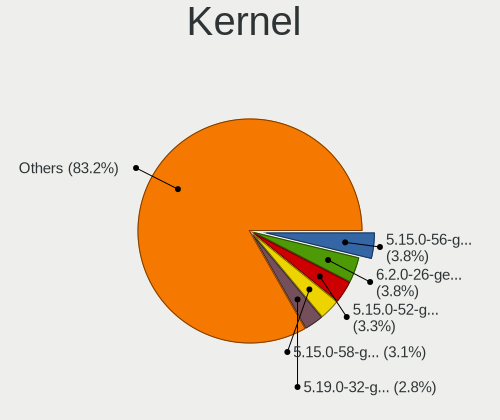
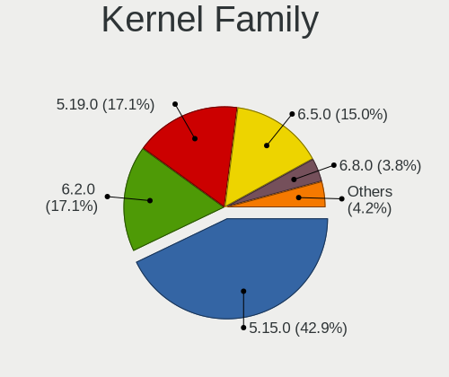
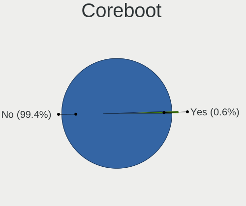
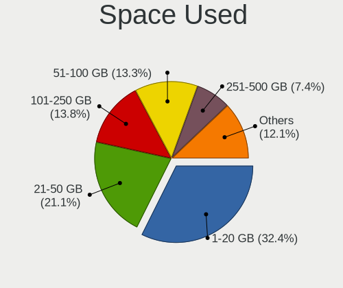
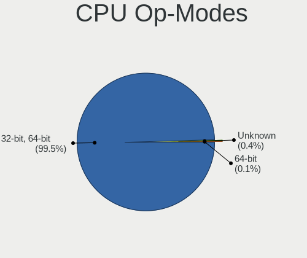
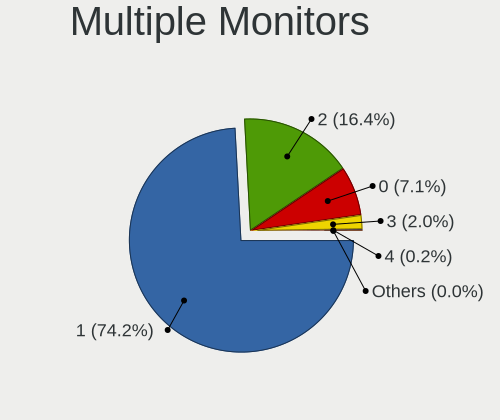
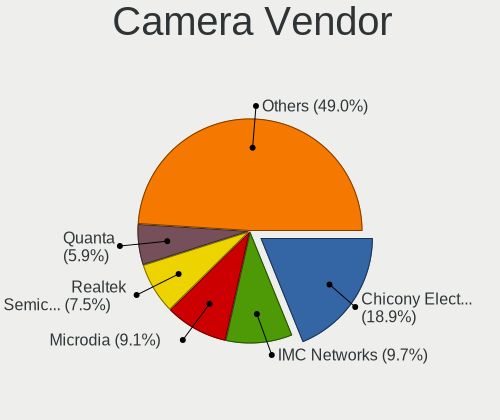
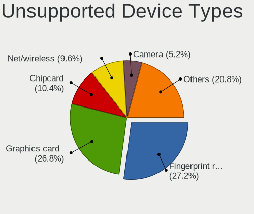

Ubuntu 22.04 - Tested Hardware & Statistics
-------------------------------------------

A project to collect tested hardware configurations for Ubuntu 22.04.

Anyone can contribute to this report by the [hw-probe](https://github.com/linuxhw/hw-probe) tool:

    sudo -E hw-probe -all -upload

Please contribute! Especially if your hardware is rare.

This is a report for all computer types. See also reports for [desktops](/Dist/Ubuntu_22.04/Desktop/README.md) and [notebooks](/Dist/Ubuntu_22.04/Notebook/README.md).

Contents
--------

* [ Test Cases ](#test-cases)

* [ System ](#system)
  - [ Kernel                   ](#kernel)
  - [ Kernel Family            ](#kernel-family)
  - [ Kernel Major Ver.        ](#kernel-major-ver)
  - [ Arch                     ](#arch)
  - [ DE                       ](#de)
  - [ Display Server           ](#display-server)
  - [ Display Manager          ](#display-manager)
  - [ OS Lang                  ](#os-lang)
  - [ Boot Mode                ](#boot-mode)
  - [ Filesystem               ](#filesystem)
  - [ Part. scheme             ](#part-scheme)
  - [ Dual Boot with Linux/BSD ](#dual-boot-with-linuxbsd)
  - [ Dual Boot (Win)          ](#dual-boot-win)

* [ Board ](#board)
  - [ Vendor                   ](#vendor)
  - [ Model                    ](#model)
  - [ Model Family             ](#model-family)
  - [ MFG Year                 ](#mfg-year)
  - [ Form Factor              ](#form-factor)
  - [ Secure Boot              ](#secure-boot)
  - [ Coreboot                 ](#coreboot)
  - [ RAM Size                 ](#ram-size)
  - [ RAM Used                 ](#ram-used)
  - [ Total Drives             ](#total-drives)
  - [ Has CD-ROM               ](#has-cd-rom)
  - [ Has Ethernet             ](#has-ethernet)
  - [ Has WiFi                 ](#has-wifi)
  - [ Has Bluetooth            ](#has-bluetooth)

* [ Location ](#location)
  - [ Country                  ](#country)
  - [ City                     ](#city)

* [ Drives ](#drives)
  - [ Drive Vendor             ](#drive-vendor)
  - [ Drive Model              ](#drive-model)
  - [ HDD Vendor               ](#hdd-vendor)
  - [ SSD Vendor               ](#ssd-vendor)
  - [ Drive Kind               ](#drive-kind)
  - [ Drive Connector          ](#drive-connector)
  - [ Drive Size               ](#drive-size)
  - [ Space Total              ](#space-total)
  - [ Space Used               ](#space-used)
  - [ Malfunc. Drives          ](#malfunc-drives)
  - [ Malfunc. Drive Vendor    ](#malfunc-drive-vendor)
  - [ Malfunc. HDD Vendor      ](#malfunc-hdd-vendor)
  - [ Malfunc. Drive Kind      ](#malfunc-drive-kind)
  - [ Failed Drives            ](#failed-drives)
  - [ Failed Drive Vendor      ](#failed-drive-vendor)
  - [ Drive Status             ](#drive-status)

* [ Storage controller ](#storage-controller)
  - [ Storage Vendor           ](#storage-vendor)
  - [ Storage Model            ](#storage-model)
  - [ Storage Kind             ](#storage-kind)

* [ Processor ](#processor)
  - [ CPU Vendor               ](#cpu-vendor)
  - [ CPU Model                ](#cpu-model)
  - [ CPU Model Family         ](#cpu-model-family)
  - [ CPU Cores                ](#cpu-cores)
  - [ CPU Sockets              ](#cpu-sockets)
  - [ CPU Threads              ](#cpu-threads)
  - [ CPU Op-Modes             ](#cpu-op-modes)
  - [ CPU Microcode            ](#cpu-microcode)
  - [ CPU Microarch            ](#cpu-microarch)

* [ Graphics ](#graphics)
  - [ GPU Vendor               ](#gpu-vendor)
  - [ GPU Model                ](#gpu-model)
  - [ GPU Combo                ](#gpu-combo)
  - [ GPU Driver               ](#gpu-driver)
  - [ GPU Memory               ](#gpu-memory)

* [ Monitor ](#monitor)
  - [ Monitor Vendor           ](#monitor-vendor)
  - [ Monitor Model            ](#monitor-model)
  - [ Monitor Resolution       ](#monitor-resolution)
  - [ Monitor Diagonal         ](#monitor-diagonal)
  - [ Monitor Width            ](#monitor-width)
  - [ Aspect Ratio             ](#aspect-ratio)
  - [ Monitor Area             ](#monitor-area)
  - [ Pixel Density            ](#pixel-density)
  - [ Multiple Monitors        ](#multiple-monitors)

* [ Network ](#network)
  - [ Net Controller Vendor    ](#net-controller-vendor)
  - [ Net Controller Model     ](#net-controller-model)
  - [ Wireless Vendor          ](#wireless-vendor)
  - [ Wireless Model           ](#wireless-model)
  - [ Ethernet Vendor          ](#ethernet-vendor)
  - [ Ethernet Model           ](#ethernet-model)
  - [ Net Controller Kind      ](#net-controller-kind)
  - [ Used Controller          ](#used-controller)
  - [ NICs                     ](#nics)
  - [ IPv6                     ](#ipv6)

* [ Bluetooth ](#bluetooth)
  - [ Bluetooth Vendor         ](#bluetooth-vendor)
  - [ Bluetooth Model          ](#bluetooth-model)

* [ Sound ](#sound)
  - [ Sound Vendor             ](#sound-vendor)
  - [ Sound Model              ](#sound-model)

* [ Memory ](#memory)
  - [ Memory Vendor            ](#memory-vendor)
  - [ Memory Model             ](#memory-model)
  - [ Memory Kind              ](#memory-kind)
  - [ Memory Form Factor       ](#memory-form-factor)
  - [ Memory Size              ](#memory-size)
  - [ Memory Speed             ](#memory-speed)

* [ Printers & scanners ](#printers--scanners)
  - [ Printer Vendor           ](#printer-vendor)
  - [ Printer Model            ](#printer-model)
  - [ Scanner Vendor           ](#scanner-vendor)
  - [ Scanner Model            ](#scanner-model)

* [ Camera ](#camera)
  - [ Camera Vendor            ](#camera-vendor)
  - [ Camera Model             ](#camera-model)

* [ Security ](#security)
  - [ Fingerprint Vendor       ](#fingerprint-vendor)
  - [ Fingerprint Model        ](#fingerprint-model)
  - [ Chipcard Vendor          ](#chipcard-vendor)
  - [ Chipcard Model           ](#chipcard-model)

* [ Unsupported ](#unsupported)
  - [ Unsupported Devices      ](#unsupported-devices)
  - [ Unsupported Device Types ](#unsupported-device-types)

Test Cases
----------

Total: 26884

| Vendor        | Model                       | Form-Factor | Probe                                                      | Date         |
|---------------|-----------------------------|-------------|------------------------------------------------------------|--------------|
| Dell          | 0V0D45 A01                  | All in one  | [d019c812b7](https://linux-hardware.org/?probe=d019c812b7) | Jan 06, 2025 |
| Lenovo        | SHARKBAY 31900058 STD       | Desktop     | [e1ab989081](https://linux-hardware.org/?probe=e1ab989081) | Jan 06, 2025 |
| Toshiba       | Satellite C670-14M          | Notebook    | [9e54cf257c](https://linux-hardware.org/?probe=9e54cf257c) | Jan 05, 2025 |
| Apple         | Mac-35C5E08120C7EEAF Mac... | Mini pc     | [dd4205dcdf](https://linux-hardware.org/?probe=dd4205dcdf) | Jan 05, 2025 |
| Dell          | 03X6X0 A06                  | Server      | [969b046986](https://linux-hardware.org/?probe=969b046986) | Jan 05, 2025 |
| ASUSTek       | M5A78L-M LX V2              | Desktop     | [02a12f94e1](https://linux-hardware.org/?probe=02a12f94e1) | Jan 05, 2025 |
| Medion        | P15648                      | Notebook    | [e4b0850870](https://linux-hardware.org/?probe=e4b0850870) | Jan 05, 2025 |
| ASUSTek       | G75VW                       | Notebook    | [ff570669d5](https://linux-hardware.org/?probe=ff570669d5) | Jan 04, 2025 |
| HP            | 15                          | Notebook    | [8542f54ea5](https://linux-hardware.org/?probe=8542f54ea5) | Jan 03, 2025 |
| Acer          | Aspire A115-32              | Notebook    | [c3f625776f](https://linux-hardware.org/?probe=c3f625776f) | Jan 03, 2025 |
| Lenovo        | ThinkPad T540p 20BE00B2M... | Notebook    | [d3fdfbc445](https://linux-hardware.org/?probe=d3fdfbc445) | Jan 03, 2025 |
| Unknown       | Unknown                     | Notebook    | [4a568ea48d](https://linux-hardware.org/?probe=4a568ea48d) | Jan 03, 2025 |
| HP            | EliteBook 840 G2            | Notebook    | [54ab368174](https://linux-hardware.org/?probe=54ab368174) | Jan 03, 2025 |
| ASUSTek       | PRIME X370-A                | Desktop     | [86c0b9c6d4](https://linux-hardware.org/?probe=86c0b9c6d4) | Jan 03, 2025 |
| ASUSTek       | H170 PRO GAMING             | Desktop     | [743efb1121](https://linux-hardware.org/?probe=743efb1121) | Jan 03, 2025 |
| Dell          | 033FF6 A00                  | Desktop     | [621ced80c1](https://linux-hardware.org/?probe=621ced80c1) | Jan 03, 2025 |
| ASUSTek       | UL50Vg                      | Notebook    | [6305475a87](https://linux-hardware.org/?probe=6305475a87) | Jan 03, 2025 |
| HP            | 89D8 SMVB                   | Desktop     | [150bb83ca3](https://linux-hardware.org/?probe=150bb83ca3) | Jan 02, 2025 |
| Apple         | Mac-8ED6AF5B48C039E1 Mac... | Mini pc     | [cfb9b15c52](https://linux-hardware.org/?probe=cfb9b15c52) | Jan 02, 2025 |
| Fujitsu       | LIFEBOOK UH572              | Notebook    | [5625a23ef5](https://linux-hardware.org/?probe=5625a23ef5) | Jan 02, 2025 |
| ASUSTek       | Vivobook Go E1504FA         | Notebook    | [8e5f1ab7d6](https://linux-hardware.org/?probe=8e5f1ab7d6) | Jan 02, 2025 |
| Acer          | Aspire E5-575G              | Notebook    | [bea4bbd29a](https://linux-hardware.org/?probe=bea4bbd29a) | Jan 02, 2025 |
| System76      | Lemur Pro                   | Notebook    | [6eae77b375](https://linux-hardware.org/?probe=6eae77b375) | Jan 02, 2025 |
| Intel         | 14650HX                     | Desktop     | [a9e917c056](https://linux-hardware.org/?probe=a9e917c056) | Jan 02, 2025 |
| HP            | 8619                        | Desktop     | [a916110ad9](https://linux-hardware.org/?probe=a916110ad9) | Jan 02, 2025 |
| HP            | 0AECh D                     | Desktop     | [9306b507f4](https://linux-hardware.org/?probe=9306b507f4) | Jan 02, 2025 |
| Fujitsu       | D3427-A1 S26361-D3427-A1    | Desktop     | [0cd4d1a295](https://linux-hardware.org/?probe=0cd4d1a295) | Jan 01, 2025 |
| Acer          | Aspire E5-575G              | Notebook    | [131ac42ca5](https://linux-hardware.org/?probe=131ac42ca5) | Jan 01, 2025 |
| Acer          | Swift SF314-52G             | Notebook    | [77f207d738](https://linux-hardware.org/?probe=77f207d738) | Jan 01, 2025 |
| Sony          | VAIO                        | All in one  | [44a108150c](https://linux-hardware.org/?probe=44a108150c) | Jan 01, 2025 |
| HP            | 0AECh D                     | Desktop     | [0827eed993](https://linux-hardware.org/?probe=0827eed993) | Jan 01, 2025 |
| ASUSTek       | K93SM                       | Notebook    | [de80ff2a02](https://linux-hardware.org/?probe=de80ff2a02) | Jan 01, 2025 |
| Lenovo        | G50-30 80G0                 | Notebook    | [f9d8f3d7a1](https://linux-hardware.org/?probe=f9d8f3d7a1) | Jan 01, 2025 |
| Apple         | MacBookPro12,1              | Notebook    | [1340d405bf](https://linux-hardware.org/?probe=1340d405bf) | Jan 01, 2025 |
| Apple         | MacBookPro9,2               | Notebook    | [319272bf03](https://linux-hardware.org/?probe=319272bf03) | Jan 01, 2025 |
| ASUSTek       | TUF Gaming X570-PLUS        | Desktop     | [0319b9ba0d](https://linux-hardware.org/?probe=0319b9ba0d) | Jan 01, 2025 |
| AZW           | MINI S                      | Desktop     | [e05536561b](https://linux-hardware.org/?probe=e05536561b) | Dec 31, 2024 |
| Samsung       | 370E4K                      | Notebook    | [ba2171b4e3](https://linux-hardware.org/?probe=ba2171b4e3) | Dec 31, 2024 |
| Dell          | Vostro 13 5310              | Notebook    | [b7f2eb4035](https://linux-hardware.org/?probe=b7f2eb4035) | Dec 31, 2024 |
| BOSGAME       | DNB20 series                | Notebook    | [7c23d0edba](https://linux-hardware.org/?probe=7c23d0edba) | Dec 31, 2024 |
| HP            | Victus by Gaming Laptop ... | Notebook    | [779320377b](https://linux-hardware.org/?probe=779320377b) | Dec 31, 2024 |
| MSI           | MPG Z390 GAMING PLUS        | Desktop     | [7ecce10a98](https://linux-hardware.org/?probe=7ecce10a98) | Dec 31, 2024 |
| ASUSTek       | P5GZ-MX                     | Desktop     | [62e974ebee](https://linux-hardware.org/?probe=62e974ebee) | Dec 30, 2024 |
| ASUSTek       | ROG STRIX Z790-E GAMING ... | Desktop     | [5d24c0c43e](https://linux-hardware.org/?probe=5d24c0c43e) | Dec 30, 2024 |
| Dell          | 0K240Y A02                  | Desktop     | [bf8d86985d](https://linux-hardware.org/?probe=bf8d86985d) | Dec 30, 2024 |
| HPE           | ProLiant DL380 Gen10        | Server      | [d9f97b2071](https://linux-hardware.org/?probe=d9f97b2071) | Dec 30, 2024 |
| HPE           | ProLiant DL380 Gen10        | Server      | [3fbe889e10](https://linux-hardware.org/?probe=3fbe889e10) | Dec 30, 2024 |
| ASUSTek       | VivoBook_ASUSLaptop X170... | Notebook    | [cba1e94ceb](https://linux-hardware.org/?probe=cba1e94ceb) | Dec 30, 2024 |
| Jumper        | EZpad                       | Tablet      | [29bf0cb907](https://linux-hardware.org/?probe=29bf0cb907) | Dec 29, 2024 |
| Lenovo        | G50-70 20351                | Notebook    | [493dd462e8](https://linux-hardware.org/?probe=493dd462e8) | Dec 29, 2024 |
| HUAWEI        | BOD-WXX9                    | Notebook    | [94c62e3b8b](https://linux-hardware.org/?probe=94c62e3b8b) | Dec 29, 2024 |
| Dell          | 0XCR8D A03                  | Desktop     | [95826b99c5](https://linux-hardware.org/?probe=95826b99c5) | Dec 29, 2024 |
| Dell          | 03X6X0 A06                  | Server      | [f55caeab7f](https://linux-hardware.org/?probe=f55caeab7f) | Dec 29, 2024 |
| Apple         | MacBookAir7,2               | Notebook    | [fcda8f7b53](https://linux-hardware.org/?probe=fcda8f7b53) | Dec 28, 2024 |
| Apple         | MacBookAir7,2               | Notebook    | [218f4af079](https://linux-hardware.org/?probe=218f4af079) | Dec 28, 2024 |
| ASUSTek       | VivoBook_ASUSLaptop X160... | Notebook    | [ed184eaff9](https://linux-hardware.org/?probe=ed184eaff9) | Dec 28, 2024 |
| Lenovo        | YB1-X91F                    | Convertible | [dc120e3257](https://linux-hardware.org/?probe=dc120e3257) | Dec 27, 2024 |
| Lenovo        | YB1-X91F                    | Convertible | [65f47b79ec](https://linux-hardware.org/?probe=65f47b79ec) | Dec 27, 2024 |
| HUAWEI        | KLVF-XX                     | Notebook    | [647fb3b2cf](https://linux-hardware.org/?probe=647fb3b2cf) | Dec 27, 2024 |
| ASUSTek       | M4A785T-M                   | Desktop     | [f16618cedd](https://linux-hardware.org/?probe=f16618cedd) | Dec 27, 2024 |
| Lenovo        | ThinkPad E460 20ET0014US    | Notebook    | [9ee6c676eb](https://linux-hardware.org/?probe=9ee6c676eb) | Dec 27, 2024 |
| ASRock        | AB350M Pro4                 | Desktop     | [e7ad6f1e08](https://linux-hardware.org/?probe=e7ad6f1e08) | Dec 27, 2024 |
| Dell          | Vostro 15 3510              | Notebook    | [318022f8d5](https://linux-hardware.org/?probe=318022f8d5) | Dec 27, 2024 |
| Lenovo        | ThinkPad T440p 20AN0069U... | Notebook    | [0574e44035](https://linux-hardware.org/?probe=0574e44035) | Dec 27, 2024 |
| Microsoft     | Surface Pro 4               | Tablet      | [02f9cbb6a8](https://linux-hardware.org/?probe=02f9cbb6a8) | Dec 27, 2024 |
| ASUSTek       | TUF Gaming B760M-PLUS WI... | Desktop     | [049870e2b4](https://linux-hardware.org/?probe=049870e2b4) | Dec 26, 2024 |
| Dell          | Latitude E6230              | Notebook    | [cd5bf9b8fb](https://linux-hardware.org/?probe=cd5bf9b8fb) | Dec 26, 2024 |
| sunxi         | Repka-Pi4-Optimal           | Soc         | [e92e8e414d](https://linux-hardware.org/?probe=e92e8e414d) | Dec 26, 2024 |
| Apple         | MacBookPro9,2               | Notebook    | [c7b700cc18](https://linux-hardware.org/?probe=c7b700cc18) | Dec 26, 2024 |
| Lenovo        | YB1-X91F                    | Convertible | [4e217ea914](https://linux-hardware.org/?probe=4e217ea914) | Dec 26, 2024 |
| MSI           | MAG B650 TOMAHAWK WIFI      | Desktop     | [769432836d](https://linux-hardware.org/?probe=769432836d) | Dec 26, 2024 |
| HP            | 805D                        | Desktop     | [026fd8a8b5](https://linux-hardware.org/?probe=026fd8a8b5) | Dec 26, 2024 |
| MSI           | MAG X570 TOMAHAWK WIFI      | Desktop     | [1a60e8fb7a](https://linux-hardware.org/?probe=1a60e8fb7a) | Dec 26, 2024 |
| BOSGAME       | DNB20 series                | Notebook    | [ce3d8499eb](https://linux-hardware.org/?probe=ce3d8499eb) | Dec 26, 2024 |
| ASUSTek       | UX305CA                     | Notebook    | [73bb2289d6](https://linux-hardware.org/?probe=73bb2289d6) | Dec 25, 2024 |
| Monster       | ABRA A7 V11.2               | Notebook    | [762b2b2071](https://linux-hardware.org/?probe=762b2b2071) | Dec 25, 2024 |
| HP            | Pavilion Laptop 15-eh2xx... | Notebook    | [f4697e3485](https://linux-hardware.org/?probe=f4697e3485) | Dec 25, 2024 |
| HUAWEI        | BOM-WXX9                    | Notebook    | [030b263131](https://linux-hardware.org/?probe=030b263131) | Dec 25, 2024 |
| Gigabyte      | MRHM3AP                     | Desktop     | [657c4947e4](https://linux-hardware.org/?probe=657c4947e4) | Dec 25, 2024 |
| Acer          | Aspire ES1-531              | Notebook    | [c09e9c415c](https://linux-hardware.org/?probe=c09e9c415c) | Dec 25, 2024 |
| ASUSTek       | UX305CA                     | Notebook    | [88a69fd398](https://linux-hardware.org/?probe=88a69fd398) | Dec 24, 2024 |
| HUAWEI        | BC82AMDDA V200R002C00       | Server      | [29bde967fc](https://linux-hardware.org/?probe=29bde967fc) | Dec 24, 2024 |
| Intel         | DH77KC AAG39641-401         | Desktop     | [0c54d9c7a7](https://linux-hardware.org/?probe=0c54d9c7a7) | Dec 24, 2024 |
| Lenovo        | ThinkBook 16 G6 IRL 21KH    | Notebook    | [48353373ae](https://linux-hardware.org/?probe=48353373ae) | Dec 24, 2024 |
| ASUSTek       | M51Sn                       | Notebook    | [3292249251](https://linux-hardware.org/?probe=3292249251) | Dec 24, 2024 |
| Sony          | VAIO                        | All in one  | [c4a89ac712](https://linux-hardware.org/?probe=c4a89ac712) | Dec 24, 2024 |
| Lenovo        | G585 2181                   | Notebook    | [0004a20215](https://linux-hardware.org/?probe=0004a20215) | Dec 24, 2024 |
| Dell          | XPS 13 9315 2-in-1          | Tablet      | [91717ba12b](https://linux-hardware.org/?probe=91717ba12b) | Dec 24, 2024 |
| MSI           | PRO Z790-A MAX WIFI         | Desktop     | [834ad993ac](https://linux-hardware.org/?probe=834ad993ac) | Dec 23, 2024 |
| Acer          | Predator PO3-600 V:1.1      | Desktop     | [8473ea95de](https://linux-hardware.org/?probe=8473ea95de) | Dec 23, 2024 |
| HUAWEI        | NBLB-WAX9N                  | Notebook    | [6524a2db9e](https://linux-hardware.org/?probe=6524a2db9e) | Dec 23, 2024 |
| Khadas        | VIM1S                       | Soc         | [c7abbeff6b](https://linux-hardware.org/?probe=c7abbeff6b) | Dec 23, 2024 |
| Dell          | 0PRR48 A01                  | Desktop     | [282281a510](https://linux-hardware.org/?probe=282281a510) | Dec 23, 2024 |
| Dell          | Latitude 5510               | Notebook    | [fefb1eb9c3](https://linux-hardware.org/?probe=fefb1eb9c3) | Dec 23, 2024 |
| ASUSTek       | TUF Gaming B450-PLUS II     | Desktop     | [7cc80d8aba](https://linux-hardware.org/?probe=7cc80d8aba) | Dec 23, 2024 |
| HP            | 3396                        | Desktop     | [c26082be18](https://linux-hardware.org/?probe=c26082be18) | Dec 23, 2024 |
| HP            | 3396                        | Desktop     | [a2eda9a830](https://linux-hardware.org/?probe=a2eda9a830) | Dec 23, 2024 |
| Samsung       | 370E4K                      | Notebook    | [b2200db0dc](https://linux-hardware.org/?probe=b2200db0dc) | Dec 23, 2024 |
| HP            | ProBook 4730s               | Notebook    | [0b185e0e1f](https://linux-hardware.org/?probe=0b185e0e1f) | Dec 23, 2024 |
| Samsung       | 370E4K                      | Notebook    | [6c1eff379e](https://linux-hardware.org/?probe=6c1eff379e) | Dec 23, 2024 |
| ASUSTek       | A88X-PRO                    | Desktop     | [1b74d31510](https://linux-hardware.org/?probe=1b74d31510) | Dec 23, 2024 |
| HP            | ProBook 4730s               | Notebook    | [03483a3212](https://linux-hardware.org/?probe=03483a3212) | Dec 22, 2024 |
| HP            | Spectre x360 Convertible    | Convertible | [b1647e295a](https://linux-hardware.org/?probe=b1647e295a) | Dec 22, 2024 |
| Fujitsu       | LIFEBOOK E734               | Notebook    | [2009db3bc5](https://linux-hardware.org/?probe=2009db3bc5) | Dec 22, 2024 |
| Lenovo        | ThinkPad A285 20MXS0AE00    | Notebook    | [ab309a9eb4](https://linux-hardware.org/?probe=ab309a9eb4) | Dec 22, 2024 |
| Dell          | Inspiron 7591               | Notebook    | [640a616ad8](https://linux-hardware.org/?probe=640a616ad8) | Dec 22, 2024 |
| Lenovo        | ThinkPad T410 2518R8G       | Notebook    | [03e23c615f](https://linux-hardware.org/?probe=03e23c615f) | Dec 21, 2024 |
| Maibenben     | MaiBook M                   | Notebook    | [5cb09d638e](https://linux-hardware.org/?probe=5cb09d638e) | Dec 21, 2024 |
| MSI           | PRO B650M-A WIFI            | Desktop     | [8cd738bd8a](https://linux-hardware.org/?probe=8cd738bd8a) | Dec 21, 2024 |
| ASUSTek       | ROG Strix G512LU_G512LU     | Notebook    | [914e64e86c](https://linux-hardware.org/?probe=914e64e86c) | Dec 20, 2024 |
| MSI           | MEG Z490I UNIFY             | Desktop     | [34567a9026](https://linux-hardware.org/?probe=34567a9026) | Dec 20, 2024 |
| Dell          | Inspiron 3442               | Notebook    | [cfc2614cfb](https://linux-hardware.org/?probe=cfc2614cfb) | Dec 20, 2024 |
| Supermicro    | X11SDV-8C-TLN2F             | Server      | [0c4013caf3](https://linux-hardware.org/?probe=0c4013caf3) | Dec 20, 2024 |
| Notebook      | W65_67SH                    | Notebook    | [a04f4e7b2a](https://linux-hardware.org/?probe=a04f4e7b2a) | Dec 20, 2024 |
| ASRockRack    | ROMED8-2T/OVHA              | Server      | [08fe32beb9](https://linux-hardware.org/?probe=08fe32beb9) | Dec 20, 2024 |
| ASUSTek       | ROG Strix G731GT_GL731GT    | Notebook    | [5b4fa92a70](https://linux-hardware.org/?probe=5b4fa92a70) | Dec 20, 2024 |
| ASRock        | B365 Phantom Gaming 4       | Desktop     | [ad7f76dde0](https://linux-hardware.org/?probe=ad7f76dde0) | Dec 20, 2024 |
| Acer          | Aspire 4820TG               | Notebook    | [d8ed5c82aa](https://linux-hardware.org/?probe=d8ed5c82aa) | Dec 19, 2024 |
| HP            | 81C5 MVB                    | Desktop     | [598ed0a0e1](https://linux-hardware.org/?probe=598ed0a0e1) | Dec 19, 2024 |
| Dell          | Precision 5690              | Notebook    | [df5aa6cbe1](https://linux-hardware.org/?probe=df5aa6cbe1) | Dec 19, 2024 |
| Lenovo        | SHARKBAY 0B98401 PRO        | Desktop     | [ab4132ad4c](https://linux-hardware.org/?probe=ab4132ad4c) | Dec 19, 2024 |
| Lenovo        | SHARKBAY 0B98401 PRO        | Desktop     | [cbeebff465](https://linux-hardware.org/?probe=cbeebff465) | Dec 19, 2024 |
| BOSGAME       | DNB20 series                | Notebook    | [113645b0bb](https://linux-hardware.org/?probe=113645b0bb) | Dec 19, 2024 |
| MSI           | Z77A-G43                    | Desktop     | [dfc91607d7](https://linux-hardware.org/?probe=dfc91607d7) | Dec 18, 2024 |
| Fujitsu       | D3091-A1 S26361-D3091-A1    | Desktop     | [52b54f9c5f](https://linux-hardware.org/?probe=52b54f9c5f) | Dec 18, 2024 |
| ASUSTek       | X555LB                      | Notebook    | [ff9a109d64](https://linux-hardware.org/?probe=ff9a109d64) | Dec 18, 2024 |
| Lenovo        | Z50-70 20354                | Notebook    | [8f484e94de](https://linux-hardware.org/?probe=8f484e94de) | Dec 18, 2024 |
| Acer          | Aspire 5750G                | Notebook    | [f4a8bd7c14](https://linux-hardware.org/?probe=f4a8bd7c14) | Dec 17, 2024 |
| HP            | 550                         | Notebook    | [c401aa1e31](https://linux-hardware.org/?probe=c401aa1e31) | Dec 17, 2024 |
| Lenovo        | 1064 SDK0T76530 WIN 3556... | Desktop     | [5913ca9ed8](https://linux-hardware.org/?probe=5913ca9ed8) | Dec 17, 2024 |
| Dell          | XPS 13 9340                 | Notebook    | [914be0c9e8](https://linux-hardware.org/?probe=914be0c9e8) | Dec 17, 2024 |
| Acer          | Aspire A515-57              | Notebook    | [c09f54f867](https://linux-hardware.org/?probe=c09f54f867) | Dec 17, 2024 |
| Lenovo        | Legion 5 Pro 16ACH6H 82J... | Notebook    | [1db1f1c585](https://linux-hardware.org/?probe=1db1f1c585) | Dec 17, 2024 |
| Lenovo        | LOQ 15APH8 82XT             | Notebook    | [428715e96d](https://linux-hardware.org/?probe=428715e96d) | Dec 17, 2024 |
| Lenovo        | LOQ 15APH8 82XT             | Notebook    | [46f8c1934d](https://linux-hardware.org/?probe=46f8c1934d) | Dec 17, 2024 |
| Dell          | 0P096C A01                  | Desktop     | [98c35e9b9b](https://linux-hardware.org/?probe=98c35e9b9b) | Dec 17, 2024 |
| ASUSTek       | ZenBook UX325EA_UX325EA     | Notebook    | [12be2072af](https://linux-hardware.org/?probe=12be2072af) | Dec 16, 2024 |
| Dell          | G15 5530                    | Notebook    | [348b21d35f](https://linux-hardware.org/?probe=348b21d35f) | Dec 16, 2024 |
| HP            | 550                         | Notebook    | [4890cb5e06](https://linux-hardware.org/?probe=4890cb5e06) | Dec 16, 2024 |
| ASUSTek       | ZenBook UX435EA_UX435EA     | Notebook    | [55b8b860be](https://linux-hardware.org/?probe=55b8b860be) | Dec 16, 2024 |
| Lenovo        | IdeaPad 3 15ITL6 82H8       | Notebook    | [8bef0b6a5c](https://linux-hardware.org/?probe=8bef0b6a5c) | Dec 16, 2024 |
| Lenovo        | ThinkPad P14s Gen 1 20S4... | Notebook    | [6f50478831](https://linux-hardware.org/?probe=6f50478831) | Dec 16, 2024 |
| Acer          | TravelMate P653-M           | Notebook    | [433663f1d2](https://linux-hardware.org/?probe=433663f1d2) | Dec 16, 2024 |
| MSI           | MAG X870 TOMAHAWK WIFI      | Desktop     | [569b52f7b9](https://linux-hardware.org/?probe=569b52f7b9) | Dec 16, 2024 |
| Fujitsu       | LIFEBOOK E734               | Notebook    | [1fe6aaa34e](https://linux-hardware.org/?probe=1fe6aaa34e) | Dec 16, 2024 |
| MSI           | MAG X870 TOMAHAWK WIFI      | Desktop     | [bc81411e04](https://linux-hardware.org/?probe=bc81411e04) | Dec 16, 2024 |
| Lenovo        | ThinkCentre A52 8289G4M     | Desktop     | [d07ac546df](https://linux-hardware.org/?probe=d07ac546df) | Dec 16, 2024 |
| HP            | Victus by Gaming Laptop ... | Notebook    | [3f73630b78](https://linux-hardware.org/?probe=3f73630b78) | Dec 15, 2024 |
| HP            | Notebook                    | Notebook    | [c84a2c0827](https://linux-hardware.org/?probe=c84a2c0827) | Dec 15, 2024 |
| Apple         | MacBookPro9,2               | Notebook    | [ac5dad0554](https://linux-hardware.org/?probe=ac5dad0554) | Dec 15, 2024 |
| Fujitsu       | D3091-A1 S26361-D3091-A1    | Desktop     | [9ddeef2131](https://linux-hardware.org/?probe=9ddeef2131) | Dec 15, 2024 |
| Dell          | 0F428D A00                  | Desktop     | [ba32636f6f](https://linux-hardware.org/?probe=ba32636f6f) | Dec 14, 2024 |
| Dell          | Latitude 7280               | Notebook    | [8ed58033ee](https://linux-hardware.org/?probe=8ed58033ee) | Dec 14, 2024 |
| ASUSTek       | ASUS Vivobook S 16 M5606... | Notebook    | [7babd755f8](https://linux-hardware.org/?probe=7babd755f8) | Dec 14, 2024 |
| MSI           | PRO H610M-E DDR4            | Desktop     | [dd71cde0f4](https://linux-hardware.org/?probe=dd71cde0f4) | Dec 14, 2024 |
| Shenzhen M... | F7BSC                       | Mini pc     | [4ca5882e52](https://linux-hardware.org/?probe=4ca5882e52) | Dec 14, 2024 |
| Gigabyte      | AB350-Gaming-CF             | Desktop     | [7aebeb376d](https://linux-hardware.org/?probe=7aebeb376d) | Dec 14, 2024 |
| Dell          | 0GY6Y8 A03                  | Desktop     | [e453ed40ac](https://linux-hardware.org/?probe=e453ed40ac) | Dec 14, 2024 |
| Unknown       | GB3B                        | Mini pc     | [0a6390f528](https://linux-hardware.org/?probe=0a6390f528) | Dec 14, 2024 |
| ASRock        | B250M-HDV                   | Desktop     | [feade65edb](https://linux-hardware.org/?probe=feade65edb) | Dec 13, 2024 |
| ASUSTek       | PRIME B650-PLUS             | Desktop     | [dbfe399fdb](https://linux-hardware.org/?probe=dbfe399fdb) | Dec 13, 2024 |
| Toshiba       | Satellite C50D-A-12M        | Notebook    | [2d76f9c438](https://linux-hardware.org/?probe=2d76f9c438) | Dec 13, 2024 |
| Dell          | 0JP3NX A01                  | Desktop     | [1332bf42b8](https://linux-hardware.org/?probe=1332bf42b8) | Dec 13, 2024 |
| Lenovo        | Yoga 910-13IKB 80VF         | Convertible | [791d6f86d1](https://linux-hardware.org/?probe=791d6f86d1) | Dec 13, 2024 |
| HP            | EliteBook 840 G1            | Notebook    | [bd27b16177](https://linux-hardware.org/?probe=bd27b16177) | Dec 13, 2024 |
| HP            | Pavilion dm4                | Notebook    | [74c6e0eb54](https://linux-hardware.org/?probe=74c6e0eb54) | Dec 12, 2024 |
| Dell          | Latitude 7490               | Notebook    | [14889ddf55](https://linux-hardware.org/?probe=14889ddf55) | Dec 12, 2024 |
| Intel         | DB65AL AAG12530-307         | Desktop     | [80eb8c5e8f](https://linux-hardware.org/?probe=80eb8c5e8f) | Dec 12, 2024 |
| Supermicro    | X10DAI                      | Desktop     | [8be65c83bd](https://linux-hardware.org/?probe=8be65c83bd) | Dec 12, 2024 |
| HUAWEI        | BC11HGSB0 V100R003          | Server      | [30659aa37a](https://linux-hardware.org/?probe=30659aa37a) | Dec 12, 2024 |
| ASUSTek       | ASUS Vivobook S 16 M5606... | Notebook    | [b3ea15c92e](https://linux-hardware.org/?probe=b3ea15c92e) | Dec 12, 2024 |
| Dell          | 0WG855                      | Desktop     | [c87b7a95df](https://linux-hardware.org/?probe=c87b7a95df) | Dec 12, 2024 |
| ASRock        | A320M-HDV R4.0              | Desktop     | [6df6bce660](https://linux-hardware.org/?probe=6df6bce660) | Dec 11, 2024 |
| Dell          | 0272WF A00                  | Server      | [2d3d5673e7](https://linux-hardware.org/?probe=2d3d5673e7) | Dec 11, 2024 |
| Lenovo        | 36C5 SDK0K17763 WIN 1801... | Desktop     | [5afdeb8595](https://linux-hardware.org/?probe=5afdeb8595) | Dec 11, 2024 |
| Lenovo        | 36C5 SDK0K17763 WIN 1801... | Desktop     | [29b0f998a4](https://linux-hardware.org/?probe=29b0f998a4) | Dec 11, 2024 |
| HUAWEI        | BC82AMDDA V200R002C00       | Server      | [ba11fdb7bd](https://linux-hardware.org/?probe=ba11fdb7bd) | Dec 11, 2024 |
| Notebook      | NL40_50CU                   | Notebook    | [17bfb4311c](https://linux-hardware.org/?probe=17bfb4311c) | Dec 11, 2024 |
| Wortmann      | TERRA_PAD_1061              | Tablet      | [0c43f7a18d](https://linux-hardware.org/?probe=0c43f7a18d) | Dec 10, 2024 |
| HP            | 3047h                       | Desktop     | [4cd6652c01](https://linux-hardware.org/?probe=4cd6652c01) | Dec 10, 2024 |
| Dell          | G15 5530                    | Notebook    | [f2e8fbbc50](https://linux-hardware.org/?probe=f2e8fbbc50) | Dec 10, 2024 |
| Lenovo        | ThinkPad X1 Extreme Gen2... | Notebook    | [280acb4797](https://linux-hardware.org/?probe=280acb4797) | Dec 10, 2024 |
| HP            | Folio 13 - 2000             | Notebook    | [267f773f15](https://linux-hardware.org/?probe=267f773f15) | Dec 10, 2024 |
| Gigabyte      | AX370-Gaming 3-CF           | Desktop     | [0124649cba](https://linux-hardware.org/?probe=0124649cba) | Dec 10, 2024 |
| ZOTAC         | ZBOX-MI549                  | Mini pc     | [3dd81341c1](https://linux-hardware.org/?probe=3dd81341c1) | Dec 10, 2024 |
| HP            | Pavilion Gaming Laptop 1... | Notebook    | [125266fa30](https://linux-hardware.org/?probe=125266fa30) | Dec 09, 2024 |
| ASUSTek       | VivoBook_ASUSLaptop K360... | Notebook    | [8169d4ab51](https://linux-hardware.org/?probe=8169d4ab51) | Dec 09, 2024 |
| ASRockRack    | ROMED8-2T/OVHA              | Server      | [b6965c5024](https://linux-hardware.org/?probe=b6965c5024) | Dec 09, 2024 |
| HP            | 3047h                       | Desktop     | [7ed4dce9a4](https://linux-hardware.org/?probe=7ed4dce9a4) | Dec 09, 2024 |
| Dell          | Latitude 7280               | Notebook    | [7b850c81c1](https://linux-hardware.org/?probe=7b850c81c1) | Dec 08, 2024 |
| Intel         | DB65AL AAG12530-307         | Desktop     | [f56398a4ab](https://linux-hardware.org/?probe=f56398a4ab) | Dec 08, 2024 |
| ASUSTek       | P5Q-E                       | Desktop     | [f031609f7c](https://linux-hardware.org/?probe=f031609f7c) | Dec 08, 2024 |
| Gigabyte      | 970A-DS3P                   | Desktop     | [1e1f3fb374](https://linux-hardware.org/?probe=1e1f3fb374) | Dec 08, 2024 |
| HP            | Laptop 17z-cp300            | Notebook    | [af630a7da9](https://linux-hardware.org/?probe=af630a7da9) | Dec 08, 2024 |
| Dell          | Precision 7530              | Notebook    | [0548741152](https://linux-hardware.org/?probe=0548741152) | Dec 07, 2024 |
| ASUSTek       | TUF Gaming B760M-PLUS WI... | Desktop     | [6c2446ea11](https://linux-hardware.org/?probe=6c2446ea11) | Dec 07, 2024 |
| HP            | Laptop 14s-dq3xxx           | Notebook    | [dd50a8ad3b](https://linux-hardware.org/?probe=dd50a8ad3b) | Dec 07, 2024 |
| HP            | Laptop 14s-dq3xxx           | Notebook    | [3b9ccf4f6d](https://linux-hardware.org/?probe=3b9ccf4f6d) | Dec 07, 2024 |
| Packard Be... | EasyNote TS11HR             | Notebook    | [9be4f893aa](https://linux-hardware.org/?probe=9be4f893aa) | Dec 07, 2024 |
| Dell          | 0K216C                      | Desktop     | [10ab4e790d](https://linux-hardware.org/?probe=10ab4e790d) | Dec 07, 2024 |
| Shuttle       | DS10U                       | Desktop     | [e5de028bb7](https://linux-hardware.org/?probe=e5de028bb7) | Dec 06, 2024 |
| MSI           | PRO B760M-P DDR4            | Desktop     | [3af5d27c3e](https://linux-hardware.org/?probe=3af5d27c3e) | Dec 06, 2024 |
| MSI           | PRO B760M-P DDR4            | Desktop     | [5ca31295b1](https://linux-hardware.org/?probe=5ca31295b1) | Dec 06, 2024 |
| Dell          | Latitude 3520               | Notebook    | [cffdf7964b](https://linux-hardware.org/?probe=cffdf7964b) | Dec 06, 2024 |
| Dell          | 0H19HD A07                  | Server      | [a35a094f7e](https://linux-hardware.org/?probe=a35a094f7e) | Dec 06, 2024 |
| Lenovo        | ThinkBook 16 G6 ABP 21KK    | Notebook    | [5a22a76102](https://linux-hardware.org/?probe=5a22a76102) | Dec 06, 2024 |
| Gateway       | NV79C                       | Notebook    | [5995d6bf0f](https://linux-hardware.org/?probe=5995d6bf0f) | Dec 06, 2024 |
| Dell          | Latitude D830               | Notebook    | [137bc0a643](https://linux-hardware.org/?probe=137bc0a643) | Dec 06, 2024 |
| Dell          | Inspiron 7773               | Notebook    | [b2bf3b5b8a](https://linux-hardware.org/?probe=b2bf3b5b8a) | Dec 06, 2024 |
| ASUSTek       | P8H61-M                     | Desktop     | [cfef2f57c3](https://linux-hardware.org/?probe=cfef2f57c3) | Dec 05, 2024 |
| Dell          | 0FDY5C A00                  | Desktop     | [9850cbe351](https://linux-hardware.org/?probe=9850cbe351) | Dec 05, 2024 |
| Lenovo        | ThinkBook 16 G6 IRL 21KH    | Notebook    | [6f2a2ee5c7](https://linux-hardware.org/?probe=6f2a2ee5c7) | Dec 05, 2024 |
| Supermicro    | X10DRU-i+                   | Server      | [d24d2612fe](https://linux-hardware.org/?probe=d24d2612fe) | Dec 05, 2024 |
| ASRockRack    | E3C252D4U-2T/OVH            | Server      | [125542f615](https://linux-hardware.org/?probe=125542f615) | Dec 05, 2024 |
| Samsung       | 530U3C/530U4C/532U3C        | Notebook    | [aaecf0d069](https://linux-hardware.org/?probe=aaecf0d069) | Dec 05, 2024 |
| ASUSTek       | PRIME Z790-P WIFI           | Desktop     | [7745cda9b8](https://linux-hardware.org/?probe=7745cda9b8) | Dec 05, 2024 |
| HP            | Notebook                    | Notebook    | [0171dcd515](https://linux-hardware.org/?probe=0171dcd515) | Dec 04, 2024 |
| HP            | Notebook                    | Notebook    | [b9a4b1639e](https://linux-hardware.org/?probe=b9a4b1639e) | Dec 04, 2024 |
| Dell          | 0V8F20 A01                  | Desktop     | [07be2a8da3](https://linux-hardware.org/?probe=07be2a8da3) | Dec 04, 2024 |
| Dell          | 0V8F20 A01                  | Desktop     | [63d611d479](https://linux-hardware.org/?probe=63d611d479) | Dec 04, 2024 |
| ASUSTek       | PN40                        | Mini pc     | [4038e15501](https://linux-hardware.org/?probe=4038e15501) | Dec 04, 2024 |
| ASUSTek       | PN40                        | Mini pc     | [191740fdbc](https://linux-hardware.org/?probe=191740fdbc) | Dec 04, 2024 |
| Lenovo        | IdeaPad 320-15IAP 80XR      | Notebook    | [27ffa8dde9](https://linux-hardware.org/?probe=27ffa8dde9) | Dec 04, 2024 |
| Lenovo        | B560 43308VG                | Notebook    | [dc77ba16df](https://linux-hardware.org/?probe=dc77ba16df) | Dec 04, 2024 |
| Dell          | 0NW6H5 A00                  | Desktop     | [6f6d7d14a9](https://linux-hardware.org/?probe=6f6d7d14a9) | Dec 04, 2024 |
| HP            | Laptop 15-fc0xxx            | Notebook    | [02e6943db4](https://linux-hardware.org/?probe=02e6943db4) | Dec 03, 2024 |
| HP            | Pavilion Laptop 15t-eg30... | Notebook    | [eea03d6bb5](https://linux-hardware.org/?probe=eea03d6bb5) | Dec 03, 2024 |
| Intel         | DH55TC AAE70932-302         | Desktop     | [1f0e503f99](https://linux-hardware.org/?probe=1f0e503f99) | Dec 03, 2024 |
| ASUSTek       | PRIME Z790-P WIFI           | Desktop     | [5c0dd2a9de](https://linux-hardware.org/?probe=5c0dd2a9de) | Dec 03, 2024 |
| Supermicro    | X9DRL-3F/iF                 | Desktop     | [cf165ddf30](https://linux-hardware.org/?probe=cf165ddf30) | Dec 03, 2024 |
| Unknown       | Unknown                     | Desktop     | [02faf52e1b](https://linux-hardware.org/?probe=02faf52e1b) | Dec 03, 2024 |
| Dell          | Vostro 1500                 | Notebook    | [2b6441b829](https://linux-hardware.org/?probe=2b6441b829) | Dec 03, 2024 |
| Supermicro    | X8DTU                       | Server      | [b66e4c113a](https://linux-hardware.org/?probe=b66e4c113a) | Dec 03, 2024 |
| Dell          | Precision 5540              | Notebook    | [9e16a34662](https://linux-hardware.org/?probe=9e16a34662) | Dec 03, 2024 |
| Samsung       | 550XDA                      | Notebook    | [f698576590](https://linux-hardware.org/?probe=f698576590) | Dec 03, 2024 |
| Lenovo        | ThinkBook 14-IIL 20SL       | Notebook    | [c6443bd0c5](https://linux-hardware.org/?probe=c6443bd0c5) | Dec 03, 2024 |
| ASRock        | 970 Extreme4                | Desktop     | [21adbb0a83](https://linux-hardware.org/?probe=21adbb0a83) | Dec 03, 2024 |
| MSI           | MPG X570 GAMING PLUS        | Desktop     | [4e2b2d2517](https://linux-hardware.org/?probe=4e2b2d2517) | Dec 02, 2024 |
| Dell          | Latitude 5540               | Notebook    | [671915a3df](https://linux-hardware.org/?probe=671915a3df) | Dec 02, 2024 |
| Supermicro    | X8DTU                       | Server      | [4c1f4d0312](https://linux-hardware.org/?probe=4c1f4d0312) | Dec 02, 2024 |
| Dell          | Latitude E7250              | Notebook    | [a02e607413](https://linux-hardware.org/?probe=a02e607413) | Dec 02, 2024 |
| Razer         | Blade 17 (2022) - RZ09-0... | Notebook    | [84343acca8](https://linux-hardware.org/?probe=84343acca8) | Dec 02, 2024 |
| Dell          | Precision 5690              | Notebook    | [e52f8d92d4](https://linux-hardware.org/?probe=e52f8d92d4) | Dec 02, 2024 |
| HP            | Laptop 15-da0xxx            | Notebook    | [c352e2fd24](https://linux-hardware.org/?probe=c352e2fd24) | Dec 02, 2024 |
| Dell          | Inspiron 15-3567            | Notebook    | [fffcdca9f4](https://linux-hardware.org/?probe=fffcdca9f4) | Dec 01, 2024 |
| Lenovo        | Z50-70 20354                | Notebook    | [18d0728c77](https://linux-hardware.org/?probe=18d0728c77) | Dec 01, 2024 |
| ASUSTek       | X751MD                      | Notebook    | [c659c9a57c](https://linux-hardware.org/?probe=c659c9a57c) | Dec 01, 2024 |
| Lenovo        | IdeaPad 3 15ADA05 81W1      | Notebook    | [5b0a65bb7c](https://linux-hardware.org/?probe=5b0a65bb7c) | Dec 01, 2024 |
| HP            | 8597                        | Desktop     | [c0b7ad7c1f](https://linux-hardware.org/?probe=c0b7ad7c1f) | Dec 01, 2024 |
| Dell          | Latitude E7470              | Notebook    | [ac991cd0b2](https://linux-hardware.org/?probe=ac991cd0b2) | Nov 30, 2024 |
| Lenovo        | ThinkBook 15 20VE           | Notebook    | [c33fad56a0](https://linux-hardware.org/?probe=c33fad56a0) | Nov 30, 2024 |
| Dell          | 0654JC A01                  | Desktop     | [c195b37ae1](https://linux-hardware.org/?probe=c195b37ae1) | Nov 30, 2024 |
| Lenovo        | ThinkPad P53 20QN001FUS     | Notebook    | [7638dfbea7](https://linux-hardware.org/?probe=7638dfbea7) | Nov 30, 2024 |
| HP            | Pavilion Laptop 15-cs3xx... | Notebook    | [e395b7e749](https://linux-hardware.org/?probe=e395b7e749) | Nov 30, 2024 |
| MSI           | FM2-A55M-E33                | Desktop     | [5b919d0b65](https://linux-hardware.org/?probe=5b919d0b65) | Nov 30, 2024 |
| ASUSTek       | ZenBook Q536FD_Q536FD       | Convertible | [ac8e91e9d9](https://linux-hardware.org/?probe=ac8e91e9d9) | Nov 30, 2024 |
| ASUSTek       | ZenBook Q536FD_Q536FD       | Convertible | [c5965e9e0f](https://linux-hardware.org/?probe=c5965e9e0f) | Nov 30, 2024 |
| ASUSTek       | PRIME Z390-P                | Desktop     | [a6855cbe14](https://linux-hardware.org/?probe=a6855cbe14) | Nov 29, 2024 |
| ASUSTek       | M5A97 R2.0                  | Desktop     | [85e1f58dea](https://linux-hardware.org/?probe=85e1f58dea) | Nov 29, 2024 |
| Gigabyte      | 970A-DS3P                   | Desktop     | [6d5e05ac38](https://linux-hardware.org/?probe=6d5e05ac38) | Nov 29, 2024 |
| Supermicro    | X8DTU                       | Server      | [b79574c0c8](https://linux-hardware.org/?probe=b79574c0c8) | Nov 29, 2024 |
| Supermicro    | X8DTU                       | Server      | [f00e41f4f7](https://linux-hardware.org/?probe=f00e41f4f7) | Nov 29, 2024 |
| Inspur        | X10DRT-PS                   | Desktop     | [e33d406712](https://linux-hardware.org/?probe=e33d406712) | Nov 29, 2024 |
| Inspur        | X10DRT-PS                   | Desktop     | [db389cfbf7](https://linux-hardware.org/?probe=db389cfbf7) | Nov 29, 2024 |
| Dell          | 0WG855                      | Desktop     | [89f19d38c8](https://linux-hardware.org/?probe=89f19d38c8) | Nov 29, 2024 |
| HP            | 82B4                        | Desktop     | [ff4053afd7](https://linux-hardware.org/?probe=ff4053afd7) | Nov 28, 2024 |
| HP            | 8054                        | Desktop     | [9e20fcd26a](https://linux-hardware.org/?probe=9e20fcd26a) | Nov 28, 2024 |
| Intel         | NUC10i7FNB K61360-303       | Mini pc     | [2601c319b5](https://linux-hardware.org/?probe=2601c319b5) | Nov 28, 2024 |
| ASUSTek       | TUF Z390-PLUS GAMING        | Desktop     | [12a42bbefa](https://linux-hardware.org/?probe=12a42bbefa) | Nov 28, 2024 |
| HP            | ProBook 450 G2              | Notebook    | [72abd853a1](https://linux-hardware.org/?probe=72abd853a1) | Nov 28, 2024 |
| Acer          | Aspire E5-576G              | Notebook    | [66f3dc8d70](https://linux-hardware.org/?probe=66f3dc8d70) | Nov 27, 2024 |
| MSI           | FM2-A55M-E33                | Desktop     | [fa25af819e](https://linux-hardware.org/?probe=fa25af819e) | Nov 27, 2024 |
| Supermicro    | X8DTU                       | Server      | [09c71f9faa](https://linux-hardware.org/?probe=09c71f9faa) | Nov 27, 2024 |
| Supermicro    | X8DTU                       | Server      | [3557a56dfa](https://linux-hardware.org/?probe=3557a56dfa) | Nov 27, 2024 |
| ASUSTek       | VivoBook_ASUSLaptop K360... | Notebook    | [68e95f2aff](https://linux-hardware.org/?probe=68e95f2aff) | Nov 27, 2024 |
| HP            | 83E0                        | Desktop     | [ce5cb82673](https://linux-hardware.org/?probe=ce5cb82673) | Nov 27, 2024 |
| Supermicro    | H12DSi-NT6                  | Server      | [830fdbc722](https://linux-hardware.org/?probe=830fdbc722) | Nov 27, 2024 |
| Dell          | Latitude E6420              | Notebook    | [f38a40bedf](https://linux-hardware.org/?probe=f38a40bedf) | Nov 27, 2024 |
| ASUSTek       | ASUS TUF Gaming F15 FX50... | Notebook    | [097217bba2](https://linux-hardware.org/?probe=097217bba2) | Nov 26, 2024 |
| HONOR         | BRI-XX                      | Notebook    | [2c9acc0634](https://linux-hardware.org/?probe=2c9acc0634) | Nov 26, 2024 |
| Lenovo        | Yoga 510-14AST 80S9         | Convertible | [f96e8f8244](https://linux-hardware.org/?probe=f96e8f8244) | Nov 26, 2024 |
| Apple         | Mac-27AD2F918AE68F61 Mac... | Desktop     | [6ce6b8b12d](https://linux-hardware.org/?probe=6ce6b8b12d) | Nov 26, 2024 |
| HP            | Pavilion 17                 | Notebook    | [16a7e6215b](https://linux-hardware.org/?probe=16a7e6215b) | Nov 26, 2024 |
| HP            | ProLiant BL460c G7          | Server      | [04ce60ad90](https://linux-hardware.org/?probe=04ce60ad90) | Nov 26, 2024 |
| Lenovo        | ThinkPad X1 Carbon Gen 9... | Notebook    | [7d10950e55](https://linux-hardware.org/?probe=7d10950e55) | Nov 26, 2024 |
| HP            | 81C5 MVB                    | Desktop     | [6f9f169263](https://linux-hardware.org/?probe=6f9f169263) | Nov 26, 2024 |
| AZW           | GK55                        | Desktop     | [89f2d40002](https://linux-hardware.org/?probe=89f2d40002) | Nov 26, 2024 |
| Acer          | Aspire 5739G                | Notebook    | [3e6fa419ef](https://linux-hardware.org/?probe=3e6fa419ef) | Nov 25, 2024 |
| Apple         | MacBookPro15,3              | Notebook    | [b2950a6acc](https://linux-hardware.org/?probe=b2950a6acc) | Nov 25, 2024 |
| Gigabyte      | Z390 UD                     | Desktop     | [81652d9ab3](https://linux-hardware.org/?probe=81652d9ab3) | Nov 25, 2024 |
| Apple         | MacBookPro15,3              | Notebook    | [35e53fb246](https://linux-hardware.org/?probe=35e53fb246) | Nov 25, 2024 |
| Supermicro    | X8DTU                       | Server      | [df35a421df](https://linux-hardware.org/?probe=df35a421df) | Nov 25, 2024 |
| Dell          | 0WWR83 A05                  | Server      | [b6e4ea8841](https://linux-hardware.org/?probe=b6e4ea8841) | Nov 25, 2024 |
| Supermicro    | X8DTU                       | Server      | [f3b0ee8022](https://linux-hardware.org/?probe=f3b0ee8022) | Nov 25, 2024 |
| Supermicro    | X8DTU                       | Server      | [1128e2a9fa](https://linux-hardware.org/?probe=1128e2a9fa) | Nov 25, 2024 |
| Supermicro    | X8DTU                       | Server      | [af6838d02e](https://linux-hardware.org/?probe=af6838d02e) | Nov 25, 2024 |
| Supermicro    | X8DTU                       | Server      | [e46ba12671](https://linux-hardware.org/?probe=e46ba12671) | Nov 25, 2024 |
| Supermicro    | X8DTU                       | Server      | [83f62a1222](https://linux-hardware.org/?probe=83f62a1222) | Nov 25, 2024 |
| Supermicro    | X8DTT                       | Server      | [8c5797ed25](https://linux-hardware.org/?probe=8c5797ed25) | Nov 25, 2024 |
| Supermicro    | X8DTU                       | Server      | [4920828126](https://linux-hardware.org/?probe=4920828126) | Nov 25, 2024 |
| Supermicro    | X8DTT                       | Server      | [3a09f1ab51](https://linux-hardware.org/?probe=3a09f1ab51) | Nov 25, 2024 |
| VIT           | M2400-01                    | Mini pc     | [9bbce59d1d](https://linux-hardware.org/?probe=9bbce59d1d) | Nov 25, 2024 |
| Acer          | Swift SFG14-41              | Notebook    | [60a881fd19](https://linux-hardware.org/?probe=60a881fd19) | Nov 25, 2024 |
| Gigabyte      | A520M H                     | Desktop     | [78a90f9c49](https://linux-hardware.org/?probe=78a90f9c49) | Nov 25, 2024 |
| HUAWEI        | BC11HGSB0 V100R003          | Server      | [99868e4e7e](https://linux-hardware.org/?probe=99868e4e7e) | Nov 25, 2024 |
| AXIOO         | Hype 5 G12                  | Notebook    | [c05b80051b](https://linux-hardware.org/?probe=c05b80051b) | Nov 25, 2024 |
| Fujitsu       | D3161-A1 S26361-D3161-A1    | Desktop     | [07eecb1971](https://linux-hardware.org/?probe=07eecb1971) | Nov 24, 2024 |
| HP            | 81C5 MVB                    | Desktop     | [9aa92c417c](https://linux-hardware.org/?probe=9aa92c417c) | Nov 24, 2024 |
| MSI           | B450 TOMAHAWK MAX           | Desktop     | [2d53f31dcc](https://linux-hardware.org/?probe=2d53f31dcc) | Nov 24, 2024 |
| Dell          | 0VHWTR A02                  | Desktop     | [5bad281eef](https://linux-hardware.org/?probe=5bad281eef) | Nov 24, 2024 |
| Fujitsu       | D3239-A1 S26361-D3239-A1... | Server      | [0d4c00ea9a](https://linux-hardware.org/?probe=0d4c00ea9a) | Nov 24, 2024 |
| Acer          | Aspire VN7-593G             | Notebook    | [ad4e2f6625](https://linux-hardware.org/?probe=ad4e2f6625) | Nov 24, 2024 |
| Gigabyte      | H61MA-D3V                   | Desktop     | [2e02a58413](https://linux-hardware.org/?probe=2e02a58413) | Nov 24, 2024 |
| Dell          | 03X6X0 A06                  | Server      | [5ded0f8128](https://linux-hardware.org/?probe=5ded0f8128) | Nov 24, 2024 |
| ASRockRack    | B650D4U                     | Server      | [891e87b485](https://linux-hardware.org/?probe=891e87b485) | Nov 24, 2024 |
| HP            | Pavilion Laptop 14-ce0xx... | Notebook    | [82c29653d5](https://linux-hardware.org/?probe=82c29653d5) | Nov 23, 2024 |
| HP            | 8266                        | Desktop     | [4d39a7a9b6](https://linux-hardware.org/?probe=4d39a7a9b6) | Nov 23, 2024 |
| Acer          | Aspire VN7-593G             | Notebook    | [bec6c0b737](https://linux-hardware.org/?probe=bec6c0b737) | Nov 23, 2024 |
| Dell          | G3 3590                     | Notebook    | [06181baaa8](https://linux-hardware.org/?probe=06181baaa8) | Nov 23, 2024 |
| Entroware     | Hybris                      | Notebook    | [7efe43ff53](https://linux-hardware.org/?probe=7efe43ff53) | Nov 23, 2024 |
| LG Electro... | 16Z90P-G.AA75A              | Notebook    | [c441597519](https://linux-hardware.org/?probe=c441597519) | Nov 23, 2024 |
| Alienware     | M11xR3                      | Notebook    | [a2b355d751](https://linux-hardware.org/?probe=a2b355d751) | Nov 23, 2024 |
| MSI           | S3361                       | Server      | [23780701f7](https://linux-hardware.org/?probe=23780701f7) | Nov 22, 2024 |
| HP            | ZBook 14 G2                 | Notebook    | [82774b98d1](https://linux-hardware.org/?probe=82774b98d1) | Nov 22, 2024 |
| Acer          | Veriton X270                | Desktop     | [052d11375b](https://linux-hardware.org/?probe=052d11375b) | Nov 22, 2024 |
| Lenovo        | ThinkPad E16 Gen 2 21M5C... | Notebook    | [07a826ec9b](https://linux-hardware.org/?probe=07a826ec9b) | Nov 22, 2024 |
| Supermicro    | X9DRW                       | Server      | [86b4e152ad](https://linux-hardware.org/?probe=86b4e152ad) | Nov 22, 2024 |
| ASUSTek       | N56JN                       | Notebook    | [e8cb7952c8](https://linux-hardware.org/?probe=e8cb7952c8) | Nov 22, 2024 |
| HP            | Notebook                    | Notebook    | [dc1055fc34](https://linux-hardware.org/?probe=dc1055fc34) | Nov 21, 2024 |
| MSI           | AM1I                        | Desktop     | [c5af29d126](https://linux-hardware.org/?probe=c5af29d126) | Nov 21, 2024 |
| Dell          | Latitude 7490               | Notebook    | [51f1937c76](https://linux-hardware.org/?probe=51f1937c76) | Nov 21, 2024 |
| Lenovo        | ThinkPad T480 20L5A023HK    | Notebook    | [c52db1921e](https://linux-hardware.org/?probe=c52db1921e) | Nov 21, 2024 |
| HP            | EliteBook 8470p             | Notebook    | [c9f78cd582](https://linux-hardware.org/?probe=c9f78cd582) | Nov 21, 2024 |
| Dell          | Latitude E7470              | Notebook    | [cd9674e3ee](https://linux-hardware.org/?probe=cd9674e3ee) | Nov 21, 2024 |
| Dell          | Latitude E7470              | Notebook    | [ddce26d0f0](https://linux-hardware.org/?probe=ddce26d0f0) | Nov 21, 2024 |
| Inspur        | X10DRT-PS                   | Desktop     | [55ed1c5998](https://linux-hardware.org/?probe=55ed1c5998) | Nov 20, 2024 |
| Inspur        | X10DRT-PS                   | Desktop     | [66fb0d5e95](https://linux-hardware.org/?probe=66fb0d5e95) | Nov 20, 2024 |
| Inspur        | X10DRT-PS                   | Desktop     | [c3803ea131](https://linux-hardware.org/?probe=c3803ea131) | Nov 20, 2024 |
| Inspur        | X10DRT-PS                   | Desktop     | [210d8cddac](https://linux-hardware.org/?probe=210d8cddac) | Nov 20, 2024 |
| Inspur        | X10DRT-PS                   | Desktop     | [46d3e305a4](https://linux-hardware.org/?probe=46d3e305a4) | Nov 20, 2024 |
| Inspur        | X10DRT-PS                   | Desktop     | [ab7fd49023](https://linux-hardware.org/?probe=ab7fd49023) | Nov 20, 2024 |
| Inspur        | X10DRT-PS                   | Desktop     | [61b12a729b](https://linux-hardware.org/?probe=61b12a729b) | Nov 20, 2024 |
| Inspur        | X10DRT-PS                   | Desktop     | [784f81364f](https://linux-hardware.org/?probe=784f81364f) | Nov 20, 2024 |
| Inspur        | X10DRT-PS                   | Desktop     | [af71788184](https://linux-hardware.org/?probe=af71788184) | Nov 20, 2024 |
| Dell          | G15 5530                    | Notebook    | [0b025aca7b](https://linux-hardware.org/?probe=0b025aca7b) | Nov 20, 2024 |
| Dell          | Latitude 7300               | Notebook    | [f4e36dc49a](https://linux-hardware.org/?probe=f4e36dc49a) | Nov 20, 2024 |
| Inspur        | X10DRT-PS                   | Desktop     | [1aeacccc05](https://linux-hardware.org/?probe=1aeacccc05) | Nov 20, 2024 |
| Inspur        | X10DRT-PS                   | Desktop     | [b034ca3835](https://linux-hardware.org/?probe=b034ca3835) | Nov 20, 2024 |
| Inspur        | X10DRT-PS                   | Desktop     | [d8f173ccb4](https://linux-hardware.org/?probe=d8f173ccb4) | Nov 20, 2024 |
| Dell          | Latitude 7300               | Notebook    | [9d34bce80e](https://linux-hardware.org/?probe=9d34bce80e) | Nov 20, 2024 |
| ASUSTek       | ZenBook UX325EA_UX325EA     | Notebook    | [7a54d6e427](https://linux-hardware.org/?probe=7a54d6e427) | Nov 20, 2024 |
| Dell          | Latitude 3420               | Notebook    | [a2738a5c7c](https://linux-hardware.org/?probe=a2738a5c7c) | Nov 20, 2024 |
| ASUSTek       | VivoBook_ASUSLaptop TP41... | Convertible | [d82e3a7f12](https://linux-hardware.org/?probe=d82e3a7f12) | Nov 20, 2024 |
| ASUSTek       | PRIME Z690-P WIFI           | Desktop     | [73455e8d8a](https://linux-hardware.org/?probe=73455e8d8a) | Nov 20, 2024 |
| Dell          | Inspiron 7591               | Notebook    | [850f3ea624](https://linux-hardware.org/?probe=850f3ea624) | Nov 20, 2024 |
| Lenovo        | ThinkPad P51 W10DG 20MNS... | Notebook    | [03998f5148](https://linux-hardware.org/?probe=03998f5148) | Nov 19, 2024 |
| Lenovo        | ThinkPad P50 20EQS3FS00     | Notebook    | [a4e3b80ed2](https://linux-hardware.org/?probe=a4e3b80ed2) | Nov 19, 2024 |
| eMachines     | E527                        | Notebook    | [8551ba8117](https://linux-hardware.org/?probe=8551ba8117) | Nov 19, 2024 |
| Olivetti      | OLIBOOK PX5-XXXAES          | Notebook    | [2b7a1152c0](https://linux-hardware.org/?probe=2b7a1152c0) | Nov 19, 2024 |
| Dell          | 0T0WRN A09                  | Server      | [1b541d804c](https://linux-hardware.org/?probe=1b541d804c) | Nov 19, 2024 |
| ASUSTek       | PRIME B365M-K               | Desktop     | [99b112b09c](https://linux-hardware.org/?probe=99b112b09c) | Nov 19, 2024 |
| ASUSTek       | PRIME B365M-K               | Desktop     | [60e8463604](https://linux-hardware.org/?probe=60e8463604) | Nov 19, 2024 |
| Clevo         | W270HU                      | Notebook    | [1b9d20b809](https://linux-hardware.org/?probe=1b9d20b809) | Nov 19, 2024 |
| Lenovo        | ThinkPad E14 20RAS13J00     | Notebook    | [7a8cc3c5a4](https://linux-hardware.org/?probe=7a8cc3c5a4) | Nov 19, 2024 |
| Dell          | 0HHV7N A00                  | Desktop     | [c9996cd0d1](https://linux-hardware.org/?probe=c9996cd0d1) | Nov 19, 2024 |
| HP            | G62                         | Notebook    | [04508940c2](https://linux-hardware.org/?probe=04508940c2) | Nov 19, 2024 |
| HP            | G62                         | Notebook    | [ab81cd1692](https://linux-hardware.org/?probe=ab81cd1692) | Nov 19, 2024 |
| Lenovo        | 318D                        | All in one  | [f571a11fb7](https://linux-hardware.org/?probe=f571a11fb7) | Nov 19, 2024 |
| Apple         | MacBookPro8,2               | Notebook    | [dc8ce6dbd4](https://linux-hardware.org/?probe=dc8ce6dbd4) | Nov 18, 2024 |
| ASUSTek       | TUF Gaming B650-PLUS        | Desktop     | [863de0f556](https://linux-hardware.org/?probe=863de0f556) | Nov 18, 2024 |
| MSI           | Z370 GAMING PLUS            | Desktop     | [796307b506](https://linux-hardware.org/?probe=796307b506) | Nov 18, 2024 |
| HP            | EliteBook 840 14 inch G1... | Notebook    | [3781e48de2](https://linux-hardware.org/?probe=3781e48de2) | Nov 18, 2024 |
| Lenovo        | ThinkPad E14 Gen 4 21E30... | Notebook    | [9f1e8708e9](https://linux-hardware.org/?probe=9f1e8708e9) | Nov 18, 2024 |
| ASUSTek       | ROG STRIX B350-F GAMING     | Desktop     | [adcef6a8d2](https://linux-hardware.org/?probe=adcef6a8d2) | Nov 18, 2024 |
| Lenovo        | ThinkPad T14 Gen 1 20S1S... | Notebook    | [e6d1c043d2](https://linux-hardware.org/?probe=e6d1c043d2) | Nov 17, 2024 |
| HP            | 82A1                        | Desktop     | [426a68a6d5](https://linux-hardware.org/?probe=426a68a6d5) | Nov 17, 2024 |
| Dell          | 0W0CHX A03                  | Desktop     | [34a6c1a544](https://linux-hardware.org/?probe=34a6c1a544) | Nov 17, 2024 |
| Apple         | MacBookAir6,2               | Notebook    | [459885a26f](https://linux-hardware.org/?probe=459885a26f) | Nov 17, 2024 |
| ASUSTek       | TUF X470-PLUS GAMING        | Desktop     | [01e5244e5f](https://linux-hardware.org/?probe=01e5244e5f) | Nov 17, 2024 |
| MSI           | A520M-A PRO                 | Desktop     | [72727e842e](https://linux-hardware.org/?probe=72727e842e) | Nov 17, 2024 |
| MSI           | MPG Z790 CARBON WIFI II     | Desktop     | [c10e454a0e](https://linux-hardware.org/?probe=c10e454a0e) | Nov 17, 2024 |
| Apple         | MacBook5,1                  | Notebook    | [973b44f478](https://linux-hardware.org/?probe=973b44f478) | Nov 17, 2024 |
| Dell          | 03X6X0 A06                  | Server      | [b6301f8575](https://linux-hardware.org/?probe=b6301f8575) | Nov 17, 2024 |
| HP            | ProBook 6560b               | Notebook    | [92e074cd1b](https://linux-hardware.org/?probe=92e074cd1b) | Nov 17, 2024 |
| TUXEDO        | InfinityBook Pro 14 Gen6    | Notebook    | [00d2e6e80c](https://linux-hardware.org/?probe=00d2e6e80c) | Nov 17, 2024 |
| Nvidia        | Jetson Orin Nano Develop... | Soc         | [f1e9617968](https://linux-hardware.org/?probe=f1e9617968) | Nov 17, 2024 |
| Lenovo        | IdeaPad N580                | Notebook    | [ecdd0e048f](https://linux-hardware.org/?probe=ecdd0e048f) | Nov 17, 2024 |
| Lenovo        | IdeaPad N580                | Notebook    | [fc286a4178](https://linux-hardware.org/?probe=fc286a4178) | Nov 17, 2024 |
| ASUSTek       | ROG CROSSHAIR VI HERO       | Desktop     | [f641f8c43b](https://linux-hardware.org/?probe=f641f8c43b) | Nov 16, 2024 |
| Google        | Astronaut                   | Notebook    | [62e938b2bb](https://linux-hardware.org/?probe=62e938b2bb) | Nov 16, 2024 |
| Google        | Astronaut                   | Notebook    | [2da0307fea](https://linux-hardware.org/?probe=2da0307fea) | Nov 16, 2024 |
| HP            | EliteBook 840 G6            | Notebook    | [013364c2a0](https://linux-hardware.org/?probe=013364c2a0) | Nov 15, 2024 |
| ASUSTek       | K55VD                       | Notebook    | [3dccf0becb](https://linux-hardware.org/?probe=3dccf0becb) | Nov 15, 2024 |
| HP            | EliteBook 840 G3            | Notebook    | [3344edc109](https://linux-hardware.org/?probe=3344edc109) | Nov 15, 2024 |
| ASUSTek       | Rampage II Extreme          | Desktop     | [83ac4d04af](https://linux-hardware.org/?probe=83ac4d04af) | Nov 15, 2024 |
| GEEKOM        | Mini IT13                   | Desktop     | [7fb4590827](https://linux-hardware.org/?probe=7fb4590827) | Nov 15, 2024 |
| Apple         | Mac-F2238AC8                | All in one  | [aecf87db9b](https://linux-hardware.org/?probe=aecf87db9b) | Nov 15, 2024 |
| Apple         | MacBook5,1                  | Notebook    | [846e661f87](https://linux-hardware.org/?probe=846e661f87) | Nov 15, 2024 |
| Intel         | DP55WG AAE57269-404         | Desktop     | [c07ecda835](https://linux-hardware.org/?probe=c07ecda835) | Nov 15, 2024 |
| Lenovo        | Legion 5 Pro 16ACH6H 82J... | Notebook    | [b4ec08b540](https://linux-hardware.org/?probe=b4ec08b540) | Nov 15, 2024 |
| Apple         | Mac-F65AE981FFA204ED Mac... | Mini pc     | [bedb68494e](https://linux-hardware.org/?probe=bedb68494e) | Nov 15, 2024 |
| ASUSTek       | ROG Maximus Z790 APEX       | Desktop     | [45fcd139e0](https://linux-hardware.org/?probe=45fcd139e0) | Nov 15, 2024 |
| ASUSTek       | Zenbook UX3402ZA_UX3402Z... | Convertible | [351d0b0d1a](https://linux-hardware.org/?probe=351d0b0d1a) | Nov 14, 2024 |
| Inspur        | X10DRT-PS                   | Desktop     | [22bfd62e89](https://linux-hardware.org/?probe=22bfd62e89) | Nov 14, 2024 |
| Inspur        | X10DRT-PS                   | Desktop     | [164cdf52b1](https://linux-hardware.org/?probe=164cdf52b1) | Nov 14, 2024 |
| Inspur        | X10DRT-PS                   | Desktop     | [283ef0a4bf](https://linux-hardware.org/?probe=283ef0a4bf) | Nov 14, 2024 |
| Inspur        | X10DRT-PS                   | Desktop     | [9f0b0f1484](https://linux-hardware.org/?probe=9f0b0f1484) | Nov 14, 2024 |
| Fujitsu       | LIFEBOOK U727               | Notebook    | [0c0e1567a8](https://linux-hardware.org/?probe=0c0e1567a8) | Nov 14, 2024 |
| Tianbei       | GEM12                       | Desktop     | [ac5bac18eb](https://linux-hardware.org/?probe=ac5bac18eb) | Nov 14, 2024 |
| Unknown       | Unknown                     | Desktop     | [194b0a5e70](https://linux-hardware.org/?probe=194b0a5e70) | Nov 14, 2024 |
| Dell          | 0GY6Y8 A03                  | Desktop     | [b2a0699ce8](https://linux-hardware.org/?probe=b2a0699ce8) | Nov 14, 2024 |
| ETegro Tec... | ETRS125G4 31S2MMB0040       | Server      | [7e09ccda22](https://linux-hardware.org/?probe=7e09ccda22) | Nov 14, 2024 |
| Inspur        | X10DRT-PS                   | Desktop     | [0e6f53aa8d](https://linux-hardware.org/?probe=0e6f53aa8d) | Nov 14, 2024 |
| Inspur        | X10DRT-PS                   | Desktop     | [496fd27313](https://linux-hardware.org/?probe=496fd27313) | Nov 14, 2024 |
| Inspur        | X10DRT-PS                   | Desktop     | [470a6803e8](https://linux-hardware.org/?probe=470a6803e8) | Nov 14, 2024 |
| Inspur        | X10DRT-PS                   | Desktop     | [8c33a02767](https://linux-hardware.org/?probe=8c33a02767) | Nov 14, 2024 |
| HP            | ZBook Firefly 14 inch G9... | Notebook    | [08244ca4ee](https://linux-hardware.org/?probe=08244ca4ee) | Nov 14, 2024 |
| Supermicro    | X11DDW-L                    | Server      | [3e9e4831a0](https://linux-hardware.org/?probe=3e9e4831a0) | Nov 14, 2024 |
| Acer          | Aspire V3-772G              | Notebook    | [72d434eb03](https://linux-hardware.org/?probe=72d434eb03) | Nov 14, 2024 |
| Inspur        | X10DRT-PS                   | Desktop     | [d9ecf6c301](https://linux-hardware.org/?probe=d9ecf6c301) | Nov 14, 2024 |
| Inspur        | X10DRT-PS                   | Desktop     | [a6cf1ac288](https://linux-hardware.org/?probe=a6cf1ac288) | Nov 14, 2024 |
| Inspur        | X10DRT-PS                   | Desktop     | [bd0af372d3](https://linux-hardware.org/?probe=bd0af372d3) | Nov 14, 2024 |
| Inspur        | X10DRT-PS                   | Desktop     | [8bd87cd004](https://linux-hardware.org/?probe=8bd87cd004) | Nov 14, 2024 |
| Inspur        | X10DRT-PS                   | Desktop     | [a64d99385c](https://linux-hardware.org/?probe=a64d99385c) | Nov 14, 2024 |
| Inspur        | X10DRT-PS                   | Desktop     | [460061951d](https://linux-hardware.org/?probe=460061951d) | Nov 14, 2024 |
| Inspur        | X10DRT-PS                   | Desktop     | [399e1d2661](https://linux-hardware.org/?probe=399e1d2661) | Nov 14, 2024 |
| MSI           | X79A-GD45                   | Desktop     | [bef28e937b](https://linux-hardware.org/?probe=bef28e937b) | Nov 14, 2024 |
| HP            | EliteBook 840 14 inch G1... | Notebook    | [333961be54](https://linux-hardware.org/?probe=333961be54) | Nov 14, 2024 |
| HP            | Laptop 15-db0xxx            | Notebook    | [660923eef0](https://linux-hardware.org/?probe=660923eef0) | Nov 14, 2024 |
| GPU Compan... | GWTC51427                   | Notebook    | [564c6457d2](https://linux-hardware.org/?probe=564c6457d2) | Nov 14, 2024 |
| GPU Compan... | GWTC51427                   | Notebook    | [167dd94e5a](https://linux-hardware.org/?probe=167dd94e5a) | Nov 13, 2024 |
| Lenovo        | ThinkPad T14 Gen 1 20UES... | Notebook    | [be79f50c9e](https://linux-hardware.org/?probe=be79f50c9e) | Nov 13, 2024 |
| ASUSTek       | TUF Gaming B760M-PLUS WI... | Desktop     | [99d4eb3f64](https://linux-hardware.org/?probe=99d4eb3f64) | Nov 13, 2024 |
| ETegro Tec... | ETRS125G4 31S2MMB0040       | Server      | [aea28e4a21](https://linux-hardware.org/?probe=aea28e4a21) | Nov 13, 2024 |
| Supermicro    | X10DRU-i+                   | Server      | [4adb616632](https://linux-hardware.org/?probe=4adb616632) | Nov 13, 2024 |
| Supermicro    | X10DRU-i+                   | Server      | [f44c634bcd](https://linux-hardware.org/?probe=f44c634bcd) | Nov 13, 2024 |
| MSI           | H110M PRO-D                 | Desktop     | [452d20c7fd](https://linux-hardware.org/?probe=452d20c7fd) | Nov 13, 2024 |
| MSI           | H370 GAMING PLUS            | Desktop     | [73b7ffd3d7](https://linux-hardware.org/?probe=73b7ffd3d7) | Nov 13, 2024 |
| MSI           | H370 GAMING PLUS            | Desktop     | [967037bf19](https://linux-hardware.org/?probe=967037bf19) | Nov 13, 2024 |
| ASUSTek       | D500MD                      | Desktop     | [e95286140f](https://linux-hardware.org/?probe=e95286140f) | Nov 13, 2024 |
| Lenovo        | MIIX 320-10ICR 80XF         | Tablet      | [795080055a](https://linux-hardware.org/?probe=795080055a) | Nov 13, 2024 |
| Acer          | Aspire A515-56              | Notebook    | [c9c09f75b4](https://linux-hardware.org/?probe=c9c09f75b4) | Nov 13, 2024 |
| ASUSTek       | ROG CROSSHAIR X670E HERO    | Desktop     | [81e54201a3](https://linux-hardware.org/?probe=81e54201a3) | Nov 12, 2024 |
| Huanan        | X99-F8 V5.0 JX              | Desktop     | [c02e0f14d3](https://linux-hardware.org/?probe=c02e0f14d3) | Nov 12, 2024 |
| Apple         | Mac-F2218FC8                | All in one  | [962eef9779](https://linux-hardware.org/?probe=962eef9779) | Nov 12, 2024 |
| Dell          | Latitude 7300               | Notebook    | [4afea027f2](https://linux-hardware.org/?probe=4afea027f2) | Nov 12, 2024 |
| Dell          | 0XPDFK A01                  | Desktop     | [b3aa73b7b8](https://linux-hardware.org/?probe=b3aa73b7b8) | Nov 12, 2024 |
| Dell          | Latitude 7310               | Notebook    | [6b3e5aa3ba](https://linux-hardware.org/?probe=6b3e5aa3ba) | Nov 12, 2024 |
| ASUSTek       | Z97-E/USB                   | Desktop     | [1750e9cb64](https://linux-hardware.org/?probe=1750e9cb64) | Nov 12, 2024 |
| HP            | ENVY 15                     | Notebook    | [6d630249f1](https://linux-hardware.org/?probe=6d630249f1) | Nov 11, 2024 |
| Lenovo        | ThinkBook 15p Gen 2 21B1    | Notebook    | [67f6d7f5f9](https://linux-hardware.org/?probe=67f6d7f5f9) | Nov 11, 2024 |
| Samsung       | 940XFG                      | Notebook    | [262a845d6d](https://linux-hardware.org/?probe=262a845d6d) | Nov 11, 2024 |
| HP            | 2B29                        | Desktop     | [aedd33bccd](https://linux-hardware.org/?probe=aedd33bccd) | Nov 11, 2024 |
| HP            | ENVY 15                     | Notebook    | [909857c64c](https://linux-hardware.org/?probe=909857c64c) | Nov 11, 2024 |
| Supermicro    | X10DRT-P                    | Server      | [dd8cb20b74](https://linux-hardware.org/?probe=dd8cb20b74) | Nov 11, 2024 |
| ASUSTek       | VivoBook_ASUSLaptop X512... | Notebook    | [5f31e2e5a1](https://linux-hardware.org/?probe=5f31e2e5a1) | Nov 11, 2024 |
| ASUSTek       | ROG Strix G731GT_GL731GT    | Notebook    | [cca5e7d15f](https://linux-hardware.org/?probe=cca5e7d15f) | Nov 11, 2024 |
| ASUSTek       | Z97-E/USB                   | Desktop     | [030e69ae4f](https://linux-hardware.org/?probe=030e69ae4f) | Nov 11, 2024 |
| ASUSTek       | VivoBook_ASUSLaptop M370... | Notebook    | [c950828dde](https://linux-hardware.org/?probe=c950828dde) | Nov 11, 2024 |
| ASUSTek       | TUF B450-PLUS GAMING        | Desktop     | [d4a850d412](https://linux-hardware.org/?probe=d4a850d412) | Nov 10, 2024 |
| Acer          | Extensa 5620                | Notebook    | [3ce6a80956](https://linux-hardware.org/?probe=3ce6a80956) | Nov 10, 2024 |
| Acer          | Extensa 5620                | Notebook    | [2aadd1b426](https://linux-hardware.org/?probe=2aadd1b426) | Nov 10, 2024 |
| Notebook      | N9x0TC                      | Notebook    | [7fa3ba4a7a](https://linux-hardware.org/?probe=7fa3ba4a7a) | Nov 10, 2024 |
| ASUSTek       | X551CA                      | Notebook    | [32c5d62c2c](https://linux-hardware.org/?probe=32c5d62c2c) | Nov 10, 2024 |
| HP            | ENVY dv7                    | Notebook    | [a8c70cfd15](https://linux-hardware.org/?probe=a8c70cfd15) | Nov 09, 2024 |
| HP            | ENVY dv7                    | Notebook    | [b7621c1a53](https://linux-hardware.org/?probe=b7621c1a53) | Nov 09, 2024 |
| Maxtang       | BYT50                       | Desktop     | [9c0a15d98d](https://linux-hardware.org/?probe=9c0a15d98d) | Nov 09, 2024 |
| Dell          | Inspiron 7591               | Notebook    | [f571fee698](https://linux-hardware.org/?probe=f571fee698) | Nov 09, 2024 |
| ASUSTek       | X551CA                      | Notebook    | [6816290e91](https://linux-hardware.org/?probe=6816290e91) | Nov 09, 2024 |
| Gigabyte      | H310M H x.x                 | Desktop     | [7714ddee54](https://linux-hardware.org/?probe=7714ddee54) | Nov 09, 2024 |
| HP            | 15 Notebook PC              | Notebook    | [831b3ca2c3](https://linux-hardware.org/?probe=831b3ca2c3) | Nov 09, 2024 |
| Lenovo        | IdeaPad Gaming 3 15IHU6 ... | Notebook    | [64c612c343](https://linux-hardware.org/?probe=64c612c343) | Nov 08, 2024 |
| Dell          | Precision 5760              | Notebook    | [99386322c7](https://linux-hardware.org/?probe=99386322c7) | Nov 08, 2024 |
| Toshiba       | Satellite C660              | Notebook    | [efca38e06f](https://linux-hardware.org/?probe=efca38e06f) | Nov 08, 2024 |
| HP            | ZBook Fury 15.6 inch G8 ... | Notebook    | [e7b30179ed](https://linux-hardware.org/?probe=e7b30179ed) | Nov 08, 2024 |
| Intel         | NUC7JYB M37316-502          | Mini pc     | [5eeef27c54](https://linux-hardware.org/?probe=5eeef27c54) | Nov 08, 2024 |
| MSI           | H110M PRO-D                 | Desktop     | [57f9a23010](https://linux-hardware.org/?probe=57f9a23010) | Nov 08, 2024 |
| ASRock        | X399 Taichi                 | Desktop     | [0185930e30](https://linux-hardware.org/?probe=0185930e30) | Nov 08, 2024 |
| ASUSTek       | X550ZE                      | Notebook    | [f4bb873e76](https://linux-hardware.org/?probe=f4bb873e76) | Nov 08, 2024 |
| Lenovo        | G710 20252                  | Notebook    | [21fcbba836](https://linux-hardware.org/?probe=21fcbba836) | Nov 07, 2024 |
| Lenovo        | 3333 SDK0T76528 WIN 3556... | Mini pc     | [484be48601](https://linux-hardware.org/?probe=484be48601) | Nov 07, 2024 |
| ASRock        | Z370 Taichi                 | Desktop     | [ebc4134c41](https://linux-hardware.org/?probe=ebc4134c41) | Nov 07, 2024 |
| ASUSTek       | PRIME Z390-P                | Desktop     | [8af5eb8564](https://linux-hardware.org/?probe=8af5eb8564) | Nov 07, 2024 |
| HP            | EliteBook x360 1040 G6      | Convertible | [7ff0cd6916](https://linux-hardware.org/?probe=7ff0cd6916) | Nov 07, 2024 |
| ASUSTek       | ASUS Vivobook S 16 S5606... | Notebook    | [c967424ce9](https://linux-hardware.org/?probe=c967424ce9) | Nov 07, 2024 |
| Dell          | Precision 3480              | Notebook    | [f07700913a](https://linux-hardware.org/?probe=f07700913a) | Nov 07, 2024 |
| Lenovo        | Legion 5 17ACH6 82K0        | Notebook    | [4a0a116a98](https://linux-hardware.org/?probe=4a0a116a98) | Nov 06, 2024 |
| Dell          | Vostro 5502                 | Notebook    | [583457132e](https://linux-hardware.org/?probe=583457132e) | Nov 06, 2024 |
| Lenovo        | G710 20252                  | Notebook    | [b9f017cc72](https://linux-hardware.org/?probe=b9f017cc72) | Nov 06, 2024 |
| Apple         | Mac-F2238AC8                | All in one  | [704d266925](https://linux-hardware.org/?probe=704d266925) | Nov 06, 2024 |
| Supermicro    | X9DRW                       | Server      | [79e2da07d5](https://linux-hardware.org/?probe=79e2da07d5) | Nov 06, 2024 |
| ASUSTek       | P5Q SE2                     | Desktop     | [9a4a8316c4](https://linux-hardware.org/?probe=9a4a8316c4) | Nov 05, 2024 |
| Medion        | P6816                       | Notebook    | [e2adfb86c4](https://linux-hardware.org/?probe=e2adfb86c4) | Nov 05, 2024 |
| Supermicro    | X9DRW                       | Server      | [f7ece4696b](https://linux-hardware.org/?probe=f7ece4696b) | Nov 05, 2024 |
| ETegro Tec... | ETRS125G4 31S2MMB0040       | Server      | [8f9bfdcf62](https://linux-hardware.org/?probe=8f9bfdcf62) | Nov 05, 2024 |
| HP            | 805D                        | Desktop     | [50f81e426f](https://linux-hardware.org/?probe=50f81e426f) | Nov 05, 2024 |
| HP            | EliteBook 640 14 inch G1... | Notebook    | [60c3fb08a0](https://linux-hardware.org/?probe=60c3fb08a0) | Nov 05, 2024 |
| Dell          | 0496JX A02                  | Desktop     | [935f196b19](https://linux-hardware.org/?probe=935f196b19) | Nov 04, 2024 |
| Dell          | 0CRH6C A00                  | Desktop     | [a6827a3a38](https://linux-hardware.org/?probe=a6827a3a38) | Nov 04, 2024 |
| Acer          | Aspire A515-52              | Notebook    | [5466d381ed](https://linux-hardware.org/?probe=5466d381ed) | Nov 04, 2024 |
| Samsung       | 340XAA/350XAA/550XAA        | Notebook    | [b846b291d3](https://linux-hardware.org/?probe=b846b291d3) | Nov 04, 2024 |
| Dell          | Latitude 3540               | Notebook    | [a479cc9719](https://linux-hardware.org/?probe=a479cc9719) | Nov 04, 2024 |
| Gigabyte      | P55A-UD3                    | Desktop     | [3492a588b9](https://linux-hardware.org/?probe=3492a588b9) | Nov 04, 2024 |
| MSI           | X670E GAMING PLUS WIFI      | Desktop     | [ee5c01978c](https://linux-hardware.org/?probe=ee5c01978c) | Nov 04, 2024 |
| INET          | P201J                       | Tablet      | [55a35ba875](https://linux-hardware.org/?probe=55a35ba875) | Nov 04, 2024 |
| Lenovo        | Y520-15IKBN 80WK            | Notebook    | [ea5b4996f5](https://linux-hardware.org/?probe=ea5b4996f5) | Nov 04, 2024 |
| Intel         | NUC13ANBi3 M89896-203       | Mini pc     | [da8d6228f3](https://linux-hardware.org/?probe=da8d6228f3) | Nov 03, 2024 |
| Notebook      | NL40_50CU                   | Notebook    | [30ed349589](https://linux-hardware.org/?probe=30ed349589) | Nov 03, 2024 |
| Lenovo        | ThinkPad X230 Tablet 343... | Notebook    | [be9e0a8358](https://linux-hardware.org/?probe=be9e0a8358) | Nov 03, 2024 |
| Toshiba       | Satellite L850              | Notebook    | [fc40c7d71c](https://linux-hardware.org/?probe=fc40c7d71c) | Nov 03, 2024 |
| MSI           | X670E GAMING PLUS WIFI      | Desktop     | [f502d96b27](https://linux-hardware.org/?probe=f502d96b27) | Nov 03, 2024 |
| Lenovo        | ThinkPad E14 Gen 4 21E30... | Notebook    | [2f6eabb514](https://linux-hardware.org/?probe=2f6eabb514) | Nov 03, 2024 |
| Lenovo        | ThinkPad SL410 2842F7U      | Notebook    | [f4579ee264](https://linux-hardware.org/?probe=f4579ee264) | Nov 03, 2024 |
| Dell          | Inspiron 15 7000 Gaming     | Notebook    | [2c46dc0007](https://linux-hardware.org/?probe=2c46dc0007) | Nov 03, 2024 |
| Dell          | Inspiron 15 7000 Gaming     | Notebook    | [f924749be2](https://linux-hardware.org/?probe=f924749be2) | Nov 03, 2024 |
| HP            | Victus by Gaming Laptop ... | Notebook    | [b90fc163ef](https://linux-hardware.org/?probe=b90fc163ef) | Nov 03, 2024 |
| ASUSTek       | PRIME B450M-K               | Desktop     | [fb7f564c95](https://linux-hardware.org/?probe=fb7f564c95) | Nov 02, 2024 |
| Lenovo        | SHARKBAY SDK0E50510 PRO     | Desktop     | [f4699e2430](https://linux-hardware.org/?probe=f4699e2430) | Nov 02, 2024 |
| Lenovo        | ThinkPad P52 20M9S1QS00     | Notebook    | [fd716d5a78](https://linux-hardware.org/?probe=fd716d5a78) | Nov 02, 2024 |
| MSI           | Z370-A PRO                  | Desktop     | [2d669b54c9](https://linux-hardware.org/?probe=2d669b54c9) | Nov 02, 2024 |
| Dell          | 0KYWH7 A03                  | Desktop     | [b4d4f8a6dc](https://linux-hardware.org/?probe=b4d4f8a6dc) | Nov 02, 2024 |
| ASRock        | N68-VS3 FX                  | Desktop     | [974c67550a](https://linux-hardware.org/?probe=974c67550a) | Nov 02, 2024 |
| MSI           | B350M PRO-VD PLUS           | Desktop     | [27f877c46f](https://linux-hardware.org/?probe=27f877c46f) | Nov 02, 2024 |
| HP            | ProLiant DL360 Gen9         | Server      | [88b7d4a53b](https://linux-hardware.org/?probe=88b7d4a53b) | Nov 01, 2024 |
| Supermicro    | X8DAH                       | Server      | [ce40c8c96f](https://linux-hardware.org/?probe=ce40c8c96f) | Nov 01, 2024 |
| Supermicro    | X10DRU-i+                   | Server      | [f5a845189f](https://linux-hardware.org/?probe=f5a845189f) | Nov 01, 2024 |
| Supermicro    | X10DRU-i+                   | Server      | [37b9bf30ee](https://linux-hardware.org/?probe=37b9bf30ee) | Nov 01, 2024 |
| Acer          | Aspire M3970                | Desktop     | [3fd50d4be6](https://linux-hardware.org/?probe=3fd50d4be6) | Nov 01, 2024 |
| Gigabyte      | B150M-D3P-WG-CF             | Desktop     | [c6834704e1](https://linux-hardware.org/?probe=c6834704e1) | Nov 01, 2024 |
| IceWhale T... | ZimaBoard 832 ZMB           | Desktop     | [6d85614fcd](https://linux-hardware.org/?probe=6d85614fcd) | Oct 31, 2024 |
| Acer          | Aspire E1-570               | Notebook    | [b378ece4e6](https://linux-hardware.org/?probe=b378ece4e6) | Oct 31, 2024 |
| Lenovo        | 1064 NOK                    | Desktop     | [51a7e04d09](https://linux-hardware.org/?probe=51a7e04d09) | Oct 31, 2024 |
| Dell          | G5 5587                     | Notebook    | [0b3033fff7](https://linux-hardware.org/?probe=0b3033fff7) | Oct 31, 2024 |
| TECNO Mobi... | MEGABOOK T15DA              | Notebook    | [b3c26d52a8](https://linux-hardware.org/?probe=b3c26d52a8) | Oct 31, 2024 |
| Lenovo        | ThinkPad T460 20FNA06ACD    | Notebook    | [f74faac599](https://linux-hardware.org/?probe=f74faac599) | Oct 31, 2024 |
| Lenovo        | ThinkPad T460 20FNA06ACD    | Notebook    | [2444611c6c](https://linux-hardware.org/?probe=2444611c6c) | Oct 31, 2024 |
| HUAWEI        | NBD-WXX9                    | Notebook    | [3f98ffc684](https://linux-hardware.org/?probe=3f98ffc684) | Oct 31, 2024 |
| Samsung       | DP500A2D-A02UK SEC_SW_RE... | All in one  | [b2dd874812](https://linux-hardware.org/?probe=b2dd874812) | Oct 31, 2024 |
| Medion        | P7624                       | Notebook    | [9e7fdd9c57](https://linux-hardware.org/?probe=9e7fdd9c57) | Oct 31, 2024 |
| TANSHI        | Medio Series                | Notebook    | [22034cb75a](https://linux-hardware.org/?probe=22034cb75a) | Oct 31, 2024 |
| Gigabyte      | Z68AP-D3                    | Desktop     | [dd633b257d](https://linux-hardware.org/?probe=dd633b257d) | Oct 31, 2024 |
| Dell          | Latitude E6420              | Notebook    | [ba00de1a36](https://linux-hardware.org/?probe=ba00de1a36) | Oct 30, 2024 |
| Acer          | Aspire E5-523G              | Notebook    | [6a3b1eb7c5](https://linux-hardware.org/?probe=6a3b1eb7c5) | Oct 30, 2024 |
| Acer          | Aspire E5-523G              | Notebook    | [c467005761](https://linux-hardware.org/?probe=c467005761) | Oct 30, 2024 |
| ASUSTek       | PN50-E1                     | Mini pc     | [693560be85](https://linux-hardware.org/?probe=693560be85) | Oct 30, 2024 |
| ASUSTek       | PN50-E1                     | Mini pc     | [e719a1f606](https://linux-hardware.org/?probe=e719a1f606) | Oct 30, 2024 |
| ASUSTek       | PN50-E1                     | Mini pc     | [a0aa1f6116](https://linux-hardware.org/?probe=a0aa1f6116) | Oct 30, 2024 |
| ASUSTek       | PN50-E1                     | Mini pc     | [646f6d4791](https://linux-hardware.org/?probe=646f6d4791) | Oct 30, 2024 |
| Dell          | Latitude E7240              | Notebook    | [94f15ef6ab](https://linux-hardware.org/?probe=94f15ef6ab) | Oct 30, 2024 |
| Apple         | MacBookAir7,2               | Notebook    | [2e4980216d](https://linux-hardware.org/?probe=2e4980216d) | Oct 29, 2024 |
| Mediacom      | SmartBook 146               | Notebook    | [65219b2865](https://linux-hardware.org/?probe=65219b2865) | Oct 29, 2024 |
| Olivetti      | OLIBOOK PX5-XXXAES          | Notebook    | [a7dee1803e](https://linux-hardware.org/?probe=a7dee1803e) | Oct 29, 2024 |
| Dell          | Vostro 3550                 | Notebook    | [2dfbdb4cc3](https://linux-hardware.org/?probe=2dfbdb4cc3) | Oct 29, 2024 |
| Acer          | Aspire A515-57              | Notebook    | [fb730abfef](https://linux-hardware.org/?probe=fb730abfef) | Oct 29, 2024 |
| Lenovo        | ThinkPad T14 Gen 3 21AH0... | Notebook    | [63f850cb07](https://linux-hardware.org/?probe=63f850cb07) | Oct 29, 2024 |
| Dell          | Vostro 3550                 | Notebook    | [a488480949](https://linux-hardware.org/?probe=a488480949) | Oct 29, 2024 |
| ASUSTek       | TUF Gaming FX504GD_FX80G... | Notebook    | [b832baec89](https://linux-hardware.org/?probe=b832baec89) | Oct 29, 2024 |
| MSI           | B350M PRO-VD PLUS           | Desktop     | [625f6ba997](https://linux-hardware.org/?probe=625f6ba997) | Oct 28, 2024 |
| HP            | 829E                        | Mini pc     | [d2abb5c970](https://linux-hardware.org/?probe=d2abb5c970) | Oct 28, 2024 |
| Acer          | Aspire 5336                 | Notebook    | [134306528c](https://linux-hardware.org/?probe=134306528c) | Oct 28, 2024 |
| Lenovo        | ThinkPad T540p 20BFS1QE0... | Notebook    | [864093dd81](https://linux-hardware.org/?probe=864093dd81) | Oct 28, 2024 |
| ASUSTek       | PN50-E1                     | Mini pc     | [1d28217011](https://linux-hardware.org/?probe=1d28217011) | Oct 28, 2024 |
| Lenovo        | ThinkPad X13 Gen 4 21J3C... | Notebook    | [3d56cceb9e](https://linux-hardware.org/?probe=3d56cceb9e) | Oct 28, 2024 |
| Dell          | Precision 5510              | Notebook    | [6d7ecc06d2](https://linux-hardware.org/?probe=6d7ecc06d2) | Oct 28, 2024 |
| Microsoft     | Surface 3                   | Tablet      | [1fff21ab7f](https://linux-hardware.org/?probe=1fff21ab7f) | Oct 27, 2024 |
| HP            | 829E                        | Mini pc     | [06788c5fb3](https://linux-hardware.org/?probe=06788c5fb3) | Oct 27, 2024 |
| ASUSTek       | Zenbook UX3402ZA_UX3402Z... | Notebook    | [7619571919](https://linux-hardware.org/?probe=7619571919) | Oct 27, 2024 |
| Lenovo        | ThinkBook 14 G6 ABP 21KJ    | Notebook    | [096528a92b](https://linux-hardware.org/?probe=096528a92b) | Oct 27, 2024 |
| ASUSTek       | N552VX                      | Notebook    | [125f09bd6b](https://linux-hardware.org/?probe=125f09bd6b) | Oct 27, 2024 |
| Dell          | 0WR7PY A03                  | Desktop     | [165a2fc563](https://linux-hardware.org/?probe=165a2fc563) | Oct 27, 2024 |
| Lenovo        | ThinkPad P14s Gen 2a 21A... | Notebook    | [f57dd2c60b](https://linux-hardware.org/?probe=f57dd2c60b) | Oct 27, 2024 |
| Dell          | Inspiron 7306 2n1           | Convertible | [4b74945ace](https://linux-hardware.org/?probe=4b74945ace) | Oct 27, 2024 |
| Lenovo        | ThinkPad 20U8S20200         | Notebook    | [d61740e01b](https://linux-hardware.org/?probe=d61740e01b) | Oct 27, 2024 |
| Biostar       | H61B                        | Desktop     | [8f99971503](https://linux-hardware.org/?probe=8f99971503) | Oct 26, 2024 |
| ASUSTek       | VivoBook_ASUSLaptop X415... | Notebook    | [7cbafd2cd7](https://linux-hardware.org/?probe=7cbafd2cd7) | Oct 26, 2024 |
| HP            | EliteBook 640 14 inch G1... | Notebook    | [4fd62e953d](https://linux-hardware.org/?probe=4fd62e953d) | Oct 26, 2024 |
| Lenovo        | 36C5 SDK0K17763 WIN 1801... | Desktop     | [b2b1bfe417](https://linux-hardware.org/?probe=b2b1bfe417) | Oct 26, 2024 |
| Dell          | 0C1R19 A01                  | Desktop     | [9cfdd52cac](https://linux-hardware.org/?probe=9cfdd52cac) | Oct 26, 2024 |
| Dell          | 0C1R19 A01                  | Desktop     | [2e5943c6a9](https://linux-hardware.org/?probe=2e5943c6a9) | Oct 26, 2024 |
| Gigabyte      | H310MD2P-CF                 | Desktop     | [adeaead091](https://linux-hardware.org/?probe=adeaead091) | Oct 26, 2024 |
| ASUSTek       | M5A97 EVO R2.0              | Desktop     | [97c9faaa00](https://linux-hardware.org/?probe=97c9faaa00) | Oct 26, 2024 |
| Acer          | TravelMate Spin P414RN-5... | Convertible | [07044a9c2f](https://linux-hardware.org/?probe=07044a9c2f) | Oct 26, 2024 |
| HP            | Pavilion dv6000 (RG364UA... | Notebook    | [fba75ec590](https://linux-hardware.org/?probe=fba75ec590) | Oct 26, 2024 |
| Unknown       | Unknown                     | Desktop     | [ddcfe8c8bc](https://linux-hardware.org/?probe=ddcfe8c8bc) | Oct 26, 2024 |
| Dell          | 0PXXHP A00                  | Server      | [9a387cfb33](https://linux-hardware.org/?probe=9a387cfb33) | Oct 25, 2024 |
| ASRock        | TRX40 Creator               | Desktop     | [362fb93f71](https://linux-hardware.org/?probe=362fb93f71) | Oct 25, 2024 |
| HP            | EliteBook 830 G8 Noteboo... | Notebook    | [01fa28d19a](https://linux-hardware.org/?probe=01fa28d19a) | Oct 25, 2024 |
| Dell          | Latitude 7520               | Notebook    | [954410c10a](https://linux-hardware.org/?probe=954410c10a) | Oct 25, 2024 |
| Fujitsu Si... | D2584-A1 S26361-D2584-A1    | Desktop     | [46280512d5](https://linux-hardware.org/?probe=46280512d5) | Oct 25, 2024 |
| Supermicro    | X8DTU                       | Server      | [e3966c34d7](https://linux-hardware.org/?probe=e3966c34d7) | Oct 25, 2024 |
| HP            | ProLiant DL360 Gen9         | Server      | [54954faf05](https://linux-hardware.org/?probe=54954faf05) | Oct 25, 2024 |
| ASUSTek       | M4A89GTD-PRO/USB3           | Desktop     | [122c1b297b](https://linux-hardware.org/?probe=122c1b297b) | Oct 25, 2024 |
| ASUSTek       | VivoBook_ASUSLaptop X150... | Notebook    | [45a740a773](https://linux-hardware.org/?probe=45a740a773) | Oct 25, 2024 |
| Gigabyte      | Z690 UD AX DDR4             | Desktop     | [3e7437eeb1](https://linux-hardware.org/?probe=3e7437eeb1) | Oct 25, 2024 |
| HP            | 1495                        | Desktop     | [2fd3ea9199](https://linux-hardware.org/?probe=2fd3ea9199) | Oct 25, 2024 |
| ASRock        | NUC-TGL                     | Desktop     | [ba4e42a96a](https://linux-hardware.org/?probe=ba4e42a96a) | Oct 24, 2024 |
| HP            | EliteBook Folio 9470m       | Notebook    | [1b1ee0dcb8](https://linux-hardware.org/?probe=1b1ee0dcb8) | Oct 24, 2024 |
| Lenovo        | ThinkBook 15 G2 ITL 20VE    | Notebook    | [2264ba28f3](https://linux-hardware.org/?probe=2264ba28f3) | Oct 24, 2024 |
| HP            | ProBook 640 G8 Notebook ... | Notebook    | [233ef06f43](https://linux-hardware.org/?probe=233ef06f43) | Oct 24, 2024 |
| Lenovo        | 318D                        | All in one  | [c0366d14c3](https://linux-hardware.org/?probe=c0366d14c3) | Oct 24, 2024 |
| Intel         | H81                         | Desktop     | [1080e68a76](https://linux-hardware.org/?probe=1080e68a76) | Oct 24, 2024 |
| Dell          | 0Y2MRG A00                  | Desktop     | [0eb75d8cd4](https://linux-hardware.org/?probe=0eb75d8cd4) | Oct 24, 2024 |
| Gigabyte      | M68MT-S2P                   | Desktop     | [66754d761c](https://linux-hardware.org/?probe=66754d761c) | Oct 23, 2024 |
| Intel         | NUC5i5RYB H40999-505        | Mini pc     | [168d9fcda8](https://linux-hardware.org/?probe=168d9fcda8) | Oct 23, 2024 |
| ASUSTek       | UX303UB                     | Notebook    | [14619c281d](https://linux-hardware.org/?probe=14619c281d) | Oct 23, 2024 |
| HP            | ProLiant DL360 Gen9         | Server      | [6addf96380](https://linux-hardware.org/?probe=6addf96380) | Oct 23, 2024 |
| Supermicro    | X8DAH                       | Server      | [ed3193ad52](https://linux-hardware.org/?probe=ed3193ad52) | Oct 23, 2024 |
| MSI           | Prestige 13Evo A13M         | Notebook    | [44ba69e924](https://linux-hardware.org/?probe=44ba69e924) | Oct 23, 2024 |
| Supermicro    | X10DRU-i+                   | Server      | [0bd7da6ef2](https://linux-hardware.org/?probe=0bd7da6ef2) | Oct 23, 2024 |
| ASUSTek       | PRIME B560M-A               | Desktop     | [4d3c9d7850](https://linux-hardware.org/?probe=4d3c9d7850) | Oct 23, 2024 |
| Supermicro    | X10DRU-i+                   | Server      | [3d5ba2843d](https://linux-hardware.org/?probe=3d5ba2843d) | Oct 23, 2024 |
| Lenovo        | ThinkPad X250 20CLS3320C    | Notebook    | [66c0507882](https://linux-hardware.org/?probe=66c0507882) | Oct 23, 2024 |
| MSI           | 970 GAMING                  | Desktop     | [f95872cb43](https://linux-hardware.org/?probe=f95872cb43) | Oct 23, 2024 |
| Acer          | Extensa 215-55              | Notebook    | [97036f4c91](https://linux-hardware.org/?probe=97036f4c91) | Oct 22, 2024 |
| Dell          | 0D4MD1 A02                  | Desktop     | [7ad6989e32](https://linux-hardware.org/?probe=7ad6989e32) | Oct 22, 2024 |
| ASRock        | X570 Phantom Gaming 4       | Desktop     | [b2e144b65a](https://linux-hardware.org/?probe=b2e144b65a) | Oct 22, 2024 |
| Supermicro    | X9DRW                       | Server      | [bd2ed55602](https://linux-hardware.org/?probe=bd2ed55602) | Oct 22, 2024 |
| Supermicro    | X9DRW                       | Server      | [be93032954](https://linux-hardware.org/?probe=be93032954) | Oct 22, 2024 |
| Supermicro    | X11DDW-L                    | Server      | [af17212fd6](https://linux-hardware.org/?probe=af17212fd6) | Oct 22, 2024 |
| ETegro Tec... | ETRS130G4 31S2RMB0020       | Server      | [bf3dbcfb15](https://linux-hardware.org/?probe=bf3dbcfb15) | Oct 22, 2024 |
| Dell          | 0Y2MRG A00                  | Desktop     | [1a6d397ccf](https://linux-hardware.org/?probe=1a6d397ccf) | Oct 22, 2024 |
| ETegro Tec... | ETRS130G4 31S2RMB0020       | Server      | [e3fac77b1c](https://linux-hardware.org/?probe=e3fac77b1c) | Oct 22, 2024 |
| ASUSTek       | M4A89GTD-PRO/USB3           | Desktop     | [e7e05c7d64](https://linux-hardware.org/?probe=e7e05c7d64) | Oct 22, 2024 |
| Dell          | XPS 13 9340                 | Notebook    | [cbda962c33](https://linux-hardware.org/?probe=cbda962c33) | Oct 22, 2024 |
| ASUSTek       | ROG STRIX B450-F GAMING     | Desktop     | [c44080cd64](https://linux-hardware.org/?probe=c44080cd64) | Oct 22, 2024 |
| Lenovo        | 3768 SDK0T76463 WIN 3422... | Desktop     | [4c80185de1](https://linux-hardware.org/?probe=4c80185de1) | Oct 22, 2024 |
| ASUSTek       | ROG STRIX B450-F GAMING     | Desktop     | [4f539c4f91](https://linux-hardware.org/?probe=4f539c4f91) | Oct 22, 2024 |
| ASUSTek       | ROG CROSSHAIR VIII DARK ... | Desktop     | [3b5bf29a2b](https://linux-hardware.org/?probe=3b5bf29a2b) | Oct 21, 2024 |
| Lenovo        | IdeaPad 3 14ALC6 82KT       | Notebook    | [88089aea01](https://linux-hardware.org/?probe=88089aea01) | Oct 21, 2024 |
| Gigabyte      | 970A-UD3P                   | Desktop     | [e2ad5de7d8](https://linux-hardware.org/?probe=e2ad5de7d8) | Oct 21, 2024 |
| ASRock        | X99 Extreme4                | Desktop     | [168d757821](https://linux-hardware.org/?probe=168d757821) | Oct 21, 2024 |
| Lenovo        | ThinkPad T420 4236W9P       | Notebook    | [25a5b7315a](https://linux-hardware.org/?probe=25a5b7315a) | Oct 21, 2024 |
| HP            | 0AECh D                     | Desktop     | [cdbc7f10c8](https://linux-hardware.org/?probe=cdbc7f10c8) | Oct 21, 2024 |
| ASUSTek       | PRIME B350-PLUS             | Desktop     | [41ac64cb55](https://linux-hardware.org/?probe=41ac64cb55) | Oct 21, 2024 |
| GPU Compan... | GGNC51518                   | Notebook    | [b267b34e26](https://linux-hardware.org/?probe=b267b34e26) | Oct 21, 2024 |
| Dell          | Latitude 5310               | Notebook    | [fe94159d92](https://linux-hardware.org/?probe=fe94159d92) | Oct 20, 2024 |
| Apple         | MacBook5,1                  | Notebook    | [1f032ae465](https://linux-hardware.org/?probe=1f032ae465) | Oct 20, 2024 |
| Lenovo        | ThinkPad T430 2349F72       | Notebook    | [4d17a343b8](https://linux-hardware.org/?probe=4d17a343b8) | Oct 20, 2024 |
| Unknown       | Unknown                     | Desktop     | [7614985cc1](https://linux-hardware.org/?probe=7614985cc1) | Oct 20, 2024 |
| Fujitsu       | D2990-A1 S26361-D2990-A1    | Desktop     | [771cd1831b](https://linux-hardware.org/?probe=771cd1831b) | Oct 20, 2024 |
| ASUSTek       | Z170 PRO GAMING             | Desktop     | [80606a741e](https://linux-hardware.org/?probe=80606a741e) | Oct 20, 2024 |
| ASUSTek       | Z170 PRO GAMING             | Desktop     | [3139bdda01](https://linux-hardware.org/?probe=3139bdda01) | Oct 20, 2024 |
| Lenovo        | G50-45 80E3                 | Notebook    | [9a5372b833](https://linux-hardware.org/?probe=9a5372b833) | Oct 20, 2024 |
| HP            | EliteBook 840 G2            | Notebook    | [1cad2c1f05](https://linux-hardware.org/?probe=1cad2c1f05) | Oct 20, 2024 |
| Dell          | Inspiron 5437               | Notebook    | [3bc123ae62](https://linux-hardware.org/?probe=3bc123ae62) | Oct 19, 2024 |
| Dell          | 0M5DCD A00                  | Desktop     | [2ffaa28849](https://linux-hardware.org/?probe=2ffaa28849) | Oct 19, 2024 |
| Sony          | VPCEH3N6E                   | Notebook    | [ac7ff64e8e](https://linux-hardware.org/?probe=ac7ff64e8e) | Oct 19, 2024 |
| Avell         | A52 HYB NEW                 | Notebook    | [625d67538f](https://linux-hardware.org/?probe=625d67538f) | Oct 19, 2024 |
| Lenovo        | 36C5 SDK0K17763 WIN 1801... | Desktop     | [2ae70497c4](https://linux-hardware.org/?probe=2ae70497c4) | Oct 18, 2024 |
| Lenovo        | IdeaPad Slim 3 15AMN8 82... | Notebook    | [a5369540c2](https://linux-hardware.org/?probe=a5369540c2) | Oct 18, 2024 |
| HP            | ProBook 650 G4              | Notebook    | [2b82d1ddab](https://linux-hardware.org/?probe=2b82d1ddab) | Oct 18, 2024 |
| HP            | ProBook 650 G4              | Notebook    | [b0d567acfc](https://linux-hardware.org/?probe=b0d567acfc) | Oct 18, 2024 |
| Lenovo        | ThinkPad T14s Gen 2i 20W... | Notebook    | [bf4364a524](https://linux-hardware.org/?probe=bf4364a524) | Oct 18, 2024 |
| ASUSTek       | ZenBook UX434FLC_UX433FL... | Notebook    | [c4a9610593](https://linux-hardware.org/?probe=c4a9610593) | Oct 18, 2024 |
| Dell          | 0773VG A00                  | Desktop     | [d98c5d96b3](https://linux-hardware.org/?probe=d98c5d96b3) | Oct 18, 2024 |
| Lenovo        | 314F NO DPK                 | Desktop     | [ab8e224c72](https://linux-hardware.org/?probe=ab8e224c72) | Oct 18, 2024 |
| Gigabyte      | GA-A55M-S2HP                | Desktop     | [0ad7db9d7c](https://linux-hardware.org/?probe=0ad7db9d7c) | Oct 18, 2024 |
| Lenovo        | ThinkPad T440p 20AWS07F0... | Notebook    | [afb498e0cd](https://linux-hardware.org/?probe=afb498e0cd) | Oct 18, 2024 |
| Supermicro    | X10DRH-CT                   | Server      | [e37ac0ac00](https://linux-hardware.org/?probe=e37ac0ac00) | Oct 17, 2024 |
| ASUSTek       | PN50-E1                     | Mini pc     | [1585a98f54](https://linux-hardware.org/?probe=1585a98f54) | Oct 17, 2024 |
| Lenovo        | Yoga 530-14IKB 81EK         | Convertible | [25479bb178](https://linux-hardware.org/?probe=25479bb178) | Oct 17, 2024 |
| HP            | EliteBook 850 G5            | Notebook    | [d890bc333d](https://linux-hardware.org/?probe=d890bc333d) | Oct 17, 2024 |
| Dell          | 0GY6Y8 A03                  | Desktop     | [e776045c14](https://linux-hardware.org/?probe=e776045c14) | Oct 17, 2024 |
| ASUSTek       | X550ZA                      | Notebook    | [df0d93389f](https://linux-hardware.org/?probe=df0d93389f) | Oct 17, 2024 |
| ASRock        | X399 Professional Gaming    | Desktop     | [1a990b7794](https://linux-hardware.org/?probe=1a990b7794) | Oct 17, 2024 |
| HP            | ProLiant DL360 Gen9         | Server      | [1fa23f0977](https://linux-hardware.org/?probe=1fa23f0977) | Oct 17, 2024 |
| Lenovo        | ThinkBook 15 G2 ITL 20VE    | Notebook    | [5820bd151b](https://linux-hardware.org/?probe=5820bd151b) | Oct 17, 2024 |
| ASRock        | X399 Professional Gaming    | Desktop     | [4103a21339](https://linux-hardware.org/?probe=4103a21339) | Oct 17, 2024 |
| Apple         | Mac-F2238AC8                | All in one  | [551ed3e662](https://linux-hardware.org/?probe=551ed3e662) | Oct 16, 2024 |
| Apple         | Mac-F2238AC8                | All in one  | [161fdc2cfc](https://linux-hardware.org/?probe=161fdc2cfc) | Oct 16, 2024 |
| Dell          | 0KWVT8 A00                  | Desktop     | [a8a980ef23](https://linux-hardware.org/?probe=a8a980ef23) | Oct 16, 2024 |
| Lenovo        | SHARKBAY 0B98401 WIN        | Desktop     | [11f2b266b3](https://linux-hardware.org/?probe=11f2b266b3) | Oct 16, 2024 |
| AZW           | MINI S                      | Desktop     | [bc0bd0e50a](https://linux-hardware.org/?probe=bc0bd0e50a) | Oct 16, 2024 |
| Lenovo        | YB1-X91L                    | Convertible | [122e573f13](https://linux-hardware.org/?probe=122e573f13) | Oct 16, 2024 |
| Lenovo        | YB1-X91L                    | Convertible | [5a561e06f4](https://linux-hardware.org/?probe=5a561e06f4) | Oct 16, 2024 |
| Dell          | Vostro 3520                 | Notebook    | [f872a97890](https://linux-hardware.org/?probe=f872a97890) | Oct 16, 2024 |
| Lenovo        | ThinkPad P15s Gen 2i 20W... | Notebook    | [fa8a6774f1](https://linux-hardware.org/?probe=fa8a6774f1) | Oct 16, 2024 |
| Dell          | Precision 5680              | Notebook    | [ea110640b3](https://linux-hardware.org/?probe=ea110640b3) | Oct 16, 2024 |
| Lenovo        | ThinkBook 15p Gen 2 21B1    | Notebook    | [fbedf8c14c](https://linux-hardware.org/?probe=fbedf8c14c) | Oct 16, 2024 |
| Lenovo        | ThinkPad T520 42435GG       | Notebook    | [e1ebb88182](https://linux-hardware.org/?probe=e1ebb88182) | Oct 16, 2024 |
| MSI           | Z370 GAMING PRO CARBON      | Desktop     | [3143d75e4c](https://linux-hardware.org/?probe=3143d75e4c) | Oct 15, 2024 |
| HP            | Pavilion dm4                | Notebook    | [d0b7c568a6](https://linux-hardware.org/?probe=d0b7c568a6) | Oct 15, 2024 |
| HP            | 212B                        | Desktop     | [68a15065c3](https://linux-hardware.org/?probe=68a15065c3) | Oct 15, 2024 |
| Gigabyte      | Z77-D3H                     | Desktop     | [cb94eee508](https://linux-hardware.org/?probe=cb94eee508) | Oct 15, 2024 |
| ASUSTek       | X556UQK                     | Notebook    | [58a249714c](https://linux-hardware.org/?probe=58a249714c) | Oct 15, 2024 |
| Dell          | Latitude 5490               | Notebook    | [4c35ed41b5](https://linux-hardware.org/?probe=4c35ed41b5) | Oct 15, 2024 |
| AYANEO        | 2                           | Tablet      | [fecab89283](https://linux-hardware.org/?probe=fecab89283) | Oct 15, 2024 |
| Dell          | 0804P1 A05                  | Server      | [ba0626ce0a](https://linux-hardware.org/?probe=ba0626ce0a) | Oct 15, 2024 |
| MSI           | Z370 GAMING PRO CARBON      | Desktop     | [0c3c722b3e](https://linux-hardware.org/?probe=0c3c722b3e) | Oct 15, 2024 |
| WINGS         | Nuvobook pro                | Notebook    | [88aac00297](https://linux-hardware.org/?probe=88aac00297) | Oct 15, 2024 |
| Gigabyte      | H310M H x.x                 | Desktop     | [bae4e2cea5](https://linux-hardware.org/?probe=bae4e2cea5) | Oct 15, 2024 |
| Acer          | Aspire A315-21              | Notebook    | [775692a124](https://linux-hardware.org/?probe=775692a124) | Oct 15, 2024 |
| Lenovo        | Legion Pro 5 16IRX8 82WK    | Notebook    | [c2c9df0692](https://linux-hardware.org/?probe=c2c9df0692) | Oct 15, 2024 |
| HP            | EliteBook 840 G2            | Notebook    | [76ef7c1a25](https://linux-hardware.org/?probe=76ef7c1a25) | Oct 15, 2024 |
| Dell          | Inspiron 15 3520            | Notebook    | [3731e9c89a](https://linux-hardware.org/?probe=3731e9c89a) | Oct 15, 2024 |
| Raspberry ... | Raspberry Pi 4 Model B R... | Soc         | [92a2bec937](https://linux-hardware.org/?probe=92a2bec937) | Oct 15, 2024 |
| Rockchip      | RK3566 OPi 3B               | Soc         | [d7b1178808](https://linux-hardware.org/?probe=d7b1178808) | Oct 14, 2024 |
| Samsung       | 300E5EV/300E4EV/270E5EV/... | Notebook    | [0df65229e7](https://linux-hardware.org/?probe=0df65229e7) | Oct 14, 2024 |
| MSI           | B250M PRO-VDH               | Desktop     | [6800ef729e](https://linux-hardware.org/?probe=6800ef729e) | Oct 14, 2024 |
| MSL           | Whitestone-A 411C5330007... | Server      | [d617cc1b4b](https://linux-hardware.org/?probe=d617cc1b4b) | Oct 14, 2024 |
| HP            | Pavilion Laptop 15-eh1xx... | Notebook    | [d2a7008bf5](https://linux-hardware.org/?probe=d2a7008bf5) | Oct 14, 2024 |
| Gigabyte      | H97M-D3H                    | Desktop     | [6e3537232b](https://linux-hardware.org/?probe=6e3537232b) | Oct 14, 2024 |
| Lenovo        | ThinkPad X1 Yoga Gen 6 2... | Convertible | [d1e9b0ac53](https://linux-hardware.org/?probe=d1e9b0ac53) | Oct 14, 2024 |
| Schenker      | XMG NEO (E24)               | Notebook    | [44953bcd95](https://linux-hardware.org/?probe=44953bcd95) | Oct 14, 2024 |
| Lenovo        | ThinkPad T420 4236W9P       | Notebook    | [676dd2d194](https://linux-hardware.org/?probe=676dd2d194) | Oct 14, 2024 |
| ASRock        | X570 Phantom Gaming 4       | Desktop     | [04dc61a88e](https://linux-hardware.org/?probe=04dc61a88e) | Oct 14, 2024 |
| ASUSTek       | TUF Gaming B550-PLUS        | Desktop     | [e5b45f5750](https://linux-hardware.org/?probe=e5b45f5750) | Oct 14, 2024 |
| Dell          | Latitude 5440               | Notebook    | [d138b315bf](https://linux-hardware.org/?probe=d138b315bf) | Oct 14, 2024 |
| HP            | EliteBook 840 G8 Noteboo... | Notebook    | [f49b7f8dc4](https://linux-hardware.org/?probe=f49b7f8dc4) | Oct 14, 2024 |
| HP            | EliteBook 830 G8 Noteboo... | Notebook    | [170c2f4b48](https://linux-hardware.org/?probe=170c2f4b48) | Oct 14, 2024 |
| Dell          | Latitude 7300               | Notebook    | [3378116445](https://linux-hardware.org/?probe=3378116445) | Oct 14, 2024 |
| Dell          | 0CRH6C A00                  | Desktop     | [fefc9e5259](https://linux-hardware.org/?probe=fefc9e5259) | Oct 14, 2024 |
| Lenovo        | ThinkPad P50 20EQS3FS00     | Notebook    | [db43dd398a](https://linux-hardware.org/?probe=db43dd398a) | Oct 14, 2024 |
| HP            | ProBook 650 G1              | Notebook    | [0d8f006ff0](https://linux-hardware.org/?probe=0d8f006ff0) | Oct 14, 2024 |
| Acer          | Aspire ES1-512              | Notebook    | [72f340ea9e](https://linux-hardware.org/?probe=72f340ea9e) | Oct 13, 2024 |
| Lenovo        | ThinkPad P50 20EQS3FS00     | Notebook    | [80b91ee338](https://linux-hardware.org/?probe=80b91ee338) | Oct 13, 2024 |
| Lenovo        | ThinkPad P50 20EQS3FS00     | Notebook    | [3beb269230](https://linux-hardware.org/?probe=3beb269230) | Oct 13, 2024 |
| Gigabyte      | B550M AORUS PRO-P           | Desktop     | [9ad57b30b6](https://linux-hardware.org/?probe=9ad57b30b6) | Oct 13, 2024 |
| Timi          | TM1701                      | Notebook    | [831d041bf4](https://linux-hardware.org/?probe=831d041bf4) | Oct 13, 2024 |
| Gigabyte      | Z690 UD AX DDR4             | Desktop     | [85ce264729](https://linux-hardware.org/?probe=85ce264729) | Oct 13, 2024 |
| HP            | 250 G4                      | Notebook    | [0bc4a73563](https://linux-hardware.org/?probe=0bc4a73563) | Oct 13, 2024 |
| ASRock        | Z87E-ITX                    | Desktop     | [99a3a914fe](https://linux-hardware.org/?probe=99a3a914fe) | Oct 13, 2024 |
| Dell          | 03X6X0 A06                  | Server      | [6ed22f941c](https://linux-hardware.org/?probe=6ed22f941c) | Oct 13, 2024 |
| ASRock        | Z170A-X1                    | Desktop     | [8f71decb1f](https://linux-hardware.org/?probe=8f71decb1f) | Oct 13, 2024 |
| Dell          | Inspiron 5391               | Notebook    | [95dbc4c9eb](https://linux-hardware.org/?probe=95dbc4c9eb) | Oct 13, 2024 |
| Dell          | Inspiron 5391               | Notebook    | [c533b0bf2f](https://linux-hardware.org/?probe=c533b0bf2f) | Oct 13, 2024 |
| ASUSTek       | PRIME B360M-C               | Desktop     | [93e1955262](https://linux-hardware.org/?probe=93e1955262) | Oct 13, 2024 |
| Dell          | 03KWTV A00                  | Desktop     | [c322e91ef2](https://linux-hardware.org/?probe=c322e91ef2) | Oct 12, 2024 |
| MSI           | Z370 GAMING PLUS            | Desktop     | [ab668af995](https://linux-hardware.org/?probe=ab668af995) | Oct 12, 2024 |
| Lenovo        | G50-45 80E3                 | Notebook    | [aa5ade9c31](https://linux-hardware.org/?probe=aa5ade9c31) | Oct 12, 2024 |
| ASRock        | Z87 Extreme3                | Desktop     | [05051a6582](https://linux-hardware.org/?probe=05051a6582) | Oct 12, 2024 |
| Gigabyte      | B550 GAMING X V2            | Desktop     | [c523a5d005](https://linux-hardware.org/?probe=c523a5d005) | Oct 12, 2024 |
| Unknown       | Unknown                     | Desktop     | [6470bbc81c](https://linux-hardware.org/?probe=6470bbc81c) | Oct 12, 2024 |
| Dell          | XPS 13 7390                 | Notebook    | [60234b39a9](https://linux-hardware.org/?probe=60234b39a9) | Oct 11, 2024 |
| ASRock        | 970 Extreme4                | Desktop     | [8b4d44364f](https://linux-hardware.org/?probe=8b4d44364f) | Oct 11, 2024 |
| Supermicro    | X9DRW                       | Server      | [6bb4760e91](https://linux-hardware.org/?probe=6bb4760e91) | Oct 11, 2024 |
| Supermicro    | X9DRW                       | Server      | [ea7e256c35](https://linux-hardware.org/?probe=ea7e256c35) | Oct 11, 2024 |
| MECHREVO      | WUJIE14 PRO                 | Notebook    | [8ae202abaa](https://linux-hardware.org/?probe=8ae202abaa) | Oct 11, 2024 |
| Supermicro    | X9DRW                       | Server      | [4a2e8a3a53](https://linux-hardware.org/?probe=4a2e8a3a53) | Oct 11, 2024 |
| Dell          | Inspiron 13-5378            | Notebook    | [5bfbf2e01e](https://linux-hardware.org/?probe=5bfbf2e01e) | Oct 11, 2024 |
| ETegro Tec... | ETRS125G4 31S2MMB0040       | Server      | [2116791751](https://linux-hardware.org/?probe=2116791751) | Oct 11, 2024 |
| ASUSTek       | P8H61 R2.0                  | Desktop     | [f32503f55b](https://linux-hardware.org/?probe=f32503f55b) | Oct 11, 2024 |
| MSI           | CX420/CX420 MX              | Notebook    | [0b0e48a33a](https://linux-hardware.org/?probe=0b0e48a33a) | Oct 11, 2024 |
| MSI           | CX420/CX420 MX              | Notebook    | [9629b8daa3](https://linux-hardware.org/?probe=9629b8daa3) | Oct 11, 2024 |
| Dell          | XPS 13 9370                 | Notebook    | [18ee3f300c](https://linux-hardware.org/?probe=18ee3f300c) | Oct 11, 2024 |
| Acer          | Swift SF314-512             | Notebook    | [43c1da6093](https://linux-hardware.org/?probe=43c1da6093) | Oct 11, 2024 |
| ASUSTek       | VivoBook_ASUSLaptop X512... | Notebook    | [673290af73](https://linux-hardware.org/?probe=673290af73) | Oct 11, 2024 |
| Gigabyte      | A55M-DS2                    | Desktop     | [fd7b57604a](https://linux-hardware.org/?probe=fd7b57604a) | Oct 10, 2024 |
| HP            | Pavilion dv7                | Notebook    | [88d14b96c2](https://linux-hardware.org/?probe=88d14b96c2) | Oct 10, 2024 |
| Lenovo        | IdeaPad Slim 1-14AST-05 ... | Notebook    | [22b89f33b2](https://linux-hardware.org/?probe=22b89f33b2) | Oct 10, 2024 |
| ASUSTek       | Zenbook UM6702RA_RM6702R... | Notebook    | [f3ba7890e9](https://linux-hardware.org/?probe=f3ba7890e9) | Oct 10, 2024 |
| Supermicro    | X10DRU-i+                   | Server      | [b6318b7969](https://linux-hardware.org/?probe=b6318b7969) | Oct 10, 2024 |
| Lenovo        | ThinkPad T14s Gen 2i 20W... | Notebook    | [add46924f1](https://linux-hardware.org/?probe=add46924f1) | Oct 10, 2024 |
| HP            | Notebook                    | Notebook    | [9b4f294b5a](https://linux-hardware.org/?probe=9b4f294b5a) | Oct 10, 2024 |
| HP            | Notebook                    | Notebook    | [f679ad478f](https://linux-hardware.org/?probe=f679ad478f) | Oct 10, 2024 |
| BESSTAR Te... | T3 MRD                      | Desktop     | [0d254c108a](https://linux-hardware.org/?probe=0d254c108a) | Oct 10, 2024 |
| ASUSTek       | PRIME Z590-A                | Desktop     | [87d6b9ea2a](https://linux-hardware.org/?probe=87d6b9ea2a) | Oct 09, 2024 |
| Supermicro    | X10DRG-O+-CPU               | Server      | [c60acd2dcf](https://linux-hardware.org/?probe=c60acd2dcf) | Oct 09, 2024 |
| Supermicro    | X10DRG-O+-CPU               | Server      | [5e375d9ff0](https://linux-hardware.org/?probe=5e375d9ff0) | Oct 09, 2024 |
| Lenovo        | 36C5 SDK0K17763 WIN 1801... | Desktop     | [9a0d84e72a](https://linux-hardware.org/?probe=9a0d84e72a) | Oct 09, 2024 |
| ASUSTek       | ROG Zephyrus G14 GA402XZ... | Notebook    | [bdfad7f253](https://linux-hardware.org/?probe=bdfad7f253) | Oct 09, 2024 |
| HUAWEI        | BC11HGSC0 V100R003          | Server      | [eda2d8550f](https://linux-hardware.org/?probe=eda2d8550f) | Oct 09, 2024 |
| HUAWEI        | BC11HGSC0 V100R003          | Server      | [408c632cf2](https://linux-hardware.org/?probe=408c632cf2) | Oct 09, 2024 |
| Dell          | Latitude D630               | Notebook    | [ef1d491182](https://linux-hardware.org/?probe=ef1d491182) | Oct 08, 2024 |
| Dell          | Latitude E6540              | Notebook    | [c6635fa1dd](https://linux-hardware.org/?probe=c6635fa1dd) | Oct 08, 2024 |
| Huanan        | X99-F8D PLUS V1.3           | Desktop     | [e25332b251](https://linux-hardware.org/?probe=e25332b251) | Oct 08, 2024 |
| Lenovo        | G50-80 80E5                 | Notebook    | [898660517b](https://linux-hardware.org/?probe=898660517b) | Oct 08, 2024 |
| Apple         | MacBookPro11,1              | Notebook    | [7d61f2702c](https://linux-hardware.org/?probe=7d61f2702c) | Oct 08, 2024 |
| HUAWEI        | BC11HGSC0 V100R003          | Server      | [db79107b4b](https://linux-hardware.org/?probe=db79107b4b) | Oct 08, 2024 |
| HUAWEI        | BC11HGSC0 V100R003          | Server      | [8fa32a6e4f](https://linux-hardware.org/?probe=8fa32a6e4f) | Oct 08, 2024 |
| HP            | Laptop 15-db1xxx            | Notebook    | [7777c1ac48](https://linux-hardware.org/?probe=7777c1ac48) | Oct 08, 2024 |
| Unknown       | Unknown                     | Mini pc     | [df1532d644](https://linux-hardware.org/?probe=df1532d644) | Oct 08, 2024 |
| Huanan        | X99-F8D PLUS V1.3           | Desktop     | [64611726d0](https://linux-hardware.org/?probe=64611726d0) | Oct 08, 2024 |
| Lenovo        | ThinkPad X13s Gen 1 21BY... | Notebook    | [1d3b9c5e3d](https://linux-hardware.org/?probe=1d3b9c5e3d) | Oct 08, 2024 |
| HPE           | ProLiant DL385 Gen10 Plu... | Server      | [f7314cf98f](https://linux-hardware.org/?probe=f7314cf98f) | Oct 08, 2024 |
| Dell          | 08D89F A00                  | Server      | [50dab2c292](https://linux-hardware.org/?probe=50dab2c292) | Oct 08, 2024 |
| Gigabyte      | H270N-WIFI-CF               | Desktop     | [95fc3a979a](https://linux-hardware.org/?probe=95fc3a979a) | Oct 08, 2024 |
| Intel         | X99                         | Desktop     | [bc3b51e513](https://linux-hardware.org/?probe=bc3b51e513) | Oct 08, 2024 |
| ASUSTek       | ROG STRIX Z690-G GAMING ... | Desktop     | [b91adce425](https://linux-hardware.org/?probe=b91adce425) | Oct 08, 2024 |
| ASUSTek       | PRIME B760-PLUS             | Desktop     | [51a429b227](https://linux-hardware.org/?probe=51a429b227) | Oct 07, 2024 |
| Olivetti      | OLIBOOK PX5-XXXAES          | Notebook    | [58e11958a2](https://linux-hardware.org/?probe=58e11958a2) | Oct 07, 2024 |
| Lenovo        | ThinkPad L14 Gen 4 21H6S... | Notebook    | [8ecd473a83](https://linux-hardware.org/?probe=8ecd473a83) | Oct 07, 2024 |
| Gigabyte      | B150M-D3H-CF                | Desktop     | [b3f66f8d51](https://linux-hardware.org/?probe=b3f66f8d51) | Oct 07, 2024 |
| Lenovo        | IdeaPad Slim 1-14AST-05 ... | Notebook    | [947a9dce93](https://linux-hardware.org/?probe=947a9dce93) | Oct 07, 2024 |
| Acer          | Nitro ANV15-41              | Notebook    | [40cfbd1ca1](https://linux-hardware.org/?probe=40cfbd1ca1) | Oct 07, 2024 |
| Dell          | Inspiron 3521               | Notebook    | [046119d49c](https://linux-hardware.org/?probe=046119d49c) | Oct 07, 2024 |
| Acer          | Extensa 215-55              | Notebook    | [3e68dd3b93](https://linux-hardware.org/?probe=3e68dd3b93) | Oct 07, 2024 |
| Orange Pi     | 5                           | Soc         | [d15665905b](https://linux-hardware.org/?probe=d15665905b) | Oct 07, 2024 |
| Gigabyte      | GA-MA790X-DS4               | Desktop     | [b1b3551bb8](https://linux-hardware.org/?probe=b1b3551bb8) | Oct 07, 2024 |
| Lenovo        | ThinkPad X230 23252S4       | Notebook    | [c7d18158d4](https://linux-hardware.org/?probe=c7d18158d4) | Oct 06, 2024 |
| ASUSTek       | VivoBook_ASUSLaptop X512... | Notebook    | [4010b8ca8d](https://linux-hardware.org/?probe=4010b8ca8d) | Oct 06, 2024 |
| MSI           | B150A GAMING PRO            | Desktop     | [4d5f7679d0](https://linux-hardware.org/?probe=4d5f7679d0) | Oct 06, 2024 |
| Lenovo        | ThinkPad T420 4236W9P       | Notebook    | [d55aedf9d2](https://linux-hardware.org/?probe=d55aedf9d2) | Oct 06, 2024 |
| ASRock        | X570 Phantom Gaming 4       | Desktop     | [913039111a](https://linux-hardware.org/?probe=913039111a) | Oct 06, 2024 |
| Dell          | 09WH54 A01                  | Desktop     | [4063ff9f73](https://linux-hardware.org/?probe=4063ff9f73) | Oct 06, 2024 |
| Dell          | Inspiron 3580               | Notebook    | [e71d6571fb](https://linux-hardware.org/?probe=e71d6571fb) | Oct 06, 2024 |
| Dell          | 03X6X0 A06                  | Server      | [4d08e32ed1](https://linux-hardware.org/?probe=4d08e32ed1) | Oct 06, 2024 |
| HUAWEI        | WRTD-WXX9                   | Notebook    | [b0429b8af0](https://linux-hardware.org/?probe=b0429b8af0) | Oct 06, 2024 |
| ASRock        | Z170A-X1                    | Desktop     | [4537d8bab3](https://linux-hardware.org/?probe=4537d8bab3) | Oct 06, 2024 |
| Alienware     | M11xR3                      | Notebook    | [c7e78bc700](https://linux-hardware.org/?probe=c7e78bc700) | Oct 06, 2024 |
| ASUSTek       | X555DG                      | Notebook    | [c602f86121](https://linux-hardware.org/?probe=c602f86121) | Oct 06, 2024 |
| ASUSTek       | X555LD                      | Notebook    | [1e26a9aee1](https://linux-hardware.org/?probe=1e26a9aee1) | Oct 05, 2024 |
| Timi          | Mi NoteBook Ultra           | Notebook    | [de4f512319](https://linux-hardware.org/?probe=de4f512319) | Oct 05, 2024 |
| HP            | EliteBook 840 G2            | Notebook    | [f5bb6216b9](https://linux-hardware.org/?probe=f5bb6216b9) | Oct 05, 2024 |
| Intel         | NUC8v7PNB K59971-402        | Mini pc     | [1c0a54696f](https://linux-hardware.org/?probe=1c0a54696f) | Oct 05, 2024 |
| Intel         | DP55WG AAE57269-404         | Desktop     | [8b71ef1fb5](https://linux-hardware.org/?probe=8b71ef1fb5) | Oct 05, 2024 |
| HP            | 1495                        | Desktop     | [b374728264](https://linux-hardware.org/?probe=b374728264) | Oct 05, 2024 |
| Acer          | Aspire ES1-524              | Notebook    | [4fae9427ac](https://linux-hardware.org/?probe=4fae9427ac) | Oct 05, 2024 |
| ASUSTek       | ASUS TUF Gaming F15 FX50... | Notebook    | [dd0fe502ab](https://linux-hardware.org/?probe=dd0fe502ab) | Oct 04, 2024 |
| ASUSTek       | ASUS TUF Gaming F15 FX50... | Notebook    | [372bdc8f2b](https://linux-hardware.org/?probe=372bdc8f2b) | Oct 04, 2024 |
| Lenovo        | 3769 SDK0T76463 WIN 3422... | Desktop     | [03fa85a403](https://linux-hardware.org/?probe=03fa85a403) | Oct 04, 2024 |
| ASUSTek       | H81-PLUS                    | Desktop     | [716c393a81](https://linux-hardware.org/?probe=716c393a81) | Oct 04, 2024 |
| ASUSTek       | TUF Gaming B650-PLUS WIF... | Desktop     | [c8ffe91c17](https://linux-hardware.org/?probe=c8ffe91c17) | Oct 04, 2024 |
| Unknown       | Unknown                     | Notebook    | [60c82b77c4](https://linux-hardware.org/?probe=60c82b77c4) | Oct 04, 2024 |
| Notebook      | W65_W67RZ                   | Notebook    | [5c9fecb639](https://linux-hardware.org/?probe=5c9fecb639) | Oct 04, 2024 |
| Supermicro    | X9DRW                       | Server      | [6b17114bf4](https://linux-hardware.org/?probe=6b17114bf4) | Oct 04, 2024 |
| Supermicro    | X9DRW                       | Server      | [b499ae427f](https://linux-hardware.org/?probe=b499ae427f) | Oct 04, 2024 |
| Medion        | H61H2-LM3                   | Desktop     | [a6355a5a29](https://linux-hardware.org/?probe=a6355a5a29) | Oct 04, 2024 |
| HP            | EliteBook 850 G7 Noteboo... | Notebook    | [ecd87f632a](https://linux-hardware.org/?probe=ecd87f632a) | Oct 04, 2024 |
| HP            | 18E4                        | Desktop     | [9b22068827](https://linux-hardware.org/?probe=9b22068827) | Oct 04, 2024 |
| Trigkey       | Green G5                    | Desktop     | [7363b46604](https://linux-hardware.org/?probe=7363b46604) | Oct 04, 2024 |
| Lenovo        | ThinkPad X230 Tablet 343... | Notebook    | [546009c551](https://linux-hardware.org/?probe=546009c551) | Oct 04, 2024 |
| Dell          | 0RY007                      | Desktop     | [ada02f3c9e](https://linux-hardware.org/?probe=ada02f3c9e) | Oct 03, 2024 |
| ETegro Tec... | ETRS125G4 31S2MMB0040       | Server      | [2b5bb50760](https://linux-hardware.org/?probe=2b5bb50760) | Oct 03, 2024 |
| ETegro Tec... | ETRS125G4 31S2MMB0040       | Server      | [7c83f72e89](https://linux-hardware.org/?probe=7c83f72e89) | Oct 03, 2024 |
| ETegro Tec... | ETRS125G4 31S2MMB0040       | Server      | [7df85a685d](https://linux-hardware.org/?probe=7df85a685d) | Oct 03, 2024 |
| ETegro Tec... | ETRS125G4 31S2MMB0040       | Server      | [e51845983b](https://linux-hardware.org/?probe=e51845983b) | Oct 03, 2024 |
| ETegro Tec... | ETRS125G4 31S2MMB0040       | Server      | [d87856e67c](https://linux-hardware.org/?probe=d87856e67c) | Oct 03, 2024 |
| ETegro Tec... | ETRS125G4 31S2MMB0040       | Server      | [6a991e2482](https://linux-hardware.org/?probe=6a991e2482) | Oct 03, 2024 |
| ETegro Tec... | ETRS125G4 31S2MMB0040       | Server      | [f52e0826cc](https://linux-hardware.org/?probe=f52e0826cc) | Oct 03, 2024 |
| ETegro Tec... | ETRS125G4 31S2MMB0040       | Server      | [a608af2798](https://linux-hardware.org/?probe=a608af2798) | Oct 03, 2024 |
| ETegro Tec... | ETRS125G4 31S2MMB0040       | Server      | [7a5b808f20](https://linux-hardware.org/?probe=7a5b808f20) | Oct 03, 2024 |
| ETegro Tec... | ETRS125G4 31S2MMB0040       | Server      | [4bcab2541e](https://linux-hardware.org/?probe=4bcab2541e) | Oct 03, 2024 |
| HP            | Spectre x360 Convertible... | Convertible | [7a690b0c0f](https://linux-hardware.org/?probe=7a690b0c0f) | Oct 03, 2024 |
| MiTAC         | PD10EHI                     | Desktop     | [d3d62dd202](https://linux-hardware.org/?probe=d3d62dd202) | Oct 03, 2024 |
| Gigabyte      | Z690M DS3H DDR4             | Desktop     | [21cc874a16](https://linux-hardware.org/?probe=21cc874a16) | Oct 03, 2024 |
| MSI           | MPG B550 GAMING PLUS        | Desktop     | [5b165540b2](https://linux-hardware.org/?probe=5b165540b2) | Oct 03, 2024 |
| Framework     | Laptop 16 (AMD Ryzen 704... | Notebook    | [cc51cc1dfe](https://linux-hardware.org/?probe=cc51cc1dfe) | Oct 03, 2024 |
| Dell          | 06D7TR A00                  | Desktop     | [489410fb9f](https://linux-hardware.org/?probe=489410fb9f) | Oct 03, 2024 |
| Lenovo        | Legion Pro 7 16IRX8H 82W... | Notebook    | [1f0d3132f6](https://linux-hardware.org/?probe=1f0d3132f6) | Oct 03, 2024 |
| HP            | EliteBook 840 G1            | Notebook    | [ce808338c2](https://linux-hardware.org/?probe=ce808338c2) | Oct 03, 2024 |
| Dell          | 0NT78X A01                  | Server      | [0f545c6e9d](https://linux-hardware.org/?probe=0f545c6e9d) | Oct 02, 2024 |
| ADLINK        | Ampere Altra Developer P... | Server      | [05cdf111cc](https://linux-hardware.org/?probe=05cdf111cc) | Oct 02, 2024 |
| ASUSTek       | BM2AD_D510MT_D310MT         | Desktop     | [7da4858e7f](https://linux-hardware.org/?probe=7da4858e7f) | Oct 02, 2024 |
| Compumax C... | AMD Ryzen 5000U             | Desktop     | [9f694c0c87](https://linux-hardware.org/?probe=9f694c0c87) | Oct 02, 2024 |
| Dell          | Latitude 7300               | Notebook    | [d8d77e5804](https://linux-hardware.org/?probe=d8d77e5804) | Oct 02, 2024 |
| Inspur        | X10DRT-PS                   | Desktop     | [8f5e5c3b52](https://linux-hardware.org/?probe=8f5e5c3b52) | Oct 02, 2024 |
| Inspur        | X10DRT-PS                   | Desktop     | [aece7f90b6](https://linux-hardware.org/?probe=aece7f90b6) | Oct 02, 2024 |
| Inspur        | X10DRT-PS                   | Desktop     | [ce55d6c5c5](https://linux-hardware.org/?probe=ce55d6c5c5) | Oct 02, 2024 |
| Inspur        | X10DRT-PS                   | Desktop     | [41cb00efe2](https://linux-hardware.org/?probe=41cb00efe2) | Oct 02, 2024 |
| Inspur        | X10DRT-PS                   | Desktop     | [8bac77acff](https://linux-hardware.org/?probe=8bac77acff) | Oct 02, 2024 |
| Inspur        | X10DRT-PS                   | Desktop     | [b50ff58397](https://linux-hardware.org/?probe=b50ff58397) | Oct 02, 2024 |
| Inspur        | X10DRT-PS                   | Desktop     | [8946db44f5](https://linux-hardware.org/?probe=8946db44f5) | Oct 02, 2024 |
| Inspur        | X10DRT-PS                   | Desktop     | [e4472bb6d8](https://linux-hardware.org/?probe=e4472bb6d8) | Oct 02, 2024 |
| Lenovo        | Legion Y9000P IAH7H 82RF    | Notebook    | [797a2c8fd3](https://linux-hardware.org/?probe=797a2c8fd3) | Oct 02, 2024 |
| ASUSTek       | VivoBook_ASUSLaptop M760... | Notebook    | [3768a1a315](https://linux-hardware.org/?probe=3768a1a315) | Oct 02, 2024 |
| Intel         | HM570                       | Desktop     | [cd0df994f6](https://linux-hardware.org/?probe=cd0df994f6) | Oct 02, 2024 |
| Lenovo        | MAHOBAY NOK                 | Desktop     | [22f11cd06e](https://linux-hardware.org/?probe=22f11cd06e) | Oct 02, 2024 |
| Dell          | 0NK5PH A00                  | Desktop     | [665c7943e4](https://linux-hardware.org/?probe=665c7943e4) | Oct 02, 2024 |
| HP            | 21B4 A01                    | Desktop     | [51caa709b2](https://linux-hardware.org/?probe=51caa709b2) | Oct 02, 2024 |
| Lenovo        | ThinkPad P16 Gen 2 21FBS... | Notebook    | [4916c0fb7b](https://linux-hardware.org/?probe=4916c0fb7b) | Oct 01, 2024 |
| ASUSTek       | P8H61-M LX2                 | Desktop     | [eeadaf7682](https://linux-hardware.org/?probe=eeadaf7682) | Oct 01, 2024 |
| ASUSTek       | ASUS Vivobook Pro 15 N65... | Notebook    | [4b1fe1b108](https://linux-hardware.org/?probe=4b1fe1b108) | Oct 01, 2024 |
| Lenovo        | ThinkBook 14 G2 ITL 20VD    | Notebook    | [41c810d757](https://linux-hardware.org/?probe=41c810d757) | Oct 01, 2024 |
| Dell          | Latitude 5400               | Notebook    | [47a7720c7f](https://linux-hardware.org/?probe=47a7720c7f) | Oct 01, 2024 |
| Gigabyte      | B550 AORUS ELITE AX V2      | Desktop     | [41d603ed52](https://linux-hardware.org/?probe=41d603ed52) | Oct 01, 2024 |
| Dell          | Pro Rugged 14 RB14250       | Notebook    | [084f72322d](https://linux-hardware.org/?probe=084f72322d) | Oct 01, 2024 |
| Intel         | DH55HC AAE70933-503         | Desktop     | [0646285490](https://linux-hardware.org/?probe=0646285490) | Oct 01, 2024 |
| Dell          | Pro Rugged 14 RB14250       | Notebook    | [95d87f584c](https://linux-hardware.org/?probe=95d87f584c) | Oct 01, 2024 |
| HP            | EliteBook 840 G4            | Notebook    | [fafdd4fa44](https://linux-hardware.org/?probe=fafdd4fa44) | Oct 01, 2024 |
| Dell          | Latitude 5450               | Notebook    | [6699e9f0cd](https://linux-hardware.org/?probe=6699e9f0cd) | Oct 01, 2024 |
| Acer          | Aspire A314-23P             | Notebook    | [d620d3c718](https://linux-hardware.org/?probe=d620d3c718) | Oct 01, 2024 |
| Acer          | Aspire A314-23P             | Notebook    | [71ebf39163](https://linux-hardware.org/?probe=71ebf39163) | Oct 01, 2024 |
| ASUSTek       | X551CA                      | Notebook    | [a81efba7dd](https://linux-hardware.org/?probe=a81efba7dd) | Oct 01, 2024 |
| Lenovo        | 3184 WIN SDK0J40697 3305... | All in one  | [161b0fe9ad](https://linux-hardware.org/?probe=161b0fe9ad) | Oct 01, 2024 |
| MSI           | MPG X570 GAMING EDGE WIF... | Desktop     | [acc768d69b](https://linux-hardware.org/?probe=acc768d69b) | Oct 01, 2024 |
| ASUSTek       | X550LD                      | Notebook    | [d6db07e064](https://linux-hardware.org/?probe=d6db07e064) | Oct 01, 2024 |
| Medion        | P6670 MD99960               | Notebook    | [b4528ac515](https://linux-hardware.org/?probe=b4528ac515) | Oct 01, 2024 |
| ASUSTek       | X550LD                      | Notebook    | [665e5b86d1](https://linux-hardware.org/?probe=665e5b86d1) | Sep 30, 2024 |
| Lenovo        | ThinkPad T15p Gen 3 21DB... | Notebook    | [4dbc9611db](https://linux-hardware.org/?probe=4dbc9611db) | Sep 30, 2024 |
| ASUSTek       | P9X79 DELUXE                | Desktop     | [19f6fac85c](https://linux-hardware.org/?probe=19f6fac85c) | Sep 30, 2024 |
| ASRock        | B660M-ITX/ac                | Desktop     | [da759354a2](https://linux-hardware.org/?probe=da759354a2) | Sep 30, 2024 |
| Inventec      | ZQ Class A02                | Desktop     | [c64b66a0f7](https://linux-hardware.org/?probe=c64b66a0f7) | Sep 30, 2024 |
| Dell          | XPS 15 9570                 | Notebook    | [ecc075f4d3](https://linux-hardware.org/?probe=ecc075f4d3) | Sep 30, 2024 |
| ASUSTek       | VivoBook_ASUSLaptop K360... | Notebook    | [9f529a2db2](https://linux-hardware.org/?probe=9f529a2db2) | Sep 30, 2024 |
| Dell          | Latitude E6430              | Notebook    | [39e185dc5c](https://linux-hardware.org/?probe=39e185dc5c) | Sep 30, 2024 |
| ASUSTek       | ROG CROSSHAIR VII HERO      | Desktop     | [78db9f0d3b](https://linux-hardware.org/?probe=78db9f0d3b) | Sep 30, 2024 |
| ASRock        | Z87 Extreme3                | Desktop     | [ff889b3141](https://linux-hardware.org/?probe=ff889b3141) | Sep 30, 2024 |
| Dell          | 088DT1 A01                  | Desktop     | [f6248081e4](https://linux-hardware.org/?probe=f6248081e4) | Sep 30, 2024 |
| Dell          | 088DT1 A01                  | Desktop     | [68d8a8cbdf](https://linux-hardware.org/?probe=68d8a8cbdf) | Sep 30, 2024 |
| Dell          | Latitude 5400               | Notebook    | [aed978d78a](https://linux-hardware.org/?probe=aed978d78a) | Sep 30, 2024 |
| ASUSTek       | H97M-E                      | Desktop     | [fc605167a5](https://linux-hardware.org/?probe=fc605167a5) | Sep 29, 2024 |
| ASRock        | H610M-ITX/ac                | Desktop     | [17e8f1e713](https://linux-hardware.org/?probe=17e8f1e713) | Sep 29, 2024 |
| HP            | Laptop 15s-fq5xxx           | Notebook    | [f54033549b](https://linux-hardware.org/?probe=f54033549b) | Sep 29, 2024 |
| ASUSTek       | PRIME H510M-E               | Desktop     | [0f55d51523](https://linux-hardware.org/?probe=0f55d51523) | Sep 29, 2024 |
| Lenovo        | ThinkPad E15 Gen 3 20YG0... | Notebook    | [0c5a3e0352](https://linux-hardware.org/?probe=0c5a3e0352) | Sep 29, 2024 |
| Gigabyte      | Z370XP SLI-CF               | Desktop     | [597a401f4b](https://linux-hardware.org/?probe=597a401f4b) | Sep 29, 2024 |
| Gigabyte      | B650 EAGLE AX               | Desktop     | [cd08535089](https://linux-hardware.org/?probe=cd08535089) | Sep 29, 2024 |
| Lenovo        | 32E4 SDK0J40697 WIN 3305... | Mini pc     | [04721ba11c](https://linux-hardware.org/?probe=04721ba11c) | Sep 29, 2024 |
| Packard Be... | EasyNote LM98               | Notebook    | [57cb2df498](https://linux-hardware.org/?probe=57cb2df498) | Sep 29, 2024 |
| HP            | Pavilion Laptop 15-cs0xx... | Notebook    | [2e5daca506](https://linux-hardware.org/?probe=2e5daca506) | Sep 29, 2024 |
| Notebook      | NLxxPUx                     | Notebook    | [72f90857d6](https://linux-hardware.org/?probe=72f90857d6) | Sep 29, 2024 |
| ASUSTek       | PRIME Z370-A                | Desktop     | [f7015fc694](https://linux-hardware.org/?probe=f7015fc694) | Sep 29, 2024 |
| Gigabyte      | B650 EAGLE AX               | Desktop     | [bf07083b8a](https://linux-hardware.org/?probe=bf07083b8a) | Sep 29, 2024 |
| MSI           | A520M-A PRO                 | Desktop     | [d6ed4a9deb](https://linux-hardware.org/?probe=d6ed4a9deb) | Sep 29, 2024 |
| HP            | ProBook 455 15.6 inch G9... | Notebook    | [419b735523](https://linux-hardware.org/?probe=419b735523) | Sep 28, 2024 |
| HP            | Spectre x360 Convertible    | Convertible | [41e274fce4](https://linux-hardware.org/?probe=41e274fce4) | Sep 28, 2024 |
| Lenovo        | ThinkPad T540p 20BE00B2M... | Notebook    | [e4db3b06ec](https://linux-hardware.org/?probe=e4db3b06ec) | Sep 28, 2024 |
| Lenovo        | ThinkPad X131e 336799U      | Notebook    | [56973fd14d](https://linux-hardware.org/?probe=56973fd14d) | Sep 28, 2024 |
| Unknown       | Unknown                     | Notebook    | [abb898be4f](https://linux-hardware.org/?probe=abb898be4f) | Sep 28, 2024 |
| Lenovo        | ThinkPad T440s 20AQ007SM... | Notebook    | [4d2337d8a2](https://linux-hardware.org/?probe=4d2337d8a2) | Sep 28, 2024 |
| Lenovo        | Legion R9000P ARX8 82WM     | Notebook    | [be47c3dc9a](https://linux-hardware.org/?probe=be47c3dc9a) | Sep 28, 2024 |
| Lenovo        | ThinkPad T490 20N3S7BC02    | Notebook    | [750b7dab86](https://linux-hardware.org/?probe=750b7dab86) | Sep 28, 2024 |
| Acer          | Aspire A315-51              | Notebook    | [603e00f852](https://linux-hardware.org/?probe=603e00f852) | Sep 28, 2024 |
| Lenovo        | 30D9 SDK0J40697 WIN 3305... | Desktop     | [2b248e2664](https://linux-hardware.org/?probe=2b248e2664) | Sep 28, 2024 |
| Apple         | Mac-F4228EC8 DVT            | All in one  | [a36f759297](https://linux-hardware.org/?probe=a36f759297) | Sep 27, 2024 |
| MSI           | GF63 8RC                    | Notebook    | [c253b7d772](https://linux-hardware.org/?probe=c253b7d772) | Sep 27, 2024 |
| Lenovo        | ThinkPad T540p 20BE00B2M... | Notebook    | [98e08946d2](https://linux-hardware.org/?probe=98e08946d2) | Sep 27, 2024 |
| Lenovo        | ThinkPad T480s 20L8S3SW0... | Notebook    | [b5fe4330fe](https://linux-hardware.org/?probe=b5fe4330fe) | Sep 27, 2024 |
| ASUSTek       | X551CA                      | Notebook    | [6351930333](https://linux-hardware.org/?probe=6351930333) | Sep 27, 2024 |
| ASRock        | Z370 Extreme4               | Desktop     | [e22942f154](https://linux-hardware.org/?probe=e22942f154) | Sep 27, 2024 |
| Intel         | NUC6i7KYB H90766-406        | Mini pc     | [680cd7a4cf](https://linux-hardware.org/?probe=680cd7a4cf) | Sep 27, 2024 |
| Dell          | Latitude 5310               | Notebook    | [8b86547f14](https://linux-hardware.org/?probe=8b86547f14) | Sep 27, 2024 |
| Inspur        | X10DRT-PS                   | Desktop     | [632436a345](https://linux-hardware.org/?probe=632436a345) | Sep 27, 2024 |
| HP            | ZBook Fury 15.6 inch G8 ... | Notebook    | [0866ef7c95](https://linux-hardware.org/?probe=0866ef7c95) | Sep 27, 2024 |
| HP            | ProLiant DL360 Gen9         | Server      | [ea7f74e4b0](https://linux-hardware.org/?probe=ea7f74e4b0) | Sep 27, 2024 |
| ASUSTek       | Pro WS WRX90E-SAGE SE       | Desktop     | [31f821497b](https://linux-hardware.org/?probe=31f821497b) | Sep 27, 2024 |
| Alienware     | m18 R2                      | Notebook    | [51332eaf8a](https://linux-hardware.org/?probe=51332eaf8a) | Sep 27, 2024 |
| Gigabyte      | X570 AORUS ULTRA            | Desktop     | [716c7d8042](https://linux-hardware.org/?probe=716c7d8042) | Sep 27, 2024 |
| Entroware     | Hybris                      | Notebook    | [88fefc8c4a](https://linux-hardware.org/?probe=88fefc8c4a) | Sep 26, 2024 |
| Dell          | 0NT78X A01                  | Server      | [b7da9e657c](https://linux-hardware.org/?probe=b7da9e657c) | Sep 26, 2024 |
| HP            | Pavilion g7                 | Notebook    | [7b0ba395dd](https://linux-hardware.org/?probe=7b0ba395dd) | Sep 26, 2024 |
| ASUSTek       | PRIME A320M-K/BR            | Desktop     | [55f555fa59](https://linux-hardware.org/?probe=55f555fa59) | Sep 26, 2024 |
| Dell          | Latitude 5521               | Notebook    | [85ca9a0f61](https://linux-hardware.org/?probe=85ca9a0f61) | Sep 26, 2024 |
| Lenovo        | ThinkPad X1 Carbon Gen 9... | Notebook    | [1574fed9a6](https://linux-hardware.org/?probe=1574fed9a6) | Sep 26, 2024 |
| Apple         | MacBookAir8,1               | Notebook    | [4d0e8f41a2](https://linux-hardware.org/?probe=4d0e8f41a2) | Sep 26, 2024 |
| Notebook      | NS5x_NS7xAU                 | Notebook    | [824533bbf1](https://linux-hardware.org/?probe=824533bbf1) | Sep 26, 2024 |
| Acer          | Aspire A515-57              | Notebook    | [bf1b6afe52](https://linux-hardware.org/?probe=bf1b6afe52) | Sep 25, 2024 |
| Inspur        | X10DRT-PS                   | Desktop     | [db9b3adbce](https://linux-hardware.org/?probe=db9b3adbce) | Sep 25, 2024 |
| Inspur        | X10DRT-PS                   | Desktop     | [923606ae39](https://linux-hardware.org/?probe=923606ae39) | Sep 25, 2024 |
| Inspur        | X10DRT-PS                   | Desktop     | [8750ebb561](https://linux-hardware.org/?probe=8750ebb561) | Sep 25, 2024 |
| Inspur        | X10DRT-PS                   | Desktop     | [c9f488111a](https://linux-hardware.org/?probe=c9f488111a) | Sep 25, 2024 |
| Inspur        | X10DRT-PS                   | Desktop     | [63c31becaa](https://linux-hardware.org/?probe=63c31becaa) | Sep 25, 2024 |
| Inspur        | X10DRT-PS                   | Desktop     | [911222c42c](https://linux-hardware.org/?probe=911222c42c) | Sep 25, 2024 |
| Inspur        | X10DRT-PS                   | Desktop     | [e6ffa4bfa1](https://linux-hardware.org/?probe=e6ffa4bfa1) | Sep 25, 2024 |
| Sony          | VGN-NS38E_S                 | Notebook    | [db875e0eb6](https://linux-hardware.org/?probe=db875e0eb6) | Sep 25, 2024 |
| Dell          | Latitude 5521               | Notebook    | [a7e48ba76b](https://linux-hardware.org/?probe=a7e48ba76b) | Sep 25, 2024 |
| ASUSTek       | GL553VD                     | Notebook    | [5b45923481](https://linux-hardware.org/?probe=5b45923481) | Sep 25, 2024 |
| Lenovo        | SHARKBAY 0B98401 PRO        | Desktop     | [1133be4bb6](https://linux-hardware.org/?probe=1133be4bb6) | Sep 25, 2024 |
| HP            | EliteBook 840 G7 Noteboo... | Notebook    | [a3d3c6f4bd](https://linux-hardware.org/?probe=a3d3c6f4bd) | Sep 25, 2024 |
| HP            | ProBook 455 15.6 inch G9... | Notebook    | [cc24678dec](https://linux-hardware.org/?probe=cc24678dec) | Sep 25, 2024 |
| ASRock        | 970 Extreme3 R2.0           | Desktop     | [d174717db9](https://linux-hardware.org/?probe=d174717db9) | Sep 24, 2024 |
| MSI           | A320M-A PRO MAX             | Desktop     | [918ca69d72](https://linux-hardware.org/?probe=918ca69d72) | Sep 24, 2024 |
| MSI           | A320M-A PRO MAX             | Desktop     | [99da5085c6](https://linux-hardware.org/?probe=99da5085c6) | Sep 24, 2024 |
| HP            | EliteBook 640 14 inch G1... | Notebook    | [1a56c410de](https://linux-hardware.org/?probe=1a56c410de) | Sep 24, 2024 |
| Gigabyte      | B150N Phoenix-WIFI-CF       | Desktop     | [890c3c6393](https://linux-hardware.org/?probe=890c3c6393) | Sep 24, 2024 |
| ECS           | G31T-M3                     | Desktop     | [cac0c289e6](https://linux-hardware.org/?probe=cac0c289e6) | Sep 24, 2024 |
| Supermicro    | X10DRU-i+                   | Server      | [acfea26eba](https://linux-hardware.org/?probe=acfea26eba) | Sep 24, 2024 |
| HP            | 250 15.6 inch G10           | Notebook    | [db8204e75f](https://linux-hardware.org/?probe=db8204e75f) | Sep 24, 2024 |
| ASUSTek       | PRIME Z270-A                | Desktop     | [fba4ef3b0e](https://linux-hardware.org/?probe=fba4ef3b0e) | Sep 24, 2024 |
| Dell          | 0WG855                      | Desktop     | [c4979ad3c8](https://linux-hardware.org/?probe=c4979ad3c8) | Sep 24, 2024 |
| ASUSTek       | X555LD                      | Notebook    | [d78c7b2f91](https://linux-hardware.org/?probe=d78c7b2f91) | Sep 24, 2024 |
| Dell          | Precision 5550              | Notebook    | [bf5c196e01](https://linux-hardware.org/?probe=bf5c196e01) | Sep 24, 2024 |
| Lenovo        | 3102 SDK0J40697 WIN 3305... | Desktop     | [b7d2db2ae0](https://linux-hardware.org/?probe=b7d2db2ae0) | Sep 24, 2024 |
| Lenovo        | 1064 SDK0T76530 WIN 3556... | Desktop     | [a3dd03a202](https://linux-hardware.org/?probe=a3dd03a202) | Sep 23, 2024 |
| HUAWEI        | KLVL-WXX9                   | Notebook    | [d48faf5e31](https://linux-hardware.org/?probe=d48faf5e31) | Sep 23, 2024 |
| Samsung       | 350V5C/350V5X/350V4C/350... | Notebook    | [1a476e389a](https://linux-hardware.org/?probe=1a476e389a) | Sep 23, 2024 |
| Pegatron      | 2A9A                        | Desktop     | [73a8ea166e](https://linux-hardware.org/?probe=73a8ea166e) | Sep 23, 2024 |
| MACHINIST     | X99-MR9A PRO MAX V5.1       | Desktop     | [2a4a609a7c](https://linux-hardware.org/?probe=2a4a609a7c) | Sep 23, 2024 |
| Lenovo        | LOQ 15IRX9 83DV             | Notebook    | [0fc0afe81f](https://linux-hardware.org/?probe=0fc0afe81f) | Sep 23, 2024 |
| Razer         | Blade 15 Advanced Model ... | Notebook    | [61b7158fe5](https://linux-hardware.org/?probe=61b7158fe5) | Sep 23, 2024 |
| ASUSTek       | M4A785TD-M EVO              | Desktop     | [0af8bbadf3](https://linux-hardware.org/?probe=0af8bbadf3) | Sep 23, 2024 |
| ASUSTek       | X550JX                      | Notebook    | [ed8b9a0c40](https://linux-hardware.org/?probe=ed8b9a0c40) | Sep 23, 2024 |
| Dell          | Vostro 15-3568              | Notebook    | [acf78179a3](https://linux-hardware.org/?probe=acf78179a3) | Sep 22, 2024 |
| Panasonic     | CF-SX3JDHCS                 | Notebook    | [cd02ae3c91](https://linux-hardware.org/?probe=cd02ae3c91) | Sep 22, 2024 |
| ASUSTek       | GL553VD                     | Notebook    | [ec59f74422](https://linux-hardware.org/?probe=ec59f74422) | Sep 22, 2024 |
| Chuwi         | LarkBox X                   | Mini pc     | [50f5840bd1](https://linux-hardware.org/?probe=50f5840bd1) | Sep 22, 2024 |
| Chuwi         | LarkBox X                   | Mini pc     | [9cd95a4cd5](https://linux-hardware.org/?probe=9cd95a4cd5) | Sep 22, 2024 |
| Dell          | Latitude 5400               | Notebook    | [3f3b6f9f7f](https://linux-hardware.org/?probe=3f3b6f9f7f) | Sep 22, 2024 |
| Acer          | Aspire VN7-572G             | Notebook    | [f709d78a17](https://linux-hardware.org/?probe=f709d78a17) | Sep 22, 2024 |
| Acer          | Aspire VN7-572G             | Notebook    | [3ee3c01d3e](https://linux-hardware.org/?probe=3ee3c01d3e) | Sep 22, 2024 |
| Samsung       | 350V5C/350V5X/350V4C/350... | Notebook    | [95ff9e205d](https://linux-hardware.org/?probe=95ff9e205d) | Sep 22, 2024 |
| Dell          | Latitude 5400               | Notebook    | [e7c6a8f796](https://linux-hardware.org/?probe=e7c6a8f796) | Sep 22, 2024 |
| Gigabyte      | H310M H x.x                 | Desktop     | [a8b3838f38](https://linux-hardware.org/?probe=a8b3838f38) | Sep 22, 2024 |
| Dell          | G15 5511                    | Notebook    | [6a2f8850d2](https://linux-hardware.org/?probe=6a2f8850d2) | Sep 22, 2024 |
| AZW           | MINI S                      | Desktop     | [ba5ec1c07b](https://linux-hardware.org/?probe=ba5ec1c07b) | Sep 22, 2024 |
| ASUSTek       | ASUS TUF Gaming F15 FX50... | Notebook    | [7ba2e967ea](https://linux-hardware.org/?probe=7ba2e967ea) | Sep 22, 2024 |
| Lenovo        | Y520-15IKBN 80WK            | Notebook    | [b381422479](https://linux-hardware.org/?probe=b381422479) | Sep 22, 2024 |
| MouseCompu... | A78M-S01                    | Desktop     | [71c3b987a8](https://linux-hardware.org/?probe=71c3b987a8) | Sep 22, 2024 |
| Dell          | Inspiron 3583               | Notebook    | [2083897ba0](https://linux-hardware.org/?probe=2083897ba0) | Sep 22, 2024 |
| ASUSTek       | P5KC                        | Desktop     | [4ff012d224](https://linux-hardware.org/?probe=4ff012d224) | Sep 21, 2024 |
| ASUSTek       | VivoBook_ASUSLaptop X160... | Notebook    | [87a9f12a18](https://linux-hardware.org/?probe=87a9f12a18) | Sep 21, 2024 |
| Gateway       | NV53A                       | Notebook    | [cdcfe1639c](https://linux-hardware.org/?probe=cdcfe1639c) | Sep 21, 2024 |
| Dell          | Latitude 7450               | Notebook    | [dc7ae63ea3](https://linux-hardware.org/?probe=dc7ae63ea3) | Sep 21, 2024 |
| Packard Be... | EasyNote TS11HR             | Notebook    | [975cf5098d](https://linux-hardware.org/?probe=975cf5098d) | Sep 21, 2024 |
| Raspberry ... | Raspberry Pi 4 Model B R... | Soc         | [a6d66ce3dc](https://linux-hardware.org/?probe=a6d66ce3dc) | Sep 21, 2024 |
| Raspberry ... | Raspberry Pi 4 Model B R... | Soc         | [657f1f4a36](https://linux-hardware.org/?probe=657f1f4a36) | Sep 21, 2024 |
| Dell          | 0478VN A00                  | Desktop     | [6b6f98ce16](https://linux-hardware.org/?probe=6b6f98ce16) | Sep 21, 2024 |
| Lenovo        | NOK                         | Desktop     | [04441047f1](https://linux-hardware.org/?probe=04441047f1) | Sep 21, 2024 |
| Acer          | Extensa 215-55              | Notebook    | [6d55582351](https://linux-hardware.org/?probe=6d55582351) | Sep 20, 2024 |
| Medion        | Akoya P7631                 | Notebook    | [2748deb1d2](https://linux-hardware.org/?probe=2748deb1d2) | Sep 20, 2024 |

...

See full list of test cases in the file [Test_Cases.md](</Dist/Ubuntu_22.04/All/Test_Cases.md>).

System
------

Kernel
------

Version of the Linux kernel

| Version           | Computers | Percent |
|-------------------|-----------|---------|
| 5.15.0-56-generic | 787       | 3.79%   |
| 6.2.0-26-generic  | 779       | 3.75%   |
| 5.15.0-52-generic | 680       | 3.28%   |
| 5.15.0-58-generic | 645       | 3.11%   |
| 5.19.0-32-generic | 587       | 2.83%   |
| 5.15.0-43-generic | 572       | 2.76%   |
| 5.19.0-35-generic | 538       | 2.59%   |
| 5.15.0-48-generic | 527       | 2.54%   |
| 5.19.0-38-generic | 500       | 2.41%   |
| 6.2.0-39-generic  | 498       | 2.4%    |
| 5.15.0-47-generic | 490       | 2.36%   |
| 5.19.0-41-generic | 457       | 2.2%    |
| 6.2.0-36-generic  | 439       | 2.11%   |
| 5.19.0-46-generic | 420       | 2.02%   |
| 6.2.0-37-generic  | 409       | 1.97%   |
| 5.15.0-46-generic | 407       | 1.96%   |
| 5.15.0-53-generic | 393       | 1.89%   |
| 6.5.0-26-generic  | 370       | 1.78%   |
| 5.15.0-25-generic | 359       | 1.73%   |
| 6.2.0-34-generic  | 347       | 1.67%   |
| 6.5.0-14-generic  | 334       | 1.61%   |
| 6.5.0-35-generic  | 314       | 1.51%   |
| 6.2.0-33-generic  | 308       | 1.48%   |
| 5.15.0-27-generic | 307       | 1.48%   |
| 6.5.0-28-generic  | 305       | 1.47%   |
| 6.8.0-40-generic  | 297       | 1.43%   |
| 6.2.0-32-generic  | 293       | 1.41%   |
| 5.19.0-43-generic | 288       | 1.39%   |
| 5.15.0-40-generic | 284       | 1.37%   |
| 5.15.0-41-generic | 279       | 1.34%   |
| 6.2.0-35-generic  | 252       | 1.21%   |
| 6.5.0-21-generic  | 249       | 1.2%    |
| 5.15.0-50-generic | 244       | 1.18%   |
| 6.5.0-15-generic  | 241       | 1.16%   |
| 5.15.0-60-generic | 241       | 1.16%   |
| 6.5.0-18-generic  | 222       | 1.07%   |
| 6.5.0-41-generic  | 205       | 0.99%   |
| 5.19.0-45-generic | 204       | 0.98%   |
| 5.15.0-57-generic | 203       | 0.98%   |
| 5.15.0-69-generic | 196       | 0.94%   |

Kernel Family
-------------

Linux kernel without a distro release

| Version  | Computers | Percent |
|----------|-----------|---------|
| 5.15.0   | 8231      | 42.88%  |
| 6.2.0    | 3283      | 17.1%   |
| 5.19.0   | 3277      | 17.07%  |
| 6.5.0    | 2872      | 14.96%  |
| 6.8.0    | 732       | 3.81%   |
| 5.17.0   | 95        | 0.49%   |
| 6.1.0    | 69        | 0.36%   |
| 5.14.0   | 38        | 0.2%    |
| 6.0.0    | 34        | 0.18%   |
| 5.13.0   | 31        | 0.16%   |
| 5.18.0   | 17        | 0.09%   |
| 5.10.160 | 16        | 0.08%   |
| 6.4.0    | 11        | 0.06%   |
| 6.2.11   | 11        | 0.06%   |
| 5.4.0    | 11        | 0.06%   |
| 5.19.5   | 10        | 0.05%   |
| 6.2.2    | 9         | 0.05%   |
| 6.0.9    | 9         | 0.05%   |
| 5.17.1   | 9         | 0.05%   |
| 5.10.110 | 9         | 0.05%   |
| 6.9.3    | 8         | 0.04%   |
| 6.3.1    | 8         | 0.04%   |
| 5.17.5   | 8         | 0.04%   |
| 6.4.6    | 7         | 0.04%   |
| 6.2.8    | 7         | 0.04%   |
| 6.2.10   | 7         | 0.04%   |
| 6.7.0    | 6         | 0.03%   |
| 6.4.3    | 6         | 0.03%   |
| 5.19.17  | 6         | 0.03%   |
| 6.8.1    | 5         | 0.03%   |
| 6.5.7    | 5         | 0.03%   |
| 6.4.12   | 5         | 0.03%   |
| 6.4.11   | 5         | 0.03%   |
| 6.4.10   | 5         | 0.03%   |
| 6.0.1    | 5         | 0.03%   |
| 5.18.10  | 5         | 0.03%   |
| 5.17.9   | 5         | 0.03%   |
| 5.16.0   | 5         | 0.03%   |
| 6.8.7    | 4         | 0.02%   |
| 6.5.1    | 4         | 0.02%   |

Kernel Major Ver.
-----------------

Linux kernel major version

| Version | Computers | Percent |
|---------|-----------|---------|
| 5.15    | 8266      | 43.09%  |
| 6.2     | 3340      | 17.41%  |
| 5.19    | 3303      | 17.22%  |
| 6.5     | 2892      | 15.08%  |
| 6.8     | 746       | 3.89%   |
| 5.17    | 139       | 0.72%   |
| 6.1     | 116       | 0.6%    |
| 6.0     | 67        | 0.35%   |
| 6.4     | 45        | 0.23%   |
| 5.18    | 45        | 0.23%   |
| 5.14    | 39        | 0.2%    |
| 5.13    | 35        | 0.18%   |
| 5.10    | 34        | 0.18%   |
| 6.3     | 23        | 0.12%   |
| 6.6     | 19        | 0.1%    |
| 6.7     | 17        | 0.09%   |
| 6.9     | 14        | 0.07%   |
| 5.4     | 14        | 0.07%   |
| 5.16    | 9         | 0.05%   |
| 5.11    | 4         | 0.02%   |
| 6.10    | 3         | 0.02%   |
| 5.8     | 3         | 0.02%   |
| 6.12    | 2         | 0.01%   |
| 4.9     | 2         | 0.01%   |
| 6       | 1         | 0.01%   |
| 5.15.05 | 1         | 0.01%   |
| 4.19    | 1         | 0.01%   |
| 3.16    | 1         | 0.01%   |
| Unknown | 1         | 0.01%   |

Arch
----

OS architecture (x86_64, i586, etc.)

| Name    | Computers | Percent |
|---------|-----------|---------|
| x86_64  | 17790     | 99.06%  |
| aarch64 | 158       | 0.88%   |
| armv7l  | 10        | 0.06%   |
| riscv64 | 1         | 0.01%   |

DE
--

Desktop Environment

| Name              | Computers | Percent |
|-------------------|-----------|---------|
| GNOME             | 16523     | 91.79%  |
| Unknown           | 1057      | 5.87%   |
| X-Cinnamon        | 141       | 0.78%   |
| GNOME Flashback   | 80        | 0.44%   |
| GNUstep           | 74        | 0.41%   |
| Enlightenment     | 35        | 0.19%   |
| i3                | 27        | 0.15%   |
| GNOME Classic     | 23        | 0.13%   |
| Cinnamon          | 10        | 0.06%   |
| awesome           | 6         | 0.03%   |
| sway              | 5         | 0.03%   |
| i3-with-shmlog    | 3         | 0.02%   |
| Pantheon          | 2         | 0.01%   |
| openbox           | 2         | 0.01%   |
| DWM               | 2         | 0.01%   |
| Yoyo              | 1         | 0.01%   |
| Yaru:ubuntu:GNOME | 1         | 0.01%   |
| xsession          | 1         | 0.01%   |
| xmonad            | 1         | 0.01%   |
| ubuntu=GNOME      | 1         | 0.01%   |
| ubuntu            | 1         | 0.01%   |
| ratflow           | 1         | 0.01%   |
| Lubuntu           | 1         | 0.01%   |
| INPT              | 1         | 0.01%   |
| fluxbox           | 1         | 0.01%   |

Display Server
--------------

X11 or Wayland

| Name    | Computers | Percent |
|---------|-----------|---------|
| Wayland | 11223     | 61.16%  |
| X11     | 5764      | 31.41%  |
| Unknown | 705       | 3.84%   |
| Tty     | 654       | 3.56%   |
| Web     | 3         | 0.02%   |

Display Manager
---------------

SDDM, LightDM, etc.

| Name            | Computers | Percent |
|-----------------|-----------|---------|
| GDM3            | 15866     | 87.9%   |
| Unknown         | 1694      | 9.38%   |
| LightDM         | 344       | 1.91%   |
| SDDM            | 63        | 0.35%   |
| GDM             | 60        | 0.33%   |
| SLiM            | 18        | 0.1%    |
| XDM             | 4         | 0.02%   |
| LXDM            | 1         | 0.01%   |
| KODI-STANDALONE | 1         | 0.01%   |

OS Lang
-------

Language

| Lang    | Computers | Percent |
|---------|-----------|---------|
| en_US   | 8274      | 45.88%  |
| de_DE   | 1441      | 7.99%   |
| fr_FR   | 1145      | 6.35%   |
| en_GB   | 840       | 4.66%   |
| pt_BR   | 646       | 3.58%   |
| it_IT   | 553       | 3.07%   |
| ru_RU   | 466       | 2.58%   |
| en_IN   | 462       | 2.56%   |
| C       | 430       | 2.38%   |
| en_CA   | 427       | 2.37%   |
| es_ES   | 415       | 2.3%    |
| en_AU   | 254       | 1.41%   |
| pl_PL   | 219       | 1.21%   |
| Unknown | 208       | 1.15%   |
| nl_NL   | 177       | 0.98%   |
| zh_CN   | 136       | 0.75%   |
| es_MX   | 125       | 0.69%   |
| es_AR   | 102       | 0.57%   |
| cs_CZ   | 101       | 0.56%   |
| hu_HU   | 92        | 0.51%   |
| en_ZA   | 90        | 0.5%    |
| de_AT   | 80        | 0.44%   |
| ja_JP   | 78        | 0.43%   |
| sv_SE   | 77        | 0.43%   |
| pt_PT   | 74        | 0.41%   |
| tr_TR   | 68        | 0.38%   |
| es_CO   | 57        | 0.32%   |
| en_NZ   | 56        | 0.31%   |
| de_CH   | 55        | 0.3%    |
| en_PH   | 52        | 0.29%   |
| fi_FI   | 50        | 0.28%   |
| fr_BE   | 41        | 0.23%   |
| en_IL   | 38        | 0.21%   |
| el_GR   | 37        | 0.21%   |
| ko_KR   | 35        | 0.19%   |
| es_CL   | 34        | 0.19%   |
| da_DK   | 33        | 0.18%   |
| nb_NO   | 31        | 0.17%   |
| fr_CA   | 31        | 0.17%   |
| en_HK   | 29        | 0.16%   |

Boot Mode
---------

EFI or BIOS

| Mode | Computers | Percent |
|------|-----------|---------|
| BIOS | 10532     | 57.85%  |
| EFI  | 7675      | 42.15%  |

Filesystem
----------

Type of filesystem

| Type          | Computers | Percent |
|---------------|-----------|---------|
| Ext4          | 12345     | 66.99%  |
| Tmpfs         | 4919      | 26.69%  |
| Overlay       | 627       | 3.4%    |
| Zfs           | 303       | 1.64%   |
| Btrfs         | 139       | 0.75%   |
| Xfs           | 50        | 0.27%   |
| Ext2          | 21        | 0.11%   |
| Ext3          | 12        | 0.07%   |
| Unknown       | 8         | 0.04%   |
| XXXX          | 1         | 0.01%   |
| XXX4          | 1         | 0.01%   |
| Jfs           | 1         | 0.01%   |
| Fuse.snapfuse | 1         | 0.01%   |

Part. scheme
------------

Scheme of partitioning

| Type    | Computers | Percent |
|---------|-----------|---------|
| GPT     | 13836     | 75.6%   |
| Unknown | 2978      | 16.27%  |
| MBR     | 1488      | 8.13%   |

Dual Boot with Linux/BSD
------------------------

Hosting more than one Linux/BSD

| Dual boot | Computers | Percent |
|-----------|-----------|---------|
| No        | 16002     | 87.78%  |
| Yes       | 2228      | 12.22%  |

Dual Boot (Win)
---------------

Hosting Linux and Windows

| Dual boot | Computers | Percent |
|-----------|-----------|---------|
| No        | 11499     | 63.4%   |
| Yes       | 6638      | 36.6%   |

Board
-----

Vendor
------

Motherboard manufacturer

| Name                    | Computers | Percent |
|-------------------------|-----------|---------|
| ASUSTek Computer        | 2672      | 14.88%  |
| Dell                    | 2573      | 14.33%  |
| Hewlett-Packard         | 2547      | 14.18%  |
| Lenovo                  | 2516      | 14.01%  |
| MSI                     | 954       | 5.31%   |
| Gigabyte Technology     | 907       | 5.05%   |
| Acer                    | 876       | 4.88%   |
| Apple                   | 557       | 3.1%    |
| ASRock                  | 497       | 2.77%   |
| Intel                   | 350       | 1.95%   |
| HUAWEI                  | 257       | 1.43%   |
| Unknown                 | 215       | 1.2%    |
| Toshiba                 | 205       | 1.14%   |
| Supermicro              | 201       | 1.12%   |
| Samsung Electronics     | 172       | 0.96%   |
| Fujitsu                 | 169       | 0.94%   |
| Medion                  | 105       | 0.58%   |
| Sony                    | 97        | 0.54%   |
| Raspberry Pi Foundation | 90        | 0.5%    |
| Microsoft               | 87        | 0.48%   |
| Notebook                | 81        | 0.45%   |
| Google                  | 80        | 0.45%   |
| AZW                     | 73        | 0.41%   |
| Alienware               | 70        | 0.39%   |
| Foxconn                 | 58        | 0.32%   |
| Pegatron                | 56        | 0.31%   |
| Timi                    | 54        | 0.3%    |
| Positivo                | 49        | 0.27%   |
| Biostar                 | 44        | 0.25%   |
| Packard Bell            | 43        | 0.24%   |
| LG Electronics          | 40        | 0.22%   |
| Chuwi                   | 40        | 0.22%   |
| AMI                     | 40        | 0.22%   |
| Gateway                 | 32        | 0.18%   |
| ECS                     | 30        | 0.17%   |
| TUXEDO                  | 29        | 0.16%   |
| BESSTAR Tech            | 29        | 0.16%   |
| System76                | 28        | 0.16%   |
| Framework               | 25        | 0.14%   |
| ETegro Technologies     | 25        | 0.14%   |

Model
-----

Motherboard model

| Name                            | Computers | Percent |
|---------------------------------|-----------|---------|
| Unknown                         | 250       | 1.39%   |
| ASUS All Series                 | 133       | 0.74%   |
| HP Notebook                     | 53        | 0.3%    |
| RPi Raspberry Pi                | 49        | 0.27%   |
| Dell OptiPlex 7010              | 46        | 0.26%   |
| Dell OptiPlex 9020              | 43        | 0.24%   |
| Supermicro X8DTU                | 35        | 0.19%   |
| Supermicro Super Server         | 33        | 0.18%   |
| HP Pavilion Notebook            | 30        | 0.17%   |
| ASUS PRIME A320M-K              | 29        | 0.16%   |
| HP Pavilion dv6                 | 28        | 0.16%   |
| HP EliteBook 840 G3             | 27        | 0.15%   |
| ASUS TUF Gaming X570-PLUS       | 27        | 0.15%   |
| MSI MS-7C37                     | 26        | 0.14%   |
| Dell Latitude 5420              | 26        | 0.14%   |
| Supermicro X9DRW                | 25        | 0.14%   |
| HUAWEI BOM-WXX9                 | 25        | 0.14%   |
| HP Pavilion 15                  | 25        | 0.14%   |
| Dell OptiPlex 3020              | 25        | 0.14%   |
| MSI MS-7C91                     | 24        | 0.13%   |
| HP Pavilion g6                  | 24        | 0.13%   |
| ETegro Hyperion RS125 G4        | 24        | 0.13%   |
| Dell OptiPlex 3050              | 24        | 0.13%   |
| HUAWEI NBLB-WAX9N               | 23        | 0.13%   |
| HUAWEI BOD-WXX9                 | 23        | 0.13%   |
| HP ProLiant DL360 Gen9          | 23        | 0.13%   |
| HP EliteBook 840 G5             | 23        | 0.13%   |
| MSI MS-7721                     | 22        | 0.12%   |
| HP 15                           | 22        | 0.12%   |
| Dell OptiPlex 790               | 22        | 0.12%   |
| Lenovo ThinkBook 15 G2 ITL 20VE | 20        | 0.11%   |
| HUAWEI BOHB-WAX9                | 20        | 0.11%   |
| HP Pavilion dv7                 | 20        | 0.11%   |
| Dell XPS 15 9500                | 20        | 0.11%   |
| Dell XPS 13 9370                | 20        | 0.11%   |
| Dell OptiPlex 7050              | 20        | 0.11%   |
| ASRock B450M Pro4               | 20        | 0.11%   |
| Inspur SA5248M4                 | 19        | 0.11%   |
| HUAWEI HVY-WXX9                 | 19        | 0.11%   |
| Dell XPS 15 9520                | 19        | 0.11%   |

Model Family
------------

Motherboard model prefix

| Name               | Computers | Percent |
|--------------------|-----------|---------|
| Lenovo ThinkPad    | 1037      | 5.77%   |
| Dell Latitude      | 661       | 3.68%   |
| Acer Aspire        | 571       | 3.18%   |
| Dell Inspiron      | 533       | 2.97%   |
| Lenovo IdeaPad     | 488       | 2.72%   |
| Dell OptiPlex      | 417       | 2.32%   |
| HP Pavilion        | 408       | 2.27%   |
| HP EliteBook       | 354       | 1.97%   |
| ASUS PRIME         | 348       | 1.94%   |
| ASUS VivoBook      | 341       | 1.9%    |
| ASUS ROG           | 324       | 1.8%    |
| Dell Precision     | 294       | 1.64%   |
| Dell XPS           | 290       | 1.61%   |
| HP ProBook         | 262       | 1.46%   |
| Unknown            | 250       | 1.39%   |
| HP Laptop          | 246       | 1.37%   |
| HP Compaq          | 179       | 1%      |
| ASUS TUF           | 175       | 0.97%   |
| Lenovo ThinkCentre | 165       | 0.92%   |
| Toshiba Satellite  | 163       | 0.91%   |
| Dell Vostro        | 150       | 0.84%   |
| HP ENVY            | 147       | 0.82%   |
| ASUS All           | 133       | 0.74%   |
| Lenovo ThinkBook   | 126       | 0.7%    |
| Lenovo Legion      | 126       | 0.7%    |
| ASUS ZenBook       | 124       | 0.69%   |
| Lenovo Yoga        | 116       | 0.65%   |
| ASUS ASUS          | 100       | 0.56%   |
| HP EliteDesk       | 94        | 0.52%   |
| HP ZBook           | 93        | 0.52%   |
| Dell PowerEdge     | 92        | 0.51%   |
| RPi Raspberry      | 90        | 0.5%    |
| Microsoft Surface  | 87        | 0.48%   |
| HP ProDesk         | 76        | 0.42%   |
| Acer Swift         | 76        | 0.42%   |
| Acer Nitro         | 73        | 0.41%   |
| Fujitsu ESPRIMO    | 64        | 0.36%   |
| HP ProLiant        | 63        | 0.35%   |
| Fujitsu LIFEBOOK   | 59        | 0.33%   |
| HP Notebook        | 54        | 0.3%    |

MFG Year
--------

Motherboard manufacture year

| Year    | Computers | Percent |
|---------|-----------|---------|
| 2021    | 2065      | 11.5%   |
| 2020    | 1729      | 9.63%   |
| 2022    | 1519      | 8.46%   |
| 2019    | 1383      | 7.7%    |
| 2018    | 1367      | 7.61%   |
| 2012    | 1183      | 6.59%   |
| 2013    | 1179      | 6.57%   |
| 2017    | 1116      | 6.21%   |
| 2011    | 960       | 5.35%   |
| 2014    | 948       | 5.28%   |
| 2015    | 880       | 4.9%    |
| 2016    | 776       | 4.32%   |
| 2023    | 770       | 4.29%   |
| 2010    | 696       | 3.88%   |
| 2009    | 480       | 2.67%   |
| 2008    | 389       | 2.17%   |
| 2007    | 200       | 1.11%   |
| Unknown | 151       | 0.84%   |
| 2024    | 94        | 0.52%   |
| 2006    | 65        | 0.36%   |
| 2005    | 7         | 0.04%   |
| 2004    | 1         | 0.01%   |

Form Factor
-----------

Physical design of the computer

| Name           | Computers | Percent |
|----------------|-----------|---------|
| Notebook       | 9726      | 54.16%  |
| Desktop        | 6243      | 34.76%  |
| Convertible    | 540       | 3.01%   |
| Server         | 413       | 2.3%    |
| Mini pc        | 386       | 2.15%   |
| All in one     | 313       | 1.74%   |
| Tablet         | 175       | 0.97%   |
| System on chip | 160       | 0.89%   |
| Other          | 1         | 0.01%   |
| Stick pc       | 1         | 0.01%   |

Secure Boot
-----------

Enabled or disabled

| State    | Computers | Percent |
|----------|-----------|---------|
| Disabled | 16191     | 89.73%  |
| Enabled  | 1853      | 10.27%  |

Coreboot
--------

Have coreboot on board

| Used | Computers | Percent |
|------|-----------|---------|
| No   | 17855     | 99.43%  |
| Yes  | 103       | 0.57%   |

RAM Size
--------

Total RAM memory

| Size in GB      | Computers | Percent |
|-----------------|-----------|---------|
| 4.01-8.0        | 4454      | 24.46%  |
| 16.01-24.0      | 4084      | 22.43%  |
| 8.01-16.0       | 2968      | 16.3%   |
| 3.01-4.0        | 2420      | 13.29%  |
| 32.01-64.0      | 2385      | 13.1%   |
| 64.01-256.0     | 907       | 4.98%   |
| 24.01-32.0      | 442       | 2.43%   |
| 1.01-2.0        | 274       | 1.5%    |
| More than 256.0 | 131       | 0.72%   |
| 2.01-3.0        | 124       | 0.68%   |
| 0.51-1.0        | 16        | 0.09%   |
| 0.01-0.5        | 2         | 0.01%   |

RAM Used
--------

Used RAM memory

| Used GB         | Computers | Percent |
|-----------------|-----------|---------|
| 2.01-3.0        | 5904      | 30.47%  |
| 1.01-2.0        | 5176      | 26.71%  |
| 4.01-8.0        | 3461      | 17.86%  |
| 3.01-4.0        | 3101      | 16%     |
| 8.01-16.0       | 1053      | 5.43%   |
| 0.51-1.0        | 296       | 1.53%   |
| 16.01-24.0      | 165       | 0.85%   |
| 0.01-0.5        | 83        | 0.43%   |
| 24.01-32.0      | 69        | 0.36%   |
| 32.01-64.0      | 35        | 0.18%   |
| 64.01-256.0     | 32        | 0.17%   |
| More than 256.0 | 2         | 0.01%   |

Total Drives
------------

Number of drives on board

| Drives | Computers | Percent |
|--------|-----------|---------|
| 1      | 11606     | 63.13%  |
| 2      | 4243      | 23.08%  |
| 3      | 1228      | 6.68%   |
| 4      | 511       | 2.78%   |
| 5      | 264       | 1.44%   |
| 0      | 177       | 0.96%   |
| 6      | 123       | 0.67%   |
| 7      | 71        | 0.39%   |
| 8      | 37        | 0.2%    |
| 11     | 29        | 0.16%   |
| 9      | 29        | 0.16%   |
| 14     | 12        | 0.07%   |
| 10     | 12        | 0.07%   |
| 13     | 11        | 0.06%   |
| 12     | 6         | 0.03%   |
| 25     | 4         | 0.02%   |
| 18     | 3         | 0.02%   |
| 17     | 3         | 0.02%   |
| 26     | 2         | 0.01%   |
| 15     | 2         | 0.01%   |
| 91     | 1         | 0.01%   |
| 70     | 1         | 0.01%   |
| 42     | 1         | 0.01%   |
| 40     | 1         | 0.01%   |
| 38     | 1         | 0.01%   |
| 35     | 1         | 0.01%   |
| 30     | 1         | 0.01%   |
| 27     | 1         | 0.01%   |
| 23     | 1         | 0.01%   |
| 22     | 1         | 0.01%   |
| 21     | 1         | 0.01%   |
| 20     | 1         | 0.01%   |

Has CD-ROM
----------

Has CD-ROM on board

| Presented | Computers | Percent |
|-----------|-----------|---------|
| No        | 12536     | 69.5%   |
| Yes       | 5501      | 30.5%   |

Has Ethernet
------------

Has Ethernet on board

| Presented | Computers | Percent |
|-----------|-----------|---------|
| Yes       | 14873     | 82.6%   |
| No        | 3132      | 17.4%   |

Has WiFi
--------

Has WiFi module

| Presented | Computers | Percent |
|-----------|-----------|---------|
| Yes       | 13782     | 76.44%  |
| No        | 4249      | 23.56%  |

Has Bluetooth
-------------

Has Bluetooth module

| Presented | Computers | Percent |
|-----------|-----------|---------|
| Yes       | 11593     | 64.05%  |
| No        | 6508      | 35.95%  |

Location
--------

Country
-------

Geographic location (country)

| Country      | Computers | Percent |
|--------------|-----------|---------|
| USA          | 3366      | 18.67%  |
| Germany      | 1868      | 10.36%  |
| France       | 1335      | 7.4%    |
| Brazil       | 914       | 5.07%   |
| Russia       | 908       | 5.04%   |
| Italy        | 764       | 4.24%   |
| UK           | 733       | 4.06%   |
| Canada       | 552       | 3.06%   |
| Spain        | 547       | 3.03%   |
| India        | 533       | 2.96%   |
| Netherlands  | 396       | 2.2%    |
| Poland       | 388       | 2.15%   |
| Switzerland  | 300       | 1.66%   |
| Australia    | 273       | 1.51%   |
| Mexico       | 240       | 1.33%   |
| Sweden       | 220       | 1.22%   |
| Turkey       | 203       | 1.13%   |
| Argentina    | 181       | 1%      |
| China        | 178       | 0.99%   |
| Austria      | 178       | 0.99%   |
| Czechia      | 174       | 0.96%   |
| Belgium      | 174       | 0.96%   |
| Hungary      | 164       | 0.91%   |
| Romania      | 144       | 0.8%    |
| Portugal     | 143       | 0.79%   |
| Finland      | 127       | 0.7%    |
| Japan        | 122       | 0.68%   |
| Greece       | 120       | 0.67%   |
| Colombia     | 107       | 0.59%   |
| South Africa | 105       | 0.58%   |
| Norway       | 105       | 0.58%   |
| Indonesia    | 104       | 0.58%   |
| Bulgaria     | 103       | 0.57%   |
| Denmark      | 87        | 0.48%   |
| Iran         | 76        | 0.42%   |
| New Zealand  | 73        | 0.4%    |
| South Korea  | 71        | 0.39%   |
| Taiwan       | 68        | 0.38%   |
| Egypt        | 68        | 0.38%   |
| Chile        | 68        | 0.38%   |

City
----

Geographic location (city)

| City              | Computers | Percent |
|-------------------|-----------|---------|
| Moscow            | 400       | 2.13%   |
| Paris             | 198       | 1.05%   |
| Berlin            | 181       | 0.96%   |
| Zurich            | 119       | 0.63%   |
| Milan             | 118       | 0.63%   |
| St Petersburg     | 112       | 0.6%    |
| Sao Paulo         | 103       | 0.55%   |
| Madrid            | 103       | 0.55%   |
| Rome              | 99        | 0.53%   |
| Vienna            | 96        | 0.51%   |
| Warsaw            | 95        | 0.5%    |
| Sydney            | 89        | 0.47%   |
| Munich            | 85        | 0.45%   |
| Budapest          | 82        | 0.44%   |
| Istanbul          | 79        | 0.42%   |
| Barcelona         | 76        | 0.4%    |
| Bengaluru         | 75        | 0.4%    |
| Hamburg           | 74        | 0.39%   |
| Amsterdam         | 74        | 0.39%   |
| Toronto           | 73        | 0.39%   |
| Rio de Janeiro    | 69        | 0.37%   |
| Prague            | 66        | 0.35%   |
| New York          | 65        | 0.35%   |
| Los Angeles       | 64        | 0.34%   |
| Melbourne         | 63        | 0.33%   |
| Athens            | 62        | 0.33%   |
| Helsinki          | 60        | 0.32%   |
| London            | 55        | 0.29%   |
| Sofia             | 54        | 0.29%   |
| Bogot           | 52        | 0.28%   |
| Tehran            | 51        | 0.27%   |
| Stockholm         | 51        | 0.27%   |
| Seattle           | 51        | 0.27%   |
| Singapore         | 50        | 0.27%   |
| Frankfurt am Main | 49        | 0.26%   |
| Mexico City       | 48        | 0.26%   |
| Montreal          | 46        | 0.24%   |
| Chennai           | 45        | 0.24%   |
| Chicago           | 44        | 0.23%   |
| Bucharest         | 42        | 0.22%   |

Drives
------

Drive Vendor
------------

Hard drive vendors

| Vendor                      | Computers | Drives | Percent |
|-----------------------------|-----------|--------|---------|
| Samsung Electronics         | 4086      | 5722   | 16.29%  |
| WDC                         | 3139      | 4827   | 12.51%  |
| Seagate                     | 3041      | 4950   | 12.12%  |
| SanDisk                     | 1429      | 1858   | 5.7%    |
| Kingston                    | 1342      | 1626   | 5.35%   |
| Toshiba                     | 1339      | 1817   | 5.34%   |
| Unknown                     | 958       | 1277   | 3.82%   |
| Crucial                     | 906       | 1295   | 3.61%   |
| SK hynix                    | 847       | 989    | 3.38%   |
| Intel                       | 806       | 1235   | 3.21%   |
| Micron Technology           | 664       | 776    | 2.65%   |
| Hitachi                     | 575       | 908    | 2.29%   |
| HGST                        | 384       | 576    | 1.53%   |
| KIOXIA                      | 363       | 430    | 1.45%   |
| A-DATA Technology           | 326       | 388    | 1.3%    |
| Apple                       | 294       | 367    | 1.17%   |
| China                       | 246       | 292    | 0.98%   |
| Unknown                     | 192       | 212    | 0.77%   |
| Phison Electronics          | 190       | 244    | 0.76%   |
| Kingston Technology Company | 186       | 223    | 0.74%   |
| Silicon Motion              | 178       | 224    | 0.71%   |
| Micron/Crucial Technology   | 165       | 203    | 0.66%   |
| Phison                      | 163       | 235    | 0.65%   |
| Fujitsu                     | 150       | 581    | 0.6%    |
| PNY                         | 147       | 177    | 0.59%   |
| Intenso                     | 145       | 193    | 0.58%   |
| SPCC                        | 124       | 187    | 0.49%   |
| LITEON                      | 101       | 119    | 0.4%    |
| Hewlett-Packard             | 97        | 348    | 0.39%   |
| Lexar                       | 82        | 99     | 0.33%   |
| Patriot                     | 77        | 90     | 0.31%   |
| ADATA Technology            | 77        | 96     | 0.31%   |
| Netac                       | 76        | 92     | 0.3%    |
| Transcend                   | 74        | 83     | 0.3%    |
| MAXIO Technology (Hangzhou) | 69        | 76     | 0.28%   |
| Team                        | 68        | 90     | 0.27%   |
| JMicron Technology          | 62        | 68     | 0.25%   |
| OCZ                         | 60        | 83     | 0.24%   |
| Gigabyte Technology         | 60        | 73     | 0.24%   |
| GOODRAM                     | 56        | 70     | 0.22%   |

Drive Model
-----------

Hard drive models

| Model                                                | Computers | Percent |
|------------------------------------------------------|-----------|---------|
| Samsung NVMe SSD Controller SM981/PM981/PM983 512GB  | 329       | 1.2%    |
| Kingston SA400S37240G 240GB SSD                      | 261       | 0.95%   |
| Unknown                                              | 192       | 0.7%    |
| Samsung NVMe SSD Controller PM9A1/PM9A3/980PRO 512GB | 188       | 0.69%   |
| Kingston SA400S37480G 480GB SSD                      | 184       | 0.67%   |
| Seagate ST1000LM035-1RK172 1TB                       | 171       | 0.62%   |
| Seagate ST500DM002-1BD142 500GB                      | 161       | 0.59%   |
| Samsung SSD 860 EVO 500GB                            | 161       | 0.59%   |
| Unknown MMC Card  64GB                               | 152       | 0.55%   |
| Seagate ST1000DM010-2EP102 1TB                       | 142       | 0.52%   |
| Seagate ST2000DM008-2FR102 2TB                       | 140       | 0.51%   |
| Unknown MMC Card  32GB                               | 139       | 0.51%   |
| Samsung SSD 850 EVO 250GB                            | 139       | 0.51%   |
| Crucial CT500MX500SSD1 500GB                         | 132       | 0.48%   |
| Samsung SSD 850 EVO 500GB                            | 130       | 0.47%   |
| Seagate ST1000LM024 HN-M101MBB 1TB                   | 121       | 0.44%   |
| SanDisk NVMe SSD Drive 1TB                           | 121       | 0.44%   |
| Toshiba MQ01ABD100 1TB                               | 116       | 0.42%   |
| Crucial CT1000MX500SSD1 1TB                          | 112       | 0.41%   |
| Unknown SD/MMC/MS PRO 128GB                          | 109       | 0.4%    |
| Micron/Crucial P2 NVMe PCIe SSD 500GB                | 106       | 0.39%   |
| Crucial CT240BX500SSD1 240GB                         | 106       | 0.39%   |
| Toshiba MQ04ABF100 1TB                               | 104       | 0.38%   |
| Samsung SSD 980 PRO 1TB                              | 104       | 0.38%   |
| Kingston SA400S37120G 120GB SSD                      | 104       | 0.38%   |
| Samsung SSD 980 1TB                                  | 99        | 0.36%   |
| Unknown MMC Card  128GB                              | 96        | 0.35%   |
| Toshiba DT01ACA100 1TB                               | 96        | 0.35%   |
| Intel SSDPEKNU512GZ 512GB                            | 95        | 0.35%   |
| Sandisk WD Black SN750 / PC SN730 NVMe SSD 512GB     | 92        | 0.34%   |
| Samsung NVMe SSD Controller SM961/PM961/SM963 256GB  | 90        | 0.33%   |
| Sandisk WD Blue SN550 NVMe SSD 256GB                 | 88        | 0.32%   |
| Toshiba MQ01ABF050 500GB                             | 84        | 0.31%   |
| WDC WD10EZEX-08WN4A0 1TB                             | 83        | 0.3%    |
| Seagate ST1000DM003-1CH162 1TB                       | 82        | 0.3%    |
| HGST HTS721010A9E630 1TB                             | 82        | 0.3%    |
| Samsung SSD 860 EVO 1TB                              | 81        | 0.3%    |
| Samsung SSD 870 EVO 500GB                            | 79        | 0.29%   |
| Seagate ST4000DM004-2CV104 4TB                       | 78        | 0.28%   |
| SanDisk NVMe SSD Drive 512GB                         | 78        | 0.28%   |

HDD Vendor
----------

Hard disk drive vendors

| Vendor              | Computers | Drives | Percent |
|---------------------|-----------|--------|---------|
| Seagate             | 2954      | 4802   | 35.93%  |
| WDC                 | 2397      | 3823   | 29.16%  |
| Toshiba             | 962       | 1350   | 11.7%   |
| Hitachi             | 572       | 905    | 6.96%   |
| HGST                | 384       | 572    | 4.67%   |
| Samsung Electronics | 290       | 423    | 3.53%   |
| Fujitsu             | 150       | 581    | 1.82%   |
| Unknown             | 117       | 148    | 1.42%   |
| Apple               | 87        | 97     | 1.06%   |
| JMicron Technology  | 45        | 47     | 0.55%   |
| SABRENT             | 40        | 45     | 0.49%   |
| Maxtor              | 40        | 49     | 0.49%   |
| Hewlett-Packard     | 36        | 183    | 0.44%   |
| ASMT                | 27        | 46     | 0.33%   |
| Intenso             | 25        | 28     | 0.3%    |
| External            | 15        | 23     | 0.18%   |
| ASMedia             | 9         | 11     | 0.11%   |
| TO Exter            | 6         | 7      | 0.07%   |
| WD MediaMax         | 5         | 6      | 0.06%   |
| USB                 | 5         | 5      | 0.06%   |
| HPE                 | 5         | 8      | 0.06%   |
| ExcelStor           | 5         | 5      | 0.06%   |
| LaCie               | 4         | 5      | 0.05%   |
| Inateck             | 4         | 4      | 0.05%   |
| StoreJet            | 3         | 3      | 0.04%   |
| IBM-ESXS            | 3         | 8      | 0.04%   |
| Unknown             | 3         | 3      | 0.04%   |
| USB3.0              | 2         | 3      | 0.02%   |
| TDAS                | 2         | 11     | 0.02%   |
| SAGE                | 2         | 2      | 0.02%   |
| QUANTUM             | 2         | 2      | 0.02%   |
| MaxDigital          | 2         | 2      | 0.02%   |
| MARVELL             | 2         | 2      | 0.02%   |
| Lenovo              | 2         | 4      | 0.02%   |
| HGST HTS            | 2         | 3      | 0.02%   |
| DELLBOSS            | 2         | 2      | 0.02%   |
| Shenzhen            | 1         | 2      | 0.01%   |
| RSH-339             | 1         | 1      | 0.01%   |
| Min Yi U            | 1         | 2      | 0.01%   |
| MARSHAL             | 1         | 1      | 0.01%   |

SSD Vendor
----------

Solid state drive vendors

| Vendor              | Computers | Drives | Percent |
|---------------------|-----------|--------|---------|
| Samsung Electronics | 1648      | 2231   | 21.57%  |
| Kingston            | 1008      | 1237   | 13.19%  |
| Crucial             | 761       | 1070   | 9.96%   |
| SanDisk             | 611       | 812    | 8%      |
| WDC                 | 415       | 522    | 5.43%   |
| Intel               | 286       | 539    | 3.74%   |
| China               | 241       | 281    | 3.15%   |
| A-DATA Technology   | 221       | 263    | 2.89%   |
| Micron Technology   | 167       | 209    | 2.19%   |
| SK hynix            | 153       | 187    | 2%      |
| Toshiba             | 134       | 153    | 1.75%   |
| PNY                 | 123       | 152    | 1.61%   |
| Apple               | 118       | 132    | 1.54%   |
| SPCC                | 111       | 173    | 1.45%   |
| LITEON              | 96        | 114    | 1.26%   |
| Intenso             | 85        | 119    | 1.11%   |
| Patriot             | 72        | 85     | 0.94%   |
| Netac               | 68        | 82     | 0.89%   |
| Transcend           | 66        | 74     | 0.86%   |
| Unknown             | 63        | 68     | 0.82%   |
| OCZ                 | 58        | 69     | 0.76%   |
| Team                | 55        | 74     | 0.72%   |
| Lexar               | 53        | 68     | 0.69%   |
| GOODRAM             | 53        | 67     | 0.69%   |
| Hewlett-Packard     | 44        | 113    | 0.58%   |
| KingSpec            | 43        | 45     | 0.56%   |
| Gigabyte Technology | 42        | 52     | 0.55%   |
| LITEONIT            | 39        | 51     | 0.51%   |
| Apacer              | 34        | 35     | 0.44%   |
| Corsair             | 32        | 36     | 0.42%   |
| Verbatim            | 22        | 23     | 0.29%   |
| Seagate             | 22        | 27     | 0.29%   |
| Emtec               | 22        | 25     | 0.29%   |
| FORESEE             | 21        | 23     | 0.27%   |
| Fanxiang            | 19        | 23     | 0.25%   |
| Teclast             | 18        | 20     | 0.24%   |
| KIOXIA-EXCERIA      | 17        | 29     | 0.22%   |
| Dogfish             | 17        | 21     | 0.22%   |
| Plextor             | 14        | 14     | 0.18%   |
| Phison              | 13        | 20     | 0.17%   |

Drive Kind
----------

HDD or SSD

| Kind    | Computers | Drives | Percent |
|---------|-----------|--------|---------|
| NVMe    | 7728      | 10335  | 33.86%  |
| HDD     | 6945      | 13240  | 30.43%  |
| SSD     | 6866      | 10002  | 30.08%  |
| MMC     | 846       | 1074   | 3.71%   |
| Unknown | 441       | 669    | 1.93%   |

Drive Connector
---------------

SATA, SAS, NVMe, etc.

| Type | Computers | Drives | Percent |
|------|-----------|--------|---------|
| SATA | 11248     | 21694  | 53.67%  |
| NVMe | 7705      | 10269  | 36.76%  |
| SAS  | 1160      | 2283   | 5.53%   |
| MMC  | 846       | 1074   | 4.04%   |

Drive Size
----------

Size of hard drive

| Size in TB | Computers | Drives | Percent |
|------------|-----------|--------|---------|
| 0.01-0.5   | 7874      | 12412  | 54.31%  |
| 0.51-1.0   | 4325      | 6630   | 29.83%  |
| 1.01-2.0   | 1234      | 1943   | 8.51%   |
| 3.01-4.0   | 460       | 848    | 3.17%   |
| 4.01-10.0  | 286       | 737    | 1.97%   |
| 2.01-3.0   | 207       | 337    | 1.43%   |
| 10.01-20.0 | 107       | 323    | 0.74%   |
| 20.01-50.0 | 4         | 9      | 0.03%   |
| 0          | 2         | 3      | 0.01%   |

Space Total
-----------

Amount of disk space available on the file system

| Size in GB     | Computers | Percent |
|----------------|-----------|---------|
| 101-250        | 5062      | 27.31%  |
| 251-500        | 4697      | 25.34%  |
| 501-1000       | 3143      | 16.96%  |
| 1001-2000      | 1337      | 7.21%   |
| 51-100         | 1082      | 5.84%   |
| More than 3000 | 855       | 4.61%   |
| 1-20           | 838       | 4.52%   |
| 21-50          | 556       | 3%      |
| Unknown        | 500       | 2.7%    |
| 2001-3000      | 465       | 2.51%   |

Space Used
----------

Amount of used disk space

| Used GB        | Computers | Percent |
|----------------|-----------|---------|
| 1-20           | 6205      | 32.37%  |
| 21-50          | 4038      | 21.06%  |
| 101-250        | 2645      | 13.8%   |
| 51-100         | 2549      | 13.3%   |
| 251-500        | 1419      | 7.4%    |
| 501-1000       | 871       | 4.54%   |
| Unknown        | 500       | 2.61%   |
| 1001-2000      | 452       | 2.36%   |
| More than 3000 | 339       | 1.77%   |
| 2001-3000      | 150       | 0.78%   |
| 0              | 2         | 0.01%   |

Malfunc. Drives
---------------

Drive models with a malfunction

| Model                                 | Computers | Drives | Percent |
|---------------------------------------|-----------|--------|---------|
| Seagate ST1000LM035-1RK172 1TB        | 16        | 16     | 1.49%   |
| Seagate ST500DM002-1BD142 500GB       | 14        | 14     | 1.3%    |
| Seagate ST1000LM024 HN-M101MBB 1TB    | 14        | 17     | 1.3%    |
| Toshiba MQ01ABD100 1TB                | 12        | 12     | 1.12%   |
| Seagate ST9500325AS 500GB             | 12        | 12     | 1.12%   |
| SK hynix BC711 HFM512GD3JX013N 512GB  | 9         | 9      | 0.84%   |
| WDC WD40EFRX-68WT0N0 4TB              | 8         | 10     | 0.74%   |
| Seagate ST3500418AS 500GB             | 8         | 14     | 0.74%   |
| Intel SSDSC2BB800G7 800GB             | 8         | 14     | 0.74%   |
| HGST HTS725050A7E630 500GB            | 8         | 10     | 0.74%   |
| HGST HTS541010A9E680 1TB              | 8         | 8      | 0.74%   |
| Toshiba MQ04ABF100 1TB                | 7         | 7      | 0.65%   |
| Seagate ST1000DM010-2EP102 1TB        | 7         | 8      | 0.65%   |
| HGST HTS721010A9E630 1TB              | 7         | 8      | 0.65%   |
| WDC WDS240G2G0A-00JH30 240GB SSD      | 6         | 6      | 0.56%   |
| Seagate ST500LT012-9WS142 500GB       | 6         | 6      | 0.56%   |
| Seagate ST500LT012-1DG142 500GB       | 6         | 6      | 0.56%   |
| Seagate ST500LM021-1KJ152 500GB       | 6         | 8      | 0.56%   |
| Seagate ST1000LX015-1U7172 1TB        | 6         | 6      | 0.56%   |
| Seagate ST1000LM014-1EJ164 1TB        | 6         | 7      | 0.56%   |
| Samsung Electronics SSD 870 EVO 1TB   | 6         | 6      | 0.56%   |
| WDC WD5002ABYS-02B1B0 500GB           | 5         | 17     | 0.46%   |
| SK hynix HFS256G39TND-N210A 256GB SSD | 5         | 5      | 0.46%   |
| Seagate ST9320325AS 320GB             | 5         | 5      | 0.46%   |
| Seagate ST2000DM001-1CH164 2TB        | 5         | 5      | 0.46%   |
| Seagate ST1000LM014-SSHD-8GB          | 5         | 5      | 0.46%   |
| Seagate ST1000DM003-1CH162 1TB        | 5         | 7      | 0.46%   |
| SanDisk SSD PLUS 480GB                | 5         | 5      | 0.46%   |
| Samsung Electronics SSD 870 EVO 500GB | 5         | 5      | 0.46%   |
| Samsung Electronics HD501LJ 500GB     | 5         | 6      | 0.46%   |
| Kingston SV300S37A120G 120GB SSD      | 5         | 6      | 0.46%   |
| Kingston SA400S37240G 240GB SSD       | 5         | 5      | 0.46%   |
| Intel SSDSC2BB150G7 150GB             | 5         | 18     | 0.46%   |
| HGST HTS545050A7E680 500GB            | 5         | 5      | 0.46%   |
| HGST HTS541075A9E680 752GB            | 5         | 5      | 0.46%   |
| WDC WD5000AADS-00S9B0 500GB           | 4         | 4      | 0.37%   |
| WDC WD10JPVX-60JC3T0 1TB              | 4         | 4      | 0.37%   |
| WDC WD10EARS-00Y5B1 1TB               | 4         | 5      | 0.37%   |
| Toshiba MQ01ABF050 500GB              | 4         | 4      | 0.37%   |
| SK hynix BC711 HFM256GD3JX013N 256GB  | 4         | 5      | 0.37%   |

Malfunc. Drive Vendor
---------------------

Vendors of faulty drives

| Vendor              | Computers | Drives | Percent |
|---------------------|-----------|--------|---------|
| Seagate             | 240       | 315    | 22.77%  |
| WDC                 | 229       | 290    | 21.73%  |
| Samsung Electronics | 81        | 90     | 7.69%   |
| Toshiba             | 69        | 79     | 6.55%   |
| Intel               | 61        | 119    | 5.79%   |
| Hitachi             | 60        | 69     | 5.69%   |
| SK hynix            | 46        | 48     | 4.36%   |
| HGST                | 46        | 51     | 4.36%   |
| Kingston            | 31        | 34     | 2.94%   |
| SanDisk             | 29        | 34     | 2.75%   |
| Micron Technology   | 21        | 27     | 1.99%   |
| Crucial             | 21        | 25     | 1.99%   |
| A-DATA Technology   | 15        | 17     | 1.42%   |
| Apple               | 12        | 14     | 1.14%   |
| China               | 9         | 9      | 0.85%   |
| LITEON              | 8         | 9      | 0.76%   |
| Maxtor              | 7         | 8      | 0.66%   |
| Patriot             | 4         | 4      | 0.38%   |
| LITEONIT            | 4         | 4      | 0.38%   |
| Unknown             | 4         | 5      | 0.38%   |
| OCZ                 | 3         | 3      | 0.28%   |
| Netac               | 3         | 4      | 0.28%   |
| LDLC                | 3         | 4      | 0.28%   |
| Intenso             | 3         | 3      | 0.28%   |
| XPG                 | 2         | 2      | 0.19%   |
| walram              | 2         | 2      | 0.19%   |
| tecmiyo             | 2         | 2      | 0.19%   |
| Lenovo              | 2         | 2      | 0.19%   |
| KingSpec            | 2         | 2      | 0.19%   |
| Gigabyte Technology | 2         | 3      | 0.19%   |
| Fujitsu             | 2         | 2      | 0.19%   |
| Corsair             | 2         | 2      | 0.19%   |
| YS                  | 1         | 1      | 0.09%   |
| XrayDisk            | 1         | 1      | 0.09%   |
| WD MediaMax         | 1         | 1      | 0.09%   |
| VISIPRO             | 1         | 1      | 0.09%   |
| USB3.0              | 1         | 1      | 0.09%   |
| Unknown             | 1         | 1      | 0.09%   |
| Transcend           | 1         | 1      | 0.09%   |
| Teclast             | 1         | 1      | 0.09%   |

Malfunc. HDD Vendor
-------------------

Vendors of faulty HDD drives

| Vendor              | Computers | Drives | Percent |
|---------------------|-----------|--------|---------|
| Seagate             | 240       | 315    | 35.4%   |
| WDC                 | 206       | 265    | 30.38%  |
| Toshiba             | 65        | 75     | 9.59%   |
| Hitachi             | 60        | 69     | 8.85%   |
| HGST                | 46        | 51     | 6.78%   |
| Samsung Electronics | 36        | 41     | 5.31%   |
| Apple               | 9         | 11     | 1.33%   |
| Maxtor              | 7         | 8      | 1.03%   |
| Fujitsu             | 2         | 2      | 0.29%   |
| WD MediaMax         | 1         | 1      | 0.15%   |
| Unknown             | 1         | 1      | 0.15%   |
| SABRENT             | 1         | 1      | 0.15%   |
| MaxDigital          | 1         | 1      | 0.15%   |
| JMicron Technology  | 1         | 1      | 0.15%   |
| ExcelStor           | 1         | 1      | 0.15%   |
| ASMT                | 1         | 1      | 0.15%   |

Malfunc. Drive Kind
-------------------

Kinds of faulty drives

| Kind | Computers | Drives | Percent |
|------|-----------|--------|---------|
| HDD  | 646       | 844    | 63.27%  |
| SSD  | 294       | 379    | 28.8%   |
| NVMe | 81        | 90     | 7.93%   |

Failed Drives
-------------

Failed drive models

| Model                                                           | Computers | Drives | Percent |
|-----------------------------------------------------------------|-----------|--------|---------|
| Samsung Electronics SSD 980 500GB                               | 3         | 3      | 9.68%   |
| Fujitsu MBE2147RC 147GB                                         | 3         | 8      | 9.68%   |
| Seagate ST3600057SS 600GB                                       | 2         | 21     | 6.45%   |
| HGST HTS721010A9E630 1TB                                        | 2         | 2      | 6.45%   |
| WDC WD800BB-00FJA0 80GB                                         | 1         | 1      | 3.23%   |
| WDC WD7500BPVT-22HXZT1 752GB                                    | 1         | 1      | 3.23%   |
| WDC WD5000BEVT-22A0RT0 500GB                                    | 1         | 1      | 3.23%   |
| WDC WD3200AAJS-22VWA0 320GB                                     | 1         | 1      | 3.23%   |
| WDC WD1500HLFS-01G6U0 150GB                                     | 1         | 1      | 3.23%   |
| WDC WD1001FALS-40K1B0 1TB                                       | 1         | 1      | 3.23%   |
| Toshiba THNSN5256GPUK NVMe 256GB                                | 1         | 1      | 3.23%   |
| Seagate ST3500630AS 500GB                                       | 1         | 1      | 3.23%   |
| Seagate ST3300657SS 304GB                                       | 1         | 2      | 3.23%   |
| Seagate ST14000NM0018-2H4101 14TB                               | 1         | 1      | 3.23%   |
| Samsung Electronics SSD 960 EVO 250GB                           | 1         | 1      | 3.23%   |
| Samsung Electronics NVMe SSD Controller SM961/PM961/SM963 256GB | 1         | 1      | 3.23%   |
| Samsung Electronics MZVLB1T0HALR-00000 1TB                      | 1         | 2      | 3.23%   |
| Intel SSDSC2BB480G7 480GB                                       | 1         | 4      | 3.23%   |
| Intel SSDPEKKW256G7 256GB                                       | 1         | 1      | 3.23%   |
| Hitachi HTS727575A9E364 752GB                                   | 1         | 1      | 3.23%   |
| Hewlett-Packard EF0600FARNA 600GB                               | 1         | 1      | 3.23%   |
| Hewlett-Packard EF0450FARMV 450GB                               | 1         | 4      | 3.23%   |
| Crucial M4-CT256M4SSD3 256GB                                    | 1         | 1      | 3.23%   |
| Apple SSD TS256C 256GB                                          | 1         | 2      | 3.23%   |
| A-DATA Technology SX8200PNP 256GB                               | 1         | 1      | 3.23%   |

Failed Drive Vendor
-------------------

Failed drive vendors

| Vendor              | Computers | Drives | Percent |
|---------------------|-----------|--------|---------|
| WDC                 | 6         | 6      | 19.35%  |
| Samsung Electronics | 6         | 7      | 19.35%  |
| Seagate             | 5         | 25     | 16.13%  |
| Fujitsu             | 3         | 8      | 9.68%   |
| Intel               | 2         | 5      | 6.45%   |
| HGST                | 2         | 2      | 6.45%   |
| Hewlett-Packard     | 2         | 5      | 6.45%   |
| Toshiba             | 1         | 1      | 3.23%   |
| Hitachi             | 1         | 1      | 3.23%   |
| Crucial             | 1         | 1      | 3.23%   |
| Apple               | 1         | 2      | 3.23%   |
| A-DATA Technology   | 1         | 1      | 3.23%   |

Drive Status
------------

Number of failed and malfunc. drives

| Status   | Computers | Drives | Percent |
|----------|-----------|--------|---------|
| Detected | 10907     | 21603  | 57.1%   |
| Works    | 7181      | 12338  | 37.6%   |
| Malfunc  | 980       | 1313   | 5.13%   |
| Failed   | 30        | 64     | 0.16%   |
| Fixed    | 1         | 1      | 0.01%   |
| Limited  | 1         | 1      | 0.01%   |

Storage controller
------------------

Storage Vendor
--------------

Storage controller vendors

| Vendor                                  | Computers | Percent |
|-----------------------------------------|-----------|---------|
| Intel                                   | 11636     | 48.96%  |
| AMD                                     | 2950      | 12.41%  |
| Samsung Electronics                     | 2428      | 10.22%  |
| SanDisk                                 | 1202      | 5.06%   |
| SK hynix                                | 684       | 2.88%   |
| Kingston Technology Company             | 524       | 2.21%   |
| Micron Technology                       | 502       | 2.11%   |
| Phison Electronics                      | 401       | 1.69%   |
| ASMedia Technology                      | 367       | 1.54%   |
| KIOXIA                                  | 343       | 1.44%   |
| Micron/Crucial Technology               | 314       | 1.32%   |
| Toshiba America Info Systems            | 299       | 1.26%   |
| Silicon Motion                          | 239       | 1.01%   |
| Marvell Technology Group                | 226       | 0.95%   |
| Nvidia                                  | 213       | 0.9%    |
| ADATA Technology                        | 174       | 0.73%   |
| LSI Logic / Symbios Logic               | 170       | 0.72%   |
| JMicron Technology                      | 162       | 0.68%   |
| MAXIO Technology (Hangzhou)             | 110       | 0.46%   |
| Broadcom / LSI                          | 105       | 0.44%   |
| Apple                                   | 93        | 0.39%   |
| Solid State Storage Technology          | 71        | 0.3%    |
| Realtek Semiconductor                   | 70        | 0.29%   |
| Union Memory (Shenzhen)                 | 60        | 0.25%   |
| Shenzhen Longsys Electronics            | 60        | 0.25%   |
| Hewlett-Packard                         | 48        | 0.2%    |
| Adaptec                                 | 40        | 0.17%   |
| Yangtze Memory Technologies             | 35        | 0.15%   |
| Seagate Technology                      | 28        | 0.12%   |
| VIA Technologies                        | 26        | 0.11%   |
| Silicon Image                           | 25        | 0.11%   |
| Solidigm                                | 22        | 0.09%   |
| Lite-On Technology                      | 19        | 0.08%   |
| Lenovo                                  | 17        | 0.07%   |
| INNOGRIT                                | 12        | 0.05%   |
| Biwin Storage Technology                | 11        | 0.05%   |
| Transcend                               | 7         | 0.03%   |
| HighPoint Technologies                  | 7         | 0.03%   |
| Unknown                                 | 7         | 0.03%   |
| Shenzhen Unionmemory Information System | 6         | 0.03%   |

Storage Model
-------------

Storage controller models

| Model                                                                          | Computers | Percent |
|--------------------------------------------------------------------------------|-----------|---------|
| AMD FCH SATA Controller [AHCI mode]                                            | 1914      | 7.17%   |
| Intel Volume Management Device NVMe RAID Controller                            | 857       | 3.21%   |
| Intel Sunrise Point-LP SATA Controller [AHCI mode]                             | 843       | 3.16%   |
| Samsung NVMe SSD Controller SM981/PM981/PM983                                  | 834       | 3.13%   |
| Intel 8 Series/C220 Series Chipset Family 6-port SATA Controller 1 [AHCI mode] | 778       | 2.92%   |
| Intel 82801 Mobile SATA Controller [RAID mode]                                 | 591       | 2.21%   |
| Samsung NVMe SSD Controller PM9A1/PM9A3/980PRO                                 | 588       | 2.2%    |
| Intel 7 Series Chipset Family 6-port SATA Controller [AHCI mode]               | 588       | 2.2%    |
| Samsung NVMe SSD Controller 980 (DRAM-less)                                    | 574       | 2.15%   |
| Intel Q170/Q150/B150/H170/H110/Z170/CM236 Chipset SATA Controller [AHCI Mode]  | 427       | 1.6%    |
| Intel 6 Series/C200 Series Chipset Family 6 port Mobile SATA AHCI Controller   | 418       | 1.57%   |
| Intel SATA Controller [RAID mode]                                              | 407       | 1.53%   |
| Intel 8 Series SATA Controller 1 [AHCI mode]                                   | 361       | 1.35%   |
| Intel 6 Series/C200 Series Chipset Family 6 port Desktop SATA AHCI Controller  | 355       | 1.33%   |
| ASMedia ASM1061/ASM1062 Serial ATA Controller                                  | 325       | 1.22%   |
| Intel Celeron/Pentium Silver Processor SATA Controller                         | 317       | 1.19%   |
| AMD 400 Series Chipset SATA Controller                                         | 309       | 1.16%   |
| Intel Comet Lake SATA AHCI Controller                                          | 302       | 1.13%   |
| AMD 500 Series Chipset SATA Controller                                         | 302       | 1.13%   |
| Intel 200 Series PCH SATA controller [AHCI mode]                               | 301       | 1.13%   |
| SK hynix Gold P31/BC711/PC711 NVMe Solid State Drive                           | 300       | 1.12%   |
| Intel Tiger Lake-LP SATA Controller                                            | 285       | 1.07%   |
| Intel 7 Series/C210 Series Chipset Family 6-port SATA Controller [AHCI mode]   | 272       | 1.02%   |
| Intel Wildcat Point-LP SATA Controller [AHCI Mode]                             | 267       | 1%      |
| AMD SB7x0/SB8x0/SB9x0 SATA Controller [AHCI mode]                              | 263       | 0.99%   |
| AMD SB7x0/SB8x0/SB9x0 IDE Controller                                           | 242       | 0.91%   |
| Intel Cannon Lake PCH SATA AHCI Controller                                     | 235       | 0.88%   |
| Intel Cannon Lake Mobile PCH SATA AHCI Controller                              | 228       | 0.85%   |
| SanDisk Extreme Pro / WD Black SN750 / PC SN730 / Red SN700 NVMe SSD           | 222       | 0.83%   |
| KIOXIA NVMe SSD Controller BG4 (DRAM-less)                                     | 222       | 0.83%   |
| Samsung NVMe SSD Controller SM961/PM961/SM963                                  | 215       | 0.81%   |
| Micron/Crucial P2 [Nick P2] / P3 / P3 Plus NVMe PCIe SSD (DRAM-less)           | 215       | 0.81%   |
| SanDisk Ultra 3D / WD PC SN530, IX SN530, Blue SN550 NVMe SSD (DRAM-less)      | 213       | 0.8%    |
| Intel SSD 670p Series [Keystone Harbor]                                        | 202       | 0.76%   |
| Intel Alder Lake-S PCH SATA Controller [AHCI Mode]                             | 192       | 0.72%   |
| Intel 5 Series/3400 Series Chipset 6 port SATA AHCI Controller                 | 192       | 0.72%   |
| Intel C610/X99 series chipset 6-Port SATA Controller [AHCI mode]               | 178       | 0.67%   |
| Intel 500 Series Chipset Family SATA AHCI Controller                           | 167       | 0.63%   |
| Silicon Motion SM2263EN/SM2263XT (DRAM-less) NVMe SSD Controllers              | 166       | 0.62%   |
| Intel C610/X99 series chipset sSATA Controller [AHCI mode]                     | 166       | 0.62%   |

Storage Kind
------------

Kind of storage controller (IDE, SATA, NVMe, SAS, ...)

| Kind | Computers | Percent |
|------|-----------|---------|
| SATA | 12142     | 50.75%  |
| NVMe | 7701      | 32.19%  |
| RAID | 2318      | 9.69%   |
| IDE  | 1527      | 6.38%   |
| SAS  | 178       | 0.74%   |
| SCSI | 61        | 0.25%   |

Processor
---------

CPU Vendor
----------

Processor vendors

| Vendor       | Computers | Percent |
|--------------|-----------|---------|
| Intel        | 13797     | 76.82%  |
| AMD          | 3990      | 22.22%  |
| ARM          | 163       | 0.91%   |
| Phytium      | 3         | 0.02%   |
| CentaurHauls | 3         | 0.02%   |
| thead,c906   | 1         | 0.01%   |
| Hisilicon    | 1         | 0.01%   |
| Unknown      | 1         | 0.01%   |

CPU Model
---------

Processor models

| Model                                         | Computers | Percent |
|-----------------------------------------------|-----------|---------|
| Intel 11th Gen Core i7-1165G7 @ 2.80GHz       | 304       | 1.68%   |
| Intel 11th Gen Core i5-1135G7 @ 2.40GHz       | 294       | 1.63%   |
| Intel Core i7-8550U CPU @ 1.80GHz             | 169       | 0.94%   |
| Intel Core i5-8250U CPU @ 1.60GHz             | 155       | 0.86%   |
| ARM Processor                                 | 153       | 0.85%   |
| AMD Ryzen 5 5500U with Radeon Graphics        | 153       | 0.85%   |
| Intel Core i5-10210U CPU @ 1.60GHz            | 145       | 0.8%    |
| Intel Core i7-10510U CPU @ 1.80GHz            | 134       | 0.74%   |
| Intel Core i5-7200U CPU @ 2.50GHz             | 129       | 0.71%   |
| Intel 12th Gen Core i7-12700H                 | 122       | 0.68%   |
| AMD Ryzen 7 5700U with Radeon Graphics        | 120       | 0.67%   |
| Intel Core i5-8265U CPU @ 1.60GHz             | 118       | 0.65%   |
| Intel Celeron N4020 CPU @ 1.10GHz             | 118       | 0.65%   |
| Intel Core i5-6300U CPU @ 2.40GHz             | 112       | 0.62%   |
| Intel Core i5-6200U CPU @ 2.30GHz             | 110       | 0.61%   |
| Intel Core i7-8565U CPU @ 1.80GHz             | 106       | 0.59%   |
| AMD Ryzen 7 5800H with Radeon Graphics        | 105       | 0.58%   |
| Intel 11th Gen Core i7-11800H @ 2.30GHz       | 104       | 0.58%   |
| Intel Core i7-10750H CPU @ 2.60GHz            | 98        | 0.54%   |
| Intel Core i5-1035G1 CPU @ 1.00GHz            | 95        | 0.53%   |
| Intel Core i5-3470 CPU @ 3.20GHz              | 89        | 0.49%   |
| AMD Ryzen 5 3500U with Radeon Vega Mobile Gfx | 88        | 0.49%   |
| AMD Ryzen 5 3600 6-Core Processor             | 87        | 0.48%   |
| Intel 12th Gen Core i7-1260P                  | 86        | 0.48%   |
| Intel Core i5-3210M CPU @ 2.50GHz             | 85        | 0.47%   |
| Intel Core i7-8750H CPU @ 2.20GHz             | 84        | 0.47%   |
| Intel 12th Gen Core i7-1255U                  | 84        | 0.47%   |
| Intel Core i7-9750H CPU @ 2.60GHz             | 82        | 0.45%   |
| Intel 12th Gen Core i5-1235U                  | 82        | 0.45%   |
| Intel Xeon CPU E5-2680 v4 @ 2.40GHz           | 81        | 0.45%   |
| AMD Ryzen 5 5600G with Radeon Graphics        | 79        | 0.44%   |
| Intel Celeron CPU N3350 @ 1.10GHz             | 78        | 0.43%   |
| Intel Core i7-7700HQ CPU @ 2.80GHz            | 76        | 0.42%   |
| Intel Core i5-5200U CPU @ 2.20GHz             | 76        | 0.42%   |
| Intel Core i7-8650U CPU @ 1.90GHz             | 75        | 0.42%   |
| Intel Core i7-3770 CPU @ 3.40GHz              | 75        | 0.42%   |
| Intel 11th Gen Core i7-1185G7 @ 3.00GHz       | 74        | 0.41%   |
| Intel Core i7-1065G7 CPU @ 1.30GHz            | 73        | 0.4%    |
| Intel Core i5-2400 CPU @ 3.10GHz              | 71        | 0.39%   |
| Intel Core i7-7500U CPU @ 2.70GHz             | 70        | 0.39%   |

CPU Model Family
----------------

Processor model prefix

| Model                   | Computers | Percent |
|-------------------------|-----------|---------|
| Intel Core i5           | 3747      | 20.85%  |
| Intel Core i7           | 3111      | 17.31%  |
| Other                   | 2740      | 15.25%  |
| Intel Core i3           | 1214      | 6.75%   |
| AMD Ryzen 5             | 1075      | 5.98%   |
| AMD Ryzen 7             | 910       | 5.06%   |
| Intel Celeron           | 836       | 4.65%   |
| Intel Xeon              | 804       | 4.47%   |
| Intel Core 2 Duo        | 428       | 2.38%   |
| Intel Pentium           | 340       | 1.89%   |
| AMD Ryzen 9             | 332       | 1.85%   |
| AMD FX                  | 187       | 1.04%   |
| AMD Ryzen 3             | 183       | 1.02%   |
| Intel Atom              | 164       | 0.91%   |
| Intel Core 2 Quad       | 126       | 0.7%    |
| AMD A8                  | 121       | 0.67%   |
| Intel Core i9           | 120       | 0.67%   |
| AMD A10                 | 117       | 0.65%   |
| AMD A6                  | 115       | 0.64%   |
| Intel Pentium Dual-Core | 104       | 0.58%   |
| AMD A4                  | 85        | 0.47%   |
| AMD Ryzen 7 PRO         | 83        | 0.46%   |
| AMD Ryzen Threadripper  | 62        | 0.34%   |
| AMD Phenom II X4        | 58        | 0.32%   |
| Intel Pentium Silver    | 51        | 0.28%   |
| AMD Ryzen 5 PRO         | 49        | 0.27%   |
| AMD Athlon II X2        | 49        | 0.27%   |
| AMD Athlon              | 49        | 0.27%   |
| Intel Core 2            | 46        | 0.26%   |
| AMD E2                  | 39        | 0.22%   |
| Intel Pentium Dual      | 38        | 0.21%   |
| AMD E1                  | 32        | 0.18%   |
| AMD Athlon 64 X2        | 31        | 0.17%   |
| Intel Core              | 30        | 0.17%   |
| AMD EPYC                | 30        | 0.17%   |
| AMD Athlon II X4        | 30        | 0.17%   |
| AMD E                   | 29        | 0.16%   |
| Intel Xeon Gold         | 23        | 0.13%   |
| Intel Pentium Gold      | 23        | 0.13%   |
| AMD Phenom II X6        | 21        | 0.12%   |

CPU Cores
---------

Number of processor cores

| Number  | Computers | Percent |
|---------|-----------|---------|
| 4       | 6516      | 36.13%  |
| 2       | 5679      | 31.49%  |
| 6       | 1844      | 10.22%  |
| 8       | 1700      | 9.43%   |
| 12      | 609       | 3.38%   |
| 10      | 387       | 2.15%   |
| 14      | 325       | 1.8%    |
| 16      | 291       | 1.61%   |
| 1       | 140       | 0.78%   |
| 24      | 135       | 0.75%   |
| 28      | 87        | 0.48%   |
| 20      | 79        | 0.44%   |
| 3       | 79        | 0.44%   |
| Unknown | 49        | 0.27%   |
| 64      | 26        | 0.14%   |
| 32      | 22        | 0.12%   |
| 18      | 13        | 0.07%   |
| 40      | 11        | 0.06%   |
| 44      | 8         | 0.04%   |
| 36      | 7         | 0.04%   |
| 5       | 7         | 0.04%   |
| 48      | 6         | 0.03%   |
| 128     | 4         | 0.02%   |
| 192     | 3         | 0.02%   |
| 104     | 2         | 0.01%   |
| 80      | 2         | 0.01%   |
| 52      | 2         | 0.01%   |
| 96      | 1         | 0.01%   |
| 56      | 1         | 0.01%   |
| 22      | 1         | 0.01%   |

CPU Sockets
-----------

Number of sockets

| Number  | Computers | Percent |
|---------|-----------|---------|
| 1       | 17410     | 96.94%  |
| 2       | 493       | 2.74%   |
| Unknown | 49        | 0.27%   |
| 4       | 6         | 0.03%   |
| 3       | 2         | 0.01%   |

CPU Threads
-----------

Threads per core (Hyper-Threading)

| Number  | Computers | Percent |
|---------|-----------|---------|
| 2       | 12768     | 71%     |
| 1       | 5165      | 28.72%  |
| Unknown | 49        | 0.27%   |
| 6       | 1         | 0.01%   |
| 4       | 1         | 0.01%   |

CPU Op-Modes
------------

CPU Operation Modes (32-bit, 64-bit)

| Op mode        | Computers | Percent |
|----------------|-----------|---------|
| 32-bit, 64-bit | 17877     | 99.53%  |
| Unknown        | 70        | 0.39%   |
| 64-bit         | 14        | 0.08%   |

CPU Microcode
-------------

Microcode number

| Number     | Computers | Percent |
|------------|-----------|---------|
| Unknown    | 12038     | 65.48%  |
| 0x806c1    | 397       | 2.16%   |
| 0x306a9    | 279       | 1.52%   |
| 0x306c3    | 258       | 1.4%    |
| 0x806ec    | 254       | 1.38%   |
| 0x206a7    | 225       | 1.22%   |
| 0x0a50000c | 204       | 1.11%   |
| 0x806ea    | 202       | 1.1%    |
| 0x906a3    | 178       | 0.97%   |
| 0x906ea    | 177       | 0.96%   |
| 0x08608103 | 154       | 0.84%   |
| 0x506e3    | 150       | 0.82%   |
| 0x0a50000d | 127       | 0.69%   |
| 0x406f1    | 120       | 0.65%   |
| 0x906e9    | 119       | 0.65%   |
| 0x08108109 | 110       | 0.6%    |
| 0x806e9    | 109       | 0.59%   |
| 0x40651    | 107       | 0.58%   |
| 0x406e3    | 105       | 0.57%   |
| 0x08600106 | 104       | 0.57%   |
| 0x706e5    | 100       | 0.54%   |
| 0x306d4    | 96        | 0.52%   |
| 0x706a8    | 93        | 0.51%   |
| 0xa0652    | 90        | 0.49%   |
| 0x806d1    | 88        | 0.48%   |
| 0x08701021 | 83        | 0.45%   |
| 0x1067a    | 78        | 0.42%   |
| 0x906a4    | 74        | 0.4%    |
| 0x206c2    | 72        | 0.39%   |
| 0x306e4    | 68        | 0.37%   |
| 0x306f2    | 60        | 0.33%   |
| 0x20655    | 60        | 0.33%   |
| 0x906ed    | 59        | 0.32%   |
| 0x0a601203 | 56        | 0.3%    |
| 0x0a20120a | 54        | 0.29%   |
| 0x0a404102 | 53        | 0.29%   |
| 0x90672    | 52        | 0.28%   |
| 0x0800820d | 51        | 0.28%   |
| 0x06000852 | 48        | 0.26%   |
| 0x0a201016 | 45        | 0.24%   |

CPU Microarch
-------------

Microarchitecture

| Name              | Computers | Percent |
|-------------------|-----------|---------|
| KabyLake          | 2742      | 15.22%  |
| Haswell           | 1547      | 8.59%   |
| Unknown           | 1544      | 8.57%   |
| IvyBridge         | 1164      | 6.46%   |
| SandyBridge       | 1041      | 5.78%   |
| Skylake           | 1014      | 5.63%   |
| TigerLake         | 927       | 5.15%   |
| Zen 3             | 880       | 4.88%   |
| Alderlake Hybrid  | 798       | 4.43%   |
| Zen 2             | 591       | 3.28%   |
| Penryn            | 561       | 3.11%   |
| Westmere          | 530       | 2.94%   |
| Broadwell         | 511       | 2.84%   |
| Zen+              | 443       | 2.46%   |
| CometLake         | 442       | 2.45%   |
| Icelake           | 441       | 2.45%   |
| Silvermont        | 370       | 2.05%   |
| Goldmont plus     | 346       | 1.92%   |
| Piledriver        | 282       | 1.57%   |
| Core              | 267       | 1.48%   |
| K10               | 252       | 1.4%    |
| Zen               | 212       | 1.18%   |
| Excavator         | 209       | 1.16%   |
| Nehalem           | 162       | 0.9%    |
| Goldmont          | 152       | 0.84%   |
| Puma              | 97        | 0.54%   |
| Steamroller       | 74        | 0.41%   |
| K8 Hammer         | 66        | 0.37%   |
| Bobcat            | 65        | 0.36%   |
| Jaguar            | 60        | 0.33%   |
| Tremont           | 44        | 0.24%   |
| K10 Llano         | 41        | 0.23%   |
| Bulldozer         | 41        | 0.23%   |
| Bonnell           | 22        | 0.12%   |
| NetBurst          | 20        | 0.11%   |
| Meteorlake Hybrid | 19        | 0.11%   |
| K8 & K10 hybrid   | 17        | 0.09%   |
| Gracemont         | 17        | 0.09%   |
| Sapphire Rapids   | 4         | 0.02%   |

Graphics
--------

GPU Vendor
----------

Vendors of graphics cards

| Vendor                                       | Computers | Percent |
|----------------------------------------------|-----------|---------|
| Intel                                        | 10743     | 50.36%  |
| Nvidia                                       | 5707      | 26.75%  |
| AMD                                          | 4393      | 20.59%  |
| Matrox Electronics Systems                   | 260       | 1.22%   |
| ASPEED Technology                            | 199       | 0.93%   |
| Huawei Technologies                          | 15        | 0.07%   |
| ATI Technologies                             | 8         | 0.04%   |
| Zhaoxin                                      | 3         | 0.01%   |
| XGI Technology (eXtreme Graphics Innovation) | 1         | 0.005%  |
| VIA Technologies                             | 1         | 0.005%  |
| Silicon Integrated Systems [SiS]             | 1         | 0.005%  |

GPU Model
---------

Graphics card models

| Model                                                                                    | Computers | Percent |
|------------------------------------------------------------------------------------------|-----------|---------|
| Intel TigerLake-LP GT2 [Iris Xe Graphics]                                                | 835       | 3.85%   |
| Intel 2nd Generation Core Processor Family Integrated Graphics Controller                | 745       | 3.43%   |
| Intel 3rd Gen Core processor Graphics Controller                                         | 562       | 2.59%   |
| Intel UHD Graphics 620                                                                   | 478       | 2.2%    |
| Intel Haswell-ULT Integrated Graphics Controller                                         | 415       | 1.91%   |
| AMD Cezanne [Radeon Vega Series / Radeon Vega Mobile Series]                             | 406       | 1.87%   |
| Intel Xeon E3-1200 v3/4th Gen Core Processor Integrated Graphics Controller              | 383       | 1.76%   |
| Intel CometLake-U GT2 [UHD Graphics]                                                     | 374       | 1.72%   |
| Intel Skylake GT2 [HD Graphics 520]                                                      | 369       | 1.7%    |
| Intel Alder Lake-P GT2 [Iris Xe Graphics]                                                | 350       | 1.61%   |
| Intel HD Graphics 620                                                                    | 346       | 1.59%   |
| Intel HD Graphics 530                                                                    | 322       | 1.48%   |
| Intel WhiskeyLake-U GT2 [UHD Graphics 620]                                               | 312       | 1.44%   |
| AMD Picasso/Raven 2 [Radeon Vega Series / Radeon Vega Mobile Series]                     | 310       | 1.43%   |
| Intel GeminiLake [UHD Graphics 600]                                                      | 305       | 1.4%    |
| AMD Lucienne                                                                             | 294       | 1.35%   |
| AMD Renoir [Radeon Vega Series / Radeon Vega Mobile Series]                              | 278       | 1.28%   |
| Intel CoffeeLake-H GT2 [UHD Graphics 630]                                                | 275       | 1.27%   |
| Intel HD Graphics 5500                                                                   | 256       | 1.18%   |
| Intel 4th Gen Core Processor Integrated Graphics Controller                              | 242       | 1.11%   |
| Intel Core Processor Integrated Graphics Controller                                      | 225       | 1.04%   |
| Intel HD Graphics 630                                                                    | 223       | 1.03%   |
| Intel CoffeeLake-S GT2 [UHD Graphics 630]                                                | 212       | 0.98%   |
| Intel Atom/Celeron/Pentium Processor x5-E8000/J3xxx/N3xxx Integrated Graphics Controller | 202       | 0.93%   |
| ASPEED Technology ASPEED Graphics Family                                                 | 199       | 0.92%   |
| Intel TigerLake-H GT1 [UHD Graphics]                                                     | 195       | 0.9%    |
| Intel CometLake-H GT2 [UHD Graphics]                                                     | 195       | 0.9%    |
| Intel Raptor Lake-P [Iris Xe Graphics]                                                   | 193       | 0.89%   |
| AMD Ellesmere [Radeon RX 470/480/570/570X/580/580X/590]                                  | 190       | 0.88%   |
| Nvidia TU117M [GeForce GTX 1650 Mobile / Max-Q]                                          | 184       | 0.85%   |
| Intel Xeon E3-1200 v2/3rd Gen Core processor Graphics Controller                         | 183       | 0.84%   |
| Nvidia GA106M [GeForce RTX 3060 Mobile / Max-Q]                                          | 171       | 0.79%   |
| Intel Atom Processor Z36xxx/Z37xxx Series Graphics & Display                             | 168       | 0.77%   |
| Intel Alder Lake-UP3 GT2 [Iris Xe Graphics]                                              | 149       | 0.69%   |
| Intel Iris Plus Graphics G1 (Ice Lake)                                                   | 144       | 0.66%   |
| AMD Barcelo                                                                              | 141       | 0.65%   |
| Nvidia GA107M [GeForce RTX 3050 Mobile]                                                  | 139       | 0.64%   |
| Nvidia GK208B [GeForce GT 710]                                                           | 134       | 0.62%   |
| Intel HD Graphics 500                                                                    | 132       | 0.61%   |
| AMD Stoney [Radeon R2/R3/R4/R5 Graphics]                                                 | 125       | 0.58%   |

GPU Combo
---------

Combinations of graphics cards

| Name                      | Computers | Percent |
|---------------------------|-----------|---------|
| 1 x Intel                 | 7743      | 42.91%  |
| 1 x AMD                   | 3380      | 18.73%  |
| 1 x Nvidia                | 2839      | 15.73%  |
| Intel + Nvidia            | 2346      | 13%     |
| AMD + Nvidia              | 406       | 2.25%   |
| Intel + AMD               | 404       | 2.24%   |
| 1 x Matrox                | 225       | 1.25%   |
| Other                     | 191       | 1.06%   |
| 2 x AMD                   | 188       | 1.04%   |
| 1 x ASPEED                | 157       | 0.87%   |
| 2 x Nvidia                | 44        | 0.24%   |
| Nvidia + ASPEED           | 34        | 0.19%   |
| Nvidia + Matrox           | 26        | 0.14%   |
| 1 x Huawei Technologies   | 15        | 0.08%   |
| AMD + ASPEED              | 8         | 0.04%   |
| AMD + Matrox              | 7         | 0.04%   |
| 2 x Nvidia + 1 x ASPEED   | 4         | 0.02%   |
| 2 x Intel                 | 4         | 0.02%   |
| 1 x Zhaoxin               | 3         | 0.02%   |
| Intel + AMD + 1 x Nvidia  | 3         | 0.02%   |
| 3 x AMD                   | 2         | 0.01%   |
| 1 x Intel + 3 x Nvidia    | 2         | 0.01%   |
| AMD + 2 x Nvidia          | 2         | 0.01%   |
| 3 x Nvidia + 1 x ASPEED   | 1         | 0.01%   |
| 2 x Nvidia + 1 x Matrox   | 1         | 0.01%   |
| 2 x AMD + 1 x Nvidia      | 1         | 0.01%   |
| 1 x XGI                   | 1         | 0.01%   |
| 1 x VIA                   | 1         | 0.01%   |
| 1 x SiS                   | 1         | 0.01%   |
| Intel + 2 x Nvidia        | 1         | 0.01%   |
| Intel + 2 x AMD           | 1         | 0.01%   |
| Intel + ASPEED            | 1         | 0.01%   |
| Intel + AMD + 3 x Nvidia  | 1         | 0.01%   |
| AMD + Nvidia + 1 x Matrox | 1         | 0.01%   |

GPU Driver
----------

Free vs proprietary

| Driver      | Computers | Percent |
|-------------|-----------|---------|
| Free        | 13755     | 75.72%  |
| Proprietary | 3294      | 18.13%  |
| Unknown     | 1117      | 6.15%   |

GPU Memory
----------

Total video memory

| Size in GB | Computers | Percent |
|------------|-----------|---------|
| Unknown    | 14488     | 79.72%  |
| 0.01-0.5   | 981       | 5.4%    |
| 1.01-2.0   | 868       | 4.78%   |
| 0.51-1.0   | 568       | 3.13%   |
| 3.01-4.0   | 496       | 2.73%   |
| 7.01-8.0   | 331       | 1.82%   |
| 5.01-6.0   | 165       | 0.91%   |
| 8.01-16.0  | 162       | 0.89%   |
| 2.01-3.0   | 56        | 0.31%   |
| 16.01-24.0 | 47        | 0.26%   |
| 4.01-5.0   | 9         | 0.05%   |
| 32.01-64.0 | 2         | 0.01%   |
| 24.01-32.0 | 1         | 0.01%   |

Monitor
-------

Monitor Vendor
--------------

Monitor vendors

| Vendor                  | Computers | Percent |
|-------------------------|-----------|---------|
| Samsung Electronics     | 2304      | 11.82%  |
| AU Optronics            | 2231      | 11.45%  |
| BOE                     | 2010      | 10.31%  |
| Chimei Innolux          | 1690      | 8.67%   |
| LG Display              | 1510      | 7.75%   |
| Dell                    | 1254      | 6.43%   |
| Goldstar                | 936       | 4.8%    |
| Hewlett-Packard         | 699       | 3.59%   |
| Acer                    | 584       | 3%      |
| Apple                   | 464       | 2.38%   |
| Philips                 | 424       | 2.18%   |
| AOC                     | 420       | 2.15%   |
| Sharp                   | 377       | 1.93%   |
| BenQ                    | 373       | 1.91%   |
| Lenovo                  | 370       | 1.9%    |
| Ancor Communications    | 326       | 1.67%   |
| Iiyama                  | 254       | 1.3%    |
| PANDA                   | 209       | 1.07%   |
| ASUSTek Computer        | 193       | 0.99%   |
| Chi Mei Optoelectronics | 183       | 0.94%   |
| ViewSonic               | 176       | 0.9%    |
| InfoVision              | 160       | 0.82%   |
| Sony                    | 153       | 0.79%   |
| CSO                     | 122       | 0.63%   |
| Panasonic               | 87        | 0.45%   |
| MSI                     | 81        | 0.42%   |
| Fujitsu Siemens         | 75        | 0.38%   |
| Vizio                   | 70        | 0.36%   |
| Sceptre Tech            | 69        | 0.35%   |
| Eizo                    | 62        | 0.32%   |
| Toshiba                 | 50        | 0.26%   |
| NEC Computers           | 50        | 0.26%   |
| Unknown                 | 49        | 0.25%   |
| LG Philips              | 47        | 0.24%   |
| HKC                     | 45        | 0.23%   |
| HannStar                | 45        | 0.23%   |
| LG Electronics          | 42        | 0.22%   |
| Mi                      | 40        | 0.21%   |
| RTK                     | 39        | 0.2%    |
| TMX                     | 38        | 0.19%   |

Monitor Model
-------------

Monitor models

| Model                                                                    | Computers | Percent |
|--------------------------------------------------------------------------|-----------|---------|
| Chimei Innolux LCD Monitor CMN15F5 1920x1080 344x193mm 15.5-inch         | 97        | 0.48%   |
| Chimei Innolux LCD Monitor CMN14D4 1920x1080 309x173mm 13.9-inch         | 89        | 0.44%   |
| Chimei Innolux LCD Monitor CMN15E7 1920x1080 344x193mm 15.5-inch         | 75        | 0.37%   |
| BOE LCD Monitor BOE0872 1920x1080 344x194mm 15.5-inch                    | 74        | 0.37%   |
| AU Optronics LCD Monitor AUO38ED 1920x1080 344x193mm 15.5-inch           | 74        | 0.37%   |
| Goldstar FULL HD GSM5B55 1920x1080 480x270mm 21.7-inch                   | 59        | 0.29%   |
| AU Optronics LCD Monitor AUO21ED 1920x1080 344x193mm 15.5-inch           | 56        | 0.28%   |
| Samsung Electronics LCD Monitor SEC5441 1280x800 286x179mm 13.3-inch     | 51        | 0.25%   |
| Chimei Innolux LCD Monitor CMN15DB 1366x768 344x193mm 15.5-inch          | 47        | 0.23%   |
| Chimei Innolux LCD Monitor CMN1521 1920x1080 344x193mm 15.5-inch         | 47        | 0.23%   |
| PANDA LCD Monitor NCP004D 1920x1080 344x194mm 15.5-inch                  | 46        | 0.23%   |
| LG Display LCD Monitor LGD02DC 1366x768 344x194mm 15.5-inch              | 46        | 0.23%   |
| AU Optronics LCD Monitor AUO403D 1920x1080 309x174mm 14.0-inch           | 46        | 0.23%   |
| Samsung Electronics S24F350 SAM0D20 1920x1080 521x293mm 23.5-inch        | 45        | 0.22%   |
| BOE LCD Monitor BOE0877 1920x1080 309x173mm 13.9-inch                    | 43        | 0.21%   |
| Chimei Innolux LCD Monitor CMN15E6 1366x768 344x193mm 15.5-inch          | 42        | 0.21%   |
| Samsung Electronics C24F390 SAM0D2C 1920x1080 521x293mm 23.5-inch        | 41        | 0.2%    |
| Samsung Electronics LCD Monitor SDC4161 1920x1080 344x194mm 15.5-inch    | 40        | 0.2%    |
| AU Optronics LCD Monitor AUO61ED 1920x1080 344x194mm 15.5-inch           | 40        | 0.2%    |
| AU Optronics LCD Monitor AUO26EC 1366x768 344x193mm 15.5-inch            | 40        | 0.2%    |
| Samsung Electronics LCD Monitor SDC4171 2880x1800 302x189mm 14.0-inch    | 39        | 0.19%   |
| Samsung Electronics C27F390 SAM0D32 1920x1080 600x340mm 27.2-inch        | 39        | 0.19%   |
| AOC Q27G2WG4 AOC2702 2560x1440 597x336mm 27.0-inch                       | 37        | 0.18%   |
| LG Display LCD Monitor LGD033A 1366x768 340x190mm 15.3-inch              | 35        | 0.17%   |
| Goldstar ULTRAWIDE GSM59F1 2560x1080 677x290mm 29.0-inch                 | 35        | 0.17%   |
| BOE LCD Monitor BOE0812 1920x1080 344x194mm 15.5-inch                    | 35        | 0.17%   |
| AU Optronics LCD Monitor AUOAF90 1920x1080 344x193mm 15.5-inch           | 35        | 0.17%   |
| AU Optronics LCD Monitor AUO71EC 1366x768 344x193mm 15.5-inch            | 35        | 0.17%   |
| AOC 24G2W1G5 AOC2402 1920x1080 527x296mm 23.8-inch                       | 35        | 0.17%   |
| Dell U2412M DELA07A 1920x1200 518x324mm 24.1-inch                        | 34        | 0.17%   |
| Chimei Innolux LCD Monitor CMN15E8 1920x1080 344x193mm 15.5-inch         | 34        | 0.17%   |
| Goldstar IPS FULLHD GSM5AB8 1920x1080 480x270mm 21.7-inch                | 33        | 0.16%   |
| AU Optronics LCD Monitor AUO22EC 1366x768 344x193mm 15.5-inch            | 33        | 0.16%   |
| Vestel Elektronik 49FHD_LCD_TV VES3700 1920x1080 1280x720mm 57.8-inch    | 32        | 0.16%   |
| Chimei Innolux LCD Monitor CMN1406 1920x1080 309x173mm 13.9-inch         | 32        | 0.16%   |
| Chi Mei Optoelectronics LCD Monitor CMO15A7 1366x768 344x193mm 15.5-inch | 31        | 0.15%   |
| BenQ GL2460 BNQ78CE 1920x1080 531x299mm 24.0-inch                        | 31        | 0.15%   |
| Unknown                                                                  | 31        | 0.15%   |
| Lenovo LCD Monitor LEN40BA 1920x1080 344x194mm 15.5-inch                 | 30        | 0.15%   |
| Goldstar HDR 4K GSM7706 3840x2160 600x340mm 27.2-inch                    | 30        | 0.15%   |

Monitor Resolution
------------------

Monitor screen resolution

| Resolution         | Computers | Percent |
|--------------------|-----------|---------|
| 1920x1080 (FHD)    | 8766      | 47.46%  |
| 1366x768 (WXGA)    | 2726      | 14.76%  |
| 3840x2160 (4K)     | 1380      | 7.47%   |
| 2560x1440 (QHD)    | 910       | 4.93%   |
| 1600x900 (HD+)     | 716       | 3.88%   |
| 1920x1200 (WUXGA)  | 654       | 3.54%   |
| 1680x1050 (WSXGA+) | 425       | 2.3%    |
| 1280x1024 (SXGA)   | 412       | 2.23%   |
| 1440x900 (WXGA+)   | 333       | 1.8%    |
| 2560x1600          | 282       | 1.53%   |
| 1280x800 (WXGA)    | 228       | 1.23%   |
| 3440x1440          | 197       | 1.07%   |
| 2880x1800          | 166       | 0.9%    |
| 2560x1080          | 163       | 0.88%   |
| 1360x768           | 116       | 0.63%   |
| 3840x2400          | 98        | 0.53%   |
| 1920x540           | 79        | 0.43%   |
| 2160x1440          | 76        | 0.41%   |
| Unknown            | 76        | 0.41%   |
| 1024x768 (XGA)     | 65        | 0.35%   |
| 3840x1080          | 60        | 0.32%   |
| 1600x1200          | 36        | 0.19%   |
| 1280x720 (HD)      | 34        | 0.18%   |
| 2256x1504          | 31        | 0.17%   |
| 3200x1800 (QHD+)   | 28        | 0.15%   |
| 3840x1600          | 26        | 0.14%   |
| 3200x2000          | 25        | 0.14%   |
| 2288x1287          | 25        | 0.14%   |
| 1920x1280          | 24        | 0.13%   |
| 2880x1920          | 22        | 0.12%   |
| 2880x1620          | 19        | 0.1%    |
| 3072x1920          | 18        | 0.1%    |
| 2520x1680          | 17        | 0.09%   |
| 2240x1400          | 17        | 0.09%   |
| 3000x2000          | 16        | 0.09%   |
| 1400x1050          | 15        | 0.08%   |
| 2736x1824          | 13        | 0.07%   |
| 3456x2160          | 12        | 0.06%   |
| 1280x960           | 12        | 0.06%   |
| 1024x600           | 10        | 0.05%   |

Monitor Diagonal
----------------

Diagonal size in inches

| Inches  | Computers | Percent |
|---------|-----------|---------|
| 15      | 4758      | 24.38%  |
| 13      | 1895      | 9.71%   |
| 14      | 1623      | 8.32%   |
| 27      | 1582      | 8.11%   |
| 24      | 1570      | 8.04%   |
| 23      | 1191      | 6.1%    |
| 21      | 1022      | 5.24%   |
| 17      | 954       | 4.89%   |
| 31      | 594       | 3.04%   |
| 19      | 484       | 2.48%   |
| Unknown | 479       | 2.45%   |
| 16      | 398       | 2.04%   |
| 34      | 309       | 1.58%   |
| 18      | 304       | 1.56%   |
| 20      | 284       | 1.46%   |
| 22      | 273       | 1.4%    |
| 12      | 246       | 1.26%   |
| 11      | 195       | 1%      |
| 84      | 167       | 0.86%   |
| 32      | 139       | 0.71%   |
| 40      | 112       | 0.57%   |
| 54      | 111       | 0.57%   |
| 72      | 109       | 0.56%   |
| 25      | 65        | 0.33%   |
| 26      | 58        | 0.3%    |
| 28      | 55        | 0.28%   |
| 10      | 46        | 0.24%   |
| 37      | 36        | 0.18%   |
| 48      | 35        | 0.18%   |
| 49      | 34        | 0.17%   |
| 46      | 33        | 0.17%   |
| 43      | 33        | 0.17%   |
| 52      | 31        | 0.16%   |
| 65      | 26        | 0.13%   |
| 42      | 26        | 0.13%   |
| 29      | 25        | 0.13%   |
| 36      | 21        | 0.11%   |
| 142     | 16        | 0.08%   |
| 35      | 15        | 0.08%   |
| 86      | 13        | 0.07%   |

Monitor Width
-------------

Physical width

| Width in mm    | Computers | Percent |
|----------------|-----------|---------|
| 301-350        | 7654      | 39.88%  |
| 501-600        | 4031      | 21%     |
| 401-500        | 2101      | 10.95%  |
| 201-300        | 1509      | 7.86%   |
| 351-400        | 1163      | 6.06%   |
| 601-700        | 847       | 4.41%   |
| Unknown        | 479       | 2.5%    |
| 701-800        | 475       | 2.47%   |
| 1001-1500      | 344       | 1.79%   |
| 1501-2000      | 312       | 1.63%   |
| 801-900        | 185       | 0.96%   |
| 901-1000       | 65        | 0.34%   |
| More than 2000 | 18        | 0.09%   |
| 101-200        | 7         | 0.04%   |
| 1-100          | 2         | 0.01%   |

Aspect Ratio
------------

Proportional relationship between the width and the height

| Ratio   | Computers | Percent |
|---------|-----------|---------|
| 16/9    | 13400     | 77.05%  |
| 16/10   | 2329      | 13.39%  |
| 5/4     | 406       | 2.33%   |
| 21/9    | 379       | 2.18%   |
| Unknown | 330       | 1.9%    |
| 3/2     | 252       | 1.45%   |
| 4/3     | 136       | 0.78%   |
| 32/9    | 72        | 0.41%   |
| 6/5     | 23        | 0.13%   |
| 1.00    | 19        | 0.11%   |
| 0.56    | 14        | 0.08%   |
| 0.62    | 5         | 0.03%   |
| 2.00    | 4         | 0.02%   |
| 1.96    | 4         | 0.02%   |
| 3.73    | 3         | 0.02%   |
| 3.40    | 3         | 0.02%   |
| 2.12    | 3         | 0.02%   |
| 0.89    | 3         | 0.02%   |
| 3.20    | 2         | 0.01%   |
| 3.33    | 1         | 0.01%   |
| 2.69    | 1         | 0.01%   |
| 0.75    | 1         | 0.01%   |
| 0.67    | 1         | 0.01%   |

Monitor Area
------------

Area in inch

| Area in inch | Computers | Percent |
|----------------|-----------|---------|
| 101-110        | 4744      | 24.53%  |
| 201-250        | 3156      | 16.32%  |
| 81-90          | 2707      | 14%     |
| 301-350        | 1631      | 8.43%   |
| 351-500        | 1104      | 5.71%   |
| 151-200        | 1076      | 5.56%   |
| 71-80          | 791       | 4.09%   |
| 121-130        | 690       | 3.57%   |
| 251-300        | 582       | 3.01%   |
| More than 1000 | 576       | 2.98%   |
| Unknown        | 479       | 2.48%   |
| 141-150        | 439       | 2.27%   |
| 111-120        | 376       | 1.94%   |
| 501-1000       | 354       | 1.83%   |
| 61-70          | 218       | 1.13%   |
| 51-60          | 204       | 1.05%   |
| 131-140        | 96        | 0.5%    |
| 91-100         | 67        | 0.35%   |
| 41-50          | 42        | 0.22%   |
| 1-40           | 8         | 0.04%   |

Pixel Density
-------------

Pixels per inch

| Density       | Computers | Percent |
|---------------|-----------|---------|
| 51-100        | 6056      | 32.24%  |
| 121-160       | 5485      | 29.2%   |
| 101-120       | 4194      | 22.33%  |
| 161-240       | 1572      | 8.37%   |
| More than 240 | 517       | 2.75%   |
| 1-50          | 481       | 2.56%   |
| Unknown       | 480       | 2.56%   |

Multiple Monitors
-----------------

Total monitors connected

| Total | Computers | Percent |
|-------|-----------|---------|
| 1     | 13571     | 74.16%  |
| 2     | 3006      | 16.43%  |
| 0     | 1304      | 7.13%   |
| 3     | 373       | 2.04%   |
| 4     | 39        | 0.21%   |
| 5     | 4         | 0.02%   |
| 6     | 3         | 0.02%   |

Network
-------

Net Controller Vendor
---------------------

Controller vendors

| Vendor                            | Computers | Percent |
|-----------------------------------|-----------|---------|
| Intel                             | 9406      | 35.44%  |
| Realtek Semiconductor             | 9346      | 35.21%  |
| Qualcomm Atheros                  | 2264      | 8.53%   |
| Broadcom                          | 1416      | 5.34%   |
| MediaTek                          | 752       | 2.83%   |
| TP-Link                           | 325       | 1.22%   |
| Broadcom Limited                  | 298       | 1.12%   |
| Ralink Technology                 | 218       | 0.82%   |
| ASIX Electronics                  | 214       | 0.81%   |
| Marvell Technology Group          | 211       | 0.8%    |
| Ralink                            | 190       | 0.72%   |
| Nvidia                            | 168       | 0.63%   |
| Samsung Electronics               | 113       | 0.43%   |
| DisplayLink                       | 102       | 0.38%   |
| NetGear                           | 84        | 0.32%   |
| Aquantia                          | 78        | 0.29%   |
| Xiaomi                            | 77        | 0.29%   |
| Dell                              | 73        | 0.28%   |
| Qualcomm                          | 71        | 0.27%   |
| Sierra Wireless                   | 68        | 0.26%   |
| Qualcomm Atheros Communications   | 55        | 0.21%   |
| Microsoft                         | 53        | 0.2%    |
| Lenovo                            | 50        | 0.19%   |
| D-Link                            | 44        | 0.17%   |
| D-Link System                     | 43        | 0.16%   |
| Ericsson Business Mobile Networks | 39        | 0.15%   |
| Hewlett-Packard                   | 37        | 0.14%   |
| Edimax Technology                 | 36        | 0.14%   |
| Huawei Technologies               | 35        | 0.13%   |
| ASUSTek Computer                  | 35        | 0.13%   |
| Apple                             | 35        | 0.13%   |
| OPPO Electronics                  | 32        | 0.12%   |
| JMicron Technology                | 30        | 0.11%   |
| Google                            | 30        | 0.11%   |
| Linksys                           | 29        | 0.11%   |
| Mellanox Technologies             | 25        | 0.09%   |
| ICS Advent                        | 25        | 0.09%   |
| American Megatrends               | 19        | 0.07%   |
| Motorola PCS                      | 17        | 0.06%   |
| IMC Networks                      | 17        | 0.06%   |

Net Controller Model
--------------------

Controller models

| Model                                                                  | Computers | Percent |
|------------------------------------------------------------------------|-----------|---------|
| Realtek RTL8111/8168/8211/8411 PCI Express Gigabit Ethernet Controller | 5987      | 19.06%  |
| Realtek RTL810xE PCI Express Fast Ethernet controller                  | 818       | 2.6%    |
| Intel Wi-Fi 6 AX201                                                    | 717       | 2.28%   |
| Realtek RTL8153 Gigabit Ethernet Adapter                               | 687       | 2.19%   |
| Intel Wi-Fi 6 AX200                                                    | 657       | 2.09%   |
| Realtek RTL8125 2.5GbE Controller                                      | 580       | 1.85%   |
| Intel Wireless 8265 / 8275                                             | 553       | 1.76%   |
| Intel 82579LM Gigabit Network Connection (Lewisville)                  | 547       | 1.74%   |
| Intel Alder Lake-P PCH CNVi WiFi                                       | 534       | 1.7%    |
| Realtek RTL8821CE 802.11ac PCIe Wireless Network Adapter               | 433       | 1.38%   |
| Realtek RTL8822CE 802.11ac PCIe Wireless Network Adapter               | 384       | 1.22%   |
| Intel Wireless 7265                                                    | 371       | 1.18%   |
| Qualcomm Atheros QCA9377 802.11ac Wireless Network Adapter             | 362       | 1.15%   |
| Qualcomm Atheros QCA9565 / AR9565 Wireless Network Adapter             | 333       | 1.06%   |
| MediaTek MT7921 802.11ax PCI Express Wireless Network Adapter          | 324       | 1.03%   |
| Intel Comet Lake PCH-LP CNVi WiFi                                      | 316       | 1.01%   |
| Intel Wireless 8260                                                    | 310       | 0.99%   |
| Intel Ethernet Connection I217-LM                                      | 300       | 0.96%   |
| Intel I211 Gigabit Network Connection                                  | 289       | 0.92%   |
| Intel Wi-Fi 6E(802.11ax) AX210/AX1675* 2x2 [Typhoon Peak]              | 288       | 0.92%   |
| Intel Ethernet Controller I225-V                                       | 286       | 0.91%   |
| Qualcomm Atheros QCA6174 802.11ac Wireless Network Adapter             | 281       | 0.89%   |
| Intel Wireless 7260                                                    | 280       | 0.89%   |
| Qualcomm Atheros AR9485 Wireless Network Adapter                       | 276       | 0.88%   |
| Intel Ethernet Connection (2) I219-V                                   | 226       | 0.72%   |
| Intel Comet Lake PCH CNVi WiFi                                         | 221       | 0.7%    |
| Intel Wireless 3165                                                    | 220       | 0.7%    |
| Intel Cannon Lake PCH CNVi WiFi                                        | 218       | 0.69%   |
| Qualcomm Atheros AR9285 Wireless Network Adapter (PCI-Express)         | 213       | 0.68%   |
| Intel Cannon Point-LP CNVi [Wireless-AC]                               | 209       | 0.67%   |
| Intel Ethernet Connection (4) I219-LM                                  | 203       | 0.65%   |
| MediaTek MT7922 802.11ax PCI Express Wireless Network Adapter          | 192       | 0.61%   |
| ASIX AX88179 Gigabit Ethernet                                          | 188       | 0.6%    |
| Intel Centrino Advanced-N 6205 [Taylor Peak]                           | 185       | 0.59%   |
| Realtek RTL8852BE PCIe 802.11ax Wireless Network Controller            | 182       | 0.58%   |
| Realtek 802.11ac NIC                                                   | 182       | 0.58%   |
| Intel Dual Band Wireless-AC 3168NGW [Stone Peak]                       | 182       | 0.58%   |
| Intel Ethernet Connection (2) I219-LM                                  | 171       | 0.54%   |
| Intel Raptor Lake PCH CNVi WiFi                                        | 164       | 0.52%   |
| Intel Tiger Lake PCH CNVi WiFi                                         | 161       | 0.51%   |

Wireless Vendor
---------------

Wireless vendors

| Vendor                                | Computers | Percent |
|---------------------------------------|-----------|---------|
| Intel                                 | 6932      | 47.86%  |
| Realtek Semiconductor                 | 2556      | 17.65%  |
| Qualcomm Atheros                      | 1835      | 12.67%  |
| Broadcom                              | 880       | 6.08%   |
| MediaTek                              | 654       | 4.52%   |
| TP-Link                               | 296       | 2.04%   |
| Ralink Technology                     | 218       | 1.51%   |
| Broadcom Limited                      | 213       | 1.47%   |
| Ralink                                | 190       | 1.31%   |
| NetGear                               | 83        | 0.57%   |
| Sierra Wireless                       | 68        | 0.47%   |
| Qualcomm Atheros Communications       | 55        | 0.38%   |
| Marvell Technology Group              | 50        | 0.35%   |
| Qualcomm                              | 47        | 0.32%   |
| Dell                                  | 45        | 0.31%   |
| Microsoft                             | 42        | 0.29%   |
| D-Link                                | 42        | 0.29%   |
| Edimax Technology                     | 36        | 0.25%   |
| D-Link System                         | 32        | 0.22%   |
| ASUSTek Computer                      | 32        | 0.22%   |
| Linksys                               | 25        | 0.17%   |
| IMC Networks                          | 17        | 0.12%   |
| Fibocom                               | 15        | 0.1%    |
| Hewlett-Packard                       | 14        | 0.1%    |
| Qualcomm Technologies                 | 11        | 0.08%   |
| AVM                                   | 11        | 0.08%   |
| Mercucys                              | 10        | 0.07%   |
| Belkin Components                     | 10        | 0.07%   |
| Sitecom Europe                        | 8         | 0.06%   |
| ZyDAS                                 | 7         | 0.05%   |
| BUFFALO                               | 6         | 0.04%   |
| Wilocity                              | 4         | 0.03%   |
| Gemtek                                | 4         | 0.03%   |
| ZyXEL Communications                  | 3         | 0.02%   |
| TRENDnet                              | 3         | 0.02%   |
| Micro Star International              | 3         | 0.02%   |
| 802.11g Adapter [Linksys WUSB54GC v3] | 3         | 0.02%   |
| Sagem                                 | 2         | 0.01%   |
| Realtek                               | 2         | 0.01%   |
| Guillemot                             | 2         | 0.01%   |

Wireless Model
--------------

Wireless models

| Model                                                          | Computers | Percent |
|----------------------------------------------------------------|-----------|---------|
| Intel Wi-Fi 6 AX201                                            | 717       | 4.91%   |
| Intel Wi-Fi 6 AX200                                            | 657       | 4.5%    |
| Intel Wireless 8265 / 8275                                     | 553       | 3.79%   |
| Intel Alder Lake-P PCH CNVi WiFi                               | 527       | 3.61%   |
| Realtek RTL8821CE 802.11ac PCIe Wireless Network Adapter       | 433       | 2.97%   |
| Realtek RTL8822CE 802.11ac PCIe Wireless Network Adapter       | 384       | 2.63%   |
| Intel Wireless 7265                                            | 371       | 2.54%   |
| Qualcomm Atheros QCA9377 802.11ac Wireless Network Adapter     | 362       | 2.48%   |
| Qualcomm Atheros QCA9565 / AR9565 Wireless Network Adapter     | 333       | 2.28%   |
| MediaTek MT7921 802.11ax PCI Express Wireless Network Adapter  | 324       | 2.22%   |
| Intel Comet Lake PCH-LP CNVi WiFi                              | 316       | 2.16%   |
| Intel Wireless 8260                                            | 310       | 2.12%   |
| Intel Wi-Fi 6E(802.11ax) AX210/AX1675* 2x2 [Typhoon Peak]      | 288       | 1.97%   |
| Qualcomm Atheros QCA6174 802.11ac Wireless Network Adapter     | 281       | 1.92%   |
| Intel Wireless 7260                                            | 280       | 1.92%   |
| Qualcomm Atheros AR9485 Wireless Network Adapter               | 276       | 1.89%   |
| Intel Comet Lake PCH CNVi WiFi                                 | 221       | 1.51%   |
| Intel Wireless 3165                                            | 220       | 1.51%   |
| Intel Cannon Lake PCH CNVi WiFi                                | 218       | 1.49%   |
| Qualcomm Atheros AR9285 Wireless Network Adapter (PCI-Express) | 213       | 1.46%   |
| Intel Cannon Point-LP CNVi [Wireless-AC]                       | 209       | 1.43%   |
| Intel Centrino Advanced-N 6205 [Taylor Peak]                   | 185       | 1.27%   |
| Realtek 802.11ac NIC                                           | 182       | 1.25%   |
| Intel Dual Band Wireless-AC 3168NGW [Stone Peak]               | 182       | 1.25%   |
| Intel Raptor Lake PCH CNVi WiFi                                | 164       | 1.12%   |
| Realtek RTL8852BE PCIe 802.11ax Wireless Network Controller    | 162       | 1.11%   |
| Intel Tiger Lake PCH CNVi WiFi                                 | 161       | 1.1%    |
| Intel Ice Lake-LP PCH CNVi WiFi                                | 152       | 1.04%   |
| Realtek RTL8723BE PCIe Wireless Network Adapter                | 145       | 0.99%   |
| Realtek RTL8188EUS 802.11n Wireless Network Adapter            | 138       | 0.95%   |
| Broadcom BCM4313 802.11bgn Wireless Network Adapter            | 135       | 0.92%   |
| Realtek RTL88x2bu [AC1200 Techkey]                             | 131       | 0.9%    |
| Intel Wi-Fi 5(802.11ac) Wireless-AC 9x6x [Thunder Peak]        | 129       | 0.88%   |
| Broadcom BCM43142 802.11b/g/n                                  | 125       | 0.86%   |
| MediaTek MT7922 802.11ax PCI Express Wireless Network Adapter  | 122       | 0.84%   |
| Realtek RTL8852AE 802.11ax PCIe Wireless Network Adapter       | 118       | 0.81%   |
| Intel Raptor Lake-S PCH CNVi WiFi                              | 103       | 0.71%   |
| Intel Dual Band Wireless-AC 3165 Plus Bluetooth                | 98        | 0.67%   |
| Realtek RTL8188CE 802.11b/g/n WiFi Adapter                     | 96        | 0.66%   |
| Ralink MT7601U Wireless Adapter                                | 92        | 0.63%   |

Ethernet Vendor
---------------

Ethernet vendors

| Vendor                                 | Computers | Percent |
|----------------------------------------|-----------|---------|
| Realtek Semiconductor                  | 8222      | 51.5%   |
| Intel                                  | 4820      | 30.19%  |
| Broadcom                               | 765       | 4.79%   |
| Qualcomm Atheros                       | 627       | 3.93%   |
| ASIX Electronics                       | 214       | 1.34%   |
| Nvidia                                 | 168       | 1.05%   |
| Marvell Technology Group               | 161       | 1.01%   |
| DisplayLink                            | 102       | 0.64%   |
| MediaTek                               | 97        | 0.61%   |
| Broadcom Limited                       | 88        | 0.55%   |
| Samsung Electronics                    | 81        | 0.51%   |
| Aquantia                               | 78        | 0.49%   |
| Xiaomi                                 | 77        | 0.48%   |
| Lenovo                                 | 49        | 0.31%   |
| Apple                                  | 33        | 0.21%   |
| OPPO Electronics                       | 32        | 0.2%    |
| TP-Link                                | 30        | 0.19%   |
| JMicron Technology                     | 30        | 0.19%   |
| Google                                 | 29        | 0.18%   |
| ICS Advent                             | 25        | 0.16%   |
| Huawei Technologies                    | 24        | 0.15%   |
| Qualcomm                               | 22        | 0.14%   |
| American Megatrends                    | 19        | 0.12%   |
| Motorola PCS                           | 17        | 0.11%   |
| Hewlett-Packard                        | 12        | 0.08%   |
| D-Link System                          | 11        | 0.07%   |
| Mellanox Technologies                  | 10        | 0.06%   |
| VIA Technologies                       | 8         | 0.05%   |
| Microsoft                              | 8         | 0.05%   |
| Insyde Software                        | 8         | 0.05%   |
| Dell                                   | 8         | 0.05%   |
| Microchip Technology                   | 7         | 0.04%   |
| IBM                                    | 7         | 0.04%   |
| Chelsio Communications                 | 5         | 0.03%   |
| Spreadtrum Communications              | 4         | 0.03%   |
| QLogic                                 | 4         | 0.03%   |
| Linksys                                | 4         | 0.03%   |
| 3Com                                   | 4         | 0.03%   |
| Tehuti Networks                        | 3         | 0.02%   |
| Sony Ericsson Mobile Communications AB | 3         | 0.02%   |

Ethernet Model
--------------

Ethernet models

| Model                                                                  | Computers | Percent |
|------------------------------------------------------------------------|-----------|---------|
| Realtek RTL8111/8168/8211/8411 PCI Express Gigabit Ethernet Controller | 5987      | 36.3%   |
| Realtek RTL810xE PCI Express Fast Ethernet controller                  | 818       | 4.96%   |
| Realtek RTL8153 Gigabit Ethernet Adapter                               | 687       | 4.17%   |
| Realtek RTL8125 2.5GbE Controller                                      | 580       | 3.52%   |
| Intel 82579LM Gigabit Network Connection (Lewisville)                  | 547       | 3.32%   |
| Intel Ethernet Connection I217-LM                                      | 300       | 1.82%   |
| Intel I211 Gigabit Network Connection                                  | 289       | 1.75%   |
| Intel Ethernet Controller I225-V                                       | 286       | 1.73%   |
| Intel Ethernet Connection (2) I219-V                                   | 226       | 1.37%   |
| Intel Ethernet Connection (4) I219-LM                                  | 203       | 1.23%   |
| ASIX AX88179 Gigabit Ethernet                                          | 188       | 1.14%   |
| Intel Ethernet Connection (2) I219-LM                                  | 171       | 1.04%   |
| Intel 82579V Gigabit Network Connection                                | 146       | 0.89%   |
| Intel Ethernet Connection I219-LM                                      | 142       | 0.86%   |
| Intel I350 Gigabit Network Connection                                  | 133       | 0.81%   |
| Intel I210 Gigabit Network Connection                                  | 129       | 0.78%   |
| Intel Ethernet Connection (7) I219-V                                   | 125       | 0.76%   |
| Intel Ethernet Connection (7) I219-LM                                  | 115       | 0.7%    |
| Intel Ethernet Connection I217-V                                       | 111       | 0.67%   |
| Broadcom NetXtreme BCM57766 Gigabit Ethernet PCIe                      | 107       | 0.65%   |
| Qualcomm Atheros AR8151 v2.0 Gigabit Ethernet                          | 106       | 0.64%   |
| Broadcom NetXtreme BCM57765 Gigabit Ethernet PCIe                      | 98        | 0.59%   |
| Intel Ethernet Connection I218-LM                                      | 91        | 0.55%   |
| Intel 82577LM Gigabit Network Connection                               | 88        | 0.53%   |
| Realtek Killer E2600 GbE Controller                                    | 87        | 0.53%   |
| Intel Ethernet Connection (3) I218-LM                                  | 82        | 0.5%    |
| Intel 82574L Gigabit Network Connection                                | 82        | 0.5%    |
| Intel Ethernet Connection (4) I219-V                                   | 81        | 0.49%   |
| Samsung Galaxy series, misc. (tethering mode)                          | 80        | 0.49%   |
| Intel Ethernet Connection (6) I219-V                                   | 78        | 0.47%   |
| Qualcomm Atheros Killer E220x Gigabit Ethernet Controller              | 75        | 0.45%   |
| Qualcomm Atheros AR8161 Gigabit Ethernet                               | 75        | 0.45%   |
| Intel Ethernet Controller I226-V                                       | 71        | 0.43%   |
| MediaTek MT7922 802.11ax PCI Express Wireless Network Adapter          | 70        | 0.42%   |
| Intel Ethernet Connection (2) I218-V                                   | 70        | 0.42%   |
| Intel Ethernet Connection (5) I219-LM                                  | 69        | 0.42%   |
| Broadcom NetXtreme BCM5764M Gigabit Ethernet PCIe                      | 67        | 0.41%   |
| Intel Ethernet Connection (16) I219-V                                  | 66        | 0.4%    |
| Realtek RTL8152 Fast Ethernet Adapter                                  | 65        | 0.39%   |
| Realtek Killer E3000 2.5GbE Controller                                 | 63        | 0.38%   |

Net Controller Kind
-------------------

Ethernet, WiFi or modem

| Kind     | Computers | Percent |
|----------|-----------|---------|
| Ethernet | 14821     | 51.26%  |
| WiFi     | 13785     | 47.68%  |
| Modem    | 264       | 0.91%   |
| Unknown  | 44        | 0.15%   |

Used Controller
---------------

Currently used network controller

| Kind     | Computers | Percent |
|----------|-----------|---------|
| WiFi     | 10765     | 57.57%  |
| Ethernet | 7925      | 42.38%  |
| Modem    | 6         | 0.03%   |
| Unknown  | 2         | 0.01%   |

NICs
----

Total network controllers on board

| Total | Computers | Percent |
|-------|-----------|---------|
| 2     | 9415      | 52.3%   |
| 1     | 7527      | 41.81%  |
| 3     | 448       | 2.49%   |
| 0     | 361       | 2.01%   |
| 4     | 173       | 0.96%   |
| 5     | 30        | 0.17%   |
| 6     | 18        | 0.1%    |
| 8     | 14        | 0.08%   |
| 7     | 6         | 0.03%   |
| 10    | 4         | 0.02%   |
| 12    | 3         | 0.02%   |
| 9     | 2         | 0.01%   |
| 17    | 1         | 0.01%   |
| 11    | 1         | 0.01%   |

IPv6
----

IPv6 vs IPv4

| Used | Computers | Percent |
|------|-----------|---------|
| No   | 12457     | 68.43%  |
| Yes  | 5747      | 31.57%  |

Bluetooth
---------

Bluetooth Vendor
----------------

Controller vendors

| Vendor                          | Computers | Percent |
|---------------------------------|-----------|---------|
| Intel                           | 6087      | 51.9%   |
| Realtek Semiconductor           | 1245      | 10.61%  |
| Qualcomm Atheros Communications | 732       | 6.24%   |
| IMC Networks                    | 617       | 5.26%   |
| Cambridge Silicon Radio         | 468       | 3.99%   |
| Apple                           | 458       | 3.9%    |
| Foxconn / Hon Hai               | 432       | 3.68%   |
| Broadcom                        | 370       | 3.15%   |
| Lite-On Technology              | 341       | 2.91%   |
| ASUSTek Computer                | 157       | 1.34%   |
| MediaTek                        | 126       | 1.07%   |
| Dell                            | 112       | 0.95%   |
| Realtek                         | 110       | 0.94%   |
| Hewlett-Packard                 | 77        | 0.66%   |
| Ralink                          | 61        | 0.52%   |
| TP-Link                         | 57        | 0.49%   |
| Toshiba                         | 52        | 0.44%   |
| Marvell Semiconductor           | 52        | 0.44%   |
| USI                             | 20        | 0.17%   |
| Alps Electric                   | 20        | 0.17%   |
| Foxconn International           | 16        | 0.14%   |
| Ralink Technology               | 13        | 0.11%   |
| Integrated System Solution      | 13        | 0.11%   |
| Edimax Technology               | 9         | 0.08%   |
| Belkin Components               | 9         | 0.08%   |
| Unknown                         | 9         | 0.08%   |
| Opticis                         | 8         | 0.07%   |
| Micro Star International        | 8         | 0.07%   |
| Askey Computer                  | 8         | 0.07%   |
| Actions                         | 6         | 0.05%   |
| Logitech                        | 5         | 0.04%   |
| Dynex                           | 5         | 0.04%   |
| Taiyo Yuden                     | 3         | 0.03%   |
| Smart Modular Technologies      | 2         | 0.02%   |
| Primax Electronics              | 2         | 0.02%   |
| Mobile Action Technology        | 2         | 0.02%   |
| HTC (High Tech Computer)        | 2         | 0.02%   |
| D-Link System                   | 2         | 0.02%   |
| Conwise Technology              | 2         | 0.02%   |
| Chicony Electronics             | 2         | 0.02%   |

Bluetooth Model
---------------

Controller models

| Model                                               | Computers | Percent |
|-----------------------------------------------------|-----------|---------|
| Intel Bluetooth wireless interface                  | 1774      | 15.11%  |
| Intel AX201 Bluetooth                               | 1483      | 12.63%  |
| Realtek Bluetooth Radio                             | 827       | 7.05%   |
| Intel Bluetooth 9460/9560 Jefferson Peak (JfP)      | 788       | 6.71%   |
| Intel AX211 Bluetooth                               | 663       | 5.65%   |
| Intel AX200 Bluetooth                               | 617       | 5.26%   |
| Cambridge Silicon Radio Bluetooth Dongle (HCI mode) | 468       | 3.99%   |
| Qualcomm Atheros  Bluetooth Device                  | 352       | 3%      |
| IMC Networks Wireless_Device                        | 282       | 2.4%    |
| Intel AX210 Bluetooth                               | 271       | 2.31%   |
| Realtek  Bluetooth 4.2 Adapter                      | 215       | 1.83%   |
| Apple Bluetooth Host Controller                     | 208       | 1.77%   |
| IMC Networks Bluetooth Radio                        | 180       | 1.53%   |
| Intel Wireless-AC 3168 Bluetooth                    | 178       | 1.52%   |
| Intel Centrino Bluetooth Wireless Transceiver       | 143       | 1.22%   |
| MediaTek Wireless_Device                            | 126       | 1.07%   |
| Apple Bluetooth USB Host Controller                 | 126       | 1.07%   |
| Intel Wireless-AC 9260 Bluetooth Adapter            | 119       | 1.01%   |
| Foxconn / Hon Hai Bluetooth Device                  | 119       | 1.01%   |
| Realtek Bluetooth Radio                             | 110       | 0.94%   |
| Foxconn / Hon Hai Wireless_Device                   | 104       | 0.89%   |
| Qualcomm Atheros QCA61x4 Bluetooth 4.0              | 100       | 0.85%   |
| Lite-On Qualcomm Atheros QCA9377 Bluetooth          | 100       | 0.85%   |
| Realtek 802.11ac WLAN Adapter                       | 97        | 0.83%   |
| Foxconn / Hon Hai MediaTek Bluetooth Adapter        | 95        | 0.81%   |
| Qualcomm Atheros AR3012 Bluetooth 4.0               | 94        | 0.8%    |
| IMC Networks Bluetooth Device                       | 92        | 0.78%   |
| Qualcomm Atheros AR3011 Bluetooth                   | 89        | 0.76%   |
| Apple Built-in Bluetooth 2.0+EDR HCI                | 85        | 0.72%   |
| Lite-On Bluetooth Device                            | 76        | 0.65%   |
| Ralink RT3290 Bluetooth                             | 61        | 0.52%   |
| Lite-On Wireless_Device                             | 60        | 0.51%   |
| TP-Link TP-Link Bluetooth USB Adapter               | 57        | 0.49%   |
| Broadcom BCM20702A0 Bluetooth 4.0                   | 56        | 0.48%   |
| Lite-On Atheros AR3012 Bluetooth                    | 54        | 0.46%   |
| Qualcomm Atheros AR9462 Bluetooth                   | 52        | 0.44%   |
| ASUS ASUS USB-BT500                                 | 48        | 0.41%   |
| HP Broadcom 2070 Bluetooth Combo                    | 47        | 0.4%    |
| Broadcom BCM2045B (BDC-2.1)                         | 47        | 0.4%    |
| Dell DW375 Bluetooth Module                         | 40        | 0.34%   |

Sound
-----

Sound Vendor
------------

Sound card vendors

| Vendor                                       | Computers | Percent |
|----------------------------------------------|-----------|---------|
| Intel                                        | 13002     | 53.56%  |
| AMD                                          | 4724      | 19.46%  |
| Nvidia                                       | 4247      | 17.49%  |
| C-Media Electronics                          | 296       | 1.22%   |
| Logitech                                     | 191       | 0.79%   |
| GN Netcom                                    | 120       | 0.49%   |
| ASUSTek Computer                             | 100       | 0.41%   |
| Realtek Semiconductor                        | 93        | 0.38%   |
| Creative Labs                                | 87        | 0.36%   |
| Hewlett-Packard                              | 83        | 0.34%   |
| Apple                                        | 73        | 0.3%    |
| Generalplus Technology                       | 70        | 0.29%   |
| JMTek                                        | 66        | 0.27%   |
| Plantronics                                  | 65        | 0.27%   |
| Micro Star International                     | 65        | 0.27%   |
| Lenovo                                       | 63        | 0.26%   |
| Texas Instruments                            | 59        | 0.24%   |
| Kingston Technology                          | 56        | 0.23%   |
| Razer USA                                    | 49        | 0.2%    |
| Corsair                                      | 47        | 0.19%   |
| Creative Technology                          | 44        | 0.18%   |
| Focusrite-Novation                           | 41        | 0.17%   |
| SteelSeries ApS                              | 38        | 0.16%   |
| DSEA A/S                                     | 29        | 0.12%   |
| KTMicro                                      | 25        | 0.1%    |
| Jieli Technology                             | 25        | 0.1%    |
| Zoran Co. Personal Media Division (Nogatech) | 24        | 0.1%    |
| Microsoft                                    | 19        | 0.08%   |
| Dell                                         | 19        | 0.08%   |
| Sony                                         | 18        | 0.07%   |
| Giga-Byte Technology                         | 17        | 0.07%   |
| Tenx Technology                              | 16        | 0.07%   |
| Blue Microphones                             | 13        | 0.05%   |
| M-Audio                                      | 11        | 0.05%   |
| BEHRINGER International                      | 11        | 0.05%   |
| ASRock                                       | 11        | 0.05%   |
| Sennheiser Communications                    | 10        | 0.04%   |
| Astro Gaming                                 | 9         | 0.04%   |
| VIA Technologies                             | 8         | 0.03%   |
| Samson Technologies                          | 8         | 0.03%   |

Sound Model
-----------

Sound card models

| Model                                                                      | Computers | Percent |
|----------------------------------------------------------------------------|-----------|---------|
| AMD Family 17h/19h/1ah HD Audio Controller                                 | 1844      | 6.43%   |
| Intel Sunrise Point-LP HD Audio                                            | 1340      | 4.67%   |
| AMD Renoir Radeon High Definition Audio Controller                         | 1074      | 3.74%   |
| Intel 7 Series/C216 Chipset Family High Definition Audio Controller        | 1029      | 3.59%   |
| Intel 6 Series/C200 Series Chipset Family High Definition Audio Controller | 953       | 3.32%   |
| Intel Tiger Lake-LP Smart Sound Technology Audio Controller                | 924       | 3.22%   |
| Intel 8 Series/C220 Series Chipset High Definition Audio Controller        | 893       | 3.11%   |
| Intel Alder Lake PCH-P High Definition Audio Controller                    | 654       | 2.28%   |
| Intel Xeon E3-1200 v3/4th Gen Core Processor HD Audio Controller           | 652       | 2.27%   |
| Intel Cannon Lake PCH cAVS                                                 | 577       | 2.01%   |
| AMD Starship/Matisse HD Audio Controller                                   | 570       | 1.99%   |
| Intel 100 Series/C230 Series Chipset Family HD Audio Controller            | 501       | 1.75%   |
| Intel 5 Series/3400 Series Chipset High Definition Audio                   | 464       | 1.62%   |
| AMD SBx00 Azalia (Intel HDA)                                               | 437       | 1.52%   |
| AMD FCH Azalia Controller                                                  | 435       | 1.52%   |
| Intel 8 Series HD Audio Controller                                         | 421       | 1.47%   |
| Intel Haswell-ULT HD Audio Controller                                      | 420       | 1.46%   |
| Intel Comet Lake PCH-LP cAVS                                               | 398       | 1.39%   |
| AMD Raven/Raven2/Fenghuang HDMI/DP Audio Controller                        | 387       | 1.35%   |
| Intel Cannon Point-LP High Definition Audio Controller                     | 373       | 1.3%    |
| Intel 200 Series PCH HD Audio                                              | 358       | 1.25%   |
| Intel Celeron/Pentium Silver Processor High Definition Audio               | 347       | 1.21%   |
| Intel Broadwell-U Audio Controller                                         | 341       | 1.19%   |
| Intel Wildcat Point-LP High Definition Audio Controller                    | 323       | 1.13%   |
| Intel Tiger Lake-H HD Audio Controller                                     | 302       | 1.05%   |
| AMD Rembrandt Radeon High Definition Audio Controller                      | 298       | 1.04%   |
| Intel Comet Lake PCH cAVS                                                  | 289       | 1.01%   |
| Nvidia GA106 High Definition Audio Controller                              | 270       | 0.94%   |
| Nvidia GP107GL High Definition Audio Controller                            | 269       | 0.94%   |
| Nvidia GA104 High Definition Audio Controller                              | 264       | 0.92%   |
| Intel 82801I (ICH9 Family) HD Audio Controller                             | 264       | 0.92%   |
| Intel Ice Lake-LP Smart Sound Technology Audio Controller                  | 247       | 0.86%   |
| Nvidia TU107 GeForce GTX 1650 High Definition Audio Controller             | 245       | 0.85%   |
| Nvidia GK208 HDMI/DP Audio Controller                                      | 236       | 0.82%   |
| Intel Raptor Lake-P/U/H cAVS                                               | 225       | 0.78%   |
| AMD Kabini HDMI/DP Audio                                                   | 223       | 0.78%   |
| AMD Family 17h (Models 00h-0fh) HD Audio Controller                        | 221       | 0.77%   |
| AMD Ellesmere HDMI Audio [Radeon RX 470/480 / 570/580/590]                 | 213       | 0.74%   |
| Intel Alder Lake-S HD Audio Controller                                     | 203       | 0.71%   |
| AMD Family 15h (Models 60h-6fh) Audio Controller                           | 200       | 0.7%    |

Memory
------

Memory Vendor
-------------

Memory module vendors

| Vendor                                  | Computers | Percent |
|-----------------------------------------|-----------|---------|
| Samsung Electronics                     | 2848      | 25.05%  |
| SK hynix                                | 2137      | 18.79%  |
| Micron Technology                       | 1354      | 11.91%  |
| Kingston                                | 1227      | 10.79%  |
| Crucial                                 | 656       | 5.77%   |
| Corsair                                 | 572       | 5.03%   |
| Unknown                                 | 521       | 4.58%   |
| G.Skill                                 | 331       | 2.91%   |
| A-DATA Technology                       | 255       | 2.24%   |
| Unknown                                 | 182       | 1.6%    |
| Unknown (ABCD)                          | 172       | 1.51%   |
| Ramaxel Technology                      | 160       | 1.41%   |
| Nanya Technology                        | 98        | 0.86%   |
| Team                                    | 89        | 0.78%   |
| Elpida                                  | 89        | 0.78%   |
| Smart                                   | 61        | 0.54%   |
| Patriot                                 | 56        | 0.49%   |
| Transcend                               | 48        | 0.42%   |
| Hewlett-Packard                         | 35        | 0.31%   |
| GOODRAM                                 | 23        | 0.2%    |
| Apacer                                  | 19        | 0.17%   |
| PNY                                     | 17        | 0.15%   |
| ChangXin Memory                         | 17        | 0.15%   |
| AMD                                     | 16        | 0.14%   |
| Timetec                                 | 14        | 0.12%   |
| Smart Brazil                            | 13        | 0.11%   |
| Avant                                   | 12        | 0.11%   |
| ASint Technology                        | 12        | 0.11%   |
| Silicon Power                           | 10        | 0.09%   |
| Neo Forza                               | 10        | 0.09%   |
| Teikon                                  | 9         | 0.08%   |
| KLEVV                                   | 9         | 0.08%   |
| Hikvision                               | 9         | 0.08%   |
| Goldkey                                 | 9         | 0.08%   |
| Patriot Memory (PDP Systems)            | 8         | 0.07%   |
| Lexar                                   | 8         | 0.07%   |
| Innodisk                                | 8         | 0.07%   |
| Atermiter                               | 8         | 0.07%   |
| Unknown (0x1636)                        | 6         | 0.05%   |
| Silicon Power Computer & Communications | 6         | 0.05%   |

Memory Model
------------

Memory module models

| Model                                                            | Computers | Percent |
|------------------------------------------------------------------|-----------|---------|
| Unknown                                                          | 182       | 1.5%    |
| Samsung RAM M471A1G44AB0-CWE 8GB SODIMM DDR4 3200MT/s            | 142       | 1.17%   |
| Unknown (ABCD) RAM 123456789012345678 2GB SODIMM LPDDR3 2400MT/s | 123       | 1.02%   |
| Samsung RAM M471A1K43EB1-CWE 8GB SODIMM DDR4 3200MT/s            | 113       | 0.93%   |
| SK hynix RAM HMAA1GS6CJR6N-XN 8GB SODIMM DDR4 3200MT/s           | 98        | 0.81%   |
| Samsung RAM M471A1G44BB0-CWE 8GB SODIMM DDR4 3200MT/s            | 87        | 0.72%   |
| Samsung RAM M471A1K43DB1-CWE 8GB SODIMM DDR4 3200MT/s            | 75        | 0.62%   |
| SK hynix RAM HMA81GS6AFR8N-UH 8GB SODIMM DDR4 2667MT/s           | 74        | 0.61%   |
| Samsung RAM M471A5244CB0-CWE 4096MB SODIMM DDR4 3200MT/s         | 72        | 0.59%   |
| Samsung RAM M471A1G44AB0-CWE 8GB Row Of Chips DDR4 3200MT/s      | 70        | 0.58%   |
| Samsung RAM M471A5244CB0-CTD 4GB SODIMM DDR4 3266MT/s            | 69        | 0.57%   |
| SK hynix RAM HMA81GS6DJR8N-XN 8GB SODIMM DDR4 3200MT/s           | 62        | 0.51%   |
| Micron RAM 4ATF1G64HZ-3G2F1 8GB SODIMM DDR4 3200MT/s             | 62        | 0.51%   |
| Micron RAM 8ATF1G64HZ-3G2R1 8GB SODIMM DDR4 3200MT/s             | 61        | 0.5%    |
| Samsung RAM M471A1K43CB1-CRC 8GB SODIMM DDR4 2667MT/s            | 60        | 0.5%    |
| Micron RAM 4ATF1G64HZ-3G2E1 8GB Row Of Chips DDR4 3200MT/s       | 59        | 0.49%   |
| Samsung RAM M471B5173DB0-YK0 4GB SODIMM DDR3 1600MT/s            | 58        | 0.48%   |
| SK hynix RAM HMAA1GS6CJR6N-XN 8GB Row Of Chips DDR4 3200MT/s     | 52        | 0.43%   |
| Samsung RAM M471A1K43CB1-CTD 8GB SODIMM DDR4 2667MT/s            | 50        | 0.41%   |
| Unknown (ABCD) RAM 123456789012345678 2GB DIMM DDR3 2400MT/s     | 49        | 0.4%    |
| Samsung RAM M471B5173QH0-YK0 4GB SODIMM DDR3 1600MT/s            | 49        | 0.4%    |
| Samsung RAM M471A1K43DB1-CTD 8GB SODIMM DDR4 2667MT/s            | 49        | 0.4%    |
| SK hynix RAM HMT351S6CFR8C-PB 4GB SODIMM DDR3 1600MT/s           | 47        | 0.39%   |
| Samsung RAM M471A1K43BB1-CRC 8GB SODIMM DDR4 2667MT/s            | 47        | 0.39%   |
| Samsung RAM M471B1G73QH0-YK0 8GB SODIMM DDR3 1600MT/s            | 46        | 0.38%   |
| SK hynix RAM HMT41GS6BFR8A-PB 8GB SODIMM DDR3 1600MT/s           | 44        | 0.36%   |
| Micron RAM 4ATF1G64HZ-3G2E1 8GB SODIMM DDR4 3200MT/s             | 44        | 0.36%   |
| Samsung RAM M471B5273DH0-CH9 4GB SODIMM DDR3 1334MT/s            | 42        | 0.35%   |
| Samsung RAM M471A5244CB0-CRC 4GB SODIMM DDR4 2667MT/s            | 39        | 0.32%   |
| SK hynix RAM HMAA2GS6CJR8N-XN 16GB SODIMM DDR4 3200MT/s          | 38        | 0.31%   |
| SK hynix RAM HMT451S6BFR8A-PB 4096MB SODIMM DDR3 1600MT/s        | 37        | 0.31%   |
| SK hynix RAM HMA81GS6JJR8N-VK 8GB SODIMM DDR4 2667MT/s           | 37        | 0.31%   |
| Samsung RAM M471B5173EB0-YK0 4GB SODIMM DDR3 1600MT/s            | 37        | 0.31%   |
| SK hynix RAM HMA81GS6CJR8N-VK 8GB SODIMM DDR4 2667MT/s           | 36        | 0.3%    |
| SK hynix RAM HMA851S6AFR6N-UH 4GB SODIMM DDR4 2667MT/s           | 35        | 0.29%   |
| Samsung RAM M471B1G73DB0-YK0 8GB SODIMM DDR3 1600MT/s            | 35        | 0.29%   |
| SK hynix RAM HMT451S6AFR8A-PB 4GB SODIMM DDR3 1600MT/s           | 34        | 0.28%   |
| SK hynix RAM HMA851S6CJR6N-VK 4GB SODIMM DDR4 2667MT/s           | 34        | 0.28%   |
| Samsung RAM Module 16GB SODIMM DDR4 3200MT/s                     | 32        | 0.26%   |
| Samsung RAM M471A2K43DB1-CWE 16GB SODIMM DDR4 3200MT/s           | 32        | 0.26%   |

Memory Kind
-----------

Memory module kinds

| Kind         | Computers | Percent |
|--------------|-----------|---------|
| DDR4         | 5218      | 53.02%  |
| DDR3         | 2404      | 24.43%  |
| LPDDR4       | 610       | 6.2%    |
| DDR5         | 550       | 5.59%   |
| LPDDR3       | 265       | 2.69%   |
| LPDDR5       | 259       | 2.63%   |
| DDR2         | 161       | 1.64%   |
| Unknown      | 153       | 1.55%   |
| SDRAM        | 115       | 1.17%   |
| DRAM         | 83        | 0.84%   |
| DDR          | 22        | 0.22%   |
| DDR2 FB-DIMM | 1         | 0.01%   |

Memory Form Factor
------------------

Physical design of the memory module

| Name            | Computers | Percent |
|-----------------|-----------|---------|
| SODIMM          | 5500      | 55.95%  |
| DIMM            | 3055      | 31.08%  |
| Row Of Chips    | 1164      | 11.84%  |
| Unknown         | 48        | 0.49%   |
| Chip            | 34        | 0.35%   |
| RIMM            | 16        | 0.16%   |
| FB-DIMM         | 8         | 0.08%   |
| Proprietary Car | 6         | 0.06%   |

Memory Size
-----------

Memory module size

| Size   | Computers | Percent |
|--------|-----------|---------|
| 8192   | 4257      | 39.98%  |
| 4096   | 2373      | 22.29%  |
| 16384  | 2369      | 22.25%  |
| 2048   | 728       | 6.84%   |
| 32768  | 701       | 6.58%   |
| 1024   | 158       | 1.48%   |
| 65536  | 30        | 0.28%   |
| 49152  | 9         | 0.08%   |
| 12288  | 5         | 0.05%   |
| 6144   | 4         | 0.04%   |
| 512    | 4         | 0.04%   |
| 131072 | 3         | 0.03%   |
| 3072   | 3         | 0.03%   |
| 98304  | 1         | 0.01%   |
| 24576  | 1         | 0.01%   |
| 1536   | 1         | 0.01%   |

Memory Speed
------------

Memory module speed

| Speed   | Computers | Percent |
|---------|-----------|---------|
| 3200    | 2463      | 23.38%  |
| 1600    | 1572      | 14.92%  |
| 2667    | 1472      | 13.98%  |
| 2400    | 874       | 8.3%    |
| 2133    | 521       | 4.95%   |
| 1333    | 516       | 4.9%    |
| 4800    | 333       | 3.16%   |
| 4267    | 257       | 2.44%   |
| 3600    | 252       | 2.39%   |
| 6400    | 225       | 2.14%   |
| 1867    | 196       | 1.86%   |
| 1334    | 192       | 1.82%   |
| 5600    | 121       | 1.15%   |
| 1067    | 89        | 0.84%   |
| 667     | 88        | 0.84%   |
| 3733    | 87        | 0.83%   |
| 800     | 87        | 0.83%   |
| 3266    | 83        | 0.79%   |
| Unknown | 72        | 0.68%   |
| 3000    | 69        | 0.66%   |
| 2666    | 69        | 0.66%   |
| 2933    | 63        | 0.6%    |
| 1066    | 57        | 0.54%   |
| 4266    | 53        | 0.5%    |
| 1866    | 53        | 0.5%    |
| 3800    | 52        | 0.49%   |
| 1800    | 49        | 0.47%   |
| 6000    | 41        | 0.39%   |
| 3466    | 32        | 0.3%    |
| 3400    | 32        | 0.3%    |
| 4199    | 28        | 0.27%   |
| 5200    | 26        | 0.25%   |
| 8400    | 22        | 0.21%   |
| 4000    | 22        | 0.21%   |
| 7500    | 21        | 0.2%    |
| 3534    | 21        | 0.2%    |
| 3066    | 18        | 0.17%   |
| 3933    | 16        | 0.15%   |
| 3666    | 14        | 0.13%   |
| 2800    | 14        | 0.13%   |

Printers & scanners
-------------------

Printer Vendor
--------------

Printer device vendors

| Vendor                 | Computers | Percent |
|------------------------|-----------|---------|
| Hewlett-Packard        | 142       | 34.55%  |
| Brother Industries     | 91        | 22.14%  |
| Canon                  | 63        | 15.33%  |
| Seiko Epson            | 36        | 8.76%   |
| Samsung Electronics    | 35        | 8.52%   |
| Dymo-CoStar            | 7         | 1.7%    |
| STMicroelectronics     | 5         | 1.22%   |
| QinHeng Electronics    | 5         | 1.22%   |
| Prolific Technology    | 4         | 0.97%   |
| Lexmark International  | 4         | 0.97%   |
| Kyocera                | 4         | 0.97%   |
| Xerox                  | 3         | 0.73%   |
| Oki Data               | 2         | 0.49%   |
| Zebra                  | 1         | 0.24%   |
| Xiaomi                 | 1         | 0.24%   |
| Pantum                 | 1         | 0.24%   |
| iDPRT                  | 1         | 0.24%   |
| Fuji Xerox             | 1         | 0.24%   |
| Dell                   | 1         | 0.24%   |
| Custom Engineering SPA | 1         | 0.24%   |
| BIXOLON                | 1         | 0.24%   |
| Apple                  | 1         | 0.24%   |
| Unknown                | 1         | 0.24%   |

Printer Model
-------------

Printer device models

| Model                                                     | Computers | Percent |
|-----------------------------------------------------------|-----------|---------|
| HP DeskJet 2300 series                                    | 8         | 1.92%   |
| HP DeskJet 2700 series                                    | 7         | 1.68%   |
| HP DeskJet 2130 series                                    | 6         | 1.44%   |
| QinHeng CH340S                                            | 5         | 1.2%    |
| HP OfficeJet 3830 series                                  | 5         | 1.2%    |
| HP LaserJet P1005                                         | 5         | 1.2%    |
| Dymo-CoStar LabelWriter 400                               | 5         | 1.2%    |
| Canon PIXMA MG2500 Series                                 | 5         | 1.2%    |
| STMicroelectronics LED badge -- mini LED display -- 11x44 | 4         | 0.96%   |
| Seiko Epson L360 Series                                   | 4         | 0.96%   |
| Samsung M2020 Series                                      | 4         | 0.96%   |
| Prolific PL2305 Parallel Port                             | 4         | 0.96%   |
| HP HP LaserJet M14-M17                                    | 4         | 0.96%   |
| HP DeskJet 4100 series                                    | 4         | 0.96%   |
| HP DeskJet 3700 series                                    | 4         | 0.96%   |
| HP Deskjet 3050A                                          | 4         | 0.96%   |
| Canon TS3100 series                                       | 4         | 0.96%   |
| Brother MFC-L2700DW                                       | 4         | 0.96%   |
| Seiko Epson L3150 Series                                  | 3         | 0.72%   |
| Seiko Epson ET-2810 Series                                | 3         | 0.72%   |
| Seiko Epson ET-2720 Series                                | 3         | 0.72%   |
| Samsung ML-216x Series Laser Printer                      | 3         | 0.72%   |
| Samsung M2070 Series                                      | 3         | 0.72%   |
| Samsung Composite Device                                  | 3         | 0.72%   |
| HP OfficeJet Pro 8020 series                              | 3         | 0.72%   |
| HP OfficeJet 5600 (USBHUB)                                | 3         | 0.72%   |
| HP Officejet 4500 G510n-z                                 | 3         | 0.72%   |
| HP LaserJet 4250                                          | 3         | 0.72%   |
| HP LaserJet 1018                                          | 3         | 0.72%   |
| HP LaserJet 1010                                          | 3         | 0.72%   |
| HP DeskJet 2620 All-in-One Printer                        | 3         | 0.72%   |
| HP Deskjet 2540 series                                    | 3         | 0.72%   |
| HP Color LaserJet CP1215                                  | 3         | 0.72%   |
| Canon LBP6030/6030B/6018L                                 | 3         | 0.72%   |
| Canon LBP2900                                             | 3         | 0.72%   |
| Canon CanoScan LiDE 300                                   | 3         | 0.72%   |
| Brother HL-L2350DW series                                 | 3         | 0.72%   |
| Brother HL-1440 Laser Printer                             | 3         | 0.72%   |
| Brother DCP-7065DN                                        | 3         | 0.72%   |
| Brother DCP-7055 scanner/printer                          | 3         | 0.72%   |

Scanner Vendor
--------------

Scanner device vendors

| Vendor                      | Computers | Percent |
|-----------------------------|-----------|---------|
| Canon                       | 35        | 51.47%  |
| Seiko Epson                 | 16        | 23.53%  |
| Hewlett-Packard             | 10        | 14.71%  |
| Mustek Systems              | 2         | 2.94%   |
| UMAX                        | 1         | 1.47%   |
| Ultima Electronics          | 1         | 1.47%   |
| KYE Systems (Mouse Systems) | 1         | 1.47%   |
| AGFA-Gevaert NV             | 1         | 1.47%   |
| Acer Peripherals (now BenQ) | 1         | 1.47%   |

Scanner Model
-------------

Scanner device models

| Model                                                                                 | Computers | Percent |
|---------------------------------------------------------------------------------------|-----------|---------|
| Canon CanoScan LiDE 120                                                               | 8         | 11.76%  |
| Canon CanoScan LiDE 110                                                               | 5         | 7.35%   |
| Canon CanoScan LiDE 100                                                               | 5         | 7.35%   |
| Canon CanoScan LiDE 220                                                               | 4         | 5.88%   |
| Seiko Epson GT-F520/GT-F570 [Perfection 3590 PHOTO]                                   | 3         | 4.41%   |
| Seiko Epson GT-F700 [Perfection V350]                                                 | 2         | 2.94%   |
| Canon CanoScan LIDE 25                                                                | 2         | 2.94%   |
| Canon CanoScan 4200F                                                                  | 2         | 2.94%   |
| UMAX Astra 2200/2200SU                                                                | 1         | 1.47%   |
| Ultima Artec Ultima 2000 (GT6801 based)/Lifetec LT9385/ScanMagic 1200 UB Plus Scanner | 1         | 1.47%   |
| Seiko Epson Perfection V37/V370                                                       | 1         | 1.47%   |
| Seiko Epson GT-X820 [Perfection V600 Photo]                                           | 1         | 1.47%   |
| Seiko Epson GT-X770 [Perfection V500]                                                 | 1         | 1.47%   |
| Seiko Epson GT-F730 [GT-S630/Perfection V33/V330 Photo]                               | 1         | 1.47%   |
| Seiko Epson GT-F500/GT-F550 [Perfection 2480/2580 PHOTO]                              | 1         | 1.47%   |
| Seiko Epson GT-9300UF [Perfection 2400 PHOTO]                                         | 1         | 1.47%   |
| Seiko Epson GT-8400UF [Perfection 1670/1670 PHOTO]                                    | 1         | 1.47%   |
| Seiko Epson GT-8300UF [Perfection 1660 PHOTO]                                         | 1         | 1.47%   |
| Seiko Epson GT-7700U [Perfection 1240U]                                               | 1         | 1.47%   |
| Seiko Epson GT-7300U [Perfection 1260/1260 PHOTO]                                     | 1         | 1.47%   |
| Seiko Epson ES-D200 [GT-S50]                                                          | 1         | 1.47%   |
| Mustek Systems BearPaw 2448 CU Pro                                                    | 1         | 1.47%   |
| Mustek Systems BearPaw 1200 CU Plus                                                   | 1         | 1.47%   |
| KYE Systems (Mouse Systems) ColorPage-SF600                                           | 1         | 1.47%   |
| HP Scanjet Professional 1000 Mobile Scanner                                           | 1         | 1.47%   |
| HP Scanjet N6010                                                                      | 1         | 1.47%   |
| HP ScanJet G4010                                                                      | 1         | 1.47%   |
| HP Scanjet G2710                                                                      | 1         | 1.47%   |
| HP ScanJet 7400c                                                                      | 1         | 1.47%   |
| HP ScanJet 5530C PhotoSmart                                                           | 1         | 1.47%   |
| HP ScanJet 4850C/4890C                                                                | 1         | 1.47%   |
| HP ScanJet 3970c                                                                      | 1         | 1.47%   |
| HP ScanJet 3400cse                                                                    | 1         | 1.47%   |
| HP OfficeJet 6110                                                                     | 1         | 1.47%   |
| Canon CanoScan N670U/N676U/LiDE 20                                                    | 1         | 1.47%   |
| Canon CanoScan N1240U/LiDE 30                                                         | 1         | 1.47%   |
| Canon CanoScan LiDE 70                                                                | 1         | 1.47%   |
| Canon CanoScan LiDE 500F                                                              | 1         | 1.47%   |
| Canon CanoScan LiDE 50/LiDE 35/LiDE 40                                                | 1         | 1.47%   |
| Canon CanoScan LiDE 210                                                               | 1         | 1.47%   |

Camera
------

Camera Vendor
-------------

Camera device vendors

| Vendor                                 | Computers | Percent |
|----------------------------------------|-----------|---------|
| Chicony Electronics                    | 2071      | 18.86%  |
| IMC Networks                           | 1060      | 9.65%   |
| Microdia                               | 1002      | 9.12%   |
| Realtek Semiconductor                  | 820       | 7.47%   |
| Quanta                                 | 647       | 5.89%   |
| Sunplus Innovation Technology          | 634       | 5.77%   |
| Logitech                               | 562       | 5.12%   |
| Bison Electronics                      | 560       | 5.1%    |
| Apple                                  | 425       | 3.87%   |
| Cheng Uei Precision Industry (Foxlink) | 394       | 3.59%   |
| Luxvisions Innotech Limited            | 326       | 2.97%   |
| Syntek                                 | 281       | 2.56%   |
| Suyin                                  | 238       | 2.17%   |
| Lite-On Technology                     | 214       | 1.95%   |
| Acer                                   | 181       | 1.65%   |
| Sonix Technology                       | 140       | 1.27%   |
| Microsoft                              | 116       | 1.06%   |
| Samsung Electronics                    | 109       | 0.99%   |
| Alcor Micro                            | 106       | 0.97%   |
| Silicon Motion                         | 104       | 0.95%   |
| SunplusIT                              | 73        | 0.66%   |
| Ricoh                                  | 67        | 0.61%   |
| Z-Star Microelectronics                | 52        | 0.47%   |
| Shinetech                              | 44        | 0.4%    |
| Generalplus Technology                 | 42        | 0.38%   |
| icSpring                               | 40        | 0.36%   |
| Lenovo                                 | 36        | 0.33%   |
| ARC International                      | 34        | 0.31%   |
| Importek                               | 32        | 0.29%   |
| Primax Electronics                     | 31        | 0.28%   |
| ALi                                    | 27        | 0.25%   |
| 2M UVC CAMERA                          | 21        | 0.19%   |
| Y Media                                | 19        | 0.17%   |
| Trust                                  | 17        | 0.15%   |
| Sunplus Technology                     | 16        | 0.15%   |
| Jieli Technology                       | 16        | 0.15%   |
| Creative Technology                    | 16        | 0.15%   |
| OmniVision Technologies                | 14        | 0.13%   |
| KYE Systems (Mouse Systems)            | 14        | 0.13%   |
| Intel                                  | 12        | 0.11%   |

Camera Model
------------

Camera device models

| Model                                               | Computers | Percent |
|-----------------------------------------------------|-----------|---------|
| Chicony Integrated Camera                           | 496       | 4.48%   |
| Microdia Integrated_Webcam_HD                       | 487       | 4.4%    |
| IMC Networks USB2.0 HD UVC WebCam                   | 337       | 3.04%   |
| Realtek Integrated_Webcam_HD                        | 316       | 2.85%   |
| IMC Networks Integrated Camera                      | 280       | 2.53%   |
| Syntek Integrated Camera                            | 196       | 1.77%   |
| Bison Integrated Camera                             | 180       | 1.62%   |
| Sunplus Integrated_Webcam_HD                        | 163       | 1.47%   |
| Chicony HD Webcam                                   | 150       | 1.35%   |
| Logitech Webcam C270                                | 132       | 1.19%   |
| Chicony HP HD Camera                                | 129       | 1.16%   |
| Apple FaceTime HD Camera (Built-in)                 | 129       | 1.16%   |
| Apple iPhone 5/5C/5S/6/SE/7/8/X/XR                  | 121       | 1.09%   |
| Logitech HD Pro Webcam C920                         | 118       | 1.07%   |
| Apple Built-in iSight                               | 110       | 0.99%   |
| Samsung Galaxy series, misc. (MTP mode)             | 107       | 0.97%   |
| IMC Networks USB2.0 VGA UVC WebCam                  | 96        | 0.87%   |
| IMC Networks HD Camera                              | 94        | 0.85%   |
| Quanta HP HD Camera                                 | 92        | 0.83%   |
| Quanta HD User Facing                               | 90        | 0.81%   |
| Luxvisions Innotech Limited Integrated Camera       | 85        | 0.77%   |
| Bison HD Webcam                                     | 80        | 0.72%   |
| Sunplus HD WebCam                                   | 77        | 0.7%    |
| Sonix USB2.0 HD UVC WebCam                          | 72        | 0.65%   |
| Quanta HP TrueVision HD Camera                      | 69        | 0.62%   |
| Quanta ACER HD User Facing                          | 69        | 0.62%   |
| Chicony HP TrueVision HD Camera                     | 69        | 0.62%   |
| Acer Integrated Camera                              | 69        | 0.62%   |
| Luxvisions Innotech Limited HP TrueVision HD Camera | 68        | 0.61%   |
| Chicony HP Wide Vision HD Camera                    | 68        | 0.61%   |
| Lite-On Integrated Camera                           | 67        | 0.6%    |
| Microdia Integrated_Webcam_FHD                      | 65        | 0.59%   |
| Chicony TOSHIBA Web Camera - HD                     | 65        | 0.59%   |
| Luxvisions Innotech Limited HP HD Camera            | 62        | 0.56%   |
| Microdia Webcam Vitade AF                           | 61        | 0.55%   |
| Chicony USB2.0 HD UVC WebCam                        | 61        | 0.55%   |
| Chicony HD User Facing                              | 60        | 0.54%   |
| Quanta HP Wide Vision HD Camera                     | 58        | 0.52%   |
| Microdia USB 2.0 Camera                             | 58        | 0.52%   |
| Chicony HP TrueVision HD                            | 58        | 0.52%   |

Security
--------

Fingerprint Vendor
------------------

Fingerprint sensor vendors

| Vendor                             | Computers | Percent |
|------------------------------------|-----------|---------|
| Synaptics                          | 672       | 31.14%  |
| Validity Sensors                   | 619       | 28.68%  |
| Shenzhen Goodix Technology         | 445       | 20.62%  |
| Elan Microelectronics              | 155       | 7.18%   |
| Upek                               | 64        | 2.97%   |
| AuthenTec                          | 59        | 2.73%   |
| LighTuning Technology              | 52        | 2.41%   |
| Realtek USB2.0 Finger Print Bridge | 37        | 1.71%   |
| STMicroelectronics                 | 13        | 0.6%    |
| Samsung Electronics                | 11        | 0.51%   |
| Focal-systems.Corp                 | 11        | 0.51%   |
| FocalTech                          | 6         | 0.28%   |
| HOLTEK                             | 4         | 0.19%   |
| GDMicroelectronics                 | 3         | 0.14%   |
| DigitalPersona                     | 3         | 0.14%   |
| Dell                               | 2         | 0.09%   |
| Next Biometrics                    | 1         | 0.05%   |
| Microsoft                          | 1         | 0.05%   |

Fingerprint Model
-----------------

Fingerprint sensor models

| Model                                                                      | Computers | Percent |
|----------------------------------------------------------------------------|-----------|---------|
| Shenzhen Goodix  Fingerprint Device                                        | 298       | 13.8%   |
| Synaptics Prometheus MIS Touch Fingerprint Reader                          | 156       | 7.23%   |
| Validity Sensors VFS495 Fingerprint Reader                                 | 151       | 6.99%   |
| Shenzhen Goodix Fingerprint Reader                                         | 95        | 4.4%    |
| Elan ELAN:ARM-M4                                                           | 88        | 4.08%   |
| Synaptics FS7604 Touch Fingerprint Sensor with PurePrint                   | 74        | 3.43%   |
| Synaptics Metallica MIS Touch Fingerprint Reader                           | 71        | 3.29%   |
| Validity Sensors Synaptics WBDI                                            | 63        | 2.92%   |
| Upek Biometric Touchchip/Touchstrip Fingerprint Sensor                     | 58        | 2.69%   |
| Elan ELAN:Fingerprint                                                      | 56        | 2.59%   |
| Shenzhen Goodix FingerPrint                                                | 52        | 2.41%   |
| Validity Sensors Synaptics VFS7552 Touch Fingerprint Sensor with PurePrint | 50        | 2.32%   |
| Validity Sensors VFS471 Fingerprint Reader                                 | 49        | 2.27%   |
| Validity Sensors VFS 5011 fingerprint sensor                               | 49        | 2.27%   |
| Synaptics WBDI                                                             | 49        | 2.27%   |
| Validity Sensors VFS5011 Fingerprint Reader                                | 46        | 2.13%   |
| Synaptics UWP WBDI                                                         | 45        | 2.08%   |
| Synaptics  FS7604 Touch Fingerprint Sensor with PurePrint                  | 44        | 2.04%   |
| Synaptics Prometheus Fingerprint Reader                                    | 40        | 1.85%   |
| Realtek USB2.0 Finger Print Bridge FocalTech Fingerprint Device            | 37        | 1.71%   |
| Validity Sensors VFS491                                                    | 35        | 1.62%   |
| Validity Sensors Fingerprint scanner                                       | 35        | 1.62%   |
| Synaptics UWP WBDI Device                                                  | 35        | 1.62%   |
| Synaptics Metallica MOH Touch Fingerprint Reader                           | 32        | 1.48%   |
| Synaptics Fingerprint reader [HP G6]                                       | 32        | 1.48%   |
| Validity Sensors VFS7500 Touch Fingerprint Sensor                          | 31        | 1.44%   |
| Synaptics WBDI Fingerprint Reader USB 086                                  | 31        | 1.44%   |
| Validity Sensors Swipe Fingerprint Sensor                                  | 27        | 1.25%   |
| Synaptics  WBDI                                                            | 26        | 1.2%    |
| Validity Sensors VFS451 Fingerprint Reader                                 | 24        | 1.11%   |
| LighTuning EgisTec Touch Fingerprint Sensor                                | 24        | 1.11%   |
| AuthenTec Fingerprint Sensor                                               | 21        | 0.97%   |
| Validity Sensors Synaptics VFS7552 Touch Fingerprint Sensor                | 18        | 0.83%   |
| LighTuning ES603 Swipe Fingerprint Sensor                                  | 16        | 0.74%   |
| Validity Sensors VFS301 Fingerprint Reader                                 | 15        | 0.69%   |
| STMicroelectronics Fingerprint Reader                                      | 13        | 0.6%    |
| AuthenTec AES2501 Fingerprint Sensor                                       | 13        | 0.6%    |
| Unknown                                                                    | 12        | 0.56%   |
| Focal-systems.Corp FT9201Fingerprint.                                  | 11        | 0.51%   |
| Elan WBF Fingerprint Sensor                                                | 10        | 0.46%   |

Chipcard Vendor
---------------

Chipcard module vendors

| Vendor                    | Computers | Percent |
|---------------------------|-----------|---------|
| Broadcom                  | 460       | 52.45%  |
| Alcor Micro               | 235       | 26.8%   |
| O2 Micro                  | 41        | 4.68%   |
| Upek                      | 28        | 3.19%   |
| Lenovo                    | 21        | 2.39%   |
| Gemalto (was Gemplus)     | 17        | 1.94%   |
| SCM Microsystems          | 13        | 1.48%   |
| Advanced Card Systems     | 10        | 1.14%   |
| Realtek Semiconductor     | 8         | 0.91%   |
| Chicony Electronics       | 8         | 0.91%   |
| Aladdin Knowledge Systems | 6         | 0.68%   |
| Giesecke & Devrient       | 5         | 0.57%   |
| Yubico.com                | 4         | 0.46%   |
| Reiner SCT Kartensysteme  | 4         | 0.46%   |
| CHERRY                    | 4         | 0.46%   |
| OmniKey                   | 3         | 0.34%   |
| Watchdata                 | 2         | 0.23%   |
| Fujitsu Siemens Computers | 2         | 0.23%   |
| Bit4id                    | 2         | 0.23%   |
| NXP Semiconductors        | 1         | 0.11%   |
| Feitian Technologies      | 1         | 0.11%   |
| C3PO                      | 1         | 0.11%   |
| Aktiv                     | 1         | 0.11%   |

Chipcard Model
--------------

Chipcard module models

| Model                                                                        | Computers | Percent |
|------------------------------------------------------------------------------|-----------|---------|
| Alcor Micro AU9540 Smartcard Reader                                          | 234       | 26.68%  |
| Broadcom 58200                                                               | 179       | 20.41%  |
| Broadcom 5880                                                                | 113       | 12.88%  |
| Broadcom BCM5880 Secure Applications Processor                               | 109       | 12.43%  |
| Broadcom BCM5880 Secure Applications Processor with fingerprint swipe sensor | 58        | 6.61%   |
| O2 Micro OZ776 CCID Smartcard Reader                                         | 36        | 4.1%    |
| Upek TouchChip Fingerprint Coprocessor (WBF advanced mode)                   | 28        | 3.19%   |
| Lenovo Integrated Smart Card Reader                                          | 20        | 2.28%   |
| Gemalto (was Gemplus) GemPC Twin SmartCard Reader                            | 13        | 1.48%   |
| SCM Microsystems SCR331-LC1 / SCR3310 SmartCard Reader                       | 10        | 1.14%   |
| Realtek Semiconductor Smart Card Reader Interface                            | 8         | 0.91%   |
| Chicony Electronics HP Skylab USB Smartcard Keyboard                         | 8         | 0.91%   |
| Aladdin Knowledge Systems Token JC                                           | 6         | 0.68%   |
| O2 Micro Oz776 SmartCard Reader                                              | 5         | 0.57%   |
| Advanced Card Systems ACR38 SmartCard Reader                                 | 5         | 0.57%   |
| Yubico.com Yubikey 4/5 U2F+CCID                                              | 4         | 0.46%   |
| Reiner SCT Kartensysteme cyberJack RFID basis contactless smartcard reader   | 4         | 0.46%   |
| Giesecke & Devrient StarSign CUT S                                           | 3         | 0.34%   |
| CHERRY SmartCard Reader Keyboard KC 1000 SC                                  | 3         | 0.34%   |
| Advanced Card Systems ACR122U                                                | 3         | 0.34%   |
| Watchdata USB Key                                                            | 2         | 0.23%   |
| Giesecke & Devrient StarSign CUT                                             | 2         | 0.23%   |
| Gemalto (was Gemplus) GemPC Key SmartCard Reader                             | 2         | 0.23%   |
| Gemalto (was Gemplus) Compact Smart Card Reader Writer                       | 2         | 0.23%   |
| SCM Microsystems uTrust FIDO2 Security Key                                   | 1         | 0.11%   |
| SCM Microsystems SCR35xx USB Smart Card Reader                               | 1         | 0.11%   |
| SCM Microsystems SCR3340 - ExpressCard54 Smart Card Reader                   | 1         | 0.11%   |
| OmniKey CardMan 5022                                                         | 1         | 0.11%   |
| OmniKey CardMan 4321                                                         | 1         | 0.11%   |
| OmniKey CardMan 3121 (HID Technologies)                                      | 1         | 0.11%   |
| NXP Semiconductors PR533                                                     | 1         | 0.11%   |
| Lenovo Smartcard Keyboard                                                    | 1         | 0.11%   |
| Fujitsu Siemens Computers SmartCard Reader 2A                                | 1         | 0.11%   |
| Fujitsu Siemens Computers Keyboard KB SCR                                    | 1         | 0.11%   |
| Feitian Technologies FIDO CCID KB                                            | 1         | 0.11%   |
| Cherry KC 1000 SC Z                                                          | 1         | 0.11%   |
| C3PO LTC31v2                                                                 | 1         | 0.11%   |
| Broadcom BCM5880 Secure Applications Processor with fingerprint touch sensor | 1         | 0.11%   |
| Bit4id miniLector-s                                                          | 1         | 0.11%   |
| Bit4id miniLector EVO                                                        | 1         | 0.11%   |

Unsupported
-----------

Unsupported Devices
-------------------

Total unsupported devices on board

| Total | Computers | Percent |
|-------|-----------|---------|
| 0     | 12037     | 65.86%  |
| 1     | 4852      | 26.55%  |
| 2     | 1016      | 5.56%   |
| 3     | 199       | 1.09%   |
| 4     | 115       | 0.63%   |
| 6     | 22        | 0.12%   |
| 5     | 19        | 0.1%    |
| 9     | 5         | 0.03%   |
| 7     | 5         | 0.03%   |
| 8     | 4         | 0.02%   |
| 10    | 2         | 0.01%   |

Unsupported Device Types
------------------------

Types of unsupported devices

| Type                     | Computers | Percent |
|--------------------------|-----------|---------|
| Fingerprint reader       | 2114      | 27.15%  |
| Graphics card            | 2086      | 26.8%   |
| Chipcard                 | 811       | 10.42%  |
| Net/wireless             | 749       | 9.62%   |
| Camera                   | 407       | 5.23%   |
| Communication controller | 353       | 4.53%   |
| Unassigned class         | 310       | 3.98%   |
| Multimedia controller    | 302       | 3.88%   |
| Sound                    | 177       | 2.27%   |
| Bluetooth                | 163       | 2.09%   |
| Storage                  | 75        | 0.96%   |
| Net/ethernet             | 62        | 0.8%    |
| Card reader              | 59        | 0.76%   |
| Network                  | 41        | 0.53%   |
| Storage/raid             | 34        | 0.44%   |
| Dvb card                 | 10        | 0.13%   |
| Modem                    | 7         | 0.09%   |
| Storage/nvme             | 5         | 0.06%   |
| Wireless                 | 4         | 0.05%   |
| Storage/ata              | 4         | 0.05%   |
| Flash memory             | 4         | 0.05%   |
| Storage/ide              | 3         | 0.04%   |
| Tv card                  | 2         | 0.03%   |
| Firewire controller      | 2         | 0.03%   |
| Unclassified device      | 1         | 0.01%   |

