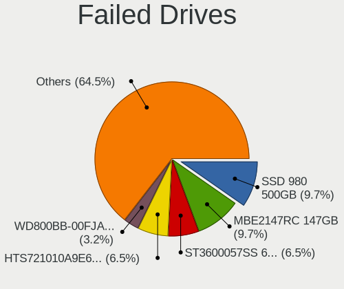
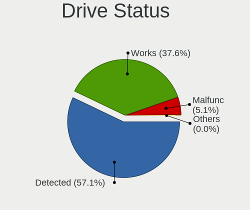
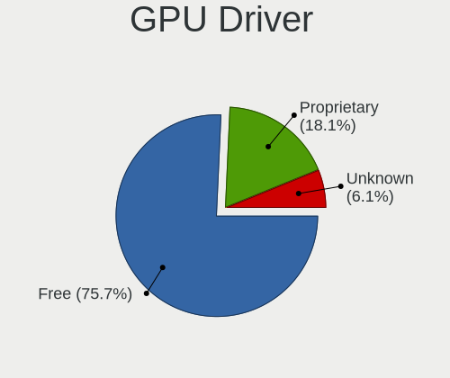
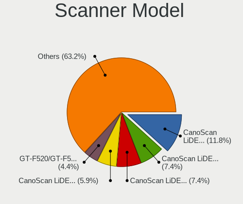

Ubuntu 22.04 - Tested Hardware & Statistics
-------------------------------------------

A project to collect tested hardware configurations for Ubuntu 22.04.

Anyone can contribute to this report by the [hw-probe](https://github.com/linuxhw/hw-probe) tool:

    sudo -E hw-probe -all -upload

Please contribute! Especially if your hardware is rare.

This is a report for all computer types. See also reports for [desktops](/Dist/Ubuntu_22.04/Desktop/README.md) and [notebooks](/Dist/Ubuntu_22.04/Notebook/README.md).

Contents
--------

* [ Test Cases ](#test-cases)

* [ System ](#system)
  - [ Kernel                   ](#kernel)
  - [ Kernel Family            ](#kernel-family)
  - [ Kernel Major Ver.        ](#kernel-major-ver)
  - [ Arch                     ](#arch)
  - [ DE                       ](#de)
  - [ Display Server           ](#display-server)
  - [ Display Manager          ](#display-manager)
  - [ OS Lang                  ](#os-lang)
  - [ Boot Mode                ](#boot-mode)
  - [ Filesystem               ](#filesystem)
  - [ Part. scheme             ](#part-scheme)
  - [ Dual Boot with Linux/BSD ](#dual-boot-with-linuxbsd)
  - [ Dual Boot (Win)          ](#dual-boot-win)

* [ Board ](#board)
  - [ Vendor                   ](#vendor)
  - [ Model                    ](#model)
  - [ Model Family             ](#model-family)
  - [ MFG Year                 ](#mfg-year)
  - [ Form Factor              ](#form-factor)
  - [ Secure Boot              ](#secure-boot)
  - [ Coreboot                 ](#coreboot)
  - [ RAM Size                 ](#ram-size)
  - [ RAM Used                 ](#ram-used)
  - [ Total Drives             ](#total-drives)
  - [ Has CD-ROM               ](#has-cd-rom)
  - [ Has Ethernet             ](#has-ethernet)
  - [ Has WiFi                 ](#has-wifi)
  - [ Has Bluetooth            ](#has-bluetooth)

* [ Location ](#location)
  - [ Country                  ](#country)
  - [ City                     ](#city)

* [ Drives ](#drives)
  - [ Drive Vendor             ](#drive-vendor)
  - [ Drive Model              ](#drive-model)
  - [ HDD Vendor               ](#hdd-vendor)
  - [ SSD Vendor               ](#ssd-vendor)
  - [ Drive Kind               ](#drive-kind)
  - [ Drive Connector          ](#drive-connector)
  - [ Drive Size               ](#drive-size)
  - [ Space Total              ](#space-total)
  - [ Space Used               ](#space-used)
  - [ Malfunc. Drives          ](#malfunc-drives)
  - [ Malfunc. Drive Vendor    ](#malfunc-drive-vendor)
  - [ Malfunc. HDD Vendor      ](#malfunc-hdd-vendor)
  - [ Malfunc. Drive Kind      ](#malfunc-drive-kind)
  - [ Failed Drives            ](#failed-drives)
  - [ Failed Drive Vendor      ](#failed-drive-vendor)
  - [ Drive Status             ](#drive-status)

* [ Storage controller ](#storage-controller)
  - [ Storage Vendor           ](#storage-vendor)
  - [ Storage Model            ](#storage-model)
  - [ Storage Kind             ](#storage-kind)

* [ Processor ](#processor)
  - [ CPU Vendor               ](#cpu-vendor)
  - [ CPU Model                ](#cpu-model)
  - [ CPU Model Family         ](#cpu-model-family)
  - [ CPU Cores                ](#cpu-cores)
  - [ CPU Sockets              ](#cpu-sockets)
  - [ CPU Threads              ](#cpu-threads)
  - [ CPU Op-Modes             ](#cpu-op-modes)
  - [ CPU Microcode            ](#cpu-microcode)
  - [ CPU Microarch            ](#cpu-microarch)

* [ Graphics ](#graphics)
  - [ GPU Vendor               ](#gpu-vendor)
  - [ GPU Model                ](#gpu-model)
  - [ GPU Combo                ](#gpu-combo)
  - [ GPU Driver               ](#gpu-driver)
  - [ GPU Memory               ](#gpu-memory)

* [ Monitor ](#monitor)
  - [ Monitor Vendor           ](#monitor-vendor)
  - [ Monitor Model            ](#monitor-model)
  - [ Monitor Resolution       ](#monitor-resolution)
  - [ Monitor Diagonal         ](#monitor-diagonal)
  - [ Monitor Width            ](#monitor-width)
  - [ Aspect Ratio             ](#aspect-ratio)
  - [ Monitor Area             ](#monitor-area)
  - [ Pixel Density            ](#pixel-density)
  - [ Multiple Monitors        ](#multiple-monitors)

* [ Network ](#network)
  - [ Net Controller Vendor    ](#net-controller-vendor)
  - [ Net Controller Model     ](#net-controller-model)
  - [ Wireless Vendor          ](#wireless-vendor)
  - [ Wireless Model           ](#wireless-model)
  - [ Ethernet Vendor          ](#ethernet-vendor)
  - [ Ethernet Model           ](#ethernet-model)
  - [ Net Controller Kind      ](#net-controller-kind)
  - [ Used Controller          ](#used-controller)
  - [ NICs                     ](#nics)
  - [ IPv6                     ](#ipv6)

* [ Bluetooth ](#bluetooth)
  - [ Bluetooth Vendor         ](#bluetooth-vendor)
  - [ Bluetooth Model          ](#bluetooth-model)

* [ Sound ](#sound)
  - [ Sound Vendor             ](#sound-vendor)
  - [ Sound Model              ](#sound-model)

* [ Memory ](#memory)
  - [ Memory Vendor            ](#memory-vendor)
  - [ Memory Model             ](#memory-model)
  - [ Memory Kind              ](#memory-kind)
  - [ Memory Form Factor       ](#memory-form-factor)
  - [ Memory Size              ](#memory-size)
  - [ Memory Speed             ](#memory-speed)

* [ Printers & scanners ](#printers--scanners)
  - [ Printer Vendor           ](#printer-vendor)
  - [ Printer Model            ](#printer-model)
  - [ Scanner Vendor           ](#scanner-vendor)
  - [ Scanner Model            ](#scanner-model)

* [ Camera ](#camera)
  - [ Camera Vendor            ](#camera-vendor)
  - [ Camera Model             ](#camera-model)

* [ Security ](#security)
  - [ Fingerprint Vendor       ](#fingerprint-vendor)
  - [ Fingerprint Model        ](#fingerprint-model)
  - [ Chipcard Vendor          ](#chipcard-vendor)
  - [ Chipcard Model           ](#chipcard-model)

* [ Unsupported ](#unsupported)
  - [ Unsupported Devices      ](#unsupported-devices)
  - [ Unsupported Device Types ](#unsupported-device-types)

Test Cases
----------

Total: 13900

| Vendor        | Model                       | Form-Factor | Probe                                                      | Date         |
|---------------|-----------------------------|-------------|------------------------------------------------------------|--------------|
| Dell          | Inspiron 3537               | Notebook    | [43b81e38cd](https://linux-hardware.org/?probe=43b81e38cd) | Jul 01, 2023 |
| ASUSTek       | M4A78LT-M-LE                | Desktop     | [9564e74fb6](https://linux-hardware.org/?probe=9564e74fb6) | Jul 01, 2023 |
| ASRock        | H510M-HDV/M.2               | Desktop     | [ec9ab3662c](https://linux-hardware.org/?probe=ec9ab3662c) | Jul 01, 2023 |
| ZR            | A320M-F 1005                | Desktop     | [c32d8de777](https://linux-hardware.org/?probe=c32d8de777) | Jun 30, 2023 |
| ASUSTek       | K52Dr                       | Notebook    | [f97425ba5f](https://linux-hardware.org/?probe=f97425ba5f) | Jun 30, 2023 |
| Supermicro    | X10DDW-i                    | Desktop     | [c43e65f1ae](https://linux-hardware.org/?probe=c43e65f1ae) | Jun 30, 2023 |
| Acer          | Aspire E5-575G              | Notebook    | [f127804b4a](https://linux-hardware.org/?probe=f127804b4a) | Jun 30, 2023 |
| Sony          | VGN-NS38E_S                 | Notebook    | [270e8b9fb7](https://linux-hardware.org/?probe=270e8b9fb7) | Jun 30, 2023 |
| Sony          | VGN-NS38E_S                 | Notebook    | [ca33cfbc67](https://linux-hardware.org/?probe=ca33cfbc67) | Jun 30, 2023 |
| Lenovo        | Yoga 530-14IKB 81EK         | Convertible | [4b57a18d9b](https://linux-hardware.org/?probe=4b57a18d9b) | Jun 30, 2023 |
| Lenovo        | Yoga 7 16IAP7 82QG          | Convertible | [5ac29ea67f](https://linux-hardware.org/?probe=5ac29ea67f) | Jun 30, 2023 |
| Intel         | B85 V5.56                   | Desktop     | [a582972a5e](https://linux-hardware.org/?probe=a582972a5e) | Jun 30, 2023 |
| Lenovo        | Yoga 530-14IKB 81EK         | Convertible | [1abd7f9f95](https://linux-hardware.org/?probe=1abd7f9f95) | Jun 30, 2023 |
| Gigabyte      | B760M DS3H AX DDR4          | Desktop     | [0d3ecc7c44](https://linux-hardware.org/?probe=0d3ecc7c44) | Jun 30, 2023 |
| Pegatron      | 2AB5                        | Desktop     | [f23fa01e43](https://linux-hardware.org/?probe=f23fa01e43) | Jun 30, 2023 |
| Apple         | MacBookPro8,2               | Notebook    | [8386acaa29](https://linux-hardware.org/?probe=8386acaa29) | Jun 30, 2023 |
| HP            | 8158 A01                    | Mini pc     | [6137e1cbbb](https://linux-hardware.org/?probe=6137e1cbbb) | Jun 30, 2023 |
| Supermicro    | X8DTU                       | Server      | [4ff2cd1bcf](https://linux-hardware.org/?probe=4ff2cd1bcf) | Jun 30, 2023 |
| AZW           | SEi                         | Desktop     | [37527da518](https://linux-hardware.org/?probe=37527da518) | Jun 30, 2023 |
| Intel         | X99H                        | Desktop     | [8e8c7e8b20](https://linux-hardware.org/?probe=8e8c7e8b20) | Jun 30, 2023 |
| HP            | 15                          | Notebook    | [2d80407689](https://linux-hardware.org/?probe=2d80407689) | Jun 30, 2023 |
| HP            | 15                          | Notebook    | [398d659d8c](https://linux-hardware.org/?probe=398d659d8c) | Jun 30, 2023 |
| HP            | EliteBook 8460p             | Notebook    | [d4a008aefb](https://linux-hardware.org/?probe=d4a008aefb) | Jun 30, 2023 |
| Supermicro    | X8DTU                       | Server      | [a1fa5d4047](https://linux-hardware.org/?probe=a1fa5d4047) | Jun 30, 2023 |
| Dell          | Latitude 7350               | Notebook    | [95fc412b55](https://linux-hardware.org/?probe=95fc412b55) | Jun 30, 2023 |
| Supermicro    | X8DTU                       | Server      | [f62d2cd7ee](https://linux-hardware.org/?probe=f62d2cd7ee) | Jun 30, 2023 |
| ASUSTek       | VivoBook_ASUSLaptop X321... | Notebook    | [05cb990f84](https://linux-hardware.org/?probe=05cb990f84) | Jun 30, 2023 |
| Supermicro    | X9DRW                       | Desktop     | [cb955d7a58](https://linux-hardware.org/?probe=cb955d7a58) | Jun 30, 2023 |
| Dell          | 0H21J3 A07                  | Server      | [621e96507a](https://linux-hardware.org/?probe=621e96507a) | Jun 30, 2023 |
| Apple         | MacBookAir9,1               | Notebook    | [bd5c030739](https://linux-hardware.org/?probe=bd5c030739) | Jun 30, 2023 |
| Apple         | MacBookAir9,1               | Notebook    | [ce486a5063](https://linux-hardware.org/?probe=ce486a5063) | Jun 30, 2023 |
| HP            | Laptop 15-ef2xxx            | Notebook    | [d0ea6a2d9d](https://linux-hardware.org/?probe=d0ea6a2d9d) | Jun 30, 2023 |
| HP            | 1497                        | Desktop     | [4dd582d288](https://linux-hardware.org/?probe=4dd582d288) | Jun 30, 2023 |
| HP            | EliteBook 2540p             | Notebook    | [7b546735a4](https://linux-hardware.org/?probe=7b546735a4) | Jun 30, 2023 |
| Dell          | 0KYJ8C A02                  | Desktop     | [f4fff60df3](https://linux-hardware.org/?probe=f4fff60df3) | Jun 30, 2023 |
| ASUSTek       | M51AC                       | Desktop     | [d32d060e9c](https://linux-hardware.org/?probe=d32d060e9c) | Jun 30, 2023 |
| Acer          | Aspire 5737Z                | Notebook    | [842aa57faf](https://linux-hardware.org/?probe=842aa57faf) | Jun 30, 2023 |
| Dell          | 0KYJ8C A02                  | Desktop     | [c860545122](https://linux-hardware.org/?probe=c860545122) | Jun 30, 2023 |
| Samsung       | R430/R480                   | Notebook    | [485a09a0d2](https://linux-hardware.org/?probe=485a09a0d2) | Jun 30, 2023 |
| Shenzhen W... | AERO 5 Lite Mini PC         | Mini pc     | [7375ced625](https://linux-hardware.org/?probe=7375ced625) | Jun 30, 2023 |
| HP            | Pavilion Laptop 15-cc5xx    | Notebook    | [39f7adb927](https://linux-hardware.org/?probe=39f7adb927) | Jun 30, 2023 |
| Medion        | Z370H4-EM                   | Desktop     | [b8327a4d00](https://linux-hardware.org/?probe=b8327a4d00) | Jun 30, 2023 |
| Monster       | TULPAR T7 V21.7             | Notebook    | [046803a297](https://linux-hardware.org/?probe=046803a297) | Jun 30, 2023 |
| Lenovo        | Legion 5 15ACH6 82JW        | Notebook    | [7f9164d1e0](https://linux-hardware.org/?probe=7f9164d1e0) | Jun 29, 2023 |
| HP            | ProBook 4530s               | Notebook    | [d1c3bf37ff](https://linux-hardware.org/?probe=d1c3bf37ff) | Jun 29, 2023 |
| Dell          | XPS 15 9570                 | Notebook    | [e0492d6173](https://linux-hardware.org/?probe=e0492d6173) | Jun 29, 2023 |
| Dell          | Latitude 7350               | Notebook    | [8ae13e8fdb](https://linux-hardware.org/?probe=8ae13e8fdb) | Jun 29, 2023 |
| Intel         | B85 V5.56                   | Desktop     | [e8b15eb823](https://linux-hardware.org/?probe=e8b15eb823) | Jun 29, 2023 |
| MSI           | MPG Z390 GAMING EDGE AC     | Desktop     | [5a6b149eb4](https://linux-hardware.org/?probe=5a6b149eb4) | Jun 29, 2023 |
| Dell          | 0T568R A00                  | Desktop     | [cf98a8a69b](https://linux-hardware.org/?probe=cf98a8a69b) | Jun 29, 2023 |
| ASUSTek       | TUF Gaming X570-PLUS        | Desktop     | [d6cb722f64](https://linux-hardware.org/?probe=d6cb722f64) | Jun 29, 2023 |
| Microsoft     | Surface Pro 2               | Tablet      | [5b92d42213](https://linux-hardware.org/?probe=5b92d42213) | Jun 29, 2023 |
| ASRock        | Z690 Steel Legend WiFi 6... | Desktop     | [d09ee66df1](https://linux-hardware.org/?probe=d09ee66df1) | Jun 29, 2023 |
| MSI           | Modern 14 B5M               | Notebook    | [cb0eb574da](https://linux-hardware.org/?probe=cb0eb574da) | Jun 29, 2023 |
| Lenovo        | ThinkPad X1 Carbon 6th 2... | Notebook    | [93e0628fbe](https://linux-hardware.org/?probe=93e0628fbe) | Jun 29, 2023 |
| HP            | Pavilion dv6                | Notebook    | [a24ee9a903](https://linux-hardware.org/?probe=a24ee9a903) | Jun 29, 2023 |
| ASUSTek       | X751MA                      | Notebook    | [b36ca5687c](https://linux-hardware.org/?probe=b36ca5687c) | Jun 29, 2023 |
| HP            | ProLiant DL360 Gen9         | Server      | [057b246898](https://linux-hardware.org/?probe=057b246898) | Jun 29, 2023 |
| Supermicro    | X8DTU                       | Server      | [1f006cb678](https://linux-hardware.org/?probe=1f006cb678) | Jun 29, 2023 |
| Acer          | TravelMate B113             | Notebook    | [04738ce824](https://linux-hardware.org/?probe=04738ce824) | Jun 29, 2023 |
| Acer          | TravelMate B113             | Notebook    | [9cfe4d5036](https://linux-hardware.org/?probe=9cfe4d5036) | Jun 29, 2023 |
| ASUSTek       | VivoBook_ASUSLaptop X512... | Notebook    | [0f0defbd9c](https://linux-hardware.org/?probe=0f0defbd9c) | Jun 29, 2023 |
| Gigabyte      | Z390 AORUS PRO WIFI-CF      | Desktop     | [304ff06fc0](https://linux-hardware.org/?probe=304ff06fc0) | Jun 29, 2023 |
| MSI           | Z87 MPOWER                  | Desktop     | [e34420b76e](https://linux-hardware.org/?probe=e34420b76e) | Jun 29, 2023 |
| Dell          | Precision M6500             | Notebook    | [199e90722c](https://linux-hardware.org/?probe=199e90722c) | Jun 29, 2023 |
| HP            | Pavilion g6                 | Notebook    | [ef275e1249](https://linux-hardware.org/?probe=ef275e1249) | Jun 29, 2023 |
| Lenovo        | ThinkPad Edge E545 20B2S... | Notebook    | [c7e71c8c0b](https://linux-hardware.org/?probe=c7e71c8c0b) | Jun 29, 2023 |
| Lenovo        | ThinkPad Edge E545 20B2S... | Notebook    | [0c3b48af38](https://linux-hardware.org/?probe=0c3b48af38) | Jun 29, 2023 |
| HP            | ProLiant DL160 G6           | Server      | [8a47bef402](https://linux-hardware.org/?probe=8a47bef402) | Jun 29, 2023 |
| Lenovo        | ThinkBook 14s-IML 20RS      | Notebook    | [e3d095fc9f](https://linux-hardware.org/?probe=e3d095fc9f) | Jun 29, 2023 |
| Intel         | NUC8BEB J72688-304          | Mini pc     | [5bc93ff20d](https://linux-hardware.org/?probe=5bc93ff20d) | Jun 28, 2023 |
| ASUSTek       | F2A85-M PRO                 | Desktop     | [a7617c12c5](https://linux-hardware.org/?probe=a7617c12c5) | Jun 28, 2023 |
| Toshiba       | TECRA R950                  | Notebook    | [cab34ec3dc](https://linux-hardware.org/?probe=cab34ec3dc) | Jun 28, 2023 |
| Toshiba       | Satellite X200              | Notebook    | [4a3e7008cf](https://linux-hardware.org/?probe=4a3e7008cf) | Jun 28, 2023 |
| Supermicro    | X10DRU-i+                   | Server      | [978c7d9a50](https://linux-hardware.org/?probe=978c7d9a50) | Jun 28, 2023 |
| Supermicro    | X10DRU-i+                   | Server      | [69f1784c40](https://linux-hardware.org/?probe=69f1784c40) | Jun 28, 2023 |
| Supermicro    | X10DRU-i+                   | Server      | [2545527872](https://linux-hardware.org/?probe=2545527872) | Jun 28, 2023 |
| Supermicro    | X10DRU-i+                   | Server      | [9a96d38f8a](https://linux-hardware.org/?probe=9a96d38f8a) | Jun 28, 2023 |
| HP            | ProBook 470 G3              | Notebook    | [1025bf4027](https://linux-hardware.org/?probe=1025bf4027) | Jun 28, 2023 |
| HP            | ProBook 470 G3              | Notebook    | [b8453a6830](https://linux-hardware.org/?probe=b8453a6830) | Jun 28, 2023 |
| ZR            | A320M-F 1005                | Desktop     | [f70bb41b80](https://linux-hardware.org/?probe=f70bb41b80) | Jun 28, 2023 |
| Lenovo        | ThinkPad X240 20AL007LUK    | Notebook    | [ee0761a131](https://linux-hardware.org/?probe=ee0761a131) | Jun 28, 2023 |
| Dell          | Latitude 7440               | Notebook    | [24f85667ac](https://linux-hardware.org/?probe=24f85667ac) | Jun 28, 2023 |
| ASUSTek       | N75SF                       | Notebook    | [eda2a0d726](https://linux-hardware.org/?probe=eda2a0d726) | Jun 28, 2023 |
| HP            | Pavilion Laptop 15-eh2xx... | Notebook    | [5d30ae9d05](https://linux-hardware.org/?probe=5d30ae9d05) | Jun 28, 2023 |
| Gigabyte      | B550M AORUS PRO-P           | Desktop     | [e29021ab76](https://linux-hardware.org/?probe=e29021ab76) | Jun 28, 2023 |
| Lenovo        | ThinkPad T470s 20HF005QM... | Notebook    | [fee1e04033](https://linux-hardware.org/?probe=fee1e04033) | Jun 28, 2023 |
| ASRock        | X570 Taichi                 | Desktop     | [75cb221d91](https://linux-hardware.org/?probe=75cb221d91) | Jun 28, 2023 |
| ASUSTek       | PRIME B350M-A               | Desktop     | [1f5a11092b](https://linux-hardware.org/?probe=1f5a11092b) | Jun 28, 2023 |
| HP            | EliteBook 745 G2            | Notebook    | [f64e6dd56e](https://linux-hardware.org/?probe=f64e6dd56e) | Jun 28, 2023 |
| HP            | 86F3 00100                  | All in one  | [8895116a7d](https://linux-hardware.org/?probe=8895116a7d) | Jun 28, 2023 |
| MSI           | MAG B550 TOMAHAWK           | Desktop     | [607da926f3](https://linux-hardware.org/?probe=607da926f3) | Jun 28, 2023 |
| HP            | 86F3 00100                  | All in one  | [8e3236446c](https://linux-hardware.org/?probe=8e3236446c) | Jun 28, 2023 |
| ASUSTek       | F2A55-M LK                  | Desktop     | [0fcac8a0af](https://linux-hardware.org/?probe=0fcac8a0af) | Jun 28, 2023 |
| ASUSTek       | F5SR                        | Notebook    | [3722cfa5fb](https://linux-hardware.org/?probe=3722cfa5fb) | Jun 27, 2023 |
| Lenovo        | ThinkPad 13 2nd Gen 20J2... | Notebook    | [46e3ea33a3](https://linux-hardware.org/?probe=46e3ea33a3) | Jun 27, 2023 |
| Dell          | Latitude E6530              | Notebook    | [f015f73aef](https://linux-hardware.org/?probe=f015f73aef) | Jun 27, 2023 |
| MSI           | Z390-A PRO                  | Desktop     | [638d6b4ef3](https://linux-hardware.org/?probe=638d6b4ef3) | Jun 27, 2023 |
| Samsung       | 550XCJ/550XCR               | Notebook    | [bca3e799e0](https://linux-hardware.org/?probe=bca3e799e0) | Jun 27, 2023 |
| HP            | 871A                        | Mini pc     | [79b5fd11c3](https://linux-hardware.org/?probe=79b5fd11c3) | Jun 27, 2023 |
| HP            | Laptop 15s-eq2xxx           | Notebook    | [5922b4d31f](https://linux-hardware.org/?probe=5922b4d31f) | Jun 27, 2023 |
| UNOWHY        | Y13G002S4EI                 | Notebook    | [dae5fc72df](https://linux-hardware.org/?probe=dae5fc72df) | Jun 27, 2023 |
| UNOWHY        | Y13G002S4EI                 | Notebook    | [c91c09307d](https://linux-hardware.org/?probe=c91c09307d) | Jun 27, 2023 |
| ASRock        | AB350M-HDV                  | Desktop     | [a055db3af3](https://linux-hardware.org/?probe=a055db3af3) | Jun 27, 2023 |
| Dell          | 0KWVT8 A03                  | Desktop     | [8dcd3c3200](https://linux-hardware.org/?probe=8dcd3c3200) | Jun 27, 2023 |
| Gigabyte      | H310M M.2 x.x               | Desktop     | [6f9c836bb4](https://linux-hardware.org/?probe=6f9c836bb4) | Jun 27, 2023 |
| Dell          | XPS 15 9500                 | Notebook    | [8ea6d92813](https://linux-hardware.org/?probe=8ea6d92813) | Jun 27, 2023 |
| Lenovo        | 36C5 SDK0K17763 WIN 1801... | Desktop     | [708131b231](https://linux-hardware.org/?probe=708131b231) | Jun 27, 2023 |
| Lenovo        | 36C5 SDK0K17763 WIN 1801... | Desktop     | [ef8f76e9e1](https://linux-hardware.org/?probe=ef8f76e9e1) | Jun 27, 2023 |
| Dell          | 0FXD80 A00                  | Desktop     | [4427c2159c](https://linux-hardware.org/?probe=4427c2159c) | Jun 27, 2023 |
| MSI           | MAG Z790 TOMAHAWK WIFI      | Desktop     | [9450fc030e](https://linux-hardware.org/?probe=9450fc030e) | Jun 27, 2023 |
| HP            | Pavilion Laptop 15-eh2xx... | Notebook    | [fc7f2b378b](https://linux-hardware.org/?probe=fc7f2b378b) | Jun 27, 2023 |
| Lenovo        | ThinkPad X13 Gen 1 20UGS... | Notebook    | [3928ad0893](https://linux-hardware.org/?probe=3928ad0893) | Jun 27, 2023 |
| Dell          | 00010C A00                  | Desktop     | [f965b0f028](https://linux-hardware.org/?probe=f965b0f028) | Jun 27, 2023 |
| Lenovo        | IdeaPad S145-15API 81V7     | Notebook    | [ec69000909](https://linux-hardware.org/?probe=ec69000909) | Jun 27, 2023 |
| Acer          | Nitro AN515-45              | Notebook    | [0bfb7dc30a](https://linux-hardware.org/?probe=0bfb7dc30a) | Jun 27, 2023 |
| HP            | 0A9Ch                       | Desktop     | [08eccac462](https://linux-hardware.org/?probe=08eccac462) | Jun 27, 2023 |
| ASRock        | 960GM-VGS3 FX               | Desktop     | [2cd4ef0e5d](https://linux-hardware.org/?probe=2cd4ef0e5d) | Jun 27, 2023 |
| Apple         | MacBookPro8,2               | Notebook    | [3e5baaaa01](https://linux-hardware.org/?probe=3e5baaaa01) | Jun 27, 2023 |
| ASUSTek       | Zenbook UX5401EA_UX5401E... | Notebook    | [0defa5c92d](https://linux-hardware.org/?probe=0defa5c92d) | Jun 27, 2023 |
| ASUSTek       | ROG STRIX Z590-E GAMING ... | Desktop     | [962cd7b905](https://linux-hardware.org/?probe=962cd7b905) | Jun 27, 2023 |
| Gigabyte      | AB350M-D3H-CF               | Desktop     | [c73458700f](https://linux-hardware.org/?probe=c73458700f) | Jun 27, 2023 |
| ASUSTek       | ROG ZENITH II EXTREME       | Desktop     | [51f9f56f44](https://linux-hardware.org/?probe=51f9f56f44) | Jun 26, 2023 |
| Gigabyte      | B550M AORUS PRO-P           | Desktop     | [91b5e02477](https://linux-hardware.org/?probe=91b5e02477) | Jun 26, 2023 |
| Biostar       | B550T-SILVER                | Desktop     | [bae0c9a5b0](https://linux-hardware.org/?probe=bae0c9a5b0) | Jun 26, 2023 |
| ASRock        | X570 Phantom Gaming 4       | Desktop     | [309cb87000](https://linux-hardware.org/?probe=309cb87000) | Jun 26, 2023 |
| Intel         | DH55TC AAE70932-206         | Desktop     | [9ff872e2a3](https://linux-hardware.org/?probe=9ff872e2a3) | Jun 26, 2023 |
| Apple         | MacBook4,1                  | Notebook    | [fe27e643ac](https://linux-hardware.org/?probe=fe27e643ac) | Jun 26, 2023 |
| HP            | 21F5 0A                     | Desktop     | [dd990a6e99](https://linux-hardware.org/?probe=dd990a6e99) | Jun 26, 2023 |
| Samsung       | 950QED                      | Convertible | [8053ccf4cd](https://linux-hardware.org/?probe=8053ccf4cd) | Jun 26, 2023 |
| ASUSTek       | VivoBook_ASUSLaptop X321... | Notebook    | [cde6a94b92](https://linux-hardware.org/?probe=cde6a94b92) | Jun 26, 2023 |
| ASUSTek       | B85M-G                      | Desktop     | [5a9f85740e](https://linux-hardware.org/?probe=5a9f85740e) | Jun 26, 2023 |
| HP            | Pavilion dv6                | Notebook    | [fe7974bbc9](https://linux-hardware.org/?probe=fe7974bbc9) | Jun 26, 2023 |
| HP            | Pavilion dv6                | Notebook    | [3051c4ac4e](https://linux-hardware.org/?probe=3051c4ac4e) | Jun 26, 2023 |
| MSI           | Prestige 14H B12UCX         | Notebook    | [abf425c8d7](https://linux-hardware.org/?probe=abf425c8d7) | Jun 26, 2023 |
| MSI           | Crosshair 15 A11UEK         | Notebook    | [8ce4fd5481](https://linux-hardware.org/?probe=8ce4fd5481) | Jun 26, 2023 |
| Lenovo        | ThinkPad P51 20HJS16Q0J     | Notebook    | [d328a1e8f3](https://linux-hardware.org/?probe=d328a1e8f3) | Jun 26, 2023 |
| MSI           | Crosshair 15 A11UEK         | Notebook    | [bdb7d2c45e](https://linux-hardware.org/?probe=bdb7d2c45e) | Jun 26, 2023 |
| ASUSTek       | GL752VW                     | Notebook    | [1256645a67](https://linux-hardware.org/?probe=1256645a67) | Jun 26, 2023 |
| HP            | ProBook 455 15.6 inch G9... | Notebook    | [eeb516967a](https://linux-hardware.org/?probe=eeb516967a) | Jun 26, 2023 |
| Unknown       | Unknown                     | Desktop     | [7c0c11558d](https://linux-hardware.org/?probe=7c0c11558d) | Jun 26, 2023 |
| HP            | EliteBook 8540w             | Notebook    | [2f2e5281ef](https://linux-hardware.org/?probe=2f2e5281ef) | Jun 26, 2023 |
| Acer          | Aspire A715-51G             | Notebook    | [08ba4bf92b](https://linux-hardware.org/?probe=08ba4bf92b) | Jun 26, 2023 |
| Acer          | Aspire A715-51G             | Notebook    | [3dc15705c8](https://linux-hardware.org/?probe=3dc15705c8) | Jun 26, 2023 |
| HP            | EliteBook 8540w             | Notebook    | [ca160c2c1c](https://linux-hardware.org/?probe=ca160c2c1c) | Jun 26, 2023 |
| Dell          | Latitude E5470              | Notebook    | [c463ab7b16](https://linux-hardware.org/?probe=c463ab7b16) | Jun 26, 2023 |
| Zebra Tech... | ET85B                       | Tablet      | [0ad09dee4f](https://linux-hardware.org/?probe=0ad09dee4f) | Jun 26, 2023 |
| Gigabyte      | Z390 AORUS PRO WIFI-CF      | Desktop     | [baeab145a2](https://linux-hardware.org/?probe=baeab145a2) | Jun 26, 2023 |
| ASUSTek       | F5SR                        | Notebook    | [059a0b2611](https://linux-hardware.org/?probe=059a0b2611) | Jun 26, 2023 |
| HP            | EliteBook 2540p             | Notebook    | [f5e04da161](https://linux-hardware.org/?probe=f5e04da161) | Jun 26, 2023 |
| ASUSTek       | ASUS EXPERTBOOK B1402CBA    | Notebook    | [8a764f6629](https://linux-hardware.org/?probe=8a764f6629) | Jun 26, 2023 |
| ASUSTek       | VivoBook_ASUSLaptop N740... | Notebook    | [44f08646c1](https://linux-hardware.org/?probe=44f08646c1) | Jun 26, 2023 |
| Lenovo        | 3102 NOK                    | Desktop     | [6277771b08](https://linux-hardware.org/?probe=6277771b08) | Jun 26, 2023 |
| Lenovo        | ThinkCentre M91p 7033A1G    | Desktop     | [a3ca410b6a](https://linux-hardware.org/?probe=a3ca410b6a) | Jun 26, 2023 |
| Dell          | Precision 7670              | Notebook    | [4138a39697](https://linux-hardware.org/?probe=4138a39697) | Jun 26, 2023 |
| Dell          | Inspiron 15 7000 Gaming     | Notebook    | [8db0a77e13](https://linux-hardware.org/?probe=8db0a77e13) | Jun 26, 2023 |
| Apple         | Mac-F2238AC8                | All in one  | [b2b20dd3f1](https://linux-hardware.org/?probe=b2b20dd3f1) | Jun 26, 2023 |
| Lenovo        | ThinkPad T480s 20L8S1R70... | Notebook    | [047bdacac5](https://linux-hardware.org/?probe=047bdacac5) | Jun 25, 2023 |
| Star Labs     | LabTop                      | Notebook    | [a413031ef8](https://linux-hardware.org/?probe=a413031ef8) | Jun 25, 2023 |
| ASRock        | H61M-VG4                    | Desktop     | [7fbf9c4e53](https://linux-hardware.org/?probe=7fbf9c4e53) | Jun 25, 2023 |
| HP            | Pavilion x360 Convertibl... | Convertible | [1fc0c8e328](https://linux-hardware.org/?probe=1fc0c8e328) | Jun 25, 2023 |
| Acer          | Aspire E5-575G              | Notebook    | [2f5357533f](https://linux-hardware.org/?probe=2f5357533f) | Jun 25, 2023 |
| Intel         | B75                         | Desktop     | [2456289bbd](https://linux-hardware.org/?probe=2456289bbd) | Jun 25, 2023 |
| Apple         | Mac-F2268CC8                | All in one  | [3ff8f73ac7](https://linux-hardware.org/?probe=3ff8f73ac7) | Jun 25, 2023 |
| ASUSTek       | PRIME B650-PLUS             | Desktop     | [9f89885724](https://linux-hardware.org/?probe=9f89885724) | Jun 25, 2023 |
| Dell          | Latitude 7420               | Notebook    | [d5cb3d4bfa](https://linux-hardware.org/?probe=d5cb3d4bfa) | Jun 25, 2023 |
| HUAWEI        | NBLB-WAX9N                  | Notebook    | [3a045583a7](https://linux-hardware.org/?probe=3a045583a7) | Jun 25, 2023 |
| Gigabyte      | Z390 AORUS PRO WIFI-CF      | Desktop     | [9aa214f70a](https://linux-hardware.org/?probe=9aa214f70a) | Jun 25, 2023 |
| Dell          | Precision 5540              | Notebook    | [7d6c1fe39d](https://linux-hardware.org/?probe=7d6c1fe39d) | Jun 25, 2023 |
| HP            | Laptop 15-db0xxx            | Notebook    | [79979ceac7](https://linux-hardware.org/?probe=79979ceac7) | Jun 25, 2023 |
| Samsung       | Galaxy Book 12 LTE          | Tablet      | [570e99d65f](https://linux-hardware.org/?probe=570e99d65f) | Jun 25, 2023 |
| Lenovo        | 3130 SDK0J40697 WIN 3305... | Mini pc     | [227abe2f5c](https://linux-hardware.org/?probe=227abe2f5c) | Jun 25, 2023 |
| Sony          | VGN-AR74DB                  | Notebook    | [c51cc05c0a](https://linux-hardware.org/?probe=c51cc05c0a) | Jun 25, 2023 |
| Foxconn       | 945 7MC Series              | Desktop     | [dc2911bfae](https://linux-hardware.org/?probe=dc2911bfae) | Jun 25, 2023 |
| Dell          | Latitude E5470              | Notebook    | [e8f8b7e986](https://linux-hardware.org/?probe=e8f8b7e986) | Jun 25, 2023 |
| Dell          | Latitude E5470              | Notebook    | [e218b300b7](https://linux-hardware.org/?probe=e218b300b7) | Jun 25, 2023 |
| Foxconn       | 945 7MC Series              | Desktop     | [273bec93a4](https://linux-hardware.org/?probe=273bec93a4) | Jun 25, 2023 |
| HP            | EliteBook 855 G8 Noteboo... | Notebook    | [0ec7fedf29](https://linux-hardware.org/?probe=0ec7fedf29) | Jun 24, 2023 |
| Gigabyte      | Z77MX-D3H                   | Desktop     | [ac084eba06](https://linux-hardware.org/?probe=ac084eba06) | Jun 24, 2023 |
| HP            | EliteBook 840 G1            | Notebook    | [37239831de](https://linux-hardware.org/?probe=37239831de) | Jun 24, 2023 |
| Acer          | Aspire A315-22              | Notebook    | [5e2e395efd](https://linux-hardware.org/?probe=5e2e395efd) | Jun 24, 2023 |
| Intel         | DH55HC AAE70933-503         | Desktop     | [8dab0b7f0d](https://linux-hardware.org/?probe=8dab0b7f0d) | Jun 24, 2023 |
| ASUSTek       | P5K                         | Desktop     | [c33ff02489](https://linux-hardware.org/?probe=c33ff02489) | Jun 24, 2023 |
| Dell          | Latitude E6500              | Notebook    | [2b1720ad90](https://linux-hardware.org/?probe=2b1720ad90) | Jun 24, 2023 |
| ASUSTek       | P5K                         | Desktop     | [c87e87b883](https://linux-hardware.org/?probe=c87e87b883) | Jun 24, 2023 |
| Dell          | Inspiron 3576               | Notebook    | [c756e98d81](https://linux-hardware.org/?probe=c756e98d81) | Jun 24, 2023 |
| Unknown       | 2288H V5                    | Server      | [309e947b4d](https://linux-hardware.org/?probe=309e947b4d) | Jun 24, 2023 |
| HP            | Pavilion dv7                | Notebook    | [ab7310809d](https://linux-hardware.org/?probe=ab7310809d) | Jun 24, 2023 |
| Toshiba       | Satellite L655              | Notebook    | [6ed0182e96](https://linux-hardware.org/?probe=6ed0182e96) | Jun 24, 2023 |
| Dell          | Inspiron 3576               | Notebook    | [874b84ce94](https://linux-hardware.org/?probe=874b84ce94) | Jun 24, 2023 |
| Gigabyte      | Z390 AORUS PRO WIFI-CF      | Desktop     | [a19fc9dde8](https://linux-hardware.org/?probe=a19fc9dde8) | Jun 24, 2023 |
| HP            | 0A9Ch                       | Desktop     | [4bd59bd633](https://linux-hardware.org/?probe=4bd59bd633) | Jun 24, 2023 |
| Apple         | Mac-F2268DC8                | All in one  | [1e1660833e](https://linux-hardware.org/?probe=1e1660833e) | Jun 24, 2023 |
| HP            | ENVY x360 2-in-1 Laptop ... | Convertible | [1bee09e212](https://linux-hardware.org/?probe=1bee09e212) | Jun 24, 2023 |
| Lenovo        | ThinkPad L15 Gen 2a 20X7... | Notebook    | [09419812ab](https://linux-hardware.org/?probe=09419812ab) | Jun 24, 2023 |
| HP            | 15 Notebook PC              | Notebook    | [440f4bbf29](https://linux-hardware.org/?probe=440f4bbf29) | Jun 24, 2023 |
| Seeed Stud... | ODYSSEY-X86J41X5 CJ41GV2... | Desktop     | [79a2c321e8](https://linux-hardware.org/?probe=79a2c321e8) | Jun 24, 2023 |
| Lenovo        | ThinkPad P53s 20N6001UUS    | Notebook    | [0834c21488](https://linux-hardware.org/?probe=0834c21488) | Jun 24, 2023 |
| Lenovo        | IdeaPad Gaming 3 16IAH7 ... | Notebook    | [ef5eb06f90](https://linux-hardware.org/?probe=ef5eb06f90) | Jun 24, 2023 |
| Gigabyte      | Z590 AORUS ELITE AX         | Desktop     | [0f64e88f33](https://linux-hardware.org/?probe=0f64e88f33) | Jun 23, 2023 |
| HP            | 304Bh                       | Desktop     | [234bedfab1](https://linux-hardware.org/?probe=234bedfab1) | Jun 23, 2023 |
| HP            | 871A                        | Mini pc     | [d0f18a42a4](https://linux-hardware.org/?probe=d0f18a42a4) | Jun 23, 2023 |
| ASUSTek       | Q87M-E                      | Desktop     | [f0ab10725e](https://linux-hardware.org/?probe=f0ab10725e) | Jun 23, 2023 |
| Dell          | 0CRH6C A02                  | Desktop     | [7ce8bcbc26](https://linux-hardware.org/?probe=7ce8bcbc26) | Jun 23, 2023 |
| Medion        | P6624                       | Notebook    | [49bd227ded](https://linux-hardware.org/?probe=49bd227ded) | Jun 23, 2023 |
| Supermicro    | X8DTU                       | Server      | [d84b50b0ed](https://linux-hardware.org/?probe=d84b50b0ed) | Jun 23, 2023 |
| Apple         | Mac-AA95B1DDAB278B95 iMa... | All in one  | [3e2928fe9d](https://linux-hardware.org/?probe=3e2928fe9d) | Jun 23, 2023 |
| eMachines     | eMG520                      | Notebook    | [2a33e0b985](https://linux-hardware.org/?probe=2a33e0b985) | Jun 23, 2023 |
| Packard Be... | EN Butterfly m              | Notebook    | [70bae75df2](https://linux-hardware.org/?probe=70bae75df2) | Jun 23, 2023 |
| Dell          | XPS 9320                    | Notebook    | [2dcfa6718b](https://linux-hardware.org/?probe=2dcfa6718b) | Jun 23, 2023 |
| Lenovo        | IdeaPad L340-15IRH Gamin... | Notebook    | [4429a0f659](https://linux-hardware.org/?probe=4429a0f659) | Jun 23, 2023 |
| ASRock        | B365M Pro4-F                | Desktop     | [16a5102512](https://linux-hardware.org/?probe=16a5102512) | Jun 23, 2023 |
| ASUSTek       | VivoBook_ASUSLaptop X321... | Notebook    | [bb559685e3](https://linux-hardware.org/?probe=bb559685e3) | Jun 23, 2023 |
| Dell          | XPS 15 9575                 | Convertible | [150b8d631e](https://linux-hardware.org/?probe=150b8d631e) | Jun 23, 2023 |
| Notebook      | W54_55SU1,SUW               | Notebook    | [622462c1d1](https://linux-hardware.org/?probe=622462c1d1) | Jun 23, 2023 |
| Notebook      | W54_55SU1,SUW               | Notebook    | [117e92a397](https://linux-hardware.org/?probe=117e92a397) | Jun 23, 2023 |
| Lenovo        | Legion 5 15ACH6 82JW        | Notebook    | [c75670186a](https://linux-hardware.org/?probe=c75670186a) | Jun 23, 2023 |
| Lenovo        | IdeaPad 3 15ITL6 82H8       | Notebook    | [32f2a1756a](https://linux-hardware.org/?probe=32f2a1756a) | Jun 23, 2023 |
| HP            | 3047h                       | Desktop     | [e60df0b6d1](https://linux-hardware.org/?probe=e60df0b6d1) | Jun 23, 2023 |
| Intel         | NUC8BEB J72692-303          | Mini pc     | [521a8a0da0](https://linux-hardware.org/?probe=521a8a0da0) | Jun 23, 2023 |
| ASUSTek       | PRIME B550M-A               | Desktop     | [3789bc7deb](https://linux-hardware.org/?probe=3789bc7deb) | Jun 23, 2023 |
| ASRock        | B550 Phantom Gaming-ITX/... | Desktop     | [c202144225](https://linux-hardware.org/?probe=c202144225) | Jun 23, 2023 |
| ASRock        | X570 Phantom Gaming 4       | Desktop     | [83eb8cda4a](https://linux-hardware.org/?probe=83eb8cda4a) | Jun 23, 2023 |
| HP            | 0A9Ch                       | Desktop     | [2f48843246](https://linux-hardware.org/?probe=2f48843246) | Jun 23, 2023 |
| Foxconn       | ALOE X3                     | Desktop     | [ec9afb2155](https://linux-hardware.org/?probe=ec9afb2155) | Jun 23, 2023 |
| HP            | EliteBook 2540p             | Notebook    | [b33e52fa0a](https://linux-hardware.org/?probe=b33e52fa0a) | Jun 22, 2023 |
| Acer          | Aspire E5-575G              | Notebook    | [5c76172491](https://linux-hardware.org/?probe=5c76172491) | Jun 22, 2023 |
| MSI           | 760GM-E51                   | Desktop     | [078c1805bd](https://linux-hardware.org/?probe=078c1805bd) | Jun 22, 2023 |
| Dell          | XPS 17 9710                 | Notebook    | [892620ac83](https://linux-hardware.org/?probe=892620ac83) | Jun 22, 2023 |
| Supermicro    | X9DRW                       | Desktop     | [3b2f007f67](https://linux-hardware.org/?probe=3b2f007f67) | Jun 22, 2023 |
| Lenovo        | Legion 5 15ARH05H 82B1      | Notebook    | [4b866ca19f](https://linux-hardware.org/?probe=4b866ca19f) | Jun 22, 2023 |
| ASUSTek       | K55VD                       | Notebook    | [223967ea1d](https://linux-hardware.org/?probe=223967ea1d) | Jun 22, 2023 |
| Acer          | Aspire A515-57              | Notebook    | [0ee3dcbbb5](https://linux-hardware.org/?probe=0ee3dcbbb5) | Jun 22, 2023 |
| HP            | Pavilion dv6                | Notebook    | [fa9045c36f](https://linux-hardware.org/?probe=fa9045c36f) | Jun 22, 2023 |
| Timi          | RedmiBook 14-APCS           | Notebook    | [3dadb16806](https://linux-hardware.org/?probe=3dadb16806) | Jun 22, 2023 |
| Unknown       | Unknown                     | Desktop     | [3e25fc74a7](https://linux-hardware.org/?probe=3e25fc74a7) | Jun 22, 2023 |
| Lenovo        | V15 G2 ITL Ua 82KB          | Notebook    | [110c366456](https://linux-hardware.org/?probe=110c366456) | Jun 22, 2023 |
| Unknown       | Unknown                     | Desktop     | [c2e0154437](https://linux-hardware.org/?probe=c2e0154437) | Jun 22, 2023 |
| HP            | Dragonfly 13.5 inch G4 N... | Notebook    | [22c2768f76](https://linux-hardware.org/?probe=22c2768f76) | Jun 22, 2023 |
| ASRock        | X399 Taichi                 | Desktop     | [d9ca7c4369](https://linux-hardware.org/?probe=d9ca7c4369) | Jun 22, 2023 |
| Medion        | Erazer P6661 MD60303        | Notebook    | [22fb03fe41](https://linux-hardware.org/?probe=22fb03fe41) | Jun 22, 2023 |
| Toshiba       | PORTEGE Z930                | Notebook    | [0cad0d9955](https://linux-hardware.org/?probe=0cad0d9955) | Jun 22, 2023 |
| Lenovo        | ThinkPad L380 20M5000UGE    | Notebook    | [06db720b62](https://linux-hardware.org/?probe=06db720b62) | Jun 22, 2023 |
| HP            | Pavilion dv5                | Notebook    | [4a0db4b1ba](https://linux-hardware.org/?probe=4a0db4b1ba) | Jun 22, 2023 |
| ASRock        | H61M-VG3                    | Desktop     | [955228e9e5](https://linux-hardware.org/?probe=955228e9e5) | Jun 22, 2023 |
| HP            | Pavilion dv5                | Notebook    | [902335f2cb](https://linux-hardware.org/?probe=902335f2cb) | Jun 22, 2023 |
| ASUSTek       | PRIME X670-P WIFI           | Desktop     | [d3a63bb6aa](https://linux-hardware.org/?probe=d3a63bb6aa) | Jun 22, 2023 |
| Gigabyte      | F2A88XM-D3H                 | Desktop     | [6c43b99ec8](https://linux-hardware.org/?probe=6c43b99ec8) | Jun 22, 2023 |
| Samsung       | 550XDA                      | Notebook    | [f20386ccdd](https://linux-hardware.org/?probe=f20386ccdd) | Jun 22, 2023 |
| Lenovo        | IdeaPad Gaming 3 15ACH6 ... | Notebook    | [42cb7025f1](https://linux-hardware.org/?probe=42cb7025f1) | Jun 22, 2023 |
| Dell          | Inspiron 15 3511            | Notebook    | [0ef8557b4d](https://linux-hardware.org/?probe=0ef8557b4d) | Jun 22, 2023 |
| Dell          | Latitude 3520               | Notebook    | [ada304545e](https://linux-hardware.org/?probe=ada304545e) | Jun 22, 2023 |
| ASRock        | B365 Pro4                   | Desktop     | [46dc8e10a8](https://linux-hardware.org/?probe=46dc8e10a8) | Jun 21, 2023 |
| Dell          | 0NKW6Y A01                  | Desktop     | [def5a35ba4](https://linux-hardware.org/?probe=def5a35ba4) | Jun 21, 2023 |
| Biostar       | H61MGV3                     | Desktop     | [109f8064f6](https://linux-hardware.org/?probe=109f8064f6) | Jun 21, 2023 |
| System76      | Gazelle                     | Notebook    | [858e408027](https://linux-hardware.org/?probe=858e408027) | Jun 21, 2023 |
| Lenovo        | ThinkPad X1 Carbon 5th 2... | Notebook    | [079f84c10d](https://linux-hardware.org/?probe=079f84c10d) | Jun 21, 2023 |
| Lenovo        | IdeaPad Pro 5 16ARP8 83A... | Notebook    | [017f0476b0](https://linux-hardware.org/?probe=017f0476b0) | Jun 21, 2023 |
| Acer          | Aspire E1-572G              | Notebook    | [c4af4bf38c](https://linux-hardware.org/?probe=c4af4bf38c) | Jun 21, 2023 |
| Lenovo        | ThinkPad L440 20ASS19B03    | Notebook    | [3acd887212](https://linux-hardware.org/?probe=3acd887212) | Jun 21, 2023 |
| Lenovo        | ThinkPad E15 Gen 4 21E60... | Notebook    | [7de42486fb](https://linux-hardware.org/?probe=7de42486fb) | Jun 21, 2023 |
| Lenovo        | ThinkPad E15 Gen 4 21E60... | Notebook    | [b61cc560f8](https://linux-hardware.org/?probe=b61cc560f8) | Jun 21, 2023 |
| Dell          | 00V62H A01                  | Desktop     | [2e654ead73](https://linux-hardware.org/?probe=2e654ead73) | Jun 21, 2023 |
| ETegro Tec... | ETRS125G4 31S2MMB0040       | Server      | [dd05dd9f39](https://linux-hardware.org/?probe=dd05dd9f39) | Jun 21, 2023 |
| ETegro Tec... | ETRS125G4 31S2MMB0040       | Server      | [a9dc241d86](https://linux-hardware.org/?probe=a9dc241d86) | Jun 21, 2023 |
| ETegro Tec... | ETRS125G4 31S2MMB0040       | Server      | [f1fab285fe](https://linux-hardware.org/?probe=f1fab285fe) | Jun 21, 2023 |
| ETegro Tec... | ETRS125G4 31S2MMB0040       | Server      | [8cf892e60d](https://linux-hardware.org/?probe=8cf892e60d) | Jun 21, 2023 |
| ETegro Tec... | ETRS125G4 31S2MMB0040       | Server      | [03b14ba782](https://linux-hardware.org/?probe=03b14ba782) | Jun 21, 2023 |
| Dell          | 00V62H A01                  | Desktop     | [2ebfd9c347](https://linux-hardware.org/?probe=2ebfd9c347) | Jun 21, 2023 |
| Supermicro    | X9DRW                       | Server      | [6d1f71111e](https://linux-hardware.org/?probe=6d1f71111e) | Jun 21, 2023 |
| Supermicro    | X9DRW                       | Server      | [c2eae10d12](https://linux-hardware.org/?probe=c2eae10d12) | Jun 21, 2023 |
| Supermicro    | X9DRW                       | Server      | [9a25e9e1fb](https://linux-hardware.org/?probe=9a25e9e1fb) | Jun 21, 2023 |
| Supermicro    | X9DRW                       | Server      | [336efb6e27](https://linux-hardware.org/?probe=336efb6e27) | Jun 21, 2023 |
| Dell          | 08GXHX A06                  | Server      | [477b8a89fb](https://linux-hardware.org/?probe=477b8a89fb) | Jun 21, 2023 |
| MSI           | B450-A PRO MAX              | Desktop     | [589e702758](https://linux-hardware.org/?probe=589e702758) | Jun 21, 2023 |
| Dell          | Latitude 5430               | Notebook    | [458a2111da](https://linux-hardware.org/?probe=458a2111da) | Jun 21, 2023 |
| ASUSTek       | PRIME Z270-K                | Desktop     | [c3961b2aa5](https://linux-hardware.org/?probe=c3961b2aa5) | Jun 21, 2023 |
| Lenovo        | 30C0 SDK0J40697 WIN 3305... | Desktop     | [8c4bd347a7](https://linux-hardware.org/?probe=8c4bd347a7) | Jun 21, 2023 |
| Gigabyte      | Z97M-D3H                    | Desktop     | [66e2a42098](https://linux-hardware.org/?probe=66e2a42098) | Jun 21, 2023 |
| Dell          | XPS 9320                    | Notebook    | [6a60a308d1](https://linux-hardware.org/?probe=6a60a308d1) | Jun 21, 2023 |
| Dell          | 09KPNV A01                  | Desktop     | [ff224b2f9d](https://linux-hardware.org/?probe=ff224b2f9d) | Jun 21, 2023 |
| Dell          | 09KPNV A01                  | Desktop     | [acbd33c5c8](https://linux-hardware.org/?probe=acbd33c5c8) | Jun 21, 2023 |
| Shenzhen M... | F7BFC                       | Desktop     | [f76394a58a](https://linux-hardware.org/?probe=f76394a58a) | Jun 21, 2023 |
| MSI           | GE75 Raider 10SF            | Notebook    | [b3ce37b2cb](https://linux-hardware.org/?probe=b3ce37b2cb) | Jun 21, 2023 |
| ASUSTek       | GL552VW                     | Notebook    | [592b7aa556](https://linux-hardware.org/?probe=592b7aa556) | Jun 21, 2023 |
| Lenovo        | IdeaPad Pro 5 16ARP8 83A... | Notebook    | [4af402b7c9](https://linux-hardware.org/?probe=4af402b7c9) | Jun 21, 2023 |
| HP            | 339A                        | Desktop     | [960fd64baa](https://linux-hardware.org/?probe=960fd64baa) | Jun 21, 2023 |
| Apple         | Mac-7BA5B2DFE22DDD8C Mac... | Mini pc     | [35ecc89b13](https://linux-hardware.org/?probe=35ecc89b13) | Jun 21, 2023 |
| Gigabyte      | B550M AORUS PRO-P           | Desktop     | [9bcbbbd906](https://linux-hardware.org/?probe=9bcbbbd906) | Jun 21, 2023 |
| ASRock        | B550 Phantom Gaming-ITX/... | Desktop     | [63f5506bc3](https://linux-hardware.org/?probe=63f5506bc3) | Jun 21, 2023 |
| HP            | 339A                        | Desktop     | [60b0bff872](https://linux-hardware.org/?probe=60b0bff872) | Jun 21, 2023 |
| Apple         | MacBookPro6,2               | Notebook    | [3beb323b62](https://linux-hardware.org/?probe=3beb323b62) | Jun 21, 2023 |
| ASUSTek       | ZenBook UX434IQ_UM433IQ     | Notebook    | [caaf6ce403](https://linux-hardware.org/?probe=caaf6ce403) | Jun 21, 2023 |
| HP            | EliteBook x360 1030 G2      | Convertible | [5c1d7f4578](https://linux-hardware.org/?probe=5c1d7f4578) | Jun 21, 2023 |
| Dell          | 0GM819                      | Desktop     | [5823b51b38](https://linux-hardware.org/?probe=5823b51b38) | Jun 20, 2023 |
| Gigabyte      | GA-78LMT-USB3               | Desktop     | [6f0b6969bf](https://linux-hardware.org/?probe=6f0b6969bf) | Jun 20, 2023 |
| Dell          | 0WWR83 A05                  | Server      | [f1bf1f7e68](https://linux-hardware.org/?probe=f1bf1f7e68) | Jun 20, 2023 |
| Dell          | 0WWR83 A05                  | Server      | [d1f4b49c8e](https://linux-hardware.org/?probe=d1f4b49c8e) | Jun 20, 2023 |
| ASUSTek       | K55VD                       | Notebook    | [49f6cc6986](https://linux-hardware.org/?probe=49f6cc6986) | Jun 20, 2023 |
| Supermicro    | X9DRT                       | Server      | [5b25db1cae](https://linux-hardware.org/?probe=5b25db1cae) | Jun 20, 2023 |
| Rockchip      | Orange Pi 5                 | Soc         | [3d50367e9f](https://linux-hardware.org/?probe=3d50367e9f) | Jun 20, 2023 |
| Lenovo        | 36C5 SDK0K17763 WIN 1801... | Desktop     | [92f6324f8a](https://linux-hardware.org/?probe=92f6324f8a) | Jun 20, 2023 |
| ASUSTek       | PRIME X470-PRO              | Desktop     | [f1acdd3081](https://linux-hardware.org/?probe=f1acdd3081) | Jun 20, 2023 |
| MSI           | Katana GF76 12UD            | Notebook    | [1897f5f0cb](https://linux-hardware.org/?probe=1897f5f0cb) | Jun 20, 2023 |
| MSI           | A68HM-E33 V2                | Desktop     | [8260bcf9b3](https://linux-hardware.org/?probe=8260bcf9b3) | Jun 20, 2023 |
| Supermicro    | X10DRU-i+                   | Server      | [9fd3502acf](https://linux-hardware.org/?probe=9fd3502acf) | Jun 20, 2023 |
| MSI           | MAG B550 TOMAHAWK           | Desktop     | [bbfb6ff07f](https://linux-hardware.org/?probe=bbfb6ff07f) | Jun 20, 2023 |
| HP            | 18E4                        | Desktop     | [9e2ad40fc3](https://linux-hardware.org/?probe=9e2ad40fc3) | Jun 20, 2023 |
| Lenovo        | MAHOBAY Win8 STD MM DPK ... | Desktop     | [19c5a44099](https://linux-hardware.org/?probe=19c5a44099) | Jun 20, 2023 |
| ASRock        | X370 Killer SLI             | Desktop     | [10939cb152](https://linux-hardware.org/?probe=10939cb152) | Jun 20, 2023 |
| Dell          | Latitude E6410              | Notebook    | [b34442d8c3](https://linux-hardware.org/?probe=b34442d8c3) | Jun 20, 2023 |
| Apple         | MacBookPro11,1              | Notebook    | [4850296b9d](https://linux-hardware.org/?probe=4850296b9d) | Jun 20, 2023 |
| Acer          | Predator PHN16-71           | Notebook    | [16f2ca887d](https://linux-hardware.org/?probe=16f2ca887d) | Jun 20, 2023 |
| Apple         | MacBookPro13,1              | Notebook    | [95a82b40ce](https://linux-hardware.org/?probe=95a82b40ce) | Jun 20, 2023 |
| Lenovo        | ThinkPad E14 Gen 2 20TA0... | Notebook    | [7c906bbd1c](https://linux-hardware.org/?probe=7c906bbd1c) | Jun 20, 2023 |
| GPU Compan... | GWTC116-2                   | Convertible | [d043c3bd02](https://linux-hardware.org/?probe=d043c3bd02) | Jun 20, 2023 |
| ATOPNUC       | MA90                        | Mini pc     | [40cbaad1bf](https://linux-hardware.org/?probe=40cbaad1bf) | Jun 20, 2023 |
| Dell          | Precision 5560              | Notebook    | [ee53248c8c](https://linux-hardware.org/?probe=ee53248c8c) | Jun 20, 2023 |
| GPU Compan... | GWTC116-2                   | Convertible | [d2e3734724](https://linux-hardware.org/?probe=d2e3734724) | Jun 20, 2023 |
| Google        | Blooguard                   | Notebook    | [f1d90deb53](https://linux-hardware.org/?probe=f1d90deb53) | Jun 20, 2023 |
| ASRock        | H270 Pro4                   | Desktop     | [e3b13a5c7f](https://linux-hardware.org/?probe=e3b13a5c7f) | Jun 20, 2023 |
| AMI           | Intel                       | Desktop     | [94c1b63cc6](https://linux-hardware.org/?probe=94c1b63cc6) | Jun 20, 2023 |
| Lenovo        | ThinkPad T460s 20F9005BU... | Notebook    | [59a527c934](https://linux-hardware.org/?probe=59a527c934) | Jun 20, 2023 |
| Acer          | Veriton X490G               | Desktop     | [a181339180](https://linux-hardware.org/?probe=a181339180) | Jun 20, 2023 |
| HP            | OMEN by Laptop 15-dh0xxx    | Notebook    | [6e2f7d8295](https://linux-hardware.org/?probe=6e2f7d8295) | Jun 20, 2023 |
| ASUSTek       | VivoBook_ASUSLaptop X712... | Notebook    | [67c63af138](https://linux-hardware.org/?probe=67c63af138) | Jun 19, 2023 |
| Gigabyte      | Z790 AORUS ELITE AX         | Desktop     | [d9d8f74eca](https://linux-hardware.org/?probe=d9d8f74eca) | Jun 19, 2023 |
| Lenovo        | ThinkServer TS140           | Desktop     | [9210e713ff](https://linux-hardware.org/?probe=9210e713ff) | Jun 19, 2023 |
| Gigabyte      | B150M-D3H DDR3-CF           | Desktop     | [3e5a0aac78](https://linux-hardware.org/?probe=3e5a0aac78) | Jun 19, 2023 |
| Lenovo        | IdeaPad 3 17IIL05 81WF      | Notebook    | [f52b994470](https://linux-hardware.org/?probe=f52b994470) | Jun 19, 2023 |
| HP            | 86F3 00100                  | All in one  | [b80bd491de](https://linux-hardware.org/?probe=b80bd491de) | Jun 19, 2023 |
| Dell          | 0CRH6C A02                  | Desktop     | [6ae5e917b4](https://linux-hardware.org/?probe=6ae5e917b4) | Jun 19, 2023 |
| HP            | Pavilion dv6                | Notebook    | [09d49049bf](https://linux-hardware.org/?probe=09d49049bf) | Jun 19, 2023 |
| Samsung       | RC420/RC520/RC720           | Notebook    | [406b650f19](https://linux-hardware.org/?probe=406b650f19) | Jun 19, 2023 |
| Lenovo        | ThinkPad L440 20ASS19B03    | Notebook    | [a881db7c2b](https://linux-hardware.org/?probe=a881db7c2b) | Jun 19, 2023 |
| Dell          | 0DF42J A00                  | Desktop     | [c1db29329c](https://linux-hardware.org/?probe=c1db29329c) | Jun 19, 2023 |
| Dell          | Inspiron 3185               | Notebook    | [f53e8d1094](https://linux-hardware.org/?probe=f53e8d1094) | Jun 19, 2023 |
| Shuttle       | SA76 V10                    | Desktop     | [fbcf156e7e](https://linux-hardware.org/?probe=fbcf156e7e) | Jun 19, 2023 |
| ASUSTek       | X756UVK                     | Notebook    | [8ac304b302](https://linux-hardware.org/?probe=8ac304b302) | Jun 19, 2023 |
| ASUSTek       | X756UVK                     | Notebook    | [beb200bb6b](https://linux-hardware.org/?probe=beb200bb6b) | Jun 19, 2023 |
| Acer          | Aspire A515-57G             | Notebook    | [b783c040ee](https://linux-hardware.org/?probe=b783c040ee) | Jun 19, 2023 |
| Gigabyte      | Z77MX-D3H                   | Desktop     | [c1aac2f0a4](https://linux-hardware.org/?probe=c1aac2f0a4) | Jun 19, 2023 |
| Dell          | Inspiron 7347               | Notebook    | [026935ac8f](https://linux-hardware.org/?probe=026935ac8f) | Jun 19, 2023 |
| Supermicro    | X8DTU                       | Server      | [b5c48fea7a](https://linux-hardware.org/?probe=b5c48fea7a) | Jun 19, 2023 |
| Supermicro    | X8DTU                       | Server      | [9c84dae093](https://linux-hardware.org/?probe=9c84dae093) | Jun 19, 2023 |
| Supermicro    | X8DTU                       | Server      | [7be4e075bb](https://linux-hardware.org/?probe=7be4e075bb) | Jun 19, 2023 |
| Gigabyte      | Z690 GAMING X DDR4          | Desktop     | [257c60290f](https://linux-hardware.org/?probe=257c60290f) | Jun 19, 2023 |
| HP            | Pavilion Laptop 13-an0xx... | Notebook    | [0f68ace67c](https://linux-hardware.org/?probe=0f68ace67c) | Jun 19, 2023 |
| Dell          | G7 7588                     | Notebook    | [2cdb34b778](https://linux-hardware.org/?probe=2cdb34b778) | Jun 19, 2023 |
| Timi          | A34R                        | Notebook    | [da4d787d75](https://linux-hardware.org/?probe=da4d787d75) | Jun 19, 2023 |
| HP            | Laptop 15-db0xxx            | Notebook    | [c67d08fe43](https://linux-hardware.org/?probe=c67d08fe43) | Jun 19, 2023 |
| Acer          | Aspire ES1-420              | Notebook    | [76aab864d4](https://linux-hardware.org/?probe=76aab864d4) | Jun 19, 2023 |
| ASUSTek       | ROG STRIX Z690-A GAMING ... | Desktop     | [8a9a60ca4d](https://linux-hardware.org/?probe=8a9a60ca4d) | Jun 19, 2023 |
| HP            | Laptop 14s-fq0xxx           | Notebook    | [6ff28ccac1](https://linux-hardware.org/?probe=6ff28ccac1) | Jun 19, 2023 |
| Acer          | Aspire 7739                 | Notebook    | [eda7fb180a](https://linux-hardware.org/?probe=eda7fb180a) | Jun 19, 2023 |
| Alienware     | 0CPDXD A00                  | Desktop     | [3e1923b97a](https://linux-hardware.org/?probe=3e1923b97a) | Jun 19, 2023 |
| ASUSTek       | ROG STRIX Z690-A GAMING ... | Desktop     | [eaca61c801](https://linux-hardware.org/?probe=eaca61c801) | Jun 19, 2023 |
| Dell          | Latitude E6540              | Notebook    | [3721b0046f](https://linux-hardware.org/?probe=3721b0046f) | Jun 19, 2023 |
| Dell          | Inspiron 7352               | Notebook    | [dd9c020f92](https://linux-hardware.org/?probe=dd9c020f92) | Jun 19, 2023 |
| Dell          | 0VV4V0 A00                  | All in one  | [9c22db900e](https://linux-hardware.org/?probe=9c22db900e) | Jun 19, 2023 |
| Intel         | NUC6i7KYB H90766-409        | Mini pc     | [0a2b143bf1](https://linux-hardware.org/?probe=0a2b143bf1) | Jun 19, 2023 |
| HP            | ProBook 440 G4              | Notebook    | [4b20fef62f](https://linux-hardware.org/?probe=4b20fef62f) | Jun 19, 2023 |
| Gigabyte      | Z690 GAMING X DDR4          | Desktop     | [fcec0ed2a4](https://linux-hardware.org/?probe=fcec0ed2a4) | Jun 19, 2023 |
| Dell          | 0HFG24 A01                  | Server      | [00e6086d35](https://linux-hardware.org/?probe=00e6086d35) | Jun 19, 2023 |
| Supermicro    | X9DRT                       | Server      | [7efb88b5d7](https://linux-hardware.org/?probe=7efb88b5d7) | Jun 19, 2023 |
| ASUSTek       | H110M-A                     | Desktop     | [22fc172f71](https://linux-hardware.org/?probe=22fc172f71) | Jun 18, 2023 |
| ASUSTek       | X541NA                      | Notebook    | [2fa7c42c59](https://linux-hardware.org/?probe=2fa7c42c59) | Jun 18, 2023 |
| Acer          | Aspire 7739                 | Notebook    | [34854e20dd](https://linux-hardware.org/?probe=34854e20dd) | Jun 18, 2023 |
| Dell          | Latitude 5430               | Notebook    | [7c591ed7d8](https://linux-hardware.org/?probe=7c591ed7d8) | Jun 18, 2023 |
| Dell          | 0CRH6C A02                  | Desktop     | [3dc796f9d3](https://linux-hardware.org/?probe=3dc796f9d3) | Jun 18, 2023 |
| Apple         | Mac-F227BEC8 PVT            | All in one  | [3bfb1e7b04](https://linux-hardware.org/?probe=3bfb1e7b04) | Jun 18, 2023 |
| Lenovo        | MAHOBAY Win8 STD MM DPK ... | Desktop     | [68e00c1869](https://linux-hardware.org/?probe=68e00c1869) | Jun 18, 2023 |
| Lenovo        | ThinkPad X1 Carbon 2nd 2... | Notebook    | [d237a2bfe6](https://linux-hardware.org/?probe=d237a2bfe6) | Jun 18, 2023 |
| Samsung       | 950XCJ/951XCJ/950XCR        | Notebook    | [4777b096a3](https://linux-hardware.org/?probe=4777b096a3) | Jun 18, 2023 |
| ZR            | A320M-F 1005                | Desktop     | [e3c749da2a](https://linux-hardware.org/?probe=e3c749da2a) | Jun 18, 2023 |
| ASUSTek       | PRIME H510M-K               | Desktop     | [6ce49c3f6f](https://linux-hardware.org/?probe=6ce49c3f6f) | Jun 18, 2023 |
| HP            | Pavilion Notebook           | Notebook    | [5d417b3d76](https://linux-hardware.org/?probe=5d417b3d76) | Jun 18, 2023 |
| Lenovo        | 30D9 SDK0J40697 WIN 3305... | Desktop     | [02de076b1c](https://linux-hardware.org/?probe=02de076b1c) | Jun 18, 2023 |
| Hampoo        | Cherry Trail CR Hampoo_r... | Notebook    | [e4a3b14c4c](https://linux-hardware.org/?probe=e4a3b14c4c) | Jun 18, 2023 |
| Acer          | Aspire A515-57              | Notebook    | [e7f63885d1](https://linux-hardware.org/?probe=e7f63885d1) | Jun 18, 2023 |
| Lenovo        | 0x36A017AA SDK0J40709 WI... | Desktop     | [c409de5ebd](https://linux-hardware.org/?probe=c409de5ebd) | Jun 18, 2023 |
| ZOTAC         | ZBOX-MI531 Rev.00           | Mini pc     | [d477167fb3](https://linux-hardware.org/?probe=d477167fb3) | Jun 18, 2023 |
| Dell          | 06NWYK A00                  | Desktop     | [5e065b17cf](https://linux-hardware.org/?probe=5e065b17cf) | Jun 18, 2023 |
| Dell          | Latitude 5531               | Notebook    | [bf22616526](https://linux-hardware.org/?probe=bf22616526) | Jun 18, 2023 |
| ASUSTek       | ROG STRIX B450-F GAMING     | Desktop     | [176bffae78](https://linux-hardware.org/?probe=176bffae78) | Jun 18, 2023 |
| ASUSTek       | F2A55-M LK                  | Desktop     | [961b50409f](https://linux-hardware.org/?probe=961b50409f) | Jun 18, 2023 |
| Hampoo        | Cherry Trail CR Hampoo_r... | Notebook    | [68f03108e5](https://linux-hardware.org/?probe=68f03108e5) | Jun 18, 2023 |
| Dell          | Vostro 1015                 | Notebook    | [e195f838c3](https://linux-hardware.org/?probe=e195f838c3) | Jun 18, 2023 |
| Gigabyte      | A320M-S2H-CF                | Desktop     | [7cefb01373](https://linux-hardware.org/?probe=7cefb01373) | Jun 18, 2023 |
| Toshiba       | Satellite Pro L500          | Notebook    | [14765b8284](https://linux-hardware.org/?probe=14765b8284) | Jun 18, 2023 |
| Dell          | Latitude 3189               | Notebook    | [c7f2d1b100](https://linux-hardware.org/?probe=c7f2d1b100) | Jun 17, 2023 |
| HP            | 829A                        | Mini pc     | [dc404251ff](https://linux-hardware.org/?probe=dc404251ff) | Jun 17, 2023 |
| HP            | EliteBook 840 G3            | Notebook    | [75bb32cc26](https://linux-hardware.org/?probe=75bb32cc26) | Jun 17, 2023 |
| PCWare        | IPX1800E1                   | Desktop     | [59b9fa6ff9](https://linux-hardware.org/?probe=59b9fa6ff9) | Jun 17, 2023 |
| Gigabyte      | B450M DS3H V2               | Desktop     | [434d06d1ea](https://linux-hardware.org/?probe=434d06d1ea) | Jun 17, 2023 |
| AZW           | GTi                         | Desktop     | [0aaf2297b4](https://linux-hardware.org/?probe=0aaf2297b4) | Jun 17, 2023 |
| MSI           | B660M BOMBER DDR4           | Desktop     | [bebc7de8d4](https://linux-hardware.org/?probe=bebc7de8d4) | Jun 17, 2023 |
| Dell          | Latitude 5430               | Notebook    | [1797038bf6](https://linux-hardware.org/?probe=1797038bf6) | Jun 17, 2023 |
| ASUSTek       | A55BM-E                     | Desktop     | [98b3d14b06](https://linux-hardware.org/?probe=98b3d14b06) | Jun 17, 2023 |
| MSI           | B660M BOMBER DDR4           | Desktop     | [0a02c36bd6](https://linux-hardware.org/?probe=0a02c36bd6) | Jun 17, 2023 |
| Dell          | Latitude 5420               | Notebook    | [f7c9224ef1](https://linux-hardware.org/?probe=f7c9224ef1) | Jun 17, 2023 |
| Dell          | Latitude 5420               | Notebook    | [f553a4e5e7](https://linux-hardware.org/?probe=f553a4e5e7) | Jun 17, 2023 |
| HP            | 250 G4                      | Notebook    | [f25c49812b](https://linux-hardware.org/?probe=f25c49812b) | Jun 17, 2023 |
| Medion        | H110H4-EM                   | Desktop     | [d1cae28722](https://linux-hardware.org/?probe=d1cae28722) | Jun 17, 2023 |
| Lenovo        | Yoga 710-14IKB 80V4         | Convertible | [b61d1afa3c](https://linux-hardware.org/?probe=b61d1afa3c) | Jun 17, 2023 |
| ZR            | A320M-F 1005                | Desktop     | [c190f4fcff](https://linux-hardware.org/?probe=c190f4fcff) | Jun 17, 2023 |
| HP            | 3397                        | Desktop     | [b9fa9f9e43](https://linux-hardware.org/?probe=b9fa9f9e43) | Jun 17, 2023 |
| Dell          | 0PU052                      | Desktop     | [93bd9e7b0b](https://linux-hardware.org/?probe=93bd9e7b0b) | Jun 17, 2023 |
| Lenovo        | MAHOBAY 31900005 STD        | All in one  | [dfe01fa6dd](https://linux-hardware.org/?probe=dfe01fa6dd) | Jun 17, 2023 |
| ASUSTek       | ROG STRIX Z690-A GAMING ... | Desktop     | [a585caa218](https://linux-hardware.org/?probe=a585caa218) | Jun 17, 2023 |
| Intel         | NUC9VXQNB K47179-402        | Mini pc     | [f3c7611dd0](https://linux-hardware.org/?probe=f3c7611dd0) | Jun 17, 2023 |
| MSI           | Boston                      | Desktop     | [8bc41737a5](https://linux-hardware.org/?probe=8bc41737a5) | Jun 17, 2023 |
| Dell          | 0PU052                      | Desktop     | [36b0b1204f](https://linux-hardware.org/?probe=36b0b1204f) | Jun 17, 2023 |
| Unknown       | Unknown                     | Notebook    | [c3aaea0987](https://linux-hardware.org/?probe=c3aaea0987) | Jun 17, 2023 |
| HP            | EliteBook 2540p             | Notebook    | [a62dc4b2ed](https://linux-hardware.org/?probe=a62dc4b2ed) | Jun 17, 2023 |
| Acer          | Aspire A515-46              | Notebook    | [dc64dc75dc](https://linux-hardware.org/?probe=dc64dc75dc) | Jun 17, 2023 |
| Dell          | 0HFG24 A01                  | Server      | [1bb6017aaa](https://linux-hardware.org/?probe=1bb6017aaa) | Jun 17, 2023 |
| Acer          | Aspire A515-46              | Notebook    | [42ab827d04](https://linux-hardware.org/?probe=42ab827d04) | Jun 17, 2023 |
| Apple         | MacBookPro5,5               | Notebook    | [22e0a1e0cc](https://linux-hardware.org/?probe=22e0a1e0cc) | Jun 17, 2023 |
| Dell          | Inspiron 15-7568            | Notebook    | [4d0efefd7c](https://linux-hardware.org/?probe=4d0efefd7c) | Jun 17, 2023 |
| BANGHO        | MAX L5                      | Notebook    | [47f4fd7822](https://linux-hardware.org/?probe=47f4fd7822) | Jun 17, 2023 |
| ASUSTek       | VivoBook_ASUSLaptop X571... | Notebook    | [e2357f72af](https://linux-hardware.org/?probe=e2357f72af) | Jun 17, 2023 |
| Apple         | Mac-942B59F58194171B iMa... | All in one  | [e57372edd4](https://linux-hardware.org/?probe=e57372edd4) | Jun 16, 2023 |
| MSI           | B360M PRO-VH                | Desktop     | [e628906fc2](https://linux-hardware.org/?probe=e628906fc2) | Jun 16, 2023 |
| Dell          | 0PU052                      | Desktop     | [d5d7c6ec90](https://linux-hardware.org/?probe=d5d7c6ec90) | Jun 16, 2023 |
| ASUSTek       | VivoBook_ASUSLaptop TP40... | Convertible | [cfea5ce0fe](https://linux-hardware.org/?probe=cfea5ce0fe) | Jun 16, 2023 |
| MSI           | X58 Pro-E                   | Desktop     | [abd2765191](https://linux-hardware.org/?probe=abd2765191) | Jun 16, 2023 |
| Gigabyte      | Z490I AORUS ULTRA           | Desktop     | [c5cea5f197](https://linux-hardware.org/?probe=c5cea5f197) | Jun 16, 2023 |
| HP            | Laptop 15-fc0xxx            | Notebook    | [af90ec4131](https://linux-hardware.org/?probe=af90ec4131) | Jun 16, 2023 |
| Gigabyte      | Z97M-DS3H                   | Desktop     | [dc48180bc7](https://linux-hardware.org/?probe=dc48180bc7) | Jun 16, 2023 |
| ASUSTek       | TUF Gaming B550-PRO         | Desktop     | [2543c7b4c9](https://linux-hardware.org/?probe=2543c7b4c9) | Jun 16, 2023 |
| HP            | ENVY x360 Convertible 15... | Convertible | [7d66d312d2](https://linux-hardware.org/?probe=7d66d312d2) | Jun 16, 2023 |
| Lenovo        | ThinkPad T470 20HES2SH2B    | Notebook    | [2c6d49788f](https://linux-hardware.org/?probe=2c6d49788f) | Jun 16, 2023 |
| ASUSTek       | PRIME B550M-A WIFI II       | Desktop     | [c47a9a7bb8](https://linux-hardware.org/?probe=c47a9a7bb8) | Jun 16, 2023 |
| Gigabyte      | B760M DS3H DDR4             | Desktop     | [6a93f8d5d8](https://linux-hardware.org/?probe=6a93f8d5d8) | Jun 16, 2023 |
| Lenovo        | ThinkPad X1 Carbon Gen 1... | Notebook    | [ea2e8604af](https://linux-hardware.org/?probe=ea2e8604af) | Jun 16, 2023 |
| HP            | ZBook Fury 15.6 inch G8 ... | Notebook    | [a210e832a8](https://linux-hardware.org/?probe=a210e832a8) | Jun 16, 2023 |
| HP            | ZBook Fury 15.6 inch G8 ... | Notebook    | [eb6365c303](https://linux-hardware.org/?probe=eb6365c303) | Jun 16, 2023 |
| ASUSTek       | ROG CROSSHAIR VIII HERO     | Desktop     | [5844f8b39b](https://linux-hardware.org/?probe=5844f8b39b) | Jun 16, 2023 |
| HP            | ProLiant DL360e Gen8        | Server      | [689a7f3ca3](https://linux-hardware.org/?probe=689a7f3ca3) | Jun 16, 2023 |
| OEM           | ALDER LAKE JHS64S           | Desktop     | [0eb1dc0b8e](https://linux-hardware.org/?probe=0eb1dc0b8e) | Jun 16, 2023 |
| Biostar       | A880GZ                      | Desktop     | [0ab2ec8924](https://linux-hardware.org/?probe=0ab2ec8924) | Jun 16, 2023 |
| Toshiba       | Satellite C55D-B            | Notebook    | [341da36529](https://linux-hardware.org/?probe=341da36529) | Jun 16, 2023 |
| Chuwi         | LarkBook X                  | Notebook    | [1869c3f4dc](https://linux-hardware.org/?probe=1869c3f4dc) | Jun 16, 2023 |
| ASUSTek       | ROG STRIX B650E-I GAMING... | Desktop     | [2a3068b835](https://linux-hardware.org/?probe=2a3068b835) | Jun 16, 2023 |
| Chuwi         | LarkBook X                  | Notebook    | [2aed95c237](https://linux-hardware.org/?probe=2aed95c237) | Jun 16, 2023 |
| BANGHO        | MAX L5                      | Notebook    | [5027ce5059](https://linux-hardware.org/?probe=5027ce5059) | Jun 16, 2023 |
| HP            | 871A                        | Mini pc     | [2935dfbe9b](https://linux-hardware.org/?probe=2935dfbe9b) | Jun 16, 2023 |
| Lenovo        | IdeaPad 5 14ALC05 82LM      | Notebook    | [0d90e728fe](https://linux-hardware.org/?probe=0d90e728fe) | Jun 16, 2023 |
| Dell          | Inspiron 5548               | Notebook    | [547ffd8db7](https://linux-hardware.org/?probe=547ffd8db7) | Jun 16, 2023 |
| Acer          | Aspire ES1-522              | Notebook    | [25f52202b2](https://linux-hardware.org/?probe=25f52202b2) | Jun 16, 2023 |
| HUAWEI        | BOM-WXX9                    | Notebook    | [130605379e](https://linux-hardware.org/?probe=130605379e) | Jun 15, 2023 |
| Dell          | Precision 3551              | Notebook    | [f65ccf6171](https://linux-hardware.org/?probe=f65ccf6171) | Jun 15, 2023 |
| Dell          | Precision 3551              | Notebook    | [bc3299a9d7](https://linux-hardware.org/?probe=bc3299a9d7) | Jun 15, 2023 |
| ASUSTek       | ROG STRIX B450-F GAMING     | Desktop     | [96be22e98f](https://linux-hardware.org/?probe=96be22e98f) | Jun 15, 2023 |
| Unknown       | Unknown                     | Desktop     | [f94cf27a96](https://linux-hardware.org/?probe=f94cf27a96) | Jun 15, 2023 |
| Beelink       | Gemini X                    | Notebook    | [f95615a561](https://linux-hardware.org/?probe=f95615a561) | Jun 15, 2023 |
| Beelink       | Gemini X                    | Notebook    | [3f69d07a3e](https://linux-hardware.org/?probe=3f69d07a3e) | Jun 15, 2023 |
| Samsung       | 350V5C/351V5C/3540VC/344... | Notebook    | [41d5c8b913](https://linux-hardware.org/?probe=41d5c8b913) | Jun 15, 2023 |
| Lenovo        | ThinkPad T490 20N20032US    | Notebook    | [3df7663e0d](https://linux-hardware.org/?probe=3df7663e0d) | Jun 15, 2023 |
| Apple         | MacBookPro8,2               | Notebook    | [d254709437](https://linux-hardware.org/?probe=d254709437) | Jun 15, 2023 |
| ASUSTek       | K70AC                       | Notebook    | [b9dc7d0b00](https://linux-hardware.org/?probe=b9dc7d0b00) | Jun 15, 2023 |
| Dell          | Latitude E7450              | Notebook    | [05ebaf45ae](https://linux-hardware.org/?probe=05ebaf45ae) | Jun 15, 2023 |
| Dell          | Precision 5570              | Notebook    | [76bbf6a26f](https://linux-hardware.org/?probe=76bbf6a26f) | Jun 15, 2023 |
| HUAWEI        | BOHB-WAX9                   | Notebook    | [1858e12df4](https://linux-hardware.org/?probe=1858e12df4) | Jun 15, 2023 |
| HP            | Laptop 15s-fq0xxx           | Notebook    | [bbc15bef9c](https://linux-hardware.org/?probe=bbc15bef9c) | Jun 15, 2023 |
| Dell          | Inspiron 5505               | Notebook    | [7747deeb57](https://linux-hardware.org/?probe=7747deeb57) | Jun 15, 2023 |
| Gateway       | SX2110GA                    | Desktop     | [e47130d966](https://linux-hardware.org/?probe=e47130d966) | Jun 15, 2023 |
| Toshiba       | Satellite X200              | Notebook    | [d57a63387d](https://linux-hardware.org/?probe=d57a63387d) | Jun 15, 2023 |
| Acer          | Aspire V5-472               | Notebook    | [58dc632831](https://linux-hardware.org/?probe=58dc632831) | Jun 15, 2023 |
| Unknown       | EZpad                       | Tablet      | [c45fd9bb4e](https://linux-hardware.org/?probe=c45fd9bb4e) | Jun 15, 2023 |
| Acer          | Spin SP111-32N              | Convertible | [85a66a9924](https://linux-hardware.org/?probe=85a66a9924) | Jun 15, 2023 |
| Apple         | Mac-FFE5EF870D7BA81A iMa... | All in one  | [6b73cb1d75](https://linux-hardware.org/?probe=6b73cb1d75) | Jun 15, 2023 |
| Lenovo        | 375A No DPK                 | All in one  | [c7bf49d8e9](https://linux-hardware.org/?probe=c7bf49d8e9) | Jun 15, 2023 |
| Razer         | Blade 16 - RZ09-0483        | Notebook    | [a8cc966bac](https://linux-hardware.org/?probe=a8cc966bac) | Jun 15, 2023 |
| Lenovo        | ThinkPad E14 Gen 2 20T60... | Notebook    | [f92cfc0ad7](https://linux-hardware.org/?probe=f92cfc0ad7) | Jun 15, 2023 |
| Dell          | Inspiron 14 7435 2-in-1     | Convertible | [d6108344f5](https://linux-hardware.org/?probe=d6108344f5) | Jun 15, 2023 |
| Lenovo        | IdeaPad 310-15IKB 80TV      | Notebook    | [1f5222a92f](https://linux-hardware.org/?probe=1f5222a92f) | Jun 15, 2023 |
| ASUSTek       | F2A55-M LK                  | Desktop     | [68965d8ed9](https://linux-hardware.org/?probe=68965d8ed9) | Jun 15, 2023 |
| ASUSTek       | TUF Gaming Z690-PLUS        | Desktop     | [05923edc6b](https://linux-hardware.org/?probe=05923edc6b) | Jun 15, 2023 |
| Lenovo        | IdeaPad 330S-15IKB 81F5     | Notebook    | [5b85dc34c6](https://linux-hardware.org/?probe=5b85dc34c6) | Jun 15, 2023 |
| ASUSTek       | ROG STRIX Z490-F GAMING     | Desktop     | [95a5739eda](https://linux-hardware.org/?probe=95a5739eda) | Jun 14, 2023 |
| ASUSTek       | TUF Gaming X670E-PLUS       | Desktop     | [7ee7ee0f67](https://linux-hardware.org/?probe=7ee7ee0f67) | Jun 14, 2023 |
| Apple         | MacBookPro7,1               | Notebook    | [ae4444566b](https://linux-hardware.org/?probe=ae4444566b) | Jun 14, 2023 |
| Unknown       | Unknown                     | Desktop     | [e6ac28ac73](https://linux-hardware.org/?probe=e6ac28ac73) | Jun 14, 2023 |
| Unknown       | Unknown                     | Desktop     | [ca27fe4c19](https://linux-hardware.org/?probe=ca27fe4c19) | Jun 14, 2023 |
| HP            | ENVY 17                     | Notebook    | [269ca0c6e9](https://linux-hardware.org/?probe=269ca0c6e9) | Jun 14, 2023 |
| ASUSTek       | M5A99X EVO                  | Desktop     | [5732495ae1](https://linux-hardware.org/?probe=5732495ae1) | Jun 14, 2023 |
| Unknown       | Unknown                     | Desktop     | [613aa12940](https://linux-hardware.org/?probe=613aa12940) | Jun 14, 2023 |
| BESSTAR Te... | GB7                         | Mini pc     | [511317bdbc](https://linux-hardware.org/?probe=511317bdbc) | Jun 14, 2023 |
| HUAWEI        | MACH-WX9                    | Notebook    | [b6998602c8](https://linux-hardware.org/?probe=b6998602c8) | Jun 14, 2023 |
| HP            | ProBook 430 G4              | Notebook    | [fe39c9b2ce](https://linux-hardware.org/?probe=fe39c9b2ce) | Jun 14, 2023 |
| Shenzhen M... | F7BFC                       | Desktop     | [7ae905703c](https://linux-hardware.org/?probe=7ae905703c) | Jun 14, 2023 |
| HP            | ProBook 430 G4              | Notebook    | [2b4d088695](https://linux-hardware.org/?probe=2b4d088695) | Jun 14, 2023 |
| Apple         | Mac-942B59F58194171B iMa... | All in one  | [a312151081](https://linux-hardware.org/?probe=a312151081) | Jun 14, 2023 |
| Lenovo        | ThinkPad T14 Gen 1 20UES... | Notebook    | [7d329c0bee](https://linux-hardware.org/?probe=7d329c0bee) | Jun 14, 2023 |
| HUAWEI        | BOHB-WAX9                   | Notebook    | [40ec446343](https://linux-hardware.org/?probe=40ec446343) | Jun 14, 2023 |
| Lenovo        | ThinkPad T14 Gen 1 20UES... | Notebook    | [acf5c5a440](https://linux-hardware.org/?probe=acf5c5a440) | Jun 14, 2023 |
| HP            | ProLiant DL380p Gen8        | Server      | [911cc1f620](https://linux-hardware.org/?probe=911cc1f620) | Jun 14, 2023 |
| ASUSTek       | P8B75-M LE                  | Desktop     | [2bc004d4b4](https://linux-hardware.org/?probe=2bc004d4b4) | Jun 14, 2023 |
| HP            | ZBook Power 15.6 inch G9... | Notebook    | [467be092e4](https://linux-hardware.org/?probe=467be092e4) | Jun 14, 2023 |
| Lenovo        | SHARKBAY 0B98401 WIN        | Desktop     | [c536181b6a](https://linux-hardware.org/?probe=c536181b6a) | Jun 14, 2023 |
| Apple         | MacBookAir4,1               | Notebook    | [ac4f715f77](https://linux-hardware.org/?probe=ac4f715f77) | Jun 14, 2023 |
| ASUSTek       | PRIME X670-P WIFI           | Desktop     | [993f00eca6](https://linux-hardware.org/?probe=993f00eca6) | Jun 14, 2023 |
| Dell          | 0WMJ54 A01                  | Desktop     | [3bf8d20351](https://linux-hardware.org/?probe=3bf8d20351) | Jun 14, 2023 |
| Acer          | Aspire ES1-420              | Notebook    | [5c3a2078ca](https://linux-hardware.org/?probe=5c3a2078ca) | Jun 14, 2023 |
| Toshiba       | Satellite L650              | Notebook    | [d92c0dea02](https://linux-hardware.org/?probe=d92c0dea02) | Jun 14, 2023 |
| Dell          | XPS 15 9560                 | Notebook    | [f3b25c0959](https://linux-hardware.org/?probe=f3b25c0959) | Jun 14, 2023 |
| Lenovo        | MAHOBAY Win8 Pro DPK TPG    | Desktop     | [bc10401eda](https://linux-hardware.org/?probe=bc10401eda) | Jun 14, 2023 |
| Supermicro    | X8DT6                       | Server      | [2aed9ad5fa](https://linux-hardware.org/?probe=2aed9ad5fa) | Jun 14, 2023 |
| ASUSTek       | P9X79 PRO                   | Desktop     | [4bab6db53f](https://linux-hardware.org/?probe=4bab6db53f) | Jun 14, 2023 |
| Lenovo        | MAHOBAY NOK                 | Desktop     | [39e2711f1f](https://linux-hardware.org/?probe=39e2711f1f) | Jun 13, 2023 |
| Fujitsu       | LIFEBOOK U747               | Notebook    | [aea3f705ed](https://linux-hardware.org/?probe=aea3f705ed) | Jun 13, 2023 |
| Dell          | XPS 9320                    | Notebook    | [a6567a0c58](https://linux-hardware.org/?probe=a6567a0c58) | Jun 13, 2023 |
| Framework     | Laptop (12th Gen Intel C... | Notebook    | [6dadff138b](https://linux-hardware.org/?probe=6dadff138b) | Jun 13, 2023 |
| Chuwi         | RZBOX                       | Desktop     | [11bb40ef32](https://linux-hardware.org/?probe=11bb40ef32) | Jun 13, 2023 |
| Foxconn       | 2ABF                        | Desktop     | [61a0229bdd](https://linux-hardware.org/?probe=61a0229bdd) | Jun 13, 2023 |
| Lenovo        | Yoga 6 13ALC7 82UD          | Convertible | [23a30f1056](https://linux-hardware.org/?probe=23a30f1056) | Jun 13, 2023 |
| Gigabyte      | B450 AORUS M                | Desktop     | [aaef0bda82](https://linux-hardware.org/?probe=aaef0bda82) | Jun 13, 2023 |
| ASRock        | X570 Phantom Gaming 4       | Desktop     | [0f19266aaf](https://linux-hardware.org/?probe=0f19266aaf) | Jun 13, 2023 |
| HP            | 18E7                        | Desktop     | [1be1b42bb4](https://linux-hardware.org/?probe=1be1b42bb4) | Jun 13, 2023 |
| HP            | 18E7                        | Desktop     | [cbf4019da2](https://linux-hardware.org/?probe=cbf4019da2) | Jun 13, 2023 |
| ASRock        | X570 Phantom Gaming-ITX/... | Desktop     | [7689518326](https://linux-hardware.org/?probe=7689518326) | Jun 13, 2023 |
| Radxa         | ROCK 5B                     | Soc         | [9c70c12c1f](https://linux-hardware.org/?probe=9c70c12c1f) | Jun 13, 2023 |
| Radxa         | ROCK 5B                     | Soc         | [99f7eebfd4](https://linux-hardware.org/?probe=99f7eebfd4) | Jun 13, 2023 |
| Medion        | E7424 MD60150               | Notebook    | [c8d6acdb6f](https://linux-hardware.org/?probe=c8d6acdb6f) | Jun 13, 2023 |
| Medion        | E7424 MD60150               | Notebook    | [9f4ec54afd](https://linux-hardware.org/?probe=9f4ec54afd) | Jun 13, 2023 |
| ASUSTek       | ZenBook UX425EA_BX425EA     | Notebook    | [a0b003c3b1](https://linux-hardware.org/?probe=a0b003c3b1) | Jun 13, 2023 |
| Dell          | Latitude E5540              | Notebook    | [029d51e57f](https://linux-hardware.org/?probe=029d51e57f) | Jun 13, 2023 |
| Lenovo        | IdeaPad 5 15IAL7 82SF       | Notebook    | [5e636c4693](https://linux-hardware.org/?probe=5e636c4693) | Jun 13, 2023 |
| ASUSTek       | VivoBook_ASUSLaptop X150... | Notebook    | [f47c4b27fe](https://linux-hardware.org/?probe=f47c4b27fe) | Jun 13, 2023 |
| ASUSTek       | P9X79 PRO                   | Desktop     | [9e6d8db2d3](https://linux-hardware.org/?probe=9e6d8db2d3) | Jun 13, 2023 |
| ASUSTek       | P7P55D LE                   | Desktop     | [285303d1a0](https://linux-hardware.org/?probe=285303d1a0) | Jun 13, 2023 |
| Unknown       | Unknown                     | Notebook    | [8c81783d26](https://linux-hardware.org/?probe=8c81783d26) | Jun 13, 2023 |
| Apple         | MacBookPro7,1               | Notebook    | [c1f5bf2148](https://linux-hardware.org/?probe=c1f5bf2148) | Jun 13, 2023 |
| Gateway       | NE572                       | Notebook    | [771f8d0d63](https://linux-hardware.org/?probe=771f8d0d63) | Jun 13, 2023 |
| HUAWEI        | HKF-WXX                     | Notebook    | [ad88913ce4](https://linux-hardware.org/?probe=ad88913ce4) | Jun 13, 2023 |
| Lenovo        | Legion Y530-15ICH-1060 8... | Notebook    | [1c33fe3f61](https://linux-hardware.org/?probe=1c33fe3f61) | Jun 12, 2023 |
| Lenovo        | Yoga 300-11IBY 80M0         | Notebook    | [40d06bae85](https://linux-hardware.org/?probe=40d06bae85) | Jun 12, 2023 |
| Dell          | XPS 15 9560                 | Notebook    | [ca84981180](https://linux-hardware.org/?probe=ca84981180) | Jun 12, 2023 |
| Acer          | Aspire F5-573G              | Notebook    | [c85f08223b](https://linux-hardware.org/?probe=c85f08223b) | Jun 12, 2023 |
| Seco          | C40 C                       | Desktop     | [37b8e950d0](https://linux-hardware.org/?probe=37b8e950d0) | Jun 12, 2023 |
| ASRockRack    | B565D4-V1L                  | Desktop     | [34df85cbb3](https://linux-hardware.org/?probe=34df85cbb3) | Jun 12, 2023 |
| MSI           | X470 GAMING PRO             | Desktop     | [5f60b4bbac](https://linux-hardware.org/?probe=5f60b4bbac) | Jun 12, 2023 |
| ASRock        | X570 Phantom Gaming-ITX/... | Desktop     | [e68b78c037](https://linux-hardware.org/?probe=e68b78c037) | Jun 12, 2023 |
| MSI           | 760GM-P23                   | Desktop     | [9abb16943e](https://linux-hardware.org/?probe=9abb16943e) | Jun 12, 2023 |
| HP            | ProBook 440 14 inch G9 N... | Notebook    | [39d97bb85b](https://linux-hardware.org/?probe=39d97bb85b) | Jun 12, 2023 |
| Lenovo        | ThinkPad X250 20CLS45J00    | Notebook    | [64bbeab44d](https://linux-hardware.org/?probe=64bbeab44d) | Jun 12, 2023 |
| Lenovo        | ThinkPad X250 20CLS45J00    | Notebook    | [a08326363f](https://linux-hardware.org/?probe=a08326363f) | Jun 12, 2023 |
| Gigabyte      | GA-A75M-D2H                 | Desktop     | [b870560cb8](https://linux-hardware.org/?probe=b870560cb8) | Jun 12, 2023 |
| Lenovo        | ThinkPad T490 20RY0002US    | Notebook    | [2a6a7f9099](https://linux-hardware.org/?probe=2a6a7f9099) | Jun 12, 2023 |
| HP            | ProBook 440 14 inch G9 N... | Notebook    | [aca09b2a54](https://linux-hardware.org/?probe=aca09b2a54) | Jun 12, 2023 |
| Lenovo        | ThinkPad E590 20NB0029GE    | Notebook    | [f3dae81611](https://linux-hardware.org/?probe=f3dae81611) | Jun 12, 2023 |
| Dell          | 0YF8P5 A00                  | Desktop     | [5ac4a46c16](https://linux-hardware.org/?probe=5ac4a46c16) | Jun 12, 2023 |
| Lenovo        | ThinkPad E590 20NB0029GE    | Notebook    | [f19d062310](https://linux-hardware.org/?probe=f19d062310) | Jun 12, 2023 |
| HP            | Pavilion Notebook           | Notebook    | [4c5907abd5](https://linux-hardware.org/?probe=4c5907abd5) | Jun 12, 2023 |
| Apple         | Mac-942B59F58194171B iMa... | All in one  | [48f92f1f3f](https://linux-hardware.org/?probe=48f92f1f3f) | Jun 12, 2023 |
| Dell          | 0XCR8D A02                  | Desktop     | [d567ae409c](https://linux-hardware.org/?probe=d567ae409c) | Jun 12, 2023 |
| Lenovo        | Legion 5 15IMH05H 81Y6      | Notebook    | [d4da1625e2](https://linux-hardware.org/?probe=d4da1625e2) | Jun 12, 2023 |
| Lenovo        | IdeaPad 5 Pro 16ACH6 82L... | Notebook    | [88fc978934](https://linux-hardware.org/?probe=88fc978934) | Jun 12, 2023 |
| Dell          | Precision 7560              | Notebook    | [fc461aad87](https://linux-hardware.org/?probe=fc461aad87) | Jun 12, 2023 |
| HP            | Laptop 15-da1xxx            | Notebook    | [5bc14dc937](https://linux-hardware.org/?probe=5bc14dc937) | Jun 12, 2023 |
| Lenovo        | ThinkBook 14-IIL 20SL       | Notebook    | [0b737be0c6](https://linux-hardware.org/?probe=0b737be0c6) | Jun 12, 2023 |
| Notebook      | PCX0DX                      | Notebook    | [9030773fa9](https://linux-hardware.org/?probe=9030773fa9) | Jun 12, 2023 |
| Notebook      | PCX0DX                      | Notebook    | [689901fd34](https://linux-hardware.org/?probe=689901fd34) | Jun 12, 2023 |
| Dell          | 0M5DCD A00                  | Desktop     | [ae7b392070](https://linux-hardware.org/?probe=ae7b392070) | Jun 12, 2023 |
| Fujitsu       | T900                        | Notebook    | [4716750f3f](https://linux-hardware.org/?probe=4716750f3f) | Jun 12, 2023 |
| ASUSTek       | K30AD_M31AD_M51AD_M32AD     | Desktop     | [1364983b69](https://linux-hardware.org/?probe=1364983b69) | Jun 12, 2023 |
| Dell          | Latitude 7350               | Notebook    | [1f5f117feb](https://linux-hardware.org/?probe=1f5f117feb) | Jun 12, 2023 |
| Lenovo        | Yoga 300-11IBY 80M0         | Notebook    | [0b42de0b42](https://linux-hardware.org/?probe=0b42de0b42) | Jun 12, 2023 |
| Dell          | Latitude 7350               | Notebook    | [bad2e8b0b2](https://linux-hardware.org/?probe=bad2e8b0b2) | Jun 12, 2023 |
| HP            | Pavilion 17                 | Notebook    | [e6279cb0df](https://linux-hardware.org/?probe=e6279cb0df) | Jun 12, 2023 |
| ASUSTek       | ROG STRIX B550-F GAMING ... | Desktop     | [7480d3ed9c](https://linux-hardware.org/?probe=7480d3ed9c) | Jun 11, 2023 |
| Gigabyte      | P55-USB3                    | Desktop     | [33915148d2](https://linux-hardware.org/?probe=33915148d2) | Jun 11, 2023 |
| Apple         | MacBookPro5,5               | Notebook    | [cba5fb51f8](https://linux-hardware.org/?probe=cba5fb51f8) | Jun 11, 2023 |
| Dell          | Latitude 5520               | Notebook    | [f0fc9a8003](https://linux-hardware.org/?probe=f0fc9a8003) | Jun 11, 2023 |
| ASUSTek       | M4A89GTD-PRO/USB3           | Desktop     | [8363538b57](https://linux-hardware.org/?probe=8363538b57) | Jun 11, 2023 |
| ASUSTek       | H110M-PLUS                  | Desktop     | [c544318b46](https://linux-hardware.org/?probe=c544318b46) | Jun 11, 2023 |
| Dell          | 0FDY5C A00                  | Desktop     | [21ad2d85dc](https://linux-hardware.org/?probe=21ad2d85dc) | Jun 11, 2023 |
| HP            | 3398                        | Desktop     | [7523eb041f](https://linux-hardware.org/?probe=7523eb041f) | Jun 11, 2023 |
| ASUSTek       | V-P5G43 R1.04G              | Desktop     | [e2400bfebe](https://linux-hardware.org/?probe=e2400bfebe) | Jun 11, 2023 |
| Lenovo        | 36C5 SDK0K17763 WIN 1801... | Desktop     | [e2673cf04e](https://linux-hardware.org/?probe=e2673cf04e) | Jun 11, 2023 |
| Notebook      | NJx0MU                      | Notebook    | [d2cb2b5360](https://linux-hardware.org/?probe=d2cb2b5360) | Jun 11, 2023 |
| Unknown       | Unknown                     | Desktop     | [fae1758e76](https://linux-hardware.org/?probe=fae1758e76) | Jun 11, 2023 |
| Gigabyte      | B450 AORUS ELITE            | Desktop     | [baf1f44dc8](https://linux-hardware.org/?probe=baf1f44dc8) | Jun 11, 2023 |
| Dell          | Latitude E6400              | Notebook    | [c1f065966d](https://linux-hardware.org/?probe=c1f065966d) | Jun 11, 2023 |
| Dell          | XPS 13 9310                 | Notebook    | [740fb14b2f](https://linux-hardware.org/?probe=740fb14b2f) | Jun 11, 2023 |
| ASUSTek       | VivoBook_ASUSLaptop M150... | Notebook    | [8a3bd0a576](https://linux-hardware.org/?probe=8a3bd0a576) | Jun 11, 2023 |
| ASRock        | B650M PG Riptide            | Desktop     | [0f8fc0513f](https://linux-hardware.org/?probe=0f8fc0513f) | Jun 11, 2023 |
| Lenovo        | IdeaPad 3 15IGL05 81WQ      | Notebook    | [a67c1e25b2](https://linux-hardware.org/?probe=a67c1e25b2) | Jun 11, 2023 |
| Dell          | 0WMJ54 A01                  | Desktop     | [a6fb35a2d8](https://linux-hardware.org/?probe=a6fb35a2d8) | Jun 11, 2023 |
| Gigabyte      | Z97M-DS3H                   | Desktop     | [d6681f05ec](https://linux-hardware.org/?probe=d6681f05ec) | Jun 11, 2023 |
| Chuwi         | RZBOX                       | Desktop     | [e31b33ae5e](https://linux-hardware.org/?probe=e31b33ae5e) | Jun 11, 2023 |
| Raspberry ... | Raspberry Pi                | Soc         | [c733d1a361](https://linux-hardware.org/?probe=c733d1a361) | Jun 11, 2023 |
| ASUSTek       | M5A99FX PRO R2.0            | Desktop     | [2cd4d2c377](https://linux-hardware.org/?probe=2cd4d2c377) | Jun 11, 2023 |
| ASUSTek       | M5A99FX PRO R2.0            | Desktop     | [3544b34815](https://linux-hardware.org/?probe=3544b34815) | Jun 11, 2023 |
| Dell          | 0FDY5C A00                  | Desktop     | [100d556664](https://linux-hardware.org/?probe=100d556664) | Jun 11, 2023 |
| HP            | ZBook 15 G6                 | Notebook    | [180abd0b90](https://linux-hardware.org/?probe=180abd0b90) | Jun 11, 2023 |
| Microsoft     | Surface Laptop Studio       | Tablet      | [58dde53dbd](https://linux-hardware.org/?probe=58dde53dbd) | Jun 11, 2023 |
| Microsoft     | Surface Laptop Studio       | Tablet      | [a2c786f205](https://linux-hardware.org/?probe=a2c786f205) | Jun 11, 2023 |
| Gigabyte      | GA-990XA-UD3                | Desktop     | [82e1661a51](https://linux-hardware.org/?probe=82e1661a51) | Jun 11, 2023 |
| ASUSTek       | M5A78L/USB3                 | Desktop     | [81e4b3fe5c](https://linux-hardware.org/?probe=81e4b3fe5c) | Jun 10, 2023 |
| ASUSTek       | M5A78L/USB3                 | Desktop     | [b5aee5a0a1](https://linux-hardware.org/?probe=b5aee5a0a1) | Jun 10, 2023 |
| Acer          | Aspire E5-572G              | Notebook    | [6f58cbafdd](https://linux-hardware.org/?probe=6f58cbafdd) | Jun 10, 2023 |
| ASUSTek       | CROSSHAIR V FORMULA-Z       | Desktop     | [b6a626c812](https://linux-hardware.org/?probe=b6a626c812) | Jun 10, 2023 |
| ASUSTek       | F2A85-V PRO                 | Desktop     | [43991c533e](https://linux-hardware.org/?probe=43991c533e) | Jun 10, 2023 |
| AZW           | SER V1.0                    | Mini pc     | [b9eb9677f5](https://linux-hardware.org/?probe=b9eb9677f5) | Jun 10, 2023 |
| Lenovo        | ThinkPad T480 20L50010US    | Notebook    | [aa44c2c8b9](https://linux-hardware.org/?probe=aa44c2c8b9) | Jun 10, 2023 |
| Acer          | Aspire E5-574G              | Notebook    | [8ca78da386](https://linux-hardware.org/?probe=8ca78da386) | Jun 10, 2023 |
| Intel         | DH55TC AAE70932-302         | Desktop     | [6090a53f8a](https://linux-hardware.org/?probe=6090a53f8a) | Jun 10, 2023 |
| Beelink       | Gemini X                    | Notebook    | [adcb5e774d](https://linux-hardware.org/?probe=adcb5e774d) | Jun 10, 2023 |
| HUAWEI        | HVY-WXX9                    | Notebook    | [d6be89e452](https://linux-hardware.org/?probe=d6be89e452) | Jun 10, 2023 |
| Lenovo        | ThinkPad T480 20L50010US    | Notebook    | [398d708c85](https://linux-hardware.org/?probe=398d708c85) | Jun 10, 2023 |
| HP            | EliteBook 1040 G4           | Notebook    | [98aa06475b](https://linux-hardware.org/?probe=98aa06475b) | Jun 10, 2023 |
| Lenovo        | ThinkPad X240 20AMS5XY00    | Notebook    | [3b98c592e0](https://linux-hardware.org/?probe=3b98c592e0) | Jun 10, 2023 |
| Gigabyte      | B650M GAMING X AX           | Desktop     | [5affc12294](https://linux-hardware.org/?probe=5affc12294) | Jun 10, 2023 |
| Dell          | Latitude 9420               | Convertible | [354adf0653](https://linux-hardware.org/?probe=354adf0653) | Jun 10, 2023 |
| HP            | Laptop 17-by3xxx            | Notebook    | [421ff52b0b](https://linux-hardware.org/?probe=421ff52b0b) | Jun 10, 2023 |
| ASRock        | B450M Pro4                  | Desktop     | [c23450b0df](https://linux-hardware.org/?probe=c23450b0df) | Jun 10, 2023 |
| ASUSTek       | TUF B450M-PLUS GAMING       | Desktop     | [1f8c419c47](https://linux-hardware.org/?probe=1f8c419c47) | Jun 10, 2023 |
| ASUSTek       | PRIME B460M-K               | Desktop     | [873975925d](https://linux-hardware.org/?probe=873975925d) | Jun 10, 2023 |
| Pegatron      | Benicia                     | Desktop     | [c57fee6ea0](https://linux-hardware.org/?probe=c57fee6ea0) | Jun 10, 2023 |
| Apple         | MacBookAir5,2               | Notebook    | [6adee93e47](https://linux-hardware.org/?probe=6adee93e47) | Jun 10, 2023 |
| Apple         | Mac-942B5BF58194151B        | All in one  | [e3cb803f4e](https://linux-hardware.org/?probe=e3cb803f4e) | Jun 10, 2023 |
| HP            | Pavilion Gaming Laptop 1... | Notebook    | [7c9662b5eb](https://linux-hardware.org/?probe=7c9662b5eb) | Jun 10, 2023 |
| Unknown       | Unknown                     | Tablet      | [f9d086b77c](https://linux-hardware.org/?probe=f9d086b77c) | Jun 10, 2023 |
| Dell          | XPS 13 7390 2-in-1          | Convertible | [47d37facfc](https://linux-hardware.org/?probe=47d37facfc) | Jun 10, 2023 |
| ASRock        | X570 Phantom Gaming X       | Desktop     | [0c4db9b922](https://linux-hardware.org/?probe=0c4db9b922) | Jun 10, 2023 |
| Dell          | Vostro 3560                 | Notebook    | [86f646e00f](https://linux-hardware.org/?probe=86f646e00f) | Jun 10, 2023 |
| Dell          | Vostro 3560                 | Notebook    | [1bb9178df2](https://linux-hardware.org/?probe=1bb9178df2) | Jun 10, 2023 |
| Intel         | NUC11ATBC2 M53055-202       | Mini pc     | [81aee70d12](https://linux-hardware.org/?probe=81aee70d12) | Jun 10, 2023 |
| Exo           | Smart Serie LT              | Notebook    | [bbecad1cea](https://linux-hardware.org/?probe=bbecad1cea) | Jun 10, 2023 |
| Apple         | MacBookPro9,2               | Notebook    | [f502f89e9d](https://linux-hardware.org/?probe=f502f89e9d) | Jun 10, 2023 |
| Gigabyte      | H81M-H                      | Desktop     | [fc025a599d](https://linux-hardware.org/?probe=fc025a599d) | Jun 10, 2023 |
| Gigabyte      | H81M-H                      | Desktop     | [f32fbdf6ea](https://linux-hardware.org/?probe=f32fbdf6ea) | Jun 10, 2023 |
| HP            | ProBook 6360b               | Notebook    | [cdef37cb2d](https://linux-hardware.org/?probe=cdef37cb2d) | Jun 09, 2023 |
| Dell          | 0PU052                      | Desktop     | [84db4b658c](https://linux-hardware.org/?probe=84db4b658c) | Jun 09, 2023 |
| Dell          | 0PU052                      | Desktop     | [145d296b59](https://linux-hardware.org/?probe=145d296b59) | Jun 09, 2023 |
| Dell          | 0WMJ54 A01                  | Desktop     | [a4d08407bb](https://linux-hardware.org/?probe=a4d08407bb) | Jun 09, 2023 |
| Dell          | Latitude 9420               | Convertible | [593403cb67](https://linux-hardware.org/?probe=593403cb67) | Jun 09, 2023 |
| ASUSTek       | M5A97 LE R2.0               | Desktop     | [a1877cb5b3](https://linux-hardware.org/?probe=a1877cb5b3) | Jun 09, 2023 |
| Dell          | Vostro 3558                 | Notebook    | [15185698e7](https://linux-hardware.org/?probe=15185698e7) | Jun 09, 2023 |
| HUAWEI        | MACHC-WAX9                  | Notebook    | [6f26f51ef6](https://linux-hardware.org/?probe=6f26f51ef6) | Jun 09, 2023 |
| HP            | Victus by Laptop 16-e0xx... | Notebook    | [9cb24f9445](https://linux-hardware.org/?probe=9cb24f9445) | Jun 09, 2023 |
| HP            | Stream Laptop 14-ds0xxx     | Notebook    | [fb9e2f9fc8](https://linux-hardware.org/?probe=fb9e2f9fc8) | Jun 09, 2023 |
| HP            | ProBook 4510s               | Notebook    | [43a29ea83e](https://linux-hardware.org/?probe=43a29ea83e) | Jun 09, 2023 |
| ASUSTek       | ROG STRIX B650E-I GAMING... | Desktop     | [92fd36b27a](https://linux-hardware.org/?probe=92fd36b27a) | Jun 09, 2023 |
| HP            | Laptop 17-bs0xx             | Notebook    | [c93d52343c](https://linux-hardware.org/?probe=c93d52343c) | Jun 09, 2023 |
| Google        | Akali 360                   | Notebook    | [1f7d5f8bc5](https://linux-hardware.org/?probe=1f7d5f8bc5) | Jun 09, 2023 |
| Dell          | Latitude E7470              | Notebook    | [c5457da74f](https://linux-hardware.org/?probe=c5457da74f) | Jun 09, 2023 |
| Dell          | Inspiron 3583               | Notebook    | [adcb3b193a](https://linux-hardware.org/?probe=adcb3b193a) | Jun 09, 2023 |
| IBM           | 00J6244 08                  | Server      | [1543d47492](https://linux-hardware.org/?probe=1543d47492) | Jun 09, 2023 |
| MSI           | H81I                        | Desktop     | [c7c19346a2](https://linux-hardware.org/?probe=c7c19346a2) | Jun 09, 2023 |
| HUAWEI        | BOHB-WAX9                   | Notebook    | [aa0b439e8d](https://linux-hardware.org/?probe=aa0b439e8d) | Jun 09, 2023 |
| MSI           | MPG X570S CARBON MAX WIF... | Desktop     | [5833483fe2](https://linux-hardware.org/?probe=5833483fe2) | Jun 09, 2023 |
| Lenovo        | ThinkPad T460s 20FAS11X0... | Notebook    | [23568da401](https://linux-hardware.org/?probe=23568da401) | Jun 09, 2023 |
| MSI           | MAG Z490 TOMAHAWK           | Desktop     | [40f18ae1f4](https://linux-hardware.org/?probe=40f18ae1f4) | Jun 09, 2023 |
| ECS           | H81H3-M4                    | Desktop     | [b457e63434](https://linux-hardware.org/?probe=b457e63434) | Jun 09, 2023 |
| Apple         | MacBookPro5,5               | Notebook    | [09344fa63e](https://linux-hardware.org/?probe=09344fa63e) | Jun 09, 2023 |
| Unknown       | GSUO H61V10C                | Desktop     | [0daf816953](https://linux-hardware.org/?probe=0daf816953) | Jun 09, 2023 |
| HP            | 2B35                        | Desktop     | [5921b94b60](https://linux-hardware.org/?probe=5921b94b60) | Jun 09, 2023 |
| HP            | Elite Dragonfly G2          | Convertible | [f36fbdace7](https://linux-hardware.org/?probe=f36fbdace7) | Jun 09, 2023 |
| Dell          | 0KRC95 A02                  | Desktop     | [585c31e8d3](https://linux-hardware.org/?probe=585c31e8d3) | Jun 08, 2023 |
| Supermicro    | X10DRU-i+                   | Server      | [092cd038fc](https://linux-hardware.org/?probe=092cd038fc) | Jun 08, 2023 |
| Dell          | 0K83V0 A00                  | Desktop     | [fc7fa0850a](https://linux-hardware.org/?probe=fc7fa0850a) | Jun 08, 2023 |
| HP            | ProLiant DL360 Gen9         | Server      | [20092d99e6](https://linux-hardware.org/?probe=20092d99e6) | Jun 08, 2023 |
| Supermicro    | X8DTU                       | Server      | [8c9992144c](https://linux-hardware.org/?probe=8c9992144c) | Jun 08, 2023 |
| Dell          | 08GXHX A06                  | Server      | [e4ef5b4ff9](https://linux-hardware.org/?probe=e4ef5b4ff9) | Jun 08, 2023 |
| Supermicro    | X8DTU                       | Server      | [afa1204a2d](https://linux-hardware.org/?probe=afa1204a2d) | Jun 08, 2023 |
| Supermicro    | X8DTU                       | Server      | [71e863c1a8](https://linux-hardware.org/?probe=71e863c1a8) | Jun 08, 2023 |
| Supermicro    | X8DTU                       | Server      | [5033e3aef3](https://linux-hardware.org/?probe=5033e3aef3) | Jun 08, 2023 |
| Supermicro    | X9DRW                       | Server      | [0f8167210a](https://linux-hardware.org/?probe=0f8167210a) | Jun 08, 2023 |
| Supermicro    | X8DTU                       | Server      | [ab8024c378](https://linux-hardware.org/?probe=ab8024c378) | Jun 08, 2023 |
| Supermicro    | X9DRW                       | Server      | [6845342901](https://linux-hardware.org/?probe=6845342901) | Jun 08, 2023 |
| Supermicro    | X10DRU-i+                   | Server      | [a94d257f7f](https://linux-hardware.org/?probe=a94d257f7f) | Jun 08, 2023 |
| Supermicro    | X8DTL                       | Server      | [b261675cb7](https://linux-hardware.org/?probe=b261675cb7) | Jun 08, 2023 |
| Supermicro    | X8DTU                       | Server      | [605dfce92c](https://linux-hardware.org/?probe=605dfce92c) | Jun 08, 2023 |
| Gigabyte      | B75M-D3H                    | Desktop     | [8c84a543bf](https://linux-hardware.org/?probe=8c84a543bf) | Jun 08, 2023 |
| Gigabyte      | Z97M-DS3H                   | Desktop     | [5d8df77ade](https://linux-hardware.org/?probe=5d8df77ade) | Jun 08, 2023 |
| HP            | ENVY 15                     | Notebook    | [3776ac93b3](https://linux-hardware.org/?probe=3776ac93b3) | Jun 08, 2023 |
| Dell          | 0GY6Y8 A02                  | Desktop     | [65f988a0c3](https://linux-hardware.org/?probe=65f988a0c3) | Jun 08, 2023 |
| HJS           | OPSH110D4                   | Desktop     | [bfb0ead991](https://linux-hardware.org/?probe=bfb0ead991) | Jun 08, 2023 |
| Samsung       | 910S3L                      | Notebook    | [f8e59b4c0f](https://linux-hardware.org/?probe=f8e59b4c0f) | Jun 08, 2023 |
| Lenovo        | Legion Y740-17IRHg 81UJ     | Notebook    | [c98ac6e82c](https://linux-hardware.org/?probe=c98ac6e82c) | Jun 08, 2023 |
| HUAWEI        | HKD-WXX                     | Notebook    | [d6a8e02362](https://linux-hardware.org/?probe=d6a8e02362) | Jun 08, 2023 |
| AZW           | SEi                         | Desktop     | [399b4a7add](https://linux-hardware.org/?probe=399b4a7add) | Jun 08, 2023 |
| Gigabyte      | H61M-DS2                    | Desktop     | [829912d683](https://linux-hardware.org/?probe=829912d683) | Jun 08, 2023 |
| Dell          | 0GDG8Y A00                  | Desktop     | [4789561d79](https://linux-hardware.org/?probe=4789561d79) | Jun 08, 2023 |
| Dell          | 088DT1 A01                  | Desktop     | [173e9a0e0c](https://linux-hardware.org/?probe=173e9a0e0c) | Jun 08, 2023 |
| Gigabyte      | H61M-DS2                    | Desktop     | [f995c68d61](https://linux-hardware.org/?probe=f995c68d61) | Jun 08, 2023 |
| HUAWEI        | HKD-WXX                     | Notebook    | [fdb80f6e89](https://linux-hardware.org/?probe=fdb80f6e89) | Jun 08, 2023 |
| Unknown       | Unknown                     | Tablet      | [072c85039e](https://linux-hardware.org/?probe=072c85039e) | Jun 08, 2023 |
| Lenovo        | ThinkPad X1 Carbon 3444C... | Notebook    | [4e5e1d4052](https://linux-hardware.org/?probe=4e5e1d4052) | Jun 08, 2023 |
| Lenovo        | Legion Y740-17IRHg 81UJ     | Notebook    | [7879db73f8](https://linux-hardware.org/?probe=7879db73f8) | Jun 08, 2023 |
| MSI           | MAG B650 TOMAHAWK WIFI      | Desktop     | [f4e1a7a712](https://linux-hardware.org/?probe=f4e1a7a712) | Jun 08, 2023 |
| Acer          | Aspire ES1-711              | Notebook    | [79bb8d8e39](https://linux-hardware.org/?probe=79bb8d8e39) | Jun 08, 2023 |
| Gigabyte      | GA-A75M-D2H                 | Desktop     | [f78a07f792](https://linux-hardware.org/?probe=f78a07f792) | Jun 08, 2023 |
| HONOR         | NBR-WAX9                    | Notebook    | [697f2b18e8](https://linux-hardware.org/?probe=697f2b18e8) | Jun 08, 2023 |
| ASUSTek       | PRIME X570-P                | Desktop     | [a91f24af7a](https://linux-hardware.org/?probe=a91f24af7a) | Jun 08, 2023 |
| ASUSTek       | PRIME X570-P                | Desktop     | [96e1e7ea7e](https://linux-hardware.org/?probe=96e1e7ea7e) | Jun 08, 2023 |
| Lenovo        | IdeaPad 5 Pro 14ACN6 82L... | Notebook    | [292625f2da](https://linux-hardware.org/?probe=292625f2da) | Jun 08, 2023 |
| HP            | 2000                        | Notebook    | [4ae1384345](https://linux-hardware.org/?probe=4ae1384345) | Jun 07, 2023 |
| ASRock        | B85M-HDS                    | Desktop     | [e563fa3fe2](https://linux-hardware.org/?probe=e563fa3fe2) | Jun 07, 2023 |
| Apple         | Mac-F2238BAE iMac11,3       | All in one  | [8bfed00d06](https://linux-hardware.org/?probe=8bfed00d06) | Jun 07, 2023 |
| Beelink       | Gemini X                    | Notebook    | [49aca69972](https://linux-hardware.org/?probe=49aca69972) | Jun 07, 2023 |
| Dell          | Latitude 3350               | Notebook    | [ef85473c50](https://linux-hardware.org/?probe=ef85473c50) | Jun 07, 2023 |
| ASUSTek       | PRIME B360-PLUS             | Desktop     | [8b82994313](https://linux-hardware.org/?probe=8b82994313) | Jun 07, 2023 |
| Dell          | XPS 9320                    | Notebook    | [ff5fc17acc](https://linux-hardware.org/?probe=ff5fc17acc) | Jun 07, 2023 |
| Dell          | XPS 13 9370                 | Notebook    | [f70195a177](https://linux-hardware.org/?probe=f70195a177) | Jun 07, 2023 |
| ECS           | GF8100VM-M5                 | Desktop     | [6aa065057f](https://linux-hardware.org/?probe=6aa065057f) | Jun 07, 2023 |
| Onda TLC      | ONDA Oliver                 | Notebook    | [bbfcf4a3be](https://linux-hardware.org/?probe=bbfcf4a3be) | Jun 07, 2023 |
| Dell          | Latitude 3190 2-in-1        | Convertible | [a692e30aea](https://linux-hardware.org/?probe=a692e30aea) | Jun 07, 2023 |
| HP            | EliteBook 2560p             | Notebook    | [1b491bcfeb](https://linux-hardware.org/?probe=1b491bcfeb) | Jun 07, 2023 |
| HP            | EliteBook 2560p             | Notebook    | [f1060e2b5d](https://linux-hardware.org/?probe=f1060e2b5d) | Jun 07, 2023 |
| Acer          | Nitro AN515-55              | Notebook    | [99b42755e8](https://linux-hardware.org/?probe=99b42755e8) | Jun 07, 2023 |
| Dell          | Inspiron 5547               | Notebook    | [7775c4c871](https://linux-hardware.org/?probe=7775c4c871) | Jun 07, 2023 |
| Dell          | Inspiron 5547               | Notebook    | [3a43778152](https://linux-hardware.org/?probe=3a43778152) | Jun 07, 2023 |
| Lenovo        | 3704 SDK0J40700 WIN 3258... | Desktop     | [b18ffc5311](https://linux-hardware.org/?probe=b18ffc5311) | Jun 07, 2023 |
| Dell          | Latitude E7250              | Notebook    | [a80182e728](https://linux-hardware.org/?probe=a80182e728) | Jun 06, 2023 |
| Apple         | Mac-8ED6AF5B48C039E1 Mac... | Mini pc     | [bd4156867b](https://linux-hardware.org/?probe=bd4156867b) | Jun 06, 2023 |
| Foxconn       | H55M-S                      | Desktop     | [83b86844c0](https://linux-hardware.org/?probe=83b86844c0) | Jun 06, 2023 |
| Lenovo        | Kabini CRB 31900058 STD     | Desktop     | [8f3282c700](https://linux-hardware.org/?probe=8f3282c700) | Jun 06, 2023 |
| Sony          | VPCEH3N6E                   | Notebook    | [788ddd35a8](https://linux-hardware.org/?probe=788ddd35a8) | Jun 06, 2023 |
| Acer          | Aspire A715-51G             | Notebook    | [dbde8636bb](https://linux-hardware.org/?probe=dbde8636bb) | Jun 06, 2023 |
| Acer          | Aspire A315-31              | Notebook    | [d5da1b4b30](https://linux-hardware.org/?probe=d5da1b4b30) | Jun 06, 2023 |
| ASUSTek       | VivoBook_ASUSLaptop M160... | Notebook    | [e4335c33f6](https://linux-hardware.org/?probe=e4335c33f6) | Jun 06, 2023 |
| ASUSTek       | VivoBook_ASUSLaptop M350... | Notebook    | [bf403bb6d8](https://linux-hardware.org/?probe=bf403bb6d8) | Jun 06, 2023 |
| Samsung       | 910S3L                      | Notebook    | [2db0ae25d8](https://linux-hardware.org/?probe=2db0ae25d8) | Jun 06, 2023 |
| MSI           | B85-G43 GAMING              | Desktop     | [326a620bbd](https://linux-hardware.org/?probe=326a620bbd) | Jun 06, 2023 |
| ASRock        | H310M-HG4                   | Desktop     | [47b2817d31](https://linux-hardware.org/?probe=47b2817d31) | Jun 06, 2023 |
| Fujitsu       | LIFEBOOK U9310X             | Convertible | [81b1cf6660](https://linux-hardware.org/?probe=81b1cf6660) | Jun 06, 2023 |
| Lenovo        | ThinkPad T590 20N5000AMH    | Notebook    | [91c0d99427](https://linux-hardware.org/?probe=91c0d99427) | Jun 06, 2023 |
| MSI           | B85-G43 GAMING              | Desktop     | [9cfd61dae7](https://linux-hardware.org/?probe=9cfd61dae7) | Jun 06, 2023 |
| Dell          | Latitude 7400               | Notebook    | [9968377d89](https://linux-hardware.org/?probe=9968377d89) | Jun 06, 2023 |
| Dell          | XPS 13 9370                 | Notebook    | [82aba8957b](https://linux-hardware.org/?probe=82aba8957b) | Jun 06, 2023 |
| ASRock        | G41C-GS R2.0                | Desktop     | [6e4835c7bc](https://linux-hardware.org/?probe=6e4835c7bc) | Jun 06, 2023 |
| HP            | 2820h                       | Desktop     | [eb7322ad95](https://linux-hardware.org/?probe=eb7322ad95) | Jun 06, 2023 |
| Microsoft     | Surface Laptop 2            | Tablet      | [769eb5078e](https://linux-hardware.org/?probe=769eb5078e) | Jun 06, 2023 |
| Chuwi         | RZBOX                       | Desktop     | [f395c0f429](https://linux-hardware.org/?probe=f395c0f429) | Jun 06, 2023 |
| HP            | 3397                        | Desktop     | [f85e642ee3](https://linux-hardware.org/?probe=f85e642ee3) | Jun 06, 2023 |
| Dell          | Latitude E6400              | Notebook    | [ced90af89e](https://linux-hardware.org/?probe=ced90af89e) | Jun 06, 2023 |
| Gigabyte      | H310M M.2 x.x               | Desktop     | [602e1c8875](https://linux-hardware.org/?probe=602e1c8875) | Jun 06, 2023 |
| ASUSTek       | ROG Strix G531GT_G531GT     | Notebook    | [503bc1f4cc](https://linux-hardware.org/?probe=503bc1f4cc) | Jun 06, 2023 |
| ASUSTek       | ROG Strix G531GT_G531GT     | Notebook    | [31a814cd0e](https://linux-hardware.org/?probe=31a814cd0e) | Jun 06, 2023 |
| Lenovo        | IdeaPad 3 14ITL6 82H7       | Notebook    | [5159be9e2b](https://linux-hardware.org/?probe=5159be9e2b) | Jun 06, 2023 |
| Inspur        | H61H2-TI2                   | All in one  | [2e0c1fbe0d](https://linux-hardware.org/?probe=2e0c1fbe0d) | Jun 06, 2023 |
| Inspur        | H61H2-TI2                   | All in one  | [5832b8b801](https://linux-hardware.org/?probe=5832b8b801) | Jun 06, 2023 |
| Intel         | DP55WB AAE64798-204         | Desktop     | [fe09edbecc](https://linux-hardware.org/?probe=fe09edbecc) | Jun 06, 2023 |
| Gigabyte      | Z590 VISION G               | Desktop     | [ee1abb360e](https://linux-hardware.org/?probe=ee1abb360e) | Jun 06, 2023 |
| ASUSTek       | TUF Gaming FX505DT_FX505... | Notebook    | [fc49284b9f](https://linux-hardware.org/?probe=fc49284b9f) | Jun 06, 2023 |
| Lenovo        | IdeaPad 5 14ALC05 82LM      | Notebook    | [53cb8df21f](https://linux-hardware.org/?probe=53cb8df21f) | Jun 06, 2023 |
| Dell          | Precision 3571              | Notebook    | [35f408bce4](https://linux-hardware.org/?probe=35f408bce4) | Jun 06, 2023 |
| ASUSTek       | PRIME B550M-A AC            | Desktop     | [de614b2bc7](https://linux-hardware.org/?probe=de614b2bc7) | Jun 05, 2023 |
| Dell          | Latitude 5530               | Notebook    | [a302ecd3cd](https://linux-hardware.org/?probe=a302ecd3cd) | Jun 05, 2023 |
| HP            | 3397                        | Desktop     | [ea59ba572e](https://linux-hardware.org/?probe=ea59ba572e) | Jun 05, 2023 |
| Dell          | XPS 13 9305                 | Notebook    | [450d20f29d](https://linux-hardware.org/?probe=450d20f29d) | Jun 05, 2023 |
| ASUSTek       | VivoBook_ASUSLaptop X515... | Notebook    | [a06e6ab7ad](https://linux-hardware.org/?probe=a06e6ab7ad) | Jun 05, 2023 |
| BESSTAR Te... | GB7                         | Mini pc     | [e3738c1f5a](https://linux-hardware.org/?probe=e3738c1f5a) | Jun 05, 2023 |
| HP            | Pavilion Laptop 15-eh1xx... | Notebook    | [c8ca6e8787](https://linux-hardware.org/?probe=c8ca6e8787) | Jun 05, 2023 |
| Fujitsu       | D3061-A1 S26361-D3061-A1    | Desktop     | [cc575f0073](https://linux-hardware.org/?probe=cc575f0073) | Jun 05, 2023 |
| ASUSTek       | G750JM                      | Notebook    | [cdb3539c93](https://linux-hardware.org/?probe=cdb3539c93) | Jun 05, 2023 |
| HP            | ENVY m6 Notebook            | Notebook    | [5bc28b7062](https://linux-hardware.org/?probe=5bc28b7062) | Jun 05, 2023 |
| ASRock        | G41M-GS3                    | Desktop     | [f8789775fe](https://linux-hardware.org/?probe=f8789775fe) | Jun 05, 2023 |
| HP            | ENVY m6 Notebook            | Notebook    | [aff6da41b8](https://linux-hardware.org/?probe=aff6da41b8) | Jun 05, 2023 |
| Dell          | 0DF42J A00                  | Desktop     | [c68dff0dd7](https://linux-hardware.org/?probe=c68dff0dd7) | Jun 05, 2023 |
| HP            | 83E2                        | Desktop     | [522273fe60](https://linux-hardware.org/?probe=522273fe60) | Jun 05, 2023 |
| Lenovo        | IdeaPad 3 14ITL6 82H7       | Notebook    | [ceab55a00c](https://linux-hardware.org/?probe=ceab55a00c) | Jun 05, 2023 |
| HP            | Laptop 14-fq0xxx            | Notebook    | [02614f184c](https://linux-hardware.org/?probe=02614f184c) | Jun 05, 2023 |
| ASUSTek       | PRIME B550M-A AC            | Desktop     | [0cf4dfc5e4](https://linux-hardware.org/?probe=0cf4dfc5e4) | Jun 05, 2023 |
| Infinix       | INBOOK X2                   | Notebook    | [0a82b1aed3](https://linux-hardware.org/?probe=0a82b1aed3) | Jun 05, 2023 |
| Lenovo        | Legion 5 15ACH6H 82JU       | Notebook    | [ea07821e39](https://linux-hardware.org/?probe=ea07821e39) | Jun 05, 2023 |
| HP            | Pavilion dm4                | Notebook    | [63bd248ea6](https://linux-hardware.org/?probe=63bd248ea6) | Jun 05, 2023 |
| HP            | 3397                        | Desktop     | [e9dd850e23](https://linux-hardware.org/?probe=e9dd850e23) | Jun 05, 2023 |
| Pegatron      | 2AC2                        | Desktop     | [6182103d25](https://linux-hardware.org/?probe=6182103d25) | Jun 05, 2023 |
| MSI           | Boston                      | Desktop     | [9f5efc29ad](https://linux-hardware.org/?probe=9f5efc29ad) | Jun 04, 2023 |
| Lenovo        | ThinkCentre Edge 91Z 707... | Desktop     | [a6804d8ca1](https://linux-hardware.org/?probe=a6804d8ca1) | Jun 04, 2023 |
| Lenovo        | MAHOBAY Win8 STD MM DPK ... | Desktop     | [d9dba3ffdf](https://linux-hardware.org/?probe=d9dba3ffdf) | Jun 04, 2023 |
| Intel         | DH55HC AAE70933-503         | Desktop     | [b3d5e112eb](https://linux-hardware.org/?probe=b3d5e112eb) | Jun 04, 2023 |
| Fujitsu       | D3233-A1 S26361-D3233-A1    | Desktop     | [ba0e7c7d59](https://linux-hardware.org/?probe=ba0e7c7d59) | Jun 04, 2023 |
| Toshiba       | Satellite L655              | Notebook    | [1b9656a4a1](https://linux-hardware.org/?probe=1b9656a4a1) | Jun 04, 2023 |
| ASRock        | A75M-HVS                    | Desktop     | [69bc52dc4f](https://linux-hardware.org/?probe=69bc52dc4f) | Jun 04, 2023 |
| Acer          | Predator G3-710             | Desktop     | [7193d24262](https://linux-hardware.org/?probe=7193d24262) | Jun 04, 2023 |
| Acer          | Predator G3-710             | Desktop     | [96834ea12b](https://linux-hardware.org/?probe=96834ea12b) | Jun 04, 2023 |
| HP            | 83E2                        | Desktop     | [3684f8562d](https://linux-hardware.org/?probe=3684f8562d) | Jun 04, 2023 |
| Acer          | Predator G3-710             | Desktop     | [c200dbb9cf](https://linux-hardware.org/?probe=c200dbb9cf) | Jun 04, 2023 |
| ASUSTek       | G750JM                      | Notebook    | [f492ab6829](https://linux-hardware.org/?probe=f492ab6829) | Jun 04, 2023 |
| HP            | 2000                        | Notebook    | [7b24eaf0d9](https://linux-hardware.org/?probe=7b24eaf0d9) | Jun 04, 2023 |
| HP            | 2000                        | Notebook    | [dfee85b8e7](https://linux-hardware.org/?probe=dfee85b8e7) | Jun 04, 2023 |
| Dell          | 0Y5DDC A00                  | Desktop     | [5713168678](https://linux-hardware.org/?probe=5713168678) | Jun 04, 2023 |
| IP3 Tech      | AP1                         | Notebook    | [d24ecf10e2](https://linux-hardware.org/?probe=d24ecf10e2) | Jun 04, 2023 |
| HUAWEI        | BOHB-WAX9                   | Notebook    | [8fa7afa4a1](https://linux-hardware.org/?probe=8fa7afa4a1) | Jun 04, 2023 |
| Lenovo        | ThinkPad T14 Gen 1 20S00... | Notebook    | [a00b8e7d13](https://linux-hardware.org/?probe=a00b8e7d13) | Jun 04, 2023 |
| Apple         | MacBookPro13,3              | Notebook    | [885709a33f](https://linux-hardware.org/?probe=885709a33f) | Jun 04, 2023 |
| Lenovo        | ThinkPad T450 20BU000FUS    | Notebook    | [a0181fbf52](https://linux-hardware.org/?probe=a0181fbf52) | Jun 04, 2023 |
| Dell          | 0F0XJ6 A02                  | Server      | [a63e1bbe8a](https://linux-hardware.org/?probe=a63e1bbe8a) | Jun 04, 2023 |
| Samsung       | 950XED                      | Notebook    | [185834c02e](https://linux-hardware.org/?probe=185834c02e) | Jun 04, 2023 |
| Lanix         | AL V9                       | Notebook    | [3bd23fdde7](https://linux-hardware.org/?probe=3bd23fdde7) | Jun 04, 2023 |
| MSI           | Modern 14 B5M               | Notebook    | [da21766a5c](https://linux-hardware.org/?probe=da21766a5c) | Jun 04, 2023 |
| Dell          | XPS 13 9315 2-in-1          | Tablet      | [1a71f40098](https://linux-hardware.org/?probe=1a71f40098) | Jun 04, 2023 |
| Unknown       | Unknown                     | Desktop     | [8c2d7ce6e2](https://linux-hardware.org/?probe=8c2d7ce6e2) | Jun 04, 2023 |
| HP            | Pavilion 15                 | Notebook    | [dc8f67bb03](https://linux-hardware.org/?probe=dc8f67bb03) | Jun 03, 2023 |
| Schenker      | XMG FOCUS (M22)             | Notebook    | [31203c3645](https://linux-hardware.org/?probe=31203c3645) | Jun 03, 2023 |
| Dell          | 0N4NF7 A00                  | Desktop     | [e1348eb2c2](https://linux-hardware.org/?probe=e1348eb2c2) | Jun 03, 2023 |
| Dell          | 0N4NF7 A00                  | Desktop     | [6ff177257b](https://linux-hardware.org/?probe=6ff177257b) | Jun 03, 2023 |
| Dell          | Inspiron 13-5368            | Notebook    | [33bb0f34df](https://linux-hardware.org/?probe=33bb0f34df) | Jun 03, 2023 |
| ASUSTek       | X553MA                      | Notebook    | [d07b3215b1](https://linux-hardware.org/?probe=d07b3215b1) | Jun 03, 2023 |
| ASRock        | FM2A88X Extreme6+           | Desktop     | [2745284306](https://linux-hardware.org/?probe=2745284306) | Jun 03, 2023 |
| ASUSTek       | VivoBook_ASUSLaptop X515... | Notebook    | [f12b791748](https://linux-hardware.org/?probe=f12b791748) | Jun 03, 2023 |
| ASUSTek       | K52Je                       | Notebook    | [c6f78ba2aa](https://linux-hardware.org/?probe=c6f78ba2aa) | Jun 03, 2023 |
| Dell          | Inspiron 5559               | Notebook    | [9e1fe43cf9](https://linux-hardware.org/?probe=9e1fe43cf9) | Jun 03, 2023 |
| Acer          | Aspire A114-31              | Notebook    | [7a760e7ad6](https://linux-hardware.org/?probe=7a760e7ad6) | Jun 03, 2023 |
| SZMZ          | X99M-G2                     | Desktop     | [e9b164885c](https://linux-hardware.org/?probe=e9b164885c) | Jun 03, 2023 |
| Dell          | Latitude E5430 non-vPro     | Notebook    | [ba2dfac7ae](https://linux-hardware.org/?probe=ba2dfac7ae) | Jun 03, 2023 |
| Dell          | Latitude E7450              | Notebook    | [fe7cb1e53f](https://linux-hardware.org/?probe=fe7cb1e53f) | Jun 03, 2023 |
| Lenovo        | Yoga S740-14IIL 81RS        | Notebook    | [1e4ffa48ce](https://linux-hardware.org/?probe=1e4ffa48ce) | Jun 03, 2023 |
| Dell          | 0D6H9T A01                  | Desktop     | [1ebbe353ba](https://linux-hardware.org/?probe=1ebbe353ba) | Jun 03, 2023 |
| Dell          | 0D6H9T A01                  | Desktop     | [0bb2080b31](https://linux-hardware.org/?probe=0bb2080b31) | Jun 03, 2023 |
| Gigabyte      | X79-UD3                     | Desktop     | [e459d2654f](https://linux-hardware.org/?probe=e459d2654f) | Jun 03, 2023 |
| Dell          | Inspiron 5490               | Notebook    | [a0cc355293](https://linux-hardware.org/?probe=a0cc355293) | Jun 03, 2023 |
| Dell          | G15 5520                    | Notebook    | [b77b760dfe](https://linux-hardware.org/?probe=b77b760dfe) | Jun 03, 2023 |
| ASUSTek       | PRIME B650M-A AX            | Desktop     | [983a81f19e](https://linux-hardware.org/?probe=983a81f19e) | Jun 03, 2023 |
| NCS-Tech      | B300                        | Notebook    | [895395765b](https://linux-hardware.org/?probe=895395765b) | Jun 03, 2023 |
| Dell          | 08NPPY A00                  | Desktop     | [de331bfb5c](https://linux-hardware.org/?probe=de331bfb5c) | Jun 02, 2023 |
| Toshiba       | Satellite L655              | Notebook    | [9b83a4575b](https://linux-hardware.org/?probe=9b83a4575b) | Jun 02, 2023 |
| Biostar       | TA970XE                     | Desktop     | [11936a0f0f](https://linux-hardware.org/?probe=11936a0f0f) | Jun 02, 2023 |
| ASUSTek       | ROG Maximus Z690 FORMULA    | Desktop     | [c8fca2b92d](https://linux-hardware.org/?probe=c8fca2b92d) | Jun 02, 2023 |
| Notebook      | NL40_50CU                   | Notebook    | [47b838db36](https://linux-hardware.org/?probe=47b838db36) | Jun 02, 2023 |
| Dell          | Latitude 6430U              | Notebook    | [3104417f5e](https://linux-hardware.org/?probe=3104417f5e) | Jun 02, 2023 |
| ASUSTek       | VivoBook_ASUSLaptop K650... | Notebook    | [a6d6fdfe4f](https://linux-hardware.org/?probe=a6d6fdfe4f) | Jun 02, 2023 |
| ASRock        | B365 Pro4                   | Desktop     | [35fff15a30](https://linux-hardware.org/?probe=35fff15a30) | Jun 02, 2023 |
| ASRock        | B365 Pro4                   | Desktop     | [54fcb811b8](https://linux-hardware.org/?probe=54fcb811b8) | Jun 02, 2023 |
| Dell          | Inspiron 15 7000 Gaming     | Notebook    | [664282cc84](https://linux-hardware.org/?probe=664282cc84) | Jun 02, 2023 |
| Lenovo        | Legion 5 15ACH6H 82JU       | Notebook    | [4d170e024e](https://linux-hardware.org/?probe=4d170e024e) | Jun 02, 2023 |
| IBM           | 00J6244 08                  | Server      | [81b4c3fd14](https://linux-hardware.org/?probe=81b4c3fd14) | Jun 02, 2023 |
| Acer          | Aspire 7745G                | Notebook    | [7739f949e1](https://linux-hardware.org/?probe=7739f949e1) | Jun 02, 2023 |
| Dell          | 06X1TJ A00                  | Desktop     | [16d662673f](https://linux-hardware.org/?probe=16d662673f) | Jun 02, 2023 |
| ASUSTek       | Maximus Formula             | Desktop     | [6a70fa0a86](https://linux-hardware.org/?probe=6a70fa0a86) | Jun 02, 2023 |
| Lenovo        | ThinkBook 15 G3 ACL 21A4    | Notebook    | [b8c8f96b56](https://linux-hardware.org/?probe=b8c8f96b56) | Jun 02, 2023 |
| HUAWEI        | MACHC-WAX9                  | Notebook    | [c87d784c98](https://linux-hardware.org/?probe=c87d784c98) | Jun 02, 2023 |
| Lenovo        | IdeaPad 1 15IGL7 82V7       | Notebook    | [a7c067f896](https://linux-hardware.org/?probe=a7c067f896) | Jun 02, 2023 |
| Lenovo        | ThinkBook 15 G4 ABA 21DL    | Notebook    | [6b1168349b](https://linux-hardware.org/?probe=6b1168349b) | Jun 02, 2023 |
| HP            | Laptop 15s-eq2xxx           | Notebook    | [302ae0e2dc](https://linux-hardware.org/?probe=302ae0e2dc) | Jun 02, 2023 |
| Lenovo        | ThinkBook 15 G4 ABA 21DL    | Notebook    | [3da98cc9bb](https://linux-hardware.org/?probe=3da98cc9bb) | Jun 02, 2023 |
| Apple         | Mac-942B5BF58194151B        | All in one  | [b27125a1e2](https://linux-hardware.org/?probe=b27125a1e2) | Jun 02, 2023 |
| Gigabyte      | Z97M-DS3H                   | Desktop     | [1a4437e831](https://linux-hardware.org/?probe=1a4437e831) | Jun 02, 2023 |
| Intel         | AB2L .A003                  | Mini pc     | [25fb11cde7](https://linux-hardware.org/?probe=25fb11cde7) | Jun 01, 2023 |
| Apple         | MacBookPro5,5               | Notebook    | [29c4ba7312](https://linux-hardware.org/?probe=29c4ba7312) | Jun 01, 2023 |
| Samsung       | 950QED                      | Convertible | [cec979ab11](https://linux-hardware.org/?probe=cec979ab11) | Jun 01, 2023 |
| Gigabyte      | H61M-S2PV                   | Desktop     | [6c86bd69e0](https://linux-hardware.org/?probe=6c86bd69e0) | Jun 01, 2023 |
| ASRock        | Z77M                        | Desktop     | [eae1adee21](https://linux-hardware.org/?probe=eae1adee21) | Jun 01, 2023 |
| HP            | 18E5                        | Desktop     | [9d89c3065b](https://linux-hardware.org/?probe=9d89c3065b) | Jun 01, 2023 |
| Unknown       | Unknown                     | Notebook    | [fa6344a8eb](https://linux-hardware.org/?probe=fa6344a8eb) | Jun 01, 2023 |
| Lenovo        | ThinkPad T530 2392AHG       | Notebook    | [05c41c8464](https://linux-hardware.org/?probe=05c41c8464) | Jun 01, 2023 |
| Lenovo        | ThinkBook 15 G4 IAP 21DJ    | Notebook    | [98b0b355db](https://linux-hardware.org/?probe=98b0b355db) | Jun 01, 2023 |
| Apple         | MacBookAir4,1               | Notebook    | [42b1507aa8](https://linux-hardware.org/?probe=42b1507aa8) | Jun 01, 2023 |
| Samsung       | 300E4C/300E5C/300E7C        | Notebook    | [fcc2d0ed39](https://linux-hardware.org/?probe=fcc2d0ed39) | Jun 01, 2023 |
| HP            | EliteBook 820 G2            | Notebook    | [c9409c532d](https://linux-hardware.org/?probe=c9409c532d) | Jun 01, 2023 |
| HP            | 1906                        | Desktop     | [ac98480bd2](https://linux-hardware.org/?probe=ac98480bd2) | Jun 01, 2023 |
| Lenovo        | G400s VILG1                 | Notebook    | [fee541ee18](https://linux-hardware.org/?probe=fee541ee18) | Jun 01, 2023 |
| HP            | 18E7                        | Desktop     | [a3f557389e](https://linux-hardware.org/?probe=a3f557389e) | Jun 01, 2023 |
| Lenovo        | IdeaPad 330-15IKB 81FD      | Notebook    | [33e440f44f](https://linux-hardware.org/?probe=33e440f44f) | Jun 01, 2023 |
| Lenovo        | Yoga 710-14IKB 80V4         | Convertible | [02d5f4b511](https://linux-hardware.org/?probe=02d5f4b511) | Jun 01, 2023 |
| MSI           | Prestige 15 A12UC           | Notebook    | [9324563727](https://linux-hardware.org/?probe=9324563727) | Jun 01, 2023 |
| MSI           | Prestige 15 A12UC           | Notebook    | [778e78d2a5](https://linux-hardware.org/?probe=778e78d2a5) | Jun 01, 2023 |
| HP            | ProBook 440 G4              | Notebook    | [af2f742bc5](https://linux-hardware.org/?probe=af2f742bc5) | Jun 01, 2023 |
| Lenovo        | Yoga 710-14IKB 80V4         | Convertible | [835a44b010](https://linux-hardware.org/?probe=835a44b010) | Jun 01, 2023 |
| ASUSTek       | X550CA                      | Notebook    | [fe31674f48](https://linux-hardware.org/?probe=fe31674f48) | Jun 01, 2023 |
| ASUSTek       | ROG Strix G731GT_GL731GT    | Notebook    | [0afa6e53d0](https://linux-hardware.org/?probe=0afa6e53d0) | Jun 01, 2023 |
| Dell          | 03NVJ6 A00                  | Desktop     | [1f295f3ec2](https://linux-hardware.org/?probe=1f295f3ec2) | Jun 01, 2023 |
| Apple         | MacBook4,1                  | Notebook    | [996b318420](https://linux-hardware.org/?probe=996b318420) | Jun 01, 2023 |
| HP            | Pavilion Laptop 15-cc5xx    | Notebook    | [3e49e329d3](https://linux-hardware.org/?probe=3e49e329d3) | Jun 01, 2023 |
| Packard Be... | EasyNote LJ75               | Notebook    | [95c733d00f](https://linux-hardware.org/?probe=95c733d00f) | May 31, 2023 |
| Lenovo        | Yoga S740-14IIL 81RS        | Notebook    | [b7032438d2](https://linux-hardware.org/?probe=b7032438d2) | May 31, 2023 |
| Pegatron      | 2ACB                        | Desktop     | [cfd38fc71a](https://linux-hardware.org/?probe=cfd38fc71a) | May 31, 2023 |
| MSI           | GE70 2QE                    | Notebook    | [a075b8b77d](https://linux-hardware.org/?probe=a075b8b77d) | May 31, 2023 |
| HP            | Laptop 15s-fq5xxx           | Notebook    | [bfcb7f950d](https://linux-hardware.org/?probe=bfcb7f950d) | May 31, 2023 |
| Lenovo        | Yoga S740-14IIL 81RS        | Notebook    | [2c315764a9](https://linux-hardware.org/?probe=2c315764a9) | May 31, 2023 |
| Dell          | Inspiron 3502               | Notebook    | [3c734d2900](https://linux-hardware.org/?probe=3c734d2900) | May 31, 2023 |
| Toshiba       | Satellite L850              | Notebook    | [cee0a13d3f](https://linux-hardware.org/?probe=cee0a13d3f) | May 31, 2023 |
| Dell          | Precision 7670              | Notebook    | [77b039b486](https://linux-hardware.org/?probe=77b039b486) | May 31, 2023 |
| AXIOO         | Mybook-14E                  | Notebook    | [cb04b551d8](https://linux-hardware.org/?probe=cb04b551d8) | May 31, 2023 |
| Gigabyte      | F2A78M-HD2                  | Desktop     | [c76d767402](https://linux-hardware.org/?probe=c76d767402) | May 31, 2023 |
| ASRock        | X570 Phantom Gaming 4       | Desktop     | [6c3655186f](https://linux-hardware.org/?probe=6c3655186f) | May 31, 2023 |
| ASUSTek       | G10DK                       | Desktop     | [75cde40262](https://linux-hardware.org/?probe=75cde40262) | May 31, 2023 |
| ASUSTek       | ROG STRIX B450-F GAMING     | Desktop     | [2c6c547437](https://linux-hardware.org/?probe=2c6c547437) | May 31, 2023 |
| Lenovo        | ThinkBook 15 G4 ABA 21DL    | Notebook    | [7210e5c07e](https://linux-hardware.org/?probe=7210e5c07e) | May 31, 2023 |
| Lenovo        | ThinkPad T14s Gen 3 21BR... | Notebook    | [0ead50ad49](https://linux-hardware.org/?probe=0ead50ad49) | May 31, 2023 |
| Jumper        | EZbook                      | Notebook    | [3ccf2e1365](https://linux-hardware.org/?probe=3ccf2e1365) | May 31, 2023 |
| MSI           | B450M MORTAR MAX            | Desktop     | [1d0c56937c](https://linux-hardware.org/?probe=1d0c56937c) | May 31, 2023 |
| System76      | Thelio Mira                 | Desktop     | [d5fe3a3749](https://linux-hardware.org/?probe=d5fe3a3749) | May 30, 2023 |
| Lenovo        | ThinkPad X1 Carbon 7th 2... | Notebook    | [742ae62ba6](https://linux-hardware.org/?probe=742ae62ba6) | May 30, 2023 |
| ASUSTek       | T102HA                      | Tablet      | [71bd8f1212](https://linux-hardware.org/?probe=71bd8f1212) | May 30, 2023 |
| Acer          | Aspire V3-574G              | Notebook    | [728459dd4a](https://linux-hardware.org/?probe=728459dd4a) | May 30, 2023 |
| Framework     | Laptop (12th Gen Intel C... | Notebook    | [ada20f1f6a](https://linux-hardware.org/?probe=ada20f1f6a) | May 30, 2023 |
| Intel         | STK2M3W64CC H89289-504      | Desktop     | [a7e599b1f5](https://linux-hardware.org/?probe=a7e599b1f5) | May 30, 2023 |
| ASRock        | H110M-DS/Hyper              | Desktop     | [a29a16d74c](https://linux-hardware.org/?probe=a29a16d74c) | May 30, 2023 |
| Intel         | STK2M3W64CC H89289-504      | Desktop     | [c471536b99](https://linux-hardware.org/?probe=c471536b99) | May 30, 2023 |
| AZW           | SER                         | Mini pc     | [fa1f0ff1b4](https://linux-hardware.org/?probe=fa1f0ff1b4) | May 30, 2023 |
| ASRock        | H110M-DS/Hyper              | Desktop     | [05e7ed23f3](https://linux-hardware.org/?probe=05e7ed23f3) | May 30, 2023 |
| HP            | ENVY 15                     | Notebook    | [5acbfb03f4](https://linux-hardware.org/?probe=5acbfb03f4) | May 30, 2023 |
| MSI           | B450 GAMING PRO CARBON A... | Desktop     | [5271bd0b88](https://linux-hardware.org/?probe=5271bd0b88) | May 30, 2023 |
| Toshiba       | Satellite C665              | Notebook    | [c6149a6430](https://linux-hardware.org/?probe=c6149a6430) | May 30, 2023 |
| IBM           | 00J6244 08                  | Server      | [cee2891b60](https://linux-hardware.org/?probe=cee2891b60) | May 30, 2023 |
| Fujitsu       | D3233-A1 S26361-D3233-A1    | Desktop     | [de30e713bf](https://linux-hardware.org/?probe=de30e713bf) | May 30, 2023 |
| Supermicro    | X13SAN-L                    | Server      | [e0b7939357](https://linux-hardware.org/?probe=e0b7939357) | May 30, 2023 |
| Pegatron      | 2AC2                        | Desktop     | [a8873fdeab](https://linux-hardware.org/?probe=a8873fdeab) | May 30, 2023 |
| Apple         | MacBookPro11,1              | Notebook    | [b881639bef](https://linux-hardware.org/?probe=b881639bef) | May 30, 2023 |
| HP            | Pavilion 15                 | Notebook    | [ca18fafda8](https://linux-hardware.org/?probe=ca18fafda8) | May 29, 2023 |
| Acer          | Aspire A515-57              | Notebook    | [e9f91331b2](https://linux-hardware.org/?probe=e9f91331b2) | May 29, 2023 |
| ASUSTek       | PRIME Z370-P                | Desktop     | [afb02cee29](https://linux-hardware.org/?probe=afb02cee29) | May 29, 2023 |
| Gigabyte      | B450 AORUS ELITE            | Desktop     | [d98102f69a](https://linux-hardware.org/?probe=d98102f69a) | May 29, 2023 |
| ASUSTek       | VivoBook_ASUSLaptop X712... | Notebook    | [509bb7aae7](https://linux-hardware.org/?probe=509bb7aae7) | May 29, 2023 |
| MSI           | Katana GF76 12UD            | Notebook    | [b1b1816b59](https://linux-hardware.org/?probe=b1b1816b59) | May 29, 2023 |
| Gigabyte      | H410M H                     | Desktop     | [7a52f09646](https://linux-hardware.org/?probe=7a52f09646) | May 29, 2023 |
| Notebook      | NV4XMB,ME,MZ                | Notebook    | [6fdc7285f2](https://linux-hardware.org/?probe=6fdc7285f2) | May 29, 2023 |
| Fujitsu       | D3402-A1 S26361-D3402-A1    | Desktop     | [0ae3ea958a](https://linux-hardware.org/?probe=0ae3ea958a) | May 29, 2023 |
| Lenovo        | ThinkBook 16p Gen 4 21J8    | Notebook    | [202bf4f657](https://linux-hardware.org/?probe=202bf4f657) | May 29, 2023 |
| Lenovo        | ThinkBook 16p Gen 4 21J8    | Notebook    | [bb60c42e07](https://linux-hardware.org/?probe=bb60c42e07) | May 29, 2023 |
| Lenovo        | ThinkPad T480 20L6S42000    | Notebook    | [ea6330526c](https://linux-hardware.org/?probe=ea6330526c) | May 29, 2023 |
| HP            | 1497                        | Desktop     | [5f1886622a](https://linux-hardware.org/?probe=5f1886622a) | May 29, 2023 |
| Sony          | VPCEA45FG                   | Notebook    | [873ca04445](https://linux-hardware.org/?probe=873ca04445) | May 29, 2023 |
| MSI           | Raider GE76 12UE            | Notebook    | [5e8f375846](https://linux-hardware.org/?probe=5e8f375846) | May 29, 2023 |
| HP            | 2B43                        | Desktop     | [fb2841cfa4](https://linux-hardware.org/?probe=fb2841cfa4) | May 29, 2023 |
| Dell          | Inspiron 15-7568            | Notebook    | [227930e25d](https://linux-hardware.org/?probe=227930e25d) | May 29, 2023 |
| Lenovo        | IdeaPad 320-15IAP 80XR      | Notebook    | [4353f50548](https://linux-hardware.org/?probe=4353f50548) | May 28, 2023 |
| Lenovo        | ThinkPad T540p 20BE00AKZ... | Notebook    | [f9bc4694e4](https://linux-hardware.org/?probe=f9bc4694e4) | May 28, 2023 |
| Lenovo        | IdeaPad 320-15IAP 80XR      | Notebook    | [d993490e5a](https://linux-hardware.org/?probe=d993490e5a) | May 28, 2023 |
| ASUSTek       | M4A87TD/USB3                | Desktop     | [bf0674c0f0](https://linux-hardware.org/?probe=bf0674c0f0) | May 28, 2023 |
| ASRock        | 970 Pro3 R2.0               | Desktop     | [4ae997cf6b](https://linux-hardware.org/?probe=4ae997cf6b) | May 28, 2023 |
| Lenovo        | 3730 SDK0T76463 WIN 3422... | Desktop     | [7467436de2](https://linux-hardware.org/?probe=7467436de2) | May 28, 2023 |
| HP            | 1495                        | Desktop     | [15b94cba50](https://linux-hardware.org/?probe=15b94cba50) | May 28, 2023 |
| Apple         | MacBookAir4,1               | Notebook    | [25c6965a47](https://linux-hardware.org/?probe=25c6965a47) | May 28, 2023 |
| Apple         | MacBookAir4,1               | Notebook    | [e950caa0ce](https://linux-hardware.org/?probe=e950caa0ce) | May 28, 2023 |
| ECS           | H81H3-M4                    | Desktop     | [21261aa270](https://linux-hardware.org/?probe=21261aa270) | May 28, 2023 |
| Lenovo        | IdeaPad Gaming 3 15IMH05... | Notebook    | [95793a85de](https://linux-hardware.org/?probe=95793a85de) | May 28, 2023 |
| Dell          | 048DY8 A01                  | Desktop     | [9bfe61714e](https://linux-hardware.org/?probe=9bfe61714e) | May 28, 2023 |
| Lenovo        | IdeaPad Gaming 3 15IMH05... | Notebook    | [7c9addaf1c](https://linux-hardware.org/?probe=7c9addaf1c) | May 28, 2023 |
| HP            | EliteBook 850 G8 Noteboo... | Notebook    | [9178413d40](https://linux-hardware.org/?probe=9178413d40) | May 28, 2023 |
| Samsung       | 300E4Z/300E5Z/300E7Z        | Notebook    | [c5b13d6ea2](https://linux-hardware.org/?probe=c5b13d6ea2) | May 28, 2023 |
| HP            | Pavilion Gaming Laptop 1... | Notebook    | [960ddf4eaf](https://linux-hardware.org/?probe=960ddf4eaf) | May 28, 2023 |
| Lenovo        | V130-15IKB 81HN             | Notebook    | [e50700f8be](https://linux-hardware.org/?probe=e50700f8be) | May 28, 2023 |
| HP            | 0B54h D                     | Desktop     | [f9634b51b9](https://linux-hardware.org/?probe=f9634b51b9) | May 28, 2023 |
| HP            | EliteBook 840 G1            | Notebook    | [a1aa06298d](https://linux-hardware.org/?probe=a1aa06298d) | May 28, 2023 |
| Gigabyte      | B550M AORUS PRO-P           | Desktop     | [dbb348e8bf](https://linux-hardware.org/?probe=dbb348e8bf) | May 28, 2023 |
| ASUSTek       | VivoBook_ASUSLaptop X415... | Notebook    | [86876e9715](https://linux-hardware.org/?probe=86876e9715) | May 28, 2023 |
| HUAWEI        | HVY-WXX9                    | Notebook    | [412b42ae92](https://linux-hardware.org/?probe=412b42ae92) | May 28, 2023 |
| Shuttle       | X50V5                       | Notebook    | [277cc7ca36](https://linux-hardware.org/?probe=277cc7ca36) | May 28, 2023 |
| Acer          | Aspire A515-56              | Notebook    | [4d8767d94b](https://linux-hardware.org/?probe=4d8767d94b) | May 28, 2023 |
| Lenovo        | IdeaPad Gaming 3 15IAH7 ... | Notebook    | [c2125f60d2](https://linux-hardware.org/?probe=c2125f60d2) | May 28, 2023 |
| Pegatron      | 2ACB                        | Desktop     | [cc1c8b2941](https://linux-hardware.org/?probe=cc1c8b2941) | May 28, 2023 |
| Lenovo        | SHARKBAY SDK0E50512 STD     | Desktop     | [5a39bd1d78](https://linux-hardware.org/?probe=5a39bd1d78) | May 28, 2023 |
| Lenovo        | SHARKBAY SDK0E50512 STD     | Desktop     | [a36d2b541a](https://linux-hardware.org/?probe=a36d2b541a) | May 28, 2023 |
| Apple         | MacBookAir8,1               | Notebook    | [47b2ee3c0d](https://linux-hardware.org/?probe=47b2ee3c0d) | May 28, 2023 |
| Dell          | Vostro 5402                 | Notebook    | [41a9c1dcf2](https://linux-hardware.org/?probe=41a9c1dcf2) | May 28, 2023 |
| Gigabyte      | X570 I AORUS PRO WIFI       | Desktop     | [bb842bc2d8](https://linux-hardware.org/?probe=bb842bc2d8) | May 28, 2023 |
| Gigabyte      | Z590 AORUS ELITE AX         | Desktop     | [183ee8e37a](https://linux-hardware.org/?probe=183ee8e37a) | May 27, 2023 |
| Lenovo        | Yoga 6 13ALC6 82ND          | Convertible | [8dda5ffa6f](https://linux-hardware.org/?probe=8dda5ffa6f) | May 27, 2023 |
| Lenovo        | V130-15IGM 81HL             | Notebook    | [76a357994a](https://linux-hardware.org/?probe=76a357994a) | May 27, 2023 |
| HP            | Laptop 15s-fq5xxx           | Notebook    | [c6309fc374](https://linux-hardware.org/?probe=c6309fc374) | May 27, 2023 |
| Lenovo        | IdeaPad 5 15IIL05 81YK      | Notebook    | [1eecbd5808](https://linux-hardware.org/?probe=1eecbd5808) | May 27, 2023 |
| Lenovo        | 36C5 SDK0K17763 WIN 1801... | Desktop     | [ccf71ca66c](https://linux-hardware.org/?probe=ccf71ca66c) | May 27, 2023 |
| Lenovo        | 36C5 SDK0K17763 WIN 1801... | Desktop     | [1a3a921775](https://linux-hardware.org/?probe=1a3a921775) | May 27, 2023 |
| Lenovo        | G50-70 20351                | Notebook    | [ee0a9f666c](https://linux-hardware.org/?probe=ee0a9f666c) | May 27, 2023 |
| HUAWEI        | HVY-WXX9                    | Notebook    | [3f6fc3ec0c](https://linux-hardware.org/?probe=3f6fc3ec0c) | May 27, 2023 |
| HP            | Laptop 15-bs0xx             | Notebook    | [9605e313ac](https://linux-hardware.org/?probe=9605e313ac) | May 27, 2023 |
| HP            | Laptop 15-bs0xx             | Notebook    | [0a8ae92c13](https://linux-hardware.org/?probe=0a8ae92c13) | May 27, 2023 |
| MSI           | A55M-E33                    | Desktop     | [c25cb7cbb6](https://linux-hardware.org/?probe=c25cb7cbb6) | May 27, 2023 |
| Gigabyte      | Z97M-DS3H                   | Desktop     | [8311d009bd](https://linux-hardware.org/?probe=8311d009bd) | May 27, 2023 |
| HP            | ProBook 650 G1              | Notebook    | [8b2266868a](https://linux-hardware.org/?probe=8b2266868a) | May 27, 2023 |
| HP            | 829A                        | Mini pc     | [bca6d6c12f](https://linux-hardware.org/?probe=bca6d6c12f) | May 27, 2023 |
| HP            | 829A                        | Mini pc     | [d24e18a488](https://linux-hardware.org/?probe=d24e18a488) | May 27, 2023 |
| Gigabyte      | Z77MX-D3H                   | Desktop     | [9cb2973f2f](https://linux-hardware.org/?probe=9cb2973f2f) | May 27, 2023 |
| Dell          | Latitude 7490               | Notebook    | [fbad4c1a53](https://linux-hardware.org/?probe=fbad4c1a53) | May 27, 2023 |
| Dell          | Latitude 7490               | Notebook    | [00c44ed00c](https://linux-hardware.org/?probe=00c44ed00c) | May 27, 2023 |
| Apple         | MacBookPro5,5               | Notebook    | [f1b7ea69ea](https://linux-hardware.org/?probe=f1b7ea69ea) | May 27, 2023 |
| Lenovo        | ThinkBook 15 G4 ABA 21DL    | Notebook    | [cc9d03264f](https://linux-hardware.org/?probe=cc9d03264f) | May 27, 2023 |
| Lenovo        | 31900058 STD                | Desktop     | [d09ae4f1a2](https://linux-hardware.org/?probe=d09ae4f1a2) | May 27, 2023 |
| Gigabyte      | Z77MX-D3H                   | Desktop     | [2cea143017](https://linux-hardware.org/?probe=2cea143017) | May 26, 2023 |
| Gigabyte      | A320M-S2H V2-CF             | Desktop     | [b82f4b77f4](https://linux-hardware.org/?probe=b82f4b77f4) | May 26, 2023 |
| Samsung       | 910S3G/910S3T               | Notebook    | [e041a5365e](https://linux-hardware.org/?probe=e041a5365e) | May 26, 2023 |
| MSI           | Raider GE76 12UE            | Notebook    | [25bcdc17b0](https://linux-hardware.org/?probe=25bcdc17b0) | May 26, 2023 |
| ASUSTek       | X99-DELUXE                  | Desktop     | [ebc73bb225](https://linux-hardware.org/?probe=ebc73bb225) | May 26, 2023 |
| Dell          | Inspiron N4020              | Notebook    | [6350805cd6](https://linux-hardware.org/?probe=6350805cd6) | May 26, 2023 |
| Dell          | Inspiron N4020              | Notebook    | [801ec6309f](https://linux-hardware.org/?probe=801ec6309f) | May 26, 2023 |
| Dell          | 0NDYHG A01                  | Desktop     | [07be92d6f3](https://linux-hardware.org/?probe=07be92d6f3) | May 26, 2023 |
| ASUSTek       | K52Je                       | Notebook    | [3b40aeae90](https://linux-hardware.org/?probe=3b40aeae90) | May 26, 2023 |
| HP            | Pavilion Notebook           | Notebook    | [1c67718bdb](https://linux-hardware.org/?probe=1c67718bdb) | May 26, 2023 |
| Dell          | Latitude E7450              | Notebook    | [4a88622321](https://linux-hardware.org/?probe=4a88622321) | May 26, 2023 |
| ASUSTek       | X550CA                      | Notebook    | [3aebf9eb7c](https://linux-hardware.org/?probe=3aebf9eb7c) | May 26, 2023 |
| ASUSTek       | Z77-A                       | Desktop     | [0c22362cc0](https://linux-hardware.org/?probe=0c22362cc0) | May 26, 2023 |
| Dell          | 0XCR8D A03                  | Desktop     | [25867f7c36](https://linux-hardware.org/?probe=25867f7c36) | May 26, 2023 |
| Lenovo        | ThinkBook 14 G4 IAP 21DH    | Notebook    | [98308c882b](https://linux-hardware.org/?probe=98308c882b) | May 26, 2023 |
| Dell          | 0HRDCV A00                  | Mini pc     | [6e0d5f0d9b](https://linux-hardware.org/?probe=6e0d5f0d9b) | May 25, 2023 |
| Toshiba       | Satellite S55-A             | Notebook    | [2b9beaf4a6](https://linux-hardware.org/?probe=2b9beaf4a6) | May 25, 2023 |
| Clevo         | P150HMx                     | Notebook    | [d6c90a2c0c](https://linux-hardware.org/?probe=d6c90a2c0c) | May 25, 2023 |
| MSI           | GE75 Raider 10SF            | Notebook    | [5ee0afea25](https://linux-hardware.org/?probe=5ee0afea25) | May 25, 2023 |
| ASUSTek       | TUF Gaming B560M-PLUS       | Desktop     | [a49bd1dd26](https://linux-hardware.org/?probe=a49bd1dd26) | May 25, 2023 |
| Lenovo        | Yoga 6 13ALC6 82ND          | Convertible | [8405400374](https://linux-hardware.org/?probe=8405400374) | May 25, 2023 |
| ASUSTek       | N75SF                       | Notebook    | [38840055c8](https://linux-hardware.org/?probe=38840055c8) | May 25, 2023 |
| Acer          | Aspire TC-895 V:1.0         | Desktop     | [936b06e11f](https://linux-hardware.org/?probe=936b06e11f) | May 25, 2023 |
| Dell          | Latitude 5480               | Notebook    | [adb6ba25f1](https://linux-hardware.org/?probe=adb6ba25f1) | May 25, 2023 |

...

See full list of test cases in the file [Test_Cases.md](</Dist/Ubuntu_22.04/All/Test_Cases.md>).

System
------

Kernel
------

Version of the Linux kernel

| Version           | Computers | Percent |
|-------------------|-----------|---------|
| 5.15.0-56-generic | 785       | 7.26%   |
| 5.15.0-52-generic | 678       | 6.27%   |
| 5.15.0-58-generic | 639       | 5.91%   |
| 5.15.0-43-generic | 541       | 5%      |
| 5.19.0-35-generic | 528       | 4.88%   |
| 5.15.0-48-generic | 528       | 4.88%   |
| 5.15.0-47-generic | 490       | 4.53%   |
| 5.19.0-32-generic | 470       | 4.35%   |
| 5.19.0-41-generic | 443       | 4.1%    |
| 5.15.0-46-generic | 406       | 3.75%   |
| 5.15.0-53-generic | 392       | 3.62%   |
| 5.19.0-38-generic | 375       | 3.47%   |
| 5.15.0-25-generic | 332       | 3.07%   |
| 5.15.0-27-generic | 308       | 2.85%   |
| 5.15.0-40-generic | 282       | 2.61%   |
| 5.15.0-41-generic | 278       | 2.57%   |
| 5.19.0-43-generic | 275       | 2.54%   |
| 5.15.0-50-generic | 242       | 2.24%   |
| 5.15.0-60-generic | 238       | 2.2%    |
| 5.15.0-57-generic | 201       | 1.86%   |
| 5.19.0-45-generic | 186       | 1.72%   |
| 5.15.0-33-generic | 178       | 1.65%   |
| 5.19.0-40-generic | 168       | 1.55%   |
| 5.15.0-30-generic | 157       | 1.45%   |
| 5.15.0-39-generic | 134       | 1.24%   |
| 5.19.0-42-generic | 128       | 1.18%   |
| 5.15.0-37-generic | 107       | 0.99%   |
| 5.15.0-69-generic | 102       | 0.94%   |
| 5.15.0-35-generic | 101       | 0.93%   |
| 5.15.0-67-generic | 96        | 0.89%   |
| 5.15.0-71-generic | 61        | 0.56%   |
| 5.15.0-23-generic | 37        | 0.34%   |
| 5.15.0-73-generic | 32        | 0.3%    |
| 5.15.0-72-generic | 30        | 0.28%   |
| 5.19.0-46-generic | 26        | 0.24%   |
| 5.15.0-18-generic | 26        | 0.24%   |
| 5.15.0-75-generic | 21        | 0.19%   |
| 5.15.0-70-generic | 18        | 0.17%   |
| 5.15.0-1006-raspi | 16        | 0.15%   |
| 5.15.0-59-generic | 13        | 0.12%   |

Kernel Family
-------------

Linux kernel without a distro release

| Version  | Computers | Percent |
|----------|-----------|---------|
| 5.15.0   | 7082      | 70.38%  |
| 5.19.0   | 2475      | 24.6%   |
| 5.17.0   | 86        | 0.85%   |
| 5.14.0   | 34        | 0.34%   |
| 5.13.0   | 29        | 0.29%   |
| 6.0.0    | 27        | 0.27%   |
| 6.1.0    | 18        | 0.18%   |
| 5.18.0   | 17        | 0.17%   |
| 6.2.0    | 10        | 0.1%    |
| 5.19.5   | 10        | 0.1%    |
| 6.2.11   | 9         | 0.09%   |
| 6.0.9    | 9         | 0.09%   |
| 5.17.5   | 8         | 0.08%   |
| 5.17.1   | 8         | 0.08%   |
| 6.2.8    | 7         | 0.07%   |
| 6.2.2    | 7         | 0.07%   |
| 5.10.110 | 7         | 0.07%   |
| 6.3.1    | 6         | 0.06%   |
| 6.2.10   | 6         | 0.06%   |
| 6.0.1    | 5         | 0.05%   |
| 5.18.10  | 5         | 0.05%   |
| 5.17.9   | 5         | 0.05%   |
| 6.3.3    | 4         | 0.04%   |
| 6.2.9    | 4         | 0.04%   |
| 6.2.6    | 4         | 0.04%   |
| 6.1.12   | 4         | 0.04%   |
| 6.1.11   | 4         | 0.04%   |
| 6.0.6    | 4         | 0.04%   |
| 5.4.0    | 4         | 0.04%   |
| 5.19.17  | 4         | 0.04%   |
| 5.18.8   | 4         | 0.04%   |
| 5.17.8   | 4         | 0.04%   |
| 5.17.2   | 4         | 0.04%   |
| 5.17.15  | 4         | 0.04%   |
| 5.16.0   | 4         | 0.04%   |
| 5.13.19  | 4         | 0.04%   |
| 6.3.7    | 3         | 0.03%   |
| 6.2.1    | 3         | 0.03%   |
| 6.1.9    | 3         | 0.03%   |
| 6.1.6    | 3         | 0.03%   |

Kernel Major Ver.
-----------------

Linux kernel major version

| Version | Computers | Percent |
|---------|-----------|---------|
| 5.15    | 7103      | 70.67%  |
| 5.19    | 2499      | 24.86%  |
| 5.17    | 128       | 1.27%   |
| 6.0     | 60        | 0.6%    |
| 6.2     | 55        | 0.55%   |
| 5.18    | 44        | 0.44%   |
| 6.1     | 43        | 0.43%   |
| 5.14    | 34        | 0.34%   |
| 5.13    | 33        | 0.33%   |
| 6.3     | 17        | 0.17%   |
| 5.10    | 12        | 0.12%   |
| 5.16    | 7         | 0.07%   |
| 5.4     | 6         | 0.06%   |
| 5.8     | 3         | 0.03%   |
| 5.11    | 3         | 0.03%   |
| 6       | 1         | 0.01%   |
| 4.9     | 1         | 0.01%   |
| 3.16    | 1         | 0.01%   |
| Unknown | 1         | 0.01%   |

Arch
----

OS architecture (x86_64, i586, etc.)

| Name    | Computers | Percent |
|---------|-----------|---------|
| x86_64  | 9697      | 98.99%  |
| aarch64 | 92        | 0.94%   |
| armv7l  | 6         | 0.06%   |
| Unknown | 1         | 0.01%   |

DE
--

Desktop Environment

| Name              | Computers | Percent |
|-------------------|-----------|---------|
| GNOME             | 9137      | 93.11%  |
| Unknown           | 422       | 4.3%    |
| X-Cinnamon        | 78        | 0.79%   |
| GNUstep           | 73        | 0.74%   |
| GNOME Flashback   | 48        | 0.49%   |
| GNOME Classic     | 16        | 0.16%   |
| i3                | 15        | 0.15%   |
| Cinnamon          | 5         | 0.05%   |
| sway              | 4         | 0.04%   |
| awesome           | 4         | 0.04%   |
| dwm               | 2         | 0.02%   |
| Yaru:ubuntu:GNOME | 1         | 0.01%   |
| xsession          | 1         | 0.01%   |
| ubuntu=GNOME      | 1         | 0.01%   |
| ubuntu            | 1         | 0.01%   |
| ratflow           | 1         | 0.01%   |
| Pantheon          | 1         | 0.01%   |
| INPT              | 1         | 0.01%   |
| i3-with-shmlog    | 1         | 0.01%   |
| fluxbox           | 1         | 0.01%   |

Display Server
--------------

X11 or Wayland

| Name    | Computers | Percent |
|---------|-----------|---------|
| Wayland | 6237      | 62.66%  |
| X11     | 3140      | 31.55%  |
| Tty     | 341       | 3.43%   |
| Unknown | 234       | 2.35%   |
| Web     | 1         | 0.01%   |

Display Manager
---------------

SDDM, LightDM, etc.

| Name    | Computers | Percent |
|---------|-----------|---------|
| GDM3    | 8779      | 89.29%  |
| Unknown | 767       | 7.8%    |
| LightDM | 204       | 2.07%   |
| GDM     | 38        | 0.39%   |
| SDDM    | 33        | 0.34%   |
| SLiM    | 9         | 0.09%   |
| XDM     | 1         | 0.01%   |
| LXDM    | 1         | 0.01%   |

OS Lang
-------

Language

| Lang    | Computers | Percent |
|---------|-----------|---------|
| en_US   | 4555      | 46.37%  |
| de_DE   | 830       | 8.45%   |
| fr_FR   | 571       | 5.81%   |
| en_GB   | 490       | 4.99%   |
| pt_BR   | 368       | 3.75%   |
| it_IT   | 323       | 3.29%   |
| en_IN   | 258       | 2.63%   |
| ru_RU   | 243       | 2.47%   |
| en_CA   | 235       | 2.39%   |
| es_ES   | 221       | 2.25%   |
| en_AU   | 137       | 1.39%   |
| C       | 130       | 1.32%   |
| pl_PL   | 126       | 1.28%   |
| nl_NL   | 101       | 1.03%   |
| Unknown | 81        | 0.82%   |
| cs_CZ   | 71        | 0.72%   |
| es_MX   | 66        | 0.67%   |
| zh_CN   | 60        | 0.61%   |
| hu_HU   | 54        | 0.55%   |
| es_AR   | 54        | 0.55%   |
| sv_SE   | 53        | 0.54%   |
| en_ZA   | 52        | 0.53%   |
| de_AT   | 50        | 0.51%   |
| ja_JP   | 44        | 0.45%   |
| pt_PT   | 40        | 0.41%   |
| de_CH   | 36        | 0.37%   |
| tr_TR   | 32        | 0.33%   |
| fi_FI   | 30        | 0.31%   |
| en_NZ   | 30        | 0.31%   |
| en_PH   | 29        | 0.3%    |
| es_CO   | 28        | 0.29%   |
| fr_BE   | 27        | 0.27%   |
| ko_KR   | 25        | 0.25%   |
| el_GR   | 20        | 0.2%    |
| es_CL   | 18        | 0.18%   |
| da_DK   | 18        | 0.18%   |
| nb_NO   | 17        | 0.17%   |
| ro_RO   | 16        | 0.16%   |
| nl_BE   | 15        | 0.15%   |
| en_IL   | 15        | 0.15%   |

Boot Mode
---------

EFI or BIOS

| Mode | Computers | Percent |
|------|-----------|---------|
| BIOS | 5886      | 59.49%  |
| EFI  | 4008      | 40.51%  |

Filesystem
----------

Type of filesystem

| Type          | Computers | Percent |
|---------------|-----------|---------|
| Ext4          | 8527      | 85.87%  |
| Tmpfs         | 693       | 6.98%   |
| Overlay       | 308       | 3.1%    |
| Zfs           | 225       | 2.27%   |
| Btrfs         | 108       | 1.09%   |
| Xfs           | 37        | 0.37%   |
| Ext2          | 15        | 0.15%   |
| Ext3          | 9         | 0.09%   |
| Unknown       | 4         | 0.04%   |
| XXXX          | 1         | 0.01%   |
| XXX4          | 1         | 0.01%   |
| Jfs           | 1         | 0.01%   |
| Fuse.snapfuse | 1         | 0.01%   |

Part. scheme
------------

Scheme of partitioning

| Type    | Computers | Percent |
|---------|-----------|---------|
| GPT     | 6809      | 67.95%  |
| Unknown | 2406      | 24.01%  |
| MBR     | 805       | 8.03%   |

Dual Boot with Linux/BSD
------------------------

Hosting more than one Linux/BSD

| Dual boot | Computers | Percent |
|-----------|-----------|---------|
| No        | 8714      | 88.21%  |
| Yes       | 1165      | 11.79%  |

Dual Boot (Win)
---------------

Hosting Linux and Windows

| Dual boot | Computers | Percent |
|-----------|-----------|---------|
| No        | 6177      | 62.62%  |
| Yes       | 3688      | 37.38%  |

Board
-----

Vendor
------

Motherboard manufacturer

| Name                    | Computers | Percent |
|-------------------------|-----------|---------|
| ASUSTek Computer        | 1490      | 15.21%  |
| Hewlett-Packard         | 1400      | 14.29%  |
| Dell                    | 1386      | 14.15%  |
| Lenovo                  | 1378      | 14.07%  |
| MSI                     | 566       | 5.78%   |
| Gigabyte Technology     | 529       | 5.4%    |
| Acer                    | 503       | 5.14%   |
| Apple                   | 282       | 2.88%   |
| ASRock                  | 264       | 2.7%    |
| Intel                   | 185       | 1.89%   |
| HUAWEI                  | 131       | 1.34%   |
| Toshiba                 | 114       | 1.16%   |
| Samsung Electronics     | 102       | 1.04%   |
| Fujitsu                 | 97        | 0.99%   |
| Unknown                 | 93        | 0.95%   |
| Raspberry Pi Foundation | 74        | 0.76%   |
| Medion                  | 59        | 0.6%    |
| Sony                    | 58        | 0.59%   |
| Supermicro              | 56        | 0.57%   |
| Microsoft               | 46        | 0.47%   |
| Alienware               | 46        | 0.47%   |
| Notebook                | 45        | 0.46%   |
| Timi                    | 37        | 0.38%   |
| Google                  | 36        | 0.37%   |
| Pegatron                | 34        | 0.35%   |
| Chuwi                   | 31        | 0.32%   |
| Packard Bell            | 30        | 0.31%   |
| Foxconn                 | 29        | 0.3%    |
| Positivo                | 28        | 0.29%   |
| AZW                     | 28        | 0.29%   |
| LG Electronics          | 26        | 0.27%   |
| Biostar                 | 26        | 0.27%   |
| Gateway                 | 21        | 0.21%   |
| ECS                     | 19        | 0.19%   |
| Shuttle                 | 18        | 0.18%   |
| BESSTAR Tech            | 18        | 0.18%   |
| TUXEDO                  | 17        | 0.17%   |
| System76                | 16        | 0.16%   |
| AMI                     | 16        | 0.16%   |
| Avell High Performance  | 13        | 0.13%   |

Model
-----

Motherboard model

| Name                            | Computers | Percent |
|---------------------------------|-----------|---------|
| Unknown                         | 115       | 1.17%   |
| ASUS All Series                 | 89        | 0.91%   |
| RPi Raspberry Pi                | 49        | 0.5%    |
| Dell OptiPlex 7010              | 29        | 0.3%    |
| HP Notebook                     | 25        | 0.26%   |
| Dell OptiPlex 9020              | 23        | 0.23%   |
| ASUS PRIME A320M-K              | 23        | 0.23%   |
| ASUS TUF Gaming X570-PLUS       | 22        | 0.22%   |
| MSI MS-7C37                     | 18        | 0.18%   |
| MSI MS-7721                     | 18        | 0.18%   |
| Dell Latitude 5420              | 18        | 0.18%   |
| ASUS PRIME Z590-P               | 18        | 0.18%   |
| Supermicro Super Server         | 17        | 0.17%   |
| Dell OptiPlex 3020              | 17        | 0.17%   |
| HP Pavilion Notebook            | 16        | 0.16%   |
| Dell XPS 15 9520                | 16        | 0.16%   |
| MSI MS-7C91                     | 15        | 0.15%   |
| HUAWEI HVY-WXX9                 | 15        | 0.15%   |
| HP Pavilion dv7                 | 15        | 0.15%   |
| HP EliteBook 840 G8 Notebook PC | 15        | 0.15%   |
| ASUS ROG STRIX B550-F GAMING    | 15        | 0.15%   |
| HP Pavilion g6                  | 14        | 0.14%   |
| HP Pavilion dv6                 | 14        | 0.14%   |
| HP 15                           | 14        | 0.14%   |
| Dell OptiPlex 790               | 14        | 0.14%   |
| ASUS PRIME X570-PRO             | 14        | 0.14%   |
| ASUS PRIME B550M-A              | 14        | 0.14%   |
| HP EliteBook 840 G5             | 13        | 0.13%   |
| HP EliteBook 840 G3             | 13        | 0.13%   |
| HUAWEI BOM-WXX9                 | 12        | 0.12%   |
| HUAWEI BOHB-WAX9                | 12        | 0.12%   |
| HP Pavilion 15                  | 12        | 0.12%   |
| HP Compaq 8200 Elite SFF PC     | 12        | 0.12%   |
| Dell XPS 15 9500                | 12        | 0.12%   |
| MSI MS-7C52                     | 11        | 0.11%   |
| MSI MS-7C02                     | 11        | 0.11%   |
| HUAWEI NBLK-WAX9X               | 11        | 0.11%   |
| HUAWEI NBLB-WAX9N               | 11        | 0.11%   |
| HUAWEI BOD-WXX9                 | 11        | 0.11%   |
| HP Pavilion g7                  | 11        | 0.11%   |

Model Family
------------

Motherboard model prefix

| Name               | Computers | Percent |
|--------------------|-----------|---------|
| Lenovo ThinkPad    | 572       | 5.84%   |
| Dell Latitude      | 340       | 3.47%   |
| Acer Aspire        | 333       | 3.4%    |
| Dell Inspiron      | 293       | 2.99%   |
| Lenovo IdeaPad     | 269       | 2.75%   |
| Dell OptiPlex      | 231       | 2.36%   |
| HP Pavilion        | 225       | 2.3%    |
| HP EliteBook       | 202       | 2.06%   |
| ASUS PRIME         | 198       | 2.02%   |
| Dell XPS           | 181       | 1.85%   |
| ASUS ROG           | 168       | 1.72%   |
| ASUS VivoBook      | 161       | 1.64%   |
| HP ProBook         | 151       | 1.54%   |
| HP Laptop          | 145       | 1.48%   |
| Dell Precision     | 143       | 1.46%   |
| Unknown            | 115       | 1.17%   |
| ASUS TUF           | 104       | 1.06%   |
| HP Compaq          | 101       | 1.03%   |
| HP ENVY            | 90        | 0.92%   |
| Dell Vostro        | 89        | 0.91%   |
| ASUS All           | 89        | 0.91%   |
| Toshiba Satellite  | 88        | 0.9%    |
| Lenovo ThinkCentre | 77        | 0.79%   |
| RPi Raspberry      | 74        | 0.76%   |
| Lenovo ThinkBook   | 69        | 0.7%    |
| Lenovo Yoga        | 67        | 0.68%   |
| ASUS ZenBook       | 61        | 0.62%   |
| Lenovo Legion      | 58        | 0.59%   |
| HP ZBook           | 49        | 0.5%    |
| HP EliteDesk       | 47        | 0.48%   |
| Microsoft Surface  | 46        | 0.47%   |
| Acer Swift         | 45        | 0.46%   |
| ASUS ASUS          | 43        | 0.44%   |
| Acer Nitro         | 38        | 0.39%   |
| HP Spectre         | 34        | 0.35%   |
| HP ProDesk         | 34        | 0.35%   |
| Lenovo IdeaPadFlex | 33        | 0.34%   |
| Fujitsu ESPRIMO    | 33        | 0.34%   |
| Dell PowerEdge     | 32        | 0.33%   |
| Fujitsu LIFEBOOK   | 31        | 0.32%   |

MFG Year
--------

Motherboard manufacture year

| Year    | Computers | Percent |
|---------|-----------|---------|
| 2021    | 1278      | 13.05%  |
| 2020    | 1052      | 10.74%  |
| 2019    | 853       | 8.71%   |
| 2018    | 789       | 8.06%   |
| 2022    | 735       | 7.5%    |
| 2013    | 653       | 6.67%   |
| 2012    | 638       | 6.51%   |
| 2017    | 598       | 6.11%   |
| 2011    | 568       | 5.8%    |
| 2014    | 536       | 5.47%   |
| 2015    | 497       | 5.07%   |
| 2016    | 425       | 4.34%   |
| 2010    | 410       | 4.19%   |
| 2009    | 257       | 2.62%   |
| 2008    | 219       | 2.24%   |
| 2007    | 104       | 1.06%   |
| Unknown | 102       | 1.04%   |
| 2023    | 44        | 0.45%   |
| 2006    | 31        | 0.32%   |
| 2005    | 6         | 0.06%   |

Form Factor
-----------

Physical design of the computer

| Name           | Computers | Percent |
|----------------|-----------|---------|
| Notebook       | 5342      | 54.54%  |
| Desktop        | 3435      | 35.07%  |
| Convertible    | 328       | 3.35%   |
| Mini pc        | 203       | 2.07%   |
| All in one     | 156       | 1.59%   |
| Server         | 137       | 1.4%    |
| Tablet         | 99        | 1.01%   |
| System on chip | 95        | 0.97%   |

Secure Boot
-----------

Enabled or disabled

| State    | Computers | Percent |
|----------|-----------|---------|
| Disabled | 8836      | 89.81%  |
| Enabled  | 1003      | 10.19%  |

Coreboot
--------

Have coreboot on board

| Used | Computers | Percent |
|------|-----------|---------|
| No   | 9747      | 99.51%  |
| Yes  | 48        | 0.49%   |

RAM Size
--------

Total RAM memory

| Size in GB      | Computers | Percent |
|-----------------|-----------|---------|
| 4.01-8.0        | 2445      | 24.84%  |
| 16.01-24.0      | 2290      | 23.27%  |
| 8.01-16.0       | 1630      | 16.56%  |
| 3.01-4.0        | 1438      | 14.61%  |
| 32.01-64.0      | 1178      | 11.97%  |
| 64.01-256.0     | 383       | 3.89%   |
| 24.01-32.0      | 194       | 1.97%   |
| 1.01-2.0        | 166       | 1.69%   |
| 2.01-3.0        | 74        | 0.75%   |
| More than 256.0 | 34        | 0.35%   |
| 0.51-1.0        | 8         | 0.08%   |
| 0.01-0.5        | 1         | 0.01%   |
| Unknown         | 1         | 0.01%   |

RAM Used
--------

Used RAM memory

| Used GB     | Computers | Percent |
|-------------|-----------|---------|
| 2.01-3.0    | 3189      | 30.88%  |
| 1.01-2.0    | 2957      | 28.63%  |
| 4.01-8.0    | 1765      | 17.09%  |
| 3.01-4.0    | 1588      | 15.38%  |
| 8.01-16.0   | 518       | 5.02%   |
| 0.51-1.0    | 151       | 1.46%   |
| 16.01-24.0  | 71        | 0.69%   |
| 0.01-0.5    | 42        | 0.41%   |
| 24.01-32.0  | 24        | 0.23%   |
| 32.01-64.0  | 17        | 0.16%   |
| 64.01-256.0 | 5         | 0.05%   |
| Unknown     | 1         | 0.01%   |

Total Drives
------------

Number of drives on board

| Drives | Computers | Percent |
|--------|-----------|---------|
| 1      | 6235      | 62.78%  |
| 2      | 2350      | 23.66%  |
| 3      | 661       | 6.66%   |
| 4      | 281       | 2.83%   |
| 5      | 129       | 1.3%    |
| 0      | 106       | 1.07%   |
| 6      | 67        | 0.67%   |
| 7      | 39        | 0.39%   |
| 8      | 18        | 0.18%   |
| 9      | 15        | 0.15%   |
| 11     | 10        | 0.1%    |
| 10     | 5         | 0.05%   |
| 13     | 4         | 0.04%   |
| 12     | 3         | 0.03%   |
| 25     | 2         | 0.02%   |
| 38     | 1         | 0.01%   |
| 27     | 1         | 0.01%   |
| 26     | 1         | 0.01%   |
| 20     | 1         | 0.01%   |
| 17     | 1         | 0.01%   |
| 14     | 1         | 0.01%   |

Has CD-ROM
----------

Has CD-ROM on board

| Presented | Computers | Percent |
|-----------|-----------|---------|
| No        | 6680      | 67.93%  |
| Yes       | 3154      | 32.07%  |

Has Ethernet
------------

Has Ethernet on board

| Presented | Computers | Percent |
|-----------|-----------|---------|
| Yes       | 8022      | 81.77%  |
| No        | 1789      | 18.23%  |

Has WiFi
--------

Has WiFi module

| Presented | Computers | Percent |
|-----------|-----------|---------|
| Yes       | 7580      | 77.17%  |
| No        | 2242      | 22.83%  |

Has Bluetooth
-------------

Has Bluetooth module

| Presented | Computers | Percent |
|-----------|-----------|---------|
| Yes       | 6223      | 63.14%  |
| No        | 3633      | 36.86%  |

Location
--------

Country
-------

Geographic location (country)

| Country      | Computers | Percent |
|--------------|-----------|---------|
| USA          | 1859      | 18.93%  |
| Germany      | 1057      | 10.76%  |
| France       | 658       | 6.7%    |
| Brazil       | 516       | 5.25%   |
| Italy        | 443       | 4.51%   |
| UK           | 425       | 4.33%   |
| Russia       | 392       | 3.99%   |
| Canada       | 292       | 2.97%   |
| India        | 289       | 2.94%   |
| Spain        | 264       | 2.69%   |
| Poland       | 229       | 2.33%   |
| Netherlands  | 227       | 2.31%   |
| Switzerland  | 207       | 2.11%   |
| Australia    | 142       | 1.45%   |
| Sweden       | 133       | 1.35%   |
| Mexico       | 127       | 1.29%   |
| Turkey       | 105       | 1.07%   |
| Czechia      | 104       | 1.06%   |
| Austria      | 104       | 1.06%   |
| Belgium      | 101       | 1.03%   |
| Argentina    | 100       | 1.02%   |
| Hungary      | 94        | 0.96%   |
| Romania      | 74        | 0.75%   |
| Greece       | 74        | 0.75%   |
| Finland      | 74        | 0.75%   |
| Portugal     | 73        | 0.74%   |
| China        | 72        | 0.73%   |
| Japan        | 67        | 0.68%   |
| Indonesia    | 60        | 0.61%   |
| South Africa | 58        | 0.59%   |
| Denmark      | 54        | 0.55%   |
| Colombia     | 52        | 0.53%   |
| Bulgaria     | 50        | 0.51%   |
| South Korea  | 48        | 0.49%   |
| Norway       | 47        | 0.48%   |
| Serbia       | 41        | 0.42%   |
| Chile        | 39        | 0.4%    |
| Pakistan     | 37        | 0.38%   |
| New Zealand  | 37        | 0.38%   |
| Iran         | 37        | 0.38%   |

City
----

Geographic location (city)

| City              | Computers | Percent |
|-------------------|-----------|---------|
| Moscow            | 120       | 1.18%   |
| Berlin            | 103       | 1.02%   |
| Zurich            | 102       | 1.01%   |
| Paris             | 95        | 0.94%   |
| Milan             | 77        | 0.76%   |
| Madrid            | 64        | 0.63%   |
| Vienna            | 59        | 0.58%   |
| St Petersburg     | 57        | 0.56%   |
| Sao Paulo         | 56        | 0.55%   |
| Warsaw            | 54        | 0.53%   |
| Budapest          | 49        | 0.48%   |
| Sydney            | 48        | 0.47%   |
| Rome              | 48        | 0.47%   |
| Istanbul          | 44        | 0.43%   |
| Rio de Janeiro    | 41        | 0.4%    |
| Prague            | 41        | 0.4%    |
| Munich            | 41        | 0.4%    |
| Helsinki          | 40        | 0.39%   |
| Hamburg           | 39        | 0.38%   |
| New York          | 38        | 0.37%   |
| Amsterdam         | 38        | 0.37%   |
| Athens            | 37        | 0.36%   |
| London            | 35        | 0.35%   |
| Bengaluru         | 35        | 0.35%   |
| Barcelona         | 34        | 0.34%   |
| Los Angeles       | 32        | 0.32%   |
| Toronto           | 31        | 0.31%   |
| Frankfurt am Main | 31        | 0.31%   |
| Stockholm         | 29        | 0.29%   |
| Seattle           | 28        | 0.28%   |
| Bogot           | 27        | 0.27%   |
| Belgrade          | 27        | 0.27%   |
| Melbourne         | 26        | 0.26%   |
| Dallas            | 26        | 0.26%   |
| Tehran            | 25        | 0.25%   |
| Sofia             | 25        | 0.25%   |
| Singapore         | 25        | 0.25%   |
| San Jose          | 25        | 0.25%   |
| Nairobi           | 25        | 0.25%   |
| Mexico City       | 24        | 0.24%   |

Drives
------

Drive Vendor
------------

Hard drive vendors

| Vendor                      | Computers | Drives | Percent |
|-----------------------------|-----------|--------|---------|
| Samsung Electronics         | 2254      | 3018   | 16.49%  |
| WDC                         | 1822      | 2686   | 13.33%  |
| Seagate                     | 1745      | 2549   | 12.77%  |
| Toshiba                     | 777       | 932    | 5.69%   |
| SanDisk                     | 768       | 964    | 5.62%   |
| Kingston                    | 742       | 864    | 5.43%   |
| Unknown                     | 534       | 676    | 3.91%   |
| Crucial                     | 490       | 653    | 3.59%   |
| SK hynix                    | 452       | 498    | 3.31%   |
| Intel                       | 388       | 497    | 2.84%   |
| Hitachi                     | 353       | 430    | 2.58%   |
| Micron Technology           | 330       | 372    | 2.41%   |
| HGST                        | 224       | 275    | 1.64%   |
| A-DATA Technology           | 194       | 225    | 1.42%   |
| KIOXIA                      | 191       | 219    | 1.4%    |
| Apple                       | 151       | 179    | 1.1%    |
| China                       | 125       | 145    | 0.91%   |
| Phison                      | 102       | 123    | 0.75%   |
| Unknown                     | 96        | 100    | 0.7%    |
| Silicon Motion              | 86        | 102    | 0.63%   |
| Intenso                     | 86        | 105    | 0.63%   |
| Phison Electronics          | 82        | 104    | 0.6%    |
| SPCC                        | 77        | 106    | 0.56%   |
| Micron/Crucial Technology   | 73        | 90     | 0.53%   |
| Kingston Technology Company | 73        | 84     | 0.53%   |
| PNY                         | 68        | 79     | 0.5%    |
| LITEON                      | 54        | 57     | 0.4%    |
| Transcend                   | 42        | 44     | 0.31%   |
| Fujitsu                     | 42        | 59     | 0.31%   |
| Netac                       | 40        | 44     | 0.29%   |
| Patriot                     | 39        | 46     | 0.29%   |
| OCZ                         | 37        | 53     | 0.27%   |
| Hewlett-Packard             | 37        | 108    | 0.27%   |
| Gigabyte Technology         | 37        | 45     | 0.27%   |
| Lexar                       | 34        | 34     | 0.25%   |
| Team                        | 33        | 45     | 0.24%   |
| JMicron Technology          | 32        | 35     | 0.23%   |
| ADATA Technology            | 32        | 41     | 0.23%   |
| Corsair                     | 29        | 32     | 0.21%   |
| Maxtor                      | 28        | 37     | 0.2%    |

Drive Model
-----------

Hard drive models

| Model                                               | Computers | Percent |
|-----------------------------------------------------|-----------|---------|
| Samsung NVMe SSD Controller SM981/PM981/PM983 250GB | 171       | 1.14%   |
| Kingston SA400S37240G 240GB SSD                     | 143       | 0.96%   |
| Seagate ST1000LM035-1RK172 1TB                      | 98        | 0.65%   |
| Unknown                                             | 96        | 0.64%   |
| Samsung SSD 860 EVO 500GB                           | 93        | 0.62%   |
| Seagate ST500DM002-1BD142 500GB                     | 91        | 0.61%   |
| Seagate ST1000DM010-2EP102 1TB                      | 90        | 0.6%    |
| Samsung SSD 850 EVO 500GB                           | 90        | 0.6%    |
| Kingston SA400S37480G 480GB SSD                     | 88        | 0.59%   |
| Unknown MMC Card  64GB                              | 84        | 0.56%   |
| Samsung SSD 850 EVO 250GB                           | 82        | 0.55%   |
| Samsung NVMe SSD Controller PM9A1/PM9A3/980PRO 2TB  | 81        | 0.54%   |
| Unknown MMC Card  32GB                              | 80        | 0.53%   |
| Seagate ST2000DM008-2FR102 2TB                      | 80        | 0.53%   |
| Seagate ST1000LM024 HN-M101MBB 1TB                  | 77        | 0.51%   |
| Crucial CT500MX500SSD1 500GB                        | 77        | 0.51%   |
| Toshiba MQ01ABD100 1TB                              | 73        | 0.49%   |
| Samsung SSD 980 PRO 1TB                             | 72        | 0.48%   |
| Toshiba MQ04ABF100 1TB                              | 64        | 0.43%   |
| Crucial CT240BX500SSD1 240GB                        | 63        | 0.42%   |
| Crucial CT1000MX500SSD1 1TB                         | 63        | 0.42%   |
| SanDisk NVMe SSD Drive 1TB                          | 61        | 0.41%   |
| Samsung SSD 980 1TB                                 | 59        | 0.39%   |
| Kingston SA400S37120G 120GB SSD                     | 59        | 0.39%   |
| Unknown SD/MMC/MS PRO 250GB                         | 57        | 0.38%   |
| Seagate ST500LT012-1DG142 500GB                     | 50        | 0.33%   |
| Samsung NVMe SSD Drive 512GB                        | 50        | 0.33%   |
| HGST HTS721010A9E630 1TB                            | 49        | 0.33%   |
| Unknown MMC Card  128GB                             | 48        | 0.32%   |
| Toshiba MQ01ABF050 500GB                            | 48        | 0.32%   |
| Seagate ST1000DM003-1CH162 1TB                      | 48        | 0.32%   |
| Toshiba DT01ACA100 1TB                              | 46        | 0.31%   |
| Seagate ST4000DM004-2CV104 4TB                      | 46        | 0.31%   |
| Sandisk WD Blue SN550 NVMe SSD 1TB                  | 45        | 0.3%    |
| Sandisk WD Black SN750 / PC SN730 NVMe SSD 500GB    | 45        | 0.3%    |
| Samsung SSD 970 EVO Plus 1TB                        | 45        | 0.3%    |
| Samsung NVMe SSD Drive 1TB                          | 45        | 0.3%    |
| Toshiba DT01ACA050 500GB                            | 42        | 0.28%   |
| WDC WD10EZEX-08WN4A0 1TB                            | 41        | 0.27%   |
| Seagate ST9500325AS 500GB                           | 41        | 0.27%   |

HDD Vendor
----------

Hard disk drive vendors

| Vendor              | Computers | Drives | Percent |
|---------------------|-----------|--------|---------|
| Seagate             | 1691      | 2462   | 36.48%  |
| WDC                 | 1379      | 2099   | 29.75%  |
| Toshiba             | 551       | 659    | 11.89%  |
| Hitachi             | 351       | 428    | 7.57%   |
| HGST                | 224       | 271    | 4.83%   |
| Samsung Electronics | 184       | 251    | 3.97%   |
| Unknown             | 62        | 77     | 1.34%   |
| Apple               | 47        | 52     | 1.01%   |
| Fujitsu             | 42        | 59     | 0.91%   |
| Maxtor              | 22        | 29     | 0.47%   |
| Intenso             | 18        | 19     | 0.39%   |
| ASMT                | 10        | 16     | 0.22%   |
| Hewlett-Packard     | 7         | 39     | 0.15%   |
| USB3.0              | 6         | 7      | 0.13%   |
| ASMedia             | 6         | 6      | 0.13%   |
| WD MediaMax         | 4         | 4      | 0.09%   |
| SSK                 | 4         | 5      | 0.09%   |
| Inateck             | 3         | 3      | 0.06%   |
| HPE                 | 3         | 4      | 0.06%   |
| LaCie               | 2         | 2      | 0.04%   |
| HGST HTS            | 2         | 3      | 0.04%   |
| External            | 2         | 2      | 0.04%   |
| USB                 | 1         | 1      | 0.02%   |
| StoreJet            | 1         | 1      | 0.02%   |
| SAGE                | 1         | 1      | 0.02%   |
| SABRENT             | 1         | 2      | 0.02%   |
| RSH-339             | 1         | 1      | 0.02%   |
| QUANTUM             | 1         | 1      | 0.02%   |
| PHD 3.0             | 1         | 1      | 0.02%   |
| MARVELL             | 1         | 1      | 0.02%   |
| MARSHAL             | 1         | 1      | 0.02%   |
| Lenovo              | 1         | 2      | 0.02%   |
| JMicron Technology  | 1         | 1      | 0.02%   |
| IBM-ESXS            | 1         | 1      | 0.02%   |
| ExcelStor           | 1         | 1      | 0.02%   |
| DellEMC             | 1         | 8      | 0.02%   |
| DELLBOSS            | 1         | 1      | 0.02%   |
| DAS                 | 1         | 3      | 0.02%   |

SSD Vendor
----------

Solid state drive vendors

| Vendor              | Computers | Drives | Percent |
|---------------------|-----------|--------|---------|
| Samsung Electronics | 903       | 1137   | 21.59%  |
| Kingston            | 561       | 660    | 13.41%  |
| Crucial             | 437       | 582    | 10.45%  |
| SanDisk             | 366       | 468    | 8.75%   |
| WDC                 | 243       | 299    | 5.81%   |
| A-DATA Technology   | 130       | 151    | 3.11%   |
| China               | 122       | 137    | 2.92%   |
| Intel               | 113       | 128    | 2.7%    |
| Micron Technology   | 86        | 105    | 2.06%   |
| Toshiba             | 85        | 94     | 2.03%   |
| SK hynix            | 81        | 99     | 1.94%   |
| SPCC                | 71        | 99     | 1.7%    |
| PNY                 | 61        | 71     | 1.46%   |
| Apple               | 54        | 56     | 1.29%   |
| LITEON              | 50        | 53     | 1.2%    |
| Intenso             | 48        | 60     | 1.15%   |
| Transcend           | 39        | 41     | 0.93%   |
| Patriot             | 38        | 45     | 0.91%   |
| Netac               | 37        | 40     | 0.88%   |
| OCZ                 | 35        | 39     | 0.84%   |
| Unknown             | 33        | 34     | 0.79%   |
| Team                | 29        | 39     | 0.69%   |
| KingSpec            | 26        | 26     | 0.62%   |
| Gigabyte Technology | 26        | 33     | 0.62%   |
| Lexar               | 25        | 25     | 0.6%    |
| GOODRAM             | 25        | 32     | 0.6%    |
| LITEONIT            | 22        | 28     | 0.53%   |
| Hewlett-Packard     | 22        | 31     | 0.53%   |
| Apacer              | 21        | 21     | 0.5%    |
| Corsair             | 20        | 22     | 0.48%   |
| ASMT                | 14        | 25     | 0.33%   |
| Seagate             | 13        | 17     | 0.31%   |
| Emtec               | 13        | 14     | 0.31%   |
| Teclast             | 12        | 13     | 0.29%   |
| FORESEE             | 12        | 12     | 0.29%   |
| Plextor             | 9         | 9      | 0.22%   |
| Verbatim            | 8         | 9      | 0.19%   |
| Fanxiang            | 8         | 10     | 0.19%   |
| BIWIN               | 8         | 8      | 0.19%   |
| LDLC                | 7         | 7      | 0.17%   |

Drive Kind
----------

HDD or SSD

| Kind    | Computers | Drives | Percent |
|---------|-----------|--------|---------|
| NVMe    | 4042      | 5171   | 32.36%  |
| HDD     | 3948      | 6524   | 31.61%  |
| SSD     | 3758      | 5094   | 30.09%  |
| MMC     | 496       | 613    | 3.97%   |
| Unknown | 246       | 367    | 1.97%   |

Drive Connector
---------------

SATA, SAS, NVMe, etc.

| Type | Computers | Drives | Percent |
|------|-----------|--------|---------|
| SATA | 6294      | 11171  | 55.29%  |
| NVMe | 4014      | 5113   | 35.26%  |
| SAS  | 580       | 872    | 5.09%   |
| MMC  | 496       | 613    | 4.36%   |

Drive Size
----------

Size of hard drive

| Size in TB | Computers | Drives | Percent |
|------------|-----------|--------|---------|
| 0.01-0.5   | 4408      | 6195   | 54.77%  |
| 0.51-1.0   | 2431      | 3337   | 30.21%  |
| 1.01-2.0   | 644       | 1002   | 8%      |
| 3.01-4.0   | 238       | 382    | 2.96%   |
| 4.01-10.0  | 162       | 400    | 2.01%   |
| 2.01-3.0   | 120       | 177    | 1.49%   |
| 10.01-20.0 | 45        | 125    | 0.56%   |

Space Total
-----------

Amount of disk space available on the file system

| Size in GB     | Computers | Percent |
|----------------|-----------|---------|
| 101-250        | 2822      | 28.15%  |
| 251-500        | 2538      | 25.32%  |
| 501-1000       | 1668      | 16.64%  |
| 1001-2000      | 703       | 7.01%   |
| 51-100         | 598       | 5.97%   |
| 1-20           | 476       | 4.75%   |
| More than 3000 | 451       | 4.5%    |
| 21-50          | 345       | 3.44%   |
| 2001-3000      | 260       | 2.59%   |
| Unknown        | 164       | 1.64%   |

Space Used
----------

Amount of used disk space

| Used GB        | Computers | Percent |
|----------------|-----------|---------|
| 1-20           | 3643      | 35.45%  |
| 21-50          | 2090      | 20.34%  |
| 51-100         | 1362      | 13.26%  |
| 101-250        | 1322      | 12.87%  |
| 251-500        | 736       | 7.16%   |
| 501-1000       | 459       | 4.47%   |
| 1001-2000      | 233       | 2.27%   |
| More than 3000 | 187       | 1.82%   |
| Unknown        | 164       | 1.6%    |
| 2001-3000      | 77        | 0.75%   |
| 0              | 2         | 0.02%   |

Malfunc. Drives
---------------

Drive models with a malfunction

| Model                                 | Computers | Drives | Percent |
|---------------------------------------|-----------|--------|---------|
| Seagate ST500DM002-1BD142 500GB       | 8         | 8      | 1.35%   |
| Seagate ST1000LM035-1RK172 1TB        | 8         | 8      | 1.35%   |
| Seagate ST1000LM024 HN-M101MBB 1TB    | 8         | 11     | 1.35%   |
| WDC WD40EFRX-68WT0N0 4TB              | 7         | 8      | 1.18%   |
| Toshiba MQ01ABD100 1TB                | 6         | 6      | 1.02%   |
| SK hynix BC711 HFM512GD3JX013N 512GB  | 6         | 6      | 1.02%   |
| Seagate ST9500325AS 500GB             | 6         | 6      | 1.02%   |
| Seagate ST500LT012-9WS142 500GB       | 5         | 5      | 0.85%   |
| Seagate ST1000LM014-1EJ164 1TB        | 5         | 6      | 0.85%   |
| SanDisk SSD PLUS 480GB                | 5         | 5      | 0.85%   |
| Kingston SV300S37A120G 120GB SSD      | 5         | 6      | 0.85%   |
| HGST HTS541010A9E680 1TB              | 5         | 5      | 0.85%   |
| WDC WD10EARS-00Y5B1 1TB               | 4         | 5      | 0.68%   |
| Toshiba MQ04ABF100 1TB                | 4         | 4      | 0.68%   |
| Seagate ST500LT012-1DG142 500GB       | 4         | 4      | 0.68%   |
| Seagate ST3500418AS 500GB             | 4         | 5      | 0.68%   |
| Seagate ST2000DM001-1CH164 2TB        | 4         | 4      | 0.68%   |
| Seagate ST1000LX015-1U7172 1TB        | 4         | 4      | 0.68%   |
| Samsung Electronics SSD 870 EVO 1TB   | 4         | 4      | 0.68%   |
| Hitachi HTS545050A7E380 500GB         | 4         | 4      | 0.68%   |
| Hitachi HTS543232A7A384 320GB         | 4         | 4      | 0.68%   |
| HGST HTS725050A7E630 500GB            | 4         | 4      | 0.68%   |
| HGST HTS721010A9E630 1TB              | 4         | 5      | 0.68%   |
| WDC WDS240G2G0A-00JH30 240GB SSD      | 3         | 3      | 0.51%   |
| WDC WD5000AAKX-08ERMA0 500GB          | 3         | 3      | 0.51%   |
| WDC WD10JPVX-60JC3T0 1TB              | 3         | 3      | 0.51%   |
| SK hynix HFS256G39TND-N210A 256GB SSD | 3         | 3      | 0.51%   |
| Seagate ST9320325AS 320GB             | 3         | 3      | 0.51%   |
| Seagate ST3250310AS 250GB             | 3         | 3      | 0.51%   |
| Seagate ST1000LM014-SSHD-8GB          | 3         | 3      | 0.51%   |
| SanDisk SSD PLUS 1000GB               | 3         | 4      | 0.51%   |
| Samsung Electronics SSD 870 EVO 500GB | 3         | 3      | 0.51%   |
| Micron Technology 1100 SATA 256GB SSD | 3         | 3      | 0.51%   |
| Kingston SA400S37240G 240GB SSD       | 3         | 3      | 0.51%   |
| HGST HTS545050A7E680 500GB            | 3         | 3      | 0.51%   |
| WDC WDS120G2G0A-00JH30 128GB SSD      | 2         | 2      | 0.34%   |
| WDC WD5000LPCX-60VHAT0 500GB          | 2         | 2      | 0.34%   |
| WDC WD5000AAKX-00ERMA0 500GB          | 2         | 2      | 0.34%   |
| WDC WD4003FZEX-00Z4SA0 4TB            | 2         | 4      | 0.34%   |
| WDC WD30EZRX-00MMMB0 3TB              | 2         | 6      | 0.34%   |

Malfunc. Drive Vendor
---------------------

Vendors of faulty drives

| Vendor              | Computers | Drives | Percent |
|---------------------|-----------|--------|---------|
| Seagate             | 137       | 158    | 23.58%  |
| WDC                 | 126       | 147    | 21.69%  |
| Samsung Electronics | 51        | 56     | 8.78%   |
| Toshiba             | 41        | 48     | 7.06%   |
| Hitachi             | 40        | 41     | 6.88%   |
| SK hynix            | 27        | 27     | 4.65%   |
| HGST                | 24        | 26     | 4.13%   |
| Intel               | 19        | 19     | 3.27%   |
| SanDisk             | 16        | 18     | 2.75%   |
| Kingston            | 14        | 16     | 2.41%   |
| Micron Technology   | 12        | 18     | 2.07%   |
| Crucial             | 11        | 13     | 1.89%   |
| A-DATA Technology   | 10        | 10     | 1.72%   |
| China               | 6         | 6      | 1.03%   |
| Maxtor              | 5         | 6      | 0.86%   |
| LITEON              | 5         | 5      | 0.86%   |
| Apple               | 4         | 6      | 0.69%   |
| LITEONIT            | 3         | 3      | 0.52%   |
| Intenso             | 3         | 3      | 0.52%   |
| Netac               | 2         | 2      | 0.34%   |
| LDLC                | 2         | 2      | 0.34%   |
| KingSpec            | 2         | 2      | 0.34%   |
| YS                  | 1         | 1      | 0.17%   |
| XPG                 | 1         | 1      | 0.17%   |
| WD MediaMax         | 1         | 1      | 0.17%   |
| WALRAM              | 1         | 1      | 0.17%   |
| VISIPRO             | 1         | 1      | 0.17%   |
| tecmiyo             | 1         | 1      | 0.17%   |
| SSSTC               | 1         | 1      | 0.17%   |
| Silicon Motion      | 1         | 1      | 0.17%   |
| ShiJi               | 1         | 1      | 0.17%   |
| RX7                 | 1         | 1      | 0.17%   |
| PNY                 | 1         | 1      | 0.17%   |
| Patriot             | 1         | 1      | 0.17%   |
| OCZ                 | 1         | 1      | 0.17%   |
| Mushkin             | 1         | 1      | 0.17%   |
| HS-SSD-E100         | 1         | 1      | 0.17%   |
| Gigabyte Technology | 1         | 1      | 0.17%   |
| Fujitsu             | 1         | 1      | 0.17%   |
| Corsair             | 1         | 1      | 0.17%   |

Malfunc. HDD Vendor
-------------------

Vendors of faulty HDD drives

| Vendor              | Computers | Drives | Percent |
|---------------------|-----------|--------|---------|
| Seagate             | 137       | 158    | 35.22%  |
| WDC                 | 116       | 137    | 29.82%  |
| Hitachi             | 40        | 41     | 10.28%  |
| Toshiba             | 38        | 45     | 9.77%   |
| HGST                | 24        | 26     | 6.17%   |
| Samsung Electronics | 22        | 24     | 5.66%   |
| Maxtor              | 5         | 6      | 1.29%   |
| Apple               | 4         | 6      | 1.03%   |
| WD MediaMax         | 1         | 1      | 0.26%   |
| Fujitsu             | 1         | 1      | 0.26%   |
| ASMedia             | 1         | 1      | 0.26%   |

Malfunc. Drive Kind
-------------------

Kinds of faulty drives

| Kind | Computers | Drives | Percent |
|------|-----------|--------|---------|
| HDD  | 373       | 446    | 66.02%  |
| SSD  | 145       | 158    | 25.66%  |
| NVMe | 47        | 49     | 8.32%   |

Failed Drives
-------------

Failed drive models

| Model                                                           | Computers | Drives | Percent |
|-----------------------------------------------------------------|-----------|--------|---------|
| Samsung Electronics SSD 980 500GB                               | 2         | 2      | 15.38%  |
| WDC WD800BB-00FJA0 80GB                                         | 1         | 1      | 7.69%   |
| WDC WD7500BPVT-22HXZT1 752GB                                    | 1         | 1      | 7.69%   |
| WDC WD5000BEVT-22A0RT0 500GB                                    | 1         | 1      | 7.69%   |
| WDC WD3200AAJS-22VWA0 320GB                                     | 1         | 1      | 7.69%   |
| Seagate ST3300657SS 304GB                                       | 1         | 2      | 7.69%   |
| Samsung Electronics SSD 960 EVO 250GB                           | 1         | 1      | 7.69%   |
| Samsung Electronics NVMe SSD Controller SM961/PM961/SM963 256GB | 1         | 1      | 7.69%   |
| Intel SSDPEKKW256G7 256GB                                       | 1         | 1      | 7.69%   |
| HGST HTS721010A9E630 1TB                                        | 1         | 1      | 7.69%   |
| Hewlett-Packard EF0450FARMV 450GB                               | 1         | 4      | 7.69%   |
| Crucial M4-CT256M4SSD3 256GB                                    | 1         | 1      | 7.69%   |

Failed Drive Vendor
-------------------

Failed drive vendors

| Vendor              | Computers | Drives | Percent |
|---------------------|-----------|--------|---------|
| WDC                 | 4         | 4      | 30.77%  |
| Samsung Electronics | 4         | 4      | 30.77%  |
| Seagate             | 1         | 2      | 7.69%   |
| Intel               | 1         | 1      | 7.69%   |
| HGST                | 1         | 1      | 7.69%   |
| Hewlett-Packard     | 1         | 4      | 7.69%   |
| Crucial             | 1         | 1      | 7.69%   |

Drive Status
------------

Number of failed and malfunc. drives

| Status   | Computers | Drives | Percent |
|----------|-----------|--------|---------|
| Detected | 6075      | 11332  | 58.73%  |
| Works    | 3717      | 5766   | 35.93%  |
| Malfunc  | 538       | 653    | 5.2%    |
| Failed   | 13        | 17     | 0.13%   |
| Fixed    | 1         | 1      | 0.01%   |

Storage controller
------------------

Storage Vendor
--------------

Storage controller vendors

| Vendor                           | Computers | Percent |
|----------------------------------|-----------|---------|
| Intel                            | 6349      | 49.63%  |
| AMD                              | 1711      | 13.38%  |
| Samsung Electronics              | 1335      | 10.44%  |
| SanDisk                          | 633       | 4.95%   |
| SK hynix                         | 363       | 2.84%   |
| Kingston Technology Company      | 254       | 1.99%   |
| Micron Technology                | 246       | 1.92%   |
| Phison Electronics               | 203       | 1.59%   |
| ASMedia Technology               | 203       | 1.59%   |
| KIOXIA                           | 185       | 1.45%   |
| Toshiba America Info Systems     | 169       | 1.32%   |
| Micron/Crucial Technology        | 130       | 1.02%   |
| Nvidia                           | 124       | 0.97%   |
| Marvell Technology Group         | 124       | 0.97%   |
| Silicon Motion                   | 113       | 0.88%   |
| JMicron Technology               | 96        | 0.75%   |
| ADATA Technology                 | 95        | 0.74%   |
| LSI Logic / Symbios Logic        | 61        | 0.48%   |
| Solid State Storage Technology   | 51        | 0.4%    |
| Apple                            | 49        | 0.38%   |
| Broadcom / LSI                   | 37        | 0.29%   |
| Union Memory (Shenzhen)          | 36        | 0.28%   |
| Realtek Semiconductor            | 29        | 0.23%   |
| MAXIO Technology (Hangzhou)      | 21        | 0.16%   |
| Seagate Technology               | 18        | 0.14%   |
| Shenzhen Longsys Electronics     | 17        | 0.13%   |
| Yangtze Memory Technologies      | 16        | 0.13%   |
| Silicon Image                    | 16        | 0.13%   |
| Adaptec                          | 16        | 0.13%   |
| VIA Technologies                 | 15        | 0.12%   |
| Hewlett-Packard                  | 15        | 0.12%   |
| Lite-On Technology               | 13        | 0.1%    |
| Lenovo                           | 7         | 0.05%   |
| INNOGRIT                         | 6         | 0.05%   |
| Transcend                        | 4         | 0.03%   |
| Biwin Storage Technology         | 4         | 0.03%   |
| Unknown                          | 4         | 0.03%   |
| Solidigm                         | 3         | 0.02%   |
| Silicon Integrated Systems [SiS] | 2         | 0.02%   |
| OCZ Technology Group             | 2         | 0.02%   |

Storage Model
-------------

Storage controller models

| Model                                                                          | Computers | Percent |
|--------------------------------------------------------------------------------|-----------|---------|
| AMD FCH SATA Controller [AHCI mode]                                            | 1159      | 8.08%   |
| Samsung NVMe SSD Controller SM981/PM981/PM983                                  | 509       | 3.55%   |
| Intel Volume Management Device NVMe RAID Controller                            | 497       | 3.46%   |
| Intel Sunrise Point-LP SATA Controller [AHCI mode]                             | 473       | 3.3%    |
| Intel 8 Series/C220 Series Chipset Family 6-port SATA Controller 1 [AHCI mode] | 449       | 3.13%   |
| Samsung NVMe SSD Controller 980                                                | 347       | 2.42%   |
| Intel 7 Series Chipset Family 6-port SATA Controller [AHCI mode]               | 341       | 2.38%   |
| Intel 82801 Mobile SATA Controller [RAID mode]                                 | 331       | 2.31%   |
| Samsung NVMe SSD Controller PM9A1/PM9A3/980PRO                                 | 304       | 2.12%   |
| Intel Q170/Q150/B150/H170/H110/Z170/CM236 Chipset SATA Controller [AHCI Mode]  | 239       | 1.67%   |
| Intel 6 Series/C200 Series Chipset Family 6 port Mobile SATA AHCI Controller   | 224       | 1.56%   |
| Intel SATA Controller [RAID mode]                                              | 200       | 1.39%   |
| Intel 8 Series SATA Controller 1 [AHCI mode]                                   | 200       | 1.39%   |
| Intel 6 Series/C200 Series Chipset Family 6 port Desktop SATA AHCI Controller  | 196       | 1.37%   |
| Intel Celeron/Pentium Silver Processor SATA Controller                         | 192       | 1.34%   |
| AMD 400 Series Chipset SATA Controller                                         | 192       | 1.34%   |
| ASMedia ASM1062 Serial ATA Controller                                          | 186       | 1.3%    |
| SK hynix Gold P31/BC711/PC711 NVMe Solid State Drive                           | 179       | 1.25%   |
| AMD 500 Series Chipset SATA Controller                                         | 166       | 1.16%   |
| Intel 7 Series/C210 Series Chipset Family 6-port SATA Controller [AHCI mode]   | 164       | 1.14%   |
| AMD SB7x0/SB8x0/SB9x0 SATA Controller [AHCI mode]                              | 164       | 1.14%   |
| Intel Comet Lake SATA AHCI Controller                                          | 162       | 1.13%   |
| Intel Wildcat Point-LP SATA Controller [AHCI Mode]                             | 157       | 1.09%   |
| Intel Tiger Lake-LP SATA Controller                                            | 157       | 1.09%   |
| Intel 200 Series PCH SATA controller [AHCI mode]                               | 156       | 1.09%   |
| Micron NVMe Storage Controller                                                 | 148       | 1.03%   |
| KIOXIA NVMe SSD Controller BG4                                                 | 148       | 1.03%   |
| AMD SB7x0/SB8x0/SB9x0 IDE Controller                                           | 145       | 1.01%   |
| Intel Cannon Lake Mobile PCH SATA AHCI Controller                              | 131       | 0.91%   |
| SanDisk WD Blue SN550 NVMe SSD                                                 | 130       | 0.91%   |
| Samsung NVMe SSD Controller SM961/PM961/SM963                                  | 129       | 0.9%    |
| SanDisk WD Black SN750 / PC SN730 NVMe SSD                                     | 127       | 0.89%   |
| Intel Cannon Lake PCH SATA AHCI Controller                                     | 120       | 0.84%   |
| Intel 5 Series/3400 Series Chipset 6 port SATA AHCI Controller                 | 116       | 0.81%   |
| Intel 500 Series Chipset Family SATA AHCI Controller                           | 107       | 0.75%   |
| AMD SB7x0/SB8x0/SB9x0 SATA Controller [IDE mode]                               | 104       | 0.72%   |
| Intel SSD 660P Series                                                          | 97        | 0.68%   |
| Intel 5 Series/3400 Series Chipset 4 port SATA AHCI Controller                 | 96        | 0.67%   |
| Intel 82801IBM/IEM (ICH9M/ICH9M-E) 4 port SATA Controller [AHCI mode]          | 95        | 0.66%   |
| Intel Alder Lake-S PCH SATA Controller [AHCI Mode]                             | 94        | 0.66%   |

Storage Kind
------------

Kind of storage controller (IDE, SATA, NVMe, SAS, ...)

| Kind | Computers | Percent |
|------|-----------|---------|
| SATA | 6732      | 52.25%  |
| NVMe | 4010      | 31.12%  |
| RAID | 1187      | 9.21%   |
| IDE  | 862       | 6.69%   |
| SAS  | 70        | 0.54%   |
| SCSI | 24        | 0.19%   |

Processor
---------

CPU Vendor
----------

Processor vendors

| Vendor       | Computers | Percent |
|--------------|-----------|---------|
| Intel        | 7491      | 76.47%  |
| AMD          | 2206      | 22.52%  |
| ARM          | 97        | 0.99%   |
| Phytium      | 1         | 0.01%   |
| CentaurHauls | 1         | 0.01%   |

CPU Model
---------

Processor models

| Model                                         | Computers | Percent |
|-----------------------------------------------|-----------|---------|
| Intel 11th Gen Core i7-1165G7 @ 2.80GHz       | 194       | 1.98%   |
| Intel 11th Gen Core i5-1135G7 @ 2.40GHz       | 181       | 1.85%   |
| Intel Core i7-8550U CPU @ 1.80GHz             | 101       | 1.03%   |
| Intel Core i5-8250U CPU @ 1.60GHz             | 91        | 0.93%   |
| ARM Processor                                 | 91        | 0.93%   |
| AMD Ryzen 5 5500U with Radeon Graphics        | 87        | 0.89%   |
| Intel Core i5-10210U CPU @ 1.60GHz            | 80        | 0.82%   |
| Intel Core i7-10510U CPU @ 1.80GHz            | 78        | 0.8%    |
| Intel Core i5-7200U CPU @ 2.50GHz             | 76        | 0.77%   |
| Intel 12th Gen Core i7-12700H                 | 76        | 0.77%   |
| Intel Celeron N4020 CPU @ 1.10GHz             | 74        | 0.75%   |
| Intel Core i7-8565U CPU @ 1.80GHz             | 72        | 0.73%   |
| AMD Ryzen 7 5700U with Radeon Graphics        | 71        | 0.72%   |
| Intel Core i5-8265U CPU @ 1.60GHz             | 66        | 0.67%   |
| Intel 11th Gen Core i7-11800H @ 2.30GHz       | 64        | 0.65%   |
| Intel Core i5-1035G1 CPU @ 1.00GHz            | 63        | 0.64%   |
| Intel Core i5-6300U CPU @ 2.40GHz             | 62        | 0.63%   |
| AMD Ryzen 7 5800H with Radeon Graphics        | 62        | 0.63%   |
| AMD Ryzen 5 3600 6-Core Processor             | 62        | 0.63%   |
| Intel Core i7-10750H CPU @ 2.60GHz            | 58        | 0.59%   |
| AMD Ryzen 5 3500U with Radeon Vega Mobile Gfx | 58        | 0.59%   |
| Intel Core i5-6200U CPU @ 2.30GHz             | 57        | 0.58%   |
| Intel 11th Gen Core i7-1185G7 @ 3.00GHz       | 56        | 0.57%   |
| Intel Core i5-3470 CPU @ 3.20GHz              | 53        | 0.54%   |
| Intel Core i7-8750H CPU @ 2.20GHz             | 51        | 0.52%   |
| Intel Core i5-5200U CPU @ 2.20GHz             | 51        | 0.52%   |
| Intel Core i5-3210M CPU @ 2.50GHz             | 50        | 0.51%   |
| Intel Celeron CPU N3350 @ 1.10GHz             | 49        | 0.5%    |
| Intel 12th Gen Core i7-1260P                  | 48        | 0.49%   |
| Intel 12th Gen Core i7-1255U                  | 47        | 0.48%   |
| Intel Core i7-9750H CPU @ 2.60GHz             | 46        | 0.47%   |
| Intel Core i7-1065G7 CPU @ 1.30GHz            | 44        | 0.45%   |
| AMD Ryzen 5 5600X 6-Core Processor            | 44        | 0.45%   |
| Intel Atom x5-Z8350 CPU @ 1.44GHz             | 43        | 0.44%   |
| AMD Ryzen 7 5800X 8-Core Processor            | 43        | 0.44%   |
| Intel Core i5-7300U CPU @ 2.60GHz             | 42        | 0.43%   |
| Intel Core i5-2400 CPU @ 3.10GHz              | 41        | 0.42%   |
| AMD Ryzen 7 3700X 8-Core Processor            | 41        | 0.42%   |
| Intel Core i7-3770 CPU @ 3.40GHz              | 40        | 0.41%   |
| Intel Core i7-7500U CPU @ 2.70GHz             | 39        | 0.4%    |

CPU Model Family
----------------

Processor model prefix

| Model                   | Computers | Percent |
|-------------------------|-----------|---------|
| Intel Core i5           | 2120      | 21.63%  |
| Intel Core i7           | 1745      | 17.8%   |
| Other                   | 1373      | 14.01%  |
| Intel Core i3           | 703       | 7.17%   |
| AMD Ryzen 5             | 579       | 5.91%   |
| Intel Celeron           | 489       | 4.99%   |
| AMD Ryzen 7             | 475       | 4.85%   |
| Intel Xeon              | 327       | 3.34%   |
| Intel Core 2 Duo        | 236       | 2.41%   |
| Intel Pentium           | 205       | 2.09%   |
| AMD Ryzen 9             | 176       | 1.8%    |
| AMD FX                  | 122       | 1.24%   |
| AMD Ryzen 3             | 109       | 1.11%   |
| Intel Atom              | 91        | 0.93%   |
| Intel Core 2 Quad       | 78        | 0.8%    |
| AMD A6                  | 72        | 0.73%   |
| AMD A8                  | 70        | 0.71%   |
| AMD A10                 | 70        | 0.71%   |
| Intel Pentium Dual-Core | 61        | 0.62%   |
| Intel Core i9           | 55        | 0.56%   |
| AMD A4                  | 49        | 0.5%    |
| AMD Ryzen 7 PRO         | 42        | 0.43%   |
| AMD Phenom II X4        | 32        | 0.33%   |
| AMD Ryzen Threadripper  | 30        | 0.31%   |
| AMD Athlon II X2        | 30        | 0.31%   |
| AMD Athlon              | 29        | 0.3%    |
| AMD E2                  | 27        | 0.28%   |
| Intel Pentium Dual      | 26        | 0.27%   |
| Intel Pentium Silver    | 25        | 0.26%   |
| AMD Ryzen 5 PRO         | 25        | 0.26%   |
| Intel Core 2            | 24        | 0.24%   |
| AMD Athlon 64 X2        | 20        | 0.2%    |
| AMD E1                  | 19        | 0.19%   |
| AMD Phenom II X6        | 17        | 0.17%   |
| AMD E                   | 16        | 0.16%   |
| AMD Athlon II X4        | 16        | 0.16%   |
| Intel Genuine           | 12        | 0.12%   |
| AMD Sempron             | 11        | 0.11%   |
| AMD EPYC                | 10        | 0.1%    |
| AMD Athlon II X3        | 10        | 0.1%    |

CPU Cores
---------

Number of processor cores

| Number  | Computers | Percent |
|---------|-----------|---------|
| 4       | 3756      | 38.31%  |
| 2       | 3246      | 33.11%  |
| 6       | 1001      | 10.21%  |
| 8       | 894       | 9.12%   |
| 12      | 264       | 2.69%   |
| 14      | 149       | 1.52%   |
| 10      | 128       | 1.31%   |
| 16      | 121       | 1.23%   |
| 1       | 91        | 0.93%   |
| 3       | 52        | 0.53%   |
| 24      | 23        | 0.23%   |
| Unknown | 22        | 0.22%   |
| 32      | 13        | 0.13%   |
| 28      | 11        | 0.11%   |
| 20      | 9         | 0.09%   |
| 64      | 5         | 0.05%   |
| 48      | 4         | 0.04%   |
| 40      | 3         | 0.03%   |
| 18      | 3         | 0.03%   |
| 128     | 2         | 0.02%   |
| 104     | 2         | 0.02%   |
| 5       | 2         | 0.02%   |
| 80      | 1         | 0.01%   |
| 52      | 1         | 0.01%   |

CPU Sockets
-----------

Number of sockets

| Number  | Computers | Percent |
|---------|-----------|---------|
| 1       | 9620      | 98.2%   |
| 2       | 151       | 1.54%   |
| Unknown | 22        | 0.22%   |
| 4       | 3         | 0.03%   |

CPU Threads
-----------

Threads per core (Hyper-Threading)

| Number  | Computers | Percent |
|---------|-----------|---------|
| 2       | 6906      | 70.46%  |
| 1       | 2872      | 29.3%   |
| Unknown | 22        | 0.22%   |
| 6       | 1         | 0.01%   |
| 4       | 1         | 0.01%   |

CPU Op-Modes
------------

CPU Operation Modes (32-bit, 64-bit)

| Op mode        | Computers | Percent |
|----------------|-----------|---------|
| 32-bit, 64-bit | 9727      | 99.29%  |
| Unknown        | 66        | 0.67%   |
| 64-bit         | 4         | 0.04%   |

CPU Microcode
-------------

Microcode number

| Number     | Computers | Percent |
|------------|-----------|---------|
| Unknown    | 5410      | 54.12%  |
| 0x806c1    | 370       | 3.7%    |
| 0x306a9    | 234       | 2.34%   |
| 0x806ec    | 219       | 2.19%   |
| 0x306c3    | 208       | 2.08%   |
| 0x206a7    | 174       | 1.74%   |
| 0x806ea    | 172       | 1.72%   |
| 0x906a3    | 165       | 1.65%   |
| 0x906ea    | 155       | 1.55%   |
| 0x0a50000c | 135       | 1.35%   |
| 0x506e3    | 124       | 1.24%   |
| 0x906e9    | 99        | 0.99%   |
| 0x08608103 | 97        | 0.97%   |
| 0x40651    | 94        | 0.94%   |
| 0x806e9    | 91        | 0.91%   |
| 0x406e3    | 91        | 0.91%   |
| 0x706e5    | 85        | 0.85%   |
| 0x306d4    | 85        | 0.85%   |
| 0x706a8    | 84        | 0.84%   |
| 0xa0652    | 83        | 0.83%   |
| 0x806d1    | 75        | 0.75%   |
| 0x08108109 | 72        | 0.72%   |
| 0x08600106 | 65        | 0.65%   |
| 0x906a4    | 62        | 0.62%   |
| 0x1067a    | 59        | 0.59%   |
| 0x08701021 | 59        | 0.59%   |
| 0x20655    | 52        | 0.52%   |
| 0x906ed    | 51        | 0.51%   |
| 0x90672    | 41        | 0.41%   |
| 0x806eb    | 39        | 0.39%   |
| 0x0a201016 | 38        | 0.38%   |
| 0x306f2    | 35        | 0.35%   |
| 0xa0653    | 34        | 0.34%   |
| 0x506c9    | 34        | 0.34%   |
| 0xa0671    | 33        | 0.33%   |
| 0x06000852 | 33        | 0.33%   |
| 0x0a50000d | 32        | 0.32%   |
| 0x0a20120a | 31        | 0.31%   |
| 0x0800820d | 31        | 0.31%   |
| 0x30678    | 30        | 0.3%    |

CPU Microarch
-------------

Microarchitecture

| Name             | Computers | Percent |
|------------------|-----------|---------|
| KabyLake         | 1543      | 15.73%  |
| Haswell          | 871       | 8.88%   |
| IvyBridge        | 651       | 6.64%   |
| Unknown          | 644       | 6.57%   |
| TigerLake        | 576       | 5.87%   |
| SandyBridge      | 568       | 5.79%   |
| Skylake          | 525       | 5.35%   |
| Zen 3            | 464       | 4.73%   |
| Zen 2            | 361       | 3.68%   |
| Penryn           | 321       | 3.27%   |
| Westmere         | 300       | 3.06%   |
| Alderlake Hybrid | 298       | 3.04%   |
| Zen+             | 274       | 2.79%   |
| Icelake          | 266       | 2.71%   |
| CometLake        | 250       | 2.55%   |
| Broadwell        | 231       | 2.36%   |
| Silvermont       | 224       | 2.28%   |
| Goldmont plus    | 207       | 2.11%   |
| Piledriver       | 183       | 1.87%   |
| K10              | 156       | 1.59%   |
| Core             | 151       | 1.54%   |
| Zen              | 130       | 1.33%   |
| Excavator        | 113       | 1.15%   |
| Goldmont         | 95        | 0.97%   |
| Nehalem          | 93        | 0.95%   |
| Steamroller      | 52        | 0.53%   |
| Puma             | 51        | 0.52%   |
| K8 Hammer        | 44        | 0.45%   |
| Bobcat           | 41        | 0.42%   |
| Bulldozer        | 26        | 0.27%   |
| K10 Llano        | 24        | 0.24%   |
| Jaguar           | 23        | 0.23%   |
| Tremont          | 21        | 0.21%   |
| K8 & K10 hybrid  | 11        | 0.11%   |
| NetBurst         | 10        | 0.1%    |
| Bonnell          | 8         | 0.08%   |
| Sapphire Rapids  | 1         | 0.01%   |

Graphics
--------

GPU Vendor
----------

Vendors of graphics cards

| Vendor                                       | Computers | Percent |
|----------------------------------------------|-----------|---------|
| Intel                                        | 5881      | 50.65%  |
| Nvidia                                       | 3192      | 27.49%  |
| AMD                                          | 2383      | 20.52%  |
| Matrox Electronics Systems                   | 87        | 0.75%   |
| ASPEED Technology                            | 58        | 0.5%    |
| ATI Technologies                             | 6         | 0.05%   |
| Zhaoxin                                      | 1         | 0.01%   |
| XGI Technology (eXtreme Graphics Innovation) | 1         | 0.01%   |
| VIA Technologies                             | 1         | 0.01%   |
| Silicon Integrated Systems [SiS]             | 1         | 0.01%   |
| Huawei Technologies                          | 1         | 0.01%   |

GPU Model
---------

Graphics card models

| Model                                                                                    | Computers | Percent |
|------------------------------------------------------------------------------------------|-----------|---------|
| Intel TigerLake-LP GT2 [Iris Xe Graphics]                                                | 526       | 4.46%   |
| Intel 2nd Generation Core Processor Family Integrated Graphics Controller                | 419       | 3.55%   |
| Intel 3rd Gen Core processor Graphics Controller                                         | 323       | 2.74%   |
| Intel UHD Graphics 620                                                                   | 268       | 2.27%   |
| Intel Alder Lake-P Integrated Graphics Controller                                        | 232       | 1.97%   |
| Intel Haswell-ULT Integrated Graphics Controller                                         | 222       | 1.88%   |
| AMD Cezanne [Radeon Vega Series / Radeon Vega Mobile Series]                             | 222       | 1.88%   |
| Intel Xeon E3-1200 v3/4th Gen Core Processor Integrated Graphics Controller              | 221       | 1.87%   |
| Intel CometLake-U GT2 [UHD Graphics]                                                     | 211       | 1.79%   |
| Intel HD Graphics 620                                                                    | 204       | 1.73%   |
| Intel Skylake GT2 [HD Graphics 520]                                                      | 199       | 1.69%   |
| AMD Picasso/Raven 2 [Radeon Vega Series / Radeon Vega Mobile Series]                     | 196       | 1.66%   |
| Intel GeminiLake [UHD Graphics 600]                                                      | 185       | 1.57%   |
| Intel WhiskeyLake-U GT2 [UHD Graphics 620]                                               | 180       | 1.53%   |
| AMD Lucienne                                                                             | 171       | 1.45%   |
| Intel CoffeeLake-H GT2 [UHD Graphics 630]                                                | 164       | 1.39%   |
| Intel HD Graphics 530                                                                    | 161       | 1.36%   |
| AMD Renoir                                                                               | 159       | 1.35%   |
| Intel HD Graphics 5500                                                                   | 152       | 1.29%   |
| Intel 4th Gen Core Processor Integrated Graphics Controller                              | 147       | 1.25%   |
| Intel Core Processor Integrated Graphics Controller                                      | 140       | 1.19%   |
| Intel Atom/Celeron/Pentium Processor x5-E8000/J3xxx/N3xxx Integrated Graphics Controller | 125       | 1.06%   |
| Intel TigerLake-H GT1 [UHD Graphics]                                                     | 118       | 1%      |
| AMD Ellesmere [Radeon RX 470/480/570/570X/580/580X/590]                                  | 118       | 1%      |
| Intel HD Graphics 630                                                                    | 117       | 0.99%   |
| Intel CometLake-H GT2 [UHD Graphics]                                                     | 116       | 0.98%   |
| Intel Xeon E3-1200 v2/3rd Gen Core processor Graphics Controller                         | 113       | 0.96%   |
| Nvidia GA106M [GeForce RTX 3060 Mobile / Max-Q]                                          | 107       | 0.91%   |
| Intel CoffeeLake-S GT2 [UHD Graphics 630]                                                | 99        | 0.84%   |
| Intel Atom Processor Z36xxx/Z37xxx Series Graphics & Display                             | 99        | 0.84%   |
| Intel Iris Plus Graphics G1 (Ice Lake)                                                   | 96        | 0.81%   |
| Intel HD Graphics 500                                                                    | 82        | 0.69%   |
| Nvidia GK208B [GeForce GT 710]                                                           | 78        | 0.66%   |
| Nvidia GA107M [GeForce RTX 3050 Mobile]                                                  | 74        | 0.63%   |
| Intel Mobile 4 Series Chipset Integrated Graphics Controller                             | 72        | 0.61%   |
| AMD Stoney [Radeon R2/R3/R4/R5 Graphics]                                                 | 72        | 0.61%   |
| Nvidia TU117M [GeForce GTX 1650 Mobile / Max-Q]                                          | 66        | 0.56%   |
| Intel Alder Lake-UP3 GT2 [Iris Xe Graphics]                                              | 66        | 0.56%   |
| Nvidia GA107M [GeForce RTX 3050 Ti Mobile]                                               | 64        | 0.54%   |
| Intel 4 Series Chipset Integrated Graphics Controller                                    | 60        | 0.51%   |

GPU Combo
---------

Combinations of graphics cards

| Name                     | Computers | Percent |
|--------------------------|-----------|---------|
| 1 x Intel                | 4206      | 42.81%  |
| 1 x AMD                  | 1871      | 19.05%  |
| 1 x Nvidia               | 1633      | 16.62%  |
| Intel + Nvidia           | 1316      | 13.4%   |
| Intel + AMD              | 222       | 2.26%   |
| AMD + Nvidia             | 187       | 1.9%    |
| Other                    | 108       | 1.1%    |
| 2 x AMD                  | 98        | 1%      |
| 1 x Matrox               | 74        | 0.75%   |
| 1 x ASPEED               | 43        | 0.44%   |
| 2 x Nvidia               | 25        | 0.25%   |
| Nvidia + ASPEED          | 12        | 0.12%   |
| Nvidia + Matrox          | 9         | 0.09%   |
| AMD + Matrox             | 4         | 0.04%   |
| AMD + ASPEED             | 3         | 0.03%   |
| 2 x Intel                | 2         | 0.02%   |
| Intel + AMD + 1 x Nvidia | 2         | 0.02%   |
| 3 x AMD                  | 1         | 0.01%   |
| 1 x Zhaoxin              | 1         | 0.01%   |
| 1 x XGI                  | 1         | 0.01%   |
| 1 x VIA                  | 1         | 0.01%   |
| 1 x SiS                  | 1         | 0.01%   |
| 1 x Intel + 3 x Nvidia   | 1         | 0.01%   |
| Intel + 2 x Nvidia       | 1         | 0.01%   |
| 1 x Huawei Technologies  | 1         | 0.01%   |
| AMD + 2 x Nvidia         | 1         | 0.01%   |

GPU Driver
----------

Free vs proprietary

| Driver      | Computers | Percent |
|-------------|-----------|---------|
| Free        | 7609      | 77%     |
| Proprietary | 1844      | 18.66%  |
| Unknown     | 429       | 4.34%   |

GPU Memory
----------

Total video memory

| Size in GB | Computers | Percent |
|------------|-----------|---------|
| Unknown    | 7825      | 79.09%  |
| 1.01-2.0   | 537       | 5.43%   |
| 0.01-0.5   | 473       | 4.78%   |
| 0.51-1.0   | 322       | 3.25%   |
| 3.01-4.0   | 302       | 3.05%   |
| 7.01-8.0   | 187       | 1.89%   |
| 5.01-6.0   | 96        | 0.97%   |
| 8.01-16.0  | 88        | 0.89%   |
| 2.01-3.0   | 34        | 0.34%   |
| 16.01-24.0 | 24        | 0.24%   |
| 4.01-5.0   | 6         | 0.06%   |

Monitor
-------

Monitor Vendor
--------------

Monitor vendors

| Vendor                  | Computers | Percent |
|-------------------------|-----------|---------|
| Samsung Electronics     | 1301      | 12.26%  |
| AU Optronics            | 1213      | 11.43%  |
| BOE                     | 1122      | 10.57%  |
| Chimei Innolux          | 899       | 8.47%   |
| LG Display              | 846       | 7.97%   |
| Dell                    | 662       | 6.24%   |
| Goldstar                | 494       | 4.65%   |
| Hewlett-Packard         | 363       | 3.42%   |
| Acer                    | 324       | 3.05%   |
| Apple                   | 233       | 2.2%    |
| AOC                     | 233       | 2.2%    |
| Sharp                   | 232       | 2.19%   |
| Philips                 | 225       | 2.12%   |
| BenQ                    | 220       | 2.07%   |
| Lenovo                  | 191       | 1.8%    |
| Ancor Communications    | 190       | 1.79%   |
| Iiyama                  | 118       | 1.11%   |
| PANDA                   | 112       | 1.06%   |
| Chi Mei Optoelectronics | 110       | 1.04%   |
| ViewSonic               | 97        | 0.91%   |
| ASUSTek Computer        | 94        | 0.89%   |
| Sony                    | 85        | 0.8%    |
| InfoVision              | 83        | 0.78%   |
| CSO                     | 65        | 0.61%   |
| Vizio                   | 47        | 0.44%   |
| Panasonic               | 44        | 0.41%   |
| Fujitsu Siemens         | 39        | 0.37%   |
| MSI                     | 36        | 0.34%   |
| Eizo                    | 36        | 0.34%   |
| NEC Computers           | 32        | 0.3%    |
| LG Electronics          | 31        | 0.29%   |
| Sceptre Tech            | 30        | 0.28%   |
| Unknown                 | 29        | 0.27%   |
| Toshiba                 | 28        | 0.26%   |
| HannStar                | 24        | 0.23%   |
| LG Philips              | 23        | 0.22%   |
| Mi                      | 22        | 0.21%   |
| Medion                  | 22        | 0.21%   |
| RTK                     | 21        | 0.2%    |
| Unknown                 | 21        | 0.2%    |

Monitor Model
-------------

Monitor models

| Model                                                                    | Computers | Percent |
|--------------------------------------------------------------------------|-----------|---------|
| Chimei Innolux LCD Monitor CMN15F5 1920x1080 344x193mm 15.5-inch         | 49        | 0.45%   |
| Chimei Innolux LCD Monitor CMN14D4 1920x1080 309x173mm 13.9-inch         | 45        | 0.41%   |
| AU Optronics LCD Monitor AUO38ED 1920x1080 344x193mm 15.5-inch           | 38        | 0.35%   |
| AU Optronics LCD Monitor AUO21ED 1920x1080 344x194mm 15.5-inch           | 38        | 0.35%   |
| Samsung Electronics LCD Monitor SEC5441 1366x768 293x165mm 13.2-inch     | 36        | 0.33%   |
| BOE LCD Monitor BOE0872 1920x1080 344x194mm 15.5-inch                    | 34        | 0.31%   |
| LG Display LCD Monitor LGD02DC 1366x768 344x194mm 15.5-inch              | 32        | 0.29%   |
| Goldstar FULL HD GSM5B55 1920x1080 480x270mm 21.7-inch                   | 30        | 0.27%   |
| AU Optronics LCD Monitor AUO403D 1920x1080 309x174mm 14.0-inch           | 30        | 0.27%   |
| Chimei Innolux LCD Monitor CMN15E7 1920x1080 344x193mm 15.5-inch         | 27        | 0.25%   |
| PANDA LCD Monitor NCP004D 1920x1080 344x194mm 15.5-inch                  | 26        | 0.24%   |
| Chimei Innolux LCD Monitor CMN15E6 1366x768 344x193mm 15.5-inch          | 26        | 0.24%   |
| Chimei Innolux LCD Monitor CMN15DB 1366x768 344x193mm 15.5-inch          | 26        | 0.24%   |
| AU Optronics LCD Monitor AUO26EC 1366x768 344x193mm 15.5-inch            | 26        | 0.24%   |
| Samsung Electronics S24F350 SAM0D20 1920x1080 521x293mm 23.5-inch        | 25        | 0.23%   |
| Samsung Electronics C24F390 SAM0D2C 1920x1080 521x293mm 23.5-inch        | 24        | 0.22%   |
| BenQ GL2460 BNQ78CE 1920x1080 530x300mm 24.0-inch                        | 24        | 0.22%   |
| LG Display LCD Monitor LGD033A 1366x768 344x194mm 15.5-inch              | 22        | 0.2%    |
| Chimei Innolux LCD Monitor CMN1406 1920x1080 309x173mm 13.9-inch         | 22        | 0.2%    |
| Goldstar ULTRAWIDE GSM59F1 2560x1080 673x284mm 28.8-inch                 | 21        | 0.19%   |
| BOE LCD Monitor BOE0812 1920x1080 344x194mm 15.5-inch                    | 21        | 0.19%   |
| Unknown                                                                  | 21        | 0.19%   |
| Samsung Electronics C27F390 SAM0D32 1920x1080 598x336mm 27.0-inch        | 20        | 0.18%   |
| Lenovo LCD Monitor LEN40BA 1920x1080 344x194mm 15.5-inch                 | 20        | 0.18%   |
| Goldstar LG IPS FULLHD GSM5AB8 1920x1080 480x270mm 21.7-inch             | 20        | 0.18%   |
| Chi Mei Optoelectronics LCD Monitor CMO15A7 1366x768 344x193mm 15.5-inch | 19        | 0.17%   |
| Vestel Elektronik 32FHD_LCD_TV VES3700 1920x1080 700x400mm 31.7-inch     | 18        | 0.16%   |
| Goldstar Ultra HD GSM5B09 3840x2160 600x340mm 27.2-inch                  | 18        | 0.16%   |
| BOE LCD Monitor BOE0893 2160x1440 296x197mm 14.0-inch                    | 18        | 0.16%   |
| BOE LCD Monitor BOE0878 1920x1080 355x200mm 16.0-inch                    | 18        | 0.16%   |
| BOE LCD Monitor BOE0877 1920x1080 309x173mm 13.9-inch                    | 18        | 0.16%   |
| AOC 24B2W1G5 AOC2402 1920x1080 527x296mm 23.8-inch                       | 18        | 0.16%   |
| Samsung Electronics LCD Monitor SDC4171 2880x1800 302x189mm 14.0-inch    | 17        | 0.16%   |
| Dell U2412M DELA07A 1920x1200 518x324mm 24.1-inch                        | 17        | 0.16%   |
| BOE LCD Monitor BOE091D 1920x1080 309x174mm 14.0-inch                    | 17        | 0.16%   |
| BOE LCD Monitor BOE0700 1920x1080 344x194mm 15.5-inch                    | 17        | 0.16%   |
| AU Optronics LCD Monitor AUOAF90 1920x1080 344x193mm 15.5-inch           | 17        | 0.16%   |
| AU Optronics LCD Monitor AUO71EC 1366x768 344x193mm 15.5-inch            | 17        | 0.16%   |
| Goldstar HDR WFHD GSM7714 2560x1080 798x334mm 34.1-inch                  | 16        | 0.15%   |
| Chimei Innolux LCD Monitor CMN1521 1920x1080 344x193mm 15.5-inch         | 16        | 0.15%   |

Monitor Resolution
------------------

Monitor screen resolution

| Resolution         | Computers | Percent |
|--------------------|-----------|---------|
| 1920x1080 (FHD)    | 4757      | 47.05%  |
| 1366x768 (WXGA)    | 1599      | 15.82%  |
| 3840x2160 (4K)     | 730       | 7.22%   |
| 2560x1440 (QHD)    | 505       | 5%      |
| 1600x900 (HD+)     | 406       | 4.02%   |
| 1920x1200 (WUXGA)  | 288       | 2.85%   |
| 1280x1024 (SXGA)   | 231       | 2.28%   |
| 1680x1050 (WSXGA+) | 228       | 2.26%   |
| 1440x900 (WXGA+)   | 184       | 1.82%   |
| 2560x1600          | 137       | 1.36%   |
| 1280x800 (WXGA)    | 136       | 1.35%   |
| 3440x1440          | 106       | 1.05%   |
| 2560x1080          | 103       | 1.02%   |
| 2880x1800          | 81        | 0.8%    |
| 1360x768           | 72        | 0.71%   |
| 3840x2400          | 58        | 0.57%   |
| Unknown            | 55        | 0.54%   |
| 1920x540           | 46        | 0.45%   |
| 2160x1440          | 42        | 0.42%   |
| 3840x1080          | 38        | 0.38%   |
| 1024x768 (XGA)     | 33        | 0.33%   |
| 1280x720 (HD)      | 24        | 0.24%   |
| 1600x1200          | 20        | 0.2%    |
| 2256x1504          | 16        | 0.16%   |
| 3840x1600          | 13        | 0.13%   |
| 2736x1824          | 12        | 0.12%   |
| 2288x1287          | 12        | 0.12%   |
| 3200x1800 (QHD+)   | 11        | 0.11%   |
| 3000x2000          | 11        | 0.11%   |
| 2520x1680          | 10        | 0.1%    |
| 3200x2000          | 9         | 0.09%   |
| 1920x1280          | 9         | 0.09%   |
| 3456x2160          | 8         | 0.08%   |
| 3072x1920          | 8         | 0.08%   |
| 2160x1350          | 7         | 0.07%   |
| 1280x960           | 7         | 0.07%   |
| 2880x1620          | 6         | 0.06%   |
| 2048x1152          | 6         | 0.06%   |
| 1400x1050          | 6         | 0.06%   |
| 3840x1200          | 5         | 0.05%   |

Monitor Diagonal
----------------

Diagonal size in inches

| Inches  | Computers | Percent |
|---------|-----------|---------|
| 15      | 2652      | 24.99%  |
| 13      | 1073      | 10.11%  |
| 14      | 881       | 8.3%    |
| 27      | 822       | 7.75%   |
| 24      | 764       | 7.2%    |
| 23      | 661       | 6.23%   |
| 17      | 573       | 5.4%    |
| 21      | 571       | 5.38%   |
| Unknown | 311       | 2.93%   |
| 31      | 260       | 2.45%   |
| 19      | 259       | 2.44%   |
| 34      | 171       | 1.61%   |
| 18      | 165       | 1.55%   |
| 16      | 159       | 1.5%    |
| 20      | 154       | 1.45%   |
| 22      | 146       | 1.38%   |
| 12      | 133       | 1.25%   |
| 11      | 115       | 1.08%   |
| 84      | 90        | 0.85%   |
| 32      | 70        | 0.66%   |
| 72      | 65        | 0.61%   |
| 40      | 59        | 0.56%   |
| 54      | 48        | 0.45%   |
| 25      | 45        | 0.42%   |
| 26      | 37        | 0.35%   |
| 28      | 32        | 0.3%    |
| 10      | 24        | 0.23%   |
| 37      | 21        | 0.2%    |
| 65      | 20        | 0.19%   |
| 46      | 18        | 0.17%   |
| 52      | 17        | 0.16%   |
| 29      | 17        | 0.16%   |
| 48      | 16        | 0.15%   |
| 43      | 16        | 0.15%   |
| 42      | 16        | 0.15%   |
| 36      | 14        | 0.13%   |
| 49      | 13        | 0.12%   |
| 47      | 11        | 0.1%    |
| 35      | 8         | 0.08%   |
| 38      | 7         | 0.07%   |

Monitor Width
-------------

Physical width

| Width in mm    | Computers | Percent |
|----------------|-----------|---------|
| 301-350        | 4171      | 39.85%  |
| 501-600        | 2122      | 20.27%  |
| 401-500        | 1157      | 11.05%  |
| 201-300        | 862       | 8.24%   |
| 351-400        | 695       | 6.64%   |
| 601-700        | 397       | 3.79%   |
| Unknown        | 311       | 2.97%   |
| 701-800        | 262       | 2.5%    |
| 1001-1500      | 172       | 1.64%   |
| 1501-2000      | 170       | 1.62%   |
| 801-900        | 100       | 0.96%   |
| 901-1000       | 36        | 0.34%   |
| More than 2000 | 7         | 0.07%   |
| 101-200        | 5         | 0.05%   |

Aspect Ratio
------------

Proportional relationship between the width and the height

| Ratio   | Computers | Percent |
|---------|-----------|---------|
| 16/9    | 7391      | 77.57%  |
| 16/10   | 1190      | 12.49%  |
| Unknown | 230       | 2.41%   |
| 5/4     | 220       | 2.31%   |
| 21/9    | 215       | 2.26%   |
| 3/2     | 139       | 1.46%   |
| 4/3     | 77        | 0.81%   |
| 32/9    | 31        | 0.33%   |
| 6/5     | 12        | 0.13%   |
| 1.00    | 8         | 0.08%   |
| 2.12    | 3         | 0.03%   |
| 2.00    | 2         | 0.02%   |
| 1.96    | 2         | 0.02%   |
| 0.62    | 2         | 0.02%   |
| 0.56    | 2         | 0.02%   |
| 3.73    | 1         | 0.01%   |
| 3.33    | 1         | 0.01%   |
| 3.20    | 1         | 0.01%   |
| 0.89    | 1         | 0.01%   |

Monitor Area
------------

Area in inch

| Area in inch | Computers | Percent |
|----------------|-----------|---------|
| 101-110        | 2649      | 25.14%  |
| 201-250        | 1692      | 16.06%  |
| 81-90          | 1481      | 14.06%  |
| 301-350        | 854       | 8.1%    |
| 151-200        | 592       | 5.62%   |
| 351-500        | 539       | 5.12%   |
| 71-80          | 470       | 4.46%   |
| 121-130        | 417       | 3.96%   |
| Unknown        | 311       | 2.95%   |
| 251-300        | 303       | 2.88%   |
| More than 1000 | 299       | 2.84%   |
| 141-150        | 240       | 2.28%   |
| 501-1000       | 192       | 1.82%   |
| 111-120        | 143       | 1.36%   |
| 51-60          | 117       | 1.11%   |
| 61-70          | 114       | 1.08%   |
| 131-140        | 61        | 0.58%   |
| 91-100         | 36        | 0.34%   |
| 41-50          | 23        | 0.22%   |
| 1-40           | 4         | 0.04%   |

Pixel Density
-------------

Pixels per inch

| Density       | Computers | Percent |
|---------------|-----------|---------|
| 51-100        | 3213      | 31.32%  |
| 121-160       | 2967      | 28.92%  |
| 101-120       | 2364      | 23.04%  |
| 161-240       | 837       | 8.16%   |
| Unknown       | 311       | 3.03%   |
| More than 240 | 302       | 2.94%   |
| 1-50          | 266       | 2.59%   |

Multiple Monitors
-----------------

Total monitors connected

| Total | Computers | Percent |
|-------|-----------|---------|
| 1     | 7513      | 75.68%  |
| 2     | 1627      | 16.39%  |
| 0     | 566       | 5.7%    |
| 3     | 196       | 1.97%   |
| 4     | 21        | 0.21%   |
| 6     | 2         | 0.02%   |
| 5     | 2         | 0.02%   |

Network
-------

Net Controller Vendor
---------------------

Controller vendors

| Vendor                            | Computers | Percent |
|-----------------------------------|-----------|---------|
| Realtek Semiconductor             | 5164      | 35.86%  |
| Intel                             | 5109      | 35.48%  |
| Qualcomm Atheros                  | 1303      | 9.05%   |
| Broadcom                          | 752       | 5.22%   |
| MediaTek                          | 287       | 1.99%   |
| Broadcom Limited                  | 165       | 1.15%   |
| TP-Link                           | 155       | 1.08%   |
| Ralink Technology                 | 138       | 0.96%   |
| Ralink                            | 123       | 0.85%   |
| Marvell Technology Group          | 110       | 0.76%   |
| ASIX Electronics                  | 102       | 0.71%   |
| Nvidia                            | 99        | 0.69%   |
| Samsung Electronics               | 66        | 0.46%   |
| DisplayLink                       | 58        | 0.4%    |
| NetGear                           | 52        | 0.36%   |
| Dell                              | 41        | 0.28%   |
| Xiaomi                            | 40        | 0.28%   |
| Qualcomm                          | 37        | 0.26%   |
| Qualcomm Atheros Communications   | 35        | 0.24%   |
| Aquantia                          | 35        | 0.24%   |
| Microsoft                         | 30        | 0.21%   |
| Sierra Wireless                   | 29        | 0.2%    |
| Lenovo                            | 29        | 0.2%    |
| D-Link System                     | 25        | 0.17%   |
| D-Link                            | 25        | 0.17%   |
| JMicron Technology                | 21        | 0.15%   |
| Ericsson Business Mobile Networks | 21        | 0.15%   |
| Hewlett-Packard                   | 19        | 0.13%   |
| Edimax Technology                 | 18        | 0.12%   |
| Apple                             | 18        | 0.12%   |
| OPPO Electronics                  | 16        | 0.11%   |
| Huawei Technologies               | 16        | 0.11%   |
| ASUSTek Computer                  | 16        | 0.11%   |
| ICS Advent                        | 15        | 0.1%    |
| Google                            | 15        | 0.1%    |
| Linksys                           | 14        | 0.1%    |
| IMC Networks                      | 11        | 0.08%   |
| Motorola PCS                      | 10        | 0.07%   |
| Arduino SA                        | 8         | 0.06%   |
| Fibocom                           | 7         | 0.05%   |

Net Controller Model
--------------------

Controller models

| Model                                                             | Computers | Percent |
|-------------------------------------------------------------------|-----------|---------|
| Realtek RTL8111/8168/8411 PCI Express Gigabit Ethernet Controller | 3333      | 19.69%  |
| Realtek RTL810xE PCI Express Fast Ethernet controller             | 454       | 2.68%   |
| Intel Wi-Fi 6 AX201                                               | 454       | 2.68%   |
| Intel Wi-Fi 6 AX200                                               | 421       | 2.49%   |
| Realtek RTL8153 Gigabit Ethernet Adapter                          | 350       | 2.07%   |
| Intel 82579LM Gigabit Network Connection (Lewisville)             | 318       | 1.88%   |
| Intel Wireless 8265 / 8275                                        | 309       | 1.83%   |
| Realtek RTL8125 2.5GbE Controller                                 | 296       | 1.75%   |
| Intel Alder Lake-P PCH CNVi WiFi                                  | 278       | 1.64%   |
| Realtek RTL8821CE 802.11ac PCIe Wireless Network Adapter          | 232       | 1.37%   |
| Qualcomm Atheros QCA9377 802.11ac Wireless Network Adapter        | 218       | 1.29%   |
| Realtek RTL8822CE 802.11ac PCIe Wireless Network Adapter          | 211       | 1.25%   |
| Qualcomm Atheros QCA9565 / AR9565 Wireless Network Adapter        | 202       | 1.19%   |
| Intel Wireless 7265                                               | 194       | 1.15%   |
| Intel I211 Gigabit Network Connection                             | 178       | 1.05%   |
| Intel Comet Lake PCH-LP CNVi WiFi                                 | 174       | 1.03%   |
| Qualcomm Atheros QCA6174 802.11ac Wireless Network Adapter        | 168       | 0.99%   |
| MediaTek MT7921 802.11ax PCI Express Wireless Network Adapter     | 165       | 0.97%   |
| Intel Ethernet Connection I217-LM                                 | 165       | 0.97%   |
| Qualcomm Atheros AR9485 Wireless Network Adapter                  | 162       | 0.96%   |
| Intel Wireless 8260                                               | 162       | 0.96%   |
| Intel Wireless 7260                                               | 160       | 0.95%   |
| Intel Wi-Fi 6 AX210/AX211/AX411 160MHz                            | 154       | 0.91%   |
| Intel Ethernet Controller I225-V                                  | 141       | 0.83%   |
| Intel Comet Lake PCH CNVi WiFi                                    | 132       | 0.78%   |
| Intel Cannon Lake PCH CNVi WiFi                                   | 127       | 0.75%   |
| Intel Wireless 3165                                               | 124       | 0.73%   |
| Intel Ethernet Connection (2) I219-V                              | 124       | 0.73%   |
| Intel Cannon Point-LP CNVi [Wireless-AC]                          | 122       | 0.72%   |
| Intel Ethernet Connection (4) I219-LM                             | 112       | 0.66%   |
| Qualcomm Atheros AR9285 Wireless Network Adapter (PCI-Express)    | 107       | 0.63%   |
| Intel Tiger Lake PCH CNVi WiFi                                    | 94        | 0.56%   |
| Intel Ice Lake-LP PCH CNVi WiFi                                   | 94        | 0.56%   |
| Intel Centrino Advanced-N 6205 [Taylor Peak]                      | 92        | 0.54%   |
| Intel Dual Band Wireless-AC 3168NGW [Stone Peak]                  | 91        | 0.54%   |
| ASIX AX88179 Gigabit Ethernet                                     | 90        | 0.53%   |
| Realtek 802.11ac NIC                                              | 89        | 0.53%   |
| Intel 82579V Gigabit Network Connection                           | 89        | 0.53%   |
| Intel Wireless-AC 9260                                            | 85        | 0.5%    |
| Intel Ethernet Connection (2) I219-LM                             | 83        | 0.49%   |

Wireless Vendor
---------------

Wireless vendors

| Vendor                                | Computers | Percent |
|---------------------------------------|-----------|---------|
| Intel                                 | 3846      | 48.37%  |
| Realtek Semiconductor                 | 1396      | 17.56%  |
| Qualcomm Atheros                      | 1055      | 13.27%  |
| Broadcom                              | 496       | 6.24%   |
| MediaTek                              | 271       | 3.41%   |
| TP-Link                               | 141       | 1.77%   |
| Ralink Technology                     | 138       | 1.74%   |
| Ralink                                | 123       | 1.55%   |
| Broadcom Limited                      | 109       | 1.37%   |
| NetGear                               | 51        | 0.64%   |
| Qualcomm Atheros Communications       | 35        | 0.44%   |
| Sierra Wireless                       | 29        | 0.36%   |
| Microsoft                             | 25        | 0.31%   |
| Dell                                  | 25        | 0.31%   |
| Marvell Technology Group              | 24        | 0.3%    |
| D-Link                                | 24        | 0.3%    |
| Qualcomm                              | 23        | 0.29%   |
| D-Link System                         | 20        | 0.25%   |
| Edimax Technology                     | 18        | 0.23%   |
| ASUSTek Computer                      | 16        | 0.2%    |
| Linksys                               | 12        | 0.15%   |
| IMC Networks                          | 11        | 0.14%   |
| Fibocom                               | 7         | 0.09%   |
| Belkin Components                     | 7         | 0.09%   |
| Sitecom Europe                        | 6         | 0.08%   |
| Hewlett-Packard                       | 6         | 0.08%   |
| AVM                                   | 5         | 0.06%   |
| ZyDAS                                 | 4         | 0.05%   |
| Wilocity                              | 4         | 0.05%   |
| TRENDnet                              | 2         | 0.03%   |
| Micro Star International              | 2         | 0.03%   |
| Mercucys                              | 2         | 0.03%   |
| Guillemot                             | 2         | 0.03%   |
| Encore Electronics                    | 2         | 0.03%   |
| BUFFALO                               | 2         | 0.03%   |
| 802.11g Adapter [Linksys WUSB54GC v3] | 2         | 0.03%   |
| Wacom                                 | 1         | 0.01%   |
| U.S. Robotics                         | 1         | 0.01%   |
| Sagem                                 | 1         | 0.01%   |
| Quectel Wireless Solutions            | 1         | 0.01%   |

Wireless Model
--------------

Wireless models

| Model                                                          | Computers | Percent |
|----------------------------------------------------------------|-----------|---------|
| Intel Wi-Fi 6 AX201                                            | 454       | 5.66%   |
| Intel Wi-Fi 6 AX200                                            | 421       | 5.25%   |
| Intel Wireless 8265 / 8275                                     | 309       | 3.85%   |
| Intel Alder Lake-P PCH CNVi WiFi                               | 278       | 3.47%   |
| Realtek RTL8821CE 802.11ac PCIe Wireless Network Adapter       | 232       | 2.89%   |
| Qualcomm Atheros QCA9377 802.11ac Wireless Network Adapter     | 218       | 2.72%   |
| Realtek RTL8822CE 802.11ac PCIe Wireless Network Adapter       | 211       | 2.63%   |
| Qualcomm Atheros QCA9565 / AR9565 Wireless Network Adapter     | 202       | 2.52%   |
| Intel Wireless 7265                                            | 194       | 2.42%   |
| Intel Comet Lake PCH-LP CNVi WiFi                              | 174       | 2.17%   |
| Qualcomm Atheros QCA6174 802.11ac Wireless Network Adapter     | 168       | 2.09%   |
| MediaTek MT7921 802.11ax PCI Express Wireless Network Adapter  | 165       | 2.06%   |
| Qualcomm Atheros AR9485 Wireless Network Adapter               | 162       | 2.02%   |
| Intel Wireless 8260                                            | 162       | 2.02%   |
| Intel Wireless 7260                                            | 160       | 1.99%   |
| Intel Wi-Fi 6 AX210/AX211/AX411 160MHz                         | 154       | 1.92%   |
| Intel Comet Lake PCH CNVi WiFi                                 | 132       | 1.65%   |
| Intel Cannon Lake PCH CNVi WiFi                                | 127       | 1.58%   |
| Intel Wireless 3165                                            | 124       | 1.55%   |
| Intel Cannon Point-LP CNVi [Wireless-AC]                       | 122       | 1.52%   |
| Qualcomm Atheros AR9285 Wireless Network Adapter (PCI-Express) | 107       | 1.33%   |
| Intel Tiger Lake PCH CNVi WiFi                                 | 94        | 1.17%   |
| Intel Ice Lake-LP PCH CNVi WiFi                                | 94        | 1.17%   |
| Intel Centrino Advanced-N 6205 [Taylor Peak]                   | 92        | 1.15%   |
| Intel Dual Band Wireless-AC 3168NGW [Stone Peak]               | 91        | 1.13%   |
| Realtek 802.11ac NIC                                           | 89        | 1.11%   |
| Intel Wireless-AC 9260                                         | 85        | 1.06%   |
| Realtek RTL8188EUS 802.11n Wireless Network Adapter            | 81        | 1.01%   |
| Broadcom BCM4313 802.11bgn Wireless Network Adapter            | 78        | 0.97%   |
| Realtek RTL88x2bu [AC1200 Techkey]                             | 77        | 0.96%   |
| Realtek RTL8852AE 802.11ax PCIe Wireless Network Adapter       | 73        | 0.91%   |
| Realtek RTL8723BE PCIe Wireless Network Adapter                | 73        | 0.91%   |
| Broadcom BCM43142 802.11b/g/n                                  | 66        | 0.82%   |
| Intel Dual Band Wireless-AC 3165 Plus Bluetooth                | 61        | 0.76%   |
| Intel Wireless 3160                                            | 59        | 0.74%   |
| Realtek RTL8852BE PCIe 802.11ax Wireless Network Controller    | 56        | 0.7%    |
| Realtek RTL8188CE 802.11b/g/n WiFi Adapter                     | 56        | 0.7%    |
| Realtek RTL8822BE 802.11a/b/g/n/ac WiFi adapter                | 54        | 0.67%   |
| Intel Centrino Wireless-N 2230                                 | 54        | 0.67%   |
| Qualcomm Atheros AR9462 Wireless Network Adapter               | 53        | 0.66%   |

Ethernet Vendor
---------------

Ethernet vendors

| Vendor                                 | Computers | Percent |
|----------------------------------------|-----------|---------|
| Realtek Semiconductor                  | 4525      | 53.02%  |
| Intel                                  | 2497      | 29.26%  |
| Broadcom                               | 387       | 4.53%   |
| Qualcomm Atheros                       | 357       | 4.18%   |
| ASIX Electronics                       | 102       | 1.2%    |
| Nvidia                                 | 99        | 1.16%   |
| Marvell Technology Group               | 86        | 1.01%   |
| DisplayLink                            | 58        | 0.68%   |
| Broadcom Limited                       | 58        | 0.68%   |
| Samsung Electronics                    | 47        | 0.55%   |
| Xiaomi                                 | 40        | 0.47%   |
| Aquantia                               | 35        | 0.41%   |
| Lenovo                                 | 29        | 0.34%   |
| JMicron Technology                     | 21        | 0.25%   |
| Apple                                  | 18        | 0.21%   |
| OPPO Electronics                       | 16        | 0.19%   |
| ICS Advent                             | 15        | 0.18%   |
| TP-Link                                | 14        | 0.16%   |
| MediaTek                               | 14        | 0.16%   |
| Google                                 | 14        | 0.16%   |
| Qualcomm                               | 13        | 0.15%   |
| Huawei Technologies                    | 10        | 0.12%   |
| Motorola PCS                           | 6         | 0.07%   |
| Hewlett-Packard                        | 6         | 0.07%   |
| IBM                                    | 5         | 0.06%   |
| Dell                                   | 5         | 0.06%   |
| D-Link System                          | 5         | 0.06%   |
| VIA Technologies                       | 4         | 0.05%   |
| Microsoft                              | 4         | 0.05%   |
| Mellanox Technologies                  | 4         | 0.05%   |
| Insyde Software                        | 4         | 0.05%   |
| Sony Ericsson Mobile Communications AB | 3         | 0.04%   |
| Chelsio Communications                 | 3         | 0.04%   |
| Tehuti Networks                        | 2         | 0.02%   |
| Sundance Technology Inc / IC Plus      | 2         | 0.02%   |
| Spreadtrum Communications              | 2         | 0.02%   |
| Silicon Integrated Systems [SiS]       | 2         | 0.02%   |
| OnePlus Technology (Shenzhen)          | 2         | 0.02%   |
| Linksys                                | 2         | 0.02%   |
| LG Electronics                         | 2         | 0.02%   |

Ethernet Model
--------------

Ethernet models

| Model                                                             | Computers | Percent |
|-------------------------------------------------------------------|-----------|---------|
| Realtek RTL8111/8168/8411 PCI Express Gigabit Ethernet Controller | 3333      | 38.06%  |
| Realtek RTL810xE PCI Express Fast Ethernet controller             | 454       | 5.18%   |
| Realtek RTL8153 Gigabit Ethernet Adapter                          | 350       | 4%      |
| Intel 82579LM Gigabit Network Connection (Lewisville)             | 318       | 3.63%   |
| Realtek RTL8125 2.5GbE Controller                                 | 296       | 3.38%   |
| Intel I211 Gigabit Network Connection                             | 178       | 2.03%   |
| Intel Ethernet Connection I217-LM                                 | 165       | 1.88%   |
| Intel Ethernet Controller I225-V                                  | 141       | 1.61%   |
| Intel Ethernet Connection (2) I219-V                              | 124       | 1.42%   |
| Intel Ethernet Connection (4) I219-LM                             | 112       | 1.28%   |
| ASIX AX88179 Gigabit Ethernet                                     | 90        | 1.03%   |
| Intel 82579V Gigabit Network Connection                           | 89        | 1.02%   |
| Intel Ethernet Connection (2) I219-LM                             | 83        | 0.95%   |
| Intel Ethernet Connection I219-LM                                 | 82        | 0.94%   |
| Intel Ethernet Connection (7) I219-V                              | 71        | 0.81%   |
| Intel Ethernet Connection I217-V                                  | 65        | 0.74%   |
| Broadcom NetXtreme BCM57766 Gigabit Ethernet PCIe                 | 62        | 0.71%   |
| Intel Ethernet Connection (7) I219-LM                             | 58        | 0.66%   |
| Qualcomm Atheros AR8151 v2.0 Gigabit Ethernet                     | 56        | 0.64%   |
| Intel 82577LM Gigabit Network Connection                          | 56        | 0.64%   |
| Intel Ethernet Connection I218-LM                                 | 52        | 0.59%   |
| Realtek Killer E2600 Gigabit Ethernet Controller                  | 51        | 0.58%   |
| Intel Ethernet Connection (6) I219-V                              | 50        | 0.57%   |
| Intel 82574L Gigabit Network Connection                           | 50        | 0.57%   |
| Intel Ethernet Connection (4) I219-V                              | 48        | 0.55%   |
| Samsung Galaxy series, misc. (tethering mode)                     | 47        | 0.54%   |
| Intel I210 Gigabit Network Connection                             | 47        | 0.54%   |
| Broadcom NetXtreme BCM57765 Gigabit Ethernet PCIe                 | 46        | 0.53%   |
| Intel Ethernet Connection (2) I218-V                              | 45        | 0.51%   |
| Realtek Killer E3000 2.5GbE Controller                            | 44        | 0.5%    |
| Qualcomm Atheros Killer E220x Gigabit Ethernet Controller         | 44        | 0.5%    |
| Intel Ethernet Connection (3) I218-LM                             | 43        | 0.49%   |
| Broadcom NetXtreme BCM5764M Gigabit Ethernet PCIe                 | 39        | 0.45%   |
| Broadcom NetLink BCM57785 Gigabit Ethernet PCIe                   | 39        | 0.45%   |
| Realtek RTL8152 Fast Ethernet Adapter                             | 37        | 0.42%   |
| Intel I350 Gigabit Network Connection                             | 37        | 0.42%   |
| Qualcomm Atheros AR8161 Gigabit Ethernet                          | 36        | 0.41%   |
| Intel Ethernet Connection (5) I219-LM                             | 36        | 0.41%   |
| Qualcomm Atheros QCA8171 Gigabit Ethernet                         | 34        | 0.39%   |
| Qualcomm Atheros Killer E2400 Gigabit Ethernet Controller         | 33        | 0.38%   |

Net Controller Kind
-------------------

Ethernet, WiFi or modem

| Kind     | Computers | Percent |
|----------|-----------|---------|
| Ethernet | 8002      | 50.85%  |
| WiFi     | 7587      | 48.21%  |
| Modem    | 128       | 0.81%   |
| Unknown  | 20        | 0.13%   |

Used Controller
---------------

Currently used network controller

| Kind     | Computers | Percent |
|----------|-----------|---------|
| WiFi     | 5915      | 58.2%   |
| Ethernet | 4246      | 41.77%  |
| Modem    | 3         | 0.03%   |

NICs
----

Total network controllers on board

| Total | Computers | Percent |
|-------|-----------|---------|
| 2     | 5019      | 51.15%  |
| 1     | 4255      | 43.37%  |
| 0     | 230       | 2.34%   |
| 3     | 218       | 2.22%   |
| 4     | 67        | 0.68%   |
| 5     | 12        | 0.12%   |
| 8     | 3         | 0.03%   |
| 6     | 3         | 0.03%   |
| 10    | 2         | 0.02%   |
| 7     | 2         | 0.02%   |
| 12    | 1         | 0.01%   |

IPv6
----

IPv6 vs IPv4

| Used | Computers | Percent |
|------|-----------|---------|
| No   | 6836      | 69.19%  |
| Yes  | 3044      | 30.81%  |

Bluetooth
---------

Bluetooth Vendor
----------------

Controller vendors

| Vendor                          | Computers | Percent |
|---------------------------------|-----------|---------|
| Intel                           | 3348      | 53.22%  |
| Realtek Semiconductor           | 654       | 10.4%   |
| Qualcomm Atheros Communications | 409       | 6.5%    |
| IMC Networks                    | 291       | 4.63%   |
| Cambridge Silicon Radio         | 274       | 4.36%   |
| Apple                           | 224       | 3.56%   |
| Lite-On Technology              | 202       | 3.21%   |
| Broadcom                        | 202       | 3.21%   |
| Foxconn / Hon Hai               | 198       | 3.15%   |
| ASUSTek Computer                | 87        | 1.38%   |
| Dell                            | 66        | 1.05%   |
| Realtek                         | 55        | 0.87%   |
| Hewlett-Packard                 | 43        | 0.68%   |
| MediaTek                        | 37        | 0.59%   |
| Ralink                          | 34        | 0.54%   |
| Toshiba                         | 29        | 0.46%   |
| Marvell Semiconductor           | 27        | 0.43%   |
| TP-Link                         | 19        | 0.3%    |
| Alps Electric                   | 12        | 0.19%   |
| Foxconn International           | 10        | 0.16%   |
| Ralink Technology               | 9         | 0.14%   |
| USI                             | 8         | 0.13%   |
| Belkin Components               | 6         | 0.1%    |
| Micro Star International        | 5         | 0.08%   |
| Logitech                        | 5         | 0.08%   |
| Integrated System Solution      | 5         | 0.08%   |
| Edimax Technology               | 5         | 0.08%   |
| Askey Computer                  | 5         | 0.08%   |
| Opticis                         | 4         | 0.06%   |
| Mobile Action Technology        | 2         | 0.03%   |
| D-Link System                   | 2         | 0.03%   |
| Conwise Technology              | 2         | 0.03%   |
| Unknown                         | 2         | 0.03%   |
| TRENDnet                        | 1         | 0.02%   |
| Taiyo Yuden                     | 1         | 0.02%   |
| Roper                           | 1         | 0.02%   |
| Qcom                            | 1         | 0.02%   |
| ISSC                            | 1         | 0.02%   |
| HTC (High Tech Computer)        | 1         | 0.02%   |
| Fujitsu Siemens Computers       | 1         | 0.02%   |

Bluetooth Model
---------------

Controller models

| Model                                               | Computers | Percent |
|-----------------------------------------------------|-----------|---------|
| Intel Bluetooth wireless interface                  | 993       | 15.77%  |
| Intel AX201 Bluetooth                               | 850       | 13.5%   |
| Realtek Bluetooth Radio                             | 476       | 7.56%   |
| Intel Bluetooth 9460/9560 Jefferson Peak (JfP)      | 440       | 6.99%   |
| Intel AX200 Bluetooth                               | 393       | 6.24%   |
| Cambridge Silicon Radio Bluetooth Dongle (HCI mode) | 274       | 4.35%   |
| Intel Bluetooth Device                              | 256       | 4.07%   |
| Qualcomm Atheros  Bluetooth Device                  | 201       | 3.19%   |
| Intel AX210 Bluetooth                               | 148       | 2.35%   |
| Realtek  Bluetooth 4.2 Adapter                      | 125       | 1.99%   |
| IMC Networks Wireless_Device                        | 106       | 1.68%   |
| Intel Wireless-AC 3168 Bluetooth                    | 88        | 1.4%    |
| IMC Networks Bluetooth Radio                        | 88        | 1.4%    |
| Intel Centrino Bluetooth Wireless Transceiver       | 86        | 1.37%   |
| Apple Bluetooth Host Controller                     | 84        | 1.33%   |
| Apple Bluetooth USB Host Controller                 | 83        | 1.32%   |
| Intel Wireless-AC 9260 Bluetooth Adapter            | 79        | 1.25%   |
| Lite-On Qualcomm Atheros QCA9377 Bluetooth          | 66        | 1.05%   |
| Qualcomm Atheros QCA61x4 Bluetooth 4.0              | 60        | 0.95%   |
| Foxconn / Hon Hai Bluetooth Device                  | 60        | 0.95%   |
| Qualcomm Atheros AR3012 Bluetooth 4.0               | 58        | 0.92%   |
| IMC Networks Bluetooth Device                       | 58        | 0.92%   |
| Realtek Bluetooth Radio                             | 55        | 0.87%   |
| Lite-On Bluetooth Device                            | 44        | 0.7%    |
| Foxconn / Hon Hai MediaTek Bluetooth Adapter        | 43        | 0.68%   |
| Qualcomm Atheros AR3011 Bluetooth                   | 40        | 0.64%   |
| Apple Built-in Bluetooth 2.0+EDR HCI                | 40        | 0.64%   |
| Lite-On Atheros AR3012 Bluetooth                    | 38        | 0.6%    |
| MediaTek Wireless_Device                            | 37        | 0.59%   |
| Broadcom BCM20702A0 Bluetooth 4.0                   | 35        | 0.56%   |
| Ralink RT3290 Bluetooth                             | 34        | 0.54%   |
| ASUS ASUS USB-BT500                                 | 30        | 0.48%   |
| Lite-On Wireless_Device                             | 29        | 0.46%   |
| HP Broadcom 2070 Bluetooth Combo                    | 28        | 0.44%   |
| Foxconn / Hon Hai Wireless_Device                   | 27        | 0.43%   |
| Qualcomm Atheros AR9462 Bluetooth                   | 26        | 0.41%   |
| Dell DW375 Bluetooth Module                         | 24        | 0.38%   |
| Broadcom BCM2045B (BDC-2.1)                         | 22        | 0.35%   |
| Broadcom BCM20702 Bluetooth 4.0 [ThinkPad]          | 21        | 0.33%   |
| Realtek RTL8723B Bluetooth                          | 20        | 0.32%   |

Sound
-----

Sound Vendor
------------

Sound card vendors

| Vendor                                       | Computers | Percent |
|----------------------------------------------|-----------|---------|
| Intel                                        | 7151      | 53.55%  |
| AMD                                          | 2628      | 19.68%  |
| Nvidia                                       | 2339      | 17.51%  |
| C-Media Electronics                          | 168       | 1.26%   |
| Logitech                                     | 102       | 0.76%   |
| GN Netcom                                    | 72        | 0.54%   |
| Creative Labs                                | 57        | 0.43%   |
| Realtek Semiconductor                        | 53        | 0.4%    |
| ASUSTek Computer                             | 44        | 0.33%   |
| Plantronics                                  | 41        | 0.31%   |
| Apple                                        | 41        | 0.31%   |
| Hewlett-Packard                              | 40        | 0.3%    |
| JMTek                                        | 37        | 0.28%   |
| Texas Instruments                            | 36        | 0.27%   |
| Lenovo                                       | 34        | 0.25%   |
| Generalplus Technology                       | 33        | 0.25%   |
| Kingston Technology                          | 31        | 0.23%   |
| Razer USA                                    | 29        | 0.22%   |
| Corsair                                      | 28        | 0.21%   |
| Micro Star International                     | 25        | 0.19%   |
| Creative Technology                          | 25        | 0.19%   |
| SteelSeries ApS                              | 21        | 0.16%   |
| Focusrite-Novation                           | 17        | 0.13%   |
| Sennheiser Communications                    | 16        | 0.12%   |
| Jieli Technology                             | 11        | 0.08%   |
| Dell                                         | 11        | 0.08%   |
| Tenx Technology                              | 10        | 0.07%   |
| Zoran Co. Personal Media Division (Nogatech) | 8         | 0.06%   |
| Sony                                         | 8         | 0.06%   |
| Blue Microphones                             | 8         | 0.06%   |
| VIA Technologies                             | 7         | 0.05%   |
| RODE Microphones                             | 7         | 0.05%   |
| M-Audio                                      | 7         | 0.05%   |
| Giga-Byte Technology                         | 7         | 0.05%   |
| DSEA A/S                                     | 7         | 0.05%   |
| DCMT Technology                              | 7         | 0.05%   |
| BEHRINGER International                      | 7         | 0.05%   |
| Microsoft                                    | 6         | 0.04%   |
| Samson Technologies                          | 5         | 0.04%   |
| KTMicro                                      | 5         | 0.04%   |

Sound Model
-----------

Sound card models

| Model                                                                      | Computers | Percent |
|----------------------------------------------------------------------------|-----------|---------|
| AMD Family 17h/19h HD Audio Controller                                     | 913       | 5.8%    |
| Intel Sunrise Point-LP HD Audio                                            | 745       | 4.74%   |
| Intel 7 Series/C216 Chipset Family High Definition Audio Controller        | 600       | 3.81%   |
| Intel Tiger Lake-LP Smart Sound Technology Audio Controller                | 574       | 3.65%   |
| AMD Renoir Radeon High Definition Audio Controller                         | 565       | 3.59%   |
| Intel 6 Series/C200 Series Chipset Family High Definition Audio Controller | 523       | 3.32%   |
| Intel 8 Series/C220 Series Chipset High Definition Audio Controller        | 515       | 3.27%   |
| Intel Xeon E3-1200 v3/4th Gen Core Processor HD Audio Controller           | 385       | 2.45%   |
| AMD Starship/Matisse HD Audio Controller                                   | 369       | 2.35%   |
| Intel Alder Lake PCH-P High Definition Audio Controller                    | 333       | 2.12%   |
| Intel Cannon Lake PCH cAVS                                                 | 324       | 2.06%   |
| Intel 5 Series/3400 Series Chipset High Definition Audio                   | 287       | 1.82%   |
| AMD SBx00 Azalia (Intel HDA)                                               | 276       | 1.75%   |
| Intel 100 Series/C230 Series Chipset Family HD Audio Controller            | 274       | 1.74%   |
| AMD FCH Azalia Controller                                                  | 255       | 1.62%   |
| AMD Raven/Raven2/Fenghuang HDMI/DP Audio Controller                        | 241       | 1.53%   |
| Intel Haswell-ULT HD Audio Controller                                      | 227       | 1.44%   |
| Intel 8 Series HD Audio Controller                                         | 226       | 1.44%   |
| Intel Comet Lake PCH-LP cAVS                                               | 220       | 1.4%    |
| Intel Cannon Point-LP High Definition Audio Controller                     | 219       | 1.39%   |
| Intel Celeron/Pentium Silver Processor High Definition Audio               | 207       | 1.32%   |
| Intel Broadwell-U Audio Controller                                         | 195       | 1.24%   |
| Intel Tiger Lake-H HD Audio Controller                                     | 190       | 1.21%   |
| Intel 200 Series PCH HD Audio                                              | 183       | 1.16%   |
| Intel Wildcat Point-LP High Definition Audio Controller                    | 182       | 1.16%   |
| Intel Comet Lake PCH cAVS                                                  | 165       | 1.05%   |
| Intel 82801I (ICH9 Family) HD Audio Controller                             | 160       | 1.02%   |
| Nvidia GA104 High Definition Audio Controller                              | 159       | 1.01%   |
| Nvidia GA106 High Definition Audio Controller                              | 157       | 1%      |
| Nvidia GP107GL High Definition Audio Controller                            | 156       | 0.99%   |
| Nvidia GK208 HDMI/DP Audio Controller                                      | 145       | 0.92%   |
| Intel Ice Lake-LP Smart Sound Technology Audio Controller                  | 145       | 0.92%   |
| Nvidia TU107 GeForce GTX 1650 High Definition Audio Controller             | 136       | 0.86%   |
| AMD Family 17h (Models 00h-0fh) HD Audio Controller                        | 133       | 0.85%   |
| AMD Ellesmere HDMI Audio [Radeon RX 470/480 / 570/580/590]                 | 126       | 0.8%    |
| Nvidia TU106 High Definition Audio Controller                              | 117       | 0.74%   |
| Nvidia Audio device                                                        | 116       | 0.74%   |
| Nvidia High Definition Audio Controller                                    | 113       | 0.72%   |
| Nvidia GF108 High Definition Audio Controller                              | 109       | 0.69%   |
| AMD Family 15h (Models 60h-6fh) Audio Controller                           | 107       | 0.68%   |

Memory
------

Memory Vendor
-------------

Memory module vendors

| Vendor                                  | Computers | Percent |
|-----------------------------------------|-----------|---------|
| Samsung Electronics                     | 1467      | 24.71%  |
| SK hynix                                | 1142      | 19.24%  |
| Micron Technology                       | 666       | 11.22%  |
| Kingston                                | 655       | 11.03%  |
| Crucial                                 | 348       | 5.86%   |
| Corsair                                 | 311       | 5.24%   |
| Unknown                                 | 286       | 4.82%   |
| G.Skill                                 | 172       | 2.9%    |
| A-DATA Technology                       | 135       | 2.27%   |
| Unknown (ABCD)                          | 105       | 1.77%   |
| Ramaxel Technology                      | 93        | 1.57%   |
| Unknown                                 | 65        | 1.09%   |
| Nanya Technology                        | 57        | 0.96%   |
| Team                                    | 52        | 0.88%   |
| Elpida                                  | 43        | 0.72%   |
| Smart                                   | 34        | 0.57%   |
| Patriot                                 | 32        | 0.54%   |
| Transcend                               | 20        | 0.34%   |
| GOODRAM                                 | 14        | 0.24%   |
| Hewlett-Packard                         | 11        | 0.19%   |
| Apacer                                  | 11        | 0.19%   |
| AMD                                     | 11        | 0.19%   |
| PNY                                     | 10        | 0.17%   |
| Smart Brazil                            | 9         | 0.15%   |
| Silicon Power                           | 8         | 0.13%   |
| ChangXin Memory                         | 7         | 0.12%   |
| Avant                                   | 7         | 0.12%   |
| ASint Technology                        | 7         | 0.12%   |
| Timetec                                 | 6         | 0.1%    |
| Neo Forza                               | 6         | 0.1%    |
| Goldkey                                 | 6         | 0.1%    |
| KLEVV                                   | 5         | 0.08%   |
| GeIL                                    | 5         | 0.08%   |
| Wilk                                    | 4         | 0.07%   |
| Teikon                                  | 4         | 0.07%   |
| Silicon Power Computer & Communications | 4         | 0.07%   |
| Netac                                   | 4         | 0.07%   |
| KETECH                                  | 4         | 0.07%   |
| Atermiter                               | 4         | 0.07%   |
| Asgard                                  | 4         | 0.07%   |

Memory Model
------------

Memory module models

| Model                                                            | Computers | Percent |
|------------------------------------------------------------------|-----------|---------|
| Samsung RAM M471A1G44AB0-CWE 8GB SODIMM DDR4 3200MT/s            | 88        | 1.4%    |
| Unknown (ABCD) RAM 123456789012345678 3GB SODIMM LPDDR4 2400MT/s | 77        | 1.23%   |
| Unknown                                                          | 65        | 1.04%   |
| SK hynix RAM HMAA1GS6CJR6N-XN 8GB SODIMM DDR4 3200MT/s           | 56        | 0.89%   |
| Samsung RAM M471A1K43EB1-CWE 8GB SODIMM DDR4 3200MT/s            | 49        | 0.78%   |
| Samsung RAM M471A5244CB0-CTD 4GB SODIMM DDR4 3266MT/s            | 45        | 0.72%   |
| Samsung RAM M471A5244CB0-CWE 4GB SODIMM DDR4 3200MT/s            | 44        | 0.7%    |
| SK hynix RAM HMA81GS6AFR8N-UH 8GB SODIMM DDR4 2667MT/s           | 43        | 0.68%   |
| SK hynix RAM HMA81GS6DJR8N-XN 8GB SODIMM DDR4 3200MT/s           | 40        | 0.64%   |
| Samsung RAM M471A1K43DB1-CWE 8GB SODIMM DDR4 3200MT/s            | 40        | 0.64%   |
| Samsung RAM M471B5173DB0-YK0 4GB SODIMM DDR3 1600MT/s            | 39        | 0.62%   |
| Samsung RAM M471A1G44AB0-CWE 8GB Row Of Chips DDR4 3200MT/s      | 39        | 0.62%   |
| Micron RAM 4ATF1G64HZ-3G2E1 8GB Row Of Chips DDR4 3200MT/s       | 36        | 0.57%   |
| Samsung RAM M471A1G44BB0-CWE 8GB SODIMM DDR4 3200MT/s            | 31        | 0.49%   |
| SK hynix RAM HMT351S6CFR8C-PB 4GB SODIMM DDR3 1600MT/s           | 30        | 0.48%   |
| Samsung RAM M471A1K43CB1-CTD 8GB SODIMM DDR4 2667MT/s            | 30        | 0.48%   |
| Samsung RAM M471A1K43BB1-CRC 8GB SODIMM DDR4 2667MT/s            | 29        | 0.46%   |
| Unknown (ABCD) RAM 123456789012345678 2GB DIMM LPDDR4 2400MT/s   | 28        | 0.45%   |
| SK hynix RAM HMAA1GS6CJR6N-XN 8GB Row Of Chips DDR4 3200MT/s     | 28        | 0.45%   |
| Samsung RAM M471A1K43CB1-CRC 8GB SODIMM DDR4 2667MT/s            | 28        | 0.45%   |
| Samsung RAM M471B5173QH0-YK0 4GB SODIMM DDR3 1600MT/s            | 27        | 0.43%   |
| Samsung RAM M471A1K43DB1-CTD 8GB SODIMM DDR4 2667MT/s            | 27        | 0.43%   |
| Micron RAM 4ATF1G64HZ-3G2E1 8GB SODIMM DDR4 3200MT/s             | 25        | 0.4%    |
| SK hynix RAM HMT451S6BFR8A-PB 4GB SODIMM DDR3 1600MT/s           | 24        | 0.38%   |
| Samsung RAM M471B5173EB0-YK0 4096MB SODIMM DDR3 1600MT/s         | 24        | 0.38%   |
| SK hynix RAM HMA851S6AFR6N-UH 4GB SODIMM DDR4 2667MT/s           | 23        | 0.37%   |
| Samsung RAM M471B5273DH0-CH9 4GB SODIMM DDR3 1334MT/s            | 23        | 0.37%   |
| SK hynix RAM HMA81GS6CJR8N-VK 8192MB SODIMM DDR4 2667MT/s        | 22        | 0.35%   |
| Samsung RAM M471A2K43DB1-CWE 16GB SODIMM DDR4 3200MT/s           | 22        | 0.35%   |
| Micron RAM 8ATF1G64HZ-3G2R1 8GB SODIMM DDR4 3200MT/s             | 22        | 0.35%   |
| SK hynix RAM HMA81GS6JJR8N-VK 8GB SODIMM DDR4 2667MT/s           | 21        | 0.33%   |
| SK hynix RAM H9CCNNNCLGALAR-NVD 8GB Row Of Chips LPDDR3 2133MT/s | 21        | 0.33%   |
| SK hynix RAM HMT451S6AFR8A-PB 4GB SODIMM DDR3 1600MT/s           | 20        | 0.32%   |
| Samsung RAM Module 16GB SODIMM DDR4 3200MT/s                     | 20        | 0.32%   |
| Samsung RAM Module 16GB SODIMM DDR4 2667MT/s                     | 20        | 0.32%   |
| Samsung RAM M471B1G73DB0-YK0 8GB SODIMM DDR3 1600MT/s            | 20        | 0.32%   |
| Samsung RAM M471A5244CB0-CWE 4GB Row Of Chips DDR4 3200MT/s      | 20        | 0.32%   |
| Samsung RAM M471A5244CB0-CRC 4GB SODIMM DDR4 2667MT/s            | 20        | 0.32%   |
| Micron RAM 4ATF1G64HZ-3G2E2 8GB SODIMM DDR4 3200MT/s             | 20        | 0.32%   |
| SK hynix RAM HMT41GS6BFR8A-PB 8GB SODIMM DDR3 1600MT/s           | 19        | 0.3%    |

Memory Kind
-----------

Memory module kinds

| Kind    | Computers | Percent |
|---------|-----------|---------|
| DDR4    | 2836      | 54.88%  |
| DDR3    | 1326      | 25.66%  |
| LPDDR4  | 365       | 7.06%   |
| DDR5    | 172       | 3.33%   |
| LPDDR3  | 153       | 2.96%   |
| DDR2    | 85        | 1.64%   |
| Unknown | 79        | 1.53%   |
| SDRAM   | 68        | 1.32%   |
| LPDDR5  | 66        | 1.28%   |
| DDR     | 13        | 0.25%   |
| DRAM    | 5         | 0.1%    |

Memory Form Factor
------------------

Physical design of the memory module

| Name            | Computers | Percent |
|-----------------|-----------|---------|
| SODIMM          | 2923      | 56.46%  |
| DIMM            | 1577      | 30.46%  |
| Row Of Chips    | 623       | 12.03%  |
| Unknown         | 21        | 0.41%   |
| Chip            | 20        | 0.39%   |
| RIMM            | 9         | 0.17%   |
| Proprietary Car | 2         | 0.04%   |
| FB-DIMM         | 2         | 0.04%   |

Memory Size
-----------

Memory module size

| Size   | Computers | Percent |
|--------|-----------|---------|
| 8192   | 2287      | 41.3%   |
| 4096   | 1354      | 24.45%  |
| 16384  | 1118      | 20.19%  |
| 2048   | 410       | 7.4%    |
| 32768  | 274       | 4.95%   |
| 1024   | 79        | 1.43%   |
| 65536  | 10        | 0.18%   |
| 131072 | 2         | 0.04%   |
| 6144   | 2         | 0.04%   |
| 1536   | 1         | 0.02%   |
| 512    | 1         | 0.02%   |

Memory Speed
------------

Memory module speed

| Speed   | Computers | Percent |
|---------|-----------|---------|
| 3200    | 1293      | 23.37%  |
| 1600    | 895       | 16.18%  |
| 2667    | 809       | 14.62%  |
| 2400    | 471       | 8.51%   |
| 1333    | 279       | 5.04%   |
| 2133    | 271       | 4.9%    |
| 4267    | 156       | 2.82%   |
| 4800    | 148       | 2.67%   |
| 3600    | 129       | 2.33%   |
| 1334    | 106       | 1.92%   |
| 1867    | 104       | 1.88%   |
| 6400    | 74        | 1.34%   |
| 3266    | 56        | 1.01%   |
| 667     | 52        | 0.94%   |
| 800     | 50        | 0.9%    |
| 3000    | 48        | 0.87%   |
| 1067    | 42        | 0.76%   |
| 2666    | 39        | 0.7%    |
| 3733    | 38        | 0.69%   |
| Unknown | 36        | 0.65%   |
| 2933    | 32        | 0.58%   |
| 1066    | 32        | 0.58%   |
| 4266    | 30        | 0.54%   |
| 3800    | 24        | 0.43%   |
| 3400    | 24        | 0.43%   |
| 1866    | 23        | 0.42%   |
| 1800    | 22        | 0.4%    |
| 3533    | 19        | 0.34%   |
| 4199    | 17        | 0.31%   |
| 8400    | 14        | 0.25%   |
| 3534    | 11        | 0.2%    |
| 5600    | 10        | 0.18%   |
| 3466    | 10        | 0.18%   |
| 2800    | 10        | 0.18%   |
| 5200    | 9         | 0.16%   |
| 3866    | 8         | 0.14%   |
| 3666    | 8         | 0.14%   |
| 3500    | 8         | 0.14%   |
| 2048    | 7         | 0.13%   |
| 2000    | 7         | 0.13%   |

Printers & scanners
-------------------

Printer Vendor
--------------

Printer device vendors

| Vendor                | Computers | Percent |
|-----------------------|-----------|---------|
| Hewlett-Packard       | 78        | 32.91%  |
| Brother Industries    | 49        | 20.68%  |
| Canon                 | 33        | 13.92%  |
| Samsung Electronics   | 26        | 10.97%  |
| Seiko Epson           | 23        | 9.7%    |
| STMicroelectronics    | 4         | 1.69%   |
| QinHeng Electronics   | 3         | 1.27%   |
| Prolific Technology   | 3         | 1.27%   |
| Lexmark International | 3         | 1.27%   |
| Kyocera               | 3         | 1.27%   |
| Dymo-CoStar           | 3         | 1.27%   |
| Zebra                 | 1         | 0.42%   |
| Xiaomi                | 1         | 0.42%   |
| Xerox                 | 1         | 0.42%   |
| Pantum                | 1         | 0.42%   |
| Oki Data              | 1         | 0.42%   |
| Fuji Xerox            | 1         | 0.42%   |
| BESTEASY              | 1         | 0.42%   |
| Apple                 | 1         | 0.42%   |
| Unknown               | 1         | 0.42%   |

Printer Model
-------------

Printer device models

| Model                                                     | Computers | Percent |
|-----------------------------------------------------------|-----------|---------|
| HP DeskJet 2300 series                                    | 6         | 2.48%   |
| STMicroelectronics LED badge -- mini LED display -- 11x44 | 3         | 1.24%   |
| Seiko Epson L220 Series                                   | 3         | 1.24%   |
| Seiko Epson ET-2720 Series                                | 3         | 1.24%   |
| Samsung ML-216x Series Laser Printer                      | 3         | 1.24%   |
| Samsung Composite Device                                  | 3         | 1.24%   |
| QinHeng CH340S                                            | 3         | 1.24%   |
| Prolific PL2305 Parallel Port                             | 3         | 1.24%   |
| HP OfficeJet 5600 (USBHUB)                                | 3         | 1.24%   |
| HP Officejet 4500 G510n-z                                 | 3         | 1.24%   |
| HP OfficeJet 3830 series                                  | 3         | 1.24%   |
| HP LaserJet M14-M17                                       | 3         | 1.24%   |
| HP LaserJet 4250                                          | 3         | 1.24%   |
| HP DeskJet 2700 series                                    | 3         | 1.24%   |
| HP DeskJet 2620 All-in-One Printer                        | 3         | 1.24%   |
| HP DeskJet 2130 series                                    | 3         | 1.24%   |
| Canon LBP2900                                             | 3         | 1.24%   |
| Brother Printer                                           | 3         | 1.24%   |
| Brother HL-1440 Laser Printer                             | 3         | 1.24%   |
| Seiko Epson XP-2100 Series                                | 2         | 0.83%   |
| Seiko Epson L3110 Series                                  | 2         | 0.83%   |
| Seiko Epson ET-2810 Series                                | 2         | 0.83%   |
| Samsung SCX-472x Series                                   | 2         | 0.83%   |
| Samsung M2070 Series                                      | 2         | 0.83%   |
| Samsung C460 Series                                       | 2         | 0.83%   |
| Samsung C43x Series                                       | 2         | 0.83%   |
| HP OfficeJet Pro 8020 series                              | 2         | 0.83%   |
| HP LaserJet P1005                                         | 2         | 0.83%   |
| HP LaserJet 3015                                          | 2         | 0.83%   |
| HP LaserJet 1020                                          | 2         | 0.83%   |
| HP DeskJet 4100 series                                    | 2         | 0.83%   |
| HP DeskJet 3700 series                                    | 2         | 0.83%   |
| HP DeskJet 1110 series                                    | 2         | 0.83%   |
| HP Color LaserJet CP1215                                  | 2         | 0.83%   |
| Dymo-CoStar LabelWriter 400                               | 2         | 0.83%   |
| Canon TS3100 series                                       | 2         | 0.83%   |
| Canon PIXMA MG2500 Series                                 | 2         | 0.83%   |
| Brother MFC-L2700DW                                       | 2         | 0.83%   |
| Brother HL-L2375DW series                                 | 2         | 0.83%   |
| Brother HL-L2350DW series                                 | 2         | 0.83%   |

Scanner Vendor
--------------

Scanner device vendors

| Vendor                      | Computers | Percent |
|-----------------------------|-----------|---------|
| Canon                       | 24        | 55.81%  |
| Seiko Epson                 | 9         | 20.93%  |
| Hewlett-Packard             | 7         | 16.28%  |
| Mustek Systems              | 1         | 2.33%   |
| AGFA-Gevaert NV             | 1         | 2.33%   |
| Acer Peripherals (now BenQ) | 1         | 2.33%   |

Scanner Model
-------------

Scanner device models

| Model                                               | Computers | Percent |
|-----------------------------------------------------|-----------|---------|
| Canon CanoScan LiDE 120                             | 5         | 11.63%  |
| Canon CanoScan LiDE 100                             | 4         | 9.3%    |
| Canon CanoScan LiDE 110                             | 3         | 6.98%   |
| Seiko Epson GT-F520/GT-F570 [Perfection 3590 PHOTO] | 2         | 4.65%   |
| Canon CanoScan LIDE 25                              | 2         | 4.65%   |
| Canon CanoScan LiDE 220                             | 2         | 4.65%   |
| Canon CanoScan 4200F                                | 2         | 4.65%   |
| Seiko Epson GT-X770 [Perfection V500]               | 1         | 2.33%   |
| Seiko Epson GT-F700 [Perfection V350]               | 1         | 2.33%   |
| Seiko Epson GT-8400UF [Perfection 1670/1670 PHOTO]  | 1         | 2.33%   |
| Seiko Epson GT-8300UF [Perfection 1660 PHOTO]       | 1         | 2.33%   |
| Seiko Epson GT-7700U [Perfection 1240U]             | 1         | 2.33%   |
| Seiko Epson GT-7300U [Perfection 1260/1260 PHOTO]   | 1         | 2.33%   |
| Seiko Epson ES-D200 [GT-S50]                        | 1         | 2.33%   |
| Mustek Systems BearPaw 2448 CU Pro                  | 1         | 2.33%   |
| HP Scanjet N6010                                    | 1         | 2.33%   |
| HP ScanJet G4010                                    | 1         | 2.33%   |
| HP Scanjet G2710                                    | 1         | 2.33%   |
| HP ScanJet 4850C/4890C                              | 1         | 2.33%   |
| HP ScanJet 3970c                                    | 1         | 2.33%   |
| HP ScanJet 3400cse                                  | 1         | 2.33%   |
| HP OfficeJet 6110                                   | 1         | 2.33%   |
| Canon CanoScan N670U/N676U/LiDE 20                  | 1         | 2.33%   |
| Canon CanoScan N1240U/LiDE 30                       | 1         | 2.33%   |
| Canon CanoScan LiDE 50/LiDE 35/LiDE 40              | 1         | 2.33%   |
| Canon CanoScan LiDE 200                             | 1         | 2.33%   |
| Canon CanoScan 9000F Mark II                        | 1         | 2.33%   |
| Canon CanoScan 1220U                                | 1         | 2.33%   |
| AGFA-Gevaert NV SnapScan 1212U (?)                  | 1         | 2.33%   |
| Acer Peripherals (now BenQ) Benq 5000               | 1         | 2.33%   |

Camera
------

Camera Vendor
-------------

Camera device vendors

| Vendor                                 | Computers | Percent |
|----------------------------------------|-----------|---------|
| Chicony Electronics                    | 1120      | 18.44%  |
| IMC Networks                           | 606       | 9.98%   |
| Microdia                               | 577       | 9.5%    |
| Realtek Semiconductor                  | 457       | 7.52%   |
| Quanta                                 | 366       | 6.03%   |
| Sunplus Innovation Technology          | 364       | 5.99%   |
| Logitech                               | 325       | 5.35%   |
| Bison Electronics                      | 226       | 3.72%   |
| Apple                                  | 222       | 3.65%   |
| Cheng Uei Precision Industry (Foxlink) | 219       | 3.61%   |
| Acer                                   | 179       | 2.95%   |
| Syntek                                 | 165       | 2.72%   |
| Luxvisions Innotech Limited            | 163       | 2.68%   |
| Suyin                                  | 139       | 2.29%   |
| Lite-On Technology                     | 122       | 2.01%   |
| Microsoft                              | 72        | 1.19%   |
| Samsung Electronics                    | 66        | 1.09%   |
| Alcor Micro                            | 66        | 1.09%   |
| Silicon Motion                         | 57        | 0.94%   |
| Sonix Technology                       | 50        | 0.82%   |
| Ricoh                                  | 39        | 0.64%   |
| SunplusIT                              | 33        | 0.54%   |
| Z-Star Microelectronics                | 31        | 0.51%   |
| USB Camera                             | 23        | 0.38%   |
| Lenovo                                 | 23        | 0.38%   |
| Generalplus Technology                 | 22        | 0.36%   |
| Primax Electronics                     | 20        | 0.33%   |
| Importek                               | 20        | 0.33%   |
| ARC International                      | 18        | 0.3%    |
| Y Media                                | 16        | 0.26%   |
| ALi                                    | 15        | 0.25%   |
| Trust                                  | 10        | 0.16%   |
| Creative Technology                    | 10        | 0.16%   |
| Razer USA                              | 8         | 0.13%   |
| Jieli Technology                       | 8         | 0.13%   |
| 2M UVC CAMERA                          | 8         | 0.13%   |
| Sunplus Technology                     | 7         | 0.12%   |
| OmniVision Technologies                | 7         | 0.12%   |
| MacroSilicon                           | 7         | 0.12%   |
| GEMBIRD                                | 7         | 0.12%   |

Camera Model
------------

Camera device models

| Model                                               | Computers | Percent |
|-----------------------------------------------------|-----------|---------|
| Microdia Integrated_Webcam_HD                       | 290       | 4.73%   |
| Chicony Integrated Camera                           | 254       | 4.14%   |
| Realtek Integrated_Webcam_HD                        | 171       | 2.79%   |
| IMC Networks USB2.0 HD UVC WebCam                   | 168       | 2.74%   |
| IMC Networks Integrated Camera                      | 164       | 2.67%   |
| Syntek Integrated Camera                            | 115       | 1.87%   |
| Sunplus Integrated_Webcam_HD                        | 99        | 1.61%   |
| Chicony HD WebCam                                   | 99        | 1.61%   |
| Logitech Webcam C270                                | 76        | 1.24%   |
| Acer Integrated Camera                              | 74        | 1.21%   |
| Chicony HP HD Camera                                | 71        | 1.16%   |
| Apple FaceTime HD Camera (Built-in)                 | 71        | 1.16%   |
| Apple iPhone 5/5C/5S/6/SE/7/8/X                     | 67        | 1.09%   |
| Samsung Galaxy A5 (MTP)                             | 65        | 1.06%   |
| Bison Integrated Camera                             | 64        | 1.04%   |
| IMC Networks USB2.0 VGA UVC WebCam                  | 60        | 0.98%   |
| Quanta HP HD Camera                                 | 55        | 0.9%    |
| Quanta HD User Facing                               | 54        | 0.88%   |
| Apple Built-in iSight                               | 52        | 0.85%   |
| Logitech HD Pro Webcam C920                         | 50        | 0.81%   |
| IMC Networks HD Camera                              | 48        | 0.78%   |
| Sunplus HD WebCam                                   | 45        | 0.73%   |
| Quanta HP TrueVision HD Camera                      | 43        | 0.7%    |
| Microdia Webcam Vitade AF                           | 43        | 0.7%    |
| Quanta HP Wide Vision HD Camera                     | 40        | 0.65%   |
| Chicony HP Wide Vision HD Camera                    | 40        | 0.65%   |
| Luxvisions Innotech Limited HP TrueVision HD Camera | 39        | 0.64%   |
| Lite-On Integrated Camera                           | 39        | 0.64%   |
| Luxvisions Innotech Limited Integrated Camera       | 38        | 0.62%   |
| Acer HD Webcam                                      | 37        | 0.6%    |
| Chicony HD User Facing                              | 36        | 0.59%   |
| Realtek USB Camera                                  | 35        | 0.57%   |
| Chicony USB2.0 Camera                               | 35        | 0.57%   |
| Chicony TOSHIBA Web Camera - HD                     | 35        | 0.57%   |
| Chicony HP Truevision HD camera                     | 34        | 0.55%   |
| Luxvisions Innotech Limited HP HD Camera            | 33        | 0.54%   |
| Alcor Micro USB 2.0 Camera                          | 33        | 0.54%   |
| Logitech C922 Pro Stream Webcam                     | 32        | 0.52%   |
| Bison SunplusIT Integrated Camera                   | 31        | 0.51%   |
| Sonix USB2.0 HD UVC WebCam                          | 30        | 0.49%   |

Security
--------

Fingerprint Vendor
------------------

Fingerprint sensor vendors

| Vendor                             | Computers | Percent |
|------------------------------------|-----------|---------|
| Synaptics                          | 380       | 30.45%  |
| Validity Sensors                   | 362       | 29.01%  |
| Shenzhen Goodix Technology         | 264       | 21.15%  |
| Elan Microelectronics              | 101       | 8.09%   |
| Upek                               | 39        | 3.13%   |
| AuthenTec                          | 34        | 2.72%   |
| LighTuning Technology              | 30        | 2.4%    |
| Realtek USB2.0 Finger Print Bridge | 15        | 1.2%    |
| STMicroelectronics                 | 6         | 0.48%   |
| Samsung Electronics                | 6         | 0.48%   |
| HOLTEK                             | 3         | 0.24%   |
| Focal-systems.Corp                 | 3         | 0.24%   |
| DigitalPersona                     | 2         | 0.16%   |
| Dell                               | 2         | 0.16%   |
| Microsoft                          | 1         | 0.08%   |

Fingerprint Model
-----------------

Fingerprint sensor models

| Model                                                                      | Computers | Percent |
|----------------------------------------------------------------------------|-----------|---------|
| Shenzhen Goodix  FingerPrint Device                                        | 180       | 14.42%  |
| Validity Sensors VFS495 Fingerprint Reader                                 | 90        | 7.21%   |
| Synaptics Prometheus MIS Touch Fingerprint Reader                          | 86        | 6.89%   |
| Elan ELAN:ARM-M4                                                           | 61        | 4.89%   |
| Shenzhen Goodix Fingerprint Reader                                         | 51        | 4.09%   |
| Synaptics Metallica MIS Touch Fingerprint Reader                           | 49        | 3.93%   |
| Elan ELAN:Fingerprint                                                      | 39        | 3.13%   |
| Synaptics UWP WBDI                                                         | 37        | 2.96%   |
| Validity Sensors Synaptics WBDI                                            | 36        | 2.88%   |
| Synaptics WBDI                                                             | 35        | 2.8%    |
| Upek Biometric Touchchip/Touchstrip Fingerprint Sensor                     | 34        | 2.72%   |
| Shenzhen Goodix FingerPrint                                                | 33        | 2.64%   |
| Synaptics FS7604 Touch Fingerprint Sensor with PurePrint                   | 32        | 2.56%   |
| Validity Sensors VFS471 Fingerprint Reader                                 | 30        | 2.4%    |
| Validity Sensors Synaptics VFS7552 Touch Fingerprint Sensor with PurePrint | 30        | 2.4%    |
| Validity Sensors VFS5011 Fingerprint Reader                                | 29        | 2.32%   |
| Synaptics  FS7604 Touch Fingerprint Sensor with PurePrint                  | 29        | 2.32%   |
| Synaptics WBDI Fingerprint Reader USB 086                                  | 24        | 1.92%   |
| Validity Sensors VFS 5011 fingerprint sensor                               | 23        | 1.84%   |
| Validity Sensors VFS491                                                    | 21        | 1.68%   |
| Validity Sensors Fingerprint scanner                                       | 20        | 1.6%    |
| Validity Sensors VFS7500 Touch Fingerprint Sensor                          | 19        | 1.52%   |
| Synaptics  VFS7552 Touch Fingerprint Sensor with PurePrint                 | 19        | 1.52%   |
| Synaptics  WBDI                                                            | 17        | 1.36%   |
| Synaptics Metallica MOH Touch Fingerprint Reader                           | 17        | 1.36%   |
| Validity Sensors Swipe Fingerprint Sensor                                  | 16        | 1.28%   |
| Synaptics UWP WBDI Device                                                  | 16        | 1.28%   |
| Validity Sensors VFS451 Fingerprint Reader                                 | 15        | 1.2%    |
| Realtek USB2.0 Finger Print Bridge FocalTech Fingerprint Device            | 15        | 1.2%    |
| LighTuning EgisTec Touch Fingerprint Sensor                                | 15        | 1.2%    |
| AuthenTec Fingerprint Sensor                                               | 15        | 1.2%    |
| Validity Sensors Synaptics VFS7552 Touch Fingerprint Sensor                | 11        | 0.88%   |
| Unknown                                                                    | 10        | 0.8%    |
| Validity Sensors VFS301 Fingerprint Reader                                 | 7         | 0.56%   |
| LighTuning ES603 Swipe Fingerprint Sensor                                  | 7         | 0.56%   |
| AuthenTec AES2810                                                          | 7         | 0.56%   |
| Validity Sensors VFS Fingerprint sensor                                    | 6         | 0.48%   |
| Synaptics WBDI Fingerprint Reader USB 102                                  | 6         | 0.48%   |
| STMicroelectronics Fingerprint Reader                                      | 6         | 0.48%   |
| AuthenTec AES2501 Fingerprint Sensor                                       | 6         | 0.48%   |

Chipcard Vendor
---------------

Chipcard module vendors

| Vendor                    | Computers | Percent |
|---------------------------|-----------|---------|
| Broadcom                  | 247       | 52.55%  |
| Alcor Micro               | 123       | 26.17%  |
| O2 Micro                  | 21        | 4.47%   |
| Upek                      | 17        | 3.62%   |
| Gemalto (was Gemplus)     | 13        | 2.77%   |
| Lenovo                    | 8         | 1.7%    |
| Advanced Card Systems     | 7         | 1.49%   |
| SCM Microsystems          | 6         | 1.28%   |
| Chicony Electronics       | 5         | 1.06%   |
| Realtek Semiconductor     | 4         | 0.85%   |
| Aladdin Knowledge Systems | 3         | 0.64%   |
| Watchdata                 | 2         | 0.43%   |
| Reiner SCT Kartensysteme  | 2         | 0.43%   |
| OmniKey                   | 2         | 0.43%   |
| Giesecke & Devrient       | 2         | 0.43%   |
| Fujitsu Siemens Computers | 2         | 0.43%   |
| Cherry                    | 2         | 0.43%   |
| NXP Semiconductors        | 1         | 0.21%   |
| C3PO                      | 1         | 0.21%   |
| BIT4ID                    | 1         | 0.21%   |
| Aktiv                     | 1         | 0.21%   |

Chipcard Model
--------------

Chipcard module models

| Model                                                                        | Computers | Percent |
|------------------------------------------------------------------------------|-----------|---------|
| Alcor Micro AU9540 Smartcard Reader                                          | 122       | 25.96%  |
| Broadcom 58200                                                               | 95        | 20.21%  |
| Broadcom BCM5880 Secure Applications Processor                               | 68        | 14.47%  |
| Broadcom 5880                                                                | 54        | 11.49%  |
| Broadcom BCM5880 Secure Applications Processor with fingerprint swipe sensor | 30        | 6.38%   |
| O2 Micro OZ776 CCID Smartcard Reader                                         | 20        | 4.26%   |
| Upek TouchChip Fingerprint Coprocessor (WBF advanced mode)                   | 17        | 3.62%   |
| Gemalto (was Gemplus) GemPC Twin SmartCard Reader                            | 11        | 2.34%   |
| Lenovo Integrated Smart Card Reader                                          | 7         | 1.49%   |
| SCM Microsystems SCR331-LC1 / SCR3310 SmartCard Reader                       | 6         | 1.28%   |
| Chicony Electronics HP Skylab USB Smartcard Keyboard                         | 5         | 1.06%   |
| Realtek Semiconductor Smart Card Reader Interface                            | 4         | 0.85%   |
| Aladdin Knowledge Systems Token JC                                           | 3         | 0.64%   |
| Advanced Card Systems ACR38 SmartCard Reader                                 | 3         | 0.64%   |
| Watchdata USB Key                                                            | 2         | 0.43%   |
| Reiner SCT Kartensysteme cyberJack RFID basis contactless smartcard reader   | 2         | 0.43%   |
| Cherry SmartCard Reader Keyboard KC 1000 SC                                  | 2         | 0.43%   |
| Advanced Card Systems ACR122U                                                | 2         | 0.43%   |
| OmniKey CardMan 4321                                                         | 1         | 0.21%   |
| OmniKey CardMan 3121 (HID Technologies)                                      | 1         | 0.21%   |
| O2 Micro Oz776 SmartCard Reader                                              | 1         | 0.21%   |
| NXP Semiconductors PR533                                                     | 1         | 0.21%   |
| Lenovo Smartcard Keyboard                                                    | 1         | 0.21%   |
| Giesecke & Devrient StarSign CUT S                                           | 1         | 0.21%   |
| Giesecke & Devrient StarSign CUT                                             | 1         | 0.21%   |
| Gemalto (was Gemplus) GemPC Key SmartCard Reader                             | 1         | 0.21%   |
| Gemalto (was Gemplus) Compact Smart Card Reader Writer                       | 1         | 0.21%   |
| Fujitsu Siemens Computers SmartCard Reader 2A                                | 1         | 0.21%   |
| Fujitsu Siemens Computers Keyboard KB SCR                                    | 1         | 0.21%   |
| C3PO LTC31v2                                                                 | 1         | 0.21%   |
| BIT4ID miniLector EVO                                                        | 1         | 0.21%   |
| Alcor Micro Watchdata W 1981                                                 | 1         | 0.21%   |
| Aktiv Rutoken lite                                                           | 1         | 0.21%   |
| Advanced Card Systems ACR39U                                                 | 1         | 0.21%   |
| Advanced Card Systems ACR1281 1S Dual Reader                                 | 1         | 0.21%   |

Unsupported
-----------

Unsupported Devices
-------------------

Total unsupported devices on board

| Total | Computers | Percent |
|-------|-----------|---------|
| 0     | 6651      | 67.07%  |
| 1     | 2599      | 26.21%  |
| 2     | 538       | 5.43%   |
| 3     | 88        | 0.89%   |
| 4     | 20        | 0.2%    |
| 5     | 11        | 0.11%   |
| 8     | 4         | 0.04%   |
| 6     | 3         | 0.03%   |
| 7     | 2         | 0.02%   |
| 9     | 1         | 0.01%   |

Unsupported Device Types
------------------------

Types of unsupported devices

| Type                     | Computers | Percent |
|--------------------------|-----------|---------|
| Fingerprint reader       | 1220      | 30.56%  |
| Graphics card            | 991       | 24.82%  |
| Chipcard                 | 432       | 10.82%  |
| Net/wireless             | 430       | 10.77%  |
| Camera                   | 203       | 5.09%   |
| Multimedia controller    | 138       | 3.46%   |
| Communication controller | 123       | 3.08%   |
| Unassigned class         | 106       | 2.66%   |
| Sound                    | 90        | 2.25%   |
| Bluetooth                | 87        | 2.18%   |
| Storage                  | 38        | 0.95%   |
| Net/ethernet             | 33        | 0.83%   |
| Card reader              | 33        | 0.83%   |
| Network                  | 26        | 0.65%   |
| Storage/raid             | 13        | 0.33%   |
| Dvb card                 | 7         | 0.18%   |
| Modem                    | 6         | 0.15%   |
| Storage/ata              | 4         | 0.1%    |
| Storage/nvme             | 3         | 0.08%   |
| Flash memory             | 3         | 0.08%   |
| Wireless                 | 2         | 0.05%   |
| Tv card                  | 2         | 0.05%   |
| Unclassified device      | 1         | 0.03%   |
| Firewire controller      | 1         | 0.03%   |

