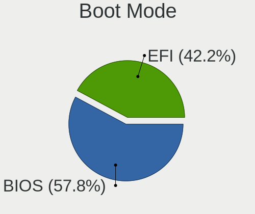
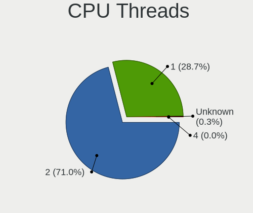
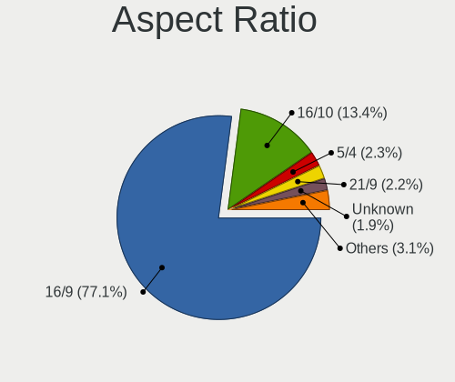

Ubuntu 22.04 - Tested Hardware & Statistics
-------------------------------------------

A project to collect tested hardware configurations for Ubuntu 22.04.

Anyone can contribute to this report by the [hw-probe](https://github.com/linuxhw/hw-probe) tool:

    sudo -E hw-probe -all -upload

Please contribute! Especially if your hardware is rare.

This is a report for all computer types. See also reports for [desktops](/Dist/Ubuntu_22.04/Desktop/README.md) and [notebooks](/Dist/Ubuntu_22.04/Notebook/README.md).

Contents
--------

* [ Test Cases ](#test-cases)

* [ System ](#system)
  - [ Kernel                   ](#kernel)
  - [ Kernel Family            ](#kernel-family)
  - [ Kernel Major Ver.        ](#kernel-major-ver)
  - [ Arch                     ](#arch)
  - [ DE                       ](#de)
  - [ Display Server           ](#display-server)
  - [ Display Manager          ](#display-manager)
  - [ OS Lang                  ](#os-lang)
  - [ Boot Mode                ](#boot-mode)
  - [ Filesystem               ](#filesystem)
  - [ Part. scheme             ](#part-scheme)
  - [ Dual Boot with Linux/BSD ](#dual-boot-with-linuxbsd)
  - [ Dual Boot (Win)          ](#dual-boot-win)

* [ Board ](#board)
  - [ Vendor                   ](#vendor)
  - [ Model                    ](#model)
  - [ Model Family             ](#model-family)
  - [ MFG Year                 ](#mfg-year)
  - [ Form Factor              ](#form-factor)
  - [ Secure Boot              ](#secure-boot)
  - [ Coreboot                 ](#coreboot)
  - [ RAM Size                 ](#ram-size)
  - [ RAM Used                 ](#ram-used)
  - [ Total Drives             ](#total-drives)
  - [ Has CD-ROM               ](#has-cd-rom)
  - [ Has Ethernet             ](#has-ethernet)
  - [ Has WiFi                 ](#has-wifi)
  - [ Has Bluetooth            ](#has-bluetooth)

* [ Location ](#location)
  - [ Country                  ](#country)
  - [ City                     ](#city)

* [ Drives ](#drives)
  - [ Drive Vendor             ](#drive-vendor)
  - [ Drive Model              ](#drive-model)
  - [ HDD Vendor               ](#hdd-vendor)
  - [ SSD Vendor               ](#ssd-vendor)
  - [ Drive Kind               ](#drive-kind)
  - [ Drive Connector          ](#drive-connector)
  - [ Drive Size               ](#drive-size)
  - [ Space Total              ](#space-total)
  - [ Space Used               ](#space-used)
  - [ Malfunc. Drives          ](#malfunc-drives)
  - [ Malfunc. Drive Vendor    ](#malfunc-drive-vendor)
  - [ Malfunc. HDD Vendor      ](#malfunc-hdd-vendor)
  - [ Malfunc. Drive Kind      ](#malfunc-drive-kind)
  - [ Failed Drives            ](#failed-drives)
  - [ Failed Drive Vendor      ](#failed-drive-vendor)
  - [ Drive Status             ](#drive-status)

* [ Storage controller ](#storage-controller)
  - [ Storage Vendor           ](#storage-vendor)
  - [ Storage Model            ](#storage-model)
  - [ Storage Kind             ](#storage-kind)

* [ Processor ](#processor)
  - [ CPU Vendor               ](#cpu-vendor)
  - [ CPU Model                ](#cpu-model)
  - [ CPU Model Family         ](#cpu-model-family)
  - [ CPU Cores                ](#cpu-cores)
  - [ CPU Sockets              ](#cpu-sockets)
  - [ CPU Threads              ](#cpu-threads)
  - [ CPU Op-Modes             ](#cpu-op-modes)
  - [ CPU Microcode            ](#cpu-microcode)
  - [ CPU Microarch            ](#cpu-microarch)

* [ Graphics ](#graphics)
  - [ GPU Vendor               ](#gpu-vendor)
  - [ GPU Model                ](#gpu-model)
  - [ GPU Combo                ](#gpu-combo)
  - [ GPU Driver               ](#gpu-driver)
  - [ GPU Memory               ](#gpu-memory)

* [ Monitor ](#monitor)
  - [ Monitor Vendor           ](#monitor-vendor)
  - [ Monitor Model            ](#monitor-model)
  - [ Monitor Resolution       ](#monitor-resolution)
  - [ Monitor Diagonal         ](#monitor-diagonal)
  - [ Monitor Width            ](#monitor-width)
  - [ Aspect Ratio             ](#aspect-ratio)
  - [ Monitor Area             ](#monitor-area)
  - [ Pixel Density            ](#pixel-density)
  - [ Multiple Monitors        ](#multiple-monitors)

* [ Network ](#network)
  - [ Net Controller Vendor    ](#net-controller-vendor)
  - [ Net Controller Model     ](#net-controller-model)
  - [ Wireless Vendor          ](#wireless-vendor)
  - [ Wireless Model           ](#wireless-model)
  - [ Ethernet Vendor          ](#ethernet-vendor)
  - [ Ethernet Model           ](#ethernet-model)
  - [ Net Controller Kind      ](#net-controller-kind)
  - [ Used Controller          ](#used-controller)
  - [ NICs                     ](#nics)
  - [ IPv6                     ](#ipv6)

* [ Bluetooth ](#bluetooth)
  - [ Bluetooth Vendor         ](#bluetooth-vendor)
  - [ Bluetooth Model          ](#bluetooth-model)

* [ Sound ](#sound)
  - [ Sound Vendor             ](#sound-vendor)
  - [ Sound Model              ](#sound-model)

* [ Memory ](#memory)
  - [ Memory Vendor            ](#memory-vendor)
  - [ Memory Model             ](#memory-model)
  - [ Memory Kind              ](#memory-kind)
  - [ Memory Form Factor       ](#memory-form-factor)
  - [ Memory Size              ](#memory-size)
  - [ Memory Speed             ](#memory-speed)

* [ Printers & scanners ](#printers--scanners)
  - [ Printer Vendor           ](#printer-vendor)
  - [ Printer Model            ](#printer-model)
  - [ Scanner Vendor           ](#scanner-vendor)
  - [ Scanner Model            ](#scanner-model)

* [ Camera ](#camera)
  - [ Camera Vendor            ](#camera-vendor)
  - [ Camera Model             ](#camera-model)

* [ Security ](#security)
  - [ Fingerprint Vendor       ](#fingerprint-vendor)
  - [ Fingerprint Model        ](#fingerprint-model)
  - [ Chipcard Vendor          ](#chipcard-vendor)
  - [ Chipcard Model           ](#chipcard-model)

* [ Unsupported ](#unsupported)
  - [ Unsupported Devices      ](#unsupported-devices)
  - [ Unsupported Device Types ](#unsupported-device-types)

Test Cases
----------

Total: 16797

| Vendor        | Model                       | Form-Factor | Probe                                                      | Date         |
|---------------|-----------------------------|-------------|------------------------------------------------------------|--------------|
| Colorful T... | BATTLE-AX B365M-D V20       | Desktop     | [f8c7c20100](https://linux-hardware.org/?probe=f8c7c20100) | Oct 01, 2023 |
| Acer          | Predator G9-793             | Notebook    | [fd305490af](https://linux-hardware.org/?probe=fd305490af) | Oct 01, 2023 |
| Colorful T... | BATTLE-AX B365M-D V20       | Desktop     | [c118982282](https://linux-hardware.org/?probe=c118982282) | Oct 01, 2023 |
| Dell          | 09KPNV A01                  | Desktop     | [38dba6ab76](https://linux-hardware.org/?probe=38dba6ab76) | Oct 01, 2023 |
| OriginPC      | X170KM-G                    | Notebook    | [2a8752667a](https://linux-hardware.org/?probe=2a8752667a) | Oct 01, 2023 |
| Lenovo        | MIIX 310-10ICR 80SG         | Tablet      | [150d5d9afd](https://linux-hardware.org/?probe=150d5d9afd) | Oct 01, 2023 |
| ASRock        | FM2A55M-VG3+                | Desktop     | [6faa4fd636](https://linux-hardware.org/?probe=6faa4fd636) | Oct 01, 2023 |
| HP            | ProBook 650 G8 Notebook ... | Notebook    | [b02492c1dd](https://linux-hardware.org/?probe=b02492c1dd) | Oct 01, 2023 |
| GPU Compan... | GWTN156-4                   | Notebook    | [fa5491ff0c](https://linux-hardware.org/?probe=fa5491ff0c) | Oct 01, 2023 |
| Acer          | H57M01                      | Desktop     | [77fd0bf30a](https://linux-hardware.org/?probe=77fd0bf30a) | Sep 30, 2023 |
| ASUSTek       | X756UVK                     | Notebook    | [3bc56b23ef](https://linux-hardware.org/?probe=3bc56b23ef) | Sep 30, 2023 |
| HP            | ENVY x360 Convertible 15... | Convertible | [9b1cc15d8a](https://linux-hardware.org/?probe=9b1cc15d8a) | Sep 30, 2023 |
| HP            | ENVY x360 Convertible 15... | Convertible | [e2c6027a51](https://linux-hardware.org/?probe=e2c6027a51) | Sep 30, 2023 |
| ASUSTek       | Z450LA                      | Notebook    | [afa96a084e](https://linux-hardware.org/?probe=afa96a084e) | Sep 30, 2023 |
| HP            | EliteBook 820 G4            | Notebook    | [eb46d26ff8](https://linux-hardware.org/?probe=eb46d26ff8) | Sep 30, 2023 |
| ASUSTek       | F7SR                        | Notebook    | [b895fd8bb2](https://linux-hardware.org/?probe=b895fd8bb2) | Sep 30, 2023 |
| ASUSTek       | F7SR                        | Notebook    | [1b7493ae6e](https://linux-hardware.org/?probe=1b7493ae6e) | Sep 30, 2023 |
| Infinix       | INBOOK X3                   | Notebook    | [6b5c2647c2](https://linux-hardware.org/?probe=6b5c2647c2) | Sep 30, 2023 |
| Lenovo        | ThinkPad E15 Gen 4 21E60... | Notebook    | [951a03d2ad](https://linux-hardware.org/?probe=951a03d2ad) | Sep 30, 2023 |
| Fujitsu Si... | AMILO Pa 2548               | Notebook    | [ee2d5e25d3](https://linux-hardware.org/?probe=ee2d5e25d3) | Sep 30, 2023 |
| Colorful T... | BATTLE-AX B365M-D V20       | Desktop     | [e212af9208](https://linux-hardware.org/?probe=e212af9208) | Sep 30, 2023 |
| Entroware     | Hybris                      | Notebook    | [5b124e9b7f](https://linux-hardware.org/?probe=5b124e9b7f) | Sep 30, 2023 |
| UNOWHY        | Y13G012S4EI                 | Notebook    | [2b60435562](https://linux-hardware.org/?probe=2b60435562) | Sep 30, 2023 |
| Fujitsu Si... | AMILO Pa 2548               | Notebook    | [a291afc6c3](https://linux-hardware.org/?probe=a291afc6c3) | Sep 30, 2023 |
| MSI           | MPG Z390M GAMING EDGE AC    | Desktop     | [04432690a4](https://linux-hardware.org/?probe=04432690a4) | Sep 30, 2023 |
| Dell          | Latitude 5430               | Notebook    | [eee2a34ff5](https://linux-hardware.org/?probe=eee2a34ff5) | Sep 30, 2023 |
| Gigabyte      | X99-UD3-CF                  | Desktop     | [f1cc7e5a93](https://linux-hardware.org/?probe=f1cc7e5a93) | Sep 30, 2023 |
| HP            | Pavilion x360 Convertibl... | Convertible | [4074a9c221](https://linux-hardware.org/?probe=4074a9c221) | Sep 30, 2023 |
| Gigabyte      | X99-UD3-CF                  | Desktop     | [51d10770c6](https://linux-hardware.org/?probe=51d10770c6) | Sep 30, 2023 |
| TECNO         | MEGABOOK T1                 | Notebook    | [9bba77e02b](https://linux-hardware.org/?probe=9bba77e02b) | Sep 30, 2023 |
| Samsung       | 305E4A/305E5A/305E7A        | Notebook    | [89d519a3f5](https://linux-hardware.org/?probe=89d519a3f5) | Sep 30, 2023 |
| Acer          | Aspire SW3-016              | Notebook    | [62c3855aa7](https://linux-hardware.org/?probe=62c3855aa7) | Sep 30, 2023 |
| HP            | Notebook                    | Notebook    | [873004172f](https://linux-hardware.org/?probe=873004172f) | Sep 30, 2023 |
| Sony          | VPCEG10EL                   | Notebook    | [8271942cc2](https://linux-hardware.org/?probe=8271942cc2) | Sep 30, 2023 |
| ASUSTek       | ASUS TUF Gaming A15 FA50... | Notebook    | [527c8192a9](https://linux-hardware.org/?probe=527c8192a9) | Sep 30, 2023 |
| Dell          | Inspiron 5521               | Notebook    | [a704dd3c01](https://linux-hardware.org/?probe=a704dd3c01) | Sep 30, 2023 |
| ASRock        | A300M-STX                   | Desktop     | [d8c97108ad](https://linux-hardware.org/?probe=d8c97108ad) | Sep 30, 2023 |
| VALE          | Notebook Classic C140       | Notebook    | [5be7208021](https://linux-hardware.org/?probe=5be7208021) | Sep 30, 2023 |
| Acer          | H57M01                      | Desktop     | [d506730eed](https://linux-hardware.org/?probe=d506730eed) | Sep 30, 2023 |
| ASRock        | A300M-STX                   | Desktop     | [bcbf0e5bfd](https://linux-hardware.org/?probe=bcbf0e5bfd) | Sep 30, 2023 |
| ASRockRack    | Z690D4U-2L2T/G5             | Server      | [cc642b859b](https://linux-hardware.org/?probe=cc642b859b) | Sep 30, 2023 |
| HP            | Dragonfly 13.5 inch G4 N... | Notebook    | [2afa933d2a](https://linux-hardware.org/?probe=2afa933d2a) | Sep 30, 2023 |
| Unknown       | Unknown                     | Notebook    | [56580ba351](https://linux-hardware.org/?probe=56580ba351) | Sep 30, 2023 |
| HP            | Dragonfly 13.5 inch G4 N... | Notebook    | [a7a8e627cb](https://linux-hardware.org/?probe=a7a8e627cb) | Sep 30, 2023 |
| ASUSTek       | ZenBook UX425QA_UM425QA     | Notebook    | [306bc123c4](https://linux-hardware.org/?probe=306bc123c4) | Sep 29, 2023 |
| Lenovo        | G770 1037                   | Notebook    | [576bbd3839](https://linux-hardware.org/?probe=576bbd3839) | Sep 29, 2023 |
| Lenovo        | ThinkPad X13 Gen 1 20UGA... | Notebook    | [8c1d3fc469](https://linux-hardware.org/?probe=8c1d3fc469) | Sep 29, 2023 |
| Dell          | XPS 15 9550                 | Notebook    | [587f9a3ff1](https://linux-hardware.org/?probe=587f9a3ff1) | Sep 29, 2023 |
| Dell          | 0WWR83 A05                  | Server      | [f099698b0e](https://linux-hardware.org/?probe=f099698b0e) | Sep 29, 2023 |
| Foxconn       | 2AB1                        | Desktop     | [28ef0f3fbc](https://linux-hardware.org/?probe=28ef0f3fbc) | Sep 29, 2023 |
| Lenovo        | ThinkPad X13 Gen 1 20UGA... | Notebook    | [c38ca27643](https://linux-hardware.org/?probe=c38ca27643) | Sep 29, 2023 |
| Acer          | H57M01                      | Desktop     | [ad7b1bf379](https://linux-hardware.org/?probe=ad7b1bf379) | Sep 29, 2023 |
| Acer          | Nitro N50-610               | Desktop     | [a91f602e4a](https://linux-hardware.org/?probe=a91f602e4a) | Sep 29, 2023 |
| ASUSTek       | ASUS TUF Gaming A15 FA50... | Notebook    | [96e037afc8](https://linux-hardware.org/?probe=96e037afc8) | Sep 29, 2023 |
| Apple         | MacBookAir6,1               | Notebook    | [b77b45ce58](https://linux-hardware.org/?probe=b77b45ce58) | Sep 29, 2023 |
| Dell          | 0804P1 A02                  | Server      | [96b1e41f9c](https://linux-hardware.org/?probe=96b1e41f9c) | Sep 29, 2023 |
| Supermicro    | X8DAH                       | Server      | [fdf4a783aa](https://linux-hardware.org/?probe=fdf4a783aa) | Sep 29, 2023 |
| Dell          | Latitude 5500               | Notebook    | [ea091dbcf2](https://linux-hardware.org/?probe=ea091dbcf2) | Sep 29, 2023 |
| Dell          | 0PRR48 A00                  | Desktop     | [52fd06666a](https://linux-hardware.org/?probe=52fd06666a) | Sep 29, 2023 |
| HP            | ProLiant DL360 Gen9         | Server      | [c7f7de0a3a](https://linux-hardware.org/?probe=c7f7de0a3a) | Sep 29, 2023 |
| HP            | ProLiant DL360 Gen9         | Server      | [380afb179f](https://linux-hardware.org/?probe=380afb179f) | Sep 29, 2023 |
| HP            | ProLiant DL360 Gen9         | Server      | [002155539d](https://linux-hardware.org/?probe=002155539d) | Sep 29, 2023 |
| HP            | ProLiant DL360 Gen9         | Server      | [1395f33f33](https://linux-hardware.org/?probe=1395f33f33) | Sep 29, 2023 |
| HP            | ProLiant DL360 Gen9         | Server      | [1dc72cc274](https://linux-hardware.org/?probe=1dc72cc274) | Sep 29, 2023 |
| Intel         | B75                         | Desktop     | [a30fa8031b](https://linux-hardware.org/?probe=a30fa8031b) | Sep 29, 2023 |
| HP            | OMEN by Laptop 15-dc1xxx    | Notebook    | [2d31a3d858](https://linux-hardware.org/?probe=2d31a3d858) | Sep 29, 2023 |
| Supermicro    | X9DRW                       | Server      | [122a3dfb58](https://linux-hardware.org/?probe=122a3dfb58) | Sep 29, 2023 |
| Supermicro    | X9DRW                       | Server      | [4d0fad3a9e](https://linux-hardware.org/?probe=4d0fad3a9e) | Sep 29, 2023 |
| ASUSTek       | ROG STRIX B550-F GAMING ... | Desktop     | [6177caee37](https://linux-hardware.org/?probe=6177caee37) | Sep 29, 2023 |
| Dell          | 0WWR83 A05                  | Server      | [8df85e28d8](https://linux-hardware.org/?probe=8df85e28d8) | Sep 29, 2023 |
| Alienware     | m16 R1 AMD                  | Notebook    | [710a10efce](https://linux-hardware.org/?probe=710a10efce) | Sep 29, 2023 |
| MSI           | Prestige 15 A12SC           | Notebook    | [d78d241946](https://linux-hardware.org/?probe=d78d241946) | Sep 29, 2023 |
| Gigabyte      | Z390 AORUS PRO WIFI-CF      | Desktop     | [8724efb686](https://linux-hardware.org/?probe=8724efb686) | Sep 29, 2023 |
| Gigabyte      | Z390 AORUS PRO WIFI-CF      | Desktop     | [76fc0d8239](https://linux-hardware.org/?probe=76fc0d8239) | Sep 29, 2023 |
| ASUSTek       | VivoBook_ASUSLaptop X412... | Notebook    | [5828bffdb6](https://linux-hardware.org/?probe=5828bffdb6) | Sep 29, 2023 |
| Dell          | Inspiron 15-3552            | Notebook    | [8a8f11edae](https://linux-hardware.org/?probe=8a8f11edae) | Sep 29, 2023 |
| HP            | Laptop 14-fq0xxx            | Notebook    | [52648b0b45](https://linux-hardware.org/?probe=52648b0b45) | Sep 29, 2023 |
| Dell          | 03015M A10                  | Server      | [1c089bce6b](https://linux-hardware.org/?probe=1c089bce6b) | Sep 29, 2023 |
| ASUSTek       | M5A97 R2.0                  | Desktop     | [2c2f49b6bf](https://linux-hardware.org/?probe=2c2f49b6bf) | Sep 29, 2023 |
| Lenovo        | ThinkPad E495 20NE0001US    | Notebook    | [a76a94cd2f](https://linux-hardware.org/?probe=a76a94cd2f) | Sep 29, 2023 |
| Supermicro    | X11DPG-QTA                  | Server      | [80db5bcb0e](https://linux-hardware.org/?probe=80db5bcb0e) | Sep 29, 2023 |
| Dell          | Inspiron 5437               | Notebook    | [c0301c2fbb](https://linux-hardware.org/?probe=c0301c2fbb) | Sep 29, 2023 |
| Gigabyte      | GA-MA780G-UD3H              | Desktop     | [9b86a89bf4](https://linux-hardware.org/?probe=9b86a89bf4) | Sep 29, 2023 |
| Lenovo        | V15 G2 ITL 82KB             | Notebook    | [e87fdc15ed](https://linux-hardware.org/?probe=e87fdc15ed) | Sep 29, 2023 |
| Lenovo        | V15 G2 ITL 82KB             | Notebook    | [b1333a2976](https://linux-hardware.org/?probe=b1333a2976) | Sep 29, 2023 |
| HP            | Stream Laptop 14-ds0xxx     | Notebook    | [bbab7c9f89](https://linux-hardware.org/?probe=bbab7c9f89) | Sep 29, 2023 |
| HP            | Stream Laptop 14-ds0xxx     | Notebook    | [4f23a67b82](https://linux-hardware.org/?probe=4f23a67b82) | Sep 29, 2023 |
| ASUSTek       | ROG STRIX B550-A GAMING     | Desktop     | [cce7c03059](https://linux-hardware.org/?probe=cce7c03059) | Sep 29, 2023 |
| HP            | EliteBook x360 1040 G6      | Convertible | [76c2234d3e](https://linux-hardware.org/?probe=76c2234d3e) | Sep 29, 2023 |
| HP            | EliteBook x360 1040 G6      | Convertible | [6bb37fb224](https://linux-hardware.org/?probe=6bb37fb224) | Sep 29, 2023 |
| HP            | ProLiant DL360 Gen9         | Server      | [b6d98e8f23](https://linux-hardware.org/?probe=b6d98e8f23) | Sep 29, 2023 |
| HP            | ProLiant DL360 Gen9         | Server      | [448463ac0a](https://linux-hardware.org/?probe=448463ac0a) | Sep 29, 2023 |
| HP            | ProLiant DL360 Gen9         | Server      | [b4fa4a9cff](https://linux-hardware.org/?probe=b4fa4a9cff) | Sep 29, 2023 |
| ETegro Tec... | ETRS125G4 31S2MMB0040       | Server      | [68bb1e4021](https://linux-hardware.org/?probe=68bb1e4021) | Sep 29, 2023 |
| Supermicro    | X9DRW                       | Server      | [21757c8129](https://linux-hardware.org/?probe=21757c8129) | Sep 29, 2023 |
| Supermicro    | X9DRW                       | Server      | [e60890ee3e](https://linux-hardware.org/?probe=e60890ee3e) | Sep 29, 2023 |
| Samsung       | 340XAA/350XAA/550XAA        | Notebook    | [ccc715eeb6](https://linux-hardware.org/?probe=ccc715eeb6) | Sep 29, 2023 |
| HP            | EliteBook x360 1040 G6      | Convertible | [50e5cd4da6](https://linux-hardware.org/?probe=50e5cd4da6) | Sep 28, 2023 |
| ASUSTek       | H81M-E                      | Desktop     | [0137140cae](https://linux-hardware.org/?probe=0137140cae) | Sep 28, 2023 |
| Gigabyte      | B150M-D3V-CF                | Desktop     | [75b228c5fb](https://linux-hardware.org/?probe=75b228c5fb) | Sep 28, 2023 |
| ETegro Tec... | ETRS125G4 31S2MMB0040       | Server      | [3191feb756](https://linux-hardware.org/?probe=3191feb756) | Sep 28, 2023 |
| Lenovo        | Yoga Slim 7 Carbon 14ACN... | Notebook    | [a5e7296c29](https://linux-hardware.org/?probe=a5e7296c29) | Sep 28, 2023 |
| Gigabyte      | B360M DS3H                  | Desktop     | [1308430981](https://linux-hardware.org/?probe=1308430981) | Sep 28, 2023 |
| HP            | ENVY 17                     | Notebook    | [184a826bba](https://linux-hardware.org/?probe=184a826bba) | Sep 28, 2023 |
| ETegro Tec... | ETRS125G4 31S2MMB0040       | Server      | [a14ff14954](https://linux-hardware.org/?probe=a14ff14954) | Sep 28, 2023 |
| ETegro Tec... | ETRS125G4 31S2MMB0040       | Server      | [cb9984cefb](https://linux-hardware.org/?probe=cb9984cefb) | Sep 28, 2023 |
| ETegro Tec... | ETRS125G4 31S2MMB0040       | Server      | [1cca0d5263](https://linux-hardware.org/?probe=1cca0d5263) | Sep 28, 2023 |
| ETegro Tec... | ETRS125G4 31S2MMB0040       | Server      | [6732e637aa](https://linux-hardware.org/?probe=6732e637aa) | Sep 28, 2023 |
| ETegro Tec... | ETRS125G4 31S2MMB0040       | Server      | [06e76c2108](https://linux-hardware.org/?probe=06e76c2108) | Sep 28, 2023 |
| ETegro Tec... | ETRS125G4 31S2MMB0040       | Server      | [ce41069e7d](https://linux-hardware.org/?probe=ce41069e7d) | Sep 28, 2023 |
| ETegro Tec... | ETRS125G4 31S2MMB0040       | Server      | [d431883e15](https://linux-hardware.org/?probe=d431883e15) | Sep 28, 2023 |
| I-Life Dig... | ZED AIR PRO                 | Notebook    | [7cb30879f6](https://linux-hardware.org/?probe=7cb30879f6) | Sep 28, 2023 |
| ETegro Tec... | ETRS125G4 31S2MMB0040       | Server      | [ac05e8b898](https://linux-hardware.org/?probe=ac05e8b898) | Sep 28, 2023 |
| ETegro Tec... | ETRS125G4 31S2MMB0040       | Server      | [eb9e748181](https://linux-hardware.org/?probe=eb9e748181) | Sep 28, 2023 |
| ETegro Tec... | ETRS125G4 31S2MMB0040       | Server      | [1d6887b5f3](https://linux-hardware.org/?probe=1d6887b5f3) | Sep 28, 2023 |
| ETegro Tec... | ETRS125G4 31S2MMB0040       | Server      | [4d27130658](https://linux-hardware.org/?probe=4d27130658) | Sep 28, 2023 |
| ETegro Tec... | ETRS125G4 31S2MMB0040       | Server      | [bb562ae3fe](https://linux-hardware.org/?probe=bb562ae3fe) | Sep 28, 2023 |
| ETegro Tec... | ETRS125G4 31S2MMB0040       | Server      | [c27a8913bf](https://linux-hardware.org/?probe=c27a8913bf) | Sep 28, 2023 |
| ETegro Tec... | ETRS125G4 31S2MMB0040       | Server      | [c00c73fa32](https://linux-hardware.org/?probe=c00c73fa32) | Sep 28, 2023 |
| ETegro Tec... | ETRS125G4 31S2MMB0040       | Server      | [abcb83d7b5](https://linux-hardware.org/?probe=abcb83d7b5) | Sep 28, 2023 |
| Dell          | Precision 3560              | Notebook    | [14af02a240](https://linux-hardware.org/?probe=14af02a240) | Sep 28, 2023 |
| FriendlyEl... | NanoPC-T6                   | Soc         | [36905cc47d](https://linux-hardware.org/?probe=36905cc47d) | Sep 28, 2023 |
| MSI           | B550M PRO-VDH WIFI          | Desktop     | [ce357bee14](https://linux-hardware.org/?probe=ce357bee14) | Sep 28, 2023 |
| Supermicro    | X8DTL                       | Server      | [f068e7e4f8](https://linux-hardware.org/?probe=f068e7e4f8) | Sep 28, 2023 |
| Lenovo        | ThinkPad T14 Gen 3 21AJS... | Notebook    | [38e71e4fe9](https://linux-hardware.org/?probe=38e71e4fe9) | Sep 28, 2023 |
| Gigabyte      | EX58-EXTREME                | Desktop     | [4a1a75d0e3](https://linux-hardware.org/?probe=4a1a75d0e3) | Sep 28, 2023 |
| HP            | Laptop 15-fd0xxx            | Notebook    | [0a548c4390](https://linux-hardware.org/?probe=0a548c4390) | Sep 28, 2023 |
| GMKtec        | NucBox3                     | Desktop     | [c99750febd](https://linux-hardware.org/?probe=c99750febd) | Sep 28, 2023 |
| ASUSTek       | ROG Zephyrus G14 GA401IU... | Notebook    | [f86a0719d7](https://linux-hardware.org/?probe=f86a0719d7) | Sep 28, 2023 |
| Lenovo        | ThinkPad T14 Gen 2i 20W0... | Notebook    | [c8dfaf68d0](https://linux-hardware.org/?probe=c8dfaf68d0) | Sep 28, 2023 |
| Gigabyte      | EX58-EXTREME                | Desktop     | [bc2a9ecc6a](https://linux-hardware.org/?probe=bc2a9ecc6a) | Sep 28, 2023 |
| HP            | 1496                        | Desktop     | [3867e7af58](https://linux-hardware.org/?probe=3867e7af58) | Sep 28, 2023 |
| HP            | Pavilion 11 x360 PC         | Notebook    | [b6316ea4df](https://linux-hardware.org/?probe=b6316ea4df) | Sep 28, 2023 |
| HUAWEI        | NBLB-WAX9N                  | Notebook    | [7cbed3fca6](https://linux-hardware.org/?probe=7cbed3fca6) | Sep 28, 2023 |
| HP            | Pavilion 11 x360 PC         | Notebook    | [f75ab187aa](https://linux-hardware.org/?probe=f75ab187aa) | Sep 28, 2023 |
| Supermicro    | X8DTU                       | Server      | [d72f782d8c](https://linux-hardware.org/?probe=d72f782d8c) | Sep 28, 2023 |
| Supermicro    | X8DTU                       | Server      | [3d9123e719](https://linux-hardware.org/?probe=3d9123e719) | Sep 28, 2023 |
| Wistron       | ProLiant ML110 G6           | Desktop     | [4284ef7737](https://linux-hardware.org/?probe=4284ef7737) | Sep 28, 2023 |
| Acer          | Aspire TC-885 V:1.1         | Desktop     | [7aef46e946](https://linux-hardware.org/?probe=7aef46e946) | Sep 28, 2023 |
| Wistron       | ProLiant ML110 G6           | Desktop     | [6282804553](https://linux-hardware.org/?probe=6282804553) | Sep 28, 2023 |
| Lenovo        | ThinkPad E14 Gen 3 20Y70... | Notebook    | [78b1c422c7](https://linux-hardware.org/?probe=78b1c422c7) | Sep 28, 2023 |
| HP            | Notebook                    | Notebook    | [7d55fd8520](https://linux-hardware.org/?probe=7d55fd8520) | Sep 28, 2023 |
| Alienware     | x14                         | Notebook    | [048d5f6f2a](https://linux-hardware.org/?probe=048d5f6f2a) | Sep 28, 2023 |
| Lenovo        | ThinkServer TS140           | Desktop     | [0e08685628](https://linux-hardware.org/?probe=0e08685628) | Sep 28, 2023 |
| ASUSTek       | X550CC                      | Notebook    | [001231c730](https://linux-hardware.org/?probe=001231c730) | Sep 28, 2023 |
| HP            | Notebook                    | Notebook    | [49192b29a6](https://linux-hardware.org/?probe=49192b29a6) | Sep 28, 2023 |
| Gigabyte      | 970A-DS3P FX                | Desktop     | [627751c21a](https://linux-hardware.org/?probe=627751c21a) | Sep 28, 2023 |
| Apple         | Mac-A369DDC4E67F1C45 iMa... | All in one  | [4fb593dcca](https://linux-hardware.org/?probe=4fb593dcca) | Sep 28, 2023 |
| HP            | Laptop 15-da0xxx            | Notebook    | [3d996f9823](https://linux-hardware.org/?probe=3d996f9823) | Sep 28, 2023 |
| Lenovo        | ThinkCentre M57 6075Y3W     | Desktop     | [8e39080ed3](https://linux-hardware.org/?probe=8e39080ed3) | Sep 28, 2023 |
| Dell          | Inspiron 5515               | Notebook    | [5889ba673d](https://linux-hardware.org/?probe=5889ba673d) | Sep 27, 2023 |
| HP            | Laptop 15-da0xxx            | Notebook    | [8fb9d5d21f](https://linux-hardware.org/?probe=8fb9d5d21f) | Sep 27, 2023 |
| HP            | ENVY x360 Convertible 15... | Convertible | [13a2717815](https://linux-hardware.org/?probe=13a2717815) | Sep 27, 2023 |
| MiTAC         | PD10EHI                     | Desktop     | [29716ecb18](https://linux-hardware.org/?probe=29716ecb18) | Sep 27, 2023 |
| Medion        | E3221                       | Convertible | [eaa3a2c9ee](https://linux-hardware.org/?probe=eaa3a2c9ee) | Sep 27, 2023 |
| Toshiba       | Satellite L550              | Notebook    | [d93c40647f](https://linux-hardware.org/?probe=d93c40647f) | Sep 27, 2023 |
| Gigabyte      | X570 AORUS PRO WIFI         | Desktop     | [e15856c8f1](https://linux-hardware.org/?probe=e15856c8f1) | Sep 27, 2023 |
| Supermicro    | X8DAH                       | Server      | [ef771077af](https://linux-hardware.org/?probe=ef771077af) | Sep 27, 2023 |
| Supermicro    | X9DRW                       | Server      | [3dcf1261b5](https://linux-hardware.org/?probe=3dcf1261b5) | Sep 27, 2023 |
| ETegro Tec... | ETRS125G4 31S2MMB0040       | Server      | [2b1ce7346b](https://linux-hardware.org/?probe=2b1ce7346b) | Sep 27, 2023 |
| Lenovo        | ThinkPad X1 Carbon Gen 8... | Notebook    | [b5dee453a3](https://linux-hardware.org/?probe=b5dee453a3) | Sep 27, 2023 |
| Lenovo        | IdeaPad 1 14IGL7 82V6       | Notebook    | [707c612189](https://linux-hardware.org/?probe=707c612189) | Sep 27, 2023 |
| AMI           | Cherry Trail CR             | Notebook    | [41b2d006c1](https://linux-hardware.org/?probe=41b2d006c1) | Sep 27, 2023 |
| AMI           | Cherry Trail CR             | Notebook    | [050c423c6b](https://linux-hardware.org/?probe=050c423c6b) | Sep 27, 2023 |
| Dell          | Latitude 7390               | Notebook    | [93e22b6fc4](https://linux-hardware.org/?probe=93e22b6fc4) | Sep 27, 2023 |
| HP            | EliteBook 840 G8 Noteboo... | Notebook    | [593ddb6105](https://linux-hardware.org/?probe=593ddb6105) | Sep 27, 2023 |
| Dell          | Latitude 7390               | Notebook    | [a7bfa2e285](https://linux-hardware.org/?probe=a7bfa2e285) | Sep 27, 2023 |
| ASUSTek       | M5A78L-M PLUS/USB3          | Desktop     | [f47347fb9b](https://linux-hardware.org/?probe=f47347fb9b) | Sep 27, 2023 |
| Clevo         | W240EU/W250EUQ/W270EUQ      | Notebook    | [cd5d2fae9e](https://linux-hardware.org/?probe=cd5d2fae9e) | Sep 27, 2023 |
| Dell          | Precision 5570              | Notebook    | [f00d32a04a](https://linux-hardware.org/?probe=f00d32a04a) | Sep 27, 2023 |
| Sony          | VPCEG10EL                   | Notebook    | [7bfbe9b21d](https://linux-hardware.org/?probe=7bfbe9b21d) | Sep 27, 2023 |
| Lenovo        | IdeaPad 320-15IKB 81BG      | Notebook    | [17f9208e1a](https://linux-hardware.org/?probe=17f9208e1a) | Sep 27, 2023 |
| ASUSTek       | PRO H410M-C                 | Desktop     | [6554d255c3](https://linux-hardware.org/?probe=6554d255c3) | Sep 27, 2023 |
| AAEON         | MIX-H310D1 V1.0             | Desktop     | [7a3b3d3b2d](https://linux-hardware.org/?probe=7a3b3d3b2d) | Sep 27, 2023 |
| ASUSTek       | M5A99FX PRO R2.0            | Desktop     | [500909194e](https://linux-hardware.org/?probe=500909194e) | Sep 27, 2023 |
| HUAWEI        | BOHB-WAX9                   | Notebook    | [054707cbd2](https://linux-hardware.org/?probe=054707cbd2) | Sep 27, 2023 |
| Toshiba       | dynabook T350/46BW          | Notebook    | [26ffaa1c0f](https://linux-hardware.org/?probe=26ffaa1c0f) | Sep 27, 2023 |
| HP            | EliteBook 8470p             | Notebook    | [a1fa543905](https://linux-hardware.org/?probe=a1fa543905) | Sep 27, 2023 |
| Dell          | Vostro 3500                 | Notebook    | [fac9ee2e6e](https://linux-hardware.org/?probe=fac9ee2e6e) | Sep 27, 2023 |
| ASRock        | Z790 Taichi                 | Desktop     | [949be6194e](https://linux-hardware.org/?probe=949be6194e) | Sep 27, 2023 |
| ASUSTek       | VivoBook_ASUSLaptop M350... | Notebook    | [0e32901b18](https://linux-hardware.org/?probe=0e32901b18) | Sep 27, 2023 |
| HUAWEI        | KLVL-WXXW                   | Notebook    | [4f1f07158b](https://linux-hardware.org/?probe=4f1f07158b) | Sep 26, 2023 |
| HP            | ProBook 450 G8 Notebook ... | Notebook    | [c0607441c1](https://linux-hardware.org/?probe=c0607441c1) | Sep 26, 2023 |
| Lenovo        | ThinkPad T590 20N5S31U02    | Notebook    | [d4137582b5](https://linux-hardware.org/?probe=d4137582b5) | Sep 26, 2023 |
| HP            | Pavilion x360 Convertibl... | Convertible | [a0366d9d2e](https://linux-hardware.org/?probe=a0366d9d2e) | Sep 26, 2023 |
| Google        | Phaser360                   | Notebook    | [95686db08c](https://linux-hardware.org/?probe=95686db08c) | Sep 26, 2023 |
| ASRock        | Z790 Taichi                 | Desktop     | [50ff8d28e4](https://linux-hardware.org/?probe=50ff8d28e4) | Sep 26, 2023 |
| Lenovo        | ThinkPad T590 20N5S31U02    | Notebook    | [aa988ac4df](https://linux-hardware.org/?probe=aa988ac4df) | Sep 26, 2023 |
| HP            | Laptop 15-dy2xxx            | Notebook    | [8fd945e3c5](https://linux-hardware.org/?probe=8fd945e3c5) | Sep 26, 2023 |
| MSI           | MAG B550M MORTAR            | Desktop     | [5a2571575f](https://linux-hardware.org/?probe=5a2571575f) | Sep 26, 2023 |
| Dell          | Inspiron 5423               | Notebook    | [a6a3b2697f](https://linux-hardware.org/?probe=a6a3b2697f) | Sep 26, 2023 |
| ASUSTek       | ProArt X670E-CREATOR WIF... | Desktop     | [9fcff9b281](https://linux-hardware.org/?probe=9fcff9b281) | Sep 26, 2023 |
| Supermicro    | X9DRL-3F/iF                 | Desktop     | [07543468b6](https://linux-hardware.org/?probe=07543468b6) | Sep 26, 2023 |
| Supermicro    | X10DRL-i                    | Desktop     | [4215bb2639](https://linux-hardware.org/?probe=4215bb2639) | Sep 26, 2023 |
| ETegro Tec... | ETRS125G4 31S2MMB0040       | Server      | [c9ce40639d](https://linux-hardware.org/?probe=c9ce40639d) | Sep 26, 2023 |
| ASUSTek       | ROG CROSSHAIR VIII HERO     | Desktop     | [ac6d6574e9](https://linux-hardware.org/?probe=ac6d6574e9) | Sep 26, 2023 |
| Medion        | D3F3-EM                     | Desktop     | [82989a21af](https://linux-hardware.org/?probe=82989a21af) | Sep 26, 2023 |
| MSI           | MAG B550M MORTAR            | Desktop     | [efee605c17](https://linux-hardware.org/?probe=efee605c17) | Sep 26, 2023 |
| Lenovo        | ThinkBook 15 G2 ITL 20VE    | Notebook    | [92eb612b66](https://linux-hardware.org/?probe=92eb612b66) | Sep 26, 2023 |
| Colorful T... | BATTLE-AX B365M-D V20       | Desktop     | [dfdb4a33bd](https://linux-hardware.org/?probe=dfdb4a33bd) | Sep 26, 2023 |
| Lenovo        | 312D SDK0J40697 WIN 3305... | Mini pc     | [c72c91a073](https://linux-hardware.org/?probe=c72c91a073) | Sep 26, 2023 |
| PC Special... | PCX0DX                      | Notebook    | [935fe5ddb0](https://linux-hardware.org/?probe=935fe5ddb0) | Sep 26, 2023 |
| Lenovo        | 312D SDK0J40697 WIN 3305... | Mini pc     | [c0720a0782](https://linux-hardware.org/?probe=c0720a0782) | Sep 26, 2023 |
| Lenovo        | V15 G2 ALC 82KD             | Notebook    | [21c3145a6a](https://linux-hardware.org/?probe=21c3145a6a) | Sep 26, 2023 |
| Gateway       | FX6840                      | Desktop     | [613810c0ed](https://linux-hardware.org/?probe=613810c0ed) | Sep 26, 2023 |
| MSI           | X299 RAIDER 2018-10-08      | Desktop     | [8bccf1be8d](https://linux-hardware.org/?probe=8bccf1be8d) | Sep 26, 2023 |
| ASUSTek       | M2N-VM DVI                  | Desktop     | [7b8649cccc](https://linux-hardware.org/?probe=7b8649cccc) | Sep 26, 2023 |
| HP            | 3397                        | Desktop     | [e0396e65c6](https://linux-hardware.org/?probe=e0396e65c6) | Sep 26, 2023 |
| Lenovo        | ThinkPad T14 Gen 3 21AH0... | Notebook    | [2cf86f7f12](https://linux-hardware.org/?probe=2cf86f7f12) | Sep 26, 2023 |
| HP            | Laptop 15s-fq2xxx           | Notebook    | [22294a7a32](https://linux-hardware.org/?probe=22294a7a32) | Sep 26, 2023 |
| Lenovo        | ThinkPad P16s Gen 1 21BT... | Notebook    | [47d912c5a9](https://linux-hardware.org/?probe=47d912c5a9) | Sep 26, 2023 |
| Samsung       | DP300A2A-B01RU SEC_SW_RE... | All in one  | [1e8b7eac5c](https://linux-hardware.org/?probe=1e8b7eac5c) | Sep 26, 2023 |
| Lenovo        | ThinkPad P16s Gen 1 21BT... | Notebook    | [d2a926c703](https://linux-hardware.org/?probe=d2a926c703) | Sep 26, 2023 |
| Lenovo        | Yoga Slim 7 Pro 14ACH5 8... | Notebook    | [b6cd63eedc](https://linux-hardware.org/?probe=b6cd63eedc) | Sep 26, 2023 |
| Samsung       | 305E4A/305E5A/305E7A        | Notebook    | [24a1d008e6](https://linux-hardware.org/?probe=24a1d008e6) | Sep 26, 2023 |
| Acer          | Aspire E1-570               | Notebook    | [98ed9bca40](https://linux-hardware.org/?probe=98ed9bca40) | Sep 26, 2023 |
| Lenovo        | IdeaPad 5 14ARE05 81YM      | Notebook    | [786338b217](https://linux-hardware.org/?probe=786338b217) | Sep 26, 2023 |
| HP            | Pavilion 14                 | Notebook    | [a7589d8c93](https://linux-hardware.org/?probe=a7589d8c93) | Sep 26, 2023 |
| Notebook      | N2x0WU                      | Notebook    | [49046ef274](https://linux-hardware.org/?probe=49046ef274) | Sep 26, 2023 |
| HP            | Pavilion 14                 | Notebook    | [1aed6aba04](https://linux-hardware.org/?probe=1aed6aba04) | Sep 26, 2023 |
| Lenovo        | ThinkServer TS140           | Desktop     | [461eeadd52](https://linux-hardware.org/?probe=461eeadd52) | Sep 26, 2023 |
| Samsung       | 340XAA/350XAA/550XAA        | Notebook    | [3d8dfdbf80](https://linux-hardware.org/?probe=3d8dfdbf80) | Sep 26, 2023 |
| Lenovo        | IdeaPad 320-15ISK 80XH      | Notebook    | [6a3291f6bf](https://linux-hardware.org/?probe=6a3291f6bf) | Sep 25, 2023 |
| Lenovo        | IdeaPad 320-15ISK 80XH      | Notebook    | [981e7e8ec5](https://linux-hardware.org/?probe=981e7e8ec5) | Sep 25, 2023 |
| Supermicro    | X9DRL-3F/iF                 | Desktop     | [cac5990658](https://linux-hardware.org/?probe=cac5990658) | Sep 25, 2023 |
| Lenovo        | Legion 5 15IMH05H 81Y6      | Notebook    | [c62002acdf](https://linux-hardware.org/?probe=c62002acdf) | Sep 25, 2023 |
| ATOPNUC       | MA90                        | Mini pc     | [be275ae00b](https://linux-hardware.org/?probe=be275ae00b) | Sep 25, 2023 |
| HP            | Laptop 15s-fq2xxx           | Notebook    | [0aa73d620b](https://linux-hardware.org/?probe=0aa73d620b) | Sep 25, 2023 |
| Apple         | Mac-00BE6ED71E35EB86 iMa... | All in one  | [5351027f5e](https://linux-hardware.org/?probe=5351027f5e) | Sep 25, 2023 |
| HUAWEI        | BOM-WXX9                    | Notebook    | [8d4ba0b939](https://linux-hardware.org/?probe=8d4ba0b939) | Sep 25, 2023 |
| HP            | Pavilion Laptop 14-ec0xx... | Notebook    | [6b0a58d94c](https://linux-hardware.org/?probe=6b0a58d94c) | Sep 25, 2023 |
| Dell          | Vostro 15 5510              | Notebook    | [b2d58819cc](https://linux-hardware.org/?probe=b2d58819cc) | Sep 25, 2023 |
| Dell          | Inspiron 1545               | Notebook    | [96508134e8](https://linux-hardware.org/?probe=96508134e8) | Sep 25, 2023 |
| Dell          | Precision M6800             | Notebook    | [027ed86f53](https://linux-hardware.org/?probe=027ed86f53) | Sep 25, 2023 |
| Fujitsu       | FMVA42CW                    | Notebook    | [48a8e36d5f](https://linux-hardware.org/?probe=48a8e36d5f) | Sep 25, 2023 |
| Fujitsu       | FMVA42CW                    | Notebook    | [8427efde7d](https://linux-hardware.org/?probe=8427efde7d) | Sep 25, 2023 |
| HP            | EliteBook 745 G3            | Notebook    | [a814d9fa4b](https://linux-hardware.org/?probe=a814d9fa4b) | Sep 25, 2023 |
| Dell          | 0KRC95 A02                  | Desktop     | [c0f2f5244b](https://linux-hardware.org/?probe=c0f2f5244b) | Sep 25, 2023 |
| Acer          | Swift SF314-41              | Notebook    | [ef8b479649](https://linux-hardware.org/?probe=ef8b479649) | Sep 25, 2023 |
| ASUSTek       | G10DK                       | Desktop     | [882b029219](https://linux-hardware.org/?probe=882b029219) | Sep 25, 2023 |
| Acer          | Swift SF314-44              | Notebook    | [6f5d49e16f](https://linux-hardware.org/?probe=6f5d49e16f) | Sep 25, 2023 |
| Acer          | Swift SF14-71T              | Notebook    | [10b657bd75](https://linux-hardware.org/?probe=10b657bd75) | Sep 25, 2023 |
| Acer          | Swift SF314-44              | Notebook    | [12f4ab85f3](https://linux-hardware.org/?probe=12f4ab85f3) | Sep 25, 2023 |
| Apple         | Mac-00BE6ED71E35EB86 iMa... | All in one  | [07ed364391](https://linux-hardware.org/?probe=07ed364391) | Sep 25, 2023 |
| Dell          | 0441XG A04                  | Server      | [60298ae886](https://linux-hardware.org/?probe=60298ae886) | Sep 25, 2023 |
| Lenovo        | ThinkPad T450 20BUS1A100    | Notebook    | [f4887bacc7](https://linux-hardware.org/?probe=f4887bacc7) | Sep 25, 2023 |
| Dell          | 05GD68 A00                  | Desktop     | [7112169fc8](https://linux-hardware.org/?probe=7112169fc8) | Sep 25, 2023 |
| HUAWEI        | BOM-WXX9                    | Notebook    | [ed52653514](https://linux-hardware.org/?probe=ed52653514) | Sep 25, 2023 |
| Apple         | Mac-A369DDC4E67F1C45 iMa... | All in one  | [e749757f1a](https://linux-hardware.org/?probe=e749757f1a) | Sep 25, 2023 |
| Apple         | Mac-942B5BF58194151B        | All in one  | [5bf8234727](https://linux-hardware.org/?probe=5bf8234727) | Sep 25, 2023 |
| ASRock        | H81M-DG6                    | Desktop     | [ac6944c3df](https://linux-hardware.org/?probe=ac6944c3df) | Sep 25, 2023 |
| Acer          | Nitro AN515-54              | Notebook    | [6383f263a8](https://linux-hardware.org/?probe=6383f263a8) | Sep 25, 2023 |
| MSI           | Z490-A PRO                  | Desktop     | [7ff4162cbb](https://linux-hardware.org/?probe=7ff4162cbb) | Sep 25, 2023 |
| MSI           | Z490-A PRO                  | Desktop     | [55f54a0aeb](https://linux-hardware.org/?probe=55f54a0aeb) | Sep 25, 2023 |
| Gigabyte      | Z97M-DS3H                   | Desktop     | [2881d9e4ec](https://linux-hardware.org/?probe=2881d9e4ec) | Sep 25, 2023 |
| ASUSTek       | ASUS TUF Gaming F15 FX50... | Notebook    | [b69f53c8fe](https://linux-hardware.org/?probe=b69f53c8fe) | Sep 25, 2023 |
| Dell          | Vostro 15 3510              | Notebook    | [e8868c236d](https://linux-hardware.org/?probe=e8868c236d) | Sep 25, 2023 |
| Dell          | Vostro 15 3510              | Notebook    | [eaa5061963](https://linux-hardware.org/?probe=eaa5061963) | Sep 25, 2023 |
| Acer          | Aspire V3-472P              | Notebook    | [b5ebe3295c](https://linux-hardware.org/?probe=b5ebe3295c) | Sep 25, 2023 |
| Apple         | MacBookPro7,1               | Notebook    | [677446fafa](https://linux-hardware.org/?probe=677446fafa) | Sep 25, 2023 |
| Lenovo        | ThinkPad T14 Gen 2a 20XL... | Notebook    | [336d5fe8c8](https://linux-hardware.org/?probe=336d5fe8c8) | Sep 25, 2023 |
| Intel         | NUC12WSBi5 M46425-302       | Mini pc     | [cb9b76af08](https://linux-hardware.org/?probe=cb9b76af08) | Sep 25, 2023 |
| Acer          | Aspire E5-571               | Notebook    | [c834abf6b2](https://linux-hardware.org/?probe=c834abf6b2) | Sep 25, 2023 |
| HP            | 1589                        | Desktop     | [3d151e09bb](https://linux-hardware.org/?probe=3d151e09bb) | Sep 25, 2023 |
| TUXEDO        | Unknown                     | Notebook    | [6746de397a](https://linux-hardware.org/?probe=6746de397a) | Sep 25, 2023 |
| Dell          | 0JP3NX A01                  | Desktop     | [d42f0f6791](https://linux-hardware.org/?probe=d42f0f6791) | Sep 25, 2023 |
| ASRock        | 970 Extreme4                | Desktop     | [4b78e93dff](https://linux-hardware.org/?probe=4b78e93dff) | Sep 25, 2023 |
| ASRock        | 970 Extreme4                | Desktop     | [e05aa71be7](https://linux-hardware.org/?probe=e05aa71be7) | Sep 25, 2023 |
| MSI           | B250M BAZOOKA               | Desktop     | [425bd32230](https://linux-hardware.org/?probe=425bd32230) | Sep 25, 2023 |
| Acer          | RL100                       | Desktop     | [13755a17ee](https://linux-hardware.org/?probe=13755a17ee) | Sep 25, 2023 |
| ASUSTek       | VivoBook_ASUSLaptop M160... | Notebook    | [811f1951fc](https://linux-hardware.org/?probe=811f1951fc) | Sep 25, 2023 |
| Gigabyte      | P55-UD4                     | Desktop     | [45d1ad03f8](https://linux-hardware.org/?probe=45d1ad03f8) | Sep 25, 2023 |
| Dell          | Precision 5550              | Notebook    | [5a4d44b194](https://linux-hardware.org/?probe=5a4d44b194) | Sep 24, 2023 |
| ASUSTek       | PRIME B450-PLUS             | Desktop     | [739be981d6](https://linux-hardware.org/?probe=739be981d6) | Sep 24, 2023 |
| Acer          | Aspire A715-42G             | Notebook    | [868a5abe75](https://linux-hardware.org/?probe=868a5abe75) | Sep 24, 2023 |
| ASUSTek       | N56VZ                       | Notebook    | [3d727dfaf6](https://linux-hardware.org/?probe=3d727dfaf6) | Sep 24, 2023 |
| Dell          | Latitude E6520              | Notebook    | [9fd6a2a84f](https://linux-hardware.org/?probe=9fd6a2a84f) | Sep 24, 2023 |
| Supermicro    | X9DRL-3F/iF                 | Desktop     | [e9f47778b4](https://linux-hardware.org/?probe=e9f47778b4) | Sep 24, 2023 |
| HP            | Laptop 15s-fq2xxx           | Notebook    | [98ad01dfc0](https://linux-hardware.org/?probe=98ad01dfc0) | Sep 24, 2023 |
| Lenovo        | ThinkPad E14 Gen 4 21EB0... | Notebook    | [e87fa96814](https://linux-hardware.org/?probe=e87fa96814) | Sep 24, 2023 |
| Lenovo        | ThinkPad E14 Gen 4 21EB0... | Notebook    | [29399bf284](https://linux-hardware.org/?probe=29399bf284) | Sep 24, 2023 |
| Samsung       | 550XBE/350XBE               | Notebook    | [cdbacef976](https://linux-hardware.org/?probe=cdbacef976) | Sep 24, 2023 |
| ASUSTek       | ROG STRIX X670E-F GAMING... | Desktop     | [7a121f2a9e](https://linux-hardware.org/?probe=7a121f2a9e) | Sep 24, 2023 |
| Acer          | Aspire A515-56              | Notebook    | [3d1de53032](https://linux-hardware.org/?probe=3d1de53032) | Sep 24, 2023 |
| Dell          | XPS 13 9305                 | Notebook    | [7c0b883934](https://linux-hardware.org/?probe=7c0b883934) | Sep 24, 2023 |
| Unknown       | X133                        | Notebook    | [eca7c95360](https://linux-hardware.org/?probe=eca7c95360) | Sep 24, 2023 |
| Acer          | Swift SF314-44              | Notebook    | [b7f58e92a0](https://linux-hardware.org/?probe=b7f58e92a0) | Sep 24, 2023 |
| Lenovo        | IdeaPad 3 14ALC6 82KT       | Notebook    | [eef80142a9](https://linux-hardware.org/?probe=eef80142a9) | Sep 24, 2023 |
| HP            | Laptop 15s-fq2xxx           | Notebook    | [747f5bd882](https://linux-hardware.org/?probe=747f5bd882) | Sep 24, 2023 |
| Lenovo        | ThinkPad P50 20EQS3FS00     | Notebook    | [a3ee3b9ca3](https://linux-hardware.org/?probe=a3ee3b9ca3) | Sep 24, 2023 |
| Apple         | Mac-A369DDC4E67F1C45 iMa... | All in one  | [d17b159313](https://linux-hardware.org/?probe=d17b159313) | Sep 24, 2023 |
| HP            | EliteBook 830 G5            | Notebook    | [a6ac161796](https://linux-hardware.org/?probe=a6ac161796) | Sep 24, 2023 |
| Gigabyte      | H77-D3H                     | Desktop     | [3d7d389342](https://linux-hardware.org/?probe=3d7d389342) | Sep 24, 2023 |
| HP            | ZBook 14 G2                 | Notebook    | [1f29f31860](https://linux-hardware.org/?probe=1f29f31860) | Sep 24, 2023 |
| HP            | ENVY x360 Convertible 15... | Convertible | [3e12d88dfd](https://linux-hardware.org/?probe=3e12d88dfd) | Sep 24, 2023 |
| HP            | EliteBook 8560w             | Notebook    | [0e7984242d](https://linux-hardware.org/?probe=0e7984242d) | Sep 24, 2023 |
| HP            | Laptop 14-cm0xxx            | Notebook    | [2af47d0dca](https://linux-hardware.org/?probe=2af47d0dca) | Sep 24, 2023 |
| HP            | ZBook 15v G5                | Notebook    | [c01fb4aeb0](https://linux-hardware.org/?probe=c01fb4aeb0) | Sep 24, 2023 |
| MSI           | A78M-E35                    | Desktop     | [894b759057](https://linux-hardware.org/?probe=894b759057) | Sep 24, 2023 |
| HP            | ZBook 15v G5                | Notebook    | [6495e2ad69](https://linux-hardware.org/?probe=6495e2ad69) | Sep 24, 2023 |
| HOUTER        | OROPC                       | Desktop     | [96625070be](https://linux-hardware.org/?probe=96625070be) | Sep 24, 2023 |
| ATOPNUC       | MA90                        | Mini pc     | [22b6740fd0](https://linux-hardware.org/?probe=22b6740fd0) | Sep 24, 2023 |
| ASUSTek       | VivoBook 15 ASUS Laptop ... | Notebook    | [40e72b93b6](https://linux-hardware.org/?probe=40e72b93b6) | Sep 24, 2023 |
| HP            | ENVY x360 Convertible 15... | Convertible | [805fe02457](https://linux-hardware.org/?probe=805fe02457) | Sep 24, 2023 |
| UMAX          | VisionBook 14Wr             | Notebook    | [5e8b69ec67](https://linux-hardware.org/?probe=5e8b69ec67) | Sep 23, 2023 |
| Positivo      | POS-EIBTPDC                 | Desktop     | [3c2427ba03](https://linux-hardware.org/?probe=3c2427ba03) | Sep 23, 2023 |
| MSI           | MAG B550 TOMAHAWK           | Desktop     | [54ed40361d](https://linux-hardware.org/?probe=54ed40361d) | Sep 23, 2023 |
| Toshiba       | Satellite L855              | Notebook    | [646b34b912](https://linux-hardware.org/?probe=646b34b912) | Sep 23, 2023 |
| Positivo      | POS-EIBTPDC                 | Desktop     | [586c05976a](https://linux-hardware.org/?probe=586c05976a) | Sep 23, 2023 |
| Fujitsu       | D2990-A1 S26361-D2990-A1    | Desktop     | [19757abbb8](https://linux-hardware.org/?probe=19757abbb8) | Sep 23, 2023 |
| Acer          | TravelMate P215-53G         | Notebook    | [ddda10c87f](https://linux-hardware.org/?probe=ddda10c87f) | Sep 23, 2023 |
| Toshiba       | Satellite L855              | Notebook    | [8384ddec2e](https://linux-hardware.org/?probe=8384ddec2e) | Sep 23, 2023 |
| HP            | EliteBook 840 G2            | Notebook    | [b8d84dc938](https://linux-hardware.org/?probe=b8d84dc938) | Sep 23, 2023 |
| HOUTER        | OROPC                       | Desktop     | [3f78fb9290](https://linux-hardware.org/?probe=3f78fb9290) | Sep 23, 2023 |
| GEEK+         | Mini PC                     | Mini pc     | [18eca24538](https://linux-hardware.org/?probe=18eca24538) | Sep 23, 2023 |
| Lenovo        | Yoga Slim 9 14ITL5 82D1     | Notebook    | [05ef373ef0](https://linux-hardware.org/?probe=05ef373ef0) | Sep 23, 2023 |
| Lenovo        | Yoga Slim 9 14ITL5 82D1     | Notebook    | [a57b236842](https://linux-hardware.org/?probe=a57b236842) | Sep 23, 2023 |
| Intel         | NUC7i7BNB J31145-306        | Mini pc     | [cc591b762b](https://linux-hardware.org/?probe=cc591b762b) | Sep 23, 2023 |
| Lenovo        | ThinkPad X1 Carbon Gen 8... | Notebook    | [b5584b2b96](https://linux-hardware.org/?probe=b5584b2b96) | Sep 23, 2023 |
| Gigabyte      | H110N-CF                    | Desktop     | [7655a31997](https://linux-hardware.org/?probe=7655a31997) | Sep 23, 2023 |
| Fujitsu       | LIFEBOOK T730               | Notebook    | [7a0f7921c4](https://linux-hardware.org/?probe=7a0f7921c4) | Sep 23, 2023 |
| Gigabyte      | F2A88XM-D3H                 | Desktop     | [f597ec9360](https://linux-hardware.org/?probe=f597ec9360) | Sep 23, 2023 |
| Lenovo        | ThinkPad X1 Carbon 7th 2... | Notebook    | [d3322d740d](https://linux-hardware.org/?probe=d3322d740d) | Sep 23, 2023 |
| Dell          | 0C2KJT A00                  | Desktop     | [a6fcc5eb53](https://linux-hardware.org/?probe=a6fcc5eb53) | Sep 23, 2023 |
| MSI           | MS-1651 Ver                 | Notebook    | [93cfb04861](https://linux-hardware.org/?probe=93cfb04861) | Sep 23, 2023 |
| MSI           | MS-1651 Ver                 | Notebook    | [e71155ca01](https://linux-hardware.org/?probe=e71155ca01) | Sep 23, 2023 |
| Acer          | Aspire TC-895 V:1.0         | Desktop     | [6f3c1fed91](https://linux-hardware.org/?probe=6f3c1fed91) | Sep 23, 2023 |
| Lenovo        | G50-80 80L0                 | Notebook    | [f08b8528da](https://linux-hardware.org/?probe=f08b8528da) | Sep 23, 2023 |
| UNOWHY        | Y13G002S4EI                 | Notebook    | [c3f95beccb](https://linux-hardware.org/?probe=c3f95beccb) | Sep 23, 2023 |
| Dell          | Precision M6600             | Notebook    | [1cef385aec](https://linux-hardware.org/?probe=1cef385aec) | Sep 23, 2023 |
| ASUSTek       | H81M-K                      | Desktop     | [30a324bad7](https://linux-hardware.org/?probe=30a324bad7) | Sep 23, 2023 |
| HP            | Pavilion g6                 | Notebook    | [226a590989](https://linux-hardware.org/?probe=226a590989) | Sep 23, 2023 |
| Lenovo        | IdeaPad S145-15IGM 81WT     | Notebook    | [7022eac21d](https://linux-hardware.org/?probe=7022eac21d) | Sep 23, 2023 |
| MSI           | PRO H410M-B                 | Desktop     | [dd6815e149](https://linux-hardware.org/?probe=dd6815e149) | Sep 23, 2023 |
| ASUSTek       | VivoBook_ASUSLaptop M350... | Notebook    | [c4b66b8208](https://linux-hardware.org/?probe=c4b66b8208) | Sep 23, 2023 |
| Panasonic     | FZG1-4                      | Notebook    | [bb4677655e](https://linux-hardware.org/?probe=bb4677655e) | Sep 23, 2023 |
| Lenovo        | ThinkPad X1 Carbon 6th 2... | Notebook    | [e344b05a7a](https://linux-hardware.org/?probe=e344b05a7a) | Sep 23, 2023 |
| HP            | Notebook                    | Notebook    | [0d03790c02](https://linux-hardware.org/?probe=0d03790c02) | Sep 23, 2023 |
| HP            | Notebook                    | Notebook    | [f9cec347c3](https://linux-hardware.org/?probe=f9cec347c3) | Sep 23, 2023 |
| Dell          | Latitude 5480               | Notebook    | [30b7787143](https://linux-hardware.org/?probe=30b7787143) | Sep 23, 2023 |
| ATOPNUC       | MA90                        | Mini pc     | [339e0c3d35](https://linux-hardware.org/?probe=339e0c3d35) | Sep 23, 2023 |
| Foxconn       | 2ABF                        | Desktop     | [b566fc3ff3](https://linux-hardware.org/?probe=b566fc3ff3) | Sep 23, 2023 |
| Google        | Blorb                       | Notebook    | [778d4cb622](https://linux-hardware.org/?probe=778d4cb622) | Sep 22, 2023 |
| Dell          | Latitude E6440              | Notebook    | [41269356be](https://linux-hardware.org/?probe=41269356be) | Sep 22, 2023 |
| Lenovo        | ThinkPad X220 Tablet 429... | Notebook    | [9323b69b4b](https://linux-hardware.org/?probe=9323b69b4b) | Sep 22, 2023 |
| Google        | Blorb                       | Notebook    | [3a001130af](https://linux-hardware.org/?probe=3a001130af) | Sep 22, 2023 |
| ASUSTek       | VivoBook_ASUSLaptop X321... | Notebook    | [d62c6d340f](https://linux-hardware.org/?probe=d62c6d340f) | Sep 22, 2023 |
| Sony          | VAIO                        | All in one  | [2e86f27c71](https://linux-hardware.org/?probe=2e86f27c71) | Sep 22, 2023 |
| Sony          | VAIO                        | All in one  | [5355a914a5](https://linux-hardware.org/?probe=5355a914a5) | Sep 22, 2023 |
| Lenovo        | IdeaPad S145-15IGM 81WT     | Notebook    | [65a21a4968](https://linux-hardware.org/?probe=65a21a4968) | Sep 22, 2023 |
| Supermicro    | X8DTL                       | Server      | [b7b4359941](https://linux-hardware.org/?probe=b7b4359941) | Sep 22, 2023 |
| TUXEDO        | Unknown                     | Notebook    | [07870d9c20](https://linux-hardware.org/?probe=07870d9c20) | Sep 22, 2023 |
| Lenovo        | ThinkPad X220 4290EC5       | Notebook    | [3cb76d839a](https://linux-hardware.org/?probe=3cb76d839a) | Sep 22, 2023 |
| Centerm       | C92                         | Desktop     | [022344ea10](https://linux-hardware.org/?probe=022344ea10) | Sep 22, 2023 |
| MSI           | MPG Z390 GAMING PRO CARB... | Desktop     | [312172129f](https://linux-hardware.org/?probe=312172129f) | Sep 22, 2023 |
| ASUSTek       | P5G41T-M LX                 | Desktop     | [988711772b](https://linux-hardware.org/?probe=988711772b) | Sep 22, 2023 |
| Lenovo        | ThinkPad X230 23259T0       | Notebook    | [20286ecb4c](https://linux-hardware.org/?probe=20286ecb4c) | Sep 22, 2023 |
| Dell          | XPS 15 7590                 | Notebook    | [146d33a16d](https://linux-hardware.org/?probe=146d33a16d) | Sep 22, 2023 |
| ASUSTek       | PRIME Z370-P                | Desktop     | [fb3ade25c0](https://linux-hardware.org/?probe=fb3ade25c0) | Sep 22, 2023 |
| ASUSTek       | A88X-PLUS                   | Desktop     | [4e3033c305](https://linux-hardware.org/?probe=4e3033c305) | Sep 22, 2023 |
| Dell          | Latitude 5290 2-in-1        | Notebook    | [71b5a459b2](https://linux-hardware.org/?probe=71b5a459b2) | Sep 22, 2023 |
| Dell          | Latitude 5590               | Notebook    | [068de61e23](https://linux-hardware.org/?probe=068de61e23) | Sep 22, 2023 |
| ASUSTek       | X551CAP                     | Notebook    | [b90045e0f9](https://linux-hardware.org/?probe=b90045e0f9) | Sep 22, 2023 |
| Lenovo        | ThinkPad L380 Yoga 20M8S... | Convertible | [e935ac4c0a](https://linux-hardware.org/?probe=e935ac4c0a) | Sep 22, 2023 |
| ASUSTek       | K53TK                       | Notebook    | [65e95a03e9](https://linux-hardware.org/?probe=65e95a03e9) | Sep 22, 2023 |
| Apple         | Mac-031B6874CF7F642A iMa... | All in one  | [28354cb017](https://linux-hardware.org/?probe=28354cb017) | Sep 22, 2023 |
| Dell          | Latitude 5421               | Notebook    | [fd5892945d](https://linux-hardware.org/?probe=fd5892945d) | Sep 21, 2023 |
| ASUSTek       | K53TK                       | Notebook    | [34857762c0](https://linux-hardware.org/?probe=34857762c0) | Sep 21, 2023 |
| Dell          | Latitude 5421               | Notebook    | [50a3d79521](https://linux-hardware.org/?probe=50a3d79521) | Sep 21, 2023 |
| Toshiba       | Satellite L855              | Notebook    | [ee1cb0c5cc](https://linux-hardware.org/?probe=ee1cb0c5cc) | Sep 21, 2023 |
| ASRock        | Z790 Taichi                 | Desktop     | [d1a889a811](https://linux-hardware.org/?probe=d1a889a811) | Sep 21, 2023 |
| ASRock        | AM1B-ITX                    | Desktop     | [95b1c6332b](https://linux-hardware.org/?probe=95b1c6332b) | Sep 21, 2023 |
| Lenovo        | ThinkPad X1 Carbon Gen 9... | Notebook    | [98ab1e6859](https://linux-hardware.org/?probe=98ab1e6859) | Sep 21, 2023 |
| MSI           | Boston                      | Desktop     | [a9fe9241ec](https://linux-hardware.org/?probe=a9fe9241ec) | Sep 21, 2023 |
| ASUSTek       | Z87-A                       | Desktop     | [97747fb973](https://linux-hardware.org/?probe=97747fb973) | Sep 21, 2023 |
| Acer          | Nitro N50-600 V:1.1         | Desktop     | [34d899f825](https://linux-hardware.org/?probe=34d899f825) | Sep 21, 2023 |
| Dell          | 0XHGV1 A01                  | Desktop     | [eeae4a837e](https://linux-hardware.org/?probe=eeae4a837e) | Sep 21, 2023 |
| Acer          | Aspire 5742G                | Notebook    | [ee84a8d240](https://linux-hardware.org/?probe=ee84a8d240) | Sep 21, 2023 |
| Lenovo        | IdeaPad S340-15IIL 81VW     | Notebook    | [874c33c481](https://linux-hardware.org/?probe=874c33c481) | Sep 21, 2023 |
| MSI           | PRO B650M-A WIFI            | Desktop     | [8e60d0df9c](https://linux-hardware.org/?probe=8e60d0df9c) | Sep 21, 2023 |
| ASUSTek       | ROG STRIX X670E-E GAMING... | Desktop     | [08989d4bba](https://linux-hardware.org/?probe=08989d4bba) | Sep 21, 2023 |
| Acer          | Nitro N50-600 V:1.1         | Desktop     | [b1fd4a61ae](https://linux-hardware.org/?probe=b1fd4a61ae) | Sep 21, 2023 |
| Supermicro    | X9DRW                       | Server      | [4736311b52](https://linux-hardware.org/?probe=4736311b52) | Sep 21, 2023 |
| Lenovo        | ThinkPad T14 Gen 1 20UD0... | Notebook    | [4ab55a6c83](https://linux-hardware.org/?probe=4ab55a6c83) | Sep 21, 2023 |
| DFI           | CH960                       | Desktop     | [a6514c3301](https://linux-hardware.org/?probe=a6514c3301) | Sep 21, 2023 |
| Lenovo        | IdeaPadFlex 15D 20334       | Notebook    | [82b9c0d614](https://linux-hardware.org/?probe=82b9c0d614) | Sep 21, 2023 |
| Gigabyte      | B85M-DS3H-A                 | Desktop     | [6d0e6a863d](https://linux-hardware.org/?probe=6d0e6a863d) | Sep 21, 2023 |
| HP            | EliteBook 845 G8 Noteboo... | Notebook    | [3847c20962](https://linux-hardware.org/?probe=3847c20962) | Sep 21, 2023 |
| MSI           | Katana GF66 11UC            | Notebook    | [20dfeb32a2](https://linux-hardware.org/?probe=20dfeb32a2) | Sep 21, 2023 |
| Lenovo        | ThinkPad T14 Gen 1 20UD0... | Notebook    | [a41b85a029](https://linux-hardware.org/?probe=a41b85a029) | Sep 21, 2023 |
| ASUSTek       | PRIME Z370-A II             | Desktop     | [d348acd6c8](https://linux-hardware.org/?probe=d348acd6c8) | Sep 21, 2023 |
| ASUSTek       | P9X79 PRO                   | Desktop     | [b58de0bed0](https://linux-hardware.org/?probe=b58de0bed0) | Sep 21, 2023 |
| Acer          | Aspire R3-431T              | Notebook    | [510e10a692](https://linux-hardware.org/?probe=510e10a692) | Sep 21, 2023 |
| ASUSTek       | X550CC                      | Notebook    | [265f8a4dcd](https://linux-hardware.org/?probe=265f8a4dcd) | Sep 21, 2023 |
| Dell          | Precision 5680              | Notebook    | [55deb46665](https://linux-hardware.org/?probe=55deb46665) | Sep 21, 2023 |
| Acer          | Aspire E5-575               | Notebook    | [3126f2c7c6](https://linux-hardware.org/?probe=3126f2c7c6) | Sep 21, 2023 |
| Gateway       | P-7805u                     | Notebook    | [baae0fec2e](https://linux-hardware.org/?probe=baae0fec2e) | Sep 21, 2023 |
| AZW           | MINI S 10                   | Desktop     | [4e2cc1421f](https://linux-hardware.org/?probe=4e2cc1421f) | Sep 21, 2023 |
| ASUSTek       | B150M-A                     | Desktop     | [d2e741051e](https://linux-hardware.org/?probe=d2e741051e) | Sep 21, 2023 |
| Acer          | Aspire R3-431T              | Notebook    | [a406b53d93](https://linux-hardware.org/?probe=a406b53d93) | Sep 21, 2023 |
| HP            | 81B8 0100                   | All in one  | [c2c1fbebaf](https://linux-hardware.org/?probe=c2c1fbebaf) | Sep 21, 2023 |
| Gateway       | P-7805u                     | Notebook    | [edcd214333](https://linux-hardware.org/?probe=edcd214333) | Sep 21, 2023 |
| Lenovo        | ThinkPad X270 20HMS0DF00    | Notebook    | [276048d4f4](https://linux-hardware.org/?probe=276048d4f4) | Sep 20, 2023 |
| Lenovo        | ThinkPad X1 Tablet Gen 2... | Tablet      | [3aeaec9cee](https://linux-hardware.org/?probe=3aeaec9cee) | Sep 20, 2023 |
| HP            | 8027                        | Desktop     | [e8568c8f9b](https://linux-hardware.org/?probe=e8568c8f9b) | Sep 20, 2023 |
| Lenovo        | ThinkPad E580 20KS001RUK    | Notebook    | [9882734ee2](https://linux-hardware.org/?probe=9882734ee2) | Sep 20, 2023 |
| HP            | 15 Notebook PC              | Notebook    | [c1abb47e39](https://linux-hardware.org/?probe=c1abb47e39) | Sep 20, 2023 |
| ASUSTek       | Zenbook UM3402YA_UM3402Y... | Notebook    | [4064a0898f](https://linux-hardware.org/?probe=4064a0898f) | Sep 20, 2023 |
| Lenovo        | ThinkPad L14 Gen 2 20X10... | Notebook    | [9879896d79](https://linux-hardware.org/?probe=9879896d79) | Sep 20, 2023 |
| Toshiba       | PORTEGE X30-E               | Notebook    | [2225b3687d](https://linux-hardware.org/?probe=2225b3687d) | Sep 20, 2023 |
| Apple         | MacBookPro15,1              | Notebook    | [b74bbced53](https://linux-hardware.org/?probe=b74bbced53) | Sep 20, 2023 |
| Gigabyte      | X570 I AORUS PRO WIFI       | Desktop     | [0f28c5cddd](https://linux-hardware.org/?probe=0f28c5cddd) | Sep 20, 2023 |
| Apple         | MacBookPro8,1               | Notebook    | [c5e9108ee7](https://linux-hardware.org/?probe=c5e9108ee7) | Sep 20, 2023 |
| Acer          | Veriton S2680G              | Desktop     | [76f872c7bb](https://linux-hardware.org/?probe=76f872c7bb) | Sep 20, 2023 |
| Acer          | Aspire 7750G                | Notebook    | [942c136417](https://linux-hardware.org/?probe=942c136417) | Sep 20, 2023 |
| HP            | Elite x2 1012 G2            | Tablet      | [7c2b50d505](https://linux-hardware.org/?probe=7c2b50d505) | Sep 20, 2023 |
| Dell          | 03NVJ6 A00                  | Desktop     | [af48b03e82](https://linux-hardware.org/?probe=af48b03e82) | Sep 20, 2023 |
| ASUSTek       | M5A78L-M PLUS/USB3          | Desktop     | [f7629203e7](https://linux-hardware.org/?probe=f7629203e7) | Sep 20, 2023 |
| Dell          | Precision 3510              | Notebook    | [2a10a66b9c](https://linux-hardware.org/?probe=2a10a66b9c) | Sep 20, 2023 |
| ASUSTek       | ROG Zephyrus G15 GA503QM... | Notebook    | [2846c7bbed](https://linux-hardware.org/?probe=2846c7bbed) | Sep 20, 2023 |
| Medion        | E6417 MD99252               | Notebook    | [749d8cd6a6](https://linux-hardware.org/?probe=749d8cd6a6) | Sep 20, 2023 |
| HP            | 829A                        | Mini pc     | [af8b89ede9](https://linux-hardware.org/?probe=af8b89ede9) | Sep 20, 2023 |
| Dell          | Inspiron 3521               | Notebook    | [7815e94ca7](https://linux-hardware.org/?probe=7815e94ca7) | Sep 20, 2023 |
| HP            | 1998                        | Desktop     | [27c06c8617](https://linux-hardware.org/?probe=27c06c8617) | Sep 20, 2023 |
| Dell          | Inspiron 15-7579            | Notebook    | [d85124e7d2](https://linux-hardware.org/?probe=d85124e7d2) | Sep 20, 2023 |
| ASUSTek       | VivoBook_ASUSLaptop X512... | Notebook    | [c88b7c27fc](https://linux-hardware.org/?probe=c88b7c27fc) | Sep 20, 2023 |
| Intel         | H61                         | Desktop     | [82a94f86d2](https://linux-hardware.org/?probe=82a94f86d2) | Sep 20, 2023 |
| Toshiba       | Satellite L550              | Notebook    | [f55adbf4eb](https://linux-hardware.org/?probe=f55adbf4eb) | Sep 20, 2023 |
| HP            | EliteBook 8460p             | Notebook    | [7a6c8c1d0a](https://linux-hardware.org/?probe=7a6c8c1d0a) | Sep 20, 2023 |
| Acer          | Aspire A517-52              | Notebook    | [93b7c8d721](https://linux-hardware.org/?probe=93b7c8d721) | Sep 20, 2023 |
| Gigabyte      | B250M-HD3-CF                | Desktop     | [f7280def0d](https://linux-hardware.org/?probe=f7280def0d) | Sep 20, 2023 |
| HP            | EliteBook 8460p             | Notebook    | [6f7974b0f0](https://linux-hardware.org/?probe=6f7974b0f0) | Sep 20, 2023 |
| Dell          | Vostro 15 5510              | Notebook    | [9c3cf02807](https://linux-hardware.org/?probe=9c3cf02807) | Sep 20, 2023 |
| MSI           | X399 GAMING PRO CARBON A... | Desktop     | [040189d6dc](https://linux-hardware.org/?probe=040189d6dc) | Sep 20, 2023 |
| HP            | EliteBook x360 1030 G3      | Convertible | [2ce9ce73b5](https://linux-hardware.org/?probe=2ce9ce73b5) | Sep 20, 2023 |
| Dell          | Inspiron 15 7000 Gaming     | Notebook    | [16b2b018c1](https://linux-hardware.org/?probe=16b2b018c1) | Sep 20, 2023 |
| HP            | 1497                        | Desktop     | [8ea04759fc](https://linux-hardware.org/?probe=8ea04759fc) | Sep 20, 2023 |
| Dell          | 09KPNV A01                  | Desktop     | [4ce81f3886](https://linux-hardware.org/?probe=4ce81f3886) | Sep 20, 2023 |
| Chuwi         | LapBook Pro                 | Notebook    | [c3ff4d2f56](https://linux-hardware.org/?probe=c3ff4d2f56) | Sep 20, 2023 |
| Acer          | Aspire A517-52              | Notebook    | [b88d2679f2](https://linux-hardware.org/?probe=b88d2679f2) | Sep 19, 2023 |
| Gateway       | DX4850                      | Desktop     | [ebd6fd7a33](https://linux-hardware.org/?probe=ebd6fd7a33) | Sep 19, 2023 |
| Dell          | Precision M6600             | Notebook    | [ddd4a0bdc5](https://linux-hardware.org/?probe=ddd4a0bdc5) | Sep 19, 2023 |
| Apple         | MacBookPro10,1              | Notebook    | [ccfc281f1a](https://linux-hardware.org/?probe=ccfc281f1a) | Sep 19, 2023 |
| Lenovo        | IdeaPad S540-14IWL 81ND     | Notebook    | [d48dce11ee](https://linux-hardware.org/?probe=d48dce11ee) | Sep 19, 2023 |
| Supermicro    | X9DRL-3F/iF                 | Desktop     | [419c68293c](https://linux-hardware.org/?probe=419c68293c) | Sep 19, 2023 |
| Gigabyte      | B75M-HD3                    | Desktop     | [fe4ef48e82](https://linux-hardware.org/?probe=fe4ef48e82) | Sep 19, 2023 |
| Lenovo        | ThinkPad E480 20KNS0MM00    | Notebook    | [ef56d33374](https://linux-hardware.org/?probe=ef56d33374) | Sep 19, 2023 |
| Medion        | D3F3-EM                     | Desktop     | [6fe93a02c7](https://linux-hardware.org/?probe=6fe93a02c7) | Sep 19, 2023 |
| Dell          | Precision 5550              | Notebook    | [a1c163a7e2](https://linux-hardware.org/?probe=a1c163a7e2) | Sep 19, 2023 |
| HP            | EliteBook 840 G2            | Notebook    | [54aca4b27b](https://linux-hardware.org/?probe=54aca4b27b) | Sep 19, 2023 |
| Daten Tecn... | DT02-M4                     | Notebook    | [67c158a4f1](https://linux-hardware.org/?probe=67c158a4f1) | Sep 19, 2023 |
| Supermicro    | X9DRW                       | Desktop     | [6f4a97a40b](https://linux-hardware.org/?probe=6f4a97a40b) | Sep 19, 2023 |
| Lenovo        | Yoga C740-14IML 81TC        | Convertible | [d3f5dd9d13](https://linux-hardware.org/?probe=d3f5dd9d13) | Sep 19, 2023 |
| Dell          | Latitude E5450              | Notebook    | [6f16759400](https://linux-hardware.org/?probe=6f16759400) | Sep 19, 2023 |
| HP            | ENVY x360 Convertible 13... | Convertible | [6784f50f9d](https://linux-hardware.org/?probe=6784f50f9d) | Sep 19, 2023 |
| Medion        | MS-7848                     | Desktop     | [acbe0e1821](https://linux-hardware.org/?probe=acbe0e1821) | Sep 19, 2023 |
| Lenovo        | ThinkPad T14 Gen 1 20UES... | Notebook    | [16f80f70a8](https://linux-hardware.org/?probe=16f80f70a8) | Sep 19, 2023 |
| Lenovo        | G550 20023                  | Notebook    | [a79d31d050](https://linux-hardware.org/?probe=a79d31d050) | Sep 19, 2023 |
| Dell          | Inspiron 7537               | Notebook    | [f3e268a82d](https://linux-hardware.org/?probe=f3e268a82d) | Sep 19, 2023 |
| HP            | 1998                        | Desktop     | [d65f099f06](https://linux-hardware.org/?probe=d65f099f06) | Sep 19, 2023 |
| Dell          | 0CN7X8 A07                  | Server      | [3687b4358b](https://linux-hardware.org/?probe=3687b4358b) | Sep 19, 2023 |
| Apple         | Mac-7BA5B2D9E42DDD94 iMa... | Desktop     | [7c74dca781](https://linux-hardware.org/?probe=7c74dca781) | Sep 19, 2023 |
| HP            | Notebook                    | Notebook    | [3c10ef5d72](https://linux-hardware.org/?probe=3c10ef5d72) | Sep 19, 2023 |
| Lenovo        | ThinkPad X13 Gen 2i 20WL... | Notebook    | [7360de2a44](https://linux-hardware.org/?probe=7360de2a44) | Sep 19, 2023 |
| ASUSTek       | X550CL                      | Notebook    | [2d5c5ab820](https://linux-hardware.org/?probe=2d5c5ab820) | Sep 19, 2023 |
| ASUSTek       | VivoBook_ASUSLaptop X513... | Notebook    | [0ec89ecd46](https://linux-hardware.org/?probe=0ec89ecd46) | Sep 19, 2023 |
| ASUSTek       | P8H61-M LE/USB3             | Desktop     | [8ea05ba99b](https://linux-hardware.org/?probe=8ea05ba99b) | Sep 18, 2023 |
| MSI           | Katana GF76 12UG            | Notebook    | [ee50afcf85](https://linux-hardware.org/?probe=ee50afcf85) | Sep 18, 2023 |
| HP            | Laptop 17-cp0xxx            | Notebook    | [e502a47266](https://linux-hardware.org/?probe=e502a47266) | Sep 18, 2023 |
| Lenovo        | ThinkPad X1 Yoga Gen 6 2... | Convertible | [3575b7cd3e](https://linux-hardware.org/?probe=3575b7cd3e) | Sep 18, 2023 |
| Gateway       | SX2865 V1.0                 | Desktop     | [5966c7d7e3](https://linux-hardware.org/?probe=5966c7d7e3) | Sep 18, 2023 |
| HP            | EliteBook 840 G6            | Notebook    | [31c7a91b87](https://linux-hardware.org/?probe=31c7a91b87) | Sep 18, 2023 |
| Lenovo        | ThinkPad W520 4284W1D       | Notebook    | [c634509519](https://linux-hardware.org/?probe=c634509519) | Sep 18, 2023 |
| HP            | 339A                        | Desktop     | [bb4819d02f](https://linux-hardware.org/?probe=bb4819d02f) | Sep 18, 2023 |
| Lenovo        | IdeaPad 320-15IKB 81BG      | Notebook    | [210a1090b3](https://linux-hardware.org/?probe=210a1090b3) | Sep 18, 2023 |
| ASUSTek       | PRIME X670-P                | Desktop     | [766c0407a2](https://linux-hardware.org/?probe=766c0407a2) | Sep 18, 2023 |
| Samsung       | 760XDA                      | Notebook    | [28e4f5a8f8](https://linux-hardware.org/?probe=28e4f5a8f8) | Sep 18, 2023 |
| Acer          | Aspire 7741                 | Notebook    | [c1324275ec](https://linux-hardware.org/?probe=c1324275ec) | Sep 18, 2023 |
| Apple         | Mac-942B59F58194171B iMa... | All in one  | [779e737e23](https://linux-hardware.org/?probe=779e737e23) | Sep 18, 2023 |
| ASUSTek       | PRIME B550M-A               | Desktop     | [c6abc7bdf4](https://linux-hardware.org/?probe=c6abc7bdf4) | Sep 18, 2023 |
| HP            | ProBook 4530s               | Notebook    | [251e7cc45b](https://linux-hardware.org/?probe=251e7cc45b) | Sep 18, 2023 |
| Lenovo        | Yoga 530-14ARR 81H9         | Convertible | [bf099dccbc](https://linux-hardware.org/?probe=bf099dccbc) | Sep 18, 2023 |
| Lenovo        | ThinkPad T61 7661AU5        | Notebook    | [af39839071](https://linux-hardware.org/?probe=af39839071) | Sep 18, 2023 |
| ATOPNUC       | AG40                        | Mini pc     | [2ff27ecb5d](https://linux-hardware.org/?probe=2ff27ecb5d) | Sep 18, 2023 |
| MSI           | H61M-P22                    | Desktop     | [4c32887473](https://linux-hardware.org/?probe=4c32887473) | Sep 18, 2023 |
| ASUSTek       | Zenbook UX3404VA_UX3404V... | Notebook    | [432c1d0b94](https://linux-hardware.org/?probe=432c1d0b94) | Sep 18, 2023 |
| TUXEDO        | InfinityBook Pro Gen7 (M... | Notebook    | [c1070eb99b](https://linux-hardware.org/?probe=c1070eb99b) | Sep 18, 2023 |
| ASRock        | X570 Extreme4               | Desktop     | [18bc19acdf](https://linux-hardware.org/?probe=18bc19acdf) | Sep 18, 2023 |
| Dell          | 0PTTT9 A01                  | Desktop     | [35248efbaf](https://linux-hardware.org/?probe=35248efbaf) | Sep 18, 2023 |
| HP            | Pavilion Notebook           | Notebook    | [3b365e2d8e](https://linux-hardware.org/?probe=3b365e2d8e) | Sep 18, 2023 |
| HP            | 8767 A                      | Desktop     | [7698226e84](https://linux-hardware.org/?probe=7698226e84) | Sep 18, 2023 |
| HP            | Pavilion Gaming Laptop 1... | Notebook    | [68c0d7834d](https://linux-hardware.org/?probe=68c0d7834d) | Sep 18, 2023 |
| ASUSTek       | VivoBook 15 ASUS Laptop ... | Notebook    | [29e5700e25](https://linux-hardware.org/?probe=29e5700e25) | Sep 18, 2023 |
| ASUSTek       | VivoBook 15 ASUS Laptop ... | Notebook    | [6a152b75d5](https://linux-hardware.org/?probe=6a152b75d5) | Sep 18, 2023 |
| Dell          | 0GM819                      | Desktop     | [48495ce23e](https://linux-hardware.org/?probe=48495ce23e) | Sep 18, 2023 |
| Dell          | Latitude 7490               | Notebook    | [91a3ecf449](https://linux-hardware.org/?probe=91a3ecf449) | Sep 18, 2023 |
| ASRock        | B650M PG Riptide            | Desktop     | [8dd27c1671](https://linux-hardware.org/?probe=8dd27c1671) | Sep 18, 2023 |
| ASRock        | B650M PG Riptide            | Desktop     | [06b00c7739](https://linux-hardware.org/?probe=06b00c7739) | Sep 18, 2023 |
| ASUSTek       | X550LD                      | Notebook    | [a466adc807](https://linux-hardware.org/?probe=a466adc807) | Sep 17, 2023 |
| HUAWEI        | BOM-WXX9                    | Notebook    | [ce88b51f6e](https://linux-hardware.org/?probe=ce88b51f6e) | Sep 17, 2023 |
| Gigabyte      | B450M DS3H V2               | Desktop     | [45c70e0bf9](https://linux-hardware.org/?probe=45c70e0bf9) | Sep 17, 2023 |
| Fujitsu       | LIFEBOOK E752               | Notebook    | [ba8890a377](https://linux-hardware.org/?probe=ba8890a377) | Sep 17, 2023 |
| Lenovo        | ThinkPad T460 20FN003LMS    | Notebook    | [13de66f73a](https://linux-hardware.org/?probe=13de66f73a) | Sep 17, 2023 |
| Shenzhen M... | F6BFC                       | Desktop     | [b45825033c](https://linux-hardware.org/?probe=b45825033c) | Sep 17, 2023 |
| Shenzhen M... | F6BFC                       | Desktop     | [3dae667762](https://linux-hardware.org/?probe=3dae667762) | Sep 17, 2023 |
| Dell          | Latitude E5420              | Notebook    | [56c6b73d62](https://linux-hardware.org/?probe=56c6b73d62) | Sep 17, 2023 |
| ASUSTek       | S551LN                      | Notebook    | [50ad376e75](https://linux-hardware.org/?probe=50ad376e75) | Sep 17, 2023 |
| HP            | ENVY 17                     | Notebook    | [d8e439962f](https://linux-hardware.org/?probe=d8e439962f) | Sep 17, 2023 |
| HP            | Pavilion 15                 | Notebook    | [c16424732a](https://linux-hardware.org/?probe=c16424732a) | Sep 17, 2023 |
| Samsung       | Galaxy Book 12 LTE          | Tablet      | [0866503148](https://linux-hardware.org/?probe=0866503148) | Sep 17, 2023 |
| HP            | Pavilion 15                 | Notebook    | [47df3b9a6e](https://linux-hardware.org/?probe=47df3b9a6e) | Sep 17, 2023 |
| Dell          | Latitude E5420              | Notebook    | [5931b51b00](https://linux-hardware.org/?probe=5931b51b00) | Sep 17, 2023 |
| Acer          | RL100                       | Desktop     | [803bd98e9f](https://linux-hardware.org/?probe=803bd98e9f) | Sep 17, 2023 |
| HP            | ProBook 4540s               | Notebook    | [12465042c9](https://linux-hardware.org/?probe=12465042c9) | Sep 17, 2023 |
| HP            | ZBook Power 15.6 inch G8... | Notebook    | [79142d7f53](https://linux-hardware.org/?probe=79142d7f53) | Sep 17, 2023 |
| ASRock        | A320M-HDV R4.0              | Desktop     | [4cd954351c](https://linux-hardware.org/?probe=4cd954351c) | Sep 17, 2023 |
| Lenovo        | IdeaPad Y500 20193          | Notebook    | [481f317cad](https://linux-hardware.org/?probe=481f317cad) | Sep 17, 2023 |
| Lenovo        | IdeaPad Y500 20193          | Notebook    | [83ae4c6b8e](https://linux-hardware.org/?probe=83ae4c6b8e) | Sep 17, 2023 |
| Acer          | Veriton L4630G V:1.0        | Desktop     | [4ee96f70b9](https://linux-hardware.org/?probe=4ee96f70b9) | Sep 17, 2023 |
| Acer          | Veriton L4630G V:1.0        | Desktop     | [1a0448ff84](https://linux-hardware.org/?probe=1a0448ff84) | Sep 17, 2023 |
| ASUSTek       | Z87-PLUS                    | Desktop     | [ae6215005e](https://linux-hardware.org/?probe=ae6215005e) | Sep 17, 2023 |
| ASUSTek       | VivoBook 17_ASUS Laptop ... | Notebook    | [757c12636e](https://linux-hardware.org/?probe=757c12636e) | Sep 17, 2023 |
| HC Technol... | HCAR5000-MI                 | Desktop     | [eb9e6551ac](https://linux-hardware.org/?probe=eb9e6551ac) | Sep 17, 2023 |
| Toshiba       | QOSMIO X770                 | Notebook    | [84fc7ea45e](https://linux-hardware.org/?probe=84fc7ea45e) | Sep 17, 2023 |
| HC Technol... | HCAR5000-MI                 | Desktop     | [f3a4ce70fb](https://linux-hardware.org/?probe=f3a4ce70fb) | Sep 17, 2023 |
| ASUSTek       | Z87-PLUS                    | Desktop     | [613d6735a3](https://linux-hardware.org/?probe=613d6735a3) | Sep 17, 2023 |
| Unknown       | Unknown                     | Desktop     | [bd72d25583](https://linux-hardware.org/?probe=bd72d25583) | Sep 17, 2023 |
| Dell          | Vostro 3400                 | Notebook    | [faddcc51a7](https://linux-hardware.org/?probe=faddcc51a7) | Sep 17, 2023 |
| Lenovo        | IdeaPad S540-15IWL D 81N... | Notebook    | [0460fafb99](https://linux-hardware.org/?probe=0460fafb99) | Sep 17, 2023 |
| ASUSTek       | ROG Strix G731GT_GL731GT    | Notebook    | [932df74a39](https://linux-hardware.org/?probe=932df74a39) | Sep 17, 2023 |
| ASUSTek       | PN41                        | Mini pc     | [4b250084f8](https://linux-hardware.org/?probe=4b250084f8) | Sep 17, 2023 |
| Dell          | Precision M6800             | Notebook    | [4bf05e9eae](https://linux-hardware.org/?probe=4bf05e9eae) | Sep 17, 2023 |
| Apple         | MacBookPro9,2               | Notebook    | [8064cec888](https://linux-hardware.org/?probe=8064cec888) | Sep 17, 2023 |
| IP3 Tech      | GB3B                        | Mini pc     | [5f9224d4fd](https://linux-hardware.org/?probe=5f9224d4fd) | Sep 17, 2023 |
| ASUSTek       | X555QA                      | Notebook    | [abe8b764d9](https://linux-hardware.org/?probe=abe8b764d9) | Sep 17, 2023 |
| ASUSTek       | X555QA                      | Notebook    | [8d38da1df4](https://linux-hardware.org/?probe=8d38da1df4) | Sep 17, 2023 |
| ASUSTek       | P8Z68-V LX                  | Desktop     | [bc7f403188](https://linux-hardware.org/?probe=bc7f403188) | Sep 16, 2023 |
| Lenovo        | ThinkBook 15 G4 IAP 21DJ    | Notebook    | [367454b6bc](https://linux-hardware.org/?probe=367454b6bc) | Sep 16, 2023 |
| Gigabyte      | B650 AORUS ELITE AX         | Desktop     | [bc002722a7](https://linux-hardware.org/?probe=bc002722a7) | Sep 16, 2023 |
| Gigabyte      | B650 AORUS ELITE AX         | Desktop     | [45cfc84d3e](https://linux-hardware.org/?probe=45cfc84d3e) | Sep 16, 2023 |
| Dell          | 0VHWTR A02                  | Desktop     | [c34520d1c2](https://linux-hardware.org/?probe=c34520d1c2) | Sep 16, 2023 |
| Acer          | Aspire 5742G                | Notebook    | [fa6cd2ffd8](https://linux-hardware.org/?probe=fa6cd2ffd8) | Sep 16, 2023 |
| ASUSTek       | X405UQ                      | Notebook    | [d642c4640f](https://linux-hardware.org/?probe=d642c4640f) | Sep 16, 2023 |
| Lenovo        | IdeaPad Z500 5931           | Notebook    | [8de8aa75cc](https://linux-hardware.org/?probe=8de8aa75cc) | Sep 16, 2023 |
| HUAWEI        | RLEF-XX                     | Notebook    | [1e8bb82a4a](https://linux-hardware.org/?probe=1e8bb82a4a) | Sep 16, 2023 |
| HP            | EliteBook 840 G1            | Notebook    | [71bcb4c527](https://linux-hardware.org/?probe=71bcb4c527) | Sep 16, 2023 |
| MSI           | H510I PRO WIFI              | Desktop     | [e8f9c86131](https://linux-hardware.org/?probe=e8f9c86131) | Sep 16, 2023 |
| HP            | 829A                        | Mini pc     | [7d701dd0c3](https://linux-hardware.org/?probe=7d701dd0c3) | Sep 16, 2023 |
| HP            | Laptop 15-fc0xxx            | Notebook    | [0f34501ff9](https://linux-hardware.org/?probe=0f34501ff9) | Sep 16, 2023 |
| Acer          | Veriton N4640G              | Desktop     | [73af90ca23](https://linux-hardware.org/?probe=73af90ca23) | Sep 16, 2023 |
| HC Technol... | HCAR5000-MI                 | Desktop     | [14ec27ff9d](https://linux-hardware.org/?probe=14ec27ff9d) | Sep 16, 2023 |
| Dell          | XPS 15 7590                 | Notebook    | [8cc60a838d](https://linux-hardware.org/?probe=8cc60a838d) | Sep 16, 2023 |
| Lenovo        | ThinkPad X201 3680W81       | Notebook    | [d241a0b977](https://linux-hardware.org/?probe=d241a0b977) | Sep 16, 2023 |
| Lenovo        | G50-70 20351                | Notebook    | [036e59efa0](https://linux-hardware.org/?probe=036e59efa0) | Sep 16, 2023 |
| ASUSTek       | CM1740                      | Desktop     | [96b9168216](https://linux-hardware.org/?probe=96b9168216) | Sep 16, 2023 |
| Gigabyte      | Z390 AORUS PRO WIFI-CF      | Desktop     | [87e9bbfef5](https://linux-hardware.org/?probe=87e9bbfef5) | Sep 16, 2023 |
| Lenovo        | Legion R9000X2021R 82K8     | Notebook    | [de832cd47a](https://linux-hardware.org/?probe=de832cd47a) | Sep 16, 2023 |
| Dell          | Inspiron 3501               | Notebook    | [c0723e7eae](https://linux-hardware.org/?probe=c0723e7eae) | Sep 16, 2023 |
| Lenovo        | IdeaPad 320-15IAP 80XR      | Notebook    | [ed9e4c4c7e](https://linux-hardware.org/?probe=ed9e4c4c7e) | Sep 16, 2023 |
| HP            | 245 G8 Notebook PC          | Notebook    | [06e2986bbc](https://linux-hardware.org/?probe=06e2986bbc) | Sep 16, 2023 |
| Gigabyte      | B250M-HD3-CF                | Desktop     | [8bc40fd9f1](https://linux-hardware.org/?probe=8bc40fd9f1) | Sep 16, 2023 |
| Dell          | Latitude E6430              | Notebook    | [a426075604](https://linux-hardware.org/?probe=a426075604) | Sep 16, 2023 |
| ASUSTek       | ROG Strix G531GT_G531GT     | Notebook    | [6ab6048e01](https://linux-hardware.org/?probe=6ab6048e01) | Sep 16, 2023 |
| Lenovo        | IdeaPad 330-15IKB 81DE      | Notebook    | [ea4caa0eb4](https://linux-hardware.org/?probe=ea4caa0eb4) | Sep 16, 2023 |
| System76      | Adder WS                    | Notebook    | [9fd6194132](https://linux-hardware.org/?probe=9fd6194132) | Sep 16, 2023 |
| Lenovo        | IdeaPad Y570 0862           | Notebook    | [d818257e87](https://linux-hardware.org/?probe=d818257e87) | Sep 16, 2023 |
| Apple         | MacBook5,2                  | Notebook    | [7cdaac7be4](https://linux-hardware.org/?probe=7cdaac7be4) | Sep 16, 2023 |
| Lenovo        | IdeaPad 320-15IAP 80XR      | Notebook    | [1ab3f86345](https://linux-hardware.org/?probe=1ab3f86345) | Sep 15, 2023 |
| Dell          | Latitude 9420               | Notebook    | [35feb16995](https://linux-hardware.org/?probe=35feb16995) | Sep 15, 2023 |
| ASUSTek       | VivoBook_ASUSLaptop X515... | Notebook    | [365a5e674f](https://linux-hardware.org/?probe=365a5e674f) | Sep 15, 2023 |
| Samsung       | 760XDA                      | Notebook    | [fbe630565b](https://linux-hardware.org/?probe=fbe630565b) | Sep 15, 2023 |
| Dell          | Latitude 9420               | Notebook    | [da407d0553](https://linux-hardware.org/?probe=da407d0553) | Sep 15, 2023 |
| Gigabyte      | B450M DS3H V2               | Desktop     | [91ab2c03a2](https://linux-hardware.org/?probe=91ab2c03a2) | Sep 15, 2023 |
| Lenovo        | SHARKBAY SDK0E50510 PRO     | Desktop     | [02bd43e898](https://linux-hardware.org/?probe=02bd43e898) | Sep 15, 2023 |
| ASRock        | B650E Steel Legend WiFi     | Desktop     | [0f87ffad72](https://linux-hardware.org/?probe=0f87ffad72) | Sep 15, 2023 |
| ASUSTek       | ROG STRIX X370-F GAMING     | Desktop     | [c8c55eb300](https://linux-hardware.org/?probe=c8c55eb300) | Sep 15, 2023 |
| Gigabyte      | 970A-DS3P                   | Desktop     | [708a3e1ceb](https://linux-hardware.org/?probe=708a3e1ceb) | Sep 15, 2023 |
| Acer          | Aspire XC-780               | Desktop     | [1019ced6e5](https://linux-hardware.org/?probe=1019ced6e5) | Sep 15, 2023 |
| Dell          | 0YXT71 A00                  | Desktop     | [49f912aad2](https://linux-hardware.org/?probe=49f912aad2) | Sep 15, 2023 |
| Supermicro    | X10DRU-i+                   | Server      | [5d6d97b855](https://linux-hardware.org/?probe=5d6d97b855) | Sep 15, 2023 |
| Supermicro    | X10DRU-i+A                  | Desktop     | [d0cee7fa36](https://linux-hardware.org/?probe=d0cee7fa36) | Sep 15, 2023 |
| Supermicro    | X10DRU-i+                   | Server      | [1c6bcd12d6](https://linux-hardware.org/?probe=1c6bcd12d6) | Sep 15, 2023 |
| Chuwi         | GemiBook Pro                | Notebook    | [1fcac33942](https://linux-hardware.org/?probe=1fcac33942) | Sep 15, 2023 |
| Dell          | 0Y7JM4 A03                  | Server      | [56dfd417f1](https://linux-hardware.org/?probe=56dfd417f1) | Sep 15, 2023 |
| ASUSTek       | PRIME B660-PLUS D4          | Desktop     | [b6a802c0ac](https://linux-hardware.org/?probe=b6a802c0ac) | Sep 15, 2023 |
| ASUSTek       | VivoBook_ASUSLaptop K340... | Notebook    | [de94d54f00](https://linux-hardware.org/?probe=de94d54f00) | Sep 15, 2023 |
| HP            | EliteBook Revolve 810 G3    | Notebook    | [960947648b](https://linux-hardware.org/?probe=960947648b) | Sep 15, 2023 |
| Dell          | 0TDG4V A01                  | Desktop     | [7c2d7aeafa](https://linux-hardware.org/?probe=7c2d7aeafa) | Sep 15, 2023 |
| Gigabyte      | B450M DS3H-CF               | Desktop     | [f48f6375b2](https://linux-hardware.org/?probe=f48f6375b2) | Sep 15, 2023 |
| ASUSTek       | ZenBook UX425UA_UM425UA     | Notebook    | [ef5ba3650e](https://linux-hardware.org/?probe=ef5ba3650e) | Sep 15, 2023 |
| Dell          | Latitude 5290 2-in-1        | Tablet      | [79847c1412](https://linux-hardware.org/?probe=79847c1412) | Sep 15, 2023 |
| ASUSTek       | P8B75-M LX                  | Desktop     | [cdbfe7dc54](https://linux-hardware.org/?probe=cdbfe7dc54) | Sep 15, 2023 |
| HP            | ENVY x360 Convertible 13... | Convertible | [8df91a5efc](https://linux-hardware.org/?probe=8df91a5efc) | Sep 15, 2023 |
| HP            | EliteBook 840 G1            | Notebook    | [fd6d63df98](https://linux-hardware.org/?probe=fd6d63df98) | Sep 15, 2023 |
| HP            | ENVY 15                     | Notebook    | [c5c9db023b](https://linux-hardware.org/?probe=c5c9db023b) | Sep 15, 2023 |
| HP            | ENVY 15                     | Notebook    | [9741cff4ca](https://linux-hardware.org/?probe=9741cff4ca) | Sep 15, 2023 |
| ASUSTek       | ASUS EXPERTBOOK L1500CDA... | Notebook    | [9d68c6c261](https://linux-hardware.org/?probe=9d68c6c261) | Sep 15, 2023 |
| Dell          | 0YXT71 A00                  | Desktop     | [e857239d67](https://linux-hardware.org/?probe=e857239d67) | Sep 15, 2023 |
| Lenovo        | SHARKBAY 0B98401 PRO        | Desktop     | [c424e240c8](https://linux-hardware.org/?probe=c424e240c8) | Sep 15, 2023 |
| ASUSTek       | PRIME B660M-A D4            | Desktop     | [a44de9f197](https://linux-hardware.org/?probe=a44de9f197) | Sep 15, 2023 |
| ASUSTek       | G752VY                      | Notebook    | [7d3353b537](https://linux-hardware.org/?probe=7d3353b537) | Sep 15, 2023 |
| TECNO         | MEGABOOK T1                 | Notebook    | [b15d4ed6b0](https://linux-hardware.org/?probe=b15d4ed6b0) | Sep 15, 2023 |
| Dell          | 066N7P A02                  | Server      | [cbcadefbc8](https://linux-hardware.org/?probe=cbcadefbc8) | Sep 15, 2023 |
| AZW           | N4                          | Desktop     | [4237228bca](https://linux-hardware.org/?probe=4237228bca) | Sep 15, 2023 |
| Apple         | MacBook5,2                  | Notebook    | [192e02b434](https://linux-hardware.org/?probe=192e02b434) | Sep 15, 2023 |
| Acer          | Nitro AN515-57              | Notebook    | [953a205758](https://linux-hardware.org/?probe=953a205758) | Sep 15, 2023 |
| HP            | EliteBook 840 14 inch G9... | Notebook    | [9390e3d243](https://linux-hardware.org/?probe=9390e3d243) | Sep 15, 2023 |
| HP            | EliteBook 840 14 inch G9... | Notebook    | [9fc334d8b3](https://linux-hardware.org/?probe=9fc334d8b3) | Sep 15, 2023 |
| MSI           | B450 GAMING PLUS MAX        | Desktop     | [5fae508d12](https://linux-hardware.org/?probe=5fae508d12) | Sep 14, 2023 |
| Dell          | Inspiron 5593               | Notebook    | [ea3d5cffdb](https://linux-hardware.org/?probe=ea3d5cffdb) | Sep 14, 2023 |
| Gigabyte      | A320M-S2H-CF                | Desktop     | [e484eea129](https://linux-hardware.org/?probe=e484eea129) | Sep 14, 2023 |
| Dell          | 09WH54 A00                  | Desktop     | [128763445e](https://linux-hardware.org/?probe=128763445e) | Sep 14, 2023 |
| Gigabyte      | 970A-DS3P                   | Desktop     | [3958b55e0e](https://linux-hardware.org/?probe=3958b55e0e) | Sep 14, 2023 |
| ASRock        | N68-S3 UCC                  | Desktop     | [4164e2d7c7](https://linux-hardware.org/?probe=4164e2d7c7) | Sep 14, 2023 |
| Acer          | Aspire 7740                 | Notebook    | [4b5f0872ea](https://linux-hardware.org/?probe=4b5f0872ea) | Sep 14, 2023 |
| MSI           | B85-G43 GAMING              | Desktop     | [44d14cb672](https://linux-hardware.org/?probe=44d14cb672) | Sep 14, 2023 |
| Acer          | Aspire E5-774               | Notebook    | [3d3f930e69](https://linux-hardware.org/?probe=3d3f930e69) | Sep 14, 2023 |
| Dell          | Latitude E6420              | Notebook    | [3aa2a92dbe](https://linux-hardware.org/?probe=3aa2a92dbe) | Sep 14, 2023 |
| Lenovo        | IdeaPad 1 15IGL7 82V7       | Notebook    | [430657ed88](https://linux-hardware.org/?probe=430657ed88) | Sep 14, 2023 |
| ASUSTek       | PRIME H310M-E R2.0          | Desktop     | [160685ce41](https://linux-hardware.org/?probe=160685ce41) | Sep 14, 2023 |
| Dell          | 0Y7JM4 A03                  | Server      | [a0a91f7553](https://linux-hardware.org/?probe=a0a91f7553) | Sep 14, 2023 |
| Dell          | Precision 7530              | Notebook    | [035a4eb568](https://linux-hardware.org/?probe=035a4eb568) | Sep 14, 2023 |
| Medion        | Akoya E1318T                | Notebook    | [1572639d04](https://linux-hardware.org/?probe=1572639d04) | Sep 14, 2023 |
| Monster       | TULPAR T7 V20.4             | Notebook    | [d83fee9f1b](https://linux-hardware.org/?probe=d83fee9f1b) | Sep 14, 2023 |
| ASUSTek       | GL552VW                     | Notebook    | [8e517319b7](https://linux-hardware.org/?probe=8e517319b7) | Sep 14, 2023 |
| Dell          | Latitude E6320              | Notebook    | [dfeb185798](https://linux-hardware.org/?probe=dfeb185798) | Sep 14, 2023 |
| Dell          | Vostro 1520                 | Notebook    | [5d70233702](https://linux-hardware.org/?probe=5d70233702) | Sep 14, 2023 |
| Lenovo        | ThinkPad T450s 20BWS0BU0... | Notebook    | [40a20d90bd](https://linux-hardware.org/?probe=40a20d90bd) | Sep 14, 2023 |
| Lenovo        | ThinkPad T14 Gen 1 20S00... | Notebook    | [2f2e7e3663](https://linux-hardware.org/?probe=2f2e7e3663) | Sep 14, 2023 |
| Supermicro    | X10DRU-i+B                  | Desktop     | [3650d44342](https://linux-hardware.org/?probe=3650d44342) | Sep 13, 2023 |
| Apple         | MacBookPro11,2              | Notebook    | [02b6e4991e](https://linux-hardware.org/?probe=02b6e4991e) | Sep 13, 2023 |
| Apple         | MacBookPro11,2              | Notebook    | [d4a65d06e2](https://linux-hardware.org/?probe=d4a65d06e2) | Sep 13, 2023 |
| Fujitsu       | D3400-A1 S26361-D3400-A1    | Desktop     | [d405b46cb7](https://linux-hardware.org/?probe=d405b46cb7) | Sep 13, 2023 |
| HP            | Pavilion Laptop 15-eh0xx... | Notebook    | [7050f11f50](https://linux-hardware.org/?probe=7050f11f50) | Sep 13, 2023 |
| HP            | ENVY x360 2-in-1 Laptop ... | Convertible | [d1e95788fd](https://linux-hardware.org/?probe=d1e95788fd) | Sep 13, 2023 |
| Unknown       | Unknown                     | Desktop     | [2035ddd158](https://linux-hardware.org/?probe=2035ddd158) | Sep 13, 2023 |
| Dell          | XPS 15 9570                 | Notebook    | [b8932f0fbd](https://linux-hardware.org/?probe=b8932f0fbd) | Sep 13, 2023 |
| HP            | Pavilion dv6                | Notebook    | [2174e236d6](https://linux-hardware.org/?probe=2174e236d6) | Sep 13, 2023 |
| Fujitsu       | FujitsuTP7000 -1            | Desktop     | [e4a4c070c5](https://linux-hardware.org/?probe=e4a4c070c5) | Sep 13, 2023 |
| Apple         | MacBookPro11,2              | Notebook    | [e9128ceb2a](https://linux-hardware.org/?probe=e9128ceb2a) | Sep 13, 2023 |
| Lenovo        | ThinkPad E470 20H1A0A3CD    | Notebook    | [f71a427eaf](https://linux-hardware.org/?probe=f71a427eaf) | Sep 13, 2023 |
| HP            | 0A9Ch                       | Desktop     | [f18d5b9584](https://linux-hardware.org/?probe=f18d5b9584) | Sep 13, 2023 |
| Microsoft     | Surface Go 3                | Tablet      | [a672cca6e1](https://linux-hardware.org/?probe=a672cca6e1) | Sep 13, 2023 |
| ASUSTek       | K72F                        | Notebook    | [d2f7378a8a](https://linux-hardware.org/?probe=d2f7378a8a) | Sep 13, 2023 |
| Dell          | 0TDG4V A01                  | Desktop     | [7d79af3d22](https://linux-hardware.org/?probe=7d79af3d22) | Sep 13, 2023 |
| ASUSTek       | ZenBook UX325UA_UM325UA     | Notebook    | [262209b6a0](https://linux-hardware.org/?probe=262209b6a0) | Sep 13, 2023 |
| HP            | ProBook 445 G7              | Notebook    | [5210aaa5ee](https://linux-hardware.org/?probe=5210aaa5ee) | Sep 13, 2023 |
| Acer          | TravelMate P215-53G         | Notebook    | [eaa5b75106](https://linux-hardware.org/?probe=eaa5b75106) | Sep 13, 2023 |
| Apple         | MacBookPro8,2               | Notebook    | [32b9d759b2](https://linux-hardware.org/?probe=32b9d759b2) | Sep 13, 2023 |
| ASUSTek       | N75SF                       | Notebook    | [cff971fa54](https://linux-hardware.org/?probe=cff971fa54) | Sep 13, 2023 |
| ASRock        | B660-ITX                    | Desktop     | [9d3d4b479e](https://linux-hardware.org/?probe=9d3d4b479e) | Sep 13, 2023 |
| Lenovo        | ThinkPad E14 Gen 2 20T60... | Notebook    | [2a30486273](https://linux-hardware.org/?probe=2a30486273) | Sep 13, 2023 |
| Apple         | Mac-F2268CC8                | All in one  | [78ae1e75e4](https://linux-hardware.org/?probe=78ae1e75e4) | Sep 13, 2023 |
| Dell          | XPS 17 9730                 | Notebook    | [36dea0b716](https://linux-hardware.org/?probe=36dea0b716) | Sep 13, 2023 |
| Lenovo        | ThinkPad E470 20H1A0A3CD    | Notebook    | [1f5e019771](https://linux-hardware.org/?probe=1f5e019771) | Sep 13, 2023 |
| HP            | Pavilion Laptop 15-eh0xx... | Notebook    | [0893eb24cb](https://linux-hardware.org/?probe=0893eb24cb) | Sep 13, 2023 |
| Lenovo        | IdeaPadFlex 5 14IIL05 81... | Convertible | [c2088a6e42](https://linux-hardware.org/?probe=c2088a6e42) | Sep 13, 2023 |
| Dell          | Inspiron N5050              | Notebook    | [9161134ae2](https://linux-hardware.org/?probe=9161134ae2) | Sep 13, 2023 |
| ALLDOCUBE     | i1502                       | Notebook    | [7315adac50](https://linux-hardware.org/?probe=7315adac50) | Sep 13, 2023 |
| HOUTER        | OROPC                       | Desktop     | [711d8f8d80](https://linux-hardware.org/?probe=711d8f8d80) | Sep 13, 2023 |
| Lenovo        | ThinkPad X13 Gen 1 20T3S... | Notebook    | [62375851b3](https://linux-hardware.org/?probe=62375851b3) | Sep 13, 2023 |
| Lenovo        | ThinkPad X13 Gen 1 20T3S... | Notebook    | [c87b0b463c](https://linux-hardware.org/?probe=c87b0b463c) | Sep 13, 2023 |
| Timi          | Redmi Book Pro 14S          | Notebook    | [261ee2ede0](https://linux-hardware.org/?probe=261ee2ede0) | Sep 13, 2023 |
| AZW           | MINI S                      | Desktop     | [b29be994f6](https://linux-hardware.org/?probe=b29be994f6) | Sep 13, 2023 |
| Gateway       | SX2865 V1.0                 | Desktop     | [6a3aadc121](https://linux-hardware.org/?probe=6a3aadc121) | Sep 13, 2023 |
| ASUSTek       | P5K                         | Desktop     | [e27562d8d0](https://linux-hardware.org/?probe=e27562d8d0) | Sep 12, 2023 |
| Dell          | 0FDT3J A04                  | Server      | [8ea3119992](https://linux-hardware.org/?probe=8ea3119992) | Sep 12, 2023 |
| ASUSTek       | VivoBook_ASUSLaptop M160... | Notebook    | [744362d446](https://linux-hardware.org/?probe=744362d446) | Sep 12, 2023 |
| ASUSTek       | VivoBook_ASUSLaptop M160... | Notebook    | [82d4f51421](https://linux-hardware.org/?probe=82d4f51421) | Sep 12, 2023 |
| ASUSTek       | GL552VW                     | Notebook    | [5ea02e4106](https://linux-hardware.org/?probe=5ea02e4106) | Sep 12, 2023 |
| Dell          | Inspiron 5537               | Notebook    | [4ff9edf944](https://linux-hardware.org/?probe=4ff9edf944) | Sep 12, 2023 |
| HUAWEI        | BOM-WXX9                    | Notebook    | [546dbbeb91](https://linux-hardware.org/?probe=546dbbeb91) | Sep 12, 2023 |
| HP            | ENVY x360 Convertible 15... | Convertible | [988401f44b](https://linux-hardware.org/?probe=988401f44b) | Sep 12, 2023 |
| Apple         | MacBookAir9,1               | Notebook    | [f6a9e9c18d](https://linux-hardware.org/?probe=f6a9e9c18d) | Sep 12, 2023 |
| Intel         | H61                         | Desktop     | [513ebd18a2](https://linux-hardware.org/?probe=513ebd18a2) | Sep 12, 2023 |
| HP            | Laptop 15-dy2xxx            | Notebook    | [eb95acbf23](https://linux-hardware.org/?probe=eb95acbf23) | Sep 12, 2023 |
| Lenovo        | 310B SDK0J40705 WIN 3425... | Desktop     | [863317803b](https://linux-hardware.org/?probe=863317803b) | Sep 12, 2023 |
| Gigabyte      | B365M H                     | Desktop     | [b57846d1cb](https://linux-hardware.org/?probe=b57846d1cb) | Sep 12, 2023 |
| HUAWEI        | NBD-WXX9                    | Notebook    | [663412fd9c](https://linux-hardware.org/?probe=663412fd9c) | Sep 12, 2023 |
| ASUSTek       | VivoBook_ASUSLaptop X150... | Notebook    | [1400ef978f](https://linux-hardware.org/?probe=1400ef978f) | Sep 12, 2023 |
| ASUSTek       | VivoBook_ASUSLaptop M150... | Notebook    | [9f94d7ad84](https://linux-hardware.org/?probe=9f94d7ad84) | Sep 12, 2023 |
| ASUSTek       | VivoBook_ASUSLaptop M150... | Notebook    | [15457ee4ca](https://linux-hardware.org/?probe=15457ee4ca) | Sep 12, 2023 |
| ASUSTek       | PRIME X570-P                | Desktop     | [efc20753cd](https://linux-hardware.org/?probe=efc20753cd) | Sep 12, 2023 |
| Google        | Tricky                      | Desktop     | [369d9cc69f](https://linux-hardware.org/?probe=369d9cc69f) | Sep 12, 2023 |
| MSI           | Katana GF66 12UC            | Notebook    | [0191ff7bb8](https://linux-hardware.org/?probe=0191ff7bb8) | Sep 12, 2023 |
| Lenovo        | ThinkPad E14 20RA002QRT     | Notebook    | [9aba9182e3](https://linux-hardware.org/?probe=9aba9182e3) | Sep 12, 2023 |
| ASUSTek       | M3N78-VM                    | Desktop     | [79e5a35fa4](https://linux-hardware.org/?probe=79e5a35fa4) | Sep 12, 2023 |
| Dell          | 0GM819                      | Desktop     | [10c8f8313f](https://linux-hardware.org/?probe=10c8f8313f) | Sep 12, 2023 |
| ASRock        | J5005-ITX                   | Desktop     | [1ef1e0a2cb](https://linux-hardware.org/?probe=1ef1e0a2cb) | Sep 12, 2023 |
| Dell          | XPS 15 9530                 | Notebook    | [26b3fd07ae](https://linux-hardware.org/?probe=26b3fd07ae) | Sep 12, 2023 |
| Apple         | Mac-F227BEC8 PVT            | All in one  | [89bf6e640b](https://linux-hardware.org/?probe=89bf6e640b) | Sep 12, 2023 |
| Apple         | Mac-F227BEC8 PVT            | All in one  | [7f0de230c8](https://linux-hardware.org/?probe=7f0de230c8) | Sep 12, 2023 |
| Lenovo        | 3102 SDK0J40697 WIN 3305... | Desktop     | [40df085797](https://linux-hardware.org/?probe=40df085797) | Sep 12, 2023 |
| Lenovo        | 3102 SDK0J40697 WIN 3305... | Desktop     | [78f326afa5](https://linux-hardware.org/?probe=78f326afa5) | Sep 12, 2023 |
| HP            | 18E5                        | Desktop     | [0706e3225c](https://linux-hardware.org/?probe=0706e3225c) | Sep 12, 2023 |
| Lenovo        | G565 20071                  | Notebook    | [34149789e7](https://linux-hardware.org/?probe=34149789e7) | Sep 12, 2023 |
| Lenovo        | Z70-80 80FG                 | Notebook    | [f588051436](https://linux-hardware.org/?probe=f588051436) | Sep 11, 2023 |
| Dell          | 0N185P A02                  | Desktop     | [36318c6f09](https://linux-hardware.org/?probe=36318c6f09) | Sep 11, 2023 |
| Lenovo        | IdeaPad 100-15IBD 80QQ      | Notebook    | [8c529cfaa8](https://linux-hardware.org/?probe=8c529cfaa8) | Sep 11, 2023 |
| Gigabyte      | B250M-DS3H-CF               | Desktop     | [951faca7d0](https://linux-hardware.org/?probe=951faca7d0) | Sep 11, 2023 |
| Dell          | 0N185P A02                  | Desktop     | [2a5e66fcbe](https://linux-hardware.org/?probe=2a5e66fcbe) | Sep 11, 2023 |
| Pegatron      | 2AB6                        | Desktop     | [752a87de3b](https://linux-hardware.org/?probe=752a87de3b) | Sep 11, 2023 |
| Gigabyte      | GA-MA78LMT-S2               | Desktop     | [fc808572da](https://linux-hardware.org/?probe=fc808572da) | Sep 11, 2023 |
| ASUSTek       | P8H77-M                     | Desktop     | [61dc55f063](https://linux-hardware.org/?probe=61dc55f063) | Sep 11, 2023 |
| Intel         | X79 (INTEL Xeon E5/Corei... | Desktop     | [c780b34220](https://linux-hardware.org/?probe=c780b34220) | Sep 11, 2023 |
| MSI           | Stealth GS77 12UGS          | Notebook    | [c83c0f03aa](https://linux-hardware.org/?probe=c83c0f03aa) | Sep 11, 2023 |
| Acer          | Aspire VX5-591G             | Notebook    | [70b8cb408c](https://linux-hardware.org/?probe=70b8cb408c) | Sep 11, 2023 |
| HP            | EliteBook x360 1030 G2      | Convertible | [7835af6517](https://linux-hardware.org/?probe=7835af6517) | Sep 11, 2023 |
| Raspberry ... | Raspberry Pi 4 Model B R... | Soc         | [078d2eceba](https://linux-hardware.org/?probe=078d2eceba) | Sep 11, 2023 |
| Acer          | Aspire A515-47              | Notebook    | [fdc2e70c28](https://linux-hardware.org/?probe=fdc2e70c28) | Sep 11, 2023 |
| Raspberry ... | Raspberry Pi 4 Model B R... | Soc         | [c6a2932775](https://linux-hardware.org/?probe=c6a2932775) | Sep 11, 2023 |
| Dell          | Latitude 3410               | Notebook    | [8717619604](https://linux-hardware.org/?probe=8717619604) | Sep 11, 2023 |
| Gigabyte      | Z390 AORUS PRO WIFI-CF      | Desktop     | [510f627c91](https://linux-hardware.org/?probe=510f627c91) | Sep 11, 2023 |
| Microsoft     | Surface Pro                 | Tablet      | [a6d8eedc84](https://linux-hardware.org/?probe=a6d8eedc84) | Sep 11, 2023 |
| HP            | Pavilion Laptop 14-bf1xx    | Notebook    | [fe3ed738a1](https://linux-hardware.org/?probe=fe3ed738a1) | Sep 11, 2023 |
| Dell          | Latitude 7280               | Notebook    | [99e91b57d8](https://linux-hardware.org/?probe=99e91b57d8) | Sep 11, 2023 |
| Dell          | Inspiron 5570               | Notebook    | [bffb256730](https://linux-hardware.org/?probe=bffb256730) | Sep 11, 2023 |
| Intel         | DH67BL AAG10189-213         | Desktop     | [305dbf2be1](https://linux-hardware.org/?probe=305dbf2be1) | Sep 11, 2023 |
| Lenovo        | SHARKBAY NOK                | Desktop     | [dc3c32cc6a](https://linux-hardware.org/?probe=dc3c32cc6a) | Sep 11, 2023 |
| Framework     | Laptop (13th Gen Intel C... | Notebook    | [86d99a6202](https://linux-hardware.org/?probe=86d99a6202) | Sep 10, 2023 |
| realme        | RMNBXXXX                    | Notebook    | [93403f6054](https://linux-hardware.org/?probe=93403f6054) | Sep 10, 2023 |
| Dell          | Latitude 3410               | Notebook    | [c1c98adb51](https://linux-hardware.org/?probe=c1c98adb51) | Sep 10, 2023 |
| Acer          | Veriton N4640G              | Desktop     | [4ad00f4c17](https://linux-hardware.org/?probe=4ad00f4c17) | Sep 10, 2023 |
| ASUSTek       | ROG Zephyrus G16 GU603ZU... | Notebook    | [fea8aeff9e](https://linux-hardware.org/?probe=fea8aeff9e) | Sep 10, 2023 |
| MSI           | B450M PRO-M2 V2             | Desktop     | [7340842ec5](https://linux-hardware.org/?probe=7340842ec5) | Sep 10, 2023 |
| Timi          | Redmi Book Pro 15 2022      | Notebook    | [b5a174bf19](https://linux-hardware.org/?probe=b5a174bf19) | Sep 10, 2023 |
| System76      | Gazelle                     | Notebook    | [6bf172c20e](https://linux-hardware.org/?probe=6bf172c20e) | Sep 10, 2023 |
| Dell          | Latitude 5414               | Notebook    | [9fff061209](https://linux-hardware.org/?probe=9fff061209) | Sep 10, 2023 |
| Lenovo        | ThinkPad X220 4290EC5       | Notebook    | [bf89d48687](https://linux-hardware.org/?probe=bf89d48687) | Sep 10, 2023 |
| ASUSTek       | ZenBook UX393EA_UX393EA     | Notebook    | [21d20fbd09](https://linux-hardware.org/?probe=21d20fbd09) | Sep 10, 2023 |
| Medion        | X781X                       | Notebook    | [1ce6a0aa38](https://linux-hardware.org/?probe=1ce6a0aa38) | Sep 10, 2023 |
| HP            | Dragonfly 13.5 inch G4 N... | Notebook    | [8121162f41](https://linux-hardware.org/?probe=8121162f41) | Sep 10, 2023 |
| MSI           | Modern 14 B11MOU            | Notebook    | [394bdfe7af](https://linux-hardware.org/?probe=394bdfe7af) | Sep 10, 2023 |
| Dell          | Latitude E6540              | Notebook    | [7bd2661f03](https://linux-hardware.org/?probe=7bd2661f03) | Sep 10, 2023 |
| Lenovo        | ThinkPad P16s Gen 2 21HK... | Notebook    | [511507697a](https://linux-hardware.org/?probe=511507697a) | Sep 10, 2023 |
| MSI           | MAG B550M MORTAR MAX WIF... | Desktop     | [5cb0ed682a](https://linux-hardware.org/?probe=5cb0ed682a) | Sep 10, 2023 |
| Acer          | Aspire A315-33              | Notebook    | [7c04fe4f52](https://linux-hardware.org/?probe=7c04fe4f52) | Sep 10, 2023 |
| ASRock        | B450M Pro4                  | Desktop     | [c8e3010177](https://linux-hardware.org/?probe=c8e3010177) | Sep 10, 2023 |
| Lenovo        | IdeaPadFlex 6-14IKB 81EM    | Convertible | [c5b7c19013](https://linux-hardware.org/?probe=c5b7c19013) | Sep 10, 2023 |
| ASUSTek       | Strix GL504GM_GL504GM       | Notebook    | [3297d8f0aa](https://linux-hardware.org/?probe=3297d8f0aa) | Sep 10, 2023 |
| Panasonic     | CF-30KCPRQ2B                | Notebook    | [1ca224c858](https://linux-hardware.org/?probe=1ca224c858) | Sep 10, 2023 |
| Dell          | Latitude E6330              | Notebook    | [2a3c06d056](https://linux-hardware.org/?probe=2a3c06d056) | Sep 10, 2023 |
| Acer          | Aspire A315-35              | Notebook    | [9ad28d6747](https://linux-hardware.org/?probe=9ad28d6747) | Sep 09, 2023 |
| ASUSTek       | M51AC                       | Desktop     | [3408573237](https://linux-hardware.org/?probe=3408573237) | Sep 09, 2023 |
| Intel         | H61                         | Desktop     | [f8eaac6637](https://linux-hardware.org/?probe=f8eaac6637) | Sep 09, 2023 |
| ASUSTek       | P8H77-M                     | Desktop     | [0916725ace](https://linux-hardware.org/?probe=0916725ace) | Sep 09, 2023 |
| ASUSTek       | ROG STRIX B550-E GAMING     | Desktop     | [3e5c4db7aa](https://linux-hardware.org/?probe=3e5c4db7aa) | Sep 09, 2023 |
| Dell          | 0J3C2F A00                  | Desktop     | [8027340ed2](https://linux-hardware.org/?probe=8027340ed2) | Sep 09, 2023 |
| Lenovo        | ThinkPad X260 20F5S7QT00    | Notebook    | [8475dc74df](https://linux-hardware.org/?probe=8475dc74df) | Sep 09, 2023 |
| ASUSTek       | X75A1                       | Notebook    | [c87f518c3f](https://linux-hardware.org/?probe=c87f518c3f) | Sep 09, 2023 |
| HP            | Laptop 15-db0xxx            | Notebook    | [b65fb1e357](https://linux-hardware.org/?probe=b65fb1e357) | Sep 09, 2023 |
| ASUSTek       | ZenBook UX333FA_UX333FA     | Notebook    | [8bbba91a69](https://linux-hardware.org/?probe=8bbba91a69) | Sep 09, 2023 |
| Lenovo        | ThinkPad L390 20NSS04400    | Notebook    | [e35abd1445](https://linux-hardware.org/?probe=e35abd1445) | Sep 09, 2023 |
| Apple         | Mac-031B6874CF7F642A iMa... | All in one  | [f8b31ec582](https://linux-hardware.org/?probe=f8b31ec582) | Sep 09, 2023 |
| HP            | ENVY x360 2-in-1 Laptop ... | Convertible | [15211eeedf](https://linux-hardware.org/?probe=15211eeedf) | Sep 09, 2023 |
| Timi          | Redmi Book Pro 15 2022      | Notebook    | [d2dbf4cee7](https://linux-hardware.org/?probe=d2dbf4cee7) | Sep 09, 2023 |
| MSI           | B450M MORTAR MAX            | Desktop     | [6526a9d926](https://linux-hardware.org/?probe=6526a9d926) | Sep 09, 2023 |
| HP            | ProBook 650 G1              | Notebook    | [d46b2b90ec](https://linux-hardware.org/?probe=d46b2b90ec) | Sep 09, 2023 |
| Apple         | MacBookAir8,1               | Notebook    | [2f6a95c96b](https://linux-hardware.org/?probe=2f6a95c96b) | Sep 09, 2023 |
| Dell          | XPS 17 9730                 | Notebook    | [17383a4a2d](https://linux-hardware.org/?probe=17383a4a2d) | Sep 09, 2023 |
| ASRock        | X399 Taichi                 | Desktop     | [0c2dda2476](https://linux-hardware.org/?probe=0c2dda2476) | Sep 09, 2023 |
| Lenovo        | SHARKBAY SDK0E50510 PRO     | Desktop     | [72bc6278d3](https://linux-hardware.org/?probe=72bc6278d3) | Sep 09, 2023 |
| Lenovo        | ThinkPad X1 Carbon 6th 2... | Notebook    | [0d52512217](https://linux-hardware.org/?probe=0d52512217) | Sep 09, 2023 |
| Lenovo        | ThinkPad X380 Yoga 20LJS... | Convertible | [0405093009](https://linux-hardware.org/?probe=0405093009) | Sep 09, 2023 |
| Dell          | 0GX297                      | Desktop     | [c7619d7897](https://linux-hardware.org/?probe=c7619d7897) | Sep 09, 2023 |
| Dell          | 00V62H A01                  | Desktop     | [7b02c70750](https://linux-hardware.org/?probe=7b02c70750) | Sep 09, 2023 |
| HP            | Pavilion Notebook           | Notebook    | [1eef155af0](https://linux-hardware.org/?probe=1eef155af0) | Sep 09, 2023 |
| Lenovo        | B570 HuronRiver Platform    | Notebook    | [bb0607322d](https://linux-hardware.org/?probe=bb0607322d) | Sep 09, 2023 |
| ASUSTek       | ROG Strix G733PY_G733PY     | Notebook    | [d5c5247f67](https://linux-hardware.org/?probe=d5c5247f67) | Sep 09, 2023 |
| ASUSTek       | M5A78L-M PLUS/USB3          | Desktop     | [2b74633199](https://linux-hardware.org/?probe=2b74633199) | Sep 09, 2023 |
| HP            | ENVY x360 2-in-1 Laptop ... | Convertible | [268513f41f](https://linux-hardware.org/?probe=268513f41f) | Sep 09, 2023 |
| ASUSTek       | P8B75-M                     | Desktop     | [d64063efa5](https://linux-hardware.org/?probe=d64063efa5) | Sep 09, 2023 |
| ASUSTek       | M5A78L-M PLUS/USB3          | Desktop     | [3bb12f9fa5](https://linux-hardware.org/?probe=3bb12f9fa5) | Sep 09, 2023 |
| Lenovo        | IdeaPad Gaming 3 15ACH6 ... | Notebook    | [0f8249e50f](https://linux-hardware.org/?probe=0f8249e50f) | Sep 09, 2023 |
| HP            | EliteBook 840 G1            | Notebook    | [71dad1a9b9](https://linux-hardware.org/?probe=71dad1a9b9) | Sep 09, 2023 |
| MSI           | Z170A PC MATE               | Desktop     | [8ef6db8e31](https://linux-hardware.org/?probe=8ef6db8e31) | Sep 09, 2023 |
| Intel         | S2600WFT M71660-952         | Server      | [da3f42d547](https://linux-hardware.org/?probe=da3f42d547) | Sep 09, 2023 |
| Lenovo        | ThinkPad L14 Gen 1 20U10... | Notebook    | [2e9fbd4683](https://linux-hardware.org/?probe=2e9fbd4683) | Sep 08, 2023 |
| Acer          | Aspire A315-42              | Notebook    | [a0abff6d5f](https://linux-hardware.org/?probe=a0abff6d5f) | Sep 08, 2023 |
| Panasonic     | CF-53SSLZYLM                | Notebook    | [54ad6c4c01](https://linux-hardware.org/?probe=54ad6c4c01) | Sep 08, 2023 |
| Apple         | MacBookAir8,1               | Notebook    | [4c506d64e1](https://linux-hardware.org/?probe=4c506d64e1) | Sep 08, 2023 |
| ASUSTek       | VivoBook_ASUSLaptop X350... | Notebook    | [5e3574fbca](https://linux-hardware.org/?probe=5e3574fbca) | Sep 08, 2023 |
| MSI           | Boston                      | Desktop     | [865959d898](https://linux-hardware.org/?probe=865959d898) | Sep 08, 2023 |
| ASRock        | A520M-ITX/ac                | Desktop     | [0429117716](https://linux-hardware.org/?probe=0429117716) | Sep 08, 2023 |
| ASUSTek       | FX503VD                     | Notebook    | [88ec9743f8](https://linux-hardware.org/?probe=88ec9743f8) | Sep 08, 2023 |
| Fujitsu       | D3427-A1 S26361-D3427-A1    | Desktop     | [cd4215585d](https://linux-hardware.org/?probe=cd4215585d) | Sep 08, 2023 |
| Gigabyte      | B550M AORUS ELITE           | Desktop     | [0c30921512](https://linux-hardware.org/?probe=0c30921512) | Sep 08, 2023 |
| System76      | Bonobo Extreme              | Notebook    | [5b7112b50a](https://linux-hardware.org/?probe=5b7112b50a) | Sep 08, 2023 |
| ASUSTek       | P6T                         | Desktop     | [50079d9e1d](https://linux-hardware.org/?probe=50079d9e1d) | Sep 08, 2023 |
| Panasonic     | CF-53SSLZYLM                | Notebook    | [073ec969bc](https://linux-hardware.org/?probe=073ec969bc) | Sep 08, 2023 |
| HP            | Spectre x360 Convertible... | Convertible | [86ea72cfeb](https://linux-hardware.org/?probe=86ea72cfeb) | Sep 08, 2023 |
| Dell          | Latitude E6410              | Notebook    | [5371b3f488](https://linux-hardware.org/?probe=5371b3f488) | Sep 08, 2023 |
| Dell          | Latitude E5570              | Notebook    | [9b4876f12a](https://linux-hardware.org/?probe=9b4876f12a) | Sep 08, 2023 |
| ASUSTek       | VivoBook_ASUSLaptop X321... | Notebook    | [7796aa07e0](https://linux-hardware.org/?probe=7796aa07e0) | Sep 08, 2023 |
| MSI           | Prestige 14Evo A12M         | Notebook    | [42ba1f73b8](https://linux-hardware.org/?probe=42ba1f73b8) | Sep 08, 2023 |
| Teclast       | F15Plus 2                   | Notebook    | [d095cd667b](https://linux-hardware.org/?probe=d095cd667b) | Sep 08, 2023 |
| Dell          | 06X1TJ A00                  | Desktop     | [2c4e147992](https://linux-hardware.org/?probe=2c4e147992) | Sep 08, 2023 |
| ASUSTek       | UX430UAR                    | Notebook    | [dbd0ea122b](https://linux-hardware.org/?probe=dbd0ea122b) | Sep 08, 2023 |
| ASUSTek       | UX430UAR                    | Notebook    | [34601ced54](https://linux-hardware.org/?probe=34601ced54) | Sep 08, 2023 |
| HP            | EliteBook 830 G8 Noteboo... | Notebook    | [4159e1ea16](https://linux-hardware.org/?probe=4159e1ea16) | Sep 08, 2023 |
| Apple         | MacBookAir8,1               | Notebook    | [067e3af269](https://linux-hardware.org/?probe=067e3af269) | Sep 08, 2023 |
| Apple         | MacBookAir8,1               | Notebook    | [fad987f28f](https://linux-hardware.org/?probe=fad987f28f) | Sep 08, 2023 |
| Lenovo        | ThinkBook 15 G2 ITL 20VE    | Notebook    | [d5a5bbcf72](https://linux-hardware.org/?probe=d5a5bbcf72) | Sep 08, 2023 |
| ASUSTek       | X510UQ                      | Notebook    | [b838a2495b](https://linux-hardware.org/?probe=b838a2495b) | Sep 08, 2023 |
| Lenovo        | ZhaoYangN4620Z 20A0Z037K... | Notebook    | [1a6a64e046](https://linux-hardware.org/?probe=1a6a64e046) | Sep 08, 2023 |
| ASUSTek       | ROG Flow X13 GV301RC_GV3... | Convertible | [043d6c8d65](https://linux-hardware.org/?probe=043d6c8d65) | Sep 08, 2023 |
| Intel         | S5500BC E25124-456          | Server      | [d7d5249bc9](https://linux-hardware.org/?probe=d7d5249bc9) | Sep 08, 2023 |
| Gateway       | DX4850                      | Desktop     | [6f2e112b3f](https://linux-hardware.org/?probe=6f2e112b3f) | Sep 08, 2023 |
| ASRock        | B550M Steel Legend          | Desktop     | [ecd59bd254](https://linux-hardware.org/?probe=ecd59bd254) | Sep 08, 2023 |
| ASUSTek       | P8H61-I R2.0                | Desktop     | [16e39e16a0](https://linux-hardware.org/?probe=16e39e16a0) | Sep 08, 2023 |
| ASUSTek       | TUF Gaming X570-PLUS_BR     | Desktop     | [edf1e3f8c4](https://linux-hardware.org/?probe=edf1e3f8c4) | Sep 08, 2023 |
| Acer          | Swift SF514-55T             | Notebook    | [35816546f8](https://linux-hardware.org/?probe=35816546f8) | Sep 08, 2023 |
| ASUSTek       | X453MA                      | Notebook    | [b73ef6339a](https://linux-hardware.org/?probe=b73ef6339a) | Sep 08, 2023 |
| Dell          | Inspiron 7306 2n1           | Convertible | [5d501c1fd6](https://linux-hardware.org/?probe=5d501c1fd6) | Sep 08, 2023 |
| Samsung       | 730QED                      | Convertible | [67039750cc](https://linux-hardware.org/?probe=67039750cc) | Sep 08, 2023 |
| Gigabyte      | 970A-DS3P FX                | Desktop     | [c0785a953a](https://linux-hardware.org/?probe=c0785a953a) | Sep 08, 2023 |
| EVGA          | Z690 CLASSIFIED.0           | Desktop     | [573a3152c0](https://linux-hardware.org/?probe=573a3152c0) | Sep 08, 2023 |
| Unknown       | Unknown                     | Notebook    | [08c7c3f0dc](https://linux-hardware.org/?probe=08c7c3f0dc) | Sep 08, 2023 |
| EVGA          | Z690 CLASSIFIED.0           | Desktop     | [b5d0d5fcf1](https://linux-hardware.org/?probe=b5d0d5fcf1) | Sep 08, 2023 |
| Dell          | 077RRV A00                  | Desktop     | [5ebc4171ff](https://linux-hardware.org/?probe=5ebc4171ff) | Sep 08, 2023 |
| Framework     | Laptop (13th Gen Intel C... | Notebook    | [6e83f27f69](https://linux-hardware.org/?probe=6e83f27f69) | Sep 08, 2023 |
| Lenovo        | V15 G2 ITL 82KB             | Notebook    | [a9db40cece](https://linux-hardware.org/?probe=a9db40cece) | Sep 08, 2023 |
| Lenovo        | V15 G2 ITL 82KB             | Notebook    | [fc63e4f764](https://linux-hardware.org/?probe=fc63e4f764) | Sep 08, 2023 |
| HONOR         | FRI-FXX                     | Notebook    | [6c852bb5bc](https://linux-hardware.org/?probe=6c852bb5bc) | Sep 07, 2023 |
| Digibras      | NH4CU03                     | Notebook    | [0d0d0bf884](https://linux-hardware.org/?probe=0d0d0bf884) | Sep 07, 2023 |
| ASUSTek       | P5K-VM                      | Desktop     | [9b8cb6e3f6](https://linux-hardware.org/?probe=9b8cb6e3f6) | Sep 07, 2023 |
| HP            | G42                         | Notebook    | [b33a0d0bf6](https://linux-hardware.org/?probe=b33a0d0bf6) | Sep 07, 2023 |
| VIT           | M2400-01                    | Mini pc     | [8d658beb19](https://linux-hardware.org/?probe=8d658beb19) | Sep 07, 2023 |
| ASUSTek       | X453MA                      | Notebook    | [e71f333094](https://linux-hardware.org/?probe=e71f333094) | Sep 07, 2023 |
| Dell          | 00V62H A01                  | Desktop     | [88eba1ea14](https://linux-hardware.org/?probe=88eba1ea14) | Sep 07, 2023 |
| Supermicro    | X10DRU-i+A                  | Desktop     | [abdec86bab](https://linux-hardware.org/?probe=abdec86bab) | Sep 07, 2023 |
| Dell          | Inspiron 15 5510            | Notebook    | [c7e4b4dfc1](https://linux-hardware.org/?probe=c7e4b4dfc1) | Sep 07, 2023 |
| ASUSTek       | TUF Gaming X570-PLUS_BR     | Desktop     | [2b734c4a23](https://linux-hardware.org/?probe=2b734c4a23) | Sep 07, 2023 |
| Acer          | Aspire E5-575G              | Notebook    | [8ebe24476b](https://linux-hardware.org/?probe=8ebe24476b) | Sep 07, 2023 |
| HP            | ProBook 650 G8 Notebook ... | Notebook    | [b11a7b69f0](https://linux-hardware.org/?probe=b11a7b69f0) | Sep 07, 2023 |
| Lenovo        | Legion Y7000P IRH8 82YA     | Notebook    | [9ebc45f613](https://linux-hardware.org/?probe=9ebc45f613) | Sep 07, 2023 |
| Apple         | MacBookPro8,1               | Notebook    | [f913de368f](https://linux-hardware.org/?probe=f913de368f) | Sep 07, 2023 |
| ASUSTek       | X453MA                      | Notebook    | [c48759c297](https://linux-hardware.org/?probe=c48759c297) | Sep 07, 2023 |
| Apple         | MacBookPro8,1               | Notebook    | [423b8d7135](https://linux-hardware.org/?probe=423b8d7135) | Sep 07, 2023 |
| Lenovo        | IdeaPad 530S-14IKB 81EU     | Notebook    | [0ca7d43ae9](https://linux-hardware.org/?probe=0ca7d43ae9) | Sep 07, 2023 |
| MSI           | MAG B550 TOMAHAWK           | Desktop     | [f8453df937](https://linux-hardware.org/?probe=f8453df937) | Sep 07, 2023 |
| Dell          | Precision M6800             | Notebook    | [b50e95f460](https://linux-hardware.org/?probe=b50e95f460) | Sep 07, 2023 |
| Lenovo        | G565 20071                  | Notebook    | [786aafb0e9](https://linux-hardware.org/?probe=786aafb0e9) | Sep 07, 2023 |
| Unknown       | Unknown                     | Desktop     | [59544c398a](https://linux-hardware.org/?probe=59544c398a) | Sep 07, 2023 |
| Dell          | Inspiron 1525               | Notebook    | [6b0747dcb4](https://linux-hardware.org/?probe=6b0747dcb4) | Sep 07, 2023 |
| HP            | 0B4Ch D                     | Desktop     | [1a2a0eef04](https://linux-hardware.org/?probe=1a2a0eef04) | Sep 06, 2023 |
| Dell          | Inspiron 1525               | Notebook    | [56a481c501](https://linux-hardware.org/?probe=56a481c501) | Sep 06, 2023 |
| HP            | 0B4Ch D                     | Desktop     | [e6c990ad64](https://linux-hardware.org/?probe=e6c990ad64) | Sep 06, 2023 |
| ASUSTek       | ZenBook Pro Duo UX582LR_... | Notebook    | [b2ba03726a](https://linux-hardware.org/?probe=b2ba03726a) | Sep 06, 2023 |
| realme        | RMNBXXXX                    | Notebook    | [6783f1d181](https://linux-hardware.org/?probe=6783f1d181) | Sep 06, 2023 |
| Apple         | MacBookAir8,2               | Notebook    | [e9e8da1eea](https://linux-hardware.org/?probe=e9e8da1eea) | Sep 06, 2023 |
| Dell          | Latitude E5450              | Notebook    | [1478760d8c](https://linux-hardware.org/?probe=1478760d8c) | Sep 06, 2023 |
| HP            | Pavilion Notebook           | Notebook    | [50777cde40](https://linux-hardware.org/?probe=50777cde40) | Sep 06, 2023 |
| realme        | RMNBXXXX                    | Notebook    | [9370483c5f](https://linux-hardware.org/?probe=9370483c5f) | Sep 06, 2023 |
| Sony          | VGN-AW41MF_H                | Notebook    | [d3a3262a6e](https://linux-hardware.org/?probe=d3a3262a6e) | Sep 06, 2023 |
| ASUSTek       | ROG STRIX B550-A GAMING     | Desktop     | [9d45d79cb0](https://linux-hardware.org/?probe=9d45d79cb0) | Sep 06, 2023 |
| Lenovo        | ThinkPad P1 20MD0014UK      | Notebook    | [428c816118](https://linux-hardware.org/?probe=428c816118) | Sep 06, 2023 |
| Dell          | Latitude 3520               | Notebook    | [0fa236983e](https://linux-hardware.org/?probe=0fa236983e) | Sep 06, 2023 |
| Gigabyte      | B650 AORUS ELITE AX         | Desktop     | [97bacd8975](https://linux-hardware.org/?probe=97bacd8975) | Sep 06, 2023 |
| ASUSTek       | P8H77-M                     | Desktop     | [ebc8d3e851](https://linux-hardware.org/?probe=ebc8d3e851) | Sep 06, 2023 |
| ASUSTek       | VivoBook_ASUSLaptop X571... | Notebook    | [2505f514b1](https://linux-hardware.org/?probe=2505f514b1) | Sep 06, 2023 |
| Supermicro    | X8DTU                       | Server      | [ceac91ff5e](https://linux-hardware.org/?probe=ceac91ff5e) | Sep 06, 2023 |
| Lenovo        | ThinkPad X380 Yoga 20LJS... | Convertible | [19d11f7098](https://linux-hardware.org/?probe=19d11f7098) | Sep 06, 2023 |
| Unknown       | Unknown                     | Desktop     | [c4829899c3](https://linux-hardware.org/?probe=c4829899c3) | Sep 06, 2023 |
| Intel         | H81                         | Desktop     | [5a16cea30a](https://linux-hardware.org/?probe=5a16cea30a) | Sep 06, 2023 |
| DFI           | CH960                       | Desktop     | [f0caeeeae0](https://linux-hardware.org/?probe=f0caeeeae0) | Sep 06, 2023 |
| ASUSTek       | B150M-PLUS                  | Desktop     | [a5a6f0acfb](https://linux-hardware.org/?probe=a5a6f0acfb) | Sep 06, 2023 |
| HP            | Elite x2 1012 G2            | Tablet      | [659838923d](https://linux-hardware.org/?probe=659838923d) | Sep 06, 2023 |
| HP            | Elite x2 1012 G2            | Tablet      | [1c4301b1ba](https://linux-hardware.org/?probe=1c4301b1ba) | Sep 06, 2023 |
| Supermicro    | X9DRW                       | Server      | [8108cf6d57](https://linux-hardware.org/?probe=8108cf6d57) | Sep 06, 2023 |
| Supermicro    | X9DRW                       | Desktop     | [01d640708d](https://linux-hardware.org/?probe=01d640708d) | Sep 06, 2023 |
| TUXEDO        | Unknown                     | Notebook    | [1e6c412d84](https://linux-hardware.org/?probe=1e6c412d84) | Sep 06, 2023 |
| HP            | ENVY x360 Convertible 13... | Convertible | [b1f7a8316d](https://linux-hardware.org/?probe=b1f7a8316d) | Sep 06, 2023 |
| ASUSTek       | ROG STRIX B550-F GAMING ... | Desktop     | [586f1d2fa7](https://linux-hardware.org/?probe=586f1d2fa7) | Sep 06, 2023 |
| Dell          | 0VNP2H A00                  | Desktop     | [04e5805a67](https://linux-hardware.org/?probe=04e5805a67) | Sep 06, 2023 |
| VALE          | Notebook Classic C140       | Notebook    | [c2e792fccf](https://linux-hardware.org/?probe=c2e792fccf) | Sep 06, 2023 |
| VALE          | Notebook Classic C140       | Notebook    | [fb00b74b14](https://linux-hardware.org/?probe=fb00b74b14) | Sep 06, 2023 |
| VALE          | Notebook Classic C140       | Notebook    | [675a9e9b79](https://linux-hardware.org/?probe=675a9e9b79) | Sep 06, 2023 |
| Acer          | Aspire 5733Z                | Notebook    | [bc3d42d633](https://linux-hardware.org/?probe=bc3d42d633) | Sep 06, 2023 |
| MSI           | MPG X570 GAMING PLUS        | Desktop     | [f04f6fc2a6](https://linux-hardware.org/?probe=f04f6fc2a6) | Sep 06, 2023 |
| Dell          | G3 3500                     | Notebook    | [5da26d2241](https://linux-hardware.org/?probe=5da26d2241) | Sep 06, 2023 |
| ASUSTek       | VivoBook_ASUSLaptop K650... | Notebook    | [f50ce96f55](https://linux-hardware.org/?probe=f50ce96f55) | Sep 06, 2023 |
| Sony          | SVE1712C5E                  | Notebook    | [a5c77b2450](https://linux-hardware.org/?probe=a5c77b2450) | Sep 06, 2023 |
| HP            | ENVY x360 Convertible 13... | Convertible | [79328b47d8](https://linux-hardware.org/?probe=79328b47d8) | Sep 05, 2023 |
| ASUSTek       | X99-DELUXE                  | Desktop     | [0035cdf446](https://linux-hardware.org/?probe=0035cdf446) | Sep 05, 2023 |
| Sony          | SVE1712C5E                  | Notebook    | [f864c8e44a](https://linux-hardware.org/?probe=f864c8e44a) | Sep 05, 2023 |
| ASUSTek       | ROG Strix G713PV_G713PV     | Notebook    | [cac93ead6f](https://linux-hardware.org/?probe=cac93ead6f) | Sep 05, 2023 |
| ASRock        | N68C-S UCC                  | Desktop     | [c2e1fe7134](https://linux-hardware.org/?probe=c2e1fe7134) | Sep 05, 2023 |
| Lenovo        | Legion 5 Pro 16IAH7H 82R... | Notebook    | [9d86c0f6e5](https://linux-hardware.org/?probe=9d86c0f6e5) | Sep 05, 2023 |
| Lenovo        | IdeaPad 310-15ISK 80SM      | Notebook    | [a17f1582d4](https://linux-hardware.org/?probe=a17f1582d4) | Sep 05, 2023 |
| HUAWEI        | BoDE-WXX9                   | Notebook    | [06a65572fe](https://linux-hardware.org/?probe=06a65572fe) | Sep 05, 2023 |
| Gateway       | NE56R                       | Notebook    | [be83386f4d](https://linux-hardware.org/?probe=be83386f4d) | Sep 05, 2023 |
| DFI           | CH960                       | Desktop     | [29c9bcf1ed](https://linux-hardware.org/?probe=29c9bcf1ed) | Sep 05, 2023 |
| ASUSTek       | SABERTOOTH X58              | Desktop     | [9139773ff9](https://linux-hardware.org/?probe=9139773ff9) | Sep 05, 2023 |
| Dell          | Precision 7740              | Notebook    | [392ca47879](https://linux-hardware.org/?probe=392ca47879) | Sep 05, 2023 |
| HP            | EliteBook 845 14 inch G9... | Notebook    | [30bf3f1f45](https://linux-hardware.org/?probe=30bf3f1f45) | Sep 05, 2023 |
| ASUSTek       | PRIME B450M-GAMING/BR       | Desktop     | [190675e9f1](https://linux-hardware.org/?probe=190675e9f1) | Sep 05, 2023 |
| Lenovo        | IdeaPad 320-15IKB 81BG      | Notebook    | [5728a3a48b](https://linux-hardware.org/?probe=5728a3a48b) | Sep 05, 2023 |
| Lenovo        | IdeaPad 320-15IKB 81BG      | Notebook    | [fdecc11aba](https://linux-hardware.org/?probe=fdecc11aba) | Sep 05, 2023 |
| Notebook      | NL5xNU                      | Notebook    | [306dab3d42](https://linux-hardware.org/?probe=306dab3d42) | Sep 05, 2023 |
| Dell          | Precision 7670              | Notebook    | [41bb07b203](https://linux-hardware.org/?probe=41bb07b203) | Sep 05, 2023 |
| Dell          | 0PTTT9 A01                  | Desktop     | [2c7accd18e](https://linux-hardware.org/?probe=2c7accd18e) | Sep 05, 2023 |
| Lenovo        | Legion Y7000P IRH8 82YA     | Notebook    | [235e80247e](https://linux-hardware.org/?probe=235e80247e) | Sep 05, 2023 |
| Toshiba       | Satellite L455D             | Notebook    | [1d49ff24ad](https://linux-hardware.org/?probe=1d49ff24ad) | Sep 05, 2023 |
| Apple         | MacBookPro16,3              | Notebook    | [7f61d6c898](https://linux-hardware.org/?probe=7f61d6c898) | Sep 05, 2023 |
| Dell          | 073MMW A02                  | Desktop     | [5b5728ae8d](https://linux-hardware.org/?probe=5b5728ae8d) | Sep 05, 2023 |
| AZW           | MINI S                      | Desktop     | [a2a1414ea6](https://linux-hardware.org/?probe=a2a1414ea6) | Sep 05, 2023 |
| HP            | EliteBook 8470p             | Notebook    | [a658addd87](https://linux-hardware.org/?probe=a658addd87) | Sep 05, 2023 |
| Apple         | MacBookPro16,2              | Notebook    | [b47ac62db2](https://linux-hardware.org/?probe=b47ac62db2) | Sep 05, 2023 |
| Lenovo        | ThinkPad L380 Yoga 20M70... | Convertible | [245441c639](https://linux-hardware.org/?probe=245441c639) | Sep 05, 2023 |
| HP            | ProBook 6550b               | Notebook    | [5881531377](https://linux-hardware.org/?probe=5881531377) | Sep 05, 2023 |
| Supermicro    | X9DRW                       | Server      | [0276a103dd](https://linux-hardware.org/?probe=0276a103dd) | Sep 05, 2023 |
| ASUSTek       | M4A785-M                    | Desktop     | [0e073fb229](https://linux-hardware.org/?probe=0e073fb229) | Sep 05, 2023 |
| HONOR         | BRN-FXX                     | Notebook    | [381e87228c](https://linux-hardware.org/?probe=381e87228c) | Sep 04, 2023 |
| MSI           | B350 GAMING PRO CARBON      | Desktop     | [c2257ed5b8](https://linux-hardware.org/?probe=c2257ed5b8) | Sep 04, 2023 |
| ASUSTek       | PRIME B450M-GAMING/BR       | Desktop     | [bcd06888e4](https://linux-hardware.org/?probe=bcd06888e4) | Sep 04, 2023 |
| MSI           | Boston                      | Desktop     | [5e1b8aa70b](https://linux-hardware.org/?probe=5e1b8aa70b) | Sep 04, 2023 |
| Gigabyte      | Z390 AORUS PRO-CF           | Desktop     | [a9321ea88e](https://linux-hardware.org/?probe=a9321ea88e) | Sep 04, 2023 |
| ASUSTek       | ProArt X670E-CREATOR WIF... | Desktop     | [cda189c68a](https://linux-hardware.org/?probe=cda189c68a) | Sep 04, 2023 |
| HP            | ZBook 15 G2                 | Notebook    | [18d9c74d60](https://linux-hardware.org/?probe=18d9c74d60) | Sep 04, 2023 |
| HP            | EliteBook 8470p             | Notebook    | [5cb02e099f](https://linux-hardware.org/?probe=5cb02e099f) | Sep 04, 2023 |
| MSI           | Boston                      | Desktop     | [5ad763345c](https://linux-hardware.org/?probe=5ad763345c) | Sep 04, 2023 |
| HP            | Pavilion dv9500             | Notebook    | [653fbbb509](https://linux-hardware.org/?probe=653fbbb509) | Sep 04, 2023 |
| TUXEDO        | Pulse 15 Gen2               | Notebook    | [3dd77a8c87](https://linux-hardware.org/?probe=3dd77a8c87) | Sep 04, 2023 |
| Samsung       | 950XED                      | Notebook    | [3d8ba5a34c](https://linux-hardware.org/?probe=3d8ba5a34c) | Sep 04, 2023 |
| Supermicro    | X8DTT                       | Server      | [1dbd818a95](https://linux-hardware.org/?probe=1dbd818a95) | Sep 04, 2023 |
| Dell          | Vostro 15 5510              | Notebook    | [7223b751c4](https://linux-hardware.org/?probe=7223b751c4) | Sep 04, 2023 |
| HP            | ProLiant DL360 Gen9         | Server      | [5a772c1cbf](https://linux-hardware.org/?probe=5a772c1cbf) | Sep 04, 2023 |
| HP            | ProLiant DL360 Gen9         | Server      | [bbcfaaaaed](https://linux-hardware.org/?probe=bbcfaaaaed) | Sep 04, 2023 |
| Medion        | H110H4-EM                   | Desktop     | [e4752c330e](https://linux-hardware.org/?probe=e4752c330e) | Sep 04, 2023 |
| Dell          | 06X1TJ A00                  | Desktop     | [f24368d776](https://linux-hardware.org/?probe=f24368d776) | Sep 04, 2023 |
| Dell          | 06X1TJ A00                  | Desktop     | [f4fbaa8dd1](https://linux-hardware.org/?probe=f4fbaa8dd1) | Sep 04, 2023 |
| Lenovo        | ThinkPad X260 20F5S2WX0R    | Notebook    | [cb338af601](https://linux-hardware.org/?probe=cb338af601) | Sep 04, 2023 |
| Gigabyte      | B360HD3                     | Desktop     | [1242798344](https://linux-hardware.org/?probe=1242798344) | Sep 04, 2023 |
| ASUSTek       | VM42                        | Desktop     | [2869496e53](https://linux-hardware.org/?probe=2869496e53) | Sep 04, 2023 |
| Dell          | 05WNJ2 A02                  | Server      | [7b59f7f1d7](https://linux-hardware.org/?probe=7b59f7f1d7) | Sep 04, 2023 |
| ASUSTek       | K73SV                       | Notebook    | [7d3f9fa0e5](https://linux-hardware.org/?probe=7d3f9fa0e5) | Sep 04, 2023 |
| Dell          | Precision 3581              | Notebook    | [739b270d83](https://linux-hardware.org/?probe=739b270d83) | Sep 04, 2023 |
| HP            | 250 15.6 inch G9 Noteboo... | Notebook    | [5128231fd7](https://linux-hardware.org/?probe=5128231fd7) | Sep 04, 2023 |
| Dynabook      | G83/HS                      | Notebook    | [9db149b715](https://linux-hardware.org/?probe=9db149b715) | Sep 04, 2023 |
| Toshiba       | dynabook VC72/M             | Convertible | [988d354b55](https://linux-hardware.org/?probe=988d354b55) | Sep 04, 2023 |
| Acer          | Veriton S2680G              | Desktop     | [e1fdce5232](https://linux-hardware.org/?probe=e1fdce5232) | Sep 04, 2023 |
| ASUSTek       | VivoBook_ASUSLaptop M160... | Notebook    | [ea096b699b](https://linux-hardware.org/?probe=ea096b699b) | Sep 04, 2023 |
| Acer          | Aspire A314-35              | Notebook    | [6edc4e910d](https://linux-hardware.org/?probe=6edc4e910d) | Sep 04, 2023 |
| Acer          | Aspire E1-572               | Notebook    | [5801580f1f](https://linux-hardware.org/?probe=5801580f1f) | Sep 04, 2023 |
| MSI           | Prestige 14Evo A12M         | Notebook    | [68bea64ed6](https://linux-hardware.org/?probe=68bea64ed6) | Sep 04, 2023 |
| HP            | ENVY 14 SPECTRE             | Notebook    | [1f0a26899c](https://linux-hardware.org/?probe=1f0a26899c) | Sep 04, 2023 |
| ECS           | Nettle2                     | Desktop     | [8492f01e46](https://linux-hardware.org/?probe=8492f01e46) | Sep 04, 2023 |
| ASUSTek       | SABERTOOTH X58              | Desktop     | [edc8896f06](https://linux-hardware.org/?probe=edc8896f06) | Sep 04, 2023 |
| ASRock        | A520M-HDV                   | Desktop     | [8da6b89260](https://linux-hardware.org/?probe=8da6b89260) | Sep 04, 2023 |
| ASUSTek       | M5A78L-M/USB3               | Desktop     | [15826e3d9e](https://linux-hardware.org/?probe=15826e3d9e) | Sep 04, 2023 |
| Samsung       | RV415                       | Notebook    | [dc6aa3101f](https://linux-hardware.org/?probe=dc6aa3101f) | Sep 03, 2023 |
| ASUSTek       | TUF Gaming X670E-PLUS       | Desktop     | [0eff1074a1](https://linux-hardware.org/?probe=0eff1074a1) | Sep 03, 2023 |
| HP            | 240 G3                      | Notebook    | [24381b91f7](https://linux-hardware.org/?probe=24381b91f7) | Sep 03, 2023 |
| HUAWEI        | BOM-WXX9                    | Notebook    | [6b895a5320](https://linux-hardware.org/?probe=6b895a5320) | Sep 03, 2023 |
| Intel         | S5500BC E25124-456          | Server      | [f7e5a67d41](https://linux-hardware.org/?probe=f7e5a67d41) | Sep 03, 2023 |
| ASUSTek       | ASUSLaptop_Q540VJ           | Notebook    | [39ed316bb6](https://linux-hardware.org/?probe=39ed316bb6) | Sep 03, 2023 |
| Gigabyte      | B550M DS3H                  | Desktop     | [b8a2b22a6c](https://linux-hardware.org/?probe=b8a2b22a6c) | Sep 03, 2023 |
| AMI           | Aptio CRB                   | Mini pc     | [e9512e994e](https://linux-hardware.org/?probe=e9512e994e) | Sep 03, 2023 |
| IP3 Techno... | ARN59P                      | Notebook    | [493a986305](https://linux-hardware.org/?probe=493a986305) | Sep 03, 2023 |
| AMI           | Aptio CRB                   | Mini pc     | [235744f7fa](https://linux-hardware.org/?probe=235744f7fa) | Sep 03, 2023 |
| Dell          | Latitude E6400              | Notebook    | [88a04ab4b8](https://linux-hardware.org/?probe=88a04ab4b8) | Sep 03, 2023 |
| Dell          | Latitude E6400              | Notebook    | [56cc7d7a27](https://linux-hardware.org/?probe=56cc7d7a27) | Sep 03, 2023 |
| Samsung       | R510/P510                   | Notebook    | [fa457144d5](https://linux-hardware.org/?probe=fa457144d5) | Sep 03, 2023 |
| ASUSTek       | M5A97 EVO R2.0              | Desktop     | [493d16ff67](https://linux-hardware.org/?probe=493d16ff67) | Sep 03, 2023 |
| Dell          | Latitude 5490               | Notebook    | [392d7335ed](https://linux-hardware.org/?probe=392d7335ed) | Sep 03, 2023 |
| Acer          | Swift SF314-42              | Notebook    | [89dcb5988f](https://linux-hardware.org/?probe=89dcb5988f) | Sep 03, 2023 |
| ASUSTek       | PRIME X470-PRO              | Desktop     | [35e2cffa7f](https://linux-hardware.org/?probe=35e2cffa7f) | Sep 03, 2023 |
| Apple         | Mac-27ADBB7B4CEE8E61 iMa... | All in one  | [c6a4b0aca9](https://linux-hardware.org/?probe=c6a4b0aca9) | Sep 03, 2023 |
| HP            | EliteBook 850 G3            | Notebook    | [0778936f6b](https://linux-hardware.org/?probe=0778936f6b) | Sep 03, 2023 |
| Acer          | Swift SF314-42              | Notebook    | [8552bc9508](https://linux-hardware.org/?probe=8552bc9508) | Sep 03, 2023 |
| Apple         | MacBookPro8,1               | Notebook    | [6cbaac077e](https://linux-hardware.org/?probe=6cbaac077e) | Sep 03, 2023 |
| Unknown       | Unknown                     | Notebook    | [8585671bfb](https://linux-hardware.org/?probe=8585671bfb) | Sep 03, 2023 |
| Unknown       | Unknown                     | Notebook    | [8d7616fae8](https://linux-hardware.org/?probe=8d7616fae8) | Sep 03, 2023 |
| Dell          | XPS 15 9570                 | Notebook    | [9607f36921](https://linux-hardware.org/?probe=9607f36921) | Sep 03, 2023 |
| HP            | Pavilion dv4                | Notebook    | [8d183fb271](https://linux-hardware.org/?probe=8d183fb271) | Sep 03, 2023 |
| Samsung       | Galaxy Book 12 LTE          | Tablet      | [1e52631ae6](https://linux-hardware.org/?probe=1e52631ae6) | Sep 03, 2023 |
| Dell          | XPS 15 9570                 | Notebook    | [72c5c271b6](https://linux-hardware.org/?probe=72c5c271b6) | Sep 03, 2023 |
| Apple         | MacBookAir5,1               | Notebook    | [57bb5d91ab](https://linux-hardware.org/?probe=57bb5d91ab) | Sep 03, 2023 |
| AZW           | U59                         | Desktop     | [98e1e109a5](https://linux-hardware.org/?probe=98e1e109a5) | Sep 03, 2023 |
| Lenovo        | IdeaPad Gaming 3 16ARH7 ... | Notebook    | [13ea608a94](https://linux-hardware.org/?probe=13ea608a94) | Sep 03, 2023 |
| Intel         | DG31PR AAD97573-301         | Desktop     | [359e7817c3](https://linux-hardware.org/?probe=359e7817c3) | Sep 03, 2023 |
| Lenovo        | IdeaPad 300-15ISK 80Q7      | Notebook    | [5f73c55303](https://linux-hardware.org/?probe=5f73c55303) | Sep 03, 2023 |
| Gigabyte      | Z690 AORUS ELITE DDR4       | Desktop     | [7e7d27d9f2](https://linux-hardware.org/?probe=7e7d27d9f2) | Sep 03, 2023 |
| Acer          | Aspire E1-572               | Notebook    | [e91fdf4fbe](https://linux-hardware.org/?probe=e91fdf4fbe) | Sep 03, 2023 |
| Lenovo        | IdeaPad Flex-14API 81SS     | Notebook    | [b9c93a8c15](https://linux-hardware.org/?probe=b9c93a8c15) | Sep 03, 2023 |
| VALE          | Notebook Classic C140       | Notebook    | [05b3dfb69a](https://linux-hardware.org/?probe=05b3dfb69a) | Sep 03, 2023 |
| ASRock        | Z77 Extreme4                | Desktop     | [1115c7ff24](https://linux-hardware.org/?probe=1115c7ff24) | Sep 03, 2023 |
| ASUSTek       | X55A                        | Notebook    | [1ba0e59208](https://linux-hardware.org/?probe=1ba0e59208) | Sep 03, 2023 |
| HP            | Pavilion Laptop 15-eh1xx... | Notebook    | [e04761c470](https://linux-hardware.org/?probe=e04761c470) | Sep 03, 2023 |
| Lenovo        | IdeaPad S540-13IML 81XA     | Notebook    | [246a993eb7](https://linux-hardware.org/?probe=246a993eb7) | Sep 02, 2023 |
| Gigabyte      | P67A-UD3P-B3                | Desktop     | [cf62b3f40c](https://linux-hardware.org/?probe=cf62b3f40c) | Sep 02, 2023 |
| Unknown       | Unknown                     | Notebook    | [c72be678a2](https://linux-hardware.org/?probe=c72be678a2) | Sep 02, 2023 |
| HP            | Laptop 15s-eq3xxx           | Notebook    | [399abaa799](https://linux-hardware.org/?probe=399abaa799) | Sep 02, 2023 |
| ASUSTek       | PRIME B760M-A WIFI D4       | Desktop     | [f2eccf0aa8](https://linux-hardware.org/?probe=f2eccf0aa8) | Sep 02, 2023 |
| MSI           | MAG B650M MORTAR WIFI       | Desktop     | [1b5109eb83](https://linux-hardware.org/?probe=1b5109eb83) | Sep 02, 2023 |
| ASUSTek       | Acacia                      | Desktop     | [78b7252269](https://linux-hardware.org/?probe=78b7252269) | Sep 02, 2023 |
| Lenovo        | SDK0E50510 WIN              | Desktop     | [84cd7c1a93](https://linux-hardware.org/?probe=84cd7c1a93) | Sep 02, 2023 |
| Dell          | Latitude 5500               | Notebook    | [77e18d6323](https://linux-hardware.org/?probe=77e18d6323) | Sep 02, 2023 |
| ASUSTek       | ROG Maximus XII EXTREME     | Desktop     | [7cfd1c36d1](https://linux-hardware.org/?probe=7cfd1c36d1) | Sep 02, 2023 |
| Intel         | NUC11PABi7 M68262-501       | Mini pc     | [59677d7116](https://linux-hardware.org/?probe=59677d7116) | Sep 02, 2023 |

...

See full list of test cases in the file [Test_Cases.md](</Dist/Ubuntu_22.04/All/Test_Cases.md>).

System
------

Kernel
------

Version of the Linux kernel

| Version           | Computers | Percent |
|-------------------|-----------|---------|
| 5.15.0-56-generic | 787       | 6.05%   |
| 5.15.0-52-generic | 679       | 5.22%   |
| 5.15.0-58-generic | 642       | 4.94%   |
| 5.15.0-43-generic | 551       | 4.24%   |
| 5.19.0-32-generic | 541       | 4.16%   |
| 5.19.0-35-generic | 529       | 4.07%   |
| 5.15.0-48-generic | 528       | 4.06%   |
| 6.2.0-26-generic  | 508       | 3.91%   |
| 5.15.0-47-generic | 490       | 3.77%   |
| 5.19.0-41-generic | 451       | 3.47%   |
| 5.19.0-46-generic | 415       | 3.19%   |
| 5.15.0-46-generic | 407       | 3.13%   |
| 5.15.0-53-generic | 392       | 3.01%   |
| 5.19.0-38-generic | 382       | 2.94%   |
| 5.15.0-25-generic | 336       | 2.58%   |
| 5.15.0-27-generic | 308       | 2.37%   |
| 5.19.0-43-generic | 286       | 2.2%    |
| 5.15.0-40-generic | 282       | 2.17%   |
| 5.15.0-41-generic | 279       | 2.15%   |
| 6.2.0-32-generic  | 277       | 2.13%   |
| 5.15.0-50-generic | 242       | 1.86%   |
| 5.15.0-60-generic | 240       | 1.85%   |
| 6.2.0-33-generic  | 211       | 1.62%   |
| 5.19.0-45-generic | 202       | 1.55%   |
| 5.15.0-57-generic | 202       | 1.55%   |
| 5.15.0-33-generic | 178       | 1.37%   |
| 5.19.0-40-generic | 169       | 1.3%    |
| 5.19.0-50-generic | 159       | 1.22%   |
| 5.15.0-30-generic | 157       | 1.21%   |
| 5.15.0-69-generic | 147       | 1.13%   |
| 5.15.0-39-generic | 135       | 1.04%   |
| 5.19.0-42-generic | 132       | 1.01%   |
| 6.2.0-31-generic  | 117       | 0.9%    |
| 5.15.0-37-generic | 107       | 0.82%   |
| 5.15.0-35-generic | 101       | 0.78%   |
| 5.15.0-67-generic | 96        | 0.74%   |
| 5.15.0-71-generic | 62        | 0.48%   |
| 5.15.0-76-generic | 50        | 0.38%   |
| 5.15.0-78-generic | 43        | 0.33%   |
| 5.15.0-23-generic | 37        | 0.28%   |

Kernel Family
-------------

Linux kernel without a distro release

| Version  | Computers | Percent |
|----------|-----------|---------|
| 5.15.0   | 7322      | 60.44%  |
| 5.19.0   | 3072      | 25.36%  |
| 6.2.0    | 1125      | 9.29%   |
| 5.17.0   | 91        | 0.75%   |
| 5.14.0   | 37        | 0.31%   |
| 6.0.0    | 32        | 0.26%   |
| 6.1.0    | 30        | 0.25%   |
| 5.13.0   | 29        | 0.24%   |
| 5.18.0   | 17        | 0.14%   |
| 5.19.5   | 11        | 0.09%   |
| 6.2.11   | 10        | 0.08%   |
| 6.0.9    | 9         | 0.07%   |
| 6.4.0    | 8         | 0.07%   |
| 6.2.2    | 8         | 0.07%   |
| 5.17.5   | 8         | 0.07%   |
| 5.17.1   | 8         | 0.07%   |
| 6.3.1    | 7         | 0.06%   |
| 6.2.8    | 7         | 0.06%   |
| 6.2.10   | 7         | 0.06%   |
| 5.10.110 | 7         | 0.06%   |
| 6.5.0    | 6         | 0.05%   |
| 5.10.160 | 6         | 0.05%   |
| 6.0.1    | 5         | 0.04%   |
| 5.4.0    | 5         | 0.04%   |
| 5.18.10  | 5         | 0.04%   |
| 5.17.9   | 5         | 0.04%   |
| 6.5.1    | 4         | 0.03%   |
| 6.4.3    | 4         | 0.03%   |
| 6.4.12   | 4         | 0.03%   |
| 6.4.10   | 4         | 0.03%   |
| 6.3.3    | 4         | 0.03%   |
| 6.2.9    | 4         | 0.03%   |
| 6.2.6    | 4         | 0.03%   |
| 6.2.1    | 4         | 0.03%   |
| 6.1.12   | 4         | 0.03%   |
| 6.1.11   | 4         | 0.03%   |
| 6.0.6    | 4         | 0.03%   |
| 5.19.17  | 4         | 0.03%   |
| 5.18.8   | 4         | 0.03%   |
| 5.17.8   | 4         | 0.03%   |

Kernel Major Ver.
-----------------

Linux kernel major version

| Version | Computers | Percent |
|---------|-----------|---------|
| 5.15    | 7346      | 60.7%   |
| 5.19    | 3097      | 25.59%  |
| 6.2     | 1177      | 9.72%   |
| 5.17    | 133       | 1.1%    |
| 6.1     | 65        | 0.54%   |
| 6.0     | 65        | 0.54%   |
| 5.18    | 44        | 0.36%   |
| 5.14    | 37        | 0.31%   |
| 5.13    | 33        | 0.27%   |
| 6.4     | 31        | 0.26%   |
| 6.3     | 20        | 0.17%   |
| 5.10    | 18        | 0.15%   |
| 6.5     | 13        | 0.11%   |
| 5.4     | 7         | 0.06%   |
| 5.16    | 7         | 0.06%   |
| 5.8     | 3         | 0.02%   |
| 5.11    | 3         | 0.02%   |
| 6       | 1         | 0.01%   |
| 4.9     | 1         | 0.01%   |
| 3.16    | 1         | 0.01%   |
| Unknown | 1         | 0.01%   |

Arch
----

OS architecture (x86_64, i586, etc.)

| Name    | Computers | Percent |
|---------|-----------|---------|
| x86_64  | 11525     | 99.01%  |
| aarch64 | 107       | 0.92%   |
| armv7l  | 7         | 0.06%   |
| Unknown | 1         | 0.01%   |

DE
--

Desktop Environment

| Name              | Computers | Percent |
|-------------------|-----------|---------|
| GNOME             | 10839     | 92.94%  |
| Unknown           | 535       | 4.59%   |
| X-Cinnamon        | 96        | 0.82%   |
| GNUstep           | 73        | 0.63%   |
| GNOME Flashback   | 54        | 0.46%   |
| i3                | 17        | 0.15%   |
| GNOME Classic     | 17        | 0.15%   |
| sway              | 5         | 0.04%   |
| Enlightenment     | 5         | 0.04%   |
| Cinnamon          | 5         | 0.04%   |
| awesome           | 5         | 0.04%   |
| DWM               | 2         | 0.02%   |
| Yaru:ubuntu:GNOME | 1         | 0.01%   |
| xsession          | 1         | 0.01%   |
| ubuntu=GNOME      | 1         | 0.01%   |
| ubuntu            | 1         | 0.01%   |
| ratflow           | 1         | 0.01%   |
| Pantheon          | 1         | 0.01%   |
| INPT              | 1         | 0.01%   |
| i3-with-shmlog    | 1         | 0.01%   |
| fluxbox           | 1         | 0.01%   |

Display Server
--------------

X11 or Wayland

| Name    | Computers | Percent |
|---------|-----------|---------|
| Wayland | 7393      | 62.38%  |
| X11     | 3740      | 31.56%  |
| Tty     | 387       | 3.27%   |
| Unknown | 331       | 2.79%   |
| Web     | 1         | 0.01%   |

Display Manager
---------------

SDDM, LightDM, etc.

| Name    | Computers | Percent |
|---------|-----------|---------|
| GDM3    | 10415     | 89.11%  |
| Unknown | 936       | 8.01%   |
| LightDM | 242       | 2.07%   |
| GDM     | 45        | 0.39%   |
| SDDM    | 38        | 0.33%   |
| SLiM    | 10        | 0.09%   |
| XDM     | 1         | 0.01%   |
| LXDM    | 1         | 0.01%   |

OS Lang
-------

Language

| Lang    | Computers | Percent |
|---------|-----------|---------|
| en_US   | 5393      | 46.18%  |
| de_DE   | 964       | 8.25%   |
| fr_FR   | 690       | 5.91%   |
| en_GB   | 577       | 4.94%   |
| pt_BR   | 433       | 3.71%   |
| it_IT   | 366       | 3.13%   |
| en_IN   | 315       | 2.7%    |
| ru_RU   | 302       | 2.59%   |
| en_CA   | 277       | 2.37%   |
| es_ES   | 260       | 2.23%   |
| C       | 197       | 1.69%   |
| en_AU   | 174       | 1.49%   |
| pl_PL   | 147       | 1.26%   |
| nl_NL   | 113       | 0.97%   |
| Unknown | 97        | 0.83%   |
| es_MX   | 86        | 0.74%   |
| zh_CN   | 85        | 0.73%   |
| cs_CZ   | 77        | 0.66%   |
| hu_HU   | 66        | 0.57%   |
| es_AR   | 64        | 0.55%   |
| sv_SE   | 59        | 0.51%   |
| en_ZA   | 59        | 0.51%   |
| de_AT   | 55        | 0.47%   |
| ja_JP   | 49        | 0.42%   |
| pt_PT   | 46        | 0.39%   |
| tr_TR   | 44        | 0.38%   |
| en_NZ   | 39        | 0.33%   |
| de_CH   | 37        | 0.32%   |
| en_PH   | 36        | 0.31%   |
| fi_FI   | 33        | 0.28%   |
| es_CO   | 33        | 0.28%   |
| fr_BE   | 31        | 0.27%   |
| ko_KR   | 28        | 0.24%   |
| el_GR   | 24        | 0.21%   |
| es_CL   | 23        | 0.2%    |
| en_IL   | 22        | 0.19%   |
| en_HK   | 22        | 0.19%   |
| nb_NO   | 20        | 0.17%   |
| da_DK   | 20        | 0.17%   |
| fr_CA   | 19        | 0.16%   |

Boot Mode
---------

EFI or BIOS

| Mode | Computers | Percent |
|------|-----------|---------|
| BIOS | 6984      | 59.33%  |
| EFI  | 4788      | 40.67%  |

Filesystem
----------

Type of filesystem

| Type          | Computers | Percent |
|---------------|-----------|---------|
| Ext4          | 9357      | 78.56%  |
| Tmpfs         | 1723      | 14.47%  |
| Overlay       | 394       | 3.31%   |
| Zfs           | 250       | 2.1%    |
| Btrfs         | 116       | 0.97%   |
| Xfs           | 39        | 0.33%   |
| Ext2          | 15        | 0.13%   |
| Ext3          | 9         | 0.08%   |
| Unknown       | 4         | 0.03%   |
| XXXX          | 1         | 0.01%   |
| XXX4          | 1         | 0.01%   |
| Jfs           | 1         | 0.01%   |
| Fuse.snapfuse | 1         | 0.01%   |

Part. scheme
------------

Scheme of partitioning

| Type    | Computers | Percent |
|---------|-----------|---------|
| GPT     | 8369      | 70.34%  |
| Unknown | 2537      | 21.32%  |
| MBR     | 992       | 8.34%   |

Dual Boot with Linux/BSD
------------------------

Hosting more than one Linux/BSD

| Dual boot | Computers | Percent |
|-----------|-----------|---------|
| No        | 10356     | 88.12%  |
| Yes       | 1396      | 11.88%  |

Dual Boot (Win)
---------------

Hosting Linux and Windows

| Dual boot | Computers | Percent |
|-----------|-----------|---------|
| No        | 7329      | 62.45%  |
| Yes       | 4407      | 37.55%  |

Board
-----

Vendor
------

Motherboard manufacturer

| Name                    | Computers | Percent |
|-------------------------|-----------|---------|
| ASUSTek Computer        | 1760      | 15.12%  |
| Hewlett-Packard         | 1675      | 14.39%  |
| Dell                    | 1644      | 14.12%  |
| Lenovo                  | 1638      | 14.07%  |
| MSI                     | 647       | 5.56%   |
| Gigabyte Technology     | 608       | 5.22%   |
| Acer                    | 591       | 5.08%   |
| Apple                   | 349       | 3%      |
| ASRock                  | 315       | 2.71%   |
| Intel                   | 221       | 1.9%    |
| HUAWEI                  | 159       | 1.37%   |
| Toshiba                 | 136       | 1.17%   |
| Samsung Electronics     | 121       | 1.04%   |
| Unknown                 | 114       | 0.98%   |
| Fujitsu                 | 112       | 0.96%   |
| Supermicro              | 91        | 0.78%   |
| Raspberry Pi Foundation | 79        | 0.68%   |
| Medion                  | 71        | 0.61%   |
| Sony                    | 65        | 0.56%   |
| Notebook                | 55        | 0.47%   |
| Microsoft               | 55        | 0.47%   |
| Alienware               | 54        | 0.46%   |
| Google                  | 46        | 0.4%    |
| Timi                    | 45        | 0.39%   |
| Pegatron                | 39        | 0.34%   |
| Positivo                | 36        | 0.31%   |
| AZW                     | 36        | 0.31%   |
| Chuwi                   | 33        | 0.28%   |
| Packard Bell            | 32        | 0.27%   |
| Foxconn                 | 31        | 0.27%   |
| Biostar                 | 27        | 0.23%   |
| LG Electronics          | 26        | 0.22%   |
| Gateway                 | 26        | 0.22%   |
| ECS                     | 23        | 0.2%    |
| TUXEDO                  | 20        | 0.17%   |
| BESSTAR Tech            | 20        | 0.17%   |
| AMI                     | 20        | 0.17%   |
| Shuttle                 | 19        | 0.16%   |
| System76                | 17        | 0.15%   |
| HONOR                   | 16        | 0.14%   |

Model
-----

Motherboard model

| Name                            | Computers | Percent |
|---------------------------------|-----------|---------|
| Unknown                         | 138       | 1.19%   |
| ASUS All Series                 | 98        | 0.84%   |
| RPi Raspberry Pi                | 49        | 0.42%   |
| HP Notebook                     | 33        | 0.28%   |
| Dell OptiPlex 7010              | 33        | 0.28%   |
| Dell OptiPlex 9020              | 31        | 0.27%   |
| ASUS PRIME A320M-K              | 26        | 0.22%   |
| Supermicro Super Server         | 23        | 0.2%    |
| ASUS TUF Gaming X570-PLUS       | 23        | 0.2%    |
| Dell OptiPlex 3020              | 20        | 0.17%   |
| Dell Latitude 5420              | 20        | 0.17%   |
| MSI MS-7C37                     | 19        | 0.16%   |
| MSI MS-7721                     | 19        | 0.16%   |
| HP Pavilion Notebook            | 19        | 0.16%   |
| HP Pavilion g6                  | 18        | 0.15%   |
| ASUS PRIME Z590-P               | 18        | 0.15%   |
| MSI MS-7C91                     | 17        | 0.15%   |
| HUAWEI BOM-WXX9                 | 17        | 0.15%   |
| HUAWEI BOD-WXX9                 | 17        | 0.15%   |
| HP Pavilion dv6                 | 17        | 0.15%   |
| Dell XPS 15 9520                | 17        | 0.15%   |
| HUAWEI HVY-WXX9                 | 16        | 0.14%   |
| HP Pavilion 15                  | 16        | 0.14%   |
| HP EliteBook 840 G8 Notebook PC | 16        | 0.14%   |
| Dell OptiPlex 790               | 16        | 0.14%   |
| HP Pavilion dv7                 | 15        | 0.13%   |
| HP EliteBook 840 G3             | 15        | 0.13%   |
| HP 15                           | 15        | 0.13%   |
| ETegro Hyperion RS125 G4        | 15        | 0.13%   |
| Dell XPS 15 7590                | 15        | 0.13%   |
| Dell OptiPlex 3050              | 15        | 0.13%   |
| ASUS ROG STRIX B550-F GAMING    | 15        | 0.13%   |
| ASUS PRIME B550M-A              | 15        | 0.13%   |
| HUAWEI NBLB-WAX9N               | 14        | 0.12%   |
| HP EliteBook 8470p              | 14        | 0.12%   |
| HP EliteBook 840 G5             | 14        | 0.12%   |
| Dell XPS 15 9500                | 14        | 0.12%   |
| Dell OptiPlex 7050              | 14        | 0.12%   |
| ASUS PRIME X570-PRO             | 14        | 0.12%   |
| ASRock B450M Pro4               | 14        | 0.12%   |

Model Family
------------

Motherboard model prefix

| Name               | Computers | Percent |
|--------------------|-----------|---------|
| Lenovo ThinkPad    | 692       | 5.95%   |
| Dell Latitude      | 405       | 3.48%   |
| Acer Aspire        | 392       | 3.37%   |
| Dell Inspiron      | 344       | 2.96%   |
| Lenovo IdeaPad     | 319       | 2.74%   |
| Dell OptiPlex      | 273       | 2.35%   |
| HP Pavilion        | 270       | 2.32%   |
| HP EliteBook       | 243       | 2.09%   |
| ASUS PRIME         | 230       | 1.98%   |
| ASUS ROG           | 214       | 1.84%   |
| Dell XPS           | 209       | 1.8%    |
| ASUS VivoBook      | 204       | 1.75%   |
| Dell Precision     | 180       | 1.55%   |
| HP ProBook         | 175       | 1.5%    |
| HP Laptop          | 165       | 1.42%   |
| Unknown            | 138       | 1.19%   |
| HP Compaq          | 118       | 1.01%   |
| ASUS TUF           | 112       | 0.96%   |
| HP ENVY            | 111       | 0.95%   |
| Toshiba Satellite  | 106       | 0.91%   |
| Dell Vostro        | 100       | 0.86%   |
| ASUS All           | 98        | 0.84%   |
| Lenovo ThinkCentre | 96        | 0.82%   |
| RPi Raspberry      | 79        | 0.68%   |
| ASUS ZenBook       | 77        | 0.66%   |
| Lenovo Yoga        | 76        | 0.65%   |
| Lenovo ThinkBook   | 75        | 0.64%   |
| Lenovo Legion      | 73        | 0.63%   |
| HP ZBook           | 60        | 0.52%   |
| Microsoft Surface  | 55        | 0.47%   |
| HP EliteDesk       | 55        | 0.47%   |
| ASUS ASUS          | 53        | 0.46%   |
| Acer Swift         | 53        | 0.46%   |
| Dell PowerEdge     | 46        | 0.4%    |
| Acer Nitro         | 46        | 0.4%    |
| HP ProDesk         | 41        | 0.35%   |
| Lenovo IdeaPadFlex | 40        | 0.34%   |
| HP Spectre         | 39        | 0.34%   |
| Fujitsu ESPRIMO    | 39        | 0.34%   |
| Fujitsu LIFEBOOK   | 36        | 0.31%   |

MFG Year
--------

Motherboard manufacture year

| Year    | Computers | Percent |
|---------|-----------|---------|
| 2021    | 1466      | 12.6%   |
| 2020    | 1230      | 10.57%  |
| 2019    | 965       | 8.29%   |
| 2022    | 935       | 8.03%   |
| 2018    | 926       | 7.96%   |
| 2013    | 783       | 6.73%   |
| 2012    | 777       | 6.68%   |
| 2017    | 694       | 5.96%   |
| 2011    | 682       | 5.86%   |
| 2014    | 630       | 5.41%   |
| 2015    | 583       | 5.01%   |
| 2016    | 509       | 4.37%   |
| 2010    | 469       | 4.03%   |
| 2009    | 302       | 2.59%   |
| 2008    | 249       | 2.14%   |
| 2023    | 156       | 1.34%   |
| 2007    | 121       | 1.04%   |
| Unknown | 117       | 1.01%   |
| 2006    | 38        | 0.33%   |
| 2005    | 6         | 0.05%   |
| 2004    | 1         | 0.01%   |

Form Factor
-----------

Physical design of the computer

| Name           | Computers | Percent |
|----------------|-----------|---------|
| Notebook       | 6371      | 54.74%  |
| Desktop        | 4019      | 34.53%  |
| Convertible    | 395       | 3.39%   |
| Mini pc        | 233       | 2%      |
| Server         | 200       | 1.72%   |
| All in one     | 194       | 1.67%   |
| Tablet         | 116       | 1%      |
| System on chip | 111       | 0.95%   |

Secure Boot
-----------

Enabled or disabled

| State    | Computers | Percent |
|----------|-----------|---------|
| Disabled | 10507     | 89.83%  |
| Enabled  | 1189      | 10.17%  |

Coreboot
--------

Have coreboot on board

| Used | Computers | Percent |
|------|-----------|---------|
| No   | 11580     | 99.49%  |
| Yes  | 59        | 0.51%   |

RAM Size
--------

Total RAM memory

| Size in GB      | Computers | Percent |
|-----------------|-----------|---------|
| 4.01-8.0        | 2886      | 24.63%  |
| 16.01-24.0      | 2720      | 23.22%  |
| 8.01-16.0       | 1956      | 16.7%   |
| 3.01-4.0        | 1681      | 14.35%  |
| 32.01-64.0      | 1404      | 11.98%  |
| 64.01-256.0     | 483       | 4.12%   |
| 24.01-32.0      | 247       | 2.11%   |
| 1.01-2.0        | 187       | 1.6%    |
| 2.01-3.0        | 90        | 0.77%   |
| More than 256.0 | 49        | 0.42%   |
| 0.51-1.0        | 10        | 0.09%   |
| 0.01-0.5        | 2         | 0.02%   |
| Unknown         | 1         | 0.01%   |

RAM Used
--------

Used RAM memory

| Used GB     | Computers | Percent |
|-------------|-----------|---------|
| 2.01-3.0    | 3835      | 31.09%  |
| 1.01-2.0    | 3456      | 28.02%  |
| 4.01-8.0    | 2124      | 17.22%  |
| 3.01-4.0    | 1922      | 15.58%  |
| 8.01-16.0   | 629       | 5.1%    |
| 0.51-1.0    | 175       | 1.42%   |
| 16.01-24.0  | 83        | 0.67%   |
| 0.01-0.5    | 53        | 0.43%   |
| 24.01-32.0  | 33        | 0.27%   |
| 32.01-64.0  | 19        | 0.15%   |
| 64.01-256.0 | 5         | 0.04%   |
| Unknown     | 1         | 0.01%   |

Total Drives
------------

Number of drives on board

| Drives | Computers | Percent |
|--------|-----------|---------|
| 1      | 7458      | 63.03%  |
| 2      | 2786      | 23.55%  |
| 3      | 775       | 6.55%   |
| 4      | 335       | 2.83%   |
| 5      | 156       | 1.32%   |
| 0      | 122       | 1.03%   |
| 6      | 73        | 0.62%   |
| 7      | 47        | 0.4%    |
| 8      | 19        | 0.16%   |
| 11     | 18        | 0.15%   |
| 9      | 18        | 0.15%   |
| 10     | 8         | 0.07%   |
| 13     | 5         | 0.04%   |
| 12     | 3         | 0.03%   |
| 25     | 2         | 0.02%   |
| 40     | 1         | 0.01%   |
| 38     | 1         | 0.01%   |
| 27     | 1         | 0.01%   |
| 26     | 1         | 0.01%   |
| 20     | 1         | 0.01%   |
| 17     | 1         | 0.01%   |
| 14     | 1         | 0.01%   |

Has CD-ROM
----------

Has CD-ROM on board

| Presented | Computers | Percent |
|-----------|-----------|---------|
| No        | 8000      | 68.45%  |
| Yes       | 3688      | 31.55%  |

Has Ethernet
------------

Has Ethernet on board

| Presented | Computers | Percent |
|-----------|-----------|---------|
| Yes       | 9537      | 81.79%  |
| No        | 2123      | 18.21%  |

Has WiFi
--------

Has WiFi module

| Presented | Computers | Percent |
|-----------|-----------|---------|
| Yes       | 9015      | 77.22%  |
| No        | 2659      | 22.78%  |

Has Bluetooth
-------------

Has Bluetooth module

| Presented | Computers | Percent |
|-----------|-----------|---------|
| Yes       | 7452      | 63.59%  |
| No        | 4266      | 36.41%  |

Location
--------

Country
-------

Geographic location (country)

| Country      | Computers | Percent |
|--------------|-----------|---------|
| USA          | 2218      | 18.99%  |
| Germany      | 1227      | 10.51%  |
| France       | 798       | 6.83%   |
| Brazil       | 605       | 5.18%   |
| Russia       | 511       | 4.38%   |
| Italy        | 496       | 4.25%   |
| UK           | 491       | 4.2%    |
| India        | 352       | 3.01%   |
| Canada       | 351       | 3.01%   |
| Spain        | 319       | 2.73%   |
| Poland       | 263       | 2.25%   |
| Netherlands  | 262       | 2.24%   |
| Switzerland  | 229       | 1.96%   |
| Australia    | 182       | 1.56%   |
| Mexico       | 157       | 1.34%   |
| Sweden       | 150       | 1.28%   |
| Turkey       | 130       | 1.11%   |
| Czechia      | 123       | 1.05%   |
| Austria      | 120       | 1.03%   |
| Argentina    | 120       | 1.03%   |
| Belgium      | 117       | 1%      |
| Hungary      | 109       | 0.93%   |
| China        | 104       | 0.89%   |
| Portugal     | 87        | 0.74%   |
| Romania      | 85        | 0.73%   |
| Greece       | 83        | 0.71%   |
| Finland      | 83        | 0.71%   |
| Japan        | 80        | 0.69%   |
| Indonesia    | 72        | 0.62%   |
| South Africa | 65        | 0.56%   |
| Colombia     | 62        | 0.53%   |
| Denmark      | 59        | 0.51%   |
| Bulgaria     | 59        | 0.51%   |
| South Korea  | 55        | 0.47%   |
| Norway       | 55        | 0.47%   |
| New Zealand  | 49        | 0.42%   |
| Chile        | 48        | 0.41%   |
| Serbia       | 47        | 0.4%    |
| Iran         | 45        | 0.39%   |
| Pakistan     | 44        | 0.38%   |

City
----

Geographic location (city)

| City              | Computers | Percent |
|-------------------|-----------|---------|
| Moscow            | 188       | 1.55%   |
| Paris             | 117       | 0.97%   |
| Berlin            | 117       | 0.97%   |
| Zurich            | 108       | 0.89%   |
| Milan             | 83        | 0.69%   |
| Madrid            | 76        | 0.63%   |
| St Petersburg     | 70        | 0.58%   |
| Vienna            | 67        | 0.55%   |
| Sao Paulo         | 67        | 0.55%   |
| Warsaw            | 65        | 0.54%   |
| Sydney            | 64        | 0.53%   |
| Rome              | 55        | 0.45%   |
| Budapest          | 55        | 0.45%   |
| Istanbul          | 52        | 0.43%   |
| Hamburg           | 50        | 0.41%   |
| Prague            | 49        | 0.4%    |
| New York          | 47        | 0.39%   |
| Munich            | 47        | 0.39%   |
| Rio de Janeiro    | 45        | 0.37%   |
| Helsinki          | 44        | 0.36%   |
| Bengaluru         | 44        | 0.36%   |
| Amsterdam         | 44        | 0.36%   |
| Toronto           | 43        | 0.36%   |
| London            | 43        | 0.36%   |
| Los Angeles       | 42        | 0.35%   |
| Barcelona         | 42        | 0.35%   |
| Athens            | 42        | 0.35%   |
| Melbourne         | 39        | 0.32%   |
| Stockholm         | 36        | 0.3%    |
| Singapore         | 35        | 0.29%   |
| Frankfurt am Main | 35        | 0.29%   |
| Seattle           | 33        | 0.27%   |
| Sofia             | 32        | 0.26%   |
| Tehran            | 31        | 0.26%   |
| Belgrade          | 31        | 0.26%   |
| Mexico City       | 30        | 0.25%   |
| San Jose          | 29        | 0.24%   |
| Dallas            | 29        | 0.24%   |
| Bogot           | 29        | 0.24%   |
| Nairobi           | 28        | 0.23%   |

Drives
------

Drive Vendor
------------

Hard drive vendors

| Vendor                      | Computers | Drives | Percent |
|-----------------------------|-----------|--------|---------|
| Samsung Electronics         | 2648      | 3601   | 16.35%  |
| WDC                         | 2117      | 3164   | 13.07%  |
| Seagate                     | 2027      | 2984   | 12.51%  |
| Sandisk                     | 926       | 1167   | 5.72%   |
| Toshiba                     | 913       | 1098   | 5.64%   |
| Kingston                    | 875       | 1039   | 5.4%    |
| Unknown                     | 622       | 793    | 3.84%   |
| Crucial                     | 566       | 769    | 3.49%   |
| SK hynix                    | 545       | 609    | 3.36%   |
| Intel                       | 474       | 620    | 2.93%   |
| Hitachi                     | 405       | 509    | 2.5%    |
| Micron Technology           | 396       | 454    | 2.44%   |
| HGST                        | 261       | 331    | 1.61%   |
| KIOXIA                      | 234       | 271    | 1.44%   |
| A-DATA Technology           | 224       | 263    | 1.38%   |
| Apple                       | 183       | 219    | 1.13%   |
| China                       | 153       | 176    | 0.94%   |
| Phison                      | 121       | 144    | 0.75%   |
| Unknown                     | 117       | 124    | 0.72%   |
| Silicon Motion              | 110       | 137    | 0.68%   |
| Kingston Technology Company | 102       | 120    | 0.63%   |
| Phison Electronics          | 100       | 130    | 0.62%   |
| Micron/Crucial Technology   | 96        | 118    | 0.59%   |
| Intenso                     | 95        | 120    | 0.59%   |
| PNY                         | 92        | 105    | 0.57%   |
| SPCC                        | 88        | 124    | 0.54%   |
| Fujitsu                     | 76        | 145    | 0.47%   |
| LITEON                      | 69        | 76     | 0.43%   |
| Netac                       | 51        | 60     | 0.31%   |
| Transcend                   | 49        | 53     | 0.3%    |
| Hewlett-Packard             | 48        | 144    | 0.3%    |
| Patriot                     | 46        | 55     | 0.28%   |
| Gigabyte Technology         | 46        | 56     | 0.28%   |
| Team                        | 43        | 56     | 0.27%   |
| OCZ                         | 42        | 60     | 0.26%   |
| ADATA Technology            | 42        | 53     | 0.26%   |
| JMicron Technology          | 40        | 43     | 0.25%   |
| Lexar                       | 39        | 43     | 0.24%   |
| Corsair                     | 34        | 40     | 0.21%   |
| GOODRAM                     | 33        | 41     | 0.2%    |

Drive Model
-----------

Hard drive models

| Model                                               | Computers | Percent |
|-----------------------------------------------------|-----------|---------|
| Samsung NVMe SSD Controller SM981/PM981/PM983 256GB | 214       | 1.21%   |
| Kingston SA400S37240G 240GB SSD                     | 173       | 0.98%   |
| Unknown                                             | 117       | 0.66%   |
| Seagate ST1000LM035-1RK172 1TB                      | 114       | 0.64%   |
| Kingston SA400S37480G 480GB SSD                     | 111       | 0.63%   |
| Samsung SSD 860 EVO 500GB                           | 109       | 0.62%   |
| Seagate ST500DM002-1BD142 500GB                     | 104       | 0.59%   |
| Seagate ST1000DM010-2EP102 1TB                      | 104       | 0.59%   |
| Samsung NVMe SSD Controller PM9A1/PM9A3/980PRO 1TB  | 103       | 0.58%   |
| Samsung SSD 850 EVO 500GB                           | 100       | 0.56%   |
| Unknown MMC Card  64GB                              | 99        | 0.56%   |
| Samsung SSD 850 EVO 250GB                           | 94        | 0.53%   |
| Seagate ST2000DM008-2FR102 2TB                      | 93        | 0.53%   |
| Unknown MMC Card  32GB                              | 92        | 0.52%   |
| Seagate ST1000LM024 HN-M101MBB 1TB                  | 87        | 0.49%   |
| Toshiba MQ01ABD100 1TB                              | 83        | 0.47%   |
| Samsung SSD 980 PRO 1TB                             | 82        | 0.46%   |
| Crucial CT500MX500SSD1 500GB                        | 82        | 0.46%   |
| Toshiba MQ04ABF100 1TB                              | 75        | 0.42%   |
| Crucial CT1000MX500SSD1 1TB                         | 73        | 0.41%   |
| Kingston SA400S37120G 120GB SSD                     | 71        | 0.4%    |
| Crucial CT240BX500SSD1 240GB                        | 71        | 0.4%    |
| SanDisk NVMe SSD Drive 1TB                          | 69        | 0.39%   |
| Samsung SSD 980 1TB                                 | 67        | 0.38%   |
| Unknown SD/MMC/MS PRO 128GB                         | 66        | 0.37%   |
| Sandisk WD Blue SN550 NVMe SSD 512GB                | 63        | 0.36%   |
| Unknown MMC Card  128GB                             | 60        | 0.34%   |
| Micron/Crucial P2 NVMe PCIe SSD 1TB                 | 59        | 0.33%   |
| Toshiba DT01ACA100 1TB                              | 56        | 0.32%   |
| Seagate ST1000DM003-1CH162 1TB                      | 56        | 0.32%   |
| Sandisk WD Black SN750 / PC SN730 NVMe SSD 512GB    | 56        | 0.32%   |
| HGST HTS721010A9E630 1TB                            | 56        | 0.32%   |
| Toshiba MQ01ABF050 500GB                            | 55        | 0.31%   |
| Seagate ST500LT012-1DG142 500GB                     | 55        | 0.31%   |
| Samsung SSD 970 EVO Plus 1TB                        | 55        | 0.31%   |
| Seagate ST4000DM004-2CV104 4TB                      | 52        | 0.29%   |
| Intel SSDPEKNU512GZ 512GB                           | 52        | 0.29%   |
| Samsung NVMe SSD Drive 512GB                        | 50        | 0.28%   |
| Samsung NVMe SSD Controller SM961/PM961/SM963 500GB | 49        | 0.28%   |
| WDC WD10EZEX-08WN4A0 1TB                            | 48        | 0.27%   |

HDD Vendor
----------

Hard disk drive vendors

| Vendor              | Computers | Drives | Percent |
|---------------------|-----------|--------|---------|
| Seagate             | 1968      | 2888   | 36.09%  |
| WDC                 | 1611      | 2489   | 29.54%  |
| Toshiba             | 648       | 777    | 11.88%  |
| Hitachi             | 402       | 506    | 7.37%   |
| HGST                | 261       | 327    | 4.79%   |
| Samsung Electronics | 211       | 291    | 3.87%   |
| Fujitsu             | 76        | 145    | 1.39%   |
| Unknown             | 74        | 93     | 1.36%   |
| Apple               | 54        | 61     | 0.99%   |
| Maxtor              | 26        | 34     | 0.48%   |
| SABRENT             | 24        | 29     | 0.44%   |
| Intenso             | 19        | 21     | 0.35%   |
| Hewlett-Packard     | 9         | 51     | 0.17%   |
| USB3.0              | 8         | 9      | 0.15%   |
| ASMT                | 8         | 16     | 0.15%   |
| External            | 7         | 13     | 0.13%   |
| WD MediaMax         | 4         | 4      | 0.07%   |
| USB                 | 4         | 4      | 0.07%   |
| SSK                 | 4         | 5      | 0.07%   |
| LaCie               | 4         | 5      | 0.07%   |
| ASMedia             | 4         | 4      | 0.07%   |
| HPE                 | 3         | 5      | 0.06%   |
| TDAS                | 2         | 11     | 0.04%   |
| StoreJet            | 2         | 2      | 0.04%   |
| SAGE                | 2         | 2      | 0.04%   |
| IBM-ESXS            | 2         | 7      | 0.04%   |
| HGST HTS            | 2         | 3      | 0.04%   |
| ExcelStor           | 2         | 2      | 0.04%   |
| RSH-339             | 1         | 1      | 0.02%   |
| QUANTUM             | 1         | 1      | 0.02%   |
| Min Yi U            | 1         | 2      | 0.02%   |
| MARVELL             | 1         | 1      | 0.02%   |
| MARSHAL             | 1         | 1      | 0.02%   |
| Lenovo              | 1         | 2      | 0.02%   |
| JMicron Technology  | 1         | 1      | 0.02%   |
| Initio              | 1         | 1      | 0.02%   |
| DellEMC             | 1         | 8      | 0.02%   |
| DELLBOSS            | 1         | 1      | 0.02%   |
| DAS                 | 1         | 3      | 0.02%   |
| Unknown             | 1         | 1      | 0.02%   |

SSD Vendor
----------

Solid state drive vendors

| Vendor              | Computers | Drives | Percent |
|---------------------|-----------|--------|---------|
| Samsung Electronics | 1055      | 1360   | 21.22%  |
| Kingston            | 655       | 788    | 13.17%  |
| Crucial             | 497       | 681    | 10%     |
| SanDisk             | 434       | 562    | 8.73%   |
| WDC                 | 280       | 349    | 5.63%   |
| A-DATA Technology   | 153       | 180    | 3.08%   |
| China               | 150       | 168    | 3.02%   |
| Intel               | 140       | 169    | 2.82%   |
| SK hynix            | 101       | 122    | 2.03%   |
| Micron Technology   | 100       | 122    | 2.01%   |
| Toshiba             | 98        | 111    | 1.97%   |
| PNY                 | 83        | 95     | 1.67%   |
| SPCC                | 79        | 114    | 1.59%   |
| LITEON              | 65        | 72     | 1.31%   |
| Apple               | 64        | 68     | 1.29%   |
| Intenso             | 53        | 70     | 1.07%   |
| Netac               | 46        | 54     | 0.93%   |
| Transcend           | 45        | 49     | 0.91%   |
| Patriot             | 45        | 54     | 0.91%   |
| OCZ                 | 40        | 46     | 0.8%    |
| Unknown             | 40        | 41     | 0.8%    |
| Team                | 39        | 50     | 0.78%   |
| Gigabyte Technology | 33        | 42     | 0.66%   |
| KingSpec            | 31        | 33     | 0.62%   |
| GOODRAM             | 31        | 39     | 0.62%   |
| JMicron Technology  | 30        | 31     | 0.6%    |
| Hewlett-Packard     | 30        | 54     | 0.6%    |
| Lexar               | 28        | 32     | 0.56%   |
| LITEONIT            | 25        | 32     | 0.5%    |
| Apacer              | 25        | 25     | 0.5%    |
| Corsair             | 21        | 23     | 0.42%   |
| ASMT                | 18        | 30     | 0.36%   |
| Seagate             | 16        | 20     | 0.32%   |
| FORESEE             | 15        | 15     | 0.3%    |
| Teclast             | 14        | 15     | 0.28%   |
| Emtec               | 14        | 15     | 0.28%   |
| Fanxiang            | 12        | 15     | 0.24%   |
| Verbatim            | 10        | 11     | 0.2%    |
| Plextor             | 10        | 10     | 0.2%    |
| Dogfish             | 10        | 14     | 0.2%    |

Drive Kind
----------

HDD or SSD

| Kind    | Computers | Drives | Percent |
|---------|-----------|--------|---------|
| NVMe    | 4819      | 6232   | 32.64%  |
| HDD     | 4628      | 7827   | 31.35%  |
| SSD     | 4449      | 6171   | 30.13%  |
| MMC     | 577       | 715    | 3.91%   |
| Unknown | 291       | 417    | 1.97%   |

Drive Connector
---------------

SATA, SAS, NVMe, etc.

| Type | Computers | Drives | Percent |
|------|-----------|--------|---------|
| SATA | 7410      | 13351  | 54.88%  |
| NVMe | 4814      | 6210   | 35.65%  |
| SAS  | 701       | 1086   | 5.19%   |
| MMC  | 577       | 715    | 4.27%   |

Drive Size
----------

Size of hard drive

| Size in TB | Computers | Drives | Percent |
|------------|-----------|--------|---------|
| 0.01-0.5   | 5226      | 7528   | 55.08%  |
| 0.51-1.0   | 2845      | 3975   | 29.99%  |
| 1.01-2.0   | 754       | 1172   | 7.95%   |
| 3.01-4.0   | 268       | 442    | 2.82%   |
| 4.01-10.0  | 192       | 473    | 2.02%   |
| 2.01-3.0   | 142       | 214    | 1.5%    |
| 10.01-20.0 | 60        | 193    | 0.63%   |
| 0          | 1         | 1      | 0.01%   |

Space Total
-----------

Amount of disk space available on the file system

| Size in GB     | Computers | Percent |
|----------------|-----------|---------|
| 101-250        | 3353      | 28.02%  |
| 251-500        | 3040      | 25.41%  |
| 501-1000       | 1996      | 16.68%  |
| 1001-2000      | 849       | 7.1%    |
| 51-100         | 711       | 5.94%   |
| 1-20           | 555       | 4.64%   |
| More than 3000 | 533       | 4.45%   |
| 21-50          | 399       | 3.33%   |
| 2001-3000      | 301       | 2.52%   |
| Unknown        | 228       | 1.91%   |

Space Used
----------

Amount of used disk space

| Used GB        | Computers | Percent |
|----------------|-----------|---------|
| 1-20           | 4292      | 34.91%  |
| 21-50          | 2527      | 20.55%  |
| 51-100         | 1641      | 13.35%  |
| 101-250        | 1585      | 12.89%  |
| 251-500        | 885       | 7.2%    |
| 501-1000       | 550       | 4.47%   |
| 1001-2000      | 278       | 2.26%   |
| Unknown        | 228       | 1.85%   |
| More than 3000 | 213       | 1.73%   |
| 2001-3000      | 93        | 0.76%   |
| 0              | 2         | 0.02%   |

Malfunc. Drives
---------------

Drive models with a malfunction

| Model                                 | Computers | Drives | Percent |
|---------------------------------------|-----------|--------|---------|
| Seagate ST500DM002-1BD142 500GB       | 10        | 10     | 1.46%   |
| Seagate ST1000LM035-1RK172 1TB        | 9         | 9      | 1.31%   |
| WDC WD40EFRX-68WT0N0 4TB              | 8         | 10     | 1.17%   |
| Seagate ST1000LM024 HN-M101MBB 1TB    | 8         | 11     | 1.17%   |
| Toshiba MQ01ABD100 1TB                | 7         | 7      | 1.02%   |
| Seagate ST9500325AS 500GB             | 7         | 7      | 1.02%   |
| Toshiba MQ04ABF100 1TB                | 6         | 6      | 0.88%   |
| SK hynix BC711 HFM512GD3JX013N 512GB  | 6         | 6      | 0.88%   |
| HGST HTS541010A9E680 1TB              | 6         | 6      | 0.88%   |
| Seagate ST500LT012-9WS142 500GB       | 5         | 5      | 0.73%   |
| Seagate ST1000LM014-1EJ164 1TB        | 5         | 6      | 0.73%   |
| SanDisk SSD PLUS 480GB                | 5         | 5      | 0.73%   |
| Kingston SV300S37A120G 120GB SSD      | 5         | 6      | 0.73%   |
| WDC WD10JPVX-60JC3T0 1TB              | 4         | 4      | 0.58%   |
| WDC WD10EARS-00Y5B1 1TB               | 4         | 5      | 0.58%   |
| SK hynix HFS256G39TND-N210A 256GB SSD | 4         | 4      | 0.58%   |
| Seagate ST500LT012-1DG142 500GB       | 4         | 4      | 0.58%   |
| Seagate ST500LM021-1KJ152 500GB       | 4         | 4      | 0.58%   |
| Seagate ST3500418AS 500GB             | 4         | 5      | 0.58%   |
| Seagate ST2000DM001-1CH164 2TB        | 4         | 4      | 0.58%   |
| Seagate ST1000LX015-1U7172 1TB        | 4         | 4      | 0.58%   |
| Seagate ST1000LM014-SSHD-8GB          | 4         | 4      | 0.58%   |
| Seagate ST1000DM003-1CH162 1TB        | 4         | 5      | 0.58%   |
| Samsung Electronics SSD 970 EVO 500GB | 4         | 4      | 0.58%   |
| Samsung Electronics SSD 870 EVO 1TB   | 4         | 4      | 0.58%   |
| Kingston SA400S37240G 240GB SSD       | 4         | 4      | 0.58%   |
| Hitachi HTS545050A7E380 500GB         | 4         | 4      | 0.58%   |
| Hitachi HTS543232A7A384 320GB         | 4         | 4      | 0.58%   |
| HGST HTS725050A7E630 500GB            | 4         | 4      | 0.58%   |
| HGST HTS721010A9E630 1TB              | 4         | 5      | 0.58%   |
| WDC WDS240G2G0A-00JH30 240GB SSD      | 3         | 3      | 0.44%   |
| WDC WD5000AAKX-08ERMA0 500GB          | 3         | 3      | 0.44%   |
| WDC WD5000AAKX-00ERMA0 500GB          | 3         | 4      | 0.44%   |
| WDC WD10JPCX-24UE4T0 1TB              | 3         | 3      | 0.44%   |
| WDC WD10EZEX-21WN4A0 1TB              | 3         | 3      | 0.44%   |
| WDC WD10EZEX-21M2NA0 1TB              | 3         | 3      | 0.44%   |
| Toshiba DT01ACA050 500GB              | 3         | 3      | 0.44%   |
| Seagate ST9320325AS 320GB             | 3         | 3      | 0.44%   |
| Seagate ST3250310AS 250GB             | 3         | 3      | 0.44%   |
| Seagate ST31000528AS 1TB              | 3         | 3      | 0.44%   |

Malfunc. Drive Vendor
---------------------

Vendors of faulty drives

| Vendor              | Computers | Drives | Percent |
|---------------------|-----------|--------|---------|
| Seagate             | 157       | 187    | 23.29%  |
| WDC                 | 150       | 179    | 22.26%  |
| Samsung Electronics | 60        | 67     | 8.9%    |
| Toshiba             | 49        | 56     | 7.27%   |
| Hitachi             | 44        | 46     | 6.53%   |
| SK hynix            | 30        | 30     | 4.45%   |
| Intel               | 27        | 29     | 4.01%   |
| HGST                | 26        | 28     | 3.86%   |
| SanDisk             | 20        | 23     | 2.97%   |
| Kingston            | 16        | 18     | 2.37%   |
| Micron Technology   | 15        | 21     | 2.23%   |
| Crucial             | 14        | 16     | 2.08%   |
| A-DATA Technology   | 10        | 11     | 1.48%   |
| China               | 6         | 6      | 0.89%   |
| Maxtor              | 5         | 6      | 0.74%   |
| LITEON              | 5         | 5      | 0.74%   |
| Apple               | 5         | 7      | 0.74%   |
| LITEONIT            | 4         | 4      | 0.59%   |
| Intenso             | 3         | 3      | 0.45%   |
| Netac               | 2         | 3      | 0.3%    |
| LDLC                | 2         | 2      | 0.3%    |
| KingSpec            | 2         | 2      | 0.3%    |
| YS                  | 1         | 1      | 0.15%   |
| XPG                 | 1         | 1      | 0.15%   |
| WD MediaMax         | 1         | 1      | 0.15%   |
| WALRAM              | 1         | 1      | 0.15%   |
| VISIPRO             | 1         | 1      | 0.15%   |
| tecmiyo             | 1         | 1      | 0.15%   |
| SSSTC               | 1         | 1      | 0.15%   |
| Silicon Motion      | 1         | 1      | 0.15%   |
| ShiJi               | 1         | 1      | 0.15%   |
| RX7                 | 1         | 1      | 0.15%   |
| PNY                 | 1         | 1      | 0.15%   |
| Patriot             | 1         | 1      | 0.15%   |
| OCZ                 | 1         | 1      | 0.15%   |
| Mushkin             | 1         | 1      | 0.15%   |
| Lenovo              | 1         | 1      | 0.15%   |
| HS-SSD-E100         | 1         | 1      | 0.15%   |
| Gigabyte Technology | 1         | 1      | 0.15%   |
| Fujitsu             | 1         | 1      | 0.15%   |

Malfunc. HDD Vendor
-------------------

Vendors of faulty HDD drives

| Vendor              | Computers | Drives | Percent |
|---------------------|-----------|--------|---------|
| Seagate             | 157       | 187    | 35.04%  |
| WDC                 | 138       | 166    | 30.8%   |
| Toshiba             | 46        | 53     | 10.27%  |
| Hitachi             | 44        | 46     | 9.82%   |
| Samsung Electronics | 26        | 29     | 5.8%    |
| HGST                | 26        | 28     | 5.8%    |
| Maxtor              | 5         | 6      | 1.12%   |
| Apple               | 4         | 6      | 0.89%   |
| WD MediaMax         | 1         | 1      | 0.22%   |
| Fujitsu             | 1         | 1      | 0.22%   |

Malfunc. Drive Kind
-------------------

Kinds of faulty drives

| Kind | Computers | Drives | Percent |
|------|-----------|--------|---------|
| HDD  | 427       | 523    | 65.39%  |
| SSD  | 172       | 190    | 26.34%  |
| NVMe | 54        | 58     | 8.27%   |

Failed Drives
-------------

Failed drive models

| Model                                                           | Computers | Drives | Percent |
|-----------------------------------------------------------------|-----------|--------|---------|
| Samsung Electronics SSD 980 500GB                               | 3         | 3      | 18.75%  |
| WDC WD800BB-00FJA0 80GB                                         | 1         | 1      | 6.25%   |
| WDC WD7500BPVT-22HXZT1 752GB                                    | 1         | 1      | 6.25%   |
| WDC WD5000BEVT-22A0RT0 500GB                                    | 1         | 1      | 6.25%   |
| WDC WD3200AAJS-22VWA0 320GB                                     | 1         | 1      | 6.25%   |
| Seagate ST3500630AS 500GB                                       | 1         | 1      | 6.25%   |
| Seagate ST3300657SS 304GB                                       | 1         | 2      | 6.25%   |
| Samsung Electronics SSD 960 EVO 250GB                           | 1         | 1      | 6.25%   |
| Samsung Electronics NVMe SSD Controller SM961/PM961/SM963 500GB | 1         | 1      | 6.25%   |
| Intel SSDPEKKW256G7 256GB                                       | 1         | 1      | 6.25%   |
| HGST HTS721010A9E630 1TB                                        | 1         | 1      | 6.25%   |
| Hewlett-Packard EF0450FARMV 450GB                               | 1         | 4      | 6.25%   |
| Crucial M4-CT256M4SSD3 256GB                                    | 1         | 1      | 6.25%   |
| A-DATA Technology SX8200PNP 256GB                               | 1         | 1      | 6.25%   |

Failed Drive Vendor
-------------------

Failed drive vendors

| Vendor              | Computers | Drives | Percent |
|---------------------|-----------|--------|---------|
| Samsung Electronics | 5         | 5      | 31.25%  |
| WDC                 | 4         | 4      | 25%     |
| Seagate             | 2         | 3      | 12.5%   |
| Intel               | 1         | 1      | 6.25%   |
| HGST                | 1         | 1      | 6.25%   |
| Hewlett-Packard     | 1         | 4      | 6.25%   |
| Crucial             | 1         | 1      | 6.25%   |
| A-DATA Technology   | 1         | 1      | 6.25%   |

Drive Status
------------

Number of failed and malfunc. drives

| Status   | Computers | Drives | Percent |
|----------|-----------|--------|---------|
| Detected | 7208      | 13615  | 58.57%  |
| Works    | 4458      | 6955   | 36.22%  |
| Malfunc  | 624       | 771    | 5.07%   |
| Failed   | 16        | 20     | 0.13%   |
| Fixed    | 1         | 1      | 0.01%   |

Storage controller
------------------

Storage Vendor
--------------

Storage controller vendors

| Vendor                                  | Computers | Percent |
|-----------------------------------------|-----------|---------|
| Intel                                   | 7538      | 49.54%  |
| AMD                                     | 1975      | 12.98%  |
| Samsung Electronics                     | 1573      | 10.34%  |
| SanDisk                                 | 754       | 4.96%   |
| SK hynix                                | 434       | 2.85%   |
| Kingston Technology Company             | 325       | 2.14%   |
| Micron Technology                       | 298       | 1.96%   |
| Phison Electronics                      | 245       | 1.61%   |
| ASMedia Technology                      | 234       | 1.54%   |
| KIOXIA                                  | 227       | 1.49%   |
| Toshiba America Info Systems            | 200       | 1.31%   |
| Micron/Crucial Technology               | 168       | 1.1%    |
| Marvell Technology Group                | 146       | 0.96%   |
| Silicon Motion                          | 144       | 0.95%   |
| Nvidia                                  | 144       | 0.95%   |
| JMicron Technology                      | 115       | 0.76%   |
| ADATA Technology                        | 113       | 0.74%   |
| LSI Logic / Symbios Logic               | 91        | 0.6%    |
| Apple                                   | 63        | 0.41%   |
| Solid State Storage Technology          | 55        | 0.36%   |
| Broadcom / LSI                          | 53        | 0.35%   |
| Union Memory (Shenzhen)                 | 40        | 0.26%   |
| Realtek Semiconductor                   | 33        | 0.22%   |
| MAXIO Technology (Hangzhou)             | 32        | 0.21%   |
| Shenzhen Longsys Electronics            | 27        | 0.18%   |
| Hewlett-Packard                         | 24        | 0.16%   |
| Seagate Technology                      | 20        | 0.13%   |
| Adaptec                                 | 20        | 0.13%   |
| Silicon Image                           | 18        | 0.12%   |
| Yangtze Memory Technologies             | 17        | 0.11%   |
| VIA Technologies                        | 15        | 0.1%    |
| Lite-On Technology                      | 13        | 0.09%   |
| Lenovo                                  | 8         | 0.05%   |
| INNOGRIT                                | 8         | 0.05%   |
| Transcend                               | 5         | 0.03%   |
| Shenzhen Unionmemory Information System | 4         | 0.03%   |
| Biwin Storage Technology                | 4         | 0.03%   |
| Unknown                                 | 4         | 0.03%   |
| Solidigm                                | 3         | 0.02%   |
| Silicon Integrated Systems [SiS]        | 2         | 0.01%   |

Storage Model
-------------

Storage controller models

| Model                                                                          | Computers | Percent |
|--------------------------------------------------------------------------------|-----------|---------|
| AMD FCH SATA Controller [AHCI mode]                                            | 1344      | 7.88%   |
| Samsung NVMe SSD Controller SM981/PM981/PM983                                  | 598       | 3.51%   |
| Intel Volume Management Device NVMe RAID Controller                            | 568       | 3.33%   |
| Intel Sunrise Point-LP SATA Controller [AHCI mode]                             | 563       | 3.3%    |
| Intel 8 Series/C220 Series Chipset Family 6-port SATA Controller 1 [AHCI mode] | 521       | 3.06%   |
| Intel 7 Series Chipset Family 6-port SATA Controller [AHCI mode]               | 419       | 2.46%   |
| Intel 82801 Mobile SATA Controller [RAID mode]                                 | 397       | 2.33%   |
| Samsung NVMe SSD Controller 980                                                | 396       | 2.32%   |
| Samsung NVMe SSD Controller PM9A1/PM9A3/980PRO                                 | 360       | 2.11%   |
| Intel Q170/Q150/B150/H170/H110/Z170/CM236 Chipset SATA Controller [AHCI Mode]  | 276       | 1.62%   |
| Intel 6 Series/C200 Series Chipset Family 6 port Mobile SATA AHCI Controller   | 276       | 1.62%   |
| Intel 8 Series SATA Controller 1 [AHCI mode]                                   | 238       | 1.4%    |
| Intel 6 Series/C200 Series Chipset Family 6 port Desktop SATA AHCI Controller  | 237       | 1.39%   |
| Intel SATA Controller [RAID mode]                                              | 230       | 1.35%   |
| Intel Celeron/Pentium Silver Processor SATA Controller                         | 227       | 1.33%   |
| AMD 400 Series Chipset SATA Controller                                         | 216       | 1.27%   |
| SK hynix Gold P31/BC711/PC711 NVMe Solid State Drive                           | 214       | 1.25%   |
| ASMedia ASM1062 Serial ATA Controller                                          | 210       | 1.23%   |
| Intel Comet Lake SATA AHCI Controller                                          | 194       | 1.14%   |
| AMD 500 Series Chipset SATA Controller                                         | 193       | 1.13%   |
| Intel 7 Series/C210 Series Chipset Family 6-port SATA Controller [AHCI mode]   | 188       | 1.1%    |
| AMD SB7x0/SB8x0/SB9x0 SATA Controller [AHCI mode]                              | 188       | 1.1%    |
| Intel 200 Series PCH SATA controller [AHCI mode]                               | 186       | 1.09%   |
| Intel Tiger Lake-LP SATA Controller                                            | 184       | 1.08%   |
| Intel Wildcat Point-LP SATA Controller [AHCI Mode]                             | 183       | 1.07%   |
| KIOXIA NVMe SSD Controller BG4 (DRAM-less)                                     | 171       | 1%      |
| AMD SB7x0/SB8x0/SB9x0 IDE Controller                                           | 168       | 0.99%   |
| Intel Cannon Lake Mobile PCH SATA AHCI Controller                              | 157       | 0.92%   |
| SanDisk WD Blue SN550 NVMe SSD                                                 | 156       | 0.91%   |
| Samsung NVMe SSD Controller SM961/PM961/SM963                                  | 146       | 0.86%   |
| SanDisk WD Black SN750 / PC SN730 NVMe SSD                                     | 144       | 0.84%   |
| Intel Cannon Lake PCH SATA AHCI Controller                                     | 140       | 0.82%   |
| Intel 5 Series/3400 Series Chipset 6 port SATA AHCI Controller                 | 135       | 0.79%   |
| Intel 500 Series Chipset Family SATA AHCI Controller                           | 117       | 0.69%   |
| Intel 5 Series/3400 Series Chipset 4 port SATA AHCI Controller                 | 115       | 0.67%   |
| AMD SB7x0/SB8x0/SB9x0 SATA Controller [IDE mode]                               | 115       | 0.67%   |
| Intel SSD 670p Series [Keystone Harbor]                                        | 113       | 0.66%   |
| Intel SSD 660P Series                                                          | 112       | 0.66%   |
| Intel Alder Lake-S PCH SATA Controller [AHCI Mode]                             | 112       | 0.66%   |
| Intel 82801IBM/IEM (ICH9M/ICH9M-E) 4 port SATA Controller [AHCI mode]          | 111       | 0.65%   |

Storage Kind
------------

Kind of storage controller (IDE, SATA, NVMe, SAS, ...)

| Kind | Computers | Percent |
|------|-----------|---------|
| SATA | 7932      | 51.85%  |
| NVMe | 4808      | 31.43%  |
| RAID | 1407      | 9.2%    |
| IDE  | 1008      | 6.59%   |
| SAS  | 110       | 0.72%   |
| SCSI | 34        | 0.22%   |

Processor
---------

CPU Vendor
----------

Processor vendors

| Vendor       | Computers | Percent |
|--------------|-----------|---------|
| Intel        | 8919      | 76.62%  |
| AMD          | 2605      | 22.38%  |
| ARM          | 113       | 0.97%   |
| CentaurHauls | 2         | 0.02%   |
| Phytium      | 1         | 0.01%   |

CPU Model
---------

Processor models

| Model                                         | Computers | Percent |
|-----------------------------------------------|-----------|---------|
| Intel 11th Gen Core i7-1165G7 @ 2.80GHz       | 222       | 1.9%    |
| Intel 11th Gen Core i5-1135G7 @ 2.40GHz       | 205       | 1.76%   |
| Intel Core i7-8550U CPU @ 1.80GHz             | 121       | 1.04%   |
| ARM Processor                                 | 106       | 0.91%   |
| AMD Ryzen 5 5500U with Radeon Graphics        | 105       | 0.9%    |
| Intel Core i5-8250U CPU @ 1.60GHz             | 103       | 0.88%   |
| Intel 12th Gen Core i7-12700H                 | 96        | 0.82%   |
| Intel Core i5-10210U CPU @ 1.60GHz            | 94        | 0.81%   |
| Intel Core i7-10510U CPU @ 1.80GHz            | 93        | 0.8%    |
| Intel Core i5-7200U CPU @ 2.50GHz             | 86        | 0.74%   |
| Intel Celeron N4020 CPU @ 1.10GHz             | 84        | 0.72%   |
| AMD Ryzen 7 5700U with Radeon Graphics        | 84        | 0.72%   |
| Intel Core i5-8265U CPU @ 1.60GHz             | 79        | 0.68%   |
| AMD Ryzen 7 5800H with Radeon Graphics        | 79        | 0.68%   |
| Intel Core i7-8565U CPU @ 1.80GHz             | 77        | 0.66%   |
| Intel Core i5-6300U CPU @ 2.40GHz             | 74        | 0.63%   |
| Intel Core i5-6200U CPU @ 2.30GHz             | 74        | 0.63%   |
| Intel 11th Gen Core i7-11800H @ 2.30GHz       | 74        | 0.63%   |
| Intel Core i5-1035G1 CPU @ 1.00GHz            | 72        | 0.62%   |
| AMD Ryzen 5 3600 6-Core Processor             | 68        | 0.58%   |
| Intel Core i7-10750H CPU @ 2.60GHz            | 67        | 0.57%   |
| AMD Ryzen 5 3500U with Radeon Vega Mobile Gfx | 67        | 0.57%   |
| Intel Core i5-3210M CPU @ 2.50GHz             | 62        | 0.53%   |
| Intel 11th Gen Core i7-1185G7 @ 3.00GHz       | 61        | 0.52%   |
| Intel Core i5-3470 CPU @ 3.20GHz              | 60        | 0.51%   |
| Intel Core i7-9750H CPU @ 2.60GHz             | 57        | 0.49%   |
| Intel Core i5-5200U CPU @ 2.20GHz             | 57        | 0.49%   |
| Intel 12th Gen Core i7-1260P                  | 57        | 0.49%   |
| Intel Core i7-8750H CPU @ 2.20GHz             | 55        | 0.47%   |
| Intel Celeron CPU N3350 @ 1.10GHz             | 54        | 0.46%   |
| Intel 12th Gen Core i7-1255U                  | 53        | 0.45%   |
| Intel Core i7-1065G7 CPU @ 1.30GHz            | 51        | 0.44%   |
| Intel 11th Gen Core i3-1115G4 @ 3.00GHz       | 51        | 0.44%   |
| AMD Ryzen 5 5600X 6-Core Processor            | 51        | 0.44%   |
| Intel Core i7-8650U CPU @ 1.90GHz             | 50        | 0.43%   |
| Intel Core i7-3770 CPU @ 3.40GHz              | 49        | 0.42%   |
| Intel Core i5-7300U CPU @ 2.60GHz             | 49        | 0.42%   |
| Intel Atom x5-Z8350 CPU @ 1.44GHz             | 48        | 0.41%   |
| Intel Core i5-2400 CPU @ 3.10GHz              | 47        | 0.4%    |
| Intel Core i7-7500U CPU @ 2.70GHz             | 46        | 0.39%   |

CPU Model Family
----------------

Processor model prefix

| Model                   | Computers | Percent |
|-------------------------|-----------|---------|
| Intel Core i5           | 2511      | 21.56%  |
| Intel Core i7           | 2070      | 17.77%  |
| Other                   | 1664      | 14.29%  |
| Intel Core i3           | 814       | 6.99%   |
| AMD Ryzen 5             | 692       | 5.94%   |
| Intel Celeron           | 585       | 5.02%   |
| AMD Ryzen 7             | 581       | 4.99%   |
| Intel Xeon              | 438       | 3.76%   |
| Intel Core 2 Duo        | 275       | 2.36%   |
| Intel Pentium           | 230       | 1.97%   |
| AMD Ryzen 9             | 217       | 1.86%   |
| AMD FX                  | 137       | 1.18%   |
| AMD Ryzen 3             | 122       | 1.05%   |
| Intel Atom              | 101       | 0.87%   |
| Intel Core 2 Quad       | 88        | 0.76%   |
| AMD A6                  | 88        | 0.76%   |
| AMD A10                 | 81        | 0.7%    |
| AMD A8                  | 77        | 0.66%   |
| Intel Pentium Dual-Core | 67        | 0.58%   |
| Intel Core i9           | 65        | 0.56%   |
| AMD A4                  | 55        | 0.47%   |
| AMD Ryzen 7 PRO         | 49        | 0.42%   |
| AMD Phenom II X4        | 37        | 0.32%   |
| AMD Ryzen Threadripper  | 35        | 0.3%    |
| AMD Athlon              | 35        | 0.3%    |
| AMD Athlon II X2        | 34        | 0.29%   |
| AMD Ryzen 5 PRO         | 32        | 0.27%   |
| Intel Pentium Silver    | 29        | 0.25%   |
| Intel Core 2            | 29        | 0.25%   |
| Intel Pentium Dual      | 28        | 0.24%   |
| AMD E2                  | 27        | 0.23%   |
| AMD Athlon 64 X2        | 24        | 0.21%   |
| AMD E1                  | 21        | 0.18%   |
| AMD E                   | 20        | 0.17%   |
| AMD Phenom II X6        | 19        | 0.16%   |
| AMD Athlon II X4        | 17        | 0.15%   |
| AMD Sempron             | 13        | 0.11%   |
| Intel Xeon Gold         | 12        | 0.1%    |
| Intel Pentium Gold      | 12        | 0.1%    |
| Intel Genuine           | 12        | 0.1%    |

CPU Cores
---------

Number of processor cores

| Number  | Computers | Percent |
|---------|-----------|---------|
| 4       | 4383      | 37.63%  |
| 2       | 3820      | 32.8%   |
| 6       | 1197      | 10.28%  |
| 8       | 1072      | 9.2%    |
| 12      | 338       | 2.9%    |
| 14      | 195       | 1.67%   |
| 10      | 171       | 1.47%   |
| 16      | 158       | 1.36%   |
| 1       | 101       | 0.87%   |
| 3       | 57        | 0.49%   |
| 24      | 36        | 0.31%   |
| Unknown | 30        | 0.26%   |
| 28      | 27        | 0.23%   |
| 32      | 14        | 0.12%   |
| 20      | 12        | 0.1%    |
| 40      | 6         | 0.05%   |
| 18      | 6         | 0.05%   |
| 64      | 5         | 0.04%   |
| 48      | 5         | 0.04%   |
| 44      | 5         | 0.04%   |
| 128     | 2         | 0.02%   |
| 104     | 2         | 0.02%   |
| 36      | 2         | 0.02%   |
| 5       | 2         | 0.02%   |
| 80      | 1         | 0.01%   |
| 52      | 1         | 0.01%   |

CPU Sockets
-----------

Number of sockets

| Number  | Computers | Percent |
|---------|-----------|---------|
| 1       | 11372     | 97.7%   |
| 2       | 233       | 2%      |
| Unknown | 30        | 0.26%   |
| 4       | 4         | 0.03%   |
| 3       | 1         | 0.01%   |

CPU Threads
-----------

Threads per core (Hyper-Threading)

| Number  | Computers | Percent |
|---------|-----------|---------|
| 2       | 8250      | 70.81%  |
| 1       | 3369      | 28.92%  |
| Unknown | 30        | 0.26%   |
| 6       | 1         | 0.01%   |
| 4       | 1         | 0.01%   |

CPU Op-Modes
------------

CPU Operation Modes (32-bit, 64-bit)

| Op mode        | Computers | Percent |
|----------------|-----------|---------|
| 32-bit, 64-bit | 11569     | 99.38%  |
| Unknown        | 67        | 0.58%   |
| 64-bit         | 5         | 0.04%   |

CPU Microcode
-------------

Microcode number

| Number     | Computers | Percent |
|------------|-----------|---------|
| Unknown    | 6770      | 56.86%  |
| 0x806c1    | 389       | 3.27%   |
| 0x306a9    | 250       | 2.1%    |
| 0x806ec    | 236       | 1.98%   |
| 0x306c3    | 231       | 1.94%   |
| 0x206a7    | 204       | 1.71%   |
| 0x806ea    | 184       | 1.55%   |
| 0x906a3    | 170       | 1.43%   |
| 0x906ea    | 165       | 1.39%   |
| 0x0a50000c | 161       | 1.35%   |
| 0x506e3    | 134       | 1.13%   |
| 0x08608103 | 114       | 0.96%   |
| 0x906e9    | 106       | 0.89%   |
| 0x806e9    | 101       | 0.85%   |
| 0x406e3    | 100       | 0.84%   |
| 0x40651    | 99        | 0.83%   |
| 0x706e5    | 93        | 0.78%   |
| 0x306d4    | 89        | 0.75%   |
| 0x706a8    | 86        | 0.72%   |
| 0xa0652    | 85        | 0.71%   |
| 0x08108109 | 84        | 0.71%   |
| 0x806d1    | 82        | 0.69%   |
| 0x08600106 | 79        | 0.66%   |
| 0x08701021 | 68        | 0.57%   |
| 0x906a4    | 67        | 0.56%   |
| 0x1067a    | 67        | 0.56%   |
| 0x906ed    | 56        | 0.47%   |
| 0x0a50000d | 54        | 0.45%   |
| 0x20655    | 52        | 0.44%   |
| 0x90672    | 46        | 0.39%   |
| 0x806eb    | 41        | 0.34%   |
| 0x0a20120a | 41        | 0.34%   |
| 0x406f1    | 40        | 0.34%   |
| 0x306f2    | 39        | 0.33%   |
| 0x306e4    | 39        | 0.33%   |
| 0x0a201016 | 38        | 0.32%   |
| 0x506c9    | 37        | 0.31%   |
| 0x0a601203 | 37        | 0.31%   |
| 0xa0653    | 36        | 0.3%    |
| 0x0800820d | 36        | 0.3%    |

CPU Microarch
-------------

Microarchitecture

| Name             | Computers | Percent |
|------------------|-----------|---------|
| KabyLake         | 1816      | 15.57%  |
| Haswell          | 1025      | 8.79%   |
| Unknown          | 824       | 7.07%   |
| IvyBridge        | 787       | 6.75%   |
| SandyBridge      | 703       | 6.03%   |
| TigerLake        | 667       | 5.72%   |
| Skylake          | 638       | 5.47%   |
| Zen 3            | 559       | 4.79%   |
| Zen 2            | 414       | 3.55%   |
| Alderlake Hybrid | 394       | 3.38%   |
| Penryn           | 370       | 3.17%   |
| Westmere         | 347       | 2.98%   |
| Zen+             | 317       | 2.72%   |
| IceLake          | 314       | 2.69%   |
| Broadwell        | 288       | 2.47%   |
| CometLake        | 286       | 2.45%   |
| Silvermont       | 251       | 2.15%   |
| Goldmont plus    | 247       | 2.12%   |
| Piledriver       | 208       | 1.78%   |
| K10              | 175       | 1.5%    |
| Core             | 173       | 1.48%   |
| Zen              | 147       | 1.26%   |
| Excavator        | 129       | 1.11%   |
| Nehalem          | 112       | 0.96%   |
| Goldmont         | 107       | 0.92%   |
| Puma             | 60        | 0.51%   |
| Steamroller      | 57        | 0.49%   |
| K8 Hammer        | 50        | 0.43%   |
| Bobcat           | 46        | 0.39%   |
| Jaguar           | 32        | 0.27%   |
| K10 Llano        | 28        | 0.24%   |
| Tremont          | 26        | 0.22%   |
| Bulldozer        | 26        | 0.22%   |
| NetBurst         | 13        | 0.11%   |
| K8 & K10 hybrid  | 13        | 0.11%   |
| Bonnell          | 9         | 0.08%   |
| Sapphire Rapids  | 1         | 0.01%   |
| Gracemont        | 1         | 0.01%   |

Graphics
--------

GPU Vendor
----------

Vendors of graphics cards

| Vendor                                       | Computers | Percent |
|----------------------------------------------|-----------|---------|
| Intel                                        | 6986      | 50.48%  |
| Nvidia                                       | 3765      | 27.2%   |
| AMD                                          | 2860      | 20.66%  |
| Matrox Electronics Systems                   | 127       | 0.92%   |
| ASPEED Technology                            | 89        | 0.64%   |
| ATI Technologies                             | 7         | 0.05%   |
| Zhaoxin                                      | 2         | 0.01%   |
| XGI Technology (eXtreme Graphics Innovation) | 1         | 0.01%   |
| VIA Technologies                             | 1         | 0.01%   |
| Silicon Integrated Systems [SiS]             | 1         | 0.01%   |
| Huawei Technologies                          | 1         | 0.01%   |

GPU Model
---------

Graphics card models

| Model                                                                                    | Computers | Percent |
|------------------------------------------------------------------------------------------|-----------|---------|
| Intel TigerLake-LP GT2 [Iris Xe Graphics]                                                | 599       | 4.26%   |
| Intel 2nd Generation Core Processor Family Integrated Graphics Controller                | 511       | 3.63%   |
| Intel 3rd Gen Core processor Graphics Controller                                         | 391       | 2.78%   |
| Intel UHD Graphics 620                                                                   | 324       | 2.3%    |
| Intel Alder Lake-P Integrated Graphics Controller                                        | 282       | 2%      |
| Intel Haswell-ULT Integrated Graphics Controller                                         | 270       | 1.92%   |
| AMD Cezanne [Radeon Vega Series / Radeon Vega Mobile Series]                             | 266       | 1.89%   |
| Intel Xeon E3-1200 v3/4th Gen Core Processor Integrated Graphics Controller              | 252       | 1.79%   |
| Intel CometLake-U GT2 [UHD Graphics]                                                     | 248       | 1.76%   |
| Intel Skylake GT2 [HD Graphics 520]                                                      | 244       | 1.73%   |
| Intel HD Graphics 620                                                                    | 233       | 1.66%   |
| AMD Picasso/Raven 2 [Radeon Vega Series / Radeon Vega Mobile Series]                     | 230       | 1.64%   |
| Intel GeminiLake [UHD Graphics 600]                                                      | 221       | 1.57%   |
| Intel WhiskeyLake-U GT2 [UHD Graphics 620]                                               | 209       | 1.49%   |
| AMD Lucienne                                                                             | 204       | 1.45%   |
| Intel HD Graphics 530                                                                    | 198       | 1.41%   |
| Intel CoffeeLake-H GT2 [UHD Graphics 630]                                                | 190       | 1.35%   |
| AMD Renoir                                                                               | 190       | 1.35%   |
| Intel HD Graphics 5500                                                                   | 174       | 1.24%   |
| Intel 4th Gen Core Processor Integrated Graphics Controller                              | 166       | 1.18%   |
| Intel Core Processor Integrated Graphics Controller                                      | 160       | 1.14%   |
| Intel HD Graphics 630                                                                    | 138       | 0.98%   |
| Intel TigerLake-H GT1 [UHD Graphics]                                                     | 135       | 0.96%   |
| Intel Atom/Celeron/Pentium Processor x5-E8000/J3xxx/N3xxx Integrated Graphics Controller | 135       | 0.96%   |
| Intel Xeon E3-1200 v2/3rd Gen Core processor Graphics Controller                         | 134       | 0.95%   |
| AMD Ellesmere [Radeon RX 470/480/570/570X/580/580X/590]                                  | 134       | 0.95%   |
| Intel CometLake-H GT2 [UHD Graphics]                                                     | 132       | 0.94%   |
| Nvidia GA106M [GeForce RTX 3060 Mobile / Max-Q]                                          | 126       | 0.9%    |
| Intel CoffeeLake-S GT2 [UHD Graphics 630]                                                | 118       | 0.84%   |
| Intel Atom Processor Z36xxx/Z37xxx Series Graphics & Display                             | 116       | 0.82%   |
| Intel Iris Plus Graphics G1 (Ice Lake)                                                   | 108       | 0.77%   |
| Nvidia GA107M [GeForce RTX 3050 Mobile]                                                  | 93        | 0.66%   |
| Intel HD Graphics 500                                                                    | 93        | 0.66%   |
| Nvidia GK208B [GeForce GT 710]                                                           | 89        | 0.63%   |
| ASPEED Technology ASPEED Graphics Family                                                 | 89        | 0.63%   |
| Intel Mobile 4 Series Chipset Integrated Graphics Controller                             | 81        | 0.58%   |
| Intel Alder Lake-UP3 GT2 [Iris Xe Graphics]                                              | 81        | 0.58%   |
| Nvidia TU117M [GeForce GTX 1650 Mobile / Max-Q]                                          | 80        | 0.57%   |
| AMD Stoney [Radeon R2/R3/R4/R5 Graphics]                                                 | 80        | 0.57%   |
| Nvidia GA107M [GeForce RTX 3050 Ti Mobile]                                               | 75        | 0.53%   |

GPU Combo
---------

Combinations of graphics cards

| Name                     | Computers | Percent |
|--------------------------|-----------|---------|
| 1 x Intel                | 4995      | 42.77%  |
| 1 x AMD                  | 2218      | 18.99%  |
| 1 x Nvidia               | 1886      | 16.15%  |
| Intel + Nvidia           | 1561      | 13.36%  |
| Intel + AMD              | 264       | 2.26%   |
| AMD + Nvidia             | 251       | 2.15%   |
| Other                    | 127       | 1.09%   |
| 2 x AMD                  | 117       | 1%      |
| 1 x Matrox               | 110       | 0.94%   |
| 1 x ASPEED               | 67        | 0.57%   |
| 2 x Nvidia               | 29        | 0.25%   |
| Nvidia + ASPEED          | 17        | 0.15%   |
| Nvidia + Matrox          | 11        | 0.09%   |
| AMD + Matrox             | 6         | 0.05%   |
| AMD + ASPEED             | 3         | 0.03%   |
| 2 x Intel                | 2         | 0.02%   |
| 1 x Zhaoxin              | 2         | 0.02%   |
| Intel + AMD + 1 x Nvidia | 2         | 0.02%   |
| 3 x AMD                  | 1         | 0.01%   |
| 2 x Nvidia + 1 x ASPEED  | 1         | 0.01%   |
| 1 x XGI                  | 1         | 0.01%   |
| 1 x VIA                  | 1         | 0.01%   |
| 1 x SiS                  | 1         | 0.01%   |
| 1 x Intel + 3 x Nvidia   | 1         | 0.01%   |
| Intel + 2 x Nvidia       | 1         | 0.01%   |
| Intel + 2 x AMD          | 1         | 0.01%   |
| Intel + ASPEED           | 1         | 0.01%   |
| Intel + AMD + 3 x Nvidia | 1         | 0.01%   |
| 1 x Huawei Technologies  | 1         | 0.01%   |
| AMD + 2 x Nvidia         | 1         | 0.01%   |

GPU Driver
----------

Free vs proprietary

| Driver      | Computers | Percent |
|-------------|-----------|---------|
| Free        | 9048      | 76.95%  |
| Proprietary | 2160      | 18.37%  |
| Unknown     | 551       | 4.69%   |

GPU Memory
----------

Total video memory

| Size in GB | Computers | Percent |
|------------|-----------|---------|
| Unknown    | 9322      | 79.28%  |
| 1.01-2.0   | 621       | 5.28%   |
| 0.01-0.5   | 585       | 4.97%   |
| 0.51-1.0   | 373       | 3.17%   |
| 3.01-4.0   | 342       | 2.91%   |
| 7.01-8.0   | 223       | 1.9%    |
| 5.01-6.0   | 114       | 0.97%   |
| 8.01-16.0  | 102       | 0.87%   |
| 2.01-3.0   | 42        | 0.36%   |
| 16.01-24.0 | 29        | 0.25%   |
| 4.01-5.0   | 6         | 0.05%   |

Monitor
-------

Monitor Vendor
--------------

Monitor vendors

| Vendor                  | Computers | Percent |
|-------------------------|-----------|---------|
| Samsung Electronics     | 1551      | 12.28%  |
| AU Optronics            | 1462      | 11.57%  |
| BOE                     | 1330      | 10.53%  |
| Chimei Innolux          | 1086      | 8.6%    |
| LG Display              | 1000      | 7.92%   |
| Dell                    | 784       | 6.21%   |
| Goldstar                | 601       | 4.76%   |
| Hewlett-Packard         | 439       | 3.48%   |
| Acer                    | 375       | 2.97%   |
| Apple                   | 295       | 2.34%   |
| Sharp                   | 267       | 2.11%   |
| AOC                     | 267       | 2.11%   |
| BenQ                    | 256       | 2.03%   |
| Philips                 | 249       | 1.97%   |
| Lenovo                  | 223       | 1.77%   |
| Ancor Communications    | 218       | 1.73%   |
| Iiyama                  | 145       | 1.15%   |
| PANDA                   | 142       | 1.12%   |
| Chi Mei Optoelectronics | 127       | 1.01%   |
| ASUSTek Computer        | 120       | 0.95%   |
| ViewSonic               | 116       | 0.92%   |
| Sony                    | 106       | 0.84%   |
| InfoVision              | 102       | 0.81%   |
| CSO                     | 75        | 0.59%   |
| Vizio                   | 52        | 0.41%   |
| Panasonic               | 52        | 0.41%   |
| Fujitsu Siemens         | 45        | 0.36%   |
| MSI                     | 44        | 0.35%   |
| Sceptre Tech            | 41        | 0.32%   |
| Eizo                    | 39        | 0.31%   |
| NEC Computers           | 37        | 0.29%   |
| LG Electronics          | 35        | 0.28%   |
| Toshiba                 | 33        | 0.26%   |
| Unknown                 | 32        | 0.25%   |
| HannStar                | 28        | 0.22%   |
| TMX                     | 27        | 0.21%   |
| RTK                     | 27        | 0.21%   |
| Mi                      | 27        | 0.21%   |
| LG Philips              | 26        | 0.21%   |
| Medion                  | 24        | 0.19%   |

Monitor Model
-------------

Monitor models

| Model                                                                    | Computers | Percent |
|--------------------------------------------------------------------------|-----------|---------|
| Chimei Innolux LCD Monitor CMN14D4 1920x1080 309x173mm 13.9-inch         | 62        | 0.48%   |
| Chimei Innolux LCD Monitor CMN15F5 1920x1080 344x193mm 15.5-inch         | 59        | 0.45%   |
| BOE LCD Monitor BOE0872 1920x1080 344x194mm 15.5-inch                    | 48        | 0.37%   |
| AU Optronics LCD Monitor AUO38ED 1920x1080 344x193mm 15.5-inch           | 44        | 0.34%   |
| AU Optronics LCD Monitor AUO21ED 1920x1080 344x194mm 15.5-inch           | 41        | 0.32%   |
| Samsung Electronics LCD Monitor SEC5441 1366x768 344x194mm 15.5-inch     | 39        | 0.3%    |
| Chimei Innolux LCD Monitor CMN15E7 1920x1080 344x193mm 15.5-inch         | 37        | 0.28%   |
| LG Display LCD Monitor LGD02DC 1366x768 344x194mm 15.5-inch              | 36        | 0.28%   |
| Goldstar FULL HD GSM5B55 1920x1080 480x270mm 21.7-inch                   | 36        | 0.28%   |
| AU Optronics LCD Monitor AUO403D 1920x1080 309x173mm 13.9-inch           | 34        | 0.26%   |
| Samsung Electronics S24F350 SAM0D20 1920x1080 521x293mm 23.5-inch        | 32        | 0.25%   |
| Chimei Innolux LCD Monitor CMN15DB 1366x768 344x193mm 15.5-inch          | 31        | 0.24%   |
| AU Optronics LCD Monitor AUO26EC 1366x768 344x193mm 15.5-inch            | 30        | 0.23%   |
| Samsung Electronics C24F390 SAM0D2C 1920x1080 521x293mm 23.5-inch        | 29        | 0.22%   |
| PANDA LCD Monitor NCP004D 1920x1080 344x194mm 15.5-inch                  | 29        | 0.22%   |
| Chimei Innolux LCD Monitor CMN15E6 1366x768 344x193mm 15.5-inch          | 27        | 0.21%   |
| Chimei Innolux LCD Monitor CMN1406 1920x1080 309x173mm 13.9-inch         | 26        | 0.2%    |
| Samsung Electronics C27F390 SAM0D32 1920x1080 598x336mm 27.0-inch        | 25        | 0.19%   |
| BOE LCD Monitor BOE0812 1920x1080 344x194mm 15.5-inch                    | 25        | 0.19%   |
| Samsung Electronics LCD Monitor SDC4171 2880x1800 302x189mm 14.0-inch    | 24        | 0.18%   |
| Goldstar ULTRAWIDE GSM59F1 2560x1080 673x284mm 28.8-inch                 | 24        | 0.18%   |
| BOE LCD Monitor BOE0877 1920x1080 309x173mm 13.9-inch                    | 24        | 0.18%   |
| BenQ GL2460 BNQ78CE 1920x1080 531x299mm 24.0-inch                        | 24        | 0.18%   |
| AU Optronics LCD Monitor AUOAF90 1920x1080 344x193mm 15.5-inch           | 24        | 0.18%   |
| LG Display LCD Monitor LGD033A 1366x768 344x194mm 15.5-inch              | 23        | 0.18%   |
| Goldstar IPS FULLHD GSM5AB8 1920x1080 480x270mm 21.7-inch                | 23        | 0.18%   |
| Chimei Innolux LCD Monitor CMN1521 1920x1080 344x193mm 15.5-inch         | 23        | 0.18%   |
| Chi Mei Optoelectronics LCD Monitor CMO15A7 1366x768 344x193mm 15.5-inch | 23        | 0.18%   |
| Lenovo LCD Monitor LEN40BA 1920x1080 344x194mm 15.5-inch                 | 22        | 0.17%   |
| Dell U2412M DELA07A 1920x1200 518x324mm 24.1-inch                        | 22        | 0.17%   |
| BOE LCD Monitor BOE0893 2160x1440 296x197mm 14.0-inch                    | 22        | 0.17%   |
| AU Optronics LCD Monitor AUO71EC 1366x768 344x193mm 15.5-inch            | 22        | 0.17%   |
| AOC 24V2W1G5 AOC2402 1920x1080 527x296mm 23.8-inch                       | 22        | 0.17%   |
| AU Optronics LCD Monitor AUO22EC 1366x768 344x193mm 15.5-inch            | 21        | 0.16%   |
| Unknown                                                                  | 21        | 0.16%   |
| Vestel Elektronik 32W_LCD_TV VES3700 1920x1080 710x400mm 32.1-inch       | 20        | 0.15%   |
| Samsung Electronics LCD Monitor SDC4161 1920x1080 344x194mm 15.5-inch    | 20        | 0.15%   |
| Goldstar HDR 4K GSM7706 3840x2160 600x340mm 27.2-inch                    | 20        | 0.15%   |
| Dell P2419H DELD0DA 1920x1080 527x296mm 23.8-inch                        | 20        | 0.15%   |
| Chimei Innolux LCD Monitor CMN14D5 1920x1080 309x173mm 13.9-inch         | 20        | 0.15%   |

Monitor Resolution
------------------

Monitor screen resolution

| Resolution         | Computers | Percent |
|--------------------|-----------|---------|
| 1920x1080 (FHD)    | 5667      | 47.19%  |
| 1366x768 (WXGA)    | 1874      | 15.61%  |
| 3840x2160 (4K)     | 876       | 7.3%    |
| 2560x1440 (QHD)    | 578       | 4.81%   |
| 1600x900 (HD+)     | 491       | 4.09%   |
| 1920x1200 (WUXGA)  | 369       | 3.07%   |
| 1680x1050 (WSXGA+) | 273       | 2.27%   |
| 1280x1024 (SXGA)   | 264       | 2.2%    |
| 1440x900 (WXGA+)   | 213       | 1.77%   |
| 2560x1600          | 172       | 1.43%   |
| 1280x800 (WXGA)    | 161       | 1.34%   |
| 3440x1440          | 127       | 1.06%   |
| 2560x1080          | 119       | 0.99%   |
| 2880x1800          | 105       | 0.87%   |
| 1360x768           | 77        | 0.64%   |
| 3840x2400          | 65        | 0.54%   |
| Unknown            | 59        | 0.49%   |
| 1920x540           | 58        | 0.48%   |
| 2160x1440          | 52        | 0.43%   |
| 3840x1080          | 44        | 0.37%   |
| 1024x768 (XGA)     | 36        | 0.3%    |
| 1280x720 (HD)      | 25        | 0.21%   |
| 1600x1200          | 21        | 0.17%   |
| 2736x1824          | 18        | 0.15%   |
| 1920x1280          | 18        | 0.15%   |
| 2256x1504          | 17        | 0.14%   |
| 3840x1600          | 16        | 0.13%   |
| 3200x1800 (QHD+)   | 15        | 0.12%   |
| 3000x2000          | 13        | 0.11%   |
| 3200x2000          | 12        | 0.1%    |
| 2288x1287          | 12        | 0.1%    |
| 3072x1920          | 10        | 0.08%   |
| 2880x1620          | 10        | 0.08%   |
| 2520x1680          | 10        | 0.08%   |
| 3456x2160          | 9         | 0.07%   |
| 2048x1152          | 8         | 0.07%   |
| 1400x1050          | 8         | 0.07%   |
| 2160x1350          | 7         | 0.06%   |
| 1280x960           | 7         | 0.06%   |
| 3840x1200          | 6         | 0.05%   |

Monitor Diagonal
----------------

Diagonal size in inches

| Inches  | Computers | Percent |
|---------|-----------|---------|
| 15      | 3154      | 24.96%  |
| 13      | 1271      | 10.06%  |
| 14      | 1060      | 8.39%   |
| 27      | 978       | 7.74%   |
| 24      | 918       | 7.26%   |
| 23      | 806       | 6.38%   |
| 21      | 681       | 5.39%   |
| 17      | 677       | 5.36%   |
| Unknown | 346       | 2.74%   |
| 31      | 309       | 2.45%   |
| 19      | 301       | 2.38%   |
| 34      | 202       | 1.6%    |
| 16      | 199       | 1.57%   |
| 18      | 185       | 1.46%   |
| 20      | 183       | 1.45%   |
| 22      | 173       | 1.37%   |
| 12      | 172       | 1.36%   |
| 11      | 134       | 1.06%   |
| 84      | 106       | 0.84%   |
| 32      | 82        | 0.65%   |
| 72      | 75        | 0.59%   |
| 40      | 73        | 0.58%   |
| 54      | 66        | 0.52%   |
| 25      | 48        | 0.38%   |
| 28      | 40        | 0.32%   |
| 26      | 37        | 0.29%   |
| 10      | 32        | 0.25%   |
| 46      | 26        | 0.21%   |
| 37      | 23        | 0.18%   |
| 65      | 22        | 0.17%   |
| 52      | 22        | 0.17%   |
| 42      | 22        | 0.17%   |
| 43      | 21        | 0.17%   |
| 29      | 21        | 0.17%   |
| 49      | 18        | 0.14%   |
| 48      | 18        | 0.14%   |
| 36      | 14        | 0.11%   |
| 35      | 13        | 0.1%    |
| 86      | 9         | 0.07%   |
| 38      | 9         | 0.07%   |

Monitor Width
-------------

Physical width

| Width in mm    | Computers | Percent |
|----------------|-----------|---------|
| 301-350        | 4984      | 39.99%  |
| 501-600        | 2527      | 20.28%  |
| 401-500        | 1368      | 10.98%  |
| 201-300        | 1033      | 8.29%   |
| 351-400        | 813       | 6.52%   |
| 601-700        | 484       | 3.88%   |
| Unknown        | 346       | 2.78%   |
| 701-800        | 305       | 2.45%   |
| 1001-1500      | 220       | 1.77%   |
| 1501-2000      | 199       | 1.6%    |
| 801-900        | 124       | 1%      |
| 901-1000       | 46        | 0.37%   |
| More than 2000 | 7         | 0.06%   |
| 101-200        | 6         | 0.05%   |

Aspect Ratio
------------

Proportional relationship between the width and the height

| Ratio   | Computers | Percent |
|---------|-----------|---------|
| 16/9    | 8768      | 77.49%  |
| 16/10   | 1441      | 12.74%  |
| 21/9    | 257       | 2.27%   |
| 5/4     | 254       | 2.24%   |
| Unknown | 251       | 2.22%   |
| 3/2     | 175       | 1.55%   |
| 4/3     | 77        | 0.68%   |
| 32/9    | 40        | 0.35%   |
| 6/5     | 16        | 0.14%   |
| 0.56    | 10        | 0.09%   |
| 1.00    | 8         | 0.07%   |
| 2.12    | 3         | 0.03%   |
| 2.00    | 3         | 0.03%   |
| 3.40    | 2         | 0.02%   |
| 3.20    | 2         | 0.02%   |
| 1.96    | 2         | 0.02%   |
| 0.62    | 2         | 0.02%   |
| 3.73    | 1         | 0.01%   |
| 3.33    | 1         | 0.01%   |
| 0.89    | 1         | 0.01%   |
| 0.75    | 1         | 0.01%   |

Monitor Area
------------

Area in inch

| Area in inch | Computers | Percent |
|----------------|-----------|---------|
| 101-110        | 3145      | 25.08%  |
| 201-250        | 2033      | 16.21%  |
| 81-90          | 1778      | 14.18%  |
| 301-350        | 1012      | 8.07%   |
| 151-200        | 690       | 5.5%    |
| 351-500        | 644       | 5.14%   |
| 71-80          | 552       | 4.4%    |
| 121-130        | 495       | 3.95%   |
| More than 1000 | 368       | 2.93%   |
| 251-300        | 357       | 2.85%   |
| Unknown        | 346       | 2.76%   |
| 141-150        | 277       | 2.21%   |
| 501-1000       | 228       | 1.82%   |
| 111-120        | 185       | 1.48%   |
| 61-70          | 147       | 1.17%   |
| 51-60          | 140       | 1.12%   |
| 131-140        | 67        | 0.53%   |
| 91-100         | 42        | 0.33%   |
| 41-50          | 29        | 0.23%   |
| 1-40           | 5         | 0.04%   |

Pixel Density
-------------

Pixels per inch

| Density       | Computers | Percent |
|---------------|-----------|---------|
| 51-100        | 3815      | 31.26%  |
| 121-160       | 3549      | 29.08%  |
| 101-120       | 2795      | 22.9%   |
| 161-240       | 1027      | 8.41%   |
| More than 240 | 355       | 2.91%   |
| Unknown       | 346       | 2.83%   |
| 1-50          | 318       | 2.61%   |

Multiple Monitors
-----------------

Total monitors connected

| Total | Computers | Percent |
|-------|-----------|---------|
| 1     | 8892      | 75.22%  |
| 2     | 1948      | 16.48%  |
| 0     | 722       | 6.11%   |
| 3     | 232       | 1.96%   |
| 4     | 23        | 0.19%   |
| 5     | 3         | 0.03%   |
| 6     | 2         | 0.02%   |

Network
-------

Net Controller Vendor
---------------------

Controller vendors

| Vendor                            | Computers | Percent |
|-----------------------------------|-----------|---------|
| Intel                             | 6088      | 35.53%  |
| Realtek Semiconductor             | 6064      | 35.39%  |
| Qualcomm Atheros                  | 1534      | 8.95%   |
| Broadcom                          | 920       | 5.37%   |
| MediaTek                          | 392       | 2.29%   |
| TP-Link                           | 195       | 1.14%   |
| Broadcom Limited                  | 192       | 1.12%   |
| Ralink Technology                 | 147       | 0.86%   |
| Ralink                            | 137       | 0.8%    |
| Marvell Technology Group          | 133       | 0.78%   |
| ASIX Electronics                  | 132       | 0.77%   |
| Nvidia                            | 116       | 0.68%   |
| Samsung Electronics               | 77        | 0.45%   |
| DisplayLink                       | 70        | 0.41%   |
| NetGear                           | 57        | 0.33%   |
| Xiaomi                            | 54        | 0.32%   |
| Aquantia                          | 49        | 0.29%   |
| Dell                              | 48        | 0.28%   |
| Qualcomm                          | 43        | 0.25%   |
| Sierra Wireless                   | 42        | 0.25%   |
| Qualcomm Atheros Communications   | 41        | 0.24%   |
| Microsoft                         | 36        | 0.21%   |
| Lenovo                            | 32        | 0.19%   |
| D-Link System                     | 29        | 0.17%   |
| D-Link                            | 27        | 0.16%   |
| Hewlett-Packard                   | 25        | 0.15%   |
| Ericsson Business Mobile Networks | 24        | 0.14%   |
| Apple                             | 24        | 0.14%   |
| JMicron Technology                | 22        | 0.13%   |
| OPPO Electronics                  | 21        | 0.12%   |
| Huawei Technologies               | 21        | 0.12%   |
| Google                            | 20        | 0.12%   |
| Edimax Technology                 | 20        | 0.12%   |
| ASUSTek Computer                  | 20        | 0.12%   |
| ICS Advent                        | 18        | 0.11%   |
| Linksys                           | 17        | 0.1%    |
| Motorola PCS                      | 11        | 0.06%   |
| Mellanox Technologies             | 11        | 0.06%   |
| IMC Networks                      | 11        | 0.06%   |
| Fibocom                           | 9         | 0.05%   |

Net Controller Model
--------------------

Controller models

| Model                                                             | Computers | Percent |
|-------------------------------------------------------------------|-----------|---------|
| Realtek RTL8111/8168/8411 PCI Express Gigabit Ethernet Controller | 3910      | 19.38%  |
| Realtek RTL810xE PCI Express Fast Ethernet controller             | 539       | 2.67%   |
| Intel Wi-Fi 6 AX201                                               | 517       | 2.56%   |
| Intel Wi-Fi 6 AX200                                               | 471       | 2.34%   |
| Realtek RTL8153 Gigabit Ethernet Adapter                          | 414       | 2.05%   |
| Intel 82579LM Gigabit Network Connection (Lewisville)             | 383       | 1.9%    |
| Intel Wireless 8265 / 8275                                        | 377       | 1.87%   |
| Realtek RTL8125 2.5GbE Controller                                 | 355       | 1.76%   |
| Intel Alder Lake-P PCH CNVi WiFi                                  | 347       | 1.72%   |
| Realtek RTL8821CE 802.11ac PCIe Wireless Network Adapter          | 271       | 1.34%   |
| Realtek RTL8822CE 802.11ac PCIe Wireless Network Adapter          | 254       | 1.26%   |
| Qualcomm Atheros QCA9377 802.11ac Wireless Network Adapter        | 246       | 1.22%   |
| Qualcomm Atheros QCA9565 / AR9565 Wireless Network Adapter        | 236       | 1.17%   |
| Intel Wireless 7265                                               | 233       | 1.16%   |
| Intel I211 Gigabit Network Connection                             | 205       | 1.02%   |
| Intel Comet Lake PCH-LP CNVi WiFi                                 | 204       | 1.01%   |
| MediaTek MT7921 802.11ax PCI Express Wireless Network Adapter     | 202       | 1%      |
| Intel Ethernet Connection I217-LM                                 | 202       | 1%      |
| Qualcomm Atheros QCA6174 802.11ac Wireless Network Adapter        | 198       | 0.98%   |
| Qualcomm Atheros AR9485 Wireless Network Adapter                  | 198       | 0.98%   |
| Intel Wireless 8260                                               | 189       | 0.94%   |
| Intel Wireless 7260                                               | 188       | 0.93%   |
| Intel Wi-Fi 6 AX210/AX211/AX411 160MHz                            | 180       | 0.89%   |
| Intel Ethernet Controller I225-V                                  | 178       | 0.88%   |
| Intel Comet Lake PCH CNVi WiFi                                    | 154       | 0.76%   |
| Intel Wireless 3165                                               | 149       | 0.74%   |
| Intel Cannon Lake PCH CNVi WiFi                                   | 146       | 0.72%   |
| Intel Ethernet Connection (2) I219-V                              | 142       | 0.7%    |
| Intel Cannon Point-LP CNVi [Wireless-AC]                          | 142       | 0.7%    |
| Intel Ethernet Connection (4) I219-LM                             | 136       | 0.67%   |
| Qualcomm Atheros AR9285 Wireless Network Adapter (PCI-Express)    | 128       | 0.63%   |
| Intel Centrino Advanced-N 6205 [Taylor Peak]                      | 122       | 0.6%    |
| ASIX AX88179 Gigabit Ethernet                                     | 119       | 0.59%   |
| Intel Dual Band Wireless-AC 3168NGW [Stone Peak]                  | 113       | 0.56%   |
| Intel Tiger Lake PCH CNVi WiFi                                    | 111       | 0.55%   |
| Intel Ice Lake-LP PCH CNVi WiFi                                   | 110       | 0.55%   |
| Intel 82579V Gigabit Network Connection                           | 106       | 0.53%   |
| Intel Ethernet Connection (2) I219-LM                             | 104       | 0.52%   |
| Realtek 802.11ac NIC                                              | 102       | 0.51%   |
| Intel Wireless-AC 9260                                            | 96        | 0.48%   |

Wireless Vendor
---------------

Wireless vendors

| Vendor                                | Computers | Percent |
|---------------------------------------|-----------|---------|
| Intel                                 | 4561      | 48.19%  |
| Realtek Semiconductor                 | 1655      | 17.49%  |
| Qualcomm Atheros                      | 1245      | 13.15%  |
| Broadcom                              | 590       | 6.23%   |
| MediaTek                              | 374       | 3.95%   |
| TP-Link                               | 177       | 1.87%   |
| Ralink Technology                     | 147       | 1.55%   |
| Ralink                                | 137       | 1.45%   |
| Broadcom Limited                      | 130       | 1.37%   |
| NetGear                               | 56        | 0.59%   |
| Sierra Wireless                       | 42        | 0.44%   |
| Qualcomm Atheros Communications       | 41        | 0.43%   |
| Microsoft                             | 30        | 0.32%   |
| Marvell Technology Group              | 30        | 0.32%   |
| Dell                                  | 30        | 0.32%   |
| Qualcomm                              | 27        | 0.29%   |
| D-Link                                | 26        | 0.27%   |
| D-Link System                         | 24        | 0.25%   |
| Edimax Technology                     | 20        | 0.21%   |
| ASUSTek Computer                      | 19        | 0.2%    |
| Linksys                               | 15        | 0.16%   |
| IMC Networks                          | 11        | 0.12%   |
| Fibocom                               | 9         | 0.1%    |
| Hewlett-Packard                       | 8         | 0.08%   |
| Belkin Components                     | 8         | 0.08%   |
| Sitecom Europe                        | 7         | 0.07%   |
| AVM                                   | 6         | 0.06%   |
| ZyDAS                                 | 4         | 0.04%   |
| Wilocity                              | 4         | 0.04%   |
| TRENDnet                              | 3         | 0.03%   |
| Micro Star International              | 3         | 0.03%   |
| Mercucys                              | 3         | 0.03%   |
| BUFFALO                               | 3         | 0.03%   |
| Qualcomm Technologies                 | 2         | 0.02%   |
| Guillemot                             | 2         | 0.02%   |
| Gemtek                                | 2         | 0.02%   |
| Encore Electronics                    | 2         | 0.02%   |
| 802.11g Adapter [Linksys WUSB54GC v3] | 2         | 0.02%   |
| ZyXEL Communications                  | 1         | 0.01%   |
| Wacom                                 | 1         | 0.01%   |

Wireless Model
--------------

Wireless models

| Model                                                          | Computers | Percent |
|----------------------------------------------------------------|-----------|---------|
| Intel Wi-Fi 6 AX201                                            | 517       | 5.42%   |
| Intel Wi-Fi 6 AX200                                            | 471       | 4.94%   |
| Intel Wireless 8265 / 8275                                     | 377       | 3.95%   |
| Intel Alder Lake-P PCH CNVi WiFi                               | 344       | 3.61%   |
| Realtek RTL8821CE 802.11ac PCIe Wireless Network Adapter       | 271       | 2.84%   |
| Realtek RTL8822CE 802.11ac PCIe Wireless Network Adapter       | 254       | 2.66%   |
| Qualcomm Atheros QCA9377 802.11ac Wireless Network Adapter     | 246       | 2.58%   |
| Qualcomm Atheros QCA9565 / AR9565 Wireless Network Adapter     | 236       | 2.47%   |
| Intel Wireless 7265                                            | 233       | 2.44%   |
| Intel Comet Lake PCH-LP CNVi WiFi                              | 204       | 2.14%   |
| MediaTek MT7921 802.11ax PCI Express Wireless Network Adapter  | 202       | 2.12%   |
| Qualcomm Atheros QCA6174 802.11ac Wireless Network Adapter     | 198       | 2.08%   |
| Qualcomm Atheros AR9485 Wireless Network Adapter               | 198       | 2.08%   |
| Intel Wireless 8260                                            | 189       | 1.98%   |
| Intel Wireless 7260                                            | 188       | 1.97%   |
| Intel Wi-Fi 6 AX210/AX211/AX411 160MHz                         | 180       | 1.89%   |
| Intel Comet Lake PCH CNVi WiFi                                 | 154       | 1.61%   |
| Intel Wireless 3165                                            | 149       | 1.56%   |
| Intel Cannon Lake PCH CNVi WiFi                                | 146       | 1.53%   |
| Intel Cannon Point-LP CNVi [Wireless-AC]                       | 142       | 1.49%   |
| Qualcomm Atheros AR9285 Wireless Network Adapter (PCI-Express) | 128       | 1.34%   |
| Intel Centrino Advanced-N 6205 [Taylor Peak]                   | 122       | 1.28%   |
| Intel Dual Band Wireless-AC 3168NGW [Stone Peak]               | 113       | 1.18%   |
| Intel Tiger Lake PCH CNVi WiFi                                 | 111       | 1.16%   |
| Intel Ice Lake-LP PCH CNVi WiFi                                | 110       | 1.15%   |
| Realtek 802.11ac NIC                                           | 102       | 1.07%   |
| Intel Wireless-AC 9260                                         | 96        | 1.01%   |
| Broadcom BCM4313 802.11bgn Wireless Network Adapter            | 91        | 0.95%   |
| Realtek RTL88x2bu [AC1200 Techkey]                             | 90        | 0.94%   |
| Realtek RTL8723BE PCIe Wireless Network Adapter                | 88        | 0.92%   |
| Realtek RTL8188EUS 802.11n Wireless Network Adapter            | 88        | 0.92%   |
| Realtek RTL8852AE 802.11ax PCIe Wireless Network Adapter       | 87        | 0.91%   |
| MediaTek MT7922 802.11ax PCI Express Wireless Network Adapter  | 85        | 0.89%   |
| Realtek RTL8852BE PCIe 802.11ax Wireless Network Controller    | 80        | 0.84%   |
| Broadcom BCM43142 802.11b/g/n                                  | 79        | 0.83%   |
| Intel Dual Band Wireless-AC 3165 Plus Bluetooth                | 74        | 0.78%   |
| Realtek 802.11n WLAN Adapter                                   | 72        | 0.75%   |
| Intel Wireless 3160                                            | 68        | 0.71%   |
| Qualcomm Atheros AR9462 Wireless Network Adapter               | 66        | 0.69%   |
| Realtek RTL8822BE 802.11a/b/g/n/ac WiFi adapter                | 63        | 0.66%   |

Ethernet Vendor
---------------

Ethernet vendors

| Vendor                                 | Computers | Percent |
|----------------------------------------|-----------|---------|
| Realtek Semiconductor                  | 5313      | 52.12%  |
| Intel                                  | 3019      | 29.62%  |
| Broadcom                               | 479       | 4.7%    |
| Qualcomm Atheros                       | 423       | 4.15%   |
| ASIX Electronics                       | 132       | 1.29%   |
| Nvidia                                 | 116       | 1.14%   |
| Marvell Technology Group               | 103       | 1.01%   |
| Samsung Electronics                    | 77        | 0.76%   |
| DisplayLink                            | 70        | 0.69%   |
| Broadcom Limited                       | 65        | 0.64%   |
| Xiaomi                                 | 54        | 0.53%   |
| Aquantia                               | 49        | 0.48%   |
| Lenovo                                 | 32        | 0.31%   |
| Apple                                  | 23        | 0.23%   |
| JMicron Technology                     | 22        | 0.22%   |
| OPPO Electronics                       | 21        | 0.21%   |
| Google                                 | 19        | 0.19%   |
| TP-Link                                | 18        | 0.18%   |
| ICS Advent                             | 18        | 0.18%   |
| MediaTek                               | 16        | 0.16%   |
| Qualcomm                               | 14        | 0.14%   |
| Huawei Technologies                    | 13        | 0.13%   |
| Motorola PCS                           | 7         | 0.07%   |
| Hewlett-Packard                        | 7         | 0.07%   |
| ZTE WCDMA Technologies MSM             | 5         | 0.05%   |
| VIA Technologies                       | 5         | 0.05%   |
| Microsoft                              | 5         | 0.05%   |
| Mellanox Technologies                  | 5         | 0.05%   |
| Insyde Software                        | 5         | 0.05%   |
| IBM                                    | 5         | 0.05%   |
| Dell                                   | 5         | 0.05%   |
| D-Link System                          | 5         | 0.05%   |
| Chelsio Communications                 | 4         | 0.04%   |
| Spreadtrum Communications              | 3         | 0.03%   |
| Sony Ericsson Mobile Communications AB | 3         | 0.03%   |
| American Megatrends                    | 3         | 0.03%   |
| Tehuti Networks                        | 2         | 0.02%   |
| Sundance Technology Inc / IC Plus      | 2         | 0.02%   |
| Silicon Integrated Systems [SiS]       | 2         | 0.02%   |
| OnePlus Technology (Shenzhen)          | 2         | 0.02%   |

Ethernet Model
--------------

Ethernet models

| Model                                                             | Computers | Percent |
|-------------------------------------------------------------------|-----------|---------|
| Realtek RTL8111/8168/8411 PCI Express Gigabit Ethernet Controller | 3910      | 37.37%  |
| Realtek RTL810xE PCI Express Fast Ethernet controller             | 539       | 5.15%   |
| Realtek RTL8153 Gigabit Ethernet Adapter                          | 414       | 3.96%   |
| Intel 82579LM Gigabit Network Connection (Lewisville)             | 383       | 3.66%   |
| Realtek RTL8125 2.5GbE Controller                                 | 355       | 3.39%   |
| Intel I211 Gigabit Network Connection                             | 205       | 1.96%   |
| Intel Ethernet Connection I217-LM                                 | 202       | 1.93%   |
| Intel Ethernet Controller I225-V                                  | 178       | 1.7%    |
| Intel Ethernet Connection (2) I219-V                              | 142       | 1.36%   |
| Intel Ethernet Connection (4) I219-LM                             | 136       | 1.3%    |
| ASIX AX88179 Gigabit Ethernet                                     | 119       | 1.14%   |
| Intel 82579V Gigabit Network Connection                           | 106       | 1.01%   |
| Intel Ethernet Connection (2) I219-LM                             | 104       | 0.99%   |
| Intel Ethernet Connection I219-LM                                 | 95        | 0.91%   |
| Intel Ethernet Connection (7) I219-V                              | 82        | 0.78%   |
| Qualcomm Atheros AR8151 v2.0 Gigabit Ethernet                     | 71        | 0.68%   |
| Intel Ethernet Connection I217-V                                  | 71        | 0.68%   |
| Broadcom NetXtreme BCM57766 Gigabit Ethernet PCIe                 | 71        | 0.68%   |
| Intel Ethernet Connection (7) I219-LM                             | 68        | 0.65%   |
| Intel 82577LM Gigabit Network Connection                          | 65        | 0.62%   |
| Intel Ethernet Connection I218-LM                                 | 62        | 0.59%   |
| Broadcom NetXtreme BCM57765 Gigabit Ethernet PCIe                 | 61        | 0.58%   |
| Intel I210 Gigabit Network Connection                             | 59        | 0.56%   |
| Intel I350 Gigabit Network Connection                             | 58        | 0.55%   |
| Intel Ethernet Connection (4) I219-V                              | 57        | 0.54%   |
| Realtek Killer E2600 Gigabit Ethernet Controller                  | 56        | 0.54%   |
| Intel Ethernet Connection (6) I219-V                              | 56        | 0.54%   |
| Intel 82574L Gigabit Network Connection                           | 56        | 0.54%   |
| Samsung Galaxy series, misc. (tethering mode)                     | 55        | 0.53%   |
| Qualcomm Atheros Killer E220x Gigabit Ethernet Controller         | 54        | 0.52%   |
| Intel Ethernet Connection (3) I218-LM                             | 53        | 0.51%   |
| Intel Ethernet Connection (2) I218-V                              | 49        | 0.47%   |
| Broadcom NetLink BCM57785 Gigabit Ethernet PCIe                   | 49        | 0.47%   |
| Realtek Killer E3000 2.5GbE Controller                            | 48        | 0.46%   |
| Qualcomm Atheros AR8161 Gigabit Ethernet                          | 46        | 0.44%   |
| Broadcom NetXtreme BCM5764M Gigabit Ethernet PCIe                 | 44        | 0.42%   |
| Xiaomi Mi/Redmi series (RNDIS)                                    | 43        | 0.41%   |
| Realtek RTL8152 Fast Ethernet Adapter                             | 41        | 0.39%   |
| Qualcomm Atheros QCA8171 Gigabit Ethernet                         | 41        | 0.39%   |
| Intel Ethernet Connection (5) I219-LM                             | 41        | 0.39%   |

Net Controller Kind
-------------------

Ethernet, WiFi or modem

| Kind     | Computers | Percent |
|----------|-----------|---------|
| Ethernet | 9516      | 50.89%  |
| WiFi     | 9018      | 48.23%  |
| Modem    | 128       | 0.68%   |
| Unknown  | 36        | 0.19%   |

Used Controller
---------------

Currently used network controller

| Kind     | Computers | Percent |
|----------|-----------|---------|
| WiFi     | 7033      | 58.21%  |
| Ethernet | 5049      | 41.79%  |
| Unknown  | 1         | 0.01%   |

NICs
----

Total network controllers on board

| Total | Computers | Percent |
|-------|-----------|---------|
| 2     | 6017      | 51.58%  |
| 1     | 4998      | 42.85%  |
| 3     | 263       | 2.25%   |
| 0     | 258       | 2.21%   |
| 4     | 95        | 0.81%   |
| 5     | 16        | 0.14%   |
| 8     | 6         | 0.05%   |
| 6     | 5         | 0.04%   |
| 10    | 3         | 0.03%   |
| 7     | 2         | 0.02%   |
| 12    | 1         | 0.01%   |
| 9     | 1         | 0.01%   |

IPv6
----

IPv6 vs IPv4

| Used | Computers | Percent |
|------|-----------|---------|
| No   | 8096      | 68.87%  |
| Yes  | 3660      | 31.13%  |

Bluetooth
---------

Bluetooth Vendor
----------------

Controller vendors

| Vendor                          | Computers | Percent |
|---------------------------------|-----------|---------|
| Intel                           | 3977      | 52.77%  |
| Realtek Semiconductor           | 770       | 10.22%  |
| Qualcomm Atheros Communications | 488       | 6.47%   |
| IMC Networks                    | 357       | 4.74%   |
| Cambridge Silicon Radio         | 313       | 4.15%   |
| Apple                           | 278       | 3.69%   |
| Foxconn / Hon Hai               | 259       | 3.44%   |
| Broadcom                        | 255       | 3.38%   |
| Lite-On Technology              | 234       | 3.1%    |
| ASUSTek Computer                | 97        | 1.29%   |
| Dell                            | 80        | 1.06%   |
| Realtek                         | 68        | 0.9%    |
| MediaTek                        | 58        | 0.77%   |
| Hewlett-Packard                 | 52        | 0.69%   |
| Ralink                          | 40        | 0.53%   |
| Toshiba                         | 35        | 0.46%   |
| Marvell Semiconductor           | 33        | 0.44%   |
| TP-Link                         | 27        | 0.36%   |
| Alps Electric                   | 17        | 0.23%   |
| Foxconn International           | 11        | 0.15%   |
| Ralink Technology               | 10        | 0.13%   |
| USI                             | 8         | 0.11%   |
| Belkin Components               | 8         | 0.11%   |
| Opticis                         | 7         | 0.09%   |
| Micro Star International        | 7         | 0.09%   |
| Integrated System Solution      | 6         | 0.08%   |
| Edimax Technology               | 6         | 0.08%   |
| Askey Computer                  | 6         | 0.08%   |
| Logitech                        | 5         | 0.07%   |
| Dynex                           | 3         | 0.04%   |
| Unknown                         | 3         | 0.04%   |
| Mobile Action Technology        | 2         | 0.03%   |
| D-Link System                   | 2         | 0.03%   |
| Conwise Technology              | 2         | 0.03%   |
| TRENDnet                        | 1         | 0.01%   |
| Taiyo Yuden                     | 1         | 0.01%   |
| Smart Modular Technologies      | 1         | 0.01%   |
| Roper                           | 1         | 0.01%   |
| Qcom                            | 1         | 0.01%   |
| Primax Electronics              | 1         | 0.01%   |

Bluetooth Model
---------------

Controller models

| Model                                               | Computers | Percent |
|-----------------------------------------------------|-----------|---------|
| Intel Bluetooth wireless interface                  | 1186      | 15.72%  |
| Intel AX201 Bluetooth                               | 995       | 13.19%  |
| Realtek Bluetooth Radio                             | 568       | 7.53%   |
| Intel Bluetooth 9460/9560 Jefferson Peak (JfP)      | 522       | 6.92%   |
| Intel AX200 Bluetooth                               | 441       | 5.85%   |
| Intel Bluetooth Device                              | 338       | 4.48%   |
| Cambridge Silicon Radio Bluetooth Dongle (HCI mode) | 313       | 4.15%   |
| Qualcomm Atheros  Bluetooth Device                  | 239       | 3.17%   |
| Intel AX210 Bluetooth                               | 172       | 2.28%   |
| Realtek  Bluetooth 4.2 Adapter                      | 141       | 1.87%   |
| IMC Networks Wireless_Device                        | 134       | 1.78%   |
| Apple Bluetooth Host Controller                     | 132       | 1.75%   |
| IMC Networks Bluetooth Radio                        | 111       | 1.47%   |
| Intel Wireless-AC 3168 Bluetooth                    | 110       | 1.46%   |
| Intel Centrino Bluetooth Wireless Transceiver       | 102       | 1.35%   |
| Intel Wireless-AC 9260 Bluetooth Adapter            | 90        | 1.19%   |
| Foxconn / Hon Hai Bluetooth Device                  | 74        | 0.98%   |
| Apple Bluetooth USB Host Controller                 | 72        | 0.95%   |
| Qualcomm Atheros QCA61x4 Bluetooth 4.0              | 71        | 0.94%   |
| Lite-On Qualcomm Atheros QCA9377 Bluetooth          | 71        | 0.94%   |
| Realtek Bluetooth Radio                             | 68        | 0.9%    |
| IMC Networks Bluetooth Device                       | 67        | 0.89%   |
| Qualcomm Atheros AR3012 Bluetooth 4.0               | 66        | 0.87%   |
| MediaTek Wireless_Device                            | 58        | 0.77%   |
| Foxconn / Hon Hai MediaTek Bluetooth Adapter        | 55        | 0.73%   |
| Lite-On Bluetooth Device                            | 52        | 0.69%   |
| Apple Built-in Bluetooth 2.0+EDR HCI                | 52        | 0.69%   |
| Foxconn / Hon Hai Wireless_Device                   | 51        | 0.68%   |
| Qualcomm Atheros AR3011 Bluetooth                   | 49        | 0.65%   |
| Broadcom BCM20702A0 Bluetooth 4.0                   | 44        | 0.58%   |
| Lite-On Atheros AR3012 Bluetooth                    | 43        | 0.57%   |
| Ralink RT3290 Bluetooth                             | 40        | 0.53%   |
| Lite-On Wireless_Device                             | 38        | 0.5%    |
| Qualcomm Atheros AR9462 Bluetooth                   | 34        | 0.45%   |
| HP Broadcom 2070 Bluetooth Combo                    | 33        | 0.44%   |
| ASUS ASUS USB-BT500                                 | 32        | 0.42%   |
| Dell DW375 Bluetooth Module                         | 31        | 0.41%   |
| Broadcom BCM2045B (BDC-2.1)                         | 29        | 0.38%   |
| TP-Link UB5A Adapter                                | 27        | 0.36%   |
| Broadcom HP Portable SoftSailing                    | 26        | 0.34%   |

Sound
-----

Sound Vendor
------------

Sound card vendors

| Vendor                                       | Computers | Percent |
|----------------------------------------------|-----------|---------|
| Intel                                        | 8483      | 53.59%  |
| AMD                                          | 3108      | 19.64%  |
| Nvidia                                       | 2757      | 17.42%  |
| C-Media Electronics                          | 191       | 1.21%   |
| Logitech                                     | 120       | 0.76%   |
| GN Netcom                                    | 78        | 0.49%   |
| Creative Labs                                | 65        | 0.41%   |
| Realtek Semiconductor                        | 59        | 0.37%   |
| ASUSTek Computer                             | 58        | 0.37%   |
| Apple                                        | 54        | 0.34%   |
| Hewlett-Packard                              | 50        | 0.32%   |
| Plantronics                                  | 45        | 0.28%   |
| JMTek                                        | 43        | 0.27%   |
| Generalplus Technology                       | 43        | 0.27%   |
| Lenovo                                       | 42        | 0.27%   |
| Texas Instruments                            | 40        | 0.25%   |
| Kingston Technology                          | 39        | 0.25%   |
| Razer USA                                    | 34        | 0.21%   |
| Micro Star International                     | 31        | 0.2%    |
| Corsair                                      | 30        | 0.19%   |
| SteelSeries ApS                              | 28        | 0.18%   |
| Creative Technology                          | 28        | 0.18%   |
| Focusrite-Novation                           | 27        | 0.17%   |
| Sennheiser Communications                    | 17        | 0.11%   |
| Zoran Co. Personal Media Division (Nogatech) | 12        | 0.08%   |
| Sony                                         | 12        | 0.08%   |
| Dell                                         | 12        | 0.08%   |
| Tenx Technology                              | 10        | 0.06%   |
| DSEA A/S                                     | 10        | 0.06%   |
| DCMT Technology                              | 9         | 0.06%   |
| BR23                                         | 9         | 0.06%   |
| Blue Microphones                             | 9         | 0.06%   |
| VIA Technologies                             | 8         | 0.05%   |
| Giga-Byte Technology                         | 8         | 0.05%   |
| RODE Microphones                             | 7         | 0.04%   |
| Microsoft                                    | 7         | 0.04%   |
| M-Audio                                      | 7         | 0.04%   |
| KTMicro                                      | 7         | 0.04%   |
| Conexant Systems                             | 7         | 0.04%   |
| BEHRINGER International                      | 7         | 0.04%   |

Sound Model
-----------

Sound card models

| Model                                                                      | Computers | Percent |
|----------------------------------------------------------------------------|-----------|---------|
| AMD Family 17h/19h HD Audio Controller                                     | 1133      | 6.07%   |
| Intel Sunrise Point-LP HD Audio                                            | 898       | 4.81%   |
| Intel 7 Series/C216 Chipset Family High Definition Audio Controller        | 717       | 3.84%   |
| AMD Renoir Radeon High Definition Audio Controller                         | 694       | 3.72%   |
| Intel Tiger Lake-LP Smart Sound Technology Audio Controller                | 665       | 3.56%   |
| Intel 6 Series/C200 Series Chipset Family High Definition Audio Controller | 640       | 3.43%   |
| Intel 8 Series/C220 Series Chipset High Definition Audio Controller        | 605       | 3.24%   |
| Intel Xeon E3-1200 v3/4th Gen Core Processor HD Audio Controller           | 438       | 2.35%   |
| AMD Starship/Matisse HD Audio Controller                                   | 411       | 2.2%    |
| Intel Alder Lake PCH-P High Definition Audio Controller                    | 409       | 2.19%   |
| Intel Cannon Lake PCH cAVS                                                 | 376       | 2.02%   |
| Intel 5 Series/3400 Series Chipset High Definition Audio                   | 329       | 1.76%   |
| Intel 100 Series/C230 Series Chipset Family HD Audio Controller            | 323       | 1.73%   |
| AMD SBx00 Azalia (Intel HDA)                                               | 310       | 1.66%   |
| AMD FCH Azalia Controller                                                  | 292       | 1.57%   |
| AMD Raven/Raven2/Fenghuang HDMI/DP Audio Controller                        | 281       | 1.51%   |
| Intel Haswell-ULT HD Audio Controller                                      | 275       | 1.47%   |
| Intel 8 Series HD Audio Controller                                         | 274       | 1.47%   |
| Intel Comet Lake PCH-LP cAVS                                               | 258       | 1.38%   |
| Intel Cannon Point-LP High Definition Audio Controller                     | 253       | 1.36%   |
| Intel Celeron/Pentium Silver Processor High Definition Audio               | 247       | 1.32%   |
| Intel Broadwell-U Audio Controller                                         | 226       | 1.21%   |
| Intel 200 Series PCH HD Audio                                              | 219       | 1.17%   |
| Intel Tiger Lake-H HD Audio Controller                                     | 213       | 1.14%   |
| Intel Wildcat Point-LP High Definition Audio Controller                    | 210       | 1.13%   |
| Intel Comet Lake PCH cAVS                                                  | 191       | 1.02%   |
| Nvidia GA106 High Definition Audio Controller                              | 189       | 1.01%   |
| Nvidia GA104 High Definition Audio Controller                              | 184       | 0.99%   |
| Intel 82801I (ICH9 Family) HD Audio Controller                             | 183       | 0.98%   |
| Nvidia GP107GL High Definition Audio Controller                            | 182       | 0.98%   |
| Nvidia Audio device                                                        | 170       | 0.91%   |
| Intel Ice Lake-LP Smart Sound Technology Audio Controller                  | 166       | 0.89%   |
| Nvidia GK208 HDMI/DP Audio Controller                                      | 164       | 0.88%   |
| Nvidia TU107 GeForce GTX 1650 High Definition Audio Controller             | 154       | 0.83%   |
| AMD Family 17h (Models 00h-0fh) HD Audio Controller                        | 152       | 0.81%   |
| AMD Ellesmere HDMI Audio [Radeon RX 470/480 / 570/580/590]                 | 144       | 0.77%   |
| Nvidia High Definition Audio Controller                                    | 131       | 0.7%    |
| Nvidia GF108 High Definition Audio Controller                              | 129       | 0.69%   |
| AMD Kabini HDMI/DP Audio                                                   | 129       | 0.69%   |
| Nvidia TU106 High Definition Audio Controller                              | 128       | 0.69%   |

Memory
------

Memory Vendor
-------------

Memory module vendors

| Vendor                                  | Computers | Percent |
|-----------------------------------------|-----------|---------|
| Samsung Electronics                     | 1765      | 24.81%  |
| SK hynix                                | 1370      | 19.26%  |
| Micron Technology                       | 827       | 11.62%  |
| Kingston                                | 775       | 10.89%  |
| Crucial                                 | 416       | 5.85%   |
| Corsair                                 | 365       | 5.13%   |
| Unknown                                 | 329       | 4.62%   |
| G.Skill                                 | 208       | 2.92%   |
| A-DATA Technology                       | 164       | 2.3%    |
| Unknown (ABCD)                          | 119       | 1.67%   |
| Ramaxel Technology                      | 105       | 1.48%   |
| Unknown                                 | 81        | 1.14%   |
| Nanya Technology                        | 64        | 0.9%    |
| Team                                    | 59        | 0.83%   |
| Elpida                                  | 50        | 0.7%    |
| Smart                                   | 40        | 0.56%   |
| Patriot                                 | 34        | 0.48%   |
| Transcend                               | 23        | 0.32%   |
| Hewlett-Packard                         | 20        | 0.28%   |
| GOODRAM                                 | 18        | 0.25%   |
| ChangXin Memory                         | 13        | 0.18%   |
| Apacer                                  | 13        | 0.18%   |
| PNY                                     | 11        | 0.15%   |
| AMD                                     | 11        | 0.15%   |
| Smart Brazil                            | 10        | 0.14%   |
| Avant                                   | 10        | 0.14%   |
| ASint Technology                        | 10        | 0.14%   |
| Silicon Power                           | 8         | 0.11%   |
| Timetec                                 | 7         | 0.1%    |
| Neo Forza                               | 7         | 0.1%    |
| Goldkey                                 | 7         | 0.1%    |
| Hikvision                               | 6         | 0.08%   |
| Teikon                                  | 5         | 0.07%   |
| KLEVV                                   | 5         | 0.07%   |
| Innodisk                                | 5         | 0.07%   |
| GeIL                                    | 5         | 0.07%   |
| Wilk                                    | 4         | 0.06%   |
| Silicon Power Computer & Communications | 4         | 0.06%   |
| Patriot Memory (PDP Systems)            | 4         | 0.06%   |
| Netac                                   | 4         | 0.06%   |

Memory Model
------------

Memory module models

| Model                                                            | Computers | Percent |
|------------------------------------------------------------------|-----------|---------|
| Samsung RAM M471A1G44AB0-CWE 8GB SODIMM DDR4 3200MT/s            | 104       | 1.38%   |
| Unknown (ABCD) RAM 123456789012345678 1GB SODIMM LPDDR4 2400MT/s | 87        | 1.16%   |
| Unknown                                                          | 81        | 1.08%   |
| SK hynix RAM HMAA1GS6CJR6N-XN 8GB SODIMM DDR4 3200MT/s           | 66        | 0.88%   |
| Samsung RAM M471A1K43EB1-CWE 8GB SODIMM DDR4 3200MT/s            | 64        | 0.85%   |
| Samsung RAM M471A5244CB0-CWE 4GB SODIMM DDR4 3200MT/s            | 54        | 0.72%   |
| SK hynix RAM HMA81GS6AFR8N-UH 8GB SODIMM DDR4 2667MT/s           | 50        | 0.66%   |
| Samsung RAM M471A5244CB0-CTD 4GB SODIMM DDR4 3266MT/s            | 50        | 0.66%   |
| Samsung RAM M471A1G44AB0-CWE 8GB Row Of Chips DDR4 3200MT/s      | 47        | 0.62%   |
| Samsung RAM M471B5173DB0-YK0 4GB SODIMM DDR3 1600MT/s            | 44        | 0.58%   |
| Samsung RAM M471A1K43DB1-CWE 8GB SODIMM DDR4 3200MT/s            | 44        | 0.58%   |
| Samsung RAM M471A1G44BB0-CWE 8GB SODIMM DDR4 3200MT/s            | 43        | 0.57%   |
| Micron RAM 4ATF1G64HZ-3G2E1 8GB Row Of Chips DDR4 3200MT/s       | 41        | 0.54%   |
| SK hynix RAM HMT351S6CFR8C-PB 4GB SODIMM DDR3 1600MT/s           | 37        | 0.49%   |
| Micron RAM 8ATF1G64HZ-3G2R1 8GB SODIMM DDR4 3200MT/s             | 36        | 0.48%   |
| Samsung RAM M471A1K43DB1-CTD 8GB SODIMM DDR4 2667MT/s            | 35        | 0.46%   |
| Samsung RAM M471A1K43CB1-CTD 8GB SODIMM DDR4 2667MT/s            | 35        | 0.46%   |
| Samsung RAM M471A1K43BB1-CRC 8GB SODIMM DDR4 2667MT/s            | 35        | 0.46%   |
| SK hynix RAM HMAA1GS6CJR6N-XN 8GB Row Of Chips DDR4 3200MT/s     | 34        | 0.45%   |
| Samsung RAM M471A1K43CB1-CRC 8GB SODIMM DDR4 2667MT/s            | 33        | 0.44%   |
| Micron RAM 4ATF1G64HZ-3G2E1 8GB SODIMM DDR4 3200MT/s             | 33        | 0.44%   |
| Unknown (ABCD) RAM 123456789012345678 4GB DIMM LPDDR4 2400MT/s   | 32        | 0.43%   |
| SK hynix RAM HMA81GS6DJR8N-XN 8192MB SODIMM DDR4 3200MT/s        | 32        | 0.43%   |
| Samsung RAM M471B5173QH0-YK0 4GB SODIMM DDR3 1600MT/s            | 30        | 0.4%    |
| Samsung RAM M471B5273DH0-CH9 4GB SODIMM DDR3 1334MT/s            | 28        | 0.37%   |
| Samsung RAM M471B1G73QH0-YK0 8GB SODIMM DDR3 1867MT/s            | 28        | 0.37%   |
| SK hynix RAM HMA851S6AFR6N-UH 4GB SODIMM DDR4 2667MT/s           | 27        | 0.36%   |
| SK hynix RAM HMT451S6BFR8A-PB 4GB SODIMM DDR3 1600MT/s           | 26        | 0.35%   |
| Samsung RAM M471B5173EB0-YK0 4GB SODIMM DDR3 1600MT/s            | 26        | 0.35%   |
| SK hynix RAM HMA81GS6JJR8N-VK 8GB SODIMM DDR4 2667MT/s           | 25        | 0.33%   |
| SK hynix RAM HMA81GS6CJR8N-VK 8GB SODIMM DDR4 2667MT/s           | 25        | 0.33%   |
| Samsung RAM M471A2K43DB1-CWE 16384MB SODIMM DDR4 3200MT/s        | 24        | 0.32%   |
| SK hynix RAM HMT451S6AFR8A-PB 4GB SODIMM DDR3 1600MT/s           | 23        | 0.31%   |
| SK hynix RAM H9CCNNNCLGALAR-NVD 8GB Row Of Chips LPDDR3 2133MT/s | 23        | 0.31%   |
| Samsung RAM M471B5273CH0-CH9 4GB SODIMM DDR3 1334MT/s            | 23        | 0.31%   |
| Samsung RAM M471B1G73DB0-YK0 8GB SODIMM DDR3 1600MT/s            | 23        | 0.31%   |
| Samsung RAM M471A5244CB0-CRC 4GB SODIMM DDR4 2667MT/s            | 23        | 0.31%   |
| Samsung RAM M471A2G43AB2-CWE 16GB SODIMM DDR4 3200MT/s           | 23        | 0.31%   |
| Micron RAM 8ATF1G64HZ-3G2J1 8GB SODIMM DDR4 3200MT/s             | 23        | 0.31%   |
| Micron RAM 4ATF1G64HZ-3G2F1 8GB SODIMM DDR4 3200MT/s             | 23        | 0.31%   |

Memory Kind
-----------

Memory module kinds

| Kind         | Computers | Percent |
|--------------|-----------|---------|
| DDR4         | 3365      | 54.49%  |
| DDR3         | 1561      | 25.28%  |
| LPDDR4       | 427       | 6.91%   |
| DDR5         | 241       | 3.9%    |
| LPDDR3       | 184       | 2.98%   |
| DDR2         | 103       | 1.67%   |
| LPDDR5       | 95        | 1.54%   |
| Unknown      | 92        | 1.49%   |
| SDRAM        | 82        | 1.33%   |
| DDR          | 17        | 0.28%   |
| DRAM         | 8         | 0.13%   |
| DDR2 FB-DIMM | 1         | 0.02%   |

Memory Form Factor
------------------

Physical design of the memory module

| Name            | Computers | Percent |
|-----------------|-----------|---------|
| SODIMM          | 3502      | 56.6%   |
| DIMM            | 1869      | 30.21%  |
| Row Of Chips    | 746       | 12.06%  |
| Unknown         | 30        | 0.48%   |
| Chip            | 25        | 0.4%    |
| RIMM            | 9         | 0.15%   |
| FB-DIMM         | 4         | 0.06%   |
| Proprietary Car | 2         | 0.03%   |

Memory Size
-----------

Memory module size

| Size   | Computers | Percent |
|--------|-----------|---------|
| 8192   | 2768      | 41.66%  |
| 4096   | 1569      | 23.62%  |
| 16384  | 1354      | 20.38%  |
| 2048   | 471       | 7.09%   |
| 32768  | 358       | 5.39%   |
| 1024   | 101       | 1.52%   |
| 65536  | 14        | 0.21%   |
| 6144   | 3         | 0.05%   |
| 131072 | 2         | 0.03%   |
| 512    | 2         | 0.03%   |
| 12288  | 1         | 0.02%   |
| 1536   | 1         | 0.02%   |

Memory Speed
------------

Memory module speed

| Speed   | Computers | Percent |
|---------|-----------|---------|
| 3200    | 1568      | 23.75%  |
| 1600    | 1036      | 15.69%  |
| 2667    | 964       | 14.6%   |
| 2400    | 544       | 8.24%   |
| 1333    | 334       | 5.06%   |
| 2133    | 324       | 4.91%   |
| 4800    | 195       | 2.95%   |
| 4267    | 180       | 2.73%   |
| 3600    | 149       | 2.26%   |
| 1334    | 130       | 1.97%   |
| 1867    | 119       | 1.8%    |
| 6400    | 104       | 1.58%   |
| 3266    | 63        | 0.95%   |
| 800     | 61        | 0.92%   |
| 667     | 61        | 0.92%   |
| 3000    | 51        | 0.77%   |
| 3733    | 50        | 0.76%   |
| 1067    | 47        | 0.71%   |
| Unknown | 45        | 0.68%   |
| 2666    | 43        | 0.65%   |
| 2933    | 40        | 0.61%   |
| 1066    | 37        | 0.56%   |
| 4266    | 35        | 0.53%   |
| 1800    | 31        | 0.47%   |
| 3800    | 29        | 0.44%   |
| 1866    | 28        | 0.42%   |
| 3400    | 25        | 0.38%   |
| 3533    | 23        | 0.35%   |
| 4199    | 20        | 0.3%    |
| 8400    | 14        | 0.21%   |
| 5600    | 14        | 0.21%   |
| 3534    | 13        | 0.2%    |
| 3466    | 13        | 0.2%    |
| 5200    | 12        | 0.18%   |
| 3666    | 12        | 0.18%   |
| 2800    | 11        | 0.17%   |
| 3500    | 9         | 0.14%   |
| 2048    | 9         | 0.14%   |
| 3866    | 8         | 0.12%   |
| 2000    | 8         | 0.12%   |

Printers & scanners
-------------------

Printer Vendor
--------------

Printer device vendors

| Vendor                 | Computers | Percent |
|------------------------|-----------|---------|
| Hewlett-Packard        | 94        | 34.06%  |
| Brother Industries     | 60        | 21.74%  |
| Canon                  | 39        | 14.13%  |
| Samsung Electronics    | 26        | 9.42%   |
| Seiko Epson            | 25        | 9.06%   |
| STMicroelectronics     | 4         | 1.45%   |
| Kyocera                | 4         | 1.45%   |
| Dymo-CoStar            | 4         | 1.45%   |
| QinHeng Electronics    | 3         | 1.09%   |
| Prolific Technology    | 3         | 1.09%   |
| Lexmark International  | 3         | 1.09%   |
| Zebra                  | 1         | 0.36%   |
| Xiaomi                 | 1         | 0.36%   |
| Xerox                  | 1         | 0.36%   |
| Pantum                 | 1         | 0.36%   |
| Oki Data               | 1         | 0.36%   |
| Fuji Xerox             | 1         | 0.36%   |
| Dell                   | 1         | 0.36%   |
| Custom Engineering SPA | 1         | 0.36%   |
| BESTEASY               | 1         | 0.36%   |
| Apple                  | 1         | 0.36%   |
| Unknown                | 1         | 0.36%   |

Printer Model
-------------

Printer device models

| Model                                                     | Computers | Percent |
|-----------------------------------------------------------|-----------|---------|
| HP DeskJet 2300 series                                    | 6         | 2.14%   |
| HP DeskJet 2700 series                                    | 5         | 1.78%   |
| HP DeskJet 2130 series                                    | 5         | 1.78%   |
| Seiko Epson L360 Series                                   | 4         | 1.42%   |
| STMicroelectronics LED badge -- mini LED display -- 11x44 | 3         | 1.07%   |
| Seiko Epson ET-2720 Series                                | 3         | 1.07%   |
| Samsung ML-216x Series Laser Printer                      | 3         | 1.07%   |
| Samsung Composite Device                                  | 3         | 1.07%   |
| QinHeng CH340S                                            | 3         | 1.07%   |
| Prolific PL2305 Parallel Port                             | 3         | 1.07%   |
| HP OfficeJet 5600 (USBHUB)                                | 3         | 1.07%   |
| HP Officejet 4500 G510n-z                                 | 3         | 1.07%   |
| HP OfficeJet 3830 series                                  | 3         | 1.07%   |
| HP LaserJet M14-M17                                       | 3         | 1.07%   |
| HP LaserJet 4250                                          | 3         | 1.07%   |
| HP DeskJet 2600 series                                    | 3         | 1.07%   |
| Dymo-CoStar LabelWriter 400                               | 3         | 1.07%   |
| Canon PIXMA MG2500 Series                                 | 3         | 1.07%   |
| Canon LBP2900                                             | 3         | 1.07%   |
| Brother Printer                                           | 3         | 1.07%   |
| Brother HL-L2350DW series                                 | 3         | 1.07%   |
| Brother HL-1440 Laser Printer                             | 3         | 1.07%   |
| Seiko Epson XP-2100 Series                                | 2         | 0.71%   |
| Seiko Epson L3110 Series                                  | 2         | 0.71%   |
| Seiko Epson ET-2810 Series                                | 2         | 0.71%   |
| Samsung SCX-472x Series                                   | 2         | 0.71%   |
| Samsung M2070 Series                                      | 2         | 0.71%   |
| Samsung C460 Series                                       | 2         | 0.71%   |
| Samsung C43x Series                                       | 2         | 0.71%   |
| HP OfficeJet Pro 8020 series                              | 2         | 0.71%   |
| HP LaserJet P1005                                         | 2         | 0.71%   |
| HP LaserJet M203-M206                                     | 2         | 0.71%   |
| HP LaserJet 3015                                          | 2         | 0.71%   |
| HP LaserJet 1020                                          | 2         | 0.71%   |
| HP ENVY 6000 series                                       | 2         | 0.71%   |
| HP ENVY 4520 series                                       | 2         | 0.71%   |
| HP DeskJet 4100 series                                    | 2         | 0.71%   |
| HP DeskJet 3700 series                                    | 2         | 0.71%   |
| HP DeskJet 3630 series                                    | 2         | 0.71%   |
| HP DeskJet 1110 series                                    | 2         | 0.71%   |

Scanner Vendor
--------------

Scanner device vendors

| Vendor                      | Computers | Percent |
|-----------------------------|-----------|---------|
| Canon                       | 25        | 54.35%  |
| Seiko Epson                 | 10        | 21.74%  |
| Hewlett-Packard             | 7         | 15.22%  |
| Mustek Systems              | 1         | 2.17%   |
| KYE Systems (Mouse Systems) | 1         | 2.17%   |
| AGFA-Gevaert NV             | 1         | 2.17%   |
| Acer Peripherals (now BenQ) | 1         | 2.17%   |

Scanner Model
-------------

Scanner device models

| Model                                                    | Computers | Percent |
|----------------------------------------------------------|-----------|---------|
| Canon CanoScan LiDE 120                                  | 5         | 10.87%  |
| Canon CanoScan LiDE 110                                  | 4         | 8.7%    |
| Canon CanoScan LiDE 100                                  | 4         | 8.7%    |
| Seiko Epson GT-F520/GT-F570 [Perfection 3590 PHOTO]      | 2         | 4.35%   |
| Canon CanoScan LIDE 25                                   | 2         | 4.35%   |
| Canon CanoScan LiDE 220                                  | 2         | 4.35%   |
| Canon CanoScan 4200F                                     | 2         | 4.35%   |
| Seiko Epson GT-X770 [Perfection V500]                    | 1         | 2.17%   |
| Seiko Epson GT-F700 [Perfection V350]                    | 1         | 2.17%   |
| Seiko Epson GT-F500/GT-F550 [Perfection 2480/2580 PHOTO] | 1         | 2.17%   |
| Seiko Epson GT-8400UF [Perfection 1670/1670 PHOTO]       | 1         | 2.17%   |
| Seiko Epson GT-8300UF [Perfection 1660 PHOTO]            | 1         | 2.17%   |
| Seiko Epson GT-7700U [Perfection 1240U]                  | 1         | 2.17%   |
| Seiko Epson GT-7300U [Perfection 1260/1260 PHOTO]        | 1         | 2.17%   |
| Seiko Epson ES-D200 [GT-S50]                             | 1         | 2.17%   |
| Mustek Systems BearPaw 2448 CU Pro                       | 1         | 2.17%   |
| KYE Systems (Mouse Systems) ColorPage-SF600              | 1         | 2.17%   |
| HP Scanjet N6010                                         | 1         | 2.17%   |
| HP ScanJet G4010                                         | 1         | 2.17%   |
| HP Scanjet G2710                                         | 1         | 2.17%   |
| HP ScanJet 4850C/4890C                                   | 1         | 2.17%   |
| HP ScanJet 3970c                                         | 1         | 2.17%   |
| HP ScanJet 3400cse                                       | 1         | 2.17%   |
| HP OfficeJet 6110                                        | 1         | 2.17%   |
| Canon CanoScan N670U/N676U/LiDE 20                       | 1         | 2.17%   |
| Canon CanoScan N1240U/LiDE 30                            | 1         | 2.17%   |
| Canon CanoScan LiDE 50/LiDE 35/LiDE 40                   | 1         | 2.17%   |
| Canon CanoScan LiDE 200                                  | 1         | 2.17%   |
| Canon CanoScan 9000F Mark II                             | 1         | 2.17%   |
| Canon CanoScan 1220U                                     | 1         | 2.17%   |
| AGFA-Gevaert NV SnapScan 1212U (?)                       | 1         | 2.17%   |
| Acer Peripherals (now BenQ) Benq 5000                    | 1         | 2.17%   |

Camera
------

Camera Vendor
-------------

Camera device vendors

| Vendor                                 | Computers | Percent |
|----------------------------------------|-----------|---------|
| Chicony Electronics                    | 1352      | 18.68%  |
| IMC Networks                           | 720       | 9.95%   |
| Microdia                               | 678       | 9.37%   |
| Realtek Semiconductor                  | 525       | 7.25%   |
| Quanta                                 | 439       | 6.07%   |
| Sunplus Innovation Technology          | 433       | 5.98%   |
| Logitech                               | 377       | 5.21%   |
| Bison Electronics                      | 345       | 4.77%   |
| Apple                                  | 269       | 3.72%   |
| Cheng Uei Precision Industry (Foxlink) | 262       | 3.62%   |
| Syntek                                 | 195       | 2.69%   |
| Luxvisions Innotech Limited            | 189       | 2.61%   |
| Suyin                                  | 161       | 2.22%   |
| Lite-On Technology                     | 146       | 2.02%   |
| Acer                                   | 144       | 1.99%   |
| Samsung Electronics                    | 82        | 1.13%   |
| Microsoft                              | 79        | 1.09%   |
| Alcor Micro                            | 77        | 1.06%   |
| Silicon Motion                         | 74        | 1.02%   |
| Sonix Technology                       | 66        | 0.91%   |
| SunplusIT                              | 48        | 0.66%   |
| Ricoh                                  | 48        | 0.66%   |
| Z-Star Microelectronics                | 35        | 0.48%   |
| Generalplus Technology                 | 28        | 0.39%   |
| icSpring                               | 26        | 0.36%   |
| Lenovo                                 | 24        | 0.33%   |
| Importek                               | 24        | 0.33%   |
| ARC International                      | 22        | 0.3%    |
| ALi                                    | 18        | 0.25%   |
| Y Media                                | 16        | 0.22%   |
| Primax Electronics                     | 16        | 0.22%   |
| Trust                                  | 12        | 0.17%   |
| webcamvendor                           | 11        | 0.15%   |
| Sunplus Technology                     | 11        | 0.15%   |
| Creative Technology                    | 11        | 0.15%   |
| Jieli Technology                       | 10        | 0.14%   |
| Razer USA                              | 9         | 0.12%   |
| OmniVision Technologies                | 9         | 0.12%   |
| Cubeternet                             | 9         | 0.12%   |
| WaveRider Communications               | 8         | 0.11%   |

Camera Model
------------

Camera device models

| Model                                               | Computers | Percent |
|-----------------------------------------------------|-----------|---------|
| Microdia Integrated_Webcam_HD                       | 331       | 4.53%   |
| Chicony Integrated Camera                           | 303       | 4.15%   |
| IMC Networks USB2.0 HD UVC WebCam                   | 220       | 3.01%   |
| Realtek Integrated_Webcam_HD                        | 198       | 2.71%   |
| IMC Networks Integrated Camera                      | 192       | 2.63%   |
| Sunplus Integrated_Webcam_HD                        | 145       | 1.98%   |
| Syntek Integrated Camera                            | 134       | 1.83%   |
| Bison Integrated Camera                             | 130       | 1.78%   |
| Chicony HD WebCam                                   | 103       | 1.41%   |
| Logitech Webcam C270                                | 88        | 1.2%    |
| Apple FaceTime HD Camera (Built-in)                 | 88        | 1.2%    |
| Chicony HP HD Camera                                | 86        | 1.18%   |
| Samsung Galaxy series, misc. (MTP mode)             | 80        | 1.09%   |
| Logitech HD Pro Webcam C920                         | 78        | 1.07%   |
| Apple iPhone 5/5C/5S/6/SE/7/8/X/XR                  | 75        | 1.03%   |
| IMC Networks USB2.0 VGA UVC WebCam                  | 71        | 0.97%   |
| Quanta HD User Facing                               | 64        | 0.88%   |
| Apple Built-in iSight                               | 63        | 0.86%   |
| Quanta HP HD Camera                                 | 62        | 0.85%   |
| Sunplus HD WebCam                                   | 59        | 0.81%   |
| Microdia USB 2.0 Camera                             | 52        | 0.71%   |
| IMC Networks HD Camera                              | 52        | 0.71%   |
| Bison HD Webcam                                     | 52        | 0.71%   |
| Chicony HP Wide Vision HD Camera                    | 51        | 0.7%    |
| Quanta HP TrueVision HD Camera                      | 50        | 0.68%   |
| Lite-On Integrated Camera                           | 49        | 0.67%   |
| Microdia Webcam Vitade AF                           | 48        | 0.66%   |
| Quanta HP Wide Vision HD Camera                     | 47        | 0.64%   |
| Luxvisions Innotech Limited Integrated Camera       | 47        | 0.64%   |
| Chicony HP TrueVision HD Camera                     | 46        | 0.63%   |
| Luxvisions Innotech Limited HP TrueVision HD Camera | 45        | 0.62%   |
| Chicony USB2.0 Camera                               | 43        | 0.59%   |
| Realtek USB Camera                                  | 41        | 0.56%   |
| Luxvisions Innotech Limited HP HD Camera            | 41        | 0.56%   |
| Chicony HD User Facing                              | 41        | 0.56%   |
| Chicony USB2.0 HD UVC WebCam                        | 40        | 0.55%   |
| Acer BisonCam,NB Pro                                | 39        | 0.53%   |
| Microdia Integrated Webcam                          | 38        | 0.52%   |
| Logitech C922 Pro Stream Webcam                     | 37        | 0.51%   |
| Sonix USB2.0 HD UVC WebCam                          | 36        | 0.49%   |

Security
--------

Fingerprint Vendor
------------------

Fingerprint sensor vendors

| Vendor                             | Computers | Percent |
|------------------------------------|-----------|---------|
| Synaptics                          | 453       | 30.53%  |
| Validity Sensors                   | 432       | 29.11%  |
| Shenzhen Goodix Technology         | 307       | 20.69%  |
| Elan Microelectronics              | 116       | 7.82%   |
| Upek                               | 44        | 2.96%   |
| AuthenTec                          | 41        | 2.76%   |
| LighTuning Technology              | 33        | 2.22%   |
| Realtek USB2.0 Finger Print Bridge | 24        | 1.62%   |
| STMicroelectronics                 | 9         | 0.61%   |
| Samsung Electronics                | 8         | 0.54%   |
| Focal-systems.Corp                 | 6         | 0.4%    |
| HOLTEK                             | 4         | 0.27%   |
| GDMicroelectronics                 | 2         | 0.13%   |
| DigitalPersona                     | 2         | 0.13%   |
| Dell                               | 2         | 0.13%   |
| Microsoft                          | 1         | 0.07%   |

Fingerprint Model
-----------------

Fingerprint sensor models

| Model                                                                      | Computers | Percent |
|----------------------------------------------------------------------------|-----------|---------|
| Shenzhen Goodix  FingerPrint Device                                        | 208       | 14.02%  |
| Validity Sensors VFS495 Fingerprint Reader                                 | 108       | 7.28%   |
| Synaptics Prometheus MIS Touch Fingerprint Reader                          | 106       | 7.14%   |
| Elan ELAN:ARM-M4                                                           | 70        | 4.72%   |
| Shenzhen Goodix Fingerprint Reader                                         | 62        | 4.18%   |
| Synaptics Metallica MIS Touch Fingerprint Reader                           | 53        | 3.57%   |
| Validity Sensors Synaptics WBDI                                            | 43        | 2.9%    |
| Synaptics UWP WBDI                                                         | 43        | 2.9%    |
| Synaptics FS7604 Touch Fingerprint Sensor with PurePrint                   | 43        | 2.9%    |
| Synaptics WBDI                                                             | 41        | 2.76%   |
| Upek Biometric Touchchip/Touchstrip Fingerprint Sensor                     | 39        | 2.63%   |
| Elan ELAN:Fingerprint                                                      | 38        | 2.56%   |
| Shenzhen Goodix FingerPrint                                                | 37        | 2.49%   |
| Validity Sensors Synaptics VFS7552 Touch Fingerprint Sensor with PurePrint | 36        | 2.43%   |
| Validity Sensors VFS471 Fingerprint Reader                                 | 34        | 2.29%   |
| Validity Sensors VFS5011 Fingerprint Reader                                | 33        | 2.22%   |
| Synaptics  FS7604 Touch Fingerprint Sensor with PurePrint                  | 32        | 2.16%   |
| Validity Sensors VFS 5011 fingerprint sensor                               | 29        | 1.95%   |
| Synaptics WBDI Fingerprint Reader USB 086                                  | 27        | 1.82%   |
| Validity Sensors VFS491                                                    | 26        | 1.75%   |
| Realtek USB2.0 Finger Print Bridge FocalTech Fingerprint Device            | 24        | 1.62%   |
| Validity Sensors Fingerprint scanner                                       | 23        | 1.55%   |
| Synaptics UWP WBDI Device                                                  | 22        | 1.48%   |
| Synaptics Metallica MOH Touch Fingerprint Reader                           | 22        | 1.48%   |
| Validity Sensors VFS7500 Touch Fingerprint Sensor                          | 20        | 1.35%   |
| Validity Sensors VFS451 Fingerprint Reader                                 | 20        | 1.35%   |
| Validity Sensors Swipe Fingerprint Sensor                                  | 20        | 1.35%   |
| Synaptics  WBDI                                                            | 20        | 1.35%   |
| Synaptics Fingerprint reader [HP G6]                                       | 20        | 1.35%   |
| LighTuning EgisTec Touch Fingerprint Sensor                                | 17        | 1.15%   |
| AuthenTec Fingerprint Sensor                                               | 16        | 1.08%   |
| Validity Sensors Synaptics VFS7552 Touch Fingerprint Sensor                | 13        | 0.88%   |
| Unknown                                                                    | 11        | 0.74%   |
| Validity Sensors VFS301 Fingerprint Reader                                 | 10        | 0.67%   |
| STMicroelectronics Fingerprint Reader                                      | 9         | 0.61%   |
| LighTuning ES603 Swipe Fingerprint Sensor                                  | 8         | 0.54%   |
| AuthenTec AES2810                                                          | 8         | 0.54%   |
| AuthenTec AES2501 Fingerprint Sensor                                       | 8         | 0.54%   |
| Elan WBF Fingerprint Sensor                                                | 7         | 0.47%   |
| Validity Sensors VFS7552 Touch Fingerprint Sensor                          | 6         | 0.4%    |

Chipcard Vendor
---------------

Chipcard module vendors

| Vendor                    | Computers | Percent |
|---------------------------|-----------|---------|
| Broadcom                  | 305       | 53.79%  |
| Alcor Micro               | 147       | 25.93%  |
| O2 Micro                  | 23        | 4.06%   |
| Upek                      | 20        | 3.53%   |
| Gemalto (was Gemplus)     | 14        | 2.47%   |
| Lenovo                    | 11        | 1.94%   |
| SCM Microsystems          | 10        | 1.76%   |
| Advanced Card Systems     | 8         | 1.41%   |
| Chicony Electronics       | 5         | 0.88%   |
| Realtek Semiconductor     | 4         | 0.71%   |
| Cherry                    | 3         | 0.53%   |
| Aladdin Knowledge Systems | 3         | 0.53%   |
| Watchdata                 | 2         | 0.35%   |
| Reiner SCT Kartensysteme  | 2         | 0.35%   |
| OmniKey                   | 2         | 0.35%   |
| Giesecke & Devrient       | 2         | 0.35%   |
| Fujitsu Siemens Computers | 2         | 0.35%   |
| NXP Semiconductors        | 1         | 0.18%   |
| C3PO                      | 1         | 0.18%   |
| BIT4ID                    | 1         | 0.18%   |
| Aktiv                     | 1         | 0.18%   |

Chipcard Model
--------------

Chipcard module models

| Model                                                                        | Computers | Percent |
|------------------------------------------------------------------------------|-----------|---------|
| Alcor Micro AU9540 Smartcard Reader                                          | 146       | 25.75%  |
| Broadcom 58200                                                               | 107       | 18.87%  |
| Broadcom BCM5880 Secure Applications Processor                               | 86        | 15.17%  |
| Broadcom 5880                                                                | 72        | 12.7%   |
| Broadcom BCM5880 Secure Applications Processor with fingerprint swipe sensor | 40        | 7.05%   |
| O2 Micro OZ776 CCID Smartcard Reader                                         | 21        | 3.7%    |
| Upek TouchChip Fingerprint Coprocessor (WBF advanced mode)                   | 20        | 3.53%   |
| Gemalto (was Gemplus) GemPC Twin SmartCard Reader                            | 11        | 1.94%   |
| Lenovo Integrated Smart Card Reader                                          | 10        | 1.76%   |
| SCM Microsystems SCR331-LC1 / SCR3310 SmartCard Reader                       | 8         | 1.41%   |
| Chicony Electronics HP Skylab USB Smartcard Keyboard                         | 5         | 0.88%   |
| Realtek Semiconductor Smart Card Reader Interface                            | 4         | 0.71%   |
| Advanced Card Systems ACR38 SmartCard Reader                                 | 4         | 0.71%   |
| Cherry SmartCard Reader Keyboard KC 1000 SC                                  | 3         | 0.53%   |
| Aladdin Knowledge Systems Token JC                                           | 3         | 0.53%   |
| Watchdata USB Key                                                            | 2         | 0.35%   |
| Reiner SCT Kartensysteme cyberJack RFID basis contactless smartcard reader   | 2         | 0.35%   |
| O2 Micro Oz776 SmartCard Reader                                              | 2         | 0.35%   |
| Gemalto (was Gemplus) Compact Smart Card Reader Writer                       | 2         | 0.35%   |
| Advanced Card Systems ACR122U                                                | 2         | 0.35%   |
| SCM Microsystems SCR35xx USB Smart Card Reader                               | 1         | 0.18%   |
| SCM Microsystems SCR3340 - ExpressCard54 Smart Card Reader                   | 1         | 0.18%   |
| OmniKey CardMan 4321                                                         | 1         | 0.18%   |
| OmniKey CardMan 3121 (HID Technologies)                                      | 1         | 0.18%   |
| NXP Semiconductors PR533                                                     | 1         | 0.18%   |
| Lenovo Smartcard Keyboard                                                    | 1         | 0.18%   |
| Giesecke & Devrient StarSign CUT S                                           | 1         | 0.18%   |
| Giesecke & Devrient StarSign CUT                                             | 1         | 0.18%   |
| Gemalto (was Gemplus) GemPC Key SmartCard Reader                             | 1         | 0.18%   |
| Fujitsu Siemens Computers SmartCard Reader 2A                                | 1         | 0.18%   |
| Fujitsu Siemens Computers Keyboard KB SCR                                    | 1         | 0.18%   |
| C3PO LTC31v2                                                                 | 1         | 0.18%   |
| BIT4ID miniLector EVO                                                        | 1         | 0.18%   |
| Alcor Micro Watchdata W 1981                                                 | 1         | 0.18%   |
| Aktiv Rutoken lite                                                           | 1         | 0.18%   |
| Advanced Card Systems ACR39U                                                 | 1         | 0.18%   |
| Advanced Card Systems ACR1281 1S Dual Reader                                 | 1         | 0.18%   |

Unsupported
-----------

Unsupported Devices
-------------------

Total unsupported devices on board

| Total | Computers | Percent |
|-------|-----------|---------|
| 0     | 7839      | 66.4%   |
| 1     | 3129      | 26.5%   |
| 2     | 643       | 5.45%   |
| 3     | 125       | 1.06%   |
| 4     | 37        | 0.31%   |
| 5     | 14        | 0.12%   |
| 6     | 10        | 0.08%   |
| 8     | 4         | 0.03%   |
| 9     | 2         | 0.02%   |
| 7     | 2         | 0.02%   |
| 10    | 1         | 0.01%   |

Unsupported Device Types
------------------------

Types of unsupported devices

| Type                     | Computers | Percent |
|--------------------------|-----------|---------|
| Fingerprint reader       | 1453      | 29.68%  |
| Graphics card            | 1236      | 25.25%  |
| Chipcard                 | 524       | 10.7%   |
| Net/wireless             | 502       | 10.26%  |
| Camera                   | 243       | 4.96%   |
| Communication controller | 183       | 3.74%   |
| Multimedia controller    | 173       | 3.53%   |
| Unassigned class         | 154       | 3.15%   |
| Sound                    | 114       | 2.33%   |
| Bluetooth                | 104       | 2.12%   |
| Storage                  | 52        | 1.06%   |
| Net/ethernet             | 40        | 0.82%   |
| Card reader              | 37        | 0.76%   |
| Network                  | 30        | 0.61%   |
| Storage/raid             | 17        | 0.35%   |
| Dvb card                 | 8         | 0.16%   |
| Modem                    | 6         | 0.12%   |
| Storage/nvme             | 4         | 0.08%   |
| Storage/ata              | 4         | 0.08%   |
| Flash memory             | 3         | 0.06%   |
| Wireless                 | 2         | 0.04%   |
| Tv card                  | 2         | 0.04%   |
| Firewire controller      | 2         | 0.04%   |
| Unclassified device      | 1         | 0.02%   |
| Storage/ide              | 1         | 0.02%   |

