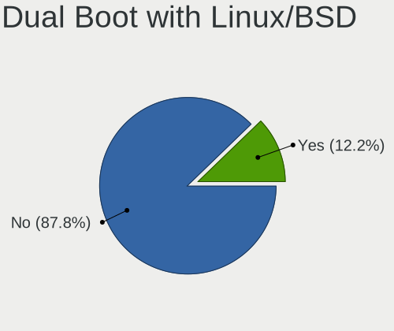
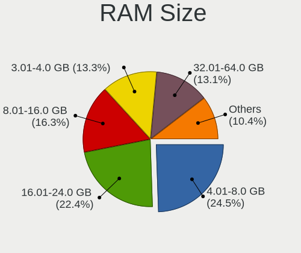
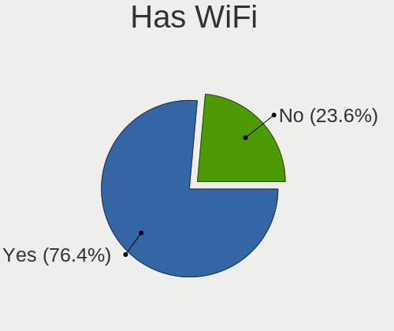
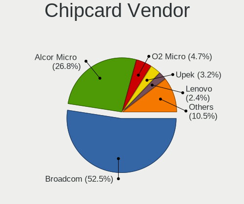

Ubuntu 22.04 - Tested Hardware & Statistics
-------------------------------------------

A project to collect tested hardware configurations for Ubuntu 22.04.

Anyone can contribute to this report by the [hw-probe](https://github.com/linuxhw/hw-probe) tool:

    sudo -E hw-probe -all -upload

Please contribute! Especially if your hardware is rare.

This is a report for all computer types. See also reports for [desktops](/Dist/Ubuntu_22.04/Desktop/README.md) and [notebooks](/Dist/Ubuntu_22.04/Notebook/README.md).

Contents
--------

* [ Test Cases ](#test-cases)

* [ System ](#system)
  - [ Kernel                   ](#kernel)
  - [ Kernel Family            ](#kernel-family)
  - [ Kernel Major Ver.        ](#kernel-major-ver)
  - [ Arch                     ](#arch)
  - [ DE                       ](#de)
  - [ Display Server           ](#display-server)
  - [ Display Manager          ](#display-manager)
  - [ OS Lang                  ](#os-lang)
  - [ Boot Mode                ](#boot-mode)
  - [ Filesystem               ](#filesystem)
  - [ Part. scheme             ](#part-scheme)
  - [ Dual Boot with Linux/BSD ](#dual-boot-with-linuxbsd)
  - [ Dual Boot (Win)          ](#dual-boot-win)

* [ Board ](#board)
  - [ Vendor                   ](#vendor)
  - [ Model                    ](#model)
  - [ Model Family             ](#model-family)
  - [ MFG Year                 ](#mfg-year)
  - [ Form Factor              ](#form-factor)
  - [ Secure Boot              ](#secure-boot)
  - [ Coreboot                 ](#coreboot)
  - [ RAM Size                 ](#ram-size)
  - [ RAM Used                 ](#ram-used)
  - [ Total Drives             ](#total-drives)
  - [ Has CD-ROM               ](#has-cd-rom)
  - [ Has Ethernet             ](#has-ethernet)
  - [ Has WiFi                 ](#has-wifi)
  - [ Has Bluetooth            ](#has-bluetooth)

* [ Location ](#location)
  - [ Country                  ](#country)
  - [ City                     ](#city)

* [ Drives ](#drives)
  - [ Drive Vendor             ](#drive-vendor)
  - [ Drive Model              ](#drive-model)
  - [ HDD Vendor               ](#hdd-vendor)
  - [ SSD Vendor               ](#ssd-vendor)
  - [ Drive Kind               ](#drive-kind)
  - [ Drive Connector          ](#drive-connector)
  - [ Drive Size               ](#drive-size)
  - [ Space Total              ](#space-total)
  - [ Space Used               ](#space-used)
  - [ Malfunc. Drives          ](#malfunc-drives)
  - [ Malfunc. Drive Vendor    ](#malfunc-drive-vendor)
  - [ Malfunc. HDD Vendor      ](#malfunc-hdd-vendor)
  - [ Malfunc. Drive Kind      ](#malfunc-drive-kind)
  - [ Failed Drives            ](#failed-drives)
  - [ Failed Drive Vendor      ](#failed-drive-vendor)
  - [ Drive Status             ](#drive-status)

* [ Storage controller ](#storage-controller)
  - [ Storage Vendor           ](#storage-vendor)
  - [ Storage Model            ](#storage-model)
  - [ Storage Kind             ](#storage-kind)

* [ Processor ](#processor)
  - [ CPU Vendor               ](#cpu-vendor)
  - [ CPU Model                ](#cpu-model)
  - [ CPU Model Family         ](#cpu-model-family)
  - [ CPU Cores                ](#cpu-cores)
  - [ CPU Sockets              ](#cpu-sockets)
  - [ CPU Threads              ](#cpu-threads)
  - [ CPU Op-Modes             ](#cpu-op-modes)
  - [ CPU Microcode            ](#cpu-microcode)
  - [ CPU Microarch            ](#cpu-microarch)

* [ Graphics ](#graphics)
  - [ GPU Vendor               ](#gpu-vendor)
  - [ GPU Model                ](#gpu-model)
  - [ GPU Combo                ](#gpu-combo)
  - [ GPU Driver               ](#gpu-driver)
  - [ GPU Memory               ](#gpu-memory)

* [ Monitor ](#monitor)
  - [ Monitor Vendor           ](#monitor-vendor)
  - [ Monitor Model            ](#monitor-model)
  - [ Monitor Resolution       ](#monitor-resolution)
  - [ Monitor Diagonal         ](#monitor-diagonal)
  - [ Monitor Width            ](#monitor-width)
  - [ Aspect Ratio             ](#aspect-ratio)
  - [ Monitor Area             ](#monitor-area)
  - [ Pixel Density            ](#pixel-density)
  - [ Multiple Monitors        ](#multiple-monitors)

* [ Network ](#network)
  - [ Net Controller Vendor    ](#net-controller-vendor)
  - [ Net Controller Model     ](#net-controller-model)
  - [ Wireless Vendor          ](#wireless-vendor)
  - [ Wireless Model           ](#wireless-model)
  - [ Ethernet Vendor          ](#ethernet-vendor)
  - [ Ethernet Model           ](#ethernet-model)
  - [ Net Controller Kind      ](#net-controller-kind)
  - [ Used Controller          ](#used-controller)
  - [ NICs                     ](#nics)
  - [ IPv6                     ](#ipv6)

* [ Bluetooth ](#bluetooth)
  - [ Bluetooth Vendor         ](#bluetooth-vendor)
  - [ Bluetooth Model          ](#bluetooth-model)

* [ Sound ](#sound)
  - [ Sound Vendor             ](#sound-vendor)
  - [ Sound Model              ](#sound-model)

* [ Memory ](#memory)
  - [ Memory Vendor            ](#memory-vendor)
  - [ Memory Model             ](#memory-model)
  - [ Memory Kind              ](#memory-kind)
  - [ Memory Form Factor       ](#memory-form-factor)
  - [ Memory Size              ](#memory-size)
  - [ Memory Speed             ](#memory-speed)

* [ Printers & scanners ](#printers--scanners)
  - [ Printer Vendor           ](#printer-vendor)
  - [ Printer Model            ](#printer-model)
  - [ Scanner Vendor           ](#scanner-vendor)
  - [ Scanner Model            ](#scanner-model)

* [ Camera ](#camera)
  - [ Camera Vendor            ](#camera-vendor)
  - [ Camera Model             ](#camera-model)

* [ Security ](#security)
  - [ Fingerprint Vendor       ](#fingerprint-vendor)
  - [ Fingerprint Model        ](#fingerprint-model)
  - [ Chipcard Vendor          ](#chipcard-vendor)
  - [ Chipcard Model           ](#chipcard-model)

* [ Unsupported ](#unsupported)
  - [ Unsupported Devices      ](#unsupported-devices)
  - [ Unsupported Device Types ](#unsupported-device-types)

Test Cases
----------

Total: 10042

| Vendor        | Model                       | Form-Factor | Probe                                                      | Date         |
|---------------|-----------------------------|-------------|------------------------------------------------------------|--------------|
| HP            | Pavilion dv6                | Notebook    | [c937edbfcd](https://linux-hardware.org/?probe=c937edbfcd) | Mar 01, 2023 |
| HP            | Pavilion 14                 | Notebook    | [ae0e65f5d1](https://linux-hardware.org/?probe=ae0e65f5d1) | Feb 28, 2023 |
| TCL Commun... | 8090                        | Notebook    | [d1f86443c7](https://linux-hardware.org/?probe=d1f86443c7) | Feb 28, 2023 |
| Dell          | Latitude 5420               | Notebook    | [0596aff5c4](https://linux-hardware.org/?probe=0596aff5c4) | Feb 28, 2023 |
| Alienware     | 15 R2                       | Notebook    | [f242145858](https://linux-hardware.org/?probe=f242145858) | Feb 28, 2023 |
| HP            | Pavilion dv7                | Notebook    | [e40593f800](https://linux-hardware.org/?probe=e40593f800) | Feb 28, 2023 |
| ASUSTek       | Z170-A                      | Desktop     | [a4d77f98eb](https://linux-hardware.org/?probe=a4d77f98eb) | Feb 28, 2023 |
| Timi          | RedmiBook 16                | Notebook    | [2d713931d2](https://linux-hardware.org/?probe=2d713931d2) | Feb 28, 2023 |
| Lenovo        | IdeaPad 3 15ABA7 82RN       | Notebook    | [d8b58a8ea1](https://linux-hardware.org/?probe=d8b58a8ea1) | Feb 28, 2023 |
| Lenovo        | 36F7 SDK0J40700 WIN 3258... | Desktop     | [48e150f274](https://linux-hardware.org/?probe=48e150f274) | Feb 28, 2023 |
| Alienware     | 15 R2                       | Notebook    | [5e29609544](https://linux-hardware.org/?probe=5e29609544) | Feb 28, 2023 |
| HP            | ENVY Laptop 17-ch1xxx       | Notebook    | [b518eb9925](https://linux-hardware.org/?probe=b518eb9925) | Feb 28, 2023 |
| Dell          | Latitude 5400               | Notebook    | [00cd14a724](https://linux-hardware.org/?probe=00cd14a724) | Feb 28, 2023 |
| ASRockRack    | E3C246D4U2-2T               | Desktop     | [1ad2cb5102](https://linux-hardware.org/?probe=1ad2cb5102) | Feb 28, 2023 |
| ASRock        | KBL-NUC                     | Desktop     | [cb504c5fa0](https://linux-hardware.org/?probe=cb504c5fa0) | Feb 28, 2023 |
| Gigabyte      | B550M DS3H AC               | Desktop     | [64b2c8d5b9](https://linux-hardware.org/?probe=64b2c8d5b9) | Feb 28, 2023 |
| Lenovo        | ThinkPad X1 Carbon Gen 8... | Notebook    | [76645fa513](https://linux-hardware.org/?probe=76645fa513) | Feb 28, 2023 |
| HP            | EliteBook 830 G5            | Notebook    | [b82fdfbe47](https://linux-hardware.org/?probe=b82fdfbe47) | Feb 28, 2023 |
| Dell          | G5 5590                     | Notebook    | [75f2235434](https://linux-hardware.org/?probe=75f2235434) | Feb 28, 2023 |
| ASUSTek       | ROG Zephyrus G14 GA401QM... | Notebook    | [7b7df086e0](https://linux-hardware.org/?probe=7b7df086e0) | Feb 28, 2023 |
| ASUSTek       | PRIME X570-P                | Desktop     | [dda5eec4b9](https://linux-hardware.org/?probe=dda5eec4b9) | Feb 28, 2023 |
| Apple         | MacBookPro5,5               | Notebook    | [e20478d60e](https://linux-hardware.org/?probe=e20478d60e) | Feb 28, 2023 |
| Lenovo        | 3102 NOK                    | Desktop     | [17a2e663e1](https://linux-hardware.org/?probe=17a2e663e1) | Feb 28, 2023 |
| Lenovo        | 3102 NOK                    | Desktop     | [6dabaffa28](https://linux-hardware.org/?probe=6dabaffa28) | Feb 28, 2023 |
| ASUSTek       | K52Je                       | Notebook    | [03857fde28](https://linux-hardware.org/?probe=03857fde28) | Feb 28, 2023 |
| Timi          | TM1701                      | Notebook    | [ab658664bb](https://linux-hardware.org/?probe=ab658664bb) | Feb 28, 2023 |
| Gigabyte      | H61M-S2V-B3                 | Desktop     | [aefca0b663](https://linux-hardware.org/?probe=aefca0b663) | Feb 28, 2023 |
| Gigabyte      | H61M-S2V-B3                 | Desktop     | [12ccf2fe8b](https://linux-hardware.org/?probe=12ccf2fe8b) | Feb 28, 2023 |
| Lenovo        | Yoga710-14ISK 80TY          | Notebook    | [756e003316](https://linux-hardware.org/?probe=756e003316) | Feb 28, 2023 |
| Dell          | Inspiron 15 3511            | Notebook    | [99462eae5e](https://linux-hardware.org/?probe=99462eae5e) | Feb 28, 2023 |
| HP            | ENVY x360 Convertible 15... | Convertible | [169294f95f](https://linux-hardware.org/?probe=169294f95f) | Feb 28, 2023 |
| HP            | Pavilion Laptop 15-cc5xx    | Notebook    | [4a5d167c96](https://linux-hardware.org/?probe=4a5d167c96) | Feb 28, 2023 |
| Dell          | 0HD5W2 A01                  | Desktop     | [f30a31a8ee](https://linux-hardware.org/?probe=f30a31a8ee) | Feb 28, 2023 |
| Alienware     | x15 R2                      | Notebook    | [f0335542ce](https://linux-hardware.org/?probe=f0335542ce) | Feb 28, 2023 |
| ASUSTek       | ZenBook Q326FA_Q326FA       | Convertible | [30ac6dbb4a](https://linux-hardware.org/?probe=30ac6dbb4a) | Feb 28, 2023 |
| HP            | Pavilion dv7                | Notebook    | [1dbb82f9ff](https://linux-hardware.org/?probe=1dbb82f9ff) | Feb 28, 2023 |
| Gigabyte      | Z370 AORUS Gaming 5-CF      | Desktop     | [cb687f4572](https://linux-hardware.org/?probe=cb687f4572) | Feb 28, 2023 |
| AZW           | SEi                         | Notebook    | [6d0814dc9f](https://linux-hardware.org/?probe=6d0814dc9f) | Feb 28, 2023 |
| Acer          | TDPS05                      | Desktop     | [c4a636fb79](https://linux-hardware.org/?probe=c4a636fb79) | Feb 28, 2023 |
| Acer          | TDPS05                      | Desktop     | [114e21597f](https://linux-hardware.org/?probe=114e21597f) | Feb 28, 2023 |
| Lenovo        | ThinkPad S1 Yoga 20C0S23... | Notebook    | [3cd99ed8f4](https://linux-hardware.org/?probe=3cd99ed8f4) | Feb 28, 2023 |
| Dell          | Latitude E7470              | Notebook    | [51deaef7a0](https://linux-hardware.org/?probe=51deaef7a0) | Feb 28, 2023 |
| HP            | ProBook 430 G6              | Notebook    | [a184aa7141](https://linux-hardware.org/?probe=a184aa7141) | Feb 27, 2023 |
| Microsoft     | Surface Pro 3               | Tablet      | [b3c4d2985e](https://linux-hardware.org/?probe=b3c4d2985e) | Feb 27, 2023 |
| Dell          | Inspiron 5537               | Notebook    | [25fa030105](https://linux-hardware.org/?probe=25fa030105) | Feb 27, 2023 |
| ASUSTek       | PRIME B360M-A               | Desktop     | [5860f51cd8](https://linux-hardware.org/?probe=5860f51cd8) | Feb 27, 2023 |
| Gigabyte      | EX58-UD5                    | Desktop     | [eaec9511de](https://linux-hardware.org/?probe=eaec9511de) | Feb 27, 2023 |
| HP            | 339A                        | Desktop     | [308d8dfac0](https://linux-hardware.org/?probe=308d8dfac0) | Feb 27, 2023 |
| HP            | Laptop 15t-dy200            | Notebook    | [3ea4171270](https://linux-hardware.org/?probe=3ea4171270) | Feb 27, 2023 |
| Lenovo        | ThinkPad T460s 20FAS55Q1... | Notebook    | [815b6ea9f2](https://linux-hardware.org/?probe=815b6ea9f2) | Feb 27, 2023 |
| Dell          | Inspiron 3537               | Notebook    | [78f270b35a](https://linux-hardware.org/?probe=78f270b35a) | Feb 27, 2023 |
| Dell          | Latitude E4310              | Notebook    | [2b2255a5b4](https://linux-hardware.org/?probe=2b2255a5b4) | Feb 27, 2023 |
| ASUSTek       | FX503VD                     | Notebook    | [46954919f7](https://linux-hardware.org/?probe=46954919f7) | Feb 27, 2023 |
| Dell          | Latitude 7420               | Notebook    | [d3af27a0ac](https://linux-hardware.org/?probe=d3af27a0ac) | Feb 27, 2023 |
| Casper        | H510 001 G10a               | Desktop     | [95a9cfbf0b](https://linux-hardware.org/?probe=95a9cfbf0b) | Feb 27, 2023 |
| Acer          | Aspire E1-531               | Notebook    | [a52b94c2d5](https://linux-hardware.org/?probe=a52b94c2d5) | Feb 27, 2023 |
| Dell          | Inspiron 3537               | Notebook    | [bb1ffc3498](https://linux-hardware.org/?probe=bb1ffc3498) | Feb 27, 2023 |
| UMAX          | VisionBook-N12R             | Notebook    | [2477ae9a0e](https://linux-hardware.org/?probe=2477ae9a0e) | Feb 27, 2023 |
| Gigabyte      | A320M-H-CF                  | Desktop     | [409bb06e5e](https://linux-hardware.org/?probe=409bb06e5e) | Feb 27, 2023 |
| HP            | Pavilion m6                 | Notebook    | [1e9d802ab6](https://linux-hardware.org/?probe=1e9d802ab6) | Feb 27, 2023 |
| ASUSTek       | FX503VD                     | Notebook    | [60e1742e7e](https://linux-hardware.org/?probe=60e1742e7e) | Feb 27, 2023 |
| Gigabyte      | H110M-S2V-CF                | Desktop     | [509c2a6e57](https://linux-hardware.org/?probe=509c2a6e57) | Feb 27, 2023 |
| Apple         | MacBookAir4,2               | Notebook    | [a9605bf85e](https://linux-hardware.org/?probe=a9605bf85e) | Feb 27, 2023 |
| HP            | Pavilion m6                 | Notebook    | [0d35b0b080](https://linux-hardware.org/?probe=0d35b0b080) | Feb 27, 2023 |
| Gigabyte      | Z690M AORUS ELITE AX DDR... | Desktop     | [686c8d56c4](https://linux-hardware.org/?probe=686c8d56c4) | Feb 27, 2023 |
| ASRock        | A320M-HDV R4.0              | Desktop     | [37d2aab670](https://linux-hardware.org/?probe=37d2aab670) | Feb 27, 2023 |
| Acer          | Aspire F5-573G              | Notebook    | [ce2bc0c00d](https://linux-hardware.org/?probe=ce2bc0c00d) | Feb 27, 2023 |
| Dell          | XPS L521X                   | Notebook    | [f9598ce828](https://linux-hardware.org/?probe=f9598ce828) | Feb 27, 2023 |
| Dell          | Latitude E6430              | Notebook    | [b75c4a18b3](https://linux-hardware.org/?probe=b75c4a18b3) | Feb 27, 2023 |
| ASUSTek       | ROG STRIX X570-I GAMING     | Desktop     | [49f3238d4a](https://linux-hardware.org/?probe=49f3238d4a) | Feb 26, 2023 |
| HP            | 81B4 01                     | Desktop     | [bc06df8d32](https://linux-hardware.org/?probe=bc06df8d32) | Feb 26, 2023 |
| Gigabyte      | Z390 UD                     | Desktop     | [b40f9ce0d1](https://linux-hardware.org/?probe=b40f9ce0d1) | Feb 26, 2023 |
| MSI           | B450M PRO-M2 MAX            | Desktop     | [0c5f9a10dd](https://linux-hardware.org/?probe=0c5f9a10dd) | Feb 26, 2023 |
| Lenovo        | G50-80 80L0                 | Notebook    | [19727a16be](https://linux-hardware.org/?probe=19727a16be) | Feb 26, 2023 |
| Acer          | Aspire V3-772G              | Notebook    | [83dce8f92d](https://linux-hardware.org/?probe=83dce8f92d) | Feb 26, 2023 |
| Pegatron      | NARRA5                      | Desktop     | [fbff48e326](https://linux-hardware.org/?probe=fbff48e326) | Feb 26, 2023 |
| Lenovo        | Annapurna CRB NOK           | Desktop     | [77122f785f](https://linux-hardware.org/?probe=77122f785f) | Feb 26, 2023 |
| Acer          | Predator PT515-51           | Notebook    | [b5da2905fb](https://linux-hardware.org/?probe=b5da2905fb) | Feb 26, 2023 |
| Lenovo        | Annapurna CRB NOK           | Desktop     | [0e521e12aa](https://linux-hardware.org/?probe=0e521e12aa) | Feb 26, 2023 |
| HP            | Pavilion Laptop 15-cc5xx    | Notebook    | [13f87401ca](https://linux-hardware.org/?probe=13f87401ca) | Feb 26, 2023 |
| ASUSTek       | ASUS TUF Gaming F15 FX50... | Notebook    | [e763fc25e7](https://linux-hardware.org/?probe=e763fc25e7) | Feb 26, 2023 |
| ASUSTek       | PRIME B350M-A               | Desktop     | [4cd492ee3e](https://linux-hardware.org/?probe=4cd492ee3e) | Feb 26, 2023 |
| ASRock        | B85 Pro4                    | Desktop     | [0b4daba4fb](https://linux-hardware.org/?probe=0b4daba4fb) | Feb 26, 2023 |
| HP            | Pavilion dv7                | Notebook    | [3d8c3db030](https://linux-hardware.org/?probe=3d8c3db030) | Feb 26, 2023 |
| HONOR         | BBR-WAX9                    | Notebook    | [3fe348fb3f](https://linux-hardware.org/?probe=3fe348fb3f) | Feb 26, 2023 |
| HP            | 250 15.6 inch G9 Noteboo... | Notebook    | [2cea6ee649](https://linux-hardware.org/?probe=2cea6ee649) | Feb 26, 2023 |
| Lenovo        | 3000 N200 0769EAG           | Notebook    | [28056b6929](https://linux-hardware.org/?probe=28056b6929) | Feb 26, 2023 |
| Dell          | Latitude 7350               | Notebook    | [a8bbed94ce](https://linux-hardware.org/?probe=a8bbed94ce) | Feb 26, 2023 |
| HP            | ProBook 430 G4              | Notebook    | [05a6a84b50](https://linux-hardware.org/?probe=05a6a84b50) | Feb 26, 2023 |
| Lenovo        | ThinkPad T420 4236EJ3       | Notebook    | [d0b043c11b](https://linux-hardware.org/?probe=d0b043c11b) | Feb 26, 2023 |
| ASUSTek       | PRIME B250-PLUS             | Desktop     | [49b1cd5754](https://linux-hardware.org/?probe=49b1cd5754) | Feb 26, 2023 |
| ASUSTek       | PRIME B350M-A               | Desktop     | [9471b0f763](https://linux-hardware.org/?probe=9471b0f763) | Feb 26, 2023 |
| Gigabyte      | B560M DS3H V2               | Desktop     | [31f6d9e11d](https://linux-hardware.org/?probe=31f6d9e11d) | Feb 26, 2023 |
| Dell          | 0WMJ54 A01                  | Desktop     | [f9cae700c7](https://linux-hardware.org/?probe=f9cae700c7) | Feb 26, 2023 |
| HP            | 1632                        | Desktop     | [394b988862](https://linux-hardware.org/?probe=394b988862) | Feb 26, 2023 |
| HP            | ENVY 17                     | Notebook    | [dea1551bf3](https://linux-hardware.org/?probe=dea1551bf3) | Feb 26, 2023 |
| MSI           | MAG Z490 TOMAHAWK           | Desktop     | [f24a3027d0](https://linux-hardware.org/?probe=f24a3027d0) | Feb 26, 2023 |
| Gigabyte      | MMLP5AP-00                  | Notebook    | [eb5ca5bb8d](https://linux-hardware.org/?probe=eb5ca5bb8d) | Feb 26, 2023 |
| Dell          | 0J584C A00                  | Desktop     | [c16b58c7ce](https://linux-hardware.org/?probe=c16b58c7ce) | Feb 26, 2023 |
| Dell          | 0J584C A00                  | Desktop     | [9d8016f80e](https://linux-hardware.org/?probe=9d8016f80e) | Feb 26, 2023 |
| HP            | ENVY 17                     | Notebook    | [0f347a1b6c](https://linux-hardware.org/?probe=0f347a1b6c) | Feb 26, 2023 |
| ASUSTek       | M4A87TD/USB3                | Desktop     | [8184285a7d](https://linux-hardware.org/?probe=8184285a7d) | Feb 26, 2023 |
| Dell          | 0HR330                      | Desktop     | [9110acd156](https://linux-hardware.org/?probe=9110acd156) | Feb 26, 2023 |
| Dell          | Latitude E7250              | Notebook    | [db6ac786ef](https://linux-hardware.org/?probe=db6ac786ef) | Feb 26, 2023 |
| Lenovo        | ThinkPad E490 20N8000XRT    | Notebook    | [b9e64d9f86](https://linux-hardware.org/?probe=b9e64d9f86) | Feb 26, 2023 |
| ASUSTek       | TUF Gaming FX705DT_FX705... | Notebook    | [8a3c646d1f](https://linux-hardware.org/?probe=8a3c646d1f) | Feb 26, 2023 |
| Gigabyte      | H370 AORUS GAMING 3-CF      | Desktop     | [59d082bd5f](https://linux-hardware.org/?probe=59d082bd5f) | Feb 26, 2023 |
| Dell          | Latitude E6420              | Notebook    | [b35fdc2f10](https://linux-hardware.org/?probe=b35fdc2f10) | Feb 26, 2023 |
| Intel         | NUC8i7HVB J68196-502        | Mini pc     | [ce67684fdf](https://linux-hardware.org/?probe=ce67684fdf) | Feb 26, 2023 |
| HP            | Pavilion 14                 | Notebook    | [c9b9f213b5](https://linux-hardware.org/?probe=c9b9f213b5) | Feb 26, 2023 |
| Intel         | HuronRiver Platform         | Notebook    | [2168c2bb5c](https://linux-hardware.org/?probe=2168c2bb5c) | Feb 26, 2023 |
| Dell          | G15 5520                    | Notebook    | [d68c28ea8d](https://linux-hardware.org/?probe=d68c28ea8d) | Feb 26, 2023 |
| ASUSTek       | H87-PLUS                    | Desktop     | [f56bb767fd](https://linux-hardware.org/?probe=f56bb767fd) | Feb 26, 2023 |
| ASUSTek       | H87-PLUS                    | Desktop     | [98e70b4028](https://linux-hardware.org/?probe=98e70b4028) | Feb 26, 2023 |
| Lenovo        | G500 20236                  | Notebook    | [93f09b28d6](https://linux-hardware.org/?probe=93f09b28d6) | Feb 26, 2023 |
| Lenovo        | G500 20236                  | Notebook    | [51bd5c9f21](https://linux-hardware.org/?probe=51bd5c9f21) | Feb 26, 2023 |
| Lenovo        | ThinkPad T430s 235368U      | Notebook    | [58a8ada163](https://linux-hardware.org/?probe=58a8ada163) | Feb 26, 2023 |
| HP            | EliteBook 745 G3            | Notebook    | [8cee2ac27a](https://linux-hardware.org/?probe=8cee2ac27a) | Feb 26, 2023 |
| BESSTAR Te... | B550                        | Desktop     | [6a77bfec73](https://linux-hardware.org/?probe=6a77bfec73) | Feb 26, 2023 |
| Toshiba       | Satellite C660D             | Notebook    | [d5e4af2957](https://linux-hardware.org/?probe=d5e4af2957) | Feb 26, 2023 |
| HP            | Notebook                    | Notebook    | [4a72575c17](https://linux-hardware.org/?probe=4a72575c17) | Feb 25, 2023 |
| HP            | 250 15.6 inch G9 Noteboo... | Notebook    | [84750f9d96](https://linux-hardware.org/?probe=84750f9d96) | Feb 25, 2023 |
| Dell          | 0F428D A00                  | Desktop     | [7d01f8893e](https://linux-hardware.org/?probe=7d01f8893e) | Feb 25, 2023 |
| ASUSTek       | ZenBook UX462DA             | Convertible | [4f45a3b6bd](https://linux-hardware.org/?probe=4f45a3b6bd) | Feb 25, 2023 |
| Acer          | Aspire V3-571G              | Notebook    | [b02e34a7f9](https://linux-hardware.org/?probe=b02e34a7f9) | Feb 25, 2023 |
| ASRock        | Z97 Pro4                    | Desktop     | [451c626830](https://linux-hardware.org/?probe=451c626830) | Feb 25, 2023 |
| Acer          | Aspire ES1-521              | Notebook    | [e5f0a23afd](https://linux-hardware.org/?probe=e5f0a23afd) | Feb 25, 2023 |
| ASUSTek       | P7P55D EVO                  | Desktop     | [336a7cad31](https://linux-hardware.org/?probe=336a7cad31) | Feb 25, 2023 |
| Apple         | MacBookPro7,1               | Notebook    | [7505d49d88](https://linux-hardware.org/?probe=7505d49d88) | Feb 25, 2023 |
| eMachines     | EL1850                      | Desktop     | [81741a438a](https://linux-hardware.org/?probe=81741a438a) | Feb 25, 2023 |
| Apple         | MacBook5,1                  | Notebook    | [fbb2478f8c](https://linux-hardware.org/?probe=fbb2478f8c) | Feb 25, 2023 |
| HP            | 3398                        | Desktop     | [5e7ae4c866](https://linux-hardware.org/?probe=5e7ae4c866) | Feb 25, 2023 |
| HP            | ProBook 430 G4              | Notebook    | [0a2c7cca00](https://linux-hardware.org/?probe=0a2c7cca00) | Feb 25, 2023 |
| Lenovo        | ThinkPad X220 4290EC5       | Notebook    | [d72d87e4ae](https://linux-hardware.org/?probe=d72d87e4ae) | Feb 25, 2023 |
| Dell          | Inspiron 3420               | Notebook    | [e13f9bfc8f](https://linux-hardware.org/?probe=e13f9bfc8f) | Feb 25, 2023 |
| Lenovo        | IdeaPad 3 15ALC6 82MF       | Notebook    | [af95b24466](https://linux-hardware.org/?probe=af95b24466) | Feb 25, 2023 |
| Gigabyte      | Z170X-Gaming 7              | Desktop     | [0620aa7f6f](https://linux-hardware.org/?probe=0620aa7f6f) | Feb 25, 2023 |
| Gigabyte      | B550M DS3H                  | Desktop     | [0ac3b49261](https://linux-hardware.org/?probe=0ac3b49261) | Feb 25, 2023 |
| Lenovo        | Yoga C930-13IKB 81C4        | Convertible | [72034abe27](https://linux-hardware.org/?probe=72034abe27) | Feb 25, 2023 |
| ASUSTek       | VivoBook_ASUSLaptop M350... | Notebook    | [22cf774ac0](https://linux-hardware.org/?probe=22cf774ac0) | Feb 25, 2023 |
| Dell          | Vostro 3501                 | Notebook    | [ed459712f6](https://linux-hardware.org/?probe=ed459712f6) | Feb 25, 2023 |
| ASUSTek       | M5A78L-M PLUS/USB3          | Desktop     | [30afdb56c5](https://linux-hardware.org/?probe=30afdb56c5) | Feb 25, 2023 |
| Protectli     | VP2420                      | Desktop     | [ea5f851cf3](https://linux-hardware.org/?probe=ea5f851cf3) | Feb 25, 2023 |
| Quanta        | 2AC7 011                    | Desktop     | [3505fadb68](https://linux-hardware.org/?probe=3505fadb68) | Feb 25, 2023 |
| HP            | Pavilion Laptop 14-ec0xx... | Notebook    | [7b59cbd067](https://linux-hardware.org/?probe=7b59cbd067) | Feb 25, 2023 |
| ASUSTek       | M5A78L-M PLUS/USB3          | Desktop     | [bfa5623f15](https://linux-hardware.org/?probe=bfa5623f15) | Feb 25, 2023 |
| HUAWEI        | NBLK-WAX9X                  | Notebook    | [2978ec71b8](https://linux-hardware.org/?probe=2978ec71b8) | Feb 25, 2023 |
| BESSTAR Te... | X400                        | Notebook    | [e1c05e0782](https://linux-hardware.org/?probe=e1c05e0782) | Feb 25, 2023 |
| Dell          | Inspiron 5537               | Notebook    | [0496ce1146](https://linux-hardware.org/?probe=0496ce1146) | Feb 25, 2023 |
| Acer          | Aspire X3990                | Desktop     | [c83e31d66b](https://linux-hardware.org/?probe=c83e31d66b) | Feb 25, 2023 |
| Dell          | Inspiron 5537               | Notebook    | [cb4b91f80c](https://linux-hardware.org/?probe=cb4b91f80c) | Feb 25, 2023 |
| Acer          | Aspire X3990                | Desktop     | [4be9f68049](https://linux-hardware.org/?probe=4be9f68049) | Feb 25, 2023 |
| HP            | Pavilion Aero Laptop 13-... | Notebook    | [af87e6ea4c](https://linux-hardware.org/?probe=af87e6ea4c) | Feb 25, 2023 |
| HP            | EliteBook 840 14 inch G9... | Notebook    | [9c0775a106](https://linux-hardware.org/?probe=9c0775a106) | Feb 25, 2023 |
| Hampoo        | I2W6_AP135 Reserved         | Notebook    | [c5cdb97c5b](https://linux-hardware.org/?probe=c5cdb97c5b) | Feb 25, 2023 |
| Lenovo        | 30D2 SDK0J40697 WIN 3305... | Desktop     | [7864921f8d](https://linux-hardware.org/?probe=7864921f8d) | Feb 25, 2023 |
| Lenovo        | Legion Y530-15ICH 81FV      | Notebook    | [0b239fec52](https://linux-hardware.org/?probe=0b239fec52) | Feb 25, 2023 |
| Dell          | 051FJ8 A02                  | Desktop     | [05f5f23fbb](https://linux-hardware.org/?probe=05f5f23fbb) | Feb 25, 2023 |
| ASRock        | Z390 Phantom Gaming-ITX/... | Desktop     | [d78e737aaf](https://linux-hardware.org/?probe=d78e737aaf) | Feb 25, 2023 |
| Apple         | MacBookPro16,2              | Notebook    | [c4cab43483](https://linux-hardware.org/?probe=c4cab43483) | Feb 25, 2023 |
| Lenovo        | ThinkPad X270 W10DG 20K5... | Notebook    | [c2c5da60c3](https://linux-hardware.org/?probe=c2c5da60c3) | Feb 25, 2023 |
| Raspberry ... | Raspberry Pi 4 Model B R... | Soc         | [79bb0eb4c9](https://linux-hardware.org/?probe=79bb0eb4c9) | Feb 25, 2023 |
| Gigabyte      | Z170X-Gaming 7              | Desktop     | [df734c276f](https://linux-hardware.org/?probe=df734c276f) | Feb 25, 2023 |
| ASUSTek       | P7P55D EVO                  | Desktop     | [3f931a7600](https://linux-hardware.org/?probe=3f931a7600) | Feb 25, 2023 |
| HP            | 15                          | Notebook    | [04741afb27](https://linux-hardware.org/?probe=04741afb27) | Feb 25, 2023 |
| HP            | Pavilion Laptop 15-cd0xx    | Notebook    | [dfb5281dfb](https://linux-hardware.org/?probe=dfb5281dfb) | Feb 25, 2023 |
| Sony          | VPCCW13FB                   | Notebook    | [1772a3987b](https://linux-hardware.org/?probe=1772a3987b) | Feb 25, 2023 |
| ASUSTek       | ZenBook UX425QA_UM425QA     | Notebook    | [02608a8288](https://linux-hardware.org/?probe=02608a8288) | Feb 25, 2023 |
| Hampoo        | I2W6_AP135 Reserved         | Notebook    | [976a29944a](https://linux-hardware.org/?probe=976a29944a) | Feb 25, 2023 |
| Lenovo        | IdeaPad 5 15IAL7 82SF       | Notebook    | [12d979b047](https://linux-hardware.org/?probe=12d979b047) | Feb 25, 2023 |
| ASUSTek       | ZenBook UX425EA_UX425EA     | Notebook    | [f0fa613cd2](https://linux-hardware.org/?probe=f0fa613cd2) | Feb 25, 2023 |
| Sony          | VGN-FZ31M                   | Notebook    | [6b830e36f1](https://linux-hardware.org/?probe=6b830e36f1) | Feb 25, 2023 |
| Gigabyte      | H310M S2 x.x                | Desktop     | [99b5c2f7f9](https://linux-hardware.org/?probe=99b5c2f7f9) | Feb 24, 2023 |
| MSI           | MAG X570 TOMAHAWK WIFI      | Desktop     | [2e7905f753](https://linux-hardware.org/?probe=2e7905f753) | Feb 24, 2023 |
| Gigabyte      | H310M S2 x.x                | Desktop     | [0bb7bc3713](https://linux-hardware.org/?probe=0bb7bc3713) | Feb 24, 2023 |
| HP            | EliteBook 840 Aero G8 No... | Notebook    | [f24e6a55c4](https://linux-hardware.org/?probe=f24e6a55c4) | Feb 24, 2023 |
| HP            | Laptop 17-by2xxx            | Notebook    | [d6a91a338c](https://linux-hardware.org/?probe=d6a91a338c) | Feb 24, 2023 |
| Lenovo        | IdeaPad 3 15ALC6 82MF       | Notebook    | [d3354bd88c](https://linux-hardware.org/?probe=d3354bd88c) | Feb 24, 2023 |
| Lenovo        | IdeaPad Z580                | Notebook    | [cf2ff6c04b](https://linux-hardware.org/?probe=cf2ff6c04b) | Feb 24, 2023 |
| ASUSTek       | PRIME B360M-A               | Desktop     | [6d7221488b](https://linux-hardware.org/?probe=6d7221488b) | Feb 24, 2023 |
| Pegatron      | NARRA5                      | Desktop     | [af6be34173](https://linux-hardware.org/?probe=af6be34173) | Feb 24, 2023 |
| MSI           | K9N6PGM2-V2                 | Desktop     | [e88df81d6f](https://linux-hardware.org/?probe=e88df81d6f) | Feb 24, 2023 |
| ASUSTek       | VivoBook_ASUSLaptop M650... | Notebook    | [d99e163be6](https://linux-hardware.org/?probe=d99e163be6) | Feb 24, 2023 |
| Dell          | Inspiron 3793               | Notebook    | [8e85683aae](https://linux-hardware.org/?probe=8e85683aae) | Feb 24, 2023 |
| Fujitsu       | LIFEBOOK U749               | Notebook    | [ba7cdc6018](https://linux-hardware.org/?probe=ba7cdc6018) | Feb 24, 2023 |
| HP            | 8433 11                     | Desktop     | [e8663b2a0c](https://linux-hardware.org/?probe=e8663b2a0c) | Feb 24, 2023 |
| Gigabyte      | H310M S2 x.x                | Desktop     | [f4e2bfd7a0](https://linux-hardware.org/?probe=f4e2bfd7a0) | Feb 24, 2023 |
| Lenovo        | ThinkPad T470s 20HGS0AE0... | Notebook    | [7f8c9de1aa](https://linux-hardware.org/?probe=7f8c9de1aa) | Feb 24, 2023 |
| Acer          | Aspire A315-23              | Notebook    | [e0fcd4e578](https://linux-hardware.org/?probe=e0fcd4e578) | Feb 24, 2023 |
| Gigabyte      | H61M-S2V-B3                 | Desktop     | [916f372721](https://linux-hardware.org/?probe=916f372721) | Feb 24, 2023 |
| Gigabyte      | H61M-S2V-B3                 | Desktop     | [6e82a5c5d6](https://linux-hardware.org/?probe=6e82a5c5d6) | Feb 24, 2023 |
| Lenovo        | ThinkPad T495s 20QJS0GG0... | Notebook    | [6186149a54](https://linux-hardware.org/?probe=6186149a54) | Feb 24, 2023 |
| Chuwi         | HeroBook Air                | Notebook    | [8daed679c2](https://linux-hardware.org/?probe=8daed679c2) | Feb 24, 2023 |
| Acer          | Aspire E1-531               | Notebook    | [4526585d29](https://linux-hardware.org/?probe=4526585d29) | Feb 24, 2023 |
| Lenovo        | IdeaPadFlex 5 14IAU7 82R... | Convertible | [4b4f9024a4](https://linux-hardware.org/?probe=4b4f9024a4) | Feb 24, 2023 |
| ASRock        | B550M-C                     | Desktop     | [96edee86aa](https://linux-hardware.org/?probe=96edee86aa) | Feb 24, 2023 |
| ASRock        | B550M-C                     | Desktop     | [454c89b4eb](https://linux-hardware.org/?probe=454c89b4eb) | Feb 24, 2023 |
| Pegatron      | NARRA5                      | Desktop     | [ca884f817b](https://linux-hardware.org/?probe=ca884f817b) | Feb 24, 2023 |
| HP            | EliteBook 840 14 inch G9... | Notebook    | [8ce6b54b09](https://linux-hardware.org/?probe=8ce6b54b09) | Feb 24, 2023 |
| ASUSTek       | Q87M-E                      | Desktop     | [e31da94f7b](https://linux-hardware.org/?probe=e31da94f7b) | Feb 24, 2023 |
| HP            | Pavilion Notebook           | Notebook    | [fee146aaa1](https://linux-hardware.org/?probe=fee146aaa1) | Feb 24, 2023 |
| MSI           | H310M PRO-VDH PLUS          | Desktop     | [a458effa12](https://linux-hardware.org/?probe=a458effa12) | Feb 24, 2023 |
| Toshiba       | Satellite A205              | Notebook    | [07e63c8b75](https://linux-hardware.org/?probe=07e63c8b75) | Feb 24, 2023 |
| Toshiba       | Satellite L775D             | Notebook    | [d8b2acd038](https://linux-hardware.org/?probe=d8b2acd038) | Feb 24, 2023 |
| ASUSTek       | PRIME B460M-A R2.0          | Desktop     | [0ccac8edb4](https://linux-hardware.org/?probe=0ccac8edb4) | Feb 24, 2023 |
| Lenovo        | Yoga 7 14ARB7 82QF          | Convertible | [2ecca5bb0b](https://linux-hardware.org/?probe=2ecca5bb0b) | Feb 24, 2023 |
| ASRock        | H510M/ac                    | Desktop     | [b7d570e46c](https://linux-hardware.org/?probe=b7d570e46c) | Feb 24, 2023 |
| HP            | EliteBook 840 G2            | Notebook    | [f1fa3164f9](https://linux-hardware.org/?probe=f1fa3164f9) | Feb 24, 2023 |
| Dell          | 0M5DCD A00                  | Desktop     | [88b0bf49fd](https://linux-hardware.org/?probe=88b0bf49fd) | Feb 24, 2023 |
| ASUSTek       | ROG Strix G713RM_G713RM     | Notebook    | [4f7bbbdd28](https://linux-hardware.org/?probe=4f7bbbdd28) | Feb 24, 2023 |
| Lenovo        | ThinkPad X390 Yoga 20NN0... | Convertible | [123771dbb2](https://linux-hardware.org/?probe=123771dbb2) | Feb 24, 2023 |
| Lenovo        | ThinkPad X390 Yoga 20NN0... | Convertible | [7f29da1b6c](https://linux-hardware.org/?probe=7f29da1b6c) | Feb 24, 2023 |
| HP            | 250 15.6 inch G9 Noteboo... | Notebook    | [cddc383ff9](https://linux-hardware.org/?probe=cddc383ff9) | Feb 23, 2023 |
| ASUSTek       | ROG GU501GM                 | Notebook    | [5f0eaa8696](https://linux-hardware.org/?probe=5f0eaa8696) | Feb 23, 2023 |
| Dell          | Vostro 3700                 | Notebook    | [a37b20471b](https://linux-hardware.org/?probe=a37b20471b) | Feb 23, 2023 |
| Dell          | 0MWYPT A02                  | Desktop     | [2491b0e5eb](https://linux-hardware.org/?probe=2491b0e5eb) | Feb 23, 2023 |
| HP            | 8433 11                     | Desktop     | [9aa13c1fa5](https://linux-hardware.org/?probe=9aa13c1fa5) | Feb 23, 2023 |
| Acer          | Aspire SW3-013              | Notebook    | [771b90caaa](https://linux-hardware.org/?probe=771b90caaa) | Feb 23, 2023 |
| Lenovo        | ThinkPad P70 20ESS2J700     | Notebook    | [5a94dfa289](https://linux-hardware.org/?probe=5a94dfa289) | Feb 23, 2023 |
| Gigabyte      | Z390 UD                     | Desktop     | [5a6ab06c02](https://linux-hardware.org/?probe=5a6ab06c02) | Feb 23, 2023 |
| Dell          | Inspiron N5010              | Notebook    | [5b4def0870](https://linux-hardware.org/?probe=5b4def0870) | Feb 23, 2023 |
| ASUSTek       | P5K                         | Desktop     | [2fb7f1713b](https://linux-hardware.org/?probe=2fb7f1713b) | Feb 23, 2023 |
| ASUSTek       | ROG STRIX X570-E GAMING     | Desktop     | [6bdb8ada9c](https://linux-hardware.org/?probe=6bdb8ada9c) | Feb 23, 2023 |
| MSI           | MS-7C02                     | Notebook    | [e2cdf5625c](https://linux-hardware.org/?probe=e2cdf5625c) | Feb 23, 2023 |
| ASUSTek       | X441UA                      | Notebook    | [cd870fc3d3](https://linux-hardware.org/?probe=cd870fc3d3) | Feb 23, 2023 |
| Dell          | XPS 9320                    | Notebook    | [94e7c2d282](https://linux-hardware.org/?probe=94e7c2d282) | Feb 23, 2023 |
| ASUSTek       | Maximus VI HERO             | Desktop     | [16618052ef](https://linux-hardware.org/?probe=16618052ef) | Feb 23, 2023 |
| ASUSTek       | B85M-E                      | Desktop     | [8a09d5e812](https://linux-hardware.org/?probe=8a09d5e812) | Feb 23, 2023 |
| MSI           | MS-7C02                     | Notebook    | [bfbb3aab2c](https://linux-hardware.org/?probe=bfbb3aab2c) | Feb 23, 2023 |
| MSI           | GF75 Thin 10SCXK            | Notebook    | [a64a363f58](https://linux-hardware.org/?probe=a64a363f58) | Feb 23, 2023 |
| MSI           | GF75 Thin 10SCXK            | Notebook    | [3647a78d88](https://linux-hardware.org/?probe=3647a78d88) | Feb 23, 2023 |
| Gigabyte      | Z170X-Gaming 7              | Desktop     | [00e573a880](https://linux-hardware.org/?probe=00e573a880) | Feb 23, 2023 |
| Lenovo        | IdeaPad S340-15API 81NC     | Notebook    | [d03f3a8806](https://linux-hardware.org/?probe=d03f3a8806) | Feb 23, 2023 |
| Gigabyte      | Z97M-DS3H                   | Desktop     | [821d952d15](https://linux-hardware.org/?probe=821d952d15) | Feb 23, 2023 |
| Dell          | 0WG855                      | Desktop     | [49c149cff7](https://linux-hardware.org/?probe=49c149cff7) | Feb 23, 2023 |
| Gigabyte      | F2A88XM-D3H                 | Desktop     | [7b27b03f4a](https://linux-hardware.org/?probe=7b27b03f4a) | Feb 23, 2023 |
| Lenovo        | IdeaPad S340-15API 81NC     | Notebook    | [ca79eee760](https://linux-hardware.org/?probe=ca79eee760) | Feb 23, 2023 |
| Lenovo        | ThinkPad P70 20ESS2J700     | Notebook    | [869614f52a](https://linux-hardware.org/?probe=869614f52a) | Feb 23, 2023 |
| Acer          | TravelMate P253             | Notebook    | [b99414b6de](https://linux-hardware.org/?probe=b99414b6de) | Feb 23, 2023 |
| Dell          | XPS 13 9370                 | Notebook    | [8923d5940e](https://linux-hardware.org/?probe=8923d5940e) | Feb 23, 2023 |
| T-bao         | MINI PC                     | Desktop     | [68ba9fc610](https://linux-hardware.org/?probe=68ba9fc610) | Feb 23, 2023 |
| MSI           | MPG Z790 CARBON WIFI        | Desktop     | [e0687d11bb](https://linux-hardware.org/?probe=e0687d11bb) | Feb 23, 2023 |
| MSI           | MPG Z790 CARBON WIFI        | Desktop     | [49e71eb5b4](https://linux-hardware.org/?probe=49e71eb5b4) | Feb 22, 2023 |
| Packard Be... | ONETWO L5700                | All in one  | [6ec6a6661d](https://linux-hardware.org/?probe=6ec6a6661d) | Feb 22, 2023 |
| Sony          | SVE15125CBW                 | Notebook    | [5b173518b5](https://linux-hardware.org/?probe=5b173518b5) | Feb 22, 2023 |
| Sony          | SVE15125CBW                 | Notebook    | [107bd5b235](https://linux-hardware.org/?probe=107bd5b235) | Feb 22, 2023 |
| MSI           | Z370 GAMING PRO CARBON      | Desktop     | [fc86b476d7](https://linux-hardware.org/?probe=fc86b476d7) | Feb 22, 2023 |
| MSI           | B550M PRO-VDH WIFI          | Desktop     | [ce8874cff4](https://linux-hardware.org/?probe=ce8874cff4) | Feb 22, 2023 |
| Dell          | XPS 13 9370                 | Notebook    | [452bd46c01](https://linux-hardware.org/?probe=452bd46c01) | Feb 22, 2023 |
| Apple         | MacBookPro8,2               | Notebook    | [fd4b8d6419](https://linux-hardware.org/?probe=fd4b8d6419) | Feb 22, 2023 |
| Dell          | XPS 13 9370                 | Notebook    | [fe78ef8424](https://linux-hardware.org/?probe=fe78ef8424) | Feb 22, 2023 |
| Toshiba       | Satellite L655              | Notebook    | [2b16b06c7f](https://linux-hardware.org/?probe=2b16b06c7f) | Feb 22, 2023 |
| MSI           | B350 TOMAHAWK               | Desktop     | [71aa647a28](https://linux-hardware.org/?probe=71aa647a28) | Feb 22, 2023 |
| Lenovo        | ThinkPad X230 2325EJ0       | Notebook    | [3a2c22e22b](https://linux-hardware.org/?probe=3a2c22e22b) | Feb 22, 2023 |
| Lenovo        | Flex 2-14 20404             | Notebook    | [49445991dc](https://linux-hardware.org/?probe=49445991dc) | Feb 22, 2023 |
| ASRock        | B450 Pro4                   | Desktop     | [87600137b2](https://linux-hardware.org/?probe=87600137b2) | Feb 22, 2023 |
| Intel         | NUC7i3DNB J57625-510        | Mini pc     | [aedbb176f7](https://linux-hardware.org/?probe=aedbb176f7) | Feb 22, 2023 |
| ASUSTek       | PRO H410M-C                 | Desktop     | [d6edc5401d](https://linux-hardware.org/?probe=d6edc5401d) | Feb 22, 2023 |
| Samsung       | 760XDA                      | Notebook    | [efa040a93f](https://linux-hardware.org/?probe=efa040a93f) | Feb 22, 2023 |
| Samsung       | 760XDA                      | Notebook    | [1ba36d420d](https://linux-hardware.org/?probe=1ba36d420d) | Feb 22, 2023 |
| Dell          | Precision M4800             | Notebook    | [9fb203c728](https://linux-hardware.org/?probe=9fb203c728) | Feb 22, 2023 |
| Notebook      | NS50_70MU                   | Notebook    | [a213ec0ba4](https://linux-hardware.org/?probe=a213ec0ba4) | Feb 22, 2023 |
| Lenovo        | G50-80 80E5                 | Notebook    | [51b83f1e27](https://linux-hardware.org/?probe=51b83f1e27) | Feb 22, 2023 |
| Dell          | Inspiron 3583               | Notebook    | [ad766a4190](https://linux-hardware.org/?probe=ad766a4190) | Feb 22, 2023 |
| MSI           | B550-A PRO                  | Desktop     | [11d4db7a00](https://linux-hardware.org/?probe=11d4db7a00) | Feb 22, 2023 |
| ASUSTek       | Maximus VI HERO             | Desktop     | [754e37e18d](https://linux-hardware.org/?probe=754e37e18d) | Feb 22, 2023 |
| Lenovo        | ThinkPad X230 2325EJ0       | Notebook    | [06c8604990](https://linux-hardware.org/?probe=06c8604990) | Feb 22, 2023 |
| Lenovo        | Legion 5 15ACH6H 82JU       | Notebook    | [7380033a44](https://linux-hardware.org/?probe=7380033a44) | Feb 22, 2023 |
| Unknown       | 1.0                         | Desktop     | [b7475435a7](https://linux-hardware.org/?probe=b7475435a7) | Feb 22, 2023 |
| Dell          | Latitude 3189               | Notebook    | [3a9dc7e02c](https://linux-hardware.org/?probe=3a9dc7e02c) | Feb 22, 2023 |
| ASUSTek       | P5Q-E                       | Desktop     | [3362226081](https://linux-hardware.org/?probe=3362226081) | Feb 22, 2023 |
| ASUSTek       | P5Q-E                       | Desktop     | [8230de4836](https://linux-hardware.org/?probe=8230de4836) | Feb 22, 2023 |
| Apple         | Mac-F4208DC8 PVT            | Desktop     | [adc8d2fb16](https://linux-hardware.org/?probe=adc8d2fb16) | Feb 22, 2023 |
| MSI           | MEG X570 UNIFY              | Desktop     | [edc30b8a22](https://linux-hardware.org/?probe=edc30b8a22) | Feb 22, 2023 |
| HP            | EliteBook 830 G5            | Notebook    | [a5f65720f5](https://linux-hardware.org/?probe=a5f65720f5) | Feb 22, 2023 |
| ASUSTek       | VivoBook_ASUSLaptop X515... | Notebook    | [8110c575e9](https://linux-hardware.org/?probe=8110c575e9) | Feb 22, 2023 |
| Acer          | Aspire TC-605               | Desktop     | [7234bd12f6](https://linux-hardware.org/?probe=7234bd12f6) | Feb 22, 2023 |
| Dell          | 0PM2CW A05                  | Server      | [13c1bd9dcd](https://linux-hardware.org/?probe=13c1bd9dcd) | Feb 22, 2023 |
| Acer          | Swift SF514-54T             | Notebook    | [ebbff689ba](https://linux-hardware.org/?probe=ebbff689ba) | Feb 22, 2023 |
| ASUSTek       | PRIME B550M-A WIFI II       | Desktop     | [cb79c0ad47](https://linux-hardware.org/?probe=cb79c0ad47) | Feb 22, 2023 |
| Notebook      | N8xEJEK                     | Notebook    | [1548ea7cab](https://linux-hardware.org/?probe=1548ea7cab) | Feb 21, 2023 |
| Notebook      | N8xEJEK                     | Notebook    | [a8a28d6f2b](https://linux-hardware.org/?probe=a8a28d6f2b) | Feb 21, 2023 |
| HP            | Laptop 15-da2xxx            | Notebook    | [76cbc7df6d](https://linux-hardware.org/?probe=76cbc7df6d) | Feb 21, 2023 |
| INET          | Z12B                        | Mini pc     | [0baa359181](https://linux-hardware.org/?probe=0baa359181) | Feb 21, 2023 |
| Chuwi         | CoreBook XPro               | Notebook    | [c1f8c947d4](https://linux-hardware.org/?probe=c1f8c947d4) | Feb 21, 2023 |
| HP            | Pavilion Laptop 15-eh1xx... | Notebook    | [dc6a6f7872](https://linux-hardware.org/?probe=dc6a6f7872) | Feb 21, 2023 |
| Dell          | Latitude E5570              | Notebook    | [47a066467a](https://linux-hardware.org/?probe=47a066467a) | Feb 21, 2023 |
| INET          | Z12B                        | Mini pc     | [cc6d503d94](https://linux-hardware.org/?probe=cc6d503d94) | Feb 21, 2023 |
| Lenovo        | ThinkPad P15v Gen 3 21D9... | Notebook    | [da461191e8](https://linux-hardware.org/?probe=da461191e8) | Feb 21, 2023 |
| Gigabyte      | EP43-UD3L                   | Desktop     | [52c293dde6](https://linux-hardware.org/?probe=52c293dde6) | Feb 21, 2023 |
| Avell High... | 1513                        | Notebook    | [0b46cb6de1](https://linux-hardware.org/?probe=0b46cb6de1) | Feb 21, 2023 |
| ASRock        | X570 Phantom Gaming 4       | Desktop     | [6b883f967d](https://linux-hardware.org/?probe=6b883f967d) | Feb 21, 2023 |
| Dell          | Latitude 5580               | Notebook    | [91567566be](https://linux-hardware.org/?probe=91567566be) | Feb 21, 2023 |
| HP            | Spectre x360 Convertible... | Convertible | [54b9c4c95c](https://linux-hardware.org/?probe=54b9c4c95c) | Feb 21, 2023 |
| Gigabyte      | B365M DS3H                  | Desktop     | [8049beda96](https://linux-hardware.org/?probe=8049beda96) | Feb 21, 2023 |
| MSI           | MPG X570S EDGE MAX WIFI     | Desktop     | [d9a5611225](https://linux-hardware.org/?probe=d9a5611225) | Feb 21, 2023 |
| ASUSTek       | ZenBook UX393EA_UX393EA     | Notebook    | [546763e7aa](https://linux-hardware.org/?probe=546763e7aa) | Feb 21, 2023 |
| ASUSTek       | TUF B450-PLUS GAMING        | Desktop     | [50261acb6b](https://linux-hardware.org/?probe=50261acb6b) | Feb 21, 2023 |
| BESSTAR Te... | X400                        | Notebook    | [f7f9004058](https://linux-hardware.org/?probe=f7f9004058) | Feb 21, 2023 |
| Dell          | 0HY9JP A01                  | Desktop     | [8c1473e111](https://linux-hardware.org/?probe=8c1473e111) | Feb 21, 2023 |
| Lenovo        | ThinkPad X1 Extreme Gen ... | Notebook    | [5d62c279d2](https://linux-hardware.org/?probe=5d62c279d2) | Feb 21, 2023 |
| MSI           | B550 GAMING GEN3            | Desktop     | [d92a4239ee](https://linux-hardware.org/?probe=d92a4239ee) | Feb 21, 2023 |
| Dell          | Latitude 5430               | Notebook    | [69fd82c453](https://linux-hardware.org/?probe=69fd82c453) | Feb 21, 2023 |
| ECS           | SF20PA2                     | Notebook    | [f0ad83686f](https://linux-hardware.org/?probe=f0ad83686f) | Feb 21, 2023 |
| HP            | 18E7                        | Desktop     | [913411cd18](https://linux-hardware.org/?probe=913411cd18) | Feb 21, 2023 |
| Acer          | Aspire X1935                | Desktop     | [8c4f88db47](https://linux-hardware.org/?probe=8c4f88db47) | Feb 21, 2023 |
| Lenovo        | ThinkPad S430 336457G       | Notebook    | [3a525ce932](https://linux-hardware.org/?probe=3a525ce932) | Feb 21, 2023 |
| Lenovo        | ThinkPad S430 336457G       | Notebook    | [f845d181ec](https://linux-hardware.org/?probe=f845d181ec) | Feb 20, 2023 |
| Dell          | 0CK520 A01                  | Desktop     | [6e92aa0096](https://linux-hardware.org/?probe=6e92aa0096) | Feb 20, 2023 |
| ASUSTek       | Z9PE-D8 WS                  | Server      | [12dbe88bab](https://linux-hardware.org/?probe=12dbe88bab) | Feb 20, 2023 |
| Lenovo        | IdeaPad 3 15ALC6 82KU       | Notebook    | [da5050e2f8](https://linux-hardware.org/?probe=da5050e2f8) | Feb 20, 2023 |
| ASUSTek       | H170-PRO                    | Desktop     | [011dc701c1](https://linux-hardware.org/?probe=011dc701c1) | Feb 20, 2023 |
| Alienware     | 07W25T A01                  | Desktop     | [0ce3af1e23](https://linux-hardware.org/?probe=0ce3af1e23) | Feb 20, 2023 |
| Alienware     | 07W25T A01                  | Desktop     | [f965f4658b](https://linux-hardware.org/?probe=f965f4658b) | Feb 20, 2023 |
| Dell          | 0H4VK7 A01                  | Desktop     | [19ded2f15b](https://linux-hardware.org/?probe=19ded2f15b) | Feb 20, 2023 |
| Lenovo        | ThinkPad T410s 2924W3S      | Notebook    | [24081de7f1](https://linux-hardware.org/?probe=24081de7f1) | Feb 20, 2023 |
| Dell          | Latitude 7300               | Notebook    | [65690f7efc](https://linux-hardware.org/?probe=65690f7efc) | Feb 20, 2023 |
| ASUSTek       | H81M-PLUS                   | Desktop     | [796ba78b54](https://linux-hardware.org/?probe=796ba78b54) | Feb 20, 2023 |
| ASUSTek       | ROG STRIX B450-I GAMING     | Desktop     | [04130aaf41](https://linux-hardware.org/?probe=04130aaf41) | Feb 20, 2023 |
| HP            | ENVY x360 Convertible 13... | Convertible | [0c7a3d458a](https://linux-hardware.org/?probe=0c7a3d458a) | Feb 20, 2023 |
| Lenovo        | ThinkPad P14s Gen 2a 21A... | Notebook    | [008d5e19e1](https://linux-hardware.org/?probe=008d5e19e1) | Feb 20, 2023 |
| Lenovo        | ThinkPad Edge E540 20C60... | Notebook    | [cd5dcaaf88](https://linux-hardware.org/?probe=cd5dcaaf88) | Feb 20, 2023 |
| Dell          | XPS 13 9310 2-in-1          | Convertible | [3af0967330](https://linux-hardware.org/?probe=3af0967330) | Feb 20, 2023 |
| Dell          | Precision M4800             | Notebook    | [8f41cc730e](https://linux-hardware.org/?probe=8f41cc730e) | Feb 20, 2023 |
| Lenovo        | B570e HuronRiver Platfor... | Notebook    | [3ddfaa902f](https://linux-hardware.org/?probe=3ddfaa902f) | Feb 20, 2023 |
| Supermicro    | X10DRiB                     | Desktop     | [8e6438214d](https://linux-hardware.org/?probe=8e6438214d) | Feb 20, 2023 |
| Lenovo        | ThinkPad E550 20DF004TGE    | Notebook    | [f6cf4e902d](https://linux-hardware.org/?probe=f6cf4e902d) | Feb 20, 2023 |
| HP            | Laptop 14-dq1xxx            | Notebook    | [37c6221f28](https://linux-hardware.org/?probe=37c6221f28) | Feb 20, 2023 |
| Samsung       | 535U3C                      | Notebook    | [ec173f014b](https://linux-hardware.org/?probe=ec173f014b) | Feb 20, 2023 |
| Dell          | Latitude E6320              | Notebook    | [0b5bcfefc5](https://linux-hardware.org/?probe=0b5bcfefc5) | Feb 20, 2023 |
| Lenovo        | ThinkPad E495 20NEA001GE    | Notebook    | [87857c46e9](https://linux-hardware.org/?probe=87857c46e9) | Feb 20, 2023 |
| ASRock        | H61M-DGS R2.0               | Desktop     | [3d8b32f453](https://linux-hardware.org/?probe=3d8b32f453) | Feb 20, 2023 |
| HP            | ZBook Firefly 14 inch G9... | Notebook    | [12bb4f91ae](https://linux-hardware.org/?probe=12bb4f91ae) | Feb 20, 2023 |
| HP            | ZBook Firefly 14 inch G9... | Notebook    | [a4404180b7](https://linux-hardware.org/?probe=a4404180b7) | Feb 20, 2023 |
| AZW           | GK mini                     | Desktop     | [6fc9af1346](https://linux-hardware.org/?probe=6fc9af1346) | Feb 20, 2023 |
| MSI           | MPG X570 GAMING PLUS        | Desktop     | [a47920e014](https://linux-hardware.org/?probe=a47920e014) | Feb 20, 2023 |
| HP            | ProBook 440 G4              | Notebook    | [d495b4eb1e](https://linux-hardware.org/?probe=d495b4eb1e) | Feb 20, 2023 |
| Dell          | 0WMJ54 A01                  | Desktop     | [59ce46dfe2](https://linux-hardware.org/?probe=59ce46dfe2) | Feb 20, 2023 |
| Pegatron      | NARRA5                      | Desktop     | [6d0714a928](https://linux-hardware.org/?probe=6d0714a928) | Feb 20, 2023 |
| HP            | Pavilion dv7                | Notebook    | [21e9d5e341](https://linux-hardware.org/?probe=21e9d5e341) | Feb 20, 2023 |
| Lenovo        | IdeaPadFlex 5 14IAU7 82R... | Convertible | [e1a6adbe5a](https://linux-hardware.org/?probe=e1a6adbe5a) | Feb 20, 2023 |
| MSI           | Z170A GAMING M5             | Desktop     | [5aa73f71fd](https://linux-hardware.org/?probe=5aa73f71fd) | Feb 20, 2023 |
| Dell          | XPS 15 9570                 | Notebook    | [248fb5acc6](https://linux-hardware.org/?probe=248fb5acc6) | Feb 20, 2023 |
| HP            | 18E7                        | Desktop     | [c59f4fb1ab](https://linux-hardware.org/?probe=c59f4fb1ab) | Feb 20, 2023 |
| HP            | 15 Notebook PC              | Notebook    | [c5256638eb](https://linux-hardware.org/?probe=c5256638eb) | Feb 20, 2023 |
| Gigabyte      | H81M-S2H                    | Desktop     | [a4b049c92b](https://linux-hardware.org/?probe=a4b049c92b) | Feb 20, 2023 |
| ASRock        | H81M-HDS R2.0               | Desktop     | [32b47345a6](https://linux-hardware.org/?probe=32b47345a6) | Feb 20, 2023 |
| Dell          | 0D24M8 A02                  | Desktop     | [a9e9dae786](https://linux-hardware.org/?probe=a9e9dae786) | Feb 19, 2023 |
| ASUSTek       | TUF Gaming X570-PLUS        | Desktop     | [8ab5bffea6](https://linux-hardware.org/?probe=8ab5bffea6) | Feb 19, 2023 |
| ASUSTek       | H81M-PLUS                   | Desktop     | [86f16da5e8](https://linux-hardware.org/?probe=86f16da5e8) | Feb 19, 2023 |
| ASUSTek       | M5A97 LE R2.0               | Desktop     | [fccba081d1](https://linux-hardware.org/?probe=fccba081d1) | Feb 19, 2023 |
| HP            | 18E5                        | Desktop     | [ba623dea72](https://linux-hardware.org/?probe=ba623dea72) | Feb 19, 2023 |
| Partner       | S1-J1900                    | Desktop     | [0dd4327553](https://linux-hardware.org/?probe=0dd4327553) | Feb 19, 2023 |
| Dell          | Inspiron 3793               | Notebook    | [760270eadc](https://linux-hardware.org/?probe=760270eadc) | Feb 19, 2023 |
| ASUSTek       | M5A99X EVO R2.0             | Desktop     | [8c8ae38704](https://linux-hardware.org/?probe=8c8ae38704) | Feb 19, 2023 |
| Toshiba       | Satellite L655              | Notebook    | [a5124a64e6](https://linux-hardware.org/?probe=a5124a64e6) | Feb 19, 2023 |
| HP            | Compaq Presario CQ42        | Notebook    | [001f2f1a86](https://linux-hardware.org/?probe=001f2f1a86) | Feb 19, 2023 |
| Acer          | Aspire A515-51G             | Notebook    | [ca537a9b24](https://linux-hardware.org/?probe=ca537a9b24) | Feb 19, 2023 |
| HP            | 0AECh D                     | Desktop     | [e844a614ec](https://linux-hardware.org/?probe=e844a614ec) | Feb 19, 2023 |
| Lenovo        | MAHOBAY NO DPK              | Desktop     | [e7e9625ffc](https://linux-hardware.org/?probe=e7e9625ffc) | Feb 19, 2023 |
| Acer          | Aspire A515-51G             | Notebook    | [d5dbc5770a](https://linux-hardware.org/?probe=d5dbc5770a) | Feb 19, 2023 |
| Dell          | Inspiron 7520               | Notebook    | [1489b9779a](https://linux-hardware.org/?probe=1489b9779a) | Feb 19, 2023 |
| Sony          | VPCCB16FG                   | Notebook    | [0a6224bcc3](https://linux-hardware.org/?probe=0a6224bcc3) | Feb 19, 2023 |
| MSI           | B450 TOMAHAWK               | Desktop     | [50b693cc98](https://linux-hardware.org/?probe=50b693cc98) | Feb 19, 2023 |
| ASRock        | 870 Extreme3 R2.0           | Desktop     | [68c2299161](https://linux-hardware.org/?probe=68c2299161) | Feb 19, 2023 |
| Dell          | XPS M1530                   | Notebook    | [c2f2509941](https://linux-hardware.org/?probe=c2f2509941) | Feb 19, 2023 |
| Dell          | XPS 15 9520                 | Notebook    | [631e48a0e5](https://linux-hardware.org/?probe=631e48a0e5) | Feb 19, 2023 |
| Dell          | Precision 3510              | Notebook    | [b20156e847](https://linux-hardware.org/?probe=b20156e847) | Feb 19, 2023 |
| Medion        | H110H4-EM                   | Desktop     | [71da47e860](https://linux-hardware.org/?probe=71da47e860) | Feb 19, 2023 |
| Dell          | Vostro 5502                 | Notebook    | [49252b4695](https://linux-hardware.org/?probe=49252b4695) | Feb 19, 2023 |
| HP            | ProBook 440 G7              | Notebook    | [9caa421a49](https://linux-hardware.org/?probe=9caa421a49) | Feb 19, 2023 |
| ASUSTek       | VivoBook 15_ASUS Laptop ... | Notebook    | [faa600d8e5](https://linux-hardware.org/?probe=faa600d8e5) | Feb 19, 2023 |
| HP            | 2000                        | Notebook    | [5fae52af82](https://linux-hardware.org/?probe=5fae52af82) | Feb 19, 2023 |
| HP            | ProBook 440 G4              | Notebook    | [f6372e6b96](https://linux-hardware.org/?probe=f6372e6b96) | Feb 19, 2023 |
| HP            | Laptop 14-dq2xxx            | Notebook    | [83bef528a7](https://linux-hardware.org/?probe=83bef528a7) | Feb 19, 2023 |
| Dell          | Latitude E6320              | Notebook    | [467b45072e](https://linux-hardware.org/?probe=467b45072e) | Feb 19, 2023 |
| HP            | 339A                        | Desktop     | [07001c3589](https://linux-hardware.org/?probe=07001c3589) | Feb 19, 2023 |
| Core Innov... | CLT1564                     | Notebook    | [5a2d99678f](https://linux-hardware.org/?probe=5a2d99678f) | Feb 19, 2023 |
| Apple         | MacBookPro9,2               | Notebook    | [baa725d110](https://linux-hardware.org/?probe=baa725d110) | Feb 19, 2023 |
| Core Innov... | CLT1564                     | Notebook    | [6802e51afd](https://linux-hardware.org/?probe=6802e51afd) | Feb 19, 2023 |
| Lenovo        | ThinkPad X61 7673D13        | Notebook    | [b5399b39de](https://linux-hardware.org/?probe=b5399b39de) | Feb 19, 2023 |
| Dell          | Inspiron 15-3567            | Notebook    | [c2e0245ec5](https://linux-hardware.org/?probe=c2e0245ec5) | Feb 19, 2023 |
| HP            | 339A                        | Desktop     | [0d7bb8b04a](https://linux-hardware.org/?probe=0d7bb8b04a) | Feb 19, 2023 |
| HP            | 240 G8 Notebook PC          | Notebook    | [4a31ad70ba](https://linux-hardware.org/?probe=4a31ad70ba) | Feb 19, 2023 |
| ASUSTek       | VivoBook_ASUSLaptop X712... | Notebook    | [29d880eac0](https://linux-hardware.org/?probe=29d880eac0) | Feb 19, 2023 |
| Lenovo        | ThinkBook 15 G2 ITL 20VE    | Notebook    | [1104c148d1](https://linux-hardware.org/?probe=1104c148d1) | Feb 19, 2023 |
| Microsoft     | Surface Pro 3               | Tablet      | [81a0a134a2](https://linux-hardware.org/?probe=81a0a134a2) | Feb 19, 2023 |
| Dell          | Latitude E6320              | Notebook    | [8110ff7717](https://linux-hardware.org/?probe=8110ff7717) | Feb 19, 2023 |
| ASRock        | X99 Extreme4                | Desktop     | [cbfb58fc3c](https://linux-hardware.org/?probe=cbfb58fc3c) | Feb 19, 2023 |
| Dell          | Precision M4800             | Notebook    | [d19947e42e](https://linux-hardware.org/?probe=d19947e42e) | Feb 19, 2023 |
| MSI           | Katana GF66 11UC            | Notebook    | [ef6f60f0a8](https://linux-hardware.org/?probe=ef6f60f0a8) | Feb 19, 2023 |
| ASUSTek       | A78M-E                      | Desktop     | [3b2adbff33](https://linux-hardware.org/?probe=3b2adbff33) | Feb 18, 2023 |
| HP            | 1905                        | Desktop     | [abc0c09cdf](https://linux-hardware.org/?probe=abc0c09cdf) | Feb 18, 2023 |
| Gigabyte      | X79-UD3                     | Desktop     | [f8dfa838b7](https://linux-hardware.org/?probe=f8dfa838b7) | Feb 18, 2023 |
| Dell          | 0PY127 A02                  | Desktop     | [2be7133f11](https://linux-hardware.org/?probe=2be7133f11) | Feb 18, 2023 |
| Mediacom      | SmartBook 14 FullHD - SB... | Notebook    | [eb9f3822a0](https://linux-hardware.org/?probe=eb9f3822a0) | Feb 18, 2023 |
| Lenovo        | G770 1037                   | Notebook    | [2897d93885](https://linux-hardware.org/?probe=2897d93885) | Feb 18, 2023 |
| MSI           | B75A-G43                    | Desktop     | [bf426ce3c3](https://linux-hardware.org/?probe=bf426ce3c3) | Feb 18, 2023 |
| ASUSTek       | VivoBook_ASUSLaptop X515... | Notebook    | [9978dc62b3](https://linux-hardware.org/?probe=9978dc62b3) | Feb 18, 2023 |
| HP            | Notebook                    | Notebook    | [047fd0d69e](https://linux-hardware.org/?probe=047fd0d69e) | Feb 18, 2023 |
| Fujitsu       | STYLISTIC Q704              | Notebook    | [9d36ad089c](https://linux-hardware.org/?probe=9d36ad089c) | Feb 18, 2023 |
| ASUSTek       | PRIME A320M-K               | Desktop     | [105ea39c82](https://linux-hardware.org/?probe=105ea39c82) | Feb 18, 2023 |
| Dell          | 0PU052                      | Desktop     | [a460806b91](https://linux-hardware.org/?probe=a460806b91) | Feb 18, 2023 |
| ASUSTek       | VivoBook_ASUSLaptop X513... | Notebook    | [84d8598da2](https://linux-hardware.org/?probe=84d8598da2) | Feb 18, 2023 |
| Dell          | G7 7588                     | Notebook    | [caf1cd6176](https://linux-hardware.org/?probe=caf1cd6176) | Feb 18, 2023 |
| HP            | OMEN by Laptop 15-dh0xxx    | Notebook    | [cadd20aaff](https://linux-hardware.org/?probe=cadd20aaff) | Feb 18, 2023 |
| MSI           | MPG Z390 GAMING EDGE AC     | Desktop     | [28965259ad](https://linux-hardware.org/?probe=28965259ad) | Feb 18, 2023 |
| Dell          | Latitude E6520              | Notebook    | [b04c6e8984](https://linux-hardware.org/?probe=b04c6e8984) | Feb 18, 2023 |
| Schenker      | XMG CORE 17(M20, GTX 165... | Notebook    | [abf7c4c33c](https://linux-hardware.org/?probe=abf7c4c33c) | Feb 18, 2023 |
| HUAWEI        | BOHB-WAX9                   | Notebook    | [387aa81d4c](https://linux-hardware.org/?probe=387aa81d4c) | Feb 18, 2023 |
| HUAWEI        | BOHB-WAX9                   | Notebook    | [ebaa8145e1](https://linux-hardware.org/?probe=ebaa8145e1) | Feb 18, 2023 |
| Dell          | Latitude 3520               | Notebook    | [8df8f4c6fc](https://linux-hardware.org/?probe=8df8f4c6fc) | Feb 18, 2023 |
| MSI           | Raider GE76 12UGS           | Notebook    | [041cf0d3d8](https://linux-hardware.org/?probe=041cf0d3d8) | Feb 18, 2023 |
| MSI           | Raider GE76 12UGS           | Notebook    | [20dc6d6c5c](https://linux-hardware.org/?probe=20dc6d6c5c) | Feb 18, 2023 |
| Gateway       | IPISB-VR                    | Desktop     | [f67f11a59e](https://linux-hardware.org/?probe=f67f11a59e) | Feb 18, 2023 |
| HP            | EliteBook 8440p             | Notebook    | [24e71c037b](https://linux-hardware.org/?probe=24e71c037b) | Feb 18, 2023 |
| ASUSTek       | PRIME B550M-A               | Desktop     | [8a8696cdb1](https://linux-hardware.org/?probe=8a8696cdb1) | Feb 18, 2023 |
| ASRock        | H510M/ac                    | Desktop     | [ab77c84805](https://linux-hardware.org/?probe=ab77c84805) | Feb 18, 2023 |
| HP            | 8299                        | Desktop     | [458683cdc0](https://linux-hardware.org/?probe=458683cdc0) | Feb 18, 2023 |
| Dell          | Inspiron 5579               | Notebook    | [ba48a0f893](https://linux-hardware.org/?probe=ba48a0f893) | Feb 18, 2023 |
| Toshiba       | Satellite Pro L300          | Notebook    | [c2168db120](https://linux-hardware.org/?probe=c2168db120) | Feb 18, 2023 |
| Dell          | 0WMJ54 A01                  | Desktop     | [c154817077](https://linux-hardware.org/?probe=c154817077) | Feb 18, 2023 |
| Dell          | 0C2XKD A01                  | Desktop     | [5fcdbd2986](https://linux-hardware.org/?probe=5fcdbd2986) | Feb 18, 2023 |
| Dell          | 0C2XKD A01                  | Desktop     | [6d786baedd](https://linux-hardware.org/?probe=6d786baedd) | Feb 18, 2023 |
| Lenovo        | ThinkPad X1 Yoga Gen 6 2... | Convertible | [540ab25c2f](https://linux-hardware.org/?probe=540ab25c2f) | Feb 18, 2023 |
| Dell          | Inspiron 5575               | Notebook    | [aaa83a4af0](https://linux-hardware.org/?probe=aaa83a4af0) | Feb 18, 2023 |
| Dell          | Inspiron 5575               | Notebook    | [18b6274238](https://linux-hardware.org/?probe=18b6274238) | Feb 18, 2023 |
| Unknown       | Unknown                     | Notebook    | [ec840e7d97](https://linux-hardware.org/?probe=ec840e7d97) | Feb 18, 2023 |
| Alienware     | 07W25T A01                  | Desktop     | [f9427f609d](https://linux-hardware.org/?probe=f9427f609d) | Feb 17, 2023 |
| Gigabyte      | GA-MA69VM-S2                | Desktop     | [b01f6d7a1f](https://linux-hardware.org/?probe=b01f6d7a1f) | Feb 17, 2023 |
| Lenovo        | ThinkPad P15 Gen 1 20ST0... | Notebook    | [3886d9287f](https://linux-hardware.org/?probe=3886d9287f) | Feb 17, 2023 |
| Lenovo        | ThinkPad P15 Gen 1 20ST0... | Notebook    | [1b401aa3cf](https://linux-hardware.org/?probe=1b401aa3cf) | Feb 17, 2023 |
| HP            | Pavilion Gaming Laptop 1... | Notebook    | [764c7eaffe](https://linux-hardware.org/?probe=764c7eaffe) | Feb 17, 2023 |
| ASUSTek       | K501UW                      | Notebook    | [6d64083839](https://linux-hardware.org/?probe=6d64083839) | Feb 17, 2023 |
| ASUSTek       | PRIME Z690-P D4             | Desktop     | [9f6834d4a9](https://linux-hardware.org/?probe=9f6834d4a9) | Feb 17, 2023 |
| ASUSTek       | PRIME Z690-P D4             | Desktop     | [131f8f99a2](https://linux-hardware.org/?probe=131f8f99a2) | Feb 17, 2023 |
| MSI           | MPG Z390 GAMING EDGE AC     | Desktop     | [6f0e4158a4](https://linux-hardware.org/?probe=6f0e4158a4) | Feb 17, 2023 |
| HP            | Pavilion Laptop 15-eh1xx... | Notebook    | [dfa8cae135](https://linux-hardware.org/?probe=dfa8cae135) | Feb 17, 2023 |
| Casper        | H510 001 G10a               | Desktop     | [56402bade6](https://linux-hardware.org/?probe=56402bade6) | Feb 17, 2023 |
| Lenovo        | ThinkPad X201 3680A27       | Notebook    | [b84fe99b8a](https://linux-hardware.org/?probe=b84fe99b8a) | Feb 17, 2023 |
| IP3 Tech      | Cherry Trail CR             | Desktop     | [0ff2dc2202](https://linux-hardware.org/?probe=0ff2dc2202) | Feb 17, 2023 |
| Intel         | DH77DF AAG40293-301         | Desktop     | [f44579d8b4](https://linux-hardware.org/?probe=f44579d8b4) | Feb 17, 2023 |
| Dell          | Latitude 3420               | Notebook    | [bbe23c0a58](https://linux-hardware.org/?probe=bbe23c0a58) | Feb 17, 2023 |
| HP            | Pavilion Gaming Laptop 1... | Notebook    | [0cd82bf0c0](https://linux-hardware.org/?probe=0cd82bf0c0) | Feb 17, 2023 |
| ASUSTek       | TUF X470-PLUS GAMING        | Desktop     | [271ad0ffe2](https://linux-hardware.org/?probe=271ad0ffe2) | Feb 17, 2023 |
| Lenovo        | 36C5 SDK0K17763 WIN 1801... | Desktop     | [fa1e14d3d5](https://linux-hardware.org/?probe=fa1e14d3d5) | Feb 17, 2023 |
| Lenovo        | 36C5 SDK0K17763 WIN 1801... | Desktop     | [b6217420cc](https://linux-hardware.org/?probe=b6217420cc) | Feb 17, 2023 |
| Fujitsu       | LIFEBOOK E736               | Notebook    | [60cf64693e](https://linux-hardware.org/?probe=60cf64693e) | Feb 17, 2023 |
| HP            | Pavilion dv7                | Notebook    | [5fd9a2f9c5](https://linux-hardware.org/?probe=5fd9a2f9c5) | Feb 17, 2023 |
| Lenovo        | 1046 SDK0T08861 WIN 3305... | Desktop     | [b9c30fbaf8](https://linux-hardware.org/?probe=b9c30fbaf8) | Feb 17, 2023 |
| MSI           | B350 TOMAHAWK               | Desktop     | [de9c98193e](https://linux-hardware.org/?probe=de9c98193e) | Feb 17, 2023 |
| Gigabyte      | H81M-S2H                    | Desktop     | [db4fef5830](https://linux-hardware.org/?probe=db4fef5830) | Feb 17, 2023 |
| ASUSTek       | ROG STRIX B550-F GAMING     | Desktop     | [8fa990093e](https://linux-hardware.org/?probe=8fa990093e) | Feb 17, 2023 |
| Acer          | Aspire E5-571G              | Notebook    | [7a47fab9f3](https://linux-hardware.org/?probe=7a47fab9f3) | Feb 17, 2023 |
| Gigabyte      | B450 AORUS PRO-CF           | Desktop     | [9cd5183878](https://linux-hardware.org/?probe=9cd5183878) | Feb 17, 2023 |
| Gigabyte      | B450 AORUS PRO-CF           | Desktop     | [7e44f9e4ff](https://linux-hardware.org/?probe=7e44f9e4ff) | Feb 17, 2023 |
| Dell          | Latitude 5300               | Notebook    | [371d693177](https://linux-hardware.org/?probe=371d693177) | Feb 17, 2023 |
| Dell          | Latitude 5300               | Notebook    | [323f21bb1e](https://linux-hardware.org/?probe=323f21bb1e) | Feb 17, 2023 |
| Dell          | Latitude 5300               | Notebook    | [ca02606bea](https://linux-hardware.org/?probe=ca02606bea) | Feb 17, 2023 |
| Inspur        | NF5280M6 YZMB-01642-103     | Server      | [30a24a8b24](https://linux-hardware.org/?probe=30a24a8b24) | Feb 17, 2023 |
| Inspur        | NF5280M6 YZMB-01642-103     | Server      | [15d0807dbb](https://linux-hardware.org/?probe=15d0807dbb) | Feb 17, 2023 |
| Inspur        | NF5280M6 YZMB-01642-103     | Server      | [87802011ec](https://linux-hardware.org/?probe=87802011ec) | Feb 17, 2023 |
| Lenovo        | ThinkPad T14 Gen 1 20S00... | Notebook    | [02d91d3f00](https://linux-hardware.org/?probe=02d91d3f00) | Feb 17, 2023 |
| ASUSTek       | TUF B360-PLUS GAMING        | Desktop     | [01355a0714](https://linux-hardware.org/?probe=01355a0714) | Feb 17, 2023 |
| HP            | EliteBook 840 G8 Noteboo... | Notebook    | [fcbec20556](https://linux-hardware.org/?probe=fcbec20556) | Feb 17, 2023 |
| ASRock        | B360M Xtreme                | Desktop     | [0804d226b0](https://linux-hardware.org/?probe=0804d226b0) | Feb 17, 2023 |
| Dell          | 0C27VV A04                  | Desktop     | [581f38496e](https://linux-hardware.org/?probe=581f38496e) | Feb 17, 2023 |
| HP            | 82A2                        | Desktop     | [16aeaa4b92](https://linux-hardware.org/?probe=16aeaa4b92) | Feb 17, 2023 |
| MSI           | 890FXA-GD65                 | Desktop     | [f52cfe6e0d](https://linux-hardware.org/?probe=f52cfe6e0d) | Feb 17, 2023 |
| ASUSTek       | VivoBook_ASUSLaptop TP41... | Convertible | [add256f1f5](https://linux-hardware.org/?probe=add256f1f5) | Feb 17, 2023 |
| ASUSTek       | K501UX                      | Notebook    | [4663e9136a](https://linux-hardware.org/?probe=4663e9136a) | Feb 17, 2023 |
| Lenovo        | IdeaPadFlex 5 14IAU7 82R... | Convertible | [cca26e7e86](https://linux-hardware.org/?probe=cca26e7e86) | Feb 17, 2023 |
| Inspur        | NF5280M6 YZMB-01642-103     | Server      | [c331148d22](https://linux-hardware.org/?probe=c331148d22) | Feb 17, 2023 |
| Inspur        | NF5280M6 YZMB-01642-103     | Server      | [ccbabb5e8f](https://linux-hardware.org/?probe=ccbabb5e8f) | Feb 17, 2023 |
| Inspur        | NF5280M6 YZMB-01642-103     | Server      | [0b2730526f](https://linux-hardware.org/?probe=0b2730526f) | Feb 17, 2023 |
| Lenovo        | ThinkPad T430s 235368U      | Notebook    | [70741e8808](https://linux-hardware.org/?probe=70741e8808) | Feb 17, 2023 |
| Dell          | Latitude E7240              | Notebook    | [fb6daef60c](https://linux-hardware.org/?probe=fb6daef60c) | Feb 17, 2023 |
| Lenovo        | ThinkPad E14 Gen 4 21E30... | Notebook    | [4e0e31fd72](https://linux-hardware.org/?probe=4e0e31fd72) | Feb 17, 2023 |
| Gigabyte      | Z390 AORUS PRO WIFI-CF      | Desktop     | [00568fe98a](https://linux-hardware.org/?probe=00568fe98a) | Feb 17, 2023 |
| ASUSTek       | VivoBook_ASUS Laptop E40... | Notebook    | [74621881b6](https://linux-hardware.org/?probe=74621881b6) | Feb 17, 2023 |
| HP            | 15 Notebook PC              | Notebook    | [4a502b4e1d](https://linux-hardware.org/?probe=4a502b4e1d) | Feb 17, 2023 |
| Lenovo        | IdeaPad Z585 20152          | Notebook    | [e03f8ffaf1](https://linux-hardware.org/?probe=e03f8ffaf1) | Feb 17, 2023 |
| Biostar       | G41U3G                      | Desktop     | [9d534d5d74](https://linux-hardware.org/?probe=9d534d5d74) | Feb 16, 2023 |
| Lenovo        | ThinkPad X220 4291ZD8       | Notebook    | [9dbad47bf0](https://linux-hardware.org/?probe=9dbad47bf0) | Feb 16, 2023 |
| Apple         | MacBookAir6,1               | Notebook    | [c96e404e3f](https://linux-hardware.org/?probe=c96e404e3f) | Feb 16, 2023 |
| HP            | EliteBook 840 G5            | Notebook    | [fb9eb2345d](https://linux-hardware.org/?probe=fb9eb2345d) | Feb 16, 2023 |
| Toshiba       | Satellite C50D-A-10E        | Notebook    | [85f5db38b7](https://linux-hardware.org/?probe=85f5db38b7) | Feb 16, 2023 |
| Dell          | Latitude 7480               | Notebook    | [1a6c8a3c5f](https://linux-hardware.org/?probe=1a6c8a3c5f) | Feb 16, 2023 |
| Dell          | Inspiron 3583               | Notebook    | [9200702bb7](https://linux-hardware.org/?probe=9200702bb7) | Feb 16, 2023 |
| HP            | EliteBook 2570p             | Notebook    | [4fe16ec4fe](https://linux-hardware.org/?probe=4fe16ec4fe) | Feb 16, 2023 |
| Lenovo        | ThinkPad T14 Gen 3 21AH0... | Notebook    | [3f21ded506](https://linux-hardware.org/?probe=3f21ded506) | Feb 16, 2023 |
| HP            | 86F7                        | All in one  | [1509fb98e6](https://linux-hardware.org/?probe=1509fb98e6) | Feb 16, 2023 |
| ASUSTek       | K501UW                      | Notebook    | [7857666504](https://linux-hardware.org/?probe=7857666504) | Feb 16, 2023 |
| DIEBOLD       | H55H-CM                     | Desktop     | [fdfc5c5e92](https://linux-hardware.org/?probe=fdfc5c5e92) | Feb 16, 2023 |
| MSI           | Creator Z17 A12UHST         | Notebook    | [a70040c510](https://linux-hardware.org/?probe=a70040c510) | Feb 16, 2023 |
| Apple         | Mac-F2218EA9                | All in one  | [ef74f90ec1](https://linux-hardware.org/?probe=ef74f90ec1) | Feb 16, 2023 |
| MSI           | MPG Z490 GAMING PLUS        | Desktop     | [7603784fce](https://linux-hardware.org/?probe=7603784fce) | Feb 16, 2023 |
| ASUSTek       | Zenbook UX3402ZA_Q409ZA     | Notebook    | [af928b3ac7](https://linux-hardware.org/?probe=af928b3ac7) | Feb 16, 2023 |
| Timi          | RedmiBook Pro 14S           | Notebook    | [5c807c8516](https://linux-hardware.org/?probe=5c807c8516) | Feb 16, 2023 |
| ASRock        | Q1900M                      | Desktop     | [2fc7d5968a](https://linux-hardware.org/?probe=2fc7d5968a) | Feb 16, 2023 |
| Dell          | Latitude 7490               | Notebook    | [796443d889](https://linux-hardware.org/?probe=796443d889) | Feb 16, 2023 |
| Lenovo        | Legion Y530-15ICH 81FV      | Notebook    | [66218c2375](https://linux-hardware.org/?probe=66218c2375) | Feb 16, 2023 |
| MSI           | B350 TOMAHAWK ARCTIC        | Desktop     | [7dfab1047b](https://linux-hardware.org/?probe=7dfab1047b) | Feb 16, 2023 |
| Dell          | Inspiron 7405 2n1           | Convertible | [3041828966](https://linux-hardware.org/?probe=3041828966) | Feb 16, 2023 |
| Lenovo        | ThinkBook 14-IIL 20SL       | Notebook    | [cec962a8f4](https://linux-hardware.org/?probe=cec962a8f4) | Feb 16, 2023 |
| Lenovo        | Y430P 20435                 | Notebook    | [da3030daae](https://linux-hardware.org/?probe=da3030daae) | Feb 16, 2023 |
| ASUSTek       | TUF Gaming B550-PLUS        | Desktop     | [d9b6d0ba02](https://linux-hardware.org/?probe=d9b6d0ba02) | Feb 16, 2023 |
| Lenovo        | IdeaPad 5 Pro 16ACH6 82L... | Notebook    | [0e694f49fe](https://linux-hardware.org/?probe=0e694f49fe) | Feb 16, 2023 |
| HP            | Stream Notebook PC 14       | Notebook    | [ba59b583d2](https://linux-hardware.org/?probe=ba59b583d2) | Feb 16, 2023 |
| Lenovo        | ThinkBook 15 G4 IAP 21DJ    | Notebook    | [b30708ce75](https://linux-hardware.org/?probe=b30708ce75) | Feb 15, 2023 |
| Lenovo        | ThinkPad P1 Gen 4i 20Y3S... | Notebook    | [580215c6bb](https://linux-hardware.org/?probe=580215c6bb) | Feb 15, 2023 |
| HP            | EliteBook 850 G8 Noteboo... | Notebook    | [aa3655a17e](https://linux-hardware.org/?probe=aa3655a17e) | Feb 15, 2023 |
| HUAWEI        | BOD-WXX9                    | Notebook    | [514bbe20b5](https://linux-hardware.org/?probe=514bbe20b5) | Feb 15, 2023 |
| MSI           | Z97 GAMING 5                | Desktop     | [e29c56eb10](https://linux-hardware.org/?probe=e29c56eb10) | Feb 15, 2023 |
| HP            | 870C                        | Desktop     | [76ae5c62cf](https://linux-hardware.org/?probe=76ae5c62cf) | Feb 15, 2023 |
| ASUSTek       | VivoBook_ASUSLaptop X421... | Notebook    | [f6e519323b](https://linux-hardware.org/?probe=f6e519323b) | Feb 15, 2023 |
| Fujitsu Si... | LIFEBOOK E8310              | Notebook    | [eac9c046ac](https://linux-hardware.org/?probe=eac9c046ac) | Feb 15, 2023 |
| Unknown       | Unknown                     | Notebook    | [7fd524ac5b](https://linux-hardware.org/?probe=7fd524ac5b) | Feb 15, 2023 |
| ASUSTek       | X553MA                      | Notebook    | [56ee76d678](https://linux-hardware.org/?probe=56ee76d678) | Feb 15, 2023 |
| Fujitsu Si... | LIFEBOOK E8310              | Notebook    | [3717c2476f](https://linux-hardware.org/?probe=3717c2476f) | Feb 15, 2023 |
| ASUSTek       | X553MA                      | Notebook    | [1f8387dde4](https://linux-hardware.org/?probe=1f8387dde4) | Feb 15, 2023 |
| ASUSTek       | K501UW                      | Notebook    | [45e719d7c0](https://linux-hardware.org/?probe=45e719d7c0) | Feb 15, 2023 |
| HP            | OMEN by Laptop              | Notebook    | [849a50c7fd](https://linux-hardware.org/?probe=849a50c7fd) | Feb 15, 2023 |
| Acer          | Veriton X2610G              | Desktop     | [22c65bbb88](https://linux-hardware.org/?probe=22c65bbb88) | Feb 15, 2023 |
| HP            | ENVY 17                     | Notebook    | [7700a1f6ef](https://linux-hardware.org/?probe=7700a1f6ef) | Feb 15, 2023 |
| Acer          | Nitro AN517-52              | Notebook    | [c320f9d360](https://linux-hardware.org/?probe=c320f9d360) | Feb 15, 2023 |
| Supermicro    | X7DCL                       | Desktop     | [49e545591c](https://linux-hardware.org/?probe=49e545591c) | Feb 15, 2023 |
| ASUSTek       | Z170-PRO                    | Desktop     | [bd408485b0](https://linux-hardware.org/?probe=bd408485b0) | Feb 15, 2023 |
| HP            | ENVY 17                     | Notebook    | [484c95f203](https://linux-hardware.org/?probe=484c95f203) | Feb 15, 2023 |
| Samsung       | 530U3BI/530U4BI/530U4BH     | Notebook    | [44e18a0f72](https://linux-hardware.org/?probe=44e18a0f72) | Feb 15, 2023 |
| Samsung       | SP55S                       | Notebook    | [0b125a359a](https://linux-hardware.org/?probe=0b125a359a) | Feb 15, 2023 |
| HUAWEI        | KLVL-WXX9                   | Notebook    | [a4f13f23ce](https://linux-hardware.org/?probe=a4f13f23ce) | Feb 15, 2023 |
| Apple         | MacBookPro10,2              | Notebook    | [178ef8e028](https://linux-hardware.org/?probe=178ef8e028) | Feb 15, 2023 |
| ASRock        | X570 Phantom Gaming 4       | Desktop     | [f91712ea02](https://linux-hardware.org/?probe=f91712ea02) | Feb 15, 2023 |
| Samsung       | 730U3E/740U3E               | Notebook    | [9763d78500](https://linux-hardware.org/?probe=9763d78500) | Feb 15, 2023 |
| Lenovo        | IdeaPad 3 15ALC6 82MF       | Notebook    | [e42ed53dcf](https://linux-hardware.org/?probe=e42ed53dcf) | Feb 15, 2023 |
| Biostar       | B450MH                      | Desktop     | [34591a7516](https://linux-hardware.org/?probe=34591a7516) | Feb 15, 2023 |
| Biostar       | B450MH                      | Desktop     | [12142a9f86](https://linux-hardware.org/?probe=12142a9f86) | Feb 15, 2023 |
| HP            | Laptop 14-dq2xxx            | Notebook    | [54f7f241bf](https://linux-hardware.org/?probe=54f7f241bf) | Feb 15, 2023 |
| Acer          | Aspire A315-33              | Notebook    | [38a92c4ace](https://linux-hardware.org/?probe=38a92c4ace) | Feb 15, 2023 |
| HP            | ENVY x360 Convertible 15... | Convertible | [aa1fb72fa5](https://linux-hardware.org/?probe=aa1fb72fa5) | Feb 15, 2023 |
| Lenovo        | IdeaPad Z585 20152          | Notebook    | [bc95a7befb](https://linux-hardware.org/?probe=bc95a7befb) | Feb 15, 2023 |
| HP            | Laptop 14-dq2xxx            | Notebook    | [8fc284c3b5](https://linux-hardware.org/?probe=8fc284c3b5) | Feb 15, 2023 |
| Lenovo        | Yoga S740-14IIL 81RS        | Notebook    | [e2720c14b7](https://linux-hardware.org/?probe=e2720c14b7) | Feb 15, 2023 |
| HP            | Notebook                    | Notebook    | [88703a5913](https://linux-hardware.org/?probe=88703a5913) | Feb 15, 2023 |
| ASUSTek       | Z9PG-D16 Series             | Server      | [91e39972f5](https://linux-hardware.org/?probe=91e39972f5) | Feb 15, 2023 |
| HP            | Laptop 15-dw3xxx            | Notebook    | [5dbb939c28](https://linux-hardware.org/?probe=5dbb939c28) | Feb 15, 2023 |
| ASUSTek       | Z9PG-D16 Series             | Server      | [419c9638e4](https://linux-hardware.org/?probe=419c9638e4) | Feb 15, 2023 |
| Apple         | MacBookPro10,2              | Notebook    | [6650047151](https://linux-hardware.org/?probe=6650047151) | Feb 15, 2023 |
| ASRock        | Z75 Pro3                    | Desktop     | [7ffb26b7dd](https://linux-hardware.org/?probe=7ffb26b7dd) | Feb 15, 2023 |
| Lenovo        | ThinkPad A485 20MVS0C300    | Notebook    | [269420c3fe](https://linux-hardware.org/?probe=269420c3fe) | Feb 15, 2023 |
| MSI           | GE60 2OC\2OD\2OE            | Notebook    | [1a8f01fabe](https://linux-hardware.org/?probe=1a8f01fabe) | Feb 15, 2023 |
| Dell          | 0CRWCR A01                  | All in one  | [00cb2d66a8](https://linux-hardware.org/?probe=00cb2d66a8) | Feb 15, 2023 |
| HP            | 250 G6 Notebook PC          | Notebook    | [a1c5081488](https://linux-hardware.org/?probe=a1c5081488) | Feb 14, 2023 |
| Acer          | Predator G3-572             | Notebook    | [410a9aae8c](https://linux-hardware.org/?probe=410a9aae8c) | Feb 14, 2023 |
| Lenovo        | ThinkPad P15 Gen 1 20ST0... | Notebook    | [3039ccd4b0](https://linux-hardware.org/?probe=3039ccd4b0) | Feb 14, 2023 |
| Dell          | 0WMJ54 A01                  | Desktop     | [5ebabab1c5](https://linux-hardware.org/?probe=5ebabab1c5) | Feb 14, 2023 |
| HP            | Pavilion Gaming Laptop 1... | Notebook    | [247ab26b54](https://linux-hardware.org/?probe=247ab26b54) | Feb 14, 2023 |
| HP            | 14                          | Notebook    | [38554cf215](https://linux-hardware.org/?probe=38554cf215) | Feb 14, 2023 |
| ASRock        | N68-S3 FX                   | Desktop     | [a401dfe086](https://linux-hardware.org/?probe=a401dfe086) | Feb 14, 2023 |
| ASRock        | Z77 Extreme6/TB4            | Desktop     | [cbcb53dec3](https://linux-hardware.org/?probe=cbcb53dec3) | Feb 14, 2023 |
| ASUSTek       | H110M-A                     | Desktop     | [d2d359be39](https://linux-hardware.org/?probe=d2d359be39) | Feb 14, 2023 |
| Lenovo        | IdeaPad 330-15AST 81D6      | Notebook    | [6cda8724a4](https://linux-hardware.org/?probe=6cda8724a4) | Feb 14, 2023 |
| ASRock        | N68-S3 FX                   | Desktop     | [5fefbd2419](https://linux-hardware.org/?probe=5fefbd2419) | Feb 14, 2023 |
| ASRock        | H510M/ac                    | Desktop     | [73161b2a1e](https://linux-hardware.org/?probe=73161b2a1e) | Feb 14, 2023 |
| Gigabyte      | H310M S2 x.x                | Desktop     | [0206821577](https://linux-hardware.org/?probe=0206821577) | Feb 14, 2023 |
| Gigabyte      | H310M S2 x.x                | Desktop     | [fcbd0e4770](https://linux-hardware.org/?probe=fcbd0e4770) | Feb 14, 2023 |
| Lenovo        | 312A NOK                    | Desktop     | [4785d6d596](https://linux-hardware.org/?probe=4785d6d596) | Feb 14, 2023 |
| Lenovo        | 312A NOK                    | Desktop     | [60794bd7c3](https://linux-hardware.org/?probe=60794bd7c3) | Feb 14, 2023 |
| Lenovo        | ThinkPad X1 Carbon Gen 9... | Notebook    | [85ad798500](https://linux-hardware.org/?probe=85ad798500) | Feb 14, 2023 |
| Fujitsu       | FMVU14003                   | Notebook    | [0101f48644](https://linux-hardware.org/?probe=0101f48644) | Feb 14, 2023 |
| Dell          | Latitude E6420              | Notebook    | [bf4ea90e58](https://linux-hardware.org/?probe=bf4ea90e58) | Feb 14, 2023 |
| HP            | 18E7                        | Desktop     | [b81cc64550](https://linux-hardware.org/?probe=b81cc64550) | Feb 14, 2023 |
| Dell          | 0GXM1W A01                  | Desktop     | [b79a508ddd](https://linux-hardware.org/?probe=b79a508ddd) | Feb 14, 2023 |
| Dell          | XPS 13 9370                 | Notebook    | [4b81995ab0](https://linux-hardware.org/?probe=4b81995ab0) | Feb 14, 2023 |
| Inspur        | NF5280M6 YZMB-01642-103     | Server      | [69205b84c0](https://linux-hardware.org/?probe=69205b84c0) | Feb 14, 2023 |
| Inspur        | NF5280M6 YZMB-01642-103     | Server      | [ca12913418](https://linux-hardware.org/?probe=ca12913418) | Feb 14, 2023 |
| Inspur        | NF5280M6 YZMB-01642-103     | Server      | [7f890dfbbf](https://linux-hardware.org/?probe=7f890dfbbf) | Feb 14, 2023 |
| ASUSTek       | Maximus VII HERO            | Desktop     | [ef3ee2ebf2](https://linux-hardware.org/?probe=ef3ee2ebf2) | Feb 14, 2023 |
| ASUSTek       | Zenbook UP6502ZA_Q529ZA     | Convertible | [70e170b484](https://linux-hardware.org/?probe=70e170b484) | Feb 14, 2023 |
| HP            | Pavilion x360 Convertibl... | Convertible | [309b9c0f10](https://linux-hardware.org/?probe=309b9c0f10) | Feb 14, 2023 |
| HP            | EliteBook 8570w             | Notebook    | [0d16c9013f](https://linux-hardware.org/?probe=0d16c9013f) | Feb 14, 2023 |
| Lenovo        | IdeaPad 5 Pro 16ARH7 82S... | Notebook    | [8ba717ec45](https://linux-hardware.org/?probe=8ba717ec45) | Feb 13, 2023 |
| Thomson       | N17V3C4WH128                | Notebook    | [57eacd1a37](https://linux-hardware.org/?probe=57eacd1a37) | Feb 13, 2023 |
| Acer          | Extensa 5220                | Notebook    | [87682be3fd](https://linux-hardware.org/?probe=87682be3fd) | Feb 13, 2023 |
| ASRock        | FM2A55M-HD+ R2.0            | Desktop     | [39564bbf72](https://linux-hardware.org/?probe=39564bbf72) | Feb 13, 2023 |
| Acer          | Swift SF114-33              | Notebook    | [14cd72be0e](https://linux-hardware.org/?probe=14cd72be0e) | Feb 13, 2023 |
| Timi          | TM1613                      | Notebook    | [ce33c5c02e](https://linux-hardware.org/?probe=ce33c5c02e) | Feb 13, 2023 |
| Dell          | Latitude E6320              | Notebook    | [32ad32fb45](https://linux-hardware.org/?probe=32ad32fb45) | Feb 13, 2023 |
| Alienware     | 07JNH0 A02                  | Desktop     | [0be6f8fe33](https://linux-hardware.org/?probe=0be6f8fe33) | Feb 13, 2023 |
| Sony          | VPCCW23FX                   | Notebook    | [e252f11a47](https://linux-hardware.org/?probe=e252f11a47) | Feb 13, 2023 |
| Sony          | VPCCW23FX                   | Notebook    | [e39b62323e](https://linux-hardware.org/?probe=e39b62323e) | Feb 13, 2023 |
| Gigabyte      | X299 AORUS Gaming 3 Pro-... | Desktop     | [24d20958ab](https://linux-hardware.org/?probe=24d20958ab) | Feb 13, 2023 |
| ASUSTek       | X553MA                      | Notebook    | [ac4aeb4356](https://linux-hardware.org/?probe=ac4aeb4356) | Feb 13, 2023 |
| Sony          | VPCF13M1E                   | Notebook    | [4700e4a0c6](https://linux-hardware.org/?probe=4700e4a0c6) | Feb 13, 2023 |
| ASUSTek       | T100HAN                     | Notebook    | [dc44ec25dc](https://linux-hardware.org/?probe=dc44ec25dc) | Feb 13, 2023 |
| ASUSTek       | Maximus VII HERO            | Desktop     | [cdd9011e76](https://linux-hardware.org/?probe=cdd9011e76) | Feb 13, 2023 |
| Dell          | Latitude 3410               | Notebook    | [7ccc73c7bf](https://linux-hardware.org/?probe=7ccc73c7bf) | Feb 13, 2023 |
| ASRock        | H310CM-HDV/M.2              | Desktop     | [dd433b9dcf](https://linux-hardware.org/?probe=dd433b9dcf) | Feb 13, 2023 |
| Acer          | TravelMate P215-53          | Notebook    | [7c1423b767](https://linux-hardware.org/?probe=7c1423b767) | Feb 13, 2023 |
| Dell          | Latitude 3410               | Notebook    | [374ddffec8](https://linux-hardware.org/?probe=374ddffec8) | Feb 13, 2023 |
| Medion        | Cattle24 1M                 | Desktop     | [2a14385869](https://linux-hardware.org/?probe=2a14385869) | Feb 13, 2023 |
| Pegatron      | H36ST                       | Notebook    | [2b0e74ca00](https://linux-hardware.org/?probe=2b0e74ca00) | Feb 13, 2023 |
| HP            | EliteBook 840 G5            | Notebook    | [2d99eeaca6](https://linux-hardware.org/?probe=2d99eeaca6) | Feb 13, 2023 |
| ASUSTek       | X556UQ                      | Notebook    | [b2f1a951a1](https://linux-hardware.org/?probe=b2f1a951a1) | Feb 13, 2023 |
| Lenovo        | ThinkPad X220 4290CTO       | Notebook    | [1e9debee03](https://linux-hardware.org/?probe=1e9debee03) | Feb 13, 2023 |
| HP            | ZBook Firefly 15 inch G8... | Notebook    | [5091f3fec7](https://linux-hardware.org/?probe=5091f3fec7) | Feb 13, 2023 |
| Foxconn       | 2ABF                        | Desktop     | [2573ae3149](https://linux-hardware.org/?probe=2573ae3149) | Feb 13, 2023 |
| Gigabyte      | Z77M-D3H                    | Desktop     | [6d428a3fb9](https://linux-hardware.org/?probe=6d428a3fb9) | Feb 13, 2023 |
| ASUSTek       | M5A88-M                     | Desktop     | [e4b1d6656b](https://linux-hardware.org/?probe=e4b1d6656b) | Feb 13, 2023 |
| HP            | Pavilion Laptop 15-cc5xx    | Notebook    | [ec5a60f94f](https://linux-hardware.org/?probe=ec5a60f94f) | Feb 13, 2023 |
| Gigabyte      | H81M-S2H                    | Desktop     | [7458415afe](https://linux-hardware.org/?probe=7458415afe) | Feb 13, 2023 |
| Dell          | Latitude 5414               | Notebook    | [ded684adbe](https://linux-hardware.org/?probe=ded684adbe) | Feb 13, 2023 |
| Dell          | Latitude E5410              | Notebook    | [d724e9bb4d](https://linux-hardware.org/?probe=d724e9bb4d) | Feb 13, 2023 |
| Lenovo        | NOK                         | Desktop     | [f2fdf17bc6](https://linux-hardware.org/?probe=f2fdf17bc6) | Feb 13, 2023 |
| Panasonic     | CF-C2CCEZXCM                | Notebook    | [c435502e6e](https://linux-hardware.org/?probe=c435502e6e) | Feb 13, 2023 |
| ASUSTek       | P8Z68-V LX                  | Desktop     | [f406efb6bb](https://linux-hardware.org/?probe=f406efb6bb) | Feb 13, 2023 |
| ASRock        | X570 Phantom Gaming 4       | Desktop     | [c7d5effbbc](https://linux-hardware.org/?probe=c7d5effbbc) | Feb 13, 2023 |
| GPU Compan... | GWTC116-2                   | Convertible | [0792d1e257](https://linux-hardware.org/?probe=0792d1e257) | Feb 12, 2023 |
| Acer          | Aspire 5349                 | Notebook    | [8407710a28](https://linux-hardware.org/?probe=8407710a28) | Feb 12, 2023 |
| Framework     | Laptop                      | Notebook    | [9a122792c7](https://linux-hardware.org/?probe=9a122792c7) | Feb 12, 2023 |
| Gigabyte      | H55-UD3H                    | Desktop     | [0d0c742e0e](https://linux-hardware.org/?probe=0d0c742e0e) | Feb 12, 2023 |
| Lenovo        | ThinkPad X260 20F5S8JT00    | Notebook    | [856bc9371a](https://linux-hardware.org/?probe=856bc9371a) | Feb 12, 2023 |
| MSI           | MPG Z390 GAMING EDGE AC     | Desktop     | [d7316db223](https://linux-hardware.org/?probe=d7316db223) | Feb 12, 2023 |
| Toshiba       | Satellite L510              | Notebook    | [706759d61d](https://linux-hardware.org/?probe=706759d61d) | Feb 12, 2023 |
| HP            | 14                          | Notebook    | [610e26434d](https://linux-hardware.org/?probe=610e26434d) | Feb 12, 2023 |
| Acer          | Swift SF514-51              | Notebook    | [16e29cd411](https://linux-hardware.org/?probe=16e29cd411) | Feb 12, 2023 |
| Acer          | Swift SF514-51              | Notebook    | [4f13a044da](https://linux-hardware.org/?probe=4f13a044da) | Feb 12, 2023 |
| Panasonic     | CF-C2CCEZXCM                | Notebook    | [3a0ce0730a](https://linux-hardware.org/?probe=3a0ce0730a) | Feb 12, 2023 |
| Gigabyte      | GA-MA785GM-US2H             | Desktop     | [4863b5361f](https://linux-hardware.org/?probe=4863b5361f) | Feb 12, 2023 |
| Lenovo        | IdeaPad Gaming 3 15IMH05... | Notebook    | [4c191fe9c2](https://linux-hardware.org/?probe=4c191fe9c2) | Feb 12, 2023 |
| Samsung       | 930QED                      | Convertible | [9e03711ee7](https://linux-hardware.org/?probe=9e03711ee7) | Feb 12, 2023 |
| Gigabyte      | H110M-S2HP-CF               | Desktop     | [928f0b0e2e](https://linux-hardware.org/?probe=928f0b0e2e) | Feb 12, 2023 |
| ASRock        | Z370M Pro4                  | Desktop     | [6dfaa1ed56](https://linux-hardware.org/?probe=6dfaa1ed56) | Feb 12, 2023 |
| ASUSTek       | VivoBook_ASUSLaptop X760... | Notebook    | [96dfdd671c](https://linux-hardware.org/?probe=96dfdd671c) | Feb 12, 2023 |
| Gigabyte      | B75M-D3H                    | Desktop     | [954221ff64](https://linux-hardware.org/?probe=954221ff64) | Feb 12, 2023 |
| MSI           | 970A-G43                    | Desktop     | [06cc8e9889](https://linux-hardware.org/?probe=06cc8e9889) | Feb 12, 2023 |
| Lenovo        | 36C8 SDK0J40700 WIN 3258... | Desktop     | [68db95ee9b](https://linux-hardware.org/?probe=68db95ee9b) | Feb 12, 2023 |
| ASUSTek       | F2A55-M LK2                 | Desktop     | [01ab687841](https://linux-hardware.org/?probe=01ab687841) | Feb 12, 2023 |
| Lenovo        | 4030                        | Desktop     | [a0052fd936](https://linux-hardware.org/?probe=a0052fd936) | Feb 12, 2023 |
| Acer          | H57M01                      | Desktop     | [4efe549cf2](https://linux-hardware.org/?probe=4efe549cf2) | Feb 12, 2023 |
| ASRock        | B450 Pro4                   | Desktop     | [4fa0ea0e04](https://linux-hardware.org/?probe=4fa0ea0e04) | Feb 12, 2023 |
| Dell          | Latitude E7470              | Notebook    | [9b58106fd6](https://linux-hardware.org/?probe=9b58106fd6) | Feb 12, 2023 |
| TUXEDO        | Pulse 14 Gen1               | Notebook    | [f9865dfb5b](https://linux-hardware.org/?probe=f9865dfb5b) | Feb 12, 2023 |
| Lenovo        | ThinkPad T540p 20BFA183A... | Notebook    | [2705e3d0c5](https://linux-hardware.org/?probe=2705e3d0c5) | Feb 12, 2023 |
| Unknown       | Unknown                     | Notebook    | [e28dc371df](https://linux-hardware.org/?probe=e28dc371df) | Feb 12, 2023 |
| Lenovo        | IdeaCentre K330B            | Desktop     | [862bd68d6f](https://linux-hardware.org/?probe=862bd68d6f) | Feb 12, 2023 |
| Dell          | Inspiron 5737               | Notebook    | [35062dd963](https://linux-hardware.org/?probe=35062dd963) | Feb 12, 2023 |
| ASUSTek       | PRIME Z590-P                | Desktop     | [575dc82b32](https://linux-hardware.org/?probe=575dc82b32) | Feb 12, 2023 |
| ASUSTek       | ROG STRIX X570-E GAMING     | Desktop     | [de144d5025](https://linux-hardware.org/?probe=de144d5025) | Feb 12, 2023 |
| ASUSTek       | PRIME X399-A                | Desktop     | [8fbc5cca8e](https://linux-hardware.org/?probe=8fbc5cca8e) | Feb 12, 2023 |
| ASUSTek       | ZenBook UX431DA_UM431DA     | Notebook    | [3982ec4e74](https://linux-hardware.org/?probe=3982ec4e74) | Feb 12, 2023 |
| Fujitsu       | D3233-A1 S26361-D3233-A1    | Desktop     | [343d75e9d7](https://linux-hardware.org/?probe=343d75e9d7) | Feb 12, 2023 |
| ASUSTek       | M5A88-M                     | Desktop     | [f1b285512e](https://linux-hardware.org/?probe=f1b285512e) | Feb 12, 2023 |
| Gigabyte      | B450M DS3H-CF               | Desktop     | [fb58e751aa](https://linux-hardware.org/?probe=fb58e751aa) | Feb 12, 2023 |
| Lenovo        | NOK                         | Desktop     | [c58a69a8c6](https://linux-hardware.org/?probe=c58a69a8c6) | Feb 12, 2023 |
| ASUSTek       | ROG STRIX H470-I GAMING     | Desktop     | [3a18e2226c](https://linux-hardware.org/?probe=3a18e2226c) | Feb 12, 2023 |
| MSI           | Z490-A PRO                  | Desktop     | [08ef3591e8](https://linux-hardware.org/?probe=08ef3591e8) | Feb 11, 2023 |
| Apple         | MacBookPro13,3              | Notebook    | [29ad514920](https://linux-hardware.org/?probe=29ad514920) | Feb 11, 2023 |
| Toshiba       | Satellite Pro C850-10N      | Notebook    | [d45ac3e79c](https://linux-hardware.org/?probe=d45ac3e79c) | Feb 11, 2023 |
| HP            | 15 Notebook PC              | Notebook    | [1bfd430898](https://linux-hardware.org/?probe=1bfd430898) | Feb 11, 2023 |
| Micro Elec... | MG-VCP2-17A3070T            | Notebook    | [36512228a1](https://linux-hardware.org/?probe=36512228a1) | Feb 11, 2023 |
| ASUSTek       | PRIME X399-A                | Desktop     | [45f4900aa5](https://linux-hardware.org/?probe=45f4900aa5) | Feb 11, 2023 |
| ASRock        | X99 Professional Gaming ... | Desktop     | [56a6b8bb0f](https://linux-hardware.org/?probe=56a6b8bb0f) | Feb 11, 2023 |
| Dell          | 0WMJ54 A01                  | Desktop     | [350850e668](https://linux-hardware.org/?probe=350850e668) | Feb 11, 2023 |
| Lenovo        | ThinkPad T440p 20AW007QM... | Notebook    | [7a74052d7c](https://linux-hardware.org/?probe=7a74052d7c) | Feb 11, 2023 |
| Gigabyte      | Z370 HD3P-CF                | Desktop     | [86ca7a4821](https://linux-hardware.org/?probe=86ca7a4821) | Feb 11, 2023 |
| ASRock        | X99 Professional Gaming ... | Desktop     | [975e99c02f](https://linux-hardware.org/?probe=975e99c02f) | Feb 11, 2023 |
| HP            | 15 Notebook PC              | Notebook    | [807a099da1](https://linux-hardware.org/?probe=807a099da1) | Feb 11, 2023 |
| MSI           | Prestige 15 A12UD           | Notebook    | [9688180ef7](https://linux-hardware.org/?probe=9688180ef7) | Feb 11, 2023 |
| HP            | 15                          | Notebook    | [162c6f9186](https://linux-hardware.org/?probe=162c6f9186) | Feb 11, 2023 |
| Gigabyte      | Z370M DS3H-CF               | Desktop     | [2194ea605a](https://linux-hardware.org/?probe=2194ea605a) | Feb 11, 2023 |
| Acer          | Nitro AN517-52              | Notebook    | [0df307b097](https://linux-hardware.org/?probe=0df307b097) | Feb 11, 2023 |
| ASRock        | 880GMH/USB3                 | Desktop     | [55a9c9fd6c](https://linux-hardware.org/?probe=55a9c9fd6c) | Feb 11, 2023 |
| ASRock        | 880GMH/USB3                 | Desktop     | [39017e9de9](https://linux-hardware.org/?probe=39017e9de9) | Feb 11, 2023 |
| Intel         | DB85FL AAG89861-203         | Desktop     | [4403212f84](https://linux-hardware.org/?probe=4403212f84) | Feb 11, 2023 |
| ASUSTek       | K52F                        | Notebook    | [6820e56394](https://linux-hardware.org/?probe=6820e56394) | Feb 11, 2023 |
| Toshiba       | TECRA R850                  | Notebook    | [d3f5128132](https://linux-hardware.org/?probe=d3f5128132) | Feb 11, 2023 |
| HP            | 212B                        | Desktop     | [d3ac338cb9](https://linux-hardware.org/?probe=d3ac338cb9) | Feb 11, 2023 |
| Dell          | 0NC2VH A01                  | Desktop     | [665041c4c5](https://linux-hardware.org/?probe=665041c4c5) | Feb 11, 2023 |
| HP            | 1850                        | Desktop     | [54f5b16151](https://linux-hardware.org/?probe=54f5b16151) | Feb 11, 2023 |
| ASUSTek       | TUF Gaming X570-PLUS        | Desktop     | [d2098e4161](https://linux-hardware.org/?probe=d2098e4161) | Feb 11, 2023 |
| AZW           | U59                         | Desktop     | [db63601638](https://linux-hardware.org/?probe=db63601638) | Feb 11, 2023 |
| HP            | Laptop 15-dw3xxx            | Notebook    | [04f66764c7](https://linux-hardware.org/?probe=04f66764c7) | Feb 11, 2023 |
| ASRock        | Z75 Pro3                    | Desktop     | [3dce5774ce](https://linux-hardware.org/?probe=3dce5774ce) | Feb 11, 2023 |
| Lenovo        | IdeaPad Gaming 3 15IMH05... | Notebook    | [70643a8be9](https://linux-hardware.org/?probe=70643a8be9) | Feb 11, 2023 |
| Gigabyte      | F2A88X-UP4                  | Desktop     | [4c46cabf03](https://linux-hardware.org/?probe=4c46cabf03) | Feb 11, 2023 |
| ASUSTek       | STRIX Z270E GAMING          | Desktop     | [50e0d40c4f](https://linux-hardware.org/?probe=50e0d40c4f) | Feb 11, 2023 |
| Apple         | MacBookPro5,4               | Notebook    | [b7e924b0cd](https://linux-hardware.org/?probe=b7e924b0cd) | Feb 11, 2023 |
| ASUSTek       | ROG STRIX B450-I GAMING     | Desktop     | [266a3eff3f](https://linux-hardware.org/?probe=266a3eff3f) | Feb 10, 2023 |
| ASUSTek       | ROG STRIX B450-I GAMING     | Desktop     | [18b84d9ea2](https://linux-hardware.org/?probe=18b84d9ea2) | Feb 10, 2023 |
| Lenovo        | ThinkPad T470s W10DG 20J... | Notebook    | [c9f0a04fcf](https://linux-hardware.org/?probe=c9f0a04fcf) | Feb 10, 2023 |
| Lenovo        | ThinkPad T480s 20L7001PF... | Notebook    | [f6d2fc27d1](https://linux-hardware.org/?probe=f6d2fc27d1) | Feb 10, 2023 |
| Gigabyte      | GA-990FXA-UD3               | Desktop     | [fabdd92407](https://linux-hardware.org/?probe=fabdd92407) | Feb 10, 2023 |
| Acer          | Aspire V5-122               | Notebook    | [99fd12250b](https://linux-hardware.org/?probe=99fd12250b) | Feb 10, 2023 |
| HP            | Laptop 14s-fq0xxx           | Notebook    | [eb1f7dfd26](https://linux-hardware.org/?probe=eb1f7dfd26) | Feb 10, 2023 |
| Dell          | Precision M4700             | Notebook    | [74f62c6131](https://linux-hardware.org/?probe=74f62c6131) | Feb 10, 2023 |
| BANGHO        | GM-15Z11 GF1650 i5          | Notebook    | [6cdb04950c](https://linux-hardware.org/?probe=6cdb04950c) | Feb 10, 2023 |
| MSI           | PRO B660M-A CEC WIFI DDR... | Desktop     | [54a5198274](https://linux-hardware.org/?probe=54a5198274) | Feb 10, 2023 |
| Lenovo        | IdeaPad 320-17IKB 80XM      | Notebook    | [a830b15868](https://linux-hardware.org/?probe=a830b15868) | Feb 10, 2023 |
| HP            | 250 G4                      | Notebook    | [1c2413a114](https://linux-hardware.org/?probe=1c2413a114) | Feb 10, 2023 |
| Dell          | Precision M4700             | Notebook    | [797b766595](https://linux-hardware.org/?probe=797b766595) | Feb 10, 2023 |
| Gigabyte      | H310M H x.x                 | Desktop     | [a166b37ae5](https://linux-hardware.org/?probe=a166b37ae5) | Feb 10, 2023 |
| ASUSTek       | GL552VW                     | Notebook    | [c9ed530a00](https://linux-hardware.org/?probe=c9ed530a00) | Feb 10, 2023 |
| ASRock        | KBL-NUC                     | Desktop     | [1093cfff1a](https://linux-hardware.org/?probe=1093cfff1a) | Feb 10, 2023 |
| Google        | Droid                       | Notebook    | [33dbb43623](https://linux-hardware.org/?probe=33dbb43623) | Feb 10, 2023 |
| MSI           | PRO B660M-A CEC WIFI DDR... | Desktop     | [26d146ba3f](https://linux-hardware.org/?probe=26d146ba3f) | Feb 10, 2023 |
| Lenovo        | ThinkPad L15 Gen 1 20U3S... | Notebook    | [ad0b876d84](https://linux-hardware.org/?probe=ad0b876d84) | Feb 10, 2023 |
| Gigabyte      | GB-BSi5-1135G7              | Desktop     | [93002e901f](https://linux-hardware.org/?probe=93002e901f) | Feb 10, 2023 |
| Teclast       | F15S                        | Notebook    | [951ded8432](https://linux-hardware.org/?probe=951ded8432) | Feb 10, 2023 |
| Timi          | Mi NoteBook Pro             | Notebook    | [34e8df3dea](https://linux-hardware.org/?probe=34e8df3dea) | Feb 10, 2023 |
| HP            | EliteBook 840 14 inch G9... | Notebook    | [40c7c2e40b](https://linux-hardware.org/?probe=40c7c2e40b) | Feb 10, 2023 |
| HP            | 8299                        | Desktop     | [adfbdeb133](https://linux-hardware.org/?probe=adfbdeb133) | Feb 10, 2023 |
| ASUSTek       | ASUS TUF Gaming A15 FA50... | Notebook    | [e2661330b8](https://linux-hardware.org/?probe=e2661330b8) | Feb 10, 2023 |
| Lenovo        | ThinkPad X1 Carbon Gen 9... | Notebook    | [501effae28](https://linux-hardware.org/?probe=501effae28) | Feb 10, 2023 |
| Apple         | Mac-F2268DC8                | All in one  | [107fcce91b](https://linux-hardware.org/?probe=107fcce91b) | Feb 10, 2023 |
| HP            | Notebook                    | Notebook    | [17664bf689](https://linux-hardware.org/?probe=17664bf689) | Feb 10, 2023 |
| Lenovo        | ThinkPad T15 Gen 2i 20W4... | Notebook    | [2643447783](https://linux-hardware.org/?probe=2643447783) | Feb 10, 2023 |
| HP            | Pavilion x360 Convertibl... | Convertible | [9f35f8353c](https://linux-hardware.org/?probe=9f35f8353c) | Feb 10, 2023 |
| Alienware     | 07W25T A01                  | Desktop     | [e0606ee910](https://linux-hardware.org/?probe=e0606ee910) | Feb 10, 2023 |
| Dell          | 03NVJ6 A00                  | Desktop     | [f7df102318](https://linux-hardware.org/?probe=f7df102318) | Feb 10, 2023 |
| Gigabyte      | G41M-ES2L                   | Desktop     | [ea2304bdfe](https://linux-hardware.org/?probe=ea2304bdfe) | Feb 10, 2023 |
| ASUSTek       | VivoBook_ASUSLaptop E410... | Notebook    | [0c03e3d9f6](https://linux-hardware.org/?probe=0c03e3d9f6) | Feb 10, 2023 |
| HP            | Pavilion Laptop 15-eg2xx... | Notebook    | [c4ba4f3bc6](https://linux-hardware.org/?probe=c4ba4f3bc6) | Feb 10, 2023 |
| HP            | Pavilion Laptop 15-eg2xx... | Notebook    | [812df42bc4](https://linux-hardware.org/?probe=812df42bc4) | Feb 10, 2023 |
| Acer          | Aspire 4739Z                | Notebook    | [cc795627da](https://linux-hardware.org/?probe=cc795627da) | Feb 10, 2023 |
| Lenovo        | 310B SDK0J40705 WIN 3425... | Desktop     | [2fafc493ce](https://linux-hardware.org/?probe=2fafc493ce) | Feb 10, 2023 |
| Samsung       | 535U3C                      | Notebook    | [66946352ce](https://linux-hardware.org/?probe=66946352ce) | Feb 10, 2023 |
| HP            | EliteBook 840 14 inch G9... | Notebook    | [ddd47ed4b7](https://linux-hardware.org/?probe=ddd47ed4b7) | Feb 10, 2023 |
| ASUSTek       | PRIME Z270-P                | Desktop     | [ed180eeb68](https://linux-hardware.org/?probe=ed180eeb68) | Feb 09, 2023 |
| Gigabyte      | B550M DS3H AC               | Desktop     | [54773207c9](https://linux-hardware.org/?probe=54773207c9) | Feb 09, 2023 |
| HP            | 843B                        | Desktop     | [990b099595](https://linux-hardware.org/?probe=990b099595) | Feb 09, 2023 |
| Gigabyte      | B550M DS3H AC               | Desktop     | [3b6a3b2645](https://linux-hardware.org/?probe=3b6a3b2645) | Feb 09, 2023 |
| ASUSTek       | PRIME Z270-P                | Desktop     | [fff827c027](https://linux-hardware.org/?probe=fff827c027) | Feb 09, 2023 |
| HP            | Victus by Laptop 16-e0xx... | Notebook    | [16d6cdad97](https://linux-hardware.org/?probe=16d6cdad97) | Feb 09, 2023 |
| Dell          | 0WG855                      | Desktop     | [ef27c0f1fd](https://linux-hardware.org/?probe=ef27c0f1fd) | Feb 09, 2023 |
| ASUSTek       | PRIME B350M-A               | Desktop     | [287544d374](https://linux-hardware.org/?probe=287544d374) | Feb 09, 2023 |
| Gigabyte      | X570 I AORUS PRO WIFI       | Desktop     | [fdcac99f8d](https://linux-hardware.org/?probe=fdcac99f8d) | Feb 09, 2023 |
| HP            | ENVY 17                     | Notebook    | [0cbb03092e](https://linux-hardware.org/?probe=0cbb03092e) | Feb 09, 2023 |
| HP            | 212B                        | Desktop     | [cc32aa2d27](https://linux-hardware.org/?probe=cc32aa2d27) | Feb 09, 2023 |
| Timi          | TM1701                      | Notebook    | [b3015735e6](https://linux-hardware.org/?probe=b3015735e6) | Feb 09, 2023 |
| Lenovo        | ThinkPad E14 Gen 2 20TA0... | Notebook    | [353bd3a5b2](https://linux-hardware.org/?probe=353bd3a5b2) | Feb 09, 2023 |
| Acer          | TravelMate P215-53          | Notebook    | [f3eb8a2592](https://linux-hardware.org/?probe=f3eb8a2592) | Feb 09, 2023 |
| HP            | OMEN Laptop 15-en1xxx       | Notebook    | [5da4717c82](https://linux-hardware.org/?probe=5da4717c82) | Feb 09, 2023 |
| HP            | EliteBook Folio 1040 G3     | Notebook    | [3209372a9d](https://linux-hardware.org/?probe=3209372a9d) | Feb 09, 2023 |
| Dell          | G3 3579                     | Notebook    | [4721b18608](https://linux-hardware.org/?probe=4721b18608) | Feb 09, 2023 |
| Dell          | Inspiron 7460               | Notebook    | [2c17efbcd7](https://linux-hardware.org/?probe=2c17efbcd7) | Feb 09, 2023 |
| ASRock        | H81M-GL                     | Desktop     | [059a818847](https://linux-hardware.org/?probe=059a818847) | Feb 09, 2023 |
| Dell          | 060J9C A00                  | Mini pc     | [38f4064394](https://linux-hardware.org/?probe=38f4064394) | Feb 09, 2023 |
| Lenovo        | IdeaPad 3 15ADA05 81W1      | Notebook    | [a77dd320a8](https://linux-hardware.org/?probe=a77dd320a8) | Feb 09, 2023 |
| MSI           | Creator Z17 A12UHST         | Notebook    | [8885828bb8](https://linux-hardware.org/?probe=8885828bb8) | Feb 09, 2023 |
| Lenovo        | ThinkPad P53s 20N6CTO1WW    | Notebook    | [6b74ce317f](https://linux-hardware.org/?probe=6b74ce317f) | Feb 09, 2023 |
| Dell          | Precision 5570              | Notebook    | [52cd3af211](https://linux-hardware.org/?probe=52cd3af211) | Feb 09, 2023 |
| HP            | 2000                        | Notebook    | [4efa73f02b](https://linux-hardware.org/?probe=4efa73f02b) | Feb 09, 2023 |
| Lenovo        | ThinkPad T440 20B7S06N00    | Notebook    | [689f67186c](https://linux-hardware.org/?probe=689f67186c) | Feb 09, 2023 |
| Fanless Mi... | Rev JSL1                    | Mini pc     | [30363b3a5d](https://linux-hardware.org/?probe=30363b3a5d) | Feb 09, 2023 |
| Lenovo        | IdeaPad 5 14IAL7 82SD       | Notebook    | [86297e5638](https://linux-hardware.org/?probe=86297e5638) | Feb 09, 2023 |
| ASUSTek       | M5A97 LE R2.0               | Desktop     | [8e52ea763d](https://linux-hardware.org/?probe=8e52ea763d) | Feb 09, 2023 |
| Acer          | Predator PH315-55           | Notebook    | [452c65c04b](https://linux-hardware.org/?probe=452c65c04b) | Feb 09, 2023 |
| MSI           | MPG Z690 EDGE WIFI          | Desktop     | [da8cc0446d](https://linux-hardware.org/?probe=da8cc0446d) | Feb 09, 2023 |
| HP            | 2000                        | Notebook    | [1c7db18eff](https://linux-hardware.org/?probe=1c7db18eff) | Feb 09, 2023 |
| Foxconn       | 2AA9                        | Desktop     | [1ef39c5d1f](https://linux-hardware.org/?probe=1ef39c5d1f) | Feb 09, 2023 |
| Foxconn       | 2AA9                        | Desktop     | [20ea684766](https://linux-hardware.org/?probe=20ea684766) | Feb 09, 2023 |
| Dell          | 0M1GJ6 A00                  | Desktop     | [870a5b842b](https://linux-hardware.org/?probe=870a5b842b) | Feb 09, 2023 |
| Lenovo        | ThinkPad L512 2550WC7       | Notebook    | [8b8efe2813](https://linux-hardware.org/?probe=8b8efe2813) | Feb 09, 2023 |
| HP            | ProBook 640 G2              | Notebook    | [8d3d7dd25e](https://linux-hardware.org/?probe=8d3d7dd25e) | Feb 09, 2023 |
| ASUSTek       | M5A78L-M PLUS/USB3          | Desktop     | [fe84bf2bc9](https://linux-hardware.org/?probe=fe84bf2bc9) | Feb 09, 2023 |
| Dell          | Vostro 1500                 | Notebook    | [a7acdb0855](https://linux-hardware.org/?probe=a7acdb0855) | Feb 08, 2023 |
| Fujitsu       | LIFEBOOK T938               | Convertible | [f8e549cd38](https://linux-hardware.org/?probe=f8e549cd38) | Feb 08, 2023 |
| Dell          | 0HD5W2 A00                  | Desktop     | [ec4dc9e48c](https://linux-hardware.org/?probe=ec4dc9e48c) | Feb 08, 2023 |
| Sony          | VGN-NS38E_S                 | Notebook    | [891c180950](https://linux-hardware.org/?probe=891c180950) | Feb 08, 2023 |
| Lenovo        | ThinkBook 15 G2 ITL 20VE    | Notebook    | [f8de6e450a](https://linux-hardware.org/?probe=f8de6e450a) | Feb 08, 2023 |
| Lenovo        | IdeaPad 3 15IML05 82BS      | Notebook    | [74f2ac0aeb](https://linux-hardware.org/?probe=74f2ac0aeb) | Feb 08, 2023 |
| ASUSTek       | P8Z68-V PRO                 | Desktop     | [7b17cbd936](https://linux-hardware.org/?probe=7b17cbd936) | Feb 08, 2023 |
| ASUSTek       | P5QL PRO                    | Desktop     | [9f2664ae2a](https://linux-hardware.org/?probe=9f2664ae2a) | Feb 08, 2023 |
| HP            | Laptop 15-dw3xxx            | Notebook    | [6a29b69b32](https://linux-hardware.org/?probe=6a29b69b32) | Feb 08, 2023 |
| Dell          | 0VRWRC A00                  | Desktop     | [c864613b40](https://linux-hardware.org/?probe=c864613b40) | Feb 08, 2023 |
| ASUSTek       | VivoBook_ASUSLaptop X421... | Notebook    | [f6276d350a](https://linux-hardware.org/?probe=f6276d350a) | Feb 08, 2023 |
| Lenovo        | IdeaPad Gaming 3 15IMH05... | Notebook    | [ce71e8ab61](https://linux-hardware.org/?probe=ce71e8ab61) | Feb 08, 2023 |
| HP            | EliteBook Folio 1040 G3     | Notebook    | [fa77bac136](https://linux-hardware.org/?probe=fa77bac136) | Feb 08, 2023 |
| Dell          | 0NC2VH A01                  | Desktop     | [85ab2e4223](https://linux-hardware.org/?probe=85ab2e4223) | Feb 08, 2023 |
| Fujitsu       | LIFEBOOK U7411              | Notebook    | [fcd6a27cd6](https://linux-hardware.org/?probe=fcd6a27cd6) | Feb 08, 2023 |
| Lenovo        | IdeaPad 300-15ISK 80Q7      | Notebook    | [534e91923b](https://linux-hardware.org/?probe=534e91923b) | Feb 08, 2023 |
| Lenovo        | Yoga 3 Pro-1370 80HE        | Notebook    | [842956e023](https://linux-hardware.org/?probe=842956e023) | Feb 08, 2023 |
| Medion        | Cattle24 1M                 | Desktop     | [997020aeb0](https://linux-hardware.org/?probe=997020aeb0) | Feb 08, 2023 |
| Medion        | Cattle24 1M                 | Desktop     | [c90f2404df](https://linux-hardware.org/?probe=c90f2404df) | Feb 08, 2023 |
| MSI           | Z390-A PRO                  | Desktop     | [bb851866ac](https://linux-hardware.org/?probe=bb851866ac) | Feb 08, 2023 |
| Google        | Grunt                       | Notebook    | [84ecb8aaf1](https://linux-hardware.org/?probe=84ecb8aaf1) | Feb 08, 2023 |
| Infinix       | INBOOK X2 GEN11             | Notebook    | [afcd0ead29](https://linux-hardware.org/?probe=afcd0ead29) | Feb 08, 2023 |
| Infinix       | INBOOK X2 GEN11             | Notebook    | [45686da556](https://linux-hardware.org/?probe=45686da556) | Feb 08, 2023 |
| ASUSTek       | VivoBook_ASUSLaptop X350... | Notebook    | [b07e05a4ed](https://linux-hardware.org/?probe=b07e05a4ed) | Feb 08, 2023 |
| Lenovo        | IdeaPad Duet 3 10IGL5 82... | Tablet      | [c81361e795](https://linux-hardware.org/?probe=c81361e795) | Feb 08, 2023 |
| Lenovo        | IdeaPad Duet 3 10IGL5 82... | Tablet      | [848f59b84d](https://linux-hardware.org/?probe=848f59b84d) | Feb 08, 2023 |
| Dell          | G15 5515                    | Notebook    | [3b0208199f](https://linux-hardware.org/?probe=3b0208199f) | Feb 08, 2023 |
| ASRock        | B550AM Gaming               | Desktop     | [8669f943e2](https://linux-hardware.org/?probe=8669f943e2) | Feb 08, 2023 |
| Samsung       | 950XED                      | Notebook    | [3e940be7c6](https://linux-hardware.org/?probe=3e940be7c6) | Feb 08, 2023 |
| Lenovo        | Y520-15IKBN 80WK            | Notebook    | [e1fc422565](https://linux-hardware.org/?probe=e1fc422565) | Feb 08, 2023 |
| Dell          | 0NW6H5 A00                  | Desktop     | [6316345fe1](https://linux-hardware.org/?probe=6316345fe1) | Feb 08, 2023 |
| Gigabyte      | X79-UP4                     | Desktop     | [f2d4900223](https://linux-hardware.org/?probe=f2d4900223) | Feb 08, 2023 |
| Gigabyte      | X79-UP4                     | Desktop     | [1c26b64afb](https://linux-hardware.org/?probe=1c26b64afb) | Feb 08, 2023 |
| Toshiba       | Satellite L735              | Notebook    | [99f282862c](https://linux-hardware.org/?probe=99f282862c) | Feb 08, 2023 |
| HP            | 3047h                       | Desktop     | [bdb6af834f](https://linux-hardware.org/?probe=bdb6af834f) | Feb 08, 2023 |
| ASUSTek       | ROG Zephyrus G14 GA401QE... | Notebook    | [b82ad16853](https://linux-hardware.org/?probe=b82ad16853) | Feb 08, 2023 |
| ASUSTek       | ROG Zephyrus G14 GA401QE... | Notebook    | [76dd43711a](https://linux-hardware.org/?probe=76dd43711a) | Feb 08, 2023 |
| ASUSTek       | B150 PRO GAMING D3          | Desktop     | [8178f6bf56](https://linux-hardware.org/?probe=8178f6bf56) | Feb 08, 2023 |
| HP            | ProLiant DL360 Gen9         | Server      | [de9e7b35a2](https://linux-hardware.org/?probe=de9e7b35a2) | Feb 08, 2023 |
| Lenovo        | IdeaPad 5 Pro 16ACH6 82L... | Notebook    | [30db5b00f4](https://linux-hardware.org/?probe=30db5b00f4) | Feb 08, 2023 |
| Lenovo        | IdeaPad 5 Pro 16ACH6 82L... | Notebook    | [e9fac81aa1](https://linux-hardware.org/?probe=e9fac81aa1) | Feb 08, 2023 |
| Lenovo        | IdeaPad 5 Pro 16ACH6 82L... | Notebook    | [0e4bbcc317](https://linux-hardware.org/?probe=0e4bbcc317) | Feb 07, 2023 |
| ASUSTek       | K55A                        | Notebook    | [3faca30fb5](https://linux-hardware.org/?probe=3faca30fb5) | Feb 07, 2023 |
| MSI           | GX70 3CC                    | Notebook    | [c9abc5f038](https://linux-hardware.org/?probe=c9abc5f038) | Feb 07, 2023 |
| Medion        | E6234                       | Notebook    | [3599c03a1c](https://linux-hardware.org/?probe=3599c03a1c) | Feb 07, 2023 |
| ASUSTek       | TUF Gaming FX505DU_FX505... | Notebook    | [0713732442](https://linux-hardware.org/?probe=0713732442) | Feb 07, 2023 |
| Notebook      | NL5xNU                      | Notebook    | [b7fb43ba75](https://linux-hardware.org/?probe=b7fb43ba75) | Feb 07, 2023 |
| ASRock        | B550AM Gaming               | Desktop     | [19644a12bc](https://linux-hardware.org/?probe=19644a12bc) | Feb 07, 2023 |
| ECS           | GF8100VM-M5                 | Desktop     | [9b536f16be](https://linux-hardware.org/?probe=9b536f16be) | Feb 07, 2023 |
| Supermicro    | X9SCI/X9SCA                 | Desktop     | [cd48778589](https://linux-hardware.org/?probe=cd48778589) | Feb 07, 2023 |
| HP            | Pavilion Gaming Laptop 1... | Notebook    | [234f1c81c2](https://linux-hardware.org/?probe=234f1c81c2) | Feb 07, 2023 |
| ASUSTek       | PRIME X399-A                | Desktop     | [22ba7d722f](https://linux-hardware.org/?probe=22ba7d722f) | Feb 07, 2023 |
| HP            | ENVY x360 Convertible 15... | Convertible | [387327a8ee](https://linux-hardware.org/?probe=387327a8ee) | Feb 07, 2023 |
| Lenovo        | ThinkPad T430 2347G7G       | Notebook    | [925017105d](https://linux-hardware.org/?probe=925017105d) | Feb 07, 2023 |
| Dell          | Latitude E6520              | Notebook    | [c9c89084e8](https://linux-hardware.org/?probe=c9c89084e8) | Feb 07, 2023 |
| HP            | 2000                        | Notebook    | [efa0cc6bff](https://linux-hardware.org/?probe=efa0cc6bff) | Feb 07, 2023 |
| ASUSTek       | P5B-Deluxe                  | Desktop     | [3fce6d5f05](https://linux-hardware.org/?probe=3fce6d5f05) | Feb 07, 2023 |
| Lenovo        | Legion 5 Pro 16ITH6H 82J... | Notebook    | [a1549a7701](https://linux-hardware.org/?probe=a1549a7701) | Feb 07, 2023 |
| Lenovo        | Yoga 6 13ALC6 82ND          | Convertible | [fd56ed9c1a](https://linux-hardware.org/?probe=fd56ed9c1a) | Feb 07, 2023 |
| Packard Be... | SJV50MV                     | Notebook    | [930ac749ca](https://linux-hardware.org/?probe=930ac749ca) | Feb 07, 2023 |
| TUXEDO        | Pulse 15 Gen2               | Notebook    | [203b42b148](https://linux-hardware.org/?probe=203b42b148) | Feb 07, 2023 |
| Dell          | Precision M4800             | Notebook    | [267039959b](https://linux-hardware.org/?probe=267039959b) | Feb 07, 2023 |
| HP            | EliteBook 8460p             | Notebook    | [311514a737](https://linux-hardware.org/?probe=311514a737) | Feb 07, 2023 |
| Lenovo        | IdeaPad 320-15IKB 81BG      | Notebook    | [307d491fc8](https://linux-hardware.org/?probe=307d491fc8) | Feb 07, 2023 |
| Lenovo        | ThinkBook 13s G2 ITL 20V... | Notebook    | [fa97fe509b](https://linux-hardware.org/?probe=fa97fe509b) | Feb 07, 2023 |
| ASUSTek       | X705UA                      | Notebook    | [cc59e95283](https://linux-hardware.org/?probe=cc59e95283) | Feb 07, 2023 |
| Tactus        | GeoBook 140                 | Notebook    | [cffb78b471](https://linux-hardware.org/?probe=cffb78b471) | Feb 07, 2023 |
| MSI           | Z97 GAMING 5                | Desktop     | [4d716306f0](https://linux-hardware.org/?probe=4d716306f0) | Feb 07, 2023 |
| ASUSTek       | X705UA                      | Notebook    | [25188e7cfa](https://linux-hardware.org/?probe=25188e7cfa) | Feb 07, 2023 |
| MSI           | B550-A PRO                  | Desktop     | [cc856dafad](https://linux-hardware.org/?probe=cc856dafad) | Feb 07, 2023 |
| Lenovo        | ThinkPad P51 20HH0002ZA     | Notebook    | [db1061d4db](https://linux-hardware.org/?probe=db1061d4db) | Feb 07, 2023 |
| MSI           | S12T 3M/S12 3M              | Notebook    | [787543930a](https://linux-hardware.org/?probe=787543930a) | Feb 07, 2023 |
| ASUSTek       | X556UQ                      | Notebook    | [8521058f7c](https://linux-hardware.org/?probe=8521058f7c) | Feb 07, 2023 |
| Dell          | Inspiron 7405 2n1           | Convertible | [fa32fd369b](https://linux-hardware.org/?probe=fa32fd369b) | Feb 07, 2023 |
| HP            | 85A0                        | All in one  | [8b7cfba471](https://linux-hardware.org/?probe=8b7cfba471) | Feb 07, 2023 |
| Dell          | Inspiron 7405 2n1           | Convertible | [fe5eeacae5](https://linux-hardware.org/?probe=fe5eeacae5) | Feb 07, 2023 |
| HP            | 250 G5 Notebook PC          | Notebook    | [91b05d223a](https://linux-hardware.org/?probe=91b05d223a) | Feb 07, 2023 |
| MSI           | GT72 6QE                    | Notebook    | [bd02e4c770](https://linux-hardware.org/?probe=bd02e4c770) | Feb 07, 2023 |
| MSI           | GT72 6QE                    | Notebook    | [43a7194d4b](https://linux-hardware.org/?probe=43a7194d4b) | Feb 07, 2023 |
| Gigabyte      | B550M DS3H AC               | Desktop     | [0677b143ac](https://linux-hardware.org/?probe=0677b143ac) | Feb 07, 2023 |
| Lenovo        | IdeaPad S340-15IIL 81VW     | Notebook    | [f7c5e9e498](https://linux-hardware.org/?probe=f7c5e9e498) | Feb 06, 2023 |
| Acer          | Aspire TC-1760              | Desktop     | [b7fdb6cd73](https://linux-hardware.org/?probe=b7fdb6cd73) | Feb 06, 2023 |
| Google        | Phaser360                   | Notebook    | [1ca89d2ba2](https://linux-hardware.org/?probe=1ca89d2ba2) | Feb 06, 2023 |
| Dell          | Latitude 3520               | Notebook    | [d7569fa081](https://linux-hardware.org/?probe=d7569fa081) | Feb 06, 2023 |
| ASUSTek       | K72JT                       | Notebook    | [9620d41f62](https://linux-hardware.org/?probe=9620d41f62) | Feb 06, 2023 |
| Dell          | Latitude E6320              | Notebook    | [6d1fe4f041](https://linux-hardware.org/?probe=6d1fe4f041) | Feb 06, 2023 |
| Lenovo        | ThinkPad T510 4349AF5       | Notebook    | [5d737e59ae](https://linux-hardware.org/?probe=5d737e59ae) | Feb 06, 2023 |
| ASUSTek       | EB1501P                     | Desktop     | [687e52dcb1](https://linux-hardware.org/?probe=687e52dcb1) | Feb 06, 2023 |
| Lenovo        | IdeaPad 510S-14ISK 80TK     | Notebook    | [a1f33b7267](https://linux-hardware.org/?probe=a1f33b7267) | Feb 06, 2023 |
| Irbis         | NB143                       | Notebook    | [ab3b895f6e](https://linux-hardware.org/?probe=ab3b895f6e) | Feb 06, 2023 |
| Lenovo        | ThinkPad T490s 20NX002HU... | Notebook    | [b5fea78b50](https://linux-hardware.org/?probe=b5fea78b50) | Feb 06, 2023 |
| MSI           | A320M-A PRO MAX             | Desktop     | [40ba1db546](https://linux-hardware.org/?probe=40ba1db546) | Feb 06, 2023 |
| Lenovo        | IdeaPad 510S-14ISK 80TK     | Notebook    | [5ae73f08c5](https://linux-hardware.org/?probe=5ae73f08c5) | Feb 06, 2023 |
| Machcreato... | 14                          | Notebook    | [2fd1f39db5](https://linux-hardware.org/?probe=2fd1f39db5) | Feb 06, 2023 |
| ASUSTek       | ZenBook UX425UG_Q408UG      | Notebook    | [6ebe1835fe](https://linux-hardware.org/?probe=6ebe1835fe) | Feb 06, 2023 |
| HP            | Pavilion Laptop 14-dv1xx... | Notebook    | [fcd4f7a01a](https://linux-hardware.org/?probe=fcd4f7a01a) | Feb 06, 2023 |
| Dell          | 06JWJY A00                  | Desktop     | [9745edaf8e](https://linux-hardware.org/?probe=9745edaf8e) | Feb 06, 2023 |
| ASUSTek       | M5A78L-M LX3                | Desktop     | [6519e2ca2f](https://linux-hardware.org/?probe=6519e2ca2f) | Feb 06, 2023 |
| MSI           | 0A90                        | Desktop     | [9210981559](https://linux-hardware.org/?probe=9210981559) | Feb 06, 2023 |
| MSI           | 0A90                        | Desktop     | [aedd414dbf](https://linux-hardware.org/?probe=aedd414dbf) | Feb 06, 2023 |
| Lenovo        | ThinkPad T490 20N3S11B0V    | Notebook    | [3b35d51bfb](https://linux-hardware.org/?probe=3b35d51bfb) | Feb 06, 2023 |
| Dell          | Latitude 5520               | Notebook    | [e9782f4262](https://linux-hardware.org/?probe=e9782f4262) | Feb 06, 2023 |
| GEEKOM        | MiniAir 11                  | Server      | [f5a2b2de44](https://linux-hardware.org/?probe=f5a2b2de44) | Feb 06, 2023 |
| HP            | 339A                        | Desktop     | [b3f42d1e4c](https://linux-hardware.org/?probe=b3f42d1e4c) | Feb 06, 2023 |
| Dell          | Latitude 7480               | Notebook    | [850e6ed168](https://linux-hardware.org/?probe=850e6ed168) | Feb 06, 2023 |
| System76      | Lemur                       | Notebook    | [1d1b2b225f](https://linux-hardware.org/?probe=1d1b2b225f) | Feb 06, 2023 |
| Notebook      | NLx0MU                      | Notebook    | [9a05c88c59](https://linux-hardware.org/?probe=9a05c88c59) | Feb 06, 2023 |
| Lenovo        | ThinkServer TS140           | Desktop     | [62c720768e](https://linux-hardware.org/?probe=62c720768e) | Feb 06, 2023 |
| Dell          | 0NW6H5 A00                  | Desktop     | [5adc441a9a](https://linux-hardware.org/?probe=5adc441a9a) | Feb 06, 2023 |
| Dell          | 0NW6H5 A00                  | Desktop     | [8715d15e13](https://linux-hardware.org/?probe=8715d15e13) | Feb 06, 2023 |
| HP            | 1495                        | Desktop     | [1843e738b9](https://linux-hardware.org/?probe=1843e738b9) | Feb 06, 2023 |
| Google        | Akemi                       | Notebook    | [34b368075f](https://linux-hardware.org/?probe=34b368075f) | Feb 06, 2023 |
| HP            | 2000                        | Notebook    | [314142237a](https://linux-hardware.org/?probe=314142237a) | Feb 06, 2023 |
| HP            | 15 Notebook PC              | Notebook    | [1f81c7fc69](https://linux-hardware.org/?probe=1f81c7fc69) | Feb 06, 2023 |
| Acer          | Aspire E5-571               | Notebook    | [a50f302f00](https://linux-hardware.org/?probe=a50f302f00) | Feb 06, 2023 |
| Intel         | NUC11PHBi7 M26151-405       | Mini pc     | [33639358ab](https://linux-hardware.org/?probe=33639358ab) | Feb 06, 2023 |
| ASUSTek       | P8H61-M LE/CSM R2.0         | Desktop     | [7340382218](https://linux-hardware.org/?probe=7340382218) | Feb 06, 2023 |
| Dell          | Inspiron 5593               | Notebook    | [6c09a62b19](https://linux-hardware.org/?probe=6c09a62b19) | Feb 06, 2023 |
| Lenovo        | ThinkBook 14-IIL 20SL       | Notebook    | [d9401dac6d](https://linux-hardware.org/?probe=d9401dac6d) | Feb 05, 2023 |
| ASUSTek       | M5A78L LE                   | Desktop     | [0e0bd23571](https://linux-hardware.org/?probe=0e0bd23571) | Feb 05, 2023 |
| HP            | EliteBook Folio 1040 G3     | Notebook    | [67d2b1fd55](https://linux-hardware.org/?probe=67d2b1fd55) | Feb 05, 2023 |
| Dell          | 0TTDMJ A00                  | Desktop     | [6dd8a1b58a](https://linux-hardware.org/?probe=6dd8a1b58a) | Feb 05, 2023 |
| Dell          | 0C113J A00                  | Desktop     | [2852e8c500](https://linux-hardware.org/?probe=2852e8c500) | Feb 05, 2023 |
| ASUSTek       | N55SF                       | Notebook    | [5b81cbed5f](https://linux-hardware.org/?probe=5b81cbed5f) | Feb 05, 2023 |
| ASUSTek       | ROG STRIX B450-F GAMING     | Desktop     | [e7fd395c49](https://linux-hardware.org/?probe=e7fd395c49) | Feb 05, 2023 |
| Dell          | G15 5510                    | Notebook    | [41bbdf84c2](https://linux-hardware.org/?probe=41bbdf84c2) | Feb 05, 2023 |
| MSI           | H410M-A PRO                 | Desktop     | [6ac747c27e](https://linux-hardware.org/?probe=6ac747c27e) | Feb 05, 2023 |
| Dell          | 02P9X9 A05                  | Server      | [fb8900f061](https://linux-hardware.org/?probe=fb8900f061) | Feb 05, 2023 |
| HP            | ProBook 430 G3              | Notebook    | [f23e88d6a1](https://linux-hardware.org/?probe=f23e88d6a1) | Feb 05, 2023 |
| Fujitsu       | D3413-A1 S26361-D3413-A1    | Desktop     | [384a4f7da2](https://linux-hardware.org/?probe=384a4f7da2) | Feb 05, 2023 |
| Dell          | 0PM2CW A02                  | Server      | [9c7291ae7e](https://linux-hardware.org/?probe=9c7291ae7e) | Feb 05, 2023 |
| HP            | Spectre x360 Convertible... | Convertible | [a096de92f6](https://linux-hardware.org/?probe=a096de92f6) | Feb 05, 2023 |
| MSI           | X570-A PRO                  | Desktop     | [aeab6dd32b](https://linux-hardware.org/?probe=aeab6dd32b) | Feb 05, 2023 |
| ASUSTek       | TUF Gaming X570-PLUS        | Desktop     | [e13f9ef899](https://linux-hardware.org/?probe=e13f9ef899) | Feb 05, 2023 |
| Apple         | MacBookPro11,5              | Notebook    | [3407774ba7](https://linux-hardware.org/?probe=3407774ba7) | Feb 05, 2023 |
| HP            | Pavilion 10 TS              | Notebook    | [522345a482](https://linux-hardware.org/?probe=522345a482) | Feb 05, 2023 |
| Fujitsu       | D3233-A1 S26361-D3233-A1    | Desktop     | [e5707e3ff0](https://linux-hardware.org/?probe=e5707e3ff0) | Feb 05, 2023 |
| Intel         | S5000VSA                    | Server      | [a8bdebe074](https://linux-hardware.org/?probe=a8bdebe074) | Feb 05, 2023 |
| HP            | OMEN by Laptop 16-c0xxx     | Notebook    | [b6333de3ab](https://linux-hardware.org/?probe=b6333de3ab) | Feb 05, 2023 |
| HPE           | ProLiant MicroServer Gen... | Desktop     | [9a9b3eed69](https://linux-hardware.org/?probe=9a9b3eed69) | Feb 05, 2023 |
| Unknown       | Unknown                     | Notebook    | [a1d5804885](https://linux-hardware.org/?probe=a1d5804885) | Feb 05, 2023 |
| Unknown       | Unknown                     | Notebook    | [73ace1ae6c](https://linux-hardware.org/?probe=73ace1ae6c) | Feb 05, 2023 |
| ASUSTek       | TUF Gaming FX504GE_FX80G... | Notebook    | [400b29056d](https://linux-hardware.org/?probe=400b29056d) | Feb 05, 2023 |
| Google        | Akemi                       | Notebook    | [8a5ee40d58](https://linux-hardware.org/?probe=8a5ee40d58) | Feb 05, 2023 |
| Gigabyte      | B450M DS3H V2               | Desktop     | [cc91f98d69](https://linux-hardware.org/?probe=cc91f98d69) | Feb 05, 2023 |
| Dell          | Latitude 7490               | Notebook    | [b8ecfb712c](https://linux-hardware.org/?probe=b8ecfb712c) | Feb 05, 2023 |
| Lenovo        | SHARKBAY SDK0E50510 WIN     | Desktop     | [83a5201a65](https://linux-hardware.org/?probe=83a5201a65) | Feb 05, 2023 |
| ASRock        | H61M-HP4                    | Desktop     | [826a81ae2e](https://linux-hardware.org/?probe=826a81ae2e) | Feb 05, 2023 |
| Dell          | Latitude 7490               | Notebook    | [aa51c3690f](https://linux-hardware.org/?probe=aa51c3690f) | Feb 05, 2023 |
| Cisco Syst... | UCSC-C220-M3S 74-10442-0... | Desktop     | [9e8c261333](https://linux-hardware.org/?probe=9e8c261333) | Feb 05, 2023 |
| ASUSTek       | SABERTOOTH Z77              | Desktop     | [104a086d29](https://linux-hardware.org/?probe=104a086d29) | Feb 05, 2023 |
| ASUSTek       | PRIME A320M-K               | Desktop     | [23d1d4e169](https://linux-hardware.org/?probe=23d1d4e169) | Feb 05, 2023 |
| Lenovo        | ThinkBook 13s-IWL 20R9      | Notebook    | [66c0635cd4](https://linux-hardware.org/?probe=66c0635cd4) | Feb 05, 2023 |
| Lenovo        | Legion S7 15ACH6 82K8       | Notebook    | [cd175d0d0a](https://linux-hardware.org/?probe=cd175d0d0a) | Feb 05, 2023 |
| ATOPNUC       | MA90                        | Mini pc     | [a1ec595123](https://linux-hardware.org/?probe=a1ec595123) | Feb 05, 2023 |
| ASUSTek       | UX32LN                      | Notebook    | [5b16a4a572](https://linux-hardware.org/?probe=5b16a4a572) | Feb 05, 2023 |
| Lenovo        | IdeaPad Y580                | Notebook    | [f396fdb21f](https://linux-hardware.org/?probe=f396fdb21f) | Feb 05, 2023 |
| Dell          | 02YYK5 A01                  | Desktop     | [493b4dec73](https://linux-hardware.org/?probe=493b4dec73) | Feb 05, 2023 |
| Lenovo        | ThinkPad T580 20L90024GE    | Notebook    | [56ca260fb1](https://linux-hardware.org/?probe=56ca260fb1) | Feb 05, 2023 |
| ASUSTek       | SABERTOOTH Z77              | Desktop     | [578b166faa](https://linux-hardware.org/?probe=578b166faa) | Feb 05, 2023 |
| Gigabyte      | Z270N-WIFI-CF               | Desktop     | [5755b9feb0](https://linux-hardware.org/?probe=5755b9feb0) | Feb 05, 2023 |
| Google        | Coral                       | Notebook    | [cb8a412211](https://linux-hardware.org/?probe=cb8a412211) | Feb 05, 2023 |
| Gigabyte      | Z270N-WIFI-CF               | Desktop     | [bb6bee6af9](https://linux-hardware.org/?probe=bb6bee6af9) | Feb 05, 2023 |
| MSI           | Z170A GAMING M5             | Desktop     | [1e80232772](https://linux-hardware.org/?probe=1e80232772) | Feb 04, 2023 |
| MSI           | GE620/GE620DX/FX620DX/FX... | Notebook    | [e9082b6ebf](https://linux-hardware.org/?probe=e9082b6ebf) | Feb 04, 2023 |
| Dell          | Inspiron 5570               | Notebook    | [6e8ab1a5cb](https://linux-hardware.org/?probe=6e8ab1a5cb) | Feb 04, 2023 |
| HP            | 255 G7 Notebook PC          | Notebook    | [cbec062cd5](https://linux-hardware.org/?probe=cbec062cd5) | Feb 04, 2023 |
| ASUSTek       | P8Z68-V PRO                 | Desktop     | [0c6df9267b](https://linux-hardware.org/?probe=0c6df9267b) | Feb 04, 2023 |
| ASUSTek       | TUF Gaming X570-PLUS_BR     | Desktop     | [7cd8292c5f](https://linux-hardware.org/?probe=7cd8292c5f) | Feb 04, 2023 |
| HP            | Laptop 15-dw1xxx            | Notebook    | [452216b5ed](https://linux-hardware.org/?probe=452216b5ed) | Feb 04, 2023 |
| MSI           | MS-7376                     | Desktop     | [5f62748624](https://linux-hardware.org/?probe=5f62748624) | Feb 04, 2023 |
| HP            | EliteBook 840 G4            | Notebook    | [61e7932855](https://linux-hardware.org/?probe=61e7932855) | Feb 04, 2023 |
| HP            | EliteBook 840 G4            | Notebook    | [8db1be52dc](https://linux-hardware.org/?probe=8db1be52dc) | Feb 04, 2023 |
| Fujitsu       | LIFEBOOK E736               | Notebook    | [a8fea59f32](https://linux-hardware.org/?probe=a8fea59f32) | Feb 04, 2023 |
| ASUSTek       | ROG STRIX B550-F GAMING     | Desktop     | [1a75c9d014](https://linux-hardware.org/?probe=1a75c9d014) | Feb 04, 2023 |
| HP            | Laptop 15-dw1xxx            | Notebook    | [f265a0e81e](https://linux-hardware.org/?probe=f265a0e81e) | Feb 04, 2023 |
| AZW           | GTR V01                     | Mini pc     | [2f8ed4b0bc](https://linux-hardware.org/?probe=2f8ed4b0bc) | Feb 04, 2023 |
| MSI           | MS-7376                     | Desktop     | [33fa767f72](https://linux-hardware.org/?probe=33fa767f72) | Feb 04, 2023 |
| Dell          | Vostro 3550                 | Notebook    | [4f1125bc93](https://linux-hardware.org/?probe=4f1125bc93) | Feb 04, 2023 |
| Lenovo        | G510 20238                  | Notebook    | [a385ff6f36](https://linux-hardware.org/?probe=a385ff6f36) | Feb 04, 2023 |
| Packard Be... | SJV50MV                     | Notebook    | [ff862a12ae](https://linux-hardware.org/?probe=ff862a12ae) | Feb 04, 2023 |
| MSI           | Z170-A PRO                  | Desktop     | [564a19c004](https://linux-hardware.org/?probe=564a19c004) | Feb 04, 2023 |
| Fujitsu       | D3161-A1 S26361-D3161-A1    | Desktop     | [07d496ada9](https://linux-hardware.org/?probe=07d496ada9) | Feb 04, 2023 |
| Fujitsu       | LIFEBOOK E736               | Notebook    | [67c2139481](https://linux-hardware.org/?probe=67c2139481) | Feb 04, 2023 |
| ASUSTek       | PRIME A320M-K               | Desktop     | [a1b3ef275a](https://linux-hardware.org/?probe=a1b3ef275a) | Feb 04, 2023 |
| ASUSTek       | PRIME A320M-K               | Desktop     | [6a67c722de](https://linux-hardware.org/?probe=6a67c722de) | Feb 04, 2023 |
| Dell          | Inspiron 5593               | Notebook    | [e08416e7a9](https://linux-hardware.org/?probe=e08416e7a9) | Feb 04, 2023 |
| Lenovo        | IdeaPad Gaming 3 15IMH05... | Notebook    | [b3eac5c97d](https://linux-hardware.org/?probe=b3eac5c97d) | Feb 04, 2023 |
| ASUSTek       | Maximus VII HERO            | Desktop     | [81a833cf8e](https://linux-hardware.org/?probe=81a833cf8e) | Feb 04, 2023 |
| Gigabyte      | Z170-HD3P-CF                | Desktop     | [7f895dc97f](https://linux-hardware.org/?probe=7f895dc97f) | Feb 04, 2023 |
| Lenovo        | G780 2182                   | Notebook    | [217d487f92](https://linux-hardware.org/?probe=217d487f92) | Feb 04, 2023 |
| Apple         | MacBookPro16,2              | Notebook    | [03da047c21](https://linux-hardware.org/?probe=03da047c21) | Feb 04, 2023 |
| Dell          | Inspiron 15-3567            | Notebook    | [7659183894](https://linux-hardware.org/?probe=7659183894) | Feb 04, 2023 |
| Acer          | Aspire V3-574G              | Notebook    | [5ce729f67f](https://linux-hardware.org/?probe=5ce729f67f) | Feb 04, 2023 |
| Intel         | NUC11PHBi7 M26151-405       | Mini pc     | [82a573d8cd](https://linux-hardware.org/?probe=82a573d8cd) | Feb 04, 2023 |
| Dell          | 0D28YY A03                  | Desktop     | [ae7eeb7487](https://linux-hardware.org/?probe=ae7eeb7487) | Feb 04, 2023 |
| HP            | Pavilion dv6700             | Notebook    | [d3755b3636](https://linux-hardware.org/?probe=d3755b3636) | Feb 04, 2023 |
| Dell          | Precision M4600             | Notebook    | [a0d6749416](https://linux-hardware.org/?probe=a0d6749416) | Feb 04, 2023 |
| Dell          | 0D28YY A03                  | Desktop     | [0fe32fbdc2](https://linux-hardware.org/?probe=0fe32fbdc2) | Feb 04, 2023 |
| Lenovo        | Legion 5 15IMH05 82AU       | Notebook    | [c20b6ee7d2](https://linux-hardware.org/?probe=c20b6ee7d2) | Feb 04, 2023 |
| HP            | OMEN by Laptop              | Notebook    | [330da24dc9](https://linux-hardware.org/?probe=330da24dc9) | Feb 04, 2023 |
| Dell          | Inspiron 15 5510            | Notebook    | [4af8568b93](https://linux-hardware.org/?probe=4af8568b93) | Feb 03, 2023 |
| Dell          | XPS 9320                    | Notebook    | [596347688a](https://linux-hardware.org/?probe=596347688a) | Feb 03, 2023 |
| Toshiba       | Satellite L550              | Notebook    | [4fe84fc9ec](https://linux-hardware.org/?probe=4fe84fc9ec) | Feb 03, 2023 |
| Dell          | XPS 13 9380                 | Notebook    | [495ff876cf](https://linux-hardware.org/?probe=495ff876cf) | Feb 03, 2023 |
| ASUSTek       | P8B75-M LE                  | Desktop     | [93ee4435a2](https://linux-hardware.org/?probe=93ee4435a2) | Feb 03, 2023 |
| HP            | OMEN by Laptop              | Notebook    | [922ee5ede0](https://linux-hardware.org/?probe=922ee5ede0) | Feb 03, 2023 |
| Gigabyte      | M68MT-S2P                   | Desktop     | [5c7d71b636](https://linux-hardware.org/?probe=5c7d71b636) | Feb 03, 2023 |
| Cube          | SurfTab twin 11.6           | Convertible | [16b0e45f37](https://linux-hardware.org/?probe=16b0e45f37) | Feb 03, 2023 |
| Intel         | NUC7i5BNB J31144-303        | Mini pc     | [18bfa2bdd6](https://linux-hardware.org/?probe=18bfa2bdd6) | Feb 03, 2023 |
| Shenzhen W... | AERO 5 Lite Mini PC         | Mini pc     | [cd8f74acd2](https://linux-hardware.org/?probe=cd8f74acd2) | Feb 03, 2023 |
| Intel         | D33217GKE G76540-203        | Desktop     | [0f43f169d1](https://linux-hardware.org/?probe=0f43f169d1) | Feb 03, 2023 |
| MSI           | B550-A PRO                  | Desktop     | [dc4a285d49](https://linux-hardware.org/?probe=dc4a285d49) | Feb 03, 2023 |
| HP            | Laptop 15-db0xxx            | Notebook    | [6ff5d8109e](https://linux-hardware.org/?probe=6ff5d8109e) | Feb 03, 2023 |
| Lenovo        | IdeaPad 510S-14ISK 80TK     | Notebook    | [86667a843f](https://linux-hardware.org/?probe=86667a843f) | Feb 03, 2023 |
| Lenovo        | ThinkPad L15 Gen 3 21C7C... | Notebook    | [e23aca8e4b](https://linux-hardware.org/?probe=e23aca8e4b) | Feb 03, 2023 |
| Dell          | G3 3500                     | Notebook    | [a25e0c9862](https://linux-hardware.org/?probe=a25e0c9862) | Feb 03, 2023 |
| Toshiba       | Satellite Pro S500          | Notebook    | [9274080d89](https://linux-hardware.org/?probe=9274080d89) | Feb 03, 2023 |
| Unknown       | Unknown                     | Notebook    | [8a95ab4f06](https://linux-hardware.org/?probe=8a95ab4f06) | Feb 03, 2023 |
| ASUSTek       | PRIME X570-PRO              | Desktop     | [348a044239](https://linux-hardware.org/?probe=348a044239) | Feb 03, 2023 |
| HP            | 8055                        | Desktop     | [77735e9a90](https://linux-hardware.org/?probe=77735e9a90) | Feb 03, 2023 |
| ASUSTek       | B85M-G R2.0                 | Desktop     | [749df590bc](https://linux-hardware.org/?probe=749df590bc) | Feb 03, 2023 |
| ASUSTek       | B85M-G R2.0                 | Desktop     | [4e5c031e2e](https://linux-hardware.org/?probe=4e5c031e2e) | Feb 03, 2023 |
| HP            | Laptop 14s-fq2xxx           | Notebook    | [f63797ea26](https://linux-hardware.org/?probe=f63797ea26) | Feb 03, 2023 |
| Lenovo        | ThinkPad P53 20QNCTO1WW     | Notebook    | [cc7e8a75d3](https://linux-hardware.org/?probe=cc7e8a75d3) | Feb 03, 2023 |
| Acer          | Aspire V3-571G              | Notebook    | [b7b8a9927a](https://linux-hardware.org/?probe=b7b8a9927a) | Feb 03, 2023 |
| ASRock        | Z68 Pro3-M                  | Desktop     | [f72aaf6ef9](https://linux-hardware.org/?probe=f72aaf6ef9) | Feb 03, 2023 |
| Dell          | Latitude 5480               | Notebook    | [da9f98059c](https://linux-hardware.org/?probe=da9f98059c) | Feb 03, 2023 |
| MSI           | MPG X570 GAMING PRO CARB... | Desktop     | [afadbdee59](https://linux-hardware.org/?probe=afadbdee59) | Feb 03, 2023 |
| HP            | 802F                        | Desktop     | [b36a46a944](https://linux-hardware.org/?probe=b36a46a944) | Feb 03, 2023 |
| ASUSTek       | PN51-E1                     | Mini pc     | [9e2380e15d](https://linux-hardware.org/?probe=9e2380e15d) | Feb 03, 2023 |
| HP            | Pavilion Laptop 15-cc1xx    | Notebook    | [d693442f27](https://linux-hardware.org/?probe=d693442f27) | Feb 03, 2023 |
| HP            | ProBook 6560b               | Notebook    | [a66e882be4](https://linux-hardware.org/?probe=a66e882be4) | Feb 03, 2023 |
| Lenovo        | B50-30 80ES                 | Notebook    | [3fb480c029](https://linux-hardware.org/?probe=3fb480c029) | Feb 03, 2023 |

...

See full list of test cases in the file [Test_Cases.md](</Dist/Ubuntu_22.04/All/Test_Cases.md>).

System
------

Kernel
------

Version of the Linux kernel

| Version               | Computers | Percent |
|-----------------------|-----------|---------|
| 5.15.0-56-generic     | 773       | 9.9%    |
| 5.15.0-52-generic     | 673       | 8.62%   |
| 5.15.0-58-generic     | 611       | 7.83%   |
| 5.15.0-48-generic     | 525       | 6.73%   |
| 5.15.0-43-generic     | 507       | 6.5%    |
| 5.15.0-47-generic     | 489       | 6.27%   |
| 5.15.0-46-generic     | 396       | 5.07%   |
| 5.15.0-53-generic     | 392       | 5.02%   |
| 5.15.0-25-generic     | 318       | 4.07%   |
| 5.15.0-27-generic     | 308       | 3.95%   |
| 5.15.0-40-generic     | 282       | 3.61%   |
| 5.15.0-41-generic     | 278       | 3.56%   |
| 5.19.0-32-generic     | 273       | 3.5%    |
| 5.15.0-50-generic     | 240       | 3.07%   |
| 5.15.0-60-generic     | 212       | 2.72%   |
| 5.15.0-57-generic     | 199       | 2.55%   |
| 5.15.0-33-generic     | 176       | 2.25%   |
| 5.15.0-30-generic     | 157       | 2.01%   |
| 5.15.0-39-generic     | 134       | 1.72%   |
| 5.15.0-37-generic     | 107       | 1.37%   |
| 5.15.0-35-generic     | 101       | 1.29%   |
| 5.15.0-23-generic     | 37        | 0.47%   |
| 5.15.0-18-generic     | 26        | 0.33%   |
| 5.15.0-1006-raspi     | 16        | 0.2%    |
| 5.15.0-59-generic     | 13        | 0.17%   |
| 5.15.0-32-generic     | 13        | 0.17%   |
| 5.15.0-1012-raspi     | 13        | 0.17%   |
| 5.13.0-19-generic     | 13        | 0.17%   |
| 5.15.0-54-generic     | 12        | 0.15%   |
| 5.15.0-28-generic     | 12        | 0.15%   |
| 5.15.0-1011-raspi     | 12        | 0.15%   |
| 5.17.0-1020-oem       | 10        | 0.13%   |
| 5.17.0-1019-oem       | 10        | 0.13%   |
| 5.15.0-1013-raspi     | 10        | 0.13%   |
| 6.0.9-060009-generic  | 9         | 0.12%   |
| 5.19.5-051905-generic | 9         | 0.12%   |
| 5.19.0-051900-generic | 9         | 0.12%   |
| 5.18.0-051800-generic | 9         | 0.12%   |
| 5.15.0-22-generic     | 9         | 0.12%   |
| 5.15.0-1005-raspi     | 9         | 0.12%   |

Kernel Family
-------------

Linux kernel without a distro release

| Version | Computers | Percent |
|---------|-----------|---------|
| 5.15.0  | 6612      | 91.01%  |
| 5.19.0  | 287       | 3.95%   |
| 5.17.0  | 79        | 1.09%   |
| 5.13.0  | 28        | 0.39%   |
| 6.0.0   | 22        | 0.3%    |
| 5.14.0  | 21        | 0.29%   |
| 5.18.0  | 15        | 0.21%   |
| 5.19.5  | 10        | 0.14%   |
| 6.0.9   | 9         | 0.12%   |
| 6.1.0   | 8         | 0.11%   |
| 5.17.1  | 8         | 0.11%   |
| 5.17.5  | 7         | 0.1%    |
| 5.18.10 | 5         | 0.07%   |
| 5.17.9  | 5         | 0.07%   |
| 6.0.6   | 4         | 0.06%   |
| 5.4.0   | 4         | 0.06%   |
| 5.19.17 | 4         | 0.06%   |
| 5.18.8  | 4         | 0.06%   |
| 5.17.8  | 4         | 0.06%   |
| 5.17.2  | 4         | 0.06%   |
| 5.17.15 | 4         | 0.06%   |
| 5.16.0  | 4         | 0.06%   |
| 6.1.6   | 3         | 0.04%   |
| 6.0.8   | 3         | 0.04%   |
| 6.0.1   | 3         | 0.04%   |
| 5.8.0   | 3         | 0.04%   |
| 5.19.3  | 3         | 0.04%   |
| 5.18.1  | 3         | 0.04%   |
| 5.17.4  | 3         | 0.04%   |
| 5.13.19 | 3         | 0.04%   |
| 5.11.0  | 3         | 0.04%   |
| 6.2.1   | 2         | 0.03%   |
| 6.1.9   | 2         | 0.03%   |
| 6.1.8   | 2         | 0.03%   |
| 6.1.4   | 2         | 0.03%   |
| 6.1.12  | 2         | 0.03%   |
| 6.1.11  | 2         | 0.03%   |
| 6.0.7   | 2         | 0.03%   |
| 6.0.3   | 2         | 0.03%   |
| 6.0.12  | 2         | 0.03%   |

Kernel Major Ver.
-----------------

Linux kernel major version

| Version | Computers | Percent |
|---------|-----------|---------|
| 5.15    | 6631      | 91.37%  |
| 5.19    | 310       | 4.27%   |
| 5.17    | 120       | 1.65%   |
| 6.0     | 50        | 0.69%   |
| 5.18    | 41        | 0.56%   |
| 5.13    | 31        | 0.43%   |
| 6.1     | 24        | 0.33%   |
| 5.14    | 21        | 0.29%   |
| 5.16    | 7         | 0.1%    |
| 5.4     | 6         | 0.08%   |
| 6.2     | 3         | 0.04%   |
| 5.8     | 3         | 0.04%   |
| 5.11    | 3         | 0.04%   |
| 5.10    | 3         | 0.04%   |
| 6       | 1         | 0.01%   |
| 4.9     | 1         | 0.01%   |
| 3.16    | 1         | 0.01%   |
| Unknown | 1         | 0.01%   |

Arch
----

OS architecture (x86_64, i586, etc.)

| Name    | Computers | Percent |
|---------|-----------|---------|
| x86_64  | 7105      | 98.8%   |
| aarch64 | 81        | 1.13%   |
| armv7l  | 4         | 0.06%   |
| Unknown | 1         | 0.01%   |

DE
--

Desktop Environment

| Name              | Computers | Percent |
|-------------------|-----------|---------|
| GNOME             | 6800      | 94.41%  |
| Unknown           | 281       | 3.9%    |
| X-Cinnamon        | 47        | 0.65%   |
| GNOME Flashback   | 36        | 0.5%    |
| i3                | 12        | 0.17%   |
| GNOME Classic     | 10        | 0.14%   |
| Cinnamon          | 4         | 0.06%   |
| awesome           | 4         | 0.06%   |
| sway              | 2         | 0.03%   |
| Yaru:ubuntu:GNOME | 1         | 0.01%   |
| ubuntu=GNOME      | 1         | 0.01%   |
| ubuntu            | 1         | 0.01%   |
| i3-with-shmlog    | 1         | 0.01%   |
| GNUstep           | 1         | 0.01%   |
| fluxbox           | 1         | 0.01%   |
| dwm               | 1         | 0.01%   |

Display Server
--------------

X11 or Wayland

| Name    | Computers | Percent |
|---------|-----------|---------|
| Wayland | 4622      | 63.35%  |
| X11     | 2344      | 32.13%  |
| Tty     | 193       | 2.65%   |
| Unknown | 136       | 1.86%   |
| Web     | 1         | 0.01%   |

Display Manager
---------------

SDDM, LightDM, etc.

| Name    | Computers | Percent |
|---------|-----------|---------|
| GDM3    | 6530      | 90.53%  |
| Unknown | 523       | 7.25%   |
| LightDM | 98        | 1.36%   |
| SDDM    | 27        | 0.37%   |
| GDM     | 27        | 0.37%   |
| SLiM    | 6         | 0.08%   |
| XDM     | 1         | 0.01%   |
| LXDM    | 1         | 0.01%   |

OS Lang
-------

Language

| Lang    | Computers | Percent |
|---------|-----------|---------|
| en_US   | 3346      | 46.41%  |
| de_DE   | 603       | 8.36%   |
| fr_FR   | 397       | 5.51%   |
| en_GB   | 363       | 5.03%   |
| pt_BR   | 275       | 3.81%   |
| it_IT   | 253       | 3.51%   |
| ru_RU   | 185       | 2.57%   |
| en_IN   | 184       | 2.55%   |
| es_ES   | 182       | 2.52%   |
| en_CA   | 171       | 2.37%   |
| pl_PL   | 105       | 1.46%   |
| en_AU   | 95        | 1.32%   |
| C       | 71        | 0.98%   |
| nl_NL   | 68        | 0.94%   |
| cs_CZ   | 59        | 0.82%   |
| zh_CN   | 50        | 0.69%   |
| Unknown | 45        | 0.62%   |
| es_MX   | 44        | 0.61%   |
| en_ZA   | 43        | 0.6%    |
| hu_HU   | 41        | 0.57%   |
| sv_SE   | 39        | 0.54%   |
| es_AR   | 36        | 0.5%    |
| de_AT   | 36        | 0.5%    |
| ja_JP   | 29        | 0.4%    |
| de_CH   | 29        | 0.4%    |
| tr_TR   | 28        | 0.39%   |
| pt_PT   | 26        | 0.36%   |
| en_PH   | 25        | 0.35%   |
| fr_BE   | 23        | 0.32%   |
| en_NZ   | 23        | 0.32%   |
| fi_FI   | 21        | 0.29%   |
| es_CO   | 21        | 0.29%   |
| ko_KR   | 16        | 0.22%   |
| el_GR   | 15        | 0.21%   |
| da_DK   | 15        | 0.21%   |
| ro_RO   | 14        | 0.19%   |
| nb_NO   | 13        | 0.18%   |
| en_IL   | 13        | 0.18%   |
| nl_BE   | 12        | 0.17%   |
| fr_CA   | 12        | 0.17%   |

Boot Mode
---------

EFI or BIOS

| Mode | Computers | Percent |
|------|-----------|---------|
| BIOS | 4427      | 61.02%  |
| EFI  | 2828      | 38.98%  |

Filesystem
----------

Type of filesystem

| Type          | Computers | Percent |
|---------------|-----------|---------|
| Ext4          | 6683      | 92.7%   |
| Overlay       | 205       | 2.84%   |
| Zfs           | 180       | 2.5%    |
| Btrfs         | 81        | 1.12%   |
| Xfs           | 31        | 0.43%   |
| Ext2          | 13        | 0.18%   |
| Ext3          | 8         | 0.11%   |
| Tmpfs         | 3         | 0.04%   |
| XXXX          | 1         | 0.01%   |
| XXX4          | 1         | 0.01%   |
| Jfs           | 1         | 0.01%   |
| Fuse.snapfuse | 1         | 0.01%   |
| Unknown       | 1         | 0.01%   |

Part. scheme
------------

Scheme of partitioning

| Type    | Computers | Percent |
|---------|-----------|---------|
| GPT     | 4539      | 61.63%  |
| Unknown | 2261      | 30.7%   |
| MBR     | 565       | 7.67%   |

Dual Boot with Linux/BSD
------------------------

Hosting more than one Linux/BSD

| Dual boot | Computers | Percent |
|-----------|-----------|---------|
| No        | 6411      | 88.5%   |
| Yes       | 833       | 11.5%   |

Dual Boot (Win)
---------------

Hosting Linux and Windows

| Dual boot | Computers | Percent |
|-----------|-----------|---------|
| No        | 4476      | 61.81%  |
| Yes       | 2765      | 38.19%  |

Board
-----

Vendor
------

Motherboard manufacturer

| Name                    | Computers | Percent |
|-------------------------|-----------|---------|
| Hewlett-Packard         | 1056      | 14.69%  |
| ASUSTek Computer        | 1056      | 14.69%  |
| Dell                    | 1047      | 14.56%  |
| Lenovo                  | 1026      | 14.27%  |
| MSI                     | 432       | 6.01%   |
| Gigabyte Technology     | 392       | 5.45%   |
| Acer                    | 382       | 5.31%   |
| Apple                   | 194       | 2.7%    |
| ASRock                  | 185       | 2.57%   |
| Intel                   | 120       | 1.67%   |
| HUAWEI                  | 94        | 1.31%   |
| Toshiba                 | 91        | 1.27%   |
| Samsung Electronics     | 73        | 1.02%   |
| Raspberry Pi Foundation | 71        | 0.99%   |
| Unknown                 | 64        | 0.89%   |
| Fujitsu                 | 57        | 0.79%   |
| Alienware               | 43        | 0.6%    |
| Sony                    | 42        | 0.58%   |
| Medion                  | 41        | 0.57%   |
| Microsoft               | 36        | 0.5%    |
| Timi                    | 31        | 0.43%   |
| Notebook                | 30        | 0.42%   |
| Google                  | 29        | 0.4%    |
| Positivo                | 23        | 0.32%   |
| Pegatron                | 23        | 0.32%   |
| LG Electronics          | 23        | 0.32%   |
| Chuwi                   | 23        | 0.32%   |
| Supermicro              | 22        | 0.31%   |
| Foxconn                 | 22        | 0.31%   |
| Packard Bell            | 20        | 0.28%   |
| AZW                     | 20        | 0.28%   |
| BESSTAR Tech            | 16        | 0.22%   |
| Biostar                 | 13        | 0.18%   |
| System76                | 12        | 0.17%   |
| Shuttle                 | 12        | 0.17%   |
| Gateway                 | 12        | 0.17%   |
| AMI                     | 12        | 0.17%   |
| Razer                   | 11        | 0.15%   |
| TUXEDO                  | 10        | 0.14%   |
| Huanan                  | 10        | 0.14%   |

Model
-----

Motherboard model

| Name                            | Computers | Percent |
|---------------------------------|-----------|---------|
| Unknown                         | 82        | 1.14%   |
| ASUS All Series                 | 63        | 0.88%   |
| RPi Raspberry Pi                | 46        | 0.64%   |
| Dell OptiPlex 7010              | 25        | 0.35%   |
| HP Notebook                     | 19        | 0.26%   |
| ASUS PRIME A320M-K              | 18        | 0.25%   |
| MSI MS-7721                     | 17        | 0.24%   |
| ASUS TUF Gaming X570-PLUS       | 16        | 0.22%   |
| Dell OptiPlex 3020              | 15        | 0.21%   |
| MSI MS-7C37                     | 14        | 0.19%   |
| Dell Latitude 5420              | 14        | 0.19%   |
| Dell OptiPlex 9020              | 13        | 0.18%   |
| Dell OptiPlex 790               | 13        | 0.18%   |
| HP Pavilion Notebook            | 12        | 0.17%   |
| HP EliteBook 840 G8 Notebook PC | 12        | 0.17%   |
| HP 15                           | 12        | 0.17%   |
| Dell XPS 15 9520                | 12        | 0.17%   |
| HP Pavilion g6                  | 11        | 0.15%   |
| HP Pavilion dv6                 | 11        | 0.15%   |
| HP Compaq 8200 Elite SFF PC     | 11        | 0.15%   |
| ASUS ROG STRIX B550-F GAMING    | 11        | 0.15%   |
| MSI MS-7C91                     | 10        | 0.14%   |
| HUAWEI HVY-WXX9                 | 10        | 0.14%   |
| HUAWEI BOM-WXX9                 | 10        | 0.14%   |
| HP Pavilion g7                  | 10        | 0.14%   |
| HP Pavilion dv7                 | 10        | 0.14%   |
| HP EliteBook 840 G5             | 10        | 0.14%   |
| HP EliteBook 840 G3             | 10        | 0.14%   |
| Dell XPS 13 9370                | 10        | 0.14%   |
| Timi TM1701                     | 9         | 0.13%   |
| MSI MS-7C52                     | 9         | 0.13%   |
| MSI MS-7C02                     | 9         | 0.13%   |
| Lenovo ThinkBook 15 G2 ITL 20VE | 9         | 0.13%   |
| HUAWEI NBLK-WAX9X               | 9         | 0.13%   |
| HUAWEI BOD-WXX9                 | 9         | 0.13%   |
| Gigabyte B450M DS3H             | 9         | 0.13%   |
| Dell XPS 15 9500                | 9         | 0.13%   |
| Dell XPS 15 7590                | 9         | 0.13%   |
| Dell XPS 13 9380                | 9         | 0.13%   |
| Dell Latitude E6510             | 9         | 0.13%   |

Model Family
------------

Motherboard model prefix

| Name               | Computers | Percent |
|--------------------|-----------|---------|
| Lenovo ThinkPad    | 417       | 5.8%    |
| Dell Latitude      | 260       | 3.62%   |
| Acer Aspire        | 253       | 3.52%   |
| Dell Inspiron      | 230       | 3.2%    |
| Lenovo IdeaPad     | 200       | 2.78%   |
| HP Pavilion        | 168       | 2.34%   |
| Dell OptiPlex      | 168       | 2.34%   |
| HP EliteBook       | 157       | 2.18%   |
| Dell XPS           | 143       | 1.99%   |
| HP ProBook         | 116       | 1.61%   |
| ASUS ROG           | 115       | 1.6%    |
| ASUS PRIME         | 111       | 1.54%   |
| ASUS VivoBook      | 110       | 1.53%   |
| HP Laptop          | 107       | 1.49%   |
| Dell Precision     | 103       | 1.43%   |
| Unknown            | 82        | 1.14%   |
| HP Compaq          | 77        | 1.07%   |
| ASUS TUF           | 73        | 1.02%   |
| Toshiba Satellite  | 71        | 0.99%   |
| RPi Raspberry      | 71        | 0.99%   |
| Dell Vostro        | 68        | 0.95%   |
| HP ENVY            | 67        | 0.93%   |
| ASUS All           | 63        | 0.88%   |
| Lenovo ThinkCentre | 59        | 0.82%   |
| Lenovo ThinkBook   | 54        | 0.75%   |
| ASUS ZenBook       | 47        | 0.65%   |
| Lenovo Yoga        | 46        | 0.64%   |
| Lenovo Legion      | 46        | 0.64%   |
| Acer Swift         | 40        | 0.56%   |
| Microsoft Surface  | 36        | 0.5%    |
| HP ZBook           | 36        | 0.5%    |
| HP EliteDesk       | 32        | 0.45%   |
| ASUS ASUS          | 29        | 0.4%    |
| HP Spectre         | 28        | 0.39%   |
| Lenovo IdeaPadFlex | 26        | 0.36%   |
| Acer Nitro         | 26        | 0.36%   |
| Fujitsu LIFEBOOK   | 24        | 0.33%   |
| HP ProDesk         | 23        | 0.32%   |
| HP OMEN            | 23        | 0.32%   |
| Fujitsu ESPRIMO    | 21        | 0.29%   |

MFG Year
--------

Motherboard manufacture year

| Year    | Computers | Percent |
|---------|-----------|---------|
| 2021    | 959       | 13.34%  |
| 2020    | 760       | 10.57%  |
| 2019    | 647       | 9%      |
| 2018    | 580       | 8.07%   |
| 2013    | 498       | 6.93%   |
| 2012    | 479       | 6.66%   |
| 2022    | 456       | 6.34%   |
| 2017    | 454       | 6.31%   |
| 2011    | 433       | 6.02%   |
| 2014    | 399       | 5.55%   |
| 2015    | 364       | 5.06%   |
| 2016    | 318       | 4.42%   |
| 2010    | 298       | 4.14%   |
| 2009    | 186       | 2.59%   |
| 2008    | 162       | 2.25%   |
| Unknown | 87        | 1.21%   |
| 2007    | 82        | 1.14%   |
| 2006    | 22        | 0.31%   |
| 2005    | 6         | 0.08%   |
| 2023    | 1         | 0.01%   |

Form Factor
-----------

Physical design of the computer

| Name           | Computers | Percent |
|----------------|-----------|---------|
| Notebook       | 4029      | 56.03%  |
| Desktop        | 2452      | 34.1%   |
| Convertible    | 245       | 3.41%   |
| Mini pc        | 140       | 1.95%   |
| All in one     | 105       | 1.46%   |
| System on chip | 83        | 1.15%   |
| Tablet         | 74        | 1.03%   |
| Server         | 63        | 0.88%   |

Secure Boot
-----------

Enabled or disabled

| State    | Computers | Percent |
|----------|-----------|---------|
| Disabled | 6479      | 89.77%  |
| Enabled  | 738       | 10.23%  |

Coreboot
--------

Have coreboot on board

| Used | Computers | Percent |
|------|-----------|---------|
| No   | 7153      | 99.47%  |
| Yes  | 38        | 0.53%   |

RAM Size
--------

Total RAM memory

| Size in GB      | Computers | Percent |
|-----------------|-----------|---------|
| 4.01-8.0        | 1819      | 25.19%  |
| 16.01-24.0      | 1715      | 23.75%  |
| 8.01-16.0       | 1180      | 16.34%  |
| 3.01-4.0        | 1111      | 15.39%  |
| 32.01-64.0      | 809       | 11.2%   |
| 64.01-256.0     | 238       | 3.3%    |
| 1.01-2.0        | 137       | 1.9%    |
| 24.01-32.0      | 136       | 1.88%   |
| 2.01-3.0        | 48        | 0.66%   |
| More than 256.0 | 19        | 0.26%   |
| 0.51-1.0        | 7         | 0.1%    |
| Unknown         | 1         | 0.01%   |

RAM Used
--------

Used RAM memory

| Used GB     | Computers | Percent |
|-------------|-----------|---------|
| 2.01-3.0    | 2366      | 31.44%  |
| 1.01-2.0    | 2254      | 29.95%  |
| 4.01-8.0    | 1236      | 16.43%  |
| 3.01-4.0    | 1122      | 14.91%  |
| 8.01-16.0   | 339       | 4.5%    |
| 0.51-1.0    | 108       | 1.44%   |
| 16.01-24.0  | 43        | 0.57%   |
| 0.01-0.5    | 30        | 0.4%    |
| 24.01-32.0  | 15        | 0.2%    |
| 32.01-64.0  | 9         | 0.12%   |
| 64.01-256.0 | 2         | 0.03%   |
| Unknown     | 1         | 0.01%   |

Total Drives
------------

Number of drives on board

| Drives | Computers | Percent |
|--------|-----------|---------|
| 1      | 4586      | 63.06%  |
| 2      | 1713      | 23.56%  |
| 3      | 463       | 6.37%   |
| 4      | 199       | 2.74%   |
| 5      | 106       | 1.46%   |
| 0      | 85        | 1.17%   |
| 6      | 49        | 0.67%   |
| 7      | 28        | 0.39%   |
| 8      | 14        | 0.19%   |
| 9      | 9         | 0.12%   |
| 11     | 7         | 0.1%    |
| 13     | 4         | 0.06%   |
| 10     | 4         | 0.06%   |
| 38     | 1         | 0.01%   |
| 26     | 1         | 0.01%   |
| 20     | 1         | 0.01%   |
| 17     | 1         | 0.01%   |
| 12     | 1         | 0.01%   |

Has CD-ROM
----------

Has CD-ROM on board

| Presented | Computers | Percent |
|-----------|-----------|---------|
| No        | 4837      | 67.04%  |
| Yes       | 2378      | 32.96%  |

Has Ethernet
------------

Has Ethernet on board

| Presented | Computers | Percent |
|-----------|-----------|---------|
| Yes       | 5872      | 81.56%  |
| No        | 1328      | 18.44%  |

Has WiFi
--------

Has WiFi module

| Presented | Computers | Percent |
|-----------|-----------|---------|
| Yes       | 5610      | 77.83%  |
| No        | 1598      | 22.17%  |

Has Bluetooth
-------------

Has Bluetooth module

| Presented | Computers | Percent |
|-----------|-----------|---------|
| Yes       | 4636      | 64.06%  |
| No        | 2601      | 35.94%  |

Location
--------

Country
-------

Geographic location (country)

| Country      | Computers | Percent |
|--------------|-----------|---------|
| USA          | 1415      | 19.63%  |
| Germany      | 758       | 10.51%  |
| France       | 453       | 6.28%   |
| Brazil       | 367       | 5.09%   |
| Italy        | 352       | 4.88%   |
| UK           | 312       | 4.33%   |
| Russia       | 271       | 3.76%   |
| Canada       | 219       | 3.04%   |
| India        | 204       | 2.83%   |
| Spain        | 203       | 2.82%   |
| Poland       | 177       | 2.46%   |
| Netherlands  | 167       | 2.32%   |
| Sweden       | 100       | 1.39%   |
| Australia    | 98        | 1.36%   |
| Mexico       | 90        | 1.25%   |
| Turkey       | 88        | 1.22%   |
| Switzerland  | 85        | 1.18%   |
| Czechia      | 84        | 1.17%   |
| Austria      | 80        | 1.11%   |
| Belgium      | 73        | 1.01%   |
| Hungary      | 72        | 1%      |
| Argentina    | 71        | 0.98%   |
| Finland      | 59        | 0.82%   |
| Greece       | 57        | 0.79%   |
| China        | 57        | 0.79%   |
| Romania      | 56        | 0.78%   |
| Portugal     | 54        | 0.75%   |
| South Africa | 48        | 0.67%   |
| Japan        | 48        | 0.67%   |
| Indonesia    | 44        | 0.61%   |
| Denmark      | 39        | 0.54%   |
| Colombia     | 39        | 0.54%   |
| Norway       | 36        | 0.5%    |
| Bulgaria     | 35        | 0.49%   |
| South Korea  | 31        | 0.43%   |
| New Zealand  | 30        | 0.42%   |
| Serbia       | 29        | 0.4%    |
| Iran         | 29        | 0.4%    |
| Chile        | 28        | 0.39%   |
| Ukraine      | 27        | 0.37%   |

City
----

Geographic location (city)

| City              | Computers | Percent |
|-------------------|-----------|---------|
| Berlin            | 71        | 0.96%   |
| Moscow            | 65        | 0.88%   |
| Paris             | 61        | 0.82%   |
| Milan             | 60        | 0.81%   |
| Madrid            | 47        | 0.64%   |
| Vienna            | 44        | 0.59%   |
| St Petersburg     | 42        | 0.57%   |
| Warsaw            | 39        | 0.53%   |
| Sydney            | 37        | 0.5%    |
| Sao Paulo         | 37        | 0.5%    |
| Istanbul          | 37        | 0.5%    |
| Budapest          | 36        | 0.49%   |
| Prague            | 34        | 0.46%   |
| Helsinki          | 34        | 0.46%   |
| Rome              | 33        | 0.45%   |
| London            | 31        | 0.42%   |
| Munich            | 29        | 0.39%   |
| Rio de Janeiro    | 28        | 0.38%   |
| Hamburg           | 27        | 0.36%   |
| Athens            | 27        | 0.36%   |
| New York          | 25        | 0.34%   |
| Amsterdam         | 25        | 0.34%   |
| Cheboksary        | 24        | 0.32%   |
| Barcelona         | 24        | 0.32%   |
| Los Angeles       | 23        | 0.31%   |
| Bengaluru         | 23        | 0.31%   |
| Toronto           | 22        | 0.3%    |
| Seattle           | 22        | 0.3%    |
| San Jos         | 22        | 0.3%    |
| Dallas            | 22        | 0.3%    |
| Frankfurt am Main | 21        | 0.28%   |
| Zurich            | 20        | 0.27%   |
| Cape Town         | 20        | 0.27%   |
| Wroclaw           | 19        | 0.26%   |
| Stockholm         | 19        | 0.26%   |
| Singapore         | 19        | 0.26%   |
| Bogot           | 19        | 0.26%   |
| Belgrade          | 19        | 0.26%   |
| Sofia             | 18        | 0.24%   |
| Nairobi           | 18        | 0.24%   |

Drives
------

Drive Vendor
------------

Hard drive vendors

| Vendor                      | Computers | Drives | Percent |
|-----------------------------|-----------|--------|---------|
| Samsung Electronics         | 1639      | 2154   | 16.4%   |
| WDC                         | 1355      | 1962   | 13.56%  |
| Seagate                     | 1281      | 1852   | 12.82%  |
| Toshiba                     | 586       | 695    | 5.86%   |
| SanDisk                     | 565       | 703    | 5.65%   |
| Kingston                    | 542       | 635    | 5.42%   |
| Unknown                     | 417       | 532    | 4.17%   |
| Crucial                     | 349       | 433    | 3.49%   |
| SK hynix                    | 335       | 361    | 3.35%   |
| Intel                       | 274       | 365    | 2.74%   |
| Hitachi                     | 260       | 308    | 2.6%    |
| Micron Technology           | 237       | 261    | 2.37%   |
| HGST                        | 167       | 206    | 1.67%   |
| KIOXIA                      | 143       | 162    | 1.43%   |
| A-DATA Technology           | 143       | 163    | 1.43%   |
| Apple                       | 101       | 123    | 1.01%   |
| Phison                      | 86        | 105    | 0.86%   |
| China                       | 81        | 92     | 0.81%   |
| Unknown                     | 70        | 73     | 0.7%    |
| Intenso                     | 66        | 80     | 0.66%   |
| Silicon Motion              | 63        | 73     | 0.63%   |
| SPCC                        | 56        | 69     | 0.56%   |
| Phison Electronics          | 56        | 69     | 0.56%   |
| PNY                         | 54        | 64     | 0.54%   |
| Micron/Crucial Technology   | 45        | 56     | 0.45%   |
| LITEON                      | 41        | 44     | 0.41%   |
| Kingston Technology Company | 38        | 43     | 0.38%   |
| Netac                       | 32        | 35     | 0.32%   |
| Transcend                   | 31        | 32     | 0.31%   |
| OCZ                         | 30        | 44     | 0.3%    |
| Patriot                     | 29        | 33     | 0.29%   |
| Hewlett-Packard             | 28        | 59     | 0.28%   |
| Gigabyte Technology         | 26        | 29     | 0.26%   |
| Team                        | 25        | 36     | 0.25%   |
| Maxtor                      | 24        | 33     | 0.24%   |
| GOODRAM                     | 24        | 29     | 0.24%   |
| Corsair                     | 24        | 27     | 0.24%   |
| Lexar                       | 23        | 23     | 0.23%   |
| Fujitsu                     | 20        | 22     | 0.2%    |
| ADATA Technology            | 19        | 24     | 0.19%   |

Drive Model
-----------

Hard drive models

| Model                                                | Computers | Percent |
|------------------------------------------------------|-----------|---------|
| Samsung NVMe SSD Controller SM981/PM981/PM983 250GB  | 125       | 1.14%   |
| Kingston SA400S37240G 240GB SSD                      | 106       | 0.96%   |
| Seagate ST1000LM035-1RK172 1TB                       | 77        | 0.7%    |
| Seagate ST500DM002-1BD142 500GB                      | 71        | 0.64%   |
| Unknown                                              | 70        | 0.64%   |
| Samsung SSD 850 EVO 500GB                            | 69        | 0.63%   |
| Samsung SSD 860 EVO 500GB                            | 68        | 0.62%   |
| Seagate ST1000DM010-2EP102 1TB                       | 65        | 0.59%   |
| Samsung SSD 850 EVO 250GB                            | 62        | 0.56%   |
| Seagate ST1000LM024 HN-M101MBB 1TB                   | 61        | 0.55%   |
| Kingston SA400S37480G 480GB SSD                      | 61        | 0.55%   |
| Unknown MMC Card  64GB                               | 59        | 0.54%   |
| Unknown MMC Card  32GB                               | 58        | 0.53%   |
| Toshiba MQ01ABD100 1TB                               | 58        | 0.53%   |
| Crucial CT500MX500SSD1 500GB                         | 55        | 0.5%    |
| Samsung NVMe SSD Controller PM9A1/PM9A3/980PRO 960GB | 50        | 0.45%   |
| Crucial CT1000MX500SSD1 1TB                          | 50        | 0.45%   |
| Toshiba MQ04ABF100 1TB                               | 49        | 0.45%   |
| Samsung NVMe SSD Drive 512GB                         | 49        | 0.45%   |
| Crucial CT240BX500SSD1 240GB                         | 48        | 0.44%   |
| Seagate ST2000DM008-2FR102 2TB                       | 47        | 0.43%   |
| Unknown SD/MMC/MS PRO 16GB                           | 45        | 0.41%   |
| Samsung SSD 980 PRO 1TB                              | 44        | 0.4%    |
| Kingston SA400S37120G 120GB SSD                      | 44        | 0.4%    |
| SanDisk NVMe SSD Drive 1TB                           | 40        | 0.36%   |
| Samsung SSD 980 1TB                                  | 40        | 0.36%   |
| HGST HTS721010A9E630 1TB                             | 37        | 0.34%   |
| Toshiba MQ01ABF050 500GB                             | 36        | 0.33%   |
| Unknown MMC Card  128GB                              | 35        | 0.32%   |
| Toshiba DT01ACA050 500GB                             | 35        | 0.32%   |
| Seagate ST1000DM003-1CH162 1TB                       | 35        | 0.32%   |
| Samsung SSD 860 EVO 1TB                              | 35        | 0.32%   |
| Toshiba DT01ACA100 1TB                               | 34        | 0.31%   |
| Seagate ST9500325AS 500GB                            | 34        | 0.31%   |
| Samsung NVMe SSD Drive 1TB                           | 33        | 0.3%    |
| Seagate ST500LT012-1DG142 500GB                      | 32        | 0.29%   |
| Seagate ST4000DM004-2CV104 4TB                       | 32        | 0.29%   |
| Sandisk WD Black SN750 / PC SN730 NVMe SSD 512GB     | 32        | 0.29%   |
| Samsung SSD 970 EVO Plus 1TB                         | 32        | 0.29%   |
| WDC WD10EZEX-08WN4A0 1TB                             | 30        | 0.27%   |

HDD Vendor
----------

Hard disk drive vendors

| Vendor              | Computers | Drives | Percent |
|---------------------|-----------|--------|---------|
| Seagate             | 1239      | 1783   | 35.91%  |
| WDC                 | 1024      | 1527   | 29.68%  |
| Toshiba             | 417       | 489    | 12.09%  |
| Hitachi             | 259       | 307    | 7.51%   |
| HGST                | 167       | 202    | 4.84%   |
| Samsung Electronics | 140       | 195    | 4.06%   |
| Unknown             | 50        | 65     | 1.45%   |
| Apple               | 34        | 37     | 0.99%   |
| Maxtor              | 20        | 27     | 0.58%   |
| Fujitsu             | 20        | 22     | 0.58%   |
| SABRENT             | 14        | 16     | 0.41%   |
| JMicron Technology  | 13        | 13     | 0.38%   |
| Intenso             | 12        | 13     | 0.35%   |
| ASMT                | 6         | 7      | 0.17%   |
| USB3.0              | 5         | 6      | 0.14%   |
| Hewlett-Packard     | 5         | 33     | 0.14%   |
| ASMedia             | 5         | 5      | 0.14%   |
| WD MediaMax         | 3         | 3      | 0.09%   |
| HPE                 | 3         | 4      | 0.09%   |
| USB                 | 2         | 2      | 0.06%   |
| HGST HTS            | 2         | 3      | 0.06%   |
| External            | 2         | 2      | 0.06%   |
| StoreJet            | 1         | 1      | 0.03%   |
| SAGE                | 1         | 1      | 0.03%   |
| QUANTUM             | 1         | 1      | 0.03%   |
| MARVELL             | 1         | 1      | 0.03%   |
| MARSHAL             | 1         | 1      | 0.03%   |
| IBM-ESXS            | 1         | 1      | 0.03%   |
| ExcelStor           | 1         | 1      | 0.03%   |
| DAS                 | 1         | 3      | 0.03%   |

SSD Vendor
----------

Solid state drive vendors

| Vendor              | Computers | Drives | Percent |
|---------------------|-----------|--------|---------|
| Samsung Electronics | 653       | 797    | 21.17%  |
| Kingston            | 413       | 491    | 13.39%  |
| Crucial             | 314       | 393    | 10.18%  |
| SanDisk             | 279       | 353    | 9.05%   |
| WDC                 | 188       | 225    | 6.1%    |
| A-DATA Technology   | 99        | 113    | 3.21%   |
| China               | 80        | 90     | 2.59%   |
| Micron Technology   | 71        | 82     | 2.3%    |
| Intel               | 70        | 78     | 2.27%   |
| Toshiba             | 63        | 70     | 2.04%   |
| SK hynix            | 63        | 74     | 2.04%   |
| SPCC                | 53        | 65     | 1.72%   |
| PNY                 | 49        | 58     | 1.59%   |
| LITEON              | 39        | 42     | 1.26%   |
| Apple               | 38        | 39     | 1.23%   |
| Intenso             | 36        | 43     | 1.17%   |
| Netac               | 30        | 32     | 0.97%   |
| Transcend           | 29        | 30     | 0.94%   |
| Patriot             | 29        | 33     | 0.94%   |
| OCZ                 | 28        | 30     | 0.91%   |
| Unknown             | 25        | 26     | 0.81%   |
| GOODRAM             | 23        | 28     | 0.75%   |
| Team                | 22        | 31     | 0.71%   |
| Gigabyte Technology | 19        | 21     | 0.62%   |
| Hewlett-Packard     | 18        | 21     | 0.58%   |
| LITEONIT            | 17        | 20     | 0.55%   |
| Lexar               | 17        | 17     | 0.55%   |
| Corsair             | 17        | 19     | 0.55%   |
| KingSpec            | 16        | 16     | 0.52%   |
| Apacer              | 15        | 15     | 0.49%   |
| Teclast             | 9         | 10     | 0.29%   |
| Seagate             | 9         | 13     | 0.29%   |
| Plextor             | 9         | 9      | 0.29%   |
| FORESEE             | 9         | 9      | 0.29%   |
| Emtec               | 8         | 8      | 0.26%   |
| Verbatim            | 7         | 8      | 0.23%   |
| BIWIN               | 7         | 7      | 0.23%   |
| ASMT                | 7         | 8      | 0.23%   |
| Dogfish             | 6         | 9      | 0.19%   |
| Mushkin             | 5         | 5      | 0.16%   |

Drive Kind
----------

HDD or SSD

| Kind    | Computers | Drives | Percent |
|---------|-----------|--------|---------|
| HDD     | 2919      | 4771   | 31.91%  |
| NVMe    | 2889      | 3640   | 31.58%  |
| SSD     | 2764      | 3656   | 30.21%  |
| MMC     | 392       | 482    | 4.29%   |
| Unknown | 184       | 239    | 2.01%   |

Drive Connector
---------------

SATA, SAS, NVMe, etc.

| Type | Computers | Drives | Percent |
|------|-----------|--------|---------|
| SATA | 4635      | 8103   | 55.67%  |
| NVMe | 2884      | 3627   | 34.64%  |
| SAS  | 415       | 576    | 4.98%   |
| MMC  | 392       | 482    | 4.71%   |

Drive Size
----------

Size of hard drive

| Size in TB      | Computers | Drives | Percent |
|-----------------|-----------|--------|---------|
| 0.01-0.5        | 3297      | 4544   | 55.46%  |
| 0.51-1.0        | 1782      | 2396   | 29.97%  |
| 1.01-2.0        | 458       | 696    | 7.7%    |
| 3.01-4.0        | 164       | 249    | 2.76%   |
| 4.01-10.0       | 116       | 300    | 1.95%   |
| 2.01-3.0        | 97        | 144    | 1.63%   |
| 10.01-20.0      | 30        | 97     | 0.5%    |
| More than 100.0 | 1         | 1      | 0.02%   |

Space Total
-----------

Amount of disk space available on the file system

| Size in GB     | Computers | Percent |
|----------------|-----------|---------|
| 101-250        | 2102      | 28.62%  |
| 251-500        | 1827      | 24.87%  |
| 501-1000       | 1257      | 17.11%  |
| 1001-2000      | 499       | 6.79%   |
| 51-100         | 454       | 6.18%   |
| 1-20           | 361       | 4.91%   |
| More than 3000 | 316       | 4.3%    |
| 21-50          | 283       | 3.85%   |
| 2001-3000      | 179       | 2.44%   |
| Unknown        | 67        | 0.91%   |

Space Used
----------

Amount of used disk space

| Used GB        | Computers | Percent |
|----------------|-----------|---------|
| 1-20           | 2817      | 37.57%  |
| 21-50          | 1493      | 19.91%  |
| 51-100         | 966       | 12.88%  |
| 101-250        | 947       | 12.63%  |
| 251-500        | 531       | 7.08%   |
| 501-1000       | 337       | 4.49%   |
| 1001-2000      | 154       | 2.05%   |
| More than 3000 | 130       | 1.73%   |
| Unknown        | 67        | 0.89%   |
| 2001-3000      | 55        | 0.73%   |
| 0              | 2         | 0.03%   |

Malfunc. Drives
---------------

Drive models with a malfunction

| Model                                | Computers | Drives | Percent |
|--------------------------------------|-----------|--------|---------|
| Toshiba MQ01ABD100 1TB               | 6         | 6      | 1.45%   |
| SK hynix BC711 HFM512GD3JX013N 512GB | 6         | 6      | 1.45%   |
| Seagate ST9500325AS 500GB            | 6         | 6      | 1.45%   |
| Seagate ST500DM002-1BD142 500GB      | 6         | 6      | 1.45%   |
| Seagate ST1000LM035-1RK172 1TB       | 6         | 6      | 1.45%   |
| Seagate ST1000LM024 HN-M101MBB 1TB   | 6         | 7      | 1.45%   |
| WDC WD40EFRX-68WT0N0 4TB             | 4         | 5      | 0.96%   |
| Seagate ST500LT012-9WS142 500GB      | 4         | 4      | 0.96%   |
| SanDisk SSD PLUS 480GB               | 4         | 4      | 0.96%   |
| Hitachi HTS543232A7A384 320GB        | 4         | 4      | 0.96%   |
| HGST HTS541010A9E680 1TB             | 4         | 4      | 0.96%   |
| WDC WDS240G2G0A-00JH30 240GB SSD     | 3         | 3      | 0.72%   |
| WDC WD10JPVX-60JC3T0 1TB             | 3         | 3      | 0.72%   |
| WDC WD10EARS-00Y5B1 1TB              | 3         | 4      | 0.72%   |
| Seagate ST500LT012-1DG142 500GB      | 3         | 3      | 0.72%   |
| Seagate ST1000LM014-1EJ164 1TB       | 3         | 4      | 0.72%   |
| Samsung Electronics SSD 870 EVO 1TB  | 3         | 3      | 0.72%   |
| Kingston SV300S37A120G 120GB SSD     | 3         | 4      | 0.72%   |
| Kingston SA400S37240G 240GB SSD      | 3         | 3      | 0.72%   |
| Hitachi HTS545050A7E380 500GB        | 3         | 3      | 0.72%   |
| HGST HTS725050A7E630 500GB           | 3         | 3      | 0.72%   |
| HGST HTS721010A9E630 1TB             | 3         | 4      | 0.72%   |
| HGST HTS545050A7E680 500GB           | 3         | 3      | 0.72%   |
| WDC WD5000AAKX-08ERMA0 500GB         | 2         | 2      | 0.48%   |
| WDC WD5000AAKX-00ERMA0 500GB         | 2         | 2      | 0.48%   |
| WDC WD4003FZEX-00Z4SA0 4TB           | 2         | 4      | 0.48%   |
| WDC WD2003FYYS-02W0B1 2TB            | 2         | 2      | 0.48%   |
| WDC WD10JPVX-22JC3T0 1TB             | 2         | 2      | 0.48%   |
| WDC WD10EZEX-60ZF5A0 1TB             | 2         | 2      | 0.48%   |
| WDC WD10EZEX-22MFCA0 1TB             | 2         | 2      | 0.48%   |
| Toshiba MQ01ABD075 752GB             | 2         | 2      | 0.48%   |
| Toshiba MQ01ABD050 500GB             | 2         | 2      | 0.48%   |
| Toshiba MK6465GSX 640GB              | 2         | 2      | 0.48%   |
| Seagate ST9500420AS 500GB            | 2         | 2      | 0.48%   |
| Seagate ST9320325AS 320GB            | 2         | 2      | 0.48%   |
| Seagate ST3750528AS 752GB            | 2         | 2      | 0.48%   |
| Seagate ST3500418AS 500GB            | 2         | 2      | 0.48%   |
| Seagate ST3320620AS 320GB            | 2         | 2      | 0.48%   |
| Seagate ST3250310AS 250GB            | 2         | 2      | 0.48%   |
| Seagate ST31000528AS 1TB             | 2         | 2      | 0.48%   |

Malfunc. Drive Vendor
---------------------

Vendors of faulty drives

| Vendor              | Computers | Drives | Percent |
|---------------------|-----------|--------|---------|
| Seagate             | 95        | 105    | 23.23%  |
| WDC                 | 90        | 106    | 22%     |
| Samsung Electronics | 34        | 38     | 8.31%   |
| Hitachi             | 30        | 31     | 7.33%   |
| Toshiba             | 28        | 34     | 6.85%   |
| HGST                | 20        | 22     | 4.89%   |
| SK hynix            | 18        | 18     | 4.4%    |
| SanDisk             | 11        | 12     | 2.69%   |
| Kingston            | 11        | 12     | 2.69%   |
| Intel               | 11        | 11     | 2.69%   |
| Micron Technology   | 10        | 16     | 2.44%   |
| Crucial             | 8         | 9      | 1.96%   |
| A-DATA Technology   | 7         | 7      | 1.71%   |
| Maxtor              | 5         | 6      | 1.22%   |
| LITEON              | 4         | 4      | 0.98%   |
| Apple               | 4         | 6      | 0.98%   |
| LITEONIT            | 3         | 3      | 0.73%   |
| Intenso             | 3         | 3      | 0.73%   |
| YS                  | 1         | 1      | 0.24%   |
| WD MediaMax         | 1         | 1      | 0.24%   |
| WALRAM              | 1         | 1      | 0.24%   |
| VISIPRO             | 1         | 1      | 0.24%   |
| tecmiyo             | 1         | 1      | 0.24%   |
| ShiJi               | 1         | 1      | 0.24%   |
| RX7                 | 1         | 1      | 0.24%   |
| PNY                 | 1         | 1      | 0.24%   |
| OCZ                 | 1         | 1      | 0.24%   |
| Netac               | 1         | 1      | 0.24%   |
| LDLC                | 1         | 1      | 0.24%   |
| KingSpec            | 1         | 1      | 0.24%   |
| HS-SSD-E100         | 1         | 1      | 0.24%   |
| Fujitsu             | 1         | 1      | 0.24%   |
| Corsair             | 1         | 1      | 0.24%   |
| China               | 1         | 1      | 0.24%   |
| Unknown             | 1         | 1      | 0.24%   |

Malfunc. HDD Vendor
-------------------

Vendors of faulty HDD drives

| Vendor              | Computers | Drives | Percent |
|---------------------|-----------|--------|---------|
| Seagate             | 95        | 105    | 34.05%  |
| WDC                 | 82        | 98     | 29.39%  |
| Hitachi             | 30        | 31     | 10.75%  |
| Toshiba             | 27        | 33     | 9.68%   |
| HGST                | 20        | 22     | 7.17%   |
| Samsung Electronics | 14        | 16     | 5.02%   |
| Maxtor              | 5         | 6      | 1.79%   |
| Apple               | 4         | 6      | 1.43%   |
| WD MediaMax         | 1         | 1      | 0.36%   |
| Fujitsu             | 1         | 1      | 0.36%   |

Malfunc. Drive Kind
-------------------

Kinds of faulty drives

| Kind | Computers | Drives | Percent |
|------|-----------|--------|---------|
| HDD  | 271       | 319    | 67.58%  |
| SSD  | 99        | 108    | 24.69%  |
| NVMe | 31        | 33     | 7.73%   |

Failed Drives
-------------

Failed drive models

| Model                                                           | Computers | Drives | Percent |
|-----------------------------------------------------------------|-----------|--------|---------|
| WDC WD7500BPVT-22HXZT1 752GB                                    | 1         | 1      | 11.11%  |
| WDC WD5000BEVT-22A0RT0 500GB                                    | 1         | 1      | 11.11%  |
| Seagate ST3300657SS 304GB                                       | 1         | 2      | 11.11%  |
| Samsung Electronics SSD 980 500GB                               | 1         | 1      | 11.11%  |
| Samsung Electronics NVMe SSD Controller SM961/PM961/SM963 512GB | 1         | 1      | 11.11%  |
| Intel SSDPEKKW256G7 256GB                                       | 1         | 1      | 11.11%  |
| HGST HTS721010A9E630 1TB                                        | 1         | 1      | 11.11%  |
| Hewlett-Packard EF0450FARMV 450GB                               | 1         | 4      | 11.11%  |
| Crucial M4-CT256M4SSD3 256GB                                    | 1         | 1      | 11.11%  |

Failed Drive Vendor
-------------------

Failed drive vendors

| Vendor              | Computers | Drives | Percent |
|---------------------|-----------|--------|---------|
| WDC                 | 2         | 2      | 22.22%  |
| Samsung Electronics | 2         | 2      | 22.22%  |
| Seagate             | 1         | 2      | 11.11%  |
| Intel               | 1         | 1      | 11.11%  |
| HGST                | 1         | 1      | 11.11%  |
| Hewlett-Packard     | 1         | 4      | 11.11%  |
| Crucial             | 1         | 1      | 11.11%  |

Drive Status
------------

Number of failed and malfunc. drives

| Status   | Computers | Drives | Percent |
|----------|-----------|--------|---------|
| Detected | 4563      | 8320   | 60.27%  |
| Works    | 2615      | 3995   | 34.54%  |
| Malfunc  | 384       | 460    | 5.07%   |
| Failed   | 9         | 13     | 0.12%   |

Storage controller
------------------

Storage Vendor
--------------

Storage controller vendors

| Vendor                         | Computers | Percent |
|--------------------------------|-----------|---------|
| Intel                          | 4651      | 50.25%  |
| AMD                            | 1228      | 13.27%  |
| Samsung Electronics            | 969       | 10.47%  |
| SanDisk                        | 457       | 4.94%   |
| SK hynix                       | 265       | 2.86%   |
| Kingston Technology Company    | 170       | 1.84%   |
| Micron Technology              | 167       | 1.8%    |
| Phison Electronics             | 153       | 1.65%   |
| ASMedia Technology             | 140       | 1.51%   |
| KIOXIA                         | 139       | 1.5%    |
| Toshiba America Info Systems   | 128       | 1.38%   |
| Nvidia                         | 103       | 1.11%   |
| Marvell Technology Group       | 95        | 1.03%   |
| Silicon Motion                 | 84        | 0.91%   |
| Micron/Crucial Technology      | 81        | 0.88%   |
| JMicron Technology             | 73        | 0.79%   |
| ADATA Technology               | 63        | 0.68%   |
| Solid State Storage Technology | 35        | 0.38%   |
| LSI Logic / Symbios Logic      | 34        | 0.37%   |
| Apple                          | 31        | 0.33%   |
| Union Memory (Shenzhen)        | 25        | 0.27%   |
| Broadcom / LSI                 | 20        | 0.22%   |
| Realtek Semiconductor          | 18        | 0.19%   |
| Seagate Technology             | 15        | 0.16%   |
| Silicon Image                  | 14        | 0.15%   |
| VIA Technologies               | 12        | 0.13%   |
| Shenzhen Longsys Electronics   | 11        | 0.12%   |
| MAXIO Technology (Hangzhou)    | 10        | 0.11%   |
| Lite-On Technology             | 9         | 0.1%    |
| Adaptec                        | 8         | 0.09%   |
| Yangtze Memory Technologies    | 7         | 0.08%   |
| Hewlett-Packard                | 7         | 0.08%   |
| Lenovo                         | 5         | 0.05%   |
| INNOGRIT                       | 3         | 0.03%   |
| Biwin Storage Technology       | 3         | 0.03%   |
| Transcend                      | 2         | 0.02%   |
| OCZ Technology Group           | 2         | 0.02%   |
| Integrated Technology Express  | 2         | 0.02%   |
| 3ware                          | 2         | 0.02%   |
| Unknown                        | 2         | 0.02%   |

Storage Model
-------------

Storage controller models

| Model                                                                          | Computers | Percent |
|--------------------------------------------------------------------------------|-----------|---------|
| AMD FCH SATA Controller [AHCI mode]                                            | 844       | 8.13%   |
| Samsung NVMe SSD Controller SM981/PM981/PM983                                  | 388       | 3.74%   |
| Intel Volume Management Device NVMe RAID Controller                            | 374       | 3.6%    |
| Intel Sunrise Point-LP SATA Controller [AHCI mode]                             | 352       | 3.39%   |
| Intel 8 Series/C220 Series Chipset Family 6-port SATA Controller 1 [AHCI mode] | 332       | 3.2%    |
| Intel 82801 Mobile SATA Controller [RAID mode]                                 | 267       | 2.57%   |
| Intel 7 Series Chipset Family 6-port SATA Controller [AHCI mode]               | 267       | 2.57%   |
| Samsung NVMe SSD Controller 980                                                | 253       | 2.44%   |
| Samsung NVMe SSD Controller PM9A1/PM9A3/980PRO                                 | 201       | 1.94%   |
| Intel Q170/Q150/B150/H170/H110/Z170/CM236 Chipset SATA Controller [AHCI Mode]  | 173       | 1.67%   |
| Intel 6 Series/C200 Series Chipset Family 6 port Mobile SATA AHCI Controller   | 171       | 1.65%   |
| Micron Non-Volatile memory controller                                          | 166       | 1.6%    |
| Intel 8 Series SATA Controller 1 [AHCI mode]                                   | 155       | 1.49%   |
| Intel 6 Series/C200 Series Chipset Family 6 port Desktop SATA AHCI Controller  | 144       | 1.39%   |
| Intel SATA Controller [RAID mode]                                              | 143       | 1.38%   |
| AMD 400 Series Chipset SATA Controller                                         | 141       | 1.36%   |
| Intel Celeron/Pentium Silver Processor SATA Controller                         | 137       | 1.32%   |
| ASMedia ASM1062 Serial ATA Controller                                          | 134       | 1.29%   |
| SK hynix Gold P31/PC711 NVMe Solid State Drive                                 | 132       | 1.27%   |
| Intel 7 Series/C210 Series Chipset Family 6-port SATA Controller [AHCI mode]   | 131       | 1.26%   |
| AMD SB7x0/SB8x0/SB9x0 SATA Controller [AHCI mode]                              | 125       | 1.2%    |
| Intel Wildcat Point-LP SATA Controller [AHCI Mode]                             | 114       | 1.1%    |
| AMD SB7x0/SB8x0/SB9x0 IDE Controller                                           | 110       | 1.06%   |
| KIOXIA NVMe SSD Controller BG4                                                 | 109       | 1.05%   |
| Intel Tiger Lake-LP SATA Controller                                            | 108       | 1.04%   |
| Intel Comet Lake SATA AHCI Controller                                          | 108       | 1.04%   |
| Intel 200 Series PCH SATA controller [AHCI mode]                               | 108       | 1.04%   |
| SanDisk Non-Volatile memory controller                                         | 103       | 0.99%   |
| Intel 500 Series Chipset Family SATA AHCI Controller                           | 102       | 0.98%   |
| Samsung NVMe SSD Controller SM961/PM961/SM963                                  | 98        | 0.94%   |
| Intel Cannon Lake Mobile PCH SATA AHCI Controller                              | 96        | 0.93%   |
| SanDisk WD Black SN750 / PC SN730 NVMe SSD                                     | 95        | 0.92%   |
| AMD 500 Series Chipset SATA Controller                                         | 94        | 0.91%   |
| SanDisk WD Blue SN550 NVMe SSD                                                 | 93        | 0.9%    |
| Intel Cannon Lake PCH SATA AHCI Controller                                     | 88        | 0.85%   |
| Intel Non-Volatile memory controller                                           | 86        | 0.83%   |
| Intel 5 Series/3400 Series Chipset 6 port SATA AHCI Controller                 | 83        | 0.8%    |
| AMD SB7x0/SB8x0/SB9x0 SATA Controller [IDE mode]                               | 78        | 0.75%   |
| Intel 82801IBM/IEM (ICH9M/ICH9M-E) 4 port SATA Controller [AHCI mode]          | 76        | 0.73%   |
| Kingston Company Company Non-Volatile memory controller                        | 73        | 0.7%    |

Storage Kind
------------

Kind of storage controller (IDE, SATA, NVMe, SAS, ...)

| Kind | Computers | Percent |
|------|-----------|---------|
| SATA | 4881      | 52.26%  |
| NVMe | 2880      | 30.84%  |
| RAID | 883       | 9.45%   |
| IDE  | 640       | 6.85%   |
| SAS  | 42        | 0.45%   |
| SCSI | 13        | 0.14%   |

Processor
---------

CPU Vendor
----------

Processor vendors

| Vendor       | Computers | Percent |
|--------------|-----------|---------|
| Intel        | 5505      | 76.55%  |
| AMD          | 1600      | 22.25%  |
| ARM          | 84        | 1.17%   |
| Phytium      | 1         | 0.01%   |
| CentaurHauls | 1         | 0.01%   |

CPU Model
---------

Processor models

| Model                                         | Computers | Percent |
|-----------------------------------------------|-----------|---------|
| Intel 11th Gen Core i7-1165G7 @ 2.80GHz       | 156       | 2.17%   |
| Intel 11th Gen Core i5-1135G7 @ 2.40GHz       | 132       | 1.83%   |
| Intel Core i7-8550U CPU @ 1.80GHz             | 80        | 1.11%   |
| ARM Processor                                 | 80        | 1.11%   |
| Intel Core i5-8250U CPU @ 1.60GHz             | 72        | 1%      |
| AMD Ryzen 5 5500U with Radeon Graphics        | 63        | 0.88%   |
| Intel Core i5-7200U CPU @ 2.50GHz             | 58        | 0.81%   |
| Intel Core i5-10210U CPU @ 1.60GHz            | 58        | 0.81%   |
| Intel Celeron N4020 CPU @ 1.10GHz             | 57        | 0.79%   |
| AMD Ryzen 7 5700U with Radeon Graphics        | 55        | 0.76%   |
| Intel Core i7-10510U CPU @ 1.80GHz            | 54        | 0.75%   |
| Intel 12th Gen Core i7-12700H                 | 54        | 0.75%   |
| Intel 11th Gen Core i7-11800H @ 2.30GHz       | 54        | 0.75%   |
| Intel Core i7-8565U CPU @ 1.80GHz             | 53        | 0.74%   |
| Intel Core i5-8265U CPU @ 1.60GHz             | 52        | 0.72%   |
| Intel Core i5-1035G1 CPU @ 1.00GHz            | 50        | 0.69%   |
| AMD Ryzen 5 3600 6-Core Processor             | 48        | 0.67%   |
| AMD Ryzen 5 3500U with Radeon Vega Mobile Gfx | 48        | 0.67%   |
| Intel Core i5-6200U CPU @ 2.30GHz             | 47        | 0.65%   |
| Intel Core i5-3470 CPU @ 3.20GHz              | 45        | 0.63%   |
| AMD Ryzen 7 5800H with Radeon Graphics        | 43        | 0.6%    |
| Intel Core i5-6300U CPU @ 2.40GHz             | 42        | 0.58%   |
| Intel Core i7-8750H CPU @ 2.20GHz             | 41        | 0.57%   |
| Intel 11th Gen Core i7-1185G7 @ 3.00GHz       | 40        | 0.56%   |
| Intel Core i7-10750H CPU @ 2.60GHz            | 39        | 0.54%   |
| Intel Core i5-3210M CPU @ 2.50GHz             | 39        | 0.54%   |
| Intel Core i7-1065G7 CPU @ 1.30GHz            | 37        | 0.51%   |
| Intel Core i5-5200U CPU @ 2.20GHz             | 36        | 0.5%    |
| Intel Celeron CPU N3350 @ 1.10GHz             | 36        | 0.5%    |
| Intel Core i7-9750H CPU @ 2.60GHz             | 34        | 0.47%   |
| Intel Core i5-7300U CPU @ 2.60GHz             | 33        | 0.46%   |
| AMD Ryzen 5 5600X 6-Core Processor            | 33        | 0.46%   |
| Intel Atom x5-Z8350 CPU @ 1.44GHz             | 32        | 0.44%   |
| Intel Core i5-2520M CPU @ 2.50GHz             | 31        | 0.43%   |
| AMD Ryzen 7 3700X 8-Core Processor            | 31        | 0.43%   |
| Intel Core i7-6700K CPU @ 4.00GHz             | 30        | 0.42%   |
| Intel 12th Gen Core i7-1260P                  | 30        | 0.42%   |
| Intel Core i7-7700HQ CPU @ 2.80GHz            | 29        | 0.4%    |
| Intel Core i7-2600 CPU @ 3.40GHz              | 29        | 0.4%    |
| Intel Core i7-8650U CPU @ 1.90GHz             | 28        | 0.39%   |

CPU Model Family
----------------

Processor model prefix

| Model                   | Computers | Percent |
|-------------------------|-----------|---------|
| Intel Core i5           | 1589      | 22.09%  |
| Intel Core i7           | 1295      | 18.01%  |
| Other                   | 979       | 13.61%  |
| Intel Core i3           | 516       | 7.17%   |
| AMD Ryzen 5             | 410       | 5.7%    |
| Intel Celeron           | 377       | 5.24%   |
| AMD Ryzen 7             | 336       | 4.67%   |
| Intel Xeon              | 202       | 2.81%   |
| Intel Core 2 Duo        | 180       | 2.5%    |
| Intel Pentium           | 153       | 2.13%   |
| AMD Ryzen 9             | 120       | 1.67%   |
| AMD FX                  | 98        | 1.36%   |
| AMD Ryzen 3             | 85        | 1.18%   |
| Intel Atom              | 72        | 1%      |
| AMD A8                  | 56        | 0.78%   |
| AMD A6                  | 55        | 0.76%   |
| Intel Core 2 Quad       | 53        | 0.74%   |
| AMD A10                 | 50        | 0.7%    |
| Intel Pentium Dual-Core | 47        | 0.65%   |
| Intel Core i9           | 46        | 0.64%   |
| AMD A4                  | 40        | 0.56%   |
| AMD Ryzen 7 PRO         | 29        | 0.4%    |
| AMD Phenom II X4        | 29        | 0.4%    |
| AMD Athlon II X2        | 24        | 0.33%   |
| Intel Pentium Dual      | 21        | 0.29%   |
| Intel Core 2            | 21        | 0.29%   |
| AMD Athlon              | 19        | 0.26%   |
| AMD Ryzen Threadripper  | 18        | 0.25%   |
| AMD E2                  | 18        | 0.25%   |
| AMD Athlon 64 X2        | 18        | 0.25%   |
| Intel Pentium Silver    | 17        | 0.24%   |
| AMD Ryzen 5 PRO         | 16        | 0.22%   |
| AMD Phenom II X6        | 15        | 0.21%   |
| AMD E1                  | 13        | 0.18%   |
| AMD E                   | 13        | 0.18%   |
| AMD Athlon II X4        | 11        | 0.15%   |
| Intel Genuine           | 9         | 0.13%   |
| AMD Sempron             | 9         | 0.13%   |
| Intel Core M            | 7         | 0.1%    |
| AMD A12                 | 7         | 0.1%    |

CPU Cores
---------

Number of processor cores

| Number  | Computers | Percent |
|---------|-----------|---------|
| 4       | 2825      | 39.27%  |
| 2       | 2459      | 34.18%  |
| 6       | 703       | 9.77%   |
| 8       | 629       | 8.74%   |
| 12      | 155       | 2.15%   |
| 14      | 105       | 1.46%   |
| 16      | 79        | 1.1%    |
| 1       | 74        | 1.03%   |
| 10      | 70        | 0.97%   |
| 3       | 39        | 0.54%   |
| Unknown | 19        | 0.26%   |
| 32      | 8         | 0.11%   |
| 24      | 7         | 0.1%    |
| 20      | 7         | 0.1%    |
| 48      | 3         | 0.04%   |
| 28      | 3         | 0.04%   |
| 64      | 2         | 0.03%   |
| 40      | 2         | 0.03%   |
| 5       | 2         | 0.03%   |
| 104     | 1         | 0.01%   |
| 80      | 1         | 0.01%   |
| 18      | 1         | 0.01%   |

CPU Sockets
-----------

Number of sockets

| Number  | Computers | Percent |
|---------|-----------|---------|
| 1       | 7093      | 98.64%  |
| 2       | 77        | 1.07%   |
| Unknown | 19        | 0.26%   |
| 4       | 2         | 0.03%   |

CPU Threads
-----------

Threads per core (Hyper-Threading)

| Number  | Computers | Percent |
|---------|-----------|---------|
| 2       | 5037      | 70.01%  |
| 1       | 2138      | 29.72%  |
| Unknown | 19        | 0.26%   |
| 6       | 1         | 0.01%   |

CPU Op-Modes
------------

CPU Operation Modes (32-bit, 64-bit)

| Op mode        | Computers | Percent |
|----------------|-----------|---------|
| 32-bit, 64-bit | 7128      | 99.11%  |
| Unknown        | 63        | 0.88%   |
| 64-bit         | 1         | 0.01%   |

CPU Microcode
-------------

Microcode number

| Number     | Computers | Percent |
|------------|-----------|---------|
| Unknown    | 4066      | 55.48%  |
| 0x806c1    | 282       | 3.85%   |
| 0x306a9    | 184       | 2.51%   |
| 0x806ec    | 154       | 2.1%    |
| 0x306c3    | 144       | 1.96%   |
| 0x806ea    | 134       | 1.83%   |
| 0x206a7    | 129       | 1.76%   |
| 0x906a3    | 115       | 1.57%   |
| 0x906ea    | 113       | 1.54%   |
| 0x0a50000c | 98        | 1.34%   |
| 0x506e3    | 89        | 1.21%   |
| 0x806e9    | 75        | 1.02%   |
| 0x08608103 | 75        | 1.02%   |
| 0x40651    | 69        | 0.94%   |
| 0x906e9    | 68        | 0.93%   |
| 0x706e5    | 68        | 0.93%   |
| 0x706a8    | 64        | 0.87%   |
| 0x406e3    | 64        | 0.87%   |
| 0x306d4    | 63        | 0.86%   |
| 0x806d1    | 62        | 0.85%   |
| 0xa0652    | 56        | 0.76%   |
| 0x08108109 | 54        | 0.74%   |
| 0x1067a    | 44        | 0.6%    |
| 0x08600106 | 39        | 0.53%   |
| 0x08701021 | 38        | 0.52%   |
| 0x20655    | 37        | 0.5%    |
| 0x906a4    | 34        | 0.46%   |
| 0x906ed    | 31        | 0.42%   |
| 0x90672    | 29        | 0.4%    |
| 0x806eb    | 29        | 0.4%    |
| 0x506c9    | 28        | 0.38%   |
| 0x0a201016 | 27        | 0.37%   |
| 0xa0653    | 25        | 0.34%   |
| 0x30678    | 25        | 0.34%   |
| 0x06000852 | 25        | 0.34%   |
| 0x306f2    | 23        | 0.31%   |
| 0x0800820d | 22        | 0.3%    |
| 0x06001119 | 22        | 0.3%    |
| 0x010000c8 | 22        | 0.3%    |
| 0x706a1    | 20        | 0.27%   |

CPU Microarch
-------------

Microarchitecture

| Name             | Computers | Percent |
|------------------|-----------|---------|
| KabyLake         | 1148      | 15.95%  |
| Haswell          | 642       | 8.92%   |
| IvyBridge        | 492       | 6.84%   |
| Unknown          | 448       | 6.22%   |
| TigerLake        | 438       | 6.09%   |
| SandyBridge      | 436       | 6.06%   |
| Skylake          | 382       | 5.31%   |
| Zen 3            | 308       | 4.28%   |
| Zen 2            | 261       | 3.63%   |
| Penryn           | 240       | 3.33%   |
| Zen+             | 213       | 2.96%   |
| Westmere         | 209       | 2.9%    |
| IceLake          | 201       | 2.79%   |
| Alderlake Hybrid | 185       | 2.57%   |
| Silvermont       | 179       | 2.49%   |
| CometLake        | 173       | 2.4%    |
| Broadwell        | 159       | 2.21%   |
| Goldmont plus    | 149       | 2.07%   |
| Piledriver       | 142       | 1.97%   |
| K10              | 123       | 1.71%   |
| Core             | 117       | 1.63%   |
| Zen              | 95        | 1.32%   |
| Excavator        | 89        | 1.24%   |
| Goldmont         | 73        | 1.01%   |
| Nehalem          | 63        | 0.88%   |
| Steamroller      | 40        | 0.56%   |
| Puma             | 40        | 0.56%   |
| K8 Hammer        | 34        | 0.47%   |
| Bobcat           | 27        | 0.38%   |
| Bulldozer        | 19        | 0.26%   |
| K10 Llano        | 17        | 0.24%   |
| Jaguar           | 17        | 0.24%   |
| Tremont          | 14        | 0.19%   |
| NetBurst         | 10        | 0.14%   |
| Bonnell          | 7         | 0.1%    |
| K8 & K10 hybrid  | 6         | 0.08%   |
| Sapphire Rapids  | 1         | 0.01%   |

Graphics
--------

GPU Vendor
----------

Vendors of graphics cards

| Vendor                                       | Computers | Percent |
|----------------------------------------------|-----------|---------|
| Intel                                        | 4393      | 51.48%  |
| Nvidia                                       | 2333      | 27.34%  |
| AMD                                          | 1723      | 20.19%  |
| Matrox Electronics Systems                   | 41        | 0.48%   |
| ASPEED Technology                            | 34        | 0.4%    |
| ATI Technologies                             | 5         | 0.06%   |
| Zhaoxin                                      | 1         | 0.01%   |
| XGI Technology (eXtreme Graphics Innovation) | 1         | 0.01%   |
| VIA Technologies                             | 1         | 0.01%   |
| Silicon Integrated Systems [SiS]             | 1         | 0.01%   |

GPU Model
---------

Graphics card models

| Model                                                                                    | Computers | Percent |
|------------------------------------------------------------------------------------------|-----------|---------|
| Intel TigerLake-LP GT2 [Iris Xe Graphics]                                                | 401       | 4.62%   |
| Intel 2nd Generation Core Processor Family Integrated Graphics Controller                | 322       | 3.71%   |
| Intel 3rd Gen Core processor Graphics Controller                                         | 251       | 2.89%   |
| Intel UHD Graphics 620                                                                   | 212       | 2.44%   |
| Intel Haswell-ULT Integrated Graphics Controller                                         | 172       | 1.98%   |
| Intel Xeon E3-1200 v3/4th Gen Core Processor Integrated Graphics Controller              | 166       | 1.91%   |
| Intel Alder Lake-P Integrated Graphics Controller                                        | 164       | 1.89%   |
| AMD Cezanne [Radeon Vega Series / Radeon Vega Mobile Series]                             | 161       | 1.86%   |
| AMD Picasso/Raven 2 [Radeon Vega Series / Radeon Vega Mobile Series]                     | 155       | 1.79%   |
| Intel HD Graphics 620                                                                    | 153       | 1.76%   |
| Intel Skylake GT2 [HD Graphics 520]                                                      | 150       | 1.73%   |
| Intel CometLake-U GT2 [UHD Graphics]                                                     | 147       | 1.69%   |
| Intel WhiskeyLake-U GT2 [UHD Graphics 620]                                               | 137       | 1.58%   |
| Intel GeminiLake [UHD Graphics 600]                                                      | 135       | 1.56%   |
| AMD Lucienne                                                                             | 130       | 1.5%    |
| Intel CoffeeLake-H GT2 [UHD Graphics 630]                                                | 124       | 1.43%   |
| Intel 4th Gen Core Processor Integrated Graphics Controller                              | 117       | 1.35%   |
| Intel HD Graphics 530                                                                    | 116       | 1.34%   |
| AMD Renoir                                                                               | 114       | 1.31%   |
| Intel HD Graphics 5500                                                                   | 112       | 1.29%   |
| Intel Core Processor Integrated Graphics Controller                                      | 104       | 1.2%    |
| Intel Atom/Celeron/Pentium Processor x5-E8000/J3xxx/N3xxx Integrated Graphics Controller | 99        | 1.14%   |
| Intel TigerLake-H GT1 [UHD Graphics]                                                     | 95        | 1.1%    |
| AMD Ellesmere [Radeon RX 470/480/570/570X/580/580X/590]                                  | 91        | 1.05%   |
| Intel HD Graphics 630                                                                    | 90        | 1.04%   |
| Intel Xeon E3-1200 v2/3rd Gen Core processor Graphics Controller                         | 88        | 1.01%   |
| Nvidia GA106M [GeForce RTX 3060 Mobile / Max-Q]                                          | 81        | 0.93%   |
| Intel Atom Processor Z36xxx/Z37xxx Series Graphics & Display                             | 80        | 0.92%   |
| Intel CometLake-H GT2 [UHD Graphics]                                                     | 79        | 0.91%   |
| Intel Iris Plus Graphics G1 (Ice Lake)                                                   | 77        | 0.89%   |
| Intel CoffeeLake-S GT2 [UHD Graphics 630]                                                | 65        | 0.75%   |
| Intel HD Graphics 500                                                                    | 64        | 0.74%   |
| Nvidia GK208B [GeForce GT 710]                                                           | 60        | 0.69%   |
| Intel Mobile 4 Series Chipset Integrated Graphics Controller                             | 58        | 0.67%   |
| AMD Stoney [Radeon R2/R3/R4/R5 Graphics]                                                 | 57        | 0.66%   |
| Nvidia GA107M [GeForce RTX 3050 Mobile]                                                  | 54        | 0.62%   |
| Nvidia GP107 [GeForce GTX 1050 Ti]                                                       | 46        | 0.53%   |
| Nvidia GA107M [GeForce RTX 3050 Ti Mobile]                                               | 46        | 0.53%   |
| Intel Iris Plus Graphics G7                                                              | 44        | 0.51%   |
| Intel 4 Series Chipset Integrated Graphics Controller                                    | 44        | 0.51%   |

GPU Combo
---------

Combinations of graphics cards

| Name                     | Computers | Percent |
|--------------------------|-----------|---------|
| 1 x Intel                | 3138      | 43.52%  |
| 1 x AMD                  | 1337      | 18.54%  |
| 1 x Nvidia               | 1172      | 16.25%  |
| Intel + Nvidia           | 981       | 13.6%   |
| Intel + AMD              | 175       | 2.43%   |
| AMD + Nvidia             | 137       | 1.9%    |
| Other                    | 94        | 1.3%    |
| 2 x AMD                  | 71        | 0.98%   |
| 1 x Matrox               | 32        | 0.44%   |
| 1 x ASPEED               | 23        | 0.32%   |
| 2 x Nvidia               | 22        | 0.31%   |
| Nvidia + ASPEED          | 8         | 0.11%   |
| Nvidia + Matrox          | 6         | 0.08%   |
| AMD + Matrox             | 3         | 0.04%   |
| AMD + ASPEED             | 3         | 0.04%   |
| 2 x Intel                | 2         | 0.03%   |
| 3 x AMD                  | 1         | 0.01%   |
| 1 x Zhaoxin              | 1         | 0.01%   |
| 1 x XGI                  | 1         | 0.01%   |
| 1 x VIA                  | 1         | 0.01%   |
| 1 x SiS                  | 1         | 0.01%   |
| Intel + 2 x Nvidia       | 1         | 0.01%   |
| Intel + AMD + 1 x Nvidia | 1         | 0.01%   |

GPU Driver
----------

Free vs proprietary

| Driver      | Computers | Percent |
|-------------|-----------|---------|
| Free        | 5612      | 77.41%  |
| Proprietary | 1326      | 18.29%  |
| Unknown     | 312       | 4.3%    |

GPU Memory
----------

Total video memory

| Size in GB | Computers | Percent |
|------------|-----------|---------|
| Unknown    | 5803      | 79.98%  |
| 1.01-2.0   | 407       | 5.61%   |
| 0.01-0.5   | 325       | 4.48%   |
| 0.51-1.0   | 246       | 3.39%   |
| 3.01-4.0   | 201       | 2.77%   |
| 7.01-8.0   | 121       | 1.67%   |
| 5.01-6.0   | 70        | 0.96%   |
| 8.01-16.0  | 49        | 0.68%   |
| 2.01-3.0   | 23        | 0.32%   |
| 16.01-24.0 | 6         | 0.08%   |
| 4.01-5.0   | 5         | 0.07%   |

Monitor
-------

Monitor Vendor
--------------

Monitor vendors

| Vendor                  | Computers | Percent |
|-------------------------|-----------|---------|
| Samsung Electronics     | 956       | 12.08%  |
| AU Optronics            | 942       | 11.91%  |
| BOE                     | 841       | 10.63%  |
| Chimei Innolux          | 670       | 8.47%   |
| LG Display              | 660       | 8.34%   |
| Dell                    | 466       | 5.89%   |
| Goldstar                | 378       | 4.78%   |
| Hewlett-Packard         | 274       | 3.46%   |
| Acer                    | 231       | 2.92%   |
| Sharp                   | 187       | 2.36%   |
| BenQ                    | 168       | 2.12%   |
| Apple                   | 164       | 2.07%   |
| Philips                 | 156       | 1.97%   |
| Ancor Communications    | 156       | 1.97%   |
| AOC                     | 152       | 1.92%   |
| Lenovo                  | 148       | 1.87%   |
| Iiyama                  | 84        | 1.06%   |
| PANDA                   | 81        | 1.02%   |
| Chi Mei Optoelectronics | 78        | 0.99%   |
| ViewSonic               | 74        | 0.94%   |
| ASUSTek Computer        | 74        | 0.94%   |
| InfoVision              | 60        | 0.76%   |
| Sony                    | 59        | 0.75%   |
| CSO                     | 43        | 0.54%   |
| Vizio                   | 37        | 0.47%   |
| Panasonic               | 33        | 0.42%   |
| Fujitsu Siemens         | 32        | 0.4%    |
| Sceptre Tech            | 24        | 0.3%    |
| MSI                     | 24        | 0.3%    |
| LG Electronics          | 24        | 0.3%    |
| Eizo                    | 22        | 0.28%   |
| Unknown                 | 21        | 0.27%   |
| NEC Computers           | 21        | 0.27%   |
| Toshiba                 | 20        | 0.25%   |
| HannStar                | 19        | 0.24%   |
| RTK                     | 17        | 0.21%   |
| LG Philips              | 17        | 0.21%   |
| Medion                  | 15        | 0.19%   |
| Unknown                 | 15        | 0.19%   |
| Vestel Elektronik       | 13        | 0.16%   |

Monitor Model
-------------

Monitor models

| Model                                                                    | Computers | Percent |
|--------------------------------------------------------------------------|-----------|---------|
| Chimei Innolux LCD Monitor CMN15F5 1920x1080 344x193mm 15.5-inch         | 37        | 0.46%   |
| Chimei Innolux LCD Monitor CMN14D4 1920x1080 309x173mm 13.9-inch         | 36        | 0.44%   |
| Samsung Electronics LCD Monitor SEC5441 1366x768 293x165mm 13.2-inch     | 33        | 0.41%   |
| AU Optronics LCD Monitor AUO38ED 1920x1080 344x193mm 15.5-inch           | 31        | 0.38%   |
| LG Display LCD Monitor LGD02DC 1366x768 344x194mm 15.5-inch              | 28        | 0.34%   |
| AU Optronics LCD Monitor AUO21ED 1920x1080 344x193mm 15.5-inch           | 28        | 0.34%   |
| BOE LCD Monitor BOE0872 1920x1080 344x194mm 15.5-inch                    | 26        | 0.32%   |
| Goldstar FULL HD GSM5B55 1920x1080 480x270mm 21.7-inch                   | 22        | 0.27%   |
| AU Optronics LCD Monitor AUO26EC 1366x768 344x193mm 15.5-inch            | 22        | 0.27%   |
| BenQ GL2460 BNQ78CE 1920x1080 531x299mm 24.0-inch                        | 21        | 0.26%   |
| Chimei Innolux LCD Monitor CMN1406 1920x1080 309x173mm 13.9-inch         | 20        | 0.25%   |
| AU Optronics LCD Monitor AUO403D 1920x1080 309x173mm 13.9-inch           | 20        | 0.25%   |
| Chimei Innolux LCD Monitor CMN15DB 1366x768 344x193mm 15.5-inch          | 19        | 0.23%   |
| Samsung Electronics S24F350 SAM0D20 1920x1080 521x293mm 23.5-inch        | 18        | 0.22%   |
| Samsung Electronics C24F390 SAM0D2C 1920x1080 521x293mm 23.5-inch        | 18        | 0.22%   |
| Goldstar ULTRAWIDE GSM59F1 2560x1080 798x334mm 34.1-inch                 | 18        | 0.22%   |
| AU Optronics LCD Monitor AUO61ED 1920x1080 344x193mm 15.5-inch           | 18        | 0.22%   |
| PANDA LCD Monitor NCP004D 1920x1080 344x194mm 15.5-inch                  | 17        | 0.21%   |
| LG Display LCD Monitor LGD033A 1366x768 344x194mm 15.5-inch              | 17        | 0.21%   |
| Lenovo LCD Monitor LEN40BA 1920x1080 344x194mm 15.5-inch                 | 17        | 0.21%   |
| Chimei Innolux LCD Monitor CMN15E6 1366x768 344x193mm 15.5-inch          | 17        | 0.21%   |
| Samsung Electronics C27F390 SAM0D32 1920x1080 598x336mm 27.0-inch        | 16        | 0.2%    |
| Goldstar IPS FULLHD GSM5AB8 1920x1080 480x270mm 21.7-inch                | 15        | 0.18%   |
| Dell U2412M DELA07A 1920x1200 518x324mm 24.1-inch                        | 15        | 0.18%   |
| Chimei Innolux LCD Monitor CMN15E7 1920x1080 344x193mm 15.5-inch         | 15        | 0.18%   |
| Chimei Innolux LCD Monitor CMN14D5 1920x1080 309x173mm 13.9-inch         | 15        | 0.18%   |
| BOE LCD Monitor BOE0812 1920x1080 344x194mm 15.5-inch                    | 15        | 0.18%   |
| AU Optronics LCD Monitor AUO71EC 1366x768 344x193mm 15.5-inch            | 15        | 0.18%   |
| Unknown                                                                  | 15        | 0.18%   |
| Chi Mei Optoelectronics LCD Monitor CMO15A7 1366x768 344x193mm 15.5-inch | 14        | 0.17%   |
| BOE LCD Monitor BOE0893 2160x1440 296x197mm 14.0-inch                    | 14        | 0.17%   |
| BOE LCD Monitor BOE0700 1920x1080 344x194mm 15.5-inch                    | 14        | 0.17%   |
| Vestel Elektronik 42 FHD_LCD-TV VES3700 1920x540                         | 13        | 0.16%   |
| Samsung Electronics LCD Monitor SDC4171 2880x1800 302x189mm 14.0-inch    | 13        | 0.16%   |
| Goldstar Ultra HD GSM5B09 3840x2160 600x340mm 27.2-inch                  | 13        | 0.16%   |
| Chimei Innolux LCD Monitor CMN15C4 1920x1080 344x193mm 15.5-inch         | 13        | 0.16%   |
| AU Optronics LCD Monitor AUO22EC 1366x768 344x193mm 15.5-inch            | 13        | 0.16%   |
| Goldstar HDR WFHD GSM7714 2560x1080 798x334mm 34.1-inch                  | 12        | 0.15%   |
| Chimei Innolux LCD Monitor CMN140A 1920x1080 309x173mm 13.9-inch         | 12        | 0.15%   |
| BOE LCD Monitor BOE0878 1920x1080 355x200mm 16.0-inch                    | 12        | 0.15%   |

Monitor Resolution
------------------

Monitor screen resolution

| Resolution         | Computers | Percent |
|--------------------|-----------|---------|
| 1920x1080 (FHD)    | 3553      | 47.41%  |
| 1366x768 (WXGA)    | 1212      | 16.17%  |
| 3840x2160 (4K)     | 547       | 7.3%    |
| 2560x1440 (QHD)    | 364       | 4.86%   |
| 1600x900 (HD+)     | 296       | 3.95%   |
| 1920x1200 (WUXGA)  | 198       | 2.64%   |
| 1280x1024 (SXGA)   | 175       | 2.34%   |
| 1680x1050 (WSXGA+) | 169       | 2.26%   |
| 1440x900 (WXGA+)   | 137       | 1.83%   |
| 1280x800 (WXGA)    | 105       | 1.4%    |
| 2560x1600          | 104       | 1.39%   |
| 2560x1080          | 74        | 0.99%   |
| 3440x1440          | 73        | 0.97%   |
| 2880x1800          | 53        | 0.71%   |
| 1360x768           | 52        | 0.69%   |
| 3840x2400          | 41        | 0.55%   |
| 1920x540           | 40        | 0.53%   |
| 2160x1440          | 33        | 0.44%   |
| Unknown            | 29        | 0.39%   |
| 3840x1080          | 23        | 0.31%   |
| 1280x720 (HD)      | 22        | 0.29%   |
| 1024x768 (XGA)     | 21        | 0.28%   |
| 2736x1824          | 11        | 0.15%   |
| 2288x1287          | 11        | 0.15%   |
| 2256x1504          | 10        | 0.13%   |
| 1600x1200          | 10        | 0.13%   |
| 3200x1800 (QHD+)   | 9         | 0.12%   |
| 3000x2000          | 8         | 0.11%   |
| 3840x1600          | 7         | 0.09%   |
| 3456x2160          | 7         | 0.09%   |
| 3072x1920          | 7         | 0.09%   |
| 2520x1680          | 7         | 0.09%   |
| 2048x1152          | 6         | 0.08%   |
| 1400x1050          | 6         | 0.08%   |
| 1280x960           | 6         | 0.08%   |
| 3200x2000          | 5         | 0.07%   |
| 2160x1350          | 5         | 0.07%   |
| 1920x1280          | 5         | 0.07%   |
| 2240x1400          | 3         | 0.04%   |
| 1800x1200          | 3         | 0.04%   |

Monitor Diagonal
----------------

Diagonal size in inches

| Inches  | Computers | Percent |
|---------|-----------|---------|
| 15      | 2013      | 25.46%  |
| 13      | 829       | 10.48%  |
| 14      | 664       | 8.4%    |
| 27      | 612       | 7.74%   |
| 24      | 563       | 7.12%   |
| 23      | 498       | 6.3%    |
| 17      | 434       | 5.49%   |
| 21      | 408       | 5.16%   |
| 31      | 202       | 2.55%   |
| 19      | 194       | 2.45%   |
| Unknown | 194       | 2.45%   |
| 34      | 124       | 1.57%   |
| 22      | 112       | 1.42%   |
| 18      | 112       | 1.42%   |
| 20      | 109       | 1.38%   |
| 16      | 107       | 1.35%   |
| 12      | 103       | 1.3%    |
| 11      | 86        | 1.09%   |
| 84      | 68        | 0.86%   |
| 32      | 54        | 0.68%   |
| 72      | 46        | 0.58%   |
| 40      | 46        | 0.58%   |
| 25      | 35        | 0.44%   |
| 54      | 34        | 0.43%   |
| 26      | 24        | 0.3%    |
| 28      | 21        | 0.27%   |
| 10      | 18        | 0.23%   |
| 43      | 16        | 0.2%    |
| 29      | 16        | 0.2%    |
| 37      | 14        | 0.18%   |
| 65      | 13        | 0.16%   |
| 52      | 12        | 0.15%   |
| 48      | 12        | 0.15%   |
| 46      | 11        | 0.14%   |
| 49      | 10        | 0.13%   |
| 42      | 9         | 0.11%   |
| 47      | 7         | 0.09%   |
| 36      | 7         | 0.09%   |
| 142     | 6         | 0.08%   |
| 38      | 6         | 0.08%   |

Monitor Width
-------------

Physical width

| Width in mm    | Computers | Percent |
|----------------|-----------|---------|
| 301-350        | 3167      | 40.65%  |
| 501-600        | 1568      | 20.13%  |
| 401-500        | 826       | 10.6%   |
| 201-300        | 647       | 8.31%   |
| 351-400        | 528       | 6.78%   |
| 601-700        | 310       | 3.98%   |
| Unknown        | 194       | 2.49%   |
| 701-800        | 188       | 2.41%   |
| 1501-2000      | 127       | 1.63%   |
| 1001-1500      | 122       | 1.57%   |
| 801-900        | 74        | 0.95%   |
| 901-1000       | 28        | 0.36%   |
| More than 2000 | 7         | 0.09%   |
| 101-200        | 4         | 0.05%   |

Aspect Ratio
------------

Proportional relationship between the width and the height

| Ratio   | Computers | Percent |
|---------|-----------|---------|
| 16/9    | 5559      | 78.49%  |
| 16/10   | 871       | 12.3%   |
| 5/4     | 167       | 2.36%   |
| 21/9    | 152       | 2.15%   |
| Unknown | 131       | 1.85%   |
| 3/2     | 99        | 1.4%    |
| 4/3     | 53        | 0.75%   |
| 32/9    | 24        | 0.34%   |
| 6/5     | 11        | 0.16%   |
| 1.00    | 8         | 0.11%   |
| 3.73    | 1         | 0.01%   |
| 3.20    | 1         | 0.01%   |
| 2.12    | 1         | 0.01%   |
| 2.00    | 1         | 0.01%   |
| 1.96    | 1         | 0.01%   |
| 0.62    | 1         | 0.01%   |
| 0.56    | 1         | 0.01%   |

Monitor Area
------------

Area in inch

| Area in inch | Computers | Percent |
|----------------|-----------|---------|
| 101-110        | 2015      | 25.67%  |
| 201-250        | 1238      | 15.77%  |
| 81-90          | 1134      | 14.44%  |
| 301-350        | 638       | 8.13%   |
| 151-200        | 434       | 5.53%   |
| 351-500        | 405       | 5.16%   |
| 71-80          | 365       | 4.65%   |
| 121-130        | 323       | 4.11%   |
| 251-300        | 230       | 2.93%   |
| More than 1000 | 222       | 2.83%   |
| Unknown        | 194       | 2.47%   |
| 141-150        | 171       | 2.18%   |
| 501-1000       | 139       | 1.77%   |
| 111-120        | 91        | 1.16%   |
| 51-60          | 87        | 1.11%   |
| 61-70          | 85        | 1.08%   |
| 131-140        | 38        | 0.48%   |
| 91-100         | 21        | 0.27%   |
| 41-50          | 18        | 0.23%   |
| 1-40           | 3         | 0.04%   |

Pixel Density
-------------

Pixels per inch

| Density       | Computers | Percent |
|---------------|-----------|---------|
| 51-100        | 2393      | 31.29%  |
| 121-160       | 2234      | 29.21%  |
| 101-120       | 1765      | 23.08%  |
| 161-240       | 629       | 8.22%   |
| More than 240 | 236       | 3.09%   |
| 1-50          | 197       | 2.58%   |
| Unknown       | 194       | 2.54%   |

Multiple Monitors
-----------------

Total monitors connected

| Total | Computers | Percent |
|-------|-----------|---------|
| 1     | 5588      | 76.72%  |
| 2     | 1153      | 15.83%  |
| 0     | 386       | 5.3%    |
| 3     | 140       | 1.92%   |
| 4     | 14        | 0.19%   |
| 6     | 2         | 0.03%   |
| 5     | 1         | 0.01%   |

Network
-------

Net Controller Vendor
---------------------

Controller vendors

| Vendor                            | Computers | Percent |
|-----------------------------------|-----------|---------|
| Realtek Semiconductor             | 3835      | 36.18%  |
| Intel                             | 3731      | 35.2%   |
| Qualcomm Atheros                  | 994       | 9.38%   |
| Broadcom                          | 537       | 5.07%   |
| MediaTek                          | 186       | 1.75%   |
| Broadcom Limited                  | 124       | 1.17%   |
| TP-Link                           | 119       | 1.12%   |
| Ralink                            | 102       | 0.96%   |
| Ralink Technology                 | 99        | 0.93%   |
| Nvidia                            | 84        | 0.79%   |
| Marvell Technology Group          | 77        | 0.73%   |
| ASIX Electronics                  | 70        | 0.66%   |
| Samsung Electronics               | 45        | 0.42%   |
| DisplayLink                       | 42        | 0.4%    |
| NetGear                           | 41        | 0.39%   |
| Dell                              | 29        | 0.27%   |
| Qualcomm Atheros Communications   | 27        | 0.25%   |
| Xiaomi                            | 24        | 0.23%   |
| Qualcomm                          | 23        | 0.22%   |
| Microsoft                         | 23        | 0.22%   |
| Lenovo                            | 23        | 0.22%   |
| Aquantia                          | 23        | 0.22%   |
| Sierra Wireless                   | 20        | 0.19%   |
| D-Link System                     | 18        | 0.17%   |
| Hewlett-Packard                   | 16        | 0.15%   |
| Edimax Technology                 | 16        | 0.15%   |
| D-Link                            | 16        | 0.15%   |
| ICS Advent                        | 14        | 0.13%   |
| OPPO                              | 13        | 0.12%   |
| JMicron Technology                | 13        | 0.12%   |
| Apple                             | 13        | 0.12%   |
| Huawei Technologies               | 12        | 0.11%   |
| Ericsson Business Mobile Networks | 12        | 0.11%   |
| ASUSTek Computer                  | 12        | 0.11%   |
| Google                            | 11        | 0.1%    |
| Linksys                           | 9         | 0.08%   |
| IMC Networks                      | 9         | 0.08%   |
| Motorola PCS                      | 8         | 0.08%   |
| Fibocom                           | 6         | 0.06%   |
| U-Blox                            | 5         | 0.05%   |

Net Controller Model
--------------------

Controller models

| Model                                                             | Computers | Percent |
|-------------------------------------------------------------------|-----------|---------|
| Realtek RTL8111/8168/8411 PCI Express Gigabit Ethernet Controller | 2468      | 19.83%  |
| Realtek RTL810xE PCI Express Fast Ethernet controller             | 364       | 2.93%   |
| Intel Wi-Fi 6 AX201                                               | 339       | 2.72%   |
| Intel Wi-Fi 6 AX200                                               | 327       | 2.63%   |
| Realtek RTL8153 Gigabit Ethernet Adapter                          | 265       | 2.13%   |
| Intel 82579LM Gigabit Network Connection (Lewisville)             | 255       | 2.05%   |
| Intel Wireless 8265 / 8275                                        | 239       | 1.92%   |
| Intel Alder Lake-P PCH CNVi WiFi                                  | 192       | 1.54%   |
| Realtek RTL8125 2.5GbE Controller                                 | 189       | 1.52%   |
| Realtek RTL8821CE 802.11ac PCIe Wireless Network Adapter          | 174       | 1.4%    |
| Qualcomm Atheros QCA9377 802.11ac Wireless Network Adapter        | 173       | 1.39%   |
| Qualcomm Atheros QCA9565 / AR9565 Wireless Network Adapter        | 162       | 1.3%    |
| Realtek RTL8822CE 802.11ac PCIe Wireless Network Adapter          | 157       | 1.26%   |
| Intel Wireless 7265                                               | 146       | 1.17%   |
| Qualcomm Atheros QCA6174 802.11ac Wireless Network Adapter        | 134       | 1.08%   |
| Intel Wireless 7260                                               | 127       | 1.02%   |
| Intel Wireless 8260                                               | 125       | 1%      |
| Intel I211 Gigabit Network Connection                             | 124       | 1%      |
| Intel Comet Lake PCH-LP CNVi WiFi                                 | 123       | 0.99%   |
| Qualcomm Atheros AR9485 Wireless Network Adapter                  | 117       | 0.94%   |
| Intel Ethernet Connection I217-LM                                 | 110       | 0.88%   |
| MediaTek MT7921 802.11ax PCI Express Wireless Network Adapter     | 109       | 0.88%   |
| Intel Wi-Fi 6 AX210/AX211/AX411 160MHz                            | 108       | 0.87%   |
| Intel Cannon Lake PCH CNVi WiFi                                   | 95        | 0.76%   |
| Intel Comet Lake PCH CNVi WiFi                                    | 93        | 0.75%   |
| Intel Cannon Point-LP CNVi [Wireless-AC]                          | 92        | 0.74%   |
| Intel Ethernet Controller I225-V                                  | 91        | 0.73%   |
| Intel Ethernet Connection (2) I219-V                              | 90        | 0.72%   |
| Intel Wireless 3165                                               | 89        | 0.72%   |
| Intel Ethernet Connection (4) I219-LM                             | 87        | 0.7%    |
| Qualcomm Atheros AR9285 Wireless Network Adapter (PCI-Express)    | 85        | 0.68%   |
| Intel Ice Lake-LP PCH CNVi WiFi                                   | 75        | 0.6%    |
| Intel Tiger Lake PCH CNVi WiFi                                    | 72        | 0.58%   |
| Intel Centrino Advanced-N 6205 [Taylor Peak]                      | 66        | 0.53%   |
| Intel Dual Band Wireless-AC 3168NGW [Stone Peak]                  | 65        | 0.52%   |
| Intel 82579V Gigabit Network Connection                           | 65        | 0.52%   |
| Intel Wireless-AC 9260                                            | 63        | 0.51%   |
| Realtek RTL8188EUS 802.11n Wireless Network Adapter               | 62        | 0.5%    |
| ASIX AX88179 Gigabit Ethernet                                     | 61        | 0.49%   |
| Realtek RTL88x2bu [AC1200 Techkey]                                | 60        | 0.48%   |

Wireless Vendor
---------------

Wireless vendors

| Vendor                            | Computers | Percent |
|-----------------------------------|-----------|---------|
| Intel                             | 2856      | 48.64%  |
| Realtek Semiconductor             | 1028      | 17.51%  |
| Qualcomm Atheros                  | 811       | 13.81%  |
| Broadcom                          | 366       | 6.23%   |
| MediaTek                          | 146       | 2.49%   |
| TP-Link                           | 105       | 1.79%   |
| Ralink                            | 102       | 1.74%   |
| Ralink Technology                 | 99        | 1.69%   |
| Broadcom Limited                  | 80        | 1.36%   |
| NetGear                           | 40        | 0.68%   |
| Qualcomm Atheros Communications   | 27        | 0.46%   |
| Sierra Wireless                   | 20        | 0.34%   |
| Microsoft                         | 18        | 0.31%   |
| Marvell Technology Group          | 18        | 0.31%   |
| Dell                              | 18        | 0.31%   |
| Edimax Technology                 | 16        | 0.27%   |
| D-Link                            | 16        | 0.27%   |
| D-Link System                     | 14        | 0.24%   |
| Qualcomm                          | 12        | 0.2%    |
| ASUSTek Computer                  | 12        | 0.2%    |
| Linksys                           | 9         | 0.15%   |
| IMC Networks                      | 9         | 0.15%   |
| Hewlett-Packard                   | 6         | 0.1%    |
| Fibocom                           | 6         | 0.1%    |
| Sitecom Europe                    | 5         | 0.09%   |
| Ericsson Business Mobile Networks | 5         | 0.09%   |
| Belkin Components                 | 5         | 0.09%   |
| ZyDAS                             | 3         | 0.05%   |
| Wilocity                          | 3         | 0.05%   |
| Mercucys                          | 2         | 0.03%   |
| Encore Electronics                | 2         | 0.03%   |
| AVM                               | 2         | 0.03%   |
| U.S. Robotics                     | 1         | 0.02%   |
| TRENDnet                          | 1         | 0.02%   |
| Sagem                             | 1         | 0.02%   |
| Quectel Wireless Solutions        | 1         | 0.02%   |
| Philips (or NXP)                  | 1         | 0.02%   |
| Micro Star International          | 1         | 0.02%   |
| LSI                               | 1         | 0.02%   |
| I-O Data Device                   | 1         | 0.02%   |

Wireless Model
--------------

Wireless models

| Model                                                          | Computers | Percent |
|----------------------------------------------------------------|-----------|---------|
| Intel Wi-Fi 6 AX201                                            | 339       | 5.73%   |
| Intel Wi-Fi 6 AX200                                            | 327       | 5.52%   |
| Intel Wireless 8265 / 8275                                     | 239       | 4.04%   |
| Intel Alder Lake-P PCH CNVi WiFi                               | 192       | 3.24%   |
| Realtek RTL8821CE 802.11ac PCIe Wireless Network Adapter       | 174       | 2.94%   |
| Qualcomm Atheros QCA9377 802.11ac Wireless Network Adapter     | 173       | 2.92%   |
| Qualcomm Atheros QCA9565 / AR9565 Wireless Network Adapter     | 162       | 2.74%   |
| Realtek RTL8822CE 802.11ac PCIe Wireless Network Adapter       | 157       | 2.65%   |
| Intel Wireless 7265                                            | 146       | 2.47%   |
| Qualcomm Atheros QCA6174 802.11ac Wireless Network Adapter     | 134       | 2.26%   |
| Intel Wireless 7260                                            | 127       | 2.14%   |
| Intel Wireless 8260                                            | 125       | 2.11%   |
| Intel Comet Lake PCH-LP CNVi WiFi                              | 123       | 2.08%   |
| Qualcomm Atheros AR9485 Wireless Network Adapter               | 117       | 1.98%   |
| Intel Wi-Fi 6 AX210/AX211/AX411 160MHz                         | 108       | 1.82%   |
| Intel Cannon Lake PCH CNVi WiFi                                | 95        | 1.6%    |
| Intel Comet Lake PCH CNVi WiFi                                 | 93        | 1.57%   |
| Intel Cannon Point-LP CNVi [Wireless-AC]                       | 92        | 1.55%   |
| Intel Wireless 3165                                            | 89        | 1.5%    |
| Qualcomm Atheros AR9285 Wireless Network Adapter (PCI-Express) | 85        | 1.44%   |
| MediaTek MT7921 802.11ax PCI Express Wireless Network Adapter  | 81        | 1.37%   |
| Intel Ice Lake-LP PCH CNVi WiFi                                | 75        | 1.27%   |
| Intel Tiger Lake PCH CNVi WiFi                                 | 72        | 1.22%   |
| Intel Centrino Advanced-N 6205 [Taylor Peak]                   | 66        | 1.11%   |
| Intel Dual Band Wireless-AC 3168NGW [Stone Peak]               | 65        | 1.1%    |
| Intel Wireless-AC 9260                                         | 63        | 1.06%   |
| Realtek RTL8188EUS 802.11n Wireless Network Adapter            | 62        | 1.05%   |
| Realtek RTL88x2bu [AC1200 Techkey]                             | 60        | 1.01%   |
| Broadcom BCM4313 802.11bgn Wireless Network Adapter            | 60        | 1.01%   |
| Realtek RTL8723BE PCIe Wireless Network Adapter                | 57        | 0.96%   |
| Realtek RTL8852AE 802.11ax PCIe Wireless Network Adapter       | 56        | 0.95%   |
| Realtek 802.11ac NIC                                           | 55        | 0.93%   |
| Broadcom BCM43142 802.11b/g/n                                  | 49        | 0.83%   |
| Intel Dual Band Wireless-AC 3165 Plus Bluetooth                | 46        | 0.78%   |
| Intel Centrino Wireless-N 2230                                 | 46        | 0.78%   |
| Realtek RTL8822BE 802.11a/b/g/n/ac WiFi adapter                | 44        | 0.74%   |
| Qualcomm Atheros AR9462 Wireless Network Adapter               | 44        | 0.74%   |
| Intel Wireless 3160                                            | 42        | 0.71%   |
| Realtek RTL8188EE Wireless Network Adapter                     | 40        | 0.68%   |
| Realtek RTL8188CE 802.11b/g/n WiFi Adapter                     | 40        | 0.68%   |

Ethernet Vendor
---------------

Ethernet vendors

| Vendor                                 | Computers | Percent |
|----------------------------------------|-----------|---------|
| Realtek Semiconductor                  | 3361      | 53.6%   |
| Intel                                  | 1773      | 28.27%  |
| Qualcomm Atheros                       | 267       | 4.26%   |
| Broadcom                               | 264       | 4.21%   |
| Nvidia                                 | 84        | 1.34%   |
| ASIX Electronics                       | 70        | 1.12%   |
| Marvell Technology Group               | 59        | 0.94%   |
| Broadcom Limited                       | 46        | 0.73%   |
| Samsung Electronics                    | 45        | 0.72%   |
| DisplayLink                            | 42        | 0.67%   |
| MediaTek                               | 38        | 0.61%   |
| Xiaomi                                 | 24        | 0.38%   |
| Lenovo                                 | 23        | 0.37%   |
| Aquantia                               | 23        | 0.37%   |
| TP-Link                                | 14        | 0.22%   |
| ICS Advent                             | 14        | 0.22%   |
| OPPO                                   | 13        | 0.21%   |
| JMicron Technology                     | 13        | 0.21%   |
| Apple                                  | 13        | 0.21%   |
| Qualcomm                               | 10        | 0.16%   |
| Google                                 | 10        | 0.16%   |
| Huawei Technologies                    | 7         | 0.11%   |
| Motorola PCS                           | 5         | 0.08%   |
| Hewlett-Packard                        | 5         | 0.08%   |
| VIA Technologies                       | 4         | 0.06%   |
| Microsoft                              | 4         | 0.06%   |
| D-Link System                          | 4         | 0.06%   |
| Sony Ericsson Mobile Communications AB | 3         | 0.05%   |
| Mellanox Technologies                  | 3         | 0.05%   |
| IBM                                    | 3         | 0.05%   |
| Chelsio Communications                 | 3         | 0.05%   |
| Tehuti Networks                        | 2         | 0.03%   |
| Sundance Technology Inc / IC Plus      | 2         | 0.03%   |
| OnePlus Technology (Shenzhen)          | 2         | 0.03%   |
| LG Electronics                         | 2         | 0.03%   |
| Insyde Software                        | 2         | 0.03%   |
| HMD Global                             | 2         | 0.03%   |
| American Megatrends                    | 2         | 0.03%   |
| ZTE WCDMA Technologies MSM             | 1         | 0.02%   |
| Spreadtrum Communications              | 1         | 0.02%   |

Ethernet Model
--------------

Ethernet models

| Model                                                             | Computers | Percent |
|-------------------------------------------------------------------|-----------|---------|
| Realtek RTL8111/8168/8411 PCI Express Gigabit Ethernet Controller | 2468      | 38.36%  |
| Realtek RTL810xE PCI Express Fast Ethernet controller             | 364       | 5.66%   |
| Realtek RTL8153 Gigabit Ethernet Adapter                          | 265       | 4.12%   |
| Intel 82579LM Gigabit Network Connection (Lewisville)             | 255       | 3.96%   |
| Realtek RTL8125 2.5GbE Controller                                 | 189       | 2.94%   |
| Intel I211 Gigabit Network Connection                             | 124       | 1.93%   |
| Intel Ethernet Connection I217-LM                                 | 110       | 1.71%   |
| Intel Ethernet Controller I225-V                                  | 91        | 1.41%   |
| Intel Ethernet Connection (2) I219-V                              | 90        | 1.4%    |
| Intel Ethernet Connection (4) I219-LM                             | 87        | 1.35%   |
| Intel 82579V Gigabit Network Connection                           | 65        | 1.01%   |
| ASIX AX88179 Gigabit Ethernet                                     | 61        | 0.95%   |
| Intel Ethernet Connection I219-LM                                 | 58        | 0.9%    |
| Intel Ethernet Connection (2) I219-LM                             | 57        | 0.89%   |
| Intel Ethernet Connection (7) I219-V                              | 55        | 0.85%   |
| Intel Ethernet Connection I217-V                                  | 49        | 0.76%   |
| Qualcomm Atheros AR8151 v2.0 Gigabit Ethernet                     | 44        | 0.68%   |
| Broadcom NetXtreme BCM57766 Gigabit Ethernet PCIe                 | 44        | 0.68%   |
| Intel Ethernet Connection (7) I219-LM                             | 43        | 0.67%   |
| Intel 82577LM Gigabit Network Connection                          | 43        | 0.67%   |
| Intel 82574L Gigabit Network Connection                           | 41        | 0.64%   |
| Realtek Killer E3000 2.5GbE Controller                            | 40        | 0.62%   |
| Intel Ethernet Connection (4) I219-V                              | 39        | 0.61%   |
| Intel Ethernet Connection I218-LM                                 | 38        | 0.59%   |
| Realtek Killer E2600 Gigabit Ethernet Controller                  | 35        | 0.54%   |
| Intel Ethernet Connection (6) I219-V                              | 34        | 0.53%   |
| Qualcomm Atheros Killer E220x Gigabit Ethernet Controller         | 33        | 0.51%   |
| Intel I210 Gigabit Network Connection                             | 32        | 0.5%    |
| Samsung Galaxy series, misc. (tethering mode)                     | 31        | 0.48%   |
| Realtek RTL8152 Fast Ethernet Adapter                             | 30        | 0.47%   |
| Intel Ethernet Connection (3) I218-LM                             | 30        | 0.47%   |
| Intel Ethernet Connection (2) I218-V                              | 30        | 0.47%   |
| Broadcom NetLink BCM57785 Gigabit Ethernet PCIe                   | 30        | 0.47%   |
| Nvidia MCP61 Ethernet                                             | 29        | 0.45%   |
| Qualcomm Atheros QCA8171 Gigabit Ethernet                         | 28        | 0.44%   |
| MediaTek MT7921 802.11ax PCI Express Wireless Network Adapter     | 28        | 0.44%   |
| Broadcom NetXtreme BCM57765 Gigabit Ethernet PCIe                 | 28        | 0.44%   |
| Qualcomm Atheros AR8161 Gigabit Ethernet                          | 27        | 0.42%   |
| Intel 82567LM-3 Gigabit Network Connection                        | 27        | 0.42%   |
| Nvidia MCP79 Ethernet                                             | 25        | 0.39%   |

Net Controller Kind
-------------------

Ethernet, WiFi or modem

| Kind     | Computers | Percent |
|----------|-----------|---------|
| Ethernet | 5855      | 50.67%  |
| WiFi     | 5616      | 48.6%   |
| Modem    | 70        | 0.61%   |
| Unknown  | 15        | 0.13%   |

Used Controller
---------------

Currently used network controller

| Kind     | Computers | Percent |
|----------|-----------|---------|
| WiFi     | 4374      | 58.58%  |
| Ethernet | 3092      | 41.41%  |
| Unknown  | 1         | 0.01%   |

NICs
----

Total network controllers on board

| Total | Computers | Percent |
|-------|-----------|---------|
| 2     | 3707      | 51.49%  |
| 1     | 3095      | 42.99%  |
| 0     | 183       | 2.54%   |
| 3     | 161       | 2.24%   |
| 4     | 38        | 0.53%   |
| 5     | 8         | 0.11%   |
| 10    | 2         | 0.03%   |
| 7     | 2         | 0.03%   |
| 6     | 2         | 0.03%   |
| 12    | 1         | 0.01%   |
| 8     | 1         | 0.01%   |

IPv6
----

IPv6 vs IPv4

| Used | Computers | Percent |
|------|-----------|---------|
| No   | 5061      | 69.86%  |
| Yes  | 2183      | 30.14%  |

Bluetooth
---------

Bluetooth Vendor
----------------

Controller vendors

| Vendor                          | Computers | Percent |
|---------------------------------|-----------|---------|
| Intel                           | 2477      | 52.89%  |
| Realtek Semiconductor           | 483       | 10.31%  |
| Qualcomm Atheros Communications | 324       | 6.92%   |
| IMC Networks                    | 215       | 4.59%   |
| Cambridge Silicon Radio         | 210       | 4.48%   |
| Apple                           | 155       | 3.31%   |
| Lite-On Technology              | 153       | 3.27%   |
| Broadcom                        | 153       | 3.27%   |
| Foxconn / Hon Hai               | 145       | 3.1%    |
| ASUSTek Computer                | 64        | 1.37%   |
| Dell                            | 56        | 1.2%    |
| Realtek                         | 45        | 0.96%   |
| Hewlett-Packard                 | 29        | 0.62%   |
| Ralink                          | 28        | 0.6%    |
| Toshiba                         | 23        | 0.49%   |
| MediaTek                        | 22        | 0.47%   |
| Marvell Semiconductor           | 21        | 0.45%   |
| TP-Link                         | 14        | 0.3%    |
| Foxconn International           | 9         | 0.19%   |
| Alps Electric                   | 9         | 0.19%   |
| Ralink Technology               | 8         | 0.17%   |
| Logitech                        | 5         | 0.11%   |
| Edimax Technology               | 5         | 0.11%   |
| Micro Star International        | 4         | 0.09%   |
| Integrated System Solution      | 4         | 0.09%   |
| Opticis                         | 3         | 0.06%   |
| Belkin Components               | 3         | 0.06%   |
| Askey Computer                  | 3         | 0.06%   |
| USI                             | 2         | 0.04%   |
| Mobile Action Technology        | 2         | 0.04%   |
| D-Link System                   | 2         | 0.04%   |
| Conwise Technology              | 2         | 0.04%   |
| TRENDnet                        | 1         | 0.02%   |
| HTC (High Tech Computer)        | 1         | 0.02%   |
| Fujitsu Siemens Computers       | 1         | 0.02%   |
| Dynex                           | 1         | 0.02%   |
| Unknown                         | 1         | 0.02%   |

Bluetooth Model
---------------

Controller models

| Model                                               | Computers | Percent |
|-----------------------------------------------------|-----------|---------|
| Intel Bluetooth wireless interface                  | 757       | 16.15%  |
| Intel AX201 Bluetooth                               | 622       | 13.27%  |
| Realtek Bluetooth Radio                             | 344       | 7.34%   |
| Intel Bluetooth 9460/9560 Jefferson Peak (JfP)      | 312       | 6.66%   |
| Intel AX200 Bluetooth                               | 305       | 6.51%   |
| Cambridge Silicon Radio Bluetooth Dongle (HCI mode) | 210       | 4.48%   |
| Intel Bluetooth Device                              | 174       | 3.71%   |
| Qualcomm Atheros  Bluetooth Device                  | 158       | 3.37%   |
| Intel AX210 Bluetooth                               | 106       | 2.26%   |
| Realtek  Bluetooth 4.2 Adapter                      | 100       | 2.13%   |
| IMC Networks Wireless_Device                        | 73        | 1.56%   |
| Intel Centrino Bluetooth Wireless Transceiver       | 71        | 1.51%   |
| IMC Networks Bluetooth Radio                        | 64        | 1.37%   |
| Intel Wireless-AC 3168 Bluetooth                    | 62        | 1.32%   |
| Apple Bluetooth USB Host Controller                 | 61        | 1.3%    |
| Apple Bluetooth Host Controller                     | 59        | 1.26%   |
| Intel Wireless-AC 9260 Bluetooth Adapter            | 57        | 1.22%   |
| Lite-On Qualcomm Atheros QCA9377 Bluetooth          | 55        | 1.17%   |
| Foxconn / Hon Hai Bluetooth Device                  | 49        | 1.05%   |
| Foxconn / Hon Hai Wireless_Device                   | 48        | 1.02%   |
| Qualcomm Atheros AR3012 Bluetooth 4.0               | 47        | 1%      |
| Qualcomm Atheros QCA61x4 Bluetooth 4.0              | 46        | 0.98%   |
| IMC Networks Bluetooth Device                       | 45        | 0.96%   |
| Realtek 802.11ac WLAN Adapter                       | 40        | 0.85%   |
| Lite-On Bluetooth Device                            | 37        | 0.79%   |
| Qualcomm Atheros AR3011 Bluetooth                   | 31        | 0.66%   |
| Ralink RT3290 Bluetooth                             | 28        | 0.6%    |
| Lite-On Atheros AR3012 Bluetooth                    | 26        | 0.55%   |
| Broadcom BCM20702A0 Bluetooth 4.0                   | 26        | 0.55%   |
| Qualcomm Atheros AR9462 Bluetooth                   | 23        | 0.49%   |
| Apple Built-in Bluetooth 2.0+EDR HCI                | 23        | 0.49%   |
| MediaTek Wireless_Device                            | 22        | 0.47%   |
| Dell DW375 Bluetooth Module                         | 21        | 0.45%   |
| ASUS ASUS USB-BT500                                 | 21        | 0.45%   |
| ASUS Broadcom BCM20702A0 Bluetooth                  | 20        | 0.43%   |
| Realtek RTL8723B Bluetooth                          | 18        | 0.38%   |
| HP Broadcom 2070 Bluetooth Combo                    | 18        | 0.38%   |
| Lite-On Wireless_Device                             | 16        | 0.34%   |
| Broadcom HP Portable SoftSailing                    | 16        | 0.34%   |
| Dell BCM20702A0 Bluetooth Module                    | 15        | 0.32%   |

Sound
-----

Sound Vendor
------------

Sound card vendors

| Vendor                                       | Computers | Percent |
|----------------------------------------------|-----------|---------|
| Intel                                        | 5277      | 54.13%  |
| AMD                                          | 1883      | 19.32%  |
| Nvidia                                       | 1710      | 17.54%  |
| C-Media Electronics                          | 123       | 1.26%   |
| Logitech                                     | 74        | 0.76%   |
| GN Netcom                                    | 46        | 0.47%   |
| Creative Labs                                | 43        | 0.44%   |
| Realtek Semiconductor                        | 42        | 0.43%   |
| Plantronics                                  | 32        | 0.33%   |
| Texas Instruments                            | 29        | 0.3%    |
| Lenovo                                       | 27        | 0.28%   |
| Kingston Technology                          | 27        | 0.28%   |
| Apple                                        | 26        | 0.27%   |
| JMTek                                        | 24        | 0.25%   |
| Hewlett-Packard                              | 23        | 0.24%   |
| Corsair                                      | 22        | 0.23%   |
| Creative Technology                          | 20        | 0.21%   |
| ASUSTek Computer                             | 20        | 0.21%   |
| Razer USA                                    | 19        | 0.19%   |
| Micro Star International                     | 18        | 0.18%   |
| SteelSeries ApS                              | 17        | 0.17%   |
| Generalplus Technology                       | 17        | 0.17%   |
| Focusrite-Novation                           | 13        | 0.13%   |
| DSEA A/S                                     | 12        | 0.12%   |
| Tenx Technology                              | 8         | 0.08%   |
| Zoran Co. Personal Media Division (Nogatech) | 7         | 0.07%   |
| VIA Technologies                             | 6         | 0.06%   |
| Sony                                         | 6         | 0.06%   |
| Sennheiser Communications                    | 6         | 0.06%   |
| RODE Microphones                             | 6         | 0.06%   |
| Dell                                         | 6         | 0.06%   |
| DCMT Technology                              | 6         | 0.06%   |
| Jieli Technology                             | 5         | 0.05%   |
| Giga-Byte Technology                         | 5         | 0.05%   |
| Blue Microphones                             | 5         | 0.05%   |
| BEHRINGER International                      | 5         | 0.05%   |
| Syntek                                       | 4         | 0.04%   |
| Microsoft                                    | 4         | 0.04%   |
| M-Audio                                      | 4         | 0.04%   |
| JBL                                          | 4         | 0.04%   |

Sound Model
-----------

Sound card models

| Model                                                                      | Computers | Percent |
|----------------------------------------------------------------------------|-----------|---------|
| AMD Family 17h/19h HD Audio Controller                                     | 654       | 5.7%    |
| Intel Sunrise Point-LP HD Audio                                            | 569       | 4.96%   |
| Intel 7 Series/C216 Chipset Family High Definition Audio Controller        | 474       | 4.13%   |
| Intel Tiger Lake-LP Smart Sound Technology Audio Controller                | 436       | 3.8%    |
| AMD Renoir Radeon High Definition Audio Controller                         | 402       | 3.5%    |
| Intel 6 Series/C200 Series Chipset Family High Definition Audio Controller | 390       | 3.4%    |
| Intel 8 Series/C220 Series Chipset High Definition Audio Controller        | 380       | 3.31%   |
| Intel Xeon E3-1200 v3/4th Gen Core Processor HD Audio Controller           | 292       | 2.54%   |
| AMD Starship/Matisse HD Audio Controller                                   | 249       | 2.17%   |
| Intel Cannon Lake PCH cAVS                                                 | 241       | 2.1%    |
| Intel Alder Lake PCH-P High Definition Audio Controller                    | 216       | 1.88%   |
| AMD SBx00 Azalia (Intel HDA)                                               | 212       | 1.85%   |
| Intel 5 Series/3400 Series Chipset High Definition Audio                   | 209       | 1.82%   |
| Intel 100 Series/C230 Series Chipset Family HD Audio Controller            | 203       | 1.77%   |
| AMD FCH Azalia Controller                                                  | 188       | 1.64%   |
| AMD Raven/Raven2/Fenghuang HDMI/DP Audio Controller                        | 186       | 1.62%   |
| Intel Haswell-ULT HD Audio Controller                                      | 175       | 1.52%   |
| Intel 8 Series HD Audio Controller                                         | 174       | 1.52%   |
| Intel Cannon Point-LP High Definition Audio Controller                     | 164       | 1.43%   |
| Intel Comet Lake PCH-LP cAVS                                               | 157       | 1.37%   |
| Intel Celeron/Pentium Silver Processor High Definition Audio               | 149       | 1.3%    |
| Intel Broadwell-U Audio Controller                                         | 142       | 1.24%   |
| Intel Tiger Lake-H HD Audio Controller                                     | 137       | 1.19%   |
| Intel Wildcat Point-LP High Definition Audio Controller                    | 132       | 1.15%   |
| Intel 200 Series PCH HD Audio                                              | 127       | 1.11%   |
| Intel 82801I (ICH9 Family) HD Audio Controller                             | 119       | 1.04%   |
| Intel Ice Lake-LP Smart Sound Technology Audio Controller                  | 118       | 1.03%   |
| Nvidia GP107GL High Definition Audio Controller                            | 116       | 1.01%   |
| Nvidia GA106 High Definition Audio Controller                              | 115       | 1%      |
| Nvidia GA104 High Definition Audio Controller                              | 115       | 1%      |
| Intel Comet Lake PCH cAVS                                                  | 113       | 0.98%   |
| Nvidia GK208 HDMI/DP Audio Controller                                      | 106       | 0.92%   |
| AMD Family 17h (Models 00h-0fh) HD Audio Controller                        | 98        | 0.85%   |
| Nvidia GF108 High Definition Audio Controller                              | 94        | 0.82%   |
| AMD Ellesmere HDMI Audio [Radeon RX 470/480 / 570/580/590]                 | 94        | 0.82%   |
| Nvidia TU107 GeForce GTX 1650 High Definition Audio Controller             | 91        | 0.79%   |
| Nvidia TU106 High Definition Audio Controller                              | 91        | 0.79%   |
| Nvidia High Definition Audio Controller                                    | 90        | 0.78%   |
| AMD Family 15h (Models 60h-6fh) Audio Controller                           | 85        | 0.74%   |
| AMD Kabini HDMI/DP Audio                                                   | 80        | 0.7%    |

Memory
------

Memory Vendor
-------------

Memory module vendors

| Vendor              | Computers | Percent |
|---------------------|-----------|---------|
| Samsung Electronics | 1071      | 25.37%  |
| SK hynix            | 862       | 20.42%  |
| Micron Technology   | 453       | 10.73%  |
| Kingston            | 424       | 10.04%  |
| Crucial             | 231       | 5.47%   |
| Unknown             | 222       | 5.26%   |
| Corsair             | 207       | 4.9%    |
| G.Skill             | 113       | 2.68%   |
| A-DATA Technology   | 86        | 2.04%   |
| Unknown (ABCD)      | 74        | 1.75%   |
| Ramaxel Technology  | 67        | 1.59%   |
| Unknown             | 57        | 1.35%   |
| Nanya Technology    | 50        | 1.18%   |
| Team                | 36        | 0.85%   |
| Smart               | 27        | 0.64%   |
| Elpida              | 27        | 0.64%   |
| Patriot             | 23        | 0.54%   |
| Transcend           | 13        | 0.31%   |
| GOODRAM             | 10        | 0.24%   |
| PNY                 | 9         | 0.21%   |
| Hewlett-Packard     | 8         | 0.19%   |
| Smart Brazil        | 6         | 0.14%   |
| Goldkey             | 6         | 0.14%   |
| ASint Technology    | 6         | 0.14%   |
| Neo Forza           | 5         | 0.12%   |
| GeIL                | 5         | 0.12%   |
| ChangXin Memory     | 5         | 0.12%   |
| Avant               | 5         | 0.12%   |
| Apacer              | 5         | 0.12%   |
| Wilk                | 4         | 0.09%   |
| Timetec             | 4         | 0.09%   |
| Silicon Power       | 4         | 0.09%   |
| KETECH              | 4         | 0.09%   |
| AMD                 | 4         | 0.09%   |
| Super Talent        | 3         | 0.07%   |
| Qimonda             | 3         | 0.07%   |
| Kllisre             | 3         | 0.07%   |
| KLEVV               | 3         | 0.07%   |
| Hikvision           | 3         | 0.07%   |
| fef5                | 3         | 0.07%   |

Memory Model
------------

Memory module models

| Model                                                            | Computers | Percent |
|------------------------------------------------------------------|-----------|---------|
| Samsung RAM M471A1G44AB0-CWE 8GB SODIMM DDR4 3200MT/s            | 70        | 1.58%   |
| Unknown (ABCD) RAM 123456789012345678 2GB SODIMM LPDDR4 2400MT/s | 57        | 1.28%   |
| Unknown                                                          | 57        | 1.28%   |
| Samsung RAM M471A5244CB0-CTD 4GB SODIMM DDR4 3266MT/s            | 37        | 0.83%   |
| SK hynix RAM HMA81GS6AFR8N-UH 8GB SODIMM DDR4 2667MT/s           | 35        | 0.79%   |
| Samsung RAM M471A1G44AB0-CWE 8GB Row Of Chips DDR4 3200MT/s      | 33        | 0.74%   |
| Samsung RAM M471A1K43DB1-CWE 8GB SODIMM DDR4 3200MT/s            | 31        | 0.7%    |
| Samsung RAM M471A5244CB0-CWE 4GB SODIMM DDR4 3200MT/s            | 30        | 0.68%   |
| Samsung RAM M471A1K43EB1-CWE 8GB SODIMM DDR4 3200MT/s            | 29        | 0.65%   |
| SK hynix RAM HMA81GS6DJR8N-XN 8GB SODIMM DDR4 3200MT/s           | 28        | 0.63%   |
| Samsung RAM M471B5173DB0-YK0 4GB SODIMM DDR3 1600MT/s            | 28        | 0.63%   |
| Micron RAM 4ATF1G64HZ-3G2E1 8GB Row Of Chips DDR4 3200MT/s       | 26        | 0.59%   |
| Samsung RAM M471B5173QH0-YK0 4GB SODIMM DDR3 1600MT/s            | 25        | 0.56%   |
| Samsung RAM M471A1K43BB1-CRC 8GB SODIMM DDR4 2667MT/s            | 24        | 0.54%   |
| SK hynix RAM HMT351S6CFR8C-PB 4GB SODIMM DDR3 1600MT/s           | 23        | 0.52%   |
| Samsung RAM M471A1K43CB1-CTD 8GB SODIMM DDR4 2667MT/s            | 22        | 0.5%    |
| SK hynix RAM HMAA1GS6CJR6N-XN 8GB Row Of Chips DDR4 3200MT/s     | 21        | 0.47%   |
| SK hynix RAM HMAA1GS6CJR6N-XN 8192MB SODIMM DDR4 3200MT/s        | 21        | 0.47%   |
| Samsung RAM M471A1K43CB1-CRC 8GB SODIMM DDR4 2667MT/s            | 21        | 0.47%   |
| SK hynix RAM HMA851S6AFR6N-UH 4GB SODIMM DDR4 2667MT/s           | 20        | 0.45%   |
| Samsung RAM M471A1G44BB0-CWE 8GB SODIMM DDR4 3200MT/s            | 20        | 0.45%   |
| Samsung RAM M471B5173EB0-YK0 4GB SODIMM DDR3 1600MT/s            | 19        | 0.43%   |
| Samsung RAM M471A1K43DB1-CTD 8GB SODIMM DDR4 2667MT/s            | 19        | 0.43%   |
| Micron RAM 4ATF1G64HZ-3G2E1 8GB SODIMM DDR4 3200MT/s             | 19        | 0.43%   |
| SK hynix RAM HMT451S6AFR8A-PB 4GB SODIMM DDR3 1600MT/s           | 18        | 0.41%   |
| SK hynix RAM HMA81GS6CJR8N-VK 8GB SODIMM DDR4 2667MT/s           | 18        | 0.41%   |
| Samsung RAM M471A2K43DB1-CWE 16GB SODIMM DDR4 3200MT/s           | 18        | 0.41%   |
| Unknown (ABCD) RAM 123456789012345678 2GB DIMM LPDDR4 2400MT/s   | 17        | 0.38%   |
| SK hynix RAM HMAA1GS6CJR6N-XN 8GB SODIMM DDR4 3200MT/s           | 17        | 0.38%   |
| SK hynix RAM HMA851S6CJR6N-VK 4GB SODIMM DDR4 2667MT/s           | 17        | 0.38%   |
| SK hynix RAM H9CCNNNCLGALAR-NVD 8GB Row Of Chips LPDDR3 2133MT/s | 17        | 0.38%   |
| Samsung RAM M471B1G73DB0-YK0 8192MB SODIMM DDR3 1600MT/s         | 17        | 0.38%   |
| Micron RAM 4ATF51264HZ-2G6E1 4GB SODIMM DDR4 2667MT/s            | 17        | 0.38%   |
| Corsair RAM CMK16GX4M2B3000C15 8GB DIMM DDR4 3200MT/s            | 17        | 0.38%   |
| SK hynix RAM HMCG78MEBSA095N 16GB SODIMM DDR5 4800MT/s           | 16        | 0.36%   |
| SK hynix RAM HMAA2GS6CJR8N-XN 16GB SODIMM DDR4 3200MT/s          | 16        | 0.36%   |
| Samsung RAM Module 16GB SODIMM DDR4 2667MT/s                     | 16        | 0.36%   |
| Samsung RAM M471B5273DH0-CH9 4GB SODIMM DDR3 1334MT/s            | 16        | 0.36%   |
| SK hynix RAM Module 4GB SODIMM DDR3 1600MT/s                     | 15        | 0.34%   |
| SK hynix RAM HMT451S6BFR8A-PB 4GB SODIMM DDR3 1600MT/s           | 15        | 0.34%   |

Memory Kind
-----------

Memory module kinds

| Kind    | Computers | Percent |
|---------|-----------|---------|
| DDR4    | 1967      | 53.88%  |
| DDR3    | 957       | 26.21%  |
| LPDDR4  | 274       | 7.5%    |
| LPDDR3  | 119       | 3.26%   |
| DDR5    | 100       | 2.74%   |
| Unknown | 64        | 1.75%   |
| DDR2    | 63        | 1.73%   |
| SDRAM   | 54        | 1.48%   |
| LPDDR5  | 38        | 1.04%   |
| DDR     | 12        | 0.33%   |
| DRAM    | 3         | 0.08%   |

Memory Form Factor
------------------

Physical design of the memory module

| Name         | Computers | Percent |
|--------------|-----------|---------|
| SODIMM       | 2146      | 58.71%  |
| DIMM         | 1019      | 27.88%  |
| Row Of Chips | 456       | 12.48%  |
| Unknown      | 16        | 0.44%   |
| Chip         | 12        | 0.33%   |
| RIMM         | 4         | 0.11%   |
| FB-DIMM      | 2         | 0.05%   |

Memory Size
-----------

Memory module size

| Size   | Computers | Percent |
|--------|-----------|---------|
| 8192   | 1621      | 41.36%  |
| 4096   | 1019      | 26%     |
| 16384  | 715       | 18.24%  |
| 2048   | 326       | 8.32%   |
| 32768  | 171       | 4.36%   |
| 1024   | 59        | 1.51%   |
| 65536  | 3         | 0.08%   |
| 6144   | 2         | 0.05%   |
| 131072 | 1         | 0.03%   |
| 1536   | 1         | 0.03%   |
| 512    | 1         | 0.03%   |

Memory Speed
------------

Memory module speed

| Speed   | Computers | Percent |
|---------|-----------|---------|
| 3200    | 866       | 22.15%  |
| 1600    | 679       | 17.37%  |
| 2667    | 595       | 15.22%  |
| 2400    | 333       | 8.52%   |
| 2133    | 202       | 5.17%   |
| 1333    | 179       | 4.58%   |
| 4267    | 119       | 3.04%   |
| 4800    | 104       | 2.66%   |
| 3600    | 86        | 2.2%    |
| 1334    | 77        | 1.97%   |
| 1867    | 74        | 1.89%   |
| 3266    | 43        | 1.1%    |
| 6400    | 41        | 1.05%   |
| 667     | 41        | 1.05%   |
| 800     | 36        | 0.92%   |
| 1067    | 33        | 0.84%   |
| Unknown | 28        | 0.72%   |
| 2666    | 27        | 0.69%   |
| 3466    | 26        | 0.66%   |
| 3000    | 25        | 0.64%   |
| 1066    | 25        | 0.64%   |
| 4266    | 24        | 0.61%   |
| 2933    | 24        | 0.61%   |
| 3400    | 23        | 0.59%   |
| 3733    | 21        | 0.54%   |
| 1866    | 17        | 0.43%   |
| 1800    | 16        | 0.41%   |
| 3800    | 14        | 0.36%   |
| 4199    | 13        | 0.33%   |
| 8400    | 11        | 0.28%   |
| 3534    | 7         | 0.18%   |
| 400     | 7         | 0.18%   |
| 3666    | 6         | 0.15%   |
| 2048    | 6         | 0.15%   |
| 2800    | 5         | 0.13%   |
| 2000    | 5         | 0.13%   |
| 533     | 5         | 0.13%   |
| 333     | 5         | 0.13%   |
| 3866    | 4         | 0.1%    |
| 2472    | 4         | 0.1%    |

Printers & scanners
-------------------

Printer Vendor
--------------

Printer device vendors

| Vendor                | Computers | Percent |
|-----------------------|-----------|---------|
| Hewlett-Packard       | 60        | 33.33%  |
| Brother Industries    | 38        | 21.11%  |
| Canon                 | 27        | 15%     |
| Samsung Electronics   | 21        | 11.67%  |
| Seiko Epson           | 16        | 8.89%   |
| Prolific Technology   | 3         | 1.67%   |
| QinHeng Electronics   | 2         | 1.11%   |
| Lexmark International | 2         | 1.11%   |
| Dymo-CoStar           | 2         | 1.11%   |
| Zebra                 | 1         | 0.56%   |
| Xerox                 | 1         | 0.56%   |
| STMicroelectronics    | 1         | 0.56%   |
| Pantum                | 1         | 0.56%   |
| Oki Data              | 1         | 0.56%   |
| Kyocera               | 1         | 0.56%   |
| BESTEASY              | 1         | 0.56%   |
| Apple                 | 1         | 0.56%   |
| Unknown               | 1         | 0.56%   |

Printer Model
-------------

Printer device models

| Model                                | Computers | Percent |
|--------------------------------------|-----------|---------|
| HP DeskJet 2300 series               | 5         | 2.72%   |
| Seiko Epson ET-2720 Series           | 3         | 1.63%   |
| Samsung Composite Device             | 3         | 1.63%   |
| Prolific PL2305 Parallel Port        | 3         | 1.63%   |
| HP OfficeJet 3830 series             | 3         | 1.63%   |
| HP LaserJet M14-M17                  | 3         | 1.63%   |
| HP LaserJet 4250                     | 3         | 1.63%   |
| HP DeskJet 2700 series               | 3         | 1.63%   |
| HP DeskJet 2130 series               | 3         | 1.63%   |
| Canon LBP2900                        | 3         | 1.63%   |
| Brother HL-1440 Laser Printer        | 3         | 1.63%   |
| Seiko Epson L3110 Series             | 2         | 1.09%   |
| Seiko Epson L220 Series              | 2         | 1.09%   |
| Seiko Epson ET-2810 Series           | 2         | 1.09%   |
| Samsung SCX-472x Series              | 2         | 1.09%   |
| Samsung ML-216x Series Laser Printer | 2         | 1.09%   |
| Samsung M2070 Series                 | 2         | 1.09%   |
| Samsung C460 Series                  | 2         | 1.09%   |
| Samsung C43x Series                  | 2         | 1.09%   |
| QinHeng CH340S                       | 2         | 1.09%   |
| HP OfficeJet Pro 8020 series         | 2         | 1.09%   |
| HP Officejet 4500 G510n-z            | 2         | 1.09%   |
| HP LaserJet P1005                    | 2         | 1.09%   |
| HP DeskJet 4100 series               | 2         | 1.09%   |
| HP DeskJet 1110 series               | 2         | 1.09%   |
| HP Color LaserJet CP1215             | 2         | 1.09%   |
| Canon TS3100 series                  | 2         | 1.09%   |
| Canon PIXMA MG2500 Series            | 2         | 1.09%   |
| Brother Printer                      | 2         | 1.09%   |
| Brother MFC-L2700DW                  | 2         | 1.09%   |
| Brother HL-L2350DW series            | 2         | 1.09%   |
| Brother HL-2270DW Laser Printer      | 2         | 1.09%   |
| Brother DCP-J105                     | 2         | 1.09%   |
| Brother DCP-1510                     | 2         | 1.09%   |
| Zebra ZP 450 Printer                 | 1         | 0.54%   |
| Xerox Phaser 3260                    | 1         | 0.54%   |
| STMicroelectronics USB Printer P     | 1         | 0.54%   |
| Seiko Epson XP-4100 Series           | 1         | 0.54%   |
| Seiko Epson XP-2100 Series           | 1         | 0.54%   |
| Seiko Epson WF-3520 Series           | 1         | 0.54%   |

Scanner Vendor
--------------

Scanner device vendors

| Vendor                      | Computers | Percent |
|-----------------------------|-----------|---------|
| Canon                       | 16        | 57.14%  |
| Seiko Epson                 | 6         | 21.43%  |
| Hewlett-Packard             | 5         | 17.86%  |
| Acer Peripherals (now BenQ) | 1         | 3.57%   |

Scanner Model
-------------

Scanner device models

| Model                                               | Computers | Percent |
|-----------------------------------------------------|-----------|---------|
| Canon CanoScan LiDE 120                             | 4         | 14.29%  |
| Canon CanoScan LIDE 25                              | 2         | 7.14%   |
| Canon CanoScan LiDE 110                             | 2         | 7.14%   |
| Canon CanoScan LiDE 100                             | 2         | 7.14%   |
| Seiko Epson GT-X770 [Perfection V500]               | 1         | 3.57%   |
| Seiko Epson GT-F520/GT-F570 [Perfection 3590 PHOTO] | 1         | 3.57%   |
| Seiko Epson GT-8400UF [Perfection 1670/1670 PHOTO]  | 1         | 3.57%   |
| Seiko Epson GT-7700U [Perfection 1240U]             | 1         | 3.57%   |
| Seiko Epson GT-7300U [Perfection 1260/1260 PHOTO]   | 1         | 3.57%   |
| Seiko Epson ES-D200 [GT-S50]                        | 1         | 3.57%   |
| HP Scanjet N6010                                    | 1         | 3.57%   |
| HP ScanJet G4010                                    | 1         | 3.57%   |
| HP ScanJet 4850C/4890C                              | 1         | 3.57%   |
| HP ScanJet 3400cse                                  | 1         | 3.57%   |
| HP OfficeJet 6110                                   | 1         | 3.57%   |
| Canon CanoScan N1240U/LiDE 30                       | 1         | 3.57%   |
| Canon CanoScan LiDE 220                             | 1         | 3.57%   |
| Canon CanoScan LiDE 200                             | 1         | 3.57%   |
| Canon CanoScan 9000F Mark II                        | 1         | 3.57%   |
| Canon CanoScan 4200F                                | 1         | 3.57%   |
| Canon CanoScan 1220U                                | 1         | 3.57%   |
| Acer Peripherals (now BenQ) Benq 5000               | 1         | 3.57%   |

Camera
------

Camera Vendor
-------------

Camera device vendors

| Vendor                                 | Computers | Percent |
|----------------------------------------|-----------|---------|
| Chicony Electronics                    | 857       | 18.97%  |
| Microdia                               | 448       | 9.92%   |
| IMC Networks                           | 439       | 9.72%   |
| Realtek Semiconductor                  | 341       | 7.55%   |
| Acer                                   | 294       | 6.51%   |
| Sunplus Innovation Technology          | 278       | 6.15%   |
| Quanta                                 | 273       | 6.04%   |
| Logitech                               | 227       | 5.02%   |
| Cheng Uei Precision Industry (Foxlink) | 170       | 3.76%   |
| Apple                                  | 155       | 3.43%   |
| Syntek                                 | 127       | 2.81%   |
| Luxvisions Innotech Limited            | 110       | 2.43%   |
| Suyin                                  | 99        | 2.19%   |
| Lite-On Technology                     | 89        | 1.97%   |
| Microsoft                              | 56        | 1.24%   |
| Alcor Micro                            | 49        | 1.08%   |
| Samsung Electronics                    | 46        | 1.02%   |
| Silicon Motion                         | 45        | 1%      |
| Ricoh                                  | 30        | 0.66%   |
| Sonix Technology                       | 29        | 0.64%   |
| Z-Star Microelectronics                | 21        | 0.46%   |
| icSpring                               | 21        | 0.46%   |
| SunplusIT                              | 18        | 0.4%    |
| Lenovo                                 | 17        | 0.38%   |
| Primax Electronics                     | 16        | 0.35%   |
| Generalplus Technology                 | 16        | 0.35%   |
| ALi                                    | 14        | 0.31%   |
| Importek                               | 13        | 0.29%   |
| DLEQNA19IFK6G2                         | 10        | 0.22%   |
| ARC International                      | 10        | 0.22%   |
| Unknown                                | 9         | 0.2%    |
| Trust                                  | 8         | 0.18%   |
| Creative Technology                    | 8         | 0.18%   |
| Bison Electronics                      | 8         | 0.18%   |
| Y Media                                | 7         | 0.15%   |
| Razer USA                              | 7         | 0.15%   |
| GEMBIRD                                | 7         | 0.15%   |
| 2M UVC CAMERA                          | 7         | 0.15%   |
| Sunplus Technology                     | 6         | 0.13%   |
| Unknown                                | 6         | 0.13%   |

Camera Model
------------

Camera device models

| Model                                         | Computers | Percent |
|-----------------------------------------------|-----------|---------|
| Microdia Integrated_Webcam_HD                 | 225       | 4.93%   |
| Chicony Integrated Camera                     | 196       | 4.29%   |
| Realtek Integrated_Webcam_HD                  | 128       | 2.8%    |
| IMC Networks USB2.0 HD UVC WebCam             | 120       | 2.63%   |
| IMC Networks Integrated Camera                | 116       | 2.54%   |
| Acer Integrated Camera                        | 97        | 2.12%   |
| Chicony HD WebCam                             | 95        | 2.08%   |
| Syntek Integrated Camera                      | 83        | 1.82%   |
| Sunplus Integrated_Webcam_HD                  | 77        | 1.69%   |
| Chicony HP HD Camera                          | 50        | 1.09%   |
| Apple iPhone 5/5C/5S/6/SE                     | 49        | 1.07%   |
| Samsung Galaxy A5 (MTP)                       | 46        | 1.01%   |
| IMC Networks USB2.0 VGA UVC WebCam            | 46        | 1.01%   |
| Apple FaceTime HD Camera (Built-in)           | 45        | 0.99%   |
| Logitech Webcam C270                          | 43        | 0.94%   |
| Logitech HD Pro Webcam C920                   | 40        | 0.88%   |
| Quanta HD User Facing                         | 38        | 0.83%   |
| Quanta HP HD Camera                           | 37        | 0.81%   |
| Apple Built-in iSight                         | 37        | 0.81%   |
| Sunplus HD WebCam                             | 34        | 0.74%   |
| IMC Networks HD Camera                        | 34        | 0.74%   |
| Quanta HP Wide Vision HD Camera               | 32        | 0.7%    |
| Microdia Webcam Vitade AF                     | 32        | 0.7%    |
| Quanta HP TrueVision HD Camera                | 31        | 0.68%   |
| Chicony HP Wide Vision HD Camera              | 31        | 0.68%   |
| Chicony TOSHIBA Web Camera - HD               | 30        | 0.66%   |
| Chicony HD User Facing                        | 30        | 0.66%   |
| Luxvisions Innotech Limited HP HD Camera      | 27        | 0.59%   |
| Realtek USB Camera                            | 26        | 0.57%   |
| Realtek Integrated Webcam                     | 26        | 0.57%   |
| Chicony Integrated Camera (1280x720@30)       | 25        | 0.55%   |
| Cheng Uei Precision Industry (Foxlink) Webcam | 25        | 0.55%   |
| Acer Lenovo EasyCamera                        | 25        | 0.55%   |
| Microdia Integrated Webcam                    | 24        | 0.53%   |
| Luxvisions Innotech Limited Integrated Camera | 24        | 0.53%   |
| Logitech C922 Pro Stream Webcam               | 24        | 0.53%   |
| Lite-On Integrated Camera                     | 24        | 0.53%   |
| Chicony HP Truevision HD                      | 24        | 0.53%   |
| Acer SunplusIT Integrated Camera              | 24        | 0.53%   |
| Acer HD Webcam                                | 24        | 0.53%   |

Security
--------

Fingerprint Vendor
------------------

Fingerprint sensor vendors

| Vendor                             | Computers | Percent |
|------------------------------------|-----------|---------|
| Synaptics                          | 293       | 30.87%  |
| Validity Sensors                   | 269       | 28.35%  |
| Shenzhen Goodix Technology         | 200       | 21.07%  |
| Elan Microelectronics              | 83        | 8.75%   |
| Upek                               | 27        | 2.85%   |
| LighTuning Technology              | 27        | 2.85%   |
| AuthenTec                          | 27        | 2.85%   |
| Realtek USB2.0 Finger Print Bridge | 7         | 0.74%   |
| STMicroelectronics                 | 5         | 0.53%   |
| Samsung Electronics                | 3         | 0.32%   |
| Focal-systems.Corp                 | 3         | 0.32%   |
| Dell                               | 2         | 0.21%   |
| Microsoft                          | 1         | 0.11%   |
| HOLTEK                             | 1         | 0.11%   |
| DigitalPersona                     | 1         | 0.11%   |

Fingerprint Model
-----------------

Fingerprint sensor models

| Model                                                                      | Computers | Percent |
|----------------------------------------------------------------------------|-----------|---------|
| Shenzhen Goodix  Fingerprint Device                                        | 135       | 14.23%  |
| Unknown                                                                    | 129       | 13.59%  |
| Validity Sensors VFS495 Fingerprint Reader                                 | 72        | 7.59%   |
| Synaptics Prometheus MIS Touch Fingerprint Reader                          | 62        | 6.53%   |
| Elan ELAN:ARM-M4                                                           | 50        | 5.27%   |
| Synaptics Metallica MIS Touch Fingerprint Reader                           | 39        | 4.11%   |
| Shenzhen Goodix Fingerprint Reader                                         | 39        | 4.11%   |
| Elan ELAN:Fingerprint                                                      | 32        | 3.37%   |
| Validity Sensors Synaptics WBDI                                            | 26        | 2.74%   |
| Shenzhen Goodix FingerPrint                                                | 26        | 2.74%   |
| Validity Sensors Synaptics VFS7552 Touch Fingerprint Sensor with PurePrint | 25        | 2.63%   |
| Upek Biometric Touchchip/Touchstrip Fingerprint Sensor                     | 25        | 2.63%   |
| Validity Sensors VFS471 Fingerprint Reader                                 | 22        | 2.32%   |
| Validity Sensors VFS5011 Fingerprint Reader                                | 21        | 2.21%   |
| Synaptics  FS7604 Touch Fingerprint Sensor with PurePrint                  | 20        | 2.11%   |
| Validity Sensors VFS491                                                    | 17        | 1.79%   |
| Validity Sensors Fingerprint scanner                                       | 16        | 1.69%   |
| Synaptics  VFS7552 Touch Fingerprint Sensor with PurePrint                 | 16        | 1.69%   |
| Validity Sensors VFS7500 Touch Fingerprint Sensor                          | 13        | 1.37%   |
| Validity Sensors VFS 5011 fingerprint sensor                               | 13        | 1.37%   |
| Synaptics Metallica MOH Touch Fingerprint Reader                           | 13        | 1.37%   |
| LighTuning EgisTec Touch Fingerprint Sensor                                | 13        | 1.37%   |
| Validity Sensors Swipe Fingerprint Sensor                                  | 12        | 1.26%   |
| AuthenTec Fingerprint Sensor                                               | 12        | 1.26%   |
| Synaptics  WBDI                                                            | 11        | 1.16%   |
| Validity Sensors VFS451 Fingerprint Reader                                 | 9         | 0.95%   |
| Validity Sensors Synaptics VFS7552 Touch Fingerprint Sensor                | 8         | 0.84%   |
| Realtek USB2.0 Finger Print Bridge FocalTech Fingerprint Device            | 7         | 0.74%   |
| AuthenTec AES2810                                                          | 7         | 0.74%   |
| LighTuning ES603 Swipe Fingerprint Sensor                                  | 6         | 0.63%   |
| Validity Sensors VFS7552 Touch Fingerprint Sensor                          | 5         | 0.53%   |
| STMicroelectronics Fingerprint Reader                                      | 5         | 0.53%   |
| Validity Sensors VFS301 Fingerprint Reader                                 | 4         | 0.42%   |
| LighTuning Fingerprint Sensor                                              | 4         | 0.42%   |
| LighTuning Fingerprint Reader                                              | 4         | 0.42%   |
| AuthenTec AES2501 Fingerprint Sensor                                       | 4         | 0.42%   |
| AuthenTec AES1600                                                          | 4         | 0.42%   |
| Validity Sensors VFS300 Fingerprint Reader                                 | 3         | 0.32%   |
| Validity Sensors VFS Fingerprint sensor                                    | 3         | 0.32%   |
| Focal-systems.Corp FT9201Fingerprint.                                      | 3         | 0.32%   |

Chipcard Vendor
---------------

Chipcard module vendors

| Vendor                    | Computers | Percent |
|---------------------------|-----------|---------|
| Broadcom                  | 190       | 53.98%  |
| Alcor Micro               | 95        | 26.99%  |
| O2 Micro                  | 10        | 2.84%   |
| Gemalto (was Gemplus)     | 10        | 2.84%   |
| Upek                      | 9         | 2.56%   |
| SCM Microsystems          | 6         | 1.7%    |
| Advanced Card Systems     | 6         | 1.7%    |
| Lenovo                    | 5         | 1.42%   |
| Chicony Electronics       | 4         | 1.14%   |
| Realtek Semiconductor     | 3         | 0.85%   |
| Aladdin Knowledge Systems | 3         | 0.85%   |
| Watchdata                 | 2         | 0.57%   |
| Reiner SCT Kartensysteme  | 2         | 0.57%   |
| Fujitsu Siemens Computers | 2         | 0.57%   |
| OmniKey                   | 1         | 0.28%   |
| NXP Semiconductors        | 1         | 0.28%   |
| Cherry                    | 1         | 0.28%   |
| C3PO                      | 1         | 0.28%   |
| Aktiv                     | 1         | 0.28%   |

Chipcard Model
--------------

Chipcard module models

| Model                                                                        | Computers | Percent |
|------------------------------------------------------------------------------|-----------|---------|
| Alcor Micro AU9540 Smartcard Reader                                          | 94        | 26.7%   |
| Broadcom 58200                                                               | 71        | 20.17%  |
| Broadcom BCM5880 Secure Applications Processor                               | 56        | 15.91%  |
| Broadcom 5880                                                                | 39        | 11.08%  |
| Broadcom BCM5880 Secure Applications Processor with fingerprint swipe sensor | 24        | 6.82%   |
| O2 Micro OZ776 CCID Smartcard Reader                                         | 10        | 2.84%   |
| Upek TouchChip Fingerprint Coprocessor (WBF advanced mode)                   | 9         | 2.56%   |
| Gemalto (was Gemplus) GemPC Twin SmartCard Reader                            | 8         | 2.27%   |
| SCM Microsystems SCR331-LC1 / SCR3310 SmartCard Reader                       | 6         | 1.7%    |
| Lenovo Integrated Smart Card Reader                                          | 4         | 1.14%   |
| Chicony Electronics HP Skylab USB Smartcard Keyboard                         | 4         | 1.14%   |
| Realtek Semiconductor Smart Card Reader Interface                            | 3         | 0.85%   |
| Aladdin Knowledge Systems Token JC                                           | 3         | 0.85%   |
| Watchdata USB Key                                                            | 2         | 0.57%   |
| Reiner SCT Kartensysteme cyberJack RFID basis contactless smartcard reader   | 2         | 0.57%   |
| Advanced Card Systems ACR38 SmartCard Reader                                 | 2         | 0.57%   |
| Advanced Card Systems ACR122U                                                | 2         | 0.57%   |
| OmniKey CardMan 4321                                                         | 1         | 0.28%   |
| NXP Semiconductors PR533                                                     | 1         | 0.28%   |
| Lenovo Smartcard Keyboard                                                    | 1         | 0.28%   |
| Gemalto (was Gemplus) GemPC Key SmartCard Reader                             | 1         | 0.28%   |
| Gemalto (was Gemplus) Compact Smart Card Reader Writer                       | 1         | 0.28%   |
| Fujitsu Siemens Computers SmartCard Reader 2A                                | 1         | 0.28%   |
| Fujitsu Siemens Computers Keyboard KB SCR                                    | 1         | 0.28%   |
| Cherry SmartCard Reader Keyboard KC 1000 SC                                  | 1         | 0.28%   |
| C3PO LTC31v2                                                                 | 1         | 0.28%   |
| Alcor Micro Watchdata W 1981                                                 | 1         | 0.28%   |
| Aktiv Rutoken lite                                                           | 1         | 0.28%   |
| Advanced Card Systems ACR39U                                                 | 1         | 0.28%   |
| Advanced Card Systems ACR1281 1S Dual Reader                                 | 1         | 0.28%   |

Unsupported
-----------

Unsupported Devices
-------------------

Total unsupported devices on board

| Total | Computers | Percent |
|-------|-----------|---------|
| 0     | 4882      | 67.18%  |
| 1     | 1911      | 26.3%   |
| 2     | 399       | 5.49%   |
| 3     | 54        | 0.74%   |
| 5     | 9         | 0.12%   |
| 4     | 6         | 0.08%   |
| 7     | 2         | 0.03%   |
| 6     | 2         | 0.03%   |
| 9     | 1         | 0.01%   |
| 8     | 1         | 0.01%   |

Unsupported Device Types
------------------------

Types of unsupported devices

| Type                     | Computers | Percent |
|--------------------------|-----------|---------|
| Fingerprint reader       | 929       | 32.07%  |
| Graphics card            | 725       | 25.03%  |
| Chipcard                 | 323       | 11.15%  |
| Net/wireless             | 311       | 10.74%  |
| Camera                   | 128       | 4.42%   |
| Multimedia controller    | 101       | 3.49%   |
| Communication controller | 68        | 2.35%   |
| Bluetooth                | 68        | 2.35%   |
| Unassigned class         | 62        | 2.14%   |
| Sound                    | 62        | 2.14%   |
| Storage                  | 30        | 1.04%   |
| Net/ethernet             | 25        | 0.86%   |
| Card reader              | 25        | 0.86%   |
| Network                  | 16        | 0.55%   |
| Storage/raid             | 8         | 0.28%   |
| Dvb card                 | 5         | 0.17%   |
| Wireless                 | 2         | 0.07%   |
| Tv card                  | 2         | 0.07%   |
| Storage/nvme             | 2         | 0.07%   |
| Storage/ata              | 2         | 0.07%   |
| Modem                    | 2         | 0.07%   |
| Flash memory             | 1         | 0.03%   |

