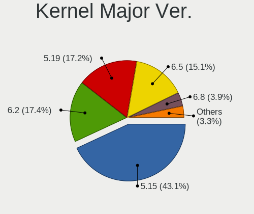
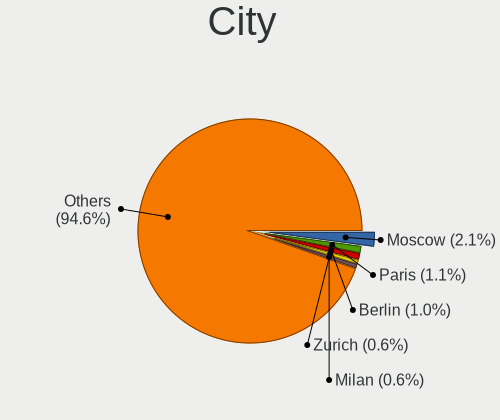
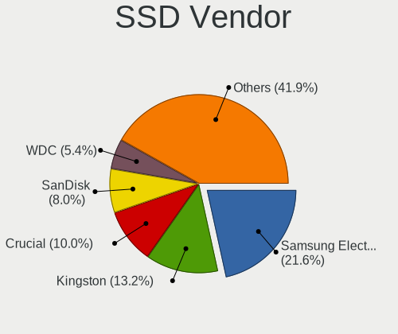

Ubuntu 22.04 - Tested Hardware & Statistics
-------------------------------------------

A project to collect tested hardware configurations for Ubuntu 22.04.

Anyone can contribute to this report by the [hw-probe](https://github.com/linuxhw/hw-probe) tool:

    sudo -E hw-probe -all -upload

Please contribute! Especially if your hardware is rare.

This is a report for all computer types. See also reports for [desktops](/Dist/Ubuntu_22.04/Desktop/README.md) and [notebooks](/Dist/Ubuntu_22.04/Notebook/README.md).

Contents
--------

* [ Test Cases ](#test-cases)

* [ System ](#system)
  - [ Kernel                   ](#kernel)
  - [ Kernel Family            ](#kernel-family)
  - [ Kernel Major Ver.        ](#kernel-major-ver)
  - [ Arch                     ](#arch)
  - [ DE                       ](#de)
  - [ Display Server           ](#display-server)
  - [ Display Manager          ](#display-manager)
  - [ OS Lang                  ](#os-lang)
  - [ Boot Mode                ](#boot-mode)
  - [ Filesystem               ](#filesystem)
  - [ Part. scheme             ](#part-scheme)
  - [ Dual Boot with Linux/BSD ](#dual-boot-with-linuxbsd)
  - [ Dual Boot (Win)          ](#dual-boot-win)

* [ Board ](#board)
  - [ Vendor                   ](#vendor)
  - [ Model                    ](#model)
  - [ Model Family             ](#model-family)
  - [ MFG Year                 ](#mfg-year)
  - [ Form Factor              ](#form-factor)
  - [ Secure Boot              ](#secure-boot)
  - [ Coreboot                 ](#coreboot)
  - [ RAM Size                 ](#ram-size)
  - [ RAM Used                 ](#ram-used)
  - [ Total Drives             ](#total-drives)
  - [ Has CD-ROM               ](#has-cd-rom)
  - [ Has Ethernet             ](#has-ethernet)
  - [ Has WiFi                 ](#has-wifi)
  - [ Has Bluetooth            ](#has-bluetooth)

* [ Location ](#location)
  - [ Country                  ](#country)
  - [ City                     ](#city)

* [ Drives ](#drives)
  - [ Drive Vendor             ](#drive-vendor)
  - [ Drive Model              ](#drive-model)
  - [ HDD Vendor               ](#hdd-vendor)
  - [ SSD Vendor               ](#ssd-vendor)
  - [ Drive Kind               ](#drive-kind)
  - [ Drive Connector          ](#drive-connector)
  - [ Drive Size               ](#drive-size)
  - [ Space Total              ](#space-total)
  - [ Space Used               ](#space-used)
  - [ Malfunc. Drives          ](#malfunc-drives)
  - [ Malfunc. Drive Vendor    ](#malfunc-drive-vendor)
  - [ Malfunc. HDD Vendor      ](#malfunc-hdd-vendor)
  - [ Malfunc. Drive Kind      ](#malfunc-drive-kind)
  - [ Failed Drives            ](#failed-drives)
  - [ Failed Drive Vendor      ](#failed-drive-vendor)
  - [ Drive Status             ](#drive-status)

* [ Storage controller ](#storage-controller)
  - [ Storage Vendor           ](#storage-vendor)
  - [ Storage Model            ](#storage-model)
  - [ Storage Kind             ](#storage-kind)

* [ Processor ](#processor)
  - [ CPU Vendor               ](#cpu-vendor)
  - [ CPU Model                ](#cpu-model)
  - [ CPU Model Family         ](#cpu-model-family)
  - [ CPU Cores                ](#cpu-cores)
  - [ CPU Sockets              ](#cpu-sockets)
  - [ CPU Threads              ](#cpu-threads)
  - [ CPU Op-Modes             ](#cpu-op-modes)
  - [ CPU Microcode            ](#cpu-microcode)
  - [ CPU Microarch            ](#cpu-microarch)

* [ Graphics ](#graphics)
  - [ GPU Vendor               ](#gpu-vendor)
  - [ GPU Model                ](#gpu-model)
  - [ GPU Combo                ](#gpu-combo)
  - [ GPU Driver               ](#gpu-driver)
  - [ GPU Memory               ](#gpu-memory)

* [ Monitor ](#monitor)
  - [ Monitor Vendor           ](#monitor-vendor)
  - [ Monitor Model            ](#monitor-model)
  - [ Monitor Resolution       ](#monitor-resolution)
  - [ Monitor Diagonal         ](#monitor-diagonal)
  - [ Monitor Width            ](#monitor-width)
  - [ Aspect Ratio             ](#aspect-ratio)
  - [ Monitor Area             ](#monitor-area)
  - [ Pixel Density            ](#pixel-density)
  - [ Multiple Monitors        ](#multiple-monitors)

* [ Network ](#network)
  - [ Net Controller Vendor    ](#net-controller-vendor)
  - [ Net Controller Model     ](#net-controller-model)
  - [ Wireless Vendor          ](#wireless-vendor)
  - [ Wireless Model           ](#wireless-model)
  - [ Ethernet Vendor          ](#ethernet-vendor)
  - [ Ethernet Model           ](#ethernet-model)
  - [ Net Controller Kind      ](#net-controller-kind)
  - [ Used Controller          ](#used-controller)
  - [ NICs                     ](#nics)
  - [ IPv6                     ](#ipv6)

* [ Bluetooth ](#bluetooth)
  - [ Bluetooth Vendor         ](#bluetooth-vendor)
  - [ Bluetooth Model          ](#bluetooth-model)

* [ Sound ](#sound)
  - [ Sound Vendor             ](#sound-vendor)
  - [ Sound Model              ](#sound-model)

* [ Memory ](#memory)
  - [ Memory Vendor            ](#memory-vendor)
  - [ Memory Model             ](#memory-model)
  - [ Memory Kind              ](#memory-kind)
  - [ Memory Form Factor       ](#memory-form-factor)
  - [ Memory Size              ](#memory-size)
  - [ Memory Speed             ](#memory-speed)

* [ Printers & scanners ](#printers--scanners)
  - [ Printer Vendor           ](#printer-vendor)
  - [ Printer Model            ](#printer-model)
  - [ Scanner Vendor           ](#scanner-vendor)
  - [ Scanner Model            ](#scanner-model)

* [ Camera ](#camera)
  - [ Camera Vendor            ](#camera-vendor)
  - [ Camera Model             ](#camera-model)

* [ Security ](#security)
  - [ Fingerprint Vendor       ](#fingerprint-vendor)
  - [ Fingerprint Model        ](#fingerprint-model)
  - [ Chipcard Vendor          ](#chipcard-vendor)
  - [ Chipcard Model           ](#chipcard-model)

* [ Unsupported ](#unsupported)
  - [ Unsupported Devices      ](#unsupported-devices)
  - [ Unsupported Device Types ](#unsupported-device-types)

Test Cases
----------

Total: 23960

| Vendor        | Model                       | Form-Factor | Probe                                                      | Date         |
|---------------|-----------------------------|-------------|------------------------------------------------------------|--------------|
| ASRock        | B550M Phantom Gaming 4      | Desktop     | [f8574bdf3e](https://linux-hardware.org/?probe=f8574bdf3e) | May 09, 2024 |
| SDZ           | X133                        | Notebook    | [442d4da2a4](https://linux-hardware.org/?probe=442d4da2a4) | May 09, 2024 |
| Dell          | Inspiron 7706 2n1           | Convertible | [958dc9b878](https://linux-hardware.org/?probe=958dc9b878) | May 09, 2024 |
| GEEKOM        | MiniAir 11                  | Server      | [20e4a415d6](https://linux-hardware.org/?probe=20e4a415d6) | May 09, 2024 |
| Gigabyte      | Z87X-UD4H-CF                | Desktop     | [f26982efc3](https://linux-hardware.org/?probe=f26982efc3) | May 09, 2024 |
| GEEKOM        | MiniAir 11                  | Server      | [9a6f3f3e69](https://linux-hardware.org/?probe=9a6f3f3e69) | May 09, 2024 |
| MSI           | GE66 Raider 10UG            | Notebook    | [d19e5447f5](https://linux-hardware.org/?probe=d19e5447f5) | May 08, 2024 |
| Gigabyte      | Z170N-WIFI-CF               | Desktop     | [7a88f50508](https://linux-hardware.org/?probe=7a88f50508) | May 08, 2024 |
| Gigabyte      | Z170N-WIFI-CF               | Desktop     | [6143f9e1aa](https://linux-hardware.org/?probe=6143f9e1aa) | May 08, 2024 |
| HP            | 18E7                        | Desktop     | [fa637b3b9a](https://linux-hardware.org/?probe=fa637b3b9a) | May 08, 2024 |
| HP            | ProBook 4740s               | Notebook    | [7f39194517](https://linux-hardware.org/?probe=7f39194517) | May 08, 2024 |
| HUAWEI        | BC11HGSB0 V100R003          | Server      | [ce27371402](https://linux-hardware.org/?probe=ce27371402) | May 08, 2024 |
| ASRock        | B550M Phantom Gaming 4      | Desktop     | [8210b8f2f9](https://linux-hardware.org/?probe=8210b8f2f9) | May 08, 2024 |
| Dell          | Inspiron 7415 2-in-1        | Convertible | [2bf4332abb](https://linux-hardware.org/?probe=2bf4332abb) | May 08, 2024 |
| Samsung       | SR700                       | Notebook    | [97ed5b7fc7](https://linux-hardware.org/?probe=97ed5b7fc7) | May 08, 2024 |
| ASRock        | Z77 Performance             | Desktop     | [500cd7ed60](https://linux-hardware.org/?probe=500cd7ed60) | May 08, 2024 |
| Supermicro    | X9DRW                       | Server      | [fd0af1a212](https://linux-hardware.org/?probe=fd0af1a212) | May 08, 2024 |
| HP            | ZBook Power 15.6 inch G8... | Notebook    | [291c23ee80](https://linux-hardware.org/?probe=291c23ee80) | May 08, 2024 |
| HP            | ProLiant DL160 G6           | Server      | [1f19c32b7d](https://linux-hardware.org/?probe=1f19c32b7d) | May 08, 2024 |
| Unknown       | Unknown                     | Desktop     | [07a1876fd0](https://linux-hardware.org/?probe=07a1876fd0) | May 08, 2024 |
| ASUSTek       | PRIME B760M-A WIFI D4       | Desktop     | [d83d6a3460](https://linux-hardware.org/?probe=d83d6a3460) | May 07, 2024 |
| ASUSTek       | ROG STRIX B450-F GAMING ... | Desktop     | [cdcaeb4d46](https://linux-hardware.org/?probe=cdcaeb4d46) | May 07, 2024 |
| Dell          | 0215PR A02                  | Desktop     | [ff480889b4](https://linux-hardware.org/?probe=ff480889b4) | May 07, 2024 |
| HP            | Pavilion Sleekbook 15       | Notebook    | [9cd7bfcd0f](https://linux-hardware.org/?probe=9cd7bfcd0f) | May 07, 2024 |
| ASUSTek       | X555LD                      | Notebook    | [989d24a4b7](https://linux-hardware.org/?probe=989d24a4b7) | May 07, 2024 |
| Supermicro    | X10DDW-i                    | Desktop     | [ff62f6b4d9](https://linux-hardware.org/?probe=ff62f6b4d9) | May 07, 2024 |
| Supermicro    | X10DDW-i                    | Desktop     | [b849fea196](https://linux-hardware.org/?probe=b849fea196) | May 07, 2024 |
| Supermicro    | X10DDW-i                    | Desktop     | [c20ef4d35b](https://linux-hardware.org/?probe=c20ef4d35b) | May 07, 2024 |
| Supermicro    | X10DDW-i                    | Desktop     | [9b21386a04](https://linux-hardware.org/?probe=9b21386a04) | May 07, 2024 |
| Supermicro    | X10DDW-i                    | Desktop     | [99fbeae8c9](https://linux-hardware.org/?probe=99fbeae8c9) | May 07, 2024 |
| Supermicro    | X10DDW-i                    | Desktop     | [48bb233b46](https://linux-hardware.org/?probe=48bb233b46) | May 07, 2024 |
| Supermicro    | X9DRW                       | Server      | [7915255781](https://linux-hardware.org/?probe=7915255781) | May 07, 2024 |
| Supermicro    | X10DRL-i                    | Desktop     | [da5c3ed75f](https://linux-hardware.org/?probe=da5c3ed75f) | May 07, 2024 |
| Shenzhen M... | F7BSC                       | Desktop     | [9e6a5eb0e2](https://linux-hardware.org/?probe=9e6a5eb0e2) | May 07, 2024 |
| Lenovo        | ThinkPad P14s Gen 1 20Y2... | Notebook    | [064b211de8](https://linux-hardware.org/?probe=064b211de8) | May 07, 2024 |
| Notebook      | NS50_70MU                   | Notebook    | [99983ceae1](https://linux-hardware.org/?probe=99983ceae1) | May 07, 2024 |
| Supermicro    | X8DT6                       | Server      | [9a70e94fb0](https://linux-hardware.org/?probe=9a70e94fb0) | May 07, 2024 |
| Intel         | SKYBAY                      | Desktop     | [7e692c7e40](https://linux-hardware.org/?probe=7e692c7e40) | May 07, 2024 |
| Supermicro    | X8DT6                       | Server      | [c3428daaf1](https://linux-hardware.org/?probe=c3428daaf1) | May 07, 2024 |
| Lenovo        | ThinkPad T480 20L5A023HK    | Notebook    | [ff78bb7112](https://linux-hardware.org/?probe=ff78bb7112) | May 07, 2024 |
| Dell          | Inspiron 5547               | Notebook    | [b8dd9a912d](https://linux-hardware.org/?probe=b8dd9a912d) | May 07, 2024 |
| Dell          | Latitude 9430               | Notebook    | [953be205ca](https://linux-hardware.org/?probe=953be205ca) | May 07, 2024 |
| Sony          | SVF1521E2EW                 | Notebook    | [2e86efc1ba](https://linux-hardware.org/?probe=2e86efc1ba) | May 07, 2024 |
| HP            | ProBook 645 G3              | Notebook    | [29cb5b66f8](https://linux-hardware.org/?probe=29cb5b66f8) | May 07, 2024 |
| Dell          | 02YRK5 A02                  | Desktop     | [fea15ab44c](https://linux-hardware.org/?probe=fea15ab44c) | May 07, 2024 |
| HP            | ZBook 15 G6                 | Notebook    | [4a401c8b15](https://linux-hardware.org/?probe=4a401c8b15) | May 06, 2024 |
| ASUSTek       | PRIME H510M-E               | Desktop     | [bf4a7b097c](https://linux-hardware.org/?probe=bf4a7b097c) | May 06, 2024 |
| Sony          | VPCEB1S1E                   | Notebook    | [db144a8fd9](https://linux-hardware.org/?probe=db144a8fd9) | May 06, 2024 |
| ASUSTek       | PRIME H510M-E               | Desktop     | [e76f332009](https://linux-hardware.org/?probe=e76f332009) | May 06, 2024 |
| Dell          | 02YYK5 A01                  | Desktop     | [09b75f38cd](https://linux-hardware.org/?probe=09b75f38cd) | May 06, 2024 |
| MSI           | MAG Z690 TOMAHAWK WIFI D... | Desktop     | [8848310fde](https://linux-hardware.org/?probe=8848310fde) | May 06, 2024 |
| ASUSTek       | ROG STRIX X299-E GAMING ... | Desktop     | [fc1633451e](https://linux-hardware.org/?probe=fc1633451e) | May 06, 2024 |
| Dell          | 042P49 A02                  | Desktop     | [4b9e2674de](https://linux-hardware.org/?probe=4b9e2674de) | May 06, 2024 |
| Dell          | 042P49 A02                  | Desktop     | [146a7db97f](https://linux-hardware.org/?probe=146a7db97f) | May 06, 2024 |
| Alurin        | ALU-BAR-I511-000-140        | Notebook    | [04578b9c4b](https://linux-hardware.org/?probe=04578b9c4b) | May 06, 2024 |
| Unknown       | Unknown                     | Notebook    | [273d6afeb5](https://linux-hardware.org/?probe=273d6afeb5) | May 06, 2024 |
| ASUSTek       | Zenbook UX5401ZA_UX5401Z... | Notebook    | [92089af4b7](https://linux-hardware.org/?probe=92089af4b7) | May 06, 2024 |
| Dell          | 0C2KJT A00                  | Desktop     | [a884cd0cf5](https://linux-hardware.org/?probe=a884cd0cf5) | May 06, 2024 |
| Dell          | Latitude 5440               | Notebook    | [f6c9287953](https://linux-hardware.org/?probe=f6c9287953) | May 06, 2024 |
| ASUSTek       | Z240IC-H170                 | All in one  | [978c7be506](https://linux-hardware.org/?probe=978c7be506) | May 06, 2024 |
| ASUSTek       | P8H67-M PRO                 | Desktop     | [2af49854e2](https://linux-hardware.org/?probe=2af49854e2) | May 06, 2024 |
| ASUSTek       | ROG STRIX Z690-G GAMING ... | Desktop     | [a923d8607b](https://linux-hardware.org/?probe=a923d8607b) | May 06, 2024 |
| HP            | ProLiant DL360 Gen9         | Server      | [162040356c](https://linux-hardware.org/?probe=162040356c) | May 06, 2024 |
| ASUSTek       | VivoBook_ASUSLaptop X513... | Notebook    | [d4cca237f2](https://linux-hardware.org/?probe=d4cca237f2) | May 06, 2024 |
| ASUSTek       | VivoBook_ASUSLaptop X513... | Notebook    | [e5685451f5](https://linux-hardware.org/?probe=e5685451f5) | May 06, 2024 |
| Sony          | VPCEB1S1E                   | Notebook    | [aa8d766ae4](https://linux-hardware.org/?probe=aa8d766ae4) | May 06, 2024 |
| Dell          | Inspiron 15 3520            | Notebook    | [c9bddc6d00](https://linux-hardware.org/?probe=c9bddc6d00) | May 06, 2024 |
| Lenovo        | ThinkPad P50 20ENCTO1WW     | Notebook    | [9adbb0ba2c](https://linux-hardware.org/?probe=9adbb0ba2c) | May 06, 2024 |
| Lenovo        | ThinkPad P50 20ENCTO1WW     | Notebook    | [465a5be052](https://linux-hardware.org/?probe=465a5be052) | May 06, 2024 |
| MSI           | H110M PRO-VH                | Desktop     | [f0e62a158e](https://linux-hardware.org/?probe=f0e62a158e) | May 06, 2024 |
| Lenovo        | SHARKBAY NOK                | Desktop     | [11bef15f7d](https://linux-hardware.org/?probe=11bef15f7d) | May 06, 2024 |
| MSI           | 2AE0                        | Desktop     | [25c9b3836b](https://linux-hardware.org/?probe=25c9b3836b) | May 06, 2024 |
| Fujitsu       | LIFEBOOK E754               | Notebook    | [c201d1f500](https://linux-hardware.org/?probe=c201d1f500) | May 06, 2024 |
| Supermicro    | X10DRL-i                    | Desktop     | [80cdad1821](https://linux-hardware.org/?probe=80cdad1821) | May 06, 2024 |
| ADVAN         | 1701                        | Notebook    | [e0928a1604](https://linux-hardware.org/?probe=e0928a1604) | May 06, 2024 |
| Lenovo        | ThinkPad P17 Gen 1 20SQS... | Notebook    | [8c2af338dc](https://linux-hardware.org/?probe=8c2af338dc) | May 06, 2024 |
| HP            | ProBook 450 G6              | Notebook    | [cb4f1dbbfa](https://linux-hardware.org/?probe=cb4f1dbbfa) | May 06, 2024 |
| Unknown       | Orange Pi 5 Plus            | Soc         | [f22091b0c8](https://linux-hardware.org/?probe=f22091b0c8) | May 06, 2024 |
| Lenovo        | Unknown                     | Notebook    | [5087593233](https://linux-hardware.org/?probe=5087593233) | May 06, 2024 |
| Toshiba       | Satellite A200              | Notebook    | [633754915c](https://linux-hardware.org/?probe=633754915c) | May 05, 2024 |
| Lenovo        | IdeaPad Slim 5 16IRL8 82... | Notebook    | [2cace801f8](https://linux-hardware.org/?probe=2cace801f8) | May 05, 2024 |
| Toshiba       | Satellite A200              | Notebook    | [ba705e9e1b](https://linux-hardware.org/?probe=ba705e9e1b) | May 05, 2024 |
| Acer          | Aspire A315-510P            | Notebook    | [802925480b](https://linux-hardware.org/?probe=802925480b) | May 05, 2024 |
| Intel         | NUC11TNBi5 M11904-404       | Mini pc     | [0ddd0cd5f9](https://linux-hardware.org/?probe=0ddd0cd5f9) | May 05, 2024 |
| Samsung       | 730QED                      | Convertible | [392bee96b2](https://linux-hardware.org/?probe=392bee96b2) | May 05, 2024 |
| ASUSTek       | TUF Gaming A520M-PLUS WI... | Desktop     | [e4b1fdc5b2](https://linux-hardware.org/?probe=e4b1fdc5b2) | May 05, 2024 |
| Supermicro    | X7DCL                       | Desktop     | [9644da40a4](https://linux-hardware.org/?probe=9644da40a4) | May 05, 2024 |
| ASUSTek       | ASUS TUF Gaming A15 FA50... | Notebook    | [b86bb80db9](https://linux-hardware.org/?probe=b86bb80db9) | May 05, 2024 |
| Dell          | 0J9VVP A00                  | Desktop     | [5971526cf6](https://linux-hardware.org/?probe=5971526cf6) | May 05, 2024 |
| HP            | 806A                        | Desktop     | [d28c449530](https://linux-hardware.org/?probe=d28c449530) | May 05, 2024 |
| Dell          | 0J9VVP A00                  | Desktop     | [f75406b494](https://linux-hardware.org/?probe=f75406b494) | May 05, 2024 |
| Gigabyte      | AB350-Gaming 3-CF           | Desktop     | [a099133a32](https://linux-hardware.org/?probe=a099133a32) | May 05, 2024 |
| Dell          | 03X6X0 A06                  | Server      | [2e6f46fe60](https://linux-hardware.org/?probe=2e6f46fe60) | May 05, 2024 |
| Lenovo        | ThinkPad P16 Gen 1 21D60... | Notebook    | [bc053b7c75](https://linux-hardware.org/?probe=bc053b7c75) | May 05, 2024 |
| ASUSTek       | VivoBook_ASUSLaptop M160... | Notebook    | [3602db941f](https://linux-hardware.org/?probe=3602db941f) | May 05, 2024 |
| MSI           | MPG Z690 FORCE WIFI         | Desktop     | [4e837501bb](https://linux-hardware.org/?probe=4e837501bb) | May 05, 2024 |
| Acer          | AOD270                      | Notebook    | [af6b765474](https://linux-hardware.org/?probe=af6b765474) | May 05, 2024 |
| Dell          | Precision 3510              | Notebook    | [c57923e0ff](https://linux-hardware.org/?probe=c57923e0ff) | May 04, 2024 |
| Dell          | Precision 3510              | Notebook    | [0c006aad0f](https://linux-hardware.org/?probe=0c006aad0f) | May 04, 2024 |
| HP            | ProBook 6470b               | Notebook    | [3865a636e2](https://linux-hardware.org/?probe=3865a636e2) | May 04, 2024 |
| Intel         | NUC13ANBi7 M89645-203       | Mini pc     | [147f6a0701](https://linux-hardware.org/?probe=147f6a0701) | May 04, 2024 |
| Dell          | G15 5511                    | Notebook    | [8bb70e4a24](https://linux-hardware.org/?probe=8bb70e4a24) | May 04, 2024 |
| Hardkernel    | ODROID-H3                   | Desktop     | [e9ea8670f9](https://linux-hardware.org/?probe=e9ea8670f9) | May 04, 2024 |
| ASRock        | A520M-HVS                   | Desktop     | [59c3452245](https://linux-hardware.org/?probe=59c3452245) | May 04, 2024 |
| Apple         | MacBookAir4,1               | Notebook    | [f8bc0c50a5](https://linux-hardware.org/?probe=f8bc0c50a5) | May 04, 2024 |
| ASRock        | B550 Pro4                   | Desktop     | [7b008baaaa](https://linux-hardware.org/?probe=7b008baaaa) | May 04, 2024 |
| Lenovo        | ThinkPad T450 20BUS2SS00    | Notebook    | [5d764e707b](https://linux-hardware.org/?probe=5d764e707b) | May 04, 2024 |
| MSI           | PRO Z790-A MAX WIFI         | Desktop     | [534c77cdb0](https://linux-hardware.org/?probe=534c77cdb0) | May 04, 2024 |
| HP            | 15                          | Notebook    | [9ea6582e2f](https://linux-hardware.org/?probe=9ea6582e2f) | May 04, 2024 |
| Lenovo        | V340-17IWL 81RG             | Notebook    | [1584f1c1cf](https://linux-hardware.org/?probe=1584f1c1cf) | May 03, 2024 |
| Supermicro    | X8DTU                       | Server      | [3d87f9e883](https://linux-hardware.org/?probe=3d87f9e883) | May 03, 2024 |
| Dell          | 00CV7F A00                  | Desktop     | [0e00dd8ed3](https://linux-hardware.org/?probe=0e00dd8ed3) | May 03, 2024 |
| HP            | ProBook 6470b               | Notebook    | [152863481c](https://linux-hardware.org/?probe=152863481c) | May 03, 2024 |
| Lenovo        | IdeaPad Slim 5 16ABR8 82... | Notebook    | [d3c40c405d](https://linux-hardware.org/?probe=d3c40c405d) | May 03, 2024 |
| Dell          | 0HD5W2 A01                  | Desktop     | [c7875c3103](https://linux-hardware.org/?probe=c7875c3103) | May 03, 2024 |
| Dell          | Latitude 7410               | Notebook    | [959e9d053d](https://linux-hardware.org/?probe=959e9d053d) | May 03, 2024 |
| ASUSTek       | P8H67-M PRO                 | Desktop     | [001c04c64f](https://linux-hardware.org/?probe=001c04c64f) | May 03, 2024 |
| ASUSTek       | TUF B360-PLUS GAMING        | Desktop     | [2fa2359d84](https://linux-hardware.org/?probe=2fa2359d84) | May 03, 2024 |
| ASUSTek       | TUF B360-PLUS GAMING        | Desktop     | [9b2885b554](https://linux-hardware.org/?probe=9b2885b554) | May 03, 2024 |
| ASRock        | A520M-HDV                   | Desktop     | [6bf979fc7a](https://linux-hardware.org/?probe=6bf979fc7a) | May 03, 2024 |
| HP            | EliteBook 8470p             | Notebook    | [2480bab346](https://linux-hardware.org/?probe=2480bab346) | May 02, 2024 |
| HP            | OMEN by Laptop 15-dc0xxx    | Notebook    | [23c1b45346](https://linux-hardware.org/?probe=23c1b45346) | May 02, 2024 |
| Shenzhen M... | F7BSC                       | Desktop     | [b3f2c851de](https://linux-hardware.org/?probe=b3f2c851de) | May 02, 2024 |
| Supermicro    | X11SSL-F                    | Server      | [b1803e347c](https://linux-hardware.org/?probe=b1803e347c) | May 02, 2024 |
| ASUSTek       | K40IE                       | Notebook    | [82ddbf99c2](https://linux-hardware.org/?probe=82ddbf99c2) | May 02, 2024 |
| Gigabyte      | B450M DS3H-CF               | Desktop     | [f229e6b124](https://linux-hardware.org/?probe=f229e6b124) | May 02, 2024 |
| Dell          | 0GPD72 A00                  | Desktop     | [09c386e20d](https://linux-hardware.org/?probe=09c386e20d) | May 02, 2024 |
| ASUSTek       | X553MA                      | Notebook    | [1aaeefe305](https://linux-hardware.org/?probe=1aaeefe305) | May 02, 2024 |
| HP            | ENVY Laptop 17-cr1xxx       | Notebook    | [f17f6e1d74](https://linux-hardware.org/?probe=f17f6e1d74) | May 02, 2024 |
| To be fill... | CX-J4125B 11                | Desktop     | [b567efebf2](https://linux-hardware.org/?probe=b567efebf2) | May 02, 2024 |
| To be fill... | CX-J4125B 11                | Desktop     | [258c2fcd0d](https://linux-hardware.org/?probe=258c2fcd0d) | May 02, 2024 |
| Lenovo        | G400s VILG1                 | Notebook    | [f604dc3e58](https://linux-hardware.org/?probe=f604dc3e58) | May 02, 2024 |
| Foxconn       | 2ABF                        | Desktop     | [3b1c4174da](https://linux-hardware.org/?probe=3b1c4174da) | May 02, 2024 |
| To be fill... | CX-J4125 12                 | Desktop     | [f579d8a9cc](https://linux-hardware.org/?probe=f579d8a9cc) | May 02, 2024 |
| HP            | Pavilion x360 Convertibl... | Convertible | [f3681e3ab6](https://linux-hardware.org/?probe=f3681e3ab6) | May 02, 2024 |
| Notebook      | PCx0Dx                      | Notebook    | [a2c29d6db0](https://linux-hardware.org/?probe=a2c29d6db0) | May 02, 2024 |
| Lenovo        | ThinkPad E14 Gen 5 21JRC... | Notebook    | [8c996ba957](https://linux-hardware.org/?probe=8c996ba957) | May 02, 2024 |
| Lenovo        | V14-ADA 82C6                | Notebook    | [1e4ba01e31](https://linux-hardware.org/?probe=1e4ba01e31) | May 02, 2024 |
| HP            | 2B13 A01                    | All in one  | [884d3aff6d](https://linux-hardware.org/?probe=884d3aff6d) | May 02, 2024 |
| HP            | 89B3 A                      | Desktop     | [5bc44b7b14](https://linux-hardware.org/?probe=5bc44b7b14) | May 02, 2024 |
| HP            | 89B3 A                      | Desktop     | [7ba4c8e1a2](https://linux-hardware.org/?probe=7ba4c8e1a2) | May 02, 2024 |
| ASUSTek       | ROG Maximus Z790 HERO       | Desktop     | [40caf612c2](https://linux-hardware.org/?probe=40caf612c2) | May 02, 2024 |
| Dell          | XPS 13 9365                 | Convertible | [8f2ba6ebed](https://linux-hardware.org/?probe=8f2ba6ebed) | May 02, 2024 |
| Apple         | MacBookPro11,1              | Notebook    | [eb47dc7acd](https://linux-hardware.org/?probe=eb47dc7acd) | May 02, 2024 |
| ASUSTek       | M5A97 R2.0                  | Desktop     | [6e17fb9c95](https://linux-hardware.org/?probe=6e17fb9c95) | May 02, 2024 |
| HUAWEI        | BOD-WXX9                    | Notebook    | [0cd46d4084](https://linux-hardware.org/?probe=0cd46d4084) | May 02, 2024 |
| Biostar       | H61MLC                      | Desktop     | [d26510e4fb](https://linux-hardware.org/?probe=d26510e4fb) | May 01, 2024 |
| LG Electro... | 22V280 FAB1                 | All in one  | [9e2123a8a2](https://linux-hardware.org/?probe=9e2123a8a2) | May 01, 2024 |
| Unknown       | Unknown                     | Notebook    | [9fb77bbafc](https://linux-hardware.org/?probe=9fb77bbafc) | May 01, 2024 |
| HP            | Pavilion Sleekbook 15       | Notebook    | [f61e28b31c](https://linux-hardware.org/?probe=f61e28b31c) | May 01, 2024 |
| ASUSTek       | ROG STRIX Z790-A GAMING ... | Desktop     | [5d4a138b2f](https://linux-hardware.org/?probe=5d4a138b2f) | May 01, 2024 |
| Biostar       | H61MLC                      | Desktop     | [502f0f308f](https://linux-hardware.org/?probe=502f0f308f) | May 01, 2024 |
| HP            | Stream Laptop 14-cb1xxx     | Notebook    | [b30b733ae9](https://linux-hardware.org/?probe=b30b733ae9) | May 01, 2024 |
| Framework     | Laptop 16 (AMD Ryzen 704... | Notebook    | [28e6be5f86](https://linux-hardware.org/?probe=28e6be5f86) | May 01, 2024 |
| HP            | 805D                        | Desktop     | [facf891056](https://linux-hardware.org/?probe=facf891056) | May 01, 2024 |
| Lenovo        | IdeaPad 1 15ALC7 82R4       | Notebook    | [f899f3dccf](https://linux-hardware.org/?probe=f899f3dccf) | May 01, 2024 |
| Dell          | 09KPNV A01                  | Desktop     | [1f22876130](https://linux-hardware.org/?probe=1f22876130) | May 01, 2024 |
| Acer          | Aspire A315-23              | Notebook    | [ee01c6ee48](https://linux-hardware.org/?probe=ee01c6ee48) | May 01, 2024 |
| Dell          | Inspiron 1525               | Notebook    | [8e9c51790c](https://linux-hardware.org/?probe=8e9c51790c) | May 01, 2024 |
| Dell          | Inspiron 1525               | Notebook    | [ca6bde2e75](https://linux-hardware.org/?probe=ca6bde2e75) | Apr 30, 2024 |
| Dell          | 0427JK A00                  | Desktop     | [6c93b7fabf](https://linux-hardware.org/?probe=6c93b7fabf) | Apr 30, 2024 |
| Acer          | Aspire V3-372T              | Notebook    | [888ad09735](https://linux-hardware.org/?probe=888ad09735) | Apr 30, 2024 |
| ASUSTek       | TUF Gaming B760M-PLUS WI... | Desktop     | [135b6c8c4e](https://linux-hardware.org/?probe=135b6c8c4e) | Apr 30, 2024 |
| ASUSTek       | VivoBook_ASUSLaptop X160... | Notebook    | [06046f8679](https://linux-hardware.org/?probe=06046f8679) | Apr 30, 2024 |
| ASUSTek       | PRIME H510M-K               | Desktop     | [1cdd242400](https://linux-hardware.org/?probe=1cdd242400) | Apr 30, 2024 |
| Acer          | Aspire ES1-522              | Notebook    | [90a2ac9af6](https://linux-hardware.org/?probe=90a2ac9af6) | Apr 30, 2024 |
| MSI           | Raider GE76 12UE            | Notebook    | [6c23378280](https://linux-hardware.org/?probe=6c23378280) | Apr 30, 2024 |
| Lenovo        | ThinkPad T510 43494JG       | Notebook    | [fe8480c6c4](https://linux-hardware.org/?probe=fe8480c6c4) | Apr 30, 2024 |
| Gigabyte      | F2A88XM-DS2                 | Desktop     | [2a13216c9b](https://linux-hardware.org/?probe=2a13216c9b) | Apr 30, 2024 |
| MSI           | GS66 Stealth 10SE           | Notebook    | [e436c09a5c](https://linux-hardware.org/?probe=e436c09a5c) | Apr 30, 2024 |
| HP            | EliteBook 840 G8 Noteboo... | Notebook    | [dca5cca3c7](https://linux-hardware.org/?probe=dca5cca3c7) | Apr 30, 2024 |
| Acer          | Aspire A115-32              | Notebook    | [32a4949c7c](https://linux-hardware.org/?probe=32a4949c7c) | Apr 30, 2024 |
| SolidRun      | Bedrock R7000               | Soc         | [ab7e5c672f](https://linux-hardware.org/?probe=ab7e5c672f) | Apr 30, 2024 |
| Dell          | 0R790T A00                  | Desktop     | [2086c30418](https://linux-hardware.org/?probe=2086c30418) | Apr 30, 2024 |
| ASUSTek       | ROG STRIX B460-F GAMING     | Desktop     | [b335a417f1](https://linux-hardware.org/?probe=b335a417f1) | Apr 30, 2024 |
| HP            | Laptop 15-da0xxx            | Notebook    | [1d5c1bf00e](https://linux-hardware.org/?probe=1d5c1bf00e) | Apr 30, 2024 |
| Lenovo        | IdeaPad 320-15IKB 80YH      | Notebook    | [d8017ef206](https://linux-hardware.org/?probe=d8017ef206) | Apr 30, 2024 |
| Lenovo        | IdeaPad 320-15IKB 80YH      | Notebook    | [7cc4d5fb6b](https://linux-hardware.org/?probe=7cc4d5fb6b) | Apr 30, 2024 |
| Lenovo        | ThinkPad P1 Gen 5 21DCS0... | Notebook    | [4f23a4a44b](https://linux-hardware.org/?probe=4f23a4a44b) | Apr 30, 2024 |
| HP            | Laptop 15s-fq5xxx           | Notebook    | [dfeb38ca05](https://linux-hardware.org/?probe=dfeb38ca05) | Apr 30, 2024 |
| ASRock        | B450M Pro4                  | Desktop     | [04c8e87ca3](https://linux-hardware.org/?probe=04c8e87ca3) | Apr 30, 2024 |
| HP            | Laptop 15q-bu0xx            | Notebook    | [24bf1e456c](https://linux-hardware.org/?probe=24bf1e456c) | Apr 30, 2024 |
| MSI           | Z97 GAMING 3                | Desktop     | [c703e6f53a](https://linux-hardware.org/?probe=c703e6f53a) | Apr 30, 2024 |
| Supermicro    | X9DRW-7TPF+                 | Server      | [258840ed31](https://linux-hardware.org/?probe=258840ed31) | Apr 30, 2024 |
| ASUSTek       | Maximus Formula             | Desktop     | [c26c507db2](https://linux-hardware.org/?probe=c26c507db2) | Apr 30, 2024 |
| MSI           | Z68A-G43                    | Desktop     | [9acdb88f98](https://linux-hardware.org/?probe=9acdb88f98) | Apr 30, 2024 |
| AWS Elemen... | 04F3CJ A03                  | Server      | [ce34f45f28](https://linux-hardware.org/?probe=ce34f45f28) | Apr 30, 2024 |
| HP            | ProBook 650 G8 Notebook ... | Notebook    | [18585f423b](https://linux-hardware.org/?probe=18585f423b) | Apr 29, 2024 |
| Dell          | Latitude 3520               | Notebook    | [29ae7a02fd](https://linux-hardware.org/?probe=29ae7a02fd) | Apr 29, 2024 |
| Dell          | Latitude 3520               | Notebook    | [0ce04a54b4](https://linux-hardware.org/?probe=0ce04a54b4) | Apr 29, 2024 |
| SolidRun      | Bedrock R7000               | Soc         | [a2c2713a29](https://linux-hardware.org/?probe=a2c2713a29) | Apr 29, 2024 |
| ASUSTek       | X555YA                      | Notebook    | [43e5d87003](https://linux-hardware.org/?probe=43e5d87003) | Apr 29, 2024 |
| Lenovo        | ThinkBook 16 G4+ IAP 21C... | Notebook    | [4060d6bdbe](https://linux-hardware.org/?probe=4060d6bdbe) | Apr 29, 2024 |
| Lenovo        | ThinkBook 16 G4+ IAP 21C... | Notebook    | [885d49a692](https://linux-hardware.org/?probe=885d49a692) | Apr 29, 2024 |
| HP            | 8526 MVB, A                 | Desktop     | [880c56ee27](https://linux-hardware.org/?probe=880c56ee27) | Apr 29, 2024 |
| HP            | 829A                        | Mini pc     | [61f142eb68](https://linux-hardware.org/?probe=61f142eb68) | Apr 29, 2024 |
| HP            | ZBook Studio G3             | Notebook    | [f22beb97bc](https://linux-hardware.org/?probe=f22beb97bc) | Apr 29, 2024 |
| Lenovo        | IdeaPad 5 Pro 14ITL6 82L... | Notebook    | [80821a7004](https://linux-hardware.org/?probe=80821a7004) | Apr 29, 2024 |
| Dell          | Latitude E6420              | Notebook    | [ce4fbe47c7](https://linux-hardware.org/?probe=ce4fbe47c7) | Apr 29, 2024 |
| Dell          | Latitude E6420              | Notebook    | [b7e8d7d578](https://linux-hardware.org/?probe=b7e8d7d578) | Apr 29, 2024 |
| Acer          | Extensa 5620                | Notebook    | [4150199b68](https://linux-hardware.org/?probe=4150199b68) | Apr 29, 2024 |
| Acer          | Aspire A715-76G             | Notebook    | [067678032d](https://linux-hardware.org/?probe=067678032d) | Apr 29, 2024 |
| Gigabyte      | Z77X-UD3H                   | Desktop     | [9ec352e75d](https://linux-hardware.org/?probe=9ec352e75d) | Apr 29, 2024 |
| Acer          | Aspire A515-47              | Notebook    | [7cef016361](https://linux-hardware.org/?probe=7cef016361) | Apr 29, 2024 |
| Dell          | Latitude 5420               | Notebook    | [121f841401](https://linux-hardware.org/?probe=121f841401) | Apr 29, 2024 |
| Toshiba       | Satellite L775D             | Notebook    | [507b5ac196](https://linux-hardware.org/?probe=507b5ac196) | Apr 29, 2024 |
| Samsung       | 750XED                      | Notebook    | [37fcaff384](https://linux-hardware.org/?probe=37fcaff384) | Apr 29, 2024 |
| HUAWEI        | NbDE-WXX9                   | Notebook    | [b378a91172](https://linux-hardware.org/?probe=b378a91172) | Apr 29, 2024 |
| Fujitsu       | D3041-A1 S26361-D3041-A1    | Desktop     | [166266e759](https://linux-hardware.org/?probe=166266e759) | Apr 28, 2024 |
| Minix         | Z64 V1.2                    | Notebook    | [7c0143f3e4](https://linux-hardware.org/?probe=7c0143f3e4) | Apr 28, 2024 |
| Lenovo        | B570 1068EMG                | Notebook    | [9617fb7082](https://linux-hardware.org/?probe=9617fb7082) | Apr 28, 2024 |
| iOTA          | Flo 360                     | Convertible | [24e0af7512](https://linux-hardware.org/?probe=24e0af7512) | Apr 28, 2024 |
| HP            | ProBook 650 G3              | Notebook    | [e2f71d285f](https://linux-hardware.org/?probe=e2f71d285f) | Apr 28, 2024 |
| Fujitsu       | LIFEBOOK UH572              | Notebook    | [18bdace363](https://linux-hardware.org/?probe=18bdace363) | Apr 28, 2024 |
| Gigabyte      | B760M AORUS ELITE AX        | Desktop     | [d48aa1e751](https://linux-hardware.org/?probe=d48aa1e751) | Apr 28, 2024 |
| ASUSTek       | M5A97 R2.0                  | Desktop     | [3dcaa02108](https://linux-hardware.org/?probe=3dcaa02108) | Apr 28, 2024 |
| Lenovo        | ThinkPad T510 4349RW1       | Notebook    | [afaac362f7](https://linux-hardware.org/?probe=afaac362f7) | Apr 28, 2024 |
| Acer          | Aspire A315-33              | Notebook    | [6570c2a483](https://linux-hardware.org/?probe=6570c2a483) | Apr 28, 2024 |
| Toshiba       | Satellite P755              | Notebook    | [2e2a03f963](https://linux-hardware.org/?probe=2e2a03f963) | Apr 28, 2024 |
| Apple         | MacBookPro11,1              | Notebook    | [0a30ad8b47](https://linux-hardware.org/?probe=0a30ad8b47) | Apr 28, 2024 |
| Lenovo        | IdeaPad 320-15IKB 80XL      | Notebook    | [814f4429a4](https://linux-hardware.org/?probe=814f4429a4) | Apr 27, 2024 |
| Dell          | 0KRC95 A00                  | Desktop     | [8a4d88627a](https://linux-hardware.org/?probe=8a4d88627a) | Apr 27, 2024 |
| Acer          | Aspire 5733                 | Notebook    | [f7af5c9308](https://linux-hardware.org/?probe=f7af5c9308) | Apr 27, 2024 |
| Supermicro    | X10DRL-i                    | Desktop     | [442d3d029e](https://linux-hardware.org/?probe=442d3d029e) | Apr 27, 2024 |
| Gigabyte      | B550M DS3H                  | Desktop     | [158b44fbb4](https://linux-hardware.org/?probe=158b44fbb4) | Apr 27, 2024 |
| HP            | Notebook                    | Notebook    | [1918273411](https://linux-hardware.org/?probe=1918273411) | Apr 27, 2024 |
| Gigabyte      | B550M DS3H                  | Desktop     | [12aab4742e](https://linux-hardware.org/?probe=12aab4742e) | Apr 27, 2024 |
| HP            | Notebook                    | Notebook    | [91c53e6cc1](https://linux-hardware.org/?probe=91c53e6cc1) | Apr 27, 2024 |
| HP            | Laptop 15s-fq1xxx           | Notebook    | [b71d197185](https://linux-hardware.org/?probe=b71d197185) | Apr 27, 2024 |
| Dell          | 0WMJ54 A00                  | Desktop     | [952112efbd](https://linux-hardware.org/?probe=952112efbd) | Apr 27, 2024 |
| Lenovo        | ThinkPad X240 20AMA0SE00    | Notebook    | [be7a1e7b0c](https://linux-hardware.org/?probe=be7a1e7b0c) | Apr 27, 2024 |
| Supermicro    | X10DRL-i                    | Desktop     | [acd3d2d971](https://linux-hardware.org/?probe=acd3d2d971) | Apr 27, 2024 |
| Supermicro    | X10DRL-i                    | Desktop     | [97cef8e012](https://linux-hardware.org/?probe=97cef8e012) | Apr 27, 2024 |
| Supermicro    | X9DRW                       | Server      | [d308e51e85](https://linux-hardware.org/?probe=d308e51e85) | Apr 27, 2024 |
| Gigabyte      | B760M AORUS ELITE AX        | Desktop     | [8541225188](https://linux-hardware.org/?probe=8541225188) | Apr 27, 2024 |
| Toshiba       | Satellite C660              | Notebook    | [c2513f220d](https://linux-hardware.org/?probe=c2513f220d) | Apr 27, 2024 |
| ASUSTek       | ASUS TUF Gaming A17 FA70... | Notebook    | [da45f52feb](https://linux-hardware.org/?probe=da45f52feb) | Apr 27, 2024 |
| ASUSTek       | ASUS TUF Gaming A17 FA70... | Notebook    | [f8f255e514](https://linux-hardware.org/?probe=f8f255e514) | Apr 27, 2024 |
| MSI           | Z87-G43                     | Desktop     | [94162ca704](https://linux-hardware.org/?probe=94162ca704) | Apr 27, 2024 |
| ASUSTek       | X555LD                      | Notebook    | [95724fb189](https://linux-hardware.org/?probe=95724fb189) | Apr 27, 2024 |
| ASUSTek       | P5QPL-AM                    | Desktop     | [9199a16ddd](https://linux-hardware.org/?probe=9199a16ddd) | Apr 27, 2024 |
| Microsoft     | Surface Pro 7+              | Tablet      | [1646a631c8](https://linux-hardware.org/?probe=1646a631c8) | Apr 27, 2024 |
| HP            | EliteBook 850 G4            | Notebook    | [1e562ccb80](https://linux-hardware.org/?probe=1e562ccb80) | Apr 27, 2024 |
| Dell          | 0T10XW A02                  | Desktop     | [5836e0e02a](https://linux-hardware.org/?probe=5836e0e02a) | Apr 27, 2024 |
| ASUSTek       | ZenBook UX431FAC_UX431FA    | Notebook    | [7c4a5dba54](https://linux-hardware.org/?probe=7c4a5dba54) | Apr 27, 2024 |
| ASUSTek       | PRIME B450M-A               | Desktop     | [f658c7fdf6](https://linux-hardware.org/?probe=f658c7fdf6) | Apr 27, 2024 |
| AMI           | Intel                       | Desktop     | [a1842e7e12](https://linux-hardware.org/?probe=a1842e7e12) | Apr 27, 2024 |
| Monster       | ABRA A5 V16.5               | Notebook    | [dafa6ffefd](https://linux-hardware.org/?probe=dafa6ffefd) | Apr 26, 2024 |
| ASUSTek       | Q87M-E                      | Desktop     | [2b0d58047a](https://linux-hardware.org/?probe=2b0d58047a) | Apr 26, 2024 |
| Toshiba       | Satellite A505              | Notebook    | [d26d7bf4ec](https://linux-hardware.org/?probe=d26d7bf4ec) | Apr 26, 2024 |
| ASUSTek       | PN64-E1                     | Mini pc     | [3a26ded607](https://linux-hardware.org/?probe=3a26ded607) | Apr 26, 2024 |
| ASUSTek       | PN64-E1                     | Mini pc     | [eff166f351](https://linux-hardware.org/?probe=eff166f351) | Apr 26, 2024 |
| Samsung       | 750XED                      | Notebook    | [dc5ed7dd87](https://linux-hardware.org/?probe=dc5ed7dd87) | Apr 26, 2024 |
| ASUSTek       | VivoBook_ASUSLaptop M760... | Notebook    | [936e0bf88e](https://linux-hardware.org/?probe=936e0bf88e) | Apr 26, 2024 |
| Apple         | Mac-63001698E7A34814 iMa... | All in one  | [6e8b711750](https://linux-hardware.org/?probe=6e8b711750) | Apr 26, 2024 |
| Acer          | Aspire 7745G                | Notebook    | [2db24c493d](https://linux-hardware.org/?probe=2db24c493d) | Apr 26, 2024 |
| Dell          | 0KRC95 A00                  | Desktop     | [b049b821e7](https://linux-hardware.org/?probe=b049b821e7) | Apr 26, 2024 |
| HP            | Pavilion Laptop 15-eh1xx... | Notebook    | [3358640735](https://linux-hardware.org/?probe=3358640735) | Apr 26, 2024 |
| ASUSTek       | M5A78L-M/USB3               | Desktop     | [c33dc3b69c](https://linux-hardware.org/?probe=c33dc3b69c) | Apr 26, 2024 |
| Dell          | XPS 14 9440                 | Notebook    | [9eef0b7d62](https://linux-hardware.org/?probe=9eef0b7d62) | Apr 26, 2024 |
| ZOTAC         | ZBOX-ECM73070C/7307LH/53... | Mini pc     | [c63109b6e1](https://linux-hardware.org/?probe=c63109b6e1) | Apr 26, 2024 |
| HP            | 8648                        | Desktop     | [996bb0e2b3](https://linux-hardware.org/?probe=996bb0e2b3) | Apr 26, 2024 |
| HP            | 82FF                        | Desktop     | [a0e9cfd330](https://linux-hardware.org/?probe=a0e9cfd330) | Apr 26, 2024 |
| Apple         | MacBookPro11,3              | Notebook    | [81b0d669d9](https://linux-hardware.org/?probe=81b0d669d9) | Apr 26, 2024 |
| Gigabyte      | B85M-Gaming 3               | Desktop     | [201dbfaede](https://linux-hardware.org/?probe=201dbfaede) | Apr 26, 2024 |
| Lenovo        | 3743 SDK0T76461 WIN 3422... | Desktop     | [1f3abb751c](https://linux-hardware.org/?probe=1f3abb751c) | Apr 26, 2024 |
| Acer          | Aspire 5733                 | Notebook    | [b84cedde38](https://linux-hardware.org/?probe=b84cedde38) | Apr 26, 2024 |
| Dell          | Latitude 3420               | Notebook    | [c0bc583333](https://linux-hardware.org/?probe=c0bc583333) | Apr 26, 2024 |
| Dell          | Latitude 3420               | Notebook    | [522bdc6fd0](https://linux-hardware.org/?probe=522bdc6fd0) | Apr 26, 2024 |
| Lenovo        | IdeaPadFlex 5-1570 80XB     | Convertible | [1cb2c89af1](https://linux-hardware.org/?probe=1cb2c89af1) | Apr 26, 2024 |
| AZW           | MINI S                      | Desktop     | [0c4be52f43](https://linux-hardware.org/?probe=0c4be52f43) | Apr 26, 2024 |
| Lenovo        | IdeaPad 3 15ITL6 82H8       | Notebook    | [25997dad2f](https://linux-hardware.org/?probe=25997dad2f) | Apr 25, 2024 |
| Gigabyte      | M68M-S2P                    | Desktop     | [1472c658c2](https://linux-hardware.org/?probe=1472c658c2) | Apr 25, 2024 |
| Lenovo        | IdeaPad S145-15AST 81N3     | Notebook    | [68a7e21bcb](https://linux-hardware.org/?probe=68a7e21bcb) | Apr 25, 2024 |
| Dell          | 0KRC95 A00                  | Desktop     | [4f768499f5](https://linux-hardware.org/?probe=4f768499f5) | Apr 25, 2024 |
| Dell          | 040DDP A01                  | Desktop     | [7eea0dc663](https://linux-hardware.org/?probe=7eea0dc663) | Apr 25, 2024 |
| HP            | Laptop 15-da0xxx            | Notebook    | [3d96ca2745](https://linux-hardware.org/?probe=3d96ca2745) | Apr 25, 2024 |
| Lenovo        | IdeaPad 320-17ISK 80XJ      | Notebook    | [a0fe903a7c](https://linux-hardware.org/?probe=a0fe903a7c) | Apr 25, 2024 |
| HP            | EliteBook x360 1030 G3      | Convertible | [1ffca9d284](https://linux-hardware.org/?probe=1ffca9d284) | Apr 25, 2024 |
| Acer          | Aspire A315-510P            | Notebook    | [d30b9a7a06](https://linux-hardware.org/?probe=d30b9a7a06) | Apr 25, 2024 |
| Supermicro    | X9DRW                       | Server      | [7a6be25189](https://linux-hardware.org/?probe=7a6be25189) | Apr 25, 2024 |
| Supermicro    | X10DRiB                     | Server      | [b3afa0e717](https://linux-hardware.org/?probe=b3afa0e717) | Apr 25, 2024 |
| Supermicro    | X8DTU                       | Server      | [9e25cb3692](https://linux-hardware.org/?probe=9e25cb3692) | Apr 25, 2024 |
| Supermicro    | X8DTU                       | Server      | [30ea8b3537](https://linux-hardware.org/?probe=30ea8b3537) | Apr 25, 2024 |
| Supermicro    | X8DTU                       | Server      | [855c9d315e](https://linux-hardware.org/?probe=855c9d315e) | Apr 25, 2024 |
| Supermicro    | X8DTU                       | Server      | [f8317a10ed](https://linux-hardware.org/?probe=f8317a10ed) | Apr 25, 2024 |
| Supermicro    | X8DTN+-F                    | Server      | [82cc6ffb23](https://linux-hardware.org/?probe=82cc6ffb23) | Apr 25, 2024 |
| HP            | EliteBook 850 G5            | Notebook    | [4da2348bbe](https://linux-hardware.org/?probe=4da2348bbe) | Apr 25, 2024 |
| Lenovo        | IdeaPad 5 14ALC05 82LM      | Notebook    | [6ec3950131](https://linux-hardware.org/?probe=6ec3950131) | Apr 25, 2024 |
| Gigabyte      | B450M DS3H-CF               | Desktop     | [61842fb260](https://linux-hardware.org/?probe=61842fb260) | Apr 25, 2024 |
| HP            | 2000                        | Notebook    | [1314698cd1](https://linux-hardware.org/?probe=1314698cd1) | Apr 25, 2024 |
| Gigabyte      | TRX40 AORUS MASTER          | Desktop     | [1b5ae94b9e](https://linux-hardware.org/?probe=1b5ae94b9e) | Apr 25, 2024 |
| ASUSTek       | Pro WS WRX80E-SAGE SE WI... | Desktop     | [9517bddd97](https://linux-hardware.org/?probe=9517bddd97) | Apr 25, 2024 |
| ASRock        | TRX40 Creator               | Desktop     | [cc4738cbfe](https://linux-hardware.org/?probe=cc4738cbfe) | Apr 25, 2024 |
| HP            | Compaq 6520s                | Notebook    | [235863713b](https://linux-hardware.org/?probe=235863713b) | Apr 25, 2024 |
| Dell          | Unidentified System         | Notebook    | [3adeaf17e6](https://linux-hardware.org/?probe=3adeaf17e6) | Apr 25, 2024 |
| ASUSTek       | P5QLD PRO                   | Desktop     | [f20dcd8125](https://linux-hardware.org/?probe=f20dcd8125) | Apr 25, 2024 |
| Dell          | Inspiron N7010              | Notebook    | [adce00a04d](https://linux-hardware.org/?probe=adce00a04d) | Apr 25, 2024 |
| Dell          | Inspiron N7010              | Notebook    | [fa7c038b74](https://linux-hardware.org/?probe=fa7c038b74) | Apr 25, 2024 |
| ASUSTek       | ROG STRIX Z690-G GAMING ... | Desktop     | [0c9119abc9](https://linux-hardware.org/?probe=0c9119abc9) | Apr 25, 2024 |
| Dell          | Unidentified System         | Notebook    | [d39d12f48e](https://linux-hardware.org/?probe=d39d12f48e) | Apr 25, 2024 |
| ASUSTek       | PRIME Z590M-PLUS            | Desktop     | [38bbe3657e](https://linux-hardware.org/?probe=38bbe3657e) | Apr 25, 2024 |
| HP            | ZBook 17 G3                 | Notebook    | [05ef86a1b6](https://linux-hardware.org/?probe=05ef86a1b6) | Apr 25, 2024 |
| HP            | Spectre x360 Convertible... | Convertible | [8f3a138fa5](https://linux-hardware.org/?probe=8f3a138fa5) | Apr 25, 2024 |
| Lenovo        | Legion S7 16ARHA7 82UG      | Notebook    | [5b493ea8ca](https://linux-hardware.org/?probe=5b493ea8ca) | Apr 24, 2024 |
| Lenovo        | IdeaPad 5 14IIL05 81YH      | Notebook    | [f537e8aab2](https://linux-hardware.org/?probe=f537e8aab2) | Apr 24, 2024 |
| AZW           | T4 PRO                      | Desktop     | [8549531554](https://linux-hardware.org/?probe=8549531554) | Apr 24, 2024 |
| ASUSTek       | TUF Gaming B650-PLUS WIF... | Desktop     | [0b8cd1192f](https://linux-hardware.org/?probe=0b8cd1192f) | Apr 24, 2024 |
| ASUSTek       | M5A97 R2.0                  | Desktop     | [f1a984f467](https://linux-hardware.org/?probe=f1a984f467) | Apr 24, 2024 |
| Supermicro    | X9DRW                       | Server      | [53c6223313](https://linux-hardware.org/?probe=53c6223313) | Apr 24, 2024 |
| Dell          | 0FKD45 A03                  | Server      | [8f0e89bd99](https://linux-hardware.org/?probe=8f0e89bd99) | Apr 24, 2024 |
| Supermicro    | X9DRW                       | Server      | [3c23cd2afd](https://linux-hardware.org/?probe=3c23cd2afd) | Apr 24, 2024 |
| Supermicro    | X9DRW                       | Server      | [c1d97f1b0b](https://linux-hardware.org/?probe=c1d97f1b0b) | Apr 24, 2024 |
| Supermicro    | X8DTN+-F                    | Server      | [1155101052](https://linux-hardware.org/?probe=1155101052) | Apr 24, 2024 |
| Supermicro    | X8DTU                       | Server      | [58f0d9e65e](https://linux-hardware.org/?probe=58f0d9e65e) | Apr 24, 2024 |
| ASUSTek       | ROG ZENITH II EXTREME       | Desktop     | [6bb0e4d69f](https://linux-hardware.org/?probe=6bb0e4d69f) | Apr 24, 2024 |
| Gigabyte      | TRX40 AORUS MASTER          | Desktop     | [7dcc7cb561](https://linux-hardware.org/?probe=7dcc7cb561) | Apr 24, 2024 |
| Gigabyte      | TRX40 AORUS MASTER          | Desktop     | [9426a5b0e6](https://linux-hardware.org/?probe=9426a5b0e6) | Apr 24, 2024 |
| Gigabyte      | TRX40 AORUS MASTER          | Desktop     | [197ca7d3cb](https://linux-hardware.org/?probe=197ca7d3cb) | Apr 24, 2024 |
| Gigabyte      | TRX40 AORUS MASTER          | Desktop     | [7f1573ec15](https://linux-hardware.org/?probe=7f1573ec15) | Apr 24, 2024 |
| Gigabyte      | TRX40 AORUS MASTER          | Desktop     | [2da1dbfafd](https://linux-hardware.org/?probe=2da1dbfafd) | Apr 24, 2024 |
| ASRock        | TRX40 Creator               | Desktop     | [a2a1bf049f](https://linux-hardware.org/?probe=a2a1bf049f) | Apr 24, 2024 |
| Gigabyte      | TRX40 AORUS MASTER          | Desktop     | [9898467fe0](https://linux-hardware.org/?probe=9898467fe0) | Apr 24, 2024 |
| ASRock        | TRX40 Creator               | Desktop     | [542e333336](https://linux-hardware.org/?probe=542e333336) | Apr 24, 2024 |
| ASRock        | TRX40 Creator               | Desktop     | [c9bdc54a54](https://linux-hardware.org/?probe=c9bdc54a54) | Apr 24, 2024 |
| ASRock        | TRX40 Creator               | Desktop     | [a47e5abed3](https://linux-hardware.org/?probe=a47e5abed3) | Apr 24, 2024 |
| Lenovo        | ThinkPad P52 20MAS4W721     | Notebook    | [7aab14f802](https://linux-hardware.org/?probe=7aab14f802) | Apr 24, 2024 |
| Vizio         | CT14                        | Notebook    | [557643cae2](https://linux-hardware.org/?probe=557643cae2) | Apr 24, 2024 |
| Lenovo        | ThinkPad P16s Gen 2 21HK... | Notebook    | [363e170887](https://linux-hardware.org/?probe=363e170887) | Apr 24, 2024 |
| HP            | 255 G6 Notebook PC          | Notebook    | [8388259ad7](https://linux-hardware.org/?probe=8388259ad7) | Apr 24, 2024 |
| Supermicro    | X8DTU                       | Server      | [b74509f40a](https://linux-hardware.org/?probe=b74509f40a) | Apr 24, 2024 |
| Apple         | Mac-F2208EC8                | Mini pc     | [a3427938d4](https://linux-hardware.org/?probe=a3427938d4) | Apr 24, 2024 |
| MSI           | B550-A PRO                  | Desktop     | [db4981c2cb](https://linux-hardware.org/?probe=db4981c2cb) | Apr 24, 2024 |
| Dell          | Precision 3581              | Notebook    | [93a95856e0](https://linux-hardware.org/?probe=93a95856e0) | Apr 24, 2024 |
| Acer          | Predator PO7-640            | Desktop     | [6d9e679298](https://linux-hardware.org/?probe=6d9e679298) | Apr 24, 2024 |
| Toshiba       | Satellite E45t-B            | Notebook    | [4abd9d698a](https://linux-hardware.org/?probe=4abd9d698a) | Apr 24, 2024 |
| ASUSTek       | ZenBook UX431FAC_UX431FA    | Notebook    | [cc693892db](https://linux-hardware.org/?probe=cc693892db) | Apr 24, 2024 |
| Lenovo        | Legion Pro 5 16IRX9 83DF    | Notebook    | [a0287fdd29](https://linux-hardware.org/?probe=a0287fdd29) | Apr 24, 2024 |
| Lenovo        | ThinkPad P16s Gen 2 21K9... | Notebook    | [ac5431b1ee](https://linux-hardware.org/?probe=ac5431b1ee) | Apr 24, 2024 |
| ASUSTek       | ROG Strix G513QC_G513QC     | Notebook    | [85b36d2613](https://linux-hardware.org/?probe=85b36d2613) | Apr 24, 2024 |
| Lenovo        | ThinkPad E14 Gen 2 20TA0... | Notebook    | [038bd79a48](https://linux-hardware.org/?probe=038bd79a48) | Apr 23, 2024 |
| Gigabyte      | B760M D2H                   | Desktop     | [5ff47b02a8](https://linux-hardware.org/?probe=5ff47b02a8) | Apr 23, 2024 |
| ASUSTek       | ProArt Z790-CREATOR WIFI    | Desktop     | [755ed51be8](https://linux-hardware.org/?probe=755ed51be8) | Apr 23, 2024 |
| HP            | Spectre x360 Convertible    | Convertible | [8c026d4d3e](https://linux-hardware.org/?probe=8c026d4d3e) | Apr 23, 2024 |
| Techvision    | TVI7309X B0                 | Desktop     | [0bf8074cfc](https://linux-hardware.org/?probe=0bf8074cfc) | Apr 23, 2024 |
| Dell          | Latitude 5290 2-in-1        | Notebook    | [de4f7d0a06](https://linux-hardware.org/?probe=de4f7d0a06) | Apr 23, 2024 |
| Apple         | MacBookPro8,1               | Notebook    | [d8f7a5da03](https://linux-hardware.org/?probe=d8f7a5da03) | Apr 23, 2024 |
| Intel         | MAHOBAY                     | Desktop     | [da659a0ae5](https://linux-hardware.org/?probe=da659a0ae5) | Apr 23, 2024 |
| Toshiba       | Satellite Pro A200          | Notebook    | [305f0f136a](https://linux-hardware.org/?probe=305f0f136a) | Apr 23, 2024 |
| Lenovo        | ThinkPad P51 20HHCTO1WW     | Notebook    | [152f2cedf4](https://linux-hardware.org/?probe=152f2cedf4) | Apr 23, 2024 |
| ASUSTek       | Rampage V EXTREME           | Desktop     | [f0732b1851](https://linux-hardware.org/?probe=f0732b1851) | Apr 23, 2024 |
| Dell          | Vostro 15 5510              | Notebook    | [aedc6ae848](https://linux-hardware.org/?probe=aedc6ae848) | Apr 23, 2024 |
| Allview       | Allbook J                   | Notebook    | [77d90c2a69](https://linux-hardware.org/?probe=77d90c2a69) | Apr 23, 2024 |
| Unknown       | Unknown                     | Notebook    | [6d5a09c736](https://linux-hardware.org/?probe=6d5a09c736) | Apr 23, 2024 |
| Gigabyte      | B550 GAMING X V2            | Desktop     | [bf5d255cb3](https://linux-hardware.org/?probe=bf5d255cb3) | Apr 23, 2024 |
| MSI           | Katana GF66 11UE            | Notebook    | [8f4e6cf713](https://linux-hardware.org/?probe=8f4e6cf713) | Apr 23, 2024 |
| Lenovo        | SHARKBAY 0B98401 WIN        | Desktop     | [fa0b7c7632](https://linux-hardware.org/?probe=fa0b7c7632) | Apr 23, 2024 |
| Dell          | 0NNNCT A01                  | Desktop     | [c448c1be35](https://linux-hardware.org/?probe=c448c1be35) | Apr 23, 2024 |
| Lenovo        | 4030                        | Desktop     | [0c37613f84](https://linux-hardware.org/?probe=0c37613f84) | Apr 23, 2024 |
| HP            | 829A                        | Mini pc     | [20b541d9f7](https://linux-hardware.org/?probe=20b541d9f7) | Apr 23, 2024 |
| Toshiba       | Satellite C55-B             | Notebook    | [031e71aea3](https://linux-hardware.org/?probe=031e71aea3) | Apr 23, 2024 |
| Dell          | 0K240Y A03                  | Desktop     | [aa9d8113e9](https://linux-hardware.org/?probe=aa9d8113e9) | Apr 23, 2024 |
| Supermicro    | X8DTU                       | Server      | [4fa344ac38](https://linux-hardware.org/?probe=4fa344ac38) | Apr 23, 2024 |
| Notebook      | NP50D5                      | Notebook    | [5efdc99e90](https://linux-hardware.org/?probe=5efdc99e90) | Apr 23, 2024 |
| ASUSTek       | P5Q DELUXE                  | Desktop     | [88b1a5568e](https://linux-hardware.org/?probe=88b1a5568e) | Apr 23, 2024 |
| Acer          | Aspire A515-52G             | Notebook    | [9ee2e8d42a](https://linux-hardware.org/?probe=9ee2e8d42a) | Apr 23, 2024 |
| ASUSTek       | ROG STRIX X570-E GAMING     | Desktop     | [bc20931e37](https://linux-hardware.org/?probe=bc20931e37) | Apr 23, 2024 |
| Lenovo        | Unknown                     | Desktop     | [8c44eea387](https://linux-hardware.org/?probe=8c44eea387) | Apr 23, 2024 |
| ASUSTek       | CROSSHAIR V FORMULA-Z       | Desktop     | [f80ac54e1e](https://linux-hardware.org/?probe=f80ac54e1e) | Apr 23, 2024 |
| Lenovo        | IdeaPad 3 15ABA7 82RN       | Notebook    | [e99cd50084](https://linux-hardware.org/?probe=e99cd50084) | Apr 23, 2024 |
| Intel         | MAHOBAY                     | Desktop     | [9cd8f52e56](https://linux-hardware.org/?probe=9cd8f52e56) | Apr 23, 2024 |
| MSI           | MAG Z790 TOMAHAWK WIFI      | Desktop     | [35e248e8bd](https://linux-hardware.org/?probe=35e248e8bd) | Apr 22, 2024 |
| ASUSTek       | Z97-P                       | Desktop     | [ec6038f173](https://linux-hardware.org/?probe=ec6038f173) | Apr 22, 2024 |
| HP            | ProBook 650 G1              | Notebook    | [09883eb0c7](https://linux-hardware.org/?probe=09883eb0c7) | Apr 22, 2024 |
| MSI           | A320M PRO-VD/S              | Desktop     | [64c7f84ead](https://linux-hardware.org/?probe=64c7f84ead) | Apr 22, 2024 |
| ASUSTek       | PRIME A320M-K/BR            | Desktop     | [fe05e4fbfc](https://linux-hardware.org/?probe=fe05e4fbfc) | Apr 22, 2024 |
| Lenovo        | ThinkPad L13 Yoga 20R500... | Convertible | [6fac122933](https://linux-hardware.org/?probe=6fac122933) | Apr 22, 2024 |
| Lenovo        | 3144 SDK0J40697 WIN 3305... | Mini pc     | [40f1634460](https://linux-hardware.org/?probe=40f1634460) | Apr 22, 2024 |
| Supermicro    | X10DRU-i+                   | Server      | [66fa37e952](https://linux-hardware.org/?probe=66fa37e952) | Apr 22, 2024 |
| Lenovo        | Yoga 6 13ARE05 82FN         | Convertible | [c71b06da34](https://linux-hardware.org/?probe=c71b06da34) | Apr 22, 2024 |
| ASUSTek       | F2A85-M PRO                 | Desktop     | [8c84e31977](https://linux-hardware.org/?probe=8c84e31977) | Apr 22, 2024 |
| Monster       | ABRA A5 V9.1                | Notebook    | [de1c33f8ea](https://linux-hardware.org/?probe=de1c33f8ea) | Apr 22, 2024 |
| Dell          | Precision 3581              | Notebook    | [2e60f977aa](https://linux-hardware.org/?probe=2e60f977aa) | Apr 22, 2024 |
| ASUSTek       | Pro WS X570-ACE             | Desktop     | [164050cba4](https://linux-hardware.org/?probe=164050cba4) | Apr 22, 2024 |
| Lenovo        | IdeaPad 320-17IKB 80XM      | Notebook    | [43ec460c41](https://linux-hardware.org/?probe=43ec460c41) | Apr 22, 2024 |
| Lenovo        | ThinkPad P1 Gen 4i 20Y30... | Notebook    | [5d84a72fcf](https://linux-hardware.org/?probe=5d84a72fcf) | Apr 22, 2024 |
| MSI           | GS65 Stealth Thin 8RE       | Notebook    | [8e326da202](https://linux-hardware.org/?probe=8e326da202) | Apr 22, 2024 |
| Acer          | Aspire E5-773G              | Notebook    | [5e72cf2ad7](https://linux-hardware.org/?probe=5e72cf2ad7) | Apr 22, 2024 |
| Dell          | Latitude 3150               | Notebook    | [2591de095d](https://linux-hardware.org/?probe=2591de095d) | Apr 22, 2024 |
| ASUSTek       | ZenBook UX325UA_UM325UA     | Notebook    | [cfba8255a3](https://linux-hardware.org/?probe=cfba8255a3) | Apr 22, 2024 |
| MECHREVO      | WUJIE14XA                   | Notebook    | [2b34ae91ef](https://linux-hardware.org/?probe=2b34ae91ef) | Apr 22, 2024 |
| ASRock        | X570 Taichi                 | Desktop     | [30d16327b6](https://linux-hardware.org/?probe=30d16327b6) | Apr 22, 2024 |
| ASUSTek       | VivoBook_ASUSLaptop X740... | Notebook    | [7102c622a5](https://linux-hardware.org/?probe=7102c622a5) | Apr 22, 2024 |
| eMachines     | eME528                      | Notebook    | [026f678993](https://linux-hardware.org/?probe=026f678993) | Apr 21, 2024 |
| HP            | Laptop 15s-eq3xxx           | Notebook    | [63efa2e397](https://linux-hardware.org/?probe=63efa2e397) | Apr 21, 2024 |
| Toshiba       | STI 012943                  | Desktop     | [678536872d](https://linux-hardware.org/?probe=678536872d) | Apr 21, 2024 |
| HP            | EliteBook 840 G4            | Notebook    | [5030d63cae](https://linux-hardware.org/?probe=5030d63cae) | Apr 21, 2024 |
| ASUSTek       | X555UF                      | Notebook    | [0ad869f641](https://linux-hardware.org/?probe=0ad869f641) | Apr 21, 2024 |
| Intel         | DH55HC AAE70933-503         | Desktop     | [54e6f2958d](https://linux-hardware.org/?probe=54e6f2958d) | Apr 21, 2024 |
| Acer          | Veriton N4660G              | Desktop     | [3fa6762f15](https://linux-hardware.org/?probe=3fa6762f15) | Apr 21, 2024 |
| AZW           | SER V01                     | Mini pc     | [7f19b4f305](https://linux-hardware.org/?probe=7f19b4f305) | Apr 21, 2024 |
| Acer          | Veriton N4660G              | Desktop     | [514dd0f3f4](https://linux-hardware.org/?probe=514dd0f3f4) | Apr 21, 2024 |
| HP            | EliteBook 8460p             | Notebook    | [10abeed71a](https://linux-hardware.org/?probe=10abeed71a) | Apr 21, 2024 |
| Gigabyte      | A520M S2H                   | Desktop     | [52de796ce6](https://linux-hardware.org/?probe=52de796ce6) | Apr 21, 2024 |
| HP            | ProLiant MicroServer Gen... | Desktop     | [e44ef3501a](https://linux-hardware.org/?probe=e44ef3501a) | Apr 21, 2024 |
| Lenovo        | IdeaPad 110-15IBR 80T7      | Notebook    | [65f1fdc927](https://linux-hardware.org/?probe=65f1fdc927) | Apr 21, 2024 |
| ASRock        | G41M-VS3                    | Desktop     | [21ae4d4c1e](https://linux-hardware.org/?probe=21ae4d4c1e) | Apr 21, 2024 |
| ASUSTek       | PRIME B650M-A WIFI II       | Desktop     | [bf7ed0943a](https://linux-hardware.org/?probe=bf7ed0943a) | Apr 21, 2024 |
| Unknown       | V0.9x                       | Desktop     | [db770f4cb9](https://linux-hardware.org/?probe=db770f4cb9) | Apr 21, 2024 |
| Dell          | 088DT1 A01                  | Desktop     | [4a09358541](https://linux-hardware.org/?probe=4a09358541) | Apr 21, 2024 |
| Dell          | 088DT1 A01                  | Desktop     | [3dcdb47fd0](https://linux-hardware.org/?probe=3dcdb47fd0) | Apr 21, 2024 |
| Dell          | Latitude 7490               | Notebook    | [46cb3d1473](https://linux-hardware.org/?probe=46cb3d1473) | Apr 21, 2024 |
| Lenovo        | ThinkPad E590 20NB0018MC    | Notebook    | [6b065854a6](https://linux-hardware.org/?probe=6b065854a6) | Apr 21, 2024 |
| Lenovo        | ThinkPad T440 20B7000CLM    | Notebook    | [49c44d3355](https://linux-hardware.org/?probe=49c44d3355) | Apr 21, 2024 |
| Lenovo        | ThinkPad T440 20B7000CLM    | Notebook    | [b6124fdf94](https://linux-hardware.org/?probe=b6124fdf94) | Apr 21, 2024 |
| MSI           | MAG Z790 TOMAHAWK WIFI      | Desktop     | [186ef10f3d](https://linux-hardware.org/?probe=186ef10f3d) | Apr 21, 2024 |
| Dell          | Latitude E6510              | Notebook    | [b44dd02c4f](https://linux-hardware.org/?probe=b44dd02c4f) | Apr 20, 2024 |
| Dell          | 0KWVT8 A03                  | Desktop     | [0c00a4bf3d](https://linux-hardware.org/?probe=0c00a4bf3d) | Apr 20, 2024 |
| Lenovo        | ThinkPad L13 Yoga 20R500... | Convertible | [0ff8000c59](https://linux-hardware.org/?probe=0ff8000c59) | Apr 20, 2024 |
| Acer          | Extensa 215-55              | Notebook    | [2639558ab5](https://linux-hardware.org/?probe=2639558ab5) | Apr 20, 2024 |
| ASUSTek       | P8H61-M LX                  | Desktop     | [96710be28c](https://linux-hardware.org/?probe=96710be28c) | Apr 20, 2024 |
| Apple         | MacBookPro14,1              | Notebook    | [bc73a30917](https://linux-hardware.org/?probe=bc73a30917) | Apr 20, 2024 |
| Apple         | MacBookAir7,1               | Notebook    | [71cd16b516](https://linux-hardware.org/?probe=71cd16b516) | Apr 20, 2024 |
| Lenovo        | ThinkPad X270 20HN0016MX    | Notebook    | [cd5fff4dcd](https://linux-hardware.org/?probe=cd5fff4dcd) | Apr 20, 2024 |
| Lenovo        | IdeaPad Gaming 3 15ACH6 ... | Notebook    | [67792de52a](https://linux-hardware.org/?probe=67792de52a) | Apr 20, 2024 |
| ASRock        | X399 Taichi                 | Desktop     | [630388c584](https://linux-hardware.org/?probe=630388c584) | Apr 20, 2024 |
| ParTech       | Everserv 7000 Ivy Bridge... | Desktop     | [2d3657d514](https://linux-hardware.org/?probe=2d3657d514) | Apr 20, 2024 |
| HP            | 2000                        | Notebook    | [97a00523bc](https://linux-hardware.org/?probe=97a00523bc) | Apr 20, 2024 |
| Dell          | 0NK70N A03                  | Desktop     | [a6862dfd01](https://linux-hardware.org/?probe=a6862dfd01) | Apr 20, 2024 |
| HP            | Pavilion Laptop 15-eh0xx... | Notebook    | [e63dbfe22c](https://linux-hardware.org/?probe=e63dbfe22c) | Apr 20, 2024 |
| ASUSTek       | P5G41T-M LX2/GB             | Desktop     | [9834b68734](https://linux-hardware.org/?probe=9834b68734) | Apr 20, 2024 |
| Monster       | ABRA A5 V9.1                | Notebook    | [a438f99e4d](https://linux-hardware.org/?probe=a438f99e4d) | Apr 20, 2024 |
| Supermicro    | X9DRi-LN4+/X9DR3-LN4+       | Desktop     | [2bbb8098a6](https://linux-hardware.org/?probe=2bbb8098a6) | Apr 20, 2024 |
| HUAWEI        | BOM-WXX9                    | Notebook    | [44ae5efad2](https://linux-hardware.org/?probe=44ae5efad2) | Apr 20, 2024 |
| Apple         | MacBookPro14,1              | Notebook    | [e215f07c2d](https://linux-hardware.org/?probe=e215f07c2d) | Apr 20, 2024 |
| ASUSTek       | ROG Strix G731GT_GL731GT    | Notebook    | [07ab4bf081](https://linux-hardware.org/?probe=07ab4bf081) | Apr 20, 2024 |
| ASUSTek       | PRIME X570-PRO              | Desktop     | [2d02398d8e](https://linux-hardware.org/?probe=2d02398d8e) | Apr 20, 2024 |
| HP            | Pavilion g6                 | Notebook    | [0f10b1616f](https://linux-hardware.org/?probe=0f10b1616f) | Apr 20, 2024 |
| HP            | Laptop 15-ef2xxx            | Notebook    | [276ff854fe](https://linux-hardware.org/?probe=276ff854fe) | Apr 20, 2024 |
| ASUSTek       | H170-PRO                    | Desktop     | [0b4b15c9a0](https://linux-hardware.org/?probe=0b4b15c9a0) | Apr 20, 2024 |
| Intel         | AB2L .A001                  | Mini pc     | [9cadaddb30](https://linux-hardware.org/?probe=9cadaddb30) | Apr 20, 2024 |
| ASRock        | X570 Phantom Gaming 4       | Desktop     | [95c911346e](https://linux-hardware.org/?probe=95c911346e) | Apr 20, 2024 |
| Lenovo        | ThinkPad T440p 20AWS4EG0... | Notebook    | [2496364031](https://linux-hardware.org/?probe=2496364031) | Apr 20, 2024 |
| ASUSTek       | G20AJ                       | Desktop     | [bbb2ae3890](https://linux-hardware.org/?probe=bbb2ae3890) | Apr 20, 2024 |
| ASUSTek       | G20AJ                       | Desktop     | [f9741e3c18](https://linux-hardware.org/?probe=f9741e3c18) | Apr 20, 2024 |
| Lenovo        | Yoga 730-13IWL 81JR         | Convertible | [d3ce883d3e](https://linux-hardware.org/?probe=d3ce883d3e) | Apr 20, 2024 |
| Supermicro    | X10DAI                      | Desktop     | [cd2bb43eb4](https://linux-hardware.org/?probe=cd2bb43eb4) | Apr 19, 2024 |
| Intel         | NUC11TNBi5 M11904-404       | Mini pc     | [90c846e3d1](https://linux-hardware.org/?probe=90c846e3d1) | Apr 19, 2024 |
| Supermicro    | X10DAI                      | Desktop     | [053e65f727](https://linux-hardware.org/?probe=053e65f727) | Apr 19, 2024 |
| Dell          | 0HD5W2 A01                  | Desktop     | [6346aaf37d](https://linux-hardware.org/?probe=6346aaf37d) | Apr 19, 2024 |
| ASUSTek       | ZenBook UX325UA_UM325UA     | Notebook    | [d89b09df70](https://linux-hardware.org/?probe=d89b09df70) | Apr 19, 2024 |
| Apple         | Mac-27ADBB7B4CEE8E61 iMa... | All in one  | [4ee9cea1bf](https://linux-hardware.org/?probe=4ee9cea1bf) | Apr 19, 2024 |
| Acer          | NG-F5-771G-74P9             | Notebook    | [efaac96b3d](https://linux-hardware.org/?probe=efaac96b3d) | Apr 19, 2024 |
| Irbis         | TW103                       | Tablet      | [dd876aec1e](https://linux-hardware.org/?probe=dd876aec1e) | Apr 19, 2024 |
| Dell          | Latitude D620               | Notebook    | [9ebcfcc532](https://linux-hardware.org/?probe=9ebcfcc532) | Apr 19, 2024 |
| Lenovo        | ThinkBook 16p Gen 4 21J8    | Notebook    | [f15e68d490](https://linux-hardware.org/?probe=f15e68d490) | Apr 19, 2024 |
| HP            | ProLiant DL360 Gen9         | Server      | [2691020a6e](https://linux-hardware.org/?probe=2691020a6e) | Apr 19, 2024 |
| Dell          | Latitude 7440               | Notebook    | [abc0600b15](https://linux-hardware.org/?probe=abc0600b15) | Apr 19, 2024 |
| Supermicro    | X9DRW                       | Server      | [4e9d65520f](https://linux-hardware.org/?probe=4e9d65520f) | Apr 19, 2024 |
| Fujitsu       | D3517-A1 S26361-D3517-A1    | Desktop     | [faac8a47c7](https://linux-hardware.org/?probe=faac8a47c7) | Apr 19, 2024 |
| Dell          | Latitude 7440               | Notebook    | [bc75c7249a](https://linux-hardware.org/?probe=bc75c7249a) | Apr 19, 2024 |
| Lenovo        | ThinkPad Edge E145 20BCA... | Notebook    | [572cb1f325](https://linux-hardware.org/?probe=572cb1f325) | Apr 19, 2024 |
| Lenovo        | G480 20149                  | Notebook    | [ad23e3678b](https://linux-hardware.org/?probe=ad23e3678b) | Apr 19, 2024 |
| ASUSTek       | ROG STRIX Z490-F GAMING     | Desktop     | [aea22c24a7](https://linux-hardware.org/?probe=aea22c24a7) | Apr 19, 2024 |
| ASUSTek       | ROG STRIX B360-G GAMING     | Desktop     | [71d2f1f549](https://linux-hardware.org/?probe=71d2f1f549) | Apr 19, 2024 |
| HP            | ProBook 640 G1              | Notebook    | [a5d4162d2f](https://linux-hardware.org/?probe=a5d4162d2f) | Apr 19, 2024 |
| Gigabyte      | MJ11-EC1-OT 01000100        | Server      | [9d04672f51](https://linux-hardware.org/?probe=9d04672f51) | Apr 19, 2024 |
| ASUSTek       | PRIME B360M-K               | Desktop     | [2231063264](https://linux-hardware.org/?probe=2231063264) | Apr 19, 2024 |
| Gigabyte      | B560M AORUS ELITE           | Desktop     | [ecce644b2d](https://linux-hardware.org/?probe=ecce644b2d) | Apr 19, 2024 |
| ASUSTek       | PRIME B360M-K               | Desktop     | [aeef377b48](https://linux-hardware.org/?probe=aeef377b48) | Apr 19, 2024 |
| ASUSTek       | P8H67-M PRO                 | Desktop     | [46ac746bf3](https://linux-hardware.org/?probe=46ac746bf3) | Apr 19, 2024 |
| Unknown       | Unknown                     | Notebook    | [62969495f2](https://linux-hardware.org/?probe=62969495f2) | Apr 19, 2024 |
| ASUSTek       | PRIME B450M-K               | Desktop     | [7985c3ea99](https://linux-hardware.org/?probe=7985c3ea99) | Apr 19, 2024 |
| Notebook      | P7xxDM2(-G)                 | Notebook    | [8b6528977b](https://linux-hardware.org/?probe=8b6528977b) | Apr 19, 2024 |
| Ruijie        | RG-Rain305E                 | Notebook    | [48f650b68e](https://linux-hardware.org/?probe=48f650b68e) | Apr 19, 2024 |
| ADVAN         | 1701                        | Notebook    | [a55c0ef710](https://linux-hardware.org/?probe=a55c0ef710) | Apr 19, 2024 |
| MSI           | Z490-A PRO                  | Desktop     | [8312358193](https://linux-hardware.org/?probe=8312358193) | Apr 19, 2024 |
| Gigabyte      | X570 AORUS ELITE WIFI       | Desktop     | [4406405ed5](https://linux-hardware.org/?probe=4406405ed5) | Apr 19, 2024 |
| Dell          | Inspiron N4050              | Notebook    | [c35c8bb833](https://linux-hardware.org/?probe=c35c8bb833) | Apr 19, 2024 |
| Dell          | Inspiron N4050              | Notebook    | [0e75a1591d](https://linux-hardware.org/?probe=0e75a1591d) | Apr 19, 2024 |
| ASUSTek       | ASUS P1412CEA_P1412CEA      | Notebook    | [1cc39c7bdc](https://linux-hardware.org/?probe=1cc39c7bdc) | Apr 18, 2024 |
| UNOWHY        | Y13G002S4EI                 | Notebook    | [d5ed9a8f9c](https://linux-hardware.org/?probe=d5ed9a8f9c) | Apr 18, 2024 |
| Acer          | Swift SF314-71              | Notebook    | [4dbbe8a263](https://linux-hardware.org/?probe=4dbbe8a263) | Apr 18, 2024 |
| Lenovo        | B570 1068EMG                | Notebook    | [87cf443603](https://linux-hardware.org/?probe=87cf443603) | Apr 18, 2024 |
| Lenovo        | G50-80 80E5                 | Notebook    | [184f2cf756](https://linux-hardware.org/?probe=184f2cf756) | Apr 18, 2024 |
| Acer          | Aspire ES1-512              | Notebook    | [11c23ef24d](https://linux-hardware.org/?probe=11c23ef24d) | Apr 18, 2024 |
| Acer          | Aspire ES1-512              | Notebook    | [6c292bf7df](https://linux-hardware.org/?probe=6c292bf7df) | Apr 18, 2024 |
| Lenovo        | ThinkPad X1 Extreme 2nd ... | Notebook    | [634572901c](https://linux-hardware.org/?probe=634572901c) | Apr 18, 2024 |
| Unknown       | X133                        | Notebook    | [b12f5e7b59](https://linux-hardware.org/?probe=b12f5e7b59) | Apr 18, 2024 |
| Supermicro    | X8DTU                       | Server      | [1549dc8a12](https://linux-hardware.org/?probe=1549dc8a12) | Apr 18, 2024 |
| ASUSTek       | X55A                        | Notebook    | [5603d8ff5e](https://linux-hardware.org/?probe=5603d8ff5e) | Apr 18, 2024 |
| HP            | ProLiant DL160 G6           | Server      | [5269ba1b65](https://linux-hardware.org/?probe=5269ba1b65) | Apr 18, 2024 |
| Lenovo        | 361A SDK0K17763 WIN         | Desktop     | [e15581aafc](https://linux-hardware.org/?probe=e15581aafc) | Apr 18, 2024 |
| HP            | 339A                        | Desktop     | [fb23f5210f](https://linux-hardware.org/?probe=fb23f5210f) | Apr 18, 2024 |
| Lenovo        | ThinkPad X380 Yoga 20LJS... | Convertible | [352177e630](https://linux-hardware.org/?probe=352177e630) | Apr 18, 2024 |
| Allview       | Allbook J                   | Notebook    | [a106195c34](https://linux-hardware.org/?probe=a106195c34) | Apr 18, 2024 |
| Lenovo        | ThinkPad P14s Gen 1 20S4... | Notebook    | [2af00eb282](https://linux-hardware.org/?probe=2af00eb282) | Apr 18, 2024 |
| HP            | 1998                        | Desktop     | [d16f45d089](https://linux-hardware.org/?probe=d16f45d089) | Apr 18, 2024 |
| Lenovo        | V15-IGL 82C3                | Notebook    | [1cc58790d6](https://linux-hardware.org/?probe=1cc58790d6) | Apr 18, 2024 |
| ASUSTek       | W680/MB DC                  | Desktop     | [85352380c6](https://linux-hardware.org/?probe=85352380c6) | Apr 18, 2024 |
| HP            | 8055                        | Desktop     | [c30b60c56d](https://linux-hardware.org/?probe=c30b60c56d) | Apr 18, 2024 |
| MSI           | B85M-G43                    | Desktop     | [c632093cb8](https://linux-hardware.org/?probe=c632093cb8) | Apr 18, 2024 |
| Gigabyte      | H410M S2H V3                | Desktop     | [017e219995](https://linux-hardware.org/?probe=017e219995) | Apr 18, 2024 |
| PCWare        | IPMH61R3                    | Desktop     | [9f8562ac62](https://linux-hardware.org/?probe=9f8562ac62) | Apr 18, 2024 |
| ASUSTek       | VivoBook_ASUSLaptop X150... | Notebook    | [bf5c40b060](https://linux-hardware.org/?probe=bf5c40b060) | Apr 18, 2024 |
| ASUSTek       | Pro WS 665-ACE              | Desktop     | [f895b19d4c](https://linux-hardware.org/?probe=f895b19d4c) | Apr 18, 2024 |
| ASUSTek       | PRIME B450M-K               | Desktop     | [58824cb080](https://linux-hardware.org/?probe=58824cb080) | Apr 18, 2024 |
| ASUSTek       | Pro WS 665-ACE              | Desktop     | [e5e21c8cb2](https://linux-hardware.org/?probe=e5e21c8cb2) | Apr 18, 2024 |
| Framework     | Laptop 13 (AMD Ryzen 704... | Notebook    | [c100880ad7](https://linux-hardware.org/?probe=c100880ad7) | Apr 18, 2024 |
| Dell          | Inspiron 16 Plus 7630       | Notebook    | [d19befd3a4](https://linux-hardware.org/?probe=d19befd3a4) | Apr 18, 2024 |
| ASUSTek       | PRIME B650M-A WIFI II       | Desktop     | [f841d88fe9](https://linux-hardware.org/?probe=f841d88fe9) | Apr 17, 2024 |
| Dell          | Inspiron 16 Plus 7630       | Notebook    | [4fd0bed406](https://linux-hardware.org/?probe=4fd0bed406) | Apr 17, 2024 |
| Dell          | Latitude E5540              | Notebook    | [c52074d979](https://linux-hardware.org/?probe=c52074d979) | Apr 17, 2024 |
| Lenovo        | ThinkPad P14s Gen 2a 21A... | Notebook    | [0cd0c2f953](https://linux-hardware.org/?probe=0cd0c2f953) | Apr 17, 2024 |
| Unknown       | Unknown                     | Desktop     | [9be7b4bfdc](https://linux-hardware.org/?probe=9be7b4bfdc) | Apr 17, 2024 |
| ASRock        | A320M-HDV R4.0              | Desktop     | [43c66c672d](https://linux-hardware.org/?probe=43c66c672d) | Apr 17, 2024 |
| ASRock        | A320M-HDV R4.0              | Desktop     | [ddf3999a87](https://linux-hardware.org/?probe=ddf3999a87) | Apr 17, 2024 |
| Gigabyte      | P55-UD4                     | Desktop     | [fb43a8d266](https://linux-hardware.org/?probe=fb43a8d266) | Apr 17, 2024 |
| Unknown       | Unknown                     | Desktop     | [27c4d07af4](https://linux-hardware.org/?probe=27c4d07af4) | Apr 17, 2024 |
| ETegro Tec... | ETRS125G4 31S2MMB0040       | Server      | [cb8e90c247](https://linux-hardware.org/?probe=cb8e90c247) | Apr 17, 2024 |
| Lenovo        | G50-80 80L0                 | Notebook    | [43b22a1d84](https://linux-hardware.org/?probe=43b22a1d84) | Apr 17, 2024 |
| HP            | ZBook 15 G5                 | Notebook    | [df2d154abb](https://linux-hardware.org/?probe=df2d154abb) | Apr 17, 2024 |
| Supermicro    | X10DRL-i                    | Desktop     | [2fcba07dab](https://linux-hardware.org/?probe=2fcba07dab) | Apr 17, 2024 |
| HUAWEI        | KLVL-WXXW                   | Notebook    | [0279a4db38](https://linux-hardware.org/?probe=0279a4db38) | Apr 17, 2024 |
| Lenovo        | ThinkPad W550s 20E2CTO1W... | Notebook    | [121d5593e0](https://linux-hardware.org/?probe=121d5593e0) | Apr 17, 2024 |
| Supermicro    | X10DDW-i                    | Desktop     | [870e9c2cc5](https://linux-hardware.org/?probe=870e9c2cc5) | Apr 17, 2024 |
| Supermicro    | X10DDW-i                    | Desktop     | [fe2a75df41](https://linux-hardware.org/?probe=fe2a75df41) | Apr 17, 2024 |
| ETegro Tec... | ETRS125G4 31S2MMB0040       | Server      | [2c4c1d309e](https://linux-hardware.org/?probe=2c4c1d309e) | Apr 17, 2024 |
| ETegro Tec... | ETRS125G4 31S2MMB0040       | Server      | [daf9fcaa6a](https://linux-hardware.org/?probe=daf9fcaa6a) | Apr 17, 2024 |
| ETegro Tec... | ETRS125G4 31S2MMB0040       | Server      | [55a13742e0](https://linux-hardware.org/?probe=55a13742e0) | Apr 17, 2024 |
| Supermicro    | X10DRH-iT                   | Server      | [738bd7dacf](https://linux-hardware.org/?probe=738bd7dacf) | Apr 17, 2024 |
| Gigabyte      | B550M DS3H                  | Desktop     | [1952388280](https://linux-hardware.org/?probe=1952388280) | Apr 17, 2024 |
| Supermicro    | X10DRH-iT                   | Server      | [0bfe8c1fba](https://linux-hardware.org/?probe=0bfe8c1fba) | Apr 17, 2024 |
| Supermicro    | X10DRH-iT                   | Server      | [1077c60583](https://linux-hardware.org/?probe=1077c60583) | Apr 17, 2024 |
| Gigabyte      | B760M GAMING X AX DDR4      | Desktop     | [e18c7ed37c](https://linux-hardware.org/?probe=e18c7ed37c) | Apr 17, 2024 |
| Lenovo        | IdeaPadFlex 5 14ALC7 82R... | Convertible | [0ff3d67e4a](https://linux-hardware.org/?probe=0ff3d67e4a) | Apr 17, 2024 |
| HP            | ProLiant DL360 Gen9         | Server      | [2b34ab5c97](https://linux-hardware.org/?probe=2b34ab5c97) | Apr 17, 2024 |
| HP            | ProLiant DL360 Gen9         | Server      | [82cc08dbe8](https://linux-hardware.org/?probe=82cc08dbe8) | Apr 17, 2024 |
| Lenovo        | NOK                         | Desktop     | [3190c97560](https://linux-hardware.org/?probe=3190c97560) | Apr 17, 2024 |
| HP            | 1998                        | Desktop     | [ae4e73aa97](https://linux-hardware.org/?probe=ae4e73aa97) | Apr 17, 2024 |
| Dell          | Inspiron 7560               | Notebook    | [6583453d1f](https://linux-hardware.org/?probe=6583453d1f) | Apr 17, 2024 |
| ASUSTek       | H170M-PLUS                  | Desktop     | [36ed031c7f](https://linux-hardware.org/?probe=36ed031c7f) | Apr 17, 2024 |
| Mini PC       | Rev ADLN5 DDR4              | Mini pc     | [4088ddac66](https://linux-hardware.org/?probe=4088ddac66) | Apr 17, 2024 |
| ASUSTek       | P8P67                       | Desktop     | [249f9c8ae9](https://linux-hardware.org/?probe=249f9c8ae9) | Apr 17, 2024 |
| Dell          | Latitude E5470              | Notebook    | [5d8e161314](https://linux-hardware.org/?probe=5d8e161314) | Apr 17, 2024 |
| Dell          | 06D7TR A02                  | Desktop     | [8b107755d6](https://linux-hardware.org/?probe=8b107755d6) | Apr 17, 2024 |
| Unknown       | Orange Pi 5 Plus            | Soc         | [719391b5e0](https://linux-hardware.org/?probe=719391b5e0) | Apr 17, 2024 |
| HUAWEI        | HVY-WXX9                    | Notebook    | [6727adfce1](https://linux-hardware.org/?probe=6727adfce1) | Apr 17, 2024 |
| Acer          | Nitro AN515-57              | Notebook    | [f4cdb12814](https://linux-hardware.org/?probe=f4cdb12814) | Apr 17, 2024 |
| HP            | 83E7                        | Desktop     | [f643b7fe0c](https://linux-hardware.org/?probe=f643b7fe0c) | Apr 17, 2024 |
| HP            | 83E7                        | Desktop     | [0ae274b680](https://linux-hardware.org/?probe=0ae274b680) | Apr 17, 2024 |
| Supermicro    | X10DRU-i+A                  | Desktop     | [c8cae2309d](https://linux-hardware.org/?probe=c8cae2309d) | Apr 17, 2024 |
| Unknown       | DH61BR G32662-203           | Desktop     | [d27fa5367c](https://linux-hardware.org/?probe=d27fa5367c) | Apr 16, 2024 |
| Intel         | NUC8BEB J72692-309          | Mini pc     | [5701b91e63](https://linux-hardware.org/?probe=5701b91e63) | Apr 16, 2024 |
| Lenovo        | IdeaPad 3 15IML05 81WR      | Notebook    | [e6888546ba](https://linux-hardware.org/?probe=e6888546ba) | Apr 16, 2024 |
| ILLEGEAR      | RAVEN SE                    | Notebook    | [7b641eb6ba](https://linux-hardware.org/?probe=7b641eb6ba) | Apr 16, 2024 |
| Gigabyte      | TRX40 AORUS MASTER          | Desktop     | [ebf280313f](https://linux-hardware.org/?probe=ebf280313f) | Apr 16, 2024 |
| ASRock        | TRX40 Creator               | Desktop     | [57d1cf59c7](https://linux-hardware.org/?probe=57d1cf59c7) | Apr 16, 2024 |
| ASRock        | TRX40 Creator               | Desktop     | [200c6d06cf](https://linux-hardware.org/?probe=200c6d06cf) | Apr 16, 2024 |
| Lenovo        | ThinkBook 15 G2 ITL 20VE    | Notebook    | [080c39059e](https://linux-hardware.org/?probe=080c39059e) | Apr 16, 2024 |
| HP            | 2215                        | Desktop     | [593b80f28b](https://linux-hardware.org/?probe=593b80f28b) | Apr 16, 2024 |
| Foxconn       | 2AB1h                       | Desktop     | [9681c7f433](https://linux-hardware.org/?probe=9681c7f433) | Apr 16, 2024 |
| Intel         | CHERRYVIEW D1 PLATFORM      | Notebook    | [86ab252a30](https://linux-hardware.org/?probe=86ab252a30) | Apr 16, 2024 |
| Gigabyte      | H310M H x.x                 | Desktop     | [1e1b1e0544](https://linux-hardware.org/?probe=1e1b1e0544) | Apr 16, 2024 |
| Apple         | MacBookAir6,2               | Notebook    | [22c88e1591](https://linux-hardware.org/?probe=22c88e1591) | Apr 16, 2024 |
| Apple         | MacBookPro11,1              | Notebook    | [ff3ba1baf8](https://linux-hardware.org/?probe=ff3ba1baf8) | Apr 16, 2024 |
| Intel         | H81                         | Desktop     | [e182aced52](https://linux-hardware.org/?probe=e182aced52) | Apr 16, 2024 |
| Sony          | VPCEH3K1E                   | Notebook    | [79f871b092](https://linux-hardware.org/?probe=79f871b092) | Apr 16, 2024 |
| Gigabyte      | B75M-D3H                    | Desktop     | [a70dd63e0f](https://linux-hardware.org/?probe=a70dd63e0f) | Apr 16, 2024 |
| MSI           | MPG Z390 GAMING PLUS        | Desktop     | [89c08359b4](https://linux-hardware.org/?probe=89c08359b4) | Apr 15, 2024 |
| INSYS         | GW1-W149                    | Notebook    | [2f53f6286d](https://linux-hardware.org/?probe=2f53f6286d) | Apr 15, 2024 |
| ASUSTek       | ZenBook UX325EA_UX325EA     | Notebook    | [f50417f34e](https://linux-hardware.org/?probe=f50417f34e) | Apr 15, 2024 |
| HP            | Laptop 17-cp0xxx            | Notebook    | [6f08b03e98](https://linux-hardware.org/?probe=6f08b03e98) | Apr 15, 2024 |
| Lenovo        | ThinkBook 15p Gen 2 21B1    | Notebook    | [e7a52d5a3c](https://linux-hardware.org/?probe=e7a52d5a3c) | Apr 15, 2024 |
| ASUSTek       | VivoBook_ASUSLaptop X515... | Notebook    | [9f9dc48ef8](https://linux-hardware.org/?probe=9f9dc48ef8) | Apr 15, 2024 |
| Packard Be... | ENNS45HR                    | Notebook    | [668c3b801a](https://linux-hardware.org/?probe=668c3b801a) | Apr 15, 2024 |
| Intel         | H81                         | Desktop     | [5029d0bb32](https://linux-hardware.org/?probe=5029d0bb32) | Apr 15, 2024 |
| ASUSTek       | Pro WS TRX50-SAGE WIFI      | Desktop     | [ac85313920](https://linux-hardware.org/?probe=ac85313920) | Apr 15, 2024 |
| Standard      | Unknown                     | Notebook    | [f8ecdc6095](https://linux-hardware.org/?probe=f8ecdc6095) | Apr 15, 2024 |
| HP            | 81C5 MVB                    | Desktop     | [f2ebb6880e](https://linux-hardware.org/?probe=f2ebb6880e) | Apr 15, 2024 |
| Gigabyte      | B450M DS3H WIFI-CF          | Desktop     | [c21ac457c2](https://linux-hardware.org/?probe=c21ac457c2) | Apr 15, 2024 |
| Lenovo        | 30BE SDK0J40705 WIN 3425... | Desktop     | [bfacfe1e0f](https://linux-hardware.org/?probe=bfacfe1e0f) | Apr 15, 2024 |
| Lenovo        | Yoga 9 14IAP7 82LU          | Convertible | [8c87797c7a](https://linux-hardware.org/?probe=8c87797c7a) | Apr 15, 2024 |
| ASRock        | 960GM-GS3 FX                | Desktop     | [fb44984605](https://linux-hardware.org/?probe=fb44984605) | Apr 15, 2024 |
| Gigabyte      | B650M DS3H                  | Desktop     | [f9d81ca296](https://linux-hardware.org/?probe=f9d81ca296) | Apr 15, 2024 |
| Gigabyte      | B650M DS3H                  | Desktop     | [dd91aab086](https://linux-hardware.org/?probe=dd91aab086) | Apr 15, 2024 |
| Lenovo        | Flex 3-1470 80JK            | Notebook    | [3c33b5194f](https://linux-hardware.org/?probe=3c33b5194f) | Apr 15, 2024 |
| Fujitsu       | LIFEBOOK T5010              | Notebook    | [89bd2f34e8](https://linux-hardware.org/?probe=89bd2f34e8) | Apr 15, 2024 |
| Lenovo        | IdeaPad 1 15ALC7 82R4       | Notebook    | [ccbc40e1d5](https://linux-hardware.org/?probe=ccbc40e1d5) | Apr 15, 2024 |
| MSI           | GF63 Thin 9SCSR             | Notebook    | [f0aa2a4553](https://linux-hardware.org/?probe=f0aa2a4553) | Apr 14, 2024 |
| AWOW          | AL34                        | Desktop     | [ee79d2f909](https://linux-hardware.org/?probe=ee79d2f909) | Apr 14, 2024 |
| HP            | 1494                        | Desktop     | [6dc287f96f](https://linux-hardware.org/?probe=6dc287f96f) | Apr 14, 2024 |
| ASUSTek       | VivoBook_ASUSLaptop M360... | Notebook    | [25a93e1b63](https://linux-hardware.org/?probe=25a93e1b63) | Apr 14, 2024 |
| HP            | Laptop 15-fc0xxx            | Notebook    | [3e03fa9446](https://linux-hardware.org/?probe=3e03fa9446) | Apr 14, 2024 |
| Dell          | 061P35 A00                  | Server      | [a4b18cf490](https://linux-hardware.org/?probe=a4b18cf490) | Apr 14, 2024 |
| HP            | 2B47                        | Desktop     | [2ea4cccb87](https://linux-hardware.org/?probe=2ea4cccb87) | Apr 14, 2024 |
| Dell          | 061P35 A00                  | Server      | [39afff0858](https://linux-hardware.org/?probe=39afff0858) | Apr 14, 2024 |
| Lenovo        | MIIX 320-10ICR 80XF         | Tablet      | [bb3f0ec77c](https://linux-hardware.org/?probe=bb3f0ec77c) | Apr 14, 2024 |
| HP            | ProBook 450 15.6 inch G9... | Notebook    | [d866d51612](https://linux-hardware.org/?probe=d866d51612) | Apr 14, 2024 |
| HP            | 871A                        | Mini pc     | [8a1d58f8ea](https://linux-hardware.org/?probe=8a1d58f8ea) | Apr 14, 2024 |
| Dell          | Inspiron 14 5420            | Notebook    | [6ae28bdf30](https://linux-hardware.org/?probe=6ae28bdf30) | Apr 14, 2024 |
| ASUSTek       | N81Vp                       | Notebook    | [92a6370ed9](https://linux-hardware.org/?probe=92a6370ed9) | Apr 14, 2024 |
| Dell          | 0VNGWR A01                  | All in one  | [e7cba4de7d](https://linux-hardware.org/?probe=e7cba4de7d) | Apr 14, 2024 |
| Dell          | 0K240Y A03                  | Desktop     | [1642fe3a09](https://linux-hardware.org/?probe=1642fe3a09) | Apr 14, 2024 |
| Lenovo        | IdeaPadFlex 5 14IAU7 82R... | Convertible | [8f895ff2dc](https://linux-hardware.org/?probe=8f895ff2dc) | Apr 14, 2024 |
| ASUSTek       | ROG STRIX B550-F GAMING ... | Desktop     | [5b7d416743](https://linux-hardware.org/?probe=5b7d416743) | Apr 14, 2024 |
| Unknown       | Unknown                     | Notebook    | [773a23ae2c](https://linux-hardware.org/?probe=773a23ae2c) | Apr 14, 2024 |
| Unknown       | Unknown                     | Desktop     | [639a73dd7e](https://linux-hardware.org/?probe=639a73dd7e) | Apr 14, 2024 |
| Gigabyte      | B450M DS3H-CF               | Desktop     | [8280874d0c](https://linux-hardware.org/?probe=8280874d0c) | Apr 14, 2024 |
| Dell          | Latitude 3540               | Notebook    | [fcfe26dc90](https://linux-hardware.org/?probe=fcfe26dc90) | Apr 14, 2024 |
| Gigabyte      | B450M DS3H-CF               | Desktop     | [16a95d9060](https://linux-hardware.org/?probe=16a95d9060) | Apr 14, 2024 |
| Dell          | G15 5530                    | Notebook    | [b44b0fd700](https://linux-hardware.org/?probe=b44b0fd700) | Apr 14, 2024 |
| Dell          | Inspiron 7506 2n1           | Convertible | [369270e464](https://linux-hardware.org/?probe=369270e464) | Apr 13, 2024 |
| MSI           | Modern 14 B10MW             | Notebook    | [7a56c3ee49](https://linux-hardware.org/?probe=7a56c3ee49) | Apr 13, 2024 |
| Foxconn       | G41MX/G41MX-K 2.0 1.0       | Desktop     | [b003cebf01](https://linux-hardware.org/?probe=b003cebf01) | Apr 13, 2024 |
| ASUSTek       | ZenBook UX325EA_UX325EA     | Notebook    | [8c33938518](https://linux-hardware.org/?probe=8c33938518) | Apr 13, 2024 |
| Acer          | Predator PH315-52           | Notebook    | [6af03923d8](https://linux-hardware.org/?probe=6af03923d8) | Apr 13, 2024 |
| Apple         | MacBookPro11,5              | Notebook    | [16393b1211](https://linux-hardware.org/?probe=16393b1211) | Apr 13, 2024 |
| HP            | 3646h                       | Desktop     | [281438274d](https://linux-hardware.org/?probe=281438274d) | Apr 13, 2024 |
| Gigabyte      | GA-MA790XT-UD4P             | Desktop     | [afc6970a5a](https://linux-hardware.org/?probe=afc6970a5a) | Apr 13, 2024 |
| Acer          | Extensa 2540                | Notebook    | [ff3d1b60d2](https://linux-hardware.org/?probe=ff3d1b60d2) | Apr 13, 2024 |
| Dell          | 03KWTV A02                  | Desktop     | [c4e734036d](https://linux-hardware.org/?probe=c4e734036d) | Apr 13, 2024 |
| HP            | Pavilion g6                 | Notebook    | [80f535a166](https://linux-hardware.org/?probe=80f535a166) | Apr 13, 2024 |
| Dell          | G5 5590                     | Notebook    | [100c4a112b](https://linux-hardware.org/?probe=100c4a112b) | Apr 13, 2024 |
| Lenovo        | IdeaPadFlex 5 14IAU7 82R... | Convertible | [cddd47de42](https://linux-hardware.org/?probe=cddd47de42) | Apr 13, 2024 |
| ASUSTek       | VivoBook_ASUSLaptop X140... | Notebook    | [b4cd318c86](https://linux-hardware.org/?probe=b4cd318c86) | Apr 13, 2024 |
| Acer          | Aspire 5733                 | Notebook    | [3451c7aac4](https://linux-hardware.org/?probe=3451c7aac4) | Apr 13, 2024 |
| Acer          | Nitro AN515-58              | Notebook    | [1da17c34a3](https://linux-hardware.org/?probe=1da17c34a3) | Apr 13, 2024 |
| Notebook      | W65_67SZ                    | Notebook    | [e5d65368f2](https://linux-hardware.org/?probe=e5d65368f2) | Apr 13, 2024 |
| MSI           | B650 GAMING PLUS WIFI       | Desktop     | [49db2f183b](https://linux-hardware.org/?probe=49db2f183b) | Apr 13, 2024 |
| Lenovo        | ThinkPad T440 20B7A0MN04    | Notebook    | [2244374672](https://linux-hardware.org/?probe=2244374672) | Apr 13, 2024 |
| Unknown       | Unknown                     | Desktop     | [2304feb790](https://linux-hardware.org/?probe=2304feb790) | Apr 13, 2024 |
| Acer          | Nitro AN515-58              | Notebook    | [b08b5165e8](https://linux-hardware.org/?probe=b08b5165e8) | Apr 13, 2024 |
| Dell          | 0K068D A00                  | Desktop     | [6511c0d75a](https://linux-hardware.org/?probe=6511c0d75a) | Apr 13, 2024 |
| Dell          | G15 5530                    | Notebook    | [cbc77bc17c](https://linux-hardware.org/?probe=cbc77bc17c) | Apr 13, 2024 |
| ASUSTek       | VivoBook_ASUSLaptop M360... | Notebook    | [f6d12e0e88](https://linux-hardware.org/?probe=f6d12e0e88) | Apr 13, 2024 |
| ASRock        | B460M Pro4                  | Desktop     | [51a2126e7d](https://linux-hardware.org/?probe=51a2126e7d) | Apr 12, 2024 |
| Dell          | 06X1TJ A00                  | Desktop     | [462d691265](https://linux-hardware.org/?probe=462d691265) | Apr 12, 2024 |
| Dell          | 06X1TJ A00                  | Desktop     | [be5c35a265](https://linux-hardware.org/?probe=be5c35a265) | Apr 12, 2024 |
| ETegro Tec... | ETRS125G4 31S2MMB0040       | Server      | [b1230ab718](https://linux-hardware.org/?probe=b1230ab718) | Apr 12, 2024 |
| Apple         | MacBookPro9,1               | Notebook    | [421b7a0e3a](https://linux-hardware.org/?probe=421b7a0e3a) | Apr 12, 2024 |
| Intel         | H61                         | Desktop     | [725607d481](https://linux-hardware.org/?probe=725607d481) | Apr 12, 2024 |
| ASUSTek       | M51BC                       | Desktop     | [ce7e5d9028](https://linux-hardware.org/?probe=ce7e5d9028) | Apr 12, 2024 |
| ASUSTek       | TUF Gaming Z590-PLUS WIF... | Desktop     | [6612c73c17](https://linux-hardware.org/?probe=6612c73c17) | Apr 12, 2024 |
| Apple         | Mac-F2238AC8                | All in one  | [42ced68cba](https://linux-hardware.org/?probe=42ced68cba) | Apr 12, 2024 |
| Intel         | H61                         | Desktop     | [e9f84da864](https://linux-hardware.org/?probe=e9f84da864) | Apr 12, 2024 |
| HP            | ENVY x360 Convertible 13... | Convertible | [d092f299b2](https://linux-hardware.org/?probe=d092f299b2) | Apr 12, 2024 |
| Unknown       | Unknown                     | Desktop     | [806b19f738](https://linux-hardware.org/?probe=806b19f738) | Apr 12, 2024 |
| Dell          | 0M858N A01                  | Desktop     | [c8afa6f863](https://linux-hardware.org/?probe=c8afa6f863) | Apr 12, 2024 |
| Apple         | MacBookAir6,2               | Notebook    | [71158a0432](https://linux-hardware.org/?probe=71158a0432) | Apr 12, 2024 |
| Lenovo        | Yoga 510-14AST 80S9         | Notebook    | [19e925f1df](https://linux-hardware.org/?probe=19e925f1df) | Apr 12, 2024 |
| Lenovo        | MIIX 320-10ICR 80XF         | Tablet      | [5177e52394](https://linux-hardware.org/?probe=5177e52394) | Apr 12, 2024 |
| Lenovo        | ThinkPad T470 20HDS0C700    | Notebook    | [a06e4429b0](https://linux-hardware.org/?probe=a06e4429b0) | Apr 12, 2024 |
| HP            | ProBook 450 G8 Notebook ... | Notebook    | [1b7b943c5d](https://linux-hardware.org/?probe=1b7b943c5d) | Apr 12, 2024 |
| Lenovo        | ThinkPad E15 20RD005VRI     | Notebook    | [d7f5702701](https://linux-hardware.org/?probe=d7f5702701) | Apr 12, 2024 |
| ASUSTek       | ROG STRIX B550-F GAMING ... | Desktop     | [72d66a084e](https://linux-hardware.org/?probe=72d66a084e) | Apr 12, 2024 |
| Lenovo        | ThinkPad E590 20NB0002FE    | Notebook    | [d7eb12b86f](https://linux-hardware.org/?probe=d7eb12b86f) | Apr 12, 2024 |
| ASUSTek       | X542URR                     | Notebook    | [e3a4e15a6e](https://linux-hardware.org/?probe=e3a4e15a6e) | Apr 12, 2024 |
| HUAWEI        | KLVL-WXX9                   | Notebook    | [cbeae24a2b](https://linux-hardware.org/?probe=cbeae24a2b) | Apr 12, 2024 |
| HP            | EliteBook 840 G5            | Notebook    | [552cd13a50](https://linux-hardware.org/?probe=552cd13a50) | Apr 12, 2024 |
| ASUSTek       | WS C422 PRO_SE              | Desktop     | [f4279202a4](https://linux-hardware.org/?probe=f4279202a4) | Apr 12, 2024 |
| Lenovo        | ThinkPad E590 20NB0002FE    | Notebook    | [b6cecec324](https://linux-hardware.org/?probe=b6cecec324) | Apr 12, 2024 |
| GMKtec        | NucBox G2                   | Desktop     | [f0c4a21d72](https://linux-hardware.org/?probe=f0c4a21d72) | Apr 12, 2024 |
| Lenovo        | ThinkPad S430 336457G       | Notebook    | [93b1811e42](https://linux-hardware.org/?probe=93b1811e42) | Apr 12, 2024 |
| Lenovo        | ThinkPad S430 336457G       | Notebook    | [118beb78ac](https://linux-hardware.org/?probe=118beb78ac) | Apr 12, 2024 |
| Notebook      | NS5x_NS7xPU                 | Notebook    | [b97d0acf58](https://linux-hardware.org/?probe=b97d0acf58) | Apr 11, 2024 |
| HP            | ZBook 15 G6                 | Notebook    | [e8ad21a64f](https://linux-hardware.org/?probe=e8ad21a64f) | Apr 11, 2024 |
| CYX           | v1.0                        | Mini pc     | [0caf88f55c](https://linux-hardware.org/?probe=0caf88f55c) | Apr 11, 2024 |
| ASRock        | H310CM-HDV/M.2              | Desktop     | [a0aec56216](https://linux-hardware.org/?probe=a0aec56216) | Apr 11, 2024 |
| Dell          | 0KWVT8 A03                  | Desktop     | [9eed81714e](https://linux-hardware.org/?probe=9eed81714e) | Apr 11, 2024 |
| ASUSTek       | ROG STRIX Z690-E GAMING ... | Desktop     | [0b66fdcaf8](https://linux-hardware.org/?probe=0b66fdcaf8) | Apr 11, 2024 |
| HP            | EliteBook 8470p             | Notebook    | [47a86e797f](https://linux-hardware.org/?probe=47a86e797f) | Apr 11, 2024 |
| HP            | ProLiant ML110 Gen9         | Desktop     | [4ea596e363](https://linux-hardware.org/?probe=4ea596e363) | Apr 11, 2024 |
| Dell          | 002KVM A00                  | Desktop     | [85ad08c5db](https://linux-hardware.org/?probe=85ad08c5db) | Apr 11, 2024 |
| HP            | 18E7                        | Desktop     | [5f8718f2fe](https://linux-hardware.org/?probe=5f8718f2fe) | Apr 11, 2024 |
| Toshiba       | Satellite L50D-B            | Notebook    | [37d988b60d](https://linux-hardware.org/?probe=37d988b60d) | Apr 11, 2024 |
| GMKtec        | NucBox G2                   | Desktop     | [2cb8d07bab](https://linux-hardware.org/?probe=2cb8d07bab) | Apr 11, 2024 |
| Dell          | XPS 15 7590                 | Notebook    | [44db6be811](https://linux-hardware.org/?probe=44db6be811) | Apr 11, 2024 |
| HP            | EliteBook x360 1040 G5      | Convertible | [dd56155ae2](https://linux-hardware.org/?probe=dd56155ae2) | Apr 11, 2024 |
| Lenovo        | MIIX 320-10ICR 80XF         | Tablet      | [ca00a8ab5f](https://linux-hardware.org/?probe=ca00a8ab5f) | Apr 11, 2024 |
| ASRock        | Z77 Performance             | Desktop     | [8904a692b1](https://linux-hardware.org/?probe=8904a692b1) | Apr 11, 2024 |
| HUAWEI        | NbDE-WXX9                   | Notebook    | [ab55a720c5](https://linux-hardware.org/?probe=ab55a720c5) | Apr 11, 2024 |
| Dell          | 06JWJY A01                  | Desktop     | [824cb2807f](https://linux-hardware.org/?probe=824cb2807f) | Apr 11, 2024 |
| HP            | 2215                        | Desktop     | [278221c29e](https://linux-hardware.org/?probe=278221c29e) | Apr 11, 2024 |
| HP            | 21B4 A01                    | Desktop     | [c0725f4a31](https://linux-hardware.org/?probe=c0725f4a31) | Apr 11, 2024 |
| Lenovo        | Yoga Slim 7 Pro 14ACH5 8... | Notebook    | [2b93085de2](https://linux-hardware.org/?probe=2b93085de2) | Apr 11, 2024 |
| Dell          | Inspiron 5485 2n1           | Convertible | [7fa4f40a1f](https://linux-hardware.org/?probe=7fa4f40a1f) | Apr 11, 2024 |
| HP            | ZBook 15 G3                 | Notebook    | [f003ea5605](https://linux-hardware.org/?probe=f003ea5605) | Apr 11, 2024 |
| ASUSTek       | TUF Gaming FX504GD_FX80G... | Notebook    | [fbaf67a904](https://linux-hardware.org/?probe=fbaf67a904) | Apr 11, 2024 |
| ASUSTek       | TUF Gaming FX504GD_FX80G... | Notebook    | [2526b63349](https://linux-hardware.org/?probe=2526b63349) | Apr 11, 2024 |
| Dell          | Latitude E5510              | Notebook    | [eb1e78e4d3](https://linux-hardware.org/?probe=eb1e78e4d3) | Apr 11, 2024 |
| Dell          | Inspiron 5570               | Notebook    | [df5df3d63f](https://linux-hardware.org/?probe=df5df3d63f) | Apr 11, 2024 |
| ASRock        | 4X4-4000 Series             | Desktop     | [933f5300ab](https://linux-hardware.org/?probe=933f5300ab) | Apr 11, 2024 |
| Lenovo        | ThinkCentre M58p 3063A58    | Desktop     | [b49c1636fe](https://linux-hardware.org/?probe=b49c1636fe) | Apr 11, 2024 |
| ASRock        | J5040-ITX                   | Desktop     | [9bcab48255](https://linux-hardware.org/?probe=9bcab48255) | Apr 11, 2024 |
| Lenovo        | 30D9 SDK0J40697 WIN 3305... | Desktop     | [2ad2ada69c](https://linux-hardware.org/?probe=2ad2ada69c) | Apr 11, 2024 |
| Lenovo        | ThinkPad T14 Gen 1 20S1S... | Notebook    | [1450416558](https://linux-hardware.org/?probe=1450416558) | Apr 11, 2024 |
| Dell          | Latitude E6510              | Notebook    | [0998bb8bb7](https://linux-hardware.org/?probe=0998bb8bb7) | Apr 11, 2024 |
| Gigabyte      | GA-MA78G-DS3H               | Desktop     | [da706e0534](https://linux-hardware.org/?probe=da706e0534) | Apr 11, 2024 |
| Dell          | Latitude E5450              | Notebook    | [0498f11080](https://linux-hardware.org/?probe=0498f11080) | Apr 10, 2024 |
| Dell          | Latitude E5450              | Notebook    | [6dce980379](https://linux-hardware.org/?probe=6dce980379) | Apr 10, 2024 |
| Huanan        | X99-F8 GAMING V5.0          | Desktop     | [4e43e18d89](https://linux-hardware.org/?probe=4e43e18d89) | Apr 10, 2024 |
| Dell          | Latitude E5470              | Notebook    | [4c1915f7c1](https://linux-hardware.org/?probe=4c1915f7c1) | Apr 10, 2024 |
| Dell          | Latitude 5310               | Notebook    | [531d4d9109](https://linux-hardware.org/?probe=531d4d9109) | Apr 10, 2024 |
| Supermicro    | X10SLH-F/X10SLM+-F          | Server      | [541e211aaf](https://linux-hardware.org/?probe=541e211aaf) | Apr 10, 2024 |
| HP            | 89D8 SMVB                   | Desktop     | [8c27767abc](https://linux-hardware.org/?probe=8c27767abc) | Apr 10, 2024 |
| HP            | ENVY Laptop 15-ep0xxx       | Notebook    | [65d523fbeb](https://linux-hardware.org/?probe=65d523fbeb) | Apr 10, 2024 |
| Dell          | 0F428D A00                  | Desktop     | [fe26e7b609](https://linux-hardware.org/?probe=fe26e7b609) | Apr 10, 2024 |
| Supermicro    | X10SLH-F/X10SLM+-F          | Server      | [f5949fcdbb](https://linux-hardware.org/?probe=f5949fcdbb) | Apr 10, 2024 |
| Gigabyte      | A520M DS3H V2               | Desktop     | [b7832201c1](https://linux-hardware.org/?probe=b7832201c1) | Apr 10, 2024 |
| Dell          | Precision 7680              | Notebook    | [816057ca7a](https://linux-hardware.org/?probe=816057ca7a) | Apr 10, 2024 |
| Gigabyte      | A520M DS3H                  | Desktop     | [9d82499edb](https://linux-hardware.org/?probe=9d82499edb) | Apr 10, 2024 |
| Gigabyte      | Z77-D3H                     | Desktop     | [f40e03ec71](https://linux-hardware.org/?probe=f40e03ec71) | Apr 10, 2024 |
| Lenovo        | 36C5 SDK0L77767 WIN 3423... | Desktop     | [79cb6ea23b](https://linux-hardware.org/?probe=79cb6ea23b) | Apr 10, 2024 |
| Dell          | 0MHWCY A00                  | All in one  | [c04639e869](https://linux-hardware.org/?probe=c04639e869) | Apr 10, 2024 |
| Dell          | Precision 7670              | Notebook    | [d0d89414ce](https://linux-hardware.org/?probe=d0d89414ce) | Apr 10, 2024 |
| Dell          | XPS 9315                    | Notebook    | [c4879d5e8d](https://linux-hardware.org/?probe=c4879d5e8d) | Apr 10, 2024 |
| Intel         | DH61CR AAG14064-207         | Desktop     | [f8046553af](https://linux-hardware.org/?probe=f8046553af) | Apr 10, 2024 |
| Supermicro    | X10DRL-i                    | Desktop     | [3e5f2848b5](https://linux-hardware.org/?probe=3e5f2848b5) | Apr 10, 2024 |
| Supermicro    | X9DRW                       | Server      | [8efaf80565](https://linux-hardware.org/?probe=8efaf80565) | Apr 10, 2024 |
| Supermicro    | X10DDW-i                    | Desktop     | [8711fda3e2](https://linux-hardware.org/?probe=8711fda3e2) | Apr 10, 2024 |
| Supermicro    | X9DRW                       | Server      | [2560301d1d](https://linux-hardware.org/?probe=2560301d1d) | Apr 10, 2024 |
| Supermicro    | X9DRW                       | Server      | [f8ace13345](https://linux-hardware.org/?probe=f8ace13345) | Apr 10, 2024 |
| ASUSTek       | VivoBook_ASUSLaptop X150... | Notebook    | [df283b0cd8](https://linux-hardware.org/?probe=df283b0cd8) | Apr 10, 2024 |
| Lenovo        | ThinkBook 15 G3 ACL 21A4    | Notebook    | [6cc6ee597b](https://linux-hardware.org/?probe=6cc6ee597b) | Apr 10, 2024 |
| MSI           | B550M PRO-VDH WIFI          | Desktop     | [9b7f62afeb](https://linux-hardware.org/?probe=9b7f62afeb) | Apr 10, 2024 |
| ASUSTek       | ROG Zephyrus G14 GA401QH... | Notebook    | [f6afd2e88a](https://linux-hardware.org/?probe=f6afd2e88a) | Apr 10, 2024 |
| Dell          | Precision 5570              | Notebook    | [3bee2c3992](https://linux-hardware.org/?probe=3bee2c3992) | Apr 10, 2024 |
| Lenovo        | IdeaPad S145-15IIL 82DJ     | Notebook    | [9b695f494c](https://linux-hardware.org/?probe=9b695f494c) | Apr 10, 2024 |
| ASUSTek       | ROG Zephyrus G14 GA401QH... | Notebook    | [e3daecc245](https://linux-hardware.org/?probe=e3daecc245) | Apr 10, 2024 |
| Lenovo        | ThinkPad X1 Carbon 7th 2... | Notebook    | [638339b307](https://linux-hardware.org/?probe=638339b307) | Apr 10, 2024 |
| Supermicro    | X9DRW                       | Server      | [add9c9a417](https://linux-hardware.org/?probe=add9c9a417) | Apr 10, 2024 |
| Supermicro    | X10DRL-i                    | Desktop     | [1fb898abac](https://linux-hardware.org/?probe=1fb898abac) | Apr 10, 2024 |
| Supermicro    | X9DRW                       | Server      | [4508b48e5c](https://linux-hardware.org/?probe=4508b48e5c) | Apr 10, 2024 |
| Supermicro    | X10DDW-i                    | Desktop     | [b92dcd64e9](https://linux-hardware.org/?probe=b92dcd64e9) | Apr 10, 2024 |
| Supermicro    | X10DDW-i                    | Desktop     | [fb0193d2d1](https://linux-hardware.org/?probe=fb0193d2d1) | Apr 10, 2024 |
| ASUSTek       | ASUS Zenbook 14 UX3405MA... | Notebook    | [55845bc8a6](https://linux-hardware.org/?probe=55845bc8a6) | Apr 10, 2024 |
| HUAWEI        | BC11HGSB0 V100R003          | Server      | [ecd0eee77a](https://linux-hardware.org/?probe=ecd0eee77a) | Apr 09, 2024 |
| HUAWEI        | BOHB-WAX9                   | Notebook    | [672d643881](https://linux-hardware.org/?probe=672d643881) | Apr 09, 2024 |
| ASUSTek       | ROG Flow X16 GV601RM_GV6... | Convertible | [c732528b5f](https://linux-hardware.org/?probe=c732528b5f) | Apr 09, 2024 |
| ASUSTek       | X555LF                      | Notebook    | [8c3943f55b](https://linux-hardware.org/?probe=8c3943f55b) | Apr 09, 2024 |
| HP            | Spectre x360 Convertible    | Convertible | [09430bc5e0](https://linux-hardware.org/?probe=09430bc5e0) | Apr 09, 2024 |
| MSI           | B85-G43 GAMING              | Desktop     | [2bb4a429e0](https://linux-hardware.org/?probe=2bb4a429e0) | Apr 09, 2024 |
| Toshiba       | Satellite L850-B752         | Notebook    | [e9455429df](https://linux-hardware.org/?probe=e9455429df) | Apr 09, 2024 |
| HP            | EliteBook 2760p             | Notebook    | [438956801b](https://linux-hardware.org/?probe=438956801b) | Apr 09, 2024 |
| MSI           | X99S SLI PLUS               | Desktop     | [a61ed0e4eb](https://linux-hardware.org/?probe=a61ed0e4eb) | Apr 09, 2024 |
| Dell          | Latitude 5490               | Notebook    | [6083d1ad5b](https://linux-hardware.org/?probe=6083d1ad5b) | Apr 09, 2024 |
| Supermicro    | X9DRW                       | Server      | [9488a9551a](https://linux-hardware.org/?probe=9488a9551a) | Apr 09, 2024 |
| HUAWEI        | BOHB-WAX9                   | Notebook    | [7497e16b5c](https://linux-hardware.org/?probe=7497e16b5c) | Apr 09, 2024 |
| HUAWEI        | BC11HGSC0 V100R003          | Server      | [3213a30cd8](https://linux-hardware.org/?probe=3213a30cd8) | Apr 09, 2024 |
| Supermicro    | X9DRW                       | Server      | [2bbfef7b14](https://linux-hardware.org/?probe=2bbfef7b14) | Apr 09, 2024 |
| Supermicro    | X9DRW                       | Server      | [57bc0e005d](https://linux-hardware.org/?probe=57bc0e005d) | Apr 09, 2024 |
| Supermicro    | X9DRW                       | Server      | [883c446051](https://linux-hardware.org/?probe=883c446051) | Apr 09, 2024 |
| Supermicro    | X9DRW                       | Server      | [1e2d6464d3](https://linux-hardware.org/?probe=1e2d6464d3) | Apr 09, 2024 |
| Supermicro    | X9DRW                       | Server      | [91b33e4d00](https://linux-hardware.org/?probe=91b33e4d00) | Apr 09, 2024 |
| Intel         | NUC5i3RYB H41000-502        | Mini pc     | [57eaccfbcb](https://linux-hardware.org/?probe=57eaccfbcb) | Apr 09, 2024 |
| HP            | ENVY x360 Convertible 15... | Convertible | [45c33d4770](https://linux-hardware.org/?probe=45c33d4770) | Apr 09, 2024 |
| Unknown       | Unknown                     | Notebook    | [4bc1ff4841](https://linux-hardware.org/?probe=4bc1ff4841) | Apr 09, 2024 |
| ASUSTek       | N751JK                      | Notebook    | [1d678d0a58](https://linux-hardware.org/?probe=1d678d0a58) | Apr 09, 2024 |
| Lenovo        | Yoga 6 13ALC7 82UD          | Convertible | [4e30a0df84](https://linux-hardware.org/?probe=4e30a0df84) | Apr 09, 2024 |
| Toshiba       | Satellite L850-B752         | Notebook    | [00f65e52a3](https://linux-hardware.org/?probe=00f65e52a3) | Apr 09, 2024 |
| Lenovo        | 102F SDK0Q40113 WIN 3305... | Desktop     | [57eac46f24](https://linux-hardware.org/?probe=57eac46f24) | Apr 09, 2024 |
| MSI           | Cyborg 15 A12VF             | Notebook    | [7ca59cdafe](https://linux-hardware.org/?probe=7ca59cdafe) | Apr 09, 2024 |
| Raspberry ... | Raspberry Pi 4 Model B R... | Soc         | [7819497af8](https://linux-hardware.org/?probe=7819497af8) | Apr 09, 2024 |
| ASUSTek       | ASUS Zenbook 14 UX3405MA... | Notebook    | [e332273f42](https://linux-hardware.org/?probe=e332273f42) | Apr 08, 2024 |
| Lenovo        | ThinkPad T420s 4174HR1      | Notebook    | [f79b6e4265](https://linux-hardware.org/?probe=f79b6e4265) | Apr 08, 2024 |
| ASUSTek       | VivoBook_ASUSLaptop X150... | Notebook    | [c4f6ef29ce](https://linux-hardware.org/?probe=c4f6ef29ce) | Apr 08, 2024 |
| Acer          | Extensa 215-55              | Notebook    | [e24d68d574](https://linux-hardware.org/?probe=e24d68d574) | Apr 08, 2024 |
| Lenovo        | Yoga Slim 6 14APU8 82X3     | Notebook    | [5ec749c52a](https://linux-hardware.org/?probe=5ec749c52a) | Apr 08, 2024 |
| ASUSTek       | P7P55 WS SUPERCOMPUTER      | Desktop     | [a3c369db65](https://linux-hardware.org/?probe=a3c369db65) | Apr 08, 2024 |
| Dell          | 0TWFTR A02                  | All in one  | [31ba2279f2](https://linux-hardware.org/?probe=31ba2279f2) | Apr 08, 2024 |
| Raspberry ... | Raspberry Pi 4 Model B R... | Soc         | [e487a2db8e](https://linux-hardware.org/?probe=e487a2db8e) | Apr 08, 2024 |
| HP            | 1494                        | Desktop     | [8888d5839f](https://linux-hardware.org/?probe=8888d5839f) | Apr 08, 2024 |
| HP            | 1494                        | Desktop     | [d338a69cee](https://linux-hardware.org/?probe=d338a69cee) | Apr 08, 2024 |
| Dell          | XPS 13 9380                 | Notebook    | [b92aa65db8](https://linux-hardware.org/?probe=b92aa65db8) | Apr 08, 2024 |
| ASRock        | B650 Pro RS                 | Desktop     | [22f08d369c](https://linux-hardware.org/?probe=22f08d369c) | Apr 08, 2024 |
| Dell          | Latitude E5470              | Notebook    | [5117e65d62](https://linux-hardware.org/?probe=5117e65d62) | Apr 08, 2024 |
| ETegro Tec... | ETRS125G4 31S2MMB0040       | Server      | [216872e4ce](https://linux-hardware.org/?probe=216872e4ce) | Apr 08, 2024 |
| HP            | ProLiant DL380p Gen8        | Server      | [a54a6ded9c](https://linux-hardware.org/?probe=a54a6ded9c) | Apr 08, 2024 |
| ASUSTek       | P8B75-V                     | Desktop     | [366bbe1d9b](https://linux-hardware.org/?probe=366bbe1d9b) | Apr 08, 2024 |
| Lenovo        | Legion 5 17ACH6H 82JY       | Notebook    | [4393607015](https://linux-hardware.org/?probe=4393607015) | Apr 08, 2024 |
| Dell          | Precision 7680              | Notebook    | [598c6ee3bf](https://linux-hardware.org/?probe=598c6ee3bf) | Apr 08, 2024 |
| Apple         | Mac-65CE76090165799A iMa... | All in one  | [0fc9eabd1b](https://linux-hardware.org/?probe=0fc9eabd1b) | Apr 08, 2024 |
| ASRock        | B650 Pro RS                 | Desktop     | [c966abe8ce](https://linux-hardware.org/?probe=c966abe8ce) | Apr 08, 2024 |
| Unknown       | Unknown                     | All in one  | [b37445b5e1](https://linux-hardware.org/?probe=b37445b5e1) | Apr 08, 2024 |
| HP            | Pavilion x360 Convertibl... | Convertible | [61fca6914f](https://linux-hardware.org/?probe=61fca6914f) | Apr 08, 2024 |
| HUAWEI        | KLVL-WXX9                   | Notebook    | [d1451542a0](https://linux-hardware.org/?probe=d1451542a0) | Apr 08, 2024 |
| Acer          | Aspire E1-471               | Notebook    | [60745df0a0](https://linux-hardware.org/?probe=60745df0a0) | Apr 08, 2024 |
| MSI           | B85M-G43                    | Desktop     | [aabca2aa43](https://linux-hardware.org/?probe=aabca2aa43) | Apr 08, 2024 |
| ASUSTek       | ROG STRIX Z390-H GAMING     | Desktop     | [fcb1981db5](https://linux-hardware.org/?probe=fcb1981db5) | Apr 07, 2024 |
| Apple         | Mac-F2268DC8                | All in one  | [286447ba2e](https://linux-hardware.org/?probe=286447ba2e) | Apr 07, 2024 |
| Acer          | Veriton X4630G              | Desktop     | [4ba25709b1](https://linux-hardware.org/?probe=4ba25709b1) | Apr 07, 2024 |
| Acer          | Predator PH315-54           | Notebook    | [23dae5c2e2](https://linux-hardware.org/?probe=23dae5c2e2) | Apr 07, 2024 |
| ASUSTek       | K53SC                       | Notebook    | [9ceedcd930](https://linux-hardware.org/?probe=9ceedcd930) | Apr 07, 2024 |
| Apple         | MacBookPro13,2              | Notebook    | [9aa383b71b](https://linux-hardware.org/?probe=9aa383b71b) | Apr 07, 2024 |
| Unknown       | DH61BR G32662-203           | Desktop     | [4d4eb71983](https://linux-hardware.org/?probe=4d4eb71983) | Apr 07, 2024 |
| Apple         | Mac-F2268CC8                | All in one  | [d77641d5f8](https://linux-hardware.org/?probe=d77641d5f8) | Apr 07, 2024 |
| MSI           | Z87-GD65 GAMING             | Desktop     | [af8d94ff13](https://linux-hardware.org/?probe=af8d94ff13) | Apr 07, 2024 |
| Acer          | Aspire A715-51G             | Notebook    | [a3f3c1986d](https://linux-hardware.org/?probe=a3f3c1986d) | Apr 07, 2024 |
| Gigabyte      | B550M DS3H                  | Desktop     | [f57ed12779](https://linux-hardware.org/?probe=f57ed12779) | Apr 07, 2024 |
| Lenovo        | Legion Slim 5 16APH8 82Y... | Notebook    | [1822926856](https://linux-hardware.org/?probe=1822926856) | Apr 07, 2024 |
| Lenovo        | IdeaPad 320-15IAP 80XR      | Notebook    | [e5830d8754](https://linux-hardware.org/?probe=e5830d8754) | Apr 07, 2024 |
| Fusion5       | FWIN232 PLUS                | Tablet      | [3a14556929](https://linux-hardware.org/?probe=3a14556929) | Apr 07, 2024 |
| Apple         | Mac-F2268CC8                | All in one  | [b274e076c3](https://linux-hardware.org/?probe=b274e076c3) | Apr 07, 2024 |
| Acer          | Predator PH315-53           | Notebook    | [4c8bbd0426](https://linux-hardware.org/?probe=4c8bbd0426) | Apr 07, 2024 |
| HP            | Pavilion 15                 | Notebook    | [cdf0bb7376](https://linux-hardware.org/?probe=cdf0bb7376) | Apr 07, 2024 |
| MSI           | A78M-E35                    | Desktop     | [48d55373b4](https://linux-hardware.org/?probe=48d55373b4) | Apr 07, 2024 |
| MSI           | H510M-A PRO                 | Desktop     | [06ae4e1c3a](https://linux-hardware.org/?probe=06ae4e1c3a) | Apr 07, 2024 |
| MSI           | MS-7369                     | Desktop     | [87eaeb2873](https://linux-hardware.org/?probe=87eaeb2873) | Apr 07, 2024 |
| ASUSTek       | K40IE                       | Notebook    | [152c0b8bef](https://linux-hardware.org/?probe=152c0b8bef) | Apr 07, 2024 |
| Pegatron      | 2AB5                        | Desktop     | [6e1a06d52f](https://linux-hardware.org/?probe=6e1a06d52f) | Apr 07, 2024 |
| MSI           | B550-A PRO                  | Desktop     | [3497604929](https://linux-hardware.org/?probe=3497604929) | Apr 07, 2024 |
| ASUSTek       | STRIX X99 GAMING            | Desktop     | [12dec4280c](https://linux-hardware.org/?probe=12dec4280c) | Apr 07, 2024 |
| Acer          | Aspire X1700                | Desktop     | [9c3f1e2bac](https://linux-hardware.org/?probe=9c3f1e2bac) | Apr 07, 2024 |
| Acer          | Aspire X1700                | Desktop     | [00f7a12396](https://linux-hardware.org/?probe=00f7a12396) | Apr 07, 2024 |
| Dell          | 03X6X0 A06                  | Server      | [97d87adeb2](https://linux-hardware.org/?probe=97d87adeb2) | Apr 07, 2024 |
| Radxa         | ROCK 5 Model B              | Soc         | [eccb316f36](https://linux-hardware.org/?probe=eccb316f36) | Apr 07, 2024 |
| HP            | 8950                        | Notebook    | [db33441ed7](https://linux-hardware.org/?probe=db33441ed7) | Apr 07, 2024 |
| HP            | 8950                        | Notebook    | [649afa7841](https://linux-hardware.org/?probe=649afa7841) | Apr 07, 2024 |
| Dell          | XPS 15 9530                 | Notebook    | [213a87b9d0](https://linux-hardware.org/?probe=213a87b9d0) | Apr 07, 2024 |
| Dell          | 0NC2VH A01                  | Desktop     | [1e06bc8262](https://linux-hardware.org/?probe=1e06bc8262) | Apr 07, 2024 |
| Unknown       | DH61BR G32662-203           | Desktop     | [f6c6e8b0c1](https://linux-hardware.org/?probe=f6c6e8b0c1) | Apr 07, 2024 |
| Unknown       | DH61BR G32662-203           | Desktop     | [bcde5793c0](https://linux-hardware.org/?probe=bcde5793c0) | Apr 07, 2024 |
| Getac         | S410                        | Notebook    | [eaed5d075c](https://linux-hardware.org/?probe=eaed5d075c) | Apr 07, 2024 |
| ASUSTek       | P8B75-M LX                  | Desktop     | [9ba992195f](https://linux-hardware.org/?probe=9ba992195f) | Apr 07, 2024 |
| Dell          | XPS 13 9360                 | Notebook    | [558fef86ba](https://linux-hardware.org/?probe=558fef86ba) | Apr 07, 2024 |
| HP            | Pavilion 15                 | Notebook    | [e684c0b00b](https://linux-hardware.org/?probe=e684c0b00b) | Apr 07, 2024 |
| Getac         | S410                        | Notebook    | [abe2ec7a25](https://linux-hardware.org/?probe=abe2ec7a25) | Apr 07, 2024 |
| Getac         | S410                        | Notebook    | [b8619aa32c](https://linux-hardware.org/?probe=b8619aa32c) | Apr 06, 2024 |
| ASUSTek       | ROG Flow X16 GV601RW_GV6... | Convertible | [ae03ccced5](https://linux-hardware.org/?probe=ae03ccced5) | Apr 06, 2024 |
| ASUSTek       | Zenbook UX3402VA_UX3402V... | Notebook    | [7acb8cd69d](https://linux-hardware.org/?probe=7acb8cd69d) | Apr 06, 2024 |
| Acer          | Aspire E5-571G              | Notebook    | [566b1be599](https://linux-hardware.org/?probe=566b1be599) | Apr 06, 2024 |
| ASUSTek       | PRIME Z270-P                | Desktop     | [b554cbdc7f](https://linux-hardware.org/?probe=b554cbdc7f) | Apr 06, 2024 |
| HP            | Laptop 14-bs0xx             | Notebook    | [36cae1df97](https://linux-hardware.org/?probe=36cae1df97) | Apr 06, 2024 |
| Supermicro    | X8DT3                       | Server      | [9174afdcdf](https://linux-hardware.org/?probe=9174afdcdf) | Apr 06, 2024 |
| Dell          | 0WG855                      | Desktop     | [f5a1d09496](https://linux-hardware.org/?probe=f5a1d09496) | Apr 06, 2024 |
| Apple         | MacBookAir5,1               | Notebook    | [b78a1f13a5](https://linux-hardware.org/?probe=b78a1f13a5) | Apr 06, 2024 |
| Apple         | MacBookAir5,1               | Notebook    | [4fcbb0c76e](https://linux-hardware.org/?probe=4fcbb0c76e) | Apr 06, 2024 |
| ASUSTek       | P8H61-M LX                  | Desktop     | [6479db032f](https://linux-hardware.org/?probe=6479db032f) | Apr 06, 2024 |
| MSI           | A78M-E35                    | Desktop     | [bcf25c6ef5](https://linux-hardware.org/?probe=bcf25c6ef5) | Apr 06, 2024 |
| Pegatron      | 2AB5                        | Desktop     | [cd847bb556](https://linux-hardware.org/?probe=cd847bb556) | Apr 06, 2024 |
| HP            | Pavilion dv6                | Notebook    | [e397c999bc](https://linux-hardware.org/?probe=e397c999bc) | Apr 06, 2024 |
| Dell          | Inspiron 14 5410 2-in-1     | Convertible | [b6b69ae1be](https://linux-hardware.org/?probe=b6b69ae1be) | Apr 06, 2024 |
| Supermicro    | X9DRW                       | Server      | [f9ee48777f](https://linux-hardware.org/?probe=f9ee48777f) | Apr 06, 2024 |
| Dell          | 0GY6Y8 A03                  | Desktop     | [1f6be3c2b9](https://linux-hardware.org/?probe=1f6be3c2b9) | Apr 06, 2024 |
| Dell          | 0T7D40 A00                  | Desktop     | [91eebb9da8](https://linux-hardware.org/?probe=91eebb9da8) | Apr 06, 2024 |
| Dell          | G3 3500                     | Notebook    | [57ecb1dc3d](https://linux-hardware.org/?probe=57ecb1dc3d) | Apr 06, 2024 |
| ASUSTek       | VivoBook_ASUSLaptop X513... | Notebook    | [7a8e934ecc](https://linux-hardware.org/?probe=7a8e934ecc) | Apr 06, 2024 |
| ASUSTek       | VM62                        | Desktop     | [0c51119ff9](https://linux-hardware.org/?probe=0c51119ff9) | Apr 06, 2024 |
| Dell          | Precision 3630 Tower        | Desktop     | [140c640d30](https://linux-hardware.org/?probe=140c640d30) | Apr 06, 2024 |
| Dell          | 0K068D A00                  | Desktop     | [a7a0f9ee30](https://linux-hardware.org/?probe=a7a0f9ee30) | Apr 06, 2024 |
| Raspberry ... | Raspberry Pi 4 Model B R... | Soc         | [b2b2f31520](https://linux-hardware.org/?probe=b2b2f31520) | Apr 06, 2024 |
| HP            | 3397                        | Desktop     | [33debbd0be](https://linux-hardware.org/?probe=33debbd0be) | Apr 06, 2024 |
| ASUSTek       | VivoBook_ASUSLaptop X170... | Notebook    | [91f5cb01b9](https://linux-hardware.org/?probe=91f5cb01b9) | Apr 06, 2024 |
| ASUSTek       | T100HAN                     | Notebook    | [d726cb00ba](https://linux-hardware.org/?probe=d726cb00ba) | Apr 06, 2024 |
| Dell          | Latitude E7450              | Notebook    | [1a06ba1a2e](https://linux-hardware.org/?probe=1a06ba1a2e) | Apr 06, 2024 |
| Casper        | EXCALIBUR G770              | Notebook    | [3accfd7d7b](https://linux-hardware.org/?probe=3accfd7d7b) | Apr 05, 2024 |
| Casper        | EXCALIBUR G770              | Notebook    | [00d364c46f](https://linux-hardware.org/?probe=00d364c46f) | Apr 05, 2024 |
| Apple         | MacBookPro11,1              | Notebook    | [80d3babf0d](https://linux-hardware.org/?probe=80d3babf0d) | Apr 05, 2024 |
| Supermicro    | X9DRW                       | Server      | [07e40313fc](https://linux-hardware.org/?probe=07e40313fc) | Apr 05, 2024 |
| Dell          | 0TWFTR A02                  | All in one  | [3c4a10d3b2](https://linux-hardware.org/?probe=3c4a10d3b2) | Apr 05, 2024 |
| Dell          | Latitude E6420              | Notebook    | [eca4b4100e](https://linux-hardware.org/?probe=eca4b4100e) | Apr 05, 2024 |
| Apple         | MacBookPro8,2               | Notebook    | [d7077a5910](https://linux-hardware.org/?probe=d7077a5910) | Apr 05, 2024 |
| Timi          | RedmiBook Pro 14S           | Notebook    | [fd0d32d3cb](https://linux-hardware.org/?probe=fd0d32d3cb) | Apr 05, 2024 |
| Lenovo        | LOQ 15IRH8 82XV             | Notebook    | [86ccf9c2ca](https://linux-hardware.org/?probe=86ccf9c2ca) | Apr 05, 2024 |
| HP            | EliteBook 8540p             | Notebook    | [aa42d66ce3](https://linux-hardware.org/?probe=aa42d66ce3) | Apr 05, 2024 |
| Microsoft     | Surface Pro 3               | Tablet      | [6450686a24](https://linux-hardware.org/?probe=6450686a24) | Apr 05, 2024 |
| Dell          | Latitude E6500              | Notebook    | [c5a83aecaa](https://linux-hardware.org/?probe=c5a83aecaa) | Apr 05, 2024 |
| HP            | ProLiant DL380p Gen8        | Server      | [c21b80086a](https://linux-hardware.org/?probe=c21b80086a) | Apr 05, 2024 |
| Intel Clie... | LAPRC710                    | Notebook    | [d4671cf4fb](https://linux-hardware.org/?probe=d4671cf4fb) | Apr 05, 2024 |
| Acer          | Veriton N4640-G2            | Desktop     | [b2aea55359](https://linux-hardware.org/?probe=b2aea55359) | Apr 05, 2024 |
| ASUSTek       | P9X79 LE                    | Desktop     | [4526068a5d](https://linux-hardware.org/?probe=4526068a5d) | Apr 05, 2024 |
| ASUSTek       | P9X79 LE                    | Desktop     | [f4e8887942](https://linux-hardware.org/?probe=f4e8887942) | Apr 05, 2024 |
| Intel Clie... | LAPRC710                    | Notebook    | [7b1fd787e5](https://linux-hardware.org/?probe=7b1fd787e5) | Apr 05, 2024 |
| Dell          | Latitude 7400               | Notebook    | [063a09c041](https://linux-hardware.org/?probe=063a09c041) | Apr 05, 2024 |
| MSI           | Z270-A PRO                  | Desktop     | [3ea83c119a](https://linux-hardware.org/?probe=3ea83c119a) | Apr 05, 2024 |
| Dell          | Inspiron 5448               | Notebook    | [61862de5ae](https://linux-hardware.org/?probe=61862de5ae) | Apr 05, 2024 |
| Dell          | 057MHR A00                  | Server      | [45477e743d](https://linux-hardware.org/?probe=45477e743d) | Apr 05, 2024 |
| ASRock        | AD2550-ITX                  | Desktop     | [8cdd16f5de](https://linux-hardware.org/?probe=8cdd16f5de) | Apr 05, 2024 |
| HP            | 1497                        | Desktop     | [7e1f82d39c](https://linux-hardware.org/?probe=7e1f82d39c) | Apr 05, 2024 |
| Dell          | Precision 5550              | Notebook    | [3e0f6b8cef](https://linux-hardware.org/?probe=3e0f6b8cef) | Apr 05, 2024 |
| Google        | Nasher360                   | Notebook    | [a79ae301b3](https://linux-hardware.org/?probe=a79ae301b3) | Apr 05, 2024 |
| Positivo      | S14CT01                     | Notebook    | [bccc1bda0b](https://linux-hardware.org/?probe=bccc1bda0b) | Apr 05, 2024 |
| ASUSTek       | P7P55 WS SUPERCOMPUTER      | Desktop     | [4fd520e1ae](https://linux-hardware.org/?probe=4fd520e1ae) | Apr 05, 2024 |
| Lenovo        | IdeaPad S410p 20296         | Notebook    | [285b9be78c](https://linux-hardware.org/?probe=285b9be78c) | Apr 05, 2024 |
| VALE          | Notebook Classic C151V      | Notebook    | [d09e06015f](https://linux-hardware.org/?probe=d09e06015f) | Apr 05, 2024 |
| ASRock        | Z790 Steel Legend WiFi      | Desktop     | [cdfa410878](https://linux-hardware.org/?probe=cdfa410878) | Apr 05, 2024 |
| ASRock        | Z790 Steel Legend WiFi      | Desktop     | [9e4b6c171a](https://linux-hardware.org/?probe=9e4b6c171a) | Apr 04, 2024 |
| Unknown       | DH61BR G32662-203           | Desktop     | [6b7f7fcc14](https://linux-hardware.org/?probe=6b7f7fcc14) | Apr 04, 2024 |
| Acer          | Aspire 5755G                | Notebook    | [1d1175f274](https://linux-hardware.org/?probe=1d1175f274) | Apr 04, 2024 |
| Lenovo        | IdeaPad 330-17IKB 81DM      | Notebook    | [3662d6cc3b](https://linux-hardware.org/?probe=3662d6cc3b) | Apr 04, 2024 |
| Lenovo        | IdeaPad 330-17IKB 81DM      | Notebook    | [1d78723489](https://linux-hardware.org/?probe=1d78723489) | Apr 04, 2024 |
| Dell          | Precision 3510              | Notebook    | [e66cc1fb93](https://linux-hardware.org/?probe=e66cc1fb93) | Apr 04, 2024 |
| ASUSTek       | ROG CROSSHAIR VII HERO      | Desktop     | [3b126a195a](https://linux-hardware.org/?probe=3b126a195a) | Apr 04, 2024 |
| HP            | EliteBook 2760p             | Notebook    | [9ab7018eab](https://linux-hardware.org/?probe=9ab7018eab) | Apr 04, 2024 |
| Dell          | 0WR7PY A00                  | Desktop     | [16d748639f](https://linux-hardware.org/?probe=16d748639f) | Apr 04, 2024 |
| ASUSTek       | VivoBook_ASUSLaptop TP41... | Convertible | [7c9f75e0a8](https://linux-hardware.org/?probe=7c9f75e0a8) | Apr 04, 2024 |
| HP            | ZBook Studio 15.6 inch G... | Notebook    | [eb1f637530](https://linux-hardware.org/?probe=eb1f637530) | Apr 04, 2024 |
| ETegro Tec... | ETRS125G4 31S2MMB0040       | Server      | [a7d04e6d4f](https://linux-hardware.org/?probe=a7d04e6d4f) | Apr 04, 2024 |
| ETegro Tec... | ETRS125G4 31S2MMB0040       | Server      | [3a0183d8ba](https://linux-hardware.org/?probe=3a0183d8ba) | Apr 04, 2024 |
| ETegro Tec... | ETRS125G4 31S2MMB0040       | Server      | [60c6e7757a](https://linux-hardware.org/?probe=60c6e7757a) | Apr 04, 2024 |
| ASUSTek       | TUF Gaming FX705DT_FX705... | Notebook    | [d2ba76970a](https://linux-hardware.org/?probe=d2ba76970a) | Apr 04, 2024 |
| ETegro Tec... | ETRS125G4 31S2MMB0040       | Server      | [71887431d6](https://linux-hardware.org/?probe=71887431d6) | Apr 04, 2024 |
| Supermicro    | X9DRW                       | Server      | [c8643a4a77](https://linux-hardware.org/?probe=c8643a4a77) | Apr 04, 2024 |
| ASUSTek       | H97M-E                      | Desktop     | [3b51eeae68](https://linux-hardware.org/?probe=3b51eeae68) | Apr 04, 2024 |
| ETegro Tec... | ETRS125G4 31S2MMB0040       | Server      | [238ee25f2f](https://linux-hardware.org/?probe=238ee25f2f) | Apr 04, 2024 |
| ETegro Tec... | ETRS125G4 31S2MMB0040       | Server      | [d2e7ef79b3](https://linux-hardware.org/?probe=d2e7ef79b3) | Apr 04, 2024 |
| ETegro Tec... | ETRS125G4 31S2MMB0040       | Server      | [9616deb2a0](https://linux-hardware.org/?probe=9616deb2a0) | Apr 04, 2024 |
| Apple         | MacBookAir6,2               | Notebook    | [7a303875c9](https://linux-hardware.org/?probe=7a303875c9) | Apr 04, 2024 |
| Alienware     | 0TYR0X A01                  | Desktop     | [ef1d3c4e97](https://linux-hardware.org/?probe=ef1d3c4e97) | Apr 04, 2024 |
| ETegro Tec... | ETRS125G4 31S2MMB0040       | Server      | [7d695d48e0](https://linux-hardware.org/?probe=7d695d48e0) | Apr 04, 2024 |
| Supermicro    | X8DTU                       | Server      | [7a5896f95f](https://linux-hardware.org/?probe=7a5896f95f) | Apr 04, 2024 |
| ETegro Tec... | ETRS125G4 31S2MMB0040       | Server      | [edaf1a39ce](https://linux-hardware.org/?probe=edaf1a39ce) | Apr 04, 2024 |
| Supermicro    | X9DRW                       | Server      | [d732122ae4](https://linux-hardware.org/?probe=d732122ae4) | Apr 04, 2024 |
| Supermicro    | X9DRW                       | Server      | [882605e3b7](https://linux-hardware.org/?probe=882605e3b7) | Apr 04, 2024 |
| ETegro Tec... | ETRS125G4 31S2MMB0040       | Server      | [14f066a2be](https://linux-hardware.org/?probe=14f066a2be) | Apr 04, 2024 |
| ETegro Tec... | ETRS125G4 31S2MMB0040       | Server      | [a73f231237](https://linux-hardware.org/?probe=a73f231237) | Apr 04, 2024 |
| Acer          | Extensa 5630                | Notebook    | [c810325d19](https://linux-hardware.org/?probe=c810325d19) | Apr 04, 2024 |
| Supermicro    | X9DRW                       | Server      | [7f0eae602c](https://linux-hardware.org/?probe=7f0eae602c) | Apr 04, 2024 |
| Supermicro    | X10DRU-i+                   | Server      | [596807ab6a](https://linux-hardware.org/?probe=596807ab6a) | Apr 04, 2024 |
| ASUSTek       | PRIME Z790-P WIFI           | Desktop     | [29d86baeed](https://linux-hardware.org/?probe=29d86baeed) | Apr 04, 2024 |
| ASUSTek       | PRIME B760M-K               | Desktop     | [eb1144c838](https://linux-hardware.org/?probe=eb1144c838) | Apr 04, 2024 |
| VALE          | Notebook Classic C151V      | Notebook    | [db85555d5c](https://linux-hardware.org/?probe=db85555d5c) | Apr 04, 2024 |
| eMachines     | EMCP73VT-PM                 | Desktop     | [6dde9b050a](https://linux-hardware.org/?probe=6dde9b050a) | Apr 04, 2024 |
| Toshiba       | Satellite NB15t-A           | Notebook    | [812de2aaae](https://linux-hardware.org/?probe=812de2aaae) | Apr 04, 2024 |
| Dell          | Vostro 3559                 | Notebook    | [7f70f63943](https://linux-hardware.org/?probe=7f70f63943) | Apr 04, 2024 |
| Lenovo        | ThinkStation D20 4155K4U    | Desktop     | [aa5f94addc](https://linux-hardware.org/?probe=aa5f94addc) | Apr 04, 2024 |
| Gigabyte      | Z87X-UD3H-CF                | Desktop     | [14c3c359f7](https://linux-hardware.org/?probe=14c3c359f7) | Apr 04, 2024 |
| Dell          | 0KV62T A00                  | Desktop     | [4a6dd2d88a](https://linux-hardware.org/?probe=4a6dd2d88a) | Apr 04, 2024 |
| Acer          | Nitro AN515-58              | Notebook    | [e2d921879b](https://linux-hardware.org/?probe=e2d921879b) | Apr 04, 2024 |
| Maxcom        | mBook14                     | Notebook    | [c336e74df3](https://linux-hardware.org/?probe=c336e74df3) | Apr 04, 2024 |
| Maxcom        | mBook14                     | Notebook    | [9f682eba49](https://linux-hardware.org/?probe=9f682eba49) | Apr 04, 2024 |
| Apple         | Mac-FFE5EF870D7BA81A iMa... | All in one  | [24b125fe5d](https://linux-hardware.org/?probe=24b125fe5d) | Apr 04, 2024 |
| Lenovo        | IdeaPad 1 15AMN7 82VG       | Notebook    | [7aa8bc015c](https://linux-hardware.org/?probe=7aa8bc015c) | Apr 04, 2024 |
| AZW           | MINI S                      | Desktop     | [fcb9051bf7](https://linux-hardware.org/?probe=fcb9051bf7) | Apr 04, 2024 |
| ASUSTek       | TUF Gaming FX504GD_FX80G... | Notebook    | [becc45e734](https://linux-hardware.org/?probe=becc45e734) | Apr 04, 2024 |
| Dell          | 0C522T A01                  | Desktop     | [f35a07ae4d](https://linux-hardware.org/?probe=f35a07ae4d) | Apr 04, 2024 |
| Acer          | Aspire 5755G                | Notebook    | [779b1b8228](https://linux-hardware.org/?probe=779b1b8228) | Apr 04, 2024 |
| Apple         | MacBookAir6,1               | Notebook    | [46144cd13e](https://linux-hardware.org/?probe=46144cd13e) | Apr 03, 2024 |
| Dell          | 0PM2CW A01                  | Server      | [11bece0a30](https://linux-hardware.org/?probe=11bece0a30) | Apr 03, 2024 |
| HP            | ProBook 440 G8 Notebook ... | Notebook    | [99296143a7](https://linux-hardware.org/?probe=99296143a7) | Apr 03, 2024 |
| MSI           | A78M-E35                    | Desktop     | [0e59aae215](https://linux-hardware.org/?probe=0e59aae215) | Apr 03, 2024 |
| ASUSTek       | X555LD                      | Notebook    | [da49e24bdb](https://linux-hardware.org/?probe=da49e24bdb) | Apr 03, 2024 |
| MSI           | B450-A PRO MAX              | Desktop     | [c7935b0d92](https://linux-hardware.org/?probe=c7935b0d92) | Apr 03, 2024 |
| ASUSTek       | UX550VE                     | Notebook    | [dfe00d78e4](https://linux-hardware.org/?probe=dfe00d78e4) | Apr 03, 2024 |
| Notebook      | NL40_50CU                   | Notebook    | [c356d14430](https://linux-hardware.org/?probe=c356d14430) | Apr 03, 2024 |
| ASUSTek       | PRIME A320M-K               | Desktop     | [2a31339386](https://linux-hardware.org/?probe=2a31339386) | Apr 03, 2024 |
| Supermicro    | X9DRW                       | Server      | [5d01ff64cf](https://linux-hardware.org/?probe=5d01ff64cf) | Apr 03, 2024 |
| Supermicro    | X9DRW                       | Server      | [5759399f8a](https://linux-hardware.org/?probe=5759399f8a) | Apr 03, 2024 |
| Supermicro    | X9DRW                       | Server      | [fed7a03971](https://linux-hardware.org/?probe=fed7a03971) | Apr 03, 2024 |
| Supermicro    | X9DRW                       | Server      | [3153ef1f6c](https://linux-hardware.org/?probe=3153ef1f6c) | Apr 03, 2024 |
| Unknown       | Unknown                     | Desktop     | [3747d31633](https://linux-hardware.org/?probe=3747d31633) | Apr 03, 2024 |
| MSI           | MEG Z790 GODLIKE MAX        | Desktop     | [67443b245e](https://linux-hardware.org/?probe=67443b245e) | Apr 03, 2024 |
| Dell          | 0PM2CW A01                  | Server      | [460042b62a](https://linux-hardware.org/?probe=460042b62a) | Apr 03, 2024 |
| Positivo      | Master N8340                | Notebook    | [03fe191f29](https://linux-hardware.org/?probe=03fe191f29) | Apr 03, 2024 |
| HP            | Notebook                    | Notebook    | [3807895bea](https://linux-hardware.org/?probe=3807895bea) | Apr 03, 2024 |
| Lenovo        | IdeaPad S340-14IIL 81VV     | Notebook    | [6fa0021220](https://linux-hardware.org/?probe=6fa0021220) | Apr 03, 2024 |
| Gigabyte      | B450M DS3H-CF               | Desktop     | [368787221d](https://linux-hardware.org/?probe=368787221d) | Apr 03, 2024 |
| Lenovo        | IdeaPad S340-14IIL 81VV     | Notebook    | [00dbe246ec](https://linux-hardware.org/?probe=00dbe246ec) | Apr 03, 2024 |
| ASUSTek       | VivoBook_ASUSLaptop X513... | Notebook    | [0ded53a444](https://linux-hardware.org/?probe=0ded53a444) | Apr 03, 2024 |
| Gigabyte      | Z390 AORUS PRO-CF           | Desktop     | [076608b445](https://linux-hardware.org/?probe=076608b445) | Apr 03, 2024 |
| Toshiba       | Satellite CL15t-B           | Notebook    | [97aa93ad29](https://linux-hardware.org/?probe=97aa93ad29) | Apr 03, 2024 |
| HP            | Notebook                    | Notebook    | [54680ba99a](https://linux-hardware.org/?probe=54680ba99a) | Apr 03, 2024 |
| Lenovo        | IdeaPad 5 Pro 16ACH6 82L... | Notebook    | [d461adfb56](https://linux-hardware.org/?probe=d461adfb56) | Apr 03, 2024 |
| HP            | ProBook 650 G2              | Notebook    | [ff7fdcd8cd](https://linux-hardware.org/?probe=ff7fdcd8cd) | Apr 03, 2024 |
| Lenovo        | Legion Slim 7 16APH8 82Y... | Notebook    | [fa74b9e85f](https://linux-hardware.org/?probe=fa74b9e85f) | Apr 03, 2024 |
| HP            | ZBook Studio G3             | Notebook    | [99e8b4ea7b](https://linux-hardware.org/?probe=99e8b4ea7b) | Apr 03, 2024 |
| ASUSTek       | Strix 17 GL703GE            | Notebook    | [074f6dc47b](https://linux-hardware.org/?probe=074f6dc47b) | Apr 03, 2024 |
| Dell          | Inspiron 14 Plus 7440       | Notebook    | [45c26d6324](https://linux-hardware.org/?probe=45c26d6324) | Apr 03, 2024 |
| ASUSTek       | ROG STRIX X670E-E GAMING... | Desktop     | [39e43b15e1](https://linux-hardware.org/?probe=39e43b15e1) | Apr 03, 2024 |
| HP            | 828A                        | Desktop     | [953ba8e322](https://linux-hardware.org/?probe=953ba8e322) | Apr 03, 2024 |
| Dell          | G3 3579                     | Notebook    | [a59eaf07a6](https://linux-hardware.org/?probe=a59eaf07a6) | Apr 03, 2024 |
| Lenovo        | G50-80 80L0                 | Notebook    | [33762cfa8e](https://linux-hardware.org/?probe=33762cfa8e) | Apr 03, 2024 |
| Apple         | MacBook6,1                  | Notebook    | [32e57190de](https://linux-hardware.org/?probe=32e57190de) | Apr 02, 2024 |
| MSI           | MPG X570 GAMING PLUS        | Desktop     | [fd86a8582e](https://linux-hardware.org/?probe=fd86a8582e) | Apr 02, 2024 |
| HUAWEI        | NBLB-WAX9N                  | Notebook    | [dbba317b72](https://linux-hardware.org/?probe=dbba317b72) | Apr 02, 2024 |
| Intel         | X99                         | Desktop     | [fb72c19833](https://linux-hardware.org/?probe=fb72c19833) | Apr 02, 2024 |
| Notebook      | NV4XMB,ME,MZ                | Notebook    | [cf51c238a7](https://linux-hardware.org/?probe=cf51c238a7) | Apr 02, 2024 |
| Dell          | Inspiron 3737               | Notebook    | [57f0d2bdd7](https://linux-hardware.org/?probe=57f0d2bdd7) | Apr 02, 2024 |
| eMachines     | EMCP73VT-PM                 | Desktop     | [27f1965d75](https://linux-hardware.org/?probe=27f1965d75) | Apr 02, 2024 |
| Wings Mobi... | Wings Book 1                | Notebook    | [532ae4633c](https://linux-hardware.org/?probe=532ae4633c) | Apr 02, 2024 |
| Apple         | MacBookPro12,1              | Notebook    | [25dad77212](https://linux-hardware.org/?probe=25dad77212) | Apr 02, 2024 |
| HUAWEI        | BOM-WXX9                    | Notebook    | [7fdae0c660](https://linux-hardware.org/?probe=7fdae0c660) | Apr 02, 2024 |
| Dell          | Latitude 6430U              | Notebook    | [1f7b5d492a](https://linux-hardware.org/?probe=1f7b5d492a) | Apr 02, 2024 |
| HP            | ProLiant DL360 Gen9         | Server      | [710900fd44](https://linux-hardware.org/?probe=710900fd44) | Apr 02, 2024 |
| ETegro Tec... | ETRS125G4 31S2MMB0040       | Server      | [26bcec3927](https://linux-hardware.org/?probe=26bcec3927) | Apr 02, 2024 |
| ETegro Tec... | ETRS125G4 31S2MMB0040       | Server      | [fe8e540797](https://linux-hardware.org/?probe=fe8e540797) | Apr 02, 2024 |
| ETegro Tec... | ETRS125G4 31S2MMB0040       | Server      | [8aa4776878](https://linux-hardware.org/?probe=8aa4776878) | Apr 02, 2024 |
| Gigabyte      | Z97X-UD5H                   | Desktop     | [bf68bcf84a](https://linux-hardware.org/?probe=bf68bcf84a) | Apr 02, 2024 |
| ETegro Tec... | ETRS125G4 31S2MMB0040       | Server      | [9cd5d12125](https://linux-hardware.org/?probe=9cd5d12125) | Apr 02, 2024 |
| ETegro Tec... | ETRS125G4 31S2MMB0040       | Server      | [38b4adb520](https://linux-hardware.org/?probe=38b4adb520) | Apr 02, 2024 |
| ETegro Tec... | ETRS125G4 31S2MMB0040       | Server      | [216d93b2e7](https://linux-hardware.org/?probe=216d93b2e7) | Apr 02, 2024 |
| ETegro Tec... | ETRS125G4 31S2MMB0040       | Server      | [2f5262c955](https://linux-hardware.org/?probe=2f5262c955) | Apr 02, 2024 |
| ETegro Tec... | ETRS125G4 31S2MMB0040       | Server      | [a27c8b6c12](https://linux-hardware.org/?probe=a27c8b6c12) | Apr 02, 2024 |
| ASUSTek       | TUF Gaming B650-PLUS WIF... | Desktop     | [880214aac4](https://linux-hardware.org/?probe=880214aac4) | Apr 02, 2024 |
| Toshiba       | IS 1414                     | Notebook    | [ed4c6a96f7](https://linux-hardware.org/?probe=ed4c6a96f7) | Apr 02, 2024 |
| eMachines     | EMCP73VT-PM                 | Desktop     | [d581ab0aed](https://linux-hardware.org/?probe=d581ab0aed) | Apr 02, 2024 |
| Medion        | MS-7800                     | Desktop     | [f8676e23e7](https://linux-hardware.org/?probe=f8676e23e7) | Apr 02, 2024 |
| HUAWEI        | BC11HGSC0 V100R003          | Server      | [49128a2357](https://linux-hardware.org/?probe=49128a2357) | Apr 02, 2024 |
| Medion        | MS-7800                     | Desktop     | [77cda7e8e5](https://linux-hardware.org/?probe=77cda7e8e5) | Apr 02, 2024 |
| Supermicro    | X8DTU                       | Server      | [5979b1d8bf](https://linux-hardware.org/?probe=5979b1d8bf) | Apr 02, 2024 |

...

See full list of test cases in the file [Test_Cases.md](</Dist/Ubuntu_22.04/All/Test_Cases.md>).

System
------

Kernel
------

Version of the Linux kernel

| Version           | Computers | Percent |
|-------------------|-----------|---------|
| 5.15.0-56-generic | 787       | 4.25%   |
| 6.2.0-26-generic  | 746       | 4.03%   |
| 5.15.0-52-generic | 680       | 3.68%   |
| 5.15.0-58-generic | 645       | 3.49%   |
| 5.19.0-32-generic | 573       | 3.1%    |
| 5.15.0-43-generic | 566       | 3.06%   |
| 5.19.0-35-generic | 538       | 2.91%   |
| 5.15.0-48-generic | 527       | 2.85%   |
| 5.19.0-38-generic | 499       | 2.7%    |
| 5.15.0-47-generic | 490       | 2.65%   |
| 6.2.0-39-generic  | 488       | 2.64%   |
| 5.19.0-41-generic | 457       | 2.47%   |
| 6.2.0-36-generic  | 433       | 2.34%   |
| 5.19.0-46-generic | 417       | 2.25%   |
| 5.15.0-46-generic | 407       | 2.2%    |
| 6.2.0-37-generic  | 406       | 2.19%   |
| 5.15.0-53-generic | 393       | 2.12%   |
| 6.5.0-26-generic  | 360       | 1.95%   |
| 5.15.0-25-generic | 354       | 1.91%   |
| 6.2.0-34-generic  | 347       | 1.88%   |
| 6.5.0-14-generic  | 331       | 1.79%   |
| 6.2.0-33-generic  | 307       | 1.66%   |
| 5.15.0-27-generic | 307       | 1.66%   |
| 6.2.0-32-generic  | 290       | 1.57%   |
| 5.19.0-43-generic | 287       | 1.55%   |
| 5.15.0-40-generic | 284       | 1.54%   |
| 5.15.0-41-generic | 279       | 1.51%   |
| 6.2.0-35-generic  | 250       | 1.35%   |
| 6.5.0-21-generic  | 246       | 1.33%   |
| 5.15.0-50-generic | 244       | 1.32%   |
| 5.15.0-60-generic | 241       | 1.3%    |
| 6.5.0-15-generic  | 238       | 1.29%   |
| 6.5.0-28-generic  | 222       | 1.2%    |
| 5.19.0-45-generic | 204       | 1.1%    |
| 5.15.0-57-generic | 202       | 1.09%   |
| 5.15.0-69-generic | 195       | 1.05%   |
| 6.5.0-27-generic  | 189       | 1.02%   |
| 6.5.0-18-generic  | 184       | 0.99%   |
| 5.15.0-33-generic | 178       | 0.96%   |
| 6.5.0-25-generic  | 173       | 0.94%   |

Kernel Family
-------------

Linux kernel without a distro release

| Version  | Computers | Percent |
|----------|-----------|---------|
| 5.15.0   | 7903      | 45.93%  |
| 5.19.0   | 3254      | 18.91%  |
| 6.2.0    | 3225      | 18.74%  |
| 6.5.0    | 2075      | 12.06%  |
| 5.17.0   | 95        | 0.55%   |
| 6.1.0    | 66        | 0.38%   |
| 5.14.0   | 38        | 0.22%   |
| 6.0.0    | 34        | 0.2%    |
| 5.13.0   | 31        | 0.18%   |
| 5.18.0   | 17        | 0.1%    |
| 5.10.160 | 15        | 0.09%   |
| 6.4.0    | 11        | 0.06%   |
| 6.2.11   | 11        | 0.06%   |
| 5.19.5   | 10        | 0.06%   |
| 6.2.2    | 9         | 0.05%   |
| 6.0.9    | 9         | 0.05%   |
| 5.10.110 | 9         | 0.05%   |
| 5.4.0    | 8         | 0.05%   |
| 5.17.5   | 8         | 0.05%   |
| 5.17.1   | 8         | 0.05%   |
| 6.3.1    | 7         | 0.04%   |
| 6.2.8    | 7         | 0.04%   |
| 6.2.10   | 7         | 0.04%   |
| 6.7.0    | 6         | 0.03%   |
| 6.4.6    | 6         | 0.03%   |
| 6.4.3    | 6         | 0.03%   |
| 5.19.17  | 6         | 0.03%   |
| 6.5.7    | 5         | 0.03%   |
| 6.4.12   | 5         | 0.03%   |
| 6.4.11   | 5         | 0.03%   |
| 6.0.1    | 5         | 0.03%   |
| 5.18.10  | 5         | 0.03%   |
| 5.17.9   | 5         | 0.03%   |
| 6.5.1    | 4         | 0.02%   |
| 6.4.10   | 4         | 0.02%   |
| 6.3.7    | 4         | 0.02%   |
| 6.3.3    | 4         | 0.02%   |
| 6.2.9    | 4         | 0.02%   |
| 6.2.6    | 4         | 0.02%   |
| 6.2.12   | 4         | 0.02%   |

Kernel Major Ver.
-----------------

Linux kernel major version

| Version | Computers | Percent |
|---------|-----------|---------|
| 5.15    | 7932      | 46.13%  |
| 6.2     | 3282      | 19.09%  |
| 5.19    | 3280      | 19.08%  |
| 6.5     | 2095      | 12.18%  |
| 5.17    | 138       | 0.8%    |
| 6.1     | 109       | 0.63%   |
| 6.0     | 67        | 0.39%   |
| 5.18    | 45        | 0.26%   |
| 6.4     | 43        | 0.25%   |
| 5.14    | 39        | 0.23%   |
| 5.13    | 35        | 0.2%    |
| 5.10    | 31        | 0.18%   |
| 6.3     | 22        | 0.13%   |
| 6.7     | 17        | 0.1%    |
| 6.6     | 16        | 0.09%   |
| 5.4     | 11        | 0.06%   |
| 6.8     | 10        | 0.06%   |
| 5.16    | 8         | 0.05%   |
| 5.11    | 4         | 0.02%   |
| 5.8     | 3         | 0.02%   |
| 4.9     | 2         | 0.01%   |
| 6.9     | 1         | 0.01%   |
| 6       | 1         | 0.01%   |
| 4.19    | 1         | 0.01%   |
| 3.16    | 1         | 0.01%   |
| Unknown | 1         | 0.01%   |

Arch
----

OS architecture (x86_64, i586, etc.)

| Name    | Computers | Percent |
|---------|-----------|---------|
| x86_64  | 16071     | 99.09%  |
| aarch64 | 137       | 0.84%   |
| armv7l  | 9         | 0.06%   |
| riscv64 | 1         | 0.01%   |

DE
--

Desktop Environment

| Name              | Computers | Percent |
|-------------------|-----------|---------|
| GNOME             | 15007     | 92.34%  |
| Unknown           | 873       | 5.37%   |
| X-Cinnamon        | 127       | 0.78%   |
| GNOME Flashback   | 75        | 0.46%   |
| GNUstep           | 74        | 0.46%   |
| i3                | 23        | 0.14%   |
| GNOME Classic     | 19        | 0.12%   |
| Enlightenment     | 19        | 0.12%   |
| Cinnamon          | 9         | 0.06%   |
| awesome           | 6         | 0.04%   |
| sway              | 5         | 0.03%   |
| Pantheon          | 2         | 0.01%   |
| dwm               | 2         | 0.01%   |
| Yoyo              | 1         | 0.01%   |
| Yaru:ubuntu:GNOME | 1         | 0.01%   |
| xsession          | 1         | 0.01%   |
| ubuntu=GNOME      | 1         | 0.01%   |
| ubuntu            | 1         | 0.01%   |
| ratflow           | 1         | 0.01%   |
| openbox           | 1         | 0.01%   |
| Lubuntu           | 1         | 0.01%   |
| INPT              | 1         | 0.01%   |
| i3-with-shmlog    | 1         | 0.01%   |
| fluxbox           | 1         | 0.01%   |

Display Server
--------------

X11 or Wayland

| Name    | Computers | Percent |
|---------|-----------|---------|
| Wayland | 10227     | 61.82%  |
| X11     | 5179      | 31.3%   |
| Unknown | 579       | 3.5%    |
| Tty     | 556       | 3.36%   |
| Web     | 3         | 0.02%   |

Display Manager
---------------

SDDM, LightDM, etc.

| Name            | Computers | Percent |
|-----------------|-----------|---------|
| GDM3            | 14399     | 88.35%  |
| Unknown         | 1460      | 8.96%   |
| LightDM         | 303       | 1.86%   |
| SDDM            | 58        | 0.36%   |
| GDM             | 55        | 0.34%   |
| SLiM            | 17        | 0.1%    |
| XDM             | 3         | 0.02%   |
| LXDM            | 1         | 0.01%   |
| KODI-STANDALONE | 1         | 0.01%   |

OS Lang
-------

Language

| Lang    | Computers | Percent |
|---------|-----------|---------|
| en_US   | 7501      | 46.07%  |
| de_DE   | 1335      | 8.2%    |
| fr_FR   | 1007      | 6.18%   |
| en_GB   | 772       | 4.74%   |
| pt_BR   | 579       | 3.56%   |
| it_IT   | 502       | 3.08%   |
| ru_RU   | 422       | 2.59%   |
| en_IN   | 412       | 2.53%   |
| es_ES   | 384       | 2.36%   |
| en_CA   | 384       | 2.36%   |
| C       | 346       | 2.12%   |
| en_AU   | 229       | 1.41%   |
| pl_PL   | 203       | 1.25%   |
| Unknown | 177       | 1.09%   |
| nl_NL   | 159       | 0.98%   |
| zh_CN   | 120       | 0.74%   |
| es_MX   | 116       | 0.71%   |
| cs_CZ   | 96        | 0.59%   |
| es_AR   | 91        | 0.56%   |
| hu_HU   | 88        | 0.54%   |
| en_ZA   | 76        | 0.47%   |
| sv_SE   | 73        | 0.45%   |
| ja_JP   | 70        | 0.43%   |
| de_AT   | 70        | 0.43%   |
| pt_PT   | 64        | 0.39%   |
| tr_TR   | 63        | 0.39%   |
| de_CH   | 51        | 0.31%   |
| en_NZ   | 49        | 0.3%    |
| en_PH   | 48        | 0.29%   |
| es_CO   | 44        | 0.27%   |
| fi_FI   | 43        | 0.26%   |
| fr_BE   | 38        | 0.23%   |
| el_GR   | 36        | 0.22%   |
| ko_KR   | 32        | 0.2%    |
| en_IL   | 31        | 0.19%   |
| es_CL   | 30        | 0.18%   |
| nb_NO   | 29        | 0.18%   |
| fr_CA   | 29        | 0.18%   |
| en_HK   | 28        | 0.17%   |
| da_DK   | 28        | 0.17%   |

Boot Mode
---------

EFI or BIOS

| Mode | Computers | Percent |
|------|-----------|---------|
| BIOS | 9593      | 58.41%  |
| EFI  | 6830      | 41.59%  |

Filesystem
----------

Type of filesystem

| Type          | Computers | Percent |
|---------------|-----------|---------|
| Ext4          | 11460     | 68.88%  |
| Tmpfs         | 4107      | 24.69%  |
| Overlay       | 558       | 3.35%   |
| Zfs           | 292       | 1.76%   |
| Btrfs         | 134       | 0.81%   |
| Xfs           | 45        | 0.27%   |
| Ext2          | 19        | 0.11%   |
| Ext3          | 12        | 0.07%   |
| Unknown       | 6         | 0.04%   |
| XXXX          | 1         | 0.01%   |
| XXX4          | 1         | 0.01%   |
| Jfs           | 1         | 0.01%   |
| Fuse.snapfuse | 1         | 0.01%   |

Part. scheme
------------

Scheme of partitioning

| Type    | Computers | Percent |
|---------|-----------|---------|
| GPT     | 12347     | 74.68%  |
| Unknown | 2853      | 17.26%  |
| MBR     | 1333      | 8.06%   |

Dual Boot with Linux/BSD
------------------------

Hosting more than one Linux/BSD

| Dual boot | Computers | Percent |
|-----------|-----------|---------|
| No        | 14459     | 88.01%  |
| Yes       | 1969      | 11.99%  |

Dual Boot (Win)
---------------

Hosting Linux and Windows

| Dual boot | Computers | Percent |
|-----------|-----------|---------|
| No        | 10338     | 63.15%  |
| Yes       | 6032      | 36.85%  |

Board
-----

Vendor
------

Motherboard manufacturer

| Name                    | Computers | Percent |
|-------------------------|-----------|---------|
| ASUSTek Computer        | 2429      | 14.98%  |
| Hewlett-Packard         | 2320      | 14.31%  |
| Dell                    | 2293      | 14.14%  |
| Lenovo                  | 2271      | 14%     |
| MSI                     | 862       | 5.32%   |
| Gigabyte Technology     | 815       | 5.03%   |
| Acer                    | 797       | 4.91%   |
| Apple                   | 511       | 3.15%   |
| ASRock                  | 444       | 2.74%   |
| Intel                   | 313       | 1.93%   |
| HUAWEI                  | 236       | 1.46%   |
| Unknown                 | 197       | 1.21%   |
| Toshiba                 | 192       | 1.18%   |
| Supermicro              | 183       | 1.13%   |
| Fujitsu                 | 159       | 0.98%   |
| Samsung Electronics     | 154       | 0.95%   |
| Medion                  | 93        | 0.57%   |
| Sony                    | 90        | 0.55%   |
| Raspberry Pi Foundation | 86        | 0.53%   |
| Microsoft               | 81        | 0.5%    |
| Notebook                | 74        | 0.46%   |
| Google                  | 74        | 0.46%   |
| AZW                     | 65        | 0.4%    |
| Alienware               | 65        | 0.4%    |
| Pegatron                | 53        | 0.33%   |
| Foxconn                 | 52        | 0.32%   |
| Timi                    | 51        | 0.31%   |
| Positivo                | 44        | 0.27%   |
| Packard Bell            | 40        | 0.25%   |
| Chuwi                   | 40        | 0.25%   |
| Biostar                 | 39        | 0.24%   |
| LG Electronics          | 37        | 0.23%   |
| AMI                     | 32        | 0.2%    |
| Gateway                 | 29        | 0.18%   |
| ECS                     | 26        | 0.16%   |
| BESSTAR Tech            | 26        | 0.16%   |
| TUXEDO                  | 25        | 0.15%   |
| ETegro Technologies     | 24        | 0.15%   |
| Framework               | 23        | 0.14%   |
| System76                | 22        | 0.14%   |

Model
-----

Motherboard model

| Name                            | Computers | Percent |
|---------------------------------|-----------|---------|
| Unknown                         | 230       | 1.42%   |
| ASUS All Series                 | 126       | 0.78%   |
| RPi Raspberry Pi                | 50        | 0.31%   |
| HP Notebook                     | 47        | 0.29%   |
| Dell OptiPlex 7010              | 44        | 0.27%   |
| Dell OptiPlex 9020              | 40        | 0.25%   |
| Supermicro X8DTU                | 30        | 0.18%   |
| Supermicro Super Server         | 29        | 0.18%   |
| HP Pavilion Notebook            | 29        | 0.18%   |
| ASUS PRIME A320M-K              | 29        | 0.18%   |
| HP Pavilion dv6                 | 26        | 0.16%   |
| Supermicro X9DRW                | 25        | 0.15%   |
| HP Pavilion 15                  | 25        | 0.15%   |
| ASUS TUF Gaming X570-PLUS       | 25        | 0.15%   |
| MSI MS-7C37                     | 24        | 0.15%   |
| HUAWEI BOM-WXX9                 | 24        | 0.15%   |
| ETegro Hyperion RS125 G4        | 24        | 0.15%   |
| Dell OptiPlex 3020              | 24        | 0.15%   |
| Dell Latitude 5420              | 24        | 0.15%   |
| MSI MS-7C91                     | 23        | 0.14%   |
| HP EliteBook 840 G3             | 23        | 0.14%   |
| HUAWEI NBLB-WAX9N               | 22        | 0.14%   |
| HUAWEI BOD-WXX9                 | 22        | 0.14%   |
| HP Pavilion g6                  | 22        | 0.14%   |
| Dell OptiPlex 790               | 22        | 0.14%   |
| MSI MS-7721                     | 21        | 0.13%   |
| HP EliteBook 840 G5             | 21        | 0.13%   |
| HP 15                           | 21        | 0.13%   |
| HP ProLiant DL360 Gen9          | 20        | 0.12%   |
| HUAWEI HVY-WXX9                 | 19        | 0.12%   |
| HP Pavilion dv7                 | 19        | 0.12%   |
| Dell XPS 15 9520                | 19        | 0.12%   |
| Dell XPS 15 9500                | 19        | 0.12%   |
| ASUS PRIME Z590-P               | 19        | 0.12%   |
| ASRock B450M Pro4               | 19        | 0.12%   |
| Lenovo ThinkBook 15 G2 ITL 20VE | 18        | 0.11%   |
| Intel H61                       | 18        | 0.11%   |
| Dell XPS 15 7590                | 18        | 0.11%   |
| Dell XPS 13 9370                | 18        | 0.11%   |
| Dell OptiPlex 7050              | 18        | 0.11%   |

Model Family
------------

Motherboard model prefix

| Name               | Computers | Percent |
|--------------------|-----------|---------|
| Lenovo ThinkPad    | 925       | 5.7%    |
| Dell Latitude      | 580       | 3.58%   |
| Acer Aspire        | 522       | 3.22%   |
| Dell Inspiron      | 490       | 3.02%   |
| Lenovo IdeaPad     | 457       | 2.82%   |
| HP Pavilion        | 382       | 2.36%   |
| Dell OptiPlex      | 382       | 2.36%   |
| HP EliteBook       | 318       | 1.96%   |
| ASUS PRIME         | 317       | 1.95%   |
| ASUS Vivobook      | 308       | 1.9%    |
| ASUS ROG           | 299       | 1.84%   |
| Dell XPS           | 270       | 1.66%   |
| Dell Precision     | 251       | 1.55%   |
| HP ProBook         | 243       | 1.5%    |
| Unknown            | 230       | 1.42%   |
| HP Laptop          | 224       | 1.38%   |
| HP Compaq          | 168       | 1.04%   |
| ASUS TUF           | 156       | 0.96%   |
| Toshiba Satellite  | 155       | 0.96%   |
| Lenovo ThinkCentre | 149       | 0.92%   |
| HP ENVY            | 138       | 0.85%   |
| Dell Vostro        | 132       | 0.81%   |
| ASUS All           | 126       | 0.78%   |
| Lenovo ThinkBook   | 111       | 0.68%   |
| ASUS Zenbook       | 110       | 0.68%   |
| Lenovo Yoga        | 109       | 0.67%   |
| Lenovo Legion      | 106       | 0.65%   |
| RPi Raspberry      | 86        | 0.53%   |
| HP ZBook           | 85        | 0.52%   |
| HP EliteDesk       | 84        | 0.52%   |
| ASUS ASUS          | 83        | 0.51%   |
| Microsoft Surface  | 81        | 0.5%    |
| Dell PowerEdge     | 69        | 0.43%   |
| Acer Swift         | 69        | 0.43%   |
| Acer Nitro         | 68        | 0.42%   |
| HP ProDesk         | 64        | 0.39%   |
| Fujitsu ESPRIMO    | 59        | 0.36%   |
| Fujitsu LIFEBOOK   | 56        | 0.35%   |
| HP ProLiant        | 53        | 0.33%   |
| Lenovo IdeaPadFlex | 50        | 0.31%   |

MFG Year
--------

Motherboard manufacture year

| Year    | Computers | Percent |
|---------|-----------|---------|
| 2021    | 1902      | 11.73%  |
| 2020    | 1611      | 9.93%   |
| 2022    | 1363      | 8.4%    |
| 2019    | 1261      | 7.78%   |
| 2018    | 1234      | 7.61%   |
| 2013    | 1079      | 6.65%   |
| 2012    | 1048      | 6.46%   |
| 2017    | 988       | 6.09%   |
| 2011    | 885       | 5.46%   |
| 2014    | 869       | 5.36%   |
| 2015    | 789       | 4.87%   |
| 2016    | 725       | 4.47%   |
| 2010    | 642       | 3.96%   |
| 2023    | 607       | 3.74%   |
| 2009    | 442       | 2.73%   |
| 2008    | 361       | 2.23%   |
| 2007    | 181       | 1.12%   |
| Unknown | 149       | 0.92%   |
| 2006    | 56        | 0.35%   |
| 2024    | 17        | 0.1%    |
| 2005    | 7         | 0.04%   |
| 2004    | 1         | 0.01%   |

Form Factor
-----------

Physical design of the computer

| Name           | Computers | Percent |
|----------------|-----------|---------|
| Notebook       | 8798      | 54.25%  |
| Desktop        | 5634      | 34.74%  |
| Convertible    | 519       | 3.2%    |
| Mini pc        | 341       | 2.1%    |
| Server         | 337       | 2.08%   |
| All in one     | 282       | 1.74%   |
| Tablet         | 162       | 1%      |
| System on chip | 142       | 0.88%   |
| Other          | 1         | 0.01%   |
| Stick pc       | 1         | 0.01%   |

Secure Boot
-----------

Enabled or disabled

| State    | Computers | Percent |
|----------|-----------|---------|
| Disabled | 14613     | 89.67%  |
| Enabled  | 1683      | 10.33%  |

Coreboot
--------

Have coreboot on board

| Used | Computers | Percent |
|------|-----------|---------|
| No   | 16124     | 99.43%  |
| Yes  | 93        | 0.57%   |

RAM Size
--------

Total RAM memory

| Size in GB      | Computers | Percent |
|-----------------|-----------|---------|
| 4.01-8.0        | 4045      | 24.65%  |
| 16.01-24.0      | 3731      | 22.73%  |
| 8.01-16.0       | 2712      | 16.53%  |
| 3.01-4.0        | 2240      | 13.65%  |
| 32.01-64.0      | 2062      | 12.56%  |
| 64.01-256.0     | 753       | 4.59%   |
| 24.01-32.0      | 382       | 2.33%   |
| 1.01-2.0        | 252       | 1.54%   |
| 2.01-3.0        | 119       | 0.73%   |
| More than 256.0 | 99        | 0.6%    |
| 0.51-1.0        | 14        | 0.09%   |
| 0.01-0.5        | 2         | 0.01%   |

RAM Used
--------

Used RAM memory

| Used GB         | Computers | Percent |
|-----------------|-----------|---------|
| 2.01-3.0        | 5336      | 30.67%  |
| 1.01-2.0        | 4772      | 27.43%  |
| 4.01-8.0        | 3023      | 17.38%  |
| 3.01-4.0        | 2789      | 16.03%  |
| 8.01-16.0       | 908       | 5.22%   |
| 0.51-1.0        | 254       | 1.46%   |
| 16.01-24.0      | 132       | 0.76%   |
| 0.01-0.5        | 74        | 0.43%   |
| 24.01-32.0      | 54        | 0.31%   |
| 32.01-64.0      | 28        | 0.16%   |
| 64.01-256.0     | 27        | 0.16%   |
| More than 256.0 | 1         | 0.01%   |

Total Drives
------------

Number of drives on board

| Drives | Computers | Percent |
|--------|-----------|---------|
| 1      | 10493     | 63.31%  |
| 2      | 3817      | 23.03%  |
| 3      | 1101      | 6.64%   |
| 4      | 457       | 2.76%   |
| 5      | 234       | 1.41%   |
| 0      | 164       | 0.99%   |
| 6      | 106       | 0.64%   |
| 7      | 65        | 0.39%   |
| 8      | 33        | 0.2%    |
| 11     | 28        | 0.17%   |
| 9      | 28        | 0.17%   |
| 13     | 11        | 0.07%   |
| 10     | 11        | 0.07%   |
| 12     | 4         | 0.02%   |
| 25     | 3         | 0.02%   |
| 14     | 3         | 0.02%   |
| 26     | 2         | 0.01%   |
| 17     | 2         | 0.01%   |
| 70     | 1         | 0.01%   |
| 40     | 1         | 0.01%   |
| 38     | 1         | 0.01%   |
| 35     | 1         | 0.01%   |
| 30     | 1         | 0.01%   |
| 27     | 1         | 0.01%   |
| 22     | 1         | 0.01%   |
| 21     | 1         | 0.01%   |
| 20     | 1         | 0.01%   |
| 18     | 1         | 0.01%   |
| 15     | 1         | 0.01%   |

Has CD-ROM
----------

Has CD-ROM on board

| Presented | Computers | Percent |
|-----------|-----------|---------|
| No        | 11265     | 69.16%  |
| Yes       | 5024      | 30.84%  |

Has Ethernet
------------

Has Ethernet on board

| Presented | Computers | Percent |
|-----------|-----------|---------|
| Yes       | 13334     | 82.03%  |
| No        | 2921      | 17.97%  |

Has WiFi
--------

Has WiFi module

| Presented | Computers | Percent |
|-----------|-----------|---------|
| Yes       | 12583     | 77.33%  |
| No        | 3689      | 22.67%  |

Has Bluetooth
-------------

Has Bluetooth module

| Presented | Computers | Percent |
|-----------|-----------|---------|
| Yes       | 10464     | 64.06%  |
| No        | 5870      | 35.94%  |

Location
--------

Country
-------

Geographic location (country)

| Country      | Computers | Percent |
|--------------|-----------|---------|
| USA          | 3095      | 19.01%  |
| Germany      | 1723      | 10.58%  |
| France       | 1168      | 7.17%   |
| Brazil       | 816       | 5.01%   |
| Russia       | 778       | 4.78%   |
| Italy        | 694       | 4.26%   |
| UK           | 670       | 4.11%   |
| Spain        | 509       | 3.13%   |
| Canada       | 499       | 3.06%   |
| India        | 463       | 2.84%   |
| Netherlands  | 364       | 2.24%   |
| Poland       | 357       | 2.19%   |
| Switzerland  | 284       | 1.74%   |
| Australia    | 245       | 1.5%    |
| Mexico       | 217       | 1.33%   |
| Sweden       | 202       | 1.24%   |
| Turkey       | 185       | 1.14%   |
| Argentina    | 164       | 1.01%   |
| Czechia      | 161       | 0.99%   |
| Belgium      | 158       | 0.97%   |
| Austria      | 157       | 0.96%   |
| China        | 153       | 0.94%   |
| Hungary      | 149       | 0.92%   |
| Romania      | 131       | 0.8%    |
| Portugal     | 130       | 0.8%    |
| Greece       | 113       | 0.69%   |
| Finland      | 113       | 0.69%   |
| Japan        | 110       | 0.68%   |
| Indonesia    | 96        | 0.59%   |
| Bulgaria     | 93        | 0.57%   |
| Norway       | 92        | 0.57%   |
| South Africa | 87        | 0.53%   |
| Colombia     | 87        | 0.53%   |
| Denmark      | 75        | 0.46%   |
| Iran         | 67        | 0.41%   |
| New Zealand  | 64        | 0.39%   |
| South Korea  | 63        | 0.39%   |
| Chile        | 63        | 0.39%   |
| Hong Kong    | 62        | 0.38%   |
| Egypt        | 62        | 0.38%   |

City
----

Geographic location (city)

| City              | Computers | Percent |
|-------------------|-----------|---------|
| Moscow            | 325       | 1.92%   |
| Paris             | 174       | 1.03%   |
| Berlin            | 168       | 0.99%   |
| Zurich            | 115       | 0.68%   |
| Milan             | 110       | 0.65%   |
| Madrid            | 97        | 0.57%   |
| St Petersburg     | 95        | 0.56%   |
| Sao Paulo         | 92        | 0.54%   |
| Rome              | 88        | 0.52%   |
| Warsaw            | 86        | 0.51%   |
| Vienna            | 86        | 0.51%   |
| Sydney            | 77        | 0.45%   |
| Istanbul          | 76        | 0.45%   |
| Munich            | 72        | 0.43%   |
| Budapest          | 72        | 0.43%   |
| Barcelona         | 70        | 0.41%   |
| Hamburg           | 68        | 0.4%    |
| Toronto           | 65        | 0.38%   |
| Prague            | 63        | 0.37%   |
| Rio de Janeiro    | 62        | 0.37%   |
| Bengaluru         | 62        | 0.37%   |
| Amsterdam         | 62        | 0.37%   |
| Los Angeles       | 61        | 0.36%   |
| New York          | 60        | 0.35%   |
| Melbourne         | 59        | 0.35%   |
| Athens            | 58        | 0.34%   |
| Helsinki          | 53        | 0.31%   |
| Sofia             | 52        | 0.31%   |
| London            | 50        | 0.3%    |
| Frankfurt am Main | 47        | 0.28%   |
| Tehran            | 46        | 0.27%   |
| Seattle           | 46        | 0.27%   |
| Singapore         | 45        | 0.27%   |
| Stockholm         | 44        | 0.26%   |
| Montreal          | 43        | 0.25%   |
| Mexico City       | 42        | 0.25%   |
| Chicago           | 41        | 0.24%   |
| Bogot           | 39        | 0.23%   |
| Dallas            | 38        | 0.22%   |
| Chennai           | 38        | 0.22%   |

Drives
------

Drive Vendor
------------

Hard drive vendors

| Vendor                      | Computers | Drives | Percent |
|-----------------------------|-----------|--------|---------|
| Samsung Electronics         | 3644      | 5077   | 16.14%  |
| WDC                         | 2851      | 4294   | 12.63%  |
| Seagate                     | 2740      | 4221   | 12.14%  |
| Sandisk                     | 1296      | 1661   | 5.74%   |
| Toshiba                     | 1225      | 1642   | 5.43%   |
| Kingston                    | 1185      | 1423   | 5.25%   |
| Unknown                     | 860       | 1144   | 3.81%   |
| Crucial                     | 818       | 1153   | 3.62%   |
| SK hynix                    | 765       | 872    | 3.39%   |
| Intel                       | 703       | 1019   | 3.11%   |
| Micron Technology           | 582       | 677    | 2.58%   |
| Hitachi                     | 527       | 756    | 2.33%   |
| HGST                        | 350       | 497    | 1.55%   |
| KIOXIA                      | 323       | 380    | 1.43%   |
| A-DATA Technology           | 305       | 361    | 1.35%   |
| Apple                       | 277       | 342    | 1.23%   |
| China                       | 223       | 261    | 0.99%   |
| Phison Electronics          | 174       | 223    | 0.77%   |
| Unknown                     | 168       | 181    | 0.74%   |
| Kingston Technology Company | 160       | 191    | 0.71%   |
| Silicon Motion              | 156       | 190    | 0.69%   |
| Phison                      | 152       | 220    | 0.67%   |
| Micron/Crucial Technology   | 149       | 181    | 0.66%   |
| Fujitsu                     | 140       | 450    | 0.62%   |
| PNY                         | 135       | 160    | 0.6%    |
| Intenso                     | 131       | 173    | 0.58%   |
| SPCC                        | 115       | 167    | 0.51%   |
| LITEON                      | 97        | 112    | 0.43%   |
| Hewlett-Packard             | 81        | 262    | 0.36%   |
| Netac                       | 72        | 87     | 0.32%   |
| Patriot                     | 69        | 81     | 0.31%   |
| Lexar                       | 67        | 78     | 0.3%    |
| Transcend                   | 66        | 73     | 0.29%   |
| ADATA Technology            | 65        | 82     | 0.29%   |
| Team                        | 61        | 78     | 0.27%   |
| JMicron Technology          | 58        | 62     | 0.26%   |
| Gigabyte Technology         | 57        | 68     | 0.25%   |
| OCZ                         | 56        | 75     | 0.25%   |
| MAXIO Technology (Hangzhou) | 55        | 61     | 0.24%   |
| GOODRAM                     | 53        | 65     | 0.23%   |

Drive Model
-----------

Hard drive models

| Model                                              | Computers | Percent |
|----------------------------------------------------|-----------|---------|
| Samsung NVMe SSD Controller SM981/PM981/PM983 1TB  | 295       | 1.2%    |
| Kingston SA400S37240G 240GB SSD                    | 239       | 0.97%   |
| Unknown                                            | 168       | 0.68%   |
| Samsung NVMe SSD Controller PM9A1/PM9A3/980PRO 1TB | 164       | 0.67%   |
| Kingston SA400S37480G 480GB SSD                    | 163       | 0.66%   |
| Seagate ST1000LM035-1RK172 1TB                     | 154       | 0.62%   |
| Seagate ST500DM002-1BD142 500GB                    | 142       | 0.58%   |
| Samsung SSD 860 EVO 500GB                          | 141       | 0.57%   |
| Unknown MMC Card  64GB                             | 140       | 0.57%   |
| Seagate ST1000DM010-2EP102 1TB                     | 131       | 0.53%   |
| Seagate ST2000DM008-2FR102 2TB                     | 124       | 0.5%    |
| Unknown MMC Card  32GB                             | 123       | 0.5%    |
| Samsung SSD 850 EVO 500GB                          | 123       | 0.5%    |
| Samsung SSD 850 EVO 250GB                          | 121       | 0.49%   |
| Crucial CT500MX500SSD1 500GB                       | 117       | 0.47%   |
| Seagate ST1000LM024 HN-M101MBB 1TB                 | 112       | 0.45%   |
| Toshiba MQ01ABD100 1TB                             | 108       | 0.44%   |
| SanDisk NVMe SSD Drive 1TB                         | 103       | 0.42%   |
| Crucial CT1000MX500SSD1 1TB                        | 102       | 0.41%   |
| Samsung SSD 980 PRO 1TB                            | 99        | 0.4%    |
| Unknown SD/MMC/MS PRO 128GB                        | 97        | 0.39%   |
| Toshiba MQ04ABF100 1TB                             | 97        | 0.39%   |
| Crucial CT240BX500SSD1 240GB                       | 96        | 0.39%   |
| Micron/Crucial P2 NVMe PCIe SSD 4TB                | 94        | 0.38%   |
| Kingston SA400S37120G 120GB SSD                    | 93        | 0.38%   |
| Unknown MMC Card  128GB                            | 88        | 0.36%   |
| Samsung SSD 980 1TB                                | 87        | 0.35%   |
| Toshiba DT01ACA100 1TB                             | 85        | 0.34%   |
| Intel SSDPEKNU512GZ 512GB                          | 84        | 0.34%   |
| Sandisk WD Blue SN550 NVMe SSD 2TB                 | 82        | 0.33%   |
| Sandisk WD Black SN750 / PC SN730 NVMe SSD 512GB   | 82        | 0.33%   |
| Samsung NVMe SSD Controller SM961/PM961/SM963 1TB  | 82        | 0.33%   |
| WDC WD10EZEX-08WN4A0 1TB                           | 79        | 0.32%   |
| Toshiba MQ01ABF050 500GB                           | 76        | 0.31%   |
| Seagate ST1000DM003-1CH162 1TB                     | 76        | 0.31%   |
| HGST HTS721010A9E630 1TB                           | 76        | 0.31%   |
| Samsung SSD 870 EVO 500GB                          | 74        | 0.3%    |
| Samsung SSD 860 EVO 1TB                            | 71        | 0.29%   |
| Seagate ST500LT012-1DG142 500GB                    | 70        | 0.28%   |
| Seagate ST4000DM004-2CV104 4TB                     | 70        | 0.28%   |

HDD Vendor
----------

Hard disk drive vendors

| Vendor              | Computers | Drives | Percent |
|---------------------|-----------|--------|---------|
| Seagate             | 2663      | 4099   | 35.82%  |
| WDC                 | 2178      | 3381   | 29.29%  |
| Toshiba             | 880       | 1224   | 11.84%  |
| Hitachi             | 524       | 753    | 7.05%   |
| HGST                | 350       | 493    | 4.71%   |
| Samsung Electronics | 263       | 383    | 3.54%   |
| Fujitsu             | 140       | 450    | 1.88%   |
| Unknown             | 107       | 134    | 1.44%   |
| Apple               | 80        | 90     | 1.08%   |
| JMicron Technology  | 44        | 46     | 0.59%   |
| Maxtor              | 39        | 48     | 0.52%   |
| SABRENT             | 35        | 40     | 0.47%   |
| Hewlett-Packard     | 26        | 128    | 0.35%   |
| Intenso             | 23        | 26     | 0.31%   |
| ASMT                | 16        | 26     | 0.22%   |
| ASMedia             | 7         | 9      | 0.09%   |
| WD MediaMax         | 5         | 6      | 0.07%   |
| TO Exter            | 5         | 5      | 0.07%   |
| LaCie               | 4         | 5      | 0.05%   |
| HPE                 | 4         | 6      | 0.05%   |
| ExcelStor           | 4         | 4      | 0.05%   |
| StoreJet            | 3         | 3      | 0.04%   |
| Inateck             | 3         | 3      | 0.04%   |
| IBM-ESXS            | 3         | 8      | 0.04%   |
| USB3.0              | 2         | 3      | 0.03%   |
| TDAS                | 2         | 11     | 0.03%   |
| SAGE                | 2         | 2      | 0.03%   |
| QUANTUM             | 2         | 2      | 0.03%   |
| Lenovo              | 2         | 4      | 0.03%   |
| HGST HTS            | 2         | 3      | 0.03%   |
| External            | 2         | 2      | 0.03%   |
| DELLBOSS            | 2         | 2      | 0.03%   |
| Unknown             | 2         | 2      | 0.03%   |
| USB                 | 1         | 1      | 0.01%   |
| Shenzhen            | 1         | 2      | 0.01%   |
| RSH-339             | 1         | 1      | 0.01%   |
| Min Yi U            | 1         | 2      | 0.01%   |
| MaxDigital          | 1         | 1      | 0.01%   |
| MARVELL             | 1         | 1      | 0.01%   |
| MARSHAL             | 1         | 1      | 0.01%   |

SSD Vendor
----------

Solid state drive vendors

| Vendor              | Computers | Drives | Percent |
|---------------------|-----------|--------|---------|
| Samsung Electronics | 1459      | 1946   | 21.05%  |
| Kingston            | 898       | 1096   | 12.95%  |
| Crucial             | 691       | 953    | 9.97%   |
| SanDisk             | 571       | 745    | 8.24%   |
| WDC                 | 375       | 474    | 5.41%   |
| Intel               | 232       | 393    | 3.35%   |
| China               | 218       | 251    | 3.14%   |
| A-DATA Technology   | 209       | 249    | 3.02%   |
| Micron Technology   | 151       | 189    | 2.18%   |
| SK hynix            | 139       | 168    | 2.01%   |
| Toshiba             | 127       | 143    | 1.83%   |
| PNY                 | 112       | 136    | 1.62%   |
| Apple               | 112       | 123    | 1.62%   |
| SPCC                | 103       | 154    | 1.49%   |
| LITEON              | 92        | 107    | 1.33%   |
| Intenso             | 76        | 105    | 1.1%    |
| Patriot             | 66        | 78     | 0.95%   |
| Netac               | 62        | 75     | 0.89%   |
| Transcend           | 59        | 65     | 0.85%   |
| Unknown             | 58        | 60     | 0.84%   |
| OCZ                 | 54        | 61     | 0.78%   |
| Team                | 51        | 65     | 0.74%   |
| GOODRAM             | 50        | 62     | 0.72%   |
| Lexar               | 49        | 59     | 0.71%   |
| KingSpec            | 42        | 44     | 0.61%   |
| Hewlett-Packard     | 42        | 90     | 0.61%   |
| Gigabyte Technology | 40        | 49     | 0.58%   |
| LITEONIT            | 36        | 46     | 0.52%   |
| Apacer              | 32        | 33     | 0.46%   |
| Corsair             | 31        | 35     | 0.45%   |
| FORESEE             | 21        | 22     | 0.3%    |
| Emtec               | 20        | 22     | 0.29%   |
| Seagate             | 19        | 23     | 0.27%   |
| Verbatim            | 18        | 19     | 0.26%   |
| Teclast             | 18        | 20     | 0.26%   |
| Fanxiang            | 17        | 21     | 0.25%   |
| ASMT                | 17        | 27     | 0.25%   |
| KIOXIA-EXCERIA      | 16        | 26     | 0.23%   |
| Dogfish             | 15        | 19     | 0.22%   |
| External            | 12        | 20     | 0.17%   |

Drive Kind
----------

HDD or SSD

| Kind    | Computers | Drives | Percent |
|---------|-----------|--------|---------|
| NVMe    | 6873      | 9104   | 33.45%  |
| HDD     | 6300      | 11423  | 30.66%  |
| SSD     | 6201      | 8876   | 30.18%  |
| MMC     | 766       | 965    | 3.73%   |
| Unknown | 410       | 610    | 2%      |

Drive Connector
---------------

SATA, SAS, NVMe, etc.

| Type | Computers | Drives | Percent |
|------|-----------|--------|---------|
| SATA | 10220     | 19097  | 54.11%  |
| NVMe | 6861      | 9067   | 36.33%  |
| SAS  | 1039      | 1849   | 5.5%    |
| MMC  | 766       | 965    | 4.06%   |

Drive Size
----------

Size of hard drive

| Size in TB | Computers | Drives | Percent |
|------------|-----------|--------|---------|
| 0.01-0.5   | 7196      | 11032  | 54.92%  |
| 0.51-1.0   | 3871      | 5653   | 29.55%  |
| 1.01-2.0   | 1090      | 1706   | 8.32%   |
| 3.01-4.0   | 413       | 732    | 3.15%   |
| 4.01-10.0  | 247       | 593    | 1.89%   |
| 2.01-3.0   | 191       | 299    | 1.46%   |
| 10.01-20.0 | 91        | 278    | 0.69%   |
| 20.01-50.0 | 2         | 5      | 0.02%   |
| 0          | 1         | 1      | 0.01%   |

Space Total
-----------

Amount of disk space available on the file system

| Size in GB     | Computers | Percent |
|----------------|-----------|---------|
| 101-250        | 4637      | 27.75%  |
| 251-500        | 4241      | 25.38%  |
| 501-1000       | 2792      | 16.71%  |
| 1001-2000      | 1174      | 7.03%   |
| 51-100         | 992       | 5.94%   |
| 1-20           | 767       | 4.59%   |
| More than 3000 | 752       | 4.5%    |
| 21-50          | 523       | 3.13%   |
| Unknown        | 417       | 2.5%    |
| 2001-3000      | 415       | 2.48%   |

Space Used
----------

Amount of used disk space

| Used GB        | Computers | Percent |
|----------------|-----------|---------|
| 1-20           | 5803      | 33.67%  |
| 21-50          | 3659      | 21.23%  |
| 101-250        | 2305      | 13.37%  |
| 51-100         | 2260      | 13.11%  |
| 251-500        | 1226      | 7.11%   |
| 501-1000       | 751       | 4.36%   |
| Unknown        | 417       | 2.42%   |
| 1001-2000      | 392       | 2.27%   |
| More than 3000 | 293       | 1.7%    |
| 2001-3000      | 129       | 0.75%   |
| 0              | 2         | 0.01%   |

Malfunc. Drives
---------------

Drive models with a malfunction

| Model                                 | Computers | Drives | Percent |
|---------------------------------------|-----------|--------|---------|
| Seagate ST500DM002-1BD142 500GB       | 14        | 14     | 1.46%   |
| Seagate ST1000LM035-1RK172 1TB        | 13        | 13     | 1.36%   |
| Seagate ST1000LM024 HN-M101MBB 1TB    | 12        | 15     | 1.25%   |
| Toshiba MQ01ABD100 1TB                | 10        | 10     | 1.04%   |
| SK hynix BC711 HFM512GD3JX013N 512GB  | 9         | 9      | 0.94%   |
| WDC WD40EFRX-68WT0N0 4TB              | 8         | 10     | 0.84%   |
| Seagate ST9500325AS 500GB             | 8         | 8      | 0.84%   |
| Seagate ST3500418AS 500GB             | 8         | 14     | 0.84%   |
| Toshiba MQ04ABF100 1TB                | 7         | 7      | 0.73%   |
| Seagate ST500LT012-9WS142 500GB       | 7         | 7      | 0.73%   |
| HGST HTS721010A9E630 1TB              | 7         | 8      | 0.73%   |
| WDC WDS240G2G0A-00JH30 240GB SSD      | 6         | 6      | 0.63%   |
| Samsung Electronics SSD 870 EVO 1TB   | 6         | 6      | 0.63%   |
| HGST HTS725050A7E630 500GB            | 6         | 8      | 0.63%   |
| HGST HTS541010A9E680 1TB              | 6         | 6      | 0.63%   |
| Seagate ST9320325AS 320GB             | 5         | 5      | 0.52%   |
| Seagate ST500LT012-1DG142 500GB       | 5         | 5      | 0.52%   |
| Seagate ST500LM021-1KJ152 500GB       | 5         | 7      | 0.52%   |
| Seagate ST2000DM001-1CH164 2TB        | 5         | 5      | 0.52%   |
| Seagate ST1000LX015-1U7172 1TB        | 5         | 5      | 0.52%   |
| Seagate ST1000LM014-SSHD-8GB          | 5         | 5      | 0.52%   |
| Seagate ST1000LM014-1EJ164 1TB        | 5         | 6      | 0.52%   |
| Seagate ST1000DM010-2EP102 1TB        | 5         | 5      | 0.52%   |
| Seagate ST1000DM003-1CH162 1TB        | 5         | 7      | 0.52%   |
| SanDisk SSD PLUS 480GB                | 5         | 5      | 0.52%   |
| Samsung Electronics SSD 870 EVO 500GB | 5         | 5      | 0.52%   |
| Kingston SV300S37A120G 120GB SSD      | 5         | 6      | 0.52%   |
| Kingston SA400S37240G 240GB SSD       | 5         | 5      | 0.52%   |
| Intel SSDSC2BB150G7 150GB             | 5         | 18     | 0.52%   |
| HGST HTS545050A7E680 500GB            | 5         | 5      | 0.52%   |
| HGST HTS541075A9E680 752GB            | 5         | 5      | 0.52%   |
| WDC WD5002ABYS-02B1B0 500GB           | 4         | 10     | 0.42%   |
| WDC WD10JPVX-60JC3T0 1TB              | 4         | 4      | 0.42%   |
| WDC WD10EARS-00Y5B1 1TB               | 4         | 5      | 0.42%   |
| SK hynix HFS256G39TND-N210A 256GB SSD | 4         | 4      | 0.42%   |
| SK hynix BC711 HFM256GD3JX013N 256GB  | 4         | 5      | 0.42%   |
| Seagate ST500LM012 HN-M500MBB 500GB   | 4         | 5      | 0.42%   |
| Seagate ST3250310AS 250GB             | 4         | 4      | 0.42%   |
| Seagate ST31000528AS 1TB              | 4         | 4      | 0.42%   |
| Seagate ST2000DM008-2FR102 2TB        | 4         | 5      | 0.42%   |

Malfunc. Drive Vendor
---------------------

Vendors of faulty drives

| Vendor              | Computers | Drives | Percent |
|---------------------|-----------|--------|---------|
| Seagate             | 218       | 284    | 23.19%  |
| WDC                 | 206       | 250    | 21.91%  |
| Samsung Electronics | 74        | 83     | 7.87%   |
| Toshiba             | 63        | 73     | 6.7%    |
| Hitachi             | 53        | 60     | 5.64%   |
| SK hynix            | 45        | 46     | 4.79%   |
| Intel               | 45        | 76     | 4.79%   |
| HGST                | 40        | 44     | 4.26%   |
| Kingston            | 26        | 28     | 2.77%   |
| SanDisk             | 25        | 30     | 2.66%   |
| Micron Technology   | 21        | 27     | 2.23%   |
| Crucial             | 19        | 22     | 2.02%   |
| A-DATA Technology   | 13        | 15     | 1.38%   |
| Apple               | 11        | 13     | 1.17%   |
| LITEON              | 8         | 9      | 0.85%   |
| Maxtor              | 7         | 8      | 0.74%   |
| China               | 7         | 7      | 0.74%   |
| LITEONIT            | 4         | 4      | 0.43%   |
| Patriot             | 3         | 3      | 0.32%   |
| OCZ                 | 3         | 3      | 0.32%   |
| LDLC                | 3         | 4      | 0.32%   |
| Intenso             | 3         | 3      | 0.32%   |
| Unknown             | 3         | 3      | 0.32%   |
| WALRAM              | 2         | 2      | 0.21%   |
| Netac               | 2         | 3      | 0.21%   |
| Lenovo              | 2         | 2      | 0.21%   |
| KingSpec            | 2         | 2      | 0.21%   |
| Gigabyte Technology | 2         | 2      | 0.21%   |
| Fujitsu             | 2         | 2      | 0.21%   |
| Corsair             | 2         | 2      | 0.21%   |
| YS                  | 1         | 1      | 0.11%   |
| XPG                 | 1         | 1      | 0.11%   |
| WD MediaMax         | 1         | 1      | 0.11%   |
| VISIPRO             | 1         | 1      | 0.11%   |
| USB3.0              | 1         | 1      | 0.11%   |
| Unknown             | 1         | 1      | 0.11%   |
| Transcend           | 1         | 1      | 0.11%   |
| tecmiyo             | 1         | 1      | 0.11%   |
| Teclast             | 1         | 1      | 0.11%   |
| T-FORCE             | 1         | 1      | 0.11%   |

Malfunc. HDD Vendor
-------------------

Vendors of faulty HDD drives

| Vendor              | Computers | Drives | Percent |
|---------------------|-----------|--------|---------|
| Seagate             | 218       | 284    | 35.97%  |
| WDC                 | 185       | 227    | 30.53%  |
| Toshiba             | 59        | 69     | 9.74%   |
| Hitachi             | 53        | 60     | 8.75%   |
| HGST                | 40        | 44     | 6.6%    |
| Samsung Electronics | 30        | 35     | 4.95%   |
| Apple               | 8         | 10     | 1.32%   |
| Maxtor              | 7         | 8      | 1.16%   |
| Fujitsu             | 2         | 2      | 0.33%   |
| WD MediaMax         | 1         | 1      | 0.17%   |
| Unknown             | 1         | 1      | 0.17%   |
| SABRENT             | 1         | 1      | 0.17%   |
| JMicron Technology  | 1         | 1      | 0.17%   |

Malfunc. Drive Kind
-------------------

Kinds of faulty drives

| Kind | Computers | Drives | Percent |
|------|-----------|--------|---------|
| HDD  | 578       | 743    | 63.45%  |
| SSD  | 257       | 311    | 28.21%  |
| NVMe | 76        | 83     | 8.34%   |

Failed Drives
-------------

Failed drive models

| Model                                                         | Computers | Drives | Percent |
|---------------------------------------------------------------|-----------|--------|---------|
| Samsung Electronics SSD 980 500GB                             | 3         | 3      | 12%     |
| HGST HTS721010A9E630 1TB                                      | 2         | 2      | 8%      |
| Fujitsu MBE2147RC 147GB                                       | 2         | 6      | 8%      |
| WDC WD800BB-00FJA0 80GB                                       | 1         | 1      | 4%      |
| WDC WD7500BPVT-22HXZT1 752GB                                  | 1         | 1      | 4%      |
| WDC WD5000BEVT-22A0RT0 500GB                                  | 1         | 1      | 4%      |
| WDC WD3200AAJS-22VWA0 320GB                                   | 1         | 1      | 4%      |
| WDC WD1500HLFS-01G6U0 150GB                                   | 1         | 1      | 4%      |
| WDC WD1001FALS-40K1B0 1TB                                     | 1         | 1      | 4%      |
| Toshiba THNSN5256GPUK NVMe 256GB                              | 1         | 1      | 4%      |
| Seagate ST3500630AS 500GB                                     | 1         | 1      | 4%      |
| Seagate ST3300657SS 304GB                                     | 1         | 2      | 4%      |
| Samsung Electronics SSD 960 EVO 250GB                         | 1         | 1      | 4%      |
| Samsung Electronics NVMe SSD Controller SM961/PM961/SM963 1TB | 1         | 1      | 4%      |
| Intel SSDSC2BB480G7 480GB                                     | 1         | 4      | 4%      |
| Intel SSDPEKKW256G7 256GB                                     | 1         | 1      | 4%      |
| Hitachi HTS727575A9E364 752GB                                 | 1         | 1      | 4%      |
| Hewlett-Packard EF0450FARMV 450GB                             | 1         | 4      | 4%      |
| Crucial M4-CT256M4SSD3 256GB                                  | 1         | 1      | 4%      |
| Apple SSD TS256C 256GB                                        | 1         | 2      | 4%      |
| A-DATA Technology SX8200PNP 256GB                             | 1         | 1      | 4%      |

Failed Drive Vendor
-------------------

Failed drive vendors

| Vendor              | Computers | Drives | Percent |
|---------------------|-----------|--------|---------|
| WDC                 | 6         | 6      | 24%     |
| Samsung Electronics | 5         | 5      | 20%     |
| Seagate             | 2         | 3      | 8%      |
| Intel               | 2         | 5      | 8%      |
| HGST                | 2         | 2      | 8%      |
| Fujitsu             | 2         | 6      | 8%      |
| Toshiba             | 1         | 1      | 4%      |
| Hitachi             | 1         | 1      | 4%      |
| Hewlett-Packard     | 1         | 4      | 4%      |
| Crucial             | 1         | 1      | 4%      |
| Apple               | 1         | 2      | 4%      |
| A-DATA Technology   | 1         | 1      | 4%      |

Drive Status
------------

Number of failed and malfunc. drives

| Status   | Computers | Drives | Percent |
|----------|-----------|--------|---------|
| Detected | 9955      | 19243  | 57.84%  |
| Works    | 6357      | 10560  | 36.94%  |
| Malfunc  | 873       | 1137   | 5.07%   |
| Failed   | 25        | 37     | 0.15%   |
| Fixed    | 1         | 1      | 0.01%   |

Storage controller
------------------

Storage Vendor
--------------

Storage controller vendors

| Vendor                         | Computers | Percent |
|--------------------------------|-----------|---------|
| Intel                          | 10519     | 49.16%  |
| AMD                            | 2702      | 12.63%  |
| Samsung Electronics            | 2188      | 10.23%  |
| SanDisk                        | 1077      | 5.03%   |
| SK hynix                       | 616       | 2.88%   |
| Kingston Technology Company    | 449       | 2.1%    |
| Micron Technology              | 435       | 2.03%   |
| Phison Electronics             | 368       | 1.72%   |
| ASMedia Technology             | 333       | 1.56%   |
| KIOXIA                         | 307       | 1.43%   |
| Micron/Crucial Technology      | 280       | 1.31%   |
| Toshiba America Info Systems   | 267       | 1.25%   |
| Marvell Technology Group       | 209       | 0.98%   |
| Silicon Motion                 | 207       | 0.97%   |
| Nvidia                         | 196       | 0.92%   |
| ADATA Technology               | 155       | 0.72%   |
| JMicron Technology             | 153       | 0.72%   |
| LSI Logic / Symbios Logic      | 142       | 0.66%   |
| Apple                          | 88        | 0.41%   |
| MAXIO Technology (Hangzhou)    | 87        | 0.41%   |
| Broadcom / LSI                 | 87        | 0.41%   |
| Solid State Storage Technology | 65        | 0.3%    |
| Union Memory (Shenzhen)        | 57        | 0.27%   |
| Realtek Semiconductor          | 56        | 0.26%   |
| Shenzhen Longsys Electronics   | 44        | 0.21%   |
| Hewlett-Packard                | 41        | 0.19%   |
| Adaptec                        | 33        | 0.15%   |
| Yangtze Memory Technologies    | 29        | 0.14%   |
| Seagate Technology             | 27        | 0.13%   |
| VIA Technologies               | 24        | 0.11%   |
| Silicon Image                  | 22        | 0.1%    |
| Lite-On Technology             | 18        | 0.08%   |
| Solidigm                       | 16        | 0.07%   |
| Lenovo                         | 14        | 0.07%   |
| INNOGRIT                       | 10        | 0.05%   |
| Biwin Storage Technology       | 10        | 0.05%   |
| HighPoint Technologies         | 7         | 0.03%   |
| Transcend                      | 6         | 0.03%   |
| Netac Technology               | 6         | 0.03%   |
| Unknown                        | 6         | 0.03%   |

Storage Model
-------------

Storage controller models

| Model                                                                          | Computers | Percent |
|--------------------------------------------------------------------------------|-----------|---------|
| AMD FCH SATA Controller [AHCI mode]                                            | 1763      | 7.35%   |
| Intel Sunrise Point-LP SATA Controller [AHCI mode]                             | 764       | 3.19%   |
| Intel Volume Management Device NVMe RAID Controller                            | 761       | 3.17%   |
| Samsung NVMe SSD Controller SM981/PM981/PM983                                  | 760       | 3.17%   |
| Intel 8 Series/C220 Series Chipset Family 6-port SATA Controller 1 [AHCI mode] | 713       | 2.97%   |
| Intel 82801 Mobile SATA Controller [RAID mode]                                 | 542       | 2.26%   |
| Intel 7 Series Chipset Family 6-port SATA Controller [AHCI mode]               | 536       | 2.24%   |
| Samsung NVMe SSD Controller 980 (DRAM-less)                                    | 526       | 2.19%   |
| Samsung NVMe SSD Controller PM9A1/PM9A3/980PRO                                 | 520       | 2.17%   |
| Intel Q170/Q150/B150/H170/H110/Z170/CM236 Chipset SATA Controller [AHCI Mode]  | 394       | 1.64%   |
| Intel 6 Series/C200 Series Chipset Family 6 port Mobile SATA AHCI Controller   | 383       | 1.6%    |
| Intel SATA Controller [RAID mode]                                              | 368       | 1.53%   |
| Intel 6 Series/C200 Series Chipset Family 6 port Desktop SATA AHCI Controller  | 332       | 1.38%   |
| Intel 8 Series SATA Controller 1 [AHCI mode]                                   | 328       | 1.37%   |
| Intel Celeron/Pentium Silver Processor SATA Controller                         | 303       | 1.26%   |
| ASMedia ASM1061/ASM1062 Serial ATA Controller                                  | 297       | 1.24%   |
| AMD 400 Series Chipset SATA Controller                                         | 284       | 1.18%   |
| SK hynix Gold P31/BC711/PC711 NVMe Solid State Drive                           | 280       | 1.17%   |
| AMD 500 Series Chipset SATA Controller                                         | 273       | 1.14%   |
| Intel Comet Lake SATA AHCI Controller                                          | 268       | 1.12%   |
| Intel 200 Series PCH SATA controller [AHCI mode]                               | 266       | 1.11%   |
| Intel Tiger Lake-LP SATA Controller                                            | 261       | 1.09%   |
| Intel 7 Series/C210 Series Chipset Family 6-port SATA Controller [AHCI mode]   | 253       | 1.05%   |
| Intel Wildcat Point-LP SATA Controller [AHCI Mode]                             | 251       | 1.05%   |
| AMD SB7x0/SB8x0/SB9x0 SATA Controller [AHCI mode]                              | 246       | 1.03%   |
| AMD SB7x0/SB8x0/SB9x0 IDE Controller                                           | 219       | 0.91%   |
| KIOXIA NVMe SSD Controller BG4 (DRAM-less)                                     | 210       | 0.88%   |
| Intel Cannon Lake PCH SATA AHCI Controller                                     | 208       | 0.87%   |
| Intel Cannon Lake Mobile PCH SATA AHCI Controller                              | 206       | 0.86%   |
| Samsung NVMe SSD Controller SM961/PM961/SM963                                  | 203       | 0.85%   |
| SanDisk Ultra 3D / WD Blue SN550 NVMe SSD                                      | 202       | 0.84%   |
| SanDisk Extreme Pro / WD Black SN750 / PC SN730 / Red SN700 NVMe SSD           | 199       | 0.83%   |
| Micron/Crucial P2 [Nick P2] / P3 / P3 Plus NVMe PCIe SSD (DRAM-less)           | 191       | 0.8%    |
| Intel SSD 670p Series [Keystone Harbor]                                        | 181       | 0.75%   |
| Intel 5 Series/3400 Series Chipset 6 port SATA AHCI Controller                 | 180       | 0.75%   |
| Intel Alder Lake-S PCH SATA Controller [AHCI Mode]                             | 162       | 0.68%   |
| Intel 5 Series/3400 Series Chipset 4 port SATA AHCI Controller                 | 156       | 0.65%   |
| Intel 500 Series Chipset Family SATA AHCI Controller                           | 155       | 0.65%   |
| AMD SB7x0/SB8x0/SB9x0 SATA Controller [IDE mode]                               | 149       | 0.62%   |
| Silicon Motion SM2263EN/SM2263XT (DRAM-less) NVMe SSD Controllers              | 145       | 0.6%    |

Storage Kind
------------

Kind of storage controller (IDE, SATA, NVMe, SAS, ...)

| Kind | Computers | Percent |
|------|-----------|---------|
| SATA | 11036     | 51.27%  |
| NVMe | 6859      | 31.87%  |
| RAID | 2021      | 9.39%   |
| IDE  | 1375      | 6.39%   |
| SAS  | 180       | 0.84%   |
| SCSI | 54        | 0.25%   |

Processor
---------

CPU Vendor
----------

Processor vendors

| Vendor       | Computers | Percent |
|--------------|-----------|---------|
| Intel        | 12427     | 76.62%  |
| AMD          | 3641      | 22.45%  |
| ARM          | 143       | 0.88%   |
| CentaurHauls | 3         | 0.02%   |
| Phytium      | 2         | 0.01%   |
| thead,c906   | 1         | 0.01%   |
| Unknown      | 1         | 0.01%   |

CPU Model
---------

Processor models

| Model                                         | Computers | Percent |
|-----------------------------------------------|-----------|---------|
| Intel 11th Gen Core i7-1165G7 @ 2.80GHz       | 274       | 1.68%   |
| Intel 11th Gen Core i5-1135G7 @ 2.40GHz       | 273       | 1.68%   |
| Intel Core i7-8550U CPU @ 1.80GHz             | 157       | 0.96%   |
| AMD Ryzen 5 5500U with Radeon Graphics        | 145       | 0.89%   |
| Intel Core i5-8250U CPU @ 1.60GHz             | 144       | 0.88%   |
| ARM Processor                                 | 134       | 0.82%   |
| Intel Core i5-10210U CPU @ 1.60GHz            | 128       | 0.79%   |
| Intel Core i7-10510U CPU @ 1.80GHz            | 124       | 0.76%   |
| Intel 12th Gen Core i7-12700H                 | 115       | 0.71%   |
| AMD Ryzen 7 5700U with Radeon Graphics        | 114       | 0.7%    |
| Intel Core i5-7200U CPU @ 2.50GHz             | 112       | 0.69%   |
| Intel Celeron N4020 CPU @ 1.10GHz             | 108       | 0.66%   |
| Intel Core i5-6300U CPU @ 2.40GHz             | 106       | 0.65%   |
| Intel Core i5-8265U CPU @ 1.60GHz             | 104       | 0.64%   |
| AMD Ryzen 7 5800H with Radeon Graphics        | 102       | 0.63%   |
| Intel Core i7-8565U CPU @ 1.80GHz             | 101       | 0.62%   |
| Intel Core i5-6200U CPU @ 2.30GHz             | 99        | 0.61%   |
| Intel 11th Gen Core i7-11800H @ 2.30GHz       | 98        | 0.6%    |
| Intel Core i5-1035G1 CPU @ 1.00GHz            | 91        | 0.56%   |
| Intel Core i7-10750H CPU @ 2.60GHz            | 89        | 0.55%   |
| AMD Ryzen 5 3600 6-Core Processor             | 83        | 0.51%   |
| Intel Core i5-3470 CPU @ 3.20GHz              | 82        | 0.5%    |
| AMD Ryzen 5 3500U with Radeon Vega Mobile Gfx | 82        | 0.5%    |
| Intel 12th Gen Core i7-1260P                  | 78        | 0.48%   |
| Intel Core i5-3210M CPU @ 2.50GHz             | 77        | 0.47%   |
| Intel Core i7-9750H CPU @ 2.60GHz             | 76        | 0.47%   |
| Intel Core i7-8750H CPU @ 2.20GHz             | 75        | 0.46%   |
| Intel 12th Gen Core i7-1255U                  | 75        | 0.46%   |
| Intel Core i5-5200U CPU @ 2.20GHz             | 72        | 0.44%   |
| AMD Ryzen 5 5600G with Radeon Graphics        | 71        | 0.44%   |
| Intel Celeron CPU N3350 @ 1.10GHz             | 69        | 0.42%   |
| Intel 11th Gen Core i7-1185G7 @ 3.00GHz       | 69        | 0.42%   |
| Intel Core i7-3770 CPU @ 3.40GHz              | 68        | 0.42%   |
| Intel Core i7-8650U CPU @ 1.90GHz             | 67        | 0.41%   |
| Intel Core i7-7700HQ CPU @ 2.80GHz            | 67        | 0.41%   |
| Intel Core i7-1065G7 CPU @ 1.30GHz            | 67        | 0.41%   |
| Intel Atom x5-Z8350 CPU @ 1.44GHz             | 67        | 0.41%   |
| Intel 12th Gen Core i5-1235U                  | 67        | 0.41%   |
| Intel Core i7-2600 CPU @ 3.40GHz              | 65        | 0.4%    |
| Intel Core i5-7300U CPU @ 2.60GHz             | 65        | 0.4%    |

CPU Model Family
----------------

Processor model prefix

| Model                   | Computers | Percent |
|-------------------------|-----------|---------|
| Intel Core i5           | 3415      | 21.04%  |
| Intel Core i7           | 2837      | 17.48%  |
| Other                   | 2406      | 14.82%  |
| Intel Core i3           | 1106      | 6.81%   |
| AMD Ryzen 5             | 985       | 6.07%   |
| AMD Ryzen 7             | 830       | 5.11%   |
| Intel Celeron           | 774       | 4.77%   |
| Intel Xeon              | 694       | 4.28%   |
| Intel Core 2 Duo        | 390       | 2.4%    |
| Intel Pentium           | 309       | 1.9%    |
| AMD Ryzen 9             | 300       | 1.85%   |
| AMD FX                  | 173       | 1.07%   |
| AMD Ryzen 3             | 169       | 1.04%   |
| Intel Atom              | 151       | 0.93%   |
| Intel Core 2 Quad       | 117       | 0.72%   |
| AMD A6                  | 110       | 0.68%   |
| AMD A8                  | 108       | 0.67%   |
| AMD A10                 | 107       | 0.66%   |
| Intel Pentium Dual-Core | 97        | 0.6%    |
| Intel Core i9           | 95        | 0.59%   |
| AMD A4                  | 78        | 0.48%   |
| AMD Ryzen 7 PRO         | 70        | 0.43%   |
| AMD Ryzen Threadripper  | 57        | 0.35%   |
| AMD Phenom II X4        | 55        | 0.34%   |
| Intel Pentium Silver    | 49        | 0.3%    |
| AMD Ryzen 5 PRO         | 45        | 0.28%   |
| AMD Athlon II X2        | 45        | 0.28%   |
| AMD Athlon              | 45        | 0.28%   |
| Intel Core 2            | 41        | 0.25%   |
| AMD E2                  | 37        | 0.23%   |
| Intel Pentium Dual      | 34        | 0.21%   |
| AMD E1                  | 31        | 0.19%   |
| AMD Athlon 64 X2        | 29        | 0.18%   |
| AMD Athlon II X4        | 28        | 0.17%   |
| AMD E                   | 26        | 0.16%   |
| Intel Pentium Gold      | 22        | 0.14%   |
| AMD EPYC                | 20        | 0.12%   |
| AMD Phenom II X6        | 19        | 0.12%   |
| Intel Xeon Gold         | 17        | 0.1%    |
| Intel Genuine           | 16        | 0.1%    |

CPU Cores
---------

Number of processor cores

| Number  | Computers | Percent |
|---------|-----------|---------|
| 4       | 5956      | 36.59%  |
| 2       | 5207      | 31.99%  |
| 6       | 1669      | 10.25%  |
| 8       | 1526      | 9.38%   |
| 12      | 530       | 3.26%   |
| 10      | 312       | 1.92%   |
| 14      | 286       | 1.76%   |
| 16      | 244       | 1.5%    |
| 1       | 130       | 0.8%    |
| 24      | 96        | 0.59%   |
| 3       | 72        | 0.44%   |
| 28      | 64        | 0.39%   |
| 20      | 52        | 0.32%   |
| Unknown | 42        | 0.26%   |
| 64      | 23        | 0.14%   |
| 32      | 19        | 0.12%   |
| 18      | 11        | 0.07%   |
| 40      | 10        | 0.06%   |
| 48      | 5         | 0.03%   |
| 44      | 5         | 0.03%   |
| 36      | 5         | 0.03%   |
| 5       | 5         | 0.03%   |
| 128     | 2         | 0.01%   |
| 104     | 2         | 0.01%   |
| 80      | 1         | 0.01%   |
| 56      | 1         | 0.01%   |
| 52      | 1         | 0.01%   |
| 22      | 1         | 0.01%   |

CPU Sockets
-----------

Number of sockets

| Number  | Computers | Percent |
|---------|-----------|---------|
| 1       | 15763     | 97.19%  |
| 2       | 406       | 2.5%    |
| Unknown | 42        | 0.26%   |
| 4       | 5         | 0.03%   |
| 3       | 2         | 0.01%   |

CPU Threads
-----------

Threads per core (Hyper-Threading)

| Number  | Computers | Percent |
|---------|-----------|---------|
| 2       | 11503     | 70.85%  |
| 1       | 4689      | 28.88%  |
| Unknown | 42        | 0.26%   |
| 6       | 1         | 0.01%   |
| 4       | 1         | 0.01%   |

CPU Op-Modes
------------

CPU Operation Modes (32-bit, 64-bit)

| Op mode        | Computers | Percent |
|----------------|-----------|---------|
| 32-bit, 64-bit | 16139     | 99.51%  |
| Unknown        | 69        | 0.43%   |
| 64-bit         | 11        | 0.07%   |

CPU Microcode
-------------

Microcode number

| Number     | Computers | Percent |
|------------|-----------|---------|
| Unknown    | 10550     | 63.55%  |
| 0x806c1    | 394       | 2.37%   |
| 0x306a9    | 268       | 1.61%   |
| 0x306c3    | 250       | 1.51%   |
| 0x806ec    | 248       | 1.49%   |
| 0x206a7    | 218       | 1.31%   |
| 0x0a50000c | 200       | 1.2%    |
| 0x806ea    | 194       | 1.17%   |
| 0x906a3    | 175       | 1.05%   |
| 0x906ea    | 173       | 1.04%   |
| 0x08608103 | 152       | 0.92%   |
| 0x506e3    | 141       | 0.85%   |
| 0x0a50000d | 120       | 0.72%   |
| 0x906e9    | 113       | 0.68%   |
| 0x08108109 | 109       | 0.66%   |
| 0x806e9    | 107       | 0.64%   |
| 0x40651    | 105       | 0.63%   |
| 0x406e3    | 104       | 0.63%   |
| 0x08600106 | 99        | 0.6%    |
| 0x706e5    | 98        | 0.59%   |
| 0x306d4    | 93        | 0.56%   |
| 0x706a8    | 91        | 0.55%   |
| 0x406f1    | 91        | 0.55%   |
| 0xa0652    | 88        | 0.53%   |
| 0x806d1    | 88        | 0.53%   |
| 0x08701021 | 81        | 0.49%   |
| 0x1067a    | 74        | 0.45%   |
| 0x906a4    | 71        | 0.43%   |
| 0x306e4    | 63        | 0.38%   |
| 0x906ed    | 59        | 0.36%   |
| 0x306f2    | 58        | 0.35%   |
| 0x20655    | 58        | 0.35%   |
| 0x206c2    | 56        | 0.34%   |
| 0x0a20120a | 53        | 0.32%   |
| 0x90672    | 51        | 0.31%   |
| 0x0a601203 | 51        | 0.31%   |
| 0x0a404102 | 48        | 0.29%   |
| 0x0800820d | 48        | 0.29%   |
| 0x06000852 | 47        | 0.28%   |
| 0x0a201016 | 45        | 0.27%   |

CPU Microarch
-------------

Microarchitecture

| Name              | Computers | Percent |
|-------------------|-----------|---------|
| KabyLake          | 2479      | 15.24%  |
| Haswell           | 1417      | 8.71%   |
| Unknown           | 1314      | 8.08%   |
| IvyBridge         | 1050      | 6.45%   |
| SandyBridge       | 959       | 5.9%    |
| Skylake           | 919       | 5.65%   |
| TigerLake         | 852       | 5.24%   |
| Zen 3             | 805       | 4.95%   |
| Alderlake Hybrid  | 660       | 4.06%   |
| Zen 2             | 551       | 3.39%   |
| Penryn            | 515       | 3.17%   |
| Westmere          | 483       | 2.97%   |
| Broadwell         | 451       | 2.77%   |
| Zen+              | 413       | 2.54%   |
| Icelake           | 409       | 2.51%   |
| CometLake         | 397       | 2.44%   |
| Silvermont        | 336       | 2.07%   |
| Goldmont plus     | 330       | 2.03%   |
| Piledriver        | 269       | 1.65%   |
| Core              | 243       | 1.49%   |
| K10               | 234       | 1.44%   |
| Zen               | 190       | 1.17%   |
| Excavator         | 189       | 1.16%   |
| Nehalem           | 153       | 0.94%   |
| Goldmont          | 140       | 0.86%   |
| Puma              | 88        | 0.54%   |
| Steamroller       | 68        | 0.42%   |
| K8 Hammer         | 63        | 0.39%   |
| Bobcat            | 60        | 0.37%   |
| Jaguar            | 54        | 0.33%   |
| Tremont           | 38        | 0.23%   |
| K10 Llano         | 34        | 0.21%   |
| Bulldozer         | 33        | 0.2%    |
| Bonnell           | 18        | 0.11%   |
| K8 & K10 hybrid   | 17        | 0.1%    |
| NetBurst          | 16        | 0.1%    |
| Gracemont         | 14        | 0.09%   |
| Sapphire Rapids   | 3         | 0.02%   |
| Meteorlake Hybrid | 3         | 0.02%   |

Graphics
--------

GPU Vendor
----------

Vendors of graphics cards

| Vendor                                       | Computers | Percent |
|----------------------------------------------|-----------|---------|
| Intel                                        | 9687      | 50.35%  |
| Nvidia                                       | 5143      | 26.73%  |
| AMD                                          | 4017      | 20.88%  |
| Matrox Electronics Systems                   | 218       | 1.13%   |
| ASPEED Technology                            | 152       | 0.79%   |
| Huawei Technologies                          | 11        | 0.06%   |
| ATI Technologies                             | 7         | 0.04%   |
| Zhaoxin                                      | 3         | 0.02%   |
| XGI Technology (eXtreme Graphics Innovation) | 1         | 0.01%   |
| VIA Technologies                             | 1         | 0.01%   |
| Silicon Integrated Systems [SiS]             | 1         | 0.01%   |

GPU Model
---------

Graphics card models

| Model                                                                                    | Computers | Percent |
|------------------------------------------------------------------------------------------|-----------|---------|
| Intel TigerLake-LP GT2 [Iris Xe Graphics]                                                | 766       | 3.91%   |
| Intel 2nd Generation Core Processor Family Integrated Graphics Controller                | 683       | 3.49%   |
| Intel 3rd Gen Core processor Graphics Controller                                         | 507       | 2.59%   |
| Intel UHD Graphics 620                                                                   | 436       | 2.23%   |
| Intel Haswell-ULT Integrated Graphics Controller                                         | 378       | 1.93%   |
| AMD Cezanne [Radeon Vega Series / Radeon Vega Mobile Series]                             | 377       | 1.93%   |
| Intel Xeon E3-1200 v3/4th Gen Core Processor Integrated Graphics Controller              | 349       | 1.78%   |
| Intel Skylake GT2 [HD Graphics 520]                                                      | 337       | 1.72%   |
| Intel CometLake-U GT2 [UHD Graphics]                                                     | 335       | 1.71%   |
| Intel Alder Lake-P GT2 [Iris Xe Graphics]                                                | 325       | 1.66%   |
| Intel HD Graphics 620                                                                    | 314       | 1.6%    |
| Intel HD Graphics 530                                                                    | 299       | 1.53%   |
| AMD Picasso/Raven 2 [Radeon Vega Series / Radeon Vega Mobile Series]                     | 293       | 1.5%    |
| Intel GeminiLake [UHD Graphics 600]                                                      | 290       | 1.48%   |
| Intel WhiskeyLake-U GT2 [UHD Graphics 620]                                               | 282       | 1.44%   |
| AMD Lucienne                                                                             | 278       | 1.42%   |
| AMD Renoir [Radeon RX Vega 6 (Ryzen 4000/5000 Mobile Series)]                            | 256       | 1.31%   |
| Intel CoffeeLake-H GT2 [UHD Graphics 630]                                                | 251       | 1.28%   |
| Intel HD Graphics 5500                                                                   | 241       | 1.23%   |
| Intel 4th Gen Core Processor Integrated Graphics Controller                              | 220       | 1.12%   |
| Intel Core Processor Integrated Graphics Controller                                      | 213       | 1.09%   |
| Intel HD Graphics 630                                                                    | 193       | 0.99%   |
| Intel Atom/Celeron/Pentium Processor x5-E8000/J3xxx/N3xxx Integrated Graphics Controller | 187       | 0.96%   |
| Intel CoffeeLake-S GT2 [UHD Graphics 630]                                                | 183       | 0.93%   |
| Intel TigerLake-H GT1 [UHD Graphics]                                                     | 181       | 0.92%   |
| Intel CometLake-H GT2 [UHD Graphics]                                                     | 176       | 0.9%    |
| AMD Ellesmere [Radeon RX 470/480/570/570X/580/580X/590]                                  | 173       | 0.88%   |
| Intel Xeon E3-1200 v2/3rd Gen Core processor Graphics Controller                         | 172       | 0.88%   |
| Nvidia TU117M [GeForce GTX 1650 Mobile / Max-Q]                                          | 165       | 0.84%   |
| Nvidia GA106M [GeForce RTX 3060 Mobile / Max-Q]                                          | 163       | 0.83%   |
| ASPEED Technology ASPEED Graphics Family                                                 | 152       | 0.78%   |
| Intel Atom Processor Z36xxx/Z37xxx Series Graphics & Display                             | 149       | 0.76%   |
| Intel Raptor Lake-P [Iris Xe Graphics]                                                   | 143       | 0.73%   |
| Intel Iris Plus Graphics G1 (Ice Lake)                                                   | 138       | 0.71%   |
| Nvidia GK208B [GeForce GT 710]                                                           | 129       | 0.66%   |
| Intel Alder Lake-UP3 GT2 [Iris Xe Graphics]                                              | 126       | 0.64%   |
| Nvidia GA107M [GeForce RTX 3050 Mobile]                                                  | 125       | 0.64%   |
| AMD Barcelo                                                                              | 123       | 0.63%   |
| Intel HD Graphics 500                                                                    | 122       | 0.62%   |
| AMD Stoney [Radeon R2/R3/R4/R5 Graphics]                                                 | 114       | 0.58%   |

GPU Combo
---------

Combinations of graphics cards

| Name                      | Computers | Percent |
|---------------------------|-----------|---------|
| 1 x Intel                 | 6994      | 42.94%  |
| 1 x AMD                   | 3101      | 19.04%  |
| 1 x Nvidia                | 2590      | 15.9%   |
| Intel + Nvidia            | 2091      | 12.84%  |
| Intel + AMD               | 371       | 2.28%   |
| AMD + Nvidia              | 369       | 2.27%   |
| 1 x Matrox                | 189       | 1.16%   |
| Other                     | 167       | 1.03%   |
| 2 x AMD                   | 164       | 1.01%   |
| 1 x ASPEED                | 122       | 0.75%   |
| 2 x Nvidia                | 37        | 0.23%   |
| Nvidia + ASPEED           | 24        | 0.15%   |
| Nvidia + Matrox           | 20        | 0.12%   |
| 1 x Huawei Technologies   | 11        | 0.07%   |
| AMD + Matrox              | 7         | 0.04%   |
| 2 x Intel                 | 4         | 0.02%   |
| AMD + ASPEED              | 4         | 0.02%   |
| 1 x Zhaoxin               | 3         | 0.02%   |
| Intel + AMD + 1 x Nvidia  | 3         | 0.02%   |
| 2 x Nvidia + 1 x ASPEED   | 2         | 0.01%   |
| 1 x Intel + 3 x Nvidia    | 2         | 0.01%   |
| AMD + 2 x Nvidia          | 2         | 0.01%   |
| 3 x Nvidia + 1 x ASPEED   | 1         | 0.01%   |
| 3 x AMD                   | 1         | 0.01%   |
| 2 x Nvidia + 1 x Matrox   | 1         | 0.01%   |
| 1 x XGI                   | 1         | 0.01%   |
| 1 x VIA                   | 1         | 0.01%   |
| 1 x SiS                   | 1         | 0.01%   |
| Intel + 2 x Nvidia        | 1         | 0.01%   |
| Intel + 2 x AMD           | 1         | 0.01%   |
| Intel + ASPEED            | 1         | 0.01%   |
| Intel + AMD + 3 x Nvidia  | 1         | 0.01%   |
| AMD + Nvidia + 1 x Matrox | 1         | 0.01%   |

GPU Driver
----------

Free vs proprietary

| Driver      | Computers | Percent |
|-------------|-----------|---------|
| Free        | 12567     | 76.7%   |
| Proprietary | 2971      | 18.13%  |
| Unknown     | 847       | 5.17%   |

GPU Memory
----------

Total video memory

| Size in GB | Computers | Percent |
|------------|-----------|---------|
| Unknown    | 13028     | 79.4%   |
| 0.01-0.5   | 892       | 5.44%   |
| 1.01-2.0   | 799       | 4.87%   |
| 0.51-1.0   | 515       | 3.14%   |
| 3.01-4.0   | 461       | 2.81%   |
| 7.01-8.0   | 301       | 1.83%   |
| 5.01-6.0   | 155       | 0.94%   |
| 8.01-16.0  | 147       | 0.9%    |
| 2.01-3.0   | 55        | 0.34%   |
| 16.01-24.0 | 47        | 0.29%   |
| 4.01-5.0   | 8         | 0.05%   |
| 32.01-64.0 | 1         | 0.01%   |

Monitor
-------

Monitor Vendor
--------------

Monitor vendors

| Vendor                  | Computers | Percent |
|-------------------------|-----------|---------|
| Samsung Electronics     | 2116      | 12.04%  |
| AU Optronics            | 2024      | 11.51%  |
| BOE                     | 1798      | 10.23%  |
| Chimei Innolux          | 1541      | 8.77%   |
| LG Display              | 1360      | 7.74%   |
| Dell                    | 1128      | 6.42%   |
| Goldstar                | 843       | 4.79%   |
| Hewlett-Packard         | 622       | 3.54%   |
| Acer                    | 526       | 2.99%   |
| Apple                   | 427       | 2.43%   |
| AOC                     | 383       | 2.18%   |
| Philips                 | 373       | 2.12%   |
| Sharp                   | 352       | 2%      |
| BenQ                    | 334       | 1.9%    |
| Lenovo                  | 331       | 1.88%   |
| Ancor Communications    | 294       | 1.67%   |
| Iiyama                  | 224       | 1.27%   |
| PANDA                   | 190       | 1.08%   |
| ASUSTek Computer        | 170       | 0.97%   |
| Chi Mei Optoelectronics | 167       | 0.95%   |
| ViewSonic               | 155       | 0.88%   |
| InfoVision              | 140       | 0.8%    |
| Sony                    | 139       | 0.79%   |
| CSO                     | 105       | 0.6%    |
| Panasonic               | 78        | 0.44%   |
| MSI                     | 72        | 0.41%   |
| Vizio                   | 67        | 0.38%   |
| Fujitsu Siemens         | 66        | 0.38%   |
| Sceptre Tech            | 59        | 0.34%   |
| Eizo                    | 57        | 0.32%   |
| Toshiba                 | 45        | 0.26%   |
| NEC Computers           | 45        | 0.26%   |
| LG Philips              | 43        | 0.24%   |
| LG Electronics          | 42        | 0.24%   |
| Unknown                 | 41        | 0.23%   |
| HKC                     | 37        | 0.21%   |
| HannStar                | 37        | 0.21%   |
| Mi                      | 36        | 0.2%    |
| RTK                     | 35        | 0.2%    |
| TMX                     | 34        | 0.19%   |

Monitor Model
-------------

Monitor models

| Model                                                                    | Computers | Percent |
|--------------------------------------------------------------------------|-----------|---------|
| Chimei Innolux LCD Monitor CMN15F5 1920x1080 344x193mm 15.5-inch         | 88        | 0.49%   |
| Chimei Innolux LCD Monitor CMN14D4 1920x1080 309x173mm 13.9-inch         | 82        | 0.45%   |
| BOE LCD Monitor BOE0872 1920x1080 344x194mm 15.5-inch                    | 69        | 0.38%   |
| Chimei Innolux LCD Monitor CMN15E7 1920x1080 344x193mm 15.5-inch         | 68        | 0.38%   |
| AU Optronics LCD Monitor AUO38ED 1920x1080 344x193mm 15.5-inch           | 64        | 0.35%   |
| Goldstar FULL HD GSM5B55 1920x1080 480x270mm 21.7-inch                   | 54        | 0.3%    |
| AU Optronics LCD Monitor AUO21ED 1920x1080 344x193mm 15.5-inch           | 51        | 0.28%   |
| Samsung Electronics LCD Monitor SEC5441 1366x768 344x194mm 15.5-inch     | 49        | 0.27%   |
| LG Display LCD Monitor LGD02DC 1366x768 344x194mm 15.5-inch              | 45        | 0.25%   |
| Chimei Innolux LCD Monitor CMN15DB 1366x768 344x193mm 15.5-inch          | 44        | 0.24%   |
| AU Optronics LCD Monitor AUO403D 1920x1080 309x174mm 14.0-inch           | 42        | 0.23%   |
| PANDA LCD Monitor NCP004D 1920x1080 344x194mm 15.5-inch                  | 41        | 0.23%   |
| Chimei Innolux LCD Monitor CMN15E6 1366x768 344x193mm 15.5-inch          | 41        | 0.23%   |
| Chimei Innolux LCD Monitor CMN1521 1920x1080 344x193mm 15.5-inch         | 41        | 0.23%   |
| Samsung Electronics S24F350 SAM0D20 1920x1080 521x293mm 23.5-inch        | 40        | 0.22%   |
| BOE LCD Monitor BOE0877 1920x1080 309x173mm 13.9-inch                    | 40        | 0.22%   |
| AU Optronics LCD Monitor AUO26EC 1366x768 344x193mm 15.5-inch            | 38        | 0.21%   |
| Samsung Electronics LCD Monitor SDC4171 2880x1800 302x189mm 14.0-inch    | 37        | 0.2%    |
| Samsung Electronics LCD Monitor SDC4161 1920x1080 344x194mm 15.5-inch    | 37        | 0.2%    |
| Samsung Electronics C24F390 SAM0D2C 1920x1080 521x293mm 23.5-inch        | 37        | 0.2%    |
| Samsung Electronics C27F390 SAM0D32 1920x1080 598x336mm 27.0-inch        | 35        | 0.19%   |
| AU Optronics LCD Monitor AUOAF90 1920x1080 344x193mm 15.5-inch           | 34        | 0.19%   |
| Goldstar ULTRAWIDE GSM59F1 2560x1080 673x284mm 28.8-inch                 | 33        | 0.18%   |
| Chimei Innolux LCD Monitor CMN1406 1920x1080 309x173mm 13.9-inch         | 32        | 0.18%   |
| BOE LCD Monitor BOE0812 1920x1080 344x194mm 15.5-inch                    | 32        | 0.18%   |
| AU Optronics LCD Monitor AUO71EC 1366x768 344x193mm 15.5-inch            | 32        | 0.18%   |
| AOC 27G2G3 AOC2702 1920x1080 598x336mm 27.0-inch                         | 32        | 0.18%   |
| AOC 24B2W1 AOC2402 1920x1080 527x296mm 23.8-inch                         | 32        | 0.18%   |
| LG Display LCD Monitor LGD033A 1366x768 344x194mm 15.5-inch              | 30        | 0.17%   |
| Goldstar IPS FULLHD GSM5AB8 1920x1080 480x270mm 21.7-inch                | 30        | 0.17%   |
| Dell P2419H DELD0DA 1920x1080 527x296mm 23.8-inch                        | 30        | 0.17%   |
| Lenovo LCD Monitor LEN40BA 1920x1080 344x194mm 15.5-inch                 | 29        | 0.16%   |
| Dell U2412M DELA07A 1920x1200 518x324mm 24.1-inch                        | 29        | 0.16%   |
| Chimei Innolux LCD Monitor CMN15E8 1920x1080 344x193mm 15.5-inch         | 29        | 0.16%   |
| BenQ GL2460 BNQ78CE 1920x1080 531x299mm 24.0-inch                        | 29        | 0.16%   |
| AU Optronics LCD Monitor AUO61ED 1920x1080 344x194mm 15.5-inch           | 29        | 0.16%   |
| Goldstar HDR 4K GSM7706 3840x2160 600x340mm 27.2-inch                    | 28        | 0.15%   |
| Chi Mei Optoelectronics LCD Monitor CMO15A7 1366x768 344x193mm 15.5-inch | 28        | 0.15%   |
| AU Optronics LCD Monitor AUO22EC 1366x768 344x193mm 15.5-inch            | 28        | 0.15%   |
| Unknown                                                                  | 28        | 0.15%   |

Monitor Resolution
------------------

Monitor screen resolution

| Resolution         | Computers | Percent |
|--------------------|-----------|---------|
| 1920x1080 (FHD)    | 7901      | 47.33%  |
| 1366x768 (WXGA)    | 2538      | 15.2%   |
| 3840x2160 (4K)     | 1244      | 7.45%   |
| 2560x1440 (QHD)    | 826       | 4.95%   |
| 1600x900 (HD+)     | 653       | 3.91%   |
| 1920x1200 (WUXGA)  | 551       | 3.3%    |
| 1680x1050 (WSXGA+) | 378       | 2.26%   |
| 1280x1024 (SXGA)   | 375       | 2.25%   |
| 1440x900 (WXGA+)   | 298       | 1.78%   |
| 2560x1600          | 242       | 1.45%   |
| 1280x800 (WXGA)    | 207       | 1.24%   |
| 3440x1440          | 171       | 1.02%   |
| 2880x1800          | 153       | 0.92%   |
| 2560x1080          | 151       | 0.9%    |
| 1360x768           | 104       | 0.62%   |
| 3840x2400          | 87        | 0.52%   |
| Unknown            | 74        | 0.44%   |
| 1920x540           | 71        | 0.43%   |
| 2160x1440          | 69        | 0.41%   |
| 1024x768 (XGA)     | 58        | 0.35%   |
| 3840x1080          | 54        | 0.32%   |
| 1600x1200          | 31        | 0.19%   |
| 1280x720 (HD)      | 31        | 0.19%   |
| 3200x1800 (QHD+)   | 28        | 0.17%   |
| 2256x1504          | 27        | 0.16%   |
| 2736x1824          | 26        | 0.16%   |
| 3840x1600          | 24        | 0.14%   |
| 1920x1280          | 22        | 0.13%   |
| 3200x2000          | 20        | 0.12%   |
| 2288x1287          | 18        | 0.11%   |
| 3072x1920          | 17        | 0.1%    |
| 2880x1620          | 17        | 0.1%    |
| 3000x2000          | 16        | 0.1%    |
| 2520x1680          | 16        | 0.1%    |
| 2240x1400          | 15        | 0.09%   |
| 1400x1050          | 13        | 0.08%   |
| 3456x2160          | 12        | 0.07%   |
| 1280x960           | 12        | 0.07%   |
| 2304x1440          | 8         | 0.05%   |
| 2160x1350          | 8         | 0.05%   |

Monitor Diagonal
----------------

Diagonal size in inches

| Inches  | Computers | Percent |
|---------|-----------|---------|
| 15      | 4358      | 24.76%  |
| 13      | 1714      | 9.74%   |
| 14      | 1474      | 8.37%   |
| 27      | 1405      | 7.98%   |
| 24      | 1394      | 7.92%   |
| 23      | 1083      | 6.15%   |
| 21      | 950       | 5.4%    |
| 17      | 905       | 5.14%   |
| 31      | 459       | 2.61%   |
| Unknown | 448       | 2.54%   |
| 19      | 428       | 2.43%   |
| 16      | 327       | 1.86%   |
| 18      | 278       | 1.58%   |
| 34      | 272       | 1.55%   |
| 20      | 248       | 1.41%   |
| 22      | 240       | 1.36%   |
| 12      | 236       | 1.34%   |
| 11      | 184       | 1.05%   |
| 84      | 147       | 0.84%   |
| 32      | 115       | 0.65%   |
| 54      | 100       | 0.57%   |
| 72      | 99        | 0.56%   |
| 40      | 99        | 0.56%   |
| 25      | 58        | 0.33%   |
| 26      | 53        | 0.3%    |
| 28      | 47        | 0.27%   |
| 10      | 40        | 0.23%   |
| 37      | 33        | 0.19%   |
| 48      | 31        | 0.18%   |
| 43      | 31        | 0.18%   |
| 52      | 30        | 0.17%   |
| 46      | 29        | 0.16%   |
| 49      | 27        | 0.15%   |
| 42      | 26        | 0.15%   |
| 65      | 23        | 0.13%   |
| 29      | 23        | 0.13%   |
| 36      | 21        | 0.12%   |
| 38      | 12        | 0.07%   |
| 86      | 11        | 0.06%   |
| 74      | 11        | 0.06%   |

Monitor Width
-------------

Physical width

| Width in mm    | Computers | Percent |
|----------------|-----------|---------|
| 301-350        | 6957      | 40.17%  |
| 501-600        | 3600      | 20.78%  |
| 401-500        | 1911      | 11.03%  |
| 201-300        | 1380      | 7.97%   |
| 351-400        | 1088      | 6.28%   |
| 601-700        | 692       | 4%      |
| Unknown        | 448       | 2.59%   |
| 701-800        | 415       | 2.4%    |
| 1001-1500      | 305       | 1.76%   |
| 1501-2000      | 278       | 1.6%    |
| 801-900        | 164       | 0.95%   |
| 901-1000       | 63        | 0.36%   |
| More than 2000 | 11        | 0.06%   |
| 101-200        | 7         | 0.04%   |
| 1-100          | 2         | 0.01%   |

Aspect Ratio
------------

Proportional relationship between the width and the height

| Ratio   | Computers | Percent |
|---------|-----------|---------|
| 16/9    | 12164     | 77.33%  |
| 16/10   | 2056      | 13.07%  |
| 5/4     | 370       | 2.35%   |
| 21/9    | 335       | 2.13%   |
| Unknown | 319       | 2.03%   |
| 3/2     | 233       | 1.48%   |
| 4/3     | 121       | 0.77%   |
| 32/9    | 61        | 0.39%   |
| 6/5     | 21        | 0.13%   |
| 1.00    | 12        | 0.08%   |
| 0.56    | 12        | 0.08%   |
| 2.00    | 4         | 0.03%   |
| 0.62    | 4         | 0.03%   |
| 3.40    | 3         | 0.02%   |
| 2.12    | 3         | 0.02%   |
| 1.96    | 3         | 0.02%   |
| 3.20    | 2         | 0.01%   |
| 0.89    | 2         | 0.01%   |
| 3.73    | 1         | 0.01%   |
| 3.33    | 1         | 0.01%   |
| 2.69    | 1         | 0.01%   |
| 0.75    | 1         | 0.01%   |
| 0.67    | 1         | 0.01%   |

Monitor Area
------------

Area in inch

| Area in inch | Computers | Percent |
|----------------|-----------|---------|
| 101-110        | 4344      | 24.89%  |
| 201-250        | 2852      | 16.34%  |
| 81-90          | 2455      | 14.07%  |
| 301-350        | 1450      | 8.31%   |
| 151-200        | 955       | 5.47%   |
| 351-500        | 900       | 5.16%   |
| 71-80          | 730       | 4.18%   |
| 121-130        | 665       | 3.81%   |
| 251-300        | 528       | 3.03%   |
| More than 1000 | 508       | 2.91%   |
| Unknown        | 448       | 2.57%   |
| 141-150        | 408       | 2.34%   |
| 501-1000       | 324       | 1.86%   |
| 111-120        | 309       | 1.77%   |
| 61-70          | 196       | 1.12%   |
| 51-60          | 193       | 1.11%   |
| 131-140        | 83        | 0.48%   |
| 91-100         | 60        | 0.34%   |
| 41-50          | 36        | 0.21%   |
| 1-40           | 8         | 0.05%   |

Pixel Density
-------------

Pixels per inch

| Density       | Computers | Percent |
|---------------|-----------|---------|
| 51-100        | 5368      | 31.62%  |
| 121-160       | 4989      | 29.39%  |
| 101-120       | 3841      | 22.63%  |
| 161-240       | 1416      | 8.34%   |
| More than 240 | 488       | 2.87%   |
| Unknown       | 448       | 2.64%   |
| 1-50          | 425       | 2.5%    |

Multiple Monitors
-----------------

Total monitors connected

| Total | Computers | Percent |
|-------|-----------|---------|
| 1     | 12328     | 74.71%  |
| 2     | 2682      | 16.25%  |
| 0     | 1116      | 6.76%   |
| 3     | 334       | 2.02%   |
| 4     | 35        | 0.21%   |
| 5     | 4         | 0.02%   |
| 6     | 3         | 0.02%   |

Network
-------

Net Controller Vendor
---------------------

Controller vendors

| Vendor                            | Computers | Percent |
|-----------------------------------|-----------|---------|
| Intel                             | 8478      | 35.46%  |
| Realtek Semiconductor             | 8431      | 35.26%  |
| Qualcomm Atheros                  | 2072      | 8.67%   |
| Broadcom                          | 1290      | 5.4%    |
| MediaTek                          | 644       | 2.69%   |
| TP-Link                           | 280       | 1.17%   |
| Broadcom Limited                  | 274       | 1.15%   |
| Ralink Technology                 | 196       | 0.82%   |
| Marvell Technology Group          | 196       | 0.82%   |
| ASIX Electronics                  | 185       | 0.77%   |
| Ralink                            | 170       | 0.71%   |
| Nvidia                            | 155       | 0.65%   |
| Samsung Electronics               | 103       | 0.43%   |
| DisplayLink                       | 95        | 0.4%    |
| NetGear                           | 80        | 0.33%   |
| Aquantia                          | 73        | 0.31%   |
| Xiaomi                            | 67        | 0.28%   |
| Sierra Wireless                   | 65        | 0.27%   |
| Qualcomm                          | 63        | 0.26%   |
| Dell                              | 61        | 0.26%   |
| Qualcomm Atheros Communications   | 53        | 0.22%   |
| Microsoft                         | 48        | 0.2%    |
| Lenovo                            | 44        | 0.18%   |
| D-Link                            | 38        | 0.16%   |
| D-Link System                     | 35        | 0.15%   |
| Hewlett-Packard                   | 34        | 0.14%   |
| Huawei Technologies               | 33        | 0.14%   |
| Ericsson Business Mobile Networks | 33        | 0.14%   |
| Edimax Technology                 | 32        | 0.13%   |
| ASUSTek Computer                  | 32        | 0.13%   |
| Apple                             | 31        | 0.13%   |
| Google                            | 29        | 0.12%   |
| OPPO Electronics                  | 28        | 0.12%   |
| JMicron Technology                | 27        | 0.11%   |
| Linksys                           | 25        | 0.1%    |
| ICS Advent                        | 24        | 0.1%    |
| Mellanox Technologies             | 21        | 0.09%   |
| IMC Networks                      | 16        | 0.07%   |
| Motorola PCS                      | 15        | 0.06%   |
| Arduino SA                        | 14        | 0.06%   |

Net Controller Model
--------------------

Controller models

| Model                                                                  | Computers | Percent |
|------------------------------------------------------------------------|-----------|---------|
| Realtek RTL8111/8168/8211/8411 PCI Express Gigabit Ethernet Controller | 5368      | 19%     |
| Realtek RTL810xE PCI Express Fast Ethernet controller                  | 753       | 2.67%   |
| Intel Wi-Fi 6 AX201                                                    | 656       | 2.32%   |
| Realtek RTL8153 Gigabit Ethernet Adapter                               | 615       | 2.18%   |
| Intel Wi-Fi 6 AX200                                                    | 612       | 2.17%   |
| Intel Wireless 8265 / 8275                                             | 511       | 1.81%   |
| Realtek RTL8125 2.5GbE Controller                                      | 507       | 1.79%   |
| Intel 82579LM Gigabit Network Connection (Lewisville)                  | 507       | 1.79%   |
| Intel Alder Lake-P PCH CNVi WiFi                                       | 475       | 1.68%   |
| Realtek RTL8821CE 802.11ac PCIe Wireless Network Adapter               | 396       | 1.4%    |
| Realtek RTL8822CE 802.11ac PCIe Wireless Network Adapter               | 354       | 1.25%   |
| Intel Wireless 7265                                                    | 339       | 1.2%    |
| Qualcomm Atheros QCA9377 802.11ac Wireless Network Adapter             | 327       | 1.16%   |
| Qualcomm Atheros QCA9565 / AR9565 Wireless Network Adapter             | 312       | 1.1%    |
| MediaTek MT7921 802.11ax PCI Express Wireless Network Adapter          | 291       | 1.03%   |
| Intel Comet Lake PCH-LP CNVi WiFi                                      | 280       | 0.99%   |
| Intel Wireless 8260                                                    | 277       | 0.98%   |
| Intel I211 Gigabit Network Connection                                  | 269       | 0.95%   |
| Intel Ethernet Connection I217-LM                                      | 269       | 0.95%   |
| Qualcomm Atheros QCA6174 802.11ac Wireless Network Adapter             | 264       | 0.93%   |
| Intel Ethernet Controller I225-V                                       | 264       | 0.93%   |
| Intel Wireless 7260                                                    | 253       | 0.9%    |
| Qualcomm Atheros AR9485 Wireless Network Adapter                       | 252       | 0.89%   |
| Intel Wi-Fi 6E(802.11ax) AX210/AX1675* 2x2 [Typhoon Peak]              | 251       | 0.89%   |
| Intel Comet Lake PCH CNVi WiFi                                         | 202       | 0.71%   |
| Intel Wireless 3165                                                    | 201       | 0.71%   |
| Intel Cannon Lake PCH CNVi WiFi                                        | 200       | 0.71%   |
| Intel Ethernet Connection (2) I219-V                                   | 198       | 0.7%    |
| Qualcomm Atheros AR9285 Wireless Network Adapter (PCI-Express)         | 195       | 0.69%   |
| Intel Cannon Point-LP CNVi [Wireless-AC]                               | 189       | 0.67%   |
| Intel Ethernet Connection (4) I219-LM                                  | 182       | 0.64%   |
| Intel Centrino Advanced-N 6205 [Taylor Peak]                           | 168       | 0.59%   |
| Realtek 802.11ac NIC                                                   | 162       | 0.57%   |
| Intel Dual Band Wireless-AC 3168NGW [Stone Peak]                       | 162       | 0.57%   |
| MediaTek MT7922 802.11ax PCI Express Wireless Network Adapter          | 161       | 0.57%   |
| ASIX AX88179 Gigabit Ethernet                                          | 161       | 0.57%   |
| Realtek RTL8852BE PCIe 802.11ax Wireless Network Controller            | 154       | 0.55%   |
| Intel Ethernet Connection (2) I219-LM                                  | 152       | 0.54%   |
| Intel Tiger Lake PCH CNVi WiFi                                         | 148       | 0.52%   |
| Intel Ice Lake-LP PCH CNVi WiFi                                        | 143       | 0.51%   |

Wireless Vendor
---------------

Wireless vendors

| Vendor                                | Computers | Percent |
|---------------------------------------|-----------|---------|
| Intel                                 | 6285      | 47.58%  |
| Realtek Semiconductor                 | 2343      | 17.74%  |
| Qualcomm Atheros                      | 1687      | 12.77%  |
| Broadcom                              | 820       | 6.21%   |
| MediaTek                              | 622       | 4.71%   |
| TP-Link                               | 253       | 1.92%   |
| Ralink Technology                     | 196       | 1.48%   |
| Broadcom Limited                      | 194       | 1.47%   |
| Ralink                                | 170       | 1.29%   |
| NetGear                               | 79        | 0.6%    |
| Sierra Wireless                       | 65        | 0.49%   |
| Qualcomm Atheros Communications       | 53        | 0.4%    |
| Marvell Technology Group              | 46        | 0.35%   |
| Qualcomm                              | 43        | 0.33%   |
| Microsoft                             | 39        | 0.3%    |
| Dell                                  | 38        | 0.29%   |
| D-Link                                | 36        | 0.27%   |
| Edimax Technology                     | 32        | 0.24%   |
| ASUSTek Computer                      | 30        | 0.23%   |
| D-Link System                         | 27        | 0.2%    |
| Linksys                               | 22        | 0.17%   |
| IMC Networks                          | 16        | 0.12%   |
| FIBOCOM                               | 13        | 0.1%    |
| Mercucys                              | 10        | 0.08%   |
| Belkin Components                     | 10        | 0.08%   |
| Hewlett-Packard                       | 9         | 0.07%   |
| AVM                                   | 9         | 0.07%   |
| Sitecom Europe                        | 8         | 0.06%   |
| Qualcomm Technologies                 | 7         | 0.05%   |
| BUFFALO                               | 6         | 0.05%   |
| ZyDAS                                 | 5         | 0.04%   |
| Wilocity                              | 4         | 0.03%   |
| TRENDnet                              | 3         | 0.02%   |
| Micro Star International              | 3         | 0.02%   |
| 802.11g Adapter [Linksys WUSB54GC v3] | 3         | 0.02%   |
| ZyXEL Communications                  | 2         | 0.02%   |
| Guillemot                             | 2         | 0.02%   |
| Gemtek                                | 2         | 0.02%   |
| Encore Electronics                    | 2         | 0.02%   |
| ZTopInc                               | 1         | 0.01%   |

Wireless Model
--------------

Wireless models

| Model                                                          | Computers | Percent |
|----------------------------------------------------------------|-----------|---------|
| Intel Wi-Fi 6 AX201                                            | 656       | 4.93%   |
| Intel Wi-Fi 6 AX200                                            | 612       | 4.6%    |
| Intel Wireless 8265 / 8275                                     | 511       | 3.84%   |
| Intel Alder Lake-P PCH CNVi WiFi                               | 475       | 3.57%   |
| Realtek RTL8821CE 802.11ac PCIe Wireless Network Adapter       | 396       | 2.97%   |
| Realtek RTL8822CE 802.11ac PCIe Wireless Network Adapter       | 354       | 2.66%   |
| Intel Wireless 7265                                            | 339       | 2.55%   |
| Qualcomm Atheros QCA9377 802.11ac Wireless Network Adapter     | 327       | 2.46%   |
| Qualcomm Atheros QCA9565 / AR9565 Wireless Network Adapter     | 312       | 2.34%   |
| MediaTek MT7921 802.11ax PCI Express Wireless Network Adapter  | 291       | 2.19%   |
| Intel Comet Lake PCH-LP CNVi WiFi                              | 280       | 2.1%    |
| Intel Wireless 8260                                            | 277       | 2.08%   |
| Qualcomm Atheros QCA6174 802.11ac Wireless Network Adapter     | 264       | 1.98%   |
| Intel Wireless 7260                                            | 253       | 1.9%    |
| Qualcomm Atheros AR9485 Wireless Network Adapter               | 252       | 1.89%   |
| Intel Wi-Fi 6E(802.11ax) AX210/AX1675* 2x2 [Typhoon Peak]      | 251       | 1.89%   |
| Intel Comet Lake PCH CNVi WiFi                                 | 202       | 1.52%   |
| Intel Wireless 3165                                            | 201       | 1.51%   |
| Intel Cannon Lake PCH CNVi WiFi                                | 200       | 1.5%    |
| Qualcomm Atheros AR9285 Wireless Network Adapter (PCI-Express) | 195       | 1.46%   |
| Intel Cannon Point-LP CNVi [Wireless-AC]                       | 189       | 1.42%   |
| Intel Centrino Advanced-N 6205 [Taylor Peak]                   | 168       | 1.26%   |
| Realtek 802.11ac NIC                                           | 162       | 1.22%   |
| Intel Dual Band Wireless-AC 3168NGW [Stone Peak]               | 162       | 1.22%   |
| MediaTek MT7922 802.11ax PCI Express Wireless Network Adapter  | 161       | 1.21%   |
| Realtek RTL8852BE PCIe 802.11ax Wireless Network Controller    | 154       | 1.16%   |
| Intel Tiger Lake PCH CNVi WiFi                                 | 148       | 1.11%   |
| Intel Ice Lake-LP PCH CNVi WiFi                                | 143       | 1.07%   |
| Realtek RTL8188EUS 802.11n Wireless Network Adapter            | 130       | 0.98%   |
| Intel Raptor Lake PCH CNVi WiFi                                | 125       | 0.94%   |
| Broadcom BCM4313 802.11bgn Wireless Network Adapter            | 124       | 0.93%   |
| Realtek RTL8723BE PCIe Wireless Network Adapter                | 123       | 0.92%   |
| Intel Wi-Fi 5(802.11ac) Wireless-AC 9x6x [Thunder Peak]        | 120       | 0.9%    |
| Broadcom BCM43142 802.11b/g/n                                  | 119       | 0.89%   |
| Realtek RTL88x2bu [AC1200 Techkey]                             | 117       | 0.88%   |
| Realtek RTL8852AE 802.11ax PCIe Wireless Network Adapter       | 110       | 0.83%   |
| Intel Dual Band Wireless-AC 3165 Plus Bluetooth                | 93        | 0.7%    |
| Intel Wireless 3160                                            | 90        | 0.68%   |
| Realtek RTL8822BE 802.11a/b/g/n/ac WiFi adapter                | 85        | 0.64%   |
| Realtek RTL8188CE 802.11b/g/n WiFi Adapter                     | 83        | 0.62%   |

Ethernet Vendor
---------------

Ethernet vendors

| Vendor                                 | Computers | Percent |
|----------------------------------------|-----------|---------|
| Realtek Semiconductor                  | 7371      | 51.71%  |
| Intel                                  | 4298      | 30.15%  |
| Broadcom                               | 678       | 4.76%   |
| Qualcomm Atheros                       | 570       | 4%      |
| ASIX Electronics                       | 185       | 1.3%    |
| Nvidia                                 | 155       | 1.09%   |
| Marvell Technology Group               | 150       | 1.05%   |
| Samsung Electronics                    | 103       | 0.72%   |
| DisplayLink                            | 95        | 0.67%   |
| Broadcom Limited                       | 83        | 0.58%   |
| Aquantia                               | 73        | 0.51%   |
| Xiaomi                                 | 67        | 0.47%   |
| Lenovo                                 | 44        | 0.31%   |
| Apple                                  | 30        | 0.21%   |
| TP-Link                                | 28        | 0.2%    |
| OPPO Electronics                       | 28        | 0.2%    |
| Google                                 | 28        | 0.2%    |
| JMicron Technology                     | 27        | 0.19%   |
| ICS Advent                             | 24        | 0.17%   |
| MediaTek                               | 22        | 0.15%   |
| Huawei Technologies                    | 21        | 0.15%   |
| Qualcomm                               | 18        | 0.13%   |
| Hewlett-Packard                        | 12        | 0.08%   |
| Motorola PCS                           | 10        | 0.07%   |
| Mellanox Technologies                  | 9         | 0.06%   |
| ZTE WCDMA Technologies MSM             | 8         | 0.06%   |
| Dell                                   | 8         | 0.06%   |
| D-Link System                          | 8         | 0.06%   |
| VIA Technologies                       | 7         | 0.05%   |
| Microsoft                              | 7         | 0.05%   |
| Microchip Technology                   | 6         | 0.04%   |
| Insyde Software                        | 6         | 0.04%   |
| IBM                                    | 6         | 0.04%   |
| American Megatrends                    | 6         | 0.04%   |
| Chelsio Communications                 | 5         | 0.04%   |
| Spreadtrum Communications              | 4         | 0.03%   |
| QLogic                                 | 4         | 0.03%   |
| Tehuti Networks                        | 3         | 0.02%   |
| Sony Ericsson Mobile Communications AB | 3         | 0.02%   |
| Silicon Integrated Systems [SiS]       | 3         | 0.02%   |

Ethernet Model
--------------

Ethernet models

| Model                                                                  | Computers | Percent |
|------------------------------------------------------------------------|-----------|---------|
| Realtek RTL8111/8168/8211/8411 PCI Express Gigabit Ethernet Controller | 5368      | 36.54%  |
| Realtek RTL810xE PCI Express Fast Ethernet controller                  | 753       | 5.13%   |
| Realtek RTL8153 Gigabit Ethernet Adapter                               | 615       | 4.19%   |
| Realtek RTL8125 2.5GbE Controller                                      | 507       | 3.45%   |
| Intel 82579LM Gigabit Network Connection (Lewisville)                  | 507       | 3.45%   |
| Intel I211 Gigabit Network Connection                                  | 269       | 1.83%   |
| Intel Ethernet Connection I217-LM                                      | 269       | 1.83%   |
| Intel Ethernet Controller I225-V                                       | 264       | 1.8%    |
| Intel Ethernet Connection (2) I219-V                                   | 198       | 1.35%   |
| Intel Ethernet Connection (4) I219-LM                                  | 182       | 1.24%   |
| ASIX AX88179 Gigabit Ethernet                                          | 161       | 1.1%    |
| Intel Ethernet Connection (2) I219-LM                                  | 152       | 1.03%   |
| Intel 82579V Gigabit Network Connection                                | 141       | 0.96%   |
| Intel Ethernet Connection I219-LM                                      | 131       | 0.89%   |
| Intel I350 Gigabit Network Connection                                  | 123       | 0.84%   |
| Intel Ethernet Connection (7) I219-V                                   | 118       | 0.8%    |
| Intel I210 Gigabit Network Connection                                  | 108       | 0.74%   |
| Intel Ethernet Connection (7) I219-LM                                  | 101       | 0.69%   |
| Broadcom NetXtreme BCM57766 Gigabit Ethernet PCIe                      | 101       | 0.69%   |
| Intel Ethernet Connection I217-V                                       | 100       | 0.68%   |
| Qualcomm Atheros AR8151 v2.0 Gigabit Ethernet                          | 95        | 0.65%   |
| Broadcom NetXtreme BCM57765 Gigabit Ethernet PCIe                      | 89        | 0.61%   |
| Intel Ethernet Connection I218-LM                                      | 84        | 0.57%   |
| Intel 82577LM Gigabit Network Connection                               | 83        | 0.56%   |
| Realtek Killer E2600 GbE Controller                                    | 81        | 0.55%   |
| Intel Ethernet Connection (3) I218-LM                                  | 77        | 0.52%   |
| Intel Ethernet Connection (4) I219-V                                   | 76        | 0.52%   |
| Intel 82574L Gigabit Network Connection                                | 75        | 0.51%   |
| Samsung Galaxy series, misc. (tethering mode)                          | 72        | 0.49%   |
| Qualcomm Atheros Killer E220x Gigabit Ethernet Controller              | 71        | 0.48%   |
| Intel Ethernet Connection (6) I219-V                                   | 70        | 0.48%   |
| Qualcomm Atheros AR8161 Gigabit Ethernet                               | 66        | 0.45%   |
| Intel Ethernet Connection (2) I218-V                                   | 66        | 0.45%   |
| Intel Ethernet Connection (5) I219-LM                                  | 61        | 0.42%   |
| Intel Ethernet Connection (16) I219-V                                  | 60        | 0.41%   |
| Broadcom NetXtreme BCM5764M Gigabit Ethernet PCIe                      | 60        | 0.41%   |
| Realtek Killer E3000 2.5GbE Controller                                 | 57        | 0.39%   |
| Broadcom NetLink BCM57785 Gigabit Ethernet PCIe                        | 57        | 0.39%   |
| Qualcomm Atheros QCA8171 Gigabit Ethernet                              | 56        | 0.38%   |
| Realtek RTL8152 Fast Ethernet Adapter                                  | 55        | 0.37%   |

Net Controller Kind
-------------------

Ethernet, WiFi or modem

| Kind     | Computers | Percent |
|----------|-----------|---------|
| Ethernet | 13295     | 50.88%  |
| WiFi     | 12590     | 48.19%  |
| Modem    | 192       | 0.73%   |
| Unknown  | 51        | 0.2%    |

Used Controller
---------------

Currently used network controller

| Kind     | Computers | Percent |
|----------|-----------|---------|
| WiFi     | 9824      | 58.22%  |
| Ethernet | 7048      | 41.77%  |
| Unknown  | 1         | 0.01%   |

NICs
----

Total network controllers on board

| Total | Computers | Percent |
|-------|-----------|---------|
| 2     | 8431      | 51.86%  |
| 1     | 6879      | 42.31%  |
| 3     | 399       | 2.45%   |
| 0     | 334       | 2.05%   |
| 4     | 149       | 0.92%   |
| 5     | 27        | 0.17%   |
| 6     | 14        | 0.09%   |
| 8     | 10        | 0.06%   |
| 7     | 6         | 0.04%   |
| 10    | 3         | 0.02%   |
| 9     | 2         | 0.01%   |
| 17    | 1         | 0.01%   |
| 12    | 1         | 0.01%   |
| 11    | 1         | 0.01%   |

IPv6
----

IPv6 vs IPv4

| Used | Computers | Percent |
|------|-----------|---------|
| No   | 11203     | 68.27%  |
| Yes  | 5208      | 31.73%  |

Bluetooth
---------

Bluetooth Vendor
----------------

Controller vendors

| Vendor                          | Computers | Percent |
|---------------------------------|-----------|---------|
| Intel                           | 5482      | 51.78%  |
| Realtek Semiconductor           | 1112      | 10.5%   |
| Qualcomm Atheros Communications | 679       | 6.41%   |
| IMC Networks                    | 544       | 5.14%   |
| Cambridge Silicon Radio         | 422       | 3.99%   |
| Apple                           | 419       | 3.96%   |
| Foxconn / Hon Hai               | 384       | 3.63%   |
| Broadcom                        | 344       | 3.25%   |
| Lite-On Technology              | 313       | 2.96%   |
| ASUSTek Computer                | 147       | 1.39%   |
| MediaTek                        | 108       | 1.02%   |
| Realtek                         | 103       | 0.97%   |
| Dell                            | 101       | 0.95%   |
| Hewlett-Packard                 | 73        | 0.69%   |
| Ralink                          | 54        | 0.51%   |
| Toshiba                         | 50        | 0.47%   |
| TP-Link                         | 48        | 0.45%   |
| Marvell Semiconductor           | 48        | 0.45%   |
| Alps Electric                   | 20        | 0.19%   |
| USI                             | 19        | 0.18%   |
| Foxconn International           | 14        | 0.13%   |
| Ralink Technology               | 12        | 0.11%   |
| Integrated System Solution      | 11        | 0.1%    |
| Edimax Technology               | 8         | 0.08%   |
| Belkin Components               | 8         | 0.08%   |
| Opticis                         | 7         | 0.07%   |
| Micro Star International        | 7         | 0.07%   |
| Askey Computer                  | 7         | 0.07%   |
| Actions                         | 6         | 0.06%   |
| Logitech                        | 5         | 0.05%   |
| Dynex                           | 5         | 0.05%   |
| Unknown                         | 4         | 0.04%   |
| Taiyo Yuden                     | 3         | 0.03%   |
| Primax Electronics              | 2         | 0.02%   |
| Mobile Action Technology        | 2         | 0.02%   |
| HTC (High Tech Computer)        | 2         | 0.02%   |
| D-Link System                   | 2         | 0.02%   |
| Conwise Technology              | 2         | 0.02%   |
| TRENDnet                        | 1         | 0.01%   |
| Smart Modular Technologies      | 1         | 0.01%   |

Bluetooth Model
---------------

Controller models

| Model                                               | Computers | Percent |
|-----------------------------------------------------|-----------|---------|
| Intel AX201 Bluetooth                               | 1336      | 12.61%  |
| Intel Bluetooth wireless interface                  | 906       | 8.55%   |
| Realtek Bluetooth Radio                             | 747       | 7.05%   |
| Intel Bluetooth Device                              | 722       | 6.82%   |
| Intel Bluetooth 9460/9560 Jefferson Peak (JfP)      | 716       | 6.76%   |
| Intel AX200 Bluetooth                               | 572       | 5.4%    |
| Intel AX211 Bluetooth                               | 562       | 5.3%    |
| Cambridge Silicon Radio Bluetooth Dongle (HCI mode) | 422       | 3.98%   |
| Qualcomm Atheros  Bluetooth Device                  | 326       | 3.08%   |
| Intel AX210 Bluetooth                               | 239       | 2.26%   |
| IMC Networks Wireless_Device                        | 237       | 2.24%   |
| Apple Bluetooth Host Controller                     | 192       | 1.81%   |
| IMC Networks Bluetooth Radio                        | 166       | 1.57%   |
| Intel Wireless-AC 3168 Bluetooth                    | 159       | 1.5%    |
| Realtek  Bluetooth 4.2 Adapter                      | 154       | 1.45%   |
| Intel Centrino Bluetooth Wireless Transceiver       | 131       | 1.24%   |
| Realtek 802.11ac WLAN Adapter                       | 119       | 1.12%   |
| Apple Bluetooth USB Host Controller                 | 117       | 1.1%    |
| Intel Wireless-AC 9260 Bluetooth Adapter            | 111       | 1.05%   |
| MediaTek Wireless_Device                            | 108       | 1.02%   |
| Foxconn / Hon Hai Bluetooth Device                  | 105       | 0.99%   |
| Realtek Bluetooth Radio                             | 103       | 0.97%   |
| Qualcomm Atheros QCA61x4 Bluetooth 4.0              | 94        | 0.89%   |
| Lite-On Qualcomm Atheros QCA9377 Bluetooth          | 91        | 0.86%   |
| Qualcomm Atheros AR3012 Bluetooth 4.0               | 87        | 0.82%   |
| Foxconn / Hon Hai Wireless_Device                   | 85        | 0.8%    |
| Foxconn / Hon Hai MediaTek Bluetooth Adapter        | 84        | 0.79%   |
| IMC Networks Bluetooth Device                       | 83        | 0.78%   |
| Qualcomm Atheros AR3011 Bluetooth                   | 82        | 0.77%   |
| Apple Built-in Bluetooth 2.0+EDR HCI                | 77        | 0.73%   |
| Lite-On Bluetooth Device                            | 70        | 0.66%   |
| Lite-On Wireless_Device                             | 57        | 0.54%   |
| Ralink RT3290 Bluetooth                             | 54        | 0.51%   |
| Broadcom BCM20702A0 Bluetooth 4.0                   | 53        | 0.5%    |
| Qualcomm Atheros AR9462 Bluetooth                   | 49        | 0.46%   |
| Lite-On Atheros AR3012 Bluetooth                    | 49        | 0.46%   |
| TP-Link UB500 Adapter                               | 48        | 0.45%   |
| HP Broadcom 2070 Bluetooth Combo                    | 46        | 0.43%   |
| ASUS ASUS USB-BT500                                 | 43        | 0.41%   |
| Broadcom BCM2045B (BDC-2.1)                         | 42        | 0.4%    |

Sound
-----

Sound Vendor
------------

Sound card vendors

| Vendor                                       | Computers | Percent |
|----------------------------------------------|-----------|---------|
| Intel                                        | 11747     | 53.5%   |
| AMD                                          | 4317      | 19.66%  |
| Nvidia                                       | 3823      | 17.41%  |
| C-Media Electronics                          | 268       | 1.22%   |
| Logitech                                     | 166       | 0.76%   |
| GN Netcom                                    | 106       | 0.48%   |
| ASUSTek Computer                             | 88        | 0.4%    |
| Realtek Semiconductor                        | 84        | 0.38%   |
| Creative Labs                                | 82        | 0.37%   |
| Hewlett-Packard                              | 72        | 0.33%   |
| Apple                                        | 67        | 0.31%   |
| Generalplus Technology                       | 63        | 0.29%   |
| Plantronics                                  | 60        | 0.27%   |
| JMTek                                        | 60        | 0.27%   |
| Lenovo                                       | 58        | 0.26%   |
| Texas Instruments                            | 57        | 0.26%   |
| Micro Star International                     | 55        | 0.25%   |
| Kingston Technology                          | 54        | 0.25%   |
| Razer USA                                    | 46        | 0.21%   |
| Corsair                                      | 43        | 0.2%    |
| Creative Technology                          | 39        | 0.18%   |
| Focusrite-Novation                           | 36        | 0.16%   |
| SteelSeries ApS                              | 33        | 0.15%   |
| DSEA A/S                                     | 28        | 0.13%   |
| Zoran Co. Personal Media Division (Nogatech) | 22        | 0.1%    |
| Giga-Byte Technology                         | 17        | 0.08%   |
| Dell                                         | 17        | 0.08%   |
| Sony                                         | 16        | 0.07%   |
| Microsoft                                    | 16        | 0.07%   |
| Tenx Technology                              | 14        | 0.06%   |
| BR25                                         | 13        | 0.06%   |
| Blue Microphones                             | 11        | 0.05%   |
| KTMicro                                      | 10        | 0.05%   |
| DCMT Technology                              | 10        | 0.05%   |
| BEHRINGER International                      | 10        | 0.05%   |
| Sennheiser Communications                    | 9         | 0.04%   |
| M-Audio                                      | 9         | 0.04%   |
| Astro Gaming                                 | 9         | 0.04%   |
| VIA Technologies                             | 8         | 0.04%   |
| RODE Microphones                             | 8         | 0.04%   |

Sound Model
-----------

Sound card models

| Model                                                                      | Computers | Percent |
|----------------------------------------------------------------------------|-----------|---------|
| AMD Family 17h/19h HD Audio Controller                                     | 1665      | 6.41%   |
| Intel Sunrise Point-LP HD Audio                                            | 1222      | 4.71%   |
| AMD Renoir Radeon High Definition Audio Controller                         | 987       | 3.8%    |
| Intel 7 Series/C216 Chipset Family High Definition Audio Controller        | 936       | 3.61%   |
| Intel 6 Series/C200 Series Chipset Family High Definition Audio Controller | 873       | 3.36%   |
| Intel Tiger Lake-LP Smart Sound Technology Audio Controller                | 850       | 3.27%   |
| Intel 8 Series/C220 Series Chipset High Definition Audio Controller        | 823       | 3.17%   |
| Intel Xeon E3-1200 v3/4th Gen Core Processor HD Audio Controller           | 593       | 2.28%   |
| Intel Alder Lake PCH-P High Definition Audio Controller                    | 577       | 2.22%   |
| AMD Starship/Matisse HD Audio Controller                                   | 531       | 2.05%   |
| Intel Cannon Lake PCH cAVS                                                 | 524       | 2.02%   |
| Intel 100 Series/C230 Series Chipset Family HD Audio Controller            | 462       | 1.78%   |
| Intel 5 Series/3400 Series Chipset High Definition Audio                   | 435       | 1.68%   |
| AMD SBx00 Azalia (Intel HDA)                                               | 407       | 1.57%   |
| AMD FCH Azalia Controller                                                  | 398       | 1.53%   |
| Intel 8 Series HD Audio Controller                                         | 383       | 1.48%   |
| Intel Haswell-ULT HD Audio Controller                                      | 382       | 1.47%   |
| AMD Raven/Raven2/Fenghuang HDMI/DP Audio Controller                        | 363       | 1.4%    |
| Intel Comet Lake PCH-LP cAVS                                               | 353       | 1.36%   |
| Intel Cannon Point-LP High Definition Audio Controller                     | 339       | 1.31%   |
| Intel Celeron/Pentium Silver Processor High Definition Audio               | 331       | 1.27%   |
| Intel Broadwell-U Audio Controller                                         | 319       | 1.23%   |
| Intel 200 Series PCH HD Audio                                              | 315       | 1.21%   |
| Intel Wildcat Point-LP High Definition Audio Controller                    | 301       | 1.16%   |
| Nvidia Audio device                                                        | 292       | 1.12%   |
| Intel Tiger Lake-H HD Audio Controller                                     | 275       | 1.06%   |
| Intel Comet Lake PCH cAVS                                                  | 258       | 0.99%   |
| Nvidia GA106 High Definition Audio Controller                              | 252       | 0.97%   |
| AMD Rembrandt Radeon High Definition Audio Controller                      | 245       | 0.94%   |
| Nvidia GA104 High Definition Audio Controller                              | 243       | 0.94%   |
| Intel 82801I (ICH9 Family) HD Audio Controller                             | 243       | 0.94%   |
| Nvidia GP107GL High Definition Audio Controller                            | 239       | 0.92%   |
| Nvidia GK208 HDMI/DP Audio Controller                                      | 227       | 0.87%   |
| Intel Ice Lake-LP Smart Sound Technology Audio Controller                  | 217       | 0.84%   |
| Nvidia TU107 GeForce GTX 1650 High Definition Audio Controller             | 215       | 0.83%   |
| AMD Kabini HDMI/DP Audio                                                   | 202       | 0.78%   |
| AMD Family 17h (Models 00h-0fh) HD Audio Controller                        | 197       | 0.76%   |
| AMD Ellesmere HDMI Audio [Radeon RX 470/480 / 570/580/590]                 | 194       | 0.75%   |
| AMD Family 15h (Models 60h-6fh) Audio Controller                           | 181       | 0.7%    |
| Nvidia TU106 High Definition Audio Controller                              | 176       | 0.68%   |

Memory
------

Memory Vendor
-------------

Memory module vendors

| Vendor                       | Computers | Percent |
|------------------------------|-----------|---------|
| Samsung Electronics          | 2529      | 25.04%  |
| SK hynix                     | 1911      | 18.92%  |
| Micron Technology            | 1222      | 12.1%   |
| Kingston                     | 1082      | 10.71%  |
| Crucial                      | 578       | 5.72%   |
| Corsair                      | 512       | 5.07%   |
| Unknown                      | 467       | 4.62%   |
| G.Skill                      | 283       | 2.8%    |
| A-DATA Technology            | 228       | 2.26%   |
| Unknown (ABCD)               | 160       | 1.58%   |
| Unknown                      | 146       | 1.45%   |
| Ramaxel Technology           | 141       | 1.4%    |
| Nanya Technology             | 86        | 0.85%   |
| Elpida                       | 77        | 0.76%   |
| Team                         | 76        | 0.75%   |
| Smart                        | 51        | 0.5%    |
| Patriot                      | 49        | 0.49%   |
| Transcend                    | 38        | 0.38%   |
| Hewlett-Packard              | 31        | 0.31%   |
| GOODRAM                      | 20        | 0.2%    |
| PNY                          | 16        | 0.16%   |
| ChangXin Memory              | 16        | 0.16%   |
| AMD                          | 16        | 0.16%   |
| Apacer                       | 15        | 0.15%   |
| Smart Brazil                 | 13        | 0.13%   |
| Avant                        | 12        | 0.12%   |
| Timetec                      | 11        | 0.11%   |
| ASint Technology             | 11        | 0.11%   |
| Silicon Power                | 10        | 0.1%    |
| Teikon                       | 9         | 0.09%   |
| Neo Forza                    | 9         | 0.09%   |
| Hikvision                    | 9         | 0.09%   |
| Lexar                        | 8         | 0.08%   |
| Innodisk                     | 8         | 0.08%   |
| Goldkey                      | 8         | 0.08%   |
| Atermiter                    | 8         | 0.08%   |
| Patriot Memory (PDP Systems) | 6         | 0.06%   |
| KLEVV                        | 6         | 0.06%   |
| Unknown (0x1636)             | 5         | 0.05%   |
| Unifosa                      | 5         | 0.05%   |

Memory Model
------------

Memory module models

| Model                                                            | Computers | Percent |
|------------------------------------------------------------------|-----------|---------|
| Unknown                                                          | 146       | 1.36%   |
| Samsung RAM M471A1G44AB0-CWE 8192MB SODIMM DDR4 3200MT/s         | 129       | 1.2%    |
| Unknown (ABCD) RAM 123456789012345678 2GB SODIMM LPDDR4 2400MT/s | 116       | 1.08%   |
| Samsung RAM M471A1K43EB1-CWE 8GB SODIMM DDR4 3200MT/s            | 101       | 0.94%   |
| SK hynix RAM HMAA1GS6CJR6N-XN 8GB SODIMM DDR4 3200MT/s           | 90        | 0.84%   |
| Samsung RAM M471A1G44BB0-CWE 8GB SODIMM DDR4 3200MT/s            | 76        | 0.71%   |
| Samsung RAM M471A1K43DB1-CWE 8GB SODIMM DDR4 3200MT/s            | 66        | 0.61%   |
| Samsung RAM M471A1G44AB0-CWE 8GB Row Of Chips DDR4 3200MT/s      | 66        | 0.61%   |
| SK hynix RAM HMA81GS6AFR8N-UH 8GB SODIMM DDR4 2667MT/s           | 64        | 0.6%    |
| Samsung RAM M471A5244CB0-CWE 4GB SODIMM DDR4 3200MT/s            | 64        | 0.6%    |
| Samsung RAM M471A5244CB0-CTD 4GB SODIMM DDR4 3266MT/s            | 63        | 0.59%   |
| Samsung RAM M471B5173DB0-YK0 4GB SODIMM DDR3 1600MT/s            | 57        | 0.53%   |
| Micron RAM 4ATF1G64HZ-3G2E1 8GB Row Of Chips DDR4 3200MT/s       | 57        | 0.53%   |
| Micron RAM 8ATF1G64HZ-3G2R1 8GB SODIMM DDR4 3200MT/s             | 55        | 0.51%   |
| Micron RAM 4ATF1G64HZ-3G2F1 8GB SODIMM DDR4 3200MT/s             | 51        | 0.47%   |
| Samsung RAM M471A1K43DB1-CTD 8GB SODIMM DDR4 2667MT/s            | 47        | 0.44%   |
| SK hynix RAM HMT451S6BFR8A-PB 4GB SODIMM DDR3 1600MT/s           | 46        | 0.43%   |
| SK hynix RAM HMAA1GS6CJR6N-XN 8GB Row Of Chips DDR4 3200MT/s     | 46        | 0.43%   |
| Samsung RAM M471A1K43CB1-CRC 8GB SODIMM DDR4 2667MT/s            | 46        | 0.43%   |
| Unknown (ABCD) RAM 123456789012345678 4GB DIMM DDR4 2400MT/s     | 44        | 0.41%   |
| SK hynix RAM HMT351S6CFR8C-PB 4GB SODIMM DDR3 1600MT/s           | 44        | 0.41%   |
| Samsung RAM M471A1K43CB1-CTD 8GB SODIMM DDR4 2667MT/s            | 44        | 0.41%   |
| Samsung RAM M471A1K43BB1-CRC 8192MB SODIMM DDR4 2667MT/s         | 44        | 0.41%   |
| Samsung RAM M471B5173QH0-YK0 4GB SODIMM DDR3 1600MT/s            | 42        | 0.39%   |
| Samsung RAM M471B1G73QH0-YK0 8GB SODIMM DDR3 1600MT/s            | 42        | 0.39%   |
| Micron RAM 4ATF1G64HZ-3G2E1 8GB SODIMM DDR4 3200MT/s             | 42        | 0.39%   |
| SK hynix RAM HMA81GS6DJR8N-XN 8192MB SODIMM DDR4 3200MT/s        | 40        | 0.37%   |
| Samsung RAM M471B5273DH0-CH9 4GB SODIMM DDR3 1334MT/s            | 38        | 0.35%   |
| Samsung RAM M471A5244CB0-CRC 4GB SODIMM DDR4 2667MT/s            | 38        | 0.35%   |
| Samsung RAM M471B5173EB0-YK0 4GB SODIMM DDR3 1600MT/s            | 36        | 0.34%   |
| SK hynix RAM HMT41GS6BFR8A-PB 8GB SODIMM DDR3 1600MT/s           | 34        | 0.32%   |
| SK hynix RAM HMA851S6AFR6N-UH 4GB SODIMM DDR4 2667MT/s           | 34        | 0.32%   |
| SK hynix RAM HMA81GS6JJR8N-VK 8GB SODIMM DDR4 2667MT/s           | 33        | 0.31%   |
| SK hynix RAM HMAA2GS6CJR8N-XN 16GB SODIMM DDR4 3200MT/s          | 32        | 0.3%    |
| SK hynix RAM HMA81GS6CJR8N-VK 8GB SODIMM DDR4 2667MT/s           | 32        | 0.3%    |
| Micron RAM 8ATF1G64HZ-3G2J1 8GB SODIMM DDR4 3200MT/s             | 32        | 0.3%    |
| Samsung RAM M471B1G73DB0-YK0 8GB SODIMM DDR3 1600MT/s            | 31        | 0.29%   |
| Samsung RAM M471B5273CH0-CH9 4GB SODIMM DDR3 1334MT/s            | 30        | 0.28%   |
| Samsung RAM M425R2GA3BB0-CQKOL 16GB SODIMM DDR5 4800MT/s         | 30        | 0.28%   |
| SK hynix RAM HMA851S6DJR6N-XN 4GB SODIMM DDR4 3200MT/s           | 29        | 0.27%   |

Memory Kind
-----------

Memory module kinds

| Kind         | Computers | Percent |
|--------------|-----------|---------|
| DDR4         | 4663      | 53.32%  |
| DDR3         | 2175      | 24.87%  |
| LPDDR4       | 560       | 6.4%    |
| DDR5         | 431       | 4.93%   |
| LPDDR3       | 247       | 2.82%   |
| LPDDR5       | 208       | 2.38%   |
| Unknown      | 145       | 1.66%   |
| DDR2         | 139       | 1.59%   |
| SDRAM        | 103       | 1.18%   |
| DRAM         | 54        | 0.62%   |
| DDR          | 20        | 0.23%   |
| DDR2 FB-DIMM | 1         | 0.01%   |

Memory Form Factor
------------------

Physical design of the memory module

| Name            | Computers | Percent |
|-----------------|-----------|---------|
| SODIMM          | 4931      | 56.32%  |
| DIMM            | 2664      | 30.43%  |
| Row Of Chips    | 1056      | 12.06%  |
| Unknown         | 45        | 0.51%   |
| Chip            | 34        | 0.39%   |
| RIMM            | 13        | 0.15%   |
| FB-DIMM         | 8         | 0.09%   |
| Proprietary Car | 4         | 0.05%   |

Memory Size
-----------

Memory module size

| Size   | Computers | Percent |
|--------|-----------|---------|
| 8192   | 3843      | 40.66%  |
| 4096   | 2167      | 22.93%  |
| 16384  | 2023      | 21.4%   |
| 2048   | 670       | 7.09%   |
| 32768  | 573       | 6.06%   |
| 1024   | 137       | 1.45%   |
| 65536  | 19        | 0.2%    |
| 49152  | 6         | 0.06%   |
| 6144   | 4         | 0.04%   |
| 512    | 3         | 0.03%   |
| 131072 | 2         | 0.02%   |
| 12288  | 2         | 0.02%   |
| 3072   | 2         | 0.02%   |
| 1536   | 1         | 0.01%   |

Memory Speed
------------

Memory module speed

| Speed   | Computers | Percent |
|---------|-----------|---------|
| 3200    | 2214      | 23.68%  |
| 1600    | 1433      | 15.33%  |
| 2667    | 1310      | 14.01%  |
| 2400    | 762       | 8.15%   |
| 1333    | 468       | 5.01%   |
| 2133    | 467       | 5%      |
| 4800    | 285       | 3.05%   |
| 4267    | 233       | 2.49%   |
| 3600    | 218       | 2.33%   |
| 6400    | 198       | 2.12%   |
| 1867    | 180       | 1.93%   |
| 1334    | 179       | 1.91%   |
| 800     | 81        | 0.87%   |
| 3733    | 78        | 0.83%   |
| 667     | 76        | 0.81%   |
| 3266    | 75        | 0.8%    |
| 1067    | 72        | 0.77%   |
| 5600    | 71        | 0.76%   |
| Unknown | 69        | 0.74%   |
| 3000    | 60        | 0.64%   |
| 2666    | 59        | 0.63%   |
| 2933    | 56        | 0.6%    |
| 1066    | 53        | 0.57%   |
| 4266    | 50        | 0.53%   |
| 3800    | 44        | 0.47%   |
| 1800    | 42        | 0.45%   |
| 1866    | 41        | 0.44%   |
| 6000    | 33        | 0.35%   |
| 3400    | 30        | 0.32%   |
| 4199    | 24        | 0.26%   |
| 8400    | 21        | 0.22%   |
| 3866    | 21        | 0.22%   |
| 5200    | 19        | 0.2%    |
| 3534    | 19        | 0.2%    |
| 3466    | 19        | 0.2%    |
| 3066    | 18        | 0.19%   |
| 3666    | 13        | 0.14%   |
| 4000    | 12        | 0.13%   |
| 3500    | 12        | 0.13%   |
| 3933    | 11        | 0.12%   |

Printers & scanners
-------------------

Printer Vendor
--------------

Printer device vendors

| Vendor                 | Computers | Percent |
|------------------------|-----------|---------|
| Hewlett-Packard        | 129       | 35.15%  |
| Brother Industries     | 80        | 21.8%   |
| Canon                  | 53        | 14.44%  |
| Seiko Epson            | 34        | 9.26%   |
| Samsung Electronics    | 32        | 8.72%   |
| Dymo-CoStar            | 7         | 1.91%   |
| STMicroelectronics     | 4         | 1.09%   |
| Prolific Technology    | 4         | 1.09%   |
| Lexmark International  | 4         | 1.09%   |
| Kyocera                | 4         | 1.09%   |
| Xerox                  | 3         | 0.82%   |
| QinHeng Electronics    | 3         | 0.82%   |
| Zebra                  | 1         | 0.27%   |
| Xiaomi                 | 1         | 0.27%   |
| SAT                    | 1         | 0.27%   |
| Pantum                 | 1         | 0.27%   |
| Oki Data               | 1         | 0.27%   |
| Fuji Xerox             | 1         | 0.27%   |
| Dell                   | 1         | 0.27%   |
| Custom Engineering SPA | 1         | 0.27%   |
| Apple                  | 1         | 0.27%   |
| Unknown                | 1         | 0.27%   |

Printer Model
-------------

Printer device models

| Model                                                     | Computers | Percent |
|-----------------------------------------------------------|-----------|---------|
| HP DeskJet 2300 series                                    | 8         | 2.14%   |
| HP DeskJet 2700 series                                    | 6         | 1.61%   |
| HP OfficeJet 3830 series                                  | 5         | 1.34%   |
| HP DeskJet 2130 series                                    | 5         | 1.34%   |
| Dymo-CoStar LabelWriter 400                               | 5         | 1.34%   |
| Seiko Epson L360 Series                                   | 4         | 1.07%   |
| Prolific PL2305 Parallel Port                             | 4         | 1.07%   |
| HP LaserJet P1005                                         | 4         | 1.07%   |
| HP HP LaserJet M14-M17                                    | 4         | 1.07%   |
| HP DeskJet 3700 series                                    | 4         | 1.07%   |
| HP Deskjet 3050A                                          | 4         | 1.07%   |
| Canon TS3100 series                                       | 4         | 1.07%   |
| Canon PIXMA MG2500 Series                                 | 4         | 1.07%   |
| Brother MFC-L2700DW                                       | 4         | 1.07%   |
| STMicroelectronics LED badge -- mini LED display -- 11x44 | 3         | 0.8%    |
| Seiko Epson ET-2720 Series                                | 3         | 0.8%    |
| Seiko Epson ET-2710 Series                                | 3         | 0.8%    |
| Samsung ML-216x Series Laser Printer                      | 3         | 0.8%    |
| Samsung M2070 Series                                      | 3         | 0.8%    |
| Samsung M2020 Series                                      | 3         | 0.8%    |
| Samsung Composite Device                                  | 3         | 0.8%    |
| QinHeng CH340S                                            | 3         | 0.8%    |
| HP OfficeJet Pro 8020 series                              | 3         | 0.8%    |
| HP OfficeJet 5600 (USBHUB)                                | 3         | 0.8%    |
| HP Officejet 4500 G510n-z                                 | 3         | 0.8%    |
| HP LaserJet 4250                                          | 3         | 0.8%    |
| HP LaserJet 1018                                          | 3         | 0.8%    |
| HP DeskJet 4100 series                                    | 3         | 0.8%    |
| HP DeskJet 2600 series                                    | 3         | 0.8%    |
| HP Deskjet 2540 series                                    | 3         | 0.8%    |
| HP Color LaserJet CP1215                                  | 3         | 0.8%    |
| Canon LBP6030w/6018w                                      | 3         | 0.8%    |
| Canon LBP2900                                             | 3         | 0.8%    |
| Brother Printer                                           | 3         | 0.8%    |
| Brother HL-L2350DW series                                 | 3         | 0.8%    |
| Brother HL-1440 Laser Printer                             | 3         | 0.8%    |
| Brother DCP-7055 scanner/printer                          | 3         | 0.8%    |
| Brother DCP-1510                                          | 3         | 0.8%    |
| Seiko Epson XP-2100 Series                                | 2         | 0.54%   |
| Seiko Epson WF-3520 Series                                | 2         | 0.54%   |

Scanner Vendor
--------------

Scanner device vendors

| Vendor                      | Computers | Percent |
|-----------------------------|-----------|---------|
| Canon                       | 35        | 54.69%  |
| Seiko Epson                 | 13        | 20.31%  |
| Hewlett-Packard             | 10        | 15.63%  |
| UMAX                        | 1         | 1.56%   |
| Ultima Electronics          | 1         | 1.56%   |
| Mustek Systems              | 1         | 1.56%   |
| KYE Systems (Mouse Systems) | 1         | 1.56%   |
| AGFA-Gevaert NV             | 1         | 1.56%   |
| Acer Peripherals (now BenQ) | 1         | 1.56%   |

Scanner Model
-------------

Scanner device models

| Model                                                                                 | Computers | Percent |
|---------------------------------------------------------------------------------------|-----------|---------|
| Canon CanoScan LiDE 120                                                               | 8         | 12.5%   |
| Canon CanoScan LiDE 110                                                               | 5         | 7.81%   |
| Canon CanoScan LiDE 100                                                               | 5         | 7.81%   |
| Canon CanoScan LiDE 220                                                               | 4         | 6.25%   |
| Seiko Epson GT-F700 [Perfection V350]                                                 | 2         | 3.13%   |
| Seiko Epson GT-F520/GT-F570 [Perfection 3590 PHOTO]                                   | 2         | 3.13%   |
| Canon CanoScan LIDE 25                                                                | 2         | 3.13%   |
| Canon CanoScan 4200F                                                                  | 2         | 3.13%   |
| UMAX Astra 2200/2200SU                                                                | 1         | 1.56%   |
| Ultima Artec Ultima 2000 (GT6801 based)/Lifetec LT9385/ScanMagic 1200 UB Plus Scanner | 1         | 1.56%   |
| Seiko Epson GT-X770 [Perfection V500]                                                 | 1         | 1.56%   |
| Seiko Epson GT-F730 [GT-S630/Perfection V33/V330 Photo]                               | 1         | 1.56%   |
| Seiko Epson GT-F500/GT-F550 [Perfection 2480/2580 PHOTO]                              | 1         | 1.56%   |
| Seiko Epson GT-9300UF [Perfection 2400 PHOTO]                                         | 1         | 1.56%   |
| Seiko Epson GT-8400UF [Perfection 1670/1670 PHOTO]                                    | 1         | 1.56%   |
| Seiko Epson GT-8300UF [Perfection 1660 PHOTO]                                         | 1         | 1.56%   |
| Seiko Epson GT-7700U [Perfection 1240U]                                               | 1         | 1.56%   |
| Seiko Epson GT-7300U [Perfection 1260/1260 PHOTO]                                     | 1         | 1.56%   |
| Seiko Epson ES-D200 [GT-S50]                                                          | 1         | 1.56%   |
| Mustek Systems BearPaw 2448 CU Pro                                                    | 1         | 1.56%   |
| KYE Systems (Mouse Systems) ColorPage-SF600                                           | 1         | 1.56%   |
| HP Scanjet Professional 1000 Mobile Scanner                                           | 1         | 1.56%   |
| HP Scanjet N6010                                                                      | 1         | 1.56%   |
| HP ScanJet G4010                                                                      | 1         | 1.56%   |
| HP Scanjet G2710                                                                      | 1         | 1.56%   |
| HP ScanJet 7400c                                                                      | 1         | 1.56%   |
| HP ScanJet 5530C PhotoSmart                                                           | 1         | 1.56%   |
| HP ScanJet 4850C/4890C                                                                | 1         | 1.56%   |
| HP ScanJet 3970c                                                                      | 1         | 1.56%   |
| HP ScanJet 3400cse                                                                    | 1         | 1.56%   |
| HP OfficeJet 6110                                                                     | 1         | 1.56%   |
| Canon CanoScan N670U/N676U/LiDE 20                                                    | 1         | 1.56%   |
| Canon CanoScan N1240U/LiDE 30                                                         | 1         | 1.56%   |
| Canon CanoScan LiDE 70                                                                | 1         | 1.56%   |
| Canon CanoScan LiDE 500F                                                              | 1         | 1.56%   |
| Canon CanoScan LiDE 50/LiDE 35/LiDE 40                                                | 1         | 1.56%   |
| Canon CanoScan LiDE 210                                                               | 1         | 1.56%   |
| Canon CanoScan LiDE 200                                                               | 1         | 1.56%   |
| Canon CanoScan 9000F Mark II                                                          | 1         | 1.56%   |
| Canon CanoScan 1220U                                                                  | 1         | 1.56%   |

Camera
------

Camera Vendor
-------------

Camera device vendors

| Vendor                                 | Computers | Percent |
|----------------------------------------|-----------|---------|
| Chicony Electronics                    | 1878      | 18.9%   |
| IMC Networks                           | 963       | 9.69%   |
| Microdia                               | 912       | 9.18%   |
| Realtek Semiconductor                  | 729       | 7.34%   |
| Quanta                                 | 587       | 5.91%   |
| Sunplus Innovation Technology          | 576       | 5.8%    |
| Logitech                               | 507       | 5.1%    |
| Bison Electronics                      | 463       | 4.66%   |
| Apple                                  | 382       | 3.84%   |
| Cheng Uei Precision Industry (Foxlink) | 359       | 3.61%   |
| Luxvisions Innotech Limited            | 292       | 2.94%   |
| Syntek                                 | 261       | 2.63%   |
| Suyin                                  | 218       | 2.19%   |
| Acer                                   | 209       | 2.1%    |
| Lite-On Technology                     | 199       | 2%      |
| Sonix Technology                       | 120       | 1.21%   |
| Microsoft                              | 107       | 1.08%   |
| Samsung Electronics                    | 100       | 1.01%   |
| Alcor Micro                            | 99        | 1%      |
| Silicon Motion                         | 90        | 0.91%   |
| SunplusIT                              | 64        | 0.64%   |
| Ricoh                                  | 63        | 0.63%   |
| Z-Star Microelectronics                | 47        | 0.47%   |
| icSpring                               | 37        | 0.37%   |
| Generalplus Technology                 | 37        | 0.37%   |
| Lenovo                                 | 33        | 0.33%   |
| ShineTech                              | 32        | 0.32%   |
| Importek                               | 31        | 0.31%   |
| Primax Electronics                     | 29        | 0.29%   |
| ARC International                      | 29        | 0.29%   |
| ALi                                    | 26        | 0.26%   |
| Y Media                                | 19        | 0.19%   |
| Sunplus Technology                     | 16        | 0.16%   |
| Trust                                  | 15        | 0.15%   |
| 2M UVC CAMERA                          | 15        | 0.15%   |
| Jieli Technology                       | 14        | 0.14%   |
| Creative Technology                    | 14        | 0.14%   |
| OmniVision Technologies                | 13        | 0.13%   |
| KYE Systems (Mouse Systems)            | 12        | 0.12%   |
| WaveRider Communications               | 11        | 0.11%   |

Camera Model
------------

Camera device models

| Model                                               | Computers | Percent |
|-----------------------------------------------------|-----------|---------|
| Microdia Integrated_Webcam_HD                       | 447       | 4.46%   |
| Chicony Integrated Camera                           | 437       | 4.36%   |
| IMC Networks USB2.0 HD UVC WebCam                   | 303       | 3.02%   |
| Realtek Integrated_Webcam_HD                        | 276       | 2.75%   |
| IMC Networks Integrated Camera                      | 253       | 2.52%   |
| Syntek Integrated Camera                            | 184       | 1.83%   |
| Sunplus Integrated_Webcam_HD                        | 152       | 1.52%   |
| Chicony HD WebCam                                   | 149       | 1.49%   |
| Bison Integrated Camera                             | 140       | 1.4%    |
| Apple FaceTime HD Camera (Built-in)                 | 122       | 1.22%   |
| Chicony HP HD Camera                                | 117       | 1.17%   |
| Logitech Webcam C270                                | 115       | 1.15%   |
| Apple iPhone 5/5C/5S/6/SE/7/8/X                     | 108       | 1.08%   |
| Samsung Galaxy series, misc. (MTP mode)             | 98        | 0.98%   |
| Apple Built-in iSight                               | 94        | 0.94%   |
| IMC Networks USB2.0 VGA UVC WebCam                  | 93        | 0.93%   |
| Realtek USB Camera                                  | 90        | 0.9%    |
| Acer Integrated Camera                              | 87        | 0.87%   |
| Quanta HD User Facing                               | 83        | 0.83%   |
| Quanta HP HD Camera                                 | 81        | 0.81%   |
| Bison HD Webcam                                     | 77        | 0.77%   |
| IMC Networks HD Camera                              | 76        | 0.76%   |
| Luxvisions Innotech Limited Integrated Camera       | 75        | 0.75%   |
| Logitech HD Pro Webcam C920                         | 72        | 0.72%   |
| Chicony HP TrueVision HD Camera                     | 66        | 0.66%   |
| Quanta HP TrueVision HD Camera                      | 64        | 0.64%   |
| Luxvisions Innotech Limited HP TrueVision HD Camera | 64        | 0.64%   |
| Microdia USB 2.0 Camera                             | 63        | 0.63%   |
| Chicony HP Wide Vision HD Camera                    | 63        | 0.63%   |
| Lite-On Integrated Camera                           | 62        | 0.62%   |
| Sonix USB2.0 HD UVC WebCam                          | 61        | 0.61%   |
| Chicony TOSHIBA Web Camera - HD                     | 60        | 0.6%    |
| Sunplus HD WebCam                                   | 59        | 0.59%   |
| Quanta ACER HD User Facing                          | 57        | 0.57%   |
| Chicony USB2.0 HD UVC WebCam                        | 57        | 0.57%   |
| Chicony HD User Facing                              | 57        | 0.57%   |
| Microdia Webcam Vitade AF                           | 56        | 0.56%   |
| Microdia Integrated_Webcam_FHD                      | 54        | 0.54%   |
| Chicony USB2.0 Camera                               | 54        | 0.54%   |
| Quanta HP Wide Vision HD Camera                     | 53        | 0.53%   |

Security
--------

Fingerprint Vendor
------------------

Fingerprint sensor vendors

| Vendor                             | Computers | Percent |
|------------------------------------|-----------|---------|
| Validity Sensors                   | 572       | 29.33%  |
| Synaptics                          | 566       | 29.03%  |
| Shenzhen Goodix Technology         | 420       | 21.54%  |
| Elan Microelectronics              | 148       | 7.59%   |
| Upek                               | 56        | 2.87%   |
| AuthenTec                          | 54        | 2.77%   |
| LighTuning Technology              | 47        | 2.41%   |
| Realtek USB2.0 Finger Print Bridge | 35        | 1.79%   |
| STMicroelectronics                 | 13        | 0.67%   |
| Samsung Electronics                | 10        | 0.51%   |
| Focal-systems.Corp                 | 10        | 0.51%   |
| FocalTech                          | 5         | 0.26%   |
| HOLTEK                             | 4         | 0.21%   |
| GDMicroelectronics                 | 3         | 0.15%   |
| DigitalPersona                     | 3         | 0.15%   |
| Dell                               | 2         | 0.1%    |
| Next Biometrics                    | 1         | 0.05%   |
| Microsoft                          | 1         | 0.05%   |

Fingerprint Model
-----------------

Fingerprint sensor models

| Model                                                                      | Computers | Percent |
|----------------------------------------------------------------------------|-----------|---------|
| Shenzhen Goodix  Fingerprint Device                                        | 282       | 14.45%  |
| Validity Sensors VFS495 Fingerprint Reader                                 | 139       | 7.12%   |
| Synaptics Prometheus MIS Touch Fingerprint Reader                          | 131       | 6.71%   |
| Shenzhen Goodix Fingerprint Reader                                         | 89        | 4.56%   |
| Elan ELAN:ARM-M4                                                           | 84        | 4.31%   |
| Synaptics Metallica MIS Touch Fingerprint Reader                           | 66        | 3.38%   |
| Elan ELAN:Fingerprint                                                      | 63        | 3.23%   |
| Synaptics FS7604 Touch Fingerprint Sensor with PurePrint                   | 61        | 3.13%   |
| Validity Sensors Synaptics WBDI                                            | 60        | 3.08%   |
| Upek Biometric Touchchip/Touchstrip Fingerprint Sensor                     | 51        | 2.61%   |
| Shenzhen Goodix FingerPrint                                                | 49        | 2.51%   |
| Synaptics WBDI                                                             | 48        | 2.46%   |
| Validity Sensors VFS471 Fingerprint Reader                                 | 47        | 2.41%   |
| Validity Sensors VFS5011 Fingerprint Reader                                | 45        | 2.31%   |
| Validity Sensors Synaptics VFS7552 Touch Fingerprint Sensor with PurePrint | 45        | 2.31%   |
| Synaptics UWP WBDI                                                         | 45        | 2.31%   |
| Validity Sensors VFS 5011 fingerprint sensor                               | 43        | 2.2%    |
| Synaptics  FS7604 Touch Fingerprint Sensor with PurePrint                  | 38        | 1.95%   |
| Realtek USB2.0 Finger Print Bridge FocalTech Fingerprint Device            | 35        | 1.79%   |
| Validity Sensors VFS491                                                    | 33        | 1.69%   |
| Synaptics Metallica MOH Touch Fingerprint Reader                           | 31        | 1.59%   |
| Validity Sensors Fingerprint scanner                                       | 30        | 1.54%   |
| Synaptics WBDI Fingerprint Reader USB 086                                  | 30        | 1.54%   |
| Validity Sensors VFS7500 Touch Fingerprint Sensor                          | 28        | 1.44%   |
| Synaptics UWP WBDI Device                                                  | 28        | 1.44%   |
| Synaptics Fingerprint reader [HP G6]                                       | 27        | 1.38%   |
| Synaptics  WBDI                                                            | 25        | 1.28%   |
| Validity Sensors Swipe Fingerprint Sensor                                  | 24        | 1.23%   |
| Validity Sensors VFS451 Fingerprint Reader                                 | 22        | 1.13%   |
| LighTuning EgisTec Touch Fingerprint Sensor                                | 22        | 1.13%   |
| AuthenTec Fingerprint Sensor                                               | 20        | 1.03%   |
| Validity Sensors Synaptics VFS7552 Touch Fingerprint Sensor                | 17        | 0.87%   |
| Validity Sensors VFS301 Fingerprint Reader                                 | 14        | 0.72%   |
| LighTuning ES603 Swipe Fingerprint Sensor                                  | 14        | 0.72%   |
| STMicroelectronics Fingerprint Reader                                      | 13        | 0.67%   |
| AuthenTec AES2501 Fingerprint Sensor                                       | 12        | 0.62%   |
| Unknown                                                                    | 12        | 0.62%   |
| Focal-systems.Corp FT9201Fingerprint.                                      | 10        | 0.51%   |
| Validity Sensors VFS7552 Touch Fingerprint Sensor                          | 9         | 0.46%   |
| AuthenTec AES2810                                                          | 9         | 0.46%   |

Chipcard Vendor
---------------

Chipcard module vendors

| Vendor                    | Computers | Percent |
|---------------------------|-----------|---------|
| Broadcom                  | 410       | 52.5%   |
| Alcor Micro               | 213       | 27.27%  |
| O2 Micro                  | 35        | 4.48%   |
| Upek                      | 23        | 2.94%   |
| Lenovo                    | 18        | 2.3%    |
| Gemalto (was Gemplus)     | 16        | 2.05%   |
| SCM Microsystems          | 12        | 1.54%   |
| Advanced Card Systems     | 10        | 1.28%   |
| Realtek Semiconductor     | 7         | 0.9%    |
| Chicony Electronics       | 7         | 0.9%    |
| Aladdin Knowledge Systems | 5         | 0.64%   |
| Giesecke & Devrient       | 4         | 0.51%   |
| CHERRY                    | 4         | 0.51%   |
| Reiner SCT Kartensysteme  | 3         | 0.38%   |
| Yubico.com                | 2         | 0.26%   |
| Watchdata                 | 2         | 0.26%   |
| OmniKey                   | 2         | 0.26%   |
| Fujitsu Siemens Computers | 2         | 0.26%   |
| Bit4id                    | 2         | 0.26%   |
| NXP Semiconductors        | 1         | 0.13%   |
| Feitian Technologies      | 1         | 0.13%   |
| C3PO                      | 1         | 0.13%   |
| Aktiv                     | 1         | 0.13%   |

Chipcard Model
--------------

Chipcard module models

| Model                                                                        | Computers | Percent |
|------------------------------------------------------------------------------|-----------|---------|
| Alcor Micro AU9540 Smartcard Reader                                          | 212       | 27.14%  |
| Broadcom 58200                                                               | 149       | 19.08%  |
| Broadcom BCM5880 Secure Applications Processor                               | 104       | 13.32%  |
| Broadcom 5880                                                                | 103       | 13.19%  |
| Broadcom BCM5880 Secure Applications Processor with fingerprint swipe sensor | 53        | 6.79%   |
| O2 Micro OZ776 CCID Smartcard Reader                                         | 30        | 3.84%   |
| Upek TouchChip Fingerprint Coprocessor (WBF advanced mode)                   | 23        | 2.94%   |
| Lenovo Integrated Smart Card Reader                                          | 17        | 2.18%   |
| Gemalto (was Gemplus) GemPC Twin SmartCard Reader                            | 12        | 1.54%   |
| SCM Microsystems SCR331-LC1 / SCR3310 SmartCard Reader                       | 9         | 1.15%   |
| Realtek Semiconductor Smart Card Reader Interface                            | 7         | 0.9%    |
| Chicony Electronics HP Skylab USB Smartcard Keyboard                         | 7         | 0.9%    |
| O2 Micro Oz776 SmartCard Reader                                              | 5         | 0.64%   |
| Aladdin Knowledge Systems Token JC                                           | 5         | 0.64%   |
| Advanced Card Systems ACR38 SmartCard Reader                                 | 5         | 0.64%   |
| Reiner SCT Kartensysteme cyberJack RFID basis contactless smartcard reader   | 3         | 0.38%   |
| CHERRY SmartCard Reader Keyboard KC 1000 SC                                  | 3         | 0.38%   |
| Advanced Card Systems ACR122U                                                | 3         | 0.38%   |
| Yubico.com Yubikey 4/5 U2F+CCID                                              | 2         | 0.26%   |
| Watchdata USB Key                                                            | 2         | 0.26%   |
| Giesecke & Devrient StarSign CUT S                                           | 2         | 0.26%   |
| Giesecke & Devrient StarSign CUT                                             | 2         | 0.26%   |
| Gemalto (was Gemplus) GemPC Key SmartCard Reader                             | 2         | 0.26%   |
| Gemalto (was Gemplus) Compact Smart Card Reader Writer                       | 2         | 0.26%   |
| SCM Microsystems uTrust FIDO2 Security Key                                   | 1         | 0.13%   |
| SCM Microsystems SCR35xx USB Smart Card Reader                               | 1         | 0.13%   |
| SCM Microsystems SCR3340 - ExpressCard54 Smart Card Reader                   | 1         | 0.13%   |
| OmniKey CardMan 4321                                                         | 1         | 0.13%   |
| OmniKey CardMan 3121 (HID Technologies)                                      | 1         | 0.13%   |
| NXP Semiconductors PR533                                                     | 1         | 0.13%   |
| Lenovo Smartcard Keyboard                                                    | 1         | 0.13%   |
| Fujitsu Siemens Computers SmartCard Reader 2A                                | 1         | 0.13%   |
| Fujitsu Siemens Computers Keyboard KB SCR                                    | 1         | 0.13%   |
| Feitian Technologies FIDO CCID KB                                            | 1         | 0.13%   |
| Cherry KC 1000 SC Z                                                          | 1         | 0.13%   |
| C3PO LTC31v2                                                                 | 1         | 0.13%   |
| Broadcom BCM5880 Secure Applications Processor with fingerprint touch sensor | 1         | 0.13%   |
| Bit4id miniLector-s                                                          | 1         | 0.13%   |
| Bit4id miniLector EVO                                                        | 1         | 0.13%   |
| Alcor Micro Watchdata W 1981                                                 | 1         | 0.13%   |

Unsupported
-----------

Unsupported Devices
-------------------

Total unsupported devices on board

| Total | Computers | Percent |
|-------|-----------|---------|
| 0     | 10982     | 66.61%  |
| 1     | 4339      | 26.32%  |
| 2     | 863       | 5.23%   |
| 3     | 170       | 1.03%   |
| 4     | 90        | 0.55%   |
| 5     | 16        | 0.1%    |
| 6     | 14        | 0.08%   |
| 9     | 4         | 0.02%   |
| 8     | 4         | 0.02%   |
| 7     | 4         | 0.02%   |
| 10    | 2         | 0.01%   |

Unsupported Device Types
------------------------

Types of unsupported devices

| Type                     | Computers | Percent |
|--------------------------|-----------|---------|
| Fingerprint reader       | 1908      | 28.04%  |
| Graphics card            | 1729      | 25.41%  |
| Chipcard                 | 724       | 10.64%  |
| Net/wireless             | 677       | 9.95%   |
| Camera                   | 348       | 5.11%   |
| Communication controller | 295       | 4.34%   |
| Multimedia controller    | 275       | 4.04%   |
| Unassigned class         | 253       | 3.72%   |
| Sound                    | 163       | 2.4%    |
| Bluetooth                | 146       | 2.15%   |
| Storage                  | 71        | 1.04%   |
| Card reader              | 55        | 0.81%   |
| Net/ethernet             | 53        | 0.78%   |
| Network                  | 39        | 0.57%   |
| Storage/raid             | 31        | 0.46%   |
| Dvb card                 | 9         | 0.13%   |
| Modem                    | 7         | 0.1%    |
| Wireless                 | 4         | 0.06%   |
| Storage/nvme             | 4         | 0.06%   |
| Storage/ata              | 4         | 0.06%   |
| Flash memory             | 3         | 0.04%   |
| Tv card                  | 2         | 0.03%   |
| Storage/ide              | 2         | 0.03%   |
| Firewire controller      | 2         | 0.03%   |
| Unclassified device      | 1         | 0.01%   |

