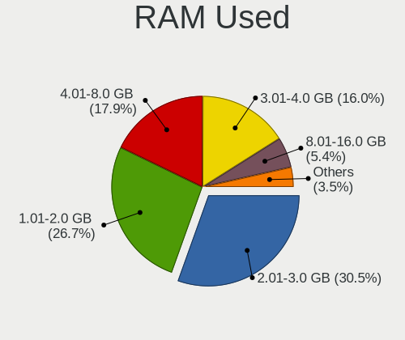
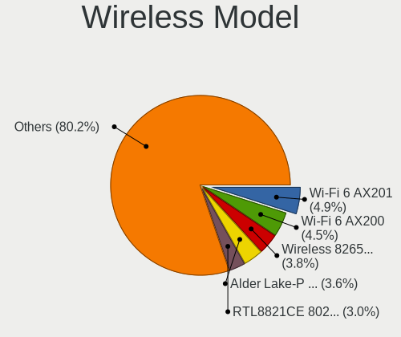
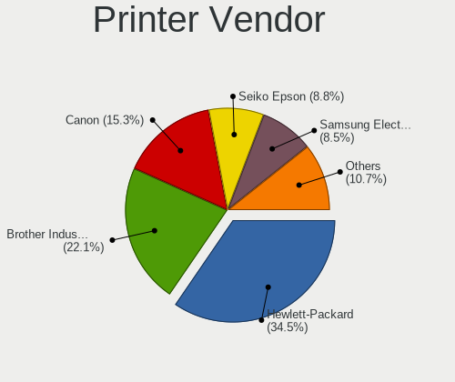

Ubuntu 22.04 - Tested Hardware & Statistics
-------------------------------------------

A project to collect tested hardware configurations for Ubuntu 22.04.

Anyone can contribute to this report by the [hw-probe](https://github.com/linuxhw/hw-probe) tool:

    sudo -E hw-probe -all -upload

Please contribute! Especially if your hardware is rare.

This is a report for all computer types. See also reports for [desktops](/Dist/Ubuntu_22.04/Desktop/README.md) and [notebooks](/Dist/Ubuntu_22.04/Notebook/README.md).

Contents
--------

* [ Test Cases ](#test-cases)

* [ System ](#system)
  - [ Kernel                   ](#kernel)
  - [ Kernel Family            ](#kernel-family)
  - [ Kernel Major Ver.        ](#kernel-major-ver)
  - [ Arch                     ](#arch)
  - [ DE                       ](#de)
  - [ Display Server           ](#display-server)
  - [ Display Manager          ](#display-manager)
  - [ OS Lang                  ](#os-lang)
  - [ Boot Mode                ](#boot-mode)
  - [ Filesystem               ](#filesystem)
  - [ Part. scheme             ](#part-scheme)
  - [ Dual Boot with Linux/BSD ](#dual-boot-with-linuxbsd)
  - [ Dual Boot (Win)          ](#dual-boot-win)

* [ Board ](#board)
  - [ Vendor                   ](#vendor)
  - [ Model                    ](#model)
  - [ Model Family             ](#model-family)
  - [ MFG Year                 ](#mfg-year)
  - [ Form Factor              ](#form-factor)
  - [ Secure Boot              ](#secure-boot)
  - [ Coreboot                 ](#coreboot)
  - [ RAM Size                 ](#ram-size)
  - [ RAM Used                 ](#ram-used)
  - [ Total Drives             ](#total-drives)
  - [ Has CD-ROM               ](#has-cd-rom)
  - [ Has Ethernet             ](#has-ethernet)
  - [ Has WiFi                 ](#has-wifi)
  - [ Has Bluetooth            ](#has-bluetooth)

* [ Location ](#location)
  - [ Country                  ](#country)
  - [ City                     ](#city)

* [ Drives ](#drives)
  - [ Drive Vendor             ](#drive-vendor)
  - [ Drive Model              ](#drive-model)
  - [ HDD Vendor               ](#hdd-vendor)
  - [ SSD Vendor               ](#ssd-vendor)
  - [ Drive Kind               ](#drive-kind)
  - [ Drive Connector          ](#drive-connector)
  - [ Drive Size               ](#drive-size)
  - [ Space Total              ](#space-total)
  - [ Space Used               ](#space-used)
  - [ Malfunc. Drives          ](#malfunc-drives)
  - [ Malfunc. Drive Vendor    ](#malfunc-drive-vendor)
  - [ Malfunc. HDD Vendor      ](#malfunc-hdd-vendor)
  - [ Malfunc. Drive Kind      ](#malfunc-drive-kind)
  - [ Failed Drives            ](#failed-drives)
  - [ Failed Drive Vendor      ](#failed-drive-vendor)
  - [ Drive Status             ](#drive-status)

* [ Storage controller ](#storage-controller)
  - [ Storage Vendor           ](#storage-vendor)
  - [ Storage Model            ](#storage-model)
  - [ Storage Kind             ](#storage-kind)

* [ Processor ](#processor)
  - [ CPU Vendor               ](#cpu-vendor)
  - [ CPU Model                ](#cpu-model)
  - [ CPU Model Family         ](#cpu-model-family)
  - [ CPU Cores                ](#cpu-cores)
  - [ CPU Sockets              ](#cpu-sockets)
  - [ CPU Threads              ](#cpu-threads)
  - [ CPU Op-Modes             ](#cpu-op-modes)
  - [ CPU Microcode            ](#cpu-microcode)
  - [ CPU Microarch            ](#cpu-microarch)

* [ Graphics ](#graphics)
  - [ GPU Vendor               ](#gpu-vendor)
  - [ GPU Model                ](#gpu-model)
  - [ GPU Combo                ](#gpu-combo)
  - [ GPU Driver               ](#gpu-driver)
  - [ GPU Memory               ](#gpu-memory)

* [ Monitor ](#monitor)
  - [ Monitor Vendor           ](#monitor-vendor)
  - [ Monitor Model            ](#monitor-model)
  - [ Monitor Resolution       ](#monitor-resolution)
  - [ Monitor Diagonal         ](#monitor-diagonal)
  - [ Monitor Width            ](#monitor-width)
  - [ Aspect Ratio             ](#aspect-ratio)
  - [ Monitor Area             ](#monitor-area)
  - [ Pixel Density            ](#pixel-density)
  - [ Multiple Monitors        ](#multiple-monitors)

* [ Network ](#network)
  - [ Net Controller Vendor    ](#net-controller-vendor)
  - [ Net Controller Model     ](#net-controller-model)
  - [ Wireless Vendor          ](#wireless-vendor)
  - [ Wireless Model           ](#wireless-model)
  - [ Ethernet Vendor          ](#ethernet-vendor)
  - [ Ethernet Model           ](#ethernet-model)
  - [ Net Controller Kind      ](#net-controller-kind)
  - [ Used Controller          ](#used-controller)
  - [ NICs                     ](#nics)
  - [ IPv6                     ](#ipv6)

* [ Bluetooth ](#bluetooth)
  - [ Bluetooth Vendor         ](#bluetooth-vendor)
  - [ Bluetooth Model          ](#bluetooth-model)

* [ Sound ](#sound)
  - [ Sound Vendor             ](#sound-vendor)
  - [ Sound Model              ](#sound-model)

* [ Memory ](#memory)
  - [ Memory Vendor            ](#memory-vendor)
  - [ Memory Model             ](#memory-model)
  - [ Memory Kind              ](#memory-kind)
  - [ Memory Form Factor       ](#memory-form-factor)
  - [ Memory Size              ](#memory-size)
  - [ Memory Speed             ](#memory-speed)

* [ Printers & scanners ](#printers--scanners)
  - [ Printer Vendor           ](#printer-vendor)
  - [ Printer Model            ](#printer-model)
  - [ Scanner Vendor           ](#scanner-vendor)
  - [ Scanner Model            ](#scanner-model)

* [ Camera ](#camera)
  - [ Camera Vendor            ](#camera-vendor)
  - [ Camera Model             ](#camera-model)

* [ Security ](#security)
  - [ Fingerprint Vendor       ](#fingerprint-vendor)
  - [ Fingerprint Model        ](#fingerprint-model)
  - [ Chipcard Vendor          ](#chipcard-vendor)
  - [ Chipcard Model           ](#chipcard-model)

* [ Unsupported ](#unsupported)
  - [ Unsupported Devices      ](#unsupported-devices)
  - [ Unsupported Device Types ](#unsupported-device-types)

Test Cases
----------

Total: 18218

| Vendor        | Model                       | Form-Factor | Probe                                                      | Date         |
|---------------|-----------------------------|-------------|------------------------------------------------------------|--------------|
| GMKtec        | NucBox K2                   | Desktop     | [a88d491579](https://linux-hardware.org/?probe=a88d491579) | Nov 06, 2023 |
| Lenovo        | Yoga 7 14ITL5 82BH          | Convertible | [27b2ce4d8c](https://linux-hardware.org/?probe=27b2ce4d8c) | Nov 06, 2023 |
| HP            | EliteBook 840 G5            | Notebook    | [279ac4ed92](https://linux-hardware.org/?probe=279ac4ed92) | Nov 06, 2023 |
| Gigabyte      | Z390 AORUS PRO WIFI-CF      | Desktop     | [cee650aa5a](https://linux-hardware.org/?probe=cee650aa5a) | Nov 06, 2023 |
| HP            | Spectre Pro x360 G2         | Convertible | [de099b29d0](https://linux-hardware.org/?probe=de099b29d0) | Nov 06, 2023 |
| Dell          | OptiPlex 5050               | Desktop     | [6c4a08354b](https://linux-hardware.org/?probe=6c4a08354b) | Nov 06, 2023 |
| TUXEDO        | Pulse 15 Gen2               | Notebook    | [10f2785958](https://linux-hardware.org/?probe=10f2785958) | Nov 06, 2023 |
| Lenovo        | ThinkPad T440s 20ARS0HB0... | Notebook    | [95376bfed1](https://linux-hardware.org/?probe=95376bfed1) | Nov 06, 2023 |
| MSI           | B560M PRO-E                 | Desktop     | [89a24ae9fa](https://linux-hardware.org/?probe=89a24ae9fa) | Nov 06, 2023 |
| ASUSTek       | SABERTOOTH X79              | Desktop     | [c46040087a](https://linux-hardware.org/?probe=c46040087a) | Nov 06, 2023 |
| Shuttle       | XS35V3                      | Desktop     | [0c51d541de](https://linux-hardware.org/?probe=0c51d541de) | Nov 06, 2023 |
| Apple         | Mac-942B59F58194171B iMa... | All in one  | [17dda27251](https://linux-hardware.org/?probe=17dda27251) | Nov 06, 2023 |
| HP            | 83D0                        | Mini pc     | [4f947ffed7](https://linux-hardware.org/?probe=4f947ffed7) | Nov 05, 2023 |
| Lenovo        | ThinkPad T460s 20FAS2430... | Notebook    | [658d6f150e](https://linux-hardware.org/?probe=658d6f150e) | Nov 05, 2023 |
| Dell          | Latitude 5590               | Notebook    | [913308d97b](https://linux-hardware.org/?probe=913308d97b) | Nov 05, 2023 |
| ASUSTek       | P30AD                       | Desktop     | [63322c386f](https://linux-hardware.org/?probe=63322c386f) | Nov 05, 2023 |
| Toshiba       | PORTEGE Z10t-A              | Notebook    | [600445b726](https://linux-hardware.org/?probe=600445b726) | Nov 05, 2023 |
| HP            | 2B05                        | Desktop     | [eb343bd373](https://linux-hardware.org/?probe=eb343bd373) | Nov 05, 2023 |
| Lenovo        | IdeaPad 1 11IGL05 81VT      | Notebook    | [27923cd021](https://linux-hardware.org/?probe=27923cd021) | Nov 05, 2023 |
| Gigabyte      | B250M-DS3H-CF               | Desktop     | [25b39b698c](https://linux-hardware.org/?probe=25b39b698c) | Nov 05, 2023 |
| Dell          | 0JCTF8 A00                  | Desktop     | [b3669f73a8](https://linux-hardware.org/?probe=b3669f73a8) | Nov 05, 2023 |
| MSI           | MAG X670E TOMAHAWK WIFI     | Desktop     | [d95f04dd2c](https://linux-hardware.org/?probe=d95f04dd2c) | Nov 05, 2023 |
| HP            | 1495                        | Desktop     | [fe18b89530](https://linux-hardware.org/?probe=fe18b89530) | Nov 05, 2023 |
| ASUSTek       | K401UB                      | Notebook    | [3bc894aa34](https://linux-hardware.org/?probe=3bc894aa34) | Nov 05, 2023 |
| ASUSTek       | PRIME X470-PRO              | Desktop     | [692601dd3b](https://linux-hardware.org/?probe=692601dd3b) | Nov 05, 2023 |
| MSI           | MEG Z590 UNIFY              | Desktop     | [1f84fe45f8](https://linux-hardware.org/?probe=1f84fe45f8) | Nov 05, 2023 |
| Dell          | 0WMJ54 A01                  | Desktop     | [5cff6ffdfc](https://linux-hardware.org/?probe=5cff6ffdfc) | Nov 05, 2023 |
| Dell          | Latitude E6400              | Notebook    | [c5f0762ae5](https://linux-hardware.org/?probe=c5f0762ae5) | Nov 05, 2023 |
| MSI           | NIGHTBLADE Z97              | Desktop     | [3da62b47b3](https://linux-hardware.org/?probe=3da62b47b3) | Nov 05, 2023 |
| Gigabyte      | B450M GAMING-CF             | Desktop     | [247cc16161](https://linux-hardware.org/?probe=247cc16161) | Nov 05, 2023 |
| HP            | ProBook 4740s               | Notebook    | [2efc1092dd](https://linux-hardware.org/?probe=2efc1092dd) | Nov 05, 2023 |
| HP            | ProBook 4740s               | Notebook    | [0351f35099](https://linux-hardware.org/?probe=0351f35099) | Nov 05, 2023 |
| ASUSTek       | P5G41T-M LX2/GB             | Desktop     | [5196f9303d](https://linux-hardware.org/?probe=5196f9303d) | Nov 05, 2023 |
| ASUSTek       | P5Q-PRO                     | Desktop     | [a1500e2e9c](https://linux-hardware.org/?probe=a1500e2e9c) | Nov 05, 2023 |
| Acer          | Aspire ES1-311              | Notebook    | [d06185f74c](https://linux-hardware.org/?probe=d06185f74c) | Nov 05, 2023 |
| HP            | 250 G5 Notebook PC          | Notebook    | [7b281cb925](https://linux-hardware.org/?probe=7b281cb925) | Nov 05, 2023 |
| Dell          | 062TCH A00                  | Desktop     | [b82fbd03d5](https://linux-hardware.org/?probe=b82fbd03d5) | Nov 05, 2023 |
| Lenovo        | ThinkPad T470s W10DG 20J... | Notebook    | [ae9fcece31](https://linux-hardware.org/?probe=ae9fcece31) | Nov 05, 2023 |
| HP            | ENVY x360 Convertible 13... | Convertible | [ea37beb412](https://linux-hardware.org/?probe=ea37beb412) | Nov 05, 2023 |
| ASUSTek       | K55VJ                       | Notebook    | [47851a05e9](https://linux-hardware.org/?probe=47851a05e9) | Nov 05, 2023 |
| MSI           | Alpha 17 C7VG               | Notebook    | [fd9594de89](https://linux-hardware.org/?probe=fd9594de89) | Nov 05, 2023 |
| Google        | Pyro                        | Notebook    | [2fd8f11a53](https://linux-hardware.org/?probe=2fd8f11a53) | Nov 05, 2023 |
| ASUSTek       | X756UVK                     | Notebook    | [3ba2cc1e0c](https://linux-hardware.org/?probe=3ba2cc1e0c) | Nov 05, 2023 |
| Apple         | MacBookAir7,1               | Notebook    | [23e52fc4f5](https://linux-hardware.org/?probe=23e52fc4f5) | Nov 05, 2023 |
| Dell          | 03X6X0 A06                  | Server      | [90b61e75ba](https://linux-hardware.org/?probe=90b61e75ba) | Nov 05, 2023 |
| Lenovo        | ThinkPad E580 20KS003QUS    | Notebook    | [6bccd355f7](https://linux-hardware.org/?probe=6bccd355f7) | Nov 05, 2023 |
| Medion        | E6417 MD99252               | Notebook    | [8660ae1c16](https://linux-hardware.org/?probe=8660ae1c16) | Nov 05, 2023 |
| MSI           | Alpha 17 C7VG               | Notebook    | [a5a8cf5c09](https://linux-hardware.org/?probe=a5a8cf5c09) | Nov 05, 2023 |
| MSI           | Alpha 17 C7VG               | Notebook    | [74099b3a6e](https://linux-hardware.org/?probe=74099b3a6e) | Nov 05, 2023 |
| Gigabyte      | Z97M-DS3H                   | Desktop     | [2cbd472a6e](https://linux-hardware.org/?probe=2cbd472a6e) | Nov 05, 2023 |
| MSI           | Alpha 17 C7VG               | Notebook    | [bdad71bf99](https://linux-hardware.org/?probe=bdad71bf99) | Nov 05, 2023 |
| Trigkey       | S5 V2.0                     | Mini pc     | [dc066ab76b](https://linux-hardware.org/?probe=dc066ab76b) | Nov 05, 2023 |
| HP            | 829A                        | Mini pc     | [34b672080f](https://linux-hardware.org/?probe=34b672080f) | Nov 05, 2023 |
| HP            | 829A                        | Mini pc     | [03af1f506e](https://linux-hardware.org/?probe=03af1f506e) | Nov 05, 2023 |
| HP            | Pavilion Laptop 15-eh0xx... | Notebook    | [7a8597dd50](https://linux-hardware.org/?probe=7a8597dd50) | Nov 05, 2023 |
| Dell          | Inspiron 14 5401            | Notebook    | [124c666940](https://linux-hardware.org/?probe=124c666940) | Nov 05, 2023 |
| Dell          | Inspiron 14 5401            | Notebook    | [9eeeda059e](https://linux-hardware.org/?probe=9eeeda059e) | Nov 05, 2023 |
| Microsoft     | Surface Go 3                | Tablet      | [d20af6bf95](https://linux-hardware.org/?probe=d20af6bf95) | Nov 05, 2023 |
| Acer          | Aspire A517-51G             | Notebook    | [11f85eb258](https://linux-hardware.org/?probe=11f85eb258) | Nov 04, 2023 |
| Acer          | Aspire 7750G                | Notebook    | [ddf88ff37c](https://linux-hardware.org/?probe=ddf88ff37c) | Nov 04, 2023 |
| Medion        | H110H4-EM                   | Desktop     | [9fe03aa296](https://linux-hardware.org/?probe=9fe03aa296) | Nov 04, 2023 |
| Dell          | XPS 13 9315 2-in-1          | Tablet      | [79016d8b5e](https://linux-hardware.org/?probe=79016d8b5e) | Nov 04, 2023 |
| Apple         | Mac-B809C3757DA9BB8D iMa... | All in one  | [64b26f1390](https://linux-hardware.org/?probe=64b26f1390) | Nov 04, 2023 |
| Lenovo        | ThinkPad E15 20RD0011UK     | Notebook    | [dc13d6012b](https://linux-hardware.org/?probe=dc13d6012b) | Nov 04, 2023 |
| ASUSTek       | ROG Strix G733QR_G733QR     | Notebook    | [5b7dc65a39](https://linux-hardware.org/?probe=5b7dc65a39) | Nov 04, 2023 |
| Acer          | TravelMate B118-M           | Notebook    | [051346666e](https://linux-hardware.org/?probe=051346666e) | Nov 04, 2023 |
| ASUSTek       | PRIME X470-PRO              | Desktop     | [c1523fb6a1](https://linux-hardware.org/?probe=c1523fb6a1) | Nov 04, 2023 |
| Acer          | TravelMate P215-54          | Notebook    | [5688b7940d](https://linux-hardware.org/?probe=5688b7940d) | Nov 04, 2023 |
| ASRock        | H470M-STX                   | Desktop     | [5a50d371b8](https://linux-hardware.org/?probe=5a50d371b8) | Nov 04, 2023 |
| Lenovo        | ThinkPad T550 20CJS07P01    | Notebook    | [52157a4ee8](https://linux-hardware.org/?probe=52157a4ee8) | Nov 04, 2023 |
| Acer          | TravelMate P215-54          | Notebook    | [f051dc617c](https://linux-hardware.org/?probe=f051dc617c) | Nov 04, 2023 |
| ASUSTek       | VivoBook_ASUSLaptop X415... | Notebook    | [aba7da7a37](https://linux-hardware.org/?probe=aba7da7a37) | Nov 04, 2023 |
| Lenovo        | Yoga 9 14IAP7 82LU          | Convertible | [e1c8a14f2a](https://linux-hardware.org/?probe=e1c8a14f2a) | Nov 04, 2023 |
| HP            | 15                          | Notebook    | [5d5fb36764](https://linux-hardware.org/?probe=5d5fb36764) | Nov 04, 2023 |
| FriendlyEl... | NanoPC-T6                   | Soc         | [7a75d5ed73](https://linux-hardware.org/?probe=7a75d5ed73) | Nov 04, 2023 |
| Gigabyte      | GA-MA78LMT-S2               | Desktop     | [1636a231b2](https://linux-hardware.org/?probe=1636a231b2) | Nov 04, 2023 |
| Dell          | Latitude E6420              | Notebook    | [6bd73f2b0e](https://linux-hardware.org/?probe=6bd73f2b0e) | Nov 04, 2023 |
| HP            | EliteBook 840 G6            | Notebook    | [d4b22ac16a](https://linux-hardware.org/?probe=d4b22ac16a) | Nov 04, 2023 |
| Lenovo        | ThinkPad T61 6460D6G        | Notebook    | [1d51aba71e](https://linux-hardware.org/?probe=1d51aba71e) | Nov 04, 2023 |
| HP            | ZBook Studio G3             | Notebook    | [eb90a23afa](https://linux-hardware.org/?probe=eb90a23afa) | Nov 04, 2023 |
| Lenovo        | ThinkPad T61 6460D6G        | Notebook    | [585906fa27](https://linux-hardware.org/?probe=585906fa27) | Nov 04, 2023 |
| HP            | 0A9Ch                       | Desktop     | [95415dec13](https://linux-hardware.org/?probe=95415dec13) | Nov 04, 2023 |
| American M... | A6                          | Notebook    | [4ff43d7d31](https://linux-hardware.org/?probe=4ff43d7d31) | Nov 04, 2023 |
| ASUSTek       | M5A97 R2.0                  | Desktop     | [905d699d4d](https://linux-hardware.org/?probe=905d699d4d) | Nov 04, 2023 |
| Acer          | Aspire A314-23P             | Notebook    | [1e3cdf0bf2](https://linux-hardware.org/?probe=1e3cdf0bf2) | Nov 04, 2023 |
| Dell          | 062TCH A00                  | Desktop     | [b964b2c6be](https://linux-hardware.org/?probe=b964b2c6be) | Nov 04, 2023 |
| ASUSTek       | PRIME H510M-E               | Desktop     | [cd2b005e61](https://linux-hardware.org/?probe=cd2b005e61) | Nov 04, 2023 |
| Dell          | 018D1Y A00                  | Desktop     | [2135015e09](https://linux-hardware.org/?probe=2135015e09) | Nov 04, 2023 |
| Dell          | XPS 15 7590                 | Notebook    | [8685e384af](https://linux-hardware.org/?probe=8685e384af) | Nov 04, 2023 |
| Dell          | Inspiron N4010              | Notebook    | [f8aed4abab](https://linux-hardware.org/?probe=f8aed4abab) | Nov 03, 2023 |
| ASUSTek       | ROG Flow X13 GV301QH_GV3... | Notebook    | [de4c3bfe46](https://linux-hardware.org/?probe=de4c3bfe46) | Nov 03, 2023 |
| Intel         | DG41RQ AAE54511-203         | Desktop     | [dff06d88c5](https://linux-hardware.org/?probe=dff06d88c5) | Nov 03, 2023 |
| Supermicro    | X9DRW                       | Desktop     | [d9bb198389](https://linux-hardware.org/?probe=d9bb198389) | Nov 03, 2023 |
| Lenovo        | ThinkPad T460p 20FXS0960... | Notebook    | [10407542ab](https://linux-hardware.org/?probe=10407542ab) | Nov 03, 2023 |
| Lenovo        | B560 433028U                | Notebook    | [37a6693c3d](https://linux-hardware.org/?probe=37a6693c3d) | Nov 03, 2023 |
| HUAWEI        | MRGFG-XX                    | Notebook    | [5117a849b3](https://linux-hardware.org/?probe=5117a849b3) | Nov 03, 2023 |
| HUAWEI        | HLYL-WXX9                   | Notebook    | [993a2b9f3e](https://linux-hardware.org/?probe=993a2b9f3e) | Nov 03, 2023 |
| Supermicro    | X8DTU                       | Server      | [17ea09c2b2](https://linux-hardware.org/?probe=17ea09c2b2) | Nov 03, 2023 |
| Supermicro    | X10DRL-i                    | Desktop     | [cada5224ab](https://linux-hardware.org/?probe=cada5224ab) | Nov 03, 2023 |
| Medion        | ERAZER X7855 MD60892        | Notebook    | [b34c69b29d](https://linux-hardware.org/?probe=b34c69b29d) | Nov 03, 2023 |
| HP            | Spectre Folio Convertibl... | Convertible | [aa5a6d3348](https://linux-hardware.org/?probe=aa5a6d3348) | Nov 03, 2023 |
| Lenovo        | ThinkPad X1 Fold Gen 1 2... | Tablet      | [a06677f6ea](https://linux-hardware.org/?probe=a06677f6ea) | Nov 03, 2023 |
| Lenovo        | ThinkPad X1 Fold Gen 1 2... | Tablet      | [d8c90f446f](https://linux-hardware.org/?probe=d8c90f446f) | Nov 03, 2023 |
| ETegro Tec... | ETRS125G4 31S2MMB0040       | Server      | [5085991741](https://linux-hardware.org/?probe=5085991741) | Nov 03, 2023 |
| Supermicro    | X8DTU                       | Server      | [1e45f05458](https://linux-hardware.org/?probe=1e45f05458) | Nov 03, 2023 |
| Supermicro    | X8DTU                       | Server      | [330f475535](https://linux-hardware.org/?probe=330f475535) | Nov 03, 2023 |
| Colorful T... | CVN X570M GAMING PRO V14    | Desktop     | [65b9bad459](https://linux-hardware.org/?probe=65b9bad459) | Nov 03, 2023 |
| Dell          | Latitude E5570              | Notebook    | [a4617a2ea3](https://linux-hardware.org/?probe=a4617a2ea3) | Nov 03, 2023 |
| Lenovo        | Yoga 530-14IKB 81EK         | Convertible | [5339cc53ed](https://linux-hardware.org/?probe=5339cc53ed) | Nov 03, 2023 |
| Dell          | Precision 5750              | Notebook    | [00e8468779](https://linux-hardware.org/?probe=00e8468779) | Nov 03, 2023 |
| Dell          | Latitude E5570              | Notebook    | [82d66aaaf1](https://linux-hardware.org/?probe=82d66aaaf1) | Nov 03, 2023 |
| Intel         | X99                         | Desktop     | [cb3515efba](https://linux-hardware.org/?probe=cb3515efba) | Nov 03, 2023 |
| Lenovo        | ThinkPad 11e 5th Gen 20L... | Notebook    | [fca8401d97](https://linux-hardware.org/?probe=fca8401d97) | Nov 03, 2023 |
| HP            | EliteBook 845 14 inch G9... | Notebook    | [5ff77430fa](https://linux-hardware.org/?probe=5ff77430fa) | Nov 03, 2023 |
| Dell          | 0TDG4V A01                  | Desktop     | [9d9b09db51](https://linux-hardware.org/?probe=9d9b09db51) | Nov 03, 2023 |
| Apple         | Mac-F65AE981FFA204ED Mac... | Mini pc     | [4933bbb7ac](https://linux-hardware.org/?probe=4933bbb7ac) | Nov 03, 2023 |
| MSI           | B350 PC MATE                | Desktop     | [9c089ed10c](https://linux-hardware.org/?probe=9c089ed10c) | Nov 03, 2023 |
| Supermicro    | X10DRU-i+B                  | Desktop     | [305ce5bbcc](https://linux-hardware.org/?probe=305ce5bbcc) | Nov 03, 2023 |
| Supermicro    | X10DDW-i                    | Desktop     | [8a0ff875f1](https://linux-hardware.org/?probe=8a0ff875f1) | Nov 03, 2023 |
| Supermicro    | X10DDW-i                    | Desktop     | [3138fbde8e](https://linux-hardware.org/?probe=3138fbde8e) | Nov 03, 2023 |
| Supermicro    | X10DDW-i                    | Desktop     | [f3023a2a6f](https://linux-hardware.org/?probe=f3023a2a6f) | Nov 03, 2023 |
| Supermicro    | X10DDW-i                    | Desktop     | [d9dcb6003e](https://linux-hardware.org/?probe=d9dcb6003e) | Nov 03, 2023 |
| HP            | ProBook 445 G7              | Notebook    | [400a0e689f](https://linux-hardware.org/?probe=400a0e689f) | Nov 03, 2023 |
| HP            | ProBook 4330s               | Notebook    | [046f30b044](https://linux-hardware.org/?probe=046f30b044) | Nov 03, 2023 |
| Dell          | Inspiron 15-7568            | Notebook    | [70b564a0db](https://linux-hardware.org/?probe=70b564a0db) | Nov 03, 2023 |
| Dell          | 05KX61 A02                  | Server      | [e74ef17929](https://linux-hardware.org/?probe=e74ef17929) | Nov 03, 2023 |
| Dell          | 05KX61 A02                  | Server      | [3ccea24165](https://linux-hardware.org/?probe=3ccea24165) | Nov 03, 2023 |
| NEC Comput... | MS-7770MH                   | Desktop     | [9d2ab645d4](https://linux-hardware.org/?probe=9d2ab645d4) | Nov 03, 2023 |
| Lenovo        | ThinkPad E14 Gen 2 20TB0... | Notebook    | [6987861086](https://linux-hardware.org/?probe=6987861086) | Nov 03, 2023 |
| HP            | ZBook Power G7 Mobile Wo... | Notebook    | [044aa1f9b5](https://linux-hardware.org/?probe=044aa1f9b5) | Nov 03, 2023 |
| Dell          | 09T7VV A05                  | Server      | [8d5ae6e4de](https://linux-hardware.org/?probe=8d5ae6e4de) | Nov 03, 2023 |
| Fujitsu Si... | G31T-M2 V3.02               | Desktop     | [d069c6012d](https://linux-hardware.org/?probe=d069c6012d) | Nov 03, 2023 |
| Apple         | MacBookAir7,1               | Notebook    | [50cb167f37](https://linux-hardware.org/?probe=50cb167f37) | Nov 03, 2023 |
| ASUSTek       | Z97M-PLUS                   | Desktop     | [b0d77e36b1](https://linux-hardware.org/?probe=b0d77e36b1) | Nov 03, 2023 |
| ASRock        | B450M Steel Legend          | Desktop     | [dafce26ef5](https://linux-hardware.org/?probe=dafce26ef5) | Nov 02, 2023 |
| ASUSTek       | VivoBook_ASUSLaptop M150... | Notebook    | [4b04b9ef25](https://linux-hardware.org/?probe=4b04b9ef25) | Nov 02, 2023 |
| Dell          | 0VHWTR A01                  | Desktop     | [7d589af687](https://linux-hardware.org/?probe=7d589af687) | Nov 02, 2023 |
| Dell          | 0VHWTR A01                  | Desktop     | [b5c8e35523](https://linux-hardware.org/?probe=b5c8e35523) | Nov 02, 2023 |
| Lenovo        | 314D SDK0J40697 WIN 3305... | Mini pc     | [e74d5a77e4](https://linux-hardware.org/?probe=e74d5a77e4) | Nov 02, 2023 |
| ASUSTek       | P5KPL-AM SE                 | Desktop     | [ea92d94742](https://linux-hardware.org/?probe=ea92d94742) | Nov 02, 2023 |
| HP            | ProBook 4330s               | Notebook    | [0d3ba579b4](https://linux-hardware.org/?probe=0d3ba579b4) | Nov 02, 2023 |
| ASUSTek       | TUF Gaming Z690-PLUS        | Desktop     | [99b1ce4372](https://linux-hardware.org/?probe=99b1ce4372) | Nov 02, 2023 |
| Lenovo        | 31A7 SDK0K17763 WIN 1801... | Mini pc     | [4291eb9ffb](https://linux-hardware.org/?probe=4291eb9ffb) | Nov 02, 2023 |
| Lenovo        | 31A7 SDK0K17763 WIN 1801... | Mini pc     | [b616f22a15](https://linux-hardware.org/?probe=b616f22a15) | Nov 02, 2023 |
| Lenovo        | IdeaPad 3 15ITL6 82H8       | Notebook    | [b724ede64d](https://linux-hardware.org/?probe=b724ede64d) | Nov 02, 2023 |
| Lenovo        | ThinkPad L540 20AUS0YU00    | Notebook    | [16b302d74a](https://linux-hardware.org/?probe=16b302d74a) | Nov 02, 2023 |
| Acer          | Nitro N50-600 V:1.1         | Desktop     | [b2c5bb3ed9](https://linux-hardware.org/?probe=b2c5bb3ed9) | Nov 02, 2023 |
| Dell          | Latitude E6530              | Notebook    | [878bc8ec66](https://linux-hardware.org/?probe=878bc8ec66) | Nov 02, 2023 |
| HP            | EliteBook 840 G5            | Notebook    | [a42017f05d](https://linux-hardware.org/?probe=a42017f05d) | Nov 02, 2023 |
| Gigabyte      | X570 AORUS PRO WIFI         | Desktop     | [bf075c47d2](https://linux-hardware.org/?probe=bf075c47d2) | Nov 02, 2023 |
| HP            | Laptop 15-bw0xx             | Notebook    | [589f0a0dfb](https://linux-hardware.org/?probe=589f0a0dfb) | Nov 02, 2023 |
| ASUSTek       | VivoBook_ASUSLaptop M140... | Notebook    | [f1b74562ae](https://linux-hardware.org/?probe=f1b74562ae) | Nov 02, 2023 |
| HP            | 250 G6 Notebook PC          | Notebook    | [7184f1aadf](https://linux-hardware.org/?probe=7184f1aadf) | Nov 02, 2023 |
| Trigkey       | S5 V2.0                     | Mini pc     | [060ab6de51](https://linux-hardware.org/?probe=060ab6de51) | Nov 02, 2023 |
| Intel         | X99                         | Desktop     | [b740510fc0](https://linux-hardware.org/?probe=b740510fc0) | Nov 02, 2023 |
| Supermicro    | X10DRU-i+A                  | Desktop     | [2eee634512](https://linux-hardware.org/?probe=2eee634512) | Nov 02, 2023 |
| Dell          | 08GXHX A06                  | Server      | [ab921499fa](https://linux-hardware.org/?probe=ab921499fa) | Nov 02, 2023 |
| Supermicro    | X8DTL                       | Server      | [c5807873e9](https://linux-hardware.org/?probe=c5807873e9) | Nov 02, 2023 |
| Supermicro    | X9DRW                       | Server      | [0671c88229](https://linux-hardware.org/?probe=0671c88229) | Nov 02, 2023 |
| Supermicro    | X9DRW                       | Desktop     | [406a1425ae](https://linux-hardware.org/?probe=406a1425ae) | Nov 02, 2023 |
| Supermicro    | X9DRW                       | Server      | [0af6a802be](https://linux-hardware.org/?probe=0af6a802be) | Nov 02, 2023 |
| Supermicro    | X9DRW                       | Server      | [953f9bfc89](https://linux-hardware.org/?probe=953f9bfc89) | Nov 02, 2023 |
| Supermicro    | X9DRW                       | Server      | [99fa7a1e00](https://linux-hardware.org/?probe=99fa7a1e00) | Nov 02, 2023 |
| HP            | ProLiant DL360 Gen9         | Server      | [dfb50aae8c](https://linux-hardware.org/?probe=dfb50aae8c) | Nov 02, 2023 |
| HP            | ProLiant DL360 Gen9         | Server      | [8b8de4d7d0](https://linux-hardware.org/?probe=8b8de4d7d0) | Nov 02, 2023 |
| HP            | ProLiant DL360 Gen9         | Server      | [66e431538c](https://linux-hardware.org/?probe=66e431538c) | Nov 02, 2023 |
| Supermicro    | X10DRL-i                    | Desktop     | [7d77c86bc5](https://linux-hardware.org/?probe=7d77c86bc5) | Nov 02, 2023 |
| Supermicro    | X10DRU-i+                   | Server      | [3a754d74f3](https://linux-hardware.org/?probe=3a754d74f3) | Nov 02, 2023 |
| HP            | ProLiant DL360 Gen9         | Server      | [220bd2a6e2](https://linux-hardware.org/?probe=220bd2a6e2) | Nov 02, 2023 |
| HP            | ProLiant DL360 Gen9         | Server      | [6d4d2cc667](https://linux-hardware.org/?probe=6d4d2cc667) | Nov 02, 2023 |
| Supermicro    | X9DRW                       | Server      | [c99b1358ee](https://linux-hardware.org/?probe=c99b1358ee) | Nov 02, 2023 |
| Supermicro    | X10DRU-i+                   | Server      | [a5260e3398](https://linux-hardware.org/?probe=a5260e3398) | Nov 02, 2023 |
| Supermicro    | X10DRiB                     | Server      | [d164bb48fa](https://linux-hardware.org/?probe=d164bb48fa) | Nov 02, 2023 |
| Supermicro    | X10DRiB                     | Server      | [788451e4cd](https://linux-hardware.org/?probe=788451e4cd) | Nov 02, 2023 |
| Supermicro    | X10DRiB                     | Server      | [758d368461](https://linux-hardware.org/?probe=758d368461) | Nov 02, 2023 |
| Dell          | 0FXD80 A00                  | Desktop     | [d9b51a3a36](https://linux-hardware.org/?probe=d9b51a3a36) | Nov 02, 2023 |
| Trigkey       | S5 V2.0                     | Mini pc     | [79a0a0542b](https://linux-hardware.org/?probe=79a0a0542b) | Nov 02, 2023 |
| AOpen         | D2644 S26361-D2644          | Desktop     | [db682d636c](https://linux-hardware.org/?probe=db682d636c) | Nov 02, 2023 |
| Lenovo        | 318D                        | All in one  | [9936941c90](https://linux-hardware.org/?probe=9936941c90) | Nov 02, 2023 |
| HP            | Laptop 15-dw3xxx            | Notebook    | [d371b7299d](https://linux-hardware.org/?probe=d371b7299d) | Nov 02, 2023 |
| Lenovo        | Legion 5 Pro 16ACH6H 82J... | Notebook    | [2d1120d99a](https://linux-hardware.org/?probe=2d1120d99a) | Nov 02, 2023 |
| Lenovo        | 318D                        | All in one  | [2774838df7](https://linux-hardware.org/?probe=2774838df7) | Nov 02, 2023 |
| Dell          | 0WPG9H A00                  | All in one  | [30565eabec](https://linux-hardware.org/?probe=30565eabec) | Nov 02, 2023 |
| Lenovo        | ThinkPad E14 20RAS13J00     | Notebook    | [ebfdc934b7](https://linux-hardware.org/?probe=ebfdc934b7) | Nov 02, 2023 |
| Dell          | XPS 13 9300                 | Notebook    | [9690e7a65f](https://linux-hardware.org/?probe=9690e7a65f) | Nov 02, 2023 |
| Lenovo        | ThinkPad X250 20CLS45J00    | Notebook    | [c03ae6e6b0](https://linux-hardware.org/?probe=c03ae6e6b0) | Nov 02, 2023 |
| Lenovo        | ThinkPad T15 Gen 2i 20W4... | Notebook    | [37dc32cd03](https://linux-hardware.org/?probe=37dc32cd03) | Nov 02, 2023 |
| ASUSTek       | ZenBook UX325EA_UX325EA     | Notebook    | [027a0a96da](https://linux-hardware.org/?probe=027a0a96da) | Nov 02, 2023 |
| BESSTAR Te... | TH50                        | Desktop     | [fc3a35871e](https://linux-hardware.org/?probe=fc3a35871e) | Nov 02, 2023 |
| ASUSTek       | X555LAB                     | Notebook    | [b9532c1f86](https://linux-hardware.org/?probe=b9532c1f86) | Nov 02, 2023 |
| HP            | ENVY x360 Convertible 13... | Convertible | [ca1b93a5ca](https://linux-hardware.org/?probe=ca1b93a5ca) | Nov 02, 2023 |
| Google        | Nightfury                   | Notebook    | [ccee94a0ec](https://linux-hardware.org/?probe=ccee94a0ec) | Nov 02, 2023 |
| MSI           | Z170A GAMING M7             | Desktop     | [9ba4f50201](https://linux-hardware.org/?probe=9ba4f50201) | Nov 02, 2023 |
| ASUSTek       | ASUS TUF Gaming A15 FA50... | Notebook    | [0c83d1e765](https://linux-hardware.org/?probe=0c83d1e765) | Nov 02, 2023 |
| Acer          | One S1002                   | Notebook    | [a00e6d78a6](https://linux-hardware.org/?probe=a00e6d78a6) | Nov 02, 2023 |
| Dell          | 0CNCJW A08                  | Server      | [c166457131](https://linux-hardware.org/?probe=c166457131) | Nov 02, 2023 |
| Apple         | MacBookPro16,1              | Notebook    | [3c2964c23f](https://linux-hardware.org/?probe=3c2964c23f) | Nov 02, 2023 |
| ASUSTek       | PRIME A320M-K               | Desktop     | [1b1df273f9](https://linux-hardware.org/?probe=1b1df273f9) | Nov 01, 2023 |
| Lenovo        | IdeaPad 320-15IKB 81BG      | Notebook    | [99992393e4](https://linux-hardware.org/?probe=99992393e4) | Nov 01, 2023 |
| MSI           | A320M-A PRO MAX             | Desktop     | [f1e35faa1a](https://linux-hardware.org/?probe=f1e35faa1a) | Nov 01, 2023 |
| Novatech      | C141EK5-CI5TX               | Notebook    | [ee65041e06](https://linux-hardware.org/?probe=ee65041e06) | Nov 01, 2023 |
| HP            | Pavilion Gaming Laptop 1... | Notebook    | [54516fba78](https://linux-hardware.org/?probe=54516fba78) | Nov 01, 2023 |
| MSI           | Z170A GAMING M7             | Desktop     | [a613aa5a0f](https://linux-hardware.org/?probe=a613aa5a0f) | Nov 01, 2023 |
| HP            | Notebook                    | Notebook    | [3e766ed947](https://linux-hardware.org/?probe=3e766ed947) | Nov 01, 2023 |
| Sony          | VGN-CS21S_R                 | Notebook    | [a7eb8de9f5](https://linux-hardware.org/?probe=a7eb8de9f5) | Nov 01, 2023 |
| ASRock        | Z690 Taichi                 | Desktop     | [b736058f88](https://linux-hardware.org/?probe=b736058f88) | Nov 01, 2023 |
| HP            | ZBook 15u G6                | Notebook    | [b74e35da2b](https://linux-hardware.org/?probe=b74e35da2b) | Nov 01, 2023 |
| ASUSTek       | VivoBook_ASUSLaptop M650... | Notebook    | [0c8b2cd660](https://linux-hardware.org/?probe=0c8b2cd660) | Nov 01, 2023 |
| HP            | Notebook                    | Notebook    | [47c0e83dcc](https://linux-hardware.org/?probe=47c0e83dcc) | Nov 01, 2023 |
| HP            | 0A58h                       | Desktop     | [9dd3c3fdfb](https://linux-hardware.org/?probe=9dd3c3fdfb) | Nov 01, 2023 |
| ASUSTek       | TUF Z370-PLUS GAMING        | Desktop     | [70365949d8](https://linux-hardware.org/?probe=70365949d8) | Nov 01, 2023 |
| Apple         | MacBookPro8,1               | Notebook    | [f1387b3bd9](https://linux-hardware.org/?probe=f1387b3bd9) | Nov 01, 2023 |
| Lenovo        | IdeaPad S340-15API 81NC     | Notebook    | [af59fd3af9](https://linux-hardware.org/?probe=af59fd3af9) | Nov 01, 2023 |
| Google        | Akemi                       | Notebook    | [75082d5cf9](https://linux-hardware.org/?probe=75082d5cf9) | Nov 01, 2023 |
| ASUSTek       | ASUS EXPERTBOOK B9450FA_... | Notebook    | [ed95443390](https://linux-hardware.org/?probe=ed95443390) | Nov 01, 2023 |
| ASUSTek       | G53JW                       | Notebook    | [fcc18f3b68](https://linux-hardware.org/?probe=fcc18f3b68) | Nov 01, 2023 |
| VALE          | Notebook Classic C140       | Notebook    | [5be309c18b](https://linux-hardware.org/?probe=5be309c18b) | Nov 01, 2023 |
| Samsung       | 960XFH                      | Notebook    | [6076e144ac](https://linux-hardware.org/?probe=6076e144ac) | Nov 01, 2023 |
| Gigabyte      | Z370N WIFI-CF               | Desktop     | [1ab426a7ed](https://linux-hardware.org/?probe=1ab426a7ed) | Nov 01, 2023 |
| HP            | EliteBook 8470w             | Notebook    | [d4b6365e3f](https://linux-hardware.org/?probe=d4b6365e3f) | Nov 01, 2023 |
| Lenovo        | 3704 SDK0J40700 WIN 3258... | Desktop     | [3987d09af3](https://linux-hardware.org/?probe=3987d09af3) | Nov 01, 2023 |
| HP            | ProBook 4530s               | Notebook    | [eac8e65d32](https://linux-hardware.org/?probe=eac8e65d32) | Nov 01, 2023 |
| Dell          | Latitude 5480               | Notebook    | [567a2774f8](https://linux-hardware.org/?probe=567a2774f8) | Nov 01, 2023 |
| Lenovo        | ThinkPad T14s Gen 3 21BR... | Notebook    | [9422d2efb5](https://linux-hardware.org/?probe=9422d2efb5) | Nov 01, 2023 |
| ASUSTek       | Z97-AR                      | Desktop     | [39741158bc](https://linux-hardware.org/?probe=39741158bc) | Nov 01, 2023 |
| HP            | Spectre Folio Convertibl... | Convertible | [a795221369](https://linux-hardware.org/?probe=a795221369) | Nov 01, 2023 |
| Gateway       | FX6840                      | Desktop     | [3c391c7868](https://linux-hardware.org/?probe=3c391c7868) | Nov 01, 2023 |
| Lenovo        | ThinkPad P16s Gen 1 21BT... | Notebook    | [5d58dd522f](https://linux-hardware.org/?probe=5d58dd522f) | Nov 01, 2023 |
| ASUSTek       | PRIME A320M-K               | Desktop     | [4881df8aec](https://linux-hardware.org/?probe=4881df8aec) | Nov 01, 2023 |
| Dell          | Latitude 5421               | Notebook    | [670d635ddc](https://linux-hardware.org/?probe=670d635ddc) | Nov 01, 2023 |
| Teclast       | F6 Pro                      | Notebook    | [27dd740e4c](https://linux-hardware.org/?probe=27dd740e4c) | Nov 01, 2023 |
| ASUSTek       | Z170M-PLUS                  | Desktop     | [92b5f4172e](https://linux-hardware.org/?probe=92b5f4172e) | Nov 01, 2023 |
| Gigabyte      | AX370M-Gaming 3-CF          | Desktop     | [3e5415671f](https://linux-hardware.org/?probe=3e5415671f) | Nov 01, 2023 |
| Gigabyte      | A520M K V2                  | Desktop     | [10670f1068](https://linux-hardware.org/?probe=10670f1068) | Nov 01, 2023 |
| Microtech     | CoreBookLite                | Notebook    | [1833fd5f0c](https://linux-hardware.org/?probe=1833fd5f0c) | Nov 01, 2023 |
| HP            | Laptop 15-dw3xxx            | Notebook    | [3479b99099](https://linux-hardware.org/?probe=3479b99099) | Nov 01, 2023 |
| Medion        | E6417 MD99252               | Notebook    | [56fcf238a1](https://linux-hardware.org/?probe=56fcf238a1) | Nov 01, 2023 |
| Dell          | 09KPNV A01                  | Desktop     | [2477bc3b6a](https://linux-hardware.org/?probe=2477bc3b6a) | Nov 01, 2023 |
| ASUSTek       | ROG Flow X13 GV301QH_GV3... | Notebook    | [6efacfa5c8](https://linux-hardware.org/?probe=6efacfa5c8) | Nov 01, 2023 |
| ASUSTek       | PRIME B450M-A               | Desktop     | [8f885b5a65](https://linux-hardware.org/?probe=8f885b5a65) | Nov 01, 2023 |
| Dell          | G15 5510                    | Notebook    | [60ea93226d](https://linux-hardware.org/?probe=60ea93226d) | Nov 01, 2023 |
| Dell          | Inspiron 5502               | Notebook    | [a1d2f7988e](https://linux-hardware.org/?probe=a1d2f7988e) | Nov 01, 2023 |
| ASUSTek       | VivoBook_ASUSLaptop X512... | Notebook    | [3d00034c4e](https://linux-hardware.org/?probe=3d00034c4e) | Nov 01, 2023 |
| ASUSTek       | P8Z77-I DELUXE              | Desktop     | [ea285340e0](https://linux-hardware.org/?probe=ea285340e0) | Nov 01, 2023 |
| HP            | 15                          | Notebook    | [9bafa55125](https://linux-hardware.org/?probe=9bafa55125) | Nov 01, 2023 |
| IBM           | 00KF656                     | Server      | [babec64e24](https://linux-hardware.org/?probe=babec64e24) | Nov 01, 2023 |
| Apple         | MacBook9,1                  | Notebook    | [44cec57d44](https://linux-hardware.org/?probe=44cec57d44) | Nov 01, 2023 |
| Gigabyte      | GA-MA770-DS3                | Desktop     | [968cf90d9a](https://linux-hardware.org/?probe=968cf90d9a) | Nov 01, 2023 |
| HP            | Pavilion Notebook           | Notebook    | [c0617fe23d](https://linux-hardware.org/?probe=c0617fe23d) | Nov 01, 2023 |
| Apple         | MacBookAir5,1               | Notebook    | [d7b563a839](https://linux-hardware.org/?probe=d7b563a839) | Oct 31, 2023 |
| Lenovo        | Unknown                     | Notebook    | [70268d88a4](https://linux-hardware.org/?probe=70268d88a4) | Oct 31, 2023 |
| ASUSTek       | M5A97 R2.0                  | Desktop     | [8c9a8c3bcc](https://linux-hardware.org/?probe=8c9a8c3bcc) | Oct 31, 2023 |
| ASRock        | H310CM-HDV                  | Desktop     | [b24b974555](https://linux-hardware.org/?probe=b24b974555) | Oct 31, 2023 |
| Lenovo        | 31A7 SDK0K17763 WIN 1801... | Mini pc     | [cba0718bc1](https://linux-hardware.org/?probe=cba0718bc1) | Oct 31, 2023 |
| HP            | 0A58h                       | Desktop     | [f7c62b9410](https://linux-hardware.org/?probe=f7c62b9410) | Oct 31, 2023 |
| ASUSTek       | VivoBook_ASUSLaptop X430... | Notebook    | [2e35f866e3](https://linux-hardware.org/?probe=2e35f866e3) | Oct 31, 2023 |
| HP            | ProBook 4530s               | Notebook    | [44160e2dc0](https://linux-hardware.org/?probe=44160e2dc0) | Oct 31, 2023 |
| ASUSTek       | G53JW                       | Notebook    | [6795430efa](https://linux-hardware.org/?probe=6795430efa) | Oct 31, 2023 |
| MSI           | H81M-E34                    | Desktop     | [0babe23a9d](https://linux-hardware.org/?probe=0babe23a9d) | Oct 31, 2023 |
| Intel         | NUC12WSBi5 M46425-303       | Mini pc     | [0c6a7cb928](https://linux-hardware.org/?probe=0c6a7cb928) | Oct 31, 2023 |
| ASUSTek       | ROG STRIX B660-I GAMING ... | Desktop     | [5787618dae](https://linux-hardware.org/?probe=5787618dae) | Oct 31, 2023 |
| MSI           | B85-G43 GAMING              | Desktop     | [5d218dd764](https://linux-hardware.org/?probe=5d218dd764) | Oct 31, 2023 |
| Unknown       | Unknown                     | Desktop     | [4e9f4aa1ab](https://linux-hardware.org/?probe=4e9f4aa1ab) | Oct 31, 2023 |
| Lenovo        | ThinkPad T490 20N3000FRT    | Notebook    | [14710d3709](https://linux-hardware.org/?probe=14710d3709) | Oct 31, 2023 |
| MSI           | MPG B650 CARBON WIFI        | Desktop     | [fdc23b8b95](https://linux-hardware.org/?probe=fdc23b8b95) | Oct 31, 2023 |
| Fujitsu       | LIFEBOOK U7510              | Notebook    | [e25f9a6add](https://linux-hardware.org/?probe=e25f9a6add) | Oct 31, 2023 |
| Lenovo        | ThinkPad T480 20L6SH3L2D    | Notebook    | [db3f0ac717](https://linux-hardware.org/?probe=db3f0ac717) | Oct 31, 2023 |
| Dell          | Precision 5570              | Notebook    | [fb83199260](https://linux-hardware.org/?probe=fb83199260) | Oct 31, 2023 |
| Lenovo        | ThinkPad E14 20RAS13J00     | Notebook    | [91a0aacae9](https://linux-hardware.org/?probe=91a0aacae9) | Oct 31, 2023 |
| ASUSTek       | ROG CROSSHAIR VI HERO       | Desktop     | [dd9715f35d](https://linux-hardware.org/?probe=dd9715f35d) | Oct 31, 2023 |
| HP            | Laptop 15-db0xxx            | Notebook    | [cf7f0c142e](https://linux-hardware.org/?probe=cf7f0c142e) | Oct 31, 2023 |
| HP            | EliteBook 820 G3            | Notebook    | [e131dccf11](https://linux-hardware.org/?probe=e131dccf11) | Oct 31, 2023 |
| Dell          | 0P01GV A03                  | Desktop     | [c77bed1e18](https://linux-hardware.org/?probe=c77bed1e18) | Oct 31, 2023 |
| Lenovo        | ThinkBook 15p Gen 2 21B1    | Notebook    | [a0da22e928](https://linux-hardware.org/?probe=a0da22e928) | Oct 31, 2023 |
| Alienware     | 13 R3                       | Notebook    | [726415f251](https://linux-hardware.org/?probe=726415f251) | Oct 31, 2023 |
| Dell          | XPS 15 9530                 | Notebook    | [683545565a](https://linux-hardware.org/?probe=683545565a) | Oct 31, 2023 |
| Lenovo        | V145-15AST 81MT             | Notebook    | [6bd7131347](https://linux-hardware.org/?probe=6bd7131347) | Oct 31, 2023 |
| Acer          | One 14 Z8-415               | Notebook    | [e3b7fce5f3](https://linux-hardware.org/?probe=e3b7fce5f3) | Oct 31, 2023 |
| ASUSTek       | PRIME B360M-C               | Desktop     | [874efda598](https://linux-hardware.org/?probe=874efda598) | Oct 31, 2023 |
| ASUSTek       | PRIME B360M-C               | Desktop     | [16da68741a](https://linux-hardware.org/?probe=16da68741a) | Oct 31, 2023 |
| Gigabyte      | GA-970A-UD3                 | Desktop     | [98b1bd5970](https://linux-hardware.org/?probe=98b1bd5970) | Oct 31, 2023 |
| Intel         | NUC11PABi7 K90104-302       | Mini pc     | [1472813490](https://linux-hardware.org/?probe=1472813490) | Oct 31, 2023 |
| Win elemen... | M600                        | Desktop     | [205389ccc2](https://linux-hardware.org/?probe=205389ccc2) | Oct 31, 2023 |
| Win elemen... | M600                        | Desktop     | [f1a08307c8](https://linux-hardware.org/?probe=f1a08307c8) | Oct 31, 2023 |
| HP            | 1589                        | Desktop     | [2161dc3754](https://linux-hardware.org/?probe=2161dc3754) | Oct 31, 2023 |
| Dell          | Inspiron 7580               | Notebook    | [fc223b91ed](https://linux-hardware.org/?probe=fc223b91ed) | Oct 31, 2023 |
| Lenovo        | V15-ADA 82C7                | Notebook    | [e8ea93da6d](https://linux-hardware.org/?probe=e8ea93da6d) | Oct 31, 2023 |
| Dell          | Inspiron 5590               | Notebook    | [7634c564d0](https://linux-hardware.org/?probe=7634c564d0) | Oct 31, 2023 |
| Dell          | Precision M6800             | Notebook    | [72c51649f1](https://linux-hardware.org/?probe=72c51649f1) | Oct 31, 2023 |
| Dell          | Latitude E5520              | Notebook    | [445903fc05](https://linux-hardware.org/?probe=445903fc05) | Oct 31, 2023 |
| Lenovo        | Z50-70 20354                | Notebook    | [8d764a9632](https://linux-hardware.org/?probe=8d764a9632) | Oct 31, 2023 |
| Chuwi         | LarkBox X                   | Mini pc     | [d9518c52b4](https://linux-hardware.org/?probe=d9518c52b4) | Oct 30, 2023 |
| Lenovo        | ThinkPad T16 Gen 1 21CHC... | Notebook    | [924f7f81ce](https://linux-hardware.org/?probe=924f7f81ce) | Oct 30, 2023 |
| Dell          | Inspiron 5590               | Notebook    | [d339ee4dbc](https://linux-hardware.org/?probe=d339ee4dbc) | Oct 30, 2023 |
| OFF GLOBAL    | Nokia PureBook Pro 17       | Notebook    | [5bc799ab5a](https://linux-hardware.org/?probe=5bc799ab5a) | Oct 30, 2023 |
| HP            | Pavilion Gaming Laptop 1... | Notebook    | [43772c58a4](https://linux-hardware.org/?probe=43772c58a4) | Oct 30, 2023 |
| ASUSTek       | PRIME X399-A                | Desktop     | [69f596f456](https://linux-hardware.org/?probe=69f596f456) | Oct 30, 2023 |
| Dell          | Inspiron 5559               | Notebook    | [5a8a67bb6b](https://linux-hardware.org/?probe=5a8a67bb6b) | Oct 30, 2023 |
| Apple         | MacBookAir6,2               | Notebook    | [b1a709477b](https://linux-hardware.org/?probe=b1a709477b) | Oct 30, 2023 |
| Dell          | Precision 3541              | Notebook    | [6857b35adc](https://linux-hardware.org/?probe=6857b35adc) | Oct 30, 2023 |
| ASUSTek       | TUF Gaming B550M-PLUS       | Desktop     | [daffd3cd06](https://linux-hardware.org/?probe=daffd3cd06) | Oct 30, 2023 |
| AZW           | MINI S 10                   | Desktop     | [9695f9bec4](https://linux-hardware.org/?probe=9695f9bec4) | Oct 30, 2023 |
| HP            | ProBook 450 G8 Notebook ... | Notebook    | [09b312b58c](https://linux-hardware.org/?probe=09b312b58c) | Oct 30, 2023 |
| Pegatron      | 2AB6                        | Desktop     | [7bcf41bb9f](https://linux-hardware.org/?probe=7bcf41bb9f) | Oct 30, 2023 |
| HP            | EliteBook x360 1040 G7 N... | Convertible | [eae33c1683](https://linux-hardware.org/?probe=eae33c1683) | Oct 30, 2023 |
| Gigabyte      | GA-970A-D3                  | Desktop     | [38ae588910](https://linux-hardware.org/?probe=38ae588910) | Oct 30, 2023 |
| MSI           | MAG Z490 TOMAHAWK           | Desktop     | [771ada77a7](https://linux-hardware.org/?probe=771ada77a7) | Oct 30, 2023 |
| ASUSTek       | STRIX H270F GAMING          | Desktop     | [b4f34c54ae](https://linux-hardware.org/?probe=b4f34c54ae) | Oct 30, 2023 |
| ASUSTek       | GA35DX                      | Desktop     | [c1e204e6b1](https://linux-hardware.org/?probe=c1e204e6b1) | Oct 30, 2023 |
| ASUSTek       | STRIX H270F GAMING          | Desktop     | [1c1290e065](https://linux-hardware.org/?probe=1c1290e065) | Oct 30, 2023 |
| HP            | EliteBook x360 1040 G7 N... | Convertible | [649a6d3513](https://linux-hardware.org/?probe=649a6d3513) | Oct 30, 2023 |
| MSI           | GF75 Thin 10UEK             | Notebook    | [c9cb087088](https://linux-hardware.org/?probe=c9cb087088) | Oct 30, 2023 |
| HP            | EliteBook 830 G8 Noteboo... | Notebook    | [0e7bb14862](https://linux-hardware.org/?probe=0e7bb14862) | Oct 30, 2023 |
| HP            | ProBook 640 G1              | Notebook    | [cf78ef09d2](https://linux-hardware.org/?probe=cf78ef09d2) | Oct 30, 2023 |
| Apple         | MacBookAir6,2               | Notebook    | [afd23e164c](https://linux-hardware.org/?probe=afd23e164c) | Oct 30, 2023 |
| ASUSTek       | VivoBook_ASUSLaptop X521... | Notebook    | [6e619afdba](https://linux-hardware.org/?probe=6e619afdba) | Oct 30, 2023 |
| MSI           | B85-G43 GAMING              | Desktop     | [fa91d8044f](https://linux-hardware.org/?probe=fa91d8044f) | Oct 30, 2023 |
| ASUSTek       | VivoBook 15_ASUS Laptop ... | Notebook    | [ed3aee0fd5](https://linux-hardware.org/?probe=ed3aee0fd5) | Oct 30, 2023 |
| HP            | 8436                        | Desktop     | [4fe5c2e03c](https://linux-hardware.org/?probe=4fe5c2e03c) | Oct 30, 2023 |
| MSI           | GF75 Thin 10UEK             | Notebook    | [a58fbe3576](https://linux-hardware.org/?probe=a58fbe3576) | Oct 30, 2023 |
| Supermicro    | X8DTU                       | Server      | [b3198f87dc](https://linux-hardware.org/?probe=b3198f87dc) | Oct 30, 2023 |
| Supermicro    | X8DTU                       | Server      | [9059ae93c8](https://linux-hardware.org/?probe=9059ae93c8) | Oct 30, 2023 |
| Supermicro    | X8DAH                       | Server      | [2da70990c6](https://linux-hardware.org/?probe=2da70990c6) | Oct 30, 2023 |
| HP            | ProLiant DL360 Gen9         | Server      | [26a402ed6d](https://linux-hardware.org/?probe=26a402ed6d) | Oct 30, 2023 |
| Supermicro    | X8DTU                       | Server      | [1d48e8c039](https://linux-hardware.org/?probe=1d48e8c039) | Oct 30, 2023 |
| Supermicro    | X8DTU                       | Server      | [4631401674](https://linux-hardware.org/?probe=4631401674) | Oct 30, 2023 |
| Supermicro    | X8DT6                       | Server      | [45fb3b1fdb](https://linux-hardware.org/?probe=45fb3b1fdb) | Oct 30, 2023 |
| Supermicro    | X8DTU                       | Server      | [21522dd1f4](https://linux-hardware.org/?probe=21522dd1f4) | Oct 30, 2023 |
| Supermicro    | X10DRU-i+B                  | Desktop     | [516d10eb4d](https://linux-hardware.org/?probe=516d10eb4d) | Oct 30, 2023 |
| Supermicro    | X10DRU-i+A                  | Desktop     | [87881094e7](https://linux-hardware.org/?probe=87881094e7) | Oct 30, 2023 |
| Supermicro    | X10DRU-i+                   | Server      | [765e090f58](https://linux-hardware.org/?probe=765e090f58) | Oct 30, 2023 |
| ETegro Tec... | ETRS125G4 31S2MMB0040       | Server      | [bd8a2d432f](https://linux-hardware.org/?probe=bd8a2d432f) | Oct 30, 2023 |
| Supermicro    | X10DRiB                     | Server      | [7a218f5463](https://linux-hardware.org/?probe=7a218f5463) | Oct 30, 2023 |
| Supermicro    | X10DDW-i                    | Desktop     | [175f00718f](https://linux-hardware.org/?probe=175f00718f) | Oct 30, 2023 |
| Supermicro    | X10DDW-i                    | Desktop     | [a3b51e3697](https://linux-hardware.org/?probe=a3b51e3697) | Oct 30, 2023 |
| Supermicro    | X8DTU                       | Server      | [651275ba74](https://linux-hardware.org/?probe=651275ba74) | Oct 30, 2023 |
| ASUSTek       | N53SV                       | Notebook    | [8d853d0cb4](https://linux-hardware.org/?probe=8d853d0cb4) | Oct 30, 2023 |
| ETegro Tec... | ETRS125G4 31S2MMB0040       | Server      | [d40a2e7c54](https://linux-hardware.org/?probe=d40a2e7c54) | Oct 30, 2023 |
| Dell          | 018D1Y A00                  | Desktop     | [ce361a7112](https://linux-hardware.org/?probe=ce361a7112) | Oct 30, 2023 |
| ASUSTek       | Zenbook UM3402YA_UM3402Y... | Notebook    | [794edd04ea](https://linux-hardware.org/?probe=794edd04ea) | Oct 30, 2023 |
| Intel         | NUC11PABi7 K90104-302       | Mini pc     | [75cde64adb](https://linux-hardware.org/?probe=75cde64adb) | Oct 30, 2023 |
| Lenovo        | IdeaPad Gaming 3 15ARH05... | Notebook    | [ecab2bb9fe](https://linux-hardware.org/?probe=ecab2bb9fe) | Oct 30, 2023 |
| Dell          | XPS 13 9315 2-in-1          | Tablet      | [97582d2c21](https://linux-hardware.org/?probe=97582d2c21) | Oct 30, 2023 |
| Dell          | XPS 15 9510                 | Notebook    | [ab707308db](https://linux-hardware.org/?probe=ab707308db) | Oct 30, 2023 |
| ASRock        | Z690 Taichi                 | Desktop     | [a9e193be90](https://linux-hardware.org/?probe=a9e193be90) | Oct 30, 2023 |
| ASUSTek       | PRIME X370-PRO              | Desktop     | [394ab5dbff](https://linux-hardware.org/?probe=394ab5dbff) | Oct 30, 2023 |
| Toshiba       | Satellite A300              | Notebook    | [e4c2011e59](https://linux-hardware.org/?probe=e4c2011e59) | Oct 30, 2023 |
| LG Electro... | 14Z980-G.BH51P1             | Notebook    | [879ba00b91](https://linux-hardware.org/?probe=879ba00b91) | Oct 30, 2023 |
| ASUSTek       | ROG STRIX Z390-E GAMING     | Desktop     | [102224106e](https://linux-hardware.org/?probe=102224106e) | Oct 30, 2023 |
| Chuwi         | CoreBook                    | Notebook    | [71b0d03991](https://linux-hardware.org/?probe=71b0d03991) | Oct 30, 2023 |
| AZW           | SEi                         | Desktop     | [aa8ba45b77](https://linux-hardware.org/?probe=aa8ba45b77) | Oct 30, 2023 |
| Lenovo        | IdeaPad 3 14ALC6 82KT       | Notebook    | [17f4f01635](https://linux-hardware.org/?probe=17f4f01635) | Oct 30, 2023 |
| HP            | G60                         | Notebook    | [ad911271b1](https://linux-hardware.org/?probe=ad911271b1) | Oct 30, 2023 |
| HP            | Elite x360 1040 14 inch ... | Convertible | [ed124d68bb](https://linux-hardware.org/?probe=ed124d68bb) | Oct 30, 2023 |
| Apple         | MacBookPro14,1              | Notebook    | [12e8c83970](https://linux-hardware.org/?probe=12e8c83970) | Oct 30, 2023 |
| Chuwi         | LarkBox X                   | Mini pc     | [9fc3537861](https://linux-hardware.org/?probe=9fc3537861) | Oct 29, 2023 |
| Dell          | Latitude 9430               | Convertible | [4032b160f8](https://linux-hardware.org/?probe=4032b160f8) | Oct 29, 2023 |
| ASUSTek       | TUF Gaming Z490-PLUS        | Desktop     | [186a763d8a](https://linux-hardware.org/?probe=186a763d8a) | Oct 29, 2023 |
| HUAWEI        | KLVL-WXXW                   | Notebook    | [672304cacd](https://linux-hardware.org/?probe=672304cacd) | Oct 29, 2023 |
| Dell          | Precision 3550              | Notebook    | [f07af59705](https://linux-hardware.org/?probe=f07af59705) | Oct 29, 2023 |
| Acer          | Aspire 4820TG               | Notebook    | [a72ac510df](https://linux-hardware.org/?probe=a72ac510df) | Oct 29, 2023 |
| HP            | Pavilion 17                 | Notebook    | [2ef396fb9c](https://linux-hardware.org/?probe=2ef396fb9c) | Oct 29, 2023 |
| HP            | G62                         | Notebook    | [bd714e9671](https://linux-hardware.org/?probe=bd714e9671) | Oct 29, 2023 |
| Gigabyte      | GA-770TA-UD3                | Desktop     | [f1a5d466cd](https://linux-hardware.org/?probe=f1a5d466cd) | Oct 29, 2023 |
| Medion        | H110H4-EM                   | Desktop     | [1a2d0e5ed4](https://linux-hardware.org/?probe=1a2d0e5ed4) | Oct 29, 2023 |
| ASUSTek       | VivoBook 12_ASUS Laptop ... | Notebook    | [7bdcd09429](https://linux-hardware.org/?probe=7bdcd09429) | Oct 29, 2023 |
| MSI           | X299 TOMAHAWK AC            | Desktop     | [b878ce40e7](https://linux-hardware.org/?probe=b878ce40e7) | Oct 29, 2023 |
| Allview       | Allbook H                   | Notebook    | [e56046d262](https://linux-hardware.org/?probe=e56046d262) | Oct 29, 2023 |
| Allview       | Allbook H                   | Notebook    | [3f2fc29d49](https://linux-hardware.org/?probe=3f2fc29d49) | Oct 29, 2023 |
| Lenovo        | IdeaPad Slim 3 14AMN8 82... | Notebook    | [3fe09c27c2](https://linux-hardware.org/?probe=3fe09c27c2) | Oct 29, 2023 |
| Dell          | Vostro 15 3515              | Notebook    | [3d2fe89bc1](https://linux-hardware.org/?probe=3d2fe89bc1) | Oct 29, 2023 |
| Panasonic     | CF-191HA23DE                | Notebook    | [3ccc424983](https://linux-hardware.org/?probe=3ccc424983) | Oct 29, 2023 |
| ASUSTek       | TUF Gaming Z790-PLUS WIF... | Desktop     | [4e093f6544](https://linux-hardware.org/?probe=4e093f6544) | Oct 29, 2023 |
| HP            | 2000                        | Notebook    | [440350f9df](https://linux-hardware.org/?probe=440350f9df) | Oct 29, 2023 |
| Samsung       | 905S3G/906S3G/915S3G/930... | Notebook    | [bc2ed6322b](https://linux-hardware.org/?probe=bc2ed6322b) | Oct 29, 2023 |
| ASUSTek       | G56JR                       | Notebook    | [8e871997f7](https://linux-hardware.org/?probe=8e871997f7) | Oct 29, 2023 |
| Lenovo        | G50-70 20351                | Notebook    | [5d83a07987](https://linux-hardware.org/?probe=5d83a07987) | Oct 29, 2023 |
| ASUSTek       | G56JR                       | Notebook    | [f8e77bd53a](https://linux-hardware.org/?probe=f8e77bd53a) | Oct 28, 2023 |
| ASUSTek       | ZenBook UX431FA_UX431FA     | Notebook    | [8f56c1076b](https://linux-hardware.org/?probe=8f56c1076b) | Oct 28, 2023 |
| Lenovo        | ThinkPad T440s 20ARS32P0... | Notebook    | [58234989c1](https://linux-hardware.org/?probe=58234989c1) | Oct 28, 2023 |
| ASUSTek       | ASUS TUF Gaming F15 FX50... | Notebook    | [22380583c4](https://linux-hardware.org/?probe=22380583c4) | Oct 28, 2023 |
| Lenovo        | G770 20089                  | Notebook    | [8428ba05f5](https://linux-hardware.org/?probe=8428ba05f5) | Oct 28, 2023 |
| ASUSTek       | ASUS TUF Gaming F15 FX50... | Notebook    | [b83a355a39](https://linux-hardware.org/?probe=b83a355a39) | Oct 28, 2023 |
| Biostar       | G31D-M7                     | Desktop     | [192416033b](https://linux-hardware.org/?probe=192416033b) | Oct 28, 2023 |
| HP            | 15                          | Notebook    | [cda635d432](https://linux-hardware.org/?probe=cda635d432) | Oct 28, 2023 |
| HP            | EliteBook x360 1030 G2      | Convertible | [a6c9011224](https://linux-hardware.org/?probe=a6c9011224) | Oct 28, 2023 |
| MSI           | B360 GAMING PLUS            | Desktop     | [bb17f05c7f](https://linux-hardware.org/?probe=bb17f05c7f) | Oct 28, 2023 |
| Acer          | Nitro AN515-58              | Notebook    | [9a879f3fbe](https://linux-hardware.org/?probe=9a879f3fbe) | Oct 28, 2023 |
| Microsoft     | Surface Pro 3               | Tablet      | [53cddb0f34](https://linux-hardware.org/?probe=53cddb0f34) | Oct 28, 2023 |
| Microsoft     | Surface Pro 3               | Tablet      | [effde383d8](https://linux-hardware.org/?probe=effde383d8) | Oct 28, 2023 |
| HUAWEI        | NBLB-WAX9N                  | Notebook    | [67a82dac1b](https://linux-hardware.org/?probe=67a82dac1b) | Oct 28, 2023 |
| ASUSTek       | P5Q-PRO                     | Desktop     | [2722dd43f2](https://linux-hardware.org/?probe=2722dd43f2) | Oct 28, 2023 |
| Radxa         | ROCK 5B (DT)                | Soc         | [b1c2a699a9](https://linux-hardware.org/?probe=b1c2a699a9) | Oct 28, 2023 |
| Acer          | Extensa 215-55              | Notebook    | [d1d57049ab](https://linux-hardware.org/?probe=d1d57049ab) | Oct 28, 2023 |
| MSI           | Modern 15 A5M               | Notebook    | [903418110a](https://linux-hardware.org/?probe=903418110a) | Oct 28, 2023 |
| Lenovo        | ThinkPad P14s Gen 1 20Y1... | Notebook    | [42a94f2f97](https://linux-hardware.org/?probe=42a94f2f97) | Oct 28, 2023 |
| MSI           | B450M-A PRO MAX             | Desktop     | [84c2a8040c](https://linux-hardware.org/?probe=84c2a8040c) | Oct 28, 2023 |
| HP            | Pavilion dv6                | Notebook    | [cb8ef15ece](https://linux-hardware.org/?probe=cb8ef15ece) | Oct 28, 2023 |
| HP            | Pavilion dv6                | Notebook    | [88a3365d2c](https://linux-hardware.org/?probe=88a3365d2c) | Oct 28, 2023 |
| Lenovo        | IdeaPad Slim 3 14AMN8 82... | Notebook    | [0277411276](https://linux-hardware.org/?probe=0277411276) | Oct 28, 2023 |
| HP            | 1589                        | Desktop     | [fe31fa1d5e](https://linux-hardware.org/?probe=fe31fa1d5e) | Oct 28, 2023 |
| HP            | 1589                        | Desktop     | [5d14d38ded](https://linux-hardware.org/?probe=5d14d38ded) | Oct 28, 2023 |
| Google        | Taniks                      | Notebook    | [c864f19e03](https://linux-hardware.org/?probe=c864f19e03) | Oct 28, 2023 |
| SLIMBOOK      | PROX14-10                   | Notebook    | [4ffcd3ced8](https://linux-hardware.org/?probe=4ffcd3ced8) | Oct 28, 2023 |
| ASUSTek       | TUF Gaming Z790-PLUS WIF... | Desktop     | [8157e9bd12](https://linux-hardware.org/?probe=8157e9bd12) | Oct 28, 2023 |
| HP            | 6360t                       | Notebook    | [d0f94e770b](https://linux-hardware.org/?probe=d0f94e770b) | Oct 28, 2023 |
| Gateway       | WG43M                       | Desktop     | [8f0cb70746](https://linux-hardware.org/?probe=8f0cb70746) | Oct 28, 2023 |
| Gigabyte      | B75M-D3H                    | Desktop     | [97d8cfe6f0](https://linux-hardware.org/?probe=97d8cfe6f0) | Oct 28, 2023 |
| Lenovo        | IdeaPad S340-15IIL 81VW     | Notebook    | [4468cb093d](https://linux-hardware.org/?probe=4468cb093d) | Oct 28, 2023 |
| HP            | Elite x2 1012 G2            | Tablet      | [eebc7d0d72](https://linux-hardware.org/?probe=eebc7d0d72) | Oct 28, 2023 |
| HP            | 2B05                        | Desktop     | [a32b598fb9](https://linux-hardware.org/?probe=a32b598fb9) | Oct 28, 2023 |
| HP            | 158A                        | Desktop     | [f8fe5be681](https://linux-hardware.org/?probe=f8fe5be681) | Oct 28, 2023 |
| Lenovo        | IdeaPad S340-15IIL 81VW     | Notebook    | [c0aef363fa](https://linux-hardware.org/?probe=c0aef363fa) | Oct 28, 2023 |
| HP            | 2AF3                        | Desktop     | [f7c7d92cea](https://linux-hardware.org/?probe=f7c7d92cea) | Oct 28, 2023 |
| Clevo         | W240EL/W250ELQ/W270ELQ      | Notebook    | [cb44c39574](https://linux-hardware.org/?probe=cb44c39574) | Oct 27, 2023 |
| Intel         | H61                         | Desktop     | [1496665abb](https://linux-hardware.org/?probe=1496665abb) | Oct 27, 2023 |
| HP            | Laptop 15s-fq3xxx           | Notebook    | [b718818efa](https://linux-hardware.org/?probe=b718818efa) | Oct 27, 2023 |
| Raspberry ... | Raspberry Pi 3 Model B R... | Soc         | [a70008d8f3](https://linux-hardware.org/?probe=a70008d8f3) | Oct 27, 2023 |
| Lenovo        | SDK0J40700 WIN              | Desktop     | [09f4736f4f](https://linux-hardware.org/?probe=09f4736f4f) | Oct 27, 2023 |
| ASUSTek       | ASUS TUF Gaming A15 FA50... | Notebook    | [9aa7655975](https://linux-hardware.org/?probe=9aa7655975) | Oct 27, 2023 |
| Dell          | Latitude 5480               | Notebook    | [2d87cfcbb4](https://linux-hardware.org/?probe=2d87cfcbb4) | Oct 27, 2023 |
| Lenovo        | IdeaPad 3 17ITL6 82H9       | Notebook    | [20d212f3d4](https://linux-hardware.org/?probe=20d212f3d4) | Oct 27, 2023 |
| Lenovo        | ThinkPad E15 Gen 2 20TD0... | Notebook    | [181d68d988](https://linux-hardware.org/?probe=181d68d988) | Oct 27, 2023 |
| Apple         | MacBookPro7,1               | Notebook    | [fe15ca03f2](https://linux-hardware.org/?probe=fe15ca03f2) | Oct 27, 2023 |
| Supermicro    | X8DAH                       | Server      | [c0ec340dc7](https://linux-hardware.org/?probe=c0ec340dc7) | Oct 27, 2023 |
| Supermicro    | X10DDW-i                    | Desktop     | [4ae7cd098c](https://linux-hardware.org/?probe=4ae7cd098c) | Oct 27, 2023 |
| Dell          | 08GXHX A06                  | Server      | [a49619ecb8](https://linux-hardware.org/?probe=a49619ecb8) | Oct 27, 2023 |
| Supermicro    | X8DTL                       | Server      | [0db5158fce](https://linux-hardware.org/?probe=0db5158fce) | Oct 27, 2023 |
| Supermicro    | X10DDW-i                    | Desktop     | [27eeb454c8](https://linux-hardware.org/?probe=27eeb454c8) | Oct 27, 2023 |
| HP            | Laptop 15s-fq5xxx           | Notebook    | [72d2f9d210](https://linux-hardware.org/?probe=72d2f9d210) | Oct 27, 2023 |
| Notebook      | V1x0PNPx                    | Notebook    | [f1e27c662a](https://linux-hardware.org/?probe=f1e27c662a) | Oct 27, 2023 |
| Supermicro    | X10DDW-i                    | Desktop     | [a822fb4575](https://linux-hardware.org/?probe=a822fb4575) | Oct 27, 2023 |
| Fujitsu       | D3233-A1 S26361-D3233-A1    | Desktop     | [05961f3f8d](https://linux-hardware.org/?probe=05961f3f8d) | Oct 27, 2023 |
| Supermicro    | X10DDW-i                    | Desktop     | [7b1a0dde51](https://linux-hardware.org/?probe=7b1a0dde51) | Oct 27, 2023 |
| Samsung       | 950QDB                      | Convertible | [c8257beb43](https://linux-hardware.org/?probe=c8257beb43) | Oct 27, 2023 |
| Dell          | 0JCTF8 A00                  | Desktop     | [3cc39678ff](https://linux-hardware.org/?probe=3cc39678ff) | Oct 27, 2023 |
| Gateway       | FX6840                      | Desktop     | [7acd4709ef](https://linux-hardware.org/?probe=7acd4709ef) | Oct 27, 2023 |
| Lenovo        | ThinkBook 14-IIL 20SL       | Notebook    | [a3355c6898](https://linux-hardware.org/?probe=a3355c6898) | Oct 27, 2023 |
| Dell          | XPS 15 9530                 | Notebook    | [dbc8a87975](https://linux-hardware.org/?probe=dbc8a87975) | Oct 27, 2023 |
| Gigabyte      | Z790 GAMING X AX            | Desktop     | [8555f763b4](https://linux-hardware.org/?probe=8555f763b4) | Oct 27, 2023 |
| Lenovo        | ThinkPad T440p 20AWS2SY0... | Notebook    | [ac167b7da7](https://linux-hardware.org/?probe=ac167b7da7) | Oct 27, 2023 |
| MSI           | 2A9Ch                       | Desktop     | [3e7da65a41](https://linux-hardware.org/?probe=3e7da65a41) | Oct 27, 2023 |
| Dell          | Vostro 15 5510              | Notebook    | [b01f7c48f6](https://linux-hardware.org/?probe=b01f7c48f6) | Oct 27, 2023 |
| MSI           | 2A9Ch                       | Desktop     | [6b9e5b921c](https://linux-hardware.org/?probe=6b9e5b921c) | Oct 27, 2023 |
| ASUSTek       | Pro WS X570-ACE             | Desktop     | [2021aa6173](https://linux-hardware.org/?probe=2021aa6173) | Oct 27, 2023 |
| Dell          | G7 7590                     | Notebook    | [90cbef58c2](https://linux-hardware.org/?probe=90cbef58c2) | Oct 27, 2023 |
| Supermicro    | X10DDW-i                    | Desktop     | [6afb6d264d](https://linux-hardware.org/?probe=6afb6d264d) | Oct 27, 2023 |
| Supermicro    | X10DDW-i                    | Desktop     | [36fadbfb7a](https://linux-hardware.org/?probe=36fadbfb7a) | Oct 27, 2023 |
| HP            | 8433 11                     | Desktop     | [f4b0e9190f](https://linux-hardware.org/?probe=f4b0e9190f) | Oct 27, 2023 |
| Dell          | Inspiron 3451               | Notebook    | [2c1267e536](https://linux-hardware.org/?probe=2c1267e536) | Oct 27, 2023 |
| HP            | 2AF7                        | Desktop     | [3143f79dcd](https://linux-hardware.org/?probe=3143f79dcd) | Oct 27, 2023 |
| HP            | 0A9Ch                       | Desktop     | [f24350a95c](https://linux-hardware.org/?probe=f24350a95c) | Oct 27, 2023 |
| HP            | Laptop 17-cp2xxx            | Notebook    | [788d8538b6](https://linux-hardware.org/?probe=788d8538b6) | Oct 27, 2023 |
| HP            | 1998                        | Desktop     | [4701148920](https://linux-hardware.org/?probe=4701148920) | Oct 26, 2023 |
| Gigabyte      | 965P-S3                     | Desktop     | [ae3a4e206c](https://linux-hardware.org/?probe=ae3a4e206c) | Oct 26, 2023 |
| ASUSTek       | X550CL                      | Notebook    | [a95ddd6798](https://linux-hardware.org/?probe=a95ddd6798) | Oct 26, 2023 |
| ASUSTek       | PRIME Z370-A                | Desktop     | [75fcf950c2](https://linux-hardware.org/?probe=75fcf950c2) | Oct 26, 2023 |
| Lenovo        | MIIX 310-10ICR 80SG         | Tablet      | [e9415cd88b](https://linux-hardware.org/?probe=e9415cd88b) | Oct 26, 2023 |
| Lenovo        | MIIX 310-10ICR 80SG         | Tablet      | [8fb11a836e](https://linux-hardware.org/?probe=8fb11a836e) | Oct 26, 2023 |
| Lenovo        | SHARKBAY SDK0E50510 WIN     | Desktop     | [bcbce33659](https://linux-hardware.org/?probe=bcbce33659) | Oct 26, 2023 |
| Gigabyte      | H110M-H-CF                  | Desktop     | [b64c6bb72a](https://linux-hardware.org/?probe=b64c6bb72a) | Oct 26, 2023 |
| Lenovo        | IdeaPad 320-15IKB 80XL      | Notebook    | [acc4051b9c](https://linux-hardware.org/?probe=acc4051b9c) | Oct 26, 2023 |
| Intel         | Unknown                     | Notebook    | [89725d512d](https://linux-hardware.org/?probe=89725d512d) | Oct 26, 2023 |
| Gigabyte      | GA-MA78GM-S2H               | Desktop     | [6c7a32d339](https://linux-hardware.org/?probe=6c7a32d339) | Oct 26, 2023 |
| Unknown       | Unknown                     | Notebook    | [d246d98312](https://linux-hardware.org/?probe=d246d98312) | Oct 26, 2023 |
| MSI           | MAG Z490 TOMAHAWK           | Desktop     | [f3802ecf63](https://linux-hardware.org/?probe=f3802ecf63) | Oct 26, 2023 |
| HP            | ProBook 650 G1              | Notebook    | [b05283573c](https://linux-hardware.org/?probe=b05283573c) | Oct 26, 2023 |
| Lenovo        | IdeaPad Gaming 3 15ACH6 ... | Notebook    | [2bee900f03](https://linux-hardware.org/?probe=2bee900f03) | Oct 26, 2023 |
| ASUSTek       | ROG STRIX B650E-E GAMING... | Desktop     | [f43adee740](https://linux-hardware.org/?probe=f43adee740) | Oct 26, 2023 |
| Samsung       | 900X3C/900X3D/900X3E/900... | Notebook    | [d7ffb73521](https://linux-hardware.org/?probe=d7ffb73521) | Oct 26, 2023 |
| HP            | ProBook 650 G1              | Notebook    | [5b2aac75a9](https://linux-hardware.org/?probe=5b2aac75a9) | Oct 26, 2023 |
| Acer          | Extensa 215-55              | Notebook    | [410da8fbb8](https://linux-hardware.org/?probe=410da8fbb8) | Oct 26, 2023 |
| Unknown       | X133                        | Notebook    | [c653721c37](https://linux-hardware.org/?probe=c653721c37) | Oct 26, 2023 |
| Gigabyte      | GA-770TA-UD3                | Desktop     | [6944656466](https://linux-hardware.org/?probe=6944656466) | Oct 26, 2023 |
| ASUSTek       | Z170-A                      | Desktop     | [7d69a76c23](https://linux-hardware.org/?probe=7d69a76c23) | Oct 26, 2023 |
| MSI           | MS-6657                     | All in one  | [289100db90](https://linux-hardware.org/?probe=289100db90) | Oct 26, 2023 |
| Foxconn       | 2AA9h                       | Desktop     | [dade54701d](https://linux-hardware.org/?probe=dade54701d) | Oct 26, 2023 |
| HP            | ENVY x360 Convertible 15... | Convertible | [84b01165cd](https://linux-hardware.org/?probe=84b01165cd) | Oct 26, 2023 |
| Lenovo        | G570 20079                  | Notebook    | [37b9c54cea](https://linux-hardware.org/?probe=37b9c54cea) | Oct 26, 2023 |
| ASUSTek       | GL553VD                     | Notebook    | [d1e94fb70b](https://linux-hardware.org/?probe=d1e94fb70b) | Oct 26, 2023 |
| ASUSTek       | ROG STRIX Z790-A GAMING ... | Desktop     | [534c2c528c](https://linux-hardware.org/?probe=534c2c528c) | Oct 26, 2023 |
| ASUSTek       | Maximus VII HERO            | Desktop     | [87c313ac06](https://linux-hardware.org/?probe=87c313ac06) | Oct 26, 2023 |
| MSI           | MAG Z490 TOMAHAWK           | Desktop     | [1ad6c144a3](https://linux-hardware.org/?probe=1ad6c144a3) | Oct 26, 2023 |
| ASUSTek       | Maximus VII HERO            | Desktop     | [a0e6502d94](https://linux-hardware.org/?probe=a0e6502d94) | Oct 26, 2023 |
| HP            | 158A                        | Desktop     | [86f988197b](https://linux-hardware.org/?probe=86f988197b) | Oct 26, 2023 |
| ASUSTek       | TUF Gaming X670E-PLUS WI... | Desktop     | [6709fab81c](https://linux-hardware.org/?probe=6709fab81c) | Oct 26, 2023 |
| ASUSTek       | TUF Gaming X670E-PLUS WI... | Desktop     | [c041582324](https://linux-hardware.org/?probe=c041582324) | Oct 26, 2023 |
| HP            | 8265                        | Desktop     | [25dfe4d311](https://linux-hardware.org/?probe=25dfe4d311) | Oct 26, 2023 |
| Chuwi         | GemiBook Pro                | Notebook    | [e2900eda68](https://linux-hardware.org/?probe=e2900eda68) | Oct 26, 2023 |
| Lenovo        | IdeaPad 3 15IAU7 82RK       | Notebook    | [3d4390ca08](https://linux-hardware.org/?probe=3d4390ca08) | Oct 26, 2023 |
| Dell          | XPS 13 9370                 | Notebook    | [0c1002fb74](https://linux-hardware.org/?probe=0c1002fb74) | Oct 26, 2023 |
| HP            | EliteBook 8560p             | Notebook    | [101037a3e1](https://linux-hardware.org/?probe=101037a3e1) | Oct 25, 2023 |
| Microsoft     | Surface Laptop 2            | Tablet      | [2f6d317dc5](https://linux-hardware.org/?probe=2f6d317dc5) | Oct 25, 2023 |
| ASUSTek       | P6X58-E-WS                  | Desktop     | [abb9f306b8](https://linux-hardware.org/?probe=abb9f306b8) | Oct 25, 2023 |
| Lenovo        | ThinkPad T460 20FMS3YG01    | Notebook    | [b23f4c86cb](https://linux-hardware.org/?probe=b23f4c86cb) | Oct 25, 2023 |
| Supermicro    | X11DPG-OT-CPU               | Server      | [4888d617cc](https://linux-hardware.org/?probe=4888d617cc) | Oct 25, 2023 |
| HP            | 822A                        | Desktop     | [4d1e3ee1f2](https://linux-hardware.org/?probe=4d1e3ee1f2) | Oct 25, 2023 |
| Lenovo        | IdeaPad 5 15ITL05 82FG      | Notebook    | [c09c90cd1f](https://linux-hardware.org/?probe=c09c90cd1f) | Oct 25, 2023 |
| Acer          | Aspire 5739G                | Notebook    | [21f871b008](https://linux-hardware.org/?probe=21f871b008) | Oct 25, 2023 |
| Samsung       | R780                        | Notebook    | [c54b18ab4a](https://linux-hardware.org/?probe=c54b18ab4a) | Oct 25, 2023 |
| Acer          | Aspire A514-55              | Notebook    | [4d1e460056](https://linux-hardware.org/?probe=4d1e460056) | Oct 25, 2023 |
| Acer          | Aspire A514-55              | Notebook    | [3a1de9e1d1](https://linux-hardware.org/?probe=3a1de9e1d1) | Oct 25, 2023 |
| ASRock        | A520M-ITX/ac                | Desktop     | [8a5e0bd9d6](https://linux-hardware.org/?probe=8a5e0bd9d6) | Oct 25, 2023 |
| Lenovo        | Y720-15IKB 81CQ             | Notebook    | [7aec151a1c](https://linux-hardware.org/?probe=7aec151a1c) | Oct 25, 2023 |
| HP            | 255 15.6 inch G10 Notebo... | Notebook    | [6b46392321](https://linux-hardware.org/?probe=6b46392321) | Oct 25, 2023 |
| ASUSTek       | X550LD                      | Notebook    | [cb2e25f26f](https://linux-hardware.org/?probe=cb2e25f26f) | Oct 25, 2023 |
| Acer          | Aspire GX-281               | Desktop     | [63c928a75f](https://linux-hardware.org/?probe=63c928a75f) | Oct 25, 2023 |
| ASRock        | X570 Phantom Gaming 4       | Desktop     | [25c0172035](https://linux-hardware.org/?probe=25c0172035) | Oct 25, 2023 |
| Dell          | Vostro 3500                 | Notebook    | [d105da96dd](https://linux-hardware.org/?probe=d105da96dd) | Oct 25, 2023 |
| Dell          | Precision 7550              | Notebook    | [b6f0ce0285](https://linux-hardware.org/?probe=b6f0ce0285) | Oct 25, 2023 |
| ASUSTek       | GL752VW                     | Notebook    | [a11cf1d28d](https://linux-hardware.org/?probe=a11cf1d28d) | Oct 25, 2023 |
| Lenovo        | SHARKBAY 0B98401 WIN        | Desktop     | [b38766677c](https://linux-hardware.org/?probe=b38766677c) | Oct 25, 2023 |
| ASUSTek       | N53SN                       | Notebook    | [f3f325941b](https://linux-hardware.org/?probe=f3f325941b) | Oct 25, 2023 |
| Acer          | Aspire VN7-572G             | Notebook    | [979741d1d0](https://linux-hardware.org/?probe=979741d1d0) | Oct 25, 2023 |
| Acer          | Aspire A315-58              | Notebook    | [0d52b12158](https://linux-hardware.org/?probe=0d52b12158) | Oct 25, 2023 |
| ASUSTek       | ROG STRIX B550-F GAMING     | Desktop     | [e090fa6279](https://linux-hardware.org/?probe=e090fa6279) | Oct 25, 2023 |
| Dell          | Inspiron One 2310           | Notebook    | [1a8d313e86](https://linux-hardware.org/?probe=1a8d313e86) | Oct 25, 2023 |
| Acer          | Veriton S2680G              | Desktop     | [da9a811b04](https://linux-hardware.org/?probe=da9a811b04) | Oct 25, 2023 |
| HP            | ProBook 450 G8 Notebook ... | Notebook    | [e0a819cb8d](https://linux-hardware.org/?probe=e0a819cb8d) | Oct 25, 2023 |
| Microsoft     | Surface Pro 6               | Tablet      | [1b88e8b489](https://linux-hardware.org/?probe=1b88e8b489) | Oct 25, 2023 |
| ASUSTek       | PRIME B450M-A               | Desktop     | [deac292d7d](https://linux-hardware.org/?probe=deac292d7d) | Oct 25, 2023 |
| ASUSTek       | N53SN                       | Notebook    | [1cc18d5c46](https://linux-hardware.org/?probe=1cc18d5c46) | Oct 25, 2023 |
| ASUSTek       | Q87M-E                      | Desktop     | [69e78c6a85](https://linux-hardware.org/?probe=69e78c6a85) | Oct 25, 2023 |
| Toshiba       | Satellite E45t-A            | Notebook    | [b375f48ebb](https://linux-hardware.org/?probe=b375f48ebb) | Oct 25, 2023 |
| Toshiba       | Satellite E45t-A            | Notebook    | [a4e0c01450](https://linux-hardware.org/?probe=a4e0c01450) | Oct 25, 2023 |
| Toshiba       | Satellite E45t-A            | Notebook    | [34bf61c6ae](https://linux-hardware.org/?probe=34bf61c6ae) | Oct 25, 2023 |
| System76      | Thelio Mira                 | Desktop     | [3bb1924402](https://linux-hardware.org/?probe=3bb1924402) | Oct 25, 2023 |
| HP            | Pavilion Laptop 15-eh1xx... | Notebook    | [bd850cfed3](https://linux-hardware.org/?probe=bd850cfed3) | Oct 24, 2023 |
| MSI           | 2A9C                        | Desktop     | [d87ee22b95](https://linux-hardware.org/?probe=d87ee22b95) | Oct 24, 2023 |
| Lenovo        | SHARKBAY 31900058 STD       | Desktop     | [b8ac729343](https://linux-hardware.org/?probe=b8ac729343) | Oct 24, 2023 |
| Notebook      | NS5x_NS7xAU                 | Notebook    | [ad7033d138](https://linux-hardware.org/?probe=ad7033d138) | Oct 24, 2023 |
| HP            | Pavilion dv7                | Notebook    | [6c8a64fc73](https://linux-hardware.org/?probe=6c8a64fc73) | Oct 24, 2023 |
| HP            | Victus by Gaming Laptop ... | Notebook    | [11f5a7aff4](https://linux-hardware.org/?probe=11f5a7aff4) | Oct 24, 2023 |
| Dell          | 06FW8P A02                  | Desktop     | [4efc493619](https://linux-hardware.org/?probe=4efc493619) | Oct 24, 2023 |
| ASUSTek       | P8P67 EVO                   | Desktop     | [3baa020480](https://linux-hardware.org/?probe=3baa020480) | Oct 24, 2023 |
| Acer          | Aspire XC-1760              | Desktop     | [8a5c420847](https://linux-hardware.org/?probe=8a5c420847) | Oct 24, 2023 |
| Lenovo        | SHARKBAY 0B98401 PRO        | Desktop     | [54a6d9d5d0](https://linux-hardware.org/?probe=54a6d9d5d0) | Oct 24, 2023 |
| Lenovo        | IdeaPad MIIX 700-12ISK 8... | Notebook    | [0206625e43](https://linux-hardware.org/?probe=0206625e43) | Oct 24, 2023 |
| Unknown       | 1.1                         | Desktop     | [c006e77646](https://linux-hardware.org/?probe=c006e77646) | Oct 24, 2023 |
| HP            | 829A                        | Mini pc     | [97abff4e6f](https://linux-hardware.org/?probe=97abff4e6f) | Oct 24, 2023 |
| Samsung       | 670Z5E                      | Notebook    | [101b5bda5b](https://linux-hardware.org/?probe=101b5bda5b) | Oct 24, 2023 |
| HP            | 829A                        | Mini pc     | [b373f53a20](https://linux-hardware.org/?probe=b373f53a20) | Oct 24, 2023 |
| Dell          | Inspiron 15-3567            | Notebook    | [879198d56a](https://linux-hardware.org/?probe=879198d56a) | Oct 24, 2023 |
| HP            | 1589                        | Desktop     | [1a61614ad2](https://linux-hardware.org/?probe=1a61614ad2) | Oct 24, 2023 |
| ASUSTek       | PRIME A320M-K               | Desktop     | [d09253d43a](https://linux-hardware.org/?probe=d09253d43a) | Oct 24, 2023 |
| Dell          | Latitude 5520               | Notebook    | [0c8da2f95a](https://linux-hardware.org/?probe=0c8da2f95a) | Oct 24, 2023 |
| Lenovo        | ThinkPad T16 Gen 1 21BWS... | Notebook    | [8f20a345e3](https://linux-hardware.org/?probe=8f20a345e3) | Oct 24, 2023 |
| Gigabyte      | B450M DS3H-CF               | Desktop     | [9b0be83ecc](https://linux-hardware.org/?probe=9b0be83ecc) | Oct 24, 2023 |
| Dell          | Vostro 3420                 | Notebook    | [e51b3ff063](https://linux-hardware.org/?probe=e51b3ff063) | Oct 24, 2023 |
| Dell          | Inspiron 15-3567            | Notebook    | [0e451d6616](https://linux-hardware.org/?probe=0e451d6616) | Oct 24, 2023 |
| Supermicro    | X10DRiB                     | Server      | [e842886d12](https://linux-hardware.org/?probe=e842886d12) | Oct 24, 2023 |
| Supermicro    | X10DRiB                     | Server      | [55c6f1bfba](https://linux-hardware.org/?probe=55c6f1bfba) | Oct 24, 2023 |
| HP            | Pavilion Laptop 15-eh3xx... | Notebook    | [d2a1f0ba6e](https://linux-hardware.org/?probe=d2a1f0ba6e) | Oct 24, 2023 |
| Lenovo        | Y720-15IKB 81CQ             | Notebook    | [c0601dc338](https://linux-hardware.org/?probe=c0601dc338) | Oct 24, 2023 |
| Dell          | Latitude E6420              | Notebook    | [6f26cdd42a](https://linux-hardware.org/?probe=6f26cdd42a) | Oct 24, 2023 |
| ASUSTek       | X555LN                      | Notebook    | [783a3b6555](https://linux-hardware.org/?probe=783a3b6555) | Oct 24, 2023 |
| Toshiba       | Satellite Pro L770-12Q      | Notebook    | [3ca47e347a](https://linux-hardware.org/?probe=3ca47e347a) | Oct 24, 2023 |
| Dell          | Latitude 7420               | Convertible | [59b27ea39d](https://linux-hardware.org/?probe=59b27ea39d) | Oct 24, 2023 |
| Dell          | Latitude 7420               | Convertible | [0f2b7f6eab](https://linux-hardware.org/?probe=0f2b7f6eab) | Oct 24, 2023 |
| HP            | ZBook Fury 15.6 inch G8 ... | Notebook    | [274089a92c](https://linux-hardware.org/?probe=274089a92c) | Oct 24, 2023 |
| MSI           | MAG B550 TOMAHAWK           | Desktop     | [2d6bcd74d8](https://linux-hardware.org/?probe=2d6bcd74d8) | Oct 24, 2023 |
| Samsung       | R530/R730                   | Notebook    | [27caa8fdbe](https://linux-hardware.org/?probe=27caa8fdbe) | Oct 24, 2023 |
| HP            | 255 15.6 inch G10 Notebo... | Notebook    | [bde83ce236](https://linux-hardware.org/?probe=bde83ce236) | Oct 24, 2023 |
| Dell          | Latitude E6400              | Notebook    | [528ac03073](https://linux-hardware.org/?probe=528ac03073) | Oct 24, 2023 |
| Dell          | Vostro 3500                 | Notebook    | [5a0abfcf6f](https://linux-hardware.org/?probe=5a0abfcf6f) | Oct 24, 2023 |
| HP            | ProLiant DL360 Gen9         | Server      | [58ea2be07e](https://linux-hardware.org/?probe=58ea2be07e) | Oct 24, 2023 |
| HUAWEI        | CREM-WXX9                   | Notebook    | [ae8ca7bea2](https://linux-hardware.org/?probe=ae8ca7bea2) | Oct 24, 2023 |
| ETegro Tec... | ETRS125G4 31S2MMB0040       | Server      | [12ccd0e1fa](https://linux-hardware.org/?probe=12ccd0e1fa) | Oct 24, 2023 |
| Supermicro    | X10DRU-i+                   | Server      | [f4b4702d3a](https://linux-hardware.org/?probe=f4b4702d3a) | Oct 24, 2023 |
| Acer          | Extensa 5220                | Notebook    | [eda0099ab4](https://linux-hardware.org/?probe=eda0099ab4) | Oct 24, 2023 |
| Google        | Teemo                       | Desktop     | [ae5140ac26](https://linux-hardware.org/?probe=ae5140ac26) | Oct 24, 2023 |
| Lenovo        | 0B98409 STD                 | Desktop     | [b89f42b23f](https://linux-hardware.org/?probe=b89f42b23f) | Oct 24, 2023 |
| Dell          | 097YXY A00                  | Desktop     | [31dc22d5af](https://linux-hardware.org/?probe=31dc22d5af) | Oct 24, 2023 |
| ASUSTek       | TUF Z370-PLUS GAMING        | Desktop     | [6c35175e9c](https://linux-hardware.org/?probe=6c35175e9c) | Oct 24, 2023 |
| HP            | 15 Notebook PC              | Notebook    | [655051029a](https://linux-hardware.org/?probe=655051029a) | Oct 24, 2023 |
| Dell          | G5 5587                     | Notebook    | [57c5525fd7](https://linux-hardware.org/?probe=57c5525fd7) | Oct 24, 2023 |
| Supermicro    | X10DRiB                     | Server      | [5d54c74ac8](https://linux-hardware.org/?probe=5d54c74ac8) | Oct 24, 2023 |
| Lenovo        | IdeaPad S145-15IWL 81S9     | Notebook    | [744dddac21](https://linux-hardware.org/?probe=744dddac21) | Oct 24, 2023 |
| ASRock        | 880GMH/USB3                 | Desktop     | [4d3fcc56ec](https://linux-hardware.org/?probe=4d3fcc56ec) | Oct 24, 2023 |
| Dell          | Inspiron 3542               | Notebook    | [1f7f9b7a99](https://linux-hardware.org/?probe=1f7f9b7a99) | Oct 23, 2023 |
| rocky         | ASUS EXPERTBOOK B1402CBA... | Notebook    | [e7dc573b01](https://linux-hardware.org/?probe=e7dc573b01) | Oct 23, 2023 |
| ASUSTek       | ASUS EXPERTBOOK B2502CBA... | Notebook    | [823dcebef0](https://linux-hardware.org/?probe=823dcebef0) | Oct 23, 2023 |
| Lenovo        | Yoga 9 14IAP7 82LU          | Convertible | [d0b6352e7f](https://linux-hardware.org/?probe=d0b6352e7f) | Oct 23, 2023 |
| Lenovo        | IdeaPad Gaming 3 15IHU6 ... | Notebook    | [da2cda923f](https://linux-hardware.org/?probe=da2cda923f) | Oct 23, 2023 |
| Lenovo        | G50-45 80E3                 | Notebook    | [51ad727f97](https://linux-hardware.org/?probe=51ad727f97) | Oct 23, 2023 |
| ASUSTek       | ASUS EXPERTBOOK B2502CBA... | Notebook    | [b7e1e895b9](https://linux-hardware.org/?probe=b7e1e895b9) | Oct 23, 2023 |
| Inventec      | D CLASS A02                 | Desktop     | [41bf70ff0b](https://linux-hardware.org/?probe=41bf70ff0b) | Oct 23, 2023 |
| HP            | ProBook 450 G8 Notebook ... | Notebook    | [b003720f21](https://linux-hardware.org/?probe=b003720f21) | Oct 23, 2023 |
| Microsoft     | Surface Laptop              | Tablet      | [44d6b5366e](https://linux-hardware.org/?probe=44d6b5366e) | Oct 23, 2023 |
| HP            | 83EF                        | Desktop     | [9a8026df67](https://linux-hardware.org/?probe=9a8026df67) | Oct 23, 2023 |
| Acer          | Aspire GX-281               | Desktop     | [0d96eb845d](https://linux-hardware.org/?probe=0d96eb845d) | Oct 23, 2023 |
| Lenovo        | Legion 5 Pro 16IAH7H 82R... | Notebook    | [f1e5521102](https://linux-hardware.org/?probe=f1e5521102) | Oct 23, 2023 |
| ASUSTek       | Z97-A                       | Desktop     | [c715f1ecb0](https://linux-hardware.org/?probe=c715f1ecb0) | Oct 23, 2023 |
| ASUSTek       | H110M-A                     | Desktop     | [a721fea460](https://linux-hardware.org/?probe=a721fea460) | Oct 23, 2023 |
| Acer          | Aspire E1-572G              | Notebook    | [ebfb310a2d](https://linux-hardware.org/?probe=ebfb310a2d) | Oct 23, 2023 |
| AWOW          | AL34                        | Notebook    | [d349e3c132](https://linux-hardware.org/?probe=d349e3c132) | Oct 23, 2023 |
| HP            | Pavilion Aero Laptop 13-... | Notebook    | [62d0c94205](https://linux-hardware.org/?probe=62d0c94205) | Oct 23, 2023 |
| HP            | Pavilion Aero Laptop 13-... | Notebook    | [3de8a2af66](https://linux-hardware.org/?probe=3de8a2af66) | Oct 23, 2023 |
| HP            | Pavilion Aero Laptop 13-... | Notebook    | [3036944fc9](https://linux-hardware.org/?probe=3036944fc9) | Oct 23, 2023 |
| Gigabyte      | H310M H x.x                 | Desktop     | [d8c12e782e](https://linux-hardware.org/?probe=d8c12e782e) | Oct 23, 2023 |
| Dell          | 0TDG4V A01                  | Desktop     | [932adc1d60](https://linux-hardware.org/?probe=932adc1d60) | Oct 23, 2023 |
| Acer          | WG43M                       | Desktop     | [0580e7ab1b](https://linux-hardware.org/?probe=0580e7ab1b) | Oct 23, 2023 |
| Gigabyte      | Z390 AORUS PRO WIFI-CF      | Desktop     | [9ab95fedc6](https://linux-hardware.org/?probe=9ab95fedc6) | Oct 23, 2023 |
| Intel         | DB65AL AAG12530-307         | Desktop     | [09cf560035](https://linux-hardware.org/?probe=09cf560035) | Oct 23, 2023 |
| HP            | EliteBook 840 G2            | Notebook    | [63107ac52c](https://linux-hardware.org/?probe=63107ac52c) | Oct 23, 2023 |
| Medion        | P6613                       | Notebook    | [c36f8ad846](https://linux-hardware.org/?probe=c36f8ad846) | Oct 23, 2023 |
| HP            | EliteBook 850 G3            | Notebook    | [e3df7c7494](https://linux-hardware.org/?probe=e3df7c7494) | Oct 23, 2023 |
| Dell          | Latitude E5570              | Notebook    | [3c4a0eb291](https://linux-hardware.org/?probe=3c4a0eb291) | Oct 23, 2023 |
| MSI           | 970 GAMING                  | Desktop     | [dfcfacf8d5](https://linux-hardware.org/?probe=dfcfacf8d5) | Oct 23, 2023 |
| Acer          | Aspire A317-33              | Notebook    | [f48b2b4e3c](https://linux-hardware.org/?probe=f48b2b4e3c) | Oct 23, 2023 |
| HP            | EliteBook 850 G3            | Notebook    | [0b37842809](https://linux-hardware.org/?probe=0b37842809) | Oct 23, 2023 |
| Medion        | P6613                       | Notebook    | [18975f3ee4](https://linux-hardware.org/?probe=18975f3ee4) | Oct 23, 2023 |
| ASRock        | Z490M-ITX/ac                | Desktop     | [98a9374798](https://linux-hardware.org/?probe=98a9374798) | Oct 22, 2023 |
| HP            | 3399                        | Desktop     | [3dca1c2950](https://linux-hardware.org/?probe=3dca1c2950) | Oct 22, 2023 |
| Fujitsu       | D3313-B1 S26361-D3313-B1    | Desktop     | [fb66b6579d](https://linux-hardware.org/?probe=fb66b6579d) | Oct 22, 2023 |
| Lenovo        | LOQ 15IRH8 82XV             | Notebook    | [a368ef3766](https://linux-hardware.org/?probe=a368ef3766) | Oct 22, 2023 |
| ASUSTek       | X551CA                      | Notebook    | [43c37fb1fe](https://linux-hardware.org/?probe=43c37fb1fe) | Oct 22, 2023 |
| ASUSTek       | X551CA                      | Notebook    | [e9a381c722](https://linux-hardware.org/?probe=e9a381c722) | Oct 22, 2023 |
| Lenovo        | ThinkPad L14 Gen 1 20U10... | Notebook    | [816fae3275](https://linux-hardware.org/?probe=816fae3275) | Oct 22, 2023 |
| Fujitsu       | D3601-A1 S26361-D3601-A1    | Desktop     | [dba9cc7689](https://linux-hardware.org/?probe=dba9cc7689) | Oct 22, 2023 |
| Lenovo        | IdeaPad 120S-14IAP 81A5     | Notebook    | [9b8176e7ac](https://linux-hardware.org/?probe=9b8176e7ac) | Oct 22, 2023 |
| Trigkey       | Green G5                    | Desktop     | [a0cb634fc5](https://linux-hardware.org/?probe=a0cb634fc5) | Oct 22, 2023 |
| ASUSTek       | ZenBook UX534FTC            | Notebook    | [a268a7a10e](https://linux-hardware.org/?probe=a268a7a10e) | Oct 22, 2023 |
| Acer          | Swift SF314-512             | Notebook    | [f6831bde3b](https://linux-hardware.org/?probe=f6831bde3b) | Oct 22, 2023 |
| HP            | Compaq 6520s                | Notebook    | [d010b05039](https://linux-hardware.org/?probe=d010b05039) | Oct 22, 2023 |
| Packard Be... | FIH57                       | Desktop     | [322f0cceaa](https://linux-hardware.org/?probe=322f0cceaa) | Oct 22, 2023 |
| Gigabyte      | B450M DS3H-CF               | Desktop     | [b6df3ae720](https://linux-hardware.org/?probe=b6df3ae720) | Oct 22, 2023 |
| Lenovo        | Legion Pro 7 16IRX8 82WR    | Notebook    | [329228b5c7](https://linux-hardware.org/?probe=329228b5c7) | Oct 22, 2023 |
| ASUSTek       | ROG STRIX Z790-A GAMING ... | Desktop     | [b3397c9aa2](https://linux-hardware.org/?probe=b3397c9aa2) | Oct 22, 2023 |
| Dell          | Latitude E7440              | Notebook    | [2bfd9a80b6](https://linux-hardware.org/?probe=2bfd9a80b6) | Oct 22, 2023 |
| ASUSTek       | P8H67                       | Desktop     | [5e8558b08d](https://linux-hardware.org/?probe=5e8558b08d) | Oct 22, 2023 |
| Dell          | Latitude E5450              | Notebook    | [0f5e45f8e4](https://linux-hardware.org/?probe=0f5e45f8e4) | Oct 22, 2023 |
| Dell          | Vostro 3560                 | Notebook    | [8f65236e52](https://linux-hardware.org/?probe=8f65236e52) | Oct 22, 2023 |
| Acer          | Aspire V3-111P              | Notebook    | [3c17975c8c](https://linux-hardware.org/?probe=3c17975c8c) | Oct 22, 2023 |
| Acer          | Aspire A715-76G             | Notebook    | [448723995f](https://linux-hardware.org/?probe=448723995f) | Oct 22, 2023 |
| Gigabyte      | GA-78LMT-USB3 SEx           | Desktop     | [d38a6fb326](https://linux-hardware.org/?probe=d38a6fb326) | Oct 22, 2023 |
| Dell          | 03X6X0 A06                  | Server      | [8bd08e152c](https://linux-hardware.org/?probe=8bd08e152c) | Oct 22, 2023 |
| MSI           | MS-7309                     | Desktop     | [b747d8e3a3](https://linux-hardware.org/?probe=b747d8e3a3) | Oct 22, 2023 |
| Dell          | 0YXT71 A00                  | Desktop     | [5f04088965](https://linux-hardware.org/?probe=5f04088965) | Oct 22, 2023 |
| Lenovo        | IdeaPad 3 15ITL6 82H8       | Notebook    | [c5027da111](https://linux-hardware.org/?probe=c5027da111) | Oct 22, 2023 |
| HP            | 18E5                        | Desktop     | [95cc2c3a9c](https://linux-hardware.org/?probe=95cc2c3a9c) | Oct 22, 2023 |
| Toshiba       | Satellite L635              | Notebook    | [6bc7726e0e](https://linux-hardware.org/?probe=6bc7726e0e) | Oct 22, 2023 |
| ASUSTek       | K53SV                       | Notebook    | [66d1164d86](https://linux-hardware.org/?probe=66d1164d86) | Oct 21, 2023 |
| HP            | Pavilion 17                 | Notebook    | [f72b1f8c83](https://linux-hardware.org/?probe=f72b1f8c83) | Oct 21, 2023 |
| Dell          | Vostro 3560                 | Notebook    | [a523689a60](https://linux-hardware.org/?probe=a523689a60) | Oct 21, 2023 |
| Gigabyte      | GA-MA790XT-UD4P             | Desktop     | [ad17620d9f](https://linux-hardware.org/?probe=ad17620d9f) | Oct 21, 2023 |
| Unknown       | X133                        | Notebook    | [a9f1936d1e](https://linux-hardware.org/?probe=a9f1936d1e) | Oct 21, 2023 |
| ASRock        | H61M-HVS                    | Desktop     | [cd365d2e35](https://linux-hardware.org/?probe=cd365d2e35) | Oct 21, 2023 |
| Dell          | Inspiron 3501               | Notebook    | [084dd63188](https://linux-hardware.org/?probe=084dd63188) | Oct 21, 2023 |
| HP            | 250 G6 Notebook PC          | Notebook    | [0ddb261c8c](https://linux-hardware.org/?probe=0ddb261c8c) | Oct 21, 2023 |
| Acer          | Aspire R3-131T              | Notebook    | [f8d2d274e1](https://linux-hardware.org/?probe=f8d2d274e1) | Oct 21, 2023 |
| HP            | Dragonfly 13.5 inch G4 N... | Notebook    | [eb4d59cc70](https://linux-hardware.org/?probe=eb4d59cc70) | Oct 21, 2023 |
| LG Electro... | 17Z90R-G.AP78D              | Notebook    | [8d320eb314](https://linux-hardware.org/?probe=8d320eb314) | Oct 21, 2023 |
| HP            | Laptop 15s-fq5xxx           | Notebook    | [9610ec84cb](https://linux-hardware.org/?probe=9610ec84cb) | Oct 21, 2023 |
| Lenovo        | ThinkServer TS140           | Desktop     | [b52eba9a1b](https://linux-hardware.org/?probe=b52eba9a1b) | Oct 21, 2023 |
| Lenovo        | ThinkBook 16p Gen 3 21EK    | Notebook    | [f96d0ccdef](https://linux-hardware.org/?probe=f96d0ccdef) | Oct 21, 2023 |
| Lenovo        | ThinkBook 15 G4 IAP 21DJ    | Notebook    | [59d8c7186d](https://linux-hardware.org/?probe=59d8c7186d) | Oct 21, 2023 |
| Gigabyte      | B450M DS3H-CF               | Desktop     | [30d9002099](https://linux-hardware.org/?probe=30d9002099) | Oct 21, 2023 |
| HP            | ML150 G3                    | Desktop     | [eb5a4bfed8](https://linux-hardware.org/?probe=eb5a4bfed8) | Oct 21, 2023 |
| ASUSTek       | Rampage III Extreme         | Desktop     | [36827ef46c](https://linux-hardware.org/?probe=36827ef46c) | Oct 21, 2023 |
| HP            | Victus by Gaming Laptop ... | Notebook    | [76632b6a09](https://linux-hardware.org/?probe=76632b6a09) | Oct 21, 2023 |
| ASUSTek       | P9X79                       | Desktop     | [3df64c6ee4](https://linux-hardware.org/?probe=3df64c6ee4) | Oct 21, 2023 |
| HP            | Pavilion Laptop 15-cs3xx... | Notebook    | [f2ee678da1](https://linux-hardware.org/?probe=f2ee678da1) | Oct 21, 2023 |
| Notebook      | NJx0PU                      | Notebook    | [8c7eb17819](https://linux-hardware.org/?probe=8c7eb17819) | Oct 21, 2023 |
| ASRock        | 870 Extreme3 R2.0           | Desktop     | [a625868a25](https://linux-hardware.org/?probe=a625868a25) | Oct 21, 2023 |
| Gigabyte      | Z77M-D3H                    | Desktop     | [0dcc624a0d](https://linux-hardware.org/?probe=0dcc624a0d) | Oct 21, 2023 |
| Packard Be... | FIH57                       | Desktop     | [b16d87199a](https://linux-hardware.org/?probe=b16d87199a) | Oct 21, 2023 |
| Gigabyte      | GA-MA790XT-UD4P             | Desktop     | [9286fa6477](https://linux-hardware.org/?probe=9286fa6477) | Oct 21, 2023 |
| Lenovo        | IdeaPad 3 15ITL6 82H8       | Notebook    | [37cdbd73b0](https://linux-hardware.org/?probe=37cdbd73b0) | Oct 21, 2023 |
| Lenovo        | ThinkPad T14 Gen 3 21AH0... | Notebook    | [7fd3955384](https://linux-hardware.org/?probe=7fd3955384) | Oct 21, 2023 |
| HP            | 15                          | Notebook    | [c85c40dbc8](https://linux-hardware.org/?probe=c85c40dbc8) | Oct 21, 2023 |
| HP            | 15                          | Notebook    | [95e8953601](https://linux-hardware.org/?probe=95e8953601) | Oct 21, 2023 |
| Intel         | X79G V2.x                   | Desktop     | [49d37b87cf](https://linux-hardware.org/?probe=49d37b87cf) | Oct 21, 2023 |
| Lenovo        | 3136 SDK0J40709 WIN 3259... | Mini pc     | [54decdbfb4](https://linux-hardware.org/?probe=54decdbfb4) | Oct 21, 2023 |
| HP            | Pavilion Laptop 14-ec0xx... | Notebook    | [0d9d598232](https://linux-hardware.org/?probe=0d9d598232) | Oct 21, 2023 |
| Lenovo        | IdeaPad 330-15ARR 81D2      | Notebook    | [2bfd22515a](https://linux-hardware.org/?probe=2bfd22515a) | Oct 21, 2023 |
| ASUSTek       | GL553VD                     | Notebook    | [87210c3d86](https://linux-hardware.org/?probe=87210c3d86) | Oct 21, 2023 |
| Google        | Lillipup                    | Notebook    | [cbd229c1ae](https://linux-hardware.org/?probe=cbd229c1ae) | Oct 21, 2023 |
| ASUSTek       | PRIME H310M-E R2.0          | Desktop     | [673aa81f04](https://linux-hardware.org/?probe=673aa81f04) | Oct 21, 2023 |
| ASRock        | Z690 Taichi                 | Desktop     | [b249afcf52](https://linux-hardware.org/?probe=b249afcf52) | Oct 21, 2023 |
| ASUSTek       | H110M-A                     | Desktop     | [2ad6656255](https://linux-hardware.org/?probe=2ad6656255) | Oct 21, 2023 |
| Lenovo        | Legion 5 Pro 16ACH6H 82J... | Notebook    | [2fb4202e3f](https://linux-hardware.org/?probe=2fb4202e3f) | Oct 21, 2023 |
| realme        | RMNBXXXX                    | Notebook    | [cd819e512d](https://linux-hardware.org/?probe=cd819e512d) | Oct 20, 2023 |
| realme        | RMNBXXXX                    | Notebook    | [7cff25c875](https://linux-hardware.org/?probe=7cff25c875) | Oct 20, 2023 |
| Fujitsu       | D3233-A1 S26361-D3233-A1    | Desktop     | [a3af824c75](https://linux-hardware.org/?probe=a3af824c75) | Oct 20, 2023 |
| HP            | 83E9                        | Desktop     | [20501a2966](https://linux-hardware.org/?probe=20501a2966) | Oct 20, 2023 |
| ASUSTek       | H110M-A                     | Desktop     | [4aaa66c7bc](https://linux-hardware.org/?probe=4aaa66c7bc) | Oct 20, 2023 |
| HP            | EliteBook Folio 9470m       | Notebook    | [e2e142768b](https://linux-hardware.org/?probe=e2e142768b) | Oct 20, 2023 |
| Dell          | 0FX173 A01                  | Server      | [9b24610984](https://linux-hardware.org/?probe=9b24610984) | Oct 20, 2023 |
| Intel         | D53427RKE G87971-406        | Desktop     | [01b0785dea](https://linux-hardware.org/?probe=01b0785dea) | Oct 20, 2023 |
| Acer          | Swift SF315-41              | Notebook    | [23c9a3dea4](https://linux-hardware.org/?probe=23c9a3dea4) | Oct 20, 2023 |
| ASRock        | Z690 Taichi                 | Desktop     | [a49686cc23](https://linux-hardware.org/?probe=a49686cc23) | Oct 20, 2023 |
| Lenovo        | IdeaPad 3 15ITL6 82H8       | Notebook    | [56621ceace](https://linux-hardware.org/?probe=56621ceace) | Oct 20, 2023 |
| HP            | Victus by Gaming Laptop ... | Notebook    | [cc2f4a6fce](https://linux-hardware.org/?probe=cc2f4a6fce) | Oct 20, 2023 |
| Samsung       | 670Z5E                      | Notebook    | [ddc0c78bff](https://linux-hardware.org/?probe=ddc0c78bff) | Oct 20, 2023 |
| Intel         | D33217CK G76541-300         | Desktop     | [967b9f4bbe](https://linux-hardware.org/?probe=967b9f4bbe) | Oct 20, 2023 |
| Acer          | Aspire S3                   | Notebook    | [612caa1082](https://linux-hardware.org/?probe=612caa1082) | Oct 20, 2023 |
| Gigabyte      | B450 I AORUS PRO WIFI-CF    | Desktop     | [bae930bd47](https://linux-hardware.org/?probe=bae930bd47) | Oct 20, 2023 |
| ASUSTek       | ASUS TUF Gaming F15 FX50... | Notebook    | [9deda23e14](https://linux-hardware.org/?probe=9deda23e14) | Oct 20, 2023 |
| Gigabyte      | Z97M-DS3H                   | Desktop     | [2ca3451a04](https://linux-hardware.org/?probe=2ca3451a04) | Oct 20, 2023 |
| Intel         | NUC7i7BNB J31145-303        | Mini pc     | [53a5331f12](https://linux-hardware.org/?probe=53a5331f12) | Oct 20, 2023 |
| MSI           | PRO B760M-P DDR4            | Desktop     | [87f50ecd22](https://linux-hardware.org/?probe=87f50ecd22) | Oct 20, 2023 |
| MSI           | PRO B760M-P DDR4            | Desktop     | [23f0d88b97](https://linux-hardware.org/?probe=23f0d88b97) | Oct 20, 2023 |
| ASRock        | B660-ITX                    | Desktop     | [b3a7dac908](https://linux-hardware.org/?probe=b3a7dac908) | Oct 20, 2023 |
| HP            | 0AA0h                       | Desktop     | [4175b0f530](https://linux-hardware.org/?probe=4175b0f530) | Oct 20, 2023 |
| Gigabyte      | Z390 AORUS PRO WIFI-CF      | Desktop     | [c123099547](https://linux-hardware.org/?probe=c123099547) | Oct 20, 2023 |
| Lenovo        | IdeaPad S340-14API 81NB     | Notebook    | [4e0af93a94](https://linux-hardware.org/?probe=4e0af93a94) | Oct 20, 2023 |
| Lenovo        | IdeaPad S340-14API 81NB     | Notebook    | [137f87e169](https://linux-hardware.org/?probe=137f87e169) | Oct 20, 2023 |
| MSI           | B85M-E45                    | Desktop     | [faedd980e0](https://linux-hardware.org/?probe=faedd980e0) | Oct 20, 2023 |
| ASUSTek       | UN62                        | Desktop     | [a1cb1227bf](https://linux-hardware.org/?probe=a1cb1227bf) | Oct 20, 2023 |
| ASUSTek       | UN62                        | Desktop     | [48e1c6f6e2](https://linux-hardware.org/?probe=48e1c6f6e2) | Oct 20, 2023 |
| HP            | 3397                        | Desktop     | [7622910000](https://linux-hardware.org/?probe=7622910000) | Oct 20, 2023 |
| HP            | 2B4B                        | Desktop     | [d23d9f0e33](https://linux-hardware.org/?probe=d23d9f0e33) | Oct 20, 2023 |
| AMI           | Aptio CRB                   | Mini pc     | [b2a43d238a](https://linux-hardware.org/?probe=b2a43d238a) | Oct 20, 2023 |
| Chuwi         | GemiBook XPro               | Notebook    | [2a34fef14c](https://linux-hardware.org/?probe=2a34fef14c) | Oct 19, 2023 |
| Chuwi         | GemiBook XPro               | Notebook    | [6526948818](https://linux-hardware.org/?probe=6526948818) | Oct 19, 2023 |
| ASUSTek       | X756UVK                     | Notebook    | [ad9584f413](https://linux-hardware.org/?probe=ad9584f413) | Oct 19, 2023 |
| Gigabyte      | B660M DS3H DDR4             | Desktop     | [82633fd1ef](https://linux-hardware.org/?probe=82633fd1ef) | Oct 19, 2023 |
| Lenovo        | IdeaPad S145-15API 81V7     | Notebook    | [0506dfa238](https://linux-hardware.org/?probe=0506dfa238) | Oct 19, 2023 |
| Lenovo        | LOQ 15IRH8 82XV             | Notebook    | [6bd80595bd](https://linux-hardware.org/?probe=6bd80595bd) | Oct 19, 2023 |
| Fujitsu       | LIFEBOOK T730               | Notebook    | [ec7b49e903](https://linux-hardware.org/?probe=ec7b49e903) | Oct 19, 2023 |
| TECNO         | MEGABOOK T1                 | Notebook    | [c6b98c8602](https://linux-hardware.org/?probe=c6b98c8602) | Oct 19, 2023 |
| Dell          | Precision 7760              | Notebook    | [30e33a33c3](https://linux-hardware.org/?probe=30e33a33c3) | Oct 19, 2023 |
| ASUSTek       | ROG STRIX X570-I GAMING     | Desktop     | [0fa5f53ce0](https://linux-hardware.org/?probe=0fa5f53ce0) | Oct 19, 2023 |
| Supermicro    | X9DRW                       | Server      | [56cfb2c513](https://linux-hardware.org/?probe=56cfb2c513) | Oct 19, 2023 |
| ETegro Tec... | ETRS125G4 31S2MMB0040       | Server      | [d6e0e99434](https://linux-hardware.org/?probe=d6e0e99434) | Oct 19, 2023 |
| Supermicro    | X10DDW-i                    | Desktop     | [7f765cc00f](https://linux-hardware.org/?probe=7f765cc00f) | Oct 19, 2023 |
| Supermicro    | X8DTU                       | Server      | [5111ff37fd](https://linux-hardware.org/?probe=5111ff37fd) | Oct 19, 2023 |
| HP            | Pavilion x360 Convertibl... | Convertible | [08387f2a94](https://linux-hardware.org/?probe=08387f2a94) | Oct 19, 2023 |
| ASUSTek       | K46CB                       | Notebook    | [58573f017a](https://linux-hardware.org/?probe=58573f017a) | Oct 19, 2023 |
| ETegro Tec... | ETRS125G4 31S2MMB0040       | Server      | [67b2eb6dd2](https://linux-hardware.org/?probe=67b2eb6dd2) | Oct 19, 2023 |
| ETegro Tec... | ETRS125G4 31S2MMB0040       | Server      | [fcd2d371d2](https://linux-hardware.org/?probe=fcd2d371d2) | Oct 19, 2023 |
| Supermicro    | X10DDW-i                    | Desktop     | [fbe57c97ea](https://linux-hardware.org/?probe=fbe57c97ea) | Oct 19, 2023 |
| HP            | Pavilion x360 Convertibl... | Convertible | [e2b8718a7d](https://linux-hardware.org/?probe=e2b8718a7d) | Oct 19, 2023 |
| Apple         | MacBookPro8,2               | Notebook    | [2a54f8ef57](https://linux-hardware.org/?probe=2a54f8ef57) | Oct 19, 2023 |
| ETegro Tec... | ETRS125G4 31S2MMB0040       | Server      | [4d8079e0ee](https://linux-hardware.org/?probe=4d8079e0ee) | Oct 19, 2023 |
| ETegro Tec... | ETRS125G4 31S2MMB0040       | Server      | [c9ec11b5db](https://linux-hardware.org/?probe=c9ec11b5db) | Oct 19, 2023 |
| Supermicro    | X10DRL-i                    | Desktop     | [3ff4f4f39b](https://linux-hardware.org/?probe=3ff4f4f39b) | Oct 19, 2023 |
| ETegro Tec... | ETRS125G4 31S2MMB0040       | Server      | [73cb2d7725](https://linux-hardware.org/?probe=73cb2d7725) | Oct 19, 2023 |
| ETegro Tec... | ETRS125G4 31S2MMB0040       | Server      | [d0c4092d8c](https://linux-hardware.org/?probe=d0c4092d8c) | Oct 19, 2023 |
| Supermicro    | X10DDW-i                    | Desktop     | [bc6515ee92](https://linux-hardware.org/?probe=bc6515ee92) | Oct 19, 2023 |
| Supermicro    | X10DDW-i                    | Desktop     | [2d8d01b0df](https://linux-hardware.org/?probe=2d8d01b0df) | Oct 19, 2023 |
| Supermicro    | X10DDW-i                    | Desktop     | [494b45d07d](https://linux-hardware.org/?probe=494b45d07d) | Oct 19, 2023 |
| Supermicro    | X10DRL-i                    | Desktop     | [f25155c26d](https://linux-hardware.org/?probe=f25155c26d) | Oct 19, 2023 |
| Supermicro    | X10DRL-i                    | Desktop     | [78fdf3830c](https://linux-hardware.org/?probe=78fdf3830c) | Oct 19, 2023 |
| Supermicro    | X10DRiB                     | Server      | [ea6587bb6d](https://linux-hardware.org/?probe=ea6587bb6d) | Oct 19, 2023 |
| Lenovo        | ThinkPad X1 Carbon Gen 1... | Notebook    | [0feec3b3ab](https://linux-hardware.org/?probe=0feec3b3ab) | Oct 19, 2023 |
| Dell          | Inspiron 5537               | Notebook    | [4cc07b1976](https://linux-hardware.org/?probe=4cc07b1976) | Oct 19, 2023 |
| Apple         | MacBookAir7,1               | Notebook    | [8205f4a16e](https://linux-hardware.org/?probe=8205f4a16e) | Oct 19, 2023 |
| Apple         | MacBookPro8,2               | Notebook    | [3c6951ecbd](https://linux-hardware.org/?probe=3c6951ecbd) | Oct 19, 2023 |
| Supermicro    | X10DRiB                     | Server      | [b29767122f](https://linux-hardware.org/?probe=b29767122f) | Oct 19, 2023 |
| Supermicro    | X10DRiB                     | Server      | [b3a967c2cd](https://linux-hardware.org/?probe=b3a967c2cd) | Oct 19, 2023 |
| Acer          | Aspire TC-330               | Desktop     | [99424bb03e](https://linux-hardware.org/?probe=99424bb03e) | Oct 19, 2023 |
| Dell          | XPS 15 9520                 | Notebook    | [dd0f8dcb86](https://linux-hardware.org/?probe=dd0f8dcb86) | Oct 19, 2023 |
| MSI           | H81M-E34                    | Desktop     | [18c6eb940d](https://linux-hardware.org/?probe=18c6eb940d) | Oct 19, 2023 |
| HP            | Spectre x360 2-in-1 Lapt... | Convertible | [61d7dfa1ac](https://linux-hardware.org/?probe=61d7dfa1ac) | Oct 19, 2023 |
| HP            | 1496                        | Desktop     | [c0c1d4b920](https://linux-hardware.org/?probe=c0c1d4b920) | Oct 19, 2023 |
| HP            | 3397                        | Desktop     | [555ad3c716](https://linux-hardware.org/?probe=555ad3c716) | Oct 19, 2023 |
| Acer          | Aspire TC-330               | Desktop     | [ddabdcc2b7](https://linux-hardware.org/?probe=ddabdcc2b7) | Oct 19, 2023 |
| ETegro Tec... | ETRS125G4 31S2MMB0040       | Server      | [1b6d3e0793](https://linux-hardware.org/?probe=1b6d3e0793) | Oct 19, 2023 |
| ASUSTek       | N501JW                      | Notebook    | [a61bad1bae](https://linux-hardware.org/?probe=a61bad1bae) | Oct 19, 2023 |
| HP            | Notebook                    | Notebook    | [3fb8313450](https://linux-hardware.org/?probe=3fb8313450) | Oct 19, 2023 |
| Samsung       | 670Z5E                      | Notebook    | [aeec82cef9](https://linux-hardware.org/?probe=aeec82cef9) | Oct 19, 2023 |
| Foxconn       | 2AB1                        | Desktop     | [ce52d37a5f](https://linux-hardware.org/?probe=ce52d37a5f) | Oct 19, 2023 |
| ASUSTek       | TUF Gaming FX505DU_TUF50... | Notebook    | [96fa72e593](https://linux-hardware.org/?probe=96fa72e593) | Oct 19, 2023 |
| MSI           | FM2-A75MA-E35               | Desktop     | [868a2c328d](https://linux-hardware.org/?probe=868a2c328d) | Oct 19, 2023 |
| ASUSTek       | TUF Gaming FX505GE_FX505... | Notebook    | [c8f55c449a](https://linux-hardware.org/?probe=c8f55c449a) | Oct 19, 2023 |
| ASUSTek       | ASUS TUF Gaming F15 FX50... | Notebook    | [f2c63dc167](https://linux-hardware.org/?probe=f2c63dc167) | Oct 19, 2023 |
| Lenovo        | IdeaPad 1 15AMN7 82VG       | Notebook    | [d8335b95a8](https://linux-hardware.org/?probe=d8335b95a8) | Oct 19, 2023 |
| Lenovo        | IdeaPad Gaming 3 15ACH6 ... | Notebook    | [ab21923ddd](https://linux-hardware.org/?probe=ab21923ddd) | Oct 19, 2023 |
| ETegro Tec... | ETRS125G4 31S2MMB0040       | Server      | [7c8bcb7cc4](https://linux-hardware.org/?probe=7c8bcb7cc4) | Oct 19, 2023 |
| ASUSTek       | PRIME B650M-A WIFI          | Desktop     | [0c6accd4fc](https://linux-hardware.org/?probe=0c6accd4fc) | Oct 19, 2023 |
| ASUSTek       | PRIME B650M-A WIFI          | Desktop     | [c05a67e739](https://linux-hardware.org/?probe=c05a67e739) | Oct 19, 2023 |
| Dell          | 0T10XW A02                  | Desktop     | [359e8bb86f](https://linux-hardware.org/?probe=359e8bb86f) | Oct 18, 2023 |
| HP            | Pavilion Laptop 15-eh1xx... | Notebook    | [d8c89d49c6](https://linux-hardware.org/?probe=d8c89d49c6) | Oct 18, 2023 |
| Gigabyte      | M52L-S3P                    | Desktop     | [6c4a10bf6e](https://linux-hardware.org/?probe=6c4a10bf6e) | Oct 18, 2023 |
| UNOWHY        | Y13G012S4EI                 | Notebook    | [70032c78d7](https://linux-hardware.org/?probe=70032c78d7) | Oct 18, 2023 |
| HP            | EliteBook 840 G3            | Notebook    | [726f0ecc0b](https://linux-hardware.org/?probe=726f0ecc0b) | Oct 18, 2023 |
| Gigabyte      | A320M-S2H-CF                | Desktop     | [3745e48bdc](https://linux-hardware.org/?probe=3745e48bdc) | Oct 18, 2023 |
| MSI           | Modern 15 A5M               | Notebook    | [cb9366b6ae](https://linux-hardware.org/?probe=cb9366b6ae) | Oct 18, 2023 |
| Gigabyte      | Z370N WIFI-CF               | Desktop     | [df8d309418](https://linux-hardware.org/?probe=df8d309418) | Oct 18, 2023 |
| Supermicro    | X8DTL                       | Server      | [2e529b44d8](https://linux-hardware.org/?probe=2e529b44d8) | Oct 18, 2023 |
| Lenovo        | IdeaPad Gaming 3 15IMH05... | Notebook    | [cf6314850a](https://linux-hardware.org/?probe=cf6314850a) | Oct 18, 2023 |
| ASUSTek       | VivoBook_ASUSLaptop K350... | Notebook    | [e7787b05fe](https://linux-hardware.org/?probe=e7787b05fe) | Oct 18, 2023 |
| HP            | EliteBook 655 15.6 inch ... | Notebook    | [ebf8cac9b8](https://linux-hardware.org/?probe=ebf8cac9b8) | Oct 18, 2023 |
| Supermicro    | X10DDW-i                    | Desktop     | [b3685de812](https://linux-hardware.org/?probe=b3685de812) | Oct 18, 2023 |
| Supermicro    | X10DDW-i                    | Desktop     | [a84fa735c7](https://linux-hardware.org/?probe=a84fa735c7) | Oct 18, 2023 |
| ASUSTek       | Vivobook Go E1504FA_E150... | Notebook    | [c3a168bb6e](https://linux-hardware.org/?probe=c3a168bb6e) | Oct 18, 2023 |
| ASUSTek       | Vivobook Go E1504FA_E150... | Notebook    | [1054b32ffc](https://linux-hardware.org/?probe=1054b32ffc) | Oct 18, 2023 |
| Positivo      | Mobile                      | Notebook    | [5dedeac18e](https://linux-hardware.org/?probe=5dedeac18e) | Oct 18, 2023 |
| HP            | 18E7                        | Desktop     | [3beee97f8b](https://linux-hardware.org/?probe=3beee97f8b) | Oct 18, 2023 |
| HP            | OMEN by Laptop 16-b0xxx     | Notebook    | [dae01ed766](https://linux-hardware.org/?probe=dae01ed766) | Oct 18, 2023 |
| ETegro Tec... | ETRS125G4 31S2MMB0040       | Server      | [8cd929cb38](https://linux-hardware.org/?probe=8cd929cb38) | Oct 18, 2023 |
| Gigabyte      | G1.Sniper A88X-CF           | Desktop     | [534b565ca1](https://linux-hardware.org/?probe=534b565ca1) | Oct 18, 2023 |
| Supermicro    | X8DTU                       | Server      | [73323f9319](https://linux-hardware.org/?probe=73323f9319) | Oct 18, 2023 |
| Supermicro    | X8DT6                       | Server      | [6d6a260da7](https://linux-hardware.org/?probe=6d6a260da7) | Oct 18, 2023 |
| Supermicro    | X8DTU                       | Server      | [c3962e1679](https://linux-hardware.org/?probe=c3962e1679) | Oct 18, 2023 |
| Supermicro    | X8DTU                       | Server      | [73b3867878](https://linux-hardware.org/?probe=73b3867878) | Oct 18, 2023 |
| ETegro Tec... | ETRS125G4 31S2MMB0040       | Server      | [ebbb18f4a2](https://linux-hardware.org/?probe=ebbb18f4a2) | Oct 18, 2023 |
| Supermicro    | X10DRU-i+B                  | Desktop     | [f2e360b8e4](https://linux-hardware.org/?probe=f2e360b8e4) | Oct 18, 2023 |
| Supermicro    | X10DRU-i+A                  | Desktop     | [1245e9bcc8](https://linux-hardware.org/?probe=1245e9bcc8) | Oct 18, 2023 |
| Supermicro    | X9DRW                       | Desktop     | [c57bad94cc](https://linux-hardware.org/?probe=c57bad94cc) | Oct 18, 2023 |
| ETegro Tec... | ETRS125G4 31S2MMB0040       | Server      | [879b6e6692](https://linux-hardware.org/?probe=879b6e6692) | Oct 18, 2023 |
| ETegro Tec... | ETRS125G4 31S2MMB0040       | Server      | [7933a01884](https://linux-hardware.org/?probe=7933a01884) | Oct 18, 2023 |
| Dell          | Latitude 5440               | Notebook    | [257850f5d8](https://linux-hardware.org/?probe=257850f5d8) | Oct 18, 2023 |
| Supermicro    | X10DRU-i+                   | Server      | [fb06910a94](https://linux-hardware.org/?probe=fb06910a94) | Oct 18, 2023 |
| Supermicro    | X8DTT                       | Server      | [36e37ee7d4](https://linux-hardware.org/?probe=36e37ee7d4) | Oct 18, 2023 |
| ETegro Tec... | ETRS125G4 31S2MMB0040       | Server      | [e0542704da](https://linux-hardware.org/?probe=e0542704da) | Oct 18, 2023 |
| ETegro Tec... | ETRS125G4 31S2MMB0040       | Server      | [2afb4ee3ec](https://linux-hardware.org/?probe=2afb4ee3ec) | Oct 18, 2023 |
| ETegro Tec... | ETRS125G4 31S2MMB0040       | Server      | [475de522db](https://linux-hardware.org/?probe=475de522db) | Oct 18, 2023 |
| HP            | 250 G3                      | Notebook    | [e4e0140eb3](https://linux-hardware.org/?probe=e4e0140eb3) | Oct 18, 2023 |
| Dell          | 08GXHX A06                  | Server      | [457d4aa4b1](https://linux-hardware.org/?probe=457d4aa4b1) | Oct 18, 2023 |
| ASRock        | 970 Pro3 R2.0               | Desktop     | [dbb30ccac0](https://linux-hardware.org/?probe=dbb30ccac0) | Oct 18, 2023 |
| ASUSTek       | Vivobook Go E1504FA_E150... | Notebook    | [0c5f7a1b92](https://linux-hardware.org/?probe=0c5f7a1b92) | Oct 18, 2023 |
| Lenovo        | IdeaPad 3 15ITL6 82H8       | Notebook    | [b99a873ab7](https://linux-hardware.org/?probe=b99a873ab7) | Oct 18, 2023 |
| ETegro Tec... | ETRS125G4 31S2MMB0040       | Server      | [430a076f74](https://linux-hardware.org/?probe=430a076f74) | Oct 18, 2023 |
| ASUSTek       | K46CB                       | Notebook    | [f524007ed7](https://linux-hardware.org/?probe=f524007ed7) | Oct 18, 2023 |
| HP            | EliteBook 850 G3            | Notebook    | [58831524ae](https://linux-hardware.org/?probe=58831524ae) | Oct 18, 2023 |
| Lenovo        | IdeaPadFlex 5 14ITL05 82... | Convertible | [5a960b4540](https://linux-hardware.org/?probe=5a960b4540) | Oct 18, 2023 |
| Supermicro    | X10DRU-i+A                  | Desktop     | [8f574baa5b](https://linux-hardware.org/?probe=8f574baa5b) | Oct 18, 2023 |
| HP            | 2B29                        | Desktop     | [70d4194832](https://linux-hardware.org/?probe=70d4194832) | Oct 18, 2023 |
| HP            | 2B29                        | Desktop     | [b4da4bf11d](https://linux-hardware.org/?probe=b4da4bf11d) | Oct 18, 2023 |
| HP            | 83EB                        | All in one  | [f655dc8e65](https://linux-hardware.org/?probe=f655dc8e65) | Oct 18, 2023 |
| HP            | 15                          | Notebook    | [7767b3e03c](https://linux-hardware.org/?probe=7767b3e03c) | Oct 18, 2023 |
| Gateway       | NV59                        | Notebook    | [ec598a2d11](https://linux-hardware.org/?probe=ec598a2d11) | Oct 18, 2023 |
| HP            | 350 G2                      | Notebook    | [e89e096104](https://linux-hardware.org/?probe=e89e096104) | Oct 18, 2023 |
| MSI           | CX61 2PC                    | Notebook    | [67442a53f9](https://linux-hardware.org/?probe=67442a53f9) | Oct 18, 2023 |
| HP            | ProBook 450 G8 Notebook ... | Notebook    | [7aded01681](https://linux-hardware.org/?probe=7aded01681) | Oct 17, 2023 |
| Dell          | 0DR845                      | Desktop     | [4363cfd864](https://linux-hardware.org/?probe=4363cfd864) | Oct 17, 2023 |
| Lenovo        | SHARKBAY NOK                | Desktop     | [15064c45a9](https://linux-hardware.org/?probe=15064c45a9) | Oct 17, 2023 |
| HP            | ProBook 450 G6              | Notebook    | [b3c36f8233](https://linux-hardware.org/?probe=b3c36f8233) | Oct 17, 2023 |
| HUAWEI        | NBLB-WAX9N                  | Notebook    | [42292e1deb](https://linux-hardware.org/?probe=42292e1deb) | Oct 17, 2023 |
| ASUSTek       | K55VJ                       | Notebook    | [f5cfc1c08e](https://linux-hardware.org/?probe=f5cfc1c08e) | Oct 17, 2023 |
| LG Electro... | 17Z90P-G.AA86D              | Notebook    | [afffdd63b5](https://linux-hardware.org/?probe=afffdd63b5) | Oct 17, 2023 |
| Acer          | Veriton Z4810G              | All in one  | [8308968be0](https://linux-hardware.org/?probe=8308968be0) | Oct 17, 2023 |
| ASUSTek       | ROG Strix G614JU_G614JU     | Notebook    | [bb50abd0e6](https://linux-hardware.org/?probe=bb50abd0e6) | Oct 17, 2023 |
| Dell          | Inspiron 7559               | Notebook    | [6280e4287a](https://linux-hardware.org/?probe=6280e4287a) | Oct 17, 2023 |
| ASUSTek       | TUF Gaming B450M-PLUS II    | Desktop     | [200b756e67](https://linux-hardware.org/?probe=200b756e67) | Oct 17, 2023 |
| ASUSTek       | EP121                       | Notebook    | [9c01d196e1](https://linux-hardware.org/?probe=9c01d196e1) | Oct 17, 2023 |
| ASUSTek       | Zenbook UX5401ZAS_UX5401... | Notebook    | [1430f19105](https://linux-hardware.org/?probe=1430f19105) | Oct 17, 2023 |
| ETegro Tec... | ETRS125G4 31S2MMB0040       | Server      | [fe359cddfe](https://linux-hardware.org/?probe=fe359cddfe) | Oct 17, 2023 |
| Dell          | 0DPRKF A07                  | Server      | [79c7e6e8be](https://linux-hardware.org/?probe=79c7e6e8be) | Oct 17, 2023 |
| Dell          | XPS 15 9500                 | Notebook    | [7e5d5dd6dd](https://linux-hardware.org/?probe=7e5d5dd6dd) | Oct 17, 2023 |
| Supermicro    | X8DTU                       | Server      | [65e140d6bc](https://linux-hardware.org/?probe=65e140d6bc) | Oct 17, 2023 |
| Supermicro    | X8DTU                       | Server      | [a69f5c714b](https://linux-hardware.org/?probe=a69f5c714b) | Oct 17, 2023 |
| Supermicro    | X8DTU                       | Server      | [3368d4de6b](https://linux-hardware.org/?probe=3368d4de6b) | Oct 17, 2023 |
| ASUSTek       | UN42                        | Desktop     | [53267f9960](https://linux-hardware.org/?probe=53267f9960) | Oct 17, 2023 |
| AMI           | IB70 V202                   | Desktop     | [712b29d6db](https://linux-hardware.org/?probe=712b29d6db) | Oct 17, 2023 |
| ASUSTek       | Vivobook Go E1504FA_E150... | Notebook    | [a0dc919ac2](https://linux-hardware.org/?probe=a0dc919ac2) | Oct 17, 2023 |
| Gigabyte      | H310M H x.x                 | Desktop     | [98b06c3d78](https://linux-hardware.org/?probe=98b06c3d78) | Oct 17, 2023 |
| Apple         | Mac-FC02E91DDD3FA6A4 iMa... | All in one  | [2e6122b0c2](https://linux-hardware.org/?probe=2e6122b0c2) | Oct 17, 2023 |
| Supermicro    | X8DT6                       | Server      | [cbf1577dcb](https://linux-hardware.org/?probe=cbf1577dcb) | Oct 17, 2023 |
| Supermicro    | X8DTU                       | Server      | [cb3f1b1544](https://linux-hardware.org/?probe=cb3f1b1544) | Oct 17, 2023 |
| Supermicro    | X8DTU                       | Server      | [b5953f94f2](https://linux-hardware.org/?probe=b5953f94f2) | Oct 17, 2023 |
| Supermicro    | X8DTU                       | Server      | [2d3d29f83e](https://linux-hardware.org/?probe=2d3d29f83e) | Oct 17, 2023 |
| Lenovo        | B50-70 20384                | Notebook    | [91d1297632](https://linux-hardware.org/?probe=91d1297632) | Oct 17, 2023 |
| HP            | EliteBook 8760w             | Notebook    | [d5febd2212](https://linux-hardware.org/?probe=d5febd2212) | Oct 17, 2023 |
| Apple         | Mac-F2238AC8                | All in one  | [b557424ffc](https://linux-hardware.org/?probe=b557424ffc) | Oct 17, 2023 |
| Apple         | Mac-F2238AC8                | All in one  | [56802b9924](https://linux-hardware.org/?probe=56802b9924) | Oct 17, 2023 |
| HP            | OMEN by Laptop              | Notebook    | [c3bd837d33](https://linux-hardware.org/?probe=c3bd837d33) | Oct 17, 2023 |
| ASUSTek       | P8H67-M PRO                 | Desktop     | [7ebf44d28b](https://linux-hardware.org/?probe=7ebf44d28b) | Oct 17, 2023 |
| Unknown       | Unknown                     | Desktop     | [4e34e33eee](https://linux-hardware.org/?probe=4e34e33eee) | Oct 17, 2023 |
| Unknown       | Unknown                     | Desktop     | [fc0368a716](https://linux-hardware.org/?probe=fc0368a716) | Oct 17, 2023 |
| Lenovo        | IdeaPad S540-13IML 81XA     | Notebook    | [d4a36e5a56](https://linux-hardware.org/?probe=d4a36e5a56) | Oct 17, 2023 |
| Dell          | Latitude 5490               | Notebook    | [d85f87c8b0](https://linux-hardware.org/?probe=d85f87c8b0) | Oct 17, 2023 |
| HP            | ZBook 17 G5                 | Notebook    | [eabded17d2](https://linux-hardware.org/?probe=eabded17d2) | Oct 17, 2023 |
| HP            | ProBook 4540s               | Notebook    | [74e707f771](https://linux-hardware.org/?probe=74e707f771) | Oct 17, 2023 |
| ASUSTek       | H81M-K                      | Desktop     | [0875e69e22](https://linux-hardware.org/?probe=0875e69e22) | Oct 17, 2023 |
| HP            | ZBook 17 G5                 | Notebook    | [4dde32224f](https://linux-hardware.org/?probe=4dde32224f) | Oct 17, 2023 |
| MouseCompu... | GTN83G15H19C                | Notebook    | [39e86c5be4](https://linux-hardware.org/?probe=39e86c5be4) | Oct 17, 2023 |
| Intel         | DP35DP AAD81073-208         | Desktop     | [f7059ece0c](https://linux-hardware.org/?probe=f7059ece0c) | Oct 17, 2023 |
| ASUSTek       | ASUS EXPERTBOOK B7402FVA... | Convertible | [70797c08d1](https://linux-hardware.org/?probe=70797c08d1) | Oct 17, 2023 |
| Unknown       | Intel X79                   | Desktop     | [d2553e6cbd](https://linux-hardware.org/?probe=d2553e6cbd) | Oct 17, 2023 |
| HP            | 843B                        | Desktop     | [4f8aa79674](https://linux-hardware.org/?probe=4f8aa79674) | Oct 17, 2023 |
| Toshiba       | Satellite C660              | Notebook    | [b96d2e0be9](https://linux-hardware.org/?probe=b96d2e0be9) | Oct 16, 2023 |
| Dell          | Latitude 7440               | Notebook    | [513083adb4](https://linux-hardware.org/?probe=513083adb4) | Oct 16, 2023 |
| ASUSTek       | ASUS TUF Gaming F15 FX50... | Notebook    | [58d5c291fc](https://linux-hardware.org/?probe=58d5c291fc) | Oct 16, 2023 |
| Gigabyte      | MFLP3CP-00                  | Desktop     | [e2ddb858a9](https://linux-hardware.org/?probe=e2ddb858a9) | Oct 16, 2023 |
| ASRock        | A320M-HDV R3.0              | Desktop     | [95642179a1](https://linux-hardware.org/?probe=95642179a1) | Oct 16, 2023 |
| Dell          | Latitude 7440               | Notebook    | [f8d4813ce1](https://linux-hardware.org/?probe=f8d4813ce1) | Oct 16, 2023 |
| Gigabyte      | AORUS 17 YE5                | Notebook    | [6da84c9795](https://linux-hardware.org/?probe=6da84c9795) | Oct 16, 2023 |
| NEC Comput... | PC-VK27MDZDN                | Notebook    | [052e2dbcc2](https://linux-hardware.org/?probe=052e2dbcc2) | Oct 16, 2023 |
| Allview       | Allbook H                   | Notebook    | [456afe3921](https://linux-hardware.org/?probe=456afe3921) | Oct 16, 2023 |
| Dell          | 051FJ8 A00                  | Desktop     | [60bea2da11](https://linux-hardware.org/?probe=60bea2da11) | Oct 16, 2023 |
| ASUSTek       | ROG Strix G614JU_G614JU     | Notebook    | [ddeaca23b4](https://linux-hardware.org/?probe=ddeaca23b4) | Oct 16, 2023 |
| Dell          | 0CRH6C A00                  | Desktop     | [861e34ac85](https://linux-hardware.org/?probe=861e34ac85) | Oct 16, 2023 |
| MSI           | 2A9Ch                       | Desktop     | [81c485dfbe](https://linux-hardware.org/?probe=81c485dfbe) | Oct 16, 2023 |
| Lenovo        | ThinkPad P14s Gen 4 21K5... | Notebook    | [d5ac310d84](https://linux-hardware.org/?probe=d5ac310d84) | Oct 16, 2023 |
| CompuLab      | fitlet2                     | Mini pc     | [9d9a814ffb](https://linux-hardware.org/?probe=9d9a814ffb) | Oct 16, 2023 |
| Unknown       | Unknown                     | Desktop     | [90af9ca939](https://linux-hardware.org/?probe=90af9ca939) | Oct 16, 2023 |
| Gigabyte      | B450M DS3H-CF               | Desktop     | [f12bcba44c](https://linux-hardware.org/?probe=f12bcba44c) | Oct 16, 2023 |
| ASUSTek       | Z170-A                      | Desktop     | [9671bbc29b](https://linux-hardware.org/?probe=9671bbc29b) | Oct 16, 2023 |
| HP            | 0AE4h                       | Desktop     | [a31dd4463f](https://linux-hardware.org/?probe=a31dd4463f) | Oct 16, 2023 |
| HP            | 0AE4h                       | Desktop     | [4ebaa677df](https://linux-hardware.org/?probe=4ebaa677df) | Oct 16, 2023 |
| Apple         | MacBookPro16,1              | Notebook    | [6417009f82](https://linux-hardware.org/?probe=6417009f82) | Oct 16, 2023 |
| Dell          | Precision 7670              | Notebook    | [6993d3fcea](https://linux-hardware.org/?probe=6993d3fcea) | Oct 16, 2023 |
| Lenovo        | ThinkPad P16s Gen 2 21HK... | Notebook    | [3b0d979b69](https://linux-hardware.org/?probe=3b0d979b69) | Oct 16, 2023 |
| IBM           | 94Y7614                     | Server      | [fa65075628](https://linux-hardware.org/?probe=fa65075628) | Oct 16, 2023 |
| Positivo      | Q4128C-S                    | Notebook    | [ea1c91d413](https://linux-hardware.org/?probe=ea1c91d413) | Oct 16, 2023 |
| Acer          | Aspire E5-571               | Notebook    | [fcc76a61ae](https://linux-hardware.org/?probe=fcc76a61ae) | Oct 16, 2023 |
| ASUSTek       | ROG STRIX Z790-A GAMING ... | Desktop     | [e83fde9360](https://linux-hardware.org/?probe=e83fde9360) | Oct 16, 2023 |
| MSI           | B85M-E45                    | Desktop     | [acc8588daa](https://linux-hardware.org/?probe=acc8588daa) | Oct 16, 2023 |
| AZW           | GTR V21                     | Desktop     | [e90b0c01be](https://linux-hardware.org/?probe=e90b0c01be) | Oct 16, 2023 |
| ASUSTek       | VivoBook_ASUSLaptop X170... | Notebook    | [cfbb8e80dd](https://linux-hardware.org/?probe=cfbb8e80dd) | Oct 16, 2023 |
| MSI           | 2A9Ch                       | Desktop     | [6b86dab25f](https://linux-hardware.org/?probe=6b86dab25f) | Oct 16, 2023 |
| Razer         | Blade                       | Notebook    | [94dee2f68d](https://linux-hardware.org/?probe=94dee2f68d) | Oct 16, 2023 |
| HP            | 8433 11                     | Desktop     | [24fdb6f03a](https://linux-hardware.org/?probe=24fdb6f03a) | Oct 16, 2023 |
| ASUSTek       | TUF Gaming FX505DU_TUF50... | Notebook    | [de39f3e617](https://linux-hardware.org/?probe=de39f3e617) | Oct 16, 2023 |
| HP            | Pavilion dv6                | Notebook    | [4faf7bb285](https://linux-hardware.org/?probe=4faf7bb285) | Oct 15, 2023 |
| Toshiba       | Satellite C670-169          | Notebook    | [b30404cbb6](https://linux-hardware.org/?probe=b30404cbb6) | Oct 15, 2023 |
| Lenovo        | YB1-X91F                    | Convertible | [430c262f7c](https://linux-hardware.org/?probe=430c262f7c) | Oct 15, 2023 |
| HP            | Pavilion Gaming Laptop 1... | Notebook    | [248c1c4918](https://linux-hardware.org/?probe=248c1c4918) | Oct 15, 2023 |
| HP            | ProLiant ML350 Gen9         | Desktop     | [468a686a40](https://linux-hardware.org/?probe=468a686a40) | Oct 15, 2023 |
| Toshiba       | Satellite C670-169          | Notebook    | [2b13bdaf52](https://linux-hardware.org/?probe=2b13bdaf52) | Oct 15, 2023 |
| Toshiba       | Satellite Pro C70-A         | Notebook    | [dfa5ff2f64](https://linux-hardware.org/?probe=dfa5ff2f64) | Oct 15, 2023 |
| MSI           | Modern 14 A10RAS            | Notebook    | [571e9b4e91](https://linux-hardware.org/?probe=571e9b4e91) | Oct 15, 2023 |
| Notebook      | NS5x_NS7xAU                 | Notebook    | [1568dbcf9b](https://linux-hardware.org/?probe=1568dbcf9b) | Oct 15, 2023 |
| HP            | 255 G6 Notebook PC          | Notebook    | [5cc901b874](https://linux-hardware.org/?probe=5cc901b874) | Oct 15, 2023 |
| Dell          | 0D28YY A01                  | Desktop     | [a69ebf1645](https://linux-hardware.org/?probe=a69ebf1645) | Oct 15, 2023 |
| MSI           | A320M-A PRO MAX             | Desktop     | [3c6ab62b00](https://linux-hardware.org/?probe=3c6ab62b00) | Oct 15, 2023 |
| Teclast       | F7 Plus                     | Notebook    | [8c4d203e84](https://linux-hardware.org/?probe=8c4d203e84) | Oct 15, 2023 |
| Lenovo        | ThinkPad T14 Gen 4 21K4S... | Notebook    | [a3153a725f](https://linux-hardware.org/?probe=a3153a725f) | Oct 15, 2023 |
| Lenovo        | ThinkPad X240 20AMS7X300    | Notebook    | [0cc0243579](https://linux-hardware.org/?probe=0cc0243579) | Oct 15, 2023 |
| Gigabyte      | GA-78LMT-USB3 SEx           | Desktop     | [c0446b13ce](https://linux-hardware.org/?probe=c0446b13ce) | Oct 15, 2023 |
| Lenovo        | ThinkPad X230 23259T0       | Notebook    | [a9d4c1b781](https://linux-hardware.org/?probe=a9d4c1b781) | Oct 15, 2023 |
| Toshiba       | Satellite L850              | Notebook    | [5bd7b67574](https://linux-hardware.org/?probe=5bd7b67574) | Oct 15, 2023 |
| Lenovo        | SHARKBAY 0B98401 PRO        | Desktop     | [c84dd6e4ea](https://linux-hardware.org/?probe=c84dd6e4ea) | Oct 15, 2023 |
| HP            | Pavilion dv6                | Notebook    | [52e554d0dc](https://linux-hardware.org/?probe=52e554d0dc) | Oct 15, 2023 |
| Dell          | 0HN7XN A01                  | Desktop     | [6ca94363be](https://linux-hardware.org/?probe=6ca94363be) | Oct 15, 2023 |
| Dell          | 0HN7XN A01                  | Desktop     | [de23701ea4](https://linux-hardware.org/?probe=de23701ea4) | Oct 15, 2023 |
| Google        | Dratini                     | Notebook    | [0c74e4ac18](https://linux-hardware.org/?probe=0c74e4ac18) | Oct 15, 2023 |
| HP            | Compaq 610                  | Notebook    | [78e999ba70](https://linux-hardware.org/?probe=78e999ba70) | Oct 15, 2023 |
| Dell          | 0V52N7 A00                  | Server      | [757c40f561](https://linux-hardware.org/?probe=757c40f561) | Oct 15, 2023 |
| MSI           | MAG B460M MORTAR WIFI       | Desktop     | [dd3eca03df](https://linux-hardware.org/?probe=dd3eca03df) | Oct 15, 2023 |
| ASUSTek       | X550LA                      | Notebook    | [96d4da9e73](https://linux-hardware.org/?probe=96d4da9e73) | Oct 15, 2023 |
| Dell          | 0V52N7 A00                  | Server      | [8b00ca5242](https://linux-hardware.org/?probe=8b00ca5242) | Oct 15, 2023 |
| Lenovo        | G50-80 80E5                 | Notebook    | [7f8afc8d0c](https://linux-hardware.org/?probe=7f8afc8d0c) | Oct 15, 2023 |
| ASUSTek       | X550LA                      | Notebook    | [7cf8d3782a](https://linux-hardware.org/?probe=7cf8d3782a) | Oct 15, 2023 |
| Chuwi         | GemiBook Pro                | Notebook    | [7bdbfccdd2](https://linux-hardware.org/?probe=7bdbfccdd2) | Oct 15, 2023 |
| Apple         | Mac-F4238CC8 PVT            | All in one  | [c1b1aceafa](https://linux-hardware.org/?probe=c1b1aceafa) | Oct 15, 2023 |
| Google        | Dratini                     | Notebook    | [bc181ae269](https://linux-hardware.org/?probe=bc181ae269) | Oct 15, 2023 |
| HP            | Compaq Presario CQ40        | Notebook    | [45639896bd](https://linux-hardware.org/?probe=45639896bd) | Oct 15, 2023 |
| Apple         | Mac-F4238CC8 PVT            | All in one  | [ea83e14c3b](https://linux-hardware.org/?probe=ea83e14c3b) | Oct 15, 2023 |
| Intel         | X79 V3.0                    | Desktop     | [525be51dcd](https://linux-hardware.org/?probe=525be51dcd) | Oct 15, 2023 |
| ASUSTek       | H81-GAMER                   | Desktop     | [4db3cdfdca](https://linux-hardware.org/?probe=4db3cdfdca) | Oct 15, 2023 |
| ASUSTek       | PRIME B450-PLUS             | Desktop     | [4b5e14f452](https://linux-hardware.org/?probe=4b5e14f452) | Oct 15, 2023 |
| Dell          | Latitude 5480               | Notebook    | [7fc7972d68](https://linux-hardware.org/?probe=7fc7972d68) | Oct 15, 2023 |
| Dell          | 0WR7PY A01                  | Desktop     | [9dbe237209](https://linux-hardware.org/?probe=9dbe237209) | Oct 15, 2023 |
| ASUSTek       | H61M-K                      | Desktop     | [dfee331121](https://linux-hardware.org/?probe=dfee331121) | Oct 15, 2023 |
| ASRock        | B85M                        | Desktop     | [1712e16d1c](https://linux-hardware.org/?probe=1712e16d1c) | Oct 15, 2023 |
| Dell          | 03X6X0 A06                  | Server      | [9aff5a997f](https://linux-hardware.org/?probe=9aff5a997f) | Oct 15, 2023 |
| ASUSTek       | VivoBook_ASUSLaptop X509... | Notebook    | [66a5a05425](https://linux-hardware.org/?probe=66a5a05425) | Oct 15, 2023 |
| SZMZ          | X99M-G2                     | Desktop     | [1b0f7ae9a7](https://linux-hardware.org/?probe=1b0f7ae9a7) | Oct 15, 2023 |
| Lenovo        | MIIX 310-10ICR 80SG         | Tablet      | [6ca7e8d16c](https://linux-hardware.org/?probe=6ca7e8d16c) | Oct 15, 2023 |
| HP            | Pavilion Gaming Laptop 1... | Notebook    | [2dcb32d334](https://linux-hardware.org/?probe=2dcb32d334) | Oct 15, 2023 |
| Acer          | Aspire E1-531               | Notebook    | [4e585c2b99](https://linux-hardware.org/?probe=4e585c2b99) | Oct 15, 2023 |
| ASUSTek       | N501VW                      | Notebook    | [ac284e781b](https://linux-hardware.org/?probe=ac284e781b) | Oct 15, 2023 |
| Dell          | Inspiron N5010              | Notebook    | [9dae04bd63](https://linux-hardware.org/?probe=9dae04bd63) | Oct 15, 2023 |
| Acer          | Aspire A315-21              | Notebook    | [7476ed8679](https://linux-hardware.org/?probe=7476ed8679) | Oct 15, 2023 |
| MSI           | FM2-A75MA-E35               | Desktop     | [445403f24d](https://linux-hardware.org/?probe=445403f24d) | Oct 15, 2023 |
| HP            | 89E8 0100                   | All in one  | [7767a0fc3f](https://linux-hardware.org/?probe=7767a0fc3f) | Oct 15, 2023 |
| Lenovo        | ThinkPad T420 4236EJ3       | Notebook    | [d1eebbe97a](https://linux-hardware.org/?probe=d1eebbe97a) | Oct 14, 2023 |
| Intel         | DN2820FYK H24582-204        | Desktop     | [721e07849a](https://linux-hardware.org/?probe=721e07849a) | Oct 14, 2023 |
| Gigabyte      | AB350-Gaming 3-CF           | Desktop     | [3d6223857b](https://linux-hardware.org/?probe=3d6223857b) | Oct 14, 2023 |
| Dell          | 0D28YY A01                  | Desktop     | [39ea3f0798](https://linux-hardware.org/?probe=39ea3f0798) | Oct 14, 2023 |
| Intel         | NUC7JYB M37316-600          | Mini pc     | [7919d1517f](https://linux-hardware.org/?probe=7919d1517f) | Oct 14, 2023 |
| Lenovo        | G770 20089                  | Notebook    | [b8d4374337](https://linux-hardware.org/?probe=b8d4374337) | Oct 14, 2023 |
| Lenovo        | G770 20089                  | Notebook    | [eefc449148](https://linux-hardware.org/?probe=eefc449148) | Oct 14, 2023 |
| Notebook      | NP5x_NP6x_NP7xRNJ_RNH       | Notebook    | [ce553c925a](https://linux-hardware.org/?probe=ce553c925a) | Oct 14, 2023 |
| Lenovo        | IdeaPad 3 15ABA7 82RN       | Notebook    | [6d1cb1c712](https://linux-hardware.org/?probe=6d1cb1c712) | Oct 14, 2023 |
| Gigabyte      | Z390 AORUS ELITE-CF         | Desktop     | [8ee594360c](https://linux-hardware.org/?probe=8ee594360c) | Oct 14, 2023 |
| ASUSTek       | ROG STRIX X670E-E GAMING... | Desktop     | [4de3d352fb](https://linux-hardware.org/?probe=4de3d352fb) | Oct 14, 2023 |
| Gigabyte      | X58A-UD7                    | Desktop     | [1a722caeea](https://linux-hardware.org/?probe=1a722caeea) | Oct 14, 2023 |
| ASUSTek       | ROG STRIX B350-F GAMING     | Desktop     | [1853003ff7](https://linux-hardware.org/?probe=1853003ff7) | Oct 14, 2023 |
| HP            | 3031h                       | Desktop     | [7c4f54cef2](https://linux-hardware.org/?probe=7c4f54cef2) | Oct 14, 2023 |
| HP            | 3031h                       | Desktop     | [d8968fefa9](https://linux-hardware.org/?probe=d8968fefa9) | Oct 14, 2023 |
| Dell          | Latitude E5410              | Notebook    | [b1559718de](https://linux-hardware.org/?probe=b1559718de) | Oct 14, 2023 |
| Dell          | Inspiron 15-3565            | Notebook    | [7fd09986dd](https://linux-hardware.org/?probe=7fd09986dd) | Oct 14, 2023 |
| Intel         | NUC7i3BNB J22859-312        | Mini pc     | [fce15d656e](https://linux-hardware.org/?probe=fce15d656e) | Oct 14, 2023 |
| HASEE Comp... | CV15S                       | Notebook    | [3bb0d698b5](https://linux-hardware.org/?probe=3bb0d698b5) | Oct 14, 2023 |
| Unknown       | Unknown                     | Notebook    | [6bb8ddbcda](https://linux-hardware.org/?probe=6bb8ddbcda) | Oct 14, 2023 |
| Dell          | 0T7D40 A01                  | Desktop     | [e412659bb3](https://linux-hardware.org/?probe=e412659bb3) | Oct 14, 2023 |
| HP            | ProBook 640 G1              | Notebook    | [b00d98a451](https://linux-hardware.org/?probe=b00d98a451) | Oct 14, 2023 |
| HP            | ProBook 640 G1              | Notebook    | [15168951ed](https://linux-hardware.org/?probe=15168951ed) | Oct 13, 2023 |
| Lenovo        | IdeaPad 320-15IKB 81BG      | Notebook    | [d4be846a3c](https://linux-hardware.org/?probe=d4be846a3c) | Oct 13, 2023 |
| HP            | ProBook 655 G1              | Notebook    | [5ad5e32b43](https://linux-hardware.org/?probe=5ad5e32b43) | Oct 13, 2023 |
| ASUSTek       | P6X58D-E                    | Desktop     | [7ea9a3052d](https://linux-hardware.org/?probe=7ea9a3052d) | Oct 13, 2023 |
| ASUSTek       | P9X79                       | Desktop     | [93898c0a2b](https://linux-hardware.org/?probe=93898c0a2b) | Oct 13, 2023 |
| Acer          | Aspire A515-57              | Notebook    | [ca520343c8](https://linux-hardware.org/?probe=ca520343c8) | Oct 13, 2023 |
| Novatech      | C141EK5-CI5TX               | Notebook    | [798d514e79](https://linux-hardware.org/?probe=798d514e79) | Oct 13, 2023 |
| ASUSTek       | P6X58D-E                    | Desktop     | [15804b8850](https://linux-hardware.org/?probe=15804b8850) | Oct 13, 2023 |
| Alienware     | 14                          | Notebook    | [50c4d04d8b](https://linux-hardware.org/?probe=50c4d04d8b) | Oct 13, 2023 |
| Timi          | RedmiBook 13 R              | Notebook    | [a39c380c4f](https://linux-hardware.org/?probe=a39c380c4f) | Oct 13, 2023 |
| Lenovo        | ThinkCentre M58p 6234AE5    | Desktop     | [67c11d3d06](https://linux-hardware.org/?probe=67c11d3d06) | Oct 13, 2023 |
| Acer          | Nitro AN515-52              | Notebook    | [6ec1b6d812](https://linux-hardware.org/?probe=6ec1b6d812) | Oct 13, 2023 |
| Acer          | Nitro AN515-52              | Notebook    | [25433b6adb](https://linux-hardware.org/?probe=25433b6adb) | Oct 13, 2023 |
| MSI           | MPG X570S CARBON MAX WIF... | Desktop     | [84680f44cd](https://linux-hardware.org/?probe=84680f44cd) | Oct 13, 2023 |
| MSI           | H110M PRO-VH PLUS           | Desktop     | [7d186ff304](https://linux-hardware.org/?probe=7d186ff304) | Oct 13, 2023 |
| Dell          | 0C96W1 A03                  | Desktop     | [27c8806b89](https://linux-hardware.org/?probe=27c8806b89) | Oct 13, 2023 |
| Dell          | Inspiron 5548               | Notebook    | [edb6e06451](https://linux-hardware.org/?probe=edb6e06451) | Oct 13, 2023 |
| HP            | Pavilion x360 Convertibl... | Convertible | [36ce3b4e93](https://linux-hardware.org/?probe=36ce3b4e93) | Oct 13, 2023 |

...

See full list of test cases in the file [Test_Cases.md](</Dist/Ubuntu_22.04/All/Test_Cases.md>).

System
------

Kernel
------

Version of the Linux kernel

| Version           | Computers | Percent |
|-------------------|-----------|---------|
| 5.15.0-56-generic | 788       | 5.59%   |
| 5.15.0-52-generic | 680       | 4.82%   |
| 5.15.0-58-generic | 644       | 4.57%   |
| 6.2.0-26-generic  | 566       | 4.01%   |
| 5.15.0-43-generic | 557       | 3.95%   |
| 5.19.0-32-generic | 548       | 3.89%   |
| 5.19.0-35-generic | 529       | 3.75%   |
| 5.15.0-48-generic | 528       | 3.74%   |
| 5.15.0-47-generic | 490       | 3.47%   |
| 5.19.0-41-generic | 452       | 3.2%    |
| 5.19.0-38-generic | 452       | 3.2%    |
| 5.19.0-46-generic | 416       | 2.95%   |
| 5.15.0-46-generic | 407       | 2.89%   |
| 5.15.0-53-generic | 393       | 2.79%   |
| 5.15.0-25-generic | 341       | 2.42%   |
| 6.2.0-34-generic  | 334       | 2.37%   |
| 5.15.0-27-generic | 308       | 2.18%   |
| 6.2.0-33-generic  | 299       | 2.12%   |
| 5.19.0-43-generic | 287       | 2.03%   |
| 6.2.0-32-generic  | 284       | 2.01%   |
| 5.15.0-40-generic | 283       | 2.01%   |
| 5.15.0-41-generic | 279       | 1.98%   |
| 5.15.0-60-generic | 243       | 1.72%   |
| 5.15.0-50-generic | 242       | 1.72%   |
| 6.2.0-35-generic  | 232       | 1.64%   |
| 5.19.0-45-generic | 203       | 1.44%   |
| 5.15.0-57-generic | 202       | 1.43%   |
| 5.15.0-33-generic | 178       | 1.26%   |
| 5.19.0-40-generic | 170       | 1.21%   |
| 6.2.0-36-generic  | 161       | 1.14%   |
| 5.19.0-50-generic | 161       | 1.14%   |
| 5.15.0-30-generic | 157       | 1.11%   |
| 5.15.0-69-generic | 148       | 1.05%   |
| 5.15.0-39-generic | 135       | 0.96%   |
| 5.19.0-42-generic | 132       | 0.94%   |
| 6.2.0-31-generic  | 121       | 0.86%   |
| 5.15.0-37-generic | 107       | 0.76%   |
| 5.15.0-35-generic | 101       | 0.72%   |
| 5.15.0-67-generic | 96        | 0.68%   |
| 5.15.0-71-generic | 62        | 0.44%   |

Kernel Family
-------------

Linux kernel without a distro release

| Version  | Computers | Percent |
|----------|-----------|---------|
| 5.15.0   | 7417      | 56.51%  |
| 5.19.0   | 3157      | 24.05%  |
| 6.2.0    | 1929      | 14.7%   |
| 5.17.0   | 93        | 0.71%   |
| 5.14.0   | 37        | 0.28%   |
| 6.1.0    | 32        | 0.24%   |
| 6.0.0    | 32        | 0.24%   |
| 5.13.0   | 29        | 0.22%   |
| 5.18.0   | 17        | 0.13%   |
| 5.19.5   | 11        | 0.08%   |
| 6.5.0    | 10        | 0.08%   |
| 6.2.11   | 10        | 0.08%   |
| 6.0.9    | 9         | 0.07%   |
| 5.10.110 | 9         | 0.07%   |
| 6.4.0    | 8         | 0.06%   |
| 6.2.2    | 8         | 0.06%   |
| 5.17.5   | 8         | 0.06%   |
| 5.17.1   | 8         | 0.06%   |
| 6.3.1    | 7         | 0.05%   |
| 6.2.8    | 7         | 0.05%   |
| 6.2.10   | 7         | 0.05%   |
| 5.4.0    | 6         | 0.05%   |
| 5.10.160 | 6         | 0.05%   |
| 6.4.3    | 5         | 0.04%   |
| 6.4.12   | 5         | 0.04%   |
| 6.4.11   | 5         | 0.04%   |
| 6.0.1    | 5         | 0.04%   |
| 5.18.10  | 5         | 0.04%   |
| 5.17.9   | 5         | 0.04%   |
| 6.5.1    | 4         | 0.03%   |
| 6.4.10   | 4         | 0.03%   |
| 6.3.3    | 4         | 0.03%   |
| 6.2.9    | 4         | 0.03%   |
| 6.2.6    | 4         | 0.03%   |
| 6.2.1    | 4         | 0.03%   |
| 6.1.12   | 4         | 0.03%   |
| 6.1.11   | 4         | 0.03%   |
| 6.0.6    | 4         | 0.03%   |
| 5.19.17  | 4         | 0.03%   |
| 5.18.8   | 4         | 0.03%   |

Kernel Major Ver.
-----------------

Linux kernel major version

| Version | Computers | Percent |
|---------|-----------|---------|
| 5.15    | 7441      | 56.74%  |
| 5.19    | 3182      | 24.26%  |
| 6.2     | 1981      | 15.11%  |
| 5.17    | 135       | 1.03%   |
| 6.1     | 68        | 0.52%   |
| 6.0     | 65        | 0.5%    |
| 5.18    | 44        | 0.34%   |
| 5.14    | 37        | 0.28%   |
| 6.4     | 36        | 0.27%   |
| 5.13    | 33        | 0.25%   |
| 6.5     | 24        | 0.18%   |
| 6.3     | 21        | 0.16%   |
| 5.10    | 20        | 0.15%   |
| 5.4     | 8         | 0.06%   |
| 5.16    | 7         | 0.05%   |
| 5.8     | 3         | 0.02%   |
| 5.11    | 3         | 0.02%   |
| 6.6     | 2         | 0.02%   |
| 6       | 1         | 0.01%   |
| 4.9     | 1         | 0.01%   |
| 3.16    | 1         | 0.01%   |
| Unknown | 1         | 0.01%   |

Arch
----

OS architecture (x86_64, i586, etc.)

| Name    | Computers | Percent |
|---------|-----------|---------|
| x86_64  | 12425     | 99.04%  |
| aarch64 | 112       | 0.89%   |
| armv7l  | 7         | 0.06%   |
| Unknown | 1         | 0.01%   |

DE
--

Desktop Environment

| Name              | Computers | Percent |
|-------------------|-----------|---------|
| GNOME             | 11658     | 92.76%  |
| Unknown           | 605       | 4.81%   |
| X-Cinnamon        | 104       | 0.83%   |
| GNUstep           | 73        | 0.58%   |
| GNOME Flashback   | 57        | 0.45%   |
| i3                | 20        | 0.16%   |
| GNOME Classic     | 18        | 0.14%   |
| Enlightenment     | 6         | 0.05%   |
| Cinnamon          | 6         | 0.05%   |
| sway              | 5         | 0.04%   |
| awesome           | 5         | 0.04%   |
| dwm               | 2         | 0.02%   |
| Yaru:ubuntu:GNOME | 1         | 0.01%   |
| xsession          | 1         | 0.01%   |
| ubuntu=GNOME      | 1         | 0.01%   |
| ubuntu            | 1         | 0.01%   |
| ratflow           | 1         | 0.01%   |
| Pantheon          | 1         | 0.01%   |
| INPT              | 1         | 0.01%   |
| i3-with-shmlog    | 1         | 0.01%   |
| fluxbox           | 1         | 0.01%   |

Display Server
--------------

X11 or Wayland

| Name    | Computers | Percent |
|---------|-----------|---------|
| Wayland | 7953      | 62.29%  |
| X11     | 4011      | 31.42%  |
| Tty     | 411       | 3.22%   |
| Unknown | 391       | 3.06%   |
| Web     | 1         | 0.01%   |

Display Manager
---------------

SDDM, LightDM, etc.

| Name    | Computers | Percent |
|---------|-----------|---------|
| GDM3    | 11207     | 88.94%  |
| Unknown | 1037      | 8.23%   |
| LightDM | 252       | 2%      |
| GDM     | 46        | 0.37%   |
| SDDM    | 45        | 0.36%   |
| SLiM    | 11        | 0.09%   |
| XDM     | 2         | 0.02%   |
| LXDM    | 1         | 0.01%   |

OS Lang
-------

Language

| Lang    | Computers | Percent |
|---------|-----------|---------|
| en_US   | 5766      | 45.8%   |
| de_DE   | 1044      | 8.29%   |
| fr_FR   | 756       | 6.01%   |
| en_GB   | 618       | 4.91%   |
| pt_BR   | 454       | 3.61%   |
| it_IT   | 403       | 3.2%    |
| en_IN   | 339       | 2.69%   |
| ru_RU   | 328       | 2.61%   |
| en_CA   | 293       | 2.33%   |
| es_ES   | 285       | 2.26%   |
| C       | 239       | 1.9%    |
| en_AU   | 185       | 1.47%   |
| pl_PL   | 159       | 1.26%   |
| nl_NL   | 124       | 0.98%   |
| Unknown | 111       | 0.88%   |
| zh_CN   | 95        | 0.75%   |
| es_MX   | 91        | 0.72%   |
| cs_CZ   | 81        | 0.64%   |
| hu_HU   | 72        | 0.57%   |
| es_AR   | 68        | 0.54%   |
| en_ZA   | 63        | 0.5%    |
| sv_SE   | 61        | 0.48%   |
| ja_JP   | 58        | 0.46%   |
| de_AT   | 58        | 0.46%   |
| pt_PT   | 50        | 0.4%    |
| tr_TR   | 48        | 0.38%   |
| en_NZ   | 40        | 0.32%   |
| de_CH   | 39        | 0.31%   |
| en_PH   | 38        | 0.3%    |
| fi_FI   | 35        | 0.28%   |
| es_CO   | 35        | 0.28%   |
| fr_BE   | 31        | 0.25%   |
| ko_KR   | 30        | 0.24%   |
| el_GR   | 26        | 0.21%   |
| en_HK   | 24        | 0.19%   |
| es_CL   | 23        | 0.18%   |
| en_IL   | 23        | 0.18%   |
| da_DK   | 23        | 0.18%   |
| nb_NO   | 22        | 0.17%   |
| fr_CA   | 21        | 0.17%   |

Boot Mode
---------

EFI or BIOS

| Mode | Computers | Percent |
|------|-----------|---------|
| BIOS | 7503      | 59.09%  |
| EFI  | 5194      | 40.91%  |

Filesystem
----------

Type of filesystem

| Type          | Computers | Percent |
|---------------|-----------|---------|
| Ext4          | 9783      | 76.1%   |
| Tmpfs         | 2188      | 17.02%  |
| Overlay       | 436       | 3.39%   |
| Zfs           | 255       | 1.98%   |
| Btrfs         | 119       | 0.93%   |
| Xfs           | 40        | 0.31%   |
| Ext2          | 16        | 0.12%   |
| Ext3          | 10        | 0.08%   |
| Unknown       | 4         | 0.03%   |
| XXXX          | 1         | 0.01%   |
| XXX4          | 1         | 0.01%   |
| Jfs           | 1         | 0.01%   |
| Fuse.snapfuse | 1         | 0.01%   |

Part. scheme
------------

Scheme of partitioning

| Type    | Computers | Percent |
|---------|-----------|---------|
| GPT     | 9156      | 71.45%  |
| Unknown | 2606      | 20.34%  |
| MBR     | 1053      | 8.22%   |

Dual Boot with Linux/BSD
------------------------

Hosting more than one Linux/BSD

| Dual boot | Computers | Percent |
|-----------|-----------|---------|
| No        | 11150     | 87.99%  |
| Yes       | 1522      | 12.01%  |

Dual Boot (Win)
---------------

Hosting Linux and Windows

| Dual boot | Computers | Percent |
|-----------|-----------|---------|
| No        | 7927      | 62.67%  |
| Yes       | 4721      | 37.33%  |

Board
-----

Vendor
------

Motherboard manufacturer

| Name                    | Computers | Percent |
|-------------------------|-----------|---------|
| ASUSTek Computer        | 1889      | 15.06%  |
| Hewlett-Packard         | 1820      | 14.51%  |
| Dell                    | 1773      | 14.13%  |
| Lenovo                  | 1752      | 13.97%  |
| MSI                     | 684       | 5.45%   |
| Gigabyte Technology     | 650       | 5.18%   |
| Acer                    | 635       | 5.06%   |
| Apple                   | 378       | 3.01%   |
| ASRock                  | 337       | 2.69%   |
| Intel                   | 243       | 1.94%   |
| HUAWEI                  | 176       | 1.4%    |
| Toshiba                 | 146       | 1.16%   |
| Samsung Electronics     | 130       | 1.04%   |
| Unknown                 | 123       | 0.98%   |
| Fujitsu                 | 116       | 0.92%   |
| Supermicro              | 113       | 0.9%    |
| Raspberry Pi Foundation | 81        | 0.65%   |
| Medion                  | 75        | 0.6%    |
| Sony                    | 68        | 0.54%   |
| Microsoft               | 61        | 0.49%   |
| Notebook                | 60        | 0.48%   |
| Alienware               | 56        | 0.45%   |
| Google                  | 53        | 0.42%   |
| Timi                    | 46        | 0.37%   |
| AZW                     | 44        | 0.35%   |
| Pegatron                | 41        | 0.33%   |
| Positivo                | 38        | 0.3%    |
| Chuwi                   | 38        | 0.3%    |
| Packard Bell            | 33        | 0.26%   |
| Foxconn                 | 33        | 0.26%   |
| LG Electronics          | 29        | 0.23%   |
| Gateway                 | 29        | 0.23%   |
| Biostar                 | 29        | 0.23%   |
| ECS                     | 24        | 0.19%   |
| AMI                     | 22        | 0.18%   |
| TUXEDO                  | 21        | 0.17%   |
| ETegro Technologies     | 21        | 0.17%   |
| BESSTAR Tech            | 21        | 0.17%   |
| Shuttle                 | 20        | 0.16%   |
| System76                | 19        | 0.15%   |

Model
-----

Motherboard model

| Name                            | Computers | Percent |
|---------------------------------|-----------|---------|
| Unknown                         | 149       | 1.19%   |
| ASUS All Series                 | 104       | 0.83%   |
| RPi Raspberry Pi                | 49        | 0.39%   |
| HP Notebook                     | 37        | 0.29%   |
| Dell OptiPlex 7010              | 34        | 0.27%   |
| Dell OptiPlex 9020              | 31        | 0.25%   |
| ASUS PRIME A320M-K              | 28        | 0.22%   |
| Supermicro Super Server         | 23        | 0.18%   |
| ASUS TUF Gaming X570-PLUS       | 23        | 0.18%   |
| HP Pavilion Notebook            | 21        | 0.17%   |
| ETegro Hyperion RS125 G4        | 21        | 0.17%   |
| Dell OptiPlex 3020              | 21        | 0.17%   |
| HUAWEI BOM-WXX9                 | 20        | 0.16%   |
| Dell Latitude 5420              | 20        | 0.16%   |
| MSI MS-7C37                     | 19        | 0.15%   |
| MSI MS-7721                     | 19        | 0.15%   |
| HP Pavilion dv6                 | 19        | 0.15%   |
| Dell OptiPlex 790               | 19        | 0.15%   |
| MSI MS-7C91                     | 18        | 0.14%   |
| HP Pavilion g6                  | 18        | 0.14%   |
| HP 15                           | 18        | 0.14%   |
| Dell XPS 15 9520                | 18        | 0.14%   |
| ASUS PRIME Z590-P               | 18        | 0.14%   |
| HUAWEI NBLB-WAX9N               | 17        | 0.14%   |
| HUAWEI BOD-WXX9                 | 17        | 0.14%   |
| HP EliteBook 840 G5             | 17        | 0.14%   |
| HUAWEI HVY-WXX9                 | 16        | 0.13%   |
| HP Pavilion dv7                 | 16        | 0.13%   |
| HP Pavilion 15                  | 16        | 0.13%   |
| HP EliteBook 840 G8 Notebook PC | 16        | 0.13%   |
| HP EliteBook 840 G3             | 16        | 0.13%   |
| Dell XPS 15 9500                | 16        | 0.13%   |
| Dell XPS 15 7590                | 16        | 0.13%   |
| Dell OptiPlex 3050              | 16        | 0.13%   |
| ASUS ROG STRIX B550-F GAMING    | 16        | 0.13%   |
| Dell Latitude E6420             | 15        | 0.12%   |
| ASUS PRIME B550M-A              | 15        | 0.12%   |
| Supermicro X9DRW                | 14        | 0.11%   |
| Supermicro X8DTU                | 14        | 0.11%   |
| MSI MS-7C52                     | 14        | 0.11%   |

Model Family
------------

Motherboard model prefix

| Name               | Computers | Percent |
|--------------------|-----------|---------|
| Lenovo ThinkPad    | 731       | 5.83%   |
| Dell Latitude      | 434       | 3.46%   |
| Acer Aspire        | 422       | 3.36%   |
| Dell Inspiron      | 379       | 3.02%   |
| Lenovo IdeaPad     | 346       | 2.76%   |
| Dell OptiPlex      | 294       | 2.34%   |
| HP Pavilion        | 292       | 2.33%   |
| HP EliteBook       | 262       | 2.09%   |
| ASUS PRIME         | 247       | 1.97%   |
| ASUS ROG           | 230       | 1.83%   |
| ASUS VivoBook      | 223       | 1.78%   |
| Dell XPS           | 220       | 1.75%   |
| Dell Precision     | 194       | 1.55%   |
| HP ProBook         | 192       | 1.53%   |
| HP Laptop          | 173       | 1.38%   |
| Unknown            | 149       | 1.19%   |
| HP Compaq          | 129       | 1.03%   |
| ASUS TUF           | 122       | 0.97%   |
| HP ENVY            | 115       | 0.92%   |
| Toshiba Satellite  | 113       | 0.9%    |
| Lenovo ThinkCentre | 107       | 0.85%   |
| Dell Vostro        | 107       | 0.85%   |
| ASUS All           | 104       | 0.83%   |
| Lenovo ThinkBook   | 83        | 0.66%   |
| ASUS ZenBook       | 83        | 0.66%   |
| Lenovo Yoga        | 82        | 0.65%   |
| RPi Raspberry      | 81        | 0.65%   |
| Lenovo Legion      | 74        | 0.59%   |
| HP ZBook           | 66        | 0.53%   |
| Microsoft Surface  | 61        | 0.49%   |
| ASUS ASUS          | 61        | 0.49%   |
| HP EliteDesk       | 60        | 0.48%   |
| Acer Swift         | 57        | 0.45%   |
| Dell PowerEdge     | 53        | 0.42%   |
| Acer Nitro         | 49        | 0.39%   |
| HP ProDesk         | 46        | 0.37%   |
| Lenovo IdeaPadFlex | 41        | 0.33%   |
| HP Spectre         | 41        | 0.33%   |
| Fujitsu ESPRIMO    | 41        | 0.33%   |
| HP Notebook        | 38        | 0.3%    |

MFG Year
--------

Motherboard manufacture year

| Year    | Computers | Percent |
|---------|-----------|---------|
| 2021    | 1540      | 12.28%  |
| 2020    | 1320      | 10.52%  |
| 2019    | 1035      | 8.25%   |
| 2022    | 1017      | 8.11%   |
| 2018    | 995       | 7.93%   |
| 2013    | 850       | 6.78%   |
| 2012    | 821       | 6.54%   |
| 2017    | 752       | 5.99%   |
| 2011    | 725       | 5.78%   |
| 2014    | 671       | 5.35%   |
| 2015    | 635       | 5.06%   |
| 2016    | 543       | 4.33%   |
| 2010    | 500       | 3.99%   |
| 2009    | 327       | 2.61%   |
| 2008    | 279       | 2.22%   |
| 2023    | 237       | 1.89%   |
| 2007    | 129       | 1.03%   |
| Unknown | 121       | 0.96%   |
| 2006    | 40        | 0.32%   |
| 2005    | 6         | 0.05%   |
| 2004    | 1         | 0.01%   |

Form Factor
-----------

Physical design of the computer

| Name           | Computers | Percent |
|----------------|-----------|---------|
| Notebook       | 6870      | 54.77%  |
| Desktop        | 4324      | 34.47%  |
| Convertible    | 418       | 3.33%   |
| Mini pc        | 256       | 2.04%   |
| Server         | 228       | 1.82%   |
| All in one     | 206       | 1.64%   |
| Tablet         | 126       | 1%      |
| System on chip | 116       | 0.92%   |

Secure Boot
-----------

Enabled or disabled

| State    | Computers | Percent |
|----------|-----------|---------|
| Disabled | 11325     | 89.84%  |
| Enabled  | 1281      | 10.16%  |

Coreboot
--------

Have coreboot on board

| Used | Computers | Percent |
|------|-----------|---------|
| No   | 12477     | 99.47%  |
| Yes  | 67        | 0.53%   |

RAM Size
--------

Total RAM memory

| Size in GB      | Computers | Percent |
|-----------------|-----------|---------|
| 4.01-8.0        | 3130      | 24.77%  |
| 16.01-24.0      | 2941      | 23.27%  |
| 8.01-16.0       | 2094      | 16.57%  |
| 3.01-4.0        | 1796      | 14.21%  |
| 32.01-64.0      | 1510      | 11.95%  |
| 64.01-256.0     | 520       | 4.11%   |
| 24.01-32.0      | 274       | 2.17%   |
| 1.01-2.0        | 199       | 1.57%   |
| 2.01-3.0        | 99        | 0.78%   |
| More than 256.0 | 59        | 0.47%   |
| 0.51-1.0        | 12        | 0.09%   |
| 0.01-0.5        | 2         | 0.02%   |
| Unknown         | 1         | 0.01%   |

RAM Used
--------

Used RAM memory

| Used GB         | Computers | Percent |
|-----------------|-----------|---------|
| 2.01-3.0        | 4151      | 31.16%  |
| 1.01-2.0        | 3701      | 27.78%  |
| 4.01-8.0        | 2302      | 17.28%  |
| 3.01-4.0        | 2084      | 15.64%  |
| 8.01-16.0       | 683       | 5.13%   |
| 0.51-1.0        | 188       | 1.41%   |
| 16.01-24.0      | 91        | 0.68%   |
| 0.01-0.5        | 60        | 0.45%   |
| 24.01-32.0      | 35        | 0.26%   |
| 32.01-64.0      | 20        | 0.15%   |
| 64.01-256.0     | 5         | 0.04%   |
| More than 256.0 | 1         | 0.01%   |
| Unknown         | 1         | 0.01%   |

Total Drives
------------

Number of drives on board

| Drives | Computers | Percent |
|--------|-----------|---------|
| 1      | 8053      | 63.08%  |
| 2      | 3005      | 23.54%  |
| 3      | 838       | 6.56%   |
| 4      | 362       | 2.84%   |
| 5      | 166       | 1.3%    |
| 0      | 128       | 1%      |
| 6      | 79        | 0.62%   |
| 7      | 52        | 0.41%   |
| 8      | 21        | 0.16%   |
| 9      | 19        | 0.15%   |
| 11     | 18        | 0.14%   |
| 10     | 8         | 0.06%   |
| 13     | 5         | 0.04%   |
| 12     | 3         | 0.02%   |
| 25     | 2         | 0.02%   |
| 40     | 1         | 0.01%   |
| 38     | 1         | 0.01%   |
| 27     | 1         | 0.01%   |
| 26     | 1         | 0.01%   |
| 22     | 1         | 0.01%   |
| 20     | 1         | 0.01%   |
| 17     | 1         | 0.01%   |
| 14     | 1         | 0.01%   |

Has CD-ROM
----------

Has CD-ROM on board

| Presented | Computers | Percent |
|-----------|-----------|---------|
| No        | 8685      | 68.96%  |
| Yes       | 3909      | 31.04%  |

Has Ethernet
------------

Has Ethernet on board

| Presented | Computers | Percent |
|-----------|-----------|---------|
| Yes       | 10281     | 81.8%   |
| No        | 2287      | 18.2%   |

Has WiFi
--------

Has WiFi module

| Presented | Computers | Percent |
|-----------|-----------|---------|
| Yes       | 9728      | 77.32%  |
| No        | 2854      | 22.68%  |

Has Bluetooth
-------------

Has Bluetooth module

| Presented | Computers | Percent |
|-----------|-----------|---------|
| Yes       | 8061      | 63.83%  |
| No        | 4568      | 36.17%  |

Location
--------

Country
-------

Geographic location (country)

| Country      | Computers | Percent |
|--------------|-----------|---------|
| USA          | 2366      | 18.8%   |
| Germany      | 1325      | 10.53%  |
| France       | 872       | 6.93%   |
| Brazil       | 640       | 5.09%   |
| Russia       | 577       | 4.58%   |
| Italy        | 549       | 4.36%   |
| UK           | 533       | 4.24%   |
| India        | 377       | 3%      |
| Canada       | 373       | 2.96%   |
| Spain        | 357       | 2.84%   |
| Poland       | 284       | 2.26%   |
| Netherlands  | 282       | 2.24%   |
| Switzerland  | 239       | 1.9%    |
| Australia    | 194       | 1.54%   |
| Mexico       | 167       | 1.33%   |
| Sweden       | 158       | 1.26%   |
| Turkey       | 145       | 1.15%   |
| Czechia      | 132       | 1.05%   |
| Argentina    | 129       | 1.03%   |
| Austria      | 127       | 1.01%   |
| Belgium      | 124       | 0.99%   |
| Hungary      | 117       | 0.93%   |
| China        | 113       | 0.9%    |
| Romania      | 96        | 0.76%   |
| Portugal     | 92        | 0.73%   |
| Japan        | 91        | 0.72%   |
| Finland      | 89        | 0.71%   |
| Greece       | 88        | 0.7%    |
| Indonesia    | 77        | 0.61%   |
| South Africa | 70        | 0.56%   |
| Bulgaria     | 65        | 0.52%   |
| Colombia     | 64        | 0.51%   |
| Norway       | 62        | 0.49%   |
| Denmark      | 62        | 0.49%   |
| South Korea  | 58        | 0.46%   |
| New Zealand  | 50        | 0.4%    |
| Serbia       | 49        | 0.39%   |
| Iran         | 49        | 0.39%   |
| Egypt        | 48        | 0.38%   |
| Chile        | 48        | 0.38%   |

City
----

Geographic location (city)

| City              | Computers | Percent |
|-------------------|-----------|---------|
| Moscow            | 227       | 1.74%   |
| Berlin            | 135       | 1.03%   |
| Paris             | 124       | 0.95%   |
| Zurich            | 109       | 0.83%   |
| Milan             | 87        | 0.67%   |
| Madrid            | 79        | 0.61%   |
| St Petersburg     | 74        | 0.57%   |
| Warsaw            | 72        | 0.55%   |
| Sao Paulo         | 71        | 0.54%   |
| Vienna            | 69        | 0.53%   |
| Rome              | 67        | 0.51%   |
| Sydney            | 65        | 0.5%    |
| Istanbul          | 58        | 0.44%   |
| Budapest          | 57        | 0.44%   |
| Prague            | 53        | 0.41%   |
| Munich            | 53        | 0.41%   |
| Hamburg           | 53        | 0.41%   |
| New York          | 52        | 0.4%    |
| Barcelona         | 51        | 0.39%   |
| Rio de Janeiro    | 50        | 0.38%   |
| Bengaluru         | 49        | 0.38%   |
| Toronto           | 48        | 0.37%   |
| London            | 48        | 0.37%   |
| Amsterdam         | 48        | 0.37%   |
| Melbourne         | 46        | 0.35%   |
| Helsinki          | 46        | 0.35%   |
| Athens            | 45        | 0.34%   |
| Los Angeles       | 44        | 0.34%   |
| Sofia             | 37        | 0.28%   |
| Stockholm         | 36        | 0.28%   |
| Singapore         | 36        | 0.28%   |
| Seattle           | 35        | 0.27%   |
| Frankfurt am Main | 35        | 0.27%   |
| Tehran            | 33        | 0.25%   |
| Belgrade          | 32        | 0.25%   |
| Mexico City       | 31        | 0.24%   |
| Dallas            | 31        | 0.24%   |
| Buenos Aires      | 31        | 0.24%   |
| Nairobi           | 30        | 0.23%   |
| Vancouver         | 29        | 0.22%   |

Drives
------

Drive Vendor
------------

Hard drive vendors

| Vendor                      | Computers | Drives | Percent |
|-----------------------------|-----------|--------|---------|
| Samsung Electronics         | 2839      | 3875   | 16.26%  |
| WDC                         | 2260      | 3381   | 12.95%  |
| Seagate                     | 2178      | 3212   | 12.48%  |
| SanDisk                     | 1002      | 1275   | 5.74%   |
| Toshiba                     | 979       | 1177   | 5.61%   |
| Kingston                    | 936       | 1113   | 5.36%   |
| Unknown                     | 671       | 858    | 3.84%   |
| Crucial                     | 620       | 832    | 3.55%   |
| SK hynix                    | 606       | 682    | 3.47%   |
| Intel                       | 520       | 721    | 2.98%   |
| Micron Technology           | 429       | 492    | 2.46%   |
| Hitachi                     | 428       | 538    | 2.45%   |
| HGST                        | 275       | 365    | 1.58%   |
| KIOXIA                      | 244       | 286    | 1.4%    |
| A-DATA Technology           | 240       | 283    | 1.37%   |
| Apple                       | 202       | 244    | 1.16%   |
| China                       | 164       | 188    | 0.94%   |
| Phison                      | 128       | 152    | 0.73%   |
| Unknown                     | 123       | 130    | 0.7%    |
| Phison Electronics          | 113       | 143    | 0.65%   |
| Silicon Motion              | 112       | 140    | 0.64%   |
| Kingston Technology Company | 111       | 132    | 0.64%   |
| Micron/Crucial Technology   | 109       | 135    | 0.62%   |
| Intenso                     | 102       | 129    | 0.58%   |
| PNY                         | 99        | 114    | 0.57%   |
| SPCC                        | 95        | 137    | 0.54%   |
| Fujitsu                     | 87        | 229    | 0.5%    |
| LITEON                      | 77        | 85     | 0.44%   |
| Netac                       | 54        | 64     | 0.31%   |
| Hewlett-Packard             | 53        | 176    | 0.3%    |
| Gigabyte Technology         | 52        | 62     | 0.3%    |
| Transcend                   | 51        | 55     | 0.29%   |
| Patriot                     | 49        | 60     | 0.28%   |
| ADATA Technology            | 47        | 59     | 0.27%   |
| Team                        | 46        | 60     | 0.26%   |
| OCZ                         | 44        | 62     | 0.25%   |
| Lexar                       | 44        | 49     | 0.25%   |
| JMicron Technology          | 42        | 46     | 0.24%   |
| KingSpec                    | 36        | 38     | 0.21%   |
| GOODRAM                     | 36        | 46     | 0.21%   |

Drive Model
-----------

Hard drive models

| Model                                               | Computers | Percent |
|-----------------------------------------------------|-----------|---------|
| Samsung NVMe SSD Controller SM981/PM981/PM983 1TB   | 230       | 1.21%   |
| Kingston SA400S37240G 240GB SSD                     | 181       | 0.95%   |
| Seagate ST1000LM035-1RK172 1TB                      | 124       | 0.65%   |
| Unknown                                             | 123       | 0.65%   |
| Kingston SA400S37480G 480GB SSD                     | 121       | 0.63%   |
| Samsung NVMe SSD Controller PM9A1/PM9A3/980PRO 1TB  | 118       | 0.62%   |
| Samsung SSD 860 EVO 500GB                           | 112       | 0.59%   |
| Seagate ST500DM002-1BD142 500GB                     | 111       | 0.58%   |
| Seagate ST1000DM010-2EP102 1TB                      | 108       | 0.57%   |
| Unknown MMC Card  64GB                              | 106       | 0.56%   |
| Samsung SSD 850 EVO 500GB                           | 102       | 0.54%   |
| Seagate ST2000DM008-2FR102 2TB                      | 100       | 0.52%   |
| Samsung SSD 850 EVO 250GB                           | 99        | 0.52%   |
| Unknown MMC Card  32GB                              | 98        | 0.51%   |
| Seagate ST1000LM024 HN-M101MBB 1TB                  | 93        | 0.49%   |
| Crucial CT500MX500SSD1 500GB                        | 89        | 0.47%   |
| Toshiba MQ01ABD100 1TB                              | 88        | 0.46%   |
| Toshiba MQ04ABF100 1TB                              | 86        | 0.45%   |
| Samsung SSD 980 PRO 1TB                             | 84        | 0.44%   |
| Crucial CT1000MX500SSD1 1TB                         | 80        | 0.42%   |
| Unknown SD/MMC/MS PRO 16GB                          | 77        | 0.4%    |
| Kingston SA400S37120G 120GB SSD                     | 77        | 0.4%    |
| SanDisk NVMe SSD Drive 1TB                          | 76        | 0.4%    |
| Crucial CT240BX500SSD1 240GB                        | 76        | 0.4%    |
| Samsung SSD 980 1TB                                 | 72        | 0.38%   |
| Sandisk WD Blue SN550 NVMe SSD 1TB                  | 70        | 0.37%   |
| Micron/Crucial P2 NVMe PCIe SSD 500GB               | 67        | 0.35%   |
| Sandisk WD Black SN750 / PC SN730 NVMe SSD 1024GB   | 66        | 0.35%   |
| Unknown MMC Card  128GB                             | 64        | 0.34%   |
| Toshiba DT01ACA100 1TB                              | 64        | 0.34%   |
| Toshiba MQ01ABF050 500GB                            | 60        | 0.31%   |
| Seagate ST500LT012-1DG142 500GB                     | 60        | 0.31%   |
| Seagate ST1000DM003-1CH162 1TB                      | 59        | 0.31%   |
| Intel SSDPEKNU512GZ 512GB                           | 57        | 0.3%    |
| HGST HTS721010A9E630 1TB                            | 57        | 0.3%    |
| Seagate ST4000DM004-2CV104 4TB                      | 56        | 0.29%   |
| Samsung SSD 970 EVO Plus 1TB                        | 56        | 0.29%   |
| WDC WD10EZEX-08WN4A0 1TB                            | 55        | 0.29%   |
| Samsung NVMe SSD Controller SM961/PM961/SM963 121GB | 54        | 0.28%   |
| Seagate ST9500325AS 500GB                           | 50        | 0.26%   |

HDD Vendor
----------

Hard disk drive vendors

| Vendor              | Computers | Drives | Percent |
|---------------------|-----------|--------|---------|
| Seagate             | 2112      | 3109   | 36.33%  |
| WDC                 | 1716      | 2649   | 29.51%  |
| Toshiba             | 697       | 838    | 11.99%  |
| Hitachi             | 425       | 535    | 7.31%   |
| HGST                | 275       | 361    | 4.73%   |
| Samsung Electronics | 223       | 311    | 3.84%   |
| Fujitsu             | 87        | 229    | 1.5%    |
| Unknown             | 85        | 108    | 1.46%   |
| Apple               | 58        | 65     | 1%      |
| Maxtor              | 29        | 37     | 0.5%    |
| Intenso             | 19        | 21     | 0.33%   |
| Hewlett-Packard     | 11        | 64     | 0.19%   |
| USB3.0              | 9         | 10     | 0.15%   |
| External            | 8         | 16     | 0.14%   |
| ASMT                | 8         | 16     | 0.14%   |
| SSK                 | 6         | 7      | 0.1%    |
| SABRENT             | 5         | 7      | 0.09%   |
| WD MediaMax         | 4         | 4      | 0.07%   |
| USB                 | 4         | 4      | 0.07%   |
| LaCie               | 4         | 5      | 0.07%   |
| HPE                 | 3         | 5      | 0.05%   |
| TDAS                | 2         | 11     | 0.03%   |
| StoreJet            | 2         | 2      | 0.03%   |
| SAGE                | 2         | 2      | 0.03%   |
| IBM-ESXS            | 2         | 7      | 0.03%   |
| HGST HTS            | 2         | 3      | 0.03%   |
| ExcelStor           | 2         | 2      | 0.03%   |
| ASMedia             | 2         | 2      | 0.03%   |
| RSH-339             | 1         | 1      | 0.02%   |
| QUANTUM             | 1         | 1      | 0.02%   |
| Min Yi U            | 1         | 2      | 0.02%   |
| MARVELL             | 1         | 1      | 0.02%   |
| MARSHAL             | 1         | 1      | 0.02%   |
| Lenovo              | 1         | 2      | 0.02%   |
| JMicron Technology  | 1         | 1      | 0.02%   |
| Initio              | 1         | 1      | 0.02%   |
| DellEMC             | 1         | 8      | 0.02%   |
| DELLBOSS            | 1         | 1      | 0.02%   |
| DAS                 | 1         | 3      | 0.02%   |
| Unknown             | 1         | 1      | 0.02%   |

SSD Vendor
----------

Solid state drive vendors

| Vendor              | Computers | Drives | Percent |
|---------------------|-----------|--------|---------|
| Samsung Electronics | 1127      | 1457   | 21.03%  |
| Kingston            | 701       | 845    | 13.08%  |
| Crucial             | 538       | 729    | 10.04%  |
| SanDisk             | 458       | 600    | 8.55%   |
| WDC                 | 303       | 379    | 5.66%   |
| A-DATA Technology   | 165       | 196    | 3.08%   |
| China               | 160       | 179    | 2.99%   |
| Intel               | 157       | 235    | 2.93%   |
| SK hynix            | 112       | 136    | 2.09%   |
| Micron Technology   | 110       | 136    | 2.05%   |
| Toshiba             | 105       | 118    | 1.96%   |
| PNY                 | 90        | 104    | 1.68%   |
| SPCC                | 86        | 127    | 1.61%   |
| Apple               | 75        | 79     | 1.4%    |
| LITEON              | 73        | 81     | 1.36%   |
| Intenso             | 59        | 78     | 1.1%    |
| Patriot             | 48        | 59     | 0.9%    |
| Netac               | 48        | 57     | 0.9%    |
| Transcend           | 47        | 51     | 0.88%   |
| Team                | 42        | 54     | 0.78%   |
| OCZ                 | 42        | 48     | 0.78%   |
| Unknown             | 42        | 43     | 0.78%   |
| Gigabyte Technology | 36        | 45     | 0.67%   |
| KingSpec            | 35        | 37     | 0.65%   |
| Hewlett-Packard     | 33        | 73     | 0.62%   |
| GOODRAM             | 33        | 43     | 0.62%   |
| Lexar               | 30        | 34     | 0.56%   |
| LITEONIT            | 26        | 35     | 0.49%   |
| Apacer              | 26        | 26     | 0.49%   |
| Corsair             | 23        | 26     | 0.43%   |
| SABRENT             | 21        | 24     | 0.39%   |
| ASMT                | 18        | 30     | 0.34%   |
| Seagate             | 17        | 21     | 0.32%   |
| Emtec               | 17        | 19     | 0.32%   |
| FORESEE             | 16        | 16     | 0.3%    |
| Teclast             | 15        | 16     | 0.28%   |
| Fanxiang            | 13        | 16     | 0.24%   |
| Dogfish             | 12        | 16     | 0.22%   |
| Verbatim            | 10        | 11     | 0.19%   |
| Plextor             | 10        | 10     | 0.19%   |

Drive Kind
----------

HDD or SSD

| Kind    | Computers | Drives | Percent |
|---------|-----------|--------|---------|
| NVMe    | 5240      | 6809   | 32.95%  |
| HDD     | 4940      | 8453   | 31.07%  |
| SSD     | 4793      | 6725   | 30.14%  |
| MMC     | 613       | 761    | 3.85%   |
| Unknown | 316       | 450    | 1.99%   |

Drive Connector
---------------

SATA, SAS, NVMe, etc.

| Type | Computers | Drives | Percent |
|------|-----------|--------|---------|
| SATA | 7976      | 14460  | 54.75%  |
| NVMe | 5214      | 6747   | 35.79%  |
| SAS  | 764       | 1230   | 5.24%   |
| MMC  | 613       | 761    | 4.21%   |

Drive Size
----------

Size of hard drive

| Size in TB | Computers | Drives | Percent |
|------------|-----------|--------|---------|
| 0.01-0.5   | 5606      | 8203   | 54.98%  |
| 0.51-1.0   | 3045      | 4309   | 29.86%  |
| 1.01-2.0   | 819       | 1254   | 8.03%   |
| 3.01-4.0   | 288       | 474    | 2.82%   |
| 4.01-10.0  | 198       | 450    | 1.94%   |
| 2.01-3.0   | 180       | 291    | 1.77%   |
| 10.01-20.0 | 60        | 196    | 0.59%   |
| 0          | 1         | 1      | 0.01%   |

Space Total
-----------

Amount of disk space available on the file system

| Size in GB     | Computers | Percent |
|----------------|-----------|---------|
| 101-250        | 3633      | 28.16%  |
| 251-500        | 3280      | 25.43%  |
| 501-1000       | 2140      | 16.59%  |
| 1001-2000      | 899       | 6.97%   |
| 51-100         | 767       | 5.95%   |
| 1-20           | 591       | 4.58%   |
| More than 3000 | 566       | 4.39%   |
| 21-50          | 423       | 3.28%   |
| 2001-3000      | 327       | 2.54%   |
| Unknown        | 273       | 2.12%   |

Space Used
----------

Amount of used disk space

| Used GB        | Computers | Percent |
|----------------|-----------|---------|
| 1-20           | 4585      | 34.59%  |
| 21-50          | 2737      | 20.65%  |
| 51-100         | 1763      | 13.3%   |
| 101-250        | 1732      | 13.07%  |
| 251-500        | 952       | 7.18%   |
| 501-1000       | 586       | 4.42%   |
| 1001-2000      | 300       | 2.26%   |
| Unknown        | 273       | 2.06%   |
| More than 3000 | 227       | 1.71%   |
| 2001-3000      | 98        | 0.74%   |
| 0              | 2         | 0.02%   |

Malfunc. Drives
---------------

Drive models with a malfunction

| Model                                 | Computers | Drives | Percent |
|---------------------------------------|-----------|--------|---------|
| Seagate ST500DM002-1BD142 500GB       | 11        | 11     | 1.48%   |
| Seagate ST1000LM035-1RK172 1TB        | 10        | 10     | 1.35%   |
| Seagate ST1000LM024 HN-M101MBB 1TB    | 9         | 12     | 1.21%   |
| WDC WD40EFRX-68WT0N0 4TB              | 8         | 10     | 1.08%   |
| Toshiba MQ01ABD100 1TB                | 7         | 7      | 0.94%   |
| SK hynix BC711 HFM512GD3JX013N 512GB  | 7         | 7      | 0.94%   |
| Seagate ST9500325AS 500GB             | 7         | 7      | 0.94%   |
| Seagate ST500LT012-9WS142 500GB       | 7         | 7      | 0.94%   |
| Toshiba MQ04ABF100 1TB                | 6         | 6      | 0.81%   |
| HGST HTS541010A9E680 1TB              | 6         | 6      | 0.81%   |
| WDC WDS240G2G0A-00JH30 240GB SSD      | 5         | 5      | 0.67%   |
| Seagate ST500LT012-1DG142 500GB       | 5         | 5      | 0.67%   |
| Seagate ST1000LX015-1U7172 1TB        | 5         | 5      | 0.67%   |
| Seagate ST1000LM014-1EJ164 1TB        | 5         | 6      | 0.67%   |
| SanDisk SSD PLUS 480GB                | 5         | 5      | 0.67%   |
| Samsung Electronics SSD 870 EVO 500GB | 5         | 5      | 0.67%   |
| Kingston SV300S37A120G 120GB SSD      | 5         | 6      | 0.67%   |
| HGST HTS725050A7E630 500GB            | 5         | 5      | 0.67%   |
| WDC WD10JPVX-60JC3T0 1TB              | 4         | 4      | 0.54%   |
| WDC WD10EARS-00Y5B1 1TB               | 4         | 5      | 0.54%   |
| SK hynix HFS256G39TND-N210A 256GB SSD | 4         | 4      | 0.54%   |
| Seagate ST500LM021-1KJ152 500GB       | 4         | 4      | 0.54%   |
| Seagate ST3500418AS 500GB             | 4         | 5      | 0.54%   |
| Seagate ST31000528AS 1TB              | 4         | 4      | 0.54%   |
| Seagate ST2000DM001-1CH164 2TB        | 4         | 4      | 0.54%   |
| Seagate ST1000LM014-SSHD-8GB          | 4         | 4      | 0.54%   |
| Seagate ST1000DM003-1CH162 1TB        | 4         | 5      | 0.54%   |
| Samsung Electronics SSD 970 EVO 500GB | 4         | 4      | 0.54%   |
| Samsung Electronics SSD 870 EVO 1TB   | 4         | 4      | 0.54%   |
| Kingston SA400S37240G 240GB SSD       | 4         | 4      | 0.54%   |
| Hitachi HTS545050A7E380 500GB         | 4         | 4      | 0.54%   |
| Hitachi HTS543232A7A384 320GB         | 4         | 4      | 0.54%   |
| HGST HTS721010A9E630 1TB              | 4         | 5      | 0.54%   |
| HGST HTS545050A7E680 500GB            | 4         | 4      | 0.54%   |
| WDC WD5000AAKX-08ERMA0 500GB          | 3         | 3      | 0.4%    |
| WDC WD5000AAKX-00ERMA0 500GB          | 3         | 4      | 0.4%    |
| WDC WD10JPCX-24UE4T0 1TB              | 3         | 3      | 0.4%    |
| WDC WD10EZEX-21WN4A0 1TB              | 3         | 3      | 0.4%    |
| WDC WD10EZEX-21M2NA0 1TB              | 3         | 3      | 0.4%    |
| Toshiba DT01ACA050 500GB              | 3         | 3      | 0.4%    |

Malfunc. Drive Vendor
---------------------

Vendors of faulty drives

| Vendor              | Computers | Drives | Percent |
|---------------------|-----------|--------|---------|
| Seagate             | 173       | 208    | 23.73%  |
| WDC                 | 163       | 193    | 22.36%  |
| Samsung Electronics | 63        | 70     | 8.64%   |
| Toshiba             | 52        | 59     | 7.13%   |
| Hitachi             | 45        | 47     | 6.17%   |
| SK hynix            | 34        | 34     | 4.66%   |
| Intel               | 31        | 41     | 4.25%   |
| HGST                | 28        | 30     | 3.84%   |
| SanDisk             | 21        | 26     | 2.88%   |
| Kingston            | 17        | 19     | 2.33%   |
| Micron Technology   | 16        | 22     | 2.19%   |
| Crucial             | 15        | 17     | 2.06%   |
| A-DATA Technology   | 10        | 11     | 1.37%   |
| Apple               | 7         | 9      | 0.96%   |
| LITEON              | 6         | 6      | 0.82%   |
| China               | 6         | 6      | 0.82%   |
| Maxtor              | 5         | 6      | 0.69%   |
| LITEONIT            | 4         | 4      | 0.55%   |
| Intenso             | 3         | 3      | 0.41%   |
| Netac               | 2         | 3      | 0.27%   |
| LDLC                | 2         | 2      | 0.27%   |
| KingSpec            | 2         | 2      | 0.27%   |
| Corsair             | 2         | 2      | 0.27%   |
| YS                  | 1         | 1      | 0.14%   |
| XPG                 | 1         | 1      | 0.14%   |
| WD MediaMax         | 1         | 1      | 0.14%   |
| WALRAM              | 1         | 1      | 0.14%   |
| VISIPRO             | 1         | 1      | 0.14%   |
| tecmiyo             | 1         | 1      | 0.14%   |
| SSSTC               | 1         | 1      | 0.14%   |
| Silicon Motion      | 1         | 1      | 0.14%   |
| ShiJi               | 1         | 1      | 0.14%   |
| RX7                 | 1         | 1      | 0.14%   |
| PNY                 | 1         | 1      | 0.14%   |
| Phison              | 1         | 1      | 0.14%   |
| Patriot             | 1         | 1      | 0.14%   |
| OCZ                 | 1         | 1      | 0.14%   |
| Mushkin             | 1         | 1      | 0.14%   |
| Lenovo              | 1         | 1      | 0.14%   |
| HS-SSD-E100         | 1         | 1      | 0.14%   |

Malfunc. HDD Vendor
-------------------

Vendors of faulty HDD drives

| Vendor              | Computers | Drives | Percent |
|---------------------|-----------|--------|---------|
| Seagate             | 173       | 208    | 36.27%  |
| WDC                 | 145       | 174    | 30.4%   |
| Toshiba             | 48        | 55     | 10.06%  |
| Hitachi             | 45        | 47     | 9.43%   |
| HGST                | 28        | 30     | 5.87%   |
| Samsung Electronics | 26        | 29     | 5.45%   |
| Maxtor              | 5         | 6      | 1.05%   |
| Apple               | 5         | 7      | 1.05%   |
| WD MediaMax         | 1         | 1      | 0.21%   |
| Fujitsu             | 1         | 1      | 0.21%   |

Malfunc. Drive Kind
-------------------

Kinds of faulty drives

| Kind | Computers | Drives | Percent |
|------|-----------|--------|---------|
| HDD  | 455       | 558    | 64.45%  |
| SSD  | 193       | 222    | 27.34%  |
| NVMe | 58        | 62     | 8.22%   |

Failed Drives
-------------

Failed drive models

| Model                                                           | Computers | Drives | Percent |
|-----------------------------------------------------------------|-----------|--------|---------|
| Samsung Electronics SSD 980 500GB                               | 3         | 3      | 16.67%  |
| WDC WD800BB-00FJA0 80GB                                         | 1         | 1      | 5.56%   |
| WDC WD7500BPVT-22HXZT1 752GB                                    | 1         | 1      | 5.56%   |
| WDC WD5000BEVT-22A0RT0 500GB                                    | 1         | 1      | 5.56%   |
| WDC WD3200AAJS-22VWA0 320GB                                     | 1         | 1      | 5.56%   |
| Seagate ST3500630AS 500GB                                       | 1         | 1      | 5.56%   |
| Seagate ST3300657SS 304GB                                       | 1         | 2      | 5.56%   |
| Samsung Electronics SSD 960 EVO 250GB                           | 1         | 1      | 5.56%   |
| Samsung Electronics NVMe SSD Controller SM961/PM961/SM963 121GB | 1         | 1      | 5.56%   |
| Intel SSDSC2BB480G7 480GB                                       | 1         | 4      | 5.56%   |
| Intel SSDPEKKW256G7 256GB                                       | 1         | 1      | 5.56%   |
| HGST HTS721010A9E630 1TB                                        | 1         | 1      | 5.56%   |
| Hewlett-Packard EF0450FARMV 450GB                               | 1         | 4      | 5.56%   |
| Crucial M4-CT256M4SSD3 256GB                                    | 1         | 1      | 5.56%   |
| Apple SSD TS256C 256GB                                          | 1         | 1      | 5.56%   |
| A-DATA Technology SX8200PNP 256GB                               | 1         | 1      | 5.56%   |

Failed Drive Vendor
-------------------

Failed drive vendors

| Vendor              | Computers | Drives | Percent |
|---------------------|-----------|--------|---------|
| Samsung Electronics | 5         | 5      | 27.78%  |
| WDC                 | 4         | 4      | 22.22%  |
| Seagate             | 2         | 3      | 11.11%  |
| Intel               | 2         | 5      | 11.11%  |
| HGST                | 1         | 1      | 5.56%   |
| Hewlett-Packard     | 1         | 4      | 5.56%   |
| Crucial             | 1         | 1      | 5.56%   |
| Apple               | 1         | 1      | 5.56%   |
| A-DATA Technology   | 1         | 1      | 5.56%   |

Drive Status
------------

Number of failed and malfunc. drives

| Status   | Computers | Drives | Percent |
|----------|-----------|--------|---------|
| Detected | 7720      | 14670  | 58.13%  |
| Works    | 4865      | 7660   | 36.63%  |
| Malfunc  | 676       | 842    | 5.09%   |
| Failed   | 18        | 25     | 0.14%   |
| Fixed    | 1         | 1      | 0.01%   |

Storage controller
------------------

Storage Vendor
--------------

Storage controller vendors

| Vendor                                  | Computers | Percent |
|-----------------------------------------|-----------|---------|
| Intel                                   | 8131      | 49.56%  |
| AMD                                     | 2112      | 12.87%  |
| Samsung Electronics                     | 1684      | 10.26%  |
| SanDisk                                 | 829       | 5.05%   |
| SK hynix                                | 483       | 2.94%   |
| Kingston Technology Company             | 350       | 2.13%   |
| Micron Technology                       | 321       | 1.96%   |
| Phison Electronics                      | 268       | 1.63%   |
| ASMedia Technology                      | 244       | 1.49%   |
| KIOXIA                                  | 238       | 1.45%   |
| Toshiba America Info Systems            | 210       | 1.28%   |
| Micron/Crucial Technology               | 194       | 1.18%   |
| Marvell Technology Group                | 159       | 0.97%   |
| Nvidia                                  | 154       | 0.94%   |
| Silicon Motion                          | 147       | 0.9%    |
| ADATA Technology                        | 120       | 0.73%   |
| JMicron Technology                      | 119       | 0.73%   |
| LSI Logic / Symbios Logic               | 101       | 0.62%   |
| Apple                                   | 69        | 0.42%   |
| Solid State Storage Technology          | 59        | 0.36%   |
| Broadcom / LSI                          | 57        | 0.35%   |
| Union Memory (Shenzhen)                 | 47        | 0.29%   |
| MAXIO Technology (Hangzhou)             | 40        | 0.24%   |
| Realtek Semiconductor                   | 36        | 0.22%   |
| Shenzhen Longsys Electronics            | 32        | 0.2%    |
| Hewlett-Packard                         | 25        | 0.15%   |
| Seagate Technology                      | 22        | 0.13%   |
| Adaptec                                 | 22        | 0.13%   |
| Silicon Image                           | 19        | 0.12%   |
| Yangtze Memory Technologies             | 17        | 0.1%    |
| VIA Technologies                        | 17        | 0.1%    |
| Lite-On Technology                      | 13        | 0.08%   |
| Lenovo                                  | 9         | 0.05%   |
| INNOGRIT                                | 9         | 0.05%   |
| Solidigm                                | 6         | 0.04%   |
| Transcend                               | 5         | 0.03%   |
| Biwin Storage Technology                | 5         | 0.03%   |
| Shenzhen Unionmemory Information System | 4         | 0.02%   |
| Unknown                                 | 4         | 0.02%   |
| Silicon Integrated Systems [SiS]        | 2         | 0.01%   |

Storage Model
-------------

Storage controller models

| Model                                                                          | Computers | Percent |
|--------------------------------------------------------------------------------|-----------|---------|
| AMD FCH SATA Controller [AHCI mode]                                            | 1440      | 7.82%   |
| Samsung NVMe SSD Controller SM981/PM981/PM983                                  | 623       | 3.38%   |
| Intel Volume Management Device NVMe RAID Controller                            | 612       | 3.32%   |
| Intel Sunrise Point-LP SATA Controller [AHCI mode]                             | 607       | 3.29%   |
| Intel 8 Series/C220 Series Chipset Family 6-port SATA Controller 1 [AHCI mode] | 558       | 3.03%   |
| Intel 7 Series Chipset Family 6-port SATA Controller [AHCI mode]               | 447       | 2.43%   |
| Samsung NVMe SSD Controller 980 (DRAM-less)                                    | 425       | 2.31%   |
| Intel 82801 Mobile SATA Controller [RAID mode]                                 | 423       | 2.3%    |
| Samsung NVMe SSD Controller PM9A1/PM9A3/980PRO                                 | 397       | 2.15%   |
| Intel 6 Series/C200 Series Chipset Family 6 port Mobile SATA AHCI Controller   | 299       | 1.62%   |
| Intel Q170/Q150/B150/H170/H110/Z170/CM236 Chipset SATA Controller [AHCI Mode]  | 292       | 1.58%   |
| Intel 8 Series SATA Controller 1 [AHCI mode]                                   | 256       | 1.39%   |
| Intel 6 Series/C200 Series Chipset Family 6 port Desktop SATA AHCI Controller  | 252       | 1.37%   |
| Intel SATA Controller [RAID mode]                                              | 246       | 1.34%   |
| Intel Celeron/Pentium Silver Processor SATA Controller                         | 239       | 1.3%    |
| SK hynix Gold P31/BC711/PC711 NVMe Solid State Drive                           | 236       | 1.28%   |
| AMD 400 Series Chipset SATA Controller                                         | 228       | 1.24%   |
| ASMedia ASM1062 Serial ATA Controller                                          | 218       | 1.18%   |
| Intel Comet Lake SATA AHCI Controller                                          | 214       | 1.16%   |
| Intel Tiger Lake-LP SATA Controller                                            | 208       | 1.13%   |
| AMD 500 Series Chipset SATA Controller                                         | 203       | 1.1%    |
| AMD SB7x0/SB8x0/SB9x0 SATA Controller [AHCI mode]                              | 201       | 1.09%   |
| Intel 200 Series PCH SATA controller [AHCI mode]                               | 200       | 1.09%   |
| Intel 7 Series/C210 Series Chipset Family 6-port SATA Controller [AHCI mode]   | 196       | 1.06%   |
| Intel Wildcat Point-LP SATA Controller [AHCI Mode]                             | 190       | 1.03%   |
| AMD SB7x0/SB8x0/SB9x0 IDE Controller                                           | 182       | 0.99%   |
| KIOXIA NVMe SSD Controller BG4 (DRAM-less)                                     | 178       | 0.97%   |
| SanDisk Ultra 3D / WD Blue SN550 NVMe SSD                                      | 170       | 0.92%   |
| Intel Cannon Lake Mobile PCH SATA AHCI Controller                              | 170       | 0.92%   |
| SanDisk Extreme Pro / WD Black SN750 / PC SN730 / Red SN700 NVMe SSD           | 162       | 0.88%   |
| Samsung NVMe SSD Controller SM961/PM961/SM963                                  | 154       | 0.84%   |
| Intel Cannon Lake PCH SATA AHCI Controller                                     | 153       | 0.83%   |
| Intel 5 Series/3400 Series Chipset 6 port SATA AHCI Controller                 | 142       | 0.77%   |
| Micron/Crucial P2 [Nick P2] / P3 / P3 Plus NVMe PCIe SSD (DRAM-less)           | 128       | 0.69%   |
| Intel SSD 670p Series [Keystone Harbor]                                        | 127       | 0.69%   |
| Intel 5 Series/3400 Series Chipset 4 port SATA AHCI Controller                 | 124       | 0.67%   |
| AMD SB7x0/SB8x0/SB9x0 SATA Controller [IDE mode]                               | 124       | 0.67%   |
| Intel 500 Series Chipset Family SATA AHCI Controller                           | 122       | 0.66%   |
| Intel SSD 660P Series                                                          | 121       | 0.66%   |
| Intel Alder Lake-S PCH SATA Controller [AHCI Mode]                             | 121       | 0.66%   |

Storage Kind
------------

Kind of storage controller (IDE, SATA, NVMe, SAS, ...)

| Kind | Computers | Percent |
|------|-----------|---------|
| SATA | 8540      | 51.71%  |
| NVMe | 5208      | 31.53%  |
| RAID | 1520      | 9.2%    |
| IDE  | 1089      | 6.59%   |
| SAS  | 123       | 0.74%   |
| SCSI | 36        | 0.22%   |

Processor
---------

CPU Vendor
----------

Processor vendors

| Vendor       | Computers | Percent |
|--------------|-----------|---------|
| Intel        | 9614      | 76.64%  |
| AMD          | 2810      | 22.4%   |
| ARM          | 118       | 0.94%   |
| CentaurHauls | 2         | 0.02%   |
| Phytium      | 1         | 0.01%   |

CPU Model
---------

Processor models

| Model                                         | Computers | Percent |
|-----------------------------------------------|-----------|---------|
| Intel 11th Gen Core i7-1165G7 @ 2.80GHz       | 238       | 1.89%   |
| Intel 11th Gen Core i5-1135G7 @ 2.40GHz       | 224       | 1.78%   |
| Intel Core i7-8550U CPU @ 1.80GHz             | 128       | 1.02%   |
| AMD Ryzen 5 5500U with Radeon Graphics        | 116       | 0.92%   |
| Intel Core i5-8250U CPU @ 1.60GHz             | 112       | 0.89%   |
| ARM Processor                                 | 111       | 0.88%   |
| Intel Core i5-10210U CPU @ 1.60GHz            | 104       | 0.83%   |
| Intel Core i7-10510U CPU @ 1.80GHz            | 103       | 0.82%   |
| Intel 12th Gen Core i7-12700H                 | 100       | 0.8%    |
| Intel Core i5-7200U CPU @ 2.50GHz             | 91        | 0.72%   |
| AMD Ryzen 7 5700U with Radeon Graphics        | 91        | 0.72%   |
| Intel Celeron N4020 CPU @ 1.10GHz             | 87        | 0.69%   |
| Intel Core i5-8265U CPU @ 1.60GHz             | 85        | 0.68%   |
| AMD Ryzen 7 5800H with Radeon Graphics        | 85        | 0.68%   |
| Intel Core i7-8565U CPU @ 1.80GHz             | 82        | 0.65%   |
| Intel Core i5-6300U CPU @ 2.40GHz             | 82        | 0.65%   |
| Intel 11th Gen Core i7-11800H @ 2.30GHz       | 80        | 0.64%   |
| Intel Core i5-6200U CPU @ 2.30GHz             | 78        | 0.62%   |
| Intel Core i5-1035G1 CPU @ 1.00GHz            | 75        | 0.6%    |
| AMD Ryzen 5 3600 6-Core Processor             | 70        | 0.56%   |
| AMD Ryzen 5 3500U with Radeon Vega Mobile Gfx | 70        | 0.56%   |
| Intel Core i7-10750H CPU @ 2.60GHz            | 69        | 0.55%   |
| Intel Core i5-3210M CPU @ 2.50GHz             | 66        | 0.53%   |
| Intel 12th Gen Core i7-1260P                  | 64        | 0.51%   |
| Intel Core i7-8750H CPU @ 2.20GHz             | 63        | 0.5%    |
| Intel 11th Gen Core i7-1185G7 @ 3.00GHz       | 63        | 0.5%    |
| Intel Core i7-9750H CPU @ 2.60GHz             | 61        | 0.49%   |
| Intel Core i5-3470 CPU @ 3.20GHz              | 61        | 0.49%   |
| Intel Core i5-5200U CPU @ 2.20GHz             | 60        | 0.48%   |
| Intel 12th Gen Core i7-1255U                  | 59        | 0.47%   |
| Intel Celeron CPU N3350 @ 1.10GHz             | 55        | 0.44%   |
| Intel 11th Gen Core i3-1115G4 @ 3.00GHz       | 55        | 0.44%   |
| Intel Core i7-1065G7 CPU @ 1.30GHz            | 54        | 0.43%   |
| Intel Core i7-3770 CPU @ 3.40GHz              | 53        | 0.42%   |
| Intel Core i5-7300U CPU @ 2.60GHz             | 52        | 0.41%   |
| Intel Atom x5-Z8350 CPU @ 1.44GHz             | 52        | 0.41%   |
| AMD Ryzen 5 5600X 6-Core Processor            | 52        | 0.41%   |
| Intel Core i7-8650U CPU @ 1.90GHz             | 51        | 0.41%   |
| Intel Core i7-4790 CPU @ 3.60GHz              | 50        | 0.4%    |
| Intel Core i5-2400 CPU @ 3.10GHz              | 50        | 0.4%    |

CPU Model Family
----------------

Processor model prefix

| Model                   | Computers | Percent |
|-------------------------|-----------|---------|
| Intel Core i5           | 2682      | 21.37%  |
| Intel Core i7           | 2231      | 17.77%  |
| Other                   | 1807      | 14.4%   |
| Intel Core i3           | 868       | 6.92%   |
| AMD Ryzen 5             | 753       | 6%      |
| AMD Ryzen 7             | 629       | 5.01%   |
| Intel Celeron           | 623       | 4.96%   |
| Intel Xeon              | 495       | 3.94%   |
| Intel Core 2 Duo        | 301       | 2.4%    |
| Intel Pentium           | 240       | 1.91%   |
| AMD Ryzen 9             | 236       | 1.88%   |
| AMD FX                  | 144       | 1.15%   |
| AMD Ryzen 3             | 133       | 1.06%   |
| Intel Atom              | 112       | 0.89%   |
| AMD A6                  | 94        | 0.75%   |
| Intel Core 2 Quad       | 93        | 0.74%   |
| AMD A10                 | 86        | 0.69%   |
| AMD A8                  | 78        | 0.62%   |
| Intel Pentium Dual-Core | 73        | 0.58%   |
| Intel Core i9           | 72        | 0.57%   |
| AMD A4                  | 60        | 0.48%   |
| AMD Ryzen 7 PRO         | 54        | 0.43%   |
| AMD Phenom II X4        | 39        | 0.31%   |
| AMD Athlon              | 37        | 0.29%   |
| AMD Ryzen Threadripper  | 36        | 0.29%   |
| AMD Athlon II X2        | 36        | 0.29%   |
| AMD Ryzen 5 PRO         | 33        | 0.26%   |
| Intel Pentium Silver    | 32        | 0.25%   |
| Intel Core 2            | 31        | 0.25%   |
| Intel Pentium Dual      | 30        | 0.24%   |
| AMD E2                  | 30        | 0.24%   |
| AMD Athlon 64 X2        | 24        | 0.19%   |
| AMD E1                  | 23        | 0.18%   |
| AMD E                   | 22        | 0.18%   |
| AMD Athlon II X4        | 20        | 0.16%   |
| AMD Phenom II X6        | 19        | 0.15%   |
| AMD Sempron             | 13        | 0.1%    |
| AMD Phenom II X2        | 13        | 0.1%    |
| Intel Xeon Gold         | 12        | 0.1%    |
| Intel Pentium Gold      | 12        | 0.1%    |

CPU Cores
---------

Number of processor cores

| Number  | Computers | Percent |
|---------|-----------|---------|
| 4       | 4701      | 37.45%  |
| 2       | 4092      | 32.6%   |
| 6       | 1293      | 10.3%   |
| 8       | 1162      | 9.26%   |
| 12      | 385       | 3.07%   |
| 14      | 205       | 1.63%   |
| 10      | 200       | 1.59%   |
| 16      | 175       | 1.39%   |
| 1       | 104       | 0.83%   |
| 3       | 60        | 0.48%   |
| 24      | 46        | 0.37%   |
| Unknown | 33        | 0.26%   |
| 28      | 28        | 0.22%   |
| 32      | 15        | 0.12%   |
| 20      | 13        | 0.1%    |
| 40      | 7         | 0.06%   |
| 18      | 6         | 0.05%   |
| 64      | 5         | 0.04%   |
| 48      | 5         | 0.04%   |
| 44      | 5         | 0.04%   |
| 36      | 4         | 0.03%   |
| 5       | 3         | 0.02%   |
| 128     | 2         | 0.02%   |
| 104     | 2         | 0.02%   |
| 80      | 1         | 0.01%   |
| 52      | 1         | 0.01%   |

CPU Sockets
-----------

Number of sockets

| Number  | Computers | Percent |
|---------|-----------|---------|
| 1       | 12229     | 97.48%  |
| 2       | 278       | 2.22%   |
| Unknown | 33        | 0.26%   |
| 4       | 4         | 0.03%   |
| 3       | 1         | 0.01%   |

CPU Threads
-----------

Threads per core (Hyper-Threading)

| Number  | Computers | Percent |
|---------|-----------|---------|
| 2       | 8894      | 70.83%  |
| 1       | 3627      | 28.89%  |
| Unknown | 33        | 0.26%   |
| 6       | 1         | 0.01%   |
| 4       | 1         | 0.01%   |

CPU Op-Modes
------------

CPU Operation Modes (32-bit, 64-bit)

| Op mode        | Computers | Percent |
|----------------|-----------|---------|
| 32-bit, 64-bit | 12473     | 99.42%  |
| Unknown        | 67        | 0.53%   |
| 64-bit         | 6         | 0.05%   |

CPU Microcode
-------------

Microcode number

| Number     | Computers | Percent |
|------------|-----------|---------|
| Unknown    | 7510      | 58.51%  |
| 0x806c1    | 392       | 3.05%   |
| 0x306a9    | 253       | 1.97%   |
| 0x806ec    | 239       | 1.86%   |
| 0x306c3    | 235       | 1.83%   |
| 0x206a7    | 205       | 1.6%    |
| 0x806ea    | 186       | 1.45%   |
| 0x906a3    | 171       | 1.33%   |
| 0x0a50000c | 169       | 1.32%   |
| 0x906ea    | 168       | 1.31%   |
| 0x506e3    | 134       | 1.04%   |
| 0x08608103 | 126       | 0.98%   |
| 0x906e9    | 107       | 0.83%   |
| 0x806e9    | 102       | 0.79%   |
| 0x406e3    | 100       | 0.78%   |
| 0x40651    | 100       | 0.78%   |
| 0x706e5    | 96        | 0.75%   |
| 0x08108109 | 93        | 0.72%   |
| 0x306d4    | 90        | 0.7%    |
| 0x706a8    | 87        | 0.68%   |
| 0xa0652    | 85        | 0.66%   |
| 0x08600106 | 84        | 0.65%   |
| 0x806d1    | 83        | 0.65%   |
| 0x08701021 | 71        | 0.55%   |
| 0x1067a    | 69        | 0.54%   |
| 0x0a50000d | 69        | 0.54%   |
| 0x906a4    | 68        | 0.53%   |
| 0x906ed    | 56        | 0.44%   |
| 0x20655    | 53        | 0.41%   |
| 0x406f1    | 49        | 0.38%   |
| 0x306f2    | 49        | 0.38%   |
| 0x90672    | 47        | 0.37%   |
| 0x306e4    | 46        | 0.36%   |
| 0x0a20120a | 43        | 0.34%   |
| 0x806eb    | 41        | 0.32%   |
| 0x0a601203 | 41        | 0.32%   |
| 0x0a201016 | 39        | 0.3%    |
| 0x0800820d | 38        | 0.3%    |
| 0x06000852 | 38        | 0.3%    |
| 0x506c9    | 37        | 0.29%   |

CPU Microarch
-------------

Microarchitecture

| Name             | Computers | Percent |
|------------------|-----------|---------|
| KabyLake         | 1959      | 15.59%  |
| Haswell          | 1105      | 8.79%   |
| Unknown          | 916       | 7.29%   |
| IvyBridge        | 840       | 6.68%   |
| SandyBridge      | 754       | 6%      |
| TigerLake        | 712       | 5.66%   |
| Skylake          | 687       | 5.47%   |
| Zen 3            | 599       | 4.77%   |
| Zen 2            | 442       | 3.52%   |
| Alderlake Hybrid | 439       | 3.49%   |
| Penryn           | 402       | 3.2%    |
| Westmere         | 370       | 2.94%   |
| Zen+             | 341       | 2.71%   |
| IceLake          | 339       | 2.7%    |
| Broadwell        | 312       | 2.48%   |
| CometLake        | 306       | 2.43%   |
| Silvermont       | 268       | 2.13%   |
| Goldmont plus    | 261       | 2.08%   |
| Piledriver       | 215       | 1.71%   |
| K10              | 187       | 1.49%   |
| Core             | 187       | 1.49%   |
| Zen              | 158       | 1.26%   |
| Excavator        | 143       | 1.14%   |
| Nehalem          | 124       | 0.99%   |
| Goldmont         | 112       | 0.89%   |
| Puma             | 65        | 0.52%   |
| Steamroller      | 57        | 0.45%   |
| K8 Hammer        | 52        | 0.41%   |
| Bobcat           | 50        | 0.4%    |
| Jaguar           | 38        | 0.3%    |
| K10 Llano        | 30        | 0.24%   |
| Bulldozer        | 29        | 0.23%   |
| Tremont          | 28        | 0.22%   |
| K8 & K10 hybrid  | 15        | 0.12%   |
| NetBurst         | 13        | 0.1%    |
| Bonnell          | 11        | 0.09%   |
| Gracemont        | 2         | 0.02%   |
| Sapphire Rapids  | 1         | 0.01%   |

Graphics
--------

GPU Vendor
----------

Vendors of graphics cards

| Vendor                                       | Computers | Percent |
|----------------------------------------------|-----------|---------|
| Intel                                        | 7525      | 50.46%  |
| Nvidia                                       | 4023      | 26.98%  |
| AMD                                          | 3095      | 20.75%  |
| Matrox Electronics Systems                   | 143       | 0.96%   |
| ASPEED Technology                            | 114       | 0.76%   |
| ATI Technologies                             | 7         | 0.05%   |
| Zhaoxin                                      | 2         | 0.01%   |
| XGI Technology (eXtreme Graphics Innovation) | 1         | 0.01%   |
| VIA Technologies                             | 1         | 0.01%   |
| Silicon Integrated Systems [SiS]             | 1         | 0.01%   |
| Huawei Technologies                          | 1         | 0.01%   |

GPU Model
---------

Graphics card models

| Model                                                                                    | Computers | Percent |
|------------------------------------------------------------------------------------------|-----------|---------|
| Intel TigerLake-LP GT2 [Iris Xe Graphics]                                                | 639       | 4.22%   |
| Intel 2nd Generation Core Processor Family Integrated Graphics Controller                | 543       | 3.58%   |
| Intel 3rd Gen Core processor Graphics Controller                                         | 419       | 2.76%   |
| Intel UHD Graphics 620                                                                   | 347       | 2.29%   |
| Intel Haswell-ULT Integrated Graphics Controller                                         | 292       | 1.93%   |
| AMD Cezanne [Radeon Vega Series / Radeon Vega Mobile Series]                             | 285       | 1.88%   |
| Intel CometLake-U GT2 [UHD Graphics]                                                     | 273       | 1.8%    |
| Intel Xeon E3-1200 v3/4th Gen Core Processor Integrated Graphics Controller              | 271       | 1.79%   |
| Intel Alder Lake-P GT2 [Iris Xe Graphics]                                                | 271       | 1.79%   |
| Intel Skylake GT2 [HD Graphics 520]                                                      | 264       | 1.74%   |
| Intel HD Graphics 620                                                                    | 247       | 1.63%   |
| AMD Picasso/Raven 2 [Radeon Vega Series / Radeon Vega Mobile Series]                     | 245       | 1.62%   |
| Intel GeminiLake [UHD Graphics 600]                                                      | 233       | 1.54%   |
| Intel WhiskeyLake-U GT2 [UHD Graphics 620]                                               | 224       | 1.48%   |
| AMD Lucienne                                                                             | 222       | 1.46%   |
| Intel HD Graphics 530                                                                    | 215       | 1.42%   |
| AMD Renoir [Radeon RX Vega 6 (Ryzen 4000/5000 Mobile Series)]                            | 207       | 1.37%   |
| Intel CoffeeLake-H GT2 [UHD Graphics 630]                                                | 204       | 1.35%   |
| Intel HD Graphics 5500                                                                   | 181       | 1.19%   |
| Intel 4th Gen Core Processor Integrated Graphics Controller                              | 177       | 1.17%   |
| Intel Core Processor Integrated Graphics Controller                                      | 172       | 1.14%   |
| Intel HD Graphics 630                                                                    | 150       | 0.99%   |
| Intel TigerLake-H GT1 [UHD Graphics]                                                     | 146       | 0.96%   |
| Intel Atom/Celeron/Pentium Processor x5-E8000/J3xxx/N3xxx Integrated Graphics Controller | 144       | 0.95%   |
| AMD Ellesmere [Radeon RX 470/480/570/570X/580/580X/590]                                  | 144       | 0.95%   |
| Intel CometLake-H GT2 [UHD Graphics]                                                     | 142       | 0.94%   |
| Intel Xeon E3-1200 v2/3rd Gen Core processor Graphics Controller                         | 138       | 0.91%   |
| Intel CoffeeLake-S GT2 [UHD Graphics 630]                                                | 135       | 0.89%   |
| Nvidia GA106M [GeForce RTX 3060 Mobile / Max-Q]                                          | 134       | 0.88%   |
| Nvidia TU117M [GeForce GTX 1650 Mobile / Max-Q]                                          | 131       | 0.86%   |
| Intel Atom Processor Z36xxx/Z37xxx Series Graphics & Display                             | 124       | 0.82%   |
| Intel Iris Plus Graphics G1 (Ice Lake)                                                   | 116       | 0.77%   |
| ASPEED Technology ASPEED Graphics Family                                                 | 114       | 0.75%   |
| Nvidia GA107M [GeForce RTX 3050 Mobile]                                                  | 102       | 0.67%   |
| Intel HD Graphics 500                                                                    | 98        | 0.65%   |
| Nvidia GK208B [GeForce GT 710]                                                           | 95        | 0.63%   |
| Intel Alder Lake-UP3 GT2 [Iris Xe Graphics]                                              | 92        | 0.61%   |
| AMD Stoney [Radeon R2/R3/R4/R5 Graphics]                                                 | 89        | 0.59%   |
| Intel Mobile 4 Series Chipset Integrated Graphics Controller                             | 84        | 0.55%   |
| Nvidia GA107M [GeForce RTX 3050 Ti Mobile]                                               | 79        | 0.52%   |

GPU Combo
---------

Combinations of graphics cards

| Name                     | Computers | Percent |
|--------------------------|-----------|---------|
| 1 x Intel                | 5393      | 42.84%  |
| 1 x AMD                  | 2394      | 19.02%  |
| 1 x Nvidia               | 2009      | 15.96%  |
| Intel + Nvidia           | 1669      | 13.26%  |
| Intel + AMD              | 287       | 2.28%   |
| AMD + Nvidia             | 276       | 2.19%   |
| Other                    | 134       | 1.06%   |
| 2 x AMD                  | 126       | 1%      |
| 1 x Matrox               | 123       | 0.98%   |
| 1 x ASPEED               | 91        | 0.72%   |
| 2 x Nvidia               | 29        | 0.23%   |
| Nvidia + ASPEED          | 17        | 0.14%   |
| Nvidia + Matrox          | 12        | 0.1%    |
| AMD + Matrox             | 7         | 0.06%   |
| AMD + ASPEED             | 3         | 0.02%   |
| 2 x Nvidia + 1 x ASPEED  | 2         | 0.02%   |
| 2 x Intel                | 2         | 0.02%   |
| 1 x Zhaoxin              | 2         | 0.02%   |
| Intel + AMD + 1 x Nvidia | 2         | 0.02%   |
| 3 x AMD                  | 1         | 0.01%   |
| 2 x Nvidia + 1 x Matrox  | 1         | 0.01%   |
| 1 x XGI                  | 1         | 0.01%   |
| 1 x VIA                  | 1         | 0.01%   |
| 1 x SiS                  | 1         | 0.01%   |
| 1 x Intel + 3 x Nvidia   | 1         | 0.01%   |
| Intel + 2 x Nvidia       | 1         | 0.01%   |
| Intel + 2 x AMD          | 1         | 0.01%   |
| Intel + ASPEED           | 1         | 0.01%   |
| Intel + AMD + 3 x Nvidia | 1         | 0.01%   |
| 1 x Huawei Technologies  | 1         | 0.01%   |
| AMD + 2 x Nvidia         | 1         | 0.01%   |

GPU Driver
----------

Free vs proprietary

| Driver      | Computers | Percent |
|-------------|-----------|---------|
| Free        | 9737      | 76.86%  |
| Proprietary | 2325      | 18.35%  |
| Unknown     | 607       | 4.79%   |

GPU Memory
----------

Total video memory

| Size in GB | Computers | Percent |
|------------|-----------|---------|
| Unknown    | 10037     | 79.21%  |
| 1.01-2.0   | 661       | 5.22%   |
| 0.01-0.5   | 650       | 5.13%   |
| 0.51-1.0   | 402       | 3.17%   |
| 3.01-4.0   | 370       | 2.92%   |
| 7.01-8.0   | 235       | 1.85%   |
| 5.01-6.0   | 125       | 0.99%   |
| 8.01-16.0  | 108       | 0.85%   |
| 2.01-3.0   | 45        | 0.36%   |
| 16.01-24.0 | 31        | 0.24%   |
| 4.01-5.0   | 6         | 0.05%   |
| 32.01-64.0 | 1         | 0.01%   |

Monitor
-------

Monitor Vendor
--------------

Monitor vendors

| Vendor                  | Computers | Percent |
|-------------------------|-----------|---------|
| Samsung Electronics     | 1666      | 12.25%  |
| AU Optronics            | 1580      | 11.62%  |
| BOE                     | 1418      | 10.43%  |
| Chimei Innolux          | 1182      | 8.69%   |
| LG Display              | 1080      | 7.94%   |
| Dell                    | 858       | 6.31%   |
| Goldstar                | 645       | 4.74%   |
| Hewlett-Packard         | 473       | 3.48%   |
| Acer                    | 400       | 2.94%   |
| Apple                   | 322       | 2.37%   |
| AOC                     | 295       | 2.17%   |
| Sharp                   | 282       | 2.07%   |
| BenQ                    | 271       | 1.99%   |
| Philips                 | 268       | 1.97%   |
| Lenovo                  | 238       | 1.75%   |
| Ancor Communications    | 236       | 1.74%   |
| PANDA                   | 159       | 1.17%   |
| Iiyama                  | 155       | 1.14%   |
| Chi Mei Optoelectronics | 136       | 1%      |
| ViewSonic               | 131       | 0.96%   |
| ASUSTek Computer        | 126       | 0.93%   |
| Sony                    | 110       | 0.81%   |
| InfoVision              | 108       | 0.79%   |
| CSO                     | 83        | 0.61%   |
| Panasonic               | 56        | 0.41%   |
| Vizio                   | 53        | 0.39%   |
| MSI                     | 51        | 0.38%   |
| Fujitsu Siemens         | 47        | 0.35%   |
| Sceptre Tech            | 46        | 0.34%   |
| Eizo                    | 43        | 0.32%   |
| NEC Computers           | 41        | 0.3%    |
| LG Electronics          | 35        | 0.26%   |
| Unknown                 | 34        | 0.25%   |
| Toshiba                 | 34        | 0.25%   |
| HannStar                | 31        | 0.23%   |
| RTK                     | 30        | 0.22%   |
| LG Philips              | 28        | 0.21%   |
| TMX                     | 27        | 0.2%    |
| Mi                      | 27        | 0.2%    |
| Medion                  | 25        | 0.18%   |

Monitor Model
-------------

Monitor models

| Model                                                                    | Computers | Percent |
|--------------------------------------------------------------------------|-----------|---------|
| Chimei Innolux LCD Monitor CMN14D4 1920x1080 309x173mm 13.9-inch         | 69        | 0.49%   |
| Chimei Innolux LCD Monitor CMN15F5 1920x1080 344x193mm 15.5-inch         | 63        | 0.45%   |
| BOE LCD Monitor BOE0872 1920x1080 344x194mm 15.5-inch                    | 52        | 0.37%   |
| AU Optronics LCD Monitor AUO38ED 1920x1080 344x193mm 15.5-inch           | 50        | 0.36%   |
| Chimei Innolux LCD Monitor CMN15E7 1920x1080 344x193mm 15.5-inch         | 46        | 0.33%   |
| AU Optronics LCD Monitor AUO21ED 1920x1080 344x194mm 15.5-inch           | 43        | 0.31%   |
| Samsung Electronics LCD Monitor SEC5441 1366x768 309x174mm 14.0-inch     | 42        | 0.3%    |
| Goldstar FULL HD GSM5B55 1920x1080 480x270mm 21.7-inch                   | 39        | 0.28%   |
| LG Display LCD Monitor LGD02DC 1366x768 344x194mm 15.5-inch              | 37        | 0.26%   |
| AU Optronics LCD Monitor AUO403D 1920x1080 309x173mm 13.9-inch           | 37        | 0.26%   |
| Samsung Electronics S24F350 SAM0D20 1920x1080 521x293mm 23.5-inch        | 33        | 0.24%   |
| Chimei Innolux LCD Monitor CMN15DB 1366x768 344x193mm 15.5-inch          | 33        | 0.24%   |
| PANDA LCD Monitor NCP004D 1920x1080 344x194mm 15.5-inch                  | 32        | 0.23%   |
| AU Optronics LCD Monitor AUO26EC 1366x768 344x193mm 15.5-inch            | 31        | 0.22%   |
| Samsung Electronics C24F390 SAM0D2C 1920x1080 521x293mm 23.5-inch        | 30        | 0.21%   |
| Chimei Innolux LCD Monitor CMN15E6 1366x768 344x193mm 15.5-inch          | 29        | 0.21%   |
| Samsung Electronics C27F390 SAM0D32 1920x1080 598x336mm 27.0-inch        | 28        | 0.2%    |
| Chimei Innolux LCD Monitor CMN1406 1920x1080 309x173mm 13.9-inch         | 28        | 0.2%    |
| BOE LCD Monitor BOE0877 1920x1080 309x173mm 13.9-inch                    | 27        | 0.19%   |
| BOE LCD Monitor BOE0812 1920x1080 344x194mm 15.5-inch                    | 27        | 0.19%   |
| AU Optronics LCD Monitor AUOAF90 1920x1080 344x193mm 15.5-inch           | 27        | 0.19%   |
| Dell U2412M DELA07A 1920x1200 518x324mm 24.1-inch                        | 26        | 0.19%   |
| Chimei Innolux LCD Monitor CMN1521 1920x1080 344x193mm 15.5-inch         | 26        | 0.19%   |
| AOC 24B2W1G5 AOC2402 1920x1080 527x296mm 23.8-inch                       | 26        | 0.19%   |
| Samsung Electronics LCD Monitor SDC4171 2880x1800 302x189mm 14.0-inch    | 25        | 0.18%   |
| Samsung Electronics LCD Monitor SDC4161 1920x1080 344x194mm 15.5-inch    | 25        | 0.18%   |
| Goldstar LG ULTRAWIDE GSM59F1 2560x1080 800x340mm 34.2-inch              | 25        | 0.18%   |
| Chi Mei Optoelectronics LCD Monitor CMO15A7 1366x768 344x193mm 15.5-inch | 25        | 0.18%   |
| BOE LCD Monitor BOE0893 2160x1440 296x197mm 14.0-inch                    | 25        | 0.18%   |
| BenQ GL2460 BNQ78CE 1920x1080 531x299mm 24.0-inch                        | 25        | 0.18%   |
| AU Optronics LCD Monitor AUO71EC 1366x768 344x193mm 15.5-inch            | 25        | 0.18%   |
| LG Display LCD Monitor LGD033A 1366x768 344x194mm 15.5-inch              | 24        | 0.17%   |
| Lenovo LCD Monitor LEN40BA 1920x1080 344x194mm 15.5-inch                 | 23        | 0.16%   |
| Goldstar LG IPS FULLHD GSM5AB8 1920x1080 480x270mm 21.7-inch             | 23        | 0.16%   |
| AU Optronics LCD Monitor AUO22EC 1366x768 344x193mm 15.5-inch            | 23        | 0.16%   |
| Unknown                                                                  | 22        | 0.16%   |
| Goldstar HDR WFHD GSM7714 2560x1080 798x334mm 34.1-inch                  | 21        | 0.15%   |
| Goldstar HDR 4K GSM7706 3840x2160 600x340mm 27.2-inch                    | 21        | 0.15%   |
| Dell P2419H DELD0DA 1920x1080 527x296mm 23.8-inch                        | 21        | 0.15%   |
| Chimei Innolux LCD Monitor CMN14E5 1920x1080 309x173mm 13.9-inch         | 21        | 0.15%   |

Monitor Resolution
------------------

Monitor screen resolution

| Resolution         | Computers | Percent |
|--------------------|-----------|---------|
| 1920x1080 (FHD)    | 6135      | 47.47%  |
| 1366x768 (WXGA)    | 1999      | 15.47%  |
| 3840x2160 (4K)     | 945       | 7.31%   |
| 2560x1440 (QHD)    | 630       | 4.88%   |
| 1600x900 (HD+)     | 518       | 4.01%   |
| 1920x1200 (WUXGA)  | 400       | 3.1%    |
| 1680x1050 (WSXGA+) | 295       | 2.28%   |
| 1280x1024 (SXGA)   | 285       | 2.21%   |
| 1440x900 (WXGA+)   | 222       | 1.72%   |
| 2560x1600          | 185       | 1.43%   |
| 1280x800 (WXGA)    | 170       | 1.32%   |
| 3440x1440          | 137       | 1.06%   |
| 2560x1080          | 127       | 0.98%   |
| 2880x1800          | 112       | 0.87%   |
| 1360x768           | 79        | 0.61%   |
| 3840x2400          | 73        | 0.56%   |
| Unknown            | 63        | 0.49%   |
| 2160x1440          | 61        | 0.47%   |
| 1920x540           | 58        | 0.45%   |
| 3840x1080          | 45        | 0.35%   |
| 1024x768 (XGA)     | 36        | 0.28%   |
| 1280x720 (HD)      | 26        | 0.2%    |
| 2736x1824          | 21        | 0.16%   |
| 1600x1200          | 21        | 0.16%   |
| 2256x1504          | 18        | 0.14%   |
| 1920x1280          | 18        | 0.14%   |
| 3840x1600          | 17        | 0.13%   |
| 3200x1800 (QHD+)   | 15        | 0.12%   |
| 3072x1920          | 13        | 0.1%    |
| 3000x2000          | 13        | 0.1%    |
| 2288x1287          | 13        | 0.1%    |
| 3200x2000          | 12        | 0.09%   |
| 2520x1680          | 11        | 0.09%   |
| 3456x2160          | 10        | 0.08%   |
| 2880x1620          | 10        | 0.08%   |
| 2048x1152          | 8         | 0.06%   |
| 1400x1050          | 8         | 0.06%   |
| 2160x1350          | 7         | 0.05%   |
| 1280x960           | 7         | 0.05%   |
| 3840x1200          | 6         | 0.05%   |

Monitor Diagonal
----------------

Diagonal size in inches

| Inches  | Computers | Percent |
|---------|-----------|---------|
| 15      | 3405      | 25.04%  |
| 13      | 1353      | 9.95%   |
| 14      | 1142      | 8.4%    |
| 27      | 1058      | 7.78%   |
| 24      | 998       | 7.34%   |
| 23      | 872       | 6.41%   |
| 17      | 730       | 5.37%   |
| 21      | 729       | 5.36%   |
| Unknown | 367       | 2.7%    |
| 31      | 336       | 2.47%   |
| 19      | 316       | 2.32%   |
| 16      | 223       | 1.64%   |
| 34      | 218       | 1.6%    |
| 18      | 196       | 1.44%   |
| 20      | 193       | 1.42%   |
| 22      | 187       | 1.38%   |
| 12      | 183       | 1.35%   |
| 11      | 150       | 1.1%    |
| 84      | 115       | 0.85%   |
| 32      | 85        | 0.63%   |
| 40      | 83        | 0.61%   |
| 72      | 78        | 0.57%   |
| 54      | 71        | 0.52%   |
| 25      | 51        | 0.38%   |
| 26      | 43        | 0.32%   |
| 28      | 42        | 0.31%   |
| 10      | 34        | 0.25%   |
| 46      | 27        | 0.2%    |
| 52      | 25        | 0.18%   |
| 37      | 24        | 0.18%   |
| 65      | 22        | 0.16%   |
| 42      | 22        | 0.16%   |
| 29      | 22        | 0.16%   |
| 43      | 21        | 0.15%   |
| 49      | 19        | 0.14%   |
| 48      | 19        | 0.14%   |
| 36      | 15        | 0.11%   |
| 35      | 10        | 0.07%   |
| 86      | 9         | 0.07%   |
| 38      | 9         | 0.07%   |

Monitor Width
-------------

Physical width

| Width in mm    | Computers | Percent |
|----------------|-----------|---------|
| 301-350        | 5385      | 40.17%  |
| 501-600        | 2735      | 20.4%   |
| 401-500        | 1453      | 10.84%  |
| 201-300        | 1103      | 8.23%   |
| 351-400        | 872       | 6.51%   |
| 601-700        | 525       | 3.92%   |
| Unknown        | 367       | 2.74%   |
| 701-800        | 326       | 2.43%   |
| 1001-1500      | 232       | 1.73%   |
| 1501-2000      | 214       | 1.6%    |
| 801-900        | 132       | 0.98%   |
| 901-1000       | 47        | 0.35%   |
| More than 2000 | 7         | 0.05%   |
| 101-200        | 7         | 0.05%   |

Aspect Ratio
------------

Proportional relationship between the width and the height

| Ratio   | Computers | Percent |
|---------|-----------|---------|
| 16/9    | 9436      | 77.53%  |
| 16/10   | 1554      | 12.77%  |
| 5/4     | 277       | 2.28%   |
| 21/9    | 273       | 2.24%   |
| Unknown | 268       | 2.2%    |
| 3/2     | 189       | 1.55%   |
| 4/3     | 77        | 0.63%   |
| 32/9    | 44        | 0.36%   |
| 6/5     | 16        | 0.13%   |
| 0.56    | 10        | 0.08%   |
| 1.00    | 8         | 0.07%   |
| 2.12    | 3         | 0.02%   |
| 2.00    | 3         | 0.02%   |
| 0.62    | 3         | 0.02%   |
| 3.40    | 2         | 0.02%   |
| 3.20    | 2         | 0.02%   |
| 1.96    | 2         | 0.02%   |
| 3.73    | 1         | 0.01%   |
| 3.33    | 1         | 0.01%   |
| 0.89    | 1         | 0.01%   |
| 0.75    | 1         | 0.01%   |

Monitor Area
------------

Area in inch

| Area in inch | Computers | Percent |
|----------------|-----------|---------|
| 101-110        | 3394      | 25.17%  |
| 201-250        | 2186      | 16.21%  |
| 81-90          | 1913      | 14.19%  |
| 301-350        | 1094      | 8.11%   |
| 151-200        | 733       | 5.44%   |
| 351-500        | 691       | 5.12%   |
| 71-80          | 582       | 4.32%   |
| 121-130        | 537       | 3.98%   |
| More than 1000 | 390       | 2.89%   |
| 251-300        | 385       | 2.86%   |
| Unknown        | 367       | 2.72%   |
| 141-150        | 297       | 2.2%    |
| 501-1000       | 246       | 1.82%   |
| 111-120        | 206       | 1.53%   |
| 61-70          | 156       | 1.16%   |
| 51-60          | 156       | 1.16%   |
| 131-140        | 70        | 0.52%   |
| 91-100         | 45        | 0.33%   |
| 41-50          | 31        | 0.23%   |
| 1-40           | 6         | 0.04%   |

Pixel Density
-------------

Pixels per inch

| Density       | Computers | Percent |
|---------------|-----------|---------|
| 51-100        | 4099      | 31.21%  |
| 121-160       | 3869      | 29.46%  |
| 101-120       | 2983      | 22.71%  |
| 161-240       | 1105      | 8.41%   |
| More than 240 | 380       | 2.89%   |
| Unknown       | 367       | 2.79%   |
| 1-50          | 332       | 2.53%   |

Multiple Monitors
-----------------

Total monitors connected

| Total | Computers | Percent |
|-------|-----------|---------|
| 1     | 9581      | 75.17%  |
| 2     | 2080      | 16.32%  |
| 0     | 800       | 6.28%   |
| 3     | 254       | 1.99%   |
| 4     | 26        | 0.2%    |
| 5     | 3         | 0.02%   |
| 6     | 2         | 0.02%   |

Network
-------

Net Controller Vendor
---------------------

Controller vendors

| Vendor                            | Computers | Percent |
|-----------------------------------|-----------|---------|
| Intel                             | 6575      | 35.63%  |
| Realtek Semiconductor             | 6521      | 35.34%  |
| Qualcomm Atheros                  | 1640      | 8.89%   |
| Broadcom                          | 995       | 5.39%   |
| MediaTek                          | 434       | 2.35%   |
| TP-Link                           | 207       | 1.12%   |
| Broadcom Limited                  | 204       | 1.11%   |
| Ralink Technology                 | 154       | 0.83%   |
| ASIX Electronics                  | 147       | 0.8%    |
| Ralink                            | 146       | 0.79%   |
| Marvell Technology Group          | 144       | 0.78%   |
| Nvidia                            | 124       | 0.67%   |
| Samsung Electronics               | 80        | 0.43%   |
| DisplayLink                       | 72        | 0.39%   |
| NetGear                           | 62        | 0.34%   |
| Xiaomi                            | 59        | 0.32%   |
| Aquantia                          | 52        | 0.28%   |
| Dell                              | 49        | 0.27%   |
| Sierra Wireless                   | 48        | 0.26%   |
| Qualcomm                          | 48        | 0.26%   |
| Qualcomm Atheros Communications   | 42        | 0.23%   |
| Microsoft                         | 37        | 0.2%    |
| Lenovo                            | 35        | 0.19%   |
| D-Link System                     | 31        | 0.17%   |
| D-Link                            | 30        | 0.16%   |
| Hewlett-Packard                   | 26        | 0.14%   |
| Ericsson Business Mobile Networks | 25        | 0.14%   |
| Huawei Technologies               | 24        | 0.13%   |
| Apple                             | 24        | 0.13%   |
| OPPO Electronics                  | 22        | 0.12%   |
| JMicron Technology                | 22        | 0.12%   |
| Edimax Technology                 | 22        | 0.12%   |
| Google                            | 21        | 0.11%   |
| ASUSTek Computer                  | 21        | 0.11%   |
| ICS Advent                        | 19        | 0.1%    |
| Linksys                           | 18        | 0.1%    |
| IMC Networks                      | 13        | 0.07%   |
| Motorola PCS                      | 11        | 0.06%   |
| Mellanox Technologies             | 11        | 0.06%   |
| Fibocom                           | 10        | 0.05%   |

Net Controller Model
--------------------

Controller models

| Model                                                             | Computers | Percent |
|-------------------------------------------------------------------|-----------|---------|
| Realtek RTL8111/8168/8411 PCI Express Gigabit Ethernet Controller | 4199      | 19.32%  |
| Realtek RTL810xE PCI Express Fast Ethernet controller             | 584       | 2.69%   |
| Intel Wi-Fi 6 AX201                                               | 548       | 2.52%   |
| Intel Wi-Fi 6 AX200                                               | 502       | 2.31%   |
| Realtek RTL8153 Gigabit Ethernet Adapter                          | 454       | 2.09%   |
| Intel 82579LM Gigabit Network Connection (Lewisville)             | 408       | 1.88%   |
| Intel Wireless 8265 / 8275                                        | 401       | 1.84%   |
| Realtek RTL8125 2.5GbE Controller                                 | 379       | 1.74%   |
| Intel Alder Lake-P PCH CNVi WiFi                                  | 374       | 1.72%   |
| Realtek RTL8821CE 802.11ac PCIe Wireless Network Adapter          | 295       | 1.36%   |
| Realtek RTL8822CE 802.11ac PCIe Wireless Network Adapter          | 278       | 1.28%   |
| Qualcomm Atheros QCA9377 802.11ac Wireless Network Adapter        | 263       | 1.21%   |
| Qualcomm Atheros QCA9565 / AR9565 Wireless Network Adapter        | 253       | 1.16%   |
| Intel Wireless 7265                                               | 252       | 1.16%   |
| Intel Comet Lake PCH-LP CNVi WiFi                                 | 227       | 1.04%   |
| Intel I211 Gigabit Network Connection                             | 221       | 1.02%   |
| MediaTek MT7921 802.11ax PCI Express Wireless Network Adapter     | 217       | 1%      |
| Qualcomm Atheros QCA6174 802.11ac Wireless Network Adapter        | 213       | 0.98%   |
| Qualcomm Atheros AR9485 Wireless Network Adapter                  | 213       | 0.98%   |
| Intel Ethernet Connection I217-LM                                 | 210       | 0.97%   |
| Intel Wireless 8260                                               | 206       | 0.95%   |
| Intel Wireless 7260                                               | 205       | 0.94%   |
| Intel Wi-Fi 6 AX210/AX211/AX411 160MHz                            | 192       | 0.88%   |
| Intel Ethernet Controller I225-V                                  | 192       | 0.88%   |
| Intel Comet Lake PCH CNVi WiFi                                    | 164       | 0.75%   |
| Intel Wireless 3165                                               | 163       | 0.75%   |
| Intel Cannon Lake PCH CNVi WiFi                                   | 161       | 0.74%   |
| Intel Ethernet Connection (2) I219-V                              | 153       | 0.7%    |
| Intel Cannon Point-LP CNVi [Wireless-AC]                          | 151       | 0.69%   |
| Intel Ethernet Connection (4) I219-LM                             | 146       | 0.67%   |
| Qualcomm Atheros AR9285 Wireless Network Adapter (PCI-Express)    | 144       | 0.66%   |
| Intel Centrino Advanced-N 6205 [Taylor Peak]                      | 130       | 0.6%    |
| ASIX AX88179 Gigabit Ethernet                                     | 130       | 0.6%    |
| Intel Dual Band Wireless-AC 3168NGW [Stone Peak]                  | 123       | 0.57%   |
| Intel Tiger Lake PCH CNVi WiFi                                    | 121       | 0.56%   |
| Intel Ice Lake-LP PCH CNVi WiFi                                   | 120       | 0.55%   |
| Intel 82579V Gigabit Network Connection                           | 115       | 0.53%   |
| Realtek 802.11ac NIC                                              | 113       | 0.52%   |
| Intel Ethernet Connection (2) I219-LM                             | 110       | 0.51%   |
| Intel Ethernet Connection I219-LM                                 | 105       | 0.48%   |

Wireless Vendor
---------------

Wireless vendors

| Vendor                                | Computers | Percent |
|---------------------------------------|-----------|---------|
| Intel                                 | 4919      | 48.15%  |
| Realtek Semiconductor                 | 1790      | 17.52%  |
| Qualcomm Atheros                      | 1335      | 13.07%  |
| Broadcom                              | 634       | 6.21%   |
| MediaTek                              | 415       | 4.06%   |
| TP-Link                               | 189       | 1.85%   |
| Ralink Technology                     | 154       | 1.51%   |
| Ralink                                | 146       | 1.43%   |
| Broadcom Limited                      | 139       | 1.36%   |
| NetGear                               | 61        | 0.6%    |
| Sierra Wireless                       | 48        | 0.47%   |
| Qualcomm Atheros Communications       | 42        | 0.41%   |
| Marvell Technology Group              | 33        | 0.32%   |
| Qualcomm                              | 31        | 0.3%    |
| Microsoft                             | 31        | 0.3%    |
| Dell                                  | 31        | 0.3%    |
| D-Link                                | 29        | 0.28%   |
| D-Link System                         | 25        | 0.24%   |
| Edimax Technology                     | 22        | 0.22%   |
| ASUSTek Computer                      | 20        | 0.2%    |
| Linksys                               | 16        | 0.16%   |
| IMC Networks                          | 13        | 0.13%   |
| Fibocom                               | 10        | 0.1%    |
| Hewlett-Packard                       | 9         | 0.09%   |
| Ericsson Business Mobile Networks     | 8         | 0.08%   |
| Belkin Components                     | 8         | 0.08%   |
| Sitecom Europe                        | 7         | 0.07%   |
| AVM                                   | 7         | 0.07%   |
| ZyDAS                                 | 5         | 0.05%   |
| BUFFALO                               | 5         | 0.05%   |
| Wilocity                              | 4         | 0.04%   |
| Mercucys                              | 4         | 0.04%   |
| TRENDnet                              | 3         | 0.03%   |
| Micro Star International              | 3         | 0.03%   |
| 802.11g Adapter [Linksys WUSB54GC v3] | 3         | 0.03%   |
| Qualcomm Technologies                 | 2         | 0.02%   |
| Guillemot                             | 2         | 0.02%   |
| Gemtek                                | 2         | 0.02%   |
| Encore Electronics                    | 2         | 0.02%   |
| ZyXEL Communications                  | 1         | 0.01%   |

Wireless Model
--------------

Wireless models

| Model                                                          | Computers | Percent |
|----------------------------------------------------------------|-----------|---------|
| Intel Wi-Fi 6 AX201                                            | 548       | 5.32%   |
| Intel Wi-Fi 6 AX200                                            | 502       | 4.87%   |
| Intel Wireless 8265 / 8275                                     | 401       | 3.89%   |
| Intel Alder Lake-P PCH CNVi WiFi                               | 371       | 3.6%    |
| Realtek RTL8821CE 802.11ac PCIe Wireless Network Adapter       | 295       | 2.86%   |
| Realtek RTL8822CE 802.11ac PCIe Wireless Network Adapter       | 278       | 2.7%    |
| Qualcomm Atheros QCA9377 802.11ac Wireless Network Adapter     | 263       | 2.55%   |
| Qualcomm Atheros QCA9565 / AR9565 Wireless Network Adapter     | 253       | 2.46%   |
| Intel Wireless 7265                                            | 252       | 2.45%   |
| Intel Comet Lake PCH-LP CNVi WiFi                              | 227       | 2.2%    |
| MediaTek MT7921 802.11ax PCI Express Wireless Network Adapter  | 217       | 2.11%   |
| Qualcomm Atheros QCA6174 802.11ac Wireless Network Adapter     | 213       | 2.07%   |
| Qualcomm Atheros AR9485 Wireless Network Adapter               | 213       | 2.07%   |
| Intel Wireless 8260                                            | 206       | 2%      |
| Intel Wireless 7260                                            | 205       | 1.99%   |
| Intel Wi-Fi 6 AX210/AX211/AX411 160MHz                         | 192       | 1.86%   |
| Intel Comet Lake PCH CNVi WiFi                                 | 164       | 1.59%   |
| Intel Wireless 3165                                            | 163       | 1.58%   |
| Intel Cannon Lake PCH CNVi WiFi                                | 161       | 1.56%   |
| Intel Cannon Point-LP CNVi [Wireless-AC]                       | 151       | 1.47%   |
| Qualcomm Atheros AR9285 Wireless Network Adapter (PCI-Express) | 144       | 1.4%    |
| Intel Centrino Advanced-N 6205 [Taylor Peak]                   | 130       | 1.26%   |
| Intel Dual Band Wireless-AC 3168NGW [Stone Peak]               | 123       | 1.19%   |
| Intel Tiger Lake PCH CNVi WiFi                                 | 121       | 1.17%   |
| Intel Ice Lake-LP PCH CNVi WiFi                                | 120       | 1.17%   |
| Realtek 802.11ac NIC                                           | 113       | 1.1%    |
| Intel Wireless-AC 9260                                         | 104       | 1.01%   |
| Realtek RTL8188EUS 802.11n Wireless Network Adapter            | 101       | 0.98%   |
| Broadcom BCM4313 802.11bgn Wireless Network Adapter            | 100       | 0.97%   |
| Realtek RTL88x2bu [AC1200 Techkey]                             | 95        | 0.92%   |
| MediaTek MT7922 802.11ax PCI Express Wireless Network Adapter  | 95        | 0.92%   |
| Realtek RTL8852BE PCIe 802.11ax Wireless Network Controller    | 94        | 0.91%   |
| Realtek RTL8723BE PCIe Wireless Network Adapter                | 93        | 0.9%    |
| Realtek RTL8852AE 802.11ax PCIe Wireless Network Adapter       | 91        | 0.88%   |
| Broadcom BCM43142 802.11b/g/n                                  | 82        | 0.8%    |
| Intel Dual Band Wireless-AC 3165 Plus Bluetooth                | 75        | 0.73%   |
| Intel Wireless 3160                                            | 70        | 0.68%   |
| Realtek RTL8822BE 802.11a/b/g/n/ac WiFi adapter                | 68        | 0.66%   |
| Realtek RTL8188CE 802.11b/g/n WiFi Adapter                     | 66        | 0.64%   |
| Qualcomm Atheros AR9462 Wireless Network Adapter               | 66        | 0.64%   |

Ethernet Vendor
---------------

Ethernet vendors

| Vendor                                 | Computers | Percent |
|----------------------------------------|-----------|---------|
| Realtek Semiconductor                  | 5707      | 52%     |
| Intel                                  | 3276      | 29.85%  |
| Broadcom                               | 519       | 4.73%   |
| Qualcomm Atheros                       | 448       | 4.08%   |
| ASIX Electronics                       | 147       | 1.34%   |
| Nvidia                                 | 124       | 1.13%   |
| Marvell Technology Group               | 111       | 1.01%   |
| Samsung Electronics                    | 80        | 0.73%   |
| DisplayLink                            | 72        | 0.66%   |
| Broadcom Limited                       | 68        | 0.62%   |
| Xiaomi                                 | 59        | 0.54%   |
| Aquantia                               | 52        | 0.47%   |
| Lenovo                                 | 35        | 0.32%   |
| Apple                                  | 23        | 0.21%   |
| OPPO Electronics                       | 22        | 0.2%    |
| JMicron Technology                     | 22        | 0.2%    |
| Google                                 | 20        | 0.18%   |
| ICS Advent                             | 19        | 0.17%   |
| TP-Link                                | 18        | 0.16%   |
| MediaTek                               | 17        | 0.15%   |
| Qualcomm                               | 15        | 0.14%   |
| Huawei Technologies                    | 15        | 0.14%   |
| Motorola PCS                           | 7         | 0.06%   |
| Hewlett-Packard                        | 7         | 0.06%   |
| ZTE WCDMA Technologies MSM             | 6         | 0.05%   |
| IBM                                    | 6         | 0.05%   |
| D-Link System                          | 6         | 0.05%   |
| VIA Technologies                       | 5         | 0.05%   |
| Microsoft                              | 5         | 0.05%   |
| Mellanox Technologies                  | 5         | 0.05%   |
| Insyde Software                        | 5         | 0.05%   |
| Dell                                   | 5         | 0.05%   |
| Microchip Technology                   | 4         | 0.04%   |
| Chelsio Communications                 | 4         | 0.04%   |
| American Megatrends                    | 4         | 0.04%   |
| Spreadtrum Communications              | 3         | 0.03%   |
| Sony Ericsson Mobile Communications AB | 3         | 0.03%   |
| Tehuti Networks                        | 2         | 0.02%   |
| Sundance Technology Inc / IC Plus      | 2         | 0.02%   |
| Silicon Integrated Systems [SiS]       | 2         | 0.02%   |

Ethernet Model
--------------

Ethernet models

| Model                                                             | Computers | Percent |
|-------------------------------------------------------------------|-----------|---------|
| Realtek RTL8111/8168/8411 PCI Express Gigabit Ethernet Controller | 4199      | 37.26%  |
| Realtek RTL810xE PCI Express Fast Ethernet controller             | 584       | 5.18%   |
| Realtek RTL8153 Gigabit Ethernet Adapter                          | 454       | 4.03%   |
| Intel 82579LM Gigabit Network Connection (Lewisville)             | 408       | 3.62%   |
| Realtek RTL8125 2.5GbE Controller                                 | 379       | 3.36%   |
| Intel I211 Gigabit Network Connection                             | 221       | 1.96%   |
| Intel Ethernet Connection I217-LM                                 | 210       | 1.86%   |
| Intel Ethernet Controller I225-V                                  | 192       | 1.7%    |
| Intel Ethernet Connection (2) I219-V                              | 153       | 1.36%   |
| Intel Ethernet Connection (4) I219-LM                             | 146       | 1.3%    |
| ASIX AX88179 Gigabit Ethernet                                     | 130       | 1.15%   |
| Intel 82579V Gigabit Network Connection                           | 115       | 1.02%   |
| Intel Ethernet Connection (2) I219-LM                             | 110       | 0.98%   |
| Intel Ethernet Connection I219-LM                                 | 105       | 0.93%   |
| Intel Ethernet Connection (7) I219-V                              | 90        | 0.8%    |
| Intel I350 Gigabit Network Connection                             | 82        | 0.73%   |
| Intel Ethernet Connection I217-V                                  | 80        | 0.71%   |
| Intel Ethernet Connection (7) I219-LM                             | 77        | 0.68%   |
| Broadcom NetXtreme BCM57766 Gigabit Ethernet PCIe                 | 77        | 0.68%   |
| Qualcomm Atheros AR8151 v2.0 Gigabit Ethernet                     | 74        | 0.66%   |
| Intel I210 Gigabit Network Connection                             | 67        | 0.59%   |
| Intel Ethernet Connection I218-LM                                 | 67        | 0.59%   |
| Intel 82577LM Gigabit Network Connection                          | 66        | 0.59%   |
| Broadcom NetXtreme BCM57765 Gigabit Ethernet PCIe                 | 64        | 0.57%   |
| Intel Ethernet Connection (4) I219-V                              | 60        | 0.53%   |
| Intel 82574L Gigabit Network Connection                           | 60        | 0.53%   |
| Realtek Killer E2600 Gigabit Ethernet Controller                  | 59        | 0.52%   |
| Samsung Galaxy series, misc. (tethering mode)                     | 58        | 0.51%   |
| Intel Ethernet Connection (6) I219-V                              | 58        | 0.51%   |
| Qualcomm Atheros Killer E220x Gigabit Ethernet Controller         | 57        | 0.51%   |
| Intel Ethernet Connection (3) I218-LM                             | 55        | 0.49%   |
| Intel Ethernet Connection (2) I218-V                              | 54        | 0.48%   |
| Broadcom NetLink BCM57785 Gigabit Ethernet PCIe                   | 51        | 0.45%   |
| Realtek Killer E3000 2.5GbE Controller                            | 50        | 0.44%   |
| Xiaomi Mi/Redmi series (RNDIS)                                    | 48        | 0.43%   |
| Qualcomm Atheros AR8161 Gigabit Ethernet                          | 47        | 0.42%   |
| Broadcom NetXtreme BCM5764M Gigabit Ethernet PCIe                 | 47        | 0.42%   |
| Intel Ethernet Connection (5) I219-LM                             | 45        | 0.4%    |
| Intel Ethernet Connection (16) I219-V                             | 45        | 0.4%    |
| Realtek RTL8152 Fast Ethernet Adapter                             | 44        | 0.39%   |

Net Controller Kind
-------------------

Ethernet, WiFi or modem

| Kind     | Computers | Percent |
|----------|-----------|---------|
| Ethernet | 10257     | 50.9%   |
| WiFi     | 9731      | 48.29%  |
| Modem    | 129       | 0.64%   |
| Unknown  | 36        | 0.18%   |

Used Controller
---------------

Currently used network controller

| Kind     | Computers | Percent |
|----------|-----------|---------|
| WiFi     | 7593      | 58.29%  |
| Ethernet | 5432      | 41.7%   |
| Unknown  | 1         | 0.01%   |

NICs
----

Total network controllers on board

| Total | Computers | Percent |
|-------|-----------|---------|
| 2     | 6495      | 51.67%  |
| 1     | 5383      | 42.82%  |
| 3     | 284       | 2.26%   |
| 0     | 269       | 2.14%   |
| 4     | 103       | 0.82%   |
| 5     | 17        | 0.14%   |
| 8     | 7         | 0.06%   |
| 6     | 6         | 0.05%   |
| 10    | 3         | 0.02%   |
| 7     | 2         | 0.02%   |
| 12    | 1         | 0.01%   |
| 9     | 1         | 0.01%   |

IPv6
----

IPv6 vs IPv4

| Used | Computers | Percent |
|------|-----------|---------|
| No   | 8705      | 68.65%  |
| Yes  | 3975      | 31.35%  |

Bluetooth
---------

Bluetooth Vendor
----------------

Controller vendors

| Vendor                          | Computers | Percent |
|---------------------------------|-----------|---------|
| Intel                           | 4305      | 52.83%  |
| Realtek Semiconductor           | 822       | 10.09%  |
| Qualcomm Atheros Communications | 538       | 6.6%    |
| IMC Networks                    | 386       | 4.74%   |
| Cambridge Silicon Radio         | 334       | 4.1%    |
| Apple                           | 302       | 3.71%   |
| Foxconn / Hon Hai               | 273       | 3.35%   |
| Broadcom                        | 270       | 3.31%   |
| Lite-On Technology              | 253       | 3.1%    |
| ASUSTek Computer                | 107       | 1.31%   |
| Dell                            | 86        | 1.06%   |
| Realtek                         | 80        | 0.98%   |
| MediaTek                        | 68        | 0.83%   |
| Hewlett-Packard                 | 54        | 0.66%   |
| Ralink                          | 43        | 0.53%   |
| Toshiba                         | 40        | 0.49%   |
| Marvell Semiconductor           | 36        | 0.44%   |
| TP-Link                         | 28        | 0.34%   |
| Alps Electric                   | 18        | 0.22%   |
| USI                             | 12        | 0.15%   |
| Ralink Technology               | 11        | 0.13%   |
| Foxconn International           | 11        | 0.13%   |
| Belkin Components               | 8         | 0.1%    |
| Opticis                         | 7         | 0.09%   |
| Micro Star International        | 7         | 0.09%   |
| Edimax Technology               | 7         | 0.09%   |
| Integrated System Solution      | 6         | 0.07%   |
| Askey Computer                  | 6         | 0.07%   |
| Logitech                        | 5         | 0.06%   |
| Unknown                         | 4         | 0.05%   |
| Dynex                           | 3         | 0.04%   |
| Mobile Action Technology        | 2         | 0.02%   |
| D-Link System                   | 2         | 0.02%   |
| Conwise Technology              | 2         | 0.02%   |
| TRENDnet                        | 1         | 0.01%   |
| Taiyo Yuden                     | 1         | 0.01%   |
| Smart Modular Technologies      | 1         | 0.01%   |
| Roper                           | 1         | 0.01%   |
| Qcom                            | 1         | 0.01%   |
| Primax Electronics              | 1         | 0.01%   |

Bluetooth Model
---------------

Controller models

| Model                                               | Computers | Percent |
|-----------------------------------------------------|-----------|---------|
| Intel Bluetooth wireless interface                  | 1274      | 15.62%  |
| Intel AX201 Bluetooth                               | 1074      | 13.17%  |
| Realtek Bluetooth Radio                             | 610       | 7.48%   |
| Intel Bluetooth 9460/9560 Jefferson Peak (JfP)      | 574       | 7.04%   |
| Intel AX200 Bluetooth                               | 471       | 5.78%   |
| Intel Bluetooth Device                              | 406       | 4.98%   |
| Cambridge Silicon Radio Bluetooth Dongle (HCI mode) | 334       | 4.1%    |
| Qualcomm Atheros  Bluetooth Device                  | 263       | 3.23%   |
| Intel AX210 Bluetooth                               | 183       | 2.24%   |
| Realtek  Bluetooth 4.2 Adapter                      | 147       | 1.8%    |
| IMC Networks Wireless_Device                        | 147       | 1.8%    |
| Apple Bluetooth Host Controller                     | 139       | 1.7%    |
| IMC Networks Bluetooth Radio                        | 123       | 1.51%   |
| Intel Wireless-AC 3168 Bluetooth                    | 120       | 1.47%   |
| Foxconn / Hon Hai Wireless_Device                   | 114       | 1.4%    |
| Intel Centrino Bluetooth Wireless Transceiver       | 110       | 1.35%   |
| Intel Wireless-AC 9260 Bluetooth Adapter            | 97        | 1.19%   |
| Apple Bluetooth USB Host Controller                 | 82        | 1.01%   |
| Realtek Bluetooth Radio                             | 80        | 0.98%   |
| Foxconn / Hon Hai Bluetooth Device                  | 77        | 0.94%   |
| Qualcomm Atheros QCA61x4 Bluetooth 4.0              | 76        | 0.93%   |
| Lite-On Qualcomm Atheros QCA9377 Bluetooth          | 74        | 0.91%   |
| Qualcomm Atheros AR3012 Bluetooth 4.0               | 72        | 0.88%   |
| MediaTek Wireless_Device                            | 68        | 0.83%   |
| IMC Networks Bluetooth Device                       | 68        | 0.83%   |
| Qualcomm Atheros AR3011 Bluetooth                   | 59        | 0.72%   |
| Apple Built-in Bluetooth 2.0+EDR HCI                | 56        | 0.69%   |
| Lite-On Bluetooth Device                            | 55        | 0.67%   |
| Broadcom BCM20702A0 Bluetooth 4.0                   | 47        | 0.58%   |
| Lite-On Atheros AR3012 Bluetooth                    | 45        | 0.55%   |
| Lite-On Wireless_Device                             | 44        | 0.54%   |
| Ralink RT3290 Bluetooth                             | 43        | 0.53%   |
| Qualcomm Atheros AR9462 Bluetooth                   | 36        | 0.44%   |
| HP Broadcom 2070 Bluetooth Combo                    | 35        | 0.43%   |
| ASUS ASUS USB-BT500                                 | 33        | 0.4%    |
| Dell DW375 Bluetooth Module                         | 32        | 0.39%   |
| Broadcom BCM2045B (BDC-2.1)                         | 29        | 0.36%   |
| TP-Link UB500 Adapter                               | 28        | 0.34%   |
| Broadcom HP Portable SoftSailing                    | 27        | 0.33%   |
| ASUS Broadcom BCM20702A0 Bluetooth                  | 27        | 0.33%   |

Sound
-----

Sound Vendor
------------

Sound card vendors

| Vendor                                       | Computers | Percent |
|----------------------------------------------|-----------|---------|
| Intel                                        | 9117      | 53.67%  |
| AMD                                          | 3345      | 19.69%  |
| Nvidia                                       | 2940      | 17.31%  |
| C-Media Electronics                          | 204       | 1.2%    |
| Logitech                                     | 130       | 0.77%   |
| GN Netcom                                    | 87        | 0.51%   |
| Creative Labs                                | 68        | 0.4%    |
| Realtek Semiconductor                        | 66        | 0.39%   |
| ASUSTek Computer                             | 62        | 0.36%   |
| Apple                                        | 56        | 0.33%   |
| Hewlett-Packard                              | 55        | 0.32%   |
| Plantronics                                  | 46        | 0.27%   |
| Lenovo                                       | 46        | 0.27%   |
| Generalplus Technology                       | 46        | 0.27%   |
| JMTek                                        | 45        | 0.26%   |
| Texas Instruments                            | 43        | 0.25%   |
| Kingston Technology                          | 41        | 0.24%   |
| Razer USA                                    | 38        | 0.22%   |
| Corsair                                      | 35        | 0.21%   |
| Micro Star International                     | 34        | 0.2%    |
| Creative Technology                          | 30        | 0.18%   |
| SteelSeries ApS                              | 29        | 0.17%   |
| Focusrite-Novation                           | 29        | 0.17%   |
| Sennheiser Communications                    | 19        | 0.11%   |
| Jieli Technology                             | 13        | 0.08%   |
| Dell                                         | 13        | 0.08%   |
| Zoran Co. Personal Media Division (Nogatech) | 12        | 0.07%   |
| Sony                                         | 12        | 0.07%   |
| Tenx Technology                              | 11        | 0.06%   |
| DSEA A/S                                     | 10        | 0.06%   |
| Microsoft                                    | 9         | 0.05%   |
| DCMT Technology                              | 9         | 0.05%   |
| Blue Microphones                             | 9         | 0.05%   |
| VIA Technologies                             | 8         | 0.05%   |
| M-Audio                                      | 8         | 0.05%   |
| Giga-Byte Technology                         | 8         | 0.05%   |
| RODE Microphones                             | 7         | 0.04%   |
| KTMicro                                      | 7         | 0.04%   |
| Conexant Systems                             | 7         | 0.04%   |
| BEHRINGER International                      | 7         | 0.04%   |

Sound Model
-----------

Sound card models

| Model                                                                      | Computers | Percent |
|----------------------------------------------------------------------------|-----------|---------|
| AMD Family 17h/19h HD Audio Controller                                     | 1239      | 6.18%   |
| Intel Sunrise Point-LP HD Audio                                            | 964       | 4.81%   |
| Intel 7 Series/C216 Chipset Family High Definition Audio Controller        | 762       | 3.8%    |
| AMD Renoir Radeon High Definition Audio Controller                         | 754       | 3.76%   |
| Intel Tiger Lake-LP Smart Sound Technology Audio Controller                | 710       | 3.54%   |
| Intel 6 Series/C200 Series Chipset Family High Definition Audio Controller | 685       | 3.42%   |
| Intel 8 Series/C220 Series Chipset High Definition Audio Controller        | 647       | 3.23%   |
| Intel Xeon E3-1200 v3/4th Gen Core Processor HD Audio Controller           | 468       | 2.33%   |
| Intel Alder Lake PCH-P High Definition Audio Controller                    | 446       | 2.22%   |
| AMD Starship/Matisse HD Audio Controller                                   | 431       | 2.15%   |
| Intel Cannon Lake PCH cAVS                                                 | 409       | 2.04%   |
| Intel 100 Series/C230 Series Chipset Family HD Audio Controller            | 346       | 1.73%   |
| Intel 5 Series/3400 Series Chipset High Definition Audio                   | 345       | 1.72%   |
| AMD SBx00 Azalia (Intel HDA)                                               | 332       | 1.66%   |
| AMD FCH Azalia Controller                                                  | 308       | 1.54%   |
| AMD Raven/Raven2/Fenghuang HDMI/DP Audio Controller                        | 300       | 1.5%    |
| Intel Haswell-ULT HD Audio Controller                                      | 297       | 1.48%   |
| Intel 8 Series HD Audio Controller                                         | 296       | 1.48%   |
| Intel Comet Lake PCH-LP cAVS                                               | 285       | 1.42%   |
| Intel Cannon Point-LP High Definition Audio Controller                     | 268       | 1.34%   |
| Intel Celeron/Pentium Silver Processor High Definition Audio               | 261       | 1.3%    |
| Intel Broadwell-U Audio Controller                                         | 238       | 1.19%   |
| Intel 200 Series PCH HD Audio                                              | 234       | 1.17%   |
| Intel Tiger Lake-H HD Audio Controller                                     | 226       | 1.13%   |
| Intel Wildcat Point-LP High Definition Audio Controller                    | 222       | 1.11%   |
| Intel Comet Lake PCH cAVS                                                  | 204       | 1.02%   |
| Nvidia GA106 High Definition Audio Controller                              | 200       | 1%      |
| Nvidia GP107GL High Definition Audio Controller                            | 196       | 0.98%   |
| Nvidia GA104 High Definition Audio Controller                              | 195       | 0.97%   |
| Intel 82801I (ICH9 Family) HD Audio Controller                             | 193       | 0.96%   |
| Nvidia Audio device                                                        | 190       | 0.95%   |
| Intel Ice Lake-LP Smart Sound Technology Audio Controller                  | 180       | 0.9%    |
| Nvidia GK208 HDMI/DP Audio Controller                                      | 175       | 0.87%   |
| AMD Family 17h (Models 00h-0fh) HD Audio Controller                        | 166       | 0.83%   |
| Nvidia TU107 GeForce GTX 1650 High Definition Audio Controller             | 162       | 0.81%   |
| AMD Ellesmere HDMI Audio [Radeon RX 470/480 / 570/580/590]                 | 156       | 0.78%   |
| AMD Kabini HDMI/DP Audio                                                   | 144       | 0.72%   |
| Nvidia GF108 High Definition Audio Controller                              | 139       | 0.69%   |
| AMD Oland/Hainan/Cape Verde/Pitcairn HDMI Audio [Radeon HD 7000 Series]    | 139       | 0.69%   |
| AMD Family 15h (Models 60h-6fh) Audio Controller                           | 137       | 0.68%   |

Memory
------

Memory Vendor
-------------

Memory module vendors

| Vendor                                  | Computers | Percent |
|-----------------------------------------|-----------|---------|
| Samsung Electronics                     | 1930      | 24.98%  |
| SK hynix                                | 1487      | 19.25%  |
| Micron Technology                       | 916       | 11.86%  |
| Kingston                                | 836       | 10.82%  |
| Crucial                                 | 446       | 5.77%   |
| Corsair                                 | 386       | 5%      |
| Unknown                                 | 362       | 4.69%   |
| G.Skill                                 | 217       | 2.81%   |
| A-DATA Technology                       | 174       | 2.25%   |
| Unknown (ABCD)                          | 125       | 1.62%   |
| Ramaxel Technology                      | 110       | 1.42%   |
| Unknown                                 | 94        | 1.22%   |
| Nanya Technology                        | 72        | 0.93%   |
| Team                                    | 66        | 0.85%   |
| Elpida                                  | 57        | 0.74%   |
| Smart                                   | 40        | 0.52%   |
| Patriot                                 | 36        | 0.47%   |
| Transcend                               | 30        | 0.39%   |
| Hewlett-Packard                         | 21        | 0.27%   |
| GOODRAM                                 | 18        | 0.23%   |
| Apacer                                  | 15        | 0.19%   |
| ChangXin Memory                         | 13        | 0.17%   |
| PNY                                     | 11        | 0.14%   |
| AMD                                     | 11        | 0.14%   |
| Smart Brazil                            | 10        | 0.13%   |
| Avant                                   | 10        | 0.13%   |
| ASint Technology                        | 10        | 0.13%   |
| Silicon Power                           | 8         | 0.1%    |
| Neo Forza                               | 8         | 0.1%    |
| Timetec                                 | 7         | 0.09%   |
| Hikvision                               | 7         | 0.09%   |
| Goldkey                                 | 7         | 0.09%   |
| Teikon                                  | 6         | 0.08%   |
| Silicon Power Computer & Communications | 5         | 0.06%   |
| KLEVV                                   | 5         | 0.06%   |
| Innodisk                                | 5         | 0.06%   |
| GeIL                                    | 5         | 0.06%   |
| Wilk                                    | 4         | 0.05%   |
| Patriot Memory (PDP Systems)            | 4         | 0.05%   |
| Netac                                   | 4         | 0.05%   |

Memory Model
------------

Memory module models

| Model                                                            | Computers | Percent |
|------------------------------------------------------------------|-----------|---------|
| Samsung RAM M471A1G44AB0-CWE 8GB SODIMM DDR4 3200MT/s            | 111       | 1.35%   |
| Unknown                                                          | 94        | 1.15%   |
| Unknown (ABCD) RAM 123456789012345678 2GB SODIMM LPDDR4 2400MT/s | 93        | 1.13%   |
| SK hynix RAM HMAA1GS6CJR6N-XN 8GB SODIMM DDR4 3200MT/s           | 74        | 0.9%    |
| Samsung RAM M471A1K43EB1-CWE 8GB SODIMM DDR4 3200MT/s            | 71        | 0.87%   |
| Samsung RAM M471A5244CB0-CWE 4GB SODIMM DDR4 3200MT/s            | 59        | 0.72%   |
| Samsung RAM M471A5244CB0-CTD 4GB SODIMM DDR4 3266MT/s            | 56        | 0.68%   |
| SK hynix RAM HMA81GS6AFR8N-UH 8GB SODIMM DDR4 2667MT/s           | 55        | 0.67%   |
| Samsung RAM M471A1G44AB0-CWE 8GB Row Of Chips DDR4 3200MT/s      | 50        | 0.61%   |
| Samsung RAM M471A1K43DB1-CWE 8GB SODIMM DDR4 3200MT/s            | 49        | 0.6%    |
| Samsung RAM M471A1G44BB0-CWE 8GB SODIMM DDR4 3200MT/s            | 48        | 0.59%   |
| Samsung RAM M471B5173DB0-YK0 4GB SODIMM DDR3 1600MT/s            | 47        | 0.57%   |
| SK hynix RAM HMA81GS6DJR8N-XN 8GB SODIMM DDR4 3200MT/s           | 46        | 0.56%   |
| Micron RAM 8ATF1G64HZ-3G2R1 8GB SODIMM DDR4 3200MT/s             | 46        | 0.56%   |
| Micron RAM 4ATF1G64HZ-3G2E1 8GB Row Of Chips DDR4 3200MT/s       | 44        | 0.54%   |
| SK hynix RAM HMT351S6CFR8C-PB 4GB SODIMM DDR3 1600MT/s           | 38        | 0.46%   |
| Samsung RAM M471A1K43DB1-CTD 8GB SODIMM DDR4 2667MT/s            | 38        | 0.46%   |
| SK hynix RAM HMAA1GS6CJR6N-XN 8GB Row Of Chips DDR4 3200MT/s     | 37        | 0.45%   |
| Samsung RAM M471A1K43CB1-CRC 8GB SODIMM DDR4 2667MT/s            | 37        | 0.45%   |
| Samsung RAM M471A1K43CB1-CTD 8GB SODIMM DDR4 2667MT/s            | 36        | 0.44%   |
| Samsung RAM M471A1K43BB1-CRC 8GB SODIMM DDR4 2667MT/s            | 36        | 0.44%   |
| Micron RAM 4ATF1G64HZ-3G2E1 8GB SODIMM DDR4 3200MT/s             | 35        | 0.43%   |
| Unknown (ABCD) RAM 123456789012345678 2GB DIMM LPDDR4 2400MT/s   | 32        | 0.39%   |
| Samsung RAM M471B1G73QH0-YK0 8GB SODIMM DDR3 1867MT/s            | 32        | 0.39%   |
| SK hynix RAM HMT451S6BFR8A-PB 4GB SODIMM DDR3 1600MT/s           | 31        | 0.38%   |
| Samsung RAM M471B5173QH0-YK0 4GB SODIMM DDR3 1600MT/s            | 31        | 0.38%   |
| Samsung RAM M471B5273DH0-CH9 4GB SODIMM DDR3 1334MT/s            | 30        | 0.37%   |
| SK hynix RAM HMA851S6AFR6N-UH 4GB SODIMM DDR4 2667MT/s           | 29        | 0.35%   |
| SK hynix RAM HMA851S6CJR6N-VK 4GB SODIMM DDR4 2667MT/s           | 28        | 0.34%   |
| SK hynix RAM HMA81GS6CJR8N-VK 8GB SODIMM DDR4 2667MT/s           | 28        | 0.34%   |
| Micron RAM 4ATF1G64HZ-3G2F1 8GB SODIMM DDR4 3200MT/s             | 28        | 0.34%   |
| Samsung RAM M471B5173EB0-YK0 4GB SODIMM DDR3 1600MT/s            | 27        | 0.33%   |
| SK hynix RAM HMA81GS6JJR8N-VK 8GB SODIMM DDR4 2667MT/s           | 26        | 0.32%   |
| Samsung RAM M471B1G73DB0-YK0 8GB SODIMM DDR3 1600MT/s            | 26        | 0.32%   |
| Samsung RAM M471A5244CB0-CRC 4GB SODIMM DDR4 2667MT/s            | 25        | 0.31%   |
| Samsung RAM M471A2K43DB1-CWE 16GB SODIMM DDR4 3200MT/s           | 25        | 0.31%   |
| SK hynix RAM H9CCNNNCLGALAR-NVD 8GB Row Of Chips LPDDR3 2133MT/s | 24        | 0.29%   |
| Samsung RAM Module 16GB SODIMM DDR4 3200MT/s                     | 24        | 0.29%   |
| Samsung RAM M471A2G43AB2-CWE 16GB SODIMM DDR4 3200MT/s           | 24        | 0.29%   |
| Micron RAM 8ATF1G64HZ-3G2J1 8GB SODIMM DDR4 3200MT/s             | 24        | 0.29%   |

Memory Kind
-----------

Memory module kinds

| Kind         | Computers | Percent |
|--------------|-----------|---------|
| DDR4         | 3642      | 54.34%  |
| DDR3         | 1697      | 25.32%  |
| LPDDR4       | 455       | 6.79%   |
| DDR5         | 266       | 3.97%   |
| LPDDR3       | 195       | 2.91%   |
| LPDDR5       | 117       | 1.75%   |
| DDR2         | 111       | 1.66%   |
| Unknown      | 104       | 1.55%   |
| SDRAM        | 87        | 1.3%    |
| DDR          | 18        | 0.27%   |
| DRAM         | 9         | 0.13%   |
| DDR2 FB-DIMM | 1         | 0.01%   |

Memory Form Factor
------------------

Physical design of the memory module

| Name            | Computers | Percent |
|-----------------|-----------|---------|
| SODIMM          | 3817      | 56.78%  |
| DIMM            | 2016      | 29.99%  |
| Row Of Chips    | 812       | 12.08%  |
| Unknown         | 31        | 0.46%   |
| Chip            | 28        | 0.42%   |
| RIMM            | 9         | 0.13%   |
| FB-DIMM         | 6         | 0.09%   |
| Proprietary Car | 3         | 0.04%   |

Memory Size
-----------

Memory module size

| Size   | Computers | Percent |
|--------|-----------|---------|
| 8192   | 3002      | 41.56%  |
| 4096   | 1712      | 23.7%   |
| 16384  | 1457      | 20.17%  |
| 2048   | 517       | 7.16%   |
| 32768  | 398       | 5.51%   |
| 1024   | 111       | 1.54%   |
| 65536  | 15        | 0.21%   |
| 6144   | 3         | 0.04%   |
| 131072 | 2         | 0.03%   |
| 12288  | 2         | 0.03%   |
| 512    | 2         | 0.03%   |
| 49152  | 1         | 0.01%   |
| 1536   | 1         | 0.01%   |

Memory Speed
------------

Memory module speed

| Speed   | Computers | Percent |
|---------|-----------|---------|
| 3200    | 1706      | 23.78%  |
| 1600    | 1125      | 15.68%  |
| 2667    | 1042      | 14.53%  |
| 2400    | 579       | 8.07%   |
| 1333    | 370       | 5.16%   |
| 2133    | 358       | 4.99%   |
| 4800    | 206       | 2.87%   |
| 4267    | 194       | 2.7%    |
| 3600    | 146       | 2.04%   |
| 1334    | 141       | 1.97%   |
| 1867    | 133       | 1.85%   |
| 6400    | 121       | 1.69%   |
| 3266    | 69        | 0.96%   |
| 667     | 65        | 0.91%   |
| 800     | 64        | 0.89%   |
| 3733    | 62        | 0.86%   |
| 1067    | 53        | 0.74%   |
| 3000    | 52        | 0.72%   |
| 2666    | 52        | 0.72%   |
| Unknown | 45        | 0.63%   |
| 2933    | 44        | 0.61%   |
| 1066    | 43        | 0.6%    |
| 4266    | 38        | 0.53%   |
| 1800    | 32        | 0.45%   |
| 3800    | 29        | 0.4%    |
| 1866    | 29        | 0.4%    |
| 3400    | 27        | 0.38%   |
| 5600    | 25        | 0.35%   |
| 3533    | 24        | 0.33%   |
| 4199    | 22        | 0.31%   |
| 8400    | 17        | 0.24%   |
| 3534    | 15        | 0.21%   |
| 3466    | 14        | 0.2%    |
| 5200    | 12        | 0.17%   |
| 3666    | 12        | 0.17%   |
| 2800    | 11        | 0.15%   |
| 3500    | 9         | 0.13%   |
| 2048    | 9         | 0.13%   |
| 400     | 9         | 0.13%   |
| 6000    | 8         | 0.11%   |

Printers & scanners
-------------------

Printer Vendor
--------------

Printer device vendors

| Vendor                 | Computers | Percent |
|------------------------|-----------|---------|
| Hewlett-Packard        | 97        | 32.77%  |
| Brother Industries     | 66        | 22.3%   |
| Canon                  | 43        | 14.53%  |
| Seiko Epson            | 28        | 9.46%   |
| Samsung Electronics    | 27        | 9.12%   |
| Dymo-CoStar            | 5         | 1.69%   |
| STMicroelectronics     | 4         | 1.35%   |
| Lexmark International  | 4         | 1.35%   |
| Kyocera                | 4         | 1.35%   |
| QinHeng Electronics    | 3         | 1.01%   |
| Prolific Technology    | 3         | 1.01%   |
| Xerox                  | 2         | 0.68%   |
| Zebra                  | 1         | 0.34%   |
| Xiaomi                 | 1         | 0.34%   |
| Pantum                 | 1         | 0.34%   |
| Oki Data               | 1         | 0.34%   |
| Fuji Xerox             | 1         | 0.34%   |
| Dell                   | 1         | 0.34%   |
| Custom Engineering SPA | 1         | 0.34%   |
| BESTEASY               | 1         | 0.34%   |
| Apple                  | 1         | 0.34%   |
| Unknown                | 1         | 0.34%   |

Printer Model
-------------

Printer device models

| Model                                                     | Computers | Percent |
|-----------------------------------------------------------|-----------|---------|
| HP DeskJet 2300 series                                    | 6         | 1.99%   |
| HP DeskJet 2700 series                                    | 5         | 1.66%   |
| HP DeskJet 2130 series                                    | 5         | 1.66%   |
| Seiko Epson L360 Series                                   | 4         | 1.33%   |
| Dymo-CoStar LabelWriter 400                               | 4         | 1.33%   |
| Canon PIXMA MG2500 Series                                 | 4         | 1.33%   |
| STMicroelectronics LED badge -- mini LED display -- 11x44 | 3         | 1%      |
| Seiko Epson ET-2720 Series                                | 3         | 1%      |
| Samsung ML-216x Series Laser Printer                      | 3         | 1%      |
| Samsung Composite Device                                  | 3         | 1%      |
| QinHeng CH340S                                            | 3         | 1%      |
| Prolific PL2305 Parallel Port                             | 3         | 1%      |
| HP OfficeJet 5600 (USBHUB)                                | 3         | 1%      |
| HP Officejet 4500 G510n-z                                 | 3         | 1%      |
| HP OfficeJet 3830 series                                  | 3         | 1%      |
| HP LaserJet M14-M17                                       | 3         | 1%      |
| HP LaserJet 4250                                          | 3         | 1%      |
| HP DeskJet 2600 series                                    | 3         | 1%      |
| Canon TS3100 series                                       | 3         | 1%      |
| Canon LBP2900                                             | 3         | 1%      |
| Brother Printer                                           | 3         | 1%      |
| Brother HL-L2350DW series                                 | 3         | 1%      |
| Brother HL-1440 Laser Printer                             | 3         | 1%      |
| Brother DCP-1510                                          | 3         | 1%      |
| Seiko Epson XP-2100 Series                                | 2         | 0.66%   |
| Seiko Epson L3110 Series                                  | 2         | 0.66%   |
| Seiko Epson ET-2810 Series                                | 2         | 0.66%   |
| Seiko Epson ET-2710 Series                                | 2         | 0.66%   |
| Seiko Epson ET-2600 Series                                | 2         | 0.66%   |
| Samsung SCX-472x Series                                   | 2         | 0.66%   |
| Samsung M2070 Series                                      | 2         | 0.66%   |
| Samsung C460 Series                                       | 2         | 0.66%   |
| Samsung C43x Series                                       | 2         | 0.66%   |
| HP OfficeJet Pro 8020 series                              | 2         | 0.66%   |
| HP LaserJet P1005                                         | 2         | 0.66%   |
| HP LaserJet M203-M206                                     | 2         | 0.66%   |
| HP LaserJet 3015                                          | 2         | 0.66%   |
| HP LaserJet 1020                                          | 2         | 0.66%   |
| HP ENVY 6000 series                                       | 2         | 0.66%   |
| HP ENVY 4520 series                                       | 2         | 0.66%   |

Scanner Vendor
--------------

Scanner device vendors

| Vendor                      | Computers | Percent |
|-----------------------------|-----------|---------|
| Canon                       | 28        | 56%     |
| Seiko Epson                 | 11        | 22%     |
| Hewlett-Packard             | 7         | 14%     |
| Mustek Systems              | 1         | 2%      |
| KYE Systems (Mouse Systems) | 1         | 2%      |
| AGFA-Gevaert NV             | 1         | 2%      |
| Acer Peripherals (now BenQ) | 1         | 2%      |

Scanner Model
-------------

Scanner device models

| Model                                                    | Computers | Percent |
|----------------------------------------------------------|-----------|---------|
| Canon CanoScan LiDE 120                                  | 5         | 10%     |
| Canon CanoScan LiDE 110                                  | 4         | 8%      |
| Canon CanoScan LiDE 100                                  | 4         | 8%      |
| Canon CanoScan LiDE 220                                  | 3         | 6%      |
| Seiko Epson GT-F700 [Perfection V350]                    | 2         | 4%      |
| Seiko Epson GT-F520/GT-F570 [Perfection 3590 PHOTO]      | 2         | 4%      |
| Canon CanoScan LIDE 25                                   | 2         | 4%      |
| Canon CanoScan 4200F                                     | 2         | 4%      |
| Seiko Epson GT-X770 [Perfection V500]                    | 1         | 2%      |
| Seiko Epson GT-F500/GT-F550 [Perfection 2480/2580 PHOTO] | 1         | 2%      |
| Seiko Epson GT-8400UF [Perfection 1670/1670 PHOTO]       | 1         | 2%      |
| Seiko Epson GT-8300UF [Perfection 1660 PHOTO]            | 1         | 2%      |
| Seiko Epson GT-7700U [Perfection 1240U]                  | 1         | 2%      |
| Seiko Epson GT-7300U [Perfection 1260/1260 PHOTO]        | 1         | 2%      |
| Seiko Epson ES-D200 [GT-S50]                             | 1         | 2%      |
| Mustek Systems BearPaw 2448 CU Pro                       | 1         | 2%      |
| KYE Systems (Mouse Systems) ColorPage-SF600              | 1         | 2%      |
| HP Scanjet N6010                                         | 1         | 2%      |
| HP ScanJet G4010                                         | 1         | 2%      |
| HP Scanjet G2710                                         | 1         | 2%      |
| HP ScanJet 4850C/4890C                                   | 1         | 2%      |
| HP ScanJet 3970c                                         | 1         | 2%      |
| HP ScanJet 3400cse                                       | 1         | 2%      |
| HP OfficeJet 6110                                        | 1         | 2%      |
| Canon CanoScan N670U/N676U/LiDE 20                       | 1         | 2%      |
| Canon CanoScan N1240U/LiDE 30                            | 1         | 2%      |
| Canon CanoScan LiDE 70                                   | 1         | 2%      |
| Canon CanoScan LiDE 50/LiDE 35/LiDE 40                   | 1         | 2%      |
| Canon CanoScan LiDE 210                                  | 1         | 2%      |
| Canon CanoScan LiDE 200                                  | 1         | 2%      |
| Canon CanoScan 9000F Mark II                             | 1         | 2%      |
| Canon CanoScan 1220U                                     | 1         | 2%      |
| AGFA-Gevaert NV SnapScan 1212U (?)                       | 1         | 2%      |
| Acer Peripherals (now BenQ) Benq 5000                    | 1         | 2%      |

Camera
------

Camera Vendor
-------------

Camera device vendors

| Vendor                                 | Computers | Percent |
|----------------------------------------|-----------|---------|
| Chicony Electronics                    | 1455      | 18.64%  |
| IMC Networks                           | 772       | 9.89%   |
| Microdia                               | 732       | 9.38%   |
| Realtek Semiconductor                  | 571       | 7.32%   |
| Quanta                                 | 471       | 6.03%   |
| Sunplus Innovation Technology          | 464       | 5.94%   |
| Bison Electronics                      | 417       | 5.34%   |
| Logitech                               | 409       | 5.24%   |
| Apple                                  | 289       | 3.7%    |
| Cheng Uei Precision Industry (Foxlink) | 288       | 3.69%   |
| Syntek                                 | 209       | 2.68%   |
| Luxvisions Innotech Limited            | 193       | 2.47%   |
| Suyin                                  | 170       | 2.18%   |
| Lite-On Technology                     | 157       | 2.01%   |
| Acer                                   | 113       | 1.45%   |
| Samsung Electronics                    | 85        | 1.09%   |
| Microsoft                              | 84        | 1.08%   |
| Alcor Micro                            | 79        | 1.01%   |
| Silicon Motion                         | 77        | 0.99%   |
| Sonix Technology                       | 73        | 0.94%   |
| Ricoh                                  | 52        | 0.67%   |
| SunplusIT                              | 50        | 0.64%   |
| Z-Star Microelectronics                | 37        | 0.47%   |
| Generalplus Technology                 | 31        | 0.4%    |
| icSpring                               | 28        | 0.36%   |
| ARC International                      | 27        | 0.35%   |
| Importek                               | 25        | 0.32%   |
| Lenovo                                 | 24        | 0.31%   |
| Primax Electronics                     | 23        | 0.29%   |
| ALi                                    | 20        | 0.26%   |
| Y Media                                | 16        | 0.2%    |
| Trust                                  | 12        | 0.15%   |
| Sunplus Technology                     | 12        | 0.15%   |
| Jieli Technology                       | 12        | 0.15%   |
| HD 2MP WEBCAM                          | 12        | 0.15%   |
| Creative Technology                    | 12        | 0.15%   |
| Razer USA                              | 9         | 0.12%   |
| OmniVision Technologies                | 9         | 0.12%   |
| KYE Systems (Mouse Systems)            | 9         | 0.12%   |
| Cubeternet                             | 9         | 0.12%   |

Camera Model
------------

Camera device models

| Model                                               | Computers | Percent |
|-----------------------------------------------------|-----------|---------|
| Microdia Integrated_Webcam_HD                       | 363       | 4.61%   |
| Chicony Integrated Camera                           | 325       | 4.12%   |
| IMC Networks USB2.0 HD UVC WebCam                   | 240       | 3.05%   |
| Realtek Integrated_Webcam_HD                        | 218       | 2.77%   |
| IMC Networks Integrated Camera                      | 207       | 2.63%   |
| Syntek Integrated Camera                            | 143       | 1.81%   |
| Chicony HD Webcam                                   | 123       | 1.56%   |
| Sunplus Integrated_Webcam_HD                        | 119       | 1.51%   |
| Bison Integrated Camera                             | 115       | 1.46%   |
| Chicony HP HD Camera                                | 94        | 1.19%   |
| Apple FaceTime HD Camera (Built-in)                 | 94        | 1.19%   |
| Logitech Webcam C270                                | 93        | 1.18%   |
| Samsung Galaxy series, misc. (MTP mode)             | 83        | 1.05%   |
| Apple iPhone 5/5C/5S/6/SE/7/8/X                     | 81        | 1.03%   |
| IMC Networks USB2.0 VGA UVC WebCam                  | 75        | 0.95%   |
| Apple Built-in iSight                               | 69        | 0.88%   |
| Quanta HP HD Camera                                 | 68        | 0.86%   |
| Quanta HD User Facing                               | 68        | 0.86%   |
| Sunplus HD WebCam                                   | 60        | 0.76%   |
| Bison HD Webcam                                     | 60        | 0.76%   |
| Logitech HD Pro Webcam C920                         | 59        | 0.75%   |
| Acer Integrated Camera                              | 58        | 0.74%   |
| Chicony HP Wide Vision HD Camera                    | 56        | 0.71%   |
| IMC Networks HD Camera                              | 55        | 0.7%    |
| Quanta HP TrueVision HD Camera                      | 53        | 0.67%   |
| Lite-On Integrated Camera                           | 53        | 0.67%   |
| Microdia Webcam Vitade AF                           | 52        | 0.66%   |
| Chicony HP Truevision HD camera                     | 50        | 0.63%   |
| Microdia USB 2.0 Camera                             | 49        | 0.62%   |
| Luxvisions Innotech Limited HP TrueVision HD Camera | 48        | 0.61%   |
| Quanta HP Wide Vision HD Camera                     | 47        | 0.6%    |
| Chicony USB2.0 Camera                               | 47        | 0.6%    |
| Chicony TOSHIBA Web Camera - HD                     | 47        | 0.6%    |
| Chicony USB2.0 HD UVC WebCam                        | 46        | 0.58%   |
| Luxvisions Innotech Limited HP HD Camera            | 45        | 0.57%   |
| Chicony HD User Facing                              | 45        | 0.57%   |
| Realtek USB Camera                                  | 43        | 0.55%   |
| Luxvisions Innotech Limited Integrated Camera       | 43        | 0.55%   |
| Sonix USB2.0 HD UVC WebCam                          | 42        | 0.53%   |
| Logitech C922 Pro Stream Webcam                     | 42        | 0.53%   |

Security
--------

Fingerprint Vendor
------------------

Fingerprint sensor vendors

| Vendor                             | Computers | Percent |
|------------------------------------|-----------|---------|
| Synaptics                          | 476       | 30.16%  |
| Validity Sensors                   | 458       | 29.02%  |
| Shenzhen Goodix Technology         | 335       | 21.23%  |
| Elan Microelectronics              | 123       | 7.79%   |
| Upek                               | 44        | 2.79%   |
| AuthenTec                          | 42        | 2.66%   |
| LighTuning Technology              | 37        | 2.34%   |
| Realtek USB2.0 Finger Print Bridge | 26        | 1.65%   |
| STMicroelectronics                 | 10        | 0.63%   |
| Samsung Electronics                | 8         | 0.51%   |
| Focal-systems.Corp                 | 7         | 0.44%   |
| HOLTEK                             | 4         | 0.25%   |
| GDMicroelectronics                 | 2         | 0.13%   |
| DigitalPersona                     | 2         | 0.13%   |
| Dell                               | 2         | 0.13%   |
| Microsoft                          | 1         | 0.06%   |
| FocalTech                          | 1         | 0.06%   |

Fingerprint Model
-----------------

Fingerprint sensor models

| Model                                                                      | Computers | Percent |
|----------------------------------------------------------------------------|-----------|---------|
| Shenzhen Goodix  FingerPrint Device                                        | 229       | 14.51%  |
| Validity Sensors VFS495 Fingerprint Reader                                 | 112       | 7.1%    |
| Synaptics Prometheus MIS Touch Fingerprint Reader                          | 109       | 6.91%   |
| Elan ELAN:ARM-M4                                                           | 75        | 4.75%   |
| Shenzhen Goodix Fingerprint Reader                                         | 65        | 4.12%   |
| Synaptics Metallica MIS Touch Fingerprint Reader                           | 55        | 3.49%   |
| Elan ELAN:Fingerprint                                                      | 47        | 2.98%   |
| Synaptics FS7604 Touch Fingerprint Sensor with PurePrint                   | 46        | 2.92%   |
| Validity Sensors Synaptics WBDI                                            | 44        | 2.79%   |
| Synaptics WBDI                                                             | 43        | 2.72%   |
| Shenzhen Goodix FingerPrint                                                | 41        | 2.6%    |
| Synaptics UWP WBDI                                                         | 40        | 2.53%   |
| Upek Biometric Touchchip/Touchstrip Fingerprint Sensor                     | 39        | 2.47%   |
| Validity Sensors VFS471 Fingerprint Reader                                 | 38        | 2.41%   |
| Validity Sensors VFS5011 Fingerprint Reader                                | 37        | 2.34%   |
| Validity Sensors Synaptics VFS7552 Touch Fingerprint Sensor with PurePrint | 37        | 2.34%   |
| Synaptics  FS7604 Touch Fingerprint Sensor with PurePrint                  | 34        | 2.15%   |
| Validity Sensors VFS 5011 fingerprint sensor                               | 31        | 1.96%   |
| Validity Sensors VFS491                                                    | 27        | 1.71%   |
| Synaptics WBDI Fingerprint Reader USB 086                                  | 27        | 1.71%   |
| Realtek USB2.0 Finger Print Bridge FocalTech Fingerprint Device            | 26        | 1.65%   |
| Validity Sensors Fingerprint scanner                                       | 25        | 1.58%   |
| Synaptics UWP WBDI Device                                                  | 24        | 1.52%   |
| Synaptics Metallica MOH Touch Fingerprint Reader                           | 23        | 1.46%   |
| Synaptics Fingerprint reader [HP G6]                                       | 23        | 1.46%   |
| Validity Sensors VFS7500 Touch Fingerprint Sensor                          | 22        | 1.39%   |
| Validity Sensors Swipe Fingerprint Sensor                                  | 22        | 1.39%   |
| Synaptics  WBDI                                                            | 22        | 1.39%   |
| Validity Sensors VFS451 Fingerprint Reader                                 | 20        | 1.27%   |
| LighTuning EgisTec Touch Fingerprint Sensor                                | 19        | 1.2%    |
| AuthenTec Fingerprint Sensor                                               | 17        | 1.08%   |
| Validity Sensors Synaptics VFS7552 Touch Fingerprint Sensor                | 16        | 1.01%   |
| Unknown                                                                    | 11        | 0.7%    |
| Validity Sensors VFS301 Fingerprint Reader                                 | 10        | 0.63%   |
| STMicroelectronics Fingerprint Reader                                      | 10        | 0.63%   |
| LighTuning ES603 Swipe Fingerprint Sensor                                  | 8         | 0.51%   |
| AuthenTec AES2810                                                          | 8         | 0.51%   |
| AuthenTec AES2501 Fingerprint Sensor                                       | 8         | 0.51%   |
| Focal-systems.Corp FT9201Fingerprint.                                      | 7         | 0.44%   |
| Validity Sensors VFS7552 Touch Fingerprint Sensor                          | 6         | 0.38%   |

Chipcard Vendor
---------------

Chipcard module vendors

| Vendor                    | Computers | Percent |
|---------------------------|-----------|---------|
| Broadcom                  | 327       | 53.26%  |
| Alcor Micro               | 165       | 26.87%  |
| O2 Micro                  | 24        | 3.91%   |
| Upek                      | 20        | 3.26%   |
| Gemalto (was Gemplus)     | 14        | 2.28%   |
| SCM Microsystems          | 11        | 1.79%   |
| Lenovo                    | 11        | 1.79%   |
| Advanced Card Systems     | 9         | 1.47%   |
| Realtek Semiconductor     | 5         | 0.81%   |
| Chicony Electronics       | 5         | 0.81%   |
| Aladdin Knowledge Systems | 4         | 0.65%   |
| Cherry                    | 3         | 0.49%   |
| Watchdata                 | 2         | 0.33%   |
| Reiner SCT Kartensysteme  | 2         | 0.33%   |
| OmniKey                   | 2         | 0.33%   |
| Giesecke & Devrient       | 2         | 0.33%   |
| Fujitsu Siemens Computers | 2         | 0.33%   |
| Bit4id                    | 2         | 0.33%   |
| NXP Semiconductors        | 1         | 0.16%   |
| Feitian Technologies      | 1         | 0.16%   |
| C3PO                      | 1         | 0.16%   |
| Aktiv                     | 1         | 0.16%   |

Chipcard Model
--------------

Chipcard module models

| Model                                                                        | Computers | Percent |
|------------------------------------------------------------------------------|-----------|---------|
| Alcor Micro AU9540 Smartcard Reader                                          | 164       | 26.71%  |
| Broadcom 58200                                                               | 113       | 18.4%   |
| Broadcom BCM5880 Secure Applications Processor                               | 92        | 14.98%  |
| Broadcom 5880                                                                | 80        | 13.03%  |
| Broadcom BCM5880 Secure Applications Processor with fingerprint swipe sensor | 42        | 6.84%   |
| O2 Micro OZ776 CCID Smartcard Reader                                         | 22        | 3.58%   |
| Upek TouchChip Fingerprint Coprocessor (WBF advanced mode)                   | 20        | 3.26%   |
| Gemalto (was Gemplus) GemPC Twin SmartCard Reader                            | 11        | 1.79%   |
| Lenovo Integrated Smart Card Reader                                          | 10        | 1.63%   |
| SCM Microsystems SCR331-LC1 / SCR3310 SmartCard Reader                       | 9         | 1.47%   |
| Realtek Semiconductor Smart Card Reader Interface                            | 5         | 0.81%   |
| Chicony Electronics HP Skylab USB Smartcard Keyboard                         | 5         | 0.81%   |
| Aladdin Knowledge Systems Token JC                                           | 4         | 0.65%   |
| Advanced Card Systems ACR38 SmartCard Reader                                 | 4         | 0.65%   |
| Cherry SmartCard Reader Keyboard KC 1000 SC                                  | 3         | 0.49%   |
| Advanced Card Systems ACR122U                                                | 3         | 0.49%   |
| Watchdata USB Key                                                            | 2         | 0.33%   |
| Reiner SCT Kartensysteme cyberJack RFID basis contactless smartcard reader   | 2         | 0.33%   |
| O2 Micro Oz776 SmartCard Reader                                              | 2         | 0.33%   |
| Gemalto (was Gemplus) Compact Smart Card Reader Writer                       | 2         | 0.33%   |
| SCM Microsystems SCR35xx USB Smart Card Reader                               | 1         | 0.16%   |
| SCM Microsystems SCR3340 - ExpressCard54 Smart Card Reader                   | 1         | 0.16%   |
| OmniKey CardMan 4321                                                         | 1         | 0.16%   |
| OmniKey CardMan 3121 (HID Technologies)                                      | 1         | 0.16%   |
| NXP Semiconductors PR533                                                     | 1         | 0.16%   |
| Lenovo Smartcard Keyboard                                                    | 1         | 0.16%   |
| Giesecke & Devrient StarSign CUT S                                           | 1         | 0.16%   |
| Giesecke & Devrient StarSign CUT                                             | 1         | 0.16%   |
| Gemalto (was Gemplus) GemPC Key SmartCard Reader                             | 1         | 0.16%   |
| Fujitsu Siemens Computers SmartCard Reader 2A                                | 1         | 0.16%   |
| Fujitsu Siemens Computers Keyboard KB SCR                                    | 1         | 0.16%   |
| Feitian Technologies FIDO CCID KB                                            | 1         | 0.16%   |
| C3PO LTC31v2                                                                 | 1         | 0.16%   |
| Bit4id miniLector-s                                                          | 1         | 0.16%   |
| Bit4id miniLector EVO                                                        | 1         | 0.16%   |
| Alcor Micro Watchdata W 1981                                                 | 1         | 0.16%   |
| Aktiv Rutoken lite                                                           | 1         | 0.16%   |
| Advanced Card Systems ACR39U                                                 | 1         | 0.16%   |
| Advanced Card Systems ACR1281 1S Dual Reader                                 | 1         | 0.16%   |

Unsupported
-----------

Unsupported Devices
-------------------

Total unsupported devices on board

| Total | Computers | Percent |
|-------|-----------|---------|
| 0     | 8463      | 66.51%  |
| 1     | 3360      | 26.41%  |
| 2     | 674       | 5.3%    |
| 3     | 134       | 1.05%   |
| 4     | 59        | 0.46%   |
| 5     | 14        | 0.11%   |
| 6     | 11        | 0.09%   |
| 8     | 4         | 0.03%   |
| 9     | 2         | 0.02%   |
| 7     | 2         | 0.02%   |
| 10    | 1         | 0.01%   |

Unsupported Device Types
------------------------

Types of unsupported devices

| Type                     | Computers | Percent |
|--------------------------|-----------|---------|
| Fingerprint reader       | 1543      | 29.3%   |
| Graphics card            | 1325      | 25.16%  |
| Chipcard                 | 567       | 10.77%  |
| Net/wireless             | 524       | 9.95%   |
| Camera                   | 263       | 4.99%   |
| Communication controller | 216       | 4.1%    |
| Multimedia controller    | 192       | 3.65%   |
| Unassigned class         | 178       | 3.38%   |
| Sound                    | 125       | 2.37%   |
| Bluetooth                | 108       | 2.05%   |
| Storage                  | 57        | 1.08%   |
| Net/ethernet             | 41        | 0.78%   |
| Card reader              | 41        | 0.78%   |
| Network                  | 32        | 0.61%   |
| Storage/raid             | 20        | 0.38%   |
| Dvb card                 | 8         | 0.15%   |
| Modem                    | 6         | 0.11%   |
| Storage/nvme             | 4         | 0.08%   |
| Storage/ata              | 4         | 0.08%   |
| Flash memory             | 3         | 0.06%   |
| Wireless                 | 2         | 0.04%   |
| Tv card                  | 2         | 0.04%   |
| Storage/ide              | 2         | 0.04%   |
| Firewire controller      | 2         | 0.04%   |
| Unclassified device      | 1         | 0.02%   |

