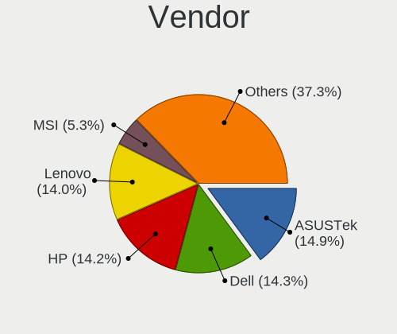
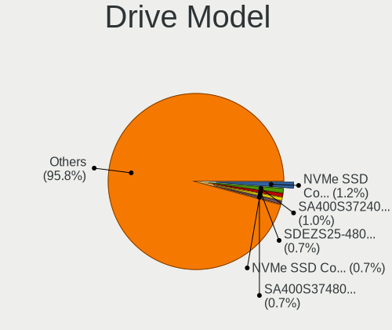
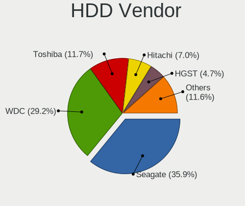

Ubuntu 22.04 - Tested Hardware & Statistics
-------------------------------------------

A project to collect tested hardware configurations for Ubuntu 22.04.

Anyone can contribute to this report by the [hw-probe](https://github.com/linuxhw/hw-probe) tool:

    sudo -E hw-probe -all -upload

Please contribute! Especially if your hardware is rare.

This is a report for all computer types. See also reports for [desktops](/Dist/Ubuntu_22.04/Desktop/README.md) and [notebooks](/Dist/Ubuntu_22.04/Notebook/README.md).

Contents
--------

* [ Test Cases ](#test-cases)

* [ System ](#system)
  - [ Kernel                   ](#kernel)
  - [ Kernel Family            ](#kernel-family)
  - [ Kernel Major Ver.        ](#kernel-major-ver)
  - [ Arch                     ](#arch)
  - [ DE                       ](#de)
  - [ Display Server           ](#display-server)
  - [ Display Manager          ](#display-manager)
  - [ OS Lang                  ](#os-lang)
  - [ Boot Mode                ](#boot-mode)
  - [ Filesystem               ](#filesystem)
  - [ Part. scheme             ](#part-scheme)
  - [ Dual Boot with Linux/BSD ](#dual-boot-with-linuxbsd)
  - [ Dual Boot (Win)          ](#dual-boot-win)

* [ Board ](#board)
  - [ Vendor                   ](#vendor)
  - [ Model                    ](#model)
  - [ Model Family             ](#model-family)
  - [ MFG Year                 ](#mfg-year)
  - [ Form Factor              ](#form-factor)
  - [ Secure Boot              ](#secure-boot)
  - [ Coreboot                 ](#coreboot)
  - [ RAM Size                 ](#ram-size)
  - [ RAM Used                 ](#ram-used)
  - [ Total Drives             ](#total-drives)
  - [ Has CD-ROM               ](#has-cd-rom)
  - [ Has Ethernet             ](#has-ethernet)
  - [ Has WiFi                 ](#has-wifi)
  - [ Has Bluetooth            ](#has-bluetooth)

* [ Location ](#location)
  - [ Country                  ](#country)
  - [ City                     ](#city)

* [ Drives ](#drives)
  - [ Drive Vendor             ](#drive-vendor)
  - [ Drive Model              ](#drive-model)
  - [ HDD Vendor               ](#hdd-vendor)
  - [ SSD Vendor               ](#ssd-vendor)
  - [ Drive Kind               ](#drive-kind)
  - [ Drive Connector          ](#drive-connector)
  - [ Drive Size               ](#drive-size)
  - [ Space Total              ](#space-total)
  - [ Space Used               ](#space-used)
  - [ Malfunc. Drives          ](#malfunc-drives)
  - [ Malfunc. Drive Vendor    ](#malfunc-drive-vendor)
  - [ Malfunc. HDD Vendor      ](#malfunc-hdd-vendor)
  - [ Malfunc. Drive Kind      ](#malfunc-drive-kind)
  - [ Failed Drives            ](#failed-drives)
  - [ Failed Drive Vendor      ](#failed-drive-vendor)
  - [ Drive Status             ](#drive-status)

* [ Storage controller ](#storage-controller)
  - [ Storage Vendor           ](#storage-vendor)
  - [ Storage Model            ](#storage-model)
  - [ Storage Kind             ](#storage-kind)

* [ Processor ](#processor)
  - [ CPU Vendor               ](#cpu-vendor)
  - [ CPU Model                ](#cpu-model)
  - [ CPU Model Family         ](#cpu-model-family)
  - [ CPU Cores                ](#cpu-cores)
  - [ CPU Sockets              ](#cpu-sockets)
  - [ CPU Threads              ](#cpu-threads)
  - [ CPU Op-Modes             ](#cpu-op-modes)
  - [ CPU Microcode            ](#cpu-microcode)
  - [ CPU Microarch            ](#cpu-microarch)

* [ Graphics ](#graphics)
  - [ GPU Vendor               ](#gpu-vendor)
  - [ GPU Model                ](#gpu-model)
  - [ GPU Combo                ](#gpu-combo)
  - [ GPU Driver               ](#gpu-driver)
  - [ GPU Memory               ](#gpu-memory)

* [ Monitor ](#monitor)
  - [ Monitor Vendor           ](#monitor-vendor)
  - [ Monitor Model            ](#monitor-model)
  - [ Monitor Resolution       ](#monitor-resolution)
  - [ Monitor Diagonal         ](#monitor-diagonal)
  - [ Monitor Width            ](#monitor-width)
  - [ Aspect Ratio             ](#aspect-ratio)
  - [ Monitor Area             ](#monitor-area)
  - [ Pixel Density            ](#pixel-density)
  - [ Multiple Monitors        ](#multiple-monitors)

* [ Network ](#network)
  - [ Net Controller Vendor    ](#net-controller-vendor)
  - [ Net Controller Model     ](#net-controller-model)
  - [ Wireless Vendor          ](#wireless-vendor)
  - [ Wireless Model           ](#wireless-model)
  - [ Ethernet Vendor          ](#ethernet-vendor)
  - [ Ethernet Model           ](#ethernet-model)
  - [ Net Controller Kind      ](#net-controller-kind)
  - [ Used Controller          ](#used-controller)
  - [ NICs                     ](#nics)
  - [ IPv6                     ](#ipv6)

* [ Bluetooth ](#bluetooth)
  - [ Bluetooth Vendor         ](#bluetooth-vendor)
  - [ Bluetooth Model          ](#bluetooth-model)

* [ Sound ](#sound)
  - [ Sound Vendor             ](#sound-vendor)
  - [ Sound Model              ](#sound-model)

* [ Memory ](#memory)
  - [ Memory Vendor            ](#memory-vendor)
  - [ Memory Model             ](#memory-model)
  - [ Memory Kind              ](#memory-kind)
  - [ Memory Form Factor       ](#memory-form-factor)
  - [ Memory Size              ](#memory-size)
  - [ Memory Speed             ](#memory-speed)

* [ Printers & scanners ](#printers--scanners)
  - [ Printer Vendor           ](#printer-vendor)
  - [ Printer Model            ](#printer-model)
  - [ Scanner Vendor           ](#scanner-vendor)
  - [ Scanner Model            ](#scanner-model)

* [ Camera ](#camera)
  - [ Camera Vendor            ](#camera-vendor)
  - [ Camera Model             ](#camera-model)

* [ Security ](#security)
  - [ Fingerprint Vendor       ](#fingerprint-vendor)
  - [ Fingerprint Model        ](#fingerprint-model)
  - [ Chipcard Vendor          ](#chipcard-vendor)
  - [ Chipcard Model           ](#chipcard-model)

* [ Unsupported ](#unsupported)
  - [ Unsupported Devices      ](#unsupported-devices)
  - [ Unsupported Device Types ](#unsupported-device-types)

Test Cases
----------

Total: 11193

| Vendor        | Model                       | Form-Factor | Probe                                                      | Date         |
|---------------|-----------------------------|-------------|------------------------------------------------------------|--------------|
| Acer          | H57M01                      | Desktop     | [215701a84d](https://linux-hardware.org/?probe=215701a84d) | Apr 01, 2023 |
| Dell          | Latitude 5530               | Notebook    | [e4688e2ef8](https://linux-hardware.org/?probe=e4688e2ef8) | Apr 01, 2023 |
| HP            | Pavilion Laptop 14-ec0xx... | Notebook    | [1da5570114](https://linux-hardware.org/?probe=1da5570114) | Apr 01, 2023 |
| Lenovo        | V310-14ISK 80SX             | Notebook    | [cd6dee4651](https://linux-hardware.org/?probe=cd6dee4651) | Apr 01, 2023 |
| ASUSTek       | ZenBook UX325EA_UX325EA     | Notebook    | [4191279e7e](https://linux-hardware.org/?probe=4191279e7e) | Apr 01, 2023 |
| Lenovo        | V110-15ISK 80TL             | Notebook    | [db058df07b](https://linux-hardware.org/?probe=db058df07b) | Apr 01, 2023 |
| Lenovo        | V110-15ISK 80TL             | Notebook    | [3691be13e8](https://linux-hardware.org/?probe=3691be13e8) | Apr 01, 2023 |
| Lenovo        | ThinkPad E14 20RA004YUS     | Notebook    | [36b592e607](https://linux-hardware.org/?probe=36b592e607) | Apr 01, 2023 |
| Samsung       | R530/R730/R540              | Notebook    | [714ed0f007](https://linux-hardware.org/?probe=714ed0f007) | Apr 01, 2023 |
| Dell          | 09M8Y8 A01                  | Desktop     | [17d5390549](https://linux-hardware.org/?probe=17d5390549) | Apr 01, 2023 |
| Dell          | 09KPNV A01                  | Desktop     | [2b25e4872f](https://linux-hardware.org/?probe=2b25e4872f) | Apr 01, 2023 |
| Apple         | Mac-F4208DC8 PVT            | Desktop     | [f05009caac](https://linux-hardware.org/?probe=f05009caac) | Apr 01, 2023 |
| Itautec       | Infoway w7535               | Notebook    | [48a539f108](https://linux-hardware.org/?probe=48a539f108) | Apr 01, 2023 |
| Gigabyte      | Z77X-UD5H                   | Desktop     | [2be0fa6524](https://linux-hardware.org/?probe=2be0fa6524) | Apr 01, 2023 |
| Gigabyte      | H61M-S2V-B3                 | Desktop     | [45a242d18f](https://linux-hardware.org/?probe=45a242d18f) | Mar 31, 2023 |
| HP            | 0A64h                       | Desktop     | [f4fd3904f0](https://linux-hardware.org/?probe=f4fd3904f0) | Mar 31, 2023 |
| Samsung       | 950XED                      | Notebook    | [c3b37a213a](https://linux-hardware.org/?probe=c3b37a213a) | Mar 31, 2023 |
| ASUSTek       | TUF Gaming B550-PLUS        | Desktop     | [6694c9279d](https://linux-hardware.org/?probe=6694c9279d) | Mar 31, 2023 |
| Acer          | Extensa 215-31              | Notebook    | [b1601e6747](https://linux-hardware.org/?probe=b1601e6747) | Mar 31, 2023 |
| Dell          | Vostro V131                 | Notebook    | [53538c2ae9](https://linux-hardware.org/?probe=53538c2ae9) | Mar 31, 2023 |
| ASUSTek       | K53SD                       | Notebook    | [81d03c3707](https://linux-hardware.org/?probe=81d03c3707) | Mar 31, 2023 |
| Apple         | Mac-F227BEC8 PVT            | All in one  | [c3065ba2b6](https://linux-hardware.org/?probe=c3065ba2b6) | Mar 31, 2023 |
| Lenovo        | ThinkPad E14 20RA0016IX     | Notebook    | [685f18f5b3](https://linux-hardware.org/?probe=685f18f5b3) | Mar 31, 2023 |
| MSI           | Modern 15 A5M               | Notebook    | [2a00bed043](https://linux-hardware.org/?probe=2a00bed043) | Mar 31, 2023 |
| Lenovo        | ThinkPad Edge E545 20B20... | Notebook    | [c2061eeeb8](https://linux-hardware.org/?probe=c2061eeeb8) | Mar 31, 2023 |
| Lenovo        | ThinkPad Edge E545 20B20... | Notebook    | [9a866f03fd](https://linux-hardware.org/?probe=9a866f03fd) | Mar 31, 2023 |
| ASUSTek       | Z97-K                       | Desktop     | [da56f6c38c](https://linux-hardware.org/?probe=da56f6c38c) | Mar 31, 2023 |
| Gigabyte      | TRX40 AORUS XTREME          | Desktop     | [0945961c85](https://linux-hardware.org/?probe=0945961c85) | Mar 31, 2023 |
| Gigabyte      | TRX40 AORUS XTREME          | Desktop     | [72c08c8ca9](https://linux-hardware.org/?probe=72c08c8ca9) | Mar 31, 2023 |
| Dell          | 0FG47G A02                  | Desktop     | [d1cf6fa11e](https://linux-hardware.org/?probe=d1cf6fa11e) | Mar 31, 2023 |
| Gigabyte      | H310M H x.x                 | Desktop     | [68fce9ae2d](https://linux-hardware.org/?probe=68fce9ae2d) | Mar 31, 2023 |
| ECS           | H61H2-M6                    | Desktop     | [6c33ee7e15](https://linux-hardware.org/?probe=6c33ee7e15) | Mar 31, 2023 |
| Gigabyte      | B550M DS3H AC               | Desktop     | [f8e723a8dc](https://linux-hardware.org/?probe=f8e723a8dc) | Mar 31, 2023 |
| MSI           | PRO X670-P WIFI             | Desktop     | [bb72de54b6](https://linux-hardware.org/?probe=bb72de54b6) | Mar 31, 2023 |
| ASUSTek       | M5A99FX PRO R2.0            | Desktop     | [0e374d0aea](https://linux-hardware.org/?probe=0e374d0aea) | Mar 31, 2023 |
| Lenovo        | ThinkPad X270 20HMS0T000    | Notebook    | [702223a4b1](https://linux-hardware.org/?probe=702223a4b1) | Mar 31, 2023 |
| EVOO          | EVC156-1                    | Notebook    | [8e665ae8b2](https://linux-hardware.org/?probe=8e665ae8b2) | Mar 31, 2023 |
| Gigabyte      | X670 AORUS ELITE AX         | Desktop     | [c239e06998](https://linux-hardware.org/?probe=c239e06998) | Mar 31, 2023 |
| Intel         | NUC11PHBi7 M26151-405       | Mini pc     | [96107a824d](https://linux-hardware.org/?probe=96107a824d) | Mar 31, 2023 |
| Lenovo        | IdeaPad 530S-14IKB 81EU     | Notebook    | [fe51f2c62f](https://linux-hardware.org/?probe=fe51f2c62f) | Mar 31, 2023 |
| ASUSTek       | ASUS BR1100CKA BR1100CKA... | Notebook    | [d7f3354ce9](https://linux-hardware.org/?probe=d7f3354ce9) | Mar 31, 2023 |
| Gigabyte      | F2A88X-UP4                  | Desktop     | [72c4b553b4](https://linux-hardware.org/?probe=72c4b553b4) | Mar 31, 2023 |
| Toshiba       | Satellite Pro S500          | Notebook    | [b2e60d9170](https://linux-hardware.org/?probe=b2e60d9170) | Mar 31, 2023 |
| HP            | Pavilion Laptop 15-cc5xx    | Notebook    | [c6bbbbb7d8](https://linux-hardware.org/?probe=c6bbbbb7d8) | Mar 31, 2023 |
| Lenovo        | ThinkPad T14s Gen 2a 20X... | Notebook    | [0ffc78eac6](https://linux-hardware.org/?probe=0ffc78eac6) | Mar 30, 2023 |
| Medion        | E15407                      | Notebook    | [b863362865](https://linux-hardware.org/?probe=b863362865) | Mar 30, 2023 |
| Gigabyte      | A320M-S2H-CF                | Desktop     | [3aac57dfbd](https://linux-hardware.org/?probe=3aac57dfbd) | Mar 30, 2023 |
| Medion        | E15407                      | Notebook    | [641091a85d](https://linux-hardware.org/?probe=641091a85d) | Mar 30, 2023 |
| Gigabyte      | B550 AORUS ELITE            | Desktop     | [4cfac9a162](https://linux-hardware.org/?probe=4cfac9a162) | Mar 30, 2023 |
| Apple         | MacBookAir7,2               | Notebook    | [d9cbbe0a35](https://linux-hardware.org/?probe=d9cbbe0a35) | Mar 30, 2023 |
| Lenovo        | IdeaPad 330S-15ARR 81FB     | Notebook    | [1dc323a9e9](https://linux-hardware.org/?probe=1dc323a9e9) | Mar 30, 2023 |
| Unknown       | Unknown                     | Desktop     | [3773f3cd04](https://linux-hardware.org/?probe=3773f3cd04) | Mar 30, 2023 |
| Dell          | 0KV62T A02                  | Desktop     | [c7765df604](https://linux-hardware.org/?probe=c7765df604) | Mar 30, 2023 |
| Lenovo        | ThinkPad E595 20NF0000GE    | Notebook    | [95a77f6dcc](https://linux-hardware.org/?probe=95a77f6dcc) | Mar 30, 2023 |
| Packard Be... | FMP55                       | Desktop     | [88a15e20b2](https://linux-hardware.org/?probe=88a15e20b2) | Mar 30, 2023 |
| Apple         | MacBookPro10,2              | Notebook    | [2f56ac98c1](https://linux-hardware.org/?probe=2f56ac98c1) | Mar 30, 2023 |
| Lenovo        | ThinkBook 15-IIL 20SM       | Notebook    | [31d333ecc9](https://linux-hardware.org/?probe=31d333ecc9) | Mar 30, 2023 |
| libre-comp... | aml-s905x-cc                | Soc         | [41da6a7bfb](https://linux-hardware.org/?probe=41da6a7bfb) | Mar 30, 2023 |
| Dell          | Vostro 5402                 | Notebook    | [27b9c84cbe](https://linux-hardware.org/?probe=27b9c84cbe) | Mar 30, 2023 |
| Intel         | NUC6i5SYB H81131-503        | Mini pc     | [0a09299aae](https://linux-hardware.org/?probe=0a09299aae) | Mar 30, 2023 |
| Gigabyte      | H61M-S2V-B3                 | Desktop     | [41a76fad3f](https://linux-hardware.org/?probe=41a76fad3f) | Mar 30, 2023 |
| Lenovo        | Yoga 510-14ISK 80UK         | Notebook    | [722c1e9d68](https://linux-hardware.org/?probe=722c1e9d68) | Mar 30, 2023 |
| MSI           | X79A-GD45                   | Desktop     | [6d78703b2c](https://linux-hardware.org/?probe=6d78703b2c) | Mar 30, 2023 |
| Lenovo        | Yoga 6 13ALC6 82ND          | Convertible | [455ce69724](https://linux-hardware.org/?probe=455ce69724) | Mar 30, 2023 |
| HP            | Pavilion Gaming Laptop 1... | Notebook    | [252d340923](https://linux-hardware.org/?probe=252d340923) | Mar 30, 2023 |
| ASUSTek       | TUF Gaming B550M-PLUS       | Desktop     | [92981c741d](https://linux-hardware.org/?probe=92981c741d) | Mar 30, 2023 |
| MSI           | PRO X670-P WIFI             | Desktop     | [ed35fbea6c](https://linux-hardware.org/?probe=ed35fbea6c) | Mar 30, 2023 |
| Raspberry ... | Raspberry Pi Compute Mod... | Soc         | [c885b5da6c](https://linux-hardware.org/?probe=c885b5da6c) | Mar 30, 2023 |
| HP            | 82B4                        | Desktop     | [0829a64947](https://linux-hardware.org/?probe=0829a64947) | Mar 30, 2023 |
| Dell          | Latitude 3490               | Notebook    | [16d4f0954b](https://linux-hardware.org/?probe=16d4f0954b) | Mar 30, 2023 |
| MSI           | MAG B550M MORTAR WIFI       | Desktop     | [dfd9900ccf](https://linux-hardware.org/?probe=dfd9900ccf) | Mar 30, 2023 |
| HUAWEI        | RLEF-XX                     | Notebook    | [e9988edacd](https://linux-hardware.org/?probe=e9988edacd) | Mar 30, 2023 |
| ASUSTek       | M5A97                       | Desktop     | [4d12d122e1](https://linux-hardware.org/?probe=4d12d122e1) | Mar 30, 2023 |
| Shuttle       | FH170                       | Desktop     | [0fa0f1ab72](https://linux-hardware.org/?probe=0fa0f1ab72) | Mar 30, 2023 |
| ASUSTek       | ASUS TUF Gaming F17 FX70... | Notebook    | [da1e07f122](https://linux-hardware.org/?probe=da1e07f122) | Mar 30, 2023 |
| ASUSTek       | P5E WS Pro                  | Desktop     | [6c70ac23df](https://linux-hardware.org/?probe=6c70ac23df) | Mar 30, 2023 |
| ASUSTek       | ASUS TUF Gaming F17 FX70... | Notebook    | [492d575f31](https://linux-hardware.org/?probe=492d575f31) | Mar 30, 2023 |
| Apple         | Mac-65CE76090165799A iMa... | All in one  | [920f4a2dc2](https://linux-hardware.org/?probe=920f4a2dc2) | Mar 30, 2023 |
| HP            | ProBook 450 G5              | Notebook    | [89dfecad7e](https://linux-hardware.org/?probe=89dfecad7e) | Mar 30, 2023 |
| Gigabyte      | H81M-S2V                    | Desktop     | [5a16920bc0](https://linux-hardware.org/?probe=5a16920bc0) | Mar 30, 2023 |
| Lenovo        | N22 80S6                    | Notebook    | [c6cbeeb984](https://linux-hardware.org/?probe=c6cbeeb984) | Mar 30, 2023 |
| HP            | 8591                        | Desktop     | [b887990c12](https://linux-hardware.org/?probe=b887990c12) | Mar 30, 2023 |
| AZW           | SER V1.0                    | Mini pc     | [1b8dc51444](https://linux-hardware.org/?probe=1b8dc51444) | Mar 30, 2023 |
| MSI           | FM2-A75MA-E35               | Desktop     | [10de0ae048](https://linux-hardware.org/?probe=10de0ae048) | Mar 30, 2023 |
| Acer          | Aspire A514-54              | Notebook    | [94da64753b](https://linux-hardware.org/?probe=94da64753b) | Mar 30, 2023 |
| ATOPNUC       | MA90                        | Mini pc     | [65782ab3d1](https://linux-hardware.org/?probe=65782ab3d1) | Mar 30, 2023 |
| Dell          | 0VV4V0 A00                  | All in one  | [63e8848234](https://linux-hardware.org/?probe=63e8848234) | Mar 30, 2023 |
| Acer          | Aspire 8943G                | Notebook    | [e1d172011e](https://linux-hardware.org/?probe=e1d172011e) | Mar 30, 2023 |
| Microsoft     | Surface Pro 3               | Tablet      | [5f3a9edb3b](https://linux-hardware.org/?probe=5f3a9edb3b) | Mar 30, 2023 |
| Lenovo        | 30D2 SDK0J40697 WIN 3305... | Desktop     | [185cb6df15](https://linux-hardware.org/?probe=185cb6df15) | Mar 30, 2023 |
| Lenovo        | Yoga Slim 7 Pro 16ACH6 8... | Notebook    | [889ef05f86](https://linux-hardware.org/?probe=889ef05f86) | Mar 30, 2023 |
| Apple         | MacBookAir9,1               | Notebook    | [1fe20bdfcb](https://linux-hardware.org/?probe=1fe20bdfcb) | Mar 30, 2023 |
| Notebook      | N650DU                      | Notebook    | [e8ec3c6462](https://linux-hardware.org/?probe=e8ec3c6462) | Mar 30, 2023 |
| ASUSTek       | ROG STRIX B450-F GAMING     | Desktop     | [cd308ca372](https://linux-hardware.org/?probe=cd308ca372) | Mar 29, 2023 |
| ASUSTek       | PRIME H610I-PLUS D4         | Desktop     | [7b984afb2c](https://linux-hardware.org/?probe=7b984afb2c) | Mar 29, 2023 |
| Dell          | Inspiron 5566               | Notebook    | [7b53b4da78](https://linux-hardware.org/?probe=7b53b4da78) | Mar 29, 2023 |
| Acer          | Veriton Z4810G              | All in one  | [c4a9881345](https://linux-hardware.org/?probe=c4a9881345) | Mar 29, 2023 |
| Dell          | Latitude E6530              | Notebook    | [eb7392d1ae](https://linux-hardware.org/?probe=eb7392d1ae) | Mar 29, 2023 |
| Medion        | P8614                       | Notebook    | [a66fe7042e](https://linux-hardware.org/?probe=a66fe7042e) | Mar 29, 2023 |
| Lenovo        | Yoga 6 13ALC6 82ND          | Convertible | [aebe1aa0af](https://linux-hardware.org/?probe=aebe1aa0af) | Mar 29, 2023 |
| Apple         | Mac-BE088AF8C5EB4FA2 iMa... | All in one  | [0805df69aa](https://linux-hardware.org/?probe=0805df69aa) | Mar 29, 2023 |
| Microsoft     | Surface Pro 3               | Tablet      | [9da2e607a3](https://linux-hardware.org/?probe=9da2e607a3) | Mar 29, 2023 |
| ASUSTek       | H81M-V3                     | Desktop     | [fd123bea36](https://linux-hardware.org/?probe=fd123bea36) | Mar 29, 2023 |
| ASUSTek       | TUF Gaming FX705DT_FX705... | Notebook    | [803a180064](https://linux-hardware.org/?probe=803a180064) | Mar 29, 2023 |
| Primux Tec... | A173                        | All in one  | [f31f5f63b9](https://linux-hardware.org/?probe=f31f5f63b9) | Mar 29, 2023 |
| Dell          | Inspiron 5767               | Notebook    | [1c80487906](https://linux-hardware.org/?probe=1c80487906) | Mar 29, 2023 |
| Dell          | 09KPNV A01                  | Desktop     | [6024b90eea](https://linux-hardware.org/?probe=6024b90eea) | Mar 29, 2023 |
| Acer          | Extensa 215-23              | Notebook    | [bf5730d468](https://linux-hardware.org/?probe=bf5730d468) | Mar 29, 2023 |
| ASUSTek       | X751LJ                      | Notebook    | [cf5d71e2b3](https://linux-hardware.org/?probe=cf5d71e2b3) | Mar 29, 2023 |
| Primux Tec... | A173                        | All in one  | [95e3fd6b4b](https://linux-hardware.org/?probe=95e3fd6b4b) | Mar 29, 2023 |
| ASUSTek       | TUF Gaming FX705DT_FX705... | Notebook    | [f33059ab6b](https://linux-hardware.org/?probe=f33059ab6b) | Mar 29, 2023 |
| Lenovo        | IdeaPadFlex 10 20324        | Notebook    | [40b3e68058](https://linux-hardware.org/?probe=40b3e68058) | Mar 29, 2023 |
| Gigabyte      | GA-A75-UD4H                 | Desktop     | [e5433e75fb](https://linux-hardware.org/?probe=e5433e75fb) | Mar 29, 2023 |
| MSI           | X79A-GD45                   | Desktop     | [bb4680bc5b](https://linux-hardware.org/?probe=bb4680bc5b) | Mar 29, 2023 |
| ASUSTek       | PRIME B360M-C               | Desktop     | [e7b163ea80](https://linux-hardware.org/?probe=e7b163ea80) | Mar 29, 2023 |
| Timi          | TM1701                      | Notebook    | [16ca4bcb7f](https://linux-hardware.org/?probe=16ca4bcb7f) | Mar 29, 2023 |
| ASUSTek       | P8Z77-V LX2                 | Desktop     | [23256b54cf](https://linux-hardware.org/?probe=23256b54cf) | Mar 29, 2023 |
| Dell          | XPS 13 9310 2-in-1          | Convertible | [39d6f86500](https://linux-hardware.org/?probe=39d6f86500) | Mar 29, 2023 |
| Lenovo        | ThinkPad T14 Gen 1 20UD0... | Notebook    | [bfa850ddad](https://linux-hardware.org/?probe=bfa850ddad) | Mar 29, 2023 |
| Intel         | H61                         | Desktop     | [bb6e201a08](https://linux-hardware.org/?probe=bb6e201a08) | Mar 29, 2023 |
| HUAWEI        | HVY-WXX9                    | Notebook    | [31d94ffb5f](https://linux-hardware.org/?probe=31d94ffb5f) | Mar 29, 2023 |
| Gigabyte      | P41T-D3                     | Desktop     | [2941019778](https://linux-hardware.org/?probe=2941019778) | Mar 29, 2023 |
| Intel         | B75                         | Desktop     | [2bddb84c2e](https://linux-hardware.org/?probe=2bddb84c2e) | Mar 29, 2023 |
| ASUSTek       | H81M-V3                     | Desktop     | [ce98454e55](https://linux-hardware.org/?probe=ce98454e55) | Mar 29, 2023 |
| Dell          | Vostro 15 3515              | Notebook    | [7b4a51d5e3](https://linux-hardware.org/?probe=7b4a51d5e3) | Mar 29, 2023 |
| Dell          | 0200DY A01                  | Desktop     | [095eb7be41](https://linux-hardware.org/?probe=095eb7be41) | Mar 29, 2023 |
| Gigabyte      | B365M DS3H                  | Desktop     | [e6b01be2f1](https://linux-hardware.org/?probe=e6b01be2f1) | Mar 29, 2023 |
| Lenovo        | ThinkPad L13 Yoga Gen 2 ... | Convertible | [a38bcb83b3](https://linux-hardware.org/?probe=a38bcb83b3) | Mar 29, 2023 |
| ASUSTek       | H110M-A                     | Desktop     | [147c0afb99](https://linux-hardware.org/?probe=147c0afb99) | Mar 29, 2023 |
| Dell          | Inspiron 7520               | Notebook    | [8258074853](https://linux-hardware.org/?probe=8258074853) | Mar 28, 2023 |
| ASRock        | H61M-DG3/USB3               | Desktop     | [6e7b188568](https://linux-hardware.org/?probe=6e7b188568) | Mar 28, 2023 |
| Google        | Caroline                    | Notebook    | [80f01f2a87](https://linux-hardware.org/?probe=80f01f2a87) | Mar 28, 2023 |
| HP            | ENVY x360 Convertible 15... | Convertible | [adabf81daa](https://linux-hardware.org/?probe=adabf81daa) | Mar 28, 2023 |
| Lenovo        | IdeaPad 510S-14ISK 80TK     | Notebook    | [25cc7bfca2](https://linux-hardware.org/?probe=25cc7bfca2) | Mar 28, 2023 |
| Gigabyte      | H110M-S2H DDR3-CF           | Desktop     | [7ec74ffcfa](https://linux-hardware.org/?probe=7ec74ffcfa) | Mar 28, 2023 |
| HP            | Pavilion g6                 | Notebook    | [c5b99ffdb0](https://linux-hardware.org/?probe=c5b99ffdb0) | Mar 28, 2023 |
| ASUSTek       | Z97-P                       | Desktop     | [0a0ca96d28](https://linux-hardware.org/?probe=0a0ca96d28) | Mar 28, 2023 |
| MSI           | Z170A SLI PLUS              | Desktop     | [50affe59d1](https://linux-hardware.org/?probe=50affe59d1) | Mar 28, 2023 |
| Lenovo        | SHARKBAY NOK                | Desktop     | [0cbe19c074](https://linux-hardware.org/?probe=0cbe19c074) | Mar 28, 2023 |
| HP            | OMEN by Laptop 15-dc0xxx    | Notebook    | [b7a0579d38](https://linux-hardware.org/?probe=b7a0579d38) | Mar 28, 2023 |
| Gigabyte      | H110M-S2H DDR3-CF           | Desktop     | [7e5cb33850](https://linux-hardware.org/?probe=7e5cb33850) | Mar 28, 2023 |
| ASRock        | X399 Taichi                 | Desktop     | [f16690a3df](https://linux-hardware.org/?probe=f16690a3df) | Mar 28, 2023 |
| Acer          | TravelMate P215-52          | Notebook    | [b6184e813b](https://linux-hardware.org/?probe=b6184e813b) | Mar 28, 2023 |
| Gigabyte      | B450 AORUS PRO WIFI-CF      | Desktop     | [19ffc63f56](https://linux-hardware.org/?probe=19ffc63f56) | Mar 28, 2023 |
| Dell          | G15 5511                    | Notebook    | [7f15a1e2c7](https://linux-hardware.org/?probe=7f15a1e2c7) | Mar 28, 2023 |
| Dell          | Precision 5540              | Notebook    | [f9e20de07f](https://linux-hardware.org/?probe=f9e20de07f) | Mar 28, 2023 |
| Lenovo        | ThinkPad E14 20RA004YUS     | Notebook    | [18226d4ded](https://linux-hardware.org/?probe=18226d4ded) | Mar 28, 2023 |
| HP            | ProBook 450 G7              | Notebook    | [8b27d78a17](https://linux-hardware.org/?probe=8b27d78a17) | Mar 28, 2023 |
| MSI           | B450 TOMAHAWK MAX           | Notebook    | [856b789461](https://linux-hardware.org/?probe=856b789461) | Mar 28, 2023 |
| Lenovo        | IdeaPad 5 Pro 16ACH6 82L... | Notebook    | [577947c9d3](https://linux-hardware.org/?probe=577947c9d3) | Mar 28, 2023 |
| HUAWEI        | NBLB-WAX9N                  | Notebook    | [9fbd9476b2](https://linux-hardware.org/?probe=9fbd9476b2) | Mar 28, 2023 |
| Gigabyte      | B450M S2H                   | Desktop     | [7f46837f94](https://linux-hardware.org/?probe=7f46837f94) | Mar 28, 2023 |
| Lenovo        | ThinkPad T540p 20BE004EU... | Notebook    | [988731ac8d](https://linux-hardware.org/?probe=988731ac8d) | Mar 28, 2023 |
| Lenovo        | ThinkPad T540p 20BE004EU... | Notebook    | [8406000835](https://linux-hardware.org/?probe=8406000835) | Mar 28, 2023 |
| Pegatron      | 2AE3                        | Desktop     | [806b4e1780](https://linux-hardware.org/?probe=806b4e1780) | Mar 28, 2023 |
| Pegatron      | 2AE3                        | Desktop     | [23ce0f4fd5](https://linux-hardware.org/?probe=23ce0f4fd5) | Mar 28, 2023 |
| HP            | Pavilion Gaming Laptop 1... | Notebook    | [4c2dd89a20](https://linux-hardware.org/?probe=4c2dd89a20) | Mar 28, 2023 |
| HP            | Compaq 610                  | Notebook    | [dc9383200e](https://linux-hardware.org/?probe=dc9383200e) | Mar 28, 2023 |
| MSI           | B450 TOMAHAWK MAX II        | Desktop     | [b8d58bafe3](https://linux-hardware.org/?probe=b8d58bafe3) | Mar 28, 2023 |
| HP            | Pavilion Laptop 15-cs2xx... | Notebook    | [8921171c40](https://linux-hardware.org/?probe=8921171c40) | Mar 28, 2023 |
| MSI           | B450 TOMAHAWK MAX II        | Desktop     | [68117fedfe](https://linux-hardware.org/?probe=68117fedfe) | Mar 28, 2023 |
| HP            | ProBook 450 G3              | Notebook    | [f0e6089a6e](https://linux-hardware.org/?probe=f0e6089a6e) | Mar 28, 2023 |
| ASUSTek       | N53SV                       | Notebook    | [77aa77b2a3](https://linux-hardware.org/?probe=77aa77b2a3) | Mar 28, 2023 |
| HP            | Pavilion Laptop 15-cc5xx    | Notebook    | [7a9cf507e6](https://linux-hardware.org/?probe=7a9cf507e6) | Mar 28, 2023 |
| HP            | Pavilion Laptop 14-ec0xx... | Notebook    | [88d5c3bb9f](https://linux-hardware.org/?probe=88d5c3bb9f) | Mar 28, 2023 |
| HP            | Laptop 14s-fq2xxx           | Notebook    | [8b64ddb550](https://linux-hardware.org/?probe=8b64ddb550) | Mar 27, 2023 |
| Acer          | Extensa 2530                | Notebook    | [e39fe56d67](https://linux-hardware.org/?probe=e39fe56d67) | Mar 27, 2023 |
| Dell          | Inspiron 13-5378            | Notebook    | [2aff972d11](https://linux-hardware.org/?probe=2aff972d11) | Mar 27, 2023 |
| Apple         | Mac-F4208DC8 PVT            | Desktop     | [cdb2c38b76](https://linux-hardware.org/?probe=cdb2c38b76) | Mar 27, 2023 |
| HUAWEI        | NBD-WXX9                    | Notebook    | [e7788fd2a4](https://linux-hardware.org/?probe=e7788fd2a4) | Mar 27, 2023 |
| HUAWEI        | NBD-WXX9                    | Notebook    | [d723ff0fa9](https://linux-hardware.org/?probe=d723ff0fa9) | Mar 27, 2023 |
| Gigabyte      | A320M-S2H-CF                | Desktop     | [1dd1eab13e](https://linux-hardware.org/?probe=1dd1eab13e) | Mar 27, 2023 |
| Lenovo        | ThinkPad T460s 20FAS1U20... | Notebook    | [99ea485cee](https://linux-hardware.org/?probe=99ea485cee) | Mar 27, 2023 |
| Pegatron      | IPMIP-H55-GEN               | Desktop     | [7dcf9e9b51](https://linux-hardware.org/?probe=7dcf9e9b51) | Mar 27, 2023 |
| Dell          | XPS 13 9305                 | Notebook    | [2f96abf16a](https://linux-hardware.org/?probe=2f96abf16a) | Mar 27, 2023 |
| HUAWEI        | KLVD-WXX9                   | Notebook    | [574bb4272c](https://linux-hardware.org/?probe=574bb4272c) | Mar 27, 2023 |
| HP            | 3648h                       | Desktop     | [fbc5138852](https://linux-hardware.org/?probe=fbc5138852) | Mar 27, 2023 |
| Dell          | XPS 13 9305                 | Notebook    | [07caea9176](https://linux-hardware.org/?probe=07caea9176) | Mar 27, 2023 |
| HUAWEI        | BOHB-WAX9                   | Notebook    | [d7b0ec58d5](https://linux-hardware.org/?probe=d7b0ec58d5) | Mar 27, 2023 |
| Dell          | Precision 7530              | Notebook    | [d5687ef764](https://linux-hardware.org/?probe=d5687ef764) | Mar 27, 2023 |
| Lenovo        | ThinkPad E14 Gen 4 21E3S... | Notebook    | [d484c5e138](https://linux-hardware.org/?probe=d484c5e138) | Mar 27, 2023 |
| Lenovo        | ThinkPad X1 Carbon Gen 9... | Notebook    | [bddc9116d1](https://linux-hardware.org/?probe=bddc9116d1) | Mar 27, 2023 |
| Acer          | Aspire 4820TG               | Notebook    | [e634227889](https://linux-hardware.org/?probe=e634227889) | Mar 27, 2023 |
| Lenovo        | IdeaPadFlex 10 20324        | Notebook    | [629579e7f2](https://linux-hardware.org/?probe=629579e7f2) | Mar 27, 2023 |
| MSI           | X99A SLI PLUS               | Desktop     | [519fc70e27](https://linux-hardware.org/?probe=519fc70e27) | Mar 27, 2023 |
| Lenovo        | ThinkPad L14 Gen 3 21C10... | Notebook    | [6a8962feba](https://linux-hardware.org/?probe=6a8962feba) | Mar 27, 2023 |
| Dell          | Precision 7670              | Notebook    | [eece926391](https://linux-hardware.org/?probe=eece926391) | Mar 27, 2023 |
| ASRock        | X570 Steel Legend           | Desktop     | [490155a63a](https://linux-hardware.org/?probe=490155a63a) | Mar 27, 2023 |
| MSI           | Z170A SLI PLUS              | Desktop     | [8a1c592e98](https://linux-hardware.org/?probe=8a1c592e98) | Mar 27, 2023 |
| Gigabyte      | A520M H                     | Desktop     | [7afe508254](https://linux-hardware.org/?probe=7afe508254) | Mar 27, 2023 |
| Gigabyte      | Z590 GAMING X               | Desktop     | [de1cb772e9](https://linux-hardware.org/?probe=de1cb772e9) | Mar 27, 2023 |
| Gigabyte      | Z590 GAMING X               | Desktop     | [db7671affd](https://linux-hardware.org/?probe=db7671affd) | Mar 27, 2023 |
| ASUSTek       | P8H61-M LE                  | Desktop     | [e834f14d64](https://linux-hardware.org/?probe=e834f14d64) | Mar 27, 2023 |
| Dell          | 0VV4V0 A00                  | All in one  | [a999e71c62](https://linux-hardware.org/?probe=a999e71c62) | Mar 27, 2023 |
| Intel         | X58M                        | Desktop     | [823813881b](https://linux-hardware.org/?probe=823813881b) | Mar 27, 2023 |
| HP            | EliteBook 2570p             | Notebook    | [d5ba09feb1](https://linux-hardware.org/?probe=d5ba09feb1) | Mar 27, 2023 |
| MSI           | PRO H610M-B DDR4            | Desktop     | [a9ca07dc80](https://linux-hardware.org/?probe=a9ca07dc80) | Mar 27, 2023 |
| Dell          | Precision 7670              | Notebook    | [5b8f0590ec](https://linux-hardware.org/?probe=5b8f0590ec) | Mar 27, 2023 |
| Dell          | Latitude E5570              | Notebook    | [350e781679](https://linux-hardware.org/?probe=350e781679) | Mar 27, 2023 |
| ASUSTek       | STRIX X99 GAMING            | Desktop     | [1c37ecb6c7](https://linux-hardware.org/?probe=1c37ecb6c7) | Mar 26, 2023 |
| Fujitsu       | LIFEBOOK E736               | Notebook    | [03df3679d3](https://linux-hardware.org/?probe=03df3679d3) | Mar 26, 2023 |
| ASUSTek       | X751SA                      | Notebook    | [bef27b5a10](https://linux-hardware.org/?probe=bef27b5a10) | Mar 26, 2023 |
| ASUSTek       | X751SA                      | Notebook    | [daac2899b2](https://linux-hardware.org/?probe=daac2899b2) | Mar 26, 2023 |
| HP            | ProLiant DL360 G7           | Server      | [4e4f63c868](https://linux-hardware.org/?probe=4e4f63c868) | Mar 26, 2023 |
| ASRock        | B365 Pro4                   | Desktop     | [ec1dd7f3ab](https://linux-hardware.org/?probe=ec1dd7f3ab) | Mar 26, 2023 |
| Lenovo        | ThinkCentre M90p 3282A8U    | Desktop     | [5edac0955d](https://linux-hardware.org/?probe=5edac0955d) | Mar 26, 2023 |
| Lenovo        | ThinkPad X230 2325BA3       | Notebook    | [9022b333bd](https://linux-hardware.org/?probe=9022b333bd) | Mar 26, 2023 |
| Fujitsu       | LIFEBOOK E736               | Notebook    | [f7d3c52f58](https://linux-hardware.org/?probe=f7d3c52f58) | Mar 26, 2023 |
| HUAWEI        | RLEF-XX                     | Notebook    | [b860e76ead](https://linux-hardware.org/?probe=b860e76ead) | Mar 26, 2023 |
| Gigabyte      | H310M H x.x                 | Desktop     | [d79b6fc95c](https://linux-hardware.org/?probe=d79b6fc95c) | Mar 26, 2023 |
| Lenovo        | ThinkPad T440s 20AQ009DG... | Notebook    | [6f3481adc0](https://linux-hardware.org/?probe=6f3481adc0) | Mar 26, 2023 |
| Dell          | XPS 15 7590                 | Notebook    | [aeec5e2588](https://linux-hardware.org/?probe=aeec5e2588) | Mar 26, 2023 |
| Apple         | MacBookPro16,2              | Notebook    | [cf7ab8adb4](https://linux-hardware.org/?probe=cf7ab8adb4) | Mar 26, 2023 |
| Wistron       | ProLiant ML110 G6           | Desktop     | [2e14ac2984](https://linux-hardware.org/?probe=2e14ac2984) | Mar 26, 2023 |
| MSI           | B550-A PRO                  | Desktop     | [eddf5a759a](https://linux-hardware.org/?probe=eddf5a759a) | Mar 26, 2023 |
| HUAWEI        | KLVD-WXX9                   | Notebook    | [ca83615d40](https://linux-hardware.org/?probe=ca83615d40) | Mar 26, 2023 |
| HUAWEI        | KLVD-WXX9                   | Notebook    | [285462b197](https://linux-hardware.org/?probe=285462b197) | Mar 26, 2023 |
| HUAWEI        | KLVD-WXX9                   | Notebook    | [fc40632056](https://linux-hardware.org/?probe=fc40632056) | Mar 26, 2023 |
| Positivo      | Smash2                      | Notebook    | [b61791c478](https://linux-hardware.org/?probe=b61791c478) | Mar 26, 2023 |
| Lenovo        | ThinkPad T550 20CK000GCA    | Notebook    | [946f550eb7](https://linux-hardware.org/?probe=946f550eb7) | Mar 26, 2023 |
| HP            | 0B54h D                     | Desktop     | [540caaf04c](https://linux-hardware.org/?probe=540caaf04c) | Mar 26, 2023 |
| ASUSTek       | P5W DH Deluxe               | Desktop     | [781cafa540](https://linux-hardware.org/?probe=781cafa540) | Mar 26, 2023 |
| Acer          | V5-131                      | Notebook    | [f35bd55401](https://linux-hardware.org/?probe=f35bd55401) | Mar 26, 2023 |
| ASUSTek       | Zephyrus M GM501GS          | Notebook    | [68017924d7](https://linux-hardware.org/?probe=68017924d7) | Mar 26, 2023 |
| Gigabyte      | A520M H                     | Desktop     | [cfacabcd33](https://linux-hardware.org/?probe=cfacabcd33) | Mar 26, 2023 |
| MSI           | Creator Z16 A11UET          | Notebook    | [0133ab37af](https://linux-hardware.org/?probe=0133ab37af) | Mar 26, 2023 |
| Dell          | XPS 13 9305                 | Notebook    | [5b29fbd6ac](https://linux-hardware.org/?probe=5b29fbd6ac) | Mar 26, 2023 |
| Gigabyte      | A520M H                     | Desktop     | [ed01b04ada](https://linux-hardware.org/?probe=ed01b04ada) | Mar 26, 2023 |
| Shuttle       | B10IE01                     | Desktop     | [bc74a6b1a2](https://linux-hardware.org/?probe=bc74a6b1a2) | Mar 26, 2023 |
| Lenovo        | ThinkPad T430 4237ZC7       | Notebook    | [845a2ed117](https://linux-hardware.org/?probe=845a2ed117) | Mar 26, 2023 |
| Dell          | 0MGK50 A02                  | Desktop     | [75b4691fd2](https://linux-hardware.org/?probe=75b4691fd2) | Mar 26, 2023 |
| ASUSTek       | M5A78L-M/USB3               | Desktop     | [c7e347798a](https://linux-hardware.org/?probe=c7e347798a) | Mar 26, 2023 |
| ASUSTek       | P5B-Deluxe                  | Desktop     | [f5a9d12043](https://linux-hardware.org/?probe=f5a9d12043) | Mar 26, 2023 |
| Dell          | Latitude E6430              | Notebook    | [912e5e8577](https://linux-hardware.org/?probe=912e5e8577) | Mar 26, 2023 |
| Lenovo        | ThinkCentre M90p 3282A8U    | Desktop     | [40b8057336](https://linux-hardware.org/?probe=40b8057336) | Mar 26, 2023 |
| Intel         | DG41CN AAE82429-102         | Desktop     | [c671afb118](https://linux-hardware.org/?probe=c671afb118) | Mar 26, 2023 |
| Dell          | Latitude E6430              | Notebook    | [237dabb566](https://linux-hardware.org/?probe=237dabb566) | Mar 26, 2023 |
| ZOTAC         | ZBOX-EN173080C/EN173070C... | Mini pc     | [6f53d65339](https://linux-hardware.org/?probe=6f53d65339) | Mar 26, 2023 |
| HP            | 339A                        | Desktop     | [1009c2d048](https://linux-hardware.org/?probe=1009c2d048) | Mar 26, 2023 |
| Sony          | SVF14215CXB                 | Notebook    | [624af23eb4](https://linux-hardware.org/?probe=624af23eb4) | Mar 26, 2023 |
| Lenovo        | G510 20238                  | Notebook    | [f406bad420](https://linux-hardware.org/?probe=f406bad420) | Mar 26, 2023 |
| Lenovo        | 3704 SDK0J40700 WIN 3258... | Desktop     | [b7b93f24a2](https://linux-hardware.org/?probe=b7b93f24a2) | Mar 26, 2023 |
| Gigabyte      | X58A-UD3R                   | Desktop     | [2325b601fe](https://linux-hardware.org/?probe=2325b601fe) | Mar 25, 2023 |
| Notebook      | NL40_50CU                   | Notebook    | [4870d52d1e](https://linux-hardware.org/?probe=4870d52d1e) | Mar 25, 2023 |
| ASRock        | A320M-HDV R4.0              | Desktop     | [1b5f2b52bc](https://linux-hardware.org/?probe=1b5f2b52bc) | Mar 25, 2023 |
| Dell          | 02YYK5 A01                  | Desktop     | [92e64e0e8c](https://linux-hardware.org/?probe=92e64e0e8c) | Mar 25, 2023 |
| Gigabyte      | Z77X-D3H                    | Desktop     | [5fff36a878](https://linux-hardware.org/?probe=5fff36a878) | Mar 25, 2023 |
| HP            | G42                         | Notebook    | [f1b5695907](https://linux-hardware.org/?probe=f1b5695907) | Mar 25, 2023 |
| ASUSTek       | H81I-PLUS                   | Desktop     | [98dc4bb06b](https://linux-hardware.org/?probe=98dc4bb06b) | Mar 25, 2023 |
| Lenovo        | ThinkPad W520 4282PQ7       | Notebook    | [ff42aa158f](https://linux-hardware.org/?probe=ff42aa158f) | Mar 25, 2023 |
| ASUSTek       | H81I-PLUS                   | Desktop     | [bb353ccddf](https://linux-hardware.org/?probe=bb353ccddf) | Mar 25, 2023 |
| Timi          | TM1701                      | Notebook    | [f5dfd4628e](https://linux-hardware.org/?probe=f5dfd4628e) | Mar 25, 2023 |
| HP            | ProBook 650 G1              | Notebook    | [d1baffa910](https://linux-hardware.org/?probe=d1baffa910) | Mar 25, 2023 |
| Acer          | Aspire ES1-731              | Notebook    | [927cc86995](https://linux-hardware.org/?probe=927cc86995) | Mar 25, 2023 |
| Acer          | Aspire E1-731               | Notebook    | [667456015e](https://linux-hardware.org/?probe=667456015e) | Mar 25, 2023 |
| Lenovo        | IdeaPad 3 15ITL6 82H8       | Notebook    | [05b2003fc0](https://linux-hardware.org/?probe=05b2003fc0) | Mar 25, 2023 |
| Lenovo        | ThinkPad X201 3680W81       | Notebook    | [02821ba817](https://linux-hardware.org/?probe=02821ba817) | Mar 25, 2023 |
| Timi          | TM1701                      | Notebook    | [17e055a118](https://linux-hardware.org/?probe=17e055a118) | Mar 25, 2023 |
| Dell          | XPS 13 9380                 | Notebook    | [72bf3db096](https://linux-hardware.org/?probe=72bf3db096) | Mar 25, 2023 |
| Packard Be... | FIH57                       | Desktop     | [794fd45482](https://linux-hardware.org/?probe=794fd45482) | Mar 25, 2023 |
| HP            | OMEN by Laptop 16-b0xxx     | Notebook    | [22aa7f3036](https://linux-hardware.org/?probe=22aa7f3036) | Mar 25, 2023 |
| Lenovo        | V130-15IKB 81HN             | Notebook    | [0bfaf1252f](https://linux-hardware.org/?probe=0bfaf1252f) | Mar 25, 2023 |
| Foxconn       | 2ABF                        | Desktop     | [41289d94bf](https://linux-hardware.org/?probe=41289d94bf) | Mar 25, 2023 |
| Foxconn       | 2ABF                        | Desktop     | [1ccaab03c4](https://linux-hardware.org/?probe=1ccaab03c4) | Mar 25, 2023 |
| ASUSTek       | VivoBook_ASUSLaptop X150... | Notebook    | [e09dc41124](https://linux-hardware.org/?probe=e09dc41124) | Mar 25, 2023 |
| MSI           | H110M PRO-D                 | Desktop     | [104b9b1c12](https://linux-hardware.org/?probe=104b9b1c12) | Mar 25, 2023 |
| HP            | ProLiant DL380 G7           | Server      | [798462942d](https://linux-hardware.org/?probe=798462942d) | Mar 25, 2023 |
| HP            | 255 G7 Notebook PC          | Notebook    | [2097578b64](https://linux-hardware.org/?probe=2097578b64) | Mar 25, 2023 |
| ASUSTek       | P5KPL-AM/PS                 | Desktop     | [02d9269abc](https://linux-hardware.org/?probe=02d9269abc) | Mar 25, 2023 |
| HP            | 18E9                        | Desktop     | [f015f44555](https://linux-hardware.org/?probe=f015f44555) | Mar 25, 2023 |
| Getac         | B300-H                      | Notebook    | [28a9b0b0c7](https://linux-hardware.org/?probe=28a9b0b0c7) | Mar 25, 2023 |
| Apple         | Mac-4B682C642B45593E iMa... | All in one  | [5e78103251](https://linux-hardware.org/?probe=5e78103251) | Mar 25, 2023 |
| Dell          | Latitude E7450              | Notebook    | [7154586794](https://linux-hardware.org/?probe=7154586794) | Mar 25, 2023 |
| Dell          | Inspiron N5110              | Notebook    | [f8fc6c74da](https://linux-hardware.org/?probe=f8fc6c74da) | Mar 25, 2023 |
| Dell          | 00V62H A01                  | Desktop     | [5312ec3cc9](https://linux-hardware.org/?probe=5312ec3cc9) | Mar 25, 2023 |
| Acer          | Aspire 4740                 | Notebook    | [c4e47e53dc](https://linux-hardware.org/?probe=c4e47e53dc) | Mar 25, 2023 |
| HP            | 8906 SMVB                   | Desktop     | [7650a804d9](https://linux-hardware.org/?probe=7650a804d9) | Mar 25, 2023 |
| ASUSTek       | ASUS TUF Gaming A15 FA50... | Notebook    | [9e45f992a1](https://linux-hardware.org/?probe=9e45f992a1) | Mar 25, 2023 |
| Dell          | Vostro 5581                 | Notebook    | [d2ebb46bea](https://linux-hardware.org/?probe=d2ebb46bea) | Mar 25, 2023 |
| Dell          | 02YYK5 A01                  | Desktop     | [aeb58a6898](https://linux-hardware.org/?probe=aeb58a6898) | Mar 24, 2023 |
| ASUSTek       | Basswood3G                  | Desktop     | [d71f476c72](https://linux-hardware.org/?probe=d71f476c72) | Mar 24, 2023 |
| Apple         | MacBook4,1                  | Notebook    | [7ade2b1d1a](https://linux-hardware.org/?probe=7ade2b1d1a) | Mar 24, 2023 |
| Lenovo        | IdeaPad Gaming 3 15ARH05... | Notebook    | [548c06032b](https://linux-hardware.org/?probe=548c06032b) | Mar 24, 2023 |
| Dell          | 0TP406                      | Desktop     | [a58cf3b551](https://linux-hardware.org/?probe=a58cf3b551) | Mar 24, 2023 |
| Gigabyte      | GA-MA790XT-UD4P             | Desktop     | [8a0cc5a4cb](https://linux-hardware.org/?probe=8a0cc5a4cb) | Mar 24, 2023 |
| Dell          | XPS 13 9350                 | Notebook    | [d1ba8cb8e9](https://linux-hardware.org/?probe=d1ba8cb8e9) | Mar 24, 2023 |
| Dell          | Precision 3510              | Notebook    | [2ea0671f5d](https://linux-hardware.org/?probe=2ea0671f5d) | Mar 24, 2023 |
| HP            | 0A64h                       | Desktop     | [c53db667a1](https://linux-hardware.org/?probe=c53db667a1) | Mar 24, 2023 |
| Apple         | Mac-F4208DC8 PVT            | Desktop     | [fea1e4cf50](https://linux-hardware.org/?probe=fea1e4cf50) | Mar 24, 2023 |
| HP            | Pavilion 11 x360 PC         | Notebook    | [2c3c5a65a5](https://linux-hardware.org/?probe=2c3c5a65a5) | Mar 24, 2023 |
| ASUSTek       | TUF Gaming X570-PLUS        | Desktop     | [eeeac5db0f](https://linux-hardware.org/?probe=eeeac5db0f) | Mar 24, 2023 |
| Apple         | Mac-F4208DC8 PVT            | Desktop     | [b5cecce6b9](https://linux-hardware.org/?probe=b5cecce6b9) | Mar 24, 2023 |
| Intel         | X99 V1.x                    | Desktop     | [391a73b307](https://linux-hardware.org/?probe=391a73b307) | Mar 24, 2023 |
| ASUSTek       | M32CD_A_F_K20CD_K31CD       | Desktop     | [dc56fbfedb](https://linux-hardware.org/?probe=dc56fbfedb) | Mar 24, 2023 |
| ASUSTek       | M32CD_A_F_K20CD_K31CD       | Desktop     | [67d60d55e4](https://linux-hardware.org/?probe=67d60d55e4) | Mar 24, 2023 |
| ASRock        | H310CM-HDV/M.2              | Desktop     | [cebe46bd74](https://linux-hardware.org/?probe=cebe46bd74) | Mar 24, 2023 |
| MSI           | MPG X570 GAMING PLUS        | Desktop     | [360866bcc5](https://linux-hardware.org/?probe=360866bcc5) | Mar 24, 2023 |
| ASUSTek       | ROG Strix G513IE_G513IE     | Notebook    | [bc6baa37ef](https://linux-hardware.org/?probe=bc6baa37ef) | Mar 24, 2023 |
| MSI           | Creator Z17 A12UHST         | Notebook    | [47814b01b6](https://linux-hardware.org/?probe=47814b01b6) | Mar 24, 2023 |
| HP            | ProBook 5330m               | Notebook    | [6844efa448](https://linux-hardware.org/?probe=6844efa448) | Mar 24, 2023 |
| HP            | Laptop 15-dw0xxx            | Notebook    | [299c20969c](https://linux-hardware.org/?probe=299c20969c) | Mar 24, 2023 |
| Dell          | XPS 13 9305                 | Notebook    | [c7e354ffe3](https://linux-hardware.org/?probe=c7e354ffe3) | Mar 24, 2023 |
| ASUSTek       | ROG STRIX B550-F GAMING     | Desktop     | [0c824a1f88](https://linux-hardware.org/?probe=0c824a1f88) | Mar 24, 2023 |
| Apple         | Mac-35C5E08120C7EEAF Mac... | Mini pc     | [7506ffb6fd](https://linux-hardware.org/?probe=7506ffb6fd) | Mar 24, 2023 |
| Lenovo        | ThinkPad T14s Gen 2i 20W... | Notebook    | [7dfb215d39](https://linux-hardware.org/?probe=7dfb215d39) | Mar 24, 2023 |
| HP            | 2B05                        | Desktop     | [b34e6d230c](https://linux-hardware.org/?probe=b34e6d230c) | Mar 24, 2023 |
| HP            | Laptop 15s-du2xxx           | Notebook    | [882f1dbee1](https://linux-hardware.org/?probe=882f1dbee1) | Mar 24, 2023 |
| HP            | ProBook 470 G5              | Notebook    | [1672158957](https://linux-hardware.org/?probe=1672158957) | Mar 24, 2023 |
| HP            | ProBook 470 G5              | Notebook    | [383b333f72](https://linux-hardware.org/?probe=383b333f72) | Mar 24, 2023 |
| Dell          | 0VV4V0 A00                  | All in one  | [9999f7dc6c](https://linux-hardware.org/?probe=9999f7dc6c) | Mar 24, 2023 |
| Gigabyte      | B450M DS3H WIFI-CF          | Desktop     | [10b7d76bff](https://linux-hardware.org/?probe=10b7d76bff) | Mar 24, 2023 |
| HP            | Spectre x360 Convertible... | Convertible | [8ddc916615](https://linux-hardware.org/?probe=8ddc916615) | Mar 24, 2023 |
| MSI           | Z390-A PRO                  | Desktop     | [36d6fdda74](https://linux-hardware.org/?probe=36d6fdda74) | Mar 24, 2023 |
| ASRock        | B550M Pro4                  | Desktop     | [d18034c36c](https://linux-hardware.org/?probe=d18034c36c) | Mar 24, 2023 |
| HUAWEI        | NBLB-WAX9N                  | Notebook    | [e14a63a1e4](https://linux-hardware.org/?probe=e14a63a1e4) | Mar 24, 2023 |
| ASUSTek       | PRIME X470-PRO              | Desktop     | [8af246641b](https://linux-hardware.org/?probe=8af246641b) | Mar 24, 2023 |
| Dell          | Vostro 3500                 | Notebook    | [a375452089](https://linux-hardware.org/?probe=a375452089) | Mar 23, 2023 |
| MSI           | B450 GAMING PRO CARBON A... | Desktop     | [704fb36197](https://linux-hardware.org/?probe=704fb36197) | Mar 23, 2023 |
| Dell          | Latitude 5420               | Notebook    | [9e55d83acd](https://linux-hardware.org/?probe=9e55d83acd) | Mar 23, 2023 |
| Dell          | Latitude D630               | Notebook    | [95a44067f1](https://linux-hardware.org/?probe=95a44067f1) | Mar 23, 2023 |
| ASUSTek       | X75A1                       | Notebook    | [a4b87d85da](https://linux-hardware.org/?probe=a4b87d85da) | Mar 23, 2023 |
| ASUSTek       | X75A1                       | Notebook    | [654683dd2b](https://linux-hardware.org/?probe=654683dd2b) | Mar 23, 2023 |
| Dell          | Latitude D630               | Notebook    | [45e100abf8](https://linux-hardware.org/?probe=45e100abf8) | Mar 23, 2023 |
| Lenovo        | ThinkPad T570 W10DG 20JX... | Notebook    | [d40284254e](https://linux-hardware.org/?probe=d40284254e) | Mar 23, 2023 |
| Lenovo        | ThinkPad T570 W10DG 20JX... | Notebook    | [26521abccd](https://linux-hardware.org/?probe=26521abccd) | Mar 23, 2023 |
| Fujitsu       | D3403-A1 S26361-D3403-A1    | Desktop     | [a5795c9f91](https://linux-hardware.org/?probe=a5795c9f91) | Mar 23, 2023 |
| Dell          | XPS 15 9520                 | Notebook    | [06d6af1db0](https://linux-hardware.org/?probe=06d6af1db0) | Mar 23, 2023 |
| Toshiba       | Satellite U845W             | Notebook    | [27e67eea9d](https://linux-hardware.org/?probe=27e67eea9d) | Mar 23, 2023 |
| HP            | Laptop 15s-eq2xxx           | Notebook    | [c17f20a679](https://linux-hardware.org/?probe=c17f20a679) | Mar 23, 2023 |
| Notebook      | W510LU                      | Notebook    | [076125acc3](https://linux-hardware.org/?probe=076125acc3) | Mar 23, 2023 |
| Itautec       | ST 4254 ST-4254 Padrao 0... | Desktop     | [cd3e7fa4e5](https://linux-hardware.org/?probe=cd3e7fa4e5) | Mar 23, 2023 |
| HP            | Pavilion Gaming Laptop 1... | Notebook    | [d956770153](https://linux-hardware.org/?probe=d956770153) | Mar 23, 2023 |
| HP            | ProBook 650 G5              | Notebook    | [028c91d344](https://linux-hardware.org/?probe=028c91d344) | Mar 23, 2023 |
| HUAWEI        | BOD-WXX9                    | Notebook    | [088494906d](https://linux-hardware.org/?probe=088494906d) | Mar 23, 2023 |
| Dell          | XPS 15 9510                 | Notebook    | [e6db3c2c26](https://linux-hardware.org/?probe=e6db3c2c26) | Mar 23, 2023 |
| HP            | 1905                        | Desktop     | [7bccc34bf4](https://linux-hardware.org/?probe=7bccc34bf4) | Mar 23, 2023 |
| ASUSTek       | ROG STRIX B550-F GAMING     | Desktop     | [6a57dfd8fc](https://linux-hardware.org/?probe=6a57dfd8fc) | Mar 23, 2023 |
| HONOR         | NMH-WCX9                    | Notebook    | [21f61b5987](https://linux-hardware.org/?probe=21f61b5987) | Mar 23, 2023 |
| Lenovo        | ThinkPad P70 20ESS2VP00     | Notebook    | [bb6fdb6236](https://linux-hardware.org/?probe=bb6fdb6236) | Mar 23, 2023 |
| ASUSTek       | ASUS TUF Gaming F15 FX50... | Notebook    | [e4a3f70cbf](https://linux-hardware.org/?probe=e4a3f70cbf) | Mar 23, 2023 |
| MSI           | G41M-P26                    | Desktop     | [49854744e6](https://linux-hardware.org/?probe=49854744e6) | Mar 23, 2023 |
| ASUSTek       | ASUS TUF Gaming F15 FX50... | Notebook    | [d55de052b1](https://linux-hardware.org/?probe=d55de052b1) | Mar 23, 2023 |
| Dell          | 0DPRKF A01                  | Server      | [fdc74a5707](https://linux-hardware.org/?probe=fdc74a5707) | Mar 23, 2023 |
| Dell          | Latitude 5400               | Notebook    | [4e17f4827d](https://linux-hardware.org/?probe=4e17f4827d) | Mar 23, 2023 |
| Timi          | TM1613                      | Notebook    | [3016a40df3](https://linux-hardware.org/?probe=3016a40df3) | Mar 23, 2023 |
| Timi          | TM1613                      | Notebook    | [ddbc83a8d3](https://linux-hardware.org/?probe=ddbc83a8d3) | Mar 23, 2023 |
| Dell          | Latitude 5400               | Notebook    | [c85d243d8a](https://linux-hardware.org/?probe=c85d243d8a) | Mar 23, 2023 |
| Lenovo        | IdeaPadFlex 5-1570 81CA     | Convertible | [a2cd4564bd](https://linux-hardware.org/?probe=a2cd4564bd) | Mar 23, 2023 |
| AMI           | Intel                       | Desktop     | [5e7b21c227](https://linux-hardware.org/?probe=5e7b21c227) | Mar 23, 2023 |
| MACHINIST     | E5-MR9A PRO V1.1            | Desktop     | [7d303a08d4](https://linux-hardware.org/?probe=7d303a08d4) | Mar 23, 2023 |
| Lenovo        | ThinkPad L450 20DSA25V01    | Notebook    | [68b1ae2c5d](https://linux-hardware.org/?probe=68b1ae2c5d) | Mar 23, 2023 |
| Lenovo        | IdeaPad 3 15ABA7 82RN       | Notebook    | [c91fa425a5](https://linux-hardware.org/?probe=c91fa425a5) | Mar 23, 2023 |
| Teclast       | F15Plus 2                   | Notebook    | [70a7bfb366](https://linux-hardware.org/?probe=70a7bfb366) | Mar 23, 2023 |
| HPE           | ProLiant MicroServer Gen... | Server      | [01d2615c22](https://linux-hardware.org/?probe=01d2615c22) | Mar 23, 2023 |
| MSI           | MPG X570 GAMING EDGE WIF... | Desktop     | [20267be489](https://linux-hardware.org/?probe=20267be489) | Mar 23, 2023 |
| Lenovo        | G500 20236                  | Notebook    | [8688a57db6](https://linux-hardware.org/?probe=8688a57db6) | Mar 22, 2023 |
| Lenovo        | SHARKBAY NOK                | Desktop     | [e1783f9cd4](https://linux-hardware.org/?probe=e1783f9cd4) | Mar 22, 2023 |
| Lenovo        | SHARKBAY NOK                | Desktop     | [1a2e1919ee](https://linux-hardware.org/?probe=1a2e1919ee) | Mar 22, 2023 |
| ASUSTek       | ASUS TUF Gaming A15 FA50... | Notebook    | [34fd631d2b](https://linux-hardware.org/?probe=34fd631d2b) | Mar 22, 2023 |
| ASUSTek       | X99-E                       | Desktop     | [62535f81e4](https://linux-hardware.org/?probe=62535f81e4) | Mar 22, 2023 |
| IGEL Techn... | M340C                       | Notebook    | [0a16ce19bb](https://linux-hardware.org/?probe=0a16ce19bb) | Mar 22, 2023 |
| Gigabyte      | H110M-S2H DDR3-CF           | Desktop     | [47b661fcb3](https://linux-hardware.org/?probe=47b661fcb3) | Mar 22, 2023 |
| ASUSTek       | PB60                        | Desktop     | [ec438486aa](https://linux-hardware.org/?probe=ec438486aa) | Mar 22, 2023 |
| ASRockRack    | B665D4U-1L                  | Desktop     | [2be23ead3c](https://linux-hardware.org/?probe=2be23ead3c) | Mar 22, 2023 |
| Gigabyte      | X570 I AORUS PRO WIFI       | Desktop     | [49bc505f3e](https://linux-hardware.org/?probe=49bc505f3e) | Mar 22, 2023 |
| ASUSTek       | ASUS EXPERTBOOK B1400CEA... | Notebook    | [4cbcbc3025](https://linux-hardware.org/?probe=4cbcbc3025) | Mar 22, 2023 |
| Toshiba       | Satellite U845W             | Notebook    | [65958975b3](https://linux-hardware.org/?probe=65958975b3) | Mar 22, 2023 |
| ASUSTek       | X99-E                       | Desktop     | [eb6fe4121d](https://linux-hardware.org/?probe=eb6fe4121d) | Mar 22, 2023 |
| ASUSTek       | VivoBook_ASUSLaptop K650... | Notebook    | [ba101f37d0](https://linux-hardware.org/?probe=ba101f37d0) | Mar 22, 2023 |
| Gigabyte      | H110M-S2H DDR3-CF           | Desktop     | [f848ecf9cf](https://linux-hardware.org/?probe=f848ecf9cf) | Mar 22, 2023 |
| ASUSTek       | M5A78L-M PLUS/USB3          | Desktop     | [568fac441d](https://linux-hardware.org/?probe=568fac441d) | Mar 22, 2023 |
| Sony          | VGN-AR51M                   | Notebook    | [ae55922eae](https://linux-hardware.org/?probe=ae55922eae) | Mar 22, 2023 |
| HP            | Spectre x360 2-in-1 Lapt... | Convertible | [b037cbd3b6](https://linux-hardware.org/?probe=b037cbd3b6) | Mar 22, 2023 |
| HP            | Spectre x360 2-in-1 Lapt... | Convertible | [a87172150f](https://linux-hardware.org/?probe=a87172150f) | Mar 22, 2023 |
| ASUSTek       | M5A97 R2.0                  | Desktop     | [789ca3dc74](https://linux-hardware.org/?probe=789ca3dc74) | Mar 22, 2023 |
| HP            | Laptop 17-by2xxx            | Notebook    | [e8c5422a4f](https://linux-hardware.org/?probe=e8c5422a4f) | Mar 22, 2023 |
| MSI           | Z97 GAMING 7                | Desktop     | [4fbe5017fe](https://linux-hardware.org/?probe=4fbe5017fe) | Mar 21, 2023 |
| Toshiba       | Satellite Pro S500          | Notebook    | [2bb2519c2c](https://linux-hardware.org/?probe=2bb2519c2c) | Mar 21, 2023 |
| Toshiba       | Satellite Pro S500          | Notebook    | [a45c7086e5](https://linux-hardware.org/?probe=a45c7086e5) | Mar 21, 2023 |
| HP            | 339A                        | Desktop     | [f1a067a512](https://linux-hardware.org/?probe=f1a067a512) | Mar 21, 2023 |
| HP            | 1495                        | Desktop     | [3fe89757bb](https://linux-hardware.org/?probe=3fe89757bb) | Mar 21, 2023 |
| ASUSTek       | VivoBook_ASUSLaptop M760... | Notebook    | [8606a64427](https://linux-hardware.org/?probe=8606a64427) | Mar 21, 2023 |
| HP            | 1494                        | Desktop     | [e682c9975e](https://linux-hardware.org/?probe=e682c9975e) | Mar 21, 2023 |
| ASUSTek       | VivoBook E14 E402WAS        | Notebook    | [95154b40cc](https://linux-hardware.org/?probe=95154b40cc) | Mar 21, 2023 |
| HUAWEI        | CREM-WXX9                   | Notebook    | [64a63f42bf](https://linux-hardware.org/?probe=64a63f42bf) | Mar 21, 2023 |
| Dell          | G15 5510                    | Notebook    | [3ddfc82bcd](https://linux-hardware.org/?probe=3ddfc82bcd) | Mar 21, 2023 |
| Framework     | Laptop (12th Gen Intel C... | Notebook    | [3a8692d4cf](https://linux-hardware.org/?probe=3a8692d4cf) | Mar 21, 2023 |
| MSI           | GF63 Thin 10SCSR            | Notebook    | [45610ce6bf](https://linux-hardware.org/?probe=45610ce6bf) | Mar 21, 2023 |
| Avell High... | A62 LIV                     | Notebook    | [14dab05208](https://linux-hardware.org/?probe=14dab05208) | Mar 21, 2023 |
| ASUSTek       | TUF Gaming X570-PLUS        | Desktop     | [844b9094f9](https://linux-hardware.org/?probe=844b9094f9) | Mar 21, 2023 |
| HP            | 255 15.6 inch G9 Noteboo... | Notebook    | [42629ad13b](https://linux-hardware.org/?probe=42629ad13b) | Mar 21, 2023 |
| ASUSTek       | GL553VD                     | Notebook    | [ea7e302020](https://linux-hardware.org/?probe=ea7e302020) | Mar 21, 2023 |
| ASUSTek       | TUF Gaming B550M-PLUS       | Desktop     | [846f31de3e](https://linux-hardware.org/?probe=846f31de3e) | Mar 21, 2023 |
| ASUSTek       | GL553VD                     | Notebook    | [8ed4a1e3ba](https://linux-hardware.org/?probe=8ed4a1e3ba) | Mar 21, 2023 |
| Lenovo        | IdeaPad 3 15ARE05 81W4      | Notebook    | [c5b2997e80](https://linux-hardware.org/?probe=c5b2997e80) | Mar 21, 2023 |
| Dell          | Latitude E6520              | Notebook    | [857fdb4095](https://linux-hardware.org/?probe=857fdb4095) | Mar 21, 2023 |
| HP            | EliteBook 840 G5            | Notebook    | [a204a0f2c0](https://linux-hardware.org/?probe=a204a0f2c0) | Mar 21, 2023 |
| Lenovo        | Legion Y530-15ICH 81FV      | Notebook    | [a8b511cdb0](https://linux-hardware.org/?probe=a8b511cdb0) | Mar 21, 2023 |
| Lenovo        | MAHOBAY NO DPK              | Desktop     | [7ccc7e9ae1](https://linux-hardware.org/?probe=7ccc7e9ae1) | Mar 21, 2023 |
| Lenovo        | MAHOBAY NO DPK              | Desktop     | [4544e68d4a](https://linux-hardware.org/?probe=4544e68d4a) | Mar 21, 2023 |
| ASUSTek       | TUF Gaming FX504GE_FX80G... | Notebook    | [d068d67f2d](https://linux-hardware.org/?probe=d068d67f2d) | Mar 21, 2023 |
| Dell          | Inspiron 5559               | Notebook    | [6f98b39459](https://linux-hardware.org/?probe=6f98b39459) | Mar 21, 2023 |
| Framework     | Laptop                      | Notebook    | [a7dc7b28c9](https://linux-hardware.org/?probe=a7dc7b28c9) | Mar 21, 2023 |
| ASUSTek       | TUF Gaming X570-PLUS        | Desktop     | [96c3f3ecc4](https://linux-hardware.org/?probe=96c3f3ecc4) | Mar 21, 2023 |
| Dell          | Inspiron 7520               | Notebook    | [330f307e06](https://linux-hardware.org/?probe=330f307e06) | Mar 21, 2023 |
| Dell          | 09KPNV A00                  | Desktop     | [5074a23172](https://linux-hardware.org/?probe=5074a23172) | Mar 20, 2023 |
| Tactus        | GeoBook 140                 | Notebook    | [5efd6f0674](https://linux-hardware.org/?probe=5efd6f0674) | Mar 20, 2023 |
| HP            | EliteBook 8440p             | Notebook    | [580c62b3b8](https://linux-hardware.org/?probe=580c62b3b8) | Mar 20, 2023 |
| IGEL Techn... | M340C                       | Notebook    | [2785bf290e](https://linux-hardware.org/?probe=2785bf290e) | Mar 20, 2023 |
| Unknown       | Unknown                     | Desktop     | [a931b7a520](https://linux-hardware.org/?probe=a931b7a520) | Mar 20, 2023 |
| AMI           | Aptio CRB                   | Mini pc     | [9ba3333988](https://linux-hardware.org/?probe=9ba3333988) | Mar 20, 2023 |
| Dell          | Inspiron 3442               | Notebook    | [33137a049e](https://linux-hardware.org/?probe=33137a049e) | Mar 20, 2023 |
| ASUSTek       | Pro WS WRX80E-SAGE SE WI... | Desktop     | [a03658793c](https://linux-hardware.org/?probe=a03658793c) | Mar 20, 2023 |
| ASUSTek       | Pro WS WRX80E-SAGE SE WI... | Desktop     | [6df656c198](https://linux-hardware.org/?probe=6df656c198) | Mar 20, 2023 |
| HP            | ENVY x360 Convertible 15... | Convertible | [049eafecc8](https://linux-hardware.org/?probe=049eafecc8) | Mar 20, 2023 |
| HP            | 872E                        | Mini pc     | [4be8ddc98e](https://linux-hardware.org/?probe=4be8ddc98e) | Mar 20, 2023 |
| HP            | 250 G4                      | Notebook    | [46e0314fb1](https://linux-hardware.org/?probe=46e0314fb1) | Mar 20, 2023 |
| Dell          | Latitude 7420               | Notebook    | [ac9a26d11c](https://linux-hardware.org/?probe=ac9a26d11c) | Mar 20, 2023 |
| Lenovo        | ThinkPad P15s Gen 2i 20W... | Notebook    | [c9c86f1e79](https://linux-hardware.org/?probe=c9c86f1e79) | Mar 20, 2023 |
| MSI           | H310M PRO-VD                | Desktop     | [1b98d965e7](https://linux-hardware.org/?probe=1b98d965e7) | Mar 20, 2023 |
| ASUSTek       | ROG STRIX X670E-E GAMING... | Desktop     | [436b9d15b0](https://linux-hardware.org/?probe=436b9d15b0) | Mar 20, 2023 |
| ASUSTek       | VivoBook_ASUSLaptop M560... | Notebook    | [c87313bdd4](https://linux-hardware.org/?probe=c87313bdd4) | Mar 20, 2023 |
| HP            | Pavilion dm4                | Notebook    | [7983ee084c](https://linux-hardware.org/?probe=7983ee084c) | Mar 20, 2023 |
| Gigabyte      | H310M H x.x                 | Desktop     | [0d7cc03c37](https://linux-hardware.org/?probe=0d7cc03c37) | Mar 20, 2023 |
| Acer          | Aspire M3-581T              | Notebook    | [a9a586ef2d](https://linux-hardware.org/?probe=a9a586ef2d) | Mar 20, 2023 |
| Intel         | DX58OG AAG10926-203         | Desktop     | [f5e2774fb9](https://linux-hardware.org/?probe=f5e2774fb9) | Mar 20, 2023 |
| ASUSTek       | P5KPL-AM SE                 | Desktop     | [662d96a2ed](https://linux-hardware.org/?probe=662d96a2ed) | Mar 20, 2023 |
| Sony          | VPCEH3N6E                   | Notebook    | [9de8a9a50a](https://linux-hardware.org/?probe=9de8a9a50a) | Mar 20, 2023 |
| Acer          | Aspire M3-581T              | Notebook    | [51e5415bb0](https://linux-hardware.org/?probe=51e5415bb0) | Mar 19, 2023 |
| ASUSTek       | PRIME X570-P                | Desktop     | [417d3cf9b7](https://linux-hardware.org/?probe=417d3cf9b7) | Mar 19, 2023 |
| Gigabyte      | GB-BRR7H-4700               | Desktop     | [9d7f6de46c](https://linux-hardware.org/?probe=9d7f6de46c) | Mar 19, 2023 |
| HP            | ProLiant DL380 G6           | Server      | [c831ceef8a](https://linux-hardware.org/?probe=c831ceef8a) | Mar 19, 2023 |
| Dell          | Latitude 5520               | Notebook    | [4153e72c6b](https://linux-hardware.org/?probe=4153e72c6b) | Mar 19, 2023 |
| AMI           | Aptio CRB                   | Mini pc     | [3c00ca015f](https://linux-hardware.org/?probe=3c00ca015f) | Mar 19, 2023 |
| ASUSTek       | ROG STRIX B450-F GAMING ... | Desktop     | [adc87fc9fa](https://linux-hardware.org/?probe=adc87fc9fa) | Mar 19, 2023 |
| ASUSTek       | PRIME B450M-A II            | Desktop     | [eab4473d9f](https://linux-hardware.org/?probe=eab4473d9f) | Mar 19, 2023 |
| Acer          | Swift SF514-53T             | Notebook    | [9d37ace881](https://linux-hardware.org/?probe=9d37ace881) | Mar 19, 2023 |
| Acer          | Swift SF514-53T             | Notebook    | [93ce0e9d73](https://linux-hardware.org/?probe=93ce0e9d73) | Mar 19, 2023 |
| Lenovo        | IdeaPad L3 15IML05 81Y3     | Notebook    | [95ae633abb](https://linux-hardware.org/?probe=95ae633abb) | Mar 19, 2023 |
| Acer          | Aspire V3-772               | Notebook    | [64b17e8d2c](https://linux-hardware.org/?probe=64b17e8d2c) | Mar 19, 2023 |
| Supermicro    | A2SDi-4C-HLN4F              | Server      | [cdca826585](https://linux-hardware.org/?probe=cdca826585) | Mar 19, 2023 |
| Teclast       | F15Plus 2                   | Notebook    | [17558890e2](https://linux-hardware.org/?probe=17558890e2) | Mar 19, 2023 |
| Lenovo        | IdeaPad L3 15IML05 81Y3     | Notebook    | [54025a10f5](https://linux-hardware.org/?probe=54025a10f5) | Mar 19, 2023 |
| Lenovo        | ThinkPad E15 Gen 2 20TD0... | Notebook    | [92ae74e13d](https://linux-hardware.org/?probe=92ae74e13d) | Mar 19, 2023 |
| Lenovo        | ThinkBook 14p Gen 3 21EJ    | Notebook    | [dfc02dad7e](https://linux-hardware.org/?probe=dfc02dad7e) | Mar 19, 2023 |
| ASUSTek       | X550VX                      | Notebook    | [dcc37300fd](https://linux-hardware.org/?probe=dcc37300fd) | Mar 19, 2023 |
| HP            | 86F3 00100                  | All in one  | [cfcfec3d95](https://linux-hardware.org/?probe=cfcfec3d95) | Mar 19, 2023 |
| ASUSTek       | PRIME B250M-K               | Desktop     | [99cb000a4e](https://linux-hardware.org/?probe=99cb000a4e) | Mar 19, 2023 |
| Dell          | Latitude E7470              | Notebook    | [d9108aaeab](https://linux-hardware.org/?probe=d9108aaeab) | Mar 19, 2023 |
| HP            | ENVY x360 Convertible 15... | Convertible | [c91ccf2b52](https://linux-hardware.org/?probe=c91ccf2b52) | Mar 19, 2023 |
| HP            | ENVY x360 Convertible 15... | Convertible | [0ba6e99b9f](https://linux-hardware.org/?probe=0ba6e99b9f) | Mar 19, 2023 |
| Dell          | Inspiron 7520               | Notebook    | [f587cfd0f1](https://linux-hardware.org/?probe=f587cfd0f1) | Mar 19, 2023 |
| Lenovo        | ThinkPad E560 20EV0010UK    | Notebook    | [f60325ef42](https://linux-hardware.org/?probe=f60325ef42) | Mar 19, 2023 |
| Schenker      | XMG FUSION 15 (XFU15L19)    | Notebook    | [dc8d19f73a](https://linux-hardware.org/?probe=dc8d19f73a) | Mar 19, 2023 |
| ASUSTek       | P5K                         | Desktop     | [5f34498a89](https://linux-hardware.org/?probe=5f34498a89) | Mar 19, 2023 |
| HUAWEI        | NBLK-WAX9X                  | Notebook    | [5c0e12ebd0](https://linux-hardware.org/?probe=5c0e12ebd0) | Mar 19, 2023 |
| Supermicro    | X10SRL-F                    | Server      | [96e896465a](https://linux-hardware.org/?probe=96e896465a) | Mar 19, 2023 |
| HP            | ProBook 450 G8 Notebook ... | Notebook    | [f5c5712df1](https://linux-hardware.org/?probe=f5c5712df1) | Mar 18, 2023 |
| HP            | OMEN by Laptop 17-an0xx     | Notebook    | [5a11bc39d5](https://linux-hardware.org/?probe=5a11bc39d5) | Mar 18, 2023 |
| Lenovo        | ThinkPad Edge E330 33541... | Notebook    | [4f0ddac461](https://linux-hardware.org/?probe=4f0ddac461) | Mar 18, 2023 |
| Schenker      | VISION 14                   | Notebook    | [85200e20d8](https://linux-hardware.org/?probe=85200e20d8) | Mar 18, 2023 |
| HP            | Laptop 15-db0xxx            | Notebook    | [bb43e46d71](https://linux-hardware.org/?probe=bb43e46d71) | Mar 18, 2023 |
| Lenovo        | ThinkPad T14 Gen 2i 20W1... | Notebook    | [8c8a87616c](https://linux-hardware.org/?probe=8c8a87616c) | Mar 18, 2023 |
| MSI           | MS-B0A21                    | Desktop     | [7b5c0f63da](https://linux-hardware.org/?probe=7b5c0f63da) | Mar 18, 2023 |
| Apple         | MacBookPro9,2               | Notebook    | [e996669ec1](https://linux-hardware.org/?probe=e996669ec1) | Mar 18, 2023 |
| Dell          | 0K240Y A01                  | Desktop     | [269f35c6d4](https://linux-hardware.org/?probe=269f35c6d4) | Mar 18, 2023 |
| Gigabyte      | X570S AORUS ELITE AX        | Notebook    | [2a6ded1018](https://linux-hardware.org/?probe=2a6ded1018) | Mar 18, 2023 |
| Acer          | Aspire 8730                 | Notebook    | [bc63e0d2c1](https://linux-hardware.org/?probe=bc63e0d2c1) | Mar 18, 2023 |
| Lenovo        | ThinkBook 16p Gen 2 20YM    | Notebook    | [837ed83646](https://linux-hardware.org/?probe=837ed83646) | Mar 18, 2023 |
| Sony          | VPCEH3N6E                   | Notebook    | [9c677b7a7b](https://linux-hardware.org/?probe=9c677b7a7b) | Mar 18, 2023 |
| Sony          | VPCEH3N6E                   | Notebook    | [703cc66d3e](https://linux-hardware.org/?probe=703cc66d3e) | Mar 18, 2023 |
| ASRock        | B550M Phantom Gaming 4      | Desktop     | [c399d3fbf5](https://linux-hardware.org/?probe=c399d3fbf5) | Mar 18, 2023 |
| Lenovo        | Yoga C740-14IML 81TC        | Convertible | [7dc2dc172d](https://linux-hardware.org/?probe=7dc2dc172d) | Mar 18, 2023 |
| ASUSTek       | TUF Gaming FX504GE_FX80G... | Notebook    | [928a8fe84e](https://linux-hardware.org/?probe=928a8fe84e) | Mar 18, 2023 |
| ASUSTek       | TUF Gaming FX504GE_FX80G... | Notebook    | [00dc1c3b6e](https://linux-hardware.org/?probe=00dc1c3b6e) | Mar 18, 2023 |
| Intel         | H61                         | Desktop     | [10b44e8f3e](https://linux-hardware.org/?probe=10b44e8f3e) | Mar 18, 2023 |
| HP            | Pavilion Laptop 15-cc5xx    | Notebook    | [5ede1a1bf2](https://linux-hardware.org/?probe=5ede1a1bf2) | Mar 18, 2023 |
| Lenovo        | IdeaPad Y510P 20217         | Notebook    | [d7acdc8bf3](https://linux-hardware.org/?probe=d7acdc8bf3) | Mar 18, 2023 |
| Lenovo        | MAHOBAY Win8 STD MM DPK ... | Desktop     | [7cf7439659](https://linux-hardware.org/?probe=7cf7439659) | Mar 18, 2023 |
| ASRock        | 4X4-4000 Series             | Desktop     | [3718d345ca](https://linux-hardware.org/?probe=3718d345ca) | Mar 18, 2023 |
| Lenovo        | ThinkPad Edge E335 33556... | Notebook    | [463dac90ba](https://linux-hardware.org/?probe=463dac90ba) | Mar 18, 2023 |
| ASRock        | QC6000M                     | Desktop     | [b897493246](https://linux-hardware.org/?probe=b897493246) | Mar 18, 2023 |
| Lenovo        | ThinkPad T590 20N4000DXS    | Notebook    | [c145898fae](https://linux-hardware.org/?probe=c145898fae) | Mar 17, 2023 |
| Lenovo        | V580c 20160                 | Notebook    | [b7f2837ccd](https://linux-hardware.org/?probe=b7f2837ccd) | Mar 17, 2023 |
| Intel         | DG41RQ AAE54511-203         | Desktop     | [a5775c7491](https://linux-hardware.org/?probe=a5775c7491) | Mar 17, 2023 |
| Notebook      | N150CU                      | Notebook    | [284a367641](https://linux-hardware.org/?probe=284a367641) | Mar 17, 2023 |
| Intel         | DG41RQ AAE54511-203         | Desktop     | [2a17e297a2](https://linux-hardware.org/?probe=2a17e297a2) | Mar 17, 2023 |
| Medion        | MS-7707                     | Desktop     | [4748632926](https://linux-hardware.org/?probe=4748632926) | Mar 17, 2023 |
| HONOR         | HYM-WXX                     | Notebook    | [279e932275](https://linux-hardware.org/?probe=279e932275) | Mar 17, 2023 |
| Lenovo        | ThinkPad P50 20EN0006GE     | Notebook    | [6364c78054](https://linux-hardware.org/?probe=6364c78054) | Mar 17, 2023 |
| Acer          | Aspire V7-482PG             | Notebook    | [9ba6bdc643](https://linux-hardware.org/?probe=9ba6bdc643) | Mar 17, 2023 |
| Lenovo        | ThinkPad T590 20N4000DXS    | Notebook    | [293fe8b4ab](https://linux-hardware.org/?probe=293fe8b4ab) | Mar 17, 2023 |
| ASRock        | Z390 Phantom Gaming 6       | Desktop     | [33fb26b354](https://linux-hardware.org/?probe=33fb26b354) | Mar 17, 2023 |
| Gigabyte      | A320M-S2H-CF                | Desktop     | [ceb794a09f](https://linux-hardware.org/?probe=ceb794a09f) | Mar 17, 2023 |
| Medion        | GUARDIAN X10                | Notebook    | [f30ef18641](https://linux-hardware.org/?probe=f30ef18641) | Mar 17, 2023 |
| Gigabyte      | Z97M-DS3H                   | Desktop     | [96742a0cb2](https://linux-hardware.org/?probe=96742a0cb2) | Mar 17, 2023 |
| ASUSTek       | P9X79 WS                    | Desktop     | [29e03bb7ce](https://linux-hardware.org/?probe=29e03bb7ce) | Mar 17, 2023 |
| Gigabyte      | H110M-S2HP-CF               | Desktop     | [17d28488f3](https://linux-hardware.org/?probe=17d28488f3) | Mar 17, 2023 |
| ASUSTek       | VivoBook_ASUSLaptop X509... | Notebook    | [51ec4d252f](https://linux-hardware.org/?probe=51ec4d252f) | Mar 17, 2023 |
| Lenovo        | IdeaPad S145-15IIL 82DJ     | Notebook    | [353d82cd61](https://linux-hardware.org/?probe=353d82cd61) | Mar 17, 2023 |
| Dell          | Latitude 7310               | Notebook    | [6b5de5fe3c](https://linux-hardware.org/?probe=6b5de5fe3c) | Mar 17, 2023 |
| Medion        | GUARDIAN X10                | Notebook    | [76798fdb55](https://linux-hardware.org/?probe=76798fdb55) | Mar 17, 2023 |
| MSI           | GP62 6QE                    | Notebook    | [3db109542c](https://linux-hardware.org/?probe=3db109542c) | Mar 17, 2023 |
| Dell          | Inspiron 3593               | Notebook    | [d983398383](https://linux-hardware.org/?probe=d983398383) | Mar 17, 2023 |
| Lenovo        | ThinkPad A485 20MVS0C300    | Notebook    | [70812fb9c8](https://linux-hardware.org/?probe=70812fb9c8) | Mar 17, 2023 |
| Foxconn       | G41MXE/G41MXE-K             | Desktop     | [8f1c6b4288](https://linux-hardware.org/?probe=8f1c6b4288) | Mar 17, 2023 |
| Foxconn       | G41MXE/G41MXE-K             | Desktop     | [571d56ae48](https://linux-hardware.org/?probe=571d56ae48) | Mar 17, 2023 |
| HP            | 1850                        | Desktop     | [c805a3a08f](https://linux-hardware.org/?probe=c805a3a08f) | Mar 17, 2023 |
| Intel         | X99                         | Desktop     | [e7d23adc36](https://linux-hardware.org/?probe=e7d23adc36) | Mar 17, 2023 |
| HP            | 8299                        | Desktop     | [160716473a](https://linux-hardware.org/?probe=160716473a) | Mar 17, 2023 |
| ASUSTek       | PRIME B550M-A WIFI II       | Desktop     | [d21c2315d1](https://linux-hardware.org/?probe=d21c2315d1) | Mar 17, 2023 |
| Gigabyte      | X570 I AORUS PRO WIFI       | Desktop     | [338ab5a12e](https://linux-hardware.org/?probe=338ab5a12e) | Mar 17, 2023 |
| Dell          | Inspiron 7520               | Notebook    | [1cedff3f90](https://linux-hardware.org/?probe=1cedff3f90) | Mar 17, 2023 |
| ASRock        | A300M-STX                   | Desktop     | [133fb3bed5](https://linux-hardware.org/?probe=133fb3bed5) | Mar 17, 2023 |
| Lenovo        | MIIX 320-10ICR 80XF         | Tablet      | [09fac43b8e](https://linux-hardware.org/?probe=09fac43b8e) | Mar 17, 2023 |
| HP            | ZBook Studio G3             | Notebook    | [db6c4ae697](https://linux-hardware.org/?probe=db6c4ae697) | Mar 17, 2023 |
| Lenovo        | MIIX 320-10ICR 80XF         | Tablet      | [c94efea21b](https://linux-hardware.org/?probe=c94efea21b) | Mar 17, 2023 |
| Lenovo        | ThinkPad T480s 20L8S88M0... | Notebook    | [2ad89b7995](https://linux-hardware.org/?probe=2ad89b7995) | Mar 16, 2023 |
| HP            | Pavilion Laptop 15-ck0xx    | Notebook    | [6a1e908693](https://linux-hardware.org/?probe=6a1e908693) | Mar 16, 2023 |
| HP            | Spectre x360 Convertible... | Convertible | [085225021b](https://linux-hardware.org/?probe=085225021b) | Mar 16, 2023 |
| Dell          | Inspiron 14 5425            | Notebook    | [1128b14745](https://linux-hardware.org/?probe=1128b14745) | Mar 16, 2023 |
| HP            | EliteBook 1050 G1           | Notebook    | [6dcfa134ac](https://linux-hardware.org/?probe=6dcfa134ac) | Mar 16, 2023 |
| Unknown       | Unknown                     | Notebook    | [7a44108d05](https://linux-hardware.org/?probe=7a44108d05) | Mar 16, 2023 |
| Dell          | Latitude 5511               | Notebook    | [7444a8c723](https://linux-hardware.org/?probe=7444a8c723) | Mar 16, 2023 |
| HUAWEI        | NDZ-WXX9                    | Notebook    | [82687f32c9](https://linux-hardware.org/?probe=82687f32c9) | Mar 16, 2023 |
| Lenovo        | Flex 2-15                   | Notebook    | [6bea7b508e](https://linux-hardware.org/?probe=6bea7b508e) | Mar 16, 2023 |
| Acer          | Aspire M3-581T              | Notebook    | [dfb8518fa9](https://linux-hardware.org/?probe=dfb8518fa9) | Mar 16, 2023 |
| Acer          | Aspire M3-581T              | Notebook    | [bb4f0202b7](https://linux-hardware.org/?probe=bb4f0202b7) | Mar 16, 2023 |
| HUAWEI        | BOD-WXX9                    | Notebook    | [ef98a330e6](https://linux-hardware.org/?probe=ef98a330e6) | Mar 16, 2023 |
| Gigabyte      | B550 AORUS ELITE AX V2      | Desktop     | [e6d8cd5424](https://linux-hardware.org/?probe=e6d8cd5424) | Mar 16, 2023 |
| Gigabyte      | B450M DS3H-CF               | Desktop     | [a85b96633c](https://linux-hardware.org/?probe=a85b96633c) | Mar 16, 2023 |
| MSI           | B550-A PRO                  | Desktop     | [730eec29f4](https://linux-hardware.org/?probe=730eec29f4) | Mar 16, 2023 |
| ATOPNUC       | MA90                        | Mini pc     | [163f7d0923](https://linux-hardware.org/?probe=163f7d0923) | Mar 16, 2023 |
| Acer          | TravelMate P215-53          | Notebook    | [3fc3403dfd](https://linux-hardware.org/?probe=3fc3403dfd) | Mar 16, 2023 |
| Dell          | Inspiron 5579               | Notebook    | [2854150d6e](https://linux-hardware.org/?probe=2854150d6e) | Mar 16, 2023 |
| Dell          | Latitude 7280               | Notebook    | [d793cea3ba](https://linux-hardware.org/?probe=d793cea3ba) | Mar 16, 2023 |
| Lenovo        | IdeaPad Y700-15ISK 80NV     | Notebook    | [c54f2ca880](https://linux-hardware.org/?probe=c54f2ca880) | Mar 16, 2023 |
| ASUSTek       | P8H61-M LE/USB3             | Desktop     | [5200e8032c](https://linux-hardware.org/?probe=5200e8032c) | Mar 15, 2023 |
| Intel         | NUC8i7HVB J68196-602        | Mini pc     | [68b65fda4c](https://linux-hardware.org/?probe=68b65fda4c) | Mar 15, 2023 |
| Lenovo        | IdeaPad 1 15IGL7 82V7       | Notebook    | [a01912ff82](https://linux-hardware.org/?probe=a01912ff82) | Mar 15, 2023 |
| HP            | ProBook 450 G8 Notebook ... | Notebook    | [7af2ed2e31](https://linux-hardware.org/?probe=7af2ed2e31) | Mar 15, 2023 |
| HP            | Laptop 15-bs0xx             | Notebook    | [be76f3a0a3](https://linux-hardware.org/?probe=be76f3a0a3) | Mar 15, 2023 |
| Sony          | SVE17137CXB                 | Notebook    | [acf08014f7](https://linux-hardware.org/?probe=acf08014f7) | Mar 15, 2023 |
| Medion        | B360H4-EM V1.0              | Desktop     | [839899a14d](https://linux-hardware.org/?probe=839899a14d) | Mar 15, 2023 |
| Lenovo        | ThinkPad E560 20EV0010UK    | Notebook    | [c6c5f88e4b](https://linux-hardware.org/?probe=c6c5f88e4b) | Mar 15, 2023 |
| Lenovo        | ThinkPad E560 20EV0010UK    | Notebook    | [3c632e35c3](https://linux-hardware.org/?probe=3c632e35c3) | Mar 15, 2023 |
| HP            | 3397                        | Desktop     | [5f261fa554](https://linux-hardware.org/?probe=5f261fa554) | Mar 15, 2023 |
| Toshiba       | PORTEGE Z30-B               | Notebook    | [06db6fa9b3](https://linux-hardware.org/?probe=06db6fa9b3) | Mar 15, 2023 |
| Dell          | 0NW6H5 A00                  | Desktop     | [400732bc40](https://linux-hardware.org/?probe=400732bc40) | Mar 15, 2023 |
| Dell          | 0W0CHX A01                  | Desktop     | [29197fc6e4](https://linux-hardware.org/?probe=29197fc6e4) | Mar 15, 2023 |
| HP            | 8299                        | Desktop     | [d76d2b1088](https://linux-hardware.org/?probe=d76d2b1088) | Mar 15, 2023 |
| Apple         | MacBookPro15,2              | Notebook    | [26ab8620d9](https://linux-hardware.org/?probe=26ab8620d9) | Mar 15, 2023 |
| Lenovo        | SHARKBAY NOK                | Desktop     | [adb5a907d1](https://linux-hardware.org/?probe=adb5a907d1) | Mar 15, 2023 |
| Lenovo        | ThinkPad P14s Gen 2a 21A... | Notebook    | [c454542aaa](https://linux-hardware.org/?probe=c454542aaa) | Mar 15, 2023 |
| Lenovo        | IdeaPad S145-15IIL 82DJ     | Notebook    | [3028035868](https://linux-hardware.org/?probe=3028035868) | Mar 15, 2023 |
| Acer          | TDPS05                      | Desktop     | [a2cdc5b3cd](https://linux-hardware.org/?probe=a2cdc5b3cd) | Mar 15, 2023 |
| Acer          | TDPS05                      | Desktop     | [8f528a91a5](https://linux-hardware.org/?probe=8f528a91a5) | Mar 15, 2023 |
| ASUSTek       | Z10PE-D16 WS                | Server      | [74269b72b0](https://linux-hardware.org/?probe=74269b72b0) | Mar 15, 2023 |
| Apple         | MacBookPro9,2               | Notebook    | [6640fe0d6f](https://linux-hardware.org/?probe=6640fe0d6f) | Mar 15, 2023 |
| HP            | Spectre x360 Convertible... | Convertible | [b3ac863457](https://linux-hardware.org/?probe=b3ac863457) | Mar 15, 2023 |
| TUXEDO        | InfinityBook Pro Gen7 (M... | Notebook    | [f5a6ecdae0](https://linux-hardware.org/?probe=f5a6ecdae0) | Mar 15, 2023 |
| Gigabyte      | H310M H x.x                 | Desktop     | [9f440a48b9](https://linux-hardware.org/?probe=9f440a48b9) | Mar 15, 2023 |
| Dell          | 04YP6J A02                  | Desktop     | [183b46131c](https://linux-hardware.org/?probe=183b46131c) | Mar 15, 2023 |
| HP            | ProBook 450 G8 Notebook ... | Notebook    | [890aa0e0d3](https://linux-hardware.org/?probe=890aa0e0d3) | Mar 15, 2023 |
| HP            | 1850                        | Desktop     | [c5439b2fea](https://linux-hardware.org/?probe=c5439b2fea) | Mar 15, 2023 |
| HP            | ProBook 450 G8 Notebook ... | Notebook    | [d28c932c13](https://linux-hardware.org/?probe=d28c932c13) | Mar 15, 2023 |
| HP            | ZBook 15                    | Notebook    | [c34b49ba46](https://linux-hardware.org/?probe=c34b49ba46) | Mar 15, 2023 |
| Apple         | Mac-942B59F58194171B iMa... | All in one  | [66e755d482](https://linux-hardware.org/?probe=66e755d482) | Mar 15, 2023 |
| MSI           | B85-G43                     | Desktop     | [d8334d09fa](https://linux-hardware.org/?probe=d8334d09fa) | Mar 15, 2023 |
| Dell          | Vostro 3500                 | Notebook    | [2a85ee4871](https://linux-hardware.org/?probe=2a85ee4871) | Mar 15, 2023 |
| Toshiba       | Satellite Pro S500          | Notebook    | [0065669867](https://linux-hardware.org/?probe=0065669867) | Mar 15, 2023 |
| Acer          | Swift SF314-42              | Notebook    | [67500cfa07](https://linux-hardware.org/?probe=67500cfa07) | Mar 15, 2023 |
| HP            | EliteBook 2570p             | Notebook    | [1c6475f7da](https://linux-hardware.org/?probe=1c6475f7da) | Mar 15, 2023 |
| MSI           | H510M-A PRO                 | Desktop     | [92c35e8f43](https://linux-hardware.org/?probe=92c35e8f43) | Mar 15, 2023 |
| Dell          | 0JP3NX A00                  | Desktop     | [9d0ac027df](https://linux-hardware.org/?probe=9d0ac027df) | Mar 14, 2023 |
| Dell          | 04YP6J A02                  | Desktop     | [048aa1cb05](https://linux-hardware.org/?probe=048aa1cb05) | Mar 14, 2023 |
| Apple         | MacBookPro9,2               | Notebook    | [9b01d90367](https://linux-hardware.org/?probe=9b01d90367) | Mar 14, 2023 |
| Pegatron      | Eureka3                     | Desktop     | [9a13411e08](https://linux-hardware.org/?probe=9a13411e08) | Mar 14, 2023 |
| Intel         | NUC8i7HNB J68197-503        | Mini pc     | [4639213f3e](https://linux-hardware.org/?probe=4639213f3e) | Mar 14, 2023 |
| Intel         | NUC8i7HNB J68197-503        | Mini pc     | [35b2daa825](https://linux-hardware.org/?probe=35b2daa825) | Mar 14, 2023 |
| HUAWEI        | MACHC-WAX9                  | Notebook    | [fcb50f0e4f](https://linux-hardware.org/?probe=fcb50f0e4f) | Mar 14, 2023 |
| HUAWEI        | MACHC-WAX9                  | Notebook    | [fc7320db54](https://linux-hardware.org/?probe=fc7320db54) | Mar 14, 2023 |
| HP            | Laptop 17-ca0xxx            | Notebook    | [016f5cd3be](https://linux-hardware.org/?probe=016f5cd3be) | Mar 14, 2023 |
| ZOTAC         | ZBOXNANO-AQ01               | Mini pc     | [ad4d45d3fa](https://linux-hardware.org/?probe=ad4d45d3fa) | Mar 14, 2023 |
| ZOTAC         | ZBOXNANO-AQ01               | Mini pc     | [3d0b03a361](https://linux-hardware.org/?probe=3d0b03a361) | Mar 14, 2023 |
| ASRock        | 970 Pro3 R2.0               | Desktop     | [137a000737](https://linux-hardware.org/?probe=137a000737) | Mar 14, 2023 |
| Lenovo        | ThinkPad P53 20QN002LUS     | Notebook    | [77022cf63c](https://linux-hardware.org/?probe=77022cf63c) | Mar 14, 2023 |
| Acer          | Aspire 5100                 | Notebook    | [5142811e2b](https://linux-hardware.org/?probe=5142811e2b) | Mar 14, 2023 |
| ASUSTek       | PRIME TRX40-PRO             | Desktop     | [09dae67fd1](https://linux-hardware.org/?probe=09dae67fd1) | Mar 14, 2023 |
| Dell          | 0Y7WYT A00                  | Desktop     | [f8c17c2464](https://linux-hardware.org/?probe=f8c17c2464) | Mar 14, 2023 |
| ASRock        | Z97E-ITX/ac                 | Desktop     | [02c6d19dfa](https://linux-hardware.org/?probe=02c6d19dfa) | Mar 14, 2023 |
| HP            | EliteBook 840 G8 Noteboo... | Notebook    | [b3d9dfdb16](https://linux-hardware.org/?probe=b3d9dfdb16) | Mar 14, 2023 |
| Lenovo        | ThinkPad X1 Carbon 6th 2... | Notebook    | [0f6370d7f7](https://linux-hardware.org/?probe=0f6370d7f7) | Mar 14, 2023 |
| Lenovo        | ThinkPad X1 Carbon Gen 9... | Notebook    | [31ac227c9f](https://linux-hardware.org/?probe=31ac227c9f) | Mar 14, 2023 |
| Lenovo        | ThinkPad T520 4242BC5       | Notebook    | [328620a2d3](https://linux-hardware.org/?probe=328620a2d3) | Mar 14, 2023 |
| Dell          | Inspiron 3583               | Notebook    | [9eaa09faf0](https://linux-hardware.org/?probe=9eaa09faf0) | Mar 14, 2023 |
| Lenovo        | Annapurna CRB 0B98401 WI... | Desktop     | [c4603a155e](https://linux-hardware.org/?probe=c4603a155e) | Mar 14, 2023 |
| Gigabyte      | GA-890GPA-UD3H              | Desktop     | [b54b641b36](https://linux-hardware.org/?probe=b54b641b36) | Mar 14, 2023 |
| ASUSTek       | PN41                        | Mini pc     | [8c5ddbfa64](https://linux-hardware.org/?probe=8c5ddbfa64) | Mar 14, 2023 |
| Samsung       | 750XDA                      | Notebook    | [c6b76619bf](https://linux-hardware.org/?probe=c6b76619bf) | Mar 14, 2023 |
| Google        | Teemo                       | Desktop     | [8082fe87d4](https://linux-hardware.org/?probe=8082fe87d4) | Mar 14, 2023 |
| Dell          | Precision 5570              | Notebook    | [f0d98798a2](https://linux-hardware.org/?probe=f0d98798a2) | Mar 14, 2023 |
| Lenovo        | ThinkPad A485 20MVS0C300    | Notebook    | [f3dd1409f6](https://linux-hardware.org/?probe=f3dd1409f6) | Mar 14, 2023 |
| Lenovo        | ThinkPad X1 Carbon 3448B... | Notebook    | [b428d6d41a](https://linux-hardware.org/?probe=b428d6d41a) | Mar 14, 2023 |
| Dell          | G3 3579                     | Notebook    | [e548fa074e](https://linux-hardware.org/?probe=e548fa074e) | Mar 14, 2023 |
| HP            | EliteBook 8470p             | Notebook    | [ff14bacd9a](https://linux-hardware.org/?probe=ff14bacd9a) | Mar 14, 2023 |
| Apple         | Mac-7BA5B2794B2CDB12 Mac... | Mini pc     | [28b0acd34f](https://linux-hardware.org/?probe=28b0acd34f) | Mar 14, 2023 |
| Gigabyte      | B550 AORUS ELITE V2         | Desktop     | [ac3240d021](https://linux-hardware.org/?probe=ac3240d021) | Mar 14, 2023 |
| Gateway       | M-1634U                     | Notebook    | [2c8551dd63](https://linux-hardware.org/?probe=2c8551dd63) | Mar 14, 2023 |
| ASUSTek       | H110M-D                     | Desktop     | [c436834b30](https://linux-hardware.org/?probe=c436834b30) | Mar 14, 2023 |
| Lenovo        | IdeaPad 110-17ACL 80UM      | Notebook    | [04fcb41bb8](https://linux-hardware.org/?probe=04fcb41bb8) | Mar 14, 2023 |
| MSI           | A320M-A PRO                 | Desktop     | [b3bea1d3a0](https://linux-hardware.org/?probe=b3bea1d3a0) | Mar 14, 2023 |
| ASUSTek       | E2KM1I-DELUXE               | Desktop     | [11056484c3](https://linux-hardware.org/?probe=11056484c3) | Mar 13, 2023 |
| Gigabyte      | H110M-S2HP-CF               | Desktop     | [e59eca90ee](https://linux-hardware.org/?probe=e59eca90ee) | Mar 13, 2023 |
| Lenovo        | ThinkPad X1 Yoga 1st 20F... | Convertible | [af6b7e8138](https://linux-hardware.org/?probe=af6b7e8138) | Mar 13, 2023 |
| MSI           | GE63 Raider RGB 8RE         | Notebook    | [9332803ca3](https://linux-hardware.org/?probe=9332803ca3) | Mar 13, 2023 |
| HP            | ZBook 15 G2                 | Notebook    | [e262c9e978](https://linux-hardware.org/?probe=e262c9e978) | Mar 13, 2023 |
| Biostar       | A320MH                      | Desktop     | [6fbd813bc2](https://linux-hardware.org/?probe=6fbd813bc2) | Mar 13, 2023 |
| Medion        | MS-7707                     | Desktop     | [14febb7194](https://linux-hardware.org/?probe=14febb7194) | Mar 13, 2023 |
| Apple         | Mac-8ED6AF5B48C039E1 Mac... | Mini pc     | [12277151fa](https://linux-hardware.org/?probe=12277151fa) | Mar 13, 2023 |
| Samsung       | 930QED                      | Convertible | [a3182e0455](https://linux-hardware.org/?probe=a3182e0455) | Mar 13, 2023 |
| Dell          | G15 5510                    | Notebook    | [fa6a50c541](https://linux-hardware.org/?probe=fa6a50c541) | Mar 13, 2023 |
| Dell          | Precision 7560              | Notebook    | [0b0c4e4b1c](https://linux-hardware.org/?probe=0b0c4e4b1c) | Mar 13, 2023 |
| Lenovo        | ThinkPad T14 Gen 2i 20W1... | Notebook    | [4c6424525e](https://linux-hardware.org/?probe=4c6424525e) | Mar 13, 2023 |
| MSI           | B85-G43                     | Desktop     | [e270b5804a](https://linux-hardware.org/?probe=e270b5804a) | Mar 13, 2023 |
| Lenovo        | ThinkPad E15 Gen 4 21E60... | Notebook    | [bc375a2ddd](https://linux-hardware.org/?probe=bc375a2ddd) | Mar 13, 2023 |
| HP            | ZBook Studio G4             | Notebook    | [2e04fad893](https://linux-hardware.org/?probe=2e04fad893) | Mar 13, 2023 |
| Chuwi         | GemiBook Pro                | Notebook    | [f30cf91b1c](https://linux-hardware.org/?probe=f30cf91b1c) | Mar 13, 2023 |
| HP            | Pavilion Notebook           | Notebook    | [34e902c00b](https://linux-hardware.org/?probe=34e902c00b) | Mar 13, 2023 |
| Gigabyte      | B75M-D3H                    | Desktop     | [e035b82dec](https://linux-hardware.org/?probe=e035b82dec) | Mar 13, 2023 |
| Jumper        | EZbook                      | Notebook    | [a6114c514f](https://linux-hardware.org/?probe=a6114c514f) | Mar 13, 2023 |
| HP            | 806A                        | Desktop     | [2203b83131](https://linux-hardware.org/?probe=2203b83131) | Mar 13, 2023 |
| Dell          | Latitude E5440              | Notebook    | [fe81dc02b0](https://linux-hardware.org/?probe=fe81dc02b0) | Mar 13, 2023 |
| HP            | Pavilion dm1                | Notebook    | [9ed7d80abb](https://linux-hardware.org/?probe=9ed7d80abb) | Mar 13, 2023 |
| Acer          | Nitro AN517-52              | Notebook    | [43c96b4e3e](https://linux-hardware.org/?probe=43c96b4e3e) | Mar 13, 2023 |
| Dell          | Latitude E7470              | Notebook    | [09bef8e5cd](https://linux-hardware.org/?probe=09bef8e5cd) | Mar 13, 2023 |
| HP            | ENVY x360 Convertible 13... | Convertible | [82dce4c6e3](https://linux-hardware.org/?probe=82dce4c6e3) | Mar 13, 2023 |
| Fanless Mi... | Rev GMLR1                   | Mini pc     | [4ac1bccada](https://linux-hardware.org/?probe=4ac1bccada) | Mar 13, 2023 |
| Lenovo        | Yoga 510-14AST 80S9         | Convertible | [31c28e071b](https://linux-hardware.org/?probe=31c28e071b) | Mar 13, 2023 |
| MSI           | H110M PRO-VH PLUS           | Desktop     | [2d0688b56c](https://linux-hardware.org/?probe=2d0688b56c) | Mar 13, 2023 |
| ASUSTek       | X202EV                      | Notebook    | [db21e9ac28](https://linux-hardware.org/?probe=db21e9ac28) | Mar 13, 2023 |
| Lenovo        | ThinkPad T540p 20BFS3BR0... | Notebook    | [6218acf76f](https://linux-hardware.org/?probe=6218acf76f) | Mar 12, 2023 |
| Lenovo        | 3000 N500 423353U           | Notebook    | [240375d7f3](https://linux-hardware.org/?probe=240375d7f3) | Mar 12, 2023 |
| HP            | 8433 11                     | Desktop     | [5ff8aa6d61](https://linux-hardware.org/?probe=5ff8aa6d61) | Mar 12, 2023 |
| HP            | EliteBook x360 1030 G2      | Convertible | [534a16bd62](https://linux-hardware.org/?probe=534a16bd62) | Mar 12, 2023 |
| OEGStone      | W240EU/W250EUQ/W270EUQ      | Notebook    | [45ea3c4094](https://linux-hardware.org/?probe=45ea3c4094) | Mar 12, 2023 |
| Gigabyte      | Z370 HD3-CF                 | Desktop     | [7933355c0d](https://linux-hardware.org/?probe=7933355c0d) | Mar 12, 2023 |
| Intel         | STCK1A8LFC H67494-302       | Notebook    | [bbce56dcee](https://linux-hardware.org/?probe=bbce56dcee) | Mar 12, 2023 |
| Apple         | Mac-7BA5B2794B2CDB12 Mac... | Mini pc     | [ec77c7aefb](https://linux-hardware.org/?probe=ec77c7aefb) | Mar 12, 2023 |
| ASRock        | B550 Phantom Gaming-ITX/... | Desktop     | [c1a757a07a](https://linux-hardware.org/?probe=c1a757a07a) | Mar 12, 2023 |
| ASUSTek       | PRIME Z690-P D4             | Desktop     | [9e9d31abe8](https://linux-hardware.org/?probe=9e9d31abe8) | Mar 12, 2023 |
| HP            | Pavilion dv7                | Notebook    | [66f70aa8f4](https://linux-hardware.org/?probe=66f70aa8f4) | Mar 12, 2023 |
| Apple         | Mac-F221BEC8                | Desktop     | [d57befe967](https://linux-hardware.org/?probe=d57befe967) | Mar 12, 2023 |
| Toshiba       | Satellite Pro L500          | Notebook    | [303f47547b](https://linux-hardware.org/?probe=303f47547b) | Mar 12, 2023 |
| ASUSTek       | PRIME A320M-K               | Desktop     | [e259b3e70a](https://linux-hardware.org/?probe=e259b3e70a) | Mar 12, 2023 |
| Lenovo        | ThinkPad E15 Gen 3 20YG0... | Notebook    | [f1749d153b](https://linux-hardware.org/?probe=f1749d153b) | Mar 12, 2023 |
| Pegatron      | Benicia                     | Desktop     | [5cbae84e37](https://linux-hardware.org/?probe=5cbae84e37) | Mar 12, 2023 |
| ASRock        | B450 Pro4                   | Desktop     | [36981b0d78](https://linux-hardware.org/?probe=36981b0d78) | Mar 12, 2023 |
| Samsung       | 730QED                      | Convertible | [2479585a5b](https://linux-hardware.org/?probe=2479585a5b) | Mar 12, 2023 |
| Dell          | Inspiron 3593               | Notebook    | [ee9887a6a5](https://linux-hardware.org/?probe=ee9887a6a5) | Mar 12, 2023 |
| Lenovo        | ThinkPad L15 Gen 3 21C30... | Notebook    | [eb987f6db2](https://linux-hardware.org/?probe=eb987f6db2) | Mar 12, 2023 |
| HP            | Laptop 15s-du0xxx           | Notebook    | [8c91461d71](https://linux-hardware.org/?probe=8c91461d71) | Mar 12, 2023 |
| ASRock        | B460M Pro4                  | Desktop     | [50e790583a](https://linux-hardware.org/?probe=50e790583a) | Mar 12, 2023 |
| Lenovo        | SHARKBAY NOK                | Desktop     | [e3a9c91eea](https://linux-hardware.org/?probe=e3a9c91eea) | Mar 12, 2023 |
| ASUSTek       | X751MA                      | Notebook    | [f697401630](https://linux-hardware.org/?probe=f697401630) | Mar 12, 2023 |
| ATOPNUC       | MA90                        | Mini pc     | [3f428ae5b9](https://linux-hardware.org/?probe=3f428ae5b9) | Mar 12, 2023 |
| ASRock        | X399 Taichi                 | Desktop     | [1ad7f4ea8e](https://linux-hardware.org/?probe=1ad7f4ea8e) | Mar 12, 2023 |
| Acer          | Aspire 8930                 | Notebook    | [7434247d21](https://linux-hardware.org/?probe=7434247d21) | Mar 12, 2023 |
| Gigabyte      | AORUS 17G XC                | Notebook    | [fb998b9957](https://linux-hardware.org/?probe=fb998b9957) | Mar 12, 2023 |
| Google        | Droid                       | Notebook    | [b2a41c71ac](https://linux-hardware.org/?probe=b2a41c71ac) | Mar 12, 2023 |
| Dell          | 0HHV7N A00                  | Desktop     | [75e9243247](https://linux-hardware.org/?probe=75e9243247) | Mar 12, 2023 |
| ASUSTek       | K501UW                      | Notebook    | [322b5bf476](https://linux-hardware.org/?probe=322b5bf476) | Mar 12, 2023 |
| Samsung       | 550XDA                      | Notebook    | [c42ead0ecf](https://linux-hardware.org/?probe=c42ead0ecf) | Mar 12, 2023 |
| Dell          | 0F428D A00                  | Desktop     | [b175f76585](https://linux-hardware.org/?probe=b175f76585) | Mar 12, 2023 |
| Gigabyte      | B550 AORUS ELITE            | Desktop     | [b8eedb947a](https://linux-hardware.org/?probe=b8eedb947a) | Mar 11, 2023 |
| Gigabyte      | H170M-D3H-CF                | Desktop     | [ec4064a64c](https://linux-hardware.org/?probe=ec4064a64c) | Mar 11, 2023 |
| Gigabyte      | H170M-D3H-CF                | Desktop     | [929aa1d9a8](https://linux-hardware.org/?probe=929aa1d9a8) | Mar 11, 2023 |
| Toshiba       | Satellite L735              | Notebook    | [0c5b1ebe0a](https://linux-hardware.org/?probe=0c5b1ebe0a) | Mar 11, 2023 |
| Toshiba       | Satellite L735              | Notebook    | [5371ec61c1](https://linux-hardware.org/?probe=5371ec61c1) | Mar 11, 2023 |
| Gigabyte      | AB350M-Gaming 3-CF          | Desktop     | [3e9c39ec40](https://linux-hardware.org/?probe=3e9c39ec40) | Mar 11, 2023 |
| Lenovo        | MAHOBAY Win8 STD MM DPK ... | Desktop     | [916f61c8c4](https://linux-hardware.org/?probe=916f61c8c4) | Mar 11, 2023 |
| Positivo      | Q464B                       | Notebook    | [513b08857c](https://linux-hardware.org/?probe=513b08857c) | Mar 11, 2023 |
| Lenovo        | Y520-15IKBN 80WK            | Notebook    | [f91bf005b0](https://linux-hardware.org/?probe=f91bf005b0) | Mar 11, 2023 |
| ASUSTek       | K56CB                       | Notebook    | [b9690b513d](https://linux-hardware.org/?probe=b9690b513d) | Mar 11, 2023 |
| GALAX         | B550M                       | Desktop     | [7b8e9c7506](https://linux-hardware.org/?probe=7b8e9c7506) | Mar 11, 2023 |
| Fujitsu       | D3062-A1 S26361-D3062-A1    | Desktop     | [9366807359](https://linux-hardware.org/?probe=9366807359) | Mar 11, 2023 |
| Fujitsu       | D3430-A1 S26361-D3430-A1    | Desktop     | [4fff7009b7](https://linux-hardware.org/?probe=4fff7009b7) | Mar 11, 2023 |
| Dell          | 02YYK5 A01                  | Desktop     | [615aa7769d](https://linux-hardware.org/?probe=615aa7769d) | Mar 11, 2023 |
| HP            | EliteBook 840 G2            | Notebook    | [40bda215a2](https://linux-hardware.org/?probe=40bda215a2) | Mar 11, 2023 |
| HP            | EliteBook 840 G4            | Notebook    | [c4792e57b9](https://linux-hardware.org/?probe=c4792e57b9) | Mar 11, 2023 |
| Infinix       | INBOOK X2 PLUS              | Notebook    | [62b4169c3e](https://linux-hardware.org/?probe=62b4169c3e) | Mar 11, 2023 |
| Lenovo        | 313A NOK                    | Desktop     | [eac2246a83](https://linux-hardware.org/?probe=eac2246a83) | Mar 11, 2023 |
| Dell          | 09KPNV A00                  | Desktop     | [6c90dd73e7](https://linux-hardware.org/?probe=6c90dd73e7) | Mar 11, 2023 |
| Dell          | 09KPNV A00                  | Desktop     | [c792b83b69](https://linux-hardware.org/?probe=c792b83b69) | Mar 11, 2023 |
| Apple         | MacBookPro15,2              | Notebook    | [b6dc707f97](https://linux-hardware.org/?probe=b6dc707f97) | Mar 11, 2023 |
| VALE          | Notebook Classic C140       | Notebook    | [4e25d5eb76](https://linux-hardware.org/?probe=4e25d5eb76) | Mar 11, 2023 |
| Dell          | G15 Special Edition 5521    | Notebook    | [f6b2a6bfe0](https://linux-hardware.org/?probe=f6b2a6bfe0) | Mar 11, 2023 |
| Dell          | G15 Special Edition 5521    | Notebook    | [9fab787ede](https://linux-hardware.org/?probe=9fab787ede) | Mar 11, 2023 |
| HP            | Laptop 17-ca0xxx            | Notebook    | [c22a046fc6](https://linux-hardware.org/?probe=c22a046fc6) | Mar 11, 2023 |
| HP            | 250 G6 Notebook PC          | Notebook    | [d173735b81](https://linux-hardware.org/?probe=d173735b81) | Mar 11, 2023 |
| HP            | Laptop 15s-du0xxx           | Notebook    | [36133f02b8](https://linux-hardware.org/?probe=36133f02b8) | Mar 11, 2023 |
| ASRock        | Z370 Pro4                   | Desktop     | [95da35c192](https://linux-hardware.org/?probe=95da35c192) | Mar 11, 2023 |
| HP            | 339A                        | Desktop     | [23c40110da](https://linux-hardware.org/?probe=23c40110da) | Mar 11, 2023 |
| ASUSTek       | UX430UAR                    | Notebook    | [a2b1839fd1](https://linux-hardware.org/?probe=a2b1839fd1) | Mar 11, 2023 |
| Acer          | Aspire A515-51G             | Notebook    | [607171cb69](https://linux-hardware.org/?probe=607171cb69) | Mar 11, 2023 |
| HP            | Pavilion Gaming Laptop 1... | Notebook    | [87779bfdea](https://linux-hardware.org/?probe=87779bfdea) | Mar 11, 2023 |
| ASUSTek       | ROG STRIX Z390-E GAMING     | Desktop     | [ef3ba694a9](https://linux-hardware.org/?probe=ef3ba694a9) | Mar 11, 2023 |
| ASUSTek       | VivoBook_ASUSLaptop X412... | Notebook    | [3823c10f89](https://linux-hardware.org/?probe=3823c10f89) | Mar 11, 2023 |
| ASRock        | FM2A58M-VG3+                | Desktop     | [2f98601c14](https://linux-hardware.org/?probe=2f98601c14) | Mar 11, 2023 |
| MSI           | Z590-A PRO                  | Desktop     | [c0c43b3296](https://linux-hardware.org/?probe=c0c43b3296) | Mar 11, 2023 |
| ECS2          | EASTWOOD2 V1.0              | Desktop     | [822e4fa621](https://linux-hardware.org/?probe=822e4fa621) | Mar 11, 2023 |
| Lenovo        | ThinkPad T460s 20FAS55Q1... | Notebook    | [302abad9dc](https://linux-hardware.org/?probe=302abad9dc) | Mar 11, 2023 |
| MSI           | MS-7369                     | Desktop     | [7900c0d288](https://linux-hardware.org/?probe=7900c0d288) | Mar 11, 2023 |
| Lenovo        | SHARKBAY NOK                | Desktop     | [66f9a13087](https://linux-hardware.org/?probe=66f9a13087) | Mar 11, 2023 |
| Lenovo        | MAHOBAY Win8 STD MM DPK ... | Desktop     | [7edece131b](https://linux-hardware.org/?probe=7edece131b) | Mar 11, 2023 |
| Acer          | Aspire TC-780               | Desktop     | [e65980107f](https://linux-hardware.org/?probe=e65980107f) | Mar 11, 2023 |
| MSI           | Z370 SLI PLUS               | Desktop     | [ab6bce7264](https://linux-hardware.org/?probe=ab6bce7264) | Mar 11, 2023 |
| ASUSTek       | ZenBook UX434IQ_Q407IQ      | Notebook    | [c45a0f2220](https://linux-hardware.org/?probe=c45a0f2220) | Mar 11, 2023 |
| Star Labs     | StarBook                    | Notebook    | [04d0c2826a](https://linux-hardware.org/?probe=04d0c2826a) | Mar 11, 2023 |
| IGEL Techn... | M340C                       | Notebook    | [878b5f0965](https://linux-hardware.org/?probe=878b5f0965) | Mar 11, 2023 |
| ASUSTek       | P5E-V HDMI                  | Desktop     | [0f85d5d628](https://linux-hardware.org/?probe=0f85d5d628) | Mar 11, 2023 |
| Acer          | Aspire A515-55              | Notebook    | [037961f7a1](https://linux-hardware.org/?probe=037961f7a1) | Mar 11, 2023 |
| Apple         | MacBookPro9,2               | Notebook    | [2d0a8398ee](https://linux-hardware.org/?probe=2d0a8398ee) | Mar 11, 2023 |
| HP            | ProLiant DL360 G7           | Server      | [1d18a10c74](https://linux-hardware.org/?probe=1d18a10c74) | Mar 11, 2023 |
| Lenovo        | ThinkPad X1 Yoga Gen 6 2... | Convertible | [3849db7850](https://linux-hardware.org/?probe=3849db7850) | Mar 10, 2023 |
| Google        | Ampton                      | Notebook    | [641b7d64fc](https://linux-hardware.org/?probe=641b7d64fc) | Mar 10, 2023 |
| Intel         | DH55HC AAE70933-503         | Desktop     | [4d1f3745ac](https://linux-hardware.org/?probe=4d1f3745ac) | Mar 10, 2023 |
| Intel         | DH55HC AAE70933-503         | Desktop     | [46160d5ef3](https://linux-hardware.org/?probe=46160d5ef3) | Mar 10, 2023 |
| ASUSTek       | K52Je                       | Notebook    | [f964ad4a66](https://linux-hardware.org/?probe=f964ad4a66) | Mar 10, 2023 |
| Lenovo        | Yoga 530-14IKB 81EK         | Convertible | [0e1279e96d](https://linux-hardware.org/?probe=0e1279e96d) | Mar 10, 2023 |
| Lenovo        | Y520-15IKBN 80WK            | Notebook    | [e770c2f24c](https://linux-hardware.org/?probe=e770c2f24c) | Mar 10, 2023 |
| ASUSTek       | P6T WS PRO                  | Desktop     | [7d5df3a3d7](https://linux-hardware.org/?probe=7d5df3a3d7) | Mar 10, 2023 |
| Gigabyte      | X570 I AORUS PRO WIFI       | Desktop     | [d49d17f980](https://linux-hardware.org/?probe=d49d17f980) | Mar 10, 2023 |
| ASUSTek       | PRIME B650-PLUS             | Desktop     | [6cce878289](https://linux-hardware.org/?probe=6cce878289) | Mar 10, 2023 |
| ASUSTek       | ROG STRIX B450-F GAMING ... | Desktop     | [1f7b2c8bd5](https://linux-hardware.org/?probe=1f7b2c8bd5) | Mar 10, 2023 |
| ASUSTek       | VivoBook_ASUSLaptop M350... | Notebook    | [96e374345a](https://linux-hardware.org/?probe=96e374345a) | Mar 10, 2023 |
| ASUSTek       | VivoBook_ASUSLaptop M350... | Notebook    | [b5f8598cfd](https://linux-hardware.org/?probe=b5f8598cfd) | Mar 10, 2023 |
| ASRock        | 970 Pro3 R2.0               | Desktop     | [0217eab769](https://linux-hardware.org/?probe=0217eab769) | Mar 10, 2023 |
| Foxconn       | 945 7AD Series              | Desktop     | [d8601ee583](https://linux-hardware.org/?probe=d8601ee583) | Mar 10, 2023 |
| ASUSTek       | VivoBook_ASUSLaptop M760... | Notebook    | [ffcc55bb14](https://linux-hardware.org/?probe=ffcc55bb14) | Mar 10, 2023 |
| HP            | EliteBook 8470p             | Notebook    | [1c2bbbfbae](https://linux-hardware.org/?probe=1c2bbbfbae) | Mar 10, 2023 |
| MSI           | B450I GAMING PLUS AC        | Desktop     | [502bf5911c](https://linux-hardware.org/?probe=502bf5911c) | Mar 10, 2023 |
| Notebook      | N150CU                      | Notebook    | [3b891fe927](https://linux-hardware.org/?probe=3b891fe927) | Mar 10, 2023 |
| Lenovo        | Legion 5 15ARH7 82RE        | Notebook    | [99e2790846](https://linux-hardware.org/?probe=99e2790846) | Mar 10, 2023 |
| ASUSTek       | VivoBook 15_ASUS Laptop ... | Notebook    | [53649dddb6](https://linux-hardware.org/?probe=53649dddb6) | Mar 10, 2023 |
| Gigabyte      | H61M-S2PV                   | Desktop     | [76f456d63a](https://linux-hardware.org/?probe=76f456d63a) | Mar 10, 2023 |
| ASUSTek       | H170-PRO                    | Desktop     | [26e8e51ba6](https://linux-hardware.org/?probe=26e8e51ba6) | Mar 10, 2023 |
| Notebook      | N150CU                      | Notebook    | [b7fbec9613](https://linux-hardware.org/?probe=b7fbec9613) | Mar 10, 2023 |
| HP            | ProBook 445 G8 Notebook ... | Notebook    | [a62abba552](https://linux-hardware.org/?probe=a62abba552) | Mar 10, 2023 |
| ASUSTek       | P5Q-E                       | Desktop     | [9b675b1e49](https://linux-hardware.org/?probe=9b675b1e49) | Mar 10, 2023 |
| ASUSTek       | TUF Gaming X570-PLUS_BR     | Desktop     | [5a1af5afcf](https://linux-hardware.org/?probe=5a1af5afcf) | Mar 10, 2023 |
| Gigabyte      | Z77X-UD3H                   | Desktop     | [e4fe786b7a](https://linux-hardware.org/?probe=e4fe786b7a) | Mar 10, 2023 |
| HP            | ZBook Firefly 15 G7 Mobi... | Notebook    | [18fba066d8](https://linux-hardware.org/?probe=18fba066d8) | Mar 10, 2023 |
| HP            | EliteBook 840 G3            | Notebook    | [41bf4fb877](https://linux-hardware.org/?probe=41bf4fb877) | Mar 10, 2023 |
| MSI           | MPG Z690 EDGE WIFI DDR4     | Desktop     | [0c95ceb5b2](https://linux-hardware.org/?probe=0c95ceb5b2) | Mar 10, 2023 |
| ASUSTek       | TUF Gaming B460M-PLUS       | Desktop     | [a5a874dac0](https://linux-hardware.org/?probe=a5a874dac0) | Mar 10, 2023 |
| HP            | Laptop 17-by3xxx            | Notebook    | [4528da8a2c](https://linux-hardware.org/?probe=4528da8a2c) | Mar 10, 2023 |
| MSI           | B550-A PRO                  | Desktop     | [493a2b9df6](https://linux-hardware.org/?probe=493a2b9df6) | Mar 10, 2023 |
| HP            | ProBook 430 G2              | Notebook    | [4f689d1291](https://linux-hardware.org/?probe=4f689d1291) | Mar 10, 2023 |
| Lenovo        | MAHOBAY Win8 STD MM DPK ... | Desktop     | [507d61b2a9](https://linux-hardware.org/?probe=507d61b2a9) | Mar 10, 2023 |
| HP            | ProBook 4330s               | Notebook    | [00d887061a](https://linux-hardware.org/?probe=00d887061a) | Mar 10, 2023 |
| Lenovo        | ThinkPad Z16 Gen 1 21D40... | Notebook    | [2d99e047c9](https://linux-hardware.org/?probe=2d99e047c9) | Mar 10, 2023 |
| HP            | ProBook 430 G4              | Notebook    | [9c3d2e652a](https://linux-hardware.org/?probe=9c3d2e652a) | Mar 09, 2023 |
| Toshiba       | TECRA Z40-A                 | Notebook    | [43c7df46f9](https://linux-hardware.org/?probe=43c7df46f9) | Mar 09, 2023 |
| Apple         | Mac-77EB7D7DAF985301 iMa... | All in one  | [4abab7f860](https://linux-hardware.org/?probe=4abab7f860) | Mar 09, 2023 |
| Acer          | Aspire ES1-531              | Notebook    | [bf2d3857fd](https://linux-hardware.org/?probe=bf2d3857fd) | Mar 09, 2023 |
| HP            | 2B35                        | Desktop     | [ddb4d051ab](https://linux-hardware.org/?probe=ddb4d051ab) | Mar 09, 2023 |
| HP            | 2B35                        | Desktop     | [83f9096b77](https://linux-hardware.org/?probe=83f9096b77) | Mar 09, 2023 |
| HP            | ProBook 430 G2              | Notebook    | [21595cd5ed](https://linux-hardware.org/?probe=21595cd5ed) | Mar 09, 2023 |
| Lenovo        | ThinkPad X201 36806V4       | Notebook    | [1921dc6d6b](https://linux-hardware.org/?probe=1921dc6d6b) | Mar 09, 2023 |
| Lenovo        | ThinkPad E15 20RD0011UK     | Notebook    | [026c39773a](https://linux-hardware.org/?probe=026c39773a) | Mar 09, 2023 |
| Apple         | Mac-77EB7D7DAF985301 iMa... | All in one  | [acff765b89](https://linux-hardware.org/?probe=acff765b89) | Mar 09, 2023 |
| Supermicro    | X7DVL                       | Desktop     | [7b689d297c](https://linux-hardware.org/?probe=7b689d297c) | Mar 09, 2023 |
| HP            | EliteBook x360 1030 G8 N... | Convertible | [19abb737df](https://linux-hardware.org/?probe=19abb737df) | Mar 09, 2023 |
| HP            | EliteBook x360 1030 G8 N... | Convertible | [fdb869c840](https://linux-hardware.org/?probe=fdb869c840) | Mar 09, 2023 |
| HP            | 1905                        | Desktop     | [dc86818199](https://linux-hardware.org/?probe=dc86818199) | Mar 09, 2023 |
| HP            | Presario CQ57               | Notebook    | [87bbd773ac](https://linux-hardware.org/?probe=87bbd773ac) | Mar 09, 2023 |
| Lenovo        | Legion 5 Pro 16ACH6H 82J... | Notebook    | [7236313c80](https://linux-hardware.org/?probe=7236313c80) | Mar 09, 2023 |
| HP            | EliteBook 8470p             | Notebook    | [4b88826804](https://linux-hardware.org/?probe=4b88826804) | Mar 09, 2023 |
| MSI           | A78M-E35                    | Desktop     | [789fc90b18](https://linux-hardware.org/?probe=789fc90b18) | Mar 09, 2023 |
| Gigabyte      | B760M DS3H DDR4             | Desktop     | [5df81d1297](https://linux-hardware.org/?probe=5df81d1297) | Mar 09, 2023 |
| ASUSTek       | X580VD                      | Notebook    | [8cb2ac6f38](https://linux-hardware.org/?probe=8cb2ac6f38) | Mar 09, 2023 |
| Lenovo        | ThinkPad Edge E330 3354D... | Notebook    | [b741a79767](https://linux-hardware.org/?probe=b741a79767) | Mar 09, 2023 |
| HP            | 250 G7 Notebook PC          | Notebook    | [149a0b40c6](https://linux-hardware.org/?probe=149a0b40c6) | Mar 09, 2023 |
| Dell          | 0JP3NX A01                  | Desktop     | [946f48cdf6](https://linux-hardware.org/?probe=946f48cdf6) | Mar 09, 2023 |
| ASUSTek       | F2A85-V                     | Desktop     | [1470c9fc46](https://linux-hardware.org/?probe=1470c9fc46) | Mar 09, 2023 |
| HP            | Laptop 15s-du3xxx           | Notebook    | [bdfaf09cd0](https://linux-hardware.org/?probe=bdfaf09cd0) | Mar 09, 2023 |
| HP            | ENVY x360 Convertible 13... | Convertible | [5c9bbf4061](https://linux-hardware.org/?probe=5c9bbf4061) | Mar 09, 2023 |
| Toshiba       | Satellite L855              | Notebook    | [3832889508](https://linux-hardware.org/?probe=3832889508) | Mar 09, 2023 |
| ASUSTek       | ASUS EXPERTBOOK L1500CDA... | Notebook    | [36987c495a](https://linux-hardware.org/?probe=36987c495a) | Mar 09, 2023 |
| Lenovo        | ThinkPad X13 Gen 3 21CMA... | Notebook    | [f15426402c](https://linux-hardware.org/?probe=f15426402c) | Mar 09, 2023 |
| HP            | EliteBook 845 G8 Noteboo... | Notebook    | [fdc32a6871](https://linux-hardware.org/?probe=fdc32a6871) | Mar 09, 2023 |
| MSI           | MS-7366                     | Desktop     | [97443c2383](https://linux-hardware.org/?probe=97443c2383) | Mar 09, 2023 |
| ASUSTek       | K30BF_M32BF_A_F_K31BF       | Desktop     | [1140b33d95](https://linux-hardware.org/?probe=1140b33d95) | Mar 09, 2023 |
| Unknown       | M-140BI5                    | Notebook    | [bb3776e45d](https://linux-hardware.org/?probe=bb3776e45d) | Mar 09, 2023 |
| Gigabyte      | GA-MA69VM-S2                | Desktop     | [c81f97ee71](https://linux-hardware.org/?probe=c81f97ee71) | Mar 09, 2023 |
| Apple         | Mac-F4208DC8 PVT            | Desktop     | [515a056886](https://linux-hardware.org/?probe=515a056886) | Mar 09, 2023 |
| ASUSTek       | UX32LN                      | Notebook    | [39805e4790](https://linux-hardware.org/?probe=39805e4790) | Mar 09, 2023 |
| ASUSTek       | UX32LN                      | Notebook    | [d12e99f5d2](https://linux-hardware.org/?probe=d12e99f5d2) | Mar 09, 2023 |
| MSI           | A75MA-P35                   | Desktop     | [5e428388b6](https://linux-hardware.org/?probe=5e428388b6) | Mar 09, 2023 |
| HP            | Pavilion Gaming Laptop 1... | Notebook    | [da38390eca](https://linux-hardware.org/?probe=da38390eca) | Mar 09, 2023 |
| Dell          | 0GDG8Y A00                  | Desktop     | [407bcc53b5](https://linux-hardware.org/?probe=407bcc53b5) | Mar 09, 2023 |
| MSI           | Z68MA-ED55                  | Desktop     | [17a3d0c88b](https://linux-hardware.org/?probe=17a3d0c88b) | Mar 09, 2023 |
| ASUSTek       | UX410UAR                    | Notebook    | [4fa93928b1](https://linux-hardware.org/?probe=4fa93928b1) | Mar 09, 2023 |
| Lenovo        | ThinkPad E15 Gen 4 21EDC... | Notebook    | [fd15fc475a](https://linux-hardware.org/?probe=fd15fc475a) | Mar 08, 2023 |
| Lenovo        | ThinkPad E15 Gen 4 21EDC... | Notebook    | [0e054a9861](https://linux-hardware.org/?probe=0e054a9861) | Mar 08, 2023 |
| Intel         | DH61BF AAG81311-101         | Desktop     | [b960fb0ebf](https://linux-hardware.org/?probe=b960fb0ebf) | Mar 08, 2023 |
| Fujitsu       | D3313-E1 S26361-D3313-E1    | Desktop     | [7219e84299](https://linux-hardware.org/?probe=7219e84299) | Mar 08, 2023 |
| Pegatron      | 2AB5                        | Desktop     | [7e36ff0272](https://linux-hardware.org/?probe=7e36ff0272) | Mar 08, 2023 |
| Fujitsu       | LIFEBOOK E734               | Notebook    | [a4e6e8e566](https://linux-hardware.org/?probe=a4e6e8e566) | Mar 08, 2023 |
| Dell          | XPS 13 9310 2-in-1          | Convertible | [7c99e05792](https://linux-hardware.org/?probe=7c99e05792) | Mar 08, 2023 |
| ASUSTek       | ROG CROSSHAIR X670E HERO    | Desktop     | [25b5ea3981](https://linux-hardware.org/?probe=25b5ea3981) | Mar 08, 2023 |
| Dell          | 0JP3NX A01                  | Desktop     | [705893644e](https://linux-hardware.org/?probe=705893644e) | Mar 08, 2023 |
| HP            | Laptop 15s-eq1xxx           | Notebook    | [fc2ee93757](https://linux-hardware.org/?probe=fc2ee93757) | Mar 08, 2023 |
| HP            | Laptop 15s-eq1xxx           | Notebook    | [e1ce357347](https://linux-hardware.org/?probe=e1ce357347) | Mar 08, 2023 |
| ASUSTek       | TUF Gaming B550M-PLUS       | Desktop     | [cefdfde063](https://linux-hardware.org/?probe=cefdfde063) | Mar 08, 2023 |
| Packard Be... | IMEDIA S3810                | Desktop     | [7bbac39491](https://linux-hardware.org/?probe=7bbac39491) | Mar 08, 2023 |
| Packard Be... | IMEDIA S3810                | Desktop     | [1f6f044145](https://linux-hardware.org/?probe=1f6f044145) | Mar 08, 2023 |
| Apple         | MacBookPro15,1              | Notebook    | [af6a474ce9](https://linux-hardware.org/?probe=af6a474ce9) | Mar 08, 2023 |
| ASUSTek       | TUF Gaming B550M-PLUS       | Desktop     | [a84a348f29](https://linux-hardware.org/?probe=a84a348f29) | Mar 08, 2023 |
| HP            | Presario CQ57               | Notebook    | [ffa117dde1](https://linux-hardware.org/?probe=ffa117dde1) | Mar 08, 2023 |
| HP            | Pavilion g7                 | Notebook    | [c5c1815bc8](https://linux-hardware.org/?probe=c5c1815bc8) | Mar 08, 2023 |
| ASUSTek       | X705UAR                     | Notebook    | [21ea5828e3](https://linux-hardware.org/?probe=21ea5828e3) | Mar 08, 2023 |
| MSI           | PRO B760M-A WIFI DDR4       | Desktop     | [cea86809fd](https://linux-hardware.org/?probe=cea86809fd) | Mar 08, 2023 |
| Lenovo        | CRESCENTBAY 31900056 PRO... | All in one  | [4189f851d8](https://linux-hardware.org/?probe=4189f851d8) | Mar 08, 2023 |
| Intel         | D33217GKE G76540-203        | Desktop     | [f18444c5dd](https://linux-hardware.org/?probe=f18444c5dd) | Mar 08, 2023 |
| Samsung       | 550XDA                      | Notebook    | [65093a6cf5](https://linux-hardware.org/?probe=65093a6cf5) | Mar 08, 2023 |
| Entroware     | Apollo                      | Notebook    | [d1576010b3](https://linux-hardware.org/?probe=d1576010b3) | Mar 08, 2023 |
| Intel         | NUC8i5BESB K75953-302       | Mini pc     | [366849d97e](https://linux-hardware.org/?probe=366849d97e) | Mar 08, 2023 |
| Medion        | MS-7800                     | Desktop     | [fcd708adc0](https://linux-hardware.org/?probe=fcd708adc0) | Mar 08, 2023 |
| Lenovo        | ThinkPad L440 20ASS29900    | Notebook    | [fda0cb7297](https://linux-hardware.org/?probe=fda0cb7297) | Mar 08, 2023 |
| HP            | 8591                        | Desktop     | [1620787dc3](https://linux-hardware.org/?probe=1620787dc3) | Mar 08, 2023 |
| Lenovo        | ThinkPad T14s Gen 3 21CQ... | Notebook    | [2756d8312f](https://linux-hardware.org/?probe=2756d8312f) | Mar 08, 2023 |
| Packard Be... | FIH57                       | Desktop     | [676c23a829](https://linux-hardware.org/?probe=676c23a829) | Mar 08, 2023 |
| Microsoft     | Surface Pro 4               | Tablet      | [768e0fb7b6](https://linux-hardware.org/?probe=768e0fb7b6) | Mar 08, 2023 |
| HP            | Pavilion Aero Laptop 13-... | Notebook    | [3c5ca39c55](https://linux-hardware.org/?probe=3c5ca39c55) | Mar 08, 2023 |
| Acer          | Aspire G7713                | Desktop     | [ef1594178c](https://linux-hardware.org/?probe=ef1594178c) | Mar 08, 2023 |
| Gigabyte      | B85M-D3H                    | Desktop     | [a3a158ccf2](https://linux-hardware.org/?probe=a3a158ccf2) | Mar 08, 2023 |
| Lenovo        | IdeaPad 330S-15IKB 81F5     | Notebook    | [3087a03cb5](https://linux-hardware.org/?probe=3087a03cb5) | Mar 08, 2023 |
| Lenovo        | ThinkPad P73 20QSS1M700     | Notebook    | [f97fd31dd0](https://linux-hardware.org/?probe=f97fd31dd0) | Mar 08, 2023 |
| ASUSTek       | PRO H410M-C                 | Desktop     | [a97c12b513](https://linux-hardware.org/?probe=a97c12b513) | Mar 08, 2023 |
| Intel         | Raptor Lake Client Platf... | Notebook    | [f52d925104](https://linux-hardware.org/?probe=f52d925104) | Mar 08, 2023 |
| Lenovo        | MAHOBAY 0B98401 PRO         | Desktop     | [1162f373d9](https://linux-hardware.org/?probe=1162f373d9) | Mar 08, 2023 |
| ADVAN         | 1405                        | Notebook    | [7f96f0214f](https://linux-hardware.org/?probe=7f96f0214f) | Mar 08, 2023 |
| Dell          | XPS 13 9315 2-in-1          | Tablet      | [6049494197](https://linux-hardware.org/?probe=6049494197) | Mar 08, 2023 |
| Toshiba       | Satellite P755              | Notebook    | [091eec0edf](https://linux-hardware.org/?probe=091eec0edf) | Mar 08, 2023 |
| Dell          | XPS 13 9380                 | Notebook    | [1edca5142c](https://linux-hardware.org/?probe=1edca5142c) | Mar 07, 2023 |
| Packard Be... | IXTREME M5850               | Desktop     | [60b6ba7904](https://linux-hardware.org/?probe=60b6ba7904) | Mar 07, 2023 |
| Acer          | Swift SFX14-51G             | Notebook    | [54d0c16597](https://linux-hardware.org/?probe=54d0c16597) | Mar 07, 2023 |
| Lenovo        | 3000 N200 0769AUU           | Notebook    | [faaa24cfbf](https://linux-hardware.org/?probe=faaa24cfbf) | Mar 07, 2023 |
| MSI           | GL73 9SD                    | Notebook    | [0913746f16](https://linux-hardware.org/?probe=0913746f16) | Mar 07, 2023 |
| Apple         | MacBookPro9,2               | Notebook    | [9d9396bbfe](https://linux-hardware.org/?probe=9d9396bbfe) | Mar 07, 2023 |
| Lenovo        | ThinkPad L440 20ASS29900    | Notebook    | [707155405b](https://linux-hardware.org/?probe=707155405b) | Mar 07, 2023 |
| ASUSTek       | TUF Gaming B450-PLUS II     | Desktop     | [43a939870d](https://linux-hardware.org/?probe=43a939870d) | Mar 07, 2023 |
| ASUSTek       | TUF Gaming B450-PLUS II     | Desktop     | [f64ba0ea72](https://linux-hardware.org/?probe=f64ba0ea72) | Mar 07, 2023 |
| Dell          | Latitude E5530 non-vPro     | Notebook    | [a490496acc](https://linux-hardware.org/?probe=a490496acc) | Mar 07, 2023 |
| Gigabyte      | AB350M-Gaming 3-CF          | Desktop     | [f4dd257e1d](https://linux-hardware.org/?probe=f4dd257e1d) | Mar 07, 2023 |
| Fujitsu       | CELSIUS H780                | Notebook    | [7080d07525](https://linux-hardware.org/?probe=7080d07525) | Mar 07, 2023 |
| ASUSTek       | ASUS TUF Gaming F15 FX50... | Notebook    | [85701c7290](https://linux-hardware.org/?probe=85701c7290) | Mar 07, 2023 |
| ECS           | CMLU-MINI                   | Desktop     | [b537e49549](https://linux-hardware.org/?probe=b537e49549) | Mar 07, 2023 |
| HP            | Pavilion Laptop 15-eh1xx... | Notebook    | [48dc89b146](https://linux-hardware.org/?probe=48dc89b146) | Mar 07, 2023 |
| Dell          | Latitude E5570              | Notebook    | [5a5d668611](https://linux-hardware.org/?probe=5a5d668611) | Mar 07, 2023 |
| MSI           | Katana GF66 11UD            | Notebook    | [f464d5be92](https://linux-hardware.org/?probe=f464d5be92) | Mar 07, 2023 |
| Apple         | Mac-7BA5B2DFE22DDD8C Mac... | Mini pc     | [ccd90a8ac4](https://linux-hardware.org/?probe=ccd90a8ac4) | Mar 07, 2023 |
| Lenovo        | B570e HuronRiver Platfor... | Notebook    | [070c644d4f](https://linux-hardware.org/?probe=070c644d4f) | Mar 07, 2023 |
| MSI           | X470 GAMING PRO MAX         | Desktop     | [eada75807b](https://linux-hardware.org/?probe=eada75807b) | Mar 07, 2023 |
| Wistron       | ProLiant ML110 G5           | Desktop     | [a36361538b](https://linux-hardware.org/?probe=a36361538b) | Mar 07, 2023 |
| Acer          | Nitro AN517-52              | Notebook    | [fd6cb5c68a](https://linux-hardware.org/?probe=fd6cb5c68a) | Mar 07, 2023 |
| Dell          | Inspiron N5010              | Notebook    | [16d683966c](https://linux-hardware.org/?probe=16d683966c) | Mar 07, 2023 |
| Intel         | DG965WH AAD41692-304        | Desktop     | [51017515be](https://linux-hardware.org/?probe=51017515be) | Mar 07, 2023 |
| Intel         | DG965WH AAD41692-304        | Desktop     | [2ce36cc539](https://linux-hardware.org/?probe=2ce36cc539) | Mar 07, 2023 |
| Lenovo        | 3000 N200 0769AUU           | Notebook    | [fe3f99601c](https://linux-hardware.org/?probe=fe3f99601c) | Mar 07, 2023 |
| Gigabyte      | Z97M-DS3H                   | Desktop     | [59cb6854e5](https://linux-hardware.org/?probe=59cb6854e5) | Mar 07, 2023 |
| ASUSTek       | ROG STRIX B650E-I GAMING... | Desktop     | [7e668b89fa](https://linux-hardware.org/?probe=7e668b89fa) | Mar 07, 2023 |
| Lenovo        | ThinkPad X220 4286CTO       | Notebook    | [5c33d1feca](https://linux-hardware.org/?probe=5c33d1feca) | Mar 07, 2023 |
| ASRock        | X99 Extreme4                | Desktop     | [a541fe5881](https://linux-hardware.org/?probe=a541fe5881) | Mar 07, 2023 |
| ASUSTek       | A88XM-E                     | Desktop     | [b809f137cd](https://linux-hardware.org/?probe=b809f137cd) | Mar 07, 2023 |
| LG Electro... | A530-U.BE54P1               | Notebook    | [c0260c82db](https://linux-hardware.org/?probe=c0260c82db) | Mar 07, 2023 |
| MSI           | B450M-A PRO MAX             | Desktop     | [c6119be13a](https://linux-hardware.org/?probe=c6119be13a) | Mar 07, 2023 |
| HP            | ENVY x360 Convertible 13... | Convertible | [a4ab100e59](https://linux-hardware.org/?probe=a4ab100e59) | Mar 07, 2023 |
| Supermicro    | H11SSL-i                    | Server      | [d46785527d](https://linux-hardware.org/?probe=d46785527d) | Mar 06, 2023 |
| HP            | 3398                        | Desktop     | [024ce6b407](https://linux-hardware.org/?probe=024ce6b407) | Mar 06, 2023 |
| HP            | ENVY x360 Convertible 13... | Convertible | [57f7900a0d](https://linux-hardware.org/?probe=57f7900a0d) | Mar 06, 2023 |
| Acer          | Aspire 8943G                | Notebook    | [914975f33e](https://linux-hardware.org/?probe=914975f33e) | Mar 06, 2023 |
| MSI           | A55M-E33                    | Desktop     | [1f48360cc9](https://linux-hardware.org/?probe=1f48360cc9) | Mar 06, 2023 |
| Dell          | XPS 13 9310                 | Notebook    | [5abae1d66c](https://linux-hardware.org/?probe=5abae1d66c) | Mar 06, 2023 |
| MSI           | MPG B550I GAMING EDGE WI... | Desktop     | [19c3fcae2a](https://linux-hardware.org/?probe=19c3fcae2a) | Mar 06, 2023 |
| Medion        | B360H4-EM V1.0              | Desktop     | [fff333f854](https://linux-hardware.org/?probe=fff333f854) | Mar 06, 2023 |
| HP            | ProBook 450 G6              | Notebook    | [b27b730e8f](https://linux-hardware.org/?probe=b27b730e8f) | Mar 06, 2023 |
| HP            | Presario CQ57               | Notebook    | [33b1812664](https://linux-hardware.org/?probe=33b1812664) | Mar 06, 2023 |
| HP            | Presario CQ57               | Notebook    | [26ec55c2cb](https://linux-hardware.org/?probe=26ec55c2cb) | Mar 06, 2023 |
| ASUSTek       | ET2013I                     | All in one  | [344a27f223](https://linux-hardware.org/?probe=344a27f223) | Mar 06, 2023 |
| Dell          | Latitude 5400               | Notebook    | [9e2592768b](https://linux-hardware.org/?probe=9e2592768b) | Mar 06, 2023 |
| ASUSTek       | VivoBook_ASUSLaptop X515... | Notebook    | [7fb36218d9](https://linux-hardware.org/?probe=7fb36218d9) | Mar 06, 2023 |
| Dell          | Latitude 7420               | Notebook    | [00ef839a27](https://linux-hardware.org/?probe=00ef839a27) | Mar 06, 2023 |
| ECS           | X58B-A                      | Desktop     | [e074c61884](https://linux-hardware.org/?probe=e074c61884) | Mar 06, 2023 |
| Acer          | Aspire TC-390               | Desktop     | [2d092d008e](https://linux-hardware.org/?probe=2d092d008e) | Mar 06, 2023 |
| Gigabyte      | 970A-DS3P                   | Desktop     | [8812bcfc2b](https://linux-hardware.org/?probe=8812bcfc2b) | Mar 06, 2023 |
| HP            | G72                         | Notebook    | [64009d0874](https://linux-hardware.org/?probe=64009d0874) | Mar 06, 2023 |
| Dell          | 048DY8 A00                  | Desktop     | [2ae03ba26f](https://linux-hardware.org/?probe=2ae03ba26f) | Mar 06, 2023 |
| HP            | Pavilion Laptop 15-eh1xx... | Notebook    | [e682158c7f](https://linux-hardware.org/?probe=e682158c7f) | Mar 06, 2023 |
| HONOR         | HYM-WXX                     | Notebook    | [f9f277d226](https://linux-hardware.org/?probe=f9f277d226) | Mar 06, 2023 |
| HP            | ProBook 430 G5              | Notebook    | [aaebada0ca](https://linux-hardware.org/?probe=aaebada0ca) | Mar 06, 2023 |
| MSI           | PRO B760M-A WIFI DDR4       | Desktop     | [39187f7b13](https://linux-hardware.org/?probe=39187f7b13) | Mar 06, 2023 |
| Dell          | Latitude 7420               | Notebook    | [18b4bfe200](https://linux-hardware.org/?probe=18b4bfe200) | Mar 06, 2023 |
| HP            | EliteBook 845 G7 Noteboo... | Notebook    | [8961f32cc5](https://linux-hardware.org/?probe=8961f32cc5) | Mar 06, 2023 |
| ASUSTek       | VivoBook_ASUSLaptop X170... | Notebook    | [ddeeba335b](https://linux-hardware.org/?probe=ddeeba335b) | Mar 06, 2023 |
| ASUSTek       | Z97-DELUXE/USB              | Desktop     | [46d851b146](https://linux-hardware.org/?probe=46d851b146) | Mar 06, 2023 |
| Samsung       | 730QED                      | Convertible | [227d50ccd3](https://linux-hardware.org/?probe=227d50ccd3) | Mar 06, 2023 |
| ASUSTek       | PRIME B365M-A               | Desktop     | [c23b8aa247](https://linux-hardware.org/?probe=c23b8aa247) | Mar 06, 2023 |
| Medion        | E3223                       | Convertible | [17234793bb](https://linux-hardware.org/?probe=17234793bb) | Mar 06, 2023 |
| ASUSTek       | P5KC                        | Desktop     | [72d0284bdd](https://linux-hardware.org/?probe=72d0284bdd) | Mar 05, 2023 |
| ASUSTek       | K501UW                      | Notebook    | [9a61fd62b3](https://linux-hardware.org/?probe=9a61fd62b3) | Mar 05, 2023 |
| Dell          | 014GRG A01                  | Desktop     | [2e7b556001](https://linux-hardware.org/?probe=2e7b556001) | Mar 05, 2023 |
| Gigabyte      | G41M-ES2L                   | Desktop     | [6f52c3fe5e](https://linux-hardware.org/?probe=6f52c3fe5e) | Mar 05, 2023 |
| MSI           | PRO B760M-A WIFI DDR4       | Desktop     | [06bb73cbaa](https://linux-hardware.org/?probe=06bb73cbaa) | Mar 05, 2023 |
| ASRock        | G31M-S                      | Desktop     | [69f88597a5](https://linux-hardware.org/?probe=69f88597a5) | Mar 05, 2023 |
| Biostar       | TA780G M2+                  | Desktop     | [f5ddb4d21a](https://linux-hardware.org/?probe=f5ddb4d21a) | Mar 05, 2023 |
| Gigabyte      | G41M-ES2L                   | Desktop     | [b3fa56bc6f](https://linux-hardware.org/?probe=b3fa56bc6f) | Mar 05, 2023 |
| Sony          | SVE1513I4E                  | Notebook    | [76d0570787](https://linux-hardware.org/?probe=76d0570787) | Mar 05, 2023 |
| Lenovo        | ThinkPad X240 20AMA1KEIX    | Notebook    | [addfa0676d](https://linux-hardware.org/?probe=addfa0676d) | Mar 05, 2023 |
| HP            | EliteBook 845 G7 Noteboo... | Notebook    | [d1a37d82cb](https://linux-hardware.org/?probe=d1a37d82cb) | Mar 05, 2023 |
| Medion        | E3223                       | Convertible | [75b660c99e](https://linux-hardware.org/?probe=75b660c99e) | Mar 05, 2023 |
| HUAWEI        | MACHC-WAX9                  | Notebook    | [53b112adac](https://linux-hardware.org/?probe=53b112adac) | Mar 05, 2023 |
| MSI           | A75MA-P35                   | Desktop     | [240feec1ab](https://linux-hardware.org/?probe=240feec1ab) | Mar 05, 2023 |
| Acer          | Aspire 5750G                | Notebook    | [1c918f0aa3](https://linux-hardware.org/?probe=1c918f0aa3) | Mar 05, 2023 |
| ASUSTek       | ROG STRIX Z690-E GAMING ... | Desktop     | [109fa85017](https://linux-hardware.org/?probe=109fa85017) | Mar 05, 2023 |
| ASUSTek       | ROG STRIX Z690-E GAMING ... | Desktop     | [0d99cfc372](https://linux-hardware.org/?probe=0d99cfc372) | Mar 05, 2023 |
| ASRock        | 970 Pro3 R2.0               | Desktop     | [c9ad4b8ba2](https://linux-hardware.org/?probe=c9ad4b8ba2) | Mar 05, 2023 |
| ASUSTek       | P8Z77-V LE PLUS             | Desktop     | [65aa79b0a3](https://linux-hardware.org/?probe=65aa79b0a3) | Mar 05, 2023 |
| Samsung       | 730QED                      | Convertible | [e97442a97b](https://linux-hardware.org/?probe=e97442a97b) | Mar 05, 2023 |
| ASUSTek       | P8Z77-V LE PLUS             | Desktop     | [ab7448d0bf](https://linux-hardware.org/?probe=ab7448d0bf) | Mar 05, 2023 |
| Avell High... | A70 MOB                     | Notebook    | [79d3147035](https://linux-hardware.org/?probe=79d3147035) | Mar 05, 2023 |
| MSI           | B450M MORTAR MAX            | Desktop     | [71ba309b29](https://linux-hardware.org/?probe=71ba309b29) | Mar 05, 2023 |
| MSI           | MPG B550 GAMING PLUS        | Desktop     | [2d9dfed892](https://linux-hardware.org/?probe=2d9dfed892) | Mar 05, 2023 |
| Lenovo        | G50-80 80R0                 | Notebook    | [6d4a93e1d8](https://linux-hardware.org/?probe=6d4a93e1d8) | Mar 05, 2023 |
| Avell High... | A70 MOB                     | Notebook    | [38bf7fda89](https://linux-hardware.org/?probe=38bf7fda89) | Mar 05, 2023 |
| Lenovo        | G505s 20255                 | Notebook    | [b338e704d9](https://linux-hardware.org/?probe=b338e704d9) | Mar 05, 2023 |
| Lenovo        | G50-80 80R0                 | Notebook    | [5e640d57d8](https://linux-hardware.org/?probe=5e640d57d8) | Mar 05, 2023 |
| Apple         | MacBookPro9,2               | Notebook    | [64d9894f5e](https://linux-hardware.org/?probe=64d9894f5e) | Mar 05, 2023 |
| Lenovo        | G50-80 80L0                 | Notebook    | [6e4cec1477](https://linux-hardware.org/?probe=6e4cec1477) | Mar 05, 2023 |
| Intel         | DG965WH AAD41692-304        | Desktop     | [cbbf38ac91](https://linux-hardware.org/?probe=cbbf38ac91) | Mar 05, 2023 |
| Acer          | Aspire A315-51              | Notebook    | [4f87025cfe](https://linux-hardware.org/?probe=4f87025cfe) | Mar 05, 2023 |
| Gigabyte      | H510M H                     | Desktop     | [9eeb7d071e](https://linux-hardware.org/?probe=9eeb7d071e) | Mar 05, 2023 |
| Dell          | 00V62H A01                  | Desktop     | [dda13d9c8e](https://linux-hardware.org/?probe=dda13d9c8e) | Mar 05, 2023 |
| ASUSTek       | A88XM-E                     | Desktop     | [ea145a8349](https://linux-hardware.org/?probe=ea145a8349) | Mar 05, 2023 |
| Acer          | Predator PH315-52           | Notebook    | [d95904900e](https://linux-hardware.org/?probe=d95904900e) | Mar 05, 2023 |
| Shuttle       | DH670                       | Desktop     | [29f90ad317](https://linux-hardware.org/?probe=29f90ad317) | Mar 05, 2023 |
| Acer          | Swift SFX16-52G             | Notebook    | [fb45390054](https://linux-hardware.org/?probe=fb45390054) | Mar 05, 2023 |
| Acer          | Swift SFX16-52G             | Notebook    | [b86acec192](https://linux-hardware.org/?probe=b86acec192) | Mar 05, 2023 |
| MSI           | B450 TOMAHAWK MAX           | Notebook    | [8b36c984f8](https://linux-hardware.org/?probe=8b36c984f8) | Mar 05, 2023 |
| LG Electro... | R580-K.APC4BE1              | Notebook    | [9cac5bdcfc](https://linux-hardware.org/?probe=9cac5bdcfc) | Mar 05, 2023 |
| Dell          | Inspiron 5406 2n1           | Convertible | [70d063d399](https://linux-hardware.org/?probe=70d063d399) | Mar 05, 2023 |
| ASRock        | X399 Phantom Gaming 6       | Desktop     | [4653cfc293](https://linux-hardware.org/?probe=4653cfc293) | Mar 05, 2023 |
| ASUSTek       | M5A97 LE R2.0               | Desktop     | [6ce972aa89](https://linux-hardware.org/?probe=6ce972aa89) | Mar 05, 2023 |
| HP            | 339A                        | Desktop     | [ee0d9b5bb4](https://linux-hardware.org/?probe=ee0d9b5bb4) | Mar 05, 2023 |
| HP            | 339A                        | Desktop     | [d4e0e68816](https://linux-hardware.org/?probe=d4e0e68816) | Mar 05, 2023 |
| HP            | Laptop 14-dq2xxx            | Notebook    | [1a46276700](https://linux-hardware.org/?probe=1a46276700) | Mar 05, 2023 |
| Intel         | DG965WH AAD41692-304        | Desktop     | [93717f1fd1](https://linux-hardware.org/?probe=93717f1fd1) | Mar 05, 2023 |
| Intel         | DG965WH AAD41692-304        | Desktop     | [1fb2473520](https://linux-hardware.org/?probe=1fb2473520) | Mar 05, 2023 |
| AZW           | U59                         | Desktop     | [609fdf5242](https://linux-hardware.org/?probe=609fdf5242) | Mar 05, 2023 |
| ZOTAC         | H77ITX-A-E                  | Desktop     | [2fdc29d4fd](https://linux-hardware.org/?probe=2fdc29d4fd) | Mar 05, 2023 |
| ATOPNUC       | MA90                        | Mini pc     | [9c9cff881f](https://linux-hardware.org/?probe=9c9cff881f) | Mar 05, 2023 |
| Lenovo        | MAHOBAY Win8 STD MM DPK ... | Desktop     | [cf87d901a9](https://linux-hardware.org/?probe=cf87d901a9) | Mar 05, 2023 |
| Supermicro    | H11SSL-i                    | Server      | [71ef0e8ce9](https://linux-hardware.org/?probe=71ef0e8ce9) | Mar 05, 2023 |
| MSI           | PS42 8RB                    | Notebook    | [effde33b49](https://linux-hardware.org/?probe=effde33b49) | Mar 05, 2023 |
| Apple         | MacBookPro16,2              | Notebook    | [9897b46cbd](https://linux-hardware.org/?probe=9897b46cbd) | Mar 05, 2023 |
| Acer          | Predator PH315-52           | Notebook    | [ec79844b81](https://linux-hardware.org/?probe=ec79844b81) | Mar 05, 2023 |
| Gigabyte      | Z97M-DS3H                   | Desktop     | [789ca3b7bd](https://linux-hardware.org/?probe=789ca3b7bd) | Mar 05, 2023 |
| HP            | ZBook Power 15.6 inch G9... | Notebook    | [51aacc46ce](https://linux-hardware.org/?probe=51aacc46ce) | Mar 05, 2023 |
| Lenovo        | IdeaPad 3 15IML05 81WB      | Notebook    | [0f0f44b0ee](https://linux-hardware.org/?probe=0f0f44b0ee) | Mar 05, 2023 |
| Lenovo        | IdeaPad 3 15ADA6 82KR       | Notebook    | [c112aacdb6](https://linux-hardware.org/?probe=c112aacdb6) | Mar 05, 2023 |
| Lenovo        | IdeaPad 3 15ADA6 82KR       | Notebook    | [ccd91fb0c7](https://linux-hardware.org/?probe=ccd91fb0c7) | Mar 05, 2023 |
| ZOTAC         | H77ITX-A-E                  | Desktop     | [9cbf7f2ca0](https://linux-hardware.org/?probe=9cbf7f2ca0) | Mar 05, 2023 |
| ASUSTek       | ROG STRIX X670E-E GAMING... | Desktop     | [a4a7beacc6](https://linux-hardware.org/?probe=a4a7beacc6) | Mar 05, 2023 |
| ASUSTek       | ROG STRIX X670E-E GAMING... | Desktop     | [bae33b90df](https://linux-hardware.org/?probe=bae33b90df) | Mar 05, 2023 |
| ASUSTek       | ROG Strix G513RM_G513RM     | Notebook    | [3c5d0610bb](https://linux-hardware.org/?probe=3c5d0610bb) | Mar 05, 2023 |
| Acer          | TravelMate 7730             | Notebook    | [86db818e06](https://linux-hardware.org/?probe=86db818e06) | Mar 05, 2023 |
| ASRock        | 970 Extreme3 R2.0           | Desktop     | [f49b87fc79](https://linux-hardware.org/?probe=f49b87fc79) | Mar 04, 2023 |
| ASUSTek       | PRIME B550M-A               | Desktop     | [e9719645f3](https://linux-hardware.org/?probe=e9719645f3) | Mar 04, 2023 |
| MSI           | GS70 2QE                    | Notebook    | [3c8e62e276](https://linux-hardware.org/?probe=3c8e62e276) | Mar 04, 2023 |
| ASUSTek       | P8P67                       | Desktop     | [70ee1f3c06](https://linux-hardware.org/?probe=70ee1f3c06) | Mar 04, 2023 |
| Sony          | SVE1713Q1EB                 | Notebook    | [27268e9025](https://linux-hardware.org/?probe=27268e9025) | Mar 04, 2023 |
| Notebook      | N150CU                      | Notebook    | [99f9fb1cb3](https://linux-hardware.org/?probe=99f9fb1cb3) | Mar 04, 2023 |
| ASUSTek       | PRIME X670-P WIFI           | Desktop     | [fd33b65218](https://linux-hardware.org/?probe=fd33b65218) | Mar 04, 2023 |
| Acer          | Aspire A515-47              | Notebook    | [3b1c7f5e26](https://linux-hardware.org/?probe=3b1c7f5e26) | Mar 04, 2023 |
| ASUSTek       | B85M-G                      | Desktop     | [6105f440e0](https://linux-hardware.org/?probe=6105f440e0) | Mar 04, 2023 |
| Intel         | DH55HC AAE70933-503         | Desktop     | [e038320969](https://linux-hardware.org/?probe=e038320969) | Mar 04, 2023 |
| HP            | 15                          | Notebook    | [0efd9be7ae](https://linux-hardware.org/?probe=0efd9be7ae) | Mar 04, 2023 |
| MSI           | GS70 2QE                    | Notebook    | [5c059744df](https://linux-hardware.org/?probe=5c059744df) | Mar 04, 2023 |
| ASRock        | H81M-DGS R2.0               | Desktop     | [396ad2d6aa](https://linux-hardware.org/?probe=396ad2d6aa) | Mar 04, 2023 |
| HP            | 15                          | Notebook    | [b8a33a3d73](https://linux-hardware.org/?probe=b8a33a3d73) | Mar 04, 2023 |
| Gigabyte      | 970A-DS3P                   | Desktop     | [621391a7e0](https://linux-hardware.org/?probe=621391a7e0) | Mar 04, 2023 |
| HP            | 250 G4                      | Notebook    | [3912b0e13e](https://linux-hardware.org/?probe=3912b0e13e) | Mar 04, 2023 |
| Acer          | Aspire A515-57T             | Notebook    | [0407d35133](https://linux-hardware.org/?probe=0407d35133) | Mar 04, 2023 |
| Fujitsu       | D3401-H2 S26361-D3401-H2    | Desktop     | [fc4e41c940](https://linux-hardware.org/?probe=fc4e41c940) | Mar 04, 2023 |
| Apple         | MacBookPro10,1              | Notebook    | [7b7aa513b8](https://linux-hardware.org/?probe=7b7aa513b8) | Mar 04, 2023 |
| Quanta        | S3E-MB 31S3EMB0010          | Server      | [97d3c70fb5](https://linux-hardware.org/?probe=97d3c70fb5) | Mar 04, 2023 |
| Lenovo        | IdeaPad 5 15ITL05 82FG      | Notebook    | [2a93373173](https://linux-hardware.org/?probe=2a93373173) | Mar 04, 2023 |
| HP            | ProBook 430 G4              | Notebook    | [4ee8ecac35](https://linux-hardware.org/?probe=4ee8ecac35) | Mar 04, 2023 |
| HP            | EliteBook 840 G5            | Notebook    | [948a77b264](https://linux-hardware.org/?probe=948a77b264) | Mar 04, 2023 |

...

See full list of test cases in the file [Test_Cases.md](</Dist/Ubuntu_22.04/All/Test_Cases.md>).

System
------

Kernel
------

Version of the Linux kernel

| Version               | Computers | Percent |
|-----------------------|-----------|---------|
| 5.15.0-56-generic     | 776       | 8.93%   |
| 5.15.0-52-generic     | 675       | 7.76%   |
| 5.15.0-58-generic     | 619       | 7.12%   |
| 5.15.0-48-generic     | 525       | 6.04%   |
| 5.15.0-43-generic     | 522       | 6%      |
| 5.19.0-35-generic     | 508       | 5.84%   |
| 5.15.0-47-generic     | 489       | 5.62%   |
| 5.15.0-46-generic     | 397       | 4.57%   |
| 5.15.0-53-generic     | 392       | 4.51%   |
| 5.19.0-32-generic     | 376       | 4.32%   |
| 5.15.0-25-generic     | 322       | 3.7%    |
| 5.15.0-27-generic     | 308       | 3.54%   |
| 5.15.0-40-generic     | 282       | 3.24%   |
| 5.15.0-41-generic     | 278       | 3.2%    |
| 5.15.0-50-generic     | 241       | 2.77%   |
| 5.15.0-60-generic     | 230       | 2.65%   |
| 5.15.0-57-generic     | 200       | 2.3%    |
| 5.15.0-33-generic     | 176       | 2.02%   |
| 5.15.0-30-generic     | 157       | 1.81%   |
| 5.15.0-39-generic     | 134       | 1.54%   |
| 5.15.0-37-generic     | 107       | 1.23%   |
| 5.15.0-35-generic     | 101       | 1.16%   |
| 5.19.0-38-generic     | 82        | 0.94%   |
| 5.15.0-67-generic     | 65        | 0.75%   |
| 5.15.0-23-generic     | 37        | 0.43%   |
| 5.15.0-18-generic     | 26        | 0.3%    |
| 5.15.0-1006-raspi     | 16        | 0.18%   |
| 5.15.0-59-generic     | 13        | 0.15%   |
| 5.15.0-32-generic     | 13        | 0.15%   |
| 5.15.0-1012-raspi     | 13        | 0.15%   |
| 5.13.0-19-generic     | 13        | 0.15%   |
| 5.15.0-54-generic     | 12        | 0.14%   |
| 5.15.0-28-generic     | 12        | 0.14%   |
| 5.15.0-1011-raspi     | 12        | 0.14%   |
| 5.18.0-051800-generic | 10        | 0.12%   |
| 5.17.0-1020-oem       | 10        | 0.12%   |
| 5.17.0-1019-oem       | 10        | 0.12%   |
| 5.15.0-69-generic     | 10        | 0.12%   |
| 5.15.0-1013-raspi     | 10        | 0.12%   |
| 6.0.9-060009-generic  | 9         | 0.1%    |

Kernel Family
-------------

Linux kernel without a distro release

| Version | Computers | Percent |
|---------|-----------|---------|
| 5.15.0  | 6733      | 82.93%  |
| 5.19.0  | 974       | 12%     |
| 5.17.0  | 81        | 1%      |
| 5.14.0  | 28        | 0.34%   |
| 5.13.0  | 28        | 0.34%   |
| 6.0.0   | 25        | 0.31%   |
| 5.18.0  | 16        | 0.2%    |
| 6.1.0   | 10        | 0.12%   |
| 5.19.5  | 10        | 0.12%   |
| 6.0.9   | 9         | 0.11%   |
| 5.17.5  | 8         | 0.1%    |
| 5.17.1  | 8         | 0.1%    |
| 6.2.2   | 7         | 0.09%   |
| 6.2.8   | 5         | 0.06%   |
| 5.18.10 | 5         | 0.06%   |
| 5.17.9  | 5         | 0.06%   |
| 6.1.11  | 4         | 0.05%   |
| 6.0.6   | 4         | 0.05%   |
| 6.0.1   | 4         | 0.05%   |
| 5.4.0   | 4         | 0.05%   |
| 5.19.17 | 4         | 0.05%   |
| 5.18.8  | 4         | 0.05%   |
| 5.17.8  | 4         | 0.05%   |
| 5.17.2  | 4         | 0.05%   |
| 5.17.15 | 4         | 0.05%   |
| 5.16.0  | 4         | 0.05%   |
| 6.2.1   | 3         | 0.04%   |
| 6.1.9   | 3         | 0.04%   |
| 6.1.6   | 3         | 0.04%   |
| 6.1.12  | 3         | 0.04%   |
| 6.0.8   | 3         | 0.04%   |
| 6.0.12  | 3         | 0.04%   |
| 5.8.0   | 3         | 0.04%   |
| 5.19.3  | 3         | 0.04%   |
| 5.18.1  | 3         | 0.04%   |
| 5.17.4  | 3         | 0.04%   |
| 5.13.19 | 3         | 0.04%   |
| 5.11.0  | 3         | 0.04%   |
| 6.2.7   | 2         | 0.02%   |
| 6.2.5   | 2         | 0.02%   |

Kernel Major Ver.
-----------------

Linux kernel major version

| Version | Computers | Percent |
|---------|-----------|---------|
| 5.15    | 6752      | 83.26%  |
| 5.19    | 997       | 12.29%  |
| 5.17    | 123       | 1.52%   |
| 6.0     | 56        | 0.69%   |
| 5.18    | 42        | 0.52%   |
| 6.1     | 32        | 0.39%   |
| 5.13    | 31        | 0.38%   |
| 5.14    | 28        | 0.35%   |
| 6.2     | 23        | 0.28%   |
| 5.16    | 7         | 0.09%   |
| 5.4     | 6         | 0.07%   |
| 5.8     | 3         | 0.04%   |
| 5.11    | 3         | 0.04%   |
| 5.10    | 3         | 0.04%   |
| 6       | 1         | 0.01%   |
| 4.9     | 1         | 0.01%   |
| 3.16    | 1         | 0.01%   |
| Unknown | 1         | 0.01%   |

Arch
----

OS architecture (x86_64, i586, etc.)

| Name    | Computers | Percent |
|---------|-----------|---------|
| x86_64  | 7864      | 98.89%  |
| aarch64 | 83        | 1.04%   |
| armv7l  | 4         | 0.05%   |
| Unknown | 1         | 0.01%   |

DE
--

Desktop Environment

| Name              | Computers | Percent |
|-------------------|-----------|---------|
| GNOME             | 7517      | 94.34%  |
| Unknown           | 314       | 3.94%   |
| X-Cinnamon        | 55        | 0.69%   |
| GNOME Flashback   | 39        | 0.49%   |
| i3                | 13        | 0.16%   |
| GNOME Classic     | 11        | 0.14%   |
| Cinnamon          | 4         | 0.05%   |
| awesome           | 4         | 0.05%   |
| sway              | 2         | 0.03%   |
| DWM               | 2         | 0.03%   |
| Yaru:ubuntu:GNOME | 1         | 0.01%   |
| xsession          | 1         | 0.01%   |
| ubuntu=GNOME      | 1         | 0.01%   |
| ubuntu            | 1         | 0.01%   |
| i3-with-shmlog    | 1         | 0.01%   |
| GNUstep           | 1         | 0.01%   |
| fluxbox           | 1         | 0.01%   |

Display Server
--------------

X11 or Wayland

| Name    | Computers | Percent |
|---------|-----------|---------|
| Wayland | 5112      | 63.28%  |
| X11     | 2593      | 32.1%   |
| Tty     | 215       | 2.66%   |
| Unknown | 158       | 1.96%   |
| Web     | 1         | 0.01%   |

Display Manager
---------------

SDDM, LightDM, etc.

| Name    | Computers | Percent |
|---------|-----------|---------|
| GDM3    | 7221      | 90.51%  |
| Unknown | 583       | 7.31%   |
| LightDM | 106       | 1.33%   |
| GDM     | 31        | 0.39%   |
| SDDM    | 29        | 0.36%   |
| SLiM    | 6         | 0.08%   |
| XDM     | 1         | 0.01%   |
| LXDM    | 1         | 0.01%   |

OS Lang
-------

Language

| Lang    | Computers | Percent |
|---------|-----------|---------|
| en_US   | 3690      | 46.28%  |
| de_DE   | 694       | 8.7%    |
| fr_FR   | 442       | 5.54%   |
| en_GB   | 407       | 5.1%    |
| pt_BR   | 302       | 3.79%   |
| it_IT   | 270       | 3.39%   |
| ru_RU   | 201       | 2.52%   |
| en_IN   | 201       | 2.52%   |
| es_ES   | 195       | 2.45%   |
| en_CA   | 186       | 2.33%   |
| pl_PL   | 112       | 1.4%    |
| en_AU   | 108       | 1.35%   |
| C       | 79        | 0.99%   |
| nl_NL   | 78        | 0.98%   |
| cs_CZ   | 65        | 0.82%   |
| Unknown | 54        | 0.68%   |
| zh_CN   | 53        | 0.66%   |
| es_MX   | 50        | 0.63%   |
| en_ZA   | 47        | 0.59%   |
| hu_HU   | 45        | 0.56%   |
| sv_SE   | 40        | 0.5%    |
| es_AR   | 39        | 0.49%   |
| de_AT   | 39        | 0.49%   |
| de_CH   | 33        | 0.41%   |
| ja_JP   | 32        | 0.4%    |
| tr_TR   | 31        | 0.39%   |
| pt_PT   | 29        | 0.36%   |
| en_NZ   | 28        | 0.35%   |
| en_PH   | 26        | 0.33%   |
| es_CO   | 25        | 0.31%   |
| fr_BE   | 24        | 0.3%    |
| fi_FI   | 24        | 0.3%    |
| ko_KR   | 18        | 0.23%   |
| el_GR   | 16        | 0.2%    |
| ro_RO   | 15        | 0.19%   |
| nb_NO   | 15        | 0.19%   |
| da_DK   | 15        | 0.19%   |
| nl_BE   | 13        | 0.16%   |
| es_CL   | 13        | 0.16%   |
| en_IL   | 13        | 0.16%   |

Boot Mode
---------

EFI or BIOS

| Mode | Computers | Percent |
|------|-----------|---------|
| BIOS | 4846      | 60.33%  |
| EFI  | 3186      | 39.67%  |

Filesystem
----------

Type of filesystem

| Type          | Computers | Percent |
|---------------|-----------|---------|
| Ext4          | 7391      | 92.72%  |
| Overlay       | 228       | 2.86%   |
| Zfs           | 198       | 2.48%   |
| Btrfs         | 87        | 1.09%   |
| Xfs           | 33        | 0.41%   |
| Ext2          | 14        | 0.18%   |
| Ext3          | 9         | 0.11%   |
| Unknown       | 4         | 0.05%   |
| Tmpfs         | 3         | 0.04%   |
| XXXX          | 1         | 0.01%   |
| XXX4          | 1         | 0.01%   |
| Jfs           | 1         | 0.01%   |
| Fuse.snapfuse | 1         | 0.01%   |

Part. scheme
------------

Scheme of partitioning

| Type    | Computers | Percent |
|---------|-----------|---------|
| GPT     | 5207      | 63.93%  |
| Unknown | 2294      | 28.16%  |
| MBR     | 644       | 7.91%   |

Dual Boot with Linux/BSD
------------------------

Hosting more than one Linux/BSD

| Dual boot | Computers | Percent |
|-----------|-----------|---------|
| No        | 7085      | 88.42%  |
| Yes       | 928       | 11.58%  |

Dual Boot (Win)
---------------

Hosting Linux and Windows

| Dual boot | Computers | Percent |
|-----------|-----------|---------|
| No        | 4947      | 61.78%  |
| Yes       | 3061      | 38.22%  |

Board
-----

Vendor
------

Motherboard manufacturer

| Name                    | Computers | Percent |
|-------------------------|-----------|---------|
| Hewlett-Packard         | 1172      | 14.74%  |
| ASUSTek Computer        | 1168      | 14.69%  |
| Dell                    | 1138      | 14.31%  |
| Lenovo                  | 1135      | 14.27%  |
| MSI                     | 479       | 6.02%   |
| Gigabyte Technology     | 430       | 5.41%   |
| Acer                    | 417       | 5.24%   |
| Apple                   | 222       | 2.79%   |
| ASRock                  | 208       | 2.62%   |
| Intel                   | 136       | 1.71%   |
| HUAWEI                  | 107       | 1.35%   |
| Toshiba                 | 97        | 1.22%   |
| Samsung Electronics     | 81        | 1.02%   |
| Raspberry Pi Foundation | 72        | 0.91%   |
| Unknown                 | 69        | 0.87%   |
| Fujitsu                 | 66        | 0.83%   |
| Medion                  | 49        | 0.62%   |
| Sony                    | 47        | 0.59%   |
| Alienware               | 44        | 0.55%   |
| Microsoft               | 38        | 0.48%   |
| Notebook                | 35        | 0.44%   |
| Timi                    | 33        | 0.41%   |
| Google                  | 31        | 0.39%   |
| Pegatron                | 28        | 0.35%   |
| Supermicro              | 27        | 0.34%   |
| Positivo                | 27        | 0.34%   |
| Packard Bell            | 25        | 0.31%   |
| Foxconn                 | 25        | 0.31%   |
| LG Electronics          | 24        | 0.3%    |
| Chuwi                   | 24        | 0.3%    |
| AZW                     | 21        | 0.26%   |
| Biostar                 | 16        | 0.2%    |
| BESSTAR Tech            | 16        | 0.2%    |
| Shuttle                 | 15        | 0.19%   |
| Gateway                 | 14        | 0.18%   |
| ECS                     | 13        | 0.16%   |
| AMI                     | 13        | 0.16%   |
| System76                | 12        | 0.15%   |
| Avell High Performance  | 12        | 0.15%   |
| TUXEDO                  | 11        | 0.14%   |

Model
-----

Motherboard model

| Name                            | Computers | Percent |
|---------------------------------|-----------|---------|
| Unknown                         | 87        | 1.09%   |
| ASUS All Series                 | 71        | 0.89%   |
| RPi Raspberry Pi                | 47        | 0.59%   |
| Dell OptiPlex 7010              | 25        | 0.31%   |
| ASUS PRIME A320M-K              | 20        | 0.25%   |
| HP Notebook                     | 19        | 0.24%   |
| MSI MS-7721                     | 18        | 0.23%   |
| MSI MS-7C37                     | 17        | 0.21%   |
| ASUS TUF Gaming X570-PLUS       | 17        | 0.21%   |
| Dell OptiPlex 9020              | 16        | 0.2%    |
| Dell OptiPlex 3020              | 16        | 0.2%    |
| Dell Latitude 5420              | 15        | 0.19%   |
| Dell XPS 15 9520                | 14        | 0.18%   |
| HP Pavilion Notebook            | 13        | 0.16%   |
| HP EliteBook 840 G8 Notebook PC | 13        | 0.16%   |
| HP 15                           | 13        | 0.16%   |
| Dell OptiPlex 790               | 13        | 0.16%   |
| HP Pavilion g6                  | 12        | 0.15%   |
| HP Pavilion dv7                 | 12        | 0.15%   |
| HP EliteBook 840 G5             | 12        | 0.15%   |
| ASUS ROG STRIX B550-F GAMING    | 12        | 0.15%   |
| HUAWEI HVY-WXX9                 | 11        | 0.14%   |
| HUAWEI BOD-WXX9                 | 11        | 0.14%   |
| HP Pavilion g7                  | 11        | 0.14%   |
| HP Pavilion dv6                 | 11        | 0.14%   |
| HP EliteBook 840 G3             | 11        | 0.14%   |
| HP Compaq 8200 Elite SFF PC     | 11        | 0.14%   |
| Dell XPS 13 9380                | 11        | 0.14%   |
| Timi TM1701                     | 10        | 0.13%   |
| Supermicro Super Server         | 10        | 0.13%   |
| MSI MS-7C91                     | 10        | 0.13%   |
| MSI MS-7C52                     | 10        | 0.13%   |
| MSI MS-7C02                     | 10        | 0.13%   |
| Lenovo ThinkBook 15 G2 ITL 20VE | 10        | 0.13%   |
| HUAWEI NBLK-WAX9X               | 10        | 0.13%   |
| HUAWEI BOM-WXX9                 | 10        | 0.13%   |
| HP EliteBook 8470p              | 10        | 0.13%   |
| Gigabyte B450M DS3H             | 10        | 0.13%   |
| Dell XPS 13 9370                | 10        | 0.13%   |
| Dell Vostro 3500                | 10        | 0.13%   |

Model Family
------------

Motherboard model prefix

| Name               | Computers | Percent |
|--------------------|-----------|---------|
| Lenovo ThinkPad    | 475       | 5.97%   |
| Dell Latitude      | 279       | 3.51%   |
| Acer Aspire        | 275       | 3.46%   |
| Dell Inspiron      | 245       | 3.08%   |
| Lenovo IdeaPad     | 217       | 2.73%   |
| HP Pavilion        | 184       | 2.31%   |
| Dell OptiPlex      | 183       | 2.3%    |
| HP EliteBook       | 175       | 2.2%    |
| Dell XPS           | 153       | 1.92%   |
| HP ProBook         | 130       | 1.63%   |
| ASUS ROG           | 128       | 1.61%   |
| ASUS PRIME         | 124       | 1.56%   |
| ASUS VivoBook      | 122       | 1.53%   |
| Dell Precision     | 117       | 1.47%   |
| HP Laptop          | 116       | 1.46%   |
| Unknown            | 87        | 1.09%   |
| HP Compaq          | 85        | 1.07%   |
| ASUS TUF           | 84        | 1.06%   |
| Dell Vostro        | 77        | 0.97%   |
| Toshiba Satellite  | 75        | 0.94%   |
| HP ENVY            | 75        | 0.94%   |
| RPi Raspberry      | 72        | 0.91%   |
| ASUS All           | 71        | 0.89%   |
| Lenovo ThinkCentre | 64        | 0.8%    |
| Lenovo ThinkBook   | 58        | 0.73%   |
| Lenovo Yoga        | 52        | 0.65%   |
| Lenovo Legion      | 48        | 0.6%    |
| ASUS Zenbook       | 48        | 0.6%    |
| HP ZBook           | 42        | 0.53%   |
| Acer Swift         | 41        | 0.52%   |
| Microsoft Surface  | 38        | 0.48%   |
| HP EliteDesk       | 35        | 0.44%   |
| ASUS ASUS          | 35        | 0.44%   |
| HP Spectre         | 32        | 0.4%    |
| HP ProDesk         | 28        | 0.35%   |
| Acer Nitro         | 28        | 0.35%   |
| Lenovo IdeaPadFlex | 27        | 0.34%   |
| HP OMEN            | 26        | 0.33%   |
| Fujitsu LIFEBOOK   | 26        | 0.33%   |
| Fujitsu ESPRIMO    | 25        | 0.31%   |

MFG Year
--------

Motherboard manufacture year

| Year    | Computers | Percent |
|---------|-----------|---------|
| 2021    | 1044      | 13.13%  |
| 2020    | 862       | 10.84%  |
| 2019    | 704       | 8.85%   |
| 2018    | 642       | 8.07%   |
| 2012    | 533       | 6.7%    |
| 2013    | 529       | 6.65%   |
| 2022    | 528       | 6.64%   |
| 2017    | 499       | 6.28%   |
| 2011    | 477       | 6%      |
| 2014    | 434       | 5.46%   |
| 2015    | 406       | 5.11%   |
| 2016    | 354       | 4.45%   |
| 2010    | 334       | 4.2%    |
| 2009    | 206       | 2.59%   |
| 2008    | 178       | 2.24%   |
| 2007    | 92        | 1.16%   |
| Unknown | 90        | 1.13%   |
| 2006    | 27        | 0.34%   |
| 2023    | 7         | 0.09%   |
| 2005    | 6         | 0.08%   |

Form Factor
-----------

Physical design of the computer

| Name           | Computers | Percent |
|----------------|-----------|---------|
| Notebook       | 4433      | 55.75%  |
| Desktop        | 2731      | 34.34%  |
| Convertible    | 276       | 3.47%   |
| Mini pc        | 155       | 1.95%   |
| All in one     | 117       | 1.47%   |
| System on chip | 85        | 1.07%   |
| Tablet         | 78        | 0.98%   |
| Server         | 77        | 0.97%   |

Secure Boot
-----------

Enabled or disabled

| State    | Computers | Percent |
|----------|-----------|---------|
| Disabled | 7174      | 89.84%  |
| Enabled  | 811       | 10.16%  |

Coreboot
--------

Have coreboot on board

| Used | Computers | Percent |
|------|-----------|---------|
| No   | 7911      | 99.48%  |
| Yes  | 41        | 0.52%   |

RAM Size
--------

Total RAM memory

| Size in GB      | Computers | Percent |
|-----------------|-----------|---------|
| 4.01-8.0        | 1996      | 24.99%  |
| 16.01-24.0      | 1887      | 23.63%  |
| 8.01-16.0       | 1319      | 16.52%  |
| 3.01-4.0        | 1212      | 15.18%  |
| 32.01-64.0      | 913       | 11.43%  |
| 64.01-256.0     | 272       | 3.41%   |
| 24.01-32.0      | 153       | 1.92%   |
| 1.01-2.0        | 145       | 1.82%   |
| 2.01-3.0        | 60        | 0.75%   |
| More than 256.0 | 20        | 0.25%   |
| 0.51-1.0        | 8         | 0.1%    |
| Unknown         | 1         | 0.01%   |

RAM Used
--------

Used RAM memory

| Used GB     | Computers | Percent |
|-------------|-----------|---------|
| 2.01-3.0    | 2608      | 31.21%  |
| 1.01-2.0    | 2456      | 29.4%   |
| 4.01-8.0    | 1406      | 16.83%  |
| 3.01-4.0    | 1255      | 15.02%  |
| 8.01-16.0   | 391       | 4.68%   |
| 0.51-1.0    | 121       | 1.45%   |
| 16.01-24.0  | 54        | 0.65%   |
| 0.01-0.5    | 34        | 0.41%   |
| 24.01-32.0  | 16        | 0.19%   |
| 32.01-64.0  | 11        | 0.13%   |
| 64.01-256.0 | 2         | 0.02%   |
| Unknown     | 1         | 0.01%   |

Total Drives
------------

Number of drives on board

| Drives | Computers | Percent |
|--------|-----------|---------|
| 1      | 5058      | 62.83%  |
| 2      | 1909      | 23.71%  |
| 3      | 521       | 6.47%   |
| 4      | 222       | 2.76%   |
| 5      | 116       | 1.44%   |
| 0      | 90        | 1.12%   |
| 6      | 54        | 0.67%   |
| 7      | 32        | 0.4%    |
| 8      | 15        | 0.19%   |
| 9      | 11        | 0.14%   |
| 11     | 7         | 0.09%   |
| 13     | 4         | 0.05%   |
| 10     | 4         | 0.05%   |
| 38     | 1         | 0.01%   |
| 26     | 1         | 0.01%   |
| 25     | 1         | 0.01%   |
| 20     | 1         | 0.01%   |
| 17     | 1         | 0.01%   |
| 14     | 1         | 0.01%   |
| 12     | 1         | 0.01%   |

Has CD-ROM
----------

Has CD-ROM on board

| Presented | Computers | Percent |
|-----------|-----------|---------|
| No        | 5355      | 67.05%  |
| Yes       | 2632      | 32.95%  |

Has Ethernet
------------

Has Ethernet on board

| Presented | Computers | Percent |
|-----------|-----------|---------|
| Yes       | 6515      | 81.77%  |
| No        | 1452      | 18.23%  |

Has WiFi
--------

Has WiFi module

| Presented | Computers | Percent |
|-----------|-----------|---------|
| Yes       | 6229      | 78.14%  |
| No        | 1743      | 21.86%  |

Has Bluetooth
-------------

Has Bluetooth module

| Presented | Computers | Percent |
|-----------|-----------|---------|
| Yes       | 5094      | 63.64%  |
| No        | 2910      | 36.36%  |

Location
--------

Country
-------

Geographic location (country)

| Country      | Computers | Percent |
|--------------|-----------|---------|
| USA          | 1532      | 19.21%  |
| Germany      | 873       | 10.95%  |
| France       | 513       | 6.43%   |
| Brazil       | 417       | 5.23%   |
| Italy        | 376       | 4.72%   |
| UK           | 350       | 4.39%   |
| Russia       | 296       | 3.71%   |
| Canada       | 238       | 2.99%   |
| Spain        | 228       | 2.86%   |
| India        | 223       | 2.8%    |
| Poland       | 202       | 2.53%   |
| Netherlands  | 183       | 2.3%    |
| Australia    | 112       | 1.4%    |
| Sweden       | 107       | 1.34%   |
| Mexico       | 99        | 1.24%   |
| Switzerland  | 96        | 1.2%    |
| Turkey       | 94        | 1.18%   |
| Czechia      | 91        | 1.14%   |
| Austria      | 87        | 1.09%   |
| Hungary      | 80        | 1%      |
| Belgium      | 79        | 0.99%   |
| Argentina    | 77        | 0.97%   |
| Romania      | 64        | 0.8%    |
| Finland      | 64        | 0.8%    |
| Portugal     | 60        | 0.75%   |
| China        | 60        | 0.75%   |
| Greece       | 59        | 0.74%   |
| Japan        | 54        | 0.68%   |
| South Africa | 52        | 0.65%   |
| Indonesia    | 51        | 0.64%   |
| Colombia     | 45        | 0.56%   |
| Denmark      | 43        | 0.54%   |
| Bulgaria     | 41        | 0.51%   |
| Norway       | 39        | 0.49%   |
| New Zealand  | 35        | 0.44%   |
| South Korea  | 34        | 0.43%   |
| Iran         | 32        | 0.4%    |
| Ukraine      | 31        | 0.39%   |
| Serbia       | 30        | 0.38%   |
| Chile        | 30        | 0.38%   |

City
----

Geographic location (city)

| City              | Computers | Percent |
|-------------------|-----------|---------|
| Berlin            | 85        | 1.04%   |
| Moscow            | 73        | 0.89%   |
| Paris             | 71        | 0.87%   |
| Milan             | 65        | 0.79%   |
| Madrid            | 53        | 0.65%   |
| Vienna            | 47        | 0.57%   |
| Warsaw            | 46        | 0.56%   |
| St Petersburg     | 46        | 0.56%   |
| Sao Paulo         | 44        | 0.54%   |
| Sydney            | 43        | 0.52%   |
| Budapest          | 40        | 0.49%   |
| Istanbul          | 39        | 0.48%   |
| London            | 37        | 0.45%   |
| Rio de Janeiro    | 35        | 0.43%   |
| Prague            | 35        | 0.43%   |
| Helsinki          | 35        | 0.43%   |
| Rome              | 34        | 0.41%   |
| Munich            | 34        | 0.41%   |
| Hamburg           | 31        | 0.38%   |
| New York          | 28        | 0.34%   |
| Athens            | 28        | 0.34%   |
| Barcelona         | 27        | 0.33%   |
| Bengaluru         | 26        | 0.32%   |
| Amsterdam         | 26        | 0.32%   |
| Los Angeles       | 25        | 0.3%    |
| Cheboksary        | 24        | 0.29%   |
| Toronto           | 23        | 0.28%   |
| Seattle           | 23        | 0.28%   |
| Dallas            | 23        | 0.28%   |
| Bogot           | 23        | 0.28%   |
| Stockholm         | 22        | 0.27%   |
| San Jose          | 22        | 0.27%   |
| Frankfurt am Main | 22        | 0.27%   |
| Cape Town         | 22        | 0.27%   |
| Zurich            | 21        | 0.26%   |
| Wroclaw           | 21        | 0.26%   |
| Sofia             | 21        | 0.26%   |
| Nairobi           | 21        | 0.26%   |
| Bucharest         | 21        | 0.26%   |
| Tehran            | 20        | 0.24%   |

Drives
------

Drive Vendor
------------

Hard drive vendors

| Vendor                      | Computers | Drives | Percent |
|-----------------------------|-----------|--------|---------|
| Samsung Electronics         | 1838      | 2424   | 16.56%  |
| WDC                         | 1518      | 2209   | 13.68%  |
| Seagate                     | 1418      | 2064   | 12.78%  |
| Toshiba                     | 653       | 781    | 5.88%   |
| Sandisk                     | 621       | 781    | 5.6%    |
| Kingston                    | 591       | 691    | 5.32%   |
| Unknown                     | 450       | 575    | 4.05%   |
| Crucial                     | 395       | 498    | 3.56%   |
| SK hynix                    | 369       | 399    | 3.32%   |
| Intel                       | 296       | 393    | 2.67%   |
| Hitachi                     | 288       | 344    | 2.59%   |
| Micron Technology           | 257       | 286    | 2.32%   |
| HGST                        | 182       | 223    | 1.64%   |
| KIOXIA                      | 159       | 182    | 1.43%   |
| A-DATA Technology           | 155       | 178    | 1.4%    |
| Apple                       | 116       | 138    | 1.05%   |
| China                       | 96        | 112    | 0.86%   |
| Phison                      | 90        | 109    | 0.81%   |
| Unknown                     | 75        | 78     | 0.68%   |
| Intenso                     | 72        | 86     | 0.65%   |
| Silicon Motion              | 71        | 81     | 0.64%   |
| Phison Electronics          | 62        | 80     | 0.56%   |
| SPCC                        | 61        | 77     | 0.55%   |
| PNY                         | 59        | 69     | 0.53%   |
| Micron/Crucial Technology   | 51        | 63     | 0.46%   |
| Kingston Technology Company | 47        | 54     | 0.42%   |
| LITEON                      | 42        | 45     | 0.38%   |
| Transcend                   | 35        | 36     | 0.32%   |
| OCZ                         | 34        | 49     | 0.31%   |
| Netac                       | 34        | 38     | 0.31%   |
| Hewlett-Packard             | 32        | 86     | 0.29%   |
| Patriot                     | 31        | 35     | 0.28%   |
| Gigabyte Technology         | 30        | 34     | 0.27%   |
| Corsair                     | 29        | 32     | 0.26%   |
| Team                        | 27        | 38     | 0.24%   |
| Lexar                       | 26        | 26     | 0.23%   |
| GOODRAM                     | 26        | 32     | 0.23%   |
| Maxtor                      | 25        | 34     | 0.23%   |
| ADATA Technology            | 23        | 30     | 0.21%   |
| JMicron Technology          | 22        | 24     | 0.2%    |

Drive Model
-----------

Hard drive models

| Model                                               | Computers | Percent |
|-----------------------------------------------------|-----------|---------|
| Samsung NVMe SSD Controller SM981/PM981/PM983 250GB | 140       | 1.15%   |
| Kingston SA400S37240G 240GB SSD                     | 118       | 0.97%   |
| Seagate ST1000LM035-1RK172 1TB                      | 83        | 0.68%   |
| Samsung SSD 850 EVO 500GB                           | 81        | 0.66%   |
| Seagate ST500DM002-1BD142 500GB                     | 80        | 0.66%   |
| Samsung SSD 860 EVO 500GB                           | 79        | 0.65%   |
| Unknown                                             | 75        | 0.61%   |
| Seagate ST1000DM010-2EP102 1TB                      | 72        | 0.59%   |
| Samsung SSD 850 EVO 250GB                           | 71        | 0.58%   |
| Kingston SA400S37480G 480GB SSD                     | 68        | 0.56%   |
| Unknown MMC Card  64GB                              | 66        | 0.54%   |
| Unknown MMC Card  32GB                              | 65        | 0.53%   |
| Toshiba MQ01ABD100 1TB                              | 62        | 0.51%   |
| Seagate ST1000LM024 HN-M101MBB 1TB                  | 62        | 0.51%   |
| Crucial CT500MX500SSD1 500GB                        | 62        | 0.51%   |
| Samsung NVMe SSD Controller PM9A1/PM9A3/980PRO 1TB  | 60        | 0.49%   |
| Toshiba MQ04ABF100 1TB                              | 54        | 0.44%   |
| Seagate ST2000DM008-2FR102 2TB                      | 54        | 0.44%   |
| Crucial CT1000MX500SSD1 1TB                         | 53        | 0.43%   |
| Crucial CT240BX500SSD1 240GB                        | 51        | 0.42%   |
| Unknown SD/MMC/MS PRO 64GB                          | 50        | 0.41%   |
| Samsung NVMe SSD Drive 512GB                        | 49        | 0.4%    |
| Samsung SSD 980 PRO 1TB                             | 48        | 0.39%   |
| Kingston SA400S37120G 120GB SSD                     | 47        | 0.38%   |
| Samsung SSD 980 1TB                                 | 46        | 0.38%   |
| Toshiba MQ01ABF050 500GB                            | 44        | 0.36%   |
| SanDisk NVMe SSD Drive 1TB                          | 44        | 0.36%   |
| HGST HTS721010A9E630 1TB                            | 42        | 0.34%   |
| Seagate ST500LT012-1DG142 500GB                     | 40        | 0.33%   |
| Toshiba DT01ACA050 500GB                            | 39        | 0.32%   |
| Samsung SSD 860 EVO 1TB                             | 39        | 0.32%   |
| Unknown MMC Card  128GB                             | 38        | 0.31%   |
| Toshiba DT01ACA100 1TB                              | 38        | 0.31%   |
| Seagate ST9500325AS 500GB                           | 38        | 0.31%   |
| Seagate ST1000DM003-1CH162 1TB                      | 38        | 0.31%   |
| Seagate ST4000DM004-2CV104 4TB                      | 34        | 0.28%   |
| Sandisk WD Black SN750 / PC SN730 NVMe SSD 1TB      | 34        | 0.28%   |
| Samsung SSD 970 EVO Plus 1TB                        | 34        | 0.28%   |
| WDC WD10EZEX-08WN4A0 1TB                            | 33        | 0.27%   |
| Samsung NVMe SSD Drive 1TB                          | 33        | 0.27%   |

HDD Vendor
----------

Hard disk drive vendors

| Vendor              | Computers | Drives | Percent |
|---------------------|-----------|--------|---------|
| Seagate             | 1373      | 1990   | 35.89%  |
| WDC                 | 1150      | 1723   | 30.06%  |
| Toshiba             | 467       | 551    | 12.21%  |
| Hitachi             | 287       | 343    | 7.5%    |
| HGST                | 182       | 219    | 4.76%   |
| Samsung Electronics | 154       | 213    | 4.03%   |
| Unknown             | 55        | 70     | 1.44%   |
| Apple               | 37        | 40     | 0.97%   |
| Fujitsu             | 22        | 24     | 0.58%   |
| Maxtor              | 20        | 27     | 0.52%   |
| SABRENT             | 14        | 16     | 0.37%   |
| ASMT                | 14        | 18     | 0.37%   |
| Intenso             | 13        | 14     | 0.34%   |
| USB3.0              | 6         | 7      | 0.16%   |
| Hewlett-Packard     | 5         | 33     | 0.13%   |
| ASMedia             | 5         | 5      | 0.13%   |
| WD MediaMax         | 3         | 3      | 0.08%   |
| HPE                 | 3         | 4      | 0.08%   |
| USB                 | 2         | 2      | 0.05%   |
| HGST HTS            | 2         | 3      | 0.05%   |
| External            | 2         | 2      | 0.05%   |
| StoreJet            | 1         | 1      | 0.03%   |
| SAGE                | 1         | 1      | 0.03%   |
| QUANTUM             | 1         | 1      | 0.03%   |
| PHD 3.0             | 1         | 1      | 0.03%   |
| MARVELL             | 1         | 1      | 0.03%   |
| MARSHAL             | 1         | 1      | 0.03%   |
| LaCie               | 1         | 1      | 0.03%   |
| IBM-ESXS            | 1         | 1      | 0.03%   |
| ExcelStor           | 1         | 1      | 0.03%   |
| DAS                 | 1         | 3      | 0.03%   |

SSD Vendor
----------

Solid state drive vendors

| Vendor              | Computers | Drives | Percent |
|---------------------|-----------|--------|---------|
| Samsung Electronics | 731       | 902    | 21.38%  |
| Kingston            | 452       | 537    | 13.22%  |
| Crucial             | 354       | 447    | 10.35%  |
| SanDisk             | 306       | 389    | 8.95%   |
| WDC                 | 206       | 248    | 6.03%   |
| A-DATA Technology   | 106       | 121    | 3.1%    |
| China               | 93        | 107    | 2.72%   |
| Intel               | 76        | 85     | 2.22%   |
| Micron Technology   | 75        | 88     | 2.19%   |
| Toshiba             | 70        | 78     | 2.05%   |
| SK hynix            | 67        | 80     | 1.96%   |
| SPCC                | 57        | 72     | 1.67%   |
| PNY                 | 53        | 62     | 1.55%   |
| Apple               | 41        | 42     | 1.2%    |
| LITEON              | 40        | 43     | 1.17%   |
| Intenso             | 40        | 47     | 1.17%   |
| Transcend           | 33        | 34     | 0.97%   |
| OCZ                 | 32        | 35     | 0.94%   |
| Netac               | 32        | 35     | 0.94%   |
| Patriot             | 31        | 35     | 0.91%   |
| Unknown             | 27        | 28     | 0.79%   |
| GOODRAM             | 25        | 31     | 0.73%   |
| Team                | 24        | 33     | 0.7%    |
| Gigabyte Technology | 23        | 26     | 0.67%   |
| Hewlett-Packard     | 21        | 24     | 0.61%   |
| Corsair             | 20        | 22     | 0.58%   |
| KingSpec            | 19        | 19     | 0.56%   |
| LITEONIT            | 18        | 23     | 0.53%   |
| Lexar               | 18        | 18     | 0.53%   |
| JMicron Technology  | 16        | 16     | 0.47%   |
| Apacer              | 15        | 15     | 0.44%   |
| Teclast             | 11        | 12     | 0.32%   |
| Seagate             | 10        | 14     | 0.29%   |
| Plextor             | 9         | 9      | 0.26%   |
| FORESEE             | 9         | 9      | 0.26%   |
| Emtec               | 9         | 9      | 0.26%   |
| BIWIN               | 8         | 8      | 0.23%   |
| Verbatim            | 7         | 8      | 0.2%    |
| Mushkin             | 6         | 6      | 0.18%   |
| Fanxiang            | 6         | 7      | 0.18%   |

Drive Kind
----------

HDD or SSD

| Kind    | Computers | Drives | Percent |
|---------|-----------|--------|---------|
| HDD     | 3234      | 5319   | 31.93%  |
| NVMe    | 3213      | 4081   | 31.72%  |
| SSD     | 3058      | 4078   | 30.19%  |
| MMC     | 417       | 517    | 4.12%   |
| Unknown | 207       | 294    | 2.04%   |

Drive Connector
---------------

SATA, SAS, NVMe, etc.

| Type | Computers | Drives | Percent |
|------|-----------|--------|---------|
| SATA | 5131      | 9046   | 55.67%  |
| NVMe | 3207      | 4062   | 34.79%  |
| SAS  | 462       | 664    | 5.01%   |
| MMC  | 417       | 517    | 4.52%   |

Drive Size
----------

Size of hard drive

| Size in TB      | Computers | Drives | Percent |
|-----------------|-----------|--------|---------|
| 0.01-0.5        | 3644      | 5069   | 55.27%  |
| 0.51-1.0        | 1961      | 2633   | 29.74%  |
| 1.01-2.0        | 526       | 795    | 7.98%   |
| 3.01-4.0        | 176       | 275    | 2.67%   |
| 4.01-10.0       | 142       | 357    | 2.15%   |
| 2.01-3.0        | 110       | 163    | 1.67%   |
| 10.01-20.0      | 33        | 104    | 0.5%    |
| More than 100.0 | 1         | 1      | 0.02%   |

Space Total
-----------

Amount of disk space available on the file system

| Size in GB     | Computers | Percent |
|----------------|-----------|---------|
| 101-250        | 2312      | 28.46%  |
| 251-500        | 2049      | 25.22%  |
| 501-1000       | 1389      | 17.1%   |
| 1001-2000      | 548       | 6.74%   |
| 51-100         | 496       | 6.1%    |
| 1-20           | 396       | 4.87%   |
| More than 3000 | 350       | 4.31%   |
| 21-50          | 303       | 3.73%   |
| 2001-3000      | 200       | 2.46%   |
| Unknown        | 82        | 1.01%   |

Space Used
----------

Amount of used disk space

| Used GB        | Computers | Percent |
|----------------|-----------|---------|
| 1-20           | 3071      | 36.93%  |
| 21-50          | 1670      | 20.08%  |
| 51-100         | 1095      | 13.17%  |
| 101-250        | 1050      | 12.63%  |
| 251-500        | 584       | 7.02%   |
| 501-1000       | 375       | 4.51%   |
| 1001-2000      | 176       | 2.12%   |
| More than 3000 | 145       | 1.74%   |
| Unknown        | 82        | 0.99%   |
| 2001-3000      | 65        | 0.78%   |
| 0              | 2         | 0.02%   |

Malfunc. Drives
---------------

Drive models with a malfunction

| Model                                 | Computers | Drives | Percent |
|---------------------------------------|-----------|--------|---------|
| Seagate ST500DM002-1BD142 500GB       | 8         | 8      | 1.67%   |
| Toshiba MQ01ABD100 1TB                | 6         | 6      | 1.25%   |
| SK hynix BC711 HFM512GD3JX013N 512GB  | 6         | 6      | 1.25%   |
| Seagate ST9500325AS 500GB             | 6         | 6      | 1.25%   |
| Seagate ST1000LM035-1RK172 1TB        | 6         | 6      | 1.25%   |
| Seagate ST1000LM024 HN-M101MBB 1TB    | 6         | 7      | 1.25%   |
| WDC WD40EFRX-68WT0N0 4TB              | 5         | 6      | 1.04%   |
| WDC WD10EARS-00Y5B1 1TB               | 4         | 5      | 0.84%   |
| Seagate ST500LT012-9WS142 500GB       | 4         | 4      | 0.84%   |
| SanDisk SSD PLUS 480GB                | 4         | 4      | 0.84%   |
| Hitachi HTS545050A7E380 500GB         | 4         | 4      | 0.84%   |
| Hitachi HTS543232A7A384 320GB         | 4         | 4      | 0.84%   |
| HGST HTS721010A9E630 1TB              | 4         | 5      | 0.84%   |
| HGST HTS541010A9E680 1TB              | 4         | 4      | 0.84%   |
| WDC WDS240G2G0A-00JH30 240GB SSD      | 3         | 3      | 0.63%   |
| WDC WD10JPVX-60JC3T0 1TB              | 3         | 3      | 0.63%   |
| Toshiba MQ04ABF100 1TB                | 3         | 3      | 0.63%   |
| Seagate ST9320325AS 320GB             | 3         | 3      | 0.63%   |
| Seagate ST500LT012-1DG142 500GB       | 3         | 3      | 0.63%   |
| Seagate ST3500418AS 500GB             | 3         | 3      | 0.63%   |
| Seagate ST3250310AS 250GB             | 3         | 3      | 0.63%   |
| Seagate ST1000LX015-1U7172 1TB        | 3         | 3      | 0.63%   |
| Seagate ST1000LM014-SSHD-8GB          | 3         | 3      | 0.63%   |
| Seagate ST1000LM014-1EJ164 1TB        | 3         | 4      | 0.63%   |
| Samsung Electronics SSD 870 EVO 1TB   | 3         | 3      | 0.63%   |
| Micron Technology 1100 SATA 256GB SSD | 3         | 3      | 0.63%   |
| Kingston SV300S37A120G 120GB SSD      | 3         | 4      | 0.63%   |
| Kingston SA400S37240G 240GB SSD       | 3         | 3      | 0.63%   |
| HGST HTS725050A7E630 500GB            | 3         | 3      | 0.63%   |
| HGST HTS545050A7E680 500GB            | 3         | 3      | 0.63%   |
| WDC WD5000AAKX-08ERMA0 500GB          | 2         | 2      | 0.42%   |
| WDC WD5000AAKX-00ERMA0 500GB          | 2         | 2      | 0.42%   |
| WDC WD4003FZEX-00Z4SA0 4TB            | 2         | 4      | 0.42%   |
| WDC WD30EZRX-00MMMB0 3TB              | 2         | 6      | 0.42%   |
| WDC WD2003FYYS-02W0B1 2TB             | 2         | 2      | 0.42%   |
| WDC WD10JPVX-22JC3T0 1TB              | 2         | 2      | 0.42%   |
| WDC WD10JPCX-24UE4T0 1TB              | 2         | 2      | 0.42%   |
| WDC WD10EZEX-60ZF5A0 1TB              | 2         | 2      | 0.42%   |
| WDC WD10EZEX-22MFCA0 1TB              | 2         | 2      | 0.42%   |
| Toshiba MQ01ABD075 752GB              | 2         | 2      | 0.42%   |

Malfunc. Drive Vendor
---------------------

Vendors of faulty drives

| Vendor              | Computers | Drives | Percent |
|---------------------|-----------|--------|---------|
| Seagate             | 112       | 124    | 23.68%  |
| WDC                 | 104       | 122    | 21.99%  |
| Samsung Electronics | 39        | 44     | 8.25%   |
| Toshiba             | 34        | 40     | 7.19%   |
| Hitachi             | 32        | 33     | 6.77%   |
| SK hynix            | 23        | 23     | 4.86%   |
| HGST                | 21        | 23     | 4.44%   |
| Intel               | 14        | 14     | 2.96%   |
| SanDisk             | 12        | 13     | 2.54%   |
| Micron Technology   | 11        | 17     | 2.33%   |
| Kingston            | 11        | 12     | 2.33%   |
| Crucial             | 9         | 10     | 1.9%    |
| A-DATA Technology   | 7         | 7      | 1.48%   |
| Maxtor              | 5         | 6      | 1.06%   |
| China               | 5         | 5      | 1.06%   |
| LITEON              | 4         | 4      | 0.85%   |
| Apple               | 4         | 6      | 0.85%   |
| LITEONIT            | 3         | 3      | 0.63%   |
| Intenso             | 3         | 3      | 0.63%   |
| KingSpec            | 2         | 2      | 0.42%   |
| YS                  | 1         | 1      | 0.21%   |
| WD MediaMax         | 1         | 1      | 0.21%   |
| WALRAM              | 1         | 1      | 0.21%   |
| VISIPRO             | 1         | 1      | 0.21%   |
| tecmiyo             | 1         | 1      | 0.21%   |
| SSSTC               | 1         | 1      | 0.21%   |
| ShiJi               | 1         | 1      | 0.21%   |
| RX7                 | 1         | 1      | 0.21%   |
| PNY                 | 1         | 1      | 0.21%   |
| OCZ                 | 1         | 1      | 0.21%   |
| Netac               | 1         | 1      | 0.21%   |
| Mushkin             | 1         | 1      | 0.21%   |
| LDLC                | 1         | 1      | 0.21%   |
| HS-SSD-E100         | 1         | 1      | 0.21%   |
| Fujitsu             | 1         | 1      | 0.21%   |
| Corsair             | 1         | 1      | 0.21%   |
| ASMT                | 1         | 1      | 0.21%   |
| Unknown             | 1         | 1      | 0.21%   |

Malfunc. HDD Vendor
-------------------

Vendors of faulty HDD drives

| Vendor              | Computers | Drives | Percent |
|---------------------|-----------|--------|---------|
| Seagate             | 112       | 124    | 34.67%  |
| WDC                 | 97        | 115    | 30.03%  |
| Toshiba             | 33        | 39     | 10.22%  |
| Hitachi             | 32        | 33     | 9.91%   |
| HGST                | 21        | 23     | 6.5%    |
| Samsung Electronics | 16        | 18     | 4.95%   |
| Maxtor              | 5         | 6      | 1.55%   |
| Apple               | 4         | 6      | 1.24%   |
| WD MediaMax         | 1         | 1      | 0.31%   |
| Fujitsu             | 1         | 1      | 0.31%   |
| ASMT                | 1         | 1      | 0.31%   |

Malfunc. Drive Kind
-------------------

Kinds of faulty drives

| Kind | Computers | Drives | Percent |
|------|-----------|--------|---------|
| HDD  | 310       | 367    | 67.39%  |
| SSD  | 113       | 123    | 24.57%  |
| NVMe | 37        | 39     | 8.04%   |

Failed Drives
-------------

Failed drive models

| Model                                                           | Computers | Drives | Percent |
|-----------------------------------------------------------------|-----------|--------|---------|
| WDC WD7500BPVT-22HXZT1 752GB                                    | 1         | 1      | 9.09%   |
| WDC WD5000BEVT-22A0RT0 500GB                                    | 1         | 1      | 9.09%   |
| WDC WD3200AAJS-22VWA0 320GB                                     | 1         | 1      | 9.09%   |
| Seagate ST3300657SS 304GB                                       | 1         | 2      | 9.09%   |
| Samsung Electronics SSD 980 500GB                               | 1         | 1      | 9.09%   |
| Samsung Electronics SSD 960 EVO 250GB                           | 1         | 1      | 9.09%   |
| Samsung Electronics NVMe SSD Controller SM961/PM961/SM963 256GB | 1         | 1      | 9.09%   |
| Intel SSDPEKKW256G7 256GB                                       | 1         | 1      | 9.09%   |
| HGST HTS721010A9E630 1TB                                        | 1         | 1      | 9.09%   |
| Hewlett-Packard EF0450FARMV 450GB                               | 1         | 4      | 9.09%   |
| Crucial M4-CT256M4SSD3 256GB                                    | 1         | 1      | 9.09%   |

Failed Drive Vendor
-------------------

Failed drive vendors

| Vendor              | Computers | Drives | Percent |
|---------------------|-----------|--------|---------|
| WDC                 | 3         | 3      | 27.27%  |
| Samsung Electronics | 3         | 3      | 27.27%  |
| Seagate             | 1         | 2      | 9.09%   |
| Intel               | 1         | 1      | 9.09%   |
| HGST                | 1         | 1      | 9.09%   |
| Hewlett-Packard     | 1         | 4      | 9.09%   |
| Crucial             | 1         | 1      | 9.09%   |

Drive Status
------------

Number of failed and malfunc. drives

| Status   | Computers | Drives | Percent |
|----------|-----------|--------|---------|
| Detected | 4978      | 9195   | 59.35%  |
| Works    | 2959      | 4550   | 35.28%  |
| Malfunc  | 440       | 529    | 5.25%   |
| Failed   | 11        | 15     | 0.13%   |

Storage controller
------------------

Storage Vendor
--------------

Storage controller vendors

| Vendor                         | Computers | Percent |
|--------------------------------|-----------|---------|
| Intel                          | 5146      | 50.04%  |
| AMD                            | 1370      | 13.32%  |
| Samsung Electronics            | 1087      | 10.57%  |
| SanDisk                        | 506       | 4.92%   |
| SK hynix                       | 294       | 2.86%   |
| Kingston Technology Company    | 188       | 1.83%   |
| Micron Technology              | 184       | 1.79%   |
| Phison Electronics             | 166       | 1.61%   |
| ASMedia Technology             | 158       | 1.54%   |
| KIOXIA                         | 153       | 1.49%   |
| Toshiba America Info Systems   | 141       | 1.37%   |
| Nvidia                         | 106       | 1.03%   |
| Marvell Technology Group       | 106       | 1.03%   |
| Micron/Crucial Technology      | 95        | 0.92%   |
| Silicon Motion                 | 93        | 0.9%    |
| JMicron Technology             | 84        | 0.82%   |
| ADATA Technology               | 72        | 0.7%    |
| Solid State Storage Technology | 42        | 0.41%   |
| Apple                          | 39        | 0.38%   |
| LSI Logic / Symbios Logic      | 38        | 0.37%   |
| Union Memory (Shenzhen)        | 27        | 0.26%   |
| Broadcom / LSI                 | 23        | 0.22%   |
| Realtek Semiconductor          | 21        | 0.2%    |
| Seagate Technology             | 17        | 0.17%   |
| Silicon Image                  | 15        | 0.15%   |
| Shenzhen Longsys Electronics   | 14        | 0.14%   |
| VIA Technologies               | 13        | 0.13%   |
| MAXIO Technology (Hangzhou)    | 12        | 0.12%   |
| Yangtze Memory Technologies    | 10        | 0.1%    |
| Lite-On Technology             | 10        | 0.1%    |
| Hewlett-Packard                | 10        | 0.1%    |
| Adaptec                        | 9         | 0.09%   |
| Lenovo                         | 5         | 0.05%   |
| Biwin Storage Technology       | 4         | 0.04%   |
| INNOGRIT                       | 3         | 0.03%   |
| Transcend                      | 2         | 0.02%   |
| OCZ Technology Group           | 2         | 0.02%   |
| Integrated Technology Express  | 2         | 0.02%   |
| 3ware                          | 2         | 0.02%   |
| Unknown                        | 2         | 0.02%   |

Storage Model
-------------

Storage controller models

| Model                                                                          | Computers | Percent |
|--------------------------------------------------------------------------------|-----------|---------|
| AMD FCH SATA Controller [AHCI mode]                                            | 936       | 8.12%   |
| Samsung NVMe SSD Controller SM981/PM981/PM983                                  | 429       | 3.72%   |
| Intel Volume Management Device NVMe RAID Controller                            | 407       | 3.53%   |
| Intel Sunrise Point-LP SATA Controller [AHCI mode]                             | 383       | 3.32%   |
| Intel 8 Series/C220 Series Chipset Family 6-port SATA Controller 1 [AHCI mode] | 362       | 3.14%   |
| Intel 7 Series Chipset Family 6-port SATA Controller [AHCI mode]               | 295       | 2.56%   |
| Intel 82801 Mobile SATA Controller [RAID mode]                                 | 290       | 2.52%   |
| Samsung NVMe SSD Controller 980                                                | 287       | 2.49%   |
| Samsung NVMe SSD Controller PM9A1/PM9A3/980PRO                                 | 229       | 1.99%   |
| Intel Q170/Q150/B150/H170/H110/Z170/CM236 Chipset SATA Controller [AHCI Mode]  | 201       | 1.74%   |
| Intel 6 Series/C200 Series Chipset Family 6 port Mobile SATA AHCI Controller   | 190       | 1.65%   |
| Micron NVMe Storage Controller                                                 | 183       | 1.59%   |
| Intel 8 Series SATA Controller 1 [AHCI mode]                                   | 162       | 1.41%   |
| AMD 400 Series Chipset SATA Controller                                         | 161       | 1.4%    |
| Intel SATA Controller [RAID mode]                                              | 160       | 1.39%   |
| Intel 6 Series/C200 Series Chipset Family 6 port Desktop SATA AHCI Controller  | 159       | 1.38%   |
| Intel Celeron/Pentium Silver Processor SATA Controller                         | 149       | 1.29%   |
| ASMedia ASM1062 Serial ATA Controller                                          | 149       | 1.29%   |
| SK hynix Gold P31/PC711 NVMe Solid State Drive                                 | 147       | 1.28%   |
| Intel 7 Series/C210 Series Chipset Family 6-port SATA Controller [AHCI mode]   | 141       | 1.22%   |
| AMD SB7x0/SB8x0/SB9x0 SATA Controller [AHCI mode]                              | 139       | 1.21%   |
| Intel Wildcat Point-LP SATA Controller [AHCI Mode]                             | 124       | 1.08%   |
| Intel Tiger Lake-LP SATA Controller                                            | 123       | 1.07%   |
| KIOXIA NVMe SSD Controller BG4                                                 | 122       | 1.06%   |
| Intel Comet Lake SATA AHCI Controller                                          | 122       | 1.06%   |
| Intel 200 Series PCH SATA controller [AHCI mode]                               | 121       | 1.05%   |
| AMD 500 Series Chipset SATA Controller                                         | 117       | 1.01%   |
| AMD SB7x0/SB8x0/SB9x0 IDE Controller                                           | 115       | 1%      |
| Intel 500 Series Chipset Family SATA AHCI Controller                           | 112       | 0.97%   |
| Samsung NVMe SSD Controller SM961/PM961/SM963                                  | 111       | 0.96%   |
| Intel Cannon Lake Mobile PCH SATA AHCI Controller                              | 109       | 0.95%   |
| SanDisk WD Black SN750 / PC SN730 NVMe SSD                                     | 104       | 0.9%    |
| SanDisk WD Blue SN550 NVMe SSD                                                 | 102       | 0.88%   |
| Intel Cannon Lake PCH SATA AHCI Controller                                     | 97        | 0.84%   |
| Intel 5 Series/3400 Series Chipset 6 port SATA AHCI Controller                 | 96        | 0.83%   |
| Intel 82801IBM/IEM (ICH9M/ICH9M-E) 4 port SATA Controller [AHCI mode]          | 82        | 0.71%   |
| AMD SB7x0/SB8x0/SB9x0 SATA Controller [IDE mode]                               | 81        | 0.7%    |
| Intel SSD 660P Series                                                          | 76        | 0.66%   |
| Intel 5 Series/3400 Series Chipset 4 port SATA AHCI Controller                 | 76        | 0.66%   |
| Intel Cannon Point-LP SATA Controller [AHCI Mode]                              | 75        | 0.65%   |

Storage Kind
------------

Kind of storage controller (IDE, SATA, NVMe, SAS, ...)

| Kind | Computers | Percent |
|------|-----------|---------|
| SATA | 5406      | 52.23%  |
| NVMe | 3202      | 30.93%  |
| RAID | 972       | 9.39%   |
| IDE  | 711       | 6.87%   |
| SAS  | 46        | 0.44%   |
| SCSI | 14        | 0.14%   |

Processor
---------

CPU Vendor
----------

Processor vendors

| Vendor       | Computers | Percent |
|--------------|-----------|---------|
| Intel        | 6083      | 76.5%   |
| AMD          | 1781      | 22.4%   |
| ARM          | 86        | 1.08%   |
| Phytium      | 1         | 0.01%   |
| CentaurHauls | 1         | 0.01%   |

CPU Model
---------

Processor models

| Model                                         | Computers | Percent |
|-----------------------------------------------|-----------|---------|
| Intel 11th Gen Core i7-1165G7 @ 2.80GHz       | 174       | 2.19%   |
| Intel 11th Gen Core i5-1135G7 @ 2.40GHz       | 152       | 1.91%   |
| Intel Core i7-8550U CPU @ 1.80GHz             | 87        | 1.09%   |
| ARM Processor                                 | 82        | 1.03%   |
| Intel Core i5-8250U CPU @ 1.60GHz             | 78        | 0.98%   |
| AMD Ryzen 5 5500U with Radeon Graphics        | 67        | 0.84%   |
| Intel Core i5-10210U CPU @ 1.60GHz            | 65        | 0.82%   |
| Intel Core i7-10510U CPU @ 1.80GHz            | 63        | 0.79%   |
| Intel Core i5-7200U CPU @ 2.50GHz             | 63        | 0.79%   |
| Intel Celeron N4020 CPU @ 1.10GHz             | 62        | 0.78%   |
| Intel 12th Gen Core i7-12700H                 | 61        | 0.77%   |
| Intel 11th Gen Core i7-11800H @ 2.30GHz       | 61        | 0.77%   |
| Intel Core i7-8565U CPU @ 1.80GHz             | 60        | 0.75%   |
| Intel Core i5-8265U CPU @ 1.60GHz             | 57        | 0.72%   |
| AMD Ryzen 7 5700U with Radeon Graphics        | 57        | 0.72%   |
| Intel Core i5-1035G1 CPU @ 1.00GHz            | 53        | 0.67%   |
| AMD Ryzen 5 3600 6-Core Processor             | 52        | 0.65%   |
| Intel Core i5-6200U CPU @ 2.30GHz             | 50        | 0.63%   |
| AMD Ryzen 5 3500U with Radeon Vega Mobile Gfx | 50        | 0.63%   |
| Intel 11th Gen Core i7-1185G7 @ 3.00GHz       | 49        | 0.62%   |
| Intel Core i5-6300U CPU @ 2.40GHz             | 48        | 0.6%    |
| AMD Ryzen 7 5800H with Radeon Graphics        | 47        | 0.59%   |
| Intel Core i5-3470 CPU @ 3.20GHz              | 46        | 0.58%   |
| Intel Core i7-8750H CPU @ 2.20GHz             | 45        | 0.57%   |
| Intel Core i7-10750H CPU @ 2.60GHz            | 44        | 0.55%   |
| Intel Core i5-3210M CPU @ 2.50GHz             | 44        | 0.55%   |
| Intel Core i5-5200U CPU @ 2.20GHz             | 43        | 0.54%   |
| Intel Celeron CPU N3350 @ 1.10GHz             | 41        | 0.52%   |
| Intel Core i7-9750H CPU @ 2.60GHz             | 40        | 0.5%    |
| Intel Core i7-1065G7 CPU @ 1.30GHz            | 39        | 0.49%   |
| Intel Atom x5-Z8350 CPU @ 1.44GHz             | 36        | 0.45%   |
| AMD Ryzen 7 3700X 8-Core Processor            | 36        | 0.45%   |
| AMD Ryzen 5 5600X 6-Core Processor            | 35        | 0.44%   |
| Intel Core i5-7300U CPU @ 2.60GHz             | 34        | 0.43%   |
| Intel Core i5-2520M CPU @ 2.50GHz             | 33        | 0.41%   |
| Intel 12th Gen Core i7-1260P                  | 33        | 0.41%   |
| Intel Core i7-2600 CPU @ 3.40GHz              | 32        | 0.4%    |
| Intel Core i7-6700K CPU @ 4.00GHz             | 31        | 0.39%   |
| Intel Core i7-3770 CPU @ 3.40GHz              | 31        | 0.39%   |
| Intel Core i7-8650U CPU @ 1.90GHz             | 30        | 0.38%   |

CPU Model Family
----------------

Processor model prefix

| Model                   | Computers | Percent |
|-------------------------|-----------|---------|
| Intel Core i5           | 1752      | 22.03%  |
| Intel Core i7           | 1439      | 18.09%  |
| Other                   | 1080      | 13.58%  |
| Intel Core i3           | 567       | 7.13%   |
| AMD Ryzen 5             | 460       | 5.78%   |
| Intel Celeron           | 408       | 5.13%   |
| AMD Ryzen 7             | 375       | 4.71%   |
| Intel Xeon              | 234       | 2.94%   |
| Intel Core 2 Duo        | 196       | 2.46%   |
| Intel Pentium           | 168       | 2.11%   |
| AMD Ryzen 9             | 138       | 1.73%   |
| AMD FX                  | 103       | 1.29%   |
| AMD Ryzen 3             | 94        | 1.18%   |
| Intel Atom              | 79        | 0.99%   |
| AMD A8                  | 63        | 0.79%   |
| Intel Core 2 Quad       | 61        | 0.77%   |
| AMD A6                  | 58        | 0.73%   |
| AMD A10                 | 57        | 0.72%   |
| Intel Pentium Dual-Core | 52        | 0.65%   |
| Intel Core i9           | 46        | 0.58%   |
| AMD A4                  | 42        | 0.53%   |
| AMD Ryzen 7 PRO         | 35        | 0.44%   |
| AMD Phenom II X4        | 30        | 0.38%   |
| AMD Athlon II X2        | 25        | 0.31%   |
| Intel Pentium Dual      | 24        | 0.3%    |
| Intel Core 2            | 23        | 0.29%   |
| AMD Ryzen Threadripper  | 23        | 0.29%   |
| AMD E2                  | 22        | 0.28%   |
| AMD Athlon              | 22        | 0.28%   |
| AMD Ryzen 5 PRO         | 20        | 0.25%   |
| Intel Pentium Silver    | 19        | 0.24%   |
| AMD Athlon 64 X2        | 19        | 0.24%   |
| AMD Phenom II X6        | 15        | 0.19%   |
| AMD E                   | 15        | 0.19%   |
| AMD E1                  | 14        | 0.18%   |
| AMD Athlon II X4        | 11        | 0.14%   |
| AMD Sempron             | 10        | 0.13%   |
| Intel Genuine           | 9         | 0.11%   |
| Intel Pentium Gold      | 7         | 0.09%   |
| Intel Core M            | 7         | 0.09%   |

CPU Cores
---------

Number of processor cores

| Number  | Computers | Percent |
|---------|-----------|---------|
| 4       | 3134      | 39.39%  |
| 2       | 2686      | 33.76%  |
| 6       | 788       | 9.9%    |
| 8       | 699       | 8.78%   |
| 12      | 182       | 2.29%   |
| 14      | 117       | 1.47%   |
| 16      | 90        | 1.13%   |
| 10      | 78        | 0.98%   |
| 1       | 78        | 0.98%   |
| 3       | 41        | 0.52%   |
| Unknown | 21        | 0.26%   |
| 32      | 10        | 0.13%   |
| 24      | 10        | 0.13%   |
| 20      | 7         | 0.09%   |
| 64      | 3         | 0.04%   |
| 48      | 3         | 0.04%   |
| 28      | 3         | 0.04%   |
| 40      | 2         | 0.03%   |
| 5       | 2         | 0.03%   |
| 104     | 1         | 0.01%   |
| 80      | 1         | 0.01%   |
| 18      | 1         | 0.01%   |

CPU Sockets
-----------

Number of sockets

| Number  | Computers | Percent |
|---------|-----------|---------|
| 1       | 7841      | 98.6%   |
| 2       | 88        | 1.11%   |
| Unknown | 21        | 0.26%   |
| 4       | 2         | 0.03%   |

CPU Threads
-----------

Threads per core (Hyper-Threading)

| Number  | Computers | Percent |
|---------|-----------|---------|
| 2       | 5586      | 70.19%  |
| 1       | 2349      | 29.52%  |
| Unknown | 21        | 0.26%   |
| 6       | 1         | 0.01%   |
| 4       | 1         | 0.01%   |

CPU Op-Modes
------------

CPU Operation Modes (32-bit, 64-bit)

| Op mode        | Computers | Percent |
|----------------|-----------|---------|
| 32-bit, 64-bit | 7887      | 99.17%  |
| Unknown        | 64        | 0.8%    |
| 64-bit         | 2         | 0.03%   |

CPU Microcode
-------------

Microcode number

| Number     | Computers | Percent |
|------------|-----------|---------|
| Unknown    | 4472      | 55.11%  |
| 0x806c1    | 317       | 3.91%   |
| 0x306a9    | 205       | 2.53%   |
| 0x806ec    | 175       | 2.16%   |
| 0x306c3    | 162       | 2%      |
| 0x806ea    | 149       | 1.84%   |
| 0x206a7    | 142       | 1.75%   |
| 0x906a3    | 125       | 1.54%   |
| 0x906ea    | 124       | 1.53%   |
| 0x0a50000c | 115       | 1.42%   |
| 0x506e3    | 103       | 1.27%   |
| 0x08608103 | 79        | 0.97%   |
| 0x906e9    | 77        | 0.95%   |
| 0x806e9    | 76        | 0.94%   |
| 0x706e5    | 74        | 0.91%   |
| 0x40651    | 73        | 0.9%    |
| 0x706a8    | 69        | 0.85%   |
| 0x406e3    | 69        | 0.85%   |
| 0x306d4    | 69        | 0.85%   |
| 0xa0652    | 67        | 0.83%   |
| 0x806d1    | 65        | 0.8%    |
| 0x08108109 | 59        | 0.73%   |
| 0x1067a    | 46        | 0.57%   |
| 0x08600106 | 46        | 0.57%   |
| 0x08701021 | 44        | 0.54%   |
| 0x20655    | 43        | 0.53%   |
| 0x906a4    | 39        | 0.48%   |
| 0x906ed    | 37        | 0.46%   |
| 0x90672    | 34        | 0.42%   |
| 0x806eb    | 33        | 0.41%   |
| 0x506c9    | 29        | 0.36%   |
| 0x0a201016 | 29        | 0.36%   |
| 0xa0653    | 27        | 0.33%   |
| 0x306f2    | 27        | 0.33%   |
| 0x30678    | 27        | 0.33%   |
| 0x06000852 | 27        | 0.33%   |
| 0x0800820d | 25        | 0.31%   |
| 0x06001119 | 25        | 0.31%   |
| 0x010000c8 | 23        | 0.28%   |
| 0x08600104 | 22        | 0.27%   |

CPU Microarch
-------------

Microarchitecture

| Name             | Computers | Percent |
|------------------|-----------|---------|
| KabyLake         | 1268      | 15.93%  |
| Haswell          | 697       | 8.75%   |
| IvyBridge        | 548       | 6.88%   |
| Unknown          | 494       | 6.2%    |
| TigerLake        | 493       | 6.19%   |
| SandyBridge      | 475       | 5.97%   |
| Skylake          | 428       | 5.38%   |
| Zen 3            | 355       | 4.46%   |
| Zen 2            | 295       | 3.71%   |
| Penryn           | 265       | 3.33%   |
| Westmere         | 242       | 3.04%   |
| Zen+             | 231       | 2.9%    |
| IceLake          | 215       | 2.7%    |
| Alderlake Hybrid | 206       | 2.59%   |
| Silvermont       | 193       | 2.42%   |
| CometLake        | 193       | 2.42%   |
| Broadwell        | 175       | 2.2%    |
| Goldmont plus    | 162       | 2.03%   |
| Piledriver       | 155       | 1.95%   |
| Core             | 131       | 1.65%   |
| K10              | 129       | 1.62%   |
| Zen              | 109       | 1.37%   |
| Excavator        | 96        | 1.21%   |
| Goldmont         | 80        | 1%      |
| Nehalem          | 70        | 0.88%   |
| Puma             | 44        | 0.55%   |
| Steamroller      | 42        | 0.53%   |
| K8 Hammer        | 37        | 0.46%   |
| Bobcat           | 33        | 0.41%   |
| Bulldozer        | 20        | 0.25%   |
| K10 Llano        | 19        | 0.24%   |
| Jaguar           | 19        | 0.24%   |
| Tremont          | 17        | 0.21%   |
| NetBurst         | 10        | 0.13%   |
| Bonnell          | 8         | 0.1%    |
| K8 & K10 hybrid  | 7         | 0.09%   |
| Sapphire Rapids  | 1         | 0.01%   |

Graphics
--------

GPU Vendor
----------

Vendors of graphics cards

| Vendor                                       | Computers | Percent |
|----------------------------------------------|-----------|---------|
| Intel                                        | 4836      | 51.25%  |
| Nvidia                                       | 2570      | 27.23%  |
| AMD                                          | 1938      | 20.54%  |
| Matrox Electronics Systems                   | 46        | 0.49%   |
| ASPEED Technology                            | 38        | 0.4%    |
| ATI Technologies                             | 5         | 0.05%   |
| Zhaoxin                                      | 1         | 0.01%   |
| XGI Technology (eXtreme Graphics Innovation) | 1         | 0.01%   |
| VIA Technologies                             | 1         | 0.01%   |
| Silicon Integrated Systems [SiS]             | 1         | 0.01%   |

GPU Model
---------

Graphics card models

| Model                                                                                    | Computers | Percent |
|------------------------------------------------------------------------------------------|-----------|---------|
| Intel TigerLake-LP GT2 [Iris Xe Graphics]                                                | 453       | 4.72%   |
| Intel 2nd Generation Core Processor Family Integrated Graphics Controller                | 351       | 3.66%   |
| Intel 3rd Gen Core processor Graphics Controller                                         | 280       | 2.92%   |
| Intel UHD Graphics 620                                                                   | 229       | 2.39%   |
| AMD Cezanne [Radeon Vega Series / Radeon Vega Mobile Series]                             | 185       | 1.93%   |
| Intel Haswell-ULT Integrated Graphics Controller                                         | 180       | 1.88%   |
| Intel Alder Lake-P Integrated Graphics Controller                                        | 178       | 1.86%   |
| Intel Xeon E3-1200 v3/4th Gen Core Processor Integrated Graphics Controller              | 176       | 1.83%   |
| AMD Picasso/Raven 2 [Radeon Vega Series / Radeon Vega Mobile Series]                     | 168       | 1.75%   |
| Intel CometLake-U GT2 [UHD Graphics]                                                     | 167       | 1.74%   |
| Intel Skylake GT2 [HD Graphics 520]                                                      | 165       | 1.72%   |
| Intel HD Graphics 620                                                                    | 162       | 1.69%   |
| Intel WhiskeyLake-U GT2 [UHD Graphics 620]                                               | 152       | 1.58%   |
| Intel GeminiLake [UHD Graphics 600]                                                      | 146       | 1.52%   |
| Intel CoffeeLake-H GT2 [UHD Graphics 630]                                                | 139       | 1.45%   |
| AMD Lucienne                                                                             | 136       | 1.42%   |
| Intel HD Graphics 530                                                                    | 135       | 1.41%   |
| AMD Renoir                                                                               | 129       | 1.34%   |
| Intel 4th Gen Core Processor Integrated Graphics Controller                              | 127       | 1.32%   |
| Intel HD Graphics 5500                                                                   | 122       | 1.27%   |
| Intel Core Processor Integrated Graphics Controller                                      | 119       | 1.24%   |
| Intel Atom/Celeron/Pentium Processor x5-E8000/J3xxx/N3xxx Integrated Graphics Controller | 109       | 1.14%   |
| AMD Ellesmere [Radeon RX 470/480/570/570X/580/580X/590]                                  | 106       | 1.11%   |
| Intel TigerLake-H GT1 [UHD Graphics]                                                     | 103       | 1.07%   |
| Intel HD Graphics 630                                                                    | 102       | 1.06%   |
| Intel Xeon E3-1200 v2/3rd Gen Core processor Graphics Controller                         | 95        | 0.99%   |
| Intel CometLake-H GT2 [UHD Graphics]                                                     | 94        | 0.98%   |
| Nvidia GA106M [GeForce RTX 3060 Mobile / Max-Q]                                          | 87        | 0.91%   |
| Intel Atom Processor Z36xxx/Z37xxx Series Graphics & Display                             | 84        | 0.88%   |
| Intel Iris Plus Graphics G1 (Ice Lake)                                                   | 82        | 0.85%   |
| Intel CoffeeLake-S GT2 [UHD Graphics 630]                                                | 75        | 0.78%   |
| Intel HD Graphics 500                                                                    | 70        | 0.73%   |
| Nvidia GK208B [GeForce GT 710]                                                           | 66        | 0.69%   |
| Intel Mobile 4 Series Chipset Integrated Graphics Controller                             | 61        | 0.64%   |
| AMD Stoney [Radeon R2/R3/R4/R5 Graphics]                                                 | 61        | 0.64%   |
| Nvidia GA107M [GeForce RTX 3050 Mobile]                                                  | 58        | 0.6%    |
| Nvidia GA107M [GeForce RTX 3050 Ti Mobile]                                               | 54        | 0.56%   |
| Intel 4 Series Chipset Integrated Graphics Controller                                    | 51        | 0.53%   |
| Nvidia GP107 [GeForce GTX 1050 Ti]                                                       | 49        | 0.51%   |
| Nvidia TU117M [GeForce GTX 1650 Mobile / Max-Q]                                          | 48        | 0.5%    |

GPU Combo
---------

Combinations of graphics cards

| Name                     | Computers | Percent |
|--------------------------|-----------|---------|
| 1 x Intel                | 3462      | 43.39%  |
| 1 x AMD                  | 1513      | 18.96%  |
| 1 x Nvidia               | 1291      | 16.18%  |
| Intel + Nvidia           | 1079      | 13.52%  |
| Intel + AMD              | 189       | 2.37%   |
| AMD + Nvidia             | 155       | 1.94%   |
| Other                    | 96        | 1.2%    |
| 2 x AMD                  | 78        | 0.98%   |
| 1 x Matrox               | 35        | 0.44%   |
| 1 x ASPEED               | 26        | 0.33%   |
| 2 x Nvidia               | 23        | 0.29%   |
| Nvidia + ASPEED          | 9         | 0.11%   |
| Nvidia + Matrox          | 7         | 0.09%   |
| AMD + Matrox             | 4         | 0.05%   |
| AMD + ASPEED             | 3         | 0.04%   |
| 2 x Intel                | 2         | 0.03%   |
| 3 x AMD                  | 1         | 0.01%   |
| 1 x Zhaoxin              | 1         | 0.01%   |
| 1 x XGI                  | 1         | 0.01%   |
| 1 x VIA                  | 1         | 0.01%   |
| 1 x SiS                  | 1         | 0.01%   |
| Intel + 2 x Nvidia       | 1         | 0.01%   |
| Intel + AMD + 1 x Nvidia | 1         | 0.01%   |

GPU Driver
----------

Free vs proprietary

| Driver      | Computers | Percent |
|-------------|-----------|---------|
| Free        | 6221      | 77.55%  |
| Proprietary | 1460      | 18.2%   |
| Unknown     | 341       | 4.25%   |

GPU Memory
----------

Total video memory

| Size in GB | Computers | Percent |
|------------|-----------|---------|
| Unknown    | 6406      | 79.8%   |
| 1.01-2.0   | 443       | 5.52%   |
| 0.01-0.5   | 365       | 4.55%   |
| 0.51-1.0   | 274       | 3.41%   |
| 3.01-4.0   | 229       | 2.85%   |
| 7.01-8.0   | 139       | 1.73%   |
| 5.01-6.0   | 79        | 0.98%   |
| 8.01-16.0  | 53        | 0.66%   |
| 2.01-3.0   | 27        | 0.34%   |
| 16.01-24.0 | 8         | 0.1%    |
| 4.01-5.0   | 5         | 0.06%   |

Monitor
-------

Monitor Vendor
--------------

Monitor vendors

| Vendor                  | Computers | Percent |
|-------------------------|-----------|---------|
| Samsung Electronics     | 1058      | 12.2%   |
| AU Optronics            | 1010      | 11.65%  |
| BOE                     | 921       | 10.62%  |
| Chimei Innolux          | 731       | 8.43%   |
| LG Display              | 723       | 8.34%   |
| Dell                    | 519       | 5.99%   |
| Goldstar                | 402       | 4.64%   |
| Hewlett-Packard         | 304       | 3.51%   |
| Acer                    | 262       | 3.02%   |
| Sharp                   | 197       | 2.27%   |
| Apple                   | 183       | 2.11%   |
| BenQ                    | 181       | 2.09%   |
| Philips                 | 174       | 2.01%   |
| AOC                     | 174       | 2.01%   |
| Ancor Communications    | 162       | 1.87%   |
| Lenovo                  | 161       | 1.86%   |
| Iiyama                  | 95        | 1.1%    |
| PANDA                   | 93        | 1.07%   |
| Chi Mei Optoelectronics | 91        | 1.05%   |
| ViewSonic               | 85        | 0.98%   |
| ASUSTek Computer        | 76        | 0.88%   |
| InfoVision              | 69        | 0.8%    |
| Sony                    | 66        | 0.76%   |
| CSO                     | 50        | 0.58%   |
| Vizio                   | 40        | 0.46%   |
| Panasonic               | 35        | 0.4%    |
| Fujitsu Siemens         | 32        | 0.37%   |
| Eizo                    | 28        | 0.32%   |
| NEC Computers           | 27        | 0.31%   |
| MSI                     | 26        | 0.3%    |
| LG Electronics          | 25        | 0.29%   |
| Toshiba                 | 22        | 0.25%   |
| Sceptre Tech            | 22        | 0.25%   |
| Unknown                 | 21        | 0.24%   |
| HannStar                | 21        | 0.24%   |
| Medion                  | 19        | 0.22%   |
| RTK                     | 17        | 0.2%    |
| LG Philips              | 17        | 0.2%    |
| TMX                     | 16        | 0.18%   |
| Mi                      | 16        | 0.18%   |

Monitor Model
-------------

Monitor models

| Model                                                                    | Computers | Percent |
|--------------------------------------------------------------------------|-----------|---------|
| Chimei Innolux LCD Monitor CMN15F5 1920x1080 344x193mm 15.5-inch         | 42        | 0.47%   |
| Chimei Innolux LCD Monitor CMN14D4 1920x1080 309x173mm 13.9-inch         | 41        | 0.46%   |
| Samsung Electronics LCD Monitor SEC5441 1366x768 344x194mm 15.5-inch     | 34        | 0.38%   |
| AU Optronics LCD Monitor AUO21ED 1920x1080 344x194mm 15.5-inch           | 34        | 0.38%   |
| AU Optronics LCD Monitor AUO38ED 1920x1080 344x193mm 15.5-inch           | 33        | 0.37%   |
| LG Display LCD Monitor LGD02DC 1366x768 344x194mm 15.5-inch              | 28        | 0.31%   |
| BOE LCD Monitor BOE0872 1920x1080 344x194mm 15.5-inch                    | 28        | 0.31%   |
| Goldstar FULL HD GSM5B55 1920x1080 480x270mm 21.7-inch                   | 24        | 0.27%   |
| AU Optronics LCD Monitor AUO26EC 1366x768 344x193mm 15.5-inch            | 22        | 0.25%   |
| Chimei Innolux LCD Monitor CMN15E6 1366x768 344x193mm 15.5-inch          | 21        | 0.24%   |
| Chimei Innolux LCD Monitor CMN1406 1920x1080 309x173mm 13.9-inch         | 21        | 0.24%   |
| BenQ GL2460 BNQ78CE 1920x1080 531x299mm 24.0-inch                        | 21        | 0.24%   |
| AU Optronics LCD Monitor AUO403D 1920x1080 309x173mm 13.9-inch           | 21        | 0.24%   |
| Samsung Electronics S24F350 SAM0D20 1920x1080 521x293mm 23.5-inch        | 19        | 0.21%   |
| PANDA LCD Monitor NCP004D 1920x1080 344x194mm 15.5-inch                  | 19        | 0.21%   |
| LG Display LCD Monitor LGD033A 1366x768 344x194mm 15.5-inch              | 19        | 0.21%   |
| Lenovo LCD Monitor LEN40BA 1920x1080 344x194mm 15.5-inch                 | 19        | 0.21%   |
| Chimei Innolux LCD Monitor CMN15DB 1366x768 344x193mm 15.5-inch          | 19        | 0.21%   |
| Samsung Electronics C24F390 SAM0D2C 1920x1080 521x293mm 23.5-inch        | 18        | 0.2%    |
| Goldstar ULTRAWIDE GSM59F1 2560x1080 673x284mm 28.8-inch                 | 18        | 0.2%    |
| Goldstar IPS FULLHD GSM5AB8 1920x1080 480x270mm 21.7-inch                | 17        | 0.19%   |
| BOE LCD Monitor BOE0812 1920x1080 344x194mm 15.5-inch                    | 17        | 0.19%   |
| AU Optronics LCD Monitor AUO71EC 1366x768 344x193mm 15.5-inch            | 17        | 0.19%   |
| Samsung Electronics C27F390 SAM0D32 1920x1080 598x336mm 27.0-inch        | 16        | 0.18%   |
| Dell U2412M DELA07A 1920x1200 518x324mm 24.1-inch                        | 16        | 0.18%   |
| Chimei Innolux LCD Monitor CMN15E7 1920x1080 344x193mm 15.5-inch         | 16        | 0.18%   |
| BOE LCD Monitor BOE0893 2160x1440 296x197mm 14.0-inch                    | 16        | 0.18%   |
| Goldstar Ultra HD GSM5B09 3840x2160 600x340mm 27.2-inch                  | 15        | 0.17%   |
| Chimei Innolux LCD Monitor CMN14D5 1920x1080 309x173mm 13.9-inch         | 15        | 0.17%   |
| Unknown                                                                  | 15        | 0.17%   |
| Vestel Elektronik 55UHD_LCD_TV VES3700 3840x2160 1872x1053mm 84.6-inch   | 14        | 0.16%   |
| Samsung Electronics LCD Monitor SDC4171 2880x1800 302x189mm 14.0-inch    | 14        | 0.16%   |
| Chi Mei Optoelectronics LCD Monitor CMO15A7 1366x768 344x193mm 15.5-inch | 14        | 0.16%   |
| BOE LCD Monitor BOE091D 1920x1080 309x174mm 14.0-inch                    | 14        | 0.16%   |
| BOE LCD Monitor BOE0878 1920x1080 355x200mm 16.0-inch                    | 14        | 0.16%   |
| BOE LCD Monitor BOE0877 1920x1080 309x173mm 13.9-inch                    | 14        | 0.16%   |
| BOE LCD Monitor BOE0700 1920x1080 344x194mm 15.5-inch                    | 14        | 0.16%   |
| AU Optronics LCD Monitor AUO5B2D 1920x1080 293x162mm 13.2-inch           | 14        | 0.16%   |
| AU Optronics LCD Monitor AUO22EC 1366x768 344x193mm 15.5-inch            | 14        | 0.16%   |
| Goldstar HDR WFHD GSM7714 2560x1080 798x334mm 34.1-inch                  | 13        | 0.15%   |

Monitor Resolution
------------------

Monitor screen resolution

| Resolution         | Computers | Percent |
|--------------------|-----------|---------|
| 1920x1080 (FHD)    | 3891      | 47.28%  |
| 1366x768 (WXGA)    | 1319      | 16.03%  |
| 3840x2160 (4K)     | 597       | 7.25%   |
| 2560x1440 (QHD)    | 399       | 4.85%   |
| 1600x900 (HD+)     | 331       | 4.02%   |
| 1920x1200 (WUXGA)  | 225       | 2.73%   |
| 1280x1024 (SXGA)   | 189       | 2.3%    |
| 1680x1050 (WSXGA+) | 187       | 2.27%   |
| 1440x900 (WXGA+)   | 150       | 1.82%   |
| 1280x800 (WXGA)    | 117       | 1.42%   |
| 2560x1600          | 112       | 1.36%   |
| 3440x1440          | 85        | 1.03%   |
| 2560x1080          | 81        | 0.98%   |
| 2880x1800          | 59        | 0.72%   |
| 1360x768           | 55        | 0.67%   |
| 3840x2400          | 50        | 0.61%   |
| 1920x540           | 43        | 0.52%   |
| 2160x1440          | 35        | 0.43%   |
| Unknown            | 35        | 0.43%   |
| 3840x1080          | 30        | 0.36%   |
| 1024x768 (XGA)     | 25        | 0.3%    |
| 1280x720 (HD)      | 22        | 0.27%   |
| 2736x1824          | 12        | 0.15%   |
| 2256x1504          | 12        | 0.15%   |
| 1600x1200          | 12        | 0.15%   |
| 2288x1287          | 11        | 0.13%   |
| 3200x1800 (QHD+)   | 10        | 0.12%   |
| 3000x2000          | 9         | 0.11%   |
| 3840x1600          | 8         | 0.1%    |
| 3072x1920          | 8         | 0.1%    |
| 3456x2160          | 7         | 0.09%   |
| 2520x1680          | 7         | 0.09%   |
| 3200x2000          | 6         | 0.07%   |
| 2048x1152          | 6         | 0.07%   |
| 1920x1280          | 6         | 0.07%   |
| 1400x1050          | 6         | 0.07%   |
| 1280x960           | 6         | 0.07%   |
| 2160x1350          | 5         | 0.06%   |
| 2880x1620          | 4         | 0.05%   |
| 2240x1400          | 4         | 0.05%   |

Monitor Diagonal
----------------

Diagonal size in inches

| Inches  | Computers | Percent |
|---------|-----------|---------|
| 15      | 2195      | 25.31%  |
| 13      | 912       | 10.51%  |
| 14      | 727       | 8.38%   |
| 27      | 666       | 7.68%   |
| 24      | 617       | 7.11%   |
| 23      | 543       | 6.26%   |
| 17      | 474       | 5.46%   |
| 21      | 464       | 5.35%   |
| 31      | 214       | 2.47%   |
| 19      | 213       | 2.46%   |
| Unknown | 209       | 2.41%   |
| 34      | 140       | 1.61%   |
| 18      | 128       | 1.48%   |
| 16      | 125       | 1.44%   |
| 22      | 122       | 1.41%   |
| 20      | 116       | 1.34%   |
| 12      | 112       | 1.29%   |
| 11      | 93        | 1.07%   |
| 84      | 76        | 0.88%   |
| 32      | 59        | 0.68%   |
| 72      | 52        | 0.6%    |
| 40      | 49        | 0.56%   |
| 25      | 39        | 0.45%   |
| 54      | 37        | 0.43%   |
| 26      | 26        | 0.3%    |
| 28      | 25        | 0.29%   |
| 10      | 18        | 0.21%   |
| 65      | 16        | 0.18%   |
| 48      | 16        | 0.18%   |
| 29      | 16        | 0.18%   |
| 52      | 15        | 0.17%   |
| 43      | 15        | 0.17%   |
| 37      | 15        | 0.17%   |
| 46      | 12        | 0.14%   |
| 36      | 12        | 0.14%   |
| 49      | 11        | 0.13%   |
| 42      | 11        | 0.13%   |
| 47      | 8         | 0.09%   |
| 142     | 6         | 0.07%   |
| 64      | 6         | 0.07%   |

Monitor Width
-------------

Physical width

| Width in mm    | Computers | Percent |
|----------------|-----------|---------|
| 301-350        | 3459      | 40.42%  |
| 501-600        | 1723      | 20.14%  |
| 401-500        | 926       | 10.82%  |
| 201-300        | 715       | 8.36%   |
| 351-400        | 582       | 6.8%    |
| 601-700        | 327       | 3.82%   |
| 701-800        | 215       | 2.51%   |
| Unknown        | 209       | 2.44%   |
| 1501-2000      | 141       | 1.65%   |
| 1001-1500      | 141       | 1.65%   |
| 801-900        | 79        | 0.92%   |
| 901-1000       | 29        | 0.34%   |
| More than 2000 | 7         | 0.08%   |
| 101-200        | 4         | 0.05%   |

Aspect Ratio
------------

Proportional relationship between the width and the height

| Ratio   | Computers | Percent |
|---------|-----------|---------|
| 16/9    | 6076      | 78.16%  |
| 16/10   | 973       | 12.52%  |
| 5/4     | 182       | 2.34%   |
| 21/9    | 173       | 2.23%   |
| Unknown | 143       | 1.84%   |
| 3/2     | 111       | 1.43%   |
| 4/3     | 60        | 0.77%   |
| 32/9    | 29        | 0.37%   |
| 6/5     | 11        | 0.14%   |
| 1.00    | 8         | 0.1%    |
| 1.96    | 2         | 0.03%   |
| 3.73    | 1         | 0.01%   |
| 3.20    | 1         | 0.01%   |
| 2.12    | 1         | 0.01%   |
| 2.00    | 1         | 0.01%   |
| 0.62    | 1         | 0.01%   |
| 0.56    | 1         | 0.01%   |

Monitor Area
------------

Area in inch

| Area in inch | Computers | Percent |
|----------------|-----------|---------|
| 101-110        | 2199      | 25.53%  |
| 201-250        | 1374      | 15.95%  |
| 81-90          | 1241      | 14.41%  |
| 301-350        | 694       | 8.06%   |
| 151-200        | 480       | 5.57%   |
| 351-500        | 440       | 5.11%   |
| 71-80          | 403       | 4.68%   |
| 121-130        | 353       | 4.1%    |
| More than 1000 | 248       | 2.88%   |
| 251-300        | 247       | 2.87%   |
| Unknown        | 209       | 2.43%   |
| 141-150        | 187       | 2.17%   |
| 501-1000       | 156       | 1.81%   |
| 111-120        | 107       | 1.24%   |
| 61-70          | 94        | 1.09%   |
| 51-60          | 94        | 1.09%   |
| 131-140        | 43        | 0.5%    |
| 91-100         | 22        | 0.26%   |
| 41-50          | 18        | 0.21%   |
| 1-40           | 3         | 0.03%   |

Pixel Density
-------------

Pixels per inch

| Density       | Computers | Percent |
|---------------|-----------|---------|
| 51-100        | 2627      | 31.32%  |
| 121-160       | 2445      | 29.15%  |
| 101-120       | 1948      | 23.23%  |
| 161-240       | 683       | 8.14%   |
| More than 240 | 259       | 3.09%   |
| 1-50          | 216       | 2.58%   |
| Unknown       | 209       | 2.49%   |

Multiple Monitors
-----------------

Total monitors connected

| Total | Computers | Percent |
|-------|-----------|---------|
| 1     | 6155      | 76.37%  |
| 2     | 1299      | 16.12%  |
| 0     | 439       | 5.45%   |
| 3     | 149       | 1.85%   |
| 4     | 14        | 0.17%   |
| 6     | 2         | 0.02%   |
| 5     | 1         | 0.01%   |

Network
-------

Net Controller Vendor
---------------------

Controller vendors

| Vendor                            | Computers | Percent |
|-----------------------------------|-----------|---------|
| Realtek Semiconductor             | 4241      | 36.13%  |
| Intel                             | 4121      | 35.11%  |
| Qualcomm Atheros                  | 1085      | 9.24%   |
| Broadcom                          | 610       | 5.2%    |
| MediaTek                          | 215       | 1.83%   |
| Broadcom Limited                  | 137       | 1.17%   |
| TP-Link                           | 132       | 1.12%   |
| Ralink Technology                 | 112       | 0.95%   |
| Ralink                            | 110       | 0.94%   |
| Marvell Technology Group          | 88        | 0.75%   |
| Nvidia                            | 86        | 0.73%   |
| ASIX Electronics                  | 82        | 0.7%    |
| Samsung Electronics               | 54        | 0.46%   |
| NetGear                           | 45        | 0.38%   |
| DisplayLink                       | 43        | 0.37%   |
| Qualcomm Atheros Communications   | 32        | 0.27%   |
| Qualcomm                          | 30        | 0.26%   |
| Dell                              | 30        | 0.26%   |
| Xiaomi                            | 27        | 0.23%   |
| Lenovo                            | 26        | 0.22%   |
| Microsoft                         | 25        | 0.21%   |
| Aquantia                          | 25        | 0.21%   |
| Sierra Wireless                   | 24        | 0.2%    |
| D-Link                            | 22        | 0.19%   |
| D-Link System                     | 21        | 0.18%   |
| Hewlett-Packard                   | 17        | 0.14%   |
| Edimax Technology                 | 17        | 0.14%   |
| JMicron Technology                | 16        | 0.14%   |
| Apple                             | 16        | 0.14%   |
| ICS Advent                        | 15        | 0.13%   |
| OPPO Electronics                  | 13        | 0.11%   |
| Linksys                           | 13        | 0.11%   |
| Ericsson Business Mobile Networks | 13        | 0.11%   |
| Huawei Technologies               | 12        | 0.1%    |
| Google                            | 12        | 0.1%    |
| ASUSTek Computer                  | 12        | 0.1%    |
| IMC Networks                      | 10        | 0.09%   |
| Motorola PCS                      | 9         | 0.08%   |
| Fibocom                           | 6         | 0.05%   |
| U-Blox                            | 5         | 0.04%   |

Net Controller Model
--------------------

Controller models

| Model                                                             | Computers | Percent |
|-------------------------------------------------------------------|-----------|---------|
| Realtek RTL8111/8168/8411 PCI Express Gigabit Ethernet Controller | 2745      | 19.9%   |
| Realtek RTL810xE PCI Express Fast Ethernet controller             | 392       | 2.84%   |
| Intel Wi-Fi 6 AX201                                               | 387       | 2.81%   |
| Intel Wi-Fi 6 AX200                                               | 356       | 2.58%   |
| Realtek RTL8153 Gigabit Ethernet Adapter                          | 301       | 2.18%   |
| Intel 82579LM Gigabit Network Connection (Lewisville)             | 276       | 2%      |
| Intel Wireless 8265 / 8275                                        | 257       | 1.86%   |
| Realtek RTL8125 2.5GbE Controller                                 | 216       | 1.57%   |
| Intel Alder Lake-P PCH CNVi WiFi                                  | 211       | 1.53%   |
| Realtek RTL8821CE 802.11ac PCIe Wireless Network Adapter          | 193       | 1.4%    |
| Qualcomm Atheros QCA9377 802.11ac Wireless Network Adapter        | 183       | 1.33%   |
| Qualcomm Atheros QCA9565 / AR9565 Wireless Network Adapter        | 175       | 1.27%   |
| Realtek RTL8822CE 802.11ac PCIe Wireless Network Adapter          | 174       | 1.26%   |
| Intel Wireless 7265                                               | 157       | 1.14%   |
| Qualcomm Atheros QCA6174 802.11ac Wireless Network Adapter        | 143       | 1.04%   |
| Intel Comet Lake PCH-LP CNVi WiFi                                 | 140       | 1.01%   |
| Intel Wireless 8260                                               | 138       | 1%      |
| Intel I211 Gigabit Network Connection                             | 137       | 0.99%   |
| Intel Wireless 7260                                               | 135       | 0.98%   |
| Qualcomm Atheros AR9485 Wireless Network Adapter                  | 130       | 0.94%   |
| Intel Ethernet Connection I217-LM                                 | 125       | 0.91%   |
| MediaTek MT7921 802.11ax PCI Express Wireless Network Adapter     | 124       | 0.9%    |
| Intel Wi-Fi 6 AX210/AX211/AX411 160MHz                            | 118       | 0.86%   |
| Intel Comet Lake PCH CNVi WiFi                                    | 106       | 0.77%   |
| Intel Cannon Lake PCH CNVi WiFi                                   | 106       | 0.77%   |
| Intel Ethernet Controller I225-V                                  | 103       | 0.75%   |
| Intel Cannon Point-LP CNVi [Wireless-AC]                          | 100       | 0.72%   |
| Intel Wireless 3165                                               | 99        | 0.72%   |
| Intel Ethernet Connection (2) I219-V                              | 99        | 0.72%   |
| Qualcomm Atheros AR9285 Wireless Network Adapter (PCI-Express)    | 94        | 0.68%   |
| Intel Ethernet Connection (4) I219-LM                             | 93        | 0.67%   |
| Intel Ice Lake-LP PCH CNVi WiFi                                   | 79        | 0.57%   |
| Intel Tiger Lake PCH CNVi WiFi                                    | 78        | 0.57%   |
| Intel Dual Band Wireless-AC 3168NGW [Stone Peak]                  | 78        | 0.57%   |
| Intel Centrino Advanced-N 6205 [Taylor Peak]                      | 77        | 0.56%   |
| ASIX AX88179 Gigabit Ethernet                                     | 73        | 0.53%   |
| Intel 82579V Gigabit Network Connection                           | 71        | 0.51%   |
| Realtek RTL88x2bu [AC1200 Techkey]                                | 68        | 0.49%   |
| Intel Wireless-AC 9260                                            | 68        | 0.49%   |
| Intel Ethernet Connection (2) I219-LM                             | 68        | 0.49%   |

Wireless Vendor
---------------

Wireless vendors

| Vendor                          | Computers | Percent |
|---------------------------------|-----------|---------|
| Intel                           | 3147      | 48.28%  |
| Realtek Semiconductor           | 1132      | 17.37%  |
| Qualcomm Atheros                | 883       | 13.55%  |
| Broadcom                        | 413       | 6.34%   |
| MediaTek                        | 201       | 3.08%   |
| TP-Link                         | 118       | 1.81%   |
| Ralink Technology               | 112       | 1.72%   |
| Ralink                          | 110       | 1.69%   |
| Broadcom Limited                | 88        | 1.35%   |
| NetGear                         | 44        | 0.68%   |
| Qualcomm Atheros Communications | 32        | 0.49%   |
| Sierra Wireless                 | 24        | 0.37%   |
| D-Link                          | 21        | 0.32%   |
| Microsoft                       | 20        | 0.31%   |
| Marvell Technology Group        | 20        | 0.31%   |
| Dell                            | 19        | 0.29%   |
| Qualcomm                        | 18        | 0.28%   |
| Edimax Technology               | 17        | 0.26%   |
| D-Link System                   | 17        | 0.26%   |
| Linksys                         | 12        | 0.18%   |
| ASUSTek Computer                | 12        | 0.18%   |
| IMC Networks                    | 10        | 0.15%   |
| Hewlett-Packard                 | 6         | 0.09%   |
| Fibocom                         | 6         | 0.09%   |
| Sitecom Europe                  | 5         | 0.08%   |
| Belkin Components               | 5         | 0.08%   |
| ZyDAS                           | 3         | 0.05%   |
| Wilocity                        | 3         | 0.05%   |
| AVM                             | 3         | 0.05%   |
| Mercucys                        | 2         | 0.03%   |
| Encore Electronics              | 2         | 0.03%   |
| BUFFALO                         | 2         | 0.03%   |
| Wacom                           | 1         | 0.02%   |
| U.S. Robotics                   | 1         | 0.02%   |
| TRENDnet                        | 1         | 0.02%   |
| Sagem                           | 1         | 0.02%   |
| Quectel Wireless Solutions      | 1         | 0.02%   |
| Philips (or NXP)                | 1         | 0.02%   |
| Micro Star International        | 1         | 0.02%   |
| LSI                             | 1         | 0.02%   |

Wireless Model
--------------

Wireless models

| Model                                                          | Computers | Percent |
|----------------------------------------------------------------|-----------|---------|
| Intel Wi-Fi 6 AX201                                            | 387       | 5.89%   |
| Intel Wi-Fi 6 AX200                                            | 356       | 5.42%   |
| Intel Wireless 8265 / 8275                                     | 257       | 3.91%   |
| Intel Alder Lake-P PCH CNVi WiFi                               | 211       | 3.21%   |
| Realtek RTL8821CE 802.11ac PCIe Wireless Network Adapter       | 193       | 2.94%   |
| Qualcomm Atheros QCA9377 802.11ac Wireless Network Adapter     | 183       | 2.78%   |
| Qualcomm Atheros QCA9565 / AR9565 Wireless Network Adapter     | 175       | 2.66%   |
| Realtek RTL8822CE 802.11ac PCIe Wireless Network Adapter       | 174       | 2.65%   |
| Intel Wireless 7265                                            | 157       | 2.39%   |
| Qualcomm Atheros QCA6174 802.11ac Wireless Network Adapter     | 143       | 2.18%   |
| Intel Comet Lake PCH-LP CNVi WiFi                              | 140       | 2.13%   |
| Intel Wireless 8260                                            | 138       | 2.1%    |
| Intel Wireless 7260                                            | 135       | 2.05%   |
| Qualcomm Atheros AR9485 Wireless Network Adapter               | 130       | 1.98%   |
| MediaTek MT7921 802.11ax PCI Express Wireless Network Adapter  | 124       | 1.89%   |
| Intel Wi-Fi 6 AX210/AX211/AX411 160MHz                         | 118       | 1.8%    |
| Intel Comet Lake PCH CNVi WiFi                                 | 106       | 1.61%   |
| Intel Cannon Lake PCH CNVi WiFi                                | 106       | 1.61%   |
| Intel Cannon Point-LP CNVi [Wireless-AC]                       | 100       | 1.52%   |
| Intel Wireless 3165                                            | 99        | 1.51%   |
| Qualcomm Atheros AR9285 Wireless Network Adapter (PCI-Express) | 94        | 1.43%   |
| Intel Ice Lake-LP PCH CNVi WiFi                                | 79        | 1.2%    |
| Intel Tiger Lake PCH CNVi WiFi                                 | 78        | 1.19%   |
| Intel Dual Band Wireless-AC 3168NGW [Stone Peak]               | 78        | 1.19%   |
| Intel Centrino Advanced-N 6205 [Taylor Peak]                   | 77        | 1.17%   |
| Realtek RTL88x2bu [AC1200 Techkey]                             | 68        | 1.03%   |
| Intel Wireless-AC 9260                                         | 68        | 1.03%   |
| Realtek RTL8188EUS 802.11n Wireless Network Adapter            | 67        | 1.02%   |
| Broadcom BCM4313 802.11bgn Wireless Network Adapter            | 67        | 1.02%   |
| Realtek 802.11ac NIC                                           | 63        | 0.96%   |
| Realtek RTL8852AE 802.11ax PCIe Wireless Network Adapter       | 62        | 0.94%   |
| Realtek RTL8723BE PCIe Wireless Network Adapter                | 58        | 0.88%   |
| Broadcom BCM43142 802.11b/g/n                                  | 53        | 0.81%   |
| Intel Dual Band Wireless-AC 3165 Plus Bluetooth                | 50        | 0.76%   |
| Realtek RTL8822BE 802.11a/b/g/n/ac WiFi adapter                | 48        | 0.73%   |
| Realtek RTL8188CE 802.11b/g/n WiFi Adapter                     | 48        | 0.73%   |
| Intel Centrino Wireless-N 2230                                 | 48        | 0.73%   |
| Qualcomm Atheros AR9462 Wireless Network Adapter               | 47        | 0.72%   |
| Intel Wireless 3160                                            | 44        | 0.67%   |
| Realtek RTL8188EE Wireless Network Adapter                     | 41        | 0.62%   |

Ethernet Vendor
---------------

Ethernet vendors

| Vendor                                 | Computers | Percent |
|----------------------------------------|-----------|---------|
| Realtek Semiconductor                  | 3728      | 53.75%  |
| Intel                                  | 1970      | 28.4%   |
| Broadcom                               | 303       | 4.37%   |
| Qualcomm Atheros                       | 296       | 4.27%   |
| Nvidia                                 | 86        | 1.24%   |
| ASIX Electronics                       | 82        | 1.18%   |
| Marvell Technology Group               | 68        | 0.98%   |
| Samsung Electronics                    | 54        | 0.78%   |
| Broadcom Limited                       | 51        | 0.74%   |
| DisplayLink                            | 43        | 0.62%   |
| Xiaomi                                 | 27        | 0.39%   |
| Lenovo                                 | 26        | 0.37%   |
| Aquantia                               | 25        | 0.36%   |
| JMicron Technology                     | 16        | 0.23%   |
| Apple                                  | 16        | 0.23%   |
| ICS Advent                             | 15        | 0.22%   |
| TP-Link                                | 14        | 0.2%    |
| OPPO Electronics                       | 13        | 0.19%   |
| MediaTek                               | 12        | 0.17%   |
| Qualcomm                               | 11        | 0.16%   |
| Google                                 | 11        | 0.16%   |
| Huawei Technologies                    | 7         | 0.1%    |
| Motorola PCS                           | 6         | 0.09%   |
| Hewlett-Packard                        | 5         | 0.07%   |
| VIA Technologies                       | 4         | 0.06%   |
| Microsoft                              | 4         | 0.06%   |
| D-Link System                          | 4         | 0.06%   |
| Sony Ericsson Mobile Communications AB | 3         | 0.04%   |
| Mellanox Technologies                  | 3         | 0.04%   |
| IBM                                    | 3         | 0.04%   |
| Chelsio Communications                 | 3         | 0.04%   |
| Tehuti Networks                        | 2         | 0.03%   |
| Sundance Technology Inc / IC Plus      | 2         | 0.03%   |
| OnePlus Technology (Shenzhen)          | 2         | 0.03%   |
| LG Electronics                         | 2         | 0.03%   |
| Insyde Software                        | 2         | 0.03%   |
| HMD Global                             | 2         | 0.03%   |
| American Megatrends                    | 2         | 0.03%   |
| ZTE WCDMA Technologies MSM             | 1         | 0.01%   |
| Spreadtrum Communications              | 1         | 0.01%   |

Ethernet Model
--------------

Ethernet models

| Model                                                             | Computers | Percent |
|-------------------------------------------------------------------|-----------|---------|
| Realtek RTL8111/8168/8411 PCI Express Gigabit Ethernet Controller | 2745      | 38.54%  |
| Realtek RTL810xE PCI Express Fast Ethernet controller             | 392       | 5.5%    |
| Realtek RTL8153 Gigabit Ethernet Adapter                          | 301       | 4.23%   |
| Intel 82579LM Gigabit Network Connection (Lewisville)             | 276       | 3.87%   |
| Realtek RTL8125 2.5GbE Controller                                 | 216       | 3.03%   |
| Intel I211 Gigabit Network Connection                             | 137       | 1.92%   |
| Intel Ethernet Connection I217-LM                                 | 125       | 1.75%   |
| Intel Ethernet Controller I225-V                                  | 103       | 1.45%   |
| Intel Ethernet Connection (2) I219-V                              | 99        | 1.39%   |
| Intel Ethernet Connection (4) I219-LM                             | 93        | 1.31%   |
| ASIX AX88179 Gigabit Ethernet                                     | 73        | 1.02%   |
| Intel 82579V Gigabit Network Connection                           | 71        | 1%      |
| Intel Ethernet Connection (2) I219-LM                             | 68        | 0.95%   |
| Intel Ethernet Connection I219-LM                                 | 64        | 0.9%    |
| Intel Ethernet Connection (7) I219-V                              | 62        | 0.87%   |
| Intel Ethernet Connection I217-V                                  | 51        | 0.72%   |
| Broadcom NetXtreme BCM57766 Gigabit Ethernet PCIe                 | 49        | 0.69%   |
| Intel Ethernet Connection (7) I219-LM                             | 48        | 0.67%   |
| Intel 82577LM Gigabit Network Connection                          | 48        | 0.67%   |
| Qualcomm Atheros AR8151 v2.0 Gigabit Ethernet                     | 47        | 0.66%   |
| Intel 82574L Gigabit Network Connection                           | 43        | 0.6%    |
| Intel Ethernet Connection I218-LM                                 | 41        | 0.58%   |
| Intel Ethernet Connection (4) I219-V                              | 41        | 0.58%   |
| Realtek Killer E3000 2.5GbE Controller                            | 40        | 0.56%   |
| Realtek Killer E2600 Gigabit Ethernet Controller                  | 38        | 0.53%   |
| Intel I210 Gigabit Network Connection                             | 38        | 0.53%   |
| Intel Ethernet Connection (6) I219-V                              | 37        | 0.52%   |
| Samsung Galaxy series, misc. (tethering mode)                     | 36        | 0.51%   |
| Qualcomm Atheros Killer E220x Gigabit Ethernet Controller         | 36        | 0.51%   |
| Intel Ethernet Connection (2) I218-V                              | 36        | 0.51%   |
| Broadcom NetXtreme BCM57765 Gigabit Ethernet PCIe                 | 35        | 0.49%   |
| Broadcom NetLink BCM57785 Gigabit Ethernet PCIe                   | 34        | 0.48%   |
| Realtek RTL8152 Fast Ethernet Adapter                             | 33        | 0.46%   |
| Intel Ethernet Connection (3) I218-LM                             | 33        | 0.46%   |
| Qualcomm Atheros AR8161 Gigabit Ethernet                          | 31        | 0.44%   |
| Qualcomm Atheros QCA8171 Gigabit Ethernet                         | 29        | 0.41%   |
| Nvidia MCP61 Ethernet                                             | 29        | 0.41%   |
| Intel 82567LM-3 Gigabit Network Connection                        | 29        | 0.41%   |
| Intel Ethernet Connection (5) I219-LM                             | 28        | 0.39%   |
| Broadcom NetXtreme BCM5764M Gigabit Ethernet PCIe                 | 28        | 0.39%   |

Net Controller Kind
-------------------

Ethernet, WiFi or modem

| Kind     | Computers | Percent |
|----------|-----------|---------|
| Ethernet | 6498      | 50.65%  |
| WiFi     | 6234      | 48.59%  |
| Modem    | 81        | 0.63%   |
| Unknown  | 17        | 0.13%   |

Used Controller
---------------

Currently used network controller

| Kind     | Computers | Percent |
|----------|-----------|---------|
| WiFi     | 4856      | 58.73%  |
| Ethernet | 3411      | 41.26%  |
| Unknown  | 1         | 0.01%   |

NICs
----

Total network controllers on board

| Total | Computers | Percent |
|-------|-----------|---------|
| 2     | 4114      | 51.66%  |
| 1     | 3419      | 42.94%  |
| 0     | 193       | 2.42%   |
| 3     | 177       | 2.22%   |
| 4     | 44        | 0.55%   |
| 5     | 8         | 0.1%    |
| 10    | 2         | 0.03%   |
| 7     | 2         | 0.03%   |
| 6     | 2         | 0.03%   |
| 12    | 1         | 0.01%   |
| 8     | 1         | 0.01%   |

IPv6
----

IPv6 vs IPv4

| Used | Computers | Percent |
|------|-----------|---------|
| No   | 5564      | 69.41%  |
| Yes  | 2452      | 30.59%  |

Bluetooth
---------

Bluetooth Vendor
----------------

Controller vendors

| Vendor                          | Computers | Percent |
|---------------------------------|-----------|---------|
| Intel                           | 2727      | 52.96%  |
| Realtek Semiconductor           | 532       | 10.33%  |
| Qualcomm Atheros Communications | 347       | 6.74%   |
| IMC Networks                    | 237       | 4.6%    |
| Cambridge Silicon Radio         | 231       | 4.49%   |
| Apple                           | 175       | 3.4%    |
| Broadcom                        | 173       | 3.36%   |
| Lite-On Technology              | 164       | 3.19%   |
| Foxconn / Hon Hai               | 163       | 3.17%   |
| ASUSTek Computer                | 70        | 1.36%   |
| Dell                            | 58        | 1.13%   |
| Realtek                         | 48        | 0.93%   |
| Hewlett-Packard                 | 33        | 0.64%   |
| Ralink                          | 30        | 0.58%   |
| MediaTek                        | 27        | 0.52%   |
| Toshiba                         | 23        | 0.45%   |
| Marvell Semiconductor           | 23        | 0.45%   |
| TP-Link                         | 14        | 0.27%   |
| Alps Electric                   | 10        | 0.19%   |
| Foxconn International           | 9         | 0.17%   |
| Ralink Technology               | 8         | 0.16%   |
| USI                             | 5         | 0.1%    |
| Logitech                        | 5         | 0.1%    |
| Edimax Technology               | 5         | 0.1%    |
| Micro Star International        | 4         | 0.08%   |
| Integrated System Solution      | 4         | 0.08%   |
| Belkin Components               | 4         | 0.08%   |
| Askey Computer                  | 4         | 0.08%   |
| Opticis                         | 3         | 0.06%   |
| Mobile Action Technology        | 2         | 0.04%   |
| D-Link System                   | 2         | 0.04%   |
| Conwise Technology              | 2         | 0.04%   |
| TRENDnet                        | 1         | 0.02%   |
| Roper                           | 1         | 0.02%   |
| Qcom                            | 1         | 0.02%   |
| HTC (High Tech Computer)        | 1         | 0.02%   |
| Fujitsu Siemens Computers       | 1         | 0.02%   |
| Dynex                           | 1         | 0.02%   |
| Unknown                         | 1         | 0.02%   |

Bluetooth Model
---------------

Controller models

| Model                                               | Computers | Percent |
|-----------------------------------------------------|-----------|---------|
| Intel Bluetooth wireless interface                  | 817       | 15.85%  |
| Intel AX201 Bluetooth                               | 704       | 13.66%  |
| Realtek Bluetooth Radio                             | 379       | 7.35%   |
| Intel Bluetooth 9460/9560 Jefferson Peak (JfP)      | 349       | 6.77%   |
| Intel AX200 Bluetooth                               | 331       | 6.42%   |
| Cambridge Silicon Radio Bluetooth Dongle (HCI mode) | 231       | 4.48%   |
| Intel Bluetooth Device                              | 188       | 3.65%   |
| Qualcomm Atheros  Bluetooth Device                  | 169       | 3.28%   |
| Intel AX210 Bluetooth                               | 113       | 2.19%   |
| Realtek  Bluetooth 4.2 Adapter                      | 108       | 2.1%    |
| IMC Networks Wireless_Device                        | 85        | 1.65%   |
| Apple Bluetooth Host Controller                     | 82        | 1.59%   |
| Intel Wireless-AC 3168 Bluetooth                    | 75        | 1.46%   |
| Intel Centrino Bluetooth Wireless Transceiver       | 75        | 1.46%   |
| IMC Networks Bluetooth Radio                        | 71        | 1.38%   |
| Intel Wireless-AC 9260 Bluetooth Adapter            | 62        | 1.2%    |
| Lite-On Qualcomm Atheros QCA9377 Bluetooth          | 57        | 1.11%   |
| Foxconn / Hon Hai Wireless_Device                   | 57        | 1.11%   |
| Foxconn / Hon Hai Bluetooth Device                  | 56        | 1.09%   |
| Apple Bluetooth USB Host Controller                 | 53        | 1.03%   |
| Qualcomm Atheros AR3012 Bluetooth 4.0               | 51        | 0.99%   |
| Qualcomm Atheros QCA61x4 Bluetooth 4.0              | 49        | 0.95%   |
| Realtek Bluetooth Radio                             | 48        | 0.93%   |
| IMC Networks Bluetooth Device                       | 47        | 0.91%   |
| Lite-On Bluetooth Device                            | 40        | 0.78%   |
| Qualcomm Atheros AR3011 Bluetooth                   | 34        | 0.66%   |
| Ralink RT3290 Bluetooth                             | 30        | 0.58%   |
| Lite-On Atheros AR3012 Bluetooth                    | 29        | 0.56%   |
| Broadcom BCM20702A0 Bluetooth 4.0                   | 29        | 0.56%   |
| MediaTek Wireless_Device                            | 27        | 0.52%   |
| Apple Built-in Bluetooth 2.0+EDR HCI                | 25        | 0.49%   |
| Qualcomm Atheros AR9462 Bluetooth                   | 24        | 0.47%   |
| ASUS ASUS USB-BT500                                 | 23        | 0.45%   |
| HP Broadcom 2070 Bluetooth Combo                    | 22        | 0.43%   |
| Dell DW375 Bluetooth Module                         | 22        | 0.43%   |
| ASUS Broadcom BCM20702A0 Bluetooth                  | 20        | 0.39%   |
| Realtek RTL8723B Bluetooth                          | 18        | 0.35%   |
| Broadcom HP Portable SoftSailing                    | 18        | 0.35%   |
| Broadcom BCM20702 Bluetooth 4.0 [ThinkPad]          | 18        | 0.35%   |
| Broadcom BCM2045B (BDC-2.1)                         | 18        | 0.35%   |

Sound
-----

Sound Vendor
------------

Sound card vendors

| Vendor                                       | Computers | Percent |
|----------------------------------------------|-----------|---------|
| Intel                                        | 5830      | 53.79%  |
| AMD                                          | 2119      | 19.55%  |
| Nvidia                                       | 1877      | 17.32%  |
| C-Media Electronics                          | 141       | 1.3%    |
| Logitech                                     | 81        | 0.75%   |
| GN Netcom                                    | 54        | 0.5%    |
| Creative Labs                                | 49        | 0.45%   |
| Realtek Semiconductor                        | 47        | 0.43%   |
| Plantronics                                  | 36        | 0.33%   |
| Apple                                        | 35        | 0.32%   |
| Texas Instruments                            | 32        | 0.3%    |
| Lenovo                                       | 31        | 0.29%   |
| JMTek                                        | 31        | 0.29%   |
| Hewlett-Packard                              | 31        | 0.29%   |
| Kingston Technology                          | 28        | 0.26%   |
| ASUSTek Computer                             | 27        | 0.25%   |
| Corsair                                      | 24        | 0.22%   |
| Razer USA                                    | 23        | 0.21%   |
| Generalplus Technology                       | 21        | 0.19%   |
| Creative Technology                          | 21        | 0.19%   |
| Micro Star International                     | 20        | 0.18%   |
| SteelSeries ApS                              | 18        | 0.17%   |
| Focusrite-Novation                           | 15        | 0.14%   |
| Sennheiser Communications                    | 12        | 0.11%   |
| Tenx Technology                              | 9         | 0.08%   |
| Sony                                         | 8         | 0.07%   |
| DSEA A/S                                     | 8         | 0.07%   |
| Zoran Co. Personal Media Division (Nogatech) | 7         | 0.06%   |
| RODE Microphones                             | 7         | 0.06%   |
| Dell                                         | 7         | 0.06%   |
| Blue Microphones                             | 7         | 0.06%   |
| VIA Technologies                             | 6         | 0.06%   |
| Giga-Byte Technology                         | 6         | 0.06%   |
| DCMT Technology                              | 6         | 0.06%   |
| BR36                                         | 6         | 0.06%   |
| Huawei Technologies                          | 5         | 0.05%   |
| BEHRINGER International                      | 5         | 0.05%   |
| Astro Gaming                                 | 5         | 0.05%   |
| Syntek                                       | 4         | 0.04%   |
| Microsoft                                    | 4         | 0.04%   |

Sound Model
-----------

Sound card models

| Model                                                                      | Computers | Percent |
|----------------------------------------------------------------------------|-----------|---------|
| AMD Family 17h/19h HD Audio Controller                                     | 736       | 5.77%   |
| Intel Sunrise Point-LP HD Audio                                            | 614       | 4.82%   |
| Intel 7 Series/C216 Chipset Family High Definition Audio Controller        | 521       | 4.09%   |
| Intel Tiger Lake-LP Smart Sound Technology Audio Controller                | 491       | 3.85%   |
| AMD Renoir Radeon High Definition Audio Controller                         | 450       | 3.53%   |
| Intel 6 Series/C200 Series Chipset Family High Definition Audio Controller | 433       | 3.4%    |
| Intel 8 Series/C220 Series Chipset High Definition Audio Controller        | 417       | 3.27%   |
| Intel Xeon E3-1200 v3/4th Gen Core Processor HD Audio Controller           | 313       | 2.46%   |
| AMD Starship/Matisse HD Audio Controller                                   | 284       | 2.23%   |
| Intel Cannon Lake PCH cAVS                                                 | 269       | 2.11%   |
| Intel Alder Lake PCH-P High Definition Audio Controller                    | 237       | 1.86%   |
| Intel 5 Series/3400 Series Chipset High Definition Audio                   | 234       | 1.84%   |
| Intel 100 Series/C230 Series Chipset Family HD Audio Controller            | 230       | 1.8%    |
| AMD SBx00 Azalia (Intel HDA)                                               | 230       | 1.8%    |
| AMD FCH Azalia Controller                                                  | 208       | 1.63%   |
| AMD Raven/Raven2/Fenghuang HDMI/DP Audio Controller                        | 203       | 1.59%   |
| Intel Haswell-ULT HD Audio Controller                                      | 183       | 1.44%   |
| Intel Cannon Point-LP High Definition Audio Controller                     | 183       | 1.44%   |
| Intel 8 Series HD Audio Controller                                         | 182       | 1.43%   |
| Intel Comet Lake PCH-LP cAVS                                               | 177       | 1.39%   |
| Intel Celeron/Pentium Silver Processor High Definition Audio               | 162       | 1.27%   |
| Intel Broadwell-U Audio Controller                                         | 153       | 1.2%    |
| Intel Tiger Lake-H HD Audio Controller                                     | 147       | 1.15%   |
| Intel Wildcat Point-LP High Definition Audio Controller                    | 143       | 1.12%   |
| Intel 200 Series PCH HD Audio                                              | 142       | 1.11%   |
| Intel 82801I (ICH9 Family) HD Audio Controller                             | 131       | 1.03%   |
| Intel Comet Lake PCH cAVS                                                  | 128       | 1%      |
| Nvidia GA104 High Definition Audio Controller                              | 126       | 0.99%   |
| Nvidia GP107GL High Definition Audio Controller                            | 125       | 0.98%   |
| Nvidia GA106 High Definition Audio Controller                              | 125       | 0.98%   |
| Intel Ice Lake-LP Smart Sound Technology Audio Controller                  | 125       | 0.98%   |
| Nvidia GK208 HDMI/DP Audio Controller                                      | 117       | 0.92%   |
| AMD Ellesmere HDMI Audio [Radeon RX 470/480 / 570/580/590]                 | 111       | 0.87%   |
| AMD Family 17h (Models 00h-0fh) HD Audio Controller                        | 110       | 0.86%   |
| Nvidia TU107 GeForce GTX 1650 High Definition Audio Controller             | 107       | 0.84%   |
| Nvidia GF108 High Definition Audio Controller                              | 98        | 0.77%   |
| Nvidia TU106 High Definition Audio Controller                              | 96        | 0.75%   |
| Nvidia High Definition Audio Controller                                    | 95        | 0.75%   |
| AMD Family 15h (Models 60h-6fh) Audio Controller                           | 91        | 0.71%   |
| AMD Kabini HDMI/DP Audio                                                   | 89        | 0.7%    |

Memory
------

Memory Vendor
-------------

Memory module vendors

| Vendor              | Computers | Percent |
|---------------------|-----------|---------|
| Samsung Electronics | 1198      | 25.38%  |
| SK hynix            | 946       | 20.04%  |
| Micron Technology   | 521       | 11.04%  |
| Kingston            | 466       | 9.87%   |
| Crucial             | 271       | 5.74%   |
| Corsair             | 243       | 5.15%   |
| Unknown             | 241       | 5.1%    |
| G.Skill             | 130       | 2.75%   |
| A-DATA Technology   | 102       | 2.16%   |
| Unknown (ABCD)      | 80        | 1.69%   |
| Ramaxel Technology  | 75        | 1.59%   |
| Nanya Technology    | 52        | 1.1%    |
| Unknown             | 49        | 1.04%   |
| Team                | 45        | 0.95%   |
| Smart               | 30        | 0.64%   |
| Elpida              | 30        | 0.64%   |
| Patriot             | 27        | 0.57%   |
| Transcend           | 13        | 0.28%   |
| GOODRAM             | 12        | 0.25%   |
| PNY                 | 9         | 0.19%   |
| Hewlett-Packard     | 8         | 0.17%   |
| Apacer              | 8         | 0.17%   |
| Smart Brazil        | 7         | 0.15%   |
| Silicon Power       | 6         | 0.13%   |
| Goldkey             | 6         | 0.13%   |
| ChangXin Memory     | 6         | 0.13%   |
| ASint Technology    | 6         | 0.13%   |
| AMD                 | 6         | 0.13%   |
| Neo Forza           | 5         | 0.11%   |
| GeIL                | 5         | 0.11%   |
| Avant               | 5         | 0.11%   |
| Wilk                | 4         | 0.08%   |
| Timetec             | 4         | 0.08%   |
| KETECH              | 4         | 0.08%   |
| Atermiter           | 4         | 0.08%   |
| Asgard              | 4         | 0.08%   |
| Super Talent        | 3         | 0.06%   |
| Qumo                | 3         | 0.06%   |
| Qimonda             | 3         | 0.06%   |
| Kllisre             | 3         | 0.06%   |

Memory Model
------------

Memory module models

| Model                                                            | Computers | Percent |
|------------------------------------------------------------------|-----------|---------|
| Samsung RAM M471A1G44AB0-CWE 8GB SODIMM DDR4 3200MT/s            | 75        | 1.5%    |
| Unknown (ABCD) RAM 123456789012345678 2GB SODIMM LPDDR4 2400MT/s | 62        | 1.24%   |
| Unknown                                                          | 49        | 0.98%   |
| SK hynix RAM HMAA1GS6CJR6N-XN 8GB SODIMM DDR4 3200MT/s           | 42        | 0.84%   |
| Samsung RAM M471A5244CB0-CTD 4GB SODIMM DDR4 3266MT/s            | 39        | 0.78%   |
| SK hynix RAM HMA81GS6AFR8N-UH 8GB SODIMM DDR4 2667MT/s           | 38        | 0.76%   |
| Samsung RAM M471A1K43DB1-CWE 8GB SODIMM DDR4 3200MT/s            | 34        | 0.68%   |
| Samsung RAM M471A1G44AB0-CWE 8GB Row Of Chips DDR4 3200MT/s      | 34        | 0.68%   |
| Samsung RAM M471A5244CB0-CWE 4GB SODIMM DDR4 3200MT/s            | 33        | 0.66%   |
| Samsung RAM M471A1K43EB1-CWE 8GB SODIMM DDR4 3200MT/s            | 33        | 0.66%   |
| SK hynix RAM HMA81GS6DJR8N-XN 8GB SODIMM DDR4 3200MT/s           | 32        | 0.64%   |
| Samsung RAM M471B5173DB0-YK0 4GB SODIMM DDR3 1600MT/s            | 30        | 0.6%    |
| Micron RAM 4ATF1G64HZ-3G2E1 8GB Row Of Chips DDR4 3200MT/s       | 28        | 0.56%   |
| Samsung RAM M471A1G44BB0-CWE 8GB SODIMM DDR4 3200MT/s            | 26        | 0.52%   |
| Samsung RAM M471B5173QH0-YK0 4GB SODIMM DDR3 1600MT/s            | 25        | 0.5%    |
| Samsung RAM M471A1K43CB1-CRC 8GB SODIMM DDR4 2667MT/s            | 25        | 0.5%    |
| SK hynix RAM HMAA1GS6CJR6N-XN 8GB Row Of Chips DDR4 3200MT/s     | 24        | 0.48%   |
| Samsung RAM M471A1K43CB1-CTD 8GB SODIMM DDR4 2667MT/s            | 24        | 0.48%   |
| Samsung RAM M471A1K43BB1-CRC 8GB SODIMM DDR4 2667MT/s            | 24        | 0.48%   |
| Samsung RAM M471A1K43DB1-CTD 8GB SODIMM DDR4 2667MT/s            | 23        | 0.46%   |
| SK hynix RAM HMA851S6AFR6N-UH 4GB SODIMM DDR4 2667MT/s           | 21        | 0.42%   |
| SK hynix RAM HMA81GS6CJR8N-VK 8GB SODIMM DDR4 2667MT/s           | 21        | 0.42%   |
| Samsung RAM M471A2K43DB1-CWE 16GB SODIMM DDR4 3200MT/s           | 21        | 0.42%   |
| Micron RAM 4ATF1G64HZ-3G2E1 8GB SODIMM DDR4 3200MT/s             | 21        | 0.42%   |
| SK hynix RAM HMT451S6AFR8A-PB 4GB SODIMM DDR3 1600MT/s           | 20        | 0.4%    |
| SK hynix RAM HMT351S6CFR8C-PB 4GB SODIMM DDR3 1600MT/s           | 20        | 0.4%    |
| SK hynix RAM H9CCNNNCLGALAR-NVD 8GB Row Of Chips LPDDR3 2133MT/s | 20        | 0.4%    |
| Samsung RAM Module 16GB SODIMM DDR4 2667MT/s                     | 19        | 0.38%   |
| Samsung RAM M471B5173EB0-YK0 4GB SODIMM DDR3 1600MT/s            | 19        | 0.38%   |
| Unknown (ABCD) RAM 123456789012345678 1GB DIMM DDR3 2400MT/s     | 18        | 0.36%   |
| SK hynix RAM HMA81GS6JJR8N-VK 8GB SODIMM DDR4 2667MT/s           | 18        | 0.36%   |
| Corsair RAM CMK16GX4M2B3000C15 8GB DIMM DDR4 3200MT/s            | 18        | 0.36%   |
| SK hynix RAM HMT451S6BFR8A-PB 4GB SODIMM DDR3 1600MT/s           | 17        | 0.34%   |
| Samsung RAM M471B5273DH0-CH9 4GB SODIMM DDR3 1334MT/s            | 17        | 0.34%   |
| Samsung RAM M471B1G73DB0-YK0 8GB SODIMM DDR3 1600MT/s            | 17        | 0.34%   |
| Samsung RAM M471A5244CB0-CRC 4GB SODIMM DDR4 2667MT/s            | 17        | 0.34%   |
| Micron RAM 4ATF51264HZ-2G6E1 4GB SODIMM DDR4 2667MT/s            | 17        | 0.34%   |
| SK hynix RAM Module 4GB SODIMM DDR3 1600MT/s                     | 16        | 0.32%   |
| SK hynix RAM HMT41GS6BFR8A-PB 8GB SODIMM DDR3 1600MT/s           | 16        | 0.32%   |
| SK hynix RAM HMCG78MEBSA095N 16GB SODIMM DDR5 4800MT/s           | 16        | 0.32%   |

Memory Kind
-----------

Memory module kinds

| Kind    | Computers | Percent |
|---------|-----------|---------|
| DDR4    | 2227      | 54.37%  |
| DDR3    | 1065      | 26%     |
| LPDDR4  | 306       | 7.47%   |
| LPDDR3  | 130       | 3.17%   |
| DDR5    | 118       | 2.88%   |
| DDR2    | 70        | 1.71%   |
| Unknown | 63        | 1.54%   |
| SDRAM   | 57        | 1.39%   |
| LPDDR5  | 43        | 1.05%   |
| DDR     | 12        | 0.29%   |
| DRAM    | 5         | 0.12%   |

Memory Form Factor
------------------

Physical design of the memory module

| Name            | Computers | Percent |
|-----------------|-----------|---------|
| SODIMM          | 2389      | 58.21%  |
| DIMM            | 1161      | 28.29%  |
| Row Of Chips    | 512       | 12.48%  |
| Unknown         | 18        | 0.44%   |
| Chip            | 15        | 0.37%   |
| RIMM            | 6         | 0.15%   |
| FB-DIMM         | 2         | 0.05%   |
| Proprietary Car | 1         | 0.02%   |

Memory Size
-----------

Memory module size

| Size   | Computers | Percent |
|--------|-----------|---------|
| 8192   | 1827      | 41.64%  |
| 4096   | 1125      | 25.64%  |
| 16384  | 804       | 18.32%  |
| 2048   | 356       | 8.11%   |
| 32768  | 202       | 4.6%    |
| 1024   | 65        | 1.48%   |
| 65536  | 3         | 0.07%   |
| 131072 | 2         | 0.05%   |
| 6144   | 2         | 0.05%   |
| 1536   | 1         | 0.02%   |
| 512    | 1         | 0.02%   |

Memory Speed
------------

Memory module speed

| Speed   | Computers | Percent |
|---------|-----------|---------|
| 3200    | 977       | 22.23%  |
| 1600    | 740       | 16.84%  |
| 2667    | 665       | 15.13%  |
| 2400    | 379       | 8.63%   |
| 2133    | 226       | 5.14%   |
| 1333    | 204       | 4.64%   |
| 4267    | 136       | 3.1%    |
| 4800    | 117       | 2.66%   |
| 3600    | 98        | 2.23%   |
| 1334    | 88        | 2%      |
| 1867    | 84        | 1.91%   |
| 6400    | 48        | 1.09%   |
| 3266    | 47        | 1.07%   |
| 667     | 45        | 1.02%   |
| 800     | 40        | 0.91%   |
| 1067    | 36        | 0.82%   |
| 3000    | 32        | 0.73%   |
| 3400    | 30        | 0.68%   |
| 2666    | 30        | 0.68%   |
| Unknown | 29        | 0.66%   |
| 3733    | 28        | 0.64%   |
| 3466    | 27        | 0.61%   |
| 1066    | 27        | 0.61%   |
| 4266    | 24        | 0.55%   |
| 2933    | 24        | 0.55%   |
| 3800    | 19        | 0.43%   |
| 1800    | 18        | 0.41%   |
| 1866    | 17        | 0.39%   |
| 4199    | 15        | 0.34%   |
| 8400    | 11        | 0.25%   |
| 3666    | 8         | 0.18%   |
| 3534    | 8         | 0.18%   |
| 2000    | 7         | 0.16%   |
| 400     | 7         | 0.16%   |
| 3866    | 6         | 0.14%   |
| 2800    | 6         | 0.14%   |
| 2048    | 6         | 0.14%   |
| 533     | 6         | 0.14%   |
| 3500    | 5         | 0.11%   |
| 333     | 5         | 0.11%   |

Printers & scanners
-------------------

Printer Vendor
--------------

Printer device vendors

| Vendor                | Computers | Percent |
|-----------------------|-----------|---------|
| Hewlett-Packard       | 66        | 33.33%  |
| Brother Industries    | 42        | 21.21%  |
| Canon                 | 29        | 14.65%  |
| Samsung Electronics   | 23        | 11.62%  |
| Seiko Epson           | 19        | 9.6%    |
| Prolific Technology   | 3         | 1.52%   |
| QinHeng Electronics   | 2         | 1.01%   |
| Lexmark International | 2         | 1.01%   |
| Kyocera               | 2         | 1.01%   |
| Dymo-CoStar           | 2         | 1.01%   |
| Zebra                 | 1         | 0.51%   |
| Xerox                 | 1         | 0.51%   |
| STMicroelectronics    | 1         | 0.51%   |
| Pantum                | 1         | 0.51%   |
| Oki Data              | 1         | 0.51%   |
| BESTEASY              | 1         | 0.51%   |
| Apple                 | 1         | 0.51%   |
| Unknown               | 1         | 0.51%   |

Printer Model
-------------

Printer device models

| Model                                | Computers | Percent |
|--------------------------------------|-----------|---------|
| HP DeskJet 2300 series               | 6         | 2.97%   |
| Seiko Epson ET-2720 Series           | 3         | 1.49%   |
| Samsung Composite Device             | 3         | 1.49%   |
| Prolific PL2305 Parallel Port        | 3         | 1.49%   |
| HP OfficeJet 3830 series             | 3         | 1.49%   |
| HP LaserJet M14-M17                  | 3         | 1.49%   |
| HP LaserJet 4250                     | 3         | 1.49%   |
| HP DeskJet 2700 series               | 3         | 1.49%   |
| HP DeskJet 2130 series               | 3         | 1.49%   |
| Canon LBP2900                        | 3         | 1.49%   |
| Brother HL-1440 Laser Printer        | 3         | 1.49%   |
| Seiko Epson XP-2100 Series           | 2         | 0.99%   |
| Seiko Epson L3110 Series             | 2         | 0.99%   |
| Seiko Epson L220 Series              | 2         | 0.99%   |
| Seiko Epson ET-2810 Series           | 2         | 0.99%   |
| Samsung SCX-472x Series              | 2         | 0.99%   |
| Samsung ML-216x Series Laser Printer | 2         | 0.99%   |
| Samsung M2070 Series                 | 2         | 0.99%   |
| Samsung C460 Series                  | 2         | 0.99%   |
| Samsung C43x Series                  | 2         | 0.99%   |
| QinHeng CH340S                       | 2         | 0.99%   |
| HP OfficeJet Pro 8020 series         | 2         | 0.99%   |
| HP Officejet 4500 G510n-z            | 2         | 0.99%   |
| HP LaserJet P1005                    | 2         | 0.99%   |
| HP DeskJet 4100 series               | 2         | 0.99%   |
| HP DeskJet 1110 series               | 2         | 0.99%   |
| HP Color LaserJet CP1215             | 2         | 0.99%   |
| Canon TS3100 series                  | 2         | 0.99%   |
| Canon PIXMA MG2500 Series            | 2         | 0.99%   |
| Brother Printer                      | 2         | 0.99%   |
| Brother MFC-L2700DW                  | 2         | 0.99%   |
| Brother HL-L2375DW series            | 2         | 0.99%   |
| Brother HL-L2350DW series            | 2         | 0.99%   |
| Brother HL-2270DW Laser Printer      | 2         | 0.99%   |
| Brother DCP-J105                     | 2         | 0.99%   |
| Brother DCP-7055 scanner/printer     | 2         | 0.99%   |
| Brother DCP-1510                     | 2         | 0.99%   |
| Zebra ZP 450 Printer                 | 1         | 0.5%    |
| Xerox Phaser 3260                    | 1         | 0.5%    |
| STMicroelectronics USB Printer P     | 1         | 0.5%    |

Scanner Vendor
--------------

Scanner device vendors

| Vendor                      | Computers | Percent |
|-----------------------------|-----------|---------|
| Canon                       | 18        | 58.06%  |
| Seiko Epson                 | 6         | 19.35%  |
| Hewlett-Packard             | 6         | 19.35%  |
| Acer Peripherals (now BenQ) | 1         | 3.23%   |

Scanner Model
-------------

Scanner device models

| Model                                               | Computers | Percent |
|-----------------------------------------------------|-----------|---------|
| Canon CanoScan LiDE 120                             | 4         | 12.9%   |
| Canon CanoScan LiDE 110                             | 3         | 9.68%   |
| Canon CanoScan LIDE 25                              | 2         | 6.45%   |
| Canon CanoScan LiDE 100                             | 2         | 6.45%   |
| Seiko Epson GT-X770 [Perfection V500]               | 1         | 3.23%   |
| Seiko Epson GT-F520/GT-F570 [Perfection 3590 PHOTO] | 1         | 3.23%   |
| Seiko Epson GT-8400UF [Perfection 1670/1670 PHOTO]  | 1         | 3.23%   |
| Seiko Epson GT-7700U [Perfection 1240U]             | 1         | 3.23%   |
| Seiko Epson GT-7300U [Perfection 1260/1260 PHOTO]   | 1         | 3.23%   |
| Seiko Epson ES-D200 [GT-S50]                        | 1         | 3.23%   |
| HP Scanjet N6010                                    | 1         | 3.23%   |
| HP ScanJet G4010                                    | 1         | 3.23%   |
| HP ScanJet 4850C/4890C                              | 1         | 3.23%   |
| HP ScanJet 3970c                                    | 1         | 3.23%   |
| HP ScanJet 3400cse                                  | 1         | 3.23%   |
| HP OfficeJet 6110                                   | 1         | 3.23%   |
| Canon CanoScan N670U/N676U/LiDE 20                  | 1         | 3.23%   |
| Canon CanoScan N1240U/LiDE 30                       | 1         | 3.23%   |
| Canon CanoScan LiDE 220                             | 1         | 3.23%   |
| Canon CanoScan LiDE 200                             | 1         | 3.23%   |
| Canon CanoScan 9000F Mark II                        | 1         | 3.23%   |
| Canon CanoScan 4200F                                | 1         | 3.23%   |
| Canon CanoScan 1220U                                | 1         | 3.23%   |
| Acer Peripherals (now BenQ) Benq 5000               | 1         | 3.23%   |

Camera
------

Camera Vendor
-------------

Camera device vendors

| Vendor                                 | Computers | Percent |
|----------------------------------------|-----------|---------|
| Chicony Electronics                    | 948       | 18.94%  |
| IMC Networks                           | 494       | 9.87%   |
| Microdia                               | 485       | 9.69%   |
| Realtek Semiconductor                  | 381       | 7.61%   |
| Sunplus Innovation Technology          | 301       | 6.02%   |
| Quanta                                 | 299       | 5.98%   |
| Acer                                   | 289       | 5.78%   |
| Logitech                               | 262       | 5.24%   |
| Cheng Uei Precision Industry (Foxlink) | 185       | 3.7%    |
| Apple                                  | 178       | 3.56%   |
| Syntek                                 | 138       | 2.76%   |
| Luxvisions Innotech Limited            | 128       | 2.56%   |
| Suyin                                  | 110       | 2.2%    |
| Lite-On Technology                     | 98        | 1.96%   |
| Microsoft                              | 60        | 1.2%    |
| Alcor Micro                            | 57        | 1.14%   |
| Samsung Electronics                    | 52        | 1.04%   |
| Silicon Motion                         | 48        | 0.96%   |
| Bison Electronics                      | 41        | 0.82%   |
| Sonix Technology                       | 35        | 0.7%    |
| Ricoh                                  | 32        | 0.64%   |
| SunplusIT                              | 26        | 0.52%   |
| Z-Star Microelectronics                | 23        | 0.46%   |
| USB Camera                             | 22        | 0.44%   |
| Lenovo                                 | 21        | 0.42%   |
| Primax Electronics                     | 18        | 0.36%   |
| Generalplus Technology                 | 18        | 0.36%   |
| Importek                               | 15        | 0.3%    |
| ALi                                    | 14        | 0.28%   |
| ARC International                      | 13        | 0.26%   |
| Y Media                                | 8         | 0.16%   |
| Trust                                  | 8         | 0.16%   |
| Razer USA                              | 8         | 0.16%   |
| Creative Technology                    | 8         | 0.16%   |
| webcam                                 | 7         | 0.14%   |
| Sunplus Technology                     | 7         | 0.14%   |
| GEMBIRD                                | 7         | 0.14%   |
| OmniVision Technologies                | 6         | 0.12%   |
| WaveRider Communications               | 5         | 0.1%    |
| Shenzhen Kingcome Optoelectronic       | 5         | 0.1%    |

Camera Model
------------

Camera device models

| Model                                               | Computers | Percent |
|-----------------------------------------------------|-----------|---------|
| Microdia Integrated_Webcam_HD                       | 243       | 4.81%   |
| Chicony Integrated Camera                           | 227       | 4.49%   |
| Realtek Integrated_Webcam_HD                        | 143       | 2.83%   |
| IMC Networks USB2.0 HD UVC WebCam                   | 136       | 2.69%   |
| IMC Networks Integrated Camera                      | 133       | 2.63%   |
| Syntek Integrated Camera                            | 93        | 1.84%   |
| Chicony HD Webcam                                   | 89        | 1.76%   |
| Acer Integrated Camera                              | 87        | 1.72%   |
| Sunplus Integrated_Webcam_HD                        | 81        | 1.6%    |
| Chicony HP HD Camera                                | 60        | 1.19%   |
| Apple iPhone 5/5C/5S/6/SE/7/8/X                     | 56        | 1.11%   |
| Apple FaceTime HD Camera (Built-in)                 | 54        | 1.07%   |
| Samsung Galaxy A5 (MTP)                             | 52        | 1.03%   |
| Logitech Webcam C270                                | 51        | 1.01%   |
| IMC Networks USB2.0 VGA UVC WebCam                  | 49        | 0.97%   |
| Quanta HP HD Camera                                 | 44        | 0.87%   |
| Logitech HD Pro Webcam C920                         | 44        | 0.87%   |
| Quanta HD User Facing                               | 41        | 0.81%   |
| Apple Built-in iSight                               | 39        | 0.77%   |
| Sunplus HD WebCam                                   | 37        | 0.73%   |
| IMC Networks HD Camera                              | 37        | 0.73%   |
| Quanta HP Wide Vision HD Camera                     | 36        | 0.71%   |
| Quanta HP TrueVision HD Camera                      | 35        | 0.69%   |
| Microdia Webcam Vitade AF                           | 35        | 0.69%   |
| Microdia USB 2.0 Camera                             | 35        | 0.69%   |
| Chicony HP Wide Vision HD Camera                    | 33        | 0.65%   |
| Chicony HD User Facing                              | 32        | 0.63%   |
| Luxvisions Innotech Limited HP TrueVision HD Camera | 31        | 0.61%   |
| Chicony TOSHIBA Web Camera - HD                     | 31        | 0.61%   |
| Realtek USB Camera                                  | 30        | 0.59%   |
| Luxvisions Innotech Limited HP HD Camera            | 29        | 0.57%   |
| Acer HD Webcam                                      | 29        | 0.57%   |
| Logitech C922 Pro Stream Webcam                     | 28        | 0.55%   |
| Chicony Integrated Camera (1280x720@30)             | 27        | 0.53%   |
| Realtek Integrated Webcam                           | 26        | 0.51%   |
| Luxvisions Innotech Limited Integrated Camera       | 26        | 0.51%   |
| Lite-On Integrated Camera                           | 26        | 0.51%   |
| Chicony HP TrueVision HD Camera                     | 26        | 0.51%   |
| Acer SunplusIT Integrated Camera                    | 26        | 0.51%   |
| Chicony USB2.0 Camera                               | 25        | 0.49%   |

Security
--------

Fingerprint Vendor
------------------

Fingerprint sensor vendors

| Vendor                             | Computers | Percent |
|------------------------------------|-----------|---------|
| Synaptics                          | 328       | 31.18%  |
| Validity Sensors                   | 307       | 29.18%  |
| Shenzhen Goodix Technology         | 216       | 20.53%  |
| Elan Microelectronics              | 86        | 8.17%   |
| Upek                               | 30        | 2.85%   |
| AuthenTec                          | 29        | 2.76%   |
| LighTuning Technology              | 28        | 2.66%   |
| Realtek USB2.0 Finger Print Bridge | 10        | 0.95%   |
| STMicroelectronics                 | 5         | 0.48%   |
| Samsung Electronics                | 4         | 0.38%   |
| Focal-systems.Corp                 | 3         | 0.29%   |
| HOLTEK                             | 2         | 0.19%   |
| Dell                               | 2         | 0.19%   |
| Microsoft                          | 1         | 0.1%    |
| DigitalPersona                     | 1         | 0.1%    |

Fingerprint Model
-----------------

Fingerprint sensor models

| Model                                                                      | Computers | Percent |
|----------------------------------------------------------------------------|-----------|---------|
| Shenzhen Goodix  FingerPrint Device                                        | 150       | 14.26%  |
| Validity Sensors VFS495 Fingerprint Reader                                 | 80        | 7.6%    |
| Synaptics Prometheus MIS Touch Fingerprint Reader                          | 71        | 6.75%   |
| Elan ELAN:ARM-M4                                                           | 51        | 4.85%   |
| Synaptics Metallica MIS Touch Fingerprint Reader                           | 42        | 3.99%   |
| Shenzhen Goodix Fingerprint Reader                                         | 39        | 3.71%   |
| Synaptics UWP WBDI                                                         | 35        | 3.33%   |
| Synaptics WBDI                                                             | 34        | 3.23%   |
| Elan ELAN:Fingerprint                                                      | 34        | 3.23%   |
| Validity Sensors Synaptics WBDI                                            | 28        | 2.66%   |
| Validity Sensors Synaptics VFS7552 Touch Fingerprint Sensor with PurePrint | 28        | 2.66%   |
| Upek Biometric Touchchip/Touchstrip Fingerprint Sensor                     | 28        | 2.66%   |
| Synaptics FS7604 Touch Fingerprint Sensor with PurePrint                   | 27        | 2.57%   |
| Shenzhen Goodix FingerPrint                                                | 27        | 2.57%   |
| Validity Sensors VFS5011 Fingerprint Reader                                | 26        | 2.47%   |
| Validity Sensors VFS471 Fingerprint Reader                                 | 25        | 2.38%   |
| Synaptics  FS7604 Touch Fingerprint Sensor with PurePrint                  | 25        | 2.38%   |
| Synaptics WBDI Fingerprint Reader USB 086                                  | 22        | 2.09%   |
| Validity Sensors VFS491                                                    | 19        | 1.81%   |
| Validity Sensors VFS 5011 fingerprint sensor                               | 17        | 1.62%   |
| Synaptics  VFS7552 Touch Fingerprint Sensor with PurePrint                 | 17        | 1.62%   |
| Validity Sensors VFS7500 Touch Fingerprint Sensor                          | 16        | 1.52%   |
| Validity Sensors Fingerprint scanner                                       | 16        | 1.52%   |
| Synaptics  WBDI                                                            | 14        | 1.33%   |
| Synaptics Metallica MOH Touch Fingerprint Reader                           | 14        | 1.33%   |
| LighTuning EgisTec Touch Fingerprint Sensor                                | 14        | 1.33%   |
| Validity Sensors Swipe Fingerprint Sensor                                  | 12        | 1.14%   |
| Synaptics UWP WBDI Device                                                  | 12        | 1.14%   |
| AuthenTec Fingerprint Sensor                                               | 12        | 1.14%   |
| Validity Sensors VFS451 Fingerprint Reader                                 | 11        | 1.05%   |
| Realtek USB2.0 Finger Print Bridge FocalTech Fingerprint Device            | 10        | 0.95%   |
| Validity Sensors Synaptics VFS7552 Touch Fingerprint Sensor                | 9         | 0.86%   |
| AuthenTec AES2810                                                          | 7         | 0.67%   |
| Unknown                                                                    | 7         | 0.67%   |
| Validity Sensors VFS301 Fingerprint Reader                                 | 6         | 0.57%   |
| LighTuning ES603 Swipe Fingerprint Sensor                                  | 6         | 0.57%   |
| Validity Sensors VFS7552 Touch Fingerprint Sensor                          | 5         | 0.48%   |
| Validity Sensors VFS Fingerprint sensor                                    | 5         | 0.48%   |
| Synaptics WBDI Fingerprint Reader USB 102                                  | 5         | 0.48%   |
| STMicroelectronics Fingerprint Reader                                      | 5         | 0.48%   |

Chipcard Vendor
---------------

Chipcard module vendors

| Vendor                    | Computers | Percent |
|---------------------------|-----------|---------|
| Broadcom                  | 208       | 52.53%  |
| Alcor Micro               | 109       | 27.53%  |
| O2 Micro                  | 16        | 4.04%   |
| Upek                      | 12        | 3.03%   |
| Gemalto (was Gemplus)     | 10        | 2.53%   |
| SCM Microsystems          | 6         | 1.52%   |
| Lenovo                    | 6         | 1.52%   |
| Advanced Card Systems     | 6         | 1.52%   |
| Chicony Electronics       | 4         | 1.01%   |
| Realtek Semiconductor     | 3         | 0.76%   |
| Aladdin Knowledge Systems | 3         | 0.76%   |
| Watchdata                 | 2         | 0.51%   |
| Reiner SCT Kartensysteme  | 2         | 0.51%   |
| OmniKey                   | 2         | 0.51%   |
| Fujitsu Siemens Computers | 2         | 0.51%   |
| Cherry                    | 2         | 0.51%   |
| NXP Semiconductors        | 1         | 0.25%   |
| C3PO                      | 1         | 0.25%   |
| Aktiv                     | 1         | 0.25%   |

Chipcard Model
--------------

Chipcard module models

| Model                                                                        | Computers | Percent |
|------------------------------------------------------------------------------|-----------|---------|
| Alcor Micro AU9540 Smartcard Reader                                          | 108       | 27.27%  |
| Broadcom 58200                                                               | 81        | 20.45%  |
| Broadcom BCM5880 Secure Applications Processor                               | 57        | 14.39%  |
| Broadcom 5880                                                                | 45        | 11.36%  |
| Broadcom BCM5880 Secure Applications Processor with fingerprint swipe sensor | 25        | 6.31%   |
| O2 Micro OZ776 CCID Smartcard Reader                                         | 16        | 4.04%   |
| Upek TouchChip Fingerprint Coprocessor (WBF advanced mode)                   | 12        | 3.03%   |
| Gemalto (was Gemplus) GemPC Twin SmartCard Reader                            | 8         | 2.02%   |
| SCM Microsystems SCR331-LC1 / SCR3310 SmartCard Reader                       | 6         | 1.52%   |
| Lenovo Integrated Smart Card Reader                                          | 5         | 1.26%   |
| Chicony Electronics HP Skylab USB Smartcard Keyboard                         | 4         | 1.01%   |
| Realtek Semiconductor Smart Card Reader Interface                            | 3         | 0.76%   |
| Aladdin Knowledge Systems Token JC                                           | 3         | 0.76%   |
| Watchdata USB Key                                                            | 2         | 0.51%   |
| Reiner SCT Kartensysteme cyberJack RFID basis contactless smartcard reader   | 2         | 0.51%   |
| Cherry SmartCard Reader Keyboard KC 1000 SC                                  | 2         | 0.51%   |
| Advanced Card Systems ACR38 SmartCard Reader                                 | 2         | 0.51%   |
| Advanced Card Systems ACR122U                                                | 2         | 0.51%   |
| OmniKey CardMan 4321                                                         | 1         | 0.25%   |
| OmniKey CardMan 3121 (HID Technologies)                                      | 1         | 0.25%   |
| NXP Semiconductors PR533                                                     | 1         | 0.25%   |
| Lenovo Smartcard Keyboard                                                    | 1         | 0.25%   |
| Gemalto (was Gemplus) GemPC Key SmartCard Reader                             | 1         | 0.25%   |
| Gemalto (was Gemplus) Compact Smart Card Reader Writer                       | 1         | 0.25%   |
| Fujitsu Siemens Computers SmartCard Reader 2A                                | 1         | 0.25%   |
| Fujitsu Siemens Computers Keyboard KB SCR                                    | 1         | 0.25%   |
| C3PO LTC31v2                                                                 | 1         | 0.25%   |
| Alcor Micro Watchdata W 1981                                                 | 1         | 0.25%   |
| Aktiv Rutoken lite                                                           | 1         | 0.25%   |
| Advanced Card Systems ACR39U                                                 | 1         | 0.25%   |
| Advanced Card Systems ACR1281 1S Dual Reader                                 | 1         | 0.25%   |

Unsupported
-----------

Unsupported Devices
-------------------

Total unsupported devices on board

| Total | Computers | Percent |
|-------|-----------|---------|
| 0     | 5387      | 66.96%  |
| 1     | 2128      | 26.45%  |
| 2     | 444       | 5.52%   |
| 3     | 61        | 0.76%   |
| 5     | 10        | 0.12%   |
| 4     | 8         | 0.1%    |
| 8     | 2         | 0.02%   |
| 7     | 2         | 0.02%   |
| 6     | 2         | 0.02%   |
| 9     | 1         | 0.01%   |

Unsupported Device Types
------------------------

Types of unsupported devices

| Type                     | Computers | Percent |
|--------------------------|-----------|---------|
| Fingerprint reader       | 1030      | 31.88%  |
| Graphics card            | 813       | 25.16%  |
| Chipcard                 | 365       | 11.3%   |
| Net/wireless             | 343       | 10.62%  |
| Camera                   | 144       | 4.46%   |
| Multimedia controller    | 110       | 3.4%    |
| Communication controller | 79        | 2.45%   |
| Unassigned class         | 72        | 2.23%   |
| Sound                    | 72        | 2.23%   |
| Bluetooth                | 71        | 2.2%    |
| Storage                  | 31        | 0.96%   |
| Net/ethernet             | 28        | 0.87%   |
| Card reader              | 26        | 0.8%    |
| Network                  | 17        | 0.53%   |
| Storage/raid             | 9         | 0.28%   |
| Dvb card                 | 5         | 0.15%   |
| Storage/ata              | 4         | 0.12%   |
| Storage/nvme             | 3         | 0.09%   |
| Modem                    | 3         | 0.09%   |
| Wireless                 | 2         | 0.06%   |
| Tv card                  | 2         | 0.06%   |
| Flash memory             | 2         | 0.06%   |

